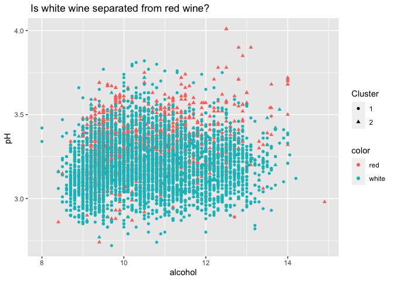

## 1) Clustering and PCA

We use the K-means to separate the red wine and white wine using 2
different chemicals(clusters).

## K-means Clustering

First, we use alcohol and pH chemicals and see if these two are enough
to separate red wine from white wine.

Looking at the cluster membership, it is indistinguishable.

Looking at the next plot, Alcohol and pH do not separate reds from white
wine.

Next, we use residual sugar and volatile acidity to separate red wine
from white wine.

This graph is the cluster membership between the residual sugar and
volatile acidity

This plot shows that residual sugar and volatile acidity are good
chemicals to separate the reds from the whites.

However, residual sugar and volatile acidity cannot distinguish the
quality of the wines.

## PCA

Next, we are running PCA.

First, we draw a table to look at the linear combinations that define
the principal components.

Importance of the PCs says that using 6 summary features gives us about
85% of overall variations.

<table>
<thead>
<tr>
<th style="text-align:left;">
</th>
<th style="text-align:right;">
PC1
</th>
<th style="text-align:right;">
PC2
</th>
<th style="text-align:right;">
PC3
</th>
<th style="text-align:right;">
PC4
</th>
<th style="text-align:right;">
PC5
</th>
<th style="text-align:right;">
PC6
</th>
</tr>
</thead>
<tbody>
<tr>
<td style="text-align:left;">
fixed.acidity
</td>
<td style="text-align:right;">
-0.2387989
</td>
<td style="text-align:right;">
0.3363545
</td>
<td style="text-align:right;">
-0.4343013
</td>
<td style="text-align:right;">
0.1643462
</td>
<td style="text-align:right;">
-0.1474804
</td>
<td style="text-align:right;">
-0.2045537
</td>
</tr>
<tr>
<td style="text-align:left;">
volatile.acidity
</td>
<td style="text-align:right;">
-0.3807575
</td>
<td style="text-align:right;">
0.1175497
</td>
<td style="text-align:right;">
0.3072594
</td>
<td style="text-align:right;">
0.2127849
</td>
<td style="text-align:right;">
0.1514560
</td>
<td style="text-align:right;">
-0.4921431
</td>
</tr>
<tr>
<td style="text-align:left;">
citric.acid
</td>
<td style="text-align:right;">
0.1523884
</td>
<td style="text-align:right;">
0.1832994
</td>
<td style="text-align:right;">
-0.5905697
</td>
<td style="text-align:right;">
-0.2643003
</td>
<td style="text-align:right;">
-0.1553487
</td>
<td style="text-align:right;">
0.2276338
</td>
</tr>
<tr>
<td style="text-align:left;">
residual.sugar
</td>
<td style="text-align:right;">
0.3459199
</td>
<td style="text-align:right;">
0.3299142
</td>
<td style="text-align:right;">
0.1646884
</td>
<td style="text-align:right;">
0.1674430
</td>
<td style="text-align:right;">
-0.3533619
</td>
<td style="text-align:right;">
-0.2334778
</td>
</tr>
<tr>
<td style="text-align:left;">
chlorides
</td>
<td style="text-align:right;">
-0.2901126
</td>
<td style="text-align:right;">
0.3152580
</td>
<td style="text-align:right;">
0.0166791
</td>
<td style="text-align:right;">
-0.2447439
</td>
<td style="text-align:right;">
0.6143911
</td>
<td style="text-align:right;">
0.1609764
</td>
</tr>
<tr>
<td style="text-align:left;">
free.sulfur.dioxide
</td>
<td style="text-align:right;">
0.4309140
</td>
<td style="text-align:right;">
0.0719326
</td>
<td style="text-align:right;">
0.1342239
</td>
<td style="text-align:right;">
-0.3572789
</td>
<td style="text-align:right;">
0.2235323
</td>
<td style="text-align:right;">
-0.3400514
</td>
</tr>
</tbody>
</table>

    ## Importance of first k=6 (out of 11) components:
    ##                           PC1    PC2    PC3     PC4     PC5     PC6
    ## Standard deviation     1.7407 1.5792 1.2475 0.98517 0.84845 0.77930
    ## Proportion of Variance 0.2754 0.2267 0.1415 0.08823 0.06544 0.05521
    ## Cumulative Proportion  0.2754 0.5021 0.6436 0.73187 0.79732 0.85253

Using score 1 and score 3, PCA does a good job of separating the reds
and the whites.

We use the same scores and test their power to distinguish the quality
of the wines. And we find that they again do a poor job of
distinguishing the quality of wines.

### Conclusion

We conclude that PCA does a better job of distinguishing the reds from
the whites. Part of it is because we do not have to pick two or more
clusters when using PCA; PCA picks the principal components for us.
However, both algorithms do not seem to be able to distinguish the
quality of the wines. In my opinion, the quality of the wines do not
depend on these chemicals.

## 2) Market segmentation

Method to be used is `K-means clustering`. With this method, we will be
able to detect interesting market segments that seem to be exceptional
within NutrientH20’s social-media audience.

Read the `social_marketing.csv` and let’s take a look for the 36
different categories
<table class=" lightable-minimal" style="font-family: &quot;Trebuchet MS&quot;, verdana, sans-serif; margin-left: auto; margin-right: auto;">
<caption>
36 different categories of interest
</caption>
<tbody>
<tr>
<td style="text-align:left;">
chatter
</td>
<td style="text-align:left;">
current\_events
</td>
<td style="text-align:left;">
travel
</td>
<td style="text-align:left;">
photo\_sharing
</td>
<td style="text-align:left;">
uncategorized
</td>
<td style="text-align:left;">
tv\_film
</td>
</tr>
<tr>
<td style="text-align:left;">
sports\_fandom
</td>
<td style="text-align:left;">
politics
</td>
<td style="text-align:left;">
food
</td>
<td style="text-align:left;">
family
</td>
<td style="text-align:left;">
home\_and\_garden
</td>
<td style="text-align:left;">
music
</td>
</tr>
<tr>
<td style="text-align:left;">
news
</td>
<td style="text-align:left;">
online\_gaming
</td>
<td style="text-align:left;">
shopping
</td>
<td style="text-align:left;">
health\_nutrition
</td>
<td style="text-align:left;">
college\_uni
</td>
<td style="text-align:left;">
sports\_playing
</td>
</tr>
<tr>
<td style="text-align:left;">
cooking
</td>
<td style="text-align:left;">
eco
</td>
<td style="text-align:left;">
computers
</td>
<td style="text-align:left;">
business
</td>
<td style="text-align:left;">
outdoors
</td>
<td style="text-align:left;">
crafts
</td>
</tr>
<tr>
<td style="text-align:left;">
automotive
</td>
<td style="text-align:left;">
art
</td>
<td style="text-align:left;">
religion
</td>
<td style="text-align:left;">
beauty
</td>
<td style="text-align:left;">
parenting
</td>
<td style="text-align:left;">
dating
</td>
</tr>
<tr>
<td style="text-align:left;">
school
</td>
<td style="text-align:left;">
personal\_fitness
</td>
<td style="text-align:left;">
fashion
</td>
<td style="text-align:left;">
small\_business
</td>
<td style="text-align:left;">
spam
</td>
<td style="text-align:left;">
adult
</td>
</tr>
</tbody>
</table>

With K-means clustering, we can cluster these categories, for example,
“physical wellness” can be one cluster containing `personal_fitness`,
`health_nutrition`, `outdoors`.

As mentioned in the question, we can check there are categories like
`spam`, `adult`, `uncategorized`, and I will remove `spam` and `adult`
to clean our dataset.

After cleaning/centering/scaling the data, I will start with correlation
plot for k-means clustering, as correlation plot can visualize which
categories in the dataset are strongly correlated each other, and also
can identify which categories have similar scales.

As there’s so many variables, I will sort highest correlations.

<table class=" lightable-minimal" style="font-family: &quot;Trebuchet MS&quot;, verdana, sans-serif; margin-left: auto; margin-right: auto;">
<caption>
Highest correlation among categories
</caption>
<thead>
<tr>
<th style="text-align:left;">
Var1
</th>
<th style="text-align:left;">
Var2
</th>
<th style="text-align:right;">
Freq
</th>
</tr>
</thead>
<tbody>
<tr>
<td style="text-align:left;">
health\_nutrition
</td>
<td style="text-align:left;">
personal\_fitness
</td>
<td style="text-align:right;">
0.8099024
</td>
</tr>
<tr>
<td style="text-align:left;">
online\_gaming
</td>
<td style="text-align:left;">
college\_uni
</td>
<td style="text-align:right;">
0.7728393
</td>
</tr>
<tr>
<td style="text-align:left;">
cooking
</td>
<td style="text-align:left;">
fashion
</td>
<td style="text-align:right;">
0.7214027
</td>
</tr>
<tr>
<td style="text-align:left;">
cooking
</td>
<td style="text-align:left;">
beauty
</td>
<td style="text-align:right;">
0.6642389
</td>
</tr>
<tr>
<td style="text-align:left;">
travel
</td>
<td style="text-align:left;">
politics
</td>
<td style="text-align:right;">
0.6602100
</td>
</tr>
<tr>
<td style="text-align:left;">
religion
</td>
<td style="text-align:left;">
parenting
</td>
<td style="text-align:right;">
0.6555973
</td>
</tr>
<tr>
<td style="text-align:left;">
sports\_fandom
</td>
<td style="text-align:left;">
religion
</td>
<td style="text-align:right;">
0.6379748
</td>
</tr>
<tr>
<td style="text-align:left;">
beauty
</td>
<td style="text-align:left;">
fashion
</td>
<td style="text-align:right;">
0.6349739
</td>
</tr>
<tr>
<td style="text-align:left;">
health\_nutrition
</td>
<td style="text-align:left;">
outdoors
</td>
<td style="text-align:right;">
0.6082254
</td>
</tr>
<tr>
<td style="text-align:left;">
sports\_fandom
</td>
<td style="text-align:left;">
parenting
</td>
<td style="text-align:right;">
0.6077181
</td>
</tr>
<tr>
<td style="text-align:left;">
travel
</td>
<td style="text-align:left;">
computers
</td>
<td style="text-align:right;">
0.6029349
</td>
</tr>
</tbody>
</table>

As you can see, `health_nutrition` and `personal_fitness` has the
highest correlation and this is exactly what I thought would be in the
same cluster - “physical wellness”.

We’ve finished previewing for k-means clustering with correlation plot,
and we’ll start analyzing with k-means clustering.

### K-means clustering

First, will start from choosing optimal K, the amount of clusters. Below
is Elbow plot. Elbow plot used to determine the optimal number of
clustering. The plot displays within-cluster sum of squares(WSS) as a
function of the number of clusters.

10 seems to me to be the elbow point, so we’ll use 10 for k.

We can get surface-level information about market segments for
NutrientH20.

<table class="kable_wrapper lightable-minimal table" style="font-family: &quot;Trebuchet MS&quot;, verdana, sans-serif; margin-left: auto; margin-right: auto; width: auto !important; ">
<tbody>
<tr>
<td>
<table>
<thead>
<tr>
<th style="text-align:left;">
</th>
<th style="text-align:right;">
cluster1
</th>
</tr>
</thead>
<tbody>
<tr>
<td style="text-align:left;">
health\_nutrition
</td>
<td style="text-align:right;">
12.591270
</td>
</tr>
<tr>
<td style="text-align:left;">
personal\_fitness
</td>
<td style="text-align:right;">
6.661376
</td>
</tr>
<tr>
<td style="text-align:left;">
chatter
</td>
<td style="text-align:right;">
3.767196
</td>
</tr>
<tr>
<td style="text-align:left;">
cooking
</td>
<td style="text-align:right;">
3.414021
</td>
</tr>
<tr>
<td style="text-align:left;">
outdoors
</td>
<td style="text-align:right;">
2.903439
</td>
</tr>
</tbody>
</table>
</td>
<td>
<table>
<thead>
<tr>
<th style="text-align:left;">
</th>
<th style="text-align:right;">
cluster2
</th>
</tr>
</thead>
<tbody>
<tr>
<td style="text-align:left;">
cooking
</td>
<td style="text-align:right;">
11.788009
</td>
</tr>
<tr>
<td style="text-align:left;">
photo\_sharing
</td>
<td style="text-align:right;">
6.083512
</td>
</tr>
<tr>
<td style="text-align:left;">
fashion
</td>
<td style="text-align:right;">
5.995717
</td>
</tr>
<tr>
<td style="text-align:left;">
beauty
</td>
<td style="text-align:right;">
4.218415
</td>
</tr>
<tr>
<td style="text-align:left;">
chatter
</td>
<td style="text-align:right;">
4.194861
</td>
</tr>
</tbody>
</table>
</td>
<td>
<table>
<thead>
<tr>
<th style="text-align:left;">
</th>
<th style="text-align:right;">
cluster3
</th>
</tr>
</thead>
<tbody>
<tr>
<td style="text-align:left;">
dating
</td>
<td style="text-align:right;">
9.293814
</td>
</tr>
<tr>
<td style="text-align:left;">
chatter
</td>
<td style="text-align:right;">
7.963917
</td>
</tr>
<tr>
<td style="text-align:left;">
photo\_sharing
</td>
<td style="text-align:right;">
2.639175
</td>
</tr>
<tr>
<td style="text-align:left;">
fashion
</td>
<td style="text-align:right;">
2.505155
</td>
</tr>
<tr>
<td style="text-align:left;">
school
</td>
<td style="text-align:right;">
2.257732
</td>
</tr>
</tbody>
</table>
</td>
<td>
<table>
<thead>
<tr>
<th style="text-align:left;">
</th>
<th style="text-align:right;">
cluster4
</th>
</tr>
</thead>
<tbody>
<tr>
<td style="text-align:left;">
chatter
</td>
<td style="text-align:right;">
3.080133
</td>
</tr>
<tr>
<td style="text-align:left;">
photo\_sharing
</td>
<td style="text-align:right;">
1.548533
</td>
</tr>
<tr>
<td style="text-align:left;">
current\_events
</td>
<td style="text-align:right;">
1.264893
</td>
</tr>
<tr>
<td style="text-align:left;">
health\_nutrition
</td>
<td style="text-align:right;">
1.143030
</td>
</tr>
<tr>
<td style="text-align:left;">
travel
</td>
<td style="text-align:right;">
1.084971
</td>
</tr>
</tbody>
</table>
</td>
<td>
<table>
<thead>
<tr>
<th style="text-align:left;">
</th>
<th style="text-align:right;">
cluster5
</th>
</tr>
</thead>
<tbody>
<tr>
<td style="text-align:left;">
sports\_fandom
</td>
<td style="text-align:right;">
6.196347
</td>
</tr>
<tr>
<td style="text-align:left;">
religion
</td>
<td style="text-align:right;">
5.557078
</td>
</tr>
<tr>
<td style="text-align:left;">
food
</td>
<td style="text-align:right;">
4.727550
</td>
</tr>
<tr>
<td style="text-align:left;">
parenting
</td>
<td style="text-align:right;">
4.258752
</td>
</tr>
<tr>
<td style="text-align:left;">
chatter
</td>
<td style="text-align:right;">
3.849315
</td>
</tr>
</tbody>
</table>
</td>
<td>
<table>
<thead>
<tr>
<th style="text-align:left;">
</th>
<th style="text-align:right;">
cluster6
</th>
</tr>
</thead>
<tbody>
<tr>
<td style="text-align:left;">
college\_uni
</td>
<td style="text-align:right;">
11.098870
</td>
</tr>
<tr>
<td style="text-align:left;">
online\_gaming
</td>
<td style="text-align:right;">
10.850283
</td>
</tr>
<tr>
<td style="text-align:left;">
chatter
</td>
<td style="text-align:right;">
4.096045
</td>
</tr>
<tr>
<td style="text-align:left;">
sports\_playing
</td>
<td style="text-align:right;">
2.745763
</td>
</tr>
<tr>
<td style="text-align:left;">
photo\_sharing
</td>
<td style="text-align:right;">
2.655367
</td>
</tr>
</tbody>
</table>
</td>
<td>
<table>
<thead>
<tr>
<th style="text-align:left;">
</th>
<th style="text-align:right;">
cluster7
</th>
</tr>
</thead>
<tbody>
<tr>
<td style="text-align:left;">
news
</td>
<td style="text-align:right;">
6.825059
</td>
</tr>
<tr>
<td style="text-align:left;">
politics
</td>
<td style="text-align:right;">
5.517730
</td>
</tr>
<tr>
<td style="text-align:left;">
automotive
</td>
<td style="text-align:right;">
4.392435
</td>
</tr>
<tr>
<td style="text-align:left;">
chatter
</td>
<td style="text-align:right;">
4.115839
</td>
</tr>
<tr>
<td style="text-align:left;">
sports\_fandom
</td>
<td style="text-align:right;">
3.061466
</td>
</tr>
</tbody>
</table>
</td>
<td>
<table>
<thead>
<tr>
<th style="text-align:left;">
</th>
<th style="text-align:right;">
cluster8
</th>
</tr>
</thead>
<tbody>
<tr>
<td style="text-align:left;">
chatter
</td>
<td style="text-align:right;">
9.731328
</td>
</tr>
<tr>
<td style="text-align:left;">
photo\_sharing
</td>
<td style="text-align:right;">
5.963693
</td>
</tr>
<tr>
<td style="text-align:left;">
shopping
</td>
<td style="text-align:right;">
4.120332
</td>
</tr>
<tr>
<td style="text-align:left;">
current\_events
</td>
<td style="text-align:right;">
1.992739
</td>
</tr>
<tr>
<td style="text-align:left;">
health\_nutrition
</td>
<td style="text-align:right;">
1.600622
</td>
</tr>
</tbody>
</table>
</td>
<td>
<table>
<thead>
<tr>
<th style="text-align:left;">
</th>
<th style="text-align:right;">
cluster9
</th>
</tr>
</thead>
<tbody>
<tr>
<td style="text-align:left;">
politics
</td>
<td style="text-align:right;">
11.267241
</td>
</tr>
<tr>
<td style="text-align:left;">
travel
</td>
<td style="text-align:right;">
9.103448
</td>
</tr>
<tr>
<td style="text-align:left;">
computers
</td>
<td style="text-align:right;">
4.100575
</td>
</tr>
<tr>
<td style="text-align:left;">
chatter
</td>
<td style="text-align:right;">
4.060345
</td>
</tr>
<tr>
<td style="text-align:left;">
news
</td>
<td style="text-align:right;">
3.617816
</td>
</tr>
</tbody>
</table>
</td>
<td>
<table>
<thead>
<tr>
<th style="text-align:left;">
</th>
<th style="text-align:right;">
cluster10
</th>
</tr>
</thead>
<tbody>
<tr>
<td style="text-align:left;">
tv\_film
</td>
<td style="text-align:right;">
5.597087
</td>
</tr>
<tr>
<td style="text-align:left;">
art
</td>
<td style="text-align:right;">
5.038835
</td>
</tr>
<tr>
<td style="text-align:left;">
chatter
</td>
<td style="text-align:right;">
3.929612
</td>
</tr>
<tr>
<td style="text-align:left;">
college\_uni
</td>
<td style="text-align:right;">
2.548544
</td>
</tr>
<tr>
<td style="text-align:left;">
photo\_sharing
</td>
<td style="text-align:right;">
2.453883
</td>
</tr>
</tbody>
</table>
</td>
</tr>
</tbody>
</table>
Above is the table for the highest five categories for each clusters in
total of 10 clusters. It appears that there are distinct groups of
categories in each clusters. Cluster with college\_uni, online\_gaming,
sports\_playing in top 5 categories will explain NutrientH20’s
social-media audience is male college students whose in their early 20s.
Cluster with news, politics, automotive, sports\_fandom in top 5
categories will explain NutrientH20’s social-media audience can be guys
in their 30s, 40s. Cluster with health\_nutrition, personal\_fitness,
outdoors in top 5 categories will explain NutrientH20’s social-media
audience is people interested in exercise and health. With this result,
NutrientH20 can do marketing through gyms, product advertisements in
men’s magazines, or selling products in college vending machines.

## 3) Association rules for grocery purchases

### Analysis

`groceries.txt` file contains a total of 9,835 unique shopping baskets.
We frst went through some data wrangling process before conducting
Market Basket Analysis using the “arules” package. As for the
thresholds, we chose support of .001, confidence of .5, and maxlen of
10. A relatively low support of .001 was chosen because we wanted to
capture as many items as possible from the dataset. Confidence of .5 was
chosen to sort out weak associations. Lastly, we limited the maximum
number of items per item set to be 10 to account for as many possible
grocery combinations as possible. Running the algorithm using the above
threshold resulted in 5,668 rules, which we thought was enough for this
analysis. Below are two plots showing the resulting rules; the first is
plotted between support and lift, while the second is between support
and confidence.

### Findings

Below is a table that shows the top ten rules with the highest
confidence. Confidence shows the probability of having item(s) on the
RHS given those on the LHS are purchased. You can see that out of the
top ten rules, the most frequent RHS items are `whole milk` and
`other vegetables`. However, the association rules here are not very
interesting nor revealing. Take
`{canned fish,hygiene articles} -> {whole milk}` as an example.
Intuitively, buying canned fish and hygiene articles doesn’t seem to
have anything to do with buying whole milk. However, this this is still
at the top of the list simply because whole milk gets bought the most
frequently when people go grocery shopping, regardless of what other
items they purchase. To see more relevant and revealing association
rules, let’s look at a list with the highest lift.

<table>
<caption>
Top 10 rules with the highest confidence
</caption>
<thead>
<tr>
<th style="text-align:left;">
LHS
</th>
<th style="text-align:left;">
RHS
</th>
<th style="text-align:right;">
support
</th>
<th style="text-align:right;">
confidence
</th>
<th style="text-align:right;">
coverage
</th>
<th style="text-align:right;">
lift
</th>
<th style="text-align:right;">
count
</th>
</tr>
</thead>
<tbody>
<tr>
<td style="text-align:left;">
{rice,sugar}
</td>
<td style="text-align:left;">
{whole milk}
</td>
<td style="text-align:right;">
0.0012200
</td>
<td style="text-align:right;">
1
</td>
<td style="text-align:right;">
0.0012200
</td>
<td style="text-align:right;">
3.914047
</td>
<td style="text-align:right;">
12
</td>
</tr>
<tr>
<td style="text-align:left;">
{canned fish,hygiene articles}
</td>
<td style="text-align:left;">
{whole milk}
</td>
<td style="text-align:right;">
0.0011183
</td>
<td style="text-align:right;">
1
</td>
<td style="text-align:right;">
0.0011183
</td>
<td style="text-align:right;">
3.914047
</td>
<td style="text-align:right;">
11
</td>
</tr>
<tr>
<td style="text-align:left;">
{butter,rice,root vegetables}
</td>
<td style="text-align:left;">
{whole milk}
</td>
<td style="text-align:right;">
0.0010167
</td>
<td style="text-align:right;">
1
</td>
<td style="text-align:right;">
0.0010167
</td>
<td style="text-align:right;">
3.914047
</td>
<td style="text-align:right;">
10
</td>
</tr>
<tr>
<td style="text-align:left;">
{flour,root vegetables,whipped/sour cream}
</td>
<td style="text-align:left;">
{whole milk}
</td>
<td style="text-align:right;">
0.0017283
</td>
<td style="text-align:right;">
1
</td>
<td style="text-align:right;">
0.0017283
</td>
<td style="text-align:right;">
3.914047
</td>
<td style="text-align:right;">
17
</td>
</tr>
<tr>
<td style="text-align:left;">
{butter,domestic eggs,soft cheese}
</td>
<td style="text-align:left;">
{whole milk}
</td>
<td style="text-align:right;">
0.0010167
</td>
<td style="text-align:right;">
1
</td>
<td style="text-align:right;">
0.0010167
</td>
<td style="text-align:right;">
3.914047
</td>
<td style="text-align:right;">
10
</td>
</tr>
<tr>
<td style="text-align:left;">
{citrus fruit,root vegetables,soft cheese}
</td>
<td style="text-align:left;">
{other vegetables}
</td>
<td style="text-align:right;">
0.0010167
</td>
<td style="text-align:right;">
1
</td>
<td style="text-align:right;">
0.0010167
</td>
<td style="text-align:right;">
5.168681
</td>
<td style="text-align:right;">
10
</td>
</tr>
<tr>
<td style="text-align:left;">
{butter,hygiene articles,pip fruit}
</td>
<td style="text-align:left;">
{whole milk}
</td>
<td style="text-align:right;">
0.0010167
</td>
<td style="text-align:right;">
1
</td>
<td style="text-align:right;">
0.0010167
</td>
<td style="text-align:right;">
3.914047
</td>
<td style="text-align:right;">
10
</td>
</tr>
<tr>
<td style="text-align:left;">
{hygiene articles,root vegetables,whipped/sour cream}
</td>
<td style="text-align:left;">
{whole milk}
</td>
<td style="text-align:right;">
0.0010167
</td>
<td style="text-align:right;">
1
</td>
<td style="text-align:right;">
0.0010167
</td>
<td style="text-align:right;">
3.914047
</td>
<td style="text-align:right;">
10
</td>
</tr>
<tr>
<td style="text-align:left;">
{hygiene articles,pip fruit,root vegetables}
</td>
<td style="text-align:left;">
{whole milk}
</td>
<td style="text-align:right;">
0.0010167
</td>
<td style="text-align:right;">
1
</td>
<td style="text-align:right;">
0.0010167
</td>
<td style="text-align:right;">
3.914047
</td>
<td style="text-align:right;">
10
</td>
</tr>
<tr>
<td style="text-align:left;">
{cream cheese ,domestic eggs,sugar}
</td>
<td style="text-align:left;">
{whole milk}
</td>
<td style="text-align:right;">
0.0011183
</td>
<td style="text-align:right;">
1
</td>
<td style="text-align:right;">
0.0011183
</td>
<td style="text-align:right;">
3.914047
</td>
<td style="text-align:right;">
11
</td>
</tr>
</tbody>
</table>

Below is a table showing the top ten rules with the highest lift. Lift
is different from confidence in that it is the ratio between confidence
and expected confidence. In other words, lift measures the relative
strength of association between LHS and RHS. It takes care of the high
frequency issue of whole milk purchase we observed above. Lift &gt; 1
indicates that the association rule improves the chances of outcome,
where as lift &lt; 1 reveals that the model lowers the chance of the
outcome. Lift = 1 does not have any effect on the outcome. The result
here is much more interesting and informative.

`{popcorn,soda} -> {salty snack}` Here, it seems like people are getting
ready for a movie night. People who buy popcorn and soda are likely to
buy other salty snacks. Thus, the model makes sense.

`{ham,processed cheese} -> {white bread}`These are ingredients to make a
quick sandwich. People who buy ham and processed cheese are likely to
buy white bread to make a sandwich. Hence, the rule makes sense again.

<table>
<caption>
Top 10 rules with the highest lift
</caption>
<thead>
<tr>
<th style="text-align:left;">
LHS
</th>
<th style="text-align:left;">
RHS
</th>
<th style="text-align:right;">
support
</th>
<th style="text-align:right;">
confidence
</th>
<th style="text-align:right;">
coverage
</th>
<th style="text-align:right;">
lift
</th>
<th style="text-align:right;">
count
</th>
</tr>
</thead>
<tbody>
<tr>
<td style="text-align:left;">
{Instant food products,soda}
</td>
<td style="text-align:left;">
{hamburger meat}
</td>
<td style="text-align:right;">
0.0012200
</td>
<td style="text-align:right;">
0.6315789
</td>
<td style="text-align:right;">
0.0019317
</td>
<td style="text-align:right;">
18.99759
</td>
<td style="text-align:right;">
12
</td>
</tr>
<tr>
<td style="text-align:left;">
{popcorn,soda}
</td>
<td style="text-align:left;">
{salty snack}
</td>
<td style="text-align:right;">
0.0012200
</td>
<td style="text-align:right;">
0.6315789
</td>
<td style="text-align:right;">
0.0019317
</td>
<td style="text-align:right;">
16.69949
</td>
<td style="text-align:right;">
12
</td>
</tr>
<tr>
<td style="text-align:left;">
{baking powder,flour}
</td>
<td style="text-align:left;">
{sugar}
</td>
<td style="text-align:right;">
0.0010167
</td>
<td style="text-align:right;">
0.5555556
</td>
<td style="text-align:right;">
0.0018300
</td>
<td style="text-align:right;">
16.40974
</td>
<td style="text-align:right;">
10
</td>
</tr>
<tr>
<td style="text-align:left;">
{ham,processed cheese}
</td>
<td style="text-align:left;">
{white bread}
</td>
<td style="text-align:right;">
0.0019317
</td>
<td style="text-align:right;">
0.6333333
</td>
<td style="text-align:right;">
0.0030500
</td>
<td style="text-align:right;">
15.04702
</td>
<td style="text-align:right;">
19
</td>
</tr>
<tr>
<td style="text-align:left;">
{Instant food products,whole milk}
</td>
<td style="text-align:left;">
{hamburger meat}
</td>
<td style="text-align:right;">
0.0015250
</td>
<td style="text-align:right;">
0.5000000
</td>
<td style="text-align:right;">
0.0030500
</td>
<td style="text-align:right;">
15.03976
</td>
<td style="text-align:right;">
15
</td>
</tr>
<tr>
<td style="text-align:left;">
{curd,other vegetables,whipped/sour cream,yogurt}
</td>
<td style="text-align:left;">
{cream cheese }
</td>
<td style="text-align:right;">
0.0010167
</td>
<td style="text-align:right;">
0.5882353
</td>
<td style="text-align:right;">
0.0017283
</td>
<td style="text-align:right;">
14.83560
</td>
<td style="text-align:right;">
10
</td>
</tr>
<tr>
<td style="text-align:left;">
{domestic eggs,processed cheese}
</td>
<td style="text-align:left;">
{white bread}
</td>
<td style="text-align:right;">
0.0011183
</td>
<td style="text-align:right;">
0.5238095
</td>
<td style="text-align:right;">
0.0021350
</td>
<td style="text-align:right;">
12.44490
</td>
<td style="text-align:right;">
11
</td>
</tr>
<tr>
<td style="text-align:left;">
{other vegetables,tropical fruit,white bread,yogurt}
</td>
<td style="text-align:left;">
{butter}
</td>
<td style="text-align:right;">
0.0010167
</td>
<td style="text-align:right;">
0.6666667
</td>
<td style="text-align:right;">
0.0015250
</td>
<td style="text-align:right;">
12.03180
</td>
<td style="text-align:right;">
10
</td>
</tr>
<tr>
<td style="text-align:left;">
{hamburger meat,whipped/sour cream,yogurt}
</td>
<td style="text-align:left;">
{butter}
</td>
<td style="text-align:right;">
0.0010167
</td>
<td style="text-align:right;">
0.6250000
</td>
<td style="text-align:right;">
0.0016267
</td>
<td style="text-align:right;">
11.27982
</td>
<td style="text-align:right;">
10
</td>
</tr>
<tr>
<td style="text-align:left;">
{domestic eggs,other vegetables,tropical fruit,whole milk,yogurt}
</td>
<td style="text-align:left;">
{butter}
</td>
<td style="text-align:right;">
0.0010167
</td>
<td style="text-align:right;">
0.6250000
</td>
<td style="text-align:right;">
0.0016267
</td>
<td style="text-align:right;">
11.27982
</td>
<td style="text-align:right;">
10
</td>
</tr>
</tbody>
</table>

The last plot is a graph-visualization representing the association
rules. Each item in the LHS is connected with to the RHS item, and the
arrows indicate the direction of the relationship. To avoid over-crowded
plot, we have limited to rules with lift &gt; 10. As such, one can see
many of the rules from above table with the highest lift visualized.

