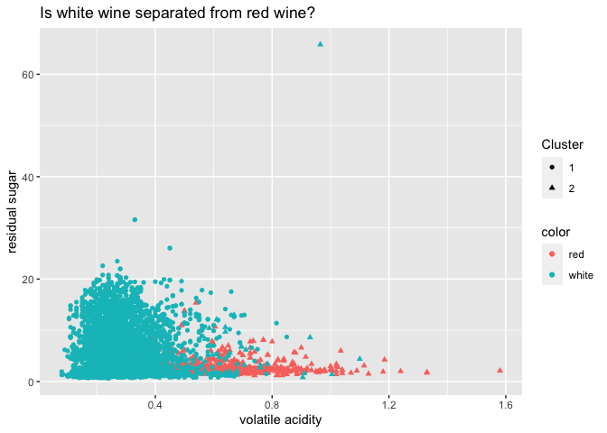

## 1) Clustering and PCA

## K-means Clustering

    ##  fixed.acidity    volatile.acidity  citric.acid     residual.sugar  
    ##  Min.   : 3.800   Min.   :0.0800   Min.   :0.0000   Min.   : 0.600  
    ##  1st Qu.: 6.400   1st Qu.:0.2300   1st Qu.:0.2500   1st Qu.: 1.800  
    ##  Median : 7.000   Median :0.2900   Median :0.3100   Median : 3.000  
    ##  Mean   : 7.215   Mean   :0.3397   Mean   :0.3186   Mean   : 5.443  
    ##  3rd Qu.: 7.700   3rd Qu.:0.4000   3rd Qu.:0.3900   3rd Qu.: 8.100  
    ##  Max.   :15.900   Max.   :1.5800   Max.   :1.6600   Max.   :65.800  
    ##    chlorides       free.sulfur.dioxide total.sulfur.dioxide    density      
    ##  Min.   :0.00900   Min.   :  1.00      Min.   :  6.0        Min.   :0.9871  
    ##  1st Qu.:0.03800   1st Qu.: 17.00      1st Qu.: 77.0        1st Qu.:0.9923  
    ##  Median :0.04700   Median : 29.00      Median :118.0        Median :0.9949  
    ##  Mean   :0.05603   Mean   : 30.53      Mean   :115.7        Mean   :0.9947  
    ##  3rd Qu.:0.06500   3rd Qu.: 41.00      3rd Qu.:156.0        3rd Qu.:0.9970  
    ##  Max.   :0.61100   Max.   :289.00      Max.   :440.0        Max.   :1.0390  
    ##        pH          sulphates         alcohol         quality     
    ##  Min.   :2.720   Min.   :0.2200   Min.   : 8.00   Min.   :3.000  
    ##  1st Qu.:3.110   1st Qu.:0.4300   1st Qu.: 9.50   1st Qu.:5.000  
    ##  Median :3.210   Median :0.5100   Median :10.30   Median :6.000  
    ##  Mean   :3.219   Mean   :0.5313   Mean   :10.49   Mean   :5.818  
    ##  3rd Qu.:3.320   3rd Qu.:0.6000   3rd Qu.:11.30   3rd Qu.:6.000  
    ##  Max.   :4.010   Max.   :2.0000   Max.   :14.90   Max.   :9.000  
    ##     color          
    ##  Length:6497       
    ##  Class :character  
    ##  Mode  :character  
    ##                    
    ##                    
    ## 

## PCA

<table>
<thead>
<tr>
<th style="text-align:left;">
</th>
<th style="text-align:right;">
PC1
</th>
<th style="text-align:right;">
PC2
</th>
<th style="text-align:right;">
PC3
</th>
<th style="text-align:right;">
PC4
</th>
<th style="text-align:right;">
PC5
</th>
<th style="text-align:right;">
PC6
</th>
</tr>
</thead>
<tbody>
<tr>
<td style="text-align:left;">
fixed.acidity
</td>
<td style="text-align:right;">
-0.2387989
</td>
<td style="text-align:right;">
0.3363545
</td>
<td style="text-align:right;">
-0.4343013
</td>
<td style="text-align:right;">
0.1643462
</td>
<td style="text-align:right;">
-0.1474804
</td>
<td style="text-align:right;">
-0.2045537
</td>
</tr>
<tr>
<td style="text-align:left;">
volatile.acidity
</td>
<td style="text-align:right;">
-0.3807575
</td>
<td style="text-align:right;">
0.1175497
</td>
<td style="text-align:right;">
0.3072594
</td>
<td style="text-align:right;">
0.2127849
</td>
<td style="text-align:right;">
0.1514560
</td>
<td style="text-align:right;">
-0.4921431
</td>
</tr>
<tr>
<td style="text-align:left;">
citric.acid
</td>
<td style="text-align:right;">
0.1523884
</td>
<td style="text-align:right;">
0.1832994
</td>
<td style="text-align:right;">
-0.5905697
</td>
<td style="text-align:right;">
-0.2643003
</td>
<td style="text-align:right;">
-0.1553487
</td>
<td style="text-align:right;">
0.2276338
</td>
</tr>
<tr>
<td style="text-align:left;">
residual.sugar
</td>
<td style="text-align:right;">
0.3459199
</td>
<td style="text-align:right;">
0.3299142
</td>
<td style="text-align:right;">
0.1646884
</td>
<td style="text-align:right;">
0.1674430
</td>
<td style="text-align:right;">
-0.3533619
</td>
<td style="text-align:right;">
-0.2334778
</td>
</tr>
<tr>
<td style="text-align:left;">
chlorides
</td>
<td style="text-align:right;">
-0.2901126
</td>
<td style="text-align:right;">
0.3152580
</td>
<td style="text-align:right;">
0.0166791
</td>
<td style="text-align:right;">
-0.2447439
</td>
<td style="text-align:right;">
0.6143911
</td>
<td style="text-align:right;">
0.1609764
</td>
</tr>
<tr>
<td style="text-align:left;">
free.sulfur.dioxide
</td>
<td style="text-align:right;">
0.4309140
</td>
<td style="text-align:right;">
0.0719326
</td>
<td style="text-align:right;">
0.1342239
</td>
<td style="text-align:right;">
-0.3572789
</td>
<td style="text-align:right;">
0.2235323
</td>
<td style="text-align:right;">
-0.3400514
</td>
</tr>
</tbody>
</table>

    ## Importance of first k=6 (out of 11) components:
    ##                           PC1    PC2    PC3     PC4     PC5     PC6
    ## Standard deviation     1.7407 1.5792 1.2475 0.98517 0.84845 0.77930
    ## Proportion of Variance 0.2754 0.2267 0.1415 0.08823 0.06544 0.05521
    ## Cumulative Proportion  0.2754 0.5021 0.6436 0.73187 0.79732 0.85253

## 2) Market segmentation

Method to be used is `K-means clustering`. With this method, we will be
able to detect interesting market segments that seem to be exceptional
within NutrientH20’s social-media audience.

Read the `social_marketing.csv` and let’s take a look for the 36
different categories
<table class=" lightable-minimal" style="font-family: &quot;Trebuchet MS&quot;, verdana, sans-serif; margin-left: auto; margin-right: auto;">
<caption>
36 different categories of interest
</caption>
<tbody>
<tr>
<td style="text-align:left;">
chatter
</td>
<td style="text-align:left;">
current\_events
</td>
<td style="text-align:left;">
travel
</td>
<td style="text-align:left;">
photo\_sharing
</td>
<td style="text-align:left;">
uncategorized
</td>
<td style="text-align:left;">
tv\_film
</td>
</tr>
<tr>
<td style="text-align:left;">
sports\_fandom
</td>
<td style="text-align:left;">
politics
</td>
<td style="text-align:left;">
food
</td>
<td style="text-align:left;">
family
</td>
<td style="text-align:left;">
home\_and\_garden
</td>
<td style="text-align:left;">
music
</td>
</tr>
<tr>
<td style="text-align:left;">
news
</td>
<td style="text-align:left;">
online\_gaming
</td>
<td style="text-align:left;">
shopping
</td>
<td style="text-align:left;">
health\_nutrition
</td>
<td style="text-align:left;">
college\_uni
</td>
<td style="text-align:left;">
sports\_playing
</td>
</tr>
<tr>
<td style="text-align:left;">
cooking
</td>
<td style="text-align:left;">
eco
</td>
<td style="text-align:left;">
computers
</td>
<td style="text-align:left;">
business
</td>
<td style="text-align:left;">
outdoors
</td>
<td style="text-align:left;">
crafts
</td>
</tr>
<tr>
<td style="text-align:left;">
automotive
</td>
<td style="text-align:left;">
art
</td>
<td style="text-align:left;">
religion
</td>
<td style="text-align:left;">
beauty
</td>
<td style="text-align:left;">
parenting
</td>
<td style="text-align:left;">
dating
</td>
</tr>
<tr>
<td style="text-align:left;">
school
</td>
<td style="text-align:left;">
personal\_fitness
</td>
<td style="text-align:left;">
fashion
</td>
<td style="text-align:left;">
small\_business
</td>
<td style="text-align:left;">
spam
</td>
<td style="text-align:left;">
adult
</td>
</tr>
</tbody>
</table>

With K-means clustering, we can cluster these categories, for example,
“physical wellness” can be one cluster containing `personal_fitness`,
`health_nutrition`, `outdoors`.

As mentioned in the question, we can check there are categories like
`spam`, `adult`, `uncategorized`, and I will remove `spam` and `adult`
to clean our dataset.

    # drop first column, which user has labeled as random 9-digit code
    X=data[,-1]
    # drop spam and adult column which slip through the data
    X=X[,-(35:36)]
    # center and scale
    X=scale(X, center=TRUE, scale=TRUE)
    # Extract the centers and scales from the rescaled data (which are named attributes)
    mu = attr(X,"scaled:center")
    sigma = attr(X,"scaled:scale")

After cleaning/centering/scaling the data, I will start with correlation
plot for k-means clustering, as correlation plot can visualize which
categories in the dataset are strongly correlated each other, and also
can identify which categories have similar scales.

As there’s so many variables, I will sort highest correlations.

<table class=" lightable-minimal" style="font-family: &quot;Trebuchet MS&quot;, verdana, sans-serif; margin-left: auto; margin-right: auto;">
<caption>
Highest correlation among categories
</caption>
<thead>
<tr>
<th style="text-align:left;">
Var1
</th>
<th style="text-align:left;">
Var2
</th>
<th style="text-align:right;">
Freq
</th>
</tr>
</thead>
<tbody>
<tr>
<td style="text-align:left;">
health\_nutrition
</td>
<td style="text-align:left;">
personal\_fitness
</td>
<td style="text-align:right;">
0.8099024
</td>
</tr>
<tr>
<td style="text-align:left;">
online\_gaming
</td>
<td style="text-align:left;">
college\_uni
</td>
<td style="text-align:right;">
0.7728393
</td>
</tr>
<tr>
<td style="text-align:left;">
cooking
</td>
<td style="text-align:left;">
fashion
</td>
<td style="text-align:right;">
0.7214027
</td>
</tr>
<tr>
<td style="text-align:left;">
cooking
</td>
<td style="text-align:left;">
beauty
</td>
<td style="text-align:right;">
0.6642389
</td>
</tr>
<tr>
<td style="text-align:left;">
travel
</td>
<td style="text-align:left;">
politics
</td>
<td style="text-align:right;">
0.6602100
</td>
</tr>
<tr>
<td style="text-align:left;">
religion
</td>
<td style="text-align:left;">
parenting
</td>
<td style="text-align:right;">
0.6555973
</td>
</tr>
<tr>
<td style="text-align:left;">
sports\_fandom
</td>
<td style="text-align:left;">
religion
</td>
<td style="text-align:right;">
0.6379748
</td>
</tr>
<tr>
<td style="text-align:left;">
beauty
</td>
<td style="text-align:left;">
fashion
</td>
<td style="text-align:right;">
0.6349739
</td>
</tr>
<tr>
<td style="text-align:left;">
health\_nutrition
</td>
<td style="text-align:left;">
outdoors
</td>
<td style="text-align:right;">
0.6082254
</td>
</tr>
<tr>
<td style="text-align:left;">
sports\_fandom
</td>
<td style="text-align:left;">
parenting
</td>
<td style="text-align:right;">
0.6077181
</td>
</tr>
<tr>
<td style="text-align:left;">
travel
</td>
<td style="text-align:left;">
computers
</td>
<td style="text-align:right;">
0.6029349
</td>
</tr>
</tbody>
</table>

As you can see, `health_nutrition` and `personal_fitness` has the
highest correlation and this is exactly what I thought would be in the
same cluster - “physical wellness”.

We’ve finished previewing for k-means clustering with correlation plot,
and we’ll start analyzing with k-means clustering.

### K-means clustering

First, will start from choosing optimal K, the amount of clusters. Below
is Elbow plot. Elbow plot used to determine the optimal number of
clustering. The plot displays within-cluster sum of squares(WSS) as a
function of the number of clusters.

10 seems to me to be the elbow point, so we’ll use 10 for k.

We can get surface-level information about market segments for
NutrientH20.

<table class="kable_wrapper lightable-minimal table" style="font-family: &quot;Trebuchet MS&quot;, verdana, sans-serif; margin-left: auto; margin-right: auto; width: auto !important; ">
<tbody>
<tr>
<td>
<table>
<thead>
<tr>
<th style="text-align:left;">
</th>
<th style="text-align:right;">
cluster1
</th>
</tr>
</thead>
<tbody>
<tr>
<td style="text-align:left;">
chatter
</td>
<td style="text-align:right;">
9.731328
</td>
</tr>
<tr>
<td style="text-align:left;">
photo\_sharing
</td>
<td style="text-align:right;">
5.963693
</td>
</tr>
<tr>
<td style="text-align:left;">
shopping
</td>
<td style="text-align:right;">
4.120332
</td>
</tr>
<tr>
<td style="text-align:left;">
current\_events
</td>
<td style="text-align:right;">
1.992739
</td>
</tr>
<tr>
<td style="text-align:left;">
health\_nutrition
</td>
<td style="text-align:right;">
1.600622
</td>
</tr>
</tbody>
</table>
</td>
<td>
<table>
<thead>
<tr>
<th style="text-align:left;">
</th>
<th style="text-align:right;">
cluster2
</th>
</tr>
</thead>
<tbody>
<tr>
<td style="text-align:left;">
sports\_fandom
</td>
<td style="text-align:right;">
6.196347
</td>
</tr>
<tr>
<td style="text-align:left;">
religion
</td>
<td style="text-align:right;">
5.557078
</td>
</tr>
<tr>
<td style="text-align:left;">
food
</td>
<td style="text-align:right;">
4.727550
</td>
</tr>
<tr>
<td style="text-align:left;">
parenting
</td>
<td style="text-align:right;">
4.258752
</td>
</tr>
<tr>
<td style="text-align:left;">
chatter
</td>
<td style="text-align:right;">
3.849315
</td>
</tr>
</tbody>
</table>
</td>
<td>
<table>
<thead>
<tr>
<th style="text-align:left;">
</th>
<th style="text-align:right;">
cluster3
</th>
</tr>
</thead>
<tbody>
<tr>
<td style="text-align:left;">
chatter
</td>
<td style="text-align:right;">
3.080133
</td>
</tr>
<tr>
<td style="text-align:left;">
photo\_sharing
</td>
<td style="text-align:right;">
1.548533
</td>
</tr>
<tr>
<td style="text-align:left;">
current\_events
</td>
<td style="text-align:right;">
1.264893
</td>
</tr>
<tr>
<td style="text-align:left;">
health\_nutrition
</td>
<td style="text-align:right;">
1.143030
</td>
</tr>
<tr>
<td style="text-align:left;">
travel
</td>
<td style="text-align:right;">
1.084971
</td>
</tr>
</tbody>
</table>
</td>
<td>
<table>
<thead>
<tr>
<th style="text-align:left;">
</th>
<th style="text-align:right;">
cluster4
</th>
</tr>
</thead>
<tbody>
<tr>
<td style="text-align:left;">
health\_nutrition
</td>
<td style="text-align:right;">
12.591270
</td>
</tr>
<tr>
<td style="text-align:left;">
personal\_fitness
</td>
<td style="text-align:right;">
6.661376
</td>
</tr>
<tr>
<td style="text-align:left;">
chatter
</td>
<td style="text-align:right;">
3.767196
</td>
</tr>
<tr>
<td style="text-align:left;">
cooking
</td>
<td style="text-align:right;">
3.414021
</td>
</tr>
<tr>
<td style="text-align:left;">
outdoors
</td>
<td style="text-align:right;">
2.903439
</td>
</tr>
</tbody>
</table>
</td>
<td>
<table>
<thead>
<tr>
<th style="text-align:left;">
</th>
<th style="text-align:right;">
cluster5
</th>
</tr>
</thead>
<tbody>
<tr>
<td style="text-align:left;">
dating
</td>
<td style="text-align:right;">
9.293814
</td>
</tr>
<tr>
<td style="text-align:left;">
chatter
</td>
<td style="text-align:right;">
7.963917
</td>
</tr>
<tr>
<td style="text-align:left;">
photo\_sharing
</td>
<td style="text-align:right;">
2.639175
</td>
</tr>
<tr>
<td style="text-align:left;">
fashion
</td>
<td style="text-align:right;">
2.505155
</td>
</tr>
<tr>
<td style="text-align:left;">
school
</td>
<td style="text-align:right;">
2.257732
</td>
</tr>
</tbody>
</table>
</td>
<td>
<table>
<thead>
<tr>
<th style="text-align:left;">
</th>
<th style="text-align:right;">
cluster6
</th>
</tr>
</thead>
<tbody>
<tr>
<td style="text-align:left;">
news
</td>
<td style="text-align:right;">
6.825059
</td>
</tr>
<tr>
<td style="text-align:left;">
politics
</td>
<td style="text-align:right;">
5.517730
</td>
</tr>
<tr>
<td style="text-align:left;">
automotive
</td>
<td style="text-align:right;">
4.392435
</td>
</tr>
<tr>
<td style="text-align:left;">
chatter
</td>
<td style="text-align:right;">
4.115839
</td>
</tr>
<tr>
<td style="text-align:left;">
sports\_fandom
</td>
<td style="text-align:right;">
3.061466
</td>
</tr>
</tbody>
</table>
</td>
<td>
<table>
<thead>
<tr>
<th style="text-align:left;">
</th>
<th style="text-align:right;">
cluster7
</th>
</tr>
</thead>
<tbody>
<tr>
<td style="text-align:left;">
tv\_film
</td>
<td style="text-align:right;">
5.597087
</td>
</tr>
<tr>
<td style="text-align:left;">
art
</td>
<td style="text-align:right;">
5.038835
</td>
</tr>
<tr>
<td style="text-align:left;">
chatter
</td>
<td style="text-align:right;">
3.929612
</td>
</tr>
<tr>
<td style="text-align:left;">
college\_uni
</td>
<td style="text-align:right;">
2.548544
</td>
</tr>
<tr>
<td style="text-align:left;">
photo\_sharing
</td>
<td style="text-align:right;">
2.453883
</td>
</tr>
</tbody>
</table>
</td>
<td>
<table>
<thead>
<tr>
<th style="text-align:left;">
</th>
<th style="text-align:right;">
cluster8
</th>
</tr>
</thead>
<tbody>
<tr>
<td style="text-align:left;">
college\_uni
</td>
<td style="text-align:right;">
11.098870
</td>
</tr>
<tr>
<td style="text-align:left;">
online\_gaming
</td>
<td style="text-align:right;">
10.850283
</td>
</tr>
<tr>
<td style="text-align:left;">
chatter
</td>
<td style="text-align:right;">
4.096045
</td>
</tr>
<tr>
<td style="text-align:left;">
sports\_playing
</td>
<td style="text-align:right;">
2.745763
</td>
</tr>
<tr>
<td style="text-align:left;">
photo\_sharing
</td>
<td style="text-align:right;">
2.655367
</td>
</tr>
</tbody>
</table>
</td>
<td>
<table>
<thead>
<tr>
<th style="text-align:left;">
</th>
<th style="text-align:right;">
cluster9
</th>
</tr>
</thead>
<tbody>
<tr>
<td style="text-align:left;">
politics
</td>
<td style="text-align:right;">
11.267241
</td>
</tr>
<tr>
<td style="text-align:left;">
travel
</td>
<td style="text-align:right;">
9.103448
</td>
</tr>
<tr>
<td style="text-align:left;">
computers
</td>
<td style="text-align:right;">
4.100575
</td>
</tr>
<tr>
<td style="text-align:left;">
chatter
</td>
<td style="text-align:right;">
4.060345
</td>
</tr>
<tr>
<td style="text-align:left;">
news
</td>
<td style="text-align:right;">
3.617816
</td>
</tr>
</tbody>
</table>
</td>
<td>
<table>
<thead>
<tr>
<th style="text-align:left;">
</th>
<th style="text-align:right;">
cluster10
</th>
</tr>
</thead>
<tbody>
<tr>
<td style="text-align:left;">
cooking
</td>
<td style="text-align:right;">
11.788009
</td>
</tr>
<tr>
<td style="text-align:left;">
photo\_sharing
</td>
<td style="text-align:right;">
6.083512
</td>
</tr>
<tr>
<td style="text-align:left;">
fashion
</td>
<td style="text-align:right;">
5.995717
</td>
</tr>
<tr>
<td style="text-align:left;">
beauty
</td>
<td style="text-align:right;">
4.218415
</td>
</tr>
<tr>
<td style="text-align:left;">
chatter
</td>
<td style="text-align:right;">
4.194861
</td>
</tr>
</tbody>
</table>
</td>
</tr>
</tbody>
</table>
## 3) Association rules for grocery purchases

### analysis

`groceries.txt` file contains a total of 9,835 unique shopping baskets.
We frst went through some data wrangling process before conducting
Market Basket Analysis using the “arules” package. As for the
thresholds, we chose support of .001, confidence of .5, and maxlen of
10. A relatively low support of .001 was chosen because we wanted to
capture as many items as possible from the dataset. Confidence of .5 was
chosen to sort out weak associations. Lastly, we limited the maximum
number of items per item set to be 10 to account for as many possible
grocery combinations as possible. Runinng the algorithym using the above
threshold resulted in 5,668 rules, which we thought was enough for this
analysis. Below are two plots showing the resulting rules; the first is
plotted between support and lift, while the second is between support
and confidence.

    ## Apriori
    ## 
    ## Parameter specification:
    ##  confidence minval smax arem  aval originalSupport maxtime support minlen
    ##         0.5    0.1    1 none FALSE            TRUE       5   0.001      1
    ##  maxlen target  ext
    ##      10  rules TRUE
    ## 
    ## Algorithmic control:
    ##  filter tree heap memopt load sort verbose
    ##     0.1 TRUE TRUE  FALSE TRUE    2    TRUE
    ## 
    ## Absolute minimum support count: 9 
    ## 
    ## set item appearances ...[0 item(s)] done [0.00s].
    ## set transactions ...[169 item(s), 9836 transaction(s)] done [0.00s].
    ## sorting and recoding items ... [157 item(s)] done [0.00s].
    ## creating transaction tree ... done [0.00s].
    ## checking subsets of size 1 2 3 4 5 6 done [0.01s].
    ## writing ... [5668 rule(s)] done [0.00s].
    ## creating S4 object  ... done [0.00s].

Below is a table that shows the top ten rules with the highest
confidence. Confidence shows the probability of having item(s) on the
RHS given those on the LHS are purchased. You can see that out of the
top ten rules, the most frequent RHS items are milk and other
vegetables. However, this does not reveal much about association. Take
`{canned fish,hygiene articles} -> {whole milk}` as an example.
Intuitively, buying canned fish and hygiene articles doesn’t seem to
have anything to do with buying whole milk. However, this this is still
at thoe top of the list simply because whole milk gets bought the most
frequently when people go grocery shopping, regardless of what other
items they purchase. To see more relevant association rules, let’s look
at a list with the highest lift.

<table>
<caption>
Top 10 rules with the highest confidence
</caption>
<thead>
<tr>
<th style="text-align:left;">
LHS
</th>
<th style="text-align:left;">
RHS
</th>
<th style="text-align:right;">
support
</th>
<th style="text-align:right;">
confidence
</th>
<th style="text-align:right;">
coverage
</th>
<th style="text-align:right;">
lift
</th>
<th style="text-align:right;">
count
</th>
</tr>
</thead>
<tbody>
<tr>
<td style="text-align:left;">
{rice,sugar}
</td>
<td style="text-align:left;">
{whole milk}
</td>
<td style="text-align:right;">
0.0012200
</td>
<td style="text-align:right;">
1
</td>
<td style="text-align:right;">
0.0012200
</td>
<td style="text-align:right;">
3.914047
</td>
<td style="text-align:right;">
12
</td>
</tr>
<tr>
<td style="text-align:left;">
{canned fish,hygiene articles}
</td>
<td style="text-align:left;">
{whole milk}
</td>
<td style="text-align:right;">
0.0011183
</td>
<td style="text-align:right;">
1
</td>
<td style="text-align:right;">
0.0011183
</td>
<td style="text-align:right;">
3.914047
</td>
<td style="text-align:right;">
11
</td>
</tr>
<tr>
<td style="text-align:left;">
{butter,rice,root vegetables}
</td>
<td style="text-align:left;">
{whole milk}
</td>
<td style="text-align:right;">
0.0010167
</td>
<td style="text-align:right;">
1
</td>
<td style="text-align:right;">
0.0010167
</td>
<td style="text-align:right;">
3.914047
</td>
<td style="text-align:right;">
10
</td>
</tr>
<tr>
<td style="text-align:left;">
{flour,root vegetables,whipped/sour cream}
</td>
<td style="text-align:left;">
{whole milk}
</td>
<td style="text-align:right;">
0.0017283
</td>
<td style="text-align:right;">
1
</td>
<td style="text-align:right;">
0.0017283
</td>
<td style="text-align:right;">
3.914047
</td>
<td style="text-align:right;">
17
</td>
</tr>
<tr>
<td style="text-align:left;">
{butter,domestic eggs,soft cheese}
</td>
<td style="text-align:left;">
{whole milk}
</td>
<td style="text-align:right;">
0.0010167
</td>
<td style="text-align:right;">
1
</td>
<td style="text-align:right;">
0.0010167
</td>
<td style="text-align:right;">
3.914047
</td>
<td style="text-align:right;">
10
</td>
</tr>
<tr>
<td style="text-align:left;">
{citrus fruit,root vegetables,soft cheese}
</td>
<td style="text-align:left;">
{other vegetables}
</td>
<td style="text-align:right;">
0.0010167
</td>
<td style="text-align:right;">
1
</td>
<td style="text-align:right;">
0.0010167
</td>
<td style="text-align:right;">
5.168681
</td>
<td style="text-align:right;">
10
</td>
</tr>
<tr>
<td style="text-align:left;">
{butter,hygiene articles,pip fruit}
</td>
<td style="text-align:left;">
{whole milk}
</td>
<td style="text-align:right;">
0.0010167
</td>
<td style="text-align:right;">
1
</td>
<td style="text-align:right;">
0.0010167
</td>
<td style="text-align:right;">
3.914047
</td>
<td style="text-align:right;">
10
</td>
</tr>
<tr>
<td style="text-align:left;">
{hygiene articles,root vegetables,whipped/sour cream}
</td>
<td style="text-align:left;">
{whole milk}
</td>
<td style="text-align:right;">
0.0010167
</td>
<td style="text-align:right;">
1
</td>
<td style="text-align:right;">
0.0010167
</td>
<td style="text-align:right;">
3.914047
</td>
<td style="text-align:right;">
10
</td>
</tr>
<tr>
<td style="text-align:left;">
{hygiene articles,pip fruit,root vegetables}
</td>
<td style="text-align:left;">
{whole milk}
</td>
<td style="text-align:right;">
0.0010167
</td>
<td style="text-align:right;">
1
</td>
<td style="text-align:right;">
0.0010167
</td>
<td style="text-align:right;">
3.914047
</td>
<td style="text-align:right;">
10
</td>
</tr>
<tr>
<td style="text-align:left;">
{cream cheese ,domestic eggs,sugar}
</td>
<td style="text-align:left;">
{whole milk}
</td>
<td style="text-align:right;">
0.0011183
</td>
<td style="text-align:right;">
1
</td>
<td style="text-align:right;">
0.0011183
</td>
<td style="text-align:right;">
3.914047
</td>
<td style="text-align:right;">
11
</td>
</tr>
</tbody>
</table>

Below is a table showing the top ten rules with the highest lift. Lift
is different from confidence in that it is the ratio between confidence
and expected confidence. In other words, lift measures the relative
strength of association between LHS and RHS. It takes care of the high
frequency issue of whole milk purchase we observed above. Lift &gt; 1
indicates that the association rule improves the chances of outcome,
where as lift &lt; 1 reveals that the model lowers the chance of the
outcome. Lift = 1 does not have any effect on the outcome. The result
here is much more interesting and informative.

`{popcorn,soda} -> {salty snack}` Here, it seems like people are getting
ready for a movie night. People who buy popcorn and soda are likely to
buy other salty snacks. Thus, the model makes sense.

`{ham,processed cheese} -> {white bread}`These are ingredients to make a
quick sandwich. Hence, the rule makes sense again.

<table>
<caption>
Top 10 rules with the highest lift
</caption>
<thead>
<tr>
<th style="text-align:left;">
LHS
</th>
<th style="text-align:left;">
RHS
</th>
<th style="text-align:right;">
support
</th>
<th style="text-align:right;">
confidence
</th>
<th style="text-align:right;">
coverage
</th>
<th style="text-align:right;">
lift
</th>
<th style="text-align:right;">
count
</th>
</tr>
</thead>
<tbody>
<tr>
<td style="text-align:left;">
{Instant food products,soda}
</td>
<td style="text-align:left;">
{hamburger meat}
</td>
<td style="text-align:right;">
0.0012200
</td>
<td style="text-align:right;">
0.6315789
</td>
<td style="text-align:right;">
0.0019317
</td>
<td style="text-align:right;">
18.99759
</td>
<td style="text-align:right;">
12
</td>
</tr>
<tr>
<td style="text-align:left;">
{popcorn,soda}
</td>
<td style="text-align:left;">
{salty snack}
</td>
<td style="text-align:right;">
0.0012200
</td>
<td style="text-align:right;">
0.6315789
</td>
<td style="text-align:right;">
0.0019317
</td>
<td style="text-align:right;">
16.69949
</td>
<td style="text-align:right;">
12
</td>
</tr>
<tr>
<td style="text-align:left;">
{baking powder,flour}
</td>
<td style="text-align:left;">
{sugar}
</td>
<td style="text-align:right;">
0.0010167
</td>
<td style="text-align:right;">
0.5555556
</td>
<td style="text-align:right;">
0.0018300
</td>
<td style="text-align:right;">
16.40974
</td>
<td style="text-align:right;">
10
</td>
</tr>
<tr>
<td style="text-align:left;">
{ham,processed cheese}
</td>
<td style="text-align:left;">
{white bread}
</td>
<td style="text-align:right;">
0.0019317
</td>
<td style="text-align:right;">
0.6333333
</td>
<td style="text-align:right;">
0.0030500
</td>
<td style="text-align:right;">
15.04702
</td>
<td style="text-align:right;">
19
</td>
</tr>
<tr>
<td style="text-align:left;">
{Instant food products,whole milk}
</td>
<td style="text-align:left;">
{hamburger meat}
</td>
<td style="text-align:right;">
0.0015250
</td>
<td style="text-align:right;">
0.5000000
</td>
<td style="text-align:right;">
0.0030500
</td>
<td style="text-align:right;">
15.03976
</td>
<td style="text-align:right;">
15
</td>
</tr>
<tr>
<td style="text-align:left;">
{curd,other vegetables,whipped/sour cream,yogurt}
</td>
<td style="text-align:left;">
{cream cheese }
</td>
<td style="text-align:right;">
0.0010167
</td>
<td style="text-align:right;">
0.5882353
</td>
<td style="text-align:right;">
0.0017283
</td>
<td style="text-align:right;">
14.83560
</td>
<td style="text-align:right;">
10
</td>
</tr>
<tr>
<td style="text-align:left;">
{domestic eggs,processed cheese}
</td>
<td style="text-align:left;">
{white bread}
</td>
<td style="text-align:right;">
0.0011183
</td>
<td style="text-align:right;">
0.5238095
</td>
<td style="text-align:right;">
0.0021350
</td>
<td style="text-align:right;">
12.44490
</td>
<td style="text-align:right;">
11
</td>
</tr>
<tr>
<td style="text-align:left;">
{other vegetables,tropical fruit,white bread,yogurt}
</td>
<td style="text-align:left;">
{butter}
</td>
<td style="text-align:right;">
0.0010167
</td>
<td style="text-align:right;">
0.6666667
</td>
<td style="text-align:right;">
0.0015250
</td>
<td style="text-align:right;">
12.03180
</td>
<td style="text-align:right;">
10
</td>
</tr>
<tr>
<td style="text-align:left;">
{hamburger meat,whipped/sour cream,yogurt}
</td>
<td style="text-align:left;">
{butter}
</td>
<td style="text-align:right;">
0.0010167
</td>
<td style="text-align:right;">
0.6250000
</td>
<td style="text-align:right;">
0.0016267
</td>
<td style="text-align:right;">
11.27982
</td>
<td style="text-align:right;">
10
</td>
</tr>
<tr>
<td style="text-align:left;">
{domestic eggs,other vegetables,tropical fruit,whole milk,yogurt}
</td>
<td style="text-align:left;">
{butter}
</td>
<td style="text-align:right;">
0.0010167
</td>
<td style="text-align:right;">
0.6250000
</td>
<td style="text-align:right;">
0.0016267
</td>
<td style="text-align:right;">
11.27982
</td>
<td style="text-align:right;">
10
</td>
</tr>
</tbody>
</table>

The last plot is a graph-visualization representing the association
rules. Each item in the LHS is connected with to the RHS item, and the
arrows indicate the direction of the relationship.

    #plot
    #saveAsGraph(subset, file = "groceriesrules.graphml")

    # graph-based visualization
    # export
    # associations are represented as edges
    # For rules, each item in the LHS is connected
    # with a directed edge to the item in the RHS. 
    groceries_graph = associations2igraph(subset)
    igraph::write_graph(groceries_graph, file='groceries.graphml', format = "graphml")

    grViz("groceries.graphml")

    ## PhantomJS not found. You can install it with webshot::install_phantomjs(). If it is installed, please make sure the phantomjs executable can be found via the PATH variable.

<script type="application/json" data-for="htmlwidget-89e91a9fa3f7d484a7c9">{"x":{"diagram":"<?xml version=\"1.0\" encoding=\"UTF-8\"?>\n<graphml xmlns=\"http://graphml.graphdrawing.org/xmlns\"\n         xmlns:xsi=\"http://www.w3.org/2001/XMLSchema-instance\"\n         xsi:schemaLocation=\"http://graphml.graphdrawing.org/xmlns\n         http://graphml.graphdrawing.org/xmlns/1.0/graphml.xsd\">\n<!-- Created by igraph -->\n  <key id=\"v_name\" for=\"node\" attr.name=\"name\" attr.type=\"string\"/>\n  <key id=\"v_label\" for=\"node\" attr.name=\"label\" attr.type=\"string\"/>\n  <key id=\"v_index\" for=\"node\" attr.name=\"index\" attr.type=\"double\"/>\n  <key id=\"v_type\" for=\"node\" attr.name=\"type\" attr.type=\"double\"/>\n  <key id=\"v_support\" for=\"node\" attr.name=\"support\" attr.type=\"double\"/>\n  <key id=\"v_confidence\" for=\"node\" attr.name=\"confidence\" attr.type=\"double\"/>\n  <key id=\"v_coverage\" for=\"node\" attr.name=\"coverage\" attr.type=\"double\"/>\n  <key id=\"v_lift\" for=\"node\" attr.name=\"lift\" attr.type=\"double\"/>\n  <key id=\"v_count\" for=\"node\" attr.name=\"count\" attr.type=\"double\"/>\n  <graph id=\"G\" edgedefault=\"directed\">\n    <node id=\"n0\">\n      <data key=\"v_name\">6<\/data>\n      <data key=\"v_label\">baking powder<\/data>\n      <data key=\"v_index\">6<\/data>\n      <data key=\"v_type\">1<\/data>\n      <data key=\"v_count\">-2147483648<\/data>\n    <\/node>\n    <node id=\"n1\">\n      <data key=\"v_name\">8<\/data>\n      <data key=\"v_label\">beef<\/data>\n      <data key=\"v_index\">8<\/data>\n      <data key=\"v_type\">1<\/data>\n      <data key=\"v_count\">-2147483648<\/data>\n    <\/node>\n    <node id=\"n2\">\n      <data key=\"v_name\">9<\/data>\n      <data key=\"v_label\">berries<\/data>\n      <data key=\"v_index\">9<\/data>\n      <data key=\"v_type\">1<\/data>\n      <data key=\"v_count\">-2147483648<\/data>\n    <\/node>\n    <node id=\"n3\">\n      <data key=\"v_name\">10<\/data>\n      <data key=\"v_label\">beverages<\/data>\n      <data key=\"v_index\">10<\/data>\n      <data key=\"v_type\">1<\/data>\n      <data key=\"v_count\">-2147483648<\/data>\n    <\/node>\n    <node id=\"n4\">\n      <data key=\"v_name\">11<\/data>\n      <data key=\"v_label\">bottled beer<\/data>\n      <data key=\"v_index\">11<\/data>\n      <data key=\"v_type\">1<\/data>\n      <data key=\"v_count\">-2147483648<\/data>\n    <\/node>\n    <node id=\"n5\">\n      <data key=\"v_name\">12<\/data>\n      <data key=\"v_label\">bottled water<\/data>\n      <data key=\"v_index\">12<\/data>\n      <data key=\"v_type\">1<\/data>\n      <data key=\"v_count\">-2147483648<\/data>\n    <\/node>\n    <node id=\"n6\">\n      <data key=\"v_name\">14<\/data>\n      <data key=\"v_label\">brown bread<\/data>\n      <data key=\"v_index\">14<\/data>\n      <data key=\"v_type\">1<\/data>\n      <data key=\"v_count\">-2147483648<\/data>\n    <\/node>\n    <node id=\"n7\">\n      <data key=\"v_name\">15<\/data>\n      <data key=\"v_label\">butter<\/data>\n      <data key=\"v_index\">15<\/data>\n      <data key=\"v_type\">1<\/data>\n      <data key=\"v_count\">-2147483648<\/data>\n    <\/node>\n    <node id=\"n8\">\n      <data key=\"v_name\">16<\/data>\n      <data key=\"v_label\">butter milk<\/data>\n      <data key=\"v_index\">16<\/data>\n      <data key=\"v_type\">1<\/data>\n      <data key=\"v_count\">-2147483648<\/data>\n    <\/node>\n    <node id=\"n9\">\n      <data key=\"v_name\">17<\/data>\n      <data key=\"v_label\">cake bar<\/data>\n      <data key=\"v_index\">17<\/data>\n      <data key=\"v_type\">1<\/data>\n      <data key=\"v_count\">-2147483648<\/data>\n    <\/node>\n    <node id=\"n10\">\n      <data key=\"v_name\">18<\/data>\n      <data key=\"v_label\">candles<\/data>\n      <data key=\"v_index\">18<\/data>\n      <data key=\"v_type\">1<\/data>\n      <data key=\"v_count\">-2147483648<\/data>\n    <\/node>\n    <node id=\"n11\">\n      <data key=\"v_name\">19<\/data>\n      <data key=\"v_label\">candy<\/data>\n      <data key=\"v_index\">19<\/data>\n      <data key=\"v_type\">1<\/data>\n      <data key=\"v_count\">-2147483648<\/data>\n    <\/node>\n    <node id=\"n12\">\n      <data key=\"v_name\">20<\/data>\n      <data key=\"v_label\">canned beer<\/data>\n      <data key=\"v_index\">20<\/data>\n      <data key=\"v_type\">1<\/data>\n      <data key=\"v_count\">-2147483648<\/data>\n    <\/node>\n    <node id=\"n13\">\n      <data key=\"v_name\">21<\/data>\n      <data key=\"v_label\">canned fish<\/data>\n      <data key=\"v_index\">21<\/data>\n      <data key=\"v_type\">1<\/data>\n      <data key=\"v_count\">-2147483648<\/data>\n    <\/node>\n    <node id=\"n14\">\n      <data key=\"v_name\">23<\/data>\n      <data key=\"v_label\">canned vegetables<\/data>\n      <data key=\"v_index\">23<\/data>\n      <data key=\"v_type\">1<\/data>\n      <data key=\"v_count\">-2147483648<\/data>\n    <\/node>\n    <node id=\"n15\">\n      <data key=\"v_name\">24<\/data>\n      <data key=\"v_label\">cat food<\/data>\n      <data key=\"v_index\">24<\/data>\n      <data key=\"v_type\">1<\/data>\n      <data key=\"v_count\">-2147483648<\/data>\n    <\/node>\n    <node id=\"n16\">\n      <data key=\"v_name\">25<\/data>\n      <data key=\"v_label\">cereals<\/data>\n      <data key=\"v_index\">25<\/data>\n      <data key=\"v_type\">1<\/data>\n      <data key=\"v_count\">-2147483648<\/data>\n    <\/node>\n    <node id=\"n17\">\n      <data key=\"v_name\">26<\/data>\n      <data key=\"v_label\">chewing gum<\/data>\n      <data key=\"v_index\">26<\/data>\n      <data key=\"v_type\">1<\/data>\n      <data key=\"v_count\">-2147483648<\/data>\n    <\/node>\n    <node id=\"n18\">\n      <data key=\"v_name\">27<\/data>\n      <data key=\"v_label\">chicken<\/data>\n      <data key=\"v_index\">27<\/data>\n      <data key=\"v_type\">1<\/data>\n      <data key=\"v_count\">-2147483648<\/data>\n    <\/node>\n    <node id=\"n19\">\n      <data key=\"v_name\">28<\/data>\n      <data key=\"v_label\">chocolate<\/data>\n      <data key=\"v_index\">28<\/data>\n      <data key=\"v_type\">1<\/data>\n      <data key=\"v_count\">-2147483648<\/data>\n    <\/node>\n    <node id=\"n20\">\n      <data key=\"v_name\">30<\/data>\n      <data key=\"v_label\">citrus fruit<\/data>\n      <data key=\"v_index\">30<\/data>\n      <data key=\"v_type\">1<\/data>\n      <data key=\"v_count\">-2147483648<\/data>\n    <\/node>\n    <node id=\"n21\">\n      <data key=\"v_name\">31<\/data>\n      <data key=\"v_label\">cleaner<\/data>\n      <data key=\"v_index\">31<\/data>\n      <data key=\"v_type\">1<\/data>\n      <data key=\"v_count\">-2147483648<\/data>\n    <\/node>\n    <node id=\"n22\">\n      <data key=\"v_name\">33<\/data>\n      <data key=\"v_label\">cocoa drinks<\/data>\n      <data key=\"v_index\">33<\/data>\n      <data key=\"v_type\">1<\/data>\n      <data key=\"v_count\">-2147483648<\/data>\n    <\/node>\n    <node id=\"n23\">\n      <data key=\"v_name\">34<\/data>\n      <data key=\"v_label\">coffee<\/data>\n      <data key=\"v_index\">34<\/data>\n      <data key=\"v_type\">1<\/data>\n      <data key=\"v_count\">-2147483648<\/data>\n    <\/node>\n    <node id=\"n24\">\n      <data key=\"v_name\">36<\/data>\n      <data key=\"v_label\">cooking chocolate<\/data>\n      <data key=\"v_index\">36<\/data>\n      <data key=\"v_type\">1<\/data>\n      <data key=\"v_count\">-2147483648<\/data>\n    <\/node>\n    <node id=\"n25\">\n      <data key=\"v_name\">39<\/data>\n      <data key=\"v_label\">cream cheese <\/data>\n      <data key=\"v_index\">39<\/data>\n      <data key=\"v_type\">1<\/data>\n      <data key=\"v_count\">-2147483648<\/data>\n    <\/node>\n    <node id=\"n26\">\n      <data key=\"v_name\">40<\/data>\n      <data key=\"v_label\">curd<\/data>\n      <data key=\"v_index\">40<\/data>\n      <data key=\"v_type\">1<\/data>\n      <data key=\"v_count\">-2147483648<\/data>\n    <\/node>\n    <node id=\"n27\">\n      <data key=\"v_name\">41<\/data>\n      <data key=\"v_label\">curd cheese<\/data>\n      <data key=\"v_index\">41<\/data>\n      <data key=\"v_type\">1<\/data>\n      <data key=\"v_count\">-2147483648<\/data>\n    <\/node>\n    <node id=\"n28\">\n      <data key=\"v_name\">44<\/data>\n      <data key=\"v_label\">dessert<\/data>\n      <data key=\"v_index\">44<\/data>\n      <data key=\"v_type\">1<\/data>\n      <data key=\"v_count\">-2147483648<\/data>\n    <\/node>\n    <node id=\"n29\">\n      <data key=\"v_name\">45<\/data>\n      <data key=\"v_label\">detergent<\/data>\n      <data key=\"v_index\">45<\/data>\n      <data key=\"v_type\">1<\/data>\n      <data key=\"v_count\">-2147483648<\/data>\n    <\/node>\n    <node id=\"n30\">\n      <data key=\"v_name\">46<\/data>\n      <data key=\"v_label\">dish cleaner<\/data>\n      <data key=\"v_index\">46<\/data>\n      <data key=\"v_type\">1<\/data>\n      <data key=\"v_count\">-2147483648<\/data>\n    <\/node>\n    <node id=\"n31\">\n      <data key=\"v_name\">47<\/data>\n      <data key=\"v_label\">dishes<\/data>\n      <data key=\"v_index\">47<\/data>\n      <data key=\"v_type\">1<\/data>\n      <data key=\"v_count\">-2147483648<\/data>\n    <\/node>\n    <node id=\"n32\">\n      <data key=\"v_name\">48<\/data>\n      <data key=\"v_label\">dog food<\/data>\n      <data key=\"v_index\">48<\/data>\n      <data key=\"v_type\">1<\/data>\n      <data key=\"v_count\">-2147483648<\/data>\n    <\/node>\n    <node id=\"n33\">\n      <data key=\"v_name\">49<\/data>\n      <data key=\"v_label\">domestic eggs<\/data>\n      <data key=\"v_index\">49<\/data>\n      <data key=\"v_type\">1<\/data>\n      <data key=\"v_count\">-2147483648<\/data>\n    <\/node>\n    <node id=\"n34\">\n      <data key=\"v_name\">53<\/data>\n      <data key=\"v_label\">flour<\/data>\n      <data key=\"v_index\">53<\/data>\n      <data key=\"v_type\">1<\/data>\n      <data key=\"v_count\">-2147483648<\/data>\n    <\/node>\n    <node id=\"n35\">\n      <data key=\"v_name\">54<\/data>\n      <data key=\"v_label\">flower (seeds)<\/data>\n      <data key=\"v_index\">54<\/data>\n      <data key=\"v_type\">1<\/data>\n      <data key=\"v_count\">-2147483648<\/data>\n    <\/node>\n    <node id=\"n36\">\n      <data key=\"v_name\">56<\/data>\n      <data key=\"v_label\">frankfurter<\/data>\n      <data key=\"v_index\">56<\/data>\n      <data key=\"v_type\">1<\/data>\n      <data key=\"v_count\">-2147483648<\/data>\n    <\/node>\n    <node id=\"n37\">\n      <data key=\"v_name\">58<\/data>\n      <data key=\"v_label\">frozen dessert<\/data>\n      <data key=\"v_index\">58<\/data>\n      <data key=\"v_type\">1<\/data>\n      <data key=\"v_count\">-2147483648<\/data>\n    <\/node>\n    <node id=\"n38\">\n      <data key=\"v_name\">59<\/data>\n      <data key=\"v_label\">frozen fish<\/data>\n      <data key=\"v_index\">59<\/data>\n      <data key=\"v_type\">1<\/data>\n      <data key=\"v_count\">-2147483648<\/data>\n    <\/node>\n    <node id=\"n39\">\n      <data key=\"v_name\">61<\/data>\n      <data key=\"v_label\">frozen meals<\/data>\n      <data key=\"v_index\">61<\/data>\n      <data key=\"v_type\">1<\/data>\n      <data key=\"v_count\">-2147483648<\/data>\n    <\/node>\n    <node id=\"n40\">\n      <data key=\"v_name\">62<\/data>\n      <data key=\"v_label\">frozen potato products<\/data>\n      <data key=\"v_index\">62<\/data>\n      <data key=\"v_type\">1<\/data>\n      <data key=\"v_count\">-2147483648<\/data>\n    <\/node>\n    <node id=\"n41\">\n      <data key=\"v_name\">63<\/data>\n      <data key=\"v_label\">frozen vegetables<\/data>\n      <data key=\"v_index\">63<\/data>\n      <data key=\"v_type\">1<\/data>\n      <data key=\"v_count\">-2147483648<\/data>\n    <\/node>\n    <node id=\"n42\">\n      <data key=\"v_name\">64<\/data>\n      <data key=\"v_label\">fruit/vegetable juice<\/data>\n      <data key=\"v_index\">64<\/data>\n      <data key=\"v_type\">1<\/data>\n      <data key=\"v_count\">-2147483648<\/data>\n    <\/node>\n    <node id=\"n43\">\n      <data key=\"v_name\">65<\/data>\n      <data key=\"v_label\">grapes<\/data>\n      <data key=\"v_index\">65<\/data>\n      <data key=\"v_type\">1<\/data>\n      <data key=\"v_count\">-2147483648<\/data>\n    <\/node>\n    <node id=\"n44\">\n      <data key=\"v_name\">67<\/data>\n      <data key=\"v_label\">ham<\/data>\n      <data key=\"v_index\">67<\/data>\n      <data key=\"v_type\">1<\/data>\n      <data key=\"v_count\">-2147483648<\/data>\n    <\/node>\n    <node id=\"n45\">\n      <data key=\"v_name\">68<\/data>\n      <data key=\"v_label\">hamburger meat<\/data>\n      <data key=\"v_index\">68<\/data>\n      <data key=\"v_type\">1<\/data>\n      <data key=\"v_count\">-2147483648<\/data>\n    <\/node>\n    <node id=\"n46\">\n      <data key=\"v_name\">69<\/data>\n      <data key=\"v_label\">hard cheese<\/data>\n      <data key=\"v_index\">69<\/data>\n      <data key=\"v_type\">1<\/data>\n      <data key=\"v_count\">-2147483648<\/data>\n    <\/node>\n    <node id=\"n47\">\n      <data key=\"v_name\">70<\/data>\n      <data key=\"v_label\">herbs<\/data>\n      <data key=\"v_index\">70<\/data>\n      <data key=\"v_type\">1<\/data>\n      <data key=\"v_count\">-2147483648<\/data>\n    <\/node>\n    <node id=\"n48\">\n      <data key=\"v_name\">71<\/data>\n      <data key=\"v_label\">honey<\/data>\n      <data key=\"v_index\">71<\/data>\n      <data key=\"v_type\">1<\/data>\n      <data key=\"v_count\">-2147483648<\/data>\n    <\/node>\n    <node id=\"n49\">\n      <data key=\"v_name\">72<\/data>\n      <data key=\"v_label\">house keeping products<\/data>\n      <data key=\"v_index\">72<\/data>\n      <data key=\"v_type\">1<\/data>\n      <data key=\"v_count\">-2147483648<\/data>\n    <\/node>\n    <node id=\"n50\">\n      <data key=\"v_name\">73<\/data>\n      <data key=\"v_label\">hygiene articles<\/data>\n      <data key=\"v_index\">73<\/data>\n      <data key=\"v_type\">1<\/data>\n      <data key=\"v_count\">-2147483648<\/data>\n    <\/node>\n    <node id=\"n51\">\n      <data key=\"v_name\">74<\/data>\n      <data key=\"v_label\">ice cream<\/data>\n      <data key=\"v_index\">74<\/data>\n      <data key=\"v_type\">1<\/data>\n      <data key=\"v_count\">-2147483648<\/data>\n    <\/node>\n    <node id=\"n52\">\n      <data key=\"v_name\">75<\/data>\n      <data key=\"v_label\">instant coffee<\/data>\n      <data key=\"v_index\">75<\/data>\n      <data key=\"v_type\">1<\/data>\n      <data key=\"v_count\">-2147483648<\/data>\n    <\/node>\n    <node id=\"n53\">\n      <data key=\"v_name\">76<\/data>\n      <data key=\"v_label\">Instant food products<\/data>\n      <data key=\"v_index\">76<\/data>\n      <data key=\"v_type\">1<\/data>\n      <data key=\"v_count\">-2147483648<\/data>\n    <\/node>\n    <node id=\"n54\">\n      <data key=\"v_name\">77<\/data>\n      <data key=\"v_label\">jam<\/data>\n      <data key=\"v_index\">77<\/data>\n      <data key=\"v_type\">1<\/data>\n      <data key=\"v_count\">-2147483648<\/data>\n    <\/node>\n    <node id=\"n55\">\n      <data key=\"v_name\">83<\/data>\n      <data key=\"v_label\">liquor<\/data>\n      <data key=\"v_index\">83<\/data>\n      <data key=\"v_type\">1<\/data>\n      <data key=\"v_count\">-2147483648<\/data>\n    <\/node>\n    <node id=\"n56\">\n      <data key=\"v_name\">85<\/data>\n      <data key=\"v_label\">liver loaf<\/data>\n      <data key=\"v_index\">85<\/data>\n      <data key=\"v_type\">1<\/data>\n      <data key=\"v_count\">-2147483648<\/data>\n    <\/node>\n    <node id=\"n57\">\n      <data key=\"v_name\">86<\/data>\n      <data key=\"v_label\">long life bakery product<\/data>\n      <data key=\"v_index\">86<\/data>\n      <data key=\"v_type\">1<\/data>\n      <data key=\"v_count\">-2147483648<\/data>\n    <\/node>\n    <node id=\"n58\">\n      <data key=\"v_name\">89<\/data>\n      <data key=\"v_label\">margarine<\/data>\n      <data key=\"v_index\">89<\/data>\n      <data key=\"v_type\">1<\/data>\n      <data key=\"v_count\">-2147483648<\/data>\n    <\/node>\n    <node id=\"n59\">\n      <data key=\"v_name\">90<\/data>\n      <data key=\"v_label\">mayonnaise<\/data>\n      <data key=\"v_index\">90<\/data>\n      <data key=\"v_type\">1<\/data>\n      <data key=\"v_count\">-2147483648<\/data>\n    <\/node>\n    <node id=\"n60\">\n      <data key=\"v_name\">91<\/data>\n      <data key=\"v_label\">meat<\/data>\n      <data key=\"v_index\">91<\/data>\n      <data key=\"v_type\">1<\/data>\n      <data key=\"v_count\">-2147483648<\/data>\n    <\/node>\n    <node id=\"n61\">\n      <data key=\"v_name\">93<\/data>\n      <data key=\"v_label\">misc. beverages<\/data>\n      <data key=\"v_index\">93<\/data>\n      <data key=\"v_type\">1<\/data>\n      <data key=\"v_count\">-2147483648<\/data>\n    <\/node>\n    <node id=\"n62\">\n      <data key=\"v_name\">94<\/data>\n      <data key=\"v_label\">mustard<\/data>\n      <data key=\"v_index\">94<\/data>\n      <data key=\"v_type\">1<\/data>\n      <data key=\"v_count\">-2147483648<\/data>\n    <\/node>\n    <node id=\"n63\">\n      <data key=\"v_name\">95<\/data>\n      <data key=\"v_label\">napkins<\/data>\n      <data key=\"v_index\">95<\/data>\n      <data key=\"v_type\">1<\/data>\n      <data key=\"v_count\">-2147483648<\/data>\n    <\/node>\n    <node id=\"n64\">\n      <data key=\"v_name\">96<\/data>\n      <data key=\"v_label\">newspapers<\/data>\n      <data key=\"v_index\">96<\/data>\n      <data key=\"v_type\">1<\/data>\n      <data key=\"v_count\">-2147483648<\/data>\n    <\/node>\n    <node id=\"n65\">\n      <data key=\"v_name\">99<\/data>\n      <data key=\"v_label\">oil<\/data>\n      <data key=\"v_index\">99<\/data>\n      <data key=\"v_type\">1<\/data>\n      <data key=\"v_count\">-2147483648<\/data>\n    <\/node>\n    <node id=\"n66\">\n      <data key=\"v_name\">100<\/data>\n      <data key=\"v_label\">onions<\/data>\n      <data key=\"v_index\">100<\/data>\n      <data key=\"v_type\">1<\/data>\n      <data key=\"v_count\">-2147483648<\/data>\n    <\/node>\n    <node id=\"n67\">\n      <data key=\"v_name\">103<\/data>\n      <data key=\"v_label\">other vegetables<\/data>\n      <data key=\"v_index\">103<\/data>\n      <data key=\"v_type\">1<\/data>\n      <data key=\"v_count\">-2147483648<\/data>\n    <\/node>\n    <node id=\"n68\">\n      <data key=\"v_name\">104<\/data>\n      <data key=\"v_label\">packaged fruit/vegetables<\/data>\n      <data key=\"v_index\">104<\/data>\n      <data key=\"v_type\">1<\/data>\n      <data key=\"v_count\">-2147483648<\/data>\n    <\/node>\n    <node id=\"n69\">\n      <data key=\"v_name\">105<\/data>\n      <data key=\"v_label\">pasta<\/data>\n      <data key=\"v_index\">105<\/data>\n      <data key=\"v_type\">1<\/data>\n      <data key=\"v_count\">-2147483648<\/data>\n    <\/node>\n    <node id=\"n70\">\n      <data key=\"v_name\">106<\/data>\n      <data key=\"v_label\">pastry<\/data>\n      <data key=\"v_index\">106<\/data>\n      <data key=\"v_type\">1<\/data>\n      <data key=\"v_count\">-2147483648<\/data>\n    <\/node>\n    <node id=\"n71\">\n      <data key=\"v_name\">109<\/data>\n      <data key=\"v_label\">pickled vegetables<\/data>\n      <data key=\"v_index\">109<\/data>\n      <data key=\"v_type\">1<\/data>\n      <data key=\"v_count\">-2147483648<\/data>\n    <\/node>\n    <node id=\"n72\">\n      <data key=\"v_name\">110<\/data>\n      <data key=\"v_label\">pip fruit<\/data>\n      <data key=\"v_index\">110<\/data>\n      <data key=\"v_type\">1<\/data>\n      <data key=\"v_count\">-2147483648<\/data>\n    <\/node>\n    <node id=\"n73\">\n      <data key=\"v_name\">111<\/data>\n      <data key=\"v_label\">popcorn<\/data>\n      <data key=\"v_index\">111<\/data>\n      <data key=\"v_type\">1<\/data>\n      <data key=\"v_count\">-2147483648<\/data>\n    <\/node>\n    <node id=\"n74\">\n      <data key=\"v_name\">112<\/data>\n      <data key=\"v_label\">pork<\/data>\n      <data key=\"v_index\">112<\/data>\n      <data key=\"v_type\">1<\/data>\n      <data key=\"v_count\">-2147483648<\/data>\n    <\/node>\n    <node id=\"n75\">\n      <data key=\"v_name\">113<\/data>\n      <data key=\"v_label\">pot plants<\/data>\n      <data key=\"v_index\">113<\/data>\n      <data key=\"v_type\">1<\/data>\n      <data key=\"v_count\">-2147483648<\/data>\n    <\/node>\n    <node id=\"n76\">\n      <data key=\"v_name\">116<\/data>\n      <data key=\"v_label\">processed cheese<\/data>\n      <data key=\"v_index\">116<\/data>\n      <data key=\"v_type\">1<\/data>\n      <data key=\"v_count\">-2147483648<\/data>\n    <\/node>\n    <node id=\"n77\">\n      <data key=\"v_name\">118<\/data>\n      <data key=\"v_label\">pudding powder<\/data>\n      <data key=\"v_index\">118<\/data>\n      <data key=\"v_type\">1<\/data>\n      <data key=\"v_count\">-2147483648<\/data>\n    <\/node>\n    <node id=\"n78\">\n      <data key=\"v_name\">120<\/data>\n      <data key=\"v_label\">red/blush wine<\/data>\n      <data key=\"v_index\">120<\/data>\n      <data key=\"v_type\">1<\/data>\n      <data key=\"v_count\">-2147483648<\/data>\n    <\/node>\n    <node id=\"n79\">\n      <data key=\"v_name\">121<\/data>\n      <data key=\"v_label\">rice<\/data>\n      <data key=\"v_index\">121<\/data>\n      <data key=\"v_type\">1<\/data>\n      <data key=\"v_count\">-2147483648<\/data>\n    <\/node>\n    <node id=\"n80\">\n      <data key=\"v_name\">122<\/data>\n      <data key=\"v_label\">roll products <\/data>\n      <data key=\"v_index\">122<\/data>\n      <data key=\"v_type\">1<\/data>\n      <data key=\"v_count\">-2147483648<\/data>\n    <\/node>\n    <node id=\"n81\">\n      <data key=\"v_name\">123<\/data>\n      <data key=\"v_label\">rolls/buns<\/data>\n      <data key=\"v_index\">123<\/data>\n      <data key=\"v_type\">1<\/data>\n      <data key=\"v_count\">-2147483648<\/data>\n    <\/node>\n    <node id=\"n82\">\n      <data key=\"v_name\">124<\/data>\n      <data key=\"v_label\">root vegetables<\/data>\n      <data key=\"v_index\">124<\/data>\n      <data key=\"v_type\">1<\/data>\n      <data key=\"v_count\">-2147483648<\/data>\n    <\/node>\n    <node id=\"n83\">\n      <data key=\"v_name\">128<\/data>\n      <data key=\"v_label\">salt<\/data>\n      <data key=\"v_index\">128<\/data>\n      <data key=\"v_type\">1<\/data>\n      <data key=\"v_count\">-2147483648<\/data>\n    <\/node>\n    <node id=\"n84\">\n      <data key=\"v_name\">129<\/data>\n      <data key=\"v_label\">salty snack<\/data>\n      <data key=\"v_index\">129<\/data>\n      <data key=\"v_type\">1<\/data>\n      <data key=\"v_count\">-2147483648<\/data>\n    <\/node>\n    <node id=\"n85\">\n      <data key=\"v_name\">131<\/data>\n      <data key=\"v_label\">sausage<\/data>\n      <data key=\"v_index\">131<\/data>\n      <data key=\"v_type\">1<\/data>\n      <data key=\"v_count\">-2147483648<\/data>\n    <\/node>\n    <node id=\"n86\">\n      <data key=\"v_name\">132<\/data>\n      <data key=\"v_label\">seasonal products<\/data>\n      <data key=\"v_index\">132<\/data>\n      <data key=\"v_type\">1<\/data>\n      <data key=\"v_count\">-2147483648<\/data>\n    <\/node>\n    <node id=\"n87\">\n      <data key=\"v_name\">133<\/data>\n      <data key=\"v_label\">semi-finished bread<\/data>\n      <data key=\"v_index\">133<\/data>\n      <data key=\"v_type\">1<\/data>\n      <data key=\"v_count\">-2147483648<\/data>\n    <\/node>\n    <node id=\"n88\">\n      <data key=\"v_name\">134<\/data>\n      <data key=\"v_label\">shopping bags<\/data>\n      <data key=\"v_index\">134<\/data>\n      <data key=\"v_type\">1<\/data>\n      <data key=\"v_count\">-2147483648<\/data>\n    <\/node>\n    <node id=\"n89\">\n      <data key=\"v_name\">136<\/data>\n      <data key=\"v_label\">sliced cheese<\/data>\n      <data key=\"v_index\">136<\/data>\n      <data key=\"v_type\">1<\/data>\n      <data key=\"v_count\">-2147483648<\/data>\n    <\/node>\n    <node id=\"n90\">\n      <data key=\"v_name\">139<\/data>\n      <data key=\"v_label\">soda<\/data>\n      <data key=\"v_index\">139<\/data>\n      <data key=\"v_type\">1<\/data>\n      <data key=\"v_count\">-2147483648<\/data>\n    <\/node>\n    <node id=\"n91\">\n      <data key=\"v_name\">140<\/data>\n      <data key=\"v_label\">soft cheese<\/data>\n      <data key=\"v_index\">140<\/data>\n      <data key=\"v_type\">1<\/data>\n      <data key=\"v_count\">-2147483648<\/data>\n    <\/node>\n    <node id=\"n92\">\n      <data key=\"v_name\">143<\/data>\n      <data key=\"v_label\">soups<\/data>\n      <data key=\"v_index\">143<\/data>\n      <data key=\"v_type\">1<\/data>\n      <data key=\"v_count\">-2147483648<\/data>\n    <\/node>\n    <node id=\"n93\">\n      <data key=\"v_name\">145<\/data>\n      <data key=\"v_label\">specialty bar<\/data>\n      <data key=\"v_index\">145<\/data>\n      <data key=\"v_type\">1<\/data>\n      <data key=\"v_count\">-2147483648<\/data>\n    <\/node>\n    <node id=\"n94\">\n      <data key=\"v_name\">146<\/data>\n      <data key=\"v_label\">specialty cheese<\/data>\n      <data key=\"v_index\">146<\/data>\n      <data key=\"v_type\">1<\/data>\n      <data key=\"v_count\">-2147483648<\/data>\n    <\/node>\n    <node id=\"n95\">\n      <data key=\"v_name\">147<\/data>\n      <data key=\"v_label\">specialty chocolate<\/data>\n      <data key=\"v_index\">147<\/data>\n      <data key=\"v_type\">1<\/data>\n      <data key=\"v_count\">-2147483648<\/data>\n    <\/node>\n    <node id=\"n96\">\n      <data key=\"v_name\">151<\/data>\n      <data key=\"v_label\">spread cheese<\/data>\n      <data key=\"v_index\">151<\/data>\n      <data key=\"v_type\">1<\/data>\n      <data key=\"v_count\">-2147483648<\/data>\n    <\/node>\n    <node id=\"n97\">\n      <data key=\"v_name\">152<\/data>\n      <data key=\"v_label\">sugar<\/data>\n      <data key=\"v_index\">152<\/data>\n      <data key=\"v_type\">1<\/data>\n      <data key=\"v_count\">-2147483648<\/data>\n    <\/node>\n    <node id=\"n98\">\n      <data key=\"v_name\">153<\/data>\n      <data key=\"v_label\">sweet spreads<\/data>\n      <data key=\"v_index\">153<\/data>\n      <data key=\"v_type\">1<\/data>\n      <data key=\"v_count\">-2147483648<\/data>\n    <\/node>\n    <node id=\"n99\">\n      <data key=\"v_name\">156<\/data>\n      <data key=\"v_label\">tidbits<\/data>\n      <data key=\"v_index\">156<\/data>\n      <data key=\"v_type\">1<\/data>\n      <data key=\"v_count\">-2147483648<\/data>\n    <\/node>\n    <node id=\"n100\">\n      <data key=\"v_name\">158<\/data>\n      <data key=\"v_label\">tropical fruit<\/data>\n      <data key=\"v_index\">158<\/data>\n      <data key=\"v_type\">1<\/data>\n      <data key=\"v_count\">-2147483648<\/data>\n    <\/node>\n    <node id=\"n101\">\n      <data key=\"v_name\">159<\/data>\n      <data key=\"v_label\">turkey<\/data>\n      <data key=\"v_index\">159<\/data>\n      <data key=\"v_type\">1<\/data>\n      <data key=\"v_count\">-2147483648<\/data>\n    <\/node>\n    <node id=\"n102\">\n      <data key=\"v_name\">160<\/data>\n      <data key=\"v_label\">UHT-milk<\/data>\n      <data key=\"v_index\">160<\/data>\n      <data key=\"v_type\">1<\/data>\n      <data key=\"v_count\">-2147483648<\/data>\n    <\/node>\n    <node id=\"n103\">\n      <data key=\"v_name\">161<\/data>\n      <data key=\"v_label\">vinegar<\/data>\n      <data key=\"v_index\">161<\/data>\n      <data key=\"v_type\">1<\/data>\n      <data key=\"v_count\">-2147483648<\/data>\n    <\/node>\n    <node id=\"n104\">\n      <data key=\"v_name\">162<\/data>\n      <data key=\"v_label\">waffles<\/data>\n      <data key=\"v_index\">162<\/data>\n      <data key=\"v_type\">1<\/data>\n      <data key=\"v_count\">-2147483648<\/data>\n    <\/node>\n    <node id=\"n105\">\n      <data key=\"v_name\">163<\/data>\n      <data key=\"v_label\">whipped/sour cream<\/data>\n      <data key=\"v_index\">163<\/data>\n      <data key=\"v_type\">1<\/data>\n      <data key=\"v_count\">-2147483648<\/data>\n    <\/node>\n    <node id=\"n106\">\n      <data key=\"v_name\">165<\/data>\n      <data key=\"v_label\">white bread<\/data>\n      <data key=\"v_index\">165<\/data>\n      <data key=\"v_type\">1<\/data>\n      <data key=\"v_count\">-2147483648<\/data>\n    <\/node>\n    <node id=\"n107\">\n      <data key=\"v_name\">167<\/data>\n      <data key=\"v_label\">whole milk<\/data>\n      <data key=\"v_index\">167<\/data>\n      <data key=\"v_type\">1<\/data>\n      <data key=\"v_count\">-2147483648<\/data>\n    <\/node>\n    <node id=\"n108\">\n      <data key=\"v_name\">168<\/data>\n      <data key=\"v_label\">yogurt<\/data>\n      <data key=\"v_index\">168<\/data>\n      <data key=\"v_type\">1<\/data>\n      <data key=\"v_count\">-2147483648<\/data>\n    <\/node>\n    <node id=\"n109\">\n      <data key=\"v_name\">assoc1<\/data>\n      <data key=\"v_label\">NA<\/data>\n      <data key=\"v_index\">1<\/data>\n      <data key=\"v_type\">2<\/data>\n      <data key=\"v_support\">0.00111834078893859<\/data>\n      <data key=\"v_confidence\">0.733333333333333<\/data>\n      <data key=\"v_coverage\">0.00152501016673444<\/data>\n      <data key=\"v_lift\">2.87030110094177<\/data>\n      <data key=\"v_count\">11<\/data>\n    <\/node>\n    <node id=\"n110\">\n      <data key=\"v_name\">assoc2<\/data>\n      <data key=\"v_label\">NA<\/data>\n      <data key=\"v_index\">2<\/data>\n      <data key=\"v_type\">2<\/data>\n      <data key=\"v_support\">0.00122000813338756<\/data>\n      <data key=\"v_confidence\">0.521739130434783<\/data>\n      <data key=\"v_coverage\">0.00233834892232615<\/data>\n      <data key=\"v_lift\">2.83683034104838<\/data>\n      <data key=\"v_count\">12<\/data>\n    <\/node>\n    <node id=\"n111\">\n      <data key=\"v_name\">assoc3<\/data>\n      <data key=\"v_label\">NA<\/data>\n      <data key=\"v_index\">3<\/data>\n      <data key=\"v_type\">2<\/data>\n      <data key=\"v_support\">0.00132167547783652<\/data>\n      <data key=\"v_confidence\">0.590909090909091<\/data>\n      <data key=\"v_coverage\">0.00223668157787719<\/data>\n      <data key=\"v_lift\">2.31284592844481<\/data>\n      <data key=\"v_count\">13<\/data>\n    <\/node>\n    <node id=\"n112\">\n      <data key=\"v_name\">assoc4<\/data>\n      <data key=\"v_label\">NA<\/data>\n      <data key=\"v_index\">4<\/data>\n      <data key=\"v_type\">2<\/data>\n      <data key=\"v_support\">0.00132167547783652<\/data>\n      <data key=\"v_confidence\">0.565217391304348<\/data>\n      <data key=\"v_coverage\">0.00233834892232615<\/data>\n      <data key=\"v_lift\">2.21228740981678<\/data>\n      <data key=\"v_count\">13<\/data>\n    <\/node>\n    <node id=\"n113\">\n      <data key=\"v_name\">assoc5<\/data>\n      <data key=\"v_label\">NA<\/data>\n      <data key=\"v_index\">5<\/data>\n      <data key=\"v_type\">2<\/data>\n      <data key=\"v_support\">0.00132167547783652<\/data>\n      <data key=\"v_confidence\">0.52<\/data>\n      <data key=\"v_coverage\">0.00254168361122407<\/data>\n      <data key=\"v_lift\">2.03530441703144<\/data>\n      <data key=\"v_count\">13<\/data>\n    <\/node>\n    <node id=\"n114\">\n      <data key=\"v_name\">assoc6<\/data>\n      <data key=\"v_label\">NA<\/data>\n      <data key=\"v_index\">6<\/data>\n      <data key=\"v_type\">2<\/data>\n      <data key=\"v_support\">0.00366002440016267<\/data>\n      <data key=\"v_confidence\">0.642857142857143<\/data>\n      <data key=\"v_coverage\">0.00569337128914193<\/data>\n      <data key=\"v_lift\">2.51617304303337<\/data>\n      <data key=\"v_count\">36<\/data>\n    <\/node>\n    <node id=\"n115\">\n      <data key=\"v_name\">assoc7<\/data>\n      <data key=\"v_label\">NA<\/data>\n      <data key=\"v_index\">7<\/data>\n      <data key=\"v_type\">2<\/data>\n      <data key=\"v_support\">0.00294835298901993<\/data>\n      <data key=\"v_confidence\">0.547169811320755<\/data>\n      <data key=\"v_coverage\">0.00538836925579504<\/data>\n      <data key=\"v_lift\">2.1416483343219<\/data>\n      <data key=\"v_count\">29<\/data>\n    <\/node>\n    <node id=\"n116\">\n      <data key=\"v_name\">assoc8<\/data>\n      <data key=\"v_label\">NA<\/data>\n      <data key=\"v_index\">8<\/data>\n      <data key=\"v_type\">2<\/data>\n      <data key=\"v_support\">0.00396502643350956<\/data>\n      <data key=\"v_confidence\">0.52<\/data>\n      <data key=\"v_coverage\">0.00762505083367222<\/data>\n      <data key=\"v_lift\">2.68771413557541<\/data>\n      <data key=\"v_count\">39<\/data>\n    <\/node>\n    <node id=\"n117\">\n      <data key=\"v_name\">assoc9<\/data>\n      <data key=\"v_label\">NA<\/data>\n      <data key=\"v_index\">9<\/data>\n      <data key=\"v_type\">2<\/data>\n      <data key=\"v_support\">0.0046766978446523<\/data>\n      <data key=\"v_confidence\">0.613333333333333<\/data>\n      <data key=\"v_coverage\">0.00762505083367222<\/data>\n      <data key=\"v_lift\">2.40061546624221<\/data>\n      <data key=\"v_count\">46<\/data>\n    <\/node>\n    <node id=\"n118\">\n      <data key=\"v_name\">assoc10<\/data>\n      <data key=\"v_label\">NA<\/data>\n      <data key=\"v_index\">10<\/data>\n      <data key=\"v_type\">2<\/data>\n      <data key=\"v_support\">0.00925172834485563<\/data>\n      <data key=\"v_confidence\">0.522988505747126<\/data>\n      <data key=\"v_coverage\">0.0176901179341196<\/data>\n      <data key=\"v_lift\">2.04700156885346<\/data>\n      <data key=\"v_count\">91<\/data>\n    <\/node>\n    <node id=\"n119\">\n      <data key=\"v_name\">assoc11<\/data>\n      <data key=\"v_label\">NA<\/data>\n      <data key=\"v_index\">11<\/data>\n      <data key=\"v_type\">2<\/data>\n      <data key=\"v_support\">0.00101667344448963<\/data>\n      <data key=\"v_confidence\">0.666666666666667<\/data>\n      <data key=\"v_coverage\">0.00152501016673444<\/data>\n      <data key=\"v_lift\">2.60936463721979<\/data>\n      <data key=\"v_count\">10<\/data>\n    <\/node>\n    <node id=\"n120\">\n      <data key=\"v_name\">assoc12<\/data>\n      <data key=\"v_label\">NA<\/data>\n      <data key=\"v_index\">12<\/data>\n      <data key=\"v_type\">2<\/data>\n      <data key=\"v_support\">0.00101667344448963<\/data>\n      <data key=\"v_confidence\">0.666666666666667<\/data>\n      <data key=\"v_coverage\">0.00152501016673444<\/data>\n      <data key=\"v_lift\">3.4457873533018<\/data>\n      <data key=\"v_count\">10<\/data>\n    <\/node>\n    <node id=\"n121\">\n      <data key=\"v_name\">assoc13<\/data>\n      <data key=\"v_label\">NA<\/data>\n      <data key=\"v_index\">13<\/data>\n      <data key=\"v_type\">2<\/data>\n      <data key=\"v_support\">0.00101667344448963<\/data>\n      <data key=\"v_confidence\">0.625<\/data>\n      <data key=\"v_coverage\">0.00162667751118341<\/data>\n      <data key=\"v_lift\">2.44627934739355<\/data>\n      <data key=\"v_count\">10<\/data>\n    <\/node>\n    <node id=\"n122\">\n      <data key=\"v_name\">assoc14<\/data>\n      <data key=\"v_label\">NA<\/data>\n      <data key=\"v_index\">14<\/data>\n      <data key=\"v_type\">2<\/data>\n      <data key=\"v_support\">0.00122000813338756<\/data>\n      <data key=\"v_confidence\">0.571428571428571<\/data>\n      <data key=\"v_coverage\">0.00213501423342822<\/data>\n      <data key=\"v_lift\">2.23659826047411<\/data>\n      <data key=\"v_count\">12<\/data>\n    <\/node>\n    <node id=\"n123\">\n      <data key=\"v_name\">assoc15<\/data>\n      <data key=\"v_label\">NA<\/data>\n      <data key=\"v_index\">15<\/data>\n      <data key=\"v_type\">2<\/data>\n      <data key=\"v_support\">0.00122000813338756<\/data>\n      <data key=\"v_confidence\">0.521739130434783<\/data>\n      <data key=\"v_coverage\">0.00233834892232615<\/data>\n      <data key=\"v_lift\">2.69670314606228<\/data>\n      <data key=\"v_count\">12<\/data>\n    <\/node>\n    <node id=\"n124\">\n      <data key=\"v_name\">assoc16<\/data>\n      <data key=\"v_label\">NA<\/data>\n      <data key=\"v_index\">16<\/data>\n      <data key=\"v_type\">2<\/data>\n      <data key=\"v_support\">0.00101667344448963<\/data>\n      <data key=\"v_confidence\">0.625<\/data>\n      <data key=\"v_coverage\">0.00162667751118341<\/data>\n      <data key=\"v_lift\">2.44627934739355<\/data>\n      <data key=\"v_count\">10<\/data>\n    <\/node>\n    <node id=\"n125\">\n      <data key=\"v_name\">assoc17<\/data>\n      <data key=\"v_label\">NA<\/data>\n      <data key=\"v_index\">17<\/data>\n      <data key=\"v_type\">2<\/data>\n      <data key=\"v_support\">0.0019316795445303<\/data>\n      <data key=\"v_confidence\">0.904761904761905<\/data>\n      <data key=\"v_coverage\">0.00213501423342822<\/data>\n      <data key=\"v_lift\">11.2364117364117<\/data>\n      <data key=\"v_count\">19<\/data>\n    <\/node>\n    <node id=\"n126\">\n      <data key=\"v_name\">assoc18<\/data>\n      <data key=\"v_label\">NA<\/data>\n      <data key=\"v_index\">18<\/data>\n      <data key=\"v_type\">2<\/data>\n      <data key=\"v_support\">0.00122000813338756<\/data>\n      <data key=\"v_confidence\">0.571428571428571<\/data>\n      <data key=\"v_coverage\">0.00213501423342822<\/data>\n      <data key=\"v_lift\">7.0966810966811<\/data>\n      <data key=\"v_count\">12<\/data>\n    <\/node>\n    <node id=\"n127\">\n      <data key=\"v_name\">assoc19<\/data>\n      <data key=\"v_label\">NA<\/data>\n      <data key=\"v_index\">19<\/data>\n      <data key=\"v_type\">2<\/data>\n      <data key=\"v_support\">0.00101667344448963<\/data>\n      <data key=\"v_confidence\">0.909090909090909<\/data>\n      <data key=\"v_coverage\">0.00111834078893859<\/data>\n      <data key=\"v_lift\">3.55822450529971<\/data>\n      <data key=\"v_count\">10<\/data>\n    <\/node>\n    <node id=\"n128\">\n      <data key=\"v_name\">assoc20<\/data>\n      <data key=\"v_label\">NA<\/data>\n      <data key=\"v_index\">20<\/data>\n      <data key=\"v_type\">2<\/data>\n      <data key=\"v_support\">0.00101667344448963<\/data>\n      <data key=\"v_confidence\">0.769230769230769<\/data>\n      <data key=\"v_coverage\">0.00132167547783652<\/data>\n      <data key=\"v_lift\">3.01080535063822<\/data>\n      <data key=\"v_count\">10<\/data>\n    <\/node>\n    <node id=\"n129\">\n      <data key=\"v_name\">assoc21<\/data>\n      <data key=\"v_label\">NA<\/data>\n      <data key=\"v_index\">21<\/data>\n      <data key=\"v_type\">2<\/data>\n      <data key=\"v_support\">0.00172834485563237<\/data>\n      <data key=\"v_confidence\">0.80952380952381<\/data>\n      <data key=\"v_coverage\">0.00213501423342822<\/data>\n      <data key=\"v_lift\">3.16851420233832<\/data>\n      <data key=\"v_count\">17<\/data>\n    <\/node>\n    <node id=\"n130\">\n      <data key=\"v_name\">assoc22<\/data>\n      <data key=\"v_label\">NA<\/data>\n      <data key=\"v_index\">22<\/data>\n      <data key=\"v_type\">2<\/data>\n      <data key=\"v_support\">0.00132167547783652<\/data>\n      <data key=\"v_confidence\">0.65<\/data>\n      <data key=\"v_coverage\">0.00203334688897926<\/data>\n      <data key=\"v_lift\">2.5441305212893<\/data>\n      <data key=\"v_count\">13<\/data>\n    <\/node>\n    <node id=\"n131\">\n      <data key=\"v_name\">assoc23<\/data>\n      <data key=\"v_label\">NA<\/data>\n      <data key=\"v_index\">23<\/data>\n      <data key=\"v_type\">2<\/data>\n      <data key=\"v_support\">0.00101667344448963<\/data>\n      <data key=\"v_confidence\">0.833333333333333<\/data>\n      <data key=\"v_coverage\">0.00122000813338756<\/data>\n      <data key=\"v_lift\">3.26170579652474<\/data>\n      <data key=\"v_count\">10<\/data>\n    <\/node>\n    <node id=\"n132\">\n      <data key=\"v_name\">assoc24<\/data>\n      <data key=\"v_label\">NA<\/data>\n      <data key=\"v_index\">24<\/data>\n      <data key=\"v_type\">2<\/data>\n      <data key=\"v_support\">0.00101667344448963<\/data>\n      <data key=\"v_confidence\">0.526315789473684<\/data>\n      <data key=\"v_coverage\">0.0019316795445303<\/data>\n      <data key=\"v_lift\">2.72035843681721<\/data>\n      <data key=\"v_count\">10<\/data>\n    <\/node>\n    <node id=\"n133\">\n      <data key=\"v_name\">assoc25<\/data>\n      <data key=\"v_label\">NA<\/data>\n      <data key=\"v_index\">25<\/data>\n      <data key=\"v_type\">2<\/data>\n      <data key=\"v_support\">0.00101667344448963<\/data>\n      <data key=\"v_confidence\">0.555555555555556<\/data>\n      <data key=\"v_coverage\">0.00183001220008133<\/data>\n      <data key=\"v_lift\">5.09742951907131<\/data>\n      <data key=\"v_count\">10<\/data>\n    <\/node>\n    <node id=\"n134\">\n      <data key=\"v_name\">assoc26<\/data>\n      <data key=\"v_label\">NA<\/data>\n      <data key=\"v_index\">26<\/data>\n      <data key=\"v_type\">2<\/data>\n      <data key=\"v_support\">0.00132167547783652<\/data>\n      <data key=\"v_confidence\">0.684210526315789<\/data>\n      <data key=\"v_coverage\">0.0019316795445303<\/data>\n      <data key=\"v_lift\">2.67803212767294<\/data>\n      <data key=\"v_count\">13<\/data>\n    <\/node>\n    <node id=\"n135\">\n      <data key=\"v_name\">assoc27<\/data>\n      <data key=\"v_label\">NA<\/data>\n      <data key=\"v_index\">27<\/data>\n      <data key=\"v_type\">2<\/data>\n      <data key=\"v_support\">0.00132167547783652<\/data>\n      <data key=\"v_confidence\">0.722222222222222<\/data>\n      <data key=\"v_coverage\">0.00183001220008133<\/data>\n      <data key=\"v_lift\">2.82681169032144<\/data>\n      <data key=\"v_count\">13<\/data>\n    <\/node>\n    <node id=\"n136\">\n      <data key=\"v_name\">assoc28<\/data>\n      <data key=\"v_label\">NA<\/data>\n      <data key=\"v_index\">28<\/data>\n      <data key=\"v_type\">2<\/data>\n      <data key=\"v_support\">0.00101667344448963<\/data>\n      <data key=\"v_confidence\">0.769230769230769<\/data>\n      <data key=\"v_coverage\">0.00132167547783652<\/data>\n      <data key=\"v_lift\">3.975908484579<\/data>\n      <data key=\"v_count\">10<\/data>\n    <\/node>\n    <node id=\"n137\">\n      <data key=\"v_name\">assoc29<\/data>\n      <data key=\"v_label\">NA<\/data>\n      <data key=\"v_index\">29<\/data>\n      <data key=\"v_type\">2<\/data>\n      <data key=\"v_support\">0.00101667344448963<\/data>\n      <data key=\"v_confidence\">0.526315789473684<\/data>\n      <data key=\"v_coverage\">0.0019316795445303<\/data>\n      <data key=\"v_lift\">7.34303844718178<\/data>\n      <data key=\"v_count\">10<\/data>\n    <\/node>\n    <node id=\"n138\">\n      <data key=\"v_name\">assoc30<\/data>\n      <data key=\"v_label\">NA<\/data>\n      <data key=\"v_index\">30<\/data>\n      <data key=\"v_type\">2<\/data>\n      <data key=\"v_support\">0.00101667344448963<\/data>\n      <data key=\"v_confidence\">0.526315789473684<\/data>\n      <data key=\"v_coverage\">0.0019316795445303<\/data>\n      <data key=\"v_lift\">3.01856682522633<\/data>\n      <data key=\"v_count\">10<\/data>\n    <\/node>\n    <node id=\"n139\">\n      <data key=\"v_name\">assoc31<\/data>\n      <data key=\"v_label\">NA<\/data>\n      <data key=\"v_index\">31<\/data>\n      <data key=\"v_type\">2<\/data>\n      <data key=\"v_support\">0.00101667344448963<\/data>\n      <data key=\"v_confidence\">0.526315789473684<\/data>\n      <data key=\"v_coverage\">0.0019316795445303<\/data>\n      <data key=\"v_lift\">2.06002471359457<\/data>\n      <data key=\"v_count\">10<\/data>\n    <\/node>\n    <node id=\"n140\">\n      <data key=\"v_name\">assoc32<\/data>\n      <data key=\"v_label\">NA<\/data>\n      <data key=\"v_index\">32<\/data>\n      <data key=\"v_type\">2<\/data>\n      <data key=\"v_support\">0.00101667344448963<\/data>\n      <data key=\"v_confidence\">0.555555555555556<\/data>\n      <data key=\"v_coverage\">0.00183001220008133<\/data>\n      <data key=\"v_lift\">2.87148946108484<\/data>\n      <data key=\"v_count\">10<\/data>\n    <\/node>\n    <node id=\"n141\">\n      <data key=\"v_name\">assoc33<\/data>\n      <data key=\"v_label\">NA<\/data>\n      <data key=\"v_index\">33<\/data>\n      <data key=\"v_type\">2<\/data>\n      <data key=\"v_support\">0.00132167547783652<\/data>\n      <data key=\"v_confidence\">0.541666666666667<\/data>\n      <data key=\"v_coverage\">0.00244001626677511<\/data>\n      <data key=\"v_lift\">2.12010876774108<\/data>\n      <data key=\"v_count\">13<\/data>\n    <\/node>\n    <node id=\"n142\">\n      <data key=\"v_name\">assoc34<\/data>\n      <data key=\"v_label\">NA<\/data>\n      <data key=\"v_index\">34<\/data>\n      <data key=\"v_type\">2<\/data>\n      <data key=\"v_support\">0.00122000813338756<\/data>\n      <data key=\"v_confidence\">0.545454545454545<\/data>\n      <data key=\"v_coverage\">0.00223668157787719<\/data>\n      <data key=\"v_lift\">3.1283328915982<\/data>\n      <data key=\"v_count\">12<\/data>\n    <\/node>\n    <node id=\"n143\">\n      <data key=\"v_name\">assoc35<\/data>\n      <data key=\"v_label\">NA<\/data>\n      <data key=\"v_index\">35<\/data>\n      <data key=\"v_type\">2<\/data>\n      <data key=\"v_support\">0.00122000813338756<\/data>\n      <data key=\"v_confidence\">0.631578947368421<\/data>\n      <data key=\"v_coverage\">0.0019316795445303<\/data>\n      <data key=\"v_lift\">16.6994906621392<\/data>\n      <data key=\"v_count\">12<\/data>\n    <\/node>\n    <node id=\"n144\">\n      <data key=\"v_name\">assoc36<\/data>\n      <data key=\"v_label\">NA<\/data>\n      <data key=\"v_index\">36<\/data>\n      <data key=\"v_type\">2<\/data>\n      <data key=\"v_support\">0.00101667344448963<\/data>\n      <data key=\"v_confidence\">0.666666666666667<\/data>\n      <data key=\"v_coverage\">0.00152501016673444<\/data>\n      <data key=\"v_lift\">2.60936463721979<\/data>\n      <data key=\"v_count\">10<\/data>\n    <\/node>\n    <node id=\"n145\">\n      <data key=\"v_name\">assoc37<\/data>\n      <data key=\"v_label\">NA<\/data>\n      <data key=\"v_index\">37<\/data>\n      <data key=\"v_type\">2<\/data>\n      <data key=\"v_support\">0.00101667344448963<\/data>\n      <data key=\"v_confidence\">0.588235294117647<\/data>\n      <data key=\"v_coverage\">0.00172834485563237<\/data>\n      <data key=\"v_lift\">3.04040060585453<\/data>\n      <data key=\"v_count\">10<\/data>\n    <\/node>\n    <node id=\"n146\">\n      <data key=\"v_name\">assoc38<\/data>\n      <data key=\"v_label\">NA<\/data>\n      <data key=\"v_index\">38<\/data>\n      <data key=\"v_type\">2<\/data>\n      <data key=\"v_support\">0.00111834078893859<\/data>\n      <data key=\"v_confidence\">0.916666666666667<\/data>\n      <data key=\"v_coverage\">0.00122000813338756<\/data>\n      <data key=\"v_lift\">3.58787637617721<\/data>\n      <data key=\"v_count\">11<\/data>\n    <\/node>\n    <node id=\"n147\">\n      <data key=\"v_name\">assoc39<\/data>\n      <data key=\"v_label\">NA<\/data>\n      <data key=\"v_index\">39<\/data>\n      <data key=\"v_type\">2<\/data>\n      <data key=\"v_support\">0.00101667344448963<\/data>\n      <data key=\"v_confidence\">0.666666666666667<\/data>\n      <data key=\"v_coverage\">0.00152501016673444<\/data>\n      <data key=\"v_lift\">3.4457873533018<\/data>\n      <data key=\"v_count\">10<\/data>\n    <\/node>\n    <node id=\"n148\">\n      <data key=\"v_name\">assoc40<\/data>\n      <data key=\"v_label\">NA<\/data>\n      <data key=\"v_index\">40<\/data>\n      <data key=\"v_type\">2<\/data>\n      <data key=\"v_support\">0.00101667344448963<\/data>\n      <data key=\"v_confidence\">0.714285714285714<\/data>\n      <data key=\"v_coverage\">0.00142334282228548<\/data>\n      <data key=\"v_lift\">3.69191502139479<\/data>\n      <data key=\"v_count\">10<\/data>\n    <\/node>\n    <node id=\"n149\">\n      <data key=\"v_name\">assoc41<\/data>\n      <data key=\"v_label\">NA<\/data>\n      <data key=\"v_index\">41<\/data>\n      <data key=\"v_type\">2<\/data>\n      <data key=\"v_support\">0.00122000813338756<\/data>\n      <data key=\"v_confidence\">0.705882352941177<\/data>\n      <data key=\"v_coverage\">0.00172834485563237<\/data>\n      <data key=\"v_lift\">3.64848072702544<\/data>\n      <data key=\"v_count\">12<\/data>\n    <\/node>\n    <node id=\"n150\">\n      <data key=\"v_name\">assoc42<\/data>\n      <data key=\"v_label\">NA<\/data>\n      <data key=\"v_index\">42<\/data>\n      <data key=\"v_type\">2<\/data>\n      <data key=\"v_support\">0.00111834078893859<\/data>\n      <data key=\"v_confidence\">0.647058823529412<\/data>\n      <data key=\"v_coverage\">0.00172834485563237<\/data>\n      <data key=\"v_lift\">2.53261861847803<\/data>\n      <data key=\"v_count\">11<\/data>\n    <\/node>\n    <node id=\"n151\">\n      <data key=\"v_name\">assoc43<\/data>\n      <data key=\"v_label\">NA<\/data>\n      <data key=\"v_index\">43<\/data>\n      <data key=\"v_type\">2<\/data>\n      <data key=\"v_support\">0.00183001220008133<\/data>\n      <data key=\"v_confidence\">0.580645161290323<\/data>\n      <data key=\"v_coverage\">0.00315168767791785<\/data>\n      <data key=\"v_lift\">2.27267242596562<\/data>\n      <data key=\"v_count\">18<\/data>\n    <\/node>\n    <node id=\"n152\">\n      <data key=\"v_name\">assoc44<\/data>\n      <data key=\"v_label\">NA<\/data>\n      <data key=\"v_index\">44<\/data>\n      <data key=\"v_type\">2<\/data>\n      <data key=\"v_support\">0.00183001220008133<\/data>\n      <data key=\"v_confidence\">0.620689655172414<\/data>\n      <data key=\"v_coverage\">0.00294835298901993<\/data>\n      <data key=\"v_lift\">3.20814684617754<\/data>\n      <data key=\"v_count\">18<\/data>\n    <\/node>\n    <node id=\"n153\">\n      <data key=\"v_name\">assoc45<\/data>\n      <data key=\"v_label\">NA<\/data>\n      <data key=\"v_index\">45<\/data>\n      <data key=\"v_type\">2<\/data>\n      <data key=\"v_support\">0.00101667344448963<\/data>\n      <data key=\"v_confidence\">0.625<\/data>\n      <data key=\"v_coverage\">0.00162667751118341<\/data>\n      <data key=\"v_lift\">4.48068513119533<\/data>\n      <data key=\"v_count\">10<\/data>\n    <\/node>\n    <node id=\"n154\">\n      <data key=\"v_name\">assoc46<\/data>\n      <data key=\"v_label\">NA<\/data>\n      <data key=\"v_index\">46<\/data>\n      <data key=\"v_type\">2<\/data>\n      <data key=\"v_support\">0.00101667344448963<\/data>\n      <data key=\"v_confidence\">0.526315789473684<\/data>\n      <data key=\"v_coverage\">0.0019316795445303<\/data>\n      <data key=\"v_lift\">5.01631986944104<\/data>\n      <data key=\"v_count\">10<\/data>\n    <\/node>\n    <node id=\"n155\">\n      <data key=\"v_name\">assoc47<\/data>\n      <data key=\"v_label\">NA<\/data>\n      <data key=\"v_index\">47<\/data>\n      <data key=\"v_type\">2<\/data>\n      <data key=\"v_support\">0.00101667344448963<\/data>\n      <data key=\"v_confidence\">0.625<\/data>\n      <data key=\"v_coverage\">0.00162667751118341<\/data>\n      <data key=\"v_lift\">2.44627934739355<\/data>\n      <data key=\"v_count\">10<\/data>\n    <\/node>\n    <node id=\"n156\">\n      <data key=\"v_name\">assoc48<\/data>\n      <data key=\"v_label\">NA<\/data>\n      <data key=\"v_index\">48<\/data>\n      <data key=\"v_type\">2<\/data>\n      <data key=\"v_support\">0.00101667344448963<\/data>\n      <data key=\"v_confidence\">0.714285714285714<\/data>\n      <data key=\"v_coverage\">0.00142334282228548<\/data>\n      <data key=\"v_lift\">2.79574782559263<\/data>\n      <data key=\"v_count\">10<\/data>\n    <\/node>\n    <node id=\"n157\">\n      <data key=\"v_name\">assoc49<\/data>\n      <data key=\"v_label\">NA<\/data>\n      <data key=\"v_index\">49<\/data>\n      <data key=\"v_type\">2<\/data>\n      <data key=\"v_support\">0.00122000813338756<\/data>\n      <data key=\"v_confidence\">0.631578947368421<\/data>\n      <data key=\"v_coverage\">0.0019316795445303<\/data>\n      <data key=\"v_lift\">2.47202965631349<\/data>\n      <data key=\"v_count\">12<\/data>\n    <\/node>\n    <node id=\"n158\">\n      <data key=\"v_name\">assoc50<\/data>\n      <data key=\"v_label\">NA<\/data>\n      <data key=\"v_index\">50<\/data>\n      <data key=\"v_type\">2<\/data>\n      <data key=\"v_support\">0.00122000813338756<\/data>\n      <data key=\"v_confidence\">0.631578947368421<\/data>\n      <data key=\"v_coverage\">0.0019316795445303<\/data>\n      <data key=\"v_lift\">18.9975857073877<\/data>\n      <data key=\"v_count\">12<\/data>\n    <\/node>\n    <node id=\"n159\">\n      <data key=\"v_name\">assoc51<\/data>\n      <data key=\"v_label\">NA<\/data>\n      <data key=\"v_index\">51<\/data>\n      <data key=\"v_type\">2<\/data>\n      <data key=\"v_support\">0.00101667344448963<\/data>\n      <data key=\"v_confidence\">0.526315789473684<\/data>\n      <data key=\"v_coverage\">0.0019316795445303<\/data>\n      <data key=\"v_lift\">2.72035843681721<\/data>\n      <data key=\"v_count\">10<\/data>\n    <\/node>\n    <node id=\"n160\">\n      <data key=\"v_name\">assoc52<\/data>\n      <data key=\"v_label\">NA<\/data>\n      <data key=\"v_index\">52<\/data>\n      <data key=\"v_type\">2<\/data>\n      <data key=\"v_support\">0.00111834078893859<\/data>\n      <data key=\"v_confidence\">0.785714285714286<\/data>\n      <data key=\"v_coverage\">0.00142334282228548<\/data>\n      <data key=\"v_lift\">3.0753226081519<\/data>\n      <data key=\"v_count\">11<\/data>\n    <\/node>\n    <node id=\"n161\">\n      <data key=\"v_name\">assoc53<\/data>\n      <data key=\"v_label\">NA<\/data>\n      <data key=\"v_index\">53<\/data>\n      <data key=\"v_type\">2<\/data>\n      <data key=\"v_support\">0.00152501016673444<\/data>\n      <data key=\"v_confidence\">0.555555555555556<\/data>\n      <data key=\"v_coverage\">0.002745018300122<\/data>\n      <data key=\"v_lift\">2.17447053101649<\/data>\n      <data key=\"v_count\">15<\/data>\n    <\/node>\n    <node id=\"n162\">\n      <data key=\"v_name\">assoc54<\/data>\n      <data key=\"v_label\">NA<\/data>\n      <data key=\"v_index\">54<\/data>\n      <data key=\"v_type\">2<\/data>\n      <data key=\"v_support\">0.00101667344448963<\/data>\n      <data key=\"v_confidence\">0.714285714285714<\/data>\n      <data key=\"v_coverage\">0.00142334282228548<\/data>\n      <data key=\"v_lift\">3.69191502139479<\/data>\n      <data key=\"v_count\">10<\/data>\n    <\/node>\n    <node id=\"n163\">\n      <data key=\"v_name\">assoc55<\/data>\n      <data key=\"v_label\">NA<\/data>\n      <data key=\"v_index\">55<\/data>\n      <data key=\"v_type\">2<\/data>\n      <data key=\"v_support\">0.00101667344448963<\/data>\n      <data key=\"v_confidence\">0.714285714285714<\/data>\n      <data key=\"v_coverage\">0.00142334282228548<\/data>\n      <data key=\"v_lift\">2.79574782559263<\/data>\n      <data key=\"v_count\">10<\/data>\n    <\/node>\n    <node id=\"n164\">\n      <data key=\"v_name\">assoc56<\/data>\n      <data key=\"v_label\">NA<\/data>\n      <data key=\"v_index\">56<\/data>\n      <data key=\"v_type\">2<\/data>\n      <data key=\"v_support\">0.00101667344448963<\/data>\n      <data key=\"v_confidence\">0.588235294117647<\/data>\n      <data key=\"v_coverage\">0.00172834485563237<\/data>\n      <data key=\"v_lift\">3.04040060585453<\/data>\n      <data key=\"v_count\">10<\/data>\n    <\/node>\n    <node id=\"n165\">\n      <data key=\"v_name\">assoc57<\/data>\n      <data key=\"v_label\">NA<\/data>\n      <data key=\"v_index\">57<\/data>\n      <data key=\"v_type\">2<\/data>\n      <data key=\"v_support\">0.00111834078893859<\/data>\n      <data key=\"v_confidence\">0.523809523809524<\/data>\n      <data key=\"v_coverage\">0.00213501423342822<\/data>\n      <data key=\"v_lift\">3.75524087185895<\/data>\n      <data key=\"v_count\">11<\/data>\n    <\/node>\n    <node id=\"n166\">\n      <data key=\"v_name\">assoc58<\/data>\n      <data key=\"v_label\">NA<\/data>\n      <data key=\"v_index\">58<\/data>\n      <data key=\"v_type\">2<\/data>\n      <data key=\"v_support\">0.00142334282228548<\/data>\n      <data key=\"v_confidence\">0.666666666666667<\/data>\n      <data key=\"v_coverage\">0.00213501423342822<\/data>\n      <data key=\"v_lift\">3.4457873533018<\/data>\n      <data key=\"v_count\">14<\/data>\n    <\/node>\n    <node id=\"n167\">\n      <data key=\"v_name\">assoc59<\/data>\n      <data key=\"v_label\">NA<\/data>\n      <data key=\"v_index\">59<\/data>\n      <data key=\"v_type\">2<\/data>\n      <data key=\"v_support\">0.00132167547783652<\/data>\n      <data key=\"v_confidence\">0.619047619047619<\/data>\n      <data key=\"v_coverage\">0.00213501423342822<\/data>\n      <data key=\"v_lift\">2.42298144884695<\/data>\n      <data key=\"v_count\">13<\/data>\n    <\/node>\n    <node id=\"n168\">\n      <data key=\"v_name\">assoc60<\/data>\n      <data key=\"v_label\">NA<\/data>\n      <data key=\"v_index\">60<\/data>\n      <data key=\"v_type\">2<\/data>\n      <data key=\"v_support\">0.00162667751118341<\/data>\n      <data key=\"v_confidence\">0.571428571428571<\/data>\n      <data key=\"v_coverage\">0.00284668564457096<\/data>\n      <data key=\"v_lift\">2.95353201711583<\/data>\n      <data key=\"v_count\">16<\/data>\n    <\/node>\n    <node id=\"n169\">\n      <data key=\"v_name\">assoc61<\/data>\n      <data key=\"v_label\">NA<\/data>\n      <data key=\"v_index\">61<\/data>\n      <data key=\"v_type\">2<\/data>\n      <data key=\"v_support\">0.00203334688897926<\/data>\n      <data key=\"v_confidence\">0.714285714285714<\/data>\n      <data key=\"v_coverage\">0.00284668564457096<\/data>\n      <data key=\"v_lift\">2.79574782559263<\/data>\n      <data key=\"v_count\">20<\/data>\n    <\/node>\n    <node id=\"n170\">\n      <data key=\"v_name\">assoc62<\/data>\n      <data key=\"v_label\">NA<\/data>\n      <data key=\"v_index\">62<\/data>\n      <data key=\"v_type\">2<\/data>\n      <data key=\"v_support\">0.00203334688897926<\/data>\n      <data key=\"v_confidence\">0.540540540540541<\/data>\n      <data key=\"v_coverage\">0.00376169174461163<\/data>\n      <data key=\"v_lift\">3.87518714049326<\/data>\n      <data key=\"v_count\">20<\/data>\n    <\/node>\n    <node id=\"n171\">\n      <data key=\"v_name\">assoc63<\/data>\n      <data key=\"v_label\">NA<\/data>\n      <data key=\"v_index\">63<\/data>\n      <data key=\"v_type\">2<\/data>\n      <data key=\"v_support\">0.00223668157787719<\/data>\n      <data key=\"v_confidence\">0.523809523809524<\/data>\n      <data key=\"v_coverage\">0.00427002846685645<\/data>\n      <data key=\"v_lift\">2.05021507210126<\/data>\n      <data key=\"v_count\">22<\/data>\n    <\/node>\n    <node id=\"n172\">\n      <data key=\"v_name\">assoc64<\/data>\n      <data key=\"v_label\">NA<\/data>\n      <data key=\"v_index\">64<\/data>\n      <data key=\"v_type\">2<\/data>\n      <data key=\"v_support\">0.00223668157787719<\/data>\n      <data key=\"v_confidence\">0.594594594594595<\/data>\n      <data key=\"v_coverage\">0.00376169174461163<\/data>\n      <data key=\"v_lift\">3.0732698015935<\/data>\n      <data key=\"v_count\">22<\/data>\n    <\/node>\n    <node id=\"n173\">\n      <data key=\"v_name\">assoc65<\/data>\n      <data key=\"v_label\">NA<\/data>\n      <data key=\"v_index\">65<\/data>\n      <data key=\"v_type\">2<\/data>\n      <data key=\"v_support\">0.00101667344448963<\/data>\n      <data key=\"v_confidence\">0.625<\/data>\n      <data key=\"v_coverage\">0.00162667751118341<\/data>\n      <data key=\"v_lift\">2.44627934739355<\/data>\n      <data key=\"v_count\">10<\/data>\n    <\/node>\n    <node id=\"n174\">\n      <data key=\"v_name\">assoc66<\/data>\n      <data key=\"v_label\">NA<\/data>\n      <data key=\"v_index\">66<\/data>\n      <data key=\"v_type\">2<\/data>\n      <data key=\"v_support\">0.00111834078893859<\/data>\n      <data key=\"v_confidence\">0.578947368421053<\/data>\n      <data key=\"v_coverage\">0.0019316795445303<\/data>\n      <data key=\"v_lift\">2.99239428049894<\/data>\n      <data key=\"v_count\">11<\/data>\n    <\/node>\n    <node id=\"n175\">\n      <data key=\"v_name\">assoc67<\/data>\n      <data key=\"v_label\">NA<\/data>\n      <data key=\"v_index\">67<\/data>\n      <data key=\"v_type\">2<\/data>\n      <data key=\"v_support\">0.00101667344448963<\/data>\n      <data key=\"v_confidence\">0.526315789473684<\/data>\n      <data key=\"v_coverage\">0.0019316795445303<\/data>\n      <data key=\"v_lift\">2.06002471359457<\/data>\n      <data key=\"v_count\">10<\/data>\n    <\/node>\n    <node id=\"n176\">\n      <data key=\"v_name\">assoc68<\/data>\n      <data key=\"v_label\">NA<\/data>\n      <data key=\"v_index\">68<\/data>\n      <data key=\"v_type\">2<\/data>\n      <data key=\"v_support\">0.00111834078893859<\/data>\n      <data key=\"v_confidence\">0.6875<\/data>\n      <data key=\"v_coverage\">0.00162667751118341<\/data>\n      <data key=\"v_lift\">2.69090728213291<\/data>\n      <data key=\"v_count\">11<\/data>\n    <\/node>\n    <node id=\"n177\">\n      <data key=\"v_name\">assoc69<\/data>\n      <data key=\"v_label\">NA<\/data>\n      <data key=\"v_index\">69<\/data>\n      <data key=\"v_type\">2<\/data>\n      <data key=\"v_support\">0.00152501016673444<\/data>\n      <data key=\"v_confidence\">0.681818181818182<\/data>\n      <data key=\"v_coverage\">0.00223668157787719<\/data>\n      <data key=\"v_lift\">2.66866837897479<\/data>\n      <data key=\"v_count\">15<\/data>\n    <\/node>\n    <node id=\"n178\">\n      <data key=\"v_name\">assoc70<\/data>\n      <data key=\"v_label\">NA<\/data>\n      <data key=\"v_index\">70<\/data>\n      <data key=\"v_type\">2<\/data>\n      <data key=\"v_support\">0.00111834078893859<\/data>\n      <data key=\"v_confidence\">0.55<\/data>\n      <data key=\"v_coverage\">0.00203334688897926<\/data>\n      <data key=\"v_lift\">2.15272582570633<\/data>\n      <data key=\"v_count\">11<\/data>\n    <\/node>\n    <node id=\"n179\">\n      <data key=\"v_name\">assoc71<\/data>\n      <data key=\"v_label\">NA<\/data>\n      <data key=\"v_index\">71<\/data>\n      <data key=\"v_type\">2<\/data>\n      <data key=\"v_support\">0.00183001220008133<\/data>\n      <data key=\"v_confidence\">0.692307692307692<\/data>\n      <data key=\"v_coverage\">0.00264335095567304<\/data>\n      <data key=\"v_lift\">2.7097248155744<\/data>\n      <data key=\"v_count\">18<\/data>\n    <\/node>\n    <node id=\"n180\">\n      <data key=\"v_name\">assoc72<\/data>\n      <data key=\"v_label\">NA<\/data>\n      <data key=\"v_index\">72<\/data>\n      <data key=\"v_type\">2<\/data>\n      <data key=\"v_support\">0.00183001220008133<\/data>\n      <data key=\"v_confidence\">0.529411764705882<\/data>\n      <data key=\"v_coverage\">0.00345668971126474<\/data>\n      <data key=\"v_lift\">2.73636054526908<\/data>\n      <data key=\"v_count\">18<\/data>\n    <\/node>\n    <node id=\"n181\">\n      <data key=\"v_name\">assoc73<\/data>\n      <data key=\"v_label\">NA<\/data>\n      <data key=\"v_index\">73<\/data>\n      <data key=\"v_type\">2<\/data>\n      <data key=\"v_support\">0.00132167547783652<\/data>\n      <data key=\"v_confidence\">0.8125<\/data>\n      <data key=\"v_coverage\">0.00162667751118341<\/data>\n      <data key=\"v_lift\">3.18016315161162<\/data>\n      <data key=\"v_count\">13<\/data>\n    <\/node>\n    <node id=\"n182\">\n      <data key=\"v_name\">assoc74<\/data>\n      <data key=\"v_label\">NA<\/data>\n      <data key=\"v_index\">74<\/data>\n      <data key=\"v_type\">2<\/data>\n      <data key=\"v_support\">0.00122000813338756<\/data>\n      <data key=\"v_confidence\">0.923076923076923<\/data>\n      <data key=\"v_coverage\">0.00132167547783652<\/data>\n      <data key=\"v_lift\">3.61296642076586<\/data>\n      <data key=\"v_count\">12<\/data>\n    <\/node>\n    <node id=\"n183\">\n      <data key=\"v_name\">assoc75<\/data>\n      <data key=\"v_label\">NA<\/data>\n      <data key=\"v_index\">75<\/data>\n      <data key=\"v_type\">2<\/data>\n      <data key=\"v_support\">0.00111834078893859<\/data>\n      <data key=\"v_confidence\">0.6875<\/data>\n      <data key=\"v_coverage\">0.00162667751118341<\/data>\n      <data key=\"v_lift\">2.69090728213291<\/data>\n      <data key=\"v_count\">11<\/data>\n    <\/node>\n    <node id=\"n184\">\n      <data key=\"v_name\">assoc76<\/data>\n      <data key=\"v_label\">NA<\/data>\n      <data key=\"v_index\">76<\/data>\n      <data key=\"v_type\">2<\/data>\n      <data key=\"v_support\">0.00111834078893859<\/data>\n      <data key=\"v_confidence\">0.6875<\/data>\n      <data key=\"v_coverage\">0.00162667751118341<\/data>\n      <data key=\"v_lift\">2.69090728213291<\/data>\n      <data key=\"v_count\">11<\/data>\n    <\/node>\n    <node id=\"n185\">\n      <data key=\"v_name\">assoc77<\/data>\n      <data key=\"v_label\">NA<\/data>\n      <data key=\"v_index\">77<\/data>\n      <data key=\"v_type\">2<\/data>\n      <data key=\"v_support\">0.00132167547783652<\/data>\n      <data key=\"v_confidence\">0.764705882352941<\/data>\n      <data key=\"v_coverage\">0.00172834485563237<\/data>\n      <data key=\"v_lift\">2.99309473092858<\/data>\n      <data key=\"v_count\">13<\/data>\n    <\/node>\n    <node id=\"n186\">\n      <data key=\"v_name\">assoc78<\/data>\n      <data key=\"v_label\">NA<\/data>\n      <data key=\"v_index\">78<\/data>\n      <data key=\"v_type\">2<\/data>\n      <data key=\"v_support\">0.00101667344448963<\/data>\n      <data key=\"v_confidence\">0.555555555555556<\/data>\n      <data key=\"v_coverage\">0.00183001220008133<\/data>\n      <data key=\"v_lift\">2.87148946108484<\/data>\n      <data key=\"v_count\">10<\/data>\n    <\/node>\n    <node id=\"n187\">\n      <data key=\"v_name\">assoc79<\/data>\n      <data key=\"v_label\">NA<\/data>\n      <data key=\"v_index\">79<\/data>\n      <data key=\"v_type\">2<\/data>\n      <data key=\"v_support\">0.00101667344448963<\/data>\n      <data key=\"v_confidence\">0.555555555555556<\/data>\n      <data key=\"v_coverage\">0.00183001220008133<\/data>\n      <data key=\"v_lift\">2.17447053101649<\/data>\n      <data key=\"v_count\">10<\/data>\n    <\/node>\n    <node id=\"n188\">\n      <data key=\"v_name\">assoc80<\/data>\n      <data key=\"v_label\">NA<\/data>\n      <data key=\"v_index\">80<\/data>\n      <data key=\"v_type\">2<\/data>\n      <data key=\"v_support\">0.00111834078893859<\/data>\n      <data key=\"v_confidence\">0.647058823529412<\/data>\n      <data key=\"v_coverage\">0.00172834485563237<\/data>\n      <data key=\"v_lift\">2.53261861847803<\/data>\n      <data key=\"v_count\">11<\/data>\n    <\/node>\n    <node id=\"n189\">\n      <data key=\"v_name\">assoc81<\/data>\n      <data key=\"v_label\">NA<\/data>\n      <data key=\"v_index\">81<\/data>\n      <data key=\"v_type\">2<\/data>\n      <data key=\"v_support\">0.00172834485563237<\/data>\n      <data key=\"v_confidence\">0.62962962962963<\/data>\n      <data key=\"v_coverage\">0.002745018300122<\/data>\n      <data key=\"v_lift\">2.46439993515202<\/data>\n      <data key=\"v_count\">17<\/data>\n    <\/node>\n    <node id=\"n190\">\n      <data key=\"v_name\">assoc82<\/data>\n      <data key=\"v_label\">NA<\/data>\n      <data key=\"v_index\">82<\/data>\n      <data key=\"v_type\">2<\/data>\n      <data key=\"v_support\">0.00101667344448963<\/data>\n      <data key=\"v_confidence\">0.666666666666667<\/data>\n      <data key=\"v_coverage\">0.00152501016673444<\/data>\n      <data key=\"v_lift\">2.60936463721979<\/data>\n      <data key=\"v_count\">10<\/data>\n    <\/node>\n    <node id=\"n191\">\n      <data key=\"v_name\">assoc83<\/data>\n      <data key=\"v_label\">NA<\/data>\n      <data key=\"v_index\">83<\/data>\n      <data key=\"v_type\">2<\/data>\n      <data key=\"v_support\">0.00101667344448963<\/data>\n      <data key=\"v_confidence\">0.909090909090909<\/data>\n      <data key=\"v_coverage\">0.00111834078893859<\/data>\n      <data key=\"v_lift\">3.55822450529971<\/data>\n      <data key=\"v_count\">10<\/data>\n    <\/node>\n    <node id=\"n192\">\n      <data key=\"v_name\">assoc84<\/data>\n      <data key=\"v_label\">NA<\/data>\n      <data key=\"v_index\">84<\/data>\n      <data key=\"v_type\">2<\/data>\n      <data key=\"v_support\">0.00122000813338756<\/data>\n      <data key=\"v_confidence\">0.6<\/data>\n      <data key=\"v_coverage\">0.00203334688897926<\/data>\n      <data key=\"v_lift\">2.34842817349781<\/data>\n      <data key=\"v_count\">12<\/data>\n    <\/node>\n    <node id=\"n193\">\n      <data key=\"v_name\">assoc85<\/data>\n      <data key=\"v_label\">NA<\/data>\n      <data key=\"v_index\">85<\/data>\n      <data key=\"v_type\">2<\/data>\n      <data key=\"v_support\">0.00122000813338756<\/data>\n      <data key=\"v_confidence\">0.545454545454545<\/data>\n      <data key=\"v_coverage\">0.00223668157787719<\/data>\n      <data key=\"v_lift\">3.1283328915982<\/data>\n      <data key=\"v_count\">12<\/data>\n    <\/node>\n    <node id=\"n194\">\n      <data key=\"v_name\">assoc86<\/data>\n      <data key=\"v_label\">NA<\/data>\n      <data key=\"v_index\">86<\/data>\n      <data key=\"v_type\">2<\/data>\n      <data key=\"v_support\">0.00142334282228548<\/data>\n      <data key=\"v_confidence\">0.56<\/data>\n      <data key=\"v_coverage\">0.00254168361122407<\/data>\n      <data key=\"v_lift\">2.19186629526462<\/data>\n      <data key=\"v_count\">14<\/data>\n    <\/node>\n    <node id=\"n195\">\n      <data key=\"v_name\">assoc87<\/data>\n      <data key=\"v_label\">NA<\/data>\n      <data key=\"v_index\">87<\/data>\n      <data key=\"v_type\">2<\/data>\n      <data key=\"v_support\">0.00122000813338756<\/data>\n      <data key=\"v_confidence\">0.545454545454545<\/data>\n      <data key=\"v_coverage\">0.00223668157787719<\/data>\n      <data key=\"v_lift\">2.13493470317983<\/data>\n      <data key=\"v_count\">12<\/data>\n    <\/node>\n    <node id=\"n196\">\n      <data key=\"v_name\">assoc88<\/data>\n      <data key=\"v_label\">NA<\/data>\n      <data key=\"v_index\">88<\/data>\n      <data key=\"v_type\">2<\/data>\n      <data key=\"v_support\">0.00122000813338756<\/data>\n      <data key=\"v_confidence\">0.8<\/data>\n      <data key=\"v_coverage\">0.00152501016673444<\/data>\n      <data key=\"v_lift\">4.13494482396217<\/data>\n      <data key=\"v_count\">12<\/data>\n    <\/node>\n    <node id=\"n197\">\n      <data key=\"v_name\">assoc89<\/data>\n      <data key=\"v_label\">NA<\/data>\n      <data key=\"v_index\">89<\/data>\n      <data key=\"v_type\">2<\/data>\n      <data key=\"v_support\">0.00101667344448963<\/data>\n      <data key=\"v_confidence\">0.666666666666667<\/data>\n      <data key=\"v_coverage\">0.00152501016673444<\/data>\n      <data key=\"v_lift\">2.60936463721979<\/data>\n      <data key=\"v_count\">10<\/data>\n    <\/node>\n    <node id=\"n198\">\n      <data key=\"v_name\">assoc90<\/data>\n      <data key=\"v_label\">NA<\/data>\n      <data key=\"v_index\">90<\/data>\n      <data key=\"v_type\">2<\/data>\n      <data key=\"v_support\">0.00101667344448963<\/data>\n      <data key=\"v_confidence\">0.666666666666667<\/data>\n      <data key=\"v_coverage\">0.00152501016673444<\/data>\n      <data key=\"v_lift\">2.60936463721979<\/data>\n      <data key=\"v_count\">10<\/data>\n    <\/node>\n    <node id=\"n199\">\n      <data key=\"v_name\">assoc91<\/data>\n      <data key=\"v_label\">NA<\/data>\n      <data key=\"v_index\">91<\/data>\n      <data key=\"v_type\">2<\/data>\n      <data key=\"v_support\">0.00101667344448963<\/data>\n      <data key=\"v_confidence\">0.769230769230769<\/data>\n      <data key=\"v_coverage\">0.00132167547783652<\/data>\n      <data key=\"v_lift\">3.975908484579<\/data>\n      <data key=\"v_count\">10<\/data>\n    <\/node>\n    <node id=\"n200\">\n      <data key=\"v_name\">assoc92<\/data>\n      <data key=\"v_label\">NA<\/data>\n      <data key=\"v_index\">92<\/data>\n      <data key=\"v_type\">2<\/data>\n      <data key=\"v_support\">0.00111834078893859<\/data>\n      <data key=\"v_confidence\">0.578947368421053<\/data>\n      <data key=\"v_coverage\">0.0019316795445303<\/data>\n      <data key=\"v_lift\">2.26602718495403<\/data>\n      <data key=\"v_count\">11<\/data>\n    <\/node>\n    <node id=\"n201\">\n      <data key=\"v_name\">assoc93<\/data>\n      <data key=\"v_label\">NA<\/data>\n      <data key=\"v_index\">93<\/data>\n      <data key=\"v_type\">2<\/data>\n      <data key=\"v_support\">0.00122000813338756<\/data>\n      <data key=\"v_confidence\">0.75<\/data>\n      <data key=\"v_coverage\">0.00162667751118341<\/data>\n      <data key=\"v_lift\">2.93553521687226<\/data>\n      <data key=\"v_count\">12<\/data>\n    <\/node>\n    <node id=\"n202\">\n      <data key=\"v_name\">assoc94<\/data>\n      <data key=\"v_label\">NA<\/data>\n      <data key=\"v_index\">94<\/data>\n      <data key=\"v_type\">2<\/data>\n      <data key=\"v_support\">0.00152501016673444<\/data>\n      <data key=\"v_confidence\">0.576923076923077<\/data>\n      <data key=\"v_coverage\">0.00264335095567304<\/data>\n      <data key=\"v_lift\">5.29348450057405<\/data>\n      <data key=\"v_count\">15<\/data>\n    <\/node>\n    <node id=\"n203\">\n      <data key=\"v_name\">assoc95<\/data>\n      <data key=\"v_label\">NA<\/data>\n      <data key=\"v_index\">95<\/data>\n      <data key=\"v_type\">2<\/data>\n      <data key=\"v_support\">0.00152501016673444<\/data>\n      <data key=\"v_confidence\">0.6<\/data>\n      <data key=\"v_coverage\">0.00254168361122407<\/data>\n      <data key=\"v_lift\">5.71860465116279<\/data>\n      <data key=\"v_count\">15<\/data>\n    <\/node>\n    <node id=\"n204\">\n      <data key=\"v_name\">assoc96<\/data>\n      <data key=\"v_label\">NA<\/data>\n      <data key=\"v_index\">96<\/data>\n      <data key=\"v_type\">2<\/data>\n      <data key=\"v_support\">0.00122000813338756<\/data>\n      <data key=\"v_confidence\">0.521739130434783<\/data>\n      <data key=\"v_coverage\">0.00233834892232615<\/data>\n      <data key=\"v_lift\">4.9726996966633<\/data>\n      <data key=\"v_count\">12<\/data>\n    <\/node>\n    <node id=\"n205\">\n      <data key=\"v_name\">assoc97<\/data>\n      <data key=\"v_label\">NA<\/data>\n      <data key=\"v_index\">97<\/data>\n      <data key=\"v_type\">2<\/data>\n      <data key=\"v_support\">0.00162667751118341<\/data>\n      <data key=\"v_confidence\">0.615384615384615<\/data>\n      <data key=\"v_coverage\">0.00264335095567304<\/data>\n      <data key=\"v_lift\">3.1807267876632<\/data>\n      <data key=\"v_count\">16<\/data>\n    <\/node>\n    <node id=\"n206\">\n      <data key=\"v_name\">assoc98<\/data>\n      <data key=\"v_label\">NA<\/data>\n      <data key=\"v_index\">98<\/data>\n      <data key=\"v_type\">2<\/data>\n      <data key=\"v_support\">0.00142334282228548<\/data>\n      <data key=\"v_confidence\">0.538461538461538<\/data>\n      <data key=\"v_coverage\">0.00264335095567304<\/data>\n      <data key=\"v_lift\">2.10756374544675<\/data>\n      <data key=\"v_count\">14<\/data>\n    <\/node>\n    <node id=\"n207\">\n      <data key=\"v_name\">assoc99<\/data>\n      <data key=\"v_label\">NA<\/data>\n      <data key=\"v_index\">99<\/data>\n      <data key=\"v_type\">2<\/data>\n      <data key=\"v_support\">0.0019316795445303<\/data>\n      <data key=\"v_confidence\">0.76<\/data>\n      <data key=\"v_coverage\">0.00254168361122407<\/data>\n      <data key=\"v_lift\">3.92819758276406<\/data>\n      <data key=\"v_count\">19<\/data>\n    <\/node>\n    <node id=\"n208\">\n      <data key=\"v_name\">assoc100<\/data>\n      <data key=\"v_label\">NA<\/data>\n      <data key=\"v_index\">100<\/data>\n      <data key=\"v_type\">2<\/data>\n      <data key=\"v_support\">0.00152501016673444<\/data>\n      <data key=\"v_confidence\">0.6<\/data>\n      <data key=\"v_coverage\">0.00254168361122407<\/data>\n      <data key=\"v_lift\">2.34842817349781<\/data>\n      <data key=\"v_count\">15<\/data>\n    <\/node>\n    <node id=\"n209\">\n      <data key=\"v_name\">assoc101<\/data>\n      <data key=\"v_label\">NA<\/data>\n      <data key=\"v_index\">101<\/data>\n      <data key=\"v_type\">2<\/data>\n      <data key=\"v_support\">0.00142334282228548<\/data>\n      <data key=\"v_confidence\">0.608695652173913<\/data>\n      <data key=\"v_coverage\">0.00233834892232615<\/data>\n      <data key=\"v_lift\">3.146153670406<\/data>\n      <data key=\"v_count\">14<\/data>\n    <\/node>\n    <node id=\"n210\">\n      <data key=\"v_name\">assoc102<\/data>\n      <data key=\"v_label\">NA<\/data>\n      <data key=\"v_index\">102<\/data>\n      <data key=\"v_type\">2<\/data>\n      <data key=\"v_support\">0.00152501016673444<\/data>\n      <data key=\"v_confidence\">0.652173913043478<\/data>\n      <data key=\"v_coverage\">0.00233834892232615<\/data>\n      <data key=\"v_lift\">2.55263931901936<\/data>\n      <data key=\"v_count\">15<\/data>\n    <\/node>\n    <node id=\"n211\">\n      <data key=\"v_name\">assoc103<\/data>\n      <data key=\"v_label\">NA<\/data>\n      <data key=\"v_index\">103<\/data>\n      <data key=\"v_type\">2<\/data>\n      <data key=\"v_support\">0.00101667344448963<\/data>\n      <data key=\"v_confidence\">0.526315789473684<\/data>\n      <data key=\"v_coverage\">0.0019316795445303<\/data>\n      <data key=\"v_lift\">2.72035843681721<\/data>\n      <data key=\"v_count\">10<\/data>\n    <\/node>\n    <node id=\"n212\">\n      <data key=\"v_name\">assoc104<\/data>\n      <data key=\"v_label\">NA<\/data>\n      <data key=\"v_index\">104<\/data>\n      <data key=\"v_type\">2<\/data>\n      <data key=\"v_support\">0.00101667344448963<\/data>\n      <data key=\"v_confidence\">0.526315789473684<\/data>\n      <data key=\"v_coverage\">0.0019316795445303<\/data>\n      <data key=\"v_lift\">2.06002471359457<\/data>\n      <data key=\"v_count\">10<\/data>\n    <\/node>\n    <node id=\"n213\">\n      <data key=\"v_name\">assoc105<\/data>\n      <data key=\"v_label\">NA<\/data>\n      <data key=\"v_index\">105<\/data>\n      <data key=\"v_type\">2<\/data>\n      <data key=\"v_support\">0.00213501423342822<\/data>\n      <data key=\"v_confidence\">0.538461538461538<\/data>\n      <data key=\"v_coverage\">0.00396502643350956<\/data>\n      <data key=\"v_lift\">2.10756374544675<\/data>\n      <data key=\"v_count\">21<\/data>\n    <\/node>\n    <node id=\"n214\">\n      <data key=\"v_name\">assoc106<\/data>\n      <data key=\"v_label\">NA<\/data>\n      <data key=\"v_index\">106<\/data>\n      <data key=\"v_type\">2<\/data>\n      <data key=\"v_support\">0.00213501423342822<\/data>\n      <data key=\"v_confidence\">0.583333333333333<\/data>\n      <data key=\"v_coverage\">0.00366002440016267<\/data>\n      <data key=\"v_lift\">3.01506393413908<\/data>\n      <data key=\"v_count\">21<\/data>\n    <\/node>\n    <node id=\"n215\">\n      <data key=\"v_name\">assoc107<\/data>\n      <data key=\"v_label\">NA<\/data>\n      <data key=\"v_index\">107<\/data>\n      <data key=\"v_type\">2<\/data>\n      <data key=\"v_support\">0.00122000813338756<\/data>\n      <data key=\"v_confidence\">1<\/data>\n      <data key=\"v_coverage\">0.00122000813338756<\/data>\n      <data key=\"v_lift\">3.91404695582969<\/data>\n      <data key=\"v_count\">12<\/data>\n    <\/node>\n    <node id=\"n216\">\n      <data key=\"v_name\">assoc108<\/data>\n      <data key=\"v_label\">NA<\/data>\n      <data key=\"v_index\">108<\/data>\n      <data key=\"v_type\">2<\/data>\n      <data key=\"v_support\">0.00111834078893859<\/data>\n      <data key=\"v_confidence\">0.785714285714286<\/data>\n      <data key=\"v_coverage\">0.00142334282228548<\/data>\n      <data key=\"v_lift\">4.06110652353427<\/data>\n      <data key=\"v_count\">11<\/data>\n    <\/node>\n    <node id=\"n217\">\n      <data key=\"v_name\">assoc109<\/data>\n      <data key=\"v_label\">NA<\/data>\n      <data key=\"v_index\">109<\/data>\n      <data key=\"v_type\">2<\/data>\n      <data key=\"v_support\">0.00101667344448963<\/data>\n      <data key=\"v_confidence\">0.714285714285714<\/data>\n      <data key=\"v_coverage\">0.00142334282228548<\/data>\n      <data key=\"v_lift\">2.79574782559263<\/data>\n      <data key=\"v_count\">10<\/data>\n    <\/node>\n    <node id=\"n218\">\n      <data key=\"v_name\">assoc110<\/data>\n      <data key=\"v_label\">NA<\/data>\n      <data key=\"v_index\">110<\/data>\n      <data key=\"v_type\">2<\/data>\n      <data key=\"v_support\">0.00101667344448963<\/data>\n      <data key=\"v_confidence\">0.555555555555556<\/data>\n      <data key=\"v_coverage\">0.00183001220008133<\/data>\n      <data key=\"v_lift\">5.09742951907131<\/data>\n      <data key=\"v_count\">10<\/data>\n    <\/node>\n    <node id=\"n219\">\n      <data key=\"v_name\">assoc111<\/data>\n      <data key=\"v_label\">NA<\/data>\n      <data key=\"v_index\">111<\/data>\n      <data key=\"v_type\">2<\/data>\n      <data key=\"v_support\">0.00101667344448963<\/data>\n      <data key=\"v_confidence\">0.555555555555556<\/data>\n      <data key=\"v_coverage\">0.00183001220008133<\/data>\n      <data key=\"v_lift\">3.98283122772919<\/data>\n      <data key=\"v_count\">10<\/data>\n    <\/node>\n    <node id=\"n220\">\n      <data key=\"v_name\">assoc112<\/data>\n      <data key=\"v_label\">NA<\/data>\n      <data key=\"v_index\">112<\/data>\n      <data key=\"v_type\">2<\/data>\n      <data key=\"v_support\">0.00122000813338756<\/data>\n      <data key=\"v_confidence\">0.666666666666667<\/data>\n      <data key=\"v_coverage\">0.00183001220008133<\/data>\n      <data key=\"v_lift\">3.4457873533018<\/data>\n      <data key=\"v_count\">12<\/data>\n    <\/node>\n    <node id=\"n221\">\n      <data key=\"v_name\">assoc113<\/data>\n      <data key=\"v_label\">NA<\/data>\n      <data key=\"v_index\">113<\/data>\n      <data key=\"v_type\">2<\/data>\n      <data key=\"v_support\">0.00152501016673444<\/data>\n      <data key=\"v_confidence\">0.833333333333333<\/data>\n      <data key=\"v_coverage\">0.00183001220008133<\/data>\n      <data key=\"v_lift\">3.26170579652474<\/data>\n      <data key=\"v_count\">15<\/data>\n    <\/node>\n    <node id=\"n222\">\n      <data key=\"v_name\">assoc114<\/data>\n      <data key=\"v_label\">NA<\/data>\n      <data key=\"v_index\">114<\/data>\n      <data key=\"v_type\">2<\/data>\n      <data key=\"v_support\">0.00111834078893859<\/data>\n      <data key=\"v_confidence\">0.846153846153846<\/data>\n      <data key=\"v_coverage\">0.00132167547783652<\/data>\n      <data key=\"v_lift\">3.31188588570204<\/data>\n      <data key=\"v_count\">11<\/data>\n    <\/node>\n    <node id=\"n223\">\n      <data key=\"v_name\">assoc115<\/data>\n      <data key=\"v_label\">NA<\/data>\n      <data key=\"v_index\">115<\/data>\n      <data key=\"v_type\">2<\/data>\n      <data key=\"v_support\">0.00111834078893859<\/data>\n      <data key=\"v_confidence\">0.578947368421053<\/data>\n      <data key=\"v_coverage\">0.0019316795445303<\/data>\n      <data key=\"v_lift\">5.31205813040063<\/data>\n      <data key=\"v_count\">11<\/data>\n    <\/node>\n    <node id=\"n224\">\n      <data key=\"v_name\">assoc116<\/data>\n      <data key=\"v_label\">NA<\/data>\n      <data key=\"v_index\">116<\/data>\n      <data key=\"v_type\">2<\/data>\n      <data key=\"v_support\">0.00132167547783652<\/data>\n      <data key=\"v_confidence\">0.684210526315789<\/data>\n      <data key=\"v_coverage\">0.0019316795445303<\/data>\n      <data key=\"v_lift\">3.53646596786238<\/data>\n      <data key=\"v_count\">13<\/data>\n    <\/node>\n    <node id=\"n225\">\n      <data key=\"v_name\">assoc117<\/data>\n      <data key=\"v_label\">NA<\/data>\n      <data key=\"v_index\">117<\/data>\n      <data key=\"v_type\">2<\/data>\n      <data key=\"v_support\">0.00132167547783652<\/data>\n      <data key=\"v_confidence\">0.684210526315789<\/data>\n      <data key=\"v_coverage\">0.0019316795445303<\/data>\n      <data key=\"v_lift\">2.67803212767294<\/data>\n      <data key=\"v_count\">13<\/data>\n    <\/node>\n    <node id=\"n226\">\n      <data key=\"v_name\">assoc118<\/data>\n      <data key=\"v_label\">NA<\/data>\n      <data key=\"v_index\">118<\/data>\n      <data key=\"v_type\">2<\/data>\n      <data key=\"v_support\">0.00111834078893859<\/data>\n      <data key=\"v_confidence\">0.785714285714286<\/data>\n      <data key=\"v_coverage\">0.00142334282228548<\/data>\n      <data key=\"v_lift\">3.0753226081519<\/data>\n      <data key=\"v_count\">11<\/data>\n    <\/node>\n    <node id=\"n227\">\n      <data key=\"v_name\">assoc119<\/data>\n      <data key=\"v_label\">NA<\/data>\n      <data key=\"v_index\">119<\/data>\n      <data key=\"v_type\">2<\/data>\n      <data key=\"v_support\">0.00101667344448963<\/data>\n      <data key=\"v_confidence\">0.555555555555556<\/data>\n      <data key=\"v_coverage\">0.00183001220008133<\/data>\n      <data key=\"v_lift\">5.09742951907131<\/data>\n      <data key=\"v_count\">10<\/data>\n    <\/node>\n    <node id=\"n228\">\n      <data key=\"v_name\">assoc120<\/data>\n      <data key=\"v_label\">NA<\/data>\n      <data key=\"v_index\">120<\/data>\n      <data key=\"v_type\">2<\/data>\n      <data key=\"v_support\">0.00111834078893859<\/data>\n      <data key=\"v_confidence\">0.611111111111111<\/data>\n      <data key=\"v_coverage\">0.00183001220008133<\/data>\n      <data key=\"v_lift\">3.15863840719332<\/data>\n      <data key=\"v_count\">11<\/data>\n    <\/node>\n    <node id=\"n229\">\n      <data key=\"v_name\">assoc121<\/data>\n      <data key=\"v_label\">NA<\/data>\n      <data key=\"v_index\">121<\/data>\n      <data key=\"v_type\">2<\/data>\n      <data key=\"v_support\">0.00101667344448963<\/data>\n      <data key=\"v_confidence\">0.555555555555556<\/data>\n      <data key=\"v_coverage\">0.00183001220008133<\/data>\n      <data key=\"v_lift\">2.17447053101649<\/data>\n      <data key=\"v_count\">10<\/data>\n    <\/node>\n    <node id=\"n230\">\n      <data key=\"v_name\">assoc122<\/data>\n      <data key=\"v_label\">NA<\/data>\n      <data key=\"v_index\">122<\/data>\n      <data key=\"v_type\">2<\/data>\n      <data key=\"v_support\">0.00122000813338756<\/data>\n      <data key=\"v_confidence\">0.923076923076923<\/data>\n      <data key=\"v_coverage\">0.00132167547783652<\/data>\n      <data key=\"v_lift\">3.61296642076586<\/data>\n      <data key=\"v_count\">12<\/data>\n    <\/node>\n    <node id=\"n231\">\n      <data key=\"v_name\">assoc123<\/data>\n      <data key=\"v_label\">NA<\/data>\n      <data key=\"v_index\">123<\/data>\n      <data key=\"v_type\">2<\/data>\n      <data key=\"v_support\">0.00101667344448963<\/data>\n      <data key=\"v_confidence\">0.526315789473684<\/data>\n      <data key=\"v_coverage\">0.0019316795445303<\/data>\n      <data key=\"v_lift\">4.82914375490966<\/data>\n      <data key=\"v_count\">10<\/data>\n    <\/node>\n    <node id=\"n232\">\n      <data key=\"v_name\">assoc124<\/data>\n      <data key=\"v_label\">NA<\/data>\n      <data key=\"v_index\">124<\/data>\n      <data key=\"v_type\">2<\/data>\n      <data key=\"v_support\">0.00122000813338756<\/data>\n      <data key=\"v_confidence\">0.631578947368421<\/data>\n      <data key=\"v_coverage\">0.0019316795445303<\/data>\n      <data key=\"v_lift\">3.26443012418066<\/data>\n      <data key=\"v_count\">12<\/data>\n    <\/node>\n    <node id=\"n233\">\n      <data key=\"v_name\">assoc125<\/data>\n      <data key=\"v_label\">NA<\/data>\n      <data key=\"v_index\">125<\/data>\n      <data key=\"v_type\">2<\/data>\n      <data key=\"v_support\">0.00152501016673444<\/data>\n      <data key=\"v_confidence\">0.789473684210526<\/data>\n      <data key=\"v_coverage\">0.0019316795445303<\/data>\n      <data key=\"v_lift\">3.09003707039186<\/data>\n      <data key=\"v_count\">15<\/data>\n    <\/node>\n    <node id=\"n234\">\n      <data key=\"v_name\">assoc126<\/data>\n      <data key=\"v_label\">NA<\/data>\n      <data key=\"v_index\">126<\/data>\n      <data key=\"v_type\">2<\/data>\n      <data key=\"v_support\">0.00162667751118341<\/data>\n      <data key=\"v_confidence\">0.516129032258065<\/data>\n      <data key=\"v_coverage\">0.00315168767791785<\/data>\n      <data key=\"v_lift\">3.70017868898712<\/data>\n      <data key=\"v_count\">16<\/data>\n    <\/node>\n    <node id=\"n235\">\n      <data key=\"v_name\">assoc127<\/data>\n      <data key=\"v_label\">NA<\/data>\n      <data key=\"v_index\">127<\/data>\n      <data key=\"v_type\">2<\/data>\n      <data key=\"v_support\">0.00162667751118341<\/data>\n      <data key=\"v_confidence\">0.695652173913043<\/data>\n      <data key=\"v_coverage\">0.00233834892232615<\/data>\n      <data key=\"v_lift\">6.38286826735886<\/data>\n      <data key=\"v_count\">16<\/data>\n    <\/node>\n    <node id=\"n236\">\n      <data key=\"v_name\">assoc128<\/data>\n      <data key=\"v_label\">NA<\/data>\n      <data key=\"v_index\">128<\/data>\n      <data key=\"v_type\">2<\/data>\n      <data key=\"v_support\">0.00223668157787719<\/data>\n      <data key=\"v_confidence\">0.709677419354839<\/data>\n      <data key=\"v_coverage\">0.00315168767791785<\/data>\n      <data key=\"v_lift\">3.66809621480515<\/data>\n      <data key=\"v_count\">22<\/data>\n    <\/node>\n    <node id=\"n237\">\n      <data key=\"v_name\">assoc129<\/data>\n      <data key=\"v_label\">NA<\/data>\n      <data key=\"v_index\">129<\/data>\n      <data key=\"v_type\">2<\/data>\n      <data key=\"v_support\">0.00223668157787719<\/data>\n      <data key=\"v_confidence\">0.564102564102564<\/data>\n      <data key=\"v_coverage\">0.00396502643350956<\/data>\n      <data key=\"v_lift\">5.17585151167241<\/data>\n      <data key=\"v_count\">22<\/data>\n    <\/node>\n    <node id=\"n238\">\n      <data key=\"v_name\">assoc130<\/data>\n      <data key=\"v_label\">NA<\/data>\n      <data key=\"v_index\">130<\/data>\n      <data key=\"v_type\">2<\/data>\n      <data key=\"v_support\">0.00244001626677511<\/data>\n      <data key=\"v_confidence\">0.774193548387097<\/data>\n      <data key=\"v_coverage\">0.00315168767791785<\/data>\n      <data key=\"v_lift\">3.0302299012875<\/data>\n      <data key=\"v_count\">24<\/data>\n    <\/node>\n    <node id=\"n239\">\n      <data key=\"v_name\">assoc131<\/data>\n      <data key=\"v_label\">NA<\/data>\n      <data key=\"v_index\">131<\/data>\n      <data key=\"v_type\">2<\/data>\n      <data key=\"v_support\">0.00244001626677511<\/data>\n      <data key=\"v_confidence\">0.521739130434783<\/data>\n      <data key=\"v_coverage\">0.0046766978446523<\/data>\n      <data key=\"v_lift\">4.78715120051914<\/data>\n      <data key=\"v_count\">24<\/data>\n    <\/node>\n    <node id=\"n240\">\n      <data key=\"v_name\">assoc132<\/data>\n      <data key=\"v_label\">NA<\/data>\n      <data key=\"v_index\">132<\/data>\n      <data key=\"v_type\">2<\/data>\n      <data key=\"v_support\">0.0019316795445303<\/data>\n      <data key=\"v_confidence\">0.826086956521739<\/data>\n      <data key=\"v_coverage\">0.00233834892232615<\/data>\n      <data key=\"v_lift\">4.26977998126528<\/data>\n      <data key=\"v_count\">19<\/data>\n    <\/node>\n    <node id=\"n241\">\n      <data key=\"v_name\">assoc133<\/data>\n      <data key=\"v_label\">NA<\/data>\n      <data key=\"v_index\">133<\/data>\n      <data key=\"v_type\">2<\/data>\n      <data key=\"v_support\">0.00183001220008133<\/data>\n      <data key=\"v_confidence\">0.782608695652174<\/data>\n      <data key=\"v_coverage\">0.00233834892232615<\/data>\n      <data key=\"v_lift\">3.06316718282323<\/data>\n      <data key=\"v_count\">18<\/data>\n    <\/node>\n    <node id=\"n242\">\n      <data key=\"v_name\">assoc134<\/data>\n      <data key=\"v_label\">NA<\/data>\n      <data key=\"v_index\">134<\/data>\n      <data key=\"v_type\">2<\/data>\n      <data key=\"v_support\">0.00264335095567304<\/data>\n      <data key=\"v_confidence\">0.666666666666667<\/data>\n      <data key=\"v_coverage\">0.00396502643350956<\/data>\n      <data key=\"v_lift\">2.60936463721979<\/data>\n      <data key=\"v_count\">26<\/data>\n    <\/node>\n    <node id=\"n243\">\n      <data key=\"v_name\">assoc135<\/data>\n      <data key=\"v_label\">NA<\/data>\n      <data key=\"v_index\">135<\/data>\n      <data key=\"v_type\">2<\/data>\n      <data key=\"v_support\">0.00264335095567304<\/data>\n      <data key=\"v_confidence\">0.565217391304348<\/data>\n      <data key=\"v_coverage\">0.0046766978446523<\/data>\n      <data key=\"v_lift\">2.92142840823414<\/data>\n      <data key=\"v_count\">26<\/data>\n    <\/node>\n    <node id=\"n244\">\n      <data key=\"v_name\">assoc136<\/data>\n      <data key=\"v_label\">NA<\/data>\n      <data key=\"v_index\">136<\/data>\n      <data key=\"v_type\">2<\/data>\n      <data key=\"v_support\">0.00122000813338756<\/data>\n      <data key=\"v_confidence\">0.75<\/data>\n      <data key=\"v_coverage\">0.00162667751118341<\/data>\n      <data key=\"v_lift\">4.07794361525705<\/data>\n      <data key=\"v_count\">12<\/data>\n    <\/node>\n    <node id=\"n245\">\n      <data key=\"v_name\">assoc137<\/data>\n      <data key=\"v_label\">NA<\/data>\n      <data key=\"v_index\">137<\/data>\n      <data key=\"v_type\">2<\/data>\n      <data key=\"v_support\">0.00101667344448963<\/data>\n      <data key=\"v_confidence\">0.625<\/data>\n      <data key=\"v_coverage\">0.00162667751118341<\/data>\n      <data key=\"v_lift\">3.23042564372044<\/data>\n      <data key=\"v_count\">10<\/data>\n    <\/node>\n    <node id=\"n246\">\n      <data key=\"v_name\">assoc138<\/data>\n      <data key=\"v_label\">NA<\/data>\n      <data key=\"v_index\">138<\/data>\n      <data key=\"v_type\">2<\/data>\n      <data key=\"v_support\">0.00111834078893859<\/data>\n      <data key=\"v_confidence\">0.6875<\/data>\n      <data key=\"v_coverage\">0.00162667751118341<\/data>\n      <data key=\"v_lift\">2.69090728213291<\/data>\n      <data key=\"v_count\">11<\/data>\n    <\/node>\n    <node id=\"n247\">\n      <data key=\"v_name\">assoc139<\/data>\n      <data key=\"v_label\">NA<\/data>\n      <data key=\"v_index\">139<\/data>\n      <data key=\"v_type\">2<\/data>\n      <data key=\"v_support\">0.00101667344448963<\/data>\n      <data key=\"v_confidence\">0.555555555555556<\/data>\n      <data key=\"v_coverage\">0.00183001220008133<\/data>\n      <data key=\"v_lift\">2.17447053101649<\/data>\n      <data key=\"v_count\">10<\/data>\n    <\/node>\n    <node id=\"n248\">\n      <data key=\"v_name\">assoc140<\/data>\n      <data key=\"v_label\">NA<\/data>\n      <data key=\"v_index\">140<\/data>\n      <data key=\"v_type\">2<\/data>\n      <data key=\"v_support\">0.00132167547783652<\/data>\n      <data key=\"v_confidence\">0.684210526315789<\/data>\n      <data key=\"v_coverage\">0.0019316795445303<\/data>\n      <data key=\"v_lift\">2.67803212767294<\/data>\n      <data key=\"v_count\">13<\/data>\n    <\/node>\n    <node id=\"n249\">\n      <data key=\"v_name\">assoc141<\/data>\n      <data key=\"v_label\">NA<\/data>\n      <data key=\"v_index\">141<\/data>\n      <data key=\"v_type\">2<\/data>\n      <data key=\"v_support\">0.00101667344448963<\/data>\n      <data key=\"v_confidence\">0.666666666666667<\/data>\n      <data key=\"v_coverage\">0.00152501016673444<\/data>\n      <data key=\"v_lift\">3.4457873533018<\/data>\n      <data key=\"v_count\">10<\/data>\n    <\/node>\n    <node id=\"n250\">\n      <data key=\"v_name\">assoc142<\/data>\n      <data key=\"v_label\">NA<\/data>\n      <data key=\"v_index\">142<\/data>\n      <data key=\"v_type\">2<\/data>\n      <data key=\"v_support\">0.00101667344448963<\/data>\n      <data key=\"v_confidence\">0.666666666666667<\/data>\n      <data key=\"v_coverage\">0.00152501016673444<\/data>\n      <data key=\"v_lift\">6.11691542288557<\/data>\n      <data key=\"v_count\">10<\/data>\n    <\/node>\n    <node id=\"n251\">\n      <data key=\"v_name\">assoc143<\/data>\n      <data key=\"v_label\">NA<\/data>\n      <data key=\"v_index\">143<\/data>\n      <data key=\"v_type\">2<\/data>\n      <data key=\"v_support\">0.00111834078893859<\/data>\n      <data key=\"v_confidence\">0.733333333333333<\/data>\n      <data key=\"v_coverage\">0.00152501016673444<\/data>\n      <data key=\"v_lift\">2.87030110094177<\/data>\n      <data key=\"v_count\">11<\/data>\n    <\/node>\n    <node id=\"n252\">\n      <data key=\"v_name\">assoc144<\/data>\n      <data key=\"v_label\">NA<\/data>\n      <data key=\"v_index\">144<\/data>\n      <data key=\"v_type\">2<\/data>\n      <data key=\"v_support\">0.00111834078893859<\/data>\n      <data key=\"v_confidence\">0.733333333333333<\/data>\n      <data key=\"v_coverage\">0.00152501016673444<\/data>\n      <data key=\"v_lift\">2.87030110094177<\/data>\n      <data key=\"v_count\">11<\/data>\n    <\/node>\n    <node id=\"n253\">\n      <data key=\"v_name\">assoc145<\/data>\n      <data key=\"v_label\">NA<\/data>\n      <data key=\"v_index\">145<\/data>\n      <data key=\"v_type\">2<\/data>\n      <data key=\"v_support\">0.00142334282228548<\/data>\n      <data key=\"v_confidence\">0.518518518518518<\/data>\n      <data key=\"v_coverage\">0.002745018300122<\/data>\n      <data key=\"v_lift\">2.02950582894873<\/data>\n      <data key=\"v_count\">14<\/data>\n    <\/node>\n    <node id=\"n254\">\n      <data key=\"v_name\">assoc146<\/data>\n      <data key=\"v_label\">NA<\/data>\n      <data key=\"v_index\">146<\/data>\n      <data key=\"v_type\">2<\/data>\n      <data key=\"v_support\">0.00111834078893859<\/data>\n      <data key=\"v_confidence\">0.6875<\/data>\n      <data key=\"v_coverage\">0.00162667751118341<\/data>\n      <data key=\"v_lift\">3.55346820809249<\/data>\n      <data key=\"v_count\">11<\/data>\n    <\/node>\n    <node id=\"n255\">\n      <data key=\"v_name\">assoc147<\/data>\n      <data key=\"v_label\">NA<\/data>\n      <data key=\"v_index\">147<\/data>\n      <data key=\"v_type\">2<\/data>\n      <data key=\"v_support\">0.00101667344448963<\/data>\n      <data key=\"v_confidence\">0.666666666666667<\/data>\n      <data key=\"v_coverage\">0.00152501016673444<\/data>\n      <data key=\"v_lift\">3.4457873533018<\/data>\n      <data key=\"v_count\">10<\/data>\n    <\/node>\n    <node id=\"n256\">\n      <data key=\"v_name\">assoc148<\/data>\n      <data key=\"v_label\">NA<\/data>\n      <data key=\"v_index\">148<\/data>\n      <data key=\"v_type\">2<\/data>\n      <data key=\"v_support\">0.00101667344448963<\/data>\n      <data key=\"v_confidence\">0.666666666666667<\/data>\n      <data key=\"v_coverage\">0.00152501016673444<\/data>\n      <data key=\"v_lift\">2.60936463721979<\/data>\n      <data key=\"v_count\">10<\/data>\n    <\/node>\n    <node id=\"n257\">\n      <data key=\"v_name\">assoc149<\/data>\n      <data key=\"v_label\">NA<\/data>\n      <data key=\"v_index\">149<\/data>\n      <data key=\"v_type\">2<\/data>\n      <data key=\"v_support\">0.00111834078893859<\/data>\n      <data key=\"v_confidence\">0.523809523809524<\/data>\n      <data key=\"v_coverage\">0.00213501423342822<\/data>\n      <data key=\"v_lift\">2.84808760430651<\/data>\n      <data key=\"v_count\">11<\/data>\n    <\/node>\n    <node id=\"n258\">\n      <data key=\"v_name\">assoc150<\/data>\n      <data key=\"v_label\">NA<\/data>\n      <data key=\"v_index\">150<\/data>\n      <data key=\"v_type\">2<\/data>\n      <data key=\"v_support\">0.00101667344448963<\/data>\n      <data key=\"v_confidence\">0.625<\/data>\n      <data key=\"v_coverage\">0.00162667751118341<\/data>\n      <data key=\"v_lift\">3.23042564372044<\/data>\n      <data key=\"v_count\">10<\/data>\n    <\/node>\n    <node id=\"n259\">\n      <data key=\"v_name\">assoc151<\/data>\n      <data key=\"v_label\">NA<\/data>\n      <data key=\"v_index\">151<\/data>\n      <data key=\"v_type\">2<\/data>\n      <data key=\"v_support\">0.00132167547783652<\/data>\n      <data key=\"v_confidence\">0.52<\/data>\n      <data key=\"v_coverage\">0.00254168361122407<\/data>\n      <data key=\"v_lift\">3.72793002915452<\/data>\n      <data key=\"v_count\">13<\/data>\n    <\/node>\n    <node id=\"n260\">\n      <data key=\"v_name\">assoc152<\/data>\n      <data key=\"v_label\">NA<\/data>\n      <data key=\"v_index\">152<\/data>\n      <data key=\"v_type\">2<\/data>\n      <data key=\"v_support\">0.00162667751118341<\/data>\n      <data key=\"v_confidence\">0.64<\/data>\n      <data key=\"v_coverage\">0.00254168361122407<\/data>\n      <data key=\"v_lift\">3.30795585916973<\/data>\n      <data key=\"v_count\">16<\/data>\n    <\/node>\n    <node id=\"n261\">\n      <data key=\"v_name\">assoc153<\/data>\n      <data key=\"v_label\">NA<\/data>\n      <data key=\"v_index\">153<\/data>\n      <data key=\"v_type\">2<\/data>\n      <data key=\"v_support\">0.00162667751118341<\/data>\n      <data key=\"v_confidence\">0.592592592592593<\/data>\n      <data key=\"v_coverage\">0.002745018300122<\/data>\n      <data key=\"v_lift\">3.06292209182383<\/data>\n      <data key=\"v_count\">16<\/data>\n    <\/node>\n    <node id=\"n262\">\n      <data key=\"v_name\">assoc154<\/data>\n      <data key=\"v_label\">NA<\/data>\n      <data key=\"v_index\">154<\/data>\n      <data key=\"v_type\">2<\/data>\n      <data key=\"v_support\">0.00101667344448963<\/data>\n      <data key=\"v_confidence\">0.714285714285714<\/data>\n      <data key=\"v_coverage\">0.00142334282228548<\/data>\n      <data key=\"v_lift\">2.79574782559263<\/data>\n      <data key=\"v_count\">10<\/data>\n    <\/node>\n    <node id=\"n263\">\n      <data key=\"v_name\">assoc155<\/data>\n      <data key=\"v_label\">NA<\/data>\n      <data key=\"v_index\">155<\/data>\n      <data key=\"v_type\">2<\/data>\n      <data key=\"v_support\">0.00142334282228548<\/data>\n      <data key=\"v_confidence\">0.538461538461538<\/data>\n      <data key=\"v_coverage\">0.00264335095567304<\/data>\n      <data key=\"v_lift\">2.7831359392053<\/data>\n      <data key=\"v_count\">14<\/data>\n    <\/node>\n    <node id=\"n264\">\n      <data key=\"v_name\">assoc156<\/data>\n      <data key=\"v_label\">NA<\/data>\n      <data key=\"v_index\">156<\/data>\n      <data key=\"v_type\">2<\/data>\n      <data key=\"v_support\">0.00142334282228548<\/data>\n      <data key=\"v_confidence\">0.538461538461538<\/data>\n      <data key=\"v_coverage\">0.00264335095567304<\/data>\n      <data key=\"v_lift\">2.10756374544675<\/data>\n      <data key=\"v_count\">14<\/data>\n    <\/node>\n    <node id=\"n265\">\n      <data key=\"v_name\">assoc157<\/data>\n      <data key=\"v_label\">NA<\/data>\n      <data key=\"v_index\">157<\/data>\n      <data key=\"v_type\">2<\/data>\n      <data key=\"v_support\">0.00162667751118341<\/data>\n      <data key=\"v_confidence\">0.666666666666667<\/data>\n      <data key=\"v_coverage\">0.00244001626677511<\/data>\n      <data key=\"v_lift\">3.4457873533018<\/data>\n      <data key=\"v_count\">16<\/data>\n    <\/node>\n    <node id=\"n266\">\n      <data key=\"v_name\">assoc158<\/data>\n      <data key=\"v_label\">NA<\/data>\n      <data key=\"v_index\">158<\/data>\n      <data key=\"v_type\">2<\/data>\n      <data key=\"v_support\">0.00132167547783652<\/data>\n      <data key=\"v_confidence\">0.541666666666667<\/data>\n      <data key=\"v_coverage\">0.00244001626677511<\/data>\n      <data key=\"v_lift\">2.12010876774108<\/data>\n      <data key=\"v_count\">13<\/data>\n    <\/node>\n    <node id=\"n267\">\n      <data key=\"v_name\">assoc159<\/data>\n      <data key=\"v_label\">NA<\/data>\n      <data key=\"v_index\">159<\/data>\n      <data key=\"v_type\">2<\/data>\n      <data key=\"v_support\">0.00111834078893859<\/data>\n      <data key=\"v_confidence\">0.578947368421053<\/data>\n      <data key=\"v_coverage\">0.0019316795445303<\/data>\n      <data key=\"v_lift\">2.26602718495403<\/data>\n      <data key=\"v_count\">11<\/data>\n    <\/node>\n    <node id=\"n268\">\n      <data key=\"v_name\">assoc160<\/data>\n      <data key=\"v_label\">NA<\/data>\n      <data key=\"v_index\">160<\/data>\n      <data key=\"v_type\">2<\/data>\n      <data key=\"v_support\">0.00203334688897926<\/data>\n      <data key=\"v_confidence\">0.555555555555556<\/data>\n      <data key=\"v_coverage\">0.00366002440016267<\/data>\n      <data key=\"v_lift\">2.17447053101649<\/data>\n      <data key=\"v_count\">20<\/data>\n    <\/node>\n    <node id=\"n269\">\n      <data key=\"v_name\">assoc161<\/data>\n      <data key=\"v_label\">NA<\/data>\n      <data key=\"v_index\">161<\/data>\n      <data key=\"v_type\">2<\/data>\n      <data key=\"v_support\">0.00203334688897926<\/data>\n      <data key=\"v_confidence\">0.512820512820513<\/data>\n      <data key=\"v_coverage\">0.00396502643350956<\/data>\n      <data key=\"v_lift\">2.650605656386<\/data>\n      <data key=\"v_count\">20<\/data>\n    <\/node>\n    <node id=\"n270\">\n      <data key=\"v_name\">assoc162<\/data>\n      <data key=\"v_label\">NA<\/data>\n      <data key=\"v_index\">162<\/data>\n      <data key=\"v_type\">2<\/data>\n      <data key=\"v_support\">0.00101667344448963<\/data>\n      <data key=\"v_confidence\">0.588235294117647<\/data>\n      <data key=\"v_coverage\">0.00172834485563237<\/data>\n      <data key=\"v_lift\">2.30238056225276<\/data>\n      <data key=\"v_count\">10<\/data>\n    <\/node>\n    <node id=\"n271\">\n      <data key=\"v_name\">assoc163<\/data>\n      <data key=\"v_label\">NA<\/data>\n      <data key=\"v_index\">163<\/data>\n      <data key=\"v_type\">2<\/data>\n      <data key=\"v_support\">0.00122000813338756<\/data>\n      <data key=\"v_confidence\">0.571428571428571<\/data>\n      <data key=\"v_coverage\">0.00213501423342822<\/data>\n      <data key=\"v_lift\">2.23659826047411<\/data>\n      <data key=\"v_count\">12<\/data>\n    <\/node>\n    <node id=\"n272\">\n      <data key=\"v_name\">assoc164<\/data>\n      <data key=\"v_label\">NA<\/data>\n      <data key=\"v_index\">164<\/data>\n      <data key=\"v_type\">2<\/data>\n      <data key=\"v_support\">0.00101667344448963<\/data>\n      <data key=\"v_confidence\">0.625<\/data>\n      <data key=\"v_coverage\">0.00162667751118341<\/data>\n      <data key=\"v_lift\">2.44627934739355<\/data>\n      <data key=\"v_count\">10<\/data>\n    <\/node>\n    <node id=\"n273\">\n      <data key=\"v_name\">assoc165<\/data>\n      <data key=\"v_label\">NA<\/data>\n      <data key=\"v_index\">165<\/data>\n      <data key=\"v_type\">2<\/data>\n      <data key=\"v_support\">0.00122000813338756<\/data>\n      <data key=\"v_confidence\">0.705882352941177<\/data>\n      <data key=\"v_coverage\">0.00172834485563237<\/data>\n      <data key=\"v_lift\">3.64848072702544<\/data>\n      <data key=\"v_count\">12<\/data>\n    <\/node>\n    <node id=\"n274\">\n      <data key=\"v_name\">assoc166<\/data>\n      <data key=\"v_label\">NA<\/data>\n      <data key=\"v_index\">166<\/data>\n      <data key=\"v_type\">2<\/data>\n      <data key=\"v_support\">0.00111834078893859<\/data>\n      <data key=\"v_confidence\">0.523809523809524<\/data>\n      <data key=\"v_coverage\">0.00213501423342822<\/data>\n      <data key=\"v_lift\">2.70740434902285<\/data>\n      <data key=\"v_count\">11<\/data>\n    <\/node>\n    <node id=\"n275\">\n      <data key=\"v_name\">assoc167<\/data>\n      <data key=\"v_label\">NA<\/data>\n      <data key=\"v_index\">167<\/data>\n      <data key=\"v_type\">2<\/data>\n      <data key=\"v_support\">0.00183001220008133<\/data>\n      <data key=\"v_confidence\">0.692307692307692<\/data>\n      <data key=\"v_coverage\">0.00264335095567304<\/data>\n      <data key=\"v_lift\">3.5783176361211<\/data>\n      <data key=\"v_count\">18<\/data>\n    <\/node>\n    <node id=\"n276\">\n      <data key=\"v_name\">assoc168<\/data>\n      <data key=\"v_label\">NA<\/data>\n      <data key=\"v_index\">168<\/data>\n      <data key=\"v_type\">2<\/data>\n      <data key=\"v_support\">0.00203334688897926<\/data>\n      <data key=\"v_confidence\">0.526315789473684<\/data>\n      <data key=\"v_coverage\">0.00386335908906059<\/data>\n      <data key=\"v_lift\">2.72035843681721<\/data>\n      <data key=\"v_count\">20<\/data>\n    <\/node>\n    <node id=\"n277\">\n      <data key=\"v_name\">assoc169<\/data>\n      <data key=\"v_label\">NA<\/data>\n      <data key=\"v_index\">169<\/data>\n      <data key=\"v_type\">2<\/data>\n      <data key=\"v_support\">0.00101667344448963<\/data>\n      <data key=\"v_confidence\">0.769230769230769<\/data>\n      <data key=\"v_coverage\">0.00132167547783652<\/data>\n      <data key=\"v_lift\">3.01080535063822<\/data>\n      <data key=\"v_count\">10<\/data>\n    <\/node>\n    <node id=\"n278\">\n      <data key=\"v_name\">assoc170<\/data>\n      <data key=\"v_label\">NA<\/data>\n      <data key=\"v_index\">170<\/data>\n      <data key=\"v_type\">2<\/data>\n      <data key=\"v_support\">0.00101667344448963<\/data>\n      <data key=\"v_confidence\">0.625<\/data>\n      <data key=\"v_coverage\">0.00162667751118341<\/data>\n      <data key=\"v_lift\">3.23042564372044<\/data>\n      <data key=\"v_count\">10<\/data>\n    <\/node>\n    <node id=\"n279\">\n      <data key=\"v_name\">assoc171<\/data>\n      <data key=\"v_label\">NA<\/data>\n      <data key=\"v_index\">171<\/data>\n      <data key=\"v_type\">2<\/data>\n      <data key=\"v_support\">0.00111834078893859<\/data>\n      <data key=\"v_confidence\">0.611111111111111<\/data>\n      <data key=\"v_coverage\">0.00183001220008133<\/data>\n      <data key=\"v_lift\">2.39191758411814<\/data>\n      <data key=\"v_count\">11<\/data>\n    <\/node>\n    <node id=\"n280\">\n      <data key=\"v_name\">assoc172<\/data>\n      <data key=\"v_label\">NA<\/data>\n      <data key=\"v_index\">172<\/data>\n      <data key=\"v_type\">2<\/data>\n      <data key=\"v_support\">0.00111834078893859<\/data>\n      <data key=\"v_confidence\">0.611111111111111<\/data>\n      <data key=\"v_coverage\">0.00183001220008133<\/data>\n      <data key=\"v_lift\">3.15863840719332<\/data>\n      <data key=\"v_count\">11<\/data>\n    <\/node>\n    <node id=\"n281\">\n      <data key=\"v_name\">assoc173<\/data>\n      <data key=\"v_label\">NA<\/data>\n      <data key=\"v_index\">173<\/data>\n      <data key=\"v_type\">2<\/data>\n      <data key=\"v_support\">0.00111834078893859<\/data>\n      <data key=\"v_confidence\">0.785714285714286<\/data>\n      <data key=\"v_coverage\">0.00142334282228548<\/data>\n      <data key=\"v_lift\">3.0753226081519<\/data>\n      <data key=\"v_count\">11<\/data>\n    <\/node>\n    <node id=\"n282\">\n      <data key=\"v_name\">assoc174<\/data>\n      <data key=\"v_label\">NA<\/data>\n      <data key=\"v_index\">174<\/data>\n      <data key=\"v_type\">2<\/data>\n      <data key=\"v_support\">0.00101667344448963<\/data>\n      <data key=\"v_confidence\">0.555555555555556<\/data>\n      <data key=\"v_coverage\">0.00183001220008133<\/data>\n      <data key=\"v_lift\">2.87148946108484<\/data>\n      <data key=\"v_count\">10<\/data>\n    <\/node>\n    <node id=\"n283\">\n      <data key=\"v_name\">assoc175<\/data>\n      <data key=\"v_label\">NA<\/data>\n      <data key=\"v_index\">175<\/data>\n      <data key=\"v_type\">2<\/data>\n      <data key=\"v_support\">0.00101667344448963<\/data>\n      <data key=\"v_confidence\">0.666666666666667<\/data>\n      <data key=\"v_coverage\">0.00152501016673444<\/data>\n      <data key=\"v_lift\">3.4457873533018<\/data>\n      <data key=\"v_count\">10<\/data>\n    <\/node>\n    <node id=\"n284\">\n      <data key=\"v_name\">assoc176<\/data>\n      <data key=\"v_label\">NA<\/data>\n      <data key=\"v_index\">176<\/data>\n      <data key=\"v_type\">2<\/data>\n      <data key=\"v_support\">0.00122000813338756<\/data>\n      <data key=\"v_confidence\">0.631578947368421<\/data>\n      <data key=\"v_coverage\">0.0019316795445303<\/data>\n      <data key=\"v_lift\">3.26443012418066<\/data>\n      <data key=\"v_count\">12<\/data>\n    <\/node>\n    <node id=\"n285\">\n      <data key=\"v_name\">assoc177<\/data>\n      <data key=\"v_label\">NA<\/data>\n      <data key=\"v_index\">177<\/data>\n      <data key=\"v_type\">2<\/data>\n      <data key=\"v_support\">0.00101667344448963<\/data>\n      <data key=\"v_confidence\">0.526315789473684<\/data>\n      <data key=\"v_coverage\">0.0019316795445303<\/data>\n      <data key=\"v_lift\">2.06002471359457<\/data>\n      <data key=\"v_count\">10<\/data>\n    <\/node>\n    <node id=\"n286\">\n      <data key=\"v_name\">assoc178<\/data>\n      <data key=\"v_label\">NA<\/data>\n      <data key=\"v_index\">178<\/data>\n      <data key=\"v_type\">2<\/data>\n      <data key=\"v_support\">0.00111834078893859<\/data>\n      <data key=\"v_confidence\">0.55<\/data>\n      <data key=\"v_coverage\">0.00203334688897926<\/data>\n      <data key=\"v_lift\">2.15272582570633<\/data>\n      <data key=\"v_count\">11<\/data>\n    <\/node>\n    <node id=\"n287\">\n      <data key=\"v_name\">assoc179<\/data>\n      <data key=\"v_label\">NA<\/data>\n      <data key=\"v_index\">179<\/data>\n      <data key=\"v_type\">2<\/data>\n      <data key=\"v_support\">0.00142334282228548<\/data>\n      <data key=\"v_confidence\">0.636363636363636<\/data>\n      <data key=\"v_coverage\">0.00223668157787719<\/data>\n      <data key=\"v_lift\">3.28916065542445<\/data>\n      <data key=\"v_count\">14<\/data>\n    <\/node>\n    <node id=\"n288\">\n      <data key=\"v_name\">assoc180<\/data>\n      <data key=\"v_label\">NA<\/data>\n      <data key=\"v_index\">180<\/data>\n      <data key=\"v_type\">2<\/data>\n      <data key=\"v_support\">0.00142334282228548<\/data>\n      <data key=\"v_confidence\">0.636363636363636<\/data>\n      <data key=\"v_coverage\">0.00223668157787719<\/data>\n      <data key=\"v_lift\">2.4907571537098<\/data>\n      <data key=\"v_count\">14<\/data>\n    <\/node>\n    <node id=\"n289\">\n      <data key=\"v_name\">assoc181<\/data>\n      <data key=\"v_label\">NA<\/data>\n      <data key=\"v_index\">181<\/data>\n      <data key=\"v_type\">2<\/data>\n      <data key=\"v_support\">0.00152501016673444<\/data>\n      <data key=\"v_confidence\">0.714285714285714<\/data>\n      <data key=\"v_coverage\">0.00213501423342822<\/data>\n      <data key=\"v_lift\">2.79574782559263<\/data>\n      <data key=\"v_count\">15<\/data>\n    <\/node>\n    <node id=\"n290\">\n      <data key=\"v_name\">assoc182<\/data>\n      <data key=\"v_label\">NA<\/data>\n      <data key=\"v_index\">182<\/data>\n      <data key=\"v_type\">2<\/data>\n      <data key=\"v_support\">0.00101667344448963<\/data>\n      <data key=\"v_confidence\">0.555555555555556<\/data>\n      <data key=\"v_coverage\">0.00183001220008133<\/data>\n      <data key=\"v_lift\">2.87148946108484<\/data>\n      <data key=\"v_count\">10<\/data>\n    <\/node>\n    <node id=\"n291\">\n      <data key=\"v_name\">assoc183<\/data>\n      <data key=\"v_label\">NA<\/data>\n      <data key=\"v_index\">183<\/data>\n      <data key=\"v_type\">2<\/data>\n      <data key=\"v_support\">0.00101667344448963<\/data>\n      <data key=\"v_confidence\">0.555555555555556<\/data>\n      <data key=\"v_coverage\">0.00183001220008133<\/data>\n      <data key=\"v_lift\">2.17447053101649<\/data>\n      <data key=\"v_count\">10<\/data>\n    <\/node>\n    <node id=\"n292\">\n      <data key=\"v_name\">assoc184<\/data>\n      <data key=\"v_label\">NA<\/data>\n      <data key=\"v_index\">184<\/data>\n      <data key=\"v_type\">2<\/data>\n      <data key=\"v_support\">0.00122000813338756<\/data>\n      <data key=\"v_confidence\">0.6<\/data>\n      <data key=\"v_coverage\">0.00203334688897926<\/data>\n      <data key=\"v_lift\">2.34842817349781<\/data>\n      <data key=\"v_count\">12<\/data>\n    <\/node>\n    <node id=\"n293\">\n      <data key=\"v_name\">assoc185<\/data>\n      <data key=\"v_label\">NA<\/data>\n      <data key=\"v_index\">185<\/data>\n      <data key=\"v_type\">2<\/data>\n      <data key=\"v_support\">0.00111834078893859<\/data>\n      <data key=\"v_confidence\">0.647058823529412<\/data>\n      <data key=\"v_coverage\">0.00172834485563237<\/data>\n      <data key=\"v_lift\">2.53261861847803<\/data>\n      <data key=\"v_count\">11<\/data>\n    <\/node>\n    <node id=\"n294\">\n      <data key=\"v_name\">assoc186<\/data>\n      <data key=\"v_label\">NA<\/data>\n      <data key=\"v_index\">186<\/data>\n      <data key=\"v_type\">2<\/data>\n      <data key=\"v_support\">0.00101667344448963<\/data>\n      <data key=\"v_confidence\">0.714285714285714<\/data>\n      <data key=\"v_coverage\">0.00142334282228548<\/data>\n      <data key=\"v_lift\">2.79574782559263<\/data>\n      <data key=\"v_count\">10<\/data>\n    <\/node>\n    <node id=\"n295\">\n      <data key=\"v_name\">assoc187<\/data>\n      <data key=\"v_label\">NA<\/data>\n      <data key=\"v_index\">187<\/data>\n      <data key=\"v_type\">2<\/data>\n      <data key=\"v_support\">0.00122000813338756<\/data>\n      <data key=\"v_confidence\">0.571428571428571<\/data>\n      <data key=\"v_coverage\">0.00213501423342822<\/data>\n      <data key=\"v_lift\">5.44629014396456<\/data>\n      <data key=\"v_count\">12<\/data>\n    <\/node>\n    <node id=\"n296\">\n      <data key=\"v_name\">assoc188<\/data>\n      <data key=\"v_label\">NA<\/data>\n      <data key=\"v_index\">188<\/data>\n      <data key=\"v_type\">2<\/data>\n      <data key=\"v_support\">0.00142334282228548<\/data>\n      <data key=\"v_confidence\">0.666666666666667<\/data>\n      <data key=\"v_coverage\">0.00213501423342822<\/data>\n      <data key=\"v_lift\">3.4457873533018<\/data>\n      <data key=\"v_count\">14<\/data>\n    <\/node>\n    <node id=\"n297\">\n      <data key=\"v_name\">assoc189<\/data>\n      <data key=\"v_label\">NA<\/data>\n      <data key=\"v_index\">189<\/data>\n      <data key=\"v_type\">2<\/data>\n      <data key=\"v_support\">0.00132167547783652<\/data>\n      <data key=\"v_confidence\">0.619047619047619<\/data>\n      <data key=\"v_coverage\">0.00213501423342822<\/data>\n      <data key=\"v_lift\">2.42298144884695<\/data>\n      <data key=\"v_count\">13<\/data>\n    <\/node>\n    <node id=\"n298\">\n      <data key=\"v_name\">assoc190<\/data>\n      <data key=\"v_label\">NA<\/data>\n      <data key=\"v_index\">190<\/data>\n      <data key=\"v_type\">2<\/data>\n      <data key=\"v_support\">0.00152501016673444<\/data>\n      <data key=\"v_confidence\">0.6<\/data>\n      <data key=\"v_coverage\">0.00254168361122407<\/data>\n      <data key=\"v_lift\">3.10120861797162<\/data>\n      <data key=\"v_count\">15<\/data>\n    <\/node>\n    <node id=\"n299\">\n      <data key=\"v_name\">assoc191<\/data>\n      <data key=\"v_label\">NA<\/data>\n      <data key=\"v_index\">191<\/data>\n      <data key=\"v_type\">2<\/data>\n      <data key=\"v_support\">0.00152501016673444<\/data>\n      <data key=\"v_confidence\">0.6<\/data>\n      <data key=\"v_coverage\">0.00254168361122407<\/data>\n      <data key=\"v_lift\">2.34842817349781<\/data>\n      <data key=\"v_count\">15<\/data>\n    <\/node>\n    <node id=\"n300\">\n      <data key=\"v_name\">assoc192<\/data>\n      <data key=\"v_label\">NA<\/data>\n      <data key=\"v_index\">192<\/data>\n      <data key=\"v_type\">2<\/data>\n      <data key=\"v_support\">0.00142334282228548<\/data>\n      <data key=\"v_confidence\">0.538461538461538<\/data>\n      <data key=\"v_coverage\">0.00264335095567304<\/data>\n      <data key=\"v_lift\">3.86028257456829<\/data>\n      <data key=\"v_count\">14<\/data>\n    <\/node>\n    <node id=\"n301\">\n      <data key=\"v_name\">assoc193<\/data>\n      <data key=\"v_label\">NA<\/data>\n      <data key=\"v_index\">193<\/data>\n      <data key=\"v_type\">2<\/data>\n      <data key=\"v_support\">0.00142334282228548<\/data>\n      <data key=\"v_confidence\">0.538461538461538<\/data>\n      <data key=\"v_coverage\">0.00264335095567304<\/data>\n      <data key=\"v_lift\">2.7831359392053<\/data>\n      <data key=\"v_count\">14<\/data>\n    <\/node>\n    <node id=\"n302\">\n      <data key=\"v_name\">assoc194<\/data>\n      <data key=\"v_label\">NA<\/data>\n      <data key=\"v_index\">194<\/data>\n      <data key=\"v_type\">2<\/data>\n      <data key=\"v_support\">0.00183001220008133<\/data>\n      <data key=\"v_confidence\">0.692307692307692<\/data>\n      <data key=\"v_coverage\">0.00264335095567304<\/data>\n      <data key=\"v_lift\">2.7097248155744<\/data>\n      <data key=\"v_count\">18<\/data>\n    <\/node>\n    <node id=\"n303\">\n      <data key=\"v_name\">assoc195<\/data>\n      <data key=\"v_label\">NA<\/data>\n      <data key=\"v_index\">195<\/data>\n      <data key=\"v_type\">2<\/data>\n      <data key=\"v_support\">0.00223668157787719<\/data>\n      <data key=\"v_confidence\">0.6875<\/data>\n      <data key=\"v_coverage\">0.00325335502236682<\/data>\n      <data key=\"v_lift\">2.69090728213291<\/data>\n      <data key=\"v_count\">22<\/data>\n    <\/node>\n    <node id=\"n304\">\n      <data key=\"v_name\">assoc196<\/data>\n      <data key=\"v_label\">NA<\/data>\n      <data key=\"v_index\">196<\/data>\n      <data key=\"v_type\">2<\/data>\n      <data key=\"v_support\">0.002745018300122<\/data>\n      <data key=\"v_confidence\">0.58695652173913<\/data>\n      <data key=\"v_coverage\">0.0046766978446523<\/data>\n      <data key=\"v_lift\">2.29737538711742<\/data>\n      <data key=\"v_count\">27<\/data>\n    <\/node>\n    <node id=\"n305\">\n      <data key=\"v_name\">assoc197<\/data>\n      <data key=\"v_label\">NA<\/data>\n      <data key=\"v_index\">197<\/data>\n      <data key=\"v_type\">2<\/data>\n      <data key=\"v_support\">0.002745018300122<\/data>\n      <data key=\"v_confidence\">0.551020408163265<\/data>\n      <data key=\"v_coverage\">0.00498169987799919<\/data>\n      <data key=\"v_lift\">2.84804873079027<\/data>\n      <data key=\"v_count\">27<\/data>\n    <\/node>\n    <node id=\"n306\">\n      <data key=\"v_name\">assoc198<\/data>\n      <data key=\"v_label\">NA<\/data>\n      <data key=\"v_index\">198<\/data>\n      <data key=\"v_type\">2<\/data>\n      <data key=\"v_support\">0.00122000813338756<\/data>\n      <data key=\"v_confidence\">0.6<\/data>\n      <data key=\"v_coverage\">0.00203334688897926<\/data>\n      <data key=\"v_lift\">2.34842817349781<\/data>\n      <data key=\"v_count\">12<\/data>\n    <\/node>\n    <node id=\"n307\">\n      <data key=\"v_name\">assoc199<\/data>\n      <data key=\"v_label\">NA<\/data>\n      <data key=\"v_index\">199<\/data>\n      <data key=\"v_type\">2<\/data>\n      <data key=\"v_support\">0.00111834078893859<\/data>\n      <data key=\"v_confidence\">0.523809523809524<\/data>\n      <data key=\"v_coverage\">0.00213501423342822<\/data>\n      <data key=\"v_lift\">2.05021507210126<\/data>\n      <data key=\"v_count\">11<\/data>\n    <\/node>\n    <node id=\"n308\">\n      <data key=\"v_name\">assoc200<\/data>\n      <data key=\"v_label\">NA<\/data>\n      <data key=\"v_index\">200<\/data>\n      <data key=\"v_type\">2<\/data>\n      <data key=\"v_support\">0.00101667344448963<\/data>\n      <data key=\"v_confidence\">0.555555555555556<\/data>\n      <data key=\"v_coverage\">0.00183001220008133<\/data>\n      <data key=\"v_lift\">3.18626498218335<\/data>\n      <data key=\"v_count\">10<\/data>\n    <\/node>\n    <node id=\"n309\">\n      <data key=\"v_name\">assoc201<\/data>\n      <data key=\"v_label\">NA<\/data>\n      <data key=\"v_index\">201<\/data>\n      <data key=\"v_type\">2<\/data>\n      <data key=\"v_support\">0.00142334282228548<\/data>\n      <data key=\"v_confidence\">0.736842105263158<\/data>\n      <data key=\"v_coverage\">0.0019316795445303<\/data>\n      <data key=\"v_lift\">2.8840345990324<\/data>\n      <data key=\"v_count\">14<\/data>\n    <\/node>\n    <node id=\"n310\">\n      <data key=\"v_name\">assoc202<\/data>\n      <data key=\"v_label\">NA<\/data>\n      <data key=\"v_index\">202<\/data>\n      <data key=\"v_type\">2<\/data>\n      <data key=\"v_support\">0.00101667344448963<\/data>\n      <data key=\"v_confidence\">0.555555555555556<\/data>\n      <data key=\"v_coverage\">0.00183001220008133<\/data>\n      <data key=\"v_lift\">2.87148946108484<\/data>\n      <data key=\"v_count\">10<\/data>\n    <\/node>\n    <node id=\"n311\">\n      <data key=\"v_name\">assoc203<\/data>\n      <data key=\"v_label\">NA<\/data>\n      <data key=\"v_index\">203<\/data>\n      <data key=\"v_type\">2<\/data>\n      <data key=\"v_support\">0.00172834485563237<\/data>\n      <data key=\"v_confidence\">0.548387096774194<\/data>\n      <data key=\"v_coverage\">0.00315168767791785<\/data>\n      <data key=\"v_lift\">2.14641284674531<\/data>\n      <data key=\"v_count\">17<\/data>\n    <\/node>\n    <node id=\"n312\">\n      <data key=\"v_name\">assoc204<\/data>\n      <data key=\"v_label\">NA<\/data>\n      <data key=\"v_index\">204<\/data>\n      <data key=\"v_type\">2<\/data>\n      <data key=\"v_support\">0.00203334688897926<\/data>\n      <data key=\"v_confidence\">0.540540540540541<\/data>\n      <data key=\"v_coverage\">0.00376169174461163<\/data>\n      <data key=\"v_lift\">2.11570105720524<\/data>\n      <data key=\"v_count\">20<\/data>\n    <\/node>\n    <node id=\"n313\">\n      <data key=\"v_name\">assoc205<\/data>\n      <data key=\"v_label\">NA<\/data>\n      <data key=\"v_index\">205<\/data>\n      <data key=\"v_type\">2<\/data>\n      <data key=\"v_support\">0.0019316795445303<\/data>\n      <data key=\"v_confidence\">0.527777777777778<\/data>\n      <data key=\"v_coverage\">0.00366002440016267<\/data>\n      <data key=\"v_lift\">2.06574700446567<\/data>\n      <data key=\"v_count\">19<\/data>\n    <\/node>\n    <node id=\"n314\">\n      <data key=\"v_name\">assoc206<\/data>\n      <data key=\"v_label\">NA<\/data>\n      <data key=\"v_index\">206<\/data>\n      <data key=\"v_type\">2<\/data>\n      <data key=\"v_support\">0.0019316795445303<\/data>\n      <data key=\"v_confidence\">0.513513513513513<\/data>\n      <data key=\"v_coverage\">0.00376169174461163<\/data>\n      <data key=\"v_lift\">2.65418755592166<\/data>\n      <data key=\"v_count\">19<\/data>\n    <\/node>\n    <node id=\"n315\">\n      <data key=\"v_name\">assoc207<\/data>\n      <data key=\"v_label\">NA<\/data>\n      <data key=\"v_index\">207<\/data>\n      <data key=\"v_type\">2<\/data>\n      <data key=\"v_support\">0.00101667344448963<\/data>\n      <data key=\"v_confidence\">0.588235294117647<\/data>\n      <data key=\"v_coverage\">0.00172834485563237<\/data>\n      <data key=\"v_lift\">3.04040060585453<\/data>\n      <data key=\"v_count\">10<\/data>\n    <\/node>\n    <node id=\"n316\">\n      <data key=\"v_name\">assoc208<\/data>\n      <data key=\"v_label\">NA<\/data>\n      <data key=\"v_index\">208<\/data>\n      <data key=\"v_type\">2<\/data>\n      <data key=\"v_support\">0.00111834078893859<\/data>\n      <data key=\"v_confidence\">0.733333333333333<\/data>\n      <data key=\"v_coverage\">0.00152501016673444<\/data>\n      <data key=\"v_lift\">2.87030110094177<\/data>\n      <data key=\"v_count\">11<\/data>\n    <\/node>\n    <node id=\"n317\">\n      <data key=\"v_name\">assoc209<\/data>\n      <data key=\"v_label\">NA<\/data>\n      <data key=\"v_index\">209<\/data>\n      <data key=\"v_type\">2<\/data>\n      <data key=\"v_support\">0.00111834078893859<\/data>\n      <data key=\"v_confidence\">0.647058823529412<\/data>\n      <data key=\"v_coverage\">0.00172834485563237<\/data>\n      <data key=\"v_lift\">3.34444066643999<\/data>\n      <data key=\"v_count\">11<\/data>\n    <\/node>\n    <node id=\"n318\">\n      <data key=\"v_name\">assoc210<\/data>\n      <data key=\"v_label\">NA<\/data>\n      <data key=\"v_index\">210<\/data>\n      <data key=\"v_type\">2<\/data>\n      <data key=\"v_support\">0.00122000813338756<\/data>\n      <data key=\"v_confidence\">0.705882352941177<\/data>\n      <data key=\"v_coverage\">0.00172834485563237<\/data>\n      <data key=\"v_lift\">3.64848072702544<\/data>\n      <data key=\"v_count\">12<\/data>\n    <\/node>\n    <node id=\"n319\">\n      <data key=\"v_name\">assoc211<\/data>\n      <data key=\"v_label\">NA<\/data>\n      <data key=\"v_index\">211<\/data>\n      <data key=\"v_type\">2<\/data>\n      <data key=\"v_support\">0.00101667344448963<\/data>\n      <data key=\"v_confidence\">0.526315789473684<\/data>\n      <data key=\"v_coverage\">0.0019316795445303<\/data>\n      <data key=\"v_lift\">2.06002471359457<\/data>\n      <data key=\"v_count\">10<\/data>\n    <\/node>\n    <node id=\"n320\">\n      <data key=\"v_name\">assoc212<\/data>\n      <data key=\"v_label\">NA<\/data>\n      <data key=\"v_index\">212<\/data>\n      <data key=\"v_type\">2<\/data>\n      <data key=\"v_support\">0.00172834485563237<\/data>\n      <data key=\"v_confidence\">0.62962962962963<\/data>\n      <data key=\"v_coverage\">0.002745018300122<\/data>\n      <data key=\"v_lift\">3.25435472256282<\/data>\n      <data key=\"v_count\">17<\/data>\n    <\/node>\n    <node id=\"n321\">\n      <data key=\"v_name\">assoc213<\/data>\n      <data key=\"v_label\">NA<\/data>\n      <data key=\"v_index\">213<\/data>\n      <data key=\"v_type\">2<\/data>\n      <data key=\"v_support\">0.00132167547783652<\/data>\n      <data key=\"v_confidence\">0.619047619047619<\/data>\n      <data key=\"v_coverage\">0.00213501423342822<\/data>\n      <data key=\"v_lift\">3.19965968520882<\/data>\n      <data key=\"v_count\">13<\/data>\n    <\/node>\n    <node id=\"n322\">\n      <data key=\"v_name\">assoc214<\/data>\n      <data key=\"v_label\">NA<\/data>\n      <data key=\"v_index\">214<\/data>\n      <data key=\"v_type\">2<\/data>\n      <data key=\"v_support\">0.00111834078893859<\/data>\n      <data key=\"v_confidence\">0.523809523809524<\/data>\n      <data key=\"v_coverage\">0.00213501423342822<\/data>\n      <data key=\"v_lift\">2.05021507210126<\/data>\n      <data key=\"v_count\">11<\/data>\n    <\/node>\n    <node id=\"n323\">\n      <data key=\"v_name\">assoc215<\/data>\n      <data key=\"v_label\">NA<\/data>\n      <data key=\"v_index\">215<\/data>\n      <data key=\"v_type\">2<\/data>\n      <data key=\"v_support\">0.00122000813338756<\/data>\n      <data key=\"v_confidence\">0.857142857142857<\/data>\n      <data key=\"v_coverage\">0.00142334282228548<\/data>\n      <data key=\"v_lift\">3.35489739071116<\/data>\n      <data key=\"v_count\">12<\/data>\n    <\/node>\n    <node id=\"n324\">\n      <data key=\"v_name\">assoc216<\/data>\n      <data key=\"v_label\">NA<\/data>\n      <data key=\"v_index\">216<\/data>\n      <data key=\"v_type\">2<\/data>\n      <data key=\"v_support\">0.00132167547783652<\/data>\n      <data key=\"v_confidence\">0.52<\/data>\n      <data key=\"v_coverage\">0.00254168361122407<\/data>\n      <data key=\"v_lift\">2.82737423991155<\/data>\n      <data key=\"v_count\">13<\/data>\n    <\/node>\n    <node id=\"n325\">\n      <data key=\"v_name\">assoc217<\/data>\n      <data key=\"v_label\">NA<\/data>\n      <data key=\"v_index\">217<\/data>\n      <data key=\"v_type\">2<\/data>\n      <data key=\"v_support\">0.00111834078893859<\/data>\n      <data key=\"v_confidence\">0.647058823529412<\/data>\n      <data key=\"v_coverage\">0.00172834485563237<\/data>\n      <data key=\"v_lift\">2.53261861847803<\/data>\n      <data key=\"v_count\">11<\/data>\n    <\/node>\n    <node id=\"n326\">\n      <data key=\"v_name\">assoc218<\/data>\n      <data key=\"v_label\">NA<\/data>\n      <data key=\"v_index\">218<\/data>\n      <data key=\"v_type\">2<\/data>\n      <data key=\"v_support\">0.00152501016673444<\/data>\n      <data key=\"v_confidence\">0.75<\/data>\n      <data key=\"v_coverage\">0.00203334688897926<\/data>\n      <data key=\"v_lift\">2.93553521687226<\/data>\n      <data key=\"v_count\">15<\/data>\n    <\/node>\n    <node id=\"n327\">\n      <data key=\"v_name\">assoc219<\/data>\n      <data key=\"v_label\">NA<\/data>\n      <data key=\"v_index\">219<\/data>\n      <data key=\"v_type\">2<\/data>\n      <data key=\"v_support\">0.00142334282228548<\/data>\n      <data key=\"v_confidence\">0.538461538461538<\/data>\n      <data key=\"v_coverage\">0.00264335095567304<\/data>\n      <data key=\"v_lift\">2.10756374544675<\/data>\n      <data key=\"v_count\">14<\/data>\n    <\/node>\n    <node id=\"n328\">\n      <data key=\"v_name\">assoc220<\/data>\n      <data key=\"v_label\">NA<\/data>\n      <data key=\"v_index\">220<\/data>\n      <data key=\"v_type\">2<\/data>\n      <data key=\"v_support\">0.00142334282228548<\/data>\n      <data key=\"v_confidence\">0.608695652173913<\/data>\n      <data key=\"v_coverage\">0.00233834892232615<\/data>\n      <data key=\"v_lift\">2.38246336441807<\/data>\n      <data key=\"v_count\">14<\/data>\n    <\/node>\n    <node id=\"n329\">\n      <data key=\"v_name\">assoc221<\/data>\n      <data key=\"v_label\">NA<\/data>\n      <data key=\"v_index\">221<\/data>\n      <data key=\"v_type\">2<\/data>\n      <data key=\"v_support\">0.00101667344448963<\/data>\n      <data key=\"v_confidence\">0.555555555555556<\/data>\n      <data key=\"v_coverage\">0.00183001220008133<\/data>\n      <data key=\"v_lift\">5.63926155257425<\/data>\n      <data key=\"v_count\">10<\/data>\n    <\/node>\n    <node id=\"n330\">\n      <data key=\"v_name\">assoc222<\/data>\n      <data key=\"v_label\">NA<\/data>\n      <data key=\"v_index\">222<\/data>\n      <data key=\"v_type\">2<\/data>\n      <data key=\"v_support\">0.00132167547783652<\/data>\n      <data key=\"v_confidence\">0.52<\/data>\n      <data key=\"v_coverage\">0.00254168361122407<\/data>\n      <data key=\"v_lift\">2.03530441703144<\/data>\n      <data key=\"v_count\">13<\/data>\n    <\/node>\n    <node id=\"n331\">\n      <data key=\"v_name\">assoc223<\/data>\n      <data key=\"v_label\">NA<\/data>\n      <data key=\"v_index\">223<\/data>\n      <data key=\"v_type\">2<\/data>\n      <data key=\"v_support\">0.00142334282228548<\/data>\n      <data key=\"v_confidence\">0.56<\/data>\n      <data key=\"v_coverage\">0.00254168361122407<\/data>\n      <data key=\"v_lift\">2.89446137677352<\/data>\n      <data key=\"v_count\">14<\/data>\n    <\/node>\n    <node id=\"n332\">\n      <data key=\"v_name\">assoc224<\/data>\n      <data key=\"v_label\">NA<\/data>\n      <data key=\"v_index\">224<\/data>\n      <data key=\"v_type\">2<\/data>\n      <data key=\"v_support\">0.00101667344448963<\/data>\n      <data key=\"v_confidence\">0.625<\/data>\n      <data key=\"v_coverage\">0.00162667751118341<\/data>\n      <data key=\"v_lift\">2.44627934739355<\/data>\n      <data key=\"v_count\">10<\/data>\n    <\/node>\n    <node id=\"n333\">\n      <data key=\"v_name\">assoc225<\/data>\n      <data key=\"v_label\">NA<\/data>\n      <data key=\"v_index\">225<\/data>\n      <data key=\"v_type\">2<\/data>\n      <data key=\"v_support\">0.00101667344448963<\/data>\n      <data key=\"v_confidence\">0.625<\/data>\n      <data key=\"v_coverage\">0.00162667751118341<\/data>\n      <data key=\"v_lift\">2.44627934739355<\/data>\n      <data key=\"v_count\">10<\/data>\n    <\/node>\n    <node id=\"n334\">\n      <data key=\"v_name\">assoc226<\/data>\n      <data key=\"v_label\">NA<\/data>\n      <data key=\"v_index\">226<\/data>\n      <data key=\"v_type\">2<\/data>\n      <data key=\"v_support\">0.00101667344448963<\/data>\n      <data key=\"v_confidence\">0.714285714285714<\/data>\n      <data key=\"v_coverage\">0.00142334282228548<\/data>\n      <data key=\"v_lift\">2.79574782559263<\/data>\n      <data key=\"v_count\">10<\/data>\n    <\/node>\n    <node id=\"n335\">\n      <data key=\"v_name\">assoc227<\/data>\n      <data key=\"v_label\">NA<\/data>\n      <data key=\"v_index\">227<\/data>\n      <data key=\"v_type\">2<\/data>\n      <data key=\"v_support\">0.00111834078893859<\/data>\n      <data key=\"v_confidence\">0.578947368421053<\/data>\n      <data key=\"v_coverage\">0.0019316795445303<\/data>\n      <data key=\"v_lift\">2.26602718495403<\/data>\n      <data key=\"v_count\">11<\/data>\n    <\/node>\n    <node id=\"n336\">\n      <data key=\"v_name\">assoc228<\/data>\n      <data key=\"v_label\">NA<\/data>\n      <data key=\"v_index\">228<\/data>\n      <data key=\"v_type\">2<\/data>\n      <data key=\"v_support\">0.00111834078893859<\/data>\n      <data key=\"v_confidence\">0.523809523809524<\/data>\n      <data key=\"v_coverage\">0.00213501423342822<\/data>\n      <data key=\"v_lift\">2.05021507210126<\/data>\n      <data key=\"v_count\">11<\/data>\n    <\/node>\n    <node id=\"n337\">\n      <data key=\"v_name\">assoc229<\/data>\n      <data key=\"v_label\">NA<\/data>\n      <data key=\"v_index\">229<\/data>\n      <data key=\"v_type\">2<\/data>\n      <data key=\"v_support\">0.00152501016673444<\/data>\n      <data key=\"v_confidence\">0.6<\/data>\n      <data key=\"v_coverage\">0.00254168361122407<\/data>\n      <data key=\"v_lift\">2.34842817349781<\/data>\n      <data key=\"v_count\">15<\/data>\n    <\/node>\n    <node id=\"n338\">\n      <data key=\"v_name\">assoc230<\/data>\n      <data key=\"v_label\">NA<\/data>\n      <data key=\"v_index\">230<\/data>\n      <data key=\"v_type\">2<\/data>\n      <data key=\"v_support\">0.00172834485563237<\/data>\n      <data key=\"v_confidence\">0.566666666666667<\/data>\n      <data key=\"v_coverage\">0.00305002033346889<\/data>\n      <data key=\"v_lift\">2.92891925030653<\/data>\n      <data key=\"v_count\">17<\/data>\n    <\/node>\n    <node id=\"n339\">\n      <data key=\"v_name\">assoc231<\/data>\n      <data key=\"v_label\">NA<\/data>\n      <data key=\"v_index\">231<\/data>\n      <data key=\"v_type\">2<\/data>\n      <data key=\"v_support\">0.0019316795445303<\/data>\n      <data key=\"v_confidence\">0.633333333333333<\/data>\n      <data key=\"v_coverage\">0.00305002033346889<\/data>\n      <data key=\"v_lift\">2.4788964053588<\/data>\n      <data key=\"v_count\">19<\/data>\n    <\/node>\n    <node id=\"n340\">\n      <data key=\"v_name\">assoc232<\/data>\n      <data key=\"v_label\">NA<\/data>\n      <data key=\"v_index\">232<\/data>\n      <data key=\"v_type\">2<\/data>\n      <data key=\"v_support\">0.00152501016673444<\/data>\n      <data key=\"v_confidence\">0.555555555555556<\/data>\n      <data key=\"v_coverage\">0.002745018300122<\/data>\n      <data key=\"v_lift\">2.17447053101649<\/data>\n      <data key=\"v_count\">15<\/data>\n    <\/node>\n    <node id=\"n341\">\n      <data key=\"v_name\">assoc233<\/data>\n      <data key=\"v_label\">NA<\/data>\n      <data key=\"v_index\">233<\/data>\n      <data key=\"v_type\">2<\/data>\n      <data key=\"v_support\">0.00203334688897926<\/data>\n      <data key=\"v_confidence\">0.526315789473684<\/data>\n      <data key=\"v_coverage\">0.00386335908906059<\/data>\n      <data key=\"v_lift\">2.06002471359457<\/data>\n      <data key=\"v_count\">20<\/data>\n    <\/node>\n    <node id=\"n342\">\n      <data key=\"v_name\">assoc234<\/data>\n      <data key=\"v_label\">NA<\/data>\n      <data key=\"v_index\">234<\/data>\n      <data key=\"v_type\">2<\/data>\n      <data key=\"v_support\">0.00172834485563237<\/data>\n      <data key=\"v_confidence\">0.607142857142857<\/data>\n      <data key=\"v_coverage\">0.00284668564457096<\/data>\n      <data key=\"v_lift\">2.37638565175374<\/data>\n      <data key=\"v_count\">17<\/data>\n    <\/node>\n    <node id=\"n343\">\n      <data key=\"v_name\">assoc235<\/data>\n      <data key=\"v_label\">NA<\/data>\n      <data key=\"v_index\">235<\/data>\n      <data key=\"v_type\">2<\/data>\n      <data key=\"v_support\">0.00244001626677511<\/data>\n      <data key=\"v_confidence\">0.558139534883721<\/data>\n      <data key=\"v_coverage\">0.00437169581130541<\/data>\n      <data key=\"v_lift\">2.18458434743982<\/data>\n      <data key=\"v_count\">24<\/data>\n    <\/node>\n    <node id=\"n344\">\n      <data key=\"v_name\">assoc236<\/data>\n      <data key=\"v_label\">NA<\/data>\n      <data key=\"v_index\">236<\/data>\n      <data key=\"v_type\">2<\/data>\n      <data key=\"v_support\">0.00101667344448963<\/data>\n      <data key=\"v_confidence\">0.588235294117647<\/data>\n      <data key=\"v_coverage\">0.00172834485563237<\/data>\n      <data key=\"v_lift\">2.30238056225276<\/data>\n      <data key=\"v_count\">10<\/data>\n    <\/node>\n    <node id=\"n345\">\n      <data key=\"v_name\">assoc237<\/data>\n      <data key=\"v_label\">NA<\/data>\n      <data key=\"v_index\">237<\/data>\n      <data key=\"v_type\">2<\/data>\n      <data key=\"v_support\">0.00132167547783652<\/data>\n      <data key=\"v_confidence\">0.52<\/data>\n      <data key=\"v_coverage\">0.00254168361122407<\/data>\n      <data key=\"v_lift\">2.03530441703144<\/data>\n      <data key=\"v_count\">13<\/data>\n    <\/node>\n    <node id=\"n346\">\n      <data key=\"v_name\">assoc238<\/data>\n      <data key=\"v_label\">NA<\/data>\n      <data key=\"v_index\">238<\/data>\n      <data key=\"v_type\">2<\/data>\n      <data key=\"v_support\">0.00111834078893859<\/data>\n      <data key=\"v_confidence\">0.647058823529412<\/data>\n      <data key=\"v_coverage\">0.00172834485563237<\/data>\n      <data key=\"v_lift\">3.34444066643999<\/data>\n      <data key=\"v_count\">11<\/data>\n    <\/node>\n    <node id=\"n347\">\n      <data key=\"v_name\">assoc239<\/data>\n      <data key=\"v_label\">NA<\/data>\n      <data key=\"v_index\">239<\/data>\n      <data key=\"v_type\">2<\/data>\n      <data key=\"v_support\">0.00111834078893859<\/data>\n      <data key=\"v_confidence\">1<\/data>\n      <data key=\"v_coverage\">0.00111834078893859<\/data>\n      <data key=\"v_lift\">3.91404695582969<\/data>\n      <data key=\"v_count\">11<\/data>\n    <\/node>\n    <node id=\"n348\">\n      <data key=\"v_name\">assoc240<\/data>\n      <data key=\"v_label\">NA<\/data>\n      <data key=\"v_index\">240<\/data>\n      <data key=\"v_type\">2<\/data>\n      <data key=\"v_support\">0.00101667344448963<\/data>\n      <data key=\"v_confidence\">0.588235294117647<\/data>\n      <data key=\"v_coverage\">0.00172834485563237<\/data>\n      <data key=\"v_lift\">3.04040060585453<\/data>\n      <data key=\"v_count\">10<\/data>\n    <\/node>\n    <node id=\"n349\">\n      <data key=\"v_name\">assoc241<\/data>\n      <data key=\"v_label\">NA<\/data>\n      <data key=\"v_index\">241<\/data>\n      <data key=\"v_type\">2<\/data>\n      <data key=\"v_support\">0.00111834078893859<\/data>\n      <data key=\"v_confidence\">0.733333333333333<\/data>\n      <data key=\"v_coverage\">0.00152501016673444<\/data>\n      <data key=\"v_lift\">3.79036608863198<\/data>\n      <data key=\"v_count\">11<\/data>\n    <\/node>\n    <node id=\"n350\">\n      <data key=\"v_name\">assoc242<\/data>\n      <data key=\"v_label\">NA<\/data>\n      <data key=\"v_index\">242<\/data>\n      <data key=\"v_type\">2<\/data>\n      <data key=\"v_support\">0.00111834078893859<\/data>\n      <data key=\"v_confidence\">0.611111111111111<\/data>\n      <data key=\"v_coverage\">0.00183001220008133<\/data>\n      <data key=\"v_lift\">2.39191758411814<\/data>\n      <data key=\"v_count\">11<\/data>\n    <\/node>\n    <node id=\"n351\">\n      <data key=\"v_name\">assoc243<\/data>\n      <data key=\"v_label\">NA<\/data>\n      <data key=\"v_index\">243<\/data>\n      <data key=\"v_type\">2<\/data>\n      <data key=\"v_support\">0.00152501016673444<\/data>\n      <data key=\"v_confidence\">0.576923076923077<\/data>\n      <data key=\"v_coverage\">0.00264335095567304<\/data>\n      <data key=\"v_lift\">2.98193136343425<\/data>\n      <data key=\"v_count\">15<\/data>\n    <\/node>\n    <node id=\"n352\">\n      <data key=\"v_name\">assoc244<\/data>\n      <data key=\"v_label\">NA<\/data>\n      <data key=\"v_index\">244<\/data>\n      <data key=\"v_type\">2<\/data>\n      <data key=\"v_support\">0.00142334282228548<\/data>\n      <data key=\"v_confidence\">0.518518518518518<\/data>\n      <data key=\"v_coverage\">0.002745018300122<\/data>\n      <data key=\"v_lift\">2.02950582894873<\/data>\n      <data key=\"v_count\">14<\/data>\n    <\/node>\n    <node id=\"n353\">\n      <data key=\"v_name\">assoc245<\/data>\n      <data key=\"v_label\">NA<\/data>\n      <data key=\"v_index\">245<\/data>\n      <data key=\"v_type\">2<\/data>\n      <data key=\"v_support\">0.00111834078893859<\/data>\n      <data key=\"v_confidence\">0.6875<\/data>\n      <data key=\"v_coverage\">0.00162667751118341<\/data>\n      <data key=\"v_lift\">3.55346820809249<\/data>\n      <data key=\"v_count\">11<\/data>\n    <\/node>\n    <node id=\"n354\">\n      <data key=\"v_name\">assoc246<\/data>\n      <data key=\"v_label\">NA<\/data>\n      <data key=\"v_index\">246<\/data>\n      <data key=\"v_type\">2<\/data>\n      <data key=\"v_support\">0.00101667344448963<\/data>\n      <data key=\"v_confidence\">0.588235294117647<\/data>\n      <data key=\"v_coverage\">0.00172834485563237<\/data>\n      <data key=\"v_lift\">5.3972783143108<\/data>\n      <data key=\"v_count\">10<\/data>\n    <\/node>\n    <node id=\"n355\">\n      <data key=\"v_name\">assoc247<\/data>\n      <data key=\"v_label\">NA<\/data>\n      <data key=\"v_index\">247<\/data>\n      <data key=\"v_type\">2<\/data>\n      <data key=\"v_support\">0.00101667344448963<\/data>\n      <data key=\"v_confidence\">0.625<\/data>\n      <data key=\"v_coverage\">0.00162667751118341<\/data>\n      <data key=\"v_lift\">2.44627934739355<\/data>\n      <data key=\"v_count\">10<\/data>\n    <\/node>\n    <node id=\"n356\">\n      <data key=\"v_name\">assoc248<\/data>\n      <data key=\"v_label\">NA<\/data>\n      <data key=\"v_index\">248<\/data>\n      <data key=\"v_type\">2<\/data>\n      <data key=\"v_support\">0.00132167547783652<\/data>\n      <data key=\"v_confidence\">0.565217391304348<\/data>\n      <data key=\"v_coverage\">0.00233834892232615<\/data>\n      <data key=\"v_lift\">2.21228740981678<\/data>\n      <data key=\"v_count\">13<\/data>\n    <\/node>\n    <node id=\"n357\">\n      <data key=\"v_name\">assoc249<\/data>\n      <data key=\"v_label\">NA<\/data>\n      <data key=\"v_index\">249<\/data>\n      <data key=\"v_type\">2<\/data>\n      <data key=\"v_support\">0.00101667344448963<\/data>\n      <data key=\"v_confidence\">0.555555555555556<\/data>\n      <data key=\"v_coverage\">0.00183001220008133<\/data>\n      <data key=\"v_lift\">2.17447053101649<\/data>\n      <data key=\"v_count\">10<\/data>\n    <\/node>\n    <node id=\"n358\">\n      <data key=\"v_name\">assoc250<\/data>\n      <data key=\"v_label\">NA<\/data>\n      <data key=\"v_index\">250<\/data>\n      <data key=\"v_type\">2<\/data>\n      <data key=\"v_support\">0.00233834892232615<\/data>\n      <data key=\"v_confidence\">0.605263157894737<\/data>\n      <data key=\"v_coverage\">0.00386335908906059<\/data>\n      <data key=\"v_lift\">2.36902842063376<\/data>\n      <data key=\"v_count\">23<\/data>\n    <\/node>\n    <node id=\"n359\">\n      <data key=\"v_name\">assoc251<\/data>\n      <data key=\"v_label\">NA<\/data>\n      <data key=\"v_index\">251<\/data>\n      <data key=\"v_type\">2<\/data>\n      <data key=\"v_support\">0.00183001220008133<\/data>\n      <data key=\"v_confidence\">0.580645161290323<\/data>\n      <data key=\"v_coverage\">0.00315168767791785<\/data>\n      <data key=\"v_lift\">2.27267242596562<\/data>\n      <data key=\"v_count\">18<\/data>\n    <\/node>\n    <node id=\"n360\">\n      <data key=\"v_name\">assoc252<\/data>\n      <data key=\"v_label\">NA<\/data>\n      <data key=\"v_index\">252<\/data>\n      <data key=\"v_type\">2<\/data>\n      <data key=\"v_support\">0.00142334282228548<\/data>\n      <data key=\"v_confidence\">0.583333333333333<\/data>\n      <data key=\"v_coverage\">0.00244001626677511<\/data>\n      <data key=\"v_lift\">2.28319405756732<\/data>\n      <data key=\"v_count\">14<\/data>\n    <\/node>\n    <node id=\"n361\">\n      <data key=\"v_name\">assoc253<\/data>\n      <data key=\"v_label\">NA<\/data>\n      <data key=\"v_index\">253<\/data>\n      <data key=\"v_type\">2<\/data>\n      <data key=\"v_support\">0.00101667344448963<\/data>\n      <data key=\"v_confidence\">0.666666666666667<\/data>\n      <data key=\"v_coverage\">0.00152501016673444<\/data>\n      <data key=\"v_lift\">3.4457873533018<\/data>\n      <data key=\"v_count\">10<\/data>\n    <\/node>\n    <node id=\"n362\">\n      <data key=\"v_name\">assoc254<\/data>\n      <data key=\"v_label\">NA<\/data>\n      <data key=\"v_index\">254<\/data>\n      <data key=\"v_type\">2<\/data>\n      <data key=\"v_support\">0.00122000813338756<\/data>\n      <data key=\"v_confidence\">0.6<\/data>\n      <data key=\"v_coverage\">0.00203334688897926<\/data>\n      <data key=\"v_lift\">3.10120861797162<\/data>\n      <data key=\"v_count\">12<\/data>\n    <\/node>\n    <node id=\"n363\">\n      <data key=\"v_name\">assoc255<\/data>\n      <data key=\"v_label\">NA<\/data>\n      <data key=\"v_index\">255<\/data>\n      <data key=\"v_type\">2<\/data>\n      <data key=\"v_support\">0.00142334282228548<\/data>\n      <data key=\"v_confidence\">0.56<\/data>\n      <data key=\"v_coverage\">0.00254168361122407<\/data>\n      <data key=\"v_lift\">5.13820895522388<\/data>\n      <data key=\"v_count\">14<\/data>\n    <\/node>\n    <node id=\"n364\">\n      <data key=\"v_name\">assoc256<\/data>\n      <data key=\"v_label\">NA<\/data>\n      <data key=\"v_index\">256<\/data>\n      <data key=\"v_type\">2<\/data>\n      <data key=\"v_support\">0.00142334282228548<\/data>\n      <data key=\"v_confidence\">0.56<\/data>\n      <data key=\"v_coverage\">0.00254168361122407<\/data>\n      <data key=\"v_lift\">2.19186629526462<\/data>\n      <data key=\"v_count\">14<\/data>\n    <\/node>\n    <node id=\"n365\">\n      <data key=\"v_name\">assoc257<\/data>\n      <data key=\"v_label\">NA<\/data>\n      <data key=\"v_index\">257<\/data>\n      <data key=\"v_type\">2<\/data>\n      <data key=\"v_support\">0.00152501016673444<\/data>\n      <data key=\"v_confidence\">0.535714285714286<\/data>\n      <data key=\"v_coverage\">0.00284668564457096<\/data>\n      <data key=\"v_lift\">4.91537846481876<\/data>\n      <data key=\"v_count\">15<\/data>\n    <\/node>\n    <node id=\"n366\">\n      <data key=\"v_name\">assoc258<\/data>\n      <data key=\"v_label\">NA<\/data>\n      <data key=\"v_index\">258<\/data>\n      <data key=\"v_type\">2<\/data>\n      <data key=\"v_support\">0.00162667751118341<\/data>\n      <data key=\"v_confidence\">0.571428571428571<\/data>\n      <data key=\"v_coverage\">0.00284668564457096<\/data>\n      <data key=\"v_lift\">2.23659826047411<\/data>\n      <data key=\"v_count\">16<\/data>\n    <\/node>\n    <node id=\"n367\">\n      <data key=\"v_name\">assoc259<\/data>\n      <data key=\"v_label\">NA<\/data>\n      <data key=\"v_index\">259<\/data>\n      <data key=\"v_type\">2<\/data>\n      <data key=\"v_support\">0.00142334282228548<\/data>\n      <data key=\"v_confidence\">0.583333333333333<\/data>\n      <data key=\"v_coverage\">0.00244001626677511<\/data>\n      <data key=\"v_lift\">5.35230099502488<\/data>\n      <data key=\"v_count\">14<\/data>\n    <\/node>\n    <node id=\"n368\">\n      <data key=\"v_name\">assoc260<\/data>\n      <data key=\"v_label\">NA<\/data>\n      <data key=\"v_index\">260<\/data>\n      <data key=\"v_type\">2<\/data>\n      <data key=\"v_support\">0.00132167547783652<\/data>\n      <data key=\"v_confidence\">0.541666666666667<\/data>\n      <data key=\"v_coverage\">0.00244001626677511<\/data>\n      <data key=\"v_lift\">2.79970222455772<\/data>\n      <data key=\"v_count\">13<\/data>\n    <\/node>\n    <node id=\"n369\">\n      <data key=\"v_name\">assoc261<\/data>\n      <data key=\"v_label\">NA<\/data>\n      <data key=\"v_index\">261<\/data>\n      <data key=\"v_type\">2<\/data>\n      <data key=\"v_support\">0.00183001220008133<\/data>\n      <data key=\"v_confidence\">0.75<\/data>\n      <data key=\"v_coverage\">0.00244001626677511<\/data>\n      <data key=\"v_lift\">2.93553521687226<\/data>\n      <data key=\"v_count\">18<\/data>\n    <\/node>\n    <node id=\"n370\">\n      <data key=\"v_name\">assoc262<\/data>\n      <data key=\"v_label\">NA<\/data>\n      <data key=\"v_index\">262<\/data>\n      <data key=\"v_type\">2<\/data>\n      <data key=\"v_support\">0.00111834078893859<\/data>\n      <data key=\"v_confidence\">0.523809523809524<\/data>\n      <data key=\"v_coverage\">0.00213501423342822<\/data>\n      <data key=\"v_lift\">2.70740434902285<\/data>\n      <data key=\"v_count\">11<\/data>\n    <\/node>\n    <node id=\"n371\">\n      <data key=\"v_name\">assoc263<\/data>\n      <data key=\"v_label\">NA<\/data>\n      <data key=\"v_index\">263<\/data>\n      <data key=\"v_type\">2<\/data>\n      <data key=\"v_support\">0.00122000813338756<\/data>\n      <data key=\"v_confidence\">0.571428571428571<\/data>\n      <data key=\"v_coverage\">0.00213501423342822<\/data>\n      <data key=\"v_lift\">2.23659826047411<\/data>\n      <data key=\"v_count\">12<\/data>\n    <\/node>\n    <node id=\"n372\">\n      <data key=\"v_name\">assoc264<\/data>\n      <data key=\"v_label\">NA<\/data>\n      <data key=\"v_index\">264<\/data>\n      <data key=\"v_type\">2<\/data>\n      <data key=\"v_support\">0.00122000813338756<\/data>\n      <data key=\"v_confidence\">0.631578947368421<\/data>\n      <data key=\"v_coverage\">0.0019316795445303<\/data>\n      <data key=\"v_lift\">5.71500508400717<\/data>\n      <data key=\"v_count\">12<\/data>\n    <\/node>\n    <node id=\"n373\">\n      <data key=\"v_name\">assoc265<\/data>\n      <data key=\"v_label\">NA<\/data>\n      <data key=\"v_index\">265<\/data>\n      <data key=\"v_type\">2<\/data>\n      <data key=\"v_support\">0.00111834078893859<\/data>\n      <data key=\"v_confidence\">0.578947368421053<\/data>\n      <data key=\"v_coverage\">0.0019316795445303<\/data>\n      <data key=\"v_lift\">5.31205813040063<\/data>\n      <data key=\"v_count\">11<\/data>\n    <\/node>\n    <node id=\"n374\">\n      <data key=\"v_name\">assoc266<\/data>\n      <data key=\"v_label\">NA<\/data>\n      <data key=\"v_index\">266<\/data>\n      <data key=\"v_type\">2<\/data>\n      <data key=\"v_support\">0.00101667344448963<\/data>\n      <data key=\"v_confidence\">0.526315789473684<\/data>\n      <data key=\"v_coverage\">0.0019316795445303<\/data>\n      <data key=\"v_lift\">2.72035843681721<\/data>\n      <data key=\"v_count\">10<\/data>\n    <\/node>\n    <node id=\"n375\">\n      <data key=\"v_name\">assoc267<\/data>\n      <data key=\"v_label\">NA<\/data>\n      <data key=\"v_index\">267<\/data>\n      <data key=\"v_type\">2<\/data>\n      <data key=\"v_support\">0.00101667344448963<\/data>\n      <data key=\"v_confidence\">0.526315789473684<\/data>\n      <data key=\"v_coverage\">0.0019316795445303<\/data>\n      <data key=\"v_lift\">2.06002471359457<\/data>\n      <data key=\"v_count\">10<\/data>\n    <\/node>\n    <node id=\"n376\">\n      <data key=\"v_name\">assoc268<\/data>\n      <data key=\"v_label\">NA<\/data>\n      <data key=\"v_index\">268<\/data>\n      <data key=\"v_type\">2<\/data>\n      <data key=\"v_support\">0.00111834078893859<\/data>\n      <data key=\"v_confidence\">0.733333333333333<\/data>\n      <data key=\"v_coverage\">0.00152501016673444<\/data>\n      <data key=\"v_lift\">3.79036608863198<\/data>\n      <data key=\"v_count\">11<\/data>\n    <\/node>\n    <node id=\"n377\">\n      <data key=\"v_name\">assoc269<\/data>\n      <data key=\"v_label\">NA<\/data>\n      <data key=\"v_index\">269<\/data>\n      <data key=\"v_type\">2<\/data>\n      <data key=\"v_support\">0.00111834078893859<\/data>\n      <data key=\"v_confidence\">0.647058823529412<\/data>\n      <data key=\"v_coverage\">0.00172834485563237<\/data>\n      <data key=\"v_lift\">3.34444066643999<\/data>\n      <data key=\"v_count\">11<\/data>\n    <\/node>\n    <node id=\"n378\">\n      <data key=\"v_name\">assoc270<\/data>\n      <data key=\"v_label\">NA<\/data>\n      <data key=\"v_index\">270<\/data>\n      <data key=\"v_type\">2<\/data>\n      <data key=\"v_support\">0.00101667344448963<\/data>\n      <data key=\"v_confidence\">0.588235294117647<\/data>\n      <data key=\"v_coverage\">0.00172834485563237<\/data>\n      <data key=\"v_lift\">2.30238056225276<\/data>\n      <data key=\"v_count\">10<\/data>\n    <\/node>\n    <node id=\"n379\">\n      <data key=\"v_name\">assoc271<\/data>\n      <data key=\"v_label\">NA<\/data>\n      <data key=\"v_index\">271<\/data>\n      <data key=\"v_type\">2<\/data>\n      <data key=\"v_support\">0.00152501016673444<\/data>\n      <data key=\"v_confidence\">0.555555555555556<\/data>\n      <data key=\"v_coverage\">0.002745018300122<\/data>\n      <data key=\"v_lift\">2.87148946108484<\/data>\n      <data key=\"v_count\">15<\/data>\n    <\/node>\n    <node id=\"n380\">\n      <data key=\"v_name\">assoc272<\/data>\n      <data key=\"v_label\">NA<\/data>\n      <data key=\"v_index\">272<\/data>\n      <data key=\"v_type\">2<\/data>\n      <data key=\"v_support\">0.00162667751118341<\/data>\n      <data key=\"v_confidence\">0.592592592592593<\/data>\n      <data key=\"v_coverage\">0.002745018300122<\/data>\n      <data key=\"v_lift\">2.31943523308426<\/data>\n      <data key=\"v_count\">16<\/data>\n    <\/node>\n    <node id=\"n381\">\n      <data key=\"v_name\">assoc273<\/data>\n      <data key=\"v_label\">NA<\/data>\n      <data key=\"v_index\">273<\/data>\n      <data key=\"v_type\">2<\/data>\n      <data key=\"v_support\">0.00111834078893859<\/data>\n      <data key=\"v_confidence\">0.523809523809524<\/data>\n      <data key=\"v_coverage\">0.00213501423342822<\/data>\n      <data key=\"v_lift\">4.80614783226723<\/data>\n      <data key=\"v_count\">11<\/data>\n    <\/node>\n    <node id=\"n382\">\n      <data key=\"v_name\">assoc274<\/data>\n      <data key=\"v_label\">NA<\/data>\n      <data key=\"v_index\">274<\/data>\n      <data key=\"v_type\">2<\/data>\n      <data key=\"v_support\">0.00122000813338756<\/data>\n      <data key=\"v_confidence\">0.571428571428571<\/data>\n      <data key=\"v_coverage\">0.00213501423342822<\/data>\n      <data key=\"v_lift\">2.95353201711583<\/data>\n      <data key=\"v_count\">12<\/data>\n    <\/node>\n    <node id=\"n383\">\n      <data key=\"v_name\">assoc275<\/data>\n      <data key=\"v_label\">NA<\/data>\n      <data key=\"v_index\">275<\/data>\n      <data key=\"v_type\">2<\/data>\n      <data key=\"v_support\">0.00152501016673444<\/data>\n      <data key=\"v_confidence\">0.714285714285714<\/data>\n      <data key=\"v_coverage\">0.00213501423342822<\/data>\n      <data key=\"v_lift\">2.79574782559263<\/data>\n      <data key=\"v_count\">15<\/data>\n    <\/node>\n    <node id=\"n384\">\n      <data key=\"v_name\">assoc276<\/data>\n      <data key=\"v_label\">NA<\/data>\n      <data key=\"v_index\">276<\/data>\n      <data key=\"v_type\">2<\/data>\n      <data key=\"v_support\">0.00122000813338756<\/data>\n      <data key=\"v_confidence\">0.8<\/data>\n      <data key=\"v_coverage\">0.00152501016673444<\/data>\n      <data key=\"v_lift\">4.13494482396217<\/data>\n      <data key=\"v_count\">12<\/data>\n    <\/node>\n    <node id=\"n385\">\n      <data key=\"v_name\">assoc277<\/data>\n      <data key=\"v_label\">NA<\/data>\n      <data key=\"v_index\">277<\/data>\n      <data key=\"v_type\">2<\/data>\n      <data key=\"v_support\">0.00111834078893859<\/data>\n      <data key=\"v_confidence\">0.733333333333333<\/data>\n      <data key=\"v_coverage\">0.00152501016673444<\/data>\n      <data key=\"v_lift\">2.87030110094177<\/data>\n      <data key=\"v_count\">11<\/data>\n    <\/node>\n    <node id=\"n386\">\n      <data key=\"v_name\">assoc278<\/data>\n      <data key=\"v_label\">NA<\/data>\n      <data key=\"v_index\">278<\/data>\n      <data key=\"v_type\">2<\/data>\n      <data key=\"v_support\">0.00203334688897926<\/data>\n      <data key=\"v_confidence\">0.645161290322581<\/data>\n      <data key=\"v_coverage\">0.00315168767791785<\/data>\n      <data key=\"v_lift\">3.33463292255013<\/data>\n      <data key=\"v_count\">20<\/data>\n    <\/node>\n    <node id=\"n387\">\n      <data key=\"v_name\">assoc279<\/data>\n      <data key=\"v_label\">NA<\/data>\n      <data key=\"v_index\">279<\/data>\n      <data key=\"v_type\">2<\/data>\n      <data key=\"v_support\">0.0019316795445303<\/data>\n      <data key=\"v_confidence\">0.612903225806452<\/data>\n      <data key=\"v_coverage\">0.00315168767791785<\/data>\n      <data key=\"v_lift\">2.39893200518594<\/data>\n      <data key=\"v_count\">19<\/data>\n    <\/node>\n    <node id=\"n388\">\n      <data key=\"v_name\">assoc280<\/data>\n      <data key=\"v_label\">NA<\/data>\n      <data key=\"v_index\">280<\/data>\n      <data key=\"v_type\">2<\/data>\n      <data key=\"v_support\">0.00142334282228548<\/data>\n      <data key=\"v_confidence\">0.583333333333333<\/data>\n      <data key=\"v_coverage\">0.00244001626677511<\/data>\n      <data key=\"v_lift\">5.35230099502488<\/data>\n      <data key=\"v_count\">14<\/data>\n    <\/node>\n    <node id=\"n389\">\n      <data key=\"v_name\">assoc281<\/data>\n      <data key=\"v_label\">NA<\/data>\n      <data key=\"v_index\">281<\/data>\n      <data key=\"v_type\">2<\/data>\n      <data key=\"v_support\">0.00172834485563237<\/data>\n      <data key=\"v_confidence\">0.708333333333333<\/data>\n      <data key=\"v_coverage\">0.00244001626677511<\/data>\n      <data key=\"v_lift\">3.66114906288317<\/data>\n      <data key=\"v_count\">17<\/data>\n    <\/node>\n    <node id=\"n390\">\n      <data key=\"v_name\">assoc282<\/data>\n      <data key=\"v_label\">NA<\/data>\n      <data key=\"v_index\">282<\/data>\n      <data key=\"v_type\">2<\/data>\n      <data key=\"v_support\">0.00152501016673444<\/data>\n      <data key=\"v_confidence\">0.625<\/data>\n      <data key=\"v_coverage\">0.00244001626677511<\/data>\n      <data key=\"v_lift\">2.44627934739355<\/data>\n      <data key=\"v_count\">15<\/data>\n    <\/node>\n    <node id=\"n391\">\n      <data key=\"v_name\">assoc283<\/data>\n      <data key=\"v_label\">NA<\/data>\n      <data key=\"v_index\">283<\/data>\n      <data key=\"v_type\">2<\/data>\n      <data key=\"v_support\">0.00162667751118341<\/data>\n      <data key=\"v_confidence\">0.551724137931034<\/data>\n      <data key=\"v_coverage\">0.00294835298901993<\/data>\n      <data key=\"v_lift\">5.06227483273289<\/data>\n      <data key=\"v_count\">16<\/data>\n    <\/node>\n    <node id=\"n392\">\n      <data key=\"v_name\">assoc284<\/data>\n      <data key=\"v_label\">NA<\/data>\n      <data key=\"v_index\">284<\/data>\n      <data key=\"v_type\">2<\/data>\n      <data key=\"v_support\">0.00213501423342822<\/data>\n      <data key=\"v_confidence\">0.724137931034483<\/data>\n      <data key=\"v_coverage\">0.00294835298901993<\/data>\n      <data key=\"v_lift\">3.74283798720713<\/data>\n      <data key=\"v_count\">21<\/data>\n    <\/node>\n    <node id=\"n393\">\n      <data key=\"v_name\">assoc285<\/data>\n      <data key=\"v_label\">NA<\/data>\n      <data key=\"v_index\">285<\/data>\n      <data key=\"v_type\">2<\/data>\n      <data key=\"v_support\">0.0019316795445303<\/data>\n      <data key=\"v_confidence\">0.655172413793103<\/data>\n      <data key=\"v_coverage\">0.00294835298901993<\/data>\n      <data key=\"v_lift\">2.56437559175048<\/data>\n      <data key=\"v_count\">19<\/data>\n    <\/node>\n    <node id=\"n394\">\n      <data key=\"v_name\">assoc286<\/data>\n      <data key=\"v_label\">NA<\/data>\n      <data key=\"v_index\">286<\/data>\n      <data key=\"v_type\">2<\/data>\n      <data key=\"v_support\">0.00132167547783652<\/data>\n      <data key=\"v_confidence\">0.565217391304348<\/data>\n      <data key=\"v_coverage\">0.00233834892232615<\/data>\n      <data key=\"v_lift\">5.18608046722907<\/data>\n      <data key=\"v_count\">13<\/data>\n    <\/node>\n    <node id=\"n395\">\n      <data key=\"v_name\">assoc287<\/data>\n      <data key=\"v_label\">NA<\/data>\n      <data key=\"v_index\">287<\/data>\n      <data key=\"v_type\">2<\/data>\n      <data key=\"v_support\">0.0019316795445303<\/data>\n      <data key=\"v_confidence\">0.826086956521739<\/data>\n      <data key=\"v_coverage\">0.00233834892232615<\/data>\n      <data key=\"v_lift\">4.26977998126528<\/data>\n      <data key=\"v_count\">19<\/data>\n    <\/node>\n    <node id=\"n396\">\n      <data key=\"v_name\">assoc288<\/data>\n      <data key=\"v_label\">NA<\/data>\n      <data key=\"v_index\">288<\/data>\n      <data key=\"v_type\">2<\/data>\n      <data key=\"v_support\">0.00101667344448963<\/data>\n      <data key=\"v_confidence\">0.666666666666667<\/data>\n      <data key=\"v_coverage\">0.00152501016673444<\/data>\n      <data key=\"v_lift\">6.11691542288557<\/data>\n      <data key=\"v_count\">10<\/data>\n    <\/node>\n    <node id=\"n397\">\n      <data key=\"v_name\">assoc289<\/data>\n      <data key=\"v_label\">NA<\/data>\n      <data key=\"v_index\">289<\/data>\n      <data key=\"v_type\">2<\/data>\n      <data key=\"v_support\">0.00162667751118341<\/data>\n      <data key=\"v_confidence\">0.533333333333333<\/data>\n      <data key=\"v_coverage\">0.00305002033346889<\/data>\n      <data key=\"v_lift\">4.89353233830846<\/data>\n      <data key=\"v_count\">16<\/data>\n    <\/node>\n    <node id=\"n398\">\n      <data key=\"v_name\">assoc290<\/data>\n      <data key=\"v_label\">NA<\/data>\n      <data key=\"v_index\">290<\/data>\n      <data key=\"v_type\">2<\/data>\n      <data key=\"v_support\">0.00172834485563237<\/data>\n      <data key=\"v_confidence\">0.566666666666667<\/data>\n      <data key=\"v_coverage\">0.00305002033346889<\/data>\n      <data key=\"v_lift\">2.21795994163682<\/data>\n      <data key=\"v_count\">17<\/data>\n    <\/node>\n    <node id=\"n399\">\n      <data key=\"v_name\">assoc291<\/data>\n      <data key=\"v_label\">NA<\/data>\n      <data key=\"v_index\">291<\/data>\n      <data key=\"v_type\">2<\/data>\n      <data key=\"v_support\">0.00172834485563237<\/data>\n      <data key=\"v_confidence\">0.607142857142857<\/data>\n      <data key=\"v_coverage\">0.00284668564457096<\/data>\n      <data key=\"v_lift\">5.57076226012793<\/data>\n      <data key=\"v_count\">17<\/data>\n    <\/node>\n    <node id=\"n400\">\n      <data key=\"v_name\">assoc292<\/data>\n      <data key=\"v_label\">NA<\/data>\n      <data key=\"v_index\">292<\/data>\n      <data key=\"v_type\">2<\/data>\n      <data key=\"v_support\">0.00162667751118341<\/data>\n      <data key=\"v_confidence\">0.571428571428571<\/data>\n      <data key=\"v_coverage\">0.00284668564457096<\/data>\n      <data key=\"v_lift\">2.95353201711583<\/data>\n      <data key=\"v_count\">16<\/data>\n    <\/node>\n    <node id=\"n401\">\n      <data key=\"v_name\">assoc293<\/data>\n      <data key=\"v_label\">NA<\/data>\n      <data key=\"v_index\">293<\/data>\n      <data key=\"v_type\">2<\/data>\n      <data key=\"v_support\">0.00233834892232615<\/data>\n      <data key=\"v_confidence\">0.821428571428571<\/data>\n      <data key=\"v_coverage\">0.00284668564457096<\/data>\n      <data key=\"v_lift\">3.21510999943153<\/data>\n      <data key=\"v_count\">23<\/data>\n    <\/node>\n    <node id=\"n402\">\n      <data key=\"v_name\">assoc294<\/data>\n      <data key=\"v_label\">NA<\/data>\n      <data key=\"v_index\">294<\/data>\n      <data key=\"v_type\">2<\/data>\n      <data key=\"v_support\">0.00203334688897926<\/data>\n      <data key=\"v_confidence\">0.571428571428571<\/data>\n      <data key=\"v_coverage\">0.0035583570557137<\/data>\n      <data key=\"v_lift\">5.24307036247335<\/data>\n      <data key=\"v_count\">20<\/data>\n    <\/node>\n    <node id=\"n403\">\n      <data key=\"v_name\">assoc295<\/data>\n      <data key=\"v_label\">NA<\/data>\n      <data key=\"v_index\">295<\/data>\n      <data key=\"v_type\">2<\/data>\n      <data key=\"v_support\">0.00183001220008133<\/data>\n      <data key=\"v_confidence\">0.6<\/data>\n      <data key=\"v_coverage\">0.00305002033346889<\/data>\n      <data key=\"v_lift\">5.50522388059701<\/data>\n      <data key=\"v_count\">18<\/data>\n    <\/node>\n    <node id=\"n404\">\n      <data key=\"v_name\">assoc296<\/data>\n      <data key=\"v_label\">NA<\/data>\n      <data key=\"v_index\">296<\/data>\n      <data key=\"v_type\">2<\/data>\n      <data key=\"v_support\">0.00386335908906059<\/data>\n      <data key=\"v_confidence\">0.550724637681159<\/data>\n      <data key=\"v_coverage\">0.00701504676697845<\/data>\n      <data key=\"v_lift\">2.84651998751019<\/data>\n      <data key=\"v_count\">38<\/data>\n    <\/node>\n    <node id=\"n405\">\n      <data key=\"v_name\">assoc297<\/data>\n      <data key=\"v_label\">NA<\/data>\n      <data key=\"v_index\">297<\/data>\n      <data key=\"v_type\">2<\/data>\n      <data key=\"v_support\">0.00416836112240748<\/data>\n      <data key=\"v_confidence\">0.594202898550725<\/data>\n      <data key=\"v_coverage\">0.00701504676697845<\/data>\n      <data key=\"v_lift\">2.32573804621764<\/data>\n      <data key=\"v_count\">41<\/data>\n    <\/node>\n    <node id=\"n406\">\n      <data key=\"v_name\">assoc298<\/data>\n      <data key=\"v_label\">NA<\/data>\n      <data key=\"v_index\">298<\/data>\n      <data key=\"v_type\">2<\/data>\n      <data key=\"v_support\">0.00416836112240748<\/data>\n      <data key=\"v_confidence\">0.539473684210526<\/data>\n      <data key=\"v_coverage\">0.00772671817812119<\/data>\n      <data key=\"v_lift\">4.9498723487824<\/data>\n      <data key=\"v_count\">41<\/data>\n    <\/node>\n    <node id=\"n407\">\n      <data key=\"v_name\">assoc299<\/data>\n      <data key=\"v_label\">NA<\/data>\n      <data key=\"v_index\">299<\/data>\n      <data key=\"v_type\">2<\/data>\n      <data key=\"v_support\">0.00203334688897926<\/data>\n      <data key=\"v_confidence\">0.571428571428571<\/data>\n      <data key=\"v_coverage\">0.0035583570557137<\/data>\n      <data key=\"v_lift\">2.95353201711583<\/data>\n      <data key=\"v_count\">20<\/data>\n    <\/node>\n    <node id=\"n408\">\n      <data key=\"v_name\">assoc300<\/data>\n      <data key=\"v_label\">NA<\/data>\n      <data key=\"v_index\">300<\/data>\n      <data key=\"v_type\">2<\/data>\n      <data key=\"v_support\">0.00213501423342822<\/data>\n      <data key=\"v_confidence\">0.6<\/data>\n      <data key=\"v_coverage\">0.0035583570557137<\/data>\n      <data key=\"v_lift\">2.34842817349781<\/data>\n      <data key=\"v_count\">21<\/data>\n    <\/node>\n    <node id=\"n409\">\n      <data key=\"v_name\">assoc301<\/data>\n      <data key=\"v_label\">NA<\/data>\n      <data key=\"v_index\">301<\/data>\n      <data key=\"v_type\">2<\/data>\n      <data key=\"v_support\">0.00183001220008133<\/data>\n      <data key=\"v_confidence\">0.6<\/data>\n      <data key=\"v_coverage\">0.00305002033346889<\/data>\n      <data key=\"v_lift\">3.10120861797162<\/data>\n      <data key=\"v_count\">18<\/data>\n    <\/node>\n    <node id=\"n410\">\n      <data key=\"v_name\">assoc302<\/data>\n      <data key=\"v_label\">NA<\/data>\n      <data key=\"v_index\">302<\/data>\n      <data key=\"v_type\">2<\/data>\n      <data key=\"v_support\">0.00244001626677511<\/data>\n      <data key=\"v_confidence\">0.8<\/data>\n      <data key=\"v_coverage\">0.00305002033346889<\/data>\n      <data key=\"v_lift\">3.13123756466375<\/data>\n      <data key=\"v_count\">24<\/data>\n    <\/node>\n    <node id=\"n411\">\n      <data key=\"v_name\">assoc303<\/data>\n      <data key=\"v_label\">NA<\/data>\n      <data key=\"v_index\">303<\/data>\n      <data key=\"v_type\">2<\/data>\n      <data key=\"v_support\">0.00406669377795852<\/data>\n      <data key=\"v_confidence\">0.526315789473684<\/data>\n      <data key=\"v_coverage\">0.00772671817812119<\/data>\n      <data key=\"v_lift\">2.06002471359457<\/data>\n      <data key=\"v_count\">40<\/data>\n    <\/node>\n    <node id=\"n412\">\n      <data key=\"v_name\">assoc304<\/data>\n      <data key=\"v_label\">NA<\/data>\n      <data key=\"v_index\">304<\/data>\n      <data key=\"v_type\">2<\/data>\n      <data key=\"v_support\">0.00406669377795852<\/data>\n      <data key=\"v_confidence\">0.526315789473684<\/data>\n      <data key=\"v_coverage\">0.00772671817812119<\/data>\n      <data key=\"v_lift\">2.72035843681721<\/data>\n      <data key=\"v_count\">40<\/data>\n    <\/node>\n    <node id=\"n413\">\n      <data key=\"v_name\">assoc305<\/data>\n      <data key=\"v_label\">NA<\/data>\n      <data key=\"v_index\">305<\/data>\n      <data key=\"v_type\">2<\/data>\n      <data key=\"v_support\">0.0019316795445303<\/data>\n      <data key=\"v_confidence\">0.633333333333333<\/data>\n      <data key=\"v_coverage\">0.00305002033346889<\/data>\n      <data key=\"v_lift\">15.0470209339775<\/data>\n      <data key=\"v_count\">19<\/data>\n    <\/node>\n    <node id=\"n414\">\n      <data key=\"v_name\">assoc306<\/data>\n      <data key=\"v_label\">NA<\/data>\n      <data key=\"v_index\">306<\/data>\n      <data key=\"v_type\">2<\/data>\n      <data key=\"v_support\">0.00101667344448963<\/data>\n      <data key=\"v_confidence\">0.588235294117647<\/data>\n      <data key=\"v_coverage\">0.00172834485563237<\/data>\n      <data key=\"v_lift\">2.30238056225276<\/data>\n      <data key=\"v_count\">10<\/data>\n    <\/node>\n    <node id=\"n415\">\n      <data key=\"v_name\">assoc307<\/data>\n      <data key=\"v_label\">NA<\/data>\n      <data key=\"v_index\">307<\/data>\n      <data key=\"v_type\">2<\/data>\n      <data key=\"v_support\">0.00111834078893859<\/data>\n      <data key=\"v_confidence\">0.523809523809524<\/data>\n      <data key=\"v_coverage\">0.00213501423342822<\/data>\n      <data key=\"v_lift\">12.4449045318611<\/data>\n      <data key=\"v_count\">11<\/data>\n    <\/node>\n    <node id=\"n416\">\n      <data key=\"v_name\">assoc308<\/data>\n      <data key=\"v_label\">NA<\/data>\n      <data key=\"v_index\">308<\/data>\n      <data key=\"v_type\">2<\/data>\n      <data key=\"v_support\">0.00213501423342822<\/data>\n      <data key=\"v_confidence\">0.51219512195122<\/data>\n      <data key=\"v_coverage\">0.00416836112240748<\/data>\n      <data key=\"v_lift\">2.00475575786399<\/data>\n      <data key=\"v_count\">21<\/data>\n    <\/node>\n    <node id=\"n417\">\n      <data key=\"v_name\">assoc309<\/data>\n      <data key=\"v_label\">NA<\/data>\n      <data key=\"v_index\">309<\/data>\n      <data key=\"v_type\">2<\/data>\n      <data key=\"v_support\">0.00101667344448963<\/data>\n      <data key=\"v_confidence\">0.769230769230769<\/data>\n      <data key=\"v_coverage\">0.00132167547783652<\/data>\n      <data key=\"v_lift\">3.01080535063822<\/data>\n      <data key=\"v_count\">10<\/data>\n    <\/node>\n    <node id=\"n418\">\n      <data key=\"v_name\">assoc310<\/data>\n      <data key=\"v_label\">NA<\/data>\n      <data key=\"v_index\">310<\/data>\n      <data key=\"v_type\">2<\/data>\n      <data key=\"v_support\">0.00142334282228548<\/data>\n      <data key=\"v_confidence\">0.777777777777778<\/data>\n      <data key=\"v_coverage\">0.00183001220008133<\/data>\n      <data key=\"v_lift\">3.04425874342309<\/data>\n      <data key=\"v_count\">14<\/data>\n    <\/node>\n    <node id=\"n419\">\n      <data key=\"v_name\">assoc311<\/data>\n      <data key=\"v_label\">NA<\/data>\n      <data key=\"v_index\">311<\/data>\n      <data key=\"v_type\">2<\/data>\n      <data key=\"v_support\">0.00122000813338756<\/data>\n      <data key=\"v_confidence\">0.75<\/data>\n      <data key=\"v_coverage\">0.00162667751118341<\/data>\n      <data key=\"v_lift\">2.93553521687226<\/data>\n      <data key=\"v_count\">12<\/data>\n    <\/node>\n    <node id=\"n420\">\n      <data key=\"v_name\">assoc312<\/data>\n      <data key=\"v_label\">NA<\/data>\n      <data key=\"v_index\">312<\/data>\n      <data key=\"v_type\">2<\/data>\n      <data key=\"v_support\">0.00132167547783652<\/data>\n      <data key=\"v_confidence\">0.65<\/data>\n      <data key=\"v_coverage\">0.00203334688897926<\/data>\n      <data key=\"v_lift\">2.5441305212893<\/data>\n      <data key=\"v_count\">13<\/data>\n    <\/node>\n    <node id=\"n421\">\n      <data key=\"v_name\">assoc313<\/data>\n      <data key=\"v_label\">NA<\/data>\n      <data key=\"v_index\">313<\/data>\n      <data key=\"v_type\">2<\/data>\n      <data key=\"v_support\">0.00142334282228548<\/data>\n      <data key=\"v_confidence\">0.583333333333333<\/data>\n      <data key=\"v_coverage\">0.00244001626677511<\/data>\n      <data key=\"v_lift\">2.28319405756732<\/data>\n      <data key=\"v_count\">14<\/data>\n    <\/node>\n    <node id=\"n422\">\n      <data key=\"v_name\">assoc314<\/data>\n      <data key=\"v_label\">NA<\/data>\n      <data key=\"v_index\">314<\/data>\n      <data key=\"v_type\">2<\/data>\n      <data key=\"v_support\">0.00132167547783652<\/data>\n      <data key=\"v_confidence\">0.619047619047619<\/data>\n      <data key=\"v_coverage\">0.00213501423342822<\/data>\n      <data key=\"v_lift\">2.42298144884695<\/data>\n      <data key=\"v_count\">13<\/data>\n    <\/node>\n    <node id=\"n423\">\n      <data key=\"v_name\">assoc315<\/data>\n      <data key=\"v_label\">NA<\/data>\n      <data key=\"v_index\">315<\/data>\n      <data key=\"v_type\">2<\/data>\n      <data key=\"v_support\">0.0019316795445303<\/data>\n      <data key=\"v_confidence\">0.655172413793103<\/data>\n      <data key=\"v_coverage\">0.00294835298901993<\/data>\n      <data key=\"v_lift\">2.56437559175048<\/data>\n      <data key=\"v_count\">19<\/data>\n    <\/node>\n    <node id=\"n424\">\n      <data key=\"v_name\">assoc316<\/data>\n      <data key=\"v_label\">NA<\/data>\n      <data key=\"v_index\">316<\/data>\n      <data key=\"v_type\">2<\/data>\n      <data key=\"v_support\">0.00142334282228548<\/data>\n      <data key=\"v_confidence\">0.736842105263158<\/data>\n      <data key=\"v_coverage\">0.0019316795445303<\/data>\n      <data key=\"v_lift\">3.8085018115441<\/data>\n      <data key=\"v_count\">14<\/data>\n    <\/node>\n    <node id=\"n425\">\n      <data key=\"v_name\">assoc317<\/data>\n      <data key=\"v_label\">NA<\/data>\n      <data key=\"v_index\">317<\/data>\n      <data key=\"v_type\">2<\/data>\n      <data key=\"v_support\">0.00122000813338756<\/data>\n      <data key=\"v_confidence\">0.521739130434783<\/data>\n      <data key=\"v_coverage\">0.00233834892232615<\/data>\n      <data key=\"v_lift\">4.9726996966633<\/data>\n      <data key=\"v_count\">12<\/data>\n    <\/node>\n    <node id=\"n426\">\n      <data key=\"v_name\">assoc318<\/data>\n      <data key=\"v_label\">NA<\/data>\n      <data key=\"v_index\">318<\/data>\n      <data key=\"v_type\">2<\/data>\n      <data key=\"v_support\">0.00183001220008133<\/data>\n      <data key=\"v_confidence\">0.620689655172414<\/data>\n      <data key=\"v_coverage\">0.00294835298901993<\/data>\n      <data key=\"v_lift\">2.42940845534256<\/data>\n      <data key=\"v_count\">18<\/data>\n    <\/node>\n    <node id=\"n427\">\n      <data key=\"v_name\">assoc319<\/data>\n      <data key=\"v_label\">NA<\/data>\n      <data key=\"v_index\">319<\/data>\n      <data key=\"v_type\">2<\/data>\n      <data key=\"v_support\">0.00122000813338756<\/data>\n      <data key=\"v_confidence\">0.571428571428571<\/data>\n      <data key=\"v_coverage\">0.00213501423342822<\/data>\n      <data key=\"v_lift\">2.95353201711583<\/data>\n      <data key=\"v_count\">12<\/data>\n    <\/node>\n    <node id=\"n428\">\n      <data key=\"v_name\">assoc320<\/data>\n      <data key=\"v_label\">NA<\/data>\n      <data key=\"v_index\">320<\/data>\n      <data key=\"v_type\">2<\/data>\n      <data key=\"v_support\">0.00111834078893859<\/data>\n      <data key=\"v_confidence\">0.523809523809524<\/data>\n      <data key=\"v_coverage\">0.00213501423342822<\/data>\n      <data key=\"v_lift\">2.05021507210126<\/data>\n      <data key=\"v_count\">11<\/data>\n    <\/node>\n    <node id=\"n429\">\n      <data key=\"v_name\">assoc321<\/data>\n      <data key=\"v_label\">NA<\/data>\n      <data key=\"v_index\">321<\/data>\n      <data key=\"v_type\">2<\/data>\n      <data key=\"v_support\">0.00122000813338756<\/data>\n      <data key=\"v_confidence\">0.6<\/data>\n      <data key=\"v_coverage\">0.00203334688897926<\/data>\n      <data key=\"v_lift\">2.34842817349781<\/data>\n      <data key=\"v_count\">12<\/data>\n    <\/node>\n    <node id=\"n430\">\n      <data key=\"v_name\">assoc322<\/data>\n      <data key=\"v_label\">NA<\/data>\n      <data key=\"v_index\">322<\/data>\n      <data key=\"v_type\">2<\/data>\n      <data key=\"v_support\">0.00122000813338756<\/data>\n      <data key=\"v_confidence\">0.521739130434783<\/data>\n      <data key=\"v_coverage\">0.00233834892232615<\/data>\n      <data key=\"v_lift\">2.99231841805045<\/data>\n      <data key=\"v_count\">12<\/data>\n    <\/node>\n    <node id=\"n431\">\n      <data key=\"v_name\">assoc323<\/data>\n      <data key=\"v_label\">NA<\/data>\n      <data key=\"v_index\">323<\/data>\n      <data key=\"v_type\">2<\/data>\n      <data key=\"v_support\">0.00122000813338756<\/data>\n      <data key=\"v_confidence\">0.521739130434783<\/data>\n      <data key=\"v_coverage\">0.00233834892232615<\/data>\n      <data key=\"v_lift\">2.04211145521549<\/data>\n      <data key=\"v_count\">12<\/data>\n    <\/node>\n    <node id=\"n432\">\n      <data key=\"v_name\">assoc324<\/data>\n      <data key=\"v_label\">NA<\/data>\n      <data key=\"v_index\">324<\/data>\n      <data key=\"v_type\">2<\/data>\n      <data key=\"v_support\">0.00213501423342822<\/data>\n      <data key=\"v_confidence\">0.67741935483871<\/data>\n      <data key=\"v_coverage\">0.00315168767791785<\/data>\n      <data key=\"v_lift\">3.50136456867764<\/data>\n      <data key=\"v_count\">21<\/data>\n    <\/node>\n    <node id=\"n433\">\n      <data key=\"v_name\">assoc325<\/data>\n      <data key=\"v_label\">NA<\/data>\n      <data key=\"v_index\">325<\/data>\n      <data key=\"v_type\">2<\/data>\n      <data key=\"v_support\">0.00203334688897926<\/data>\n      <data key=\"v_confidence\">0.645161290322581<\/data>\n      <data key=\"v_coverage\">0.00315168767791785<\/data>\n      <data key=\"v_lift\">2.52519158440625<\/data>\n      <data key=\"v_count\">20<\/data>\n    <\/node>\n    <node id=\"n434\">\n      <data key=\"v_name\">assoc326<\/data>\n      <data key=\"v_label\">NA<\/data>\n      <data key=\"v_index\">326<\/data>\n      <data key=\"v_type\">2<\/data>\n      <data key=\"v_support\">0.00122000813338756<\/data>\n      <data key=\"v_confidence\">0.545454545454545<\/data>\n      <data key=\"v_coverage\">0.00223668157787719<\/data>\n      <data key=\"v_lift\">5.19873150105708<\/data>\n      <data key=\"v_count\">12<\/data>\n    <\/node>\n    <node id=\"n435\">\n      <data key=\"v_name\">assoc327<\/data>\n      <data key=\"v_label\">NA<\/data>\n      <data key=\"v_index\">327<\/data>\n      <data key=\"v_type\">2<\/data>\n      <data key=\"v_support\">0.00122000813338756<\/data>\n      <data key=\"v_confidence\">0.6<\/data>\n      <data key=\"v_coverage\">0.00203334688897926<\/data>\n      <data key=\"v_lift\">3.10120861797162<\/data>\n      <data key=\"v_count\">12<\/data>\n    <\/node>\n    <node id=\"n436\">\n      <data key=\"v_name\">assoc328<\/data>\n      <data key=\"v_label\">NA<\/data>\n      <data key=\"v_index\">328<\/data>\n      <data key=\"v_type\">2<\/data>\n      <data key=\"v_support\">0.00101667344448963<\/data>\n      <data key=\"v_confidence\">0.555555555555556<\/data>\n      <data key=\"v_coverage\">0.00183001220008133<\/data>\n      <data key=\"v_lift\">5.29500430663221<\/data>\n      <data key=\"v_count\">10<\/data>\n    <\/node>\n    <node id=\"n437\">\n      <data key=\"v_name\">assoc329<\/data>\n      <data key=\"v_label\">NA<\/data>\n      <data key=\"v_index\">329<\/data>\n      <data key=\"v_type\">2<\/data>\n      <data key=\"v_support\">0.00142334282228548<\/data>\n      <data key=\"v_confidence\">0.777777777777778<\/data>\n      <data key=\"v_coverage\">0.00183001220008133<\/data>\n      <data key=\"v_lift\">4.02008524551877<\/data>\n      <data key=\"v_count\">14<\/data>\n    <\/node>\n    <node id=\"n438\">\n      <data key=\"v_name\">assoc330<\/data>\n      <data key=\"v_label\">NA<\/data>\n      <data key=\"v_index\">330<\/data>\n      <data key=\"v_type\">2<\/data>\n      <data key=\"v_support\">0.00101667344448963<\/data>\n      <data key=\"v_confidence\">0.555555555555556<\/data>\n      <data key=\"v_coverage\">0.00183001220008133<\/data>\n      <data key=\"v_lift\">2.17447053101649<\/data>\n      <data key=\"v_count\">10<\/data>\n    <\/node>\n    <node id=\"n439\">\n      <data key=\"v_name\">assoc331<\/data>\n      <data key=\"v_label\">NA<\/data>\n      <data key=\"v_index\">331<\/data>\n      <data key=\"v_type\">2<\/data>\n      <data key=\"v_support\">0.00101667344448963<\/data>\n      <data key=\"v_confidence\">0.588235294117647<\/data>\n      <data key=\"v_coverage\">0.00172834485563237<\/data>\n      <data key=\"v_lift\">2.30238056225276<\/data>\n      <data key=\"v_count\">10<\/data>\n    <\/node>\n    <node id=\"n440\">\n      <data key=\"v_name\">assoc332<\/data>\n      <data key=\"v_label\">NA<\/data>\n      <data key=\"v_index\">332<\/data>\n      <data key=\"v_type\">2<\/data>\n      <data key=\"v_support\">0.00101667344448963<\/data>\n      <data key=\"v_confidence\">0.588235294117647<\/data>\n      <data key=\"v_coverage\">0.00172834485563237<\/data>\n      <data key=\"v_lift\">5.60647514819881<\/data>\n      <data key=\"v_count\">10<\/data>\n    <\/node>\n    <node id=\"n441\">\n      <data key=\"v_name\">assoc333<\/data>\n      <data key=\"v_label\">NA<\/data>\n      <data key=\"v_index\">333<\/data>\n      <data key=\"v_type\">2<\/data>\n      <data key=\"v_support\">0.00152501016673444<\/data>\n      <data key=\"v_confidence\">0.625<\/data>\n      <data key=\"v_coverage\">0.00244001626677511<\/data>\n      <data key=\"v_lift\">2.44627934739355<\/data>\n      <data key=\"v_count\">15<\/data>\n    <\/node>\n    <node id=\"n442\">\n      <data key=\"v_name\">assoc334<\/data>\n      <data key=\"v_label\">NA<\/data>\n      <data key=\"v_index\">334<\/data>\n      <data key=\"v_type\">2<\/data>\n      <data key=\"v_support\">0.00152501016673444<\/data>\n      <data key=\"v_confidence\">0.625<\/data>\n      <data key=\"v_coverage\">0.00244001626677511<\/data>\n      <data key=\"v_lift\">3.23042564372044<\/data>\n      <data key=\"v_count\">15<\/data>\n    <\/node>\n    <node id=\"n443\">\n      <data key=\"v_name\">assoc335<\/data>\n      <data key=\"v_label\">NA<\/data>\n      <data key=\"v_index\">335<\/data>\n      <data key=\"v_type\">2<\/data>\n      <data key=\"v_support\">0.00132167547783652<\/data>\n      <data key=\"v_confidence\">0.541666666666667<\/data>\n      <data key=\"v_coverage\">0.00244001626677511<\/data>\n      <data key=\"v_lift\">2.12010876774108<\/data>\n      <data key=\"v_count\">13<\/data>\n    <\/node>\n    <node id=\"n444\">\n      <data key=\"v_name\">assoc336<\/data>\n      <data key=\"v_label\">NA<\/data>\n      <data key=\"v_index\">336<\/data>\n      <data key=\"v_type\">2<\/data>\n      <data key=\"v_support\">0.00183001220008133<\/data>\n      <data key=\"v_confidence\">0.5625<\/data>\n      <data key=\"v_coverage\">0.00325335502236682<\/data>\n      <data key=\"v_lift\">2.2016514126542<\/data>\n      <data key=\"v_count\">18<\/data>\n    <\/node>\n    <node id=\"n445\">\n      <data key=\"v_name\">assoc337<\/data>\n      <data key=\"v_label\">NA<\/data>\n      <data key=\"v_index\">337<\/data>\n      <data key=\"v_type\">2<\/data>\n      <data key=\"v_support\">0.00132167547783652<\/data>\n      <data key=\"v_confidence\">0.541666666666667<\/data>\n      <data key=\"v_coverage\">0.00244001626677511<\/data>\n      <data key=\"v_lift\">2.12010876774108<\/data>\n      <data key=\"v_count\">13<\/data>\n    <\/node>\n    <node id=\"n446\">\n      <data key=\"v_name\">assoc338<\/data>\n      <data key=\"v_label\">NA<\/data>\n      <data key=\"v_index\">338<\/data>\n      <data key=\"v_type\">2<\/data>\n      <data key=\"v_support\">0.00223668157787719<\/data>\n      <data key=\"v_confidence\">0.523809523809524<\/data>\n      <data key=\"v_coverage\">0.00427002846685645<\/data>\n      <data key=\"v_lift\">2.70740434902285<\/data>\n      <data key=\"v_count\">22<\/data>\n    <\/node>\n    <node id=\"n447\">\n      <data key=\"v_name\">assoc339<\/data>\n      <data key=\"v_label\">NA<\/data>\n      <data key=\"v_index\">339<\/data>\n      <data key=\"v_type\">2<\/data>\n      <data key=\"v_support\">0.00142334282228548<\/data>\n      <data key=\"v_confidence\">0.608695652173913<\/data>\n      <data key=\"v_coverage\">0.00233834892232615<\/data>\n      <data key=\"v_lift\">2.38246336441807<\/data>\n      <data key=\"v_count\">14<\/data>\n    <\/node>\n    <node id=\"n448\">\n      <data key=\"v_name\">assoc340<\/data>\n      <data key=\"v_label\">NA<\/data>\n      <data key=\"v_index\">340<\/data>\n      <data key=\"v_type\">2<\/data>\n      <data key=\"v_support\">0.00223668157787719<\/data>\n      <data key=\"v_confidence\">0.55<\/data>\n      <data key=\"v_coverage\">0.00406669377795852<\/data>\n      <data key=\"v_lift\">2.15272582570633<\/data>\n      <data key=\"v_count\">22<\/data>\n    <\/node>\n    <node id=\"n449\">\n      <data key=\"v_name\">assoc341<\/data>\n      <data key=\"v_label\">NA<\/data>\n      <data key=\"v_index\">341<\/data>\n      <data key=\"v_type\">2<\/data>\n      <data key=\"v_support\">0.00223668157787719<\/data>\n      <data key=\"v_confidence\">0.628571428571429<\/data>\n      <data key=\"v_coverage\">0.0035583570557137<\/data>\n      <data key=\"v_lift\">3.24888521882742<\/data>\n      <data key=\"v_count\">22<\/data>\n    <\/node>\n    <node id=\"n450\">\n      <data key=\"v_name\">assoc342<\/data>\n      <data key=\"v_label\">NA<\/data>\n      <data key=\"v_index\">342<\/data>\n      <data key=\"v_type\">2<\/data>\n      <data key=\"v_support\">0.00203334688897926<\/data>\n      <data key=\"v_confidence\">0.571428571428571<\/data>\n      <data key=\"v_coverage\">0.0035583570557137<\/data>\n      <data key=\"v_lift\">2.23659826047411<\/data>\n      <data key=\"v_count\">20<\/data>\n    <\/node>\n    <node id=\"n451\">\n      <data key=\"v_name\">assoc343<\/data>\n      <data key=\"v_label\">NA<\/data>\n      <data key=\"v_index\">343<\/data>\n      <data key=\"v_type\">2<\/data>\n      <data key=\"v_support\">0.00183001220008133<\/data>\n      <data key=\"v_confidence\">0.529411764705882<\/data>\n      <data key=\"v_coverage\">0.00345668971126474<\/data>\n      <data key=\"v_lift\">2.07214250602748<\/data>\n      <data key=\"v_count\">18<\/data>\n    <\/node>\n    <node id=\"n452\">\n      <data key=\"v_name\">assoc344<\/data>\n      <data key=\"v_label\">NA<\/data>\n      <data key=\"v_index\">344<\/data>\n      <data key=\"v_type\">2<\/data>\n      <data key=\"v_support\">0.00264335095567304<\/data>\n      <data key=\"v_confidence\">0.509803921568627<\/data>\n      <data key=\"v_coverage\">0.00518503456689711<\/data>\n      <data key=\"v_lift\">1.99539648728572<\/data>\n      <data key=\"v_count\">26<\/data>\n    <\/node>\n    <node id=\"n453\">\n      <data key=\"v_name\">assoc345<\/data>\n      <data key=\"v_label\">NA<\/data>\n      <data key=\"v_index\">345<\/data>\n      <data key=\"v_type\">2<\/data>\n      <data key=\"v_support\">0.00101667344448963<\/data>\n      <data key=\"v_confidence\">0.714285714285714<\/data>\n      <data key=\"v_coverage\">0.00142334282228548<\/data>\n      <data key=\"v_lift\">3.69191502139479<\/data>\n      <data key=\"v_count\">10<\/data>\n    <\/node>\n    <node id=\"n454\">\n      <data key=\"v_name\">assoc346<\/data>\n      <data key=\"v_label\">NA<\/data>\n      <data key=\"v_index\">346<\/data>\n      <data key=\"v_type\">2<\/data>\n      <data key=\"v_support\">0.00142334282228548<\/data>\n      <data key=\"v_confidence\">0.583333333333333<\/data>\n      <data key=\"v_coverage\">0.00244001626677511<\/data>\n      <data key=\"v_lift\">2.28319405756732<\/data>\n      <data key=\"v_count\">14<\/data>\n    <\/node>\n    <node id=\"n455\">\n      <data key=\"v_name\">assoc347<\/data>\n      <data key=\"v_label\">NA<\/data>\n      <data key=\"v_index\">347<\/data>\n      <data key=\"v_type\">2<\/data>\n      <data key=\"v_support\">0.00132167547783652<\/data>\n      <data key=\"v_confidence\">0.619047619047619<\/data>\n      <data key=\"v_coverage\">0.00213501423342822<\/data>\n      <data key=\"v_lift\">3.19965968520882<\/data>\n      <data key=\"v_count\">13<\/data>\n    <\/node>\n    <node id=\"n456\">\n      <data key=\"v_name\">assoc348<\/data>\n      <data key=\"v_label\">NA<\/data>\n      <data key=\"v_index\">348<\/data>\n      <data key=\"v_type\">2<\/data>\n      <data key=\"v_support\">0.00162667751118341<\/data>\n      <data key=\"v_confidence\">0.516129032258065<\/data>\n      <data key=\"v_coverage\">0.00315168767791785<\/data>\n      <data key=\"v_lift\">2.66770633804011<\/data>\n      <data key=\"v_count\">16<\/data>\n    <\/node>\n    <node id=\"n457\">\n      <data key=\"v_name\">assoc349<\/data>\n      <data key=\"v_label\">NA<\/data>\n      <data key=\"v_index\">349<\/data>\n      <data key=\"v_type\">2<\/data>\n      <data key=\"v_support\">0.00101667344448963<\/data>\n      <data key=\"v_confidence\">0.625<\/data>\n      <data key=\"v_coverage\">0.00162667751118341<\/data>\n      <data key=\"v_lift\">3.23042564372044<\/data>\n      <data key=\"v_count\">10<\/data>\n    <\/node>\n    <node id=\"n458\">\n      <data key=\"v_name\">assoc350<\/data>\n      <data key=\"v_label\">NA<\/data>\n      <data key=\"v_index\">350<\/data>\n      <data key=\"v_type\">2<\/data>\n      <data key=\"v_support\">0.00101667344448963<\/data>\n      <data key=\"v_confidence\">0.555555555555556<\/data>\n      <data key=\"v_coverage\">0.00183001220008133<\/data>\n      <data key=\"v_lift\">3.18626498218335<\/data>\n      <data key=\"v_count\">10<\/data>\n    <\/node>\n    <node id=\"n459\">\n      <data key=\"v_name\">assoc351<\/data>\n      <data key=\"v_label\">NA<\/data>\n      <data key=\"v_index\">351<\/data>\n      <data key=\"v_type\">2<\/data>\n      <data key=\"v_support\">0.00101667344448963<\/data>\n      <data key=\"v_confidence\">0.526315789473684<\/data>\n      <data key=\"v_coverage\">0.0019316795445303<\/data>\n      <data key=\"v_lift\">2.72035843681721<\/data>\n      <data key=\"v_count\">10<\/data>\n    <\/node>\n    <node id=\"n460\">\n      <data key=\"v_name\">assoc352<\/data>\n      <data key=\"v_label\">NA<\/data>\n      <data key=\"v_index\">352<\/data>\n      <data key=\"v_type\">2<\/data>\n      <data key=\"v_support\">0.00101667344448963<\/data>\n      <data key=\"v_confidence\">0.526315789473684<\/data>\n      <data key=\"v_coverage\">0.0019316795445303<\/data>\n      <data key=\"v_lift\">2.06002471359457<\/data>\n      <data key=\"v_count\">10<\/data>\n    <\/node>\n    <node id=\"n461\">\n      <data key=\"v_name\">assoc353<\/data>\n      <data key=\"v_label\">NA<\/data>\n      <data key=\"v_index\">353<\/data>\n      <data key=\"v_type\">2<\/data>\n      <data key=\"v_support\">0.00183001220008133<\/data>\n      <data key=\"v_confidence\">0.620689655172414<\/data>\n      <data key=\"v_coverage\">0.00294835298901993<\/data>\n      <data key=\"v_lift\">3.20814684617754<\/data>\n      <data key=\"v_count\">18<\/data>\n    <\/node>\n    <node id=\"n462\">\n      <data key=\"v_name\">assoc354<\/data>\n      <data key=\"v_label\">NA<\/data>\n      <data key=\"v_index\">354<\/data>\n      <data key=\"v_type\">2<\/data>\n      <data key=\"v_support\">0.00111834078893859<\/data>\n      <data key=\"v_confidence\">0.523809523809524<\/data>\n      <data key=\"v_coverage\">0.00213501423342822<\/data>\n      <data key=\"v_lift\">2.70740434902285<\/data>\n      <data key=\"v_count\">11<\/data>\n    <\/node>\n    <node id=\"n463\">\n      <data key=\"v_name\">assoc355<\/data>\n      <data key=\"v_label\">NA<\/data>\n      <data key=\"v_index\">355<\/data>\n      <data key=\"v_type\">2<\/data>\n      <data key=\"v_support\">0.00162667751118341<\/data>\n      <data key=\"v_confidence\">0.615384615384615<\/data>\n      <data key=\"v_coverage\">0.00264335095567304<\/data>\n      <data key=\"v_lift\">3.1807267876632<\/data>\n      <data key=\"v_count\">16<\/data>\n    <\/node>\n    <node id=\"n464\">\n      <data key=\"v_name\">assoc356<\/data>\n      <data key=\"v_label\">NA<\/data>\n      <data key=\"v_index\">356<\/data>\n      <data key=\"v_type\">2<\/data>\n      <data key=\"v_support\">0.00111834078893859<\/data>\n      <data key=\"v_confidence\">0.523809523809524<\/data>\n      <data key=\"v_coverage\">0.00213501423342822<\/data>\n      <data key=\"v_lift\">2.05021507210126<\/data>\n      <data key=\"v_count\">11<\/data>\n    <\/node>\n    <node id=\"n465\">\n      <data key=\"v_name\">assoc357<\/data>\n      <data key=\"v_label\">NA<\/data>\n      <data key=\"v_index\">357<\/data>\n      <data key=\"v_type\">2<\/data>\n      <data key=\"v_support\">0.00183001220008133<\/data>\n      <data key=\"v_confidence\">0.620689655172414<\/data>\n      <data key=\"v_coverage\">0.00294835298901993<\/data>\n      <data key=\"v_lift\">3.20814684617754<\/data>\n      <data key=\"v_count\">18<\/data>\n    <\/node>\n    <node id=\"n466\">\n      <data key=\"v_name\">assoc358<\/data>\n      <data key=\"v_label\">NA<\/data>\n      <data key=\"v_index\">358<\/data>\n      <data key=\"v_type\">2<\/data>\n      <data key=\"v_support\">0.00111834078893859<\/data>\n      <data key=\"v_confidence\">0.611111111111111<\/data>\n      <data key=\"v_coverage\">0.00183001220008133<\/data>\n      <data key=\"v_lift\">3.15863840719332<\/data>\n      <data key=\"v_count\">11<\/data>\n    <\/node>\n    <node id=\"n467\">\n      <data key=\"v_name\">assoc359<\/data>\n      <data key=\"v_label\">NA<\/data>\n      <data key=\"v_index\">359<\/data>\n      <data key=\"v_type\">2<\/data>\n      <data key=\"v_support\">0.00101667344448963<\/data>\n      <data key=\"v_confidence\">0.555555555555556<\/data>\n      <data key=\"v_coverage\">0.00183001220008133<\/data>\n      <data key=\"v_lift\">2.17447053101649<\/data>\n      <data key=\"v_count\">10<\/data>\n    <\/node>\n    <node id=\"n468\">\n      <data key=\"v_name\">assoc360<\/data>\n      <data key=\"v_label\">NA<\/data>\n      <data key=\"v_index\">360<\/data>\n      <data key=\"v_type\">2<\/data>\n      <data key=\"v_support\">0.00101667344448963<\/data>\n      <data key=\"v_confidence\">0.666666666666667<\/data>\n      <data key=\"v_coverage\">0.00152501016673444<\/data>\n      <data key=\"v_lift\">3.4457873533018<\/data>\n      <data key=\"v_count\">10<\/data>\n    <\/node>\n    <node id=\"n469\">\n      <data key=\"v_name\">assoc361<\/data>\n      <data key=\"v_label\">NA<\/data>\n      <data key=\"v_index\">361<\/data>\n      <data key=\"v_type\">2<\/data>\n      <data key=\"v_support\">0.00111834078893859<\/data>\n      <data key=\"v_confidence\">0.647058823529412<\/data>\n      <data key=\"v_coverage\">0.00172834485563237<\/data>\n      <data key=\"v_lift\">2.53261861847803<\/data>\n      <data key=\"v_count\">11<\/data>\n    <\/node>\n    <node id=\"n470\">\n      <data key=\"v_name\">assoc362<\/data>\n      <data key=\"v_label\">NA<\/data>\n      <data key=\"v_index\">362<\/data>\n      <data key=\"v_type\">2<\/data>\n      <data key=\"v_support\">0.00142334282228548<\/data>\n      <data key=\"v_confidence\">0.518518518518518<\/data>\n      <data key=\"v_coverage\">0.002745018300122<\/data>\n      <data key=\"v_lift\">2.68005683034585<\/data>\n      <data key=\"v_count\">14<\/data>\n    <\/node>\n    <node id=\"n471\">\n      <data key=\"v_name\">assoc363<\/data>\n      <data key=\"v_label\">NA<\/data>\n      <data key=\"v_index\">363<\/data>\n      <data key=\"v_type\">2<\/data>\n      <data key=\"v_support\">0.00172834485563237<\/data>\n      <data key=\"v_confidence\">0.62962962962963<\/data>\n      <data key=\"v_coverage\">0.002745018300122<\/data>\n      <data key=\"v_lift\">2.46439993515202<\/data>\n      <data key=\"v_count\">17<\/data>\n    <\/node>\n    <node id=\"n472\">\n      <data key=\"v_name\">assoc364<\/data>\n      <data key=\"v_label\">NA<\/data>\n      <data key=\"v_index\">364<\/data>\n      <data key=\"v_type\">2<\/data>\n      <data key=\"v_support\">0.00111834078893859<\/data>\n      <data key=\"v_confidence\">0.578947368421053<\/data>\n      <data key=\"v_coverage\">0.0019316795445303<\/data>\n      <data key=\"v_lift\">2.26602718495403<\/data>\n      <data key=\"v_count\">11<\/data>\n    <\/node>\n    <node id=\"n473\">\n      <data key=\"v_name\">assoc365<\/data>\n      <data key=\"v_label\">NA<\/data>\n      <data key=\"v_index\">365<\/data>\n      <data key=\"v_type\">2<\/data>\n      <data key=\"v_support\">0.00101667344448963<\/data>\n      <data key=\"v_confidence\">0.588235294117647<\/data>\n      <data key=\"v_coverage\">0.00172834485563237<\/data>\n      <data key=\"v_lift\">3.04040060585453<\/data>\n      <data key=\"v_count\">10<\/data>\n    <\/node>\n    <node id=\"n474\">\n      <data key=\"v_name\">assoc366<\/data>\n      <data key=\"v_label\">NA<\/data>\n      <data key=\"v_index\">366<\/data>\n      <data key=\"v_type\">2<\/data>\n      <data key=\"v_support\">0.00101667344448963<\/data>\n      <data key=\"v_confidence\">0.588235294117647<\/data>\n      <data key=\"v_coverage\">0.00172834485563237<\/data>\n      <data key=\"v_lift\">2.30238056225276<\/data>\n      <data key=\"v_count\">10<\/data>\n    <\/node>\n    <node id=\"n475\">\n      <data key=\"v_name\">assoc367<\/data>\n      <data key=\"v_label\">NA<\/data>\n      <data key=\"v_index\">367<\/data>\n      <data key=\"v_type\">2<\/data>\n      <data key=\"v_support\">0.00111834078893859<\/data>\n      <data key=\"v_confidence\">0.578947368421053<\/data>\n      <data key=\"v_coverage\">0.0019316795445303<\/data>\n      <data key=\"v_lift\">2.26602718495403<\/data>\n      <data key=\"v_count\">11<\/data>\n    <\/node>\n    <node id=\"n476\">\n      <data key=\"v_name\">assoc368<\/data>\n      <data key=\"v_label\">NA<\/data>\n      <data key=\"v_index\">368<\/data>\n      <data key=\"v_type\">2<\/data>\n      <data key=\"v_support\">0.00111834078893859<\/data>\n      <data key=\"v_confidence\">0.647058823529412<\/data>\n      <data key=\"v_coverage\">0.00172834485563237<\/data>\n      <data key=\"v_lift\">2.53261861847803<\/data>\n      <data key=\"v_count\">11<\/data>\n    <\/node>\n    <node id=\"n477\">\n      <data key=\"v_name\">assoc369<\/data>\n      <data key=\"v_label\">NA<\/data>\n      <data key=\"v_index\">369<\/data>\n      <data key=\"v_type\">2<\/data>\n      <data key=\"v_support\">0.00122000813338756<\/data>\n      <data key=\"v_confidence\">0.6<\/data>\n      <data key=\"v_coverage\">0.00203334688897926<\/data>\n      <data key=\"v_lift\">2.34842817349781<\/data>\n      <data key=\"v_count\">12<\/data>\n    <\/node>\n    <node id=\"n478\">\n      <data key=\"v_name\">assoc370<\/data>\n      <data key=\"v_label\">NA<\/data>\n      <data key=\"v_index\">370<\/data>\n      <data key=\"v_type\">2<\/data>\n      <data key=\"v_support\">0.00122000813338756<\/data>\n      <data key=\"v_confidence\">0.545454545454545<\/data>\n      <data key=\"v_coverage\">0.00223668157787719<\/data>\n      <data key=\"v_lift\">2.81928056179239<\/data>\n      <data key=\"v_count\">12<\/data>\n    <\/node>\n    <node id=\"n479\">\n      <data key=\"v_name\">assoc371<\/data>\n      <data key=\"v_label\">NA<\/data>\n      <data key=\"v_index\">371<\/data>\n      <data key=\"v_type\">2<\/data>\n      <data key=\"v_support\">0.00152501016673444<\/data>\n      <data key=\"v_confidence\">0.681818181818182<\/data>\n      <data key=\"v_coverage\">0.00223668157787719<\/data>\n      <data key=\"v_lift\">2.66866837897479<\/data>\n      <data key=\"v_count\">15<\/data>\n    <\/node>\n    <node id=\"n480\">\n      <data key=\"v_name\">assoc372<\/data>\n      <data key=\"v_label\">NA<\/data>\n      <data key=\"v_index\">372<\/data>\n      <data key=\"v_type\">2<\/data>\n      <data key=\"v_support\">0.00122000813338756<\/data>\n      <data key=\"v_confidence\">0.631578947368421<\/data>\n      <data key=\"v_coverage\">0.0019316795445303<\/data>\n      <data key=\"v_lift\">3.26443012418066<\/data>\n      <data key=\"v_count\">12<\/data>\n    <\/node>\n    <node id=\"n481\">\n      <data key=\"v_name\">assoc373<\/data>\n      <data key=\"v_label\">NA<\/data>\n      <data key=\"v_index\">373<\/data>\n      <data key=\"v_type\">2<\/data>\n      <data key=\"v_support\">0.00152501016673444<\/data>\n      <data key=\"v_confidence\">0.789473684210526<\/data>\n      <data key=\"v_coverage\">0.0019316795445303<\/data>\n      <data key=\"v_lift\">3.09003707039186<\/data>\n      <data key=\"v_count\">15<\/data>\n    <\/node>\n    <node id=\"n482\">\n      <data key=\"v_name\">assoc374<\/data>\n      <data key=\"v_label\">NA<\/data>\n      <data key=\"v_index\">374<\/data>\n      <data key=\"v_type\">2<\/data>\n      <data key=\"v_support\">0.00152501016673444<\/data>\n      <data key=\"v_confidence\">0.6<\/data>\n      <data key=\"v_coverage\">0.00254168361122407<\/data>\n      <data key=\"v_lift\">2.34842817349781<\/data>\n      <data key=\"v_count\">15<\/data>\n    <\/node>\n    <node id=\"n483\">\n      <data key=\"v_name\">assoc375<\/data>\n      <data key=\"v_label\">NA<\/data>\n      <data key=\"v_index\">375<\/data>\n      <data key=\"v_type\">2<\/data>\n      <data key=\"v_support\">0.00122000813338756<\/data>\n      <data key=\"v_confidence\">0.521739130434783<\/data>\n      <data key=\"v_coverage\">0.00233834892232615<\/data>\n      <data key=\"v_lift\">2.69670314606228<\/data>\n      <data key=\"v_count\">12<\/data>\n    <\/node>\n    <node id=\"n484\">\n      <data key=\"v_name\">assoc376<\/data>\n      <data key=\"v_label\">NA<\/data>\n      <data key=\"v_index\">376<\/data>\n      <data key=\"v_type\">2<\/data>\n      <data key=\"v_support\">0.00132167547783652<\/data>\n      <data key=\"v_confidence\">0.565217391304348<\/data>\n      <data key=\"v_coverage\">0.00233834892232615<\/data>\n      <data key=\"v_lift\">2.21228740981678<\/data>\n      <data key=\"v_count\">13<\/data>\n    <\/node>\n    <node id=\"n485\">\n      <data key=\"v_name\">assoc377<\/data>\n      <data key=\"v_label\">NA<\/data>\n      <data key=\"v_index\">377<\/data>\n      <data key=\"v_type\">2<\/data>\n      <data key=\"v_support\">0.00142334282228548<\/data>\n      <data key=\"v_confidence\">0.608695652173913<\/data>\n      <data key=\"v_coverage\">0.00233834892232615<\/data>\n      <data key=\"v_lift\">2.38246336441807<\/data>\n      <data key=\"v_count\">14<\/data>\n    <\/node>\n    <node id=\"n486\">\n      <data key=\"v_name\">assoc378<\/data>\n      <data key=\"v_label\">NA<\/data>\n      <data key=\"v_index\">378<\/data>\n      <data key=\"v_type\">2<\/data>\n      <data key=\"v_support\">0.00142334282228548<\/data>\n      <data key=\"v_confidence\">0.56<\/data>\n      <data key=\"v_coverage\">0.00254168361122407<\/data>\n      <data key=\"v_lift\">2.19186629526462<\/data>\n      <data key=\"v_count\">14<\/data>\n    <\/node>\n    <node id=\"n487\">\n      <data key=\"v_name\">assoc379<\/data>\n      <data key=\"v_label\">NA<\/data>\n      <data key=\"v_index\">379<\/data>\n      <data key=\"v_type\">2<\/data>\n      <data key=\"v_support\">0.00142334282228548<\/data>\n      <data key=\"v_confidence\">0.56<\/data>\n      <data key=\"v_coverage\">0.00254168361122407<\/data>\n      <data key=\"v_lift\">2.19186629526462<\/data>\n      <data key=\"v_count\">14<\/data>\n    <\/node>\n    <node id=\"n488\">\n      <data key=\"v_name\">assoc380<\/data>\n      <data key=\"v_label\">NA<\/data>\n      <data key=\"v_index\">380<\/data>\n      <data key=\"v_type\">2<\/data>\n      <data key=\"v_support\">0.00122000813338756<\/data>\n      <data key=\"v_confidence\">0.521739130434783<\/data>\n      <data key=\"v_coverage\">0.00233834892232615<\/data>\n      <data key=\"v_lift\">2.69670314606228<\/data>\n      <data key=\"v_count\">12<\/data>\n    <\/node>\n    <node id=\"n489\">\n      <data key=\"v_name\">assoc381<\/data>\n      <data key=\"v_label\">NA<\/data>\n      <data key=\"v_index\">381<\/data>\n      <data key=\"v_type\">2<\/data>\n      <data key=\"v_support\">0.00132167547783652<\/data>\n      <data key=\"v_confidence\">0.565217391304348<\/data>\n      <data key=\"v_coverage\">0.00233834892232615<\/data>\n      <data key=\"v_lift\">2.21228740981678<\/data>\n      <data key=\"v_count\">13<\/data>\n    <\/node>\n    <node id=\"n490\">\n      <data key=\"v_name\">assoc382<\/data>\n      <data key=\"v_label\">NA<\/data>\n      <data key=\"v_index\">382<\/data>\n      <data key=\"v_type\">2<\/data>\n      <data key=\"v_support\">0.00172834485563237<\/data>\n      <data key=\"v_confidence\">0.515151515151515<\/data>\n      <data key=\"v_coverage\">0.00335502236681578<\/data>\n      <data key=\"v_lift\">2.66265386391503<\/data>\n      <data key=\"v_count\">17<\/data>\n    <\/node>\n    <node id=\"n491\">\n      <data key=\"v_name\">assoc383<\/data>\n      <data key=\"v_label\">NA<\/data>\n      <data key=\"v_index\">383<\/data>\n      <data key=\"v_type\">2<\/data>\n      <data key=\"v_support\">0.00203334688897926<\/data>\n      <data key=\"v_confidence\">0.606060606060606<\/data>\n      <data key=\"v_coverage\">0.00335502236681578<\/data>\n      <data key=\"v_lift\">2.37214967019981<\/data>\n      <data key=\"v_count\">20<\/data>\n    <\/node>\n    <node id=\"n492\">\n      <data key=\"v_name\">assoc384<\/data>\n      <data key=\"v_label\">NA<\/data>\n      <data key=\"v_index\">384<\/data>\n      <data key=\"v_type\">2<\/data>\n      <data key=\"v_support\">0.002745018300122<\/data>\n      <data key=\"v_confidence\">0.627906976744186<\/data>\n      <data key=\"v_coverage\">0.00437169581130541<\/data>\n      <data key=\"v_lift\">2.4576573908698<\/data>\n      <data key=\"v_count\">27<\/data>\n    <\/node>\n    <node id=\"n493\">\n      <data key=\"v_name\">assoc385<\/data>\n      <data key=\"v_label\">NA<\/data>\n      <data key=\"v_index\">385<\/data>\n      <data key=\"v_type\">2<\/data>\n      <data key=\"v_support\">0.00213501423342822<\/data>\n      <data key=\"v_confidence\">0.538461538461538<\/data>\n      <data key=\"v_coverage\">0.00396502643350956<\/data>\n      <data key=\"v_lift\">2.10756374544675<\/data>\n      <data key=\"v_count\">21<\/data>\n    <\/node>\n    <node id=\"n494\">\n      <data key=\"v_name\">assoc386<\/data>\n      <data key=\"v_label\">NA<\/data>\n      <data key=\"v_index\">386<\/data>\n      <data key=\"v_type\">2<\/data>\n      <data key=\"v_support\">0.00203334688897926<\/data>\n      <data key=\"v_confidence\">0.666666666666667<\/data>\n      <data key=\"v_coverage\">0.00305002033346889<\/data>\n      <data key=\"v_lift\">2.60936463721979<\/data>\n      <data key=\"v_count\">20<\/data>\n    <\/node>\n    <node id=\"n495\">\n      <data key=\"v_name\">assoc387<\/data>\n      <data key=\"v_label\">NA<\/data>\n      <data key=\"v_index\">387<\/data>\n      <data key=\"v_type\">2<\/data>\n      <data key=\"v_support\">0.0035583570557137<\/data>\n      <data key=\"v_confidence\">0.555555555555556<\/data>\n      <data key=\"v_coverage\">0.00640504270028467<\/data>\n      <data key=\"v_lift\">2.17447053101649<\/data>\n      <data key=\"v_count\">35<\/data>\n    <\/node>\n    <node id=\"n496\">\n      <data key=\"v_name\">assoc388<\/data>\n      <data key=\"v_label\">NA<\/data>\n      <data key=\"v_index\">388<\/data>\n      <data key=\"v_type\">2<\/data>\n      <data key=\"v_support\">0.00122000813338756<\/data>\n      <data key=\"v_confidence\">0.75<\/data>\n      <data key=\"v_coverage\">0.00162667751118341<\/data>\n      <data key=\"v_lift\">2.93553521687226<\/data>\n      <data key=\"v_count\">12<\/data>\n    <\/node>\n    <node id=\"n497\">\n      <data key=\"v_name\">assoc389<\/data>\n      <data key=\"v_label\">NA<\/data>\n      <data key=\"v_index\">389<\/data>\n      <data key=\"v_type\">2<\/data>\n      <data key=\"v_support\">0.00111834078893859<\/data>\n      <data key=\"v_confidence\">0.578947368421053<\/data>\n      <data key=\"v_coverage\">0.0019316795445303<\/data>\n      <data key=\"v_lift\">2.99239428049894<\/data>\n      <data key=\"v_count\">11<\/data>\n    <\/node>\n    <node id=\"n498\">\n      <data key=\"v_name\">assoc390<\/data>\n      <data key=\"v_label\">NA<\/data>\n      <data key=\"v_index\">390<\/data>\n      <data key=\"v_type\">2<\/data>\n      <data key=\"v_support\">0.00101667344448963<\/data>\n      <data key=\"v_confidence\">0.526315789473684<\/data>\n      <data key=\"v_coverage\">0.0019316795445303<\/data>\n      <data key=\"v_lift\">2.06002471359457<\/data>\n      <data key=\"v_count\">10<\/data>\n    <\/node>\n    <node id=\"n499\">\n      <data key=\"v_name\">assoc391<\/data>\n      <data key=\"v_label\">NA<\/data>\n      <data key=\"v_index\">391<\/data>\n      <data key=\"v_type\">2<\/data>\n      <data key=\"v_support\">0.00122000813338756<\/data>\n      <data key=\"v_confidence\">0.857142857142857<\/data>\n      <data key=\"v_coverage\">0.00142334282228548<\/data>\n      <data key=\"v_lift\">3.35489739071116<\/data>\n      <data key=\"v_count\">12<\/data>\n    <\/node>\n    <node id=\"n500\">\n      <data key=\"v_name\">assoc392<\/data>\n      <data key=\"v_label\">NA<\/data>\n      <data key=\"v_index\">392<\/data>\n      <data key=\"v_type\">2<\/data>\n      <data key=\"v_support\">0.00142334282228548<\/data>\n      <data key=\"v_confidence\">0.608695652173913<\/data>\n      <data key=\"v_coverage\">0.00233834892232615<\/data>\n      <data key=\"v_lift\">3.146153670406<\/data>\n      <data key=\"v_count\">14<\/data>\n    <\/node>\n    <node id=\"n501\">\n      <data key=\"v_name\">assoc393<\/data>\n      <data key=\"v_label\">NA<\/data>\n      <data key=\"v_index\">393<\/data>\n      <data key=\"v_type\">2<\/data>\n      <data key=\"v_support\">0.00142334282228548<\/data>\n      <data key=\"v_confidence\">0.608695652173913<\/data>\n      <data key=\"v_coverage\">0.00233834892232615<\/data>\n      <data key=\"v_lift\">2.38246336441807<\/data>\n      <data key=\"v_count\">14<\/data>\n    <\/node>\n    <node id=\"n502\">\n      <data key=\"v_name\">assoc394<\/data>\n      <data key=\"v_label\">NA<\/data>\n      <data key=\"v_index\">394<\/data>\n      <data key=\"v_type\">2<\/data>\n      <data key=\"v_support\">0.00111834078893859<\/data>\n      <data key=\"v_confidence\">0.578947368421053<\/data>\n      <data key=\"v_coverage\">0.0019316795445303<\/data>\n      <data key=\"v_lift\">2.26602718495403<\/data>\n      <data key=\"v_count\">11<\/data>\n    <\/node>\n    <node id=\"n503\">\n      <data key=\"v_name\">assoc395<\/data>\n      <data key=\"v_label\">NA<\/data>\n      <data key=\"v_index\">395<\/data>\n      <data key=\"v_type\">2<\/data>\n      <data key=\"v_support\">0.00101667344448963<\/data>\n      <data key=\"v_confidence\">0.625<\/data>\n      <data key=\"v_coverage\">0.00162667751118341<\/data>\n      <data key=\"v_lift\">2.44627934739355<\/data>\n      <data key=\"v_count\">10<\/data>\n    <\/node>\n    <node id=\"n504\">\n      <data key=\"v_name\">assoc396<\/data>\n      <data key=\"v_label\">NA<\/data>\n      <data key=\"v_index\">396<\/data>\n      <data key=\"v_type\">2<\/data>\n      <data key=\"v_support\">0.00132167547783652<\/data>\n      <data key=\"v_confidence\">0.541666666666667<\/data>\n      <data key=\"v_coverage\">0.00244001626677511<\/data>\n      <data key=\"v_lift\">2.12010876774108<\/data>\n      <data key=\"v_count\">13<\/data>\n    <\/node>\n    <node id=\"n505\">\n      <data key=\"v_name\">assoc397<\/data>\n      <data key=\"v_label\">NA<\/data>\n      <data key=\"v_index\">397<\/data>\n      <data key=\"v_type\">2<\/data>\n      <data key=\"v_support\">0.00101667344448963<\/data>\n      <data key=\"v_confidence\">0.526315789473684<\/data>\n      <data key=\"v_coverage\">0.0019316795445303<\/data>\n      <data key=\"v_lift\">2.06002471359457<\/data>\n      <data key=\"v_count\">10<\/data>\n    <\/node>\n    <node id=\"n506\">\n      <data key=\"v_name\">assoc398<\/data>\n      <data key=\"v_label\">NA<\/data>\n      <data key=\"v_index\">398<\/data>\n      <data key=\"v_type\">2<\/data>\n      <data key=\"v_support\">0.00172834485563237<\/data>\n      <data key=\"v_confidence\">0.566666666666667<\/data>\n      <data key=\"v_coverage\">0.00305002033346889<\/data>\n      <data key=\"v_lift\">2.92891925030653<\/data>\n      <data key=\"v_count\">17<\/data>\n    <\/node>\n    <node id=\"n507\">\n      <data key=\"v_name\">assoc399<\/data>\n      <data key=\"v_label\">NA<\/data>\n      <data key=\"v_index\">399<\/data>\n      <data key=\"v_type\">2<\/data>\n      <data key=\"v_support\">0.00203334688897926<\/data>\n      <data key=\"v_confidence\">0.540540540540541<\/data>\n      <data key=\"v_coverage\">0.00376169174461163<\/data>\n      <data key=\"v_lift\">2.79388163781227<\/data>\n      <data key=\"v_count\">20<\/data>\n    <\/node>\n    <node id=\"n508\">\n      <data key=\"v_name\">assoc400<\/data>\n      <data key=\"v_label\">NA<\/data>\n      <data key=\"v_index\">400<\/data>\n      <data key=\"v_type\">2<\/data>\n      <data key=\"v_support\">0.00213501423342822<\/data>\n      <data key=\"v_confidence\">0.525<\/data>\n      <data key=\"v_coverage\">0.00406669377795852<\/data>\n      <data key=\"v_lift\">2.71355754072517<\/data>\n      <data key=\"v_count\">21<\/data>\n    <\/node>\n    <node id=\"n509\">\n      <data key=\"v_name\">assoc401<\/data>\n      <data key=\"v_label\">NA<\/data>\n      <data key=\"v_index\">401<\/data>\n      <data key=\"v_type\">2<\/data>\n      <data key=\"v_support\">0.00101667344448963<\/data>\n      <data key=\"v_confidence\">0.555555555555556<\/data>\n      <data key=\"v_coverage\">0.00183001220008133<\/data>\n      <data key=\"v_lift\">16.4097430764097<\/data>\n      <data key=\"v_count\">10<\/data>\n    <\/node>\n    <node id=\"n510\">\n      <data key=\"v_name\">assoc402<\/data>\n      <data key=\"v_label\">NA<\/data>\n      <data key=\"v_index\">402<\/data>\n      <data key=\"v_type\">2<\/data>\n      <data key=\"v_support\">0.00101667344448963<\/data>\n      <data key=\"v_confidence\">0.769230769230769<\/data>\n      <data key=\"v_coverage\">0.00132167547783652<\/data>\n      <data key=\"v_lift\">3.01080535063822<\/data>\n      <data key=\"v_count\">10<\/data>\n    <\/node>\n    <node id=\"n511\">\n      <data key=\"v_name\">assoc403<\/data>\n      <data key=\"v_label\">NA<\/data>\n      <data key=\"v_index\">403<\/data>\n      <data key=\"v_type\">2<\/data>\n      <data key=\"v_support\">0.00122000813338756<\/data>\n      <data key=\"v_confidence\">0.631578947368421<\/data>\n      <data key=\"v_coverage\">0.0019316795445303<\/data>\n      <data key=\"v_lift\">3.26443012418066<\/data>\n      <data key=\"v_count\">12<\/data>\n    <\/node>\n    <node id=\"n512\">\n      <data key=\"v_name\">assoc404<\/data>\n      <data key=\"v_label\">NA<\/data>\n      <data key=\"v_index\">404<\/data>\n      <data key=\"v_type\">2<\/data>\n      <data key=\"v_support\">0.00101667344448963<\/data>\n      <data key=\"v_confidence\">0.526315789473684<\/data>\n      <data key=\"v_coverage\">0.0019316795445303<\/data>\n      <data key=\"v_lift\">2.06002471359457<\/data>\n      <data key=\"v_count\">10<\/data>\n    <\/node>\n    <node id=\"n513\">\n      <data key=\"v_name\">assoc405<\/data>\n      <data key=\"v_label\">NA<\/data>\n      <data key=\"v_index\">405<\/data>\n      <data key=\"v_type\">2<\/data>\n      <data key=\"v_support\">0.00101667344448963<\/data>\n      <data key=\"v_confidence\">0.588235294117647<\/data>\n      <data key=\"v_coverage\">0.00172834485563237<\/data>\n      <data key=\"v_lift\">3.04040060585453<\/data>\n      <data key=\"v_count\">10<\/data>\n    <\/node>\n    <node id=\"n514\">\n      <data key=\"v_name\">assoc406<\/data>\n      <data key=\"v_label\">NA<\/data>\n      <data key=\"v_index\">406<\/data>\n      <data key=\"v_type\">2<\/data>\n      <data key=\"v_support\">0.00132167547783652<\/data>\n      <data key=\"v_confidence\">0.684210526315789<\/data>\n      <data key=\"v_coverage\">0.0019316795445303<\/data>\n      <data key=\"v_lift\">2.67803212767294<\/data>\n      <data key=\"v_count\">13<\/data>\n    <\/node>\n    <node id=\"n515\">\n      <data key=\"v_name\">assoc407<\/data>\n      <data key=\"v_label\">NA<\/data>\n      <data key=\"v_index\">407<\/data>\n      <data key=\"v_type\">2<\/data>\n      <data key=\"v_support\">0.00132167547783652<\/data>\n      <data key=\"v_confidence\">0.541666666666667<\/data>\n      <data key=\"v_coverage\">0.00244001626677511<\/data>\n      <data key=\"v_lift\">2.79970222455772<\/data>\n      <data key=\"v_count\">13<\/data>\n    <\/node>\n    <node id=\"n516\">\n      <data key=\"v_name\">assoc408<\/data>\n      <data key=\"v_label\">NA<\/data>\n      <data key=\"v_index\">408<\/data>\n      <data key=\"v_type\">2<\/data>\n      <data key=\"v_support\">0.00152501016673444<\/data>\n      <data key=\"v_confidence\">0.625<\/data>\n      <data key=\"v_coverage\">0.00244001626677511<\/data>\n      <data key=\"v_lift\">2.44627934739355<\/data>\n      <data key=\"v_count\">15<\/data>\n    <\/node>\n    <node id=\"n517\">\n      <data key=\"v_name\">assoc409<\/data>\n      <data key=\"v_label\">NA<\/data>\n      <data key=\"v_index\">409<\/data>\n      <data key=\"v_type\">2<\/data>\n      <data key=\"v_support\">0.00111834078893859<\/data>\n      <data key=\"v_confidence\">0.733333333333333<\/data>\n      <data key=\"v_coverage\">0.00152501016673444<\/data>\n      <data key=\"v_lift\">3.79036608863198<\/data>\n      <data key=\"v_count\">11<\/data>\n    <\/node>\n    <node id=\"n518\">\n      <data key=\"v_name\">assoc410<\/data>\n      <data key=\"v_label\">NA<\/data>\n      <data key=\"v_index\">410<\/data>\n      <data key=\"v_type\">2<\/data>\n      <data key=\"v_support\">0.00122000813338756<\/data>\n      <data key=\"v_confidence\">0.666666666666667<\/data>\n      <data key=\"v_coverage\">0.00183001220008133<\/data>\n      <data key=\"v_lift\">2.60936463721979<\/data>\n      <data key=\"v_count\">12<\/data>\n    <\/node>\n    <node id=\"n519\">\n      <data key=\"v_name\">assoc411<\/data>\n      <data key=\"v_label\">NA<\/data>\n      <data key=\"v_index\">411<\/data>\n      <data key=\"v_type\">2<\/data>\n      <data key=\"v_support\">0.00111834078893859<\/data>\n      <data key=\"v_confidence\">0.611111111111111<\/data>\n      <data key=\"v_coverage\">0.00183001220008133<\/data>\n      <data key=\"v_lift\">2.39191758411814<\/data>\n      <data key=\"v_count\">11<\/data>\n    <\/node>\n    <node id=\"n520\">\n      <data key=\"v_name\">assoc412<\/data>\n      <data key=\"v_label\">NA<\/data>\n      <data key=\"v_index\">412<\/data>\n      <data key=\"v_type\">2<\/data>\n      <data key=\"v_support\">0.00111834078893859<\/data>\n      <data key=\"v_confidence\">0.647058823529412<\/data>\n      <data key=\"v_coverage\">0.00172834485563237<\/data>\n      <data key=\"v_lift\">3.34444066643999<\/data>\n      <data key=\"v_count\">11<\/data>\n    <\/node>\n    <node id=\"n521\">\n      <data key=\"v_name\">assoc413<\/data>\n      <data key=\"v_label\">NA<\/data>\n      <data key=\"v_index\">413<\/data>\n      <data key=\"v_type\">2<\/data>\n      <data key=\"v_support\">0.00132167547783652<\/data>\n      <data key=\"v_confidence\">0.764705882352941<\/data>\n      <data key=\"v_coverage\">0.00172834485563237<\/data>\n      <data key=\"v_lift\">2.99309473092858<\/data>\n      <data key=\"v_count\">13<\/data>\n    <\/node>\n    <node id=\"n522\">\n      <data key=\"v_name\">assoc414<\/data>\n      <data key=\"v_label\">NA<\/data>\n      <data key=\"v_index\">414<\/data>\n      <data key=\"v_type\">2<\/data>\n      <data key=\"v_support\">0.00172834485563237<\/data>\n      <data key=\"v_confidence\">0.566666666666667<\/data>\n      <data key=\"v_coverage\">0.00305002033346889<\/data>\n      <data key=\"v_lift\">2.92891925030653<\/data>\n      <data key=\"v_count\">17<\/data>\n    <\/node>\n    <node id=\"n523\">\n      <data key=\"v_name\">assoc415<\/data>\n      <data key=\"v_label\">NA<\/data>\n      <data key=\"v_index\">415<\/data>\n      <data key=\"v_type\">2<\/data>\n      <data key=\"v_support\">0.00183001220008133<\/data>\n      <data key=\"v_confidence\">0.6<\/data>\n      <data key=\"v_coverage\">0.00305002033346889<\/data>\n      <data key=\"v_lift\">2.34842817349781<\/data>\n      <data key=\"v_count\">18<\/data>\n    <\/node>\n    <node id=\"n524\">\n      <data key=\"v_name\">assoc416<\/data>\n      <data key=\"v_label\">NA<\/data>\n      <data key=\"v_index\">416<\/data>\n      <data key=\"v_type\">2<\/data>\n      <data key=\"v_support\">0.00162667751118341<\/data>\n      <data key=\"v_confidence\">0.571428571428571<\/data>\n      <data key=\"v_coverage\">0.00284668564457096<\/data>\n      <data key=\"v_lift\">2.23659826047411<\/data>\n      <data key=\"v_count\">16<\/data>\n    <\/node>\n    <node id=\"n525\">\n      <data key=\"v_name\">assoc417<\/data>\n      <data key=\"v_label\">NA<\/data>\n      <data key=\"v_index\">417<\/data>\n      <data key=\"v_type\">2<\/data>\n      <data key=\"v_support\">0.00101667344448963<\/data>\n      <data key=\"v_confidence\">0.555555555555556<\/data>\n      <data key=\"v_coverage\">0.00183001220008133<\/data>\n      <data key=\"v_lift\">2.17447053101649<\/data>\n      <data key=\"v_count\">10<\/data>\n    <\/node>\n    <node id=\"n526\">\n      <data key=\"v_name\">assoc418<\/data>\n      <data key=\"v_label\">NA<\/data>\n      <data key=\"v_index\">418<\/data>\n      <data key=\"v_type\">2<\/data>\n      <data key=\"v_support\">0.0019316795445303<\/data>\n      <data key=\"v_confidence\">0.612903225806452<\/data>\n      <data key=\"v_coverage\">0.00315168767791785<\/data>\n      <data key=\"v_lift\">2.39893200518594<\/data>\n      <data key=\"v_count\">19<\/data>\n    <\/node>\n    <node id=\"n527\">\n      <data key=\"v_name\">assoc419<\/data>\n      <data key=\"v_label\">NA<\/data>\n      <data key=\"v_index\">419<\/data>\n      <data key=\"v_type\">2<\/data>\n      <data key=\"v_support\">0.00142334282228548<\/data>\n      <data key=\"v_confidence\">0.636363636363636<\/data>\n      <data key=\"v_coverage\">0.00223668157787719<\/data>\n      <data key=\"v_lift\">2.4907571537098<\/data>\n      <data key=\"v_count\">14<\/data>\n    <\/node>\n    <node id=\"n528\">\n      <data key=\"v_name\">assoc420<\/data>\n      <data key=\"v_label\">NA<\/data>\n      <data key=\"v_index\">420<\/data>\n      <data key=\"v_type\">2<\/data>\n      <data key=\"v_support\">0.00244001626677511<\/data>\n      <data key=\"v_confidence\">0.533333333333333<\/data>\n      <data key=\"v_coverage\">0.00457503050020333<\/data>\n      <data key=\"v_lift\">2.75662988264144<\/data>\n      <data key=\"v_count\">24<\/data>\n    <\/node>\n    <node id=\"n529\">\n      <data key=\"v_name\">assoc421<\/data>\n      <data key=\"v_label\">NA<\/data>\n      <data key=\"v_index\">421<\/data>\n      <data key=\"v_type\">2<\/data>\n      <data key=\"v_support\">0.00264335095567304<\/data>\n      <data key=\"v_confidence\">0.577777777777778<\/data>\n      <data key=\"v_coverage\">0.00457503050020334<\/data>\n      <data key=\"v_lift\">2.26144935225715<\/data>\n      <data key=\"v_count\">26<\/data>\n    <\/node>\n    <node id=\"n530\">\n      <data key=\"v_name\">assoc422<\/data>\n      <data key=\"v_label\">NA<\/data>\n      <data key=\"v_index\">422<\/data>\n      <data key=\"v_type\">2<\/data>\n      <data key=\"v_support\">0.00132167547783652<\/data>\n      <data key=\"v_confidence\">0.52<\/data>\n      <data key=\"v_coverage\">0.00254168361122407<\/data>\n      <data key=\"v_lift\">2.68771413557541<\/data>\n      <data key=\"v_count\">13<\/data>\n    <\/node>\n    <node id=\"n531\">\n      <data key=\"v_name\">assoc423<\/data>\n      <data key=\"v_label\">NA<\/data>\n      <data key=\"v_index\">423<\/data>\n      <data key=\"v_type\">2<\/data>\n      <data key=\"v_support\">0.00162667751118341<\/data>\n      <data key=\"v_confidence\">0.64<\/data>\n      <data key=\"v_coverage\">0.00254168361122407<\/data>\n      <data key=\"v_lift\">2.504990051731<\/data>\n      <data key=\"v_count\">16<\/data>\n    <\/node>\n    <node id=\"n532\">\n      <data key=\"v_name\">assoc424<\/data>\n      <data key=\"v_label\">NA<\/data>\n      <data key=\"v_index\">424<\/data>\n      <data key=\"v_type\">2<\/data>\n      <data key=\"v_support\">0.00111834078893859<\/data>\n      <data key=\"v_confidence\">0.6875<\/data>\n      <data key=\"v_coverage\">0.00162667751118341<\/data>\n      <data key=\"v_lift\">3.55346820809249<\/data>\n      <data key=\"v_count\">11<\/data>\n    <\/node>\n    <node id=\"n533\">\n      <data key=\"v_name\">assoc425<\/data>\n      <data key=\"v_label\">NA<\/data>\n      <data key=\"v_index\">425<\/data>\n      <data key=\"v_type\">2<\/data>\n      <data key=\"v_support\">0.00101667344448963<\/data>\n      <data key=\"v_confidence\">0.625<\/data>\n      <data key=\"v_coverage\">0.00162667751118341<\/data>\n      <data key=\"v_lift\">2.44627934739355<\/data>\n      <data key=\"v_count\">10<\/data>\n    <\/node>\n    <node id=\"n534\">\n      <data key=\"v_name\">assoc426<\/data>\n      <data key=\"v_label\">NA<\/data>\n      <data key=\"v_index\">426<\/data>\n      <data key=\"v_type\">2<\/data>\n      <data key=\"v_support\">0.00183001220008133<\/data>\n      <data key=\"v_confidence\">0.529411764705882<\/data>\n      <data key=\"v_coverage\">0.00345668971126474<\/data>\n      <data key=\"v_lift\">2.07214250602748<\/data>\n      <data key=\"v_count\">18<\/data>\n    <\/node>\n    <node id=\"n535\">\n      <data key=\"v_name\">assoc427<\/data>\n      <data key=\"v_label\">NA<\/data>\n      <data key=\"v_index\">427<\/data>\n      <data key=\"v_type\">2<\/data>\n      <data key=\"v_support\">0.00152501016673444<\/data>\n      <data key=\"v_confidence\">0.625<\/data>\n      <data key=\"v_coverage\">0.00244001626677511<\/data>\n      <data key=\"v_lift\">3.23042564372044<\/data>\n      <data key=\"v_count\">15<\/data>\n    <\/node>\n    <node id=\"n536\">\n      <data key=\"v_name\">assoc428<\/data>\n      <data key=\"v_label\">NA<\/data>\n      <data key=\"v_index\">428<\/data>\n      <data key=\"v_type\">2<\/data>\n      <data key=\"v_support\">0.00132167547783652<\/data>\n      <data key=\"v_confidence\">0.541666666666667<\/data>\n      <data key=\"v_coverage\">0.00244001626677511<\/data>\n      <data key=\"v_lift\">2.12010876774108<\/data>\n      <data key=\"v_count\">13<\/data>\n    <\/node>\n    <node id=\"n537\">\n      <data key=\"v_name\">assoc429<\/data>\n      <data key=\"v_label\">NA<\/data>\n      <data key=\"v_index\">429<\/data>\n      <data key=\"v_type\">2<\/data>\n      <data key=\"v_support\">0.0019316795445303<\/data>\n      <data key=\"v_confidence\">0.678571428571429<\/data>\n      <data key=\"v_coverage\">0.00284668564457096<\/data>\n      <data key=\"v_lift\">2.655960434313<\/data>\n      <data key=\"v_count\">19<\/data>\n    <\/node>\n    <node id=\"n538\">\n      <data key=\"v_name\">assoc430<\/data>\n      <data key=\"v_label\">NA<\/data>\n      <data key=\"v_index\">430<\/data>\n      <data key=\"v_type\">2<\/data>\n      <data key=\"v_support\">0.00203334688897926<\/data>\n      <data key=\"v_confidence\">0.540540540540541<\/data>\n      <data key=\"v_coverage\">0.00376169174461163<\/data>\n      <data key=\"v_lift\">2.11570105720524<\/data>\n      <data key=\"v_count\">20<\/data>\n    <\/node>\n    <node id=\"n539\">\n      <data key=\"v_name\">assoc431<\/data>\n      <data key=\"v_label\">NA<\/data>\n      <data key=\"v_index\">431<\/data>\n      <data key=\"v_type\">2<\/data>\n      <data key=\"v_support\">0.00254168361122407<\/data>\n      <data key=\"v_confidence\">0.714285714285714<\/data>\n      <data key=\"v_coverage\">0.0035583570557137<\/data>\n      <data key=\"v_lift\">3.69191502139479<\/data>\n      <data key=\"v_count\">25<\/data>\n    <\/node>\n    <node id=\"n540\">\n      <data key=\"v_name\">assoc432<\/data>\n      <data key=\"v_label\">NA<\/data>\n      <data key=\"v_index\">432<\/data>\n      <data key=\"v_type\">2<\/data>\n      <data key=\"v_support\">0.00233834892232615<\/data>\n      <data key=\"v_confidence\">0.657142857142857<\/data>\n      <data key=\"v_coverage\">0.0035583570557137<\/data>\n      <data key=\"v_lift\">2.57208799954522<\/data>\n      <data key=\"v_count\">23<\/data>\n    <\/node>\n    <node id=\"n541\">\n      <data key=\"v_name\">assoc433<\/data>\n      <data key=\"v_label\">NA<\/data>\n      <data key=\"v_index\">433<\/data>\n      <data key=\"v_type\">2<\/data>\n      <data key=\"v_support\">0.00132167547783652<\/data>\n      <data key=\"v_confidence\">0.565217391304348<\/data>\n      <data key=\"v_coverage\">0.00233834892232615<\/data>\n      <data key=\"v_lift\">2.21228740981678<\/data>\n      <data key=\"v_count\">13<\/data>\n    <\/node>\n    <node id=\"n542\">\n      <data key=\"v_name\">assoc434<\/data>\n      <data key=\"v_label\">NA<\/data>\n      <data key=\"v_index\">434<\/data>\n      <data key=\"v_type\">2<\/data>\n      <data key=\"v_support\">0.00233834892232615<\/data>\n      <data key=\"v_confidence\">0.511111111111111<\/data>\n      <data key=\"v_coverage\">0.00457503050020333<\/data>\n      <data key=\"v_lift\">2.64177030419805<\/data>\n      <data key=\"v_count\">23<\/data>\n    <\/node>\n    <node id=\"n543\">\n      <data key=\"v_name\">assoc435<\/data>\n      <data key=\"v_label\">NA<\/data>\n      <data key=\"v_index\">435<\/data>\n      <data key=\"v_type\">2<\/data>\n      <data key=\"v_support\">0.00325335502236682<\/data>\n      <data key=\"v_confidence\">0.711111111111111<\/data>\n      <data key=\"v_coverage\">0.00457503050020333<\/data>\n      <data key=\"v_lift\">2.78332227970111<\/data>\n      <data key=\"v_count\">32<\/data>\n    <\/node>\n    <node id=\"n544\">\n      <data key=\"v_name\">assoc436<\/data>\n      <data key=\"v_label\">NA<\/data>\n      <data key=\"v_index\">436<\/data>\n      <data key=\"v_type\">2<\/data>\n      <data key=\"v_support\">0.00213501423342822<\/data>\n      <data key=\"v_confidence\">0.6<\/data>\n      <data key=\"v_coverage\">0.0035583570557137<\/data>\n      <data key=\"v_lift\">3.10120861797162<\/data>\n      <data key=\"v_count\">21<\/data>\n    <\/node>\n    <node id=\"n545\">\n      <data key=\"v_name\">assoc437<\/data>\n      <data key=\"v_label\">NA<\/data>\n      <data key=\"v_index\">437<\/data>\n      <data key=\"v_type\">2<\/data>\n      <data key=\"v_support\">0.00223668157787719<\/data>\n      <data key=\"v_confidence\">0.628571428571429<\/data>\n      <data key=\"v_coverage\">0.0035583570557137<\/data>\n      <data key=\"v_lift\">2.46025808652152<\/data>\n      <data key=\"v_count\">22<\/data>\n    <\/node>\n    <node id=\"n546\">\n      <data key=\"v_name\">assoc438<\/data>\n      <data key=\"v_label\">NA<\/data>\n      <data key=\"v_index\">438<\/data>\n      <data key=\"v_type\">2<\/data>\n      <data key=\"v_support\">0.00437169581130541<\/data>\n      <data key=\"v_confidence\">0.597222222222222<\/data>\n      <data key=\"v_coverage\">0.00732004880032533<\/data>\n      <data key=\"v_lift\">2.33755582084273<\/data>\n      <data key=\"v_count\">43<\/data>\n    <\/node>\n    <node id=\"n547\">\n      <data key=\"v_name\">assoc439<\/data>\n      <data key=\"v_label\">NA<\/data>\n      <data key=\"v_index\">439<\/data>\n      <data key=\"v_type\">2<\/data>\n      <data key=\"v_support\">0.00132167547783652<\/data>\n      <data key=\"v_confidence\">0.722222222222222<\/data>\n      <data key=\"v_coverage\">0.00183001220008133<\/data>\n      <data key=\"v_lift\">2.82681169032144<\/data>\n      <data key=\"v_count\">13<\/data>\n    <\/node>\n    <node id=\"n548\">\n      <data key=\"v_name\">assoc440<\/data>\n      <data key=\"v_label\">NA<\/data>\n      <data key=\"v_index\">440<\/data>\n      <data key=\"v_type\">2<\/data>\n      <data key=\"v_support\">0.00101667344448963<\/data>\n      <data key=\"v_confidence\">0.625<\/data>\n      <data key=\"v_coverage\">0.00162667751118341<\/data>\n      <data key=\"v_lift\">2.44627934739355<\/data>\n      <data key=\"v_count\">10<\/data>\n    <\/node>\n    <node id=\"n549\">\n      <data key=\"v_name\">assoc441<\/data>\n      <data key=\"v_label\">NA<\/data>\n      <data key=\"v_index\">441<\/data>\n      <data key=\"v_type\">2<\/data>\n      <data key=\"v_support\">0.00284668564457096<\/data>\n      <data key=\"v_confidence\">0.571428571428571<\/data>\n      <data key=\"v_coverage\">0.00498169987799919<\/data>\n      <data key=\"v_lift\">2.23659826047411<\/data>\n      <data key=\"v_count\">28<\/data>\n    <\/node>\n    <node id=\"n550\">\n      <data key=\"v_name\">assoc442<\/data>\n      <data key=\"v_label\">NA<\/data>\n      <data key=\"v_index\">442<\/data>\n      <data key=\"v_type\">2<\/data>\n      <data key=\"v_support\">0.00111834078893859<\/data>\n      <data key=\"v_confidence\">0.611111111111111<\/data>\n      <data key=\"v_coverage\">0.00183001220008133<\/data>\n      <data key=\"v_lift\">3.15863840719332<\/data>\n      <data key=\"v_count\">11<\/data>\n    <\/node>\n    <node id=\"n551\">\n      <data key=\"v_name\">assoc443<\/data>\n      <data key=\"v_label\">NA<\/data>\n      <data key=\"v_index\">443<\/data>\n      <data key=\"v_type\">2<\/data>\n      <data key=\"v_support\">0.00101667344448963<\/data>\n      <data key=\"v_confidence\">0.555555555555556<\/data>\n      <data key=\"v_coverage\">0.00183001220008133<\/data>\n      <data key=\"v_lift\">2.17447053101649<\/data>\n      <data key=\"v_count\">10<\/data>\n    <\/node>\n    <node id=\"n552\">\n      <data key=\"v_name\">assoc444<\/data>\n      <data key=\"v_label\">NA<\/data>\n      <data key=\"v_index\">444<\/data>\n      <data key=\"v_type\">2<\/data>\n      <data key=\"v_support\">0.00101667344448963<\/data>\n      <data key=\"v_confidence\">0.555555555555556<\/data>\n      <data key=\"v_coverage\">0.00183001220008133<\/data>\n      <data key=\"v_lift\">2.17447053101649<\/data>\n      <data key=\"v_count\">10<\/data>\n    <\/node>\n    <node id=\"n553\">\n      <data key=\"v_name\">assoc445<\/data>\n      <data key=\"v_label\">NA<\/data>\n      <data key=\"v_index\">445<\/data>\n      <data key=\"v_type\">2<\/data>\n      <data key=\"v_support\">0.00172834485563237<\/data>\n      <data key=\"v_confidence\">0.548387096774194<\/data>\n      <data key=\"v_coverage\">0.00315168767791785<\/data>\n      <data key=\"v_lift\">2.14641284674531<\/data>\n      <data key=\"v_count\">17<\/data>\n    <\/node>\n    <node id=\"n554\">\n      <data key=\"v_name\">assoc446<\/data>\n      <data key=\"v_label\">NA<\/data>\n      <data key=\"v_index\">446<\/data>\n      <data key=\"v_type\">2<\/data>\n      <data key=\"v_support\">0.00101667344448963<\/data>\n      <data key=\"v_confidence\">0.526315789473684<\/data>\n      <data key=\"v_coverage\">0.0019316795445303<\/data>\n      <data key=\"v_lift\">2.06002471359457<\/data>\n      <data key=\"v_count\">10<\/data>\n    <\/node>\n    <node id=\"n555\">\n      <data key=\"v_name\">assoc447<\/data>\n      <data key=\"v_label\">NA<\/data>\n      <data key=\"v_index\">447<\/data>\n      <data key=\"v_type\">2<\/data>\n      <data key=\"v_support\">0.0019316795445303<\/data>\n      <data key=\"v_confidence\">0.513513513513513<\/data>\n      <data key=\"v_coverage\">0.00376169174461163<\/data>\n      <data key=\"v_lift\">2.00991600434497<\/data>\n      <data key=\"v_count\">19<\/data>\n    <\/node>\n    <node id=\"n556\">\n      <data key=\"v_name\">assoc448<\/data>\n      <data key=\"v_label\">NA<\/data>\n      <data key=\"v_index\">448<\/data>\n      <data key=\"v_type\">2<\/data>\n      <data key=\"v_support\">0.00132167547783652<\/data>\n      <data key=\"v_confidence\">0.541666666666667<\/data>\n      <data key=\"v_coverage\">0.00244001626677511<\/data>\n      <data key=\"v_lift\">3.88326044703596<\/data>\n      <data key=\"v_count\">13<\/data>\n    <\/node>\n    <node id=\"n557\">\n      <data key=\"v_name\">assoc449<\/data>\n      <data key=\"v_label\">NA<\/data>\n      <data key=\"v_index\">449<\/data>\n      <data key=\"v_type\">2<\/data>\n      <data key=\"v_support\">0.00254168361122407<\/data>\n      <data key=\"v_confidence\">0.625<\/data>\n      <data key=\"v_coverage\">0.00406669377795852<\/data>\n      <data key=\"v_lift\">2.44627934739355<\/data>\n      <data key=\"v_count\">25<\/data>\n    <\/node>\n    <node id=\"n558\">\n      <data key=\"v_name\">assoc450<\/data>\n      <data key=\"v_label\">NA<\/data>\n      <data key=\"v_index\">450<\/data>\n      <data key=\"v_type\">2<\/data>\n      <data key=\"v_support\">0.00122000813338756<\/data>\n      <data key=\"v_confidence\">0.521739130434783<\/data>\n      <data key=\"v_coverage\">0.00233834892232615<\/data>\n      <data key=\"v_lift\">2.04211145521549<\/data>\n      <data key=\"v_count\">12<\/data>\n    <\/node>\n    <node id=\"n559\">\n      <data key=\"v_name\">assoc451<\/data>\n      <data key=\"v_label\">NA<\/data>\n      <data key=\"v_index\">451<\/data>\n      <data key=\"v_type\">2<\/data>\n      <data key=\"v_support\">0.00172834485563237<\/data>\n      <data key=\"v_confidence\">0.53125<\/data>\n      <data key=\"v_coverage\">0.00325335502236682<\/data>\n      <data key=\"v_lift\">2.74586179716238<\/data>\n      <data key=\"v_count\">17<\/data>\n    <\/node>\n    <node id=\"n560\">\n      <data key=\"v_name\">assoc452<\/data>\n      <data key=\"v_label\">NA<\/data>\n      <data key=\"v_index\">452<\/data>\n      <data key=\"v_type\">2<\/data>\n      <data key=\"v_support\">0.00111834078893859<\/data>\n      <data key=\"v_confidence\">0.611111111111111<\/data>\n      <data key=\"v_coverage\">0.00183001220008133<\/data>\n      <data key=\"v_lift\">2.39191758411814<\/data>\n      <data key=\"v_count\">11<\/data>\n    <\/node>\n    <node id=\"n561\">\n      <data key=\"v_name\">assoc453<\/data>\n      <data key=\"v_label\">NA<\/data>\n      <data key=\"v_index\">453<\/data>\n      <data key=\"v_type\">2<\/data>\n      <data key=\"v_support\">0.00183001220008133<\/data>\n      <data key=\"v_confidence\">0.5625<\/data>\n      <data key=\"v_coverage\">0.00325335502236682<\/data>\n      <data key=\"v_lift\">2.9073830793484<\/data>\n      <data key=\"v_count\">18<\/data>\n    <\/node>\n    <node id=\"n562\">\n      <data key=\"v_name\">assoc454<\/data>\n      <data key=\"v_label\">NA<\/data>\n      <data key=\"v_index\">454<\/data>\n      <data key=\"v_type\">2<\/data>\n      <data key=\"v_support\">0.00294835298901993<\/data>\n      <data key=\"v_confidence\">0.630434782608696<\/data>\n      <data key=\"v_coverage\">0.0046766978446523<\/data>\n      <data key=\"v_lift\">2.46755134171871<\/data>\n      <data key=\"v_count\">29<\/data>\n    <\/node>\n    <node id=\"n563\">\n      <data key=\"v_name\">assoc455<\/data>\n      <data key=\"v_label\">NA<\/data>\n      <data key=\"v_index\">455<\/data>\n      <data key=\"v_type\">2<\/data>\n      <data key=\"v_support\">0.002745018300122<\/data>\n      <data key=\"v_confidence\">0.5625<\/data>\n      <data key=\"v_coverage\">0.00488003253355022<\/data>\n      <data key=\"v_lift\">2.9073830793484<\/data>\n      <data key=\"v_count\">27<\/data>\n    <\/node>\n    <node id=\"n564\">\n      <data key=\"v_name\">assoc456<\/data>\n      <data key=\"v_label\">NA<\/data>\n      <data key=\"v_index\">456<\/data>\n      <data key=\"v_type\">2<\/data>\n      <data key=\"v_support\">0.00254168361122407<\/data>\n      <data key=\"v_confidence\">0.520833333333333<\/data>\n      <data key=\"v_coverage\">0.00488003253355022<\/data>\n      <data key=\"v_lift\">2.03856612282796<\/data>\n      <data key=\"v_count\">25<\/data>\n    <\/node>\n    <node id=\"n565\">\n      <data key=\"v_name\">assoc457<\/data>\n      <data key=\"v_label\">NA<\/data>\n      <data key=\"v_index\">457<\/data>\n      <data key=\"v_type\">2<\/data>\n      <data key=\"v_support\">0.0019316795445303<\/data>\n      <data key=\"v_confidence\">0.513513513513513<\/data>\n      <data key=\"v_coverage\">0.00376169174461163<\/data>\n      <data key=\"v_lift\">2.65418755592166<\/data>\n      <data key=\"v_count\">19<\/data>\n    <\/node>\n    <node id=\"n566\">\n      <data key=\"v_name\">assoc458<\/data>\n      <data key=\"v_label\">NA<\/data>\n      <data key=\"v_index\">458<\/data>\n      <data key=\"v_type\">2<\/data>\n      <data key=\"v_support\">0.00203334688897926<\/data>\n      <data key=\"v_confidence\">0.540540540540541<\/data>\n      <data key=\"v_coverage\">0.00376169174461163<\/data>\n      <data key=\"v_lift\">2.11570105720524<\/data>\n      <data key=\"v_count\">20<\/data>\n    <\/node>\n    <node id=\"n567\">\n      <data key=\"v_name\">assoc459<\/data>\n      <data key=\"v_label\">NA<\/data>\n      <data key=\"v_index\">459<\/data>\n      <data key=\"v_type\">2<\/data>\n      <data key=\"v_support\">0.00376169174461163<\/data>\n      <data key=\"v_confidence\">0.596774193548387<\/data>\n      <data key=\"v_coverage\">0.00630337535583571<\/data>\n      <data key=\"v_lift\">2.33580221557578<\/data>\n      <data key=\"v_count\">37<\/data>\n    <\/node>\n    <node id=\"n568\">\n      <data key=\"v_name\">assoc460<\/data>\n      <data key=\"v_label\">NA<\/data>\n      <data key=\"v_index\">460<\/data>\n      <data key=\"v_type\">2<\/data>\n      <data key=\"v_support\">0.00111834078893859<\/data>\n      <data key=\"v_confidence\">0.6875<\/data>\n      <data key=\"v_coverage\">0.00162667751118341<\/data>\n      <data key=\"v_lift\">3.55346820809249<\/data>\n      <data key=\"v_count\">11<\/data>\n    <\/node>\n    <node id=\"n569\">\n      <data key=\"v_name\">assoc461<\/data>\n      <data key=\"v_label\">NA<\/data>\n      <data key=\"v_index\">461<\/data>\n      <data key=\"v_type\">2<\/data>\n      <data key=\"v_support\">0.00111834078893859<\/data>\n      <data key=\"v_confidence\">0.647058823529412<\/data>\n      <data key=\"v_coverage\">0.00172834485563237<\/data>\n      <data key=\"v_lift\">3.34444066643999<\/data>\n      <data key=\"v_count\">11<\/data>\n    <\/node>\n    <node id=\"n570\">\n      <data key=\"v_name\">assoc462<\/data>\n      <data key=\"v_label\">NA<\/data>\n      <data key=\"v_index\">462<\/data>\n      <data key=\"v_type\">2<\/data>\n      <data key=\"v_support\">0.00101667344448963<\/data>\n      <data key=\"v_confidence\">0.588235294117647<\/data>\n      <data key=\"v_coverage\">0.00172834485563237<\/data>\n      <data key=\"v_lift\">2.30238056225276<\/data>\n      <data key=\"v_count\">10<\/data>\n    <\/node>\n    <node id=\"n571\">\n      <data key=\"v_name\">assoc463<\/data>\n      <data key=\"v_label\">NA<\/data>\n      <data key=\"v_index\">463<\/data>\n      <data key=\"v_type\">2<\/data>\n      <data key=\"v_support\">0.00101667344448963<\/data>\n      <data key=\"v_confidence\">0.555555555555556<\/data>\n      <data key=\"v_coverage\">0.00183001220008133<\/data>\n      <data key=\"v_lift\">2.87148946108484<\/data>\n      <data key=\"v_count\">10<\/data>\n    <\/node>\n    <node id=\"n572\">\n      <data key=\"v_name\">assoc464<\/data>\n      <data key=\"v_label\">NA<\/data>\n      <data key=\"v_index\">464<\/data>\n      <data key=\"v_type\">2<\/data>\n      <data key=\"v_support\">0.00132167547783652<\/data>\n      <data key=\"v_confidence\">0.722222222222222<\/data>\n      <data key=\"v_coverage\">0.00183001220008133<\/data>\n      <data key=\"v_lift\">2.82681169032144<\/data>\n      <data key=\"v_count\">13<\/data>\n    <\/node>\n    <node id=\"n573\">\n      <data key=\"v_name\">assoc465<\/data>\n      <data key=\"v_label\">NA<\/data>\n      <data key=\"v_index\">465<\/data>\n      <data key=\"v_type\">2<\/data>\n      <data key=\"v_support\">0.00132167547783652<\/data>\n      <data key=\"v_confidence\">0.764705882352941<\/data>\n      <data key=\"v_coverage\">0.00172834485563237<\/data>\n      <data key=\"v_lift\">3.95252078761089<\/data>\n      <data key=\"v_count\">13<\/data>\n    <\/node>\n    <node id=\"n574\">\n      <data key=\"v_name\">assoc466<\/data>\n      <data key=\"v_label\">NA<\/data>\n      <data key=\"v_index\">466<\/data>\n      <data key=\"v_type\">2<\/data>\n      <data key=\"v_support\">0.00101667344448963<\/data>\n      <data key=\"v_confidence\">0.555555555555556<\/data>\n      <data key=\"v_coverage\">0.00183001220008133<\/data>\n      <data key=\"v_lift\">2.17447053101649<\/data>\n      <data key=\"v_count\">10<\/data>\n    <\/node>\n    <node id=\"n575\">\n      <data key=\"v_name\">assoc467<\/data>\n      <data key=\"v_label\">NA<\/data>\n      <data key=\"v_index\">467<\/data>\n      <data key=\"v_type\">2<\/data>\n      <data key=\"v_support\">0.00111834078893859<\/data>\n      <data key=\"v_confidence\">0.55<\/data>\n      <data key=\"v_coverage\">0.00203334688897926<\/data>\n      <data key=\"v_lift\">5.0464552238806<\/data>\n      <data key=\"v_count\">11<\/data>\n    <\/node>\n    <node id=\"n576\">\n      <data key=\"v_name\">assoc468<\/data>\n      <data key=\"v_label\">NA<\/data>\n      <data key=\"v_index\">468<\/data>\n      <data key=\"v_type\">2<\/data>\n      <data key=\"v_support\">0.00142334282228548<\/data>\n      <data key=\"v_confidence\">0.7<\/data>\n      <data key=\"v_coverage\">0.00203334688897926<\/data>\n      <data key=\"v_lift\">2.73983286908078<\/data>\n      <data key=\"v_count\">14<\/data>\n    <\/node>\n    <node id=\"n577\">\n      <data key=\"v_name\">assoc469<\/data>\n      <data key=\"v_label\">NA<\/data>\n      <data key=\"v_index\">469<\/data>\n      <data key=\"v_type\">2<\/data>\n      <data key=\"v_support\">0.00111834078893859<\/data>\n      <data key=\"v_confidence\">0.578947368421053<\/data>\n      <data key=\"v_coverage\">0.0019316795445303<\/data>\n      <data key=\"v_lift\">2.99239428049894<\/data>\n      <data key=\"v_count\">11<\/data>\n    <\/node>\n    <node id=\"n578\">\n      <data key=\"v_name\">assoc470<\/data>\n      <data key=\"v_label\">NA<\/data>\n      <data key=\"v_index\">470<\/data>\n      <data key=\"v_type\">2<\/data>\n      <data key=\"v_support\">0.00132167547783652<\/data>\n      <data key=\"v_confidence\">0.65<\/data>\n      <data key=\"v_coverage\">0.00203334688897926<\/data>\n      <data key=\"v_lift\">2.5441305212893<\/data>\n      <data key=\"v_count\">13<\/data>\n    <\/node>\n    <node id=\"n579\">\n      <data key=\"v_name\">assoc471<\/data>\n      <data key=\"v_label\">NA<\/data>\n      <data key=\"v_index\">471<\/data>\n      <data key=\"v_type\">2<\/data>\n      <data key=\"v_support\">0.00122000813338756<\/data>\n      <data key=\"v_confidence\">0.571428571428571<\/data>\n      <data key=\"v_coverage\">0.00213501423342822<\/data>\n      <data key=\"v_lift\">2.95353201711583<\/data>\n      <data key=\"v_count\">12<\/data>\n    <\/node>\n    <node id=\"n580\">\n      <data key=\"v_name\">assoc472<\/data>\n      <data key=\"v_label\">NA<\/data>\n      <data key=\"v_index\">472<\/data>\n      <data key=\"v_type\">2<\/data>\n      <data key=\"v_support\">0.00162667751118341<\/data>\n      <data key=\"v_confidence\">0.727272727272727<\/data>\n      <data key=\"v_coverage\">0.00223668157787719<\/data>\n      <data key=\"v_lift\">3.75904074905651<\/data>\n      <data key=\"v_count\">16<\/data>\n    <\/node>\n    <node id=\"n581\">\n      <data key=\"v_name\">assoc473<\/data>\n      <data key=\"v_label\">NA<\/data>\n      <data key=\"v_index\">473<\/data>\n      <data key=\"v_type\">2<\/data>\n      <data key=\"v_support\">0.00152501016673444<\/data>\n      <data key=\"v_confidence\">0.681818181818182<\/data>\n      <data key=\"v_coverage\">0.00223668157787719<\/data>\n      <data key=\"v_lift\">2.66866837897479<\/data>\n      <data key=\"v_count\">15<\/data>\n    <\/node>\n    <node id=\"n582\">\n      <data key=\"v_name\">assoc474<\/data>\n      <data key=\"v_label\">NA<\/data>\n      <data key=\"v_index\">474<\/data>\n      <data key=\"v_type\">2<\/data>\n      <data key=\"v_support\">0.00132167547783652<\/data>\n      <data key=\"v_confidence\">0.541666666666667<\/data>\n      <data key=\"v_coverage\">0.00244001626677511<\/data>\n      <data key=\"v_lift\">2.79970222455772<\/data>\n      <data key=\"v_count\">13<\/data>\n    <\/node>\n    <node id=\"n583\">\n      <data key=\"v_name\">assoc475<\/data>\n      <data key=\"v_label\">NA<\/data>\n      <data key=\"v_index\">475<\/data>\n      <data key=\"v_type\">2<\/data>\n      <data key=\"v_support\">0.00152501016673444<\/data>\n      <data key=\"v_confidence\">0.681818181818182<\/data>\n      <data key=\"v_coverage\">0.00223668157787719<\/data>\n      <data key=\"v_lift\">4.88802014312218<\/data>\n      <data key=\"v_count\">15<\/data>\n    <\/node>\n    <node id=\"n584\">\n      <data key=\"v_name\">assoc476<\/data>\n      <data key=\"v_label\">NA<\/data>\n      <data key=\"v_index\">476<\/data>\n      <data key=\"v_type\">2<\/data>\n      <data key=\"v_support\">0.00142334282228548<\/data>\n      <data key=\"v_confidence\">0.636363636363636<\/data>\n      <data key=\"v_coverage\">0.00223668157787719<\/data>\n      <data key=\"v_lift\">2.4907571537098<\/data>\n      <data key=\"v_count\">14<\/data>\n    <\/node>\n    <node id=\"n585\">\n      <data key=\"v_name\">assoc477<\/data>\n      <data key=\"v_label\">NA<\/data>\n      <data key=\"v_index\">477<\/data>\n      <data key=\"v_type\">2<\/data>\n      <data key=\"v_support\">0.00122000813338756<\/data>\n      <data key=\"v_confidence\">0.545454545454545<\/data>\n      <data key=\"v_coverage\">0.00223668157787719<\/data>\n      <data key=\"v_lift\">2.9657771747324<\/data>\n      <data key=\"v_count\">12<\/data>\n    <\/node>\n    <node id=\"n586\">\n      <data key=\"v_name\">assoc478<\/data>\n      <data key=\"v_label\">NA<\/data>\n      <data key=\"v_index\">478<\/data>\n      <data key=\"v_type\">2<\/data>\n      <data key=\"v_support\">0.00142334282228548<\/data>\n      <data key=\"v_confidence\">0.636363636363636<\/data>\n      <data key=\"v_coverage\">0.00223668157787719<\/data>\n      <data key=\"v_lift\">3.28916065542445<\/data>\n      <data key=\"v_count\">14<\/data>\n    <\/node>\n    <node id=\"n587\">\n      <data key=\"v_name\">assoc479<\/data>\n      <data key=\"v_label\">NA<\/data>\n      <data key=\"v_index\">479<\/data>\n      <data key=\"v_type\">2<\/data>\n      <data key=\"v_support\">0.00152501016673444<\/data>\n      <data key=\"v_confidence\">0.681818181818182<\/data>\n      <data key=\"v_coverage\">0.00223668157787719<\/data>\n      <data key=\"v_lift\">3.52410070224048<\/data>\n      <data key=\"v_count\">15<\/data>\n    <\/node>\n    <node id=\"n588\">\n      <data key=\"v_name\">assoc480<\/data>\n      <data key=\"v_label\">NA<\/data>\n      <data key=\"v_index\">480<\/data>\n      <data key=\"v_type\">2<\/data>\n      <data key=\"v_support\">0.00142334282228548<\/data>\n      <data key=\"v_confidence\">0.636363636363636<\/data>\n      <data key=\"v_coverage\">0.00223668157787719<\/data>\n      <data key=\"v_lift\">2.4907571537098<\/data>\n      <data key=\"v_count\">14<\/data>\n    <\/node>\n    <node id=\"n589\">\n      <data key=\"v_name\">assoc481<\/data>\n      <data key=\"v_label\">NA<\/data>\n      <data key=\"v_index\">481<\/data>\n      <data key=\"v_type\">2<\/data>\n      <data key=\"v_support\">0.00152501016673444<\/data>\n      <data key=\"v_confidence\">0.555555555555556<\/data>\n      <data key=\"v_coverage\">0.002745018300122<\/data>\n      <data key=\"v_lift\">3.98283122772919<\/data>\n      <data key=\"v_count\">15<\/data>\n    <\/node>\n    <node id=\"n590\">\n      <data key=\"v_name\">assoc482<\/data>\n      <data key=\"v_label\">NA<\/data>\n      <data key=\"v_index\">482<\/data>\n      <data key=\"v_type\">2<\/data>\n      <data key=\"v_support\">0.00162667751118341<\/data>\n      <data key=\"v_confidence\">0.592592592592593<\/data>\n      <data key=\"v_coverage\">0.002745018300122<\/data>\n      <data key=\"v_lift\">3.06292209182383<\/data>\n      <data key=\"v_count\">16<\/data>\n    <\/node>\n    <node id=\"n591\">\n      <data key=\"v_name\">assoc483<\/data>\n      <data key=\"v_label\">NA<\/data>\n      <data key=\"v_index\">483<\/data>\n      <data key=\"v_type\">2<\/data>\n      <data key=\"v_support\">0.00203334688897926<\/data>\n      <data key=\"v_confidence\">0.740740740740741<\/data>\n      <data key=\"v_coverage\">0.002745018300122<\/data>\n      <data key=\"v_lift\">2.89929404135532<\/data>\n      <data key=\"v_count\">20<\/data>\n    <\/node>\n    <node id=\"n592\">\n      <data key=\"v_name\">assoc484<\/data>\n      <data key=\"v_label\">NA<\/data>\n      <data key=\"v_index\">484<\/data>\n      <data key=\"v_type\">2<\/data>\n      <data key=\"v_support\">0.00172834485563237<\/data>\n      <data key=\"v_confidence\">0.548387096774194<\/data>\n      <data key=\"v_coverage\">0.00315168767791785<\/data>\n      <data key=\"v_lift\">3.93143985704881<\/data>\n      <data key=\"v_count\">17<\/data>\n    <\/node>\n    <node id=\"n593\">\n      <data key=\"v_name\">assoc485<\/data>\n      <data key=\"v_label\">NA<\/data>\n      <data key=\"v_index\">485<\/data>\n      <data key=\"v_type\">2<\/data>\n      <data key=\"v_support\">0.00203334688897926<\/data>\n      <data key=\"v_confidence\">0.645161290322581<\/data>\n      <data key=\"v_coverage\">0.00315168767791785<\/data>\n      <data key=\"v_lift\">3.33463292255013<\/data>\n      <data key=\"v_count\">20<\/data>\n    <\/node>\n    <node id=\"n594\">\n      <data key=\"v_name\">assoc486<\/data>\n      <data key=\"v_label\">NA<\/data>\n      <data key=\"v_index\">486<\/data>\n      <data key=\"v_type\">2<\/data>\n      <data key=\"v_support\">0.00213501423342822<\/data>\n      <data key=\"v_confidence\">0.67741935483871<\/data>\n      <data key=\"v_coverage\">0.00315168767791785<\/data>\n      <data key=\"v_lift\">2.65145116362656<\/data>\n      <data key=\"v_count\">21<\/data>\n    <\/node>\n    <node id=\"n595\">\n      <data key=\"v_name\">assoc487<\/data>\n      <data key=\"v_label\">NA<\/data>\n      <data key=\"v_index\">487<\/data>\n      <data key=\"v_type\">2<\/data>\n      <data key=\"v_support\">0.00183001220008133<\/data>\n      <data key=\"v_confidence\">0.666666666666667<\/data>\n      <data key=\"v_coverage\">0.002745018300122<\/data>\n      <data key=\"v_lift\">4.77939747327502<\/data>\n      <data key=\"v_count\">18<\/data>\n    <\/node>\n    <node id=\"n596\">\n      <data key=\"v_name\">assoc488<\/data>\n      <data key=\"v_label\">NA<\/data>\n      <data key=\"v_index\">488<\/data>\n      <data key=\"v_type\">2<\/data>\n      <data key=\"v_support\">0.00162667751118341<\/data>\n      <data key=\"v_confidence\">0.592592592592593<\/data>\n      <data key=\"v_coverage\">0.002745018300122<\/data>\n      <data key=\"v_lift\">3.06292209182383<\/data>\n      <data key=\"v_count\">16<\/data>\n    <\/node>\n    <node id=\"n597\">\n      <data key=\"v_name\">assoc489<\/data>\n      <data key=\"v_label\">NA<\/data>\n      <data key=\"v_index\">489<\/data>\n      <data key=\"v_type\">2<\/data>\n      <data key=\"v_support\">0.00172834485563237<\/data>\n      <data key=\"v_confidence\">0.62962962962963<\/data>\n      <data key=\"v_coverage\">0.002745018300122<\/data>\n      <data key=\"v_lift\">2.46439993515202<\/data>\n      <data key=\"v_count\">17<\/data>\n    <\/node>\n    <node id=\"n598\">\n      <data key=\"v_name\">assoc490<\/data>\n      <data key=\"v_label\">NA<\/data>\n      <data key=\"v_index\">490<\/data>\n      <data key=\"v_type\">2<\/data>\n      <data key=\"v_support\">0.00223668157787719<\/data>\n      <data key=\"v_confidence\">0.733333333333333<\/data>\n      <data key=\"v_coverage\">0.00305002033346889<\/data>\n      <data key=\"v_lift\">3.79036608863198<\/data>\n      <data key=\"v_count\">22<\/data>\n    <\/node>\n    <node id=\"n599\">\n      <data key=\"v_name\">assoc491<\/data>\n      <data key=\"v_label\">NA<\/data>\n      <data key=\"v_index\">491<\/data>\n      <data key=\"v_type\">2<\/data>\n      <data key=\"v_support\">0.00203334688897926<\/data>\n      <data key=\"v_confidence\">0.666666666666667<\/data>\n      <data key=\"v_coverage\">0.00305002033346889<\/data>\n      <data key=\"v_lift\">2.60936463721979<\/data>\n      <data key=\"v_count\">20<\/data>\n    <\/node>\n    <node id=\"n600\">\n      <data key=\"v_name\">assoc492<\/data>\n      <data key=\"v_label\">NA<\/data>\n      <data key=\"v_index\">492<\/data>\n      <data key=\"v_type\">2<\/data>\n      <data key=\"v_support\">0.00142334282228548<\/data>\n      <data key=\"v_confidence\">0.518518518518518<\/data>\n      <data key=\"v_coverage\">0.002745018300122<\/data>\n      <data key=\"v_lift\">2.68005683034585<\/data>\n      <data key=\"v_count\">14<\/data>\n    <\/node>\n    <node id=\"n601\">\n      <data key=\"v_name\">assoc493<\/data>\n      <data key=\"v_label\">NA<\/data>\n      <data key=\"v_index\">493<\/data>\n      <data key=\"v_type\">2<\/data>\n      <data key=\"v_support\">0.00152501016673444<\/data>\n      <data key=\"v_confidence\">0.576923076923077<\/data>\n      <data key=\"v_coverage\">0.00264335095567304<\/data>\n      <data key=\"v_lift\">2.98193136343425<\/data>\n      <data key=\"v_count\">15<\/data>\n    <\/node>\n    <node id=\"n602\">\n      <data key=\"v_name\">assoc494<\/data>\n      <data key=\"v_label\">NA<\/data>\n      <data key=\"v_index\">494<\/data>\n      <data key=\"v_type\">2<\/data>\n      <data key=\"v_support\">0.00152501016673444<\/data>\n      <data key=\"v_confidence\">0.576923076923077<\/data>\n      <data key=\"v_coverage\">0.00264335095567304<\/data>\n      <data key=\"v_lift\">2.25810401297866<\/data>\n      <data key=\"v_count\">15<\/data>\n    <\/node>\n    <node id=\"n603\">\n      <data key=\"v_name\">assoc495<\/data>\n      <data key=\"v_label\">NA<\/data>\n      <data key=\"v_index\">495<\/data>\n      <data key=\"v_type\">2<\/data>\n      <data key=\"v_support\">0.00183001220008133<\/data>\n      <data key=\"v_confidence\">0.529411764705882<\/data>\n      <data key=\"v_coverage\">0.00345668971126474<\/data>\n      <data key=\"v_lift\">2.73636054526908<\/data>\n      <data key=\"v_count\">18<\/data>\n    <\/node>\n    <node id=\"n604\">\n      <data key=\"v_name\">assoc496<\/data>\n      <data key=\"v_label\">NA<\/data>\n      <data key=\"v_index\">496<\/data>\n      <data key=\"v_type\">2<\/data>\n      <data key=\"v_support\">0.00132167547783652<\/data>\n      <data key=\"v_confidence\">0.619047619047619<\/data>\n      <data key=\"v_coverage\">0.00213501423342822<\/data>\n      <data key=\"v_lift\">4.43801193946967<\/data>\n      <data key=\"v_count\">13<\/data>\n    <\/node>\n    <node id=\"n605\">\n      <data key=\"v_name\">assoc497<\/data>\n      <data key=\"v_label\">NA<\/data>\n      <data key=\"v_index\">497<\/data>\n      <data key=\"v_type\">2<\/data>\n      <data key=\"v_support\">0.00111834078893859<\/data>\n      <data key=\"v_confidence\">0.523809523809524<\/data>\n      <data key=\"v_coverage\">0.00213501423342822<\/data>\n      <data key=\"v_lift\">2.70740434902285<\/data>\n      <data key=\"v_count\">11<\/data>\n    <\/node>\n    <node id=\"n606\">\n      <data key=\"v_name\">assoc498<\/data>\n      <data key=\"v_label\">NA<\/data>\n      <data key=\"v_index\">498<\/data>\n      <data key=\"v_type\">2<\/data>\n      <data key=\"v_support\">0.0019316795445303<\/data>\n      <data key=\"v_confidence\">0.59375<\/data>\n      <data key=\"v_coverage\">0.00325335502236682<\/data>\n      <data key=\"v_lift\">4.25665087463557<\/data>\n      <data key=\"v_count\">19<\/data>\n    <\/node>\n    <node id=\"n607\">\n      <data key=\"v_name\">assoc499<\/data>\n      <data key=\"v_label\">NA<\/data>\n      <data key=\"v_index\">499<\/data>\n      <data key=\"v_type\">2<\/data>\n      <data key=\"v_support\">0.00213501423342822<\/data>\n      <data key=\"v_confidence\">0.65625<\/data>\n      <data key=\"v_coverage\">0.00325335502236682<\/data>\n      <data key=\"v_lift\">3.39194692590646<\/data>\n      <data key=\"v_count\">21<\/data>\n    <\/node>\n    <node id=\"n608\">\n      <data key=\"v_name\">assoc500<\/data>\n      <data key=\"v_label\">NA<\/data>\n      <data key=\"v_index\">500<\/data>\n      <data key=\"v_type\">2<\/data>\n      <data key=\"v_support\">0.00213501423342822<\/data>\n      <data key=\"v_confidence\">0.65625<\/data>\n      <data key=\"v_coverage\">0.00325335502236682<\/data>\n      <data key=\"v_lift\">2.56859331476323<\/data>\n      <data key=\"v_count\">21<\/data>\n    <\/node>\n    <node id=\"n609\">\n      <data key=\"v_name\">assoc501<\/data>\n      <data key=\"v_label\">NA<\/data>\n      <data key=\"v_index\">501<\/data>\n      <data key=\"v_type\">2<\/data>\n      <data key=\"v_support\">0.00244001626677511<\/data>\n      <data key=\"v_confidence\">0.727272727272727<\/data>\n      <data key=\"v_coverage\">0.00335502236681578<\/data>\n      <data key=\"v_lift\">3.75904074905651<\/data>\n      <data key=\"v_count\">24<\/data>\n    <\/node>\n    <node id=\"n610\">\n      <data key=\"v_name\">assoc502<\/data>\n      <data key=\"v_label\">NA<\/data>\n      <data key=\"v_index\">502<\/data>\n      <data key=\"v_type\">2<\/data>\n      <data key=\"v_support\">0.00233834892232615<\/data>\n      <data key=\"v_confidence\">0.696969696969697<\/data>\n      <data key=\"v_coverage\">0.00335502236681578<\/data>\n      <data key=\"v_lift\">2.72797212072978<\/data>\n      <data key=\"v_count\">23<\/data>\n    <\/node>\n    <node id=\"n611\">\n      <data key=\"v_name\">assoc503<\/data>\n      <data key=\"v_label\">NA<\/data>\n      <data key=\"v_index\">503<\/data>\n      <data key=\"v_type\">2<\/data>\n      <data key=\"v_support\">0.00345668971126474<\/data>\n      <data key=\"v_confidence\">0.576271186440678<\/data>\n      <data key=\"v_coverage\">0.00599837332248882<\/data>\n      <data key=\"v_lift\">2.2555524830205<\/data>\n      <data key=\"v_count\">34<\/data>\n    <\/node>\n    <node id=\"n612\">\n      <data key=\"v_name\">assoc504<\/data>\n      <data key=\"v_label\">NA<\/data>\n      <data key=\"v_index\">504<\/data>\n      <data key=\"v_type\">2<\/data>\n      <data key=\"v_support\">0.00111834078893859<\/data>\n      <data key=\"v_confidence\">0.6875<\/data>\n      <data key=\"v_coverage\">0.00162667751118341<\/data>\n      <data key=\"v_lift\">4.92875364431487<\/data>\n      <data key=\"v_count\">11<\/data>\n    <\/node>\n    <node id=\"n613\">\n      <data key=\"v_name\">assoc505<\/data>\n      <data key=\"v_label\">NA<\/data>\n      <data key=\"v_index\">505<\/data>\n      <data key=\"v_type\">2<\/data>\n      <data key=\"v_support\">0.00122000813338756<\/data>\n      <data key=\"v_confidence\">0.666666666666667<\/data>\n      <data key=\"v_coverage\">0.00183001220008133<\/data>\n      <data key=\"v_lift\">3.4457873533018<\/data>\n      <data key=\"v_count\">12<\/data>\n    <\/node>\n    <node id=\"n614\">\n      <data key=\"v_name\">assoc506<\/data>\n      <data key=\"v_label\">NA<\/data>\n      <data key=\"v_index\">506<\/data>\n      <data key=\"v_type\">2<\/data>\n      <data key=\"v_support\">0.00111834078893859<\/data>\n      <data key=\"v_confidence\">0.733333333333333<\/data>\n      <data key=\"v_coverage\">0.00152501016673444<\/data>\n      <data key=\"v_lift\">3.79036608863198<\/data>\n      <data key=\"v_count\">11<\/data>\n    <\/node>\n    <node id=\"n615\">\n      <data key=\"v_name\">assoc507<\/data>\n      <data key=\"v_label\">NA<\/data>\n      <data key=\"v_index\">507<\/data>\n      <data key=\"v_type\">2<\/data>\n      <data key=\"v_support\">0.00132167547783652<\/data>\n      <data key=\"v_confidence\">0.565217391304348<\/data>\n      <data key=\"v_coverage\">0.00233834892232615<\/data>\n      <data key=\"v_lift\">3.07323286946908<\/data>\n      <data key=\"v_count\">13<\/data>\n    <\/node>\n    <node id=\"n616\">\n      <data key=\"v_name\">assoc508<\/data>\n      <data key=\"v_label\">NA<\/data>\n      <data key=\"v_index\">508<\/data>\n      <data key=\"v_type\">2<\/data>\n      <data key=\"v_support\">0.00101667344448963<\/data>\n      <data key=\"v_confidence\">0.625<\/data>\n      <data key=\"v_coverage\">0.00162667751118341<\/data>\n      <data key=\"v_lift\">2.44627934739355<\/data>\n      <data key=\"v_count\">10<\/data>\n    <\/node>\n    <node id=\"n617\">\n      <data key=\"v_name\">assoc509<\/data>\n      <data key=\"v_label\">NA<\/data>\n      <data key=\"v_index\">509<\/data>\n      <data key=\"v_type\">2<\/data>\n      <data key=\"v_support\">0.00111834078893859<\/data>\n      <data key=\"v_confidence\">0.611111111111111<\/data>\n      <data key=\"v_coverage\">0.00183001220008133<\/data>\n      <data key=\"v_lift\">2.39191758411814<\/data>\n      <data key=\"v_count\">11<\/data>\n    <\/node>\n    <node id=\"n618\">\n      <data key=\"v_name\">assoc510<\/data>\n      <data key=\"v_label\">NA<\/data>\n      <data key=\"v_index\">510<\/data>\n      <data key=\"v_type\">2<\/data>\n      <data key=\"v_support\">0.00122000813338756<\/data>\n      <data key=\"v_confidence\">0.521739130434783<\/data>\n      <data key=\"v_coverage\">0.00233834892232615<\/data>\n      <data key=\"v_lift\">2.99231841805045<\/data>\n      <data key=\"v_count\">12<\/data>\n    <\/node>\n    <node id=\"n619\">\n      <data key=\"v_name\">assoc511<\/data>\n      <data key=\"v_label\">NA<\/data>\n      <data key=\"v_index\">511<\/data>\n      <data key=\"v_type\">2<\/data>\n      <data key=\"v_support\">0.00101667344448963<\/data>\n      <data key=\"v_confidence\">0.769230769230769<\/data>\n      <data key=\"v_coverage\">0.00132167547783652<\/data>\n      <data key=\"v_lift\">4.41175151379233<\/data>\n      <data key=\"v_count\">10<\/data>\n    <\/node>\n    <node id=\"n620\">\n      <data key=\"v_name\">assoc512<\/data>\n      <data key=\"v_label\">NA<\/data>\n      <data key=\"v_index\">512<\/data>\n      <data key=\"v_type\">2<\/data>\n      <data key=\"v_support\">0.00142334282228548<\/data>\n      <data key=\"v_confidence\">0.736842105263158<\/data>\n      <data key=\"v_coverage\">0.0019316795445303<\/data>\n      <data key=\"v_lift\">2.8840345990324<\/data>\n      <data key=\"v_count\">14<\/data>\n    <\/node>\n    <node id=\"n621\">\n      <data key=\"v_name\">assoc513<\/data>\n      <data key=\"v_label\">NA<\/data>\n      <data key=\"v_index\">513<\/data>\n      <data key=\"v_type\">2<\/data>\n      <data key=\"v_support\">0.00142334282228548<\/data>\n      <data key=\"v_confidence\">0.56<\/data>\n      <data key=\"v_coverage\">0.00254168361122407<\/data>\n      <data key=\"v_lift\">2.19186629526462<\/data>\n      <data key=\"v_count\">14<\/data>\n    <\/node>\n    <node id=\"n622\">\n      <data key=\"v_name\">assoc514<\/data>\n      <data key=\"v_label\">NA<\/data>\n      <data key=\"v_index\">514<\/data>\n      <data key=\"v_type\">2<\/data>\n      <data key=\"v_support\">0.00162667751118341<\/data>\n      <data key=\"v_confidence\">0.551724137931034<\/data>\n      <data key=\"v_coverage\">0.00294835298901993<\/data>\n      <data key=\"v_lift\">2.15947418252672<\/data>\n      <data key=\"v_count\">16<\/data>\n    <\/node>\n    <node id=\"n623\">\n      <data key=\"v_name\">assoc515<\/data>\n      <data key=\"v_label\">NA<\/data>\n      <data key=\"v_index\">515<\/data>\n      <data key=\"v_type\">2<\/data>\n      <data key=\"v_support\">0.00101667344448963<\/data>\n      <data key=\"v_confidence\">0.555555555555556<\/data>\n      <data key=\"v_coverage\">0.00183001220008133<\/data>\n      <data key=\"v_lift\">3.98283122772919<\/data>\n      <data key=\"v_count\">10<\/data>\n    <\/node>\n    <node id=\"n624\">\n      <data key=\"v_name\">assoc516<\/data>\n      <data key=\"v_label\">NA<\/data>\n      <data key=\"v_index\">516<\/data>\n      <data key=\"v_type\">2<\/data>\n      <data key=\"v_support\">0.00101667344448963<\/data>\n      <data key=\"v_confidence\">0.555555555555556<\/data>\n      <data key=\"v_coverage\">0.00183001220008133<\/data>\n      <data key=\"v_lift\">2.87148946108484<\/data>\n      <data key=\"v_count\">10<\/data>\n    <\/node>\n    <node id=\"n625\">\n      <data key=\"v_name\">assoc517<\/data>\n      <data key=\"v_label\">NA<\/data>\n      <data key=\"v_index\">517<\/data>\n      <data key=\"v_type\">2<\/data>\n      <data key=\"v_support\">0.00132167547783652<\/data>\n      <data key=\"v_confidence\">0.619047619047619<\/data>\n      <data key=\"v_coverage\">0.00213501423342822<\/data>\n      <data key=\"v_lift\">5.90014765596161<\/data>\n      <data key=\"v_count\">13<\/data>\n    <\/node>\n    <node id=\"n626\">\n      <data key=\"v_name\">assoc518<\/data>\n      <data key=\"v_label\">NA<\/data>\n      <data key=\"v_index\">518<\/data>\n      <data key=\"v_type\">2<\/data>\n      <data key=\"v_support\">0.00122000813338756<\/data>\n      <data key=\"v_confidence\">0.631578947368421<\/data>\n      <data key=\"v_coverage\">0.0019316795445303<\/data>\n      <data key=\"v_lift\">3.6222801902716<\/data>\n      <data key=\"v_count\">12<\/data>\n    <\/node>\n    <node id=\"n627\">\n      <data key=\"v_name\">assoc519<\/data>\n      <data key=\"v_label\">NA<\/data>\n      <data key=\"v_index\">519<\/data>\n      <data key=\"v_type\">2<\/data>\n      <data key=\"v_support\">0.00101667344448963<\/data>\n      <data key=\"v_confidence\">0.526315789473684<\/data>\n      <data key=\"v_coverage\">0.0019316795445303<\/data>\n      <data key=\"v_lift\">2.06002471359457<\/data>\n      <data key=\"v_count\">10<\/data>\n    <\/node>\n    <node id=\"n628\">\n      <data key=\"v_name\">assoc520<\/data>\n      <data key=\"v_label\">NA<\/data>\n      <data key=\"v_index\">520<\/data>\n      <data key=\"v_type\">2<\/data>\n      <data key=\"v_support\">0.00101667344448963<\/data>\n      <data key=\"v_confidence\">0.769230769230769<\/data>\n      <data key=\"v_coverage\">0.00132167547783652<\/data>\n      <data key=\"v_lift\">3.975908484579<\/data>\n      <data key=\"v_count\">10<\/data>\n    <\/node>\n    <node id=\"n629\">\n      <data key=\"v_name\">assoc521<\/data>\n      <data key=\"v_label\">NA<\/data>\n      <data key=\"v_index\">521<\/data>\n      <data key=\"v_type\">2<\/data>\n      <data key=\"v_support\">0.00111834078893859<\/data>\n      <data key=\"v_confidence\">0.916666666666667<\/data>\n      <data key=\"v_coverage\">0.00122000813338756<\/data>\n      <data key=\"v_lift\">4.73795761078998<\/data>\n      <data key=\"v_count\">11<\/data>\n    <\/node>\n    <node id=\"n630\">\n      <data key=\"v_name\">assoc522<\/data>\n      <data key=\"v_label\">NA<\/data>\n      <data key=\"v_index\">522<\/data>\n      <data key=\"v_type\">2<\/data>\n      <data key=\"v_support\">0.00122000813338756<\/data>\n      <data key=\"v_confidence\">0.705882352941177<\/data>\n      <data key=\"v_coverage\">0.00172834485563237<\/data>\n      <data key=\"v_lift\">2.76285667470331<\/data>\n      <data key=\"v_count\">12<\/data>\n    <\/node>\n    <node id=\"n631\">\n      <data key=\"v_name\">assoc523<\/data>\n      <data key=\"v_label\">NA<\/data>\n      <data key=\"v_index\">523<\/data>\n      <data key=\"v_type\">2<\/data>\n      <data key=\"v_support\">0.00132167547783652<\/data>\n      <data key=\"v_confidence\">0.684210526315789<\/data>\n      <data key=\"v_coverage\">0.0019316795445303<\/data>\n      <data key=\"v_lift\">3.53646596786238<\/data>\n      <data key=\"v_count\">13<\/data>\n    <\/node>\n    <node id=\"n632\">\n      <data key=\"v_name\">assoc524<\/data>\n      <data key=\"v_label\">NA<\/data>\n      <data key=\"v_index\">524<\/data>\n      <data key=\"v_type\">2<\/data>\n      <data key=\"v_support\">0.00111834078893859<\/data>\n      <data key=\"v_confidence\">0.578947368421053<\/data>\n      <data key=\"v_coverage\">0.0019316795445303<\/data>\n      <data key=\"v_lift\">2.26602718495403<\/data>\n      <data key=\"v_count\">11<\/data>\n    <\/node>\n    <node id=\"n633\">\n      <data key=\"v_name\">assoc525<\/data>\n      <data key=\"v_label\">NA<\/data>\n      <data key=\"v_index\">525<\/data>\n      <data key=\"v_type\">2<\/data>\n      <data key=\"v_support\">0.00132167547783652<\/data>\n      <data key=\"v_confidence\">0.52<\/data>\n      <data key=\"v_coverage\">0.00254168361122407<\/data>\n      <data key=\"v_lift\">2.03530441703144<\/data>\n      <data key=\"v_count\">13<\/data>\n    <\/node>\n    <node id=\"n634\">\n      <data key=\"v_name\">assoc526<\/data>\n      <data key=\"v_label\">NA<\/data>\n      <data key=\"v_index\">526<\/data>\n      <data key=\"v_type\">2<\/data>\n      <data key=\"v_support\">0.00142334282228548<\/data>\n      <data key=\"v_confidence\">0.7<\/data>\n      <data key=\"v_coverage\">0.00203334688897926<\/data>\n      <data key=\"v_lift\">3.61807672096689<\/data>\n      <data key=\"v_count\">14<\/data>\n    <\/node>\n    <node id=\"n635\">\n      <data key=\"v_name\">assoc527<\/data>\n      <data key=\"v_label\">NA<\/data>\n      <data key=\"v_index\">527<\/data>\n      <data key=\"v_type\">2<\/data>\n      <data key=\"v_support\">0.00132167547783652<\/data>\n      <data key=\"v_confidence\">0.590909090909091<\/data>\n      <data key=\"v_coverage\">0.00223668157787719<\/data>\n      <data key=\"v_lift\">3.05422060860842<\/data>\n      <data key=\"v_count\">13<\/data>\n    <\/node>\n    <node id=\"n636\">\n      <data key=\"v_name\">assoc528<\/data>\n      <data key=\"v_label\">NA<\/data>\n      <data key=\"v_index\">528<\/data>\n      <data key=\"v_type\">2<\/data>\n      <data key=\"v_support\">0.00162667751118341<\/data>\n      <data key=\"v_confidence\">0.727272727272727<\/data>\n      <data key=\"v_coverage\">0.00223668157787719<\/data>\n      <data key=\"v_lift\">3.75904074905651<\/data>\n      <data key=\"v_count\">16<\/data>\n    <\/node>\n    <node id=\"n637\">\n      <data key=\"v_name\">assoc529<\/data>\n      <data key=\"v_label\">NA<\/data>\n      <data key=\"v_index\">529<\/data>\n      <data key=\"v_type\">2<\/data>\n      <data key=\"v_support\">0.00122000813338756<\/data>\n      <data key=\"v_confidence\">0.545454545454545<\/data>\n      <data key=\"v_coverage\">0.00223668157787719<\/data>\n      <data key=\"v_lift\">2.13493470317983<\/data>\n      <data key=\"v_count\">12<\/data>\n    <\/node>\n    <node id=\"n638\">\n      <data key=\"v_name\">assoc530<\/data>\n      <data key=\"v_label\">NA<\/data>\n      <data key=\"v_index\">530<\/data>\n      <data key=\"v_type\">2<\/data>\n      <data key=\"v_support\">0.00132167547783652<\/data>\n      <data key=\"v_confidence\">0.619047619047619<\/data>\n      <data key=\"v_coverage\">0.00213501423342822<\/data>\n      <data key=\"v_lift\">3.19965968520882<\/data>\n      <data key=\"v_count\">13<\/data>\n    <\/node>\n    <node id=\"n639\">\n      <data key=\"v_name\">assoc531<\/data>\n      <data key=\"v_label\">NA<\/data>\n      <data key=\"v_index\">531<\/data>\n      <data key=\"v_type\">2<\/data>\n      <data key=\"v_support\">0.00111834078893859<\/data>\n      <data key=\"v_confidence\">0.523809523809524<\/data>\n      <data key=\"v_coverage\">0.00213501423342822<\/data>\n      <data key=\"v_lift\">2.05021507210126<\/data>\n      <data key=\"v_count\">11<\/data>\n    <\/node>\n    <node id=\"n640\">\n      <data key=\"v_name\">assoc532<\/data>\n      <data key=\"v_label\">NA<\/data>\n      <data key=\"v_index\">532<\/data>\n      <data key=\"v_type\">2<\/data>\n      <data key=\"v_support\">0.00132167547783652<\/data>\n      <data key=\"v_confidence\">0.590909090909091<\/data>\n      <data key=\"v_coverage\">0.00223668157787719<\/data>\n      <data key=\"v_lift\">3.05422060860842<\/data>\n      <data key=\"v_count\">13<\/data>\n    <\/node>\n    <node id=\"n641\">\n      <data key=\"v_name\">assoc533<\/data>\n      <data key=\"v_label\">NA<\/data>\n      <data key=\"v_index\">533<\/data>\n      <data key=\"v_type\">2<\/data>\n      <data key=\"v_support\">0.00132167547783652<\/data>\n      <data key=\"v_confidence\">0.541666666666667<\/data>\n      <data key=\"v_coverage\">0.00244001626677511<\/data>\n      <data key=\"v_lift\">2.79970222455772<\/data>\n      <data key=\"v_count\">13<\/data>\n    <\/node>\n    <node id=\"n642\">\n      <data key=\"v_name\">assoc534<\/data>\n      <data key=\"v_label\">NA<\/data>\n      <data key=\"v_index\">534<\/data>\n      <data key=\"v_type\">2<\/data>\n      <data key=\"v_support\">0.00152501016673444<\/data>\n      <data key=\"v_confidence\">0.625<\/data>\n      <data key=\"v_coverage\">0.00244001626677511<\/data>\n      <data key=\"v_lift\">2.44627934739355<\/data>\n      <data key=\"v_count\">15<\/data>\n    <\/node>\n    <node id=\"n643\">\n      <data key=\"v_name\">assoc535<\/data>\n      <data key=\"v_label\">NA<\/data>\n      <data key=\"v_index\">535<\/data>\n      <data key=\"v_type\">2<\/data>\n      <data key=\"v_support\">0.00101667344448963<\/data>\n      <data key=\"v_confidence\">0.526315789473684<\/data>\n      <data key=\"v_coverage\">0.0019316795445303<\/data>\n      <data key=\"v_lift\">2.06002471359457<\/data>\n      <data key=\"v_count\">10<\/data>\n    <\/node>\n    <node id=\"n644\">\n      <data key=\"v_name\">assoc536<\/data>\n      <data key=\"v_label\">NA<\/data>\n      <data key=\"v_index\">536<\/data>\n      <data key=\"v_type\">2<\/data>\n      <data key=\"v_support\">0.00122000813338756<\/data>\n      <data key=\"v_confidence\">0.6<\/data>\n      <data key=\"v_coverage\">0.00203334688897926<\/data>\n      <data key=\"v_lift\">3.10120861797162<\/data>\n      <data key=\"v_count\">12<\/data>\n    <\/node>\n    <node id=\"n645\">\n      <data key=\"v_name\">assoc537<\/data>\n      <data key=\"v_label\">NA<\/data>\n      <data key=\"v_index\">537<\/data>\n      <data key=\"v_type\">2<\/data>\n      <data key=\"v_support\">0.00162667751118341<\/data>\n      <data key=\"v_confidence\">0.533333333333333<\/data>\n      <data key=\"v_coverage\">0.00305002033346889<\/data>\n      <data key=\"v_lift\">2.75662988264144<\/data>\n      <data key=\"v_count\">16<\/data>\n    <\/node>\n    <node id=\"n646\">\n      <data key=\"v_name\">assoc538<\/data>\n      <data key=\"v_label\">NA<\/data>\n      <data key=\"v_index\">538<\/data>\n      <data key=\"v_type\">2<\/data>\n      <data key=\"v_support\">0.00213501423342822<\/data>\n      <data key=\"v_confidence\">0.567567567567568<\/data>\n      <data key=\"v_coverage\">0.00376169174461163<\/data>\n      <data key=\"v_lift\">5.40949088623507<\/data>\n      <data key=\"v_count\">21<\/data>\n    <\/node>\n    <node id=\"n647\">\n      <data key=\"v_name\">assoc539<\/data>\n      <data key=\"v_label\">NA<\/data>\n      <data key=\"v_index\">539<\/data>\n      <data key=\"v_type\">2<\/data>\n      <data key=\"v_support\">0.0019316795445303<\/data>\n      <data key=\"v_confidence\">0.513513513513513<\/data>\n      <data key=\"v_coverage\">0.00376169174461163<\/data>\n      <data key=\"v_lift\">2.65418755592166<\/data>\n      <data key=\"v_count\">19<\/data>\n    <\/node>\n    <node id=\"n648\">\n      <data key=\"v_name\">assoc540<\/data>\n      <data key=\"v_label\">NA<\/data>\n      <data key=\"v_index\">540<\/data>\n      <data key=\"v_type\">2<\/data>\n      <data key=\"v_support\">0.00203334688897926<\/data>\n      <data key=\"v_confidence\">0.526315789473684<\/data>\n      <data key=\"v_coverage\">0.00386335908906059<\/data>\n      <data key=\"v_lift\">2.72035843681721<\/data>\n      <data key=\"v_count\">20<\/data>\n    <\/node>\n    <node id=\"n649\">\n      <data key=\"v_name\">assoc541<\/data>\n      <data key=\"v_label\">NA<\/data>\n      <data key=\"v_index\">541<\/data>\n      <data key=\"v_type\">2<\/data>\n      <data key=\"v_support\">0.00183001220008133<\/data>\n      <data key=\"v_confidence\">0.580645161290323<\/data>\n      <data key=\"v_coverage\">0.00315168767791785<\/data>\n      <data key=\"v_lift\">3.00116963029512<\/data>\n      <data key=\"v_count\">18<\/data>\n    <\/node>\n    <node id=\"n650\">\n      <data key=\"v_name\">assoc542<\/data>\n      <data key=\"v_label\">NA<\/data>\n      <data key=\"v_index\">542<\/data>\n      <data key=\"v_type\">2<\/data>\n      <data key=\"v_support\">0.00366002440016267<\/data>\n      <data key=\"v_confidence\">0.6<\/data>\n      <data key=\"v_coverage\">0.00610004066693778<\/data>\n      <data key=\"v_lift\">3.10120861797162<\/data>\n      <data key=\"v_count\">36<\/data>\n    <\/node>\n    <node id=\"n651\">\n      <data key=\"v_name\">assoc543<\/data>\n      <data key=\"v_label\">NA<\/data>\n      <data key=\"v_index\">543<\/data>\n      <data key=\"v_type\">2<\/data>\n      <data key=\"v_support\">0.002745018300122<\/data>\n      <data key=\"v_confidence\">0.613636363636364<\/data>\n      <data key=\"v_coverage\">0.00447336315575437<\/data>\n      <data key=\"v_lift\">3.17169063201643<\/data>\n      <data key=\"v_count\">27<\/data>\n    <\/node>\n    <node id=\"n652\">\n      <data key=\"v_name\">assoc544<\/data>\n      <data key=\"v_label\">NA<\/data>\n      <data key=\"v_index\">544<\/data>\n      <data key=\"v_type\">2<\/data>\n      <data key=\"v_support\">0.00284668564457096<\/data>\n      <data key=\"v_confidence\">0.608695652173913<\/data>\n      <data key=\"v_coverage\">0.0046766978446523<\/data>\n      <data key=\"v_lift\">3.146153670406<\/data>\n      <data key=\"v_count\">28<\/data>\n    <\/node>\n    <node id=\"n653\">\n      <data key=\"v_name\">assoc545<\/data>\n      <data key=\"v_label\">NA<\/data>\n      <data key=\"v_index\">545<\/data>\n      <data key=\"v_type\">2<\/data>\n      <data key=\"v_support\">0.00386335908906059<\/data>\n      <data key=\"v_confidence\">0.527777777777778<\/data>\n      <data key=\"v_coverage\">0.00732004880032534<\/data>\n      <data key=\"v_lift\">2.7279149880306<\/data>\n      <data key=\"v_count\">38<\/data>\n    <\/node>\n    <node id=\"n654\">\n      <data key=\"v_name\">assoc546<\/data>\n      <data key=\"v_label\">NA<\/data>\n      <data key=\"v_index\">546<\/data>\n      <data key=\"v_type\">2<\/data>\n      <data key=\"v_support\">0.00101667344448963<\/data>\n      <data key=\"v_confidence\">0.625<\/data>\n      <data key=\"v_coverage\">0.00162667751118341<\/data>\n      <data key=\"v_lift\">3.23042564372044<\/data>\n      <data key=\"v_count\">10<\/data>\n    <\/node>\n    <node id=\"n655\">\n      <data key=\"v_name\">assoc547<\/data>\n      <data key=\"v_label\">NA<\/data>\n      <data key=\"v_index\">547<\/data>\n      <data key=\"v_type\">2<\/data>\n      <data key=\"v_support\">0.00122000813338756<\/data>\n      <data key=\"v_confidence\">0.6<\/data>\n      <data key=\"v_coverage\">0.00203334688897926<\/data>\n      <data key=\"v_lift\">2.34842817349781<\/data>\n      <data key=\"v_count\">12<\/data>\n    <\/node>\n    <node id=\"n656\">\n      <data key=\"v_name\">assoc548<\/data>\n      <data key=\"v_label\">NA<\/data>\n      <data key=\"v_index\">548<\/data>\n      <data key=\"v_type\">2<\/data>\n      <data key=\"v_support\">0.00101667344448963<\/data>\n      <data key=\"v_confidence\">0.588235294117647<\/data>\n      <data key=\"v_coverage\">0.00172834485563237<\/data>\n      <data key=\"v_lift\">3.04040060585453<\/data>\n      <data key=\"v_count\">10<\/data>\n    <\/node>\n    <node id=\"n657\">\n      <data key=\"v_name\">assoc549<\/data>\n      <data key=\"v_label\">NA<\/data>\n      <data key=\"v_index\">549<\/data>\n      <data key=\"v_type\">2<\/data>\n      <data key=\"v_support\">0.00162667751118341<\/data>\n      <data key=\"v_confidence\">0.516129032258065<\/data>\n      <data key=\"v_coverage\">0.00315168767791785<\/data>\n      <data key=\"v_lift\">2.020153267525<\/data>\n      <data key=\"v_count\">16<\/data>\n    <\/node>\n    <node id=\"n658\">\n      <data key=\"v_name\">assoc550<\/data>\n      <data key=\"v_label\">NA<\/data>\n      <data key=\"v_index\">550<\/data>\n      <data key=\"v_type\">2<\/data>\n      <data key=\"v_support\">0.00172834485563237<\/data>\n      <data key=\"v_confidence\">0.739130434782609<\/data>\n      <data key=\"v_coverage\">0.00233834892232615<\/data>\n      <data key=\"v_lift\">2.89299122822194<\/data>\n      <data key=\"v_count\">17<\/data>\n    <\/node>\n    <node id=\"n659\">\n      <data key=\"v_name\">assoc551<\/data>\n      <data key=\"v_label\">NA<\/data>\n      <data key=\"v_index\">551<\/data>\n      <data key=\"v_type\">2<\/data>\n      <data key=\"v_support\">0.00132167547783652<\/data>\n      <data key=\"v_confidence\">0.541666666666667<\/data>\n      <data key=\"v_coverage\">0.00244001626677511<\/data>\n      <data key=\"v_lift\">2.79970222455772<\/data>\n      <data key=\"v_count\">13<\/data>\n    <\/node>\n    <node id=\"n660\">\n      <data key=\"v_name\">assoc552<\/data>\n      <data key=\"v_label\">NA<\/data>\n      <data key=\"v_index\">552<\/data>\n      <data key=\"v_type\">2<\/data>\n      <data key=\"v_support\">0.00132167547783652<\/data>\n      <data key=\"v_confidence\">0.541666666666667<\/data>\n      <data key=\"v_coverage\">0.00244001626677511<\/data>\n      <data key=\"v_lift\">2.12010876774108<\/data>\n      <data key=\"v_count\">13<\/data>\n    <\/node>\n    <node id=\"n661\">\n      <data key=\"v_name\">assoc553<\/data>\n      <data key=\"v_label\">NA<\/data>\n      <data key=\"v_index\">553<\/data>\n      <data key=\"v_type\">2<\/data>\n      <data key=\"v_support\">0.00122000813338756<\/data>\n      <data key=\"v_confidence\">0.6<\/data>\n      <data key=\"v_coverage\">0.00203334688897926<\/data>\n      <data key=\"v_lift\">3.10120861797162<\/data>\n      <data key=\"v_count\">12<\/data>\n    <\/node>\n    <node id=\"n662\">\n      <data key=\"v_name\">assoc554<\/data>\n      <data key=\"v_label\">NA<\/data>\n      <data key=\"v_index\">554<\/data>\n      <data key=\"v_type\">2<\/data>\n      <data key=\"v_support\">0.00172834485563237<\/data>\n      <data key=\"v_confidence\">0.708333333333333<\/data>\n      <data key=\"v_coverage\">0.00244001626677511<\/data>\n      <data key=\"v_lift\">2.77244992704603<\/data>\n      <data key=\"v_count\">17<\/data>\n    <\/node>\n    <node id=\"n663\">\n      <data key=\"v_name\">assoc555<\/data>\n      <data key=\"v_label\">NA<\/data>\n      <data key=\"v_index\">555<\/data>\n      <data key=\"v_type\">2<\/data>\n      <data key=\"v_support\">0.00122000813338756<\/data>\n      <data key=\"v_confidence\">0.521739130434783<\/data>\n      <data key=\"v_coverage\">0.00233834892232615<\/data>\n      <data key=\"v_lift\">3.74039802256306<\/data>\n      <data key=\"v_count\">12<\/data>\n    <\/node>\n    <node id=\"n664\">\n      <data key=\"v_name\">assoc556<\/data>\n      <data key=\"v_label\">NA<\/data>\n      <data key=\"v_index\">556<\/data>\n      <data key=\"v_type\">2<\/data>\n      <data key=\"v_support\">0.00122000813338756<\/data>\n      <data key=\"v_confidence\">0.521739130434783<\/data>\n      <data key=\"v_coverage\">0.00233834892232615<\/data>\n      <data key=\"v_lift\">2.69670314606228<\/data>\n      <data key=\"v_count\">12<\/data>\n    <\/node>\n    <node id=\"n665\">\n      <data key=\"v_name\">assoc557<\/data>\n      <data key=\"v_label\">NA<\/data>\n      <data key=\"v_index\">557<\/data>\n      <data key=\"v_type\">2<\/data>\n      <data key=\"v_support\">0.00132167547783652<\/data>\n      <data key=\"v_confidence\">0.565217391304348<\/data>\n      <data key=\"v_coverage\">0.00233834892232615<\/data>\n      <data key=\"v_lift\">2.21228740981678<\/data>\n      <data key=\"v_count\">13<\/data>\n    <\/node>\n    <node id=\"n666\">\n      <data key=\"v_name\">assoc558<\/data>\n      <data key=\"v_label\">NA<\/data>\n      <data key=\"v_index\">558<\/data>\n      <data key=\"v_type\">2<\/data>\n      <data key=\"v_support\">0.0019316795445303<\/data>\n      <data key=\"v_confidence\">0.678571428571429<\/data>\n      <data key=\"v_coverage\">0.00284668564457096<\/data>\n      <data key=\"v_lift\">3.50731927032505<\/data>\n      <data key=\"v_count\">19<\/data>\n    <\/node>\n    <node id=\"n667\">\n      <data key=\"v_name\">assoc559<\/data>\n      <data key=\"v_label\">NA<\/data>\n      <data key=\"v_index\">559<\/data>\n      <data key=\"v_type\">2<\/data>\n      <data key=\"v_support\">0.00152501016673444<\/data>\n      <data key=\"v_confidence\">0.535714285714286<\/data>\n      <data key=\"v_coverage\">0.00284668564457096<\/data>\n      <data key=\"v_lift\">2.09681086919447<\/data>\n      <data key=\"v_count\">15<\/data>\n    <\/node>\n    <node id=\"n668\">\n      <data key=\"v_name\">assoc560<\/data>\n      <data key=\"v_label\">NA<\/data>\n      <data key=\"v_index\">560<\/data>\n      <data key=\"v_type\">2<\/data>\n      <data key=\"v_support\">0.00142334282228548<\/data>\n      <data key=\"v_confidence\">0.583333333333333<\/data>\n      <data key=\"v_coverage\">0.00244001626677511<\/data>\n      <data key=\"v_lift\">5.55975452196382<\/data>\n      <data key=\"v_count\">14<\/data>\n    <\/node>\n    <node id=\"n669\">\n      <data key=\"v_name\">assoc561<\/data>\n      <data key=\"v_label\">NA<\/data>\n      <data key=\"v_index\">561<\/data>\n      <data key=\"v_type\">2<\/data>\n      <data key=\"v_support\">0.00264335095567304<\/data>\n      <data key=\"v_confidence\">0.553191489361702<\/data>\n      <data key=\"v_coverage\">0.00477836518910126<\/data>\n      <data key=\"v_lift\">2.16521746492706<\/data>\n      <data key=\"v_count\">26<\/data>\n    <\/node>\n    <node id=\"n670\">\n      <data key=\"v_name\">assoc562<\/data>\n      <data key=\"v_label\">NA<\/data>\n      <data key=\"v_index\">562<\/data>\n      <data key=\"v_type\">2<\/data>\n      <data key=\"v_support\">0.00284668564457096<\/data>\n      <data key=\"v_confidence\">0.608695652173913<\/data>\n      <data key=\"v_coverage\">0.0046766978446523<\/data>\n      <data key=\"v_lift\">3.146153670406<\/data>\n      <data key=\"v_count\">28<\/data>\n    <\/node>\n    <node id=\"n671\">\n      <data key=\"v_name\">assoc563<\/data>\n      <data key=\"v_label\">NA<\/data>\n      <data key=\"v_index\">563<\/data>\n      <data key=\"v_type\">2<\/data>\n      <data key=\"v_support\">0.00122000813338756<\/data>\n      <data key=\"v_confidence\">0.521739130434783<\/data>\n      <data key=\"v_coverage\">0.00233834892232615<\/data>\n      <data key=\"v_lift\">2.04211145521549<\/data>\n      <data key=\"v_count\">12<\/data>\n    <\/node>\n    <node id=\"n672\">\n      <data key=\"v_name\">assoc564<\/data>\n      <data key=\"v_label\">NA<\/data>\n      <data key=\"v_index\">564<\/data>\n      <data key=\"v_type\">2<\/data>\n      <data key=\"v_support\">0.00101667344448963<\/data>\n      <data key=\"v_confidence\">0.625<\/data>\n      <data key=\"v_coverage\">0.00162667751118341<\/data>\n      <data key=\"v_lift\">8.64627285513362<\/data>\n      <data key=\"v_count\">10<\/data>\n    <\/node>\n    <node id=\"n673\">\n      <data key=\"v_name\">assoc565<\/data>\n      <data key=\"v_label\">NA<\/data>\n      <data key=\"v_index\">565<\/data>\n      <data key=\"v_type\">2<\/data>\n      <data key=\"v_support\">0.00152501016673444<\/data>\n      <data key=\"v_confidence\">0.625<\/data>\n      <data key=\"v_coverage\">0.00244001626677511<\/data>\n      <data key=\"v_lift\">2.44627934739355<\/data>\n      <data key=\"v_count\">15<\/data>\n    <\/node>\n    <node id=\"n674\">\n      <data key=\"v_name\">assoc566<\/data>\n      <data key=\"v_label\">NA<\/data>\n      <data key=\"v_index\">566<\/data>\n      <data key=\"v_type\">2<\/data>\n      <data key=\"v_support\">0.00101667344448963<\/data>\n      <data key=\"v_confidence\">0.588235294117647<\/data>\n      <data key=\"v_coverage\">0.00172834485563237<\/data>\n      <data key=\"v_lift\">2.30238056225276<\/data>\n      <data key=\"v_count\">10<\/data>\n    <\/node>\n    <node id=\"n675\">\n      <data key=\"v_name\">assoc567<\/data>\n      <data key=\"v_label\">NA<\/data>\n      <data key=\"v_index\">567<\/data>\n      <data key=\"v_type\">2<\/data>\n      <data key=\"v_support\">0.00172834485563237<\/data>\n      <data key=\"v_confidence\">0.62962962962963<\/data>\n      <data key=\"v_coverage\">0.002745018300122<\/data>\n      <data key=\"v_lift\">2.46439993515202<\/data>\n      <data key=\"v_count\">17<\/data>\n    <\/node>\n    <node id=\"n676\">\n      <data key=\"v_name\">assoc568<\/data>\n      <data key=\"v_label\">NA<\/data>\n      <data key=\"v_index\">568<\/data>\n      <data key=\"v_type\">2<\/data>\n      <data key=\"v_support\">0.00152501016673444<\/data>\n      <data key=\"v_confidence\">0.652173913043478<\/data>\n      <data key=\"v_coverage\">0.00233834892232615<\/data>\n      <data key=\"v_lift\">2.55263931901936<\/data>\n      <data key=\"v_count\">15<\/data>\n    <\/node>\n    <node id=\"n677\">\n      <data key=\"v_name\">assoc569<\/data>\n      <data key=\"v_label\">NA<\/data>\n      <data key=\"v_index\">569<\/data>\n      <data key=\"v_type\">2<\/data>\n      <data key=\"v_support\">0.00172834485563237<\/data>\n      <data key=\"v_confidence\">0.515151515151515<\/data>\n      <data key=\"v_coverage\">0.00335502236681578<\/data>\n      <data key=\"v_lift\">2.01632721966984<\/data>\n      <data key=\"v_count\">17<\/data>\n    <\/node>\n    <node id=\"n678\">\n      <data key=\"v_name\">assoc570<\/data>\n      <data key=\"v_label\">NA<\/data>\n      <data key=\"v_index\">570<\/data>\n      <data key=\"v_type\">2<\/data>\n      <data key=\"v_support\">0.00254168361122407<\/data>\n      <data key=\"v_confidence\">0.531914893617021<\/data>\n      <data key=\"v_coverage\">0.00477836518910126<\/data>\n      <data key=\"v_lift\">2.08193987012217<\/data>\n      <data key=\"v_count\">25<\/data>\n    <\/node>\n    <node id=\"n679\">\n      <data key=\"v_name\">assoc571<\/data>\n      <data key=\"v_label\">NA<\/data>\n      <data key=\"v_index\">571<\/data>\n      <data key=\"v_type\">2<\/data>\n      <data key=\"v_support\">0.00101667344448963<\/data>\n      <data key=\"v_confidence\">0.666666666666667<\/data>\n      <data key=\"v_coverage\">0.00152501016673444<\/data>\n      <data key=\"v_lift\">3.4457873533018<\/data>\n      <data key=\"v_count\">10<\/data>\n    <\/node>\n    <node id=\"n680\">\n      <data key=\"v_name\">assoc572<\/data>\n      <data key=\"v_label\">NA<\/data>\n      <data key=\"v_index\">572<\/data>\n      <data key=\"v_type\">2<\/data>\n      <data key=\"v_support\">0.00111834078893859<\/data>\n      <data key=\"v_confidence\">0.733333333333333<\/data>\n      <data key=\"v_coverage\">0.00152501016673444<\/data>\n      <data key=\"v_lift\">3.79036608863198<\/data>\n      <data key=\"v_count\">11<\/data>\n    <\/node>\n    <node id=\"n681\">\n      <data key=\"v_name\">assoc573<\/data>\n      <data key=\"v_label\">NA<\/data>\n      <data key=\"v_index\">573<\/data>\n      <data key=\"v_type\">2<\/data>\n      <data key=\"v_support\">0.00101667344448963<\/data>\n      <data key=\"v_confidence\">0.588235294117647<\/data>\n      <data key=\"v_coverage\">0.00172834485563237<\/data>\n      <data key=\"v_lift\">2.30238056225276<\/data>\n      <data key=\"v_count\">10<\/data>\n    <\/node>\n    <node id=\"n682\">\n      <data key=\"v_name\">assoc574<\/data>\n      <data key=\"v_label\">NA<\/data>\n      <data key=\"v_index\">574<\/data>\n      <data key=\"v_type\">2<\/data>\n      <data key=\"v_support\">0.00142334282228548<\/data>\n      <data key=\"v_confidence\">0.608695652173913<\/data>\n      <data key=\"v_coverage\">0.00233834892232615<\/data>\n      <data key=\"v_lift\">2.38246336441807<\/data>\n      <data key=\"v_count\">14<\/data>\n    <\/node>\n    <node id=\"n683\">\n      <data key=\"v_name\">assoc575<\/data>\n      <data key=\"v_label\">NA<\/data>\n      <data key=\"v_index\">575<\/data>\n      <data key=\"v_type\">2<\/data>\n      <data key=\"v_support\">0.00122000813338756<\/data>\n      <data key=\"v_confidence\">0.545454545454545<\/data>\n      <data key=\"v_coverage\">0.00223668157787719<\/data>\n      <data key=\"v_lift\">2.81928056179239<\/data>\n      <data key=\"v_count\">12<\/data>\n    <\/node>\n    <node id=\"n684\">\n      <data key=\"v_name\">assoc576<\/data>\n      <data key=\"v_label\">NA<\/data>\n      <data key=\"v_index\">576<\/data>\n      <data key=\"v_type\">2<\/data>\n      <data key=\"v_support\">0.00111834078893859<\/data>\n      <data key=\"v_confidence\">0.523809523809524<\/data>\n      <data key=\"v_coverage\">0.00213501423342822<\/data>\n      <data key=\"v_lift\">2.70740434902285<\/data>\n      <data key=\"v_count\">11<\/data>\n    <\/node>\n    <node id=\"n685\">\n      <data key=\"v_name\">assoc577<\/data>\n      <data key=\"v_label\">NA<\/data>\n      <data key=\"v_index\">577<\/data>\n      <data key=\"v_type\">2<\/data>\n      <data key=\"v_support\">0.00122000813338756<\/data>\n      <data key=\"v_confidence\">0.571428571428571<\/data>\n      <data key=\"v_coverage\">0.00213501423342822<\/data>\n      <data key=\"v_lift\">2.23659826047411<\/data>\n      <data key=\"v_count\">12<\/data>\n    <\/node>\n    <node id=\"n686\">\n      <data key=\"v_name\">assoc578<\/data>\n      <data key=\"v_label\">NA<\/data>\n      <data key=\"v_index\">578<\/data>\n      <data key=\"v_type\">2<\/data>\n      <data key=\"v_support\">0.00111834078893859<\/data>\n      <data key=\"v_confidence\">0.611111111111111<\/data>\n      <data key=\"v_coverage\">0.00183001220008133<\/data>\n      <data key=\"v_lift\">3.15863840719332<\/data>\n      <data key=\"v_count\">11<\/data>\n    <\/node>\n    <node id=\"n687\">\n      <data key=\"v_name\">assoc579<\/data>\n      <data key=\"v_label\">NA<\/data>\n      <data key=\"v_index\">579<\/data>\n      <data key=\"v_type\">2<\/data>\n      <data key=\"v_support\">0.00152501016673444<\/data>\n      <data key=\"v_confidence\">0.555555555555556<\/data>\n      <data key=\"v_coverage\">0.002745018300122<\/data>\n      <data key=\"v_lift\">2.87148946108484<\/data>\n      <data key=\"v_count\">15<\/data>\n    <\/node>\n    <node id=\"n688\">\n      <data key=\"v_name\">assoc580<\/data>\n      <data key=\"v_label\">NA<\/data>\n      <data key=\"v_index\">580<\/data>\n      <data key=\"v_type\">2<\/data>\n      <data key=\"v_support\">0.00172834485563237<\/data>\n      <data key=\"v_confidence\">0.85<\/data>\n      <data key=\"v_coverage\">0.00203334688897926<\/data>\n      <data key=\"v_lift\">4.3933788754598<\/data>\n      <data key=\"v_count\">17<\/data>\n    <\/node>\n    <node id=\"n689\">\n      <data key=\"v_name\">assoc581<\/data>\n      <data key=\"v_label\">NA<\/data>\n      <data key=\"v_index\">581<\/data>\n      <data key=\"v_type\">2<\/data>\n      <data key=\"v_support\">0.00183001220008133<\/data>\n      <data key=\"v_confidence\">0.6<\/data>\n      <data key=\"v_coverage\">0.00305002033346889<\/data>\n      <data key=\"v_lift\">2.34842817349781<\/data>\n      <data key=\"v_count\">18<\/data>\n    <\/node>\n    <node id=\"n690\">\n      <data key=\"v_name\">assoc582<\/data>\n      <data key=\"v_label\">NA<\/data>\n      <data key=\"v_index\">582<\/data>\n      <data key=\"v_type\">2<\/data>\n      <data key=\"v_support\">0.00172834485563237<\/data>\n      <data key=\"v_confidence\">0.515151515151515<\/data>\n      <data key=\"v_coverage\">0.00335502236681578<\/data>\n      <data key=\"v_lift\">2.01632721966984<\/data>\n      <data key=\"v_count\">17<\/data>\n    <\/node>\n    <node id=\"n691\">\n      <data key=\"v_name\">assoc583<\/data>\n      <data key=\"v_label\">NA<\/data>\n      <data key=\"v_index\">583<\/data>\n      <data key=\"v_type\">2<\/data>\n      <data key=\"v_support\">0.00152501016673444<\/data>\n      <data key=\"v_confidence\">0.576923076923077<\/data>\n      <data key=\"v_coverage\">0.00264335095567304<\/data>\n      <data key=\"v_lift\">2.25810401297866<\/data>\n      <data key=\"v_count\">15<\/data>\n    <\/node>\n    <node id=\"n692\">\n      <data key=\"v_name\">assoc584<\/data>\n      <data key=\"v_label\">NA<\/data>\n      <data key=\"v_index\">584<\/data>\n      <data key=\"v_type\">2<\/data>\n      <data key=\"v_support\">0.00183001220008133<\/data>\n      <data key=\"v_confidence\">0.545454545454545<\/data>\n      <data key=\"v_coverage\">0.00335502236681578<\/data>\n      <data key=\"v_lift\">2.81928056179239<\/data>\n      <data key=\"v_count\">18<\/data>\n    <\/node>\n    <node id=\"n693\">\n      <data key=\"v_name\">assoc585<\/data>\n      <data key=\"v_label\">NA<\/data>\n      <data key=\"v_index\">585<\/data>\n      <data key=\"v_type\">2<\/data>\n      <data key=\"v_support\">0.002745018300122<\/data>\n      <data key=\"v_confidence\">0.54<\/data>\n      <data key=\"v_coverage\">0.00508336722244815<\/data>\n      <data key=\"v_lift\">2.79108775617446<\/data>\n      <data key=\"v_count\">27<\/data>\n    <\/node>\n    <node id=\"n694\">\n      <data key=\"v_name\">assoc586<\/data>\n      <data key=\"v_label\">NA<\/data>\n      <data key=\"v_index\">586<\/data>\n      <data key=\"v_type\">2<\/data>\n      <data key=\"v_support\">0.00315168767791785<\/data>\n      <data key=\"v_confidence\">0.62<\/data>\n      <data key=\"v_coverage\">0.00508336722244815<\/data>\n      <data key=\"v_lift\">2.42670911261441<\/data>\n      <data key=\"v_count\">31<\/data>\n    <\/node>\n    <node id=\"n695\">\n      <data key=\"v_name\">assoc587<\/data>\n      <data key=\"v_label\">NA<\/data>\n      <data key=\"v_index\">587<\/data>\n      <data key=\"v_type\">2<\/data>\n      <data key=\"v_support\">0.00284668564457096<\/data>\n      <data key=\"v_confidence\">0.538461538461538<\/data>\n      <data key=\"v_coverage\">0.00528670191134608<\/data>\n      <data key=\"v_lift\">2.7831359392053<\/data>\n      <data key=\"v_count\">28<\/data>\n    <\/node>\n    <node id=\"n696\">\n      <data key=\"v_name\">assoc588<\/data>\n      <data key=\"v_label\">NA<\/data>\n      <data key=\"v_index\">588<\/data>\n      <data key=\"v_type\">2<\/data>\n      <data key=\"v_support\">0.00111834078893859<\/data>\n      <data key=\"v_confidence\">0.578947368421053<\/data>\n      <data key=\"v_coverage\">0.0019316795445303<\/data>\n      <data key=\"v_lift\">4.15052938468621<\/data>\n      <data key=\"v_count\">11<\/data>\n    <\/node>\n    <node id=\"n697\">\n      <data key=\"v_name\">assoc589<\/data>\n      <data key=\"v_label\">NA<\/data>\n      <data key=\"v_index\">589<\/data>\n      <data key=\"v_type\">2<\/data>\n      <data key=\"v_support\">0.00122000813338756<\/data>\n      <data key=\"v_confidence\">0.631578947368421<\/data>\n      <data key=\"v_coverage\">0.0019316795445303<\/data>\n      <data key=\"v_lift\">2.47202965631349<\/data>\n      <data key=\"v_count\">12<\/data>\n    <\/node>\n    <node id=\"n698\">\n      <data key=\"v_name\">assoc590<\/data>\n      <data key=\"v_label\">NA<\/data>\n      <data key=\"v_index\">590<\/data>\n      <data key=\"v_type\">2<\/data>\n      <data key=\"v_support\">0.00101667344448963<\/data>\n      <data key=\"v_confidence\">0.555555555555556<\/data>\n      <data key=\"v_coverage\">0.00183001220008133<\/data>\n      <data key=\"v_lift\">2.87148946108484<\/data>\n      <data key=\"v_count\">10<\/data>\n    <\/node>\n    <node id=\"n699\">\n      <data key=\"v_name\">assoc591<\/data>\n      <data key=\"v_label\">NA<\/data>\n      <data key=\"v_index\">591<\/data>\n      <data key=\"v_type\">2<\/data>\n      <data key=\"v_support\">0.00101667344448963<\/data>\n      <data key=\"v_confidence\">0.714285714285714<\/data>\n      <data key=\"v_coverage\">0.00142334282228548<\/data>\n      <data key=\"v_lift\">2.79574782559263<\/data>\n      <data key=\"v_count\">10<\/data>\n    <\/node>\n    <node id=\"n700\">\n      <data key=\"v_name\">assoc592<\/data>\n      <data key=\"v_label\">NA<\/data>\n      <data key=\"v_index\">592<\/data>\n      <data key=\"v_type\">2<\/data>\n      <data key=\"v_support\">0.00152501016673444<\/data>\n      <data key=\"v_confidence\">0.6<\/data>\n      <data key=\"v_coverage\">0.00254168361122407<\/data>\n      <data key=\"v_lift\">2.34842817349781<\/data>\n      <data key=\"v_count\">15<\/data>\n    <\/node>\n    <node id=\"n701\">\n      <data key=\"v_name\">assoc593<\/data>\n      <data key=\"v_label\">NA<\/data>\n      <data key=\"v_index\">593<\/data>\n      <data key=\"v_type\">2<\/data>\n      <data key=\"v_support\">0.00132167547783652<\/data>\n      <data key=\"v_confidence\">0.565217391304348<\/data>\n      <data key=\"v_coverage\">0.00233834892232615<\/data>\n      <data key=\"v_lift\">4.05209785777665<\/data>\n      <data key=\"v_count\">13<\/data>\n    <\/node>\n    <node id=\"n702\">\n      <data key=\"v_name\">assoc594<\/data>\n      <data key=\"v_label\">NA<\/data>\n      <data key=\"v_index\">594<\/data>\n      <data key=\"v_type\">2<\/data>\n      <data key=\"v_support\">0.00162667751118341<\/data>\n      <data key=\"v_confidence\">0.695652173913043<\/data>\n      <data key=\"v_coverage\">0.00233834892232615<\/data>\n      <data key=\"v_lift\">2.72281527362065<\/data>\n      <data key=\"v_count\">16<\/data>\n    <\/node>\n    <node id=\"n703\">\n      <data key=\"v_name\">assoc595<\/data>\n      <data key=\"v_label\">NA<\/data>\n      <data key=\"v_index\">595<\/data>\n      <data key=\"v_type\">2<\/data>\n      <data key=\"v_support\">0.00132167547783652<\/data>\n      <data key=\"v_confidence\">0.590909090909091<\/data>\n      <data key=\"v_coverage\">0.00223668157787719<\/data>\n      <data key=\"v_lift\">2.31284592844481<\/data>\n      <data key=\"v_count\">13<\/data>\n    <\/node>\n    <node id=\"n704\">\n      <data key=\"v_name\">assoc596<\/data>\n      <data key=\"v_label\">NA<\/data>\n      <data key=\"v_index\">596<\/data>\n      <data key=\"v_type\">2<\/data>\n      <data key=\"v_support\">0.00152501016673444<\/data>\n      <data key=\"v_confidence\">0.517241379310345<\/data>\n      <data key=\"v_coverage\">0.00294835298901993<\/data>\n      <data key=\"v_lift\">2.67345570514795<\/data>\n      <data key=\"v_count\">15<\/data>\n    <\/node>\n    <node id=\"n705\">\n      <data key=\"v_name\">assoc597<\/data>\n      <data key=\"v_label\">NA<\/data>\n      <data key=\"v_index\">597<\/data>\n      <data key=\"v_type\">2<\/data>\n      <data key=\"v_support\">0.00183001220008133<\/data>\n      <data key=\"v_confidence\">0.620689655172414<\/data>\n      <data key=\"v_coverage\">0.00294835298901993<\/data>\n      <data key=\"v_lift\">2.42940845534256<\/data>\n      <data key=\"v_count\">18<\/data>\n    <\/node>\n    <node id=\"n706\">\n      <data key=\"v_name\">assoc598<\/data>\n      <data key=\"v_label\">NA<\/data>\n      <data key=\"v_index\">598<\/data>\n      <data key=\"v_type\">2<\/data>\n      <data key=\"v_support\">0.00152501016673444<\/data>\n      <data key=\"v_confidence\">0.576923076923077<\/data>\n      <data key=\"v_coverage\">0.00264335095567304<\/data>\n      <data key=\"v_lift\">2.25810401297866<\/data>\n      <data key=\"v_count\">15<\/data>\n    <\/node>\n    <node id=\"n707\">\n      <data key=\"v_name\">assoc599<\/data>\n      <data key=\"v_label\">NA<\/data>\n      <data key=\"v_index\">599<\/data>\n      <data key=\"v_type\">2<\/data>\n      <data key=\"v_support\">0.00152501016673444<\/data>\n      <data key=\"v_confidence\">0.555555555555556<\/data>\n      <data key=\"v_coverage\">0.002745018300122<\/data>\n      <data key=\"v_lift\">3.98283122772919<\/data>\n      <data key=\"v_count\">15<\/data>\n    <\/node>\n    <node id=\"n708\">\n      <data key=\"v_name\">assoc600<\/data>\n      <data key=\"v_label\">NA<\/data>\n      <data key=\"v_index\">600<\/data>\n      <data key=\"v_type\">2<\/data>\n      <data key=\"v_support\">0.00162667751118341<\/data>\n      <data key=\"v_confidence\">0.592592592592593<\/data>\n      <data key=\"v_coverage\">0.002745018300122<\/data>\n      <data key=\"v_lift\">2.31943523308426<\/data>\n      <data key=\"v_count\">16<\/data>\n    <\/node>\n    <node id=\"n709\">\n      <data key=\"v_name\">assoc601<\/data>\n      <data key=\"v_label\">NA<\/data>\n      <data key=\"v_index\">601<\/data>\n      <data key=\"v_type\">2<\/data>\n      <data key=\"v_support\">0.00172834485563237<\/data>\n      <data key=\"v_confidence\">0.548387096774194<\/data>\n      <data key=\"v_coverage\">0.00315168767791785<\/data>\n      <data key=\"v_lift\">2.14641284674531<\/data>\n      <data key=\"v_count\">17<\/data>\n    <\/node>\n    <node id=\"n710\">\n      <data key=\"v_name\">assoc602<\/data>\n      <data key=\"v_label\">NA<\/data>\n      <data key=\"v_index\">602<\/data>\n      <data key=\"v_type\">2<\/data>\n      <data key=\"v_support\">0.0019316795445303<\/data>\n      <data key=\"v_confidence\">0.678571428571429<\/data>\n      <data key=\"v_coverage\">0.00284668564457096<\/data>\n      <data key=\"v_lift\">3.50731927032505<\/data>\n      <data key=\"v_count\">19<\/data>\n    <\/node>\n    <node id=\"n711\">\n      <data key=\"v_name\">assoc603<\/data>\n      <data key=\"v_label\">NA<\/data>\n      <data key=\"v_index\">603<\/data>\n      <data key=\"v_type\">2<\/data>\n      <data key=\"v_support\">0.00162667751118341<\/data>\n      <data key=\"v_confidence\">0.571428571428571<\/data>\n      <data key=\"v_coverage\">0.00284668564457096<\/data>\n      <data key=\"v_lift\">2.23659826047411<\/data>\n      <data key=\"v_count\">16<\/data>\n    <\/node>\n    <node id=\"n712\">\n      <data key=\"v_name\">assoc604<\/data>\n      <data key=\"v_label\">NA<\/data>\n      <data key=\"v_index\">604<\/data>\n      <data key=\"v_type\">2<\/data>\n      <data key=\"v_support\">0.00142334282228548<\/data>\n      <data key=\"v_confidence\">0.518518518518518<\/data>\n      <data key=\"v_coverage\">0.002745018300122<\/data>\n      <data key=\"v_lift\">2.02950582894873<\/data>\n      <data key=\"v_count\">14<\/data>\n    <\/node>\n    <node id=\"n713\">\n      <data key=\"v_name\">assoc605<\/data>\n      <data key=\"v_label\">NA<\/data>\n      <data key=\"v_index\">605<\/data>\n      <data key=\"v_type\">2<\/data>\n      <data key=\"v_support\">0.0035583570557137<\/data>\n      <data key=\"v_confidence\">0.648148148148148<\/data>\n      <data key=\"v_coverage\">0.005490036600244<\/data>\n      <data key=\"v_lift\">2.53688228618591<\/data>\n      <data key=\"v_count\">35<\/data>\n    <\/node>\n    <node id=\"n714\">\n      <data key=\"v_name\">assoc606<\/data>\n      <data key=\"v_label\">NA<\/data>\n      <data key=\"v_index\">606<\/data>\n      <data key=\"v_type\">2<\/data>\n      <data key=\"v_support\">0.00254168361122407<\/data>\n      <data key=\"v_confidence\">0.657894736842105<\/data>\n      <data key=\"v_coverage\">0.00386335908906059<\/data>\n      <data key=\"v_lift\">3.40044804602152<\/data>\n      <data key=\"v_count\">25<\/data>\n    <\/node>\n    <node id=\"n715\">\n      <data key=\"v_name\">assoc607<\/data>\n      <data key=\"v_label\">NA<\/data>\n      <data key=\"v_index\">607<\/data>\n      <data key=\"v_type\">2<\/data>\n      <data key=\"v_support\">0.00264335095567304<\/data>\n      <data key=\"v_confidence\">0.684210526315789<\/data>\n      <data key=\"v_coverage\">0.00386335908906059<\/data>\n      <data key=\"v_lift\">2.67803212767294<\/data>\n      <data key=\"v_count\">26<\/data>\n    <\/node>\n    <node id=\"n716\">\n      <data key=\"v_name\">assoc608<\/data>\n      <data key=\"v_label\">NA<\/data>\n      <data key=\"v_index\">608<\/data>\n      <data key=\"v_type\">2<\/data>\n      <data key=\"v_support\">0.00335502236681578<\/data>\n      <data key=\"v_confidence\">0.540983606557377<\/data>\n      <data key=\"v_coverage\">0.00620170801138674<\/data>\n      <data key=\"v_lift\">2.11743523839967<\/data>\n      <data key=\"v_count\">33<\/data>\n    <\/node>\n    <node id=\"n717\">\n      <data key=\"v_name\">assoc609<\/data>\n      <data key=\"v_label\">NA<\/data>\n      <data key=\"v_index\">609<\/data>\n      <data key=\"v_type\">2<\/data>\n      <data key=\"v_support\">0.00111834078893859<\/data>\n      <data key=\"v_confidence\">0.578947368421053<\/data>\n      <data key=\"v_coverage\">0.0019316795445303<\/data>\n      <data key=\"v_lift\">2.99239428049894<\/data>\n      <data key=\"v_count\">11<\/data>\n    <\/node>\n    <node id=\"n718\">\n      <data key=\"v_name\">assoc610<\/data>\n      <data key=\"v_label\">NA<\/data>\n      <data key=\"v_index\">610<\/data>\n      <data key=\"v_type\">2<\/data>\n      <data key=\"v_support\">0.00122000813338756<\/data>\n      <data key=\"v_confidence\">0.6<\/data>\n      <data key=\"v_coverage\">0.00203334688897926<\/data>\n      <data key=\"v_lift\">3.10120861797162<\/data>\n      <data key=\"v_count\">12<\/data>\n    <\/node>\n    <node id=\"n719\">\n      <data key=\"v_name\">assoc611<\/data>\n      <data key=\"v_label\">NA<\/data>\n      <data key=\"v_index\">611<\/data>\n      <data key=\"v_type\">2<\/data>\n      <data key=\"v_support\">0.00122000813338756<\/data>\n      <data key=\"v_confidence\">0.6<\/data>\n      <data key=\"v_coverage\">0.00203334688897926<\/data>\n      <data key=\"v_lift\">2.34842817349781<\/data>\n      <data key=\"v_count\">12<\/data>\n    <\/node>\n    <node id=\"n720\">\n      <data key=\"v_name\">assoc612<\/data>\n      <data key=\"v_label\">NA<\/data>\n      <data key=\"v_index\">612<\/data>\n      <data key=\"v_type\">2<\/data>\n      <data key=\"v_support\">0.00111834078893859<\/data>\n      <data key=\"v_confidence\">0.916666666666667<\/data>\n      <data key=\"v_coverage\">0.00122000813338756<\/data>\n      <data key=\"v_lift\">4.73795761078998<\/data>\n      <data key=\"v_count\">11<\/data>\n    <\/node>\n    <node id=\"n721\">\n      <data key=\"v_name\">assoc613<\/data>\n      <data key=\"v_label\">NA<\/data>\n      <data key=\"v_index\">613<\/data>\n      <data key=\"v_type\">2<\/data>\n      <data key=\"v_support\">0.00122000813338756<\/data>\n      <data key=\"v_confidence\">0.6<\/data>\n      <data key=\"v_coverage\">0.00203334688897926<\/data>\n      <data key=\"v_lift\">3.10120861797162<\/data>\n      <data key=\"v_count\">12<\/data>\n    <\/node>\n    <node id=\"n722\">\n      <data key=\"v_name\">assoc614<\/data>\n      <data key=\"v_label\">NA<\/data>\n      <data key=\"v_index\">614<\/data>\n      <data key=\"v_type\">2<\/data>\n      <data key=\"v_support\">0.00122000813338756<\/data>\n      <data key=\"v_confidence\">0.705882352941177<\/data>\n      <data key=\"v_coverage\">0.00172834485563237<\/data>\n      <data key=\"v_lift\">2.76285667470331<\/data>\n      <data key=\"v_count\">12<\/data>\n    <\/node>\n    <node id=\"n723\">\n      <data key=\"v_name\">assoc615<\/data>\n      <data key=\"v_label\">NA<\/data>\n      <data key=\"v_index\">615<\/data>\n      <data key=\"v_type\">2<\/data>\n      <data key=\"v_support\">0.00122000813338756<\/data>\n      <data key=\"v_confidence\">0.631578947368421<\/data>\n      <data key=\"v_coverage\">0.0019316795445303<\/data>\n      <data key=\"v_lift\">3.26443012418066<\/data>\n      <data key=\"v_count\">12<\/data>\n    <\/node>\n    <node id=\"n724\">\n      <data key=\"v_name\">assoc616<\/data>\n      <data key=\"v_label\">NA<\/data>\n      <data key=\"v_index\">616<\/data>\n      <data key=\"v_type\">2<\/data>\n      <data key=\"v_support\">0.00111834078893859<\/data>\n      <data key=\"v_confidence\">0.578947368421053<\/data>\n      <data key=\"v_coverage\">0.0019316795445303<\/data>\n      <data key=\"v_lift\">2.99239428049894<\/data>\n      <data key=\"v_count\">11<\/data>\n    <\/node>\n    <node id=\"n725\">\n      <data key=\"v_name\">assoc617<\/data>\n      <data key=\"v_label\">NA<\/data>\n      <data key=\"v_index\">617<\/data>\n      <data key=\"v_type\">2<\/data>\n      <data key=\"v_support\">0.00101667344448963<\/data>\n      <data key=\"v_confidence\">0.526315789473684<\/data>\n      <data key=\"v_coverage\">0.0019316795445303<\/data>\n      <data key=\"v_lift\">2.06002471359457<\/data>\n      <data key=\"v_count\">10<\/data>\n    <\/node>\n    <node id=\"n726\">\n      <data key=\"v_name\">assoc618<\/data>\n      <data key=\"v_label\">NA<\/data>\n      <data key=\"v_index\">618<\/data>\n      <data key=\"v_type\">2<\/data>\n      <data key=\"v_support\">0.00111834078893859<\/data>\n      <data key=\"v_confidence\">0.55<\/data>\n      <data key=\"v_coverage\">0.00203334688897926<\/data>\n      <data key=\"v_lift\">3.9430029154519<\/data>\n      <data key=\"v_count\">11<\/data>\n    <\/node>\n    <node id=\"n727\">\n      <data key=\"v_name\">assoc619<\/data>\n      <data key=\"v_label\">NA<\/data>\n      <data key=\"v_index\">619<\/data>\n      <data key=\"v_type\">2<\/data>\n      <data key=\"v_support\">0.00111834078893859<\/data>\n      <data key=\"v_confidence\">0.523809523809524<\/data>\n      <data key=\"v_coverage\">0.00213501423342822<\/data>\n      <data key=\"v_lift\">2.70740434902285<\/data>\n      <data key=\"v_count\">11<\/data>\n    <\/node>\n    <node id=\"n728\">\n      <data key=\"v_name\">assoc620<\/data>\n      <data key=\"v_label\">NA<\/data>\n      <data key=\"v_index\">620<\/data>\n      <data key=\"v_type\">2<\/data>\n      <data key=\"v_support\">0.00122000813338756<\/data>\n      <data key=\"v_confidence\">0.666666666666667<\/data>\n      <data key=\"v_coverage\">0.00183001220008133<\/data>\n      <data key=\"v_lift\">2.60936463721979<\/data>\n      <data key=\"v_count\">12<\/data>\n    <\/node>\n    <node id=\"n729\">\n      <data key=\"v_name\">assoc621<\/data>\n      <data key=\"v_label\">NA<\/data>\n      <data key=\"v_index\">621<\/data>\n      <data key=\"v_type\">2<\/data>\n      <data key=\"v_support\">0.00142334282228548<\/data>\n      <data key=\"v_confidence\">0.608695652173913<\/data>\n      <data key=\"v_coverage\">0.00233834892232615<\/data>\n      <data key=\"v_lift\">3.146153670406<\/data>\n      <data key=\"v_count\">14<\/data>\n    <\/node>\n    <node id=\"n730\">\n      <data key=\"v_name\">assoc622<\/data>\n      <data key=\"v_label\">NA<\/data>\n      <data key=\"v_index\">622<\/data>\n      <data key=\"v_type\">2<\/data>\n      <data key=\"v_support\">0.00111834078893859<\/data>\n      <data key=\"v_confidence\">0.523809523809524<\/data>\n      <data key=\"v_coverage\">0.00213501423342822<\/data>\n      <data key=\"v_lift\">4.80614783226723<\/data>\n      <data key=\"v_count\">11<\/data>\n    <\/node>\n    <node id=\"n731\">\n      <data key=\"v_name\">assoc623<\/data>\n      <data key=\"v_label\">NA<\/data>\n      <data key=\"v_index\">623<\/data>\n      <data key=\"v_type\">2<\/data>\n      <data key=\"v_support\">0.00122000813338756<\/data>\n      <data key=\"v_confidence\">0.571428571428571<\/data>\n      <data key=\"v_coverage\">0.00213501423342822<\/data>\n      <data key=\"v_lift\">2.23659826047411<\/data>\n      <data key=\"v_count\">12<\/data>\n    <\/node>\n    <node id=\"n732\">\n      <data key=\"v_name\">assoc624<\/data>\n      <data key=\"v_label\">NA<\/data>\n      <data key=\"v_index\">624<\/data>\n      <data key=\"v_type\">2<\/data>\n      <data key=\"v_support\">0.00122000813338756<\/data>\n      <data key=\"v_confidence\">0.545454545454545<\/data>\n      <data key=\"v_coverage\">0.00223668157787719<\/data>\n      <data key=\"v_lift\">2.13493470317983<\/data>\n      <data key=\"v_count\">12<\/data>\n    <\/node>\n    <node id=\"n733\">\n      <data key=\"v_name\">assoc625<\/data>\n      <data key=\"v_label\">NA<\/data>\n      <data key=\"v_index\">625<\/data>\n      <data key=\"v_type\">2<\/data>\n      <data key=\"v_support\">0.00111834078893859<\/data>\n      <data key=\"v_confidence\">0.523809523809524<\/data>\n      <data key=\"v_coverage\">0.00213501423342822<\/data>\n      <data key=\"v_lift\">2.70740434902285<\/data>\n      <data key=\"v_count\">11<\/data>\n    <\/node>\n    <node id=\"n734\">\n      <data key=\"v_name\">assoc626<\/data>\n      <data key=\"v_label\">NA<\/data>\n      <data key=\"v_index\">626<\/data>\n      <data key=\"v_type\">2<\/data>\n      <data key=\"v_support\">0.00152501016673444<\/data>\n      <data key=\"v_confidence\">0.714285714285714<\/data>\n      <data key=\"v_coverage\">0.00213501423342822<\/data>\n      <data key=\"v_lift\">2.79574782559263<\/data>\n      <data key=\"v_count\">15<\/data>\n    <\/node>\n    <node id=\"n735\">\n      <data key=\"v_name\">assoc627<\/data>\n      <data key=\"v_label\">NA<\/data>\n      <data key=\"v_index\">627<\/data>\n      <data key=\"v_type\">2<\/data>\n      <data key=\"v_support\">0.00203334688897926<\/data>\n      <data key=\"v_confidence\">0.512820512820513<\/data>\n      <data key=\"v_coverage\">0.00396502643350956<\/data>\n      <data key=\"v_lift\">7.15475541007456<\/data>\n      <data key=\"v_count\">20<\/data>\n    <\/node>\n    <node id=\"n736\">\n      <data key=\"v_name\">assoc628<\/data>\n      <data key=\"v_label\">NA<\/data>\n      <data key=\"v_index\">628<\/data>\n      <data key=\"v_type\">2<\/data>\n      <data key=\"v_support\">0.00203334688897926<\/data>\n      <data key=\"v_confidence\">0.512820512820513<\/data>\n      <data key=\"v_coverage\">0.00396502643350956<\/data>\n      <data key=\"v_lift\">2.650605656386<\/data>\n      <data key=\"v_count\">20<\/data>\n    <\/node>\n    <node id=\"n737\">\n      <data key=\"v_name\">assoc629<\/data>\n      <data key=\"v_label\">NA<\/data>\n      <data key=\"v_index\">629<\/data>\n      <data key=\"v_type\">2<\/data>\n      <data key=\"v_support\">0.00213501423342822<\/data>\n      <data key=\"v_confidence\">0.538461538461538<\/data>\n      <data key=\"v_coverage\">0.00396502643350956<\/data>\n      <data key=\"v_lift\">2.10756374544675<\/data>\n      <data key=\"v_count\">21<\/data>\n    <\/node>\n    <node id=\"n738\">\n      <data key=\"v_name\">assoc630<\/data>\n      <data key=\"v_label\">NA<\/data>\n      <data key=\"v_index\">630<\/data>\n      <data key=\"v_type\">2<\/data>\n      <data key=\"v_support\">0.00152501016673444<\/data>\n      <data key=\"v_confidence\">0.6<\/data>\n      <data key=\"v_coverage\">0.00254168361122407<\/data>\n      <data key=\"v_lift\">2.34842817349781<\/data>\n      <data key=\"v_count\">15<\/data>\n    <\/node>\n    <node id=\"n739\">\n      <data key=\"v_name\">assoc631<\/data>\n      <data key=\"v_label\">NA<\/data>\n      <data key=\"v_index\">631<\/data>\n      <data key=\"v_type\">2<\/data>\n      <data key=\"v_support\">0.00213501423342822<\/data>\n      <data key=\"v_confidence\">0.552631578947368<\/data>\n      <data key=\"v_coverage\">0.00386335908906059<\/data>\n      <data key=\"v_lift\">2.1630259492743<\/data>\n      <data key=\"v_count\">21<\/data>\n    <\/node>\n    <node id=\"n740\">\n      <data key=\"v_name\">assoc632<\/data>\n      <data key=\"v_label\">NA<\/data>\n      <data key=\"v_index\">632<\/data>\n      <data key=\"v_type\">2<\/data>\n      <data key=\"v_support\">0.00213501423342822<\/data>\n      <data key=\"v_confidence\">0.51219512195122<\/data>\n      <data key=\"v_coverage\">0.00416836112240748<\/data>\n      <data key=\"v_lift\">2.00475575786399<\/data>\n      <data key=\"v_count\">21<\/data>\n    <\/node>\n    <node id=\"n741\">\n      <data key=\"v_name\">assoc633<\/data>\n      <data key=\"v_label\">NA<\/data>\n      <data key=\"v_index\">633<\/data>\n      <data key=\"v_type\">2<\/data>\n      <data key=\"v_support\">0.002745018300122<\/data>\n      <data key=\"v_confidence\">0.613636363636364<\/data>\n      <data key=\"v_coverage\">0.00447336315575437<\/data>\n      <data key=\"v_lift\">3.17169063201643<\/data>\n      <data key=\"v_count\">27<\/data>\n    <\/node>\n    <node id=\"n742\">\n      <data key=\"v_name\">assoc634<\/data>\n      <data key=\"v_label\">NA<\/data>\n      <data key=\"v_index\">634<\/data>\n      <data key=\"v_type\">2<\/data>\n      <data key=\"v_support\">0.00264335095567304<\/data>\n      <data key=\"v_confidence\">0.590909090909091<\/data>\n      <data key=\"v_coverage\">0.00447336315575437<\/data>\n      <data key=\"v_lift\">2.31284592844481<\/data>\n      <data key=\"v_count\">26<\/data>\n    <\/node>\n    <node id=\"n743\">\n      <data key=\"v_name\">assoc635<\/data>\n      <data key=\"v_label\">NA<\/data>\n      <data key=\"v_index\">635<\/data>\n      <data key=\"v_type\">2<\/data>\n      <data key=\"v_support\">0.00172834485563237<\/data>\n      <data key=\"v_confidence\">0.548387096774194<\/data>\n      <data key=\"v_coverage\">0.00315168767791785<\/data>\n      <data key=\"v_lift\">2.83443798416761<\/data>\n      <data key=\"v_count\">17<\/data>\n    <\/node>\n    <node id=\"n744\">\n      <data key=\"v_name\">assoc636<\/data>\n      <data key=\"v_label\">NA<\/data>\n      <data key=\"v_index\">636<\/data>\n      <data key=\"v_type\">2<\/data>\n      <data key=\"v_support\">0.00294835298901993<\/data>\n      <data key=\"v_confidence\">0.568627450980392<\/data>\n      <data key=\"v_coverage\">0.00518503456689711<\/data>\n      <data key=\"v_lift\">2.93905391899272<\/data>\n      <data key=\"v_count\">29<\/data>\n    <\/node>\n    <node id=\"n745\">\n      <data key=\"v_name\">assoc637<\/data>\n      <data key=\"v_label\">NA<\/data>\n      <data key=\"v_index\">637<\/data>\n      <data key=\"v_type\">2<\/data>\n      <data key=\"v_support\">0.00183001220008133<\/data>\n      <data key=\"v_confidence\">0.514285714285714<\/data>\n      <data key=\"v_coverage\">0.00355835705571371<\/data>\n      <data key=\"v_lift\">2.65817881540425<\/data>\n      <data key=\"v_count\">18<\/data>\n    <\/node>\n    <node id=\"n746\">\n      <data key=\"v_name\">assoc638<\/data>\n      <data key=\"v_label\">NA<\/data>\n      <data key=\"v_index\">638<\/data>\n      <data key=\"v_type\">2<\/data>\n      <data key=\"v_support\">0.00233834892232615<\/data>\n      <data key=\"v_confidence\">0.575<\/data>\n      <data key=\"v_coverage\">0.00406669377795852<\/data>\n      <data key=\"v_lift\">2.25057699960207<\/data>\n      <data key=\"v_count\">23<\/data>\n    <\/node>\n    <node id=\"n747\">\n      <data key=\"v_name\">assoc639<\/data>\n      <data key=\"v_label\">NA<\/data>\n      <data key=\"v_index\">639<\/data>\n      <data key=\"v_type\">2<\/data>\n      <data key=\"v_support\">0.00345668971126474<\/data>\n      <data key=\"v_confidence\">0.618181818181818<\/data>\n      <data key=\"v_coverage\">0.00559170394469296<\/data>\n      <data key=\"v_lift\">3.19518463669804<\/data>\n      <data key=\"v_count\">34<\/data>\n    <\/node>\n    <node id=\"n748\">\n      <data key=\"v_name\">assoc640<\/data>\n      <data key=\"v_label\">NA<\/data>\n      <data key=\"v_index\">640<\/data>\n      <data key=\"v_type\">2<\/data>\n      <data key=\"v_support\">0.00325335502236682<\/data>\n      <data key=\"v_confidence\">0.581818181818182<\/data>\n      <data key=\"v_coverage\">0.00559170394469296<\/data>\n      <data key=\"v_lift\">2.27726368339182<\/data>\n      <data key=\"v_count\">32<\/data>\n    <\/node>\n    <node id=\"n749\">\n      <data key=\"v_name\">assoc641<\/data>\n      <data key=\"v_label\">NA<\/data>\n      <data key=\"v_index\">641<\/data>\n      <data key=\"v_type\">2<\/data>\n      <data key=\"v_support\">0.00416836112240748<\/data>\n      <data key=\"v_confidence\">0.650793650793651<\/data>\n      <data key=\"v_coverage\">0.00640504270028467<\/data>\n      <data key=\"v_lift\">2.54723690776218<\/data>\n      <data key=\"v_count\">41<\/data>\n    <\/node>\n    <node id=\"n750\">\n      <data key=\"v_name\">assoc642<\/data>\n      <data key=\"v_label\">NA<\/data>\n      <data key=\"v_index\">642<\/data>\n      <data key=\"v_type\">2<\/data>\n      <data key=\"v_support\">0.00111834078893859<\/data>\n      <data key=\"v_confidence\">0.6875<\/data>\n      <data key=\"v_coverage\">0.00162667751118341<\/data>\n      <data key=\"v_lift\">2.69090728213291<\/data>\n      <data key=\"v_count\">11<\/data>\n    <\/node>\n    <node id=\"n751\">\n      <data key=\"v_name\">assoc643<\/data>\n      <data key=\"v_label\">NA<\/data>\n      <data key=\"v_index\">643<\/data>\n      <data key=\"v_type\">2<\/data>\n      <data key=\"v_support\">0.00132167547783652<\/data>\n      <data key=\"v_confidence\">0.541666666666667<\/data>\n      <data key=\"v_coverage\">0.00244001626677511<\/data>\n      <data key=\"v_lift\">3.88326044703596<\/data>\n      <data key=\"v_count\">13<\/data>\n    <\/node>\n    <node id=\"n752\">\n      <data key=\"v_name\">assoc644<\/data>\n      <data key=\"v_label\">NA<\/data>\n      <data key=\"v_index\">644<\/data>\n      <data key=\"v_type\">2<\/data>\n      <data key=\"v_support\">0.00101667344448963<\/data>\n      <data key=\"v_confidence\">0.555555555555556<\/data>\n      <data key=\"v_coverage\">0.00183001220008133<\/data>\n      <data key=\"v_lift\">2.87148946108484<\/data>\n      <data key=\"v_count\">10<\/data>\n    <\/node>\n    <node id=\"n753\">\n      <data key=\"v_name\">assoc645<\/data>\n      <data key=\"v_label\">NA<\/data>\n      <data key=\"v_index\">645<\/data>\n      <data key=\"v_type\">2<\/data>\n      <data key=\"v_support\">0.00132167547783652<\/data>\n      <data key=\"v_confidence\">0.8125<\/data>\n      <data key=\"v_coverage\">0.00162667751118341<\/data>\n      <data key=\"v_lift\">4.19955333683657<\/data>\n      <data key=\"v_count\">13<\/data>\n    <\/node>\n    <node id=\"n754\">\n      <data key=\"v_name\">assoc646<\/data>\n      <data key=\"v_label\">NA<\/data>\n      <data key=\"v_index\">646<\/data>\n      <data key=\"v_type\">2<\/data>\n      <data key=\"v_support\">0.00111834078893859<\/data>\n      <data key=\"v_confidence\">0.6875<\/data>\n      <data key=\"v_coverage\">0.00162667751118341<\/data>\n      <data key=\"v_lift\">2.69090728213291<\/data>\n      <data key=\"v_count\">11<\/data>\n    <\/node>\n    <node id=\"n755\">\n      <data key=\"v_name\">assoc647<\/data>\n      <data key=\"v_label\">NA<\/data>\n      <data key=\"v_index\">647<\/data>\n      <data key=\"v_type\">2<\/data>\n      <data key=\"v_support\">0.00132167547783652<\/data>\n      <data key=\"v_confidence\">0.65<\/data>\n      <data key=\"v_coverage\">0.00203334688897926<\/data>\n      <data key=\"v_lift\">4.65991253644315<\/data>\n      <data key=\"v_count\">13<\/data>\n    <\/node>\n    <node id=\"n756\">\n      <data key=\"v_name\">assoc648<\/data>\n      <data key=\"v_label\">NA<\/data>\n      <data key=\"v_index\">648<\/data>\n      <data key=\"v_type\">2<\/data>\n      <data key=\"v_support\">0.00101667344448963<\/data>\n      <data key=\"v_confidence\">0.714285714285714<\/data>\n      <data key=\"v_coverage\">0.00142334282228548<\/data>\n      <data key=\"v_lift\">3.69191502139479<\/data>\n      <data key=\"v_count\">10<\/data>\n    <\/node>\n    <node id=\"n757\">\n      <data key=\"v_name\">assoc649<\/data>\n      <data key=\"v_label\">NA<\/data>\n      <data key=\"v_index\">649<\/data>\n      <data key=\"v_type\">2<\/data>\n      <data key=\"v_support\">0.00101667344448963<\/data>\n      <data key=\"v_confidence\">0.714285714285714<\/data>\n      <data key=\"v_coverage\">0.00142334282228548<\/data>\n      <data key=\"v_lift\">2.79574782559263<\/data>\n      <data key=\"v_count\">10<\/data>\n    <\/node>\n    <node id=\"n758\">\n      <data key=\"v_name\">assoc650<\/data>\n      <data key=\"v_label\">NA<\/data>\n      <data key=\"v_index\">650<\/data>\n      <data key=\"v_type\">2<\/data>\n      <data key=\"v_support\">0.00101667344448963<\/data>\n      <data key=\"v_confidence\">0.625<\/data>\n      <data key=\"v_coverage\">0.00162667751118341<\/data>\n      <data key=\"v_lift\">4.48068513119533<\/data>\n      <data key=\"v_count\">10<\/data>\n    <\/node>\n    <node id=\"n759\">\n      <data key=\"v_name\">assoc651<\/data>\n      <data key=\"v_label\">NA<\/data>\n      <data key=\"v_index\">651<\/data>\n      <data key=\"v_type\">2<\/data>\n      <data key=\"v_support\">0.00111834078893859<\/data>\n      <data key=\"v_confidence\">0.6875<\/data>\n      <data key=\"v_coverage\">0.00162667751118341<\/data>\n      <data key=\"v_lift\">3.55346820809249<\/data>\n      <data key=\"v_count\">11<\/data>\n    <\/node>\n    <node id=\"n760\">\n      <data key=\"v_name\">assoc652<\/data>\n      <data key=\"v_label\">NA<\/data>\n      <data key=\"v_index\">652<\/data>\n      <data key=\"v_type\">2<\/data>\n      <data key=\"v_support\">0.00152501016673444<\/data>\n      <data key=\"v_confidence\">0.714285714285714<\/data>\n      <data key=\"v_coverage\">0.00213501423342822<\/data>\n      <data key=\"v_lift\">2.79574782559263<\/data>\n      <data key=\"v_count\">15<\/data>\n    <\/node>\n    <node id=\"n761\">\n      <data key=\"v_name\">assoc653<\/data>\n      <data key=\"v_label\">NA<\/data>\n      <data key=\"v_index\">653<\/data>\n      <data key=\"v_type\">2<\/data>\n      <data key=\"v_support\">0.00162667751118341<\/data>\n      <data key=\"v_confidence\">0.571428571428571<\/data>\n      <data key=\"v_coverage\">0.00284668564457096<\/data>\n      <data key=\"v_lift\">4.09662640566431<\/data>\n      <data key=\"v_count\">16<\/data>\n    <\/node>\n    <node id=\"n762\">\n      <data key=\"v_name\">assoc654<\/data>\n      <data key=\"v_label\">NA<\/data>\n      <data key=\"v_index\">654<\/data>\n      <data key=\"v_type\">2<\/data>\n      <data key=\"v_support\">0.00203334688897926<\/data>\n      <data key=\"v_confidence\">0.714285714285714<\/data>\n      <data key=\"v_coverage\">0.00284668564457096<\/data>\n      <data key=\"v_lift\">2.79574782559263<\/data>\n      <data key=\"v_count\">20<\/data>\n    <\/node>\n    <node id=\"n763\">\n      <data key=\"v_name\">assoc655<\/data>\n      <data key=\"v_label\">NA<\/data>\n      <data key=\"v_index\">655<\/data>\n      <data key=\"v_type\">2<\/data>\n      <data key=\"v_support\">0.00183001220008133<\/data>\n      <data key=\"v_confidence\">0.5625<\/data>\n      <data key=\"v_coverage\">0.00325335502236682<\/data>\n      <data key=\"v_lift\">2.2016514126542<\/data>\n      <data key=\"v_count\">18<\/data>\n    <\/node>\n    <node id=\"n764\">\n      <data key=\"v_name\">assoc656<\/data>\n      <data key=\"v_label\">NA<\/data>\n      <data key=\"v_index\">656<\/data>\n      <data key=\"v_type\">2<\/data>\n      <data key=\"v_support\">0.00111834078893859<\/data>\n      <data key=\"v_confidence\">0.647058823529412<\/data>\n      <data key=\"v_coverage\">0.00172834485563237<\/data>\n      <data key=\"v_lift\">3.34444066643999<\/data>\n      <data key=\"v_count\">11<\/data>\n    <\/node>\n    <node id=\"n765\">\n      <data key=\"v_name\">assoc657<\/data>\n      <data key=\"v_label\">NA<\/data>\n      <data key=\"v_index\">657<\/data>\n      <data key=\"v_type\">2<\/data>\n      <data key=\"v_support\">0.00101667344448963<\/data>\n      <data key=\"v_confidence\">0.588235294117647<\/data>\n      <data key=\"v_coverage\">0.00172834485563237<\/data>\n      <data key=\"v_lift\">2.30238056225276<\/data>\n      <data key=\"v_count\">10<\/data>\n    <\/node>\n    <node id=\"n766\">\n      <data key=\"v_name\">assoc658<\/data>\n      <data key=\"v_label\">NA<\/data>\n      <data key=\"v_index\">658<\/data>\n      <data key=\"v_type\">2<\/data>\n      <data key=\"v_support\">0.00111834078893859<\/data>\n      <data key=\"v_confidence\">0.55<\/data>\n      <data key=\"v_coverage\">0.00203334688897926<\/data>\n      <data key=\"v_lift\">3.9430029154519<\/data>\n      <data key=\"v_count\">11<\/data>\n    <\/node>\n    <node id=\"n767\">\n      <data key=\"v_name\">assoc659<\/data>\n      <data key=\"v_label\">NA<\/data>\n      <data key=\"v_index\">659<\/data>\n      <data key=\"v_type\">2<\/data>\n      <data key=\"v_support\">0.00122000813338756<\/data>\n      <data key=\"v_confidence\">0.6<\/data>\n      <data key=\"v_coverage\">0.00203334688897926<\/data>\n      <data key=\"v_lift\">3.10120861797162<\/data>\n      <data key=\"v_count\">12<\/data>\n    <\/node>\n    <node id=\"n768\">\n      <data key=\"v_name\">assoc660<\/data>\n      <data key=\"v_label\">NA<\/data>\n      <data key=\"v_index\">660<\/data>\n      <data key=\"v_type\">2<\/data>\n      <data key=\"v_support\">0.00122000813338756<\/data>\n      <data key=\"v_confidence\">0.6<\/data>\n      <data key=\"v_coverage\">0.00203334688897926<\/data>\n      <data key=\"v_lift\">2.34842817349781<\/data>\n      <data key=\"v_count\">12<\/data>\n    <\/node>\n    <node id=\"n769\">\n      <data key=\"v_name\">assoc661<\/data>\n      <data key=\"v_label\">NA<\/data>\n      <data key=\"v_index\">661<\/data>\n      <data key=\"v_type\">2<\/data>\n      <data key=\"v_support\">0.00142334282228548<\/data>\n      <data key=\"v_confidence\">0.666666666666667<\/data>\n      <data key=\"v_coverage\">0.00213501423342822<\/data>\n      <data key=\"v_lift\">2.60936463721979<\/data>\n      <data key=\"v_count\">14<\/data>\n    <\/node>\n    <node id=\"n770\">\n      <data key=\"v_name\">assoc662<\/data>\n      <data key=\"v_label\">NA<\/data>\n      <data key=\"v_index\">662<\/data>\n      <data key=\"v_type\">2<\/data>\n      <data key=\"v_support\">0.00111834078893859<\/data>\n      <data key=\"v_confidence\">0.523809523809524<\/data>\n      <data key=\"v_coverage\">0.00213501423342822<\/data>\n      <data key=\"v_lift\">2.70740434902285<\/data>\n      <data key=\"v_count\">11<\/data>\n    <\/node>\n    <node id=\"n771\">\n      <data key=\"v_name\">assoc663<\/data>\n      <data key=\"v_label\">NA<\/data>\n      <data key=\"v_index\">663<\/data>\n      <data key=\"v_type\">2<\/data>\n      <data key=\"v_support\">0.00101667344448963<\/data>\n      <data key=\"v_confidence\">0.555555555555556<\/data>\n      <data key=\"v_coverage\">0.00183001220008133<\/data>\n      <data key=\"v_lift\">3.98283122772919<\/data>\n      <data key=\"v_count\">10<\/data>\n    <\/node>\n    <node id=\"n772\">\n      <data key=\"v_name\">assoc664<\/data>\n      <data key=\"v_label\">NA<\/data>\n      <data key=\"v_index\">664<\/data>\n      <data key=\"v_type\">2<\/data>\n      <data key=\"v_support\">0.00122000813338756<\/data>\n      <data key=\"v_confidence\">0.666666666666667<\/data>\n      <data key=\"v_coverage\">0.00183001220008133<\/data>\n      <data key=\"v_lift\">3.4457873533018<\/data>\n      <data key=\"v_count\">12<\/data>\n    <\/node>\n    <node id=\"n773\">\n      <data key=\"v_name\">assoc665<\/data>\n      <data key=\"v_label\">NA<\/data>\n      <data key=\"v_index\">665<\/data>\n      <data key=\"v_type\">2<\/data>\n      <data key=\"v_support\">0.00111834078893859<\/data>\n      <data key=\"v_confidence\">0.611111111111111<\/data>\n      <data key=\"v_coverage\">0.00183001220008133<\/data>\n      <data key=\"v_lift\">2.39191758411814<\/data>\n      <data key=\"v_count\">11<\/data>\n    <\/node>\n    <node id=\"n774\">\n      <data key=\"v_name\">assoc666<\/data>\n      <data key=\"v_label\">NA<\/data>\n      <data key=\"v_index\">666<\/data>\n      <data key=\"v_type\">2<\/data>\n      <data key=\"v_support\">0.00172834485563237<\/data>\n      <data key=\"v_confidence\">0.53125<\/data>\n      <data key=\"v_coverage\">0.00325335502236682<\/data>\n      <data key=\"v_lift\">2.74586179716238<\/data>\n      <data key=\"v_count\">17<\/data>\n    <\/node>\n    <node id=\"n775\">\n      <data key=\"v_name\">assoc667<\/data>\n      <data key=\"v_label\">NA<\/data>\n      <data key=\"v_index\">667<\/data>\n      <data key=\"v_type\">2<\/data>\n      <data key=\"v_support\">0.00183001220008133<\/data>\n      <data key=\"v_confidence\">0.5625<\/data>\n      <data key=\"v_coverage\">0.00325335502236682<\/data>\n      <data key=\"v_lift\">2.2016514126542<\/data>\n      <data key=\"v_count\">18<\/data>\n    <\/node>\n    <node id=\"n776\">\n      <data key=\"v_name\">assoc668<\/data>\n      <data key=\"v_label\">NA<\/data>\n      <data key=\"v_index\">668<\/data>\n      <data key=\"v_type\">2<\/data>\n      <data key=\"v_support\">0.00101667344448963<\/data>\n      <data key=\"v_confidence\">0.526315789473684<\/data>\n      <data key=\"v_coverage\">0.0019316795445303<\/data>\n      <data key=\"v_lift\">2.06002471359457<\/data>\n      <data key=\"v_count\">10<\/data>\n    <\/node>\n    <node id=\"n777\">\n      <data key=\"v_name\">assoc669<\/data>\n      <data key=\"v_label\">NA<\/data>\n      <data key=\"v_index\">669<\/data>\n      <data key=\"v_type\">2<\/data>\n      <data key=\"v_support\">0.00183001220008133<\/data>\n      <data key=\"v_confidence\">0.857142857142857<\/data>\n      <data key=\"v_coverage\">0.00213501423342822<\/data>\n      <data key=\"v_lift\">4.43029802567375<\/data>\n      <data key=\"v_count\">18<\/data>\n    <\/node>\n    <node id=\"n778\">\n      <data key=\"v_name\">assoc670<\/data>\n      <data key=\"v_label\">NA<\/data>\n      <data key=\"v_index\">670<\/data>\n      <data key=\"v_type\">2<\/data>\n      <data key=\"v_support\">0.00111834078893859<\/data>\n      <data key=\"v_confidence\">0.523809523809524<\/data>\n      <data key=\"v_coverage\">0.00213501423342822<\/data>\n      <data key=\"v_lift\">2.05021507210126<\/data>\n      <data key=\"v_count\">11<\/data>\n    <\/node>\n    <node id=\"n779\">\n      <data key=\"v_name\">assoc671<\/data>\n      <data key=\"v_label\">NA<\/data>\n      <data key=\"v_index\">671<\/data>\n      <data key=\"v_type\">2<\/data>\n      <data key=\"v_support\">0.00111834078893859<\/data>\n      <data key=\"v_confidence\">0.55<\/data>\n      <data key=\"v_coverage\">0.00203334688897926<\/data>\n      <data key=\"v_lift\">2.84277456647399<\/data>\n      <data key=\"v_count\">11<\/data>\n    <\/node>\n    <node id=\"n780\">\n      <data key=\"v_name\">assoc672<\/data>\n      <data key=\"v_label\">NA<\/data>\n      <data key=\"v_index\">672<\/data>\n      <data key=\"v_type\">2<\/data>\n      <data key=\"v_support\">0.00111834078893859<\/data>\n      <data key=\"v_confidence\">0.523809523809524<\/data>\n      <data key=\"v_coverage\">0.00213501423342822<\/data>\n      <data key=\"v_lift\">2.05021507210126<\/data>\n      <data key=\"v_count\">11<\/data>\n    <\/node>\n    <node id=\"n781\">\n      <data key=\"v_name\">assoc673<\/data>\n      <data key=\"v_label\">NA<\/data>\n      <data key=\"v_index\">673<\/data>\n      <data key=\"v_type\">2<\/data>\n      <data key=\"v_support\">0.00122000813338756<\/data>\n      <data key=\"v_confidence\">0.545454545454545<\/data>\n      <data key=\"v_coverage\">0.00223668157787719<\/data>\n      <data key=\"v_lift\">2.9657771747324<\/data>\n      <data key=\"v_count\">12<\/data>\n    <\/node>\n    <node id=\"n782\">\n      <data key=\"v_name\">assoc674<\/data>\n      <data key=\"v_label\">NA<\/data>\n      <data key=\"v_index\">674<\/data>\n      <data key=\"v_type\">2<\/data>\n      <data key=\"v_support\">0.00152501016673444<\/data>\n      <data key=\"v_confidence\">0.681818181818182<\/data>\n      <data key=\"v_coverage\">0.00223668157787719<\/data>\n      <data key=\"v_lift\">2.66866837897479<\/data>\n      <data key=\"v_count\">15<\/data>\n    <\/node>\n    <node id=\"n783\">\n      <data key=\"v_name\">assoc675<\/data>\n      <data key=\"v_label\">NA<\/data>\n      <data key=\"v_index\">675<\/data>\n      <data key=\"v_type\">2<\/data>\n      <data key=\"v_support\">0.00233834892232615<\/data>\n      <data key=\"v_confidence\">0.605263157894737<\/data>\n      <data key=\"v_coverage\">0.00386335908906059<\/data>\n      <data key=\"v_lift\">3.1284122023398<\/data>\n      <data key=\"v_count\">23<\/data>\n    <\/node>\n    <node id=\"n784\">\n      <data key=\"v_name\">assoc676<\/data>\n      <data key=\"v_label\">NA<\/data>\n      <data key=\"v_index\">676<\/data>\n      <data key=\"v_type\">2<\/data>\n      <data key=\"v_support\">0.00294835298901993<\/data>\n      <data key=\"v_confidence\">0.763157894736842<\/data>\n      <data key=\"v_coverage\">0.00386335908906059<\/data>\n      <data key=\"v_lift\">2.98703583471213<\/data>\n      <data key=\"v_count\">29<\/data>\n    <\/node>\n    <node id=\"n785\">\n      <data key=\"v_name\">assoc677<\/data>\n      <data key=\"v_label\">NA<\/data>\n      <data key=\"v_index\">677<\/data>\n      <data key=\"v_type\">2<\/data>\n      <data key=\"v_support\">0.00325335502236682<\/data>\n      <data key=\"v_confidence\">0.64<\/data>\n      <data key=\"v_coverage\">0.00508336722244815<\/data>\n      <data key=\"v_lift\">3.30795585916973<\/data>\n      <data key=\"v_count\">32<\/data>\n    <\/node>\n    <node id=\"n786\">\n      <data key=\"v_name\">assoc678<\/data>\n      <data key=\"v_label\">NA<\/data>\n      <data key=\"v_index\">678<\/data>\n      <data key=\"v_type\">2<\/data>\n      <data key=\"v_support\">0.00264335095567304<\/data>\n      <data key=\"v_confidence\">0.52<\/data>\n      <data key=\"v_coverage\">0.00508336722244815<\/data>\n      <data key=\"v_lift\">2.03530441703144<\/data>\n      <data key=\"v_count\">26<\/data>\n    <\/node>\n    <node id=\"n787\">\n      <data key=\"v_name\">assoc679<\/data>\n      <data key=\"v_label\">NA<\/data>\n      <data key=\"v_index\">679<\/data>\n      <data key=\"v_type\">2<\/data>\n      <data key=\"v_support\">0.0019316795445303<\/data>\n      <data key=\"v_confidence\">0.575757575757576<\/data>\n      <data key=\"v_coverage\">0.00335502236681578<\/data>\n      <data key=\"v_lift\">4.12766145419207<\/data>\n      <data key=\"v_count\">19<\/data>\n    <\/node>\n    <node id=\"n788\">\n      <data key=\"v_name\">assoc680<\/data>\n      <data key=\"v_label\">NA<\/data>\n      <data key=\"v_index\">680<\/data>\n      <data key=\"v_type\">2<\/data>\n      <data key=\"v_support\">0.0019316795445303<\/data>\n      <data key=\"v_confidence\">0.575757575757576<\/data>\n      <data key=\"v_coverage\">0.00335502236681578<\/data>\n      <data key=\"v_lift\">2.25354218668982<\/data>\n      <data key=\"v_count\">19<\/data>\n    <\/node>\n    <node id=\"n789\">\n      <data key=\"v_name\">assoc681<\/data>\n      <data key=\"v_label\">NA<\/data>\n      <data key=\"v_index\">681<\/data>\n      <data key=\"v_type\">2<\/data>\n      <data key=\"v_support\">0.0019316795445303<\/data>\n      <data key=\"v_confidence\">0.527777777777778<\/data>\n      <data key=\"v_coverage\">0.00366002440016267<\/data>\n      <data key=\"v_lift\">2.06574700446567<\/data>\n      <data key=\"v_count\">19<\/data>\n    <\/node>\n    <node id=\"n790\">\n      <data key=\"v_name\">assoc682<\/data>\n      <data key=\"v_label\">NA<\/data>\n      <data key=\"v_index\">682<\/data>\n      <data key=\"v_type\">2<\/data>\n      <data key=\"v_support\">0.00284668564457096<\/data>\n      <data key=\"v_confidence\">0.518518518518518<\/data>\n      <data key=\"v_coverage\">0.005490036600244<\/data>\n      <data key=\"v_lift\">2.02950582894873<\/data>\n      <data key=\"v_count\">28<\/data>\n    <\/node>\n    <node id=\"n791\">\n      <data key=\"v_name\">assoc683<\/data>\n      <data key=\"v_label\">NA<\/data>\n      <data key=\"v_index\">683<\/data>\n      <data key=\"v_type\">2<\/data>\n      <data key=\"v_support\">0.00284668564457096<\/data>\n      <data key=\"v_confidence\">0.56<\/data>\n      <data key=\"v_coverage\">0.00508336722244815<\/data>\n      <data key=\"v_lift\">2.89446137677352<\/data>\n      <data key=\"v_count\">28<\/data>\n    <\/node>\n    <node id=\"n792\">\n      <data key=\"v_name\">assoc684<\/data>\n      <data key=\"v_label\">NA<\/data>\n      <data key=\"v_index\">684<\/data>\n      <data key=\"v_type\">2<\/data>\n      <data key=\"v_support\">0.00315168767791785<\/data>\n      <data key=\"v_confidence\">0.62<\/data>\n      <data key=\"v_coverage\">0.00508336722244815<\/data>\n      <data key=\"v_lift\">2.42670911261441<\/data>\n      <data key=\"v_count\">31<\/data>\n    <\/node>\n    <node id=\"n793\">\n      <data key=\"v_name\">assoc685<\/data>\n      <data key=\"v_label\">NA<\/data>\n      <data key=\"v_index\">685<\/data>\n      <data key=\"v_type\">2<\/data>\n      <data key=\"v_support\">0.00457503050020333<\/data>\n      <data key=\"v_confidence\">0.535714285714286<\/data>\n      <data key=\"v_coverage\">0.00854005693371289<\/data>\n      <data key=\"v_lift\">2.09681086919447<\/data>\n      <data key=\"v_count\">45<\/data>\n    <\/node>\n    <node id=\"n794\">\n      <data key=\"v_name\">assoc686<\/data>\n      <data key=\"v_label\">NA<\/data>\n      <data key=\"v_index\">686<\/data>\n      <data key=\"v_type\">2<\/data>\n      <data key=\"v_support\">0.00152501016673444<\/data>\n      <data key=\"v_confidence\">0.517241379310345<\/data>\n      <data key=\"v_coverage\">0.00294835298901993<\/data>\n      <data key=\"v_lift\">2.96652256961898<\/data>\n      <data key=\"v_count\">15<\/data>\n    <\/node>\n    <node id=\"n795\">\n      <data key=\"v_name\">assoc687<\/data>\n      <data key=\"v_label\">NA<\/data>\n      <data key=\"v_index\">687<\/data>\n      <data key=\"v_type\">2<\/data>\n      <data key=\"v_support\">0.00172834485563237<\/data>\n      <data key=\"v_confidence\">0.586206896551724<\/data>\n      <data key=\"v_coverage\">0.00294835298901993<\/data>\n      <data key=\"v_lift\">3.02991646583434<\/data>\n      <data key=\"v_count\">17<\/data>\n    <\/node>\n    <node id=\"n796\">\n      <data key=\"v_name\">assoc688<\/data>\n      <data key=\"v_label\">NA<\/data>\n      <data key=\"v_index\">688<\/data>\n      <data key=\"v_type\">2<\/data>\n      <data key=\"v_support\">0.00111834078893859<\/data>\n      <data key=\"v_confidence\">0.523809523809524<\/data>\n      <data key=\"v_coverage\">0.00213501423342822<\/data>\n      <data key=\"v_lift\">2.70740434902285<\/data>\n      <data key=\"v_count\">11<\/data>\n    <\/node>\n    <node id=\"n797\">\n      <data key=\"v_name\">assoc689<\/data>\n      <data key=\"v_label\">NA<\/data>\n      <data key=\"v_index\">689<\/data>\n      <data key=\"v_type\">2<\/data>\n      <data key=\"v_support\">0.00111834078893859<\/data>\n      <data key=\"v_confidence\">0.523809523809524<\/data>\n      <data key=\"v_coverage\">0.00213501423342822<\/data>\n      <data key=\"v_lift\">2.05021507210126<\/data>\n      <data key=\"v_count\">11<\/data>\n    <\/node>\n    <node id=\"n798\">\n      <data key=\"v_name\">assoc690<\/data>\n      <data key=\"v_label\">NA<\/data>\n      <data key=\"v_index\">690<\/data>\n      <data key=\"v_type\">2<\/data>\n      <data key=\"v_support\">0.00122000813338756<\/data>\n      <data key=\"v_confidence\">0.545454545454545<\/data>\n      <data key=\"v_coverage\">0.00223668157787719<\/data>\n      <data key=\"v_lift\">2.13493470317983<\/data>\n      <data key=\"v_count\">12<\/data>\n    <\/node>\n    <node id=\"n799\">\n      <data key=\"v_name\">assoc691<\/data>\n      <data key=\"v_label\">NA<\/data>\n      <data key=\"v_index\">691<\/data>\n      <data key=\"v_type\">2<\/data>\n      <data key=\"v_support\">0.00122000813338756<\/data>\n      <data key=\"v_confidence\">0.545454545454545<\/data>\n      <data key=\"v_coverage\">0.00223668157787719<\/data>\n      <data key=\"v_lift\">3.91041611449775<\/data>\n      <data key=\"v_count\">12<\/data>\n    <\/node>\n    <node id=\"n800\">\n      <data key=\"v_name\">assoc692<\/data>\n      <data key=\"v_label\">NA<\/data>\n      <data key=\"v_index\">692<\/data>\n      <data key=\"v_type\">2<\/data>\n      <data key=\"v_support\">0.00172834485563237<\/data>\n      <data key=\"v_confidence\">0.607142857142857<\/data>\n      <data key=\"v_coverage\">0.00284668564457096<\/data>\n      <data key=\"v_lift\">3.13812776818557<\/data>\n      <data key=\"v_count\">17<\/data>\n    <\/node>\n    <node id=\"n801\">\n      <data key=\"v_name\">assoc693<\/data>\n      <data key=\"v_label\">NA<\/data>\n      <data key=\"v_index\">693<\/data>\n      <data key=\"v_type\">2<\/data>\n      <data key=\"v_support\">0.0019316795445303<\/data>\n      <data key=\"v_confidence\">0.527777777777778<\/data>\n      <data key=\"v_coverage\">0.00366002440016267<\/data>\n      <data key=\"v_lift\">2.7279149880306<\/data>\n      <data key=\"v_count\">19<\/data>\n    <\/node>\n    <node id=\"n802\">\n      <data key=\"v_name\">assoc694<\/data>\n      <data key=\"v_label\">NA<\/data>\n      <data key=\"v_index\">694<\/data>\n      <data key=\"v_type\">2<\/data>\n      <data key=\"v_support\">0.00223668157787719<\/data>\n      <data key=\"v_confidence\">0.523809523809524<\/data>\n      <data key=\"v_coverage\">0.00427002846685645<\/data>\n      <data key=\"v_lift\">2.70740434902285<\/data>\n      <data key=\"v_count\">22<\/data>\n    <\/node>\n    <node id=\"n803\">\n      <data key=\"v_name\">assoc695<\/data>\n      <data key=\"v_label\">NA<\/data>\n      <data key=\"v_index\">695<\/data>\n      <data key=\"v_type\">2<\/data>\n      <data key=\"v_support\">0.00244001626677511<\/data>\n      <data key=\"v_confidence\">0.571428571428571<\/data>\n      <data key=\"v_coverage\">0.00427002846685645<\/data>\n      <data key=\"v_lift\">2.23659826047411<\/data>\n      <data key=\"v_count\">24<\/data>\n    <\/node>\n    <node id=\"n804\">\n      <data key=\"v_name\">assoc696<\/data>\n      <data key=\"v_label\">NA<\/data>\n      <data key=\"v_index\">696<\/data>\n      <data key=\"v_type\">2<\/data>\n      <data key=\"v_support\">0.00142334282228548<\/data>\n      <data key=\"v_confidence\">0.538461538461538<\/data>\n      <data key=\"v_coverage\">0.00264335095567304<\/data>\n      <data key=\"v_lift\">2.10756374544675<\/data>\n      <data key=\"v_count\">14<\/data>\n    <\/node>\n    <node id=\"n805\">\n      <data key=\"v_name\">assoc697<\/data>\n      <data key=\"v_label\">NA<\/data>\n      <data key=\"v_index\">697<\/data>\n      <data key=\"v_type\">2<\/data>\n      <data key=\"v_support\">0.00101667344448963<\/data>\n      <data key=\"v_confidence\">0.714285714285714<\/data>\n      <data key=\"v_coverage\">0.00142334282228548<\/data>\n      <data key=\"v_lift\">3.69191502139479<\/data>\n      <data key=\"v_count\">10<\/data>\n    <\/node>\n    <node id=\"n806\">\n      <data key=\"v_name\">assoc698<\/data>\n      <data key=\"v_label\">NA<\/data>\n      <data key=\"v_index\">698<\/data>\n      <data key=\"v_type\">2<\/data>\n      <data key=\"v_support\">0.00101667344448963<\/data>\n      <data key=\"v_confidence\">0.714285714285714<\/data>\n      <data key=\"v_coverage\">0.00142334282228548<\/data>\n      <data key=\"v_lift\">2.79574782559263<\/data>\n      <data key=\"v_count\">10<\/data>\n    <\/node>\n    <node id=\"n807\">\n      <data key=\"v_name\">assoc699<\/data>\n      <data key=\"v_label\">NA<\/data>\n      <data key=\"v_index\">699<\/data>\n      <data key=\"v_type\">2<\/data>\n      <data key=\"v_support\">0.00132167547783652<\/data>\n      <data key=\"v_confidence\">0.722222222222222<\/data>\n      <data key=\"v_coverage\">0.00183001220008133<\/data>\n      <data key=\"v_lift\">2.82681169032144<\/data>\n      <data key=\"v_count\">13<\/data>\n    <\/node>\n    <node id=\"n808\">\n      <data key=\"v_name\">assoc700<\/data>\n      <data key=\"v_label\">NA<\/data>\n      <data key=\"v_index\">700<\/data>\n      <data key=\"v_type\">2<\/data>\n      <data key=\"v_support\">0.00172834485563237<\/data>\n      <data key=\"v_confidence\">0.62962962962963<\/data>\n      <data key=\"v_coverage\">0.002745018300122<\/data>\n      <data key=\"v_lift\">2.46439993515202<\/data>\n      <data key=\"v_count\">17<\/data>\n    <\/node>\n    <node id=\"n809\">\n      <data key=\"v_name\">assoc701<\/data>\n      <data key=\"v_label\">NA<\/data>\n      <data key=\"v_index\">701<\/data>\n      <data key=\"v_type\">2<\/data>\n      <data key=\"v_support\">0.00101667344448963<\/data>\n      <data key=\"v_confidence\">0.588235294117647<\/data>\n      <data key=\"v_coverage\">0.00172834485563237<\/data>\n      <data key=\"v_lift\">3.04040060585453<\/data>\n      <data key=\"v_count\">10<\/data>\n    <\/node>\n    <node id=\"n810\">\n      <data key=\"v_name\">assoc702<\/data>\n      <data key=\"v_label\">NA<\/data>\n      <data key=\"v_index\">702<\/data>\n      <data key=\"v_type\">2<\/data>\n      <data key=\"v_support\">0.00101667344448963<\/data>\n      <data key=\"v_confidence\">0.588235294117647<\/data>\n      <data key=\"v_coverage\">0.00172834485563237<\/data>\n      <data key=\"v_lift\">2.30238056225276<\/data>\n      <data key=\"v_count\">10<\/data>\n    <\/node>\n    <node id=\"n811\">\n      <data key=\"v_name\">assoc703<\/data>\n      <data key=\"v_label\">NA<\/data>\n      <data key=\"v_index\">703<\/data>\n      <data key=\"v_type\">2<\/data>\n      <data key=\"v_support\">0.00152501016673444<\/data>\n      <data key=\"v_confidence\">0.555555555555556<\/data>\n      <data key=\"v_coverage\">0.002745018300122<\/data>\n      <data key=\"v_lift\">2.17447053101649<\/data>\n      <data key=\"v_count\">15<\/data>\n    <\/node>\n    <node id=\"n812\">\n      <data key=\"v_name\">assoc704<\/data>\n      <data key=\"v_label\">NA<\/data>\n      <data key=\"v_index\">704<\/data>\n      <data key=\"v_type\">2<\/data>\n      <data key=\"v_support\">0.00152501016673444<\/data>\n      <data key=\"v_confidence\">0.714285714285714<\/data>\n      <data key=\"v_coverage\">0.00213501423342822<\/data>\n      <data key=\"v_lift\">3.69191502139479<\/data>\n      <data key=\"v_count\">15<\/data>\n    <\/node>\n    <node id=\"n813\">\n      <data key=\"v_name\">assoc705<\/data>\n      <data key=\"v_label\">NA<\/data>\n      <data key=\"v_index\">705<\/data>\n      <data key=\"v_type\">2<\/data>\n      <data key=\"v_support\">0.00122000813338756<\/data>\n      <data key=\"v_confidence\">0.571428571428571<\/data>\n      <data key=\"v_coverage\">0.00213501423342822<\/data>\n      <data key=\"v_lift\">2.23659826047411<\/data>\n      <data key=\"v_count\">12<\/data>\n    <\/node>\n    <node id=\"n814\">\n      <data key=\"v_name\">assoc706<\/data>\n      <data key=\"v_label\">NA<\/data>\n      <data key=\"v_index\">706<\/data>\n      <data key=\"v_type\">2<\/data>\n      <data key=\"v_support\">0.00142334282228548<\/data>\n      <data key=\"v_confidence\">0.583333333333333<\/data>\n      <data key=\"v_coverage\">0.00244001626677511<\/data>\n      <data key=\"v_lift\">4.18197278911565<\/data>\n      <data key=\"v_count\">14<\/data>\n    <\/node>\n    <node id=\"n815\">\n      <data key=\"v_name\">assoc707<\/data>\n      <data key=\"v_label\">NA<\/data>\n      <data key=\"v_index\">707<\/data>\n      <data key=\"v_type\">2<\/data>\n      <data key=\"v_support\">0.00132167547783652<\/data>\n      <data key=\"v_confidence\">0.541666666666667<\/data>\n      <data key=\"v_coverage\">0.00244001626677511<\/data>\n      <data key=\"v_lift\">2.79970222455772<\/data>\n      <data key=\"v_count\">13<\/data>\n    <\/node>\n    <node id=\"n816\">\n      <data key=\"v_name\">assoc708<\/data>\n      <data key=\"v_label\">NA<\/data>\n      <data key=\"v_index\">708<\/data>\n      <data key=\"v_type\">2<\/data>\n      <data key=\"v_support\">0.00183001220008133<\/data>\n      <data key=\"v_confidence\">0.75<\/data>\n      <data key=\"v_coverage\">0.00244001626677511<\/data>\n      <data key=\"v_lift\">2.93553521687226<\/data>\n      <data key=\"v_count\">18<\/data>\n    <\/node>\n    <node id=\"n817\">\n      <data key=\"v_name\">assoc709<\/data>\n      <data key=\"v_label\">NA<\/data>\n      <data key=\"v_index\">709<\/data>\n      <data key=\"v_type\">2<\/data>\n      <data key=\"v_support\">0.00142334282228548<\/data>\n      <data key=\"v_confidence\">0.56<\/data>\n      <data key=\"v_coverage\">0.00254168361122407<\/data>\n      <data key=\"v_lift\">2.19186629526462<\/data>\n      <data key=\"v_count\">14<\/data>\n    <\/node>\n    <node id=\"n818\">\n      <data key=\"v_name\">assoc710<\/data>\n      <data key=\"v_label\">NA<\/data>\n      <data key=\"v_index\">710<\/data>\n      <data key=\"v_type\">2<\/data>\n      <data key=\"v_support\">0.00142334282228548<\/data>\n      <data key=\"v_confidence\">0.56<\/data>\n      <data key=\"v_coverage\">0.00254168361122407<\/data>\n      <data key=\"v_lift\">2.89446137677352<\/data>\n      <data key=\"v_count\">14<\/data>\n    <\/node>\n    <node id=\"n819\">\n      <data key=\"v_name\">assoc711<\/data>\n      <data key=\"v_label\">NA<\/data>\n      <data key=\"v_index\">711<\/data>\n      <data key=\"v_type\">2<\/data>\n      <data key=\"v_support\">0.00142334282228548<\/data>\n      <data key=\"v_confidence\">0.636363636363636<\/data>\n      <data key=\"v_coverage\">0.00223668157787719<\/data>\n      <data key=\"v_lift\">2.4907571537098<\/data>\n      <data key=\"v_count\">14<\/data>\n    <\/node>\n    <node id=\"n820\">\n      <data key=\"v_name\">assoc712<\/data>\n      <data key=\"v_label\">NA<\/data>\n      <data key=\"v_index\">712<\/data>\n      <data key=\"v_type\">2<\/data>\n      <data key=\"v_support\">0.00142334282228548<\/data>\n      <data key=\"v_confidence\">0.538461538461538<\/data>\n      <data key=\"v_coverage\">0.00264335095567304<\/data>\n      <data key=\"v_lift\">2.7831359392053<\/data>\n      <data key=\"v_count\">14<\/data>\n    <\/node>\n    <node id=\"n821\">\n      <data key=\"v_name\">assoc713<\/data>\n      <data key=\"v_label\">NA<\/data>\n      <data key=\"v_index\">713<\/data>\n      <data key=\"v_type\">2<\/data>\n      <data key=\"v_support\">0.00183001220008133<\/data>\n      <data key=\"v_confidence\">0.692307692307692<\/data>\n      <data key=\"v_coverage\">0.00264335095567304<\/data>\n      <data key=\"v_lift\">2.7097248155744<\/data>\n      <data key=\"v_count\">18<\/data>\n    <\/node>\n    <node id=\"n822\">\n      <data key=\"v_name\">assoc714<\/data>\n      <data key=\"v_label\">NA<\/data>\n      <data key=\"v_index\">714<\/data>\n      <data key=\"v_type\">2<\/data>\n      <data key=\"v_support\">0.00172834485563237<\/data>\n      <data key=\"v_confidence\">0.653846153846154<\/data>\n      <data key=\"v_coverage\">0.00264335095567304<\/data>\n      <data key=\"v_lift\">3.37952221189215<\/data>\n      <data key=\"v_count\">17<\/data>\n    <\/node>\n    <node id=\"n823\">\n      <data key=\"v_name\">assoc715<\/data>\n      <data key=\"v_label\">NA<\/data>\n      <data key=\"v_index\">715<\/data>\n      <data key=\"v_type\">2<\/data>\n      <data key=\"v_support\">0.00152501016673444<\/data>\n      <data key=\"v_confidence\">0.576923076923077<\/data>\n      <data key=\"v_coverage\">0.00264335095567304<\/data>\n      <data key=\"v_lift\">2.25810401297866<\/data>\n      <data key=\"v_count\">15<\/data>\n    <\/node>\n    <node id=\"n824\">\n      <data key=\"v_name\">assoc716<\/data>\n      <data key=\"v_label\">NA<\/data>\n      <data key=\"v_index\">716<\/data>\n      <data key=\"v_type\">2<\/data>\n      <data key=\"v_support\">0.00183001220008133<\/data>\n      <data key=\"v_confidence\">0.580645161290323<\/data>\n      <data key=\"v_coverage\">0.00315168767791785<\/data>\n      <data key=\"v_lift\">2.27267242596562<\/data>\n      <data key=\"v_count\">18<\/data>\n    <\/node>\n    <node id=\"n825\">\n      <data key=\"v_name\">assoc717<\/data>\n      <data key=\"v_label\">NA<\/data>\n      <data key=\"v_index\">717<\/data>\n      <data key=\"v_type\">2<\/data>\n      <data key=\"v_support\">0.00213501423342822<\/data>\n      <data key=\"v_confidence\">0.51219512195122<\/data>\n      <data key=\"v_coverage\">0.00416836112240748<\/data>\n      <data key=\"v_lift\">2.00475575786399<\/data>\n      <data key=\"v_count\">21<\/data>\n    <\/node>\n    <node id=\"n826\">\n      <data key=\"v_name\">assoc718<\/data>\n      <data key=\"v_label\">NA<\/data>\n      <data key=\"v_index\">718<\/data>\n      <data key=\"v_type\">2<\/data>\n      <data key=\"v_support\">0.00223668157787719<\/data>\n      <data key=\"v_confidence\">0.578947368421053<\/data>\n      <data key=\"v_coverage\">0.00386335908906059<\/data>\n      <data key=\"v_lift\">2.26602718495403<\/data>\n      <data key=\"v_count\">22<\/data>\n    <\/node>\n    <node id=\"n827\">\n      <data key=\"v_name\">assoc719<\/data>\n      <data key=\"v_label\">NA<\/data>\n      <data key=\"v_index\">719<\/data>\n      <data key=\"v_type\">2<\/data>\n      <data key=\"v_support\">0.00213501423342822<\/data>\n      <data key=\"v_confidence\">0.51219512195122<\/data>\n      <data key=\"v_coverage\">0.00416836112240748<\/data>\n      <data key=\"v_lift\">2.64737321046358<\/data>\n      <data key=\"v_count\">21<\/data>\n    <\/node>\n    <node id=\"n828\">\n      <data key=\"v_name\">assoc720<\/data>\n      <data key=\"v_label\">NA<\/data>\n      <data key=\"v_index\">720<\/data>\n      <data key=\"v_type\">2<\/data>\n      <data key=\"v_support\">0.00264335095567304<\/data>\n      <data key=\"v_confidence\">0.634146341463415<\/data>\n      <data key=\"v_coverage\">0.00416836112240748<\/data>\n      <data key=\"v_lift\">2.48207855735541<\/data>\n      <data key=\"v_count\">26<\/data>\n    <\/node>\n    <node id=\"n829\">\n      <data key=\"v_name\">assoc721<\/data>\n      <data key=\"v_label\">NA<\/data>\n      <data key=\"v_index\">721<\/data>\n      <data key=\"v_type\">2<\/data>\n      <data key=\"v_support\">0.00264335095567304<\/data>\n      <data key=\"v_confidence\">0.666666666666667<\/data>\n      <data key=\"v_coverage\">0.00396502643350956<\/data>\n      <data key=\"v_lift\">3.4457873533018<\/data>\n      <data key=\"v_count\">26<\/data>\n    <\/node>\n    <node id=\"n830\">\n      <data key=\"v_name\">assoc722<\/data>\n      <data key=\"v_label\">NA<\/data>\n      <data key=\"v_index\">722<\/data>\n      <data key=\"v_type\">2<\/data>\n      <data key=\"v_support\">0.00233834892232615<\/data>\n      <data key=\"v_confidence\">0.560975609756098<\/data>\n      <data key=\"v_coverage\">0.00416836112240748<\/data>\n      <data key=\"v_lift\">2.19568487766056<\/data>\n      <data key=\"v_count\">23<\/data>\n    <\/node>\n    <node id=\"n831\">\n      <data key=\"v_name\">assoc723<\/data>\n      <data key=\"v_label\">NA<\/data>\n      <data key=\"v_index\">723<\/data>\n      <data key=\"v_type\">2<\/data>\n      <data key=\"v_support\">0.00152501016673444<\/data>\n      <data key=\"v_confidence\">0.535714285714286<\/data>\n      <data key=\"v_coverage\">0.00284668564457096<\/data>\n      <data key=\"v_lift\">2.09681086919447<\/data>\n      <data key=\"v_count\">15<\/data>\n    <\/node>\n    <node id=\"n832\">\n      <data key=\"v_name\">assoc724<\/data>\n      <data key=\"v_label\">NA<\/data>\n      <data key=\"v_index\">724<\/data>\n      <data key=\"v_type\">2<\/data>\n      <data key=\"v_support\">0.002745018300122<\/data>\n      <data key=\"v_confidence\">0.509433962264151<\/data>\n      <data key=\"v_coverage\">0.00538836925579504<\/data>\n      <data key=\"v_lift\">1.99394844919625<\/data>\n      <data key=\"v_count\">27<\/data>\n    <\/node>\n    <node id=\"n833\">\n      <data key=\"v_name\">assoc725<\/data>\n      <data key=\"v_label\">NA<\/data>\n      <data key=\"v_index\">725<\/data>\n      <data key=\"v_type\">2<\/data>\n      <data key=\"v_support\">0.00213501423342822<\/data>\n      <data key=\"v_confidence\">0.583333333333333<\/data>\n      <data key=\"v_coverage\">0.00366002440016267<\/data>\n      <data key=\"v_lift\">3.01506393413908<\/data>\n      <data key=\"v_count\">21<\/data>\n    <\/node>\n    <node id=\"n834\">\n      <data key=\"v_name\">assoc726<\/data>\n      <data key=\"v_label\">NA<\/data>\n      <data key=\"v_index\">726<\/data>\n      <data key=\"v_type\">2<\/data>\n      <data key=\"v_support\">0.00213501423342822<\/data>\n      <data key=\"v_confidence\">0.583333333333333<\/data>\n      <data key=\"v_coverage\">0.00366002440016267<\/data>\n      <data key=\"v_lift\">2.28319405756732<\/data>\n      <data key=\"v_count\">21<\/data>\n    <\/node>\n    <node id=\"n835\">\n      <data key=\"v_name\">assoc727<\/data>\n      <data key=\"v_label\">NA<\/data>\n      <data key=\"v_index\">727<\/data>\n      <data key=\"v_type\">2<\/data>\n      <data key=\"v_support\">0.00396502643350956<\/data>\n      <data key=\"v_confidence\">0.590909090909091<\/data>\n      <data key=\"v_coverage\">0.00671004473363156<\/data>\n      <data key=\"v_lift\">2.31284592844481<\/data>\n      <data key=\"v_count\">39<\/data>\n    <\/node>\n    <node id=\"n836\">\n      <data key=\"v_name\">assoc728<\/data>\n      <data key=\"v_label\">NA<\/data>\n      <data key=\"v_index\">728<\/data>\n      <data key=\"v_type\">2<\/data>\n      <data key=\"v_support\">0.00477836518910126<\/data>\n      <data key=\"v_confidence\">0.522222222222222<\/data>\n      <data key=\"v_coverage\">0.00915006100040667<\/data>\n      <data key=\"v_lift\">2.0440022991555<\/data>\n      <data key=\"v_count\">47<\/data>\n    <\/node>\n    <node id=\"n837\">\n      <data key=\"v_name\">assoc729<\/data>\n      <data key=\"v_label\">NA<\/data>\n      <data key=\"v_index\">729<\/data>\n      <data key=\"v_type\">2<\/data>\n      <data key=\"v_support\">0.00101667344448963<\/data>\n      <data key=\"v_confidence\">0.714285714285714<\/data>\n      <data key=\"v_coverage\">0.00142334282228548<\/data>\n      <data key=\"v_lift\">3.69191502139479<\/data>\n      <data key=\"v_count\">10<\/data>\n    <\/node>\n    <node id=\"n838\">\n      <data key=\"v_name\">assoc730<\/data>\n      <data key=\"v_label\">NA<\/data>\n      <data key=\"v_index\">730<\/data>\n      <data key=\"v_type\">2<\/data>\n      <data key=\"v_support\">0.00152501016673444<\/data>\n      <data key=\"v_confidence\">0.789473684210526<\/data>\n      <data key=\"v_coverage\">0.0019316795445303<\/data>\n      <data key=\"v_lift\">4.08053765522582<\/data>\n      <data key=\"v_count\">15<\/data>\n    <\/node>\n    <node id=\"n839\">\n      <data key=\"v_name\">assoc731<\/data>\n      <data key=\"v_label\">NA<\/data>\n      <data key=\"v_index\">731<\/data>\n      <data key=\"v_type\">2<\/data>\n      <data key=\"v_support\">0.00111834078893859<\/data>\n      <data key=\"v_confidence\">0.578947368421053<\/data>\n      <data key=\"v_coverage\">0.0019316795445303<\/data>\n      <data key=\"v_lift\">2.26602718495403<\/data>\n      <data key=\"v_count\">11<\/data>\n    <\/node>\n    <node id=\"n840\">\n      <data key=\"v_name\">assoc732<\/data>\n      <data key=\"v_label\">NA<\/data>\n      <data key=\"v_index\">732<\/data>\n      <data key=\"v_type\">2<\/data>\n      <data key=\"v_support\">0.00101667344448963<\/data>\n      <data key=\"v_confidence\">0.625<\/data>\n      <data key=\"v_coverage\">0.00162667751118341<\/data>\n      <data key=\"v_lift\">3.23042564372044<\/data>\n      <data key=\"v_count\">10<\/data>\n    <\/node>\n    <node id=\"n841\">\n      <data key=\"v_name\">assoc733<\/data>\n      <data key=\"v_label\">NA<\/data>\n      <data key=\"v_index\">733<\/data>\n      <data key=\"v_type\">2<\/data>\n      <data key=\"v_support\">0.00101667344448963<\/data>\n      <data key=\"v_confidence\">0.714285714285714<\/data>\n      <data key=\"v_coverage\">0.00142334282228548<\/data>\n      <data key=\"v_lift\">2.79574782559263<\/data>\n      <data key=\"v_count\">10<\/data>\n    <\/node>\n    <node id=\"n842\">\n      <data key=\"v_name\">assoc734<\/data>\n      <data key=\"v_label\">NA<\/data>\n      <data key=\"v_index\">734<\/data>\n      <data key=\"v_type\">2<\/data>\n      <data key=\"v_support\">0.00101667344448963<\/data>\n      <data key=\"v_confidence\">0.666666666666667<\/data>\n      <data key=\"v_coverage\">0.00152501016673444<\/data>\n      <data key=\"v_lift\">2.60936463721979<\/data>\n      <data key=\"v_count\">10<\/data>\n    <\/node>\n    <node id=\"n843\">\n      <data key=\"v_name\">assoc735<\/data>\n      <data key=\"v_label\">NA<\/data>\n      <data key=\"v_index\">735<\/data>\n      <data key=\"v_type\">2<\/data>\n      <data key=\"v_support\">0.00111834078893859<\/data>\n      <data key=\"v_confidence\">0.523809523809524<\/data>\n      <data key=\"v_coverage\">0.00213501423342822<\/data>\n      <data key=\"v_lift\">2.70740434902285<\/data>\n      <data key=\"v_count\">11<\/data>\n    <\/node>\n    <node id=\"n844\">\n      <data key=\"v_name\">assoc736<\/data>\n      <data key=\"v_label\">NA<\/data>\n      <data key=\"v_index\">736<\/data>\n      <data key=\"v_type\">2<\/data>\n      <data key=\"v_support\">0.00111834078893859<\/data>\n      <data key=\"v_confidence\">0.523809523809524<\/data>\n      <data key=\"v_coverage\">0.00213501423342822<\/data>\n      <data key=\"v_lift\">2.05021507210126<\/data>\n      <data key=\"v_count\">11<\/data>\n    <\/node>\n    <node id=\"n845\">\n      <data key=\"v_name\">assoc737<\/data>\n      <data key=\"v_label\">NA<\/data>\n      <data key=\"v_index\">737<\/data>\n      <data key=\"v_type\">2<\/data>\n      <data key=\"v_support\">0.00142334282228548<\/data>\n      <data key=\"v_confidence\">0.583333333333333<\/data>\n      <data key=\"v_coverage\">0.00244001626677511<\/data>\n      <data key=\"v_lift\">2.28319405756732<\/data>\n      <data key=\"v_count\">14<\/data>\n    <\/node>\n    <node id=\"n846\">\n      <data key=\"v_name\">assoc738<\/data>\n      <data key=\"v_label\">NA<\/data>\n      <data key=\"v_index\">738<\/data>\n      <data key=\"v_type\">2<\/data>\n      <data key=\"v_support\">0.00101667344448963<\/data>\n      <data key=\"v_confidence\">0.714285714285714<\/data>\n      <data key=\"v_coverage\">0.00142334282228548<\/data>\n      <data key=\"v_lift\">3.69191502139479<\/data>\n      <data key=\"v_count\">10<\/data>\n    <\/node>\n    <node id=\"n847\">\n      <data key=\"v_name\">assoc739<\/data>\n      <data key=\"v_label\">NA<\/data>\n      <data key=\"v_index\">739<\/data>\n      <data key=\"v_type\">2<\/data>\n      <data key=\"v_support\">0.00111834078893859<\/data>\n      <data key=\"v_confidence\">0.647058823529412<\/data>\n      <data key=\"v_coverage\">0.00172834485563237<\/data>\n      <data key=\"v_lift\">3.34444066643999<\/data>\n      <data key=\"v_count\">11<\/data>\n    <\/node>\n    <node id=\"n848\">\n      <data key=\"v_name\">assoc740<\/data>\n      <data key=\"v_label\">NA<\/data>\n      <data key=\"v_index\">740<\/data>\n      <data key=\"v_type\">2<\/data>\n      <data key=\"v_support\">0.00101667344448963<\/data>\n      <data key=\"v_confidence\">0.588235294117647<\/data>\n      <data key=\"v_coverage\">0.00172834485563237<\/data>\n      <data key=\"v_lift\">2.30238056225276<\/data>\n      <data key=\"v_count\">10<\/data>\n    <\/node>\n    <node id=\"n849\">\n      <data key=\"v_name\">assoc741<\/data>\n      <data key=\"v_label\">NA<\/data>\n      <data key=\"v_index\">741<\/data>\n      <data key=\"v_type\">2<\/data>\n      <data key=\"v_support\">0.00152501016673444<\/data>\n      <data key=\"v_confidence\">0.6<\/data>\n      <data key=\"v_coverage\">0.00254168361122407<\/data>\n      <data key=\"v_lift\">2.34842817349781<\/data>\n      <data key=\"v_count\">15<\/data>\n    <\/node>\n    <node id=\"n850\">\n      <data key=\"v_name\">assoc742<\/data>\n      <data key=\"v_label\">NA<\/data>\n      <data key=\"v_index\">742<\/data>\n      <data key=\"v_type\">2<\/data>\n      <data key=\"v_support\">0.00132167547783652<\/data>\n      <data key=\"v_confidence\">0.590909090909091<\/data>\n      <data key=\"v_coverage\">0.00223668157787719<\/data>\n      <data key=\"v_lift\">5.42181139755767<\/data>\n      <data key=\"v_count\">13<\/data>\n    <\/node>\n    <node id=\"n851\">\n      <data key=\"v_name\">assoc743<\/data>\n      <data key=\"v_label\">NA<\/data>\n      <data key=\"v_index\">743<\/data>\n      <data key=\"v_type\">2<\/data>\n      <data key=\"v_support\">0.00111834078893859<\/data>\n      <data key=\"v_confidence\">0.523809523809524<\/data>\n      <data key=\"v_coverage\">0.00213501423342822<\/data>\n      <data key=\"v_lift\">4.80614783226723<\/data>\n      <data key=\"v_count\">11<\/data>\n    <\/node>\n    <node id=\"n852\">\n      <data key=\"v_name\">assoc744<\/data>\n      <data key=\"v_label\">NA<\/data>\n      <data key=\"v_index\">744<\/data>\n      <data key=\"v_type\">2<\/data>\n      <data key=\"v_support\">0.00111834078893859<\/data>\n      <data key=\"v_confidence\">0.523809523809524<\/data>\n      <data key=\"v_coverage\">0.00213501423342822<\/data>\n      <data key=\"v_lift\">2.70740434902285<\/data>\n      <data key=\"v_count\">11<\/data>\n    <\/node>\n    <node id=\"n853\">\n      <data key=\"v_name\">assoc745<\/data>\n      <data key=\"v_label\">NA<\/data>\n      <data key=\"v_index\">745<\/data>\n      <data key=\"v_type\">2<\/data>\n      <data key=\"v_support\">0.00162667751118341<\/data>\n      <data key=\"v_confidence\">0.571428571428571<\/data>\n      <data key=\"v_coverage\">0.00284668564457096<\/data>\n      <data key=\"v_lift\">4.09662640566431<\/data>\n      <data key=\"v_count\">16<\/data>\n    <\/node>\n    <node id=\"n854\">\n      <data key=\"v_name\">assoc746<\/data>\n      <data key=\"v_label\">NA<\/data>\n      <data key=\"v_index\">746<\/data>\n      <data key=\"v_type\">2<\/data>\n      <data key=\"v_support\">0.00162667751118341<\/data>\n      <data key=\"v_confidence\">0.533333333333333<\/data>\n      <data key=\"v_coverage\">0.00305002033346889<\/data>\n      <data key=\"v_lift\">2.75662988264144<\/data>\n      <data key=\"v_count\">16<\/data>\n    <\/node>\n    <node id=\"n855\">\n      <data key=\"v_name\">assoc747<\/data>\n      <data key=\"v_label\">NA<\/data>\n      <data key=\"v_index\">747<\/data>\n      <data key=\"v_type\">2<\/data>\n      <data key=\"v_support\">0.00122000813338756<\/data>\n      <data key=\"v_confidence\">0.521739130434783<\/data>\n      <data key=\"v_coverage\">0.00233834892232615<\/data>\n      <data key=\"v_lift\">3.74039802256306<\/data>\n      <data key=\"v_count\">12<\/data>\n    <\/node>\n    <node id=\"n856\">\n      <data key=\"v_name\">assoc748<\/data>\n      <data key=\"v_label\">NA<\/data>\n      <data key=\"v_index\">748<\/data>\n      <data key=\"v_type\">2<\/data>\n      <data key=\"v_support\">0.00162667751118341<\/data>\n      <data key=\"v_confidence\">0.695652173913043<\/data>\n      <data key=\"v_coverage\">0.00233834892232615<\/data>\n      <data key=\"v_lift\">2.72281527362065<\/data>\n      <data key=\"v_count\">16<\/data>\n    <\/node>\n    <node id=\"n857\">\n      <data key=\"v_name\">assoc749<\/data>\n      <data key=\"v_label\">NA<\/data>\n      <data key=\"v_index\">749<\/data>\n      <data key=\"v_type\">2<\/data>\n      <data key=\"v_support\">0.00111834078893859<\/data>\n      <data key=\"v_confidence\">0.647058823529412<\/data>\n      <data key=\"v_coverage\">0.00172834485563237<\/data>\n      <data key=\"v_lift\">2.53261861847803<\/data>\n      <data key=\"v_count\">11<\/data>\n    <\/node>\n    <node id=\"n858\">\n      <data key=\"v_name\">assoc750<\/data>\n      <data key=\"v_label\">NA<\/data>\n      <data key=\"v_index\">750<\/data>\n      <data key=\"v_type\">2<\/data>\n      <data key=\"v_support\">0.00162667751118341<\/data>\n      <data key=\"v_confidence\">0.533333333333333<\/data>\n      <data key=\"v_coverage\">0.00305002033346889<\/data>\n      <data key=\"v_lift\">2.75662988264144<\/data>\n      <data key=\"v_count\">16<\/data>\n    <\/node>\n    <node id=\"n859\">\n      <data key=\"v_name\">assoc751<\/data>\n      <data key=\"v_label\">NA<\/data>\n      <data key=\"v_index\">751<\/data>\n      <data key=\"v_type\">2<\/data>\n      <data key=\"v_support\">0.00203334688897926<\/data>\n      <data key=\"v_confidence\">0.540540540540541<\/data>\n      <data key=\"v_coverage\">0.00376169174461163<\/data>\n      <data key=\"v_lift\">2.11570105720524<\/data>\n      <data key=\"v_count\">20<\/data>\n    <\/node>\n    <node id=\"n860\">\n      <data key=\"v_name\">assoc752<\/data>\n      <data key=\"v_label\">NA<\/data>\n      <data key=\"v_index\">752<\/data>\n      <data key=\"v_type\">2<\/data>\n      <data key=\"v_support\">0.00183001220008133<\/data>\n      <data key=\"v_confidence\">0.580645161290323<\/data>\n      <data key=\"v_coverage\">0.00315168767791785<\/data>\n      <data key=\"v_lift\">3.00116963029512<\/data>\n      <data key=\"v_count\">18<\/data>\n    <\/node>\n    <node id=\"n861\">\n      <data key=\"v_name\">assoc753<\/data>\n      <data key=\"v_label\">NA<\/data>\n      <data key=\"v_index\">753<\/data>\n      <data key=\"v_type\">2<\/data>\n      <data key=\"v_support\">0.00183001220008133<\/data>\n      <data key=\"v_confidence\">0.545454545454545<\/data>\n      <data key=\"v_coverage\">0.00335502236681578<\/data>\n      <data key=\"v_lift\">2.13493470317983<\/data>\n      <data key=\"v_count\">18<\/data>\n    <\/node>\n    <node id=\"n862\">\n      <data key=\"v_name\">assoc754<\/data>\n      <data key=\"v_label\">NA<\/data>\n      <data key=\"v_index\">754<\/data>\n      <data key=\"v_type\">2<\/data>\n      <data key=\"v_support\">0.00213501423342822<\/data>\n      <data key=\"v_confidence\">0.552631578947368<\/data>\n      <data key=\"v_coverage\">0.00386335908906059<\/data>\n      <data key=\"v_lift\">2.85637635865807<\/data>\n      <data key=\"v_count\">21<\/data>\n    <\/node>\n    <node id=\"n863\">\n      <data key=\"v_name\">assoc755<\/data>\n      <data key=\"v_label\">NA<\/data>\n      <data key=\"v_index\">755<\/data>\n      <data key=\"v_type\">2<\/data>\n      <data key=\"v_support\">0.002745018300122<\/data>\n      <data key=\"v_confidence\">0.710526315789474<\/data>\n      <data key=\"v_coverage\">0.00386335908906059<\/data>\n      <data key=\"v_lift\">2.78103336335267<\/data>\n      <data key=\"v_count\">27<\/data>\n    <\/node>\n    <node id=\"n864\">\n      <data key=\"v_name\">assoc756<\/data>\n      <data key=\"v_label\">NA<\/data>\n      <data key=\"v_index\">756<\/data>\n      <data key=\"v_type\">2<\/data>\n      <data key=\"v_support\">0.00213501423342822<\/data>\n      <data key=\"v_confidence\">0.51219512195122<\/data>\n      <data key=\"v_coverage\">0.00416836112240748<\/data>\n      <data key=\"v_lift\">2.64737321046358<\/data>\n      <data key=\"v_count\">21<\/data>\n    <\/node>\n    <node id=\"n865\">\n      <data key=\"v_name\">assoc757<\/data>\n      <data key=\"v_label\">NA<\/data>\n      <data key=\"v_index\">757<\/data>\n      <data key=\"v_type\">2<\/data>\n      <data key=\"v_support\">0.00223668157787719<\/data>\n      <data key=\"v_confidence\">0.536585365853659<\/data>\n      <data key=\"v_coverage\">0.00416836112240748<\/data>\n      <data key=\"v_lift\">2.10022031776227<\/data>\n      <data key=\"v_count\">22<\/data>\n    <\/node>\n    <node id=\"n866\">\n      <data key=\"v_name\">assoc758<\/data>\n      <data key=\"v_label\">NA<\/data>\n      <data key=\"v_index\">758<\/data>\n      <data key=\"v_type\">2<\/data>\n      <data key=\"v_support\">0.0019316795445303<\/data>\n      <data key=\"v_confidence\">0.527777777777778<\/data>\n      <data key=\"v_coverage\">0.00366002440016267<\/data>\n      <data key=\"v_lift\">2.7279149880306<\/data>\n      <data key=\"v_count\">19<\/data>\n    <\/node>\n    <node id=\"n867\">\n      <data key=\"v_name\">assoc759<\/data>\n      <data key=\"v_label\">NA<\/data>\n      <data key=\"v_index\">759<\/data>\n      <data key=\"v_type\">2<\/data>\n      <data key=\"v_support\">0.0019316795445303<\/data>\n      <data key=\"v_confidence\">0.527777777777778<\/data>\n      <data key=\"v_coverage\">0.00366002440016267<\/data>\n      <data key=\"v_lift\">2.06574700446567<\/data>\n      <data key=\"v_count\">19<\/data>\n    <\/node>\n    <node id=\"n868\">\n      <data key=\"v_name\">assoc760<\/data>\n      <data key=\"v_label\">NA<\/data>\n      <data key=\"v_index\">760<\/data>\n      <data key=\"v_type\">2<\/data>\n      <data key=\"v_support\">0.00203334688897926<\/data>\n      <data key=\"v_confidence\">0.588235294117647<\/data>\n      <data key=\"v_coverage\">0.00345668971126474<\/data>\n      <data key=\"v_lift\">2.30238056225276<\/data>\n      <data key=\"v_count\">20<\/data>\n    <\/node>\n    <node id=\"n869\">\n      <data key=\"v_name\">assoc761<\/data>\n      <data key=\"v_label\">NA<\/data>\n      <data key=\"v_index\">761<\/data>\n      <data key=\"v_type\">2<\/data>\n      <data key=\"v_support\">0.002745018300122<\/data>\n      <data key=\"v_confidence\">0.519230769230769<\/data>\n      <data key=\"v_coverage\">0.00528670191134608<\/data>\n      <data key=\"v_lift\">3.72241533976228<\/data>\n      <data key=\"v_count\">27<\/data>\n    <\/node>\n    <node id=\"n870\">\n      <data key=\"v_name\">assoc762<\/data>\n      <data key=\"v_label\">NA<\/data>\n      <data key=\"v_index\">762<\/data>\n      <data key=\"v_type\">2<\/data>\n      <data key=\"v_support\">0.00305002033346889<\/data>\n      <data key=\"v_confidence\">0.576923076923077<\/data>\n      <data key=\"v_coverage\">0.00528670191134608<\/data>\n      <data key=\"v_lift\">2.98193136343425<\/data>\n      <data key=\"v_count\">30<\/data>\n    <\/node>\n    <node id=\"n871\">\n      <data key=\"v_name\">assoc763<\/data>\n      <data key=\"v_label\">NA<\/data>\n      <data key=\"v_index\">763<\/data>\n      <data key=\"v_type\">2<\/data>\n      <data key=\"v_support\">0.00284668564457096<\/data>\n      <data key=\"v_confidence\">0.538461538461538<\/data>\n      <data key=\"v_coverage\">0.00528670191134608<\/data>\n      <data key=\"v_lift\">2.10756374544675<\/data>\n      <data key=\"v_count\">28<\/data>\n    <\/node>\n    <node id=\"n872\">\n      <data key=\"v_name\">assoc764<\/data>\n      <data key=\"v_label\">NA<\/data>\n      <data key=\"v_index\">764<\/data>\n      <data key=\"v_type\">2<\/data>\n      <data key=\"v_support\">0.00376169174461163<\/data>\n      <data key=\"v_confidence\">0.672727272727273<\/data>\n      <data key=\"v_coverage\">0.00559170394469296<\/data>\n      <data key=\"v_lift\">3.47711269287728<\/data>\n      <data key=\"v_count\">37<\/data>\n    <\/node>\n    <node id=\"n873\">\n      <data key=\"v_name\">assoc765<\/data>\n      <data key=\"v_label\">NA<\/data>\n      <data key=\"v_index\">765<\/data>\n      <data key=\"v_type\">2<\/data>\n      <data key=\"v_support\">0.00315168767791785<\/data>\n      <data key=\"v_confidence\">0.563636363636364<\/data>\n      <data key=\"v_coverage\">0.00559170394469297<\/data>\n      <data key=\"v_lift\">2.20609919328582<\/data>\n      <data key=\"v_count\">31<\/data>\n    <\/node>\n    <node id=\"n874\">\n      <data key=\"v_name\">assoc766<\/data>\n      <data key=\"v_label\">NA<\/data>\n      <data key=\"v_index\">766<\/data>\n      <data key=\"v_type\">2<\/data>\n      <data key=\"v_support\">0.00457503050020333<\/data>\n      <data key=\"v_confidence\">0.569620253164557<\/data>\n      <data key=\"v_coverage\">0.00803172021146807<\/data>\n      <data key=\"v_lift\">2.22952041787767<\/data>\n      <data key=\"v_count\">45<\/data>\n    <\/node>\n    <node id=\"n875\">\n      <data key=\"v_name\">assoc767<\/data>\n      <data key=\"v_label\">NA<\/data>\n      <data key=\"v_index\">767<\/data>\n      <data key=\"v_type\">2<\/data>\n      <data key=\"v_support\">0.00457503050020333<\/data>\n      <data key=\"v_confidence\">0.50561797752809<\/data>\n      <data key=\"v_coverage\">0.0090483936559577<\/data>\n      <data key=\"v_lift\">1.97901250575658<\/data>\n      <data key=\"v_count\">45<\/data>\n    <\/node>\n    <node id=\"n876\">\n      <data key=\"v_name\">assoc768<\/data>\n      <data key=\"v_label\">NA<\/data>\n      <data key=\"v_index\">768<\/data>\n      <data key=\"v_type\">2<\/data>\n      <data key=\"v_support\">0.00101667344448963<\/data>\n      <data key=\"v_confidence\">0.588235294117647<\/data>\n      <data key=\"v_coverage\">0.00172834485563237<\/data>\n      <data key=\"v_lift\">5.60647514819881<\/data>\n      <data key=\"v_count\">10<\/data>\n    <\/node>\n    <node id=\"n877\">\n      <data key=\"v_name\">assoc769<\/data>\n      <data key=\"v_label\">NA<\/data>\n      <data key=\"v_index\">769<\/data>\n      <data key=\"v_type\">2<\/data>\n      <data key=\"v_support\">0.00122000813338756<\/data>\n      <data key=\"v_confidence\">0.545454545454545<\/data>\n      <data key=\"v_coverage\">0.00223668157787719<\/data>\n      <data key=\"v_lift\">2.81928056179239<\/data>\n      <data key=\"v_count\">12<\/data>\n    <\/node>\n    <node id=\"n878\">\n      <data key=\"v_name\">assoc770<\/data>\n      <data key=\"v_label\">NA<\/data>\n      <data key=\"v_index\">770<\/data>\n      <data key=\"v_type\">2<\/data>\n      <data key=\"v_support\">0.00101667344448963<\/data>\n      <data key=\"v_confidence\">0.714285714285714<\/data>\n      <data key=\"v_coverage\">0.00142334282228548<\/data>\n      <data key=\"v_lift\">3.69191502139479<\/data>\n      <data key=\"v_count\">10<\/data>\n    <\/node>\n    <node id=\"n879\">\n      <data key=\"v_name\">assoc771<\/data>\n      <data key=\"v_label\">NA<\/data>\n      <data key=\"v_index\">771<\/data>\n      <data key=\"v_type\">2<\/data>\n      <data key=\"v_support\">0.00101667344448963<\/data>\n      <data key=\"v_confidence\">0.555555555555556<\/data>\n      <data key=\"v_coverage\">0.00183001220008133<\/data>\n      <data key=\"v_lift\">2.17447053101649<\/data>\n      <data key=\"v_count\">10<\/data>\n    <\/node>\n    <node id=\"n880\">\n      <data key=\"v_name\">assoc772<\/data>\n      <data key=\"v_label\">NA<\/data>\n      <data key=\"v_index\">772<\/data>\n      <data key=\"v_type\">2<\/data>\n      <data key=\"v_support\">0.00122000813338756<\/data>\n      <data key=\"v_confidence\">0.666666666666667<\/data>\n      <data key=\"v_coverage\">0.00183001220008133<\/data>\n      <data key=\"v_lift\">2.60936463721979<\/data>\n      <data key=\"v_count\">12<\/data>\n    <\/node>\n    <node id=\"n881\">\n      <data key=\"v_name\">assoc773<\/data>\n      <data key=\"v_label\">NA<\/data>\n      <data key=\"v_index\">773<\/data>\n      <data key=\"v_type\">2<\/data>\n      <data key=\"v_support\">0.00162667751118341<\/data>\n      <data key=\"v_confidence\">0.727272727272727<\/data>\n      <data key=\"v_coverage\">0.00223668157787719<\/data>\n      <data key=\"v_lift\">2.84657960423977<\/data>\n      <data key=\"v_count\">16<\/data>\n    <\/node>\n    <node id=\"n882\">\n      <data key=\"v_name\">assoc774<\/data>\n      <data key=\"v_label\">NA<\/data>\n      <data key=\"v_index\">774<\/data>\n      <data key=\"v_type\">2<\/data>\n      <data key=\"v_support\">0.00101667344448963<\/data>\n      <data key=\"v_confidence\">0.769230769230769<\/data>\n      <data key=\"v_coverage\">0.00132167547783652<\/data>\n      <data key=\"v_lift\">3.01080535063822<\/data>\n      <data key=\"v_count\">10<\/data>\n    <\/node>\n    <node id=\"n883\">\n      <data key=\"v_name\">assoc775<\/data>\n      <data key=\"v_label\">NA<\/data>\n      <data key=\"v_index\">775<\/data>\n      <data key=\"v_type\">2<\/data>\n      <data key=\"v_support\">0.00111834078893859<\/data>\n      <data key=\"v_confidence\">0.523809523809524<\/data>\n      <data key=\"v_coverage\">0.00213501423342822<\/data>\n      <data key=\"v_lift\">2.70740434902285<\/data>\n      <data key=\"v_count\">11<\/data>\n    <\/node>\n    <node id=\"n884\">\n      <data key=\"v_name\">assoc776<\/data>\n      <data key=\"v_label\">NA<\/data>\n      <data key=\"v_index\">776<\/data>\n      <data key=\"v_type\">2<\/data>\n      <data key=\"v_support\">0.00101667344448963<\/data>\n      <data key=\"v_confidence\">0.555555555555556<\/data>\n      <data key=\"v_coverage\">0.00183001220008133<\/data>\n      <data key=\"v_lift\">5.09742951907131<\/data>\n      <data key=\"v_count\">10<\/data>\n    <\/node>\n    <node id=\"n885\">\n      <data key=\"v_name\">assoc777<\/data>\n      <data key=\"v_label\">NA<\/data>\n      <data key=\"v_index\">777<\/data>\n      <data key=\"v_type\">2<\/data>\n      <data key=\"v_support\">0.00101667344448963<\/data>\n      <data key=\"v_confidence\">0.555555555555556<\/data>\n      <data key=\"v_coverage\">0.00183001220008133<\/data>\n      <data key=\"v_lift\">2.87148946108484<\/data>\n      <data key=\"v_count\">10<\/data>\n    <\/node>\n    <node id=\"n886\">\n      <data key=\"v_name\">assoc778<\/data>\n      <data key=\"v_label\">NA<\/data>\n      <data key=\"v_index\">778<\/data>\n      <data key=\"v_type\">2<\/data>\n      <data key=\"v_support\">0.00111834078893859<\/data>\n      <data key=\"v_confidence\">0.611111111111111<\/data>\n      <data key=\"v_coverage\">0.00183001220008133<\/data>\n      <data key=\"v_lift\">2.39191758411814<\/data>\n      <data key=\"v_count\">11<\/data>\n    <\/node>\n    <node id=\"n887\">\n      <data key=\"v_name\">assoc779<\/data>\n      <data key=\"v_label\">NA<\/data>\n      <data key=\"v_index\">779<\/data>\n      <data key=\"v_type\">2<\/data>\n      <data key=\"v_support\">0.00152501016673444<\/data>\n      <data key=\"v_confidence\">0.625<\/data>\n      <data key=\"v_coverage\">0.00244001626677511<\/data>\n      <data key=\"v_lift\">3.23042564372044<\/data>\n      <data key=\"v_count\">15<\/data>\n    <\/node>\n    <node id=\"n888\">\n      <data key=\"v_name\">assoc780<\/data>\n      <data key=\"v_label\">NA<\/data>\n      <data key=\"v_index\">780<\/data>\n      <data key=\"v_type\">2<\/data>\n      <data key=\"v_support\">0.00132167547783652<\/data>\n      <data key=\"v_confidence\">0.541666666666667<\/data>\n      <data key=\"v_coverage\">0.00244001626677511<\/data>\n      <data key=\"v_lift\">2.12010876774108<\/data>\n      <data key=\"v_count\">13<\/data>\n    <\/node>\n    <node id=\"n889\">\n      <data key=\"v_name\">assoc781<\/data>\n      <data key=\"v_label\">NA<\/data>\n      <data key=\"v_index\">781<\/data>\n      <data key=\"v_type\">2<\/data>\n      <data key=\"v_support\">0.00111834078893859<\/data>\n      <data key=\"v_confidence\">0.578947368421053<\/data>\n      <data key=\"v_coverage\">0.0019316795445303<\/data>\n      <data key=\"v_lift\">2.26602718495403<\/data>\n      <data key=\"v_count\">11<\/data>\n    <\/node>\n    <node id=\"n890\">\n      <data key=\"v_name\">assoc782<\/data>\n      <data key=\"v_label\">NA<\/data>\n      <data key=\"v_index\">782<\/data>\n      <data key=\"v_type\">2<\/data>\n      <data key=\"v_support\">0.00152501016673444<\/data>\n      <data key=\"v_confidence\">0.555555555555556<\/data>\n      <data key=\"v_coverage\">0.002745018300122<\/data>\n      <data key=\"v_lift\">2.17447053101649<\/data>\n      <data key=\"v_count\">15<\/data>\n    <\/node>\n    <node id=\"n891\">\n      <data key=\"v_name\">assoc783<\/data>\n      <data key=\"v_label\">NA<\/data>\n      <data key=\"v_index\">783<\/data>\n      <data key=\"v_type\">2<\/data>\n      <data key=\"v_support\">0.00203334688897926<\/data>\n      <data key=\"v_confidence\">0.606060606060606<\/data>\n      <data key=\"v_coverage\">0.00335502236681578<\/data>\n      <data key=\"v_lift\">3.13253395754709<\/data>\n      <data key=\"v_count\">20<\/data>\n    <\/node>\n    <node id=\"n892\">\n      <data key=\"v_name\">assoc784<\/data>\n      <data key=\"v_label\">NA<\/data>\n      <data key=\"v_index\">784<\/data>\n      <data key=\"v_type\">2<\/data>\n      <data key=\"v_support\">0.00172834485563237<\/data>\n      <data key=\"v_confidence\">0.515151515151515<\/data>\n      <data key=\"v_coverage\">0.00335502236681578<\/data>\n      <data key=\"v_lift\">2.01632721966984<\/data>\n      <data key=\"v_count\">17<\/data>\n    <\/node>\n    <node id=\"n893\">\n      <data key=\"v_name\">assoc785<\/data>\n      <data key=\"v_label\">NA<\/data>\n      <data key=\"v_index\">785<\/data>\n      <data key=\"v_type\">2<\/data>\n      <data key=\"v_support\">0.00132167547783652<\/data>\n      <data key=\"v_confidence\">0.65<\/data>\n      <data key=\"v_coverage\">0.00203334688897926<\/data>\n      <data key=\"v_lift\">3.35964266946926<\/data>\n      <data key=\"v_count\">13<\/data>\n    <\/node>\n    <node id=\"n894\">\n      <data key=\"v_name\">assoc786<\/data>\n      <data key=\"v_label\">NA<\/data>\n      <data key=\"v_index\">786<\/data>\n      <data key=\"v_type\">2<\/data>\n      <data key=\"v_support\">0.00203334688897926<\/data>\n      <data key=\"v_confidence\">0.645161290322581<\/data>\n      <data key=\"v_coverage\">0.00315168767791785<\/data>\n      <data key=\"v_lift\">2.52519158440625<\/data>\n      <data key=\"v_count\">20<\/data>\n    <\/node>\n    <node id=\"n895\">\n      <data key=\"v_name\">assoc787<\/data>\n      <data key=\"v_label\">NA<\/data>\n      <data key=\"v_index\">787<\/data>\n      <data key=\"v_type\">2<\/data>\n      <data key=\"v_support\">0.00172834485563237<\/data>\n      <data key=\"v_confidence\">0.653846153846154<\/data>\n      <data key=\"v_coverage\">0.00264335095567304<\/data>\n      <data key=\"v_lift\">2.55918454804249<\/data>\n      <data key=\"v_count\">17<\/data>\n    <\/node>\n    <node id=\"n896\">\n      <data key=\"v_name\">assoc788<\/data>\n      <data key=\"v_label\">NA<\/data>\n      <data key=\"v_index\">788<\/data>\n      <data key=\"v_type\">2<\/data>\n      <data key=\"v_support\">0.00142334282228548<\/data>\n      <data key=\"v_confidence\">0.56<\/data>\n      <data key=\"v_coverage\">0.00254168361122407<\/data>\n      <data key=\"v_lift\">2.19186629526462<\/data>\n      <data key=\"v_count\">14<\/data>\n    <\/node>\n    <node id=\"n897\">\n      <data key=\"v_name\">assoc789<\/data>\n      <data key=\"v_label\">NA<\/data>\n      <data key=\"v_index\">789<\/data>\n      <data key=\"v_type\">2<\/data>\n      <data key=\"v_support\">0.00122000813338756<\/data>\n      <data key=\"v_confidence\">0.521739130434783<\/data>\n      <data key=\"v_coverage\">0.00233834892232615<\/data>\n      <data key=\"v_lift\">2.69670314606228<\/data>\n      <data key=\"v_count\">12<\/data>\n    <\/node>\n    <node id=\"n898\">\n      <data key=\"v_name\">assoc790<\/data>\n      <data key=\"v_label\">NA<\/data>\n      <data key=\"v_index\">790<\/data>\n      <data key=\"v_type\">2<\/data>\n      <data key=\"v_support\">0.00203334688897926<\/data>\n      <data key=\"v_confidence\">0.555555555555556<\/data>\n      <data key=\"v_coverage\">0.00366002440016267<\/data>\n      <data key=\"v_lift\">2.87148946108484<\/data>\n      <data key=\"v_count\">20<\/data>\n    <\/node>\n    <node id=\"n899\">\n      <data key=\"v_name\">assoc791<\/data>\n      <data key=\"v_label\">NA<\/data>\n      <data key=\"v_index\">791<\/data>\n      <data key=\"v_type\">2<\/data>\n      <data key=\"v_support\">0.00183001220008133<\/data>\n      <data key=\"v_confidence\">0.514285714285714<\/data>\n      <data key=\"v_coverage\">0.00355835705571371<\/data>\n      <data key=\"v_lift\">4.71876332622601<\/data>\n      <data key=\"v_count\">18<\/data>\n    <\/node>\n    <node id=\"n900\">\n      <data key=\"v_name\">assoc792<\/data>\n      <data key=\"v_label\">NA<\/data>\n      <data key=\"v_index\">792<\/data>\n      <data key=\"v_type\">2<\/data>\n      <data key=\"v_support\">0.00183001220008133<\/data>\n      <data key=\"v_confidence\">0.514285714285714<\/data>\n      <data key=\"v_coverage\">0.00355835705571371<\/data>\n      <data key=\"v_lift\">2.65817881540425<\/data>\n      <data key=\"v_count\">18<\/data>\n    <\/node>\n    <node id=\"n901\">\n      <data key=\"v_name\">assoc793<\/data>\n      <data key=\"v_label\">NA<\/data>\n      <data key=\"v_index\">793<\/data>\n      <data key=\"v_type\">2<\/data>\n      <data key=\"v_support\">0.00183001220008133<\/data>\n      <data key=\"v_confidence\">0.514285714285714<\/data>\n      <data key=\"v_coverage\">0.00355835705571371<\/data>\n      <data key=\"v_lift\">2.0129384344267<\/data>\n      <data key=\"v_count\">18<\/data>\n    <\/node>\n    <node id=\"n902\">\n      <data key=\"v_name\">assoc794<\/data>\n      <data key=\"v_label\">NA<\/data>\n      <data key=\"v_index\">794<\/data>\n      <data key=\"v_type\">2<\/data>\n      <data key=\"v_support\">0.00213501423342822<\/data>\n      <data key=\"v_confidence\">0.567567567567568<\/data>\n      <data key=\"v_coverage\">0.00376169174461163<\/data>\n      <data key=\"v_lift\">2.93357571970289<\/data>\n      <data key=\"v_count\">21<\/data>\n    <\/node>\n    <node id=\"n903\">\n      <data key=\"v_name\">assoc795<\/data>\n      <data key=\"v_label\">NA<\/data>\n      <data key=\"v_index\">795<\/data>\n      <data key=\"v_type\">2<\/data>\n      <data key=\"v_support\">0.0019316795445303<\/data>\n      <data key=\"v_confidence\">0.513513513513513<\/data>\n      <data key=\"v_coverage\">0.00376169174461163<\/data>\n      <data key=\"v_lift\">2.00991600434497<\/data>\n      <data key=\"v_count\">19<\/data>\n    <\/node>\n    <node id=\"n904\">\n      <data key=\"v_name\">assoc796<\/data>\n      <data key=\"v_label\">NA<\/data>\n      <data key=\"v_index\">796<\/data>\n      <data key=\"v_type\">2<\/data>\n      <data key=\"v_support\">0.00162667751118341<\/data>\n      <data key=\"v_confidence\">0.551724137931034<\/data>\n      <data key=\"v_coverage\">0.00294835298901993<\/data>\n      <data key=\"v_lift\">2.85168608549115<\/data>\n      <data key=\"v_count\">16<\/data>\n    <\/node>\n    <node id=\"n905\">\n      <data key=\"v_name\">assoc797<\/data>\n      <data key=\"v_label\">NA<\/data>\n      <data key=\"v_index\">797<\/data>\n      <data key=\"v_type\">2<\/data>\n      <data key=\"v_support\">0.00172834485563237<\/data>\n      <data key=\"v_confidence\">0.586206896551724<\/data>\n      <data key=\"v_coverage\">0.00294835298901993<\/data>\n      <data key=\"v_lift\">2.29444131893464<\/data>\n      <data key=\"v_count\">17<\/data>\n    <\/node>\n    <node id=\"n906\">\n      <data key=\"v_name\">assoc798<\/data>\n      <data key=\"v_label\">NA<\/data>\n      <data key=\"v_index\">798<\/data>\n      <data key=\"v_type\">2<\/data>\n      <data key=\"v_support\">0.00183001220008133<\/data>\n      <data key=\"v_confidence\">0.6<\/data>\n      <data key=\"v_coverage\">0.00305002033346889<\/data>\n      <data key=\"v_lift\">2.34842817349781<\/data>\n      <data key=\"v_count\">18<\/data>\n    <\/node>\n    <node id=\"n907\">\n      <data key=\"v_name\">assoc799<\/data>\n      <data key=\"v_label\">NA<\/data>\n      <data key=\"v_index\">799<\/data>\n      <data key=\"v_type\">2<\/data>\n      <data key=\"v_support\">0.00254168361122407<\/data>\n      <data key=\"v_confidence\">0.510204081632653<\/data>\n      <data key=\"v_coverage\">0.00498169987799919<\/data>\n      <data key=\"v_lift\">2.63708215813914<\/data>\n      <data key=\"v_count\">25<\/data>\n    <\/node>\n    <node id=\"n908\">\n      <data key=\"v_name\">assoc800<\/data>\n      <data key=\"v_label\">NA<\/data>\n      <data key=\"v_index\">800<\/data>\n      <data key=\"v_type\">2<\/data>\n      <data key=\"v_support\">0.00254168361122407<\/data>\n      <data key=\"v_confidence\">0.510204081632653<\/data>\n      <data key=\"v_coverage\">0.00498169987799919<\/data>\n      <data key=\"v_lift\">1.99696273256617<\/data>\n      <data key=\"v_count\">25<\/data>\n    <\/node>\n    <node id=\"n909\">\n      <data key=\"v_name\">assoc801<\/data>\n      <data key=\"v_label\">NA<\/data>\n      <data key=\"v_index\">801<\/data>\n      <data key=\"v_type\">2<\/data>\n      <data key=\"v_support\">0.00254168361122407<\/data>\n      <data key=\"v_confidence\">0.543478260869565<\/data>\n      <data key=\"v_coverage\">0.0046766978446523<\/data>\n      <data key=\"v_lift\">2.80906577714821<\/data>\n      <data key=\"v_count\">25<\/data>\n    <\/node>\n    <node id=\"n910\">\n      <data key=\"v_name\">assoc802<\/data>\n      <data key=\"v_label\">NA<\/data>\n      <data key=\"v_index\">802<\/data>\n      <data key=\"v_type\">2<\/data>\n      <data key=\"v_support\">0.00254168361122407<\/data>\n      <data key=\"v_confidence\">0.543478260869565<\/data>\n      <data key=\"v_coverage\">0.0046766978446523<\/data>\n      <data key=\"v_lift\">2.12719943251613<\/data>\n      <data key=\"v_count\">25<\/data>\n    <\/node>\n    <node id=\"n911\">\n      <data key=\"v_name\">assoc803<\/data>\n      <data key=\"v_label\">NA<\/data>\n      <data key=\"v_index\">803<\/data>\n      <data key=\"v_type\">2<\/data>\n      <data key=\"v_support\">0.00386335908906059<\/data>\n      <data key=\"v_confidence\">0.550724637681159<\/data>\n      <data key=\"v_coverage\">0.00701504676697845<\/data>\n      <data key=\"v_lift\">2.84651998751019<\/data>\n      <data key=\"v_count\">38<\/data>\n    <\/node>\n    <node id=\"n912\">\n      <data key=\"v_name\">assoc804<\/data>\n      <data key=\"v_label\">NA<\/data>\n      <data key=\"v_index\">804<\/data>\n      <data key=\"v_type\">2<\/data>\n      <data key=\"v_support\">0.00447336315575437<\/data>\n      <data key=\"v_confidence\">0.63768115942029<\/data>\n      <data key=\"v_coverage\">0.00701504676697845<\/data>\n      <data key=\"v_lift\">2.49591400081893<\/data>\n      <data key=\"v_count\">44<\/data>\n    <\/node>\n    <node id=\"n913\">\n      <data key=\"v_name\">assoc805<\/data>\n      <data key=\"v_label\">NA<\/data>\n      <data key=\"v_index\">805<\/data>\n      <data key=\"v_type\">2<\/data>\n      <data key=\"v_support\">0.00325335502236682<\/data>\n      <data key=\"v_confidence\">0.615384615384615<\/data>\n      <data key=\"v_coverage\">0.00528670191134608<\/data>\n      <data key=\"v_lift\">3.1807267876632<\/data>\n      <data key=\"v_count\">32<\/data>\n    <\/node>\n    <node id=\"n914\">\n      <data key=\"v_name\">assoc806<\/data>\n      <data key=\"v_label\">NA<\/data>\n      <data key=\"v_index\">806<\/data>\n      <data key=\"v_type\">2<\/data>\n      <data key=\"v_support\">0.00315168767791785<\/data>\n      <data key=\"v_confidence\">0.596153846153846<\/data>\n      <data key=\"v_coverage\">0.00528670191134608<\/data>\n      <data key=\"v_lift\">2.33337414674462<\/data>\n      <data key=\"v_count\">31<\/data>\n    <\/node>\n    <node id=\"n915\">\n      <data key=\"v_name\">assoc807<\/data>\n      <data key=\"v_label\">NA<\/data>\n      <data key=\"v_index\">807<\/data>\n      <data key=\"v_type\">2<\/data>\n      <data key=\"v_support\">0.00305002033346889<\/data>\n      <data key=\"v_confidence\">0.6<\/data>\n      <data key=\"v_coverage\">0.00508336722244815<\/data>\n      <data key=\"v_lift\">2.34842817349781<\/data>\n      <data key=\"v_count\">30<\/data>\n    <\/node>\n    <node id=\"n916\">\n      <data key=\"v_name\">assoc808<\/data>\n      <data key=\"v_label\">NA<\/data>\n      <data key=\"v_index\">808<\/data>\n      <data key=\"v_type\">2<\/data>\n      <data key=\"v_support\">0.00508336722244815<\/data>\n      <data key=\"v_confidence\">0.510204081632653<\/data>\n      <data key=\"v_coverage\">0.00996339975599837<\/data>\n      <data key=\"v_lift\">1.99696273256617<\/data>\n      <data key=\"v_count\">50<\/data>\n    <\/node>\n    <node id=\"n917\">\n      <data key=\"v_name\">assoc809<\/data>\n      <data key=\"v_label\">NA<\/data>\n      <data key=\"v_index\">809<\/data>\n      <data key=\"v_type\">2<\/data>\n      <data key=\"v_support\">0.00152501016673444<\/data>\n      <data key=\"v_confidence\">0.625<\/data>\n      <data key=\"v_coverage\">0.00244001626677511<\/data>\n      <data key=\"v_lift\">3.23042564372044<\/data>\n      <data key=\"v_count\">15<\/data>\n    <\/node>\n    <node id=\"n918\">\n      <data key=\"v_name\">assoc810<\/data>\n      <data key=\"v_label\">NA<\/data>\n      <data key=\"v_index\">810<\/data>\n      <data key=\"v_type\">2<\/data>\n      <data key=\"v_support\">0.00132167547783652<\/data>\n      <data key=\"v_confidence\">0.65<\/data>\n      <data key=\"v_coverage\">0.00203334688897926<\/data>\n      <data key=\"v_lift\">2.5441305212893<\/data>\n      <data key=\"v_count\">13<\/data>\n    <\/node>\n    <node id=\"n919\">\n      <data key=\"v_name\">assoc811<\/data>\n      <data key=\"v_label\">NA<\/data>\n      <data key=\"v_index\">811<\/data>\n      <data key=\"v_type\">2<\/data>\n      <data key=\"v_support\">0.00101667344448963<\/data>\n      <data key=\"v_confidence\">0.588235294117647<\/data>\n      <data key=\"v_coverage\">0.00172834485563237<\/data>\n      <data key=\"v_lift\">3.04040060585453<\/data>\n      <data key=\"v_count\">10<\/data>\n    <\/node>\n    <node id=\"n920\">\n      <data key=\"v_name\">assoc812<\/data>\n      <data key=\"v_label\">NA<\/data>\n      <data key=\"v_index\">812<\/data>\n      <data key=\"v_type\">2<\/data>\n      <data key=\"v_support\">0.00122000813338756<\/data>\n      <data key=\"v_confidence\">0.8<\/data>\n      <data key=\"v_coverage\">0.00152501016673444<\/data>\n      <data key=\"v_lift\">4.13494482396217<\/data>\n      <data key=\"v_count\">12<\/data>\n    <\/node>\n    <node id=\"n921\">\n      <data key=\"v_name\">assoc813<\/data>\n      <data key=\"v_label\">NA<\/data>\n      <data key=\"v_index\">813<\/data>\n      <data key=\"v_type\">2<\/data>\n      <data key=\"v_support\">0.00101667344448963<\/data>\n      <data key=\"v_confidence\">0.714285714285714<\/data>\n      <data key=\"v_coverage\">0.00142334282228548<\/data>\n      <data key=\"v_lift\">3.69191502139479<\/data>\n      <data key=\"v_count\">10<\/data>\n    <\/node>\n    <node id=\"n922\">\n      <data key=\"v_name\">assoc814<\/data>\n      <data key=\"v_label\">NA<\/data>\n      <data key=\"v_index\">814<\/data>\n      <data key=\"v_type\">2<\/data>\n      <data key=\"v_support\">0.00101667344448963<\/data>\n      <data key=\"v_confidence\">0.714285714285714<\/data>\n      <data key=\"v_coverage\">0.00142334282228548<\/data>\n      <data key=\"v_lift\">2.79574782559263<\/data>\n      <data key=\"v_count\">10<\/data>\n    <\/node>\n    <node id=\"n923\">\n      <data key=\"v_name\">assoc815<\/data>\n      <data key=\"v_label\">NA<\/data>\n      <data key=\"v_index\">815<\/data>\n      <data key=\"v_type\">2<\/data>\n      <data key=\"v_support\">0.00101667344448963<\/data>\n      <data key=\"v_confidence\">0.555555555555556<\/data>\n      <data key=\"v_coverage\">0.00183001220008133<\/data>\n      <data key=\"v_lift\">2.87148946108484<\/data>\n      <data key=\"v_count\">10<\/data>\n    <\/node>\n    <node id=\"n924\">\n      <data key=\"v_name\">assoc816<\/data>\n      <data key=\"v_label\">NA<\/data>\n      <data key=\"v_index\">816<\/data>\n      <data key=\"v_type\">2<\/data>\n      <data key=\"v_support\">0.00122000813338756<\/data>\n      <data key=\"v_confidence\">0.571428571428571<\/data>\n      <data key=\"v_coverage\">0.00213501423342822<\/data>\n      <data key=\"v_lift\">2.95353201711583<\/data>\n      <data key=\"v_count\">12<\/data>\n    <\/node>\n    <node id=\"n925\">\n      <data key=\"v_name\">assoc817<\/data>\n      <data key=\"v_label\">NA<\/data>\n      <data key=\"v_index\">817<\/data>\n      <data key=\"v_type\">2<\/data>\n      <data key=\"v_support\">0.00111834078893859<\/data>\n      <data key=\"v_confidence\">0.523809523809524<\/data>\n      <data key=\"v_coverage\">0.00213501423342822<\/data>\n      <data key=\"v_lift\">2.05021507210126<\/data>\n      <data key=\"v_count\">11<\/data>\n    <\/node>\n    <node id=\"n926\">\n      <data key=\"v_name\">assoc818<\/data>\n      <data key=\"v_label\">NA<\/data>\n      <data key=\"v_index\">818<\/data>\n      <data key=\"v_type\">2<\/data>\n      <data key=\"v_support\">0.00172834485563237<\/data>\n      <data key=\"v_confidence\">0.607142857142857<\/data>\n      <data key=\"v_coverage\">0.00284668564457096<\/data>\n      <data key=\"v_lift\">3.13812776818557<\/data>\n      <data key=\"v_count\">17<\/data>\n    <\/node>\n    <node id=\"n927\">\n      <data key=\"v_name\">assoc819<\/data>\n      <data key=\"v_label\">NA<\/data>\n      <data key=\"v_index\">819<\/data>\n      <data key=\"v_type\">2<\/data>\n      <data key=\"v_support\">0.00172834485563237<\/data>\n      <data key=\"v_confidence\">0.708333333333333<\/data>\n      <data key=\"v_coverage\">0.00244001626677511<\/data>\n      <data key=\"v_lift\">3.66114906288317<\/data>\n      <data key=\"v_count\">17<\/data>\n    <\/node>\n    <node id=\"n928\">\n      <data key=\"v_name\">assoc820<\/data>\n      <data key=\"v_label\">NA<\/data>\n      <data key=\"v_index\">820<\/data>\n      <data key=\"v_type\">2<\/data>\n      <data key=\"v_support\">0.00122000813338756<\/data>\n      <data key=\"v_confidence\">0.545454545454545<\/data>\n      <data key=\"v_coverage\">0.00223668157787719<\/data>\n      <data key=\"v_lift\">2.81928056179239<\/data>\n      <data key=\"v_count\">12<\/data>\n    <\/node>\n    <node id=\"n929\">\n      <data key=\"v_name\">assoc821<\/data>\n      <data key=\"v_label\">NA<\/data>\n      <data key=\"v_index\">821<\/data>\n      <data key=\"v_type\">2<\/data>\n      <data key=\"v_support\">0.00213501423342822<\/data>\n      <data key=\"v_confidence\">0.67741935483871<\/data>\n      <data key=\"v_coverage\">0.00315168767791785<\/data>\n      <data key=\"v_lift\">3.50136456867764<\/data>\n      <data key=\"v_count\">21<\/data>\n    <\/node>\n    <node id=\"n930\">\n      <data key=\"v_name\">assoc822<\/data>\n      <data key=\"v_label\">NA<\/data>\n      <data key=\"v_index\">822<\/data>\n      <data key=\"v_type\">2<\/data>\n      <data key=\"v_support\">0.00172834485563237<\/data>\n      <data key=\"v_confidence\">0.548387096774194<\/data>\n      <data key=\"v_coverage\">0.00315168767791785<\/data>\n      <data key=\"v_lift\">2.83443798416761<\/data>\n      <data key=\"v_count\">17<\/data>\n    <\/node>\n    <node id=\"n931\">\n      <data key=\"v_name\">assoc823<\/data>\n      <data key=\"v_label\">NA<\/data>\n      <data key=\"v_index\">823<\/data>\n      <data key=\"v_type\">2<\/data>\n      <data key=\"v_support\">0.00162667751118341<\/data>\n      <data key=\"v_confidence\">0.516129032258065<\/data>\n      <data key=\"v_coverage\">0.00315168767791785<\/data>\n      <data key=\"v_lift\">2.020153267525<\/data>\n      <data key=\"v_count\">16<\/data>\n    <\/node>\n    <node id=\"n932\">\n      <data key=\"v_name\">assoc824<\/data>\n      <data key=\"v_label\">NA<\/data>\n      <data key=\"v_index\">824<\/data>\n      <data key=\"v_type\">2<\/data>\n      <data key=\"v_support\">0.00132167547783652<\/data>\n      <data key=\"v_confidence\">0.52<\/data>\n      <data key=\"v_coverage\">0.00254168361122407<\/data>\n      <data key=\"v_lift\">3.72793002915452<\/data>\n      <data key=\"v_count\">13<\/data>\n    <\/node>\n    <node id=\"n933\">\n      <data key=\"v_name\">assoc825<\/data>\n      <data key=\"v_label\">NA<\/data>\n      <data key=\"v_index\">825<\/data>\n      <data key=\"v_type\">2<\/data>\n      <data key=\"v_support\">0.00142334282228548<\/data>\n      <data key=\"v_confidence\">0.56<\/data>\n      <data key=\"v_coverage\">0.00254168361122407<\/data>\n      <data key=\"v_lift\">2.89446137677352<\/data>\n      <data key=\"v_count\">14<\/data>\n    <\/node>\n    <node id=\"n934\">\n      <data key=\"v_name\">assoc826<\/data>\n      <data key=\"v_label\">NA<\/data>\n      <data key=\"v_index\">826<\/data>\n      <data key=\"v_type\">2<\/data>\n      <data key=\"v_support\">0.00183001220008133<\/data>\n      <data key=\"v_confidence\">0.72<\/data>\n      <data key=\"v_coverage\">0.00254168361122408<\/data>\n      <data key=\"v_lift\">2.81811380819737<\/data>\n      <data key=\"v_count\">18<\/data>\n    <\/node>\n    <node id=\"n935\">\n      <data key=\"v_name\">assoc827<\/data>\n      <data key=\"v_label\">NA<\/data>\n      <data key=\"v_index\">827<\/data>\n      <data key=\"v_type\">2<\/data>\n      <data key=\"v_support\">0.00183001220008133<\/data>\n      <data key=\"v_confidence\">0.580645161290323<\/data>\n      <data key=\"v_coverage\">0.00315168767791785<\/data>\n      <data key=\"v_lift\">3.00116963029512<\/data>\n      <data key=\"v_count\">18<\/data>\n    <\/node>\n    <node id=\"n936\">\n      <data key=\"v_name\">assoc828<\/data>\n      <data key=\"v_label\">NA<\/data>\n      <data key=\"v_index\">828<\/data>\n      <data key=\"v_type\">2<\/data>\n      <data key=\"v_support\">0.00203334688897926<\/data>\n      <data key=\"v_confidence\">0.526315789473684<\/data>\n      <data key=\"v_coverage\">0.00386335908906059<\/data>\n      <data key=\"v_lift\">2.72035843681721<\/data>\n      <data key=\"v_count\">20<\/data>\n    <\/node>\n    <node id=\"n937\">\n      <data key=\"v_name\">assoc829<\/data>\n      <data key=\"v_label\">NA<\/data>\n      <data key=\"v_index\">829<\/data>\n      <data key=\"v_type\">2<\/data>\n      <data key=\"v_support\">0.00172834485563237<\/data>\n      <data key=\"v_confidence\">0.53125<\/data>\n      <data key=\"v_coverage\">0.00325335502236682<\/data>\n      <data key=\"v_lift\">2.07933744528452<\/data>\n      <data key=\"v_count\">17<\/data>\n    <\/node>\n    <node id=\"n938\">\n      <data key=\"v_name\">assoc830<\/data>\n      <data key=\"v_label\">NA<\/data>\n      <data key=\"v_index\">830<\/data>\n      <data key=\"v_type\">2<\/data>\n      <data key=\"v_support\">0.00132167547783652<\/data>\n      <data key=\"v_confidence\">0.541666666666667<\/data>\n      <data key=\"v_coverage\">0.00244001626677511<\/data>\n      <data key=\"v_lift\">3.88326044703596<\/data>\n      <data key=\"v_count\">13<\/data>\n    <\/node>\n    <node id=\"n939\">\n      <data key=\"v_name\">assoc831<\/data>\n      <data key=\"v_label\">NA<\/data>\n      <data key=\"v_index\">831<\/data>\n      <data key=\"v_type\">2<\/data>\n      <data key=\"v_support\">0.00142334282228548<\/data>\n      <data key=\"v_confidence\">0.583333333333333<\/data>\n      <data key=\"v_coverage\">0.00244001626677511<\/data>\n      <data key=\"v_lift\">2.28319405756732<\/data>\n      <data key=\"v_count\">14<\/data>\n    <\/node>\n    <node id=\"n940\">\n      <data key=\"v_name\">assoc832<\/data>\n      <data key=\"v_label\">NA<\/data>\n      <data key=\"v_index\">832<\/data>\n      <data key=\"v_type\">2<\/data>\n      <data key=\"v_support\">0.00233834892232615<\/data>\n      <data key=\"v_confidence\">0.575<\/data>\n      <data key=\"v_coverage\">0.00406669377795852<\/data>\n      <data key=\"v_lift\">2.97199159222281<\/data>\n      <data key=\"v_count\">23<\/data>\n    <\/node>\n    <node id=\"n941\">\n      <data key=\"v_name\">assoc833<\/data>\n      <data key=\"v_label\">NA<\/data>\n      <data key=\"v_index\">833<\/data>\n      <data key=\"v_type\">2<\/data>\n      <data key=\"v_support\">0.00305002033346889<\/data>\n      <data key=\"v_confidence\">0.75<\/data>\n      <data key=\"v_coverage\">0.00406669377795852<\/data>\n      <data key=\"v_lift\">2.93553521687226<\/data>\n      <data key=\"v_count\">30<\/data>\n    <\/node>\n    <node id=\"n942\">\n      <data key=\"v_name\">assoc834<\/data>\n      <data key=\"v_label\">NA<\/data>\n      <data key=\"v_index\">834<\/data>\n      <data key=\"v_type\">2<\/data>\n      <data key=\"v_support\">0.00162667751118341<\/data>\n      <data key=\"v_confidence\">0.516129032258065<\/data>\n      <data key=\"v_coverage\">0.00315168767791785<\/data>\n      <data key=\"v_lift\">2.66770633804011<\/data>\n      <data key=\"v_count\">16<\/data>\n    <\/node>\n    <node id=\"n943\">\n      <data key=\"v_name\">assoc835<\/data>\n      <data key=\"v_label\">NA<\/data>\n      <data key=\"v_index\">835<\/data>\n      <data key=\"v_type\">2<\/data>\n      <data key=\"v_support\">0.00254168361122407<\/data>\n      <data key=\"v_confidence\">0.520833333333333<\/data>\n      <data key=\"v_coverage\">0.00488003253355022<\/data>\n      <data key=\"v_lift\">2.69202136976703<\/data>\n      <data key=\"v_count\">25<\/data>\n    <\/node>\n    <node id=\"n944\">\n      <data key=\"v_name\">assoc836<\/data>\n      <data key=\"v_label\">NA<\/data>\n      <data key=\"v_index\">836<\/data>\n      <data key=\"v_type\">2<\/data>\n      <data key=\"v_support\">0.002745018300122<\/data>\n      <data key=\"v_confidence\">0.5625<\/data>\n      <data key=\"v_coverage\">0.00488003253355022<\/data>\n      <data key=\"v_lift\">2.2016514126542<\/data>\n      <data key=\"v_count\">27<\/data>\n    <\/node>\n    <node id=\"n945\">\n      <data key=\"v_name\">assoc837<\/data>\n      <data key=\"v_label\">NA<\/data>\n      <data key=\"v_index\">837<\/data>\n      <data key=\"v_type\">2<\/data>\n      <data key=\"v_support\">0.00315168767791785<\/data>\n      <data key=\"v_confidence\">0.62<\/data>\n      <data key=\"v_coverage\">0.00508336722244815<\/data>\n      <data key=\"v_lift\">3.20458223857068<\/data>\n      <data key=\"v_count\">31<\/data>\n    <\/node>\n    <node id=\"n946\">\n      <data key=\"v_name\">assoc838<\/data>\n      <data key=\"v_label\">NA<\/data>\n      <data key=\"v_index\">838<\/data>\n      <data key=\"v_type\">2<\/data>\n      <data key=\"v_support\">0.002745018300122<\/data>\n      <data key=\"v_confidence\">0.54<\/data>\n      <data key=\"v_coverage\">0.00508336722244815<\/data>\n      <data key=\"v_lift\">2.11358535614803<\/data>\n      <data key=\"v_count\">27<\/data>\n    <\/node>\n    <node id=\"n947\">\n      <data key=\"v_name\">assoc839<\/data>\n      <data key=\"v_label\">NA<\/data>\n      <data key=\"v_index\">839<\/data>\n      <data key=\"v_type\">2<\/data>\n      <data key=\"v_support\">0.00213501423342822<\/data>\n      <data key=\"v_confidence\">0.617647058823529<\/data>\n      <data key=\"v_coverage\">0.00345668971126474<\/data>\n      <data key=\"v_lift\">3.19242063614726<\/data>\n      <data key=\"v_count\">21<\/data>\n    <\/node>\n    <node id=\"n948\">\n      <data key=\"v_name\">assoc840<\/data>\n      <data key=\"v_label\">NA<\/data>\n      <data key=\"v_index\">840<\/data>\n      <data key=\"v_type\">2<\/data>\n      <data key=\"v_support\">0.00223668157787719<\/data>\n      <data key=\"v_confidence\">0.647058823529412<\/data>\n      <data key=\"v_coverage\">0.00345668971126474<\/data>\n      <data key=\"v_lift\">2.53261861847803<\/data>\n      <data key=\"v_count\">22<\/data>\n    <\/node>\n    <node id=\"n949\">\n      <data key=\"v_name\">assoc841<\/data>\n      <data key=\"v_label\">NA<\/data>\n      <data key=\"v_index\">841<\/data>\n      <data key=\"v_type\">2<\/data>\n      <data key=\"v_support\">0.0035583570557137<\/data>\n      <data key=\"v_confidence\">0.636363636363636<\/data>\n      <data key=\"v_coverage\">0.00559170394469296<\/data>\n      <data key=\"v_lift\">3.28916065542445<\/data>\n      <data key=\"v_count\">35<\/data>\n    <\/node>\n    <node id=\"n950\">\n      <data key=\"v_name\">assoc842<\/data>\n      <data key=\"v_label\">NA<\/data>\n      <data key=\"v_index\">842<\/data>\n      <data key=\"v_type\">2<\/data>\n      <data key=\"v_support\">0.0019316795445303<\/data>\n      <data key=\"v_confidence\">0.527777777777778<\/data>\n      <data key=\"v_coverage\">0.00366002440016267<\/data>\n      <data key=\"v_lift\">2.7279149880306<\/data>\n      <data key=\"v_count\">19<\/data>\n    <\/node>\n    <node id=\"n951\">\n      <data key=\"v_name\">assoc843<\/data>\n      <data key=\"v_label\">NA<\/data>\n      <data key=\"v_index\">843<\/data>\n      <data key=\"v_type\">2<\/data>\n      <data key=\"v_support\">0.00366002440016267<\/data>\n      <data key=\"v_confidence\">0.642857142857143<\/data>\n      <data key=\"v_coverage\">0.00569337128914193<\/data>\n      <data key=\"v_lift\">3.32272351925531<\/data>\n      <data key=\"v_count\">36<\/data>\n    <\/node>\n    <node id=\"n952\">\n      <data key=\"v_name\">assoc844<\/data>\n      <data key=\"v_label\">NA<\/data>\n      <data key=\"v_index\">844<\/data>\n      <data key=\"v_type\">2<\/data>\n      <data key=\"v_support\">0.00569337128914193<\/data>\n      <data key=\"v_confidence\">0.602150537634409<\/data>\n      <data key=\"v_coverage\">0.00945506303375356<\/data>\n      <data key=\"v_lift\">3.11232406104679<\/data>\n      <data key=\"v_count\">56<\/data>\n    <\/node>\n    <node id=\"n953\">\n      <data key=\"v_name\">assoc845<\/data>\n      <data key=\"v_label\">NA<\/data>\n      <data key=\"v_index\">845<\/data>\n      <data key=\"v_type\">2<\/data>\n      <data key=\"v_support\">0.00477836518910126<\/data>\n      <data key=\"v_confidence\">0.505376344086022<\/data>\n      <data key=\"v_coverage\">0.00945506303375356<\/data>\n      <data key=\"v_lift\">1.97806674111823<\/data>\n      <data key=\"v_count\">47<\/data>\n    <\/node>\n    <node id=\"n954\">\n      <data key=\"v_name\">assoc846<\/data>\n      <data key=\"v_label\">NA<\/data>\n      <data key=\"v_index\">846<\/data>\n      <data key=\"v_type\">2<\/data>\n      <data key=\"v_support\">0.00386335908906059<\/data>\n      <data key=\"v_confidence\">0.535211267605634<\/data>\n      <data key=\"v_coverage\">0.00721838145587637<\/data>\n      <data key=\"v_lift\">2.76633632589018<\/data>\n      <data key=\"v_count\">38<\/data>\n    <\/node>\n    <node id=\"n955\">\n      <data key=\"v_name\">assoc847<\/data>\n      <data key=\"v_label\">NA<\/data>\n      <data key=\"v_index\">847<\/data>\n      <data key=\"v_type\">2<\/data>\n      <data key=\"v_support\">0.00386335908906059<\/data>\n      <data key=\"v_confidence\">0.535211267605634<\/data>\n      <data key=\"v_coverage\">0.00721838145587637<\/data>\n      <data key=\"v_lift\">2.09484203269758<\/data>\n      <data key=\"v_count\">38<\/data>\n    <\/node>\n    <node id=\"n956\">\n      <data key=\"v_name\">assoc848<\/data>\n      <data key=\"v_label\">NA<\/data>\n      <data key=\"v_index\">848<\/data>\n      <data key=\"v_type\">2<\/data>\n      <data key=\"v_support\">0.00660837738918259<\/data>\n      <data key=\"v_confidence\">0.546218487394958<\/data>\n      <data key=\"v_coverage\">0.0120984139894266<\/data>\n      <data key=\"v_lift\">2.82322913400778<\/data>\n      <data key=\"v_count\">65<\/data>\n    <\/node>\n    <node id=\"n957\">\n      <data key=\"v_name\">assoc849<\/data>\n      <data key=\"v_label\">NA<\/data>\n      <data key=\"v_index\">849<\/data>\n      <data key=\"v_type\">2<\/data>\n      <data key=\"v_support\">0.00111834078893859<\/data>\n      <data key=\"v_confidence\">0.523809523809524<\/data>\n      <data key=\"v_coverage\">0.00213501423342822<\/data>\n      <data key=\"v_lift\">2.70740434902285<\/data>\n      <data key=\"v_count\">11<\/data>\n    <\/node>\n    <node id=\"n958\">\n      <data key=\"v_name\">assoc850<\/data>\n      <data key=\"v_label\">NA<\/data>\n      <data key=\"v_index\">850<\/data>\n      <data key=\"v_type\">2<\/data>\n      <data key=\"v_support\">0.00132167547783652<\/data>\n      <data key=\"v_confidence\">0.590909090909091<\/data>\n      <data key=\"v_coverage\">0.00223668157787719<\/data>\n      <data key=\"v_lift\">2.31284592844481<\/data>\n      <data key=\"v_count\">13<\/data>\n    <\/node>\n    <node id=\"n959\">\n      <data key=\"v_name\">assoc851<\/data>\n      <data key=\"v_label\">NA<\/data>\n      <data key=\"v_index\">851<\/data>\n      <data key=\"v_type\">2<\/data>\n      <data key=\"v_support\">0.00122000813338756<\/data>\n      <data key=\"v_confidence\">0.545454545454545<\/data>\n      <data key=\"v_coverage\">0.00223668157787719<\/data>\n      <data key=\"v_lift\">2.13493470317983<\/data>\n      <data key=\"v_count\">12<\/data>\n    <\/node>\n    <node id=\"n960\">\n      <data key=\"v_name\">assoc852<\/data>\n      <data key=\"v_label\">NA<\/data>\n      <data key=\"v_index\">852<\/data>\n      <data key=\"v_type\">2<\/data>\n      <data key=\"v_support\">0.00132167547783652<\/data>\n      <data key=\"v_confidence\">0.65<\/data>\n      <data key=\"v_coverage\">0.00203334688897926<\/data>\n      <data key=\"v_lift\">4.65991253644315<\/data>\n      <data key=\"v_count\">13<\/data>\n    <\/node>\n    <node id=\"n961\">\n      <data key=\"v_name\">assoc853<\/data>\n      <data key=\"v_label\">NA<\/data>\n      <data key=\"v_index\">853<\/data>\n      <data key=\"v_type\">2<\/data>\n      <data key=\"v_support\">0.00111834078893859<\/data>\n      <data key=\"v_confidence\">0.55<\/data>\n      <data key=\"v_coverage\">0.00203334688897926<\/data>\n      <data key=\"v_lift\">2.15272582570633<\/data>\n      <data key=\"v_count\">11<\/data>\n    <\/node>\n    <node id=\"n962\">\n      <data key=\"v_name\">assoc854<\/data>\n      <data key=\"v_label\">NA<\/data>\n      <data key=\"v_index\">854<\/data>\n      <data key=\"v_type\">2<\/data>\n      <data key=\"v_support\">0.00142334282228548<\/data>\n      <data key=\"v_confidence\">0.583333333333333<\/data>\n      <data key=\"v_coverage\">0.00244001626677511<\/data>\n      <data key=\"v_lift\">2.28319405756732<\/data>\n      <data key=\"v_count\">14<\/data>\n    <\/node>\n    <node id=\"n963\">\n      <data key=\"v_name\">assoc855<\/data>\n      <data key=\"v_label\">NA<\/data>\n      <data key=\"v_index\">855<\/data>\n      <data key=\"v_type\">2<\/data>\n      <data key=\"v_support\">0.00152501016673444<\/data>\n      <data key=\"v_confidence\">0.517241379310345<\/data>\n      <data key=\"v_coverage\">0.00294835298901993<\/data>\n      <data key=\"v_lift\">2.67345570514795<\/data>\n      <data key=\"v_count\">15<\/data>\n    <\/node>\n    <node id=\"n964\">\n      <data key=\"v_name\">assoc856<\/data>\n      <data key=\"v_label\">NA<\/data>\n      <data key=\"v_index\">856<\/data>\n      <data key=\"v_type\">2<\/data>\n      <data key=\"v_support\">0.00172834485563237<\/data>\n      <data key=\"v_confidence\">0.607142857142857<\/data>\n      <data key=\"v_coverage\">0.00284668564457096<\/data>\n      <data key=\"v_lift\">2.37638565175374<\/data>\n      <data key=\"v_count\">17<\/data>\n    <\/node>\n    <node id=\"n965\">\n      <data key=\"v_name\">assoc857<\/data>\n      <data key=\"v_label\">NA<\/data>\n      <data key=\"v_index\">857<\/data>\n      <data key=\"v_type\">2<\/data>\n      <data key=\"v_support\">0.00162667751118341<\/data>\n      <data key=\"v_confidence\">0.727272727272727<\/data>\n      <data key=\"v_coverage\">0.00223668157787719<\/data>\n      <data key=\"v_lift\">2.84657960423977<\/data>\n      <data key=\"v_count\">16<\/data>\n    <\/node>\n    <node id=\"n966\">\n      <data key=\"v_name\">assoc858<\/data>\n      <data key=\"v_label\">NA<\/data>\n      <data key=\"v_index\">858<\/data>\n      <data key=\"v_type\">2<\/data>\n      <data key=\"v_support\">0.00101667344448963<\/data>\n      <data key=\"v_confidence\">0.625<\/data>\n      <data key=\"v_coverage\">0.00162667751118341<\/data>\n      <data key=\"v_lift\">5.73460820895522<\/data>\n      <data key=\"v_count\">10<\/data>\n    <\/node>\n    <node id=\"n967\">\n      <data key=\"v_name\">assoc859<\/data>\n      <data key=\"v_label\">NA<\/data>\n      <data key=\"v_index\">859<\/data>\n      <data key=\"v_type\">2<\/data>\n      <data key=\"v_support\">0.00152501016673444<\/data>\n      <data key=\"v_confidence\">0.576923076923077<\/data>\n      <data key=\"v_coverage\">0.00264335095567304<\/data>\n      <data key=\"v_lift\">2.98193136343425<\/data>\n      <data key=\"v_count\">15<\/data>\n    <\/node>\n    <node id=\"n968\">\n      <data key=\"v_name\">assoc860<\/data>\n      <data key=\"v_label\">NA<\/data>\n      <data key=\"v_index\">860<\/data>\n      <data key=\"v_type\">2<\/data>\n      <data key=\"v_support\">0.00183001220008133<\/data>\n      <data key=\"v_confidence\">0.692307692307692<\/data>\n      <data key=\"v_coverage\">0.00264335095567304<\/data>\n      <data key=\"v_lift\">2.7097248155744<\/data>\n      <data key=\"v_count\">18<\/data>\n    <\/node>\n    <node id=\"n969\">\n      <data key=\"v_name\">assoc861<\/data>\n      <data key=\"v_label\">NA<\/data>\n      <data key=\"v_index\">861<\/data>\n      <data key=\"v_type\">2<\/data>\n      <data key=\"v_support\">0.00244001626677511<\/data>\n      <data key=\"v_confidence\">0.648648648648649<\/data>\n      <data key=\"v_coverage\">0.00376169174461163<\/data>\n      <data key=\"v_lift\">2.53884126864628<\/data>\n      <data key=\"v_count\">24<\/data>\n    <\/node>\n    <node id=\"n970\">\n      <data key=\"v_name\">assoc862<\/data>\n      <data key=\"v_label\">NA<\/data>\n      <data key=\"v_index\">862<\/data>\n      <data key=\"v_type\">2<\/data>\n      <data key=\"v_support\">0.00203334688897926<\/data>\n      <data key=\"v_confidence\">0.555555555555556<\/data>\n      <data key=\"v_coverage\">0.00366002440016267<\/data>\n      <data key=\"v_lift\">2.17447053101649<\/data>\n      <data key=\"v_count\">20<\/data>\n    <\/node>\n    <node id=\"n971\">\n      <data key=\"v_name\">assoc863<\/data>\n      <data key=\"v_label\">NA<\/data>\n      <data key=\"v_index\">863<\/data>\n      <data key=\"v_type\">2<\/data>\n      <data key=\"v_support\">0.0019316795445303<\/data>\n      <data key=\"v_confidence\">0.513513513513513<\/data>\n      <data key=\"v_coverage\">0.00376169174461163<\/data>\n      <data key=\"v_lift\">2.65418755592166<\/data>\n      <data key=\"v_count\">19<\/data>\n    <\/node>\n    <node id=\"n972\">\n      <data key=\"v_name\">assoc864<\/data>\n      <data key=\"v_label\">NA<\/data>\n      <data key=\"v_index\">864<\/data>\n      <data key=\"v_type\">2<\/data>\n      <data key=\"v_support\">0.0019316795445303<\/data>\n      <data key=\"v_confidence\">0.513513513513513<\/data>\n      <data key=\"v_coverage\">0.00376169174461163<\/data>\n      <data key=\"v_lift\">2.00991600434497<\/data>\n      <data key=\"v_count\">19<\/data>\n    <\/node>\n    <node id=\"n973\">\n      <data key=\"v_name\">assoc865<\/data>\n      <data key=\"v_label\">NA<\/data>\n      <data key=\"v_index\">865<\/data>\n      <data key=\"v_type\">2<\/data>\n      <data key=\"v_support\">0.00233834892232615<\/data>\n      <data key=\"v_confidence\">0.547619047619048<\/data>\n      <data key=\"v_coverage\">0.00427002846685645<\/data>\n      <data key=\"v_lift\">2.14340666628769<\/data>\n      <data key=\"v_count\">23<\/data>\n    <\/node>\n    <node id=\"n974\">\n      <data key=\"v_name\">assoc866<\/data>\n      <data key=\"v_label\">NA<\/data>\n      <data key=\"v_index\">866<\/data>\n      <data key=\"v_type\">2<\/data>\n      <data key=\"v_support\">0.00366002440016267<\/data>\n      <data key=\"v_confidence\">0.553846153846154<\/data>\n      <data key=\"v_coverage\">0.00660837738918259<\/data>\n      <data key=\"v_lift\">2.16777985245952<\/data>\n      <data key=\"v_count\">36<\/data>\n    <\/node>\n    <node id=\"n975\">\n      <data key=\"v_name\">assoc867<\/data>\n      <data key=\"v_label\">NA<\/data>\n      <data key=\"v_index\">867<\/data>\n      <data key=\"v_type\">2<\/data>\n      <data key=\"v_support\">0.00142334282228548<\/data>\n      <data key=\"v_confidence\">0.56<\/data>\n      <data key=\"v_coverage\">0.00254168361122407<\/data>\n      <data key=\"v_lift\">2.19186629526462<\/data>\n      <data key=\"v_count\">14<\/data>\n    <\/node>\n    <node id=\"n976\">\n      <data key=\"v_name\">assoc868<\/data>\n      <data key=\"v_label\">NA<\/data>\n      <data key=\"v_index\">868<\/data>\n      <data key=\"v_type\">2<\/data>\n      <data key=\"v_support\">0.00101667344448963<\/data>\n      <data key=\"v_confidence\">0.526315789473684<\/data>\n      <data key=\"v_coverage\">0.0019316795445303<\/data>\n      <data key=\"v_lift\">2.72035843681721<\/data>\n      <data key=\"v_count\">10<\/data>\n    <\/node>\n    <node id=\"n977\">\n      <data key=\"v_name\">assoc869<\/data>\n      <data key=\"v_label\">NA<\/data>\n      <data key=\"v_index\">869<\/data>\n      <data key=\"v_type\">2<\/data>\n      <data key=\"v_support\">0.00132167547783652<\/data>\n      <data key=\"v_confidence\">0.684210526315789<\/data>\n      <data key=\"v_coverage\">0.0019316795445303<\/data>\n      <data key=\"v_lift\">2.67803212767294<\/data>\n      <data key=\"v_count\">13<\/data>\n    <\/node>\n    <node id=\"n978\">\n      <data key=\"v_name\">assoc870<\/data>\n      <data key=\"v_label\">NA<\/data>\n      <data key=\"v_index\">870<\/data>\n      <data key=\"v_type\">2<\/data>\n      <data key=\"v_support\">0.00101667344448963<\/data>\n      <data key=\"v_confidence\">0.588235294117647<\/data>\n      <data key=\"v_coverage\">0.00172834485563237<\/data>\n      <data key=\"v_lift\">2.30238056225276<\/data>\n      <data key=\"v_count\">10<\/data>\n    <\/node>\n    <node id=\"n979\">\n      <data key=\"v_name\">assoc871<\/data>\n      <data key=\"v_label\">NA<\/data>\n      <data key=\"v_index\">871<\/data>\n      <data key=\"v_type\">2<\/data>\n      <data key=\"v_support\">0.00101667344448963<\/data>\n      <data key=\"v_confidence\">0.714285714285714<\/data>\n      <data key=\"v_coverage\">0.00142334282228548<\/data>\n      <data key=\"v_lift\">2.79574782559263<\/data>\n      <data key=\"v_count\">10<\/data>\n    <\/node>\n    <node id=\"n980\">\n      <data key=\"v_name\">assoc872<\/data>\n      <data key=\"v_label\">NA<\/data>\n      <data key=\"v_index\">872<\/data>\n      <data key=\"v_type\">2<\/data>\n      <data key=\"v_support\">0.00142334282228548<\/data>\n      <data key=\"v_confidence\">0.56<\/data>\n      <data key=\"v_coverage\">0.00254168361122407<\/data>\n      <data key=\"v_lift\">2.89446137677352<\/data>\n      <data key=\"v_count\">14<\/data>\n    <\/node>\n    <node id=\"n981\">\n      <data key=\"v_name\">assoc873<\/data>\n      <data key=\"v_label\">NA<\/data>\n      <data key=\"v_index\">873<\/data>\n      <data key=\"v_type\">2<\/data>\n      <data key=\"v_support\">0.00244001626677511<\/data>\n      <data key=\"v_confidence\">0.648648648648649<\/data>\n      <data key=\"v_coverage\">0.00376169174461163<\/data>\n      <data key=\"v_lift\">3.35265796537473<\/data>\n      <data key=\"v_count\">24<\/data>\n    <\/node>\n    <node id=\"n982\">\n      <data key=\"v_name\">assoc874<\/data>\n      <data key=\"v_label\">NA<\/data>\n      <data key=\"v_index\">874<\/data>\n      <data key=\"v_type\">2<\/data>\n      <data key=\"v_support\">0.00152501016673444<\/data>\n      <data key=\"v_confidence\">0.535714285714286<\/data>\n      <data key=\"v_coverage\">0.00284668564457096<\/data>\n      <data key=\"v_lift\">2.76893626604609<\/data>\n      <data key=\"v_count\">15<\/data>\n    <\/node>\n    <node id=\"n983\">\n      <data key=\"v_name\">assoc875<\/data>\n      <data key=\"v_label\">NA<\/data>\n      <data key=\"v_index\">875<\/data>\n      <data key=\"v_type\">2<\/data>\n      <data key=\"v_support\">0.00162667751118341<\/data>\n      <data key=\"v_confidence\">0.571428571428571<\/data>\n      <data key=\"v_coverage\">0.00284668564457096<\/data>\n      <data key=\"v_lift\">2.23659826047411<\/data>\n      <data key=\"v_count\">16<\/data>\n    <\/node>\n    <node id=\"n984\">\n      <data key=\"v_name\">assoc876<\/data>\n      <data key=\"v_label\">NA<\/data>\n      <data key=\"v_index\">876<\/data>\n      <data key=\"v_type\">2<\/data>\n      <data key=\"v_support\">0.00162667751118341<\/data>\n      <data key=\"v_confidence\">0.666666666666667<\/data>\n      <data key=\"v_coverage\">0.00244001626677511<\/data>\n      <data key=\"v_lift\">2.60936463721979<\/data>\n      <data key=\"v_count\">16<\/data>\n    <\/node>\n    <node id=\"n985\">\n      <data key=\"v_name\">assoc877<\/data>\n      <data key=\"v_label\">NA<\/data>\n      <data key=\"v_index\">877<\/data>\n      <data key=\"v_type\">2<\/data>\n      <data key=\"v_support\">0.00213501423342822<\/data>\n      <data key=\"v_confidence\">0.567567567567568<\/data>\n      <data key=\"v_coverage\">0.00376169174461163<\/data>\n      <data key=\"v_lift\">2.93357571970289<\/data>\n      <data key=\"v_count\">21<\/data>\n    <\/node>\n    <node id=\"n986\">\n      <data key=\"v_name\">assoc878<\/data>\n      <data key=\"v_label\">NA<\/data>\n      <data key=\"v_index\">878<\/data>\n      <data key=\"v_type\">2<\/data>\n      <data key=\"v_support\">0.00223668157787719<\/data>\n      <data key=\"v_confidence\">0.594594594594595<\/data>\n      <data key=\"v_coverage\">0.00376169174461163<\/data>\n      <data key=\"v_lift\">2.32727116292576<\/data>\n      <data key=\"v_count\">22<\/data>\n    <\/node>\n    <node id=\"n987\">\n      <data key=\"v_name\">assoc879<\/data>\n      <data key=\"v_label\">NA<\/data>\n      <data key=\"v_index\">879<\/data>\n      <data key=\"v_type\">2<\/data>\n      <data key=\"v_support\">0.00203334688897926<\/data>\n      <data key=\"v_confidence\">0.645161290322581<\/data>\n      <data key=\"v_coverage\">0.00315168767791785<\/data>\n      <data key=\"v_lift\">3.33463292255013<\/data>\n      <data key=\"v_count\">20<\/data>\n    <\/node>\n    <node id=\"n988\">\n      <data key=\"v_name\">assoc880<\/data>\n      <data key=\"v_label\">NA<\/data>\n      <data key=\"v_index\">880<\/data>\n      <data key=\"v_type\">2<\/data>\n      <data key=\"v_support\">0.00254168361122407<\/data>\n      <data key=\"v_confidence\">0.806451612903226<\/data>\n      <data key=\"v_coverage\">0.00315168767791785<\/data>\n      <data key=\"v_lift\">3.15648948050781<\/data>\n      <data key=\"v_count\">25<\/data>\n    <\/node>\n    <node id=\"n989\">\n      <data key=\"v_name\">assoc881<\/data>\n      <data key=\"v_label\">NA<\/data>\n      <data key=\"v_index\">881<\/data>\n      <data key=\"v_type\">2<\/data>\n      <data key=\"v_support\">0.00142334282228548<\/data>\n      <data key=\"v_confidence\">0.538461538461538<\/data>\n      <data key=\"v_coverage\">0.00264335095567304<\/data>\n      <data key=\"v_lift\">2.7831359392053<\/data>\n      <data key=\"v_count\">14<\/data>\n    <\/node>\n    <node id=\"n990\">\n      <data key=\"v_name\">assoc882<\/data>\n      <data key=\"v_label\">NA<\/data>\n      <data key=\"v_index\">882<\/data>\n      <data key=\"v_type\">2<\/data>\n      <data key=\"v_support\">0.00203334688897926<\/data>\n      <data key=\"v_confidence\">0.625<\/data>\n      <data key=\"v_coverage\">0.00325335502236682<\/data>\n      <data key=\"v_lift\">3.23042564372044<\/data>\n      <data key=\"v_count\">20<\/data>\n    <\/node>\n    <node id=\"n991\">\n      <data key=\"v_name\">assoc883<\/data>\n      <data key=\"v_label\">NA<\/data>\n      <data key=\"v_index\">883<\/data>\n      <data key=\"v_type\">2<\/data>\n      <data key=\"v_support\">0.00213501423342822<\/data>\n      <data key=\"v_confidence\">0.65625<\/data>\n      <data key=\"v_coverage\">0.00325335502236682<\/data>\n      <data key=\"v_lift\">2.56859331476323<\/data>\n      <data key=\"v_count\">21<\/data>\n    <\/node>\n    <node id=\"n992\">\n      <data key=\"v_name\">assoc884<\/data>\n      <data key=\"v_label\">NA<\/data>\n      <data key=\"v_index\">884<\/data>\n      <data key=\"v_type\">2<\/data>\n      <data key=\"v_support\">0.00223668157787719<\/data>\n      <data key=\"v_confidence\">0.666666666666667<\/data>\n      <data key=\"v_coverage\">0.00335502236681578<\/data>\n      <data key=\"v_lift\">2.60936463721979<\/data>\n      <data key=\"v_count\">22<\/data>\n    <\/node>\n    <node id=\"n993\">\n      <data key=\"v_name\">assoc885<\/data>\n      <data key=\"v_label\">NA<\/data>\n      <data key=\"v_index\">885<\/data>\n      <data key=\"v_type\">2<\/data>\n      <data key=\"v_support\">0.00122000813338756<\/data>\n      <data key=\"v_confidence\">0.571428571428571<\/data>\n      <data key=\"v_coverage\">0.00213501423342822<\/data>\n      <data key=\"v_lift\">2.95353201711583<\/data>\n      <data key=\"v_count\">12<\/data>\n    <\/node>\n    <node id=\"n994\">\n      <data key=\"v_name\">assoc886<\/data>\n      <data key=\"v_label\">NA<\/data>\n      <data key=\"v_index\">886<\/data>\n      <data key=\"v_type\">2<\/data>\n      <data key=\"v_support\">0.00172834485563237<\/data>\n      <data key=\"v_confidence\">0.80952380952381<\/data>\n      <data key=\"v_coverage\">0.00213501423342822<\/data>\n      <data key=\"v_lift\">3.16851420233832<\/data>\n      <data key=\"v_count\">17<\/data>\n    <\/node>\n    <node id=\"n995\">\n      <data key=\"v_name\">assoc887<\/data>\n      <data key=\"v_label\">NA<\/data>\n      <data key=\"v_index\">887<\/data>\n      <data key=\"v_type\">2<\/data>\n      <data key=\"v_support\">0.00172834485563237<\/data>\n      <data key=\"v_confidence\">0.566666666666667<\/data>\n      <data key=\"v_coverage\">0.00305002033346889<\/data>\n      <data key=\"v_lift\">2.92891925030653<\/data>\n      <data key=\"v_count\">17<\/data>\n    <\/node>\n    <node id=\"n996\">\n      <data key=\"v_name\">assoc888<\/data>\n      <data key=\"v_label\">NA<\/data>\n      <data key=\"v_index\">888<\/data>\n      <data key=\"v_type\">2<\/data>\n      <data key=\"v_support\">0.00183001220008133<\/data>\n      <data key=\"v_confidence\">0.6<\/data>\n      <data key=\"v_coverage\">0.00305002033346889<\/data>\n      <data key=\"v_lift\">2.34842817349781<\/data>\n      <data key=\"v_count\">18<\/data>\n    <\/node>\n    <node id=\"n997\">\n      <data key=\"v_name\">assoc889<\/data>\n      <data key=\"v_label\">NA<\/data>\n      <data key=\"v_index\">889<\/data>\n      <data key=\"v_type\">2<\/data>\n      <data key=\"v_support\">0.00244001626677511<\/data>\n      <data key=\"v_confidence\">0.558139534883721<\/data>\n      <data key=\"v_coverage\">0.00437169581130541<\/data>\n      <data key=\"v_lift\">2.88484522602011<\/data>\n      <data key=\"v_count\">24<\/data>\n    <\/node>\n    <node id=\"n998\">\n      <data key=\"v_name\">assoc890<\/data>\n      <data key=\"v_label\">NA<\/data>\n      <data key=\"v_index\">890<\/data>\n      <data key=\"v_type\">2<\/data>\n      <data key=\"v_support\">0.00305002033346889<\/data>\n      <data key=\"v_confidence\">0.697674418604651<\/data>\n      <data key=\"v_coverage\">0.00437169581130541<\/data>\n      <data key=\"v_lift\">2.73073043429978<\/data>\n      <data key=\"v_count\">30<\/data>\n    <\/node>\n    <node id=\"n999\">\n      <data key=\"v_name\">assoc891<\/data>\n      <data key=\"v_label\">NA<\/data>\n      <data key=\"v_index\">891<\/data>\n      <data key=\"v_type\">2<\/data>\n      <data key=\"v_support\">0.00233834892232615<\/data>\n      <data key=\"v_confidence\">0.575<\/data>\n      <data key=\"v_coverage\">0.00406669377795852<\/data>\n      <data key=\"v_lift\">2.97199159222281<\/data>\n      <data key=\"v_count\">23<\/data>\n    <\/node>\n    <node id=\"n1000\">\n      <data key=\"v_name\">assoc892<\/data>\n      <data key=\"v_label\">NA<\/data>\n      <data key=\"v_index\">892<\/data>\n      <data key=\"v_type\">2<\/data>\n      <data key=\"v_support\">0.00254168361122407<\/data>\n      <data key=\"v_confidence\">0.625<\/data>\n      <data key=\"v_coverage\">0.00406669377795852<\/data>\n      <data key=\"v_lift\">2.44627934739355<\/data>\n      <data key=\"v_count\">25<\/data>\n    <\/node>\n    <node id=\"n1001\">\n      <data key=\"v_name\">assoc893<\/data>\n      <data key=\"v_label\">NA<\/data>\n      <data key=\"v_index\">893<\/data>\n      <data key=\"v_type\">2<\/data>\n      <data key=\"v_support\">0.00203334688897926<\/data>\n      <data key=\"v_confidence\">0.571428571428571<\/data>\n      <data key=\"v_coverage\">0.0035583570557137<\/data>\n      <data key=\"v_lift\">2.23659826047411<\/data>\n      <data key=\"v_count\">20<\/data>\n    <\/node>\n    <node id=\"n1002\">\n      <data key=\"v_name\">assoc894<\/data>\n      <data key=\"v_label\">NA<\/data>\n      <data key=\"v_index\">894<\/data>\n      <data key=\"v_type\">2<\/data>\n      <data key=\"v_support\">0.00244001626677511<\/data>\n      <data key=\"v_confidence\">0.571428571428571<\/data>\n      <data key=\"v_coverage\">0.00427002846685645<\/data>\n      <data key=\"v_lift\">2.95353201711583<\/data>\n      <data key=\"v_count\">24<\/data>\n    <\/node>\n    <node id=\"n1003\">\n      <data key=\"v_name\">assoc895<\/data>\n      <data key=\"v_label\">NA<\/data>\n      <data key=\"v_index\">895<\/data>\n      <data key=\"v_type\">2<\/data>\n      <data key=\"v_support\">0.00264335095567304<\/data>\n      <data key=\"v_confidence\">0.619047619047619<\/data>\n      <data key=\"v_coverage\">0.00427002846685645<\/data>\n      <data key=\"v_lift\">2.42298144884695<\/data>\n      <data key=\"v_count\">26<\/data>\n    <\/node>\n    <node id=\"n1004\">\n      <data key=\"v_name\">assoc896<\/data>\n      <data key=\"v_label\">NA<\/data>\n      <data key=\"v_index\">896<\/data>\n      <data key=\"v_type\">2<\/data>\n      <data key=\"v_support\">0.00294835298901993<\/data>\n      <data key=\"v_confidence\">0.659090909090909<\/data>\n      <data key=\"v_coverage\">0.00447336315575437<\/data>\n      <data key=\"v_lift\">3.40663067883247<\/data>\n      <data key=\"v_count\">29<\/data>\n    <\/node>\n    <node id=\"n1005\">\n      <data key=\"v_name\">assoc897<\/data>\n      <data key=\"v_label\">NA<\/data>\n      <data key=\"v_index\">897<\/data>\n      <data key=\"v_type\">2<\/data>\n      <data key=\"v_support\">0.00254168361122407<\/data>\n      <data key=\"v_confidence\">0.568181818181818<\/data>\n      <data key=\"v_coverage\">0.00447336315575437<\/data>\n      <data key=\"v_lift\">2.22389031581232<\/data>\n      <data key=\"v_count\">25<\/data>\n    <\/node>\n    <node id=\"n1006\">\n      <data key=\"v_name\">assoc898<\/data>\n      <data key=\"v_label\">NA<\/data>\n      <data key=\"v_index\">898<\/data>\n      <data key=\"v_type\">2<\/data>\n      <data key=\"v_support\">0.00254168361122407<\/data>\n      <data key=\"v_confidence\">0.555555555555556<\/data>\n      <data key=\"v_coverage\">0.00457503050020333<\/data>\n      <data key=\"v_lift\">2.17447053101649<\/data>\n      <data key=\"v_count\">25<\/data>\n    <\/node>\n    <node id=\"n1007\">\n      <data key=\"v_name\">assoc899<\/data>\n      <data key=\"v_label\">NA<\/data>\n      <data key=\"v_index\">899<\/data>\n      <data key=\"v_type\">2<\/data>\n      <data key=\"v_support\">0.00223668157787719<\/data>\n      <data key=\"v_confidence\">0.564102564102564<\/data>\n      <data key=\"v_coverage\">0.00396502643350956<\/data>\n      <data key=\"v_lift\">2.20792392380136<\/data>\n      <data key=\"v_count\">22<\/data>\n    <\/node>\n    <node id=\"n1008\">\n      <data key=\"v_name\">assoc900<\/data>\n      <data key=\"v_label\">NA<\/data>\n      <data key=\"v_index\">900<\/data>\n      <data key=\"v_type\">2<\/data>\n      <data key=\"v_support\">0.00264335095567304<\/data>\n      <data key=\"v_confidence\">0.509803921568627<\/data>\n      <data key=\"v_coverage\">0.00518503456689711<\/data>\n      <data key=\"v_lift\">1.99539648728572<\/data>\n      <data key=\"v_count\">26<\/data>\n    <\/node>\n    <node id=\"n1009\">\n      <data key=\"v_name\">assoc901<\/data>\n      <data key=\"v_label\">NA<\/data>\n      <data key=\"v_index\">901<\/data>\n      <data key=\"v_type\">2<\/data>\n      <data key=\"v_support\">0.00183001220008133<\/data>\n      <data key=\"v_confidence\">0.620689655172414<\/data>\n      <data key=\"v_coverage\">0.00294835298901993<\/data>\n      <data key=\"v_lift\">2.42940845534256<\/data>\n      <data key=\"v_count\">18<\/data>\n    <\/node>\n    <node id=\"n1010\">\n      <data key=\"v_name\">assoc902<\/data>\n      <data key=\"v_label\">NA<\/data>\n      <data key=\"v_index\">902<\/data>\n      <data key=\"v_type\">2<\/data>\n      <data key=\"v_support\">0.00233834892232615<\/data>\n      <data key=\"v_confidence\">0.547619047619048<\/data>\n      <data key=\"v_coverage\">0.00427002846685645<\/data>\n      <data key=\"v_lift\">2.83046818306934<\/data>\n      <data key=\"v_count\">23<\/data>\n    <\/node>\n    <node id=\"n1011\">\n      <data key=\"v_name\">assoc903<\/data>\n      <data key=\"v_label\">NA<\/data>\n      <data key=\"v_index\">903<\/data>\n      <data key=\"v_type\">2<\/data>\n      <data key=\"v_support\">0.00366002440016267<\/data>\n      <data key=\"v_confidence\">0.590163934426229<\/data>\n      <data key=\"v_coverage\">0.00620170801138674<\/data>\n      <data key=\"v_lift\">3.05036913243111<\/data>\n      <data key=\"v_count\">36<\/data>\n    <\/node>\n    <node id=\"n1012\">\n      <data key=\"v_name\">assoc904<\/data>\n      <data key=\"v_label\">NA<\/data>\n      <data key=\"v_index\">904<\/data>\n      <data key=\"v_type\">2<\/data>\n      <data key=\"v_support\">0.00396502643350956<\/data>\n      <data key=\"v_confidence\">0.639344262295082<\/data>\n      <data key=\"v_coverage\">0.00620170801138674<\/data>\n      <data key=\"v_lift\">2.50242346356324<\/data>\n      <data key=\"v_count\">39<\/data>\n    <\/node>\n    <node id=\"n1013\">\n      <data key=\"v_name\">assoc905<\/data>\n      <data key=\"v_label\">NA<\/data>\n      <data key=\"v_index\">905<\/data>\n      <data key=\"v_type\">2<\/data>\n      <data key=\"v_support\">0.00345668971126474<\/data>\n      <data key=\"v_confidence\">0.53125<\/data>\n      <data key=\"v_coverage\">0.00650671004473363<\/data>\n      <data key=\"v_lift\">2.74586179716238<\/data>\n      <data key=\"v_count\">34<\/data>\n    <\/node>\n    <node id=\"n1014\">\n      <data key=\"v_name\">assoc906<\/data>\n      <data key=\"v_label\">NA<\/data>\n      <data key=\"v_index\">906<\/data>\n      <data key=\"v_type\">2<\/data>\n      <data key=\"v_support\">0.00396502643350956<\/data>\n      <data key=\"v_confidence\">0.609375<\/data>\n      <data key=\"v_coverage\">0.00650671004473363<\/data>\n      <data key=\"v_lift\">2.38512236370871<\/data>\n      <data key=\"v_count\">39<\/data>\n    <\/node>\n    <node id=\"n1015\">\n      <data key=\"v_name\">assoc907<\/data>\n      <data key=\"v_label\">NA<\/data>\n      <data key=\"v_index\">907<\/data>\n      <data key=\"v_type\">2<\/data>\n      <data key=\"v_support\">0.0046766978446523<\/data>\n      <data key=\"v_confidence\">0.541176470588235<\/data>\n      <data key=\"v_coverage\">0.00864172427816185<\/data>\n      <data key=\"v_lift\">2.79716855738617<\/data>\n      <data key=\"v_count\">46<\/data>\n    <\/node>\n    <node id=\"n1016\">\n      <data key=\"v_name\">assoc908<\/data>\n      <data key=\"v_label\">NA<\/data>\n      <data key=\"v_index\">908<\/data>\n      <data key=\"v_type\">2<\/data>\n      <data key=\"v_support\">0.00437169581130541<\/data>\n      <data key=\"v_confidence\">0.505882352941176<\/data>\n      <data key=\"v_coverage\">0.00864172427816185<\/data>\n      <data key=\"v_lift\">1.98004728353737<\/data>\n      <data key=\"v_count\">43<\/data>\n    <\/node>\n    <node id=\"n1017\">\n      <data key=\"v_name\">assoc909<\/data>\n      <data key=\"v_label\">NA<\/data>\n      <data key=\"v_index\">909<\/data>\n      <data key=\"v_type\">2<\/data>\n      <data key=\"v_support\">0.00152501016673444<\/data>\n      <data key=\"v_confidence\">0.576923076923077<\/data>\n      <data key=\"v_coverage\">0.00264335095567304<\/data>\n      <data key=\"v_lift\">2.25810401297866<\/data>\n      <data key=\"v_count\">15<\/data>\n    <\/node>\n    <node id=\"n1018\">\n      <data key=\"v_name\">assoc910<\/data>\n      <data key=\"v_label\">NA<\/data>\n      <data key=\"v_index\">910<\/data>\n      <data key=\"v_type\">2<\/data>\n      <data key=\"v_support\">0.00111834078893859<\/data>\n      <data key=\"v_confidence\">0.523809523809524<\/data>\n      <data key=\"v_coverage\">0.00213501423342822<\/data>\n      <data key=\"v_lift\">2.05021507210126<\/data>\n      <data key=\"v_count\">11<\/data>\n    <\/node>\n    <node id=\"n1019\">\n      <data key=\"v_name\">assoc911<\/data>\n      <data key=\"v_label\">NA<\/data>\n      <data key=\"v_index\">911<\/data>\n      <data key=\"v_type\">2<\/data>\n      <data key=\"v_support\">0.00122000813338756<\/data>\n      <data key=\"v_confidence\">0.545454545454545<\/data>\n      <data key=\"v_coverage\">0.00223668157787719<\/data>\n      <data key=\"v_lift\">3.91041611449775<\/data>\n      <data key=\"v_count\">12<\/data>\n    <\/node>\n    <node id=\"n1020\">\n      <data key=\"v_name\">assoc912<\/data>\n      <data key=\"v_label\">NA<\/data>\n      <data key=\"v_index\">912<\/data>\n      <data key=\"v_type\">2<\/data>\n      <data key=\"v_support\">0.00122000813338756<\/data>\n      <data key=\"v_confidence\">0.545454545454545<\/data>\n      <data key=\"v_coverage\">0.00223668157787719<\/data>\n      <data key=\"v_lift\">2.81928056179239<\/data>\n      <data key=\"v_count\">12<\/data>\n    <\/node>\n    <node id=\"n1021\">\n      <data key=\"v_name\">assoc913<\/data>\n      <data key=\"v_label\">NA<\/data>\n      <data key=\"v_index\">913<\/data>\n      <data key=\"v_type\">2<\/data>\n      <data key=\"v_support\">0.00142334282228548<\/data>\n      <data key=\"v_confidence\">0.583333333333333<\/data>\n      <data key=\"v_coverage\">0.00244001626677511<\/data>\n      <data key=\"v_lift\">2.28319405756732<\/data>\n      <data key=\"v_count\">14<\/data>\n    <\/node>\n    <node id=\"n1022\">\n      <data key=\"v_name\">assoc914<\/data>\n      <data key=\"v_label\">NA<\/data>\n      <data key=\"v_index\">914<\/data>\n      <data key=\"v_type\">2<\/data>\n      <data key=\"v_support\">0.00162667751118341<\/data>\n      <data key=\"v_confidence\">0.533333333333333<\/data>\n      <data key=\"v_coverage\">0.00305002033346889<\/data>\n      <data key=\"v_lift\">2.08749170977583<\/data>\n      <data key=\"v_count\">16<\/data>\n    <\/node>\n    <node id=\"n1023\">\n      <data key=\"v_name\">assoc915<\/data>\n      <data key=\"v_label\">NA<\/data>\n      <data key=\"v_index\">915<\/data>\n      <data key=\"v_type\">2<\/data>\n      <data key=\"v_support\">0.00172834485563237<\/data>\n      <data key=\"v_confidence\">0.53125<\/data>\n      <data key=\"v_coverage\">0.00325335502236682<\/data>\n      <data key=\"v_lift\">2.07933744528452<\/data>\n      <data key=\"v_count\">17<\/data>\n    <\/node>\n    <node id=\"n1024\">\n      <data key=\"v_name\">assoc916<\/data>\n      <data key=\"v_label\">NA<\/data>\n      <data key=\"v_index\">916<\/data>\n      <data key=\"v_type\">2<\/data>\n      <data key=\"v_support\">0.00203334688897926<\/data>\n      <data key=\"v_confidence\">0.588235294117647<\/data>\n      <data key=\"v_coverage\">0.00345668971126474<\/data>\n      <data key=\"v_lift\">2.30238056225276<\/data>\n      <data key=\"v_count\">20<\/data>\n    <\/node>\n    <node id=\"n1025\">\n      <data key=\"v_name\">assoc917<\/data>\n      <data key=\"v_label\">NA<\/data>\n      <data key=\"v_index\">917<\/data>\n      <data key=\"v_type\">2<\/data>\n      <data key=\"v_support\">0.00223668157787719<\/data>\n      <data key=\"v_confidence\">0.578947368421053<\/data>\n      <data key=\"v_coverage\">0.00386335908906059<\/data>\n      <data key=\"v_lift\">2.26602718495403<\/data>\n      <data key=\"v_count\">22<\/data>\n    <\/node>\n    <node id=\"n1026\">\n      <data key=\"v_name\">assoc918<\/data>\n      <data key=\"v_label\">NA<\/data>\n      <data key=\"v_index\">918<\/data>\n      <data key=\"v_type\">2<\/data>\n      <data key=\"v_support\">0.00233834892232615<\/data>\n      <data key=\"v_confidence\">0.534883720930233<\/data>\n      <data key=\"v_coverage\">0.00437169581130541<\/data>\n      <data key=\"v_lift\">2.76464334160261<\/data>\n      <data key=\"v_count\">23<\/data>\n    <\/node>\n    <node id=\"n1027\">\n      <data key=\"v_name\">assoc919<\/data>\n      <data key=\"v_label\">NA<\/data>\n      <data key=\"v_index\">919<\/data>\n      <data key=\"v_type\">2<\/data>\n      <data key=\"v_support\">0.00305002033346889<\/data>\n      <data key=\"v_confidence\">0.697674418604651<\/data>\n      <data key=\"v_coverage\">0.00437169581130541<\/data>\n      <data key=\"v_lift\">2.73073043429978<\/data>\n      <data key=\"v_count\">30<\/data>\n    <\/node>\n    <node id=\"n1028\">\n      <data key=\"v_name\">assoc920<\/data>\n      <data key=\"v_label\">NA<\/data>\n      <data key=\"v_index\">920<\/data>\n      <data key=\"v_type\">2<\/data>\n      <data key=\"v_support\">0.002745018300122<\/data>\n      <data key=\"v_confidence\">0.574468085106383<\/data>\n      <data key=\"v_coverage\">0.00477836518910126<\/data>\n      <data key=\"v_lift\">2.24849505973195<\/data>\n      <data key=\"v_count\">27<\/data>\n    <\/node>\n    <node id=\"n1029\">\n      <data key=\"v_name\">assoc921<\/data>\n      <data key=\"v_label\">NA<\/data>\n      <data key=\"v_index\">921<\/data>\n      <data key=\"v_type\">2<\/data>\n      <data key=\"v_support\">0.00233834892232615<\/data>\n      <data key=\"v_confidence\">0.547619047619048<\/data>\n      <data key=\"v_coverage\">0.00427002846685645<\/data>\n      <data key=\"v_lift\">2.83046818306934<\/data>\n      <data key=\"v_count\">23<\/data>\n    <\/node>\n    <node id=\"n1030\">\n      <data key=\"v_name\">assoc922<\/data>\n      <data key=\"v_label\">NA<\/data>\n      <data key=\"v_index\">922<\/data>\n      <data key=\"v_type\">2<\/data>\n      <data key=\"v_support\">0.00244001626677511<\/data>\n      <data key=\"v_confidence\">0.571428571428571<\/data>\n      <data key=\"v_coverage\">0.00427002846685645<\/data>\n      <data key=\"v_lift\">2.23659826047411<\/data>\n      <data key=\"v_count\">24<\/data>\n    <\/node>\n    <node id=\"n1031\">\n      <data key=\"v_name\">assoc923<\/data>\n      <data key=\"v_label\">NA<\/data>\n      <data key=\"v_index\">923<\/data>\n      <data key=\"v_type\">2<\/data>\n      <data key=\"v_support\">0.00305002033346889<\/data>\n      <data key=\"v_confidence\">0.638297872340426<\/data>\n      <data key=\"v_coverage\">0.00477836518910126<\/data>\n      <data key=\"v_lift\">2.49832784414661<\/data>\n      <data key=\"v_count\">30<\/data>\n    <\/node>\n    <node id=\"n1032\">\n      <data key=\"v_name\">assoc924<\/data>\n      <data key=\"v_label\">NA<\/data>\n      <data key=\"v_index\">924<\/data>\n      <data key=\"v_type\">2<\/data>\n      <data key=\"v_support\">0.00254168361122407<\/data>\n      <data key=\"v_confidence\">0.555555555555556<\/data>\n      <data key=\"v_coverage\">0.00457503050020333<\/data>\n      <data key=\"v_lift\">2.17447053101649<\/data>\n      <data key=\"v_count\">25<\/data>\n    <\/node>\n    <node id=\"n1033\">\n      <data key=\"v_name\">assoc925<\/data>\n      <data key=\"v_label\">NA<\/data>\n      <data key=\"v_index\">925<\/data>\n      <data key=\"v_type\">2<\/data>\n      <data key=\"v_support\">0.00244001626677511<\/data>\n      <data key=\"v_confidence\">0.558139534883721<\/data>\n      <data key=\"v_coverage\">0.00437169581130541<\/data>\n      <data key=\"v_lift\">2.18458434743982<\/data>\n      <data key=\"v_count\">24<\/data>\n    <\/node>\n    <node id=\"n1034\">\n      <data key=\"v_name\">assoc926<\/data>\n      <data key=\"v_label\">NA<\/data>\n      <data key=\"v_index\">926<\/data>\n      <data key=\"v_type\">2<\/data>\n      <data key=\"v_support\">0.00305002033346889<\/data>\n      <data key=\"v_confidence\">0.535714285714286<\/data>\n      <data key=\"v_coverage\">0.00569337128914193<\/data>\n      <data key=\"v_lift\">2.09681086919447<\/data>\n      <data key=\"v_count\">30<\/data>\n    <\/node>\n    <node id=\"n1035\">\n      <data key=\"v_name\">assoc927<\/data>\n      <data key=\"v_label\">NA<\/data>\n      <data key=\"v_index\">927<\/data>\n      <data key=\"v_type\">2<\/data>\n      <data key=\"v_support\">0.00406669377795852<\/data>\n      <data key=\"v_confidence\">0.606060606060606<\/data>\n      <data key=\"v_coverage\">0.00671004473363156<\/data>\n      <data key=\"v_lift\">2.37214967019981<\/data>\n      <data key=\"v_count\">40<\/data>\n    <\/node>\n    <node id=\"n1036\">\n      <data key=\"v_name\">assoc928<\/data>\n      <data key=\"v_label\">NA<\/data>\n      <data key=\"v_index\">928<\/data>\n      <data key=\"v_type\">2<\/data>\n      <data key=\"v_support\">0.0035583570557137<\/data>\n      <data key=\"v_confidence\">0.660377358490566<\/data>\n      <data key=\"v_coverage\">0.00538836925579504<\/data>\n      <data key=\"v_lift\">2.58474798969885<\/data>\n      <data key=\"v_count\">35<\/data>\n    <\/node>\n    <node id=\"n1037\">\n      <data key=\"v_name\">assoc929<\/data>\n      <data key=\"v_label\">NA<\/data>\n      <data key=\"v_index\">929<\/data>\n      <data key=\"v_type\">2<\/data>\n      <data key=\"v_support\">0.00396502643350956<\/data>\n      <data key=\"v_confidence\">0.541666666666667<\/data>\n      <data key=\"v_coverage\">0.00732004880032534<\/data>\n      <data key=\"v_lift\">2.12010876774108<\/data>\n      <data key=\"v_count\">39<\/data>\n    <\/node>\n    <node id=\"n1038\">\n      <data key=\"v_name\">assoc930<\/data>\n      <data key=\"v_label\">NA<\/data>\n      <data key=\"v_index\">930<\/data>\n      <data key=\"v_type\">2<\/data>\n      <data key=\"v_support\">0.00305002033346889<\/data>\n      <data key=\"v_confidence\">0.517241379310345<\/data>\n      <data key=\"v_coverage\">0.00589670597803985<\/data>\n      <data key=\"v_lift\">2.0245070461188<\/data>\n      <data key=\"v_count\">30<\/data>\n    <\/node>\n    <node id=\"n1039\">\n      <data key=\"v_name\">assoc931<\/data>\n      <data key=\"v_label\">NA<\/data>\n      <data key=\"v_index\">931<\/data>\n      <data key=\"v_type\">2<\/data>\n      <data key=\"v_support\">0.00518503456689711<\/data>\n      <data key=\"v_confidence\">0.542553191489362<\/data>\n      <data key=\"v_coverage\">0.00955673037820252<\/data>\n      <data key=\"v_lift\">2.12357866752462<\/data>\n      <data key=\"v_count\">51<\/data>\n    <\/node>\n    <node id=\"n1040\">\n      <data key=\"v_name\">assoc932<\/data>\n      <data key=\"v_label\">NA<\/data>\n      <data key=\"v_index\">932<\/data>\n      <data key=\"v_type\">2<\/data>\n      <data key=\"v_support\">0.00142334282228548<\/data>\n      <data key=\"v_confidence\">0.583333333333333<\/data>\n      <data key=\"v_coverage\">0.00244001626677511<\/data>\n      <data key=\"v_lift\">2.28319405756732<\/data>\n      <data key=\"v_count\">14<\/data>\n    <\/node>\n    <node id=\"n1041\">\n      <data key=\"v_name\">assoc933<\/data>\n      <data key=\"v_label\">NA<\/data>\n      <data key=\"v_index\">933<\/data>\n      <data key=\"v_type\">2<\/data>\n      <data key=\"v_support\">0.00203334688897926<\/data>\n      <data key=\"v_confidence\">0.606060606060606<\/data>\n      <data key=\"v_coverage\">0.00335502236681578<\/data>\n      <data key=\"v_lift\">2.37214967019981<\/data>\n      <data key=\"v_count\">20<\/data>\n    <\/node>\n    <node id=\"n1042\">\n      <data key=\"v_name\">assoc934<\/data>\n      <data key=\"v_label\">NA<\/data>\n      <data key=\"v_index\">934<\/data>\n      <data key=\"v_type\">2<\/data>\n      <data key=\"v_support\">0.00122000813338756<\/data>\n      <data key=\"v_confidence\">0.545454545454545<\/data>\n      <data key=\"v_coverage\">0.00223668157787719<\/data>\n      <data key=\"v_lift\">2.81928056179239<\/data>\n      <data key=\"v_count\">12<\/data>\n    <\/node>\n    <node id=\"n1043\">\n      <data key=\"v_name\">assoc935<\/data>\n      <data key=\"v_label\">NA<\/data>\n      <data key=\"v_index\">935<\/data>\n      <data key=\"v_type\">2<\/data>\n      <data key=\"v_support\">0.00132167547783652<\/data>\n      <data key=\"v_confidence\">0.52<\/data>\n      <data key=\"v_coverage\">0.00254168361122407<\/data>\n      <data key=\"v_lift\">2.68771413557541<\/data>\n      <data key=\"v_count\">13<\/data>\n    <\/node>\n    <node id=\"n1044\">\n      <data key=\"v_name\">assoc936<\/data>\n      <data key=\"v_label\">NA<\/data>\n      <data key=\"v_index\">936<\/data>\n      <data key=\"v_type\">2<\/data>\n      <data key=\"v_support\">0.00122000813338756<\/data>\n      <data key=\"v_confidence\">0.571428571428571<\/data>\n      <data key=\"v_coverage\">0.00213501423342822<\/data>\n      <data key=\"v_lift\">2.23659826047411<\/data>\n      <data key=\"v_count\">12<\/data>\n    <\/node>\n    <node id=\"n1045\">\n      <data key=\"v_name\">assoc937<\/data>\n      <data key=\"v_label\">NA<\/data>\n      <data key=\"v_index\">937<\/data>\n      <data key=\"v_type\">2<\/data>\n      <data key=\"v_support\">0.00172834485563237<\/data>\n      <data key=\"v_confidence\">0.566666666666667<\/data>\n      <data key=\"v_coverage\">0.00305002033346889<\/data>\n      <data key=\"v_lift\">2.92891925030653<\/data>\n      <data key=\"v_count\">17<\/data>\n    <\/node>\n    <node id=\"n1046\">\n      <data key=\"v_name\">assoc938<\/data>\n      <data key=\"v_label\">NA<\/data>\n      <data key=\"v_index\">938<\/data>\n      <data key=\"v_type\">2<\/data>\n      <data key=\"v_support\">0.00162667751118341<\/data>\n      <data key=\"v_confidence\">0.533333333333333<\/data>\n      <data key=\"v_coverage\">0.00305002033346889<\/data>\n      <data key=\"v_lift\">2.08749170977583<\/data>\n      <data key=\"v_count\">16<\/data>\n    <\/node>\n    <node id=\"n1047\">\n      <data key=\"v_name\">assoc939<\/data>\n      <data key=\"v_label\">NA<\/data>\n      <data key=\"v_index\">939<\/data>\n      <data key=\"v_type\">2<\/data>\n      <data key=\"v_support\">0.00183001220008133<\/data>\n      <data key=\"v_confidence\">0.514285714285714<\/data>\n      <data key=\"v_coverage\">0.00355835705571371<\/data>\n      <data key=\"v_lift\">2.0129384344267<\/data>\n      <data key=\"v_count\">18<\/data>\n    <\/node>\n    <node id=\"n1048\">\n      <data key=\"v_name\">assoc940<\/data>\n      <data key=\"v_label\">NA<\/data>\n      <data key=\"v_index\">940<\/data>\n      <data key=\"v_type\">2<\/data>\n      <data key=\"v_support\">0.002745018300122<\/data>\n      <data key=\"v_confidence\">0.529411764705882<\/data>\n      <data key=\"v_coverage\">0.00518503456689711<\/data>\n      <data key=\"v_lift\">2.73636054526908<\/data>\n      <data key=\"v_count\">27<\/data>\n    <\/node>\n    <node id=\"n1049\">\n      <data key=\"v_name\">assoc941<\/data>\n      <data key=\"v_label\">NA<\/data>\n      <data key=\"v_index\">941<\/data>\n      <data key=\"v_type\">2<\/data>\n      <data key=\"v_support\">0.002745018300122<\/data>\n      <data key=\"v_confidence\">0.529411764705882<\/data>\n      <data key=\"v_coverage\">0.00518503456689711<\/data>\n      <data key=\"v_lift\">2.07214250602748<\/data>\n      <data key=\"v_count\">27<\/data>\n    <\/node>\n    <node id=\"n1050\">\n      <data key=\"v_name\">assoc942<\/data>\n      <data key=\"v_label\">NA<\/data>\n      <data key=\"v_index\">942<\/data>\n      <data key=\"v_type\">2<\/data>\n      <data key=\"v_support\">0.00213501423342822<\/data>\n      <data key=\"v_confidence\">0.525<\/data>\n      <data key=\"v_coverage\">0.00406669377795852<\/data>\n      <data key=\"v_lift\">2.05487465181059<\/data>\n      <data key=\"v_count\">21<\/data>\n    <\/node>\n    <node id=\"n1051\">\n      <data key=\"v_name\">assoc943<\/data>\n      <data key=\"v_label\">NA<\/data>\n      <data key=\"v_index\">943<\/data>\n      <data key=\"v_type\">2<\/data>\n      <data key=\"v_support\">0.00284668564457096<\/data>\n      <data key=\"v_confidence\">0.509090909090909<\/data>\n      <data key=\"v_coverage\">0.00559170394469297<\/data>\n      <data key=\"v_lift\">2.63132852433956<\/data>\n      <data key=\"v_count\">28<\/data>\n    <\/node>\n    <node id=\"n1052\">\n      <data key=\"v_name\">assoc944<\/data>\n      <data key=\"v_label\">NA<\/data>\n      <data key=\"v_index\">944<\/data>\n      <data key=\"v_type\">2<\/data>\n      <data key=\"v_support\">0.00284668564457096<\/data>\n      <data key=\"v_confidence\">0.571428571428571<\/data>\n      <data key=\"v_coverage\">0.00498169987799919<\/data>\n      <data key=\"v_lift\">2.95353201711583<\/data>\n      <data key=\"v_count\">28<\/data>\n    <\/node>\n    <node id=\"n1053\">\n      <data key=\"v_name\">assoc945<\/data>\n      <data key=\"v_label\">NA<\/data>\n      <data key=\"v_index\">945<\/data>\n      <data key=\"v_type\">2<\/data>\n      <data key=\"v_support\">0.00101667344448963<\/data>\n      <data key=\"v_confidence\">0.588235294117647<\/data>\n      <data key=\"v_coverage\">0.00172834485563237<\/data>\n      <data key=\"v_lift\">2.30238056225276<\/data>\n      <data key=\"v_count\">10<\/data>\n    <\/node>\n    <node id=\"n1054\">\n      <data key=\"v_name\">assoc946<\/data>\n      <data key=\"v_label\">NA<\/data>\n      <data key=\"v_index\">946<\/data>\n      <data key=\"v_type\">2<\/data>\n      <data key=\"v_support\">0.00111834078893859<\/data>\n      <data key=\"v_confidence\">0.55<\/data>\n      <data key=\"v_coverage\">0.00203334688897926<\/data>\n      <data key=\"v_lift\">2.15272582570633<\/data>\n      <data key=\"v_count\">11<\/data>\n    <\/node>\n    <node id=\"n1055\">\n      <data key=\"v_name\">assoc947<\/data>\n      <data key=\"v_label\">NA<\/data>\n      <data key=\"v_index\">947<\/data>\n      <data key=\"v_type\">2<\/data>\n      <data key=\"v_support\">0.00162667751118341<\/data>\n      <data key=\"v_confidence\">0.592592592592593<\/data>\n      <data key=\"v_coverage\">0.002745018300122<\/data>\n      <data key=\"v_lift\">3.06292209182383<\/data>\n      <data key=\"v_count\">16<\/data>\n    <\/node>\n    <node id=\"n1056\">\n      <data key=\"v_name\">assoc948<\/data>\n      <data key=\"v_label\">NA<\/data>\n      <data key=\"v_index\">948<\/data>\n      <data key=\"v_type\">2<\/data>\n      <data key=\"v_support\">0.00203334688897926<\/data>\n      <data key=\"v_confidence\">0.740740740740741<\/data>\n      <data key=\"v_coverage\">0.002745018300122<\/data>\n      <data key=\"v_lift\">2.89929404135532<\/data>\n      <data key=\"v_count\">20<\/data>\n    <\/node>\n    <node id=\"n1057\">\n      <data key=\"v_name\">assoc949<\/data>\n      <data key=\"v_label\">NA<\/data>\n      <data key=\"v_index\">949<\/data>\n      <data key=\"v_type\">2<\/data>\n      <data key=\"v_support\">0.00183001220008133<\/data>\n      <data key=\"v_confidence\">0.72<\/data>\n      <data key=\"v_coverage\">0.00254168361122408<\/data>\n      <data key=\"v_lift\">2.81811380819737<\/data>\n      <data key=\"v_count\">18<\/data>\n    <\/node>\n    <node id=\"n1058\">\n      <data key=\"v_name\">assoc950<\/data>\n      <data key=\"v_label\">NA<\/data>\n      <data key=\"v_index\">950<\/data>\n      <data key=\"v_type\">2<\/data>\n      <data key=\"v_support\">0.00172834485563237<\/data>\n      <data key=\"v_confidence\">0.607142857142857<\/data>\n      <data key=\"v_coverage\">0.00284668564457096<\/data>\n      <data key=\"v_lift\">2.37638565175374<\/data>\n      <data key=\"v_count\">17<\/data>\n    <\/node>\n    <node id=\"n1059\">\n      <data key=\"v_name\">assoc951<\/data>\n      <data key=\"v_label\">NA<\/data>\n      <data key=\"v_index\">951<\/data>\n      <data key=\"v_type\">2<\/data>\n      <data key=\"v_support\">0.00152501016673444<\/data>\n      <data key=\"v_confidence\">0.625<\/data>\n      <data key=\"v_coverage\">0.00244001626677511<\/data>\n      <data key=\"v_lift\">2.44627934739355<\/data>\n      <data key=\"v_count\">15<\/data>\n    <\/node>\n    <node id=\"n1060\">\n      <data key=\"v_name\">assoc952<\/data>\n      <data key=\"v_label\">NA<\/data>\n      <data key=\"v_index\">952<\/data>\n      <data key=\"v_type\">2<\/data>\n      <data key=\"v_support\">0.00203334688897926<\/data>\n      <data key=\"v_confidence\">0.645161290322581<\/data>\n      <data key=\"v_coverage\">0.00315168767791785<\/data>\n      <data key=\"v_lift\">3.33463292255013<\/data>\n      <data key=\"v_count\">20<\/data>\n    <\/node>\n    <node id=\"n1061\">\n      <data key=\"v_name\">assoc953<\/data>\n      <data key=\"v_label\">NA<\/data>\n      <data key=\"v_index\">953<\/data>\n      <data key=\"v_type\">2<\/data>\n      <data key=\"v_support\">0.00183001220008133<\/data>\n      <data key=\"v_confidence\">0.580645161290323<\/data>\n      <data key=\"v_coverage\">0.00315168767791785<\/data>\n      <data key=\"v_lift\">2.27267242596562<\/data>\n      <data key=\"v_count\">18<\/data>\n    <\/node>\n    <node id=\"n1062\">\n      <data key=\"v_name\">assoc954<\/data>\n      <data key=\"v_label\">NA<\/data>\n      <data key=\"v_index\">954<\/data>\n      <data key=\"v_type\">2<\/data>\n      <data key=\"v_support\">0.00172834485563237<\/data>\n      <data key=\"v_confidence\">0.586206896551724<\/data>\n      <data key=\"v_coverage\">0.00294835298901993<\/data>\n      <data key=\"v_lift\">3.02991646583434<\/data>\n      <data key=\"v_count\">17<\/data>\n    <\/node>\n    <node id=\"n1063\">\n      <data key=\"v_name\">assoc955<\/data>\n      <data key=\"v_label\">NA<\/data>\n      <data key=\"v_index\">955<\/data>\n      <data key=\"v_type\">2<\/data>\n      <data key=\"v_support\">0.00233834892232615<\/data>\n      <data key=\"v_confidence\">0.676470588235294<\/data>\n      <data key=\"v_coverage\">0.00345668971126474<\/data>\n      <data key=\"v_lift\">2.64773764659067<\/data>\n      <data key=\"v_count\">23<\/data>\n    <\/node>\n    <node id=\"n1064\">\n      <data key=\"v_name\">assoc956<\/data>\n      <data key=\"v_label\">NA<\/data>\n      <data key=\"v_index\">956<\/data>\n      <data key=\"v_type\">2<\/data>\n      <data key=\"v_support\">0.00203334688897926<\/data>\n      <data key=\"v_confidence\">0.606060606060606<\/data>\n      <data key=\"v_coverage\">0.00335502236681578<\/data>\n      <data key=\"v_lift\">2.37214967019981<\/data>\n      <data key=\"v_count\">20<\/data>\n    <\/node>\n    <node id=\"n1065\">\n      <data key=\"v_name\">assoc957<\/data>\n      <data key=\"v_label\">NA<\/data>\n      <data key=\"v_index\">957<\/data>\n      <data key=\"v_type\">2<\/data>\n      <data key=\"v_support\">0.00264335095567304<\/data>\n      <data key=\"v_confidence\">0.590909090909091<\/data>\n      <data key=\"v_coverage\">0.00447336315575437<\/data>\n      <data key=\"v_lift\">2.31284592844481<\/data>\n      <data key=\"v_count\">26<\/data>\n    <\/node>\n    <node id=\"n1066\">\n      <data key=\"v_name\">assoc958<\/data>\n      <data key=\"v_label\">NA<\/data>\n      <data key=\"v_index\">958<\/data>\n      <data key=\"v_type\">2<\/data>\n      <data key=\"v_support\">0.00213501423342822<\/data>\n      <data key=\"v_confidence\">0.567567567567568<\/data>\n      <data key=\"v_coverage\">0.00376169174461163<\/data>\n      <data key=\"v_lift\">2.2214861100655<\/data>\n      <data key=\"v_count\">21<\/data>\n    <\/node>\n    <node id=\"n1067\">\n      <data key=\"v_name\">assoc959<\/data>\n      <data key=\"v_label\">NA<\/data>\n      <data key=\"v_index\">959<\/data>\n      <data key=\"v_type\">2<\/data>\n      <data key=\"v_support\">0.00183001220008133<\/data>\n      <data key=\"v_confidence\">0.529411764705882<\/data>\n      <data key=\"v_coverage\">0.00345668971126474<\/data>\n      <data key=\"v_lift\">2.07214250602748<\/data>\n      <data key=\"v_count\">18<\/data>\n    <\/node>\n    <node id=\"n1068\">\n      <data key=\"v_name\">assoc960<\/data>\n      <data key=\"v_label\">NA<\/data>\n      <data key=\"v_index\">960<\/data>\n      <data key=\"v_type\">2<\/data>\n      <data key=\"v_support\">0.00213501423342822<\/data>\n      <data key=\"v_confidence\">0.67741935483871<\/data>\n      <data key=\"v_coverage\">0.00315168767791785<\/data>\n      <data key=\"v_lift\">2.65145116362656<\/data>\n      <data key=\"v_count\">21<\/data>\n    <\/node>\n    <node id=\"n1069\">\n      <data key=\"v_name\">assoc961<\/data>\n      <data key=\"v_label\">NA<\/data>\n      <data key=\"v_index\">961<\/data>\n      <data key=\"v_type\">2<\/data>\n      <data key=\"v_support\">0.0035583570557137<\/data>\n      <data key=\"v_confidence\">0.714285714285714<\/data>\n      <data key=\"v_coverage\">0.00498169987799919<\/data>\n      <data key=\"v_lift\">2.79574782559263<\/data>\n      <data key=\"v_count\">35<\/data>\n    <\/node>\n    <node id=\"n1070\">\n      <data key=\"v_name\">assoc962<\/data>\n      <data key=\"v_label\">NA<\/data>\n      <data key=\"v_index\">962<\/data>\n      <data key=\"v_type\">2<\/data>\n      <data key=\"v_support\">0.00264335095567304<\/data>\n      <data key=\"v_confidence\">0.541666666666667<\/data>\n      <data key=\"v_coverage\">0.00488003253355022<\/data>\n      <data key=\"v_lift\">2.79970222455772<\/data>\n      <data key=\"v_count\">26<\/data>\n    <\/node>\n    <node id=\"n1071\">\n      <data key=\"v_name\">assoc963<\/data>\n      <data key=\"v_label\">NA<\/data>\n      <data key=\"v_index\">963<\/data>\n      <data key=\"v_type\">2<\/data>\n      <data key=\"v_support\">0.00315168767791785<\/data>\n      <data key=\"v_confidence\">0.645833333333333<\/data>\n      <data key=\"v_coverage\">0.00488003253355022<\/data>\n      <data key=\"v_lift\">2.52782199230667<\/data>\n      <data key=\"v_count\">31<\/data>\n    <\/node>\n    <node id=\"n1072\">\n      <data key=\"v_name\">assoc964<\/data>\n      <data key=\"v_label\">NA<\/data>\n      <data key=\"v_index\">964<\/data>\n      <data key=\"v_type\">2<\/data>\n      <data key=\"v_support\">0.00244001626677511<\/data>\n      <data key=\"v_confidence\">0.51063829787234<\/data>\n      <data key=\"v_coverage\">0.00477836518910126<\/data>\n      <data key=\"v_lift\">2.63932648338011<\/data>\n      <data key=\"v_count\">24<\/data>\n    <\/node>\n    <node id=\"n1073\">\n      <data key=\"v_name\">assoc965<\/data>\n      <data key=\"v_label\">NA<\/data>\n      <data key=\"v_index\">965<\/data>\n      <data key=\"v_type\">2<\/data>\n      <data key=\"v_support\">0.00254168361122407<\/data>\n      <data key=\"v_confidence\">0.531914893617021<\/data>\n      <data key=\"v_coverage\">0.00477836518910126<\/data>\n      <data key=\"v_lift\">2.08193987012217<\/data>\n      <data key=\"v_count\">25<\/data>\n    <\/node>\n    <node id=\"n1074\">\n      <data key=\"v_name\">assoc966<\/data>\n      <data key=\"v_label\">NA<\/data>\n      <data key=\"v_index\">966<\/data>\n      <data key=\"v_type\">2<\/data>\n      <data key=\"v_support\">0.00264335095567304<\/data>\n      <data key=\"v_confidence\">0.509803921568627<\/data>\n      <data key=\"v_coverage\">0.00518503456689711<\/data>\n      <data key=\"v_lift\">1.99539648728572<\/data>\n      <data key=\"v_count\">26<\/data>\n    <\/node>\n    <node id=\"n1075\">\n      <data key=\"v_name\">assoc967<\/data>\n      <data key=\"v_label\">NA<\/data>\n      <data key=\"v_index\">967<\/data>\n      <data key=\"v_type\">2<\/data>\n      <data key=\"v_support\">0.00244001626677511<\/data>\n      <data key=\"v_confidence\">0.51063829787234<\/data>\n      <data key=\"v_coverage\">0.00477836518910126<\/data>\n      <data key=\"v_lift\">2.63932648338011<\/data>\n      <data key=\"v_count\">24<\/data>\n    <\/node>\n    <node id=\"n1076\">\n      <data key=\"v_name\">assoc968<\/data>\n      <data key=\"v_label\">NA<\/data>\n      <data key=\"v_index\">968<\/data>\n      <data key=\"v_type\">2<\/data>\n      <data key=\"v_support\">0.002745018300122<\/data>\n      <data key=\"v_confidence\">0.574468085106383<\/data>\n      <data key=\"v_coverage\">0.00477836518910126<\/data>\n      <data key=\"v_lift\">2.24849505973195<\/data>\n      <data key=\"v_count\">27<\/data>\n    <\/node>\n    <node id=\"n1077\">\n      <data key=\"v_name\">assoc969<\/data>\n      <data key=\"v_label\">NA<\/data>\n      <data key=\"v_index\">969<\/data>\n      <data key=\"v_type\">2<\/data>\n      <data key=\"v_support\">0.00213501423342822<\/data>\n      <data key=\"v_confidence\">0.583333333333333<\/data>\n      <data key=\"v_coverage\">0.00366002440016267<\/data>\n      <data key=\"v_lift\">2.28319405756732<\/data>\n      <data key=\"v_count\">21<\/data>\n    <\/node>\n    <node id=\"n1078\">\n      <data key=\"v_name\">assoc970<\/data>\n      <data key=\"v_label\">NA<\/data>\n      <data key=\"v_index\">970<\/data>\n      <data key=\"v_type\">2<\/data>\n      <data key=\"v_support\">0.00264335095567304<\/data>\n      <data key=\"v_confidence\">0.553191489361702<\/data>\n      <data key=\"v_coverage\">0.00477836518910126<\/data>\n      <data key=\"v_lift\">2.16521746492706<\/data>\n      <data key=\"v_count\">26<\/data>\n    <\/node>\n    <node id=\"n1079\">\n      <data key=\"v_name\">assoc971<\/data>\n      <data key=\"v_label\">NA<\/data>\n      <data key=\"v_index\">971<\/data>\n      <data key=\"v_type\">2<\/data>\n      <data key=\"v_support\">0.00284668564457096<\/data>\n      <data key=\"v_confidence\">0.595744680851064<\/data>\n      <data key=\"v_coverage\">0.00477836518910126<\/data>\n      <data key=\"v_lift\">2.33177265453683<\/data>\n      <data key=\"v_count\">28<\/data>\n    <\/node>\n    <node id=\"n1080\">\n      <data key=\"v_name\">assoc972<\/data>\n      <data key=\"v_label\">NA<\/data>\n      <data key=\"v_index\">972<\/data>\n      <data key=\"v_type\">2<\/data>\n      <data key=\"v_support\">0.00345668971126474<\/data>\n      <data key=\"v_confidence\">0.53968253968254<\/data>\n      <data key=\"v_coverage\">0.00640504270028467<\/data>\n      <data key=\"v_lift\">2.78944690505384<\/data>\n      <data key=\"v_count\">34<\/data>\n    <\/node>\n    <node id=\"n1081\">\n      <data key=\"v_name\">assoc973<\/data>\n      <data key=\"v_label\">NA<\/data>\n      <data key=\"v_index\">973<\/data>\n      <data key=\"v_type\">2<\/data>\n      <data key=\"v_support\">0.00345668971126474<\/data>\n      <data key=\"v_confidence\">0.53968253968254<\/data>\n      <data key=\"v_coverage\">0.00640504270028467<\/data>\n      <data key=\"v_lift\">2.11234280155888<\/data>\n      <data key=\"v_count\">34<\/data>\n    <\/node>\n    <node id=\"n1082\">\n      <data key=\"v_name\">assoc974<\/data>\n      <data key=\"v_label\">NA<\/data>\n      <data key=\"v_index\">974<\/data>\n      <data key=\"v_type\">2<\/data>\n      <data key=\"v_support\">0.00376169174461163<\/data>\n      <data key=\"v_confidence\">0.513888888888889<\/data>\n      <data key=\"v_coverage\">0.00732004880032534<\/data>\n      <data key=\"v_lift\">2.01138524119025<\/data>\n      <data key=\"v_count\">37<\/data>\n    <\/node>\n    <node id=\"n1083\">\n      <data key=\"v_name\">assoc975<\/data>\n      <data key=\"v_label\">NA<\/data>\n      <data key=\"v_index\">975<\/data>\n      <data key=\"v_type\">2<\/data>\n      <data key=\"v_support\">0.00366002440016267<\/data>\n      <data key=\"v_confidence\">0.529411764705882<\/data>\n      <data key=\"v_coverage\">0.00691337942252948<\/data>\n      <data key=\"v_lift\">2.07214250602748<\/data>\n      <data key=\"v_count\">36<\/data>\n    <\/node>\n    <node id=\"n1084\">\n      <data key=\"v_name\">assoc976<\/data>\n      <data key=\"v_label\">NA<\/data>\n      <data key=\"v_index\">976<\/data>\n      <data key=\"v_type\">2<\/data>\n      <data key=\"v_support\">0.00630337535583571<\/data>\n      <data key=\"v_confidence\">0.584905660377358<\/data>\n      <data key=\"v_coverage\">0.0107767385115901<\/data>\n      <data key=\"v_lift\">2.28934821944755<\/data>\n      <data key=\"v_count\">62<\/data>\n    <\/node>\n    <node id=\"n1085\">\n      <data key=\"v_name\">assoc977<\/data>\n      <data key=\"v_label\">NA<\/data>\n      <data key=\"v_index\">977<\/data>\n      <data key=\"v_type\">2<\/data>\n      <data key=\"v_support\">0.00122000813338756<\/data>\n      <data key=\"v_confidence\">0.571428571428571<\/data>\n      <data key=\"v_coverage\">0.00213501423342822<\/data>\n      <data key=\"v_lift\">3.27730112453145<\/data>\n      <data key=\"v_count\">12<\/data>\n    <\/node>\n    <node id=\"n1086\">\n      <data key=\"v_name\">assoc978<\/data>\n      <data key=\"v_label\">NA<\/data>\n      <data key=\"v_index\">978<\/data>\n      <data key=\"v_type\">2<\/data>\n      <data key=\"v_support\">0.00122000813338756<\/data>\n      <data key=\"v_confidence\">0.571428571428571<\/data>\n      <data key=\"v_coverage\">0.00213501423342822<\/data>\n      <data key=\"v_lift\">2.23659826047411<\/data>\n      <data key=\"v_count\">12<\/data>\n    <\/node>\n    <node id=\"n1087\">\n      <data key=\"v_name\">assoc979<\/data>\n      <data key=\"v_label\">NA<\/data>\n      <data key=\"v_index\">979<\/data>\n      <data key=\"v_type\">2<\/data>\n      <data key=\"v_support\">0.00111834078893859<\/data>\n      <data key=\"v_confidence\">0.55<\/data>\n      <data key=\"v_coverage\">0.00203334688897926<\/data>\n      <data key=\"v_lift\">2.84277456647399<\/data>\n      <data key=\"v_count\">11<\/data>\n    <\/node>\n    <node id=\"n1088\">\n      <data key=\"v_name\">assoc980<\/data>\n      <data key=\"v_label\">NA<\/data>\n      <data key=\"v_index\">980<\/data>\n      <data key=\"v_type\">2<\/data>\n      <data key=\"v_support\">0.00162667751118341<\/data>\n      <data key=\"v_confidence\">0.533333333333333<\/data>\n      <data key=\"v_coverage\">0.00305002033346889<\/data>\n      <data key=\"v_lift\">4.89353233830846<\/data>\n      <data key=\"v_count\">16<\/data>\n    <\/node>\n    <node id=\"n1089\">\n      <data key=\"v_name\">assoc981<\/data>\n      <data key=\"v_label\">NA<\/data>\n      <data key=\"v_index\">981<\/data>\n      <data key=\"v_type\">2<\/data>\n      <data key=\"v_support\">0.0019316795445303<\/data>\n      <data key=\"v_confidence\">0.633333333333333<\/data>\n      <data key=\"v_coverage\">0.00305002033346889<\/data>\n      <data key=\"v_lift\">2.4788964053588<\/data>\n      <data key=\"v_count\">19<\/data>\n    <\/node>\n    <node id=\"n1090\">\n      <data key=\"v_name\">assoc982<\/data>\n      <data key=\"v_label\">NA<\/data>\n      <data key=\"v_index\">982<\/data>\n      <data key=\"v_type\">2<\/data>\n      <data key=\"v_support\">0.00172834485563237<\/data>\n      <data key=\"v_confidence\">0.515151515151515<\/data>\n      <data key=\"v_coverage\">0.00335502236681578<\/data>\n      <data key=\"v_lift\">2.01632721966984<\/data>\n      <data key=\"v_count\">17<\/data>\n    <\/node>\n    <node id=\"n1091\">\n      <data key=\"v_name\">assoc983<\/data>\n      <data key=\"v_label\">NA<\/data>\n      <data key=\"v_index\">983<\/data>\n      <data key=\"v_type\">2<\/data>\n      <data key=\"v_support\">0.00183001220008133<\/data>\n      <data key=\"v_confidence\">0.545454545454545<\/data>\n      <data key=\"v_coverage\">0.00335502236681578<\/data>\n      <data key=\"v_lift\">2.13493470317983<\/data>\n      <data key=\"v_count\">18<\/data>\n    <\/node>\n    <node id=\"n1092\">\n      <data key=\"v_name\">assoc984<\/data>\n      <data key=\"v_label\">NA<\/data>\n      <data key=\"v_index\">984<\/data>\n      <data key=\"v_type\">2<\/data>\n      <data key=\"v_support\">0.00213501423342822<\/data>\n      <data key=\"v_confidence\">0.617647058823529<\/data>\n      <data key=\"v_coverage\">0.00345668971126474<\/data>\n      <data key=\"v_lift\">3.19242063614726<\/data>\n      <data key=\"v_count\">21<\/data>\n    <\/node>\n    <node id=\"n1093\">\n      <data key=\"v_name\">assoc985<\/data>\n      <data key=\"v_label\">NA<\/data>\n      <data key=\"v_index\">985<\/data>\n      <data key=\"v_type\">2<\/data>\n      <data key=\"v_support\">0.00122000813338756<\/data>\n      <data key=\"v_confidence\">0.521739130434783<\/data>\n      <data key=\"v_coverage\">0.00233834892232615<\/data>\n      <data key=\"v_lift\">2.04211145521549<\/data>\n      <data key=\"v_count\">12<\/data>\n    <\/node>\n    <node id=\"n1094\">\n      <data key=\"v_name\">assoc986<\/data>\n      <data key=\"v_label\">NA<\/data>\n      <data key=\"v_index\">986<\/data>\n      <data key=\"v_type\">2<\/data>\n      <data key=\"v_support\">0.0019316795445303<\/data>\n      <data key=\"v_confidence\">0.513513513513513<\/data>\n      <data key=\"v_coverage\">0.00376169174461163<\/data>\n      <data key=\"v_lift\">2.00991600434497<\/data>\n      <data key=\"v_count\">19<\/data>\n    <\/node>\n    <node id=\"n1095\">\n      <data key=\"v_name\">assoc987<\/data>\n      <data key=\"v_label\">NA<\/data>\n      <data key=\"v_index\">987<\/data>\n      <data key=\"v_type\">2<\/data>\n      <data key=\"v_support\">0.00203334688897926<\/data>\n      <data key=\"v_confidence\">0.571428571428571<\/data>\n      <data key=\"v_coverage\">0.0035583570557137<\/data>\n      <data key=\"v_lift\">2.95353201711583<\/data>\n      <data key=\"v_count\">20<\/data>\n    <\/node>\n    <node id=\"n1096\">\n      <data key=\"v_name\">assoc988<\/data>\n      <data key=\"v_label\">NA<\/data>\n      <data key=\"v_index\">988<\/data>\n      <data key=\"v_type\">2<\/data>\n      <data key=\"v_support\">0.00183001220008133<\/data>\n      <data key=\"v_confidence\">0.514285714285714<\/data>\n      <data key=\"v_coverage\">0.00355835705571371<\/data>\n      <data key=\"v_lift\">2.0129384344267<\/data>\n      <data key=\"v_count\">18<\/data>\n    <\/node>\n    <node id=\"n1097\">\n      <data key=\"v_name\">assoc989<\/data>\n      <data key=\"v_label\">NA<\/data>\n      <data key=\"v_index\">989<\/data>\n      <data key=\"v_type\">2<\/data>\n      <data key=\"v_support\">0.00183001220008133<\/data>\n      <data key=\"v_confidence\">0.5625<\/data>\n      <data key=\"v_coverage\">0.00325335502236682<\/data>\n      <data key=\"v_lift\">2.2016514126542<\/data>\n      <data key=\"v_count\">18<\/data>\n    <\/node>\n    <node id=\"n1098\">\n      <data key=\"v_name\">assoc990<\/data>\n      <data key=\"v_label\">NA<\/data>\n      <data key=\"v_index\">990<\/data>\n      <data key=\"v_type\">2<\/data>\n      <data key=\"v_support\">0.00315168767791785<\/data>\n      <data key=\"v_confidence\">0.62<\/data>\n      <data key=\"v_coverage\">0.00508336722244815<\/data>\n      <data key=\"v_lift\">2.42670911261441<\/data>\n      <data key=\"v_count\">31<\/data>\n    <\/node>\n    <node id=\"n1099\">\n      <data key=\"v_name\">assoc991<\/data>\n      <data key=\"v_label\">NA<\/data>\n      <data key=\"v_index\">991<\/data>\n      <data key=\"v_type\">2<\/data>\n      <data key=\"v_support\">0.00386335908906059<\/data>\n      <data key=\"v_confidence\">0.584615384615385<\/data>\n      <data key=\"v_coverage\">0.00660837738918259<\/data>\n      <data key=\"v_lift\">2.28821206648505<\/data>\n      <data key=\"v_count\">38<\/data>\n    <\/node>\n    <node id=\"n1100\">\n      <data key=\"v_name\">assoc992<\/data>\n      <data key=\"v_label\">NA<\/data>\n      <data key=\"v_index\">992<\/data>\n      <data key=\"v_type\">2<\/data>\n      <data key=\"v_support\">0.0046766978446523<\/data>\n      <data key=\"v_confidence\">0.511111111111111<\/data>\n      <data key=\"v_coverage\">0.00915006100040667<\/data>\n      <data key=\"v_lift\">2.00051288853517<\/data>\n      <data key=\"v_count\">46<\/data>\n    <\/node>\n    <node id=\"n1101\">\n      <data key=\"v_name\">assoc993<\/data>\n      <data key=\"v_label\">NA<\/data>\n      <data key=\"v_index\">993<\/data>\n      <data key=\"v_type\">2<\/data>\n      <data key=\"v_support\">0.00152501016673444<\/data>\n      <data key=\"v_confidence\">0.517241379310345<\/data>\n      <data key=\"v_coverage\">0.00294835298901993<\/data>\n      <data key=\"v_lift\">3.70815321202373<\/data>\n      <data key=\"v_count\">15<\/data>\n    <\/node>\n    <node id=\"n1102\">\n      <data key=\"v_name\">assoc994<\/data>\n      <data key=\"v_label\">NA<\/data>\n      <data key=\"v_index\">994<\/data>\n      <data key=\"v_type\">2<\/data>\n      <data key=\"v_support\">0.00183001220008133<\/data>\n      <data key=\"v_confidence\">0.620689655172414<\/data>\n      <data key=\"v_coverage\">0.00294835298901993<\/data>\n      <data key=\"v_lift\">2.42940845534256<\/data>\n      <data key=\"v_count\">18<\/data>\n    <\/node>\n    <node id=\"n1103\">\n      <data key=\"v_name\">assoc995<\/data>\n      <data key=\"v_label\">NA<\/data>\n      <data key=\"v_index\">995<\/data>\n      <data key=\"v_type\">2<\/data>\n      <data key=\"v_support\">0.00183001220008133<\/data>\n      <data key=\"v_confidence\">0.642857142857143<\/data>\n      <data key=\"v_coverage\">0.00284668564457096<\/data>\n      <data key=\"v_lift\">3.32272351925531<\/data>\n      <data key=\"v_count\">18<\/data>\n    <\/node>\n    <node id=\"n1104\">\n      <data key=\"v_name\">assoc996<\/data>\n      <data key=\"v_label\">NA<\/data>\n      <data key=\"v_index\">996<\/data>\n      <data key=\"v_type\">2<\/data>\n      <data key=\"v_support\">0.00244001626677511<\/data>\n      <data key=\"v_confidence\">0.558139534883721<\/data>\n      <data key=\"v_coverage\">0.00437169581130541<\/data>\n      <data key=\"v_lift\">2.18458434743982<\/data>\n      <data key=\"v_count\">24<\/data>\n    <\/node>\n    <node id=\"n1105\">\n      <data key=\"v_name\">assoc997<\/data>\n      <data key=\"v_label\">NA<\/data>\n      <data key=\"v_index\">997<\/data>\n      <data key=\"v_type\">2<\/data>\n      <data key=\"v_support\">0.00305002033346889<\/data>\n      <data key=\"v_confidence\">0.576923076923077<\/data>\n      <data key=\"v_coverage\">0.00528670191134608<\/data>\n      <data key=\"v_lift\">2.25810401297866<\/data>\n      <data key=\"v_count\">30<\/data>\n    <\/node>\n    <node id=\"n1106\">\n      <data key=\"v_name\">assoc998<\/data>\n      <data key=\"v_label\">NA<\/data>\n      <data key=\"v_index\">998<\/data>\n      <data key=\"v_type\">2<\/data>\n      <data key=\"v_support\">0.00203334688897926<\/data>\n      <data key=\"v_confidence\">0.526315789473684<\/data>\n      <data key=\"v_coverage\">0.00386335908906059<\/data>\n      <data key=\"v_lift\">2.72035843681721<\/data>\n      <data key=\"v_count\">20<\/data>\n    <\/node>\n    <node id=\"n1107\">\n      <data key=\"v_name\">assoc999<\/data>\n      <data key=\"v_label\">NA<\/data>\n      <data key=\"v_index\">999<\/data>\n      <data key=\"v_type\">2<\/data>\n      <data key=\"v_support\">0.00203334688897926<\/data>\n      <data key=\"v_confidence\">0.526315789473684<\/data>\n      <data key=\"v_coverage\">0.00386335908906059<\/data>\n      <data key=\"v_lift\">2.06002471359457<\/data>\n      <data key=\"v_count\">20<\/data>\n    <\/node>\n    <node id=\"n1108\">\n      <data key=\"v_name\">assoc1000<\/data>\n      <data key=\"v_label\">NA<\/data>\n      <data key=\"v_index\">1000<\/data>\n      <data key=\"v_type\">2<\/data>\n      <data key=\"v_support\">0.00172834485563237<\/data>\n      <data key=\"v_confidence\">0.53125<\/data>\n      <data key=\"v_coverage\">0.00325335502236682<\/data>\n      <data key=\"v_lift\">2.07933744528452<\/data>\n      <data key=\"v_count\">17<\/data>\n    <\/node>\n    <node id=\"n1109\">\n      <data key=\"v_name\">assoc1001<\/data>\n      <data key=\"v_label\">NA<\/data>\n      <data key=\"v_index\">1001<\/data>\n      <data key=\"v_type\">2<\/data>\n      <data key=\"v_support\">0.00264335095567304<\/data>\n      <data key=\"v_confidence\">0.553191489361702<\/data>\n      <data key=\"v_coverage\">0.00477836518910126<\/data>\n      <data key=\"v_lift\">2.16521746492706<\/data>\n      <data key=\"v_count\">26<\/data>\n    <\/node>\n    <node id=\"n1110\">\n      <data key=\"v_name\">assoc1002<\/data>\n      <data key=\"v_label\">NA<\/data>\n      <data key=\"v_index\">1002<\/data>\n      <data key=\"v_type\">2<\/data>\n      <data key=\"v_support\">0.00101667344448963<\/data>\n      <data key=\"v_confidence\">0.625<\/data>\n      <data key=\"v_coverage\">0.00162667751118341<\/data>\n      <data key=\"v_lift\">2.44627934739355<\/data>\n      <data key=\"v_count\">10<\/data>\n    <\/node>\n    <node id=\"n1111\">\n      <data key=\"v_name\">assoc1003<\/data>\n      <data key=\"v_label\">NA<\/data>\n      <data key=\"v_index\">1003<\/data>\n      <data key=\"v_type\">2<\/data>\n      <data key=\"v_support\">0.00244001626677511<\/data>\n      <data key=\"v_confidence\">0.558139534883721<\/data>\n      <data key=\"v_coverage\">0.00437169581130541<\/data>\n      <data key=\"v_lift\">2.88484522602011<\/data>\n      <data key=\"v_count\">24<\/data>\n    <\/node>\n    <node id=\"n1112\">\n      <data key=\"v_name\">assoc1004<\/data>\n      <data key=\"v_label\">NA<\/data>\n      <data key=\"v_index\">1004<\/data>\n      <data key=\"v_type\">2<\/data>\n      <data key=\"v_support\">0.00254168361122407<\/data>\n      <data key=\"v_confidence\">0.581395348837209<\/data>\n      <data key=\"v_coverage\">0.00437169581130541<\/data>\n      <data key=\"v_lift\">2.27560869524982<\/data>\n      <data key=\"v_count\">25<\/data>\n    <\/node>\n    <node id=\"n1113\">\n      <data key=\"v_name\">assoc1005<\/data>\n      <data key=\"v_label\">NA<\/data>\n      <data key=\"v_index\">1005<\/data>\n      <data key=\"v_type\">2<\/data>\n      <data key=\"v_support\">0.00203334688897926<\/data>\n      <data key=\"v_confidence\">0.526315789473684<\/data>\n      <data key=\"v_coverage\">0.00386335908906059<\/data>\n      <data key=\"v_lift\">2.06002471359457<\/data>\n      <data key=\"v_count\">20<\/data>\n    <\/node>\n    <node id=\"n1114\">\n      <data key=\"v_name\">assoc1006<\/data>\n      <data key=\"v_label\">NA<\/data>\n      <data key=\"v_index\">1006<\/data>\n      <data key=\"v_type\">2<\/data>\n      <data key=\"v_support\">0.00335502236681578<\/data>\n      <data key=\"v_confidence\">0.540983606557377<\/data>\n      <data key=\"v_coverage\">0.00620170801138674<\/data>\n      <data key=\"v_lift\">2.11743523839967<\/data>\n      <data key=\"v_count\">33<\/data>\n    <\/node>\n    <node id=\"n1115\">\n      <data key=\"v_name\">assoc1007<\/data>\n      <data key=\"v_label\">NA<\/data>\n      <data key=\"v_index\">1007<\/data>\n      <data key=\"v_type\">2<\/data>\n      <data key=\"v_support\">0.00325335502236682<\/data>\n      <data key=\"v_confidence\">0.56140350877193<\/data>\n      <data key=\"v_coverage\">0.00579503863359089<\/data>\n      <data key=\"v_lift\">2.19735969450088<\/data>\n      <data key=\"v_count\">32<\/data>\n    <\/node>\n    <node id=\"n1116\">\n      <data key=\"v_name\">assoc1008<\/data>\n      <data key=\"v_label\">NA<\/data>\n      <data key=\"v_index\">1008<\/data>\n      <data key=\"v_type\">2<\/data>\n      <data key=\"v_support\">0.00244001626677511<\/data>\n      <data key=\"v_confidence\">0.533333333333333<\/data>\n      <data key=\"v_coverage\">0.00457503050020333<\/data>\n      <data key=\"v_lift\">2.08749170977583<\/data>\n      <data key=\"v_count\">24<\/data>\n    <\/node>\n    <node id=\"n1117\">\n      <data key=\"v_name\">assoc1009<\/data>\n      <data key=\"v_label\">NA<\/data>\n      <data key=\"v_index\">1009<\/data>\n      <data key=\"v_type\">2<\/data>\n      <data key=\"v_support\">0.002745018300122<\/data>\n      <data key=\"v_confidence\">0.509433962264151<\/data>\n      <data key=\"v_coverage\">0.00538836925579504<\/data>\n      <data key=\"v_lift\">1.99394844919625<\/data>\n      <data key=\"v_count\">27<\/data>\n    <\/node>\n    <node id=\"n1118\">\n      <data key=\"v_name\">assoc1010<\/data>\n      <data key=\"v_label\">NA<\/data>\n      <data key=\"v_index\">1010<\/data>\n      <data key=\"v_type\">2<\/data>\n      <data key=\"v_support\">0.00325335502236682<\/data>\n      <data key=\"v_confidence\">0.516129032258065<\/data>\n      <data key=\"v_coverage\">0.00630337535583571<\/data>\n      <data key=\"v_lift\">2.020153267525<\/data>\n      <data key=\"v_count\">32<\/data>\n    <\/node>\n    <node id=\"n1119\">\n      <data key=\"v_name\">assoc1011<\/data>\n      <data key=\"v_label\">NA<\/data>\n      <data key=\"v_index\">1011<\/data>\n      <data key=\"v_type\">2<\/data>\n      <data key=\"v_support\">0.00335502236681578<\/data>\n      <data key=\"v_confidence\">0.634615384615385<\/data>\n      <data key=\"v_coverage\">0.00528670191134608<\/data>\n      <data key=\"v_lift\">3.28012449977768<\/data>\n      <data key=\"v_count\">33<\/data>\n    <\/node>\n    <node id=\"n1120\">\n      <data key=\"v_name\">assoc1012<\/data>\n      <data key=\"v_label\">NA<\/data>\n      <data key=\"v_index\">1012<\/data>\n      <data key=\"v_type\">2<\/data>\n      <data key=\"v_support\">0.00294835298901993<\/data>\n      <data key=\"v_confidence\">0.557692307692308<\/data>\n      <data key=\"v_coverage\">0.00528670191134608<\/data>\n      <data key=\"v_lift\">2.18283387921271<\/data>\n      <data key=\"v_count\">29<\/data>\n    <\/node>\n    <node id=\"n1121\">\n      <data key=\"v_name\">assoc1013<\/data>\n      <data key=\"v_label\">NA<\/data>\n      <data key=\"v_index\">1013<\/data>\n      <data key=\"v_type\">2<\/data>\n      <data key=\"v_support\">0.00457503050020333<\/data>\n      <data key=\"v_confidence\">0.523255813953488<\/data>\n      <data key=\"v_coverage\">0.00874339162261082<\/data>\n      <data key=\"v_lift\">2.04804782572484<\/data>\n      <data key=\"v_count\">45<\/data>\n    <\/node>\n    <node id=\"n1122\">\n      <data key=\"v_name\">assoc1014<\/data>\n      <data key=\"v_label\">NA<\/data>\n      <data key=\"v_index\">1014<\/data>\n      <data key=\"v_type\">2<\/data>\n      <data key=\"v_support\">0.00569337128914193<\/data>\n      <data key=\"v_confidence\">0.533333333333333<\/data>\n      <data key=\"v_coverage\">0.0106750711671411<\/data>\n      <data key=\"v_lift\">2.08749170977583<\/data>\n      <data key=\"v_count\">56<\/data>\n    <\/node>\n    <node id=\"n1123\">\n      <data key=\"v_name\">assoc1015<\/data>\n      <data key=\"v_label\">NA<\/data>\n      <data key=\"v_index\">1015<\/data>\n      <data key=\"v_type\">2<\/data>\n      <data key=\"v_support\">0.00152501016673444<\/data>\n      <data key=\"v_confidence\">0.652173913043478<\/data>\n      <data key=\"v_coverage\">0.00233834892232615<\/data>\n      <data key=\"v_lift\">3.37087893257785<\/data>\n      <data key=\"v_count\">15<\/data>\n    <\/node>\n    <node id=\"n1124\">\n      <data key=\"v_name\">assoc1016<\/data>\n      <data key=\"v_label\">NA<\/data>\n      <data key=\"v_index\">1016<\/data>\n      <data key=\"v_type\">2<\/data>\n      <data key=\"v_support\">0.0019316795445303<\/data>\n      <data key=\"v_confidence\">0.527777777777778<\/data>\n      <data key=\"v_coverage\">0.00366002440016267<\/data>\n      <data key=\"v_lift\">2.06574700446567<\/data>\n      <data key=\"v_count\">19<\/data>\n    <\/node>\n    <node id=\"n1125\">\n      <data key=\"v_name\">assoc1017<\/data>\n      <data key=\"v_label\">NA<\/data>\n      <data key=\"v_index\">1017<\/data>\n      <data key=\"v_type\">2<\/data>\n      <data key=\"v_support\">0.00142334282228548<\/data>\n      <data key=\"v_confidence\">0.608695652173913<\/data>\n      <data key=\"v_coverage\">0.00233834892232615<\/data>\n      <data key=\"v_lift\">2.38246336441807<\/data>\n      <data key=\"v_count\">14<\/data>\n    <\/node>\n    <node id=\"n1126\">\n      <data key=\"v_name\">assoc1018<\/data>\n      <data key=\"v_label\">NA<\/data>\n      <data key=\"v_index\">1018<\/data>\n      <data key=\"v_type\">2<\/data>\n      <data key=\"v_support\">0.00142334282228548<\/data>\n      <data key=\"v_confidence\">0.538461538461538<\/data>\n      <data key=\"v_coverage\">0.00264335095567304<\/data>\n      <data key=\"v_lift\">2.7831359392053<\/data>\n      <data key=\"v_count\">14<\/data>\n    <\/node>\n    <node id=\"n1127\">\n      <data key=\"v_name\">assoc1019<\/data>\n      <data key=\"v_label\">NA<\/data>\n      <data key=\"v_index\">1019<\/data>\n      <data key=\"v_type\">2<\/data>\n      <data key=\"v_support\">0.002745018300122<\/data>\n      <data key=\"v_confidence\">0.529411764705882<\/data>\n      <data key=\"v_coverage\">0.00518503456689711<\/data>\n      <data key=\"v_lift\">2.07214250602748<\/data>\n      <data key=\"v_count\">27<\/data>\n    <\/node>\n    <node id=\"n1128\">\n      <data key=\"v_name\">assoc1020<\/data>\n      <data key=\"v_label\">NA<\/data>\n      <data key=\"v_index\">1020<\/data>\n      <data key=\"v_type\">2<\/data>\n      <data key=\"v_support\">0.00162667751118341<\/data>\n      <data key=\"v_confidence\">0.516129032258065<\/data>\n      <data key=\"v_coverage\">0.00315168767791785<\/data>\n      <data key=\"v_lift\">2.66770633804011<\/data>\n      <data key=\"v_count\">16<\/data>\n    <\/node>\n    <node id=\"n1129\">\n      <data key=\"v_name\">assoc1021<\/data>\n      <data key=\"v_label\">NA<\/data>\n      <data key=\"v_index\">1021<\/data>\n      <data key=\"v_type\">2<\/data>\n      <data key=\"v_support\">0.00122000813338756<\/data>\n      <data key=\"v_confidence\">0.631578947368421<\/data>\n      <data key=\"v_coverage\">0.0019316795445303<\/data>\n      <data key=\"v_lift\">2.47202965631349<\/data>\n      <data key=\"v_count\">12<\/data>\n    <\/node>\n    <node id=\"n1130\">\n      <data key=\"v_name\">assoc1022<\/data>\n      <data key=\"v_label\">NA<\/data>\n      <data key=\"v_index\">1022<\/data>\n      <data key=\"v_type\">2<\/data>\n      <data key=\"v_support\">0.00172834485563237<\/data>\n      <data key=\"v_confidence\">0.62962962962963<\/data>\n      <data key=\"v_coverage\">0.002745018300122<\/data>\n      <data key=\"v_lift\">2.46439993515202<\/data>\n      <data key=\"v_count\">17<\/data>\n    <\/node>\n    <node id=\"n1131\">\n      <data key=\"v_name\">assoc1023<\/data>\n      <data key=\"v_label\">NA<\/data>\n      <data key=\"v_index\">1023<\/data>\n      <data key=\"v_type\">2<\/data>\n      <data key=\"v_support\">0.00284668564457096<\/data>\n      <data key=\"v_confidence\">0.583333333333333<\/data>\n      <data key=\"v_coverage\">0.00488003253355022<\/data>\n      <data key=\"v_lift\">3.01506393413908<\/data>\n      <data key=\"v_count\">28<\/data>\n    <\/node>\n    <node id=\"n1132\">\n      <data key=\"v_name\">assoc1024<\/data>\n      <data key=\"v_label\">NA<\/data>\n      <data key=\"v_index\">1024<\/data>\n      <data key=\"v_type\">2<\/data>\n      <data key=\"v_support\">0.00264335095567304<\/data>\n      <data key=\"v_confidence\">0.541666666666667<\/data>\n      <data key=\"v_coverage\">0.00488003253355022<\/data>\n      <data key=\"v_lift\">2.12010876774108<\/data>\n      <data key=\"v_count\">26<\/data>\n    <\/node>\n    <node id=\"n1133\">\n      <data key=\"v_name\">assoc1025<\/data>\n      <data key=\"v_label\">NA<\/data>\n      <data key=\"v_index\">1025<\/data>\n      <data key=\"v_type\">2<\/data>\n      <data key=\"v_support\">0.002745018300122<\/data>\n      <data key=\"v_confidence\">0.551020408163265<\/data>\n      <data key=\"v_coverage\">0.00498169987799919<\/data>\n      <data key=\"v_lift\">2.84804873079027<\/data>\n      <data key=\"v_count\">27<\/data>\n    <\/node>\n    <node id=\"n1134\">\n      <data key=\"v_name\">assoc1026<\/data>\n      <data key=\"v_label\">NA<\/data>\n      <data key=\"v_index\">1026<\/data>\n      <data key=\"v_type\">2<\/data>\n      <data key=\"v_support\">0.00284668564457096<\/data>\n      <data key=\"v_confidence\">0.571428571428571<\/data>\n      <data key=\"v_coverage\">0.00498169987799919<\/data>\n      <data key=\"v_lift\">2.23659826047411<\/data>\n      <data key=\"v_count\">28<\/data>\n    <\/node>\n    <node id=\"n1135\">\n      <data key=\"v_name\">assoc1027<\/data>\n      <data key=\"v_label\">NA<\/data>\n      <data key=\"v_index\">1027<\/data>\n      <data key=\"v_type\">2<\/data>\n      <data key=\"v_support\">0.00325335502236682<\/data>\n      <data key=\"v_confidence\">0.551724137931034<\/data>\n      <data key=\"v_coverage\">0.00589670597803985<\/data>\n      <data key=\"v_lift\">2.85168608549115<\/data>\n      <data key=\"v_count\">32<\/data>\n    <\/node>\n    <node id=\"n1136\">\n      <data key=\"v_name\">assoc1028<\/data>\n      <data key=\"v_label\">NA<\/data>\n      <data key=\"v_index\">1028<\/data>\n      <data key=\"v_type\">2<\/data>\n      <data key=\"v_support\">0.00345668971126474<\/data>\n      <data key=\"v_confidence\">0.596491228070175<\/data>\n      <data key=\"v_coverage\">0.00579503863359089<\/data>\n      <data key=\"v_lift\">3.08307289505951<\/data>\n      <data key=\"v_count\">34<\/data>\n    <\/node>\n    <node id=\"n1137\">\n      <data key=\"v_name\">assoc1029<\/data>\n      <data key=\"v_label\">NA<\/data>\n      <data key=\"v_index\">1029<\/data>\n      <data key=\"v_type\">2<\/data>\n      <data key=\"v_support\">0.00172834485563237<\/data>\n      <data key=\"v_confidence\">0.53125<\/data>\n      <data key=\"v_coverage\">0.00325335502236682<\/data>\n      <data key=\"v_lift\">2.74586179716238<\/data>\n      <data key=\"v_count\">17<\/data>\n    <\/node>\n    <node id=\"n1138\">\n      <data key=\"v_name\">assoc1030<\/data>\n      <data key=\"v_label\">NA<\/data>\n      <data key=\"v_index\">1030<\/data>\n      <data key=\"v_type\">2<\/data>\n      <data key=\"v_support\">0.00152501016673444<\/data>\n      <data key=\"v_confidence\">0.517241379310345<\/data>\n      <data key=\"v_coverage\">0.00294835298901993<\/data>\n      <data key=\"v_lift\">2.96652256961898<\/data>\n      <data key=\"v_count\">15<\/data>\n    <\/node>\n    <node id=\"n1139\">\n      <data key=\"v_name\">assoc1031<\/data>\n      <data key=\"v_label\">NA<\/data>\n      <data key=\"v_index\">1031<\/data>\n      <data key=\"v_type\">2<\/data>\n      <data key=\"v_support\">0.00101667344448963<\/data>\n      <data key=\"v_confidence\">0.526315789473684<\/data>\n      <data key=\"v_coverage\">0.0019316795445303<\/data>\n      <data key=\"v_lift\">2.06002471359457<\/data>\n      <data key=\"v_count\">10<\/data>\n    <\/node>\n    <node id=\"n1140\">\n      <data key=\"v_name\">assoc1032<\/data>\n      <data key=\"v_label\">NA<\/data>\n      <data key=\"v_index\">1032<\/data>\n      <data key=\"v_type\">2<\/data>\n      <data key=\"v_support\">0.00183001220008133<\/data>\n      <data key=\"v_confidence\">0.514285714285714<\/data>\n      <data key=\"v_coverage\">0.00355835705571371<\/data>\n      <data key=\"v_lift\">2.0129384344267<\/data>\n      <data key=\"v_count\">18<\/data>\n    <\/node>\n    <node id=\"n1141\">\n      <data key=\"v_name\">assoc1033<\/data>\n      <data key=\"v_label\">NA<\/data>\n      <data key=\"v_index\">1033<\/data>\n      <data key=\"v_type\">2<\/data>\n      <data key=\"v_support\">0.00172834485563237<\/data>\n      <data key=\"v_confidence\">0.566666666666667<\/data>\n      <data key=\"v_coverage\">0.00305002033346889<\/data>\n      <data key=\"v_lift\">3.24999028182702<\/data>\n      <data key=\"v_count\">17<\/data>\n    <\/node>\n    <node id=\"n1142\">\n      <data key=\"v_name\">assoc1034<\/data>\n      <data key=\"v_label\">NA<\/data>\n      <data key=\"v_index\">1034<\/data>\n      <data key=\"v_type\">2<\/data>\n      <data key=\"v_support\">0.00162667751118341<\/data>\n      <data key=\"v_confidence\">0.592592592592593<\/data>\n      <data key=\"v_coverage\">0.002745018300122<\/data>\n      <data key=\"v_lift\">2.31943523308426<\/data>\n      <data key=\"v_count\">16<\/data>\n    <\/node>\n    <node id=\"n1143\">\n      <data key=\"v_name\">assoc1035<\/data>\n      <data key=\"v_label\">NA<\/data>\n      <data key=\"v_index\">1035<\/data>\n      <data key=\"v_type\">2<\/data>\n      <data key=\"v_support\">0.0019316795445303<\/data>\n      <data key=\"v_confidence\">0.513513513513513<\/data>\n      <data key=\"v_coverage\">0.00376169174461163<\/data>\n      <data key=\"v_lift\">2.00991600434497<\/data>\n      <data key=\"v_count\">19<\/data>\n    <\/node>\n    <node id=\"n1144\">\n      <data key=\"v_name\">assoc1036<\/data>\n      <data key=\"v_label\">NA<\/data>\n      <data key=\"v_index\">1036<\/data>\n      <data key=\"v_type\">2<\/data>\n      <data key=\"v_support\">0.00152501016673444<\/data>\n      <data key=\"v_confidence\">0.517241379310345<\/data>\n      <data key=\"v_coverage\">0.00294835298901993<\/data>\n      <data key=\"v_lift\">2.0245070461188<\/data>\n      <data key=\"v_count\">15<\/data>\n    <\/node>\n    <node id=\"n1145\">\n      <data key=\"v_name\">assoc1037<\/data>\n      <data key=\"v_label\">NA<\/data>\n      <data key=\"v_index\">1037<\/data>\n      <data key=\"v_type\">2<\/data>\n      <data key=\"v_support\">0.00213501423342822<\/data>\n      <data key=\"v_confidence\">0.567567567567568<\/data>\n      <data key=\"v_coverage\">0.00376169174461163<\/data>\n      <data key=\"v_lift\">2.2214861100655<\/data>\n      <data key=\"v_count\">21<\/data>\n    <\/node>\n    <node id=\"n1146\">\n      <data key=\"v_name\">assoc1038<\/data>\n      <data key=\"v_label\">NA<\/data>\n      <data key=\"v_index\">1038<\/data>\n      <data key=\"v_type\">2<\/data>\n      <data key=\"v_support\">0.002745018300122<\/data>\n      <data key=\"v_confidence\">0.54<\/data>\n      <data key=\"v_coverage\">0.00508336722244815<\/data>\n      <data key=\"v_lift\">2.79108775617446<\/data>\n      <data key=\"v_count\">27<\/data>\n    <\/node>\n    <node id=\"n1147\">\n      <data key=\"v_name\">assoc1039<\/data>\n      <data key=\"v_label\">NA<\/data>\n      <data key=\"v_index\">1039<\/data>\n      <data key=\"v_type\">2<\/data>\n      <data key=\"v_support\">0.00284668564457096<\/data>\n      <data key=\"v_confidence\">0.56<\/data>\n      <data key=\"v_coverage\">0.00508336722244815<\/data>\n      <data key=\"v_lift\">2.19186629526462<\/data>\n      <data key=\"v_count\">28<\/data>\n    <\/node>\n    <node id=\"n1148\">\n      <data key=\"v_name\">assoc1040<\/data>\n      <data key=\"v_label\">NA<\/data>\n      <data key=\"v_index\">1040<\/data>\n      <data key=\"v_type\">2<\/data>\n      <data key=\"v_support\">0.00233834892232615<\/data>\n      <data key=\"v_confidence\">0.575<\/data>\n      <data key=\"v_coverage\">0.00406669377795852<\/data>\n      <data key=\"v_lift\">2.25057699960207<\/data>\n      <data key=\"v_count\">23<\/data>\n    <\/node>\n    <node id=\"n1149\">\n      <data key=\"v_name\">assoc1041<\/data>\n      <data key=\"v_label\">NA<\/data>\n      <data key=\"v_index\">1041<\/data>\n      <data key=\"v_type\">2<\/data>\n      <data key=\"v_support\">0.00162667751118341<\/data>\n      <data key=\"v_confidence\">0.551724137931034<\/data>\n      <data key=\"v_coverage\">0.00294835298901993<\/data>\n      <data key=\"v_lift\">2.85168608549115<\/data>\n      <data key=\"v_count\">16<\/data>\n    <\/node>\n    <node id=\"n1150\">\n      <data key=\"v_name\">assoc1042<\/data>\n      <data key=\"v_label\">NA<\/data>\n      <data key=\"v_index\">1042<\/data>\n      <data key=\"v_type\">2<\/data>\n      <data key=\"v_support\">0.00183001220008133<\/data>\n      <data key=\"v_confidence\">0.620689655172414<\/data>\n      <data key=\"v_coverage\">0.00294835298901993<\/data>\n      <data key=\"v_lift\">2.42940845534256<\/data>\n      <data key=\"v_count\">18<\/data>\n    <\/node>\n    <node id=\"n1151\">\n      <data key=\"v_name\">assoc1043<\/data>\n      <data key=\"v_label\">NA<\/data>\n      <data key=\"v_index\">1043<\/data>\n      <data key=\"v_type\">2<\/data>\n      <data key=\"v_support\">0.00213501423342822<\/data>\n      <data key=\"v_confidence\">0.636363636363636<\/data>\n      <data key=\"v_coverage\">0.00335502236681578<\/data>\n      <data key=\"v_lift\">2.4907571537098<\/data>\n      <data key=\"v_count\">21<\/data>\n    <\/node>\n    <node id=\"n1152\">\n      <data key=\"v_name\">assoc1044<\/data>\n      <data key=\"v_label\">NA<\/data>\n      <data key=\"v_index\">1044<\/data>\n      <data key=\"v_type\">2<\/data>\n      <data key=\"v_support\">0.00122000813338756<\/data>\n      <data key=\"v_confidence\">0.666666666666667<\/data>\n      <data key=\"v_coverage\">0.00183001220008133<\/data>\n      <data key=\"v_lift\">3.4457873533018<\/data>\n      <data key=\"v_count\">12<\/data>\n    <\/node>\n    <node id=\"n1153\">\n      <data key=\"v_name\">assoc1045<\/data>\n      <data key=\"v_label\">NA<\/data>\n      <data key=\"v_index\">1045<\/data>\n      <data key=\"v_type\">2<\/data>\n      <data key=\"v_support\">0.00213501423342822<\/data>\n      <data key=\"v_confidence\">0.525<\/data>\n      <data key=\"v_coverage\">0.00406669377795852<\/data>\n      <data key=\"v_lift\">3.76377551020408<\/data>\n      <data key=\"v_count\">21<\/data>\n    <\/node>\n    <node id=\"n1154\">\n      <data key=\"v_name\">assoc1046<\/data>\n      <data key=\"v_label\">NA<\/data>\n      <data key=\"v_index\">1046<\/data>\n      <data key=\"v_type\">2<\/data>\n      <data key=\"v_support\">0.002745018300122<\/data>\n      <data key=\"v_confidence\">0.675<\/data>\n      <data key=\"v_coverage\">0.00406669377795852<\/data>\n      <data key=\"v_lift\">2.64198169518504<\/data>\n      <data key=\"v_count\">27<\/data>\n    <\/node>\n    <node id=\"n1155\">\n      <data key=\"v_name\">assoc1047<\/data>\n      <data key=\"v_label\">NA<\/data>\n      <data key=\"v_index\">1047<\/data>\n      <data key=\"v_type\">2<\/data>\n      <data key=\"v_support\">0.00284668564457096<\/data>\n      <data key=\"v_confidence\">0.56<\/data>\n      <data key=\"v_coverage\">0.00508336722244815<\/data>\n      <data key=\"v_lift\">2.89446137677352<\/data>\n      <data key=\"v_count\">28<\/data>\n    <\/node>\n    <node id=\"n1156\">\n      <data key=\"v_name\">assoc1048<\/data>\n      <data key=\"v_label\">NA<\/data>\n      <data key=\"v_index\">1048<\/data>\n      <data key=\"v_type\">2<\/data>\n      <data key=\"v_support\">0.00345668971126474<\/data>\n      <data key=\"v_confidence\">0.68<\/data>\n      <data key=\"v_coverage\">0.00508336722244815<\/data>\n      <data key=\"v_lift\">2.66155192996419<\/data>\n      <data key=\"v_count\">34<\/data>\n    <\/node>\n    <node id=\"n1157\">\n      <data key=\"v_name\">assoc1049<\/data>\n      <data key=\"v_label\">NA<\/data>\n      <data key=\"v_index\">1049<\/data>\n      <data key=\"v_type\">2<\/data>\n      <data key=\"v_support\">0.00294835298901993<\/data>\n      <data key=\"v_confidence\">0.517857142857143<\/data>\n      <data key=\"v_coverage\">0.00569337128914193<\/data>\n      <data key=\"v_lift\">2.02691717355466<\/data>\n      <data key=\"v_count\">29<\/data>\n    <\/node>\n    <node id=\"n1158\">\n      <data key=\"v_name\">assoc1050<\/data>\n      <data key=\"v_label\">NA<\/data>\n      <data key=\"v_index\">1050<\/data>\n      <data key=\"v_type\">2<\/data>\n      <data key=\"v_support\">0.00335502236681578<\/data>\n      <data key=\"v_confidence\">0.523809523809524<\/data>\n      <data key=\"v_coverage\">0.00640504270028467<\/data>\n      <data key=\"v_lift\">3.75524087185895<\/data>\n      <data key=\"v_count\">33<\/data>\n    <\/node>\n    <node id=\"n1159\">\n      <data key=\"v_name\">assoc1051<\/data>\n      <data key=\"v_label\">NA<\/data>\n      <data key=\"v_index\">1051<\/data>\n      <data key=\"v_type\">2<\/data>\n      <data key=\"v_support\">0.00335502236681578<\/data>\n      <data key=\"v_confidence\">0.523809523809524<\/data>\n      <data key=\"v_coverage\">0.00640504270028467<\/data>\n      <data key=\"v_lift\">2.70740434902285<\/data>\n      <data key=\"v_count\">33<\/data>\n    <\/node>\n    <node id=\"n1160\">\n      <data key=\"v_name\">assoc1052<\/data>\n      <data key=\"v_label\">NA<\/data>\n      <data key=\"v_index\">1052<\/data>\n      <data key=\"v_type\">2<\/data>\n      <data key=\"v_support\">0.00396502643350956<\/data>\n      <data key=\"v_confidence\">0.619047619047619<\/data>\n      <data key=\"v_coverage\">0.00640504270028467<\/data>\n      <data key=\"v_lift\">2.42298144884695<\/data>\n      <data key=\"v_count\">39<\/data>\n    <\/node>\n    <node id=\"n1161\">\n      <data key=\"v_name\">assoc1053<\/data>\n      <data key=\"v_label\">NA<\/data>\n      <data key=\"v_index\">1053<\/data>\n      <data key=\"v_type\">2<\/data>\n      <data key=\"v_support\">0.00396502643350956<\/data>\n      <data key=\"v_confidence\">0.65<\/data>\n      <data key=\"v_coverage\">0.00610004066693778<\/data>\n      <data key=\"v_lift\">2.5441305212893<\/data>\n      <data key=\"v_count\">39<\/data>\n    <\/node>\n    <node id=\"n1162\">\n      <data key=\"v_name\">assoc1054<\/data>\n      <data key=\"v_label\">NA<\/data>\n      <data key=\"v_index\">1054<\/data>\n      <data key=\"v_type\">2<\/data>\n      <data key=\"v_support\">0.00233834892232615<\/data>\n      <data key=\"v_confidence\">0.522727272727273<\/data>\n      <data key=\"v_coverage\">0.00447336315575437<\/data>\n      <data key=\"v_lift\">2.70181053838437<\/data>\n      <data key=\"v_count\">23<\/data>\n    <\/node>\n    <node id=\"n1163\">\n      <data key=\"v_name\">assoc1055<\/data>\n      <data key=\"v_label\">NA<\/data>\n      <data key=\"v_index\">1055<\/data>\n      <data key=\"v_type\">2<\/data>\n      <data key=\"v_support\">0.00244001626677511<\/data>\n      <data key=\"v_confidence\">0.545454545454545<\/data>\n      <data key=\"v_coverage\">0.00447336315575437<\/data>\n      <data key=\"v_lift\">2.13493470317983<\/data>\n      <data key=\"v_count\">24<\/data>\n    <\/node>\n    <node id=\"n1164\">\n      <data key=\"v_name\">assoc1056<\/data>\n      <data key=\"v_label\">NA<\/data>\n      <data key=\"v_index\">1056<\/data>\n      <data key=\"v_type\">2<\/data>\n      <data key=\"v_support\">0.00294835298901993<\/data>\n      <data key=\"v_confidence\">0.517857142857143<\/data>\n      <data key=\"v_coverage\">0.00569337128914193<\/data>\n      <data key=\"v_lift\">2.67663839051122<\/data>\n      <data key=\"v_count\">29<\/data>\n    <\/node>\n    <node id=\"n1165\">\n      <data key=\"v_name\">assoc1057<\/data>\n      <data key=\"v_label\">NA<\/data>\n      <data key=\"v_index\">1057<\/data>\n      <data key=\"v_type\">2<\/data>\n      <data key=\"v_support\">0.00447336315575437<\/data>\n      <data key=\"v_confidence\">0.594594594594595<\/data>\n      <data key=\"v_coverage\">0.00752338348922326<\/data>\n      <data key=\"v_lift\">3.0732698015935<\/data>\n      <data key=\"v_count\">44<\/data>\n    <\/node>\n    <node id=\"n1166\">\n      <data key=\"v_name\">assoc1058<\/data>\n      <data key=\"v_label\">NA<\/data>\n      <data key=\"v_index\">1058<\/data>\n      <data key=\"v_type\">2<\/data>\n      <data key=\"v_support\">0.00396502643350956<\/data>\n      <data key=\"v_confidence\">0.527027027027027<\/data>\n      <data key=\"v_coverage\">0.00752338348922326<\/data>\n      <data key=\"v_lift\">2.0628085307751<\/data>\n      <data key=\"v_count\">39<\/data>\n    <\/node>\n    <node id=\"n1167\">\n      <data key=\"v_name\">assoc1059<\/data>\n      <data key=\"v_label\">NA<\/data>\n      <data key=\"v_index\">1059<\/data>\n      <data key=\"v_type\">2<\/data>\n      <data key=\"v_support\">0.00660837738918259<\/data>\n      <data key=\"v_confidence\">0.532786885245902<\/data>\n      <data key=\"v_coverage\">0.0124034160227735<\/data>\n      <data key=\"v_lift\">2.0853528863027<\/data>\n      <data key=\"v_count\">65<\/data>\n    <\/node>\n    <node id=\"n1168\">\n      <data key=\"v_name\">assoc1060<\/data>\n      <data key=\"v_label\">NA<\/data>\n      <data key=\"v_index\">1060<\/data>\n      <data key=\"v_type\">2<\/data>\n      <data key=\"v_support\">0.00132167547783652<\/data>\n      <data key=\"v_confidence\">0.52<\/data>\n      <data key=\"v_coverage\">0.00254168361122407<\/data>\n      <data key=\"v_lift\">2.68771413557541<\/data>\n      <data key=\"v_count\">13<\/data>\n    <\/node>\n    <node id=\"n1169\">\n      <data key=\"v_name\">assoc1061<\/data>\n      <data key=\"v_label\">NA<\/data>\n      <data key=\"v_index\">1061<\/data>\n      <data key=\"v_type\">2<\/data>\n      <data key=\"v_support\">0.00162667751118341<\/data>\n      <data key=\"v_confidence\">0.64<\/data>\n      <data key=\"v_coverage\">0.00254168361122407<\/data>\n      <data key=\"v_lift\">2.504990051731<\/data>\n      <data key=\"v_count\">16<\/data>\n    <\/node>\n    <node id=\"n1170\">\n      <data key=\"v_name\">assoc1062<\/data>\n      <data key=\"v_label\">NA<\/data>\n      <data key=\"v_index\">1062<\/data>\n      <data key=\"v_type\">2<\/data>\n      <data key=\"v_support\">0.0035583570557137<\/data>\n      <data key=\"v_confidence\">0.53030303030303<\/data>\n      <data key=\"v_coverage\">0.00671004473363156<\/data>\n      <data key=\"v_lift\">2.74096721285371<\/data>\n      <data key=\"v_count\">35<\/data>\n    <\/node>\n    <node id=\"n1171\">\n      <data key=\"v_name\">assoc1063<\/data>\n      <data key=\"v_label\">NA<\/data>\n      <data key=\"v_index\">1063<\/data>\n      <data key=\"v_type\">2<\/data>\n      <data key=\"v_support\">0.002745018300122<\/data>\n      <data key=\"v_confidence\">0.574468085106383<\/data>\n      <data key=\"v_coverage\">0.00477836518910126<\/data>\n      <data key=\"v_lift\">2.24849505973195<\/data>\n      <data key=\"v_count\">27<\/data>\n    <\/node>\n    <node id=\"n1172\">\n      <data key=\"v_name\">assoc1064<\/data>\n      <data key=\"v_label\">NA<\/data>\n      <data key=\"v_index\">1064<\/data>\n      <data key=\"v_type\">2<\/data>\n      <data key=\"v_support\">0.00223668157787719<\/data>\n      <data key=\"v_confidence\">0.647058823529412<\/data>\n      <data key=\"v_coverage\">0.00345668971126474<\/data>\n      <data key=\"v_lift\">2.53261861847803<\/data>\n      <data key=\"v_count\">22<\/data>\n    <\/node>\n    <node id=\"n1173\">\n      <data key=\"v_name\">assoc1065<\/data>\n      <data key=\"v_label\">NA<\/data>\n      <data key=\"v_index\">1065<\/data>\n      <data key=\"v_type\">2<\/data>\n      <data key=\"v_support\">0.00223668157787719<\/data>\n      <data key=\"v_confidence\">0.578947368421053<\/data>\n      <data key=\"v_coverage\">0.00386335908906059<\/data>\n      <data key=\"v_lift\">2.26602718495403<\/data>\n      <data key=\"v_count\">22<\/data>\n    <\/node>\n    <node id=\"n1174\">\n      <data key=\"v_name\">assoc1066<\/data>\n      <data key=\"v_label\">NA<\/data>\n      <data key=\"v_index\">1066<\/data>\n      <data key=\"v_type\">2<\/data>\n      <data key=\"v_support\">0.00294835298901993<\/data>\n      <data key=\"v_confidence\">0.508771929824561<\/data>\n      <data key=\"v_coverage\">0.00579503863359089<\/data>\n      <data key=\"v_lift\">1.99135722314142<\/data>\n      <data key=\"v_count\">29<\/data>\n    <\/node>\n    <node id=\"n1175\">\n      <data key=\"v_name\">assoc1067<\/data>\n      <data key=\"v_label\">NA<\/data>\n      <data key=\"v_index\">1067<\/data>\n      <data key=\"v_type\">2<\/data>\n      <data key=\"v_support\">0.0019316795445303<\/data>\n      <data key=\"v_confidence\">0.527777777777778<\/data>\n      <data key=\"v_coverage\">0.00366002440016267<\/data>\n      <data key=\"v_lift\">2.7279149880306<\/data>\n      <data key=\"v_count\">19<\/data>\n    <\/node>\n    <node id=\"n1176\">\n      <data key=\"v_name\">assoc1068<\/data>\n      <data key=\"v_label\">NA<\/data>\n      <data key=\"v_index\">1068<\/data>\n      <data key=\"v_type\">2<\/data>\n      <data key=\"v_support\">0.00203334688897926<\/data>\n      <data key=\"v_confidence\">0.555555555555556<\/data>\n      <data key=\"v_coverage\">0.00366002440016267<\/data>\n      <data key=\"v_lift\">2.17447053101649<\/data>\n      <data key=\"v_count\">20<\/data>\n    <\/node>\n    <node id=\"n1177\">\n      <data key=\"v_name\">assoc1069<\/data>\n      <data key=\"v_label\">NA<\/data>\n      <data key=\"v_index\">1069<\/data>\n      <data key=\"v_type\">2<\/data>\n      <data key=\"v_support\">0.00305002033346889<\/data>\n      <data key=\"v_confidence\">0.526315789473684<\/data>\n      <data key=\"v_coverage\">0.00579503863359089<\/data>\n      <data key=\"v_lift\">2.72035843681721<\/data>\n      <data key=\"v_count\">30<\/data>\n    <\/node>\n    <node id=\"n1178\">\n      <data key=\"v_name\">assoc1070<\/data>\n      <data key=\"v_label\">NA<\/data>\n      <data key=\"v_index\">1070<\/data>\n      <data key=\"v_type\">2<\/data>\n      <data key=\"v_support\">0.00325335502236682<\/data>\n      <data key=\"v_confidence\">0.56140350877193<\/data>\n      <data key=\"v_coverage\">0.00579503863359089<\/data>\n      <data key=\"v_lift\">2.19735969450088<\/data>\n      <data key=\"v_count\">32<\/data>\n    <\/node>\n    <node id=\"n1179\">\n      <data key=\"v_name\">assoc1071<\/data>\n      <data key=\"v_label\">NA<\/data>\n      <data key=\"v_index\">1071<\/data>\n      <data key=\"v_type\">2<\/data>\n      <data key=\"v_support\">0.00335502236681578<\/data>\n      <data key=\"v_confidence\">0.540983606557377<\/data>\n      <data key=\"v_coverage\">0.00620170801138674<\/data>\n      <data key=\"v_lift\">2.79617170472851<\/data>\n      <data key=\"v_count\">33<\/data>\n    <\/node>\n    <node id=\"n1180\">\n      <data key=\"v_name\">assoc1072<\/data>\n      <data key=\"v_label\">NA<\/data>\n      <data key=\"v_index\">1072<\/data>\n      <data key=\"v_type\">2<\/data>\n      <data key=\"v_support\">0.00396502643350956<\/data>\n      <data key=\"v_confidence\">0.639344262295082<\/data>\n      <data key=\"v_coverage\">0.00620170801138674<\/data>\n      <data key=\"v_lift\">2.50242346356324<\/data>\n      <data key=\"v_count\">39<\/data>\n    <\/node>\n    <node id=\"n1181\">\n      <data key=\"v_name\">assoc1073<\/data>\n      <data key=\"v_label\">NA<\/data>\n      <data key=\"v_index\">1073<\/data>\n      <data key=\"v_type\">2<\/data>\n      <data key=\"v_support\">0.0019316795445303<\/data>\n      <data key=\"v_confidence\">0.527777777777778<\/data>\n      <data key=\"v_coverage\">0.00366002440016267<\/data>\n      <data key=\"v_lift\">2.7279149880306<\/data>\n      <data key=\"v_count\">19<\/data>\n    <\/node>\n    <node id=\"n1182\">\n      <data key=\"v_name\">assoc1074<\/data>\n      <data key=\"v_label\">NA<\/data>\n      <data key=\"v_index\">1074<\/data>\n      <data key=\"v_type\">2<\/data>\n      <data key=\"v_support\">0.00203334688897926<\/data>\n      <data key=\"v_confidence\">0.555555555555556<\/data>\n      <data key=\"v_coverage\">0.00366002440016267<\/data>\n      <data key=\"v_lift\">2.17447053101649<\/data>\n      <data key=\"v_count\">20<\/data>\n    <\/node>\n    <node id=\"n1183\">\n      <data key=\"v_name\">assoc1075<\/data>\n      <data key=\"v_label\">NA<\/data>\n      <data key=\"v_index\">1075<\/data>\n      <data key=\"v_type\">2<\/data>\n      <data key=\"v_support\">0.00386335908906059<\/data>\n      <data key=\"v_confidence\">0.535211267605634<\/data>\n      <data key=\"v_coverage\">0.00721838145587637<\/data>\n      <data key=\"v_lift\">2.76633632589018<\/data>\n      <data key=\"v_count\">38<\/data>\n    <\/node>\n    <node id=\"n1184\">\n      <data key=\"v_name\">assoc1076<\/data>\n      <data key=\"v_label\">NA<\/data>\n      <data key=\"v_index\">1076<\/data>\n      <data key=\"v_type\">2<\/data>\n      <data key=\"v_support\">0.00416836112240748<\/data>\n      <data key=\"v_confidence\">0.577464788732394<\/data>\n      <data key=\"v_coverage\">0.00721838145587637<\/data>\n      <data key=\"v_lift\">2.26022429843686<\/data>\n      <data key=\"v_count\">41<\/data>\n    <\/node>\n    <node id=\"n1185\">\n      <data key=\"v_name\">assoc1077<\/data>\n      <data key=\"v_label\">NA<\/data>\n      <data key=\"v_index\">1077<\/data>\n      <data key=\"v_type\">2<\/data>\n      <data key=\"v_support\">0.00284668564457096<\/data>\n      <data key=\"v_confidence\">0.595744680851064<\/data>\n      <data key=\"v_coverage\">0.00477836518910126<\/data>\n      <data key=\"v_lift\">3.07921423061012<\/data>\n      <data key=\"v_count\">28<\/data>\n    <\/node>\n    <node id=\"n1186\">\n      <data key=\"v_name\">assoc1078<\/data>\n      <data key=\"v_label\">NA<\/data>\n      <data key=\"v_index\">1078<\/data>\n      <data key=\"v_type\">2<\/data>\n      <data key=\"v_support\">0.00254168361122407<\/data>\n      <data key=\"v_confidence\">0.531914893617021<\/data>\n      <data key=\"v_coverage\">0.00477836518910126<\/data>\n      <data key=\"v_lift\">2.08193987012217<\/data>\n      <data key=\"v_count\">25<\/data>\n    <\/node>\n    <node id=\"n1187\">\n      <data key=\"v_name\">assoc1079<\/data>\n      <data key=\"v_label\">NA<\/data>\n      <data key=\"v_index\">1079<\/data>\n      <data key=\"v_type\">2<\/data>\n      <data key=\"v_support\">0.00264335095567304<\/data>\n      <data key=\"v_confidence\">0.553191489361702<\/data>\n      <data key=\"v_coverage\">0.00477836518910126<\/data>\n      <data key=\"v_lift\">2.85927035699511<\/data>\n      <data key=\"v_count\">26<\/data>\n    <\/node>\n    <node id=\"n1188\">\n      <data key=\"v_name\">assoc1080<\/data>\n      <data key=\"v_label\">NA<\/data>\n      <data key=\"v_index\">1080<\/data>\n      <data key=\"v_type\">2<\/data>\n      <data key=\"v_support\">0.002745018300122<\/data>\n      <data key=\"v_confidence\">0.574468085106383<\/data>\n      <data key=\"v_coverage\">0.00477836518910126<\/data>\n      <data key=\"v_lift\">2.24849505973195<\/data>\n      <data key=\"v_count\">27<\/data>\n    <\/node>\n    <node id=\"n1189\">\n      <data key=\"v_name\">assoc1081<\/data>\n      <data key=\"v_label\">NA<\/data>\n      <data key=\"v_index\">1081<\/data>\n      <data key=\"v_type\">2<\/data>\n      <data key=\"v_support\">0.0035583570557137<\/data>\n      <data key=\"v_confidence\">0.514705882352941<\/data>\n      <data key=\"v_coverage\">0.00691337942252948<\/data>\n      <data key=\"v_lift\">2.66035053012272<\/data>\n      <data key=\"v_count\">35<\/data>\n    <\/node>\n    <node id=\"n1190\">\n      <data key=\"v_name\">assoc1082<\/data>\n      <data key=\"v_label\">NA<\/data>\n      <data key=\"v_index\">1082<\/data>\n      <data key=\"v_type\">2<\/data>\n      <data key=\"v_support\">0.00315168767791785<\/data>\n      <data key=\"v_confidence\">0.596153846153846<\/data>\n      <data key=\"v_coverage\">0.00528670191134608<\/data>\n      <data key=\"v_lift\">3.08132907554873<\/data>\n      <data key=\"v_count\">31<\/data>\n    <\/node>\n    <node id=\"n1191\">\n      <data key=\"v_name\">assoc1083<\/data>\n      <data key=\"v_label\">NA<\/data>\n      <data key=\"v_index\">1083<\/data>\n      <data key=\"v_type\">2<\/data>\n      <data key=\"v_support\">0.00305002033346889<\/data>\n      <data key=\"v_confidence\">0.576923076923077<\/data>\n      <data key=\"v_coverage\">0.00528670191134608<\/data>\n      <data key=\"v_lift\">2.25810401297866<\/data>\n      <data key=\"v_count\">30<\/data>\n    <\/node>\n    <node id=\"n1192\">\n      <data key=\"v_name\">assoc1084<\/data>\n      <data key=\"v_label\">NA<\/data>\n      <data key=\"v_index\">1084<\/data>\n      <data key=\"v_type\">2<\/data>\n      <data key=\"v_support\">0.00366002440016267<\/data>\n      <data key=\"v_confidence\">0.571428571428571<\/data>\n      <data key=\"v_coverage\">0.00640504270028467<\/data>\n      <data key=\"v_lift\">2.95353201711583<\/data>\n      <data key=\"v_count\">36<\/data>\n    <\/node>\n    <node id=\"n1193\">\n      <data key=\"v_name\">assoc1085<\/data>\n      <data key=\"v_label\">NA<\/data>\n      <data key=\"v_index\">1085<\/data>\n      <data key=\"v_type\">2<\/data>\n      <data key=\"v_support\">0.00569337128914193<\/data>\n      <data key=\"v_confidence\">0.523364485981308<\/data>\n      <data key=\"v_coverage\">0.010878405856039<\/data>\n      <data key=\"v_lift\">2.70510409044254<\/data>\n      <data key=\"v_count\">56<\/data>\n    <\/node>\n    <node id=\"n1194\">\n      <data key=\"v_name\">assoc1086<\/data>\n      <data key=\"v_label\">NA<\/data>\n      <data key=\"v_index\">1086<\/data>\n      <data key=\"v_type\">2<\/data>\n      <data key=\"v_support\">0.00599837332248882<\/data>\n      <data key=\"v_confidence\">0.551401869158878<\/data>\n      <data key=\"v_coverage\">0.010878405856039<\/data>\n      <data key=\"v_lift\">2.15821280742011<\/data>\n      <data key=\"v_count\">59<\/data>\n    <\/node>\n    <node id=\"n1195\">\n      <data key=\"v_name\">assoc1087<\/data>\n      <data key=\"v_label\">NA<\/data>\n      <data key=\"v_index\">1087<\/data>\n      <data key=\"v_type\">2<\/data>\n      <data key=\"v_support\">0.00488003253355022<\/data>\n      <data key=\"v_confidence\">0.585365853658537<\/data>\n      <data key=\"v_coverage\">0.00833672224481496<\/data>\n      <data key=\"v_lift\">3.02556938338695<\/data>\n      <data key=\"v_count\">48<\/data>\n    <\/node>\n    <node id=\"n1196\">\n      <data key=\"v_name\">assoc1088<\/data>\n      <data key=\"v_label\">NA<\/data>\n      <data key=\"v_index\">1088<\/data>\n      <data key=\"v_type\">2<\/data>\n      <data key=\"v_support\">0.00498169987799919<\/data>\n      <data key=\"v_confidence\">0.515789473684211<\/data>\n      <data key=\"v_coverage\">0.00965839772265148<\/data>\n      <data key=\"v_lift\">2.66595126808087<\/data>\n      <data key=\"v_count\">49<\/data>\n    <\/node>\n    <node id=\"n1197\">\n      <data key=\"v_name\">assoc1089<\/data>\n      <data key=\"v_label\">NA<\/data>\n      <data key=\"v_index\">1089<\/data>\n      <data key=\"v_type\">2<\/data>\n      <data key=\"v_support\">0.00528670191134608<\/data>\n      <data key=\"v_confidence\">0.547368421052632<\/data>\n      <data key=\"v_coverage\">0.00965839772265148<\/data>\n      <data key=\"v_lift\">2.14242570213835<\/data>\n      <data key=\"v_count\">52<\/data>\n    <\/node>\n    <node id=\"n1198\">\n      <data key=\"v_name\">assoc1090<\/data>\n      <data key=\"v_label\">NA<\/data>\n      <data key=\"v_index\">1090<\/data>\n      <data key=\"v_type\">2<\/data>\n      <data key=\"v_support\">0.00223668157787719<\/data>\n      <data key=\"v_confidence\">0.523809523809524<\/data>\n      <data key=\"v_coverage\">0.00427002846685645<\/data>\n      <data key=\"v_lift\">2.05021507210126<\/data>\n      <data key=\"v_count\">22<\/data>\n    <\/node>\n    <node id=\"n1199\">\n      <data key=\"v_name\">assoc1091<\/data>\n      <data key=\"v_label\">NA<\/data>\n      <data key=\"v_index\">1091<\/data>\n      <data key=\"v_type\">2<\/data>\n      <data key=\"v_support\">0.00162667751118341<\/data>\n      <data key=\"v_confidence\">0.516129032258065<\/data>\n      <data key=\"v_coverage\">0.00315168767791785<\/data>\n      <data key=\"v_lift\">2.020153267525<\/data>\n      <data key=\"v_count\">16<\/data>\n    <\/node>\n    <node id=\"n1200\">\n      <data key=\"v_name\">assoc1092<\/data>\n      <data key=\"v_label\">NA<\/data>\n      <data key=\"v_index\">1092<\/data>\n      <data key=\"v_type\">2<\/data>\n      <data key=\"v_support\">0.00183001220008133<\/data>\n      <data key=\"v_confidence\">0.514285714285714<\/data>\n      <data key=\"v_coverage\">0.00355835705571371<\/data>\n      <data key=\"v_lift\">2.0129384344267<\/data>\n      <data key=\"v_count\">18<\/data>\n    <\/node>\n    <node id=\"n1201\">\n      <data key=\"v_name\">assoc1093<\/data>\n      <data key=\"v_label\">NA<\/data>\n      <data key=\"v_index\">1093<\/data>\n      <data key=\"v_type\">2<\/data>\n      <data key=\"v_support\">0.00213501423342822<\/data>\n      <data key=\"v_confidence\">0.617647058823529<\/data>\n      <data key=\"v_coverage\">0.00345668971126474<\/data>\n      <data key=\"v_lift\">2.41749959036539<\/data>\n      <data key=\"v_count\">21<\/data>\n    <\/node>\n    <node id=\"n1202\">\n      <data key=\"v_name\">assoc1094<\/data>\n      <data key=\"v_label\">NA<\/data>\n      <data key=\"v_index\">1094<\/data>\n      <data key=\"v_type\">2<\/data>\n      <data key=\"v_support\">0.00233834892232615<\/data>\n      <data key=\"v_confidence\">0.676470588235294<\/data>\n      <data key=\"v_coverage\">0.00345668971126474<\/data>\n      <data key=\"v_lift\">2.64773764659067<\/data>\n      <data key=\"v_count\">23<\/data>\n    <\/node>\n    <node id=\"n1203\">\n      <data key=\"v_name\">assoc1095<\/data>\n      <data key=\"v_label\">NA<\/data>\n      <data key=\"v_index\">1095<\/data>\n      <data key=\"v_type\">2<\/data>\n      <data key=\"v_support\">0.00254168361122407<\/data>\n      <data key=\"v_confidence\">0.675675675675676<\/data>\n      <data key=\"v_coverage\">0.00376169174461163<\/data>\n      <data key=\"v_lift\">2.64462632150654<\/data>\n      <data key=\"v_count\">25<\/data>\n    <\/node>\n    <node id=\"n1204\">\n      <data key=\"v_name\">assoc1096<\/data>\n      <data key=\"v_label\">NA<\/data>\n      <data key=\"v_index\">1096<\/data>\n      <data key=\"v_type\">2<\/data>\n      <data key=\"v_support\">0.00233834892232615<\/data>\n      <data key=\"v_confidence\">0.547619047619048<\/data>\n      <data key=\"v_coverage\">0.00427002846685645<\/data>\n      <data key=\"v_lift\">2.83046818306934<\/data>\n      <data key=\"v_count\">23<\/data>\n    <\/node>\n    <node id=\"n1205\">\n      <data key=\"v_name\">assoc1097<\/data>\n      <data key=\"v_label\">NA<\/data>\n      <data key=\"v_index\">1097<\/data>\n      <data key=\"v_type\">2<\/data>\n      <data key=\"v_support\">0.00233834892232615<\/data>\n      <data key=\"v_confidence\">0.547619047619048<\/data>\n      <data key=\"v_coverage\">0.00427002846685645<\/data>\n      <data key=\"v_lift\">2.14340666628769<\/data>\n      <data key=\"v_count\">23<\/data>\n    <\/node>\n    <node id=\"n1206\">\n      <data key=\"v_name\">assoc1098<\/data>\n      <data key=\"v_label\">NA<\/data>\n      <data key=\"v_index\">1098<\/data>\n      <data key=\"v_type\">2<\/data>\n      <data key=\"v_support\">0.00325335502236682<\/data>\n      <data key=\"v_confidence\">0.56140350877193<\/data>\n      <data key=\"v_coverage\">0.00579503863359089<\/data>\n      <data key=\"v_lift\">2.19735969450088<\/data>\n      <data key=\"v_count\">32<\/data>\n    <\/node>\n    <node id=\"n1207\">\n      <data key=\"v_name\">assoc1099<\/data>\n      <data key=\"v_label\">NA<\/data>\n      <data key=\"v_index\">1099<\/data>\n      <data key=\"v_type\">2<\/data>\n      <data key=\"v_support\">0.00335502236681578<\/data>\n      <data key=\"v_confidence\">0.611111111111111<\/data>\n      <data key=\"v_coverage\">0.005490036600244<\/data>\n      <data key=\"v_lift\">3.15863840719332<\/data>\n      <data key=\"v_count\">33<\/data>\n    <\/node>\n    <node id=\"n1208\">\n      <data key=\"v_name\">assoc1100<\/data>\n      <data key=\"v_label\">NA<\/data>\n      <data key=\"v_index\">1100<\/data>\n      <data key=\"v_type\">2<\/data>\n      <data key=\"v_support\">0.00305002033346889<\/data>\n      <data key=\"v_confidence\">0.555555555555556<\/data>\n      <data key=\"v_coverage\">0.005490036600244<\/data>\n      <data key=\"v_lift\">2.17447053101649<\/data>\n      <data key=\"v_count\">30<\/data>\n    <\/node>\n    <node id=\"n1209\">\n      <data key=\"v_name\">assoc1101<\/data>\n      <data key=\"v_label\">NA<\/data>\n      <data key=\"v_index\">1101<\/data>\n      <data key=\"v_type\">2<\/data>\n      <data key=\"v_support\">0.00345668971126474<\/data>\n      <data key=\"v_confidence\">0.523076923076923<\/data>\n      <data key=\"v_coverage\">0.00660837738918259<\/data>\n      <data key=\"v_lift\">2.04734763843399<\/data>\n      <data key=\"v_count\">34<\/data>\n    <\/node>\n    <node id=\"n1210\">\n      <data key=\"v_name\">assoc1102<\/data>\n      <data key=\"v_label\">NA<\/data>\n      <data key=\"v_index\">1102<\/data>\n      <data key=\"v_type\">2<\/data>\n      <data key=\"v_support\">0.00223668157787719<\/data>\n      <data key=\"v_confidence\">0.511627906976744<\/data>\n      <data key=\"v_coverage\">0.00437169581130541<\/data>\n      <data key=\"v_lift\">2.00253565181984<\/data>\n      <data key=\"v_count\">22<\/data>\n    <\/node>\n    <node id=\"n1211\">\n      <data key=\"v_name\">assoc1103<\/data>\n      <data key=\"v_label\">NA<\/data>\n      <data key=\"v_index\">1103<\/data>\n      <data key=\"v_type\">2<\/data>\n      <data key=\"v_support\">0.00457503050020333<\/data>\n      <data key=\"v_confidence\">0.523255813953488<\/data>\n      <data key=\"v_coverage\">0.00874339162261082<\/data>\n      <data key=\"v_lift\">2.04804782572484<\/data>\n      <data key=\"v_count\">45<\/data>\n    <\/node>\n    <node id=\"n1212\">\n      <data key=\"v_name\">assoc1104<\/data>\n      <data key=\"v_label\">NA<\/data>\n      <data key=\"v_index\">1104<\/data>\n      <data key=\"v_type\">2<\/data>\n      <data key=\"v_support\">0.00488003253355022<\/data>\n      <data key=\"v_confidence\">0.539325842696629<\/data>\n      <data key=\"v_coverage\">0.00904839365595771<\/data>\n      <data key=\"v_lift\">2.11094667280702<\/data>\n      <data key=\"v_count\">48<\/data>\n    <\/node>\n    <node id=\"n1213\">\n      <data key=\"v_name\">assoc1105<\/data>\n      <data key=\"v_label\">NA<\/data>\n      <data key=\"v_index\">1105<\/data>\n      <data key=\"v_type\">2<\/data>\n      <data key=\"v_support\">0.00152501016673444<\/data>\n      <data key=\"v_confidence\">0.6<\/data>\n      <data key=\"v_coverage\">0.00254168361122407<\/data>\n      <data key=\"v_lift\">3.10120861797162<\/data>\n      <data key=\"v_count\">15<\/data>\n    <\/node>\n    <node id=\"n1214\">\n      <data key=\"v_name\">assoc1106<\/data>\n      <data key=\"v_label\">NA<\/data>\n      <data key=\"v_index\">1106<\/data>\n      <data key=\"v_type\">2<\/data>\n      <data key=\"v_support\">0.00172834485563237<\/data>\n      <data key=\"v_confidence\">0.68<\/data>\n      <data key=\"v_coverage\">0.00254168361122407<\/data>\n      <data key=\"v_lift\">2.66155192996419<\/data>\n      <data key=\"v_count\">17<\/data>\n    <\/node>\n    <node id=\"n1215\">\n      <data key=\"v_name\">assoc1107<\/data>\n      <data key=\"v_label\">NA<\/data>\n      <data key=\"v_index\">1107<\/data>\n      <data key=\"v_type\">2<\/data>\n      <data key=\"v_support\">0.00284668564457096<\/data>\n      <data key=\"v_confidence\">0.583333333333333<\/data>\n      <data key=\"v_coverage\">0.00488003253355022<\/data>\n      <data key=\"v_lift\">2.28319405756732<\/data>\n      <data key=\"v_count\">28<\/data>\n    <\/node>\n    <node id=\"n1216\">\n      <data key=\"v_name\">assoc1108<\/data>\n      <data key=\"v_label\">NA<\/data>\n      <data key=\"v_index\">1108<\/data>\n      <data key=\"v_type\">2<\/data>\n      <data key=\"v_support\">0.00244001626677511<\/data>\n      <data key=\"v_confidence\">0.571428571428571<\/data>\n      <data key=\"v_coverage\">0.00427002846685645<\/data>\n      <data key=\"v_lift\">2.23659826047411<\/data>\n      <data key=\"v_count\">24<\/data>\n    <\/node>\n    <node id=\"n1217\">\n      <data key=\"v_name\">assoc1109<\/data>\n      <data key=\"v_label\">NA<\/data>\n      <data key=\"v_index\">1109<\/data>\n      <data key=\"v_type\">2<\/data>\n      <data key=\"v_support\">0.00213501423342822<\/data>\n      <data key=\"v_confidence\">0.552631578947368<\/data>\n      <data key=\"v_coverage\">0.00386335908906059<\/data>\n      <data key=\"v_lift\">2.1630259492743<\/data>\n      <data key=\"v_count\">21<\/data>\n    <\/node>\n    <node id=\"n1218\">\n      <data key=\"v_name\">assoc1110<\/data>\n      <data key=\"v_label\">NA<\/data>\n      <data key=\"v_index\">1110<\/data>\n      <data key=\"v_type\">2<\/data>\n      <data key=\"v_support\">0.00172834485563237<\/data>\n      <data key=\"v_confidence\">0.548387096774194<\/data>\n      <data key=\"v_coverage\">0.00315168767791785<\/data>\n      <data key=\"v_lift\">2.14641284674531<\/data>\n      <data key=\"v_count\">17<\/data>\n    <\/node>\n    <node id=\"n1219\">\n      <data key=\"v_name\">assoc1111<\/data>\n      <data key=\"v_label\">NA<\/data>\n      <data key=\"v_index\">1111<\/data>\n      <data key=\"v_type\">2<\/data>\n      <data key=\"v_support\">0.00335502236681578<\/data>\n      <data key=\"v_confidence\">0.540983606557377<\/data>\n      <data key=\"v_coverage\">0.00620170801138674<\/data>\n      <data key=\"v_lift\">2.11743523839967<\/data>\n      <data key=\"v_count\">33<\/data>\n    <\/node>\n    <node id=\"n1220\">\n      <data key=\"v_name\">assoc1112<\/data>\n      <data key=\"v_label\">NA<\/data>\n      <data key=\"v_index\">1112<\/data>\n      <data key=\"v_type\">2<\/data>\n      <data key=\"v_support\">0.00315168767791785<\/data>\n      <data key=\"v_confidence\">0.574074074074074<\/data>\n      <data key=\"v_coverage\">0.005490036600244<\/data>\n      <data key=\"v_lift\">2.24695288205037<\/data>\n      <data key=\"v_count\">31<\/data>\n    <\/node>\n    <node id=\"n1221\">\n      <data key=\"v_name\">assoc1113<\/data>\n      <data key=\"v_label\">NA<\/data>\n      <data key=\"v_index\">1113<\/data>\n      <data key=\"v_type\">2<\/data>\n      <data key=\"v_support\">0.00203334688897926<\/data>\n      <data key=\"v_confidence\">0.555555555555556<\/data>\n      <data key=\"v_coverage\">0.00366002440016267<\/data>\n      <data key=\"v_lift\">2.17447053101649<\/data>\n      <data key=\"v_count\">20<\/data>\n    <\/node>\n    <node id=\"n1222\">\n      <data key=\"v_name\">assoc1114<\/data>\n      <data key=\"v_label\">NA<\/data>\n      <data key=\"v_index\">1114<\/data>\n      <data key=\"v_type\">2<\/data>\n      <data key=\"v_support\">0.00325335502236682<\/data>\n      <data key=\"v_confidence\">0.533333333333333<\/data>\n      <data key=\"v_coverage\">0.00610004066693778<\/data>\n      <data key=\"v_lift\">2.08749170977583<\/data>\n      <data key=\"v_count\">32<\/data>\n    <\/node>\n    <node id=\"n1223\">\n      <data key=\"v_name\">assoc1115<\/data>\n      <data key=\"v_label\">NA<\/data>\n      <data key=\"v_index\">1115<\/data>\n      <data key=\"v_type\">2<\/data>\n      <data key=\"v_support\">0.00345668971126474<\/data>\n      <data key=\"v_confidence\">0.523076923076923<\/data>\n      <data key=\"v_coverage\">0.00660837738918259<\/data>\n      <data key=\"v_lift\">2.04734763843399<\/data>\n      <data key=\"v_count\">34<\/data>\n    <\/node>\n    <node id=\"n1224\">\n      <data key=\"v_name\">assoc1116<\/data>\n      <data key=\"v_label\">NA<\/data>\n      <data key=\"v_index\">1116<\/data>\n      <data key=\"v_type\">2<\/data>\n      <data key=\"v_support\">0.00335502236681578<\/data>\n      <data key=\"v_confidence\">0.523809523809524<\/data>\n      <data key=\"v_coverage\">0.00640504270028467<\/data>\n      <data key=\"v_lift\">2.70740434902285<\/data>\n      <data key=\"v_count\">33<\/data>\n    <\/node>\n    <node id=\"n1225\">\n      <data key=\"v_name\">assoc1117<\/data>\n      <data key=\"v_label\">NA<\/data>\n      <data key=\"v_index\">1117<\/data>\n      <data key=\"v_type\">2<\/data>\n      <data key=\"v_support\">0.0035583570557137<\/data>\n      <data key=\"v_confidence\">0.555555555555556<\/data>\n      <data key=\"v_coverage\">0.00640504270028467<\/data>\n      <data key=\"v_lift\">2.17447053101649<\/data>\n      <data key=\"v_count\">35<\/data>\n    <\/node>\n    <node id=\"n1226\">\n      <data key=\"v_name\">assoc1118<\/data>\n      <data key=\"v_label\">NA<\/data>\n      <data key=\"v_index\">1118<\/data>\n      <data key=\"v_type\">2<\/data>\n      <data key=\"v_support\">0.00233834892232615<\/data>\n      <data key=\"v_confidence\">0.522727272727273<\/data>\n      <data key=\"v_coverage\">0.00447336315575437<\/data>\n      <data key=\"v_lift\">2.04597909054734<\/data>\n      <data key=\"v_count\">23<\/data>\n    <\/node>\n    <node id=\"n1227\">\n      <data key=\"v_name\">assoc1119<\/data>\n      <data key=\"v_label\">NA<\/data>\n      <data key=\"v_index\">1119<\/data>\n      <data key=\"v_type\">2<\/data>\n      <data key=\"v_support\">0.00233834892232615<\/data>\n      <data key=\"v_confidence\">0.621621621621622<\/data>\n      <data key=\"v_coverage\">0.00376169174461163<\/data>\n      <data key=\"v_lift\">2.43305621578602<\/data>\n      <data key=\"v_count\">23<\/data>\n    <\/node>\n    <node id=\"n1228\">\n      <data key=\"v_name\">assoc1120<\/data>\n      <data key=\"v_label\">NA<\/data>\n      <data key=\"v_index\">1120<\/data>\n      <data key=\"v_type\">2<\/data>\n      <data key=\"v_support\">0.00244001626677511<\/data>\n      <data key=\"v_confidence\">0.6<\/data>\n      <data key=\"v_coverage\">0.00406669377795852<\/data>\n      <data key=\"v_lift\">2.34842817349781<\/data>\n      <data key=\"v_count\">24<\/data>\n    <\/node>\n    <node id=\"n1229\">\n      <data key=\"v_name\">assoc1121<\/data>\n      <data key=\"v_label\">NA<\/data>\n      <data key=\"v_index\">1121<\/data>\n      <data key=\"v_type\">2<\/data>\n      <data key=\"v_support\">0.00183001220008133<\/data>\n      <data key=\"v_confidence\">0.514285714285714<\/data>\n      <data key=\"v_coverage\">0.00355835705571371<\/data>\n      <data key=\"v_lift\">2.65817881540425<\/data>\n      <data key=\"v_count\">18<\/data>\n    <\/node>\n    <node id=\"n1230\">\n      <data key=\"v_name\">assoc1122<\/data>\n      <data key=\"v_label\">NA<\/data>\n      <data key=\"v_index\">1122<\/data>\n      <data key=\"v_type\">2<\/data>\n      <data key=\"v_support\">0.00203334688897926<\/data>\n      <data key=\"v_confidence\">0.571428571428571<\/data>\n      <data key=\"v_coverage\">0.0035583570557137<\/data>\n      <data key=\"v_lift\">2.23659826047411<\/data>\n      <data key=\"v_count\">20<\/data>\n    <\/node>\n    <node id=\"n1231\">\n      <data key=\"v_name\">assoc1123<\/data>\n      <data key=\"v_label\">NA<\/data>\n      <data key=\"v_index\">1123<\/data>\n      <data key=\"v_type\">2<\/data>\n      <data key=\"v_support\">0.00264335095567304<\/data>\n      <data key=\"v_confidence\">0.52<\/data>\n      <data key=\"v_coverage\">0.00508336722244815<\/data>\n      <data key=\"v_lift\">2.03530441703144<\/data>\n      <data key=\"v_count\">26<\/data>\n    <\/node>\n    <node id=\"n1232\">\n      <data key=\"v_name\">assoc1124<\/data>\n      <data key=\"v_label\">NA<\/data>\n      <data key=\"v_index\">1124<\/data>\n      <data key=\"v_type\">2<\/data>\n      <data key=\"v_support\">0.00254168361122407<\/data>\n      <data key=\"v_confidence\">0.510204081632653<\/data>\n      <data key=\"v_coverage\">0.00498169987799919<\/data>\n      <data key=\"v_lift\">1.99696273256617<\/data>\n      <data key=\"v_count\">25<\/data>\n    <\/node>\n    <node id=\"n1233\">\n      <data key=\"v_name\">assoc1125<\/data>\n      <data key=\"v_label\">NA<\/data>\n      <data key=\"v_index\">1125<\/data>\n      <data key=\"v_type\">2<\/data>\n      <data key=\"v_support\">0.00335502236681578<\/data>\n      <data key=\"v_confidence\">0.702127659574468<\/data>\n      <data key=\"v_coverage\">0.00477836518910126<\/data>\n      <data key=\"v_lift\">2.74816062856127<\/data>\n      <data key=\"v_count\">33<\/data>\n    <\/node>\n    <node id=\"n1234\">\n      <data key=\"v_name\">assoc1126<\/data>\n      <data key=\"v_label\">NA<\/data>\n      <data key=\"v_index\">1126<\/data>\n      <data key=\"v_type\">2<\/data>\n      <data key=\"v_support\">0.002745018300122<\/data>\n      <data key=\"v_confidence\">0.551020408163265<\/data>\n      <data key=\"v_coverage\">0.00498169987799919<\/data>\n      <data key=\"v_lift\">2.15671975117146<\/data>\n      <data key=\"v_count\">27<\/data>\n    <\/node>\n    <node id=\"n1235\">\n      <data key=\"v_name\">assoc1127<\/data>\n      <data key=\"v_label\">NA<\/data>\n      <data key=\"v_index\">1127<\/data>\n      <data key=\"v_type\">2<\/data>\n      <data key=\"v_support\">0.00345668971126474<\/data>\n      <data key=\"v_confidence\">0.566666666666667<\/data>\n      <data key=\"v_coverage\">0.00610004066693778<\/data>\n      <data key=\"v_lift\">2.21795994163682<\/data>\n      <data key=\"v_count\">34<\/data>\n    <\/node>\n    <node id=\"n1236\">\n      <data key=\"v_name\">assoc1128<\/data>\n      <data key=\"v_label\">NA<\/data>\n      <data key=\"v_index\">1128<\/data>\n      <data key=\"v_type\">2<\/data>\n      <data key=\"v_support\">0.00396502643350956<\/data>\n      <data key=\"v_confidence\">0.541666666666667<\/data>\n      <data key=\"v_coverage\">0.00732004880032534<\/data>\n      <data key=\"v_lift\">2.12010876774108<\/data>\n      <data key=\"v_count\">39<\/data>\n    <\/node>\n    <node id=\"n1237\">\n      <data key=\"v_name\">assoc1129<\/data>\n      <data key=\"v_label\">NA<\/data>\n      <data key=\"v_index\">1129<\/data>\n      <data key=\"v_type\">2<\/data>\n      <data key=\"v_support\">0.00508336722244815<\/data>\n      <data key=\"v_confidence\">0.520833333333333<\/data>\n      <data key=\"v_coverage\">0.00976006506710045<\/data>\n      <data key=\"v_lift\">2.03856612282796<\/data>\n      <data key=\"v_count\">50<\/data>\n    <\/node>\n    <node id=\"n1238\">\n      <data key=\"v_name\">assoc1130<\/data>\n      <data key=\"v_label\">NA<\/data>\n      <data key=\"v_index\">1130<\/data>\n      <data key=\"v_type\">2<\/data>\n      <data key=\"v_support\">0.00284668564457096<\/data>\n      <data key=\"v_confidence\">0.636363636363636<\/data>\n      <data key=\"v_coverage\">0.00447336315575437<\/data>\n      <data key=\"v_lift\">2.4907571537098<\/data>\n      <data key=\"v_count\">28<\/data>\n    <\/node>\n    <node id=\"n1239\">\n      <data key=\"v_name\">assoc1131<\/data>\n      <data key=\"v_label\">NA<\/data>\n      <data key=\"v_index\">1131<\/data>\n      <data key=\"v_type\">2<\/data>\n      <data key=\"v_support\">0.00264335095567304<\/data>\n      <data key=\"v_confidence\">0.565217391304348<\/data>\n      <data key=\"v_coverage\">0.0046766978446523<\/data>\n      <data key=\"v_lift\">2.21228740981678<\/data>\n      <data key=\"v_count\">26<\/data>\n    <\/node>\n    <node id=\"n1240\">\n      <data key=\"v_name\">assoc1132<\/data>\n      <data key=\"v_label\">NA<\/data>\n      <data key=\"v_index\">1132<\/data>\n      <data key=\"v_type\">2<\/data>\n      <data key=\"v_support\">0.00223668157787719<\/data>\n      <data key=\"v_confidence\">0.523809523809524<\/data>\n      <data key=\"v_coverage\">0.00427002846685645<\/data>\n      <data key=\"v_lift\">2.05021507210126<\/data>\n      <data key=\"v_count\">22<\/data>\n    <\/node>\n    <node id=\"n1241\">\n      <data key=\"v_name\">assoc1133<\/data>\n      <data key=\"v_label\">NA<\/data>\n      <data key=\"v_index\">1133<\/data>\n      <data key=\"v_type\">2<\/data>\n      <data key=\"v_support\">0.00223668157787719<\/data>\n      <data key=\"v_confidence\">0.578947368421053<\/data>\n      <data key=\"v_coverage\">0.00386335908906059<\/data>\n      <data key=\"v_lift\">2.26602718495403<\/data>\n      <data key=\"v_count\">22<\/data>\n    <\/node>\n    <node id=\"n1242\">\n      <data key=\"v_name\">assoc1134<\/data>\n      <data key=\"v_label\">NA<\/data>\n      <data key=\"v_index\">1134<\/data>\n      <data key=\"v_type\">2<\/data>\n      <data key=\"v_support\">0.002745018300122<\/data>\n      <data key=\"v_confidence\">0.54<\/data>\n      <data key=\"v_coverage\">0.00508336722244815<\/data>\n      <data key=\"v_lift\">2.11358535614803<\/data>\n      <data key=\"v_count\">27<\/data>\n    <\/node>\n    <node id=\"n1243\">\n      <data key=\"v_name\">assoc1135<\/data>\n      <data key=\"v_label\">NA<\/data>\n      <data key=\"v_index\">1135<\/data>\n      <data key=\"v_type\">2<\/data>\n      <data key=\"v_support\">0.00315168767791785<\/data>\n      <data key=\"v_confidence\">0.543859649122807<\/data>\n      <data key=\"v_coverage\">0.00579503863359089<\/data>\n      <data key=\"v_lift\">2.12869220404772<\/data>\n      <data key=\"v_count\">31<\/data>\n    <\/node>\n    <node id=\"n1244\">\n      <data key=\"v_name\">assoc1136<\/data>\n      <data key=\"v_label\">NA<\/data>\n      <data key=\"v_index\">1136<\/data>\n      <data key=\"v_type\">2<\/data>\n      <data key=\"v_support\">0.00427002846685645<\/data>\n      <data key=\"v_confidence\">0.545454545454545<\/data>\n      <data key=\"v_coverage\">0.00782838552257015<\/data>\n      <data key=\"v_lift\">2.13493470317983<\/data>\n      <data key=\"v_count\">42<\/data>\n    <\/node>\n    <node id=\"n1245\">\n      <data key=\"v_name\">assoc1137<\/data>\n      <data key=\"v_label\">NA<\/data>\n      <data key=\"v_index\">1137<\/data>\n      <data key=\"v_type\">2<\/data>\n      <data key=\"v_support\">0.00376169174461163<\/data>\n      <data key=\"v_confidence\">0.513888888888889<\/data>\n      <data key=\"v_coverage\">0.00732004880032534<\/data>\n      <data key=\"v_lift\">2.01138524119025<\/data>\n      <data key=\"v_count\">37<\/data>\n    <\/node>\n    <node id=\"n1246\">\n      <data key=\"v_name\">assoc1138<\/data>\n      <data key=\"v_label\">NA<\/data>\n      <data key=\"v_index\">1138<\/data>\n      <data key=\"v_type\">2<\/data>\n      <data key=\"v_support\">0.0035583570557137<\/data>\n      <data key=\"v_confidence\">0.538461538461538<\/data>\n      <data key=\"v_coverage\">0.00660837738918259<\/data>\n      <data key=\"v_lift\">2.10756374544675<\/data>\n      <data key=\"v_count\">35<\/data>\n    <\/node>\n    <node id=\"n1247\">\n      <data key=\"v_name\">assoc1139<\/data>\n      <data key=\"v_label\">NA<\/data>\n      <data key=\"v_index\">1139<\/data>\n      <data key=\"v_type\">2<\/data>\n      <data key=\"v_support\">0.00325335502236682<\/data>\n      <data key=\"v_confidence\">0.524590163934426<\/data>\n      <data key=\"v_coverage\">0.00620170801138674<\/data>\n      <data key=\"v_lift\">2.05327053420574<\/data>\n      <data key=\"v_count\">32<\/data>\n    <\/node>\n    <node id=\"n1248\">\n      <data key=\"v_name\">assoc1140<\/data>\n      <data key=\"v_label\">NA<\/data>\n      <data key=\"v_index\">1140<\/data>\n      <data key=\"v_type\">2<\/data>\n      <data key=\"v_support\">0.00498169987799919<\/data>\n      <data key=\"v_confidence\">0.569767441860465<\/data>\n      <data key=\"v_coverage\">0.00874339162261082<\/data>\n      <data key=\"v_lift\">2.23009652134482<\/data>\n      <data key=\"v_count\">49<\/data>\n    <\/node>\n    <node id=\"n1249\">\n      <data key=\"v_name\">assoc1141<\/data>\n      <data key=\"v_label\">NA<\/data>\n      <data key=\"v_index\">1141<\/data>\n      <data key=\"v_type\">2<\/data>\n      <data key=\"v_support\">0.00610004066693778<\/data>\n      <data key=\"v_confidence\">0.526315789473684<\/data>\n      <data key=\"v_coverage\">0.0115900772671818<\/data>\n      <data key=\"v_lift\">2.72035843681721<\/data>\n      <data key=\"v_count\">60<\/data>\n    <\/node>\n    <node id=\"n1250\">\n      <data key=\"v_name\">assoc1142<\/data>\n      <data key=\"v_label\">NA<\/data>\n      <data key=\"v_index\">1142<\/data>\n      <data key=\"v_type\">2<\/data>\n      <data key=\"v_support\">0.00620170801138674<\/data>\n      <data key=\"v_confidence\">0.535087719298246<\/data>\n      <data key=\"v_coverage\">0.0115900772671818<\/data>\n      <data key=\"v_lift\">2.09435845882115<\/data>\n      <data key=\"v_count\">61<\/data>\n    <\/node>\n    <node id=\"n1251\">\n      <data key=\"v_name\">assoc1143<\/data>\n      <data key=\"v_label\">NA<\/data>\n      <data key=\"v_index\">1143<\/data>\n      <data key=\"v_type\">2<\/data>\n      <data key=\"v_support\">0.00965839772265148<\/data>\n      <data key=\"v_confidence\">0.542857142857143<\/data>\n      <data key=\"v_coverage\">0.0177917852785685<\/data>\n      <data key=\"v_lift\">2.1247683474504<\/data>\n      <data key=\"v_count\">95<\/data>\n    <\/node>\n    <node id=\"n1252\">\n      <data key=\"v_name\">assoc1144<\/data>\n      <data key=\"v_label\">NA<\/data>\n      <data key=\"v_index\">1144<\/data>\n      <data key=\"v_type\">2<\/data>\n      <data key=\"v_support\">0.00264335095567304<\/data>\n      <data key=\"v_confidence\">0.565217391304348<\/data>\n      <data key=\"v_coverage\">0.0046766978446523<\/data>\n      <data key=\"v_lift\">2.21228740981678<\/data>\n      <data key=\"v_count\">26<\/data>\n    <\/node>\n    <node id=\"n1253\">\n      <data key=\"v_name\">assoc1145<\/data>\n      <data key=\"v_label\">NA<\/data>\n      <data key=\"v_index\">1145<\/data>\n      <data key=\"v_type\">2<\/data>\n      <data key=\"v_support\">0.00416836112240748<\/data>\n      <data key=\"v_confidence\">0.546666666666667<\/data>\n      <data key=\"v_coverage\">0.00762505083367222<\/data>\n      <data key=\"v_lift\">2.82554562970748<\/data>\n      <data key=\"v_count\">41<\/data>\n    <\/node>\n    <node id=\"n1254\">\n      <data key=\"v_name\">assoc1146<\/data>\n      <data key=\"v_label\">NA<\/data>\n      <data key=\"v_index\">1146<\/data>\n      <data key=\"v_type\">2<\/data>\n      <data key=\"v_support\">0.00396502643350956<\/data>\n      <data key=\"v_confidence\">0.52<\/data>\n      <data key=\"v_coverage\">0.00762505083367222<\/data>\n      <data key=\"v_lift\">2.03530441703144<\/data>\n      <data key=\"v_count\">39<\/data>\n    <\/node>\n    <node id=\"n1255\">\n      <data key=\"v_name\">assoc1147<\/data>\n      <data key=\"v_label\">NA<\/data>\n      <data key=\"v_index\">1147<\/data>\n      <data key=\"v_type\">2<\/data>\n      <data key=\"v_support\">0.00254168361122407<\/data>\n      <data key=\"v_confidence\">0.531914893617021<\/data>\n      <data key=\"v_coverage\">0.00477836518910126<\/data>\n      <data key=\"v_lift\">2.74929842018761<\/data>\n      <data key=\"v_count\">25<\/data>\n    <\/node>\n    <node id=\"n1256\">\n      <data key=\"v_name\">assoc1148<\/data>\n      <data key=\"v_label\">NA<\/data>\n      <data key=\"v_index\">1148<\/data>\n      <data key=\"v_type\">2<\/data>\n      <data key=\"v_support\">0.00294835298901993<\/data>\n      <data key=\"v_confidence\">0.617021276595745<\/data>\n      <data key=\"v_coverage\">0.00477836518910126<\/data>\n      <data key=\"v_lift\">2.41505024934172<\/data>\n      <data key=\"v_count\">29<\/data>\n    <\/node>\n    <node id=\"n1257\">\n      <data key=\"v_name\">assoc1149<\/data>\n      <data key=\"v_label\">NA<\/data>\n      <data key=\"v_index\">1149<\/data>\n      <data key=\"v_type\">2<\/data>\n      <data key=\"v_support\">0.00213501423342822<\/data>\n      <data key=\"v_confidence\">0.525<\/data>\n      <data key=\"v_coverage\">0.00406669377795852<\/data>\n      <data key=\"v_lift\">2.71355754072517<\/data>\n      <data key=\"v_count\">21<\/data>\n    <\/node>\n    <node id=\"n1258\">\n      <data key=\"v_name\">assoc1150<\/data>\n      <data key=\"v_label\">NA<\/data>\n      <data key=\"v_index\">1150<\/data>\n      <data key=\"v_type\">2<\/data>\n      <data key=\"v_support\">0.00213501423342822<\/data>\n      <data key=\"v_confidence\">0.525<\/data>\n      <data key=\"v_coverage\">0.00406669377795852<\/data>\n      <data key=\"v_lift\">2.05487465181059<\/data>\n      <data key=\"v_count\">21<\/data>\n    <\/node>\n    <node id=\"n1259\">\n      <data key=\"v_name\">assoc1151<\/data>\n      <data key=\"v_label\">NA<\/data>\n      <data key=\"v_index\">1151<\/data>\n      <data key=\"v_type\">2<\/data>\n      <data key=\"v_support\">0.00264335095567304<\/data>\n      <data key=\"v_confidence\">0.590909090909091<\/data>\n      <data key=\"v_coverage\">0.00447336315575437<\/data>\n      <data key=\"v_lift\">2.31284592844481<\/data>\n      <data key=\"v_count\">26<\/data>\n    <\/node>\n    <node id=\"n1260\">\n      <data key=\"v_name\">assoc1152<\/data>\n      <data key=\"v_label\">NA<\/data>\n      <data key=\"v_index\">1152<\/data>\n      <data key=\"v_type\">2<\/data>\n      <data key=\"v_support\">0.00294835298901993<\/data>\n      <data key=\"v_confidence\">0.508771929824561<\/data>\n      <data key=\"v_coverage\">0.00579503863359089<\/data>\n      <data key=\"v_lift\">4.66817229641267<\/data>\n      <data key=\"v_count\">29<\/data>\n    <\/node>\n    <node id=\"n1261\">\n      <data key=\"v_name\">assoc1153<\/data>\n      <data key=\"v_label\">NA<\/data>\n      <data key=\"v_index\">1153<\/data>\n      <data key=\"v_type\">2<\/data>\n      <data key=\"v_support\">0.00366002440016267<\/data>\n      <data key=\"v_confidence\">0.631578947368421<\/data>\n      <data key=\"v_coverage\">0.00579503863359089<\/data>\n      <data key=\"v_lift\">2.47202965631349<\/data>\n      <data key=\"v_count\">36<\/data>\n    <\/node>\n    <node id=\"n1262\">\n      <data key=\"v_name\">assoc1154<\/data>\n      <data key=\"v_label\">NA<\/data>\n      <data key=\"v_index\">1154<\/data>\n      <data key=\"v_type\">2<\/data>\n      <data key=\"v_support\">0.00325335502236682<\/data>\n      <data key=\"v_confidence\">0.507936507936508<\/data>\n      <data key=\"v_coverage\">0.00640504270028467<\/data>\n      <data key=\"v_lift\">2.62536179299185<\/data>\n      <data key=\"v_count\">32<\/data>\n    <\/node>\n    <node id=\"n1263\">\n      <data key=\"v_name\">assoc1155<\/data>\n      <data key=\"v_label\">NA<\/data>\n      <data key=\"v_index\">1155<\/data>\n      <data key=\"v_type\">2<\/data>\n      <data key=\"v_support\">0.00335502236681578<\/data>\n      <data key=\"v_confidence\">0.559322033898305<\/data>\n      <data key=\"v_coverage\">0.00599837332248882<\/data>\n      <data key=\"v_lift\">2.89095718624473<\/data>\n      <data key=\"v_count\">33<\/data>\n    <\/node>\n    <node id=\"n1264\">\n      <data key=\"v_name\">assoc1156<\/data>\n      <data key=\"v_label\">NA<\/data>\n      <data key=\"v_index\">1156<\/data>\n      <data key=\"v_type\">2<\/data>\n      <data key=\"v_support\">0.00376169174461163<\/data>\n      <data key=\"v_confidence\">0.627118644067797<\/data>\n      <data key=\"v_coverage\">0.00599837332248882<\/data>\n      <data key=\"v_lift\">2.4545718197576<\/data>\n      <data key=\"v_count\">37<\/data>\n    <\/node>\n    <node id=\"n1265\">\n      <data key=\"v_name\">assoc1157<\/data>\n      <data key=\"v_label\">NA<\/data>\n      <data key=\"v_index\">1157<\/data>\n      <data key=\"v_type\">2<\/data>\n      <data key=\"v_support\">0.00376169174461163<\/data>\n      <data key=\"v_confidence\">0.560606060606061<\/data>\n      <data key=\"v_coverage\">0.00671004473363156<\/data>\n      <data key=\"v_lift\">2.89759391073106<\/data>\n      <data key=\"v_count\">37<\/data>\n    <\/node>\n    <node id=\"n1266\">\n      <data key=\"v_name\">assoc1158<\/data>\n      <data key=\"v_label\">NA<\/data>\n      <data key=\"v_index\">1158<\/data>\n      <data key=\"v_type\">2<\/data>\n      <data key=\"v_support\">0.00345668971126474<\/data>\n      <data key=\"v_confidence\">0.515151515151515<\/data>\n      <data key=\"v_coverage\">0.00671004473363156<\/data>\n      <data key=\"v_lift\">2.01632721966984<\/data>\n      <data key=\"v_count\">34<\/data>\n    <\/node>\n    <node id=\"n1267\">\n      <data key=\"v_name\">assoc1159<\/data>\n      <data key=\"v_label\">NA<\/data>\n      <data key=\"v_index\">1159<\/data>\n      <data key=\"v_type\">2<\/data>\n      <data key=\"v_support\">0.00294835298901993<\/data>\n      <data key=\"v_confidence\">0.604166666666667<\/data>\n      <data key=\"v_coverage\">0.00488003253355022<\/data>\n      <data key=\"v_lift\">2.36473670248043<\/data>\n      <data key=\"v_count\">29<\/data>\n    <\/node>\n    <node id=\"n1268\">\n      <data key=\"v_name\">assoc1160<\/data>\n      <data key=\"v_label\">NA<\/data>\n      <data key=\"v_index\">1160<\/data>\n      <data key=\"v_type\">2<\/data>\n      <data key=\"v_support\">0.00376169174461163<\/data>\n      <data key=\"v_confidence\">0.596774193548387<\/data>\n      <data key=\"v_coverage\">0.00630337535583571<\/data>\n      <data key=\"v_lift\">2.33580221557578<\/data>\n      <data key=\"v_count\">37<\/data>\n    <\/node>\n    <node id=\"n1269\">\n      <data key=\"v_name\">assoc1161<\/data>\n      <data key=\"v_label\">NA<\/data>\n      <data key=\"v_index\">1161<\/data>\n      <data key=\"v_type\">2<\/data>\n      <data key=\"v_support\">0.00294835298901993<\/data>\n      <data key=\"v_confidence\">0.527272727272727<\/data>\n      <data key=\"v_coverage\">0.00559170394469297<\/data>\n      <data key=\"v_lift\">4.83792401628223<\/data>\n      <data key=\"v_count\">29<\/data>\n    <\/node>\n    <node id=\"n1270\">\n      <data key=\"v_name\">assoc1162<\/data>\n      <data key=\"v_label\">NA<\/data>\n      <data key=\"v_index\">1162<\/data>\n      <data key=\"v_type\">2<\/data>\n      <data key=\"v_support\">0.00284668564457096<\/data>\n      <data key=\"v_confidence\">0.509090909090909<\/data>\n      <data key=\"v_coverage\">0.00559170394469297<\/data>\n      <data key=\"v_lift\">2.63132852433956<\/data>\n      <data key=\"v_count\">28<\/data>\n    <\/node>\n    <node id=\"n1271\">\n      <data key=\"v_name\">assoc1163<\/data>\n      <data key=\"v_label\">NA<\/data>\n      <data key=\"v_index\">1163<\/data>\n      <data key=\"v_type\">2<\/data>\n      <data key=\"v_support\">0.00305002033346889<\/data>\n      <data key=\"v_confidence\">0.545454545454545<\/data>\n      <data key=\"v_coverage\">0.00559170394469297<\/data>\n      <data key=\"v_lift\">2.13493470317983<\/data>\n      <data key=\"v_count\">30<\/data>\n    <\/node>\n    <node id=\"n1272\">\n      <data key=\"v_name\">assoc1164<\/data>\n      <data key=\"v_label\">NA<\/data>\n      <data key=\"v_index\">1164<\/data>\n      <data key=\"v_type\">2<\/data>\n      <data key=\"v_support\">0.00447336315575437<\/data>\n      <data key=\"v_confidence\">0.586666666666667<\/data>\n      <data key=\"v_coverage\">0.00762505083367222<\/data>\n      <data key=\"v_lift\">3.03229287090559<\/data>\n      <data key=\"v_count\">44<\/data>\n    <\/node>\n    <node id=\"n1273\">\n      <data key=\"v_name\">assoc1165<\/data>\n      <data key=\"v_label\">NA<\/data>\n      <data key=\"v_index\">1165<\/data>\n      <data key=\"v_type\">2<\/data>\n      <data key=\"v_support\">0.00457503050020333<\/data>\n      <data key=\"v_confidence\">0.6<\/data>\n      <data key=\"v_coverage\">0.00762505083367222<\/data>\n      <data key=\"v_lift\">2.34842817349781<\/data>\n      <data key=\"v_count\">45<\/data>\n    <\/node>\n    <node id=\"n1274\">\n      <data key=\"v_name\">assoc1166<\/data>\n      <data key=\"v_label\">NA<\/data>\n      <data key=\"v_index\">1166<\/data>\n      <data key=\"v_type\">2<\/data>\n      <data key=\"v_support\">0.00610004066693778<\/data>\n      <data key=\"v_confidence\">0.521739130434783<\/data>\n      <data key=\"v_coverage\">0.0116917446116307<\/data>\n      <data key=\"v_lift\">2.04211145521549<\/data>\n      <data key=\"v_count\">60<\/data>\n    <\/node>\n    <node id=\"n1275\">\n      <data key=\"v_name\">assoc1167<\/data>\n      <data key=\"v_label\">NA<\/data>\n      <data key=\"v_index\">1167<\/data>\n      <data key=\"v_type\">2<\/data>\n      <data key=\"v_support\">0.00264335095567304<\/data>\n      <data key=\"v_confidence\">0.553191489361702<\/data>\n      <data key=\"v_coverage\">0.00477836518910126<\/data>\n      <data key=\"v_lift\">2.16521746492706<\/data>\n      <data key=\"v_count\">26<\/data>\n    <\/node>\n    <node id=\"n1276\">\n      <data key=\"v_name\">assoc1168<\/data>\n      <data key=\"v_label\">NA<\/data>\n      <data key=\"v_index\">1168<\/data>\n      <data key=\"v_type\">2<\/data>\n      <data key=\"v_support\">0.00254168361122407<\/data>\n      <data key=\"v_confidence\">0.595238095238095<\/data>\n      <data key=\"v_coverage\">0.00427002846685645<\/data>\n      <data key=\"v_lift\">2.32978985466053<\/data>\n      <data key=\"v_count\">25<\/data>\n    <\/node>\n    <node id=\"n1277\">\n      <data key=\"v_name\">assoc1169<\/data>\n      <data key=\"v_label\">NA<\/data>\n      <data key=\"v_index\">1169<\/data>\n      <data key=\"v_type\">2<\/data>\n      <data key=\"v_support\">0.00223668157787719<\/data>\n      <data key=\"v_confidence\">0.511627906976744<\/data>\n      <data key=\"v_coverage\">0.00437169581130541<\/data>\n      <data key=\"v_lift\">2.00253565181984<\/data>\n      <data key=\"v_count\">22<\/data>\n    <\/node>\n    <node id=\"n1278\">\n      <data key=\"v_name\">assoc1170<\/data>\n      <data key=\"v_label\">NA<\/data>\n      <data key=\"v_index\">1170<\/data>\n      <data key=\"v_type\">2<\/data>\n      <data key=\"v_support\">0.00203334688897926<\/data>\n      <data key=\"v_confidence\">0.526315789473684<\/data>\n      <data key=\"v_coverage\">0.00386335908906059<\/data>\n      <data key=\"v_lift\">2.06002471359457<\/data>\n      <data key=\"v_count\">20<\/data>\n    <\/node>\n    <node id=\"n1279\">\n      <data key=\"v_name\">assoc1171<\/data>\n      <data key=\"v_label\">NA<\/data>\n      <data key=\"v_index\">1171<\/data>\n      <data key=\"v_type\">2<\/data>\n      <data key=\"v_support\">0.00345668971126474<\/data>\n      <data key=\"v_confidence\">0.548387096774194<\/data>\n      <data key=\"v_coverage\">0.00630337535583571<\/data>\n      <data key=\"v_lift\">2.14641284674531<\/data>\n      <data key=\"v_count\">34<\/data>\n    <\/node>\n    <node id=\"n1280\">\n      <data key=\"v_name\">assoc1172<\/data>\n      <data key=\"v_label\">NA<\/data>\n      <data key=\"v_index\">1172<\/data>\n      <data key=\"v_type\">2<\/data>\n      <data key=\"v_support\">0.00488003253355022<\/data>\n      <data key=\"v_confidence\">0.716417910447761<\/data>\n      <data key=\"v_coverage\">0.00681171207808052<\/data>\n      <data key=\"v_lift\">2.80409334148992<\/data>\n      <data key=\"v_count\">48<\/data>\n    <\/node>\n    <node id=\"n1281\">\n      <data key=\"v_name\">assoc1173<\/data>\n      <data key=\"v_label\">NA<\/data>\n      <data key=\"v_index\">1173<\/data>\n      <data key=\"v_type\">2<\/data>\n      <data key=\"v_support\">0.00345668971126474<\/data>\n      <data key=\"v_confidence\">0.53125<\/data>\n      <data key=\"v_coverage\">0.00650671004473363<\/data>\n      <data key=\"v_lift\">2.74586179716238<\/data>\n      <data key=\"v_count\">34<\/data>\n    <\/node>\n    <node id=\"n1282\">\n      <data key=\"v_name\">assoc1174<\/data>\n      <data key=\"v_label\">NA<\/data>\n      <data key=\"v_index\">1174<\/data>\n      <data key=\"v_type\">2<\/data>\n      <data key=\"v_support\">0.00477836518910126<\/data>\n      <data key=\"v_confidence\">0.734375<\/data>\n      <data key=\"v_coverage\">0.00650671004473363<\/data>\n      <data key=\"v_lift\">2.87437823318743<\/data>\n      <data key=\"v_count\">47<\/data>\n    <\/node>\n    <node id=\"n1283\">\n      <data key=\"v_name\">assoc1175<\/data>\n      <data key=\"v_label\">NA<\/data>\n      <data key=\"v_index\">1175<\/data>\n      <data key=\"v_type\">2<\/data>\n      <data key=\"v_support\">0.00589670597803985<\/data>\n      <data key=\"v_confidence\">0.563106796116505<\/data>\n      <data key=\"v_coverage\">0.0104717364782432<\/data>\n      <data key=\"v_lift\">2.20402644114681<\/data>\n      <data key=\"v_count\">58<\/data>\n    <\/node>\n    <node id=\"n1284\">\n      <data key=\"v_name\">assoc1176<\/data>\n      <data key=\"v_label\">NA<\/data>\n      <data key=\"v_index\">1176<\/data>\n      <data key=\"v_type\">2<\/data>\n      <data key=\"v_support\">0.00488003253355022<\/data>\n      <data key=\"v_confidence\">0.623376623376623<\/data>\n      <data key=\"v_coverage\">0.00782838552257015<\/data>\n      <data key=\"v_lift\">2.43992537506266<\/data>\n      <data key=\"v_count\">48<\/data>\n    <\/node>\n    <node id=\"n1285\">\n      <data key=\"v_name\">assoc1177<\/data>\n      <data key=\"v_label\">NA<\/data>\n      <data key=\"v_index\">1177<\/data>\n      <data key=\"v_type\">2<\/data>\n      <data key=\"v_support\">0.00447336315575437<\/data>\n      <data key=\"v_confidence\">0.594594594594595<\/data>\n      <data key=\"v_coverage\">0.00752338348922326<\/data>\n      <data key=\"v_lift\">2.32727116292576<\/data>\n      <data key=\"v_count\">44<\/data>\n    <\/node>\n    <node id=\"n1286\">\n      <data key=\"v_name\">assoc1178<\/data>\n      <data key=\"v_label\">NA<\/data>\n      <data key=\"v_index\">1178<\/data>\n      <data key=\"v_type\">2<\/data>\n      <data key=\"v_support\">0.00366002440016267<\/data>\n      <data key=\"v_confidence\">0.514285714285714<\/data>\n      <data key=\"v_coverage\">0.00711671411142741<\/data>\n      <data key=\"v_lift\">2.0129384344267<\/data>\n      <data key=\"v_count\">36<\/data>\n    <\/node>\n    <node id=\"n1287\">\n      <data key=\"v_name\">assoc1179<\/data>\n      <data key=\"v_label\">NA<\/data>\n      <data key=\"v_index\">1179<\/data>\n      <data key=\"v_type\">2<\/data>\n      <data key=\"v_support\">0.00325335502236682<\/data>\n      <data key=\"v_confidence\">0.533333333333333<\/data>\n      <data key=\"v_coverage\">0.00610004066693778<\/data>\n      <data key=\"v_lift\">2.08749170977583<\/data>\n      <data key=\"v_count\">32<\/data>\n    <\/node>\n    <node id=\"n1288\">\n      <data key=\"v_name\">assoc1180<\/data>\n      <data key=\"v_label\">NA<\/data>\n      <data key=\"v_index\">1180<\/data>\n      <data key=\"v_type\">2<\/data>\n      <data key=\"v_support\">0.00528670191134608<\/data>\n      <data key=\"v_confidence\">0.514851485148515<\/data>\n      <data key=\"v_coverage\">0.0102684017893453<\/data>\n      <data key=\"v_lift\">3.69101983084606<\/data>\n      <data key=\"v_count\">52<\/data>\n    <\/node>\n    <node id=\"n1289\">\n      <data key=\"v_name\">assoc1181<\/data>\n      <data key=\"v_label\">NA<\/data>\n      <data key=\"v_index\">1181<\/data>\n      <data key=\"v_type\">2<\/data>\n      <data key=\"v_support\">0.00528670191134608<\/data>\n      <data key=\"v_confidence\">0.514851485148515<\/data>\n      <data key=\"v_coverage\">0.0102684017893453<\/data>\n      <data key=\"v_lift\">2.66110310453011<\/data>\n      <data key=\"v_count\">52<\/data>\n    <\/node>\n    <node id=\"n1290\">\n      <data key=\"v_name\">assoc1182<\/data>\n      <data key=\"v_label\">NA<\/data>\n      <data key=\"v_index\">1182<\/data>\n      <data key=\"v_type\">2<\/data>\n      <data key=\"v_support\">0.00650671004473363<\/data>\n      <data key=\"v_confidence\">0.633663366336634<\/data>\n      <data key=\"v_coverage\">0.0102684017893453<\/data>\n      <data key=\"v_lift\">2.48018817003069<\/data>\n      <data key=\"v_count\">64<\/data>\n    <\/node>\n    <node id=\"n1291\">\n      <data key=\"v_name\">assoc1183<\/data>\n      <data key=\"v_label\">NA<\/data>\n      <data key=\"v_index\">1183<\/data>\n      <data key=\"v_type\">2<\/data>\n      <data key=\"v_support\">0.005490036600244<\/data>\n      <data key=\"v_confidence\">0.504672897196262<\/data>\n      <data key=\"v_coverage\">0.010878405856039<\/data>\n      <data key=\"v_lift\">2.60849323006959<\/data>\n      <data key=\"v_count\">54<\/data>\n    <\/node>\n    <node id=\"n1292\">\n      <data key=\"v_name\">assoc1184<\/data>\n      <data key=\"v_label\">NA<\/data>\n      <data key=\"v_index\">1184<\/data>\n      <data key=\"v_type\">2<\/data>\n      <data key=\"v_support\">0.00620170801138674<\/data>\n      <data key=\"v_confidence\">0.570093457943925<\/data>\n      <data key=\"v_coverage\">0.010878405856039<\/data>\n      <data key=\"v_lift\">2.23137256360384<\/data>\n      <data key=\"v_count\">61<\/data>\n    <\/node>\n    <node id=\"n1293\">\n      <data key=\"v_name\">assoc1185<\/data>\n      <data key=\"v_label\">NA<\/data>\n      <data key=\"v_index\">1185<\/data>\n      <data key=\"v_type\">2<\/data>\n      <data key=\"v_support\">0.0100650671004473<\/data>\n      <data key=\"v_confidence\">0.582352941176471<\/data>\n      <data key=\"v_coverage\">0.0172834485563237<\/data>\n      <data key=\"v_lift\">2.27935675663023<\/data>\n      <data key=\"v_count\">99<\/data>\n    <\/node>\n    <node id=\"n1294\">\n      <data key=\"v_name\">assoc1186<\/data>\n      <data key=\"v_label\">NA<\/data>\n      <data key=\"v_index\">1186<\/data>\n      <data key=\"v_type\">2<\/data>\n      <data key=\"v_support\">0.00589670597803985<\/data>\n      <data key=\"v_confidence\">0.585858585858586<\/data>\n      <data key=\"v_coverage\">0.0100650671004473<\/data>\n      <data key=\"v_lift\">2.29307801452648<\/data>\n      <data key=\"v_count\">58<\/data>\n    <\/node>\n    <node id=\"n1295\">\n      <data key=\"v_name\">assoc1187<\/data>\n      <data key=\"v_label\">NA<\/data>\n      <data key=\"v_index\">1187<\/data>\n      <data key=\"v_type\">2<\/data>\n      <data key=\"v_support\">0.00986173241154941<\/data>\n      <data key=\"v_confidence\">0.57396449704142<\/data>\n      <data key=\"v_coverage\">0.0171817812118747<\/data>\n      <data key=\"v_lift\">2.24652399239929<\/data>\n      <data key=\"v_count\">97<\/data>\n    <\/node>\n    <node id=\"n1296\">\n      <data key=\"v_name\">assoc1188<\/data>\n      <data key=\"v_label\">NA<\/data>\n      <data key=\"v_index\">1188<\/data>\n      <data key=\"v_type\">2<\/data>\n      <data key=\"v_support\">0.00264335095567304<\/data>\n      <data key=\"v_confidence\">0.509803921568627<\/data>\n      <data key=\"v_coverage\">0.00518503456689711<\/data>\n      <data key=\"v_lift\">1.99539648728572<\/data>\n      <data key=\"v_count\">26<\/data>\n    <\/node>\n    <node id=\"n1297\">\n      <data key=\"v_name\">assoc1189<\/data>\n      <data key=\"v_label\">NA<\/data>\n      <data key=\"v_index\">1189<\/data>\n      <data key=\"v_type\">2<\/data>\n      <data key=\"v_support\">0.00264335095567304<\/data>\n      <data key=\"v_confidence\">0.509803921568627<\/data>\n      <data key=\"v_coverage\">0.00518503456689711<\/data>\n      <data key=\"v_lift\">1.99539648728572<\/data>\n      <data key=\"v_count\">26<\/data>\n    <\/node>\n    <node id=\"n1298\">\n      <data key=\"v_name\">assoc1190<\/data>\n      <data key=\"v_label\">NA<\/data>\n      <data key=\"v_index\">1190<\/data>\n      <data key=\"v_type\">2<\/data>\n      <data key=\"v_support\">0.00315168767791785<\/data>\n      <data key=\"v_confidence\">0.63265306122449<\/data>\n      <data key=\"v_coverage\">0.00498169987799919<\/data>\n      <data key=\"v_lift\">2.47623378838205<\/data>\n      <data key=\"v_count\">31<\/data>\n    <\/node>\n    <node id=\"n1299\">\n      <data key=\"v_name\">assoc1191<\/data>\n      <data key=\"v_label\">NA<\/data>\n      <data key=\"v_index\">1191<\/data>\n      <data key=\"v_type\">2<\/data>\n      <data key=\"v_support\">0.00335502236681578<\/data>\n      <data key=\"v_confidence\">0.559322033898305<\/data>\n      <data key=\"v_coverage\">0.00599837332248882<\/data>\n      <data key=\"v_lift\">2.18921270410813<\/data>\n      <data key=\"v_count\">33<\/data>\n    <\/node>\n    <node id=\"n1300\">\n      <data key=\"v_name\">assoc1192<\/data>\n      <data key=\"v_label\">NA<\/data>\n      <data key=\"v_index\">1192<\/data>\n      <data key=\"v_type\">2<\/data>\n      <data key=\"v_support\">0.00396502643350956<\/data>\n      <data key=\"v_confidence\">0.549295774647887<\/data>\n      <data key=\"v_coverage\">0.00721838145587637<\/data>\n      <data key=\"v_lift\">2.14996945461067<\/data>\n      <data key=\"v_count\">39<\/data>\n    <\/node>\n    <node id=\"n1301\">\n      <data key=\"v_name\">assoc1193<\/data>\n      <data key=\"v_label\">NA<\/data>\n      <data key=\"v_index\">1193<\/data>\n      <data key=\"v_type\">2<\/data>\n      <data key=\"v_support\">0.00386335908906059<\/data>\n      <data key=\"v_confidence\">0.703703703703704<\/data>\n      <data key=\"v_coverage\">0.005490036600244<\/data>\n      <data key=\"v_lift\">2.75432933928756<\/data>\n      <data key=\"v_count\">38<\/data>\n    <\/node>\n    <node id=\"n1302\">\n      <data key=\"v_name\">assoc1194<\/data>\n      <data key=\"v_label\">NA<\/data>\n      <data key=\"v_index\">1194<\/data>\n      <data key=\"v_type\">2<\/data>\n      <data key=\"v_support\">0.00305002033346889<\/data>\n      <data key=\"v_confidence\">0.545454545454545<\/data>\n      <data key=\"v_coverage\">0.00559170394469297<\/data>\n      <data key=\"v_lift\">2.81928056179239<\/data>\n      <data key=\"v_count\">30<\/data>\n    <\/node>\n    <node id=\"n1303\">\n      <data key=\"v_name\">assoc1195<\/data>\n      <data key=\"v_label\">NA<\/data>\n      <data key=\"v_index\">1195<\/data>\n      <data key=\"v_type\">2<\/data>\n      <data key=\"v_support\">0.00345668971126474<\/data>\n      <data key=\"v_confidence\">0.618181818181818<\/data>\n      <data key=\"v_coverage\">0.00559170394469296<\/data>\n      <data key=\"v_lift\">2.41959266360381<\/data>\n      <data key=\"v_count\">34<\/data>\n    <\/node>\n    <node id=\"n1304\">\n      <data key=\"v_name\">assoc1196<\/data>\n      <data key=\"v_label\">NA<\/data>\n      <data key=\"v_index\">1196<\/data>\n      <data key=\"v_type\">2<\/data>\n      <data key=\"v_support\">0.00254168361122407<\/data>\n      <data key=\"v_confidence\">0.520833333333333<\/data>\n      <data key=\"v_coverage\">0.00488003253355022<\/data>\n      <data key=\"v_lift\">2.69202136976703<\/data>\n      <data key=\"v_count\">25<\/data>\n    <\/node>\n    <node id=\"n1305\">\n      <data key=\"v_name\">assoc1197<\/data>\n      <data key=\"v_label\">NA<\/data>\n      <data key=\"v_index\">1197<\/data>\n      <data key=\"v_type\">2<\/data>\n      <data key=\"v_support\">0.00264335095567304<\/data>\n      <data key=\"v_confidence\">0.541666666666667<\/data>\n      <data key=\"v_coverage\">0.00488003253355022<\/data>\n      <data key=\"v_lift\">2.12010876774108<\/data>\n      <data key=\"v_count\">26<\/data>\n    <\/node>\n    <node id=\"n1306\">\n      <data key=\"v_name\">assoc1198<\/data>\n      <data key=\"v_label\">NA<\/data>\n      <data key=\"v_index\">1198<\/data>\n      <data key=\"v_type\">2<\/data>\n      <data key=\"v_support\">0.00457503050020333<\/data>\n      <data key=\"v_confidence\">0.555555555555556<\/data>\n      <data key=\"v_coverage\">0.008235054900366<\/data>\n      <data key=\"v_lift\">2.17447053101649<\/data>\n      <data key=\"v_count\">45<\/data>\n    <\/node>\n    <node id=\"n1307\">\n      <data key=\"v_name\">assoc1199<\/data>\n      <data key=\"v_label\">NA<\/data>\n      <data key=\"v_index\">1199<\/data>\n      <data key=\"v_type\">2<\/data>\n      <data key=\"v_support\">0.00376169174461163<\/data>\n      <data key=\"v_confidence\">0.616666666666667<\/data>\n      <data key=\"v_coverage\">0.00610004066693778<\/data>\n      <data key=\"v_lift\">3.18735330180417<\/data>\n      <data key=\"v_count\">37<\/data>\n    <\/node>\n    <node id=\"n1308\">\n      <data key=\"v_name\">assoc1200<\/data>\n      <data key=\"v_label\">NA<\/data>\n      <data key=\"v_index\">1200<\/data>\n      <data key=\"v_type\">2<\/data>\n      <data key=\"v_support\">0.00315168767791785<\/data>\n      <data key=\"v_confidence\">0.516666666666667<\/data>\n      <data key=\"v_coverage\">0.00610004066693778<\/data>\n      <data key=\"v_lift\">2.02225759384534<\/data>\n      <data key=\"v_count\">31<\/data>\n    <\/node>\n    <node id=\"n1309\">\n      <data key=\"v_name\">assoc1201<\/data>\n      <data key=\"v_label\">NA<\/data>\n      <data key=\"v_index\">1201<\/data>\n      <data key=\"v_type\">2<\/data>\n      <data key=\"v_support\">0.00335502236681578<\/data>\n      <data key=\"v_confidence\">0.515625<\/data>\n      <data key=\"v_coverage\">0.00650671004473363<\/data>\n      <data key=\"v_lift\">2.66510115606936<\/data>\n      <data key=\"v_count\">33<\/data>\n    <\/node>\n    <node id=\"n1310\">\n      <data key=\"v_name\">assoc1202<\/data>\n      <data key=\"v_label\">NA<\/data>\n      <data key=\"v_index\">1202<\/data>\n      <data key=\"v_type\">2<\/data>\n      <data key=\"v_support\">0.00335502236681578<\/data>\n      <data key=\"v_confidence\">0.515625<\/data>\n      <data key=\"v_coverage\">0.00650671004473363<\/data>\n      <data key=\"v_lift\">2.01818046159968<\/data>\n      <data key=\"v_count\">33<\/data>\n    <\/node>\n    <node id=\"n1311\">\n      <data key=\"v_name\">assoc1203<\/data>\n      <data key=\"v_label\">NA<\/data>\n      <data key=\"v_index\">1203<\/data>\n      <data key=\"v_type\">2<\/data>\n      <data key=\"v_support\">0.00701504676697845<\/data>\n      <data key=\"v_confidence\">0.514925373134328<\/data>\n      <data key=\"v_coverage\">0.013623424156161<\/data>\n      <data key=\"v_lift\">2.66148500796072<\/data>\n      <data key=\"v_count\">69<\/data>\n    <\/node>\n    <node id=\"n1312\">\n      <data key=\"v_name\">assoc1204<\/data>\n      <data key=\"v_label\">NA<\/data>\n      <data key=\"v_index\">1204<\/data>\n      <data key=\"v_type\">2<\/data>\n      <data key=\"v_support\">0.00488003253355022<\/data>\n      <data key=\"v_confidence\">0.51063829787234<\/data>\n      <data key=\"v_coverage\">0.00955673037820252<\/data>\n      <data key=\"v_lift\">1.99866227531729<\/data>\n      <data key=\"v_count\">48<\/data>\n    <\/node>\n    <node id=\"n1313\">\n      <data key=\"v_name\">assoc1205<\/data>\n      <data key=\"v_label\">NA<\/data>\n      <data key=\"v_index\">1205<\/data>\n      <data key=\"v_type\">2<\/data>\n      <data key=\"v_support\">0.00620170801138674<\/data>\n      <data key=\"v_confidence\">0.54954954954955<\/data>\n      <data key=\"v_coverage\">0.0112850752338349<\/data>\n      <data key=\"v_lift\">2.15096274149199<\/data>\n      <data key=\"v_count\">61<\/data>\n    <\/node>\n    <node id=\"n1314\">\n      <data key=\"v_name\">assoc1206<\/data>\n      <data key=\"v_label\">NA<\/data>\n      <data key=\"v_index\">1206<\/data>\n      <data key=\"v_type\">2<\/data>\n      <data key=\"v_support\">0.002745018300122<\/data>\n      <data key=\"v_confidence\">0.509433962264151<\/data>\n      <data key=\"v_coverage\">0.00538836925579504<\/data>\n      <data key=\"v_lift\">1.99394844919625<\/data>\n      <data key=\"v_count\">27<\/data>\n    <\/node>\n    <node id=\"n1315\">\n      <data key=\"v_name\">assoc1207<\/data>\n      <data key=\"v_label\">NA<\/data>\n      <data key=\"v_index\">1207<\/data>\n      <data key=\"v_type\">2<\/data>\n      <data key=\"v_support\">0.002745018300122<\/data>\n      <data key=\"v_confidence\">0.5625<\/data>\n      <data key=\"v_coverage\">0.00488003253355022<\/data>\n      <data key=\"v_lift\">2.2016514126542<\/data>\n      <data key=\"v_count\">27<\/data>\n    <\/node>\n    <node id=\"n1316\">\n      <data key=\"v_name\">assoc1208<\/data>\n      <data key=\"v_label\">NA<\/data>\n      <data key=\"v_index\">1208<\/data>\n      <data key=\"v_type\">2<\/data>\n      <data key=\"v_support\">0.00284668564457096<\/data>\n      <data key=\"v_confidence\">0.538461538461538<\/data>\n      <data key=\"v_coverage\">0.00528670191134608<\/data>\n      <data key=\"v_lift\">2.10756374544675<\/data>\n      <data key=\"v_count\">28<\/data>\n    <\/node>\n    <node id=\"n1317\">\n      <data key=\"v_name\">assoc1209<\/data>\n      <data key=\"v_label\">NA<\/data>\n      <data key=\"v_index\">1209<\/data>\n      <data key=\"v_type\">2<\/data>\n      <data key=\"v_support\">0.00366002440016267<\/data>\n      <data key=\"v_confidence\">0.507042253521127<\/data>\n      <data key=\"v_coverage\">0.00721838145587637<\/data>\n      <data key=\"v_lift\">2.62073967715912<\/data>\n      <data key=\"v_count\">36<\/data>\n    <\/node>\n    <node id=\"n1318\">\n      <data key=\"v_name\">assoc1210<\/data>\n      <data key=\"v_label\">NA<\/data>\n      <data key=\"v_index\">1210<\/data>\n      <data key=\"v_type\">2<\/data>\n      <data key=\"v_support\">0.00518503456689711<\/data>\n      <data key=\"v_confidence\">0.548387096774194<\/data>\n      <data key=\"v_coverage\">0.00945506303375356<\/data>\n      <data key=\"v_lift\">2.14641284674531<\/data>\n      <data key=\"v_count\">51<\/data>\n    <\/node>\n    <node id=\"n1319\">\n      <data key=\"v_name\">assoc1211<\/data>\n      <data key=\"v_label\">NA<\/data>\n      <data key=\"v_index\">1211<\/data>\n      <data key=\"v_type\">2<\/data>\n      <data key=\"v_support\">0.00620170801138674<\/data>\n      <data key=\"v_confidence\">0.554545454545455<\/data>\n      <data key=\"v_coverage\">0.0111834078893859<\/data>\n      <data key=\"v_lift\">2.17051694823283<\/data>\n      <data key=\"v_count\">61<\/data>\n    <\/node>\n    <node id=\"n1320\">\n      <data key=\"v_name\">assoc1212<\/data>\n      <data key=\"v_label\">NA<\/data>\n      <data key=\"v_index\">1212<\/data>\n      <data key=\"v_type\">2<\/data>\n      <data key=\"v_support\">0.002745018300122<\/data>\n      <data key=\"v_confidence\">0.529411764705882<\/data>\n      <data key=\"v_coverage\">0.00518503456689711<\/data>\n      <data key=\"v_lift\">2.07214250602748<\/data>\n      <data key=\"v_count\">27<\/data>\n    <\/node>\n    <node id=\"n1321\">\n      <data key=\"v_name\">assoc1213<\/data>\n      <data key=\"v_label\">NA<\/data>\n      <data key=\"v_index\">1213<\/data>\n      <data key=\"v_type\">2<\/data>\n      <data key=\"v_support\">0.00325335502236682<\/data>\n      <data key=\"v_confidence\">0.56140350877193<\/data>\n      <data key=\"v_coverage\">0.00579503863359089<\/data>\n      <data key=\"v_lift\">2.19735969450088<\/data>\n      <data key=\"v_count\">32<\/data>\n    <\/node>\n    <node id=\"n1322\">\n      <data key=\"v_name\">assoc1214<\/data>\n      <data key=\"v_label\">NA<\/data>\n      <data key=\"v_index\">1214<\/data>\n      <data key=\"v_type\">2<\/data>\n      <data key=\"v_support\">0.00264335095567304<\/data>\n      <data key=\"v_confidence\">0.565217391304348<\/data>\n      <data key=\"v_coverage\">0.0046766978446523<\/data>\n      <data key=\"v_lift\">2.92142840823414<\/data>\n      <data key=\"v_count\">26<\/data>\n    <\/node>\n    <node id=\"n1323\">\n      <data key=\"v_name\">assoc1215<\/data>\n      <data key=\"v_label\">NA<\/data>\n      <data key=\"v_index\">1215<\/data>\n      <data key=\"v_type\">2<\/data>\n      <data key=\"v_support\">0.00294835298901993<\/data>\n      <data key=\"v_confidence\">0.630434782608696<\/data>\n      <data key=\"v_coverage\">0.0046766978446523<\/data>\n      <data key=\"v_lift\">2.46755134171871<\/data>\n      <data key=\"v_count\">29<\/data>\n    <\/node>\n    <node id=\"n1324\">\n      <data key=\"v_name\">assoc1216<\/data>\n      <data key=\"v_label\">NA<\/data>\n      <data key=\"v_index\">1216<\/data>\n      <data key=\"v_type\">2<\/data>\n      <data key=\"v_support\">0.00213501423342822<\/data>\n      <data key=\"v_confidence\">0.538461538461538<\/data>\n      <data key=\"v_coverage\">0.00396502643350956<\/data>\n      <data key=\"v_lift\">2.7831359392053<\/data>\n      <data key=\"v_count\">21<\/data>\n    <\/node>\n    <node id=\"n1325\">\n      <data key=\"v_name\">assoc1217<\/data>\n      <data key=\"v_label\">NA<\/data>\n      <data key=\"v_index\">1217<\/data>\n      <data key=\"v_type\">2<\/data>\n      <data key=\"v_support\">0.00213501423342822<\/data>\n      <data key=\"v_confidence\">0.538461538461538<\/data>\n      <data key=\"v_coverage\">0.00396502643350956<\/data>\n      <data key=\"v_lift\">2.10756374544675<\/data>\n      <data key=\"v_count\">21<\/data>\n    <\/node>\n    <node id=\"n1326\">\n      <data key=\"v_name\">assoc1218<\/data>\n      <data key=\"v_label\">NA<\/data>\n      <data key=\"v_index\">1218<\/data>\n      <data key=\"v_type\">2<\/data>\n      <data key=\"v_support\">0.00345668971126474<\/data>\n      <data key=\"v_confidence\">0.566666666666667<\/data>\n      <data key=\"v_coverage\">0.00610004066693778<\/data>\n      <data key=\"v_lift\">2.21795994163682<\/data>\n      <data key=\"v_count\">34<\/data>\n    <\/node>\n    <node id=\"n1327\">\n      <data key=\"v_name\">assoc1219<\/data>\n      <data key=\"v_label\">NA<\/data>\n      <data key=\"v_index\">1219<\/data>\n      <data key=\"v_type\">2<\/data>\n      <data key=\"v_support\">0.00518503456689711<\/data>\n      <data key=\"v_confidence\">0.56043956043956<\/data>\n      <data key=\"v_coverage\">0.00925172834485563<\/data>\n      <data key=\"v_lift\">2.19358675546499<\/data>\n      <data key=\"v_count\">51<\/data>\n    <\/node>\n    <node id=\"n1328\">\n      <data key=\"v_name\">assoc1220<\/data>\n      <data key=\"v_label\">NA<\/data>\n      <data key=\"v_index\">1220<\/data>\n      <data key=\"v_type\">2<\/data>\n      <data key=\"v_support\">0.00294835298901993<\/data>\n      <data key=\"v_confidence\">0.508771929824561<\/data>\n      <data key=\"v_coverage\">0.00579503863359089<\/data>\n      <data key=\"v_lift\">1.99135722314142<\/data>\n      <data key=\"v_count\">29<\/data>\n    <\/node>\n    <node id=\"n1329\">\n      <data key=\"v_name\">assoc1221<\/data>\n      <data key=\"v_label\">NA<\/data>\n      <data key=\"v_index\">1221<\/data>\n      <data key=\"v_type\">2<\/data>\n      <data key=\"v_support\">0.00406669377795852<\/data>\n      <data key=\"v_confidence\">0.533333333333333<\/data>\n      <data key=\"v_coverage\">0.00762505083367222<\/data>\n      <data key=\"v_lift\">2.08749170977583<\/data>\n      <data key=\"v_count\">40<\/data>\n    <\/node>\n    <node id=\"n1330\">\n      <data key=\"v_name\">assoc1222<\/data>\n      <data key=\"v_label\">NA<\/data>\n      <data key=\"v_index\">1222<\/data>\n      <data key=\"v_type\">2<\/data>\n      <data key=\"v_support\">0.00406669377795852<\/data>\n      <data key=\"v_confidence\">0.597014925373134<\/data>\n      <data key=\"v_coverage\">0.00681171207808052<\/data>\n      <data key=\"v_lift\">2.3367444512416<\/data>\n      <data key=\"v_count\">40<\/data>\n    <\/node>\n    <node id=\"n1331\">\n      <data key=\"v_name\">assoc1223<\/data>\n      <data key=\"v_label\">NA<\/data>\n      <data key=\"v_index\">1223<\/data>\n      <data key=\"v_type\">2<\/data>\n      <data key=\"v_support\">0.00305002033346889<\/data>\n      <data key=\"v_confidence\">0.652173913043478<\/data>\n      <data key=\"v_coverage\">0.0046766978446523<\/data>\n      <data key=\"v_lift\">3.37087893257785<\/data>\n      <data key=\"v_count\">30<\/data>\n    <\/node>\n    <node id=\"n1332\">\n      <data key=\"v_name\">assoc1224<\/data>\n      <data key=\"v_label\">NA<\/data>\n      <data key=\"v_index\">1224<\/data>\n      <data key=\"v_type\">2<\/data>\n      <data key=\"v_support\">0.00569337128914193<\/data>\n      <data key=\"v_confidence\">0.533333333333333<\/data>\n      <data key=\"v_coverage\">0.0106750711671411<\/data>\n      <data key=\"v_lift\">2.08749170977583<\/data>\n      <data key=\"v_count\">56<\/data>\n    <\/node>\n    <node id=\"n1333\">\n      <data key=\"v_name\">assoc1225<\/data>\n      <data key=\"v_label\">NA<\/data>\n      <data key=\"v_index\">1225<\/data>\n      <data key=\"v_type\">2<\/data>\n      <data key=\"v_support\">0.00569337128914193<\/data>\n      <data key=\"v_confidence\">0.56<\/data>\n      <data key=\"v_coverage\">0.0101667344448963<\/data>\n      <data key=\"v_lift\">2.19186629526462<\/data>\n      <data key=\"v_count\">56<\/data>\n    <\/node>\n    <node id=\"n1334\">\n      <data key=\"v_name\">assoc1226<\/data>\n      <data key=\"v_label\">NA<\/data>\n      <data key=\"v_index\">1226<\/data>\n      <data key=\"v_type\">2<\/data>\n      <data key=\"v_support\">0.0035583570557137<\/data>\n      <data key=\"v_confidence\">0.53030303030303<\/data>\n      <data key=\"v_coverage\">0.00671004473363156<\/data>\n      <data key=\"v_lift\">2.74096721285371<\/data>\n      <data key=\"v_count\">35<\/data>\n    <\/node>\n    <node id=\"n1335\">\n      <data key=\"v_name\">assoc1227<\/data>\n      <data key=\"v_label\">NA<\/data>\n      <data key=\"v_index\">1227<\/data>\n      <data key=\"v_type\">2<\/data>\n      <data key=\"v_support\">0.00518503456689711<\/data>\n      <data key=\"v_confidence\">0.621951219512195<\/data>\n      <data key=\"v_coverage\">0.00833672224481496<\/data>\n      <data key=\"v_lift\">2.43434627740627<\/data>\n      <data key=\"v_count\">51<\/data>\n    <\/node>\n    <node id=\"n1336\">\n      <data key=\"v_name\">assoc1228<\/data>\n      <data key=\"v_label\">NA<\/data>\n      <data key=\"v_index\">1228<\/data>\n      <data key=\"v_type\">2<\/data>\n      <data key=\"v_support\">0.00335502236681578<\/data>\n      <data key=\"v_confidence\">0.540983606557377<\/data>\n      <data key=\"v_coverage\">0.00620170801138674<\/data>\n      <data key=\"v_lift\">2.11743523839967<\/data>\n      <data key=\"v_count\">33<\/data>\n    <\/node>\n    <node id=\"n1337\">\n      <data key=\"v_name\">assoc1229<\/data>\n      <data key=\"v_label\">NA<\/data>\n      <data key=\"v_index\">1229<\/data>\n      <data key=\"v_type\">2<\/data>\n      <data key=\"v_support\">0.00345668971126474<\/data>\n      <data key=\"v_confidence\">0.507462686567164<\/data>\n      <data key=\"v_coverage\">0.00681171207808052<\/data>\n      <data key=\"v_lift\">2.62291276146854<\/data>\n      <data key=\"v_count\">34<\/data>\n    <\/node>\n    <node id=\"n1338\">\n      <data key=\"v_name\">assoc1230<\/data>\n      <data key=\"v_label\">NA<\/data>\n      <data key=\"v_index\">1230<\/data>\n      <data key=\"v_type\">2<\/data>\n      <data key=\"v_support\">0.00406669377795852<\/data>\n      <data key=\"v_confidence\">0.597014925373134<\/data>\n      <data key=\"v_coverage\">0.00681171207808052<\/data>\n      <data key=\"v_lift\">2.3367444512416<\/data>\n      <data key=\"v_count\">40<\/data>\n    <\/node>\n    <node id=\"n1339\">\n      <data key=\"v_name\">assoc1231<\/data>\n      <data key=\"v_label\">NA<\/data>\n      <data key=\"v_index\">1231<\/data>\n      <data key=\"v_type\">2<\/data>\n      <data key=\"v_support\">0.0035583570557137<\/data>\n      <data key=\"v_confidence\">0.522388059701492<\/data>\n      <data key=\"v_coverage\">0.00681171207808052<\/data>\n      <data key=\"v_lift\">2.0446513948364<\/data>\n      <data key=\"v_count\">35<\/data>\n    <\/node>\n    <node id=\"n1340\">\n      <data key=\"v_name\">assoc1232<\/data>\n      <data key=\"v_label\">NA<\/data>\n      <data key=\"v_index\">1232<\/data>\n      <data key=\"v_type\">2<\/data>\n      <data key=\"v_support\">0.00589670597803985<\/data>\n      <data key=\"v_confidence\">0.532110091743119<\/data>\n      <data key=\"v_coverage\">0.011081740544937<\/data>\n      <data key=\"v_lift\">2.75030733703906<\/data>\n      <data key=\"v_count\">58<\/data>\n    <\/node>\n    <node id=\"n1341\">\n      <data key=\"v_name\">assoc1233<\/data>\n      <data key=\"v_label\">NA<\/data>\n      <data key=\"v_index\">1233<\/data>\n      <data key=\"v_type\">2<\/data>\n      <data key=\"v_support\">0.00793005286701911<\/data>\n      <data key=\"v_confidence\">0.537931034482759<\/data>\n      <data key=\"v_coverage\">0.0147417649450996<\/data>\n      <data key=\"v_lift\">2.10548732796356<\/data>\n      <data key=\"v_count\">78<\/data>\n    <\/node>\n    <node id=\"n1342\">\n      <data key=\"v_name\">assoc1234<\/data>\n      <data key=\"v_label\">NA<\/data>\n      <data key=\"v_index\">1234<\/data>\n      <data key=\"v_type\">2<\/data>\n      <data key=\"v_support\">0.00315168767791785<\/data>\n      <data key=\"v_confidence\">0.543859649122807<\/data>\n      <data key=\"v_coverage\">0.00579503863359089<\/data>\n      <data key=\"v_lift\">2.12869220404772<\/data>\n      <data key=\"v_count\">31<\/data>\n    <\/node>\n    <node id=\"n1343\">\n      <data key=\"v_name\">assoc1235<\/data>\n      <data key=\"v_label\">NA<\/data>\n      <data key=\"v_index\">1235<\/data>\n      <data key=\"v_type\">2<\/data>\n      <data key=\"v_support\">0.00599837332248882<\/data>\n      <data key=\"v_confidence\">0.621052631578947<\/data>\n      <data key=\"v_coverage\">0.00965839772265148<\/data>\n      <data key=\"v_lift\">2.43082916204159<\/data>\n      <data key=\"v_count\">59<\/data>\n    <\/node>\n    <node id=\"n1344\">\n      <data key=\"v_name\">assoc1236<\/data>\n      <data key=\"v_label\">NA<\/data>\n      <data key=\"v_index\">1236<\/data>\n      <data key=\"v_type\">2<\/data>\n      <data key=\"v_support\">0.00416836112240748<\/data>\n      <data key=\"v_confidence\">0.518987341772152<\/data>\n      <data key=\"v_coverage\">0.00803172021146808<\/data>\n      <data key=\"v_lift\">2.03134082517743<\/data>\n      <data key=\"v_count\">41<\/data>\n    <\/node>\n    <node id=\"n1345\">\n      <data key=\"v_name\">assoc1237<\/data>\n      <data key=\"v_label\">NA<\/data>\n      <data key=\"v_index\">1237<\/data>\n      <data key=\"v_type\">2<\/data>\n      <data key=\"v_support\">0.00579503863359089<\/data>\n      <data key=\"v_confidence\">0.57<\/data>\n      <data key=\"v_coverage\">0.0101667344448963<\/data>\n      <data key=\"v_lift\">2.94614818707304<\/data>\n      <data key=\"v_count\">57<\/data>\n    <\/node>\n    <node id=\"n1346\">\n      <data key=\"v_name\">assoc1238<\/data>\n      <data key=\"v_label\">NA<\/data>\n      <data key=\"v_index\">1238<\/data>\n      <data key=\"v_type\">2<\/data>\n      <data key=\"v_support\">0.00671004473363156<\/data>\n      <data key=\"v_confidence\">0.66<\/data>\n      <data key=\"v_coverage\">0.0101667344448963<\/data>\n      <data key=\"v_lift\">2.58327099084759<\/data>\n      <data key=\"v_count\">66<\/data>\n    <\/node>\n    <node id=\"n1347\">\n      <data key=\"v_name\">assoc1239<\/data>\n      <data key=\"v_label\">NA<\/data>\n      <data key=\"v_index\">1239<\/data>\n      <data key=\"v_type\">2<\/data>\n      <data key=\"v_support\">0.00406669377795852<\/data>\n      <data key=\"v_confidence\">0.555555555555556<\/data>\n      <data key=\"v_coverage\">0.00732004880032533<\/data>\n      <data key=\"v_lift\">2.87148946108484<\/data>\n      <data key=\"v_count\">40<\/data>\n    <\/node>\n    <node id=\"n1348\">\n      <data key=\"v_name\">assoc1240<\/data>\n      <data key=\"v_label\">NA<\/data>\n      <data key=\"v_index\">1240<\/data>\n      <data key=\"v_type\">2<\/data>\n      <data key=\"v_support\">0.00447336315575437<\/data>\n      <data key=\"v_confidence\">0.611111111111111<\/data>\n      <data key=\"v_coverage\">0.00732004880032533<\/data>\n      <data key=\"v_lift\">2.39191758411814<\/data>\n      <data key=\"v_count\">44<\/data>\n    <\/node>\n    <node id=\"n1349\">\n      <data key=\"v_name\">assoc1241<\/data>\n      <data key=\"v_label\">NA<\/data>\n      <data key=\"v_index\">1241<\/data>\n      <data key=\"v_type\">2<\/data>\n      <data key=\"v_support\">0.00386335908906059<\/data>\n      <data key=\"v_confidence\">0.506666666666667<\/data>\n      <data key=\"v_coverage\">0.00762505083367222<\/data>\n      <data key=\"v_lift\">2.61879838850937<\/data>\n      <data key=\"v_count\">38<\/data>\n    <\/node>\n    <node id=\"n1350\">\n      <data key=\"v_name\">assoc1242<\/data>\n      <data key=\"v_label\">NA<\/data>\n      <data key=\"v_index\">1242<\/data>\n      <data key=\"v_type\">2<\/data>\n      <data key=\"v_support\">0.00396502643350956<\/data>\n      <data key=\"v_confidence\">0.52<\/data>\n      <data key=\"v_coverage\">0.00762505083367222<\/data>\n      <data key=\"v_lift\">2.03530441703144<\/data>\n      <data key=\"v_count\">39<\/data>\n    <\/node>\n    <node id=\"n1351\">\n      <data key=\"v_name\">assoc1243<\/data>\n      <data key=\"v_label\">NA<\/data>\n      <data key=\"v_index\">1243<\/data>\n      <data key=\"v_type\">2<\/data>\n      <data key=\"v_support\">0.00508336722244815<\/data>\n      <data key=\"v_confidence\">0.555555555555556<\/data>\n      <data key=\"v_coverage\">0.00915006100040667<\/data>\n      <data key=\"v_lift\">2.17447053101649<\/data>\n      <data key=\"v_count\">50<\/data>\n    <\/node>\n    <node id=\"n1352\">\n      <data key=\"v_name\">assoc1244<\/data>\n      <data key=\"v_label\">NA<\/data>\n      <data key=\"v_index\">1244<\/data>\n      <data key=\"v_type\">2<\/data>\n      <data key=\"v_support\">0.00477836518910126<\/data>\n      <data key=\"v_confidence\">0.552941176470588<\/data>\n      <data key=\"v_coverage\">0.00864172427816185<\/data>\n      <data key=\"v_lift\">2.16423772851759<\/data>\n      <data key=\"v_count\">47<\/data>\n    <\/node>\n    <node id=\"n1353\">\n      <data key=\"v_name\">assoc1245<\/data>\n      <data key=\"v_label\">NA<\/data>\n      <data key=\"v_index\">1245<\/data>\n      <data key=\"v_type\">2<\/data>\n      <data key=\"v_support\">0.00538836925579504<\/data>\n      <data key=\"v_confidence\">0.602272727272727<\/data>\n      <data key=\"v_coverage\">0.00894672631150874<\/data>\n      <data key=\"v_lift\">2.35732373476106<\/data>\n      <data key=\"v_count\">53<\/data>\n    <\/node>\n    <node id=\"n1354\">\n      <data key=\"v_name\">assoc1246<\/data>\n      <data key=\"v_label\">NA<\/data>\n      <data key=\"v_index\">1246<\/data>\n      <data key=\"v_type\">2<\/data>\n      <data key=\"v_support\">0.005490036600244<\/data>\n      <data key=\"v_confidence\">0.551020408163265<\/data>\n      <data key=\"v_coverage\">0.00996339975599837<\/data>\n      <data key=\"v_lift\">2.84804873079027<\/data>\n      <data key=\"v_count\">54<\/data>\n    <\/node>\n    <node id=\"n1355\">\n      <data key=\"v_name\">assoc1247<\/data>\n      <data key=\"v_label\">NA<\/data>\n      <data key=\"v_index\">1247<\/data>\n      <data key=\"v_type\">2<\/data>\n      <data key=\"v_support\">0.00620170801138674<\/data>\n      <data key=\"v_confidence\">0.622448979591837<\/data>\n      <data key=\"v_coverage\">0.00996339975599837<\/data>\n      <data key=\"v_lift\">2.43629453373072<\/data>\n      <data key=\"v_count\">61<\/data>\n    <\/node>\n    <node id=\"n1356\">\n      <data key=\"v_name\">assoc1248<\/data>\n      <data key=\"v_label\">NA<\/data>\n      <data key=\"v_index\">1248<\/data>\n      <data key=\"v_type\">2<\/data>\n      <data key=\"v_support\">0.00660837738918259<\/data>\n      <data key=\"v_confidence\">0.511811023622047<\/data>\n      <data key=\"v_coverage\">0.0129117527450183<\/data>\n      <data key=\"v_lift\">2.64538792871595<\/data>\n      <data key=\"v_count\">65<\/data>\n    <\/node>\n    <node id=\"n1357\">\n      <data key=\"v_name\">assoc1249<\/data>\n      <data key=\"v_label\">NA<\/data>\n      <data key=\"v_index\">1249<\/data>\n      <data key=\"v_type\">2<\/data>\n      <data key=\"v_support\">0.008235054900366<\/data>\n      <data key=\"v_confidence\">0.637795275590551<\/data>\n      <data key=\"v_coverage\">0.0129117527450183<\/data>\n      <data key=\"v_lift\">2.49636065686775<\/data>\n      <data key=\"v_count\">81<\/data>\n    <\/node>\n    <node id=\"n1358\">\n      <data key=\"v_name\">assoc1250<\/data>\n      <data key=\"v_label\">NA<\/data>\n      <data key=\"v_index\">1250<\/data>\n      <data key=\"v_type\">2<\/data>\n      <data key=\"v_support\">0.00935339568930459<\/data>\n      <data key=\"v_confidence\">0.638888888888889<\/data>\n      <data key=\"v_coverage\">0.0146400976006507<\/data>\n      <data key=\"v_lift\">2.50064111066897<\/data>\n      <data key=\"v_count\">92<\/data>\n    <\/node>\n    <node id=\"n1359\">\n      <data key=\"v_name\">assoc1251<\/data>\n      <data key=\"v_label\">NA<\/data>\n      <data key=\"v_index\">1251<\/data>\n      <data key=\"v_type\">2<\/data>\n      <data key=\"v_support\">0.0114884099227328<\/data>\n      <data key=\"v_confidence\">0.573604060913706<\/data>\n      <data key=\"v_coverage\">0.0200284668564457<\/data>\n      <data key=\"v_lift\">2.24511322847084<\/data>\n      <data key=\"v_count\">113<\/data>\n    <\/node>\n    <node id=\"n1360\">\n      <data key=\"v_name\">assoc1252<\/data>\n      <data key=\"v_label\">NA<\/data>\n      <data key=\"v_index\">1252<\/data>\n      <data key=\"v_type\">2<\/data>\n      <data key=\"v_support\">0.00599837332248882<\/data>\n      <data key=\"v_confidence\">0.52212389380531<\/data>\n      <data key=\"v_coverage\">0.0114884099227328<\/data>\n      <data key=\"v_lift\">2.69869186519655<\/data>\n      <data key=\"v_count\">59<\/data>\n    <\/node>\n    <node id=\"n1361\">\n      <data key=\"v_name\">assoc1253<\/data>\n      <data key=\"v_label\">NA<\/data>\n      <data key=\"v_index\">1253<\/data>\n      <data key=\"v_type\">2<\/data>\n      <data key=\"v_support\">0.00579503863359089<\/data>\n      <data key=\"v_confidence\">0.504424778761062<\/data>\n      <data key=\"v_coverage\">0.0114884099227328<\/data>\n      <data key=\"v_lift\">1.9743422697548<\/data>\n      <data key=\"v_count\">57<\/data>\n    <\/node>\n    <node id=\"n1362\">\n      <data key=\"v_name\">assoc1254<\/data>\n      <data key=\"v_label\">NA<\/data>\n      <data key=\"v_index\">1254<\/data>\n      <data key=\"v_type\">2<\/data>\n      <data key=\"v_support\">0.00477836518910126<\/data>\n      <data key=\"v_confidence\">0.594936708860759<\/data>\n      <data key=\"v_coverage\">0.00803172021146808<\/data>\n      <data key=\"v_lift\">2.32861021422779<\/data>\n      <data key=\"v_count\">47<\/data>\n    <\/node>\n    <node id=\"n1363\">\n      <data key=\"v_name\">assoc1255<\/data>\n      <data key=\"v_label\">NA<\/data>\n      <data key=\"v_index\">1255<\/data>\n      <data key=\"v_type\">2<\/data>\n      <data key=\"v_support\">0.00508336722244815<\/data>\n      <data key=\"v_confidence\">0.510204081632653<\/data>\n      <data key=\"v_coverage\">0.00996339975599837<\/data>\n      <data key=\"v_lift\">2.63708215813914<\/data>\n      <data key=\"v_count\">50<\/data>\n    <\/node>\n    <node id=\"n1364\">\n      <data key=\"v_name\">assoc1256<\/data>\n      <data key=\"v_label\">NA<\/data>\n      <data key=\"v_index\">1256<\/data>\n      <data key=\"v_type\">2<\/data>\n      <data key=\"v_support\">0.00569337128914193<\/data>\n      <data key=\"v_confidence\">0.571428571428571<\/data>\n      <data key=\"v_coverage\">0.00996339975599837<\/data>\n      <data key=\"v_lift\">2.23659826047411<\/data>\n      <data key=\"v_count\">56<\/data>\n    <\/node>\n    <node id=\"n1365\">\n      <data key=\"v_name\">assoc1257<\/data>\n      <data key=\"v_label\">NA<\/data>\n      <data key=\"v_index\">1257<\/data>\n      <data key=\"v_type\">2<\/data>\n      <data key=\"v_support\">0.00538836925579504<\/data>\n      <data key=\"v_confidence\">0.623529411764706<\/data>\n      <data key=\"v_coverage\">0.00864172427816185<\/data>\n      <data key=\"v_lift\">2.44052339598792<\/data>\n      <data key=\"v_count\">53<\/data>\n    <\/node>\n    <node id=\"n1366\">\n      <data key=\"v_name\">assoc1258<\/data>\n      <data key=\"v_label\">NA<\/data>\n      <data key=\"v_index\">1258<\/data>\n      <data key=\"v_type\">2<\/data>\n      <data key=\"v_support\">0.00569337128914193<\/data>\n      <data key=\"v_confidence\">0.549019607843137<\/data>\n      <data key=\"v_coverage\">0.0103700691337942<\/data>\n      <data key=\"v_lift\">2.14888852476924<\/data>\n      <data key=\"v_count\">56<\/data>\n    <\/node>\n    <node id=\"n1367\">\n      <data key=\"v_name\">assoc1259<\/data>\n      <data key=\"v_label\">NA<\/data>\n      <data key=\"v_index\">1259<\/data>\n      <data key=\"v_type\">2<\/data>\n      <data key=\"v_support\">0.00488003253355022<\/data>\n      <data key=\"v_confidence\">0.533333333333333<\/data>\n      <data key=\"v_coverage\">0.00915006100040667<\/data>\n      <data key=\"v_lift\">2.08749170977583<\/data>\n      <data key=\"v_count\">48<\/data>\n    <\/node>\n    <node id=\"n1368\">\n      <data key=\"v_name\">assoc1260<\/data>\n      <data key=\"v_label\">NA<\/data>\n      <data key=\"v_index\">1260<\/data>\n      <data key=\"v_type\">2<\/data>\n      <data key=\"v_support\">0.00691337942252948<\/data>\n      <data key=\"v_confidence\">0.607142857142857<\/data>\n      <data key=\"v_coverage\">0.0113867425782839<\/data>\n      <data key=\"v_lift\">2.37638565175374<\/data>\n      <data key=\"v_count\">68<\/data>\n    <\/node>\n    <node id=\"n1369\">\n      <data key=\"v_name\">assoc1261<\/data>\n      <data key=\"v_label\">NA<\/data>\n      <data key=\"v_index\">1261<\/data>\n      <data key=\"v_type\">2<\/data>\n      <data key=\"v_support\">0.00732004880032534<\/data>\n      <data key=\"v_confidence\">0.51063829787234<\/data>\n      <data key=\"v_coverage\">0.0143350955673038<\/data>\n      <data key=\"v_lift\">2.63932648338011<\/data>\n      <data key=\"v_count\">72<\/data>\n    <\/node>\n    <node id=\"n1370\">\n      <data key=\"v_name\">assoc1262<\/data>\n      <data key=\"v_label\">NA<\/data>\n      <data key=\"v_index\">1262<\/data>\n      <data key=\"v_type\">2<\/data>\n      <data key=\"v_support\">0.00854005693371289<\/data>\n      <data key=\"v_confidence\">0.595744680851064<\/data>\n      <data key=\"v_coverage\">0.0143350955673038<\/data>\n      <data key=\"v_lift\">2.33177265453683<\/data>\n      <data key=\"v_count\">84<\/data>\n    <\/node>\n    <node id=\"n1371\">\n      <data key=\"v_name\">assoc1263<\/data>\n      <data key=\"v_label\">NA<\/data>\n      <data key=\"v_index\">1263<\/data>\n      <data key=\"v_type\">2<\/data>\n      <data key=\"v_support\">0.00772671817812119<\/data>\n      <data key=\"v_confidence\">0.539007092198582<\/data>\n      <data key=\"v_coverage\">0.0143350955673038<\/data>\n      <data key=\"v_lift\">2.10969906839047<\/data>\n      <data key=\"v_count\">76<\/data>\n    <\/node>\n    <node id=\"n1372\">\n      <data key=\"v_name\">assoc1264<\/data>\n      <data key=\"v_label\">NA<\/data>\n      <data key=\"v_index\">1264<\/data>\n      <data key=\"v_type\">2<\/data>\n      <data key=\"v_support\">0.0123017486783245<\/data>\n      <data key=\"v_confidence\">0.552511415525114<\/data>\n      <data key=\"v_coverage\">0.0222651484343229<\/data>\n      <data key=\"v_lift\">2.16255562399722<\/data>\n      <data key=\"v_count\">121<\/data>\n    <\/node>\n    <node id=\"n1373\">\n      <data key=\"v_name\">assoc1265<\/data>\n      <data key=\"v_label\">NA<\/data>\n      <data key=\"v_index\">1265<\/data>\n      <data key=\"v_type\">2<\/data>\n      <data key=\"v_support\">0.00660837738918259<\/data>\n      <data key=\"v_confidence\">0.550847457627119<\/data>\n      <data key=\"v_coverage\">0.0119967466449776<\/data>\n      <data key=\"v_lift\">2.84715480463497<\/data>\n      <data key=\"v_count\">65<\/data>\n    <\/node>\n    <node id=\"n1374\">\n      <data key=\"v_name\">assoc1266<\/data>\n      <data key=\"v_label\">NA<\/data>\n      <data key=\"v_index\">1266<\/data>\n      <data key=\"v_type\">2<\/data>\n      <data key=\"v_support\">0.00650671004473363<\/data>\n      <data key=\"v_confidence\">0.542372881355932<\/data>\n      <data key=\"v_coverage\">0.0119967466449776<\/data>\n      <data key=\"v_lift\">2.12287292519576<\/data>\n      <data key=\"v_count\">64<\/data>\n    <\/node>\n    <node id=\"n1375\">\n      <data key=\"v_name\">assoc1267<\/data>\n      <data key=\"v_label\">NA<\/data>\n      <data key=\"v_index\">1267<\/data>\n      <data key=\"v_type\">2<\/data>\n      <data key=\"v_support\">0.00945506303375356<\/data>\n      <data key=\"v_confidence\">0.505434782608696<\/data>\n      <data key=\"v_coverage\">0.0187067913786092<\/data>\n      <data key=\"v_lift\">1.97829547224<\/data>\n      <data key=\"v_count\">93<\/data>\n    <\/node>\n    <node id=\"n1376\">\n      <data key=\"v_name\">assoc1268<\/data>\n      <data key=\"v_label\">NA<\/data>\n      <data key=\"v_index\">1268<\/data>\n      <data key=\"v_type\">2<\/data>\n      <data key=\"v_support\">0.00559170394469296<\/data>\n      <data key=\"v_confidence\">0.604395604395604<\/data>\n      <data key=\"v_coverage\">0.00925172834485563<\/data>\n      <data key=\"v_lift\">3.12392809502636<\/data>\n      <data key=\"v_count\">55<\/data>\n    <\/node>\n    <node id=\"n1377\">\n      <data key=\"v_name\">assoc1269<\/data>\n      <data key=\"v_label\">NA<\/data>\n      <data key=\"v_index\">1269<\/data>\n      <data key=\"v_type\">2<\/data>\n      <data key=\"v_support\">0.00599837332248882<\/data>\n      <data key=\"v_confidence\">0.648351648351648<\/data>\n      <data key=\"v_coverage\">0.00925172834485563<\/data>\n      <data key=\"v_lift\">2.53767879553793<\/data>\n      <data key=\"v_count\">59<\/data>\n    <\/node>\n    <node id=\"n1378\">\n      <data key=\"v_name\">assoc1270<\/data>\n      <data key=\"v_label\">NA<\/data>\n      <data key=\"v_index\">1270<\/data>\n      <data key=\"v_type\">2<\/data>\n      <data key=\"v_support\">0.00416836112240748<\/data>\n      <data key=\"v_confidence\">0.554054054054054<\/data>\n      <data key=\"v_coverage\">0.00752338348922326<\/data>\n      <data key=\"v_lift\">2.86372867875758<\/data>\n      <data key=\"v_count\">41<\/data>\n    <\/node>\n    <node id=\"n1379\">\n      <data key=\"v_name\">assoc1271<\/data>\n      <data key=\"v_label\">NA<\/data>\n      <data key=\"v_index\">1271<\/data>\n      <data key=\"v_type\">2<\/data>\n      <data key=\"v_support\">0.00416836112240748<\/data>\n      <data key=\"v_confidence\">0.554054054054054<\/data>\n      <data key=\"v_coverage\">0.00752338348922326<\/data>\n      <data key=\"v_lift\">2.16859358363537<\/data>\n      <data key=\"v_count\">41<\/data>\n    <\/node>\n    <node id=\"n1380\">\n      <data key=\"v_name\">assoc1272<\/data>\n      <data key=\"v_label\">NA<\/data>\n      <data key=\"v_index\">1272<\/data>\n      <data key=\"v_type\">2<\/data>\n      <data key=\"v_support\">0.00569337128914193<\/data>\n      <data key=\"v_confidence\">0.523364485981308<\/data>\n      <data key=\"v_coverage\">0.010878405856039<\/data>\n      <data key=\"v_lift\">2.70510409044254<\/data>\n      <data key=\"v_count\">56<\/data>\n    <\/node>\n    <node id=\"n1381\">\n      <data key=\"v_name\">assoc1273<\/data>\n      <data key=\"v_label\">NA<\/data>\n      <data key=\"v_index\">1273<\/data>\n      <data key=\"v_type\">2<\/data>\n      <data key=\"v_support\">0.00630337535583571<\/data>\n      <data key=\"v_confidence\">0.579439252336449<\/data>\n      <data key=\"v_coverage\">0.010878405856039<\/data>\n      <data key=\"v_lift\">2.26795244169571<\/data>\n      <data key=\"v_count\">62<\/data>\n    <\/node>\n    <node id=\"n1382\">\n      <data key=\"v_name\">assoc1274<\/data>\n      <data key=\"v_label\">NA<\/data>\n      <data key=\"v_index\">1274<\/data>\n      <data key=\"v_type\">2<\/data>\n      <data key=\"v_support\">0.00488003253355022<\/data>\n      <data key=\"v_confidence\">0.539325842696629<\/data>\n      <data key=\"v_coverage\">0.00904839365595771<\/data>\n      <data key=\"v_lift\">2.78760325210932<\/data>\n      <data key=\"v_count\">48<\/data>\n    <\/node>\n    <node id=\"n1383\">\n      <data key=\"v_name\">assoc1275<\/data>\n      <data key=\"v_label\">NA<\/data>\n      <data key=\"v_index\">1275<\/data>\n      <data key=\"v_type\">2<\/data>\n      <data key=\"v_support\">0.00508336722244815<\/data>\n      <data key=\"v_confidence\">0.561797752808989<\/data>\n      <data key=\"v_coverage\">0.0090483936559577<\/data>\n      <data key=\"v_lift\">2.19890278417398<\/data>\n      <data key=\"v_count\">50<\/data>\n    <\/node>\n    <node id=\"n1384\">\n      <data key=\"v_name\">assoc1276<\/data>\n      <data key=\"v_label\">NA<\/data>\n      <data key=\"v_index\">1276<\/data>\n      <data key=\"v_type\">2<\/data>\n      <data key=\"v_support\">0.00782838552257015<\/data>\n      <data key=\"v_confidence\">0.566176470588235<\/data>\n      <data key=\"v_coverage\">0.013826758845059<\/data>\n      <data key=\"v_lift\">2.92638558313499<\/data>\n      <data key=\"v_count\">77<\/data>\n    <\/node>\n    <node id=\"n1385\">\n      <data key=\"v_name\">assoc1277<\/data>\n      <data key=\"v_label\">NA<\/data>\n      <data key=\"v_index\">1277<\/data>\n      <data key=\"v_type\">2<\/data>\n      <data key=\"v_support\">0.00793005286701911<\/data>\n      <data key=\"v_confidence\">0.573529411764706<\/data>\n      <data key=\"v_coverage\">0.013826758845059<\/data>\n      <data key=\"v_lift\">2.24482104819644<\/data>\n      <data key=\"v_count\">78<\/data>\n    <\/node>\n    <node id=\"n1386\">\n      <data key=\"v_name\">assoc1278<\/data>\n      <data key=\"v_label\">NA<\/data>\n      <data key=\"v_index\">1278<\/data>\n      <data key=\"v_type\">2<\/data>\n      <data key=\"v_support\">0.00945506303375356<\/data>\n      <data key=\"v_confidence\">0.553571428571429<\/data>\n      <data key=\"v_coverage\">0.0170801138674258<\/data>\n      <data key=\"v_lift\">2.16670456483429<\/data>\n      <data key=\"v_count\">93<\/data>\n    <\/node>\n    <node id=\"n1387\">\n      <data key=\"v_name\">assoc1279<\/data>\n      <data key=\"v_label\">NA<\/data>\n      <data key=\"v_index\">1279<\/data>\n      <data key=\"v_type\">2<\/data>\n      <data key=\"v_support\">0.010878405856039<\/data>\n      <data key=\"v_confidence\">0.524509803921569<\/data>\n      <data key=\"v_coverage\">0.0207401382675884<\/data>\n      <data key=\"v_lift\">2.05295600134204<\/data>\n      <data key=\"v_count\">107<\/data>\n    <\/node>\n    <node id=\"n1388\">\n      <data key=\"v_name\">assoc1280<\/data>\n      <data key=\"v_label\">NA<\/data>\n      <data key=\"v_index\">1280<\/data>\n      <data key=\"v_type\">2<\/data>\n      <data key=\"v_support\">0.00782838552257015<\/data>\n      <data key=\"v_confidence\">0.534722222222222<\/data>\n      <data key=\"v_coverage\">0.0146400976006507<\/data>\n      <data key=\"v_lift\">2.09292788610337<\/data>\n      <data key=\"v_count\">77<\/data>\n    <\/node>\n    <node id=\"n1389\">\n      <data key=\"v_name\">assoc1281<\/data>\n      <data key=\"v_label\">NA<\/data>\n      <data key=\"v_index\">1281<\/data>\n      <data key=\"v_type\">2<\/data>\n      <data key=\"v_support\">0.0146400976006507<\/data>\n      <data key=\"v_confidence\">0.507042253521127<\/data>\n      <data key=\"v_coverage\">0.0288735258235055<\/data>\n      <data key=\"v_lift\">1.98458718887139<\/data>\n      <data key=\"v_count\">144<\/data>\n    <\/node>\n    <node id=\"n1390\">\n      <data key=\"v_name\">assoc1282<\/data>\n      <data key=\"v_label\">NA<\/data>\n      <data key=\"v_index\">1282<\/data>\n      <data key=\"v_type\">2<\/data>\n      <data key=\"v_support\">0.00559170394469296<\/data>\n      <data key=\"v_confidence\">0.518867924528302<\/data>\n      <data key=\"v_coverage\">0.0107767385115901<\/data>\n      <data key=\"v_lift\">2.03087342047767<\/data>\n      <data key=\"v_count\">55<\/data>\n    <\/node>\n    <node id=\"n1391\">\n      <data key=\"v_name\">assoc1283<\/data>\n      <data key=\"v_label\">NA<\/data>\n      <data key=\"v_index\">1283<\/data>\n      <data key=\"v_type\">2<\/data>\n      <data key=\"v_support\">0.00813338755591704<\/data>\n      <data key=\"v_confidence\">0.522875816993464<\/data>\n      <data key=\"v_coverage\">0.0155551037006913<\/data>\n      <data key=\"v_lift\">2.70257831631514<\/data>\n      <data key=\"v_count\">80<\/data>\n    <\/node>\n    <node id=\"n1392\">\n      <data key=\"v_name\">assoc1284<\/data>\n      <data key=\"v_label\">NA<\/data>\n      <data key=\"v_index\">1284<\/data>\n      <data key=\"v_type\">2<\/data>\n      <data key=\"v_support\">0.00894672631150874<\/data>\n      <data key=\"v_confidence\">0.57516339869281<\/data>\n      <data key=\"v_coverage\">0.0155551037006913<\/data>\n      <data key=\"v_lift\">2.25121654975825<\/data>\n      <data key=\"v_count\">88<\/data>\n    <\/node>\n    <node id=\"n1393\">\n      <data key=\"v_name\">assoc1285<\/data>\n      <data key=\"v_label\">NA<\/data>\n      <data key=\"v_index\">1285<\/data>\n      <data key=\"v_type\">2<\/data>\n      <data key=\"v_support\">0.00955673037820252<\/data>\n      <data key=\"v_confidence\">0.531073446327684<\/data>\n      <data key=\"v_coverage\">0.0179951199674664<\/data>\n      <data key=\"v_lift\">2.07864640592085<\/data>\n      <data key=\"v_count\">94<\/data>\n    <\/node>\n    <node id=\"n1394\">\n      <data key=\"v_name\">assoc1286<\/data>\n      <data key=\"v_label\">NA<\/data>\n      <data key=\"v_index\">1286<\/data>\n      <data key=\"v_type\">2<\/data>\n      <data key=\"v_support\">0.0135217568117121<\/data>\n      <data key=\"v_confidence\">0.517509727626459<\/data>\n      <data key=\"v_coverage\">0.0261285075233835<\/data>\n      <data key=\"v_lift\">2.02555737402859<\/data>\n      <data key=\"v_count\">133<\/data>\n    <\/node>\n    <node id=\"n1395\">\n      <data key=\"v_name\">assoc1287<\/data>\n      <data key=\"v_label\">NA<\/data>\n      <data key=\"v_index\">1287<\/data>\n      <data key=\"v_type\">2<\/data>\n      <data key=\"v_support\">0.00671004473363156<\/data>\n      <data key=\"v_confidence\">0.507692307692308<\/data>\n      <data key=\"v_coverage\">0.0132167547783652<\/data>\n      <data key=\"v_lift\">1.98713153142122<\/data>\n      <data key=\"v_count\">66<\/data>\n    <\/node>\n    <node id=\"n1396\">\n      <data key=\"v_name\">assoc1288<\/data>\n      <data key=\"v_label\">NA<\/data>\n      <data key=\"v_index\">1288<\/data>\n      <data key=\"v_type\">2<\/data>\n      <data key=\"v_support\">0.00589670597803985<\/data>\n      <data key=\"v_confidence\">0.537037037037037<\/data>\n      <data key=\"v_coverage\">0.010980073200488<\/data>\n      <data key=\"v_lift\">2.77577314571534<\/data>\n      <data key=\"v_count\">58<\/data>\n    <\/node>\n    <node id=\"n1397\">\n      <data key=\"v_name\">assoc1289<\/data>\n      <data key=\"v_label\">NA<\/data>\n      <data key=\"v_index\">1289<\/data>\n      <data key=\"v_type\">2<\/data>\n      <data key=\"v_support\">0.00569337128914193<\/data>\n      <data key=\"v_confidence\">0.518518518518518<\/data>\n      <data key=\"v_coverage\">0.010980073200488<\/data>\n      <data key=\"v_lift\">2.02950582894873<\/data>\n      <data key=\"v_count\">56<\/data>\n    <\/node>\n    <node id=\"n1398\">\n      <data key=\"v_name\">assoc1290<\/data>\n      <data key=\"v_label\">NA<\/data>\n      <data key=\"v_index\">1290<\/data>\n      <data key=\"v_type\">2<\/data>\n      <data key=\"v_support\">0.00915006100040667<\/data>\n      <data key=\"v_confidence\">0.517241379310345<\/data>\n      <data key=\"v_coverage\">0.0176901179341196<\/data>\n      <data key=\"v_lift\">2.0245070461188<\/data>\n      <data key=\"v_count\">90<\/data>\n    <\/node>\n    <node id=\"n1399\">\n      <data key=\"v_name\">assoc1291<\/data>\n      <data key=\"v_label\">NA<\/data>\n      <data key=\"v_index\">1291<\/data>\n      <data key=\"v_type\">2<\/data>\n      <data key=\"v_support\">0.0103700691337942<\/data>\n      <data key=\"v_confidence\">0.586206896551724<\/data>\n      <data key=\"v_coverage\">0.0176901179341196<\/data>\n      <data key=\"v_lift\">3.02991646583434<\/data>\n      <data key=\"v_count\">102<\/data>\n    <\/node>\n    <node id=\"n1400\">\n      <data key=\"v_name\">assoc1292<\/data>\n      <data key=\"v_label\">NA<\/data>\n      <data key=\"v_index\">1292<\/data>\n      <data key=\"v_type\">2<\/data>\n      <data key=\"v_support\">0.00915006100040667<\/data>\n      <data key=\"v_confidence\">0.517241379310345<\/data>\n      <data key=\"v_coverage\">0.0176901179341196<\/data>\n      <data key=\"v_lift\">2.0245070461188<\/data>\n      <data key=\"v_count\">90<\/data>\n    <\/node>\n    <node id=\"n1401\">\n      <data key=\"v_name\">assoc1293<\/data>\n      <data key=\"v_label\">NA<\/data>\n      <data key=\"v_index\">1293<\/data>\n      <data key=\"v_type\">2<\/data>\n      <data key=\"v_support\">0.00660837738918259<\/data>\n      <data key=\"v_confidence\">0.515873015873016<\/data>\n      <data key=\"v_coverage\">0.0128100854005693<\/data>\n      <data key=\"v_lift\">2.66638307100735<\/data>\n      <data key=\"v_count\">65<\/data>\n    <\/node>\n    <node id=\"n1402\">\n      <data key=\"v_name\">assoc1294<\/data>\n      <data key=\"v_label\">NA<\/data>\n      <data key=\"v_index\">1294<\/data>\n      <data key=\"v_type\">2<\/data>\n      <data key=\"v_support\">0.00721838145587637<\/data>\n      <data key=\"v_confidence\">0.518248175182482<\/data>\n      <data key=\"v_coverage\">0.0139284261895079<\/data>\n      <data key=\"v_lift\">2.02844769243728<\/data>\n      <data key=\"v_count\">71<\/data>\n    <\/node>\n    <node id=\"n1403\">\n      <data key=\"v_name\">assoc1295<\/data>\n      <data key=\"v_label\">NA<\/data>\n      <data key=\"v_index\">1295<\/data>\n      <data key=\"v_type\">2<\/data>\n      <data key=\"v_support\">0.00772671817812119<\/data>\n      <data key=\"v_confidence\">0.517006802721088<\/data>\n      <data key=\"v_coverage\">0.0149450996339976<\/data>\n      <data key=\"v_lift\">2.02358890233372<\/data>\n      <data key=\"v_count\">76<\/data>\n    <\/node>\n    <node id=\"n1404\">\n      <data key=\"v_name\">assoc1296<\/data>\n      <data key=\"v_label\">NA<\/data>\n      <data key=\"v_index\">1296<\/data>\n      <data key=\"v_type\">2<\/data>\n      <data key=\"v_support\">0.0123017486783245<\/data>\n      <data key=\"v_confidence\">0.584541062801932<\/data>\n      <data key=\"v_coverage\">0.0210451403009353<\/data>\n      <data key=\"v_lift\">3.02130630253274<\/data>\n      <data key=\"v_count\">121<\/data>\n    <\/node>\n    <node id=\"n1405\">\n      <data key=\"v_name\">assoc1297<\/data>\n      <data key=\"v_label\">NA<\/data>\n      <data key=\"v_index\">1297<\/data>\n      <data key=\"v_type\">2<\/data>\n      <data key=\"v_support\">0.0119967466449776<\/data>\n      <data key=\"v_confidence\">0.570048309178744<\/data>\n      <data key=\"v_coverage\">0.0210451403009353<\/data>\n      <data key=\"v_lift\">2.23119584921692<\/data>\n      <data key=\"v_count\">118<\/data>\n    <\/node>\n    <node id=\"n1406\">\n      <data key=\"v_name\">assoc1298<\/data>\n      <data key=\"v_label\">NA<\/data>\n      <data key=\"v_index\">1298<\/data>\n      <data key=\"v_type\">2<\/data>\n      <data key=\"v_support\">0.0151484343228955<\/data>\n      <data key=\"v_confidence\">0.517361111111111<\/data>\n      <data key=\"v_coverage\">0.0292801952013013<\/data>\n      <data key=\"v_lift\">2.02497568200911<\/data>\n      <data key=\"v_count\">149<\/data>\n    <\/node>\n    <node id=\"n1407\">\n      <data key=\"v_name\">assoc1299<\/data>\n      <data key=\"v_label\">NA<\/data>\n      <data key=\"v_index\">1299<\/data>\n      <data key=\"v_type\">2<\/data>\n      <data key=\"v_support\">0.0145384302562017<\/data>\n      <data key=\"v_confidence\">0.562992125984252<\/data>\n      <data key=\"v_coverage\">0.0258235054900366<\/data>\n      <data key=\"v_lift\">2.20357761686474<\/data>\n      <data key=\"v_count\">143<\/data>\n    <\/node>\n    <node id=\"n1408\">\n      <data key=\"v_name\">assoc1300<\/data>\n      <data key=\"v_label\">NA<\/data>\n      <data key=\"v_index\">1300<\/data>\n      <data key=\"v_type\">2<\/data>\n      <data key=\"v_support\">0.0122000813338756<\/data>\n      <data key=\"v_confidence\">0.502092050209205<\/data>\n      <data key=\"v_coverage\">0.0242984953233022<\/data>\n      <data key=\"v_lift\">2.59515365520638<\/data>\n      <data key=\"v_count\">120<\/data>\n    <\/node>\n    <node id=\"n1409\">\n      <data key=\"v_name\">assoc1301<\/data>\n      <data key=\"v_label\">NA<\/data>\n      <data key=\"v_index\">1301<\/data>\n      <data key=\"v_type\">2<\/data>\n      <data key=\"v_support\">0.0127084180561204<\/data>\n      <data key=\"v_confidence\">0.523012552301255<\/data>\n      <data key=\"v_coverage\">0.0242984953233022<\/data>\n      <data key=\"v_lift\">2.04709568819544<\/data>\n      <data key=\"v_count\">125<\/data>\n    <\/node>\n    <node id=\"n1410\">\n      <data key=\"v_name\">assoc1302<\/data>\n      <data key=\"v_label\">NA<\/data>\n      <data key=\"v_index\">1302<\/data>\n      <data key=\"v_type\">2<\/data>\n      <data key=\"v_support\">0.0222651484343229<\/data>\n      <data key=\"v_confidence\">0.51288056206089<\/data>\n      <data key=\"v_coverage\">0.0434119560797072<\/data>\n      <data key=\"v_lift\">2.00743860263864<\/data>\n      <data key=\"v_count\">219<\/data>\n    <\/node>\n    <node id=\"n1411\">\n      <data key=\"v_name\">assoc1303<\/data>\n      <data key=\"v_label\">NA<\/data>\n      <data key=\"v_index\">1303<\/data>\n      <data key=\"v_type\">2<\/data>\n      <data key=\"v_support\">0.00101667344448963<\/data>\n      <data key=\"v_confidence\">0.714285714285714<\/data>\n      <data key=\"v_coverage\">0.00142334282228548<\/data>\n      <data key=\"v_lift\">2.79574782559263<\/data>\n      <data key=\"v_count\">10<\/data>\n    <\/node>\n    <node id=\"n1412\">\n      <data key=\"v_name\">assoc1304<\/data>\n      <data key=\"v_label\">NA<\/data>\n      <data key=\"v_index\">1304<\/data>\n      <data key=\"v_type\">2<\/data>\n      <data key=\"v_support\">0.00101667344448963<\/data>\n      <data key=\"v_confidence\">0.769230769230769<\/data>\n      <data key=\"v_coverage\">0.00132167547783652<\/data>\n      <data key=\"v_lift\">3.975908484579<\/data>\n      <data key=\"v_count\">10<\/data>\n    <\/node>\n    <node id=\"n1413\">\n      <data key=\"v_name\">assoc1305<\/data>\n      <data key=\"v_label\">NA<\/data>\n      <data key=\"v_index\">1305<\/data>\n      <data key=\"v_type\">2<\/data>\n      <data key=\"v_support\">0.00132167547783652<\/data>\n      <data key=\"v_confidence\">0.8125<\/data>\n      <data key=\"v_coverage\">0.00162667751118341<\/data>\n      <data key=\"v_lift\">3.18016315161162<\/data>\n      <data key=\"v_count\">13<\/data>\n    <\/node>\n    <node id=\"n1414\">\n      <data key=\"v_name\">assoc1306<\/data>\n      <data key=\"v_label\">NA<\/data>\n      <data key=\"v_index\">1306<\/data>\n      <data key=\"v_type\">2<\/data>\n      <data key=\"v_support\">0.00132167547783652<\/data>\n      <data key=\"v_confidence\">0.65<\/data>\n      <data key=\"v_coverage\">0.00203334688897926<\/data>\n      <data key=\"v_lift\">3.35964266946926<\/data>\n      <data key=\"v_count\">13<\/data>\n    <\/node>\n    <node id=\"n1415\">\n      <data key=\"v_name\">assoc1307<\/data>\n      <data key=\"v_label\">NA<\/data>\n      <data key=\"v_index\">1307<\/data>\n      <data key=\"v_type\">2<\/data>\n      <data key=\"v_support\">0.00132167547783652<\/data>\n      <data key=\"v_confidence\">0.590909090909091<\/data>\n      <data key=\"v_coverage\">0.00223668157787719<\/data>\n      <data key=\"v_lift\">4.23628412403923<\/data>\n      <data key=\"v_count\">13<\/data>\n    <\/node>\n    <node id=\"n1416\">\n      <data key=\"v_name\">assoc1308<\/data>\n      <data key=\"v_label\">NA<\/data>\n      <data key=\"v_index\">1308<\/data>\n      <data key=\"v_type\">2<\/data>\n      <data key=\"v_support\">0.00122000813338756<\/data>\n      <data key=\"v_confidence\">0.8<\/data>\n      <data key=\"v_coverage\">0.00152501016673444<\/data>\n      <data key=\"v_lift\">4.13494482396217<\/data>\n      <data key=\"v_count\">12<\/data>\n    <\/node>\n    <node id=\"n1417\">\n      <data key=\"v_name\">assoc1309<\/data>\n      <data key=\"v_label\">NA<\/data>\n      <data key=\"v_index\">1309<\/data>\n      <data key=\"v_type\">2<\/data>\n      <data key=\"v_support\">0.00122000813338756<\/data>\n      <data key=\"v_confidence\">0.75<\/data>\n      <data key=\"v_coverage\">0.00162667751118341<\/data>\n      <data key=\"v_lift\">6.88152985074627<\/data>\n      <data key=\"v_count\">12<\/data>\n    <\/node>\n    <node id=\"n1418\">\n      <data key=\"v_name\">assoc1310<\/data>\n      <data key=\"v_label\">NA<\/data>\n      <data key=\"v_index\">1310<\/data>\n      <data key=\"v_type\">2<\/data>\n      <data key=\"v_support\">0.00122000813338756<\/data>\n      <data key=\"v_confidence\">0.631578947368421<\/data>\n      <data key=\"v_coverage\">0.0019316795445303<\/data>\n      <data key=\"v_lift\">6.01958384332925<\/data>\n      <data key=\"v_count\">12<\/data>\n    <\/node>\n    <node id=\"n1419\">\n      <data key=\"v_name\">assoc1311<\/data>\n      <data key=\"v_label\">NA<\/data>\n      <data key=\"v_index\">1311<\/data>\n      <data key=\"v_type\">2<\/data>\n      <data key=\"v_support\">0.00122000813338756<\/data>\n      <data key=\"v_confidence\">0.631578947368421<\/data>\n      <data key=\"v_coverage\">0.0019316795445303<\/data>\n      <data key=\"v_lift\">2.47202965631349<\/data>\n      <data key=\"v_count\">12<\/data>\n    <\/node>\n    <node id=\"n1420\">\n      <data key=\"v_name\">assoc1312<\/data>\n      <data key=\"v_label\">NA<\/data>\n      <data key=\"v_index\">1312<\/data>\n      <data key=\"v_type\">2<\/data>\n      <data key=\"v_support\">0.00122000813338756<\/data>\n      <data key=\"v_confidence\">0.8<\/data>\n      <data key=\"v_coverage\">0.00152501016673444<\/data>\n      <data key=\"v_lift\">4.13494482396217<\/data>\n      <data key=\"v_count\">12<\/data>\n    <\/node>\n    <node id=\"n1421\">\n      <data key=\"v_name\">assoc1313<\/data>\n      <data key=\"v_label\">NA<\/data>\n      <data key=\"v_index\">1313<\/data>\n      <data key=\"v_type\">2<\/data>\n      <data key=\"v_support\">0.00122000813338756<\/data>\n      <data key=\"v_confidence\">0.571428571428571<\/data>\n      <data key=\"v_coverage\">0.00213501423342822<\/data>\n      <data key=\"v_lift\">5.24307036247335<\/data>\n      <data key=\"v_count\">12<\/data>\n    <\/node>\n    <node id=\"n1422\">\n      <data key=\"v_name\">assoc1314<\/data>\n      <data key=\"v_label\">NA<\/data>\n      <data key=\"v_index\">1314<\/data>\n      <data key=\"v_type\">2<\/data>\n      <data key=\"v_support\">0.00111834078893859<\/data>\n      <data key=\"v_confidence\">0.785714285714286<\/data>\n      <data key=\"v_coverage\">0.00142334282228548<\/data>\n      <data key=\"v_lift\">3.0753226081519<\/data>\n      <data key=\"v_count\">11<\/data>\n    <\/node>\n    <node id=\"n1423\">\n      <data key=\"v_name\">assoc1315<\/data>\n      <data key=\"v_label\">NA<\/data>\n      <data key=\"v_index\">1315<\/data>\n      <data key=\"v_type\">2<\/data>\n      <data key=\"v_support\">0.00111834078893859<\/data>\n      <data key=\"v_confidence\">0.733333333333333<\/data>\n      <data key=\"v_coverage\">0.00152501016673444<\/data>\n      <data key=\"v_lift\">3.79036608863198<\/data>\n      <data key=\"v_count\">11<\/data>\n    <\/node>\n    <node id=\"n1424\">\n      <data key=\"v_name\">assoc1316<\/data>\n      <data key=\"v_label\">NA<\/data>\n      <data key=\"v_index\">1316<\/data>\n      <data key=\"v_type\">2<\/data>\n      <data key=\"v_support\">0.00111834078893859<\/data>\n      <data key=\"v_confidence\">0.523809523809524<\/data>\n      <data key=\"v_coverage\">0.00213501423342822<\/data>\n      <data key=\"v_lift\">3.75524087185895<\/data>\n      <data key=\"v_count\">11<\/data>\n    <\/node>\n    <node id=\"n1425\">\n      <data key=\"v_name\">assoc1317<\/data>\n      <data key=\"v_label\">NA<\/data>\n      <data key=\"v_index\">1317<\/data>\n      <data key=\"v_type\">2<\/data>\n      <data key=\"v_support\">0.00101667344448963<\/data>\n      <data key=\"v_confidence\">1<\/data>\n      <data key=\"v_coverage\">0.00101667344448963<\/data>\n      <data key=\"v_lift\">3.91404695582969<\/data>\n      <data key=\"v_count\">10<\/data>\n    <\/node>\n    <node id=\"n1426\">\n      <data key=\"v_name\">assoc1318<\/data>\n      <data key=\"v_label\">NA<\/data>\n      <data key=\"v_index\">1318<\/data>\n      <data key=\"v_type\">2<\/data>\n      <data key=\"v_support\">0.00101667344448963<\/data>\n      <data key=\"v_confidence\">0.666666666666667<\/data>\n      <data key=\"v_coverage\">0.00152501016673444<\/data>\n      <data key=\"v_lift\">6.11691542288557<\/data>\n      <data key=\"v_count\">10<\/data>\n    <\/node>\n    <node id=\"n1427\">\n      <data key=\"v_name\">assoc1319<\/data>\n      <data key=\"v_label\">NA<\/data>\n      <data key=\"v_index\">1319<\/data>\n      <data key=\"v_type\">2<\/data>\n      <data key=\"v_support\">0.00101667344448963<\/data>\n      <data key=\"v_confidence\">0.833333333333333<\/data>\n      <data key=\"v_coverage\">0.00122000813338756<\/data>\n      <data key=\"v_lift\">3.26170579652474<\/data>\n      <data key=\"v_count\">10<\/data>\n    <\/node>\n    <node id=\"n1428\">\n      <data key=\"v_name\">assoc1320<\/data>\n      <data key=\"v_label\">NA<\/data>\n      <data key=\"v_index\">1320<\/data>\n      <data key=\"v_type\">2<\/data>\n      <data key=\"v_support\">0.00101667344448963<\/data>\n      <data key=\"v_confidence\">0.666666666666667<\/data>\n      <data key=\"v_coverage\">0.00152501016673444<\/data>\n      <data key=\"v_lift\">3.4457873533018<\/data>\n      <data key=\"v_count\">10<\/data>\n    <\/node>\n    <node id=\"n1429\">\n      <data key=\"v_name\">assoc1321<\/data>\n      <data key=\"v_label\">NA<\/data>\n      <data key=\"v_index\">1321<\/data>\n      <data key=\"v_type\">2<\/data>\n      <data key=\"v_support\">0.00142334282228548<\/data>\n      <data key=\"v_confidence\">0.875<\/data>\n      <data key=\"v_coverage\">0.00162667751118341<\/data>\n      <data key=\"v_lift\">4.52259590120862<\/data>\n      <data key=\"v_count\">14<\/data>\n    <\/node>\n    <node id=\"n1430\">\n      <data key=\"v_name\">assoc1322<\/data>\n      <data key=\"v_label\">NA<\/data>\n      <data key=\"v_index\">1322<\/data>\n      <data key=\"v_type\">2<\/data>\n      <data key=\"v_support\">0.00142334282228548<\/data>\n      <data key=\"v_confidence\">0.636363636363636<\/data>\n      <data key=\"v_coverage\">0.00223668157787719<\/data>\n      <data key=\"v_lift\">4.5621521335807<\/data>\n      <data key=\"v_count\">14<\/data>\n    <\/node>\n    <node id=\"n1431\">\n      <data key=\"v_name\">assoc1323<\/data>\n      <data key=\"v_label\">NA<\/data>\n      <data key=\"v_index\">1323<\/data>\n      <data key=\"v_type\">2<\/data>\n      <data key=\"v_support\">0.00142334282228548<\/data>\n      <data key=\"v_confidence\">0.736842105263158<\/data>\n      <data key=\"v_coverage\">0.0019316795445303<\/data>\n      <data key=\"v_lift\">6.76080125687353<\/data>\n      <data key=\"v_count\">14<\/data>\n    <\/node>\n    <node id=\"n1432\">\n      <data key=\"v_name\">assoc1324<\/data>\n      <data key=\"v_label\">NA<\/data>\n      <data key=\"v_index\">1324<\/data>\n      <data key=\"v_type\">2<\/data>\n      <data key=\"v_support\">0.00142334282228548<\/data>\n      <data key=\"v_confidence\">0.875<\/data>\n      <data key=\"v_coverage\">0.00162667751118341<\/data>\n      <data key=\"v_lift\">3.42479108635097<\/data>\n      <data key=\"v_count\">14<\/data>\n    <\/node>\n    <node id=\"n1433\">\n      <data key=\"v_name\">assoc1325<\/data>\n      <data key=\"v_label\">NA<\/data>\n      <data key=\"v_index\">1325<\/data>\n      <data key=\"v_type\">2<\/data>\n      <data key=\"v_support\">0.00142334282228548<\/data>\n      <data key=\"v_confidence\">0.583333333333333<\/data>\n      <data key=\"v_coverage\">0.00244001626677511<\/data>\n      <data key=\"v_lift\">4.18197278911565<\/data>\n      <data key=\"v_count\">14<\/data>\n    <\/node>\n    <node id=\"n1434\">\n      <data key=\"v_name\">assoc1326<\/data>\n      <data key=\"v_label\">NA<\/data>\n      <data key=\"v_index\">1326<\/data>\n      <data key=\"v_type\">2<\/data>\n      <data key=\"v_support\">0.00142334282228548<\/data>\n      <data key=\"v_confidence\">0.777777777777778<\/data>\n      <data key=\"v_coverage\">0.00183001220008133<\/data>\n      <data key=\"v_lift\">7.13640132669983<\/data>\n      <data key=\"v_count\">14<\/data>\n    <\/node>\n    <node id=\"n1435\">\n      <data key=\"v_name\">assoc1327<\/data>\n      <data key=\"v_label\">NA<\/data>\n      <data key=\"v_index\">1327<\/data>\n      <data key=\"v_type\">2<\/data>\n      <data key=\"v_support\">0.00183001220008133<\/data>\n      <data key=\"v_confidence\">0.818181818181818<\/data>\n      <data key=\"v_coverage\">0.00223668157787719<\/data>\n      <data key=\"v_lift\">3.20240205476974<\/data>\n      <data key=\"v_count\">18<\/data>\n    <\/node>\n    <node id=\"n1436\">\n      <data key=\"v_name\">assoc1328<\/data>\n      <data key=\"v_label\">NA<\/data>\n      <data key=\"v_index\">1328<\/data>\n      <data key=\"v_type\">2<\/data>\n      <data key=\"v_support\">0.00183001220008133<\/data>\n      <data key=\"v_confidence\">0.75<\/data>\n      <data key=\"v_coverage\">0.00244001626677511<\/data>\n      <data key=\"v_lift\">3.87651077246453<\/data>\n      <data key=\"v_count\">18<\/data>\n    <\/node>\n    <node id=\"n1437\">\n      <data key=\"v_name\">assoc1329<\/data>\n      <data key=\"v_label\">NA<\/data>\n      <data key=\"v_index\">1329<\/data>\n      <data key=\"v_type\">2<\/data>\n      <data key=\"v_support\">0.00183001220008133<\/data>\n      <data key=\"v_confidence\">0.692307692307692<\/data>\n      <data key=\"v_coverage\">0.00264335095567304<\/data>\n      <data key=\"v_lift\">6.35218140068886<\/data>\n      <data key=\"v_count\">18<\/data>\n    <\/node>\n    <node id=\"n1438\">\n      <data key=\"v_name\">assoc1330<\/data>\n      <data key=\"v_label\">NA<\/data>\n      <data key=\"v_index\">1330<\/data>\n      <data key=\"v_type\">2<\/data>\n      <data key=\"v_support\">0.00152501016673444<\/data>\n      <data key=\"v_confidence\">0.789473684210526<\/data>\n      <data key=\"v_coverage\">0.0019316795445303<\/data>\n      <data key=\"v_lift\">3.09003707039186<\/data>\n      <data key=\"v_count\">15<\/data>\n    <\/node>\n    <node id=\"n1439\">\n      <data key=\"v_name\">assoc1331<\/data>\n      <data key=\"v_label\">NA<\/data>\n      <data key=\"v_index\">1331<\/data>\n      <data key=\"v_type\">2<\/data>\n      <data key=\"v_support\">0.00152501016673444<\/data>\n      <data key=\"v_confidence\">0.833333333333333<\/data>\n      <data key=\"v_coverage\">0.00183001220008133<\/data>\n      <data key=\"v_lift\">4.30723419162726<\/data>\n      <data key=\"v_count\">15<\/data>\n    <\/node>\n    <node id=\"n1440\">\n      <data key=\"v_name\">assoc1332<\/data>\n      <data key=\"v_label\">NA<\/data>\n      <data key=\"v_index\">1332<\/data>\n      <data key=\"v_type\">2<\/data>\n      <data key=\"v_support\">0.00152501016673444<\/data>\n      <data key=\"v_confidence\">0.576923076923077<\/data>\n      <data key=\"v_coverage\">0.00264335095567304<\/data>\n      <data key=\"v_lift\">4.13601704418031<\/data>\n      <data key=\"v_count\">15<\/data>\n    <\/node>\n    <node id=\"n1441\">\n      <data key=\"v_name\">assoc1333<\/data>\n      <data key=\"v_label\">NA<\/data>\n      <data key=\"v_index\">1333<\/data>\n      <data key=\"v_type\">2<\/data>\n      <data key=\"v_support\">0.00101667344448963<\/data>\n      <data key=\"v_confidence\">0.769230769230769<\/data>\n      <data key=\"v_coverage\">0.00132167547783652<\/data>\n      <data key=\"v_lift\">3.975908484579<\/data>\n      <data key=\"v_count\">10<\/data>\n    <\/node>\n    <node id=\"n1442\">\n      <data key=\"v_name\">assoc1334<\/data>\n      <data key=\"v_label\">NA<\/data>\n      <data key=\"v_index\">1334<\/data>\n      <data key=\"v_type\">2<\/data>\n      <data key=\"v_support\">0.00101667344448963<\/data>\n      <data key=\"v_confidence\">0.625<\/data>\n      <data key=\"v_coverage\">0.00162667751118341<\/data>\n      <data key=\"v_lift\">4.48068513119533<\/data>\n      <data key=\"v_count\">10<\/data>\n    <\/node>\n    <node id=\"n1443\">\n      <data key=\"v_name\">assoc1335<\/data>\n      <data key=\"v_label\">NA<\/data>\n      <data key=\"v_index\">1335<\/data>\n      <data key=\"v_type\">2<\/data>\n      <data key=\"v_support\">0.00101667344448963<\/data>\n      <data key=\"v_confidence\">0.625<\/data>\n      <data key=\"v_coverage\">0.00162667751118341<\/data>\n      <data key=\"v_lift\">5.73460820895522<\/data>\n      <data key=\"v_count\">10<\/data>\n    <\/node>\n    <node id=\"n1444\">\n      <data key=\"v_name\">assoc1336<\/data>\n      <data key=\"v_label\">NA<\/data>\n      <data key=\"v_index\">1336<\/data>\n      <data key=\"v_type\">2<\/data>\n      <data key=\"v_support\">0.00101667344448963<\/data>\n      <data key=\"v_confidence\">0.714285714285714<\/data>\n      <data key=\"v_coverage\">0.00142334282228548<\/data>\n      <data key=\"v_lift\">2.79574782559263<\/data>\n      <data key=\"v_count\">10<\/data>\n    <\/node>\n    <node id=\"n1445\">\n      <data key=\"v_name\">assoc1337<\/data>\n      <data key=\"v_label\">NA<\/data>\n      <data key=\"v_index\">1337<\/data>\n      <data key=\"v_type\">2<\/data>\n      <data key=\"v_support\">0.00101667344448963<\/data>\n      <data key=\"v_confidence\">0.714285714285714<\/data>\n      <data key=\"v_coverage\">0.00142334282228548<\/data>\n      <data key=\"v_lift\">3.69191502139479<\/data>\n      <data key=\"v_count\">10<\/data>\n    <\/node>\n    <node id=\"n1446\">\n      <data key=\"v_name\">assoc1338<\/data>\n      <data key=\"v_label\">NA<\/data>\n      <data key=\"v_index\">1338<\/data>\n      <data key=\"v_type\">2<\/data>\n      <data key=\"v_support\">0.00101667344448963<\/data>\n      <data key=\"v_confidence\">0.625<\/data>\n      <data key=\"v_coverage\">0.00162667751118341<\/data>\n      <data key=\"v_lift\">2.44627934739355<\/data>\n      <data key=\"v_count\">10<\/data>\n    <\/node>\n    <node id=\"n1447\">\n      <data key=\"v_name\">assoc1339<\/data>\n      <data key=\"v_label\">NA<\/data>\n      <data key=\"v_index\">1339<\/data>\n      <data key=\"v_type\">2<\/data>\n      <data key=\"v_support\">0.00101667344448963<\/data>\n      <data key=\"v_confidence\">0.769230769230769<\/data>\n      <data key=\"v_coverage\">0.00132167547783652<\/data>\n      <data key=\"v_lift\">3.975908484579<\/data>\n      <data key=\"v_count\">10<\/data>\n    <\/node>\n    <node id=\"n1448\">\n      <data key=\"v_name\">assoc1340<\/data>\n      <data key=\"v_label\">NA<\/data>\n      <data key=\"v_index\">1340<\/data>\n      <data key=\"v_type\">2<\/data>\n      <data key=\"v_support\">0.00101667344448963<\/data>\n      <data key=\"v_confidence\">0.555555555555556<\/data>\n      <data key=\"v_coverage\">0.00183001220008133<\/data>\n      <data key=\"v_lift\">2.17447053101649<\/data>\n      <data key=\"v_count\">10<\/data>\n    <\/node>\n    <node id=\"n1449\">\n      <data key=\"v_name\">assoc1341<\/data>\n      <data key=\"v_label\">NA<\/data>\n      <data key=\"v_index\">1341<\/data>\n      <data key=\"v_type\">2<\/data>\n      <data key=\"v_support\">0.00101667344448963<\/data>\n      <data key=\"v_confidence\">0.769230769230769<\/data>\n      <data key=\"v_coverage\">0.00132167547783652<\/data>\n      <data key=\"v_lift\">3.975908484579<\/data>\n      <data key=\"v_count\">10<\/data>\n    <\/node>\n    <node id=\"n1450\">\n      <data key=\"v_name\">assoc1342<\/data>\n      <data key=\"v_label\">NA<\/data>\n      <data key=\"v_index\">1342<\/data>\n      <data key=\"v_type\">2<\/data>\n      <data key=\"v_support\">0.00101667344448963<\/data>\n      <data key=\"v_confidence\">0.833333333333333<\/data>\n      <data key=\"v_coverage\">0.00122000813338756<\/data>\n      <data key=\"v_lift\">4.30723419162726<\/data>\n      <data key=\"v_count\">10<\/data>\n    <\/node>\n    <node id=\"n1451\">\n      <data key=\"v_name\">assoc1343<\/data>\n      <data key=\"v_label\">NA<\/data>\n      <data key=\"v_index\">1343<\/data>\n      <data key=\"v_type\">2<\/data>\n      <data key=\"v_support\">0.00101667344448963<\/data>\n      <data key=\"v_confidence\">0.714285714285714<\/data>\n      <data key=\"v_coverage\">0.00142334282228548<\/data>\n      <data key=\"v_lift\">6.8078626799557<\/data>\n      <data key=\"v_count\">10<\/data>\n    <\/node>\n    <node id=\"n1452\">\n      <data key=\"v_name\">assoc1344<\/data>\n      <data key=\"v_label\">NA<\/data>\n      <data key=\"v_index\">1344<\/data>\n      <data key=\"v_type\">2<\/data>\n      <data key=\"v_support\">0.00101667344448963<\/data>\n      <data key=\"v_confidence\">0.666666666666667<\/data>\n      <data key=\"v_coverage\">0.00152501016673444<\/data>\n      <data key=\"v_lift\">8.81362007168459<\/data>\n      <data key=\"v_count\">10<\/data>\n    <\/node>\n    <node id=\"n1453\">\n      <data key=\"v_name\">assoc1345<\/data>\n      <data key=\"v_label\">NA<\/data>\n      <data key=\"v_index\">1345<\/data>\n      <data key=\"v_type\">2<\/data>\n      <data key=\"v_support\">0.00111834078893859<\/data>\n      <data key=\"v_confidence\">0.785714285714286<\/data>\n      <data key=\"v_coverage\">0.00142334282228548<\/data>\n      <data key=\"v_lift\">3.0753226081519<\/data>\n      <data key=\"v_count\">11<\/data>\n    <\/node>\n    <node id=\"n1454\">\n      <data key=\"v_name\">assoc1346<\/data>\n      <data key=\"v_label\">NA<\/data>\n      <data key=\"v_index\">1346<\/data>\n      <data key=\"v_type\">2<\/data>\n      <data key=\"v_support\">0.00111834078893859<\/data>\n      <data key=\"v_confidence\">0.846153846153846<\/data>\n      <data key=\"v_coverage\">0.00132167547783652<\/data>\n      <data key=\"v_lift\">4.37349933303691<\/data>\n      <data key=\"v_count\">11<\/data>\n    <\/node>\n    <node id=\"n1455\">\n      <data key=\"v_name\">assoc1347<\/data>\n      <data key=\"v_label\">NA<\/data>\n      <data key=\"v_index\">1347<\/data>\n      <data key=\"v_type\">2<\/data>\n      <data key=\"v_support\">0.00111834078893859<\/data>\n      <data key=\"v_confidence\">0.733333333333333<\/data>\n      <data key=\"v_coverage\">0.00152501016673444<\/data>\n      <data key=\"v_lift\">2.87030110094177<\/data>\n      <data key=\"v_count\">11<\/data>\n    <\/node>\n    <node id=\"n1456\">\n      <data key=\"v_name\">assoc1348<\/data>\n      <data key=\"v_label\">NA<\/data>\n      <data key=\"v_index\">1348<\/data>\n      <data key=\"v_type\">2<\/data>\n      <data key=\"v_support\">0.00111834078893859<\/data>\n      <data key=\"v_confidence\">0.733333333333333<\/data>\n      <data key=\"v_coverage\">0.00152501016673444<\/data>\n      <data key=\"v_lift\">3.79036608863198<\/data>\n      <data key=\"v_count\">11<\/data>\n    <\/node>\n    <node id=\"n1457\">\n      <data key=\"v_name\">assoc1349<\/data>\n      <data key=\"v_label\">NA<\/data>\n      <data key=\"v_index\">1349<\/data>\n      <data key=\"v_type\">2<\/data>\n      <data key=\"v_support\">0.00122000813338756<\/data>\n      <data key=\"v_confidence\">0.857142857142857<\/data>\n      <data key=\"v_coverage\">0.00142334282228548<\/data>\n      <data key=\"v_lift\">3.35489739071116<\/data>\n      <data key=\"v_count\">12<\/data>\n    <\/node>\n    <node id=\"n1458\">\n      <data key=\"v_name\">assoc1350<\/data>\n      <data key=\"v_label\">NA<\/data>\n      <data key=\"v_index\">1350<\/data>\n      <data key=\"v_type\">2<\/data>\n      <data key=\"v_support\">0.00122000813338756<\/data>\n      <data key=\"v_confidence\">0.666666666666667<\/data>\n      <data key=\"v_coverage\">0.00183001220008133<\/data>\n      <data key=\"v_lift\">4.77939747327502<\/data>\n      <data key=\"v_count\">12<\/data>\n    <\/node>\n    <node id=\"n1459\">\n      <data key=\"v_name\">assoc1351<\/data>\n      <data key=\"v_label\">NA<\/data>\n      <data key=\"v_index\">1351<\/data>\n      <data key=\"v_type\">2<\/data>\n      <data key=\"v_support\">0.00122000813338756<\/data>\n      <data key=\"v_confidence\">0.545454545454545<\/data>\n      <data key=\"v_coverage\">0.00223668157787719<\/data>\n      <data key=\"v_lift\">5.00474898236092<\/data>\n      <data key=\"v_count\">12<\/data>\n    <\/node>\n    <node id=\"n1460\">\n      <data key=\"v_name\">assoc1352<\/data>\n      <data key=\"v_label\">NA<\/data>\n      <data key=\"v_index\">1352<\/data>\n      <data key=\"v_type\">2<\/data>\n      <data key=\"v_support\">0.00101667344448963<\/data>\n      <data key=\"v_confidence\">0.714285714285714<\/data>\n      <data key=\"v_coverage\">0.00142334282228548<\/data>\n      <data key=\"v_lift\">2.79574782559263<\/data>\n      <data key=\"v_count\">10<\/data>\n    <\/node>\n    <node id=\"n1461\">\n      <data key=\"v_name\">assoc1353<\/data>\n      <data key=\"v_label\">NA<\/data>\n      <data key=\"v_index\">1353<\/data>\n      <data key=\"v_type\">2<\/data>\n      <data key=\"v_support\">0.00101667344448963<\/data>\n      <data key=\"v_confidence\">0.555555555555556<\/data>\n      <data key=\"v_coverage\">0.00183001220008133<\/data>\n      <data key=\"v_lift\">2.87148946108484<\/data>\n      <data key=\"v_count\">10<\/data>\n    <\/node>\n    <node id=\"n1462\">\n      <data key=\"v_name\">assoc1354<\/data>\n      <data key=\"v_label\">NA<\/data>\n      <data key=\"v_index\">1354<\/data>\n      <data key=\"v_type\">2<\/data>\n      <data key=\"v_support\">0.00122000813338756<\/data>\n      <data key=\"v_confidence\">0.857142857142857<\/data>\n      <data key=\"v_coverage\">0.00142334282228548<\/data>\n      <data key=\"v_lift\">3.35489739071116<\/data>\n      <data key=\"v_count\">12<\/data>\n    <\/node>\n    <node id=\"n1463\">\n      <data key=\"v_name\">assoc1355<\/data>\n      <data key=\"v_label\">NA<\/data>\n      <data key=\"v_index\">1355<\/data>\n      <data key=\"v_type\">2<\/data>\n      <data key=\"v_support\">0.00122000813338756<\/data>\n      <data key=\"v_confidence\">0.545454545454545<\/data>\n      <data key=\"v_coverage\">0.00223668157787719<\/data>\n      <data key=\"v_lift\">2.81928056179239<\/data>\n      <data key=\"v_count\">12<\/data>\n    <\/node>\n    <node id=\"n1464\">\n      <data key=\"v_name\">assoc1356<\/data>\n      <data key=\"v_label\">NA<\/data>\n      <data key=\"v_index\">1356<\/data>\n      <data key=\"v_type\">2<\/data>\n      <data key=\"v_support\">0.00101667344448963<\/data>\n      <data key=\"v_confidence\">0.588235294117647<\/data>\n      <data key=\"v_coverage\">0.00172834485563237<\/data>\n      <data key=\"v_lift\">2.30238056225276<\/data>\n      <data key=\"v_count\">10<\/data>\n    <\/node>\n    <node id=\"n1465\">\n      <data key=\"v_name\">assoc1357<\/data>\n      <data key=\"v_label\">NA<\/data>\n      <data key=\"v_index\">1357<\/data>\n      <data key=\"v_type\">2<\/data>\n      <data key=\"v_support\">0.00101667344448963<\/data>\n      <data key=\"v_confidence\">0.526315789473684<\/data>\n      <data key=\"v_coverage\">0.0019316795445303<\/data>\n      <data key=\"v_lift\">2.72035843681721<\/data>\n      <data key=\"v_count\">10<\/data>\n    <\/node>\n    <node id=\"n1466\">\n      <data key=\"v_name\">assoc1358<\/data>\n      <data key=\"v_label\">NA<\/data>\n      <data key=\"v_index\">1358<\/data>\n      <data key=\"v_type\">2<\/data>\n      <data key=\"v_support\">0.00122000813338756<\/data>\n      <data key=\"v_confidence\">0.666666666666667<\/data>\n      <data key=\"v_coverage\">0.00183001220008133<\/data>\n      <data key=\"v_lift\">2.60936463721979<\/data>\n      <data key=\"v_count\">12<\/data>\n    <\/node>\n    <node id=\"n1467\">\n      <data key=\"v_name\">assoc1359<\/data>\n      <data key=\"v_label\">NA<\/data>\n      <data key=\"v_index\">1359<\/data>\n      <data key=\"v_type\">2<\/data>\n      <data key=\"v_support\">0.00122000813338756<\/data>\n      <data key=\"v_confidence\">0.521739130434783<\/data>\n      <data key=\"v_coverage\">0.00233834892232615<\/data>\n      <data key=\"v_lift\">2.69670314606228<\/data>\n      <data key=\"v_count\">12<\/data>\n    <\/node>\n    <node id=\"n1468\">\n      <data key=\"v_name\">assoc1360<\/data>\n      <data key=\"v_label\">NA<\/data>\n      <data key=\"v_index\">1360<\/data>\n      <data key=\"v_type\">2<\/data>\n      <data key=\"v_support\">0.00122000813338756<\/data>\n      <data key=\"v_confidence\">0.571428571428571<\/data>\n      <data key=\"v_coverage\">0.00213501423342822<\/data>\n      <data key=\"v_lift\">5.24307036247335<\/data>\n      <data key=\"v_count\">12<\/data>\n    <\/node>\n    <node id=\"n1469\">\n      <data key=\"v_name\">assoc1361<\/data>\n      <data key=\"v_label\">NA<\/data>\n      <data key=\"v_index\">1361<\/data>\n      <data key=\"v_type\">2<\/data>\n      <data key=\"v_support\">0.00122000813338756<\/data>\n      <data key=\"v_confidence\">0.857142857142857<\/data>\n      <data key=\"v_coverage\">0.00142334282228548<\/data>\n      <data key=\"v_lift\">3.35489739071116<\/data>\n      <data key=\"v_count\">12<\/data>\n    <\/node>\n    <node id=\"n1470\">\n      <data key=\"v_name\">assoc1362<\/data>\n      <data key=\"v_label\">NA<\/data>\n      <data key=\"v_index\">1362<\/data>\n      <data key=\"v_type\">2<\/data>\n      <data key=\"v_support\">0.00122000813338756<\/data>\n      <data key=\"v_confidence\">0.666666666666667<\/data>\n      <data key=\"v_coverage\">0.00183001220008133<\/data>\n      <data key=\"v_lift\">6.11691542288557<\/data>\n      <data key=\"v_count\">12<\/data>\n    <\/node>\n    <node id=\"n1471\">\n      <data key=\"v_name\">assoc1363<\/data>\n      <data key=\"v_label\">NA<\/data>\n      <data key=\"v_index\">1363<\/data>\n      <data key=\"v_type\">2<\/data>\n      <data key=\"v_support\">0.00101667344448963<\/data>\n      <data key=\"v_confidence\">0.769230769230769<\/data>\n      <data key=\"v_coverage\">0.00132167547783652<\/data>\n      <data key=\"v_lift\">3.01080535063822<\/data>\n      <data key=\"v_count\">10<\/data>\n    <\/node>\n    <node id=\"n1472\">\n      <data key=\"v_name\">assoc1364<\/data>\n      <data key=\"v_label\">NA<\/data>\n      <data key=\"v_index\">1364<\/data>\n      <data key=\"v_type\">2<\/data>\n      <data key=\"v_support\">0.00101667344448963<\/data>\n      <data key=\"v_confidence\">0.555555555555556<\/data>\n      <data key=\"v_coverage\">0.00183001220008133<\/data>\n      <data key=\"v_lift\">2.87148946108484<\/data>\n      <data key=\"v_count\">10<\/data>\n    <\/node>\n    <node id=\"n1473\">\n      <data key=\"v_name\">assoc1365<\/data>\n      <data key=\"v_label\">NA<\/data>\n      <data key=\"v_index\">1365<\/data>\n      <data key=\"v_type\">2<\/data>\n      <data key=\"v_support\">0.00101667344448963<\/data>\n      <data key=\"v_confidence\">0.769230769230769<\/data>\n      <data key=\"v_coverage\">0.00132167547783652<\/data>\n      <data key=\"v_lift\">3.01080535063822<\/data>\n      <data key=\"v_count\">10<\/data>\n    <\/node>\n    <node id=\"n1474\">\n      <data key=\"v_name\">assoc1366<\/data>\n      <data key=\"v_label\">NA<\/data>\n      <data key=\"v_index\">1366<\/data>\n      <data key=\"v_type\">2<\/data>\n      <data key=\"v_support\">0.00101667344448963<\/data>\n      <data key=\"v_confidence\">0.625<\/data>\n      <data key=\"v_coverage\">0.00162667751118341<\/data>\n      <data key=\"v_lift\">5.73460820895522<\/data>\n      <data key=\"v_count\">10<\/data>\n    <\/node>\n    <node id=\"n1475\">\n      <data key=\"v_name\">assoc1367<\/data>\n      <data key=\"v_label\">NA<\/data>\n      <data key=\"v_index\">1367<\/data>\n      <data key=\"v_type\">2<\/data>\n      <data key=\"v_support\">0.00101667344448963<\/data>\n      <data key=\"v_confidence\">0.833333333333333<\/data>\n      <data key=\"v_coverage\">0.00122000813338756<\/data>\n      <data key=\"v_lift\">3.26170579652474<\/data>\n      <data key=\"v_count\">10<\/data>\n    <\/node>\n    <node id=\"n1476\">\n      <data key=\"v_name\">assoc1368<\/data>\n      <data key=\"v_label\">NA<\/data>\n      <data key=\"v_index\">1368<\/data>\n      <data key=\"v_type\">2<\/data>\n      <data key=\"v_support\">0.00101667344448963<\/data>\n      <data key=\"v_confidence\">0.666666666666667<\/data>\n      <data key=\"v_coverage\">0.00152501016673444<\/data>\n      <data key=\"v_lift\">3.4457873533018<\/data>\n      <data key=\"v_count\">10<\/data>\n    <\/node>\n    <node id=\"n1477\">\n      <data key=\"v_name\">assoc1369<\/data>\n      <data key=\"v_label\">NA<\/data>\n      <data key=\"v_index\">1369<\/data>\n      <data key=\"v_type\">2<\/data>\n      <data key=\"v_support\">0.00101667344448963<\/data>\n      <data key=\"v_confidence\">0.833333333333333<\/data>\n      <data key=\"v_coverage\">0.00122000813338756<\/data>\n      <data key=\"v_lift\">3.26170579652474<\/data>\n      <data key=\"v_count\">10<\/data>\n    <\/node>\n    <node id=\"n1478\">\n      <data key=\"v_name\">assoc1370<\/data>\n      <data key=\"v_label\">NA<\/data>\n      <data key=\"v_index\">1370<\/data>\n      <data key=\"v_type\">2<\/data>\n      <data key=\"v_support\">0.00101667344448963<\/data>\n      <data key=\"v_confidence\">0.909090909090909<\/data>\n      <data key=\"v_coverage\">0.00111834078893859<\/data>\n      <data key=\"v_lift\">4.69880093632064<\/data>\n      <data key=\"v_count\">10<\/data>\n    <\/node>\n    <node id=\"n1479\">\n      <data key=\"v_name\">assoc1371<\/data>\n      <data key=\"v_label\">NA<\/data>\n      <data key=\"v_index\">1371<\/data>\n      <data key=\"v_type\">2<\/data>\n      <data key=\"v_support\">0.00132167547783652<\/data>\n      <data key=\"v_confidence\">0.65<\/data>\n      <data key=\"v_coverage\">0.00203334688897926<\/data>\n      <data key=\"v_lift\">2.5441305212893<\/data>\n      <data key=\"v_count\">13<\/data>\n    <\/node>\n    <node id=\"n1480\">\n      <data key=\"v_name\">assoc1372<\/data>\n      <data key=\"v_label\">NA<\/data>\n      <data key=\"v_index\">1372<\/data>\n      <data key=\"v_type\">2<\/data>\n      <data key=\"v_support\">0.00132167547783652<\/data>\n      <data key=\"v_confidence\">0.684210526315789<\/data>\n      <data key=\"v_coverage\">0.0019316795445303<\/data>\n      <data key=\"v_lift\">3.53646596786238<\/data>\n      <data key=\"v_count\">13<\/data>\n    <\/node>\n    <node id=\"n1481\">\n      <data key=\"v_name\">assoc1373<\/data>\n      <data key=\"v_label\">NA<\/data>\n      <data key=\"v_index\">1373<\/data>\n      <data key=\"v_type\">2<\/data>\n      <data key=\"v_support\">0.00101667344448963<\/data>\n      <data key=\"v_confidence\">0.714285714285714<\/data>\n      <data key=\"v_coverage\">0.00142334282228548<\/data>\n      <data key=\"v_lift\">2.79574782559263<\/data>\n      <data key=\"v_count\">10<\/data>\n    <\/node>\n    <node id=\"n1482\">\n      <data key=\"v_name\">assoc1374<\/data>\n      <data key=\"v_label\">NA<\/data>\n      <data key=\"v_index\">1374<\/data>\n      <data key=\"v_type\">2<\/data>\n      <data key=\"v_support\">0.00101667344448963<\/data>\n      <data key=\"v_confidence\">0.666666666666667<\/data>\n      <data key=\"v_coverage\">0.00152501016673444<\/data>\n      <data key=\"v_lift\">6.11691542288557<\/data>\n      <data key=\"v_count\">10<\/data>\n    <\/node>\n    <node id=\"n1483\">\n      <data key=\"v_name\">assoc1375<\/data>\n      <data key=\"v_label\">NA<\/data>\n      <data key=\"v_index\">1375<\/data>\n      <data key=\"v_type\">2<\/data>\n      <data key=\"v_support\">0.00111834078893859<\/data>\n      <data key=\"v_confidence\">0.647058823529412<\/data>\n      <data key=\"v_coverage\">0.00172834485563237<\/data>\n      <data key=\"v_lift\">2.53261861847803<\/data>\n      <data key=\"v_count\">11<\/data>\n    <\/node>\n    <node id=\"n1484\">\n      <data key=\"v_name\">assoc1376<\/data>\n      <data key=\"v_label\">NA<\/data>\n      <data key=\"v_index\">1376<\/data>\n      <data key=\"v_type\">2<\/data>\n      <data key=\"v_support\">0.00111834078893859<\/data>\n      <data key=\"v_confidence\">0.733333333333333<\/data>\n      <data key=\"v_coverage\">0.00152501016673444<\/data>\n      <data key=\"v_lift\">3.79036608863198<\/data>\n      <data key=\"v_count\">11<\/data>\n    <\/node>\n    <node id=\"n1485\">\n      <data key=\"v_name\">assoc1377<\/data>\n      <data key=\"v_label\">NA<\/data>\n      <data key=\"v_index\">1377<\/data>\n      <data key=\"v_type\">2<\/data>\n      <data key=\"v_support\">0.00101667344448963<\/data>\n      <data key=\"v_confidence\">0.769230769230769<\/data>\n      <data key=\"v_coverage\">0.00132167547783652<\/data>\n      <data key=\"v_lift\">3.01080535063822<\/data>\n      <data key=\"v_count\">10<\/data>\n    <\/node>\n    <node id=\"n1486\">\n      <data key=\"v_name\">assoc1378<\/data>\n      <data key=\"v_label\">NA<\/data>\n      <data key=\"v_index\">1378<\/data>\n      <data key=\"v_type\">2<\/data>\n      <data key=\"v_support\">0.00101667344448963<\/data>\n      <data key=\"v_confidence\">0.526315789473684<\/data>\n      <data key=\"v_coverage\">0.0019316795445303<\/data>\n      <data key=\"v_lift\">4.76250423667264<\/data>\n      <data key=\"v_count\">10<\/data>\n    <\/node>\n    <node id=\"n1487\">\n      <data key=\"v_name\">assoc1379<\/data>\n      <data key=\"v_label\">NA<\/data>\n      <data key=\"v_index\">1379<\/data>\n      <data key=\"v_type\">2<\/data>\n      <data key=\"v_support\">0.00101667344448963<\/data>\n      <data key=\"v_confidence\">0.588235294117647<\/data>\n      <data key=\"v_coverage\">0.00172834485563237<\/data>\n      <data key=\"v_lift\">7.10796357855181<\/data>\n      <data key=\"v_count\">10<\/data>\n    <\/node>\n    <node id=\"n1488\">\n      <data key=\"v_name\">assoc1380<\/data>\n      <data key=\"v_label\">NA<\/data>\n      <data key=\"v_index\">1380<\/data>\n      <data key=\"v_type\">2<\/data>\n      <data key=\"v_support\">0.00101667344448963<\/data>\n      <data key=\"v_confidence\">0.833333333333333<\/data>\n      <data key=\"v_coverage\">0.00122000813338756<\/data>\n      <data key=\"v_lift\">4.30723419162726<\/data>\n      <data key=\"v_count\">10<\/data>\n    <\/node>\n    <node id=\"n1489\">\n      <data key=\"v_name\">assoc1381<\/data>\n      <data key=\"v_label\">NA<\/data>\n      <data key=\"v_index\">1381<\/data>\n      <data key=\"v_type\">2<\/data>\n      <data key=\"v_support\">0.00101667344448963<\/data>\n      <data key=\"v_confidence\">0.625<\/data>\n      <data key=\"v_coverage\">0.00162667751118341<\/data>\n      <data key=\"v_lift\">7.5522113022113<\/data>\n      <data key=\"v_count\">10<\/data>\n    <\/node>\n    <node id=\"n1490\">\n      <data key=\"v_name\">assoc1382<\/data>\n      <data key=\"v_label\">NA<\/data>\n      <data key=\"v_index\">1382<\/data>\n      <data key=\"v_type\">2<\/data>\n      <data key=\"v_support\">0.00111834078893859<\/data>\n      <data key=\"v_confidence\">0.916666666666667<\/data>\n      <data key=\"v_coverage\">0.00122000813338756<\/data>\n      <data key=\"v_lift\">3.58787637617721<\/data>\n      <data key=\"v_count\">11<\/data>\n    <\/node>\n    <node id=\"n1491\">\n      <data key=\"v_name\">assoc1383<\/data>\n      <data key=\"v_label\">NA<\/data>\n      <data key=\"v_index\">1383<\/data>\n      <data key=\"v_type\">2<\/data>\n      <data key=\"v_support\">0.00111834078893859<\/data>\n      <data key=\"v_confidence\">0.578947368421053<\/data>\n      <data key=\"v_coverage\">0.0019316795445303<\/data>\n      <data key=\"v_lift\">5.51795185638515<\/data>\n      <data key=\"v_count\">11<\/data>\n    <\/node>\n    <node id=\"n1492\">\n      <data key=\"v_name\">assoc1384<\/data>\n      <data key=\"v_label\">NA<\/data>\n      <data key=\"v_index\">1384<\/data>\n      <data key=\"v_type\">2<\/data>\n      <data key=\"v_support\">0.00132167547783652<\/data>\n      <data key=\"v_confidence\">0.8125<\/data>\n      <data key=\"v_coverage\">0.00162667751118341<\/data>\n      <data key=\"v_lift\">4.19955333683657<\/data>\n      <data key=\"v_count\">13<\/data>\n    <\/node>\n    <node id=\"n1493\">\n      <data key=\"v_name\">assoc1385<\/data>\n      <data key=\"v_label\">NA<\/data>\n      <data key=\"v_index\">1385<\/data>\n      <data key=\"v_type\">2<\/data>\n      <data key=\"v_support\">0.00132167547783652<\/data>\n      <data key=\"v_confidence\">0.619047619047619<\/data>\n      <data key=\"v_coverage\">0.00213501423342822<\/data>\n      <data key=\"v_lift\">5.67999289267946<\/data>\n      <data key=\"v_count\">13<\/data>\n    <\/node>\n    <node id=\"n1494\">\n      <data key=\"v_name\">assoc1386<\/data>\n      <data key=\"v_label\">NA<\/data>\n      <data key=\"v_index\">1386<\/data>\n      <data key=\"v_type\">2<\/data>\n      <data key=\"v_support\">0.00132167547783652<\/data>\n      <data key=\"v_confidence\">0.8125<\/data>\n      <data key=\"v_coverage\">0.00162667751118341<\/data>\n      <data key=\"v_lift\">3.18016315161162<\/data>\n      <data key=\"v_count\">13<\/data>\n    <\/node>\n    <node id=\"n1495\">\n      <data key=\"v_name\">assoc1387<\/data>\n      <data key=\"v_label\">NA<\/data>\n      <data key=\"v_index\">1387<\/data>\n      <data key=\"v_type\">2<\/data>\n      <data key=\"v_support\">0.00132167547783652<\/data>\n      <data key=\"v_confidence\">0.684210526315789<\/data>\n      <data key=\"v_coverage\">0.0019316795445303<\/data>\n      <data key=\"v_lift\">6.27788688138256<\/data>\n      <data key=\"v_count\">13<\/data>\n    <\/node>\n    <node id=\"n1496\">\n      <data key=\"v_name\">assoc1388<\/data>\n      <data key=\"v_label\">NA<\/data>\n      <data key=\"v_index\">1388<\/data>\n      <data key=\"v_type\">2<\/data>\n      <data key=\"v_support\">0.00142334282228548<\/data>\n      <data key=\"v_confidence\">0.666666666666667<\/data>\n      <data key=\"v_coverage\">0.00213501423342822<\/data>\n      <data key=\"v_lift\">2.60936463721979<\/data>\n      <data key=\"v_count\">14<\/data>\n    <\/node>\n    <node id=\"n1497\">\n      <data key=\"v_name\">assoc1389<\/data>\n      <data key=\"v_label\">NA<\/data>\n      <data key=\"v_index\">1389<\/data>\n      <data key=\"v_type\">2<\/data>\n      <data key=\"v_support\">0.00142334282228548<\/data>\n      <data key=\"v_confidence\">0.736842105263158<\/data>\n      <data key=\"v_coverage\">0.0019316795445303<\/data>\n      <data key=\"v_lift\">3.8085018115441<\/data>\n      <data key=\"v_count\">14<\/data>\n    <\/node>\n    <node id=\"n1498\">\n      <data key=\"v_name\">assoc1390<\/data>\n      <data key=\"v_label\">NA<\/data>\n      <data key=\"v_index\">1390<\/data>\n      <data key=\"v_type\">2<\/data>\n      <data key=\"v_support\">0.00111834078893859<\/data>\n      <data key=\"v_confidence\">0.846153846153846<\/data>\n      <data key=\"v_coverage\">0.00132167547783652<\/data>\n      <data key=\"v_lift\">4.37349933303691<\/data>\n      <data key=\"v_count\">11<\/data>\n    <\/node>\n    <node id=\"n1499\">\n      <data key=\"v_name\">assoc1391<\/data>\n      <data key=\"v_label\">NA<\/data>\n      <data key=\"v_index\">1391<\/data>\n      <data key=\"v_type\">2<\/data>\n      <data key=\"v_support\">0.00111834078893859<\/data>\n      <data key=\"v_confidence\">0.578947368421053<\/data>\n      <data key=\"v_coverage\">0.0019316795445303<\/data>\n      <data key=\"v_lift\">5.31205813040063<\/data>\n      <data key=\"v_count\">11<\/data>\n    <\/node>\n    <node id=\"n1500\">\n      <data key=\"v_name\">assoc1392<\/data>\n      <data key=\"v_label\">NA<\/data>\n      <data key=\"v_index\">1392<\/data>\n      <data key=\"v_type\">2<\/data>\n      <data key=\"v_support\">0.00101667344448963<\/data>\n      <data key=\"v_confidence\">0.625<\/data>\n      <data key=\"v_coverage\">0.00162667751118341<\/data>\n      <data key=\"v_lift\">3.23042564372044<\/data>\n      <data key=\"v_count\">10<\/data>\n    <\/node>\n    <node id=\"n1501\">\n      <data key=\"v_name\">assoc1393<\/data>\n      <data key=\"v_label\">NA<\/data>\n      <data key=\"v_index\">1393<\/data>\n      <data key=\"v_type\">2<\/data>\n      <data key=\"v_support\">0.00101667344448963<\/data>\n      <data key=\"v_confidence\">0.714285714285714<\/data>\n      <data key=\"v_coverage\">0.00142334282228548<\/data>\n      <data key=\"v_lift\">6.55383795309169<\/data>\n      <data key=\"v_count\">10<\/data>\n    <\/node>\n    <node id=\"n1502\">\n      <data key=\"v_name\">assoc1394<\/data>\n      <data key=\"v_label\">NA<\/data>\n      <data key=\"v_index\">1394<\/data>\n      <data key=\"v_type\">2<\/data>\n      <data key=\"v_support\">0.00101667344448963<\/data>\n      <data key=\"v_confidence\">0.625<\/data>\n      <data key=\"v_coverage\">0.00162667751118341<\/data>\n      <data key=\"v_lift\">2.44627934739355<\/data>\n      <data key=\"v_count\">10<\/data>\n    <\/node>\n    <node id=\"n1503\">\n      <data key=\"v_name\">assoc1395<\/data>\n      <data key=\"v_label\">NA<\/data>\n      <data key=\"v_index\">1395<\/data>\n      <data key=\"v_type\">2<\/data>\n      <data key=\"v_support\">0.00101667344448963<\/data>\n      <data key=\"v_confidence\">0.588235294117647<\/data>\n      <data key=\"v_coverage\">0.00172834485563237<\/data>\n      <data key=\"v_lift\">5.3972783143108<\/data>\n      <data key=\"v_count\">10<\/data>\n    <\/node>\n    <node id=\"n1504\">\n      <data key=\"v_name\">assoc1396<\/data>\n      <data key=\"v_label\">NA<\/data>\n      <data key=\"v_index\">1396<\/data>\n      <data key=\"v_type\">2<\/data>\n      <data key=\"v_support\">0.00101667344448963<\/data>\n      <data key=\"v_confidence\">0.714285714285714<\/data>\n      <data key=\"v_coverage\">0.00142334282228548<\/data>\n      <data key=\"v_lift\">2.79574782559263<\/data>\n      <data key=\"v_count\">10<\/data>\n    <\/node>\n    <node id=\"n1505\">\n      <data key=\"v_name\">assoc1397<\/data>\n      <data key=\"v_label\">NA<\/data>\n      <data key=\"v_index\">1397<\/data>\n      <data key=\"v_type\">2<\/data>\n      <data key=\"v_support\">0.00101667344448963<\/data>\n      <data key=\"v_confidence\">0.588235294117647<\/data>\n      <data key=\"v_coverage\">0.00172834485563237<\/data>\n      <data key=\"v_lift\">3.04040060585453<\/data>\n      <data key=\"v_count\">10<\/data>\n    <\/node>\n    <node id=\"n1506\">\n      <data key=\"v_name\">assoc1398<\/data>\n      <data key=\"v_label\">NA<\/data>\n      <data key=\"v_index\">1398<\/data>\n      <data key=\"v_type\">2<\/data>\n      <data key=\"v_support\">0.00111834078893859<\/data>\n      <data key=\"v_confidence\">0.647058823529412<\/data>\n      <data key=\"v_coverage\">0.00172834485563237<\/data>\n      <data key=\"v_lift\">3.34444066643999<\/data>\n      <data key=\"v_count\">11<\/data>\n    <\/node>\n    <node id=\"n1507\">\n      <data key=\"v_name\">assoc1399<\/data>\n      <data key=\"v_label\">NA<\/data>\n      <data key=\"v_index\">1399<\/data>\n      <data key=\"v_type\">2<\/data>\n      <data key=\"v_support\">0.00111834078893859<\/data>\n      <data key=\"v_confidence\">0.6875<\/data>\n      <data key=\"v_coverage\">0.00162667751118341<\/data>\n      <data key=\"v_lift\">6.30806902985075<\/data>\n      <data key=\"v_count\">11<\/data>\n    <\/node>\n    <node id=\"n1508\">\n      <data key=\"v_name\">assoc1400<\/data>\n      <data key=\"v_label\">NA<\/data>\n      <data key=\"v_index\">1400<\/data>\n      <data key=\"v_type\">2<\/data>\n      <data key=\"v_support\">0.00152501016673444<\/data>\n      <data key=\"v_confidence\">0.882352941176471<\/data>\n      <data key=\"v_coverage\">0.00172834485563237<\/data>\n      <data key=\"v_lift\">3.45357084337913<\/data>\n      <data key=\"v_count\">15<\/data>\n    <\/node>\n    <node id=\"n1509\">\n      <data key=\"v_name\">assoc1401<\/data>\n      <data key=\"v_label\">NA<\/data>\n      <data key=\"v_index\">1401<\/data>\n      <data key=\"v_type\">2<\/data>\n      <data key=\"v_support\">0.00152501016673444<\/data>\n      <data key=\"v_confidence\">0.652173913043478<\/data>\n      <data key=\"v_coverage\">0.00233834892232615<\/data>\n      <data key=\"v_lift\">5.98393900064893<\/data>\n      <data key=\"v_count\">15<\/data>\n    <\/node>\n    <node id=\"n1510\">\n      <data key=\"v_name\">assoc1402<\/data>\n      <data key=\"v_label\">NA<\/data>\n      <data key=\"v_index\">1402<\/data>\n      <data key=\"v_type\">2<\/data>\n      <data key=\"v_support\">0.00101667344448963<\/data>\n      <data key=\"v_confidence\">0.833333333333333<\/data>\n      <data key=\"v_coverage\">0.00122000813338756<\/data>\n      <data key=\"v_lift\">3.26170579652474<\/data>\n      <data key=\"v_count\">10<\/data>\n    <\/node>\n    <node id=\"n1511\">\n      <data key=\"v_name\">assoc1403<\/data>\n      <data key=\"v_label\">NA<\/data>\n      <data key=\"v_index\">1403<\/data>\n      <data key=\"v_type\">2<\/data>\n      <data key=\"v_support\">0.00132167547783652<\/data>\n      <data key=\"v_confidence\">0.8125<\/data>\n      <data key=\"v_coverage\">0.00162667751118341<\/data>\n      <data key=\"v_lift\">3.18016315161162<\/data>\n      <data key=\"v_count\">13<\/data>\n    <\/node>\n    <node id=\"n1512\">\n      <data key=\"v_name\">assoc1404<\/data>\n      <data key=\"v_label\">NA<\/data>\n      <data key=\"v_index\">1404<\/data>\n      <data key=\"v_type\">2<\/data>\n      <data key=\"v_support\">0.00132167547783652<\/data>\n      <data key=\"v_confidence\">0.565217391304348<\/data>\n      <data key=\"v_coverage\">0.00233834892232615<\/data>\n      <data key=\"v_lift\">2.92142840823414<\/data>\n      <data key=\"v_count\">13<\/data>\n    <\/node>\n    <node id=\"n1513\">\n      <data key=\"v_name\">assoc1405<\/data>\n      <data key=\"v_label\">NA<\/data>\n      <data key=\"v_index\">1405<\/data>\n      <data key=\"v_type\">2<\/data>\n      <data key=\"v_support\">0.00132167547783652<\/data>\n      <data key=\"v_confidence\">0.65<\/data>\n      <data key=\"v_coverage\">0.00203334688897926<\/data>\n      <data key=\"v_lift\">3.35964266946926<\/data>\n      <data key=\"v_count\">13<\/data>\n    <\/node>\n    <node id=\"n1514\">\n      <data key=\"v_name\">assoc1406<\/data>\n      <data key=\"v_label\">NA<\/data>\n      <data key=\"v_index\">1406<\/data>\n      <data key=\"v_type\">2<\/data>\n      <data key=\"v_support\">0.00132167547783652<\/data>\n      <data key=\"v_confidence\">0.65<\/data>\n      <data key=\"v_coverage\">0.00203334688897926<\/data>\n      <data key=\"v_lift\">5.96399253731343<\/data>\n      <data key=\"v_count\">13<\/data>\n    <\/node>\n    <node id=\"n1515\">\n      <data key=\"v_name\">assoc1407<\/data>\n      <data key=\"v_label\">NA<\/data>\n      <data key=\"v_index\">1407<\/data>\n      <data key=\"v_type\">2<\/data>\n      <data key=\"v_support\">0.00122000813338756<\/data>\n      <data key=\"v_confidence\">0.6<\/data>\n      <data key=\"v_coverage\">0.00203334688897926<\/data>\n      <data key=\"v_lift\">2.34842817349781<\/data>\n      <data key=\"v_count\">12<\/data>\n    <\/node>\n    <node id=\"n1516\">\n      <data key=\"v_name\">assoc1408<\/data>\n      <data key=\"v_label\">NA<\/data>\n      <data key=\"v_index\">1408<\/data>\n      <data key=\"v_type\">2<\/data>\n      <data key=\"v_support\">0.00122000813338756<\/data>\n      <data key=\"v_confidence\">0.571428571428571<\/data>\n      <data key=\"v_coverage\">0.00213501423342822<\/data>\n      <data key=\"v_lift\">5.24307036247335<\/data>\n      <data key=\"v_count\">12<\/data>\n    <\/node>\n    <node id=\"n1517\">\n      <data key=\"v_name\">assoc1409<\/data>\n      <data key=\"v_label\">NA<\/data>\n      <data key=\"v_index\">1409<\/data>\n      <data key=\"v_type\">2<\/data>\n      <data key=\"v_support\">0.00122000813338756<\/data>\n      <data key=\"v_confidence\">0.666666666666667<\/data>\n      <data key=\"v_coverage\">0.00183001220008133<\/data>\n      <data key=\"v_lift\">3.4457873533018<\/data>\n      <data key=\"v_count\">12<\/data>\n    <\/node>\n    <node id=\"n1518\">\n      <data key=\"v_name\">assoc1410<\/data>\n      <data key=\"v_label\">NA<\/data>\n      <data key=\"v_index\">1410<\/data>\n      <data key=\"v_type\">2<\/data>\n      <data key=\"v_support\">0.00122000813338756<\/data>\n      <data key=\"v_confidence\">0.666666666666667<\/data>\n      <data key=\"v_coverage\">0.00183001220008133<\/data>\n      <data key=\"v_lift\">6.11691542288557<\/data>\n      <data key=\"v_count\">12<\/data>\n    <\/node>\n    <node id=\"n1519\">\n      <data key=\"v_name\">assoc1411<\/data>\n      <data key=\"v_label\">NA<\/data>\n      <data key=\"v_index\">1411<\/data>\n      <data key=\"v_type\">2<\/data>\n      <data key=\"v_support\">0.00152501016673444<\/data>\n      <data key=\"v_confidence\">0.833333333333333<\/data>\n      <data key=\"v_coverage\">0.00183001220008133<\/data>\n      <data key=\"v_lift\">3.26170579652474<\/data>\n      <data key=\"v_count\">15<\/data>\n    <\/node>\n    <node id=\"n1520\">\n      <data key=\"v_name\">assoc1412<\/data>\n      <data key=\"v_label\">NA<\/data>\n      <data key=\"v_index\">1412<\/data>\n      <data key=\"v_type\">2<\/data>\n      <data key=\"v_support\">0.00152501016673444<\/data>\n      <data key=\"v_confidence\">0.625<\/data>\n      <data key=\"v_coverage\">0.00244001626677511<\/data>\n      <data key=\"v_lift\">5.73460820895522<\/data>\n      <data key=\"v_count\">15<\/data>\n    <\/node>\n    <node id=\"n1521\">\n      <data key=\"v_name\">assoc1413<\/data>\n      <data key=\"v_label\">NA<\/data>\n      <data key=\"v_index\">1413<\/data>\n      <data key=\"v_type\">2<\/data>\n      <data key=\"v_support\">0.00244001626677511<\/data>\n      <data key=\"v_confidence\">0.631578947368421<\/data>\n      <data key=\"v_coverage\">0.00386335908906059<\/data>\n      <data key=\"v_lift\">2.47202965631349<\/data>\n      <data key=\"v_count\">24<\/data>\n    <\/node>\n    <node id=\"n1522\">\n      <data key=\"v_name\">assoc1414<\/data>\n      <data key=\"v_label\">NA<\/data>\n      <data key=\"v_index\">1414<\/data>\n      <data key=\"v_type\">2<\/data>\n      <data key=\"v_support\">0.00244001626677511<\/data>\n      <data key=\"v_confidence\">0.585365853658537<\/data>\n      <data key=\"v_coverage\">0.00416836112240748<\/data>\n      <data key=\"v_lift\">3.02556938338695<\/data>\n      <data key=\"v_count\">24<\/data>\n    <\/node>\n    <node id=\"n1523\">\n      <data key=\"v_name\">assoc1415<\/data>\n      <data key=\"v_label\">NA<\/data>\n      <data key=\"v_index\">1415<\/data>\n      <data key=\"v_type\">2<\/data>\n      <data key=\"v_support\">0.00244001626677511<\/data>\n      <data key=\"v_confidence\">0.6<\/data>\n      <data key=\"v_coverage\">0.00406669377795852<\/data>\n      <data key=\"v_lift\">5.50522388059701<\/data>\n      <data key=\"v_count\">24<\/data>\n    <\/node>\n    <node id=\"n1524\">\n      <data key=\"v_name\">assoc1416<\/data>\n      <data key=\"v_label\">NA<\/data>\n      <data key=\"v_index\">1416<\/data>\n      <data key=\"v_type\">2<\/data>\n      <data key=\"v_support\">0.00132167547783652<\/data>\n      <data key=\"v_confidence\">0.65<\/data>\n      <data key=\"v_coverage\">0.00203334688897926<\/data>\n      <data key=\"v_lift\">2.5441305212893<\/data>\n      <data key=\"v_count\">13<\/data>\n    <\/node>\n    <node id=\"n1525\">\n      <data key=\"v_name\">assoc1417<\/data>\n      <data key=\"v_label\">NA<\/data>\n      <data key=\"v_index\">1417<\/data>\n      <data key=\"v_type\">2<\/data>\n      <data key=\"v_support\">0.00132167547783652<\/data>\n      <data key=\"v_confidence\">0.619047619047619<\/data>\n      <data key=\"v_coverage\">0.00213501423342822<\/data>\n      <data key=\"v_lift\">3.19965968520882<\/data>\n      <data key=\"v_count\">13<\/data>\n    <\/node>\n    <node id=\"n1526\">\n      <data key=\"v_name\">assoc1418<\/data>\n      <data key=\"v_label\">NA<\/data>\n      <data key=\"v_index\">1418<\/data>\n      <data key=\"v_type\">2<\/data>\n      <data key=\"v_support\">0.00132167547783652<\/data>\n      <data key=\"v_confidence\">0.722222222222222<\/data>\n      <data key=\"v_coverage\">0.00183001220008133<\/data>\n      <data key=\"v_lift\">2.82681169032144<\/data>\n      <data key=\"v_count\">13<\/data>\n    <\/node>\n    <node id=\"n1527\">\n      <data key=\"v_name\">assoc1419<\/data>\n      <data key=\"v_label\">NA<\/data>\n      <data key=\"v_index\">1419<\/data>\n      <data key=\"v_type\">2<\/data>\n      <data key=\"v_support\">0.00132167547783652<\/data>\n      <data key=\"v_confidence\">0.541666666666667<\/data>\n      <data key=\"v_coverage\">0.00244001626677511<\/data>\n      <data key=\"v_lift\">2.79970222455772<\/data>\n      <data key=\"v_count\">13<\/data>\n    <\/node>\n    <node id=\"n1528\">\n      <data key=\"v_name\">assoc1420<\/data>\n      <data key=\"v_label\">NA<\/data>\n      <data key=\"v_index\">1420<\/data>\n      <data key=\"v_type\">2<\/data>\n      <data key=\"v_support\">0.00101667344448963<\/data>\n      <data key=\"v_confidence\">0.588235294117647<\/data>\n      <data key=\"v_coverage\">0.00172834485563237<\/data>\n      <data key=\"v_lift\">2.30238056225276<\/data>\n      <data key=\"v_count\">10<\/data>\n    <\/node>\n    <node id=\"n1529\">\n      <data key=\"v_name\">assoc1421<\/data>\n      <data key=\"v_label\">NA<\/data>\n      <data key=\"v_index\">1421<\/data>\n      <data key=\"v_type\">2<\/data>\n      <data key=\"v_support\">0.00101667344448963<\/data>\n      <data key=\"v_confidence\">0.588235294117647<\/data>\n      <data key=\"v_coverage\">0.00172834485563237<\/data>\n      <data key=\"v_lift\">2.30238056225276<\/data>\n      <data key=\"v_count\">10<\/data>\n    <\/node>\n    <node id=\"n1530\">\n      <data key=\"v_name\">assoc1422<\/data>\n      <data key=\"v_label\">NA<\/data>\n      <data key=\"v_index\">1422<\/data>\n      <data key=\"v_type\">2<\/data>\n      <data key=\"v_support\">0.00152501016673444<\/data>\n      <data key=\"v_confidence\">0.714285714285714<\/data>\n      <data key=\"v_coverage\">0.00213501423342822<\/data>\n      <data key=\"v_lift\">2.79574782559263<\/data>\n      <data key=\"v_count\">15<\/data>\n    <\/node>\n    <node id=\"n1531\">\n      <data key=\"v_name\">assoc1423<\/data>\n      <data key=\"v_label\">NA<\/data>\n      <data key=\"v_index\">1423<\/data>\n      <data key=\"v_type\">2<\/data>\n      <data key=\"v_support\">0.00152501016673444<\/data>\n      <data key=\"v_confidence\">0.75<\/data>\n      <data key=\"v_coverage\">0.00203334688897926<\/data>\n      <data key=\"v_lift\">3.87651077246453<\/data>\n      <data key=\"v_count\">15<\/data>\n    <\/node>\n    <node id=\"n1532\">\n      <data key=\"v_name\">assoc1424<\/data>\n      <data key=\"v_label\">NA<\/data>\n      <data key=\"v_index\">1424<\/data>\n      <data key=\"v_type\">2<\/data>\n      <data key=\"v_support\">0.00152501016673444<\/data>\n      <data key=\"v_confidence\">0.6<\/data>\n      <data key=\"v_coverage\">0.00254168361122407<\/data>\n      <data key=\"v_lift\">5.50522388059701<\/data>\n      <data key=\"v_count\">15<\/data>\n    <\/node>\n    <node id=\"n1533\">\n      <data key=\"v_name\">assoc1425<\/data>\n      <data key=\"v_label\">NA<\/data>\n      <data key=\"v_index\">1425<\/data>\n      <data key=\"v_type\">2<\/data>\n      <data key=\"v_support\">0.00132167547783652<\/data>\n      <data key=\"v_confidence\">0.8125<\/data>\n      <data key=\"v_coverage\">0.00162667751118341<\/data>\n      <data key=\"v_lift\">4.19955333683657<\/data>\n      <data key=\"v_count\">13<\/data>\n    <\/node>\n    <node id=\"n1534\">\n      <data key=\"v_name\">assoc1426<\/data>\n      <data key=\"v_label\">NA<\/data>\n      <data key=\"v_index\">1426<\/data>\n      <data key=\"v_type\">2<\/data>\n      <data key=\"v_support\">0.00132167547783652<\/data>\n      <data key=\"v_confidence\">0.590909090909091<\/data>\n      <data key=\"v_coverage\">0.00223668157787719<\/data>\n      <data key=\"v_lift\">4.23628412403923<\/data>\n      <data key=\"v_count\">13<\/data>\n    <\/node>\n    <node id=\"n1535\">\n      <data key=\"v_name\">assoc1427<\/data>\n      <data key=\"v_label\">NA<\/data>\n      <data key=\"v_index\">1427<\/data>\n      <data key=\"v_type\">2<\/data>\n      <data key=\"v_support\">0.00132167547783652<\/data>\n      <data key=\"v_confidence\">0.590909090909091<\/data>\n      <data key=\"v_coverage\">0.00223668157787719<\/data>\n      <data key=\"v_lift\">5.63195912614517<\/data>\n      <data key=\"v_count\">13<\/data>\n    <\/node>\n    <node id=\"n1536\">\n      <data key=\"v_name\">assoc1428<\/data>\n      <data key=\"v_label\">NA<\/data>\n      <data key=\"v_index\">1428<\/data>\n      <data key=\"v_type\">2<\/data>\n      <data key=\"v_support\">0.00101667344448963<\/data>\n      <data key=\"v_confidence\">0.625<\/data>\n      <data key=\"v_coverage\">0.00162667751118341<\/data>\n      <data key=\"v_lift\">2.44627934739355<\/data>\n      <data key=\"v_count\">10<\/data>\n    <\/node>\n    <node id=\"n1537\">\n      <data key=\"v_name\">assoc1429<\/data>\n      <data key=\"v_label\">NA<\/data>\n      <data key=\"v_index\">1429<\/data>\n      <data key=\"v_type\">2<\/data>\n      <data key=\"v_support\">0.00122000813338756<\/data>\n      <data key=\"v_confidence\">0.545454545454545<\/data>\n      <data key=\"v_coverage\">0.00223668157787719<\/data>\n      <data key=\"v_lift\">2.13493470317983<\/data>\n      <data key=\"v_count\">12<\/data>\n    <\/node>\n    <node id=\"n1538\">\n      <data key=\"v_name\">assoc1430<\/data>\n      <data key=\"v_label\">NA<\/data>\n      <data key=\"v_index\">1430<\/data>\n      <data key=\"v_type\">2<\/data>\n      <data key=\"v_support\">0.00122000813338756<\/data>\n      <data key=\"v_confidence\">0.571428571428571<\/data>\n      <data key=\"v_coverage\">0.00213501423342822<\/data>\n      <data key=\"v_lift\">2.95353201711583<\/data>\n      <data key=\"v_count\">12<\/data>\n    <\/node>\n    <node id=\"n1539\">\n      <data key=\"v_name\">assoc1431<\/data>\n      <data key=\"v_label\">NA<\/data>\n      <data key=\"v_index\">1431<\/data>\n      <data key=\"v_type\">2<\/data>\n      <data key=\"v_support\">0.00132167547783652<\/data>\n      <data key=\"v_confidence\">0.590909090909091<\/data>\n      <data key=\"v_coverage\">0.00223668157787719<\/data>\n      <data key=\"v_lift\">2.31284592844481<\/data>\n      <data key=\"v_count\">13<\/data>\n    <\/node>\n    <node id=\"n1540\">\n      <data key=\"v_name\">assoc1432<\/data>\n      <data key=\"v_label\">NA<\/data>\n      <data key=\"v_index\">1432<\/data>\n      <data key=\"v_type\">2<\/data>\n      <data key=\"v_support\">0.00132167547783652<\/data>\n      <data key=\"v_confidence\">0.65<\/data>\n      <data key=\"v_coverage\">0.00203334688897926<\/data>\n      <data key=\"v_lift\">3.35964266946926<\/data>\n      <data key=\"v_count\">13<\/data>\n    <\/node>\n    <node id=\"n1541\">\n      <data key=\"v_name\">assoc1433<\/data>\n      <data key=\"v_label\">NA<\/data>\n      <data key=\"v_index\">1433<\/data>\n      <data key=\"v_type\">2<\/data>\n      <data key=\"v_support\">0.00101667344448963<\/data>\n      <data key=\"v_confidence\">0.714285714285714<\/data>\n      <data key=\"v_coverage\">0.00142334282228548<\/data>\n      <data key=\"v_lift\">2.79574782559263<\/data>\n      <data key=\"v_count\">10<\/data>\n    <\/node>\n    <node id=\"n1542\">\n      <data key=\"v_name\">assoc1434<\/data>\n      <data key=\"v_label\">NA<\/data>\n      <data key=\"v_index\">1434<\/data>\n      <data key=\"v_type\">2<\/data>\n      <data key=\"v_support\">0.00101667344448963<\/data>\n      <data key=\"v_confidence\">0.588235294117647<\/data>\n      <data key=\"v_coverage\">0.00172834485563237<\/data>\n      <data key=\"v_lift\">3.04040060585453<\/data>\n      <data key=\"v_count\">10<\/data>\n    <\/node>\n    <node id=\"n1543\">\n      <data key=\"v_name\">assoc1435<\/data>\n      <data key=\"v_label\">NA<\/data>\n      <data key=\"v_index\">1435<\/data>\n      <data key=\"v_type\">2<\/data>\n      <data key=\"v_support\">0.00101667344448963<\/data>\n      <data key=\"v_confidence\">0.833333333333333<\/data>\n      <data key=\"v_coverage\">0.00122000813338756<\/data>\n      <data key=\"v_lift\">3.26170579652474<\/data>\n      <data key=\"v_count\">10<\/data>\n    <\/node>\n    <node id=\"n1544\">\n      <data key=\"v_name\">assoc1436<\/data>\n      <data key=\"v_label\">NA<\/data>\n      <data key=\"v_index\">1436<\/data>\n      <data key=\"v_type\">2<\/data>\n      <data key=\"v_support\">0.00101667344448963<\/data>\n      <data key=\"v_confidence\">0.666666666666667<\/data>\n      <data key=\"v_coverage\">0.00152501016673444<\/data>\n      <data key=\"v_lift\">3.4457873533018<\/data>\n      <data key=\"v_count\">10<\/data>\n    <\/node>\n    <node id=\"n1545\">\n      <data key=\"v_name\">assoc1437<\/data>\n      <data key=\"v_label\">NA<\/data>\n      <data key=\"v_index\">1437<\/data>\n      <data key=\"v_type\">2<\/data>\n      <data key=\"v_support\">0.00111834078893859<\/data>\n      <data key=\"v_confidence\">0.647058823529412<\/data>\n      <data key=\"v_coverage\">0.00172834485563237<\/data>\n      <data key=\"v_lift\">2.53261861847803<\/data>\n      <data key=\"v_count\">11<\/data>\n    <\/node>\n    <node id=\"n1546\">\n      <data key=\"v_name\">assoc1438<\/data>\n      <data key=\"v_label\">NA<\/data>\n      <data key=\"v_index\">1438<\/data>\n      <data key=\"v_type\">2<\/data>\n      <data key=\"v_support\">0.00111834078893859<\/data>\n      <data key=\"v_confidence\">0.55<\/data>\n      <data key=\"v_coverage\">0.00203334688897926<\/data>\n      <data key=\"v_lift\">2.84277456647399<\/data>\n      <data key=\"v_count\">11<\/data>\n    <\/node>\n    <node id=\"n1547\">\n      <data key=\"v_name\">assoc1439<\/data>\n      <data key=\"v_label\">NA<\/data>\n      <data key=\"v_index\">1439<\/data>\n      <data key=\"v_type\">2<\/data>\n      <data key=\"v_support\">0.00132167547783652<\/data>\n      <data key=\"v_confidence\">0.65<\/data>\n      <data key=\"v_coverage\">0.00203334688897926<\/data>\n      <data key=\"v_lift\">2.5441305212893<\/data>\n      <data key=\"v_count\">13<\/data>\n    <\/node>\n    <node id=\"n1548\">\n      <data key=\"v_name\">assoc1440<\/data>\n      <data key=\"v_label\">NA<\/data>\n      <data key=\"v_index\">1440<\/data>\n      <data key=\"v_type\">2<\/data>\n      <data key=\"v_support\">0.00111834078893859<\/data>\n      <data key=\"v_confidence\">0.611111111111111<\/data>\n      <data key=\"v_coverage\">0.00183001220008133<\/data>\n      <data key=\"v_lift\">2.39191758411814<\/data>\n      <data key=\"v_count\">11<\/data>\n    <\/node>\n    <node id=\"n1549\">\n      <data key=\"v_name\">assoc1441<\/data>\n      <data key=\"v_label\">NA<\/data>\n      <data key=\"v_index\">1441<\/data>\n      <data key=\"v_type\">2<\/data>\n      <data key=\"v_support\">0.00111834078893859<\/data>\n      <data key=\"v_confidence\">0.523809523809524<\/data>\n      <data key=\"v_coverage\">0.00213501423342822<\/data>\n      <data key=\"v_lift\">2.70740434902285<\/data>\n      <data key=\"v_count\">11<\/data>\n    <\/node>\n    <node id=\"n1550\">\n      <data key=\"v_name\">assoc1442<\/data>\n      <data key=\"v_label\">NA<\/data>\n      <data key=\"v_index\">1442<\/data>\n      <data key=\"v_type\">2<\/data>\n      <data key=\"v_support\">0.00101667344448963<\/data>\n      <data key=\"v_confidence\">0.666666666666667<\/data>\n      <data key=\"v_coverage\">0.00152501016673444<\/data>\n      <data key=\"v_lift\">2.60936463721979<\/data>\n      <data key=\"v_count\">10<\/data>\n    <\/node>\n    <node id=\"n1551\">\n      <data key=\"v_name\">assoc1443<\/data>\n      <data key=\"v_label\">NA<\/data>\n      <data key=\"v_index\">1443<\/data>\n      <data key=\"v_type\">2<\/data>\n      <data key=\"v_support\">0.00101667344448963<\/data>\n      <data key=\"v_confidence\">0.625<\/data>\n      <data key=\"v_coverage\">0.00162667751118341<\/data>\n      <data key=\"v_lift\">3.23042564372044<\/data>\n      <data key=\"v_count\">10<\/data>\n    <\/node>\n    <node id=\"n1552\">\n      <data key=\"v_name\">assoc1444<\/data>\n      <data key=\"v_label\">NA<\/data>\n      <data key=\"v_index\">1444<\/data>\n      <data key=\"v_type\">2<\/data>\n      <data key=\"v_support\">0.00111834078893859<\/data>\n      <data key=\"v_confidence\">0.647058823529412<\/data>\n      <data key=\"v_coverage\">0.00172834485563237<\/data>\n      <data key=\"v_lift\">2.53261861847803<\/data>\n      <data key=\"v_count\">11<\/data>\n    <\/node>\n    <node id=\"n1553\">\n      <data key=\"v_name\">assoc1445<\/data>\n      <data key=\"v_label\">NA<\/data>\n      <data key=\"v_index\">1445<\/data>\n      <data key=\"v_type\">2<\/data>\n      <data key=\"v_support\">0.00111834078893859<\/data>\n      <data key=\"v_confidence\">0.611111111111111<\/data>\n      <data key=\"v_coverage\">0.00183001220008133<\/data>\n      <data key=\"v_lift\">3.15863840719332<\/data>\n      <data key=\"v_count\">11<\/data>\n    <\/node>\n    <node id=\"n1554\">\n      <data key=\"v_name\">assoc1446<\/data>\n      <data key=\"v_label\">NA<\/data>\n      <data key=\"v_index\">1446<\/data>\n      <data key=\"v_type\">2<\/data>\n      <data key=\"v_support\">0.00162667751118341<\/data>\n      <data key=\"v_confidence\">0.666666666666667<\/data>\n      <data key=\"v_coverage\">0.00244001626677511<\/data>\n      <data key=\"v_lift\">2.60936463721979<\/data>\n      <data key=\"v_count\">16<\/data>\n    <\/node>\n    <node id=\"n1555\">\n      <data key=\"v_name\">assoc1447<\/data>\n      <data key=\"v_label\">NA<\/data>\n      <data key=\"v_index\">1447<\/data>\n      <data key=\"v_type\">2<\/data>\n      <data key=\"v_support\">0.00162667751118341<\/data>\n      <data key=\"v_confidence\">0.615384615384615<\/data>\n      <data key=\"v_coverage\">0.00264335095567304<\/data>\n      <data key=\"v_lift\">3.1807267876632<\/data>\n      <data key=\"v_count\">16<\/data>\n    <\/node>\n    <node id=\"n1556\">\n      <data key=\"v_name\">assoc1448<\/data>\n      <data key=\"v_label\">NA<\/data>\n      <data key=\"v_index\">1448<\/data>\n      <data key=\"v_type\">2<\/data>\n      <data key=\"v_support\">0.00101667344448963<\/data>\n      <data key=\"v_confidence\">0.769230769230769<\/data>\n      <data key=\"v_coverage\">0.00132167547783652<\/data>\n      <data key=\"v_lift\">3.01080535063822<\/data>\n      <data key=\"v_count\">10<\/data>\n    <\/node>\n    <node id=\"n1557\">\n      <data key=\"v_name\">assoc1449<\/data>\n      <data key=\"v_label\">NA<\/data>\n      <data key=\"v_index\">1449<\/data>\n      <data key=\"v_type\">2<\/data>\n      <data key=\"v_support\">0.00101667344448963<\/data>\n      <data key=\"v_confidence\">0.625<\/data>\n      <data key=\"v_coverage\">0.00162667751118341<\/data>\n      <data key=\"v_lift\">3.23042564372044<\/data>\n      <data key=\"v_count\">10<\/data>\n    <\/node>\n    <node id=\"n1558\">\n      <data key=\"v_name\">assoc1450<\/data>\n      <data key=\"v_label\">NA<\/data>\n      <data key=\"v_index\">1450<\/data>\n      <data key=\"v_type\">2<\/data>\n      <data key=\"v_support\">0.00111834078893859<\/data>\n      <data key=\"v_confidence\">0.6875<\/data>\n      <data key=\"v_coverage\">0.00162667751118341<\/data>\n      <data key=\"v_lift\">2.69090728213291<\/data>\n      <data key=\"v_count\">11<\/data>\n    <\/node>\n    <node id=\"n1559\">\n      <data key=\"v_name\">assoc1451<\/data>\n      <data key=\"v_label\">NA<\/data>\n      <data key=\"v_index\">1451<\/data>\n      <data key=\"v_type\">2<\/data>\n      <data key=\"v_support\">0.00111834078893859<\/data>\n      <data key=\"v_confidence\">0.611111111111111<\/data>\n      <data key=\"v_coverage\">0.00183001220008133<\/data>\n      <data key=\"v_lift\">3.15863840719332<\/data>\n      <data key=\"v_count\">11<\/data>\n    <\/node>\n    <node id=\"n1560\">\n      <data key=\"v_name\">assoc1452<\/data>\n      <data key=\"v_label\">NA<\/data>\n      <data key=\"v_index\">1452<\/data>\n      <data key=\"v_type\">2<\/data>\n      <data key=\"v_support\">0.00111834078893859<\/data>\n      <data key=\"v_confidence\">0.846153846153846<\/data>\n      <data key=\"v_coverage\">0.00132167547783652<\/data>\n      <data key=\"v_lift\">3.31188588570204<\/data>\n      <data key=\"v_count\">11<\/data>\n    <\/node>\n    <node id=\"n1561\">\n      <data key=\"v_name\">assoc1453<\/data>\n      <data key=\"v_label\">NA<\/data>\n      <data key=\"v_index\">1453<\/data>\n      <data key=\"v_type\">2<\/data>\n      <data key=\"v_support\">0.00111834078893859<\/data>\n      <data key=\"v_confidence\">0.55<\/data>\n      <data key=\"v_coverage\">0.00203334688897926<\/data>\n      <data key=\"v_lift\">3.9430029154519<\/data>\n      <data key=\"v_count\">11<\/data>\n    <\/node>\n    <node id=\"n1562\">\n      <data key=\"v_name\">assoc1454<\/data>\n      <data key=\"v_label\">NA<\/data>\n      <data key=\"v_index\">1454<\/data>\n      <data key=\"v_type\">2<\/data>\n      <data key=\"v_support\">0.00122000813338756<\/data>\n      <data key=\"v_confidence\">0.666666666666667<\/data>\n      <data key=\"v_coverage\">0.00183001220008133<\/data>\n      <data key=\"v_lift\">2.60936463721979<\/data>\n      <data key=\"v_count\">12<\/data>\n    <\/node>\n    <node id=\"n1563\">\n      <data key=\"v_name\">assoc1455<\/data>\n      <data key=\"v_label\">NA<\/data>\n      <data key=\"v_index\">1455<\/data>\n      <data key=\"v_type\">2<\/data>\n      <data key=\"v_support\">0.00122000813338756<\/data>\n      <data key=\"v_confidence\">0.6<\/data>\n      <data key=\"v_coverage\">0.00203334688897926<\/data>\n      <data key=\"v_lift\">3.10120861797162<\/data>\n      <data key=\"v_count\">12<\/data>\n    <\/node>\n    <node id=\"n1564\">\n      <data key=\"v_name\">assoc1456<\/data>\n      <data key=\"v_label\">NA<\/data>\n      <data key=\"v_index\">1456<\/data>\n      <data key=\"v_type\">2<\/data>\n      <data key=\"v_support\">0.00162667751118341<\/data>\n      <data key=\"v_confidence\">0.64<\/data>\n      <data key=\"v_coverage\">0.00254168361122407<\/data>\n      <data key=\"v_lift\">2.504990051731<\/data>\n      <data key=\"v_count\">16<\/data>\n    <\/node>\n    <node id=\"n1565\">\n      <data key=\"v_name\">assoc1457<\/data>\n      <data key=\"v_label\">NA<\/data>\n      <data key=\"v_index\">1457<\/data>\n      <data key=\"v_type\">2<\/data>\n      <data key=\"v_support\">0.00162667751118341<\/data>\n      <data key=\"v_confidence\">0.695652173913043<\/data>\n      <data key=\"v_coverage\">0.00233834892232615<\/data>\n      <data key=\"v_lift\">3.59560419474971<\/data>\n      <data key=\"v_count\">16<\/data>\n    <\/node>\n    <node id=\"n1566\">\n      <data key=\"v_name\">assoc1458<\/data>\n      <data key=\"v_label\">NA<\/data>\n      <data key=\"v_index\">1458<\/data>\n      <data key=\"v_type\">2<\/data>\n      <data key=\"v_support\">0.00172834485563237<\/data>\n      <data key=\"v_confidence\">0.739130434782609<\/data>\n      <data key=\"v_coverage\">0.00233834892232615<\/data>\n      <data key=\"v_lift\">2.89299122822194<\/data>\n      <data key=\"v_count\">17<\/data>\n    <\/node>\n    <node id=\"n1567\">\n      <data key=\"v_name\">assoc1459<\/data>\n      <data key=\"v_label\">NA<\/data>\n      <data key=\"v_index\">1459<\/data>\n      <data key=\"v_type\">2<\/data>\n      <data key=\"v_support\">0.00172834485563237<\/data>\n      <data key=\"v_confidence\">0.53125<\/data>\n      <data key=\"v_coverage\">0.00325335502236682<\/data>\n      <data key=\"v_lift\">2.74586179716238<\/data>\n      <data key=\"v_count\">17<\/data>\n    <\/node>\n    <node id=\"n1568\">\n      <data key=\"v_name\">assoc1460<\/data>\n      <data key=\"v_label\">NA<\/data>\n      <data key=\"v_index\">1460<\/data>\n      <data key=\"v_type\">2<\/data>\n      <data key=\"v_support\">0.00132167547783652<\/data>\n      <data key=\"v_confidence\">0.619047619047619<\/data>\n      <data key=\"v_coverage\">0.00213501423342822<\/data>\n      <data key=\"v_lift\">2.42298144884695<\/data>\n      <data key=\"v_count\">13<\/data>\n    <\/node>\n    <node id=\"n1569\">\n      <data key=\"v_name\">assoc1461<\/data>\n      <data key=\"v_label\">NA<\/data>\n      <data key=\"v_index\">1461<\/data>\n      <data key=\"v_type\">2<\/data>\n      <data key=\"v_support\">0.00132167547783652<\/data>\n      <data key=\"v_confidence\">0.590909090909091<\/data>\n      <data key=\"v_coverage\">0.00223668157787719<\/data>\n      <data key=\"v_lift\">3.05422060860842<\/data>\n      <data key=\"v_count\">13<\/data>\n    <\/node>\n    <node id=\"n1570\">\n      <data key=\"v_name\">assoc1462<\/data>\n      <data key=\"v_label\">NA<\/data>\n      <data key=\"v_index\">1462<\/data>\n      <data key=\"v_type\">2<\/data>\n      <data key=\"v_support\">0.00101667344448963<\/data>\n      <data key=\"v_confidence\">0.714285714285714<\/data>\n      <data key=\"v_coverage\">0.00142334282228548<\/data>\n      <data key=\"v_lift\">2.79574782559263<\/data>\n      <data key=\"v_count\">10<\/data>\n    <\/node>\n    <node id=\"n1571\">\n      <data key=\"v_name\">assoc1463<\/data>\n      <data key=\"v_label\">NA<\/data>\n      <data key=\"v_index\">1463<\/data>\n      <data key=\"v_type\">2<\/data>\n      <data key=\"v_support\">0.00122000813338756<\/data>\n      <data key=\"v_confidence\">0.857142857142857<\/data>\n      <data key=\"v_coverage\">0.00142334282228548<\/data>\n      <data key=\"v_lift\">3.35489739071116<\/data>\n      <data key=\"v_count\">12<\/data>\n    <\/node>\n    <node id=\"n1572\">\n      <data key=\"v_name\">assoc1464<\/data>\n      <data key=\"v_label\">NA<\/data>\n      <data key=\"v_index\">1464<\/data>\n      <data key=\"v_type\">2<\/data>\n      <data key=\"v_support\">0.00101667344448963<\/data>\n      <data key=\"v_confidence\">0.588235294117647<\/data>\n      <data key=\"v_coverage\">0.00172834485563237<\/data>\n      <data key=\"v_lift\">3.04040060585453<\/data>\n      <data key=\"v_count\">10<\/data>\n    <\/node>\n    <node id=\"n1573\">\n      <data key=\"v_name\">assoc1465<\/data>\n      <data key=\"v_label\">NA<\/data>\n      <data key=\"v_index\">1465<\/data>\n      <data key=\"v_type\">2<\/data>\n      <data key=\"v_support\">0.00101667344448963<\/data>\n      <data key=\"v_confidence\">0.714285714285714<\/data>\n      <data key=\"v_coverage\">0.00142334282228548<\/data>\n      <data key=\"v_lift\">5.12078300708038<\/data>\n      <data key=\"v_count\">10<\/data>\n    <\/node>\n    <node id=\"n1574\">\n      <data key=\"v_name\">assoc1466<\/data>\n      <data key=\"v_label\">NA<\/data>\n      <data key=\"v_index\">1466<\/data>\n      <data key=\"v_type\">2<\/data>\n      <data key=\"v_support\">0.00101667344448963<\/data>\n      <data key=\"v_confidence\">0.588235294117647<\/data>\n      <data key=\"v_coverage\">0.00172834485563237<\/data>\n      <data key=\"v_lift\">2.30238056225276<\/data>\n      <data key=\"v_count\">10<\/data>\n    <\/node>\n    <node id=\"n1575\">\n      <data key=\"v_name\">assoc1467<\/data>\n      <data key=\"v_label\">NA<\/data>\n      <data key=\"v_index\">1467<\/data>\n      <data key=\"v_type\">2<\/data>\n      <data key=\"v_support\">0.00101667344448963<\/data>\n      <data key=\"v_confidence\">0.526315789473684<\/data>\n      <data key=\"v_coverage\">0.0019316795445303<\/data>\n      <data key=\"v_lift\">3.77320853153291<\/data>\n      <data key=\"v_count\">10<\/data>\n    <\/node>\n    <node id=\"n1576\">\n      <data key=\"v_name\">assoc1468<\/data>\n      <data key=\"v_label\">NA<\/data>\n      <data key=\"v_index\">1468<\/data>\n      <data key=\"v_type\">2<\/data>\n      <data key=\"v_support\">0.00111834078893859<\/data>\n      <data key=\"v_confidence\">0.785714285714286<\/data>\n      <data key=\"v_coverage\">0.00142334282228548<\/data>\n      <data key=\"v_lift\">3.0753226081519<\/data>\n      <data key=\"v_count\">11<\/data>\n    <\/node>\n    <node id=\"n1577\">\n      <data key=\"v_name\">assoc1469<\/data>\n      <data key=\"v_label\">NA<\/data>\n      <data key=\"v_index\">1469<\/data>\n      <data key=\"v_type\">2<\/data>\n      <data key=\"v_support\">0.00111834078893859<\/data>\n      <data key=\"v_confidence\">0.578947368421053<\/data>\n      <data key=\"v_coverage\">0.0019316795445303<\/data>\n      <data key=\"v_lift\">2.99239428049894<\/data>\n      <data key=\"v_count\">11<\/data>\n    <\/node>\n    <node id=\"n1578\">\n      <data key=\"v_name\">assoc1470<\/data>\n      <data key=\"v_label\">NA<\/data>\n      <data key=\"v_index\">1470<\/data>\n      <data key=\"v_type\">2<\/data>\n      <data key=\"v_support\">0.00172834485563237<\/data>\n      <data key=\"v_confidence\">1<\/data>\n      <data key=\"v_coverage\">0.00172834485563237<\/data>\n      <data key=\"v_lift\">3.91404695582969<\/data>\n      <data key=\"v_count\">17<\/data>\n    <\/node>\n    <node id=\"n1579\">\n      <data key=\"v_name\">assoc1471<\/data>\n      <data key=\"v_label\">NA<\/data>\n      <data key=\"v_index\">1471<\/data>\n      <data key=\"v_type\">2<\/data>\n      <data key=\"v_support\">0.00172834485563237<\/data>\n      <data key=\"v_confidence\">0.68<\/data>\n      <data key=\"v_coverage\">0.00254168361122407<\/data>\n      <data key=\"v_lift\">6.23925373134328<\/data>\n      <data key=\"v_count\">17<\/data>\n    <\/node>\n    <node id=\"n1580\">\n      <data key=\"v_name\">assoc1472<\/data>\n      <data key=\"v_label\">NA<\/data>\n      <data key=\"v_index\">1472<\/data>\n      <data key=\"v_type\">2<\/data>\n      <data key=\"v_support\">0.00172834485563237<\/data>\n      <data key=\"v_confidence\">0.586206896551724<\/data>\n      <data key=\"v_coverage\">0.00294835298901993<\/data>\n      <data key=\"v_lift\">8.17862558082661<\/data>\n      <data key=\"v_count\">17<\/data>\n    <\/node>\n    <node id=\"n1581\">\n      <data key=\"v_name\">assoc1473<\/data>\n      <data key=\"v_label\">NA<\/data>\n      <data key=\"v_index\">1473<\/data>\n      <data key=\"v_type\">2<\/data>\n      <data key=\"v_support\">0.00111834078893859<\/data>\n      <data key=\"v_confidence\">0.6875<\/data>\n      <data key=\"v_coverage\">0.00162667751118341<\/data>\n      <data key=\"v_lift\">2.69090728213291<\/data>\n      <data key=\"v_count\">11<\/data>\n    <\/node>\n    <node id=\"n1582\">\n      <data key=\"v_name\">assoc1474<\/data>\n      <data key=\"v_label\">NA<\/data>\n      <data key=\"v_index\">1474<\/data>\n      <data key=\"v_type\">2<\/data>\n      <data key=\"v_support\">0.00132167547783652<\/data>\n      <data key=\"v_confidence\">0.722222222222222<\/data>\n      <data key=\"v_coverage\">0.00183001220008133<\/data>\n      <data key=\"v_lift\">2.82681169032144<\/data>\n      <data key=\"v_count\">13<\/data>\n    <\/node>\n    <node id=\"n1583\">\n      <data key=\"v_name\">assoc1475<\/data>\n      <data key=\"v_label\">NA<\/data>\n      <data key=\"v_index\">1475<\/data>\n      <data key=\"v_type\">2<\/data>\n      <data key=\"v_support\">0.00132167547783652<\/data>\n      <data key=\"v_confidence\">0.52<\/data>\n      <data key=\"v_coverage\">0.00254168361122407<\/data>\n      <data key=\"v_lift\">2.68771413557541<\/data>\n      <data key=\"v_count\">13<\/data>\n    <\/node>\n    <node id=\"n1584\">\n      <data key=\"v_name\">assoc1476<\/data>\n      <data key=\"v_label\">NA<\/data>\n      <data key=\"v_index\">1476<\/data>\n      <data key=\"v_type\">2<\/data>\n      <data key=\"v_support\">0.00122000813338756<\/data>\n      <data key=\"v_confidence\">0.705882352941177<\/data>\n      <data key=\"v_coverage\">0.00172834485563237<\/data>\n      <data key=\"v_lift\">2.76285667470331<\/data>\n      <data key=\"v_count\">12<\/data>\n    <\/node>\n    <node id=\"n1585\">\n      <data key=\"v_name\">assoc1477<\/data>\n      <data key=\"v_label\">NA<\/data>\n      <data key=\"v_index\">1477<\/data>\n      <data key=\"v_type\">2<\/data>\n      <data key=\"v_support\">0.00122000813338756<\/data>\n      <data key=\"v_confidence\">0.75<\/data>\n      <data key=\"v_coverage\">0.00162667751118341<\/data>\n      <data key=\"v_lift\">3.87651077246453<\/data>\n      <data key=\"v_count\">12<\/data>\n    <\/node>\n    <node id=\"n1586\">\n      <data key=\"v_name\">assoc1478<\/data>\n      <data key=\"v_label\">NA<\/data>\n      <data key=\"v_index\">1478<\/data>\n      <data key=\"v_type\">2<\/data>\n      <data key=\"v_support\">0.00101667344448963<\/data>\n      <data key=\"v_confidence\">0.588235294117647<\/data>\n      <data key=\"v_coverage\">0.00172834485563237<\/data>\n      <data key=\"v_lift\">3.04040060585453<\/data>\n      <data key=\"v_count\">10<\/data>\n    <\/node>\n    <node id=\"n1587\">\n      <data key=\"v_name\">assoc1479<\/data>\n      <data key=\"v_label\">NA<\/data>\n      <data key=\"v_index\">1479<\/data>\n      <data key=\"v_type\">2<\/data>\n      <data key=\"v_support\">0.00101667344448963<\/data>\n      <data key=\"v_confidence\">0.588235294117647<\/data>\n      <data key=\"v_coverage\">0.00172834485563237<\/data>\n      <data key=\"v_lift\">2.30238056225276<\/data>\n      <data key=\"v_count\">10<\/data>\n    <\/node>\n    <node id=\"n1588\">\n      <data key=\"v_name\">assoc1480<\/data>\n      <data key=\"v_label\">NA<\/data>\n      <data key=\"v_index\">1480<\/data>\n      <data key=\"v_type\">2<\/data>\n      <data key=\"v_support\">0.00101667344448963<\/data>\n      <data key=\"v_confidence\">0.833333333333333<\/data>\n      <data key=\"v_coverage\">0.00122000813338756<\/data>\n      <data key=\"v_lift\">4.30723419162726<\/data>\n      <data key=\"v_count\">10<\/data>\n    <\/node>\n    <node id=\"n1589\">\n      <data key=\"v_name\">assoc1481<\/data>\n      <data key=\"v_label\">NA<\/data>\n      <data key=\"v_index\">1481<\/data>\n      <data key=\"v_type\">2<\/data>\n      <data key=\"v_support\">0.00101667344448963<\/data>\n      <data key=\"v_confidence\">0.526315789473684<\/data>\n      <data key=\"v_coverage\">0.0019316795445303<\/data>\n      <data key=\"v_lift\">4.82914375490966<\/data>\n      <data key=\"v_count\">10<\/data>\n    <\/node>\n    <node id=\"n1590\">\n      <data key=\"v_name\">assoc1482<\/data>\n      <data key=\"v_label\">NA<\/data>\n      <data key=\"v_index\">1482<\/data>\n      <data key=\"v_type\">2<\/data>\n      <data key=\"v_support\">0.00152501016673444<\/data>\n      <data key=\"v_confidence\">0.652173913043478<\/data>\n      <data key=\"v_coverage\">0.00233834892232615<\/data>\n      <data key=\"v_lift\">2.55263931901936<\/data>\n      <data key=\"v_count\">15<\/data>\n    <\/node>\n    <node id=\"n1591\">\n      <data key=\"v_name\">assoc1483<\/data>\n      <data key=\"v_label\">NA<\/data>\n      <data key=\"v_index\">1483<\/data>\n      <data key=\"v_type\">2<\/data>\n      <data key=\"v_support\">0.00152501016673444<\/data>\n      <data key=\"v_confidence\">0.517241379310345<\/data>\n      <data key=\"v_coverage\">0.00294835298901993<\/data>\n      <data key=\"v_lift\">2.67345570514795<\/data>\n      <data key=\"v_count\">15<\/data>\n    <\/node>\n    <node id=\"n1592\">\n      <data key=\"v_name\">assoc1484<\/data>\n      <data key=\"v_label\">NA<\/data>\n      <data key=\"v_index\">1484<\/data>\n      <data key=\"v_type\">2<\/data>\n      <data key=\"v_support\">0.00162667751118341<\/data>\n      <data key=\"v_confidence\">0.592592592592593<\/data>\n      <data key=\"v_coverage\">0.002745018300122<\/data>\n      <data key=\"v_lift\">2.31943523308426<\/data>\n      <data key=\"v_count\">16<\/data>\n    <\/node>\n    <node id=\"n1593\">\n      <data key=\"v_name\">assoc1485<\/data>\n      <data key=\"v_label\">NA<\/data>\n      <data key=\"v_index\">1485<\/data>\n      <data key=\"v_type\">2<\/data>\n      <data key=\"v_support\">0.00162667751118341<\/data>\n      <data key=\"v_confidence\">0.64<\/data>\n      <data key=\"v_coverage\">0.00254168361122407<\/data>\n      <data key=\"v_lift\">3.30795585916973<\/data>\n      <data key=\"v_count\">16<\/data>\n    <\/node>\n    <node id=\"n1594\">\n      <data key=\"v_name\">assoc1486<\/data>\n      <data key=\"v_label\">NA<\/data>\n      <data key=\"v_index\">1486<\/data>\n      <data key=\"v_type\">2<\/data>\n      <data key=\"v_support\">0.00111834078893859<\/data>\n      <data key=\"v_confidence\">0.578947368421053<\/data>\n      <data key=\"v_coverage\">0.0019316795445303<\/data>\n      <data key=\"v_lift\">2.26602718495403<\/data>\n      <data key=\"v_count\">11<\/data>\n    <\/node>\n    <node id=\"n1595\">\n      <data key=\"v_name\">assoc1487<\/data>\n      <data key=\"v_label\">NA<\/data>\n      <data key=\"v_index\">1487<\/data>\n      <data key=\"v_type\">2<\/data>\n      <data key=\"v_support\">0.00111834078893859<\/data>\n      <data key=\"v_confidence\">0.55<\/data>\n      <data key=\"v_coverage\">0.00203334688897926<\/data>\n      <data key=\"v_lift\">2.84277456647399<\/data>\n      <data key=\"v_count\">11<\/data>\n    <\/node>\n    <node id=\"n1596\">\n      <data key=\"v_name\">assoc1488<\/data>\n      <data key=\"v_label\">NA<\/data>\n      <data key=\"v_index\">1488<\/data>\n      <data key=\"v_type\">2<\/data>\n      <data key=\"v_support\">0.00101667344448963<\/data>\n      <data key=\"v_confidence\">0.625<\/data>\n      <data key=\"v_coverage\">0.00162667751118341<\/data>\n      <data key=\"v_lift\">2.44627934739355<\/data>\n      <data key=\"v_count\">10<\/data>\n    <\/node>\n    <node id=\"n1597\">\n      <data key=\"v_name\">assoc1489<\/data>\n      <data key=\"v_label\">NA<\/data>\n      <data key=\"v_index\">1489<\/data>\n      <data key=\"v_type\">2<\/data>\n      <data key=\"v_support\">0.00101667344448963<\/data>\n      <data key=\"v_confidence\">0.666666666666667<\/data>\n      <data key=\"v_coverage\">0.00152501016673444<\/data>\n      <data key=\"v_lift\">3.4457873533018<\/data>\n      <data key=\"v_count\">10<\/data>\n    <\/node>\n    <node id=\"n1598\">\n      <data key=\"v_name\">assoc1490<\/data>\n      <data key=\"v_label\">NA<\/data>\n      <data key=\"v_index\">1490<\/data>\n      <data key=\"v_type\">2<\/data>\n      <data key=\"v_support\">0.00111834078893859<\/data>\n      <data key=\"v_confidence\">0.733333333333333<\/data>\n      <data key=\"v_coverage\">0.00152501016673444<\/data>\n      <data key=\"v_lift\">2.87030110094177<\/data>\n      <data key=\"v_count\">11<\/data>\n    <\/node>\n    <node id=\"n1599\">\n      <data key=\"v_name\">assoc1491<\/data>\n      <data key=\"v_label\">NA<\/data>\n      <data key=\"v_index\">1491<\/data>\n      <data key=\"v_type\">2<\/data>\n      <data key=\"v_support\">0.00111834078893859<\/data>\n      <data key=\"v_confidence\">0.785714285714286<\/data>\n      <data key=\"v_coverage\">0.00142334282228548<\/data>\n      <data key=\"v_lift\">5.63286130778842<\/data>\n      <data key=\"v_count\">11<\/data>\n    <\/node>\n    <node id=\"n1600\">\n      <data key=\"v_name\">assoc1492<\/data>\n      <data key=\"v_label\">NA<\/data>\n      <data key=\"v_index\">1492<\/data>\n      <data key=\"v_type\">2<\/data>\n      <data key=\"v_support\">0.00101667344448963<\/data>\n      <data key=\"v_confidence\">0.666666666666667<\/data>\n      <data key=\"v_coverage\">0.00152501016673444<\/data>\n      <data key=\"v_lift\">2.60936463721979<\/data>\n      <data key=\"v_count\">10<\/data>\n    <\/node>\n    <node id=\"n1601\">\n      <data key=\"v_name\">assoc1493<\/data>\n      <data key=\"v_label\">NA<\/data>\n      <data key=\"v_index\">1493<\/data>\n      <data key=\"v_type\">2<\/data>\n      <data key=\"v_support\">0.00101667344448963<\/data>\n      <data key=\"v_confidence\">0.714285714285714<\/data>\n      <data key=\"v_coverage\">0.00142334282228548<\/data>\n      <data key=\"v_lift\">3.69191502139479<\/data>\n      <data key=\"v_count\">10<\/data>\n    <\/node>\n    <node id=\"n1602\">\n      <data key=\"v_name\">assoc1494<\/data>\n      <data key=\"v_label\">NA<\/data>\n      <data key=\"v_index\">1494<\/data>\n      <data key=\"v_type\">2<\/data>\n      <data key=\"v_support\">0.00101667344448963<\/data>\n      <data key=\"v_confidence\">1<\/data>\n      <data key=\"v_coverage\">0.00101667344448963<\/data>\n      <data key=\"v_lift\">3.91404695582969<\/data>\n      <data key=\"v_count\">10<\/data>\n    <\/node>\n    <node id=\"n1603\">\n      <data key=\"v_name\">assoc1495<\/data>\n      <data key=\"v_label\">NA<\/data>\n      <data key=\"v_index\">1495<\/data>\n      <data key=\"v_type\">2<\/data>\n      <data key=\"v_support\">0.00122000813338756<\/data>\n      <data key=\"v_confidence\">0.8<\/data>\n      <data key=\"v_coverage\">0.00152501016673444<\/data>\n      <data key=\"v_lift\">3.13123756466375<\/data>\n      <data key=\"v_count\">12<\/data>\n    <\/node>\n    <node id=\"n1604\">\n      <data key=\"v_name\">assoc1496<\/data>\n      <data key=\"v_label\">NA<\/data>\n      <data key=\"v_index\">1496<\/data>\n      <data key=\"v_type\">2<\/data>\n      <data key=\"v_support\">0.00122000813338756<\/data>\n      <data key=\"v_confidence\">0.6<\/data>\n      <data key=\"v_coverage\">0.00203334688897926<\/data>\n      <data key=\"v_lift\">4.30145772594752<\/data>\n      <data key=\"v_count\">12<\/data>\n    <\/node>\n    <node id=\"n1605\">\n      <data key=\"v_name\">assoc1497<\/data>\n      <data key=\"v_label\">NA<\/data>\n      <data key=\"v_index\">1497<\/data>\n      <data key=\"v_type\">2<\/data>\n      <data key=\"v_support\">0.00122000813338756<\/data>\n      <data key=\"v_confidence\">0.75<\/data>\n      <data key=\"v_coverage\">0.00162667751118341<\/data>\n      <data key=\"v_lift\">2.93553521687226<\/data>\n      <data key=\"v_count\">12<\/data>\n    <\/node>\n    <node id=\"n1606\">\n      <data key=\"v_name\">assoc1498<\/data>\n      <data key=\"v_label\">NA<\/data>\n      <data key=\"v_index\">1498<\/data>\n      <data key=\"v_type\">2<\/data>\n      <data key=\"v_support\">0.00122000813338756<\/data>\n      <data key=\"v_confidence\">0.6<\/data>\n      <data key=\"v_coverage\">0.00203334688897926<\/data>\n      <data key=\"v_lift\">3.10120861797162<\/data>\n      <data key=\"v_count\">12<\/data>\n    <\/node>\n    <node id=\"n1607\">\n      <data key=\"v_name\">assoc1499<\/data>\n      <data key=\"v_label\">NA<\/data>\n      <data key=\"v_index\">1499<\/data>\n      <data key=\"v_type\">2<\/data>\n      <data key=\"v_support\">0.00101667344448963<\/data>\n      <data key=\"v_confidence\">0.833333333333333<\/data>\n      <data key=\"v_coverage\">0.00122000813338756<\/data>\n      <data key=\"v_lift\">4.30723419162726<\/data>\n      <data key=\"v_count\">10<\/data>\n    <\/node>\n    <node id=\"n1608\">\n      <data key=\"v_name\">assoc1500<\/data>\n      <data key=\"v_label\">NA<\/data>\n      <data key=\"v_index\">1500<\/data>\n      <data key=\"v_type\">2<\/data>\n      <data key=\"v_support\">0.00101667344448963<\/data>\n      <data key=\"v_confidence\">0.833333333333333<\/data>\n      <data key=\"v_coverage\">0.00122000813338756<\/data>\n      <data key=\"v_lift\">3.26170579652474<\/data>\n      <data key=\"v_count\">10<\/data>\n    <\/node>\n    <node id=\"n1609\">\n      <data key=\"v_name\">assoc1501<\/data>\n      <data key=\"v_label\">NA<\/data>\n      <data key=\"v_index\">1501<\/data>\n      <data key=\"v_type\">2<\/data>\n      <data key=\"v_support\">0.00111834078893859<\/data>\n      <data key=\"v_confidence\">0.647058823529412<\/data>\n      <data key=\"v_coverage\">0.00172834485563237<\/data>\n      <data key=\"v_lift\">3.34444066643999<\/data>\n      <data key=\"v_count\">11<\/data>\n    <\/node>\n    <node id=\"n1610\">\n      <data key=\"v_name\">assoc1502<\/data>\n      <data key=\"v_label\">NA<\/data>\n      <data key=\"v_index\">1502<\/data>\n      <data key=\"v_type\">2<\/data>\n      <data key=\"v_support\">0.00111834078893859<\/data>\n      <data key=\"v_confidence\">0.55<\/data>\n      <data key=\"v_coverage\">0.00203334688897926<\/data>\n      <data key=\"v_lift\">3.9430029154519<\/data>\n      <data key=\"v_count\">11<\/data>\n    <\/node>\n    <node id=\"n1611\">\n      <data key=\"v_name\">assoc1503<\/data>\n      <data key=\"v_label\">NA<\/data>\n      <data key=\"v_index\">1503<\/data>\n      <data key=\"v_type\">2<\/data>\n      <data key=\"v_support\">0.00122000813338756<\/data>\n      <data key=\"v_confidence\">0.705882352941177<\/data>\n      <data key=\"v_coverage\">0.00172834485563237<\/data>\n      <data key=\"v_lift\">2.76285667470331<\/data>\n      <data key=\"v_count\">12<\/data>\n    <\/node>\n    <node id=\"n1612\">\n      <data key=\"v_name\">assoc1504<\/data>\n      <data key=\"v_label\">NA<\/data>\n      <data key=\"v_index\">1504<\/data>\n      <data key=\"v_type\">2<\/data>\n      <data key=\"v_support\">0.00122000813338756<\/data>\n      <data key=\"v_confidence\">0.571428571428571<\/data>\n      <data key=\"v_coverage\">0.00213501423342822<\/data>\n      <data key=\"v_lift\">4.09662640566431<\/data>\n      <data key=\"v_count\">12<\/data>\n    <\/node>\n    <node id=\"n1613\">\n      <data key=\"v_name\">assoc1505<\/data>\n      <data key=\"v_label\">NA<\/data>\n      <data key=\"v_index\">1505<\/data>\n      <data key=\"v_type\">2<\/data>\n      <data key=\"v_support\">0.00132167547783652<\/data>\n      <data key=\"v_confidence\">0.65<\/data>\n      <data key=\"v_coverage\">0.00203334688897926<\/data>\n      <data key=\"v_lift\">2.5441305212893<\/data>\n      <data key=\"v_count\">13<\/data>\n    <\/node>\n    <node id=\"n1614\">\n      <data key=\"v_name\">assoc1506<\/data>\n      <data key=\"v_label\">NA<\/data>\n      <data key=\"v_index\">1506<\/data>\n      <data key=\"v_type\">2<\/data>\n      <data key=\"v_support\">0.00132167547783652<\/data>\n      <data key=\"v_confidence\">0.619047619047619<\/data>\n      <data key=\"v_coverage\">0.00213501423342822<\/data>\n      <data key=\"v_lift\">3.19965968520882<\/data>\n      <data key=\"v_count\">13<\/data>\n    <\/node>\n    <node id=\"n1615\">\n      <data key=\"v_name\">assoc1507<\/data>\n      <data key=\"v_label\">NA<\/data>\n      <data key=\"v_index\">1507<\/data>\n      <data key=\"v_type\">2<\/data>\n      <data key=\"v_support\">0.00122000813338756<\/data>\n      <data key=\"v_confidence\">0.666666666666667<\/data>\n      <data key=\"v_coverage\">0.00183001220008133<\/data>\n      <data key=\"v_lift\">2.60936463721979<\/data>\n      <data key=\"v_count\">12<\/data>\n    <\/node>\n    <node id=\"n1616\">\n      <data key=\"v_name\">assoc1508<\/data>\n      <data key=\"v_label\">NA<\/data>\n      <data key=\"v_index\">1508<\/data>\n      <data key=\"v_type\">2<\/data>\n      <data key=\"v_support\">0.00122000813338756<\/data>\n      <data key=\"v_confidence\">0.705882352941177<\/data>\n      <data key=\"v_coverage\">0.00172834485563237<\/data>\n      <data key=\"v_lift\">5.06053850111473<\/data>\n      <data key=\"v_count\">12<\/data>\n    <\/node>\n    <node id=\"n1617\">\n      <data key=\"v_name\">assoc1509<\/data>\n      <data key=\"v_label\">NA<\/data>\n      <data key=\"v_index\">1509<\/data>\n      <data key=\"v_type\">2<\/data>\n      <data key=\"v_support\">0.00122000813338756<\/data>\n      <data key=\"v_confidence\">0.923076923076923<\/data>\n      <data key=\"v_coverage\">0.00132167547783652<\/data>\n      <data key=\"v_lift\">4.77109018149481<\/data>\n      <data key=\"v_count\">12<\/data>\n    <\/node>\n    <node id=\"n1618\">\n      <data key=\"v_name\">assoc1510<\/data>\n      <data key=\"v_label\">NA<\/data>\n      <data key=\"v_index\">1510<\/data>\n      <data key=\"v_type\">2<\/data>\n      <data key=\"v_support\">0.00122000813338756<\/data>\n      <data key=\"v_confidence\">0.545454545454545<\/data>\n      <data key=\"v_coverage\">0.00223668157787719<\/data>\n      <data key=\"v_lift\">5.19873150105708<\/data>\n      <data key=\"v_count\">12<\/data>\n    <\/node>\n    <node id=\"n1619\">\n      <data key=\"v_name\">assoc1511<\/data>\n      <data key=\"v_label\">NA<\/data>\n      <data key=\"v_index\">1511<\/data>\n      <data key=\"v_type\">2<\/data>\n      <data key=\"v_support\">0.00122000813338756<\/data>\n      <data key=\"v_confidence\">0.571428571428571<\/data>\n      <data key=\"v_coverage\">0.00213501423342822<\/data>\n      <data key=\"v_lift\">7.97244174265451<\/data>\n      <data key=\"v_count\">12<\/data>\n    <\/node>\n    <node id=\"n1620\">\n      <data key=\"v_name\">assoc1512<\/data>\n      <data key=\"v_label\">NA<\/data>\n      <data key=\"v_index\">1512<\/data>\n      <data key=\"v_type\">2<\/data>\n      <data key=\"v_support\">0.00101667344448963<\/data>\n      <data key=\"v_confidence\">0.769230769230769<\/data>\n      <data key=\"v_coverage\">0.00132167547783652<\/data>\n      <data key=\"v_lift\">3.975908484579<\/data>\n      <data key=\"v_count\">10<\/data>\n    <\/node>\n    <node id=\"n1621\">\n      <data key=\"v_name\">assoc1513<\/data>\n      <data key=\"v_label\">NA<\/data>\n      <data key=\"v_index\">1513<\/data>\n      <data key=\"v_type\">2<\/data>\n      <data key=\"v_support\">0.00122000813338756<\/data>\n      <data key=\"v_confidence\">0.923076923076923<\/data>\n      <data key=\"v_coverage\">0.00132167547783652<\/data>\n      <data key=\"v_lift\">3.61296642076586<\/data>\n      <data key=\"v_count\">12<\/data>\n    <\/node>\n    <node id=\"n1622\">\n      <data key=\"v_name\">assoc1514<\/data>\n      <data key=\"v_label\">NA<\/data>\n      <data key=\"v_index\">1514<\/data>\n      <data key=\"v_type\">2<\/data>\n      <data key=\"v_support\">0.00122000813338756<\/data>\n      <data key=\"v_confidence\">0.6<\/data>\n      <data key=\"v_coverage\">0.00203334688897926<\/data>\n      <data key=\"v_lift\">5.50522388059701<\/data>\n      <data key=\"v_count\">12<\/data>\n    <\/node>\n    <node id=\"n1623\">\n      <data key=\"v_name\">assoc1515<\/data>\n      <data key=\"v_label\">NA<\/data>\n      <data key=\"v_index\">1515<\/data>\n      <data key=\"v_type\">2<\/data>\n      <data key=\"v_support\">0.00122000813338756<\/data>\n      <data key=\"v_confidence\">0.521739130434783<\/data>\n      <data key=\"v_coverage\">0.00233834892232615<\/data>\n      <data key=\"v_lift\">7.27918593894542<\/data>\n      <data key=\"v_count\">12<\/data>\n    <\/node>\n    <node id=\"n1624\">\n      <data key=\"v_name\">assoc1516<\/data>\n      <data key=\"v_label\">NA<\/data>\n      <data key=\"v_index\">1516<\/data>\n      <data key=\"v_type\">2<\/data>\n      <data key=\"v_support\">0.00101667344448963<\/data>\n      <data key=\"v_confidence\">0.666666666666667<\/data>\n      <data key=\"v_coverage\">0.00152501016673444<\/data>\n      <data key=\"v_lift\">3.4457873533018<\/data>\n      <data key=\"v_count\">10<\/data>\n    <\/node>\n    <node id=\"n1625\">\n      <data key=\"v_name\">assoc1517<\/data>\n      <data key=\"v_label\">NA<\/data>\n      <data key=\"v_index\">1517<\/data>\n      <data key=\"v_type\">2<\/data>\n      <data key=\"v_support\">0.00111834078893859<\/data>\n      <data key=\"v_confidence\">0.733333333333333<\/data>\n      <data key=\"v_coverage\">0.00152501016673444<\/data>\n      <data key=\"v_lift\">2.87030110094177<\/data>\n      <data key=\"v_count\">11<\/data>\n    <\/node>\n    <node id=\"n1626\">\n      <data key=\"v_name\">assoc1518<\/data>\n      <data key=\"v_label\">NA<\/data>\n      <data key=\"v_index\">1518<\/data>\n      <data key=\"v_type\">2<\/data>\n      <data key=\"v_support\">0.00111834078893859<\/data>\n      <data key=\"v_confidence\">0.55<\/data>\n      <data key=\"v_coverage\">0.00203334688897926<\/data>\n      <data key=\"v_lift\">3.9430029154519<\/data>\n      <data key=\"v_count\">11<\/data>\n    <\/node>\n    <node id=\"n1627\">\n      <data key=\"v_name\">assoc1519<\/data>\n      <data key=\"v_label\">NA<\/data>\n      <data key=\"v_index\">1519<\/data>\n      <data key=\"v_type\">2<\/data>\n      <data key=\"v_support\">0.00132167547783652<\/data>\n      <data key=\"v_confidence\">0.590909090909091<\/data>\n      <data key=\"v_coverage\">0.00223668157787719<\/data>\n      <data key=\"v_lift\">2.31284592844481<\/data>\n      <data key=\"v_count\">13<\/data>\n    <\/node>\n    <node id=\"n1628\">\n      <data key=\"v_name\">assoc1520<\/data>\n      <data key=\"v_label\">NA<\/data>\n      <data key=\"v_index\">1520<\/data>\n      <data key=\"v_type\">2<\/data>\n      <data key=\"v_support\">0.00132167547783652<\/data>\n      <data key=\"v_confidence\">0.65<\/data>\n      <data key=\"v_coverage\">0.00203334688897926<\/data>\n      <data key=\"v_lift\">3.35964266946926<\/data>\n      <data key=\"v_count\">13<\/data>\n    <\/node>\n    <node id=\"n1629\">\n      <data key=\"v_name\">assoc1521<\/data>\n      <data key=\"v_label\">NA<\/data>\n      <data key=\"v_index\">1521<\/data>\n      <data key=\"v_type\">2<\/data>\n      <data key=\"v_support\">0.00101667344448963<\/data>\n      <data key=\"v_confidence\">1<\/data>\n      <data key=\"v_coverage\">0.00101667344448963<\/data>\n      <data key=\"v_lift\">5.16868102995271<\/data>\n      <data key=\"v_count\">10<\/data>\n    <\/node>\n    <node id=\"n1630\">\n      <data key=\"v_name\">assoc1522<\/data>\n      <data key=\"v_label\">NA<\/data>\n      <data key=\"v_index\">1522<\/data>\n      <data key=\"v_type\">2<\/data>\n      <data key=\"v_support\">0.00101667344448963<\/data>\n      <data key=\"v_confidence\">0.666666666666667<\/data>\n      <data key=\"v_coverage\">0.00152501016673444<\/data>\n      <data key=\"v_lift\">6.11691542288557<\/data>\n      <data key=\"v_count\">10<\/data>\n    <\/node>\n    <node id=\"n1631\">\n      <data key=\"v_name\">assoc1523<\/data>\n      <data key=\"v_label\">NA<\/data>\n      <data key=\"v_index\">1523<\/data>\n      <data key=\"v_type\">2<\/data>\n      <data key=\"v_support\">0.00142334282228548<\/data>\n      <data key=\"v_confidence\">0.736842105263158<\/data>\n      <data key=\"v_coverage\">0.0019316795445303<\/data>\n      <data key=\"v_lift\">3.8085018115441<\/data>\n      <data key=\"v_count\">14<\/data>\n    <\/node>\n    <node id=\"n1632\">\n      <data key=\"v_name\">assoc1524<\/data>\n      <data key=\"v_label\">NA<\/data>\n      <data key=\"v_index\">1524<\/data>\n      <data key=\"v_type\">2<\/data>\n      <data key=\"v_support\">0.00142334282228548<\/data>\n      <data key=\"v_confidence\">0.666666666666667<\/data>\n      <data key=\"v_coverage\">0.00213501423342822<\/data>\n      <data key=\"v_lift\">4.77939747327502<\/data>\n      <data key=\"v_count\">14<\/data>\n    <\/node>\n    <node id=\"n1633\">\n      <data key=\"v_name\">assoc1525<\/data>\n      <data key=\"v_label\">NA<\/data>\n      <data key=\"v_index\">1525<\/data>\n      <data key=\"v_type\">2<\/data>\n      <data key=\"v_support\">0.00152501016673444<\/data>\n      <data key=\"v_confidence\">0.789473684210526<\/data>\n      <data key=\"v_coverage\">0.0019316795445303<\/data>\n      <data key=\"v_lift\">3.09003707039186<\/data>\n      <data key=\"v_count\">15<\/data>\n    <\/node>\n    <node id=\"n1634\">\n      <data key=\"v_name\">assoc1526<\/data>\n      <data key=\"v_label\">NA<\/data>\n      <data key=\"v_index\">1526<\/data>\n      <data key=\"v_type\">2<\/data>\n      <data key=\"v_support\">0.00152501016673444<\/data>\n      <data key=\"v_confidence\">0.714285714285714<\/data>\n      <data key=\"v_coverage\">0.00213501423342822<\/data>\n      <data key=\"v_lift\">5.12078300708038<\/data>\n      <data key=\"v_count\">15<\/data>\n    <\/node>\n    <node id=\"n1635\">\n      <data key=\"v_name\">assoc1527<\/data>\n      <data key=\"v_label\">NA<\/data>\n      <data key=\"v_index\">1527<\/data>\n      <data key=\"v_type\">2<\/data>\n      <data key=\"v_support\">0.00142334282228548<\/data>\n      <data key=\"v_confidence\">0.666666666666667<\/data>\n      <data key=\"v_coverage\">0.00213501423342822<\/data>\n      <data key=\"v_lift\">2.60936463721979<\/data>\n      <data key=\"v_count\">14<\/data>\n    <\/node>\n    <node id=\"n1636\">\n      <data key=\"v_name\">assoc1528<\/data>\n      <data key=\"v_label\">NA<\/data>\n      <data key=\"v_index\">1528<\/data>\n      <data key=\"v_type\">2<\/data>\n      <data key=\"v_support\">0.00142334282228548<\/data>\n      <data key=\"v_confidence\">0.666666666666667<\/data>\n      <data key=\"v_coverage\">0.00213501423342822<\/data>\n      <data key=\"v_lift\">3.4457873533018<\/data>\n      <data key=\"v_count\">14<\/data>\n    <\/node>\n    <node id=\"n1637\">\n      <data key=\"v_name\">assoc1529<\/data>\n      <data key=\"v_label\">NA<\/data>\n      <data key=\"v_index\">1529<\/data>\n      <data key=\"v_type\">2<\/data>\n      <data key=\"v_support\">0.00111834078893859<\/data>\n      <data key=\"v_confidence\">0.6875<\/data>\n      <data key=\"v_coverage\">0.00162667751118341<\/data>\n      <data key=\"v_lift\">3.55346820809249<\/data>\n      <data key=\"v_count\">11<\/data>\n    <\/node>\n    <node id=\"n1638\">\n      <data key=\"v_name\">assoc1530<\/data>\n      <data key=\"v_label\">NA<\/data>\n      <data key=\"v_index\">1530<\/data>\n      <data key=\"v_type\">2<\/data>\n      <data key=\"v_support\">0.00111834078893859<\/data>\n      <data key=\"v_confidence\">0.6875<\/data>\n      <data key=\"v_coverage\">0.00162667751118341<\/data>\n      <data key=\"v_lift\">2.69090728213291<\/data>\n      <data key=\"v_count\">11<\/data>\n    <\/node>\n    <node id=\"n1639\">\n      <data key=\"v_name\">assoc1531<\/data>\n      <data key=\"v_label\">NA<\/data>\n      <data key=\"v_index\">1531<\/data>\n      <data key=\"v_type\">2<\/data>\n      <data key=\"v_support\">0.00183001220008133<\/data>\n      <data key=\"v_confidence\">0.75<\/data>\n      <data key=\"v_coverage\">0.00244001626677511<\/data>\n      <data key=\"v_lift\">2.93553521687226<\/data>\n      <data key=\"v_count\">18<\/data>\n    <\/node>\n    <node id=\"n1640\">\n      <data key=\"v_name\">assoc1532<\/data>\n      <data key=\"v_label\">NA<\/data>\n      <data key=\"v_index\">1532<\/data>\n      <data key=\"v_type\">2<\/data>\n      <data key=\"v_support\">0.00183001220008133<\/data>\n      <data key=\"v_confidence\">0.782608695652174<\/data>\n      <data key=\"v_coverage\">0.00233834892232615<\/data>\n      <data key=\"v_lift\">4.04505471909342<\/data>\n      <data key=\"v_count\">18<\/data>\n    <\/node>\n    <node id=\"n1641\">\n      <data key=\"v_name\">assoc1533<\/data>\n      <data key=\"v_label\">NA<\/data>\n      <data key=\"v_index\">1533<\/data>\n      <data key=\"v_type\">2<\/data>\n      <data key=\"v_support\">0.00183001220008133<\/data>\n      <data key=\"v_confidence\">0.529411764705882<\/data>\n      <data key=\"v_coverage\">0.00345668971126474<\/data>\n      <data key=\"v_lift\">4.85755048287972<\/data>\n      <data key=\"v_count\">18<\/data>\n    <\/node>\n    <node id=\"n1642\">\n      <data key=\"v_name\">assoc1534<\/data>\n      <data key=\"v_label\">NA<\/data>\n      <data key=\"v_index\">1534<\/data>\n      <data key=\"v_type\">2<\/data>\n      <data key=\"v_support\">0.00111834078893859<\/data>\n      <data key=\"v_confidence\">0.523809523809524<\/data>\n      <data key=\"v_coverage\">0.00213501423342822<\/data>\n      <data key=\"v_lift\">2.70740434902285<\/data>\n      <data key=\"v_count\">11<\/data>\n    <\/node>\n    <node id=\"n1643\">\n      <data key=\"v_name\">assoc1535<\/data>\n      <data key=\"v_label\">NA<\/data>\n      <data key=\"v_index\">1535<\/data>\n      <data key=\"v_type\">2<\/data>\n      <data key=\"v_support\">0.00111834078893859<\/data>\n      <data key=\"v_confidence\">0.523809523809524<\/data>\n      <data key=\"v_coverage\">0.00213501423342822<\/data>\n      <data key=\"v_lift\">3.75524087185895<\/data>\n      <data key=\"v_count\">11<\/data>\n    <\/node>\n    <node id=\"n1644\">\n      <data key=\"v_name\">assoc1536<\/data>\n      <data key=\"v_label\">NA<\/data>\n      <data key=\"v_index\">1536<\/data>\n      <data key=\"v_type\">2<\/data>\n      <data key=\"v_support\">0.00162667751118341<\/data>\n      <data key=\"v_confidence\">0.571428571428571<\/data>\n      <data key=\"v_coverage\">0.00284668564457096<\/data>\n      <data key=\"v_lift\">2.23659826047411<\/data>\n      <data key=\"v_count\">16<\/data>\n    <\/node>\n    <node id=\"n1645\">\n      <data key=\"v_name\">assoc1537<\/data>\n      <data key=\"v_label\">NA<\/data>\n      <data key=\"v_index\">1537<\/data>\n      <data key=\"v_type\">2<\/data>\n      <data key=\"v_support\">0.00101667344448963<\/data>\n      <data key=\"v_confidence\">0.625<\/data>\n      <data key=\"v_coverage\">0.00162667751118341<\/data>\n      <data key=\"v_lift\">2.44627934739355<\/data>\n      <data key=\"v_count\">10<\/data>\n    <\/node>\n    <node id=\"n1646\">\n      <data key=\"v_name\">assoc1538<\/data>\n      <data key=\"v_label\">NA<\/data>\n      <data key=\"v_index\">1538<\/data>\n      <data key=\"v_type\">2<\/data>\n      <data key=\"v_support\">0.00101667344448963<\/data>\n      <data key=\"v_confidence\">0.714285714285714<\/data>\n      <data key=\"v_coverage\">0.00142334282228548<\/data>\n      <data key=\"v_lift\">3.69191502139479<\/data>\n      <data key=\"v_count\">10<\/data>\n    <\/node>\n    <node id=\"n1647\">\n      <data key=\"v_name\">assoc1539<\/data>\n      <data key=\"v_label\">NA<\/data>\n      <data key=\"v_index\">1539<\/data>\n      <data key=\"v_type\">2<\/data>\n      <data key=\"v_support\">0.00101667344448963<\/data>\n      <data key=\"v_confidence\">0.666666666666667<\/data>\n      <data key=\"v_coverage\">0.00152501016673444<\/data>\n      <data key=\"v_lift\">6.35400516795866<\/data>\n      <data key=\"v_count\">10<\/data>\n    <\/node>\n    <node id=\"n1648\">\n      <data key=\"v_name\">assoc1540<\/data>\n      <data key=\"v_label\">NA<\/data>\n      <data key=\"v_index\">1540<\/data>\n      <data key=\"v_type\">2<\/data>\n      <data key=\"v_support\">0.00101667344448963<\/data>\n      <data key=\"v_confidence\">0.588235294117647<\/data>\n      <data key=\"v_coverage\">0.00172834485563237<\/data>\n      <data key=\"v_lift\">8.13766856953752<\/data>\n      <data key=\"v_count\">10<\/data>\n    <\/node>\n    <node id=\"n1649\">\n      <data key=\"v_name\">assoc1541<\/data>\n      <data key=\"v_label\">NA<\/data>\n      <data key=\"v_index\">1541<\/data>\n      <data key=\"v_type\">2<\/data>\n      <data key=\"v_support\">0.00101667344448963<\/data>\n      <data key=\"v_confidence\">0.588235294117647<\/data>\n      <data key=\"v_coverage\">0.00172834485563237<\/data>\n      <data key=\"v_lift\">2.30238056225276<\/data>\n      <data key=\"v_count\">10<\/data>\n    <\/node>\n    <node id=\"n1650\">\n      <data key=\"v_name\">assoc1542<\/data>\n      <data key=\"v_label\">NA<\/data>\n      <data key=\"v_index\">1542<\/data>\n      <data key=\"v_type\">2<\/data>\n      <data key=\"v_support\">0.00101667344448963<\/data>\n      <data key=\"v_confidence\">0.526315789473684<\/data>\n      <data key=\"v_coverage\">0.0019316795445303<\/data>\n      <data key=\"v_lift\">2.72035843681721<\/data>\n      <data key=\"v_count\">10<\/data>\n    <\/node>\n    <node id=\"n1651\">\n      <data key=\"v_name\">assoc1543<\/data>\n      <data key=\"v_label\">NA<\/data>\n      <data key=\"v_index\">1543<\/data>\n      <data key=\"v_type\">2<\/data>\n      <data key=\"v_support\">0.00101667344448963<\/data>\n      <data key=\"v_confidence\">0.625<\/data>\n      <data key=\"v_coverage\">0.00162667751118341<\/data>\n      <data key=\"v_lift\">2.44627934739355<\/data>\n      <data key=\"v_count\">10<\/data>\n    <\/node>\n    <node id=\"n1652\">\n      <data key=\"v_name\">assoc1544<\/data>\n      <data key=\"v_label\">NA<\/data>\n      <data key=\"v_index\">1544<\/data>\n      <data key=\"v_type\">2<\/data>\n      <data key=\"v_support\">0.00101667344448963<\/data>\n      <data key=\"v_confidence\">0.833333333333333<\/data>\n      <data key=\"v_coverage\">0.00122000813338756<\/data>\n      <data key=\"v_lift\">4.30723419162726<\/data>\n      <data key=\"v_count\">10<\/data>\n    <\/node>\n    <node id=\"n1653\">\n      <data key=\"v_name\">assoc1545<\/data>\n      <data key=\"v_label\">NA<\/data>\n      <data key=\"v_index\">1545<\/data>\n      <data key=\"v_type\">2<\/data>\n      <data key=\"v_support\">0.00111834078893859<\/data>\n      <data key=\"v_confidence\">0.846153846153846<\/data>\n      <data key=\"v_coverage\">0.00132167547783652<\/data>\n      <data key=\"v_lift\">8.06469886702445<\/data>\n      <data key=\"v_count\">11<\/data>\n    <\/node>\n    <node id=\"n1654\">\n      <data key=\"v_name\">assoc1546<\/data>\n      <data key=\"v_label\">NA<\/data>\n      <data key=\"v_index\">1546<\/data>\n      <data key=\"v_type\">2<\/data>\n      <data key=\"v_support\">0.00111834078893859<\/data>\n      <data key=\"v_confidence\">0.6875<\/data>\n      <data key=\"v_coverage\">0.00162667751118341<\/data>\n      <data key=\"v_lift\">8.30743243243243<\/data>\n      <data key=\"v_count\">11<\/data>\n    <\/node>\n    <node id=\"n1655\">\n      <data key=\"v_name\">assoc1547<\/data>\n      <data key=\"v_label\">NA<\/data>\n      <data key=\"v_index\">1547<\/data>\n      <data key=\"v_type\">2<\/data>\n      <data key=\"v_support\">0.00111834078893859<\/data>\n      <data key=\"v_confidence\">0.611111111111111<\/data>\n      <data key=\"v_coverage\">0.00183001220008133<\/data>\n      <data key=\"v_lift\">8.45413345835287<\/data>\n      <data key=\"v_count\">11<\/data>\n    <\/node>\n    <node id=\"n1656\">\n      <data key=\"v_name\">assoc1548<\/data>\n      <data key=\"v_label\">NA<\/data>\n      <data key=\"v_index\">1548<\/data>\n      <data key=\"v_type\">2<\/data>\n      <data key=\"v_support\">0.00111834078893859<\/data>\n      <data key=\"v_confidence\">0.6875<\/data>\n      <data key=\"v_coverage\">0.00162667751118341<\/data>\n      <data key=\"v_lift\">3.55346820809249<\/data>\n      <data key=\"v_count\">11<\/data>\n    <\/node>\n    <node id=\"n1657\">\n      <data key=\"v_name\">assoc1549<\/data>\n      <data key=\"v_label\">NA<\/data>\n      <data key=\"v_index\">1549<\/data>\n      <data key=\"v_type\">2<\/data>\n      <data key=\"v_support\">0.00111834078893859<\/data>\n      <data key=\"v_confidence\">0.785714285714286<\/data>\n      <data key=\"v_coverage\">0.00142334282228548<\/data>\n      <data key=\"v_lift\">7.48864894795127<\/data>\n      <data key=\"v_count\">11<\/data>\n    <\/node>\n    <node id=\"n1658\">\n      <data key=\"v_name\">assoc1550<\/data>\n      <data key=\"v_label\">NA<\/data>\n      <data key=\"v_index\">1550<\/data>\n      <data key=\"v_type\">2<\/data>\n      <data key=\"v_support\">0.00101667344448963<\/data>\n      <data key=\"v_confidence\">0.714285714285714<\/data>\n      <data key=\"v_coverage\">0.00142334282228548<\/data>\n      <data key=\"v_lift\">2.79574782559263<\/data>\n      <data key=\"v_count\">10<\/data>\n    <\/node>\n    <node id=\"n1659\">\n      <data key=\"v_name\">assoc1551<\/data>\n      <data key=\"v_label\">NA<\/data>\n      <data key=\"v_index\">1551<\/data>\n      <data key=\"v_type\">2<\/data>\n      <data key=\"v_support\">0.00101667344448963<\/data>\n      <data key=\"v_confidence\">0.625<\/data>\n      <data key=\"v_coverage\">0.00162667751118341<\/data>\n      <data key=\"v_lift\">3.23042564372044<\/data>\n      <data key=\"v_count\">10<\/data>\n    <\/node>\n    <node id=\"n1660\">\n      <data key=\"v_name\">assoc1552<\/data>\n      <data key=\"v_label\">NA<\/data>\n      <data key=\"v_index\">1552<\/data>\n      <data key=\"v_type\">2<\/data>\n      <data key=\"v_support\">0.00101667344448963<\/data>\n      <data key=\"v_confidence\">0.526315789473684<\/data>\n      <data key=\"v_coverage\">0.0019316795445303<\/data>\n      <data key=\"v_lift\">5.01631986944104<\/data>\n      <data key=\"v_count\">10<\/data>\n    <\/node>\n    <node id=\"n1661\">\n      <data key=\"v_name\">assoc1553<\/data>\n      <data key=\"v_label\">NA<\/data>\n      <data key=\"v_index\">1553<\/data>\n      <data key=\"v_type\">2<\/data>\n      <data key=\"v_support\">0.00122000813338756<\/data>\n      <data key=\"v_confidence\">0.631578947368421<\/data>\n      <data key=\"v_coverage\">0.0019316795445303<\/data>\n      <data key=\"v_lift\">2.47202965631349<\/data>\n      <data key=\"v_count\">12<\/data>\n    <\/node>\n    <node id=\"n1662\">\n      <data key=\"v_name\">assoc1554<\/data>\n      <data key=\"v_label\">NA<\/data>\n      <data key=\"v_index\">1554<\/data>\n      <data key=\"v_type\">2<\/data>\n      <data key=\"v_support\">0.00122000813338756<\/data>\n      <data key=\"v_confidence\">0.705882352941177<\/data>\n      <data key=\"v_coverage\">0.00172834485563237<\/data>\n      <data key=\"v_lift\">3.64848072702544<\/data>\n      <data key=\"v_count\">12<\/data>\n    <\/node>\n    <node id=\"n1663\">\n      <data key=\"v_name\">assoc1555<\/data>\n      <data key=\"v_label\">NA<\/data>\n      <data key=\"v_index\">1555<\/data>\n      <data key=\"v_type\">2<\/data>\n      <data key=\"v_support\">0.00101667344448963<\/data>\n      <data key=\"v_confidence\">0.714285714285714<\/data>\n      <data key=\"v_coverage\">0.00142334282228548<\/data>\n      <data key=\"v_lift\">3.69191502139479<\/data>\n      <data key=\"v_count\">10<\/data>\n    <\/node>\n    <node id=\"n1664\">\n      <data key=\"v_name\">assoc1556<\/data>\n      <data key=\"v_label\">NA<\/data>\n      <data key=\"v_index\">1556<\/data>\n      <data key=\"v_type\">2<\/data>\n      <data key=\"v_support\">0.00122000813338756<\/data>\n      <data key=\"v_confidence\">0.666666666666667<\/data>\n      <data key=\"v_coverage\">0.00183001220008133<\/data>\n      <data key=\"v_lift\">3.4457873533018<\/data>\n      <data key=\"v_count\">12<\/data>\n    <\/node>\n    <node id=\"n1665\">\n      <data key=\"v_name\">assoc1557<\/data>\n      <data key=\"v_label\">NA<\/data>\n      <data key=\"v_index\">1557<\/data>\n      <data key=\"v_type\">2<\/data>\n      <data key=\"v_support\">0.00122000813338756<\/data>\n      <data key=\"v_confidence\">0.705882352941177<\/data>\n      <data key=\"v_coverage\">0.00172834485563237<\/data>\n      <data key=\"v_lift\">6.72777017783858<\/data>\n      <data key=\"v_count\">12<\/data>\n    <\/node>\n    <node id=\"n1666\">\n      <data key=\"v_name\">assoc1558<\/data>\n      <data key=\"v_label\">NA<\/data>\n      <data key=\"v_index\">1558<\/data>\n      <data key=\"v_type\">2<\/data>\n      <data key=\"v_support\">0.00101667344448963<\/data>\n      <data key=\"v_confidence\">0.555555555555556<\/data>\n      <data key=\"v_coverage\">0.00183001220008133<\/data>\n      <data key=\"v_lift\">2.17447053101649<\/data>\n      <data key=\"v_count\">10<\/data>\n    <\/node>\n    <node id=\"n1667\">\n      <data key=\"v_name\">assoc1559<\/data>\n      <data key=\"v_label\">NA<\/data>\n      <data key=\"v_index\">1559<\/data>\n      <data key=\"v_type\">2<\/data>\n      <data key=\"v_support\">0.00122000813338756<\/data>\n      <data key=\"v_confidence\">0.8<\/data>\n      <data key=\"v_coverage\">0.00152501016673444<\/data>\n      <data key=\"v_lift\">4.13494482396217<\/data>\n      <data key=\"v_count\">12<\/data>\n    <\/node>\n    <node id=\"n1668\">\n      <data key=\"v_name\">assoc1560<\/data>\n      <data key=\"v_label\">NA<\/data>\n      <data key=\"v_index\">1560<\/data>\n      <data key=\"v_type\">2<\/data>\n      <data key=\"v_support\">0.00142334282228548<\/data>\n      <data key=\"v_confidence\">0.823529411764706<\/data>\n      <data key=\"v_coverage\">0.00172834485563237<\/data>\n      <data key=\"v_lift\">4.25656084819635<\/data>\n      <data key=\"v_count\">14<\/data>\n    <\/node>\n    <node id=\"n1669\">\n      <data key=\"v_name\">assoc1561<\/data>\n      <data key=\"v_label\">NA<\/data>\n      <data key=\"v_index\">1561<\/data>\n      <data key=\"v_type\">2<\/data>\n      <data key=\"v_support\">0.00101667344448963<\/data>\n      <data key=\"v_confidence\">0.588235294117647<\/data>\n      <data key=\"v_coverage\">0.00172834485563237<\/data>\n      <data key=\"v_lift\">2.30238056225276<\/data>\n      <data key=\"v_count\">10<\/data>\n    <\/node>\n    <node id=\"n1670\">\n      <data key=\"v_name\">assoc1562<\/data>\n      <data key=\"v_label\">NA<\/data>\n      <data key=\"v_index\">1562<\/data>\n      <data key=\"v_type\">2<\/data>\n      <data key=\"v_support\">0.00203334688897926<\/data>\n      <data key=\"v_confidence\">0.555555555555556<\/data>\n      <data key=\"v_coverage\">0.00366002440016267<\/data>\n      <data key=\"v_lift\">2.17447053101649<\/data>\n      <data key=\"v_count\">20<\/data>\n    <\/node>\n    <node id=\"n1671\">\n      <data key=\"v_name\">assoc1563<\/data>\n      <data key=\"v_label\">NA<\/data>\n      <data key=\"v_index\">1563<\/data>\n      <data key=\"v_type\">2<\/data>\n      <data key=\"v_support\">0.00203334688897926<\/data>\n      <data key=\"v_confidence\">0.8<\/data>\n      <data key=\"v_coverage\">0.00254168361122407<\/data>\n      <data key=\"v_lift\">4.13494482396217<\/data>\n      <data key=\"v_count\">20<\/data>\n    <\/node>\n    <node id=\"n1672\">\n      <data key=\"v_name\">assoc1564<\/data>\n      <data key=\"v_label\">NA<\/data>\n      <data key=\"v_index\">1564<\/data>\n      <data key=\"v_type\">2<\/data>\n      <data key=\"v_support\">0.00203334688897926<\/data>\n      <data key=\"v_confidence\">0.526315789473684<\/data>\n      <data key=\"v_coverage\">0.00386335908906059<\/data>\n      <data key=\"v_lift\">5.01631986944104<\/data>\n      <data key=\"v_count\">20<\/data>\n    <\/node>\n    <node id=\"n1673\">\n      <data key=\"v_name\">assoc1565<\/data>\n      <data key=\"v_label\">NA<\/data>\n      <data key=\"v_index\">1565<\/data>\n      <data key=\"v_type\">2<\/data>\n      <data key=\"v_support\">0.00122000813338756<\/data>\n      <data key=\"v_confidence\">0.631578947368421<\/data>\n      <data key=\"v_coverage\">0.0019316795445303<\/data>\n      <data key=\"v_lift\">3.26443012418066<\/data>\n      <data key=\"v_count\">12<\/data>\n    <\/node>\n    <node id=\"n1674\">\n      <data key=\"v_name\">assoc1566<\/data>\n      <data key=\"v_label\">NA<\/data>\n      <data key=\"v_index\">1566<\/data>\n      <data key=\"v_type\">2<\/data>\n      <data key=\"v_support\">0.00172834485563237<\/data>\n      <data key=\"v_confidence\">0.607142857142857<\/data>\n      <data key=\"v_coverage\">0.00284668564457096<\/data>\n      <data key=\"v_lift\">2.37638565175374<\/data>\n      <data key=\"v_count\">17<\/data>\n    <\/node>\n    <node id=\"n1675\">\n      <data key=\"v_name\">assoc1567<\/data>\n      <data key=\"v_label\">NA<\/data>\n      <data key=\"v_index\">1567<\/data>\n      <data key=\"v_type\">2<\/data>\n      <data key=\"v_support\">0.00172834485563237<\/data>\n      <data key=\"v_confidence\">0.739130434782609<\/data>\n      <data key=\"v_coverage\">0.00233834892232615<\/data>\n      <data key=\"v_lift\">3.82032945692157<\/data>\n      <data key=\"v_count\">17<\/data>\n    <\/node>\n    <node id=\"n1676\">\n      <data key=\"v_name\">assoc1568<\/data>\n      <data key=\"v_label\">NA<\/data>\n      <data key=\"v_index\">1568<\/data>\n      <data key=\"v_type\">2<\/data>\n      <data key=\"v_support\">0.00111834078893859<\/data>\n      <data key=\"v_confidence\">0.578947368421053<\/data>\n      <data key=\"v_coverage\">0.0019316795445303<\/data>\n      <data key=\"v_lift\">2.26602718495403<\/data>\n      <data key=\"v_count\">11<\/data>\n    <\/node>\n    <node id=\"n1677\">\n      <data key=\"v_name\">assoc1569<\/data>\n      <data key=\"v_label\">NA<\/data>\n      <data key=\"v_index\">1569<\/data>\n      <data key=\"v_type\">2<\/data>\n      <data key=\"v_support\">0.00111834078893859<\/data>\n      <data key=\"v_confidence\">0.733333333333333<\/data>\n      <data key=\"v_coverage\">0.00152501016673444<\/data>\n      <data key=\"v_lift\">3.79036608863198<\/data>\n      <data key=\"v_count\">11<\/data>\n    <\/node>\n    <node id=\"n1678\">\n      <data key=\"v_name\">assoc1570<\/data>\n      <data key=\"v_label\">NA<\/data>\n      <data key=\"v_index\">1570<\/data>\n      <data key=\"v_type\">2<\/data>\n      <data key=\"v_support\">0.00111834078893859<\/data>\n      <data key=\"v_confidence\">0.733333333333333<\/data>\n      <data key=\"v_coverage\">0.00152501016673444<\/data>\n      <data key=\"v_lift\">3.79036608863198<\/data>\n      <data key=\"v_count\">11<\/data>\n    <\/node>\n    <node id=\"n1679\">\n      <data key=\"v_name\">assoc1571<\/data>\n      <data key=\"v_label\">NA<\/data>\n      <data key=\"v_index\">1571<\/data>\n      <data key=\"v_type\">2<\/data>\n      <data key=\"v_support\">0.00111834078893859<\/data>\n      <data key=\"v_confidence\">0.6875<\/data>\n      <data key=\"v_coverage\">0.00162667751118341<\/data>\n      <data key=\"v_lift\">6.30806902985075<\/data>\n      <data key=\"v_count\">11<\/data>\n    <\/node>\n    <node id=\"n1680\">\n      <data key=\"v_name\">assoc1572<\/data>\n      <data key=\"v_label\">NA<\/data>\n      <data key=\"v_index\">1572<\/data>\n      <data key=\"v_type\">2<\/data>\n      <data key=\"v_support\">0.00101667344448963<\/data>\n      <data key=\"v_confidence\">0.588235294117647<\/data>\n      <data key=\"v_coverage\">0.00172834485563237<\/data>\n      <data key=\"v_lift\">2.30238056225276<\/data>\n      <data key=\"v_count\">10<\/data>\n    <\/node>\n    <node id=\"n1681\">\n      <data key=\"v_name\">assoc1573<\/data>\n      <data key=\"v_label\">NA<\/data>\n      <data key=\"v_index\">1573<\/data>\n      <data key=\"v_type\">2<\/data>\n      <data key=\"v_support\">0.00101667344448963<\/data>\n      <data key=\"v_confidence\">0.625<\/data>\n      <data key=\"v_coverage\">0.00162667751118341<\/data>\n      <data key=\"v_lift\">4.48068513119533<\/data>\n      <data key=\"v_count\">10<\/data>\n    <\/node>\n    <node id=\"n1682\">\n      <data key=\"v_name\">assoc1574<\/data>\n      <data key=\"v_label\">NA<\/data>\n      <data key=\"v_index\">1574<\/data>\n      <data key=\"v_type\">2<\/data>\n      <data key=\"v_support\">0.00101667344448963<\/data>\n      <data key=\"v_confidence\">0.526315789473684<\/data>\n      <data key=\"v_coverage\">0.0019316795445303<\/data>\n      <data key=\"v_lift\">2.06002471359457<\/data>\n      <data key=\"v_count\">10<\/data>\n    <\/node>\n    <node id=\"n1683\">\n      <data key=\"v_name\">assoc1575<\/data>\n      <data key=\"v_label\">NA<\/data>\n      <data key=\"v_index\">1575<\/data>\n      <data key=\"v_type\">2<\/data>\n      <data key=\"v_support\">0.00101667344448963<\/data>\n      <data key=\"v_confidence\">0.555555555555556<\/data>\n      <data key=\"v_coverage\">0.00183001220008133<\/data>\n      <data key=\"v_lift\">2.17447053101649<\/data>\n      <data key=\"v_count\">10<\/data>\n    <\/node>\n    <node id=\"n1684\">\n      <data key=\"v_name\">assoc1576<\/data>\n      <data key=\"v_label\">NA<\/data>\n      <data key=\"v_index\">1576<\/data>\n      <data key=\"v_type\">2<\/data>\n      <data key=\"v_support\">0.00132167547783652<\/data>\n      <data key=\"v_confidence\">0.619047619047619<\/data>\n      <data key=\"v_coverage\">0.00213501423342822<\/data>\n      <data key=\"v_lift\">3.19965968520882<\/data>\n      <data key=\"v_count\">13<\/data>\n    <\/node>\n    <node id=\"n1685\">\n      <data key=\"v_name\">assoc1577<\/data>\n      <data key=\"v_label\">NA<\/data>\n      <data key=\"v_index\">1577<\/data>\n      <data key=\"v_type\">2<\/data>\n      <data key=\"v_support\">0.00101667344448963<\/data>\n      <data key=\"v_confidence\">0.555555555555556<\/data>\n      <data key=\"v_coverage\">0.00183001220008133<\/data>\n      <data key=\"v_lift\">3.02069897426448<\/data>\n      <data key=\"v_count\">10<\/data>\n    <\/node>\n    <node id=\"n1686\">\n      <data key=\"v_name\">assoc1578<\/data>\n      <data key=\"v_label\">NA<\/data>\n      <data key=\"v_index\">1578<\/data>\n      <data key=\"v_type\">2<\/data>\n      <data key=\"v_support\">0.00101667344448963<\/data>\n      <data key=\"v_confidence\">0.555555555555556<\/data>\n      <data key=\"v_coverage\">0.00183001220008133<\/data>\n      <data key=\"v_lift\">2.17447053101649<\/data>\n      <data key=\"v_count\">10<\/data>\n    <\/node>\n    <node id=\"n1687\">\n      <data key=\"v_name\">assoc1579<\/data>\n      <data key=\"v_label\">NA<\/data>\n      <data key=\"v_index\">1579<\/data>\n      <data key=\"v_type\">2<\/data>\n      <data key=\"v_support\">0.00101667344448963<\/data>\n      <data key=\"v_confidence\">0.833333333333333<\/data>\n      <data key=\"v_coverage\">0.00122000813338756<\/data>\n      <data key=\"v_lift\">4.30723419162726<\/data>\n      <data key=\"v_count\">10<\/data>\n    <\/node>\n    <node id=\"n1688\">\n      <data key=\"v_name\">assoc1580<\/data>\n      <data key=\"v_label\">NA<\/data>\n      <data key=\"v_index\">1580<\/data>\n      <data key=\"v_type\">2<\/data>\n      <data key=\"v_support\">0.00122000813338756<\/data>\n      <data key=\"v_confidence\">0.857142857142857<\/data>\n      <data key=\"v_coverage\">0.00142334282228548<\/data>\n      <data key=\"v_lift\">4.43029802567375<\/data>\n      <data key=\"v_count\">12<\/data>\n    <\/node>\n    <node id=\"n1689\">\n      <data key=\"v_name\">assoc1581<\/data>\n      <data key=\"v_label\">NA<\/data>\n      <data key=\"v_index\">1581<\/data>\n      <data key=\"v_type\">2<\/data>\n      <data key=\"v_support\">0.00101667344448963<\/data>\n      <data key=\"v_confidence\">0.714285714285714<\/data>\n      <data key=\"v_coverage\">0.00142334282228548<\/data>\n      <data key=\"v_lift\">2.79574782559263<\/data>\n      <data key=\"v_count\">10<\/data>\n    <\/node>\n    <node id=\"n1690\">\n      <data key=\"v_name\">assoc1582<\/data>\n      <data key=\"v_label\">NA<\/data>\n      <data key=\"v_index\">1582<\/data>\n      <data key=\"v_type\">2<\/data>\n      <data key=\"v_support\">0.00162667751118341<\/data>\n      <data key=\"v_confidence\">0.592592592592593<\/data>\n      <data key=\"v_coverage\">0.002745018300122<\/data>\n      <data key=\"v_lift\">2.31943523308426<\/data>\n      <data key=\"v_count\">16<\/data>\n    <\/node>\n    <node id=\"n1691\">\n      <data key=\"v_name\">assoc1583<\/data>\n      <data key=\"v_label\">NA<\/data>\n      <data key=\"v_index\">1583<\/data>\n      <data key=\"v_type\">2<\/data>\n      <data key=\"v_support\">0.00162667751118341<\/data>\n      <data key=\"v_confidence\">0.516129032258065<\/data>\n      <data key=\"v_coverage\">0.00315168767791785<\/data>\n      <data key=\"v_lift\">2.66770633804011<\/data>\n      <data key=\"v_count\">16<\/data>\n    <\/node>\n    <node id=\"n1692\">\n      <data key=\"v_name\">assoc1584<\/data>\n      <data key=\"v_label\">NA<\/data>\n      <data key=\"v_index\">1584<\/data>\n      <data key=\"v_type\">2<\/data>\n      <data key=\"v_support\">0.00122000813338756<\/data>\n      <data key=\"v_confidence\">0.666666666666667<\/data>\n      <data key=\"v_coverage\">0.00183001220008133<\/data>\n      <data key=\"v_lift\">3.4457873533018<\/data>\n      <data key=\"v_count\">12<\/data>\n    <\/node>\n    <node id=\"n1693\">\n      <data key=\"v_name\">assoc1585<\/data>\n      <data key=\"v_label\">NA<\/data>\n      <data key=\"v_index\">1585<\/data>\n      <data key=\"v_type\">2<\/data>\n      <data key=\"v_support\">0.00152501016673444<\/data>\n      <data key=\"v_confidence\">0.535714285714286<\/data>\n      <data key=\"v_coverage\">0.00284668564457096<\/data>\n      <data key=\"v_lift\">2.09681086919447<\/data>\n      <data key=\"v_count\">15<\/data>\n    <\/node>\n    <node id=\"n1694\">\n      <data key=\"v_name\">assoc1586<\/data>\n      <data key=\"v_label\">NA<\/data>\n      <data key=\"v_index\">1586<\/data>\n      <data key=\"v_type\">2<\/data>\n      <data key=\"v_support\">0.00152501016673444<\/data>\n      <data key=\"v_confidence\">0.625<\/data>\n      <data key=\"v_coverage\">0.00244001626677511<\/data>\n      <data key=\"v_lift\">3.23042564372044<\/data>\n      <data key=\"v_count\">15<\/data>\n    <\/node>\n    <node id=\"n1695\">\n      <data key=\"v_name\">assoc1587<\/data>\n      <data key=\"v_label\">NA<\/data>\n      <data key=\"v_index\">1587<\/data>\n      <data key=\"v_type\">2<\/data>\n      <data key=\"v_support\">0.00162667751118341<\/data>\n      <data key=\"v_confidence\">0.516129032258065<\/data>\n      <data key=\"v_coverage\">0.00315168767791785<\/data>\n      <data key=\"v_lift\">2.020153267525<\/data>\n      <data key=\"v_count\">16<\/data>\n    <\/node>\n    <node id=\"n1696\">\n      <data key=\"v_name\">assoc1588<\/data>\n      <data key=\"v_label\">NA<\/data>\n      <data key=\"v_index\">1588<\/data>\n      <data key=\"v_type\">2<\/data>\n      <data key=\"v_support\">0.00111834078893859<\/data>\n      <data key=\"v_confidence\">0.846153846153846<\/data>\n      <data key=\"v_coverage\">0.00132167547783652<\/data>\n      <data key=\"v_lift\">3.31188588570204<\/data>\n      <data key=\"v_count\">11<\/data>\n    <\/node>\n    <node id=\"n1697\">\n      <data key=\"v_name\">assoc1589<\/data>\n      <data key=\"v_label\">NA<\/data>\n      <data key=\"v_index\">1589<\/data>\n      <data key=\"v_type\">2<\/data>\n      <data key=\"v_support\">0.00111834078893859<\/data>\n      <data key=\"v_confidence\">0.6875<\/data>\n      <data key=\"v_coverage\">0.00162667751118341<\/data>\n      <data key=\"v_lift\">4.92875364431487<\/data>\n      <data key=\"v_count\">11<\/data>\n    <\/node>\n    <node id=\"n1698\">\n      <data key=\"v_name\">assoc1590<\/data>\n      <data key=\"v_label\">NA<\/data>\n      <data key=\"v_index\">1590<\/data>\n      <data key=\"v_type\">2<\/data>\n      <data key=\"v_support\">0.00101667344448963<\/data>\n      <data key=\"v_confidence\">0.909090909090909<\/data>\n      <data key=\"v_coverage\">0.00111834078893859<\/data>\n      <data key=\"v_lift\">4.69880093632064<\/data>\n      <data key=\"v_count\">10<\/data>\n    <\/node>\n    <node id=\"n1699\">\n      <data key=\"v_name\">assoc1591<\/data>\n      <data key=\"v_label\">NA<\/data>\n      <data key=\"v_index\">1591<\/data>\n      <data key=\"v_type\">2<\/data>\n      <data key=\"v_support\">0.00101667344448963<\/data>\n      <data key=\"v_confidence\">0.666666666666667<\/data>\n      <data key=\"v_coverage\">0.00152501016673444<\/data>\n      <data key=\"v_lift\">6.35400516795866<\/data>\n      <data key=\"v_count\">10<\/data>\n    <\/node>\n    <node id=\"n1700\">\n      <data key=\"v_name\">assoc1592<\/data>\n      <data key=\"v_label\">NA<\/data>\n      <data key=\"v_index\">1592<\/data>\n      <data key=\"v_type\">2<\/data>\n      <data key=\"v_support\">0.00101667344448963<\/data>\n      <data key=\"v_confidence\">0.909090909090909<\/data>\n      <data key=\"v_coverage\">0.00111834078893859<\/data>\n      <data key=\"v_lift\">3.55822450529971<\/data>\n      <data key=\"v_count\">10<\/data>\n    <\/node>\n    <node id=\"n1701\">\n      <data key=\"v_name\">assoc1593<\/data>\n      <data key=\"v_label\">NA<\/data>\n      <data key=\"v_index\">1593<\/data>\n      <data key=\"v_type\">2<\/data>\n      <data key=\"v_support\">0.00101667344448963<\/data>\n      <data key=\"v_confidence\">0.555555555555556<\/data>\n      <data key=\"v_coverage\">0.00183001220008133<\/data>\n      <data key=\"v_lift\">5.29500430663221<\/data>\n      <data key=\"v_count\">10<\/data>\n    <\/node>\n    <node id=\"n1702\">\n      <data key=\"v_name\">assoc1594<\/data>\n      <data key=\"v_label\">NA<\/data>\n      <data key=\"v_index\">1594<\/data>\n      <data key=\"v_type\">2<\/data>\n      <data key=\"v_support\">0.00122000813338756<\/data>\n      <data key=\"v_confidence\">0.8<\/data>\n      <data key=\"v_coverage\">0.00152501016673444<\/data>\n      <data key=\"v_lift\">3.13123756466375<\/data>\n      <data key=\"v_count\">12<\/data>\n    <\/node>\n    <node id=\"n1703\">\n      <data key=\"v_name\">assoc1595<\/data>\n      <data key=\"v_label\">NA<\/data>\n      <data key=\"v_index\">1595<\/data>\n      <data key=\"v_type\">2<\/data>\n      <data key=\"v_support\">0.00122000813338756<\/data>\n      <data key=\"v_confidence\">0.666666666666667<\/data>\n      <data key=\"v_coverage\">0.00183001220008133<\/data>\n      <data key=\"v_lift\">3.4457873533018<\/data>\n      <data key=\"v_count\">12<\/data>\n    <\/node>\n    <node id=\"n1704\">\n      <data key=\"v_name\">assoc1596<\/data>\n      <data key=\"v_label\">NA<\/data>\n      <data key=\"v_index\">1596<\/data>\n      <data key=\"v_type\">2<\/data>\n      <data key=\"v_support\">0.00101667344448963<\/data>\n      <data key=\"v_confidence\">0.909090909090909<\/data>\n      <data key=\"v_coverage\">0.00111834078893859<\/data>\n      <data key=\"v_lift\">3.55822450529971<\/data>\n      <data key=\"v_count\">10<\/data>\n    <\/node>\n    <node id=\"n1705\">\n      <data key=\"v_name\">assoc1597<\/data>\n      <data key=\"v_label\">NA<\/data>\n      <data key=\"v_index\">1597<\/data>\n      <data key=\"v_type\">2<\/data>\n      <data key=\"v_support\">0.00101667344448963<\/data>\n      <data key=\"v_confidence\">0.625<\/data>\n      <data key=\"v_coverage\">0.00162667751118341<\/data>\n      <data key=\"v_lift\">5.95687984496124<\/data>\n      <data key=\"v_count\">10<\/data>\n    <\/node>\n    <node id=\"n1706\">\n      <data key=\"v_name\">assoc1598<\/data>\n      <data key=\"v_label\">NA<\/data>\n      <data key=\"v_index\">1598<\/data>\n      <data key=\"v_type\">2<\/data>\n      <data key=\"v_support\">0.00111834078893859<\/data>\n      <data key=\"v_confidence\">0.733333333333333<\/data>\n      <data key=\"v_coverage\">0.00152501016673444<\/data>\n      <data key=\"v_lift\">2.87030110094177<\/data>\n      <data key=\"v_count\">11<\/data>\n    <\/node>\n    <node id=\"n1707\">\n      <data key=\"v_name\">assoc1599<\/data>\n      <data key=\"v_label\">NA<\/data>\n      <data key=\"v_index\">1599<\/data>\n      <data key=\"v_type\">2<\/data>\n      <data key=\"v_support\">0.00111834078893859<\/data>\n      <data key=\"v_confidence\">0.6875<\/data>\n      <data key=\"v_coverage\">0.00162667751118341<\/data>\n      <data key=\"v_lift\">4.92875364431487<\/data>\n      <data key=\"v_count\">11<\/data>\n    <\/node>\n    <node id=\"n1708\">\n      <data key=\"v_name\">assoc1600<\/data>\n      <data key=\"v_label\">NA<\/data>\n      <data key=\"v_index\">1600<\/data>\n      <data key=\"v_type\">2<\/data>\n      <data key=\"v_support\">0.00101667344448963<\/data>\n      <data key=\"v_confidence\">0.714285714285714<\/data>\n      <data key=\"v_coverage\">0.00142334282228548<\/data>\n      <data key=\"v_lift\">2.79574782559263<\/data>\n      <data key=\"v_count\">10<\/data>\n    <\/node>\n    <node id=\"n1709\">\n      <data key=\"v_name\">assoc1601<\/data>\n      <data key=\"v_label\">NA<\/data>\n      <data key=\"v_index\">1601<\/data>\n      <data key=\"v_type\">2<\/data>\n      <data key=\"v_support\">0.00101667344448963<\/data>\n      <data key=\"v_confidence\">0.526315789473684<\/data>\n      <data key=\"v_coverage\">0.0019316795445303<\/data>\n      <data key=\"v_lift\">3.77320853153291<\/data>\n      <data key=\"v_count\">10<\/data>\n    <\/node>\n    <node id=\"n1710\">\n      <data key=\"v_name\">assoc1602<\/data>\n      <data key=\"v_label\">NA<\/data>\n      <data key=\"v_index\">1602<\/data>\n      <data key=\"v_type\">2<\/data>\n      <data key=\"v_support\">0.00101667344448963<\/data>\n      <data key=\"v_confidence\">0.769230769230769<\/data>\n      <data key=\"v_coverage\">0.00132167547783652<\/data>\n      <data key=\"v_lift\">3.975908484579<\/data>\n      <data key=\"v_count\">10<\/data>\n    <\/node>\n    <node id=\"n1711\">\n      <data key=\"v_name\">assoc1603<\/data>\n      <data key=\"v_label\">NA<\/data>\n      <data key=\"v_index\">1603<\/data>\n      <data key=\"v_type\">2<\/data>\n      <data key=\"v_support\">0.00101667344448963<\/data>\n      <data key=\"v_confidence\">0.526315789473684<\/data>\n      <data key=\"v_coverage\">0.0019316795445303<\/data>\n      <data key=\"v_lift\">4.82914375490966<\/data>\n      <data key=\"v_count\">10<\/data>\n    <\/node>\n    <node id=\"n1712\">\n      <data key=\"v_name\">assoc1604<\/data>\n      <data key=\"v_label\">NA<\/data>\n      <data key=\"v_index\">1604<\/data>\n      <data key=\"v_type\">2<\/data>\n      <data key=\"v_support\">0.00122000813338756<\/data>\n      <data key=\"v_confidence\">0.631578947368421<\/data>\n      <data key=\"v_coverage\">0.0019316795445303<\/data>\n      <data key=\"v_lift\">2.47202965631349<\/data>\n      <data key=\"v_count\">12<\/data>\n    <\/node>\n    <node id=\"n1713\">\n      <data key=\"v_name\">assoc1605<\/data>\n      <data key=\"v_label\">NA<\/data>\n      <data key=\"v_index\">1605<\/data>\n      <data key=\"v_type\">2<\/data>\n      <data key=\"v_support\">0.00122000813338756<\/data>\n      <data key=\"v_confidence\">0.75<\/data>\n      <data key=\"v_coverage\">0.00162667751118341<\/data>\n      <data key=\"v_lift\">3.87651077246453<\/data>\n      <data key=\"v_count\">12<\/data>\n    <\/node>\n    <node id=\"n1714\">\n      <data key=\"v_name\">assoc1606<\/data>\n      <data key=\"v_label\">NA<\/data>\n      <data key=\"v_index\">1606<\/data>\n      <data key=\"v_type\">2<\/data>\n      <data key=\"v_support\">0.00111834078893859<\/data>\n      <data key=\"v_confidence\">0.523809523809524<\/data>\n      <data key=\"v_coverage\">0.00213501423342822<\/data>\n      <data key=\"v_lift\">3.75524087185895<\/data>\n      <data key=\"v_count\">11<\/data>\n    <\/node>\n    <node id=\"n1715\">\n      <data key=\"v_name\">assoc1607<\/data>\n      <data key=\"v_label\">NA<\/data>\n      <data key=\"v_index\">1607<\/data>\n      <data key=\"v_type\">2<\/data>\n      <data key=\"v_support\">0.00111834078893859<\/data>\n      <data key=\"v_confidence\">0.55<\/data>\n      <data key=\"v_coverage\">0.00203334688897926<\/data>\n      <data key=\"v_lift\">5.24205426356589<\/data>\n      <data key=\"v_count\">11<\/data>\n    <\/node>\n    <node id=\"n1716\">\n      <data key=\"v_name\">assoc1608<\/data>\n      <data key=\"v_label\">NA<\/data>\n      <data key=\"v_index\">1608<\/data>\n      <data key=\"v_type\">2<\/data>\n      <data key=\"v_support\">0.00111834078893859<\/data>\n      <data key=\"v_confidence\">0.55<\/data>\n      <data key=\"v_coverage\">0.00203334688897926<\/data>\n      <data key=\"v_lift\">7.27123655913979<\/data>\n      <data key=\"v_count\">11<\/data>\n    <\/node>\n    <node id=\"n1717\">\n      <data key=\"v_name\">assoc1609<\/data>\n      <data key=\"v_label\">NA<\/data>\n      <data key=\"v_index\">1609<\/data>\n      <data key=\"v_type\">2<\/data>\n      <data key=\"v_support\">0.00111834078893859<\/data>\n      <data key=\"v_confidence\">0.523809523809524<\/data>\n      <data key=\"v_coverage\">0.00213501423342822<\/data>\n      <data key=\"v_lift\">2.70740434902285<\/data>\n      <data key=\"v_count\">11<\/data>\n    <\/node>\n    <node id=\"n1718\">\n      <data key=\"v_name\">assoc1610<\/data>\n      <data key=\"v_label\">NA<\/data>\n      <data key=\"v_index\">1610<\/data>\n      <data key=\"v_type\">2<\/data>\n      <data key=\"v_support\">0.00111834078893859<\/data>\n      <data key=\"v_confidence\">0.578947368421053<\/data>\n      <data key=\"v_coverage\">0.0019316795445303<\/data>\n      <data key=\"v_lift\">5.51795185638515<\/data>\n      <data key=\"v_count\">11<\/data>\n    <\/node>\n    <node id=\"n1719\">\n      <data key=\"v_name\">assoc1611<\/data>\n      <data key=\"v_label\">NA<\/data>\n      <data key=\"v_index\">1611<\/data>\n      <data key=\"v_type\">2<\/data>\n      <data key=\"v_support\">0.00152501016673444<\/data>\n      <data key=\"v_confidence\">0.714285714285714<\/data>\n      <data key=\"v_coverage\">0.00213501423342822<\/data>\n      <data key=\"v_lift\">2.79574782559263<\/data>\n      <data key=\"v_count\">15<\/data>\n    <\/node>\n    <node id=\"n1720\">\n      <data key=\"v_name\">assoc1612<\/data>\n      <data key=\"v_label\">NA<\/data>\n      <data key=\"v_index\">1612<\/data>\n      <data key=\"v_type\">2<\/data>\n      <data key=\"v_support\">0.00152501016673444<\/data>\n      <data key=\"v_confidence\">0.681818181818182<\/data>\n      <data key=\"v_coverage\">0.00223668157787719<\/data>\n      <data key=\"v_lift\">6.49841437632135<\/data>\n      <data key=\"v_count\">15<\/data>\n    <\/node>\n    <node id=\"n1721\">\n      <data key=\"v_name\">assoc1613<\/data>\n      <data key=\"v_label\">NA<\/data>\n      <data key=\"v_index\">1613<\/data>\n      <data key=\"v_type\">2<\/data>\n      <data key=\"v_support\">0.00142334282228548<\/data>\n      <data key=\"v_confidence\">0.7<\/data>\n      <data key=\"v_coverage\">0.00203334688897926<\/data>\n      <data key=\"v_lift\">2.73983286908078<\/data>\n      <data key=\"v_count\">14<\/data>\n    <\/node>\n    <node id=\"n1722\">\n      <data key=\"v_name\">assoc1614<\/data>\n      <data key=\"v_label\">NA<\/data>\n      <data key=\"v_index\">1614<\/data>\n      <data key=\"v_type\">2<\/data>\n      <data key=\"v_support\">0.00142334282228548<\/data>\n      <data key=\"v_confidence\">0.636363636363636<\/data>\n      <data key=\"v_coverage\">0.00223668157787719<\/data>\n      <data key=\"v_lift\">4.5621521335807<\/data>\n      <data key=\"v_count\">14<\/data>\n    <\/node>\n    <node id=\"n1723\">\n      <data key=\"v_name\">assoc1615<\/data>\n      <data key=\"v_label\">NA<\/data>\n      <data key=\"v_index\">1615<\/data>\n      <data key=\"v_type\">2<\/data>\n      <data key=\"v_support\">0.00122000813338756<\/data>\n      <data key=\"v_confidence\">0.631578947368421<\/data>\n      <data key=\"v_coverage\">0.0019316795445303<\/data>\n      <data key=\"v_lift\">2.47202965631349<\/data>\n      <data key=\"v_count\">12<\/data>\n    <\/node>\n    <node id=\"n1724\">\n      <data key=\"v_name\">assoc1616<\/data>\n      <data key=\"v_label\">NA<\/data>\n      <data key=\"v_index\">1616<\/data>\n      <data key=\"v_type\">2<\/data>\n      <data key=\"v_support\">0.00122000813338756<\/data>\n      <data key=\"v_confidence\">0.545454545454545<\/data>\n      <data key=\"v_coverage\">0.00223668157787719<\/data>\n      <data key=\"v_lift\">2.81928056179239<\/data>\n      <data key=\"v_count\">12<\/data>\n    <\/node>\n    <node id=\"n1725\">\n      <data key=\"v_name\">assoc1617<\/data>\n      <data key=\"v_label\">NA<\/data>\n      <data key=\"v_index\">1617<\/data>\n      <data key=\"v_type\">2<\/data>\n      <data key=\"v_support\">0.00101667344448963<\/data>\n      <data key=\"v_confidence\">0.769230769230769<\/data>\n      <data key=\"v_coverage\">0.00132167547783652<\/data>\n      <data key=\"v_lift\">3.975908484579<\/data>\n      <data key=\"v_count\">10<\/data>\n    <\/node>\n    <node id=\"n1726\">\n      <data key=\"v_name\">assoc1618<\/data>\n      <data key=\"v_label\">NA<\/data>\n      <data key=\"v_index\">1618<\/data>\n      <data key=\"v_type\">2<\/data>\n      <data key=\"v_support\">0.00111834078893859<\/data>\n      <data key=\"v_confidence\">0.846153846153846<\/data>\n      <data key=\"v_coverage\">0.00132167547783652<\/data>\n      <data key=\"v_lift\">3.31188588570204<\/data>\n      <data key=\"v_count\">11<\/data>\n    <\/node>\n    <node id=\"n1727\">\n      <data key=\"v_name\">assoc1619<\/data>\n      <data key=\"v_label\">NA<\/data>\n      <data key=\"v_index\">1619<\/data>\n      <data key=\"v_type\">2<\/data>\n      <data key=\"v_support\">0.00111834078893859<\/data>\n      <data key=\"v_confidence\">0.733333333333333<\/data>\n      <data key=\"v_coverage\">0.00152501016673444<\/data>\n      <data key=\"v_lift\">2.87030110094177<\/data>\n      <data key=\"v_count\">11<\/data>\n    <\/node>\n    <node id=\"n1728\">\n      <data key=\"v_name\">assoc1620<\/data>\n      <data key=\"v_label\">NA<\/data>\n      <data key=\"v_index\">1620<\/data>\n      <data key=\"v_type\">2<\/data>\n      <data key=\"v_support\">0.00111834078893859<\/data>\n      <data key=\"v_confidence\">0.523809523809524<\/data>\n      <data key=\"v_coverage\">0.00213501423342822<\/data>\n      <data key=\"v_lift\">4.99243263196752<\/data>\n      <data key=\"v_count\">11<\/data>\n    <\/node>\n    <node id=\"n1729\">\n      <data key=\"v_name\">assoc1621<\/data>\n      <data key=\"v_label\">NA<\/data>\n      <data key=\"v_index\">1621<\/data>\n      <data key=\"v_type\">2<\/data>\n      <data key=\"v_support\">0.00162667751118341<\/data>\n      <data key=\"v_confidence\">0.8<\/data>\n      <data key=\"v_coverage\">0.00203334688897926<\/data>\n      <data key=\"v_lift\">3.13123756466375<\/data>\n      <data key=\"v_count\">16<\/data>\n    <\/node>\n    <node id=\"n1730\">\n      <data key=\"v_name\">assoc1622<\/data>\n      <data key=\"v_label\">NA<\/data>\n      <data key=\"v_index\">1622<\/data>\n      <data key=\"v_type\">2<\/data>\n      <data key=\"v_support\">0.00172834485563237<\/data>\n      <data key=\"v_confidence\">0.739130434782609<\/data>\n      <data key=\"v_coverage\">0.00233834892232615<\/data>\n      <data key=\"v_lift\">2.89299122822194<\/data>\n      <data key=\"v_count\">17<\/data>\n    <\/node>\n    <node id=\"n1731\">\n      <data key=\"v_name\">assoc1623<\/data>\n      <data key=\"v_label\">NA<\/data>\n      <data key=\"v_index\">1623<\/data>\n      <data key=\"v_type\">2<\/data>\n      <data key=\"v_support\">0.00132167547783652<\/data>\n      <data key=\"v_confidence\">0.722222222222222<\/data>\n      <data key=\"v_coverage\">0.00183001220008133<\/data>\n      <data key=\"v_lift\">3.73293629941029<\/data>\n      <data key=\"v_count\">13<\/data>\n    <\/node>\n    <node id=\"n1732\">\n      <data key=\"v_name\">assoc1624<\/data>\n      <data key=\"v_label\">NA<\/data>\n      <data key=\"v_index\">1624<\/data>\n      <data key=\"v_type\">2<\/data>\n      <data key=\"v_support\">0.00132167547783652<\/data>\n      <data key=\"v_confidence\">0.52<\/data>\n      <data key=\"v_coverage\">0.00254168361122407<\/data>\n      <data key=\"v_lift\">3.72793002915452<\/data>\n      <data key=\"v_count\">13<\/data>\n    <\/node>\n    <node id=\"n1733\">\n      <data key=\"v_name\">assoc1625<\/data>\n      <data key=\"v_label\">NA<\/data>\n      <data key=\"v_index\">1625<\/data>\n      <data key=\"v_type\">2<\/data>\n      <data key=\"v_support\">0.00132167547783652<\/data>\n      <data key=\"v_confidence\">0.65<\/data>\n      <data key=\"v_coverage\">0.00203334688897926<\/data>\n      <data key=\"v_lift\">5.96399253731343<\/data>\n      <data key=\"v_count\">13<\/data>\n    <\/node>\n    <node id=\"n1734\">\n      <data key=\"v_name\">assoc1626<\/data>\n      <data key=\"v_label\">NA<\/data>\n      <data key=\"v_index\">1626<\/data>\n      <data key=\"v_type\">2<\/data>\n      <data key=\"v_support\">0.00111834078893859<\/data>\n      <data key=\"v_confidence\">0.611111111111111<\/data>\n      <data key=\"v_coverage\">0.00183001220008133<\/data>\n      <data key=\"v_lift\">2.39191758411814<\/data>\n      <data key=\"v_count\">11<\/data>\n    <\/node>\n    <node id=\"n1735\">\n      <data key=\"v_name\">assoc1627<\/data>\n      <data key=\"v_label\">NA<\/data>\n      <data key=\"v_index\">1627<\/data>\n      <data key=\"v_type\">2<\/data>\n      <data key=\"v_support\">0.00183001220008133<\/data>\n      <data key=\"v_confidence\">0.72<\/data>\n      <data key=\"v_coverage\">0.00254168361122408<\/data>\n      <data key=\"v_lift\">2.81811380819737<\/data>\n      <data key=\"v_count\">18<\/data>\n    <\/node>\n    <node id=\"n1736\">\n      <data key=\"v_name\">assoc1628<\/data>\n      <data key=\"v_label\">NA<\/data>\n      <data key=\"v_index\">1628<\/data>\n      <data key=\"v_type\">2<\/data>\n      <data key=\"v_support\">0.00183001220008133<\/data>\n      <data key=\"v_confidence\">0.692307692307692<\/data>\n      <data key=\"v_coverage\">0.00264335095567304<\/data>\n      <data key=\"v_lift\">3.5783176361211<\/data>\n      <data key=\"v_count\">18<\/data>\n    <\/node>\n    <node id=\"n1737\">\n      <data key=\"v_name\">assoc1629<\/data>\n      <data key=\"v_label\">NA<\/data>\n      <data key=\"v_index\">1629<\/data>\n      <data key=\"v_type\">2<\/data>\n      <data key=\"v_support\">0.00111834078893859<\/data>\n      <data key=\"v_confidence\">0.55<\/data>\n      <data key=\"v_coverage\">0.00203334688897926<\/data>\n      <data key=\"v_lift\">2.15272582570633<\/data>\n      <data key=\"v_count\">11<\/data>\n    <\/node>\n    <node id=\"n1738\">\n      <data key=\"v_name\">assoc1630<\/data>\n      <data key=\"v_label\">NA<\/data>\n      <data key=\"v_index\">1630<\/data>\n      <data key=\"v_type\">2<\/data>\n      <data key=\"v_support\">0.00101667344448963<\/data>\n      <data key=\"v_confidence\">0.714285714285714<\/data>\n      <data key=\"v_coverage\">0.00142334282228548<\/data>\n      <data key=\"v_lift\">3.69191502139479<\/data>\n      <data key=\"v_count\">10<\/data>\n    <\/node>\n    <node id=\"n1739\">\n      <data key=\"v_name\">assoc1631<\/data>\n      <data key=\"v_label\">NA<\/data>\n      <data key=\"v_index\">1631<\/data>\n      <data key=\"v_type\">2<\/data>\n      <data key=\"v_support\">0.00101667344448963<\/data>\n      <data key=\"v_confidence\">0.526315789473684<\/data>\n      <data key=\"v_coverage\">0.0019316795445303<\/data>\n      <data key=\"v_lift\">9.49879285369387<\/data>\n      <data key=\"v_count\">10<\/data>\n    <\/node>\n    <node id=\"n1740\">\n      <data key=\"v_name\">assoc1632<\/data>\n      <data key=\"v_label\">NA<\/data>\n      <data key=\"v_index\">1632<\/data>\n      <data key=\"v_type\">2<\/data>\n      <data key=\"v_support\">0.00101667344448963<\/data>\n      <data key=\"v_confidence\">0.625<\/data>\n      <data key=\"v_coverage\">0.00162667751118341<\/data>\n      <data key=\"v_lift\">8.71985815602837<\/data>\n      <data key=\"v_count\">10<\/data>\n    <\/node>\n    <node id=\"n1741\">\n      <data key=\"v_name\">assoc1633<\/data>\n      <data key=\"v_label\">NA<\/data>\n      <data key=\"v_index\">1633<\/data>\n      <data key=\"v_type\">2<\/data>\n      <data key=\"v_support\">0.00101667344448963<\/data>\n      <data key=\"v_confidence\">0.588235294117647<\/data>\n      <data key=\"v_coverage\">0.00172834485563237<\/data>\n      <data key=\"v_lift\">10.6162978953049<\/data>\n      <data key=\"v_count\">10<\/data>\n    <\/node>\n    <node id=\"n1742\">\n      <data key=\"v_name\">assoc1634<\/data>\n      <data key=\"v_label\">NA<\/data>\n      <data key=\"v_index\">1634<\/data>\n      <data key=\"v_type\">2<\/data>\n      <data key=\"v_support\">0.00122000813338756<\/data>\n      <data key=\"v_confidence\">0.6<\/data>\n      <data key=\"v_coverage\">0.00203334688897926<\/data>\n      <data key=\"v_lift\">3.10120861797162<\/data>\n      <data key=\"v_count\">12<\/data>\n    <\/node>\n    <node id=\"n1743\">\n      <data key=\"v_name\">assoc1635<\/data>\n      <data key=\"v_label\">NA<\/data>\n      <data key=\"v_index\">1635<\/data>\n      <data key=\"v_type\">2<\/data>\n      <data key=\"v_support\">0.00122000813338756<\/data>\n      <data key=\"v_confidence\">0.6<\/data>\n      <data key=\"v_coverage\">0.00203334688897926<\/data>\n      <data key=\"v_lift\">8.37106382978723<\/data>\n      <data key=\"v_count\">12<\/data>\n    <\/node>\n    <node id=\"n1744\">\n      <data key=\"v_name\">assoc1636<\/data>\n      <data key=\"v_label\">NA<\/data>\n      <data key=\"v_index\">1636<\/data>\n      <data key=\"v_type\">2<\/data>\n      <data key=\"v_support\">0.00142334282228548<\/data>\n      <data key=\"v_confidence\">0.7<\/data>\n      <data key=\"v_coverage\">0.00203334688897926<\/data>\n      <data key=\"v_lift\">2.73983286908078<\/data>\n      <data key=\"v_count\">14<\/data>\n    <\/node>\n    <node id=\"n1745\">\n      <data key=\"v_name\">assoc1637<\/data>\n      <data key=\"v_label\">NA<\/data>\n      <data key=\"v_index\">1637<\/data>\n      <data key=\"v_type\">2<\/data>\n      <data key=\"v_support\">0.00142334282228548<\/data>\n      <data key=\"v_confidence\">0.666666666666667<\/data>\n      <data key=\"v_coverage\">0.00213501423342822<\/data>\n      <data key=\"v_lift\">9.30118203309693<\/data>\n      <data key=\"v_count\">14<\/data>\n    <\/node>\n    <node id=\"n1746\">\n      <data key=\"v_name\">assoc1638<\/data>\n      <data key=\"v_label\">NA<\/data>\n      <data key=\"v_index\">1638<\/data>\n      <data key=\"v_type\">2<\/data>\n      <data key=\"v_support\">0.00142334282228548<\/data>\n      <data key=\"v_confidence\">0.538461538461538<\/data>\n      <data key=\"v_coverage\">0.00264335095567304<\/data>\n      <data key=\"v_lift\">9.71799576570219<\/data>\n      <data key=\"v_count\">14<\/data>\n    <\/node>\n    <node id=\"n1747\">\n      <data key=\"v_name\">assoc1639<\/data>\n      <data key=\"v_label\">NA<\/data>\n      <data key=\"v_index\">1639<\/data>\n      <data key=\"v_type\">2<\/data>\n      <data key=\"v_support\">0.00101667344448963<\/data>\n      <data key=\"v_confidence\">0.769230769230769<\/data>\n      <data key=\"v_coverage\">0.00132167547783652<\/data>\n      <data key=\"v_lift\">3.975908484579<\/data>\n      <data key=\"v_count\">10<\/data>\n    <\/node>\n    <node id=\"n1748\">\n      <data key=\"v_name\">assoc1640<\/data>\n      <data key=\"v_label\">NA<\/data>\n      <data key=\"v_index\">1640<\/data>\n      <data key=\"v_type\">2<\/data>\n      <data key=\"v_support\">0.00101667344448963<\/data>\n      <data key=\"v_confidence\">0.769230769230769<\/data>\n      <data key=\"v_coverage\">0.00132167547783652<\/data>\n      <data key=\"v_lift\">3.01080535063822<\/data>\n      <data key=\"v_count\">10<\/data>\n    <\/node>\n    <node id=\"n1749\">\n      <data key=\"v_name\">assoc1641<\/data>\n      <data key=\"v_label\">NA<\/data>\n      <data key=\"v_index\">1641<\/data>\n      <data key=\"v_type\">2<\/data>\n      <data key=\"v_support\">0.00101667344448963<\/data>\n      <data key=\"v_confidence\">0.666666666666667<\/data>\n      <data key=\"v_coverage\">0.00152501016673444<\/data>\n      <data key=\"v_lift\">3.4457873533018<\/data>\n      <data key=\"v_count\">10<\/data>\n    <\/node>\n    <node id=\"n1750\">\n      <data key=\"v_name\">assoc1642<\/data>\n      <data key=\"v_label\">NA<\/data>\n      <data key=\"v_index\">1642<\/data>\n      <data key=\"v_type\">2<\/data>\n      <data key=\"v_support\">0.00101667344448963<\/data>\n      <data key=\"v_confidence\">0.666666666666667<\/data>\n      <data key=\"v_coverage\">0.00152501016673444<\/data>\n      <data key=\"v_lift\">2.60936463721979<\/data>\n      <data key=\"v_count\">10<\/data>\n    <\/node>\n    <node id=\"n1751\">\n      <data key=\"v_name\">assoc1643<\/data>\n      <data key=\"v_label\">NA<\/data>\n      <data key=\"v_index\">1643<\/data>\n      <data key=\"v_type\">2<\/data>\n      <data key=\"v_support\">0.00132167547783652<\/data>\n      <data key=\"v_confidence\">0.8125<\/data>\n      <data key=\"v_coverage\">0.00162667751118341<\/data>\n      <data key=\"v_lift\">3.18016315161162<\/data>\n      <data key=\"v_count\">13<\/data>\n    <\/node>\n    <node id=\"n1752\">\n      <data key=\"v_name\">assoc1644<\/data>\n      <data key=\"v_label\">NA<\/data>\n      <data key=\"v_index\">1644<\/data>\n      <data key=\"v_type\">2<\/data>\n      <data key=\"v_support\">0.00132167547783652<\/data>\n      <data key=\"v_confidence\">0.619047619047619<\/data>\n      <data key=\"v_coverage\">0.00213501423342822<\/data>\n      <data key=\"v_lift\">4.43801193946967<\/data>\n      <data key=\"v_count\">13<\/data>\n    <\/node>\n    <node id=\"n1753\">\n      <data key=\"v_name\">assoc1645<\/data>\n      <data key=\"v_label\">NA<\/data>\n      <data key=\"v_index\">1645<\/data>\n      <data key=\"v_type\">2<\/data>\n      <data key=\"v_support\">0.00111834078893859<\/data>\n      <data key=\"v_confidence\">0.55<\/data>\n      <data key=\"v_coverage\">0.00203334688897926<\/data>\n      <data key=\"v_lift\">2.15272582570633<\/data>\n      <data key=\"v_count\">11<\/data>\n    <\/node>\n    <node id=\"n1754\">\n      <data key=\"v_name\">assoc1646<\/data>\n      <data key=\"v_label\">NA<\/data>\n      <data key=\"v_index\">1646<\/data>\n      <data key=\"v_type\">2<\/data>\n      <data key=\"v_support\">0.00111834078893859<\/data>\n      <data key=\"v_confidence\">0.523809523809524<\/data>\n      <data key=\"v_coverage\">0.00213501423342822<\/data>\n      <data key=\"v_lift\">2.70740434902285<\/data>\n      <data key=\"v_count\">11<\/data>\n    <\/node>\n    <node id=\"n1755\">\n      <data key=\"v_name\">assoc1647<\/data>\n      <data key=\"v_label\">NA<\/data>\n      <data key=\"v_index\">1647<\/data>\n      <data key=\"v_type\">2<\/data>\n      <data key=\"v_support\">0.00122000813338756<\/data>\n      <data key=\"v_confidence\">0.75<\/data>\n      <data key=\"v_coverage\">0.00162667751118341<\/data>\n      <data key=\"v_lift\">3.87651077246453<\/data>\n      <data key=\"v_count\">12<\/data>\n    <\/node>\n    <node id=\"n1756\">\n      <data key=\"v_name\">assoc1648<\/data>\n      <data key=\"v_label\">NA<\/data>\n      <data key=\"v_index\">1648<\/data>\n      <data key=\"v_type\">2<\/data>\n      <data key=\"v_support\">0.00122000813338756<\/data>\n      <data key=\"v_confidence\">0.631578947368421<\/data>\n      <data key=\"v_coverage\">0.0019316795445303<\/data>\n      <data key=\"v_lift\">5.79497250589159<\/data>\n      <data key=\"v_count\">12<\/data>\n    <\/node>\n    <node id=\"n1757\">\n      <data key=\"v_name\">assoc1649<\/data>\n      <data key=\"v_label\">NA<\/data>\n      <data key=\"v_index\">1649<\/data>\n      <data key=\"v_type\">2<\/data>\n      <data key=\"v_support\">0.00122000813338756<\/data>\n      <data key=\"v_confidence\">0.75<\/data>\n      <data key=\"v_coverage\">0.00162667751118341<\/data>\n      <data key=\"v_lift\">2.93553521687226<\/data>\n      <data key=\"v_count\">12<\/data>\n    <\/node>\n    <node id=\"n1758\">\n      <data key=\"v_name\">assoc1650<\/data>\n      <data key=\"v_label\">NA<\/data>\n      <data key=\"v_index\">1650<\/data>\n      <data key=\"v_type\">2<\/data>\n      <data key=\"v_support\">0.00122000813338756<\/data>\n      <data key=\"v_confidence\">0.571428571428571<\/data>\n      <data key=\"v_coverage\">0.00213501423342822<\/data>\n      <data key=\"v_lift\">5.24307036247335<\/data>\n      <data key=\"v_count\">12<\/data>\n    <\/node>\n    <node id=\"n1759\">\n      <data key=\"v_name\">assoc1651<\/data>\n      <data key=\"v_label\">NA<\/data>\n      <data key=\"v_index\">1651<\/data>\n      <data key=\"v_type\">2<\/data>\n      <data key=\"v_support\">0.00122000813338756<\/data>\n      <data key=\"v_confidence\">0.705882352941177<\/data>\n      <data key=\"v_coverage\">0.00172834485563237<\/data>\n      <data key=\"v_lift\">2.76285667470331<\/data>\n      <data key=\"v_count\">12<\/data>\n    <\/node>\n    <node id=\"n1760\">\n      <data key=\"v_name\">assoc1652<\/data>\n      <data key=\"v_label\">NA<\/data>\n      <data key=\"v_index\">1652<\/data>\n      <data key=\"v_type\">2<\/data>\n      <data key=\"v_support\">0.00122000813338756<\/data>\n      <data key=\"v_confidence\">0.571428571428571<\/data>\n      <data key=\"v_coverage\">0.00213501423342822<\/data>\n      <data key=\"v_lift\">4.09662640566431<\/data>\n      <data key=\"v_count\">12<\/data>\n    <\/node>\n    <node id=\"n1761\">\n      <data key=\"v_name\">assoc1653<\/data>\n      <data key=\"v_label\">NA<\/data>\n      <data key=\"v_index\">1653<\/data>\n      <data key=\"v_type\">2<\/data>\n      <data key=\"v_support\">0.00101667344448963<\/data>\n      <data key=\"v_confidence\">0.526315789473684<\/data>\n      <data key=\"v_coverage\">0.0019316795445303<\/data>\n      <data key=\"v_lift\">2.06002471359457<\/data>\n      <data key=\"v_count\">10<\/data>\n    <\/node>\n    <node id=\"n1762\">\n      <data key=\"v_name\">assoc1654<\/data>\n      <data key=\"v_label\">NA<\/data>\n      <data key=\"v_index\">1654<\/data>\n      <data key=\"v_type\">2<\/data>\n      <data key=\"v_support\">0.00101667344448963<\/data>\n      <data key=\"v_confidence\">0.769230769230769<\/data>\n      <data key=\"v_coverage\">0.00132167547783652<\/data>\n      <data key=\"v_lift\">3.01080535063822<\/data>\n      <data key=\"v_count\">10<\/data>\n    <\/node>\n    <node id=\"n1763\">\n      <data key=\"v_name\">assoc1655<\/data>\n      <data key=\"v_label\">NA<\/data>\n      <data key=\"v_index\">1655<\/data>\n      <data key=\"v_type\">2<\/data>\n      <data key=\"v_support\">0.00111834078893859<\/data>\n      <data key=\"v_confidence\">0.578947368421053<\/data>\n      <data key=\"v_coverage\">0.0019316795445303<\/data>\n      <data key=\"v_lift\">2.26602718495403<\/data>\n      <data key=\"v_count\">11<\/data>\n    <\/node>\n    <node id=\"n1764\">\n      <data key=\"v_name\">assoc1656<\/data>\n      <data key=\"v_label\">NA<\/data>\n      <data key=\"v_index\">1656<\/data>\n      <data key=\"v_type\">2<\/data>\n      <data key=\"v_support\">0.00111834078893859<\/data>\n      <data key=\"v_confidence\">0.523809523809524<\/data>\n      <data key=\"v_coverage\">0.00213501423342822<\/data>\n      <data key=\"v_lift\">3.75524087185895<\/data>\n      <data key=\"v_count\">11<\/data>\n    <\/node>\n    <node id=\"n1765\">\n      <data key=\"v_name\">assoc1657<\/data>\n      <data key=\"v_label\">NA<\/data>\n      <data key=\"v_index\">1657<\/data>\n      <data key=\"v_type\">2<\/data>\n      <data key=\"v_support\">0.00122000813338756<\/data>\n      <data key=\"v_confidence\">0.6<\/data>\n      <data key=\"v_coverage\">0.00203334688897926<\/data>\n      <data key=\"v_lift\">2.34842817349781<\/data>\n      <data key=\"v_count\">12<\/data>\n    <\/node>\n    <node id=\"n1766\">\n      <data key=\"v_name\">assoc1658<\/data>\n      <data key=\"v_label\">NA<\/data>\n      <data key=\"v_index\">1658<\/data>\n      <data key=\"v_type\">2<\/data>\n      <data key=\"v_support\">0.00122000813338756<\/data>\n      <data key=\"v_confidence\">0.571428571428571<\/data>\n      <data key=\"v_coverage\">0.00213501423342822<\/data>\n      <data key=\"v_lift\">2.95353201711583<\/data>\n      <data key=\"v_count\">12<\/data>\n    <\/node>\n    <node id=\"n1767\">\n      <data key=\"v_name\">assoc1659<\/data>\n      <data key=\"v_label\">NA<\/data>\n      <data key=\"v_index\">1659<\/data>\n      <data key=\"v_type\">2<\/data>\n      <data key=\"v_support\">0.00101667344448963<\/data>\n      <data key=\"v_confidence\">0.909090909090909<\/data>\n      <data key=\"v_coverage\">0.00111834078893859<\/data>\n      <data key=\"v_lift\">4.69880093632064<\/data>\n      <data key=\"v_count\">10<\/data>\n    <\/node>\n    <node id=\"n1768\">\n      <data key=\"v_name\">assoc1660<\/data>\n      <data key=\"v_label\">NA<\/data>\n      <data key=\"v_index\">1660<\/data>\n      <data key=\"v_type\">2<\/data>\n      <data key=\"v_support\">0.00132167547783652<\/data>\n      <data key=\"v_confidence\">0.8125<\/data>\n      <data key=\"v_coverage\">0.00162667751118341<\/data>\n      <data key=\"v_lift\">4.19955333683657<\/data>\n      <data key=\"v_count\">13<\/data>\n    <\/node>\n    <node id=\"n1769\">\n      <data key=\"v_name\">assoc1661<\/data>\n      <data key=\"v_label\">NA<\/data>\n      <data key=\"v_index\">1661<\/data>\n      <data key=\"v_type\">2<\/data>\n      <data key=\"v_support\">0.00122000813338756<\/data>\n      <data key=\"v_confidence\">0.75<\/data>\n      <data key=\"v_coverage\">0.00162667751118341<\/data>\n      <data key=\"v_lift\">2.93553521687226<\/data>\n      <data key=\"v_count\">12<\/data>\n    <\/node>\n    <node id=\"n1770\">\n      <data key=\"v_name\">assoc1662<\/data>\n      <data key=\"v_label\">NA<\/data>\n      <data key=\"v_index\">1662<\/data>\n      <data key=\"v_type\">2<\/data>\n      <data key=\"v_support\">0.00111834078893859<\/data>\n      <data key=\"v_confidence\">0.647058823529412<\/data>\n      <data key=\"v_coverage\">0.00172834485563237<\/data>\n      <data key=\"v_lift\">3.34444066643999<\/data>\n      <data key=\"v_count\">11<\/data>\n    <\/node>\n    <node id=\"n1771\">\n      <data key=\"v_name\">assoc1663<\/data>\n      <data key=\"v_label\">NA<\/data>\n      <data key=\"v_index\">1663<\/data>\n      <data key=\"v_type\">2<\/data>\n      <data key=\"v_support\">0.00122000813338756<\/data>\n      <data key=\"v_confidence\">0.705882352941177<\/data>\n      <data key=\"v_coverage\">0.00172834485563237<\/data>\n      <data key=\"v_lift\">2.76285667470331<\/data>\n      <data key=\"v_count\">12<\/data>\n    <\/node>\n    <node id=\"n1772\">\n      <data key=\"v_name\">assoc1664<\/data>\n      <data key=\"v_label\">NA<\/data>\n      <data key=\"v_index\">1664<\/data>\n      <data key=\"v_type\">2<\/data>\n      <data key=\"v_support\">0.00183001220008133<\/data>\n      <data key=\"v_confidence\">0.666666666666667<\/data>\n      <data key=\"v_coverage\">0.002745018300122<\/data>\n      <data key=\"v_lift\">2.60936463721979<\/data>\n      <data key=\"v_count\">18<\/data>\n    <\/node>\n    <node id=\"n1773\">\n      <data key=\"v_name\">assoc1665<\/data>\n      <data key=\"v_label\">NA<\/data>\n      <data key=\"v_index\">1665<\/data>\n      <data key=\"v_type\">2<\/data>\n      <data key=\"v_support\">0.00183001220008133<\/data>\n      <data key=\"v_confidence\">0.692307692307692<\/data>\n      <data key=\"v_coverage\">0.00264335095567304<\/data>\n      <data key=\"v_lift\">3.5783176361211<\/data>\n      <data key=\"v_count\">18<\/data>\n    <\/node>\n    <node id=\"n1774\">\n      <data key=\"v_name\">assoc1666<\/data>\n      <data key=\"v_label\">NA<\/data>\n      <data key=\"v_index\">1666<\/data>\n      <data key=\"v_type\">2<\/data>\n      <data key=\"v_support\">0.00101667344448963<\/data>\n      <data key=\"v_confidence\">0.714285714285714<\/data>\n      <data key=\"v_coverage\">0.00142334282228548<\/data>\n      <data key=\"v_lift\">3.69191502139479<\/data>\n      <data key=\"v_count\">10<\/data>\n    <\/node>\n    <node id=\"n1775\">\n      <data key=\"v_name\">assoc1667<\/data>\n      <data key=\"v_label\">NA<\/data>\n      <data key=\"v_index\">1667<\/data>\n      <data key=\"v_type\">2<\/data>\n      <data key=\"v_support\">0.00101667344448963<\/data>\n      <data key=\"v_confidence\">0.588235294117647<\/data>\n      <data key=\"v_coverage\">0.00172834485563237<\/data>\n      <data key=\"v_lift\">6.26177743824803<\/data>\n      <data key=\"v_count\">10<\/data>\n    <\/node>\n    <node id=\"n1776\">\n      <data key=\"v_name\">assoc1668<\/data>\n      <data key=\"v_label\">NA<\/data>\n      <data key=\"v_index\">1668<\/data>\n      <data key=\"v_type\">2<\/data>\n      <data key=\"v_support\">0.00101667344448963<\/data>\n      <data key=\"v_confidence\">0.588235294117647<\/data>\n      <data key=\"v_coverage\">0.00172834485563237<\/data>\n      <data key=\"v_lift\">2.30238056225276<\/data>\n      <data key=\"v_count\">10<\/data>\n    <\/node>\n    <node id=\"n1777\">\n      <data key=\"v_name\">assoc1669<\/data>\n      <data key=\"v_label\">NA<\/data>\n      <data key=\"v_index\">1669<\/data>\n      <data key=\"v_type\">2<\/data>\n      <data key=\"v_support\">0.00101667344448963<\/data>\n      <data key=\"v_confidence\">0.714285714285714<\/data>\n      <data key=\"v_coverage\">0.00142334282228548<\/data>\n      <data key=\"v_lift\">3.69191502139479<\/data>\n      <data key=\"v_count\">10<\/data>\n    <\/node>\n    <node id=\"n1778\">\n      <data key=\"v_name\">assoc1670<\/data>\n      <data key=\"v_label\">NA<\/data>\n      <data key=\"v_index\">1670<\/data>\n      <data key=\"v_type\">2<\/data>\n      <data key=\"v_support\">0.00122000813338756<\/data>\n      <data key=\"v_confidence\">0.666666666666667<\/data>\n      <data key=\"v_coverage\">0.00183001220008133<\/data>\n      <data key=\"v_lift\">3.4457873533018<\/data>\n      <data key=\"v_count\">12<\/data>\n    <\/node>\n    <node id=\"n1779\">\n      <data key=\"v_name\">assoc1671<\/data>\n      <data key=\"v_label\">NA<\/data>\n      <data key=\"v_index\">1671<\/data>\n      <data key=\"v_type\">2<\/data>\n      <data key=\"v_support\">0.00101667344448963<\/data>\n      <data key=\"v_confidence\">0.526315789473684<\/data>\n      <data key=\"v_coverage\">0.0019316795445303<\/data>\n      <data key=\"v_lift\">2.72035843681721<\/data>\n      <data key=\"v_count\">10<\/data>\n    <\/node>\n    <node id=\"n1780\">\n      <data key=\"v_name\">assoc1672<\/data>\n      <data key=\"v_label\">NA<\/data>\n      <data key=\"v_index\">1672<\/data>\n      <data key=\"v_type\">2<\/data>\n      <data key=\"v_support\">0.00111834078893859<\/data>\n      <data key=\"v_confidence\">0.785714285714286<\/data>\n      <data key=\"v_coverage\">0.00142334282228548<\/data>\n      <data key=\"v_lift\">3.0753226081519<\/data>\n      <data key=\"v_count\">11<\/data>\n    <\/node>\n    <node id=\"n1781\">\n      <data key=\"v_name\">assoc1673<\/data>\n      <data key=\"v_label\">NA<\/data>\n      <data key=\"v_index\">1673<\/data>\n      <data key=\"v_type\">2<\/data>\n      <data key=\"v_support\">0.00142334282228548<\/data>\n      <data key=\"v_confidence\">0.823529411764706<\/data>\n      <data key=\"v_coverage\">0.00172834485563237<\/data>\n      <data key=\"v_lift\">3.22333278715386<\/data>\n      <data key=\"v_count\">14<\/data>\n    <\/node>\n    <node id=\"n1782\">\n      <data key=\"v_name\">assoc1674<\/data>\n      <data key=\"v_label\">NA<\/data>\n      <data key=\"v_index\">1674<\/data>\n      <data key=\"v_type\">2<\/data>\n      <data key=\"v_support\">0.00142334282228548<\/data>\n      <data key=\"v_confidence\">0.608695652173913<\/data>\n      <data key=\"v_coverage\">0.00233834892232615<\/data>\n      <data key=\"v_lift\">4.36379769299024<\/data>\n      <data key=\"v_count\">14<\/data>\n    <\/node>\n    <node id=\"n1783\">\n      <data key=\"v_name\">assoc1675<\/data>\n      <data key=\"v_label\">NA<\/data>\n      <data key=\"v_index\">1675<\/data>\n      <data key=\"v_type\">2<\/data>\n      <data key=\"v_support\">0.00122000813338756<\/data>\n      <data key=\"v_confidence\">0.6<\/data>\n      <data key=\"v_coverage\">0.00203334688897926<\/data>\n      <data key=\"v_lift\">2.34842817349781<\/data>\n      <data key=\"v_count\">12<\/data>\n    <\/node>\n    <node id=\"n1784\">\n      <data key=\"v_name\">assoc1676<\/data>\n      <data key=\"v_label\">NA<\/data>\n      <data key=\"v_index\">1676<\/data>\n      <data key=\"v_type\">2<\/data>\n      <data key=\"v_support\">0.00122000813338756<\/data>\n      <data key=\"v_confidence\">0.521739130434783<\/data>\n      <data key=\"v_coverage\">0.00233834892232615<\/data>\n      <data key=\"v_lift\">2.69670314606228<\/data>\n      <data key=\"v_count\">12<\/data>\n    <\/node>\n    <node id=\"n1785\">\n      <data key=\"v_name\">assoc1677<\/data>\n      <data key=\"v_label\">NA<\/data>\n      <data key=\"v_index\">1677<\/data>\n      <data key=\"v_type\">2<\/data>\n      <data key=\"v_support\">0.00132167547783652<\/data>\n      <data key=\"v_confidence\">0.590909090909091<\/data>\n      <data key=\"v_coverage\">0.00223668157787719<\/data>\n      <data key=\"v_lift\">3.05422060860842<\/data>\n      <data key=\"v_count\">13<\/data>\n    <\/node>\n    <node id=\"n1786\">\n      <data key=\"v_name\">assoc1678<\/data>\n      <data key=\"v_label\">NA<\/data>\n      <data key=\"v_index\">1678<\/data>\n      <data key=\"v_type\">2<\/data>\n      <data key=\"v_support\">0.00172834485563237<\/data>\n      <data key=\"v_confidence\">0.772727272727273<\/data>\n      <data key=\"v_coverage\">0.00223668157787719<\/data>\n      <data key=\"v_lift\">3.02449082950476<\/data>\n      <data key=\"v_count\">17<\/data>\n    <\/node>\n    <node id=\"n1787\">\n      <data key=\"v_name\">assoc1679<\/data>\n      <data key=\"v_label\">NA<\/data>\n      <data key=\"v_index\">1679<\/data>\n      <data key=\"v_type\">2<\/data>\n      <data key=\"v_support\">0.00172834485563237<\/data>\n      <data key=\"v_confidence\">0.53125<\/data>\n      <data key=\"v_coverage\">0.00325335502236682<\/data>\n      <data key=\"v_lift\">3.80858236151603<\/data>\n      <data key=\"v_count\">17<\/data>\n    <\/node>\n    <node id=\"n1788\">\n      <data key=\"v_name\">assoc1680<\/data>\n      <data key=\"v_label\">NA<\/data>\n      <data key=\"v_index\">1680<\/data>\n      <data key=\"v_type\">2<\/data>\n      <data key=\"v_support\">0.00101667344448963<\/data>\n      <data key=\"v_confidence\">0.769230769230769<\/data>\n      <data key=\"v_coverage\">0.00132167547783652<\/data>\n      <data key=\"v_lift\">3.975908484579<\/data>\n      <data key=\"v_count\">10<\/data>\n    <\/node>\n    <node id=\"n1789\">\n      <data key=\"v_name\">assoc1681<\/data>\n      <data key=\"v_label\">NA<\/data>\n      <data key=\"v_index\">1681<\/data>\n      <data key=\"v_type\">2<\/data>\n      <data key=\"v_support\">0.00213501423342822<\/data>\n      <data key=\"v_confidence\">0.617647058823529<\/data>\n      <data key=\"v_coverage\">0.00345668971126474<\/data>\n      <data key=\"v_lift\">2.41749959036539<\/data>\n      <data key=\"v_count\">21<\/data>\n    <\/node>\n    <node id=\"n1790\">\n      <data key=\"v_name\">assoc1682<\/data>\n      <data key=\"v_label\">NA<\/data>\n      <data key=\"v_index\">1682<\/data>\n      <data key=\"v_type\">2<\/data>\n      <data key=\"v_support\">0.00213501423342822<\/data>\n      <data key=\"v_confidence\">0.65625<\/data>\n      <data key=\"v_coverage\">0.00325335502236682<\/data>\n      <data key=\"v_lift\">3.39194692590646<\/data>\n      <data key=\"v_count\">21<\/data>\n    <\/node>\n    <node id=\"n1791\">\n      <data key=\"v_name\">assoc1683<\/data>\n      <data key=\"v_label\">NA<\/data>\n      <data key=\"v_index\">1683<\/data>\n      <data key=\"v_type\">2<\/data>\n      <data key=\"v_support\">0.00101667344448963<\/data>\n      <data key=\"v_confidence\">0.666666666666667<\/data>\n      <data key=\"v_coverage\">0.00152501016673444<\/data>\n      <data key=\"v_lift\">2.60936463721979<\/data>\n      <data key=\"v_count\">10<\/data>\n    <\/node>\n    <node id=\"n1792\">\n      <data key=\"v_name\">assoc1684<\/data>\n      <data key=\"v_label\">NA<\/data>\n      <data key=\"v_index\">1684<\/data>\n      <data key=\"v_type\">2<\/data>\n      <data key=\"v_support\">0.00203334688897926<\/data>\n      <data key=\"v_confidence\">0.714285714285714<\/data>\n      <data key=\"v_coverage\">0.00284668564457096<\/data>\n      <data key=\"v_lift\">2.79574782559263<\/data>\n      <data key=\"v_count\">20<\/data>\n    <\/node>\n    <node id=\"n1793\">\n      <data key=\"v_name\">assoc1685<\/data>\n      <data key=\"v_label\">NA<\/data>\n      <data key=\"v_index\">1685<\/data>\n      <data key=\"v_type\">2<\/data>\n      <data key=\"v_support\">0.00132167547783652<\/data>\n      <data key=\"v_confidence\">0.8125<\/data>\n      <data key=\"v_coverage\">0.00162667751118341<\/data>\n      <data key=\"v_lift\">3.18016315161162<\/data>\n      <data key=\"v_count\">13<\/data>\n    <\/node>\n    <node id=\"n1794\">\n      <data key=\"v_name\">assoc1686<\/data>\n      <data key=\"v_label\">NA<\/data>\n      <data key=\"v_index\">1686<\/data>\n      <data key=\"v_type\">2<\/data>\n      <data key=\"v_support\">0.00132167547783652<\/data>\n      <data key=\"v_confidence\">0.65<\/data>\n      <data key=\"v_coverage\">0.00203334688897926<\/data>\n      <data key=\"v_lift\">4.65991253644315<\/data>\n      <data key=\"v_count\">13<\/data>\n    <\/node>\n    <node id=\"n1795\">\n      <data key=\"v_name\">assoc1687<\/data>\n      <data key=\"v_label\">NA<\/data>\n      <data key=\"v_index\">1687<\/data>\n      <data key=\"v_type\">2<\/data>\n      <data key=\"v_support\">0.00111834078893859<\/data>\n      <data key=\"v_confidence\">0.733333333333333<\/data>\n      <data key=\"v_coverage\">0.00152501016673444<\/data>\n      <data key=\"v_lift\">2.87030110094177<\/data>\n      <data key=\"v_count\">11<\/data>\n    <\/node>\n    <node id=\"n1796\">\n      <data key=\"v_name\">assoc1688<\/data>\n      <data key=\"v_label\">NA<\/data>\n      <data key=\"v_index\">1688<\/data>\n      <data key=\"v_type\">2<\/data>\n      <data key=\"v_support\">0.00111834078893859<\/data>\n      <data key=\"v_confidence\">0.611111111111111<\/data>\n      <data key=\"v_coverage\">0.00183001220008133<\/data>\n      <data key=\"v_lift\">4.38111435050211<\/data>\n      <data key=\"v_count\">11<\/data>\n    <\/node>\n    <node id=\"n1797\">\n      <data key=\"v_name\">assoc1689<\/data>\n      <data key=\"v_label\">NA<\/data>\n      <data key=\"v_index\">1689<\/data>\n      <data key=\"v_type\">2<\/data>\n      <data key=\"v_support\">0.00101667344448963<\/data>\n      <data key=\"v_confidence\">0.625<\/data>\n      <data key=\"v_coverage\">0.00162667751118341<\/data>\n      <data key=\"v_lift\">2.44627934739355<\/data>\n      <data key=\"v_count\">10<\/data>\n    <\/node>\n    <node id=\"n1798\">\n      <data key=\"v_name\">assoc1690<\/data>\n      <data key=\"v_label\">NA<\/data>\n      <data key=\"v_index\">1690<\/data>\n      <data key=\"v_type\">2<\/data>\n      <data key=\"v_support\">0.00101667344448963<\/data>\n      <data key=\"v_confidence\">0.555555555555556<\/data>\n      <data key=\"v_coverage\">0.00183001220008133<\/data>\n      <data key=\"v_lift\">2.87148946108484<\/data>\n      <data key=\"v_count\">10<\/data>\n    <\/node>\n    <node id=\"n1799\">\n      <data key=\"v_name\">assoc1691<\/data>\n      <data key=\"v_label\">NA<\/data>\n      <data key=\"v_index\">1691<\/data>\n      <data key=\"v_type\">2<\/data>\n      <data key=\"v_support\">0.00101667344448963<\/data>\n      <data key=\"v_confidence\">0.555555555555556<\/data>\n      <data key=\"v_coverage\">0.00183001220008133<\/data>\n      <data key=\"v_lift\">2.17447053101649<\/data>\n      <data key=\"v_count\">10<\/data>\n    <\/node>\n    <node id=\"n1800\">\n      <data key=\"v_name\">assoc1692<\/data>\n      <data key=\"v_label\">NA<\/data>\n      <data key=\"v_index\">1692<\/data>\n      <data key=\"v_type\">2<\/data>\n      <data key=\"v_support\">0.00101667344448963<\/data>\n      <data key=\"v_confidence\">0.909090909090909<\/data>\n      <data key=\"v_coverage\">0.00111834078893859<\/data>\n      <data key=\"v_lift\">4.69880093632064<\/data>\n      <data key=\"v_count\">10<\/data>\n    <\/node>\n    <node id=\"n1801\">\n      <data key=\"v_name\">assoc1693<\/data>\n      <data key=\"v_label\">NA<\/data>\n      <data key=\"v_index\">1693<\/data>\n      <data key=\"v_type\">2<\/data>\n      <data key=\"v_support\">0.00101667344448963<\/data>\n      <data key=\"v_confidence\">0.909090909090909<\/data>\n      <data key=\"v_coverage\">0.00111834078893859<\/data>\n      <data key=\"v_lift\">4.69880093632064<\/data>\n      <data key=\"v_count\">10<\/data>\n    <\/node>\n    <node id=\"n1802\">\n      <data key=\"v_name\">assoc1694<\/data>\n      <data key=\"v_label\">NA<\/data>\n      <data key=\"v_index\">1694<\/data>\n      <data key=\"v_type\">2<\/data>\n      <data key=\"v_support\">0.00132167547783652<\/data>\n      <data key=\"v_confidence\">0.722222222222222<\/data>\n      <data key=\"v_coverage\">0.00183001220008133<\/data>\n      <data key=\"v_lift\">3.73293629941029<\/data>\n      <data key=\"v_count\">13<\/data>\n    <\/node>\n    <node id=\"n1803\">\n      <data key=\"v_name\">assoc1695<\/data>\n      <data key=\"v_label\">NA<\/data>\n      <data key=\"v_index\">1695<\/data>\n      <data key=\"v_type\">2<\/data>\n      <data key=\"v_support\">0.00132167547783652<\/data>\n      <data key=\"v_confidence\">0.565217391304348<\/data>\n      <data key=\"v_coverage\">0.00233834892232615<\/data>\n      <data key=\"v_lift\">4.05209785777665<\/data>\n      <data key=\"v_count\">13<\/data>\n    <\/node>\n    <node id=\"n1804\">\n      <data key=\"v_name\">assoc1696<\/data>\n      <data key=\"v_label\">NA<\/data>\n      <data key=\"v_index\">1696<\/data>\n      <data key=\"v_type\">2<\/data>\n      <data key=\"v_support\">0.00132167547783652<\/data>\n      <data key=\"v_confidence\">0.722222222222222<\/data>\n      <data key=\"v_coverage\">0.00183001220008133<\/data>\n      <data key=\"v_lift\">2.82681169032144<\/data>\n      <data key=\"v_count\">13<\/data>\n    <\/node>\n    <node id=\"n1805\">\n      <data key=\"v_name\">assoc1697<\/data>\n      <data key=\"v_label\">NA<\/data>\n      <data key=\"v_index\">1697<\/data>\n      <data key=\"v_type\">2<\/data>\n      <data key=\"v_support\">0.00132167547783652<\/data>\n      <data key=\"v_confidence\">0.619047619047619<\/data>\n      <data key=\"v_coverage\">0.00213501423342822<\/data>\n      <data key=\"v_lift\">4.43801193946967<\/data>\n      <data key=\"v_count\">13<\/data>\n    <\/node>\n    <node id=\"n1806\">\n      <data key=\"v_name\">assoc1698<\/data>\n      <data key=\"v_label\">NA<\/data>\n      <data key=\"v_index\">1698<\/data>\n      <data key=\"v_type\">2<\/data>\n      <data key=\"v_support\">0.00122000813338756<\/data>\n      <data key=\"v_confidence\">0.705882352941177<\/data>\n      <data key=\"v_coverage\">0.00172834485563237<\/data>\n      <data key=\"v_lift\">3.64848072702544<\/data>\n      <data key=\"v_count\">12<\/data>\n    <\/node>\n    <node id=\"n1807\">\n      <data key=\"v_name\">assoc1699<\/data>\n      <data key=\"v_label\">NA<\/data>\n      <data key=\"v_index\">1699<\/data>\n      <data key=\"v_type\">2<\/data>\n      <data key=\"v_support\">0.00122000813338756<\/data>\n      <data key=\"v_confidence\">0.521739130434783<\/data>\n      <data key=\"v_coverage\">0.00233834892232615<\/data>\n      <data key=\"v_lift\">3.74039802256306<\/data>\n      <data key=\"v_count\">12<\/data>\n    <\/node>\n    <node id=\"n1808\">\n      <data key=\"v_name\">assoc1700<\/data>\n      <data key=\"v_label\">NA<\/data>\n      <data key=\"v_index\">1700<\/data>\n      <data key=\"v_type\">2<\/data>\n      <data key=\"v_support\">0.00101667344448963<\/data>\n      <data key=\"v_confidence\">0.588235294117647<\/data>\n      <data key=\"v_coverage\">0.00172834485563237<\/data>\n      <data key=\"v_lift\">2.30238056225276<\/data>\n      <data key=\"v_count\">10<\/data>\n    <\/node>\n    <node id=\"n1809\">\n      <data key=\"v_name\">assoc1701<\/data>\n      <data key=\"v_label\">NA<\/data>\n      <data key=\"v_index\">1701<\/data>\n      <data key=\"v_type\">2<\/data>\n      <data key=\"v_support\">0.00101667344448963<\/data>\n      <data key=\"v_confidence\">0.714285714285714<\/data>\n      <data key=\"v_coverage\">0.00142334282228548<\/data>\n      <data key=\"v_lift\">2.79574782559263<\/data>\n      <data key=\"v_count\">10<\/data>\n    <\/node>\n    <node id=\"n1810\">\n      <data key=\"v_name\">assoc1702<\/data>\n      <data key=\"v_label\">NA<\/data>\n      <data key=\"v_index\">1702<\/data>\n      <data key=\"v_type\">2<\/data>\n      <data key=\"v_support\">0.00172834485563237<\/data>\n      <data key=\"v_confidence\">0.739130434782609<\/data>\n      <data key=\"v_coverage\">0.00233834892232615<\/data>\n      <data key=\"v_lift\">2.89299122822194<\/data>\n      <data key=\"v_count\">17<\/data>\n    <\/node>\n    <node id=\"n1811\">\n      <data key=\"v_name\">assoc1703<\/data>\n      <data key=\"v_label\">NA<\/data>\n      <data key=\"v_index\">1703<\/data>\n      <data key=\"v_type\">2<\/data>\n      <data key=\"v_support\">0.00172834485563237<\/data>\n      <data key=\"v_confidence\">0.586206896551724<\/data>\n      <data key=\"v_coverage\">0.00294835298901993<\/data>\n      <data key=\"v_lift\">3.02991646583434<\/data>\n      <data key=\"v_count\">17<\/data>\n    <\/node>\n    <node id=\"n1812\">\n      <data key=\"v_name\">assoc1704<\/data>\n      <data key=\"v_label\">NA<\/data>\n      <data key=\"v_index\">1704<\/data>\n      <data key=\"v_type\">2<\/data>\n      <data key=\"v_support\">0.00122000813338756<\/data>\n      <data key=\"v_confidence\">0.857142857142857<\/data>\n      <data key=\"v_coverage\">0.00142334282228548<\/data>\n      <data key=\"v_lift\">4.43029802567375<\/data>\n      <data key=\"v_count\">12<\/data>\n    <\/node>\n    <node id=\"n1813\">\n      <data key=\"v_name\">assoc1705<\/data>\n      <data key=\"v_label\">NA<\/data>\n      <data key=\"v_index\">1705<\/data>\n      <data key=\"v_type\">2<\/data>\n      <data key=\"v_support\">0.00142334282228548<\/data>\n      <data key=\"v_confidence\">0.7<\/data>\n      <data key=\"v_coverage\">0.00203334688897926<\/data>\n      <data key=\"v_lift\">3.61807672096689<\/data>\n      <data key=\"v_count\">14<\/data>\n    <\/node>\n    <node id=\"n1814\">\n      <data key=\"v_name\">assoc1706<\/data>\n      <data key=\"v_label\">NA<\/data>\n      <data key=\"v_index\">1706<\/data>\n      <data key=\"v_type\">2<\/data>\n      <data key=\"v_support\">0.00132167547783652<\/data>\n      <data key=\"v_confidence\">0.65<\/data>\n      <data key=\"v_coverage\">0.00203334688897926<\/data>\n      <data key=\"v_lift\">2.5441305212893<\/data>\n      <data key=\"v_count\">13<\/data>\n    <\/node>\n    <node id=\"n1815\">\n      <data key=\"v_name\">assoc1707<\/data>\n      <data key=\"v_label\">NA<\/data>\n      <data key=\"v_index\">1707<\/data>\n      <data key=\"v_type\">2<\/data>\n      <data key=\"v_support\">0.00162667751118341<\/data>\n      <data key=\"v_confidence\">0.615384615384615<\/data>\n      <data key=\"v_coverage\">0.00264335095567304<\/data>\n      <data key=\"v_lift\">3.1807267876632<\/data>\n      <data key=\"v_count\">16<\/data>\n    <\/node>\n    <node id=\"n1816\">\n      <data key=\"v_name\">assoc1708<\/data>\n      <data key=\"v_label\">NA<\/data>\n      <data key=\"v_index\">1708<\/data>\n      <data key=\"v_type\">2<\/data>\n      <data key=\"v_support\">0.00122000813338756<\/data>\n      <data key=\"v_confidence\">0.631578947368421<\/data>\n      <data key=\"v_coverage\">0.0019316795445303<\/data>\n      <data key=\"v_lift\">3.26443012418066<\/data>\n      <data key=\"v_count\">12<\/data>\n    <\/node>\n    <node id=\"n1817\">\n      <data key=\"v_name\">assoc1709<\/data>\n      <data key=\"v_label\">NA<\/data>\n      <data key=\"v_index\">1709<\/data>\n      <data key=\"v_type\">2<\/data>\n      <data key=\"v_support\">0.00122000813338756<\/data>\n      <data key=\"v_confidence\">0.8<\/data>\n      <data key=\"v_coverage\">0.00152501016673444<\/data>\n      <data key=\"v_lift\">5.73527696793003<\/data>\n      <data key=\"v_count\">12<\/data>\n    <\/node>\n    <node id=\"n1818\">\n      <data key=\"v_name\">assoc1710<\/data>\n      <data key=\"v_label\">NA<\/data>\n      <data key=\"v_index\">1710<\/data>\n      <data key=\"v_type\">2<\/data>\n      <data key=\"v_support\">0.00142334282228548<\/data>\n      <data key=\"v_confidence\">0.736842105263158<\/data>\n      <data key=\"v_coverage\">0.0019316795445303<\/data>\n      <data key=\"v_lift\">2.8840345990324<\/data>\n      <data key=\"v_count\">14<\/data>\n    <\/node>\n    <node id=\"n1819\">\n      <data key=\"v_name\">assoc1711<\/data>\n      <data key=\"v_label\">NA<\/data>\n      <data key=\"v_index\">1711<\/data>\n      <data key=\"v_type\">2<\/data>\n      <data key=\"v_support\">0.00142334282228548<\/data>\n      <data key=\"v_confidence\">0.736842105263158<\/data>\n      <data key=\"v_coverage\">0.0019316795445303<\/data>\n      <data key=\"v_lift\">5.28249194414608<\/data>\n      <data key=\"v_count\">14<\/data>\n    <\/node>\n    <node id=\"n1820\">\n      <data key=\"v_name\">assoc1712<\/data>\n      <data key=\"v_label\">NA<\/data>\n      <data key=\"v_index\">1712<\/data>\n      <data key=\"v_type\">2<\/data>\n      <data key=\"v_support\">0.00111834078893859<\/data>\n      <data key=\"v_confidence\">0.846153846153846<\/data>\n      <data key=\"v_coverage\">0.00132167547783652<\/data>\n      <data key=\"v_lift\">3.31188588570204<\/data>\n      <data key=\"v_count\">11<\/data>\n    <\/node>\n    <node id=\"n1821\">\n      <data key=\"v_name\">assoc1713<\/data>\n      <data key=\"v_label\">NA<\/data>\n      <data key=\"v_index\">1713<\/data>\n      <data key=\"v_type\">2<\/data>\n      <data key=\"v_support\">0.00111834078893859<\/data>\n      <data key=\"v_confidence\">0.578947368421053<\/data>\n      <data key=\"v_coverage\">0.0019316795445303<\/data>\n      <data key=\"v_lift\">4.15052938468621<\/data>\n      <data key=\"v_count\">11<\/data>\n    <\/node>\n    <node id=\"n1822\">\n      <data key=\"v_name\">assoc1714<\/data>\n      <data key=\"v_label\">NA<\/data>\n      <data key=\"v_index\">1714<\/data>\n      <data key=\"v_type\">2<\/data>\n      <data key=\"v_support\">0.00142334282228548<\/data>\n      <data key=\"v_confidence\">0.7<\/data>\n      <data key=\"v_coverage\">0.00203334688897926<\/data>\n      <data key=\"v_lift\">3.61807672096689<\/data>\n      <data key=\"v_count\">14<\/data>\n    <\/node>\n    <node id=\"n1823\">\n      <data key=\"v_name\">assoc1715<\/data>\n      <data key=\"v_label\">NA<\/data>\n      <data key=\"v_index\">1715<\/data>\n      <data key=\"v_type\">2<\/data>\n      <data key=\"v_support\">0.00142334282228548<\/data>\n      <data key=\"v_confidence\">0.583333333333333<\/data>\n      <data key=\"v_coverage\">0.00244001626677511<\/data>\n      <data key=\"v_lift\">4.18197278911565<\/data>\n      <data key=\"v_count\">14<\/data>\n    <\/node>\n    <node id=\"n1824\">\n      <data key=\"v_name\">assoc1716<\/data>\n      <data key=\"v_label\">NA<\/data>\n      <data key=\"v_index\">1716<\/data>\n      <data key=\"v_type\">2<\/data>\n      <data key=\"v_support\">0.00111834078893859<\/data>\n      <data key=\"v_confidence\">0.55<\/data>\n      <data key=\"v_coverage\">0.00203334688897926<\/data>\n      <data key=\"v_lift\">2.15272582570633<\/data>\n      <data key=\"v_count\">11<\/data>\n    <\/node>\n    <node id=\"n1825\">\n      <data key=\"v_name\">assoc1717<\/data>\n      <data key=\"v_label\">NA<\/data>\n      <data key=\"v_index\">1717<\/data>\n      <data key=\"v_type\">2<\/data>\n      <data key=\"v_support\">0.00122000813338756<\/data>\n      <data key=\"v_confidence\">0.705882352941177<\/data>\n      <data key=\"v_coverage\">0.00172834485563237<\/data>\n      <data key=\"v_lift\">3.64848072702544<\/data>\n      <data key=\"v_count\">12<\/data>\n    <\/node>\n    <node id=\"n1826\">\n      <data key=\"v_name\">assoc1718<\/data>\n      <data key=\"v_label\">NA<\/data>\n      <data key=\"v_index\">1718<\/data>\n      <data key=\"v_type\">2<\/data>\n      <data key=\"v_support\">0.00152501016673444<\/data>\n      <data key=\"v_confidence\">0.882352941176471<\/data>\n      <data key=\"v_coverage\">0.00172834485563237<\/data>\n      <data key=\"v_lift\">3.45357084337913<\/data>\n      <data key=\"v_count\">15<\/data>\n    <\/node>\n    <node id=\"n1827\">\n      <data key=\"v_name\">assoc1719<\/data>\n      <data key=\"v_label\">NA<\/data>\n      <data key=\"v_index\">1719<\/data>\n      <data key=\"v_type\">2<\/data>\n      <data key=\"v_support\">0.0019316795445303<\/data>\n      <data key=\"v_confidence\">0.678571428571429<\/data>\n      <data key=\"v_coverage\">0.00284668564457096<\/data>\n      <data key=\"v_lift\">2.655960434313<\/data>\n      <data key=\"v_count\">19<\/data>\n    <\/node>\n    <node id=\"n1828\">\n      <data key=\"v_name\">assoc1720<\/data>\n      <data key=\"v_label\">NA<\/data>\n      <data key=\"v_index\">1720<\/data>\n      <data key=\"v_type\">2<\/data>\n      <data key=\"v_support\">0.0019316795445303<\/data>\n      <data key=\"v_confidence\">0.612903225806452<\/data>\n      <data key=\"v_coverage\">0.00315168767791785<\/data>\n      <data key=\"v_lift\">3.16790127642263<\/data>\n      <data key=\"v_count\">19<\/data>\n    <\/node>\n    <node id=\"n1829\">\n      <data key=\"v_name\">assoc1721<\/data>\n      <data key=\"v_label\">NA<\/data>\n      <data key=\"v_index\">1721<\/data>\n      <data key=\"v_type\">2<\/data>\n      <data key=\"v_support\">0.00101667344448963<\/data>\n      <data key=\"v_confidence\">0.555555555555556<\/data>\n      <data key=\"v_coverage\">0.00183001220008133<\/data>\n      <data key=\"v_lift\">2.17447053101649<\/data>\n      <data key=\"v_count\">10<\/data>\n    <\/node>\n    <node id=\"n1830\">\n      <data key=\"v_name\">assoc1722<\/data>\n      <data key=\"v_label\">NA<\/data>\n      <data key=\"v_index\">1722<\/data>\n      <data key=\"v_type\">2<\/data>\n      <data key=\"v_support\">0.00101667344448963<\/data>\n      <data key=\"v_confidence\">0.526315789473684<\/data>\n      <data key=\"v_coverage\">0.0019316795445303<\/data>\n      <data key=\"v_lift\">3.77320853153291<\/data>\n      <data key=\"v_count\">10<\/data>\n    <\/node>\n    <node id=\"n1831\">\n      <data key=\"v_name\">assoc1723<\/data>\n      <data key=\"v_label\">NA<\/data>\n      <data key=\"v_index\">1723<\/data>\n      <data key=\"v_type\">2<\/data>\n      <data key=\"v_support\">0.00162667751118341<\/data>\n      <data key=\"v_confidence\">0.592592592592593<\/data>\n      <data key=\"v_coverage\">0.002745018300122<\/data>\n      <data key=\"v_lift\">2.31943523308426<\/data>\n      <data key=\"v_count\">16<\/data>\n    <\/node>\n    <node id=\"n1832\">\n      <data key=\"v_name\">assoc1724<\/data>\n      <data key=\"v_label\">NA<\/data>\n      <data key=\"v_index\">1724<\/data>\n      <data key=\"v_type\">2<\/data>\n      <data key=\"v_support\">0.00223668157787719<\/data>\n      <data key=\"v_confidence\">0.536585365853659<\/data>\n      <data key=\"v_coverage\">0.00416836112240748<\/data>\n      <data key=\"v_lift\">2.10022031776227<\/data>\n      <data key=\"v_count\">22<\/data>\n    <\/node>\n    <node id=\"n1833\">\n      <data key=\"v_name\">assoc1725<\/data>\n      <data key=\"v_label\">NA<\/data>\n      <data key=\"v_index\">1725<\/data>\n      <data key=\"v_type\">2<\/data>\n      <data key=\"v_support\">0.00152501016673444<\/data>\n      <data key=\"v_confidence\">0.517241379310345<\/data>\n      <data key=\"v_coverage\">0.00294835298901993<\/data>\n      <data key=\"v_lift\">2.0245070461188<\/data>\n      <data key=\"v_count\">15<\/data>\n    <\/node>\n    <node id=\"n1834\">\n      <data key=\"v_name\">assoc1726<\/data>\n      <data key=\"v_label\">NA<\/data>\n      <data key=\"v_index\">1726<\/data>\n      <data key=\"v_type\">2<\/data>\n      <data key=\"v_support\">0.00122000813338756<\/data>\n      <data key=\"v_confidence\">0.631578947368421<\/data>\n      <data key=\"v_coverage\">0.0019316795445303<\/data>\n      <data key=\"v_lift\">3.43405778126909<\/data>\n      <data key=\"v_count\">12<\/data>\n    <\/node>\n    <node id=\"n1835\">\n      <data key=\"v_name\">assoc1727<\/data>\n      <data key=\"v_label\">NA<\/data>\n      <data key=\"v_index\">1727<\/data>\n      <data key=\"v_type\">2<\/data>\n      <data key=\"v_support\">0.00122000813338756<\/data>\n      <data key=\"v_confidence\">0.631578947368421<\/data>\n      <data key=\"v_coverage\">0.0019316795445303<\/data>\n      <data key=\"v_lift\">3.6222801902716<\/data>\n      <data key=\"v_count\">12<\/data>\n    <\/node>\n    <node id=\"n1836\">\n      <data key=\"v_name\">assoc1728<\/data>\n      <data key=\"v_label\">NA<\/data>\n      <data key=\"v_index\">1728<\/data>\n      <data key=\"v_type\">2<\/data>\n      <data key=\"v_support\">0.00111834078893859<\/data>\n      <data key=\"v_confidence\">0.647058823529412<\/data>\n      <data key=\"v_coverage\">0.00172834485563237<\/data>\n      <data key=\"v_lift\">4.63882695935517<\/data>\n      <data key=\"v_count\">11<\/data>\n    <\/node>\n    <node id=\"n1837\">\n      <data key=\"v_name\">assoc1729<\/data>\n      <data key=\"v_label\">NA<\/data>\n      <data key=\"v_index\">1729<\/data>\n      <data key=\"v_type\">2<\/data>\n      <data key=\"v_support\">0.00111834078893859<\/data>\n      <data key=\"v_confidence\">0.523809523809524<\/data>\n      <data key=\"v_coverage\">0.00213501423342822<\/data>\n      <data key=\"v_lift\">4.99243263196752<\/data>\n      <data key=\"v_count\">11<\/data>\n    <\/node>\n    <node id=\"n1838\">\n      <data key=\"v_name\">assoc1730<\/data>\n      <data key=\"v_label\">NA<\/data>\n      <data key=\"v_index\">1730<\/data>\n      <data key=\"v_type\">2<\/data>\n      <data key=\"v_support\">0.00111834078893859<\/data>\n      <data key=\"v_confidence\">0.523809523809524<\/data>\n      <data key=\"v_coverage\">0.00213501423342822<\/data>\n      <data key=\"v_lift\">3.75524087185895<\/data>\n      <data key=\"v_count\">11<\/data>\n    <\/node>\n    <node id=\"n1839\">\n      <data key=\"v_name\">assoc1731<\/data>\n      <data key=\"v_label\">NA<\/data>\n      <data key=\"v_index\">1731<\/data>\n      <data key=\"v_type\">2<\/data>\n      <data key=\"v_support\">0.00111834078893859<\/data>\n      <data key=\"v_confidence\">0.647058823529412<\/data>\n      <data key=\"v_coverage\">0.00172834485563237<\/data>\n      <data key=\"v_lift\">6.1671226630187<\/data>\n      <data key=\"v_count\">11<\/data>\n    <\/node>\n    <node id=\"n1840\">\n      <data key=\"v_name\">assoc1732<\/data>\n      <data key=\"v_label\">NA<\/data>\n      <data key=\"v_index\">1732<\/data>\n      <data key=\"v_type\">2<\/data>\n      <data key=\"v_support\">0.00101667344448963<\/data>\n      <data key=\"v_confidence\">0.555555555555556<\/data>\n      <data key=\"v_coverage\">0.00183001220008133<\/data>\n      <data key=\"v_lift\">3.98283122772919<\/data>\n      <data key=\"v_count\">10<\/data>\n    <\/node>\n    <node id=\"n1841\">\n      <data key=\"v_name\">assoc1733<\/data>\n      <data key=\"v_label\">NA<\/data>\n      <data key=\"v_index\">1733<\/data>\n      <data key=\"v_type\">2<\/data>\n      <data key=\"v_support\">0.00101667344448963<\/data>\n      <data key=\"v_confidence\">0.769230769230769<\/data>\n      <data key=\"v_coverage\">0.00132167547783652<\/data>\n      <data key=\"v_lift\">5.51468939224041<\/data>\n      <data key=\"v_count\">10<\/data>\n    <\/node>\n    <node id=\"n1842\">\n      <data key=\"v_name\">assoc1734<\/data>\n      <data key=\"v_label\">NA<\/data>\n      <data key=\"v_index\">1734<\/data>\n      <data key=\"v_type\">2<\/data>\n      <data key=\"v_support\">0.00132167547783652<\/data>\n      <data key=\"v_confidence\">0.722222222222222<\/data>\n      <data key=\"v_coverage\">0.00183001220008133<\/data>\n      <data key=\"v_lift\">2.82681169032144<\/data>\n      <data key=\"v_count\">13<\/data>\n    <\/node>\n    <node id=\"n1843\">\n      <data key=\"v_name\">assoc1735<\/data>\n      <data key=\"v_label\">NA<\/data>\n      <data key=\"v_index\">1735<\/data>\n      <data key=\"v_type\">2<\/data>\n      <data key=\"v_support\">0.00132167547783652<\/data>\n      <data key=\"v_confidence\">0.541666666666667<\/data>\n      <data key=\"v_coverage\">0.00244001626677511<\/data>\n      <data key=\"v_lift\">3.88326044703596<\/data>\n      <data key=\"v_count\">13<\/data>\n    <\/node>\n    <node id=\"n1844\">\n      <data key=\"v_name\">assoc1736<\/data>\n      <data key=\"v_label\">NA<\/data>\n      <data key=\"v_index\">1736<\/data>\n      <data key=\"v_type\">2<\/data>\n      <data key=\"v_support\">0.00101667344448963<\/data>\n      <data key=\"v_confidence\">0.833333333333333<\/data>\n      <data key=\"v_coverage\">0.00122000813338756<\/data>\n      <data key=\"v_lift\">4.30723419162726<\/data>\n      <data key=\"v_count\">10<\/data>\n    <\/node>\n    <node id=\"n1845\">\n      <data key=\"v_name\">assoc1737<\/data>\n      <data key=\"v_label\">NA<\/data>\n      <data key=\"v_index\">1737<\/data>\n      <data key=\"v_type\">2<\/data>\n      <data key=\"v_support\">0.00122000813338756<\/data>\n      <data key=\"v_confidence\">0.545454545454545<\/data>\n      <data key=\"v_coverage\">0.00223668157787719<\/data>\n      <data key=\"v_lift\">2.13493470317983<\/data>\n      <data key=\"v_count\">12<\/data>\n    <\/node>\n    <node id=\"n1846\">\n      <data key=\"v_name\">assoc1738<\/data>\n      <data key=\"v_label\">NA<\/data>\n      <data key=\"v_index\">1738<\/data>\n      <data key=\"v_type\">2<\/data>\n      <data key=\"v_support\">0.00152501016673444<\/data>\n      <data key=\"v_confidence\">0.6<\/data>\n      <data key=\"v_coverage\">0.00254168361122407<\/data>\n      <data key=\"v_lift\">3.26235489220564<\/data>\n      <data key=\"v_count\">15<\/data>\n    <\/node>\n    <node id=\"n1847\">\n      <data key=\"v_name\">assoc1739<\/data>\n      <data key=\"v_label\">NA<\/data>\n      <data key=\"v_index\">1739<\/data>\n      <data key=\"v_type\">2<\/data>\n      <data key=\"v_support\">0.00152501016673444<\/data>\n      <data key=\"v_confidence\">0.576923076923077<\/data>\n      <data key=\"v_coverage\">0.00264335095567304<\/data>\n      <data key=\"v_lift\">3.30881363534425<\/data>\n      <data key=\"v_count\">15<\/data>\n    <\/node>\n    <node id=\"n1848\">\n      <data key=\"v_name\">assoc1740<\/data>\n      <data key=\"v_label\">NA<\/data>\n      <data key=\"v_index\">1740<\/data>\n      <data key=\"v_type\">2<\/data>\n      <data key=\"v_support\">0.00132167547783652<\/data>\n      <data key=\"v_confidence\">0.52<\/data>\n      <data key=\"v_coverage\">0.00254168361122407<\/data>\n      <data key=\"v_lift\">2.82737423991155<\/data>\n      <data key=\"v_count\">13<\/data>\n    <\/node>\n    <node id=\"n1849\">\n      <data key=\"v_name\">assoc1741<\/data>\n      <data key=\"v_label\">NA<\/data>\n      <data key=\"v_index\">1741<\/data>\n      <data key=\"v_type\">2<\/data>\n      <data key=\"v_support\">0.00101667344448963<\/data>\n      <data key=\"v_confidence\">0.588235294117647<\/data>\n      <data key=\"v_coverage\">0.00172834485563237<\/data>\n      <data key=\"v_lift\">2.30238056225276<\/data>\n      <data key=\"v_count\">10<\/data>\n    <\/node>\n    <node id=\"n1850\">\n      <data key=\"v_name\">assoc1742<\/data>\n      <data key=\"v_label\">NA<\/data>\n      <data key=\"v_index\">1742<\/data>\n      <data key=\"v_type\">2<\/data>\n      <data key=\"v_support\">0.00142334282228548<\/data>\n      <data key=\"v_confidence\">0.636363636363636<\/data>\n      <data key=\"v_coverage\">0.00223668157787719<\/data>\n      <data key=\"v_lift\">2.4907571537098<\/data>\n      <data key=\"v_count\">14<\/data>\n    <\/node>\n    <node id=\"n1851\">\n      <data key=\"v_name\">assoc1743<\/data>\n      <data key=\"v_label\">NA<\/data>\n      <data key=\"v_index\">1743<\/data>\n      <data key=\"v_type\">2<\/data>\n      <data key=\"v_support\">0.00142334282228548<\/data>\n      <data key=\"v_confidence\">0.538461538461538<\/data>\n      <data key=\"v_coverage\">0.00264335095567304<\/data>\n      <data key=\"v_lift\">2.7831359392053<\/data>\n      <data key=\"v_count\">14<\/data>\n    <\/node>\n    <node id=\"n1852\">\n      <data key=\"v_name\">assoc1744<\/data>\n      <data key=\"v_label\">NA<\/data>\n      <data key=\"v_index\">1744<\/data>\n      <data key=\"v_type\">2<\/data>\n      <data key=\"v_support\">0.00101667344448963<\/data>\n      <data key=\"v_confidence\">0.625<\/data>\n      <data key=\"v_coverage\">0.00162667751118341<\/data>\n      <data key=\"v_lift\">2.44627934739355<\/data>\n      <data key=\"v_count\">10<\/data>\n    <\/node>\n    <node id=\"n1853\">\n      <data key=\"v_name\">assoc1745<\/data>\n      <data key=\"v_label\">NA<\/data>\n      <data key=\"v_index\">1745<\/data>\n      <data key=\"v_type\">2<\/data>\n      <data key=\"v_support\">0.00101667344448963<\/data>\n      <data key=\"v_confidence\">0.666666666666667<\/data>\n      <data key=\"v_coverage\">0.00152501016673444<\/data>\n      <data key=\"v_lift\">2.60936463721979<\/data>\n      <data key=\"v_count\">10<\/data>\n    <\/node>\n    <node id=\"n1854\">\n      <data key=\"v_name\">assoc1746<\/data>\n      <data key=\"v_label\">NA<\/data>\n      <data key=\"v_index\">1746<\/data>\n      <data key=\"v_type\">2<\/data>\n      <data key=\"v_support\">0.00101667344448963<\/data>\n      <data key=\"v_confidence\">0.833333333333333<\/data>\n      <data key=\"v_coverage\">0.00122000813338756<\/data>\n      <data key=\"v_lift\">4.30723419162726<\/data>\n      <data key=\"v_count\">10<\/data>\n    <\/node>\n    <node id=\"n1855\">\n      <data key=\"v_name\">assoc1747<\/data>\n      <data key=\"v_label\">NA<\/data>\n      <data key=\"v_index\">1747<\/data>\n      <data key=\"v_type\">2<\/data>\n      <data key=\"v_support\">0.00111834078893859<\/data>\n      <data key=\"v_confidence\">0.785714285714286<\/data>\n      <data key=\"v_coverage\">0.00142334282228548<\/data>\n      <data key=\"v_lift\">3.0753226081519<\/data>\n      <data key=\"v_count\">11<\/data>\n    <\/node>\n    <node id=\"n1856\">\n      <data key=\"v_name\">assoc1748<\/data>\n      <data key=\"v_label\">NA<\/data>\n      <data key=\"v_index\">1748<\/data>\n      <data key=\"v_type\">2<\/data>\n      <data key=\"v_support\">0.00111834078893859<\/data>\n      <data key=\"v_confidence\">0.611111111111111<\/data>\n      <data key=\"v_coverage\">0.00183001220008133<\/data>\n      <data key=\"v_lift\">4.38111435050211<\/data>\n      <data key=\"v_count\">11<\/data>\n    <\/node>\n    <node id=\"n1857\">\n      <data key=\"v_name\">assoc1749<\/data>\n      <data key=\"v_label\">NA<\/data>\n      <data key=\"v_index\">1749<\/data>\n      <data key=\"v_type\">2<\/data>\n      <data key=\"v_support\">0.00101667344448963<\/data>\n      <data key=\"v_confidence\">0.714285714285714<\/data>\n      <data key=\"v_coverage\">0.00142334282228548<\/data>\n      <data key=\"v_lift\">2.79574782559263<\/data>\n      <data key=\"v_count\">10<\/data>\n    <\/node>\n    <node id=\"n1858\">\n      <data key=\"v_name\">assoc1750<\/data>\n      <data key=\"v_label\">NA<\/data>\n      <data key=\"v_index\">1750<\/data>\n      <data key=\"v_type\">2<\/data>\n      <data key=\"v_support\">0.00101667344448963<\/data>\n      <data key=\"v_confidence\">0.555555555555556<\/data>\n      <data key=\"v_coverage\">0.00183001220008133<\/data>\n      <data key=\"v_lift\">2.87148946108484<\/data>\n      <data key=\"v_count\">10<\/data>\n    <\/node>\n    <node id=\"n1859\">\n      <data key=\"v_name\">assoc1751<\/data>\n      <data key=\"v_label\">NA<\/data>\n      <data key=\"v_index\">1751<\/data>\n      <data key=\"v_type\">2<\/data>\n      <data key=\"v_support\">0.00101667344448963<\/data>\n      <data key=\"v_confidence\">0.714285714285714<\/data>\n      <data key=\"v_coverage\">0.00142334282228548<\/data>\n      <data key=\"v_lift\">2.79574782559263<\/data>\n      <data key=\"v_count\">10<\/data>\n    <\/node>\n    <node id=\"n1860\">\n      <data key=\"v_name\">assoc1752<\/data>\n      <data key=\"v_label\">NA<\/data>\n      <data key=\"v_index\">1752<\/data>\n      <data key=\"v_type\">2<\/data>\n      <data key=\"v_support\">0.00101667344448963<\/data>\n      <data key=\"v_confidence\">0.555555555555556<\/data>\n      <data key=\"v_coverage\">0.00183001220008133<\/data>\n      <data key=\"v_lift\">3.98283122772919<\/data>\n      <data key=\"v_count\">10<\/data>\n    <\/node>\n    <node id=\"n1861\">\n      <data key=\"v_name\">assoc1753<\/data>\n      <data key=\"v_label\">NA<\/data>\n      <data key=\"v_index\">1753<\/data>\n      <data key=\"v_type\">2<\/data>\n      <data key=\"v_support\">0.00101667344448963<\/data>\n      <data key=\"v_confidence\">0.714285714285714<\/data>\n      <data key=\"v_coverage\">0.00142334282228548<\/data>\n      <data key=\"v_lift\">2.79574782559263<\/data>\n      <data key=\"v_count\">10<\/data>\n    <\/node>\n    <node id=\"n1862\">\n      <data key=\"v_name\">assoc1754<\/data>\n      <data key=\"v_label\">NA<\/data>\n      <data key=\"v_index\">1754<\/data>\n      <data key=\"v_type\">2<\/data>\n      <data key=\"v_support\">0.00101667344448963<\/data>\n      <data key=\"v_confidence\">0.555555555555556<\/data>\n      <data key=\"v_coverage\">0.00183001220008133<\/data>\n      <data key=\"v_lift\">2.87148946108484<\/data>\n      <data key=\"v_count\">10<\/data>\n    <\/node>\n    <node id=\"n1863\">\n      <data key=\"v_name\">assoc1755<\/data>\n      <data key=\"v_label\">NA<\/data>\n      <data key=\"v_index\">1755<\/data>\n      <data key=\"v_type\">2<\/data>\n      <data key=\"v_support\">0.00132167547783652<\/data>\n      <data key=\"v_confidence\">0.65<\/data>\n      <data key=\"v_coverage\">0.00203334688897926<\/data>\n      <data key=\"v_lift\">2.5441305212893<\/data>\n      <data key=\"v_count\">13<\/data>\n    <\/node>\n    <node id=\"n1864\">\n      <data key=\"v_name\">assoc1756<\/data>\n      <data key=\"v_label\">NA<\/data>\n      <data key=\"v_index\">1756<\/data>\n      <data key=\"v_type\">2<\/data>\n      <data key=\"v_support\">0.00132167547783652<\/data>\n      <data key=\"v_confidence\">0.619047619047619<\/data>\n      <data key=\"v_coverage\">0.00213501423342822<\/data>\n      <data key=\"v_lift\">3.19965968520882<\/data>\n      <data key=\"v_count\">13<\/data>\n    <\/node>\n    <node id=\"n1865\">\n      <data key=\"v_name\">assoc1757<\/data>\n      <data key=\"v_label\">NA<\/data>\n      <data key=\"v_index\">1757<\/data>\n      <data key=\"v_type\">2<\/data>\n      <data key=\"v_support\">0.00101667344448963<\/data>\n      <data key=\"v_confidence\">0.666666666666667<\/data>\n      <data key=\"v_coverage\">0.00152501016673444<\/data>\n      <data key=\"v_lift\">3.4457873533018<\/data>\n      <data key=\"v_count\">10<\/data>\n    <\/node>\n    <node id=\"n1866\">\n      <data key=\"v_name\">assoc1758<\/data>\n      <data key=\"v_label\">NA<\/data>\n      <data key=\"v_index\">1758<\/data>\n      <data key=\"v_type\">2<\/data>\n      <data key=\"v_support\">0.00101667344448963<\/data>\n      <data key=\"v_confidence\">0.714285714285714<\/data>\n      <data key=\"v_coverage\">0.00142334282228548<\/data>\n      <data key=\"v_lift\">6.8078626799557<\/data>\n      <data key=\"v_count\">10<\/data>\n    <\/node>\n    <node id=\"n1867\">\n      <data key=\"v_name\">assoc1759<\/data>\n      <data key=\"v_label\">NA<\/data>\n      <data key=\"v_index\">1759<\/data>\n      <data key=\"v_type\">2<\/data>\n      <data key=\"v_support\">0.00101667344448963<\/data>\n      <data key=\"v_confidence\">0.714285714285714<\/data>\n      <data key=\"v_coverage\">0.00142334282228548<\/data>\n      <data key=\"v_lift\">2.79574782559263<\/data>\n      <data key=\"v_count\">10<\/data>\n    <\/node>\n    <node id=\"n1868\">\n      <data key=\"v_name\">assoc1760<\/data>\n      <data key=\"v_label\">NA<\/data>\n      <data key=\"v_index\">1760<\/data>\n      <data key=\"v_type\">2<\/data>\n      <data key=\"v_support\">0.00101667344448963<\/data>\n      <data key=\"v_confidence\">0.714285714285714<\/data>\n      <data key=\"v_coverage\">0.00142334282228548<\/data>\n      <data key=\"v_lift\">2.79574782559263<\/data>\n      <data key=\"v_count\">10<\/data>\n    <\/node>\n    <node id=\"n1869\">\n      <data key=\"v_name\">assoc1761<\/data>\n      <data key=\"v_label\">NA<\/data>\n      <data key=\"v_index\">1761<\/data>\n      <data key=\"v_type\">2<\/data>\n      <data key=\"v_support\">0.00152501016673444<\/data>\n      <data key=\"v_confidence\">0.714285714285714<\/data>\n      <data key=\"v_coverage\">0.00213501423342822<\/data>\n      <data key=\"v_lift\">2.79574782559263<\/data>\n      <data key=\"v_count\">15<\/data>\n    <\/node>\n    <node id=\"n1870\">\n      <data key=\"v_name\">assoc1762<\/data>\n      <data key=\"v_label\">NA<\/data>\n      <data key=\"v_index\">1762<\/data>\n      <data key=\"v_type\">2<\/data>\n      <data key=\"v_support\">0.00152501016673444<\/data>\n      <data key=\"v_confidence\">0.576923076923077<\/data>\n      <data key=\"v_coverage\">0.00264335095567304<\/data>\n      <data key=\"v_lift\">2.98193136343425<\/data>\n      <data key=\"v_count\">15<\/data>\n    <\/node>\n    <node id=\"n1871\">\n      <data key=\"v_name\">assoc1763<\/data>\n      <data key=\"v_label\">NA<\/data>\n      <data key=\"v_index\">1763<\/data>\n      <data key=\"v_type\">2<\/data>\n      <data key=\"v_support\">0.00101667344448963<\/data>\n      <data key=\"v_confidence\">0.555555555555556<\/data>\n      <data key=\"v_coverage\">0.00183001220008133<\/data>\n      <data key=\"v_lift\">3.98283122772919<\/data>\n      <data key=\"v_count\">10<\/data>\n    <\/node>\n    <node id=\"n1872\">\n      <data key=\"v_name\">assoc1764<\/data>\n      <data key=\"v_label\">NA<\/data>\n      <data key=\"v_index\">1764<\/data>\n      <data key=\"v_type\">2<\/data>\n      <data key=\"v_support\">0.00101667344448963<\/data>\n      <data key=\"v_confidence\">0.588235294117647<\/data>\n      <data key=\"v_coverage\">0.00172834485563237<\/data>\n      <data key=\"v_lift\">5.60647514819881<\/data>\n      <data key=\"v_count\">10<\/data>\n    <\/node>\n    <node id=\"n1873\">\n      <data key=\"v_name\">assoc1765<\/data>\n      <data key=\"v_label\">NA<\/data>\n      <data key=\"v_index\">1765<\/data>\n      <data key=\"v_type\">2<\/data>\n      <data key=\"v_support\">0.00162667751118341<\/data>\n      <data key=\"v_confidence\">0.888888888888889<\/data>\n      <data key=\"v_coverage\">0.00183001220008133<\/data>\n      <data key=\"v_lift\">4.59438313773574<\/data>\n      <data key=\"v_count\">16<\/data>\n    <\/node>\n    <node id=\"n1874\">\n      <data key=\"v_name\">assoc1766<\/data>\n      <data key=\"v_label\">NA<\/data>\n      <data key=\"v_index\">1766<\/data>\n      <data key=\"v_type\">2<\/data>\n      <data key=\"v_support\">0.00162667751118341<\/data>\n      <data key=\"v_confidence\">0.615384615384615<\/data>\n      <data key=\"v_coverage\">0.00264335095567304<\/data>\n      <data key=\"v_lift\">5.86523553965414<\/data>\n      <data key=\"v_count\">16<\/data>\n    <\/node>\n    <node id=\"n1875\">\n      <data key=\"v_name\">assoc1767<\/data>\n      <data key=\"v_label\">NA<\/data>\n      <data key=\"v_index\">1767<\/data>\n      <data key=\"v_type\">2<\/data>\n      <data key=\"v_support\">0.00162667751118341<\/data>\n      <data key=\"v_confidence\">0.615384615384615<\/data>\n      <data key=\"v_coverage\">0.00264335095567304<\/data>\n      <data key=\"v_lift\">8.13564929693962<\/data>\n      <data key=\"v_count\">16<\/data>\n    <\/node>\n    <node id=\"n1876\">\n      <data key=\"v_name\">assoc1768<\/data>\n      <data key=\"v_label\">NA<\/data>\n      <data key=\"v_index\">1768<\/data>\n      <data key=\"v_type\">2<\/data>\n      <data key=\"v_support\">0.00111834078893859<\/data>\n      <data key=\"v_confidence\">0.611111111111111<\/data>\n      <data key=\"v_coverage\">0.00183001220008133<\/data>\n      <data key=\"v_lift\">2.39191758411814<\/data>\n      <data key=\"v_count\">11<\/data>\n    <\/node>\n    <node id=\"n1877\">\n      <data key=\"v_name\">assoc1769<\/data>\n      <data key=\"v_label\">NA<\/data>\n      <data key=\"v_index\">1769<\/data>\n      <data key=\"v_type\">2<\/data>\n      <data key=\"v_support\">0.00111834078893859<\/data>\n      <data key=\"v_confidence\">0.578947368421053<\/data>\n      <data key=\"v_coverage\">0.0019316795445303<\/data>\n      <data key=\"v_lift\">5.51795185638515<\/data>\n      <data key=\"v_count\">11<\/data>\n    <\/node>\n    <node id=\"n1878\">\n      <data key=\"v_name\">assoc1770<\/data>\n      <data key=\"v_label\">NA<\/data>\n      <data key=\"v_index\">1770<\/data>\n      <data key=\"v_type\">2<\/data>\n      <data key=\"v_support\">0.00122000813338756<\/data>\n      <data key=\"v_confidence\">0.705882352941177<\/data>\n      <data key=\"v_coverage\">0.00172834485563237<\/data>\n      <data key=\"v_lift\">3.64848072702544<\/data>\n      <data key=\"v_count\">12<\/data>\n    <\/node>\n    <node id=\"n1879\">\n      <data key=\"v_name\">assoc1771<\/data>\n      <data key=\"v_label\">NA<\/data>\n      <data key=\"v_index\">1771<\/data>\n      <data key=\"v_type\">2<\/data>\n      <data key=\"v_support\">0.00101667344448963<\/data>\n      <data key=\"v_confidence\">0.588235294117647<\/data>\n      <data key=\"v_coverage\">0.00172834485563237<\/data>\n      <data key=\"v_lift\">2.30238056225276<\/data>\n      <data key=\"v_count\">10<\/data>\n    <\/node>\n    <node id=\"n1880\">\n      <data key=\"v_name\">assoc1772<\/data>\n      <data key=\"v_label\">NA<\/data>\n      <data key=\"v_index\">1772<\/data>\n      <data key=\"v_type\">2<\/data>\n      <data key=\"v_support\">0.00101667344448963<\/data>\n      <data key=\"v_confidence\">0.526315789473684<\/data>\n      <data key=\"v_coverage\">0.0019316795445303<\/data>\n      <data key=\"v_lift\">3.77320853153291<\/data>\n      <data key=\"v_count\">10<\/data>\n    <\/node>\n    <node id=\"n1881\">\n      <data key=\"v_name\">assoc1773<\/data>\n      <data key=\"v_label\">NA<\/data>\n      <data key=\"v_index\">1773<\/data>\n      <data key=\"v_type\">2<\/data>\n      <data key=\"v_support\">0.00152501016673444<\/data>\n      <data key=\"v_confidence\">0.576923076923077<\/data>\n      <data key=\"v_coverage\">0.00264335095567304<\/data>\n      <data key=\"v_lift\">2.25810401297866<\/data>\n      <data key=\"v_count\">15<\/data>\n    <\/node>\n    <node id=\"n1882\">\n      <data key=\"v_name\">assoc1774<\/data>\n      <data key=\"v_label\">NA<\/data>\n      <data key=\"v_index\">1774<\/data>\n      <data key=\"v_type\">2<\/data>\n      <data key=\"v_support\">0.00152501016673444<\/data>\n      <data key=\"v_confidence\">0.789473684210526<\/data>\n      <data key=\"v_coverage\">0.0019316795445303<\/data>\n      <data key=\"v_lift\">4.08053765522582<\/data>\n      <data key=\"v_count\">15<\/data>\n    <\/node>\n    <node id=\"n1883\">\n      <data key=\"v_name\">assoc1775<\/data>\n      <data key=\"v_label\">NA<\/data>\n      <data key=\"v_index\">1775<\/data>\n      <data key=\"v_type\">2<\/data>\n      <data key=\"v_support\">0.00172834485563237<\/data>\n      <data key=\"v_confidence\">0.708333333333333<\/data>\n      <data key=\"v_coverage\">0.00244001626677511<\/data>\n      <data key=\"v_lift\">3.66114906288317<\/data>\n      <data key=\"v_count\">17<\/data>\n    <\/node>\n    <node id=\"n1884\">\n      <data key=\"v_name\">assoc1776<\/data>\n      <data key=\"v_label\">NA<\/data>\n      <data key=\"v_index\">1776<\/data>\n      <data key=\"v_type\">2<\/data>\n      <data key=\"v_support\">0.00172834485563237<\/data>\n      <data key=\"v_confidence\">0.653846153846154<\/data>\n      <data key=\"v_coverage\">0.00264335095567304<\/data>\n      <data key=\"v_lift\">4.68748598340435<\/data>\n      <data key=\"v_count\">17<\/data>\n    <\/node>\n    <node id=\"n1885\">\n      <data key=\"v_name\">assoc1777<\/data>\n      <data key=\"v_label\">NA<\/data>\n      <data key=\"v_index\">1777<\/data>\n      <data key=\"v_type\">2<\/data>\n      <data key=\"v_support\">0.00172834485563237<\/data>\n      <data key=\"v_confidence\">0.566666666666667<\/data>\n      <data key=\"v_coverage\">0.00305002033346889<\/data>\n      <data key=\"v_lift\">5.40090439276486<\/data>\n      <data key=\"v_count\">17<\/data>\n    <\/node>\n    <node id=\"n1886\">\n      <data key=\"v_name\">assoc1778<\/data>\n      <data key=\"v_label\">NA<\/data>\n      <data key=\"v_index\">1778<\/data>\n      <data key=\"v_type\">2<\/data>\n      <data key=\"v_support\">0.00162667751118341<\/data>\n      <data key=\"v_confidence\">0.666666666666667<\/data>\n      <data key=\"v_coverage\">0.00244001626677511<\/data>\n      <data key=\"v_lift\">2.60936463721979<\/data>\n      <data key=\"v_count\">16<\/data>\n    <\/node>\n    <node id=\"n1887\">\n      <data key=\"v_name\">assoc1779<\/data>\n      <data key=\"v_label\">NA<\/data>\n      <data key=\"v_index\">1779<\/data>\n      <data key=\"v_type\">2<\/data>\n      <data key=\"v_support\">0.00162667751118341<\/data>\n      <data key=\"v_confidence\">0.592592592592593<\/data>\n      <data key=\"v_coverage\">0.002745018300122<\/data>\n      <data key=\"v_lift\">4.2483533095778<\/data>\n      <data key=\"v_count\">16<\/data>\n    <\/node>\n    <node id=\"n1888\">\n      <data key=\"v_name\">assoc1780<\/data>\n      <data key=\"v_label\">NA<\/data>\n      <data key=\"v_index\">1780<\/data>\n      <data key=\"v_type\">2<\/data>\n      <data key=\"v_support\">0.0019316795445303<\/data>\n      <data key=\"v_confidence\">0.730769230769231<\/data>\n      <data key=\"v_coverage\">0.00264335095567304<\/data>\n      <data key=\"v_lift\">2.86026508310631<\/data>\n      <data key=\"v_count\">19<\/data>\n    <\/node>\n    <node id=\"n1889\">\n      <data key=\"v_name\">assoc1781<\/data>\n      <data key=\"v_label\">NA<\/data>\n      <data key=\"v_index\">1781<\/data>\n      <data key=\"v_type\">2<\/data>\n      <data key=\"v_support\">0.0019316795445303<\/data>\n      <data key=\"v_confidence\">0.703703703703704<\/data>\n      <data key=\"v_coverage\">0.002745018300122<\/data>\n      <data key=\"v_lift\">3.63721998404079<\/data>\n      <data key=\"v_count\">19<\/data>\n    <\/node>\n    <node id=\"n1890\">\n      <data key=\"v_name\">assoc1782<\/data>\n      <data key=\"v_label\">NA<\/data>\n      <data key=\"v_index\">1782<\/data>\n      <data key=\"v_type\">2<\/data>\n      <data key=\"v_support\">0.00111834078893859<\/data>\n      <data key=\"v_confidence\">0.785714285714286<\/data>\n      <data key=\"v_coverage\">0.00142334282228548<\/data>\n      <data key=\"v_lift\">4.06110652353427<\/data>\n      <data key=\"v_count\">11<\/data>\n    <\/node>\n    <node id=\"n1891\">\n      <data key=\"v_name\">assoc1783<\/data>\n      <data key=\"v_label\">NA<\/data>\n      <data key=\"v_index\">1783<\/data>\n      <data key=\"v_type\">2<\/data>\n      <data key=\"v_support\">0.00111834078893859<\/data>\n      <data key=\"v_confidence\">0.523809523809524<\/data>\n      <data key=\"v_coverage\">0.00213501423342822<\/data>\n      <data key=\"v_lift\">3.75524087185895<\/data>\n      <data key=\"v_count\">11<\/data>\n    <\/node>\n    <node id=\"n1892\">\n      <data key=\"v_name\">assoc1784<\/data>\n      <data key=\"v_label\">NA<\/data>\n      <data key=\"v_index\">1784<\/data>\n      <data key=\"v_type\">2<\/data>\n      <data key=\"v_support\">0.00111834078893859<\/data>\n      <data key=\"v_confidence\">0.785714285714286<\/data>\n      <data key=\"v_coverage\">0.00142334282228548<\/data>\n      <data key=\"v_lift\">3.0753226081519<\/data>\n      <data key=\"v_count\">11<\/data>\n    <\/node>\n    <node id=\"n1893\">\n      <data key=\"v_name\">assoc1785<\/data>\n      <data key=\"v_label\">NA<\/data>\n      <data key=\"v_index\">1785<\/data>\n      <data key=\"v_type\">2<\/data>\n      <data key=\"v_support\">0.00111834078893859<\/data>\n      <data key=\"v_confidence\">0.523809523809524<\/data>\n      <data key=\"v_coverage\">0.00213501423342822<\/data>\n      <data key=\"v_lift\">3.75524087185895<\/data>\n      <data key=\"v_count\">11<\/data>\n    <\/node>\n    <node id=\"n1894\">\n      <data key=\"v_name\">assoc1786<\/data>\n      <data key=\"v_label\">NA<\/data>\n      <data key=\"v_index\">1786<\/data>\n      <data key=\"v_type\">2<\/data>\n      <data key=\"v_support\">0.00101667344448963<\/data>\n      <data key=\"v_confidence\">0.769230769230769<\/data>\n      <data key=\"v_coverage\">0.00132167547783652<\/data>\n      <data key=\"v_lift\">3.01080535063822<\/data>\n      <data key=\"v_count\">10<\/data>\n    <\/node>\n    <node id=\"n1895\">\n      <data key=\"v_name\">assoc1787<\/data>\n      <data key=\"v_label\">NA<\/data>\n      <data key=\"v_index\">1787<\/data>\n      <data key=\"v_type\">2<\/data>\n      <data key=\"v_support\">0.00142334282228548<\/data>\n      <data key=\"v_confidence\">0.666666666666667<\/data>\n      <data key=\"v_coverage\">0.00213501423342822<\/data>\n      <data key=\"v_lift\">2.60936463721979<\/data>\n      <data key=\"v_count\">14<\/data>\n    <\/node>\n    <node id=\"n1896\">\n      <data key=\"v_name\">assoc1788<\/data>\n      <data key=\"v_label\">NA<\/data>\n      <data key=\"v_index\">1788<\/data>\n      <data key=\"v_type\">2<\/data>\n      <data key=\"v_support\">0.00142334282228548<\/data>\n      <data key=\"v_confidence\">0.666666666666667<\/data>\n      <data key=\"v_coverage\">0.00213501423342822<\/data>\n      <data key=\"v_lift\">3.4457873533018<\/data>\n      <data key=\"v_count\">14<\/data>\n    <\/node>\n    <node id=\"n1897\">\n      <data key=\"v_name\">assoc1789<\/data>\n      <data key=\"v_label\">NA<\/data>\n      <data key=\"v_index\">1789<\/data>\n      <data key=\"v_type\">2<\/data>\n      <data key=\"v_support\">0.00152501016673444<\/data>\n      <data key=\"v_confidence\">0.714285714285714<\/data>\n      <data key=\"v_coverage\">0.00213501423342822<\/data>\n      <data key=\"v_lift\">2.79574782559263<\/data>\n      <data key=\"v_count\">15<\/data>\n    <\/node>\n    <node id=\"n1898\">\n      <data key=\"v_name\">assoc1790<\/data>\n      <data key=\"v_label\">NA<\/data>\n      <data key=\"v_index\">1790<\/data>\n      <data key=\"v_type\">2<\/data>\n      <data key=\"v_support\">0.00203334688897926<\/data>\n      <data key=\"v_confidence\">0.666666666666667<\/data>\n      <data key=\"v_coverage\">0.00305002033346889<\/data>\n      <data key=\"v_lift\">2.60936463721979<\/data>\n      <data key=\"v_count\">20<\/data>\n    <\/node>\n    <node id=\"n1899\">\n      <data key=\"v_name\">assoc1791<\/data>\n      <data key=\"v_label\">NA<\/data>\n      <data key=\"v_index\">1791<\/data>\n      <data key=\"v_type\">2<\/data>\n      <data key=\"v_support\">0.00203334688897926<\/data>\n      <data key=\"v_confidence\">0.512820512820513<\/data>\n      <data key=\"v_coverage\">0.00396502643350956<\/data>\n      <data key=\"v_lift\">2.650605656386<\/data>\n      <data key=\"v_count\">20<\/data>\n    <\/node>\n    <node id=\"n1900\">\n      <data key=\"v_name\">assoc1792<\/data>\n      <data key=\"v_label\">NA<\/data>\n      <data key=\"v_index\">1792<\/data>\n      <data key=\"v_type\">2<\/data>\n      <data key=\"v_support\">0.00101667344448963<\/data>\n      <data key=\"v_confidence\">0.625<\/data>\n      <data key=\"v_coverage\">0.00162667751118341<\/data>\n      <data key=\"v_lift\">2.44627934739355<\/data>\n      <data key=\"v_count\">10<\/data>\n    <\/node>\n    <node id=\"n1901\">\n      <data key=\"v_name\">assoc1793<\/data>\n      <data key=\"v_label\">NA<\/data>\n      <data key=\"v_index\">1793<\/data>\n      <data key=\"v_type\">2<\/data>\n      <data key=\"v_support\">0.00101667344448963<\/data>\n      <data key=\"v_confidence\">0.714285714285714<\/data>\n      <data key=\"v_coverage\">0.00142334282228548<\/data>\n      <data key=\"v_lift\">5.12078300708038<\/data>\n      <data key=\"v_count\">10<\/data>\n    <\/node>\n    <node id=\"n1902\">\n      <data key=\"v_name\">assoc1794<\/data>\n      <data key=\"v_label\">NA<\/data>\n      <data key=\"v_index\">1794<\/data>\n      <data key=\"v_type\">2<\/data>\n      <data key=\"v_support\">0.00101667344448963<\/data>\n      <data key=\"v_confidence\">0.909090909090909<\/data>\n      <data key=\"v_coverage\">0.00111834078893859<\/data>\n      <data key=\"v_lift\">3.55822450529971<\/data>\n      <data key=\"v_count\">10<\/data>\n    <\/node>\n    <node id=\"n1903\">\n      <data key=\"v_name\">assoc1795<\/data>\n      <data key=\"v_label\">NA<\/data>\n      <data key=\"v_index\">1795<\/data>\n      <data key=\"v_type\">2<\/data>\n      <data key=\"v_support\">0.00101667344448963<\/data>\n      <data key=\"v_confidence\">0.625<\/data>\n      <data key=\"v_coverage\">0.00162667751118341<\/data>\n      <data key=\"v_lift\">5.73460820895522<\/data>\n      <data key=\"v_count\">10<\/data>\n    <\/node>\n    <node id=\"n1904\">\n      <data key=\"v_name\">assoc1796<\/data>\n      <data key=\"v_label\">NA<\/data>\n      <data key=\"v_index\">1796<\/data>\n      <data key=\"v_type\">2<\/data>\n      <data key=\"v_support\">0.00101667344448963<\/data>\n      <data key=\"v_confidence\">0.833333333333333<\/data>\n      <data key=\"v_coverage\">0.00122000813338756<\/data>\n      <data key=\"v_lift\">3.26170579652474<\/data>\n      <data key=\"v_count\">10<\/data>\n    <\/node>\n    <node id=\"n1905\">\n      <data key=\"v_name\">assoc1797<\/data>\n      <data key=\"v_label\">NA<\/data>\n      <data key=\"v_index\">1797<\/data>\n      <data key=\"v_type\">2<\/data>\n      <data key=\"v_support\">0.00101667344448963<\/data>\n      <data key=\"v_confidence\">0.625<\/data>\n      <data key=\"v_coverage\">0.00162667751118341<\/data>\n      <data key=\"v_lift\">4.48068513119533<\/data>\n      <data key=\"v_count\">10<\/data>\n    <\/node>\n    <node id=\"n1906\">\n      <data key=\"v_name\">assoc1798<\/data>\n      <data key=\"v_label\">NA<\/data>\n      <data key=\"v_index\">1798<\/data>\n      <data key=\"v_type\">2<\/data>\n      <data key=\"v_support\">0.00122000813338756<\/data>\n      <data key=\"v_confidence\">0.923076923076923<\/data>\n      <data key=\"v_coverage\">0.00132167547783652<\/data>\n      <data key=\"v_lift\">3.61296642076586<\/data>\n      <data key=\"v_count\">12<\/data>\n    <\/node>\n    <node id=\"n1907\">\n      <data key=\"v_name\">assoc1799<\/data>\n      <data key=\"v_label\">NA<\/data>\n      <data key=\"v_index\">1799<\/data>\n      <data key=\"v_type\">2<\/data>\n      <data key=\"v_support\">0.00122000813338756<\/data>\n      <data key=\"v_confidence\">0.6<\/data>\n      <data key=\"v_coverage\">0.00203334688897926<\/data>\n      <data key=\"v_lift\">8.37106382978723<\/data>\n      <data key=\"v_count\">12<\/data>\n    <\/node>\n    <node id=\"n1908\">\n      <data key=\"v_name\">assoc1800<\/data>\n      <data key=\"v_label\">NA<\/data>\n      <data key=\"v_index\">1800<\/data>\n      <data key=\"v_type\">2<\/data>\n      <data key=\"v_support\">0.00111834078893859<\/data>\n      <data key=\"v_confidence\">0.785714285714286<\/data>\n      <data key=\"v_coverage\">0.00142334282228548<\/data>\n      <data key=\"v_lift\">5.63286130778842<\/data>\n      <data key=\"v_count\">11<\/data>\n    <\/node>\n    <node id=\"n1909\">\n      <data key=\"v_name\">assoc1801<\/data>\n      <data key=\"v_label\">NA<\/data>\n      <data key=\"v_index\">1801<\/data>\n      <data key=\"v_type\">2<\/data>\n      <data key=\"v_support\">0.00111834078893859<\/data>\n      <data key=\"v_confidence\">0.611111111111111<\/data>\n      <data key=\"v_coverage\">0.00183001220008133<\/data>\n      <data key=\"v_lift\">5.82450473729544<\/data>\n      <data key=\"v_count\">11<\/data>\n    <\/node>\n    <node id=\"n1910\">\n      <data key=\"v_name\">assoc1802<\/data>\n      <data key=\"v_label\">NA<\/data>\n      <data key=\"v_index\">1802<\/data>\n      <data key=\"v_type\">2<\/data>\n      <data key=\"v_support\">0.00111834078893859<\/data>\n      <data key=\"v_confidence\">0.785714285714286<\/data>\n      <data key=\"v_coverage\">0.00142334282228548<\/data>\n      <data key=\"v_lift\">4.06110652353427<\/data>\n      <data key=\"v_count\">11<\/data>\n    <\/node>\n    <node id=\"n1911\">\n      <data key=\"v_name\">assoc1803<\/data>\n      <data key=\"v_label\">NA<\/data>\n      <data key=\"v_index\">1803<\/data>\n      <data key=\"v_type\">2<\/data>\n      <data key=\"v_support\">0.00111834078893859<\/data>\n      <data key=\"v_confidence\">0.611111111111111<\/data>\n      <data key=\"v_coverage\">0.00183001220008133<\/data>\n      <data key=\"v_lift\">5.82450473729544<\/data>\n      <data key=\"v_count\">11<\/data>\n    <\/node>\n    <node id=\"n1912\">\n      <data key=\"v_name\">assoc1804<\/data>\n      <data key=\"v_label\">NA<\/data>\n      <data key=\"v_index\">1804<\/data>\n      <data key=\"v_type\">2<\/data>\n      <data key=\"v_support\">0.00111834078893859<\/data>\n      <data key=\"v_confidence\">0.785714285714286<\/data>\n      <data key=\"v_coverage\">0.00142334282228548<\/data>\n      <data key=\"v_lift\">3.0753226081519<\/data>\n      <data key=\"v_count\">11<\/data>\n    <\/node>\n    <node id=\"n1913\">\n      <data key=\"v_name\">assoc1805<\/data>\n      <data key=\"v_label\">NA<\/data>\n      <data key=\"v_index\">1805<\/data>\n      <data key=\"v_type\">2<\/data>\n      <data key=\"v_support\">0.00111834078893859<\/data>\n      <data key=\"v_confidence\">0.55<\/data>\n      <data key=\"v_coverage\">0.00203334688897926<\/data>\n      <data key=\"v_lift\">5.24205426356589<\/data>\n      <data key=\"v_count\">11<\/data>\n    <\/node>\n    <node id=\"n1914\">\n      <data key=\"v_name\">assoc1806<\/data>\n      <data key=\"v_label\">NA<\/data>\n      <data key=\"v_index\">1806<\/data>\n      <data key=\"v_type\">2<\/data>\n      <data key=\"v_support\">0.00111834078893859<\/data>\n      <data key=\"v_confidence\">0.785714285714286<\/data>\n      <data key=\"v_coverage\">0.00142334282228548<\/data>\n      <data key=\"v_lift\">3.0753226081519<\/data>\n      <data key=\"v_count\">11<\/data>\n    <\/node>\n    <node id=\"n1915\">\n      <data key=\"v_name\">assoc1807<\/data>\n      <data key=\"v_label\">NA<\/data>\n      <data key=\"v_index\">1807<\/data>\n      <data key=\"v_type\">2<\/data>\n      <data key=\"v_support\">0.00111834078893859<\/data>\n      <data key=\"v_confidence\">0.55<\/data>\n      <data key=\"v_coverage\">0.00203334688897926<\/data>\n      <data key=\"v_lift\">5.0464552238806<\/data>\n      <data key=\"v_count\">11<\/data>\n    <\/node>\n    <node id=\"n1916\">\n      <data key=\"v_name\">assoc1808<\/data>\n      <data key=\"v_label\">NA<\/data>\n      <data key=\"v_index\">1808<\/data>\n      <data key=\"v_type\">2<\/data>\n      <data key=\"v_support\">0.00101667344448963<\/data>\n      <data key=\"v_confidence\">0.555555555555556<\/data>\n      <data key=\"v_coverage\">0.00183001220008133<\/data>\n      <data key=\"v_lift\">2.87148946108484<\/data>\n      <data key=\"v_count\">10<\/data>\n    <\/node>\n    <node id=\"n1917\">\n      <data key=\"v_name\">assoc1809<\/data>\n      <data key=\"v_label\">NA<\/data>\n      <data key=\"v_index\">1809<\/data>\n      <data key=\"v_type\">2<\/data>\n      <data key=\"v_support\">0.00101667344448963<\/data>\n      <data key=\"v_confidence\">0.555555555555556<\/data>\n      <data key=\"v_coverage\">0.00183001220008133<\/data>\n      <data key=\"v_lift\">3.98283122772919<\/data>\n      <data key=\"v_count\">10<\/data>\n    <\/node>\n    <node id=\"n1918\">\n      <data key=\"v_name\">assoc1810<\/data>\n      <data key=\"v_label\">NA<\/data>\n      <data key=\"v_index\">1810<\/data>\n      <data key=\"v_type\">2<\/data>\n      <data key=\"v_support\">0.00142334282228548<\/data>\n      <data key=\"v_confidence\">0.777777777777778<\/data>\n      <data key=\"v_coverage\">0.00183001220008133<\/data>\n      <data key=\"v_lift\">3.04425874342309<\/data>\n      <data key=\"v_count\">14<\/data>\n    <\/node>\n    <node id=\"n1919\">\n      <data key=\"v_name\">assoc1811<\/data>\n      <data key=\"v_label\">NA<\/data>\n      <data key=\"v_index\">1811<\/data>\n      <data key=\"v_type\">2<\/data>\n      <data key=\"v_support\">0.00142334282228548<\/data>\n      <data key=\"v_confidence\">0.7<\/data>\n      <data key=\"v_coverage\">0.00203334688897926<\/data>\n      <data key=\"v_lift\">5.01836734693878<\/data>\n      <data key=\"v_count\">14<\/data>\n    <\/node>\n    <node id=\"n1920\">\n      <data key=\"v_name\">assoc1812<\/data>\n      <data key=\"v_label\">NA<\/data>\n      <data key=\"v_index\">1812<\/data>\n      <data key=\"v_type\">2<\/data>\n      <data key=\"v_support\">0.00142334282228548<\/data>\n      <data key=\"v_confidence\">0.777777777777778<\/data>\n      <data key=\"v_coverage\">0.00183001220008133<\/data>\n      <data key=\"v_lift\">3.04425874342309<\/data>\n      <data key=\"v_count\">14<\/data>\n    <\/node>\n    <node id=\"n1921\">\n      <data key=\"v_name\">assoc1813<\/data>\n      <data key=\"v_label\">NA<\/data>\n      <data key=\"v_index\">1813<\/data>\n      <data key=\"v_type\">2<\/data>\n      <data key=\"v_support\">0.00142334282228548<\/data>\n      <data key=\"v_confidence\">0.7<\/data>\n      <data key=\"v_coverage\">0.00203334688897926<\/data>\n      <data key=\"v_lift\">3.61807672096689<\/data>\n      <data key=\"v_count\">14<\/data>\n    <\/node>\n    <node id=\"n1922\">\n      <data key=\"v_name\">assoc1814<\/data>\n      <data key=\"v_label\">NA<\/data>\n      <data key=\"v_index\">1814<\/data>\n      <data key=\"v_type\">2<\/data>\n      <data key=\"v_support\">0.00111834078893859<\/data>\n      <data key=\"v_confidence\">0.647058823529412<\/data>\n      <data key=\"v_coverage\">0.00172834485563237<\/data>\n      <data key=\"v_lift\">2.53261861847803<\/data>\n      <data key=\"v_count\">11<\/data>\n    <\/node>\n    <node id=\"n1923\">\n      <data key=\"v_name\">assoc1815<\/data>\n      <data key=\"v_label\">NA<\/data>\n      <data key=\"v_index\">1815<\/data>\n      <data key=\"v_type\">2<\/data>\n      <data key=\"v_support\">0.00111834078893859<\/data>\n      <data key=\"v_confidence\">0.611111111111111<\/data>\n      <data key=\"v_coverage\">0.00183001220008133<\/data>\n      <data key=\"v_lift\">4.38111435050211<\/data>\n      <data key=\"v_count\">11<\/data>\n    <\/node>\n    <node id=\"n1924\">\n      <data key=\"v_name\">assoc1816<\/data>\n      <data key=\"v_label\">NA<\/data>\n      <data key=\"v_index\">1816<\/data>\n      <data key=\"v_type\">2<\/data>\n      <data key=\"v_support\">0.00101667344448963<\/data>\n      <data key=\"v_confidence\">0.714285714285714<\/data>\n      <data key=\"v_coverage\">0.00142334282228548<\/data>\n      <data key=\"v_lift\">5.12078300708038<\/data>\n      <data key=\"v_count\">10<\/data>\n    <\/node>\n    <node id=\"n1925\">\n      <data key=\"v_name\">assoc1817<\/data>\n      <data key=\"v_label\">NA<\/data>\n      <data key=\"v_index\">1817<\/data>\n      <data key=\"v_type\">2<\/data>\n      <data key=\"v_support\">0.00101667344448963<\/data>\n      <data key=\"v_confidence\">0.526315789473684<\/data>\n      <data key=\"v_coverage\">0.0019316795445303<\/data>\n      <data key=\"v_lift\">5.01631986944104<\/data>\n      <data key=\"v_count\">10<\/data>\n    <\/node>\n    <node id=\"n1926\">\n      <data key=\"v_name\">assoc1818<\/data>\n      <data key=\"v_label\">NA<\/data>\n      <data key=\"v_index\">1818<\/data>\n      <data key=\"v_type\">2<\/data>\n      <data key=\"v_support\">0.00111834078893859<\/data>\n      <data key=\"v_confidence\">0.785714285714286<\/data>\n      <data key=\"v_coverage\">0.00142334282228548<\/data>\n      <data key=\"v_lift\">3.0753226081519<\/data>\n      <data key=\"v_count\">11<\/data>\n    <\/node>\n    <node id=\"n1927\">\n      <data key=\"v_name\">assoc1819<\/data>\n      <data key=\"v_label\">NA<\/data>\n      <data key=\"v_index\">1819<\/data>\n      <data key=\"v_type\">2<\/data>\n      <data key=\"v_support\">0.00122000813338756<\/data>\n      <data key=\"v_confidence\">0.666666666666667<\/data>\n      <data key=\"v_coverage\">0.00183001220008133<\/data>\n      <data key=\"v_lift\">4.77939747327502<\/data>\n      <data key=\"v_count\">12<\/data>\n    <\/node>\n    <node id=\"n1928\">\n      <data key=\"v_name\">assoc1820<\/data>\n      <data key=\"v_label\">NA<\/data>\n      <data key=\"v_index\">1820<\/data>\n      <data key=\"v_type\">2<\/data>\n      <data key=\"v_support\">0.00122000813338756<\/data>\n      <data key=\"v_confidence\">0.631578947368421<\/data>\n      <data key=\"v_coverage\">0.0019316795445303<\/data>\n      <data key=\"v_lift\">5.79497250589159<\/data>\n      <data key=\"v_count\">12<\/data>\n    <\/node>\n    <node id=\"n1929\">\n      <data key=\"v_name\">assoc1821<\/data>\n      <data key=\"v_label\">NA<\/data>\n      <data key=\"v_index\">1821<\/data>\n      <data key=\"v_type\">2<\/data>\n      <data key=\"v_support\">0.00122000813338756<\/data>\n      <data key=\"v_confidence\">0.545454545454545<\/data>\n      <data key=\"v_coverage\">0.00223668157787719<\/data>\n      <data key=\"v_lift\">7.6100580270793<\/data>\n      <data key=\"v_count\">12<\/data>\n    <\/node>\n    <node id=\"n1930\">\n      <data key=\"v_name\">assoc1822<\/data>\n      <data key=\"v_label\">NA<\/data>\n      <data key=\"v_index\">1822<\/data>\n      <data key=\"v_type\">2<\/data>\n      <data key=\"v_support\">0.00132167547783652<\/data>\n      <data key=\"v_confidence\">0.722222222222222<\/data>\n      <data key=\"v_coverage\">0.00183001220008133<\/data>\n      <data key=\"v_lift\">3.73293629941029<\/data>\n      <data key=\"v_count\">13<\/data>\n    <\/node>\n    <node id=\"n1931\">\n      <data key=\"v_name\">assoc1823<\/data>\n      <data key=\"v_label\">NA<\/data>\n      <data key=\"v_index\">1823<\/data>\n      <data key=\"v_type\">2<\/data>\n      <data key=\"v_support\">0.00132167547783652<\/data>\n      <data key=\"v_confidence\">0.619047619047619<\/data>\n      <data key=\"v_coverage\">0.00213501423342822<\/data>\n      <data key=\"v_lift\">5.67999289267946<\/data>\n      <data key=\"v_count\">13<\/data>\n    <\/node>\n    <node id=\"n1932\">\n      <data key=\"v_name\">assoc1824<\/data>\n      <data key=\"v_label\">NA<\/data>\n      <data key=\"v_index\">1824<\/data>\n      <data key=\"v_type\">2<\/data>\n      <data key=\"v_support\">0.00132167547783652<\/data>\n      <data key=\"v_confidence\">0.722222222222222<\/data>\n      <data key=\"v_coverage\">0.00183001220008133<\/data>\n      <data key=\"v_lift\">2.82681169032144<\/data>\n      <data key=\"v_count\">13<\/data>\n    <\/node>\n    <node id=\"n1933\">\n      <data key=\"v_name\">assoc1825<\/data>\n      <data key=\"v_label\">NA<\/data>\n      <data key=\"v_index\">1825<\/data>\n      <data key=\"v_type\">2<\/data>\n      <data key=\"v_support\">0.00101667344448963<\/data>\n      <data key=\"v_confidence\">0.526315789473684<\/data>\n      <data key=\"v_coverage\">0.0019316795445303<\/data>\n      <data key=\"v_lift\">2.72035843681721<\/data>\n      <data key=\"v_count\">10<\/data>\n    <\/node>\n    <node id=\"n1934\">\n      <data key=\"v_name\">assoc1826<\/data>\n      <data key=\"v_label\">NA<\/data>\n      <data key=\"v_index\">1826<\/data>\n      <data key=\"v_type\">2<\/data>\n      <data key=\"v_support\">0.00122000813338756<\/data>\n      <data key=\"v_confidence\">0.631578947368421<\/data>\n      <data key=\"v_coverage\">0.0019316795445303<\/data>\n      <data key=\"v_lift\">2.47202965631349<\/data>\n      <data key=\"v_count\">12<\/data>\n    <\/node>\n    <node id=\"n1935\">\n      <data key=\"v_name\">assoc1827<\/data>\n      <data key=\"v_label\">NA<\/data>\n      <data key=\"v_index\">1827<\/data>\n      <data key=\"v_type\">2<\/data>\n      <data key=\"v_support\">0.00152501016673444<\/data>\n      <data key=\"v_confidence\">0.714285714285714<\/data>\n      <data key=\"v_coverage\">0.00213501423342822<\/data>\n      <data key=\"v_lift\">2.79574782559263<\/data>\n      <data key=\"v_count\">15<\/data>\n    <\/node>\n    <node id=\"n1936\">\n      <data key=\"v_name\">assoc1828<\/data>\n      <data key=\"v_label\">NA<\/data>\n      <data key=\"v_index\">1828<\/data>\n      <data key=\"v_type\">2<\/data>\n      <data key=\"v_support\">0.00152501016673444<\/data>\n      <data key=\"v_confidence\">0.555555555555556<\/data>\n      <data key=\"v_coverage\">0.002745018300122<\/data>\n      <data key=\"v_lift\">2.87148946108484<\/data>\n      <data key=\"v_count\">15<\/data>\n    <\/node>\n    <node id=\"n1937\">\n      <data key=\"v_name\">assoc1829<\/data>\n      <data key=\"v_label\">NA<\/data>\n      <data key=\"v_index\">1829<\/data>\n      <data key=\"v_type\">2<\/data>\n      <data key=\"v_support\">0.00122000813338756<\/data>\n      <data key=\"v_confidence\">0.857142857142857<\/data>\n      <data key=\"v_coverage\">0.00142334282228548<\/data>\n      <data key=\"v_lift\">6.14493960849646<\/data>\n      <data key=\"v_count\">12<\/data>\n    <\/node>\n    <node id=\"n1938\">\n      <data key=\"v_name\">assoc1830<\/data>\n      <data key=\"v_label\">NA<\/data>\n      <data key=\"v_index\">1830<\/data>\n      <data key=\"v_type\">2<\/data>\n      <data key=\"v_support\">0.00122000813338756<\/data>\n      <data key=\"v_confidence\">0.6<\/data>\n      <data key=\"v_coverage\">0.00203334688897926<\/data>\n      <data key=\"v_lift\">6.38701298701299<\/data>\n      <data key=\"v_count\">12<\/data>\n    <\/node>\n    <node id=\"n1939\">\n      <data key=\"v_name\">assoc1831<\/data>\n      <data key=\"v_label\">NA<\/data>\n      <data key=\"v_index\">1831<\/data>\n      <data key=\"v_type\">2<\/data>\n      <data key=\"v_support\">0.00101667344448963<\/data>\n      <data key=\"v_confidence\">0.714285714285714<\/data>\n      <data key=\"v_coverage\">0.00142334282228548<\/data>\n      <data key=\"v_lift\">2.79574782559263<\/data>\n      <data key=\"v_count\">10<\/data>\n    <\/node>\n    <node id=\"n1940\">\n      <data key=\"v_name\">assoc1832<\/data>\n      <data key=\"v_label\">NA<\/data>\n      <data key=\"v_index\">1832<\/data>\n      <data key=\"v_type\">2<\/data>\n      <data key=\"v_support\">0.00111834078893859<\/data>\n      <data key=\"v_confidence\">0.733333333333333<\/data>\n      <data key=\"v_coverage\">0.00152501016673444<\/data>\n      <data key=\"v_lift\">3.79036608863198<\/data>\n      <data key=\"v_count\">11<\/data>\n    <\/node>\n    <node id=\"n1941\">\n      <data key=\"v_name\">assoc1833<\/data>\n      <data key=\"v_label\">NA<\/data>\n      <data key=\"v_index\">1833<\/data>\n      <data key=\"v_type\">2<\/data>\n      <data key=\"v_support\">0.00111834078893859<\/data>\n      <data key=\"v_confidence\">0.523809523809524<\/data>\n      <data key=\"v_coverage\">0.00213501423342822<\/data>\n      <data key=\"v_lift\">4.99243263196752<\/data>\n      <data key=\"v_count\">11<\/data>\n    <\/node>\n    <node id=\"n1942\">\n      <data key=\"v_name\">assoc1834<\/data>\n      <data key=\"v_label\">NA<\/data>\n      <data key=\"v_index\">1834<\/data>\n      <data key=\"v_type\">2<\/data>\n      <data key=\"v_support\">0.00142334282228548<\/data>\n      <data key=\"v_confidence\">0.7<\/data>\n      <data key=\"v_coverage\">0.00203334688897926<\/data>\n      <data key=\"v_lift\">2.73983286908078<\/data>\n      <data key=\"v_count\">14<\/data>\n    <\/node>\n    <node id=\"n1943\">\n      <data key=\"v_name\">assoc1835<\/data>\n      <data key=\"v_label\">NA<\/data>\n      <data key=\"v_index\">1835<\/data>\n      <data key=\"v_type\">2<\/data>\n      <data key=\"v_support\">0.00142334282228548<\/data>\n      <data key=\"v_confidence\">0.636363636363636<\/data>\n      <data key=\"v_coverage\">0.00223668157787719<\/data>\n      <data key=\"v_lift\">4.5621521335807<\/data>\n      <data key=\"v_count\">14<\/data>\n    <\/node>\n    <node id=\"n1944\">\n      <data key=\"v_name\">assoc1836<\/data>\n      <data key=\"v_label\">NA<\/data>\n      <data key=\"v_index\">1836<\/data>\n      <data key=\"v_type\">2<\/data>\n      <data key=\"v_support\">0.00111834078893859<\/data>\n      <data key=\"v_confidence\">0.523809523809524<\/data>\n      <data key=\"v_coverage\">0.00213501423342822<\/data>\n      <data key=\"v_lift\">2.05021507210126<\/data>\n      <data key=\"v_count\">11<\/data>\n    <\/node>\n    <node id=\"n1945\">\n      <data key=\"v_name\">assoc1837<\/data>\n      <data key=\"v_label\">NA<\/data>\n      <data key=\"v_index\">1837<\/data>\n      <data key=\"v_type\">2<\/data>\n      <data key=\"v_support\">0.00101667344448963<\/data>\n      <data key=\"v_confidence\">0.526315789473684<\/data>\n      <data key=\"v_coverage\">0.0019316795445303<\/data>\n      <data key=\"v_lift\">2.06002471359457<\/data>\n      <data key=\"v_count\">10<\/data>\n    <\/node>\n    <node id=\"n1946\">\n      <data key=\"v_name\">assoc1838<\/data>\n      <data key=\"v_label\">NA<\/data>\n      <data key=\"v_index\">1838<\/data>\n      <data key=\"v_type\">2<\/data>\n      <data key=\"v_support\">0.00101667344448963<\/data>\n      <data key=\"v_confidence\">0.526315789473684<\/data>\n      <data key=\"v_coverage\">0.0019316795445303<\/data>\n      <data key=\"v_lift\">2.72035843681721<\/data>\n      <data key=\"v_count\">10<\/data>\n    <\/node>\n    <node id=\"n1947\">\n      <data key=\"v_name\">assoc1839<\/data>\n      <data key=\"v_label\">NA<\/data>\n      <data key=\"v_index\">1839<\/data>\n      <data key=\"v_type\">2<\/data>\n      <data key=\"v_support\">0.00111834078893859<\/data>\n      <data key=\"v_confidence\">0.647058823529412<\/data>\n      <data key=\"v_coverage\">0.00172834485563237<\/data>\n      <data key=\"v_lift\">2.53261861847803<\/data>\n      <data key=\"v_count\">11<\/data>\n    <\/node>\n    <node id=\"n1948\">\n      <data key=\"v_name\">assoc1840<\/data>\n      <data key=\"v_label\">NA<\/data>\n      <data key=\"v_index\">1840<\/data>\n      <data key=\"v_type\">2<\/data>\n      <data key=\"v_support\">0.00111834078893859<\/data>\n      <data key=\"v_confidence\">0.55<\/data>\n      <data key=\"v_coverage\">0.00203334688897926<\/data>\n      <data key=\"v_lift\">3.9430029154519<\/data>\n      <data key=\"v_count\">11<\/data>\n    <\/node>\n    <node id=\"n1949\">\n      <data key=\"v_name\">assoc1841<\/data>\n      <data key=\"v_label\">NA<\/data>\n      <data key=\"v_index\">1841<\/data>\n      <data key=\"v_type\">2<\/data>\n      <data key=\"v_support\">0.00101667344448963<\/data>\n      <data key=\"v_confidence\">0.714285714285714<\/data>\n      <data key=\"v_coverage\">0.00142334282228548<\/data>\n      <data key=\"v_lift\">2.79574782559263<\/data>\n      <data key=\"v_count\">10<\/data>\n    <\/node>\n    <node id=\"n1950\">\n      <data key=\"v_name\">assoc1842<\/data>\n      <data key=\"v_label\">NA<\/data>\n      <data key=\"v_index\">1842<\/data>\n      <data key=\"v_type\">2<\/data>\n      <data key=\"v_support\">0.00111834078893859<\/data>\n      <data key=\"v_confidence\">0.611111111111111<\/data>\n      <data key=\"v_coverage\">0.00183001220008133<\/data>\n      <data key=\"v_lift\">3.15863840719332<\/data>\n      <data key=\"v_count\">11<\/data>\n    <\/node>\n    <node id=\"n1951\">\n      <data key=\"v_name\">assoc1843<\/data>\n      <data key=\"v_label\">NA<\/data>\n      <data key=\"v_index\">1843<\/data>\n      <data key=\"v_type\">2<\/data>\n      <data key=\"v_support\">0.00101667344448963<\/data>\n      <data key=\"v_confidence\">0.555555555555556<\/data>\n      <data key=\"v_coverage\">0.00183001220008133<\/data>\n      <data key=\"v_lift\">2.17447053101649<\/data>\n      <data key=\"v_count\">10<\/data>\n    <\/node>\n    <node id=\"n1952\">\n      <data key=\"v_name\">assoc1844<\/data>\n      <data key=\"v_label\">NA<\/data>\n      <data key=\"v_index\">1844<\/data>\n      <data key=\"v_type\">2<\/data>\n      <data key=\"v_support\">0.00111834078893859<\/data>\n      <data key=\"v_confidence\">0.611111111111111<\/data>\n      <data key=\"v_coverage\">0.00183001220008133<\/data>\n      <data key=\"v_lift\">3.32276887169093<\/data>\n      <data key=\"v_count\">11<\/data>\n    <\/node>\n    <node id=\"n1953\">\n      <data key=\"v_name\">assoc1845<\/data>\n      <data key=\"v_label\">NA<\/data>\n      <data key=\"v_index\">1845<\/data>\n      <data key=\"v_type\">2<\/data>\n      <data key=\"v_support\">0.00152501016673444<\/data>\n      <data key=\"v_confidence\">0.625<\/data>\n      <data key=\"v_coverage\">0.00244001626677511<\/data>\n      <data key=\"v_lift\">2.44627934739355<\/data>\n      <data key=\"v_count\">15<\/data>\n    <\/node>\n    <node id=\"n1954\">\n      <data key=\"v_name\">assoc1846<\/data>\n      <data key=\"v_label\">NA<\/data>\n      <data key=\"v_index\">1846<\/data>\n      <data key=\"v_type\">2<\/data>\n      <data key=\"v_support\">0.00122000813338756<\/data>\n      <data key=\"v_confidence\">0.6<\/data>\n      <data key=\"v_coverage\">0.00203334688897926<\/data>\n      <data key=\"v_lift\">4.30145772594752<\/data>\n      <data key=\"v_count\">12<\/data>\n    <\/node>\n    <node id=\"n1955\">\n      <data key=\"v_name\">assoc1847<\/data>\n      <data key=\"v_label\">NA<\/data>\n      <data key=\"v_index\">1847<\/data>\n      <data key=\"v_type\">2<\/data>\n      <data key=\"v_support\">0.00122000813338756<\/data>\n      <data key=\"v_confidence\">0.545454545454545<\/data>\n      <data key=\"v_coverage\">0.00223668157787719<\/data>\n      <data key=\"v_lift\">5.19873150105708<\/data>\n      <data key=\"v_count\">12<\/data>\n    <\/node>\n    <node id=\"n1956\">\n      <data key=\"v_name\">assoc1848<\/data>\n      <data key=\"v_label\">NA<\/data>\n      <data key=\"v_index\">1848<\/data>\n      <data key=\"v_type\">2<\/data>\n      <data key=\"v_support\">0.00152501016673444<\/data>\n      <data key=\"v_confidence\">0.75<\/data>\n      <data key=\"v_coverage\">0.00203334688897926<\/data>\n      <data key=\"v_lift\">3.87651077246453<\/data>\n      <data key=\"v_count\">15<\/data>\n    <\/node>\n    <node id=\"n1957\">\n      <data key=\"v_name\">assoc1849<\/data>\n      <data key=\"v_label\">NA<\/data>\n      <data key=\"v_index\">1849<\/data>\n      <data key=\"v_type\">2<\/data>\n      <data key=\"v_support\">0.00142334282228548<\/data>\n      <data key=\"v_confidence\">0.7<\/data>\n      <data key=\"v_coverage\">0.00203334688897926<\/data>\n      <data key=\"v_lift\">2.73983286908078<\/data>\n      <data key=\"v_count\">14<\/data>\n    <\/node>\n    <node id=\"n1958\">\n      <data key=\"v_name\">assoc1850<\/data>\n      <data key=\"v_label\">NA<\/data>\n      <data key=\"v_index\">1850<\/data>\n      <data key=\"v_type\">2<\/data>\n      <data key=\"v_support\">0.00172834485563237<\/data>\n      <data key=\"v_confidence\">0.62962962962963<\/data>\n      <data key=\"v_coverage\">0.002745018300122<\/data>\n      <data key=\"v_lift\">3.25435472256282<\/data>\n      <data key=\"v_count\">17<\/data>\n    <\/node>\n    <node id=\"n1959\">\n      <data key=\"v_name\">assoc1851<\/data>\n      <data key=\"v_label\">NA<\/data>\n      <data key=\"v_index\">1851<\/data>\n      <data key=\"v_type\">2<\/data>\n      <data key=\"v_support\">0.00172834485563237<\/data>\n      <data key=\"v_confidence\">0.566666666666667<\/data>\n      <data key=\"v_coverage\">0.00305002033346889<\/data>\n      <data key=\"v_lift\">4.06248785228377<\/data>\n      <data key=\"v_count\">17<\/data>\n    <\/node>\n    <node id=\"n1960\">\n      <data key=\"v_name\">assoc1852<\/data>\n      <data key=\"v_label\">NA<\/data>\n      <data key=\"v_index\">1852<\/data>\n      <data key=\"v_type\">2<\/data>\n      <data key=\"v_support\">0.00172834485563237<\/data>\n      <data key=\"v_confidence\">0.566666666666667<\/data>\n      <data key=\"v_coverage\">0.00305002033346889<\/data>\n      <data key=\"v_lift\">5.40090439276486<\/data>\n      <data key=\"v_count\">17<\/data>\n    <\/node>\n    <node id=\"n1961\">\n      <data key=\"v_name\">assoc1853<\/data>\n      <data key=\"v_label\">NA<\/data>\n      <data key=\"v_index\">1853<\/data>\n      <data key=\"v_type\">2<\/data>\n      <data key=\"v_support\">0.00183001220008133<\/data>\n      <data key=\"v_confidence\">0.666666666666667<\/data>\n      <data key=\"v_coverage\">0.002745018300122<\/data>\n      <data key=\"v_lift\">2.60936463721979<\/data>\n      <data key=\"v_count\">18<\/data>\n    <\/node>\n    <node id=\"n1962\">\n      <data key=\"v_name\">assoc1854<\/data>\n      <data key=\"v_label\">NA<\/data>\n      <data key=\"v_index\">1854<\/data>\n      <data key=\"v_type\">2<\/data>\n      <data key=\"v_support\">0.00183001220008133<\/data>\n      <data key=\"v_confidence\">0.642857142857143<\/data>\n      <data key=\"v_coverage\">0.00284668564457096<\/data>\n      <data key=\"v_lift\">4.60870470637234<\/data>\n      <data key=\"v_count\">18<\/data>\n    <\/node>\n    <node id=\"n1963\">\n      <data key=\"v_name\">assoc1855<\/data>\n      <data key=\"v_label\">NA<\/data>\n      <data key=\"v_index\">1855<\/data>\n      <data key=\"v_type\">2<\/data>\n      <data key=\"v_support\">0.00162667751118341<\/data>\n      <data key=\"v_confidence\">0.533333333333333<\/data>\n      <data key=\"v_coverage\">0.00305002033346889<\/data>\n      <data key=\"v_lift\">2.08749170977583<\/data>\n      <data key=\"v_count\">16<\/data>\n    <\/node>\n    <node id=\"n1964\">\n      <data key=\"v_name\">assoc1856<\/data>\n      <data key=\"v_label\">NA<\/data>\n      <data key=\"v_index\">1856<\/data>\n      <data key=\"v_type\">2<\/data>\n      <data key=\"v_support\">0.00162667751118341<\/data>\n      <data key=\"v_confidence\">0.571428571428571<\/data>\n      <data key=\"v_coverage\">0.00284668564457096<\/data>\n      <data key=\"v_lift\">2.95353201711583<\/data>\n      <data key=\"v_count\">16<\/data>\n    <\/node>\n    <node id=\"n1965\">\n      <data key=\"v_name\">assoc1857<\/data>\n      <data key=\"v_label\">NA<\/data>\n      <data key=\"v_index\">1857<\/data>\n      <data key=\"v_type\">2<\/data>\n      <data key=\"v_support\">0.00152501016673444<\/data>\n      <data key=\"v_confidence\">0.681818181818182<\/data>\n      <data key=\"v_coverage\">0.00223668157787719<\/data>\n      <data key=\"v_lift\">3.52410070224048<\/data>\n      <data key=\"v_count\">15<\/data>\n    <\/node>\n    <node id=\"n1966\">\n      <data key=\"v_name\">assoc1858<\/data>\n      <data key=\"v_label\">NA<\/data>\n      <data key=\"v_index\">1858<\/data>\n      <data key=\"v_type\">2<\/data>\n      <data key=\"v_support\">0.00152501016673444<\/data>\n      <data key=\"v_confidence\">0.681818181818182<\/data>\n      <data key=\"v_coverage\">0.00223668157787719<\/data>\n      <data key=\"v_lift\">2.66866837897479<\/data>\n      <data key=\"v_count\">15<\/data>\n    <\/node>\n    <node id=\"n1967\">\n      <data key=\"v_name\">assoc1859<\/data>\n      <data key=\"v_label\">NA<\/data>\n      <data key=\"v_index\">1859<\/data>\n      <data key=\"v_type\">2<\/data>\n      <data key=\"v_support\">0.00244001626677511<\/data>\n      <data key=\"v_confidence\">0.648648648648649<\/data>\n      <data key=\"v_coverage\">0.00376169174461163<\/data>\n      <data key=\"v_lift\">2.53884126864628<\/data>\n      <data key=\"v_count\">24<\/data>\n    <\/node>\n    <node id=\"n1968\">\n      <data key=\"v_name\">assoc1860<\/data>\n      <data key=\"v_label\">NA<\/data>\n      <data key=\"v_index\">1860<\/data>\n      <data key=\"v_type\">2<\/data>\n      <data key=\"v_support\">0.00244001626677511<\/data>\n      <data key=\"v_confidence\">0.774193548387097<\/data>\n      <data key=\"v_coverage\">0.00315168767791785<\/data>\n      <data key=\"v_lift\">4.00155950706016<\/data>\n      <data key=\"v_count\">24<\/data>\n    <\/node>\n    <node id=\"n1969\">\n      <data key=\"v_name\">assoc1861<\/data>\n      <data key=\"v_label\">NA<\/data>\n      <data key=\"v_index\">1861<\/data>\n      <data key=\"v_type\">2<\/data>\n      <data key=\"v_support\">0.00244001626677511<\/data>\n      <data key=\"v_confidence\">0.533333333333333<\/data>\n      <data key=\"v_coverage\">0.00457503050020333<\/data>\n      <data key=\"v_lift\">4.89353233830846<\/data>\n      <data key=\"v_count\">24<\/data>\n    <\/node>\n    <node id=\"n1970\">\n      <data key=\"v_name\">assoc1862<\/data>\n      <data key=\"v_label\">NA<\/data>\n      <data key=\"v_index\">1862<\/data>\n      <data key=\"v_type\">2<\/data>\n      <data key=\"v_support\">0.0019316795445303<\/data>\n      <data key=\"v_confidence\">0.633333333333333<\/data>\n      <data key=\"v_coverage\">0.00305002033346889<\/data>\n      <data key=\"v_lift\">2.4788964053588<\/data>\n      <data key=\"v_count\">19<\/data>\n    <\/node>\n    <node id=\"n1971\">\n      <data key=\"v_name\">assoc1863<\/data>\n      <data key=\"v_label\">NA<\/data>\n      <data key=\"v_index\">1863<\/data>\n      <data key=\"v_type\">2<\/data>\n      <data key=\"v_support\">0.00101667344448963<\/data>\n      <data key=\"v_confidence\">0.909090909090909<\/data>\n      <data key=\"v_coverage\">0.00111834078893859<\/data>\n      <data key=\"v_lift\">4.69880093632064<\/data>\n      <data key=\"v_count\">10<\/data>\n    <\/node>\n    <node id=\"n1972\">\n      <data key=\"v_name\">assoc1864<\/data>\n      <data key=\"v_label\">NA<\/data>\n      <data key=\"v_index\">1864<\/data>\n      <data key=\"v_type\">2<\/data>\n      <data key=\"v_support\">0.00122000813338756<\/data>\n      <data key=\"v_confidence\">0.6<\/data>\n      <data key=\"v_coverage\">0.00203334688897926<\/data>\n      <data key=\"v_lift\">2.34842817349781<\/data>\n      <data key=\"v_count\">12<\/data>\n    <\/node>\n    <node id=\"n1973\">\n      <data key=\"v_name\">assoc1865<\/data>\n      <data key=\"v_label\">NA<\/data>\n      <data key=\"v_index\">1865<\/data>\n      <data key=\"v_type\">2<\/data>\n      <data key=\"v_support\">0.00122000813338756<\/data>\n      <data key=\"v_confidence\">0.705882352941177<\/data>\n      <data key=\"v_coverage\">0.00172834485563237<\/data>\n      <data key=\"v_lift\">3.64848072702544<\/data>\n      <data key=\"v_count\">12<\/data>\n    <\/node>\n    <node id=\"n1974\">\n      <data key=\"v_name\">assoc1866<\/data>\n      <data key=\"v_label\">NA<\/data>\n      <data key=\"v_index\">1866<\/data>\n      <data key=\"v_type\">2<\/data>\n      <data key=\"v_support\">0.00111834078893859<\/data>\n      <data key=\"v_confidence\">0.733333333333333<\/data>\n      <data key=\"v_coverage\">0.00152501016673444<\/data>\n      <data key=\"v_lift\">2.87030110094177<\/data>\n      <data key=\"v_count\">11<\/data>\n    <\/node>\n    <node id=\"n1975\">\n      <data key=\"v_name\">assoc1867<\/data>\n      <data key=\"v_label\">NA<\/data>\n      <data key=\"v_index\">1867<\/data>\n      <data key=\"v_type\">2<\/data>\n      <data key=\"v_support\">0.00111834078893859<\/data>\n      <data key=\"v_confidence\">0.55<\/data>\n      <data key=\"v_coverage\">0.00203334688897926<\/data>\n      <data key=\"v_lift\">2.84277456647399<\/data>\n      <data key=\"v_count\">11<\/data>\n    <\/node>\n    <node id=\"n1976\">\n      <data key=\"v_name\">assoc1868<\/data>\n      <data key=\"v_label\">NA<\/data>\n      <data key=\"v_index\">1868<\/data>\n      <data key=\"v_type\">2<\/data>\n      <data key=\"v_support\">0.00122000813338756<\/data>\n      <data key=\"v_confidence\">0.666666666666667<\/data>\n      <data key=\"v_coverage\">0.00183001220008133<\/data>\n      <data key=\"v_lift\">2.60936463721979<\/data>\n      <data key=\"v_count\">12<\/data>\n    <\/node>\n    <node id=\"n1977\">\n      <data key=\"v_name\">assoc1869<\/data>\n      <data key=\"v_label\">NA<\/data>\n      <data key=\"v_index\">1869<\/data>\n      <data key=\"v_type\">2<\/data>\n      <data key=\"v_support\">0.00122000813338756<\/data>\n      <data key=\"v_confidence\">0.666666666666667<\/data>\n      <data key=\"v_coverage\">0.00183001220008133<\/data>\n      <data key=\"v_lift\">6.11691542288557<\/data>\n      <data key=\"v_count\">12<\/data>\n    <\/node>\n    <node id=\"n1978\">\n      <data key=\"v_name\">assoc1870<\/data>\n      <data key=\"v_label\">NA<\/data>\n      <data key=\"v_index\">1870<\/data>\n      <data key=\"v_type\">2<\/data>\n      <data key=\"v_support\">0.00122000813338756<\/data>\n      <data key=\"v_confidence\">0.666666666666667<\/data>\n      <data key=\"v_coverage\">0.00183001220008133<\/data>\n      <data key=\"v_lift\">2.60936463721979<\/data>\n      <data key=\"v_count\">12<\/data>\n    <\/node>\n    <node id=\"n1979\">\n      <data key=\"v_name\">assoc1871<\/data>\n      <data key=\"v_label\">NA<\/data>\n      <data key=\"v_index\">1871<\/data>\n      <data key=\"v_type\">2<\/data>\n      <data key=\"v_support\">0.00122000813338756<\/data>\n      <data key=\"v_confidence\">0.666666666666667<\/data>\n      <data key=\"v_coverage\">0.00183001220008133<\/data>\n      <data key=\"v_lift\">3.4457873533018<\/data>\n      <data key=\"v_count\">12<\/data>\n    <\/node>\n    <node id=\"n1980\">\n      <data key=\"v_name\">assoc1872<\/data>\n      <data key=\"v_label\">NA<\/data>\n      <data key=\"v_index\">1872<\/data>\n      <data key=\"v_type\">2<\/data>\n      <data key=\"v_support\">0.00101667344448963<\/data>\n      <data key=\"v_confidence\">0.714285714285714<\/data>\n      <data key=\"v_coverage\">0.00142334282228548<\/data>\n      <data key=\"v_lift\">2.79574782559263<\/data>\n      <data key=\"v_count\">10<\/data>\n    <\/node>\n    <node id=\"n1981\">\n      <data key=\"v_name\">assoc1873<\/data>\n      <data key=\"v_label\">NA<\/data>\n      <data key=\"v_index\">1873<\/data>\n      <data key=\"v_type\">2<\/data>\n      <data key=\"v_support\">0.00101667344448963<\/data>\n      <data key=\"v_confidence\">0.555555555555556<\/data>\n      <data key=\"v_coverage\">0.00183001220008133<\/data>\n      <data key=\"v_lift\">5.09742951907131<\/data>\n      <data key=\"v_count\">10<\/data>\n    <\/node>\n    <node id=\"n1982\">\n      <data key=\"v_name\">assoc1874<\/data>\n      <data key=\"v_label\">NA<\/data>\n      <data key=\"v_index\">1874<\/data>\n      <data key=\"v_type\">2<\/data>\n      <data key=\"v_support\">0.00101667344448963<\/data>\n      <data key=\"v_confidence\">0.625<\/data>\n      <data key=\"v_coverage\">0.00162667751118341<\/data>\n      <data key=\"v_lift\">2.44627934739355<\/data>\n      <data key=\"v_count\">10<\/data>\n    <\/node>\n    <node id=\"n1983\">\n      <data key=\"v_name\">assoc1875<\/data>\n      <data key=\"v_label\">NA<\/data>\n      <data key=\"v_index\">1875<\/data>\n      <data key=\"v_type\">2<\/data>\n      <data key=\"v_support\">0.00101667344448963<\/data>\n      <data key=\"v_confidence\">0.555555555555556<\/data>\n      <data key=\"v_coverage\">0.00183001220008133<\/data>\n      <data key=\"v_lift\">2.87148946108484<\/data>\n      <data key=\"v_count\">10<\/data>\n    <\/node>\n    <node id=\"n1984\">\n      <data key=\"v_name\">assoc1876<\/data>\n      <data key=\"v_label\">NA<\/data>\n      <data key=\"v_index\">1876<\/data>\n      <data key=\"v_type\">2<\/data>\n      <data key=\"v_support\">0.00101667344448963<\/data>\n      <data key=\"v_confidence\">0.769230769230769<\/data>\n      <data key=\"v_coverage\">0.00132167547783652<\/data>\n      <data key=\"v_lift\">7.05797933409874<\/data>\n      <data key=\"v_count\">10<\/data>\n    <\/node>\n    <node id=\"n1985\">\n      <data key=\"v_name\">assoc1877<\/data>\n      <data key=\"v_label\">NA<\/data>\n      <data key=\"v_index\">1877<\/data>\n      <data key=\"v_type\">2<\/data>\n      <data key=\"v_support\">0.00101667344448963<\/data>\n      <data key=\"v_confidence\">0.555555555555556<\/data>\n      <data key=\"v_coverage\">0.00183001220008133<\/data>\n      <data key=\"v_lift\">6.71307671307671<\/data>\n      <data key=\"v_count\">10<\/data>\n    <\/node>\n    <node id=\"n1986\">\n      <data key=\"v_name\">assoc1878<\/data>\n      <data key=\"v_label\">NA<\/data>\n      <data key=\"v_index\">1878<\/data>\n      <data key=\"v_type\">2<\/data>\n      <data key=\"v_support\">0.00111834078893859<\/data>\n      <data key=\"v_confidence\">0.846153846153846<\/data>\n      <data key=\"v_coverage\">0.00132167547783652<\/data>\n      <data key=\"v_lift\">4.37349933303691<\/data>\n      <data key=\"v_count\">11<\/data>\n    <\/node>\n    <node id=\"n1987\">\n      <data key=\"v_name\">assoc1879<\/data>\n      <data key=\"v_label\">NA<\/data>\n      <data key=\"v_index\">1879<\/data>\n      <data key=\"v_type\">2<\/data>\n      <data key=\"v_support\">0.00111834078893859<\/data>\n      <data key=\"v_confidence\">0.523809523809524<\/data>\n      <data key=\"v_coverage\">0.00213501423342822<\/data>\n      <data key=\"v_lift\">6.32947232947233<\/data>\n      <data key=\"v_count\">11<\/data>\n    <\/node>\n    <node id=\"n1988\">\n      <data key=\"v_name\">assoc1880<\/data>\n      <data key=\"v_label\">NA<\/data>\n      <data key=\"v_index\">1880<\/data>\n      <data key=\"v_type\">2<\/data>\n      <data key=\"v_support\">0.00122000813338756<\/data>\n      <data key=\"v_confidence\">0.857142857142857<\/data>\n      <data key=\"v_coverage\">0.00142334282228548<\/data>\n      <data key=\"v_lift\">4.43029802567375<\/data>\n      <data key=\"v_count\">12<\/data>\n    <\/node>\n    <node id=\"n1989\">\n      <data key=\"v_name\">assoc1881<\/data>\n      <data key=\"v_label\">NA<\/data>\n      <data key=\"v_index\">1881<\/data>\n      <data key=\"v_type\">2<\/data>\n      <data key=\"v_support\">0.00122000813338756<\/data>\n      <data key=\"v_confidence\">0.571428571428571<\/data>\n      <data key=\"v_coverage\">0.00213501423342822<\/data>\n      <data key=\"v_lift\">5.44629014396456<\/data>\n      <data key=\"v_count\">12<\/data>\n    <\/node>\n    <node id=\"n1990\">\n      <data key=\"v_name\">assoc1882<\/data>\n      <data key=\"v_label\">NA<\/data>\n      <data key=\"v_index\">1882<\/data>\n      <data key=\"v_type\">2<\/data>\n      <data key=\"v_support\">0.00122000813338756<\/data>\n      <data key=\"v_confidence\">0.666666666666667<\/data>\n      <data key=\"v_coverage\">0.00183001220008133<\/data>\n      <data key=\"v_lift\">3.4457873533018<\/data>\n      <data key=\"v_count\">12<\/data>\n    <\/node>\n    <node id=\"n1991\">\n      <data key=\"v_name\">assoc1883<\/data>\n      <data key=\"v_label\">NA<\/data>\n      <data key=\"v_index\">1883<\/data>\n      <data key=\"v_type\">2<\/data>\n      <data key=\"v_support\">0.00122000813338756<\/data>\n      <data key=\"v_confidence\">0.571428571428571<\/data>\n      <data key=\"v_coverage\">0.00213501423342822<\/data>\n      <data key=\"v_lift\">5.24307036247335<\/data>\n      <data key=\"v_count\">12<\/data>\n    <\/node>\n    <node id=\"n1992\">\n      <data key=\"v_name\">assoc1884<\/data>\n      <data key=\"v_label\">NA<\/data>\n      <data key=\"v_index\">1884<\/data>\n      <data key=\"v_type\">2<\/data>\n      <data key=\"v_support\">0.00122000813338756<\/data>\n      <data key=\"v_confidence\">0.666666666666667<\/data>\n      <data key=\"v_coverage\">0.00183001220008133<\/data>\n      <data key=\"v_lift\">2.60936463721979<\/data>\n      <data key=\"v_count\">12<\/data>\n    <\/node>\n    <node id=\"n1993\">\n      <data key=\"v_name\">assoc1885<\/data>\n      <data key=\"v_label\">NA<\/data>\n      <data key=\"v_index\">1885<\/data>\n      <data key=\"v_type\">2<\/data>\n      <data key=\"v_support\">0.00122000813338756<\/data>\n      <data key=\"v_confidence\">0.631578947368421<\/data>\n      <data key=\"v_coverage\">0.0019316795445303<\/data>\n      <data key=\"v_lift\">5.79497250589159<\/data>\n      <data key=\"v_count\">12<\/data>\n    <\/node>\n    <node id=\"n1994\">\n      <data key=\"v_name\">assoc1886<\/data>\n      <data key=\"v_label\">NA<\/data>\n      <data key=\"v_index\">1886<\/data>\n      <data key=\"v_type\">2<\/data>\n      <data key=\"v_support\">0.00122000813338756<\/data>\n      <data key=\"v_confidence\">0.571428571428571<\/data>\n      <data key=\"v_coverage\">0.00213501423342822<\/data>\n      <data key=\"v_lift\">2.23659826047411<\/data>\n      <data key=\"v_count\">12<\/data>\n    <\/node>\n    <node id=\"n1995\">\n      <data key=\"v_name\">assoc1887<\/data>\n      <data key=\"v_label\">NA<\/data>\n      <data key=\"v_index\">1887<\/data>\n      <data key=\"v_type\">2<\/data>\n      <data key=\"v_support\">0.00122000813338756<\/data>\n      <data key=\"v_confidence\">0.631578947368421<\/data>\n      <data key=\"v_coverage\">0.0019316795445303<\/data>\n      <data key=\"v_lift\">3.26443012418066<\/data>\n      <data key=\"v_count\">12<\/data>\n    <\/node>\n    <node id=\"n1996\">\n      <data key=\"v_name\">assoc1888<\/data>\n      <data key=\"v_label\">NA<\/data>\n      <data key=\"v_index\">1888<\/data>\n      <data key=\"v_type\">2<\/data>\n      <data key=\"v_support\">0.00101667344448963<\/data>\n      <data key=\"v_confidence\">0.769230769230769<\/data>\n      <data key=\"v_coverage\">0.00132167547783652<\/data>\n      <data key=\"v_lift\">3.975908484579<\/data>\n      <data key=\"v_count\">10<\/data>\n    <\/node>\n    <node id=\"n1997\">\n      <data key=\"v_name\">assoc1889<\/data>\n      <data key=\"v_label\">NA<\/data>\n      <data key=\"v_index\">1889<\/data>\n      <data key=\"v_type\">2<\/data>\n      <data key=\"v_support\">0.00162667751118341<\/data>\n      <data key=\"v_confidence\">0.761904761904762<\/data>\n      <data key=\"v_coverage\">0.00213501423342822<\/data>\n      <data key=\"v_lift\">3.93804268948778<\/data>\n      <data key=\"v_count\">16<\/data>\n    <\/node>\n    <node id=\"n1998\">\n      <data key=\"v_name\">assoc1890<\/data>\n      <data key=\"v_label\">NA<\/data>\n      <data key=\"v_index\">1890<\/data>\n      <data key=\"v_type\">2<\/data>\n      <data key=\"v_support\">0.00162667751118341<\/data>\n      <data key=\"v_confidence\">0.64<\/data>\n      <data key=\"v_coverage\">0.00254168361122407<\/data>\n      <data key=\"v_lift\">5.87223880597015<\/data>\n      <data key=\"v_count\">16<\/data>\n    <\/node>\n    <node id=\"n1999\">\n      <data key=\"v_name\">assoc1891<\/data>\n      <data key=\"v_label\">NA<\/data>\n      <data key=\"v_index\">1891<\/data>\n      <data key=\"v_type\">2<\/data>\n      <data key=\"v_support\">0.00132167547783652<\/data>\n      <data key=\"v_confidence\">0.619047619047619<\/data>\n      <data key=\"v_coverage\">0.00213501423342822<\/data>\n      <data key=\"v_lift\">2.42298144884695<\/data>\n      <data key=\"v_count\">13<\/data>\n    <\/node>\n    <node id=\"n2000\">\n      <data key=\"v_name\">assoc1892<\/data>\n      <data key=\"v_label\">NA<\/data>\n      <data key=\"v_index\">1892<\/data>\n      <data key=\"v_type\">2<\/data>\n      <data key=\"v_support\">0.00132167547783652<\/data>\n      <data key=\"v_confidence\">0.52<\/data>\n      <data key=\"v_coverage\">0.00254168361122407<\/data>\n      <data key=\"v_lift\">4.77119402985075<\/data>\n      <data key=\"v_count\">13<\/data>\n    <\/node>\n    <node id=\"n2001\">\n      <data key=\"v_name\">assoc1893<\/data>\n      <data key=\"v_label\">NA<\/data>\n      <data key=\"v_index\">1893<\/data>\n      <data key=\"v_type\">2<\/data>\n      <data key=\"v_support\">0.00162667751118341<\/data>\n      <data key=\"v_confidence\">0.64<\/data>\n      <data key=\"v_coverage\">0.00254168361122407<\/data>\n      <data key=\"v_lift\">2.504990051731<\/data>\n      <data key=\"v_count\">16<\/data>\n    <\/node>\n    <node id=\"n2002\">\n      <data key=\"v_name\">assoc1894<\/data>\n      <data key=\"v_label\">NA<\/data>\n      <data key=\"v_index\">1894<\/data>\n      <data key=\"v_type\">2<\/data>\n      <data key=\"v_support\">0.00162667751118341<\/data>\n      <data key=\"v_confidence\">0.64<\/data>\n      <data key=\"v_coverage\">0.00254168361122407<\/data>\n      <data key=\"v_lift\">3.30795585916973<\/data>\n      <data key=\"v_count\">16<\/data>\n    <\/node>\n    <node id=\"n2003\">\n      <data key=\"v_name\">assoc1895<\/data>\n      <data key=\"v_label\">NA<\/data>\n      <data key=\"v_index\">1895<\/data>\n      <data key=\"v_type\">2<\/data>\n      <data key=\"v_support\">0.00101667344448963<\/data>\n      <data key=\"v_confidence\">0.833333333333333<\/data>\n      <data key=\"v_coverage\">0.00122000813338756<\/data>\n      <data key=\"v_lift\">3.26170579652474<\/data>\n      <data key=\"v_count\">10<\/data>\n    <\/node>\n    <node id=\"n2004\">\n      <data key=\"v_name\">assoc1896<\/data>\n      <data key=\"v_label\">NA<\/data>\n      <data key=\"v_index\">1896<\/data>\n      <data key=\"v_type\">2<\/data>\n      <data key=\"v_support\">0.00101667344448963<\/data>\n      <data key=\"v_confidence\">0.666666666666667<\/data>\n      <data key=\"v_coverage\">0.00152501016673444<\/data>\n      <data key=\"v_lift\">6.11691542288557<\/data>\n      <data key=\"v_count\">10<\/data>\n    <\/node>\n    <node id=\"n2005\">\n      <data key=\"v_name\">assoc1897<\/data>\n      <data key=\"v_label\">NA<\/data>\n      <data key=\"v_index\">1897<\/data>\n      <data key=\"v_type\">2<\/data>\n      <data key=\"v_support\">0.00111834078893859<\/data>\n      <data key=\"v_confidence\">0.55<\/data>\n      <data key=\"v_coverage\">0.00203334688897926<\/data>\n      <data key=\"v_lift\">3.9430029154519<\/data>\n      <data key=\"v_count\">11<\/data>\n    <\/node>\n    <node id=\"n2006\">\n      <data key=\"v_name\">assoc1898<\/data>\n      <data key=\"v_label\">NA<\/data>\n      <data key=\"v_index\">1898<\/data>\n      <data key=\"v_type\">2<\/data>\n      <data key=\"v_support\">0.00111834078893859<\/data>\n      <data key=\"v_confidence\">0.578947368421053<\/data>\n      <data key=\"v_coverage\">0.0019316795445303<\/data>\n      <data key=\"v_lift\">5.31205813040063<\/data>\n      <data key=\"v_count\">11<\/data>\n    <\/node>\n    <node id=\"n2007\">\n      <data key=\"v_name\">assoc1899<\/data>\n      <data key=\"v_label\">NA<\/data>\n      <data key=\"v_index\">1899<\/data>\n      <data key=\"v_type\">2<\/data>\n      <data key=\"v_support\">0.00111834078893859<\/data>\n      <data key=\"v_confidence\">0.578947368421053<\/data>\n      <data key=\"v_coverage\">0.0019316795445303<\/data>\n      <data key=\"v_lift\">5.51795185638515<\/data>\n      <data key=\"v_count\">11<\/data>\n    <\/node>\n    <node id=\"n2008\">\n      <data key=\"v_name\">assoc1900<\/data>\n      <data key=\"v_label\">NA<\/data>\n      <data key=\"v_index\">1900<\/data>\n      <data key=\"v_type\">2<\/data>\n      <data key=\"v_support\">0.00172834485563237<\/data>\n      <data key=\"v_confidence\">0.85<\/data>\n      <data key=\"v_coverage\">0.00203334688897926<\/data>\n      <data key=\"v_lift\">4.3933788754598<\/data>\n      <data key=\"v_count\">17<\/data>\n    <\/node>\n    <node id=\"n2009\">\n      <data key=\"v_name\">assoc1901<\/data>\n      <data key=\"v_label\">NA<\/data>\n      <data key=\"v_index\">1901<\/data>\n      <data key=\"v_type\">2<\/data>\n      <data key=\"v_support\">0.00172834485563237<\/data>\n      <data key=\"v_confidence\">0.68<\/data>\n      <data key=\"v_coverage\">0.00254168361122407<\/data>\n      <data key=\"v_lift\">6.23925373134328<\/data>\n      <data key=\"v_count\">17<\/data>\n    <\/node>\n    <node id=\"n2010\">\n      <data key=\"v_name\">assoc1902<\/data>\n      <data key=\"v_label\">NA<\/data>\n      <data key=\"v_index\">1902<\/data>\n      <data key=\"v_type\">2<\/data>\n      <data key=\"v_support\">0.00152501016673444<\/data>\n      <data key=\"v_confidence\">0.75<\/data>\n      <data key=\"v_coverage\">0.00203334688897926<\/data>\n      <data key=\"v_lift\">2.93553521687226<\/data>\n      <data key=\"v_count\">15<\/data>\n    <\/node>\n    <node id=\"n2011\">\n      <data key=\"v_name\">assoc1903<\/data>\n      <data key=\"v_label\">NA<\/data>\n      <data key=\"v_index\">1903<\/data>\n      <data key=\"v_type\">2<\/data>\n      <data key=\"v_support\">0.00152501016673444<\/data>\n      <data key=\"v_confidence\">0.6<\/data>\n      <data key=\"v_coverage\">0.00254168361122407<\/data>\n      <data key=\"v_lift\">5.50522388059701<\/data>\n      <data key=\"v_count\">15<\/data>\n    <\/node>\n    <node id=\"n2012\">\n      <data key=\"v_name\">assoc1904<\/data>\n      <data key=\"v_label\">NA<\/data>\n      <data key=\"v_index\">1904<\/data>\n      <data key=\"v_type\">2<\/data>\n      <data key=\"v_support\">0.00152501016673444<\/data>\n      <data key=\"v_confidence\">0.789473684210526<\/data>\n      <data key=\"v_coverage\">0.0019316795445303<\/data>\n      <data key=\"v_lift\">4.08053765522582<\/data>\n      <data key=\"v_count\">15<\/data>\n    <\/node>\n    <node id=\"n2013\">\n      <data key=\"v_name\">assoc1905<\/data>\n      <data key=\"v_label\">NA<\/data>\n      <data key=\"v_index\">1905<\/data>\n      <data key=\"v_type\">2<\/data>\n      <data key=\"v_support\">0.00152501016673444<\/data>\n      <data key=\"v_confidence\">0.6<\/data>\n      <data key=\"v_coverage\">0.00254168361122407<\/data>\n      <data key=\"v_lift\">4.30145772594752<\/data>\n      <data key=\"v_count\">15<\/data>\n    <\/node>\n    <node id=\"n2014\">\n      <data key=\"v_name\">assoc1906<\/data>\n      <data key=\"v_label\">NA<\/data>\n      <data key=\"v_index\">1906<\/data>\n      <data key=\"v_type\">2<\/data>\n      <data key=\"v_support\">0.00142334282228548<\/data>\n      <data key=\"v_confidence\">0.736842105263158<\/data>\n      <data key=\"v_coverage\">0.0019316795445303<\/data>\n      <data key=\"v_lift\">2.8840345990324<\/data>\n      <data key=\"v_count\">14<\/data>\n    <\/node>\n    <node id=\"n2015\">\n      <data key=\"v_name\">assoc1907<\/data>\n      <data key=\"v_label\">NA<\/data>\n      <data key=\"v_index\">1907<\/data>\n      <data key=\"v_type\">2<\/data>\n      <data key=\"v_support\">0.00142334282228548<\/data>\n      <data key=\"v_confidence\">0.56<\/data>\n      <data key=\"v_coverage\">0.00254168361122407<\/data>\n      <data key=\"v_lift\">4.01469387755102<\/data>\n      <data key=\"v_count\">14<\/data>\n    <\/node>\n    <node id=\"n2016\">\n      <data key=\"v_name\">assoc1908<\/data>\n      <data key=\"v_label\">NA<\/data>\n      <data key=\"v_index\">1908<\/data>\n      <data key=\"v_type\">2<\/data>\n      <data key=\"v_support\">0.00152501016673444<\/data>\n      <data key=\"v_confidence\">0.6<\/data>\n      <data key=\"v_coverage\">0.00254168361122407<\/data>\n      <data key=\"v_lift\">2.34842817349781<\/data>\n      <data key=\"v_count\">15<\/data>\n    <\/node>\n    <node id=\"n2017\">\n      <data key=\"v_name\">assoc1909<\/data>\n      <data key=\"v_label\">NA<\/data>\n      <data key=\"v_index\">1909<\/data>\n      <data key=\"v_type\">2<\/data>\n      <data key=\"v_support\">0.00152501016673444<\/data>\n      <data key=\"v_confidence\">0.6<\/data>\n      <data key=\"v_coverage\">0.00254168361122407<\/data>\n      <data key=\"v_lift\">3.10120861797162<\/data>\n      <data key=\"v_count\">15<\/data>\n    <\/node>\n    <node id=\"n2018\">\n      <data key=\"v_name\">assoc1910<\/data>\n      <data key=\"v_label\">NA<\/data>\n      <data key=\"v_index\">1910<\/data>\n      <data key=\"v_type\">2<\/data>\n      <data key=\"v_support\">0.00142334282228548<\/data>\n      <data key=\"v_confidence\">0.736842105263158<\/data>\n      <data key=\"v_coverage\">0.0019316795445303<\/data>\n      <data key=\"v_lift\">3.8085018115441<\/data>\n      <data key=\"v_count\">14<\/data>\n    <\/node>\n    <node id=\"n2019\">\n      <data key=\"v_name\">assoc1911<\/data>\n      <data key=\"v_label\">NA<\/data>\n      <data key=\"v_index\">1911<\/data>\n      <data key=\"v_type\">2<\/data>\n      <data key=\"v_support\">0.00152501016673444<\/data>\n      <data key=\"v_confidence\">0.789473684210526<\/data>\n      <data key=\"v_coverage\">0.0019316795445303<\/data>\n      <data key=\"v_lift\">3.09003707039186<\/data>\n      <data key=\"v_count\">15<\/data>\n    <\/node>\n    <node id=\"n2020\">\n      <data key=\"v_name\">assoc1912<\/data>\n      <data key=\"v_label\">NA<\/data>\n      <data key=\"v_index\">1912<\/data>\n      <data key=\"v_type\">2<\/data>\n      <data key=\"v_support\">0.00101667344448963<\/data>\n      <data key=\"v_confidence\">0.526315789473684<\/data>\n      <data key=\"v_coverage\">0.0019316795445303<\/data>\n      <data key=\"v_lift\">2.72035843681721<\/data>\n      <data key=\"v_count\">10<\/data>\n    <\/node>\n    <node id=\"n2021\">\n      <data key=\"v_name\">assoc1913<\/data>\n      <data key=\"v_label\">NA<\/data>\n      <data key=\"v_index\">1913<\/data>\n      <data key=\"v_type\">2<\/data>\n      <data key=\"v_support\">0.00142334282228548<\/data>\n      <data key=\"v_confidence\">0.736842105263158<\/data>\n      <data key=\"v_coverage\">0.0019316795445303<\/data>\n      <data key=\"v_lift\">2.8840345990324<\/data>\n      <data key=\"v_count\">14<\/data>\n    <\/node>\n    <node id=\"n2022\">\n      <data key=\"v_name\">assoc1914<\/data>\n      <data key=\"v_label\">NA<\/data>\n      <data key=\"v_index\">1914<\/data>\n      <data key=\"v_type\">2<\/data>\n      <data key=\"v_support\">0.00264335095567304<\/data>\n      <data key=\"v_confidence\">0.684210526315789<\/data>\n      <data key=\"v_coverage\">0.00386335908906059<\/data>\n      <data key=\"v_lift\">2.67803212767294<\/data>\n      <data key=\"v_count\">26<\/data>\n    <\/node>\n    <node id=\"n2023\">\n      <data key=\"v_name\">assoc1915<\/data>\n      <data key=\"v_label\">NA<\/data>\n      <data key=\"v_index\">1915<\/data>\n      <data key=\"v_type\">2<\/data>\n      <data key=\"v_support\">0.00264335095567304<\/data>\n      <data key=\"v_confidence\">0.590909090909091<\/data>\n      <data key=\"v_coverage\">0.00447336315575437<\/data>\n      <data key=\"v_lift\">3.05422060860842<\/data>\n      <data key=\"v_count\">26<\/data>\n    <\/node>\n    <node id=\"n2024\">\n      <data key=\"v_name\">assoc1916<\/data>\n      <data key=\"v_label\">NA<\/data>\n      <data key=\"v_index\">1916<\/data>\n      <data key=\"v_type\">2<\/data>\n      <data key=\"v_support\">0.00264335095567304<\/data>\n      <data key=\"v_confidence\">0.52<\/data>\n      <data key=\"v_coverage\">0.00508336722244815<\/data>\n      <data key=\"v_lift\">4.77119402985075<\/data>\n      <data key=\"v_count\">26<\/data>\n    <\/node>\n    <node id=\"n2025\">\n      <data key=\"v_name\">assoc1917<\/data>\n      <data key=\"v_label\">NA<\/data>\n      <data key=\"v_index\">1917<\/data>\n      <data key=\"v_type\">2<\/data>\n      <data key=\"v_support\">0.00101667344448963<\/data>\n      <data key=\"v_confidence\">0.714285714285714<\/data>\n      <data key=\"v_coverage\">0.00142334282228548<\/data>\n      <data key=\"v_lift\">2.79574782559263<\/data>\n      <data key=\"v_count\">10<\/data>\n    <\/node>\n    <node id=\"n2026\">\n      <data key=\"v_name\">assoc1918<\/data>\n      <data key=\"v_label\">NA<\/data>\n      <data key=\"v_index\">1918<\/data>\n      <data key=\"v_type\">2<\/data>\n      <data key=\"v_support\">0.00223668157787719<\/data>\n      <data key=\"v_confidence\">0.6875<\/data>\n      <data key=\"v_coverage\">0.00325335502236682<\/data>\n      <data key=\"v_lift\">2.69090728213291<\/data>\n      <data key=\"v_count\">22<\/data>\n    <\/node>\n    <node id=\"n2027\">\n      <data key=\"v_name\">assoc1919<\/data>\n      <data key=\"v_label\">NA<\/data>\n      <data key=\"v_index\">1919<\/data>\n      <data key=\"v_type\">2<\/data>\n      <data key=\"v_support\">0.00223668157787719<\/data>\n      <data key=\"v_confidence\">0.709677419354839<\/data>\n      <data key=\"v_coverage\">0.00315168767791785<\/data>\n      <data key=\"v_lift\">3.66809621480515<\/data>\n      <data key=\"v_count\">22<\/data>\n    <\/node>\n    <node id=\"n2028\">\n      <data key=\"v_name\">assoc1920<\/data>\n      <data key=\"v_label\">NA<\/data>\n      <data key=\"v_index\">1920<\/data>\n      <data key=\"v_type\">2<\/data>\n      <data key=\"v_support\">0.00132167547783652<\/data>\n      <data key=\"v_confidence\">0.65<\/data>\n      <data key=\"v_coverage\">0.00203334688897926<\/data>\n      <data key=\"v_lift\">2.5441305212893<\/data>\n      <data key=\"v_count\">13<\/data>\n    <\/node>\n    <node id=\"n2029\">\n      <data key=\"v_name\">assoc1921<\/data>\n      <data key=\"v_label\">NA<\/data>\n      <data key=\"v_index\">1921<\/data>\n      <data key=\"v_type\">2<\/data>\n      <data key=\"v_support\">0.00132167547783652<\/data>\n      <data key=\"v_confidence\">0.866666666666667<\/data>\n      <data key=\"v_coverage\">0.00152501016673444<\/data>\n      <data key=\"v_lift\">4.47952355929235<\/data>\n      <data key=\"v_count\">13<\/data>\n    <\/node>\n    <node id=\"n2030\">\n      <data key=\"v_name\">assoc1922<\/data>\n      <data key=\"v_label\">NA<\/data>\n      <data key=\"v_index\">1922<\/data>\n      <data key=\"v_type\">2<\/data>\n      <data key=\"v_support\">0.00132167547783652<\/data>\n      <data key=\"v_confidence\">0.619047619047619<\/data>\n      <data key=\"v_coverage\">0.00213501423342822<\/data>\n      <data key=\"v_lift\">5.67999289267946<\/data>\n      <data key=\"v_count\">13<\/data>\n    <\/node>\n    <node id=\"n2031\">\n      <data key=\"v_name\">assoc1923<\/data>\n      <data key=\"v_label\">NA<\/data>\n      <data key=\"v_index\">1923<\/data>\n      <data key=\"v_type\">2<\/data>\n      <data key=\"v_support\">0.00111834078893859<\/data>\n      <data key=\"v_confidence\">0.523809523809524<\/data>\n      <data key=\"v_coverage\">0.00213501423342822<\/data>\n      <data key=\"v_lift\">2.05021507210126<\/data>\n      <data key=\"v_count\">11<\/data>\n    <\/node>\n    <node id=\"n2032\">\n      <data key=\"v_name\">assoc1924<\/data>\n      <data key=\"v_label\">NA<\/data>\n      <data key=\"v_index\">1924<\/data>\n      <data key=\"v_type\">2<\/data>\n      <data key=\"v_support\">0.00111834078893859<\/data>\n      <data key=\"v_confidence\">0.733333333333333<\/data>\n      <data key=\"v_coverage\">0.00152501016673444<\/data>\n      <data key=\"v_lift\">3.79036608863198<\/data>\n      <data key=\"v_count\">11<\/data>\n    <\/node>\n    <node id=\"n2033\">\n      <data key=\"v_name\">assoc1925<\/data>\n      <data key=\"v_label\">NA<\/data>\n      <data key=\"v_index\">1925<\/data>\n      <data key=\"v_type\">2<\/data>\n      <data key=\"v_support\">0.00101667344448963<\/data>\n      <data key=\"v_confidence\">0.769230769230769<\/data>\n      <data key=\"v_coverage\">0.00132167547783652<\/data>\n      <data key=\"v_lift\">3.975908484579<\/data>\n      <data key=\"v_count\">10<\/data>\n    <\/node>\n    <node id=\"n2034\">\n      <data key=\"v_name\">assoc1926<\/data>\n      <data key=\"v_label\">NA<\/data>\n      <data key=\"v_index\">1926<\/data>\n      <data key=\"v_type\">2<\/data>\n      <data key=\"v_support\">0.00101667344448963<\/data>\n      <data key=\"v_confidence\">0.588235294117647<\/data>\n      <data key=\"v_coverage\">0.00172834485563237<\/data>\n      <data key=\"v_lift\">5.60647514819881<\/data>\n      <data key=\"v_count\">10<\/data>\n    <\/node>\n    <node id=\"n2035\">\n      <data key=\"v_name\">assoc1927<\/data>\n      <data key=\"v_label\">NA<\/data>\n      <data key=\"v_index\">1927<\/data>\n      <data key=\"v_type\">2<\/data>\n      <data key=\"v_support\">0.00101667344448963<\/data>\n      <data key=\"v_confidence\">0.666666666666667<\/data>\n      <data key=\"v_coverage\">0.00152501016673444<\/data>\n      <data key=\"v_lift\">3.4457873533018<\/data>\n      <data key=\"v_count\">10<\/data>\n    <\/node>\n    <node id=\"n2036\">\n      <data key=\"v_name\">assoc1928<\/data>\n      <data key=\"v_label\">NA<\/data>\n      <data key=\"v_index\">1928<\/data>\n      <data key=\"v_type\">2<\/data>\n      <data key=\"v_support\">0.00101667344448963<\/data>\n      <data key=\"v_confidence\">0.588235294117647<\/data>\n      <data key=\"v_coverage\">0.00172834485563237<\/data>\n      <data key=\"v_lift\">5.3972783143108<\/data>\n      <data key=\"v_count\">10<\/data>\n    <\/node>\n    <node id=\"n2037\">\n      <data key=\"v_name\">assoc1929<\/data>\n      <data key=\"v_label\">NA<\/data>\n      <data key=\"v_index\">1929<\/data>\n      <data key=\"v_type\">2<\/data>\n      <data key=\"v_support\">0.00101667344448963<\/data>\n      <data key=\"v_confidence\">0.588235294117647<\/data>\n      <data key=\"v_coverage\">0.00172834485563237<\/data>\n      <data key=\"v_lift\">2.30238056225276<\/data>\n      <data key=\"v_count\">10<\/data>\n    <\/node>\n    <node id=\"n2038\">\n      <data key=\"v_name\">assoc1930<\/data>\n      <data key=\"v_label\">NA<\/data>\n      <data key=\"v_index\">1930<\/data>\n      <data key=\"v_type\">2<\/data>\n      <data key=\"v_support\">0.00101667344448963<\/data>\n      <data key=\"v_confidence\">0.625<\/data>\n      <data key=\"v_coverage\">0.00162667751118341<\/data>\n      <data key=\"v_lift\">3.23042564372044<\/data>\n      <data key=\"v_count\">10<\/data>\n    <\/node>\n    <node id=\"n2039\">\n      <data key=\"v_name\">assoc1931<\/data>\n      <data key=\"v_label\">NA<\/data>\n      <data key=\"v_index\">1931<\/data>\n      <data key=\"v_type\">2<\/data>\n      <data key=\"v_support\">0.00111834078893859<\/data>\n      <data key=\"v_confidence\">0.846153846153846<\/data>\n      <data key=\"v_coverage\">0.00132167547783652<\/data>\n      <data key=\"v_lift\">3.31188588570204<\/data>\n      <data key=\"v_count\">11<\/data>\n    <\/node>\n    <node id=\"n2040\">\n      <data key=\"v_name\">assoc1932<\/data>\n      <data key=\"v_label\">NA<\/data>\n      <data key=\"v_index\">1932<\/data>\n      <data key=\"v_type\">2<\/data>\n      <data key=\"v_support\">0.00111834078893859<\/data>\n      <data key=\"v_confidence\">0.611111111111111<\/data>\n      <data key=\"v_coverage\">0.00183001220008133<\/data>\n      <data key=\"v_lift\">4.38111435050211<\/data>\n      <data key=\"v_count\">11<\/data>\n    <\/node>\n    <node id=\"n2041\">\n      <data key=\"v_name\">assoc1933<\/data>\n      <data key=\"v_label\">NA<\/data>\n      <data key=\"v_index\">1933<\/data>\n      <data key=\"v_type\">2<\/data>\n      <data key=\"v_support\">0.00101667344448963<\/data>\n      <data key=\"v_confidence\">0.714285714285714<\/data>\n      <data key=\"v_coverage\">0.00142334282228548<\/data>\n      <data key=\"v_lift\">2.79574782559263<\/data>\n      <data key=\"v_count\">10<\/data>\n    <\/node>\n    <node id=\"n2042\">\n      <data key=\"v_name\">assoc1934<\/data>\n      <data key=\"v_label\">NA<\/data>\n      <data key=\"v_index\">1934<\/data>\n      <data key=\"v_type\">2<\/data>\n      <data key=\"v_support\">0.00101667344448963<\/data>\n      <data key=\"v_confidence\">0.555555555555556<\/data>\n      <data key=\"v_coverage\">0.00183001220008133<\/data>\n      <data key=\"v_lift\">2.87148946108484<\/data>\n      <data key=\"v_count\">10<\/data>\n    <\/node>\n    <node id=\"n2043\">\n      <data key=\"v_name\">assoc1935<\/data>\n      <data key=\"v_label\">NA<\/data>\n      <data key=\"v_index\">1935<\/data>\n      <data key=\"v_type\">2<\/data>\n      <data key=\"v_support\">0.00101667344448963<\/data>\n      <data key=\"v_confidence\">0.909090909090909<\/data>\n      <data key=\"v_coverage\">0.00111834078893859<\/data>\n      <data key=\"v_lift\">4.69880093632064<\/data>\n      <data key=\"v_count\">10<\/data>\n    <\/node>\n    <node id=\"n2044\">\n      <data key=\"v_name\">assoc1936<\/data>\n      <data key=\"v_label\">NA<\/data>\n      <data key=\"v_index\">1936<\/data>\n      <data key=\"v_type\">2<\/data>\n      <data key=\"v_support\">0.00101667344448963<\/data>\n      <data key=\"v_confidence\">0.555555555555556<\/data>\n      <data key=\"v_coverage\">0.00183001220008133<\/data>\n      <data key=\"v_lift\">5.09742951907131<\/data>\n      <data key=\"v_count\">10<\/data>\n    <\/node>\n    <node id=\"n2045\">\n      <data key=\"v_name\">assoc1937<\/data>\n      <data key=\"v_label\">NA<\/data>\n      <data key=\"v_index\">1937<\/data>\n      <data key=\"v_type\">2<\/data>\n      <data key=\"v_support\">0.00122000813338756<\/data>\n      <data key=\"v_confidence\">0.666666666666667<\/data>\n      <data key=\"v_coverage\">0.00183001220008133<\/data>\n      <data key=\"v_lift\">2.60936463721979<\/data>\n      <data key=\"v_count\">12<\/data>\n    <\/node>\n    <node id=\"n2046\">\n      <data key=\"v_name\">assoc1938<\/data>\n      <data key=\"v_label\">NA<\/data>\n      <data key=\"v_index\">1938<\/data>\n      <data key=\"v_type\">2<\/data>\n      <data key=\"v_support\">0.00122000813338756<\/data>\n      <data key=\"v_confidence\">0.8<\/data>\n      <data key=\"v_coverage\">0.00152501016673444<\/data>\n      <data key=\"v_lift\">4.13494482396217<\/data>\n      <data key=\"v_count\">12<\/data>\n    <\/node>\n    <node id=\"n2047\">\n      <data key=\"v_name\">assoc1939<\/data>\n      <data key=\"v_label\">NA<\/data>\n      <data key=\"v_index\">1939<\/data>\n      <data key=\"v_type\">2<\/data>\n      <data key=\"v_support\">0.00111834078893859<\/data>\n      <data key=\"v_confidence\">0.733333333333333<\/data>\n      <data key=\"v_coverage\">0.00152501016673444<\/data>\n      <data key=\"v_lift\">3.79036608863198<\/data>\n      <data key=\"v_count\">11<\/data>\n    <\/node>\n    <node id=\"n2048\">\n      <data key=\"v_name\">assoc1940<\/data>\n      <data key=\"v_label\">NA<\/data>\n      <data key=\"v_index\">1940<\/data>\n      <data key=\"v_type\">2<\/data>\n      <data key=\"v_support\">0.00111834078893859<\/data>\n      <data key=\"v_confidence\">0.55<\/data>\n      <data key=\"v_coverage\">0.00203334688897926<\/data>\n      <data key=\"v_lift\">5.0464552238806<\/data>\n      <data key=\"v_count\">11<\/data>\n    <\/node>\n    <node id=\"n2049\">\n      <data key=\"v_name\">assoc1941<\/data>\n      <data key=\"v_label\">NA<\/data>\n      <data key=\"v_index\">1941<\/data>\n      <data key=\"v_type\">2<\/data>\n      <data key=\"v_support\">0.00101667344448963<\/data>\n      <data key=\"v_confidence\">0.666666666666667<\/data>\n      <data key=\"v_coverage\">0.00152501016673444<\/data>\n      <data key=\"v_lift\">2.60936463721979<\/data>\n      <data key=\"v_count\">10<\/data>\n    <\/node>\n    <node id=\"n2050\">\n      <data key=\"v_name\">assoc1942<\/data>\n      <data key=\"v_label\">NA<\/data>\n      <data key=\"v_index\">1942<\/data>\n      <data key=\"v_type\">2<\/data>\n      <data key=\"v_support\">0.00101667344448963<\/data>\n      <data key=\"v_confidence\">0.666666666666667<\/data>\n      <data key=\"v_coverage\">0.00152501016673444<\/data>\n      <data key=\"v_lift\">3.4457873533018<\/data>\n      <data key=\"v_count\">10<\/data>\n    <\/node>\n    <node id=\"n2051\">\n      <data key=\"v_name\">assoc1943<\/data>\n      <data key=\"v_label\">NA<\/data>\n      <data key=\"v_index\">1943<\/data>\n      <data key=\"v_type\">2<\/data>\n      <data key=\"v_support\">0.00101667344448963<\/data>\n      <data key=\"v_confidence\">0.666666666666667<\/data>\n      <data key=\"v_coverage\">0.00152501016673444<\/data>\n      <data key=\"v_lift\">2.60936463721979<\/data>\n      <data key=\"v_count\">10<\/data>\n    <\/node>\n    <node id=\"n2052\">\n      <data key=\"v_name\">assoc1944<\/data>\n      <data key=\"v_label\">NA<\/data>\n      <data key=\"v_index\">1944<\/data>\n      <data key=\"v_type\">2<\/data>\n      <data key=\"v_support\">0.00101667344448963<\/data>\n      <data key=\"v_confidence\">0.588235294117647<\/data>\n      <data key=\"v_coverage\">0.00172834485563237<\/data>\n      <data key=\"v_lift\">3.04040060585453<\/data>\n      <data key=\"v_count\">10<\/data>\n    <\/node>\n    <node id=\"n2053\">\n      <data key=\"v_name\">assoc1945<\/data>\n      <data key=\"v_label\">NA<\/data>\n      <data key=\"v_index\">1945<\/data>\n      <data key=\"v_type\">2<\/data>\n      <data key=\"v_support\">0.00111834078893859<\/data>\n      <data key=\"v_confidence\">0.846153846153846<\/data>\n      <data key=\"v_coverage\">0.00132167547783652<\/data>\n      <data key=\"v_lift\">3.31188588570204<\/data>\n      <data key=\"v_count\">11<\/data>\n    <\/node>\n    <node id=\"n2054\">\n      <data key=\"v_name\">assoc1946<\/data>\n      <data key=\"v_label\">NA<\/data>\n      <data key=\"v_index\">1946<\/data>\n      <data key=\"v_type\">2<\/data>\n      <data key=\"v_support\">0.00101667344448963<\/data>\n      <data key=\"v_confidence\">0.833333333333333<\/data>\n      <data key=\"v_coverage\">0.00122000813338756<\/data>\n      <data key=\"v_lift\">3.26170579652474<\/data>\n      <data key=\"v_count\">10<\/data>\n    <\/node>\n    <node id=\"n2055\">\n      <data key=\"v_name\">assoc1947<\/data>\n      <data key=\"v_label\">NA<\/data>\n      <data key=\"v_index\">1947<\/data>\n      <data key=\"v_type\">2<\/data>\n      <data key=\"v_support\">0.00111834078893859<\/data>\n      <data key=\"v_confidence\">0.785714285714286<\/data>\n      <data key=\"v_coverage\">0.00142334282228548<\/data>\n      <data key=\"v_lift\">5.63286130778842<\/data>\n      <data key=\"v_count\">11<\/data>\n    <\/node>\n    <node id=\"n2056\">\n      <data key=\"v_name\">assoc1948<\/data>\n      <data key=\"v_label\">NA<\/data>\n      <data key=\"v_index\">1948<\/data>\n      <data key=\"v_type\">2<\/data>\n      <data key=\"v_support\">0.00111834078893859<\/data>\n      <data key=\"v_confidence\">0.6875<\/data>\n      <data key=\"v_coverage\">0.00162667751118341<\/data>\n      <data key=\"v_lift\">6.55256782945736<\/data>\n      <data key=\"v_count\">11<\/data>\n    <\/node>\n    <node id=\"n2057\">\n      <data key=\"v_name\">assoc1949<\/data>\n      <data key=\"v_label\">NA<\/data>\n      <data key=\"v_index\">1949<\/data>\n      <data key=\"v_type\">2<\/data>\n      <data key=\"v_support\">0.00111834078893859<\/data>\n      <data key=\"v_confidence\">0.523809523809524<\/data>\n      <data key=\"v_coverage\">0.00213501423342822<\/data>\n      <data key=\"v_lift\">9.45356050677152<\/data>\n      <data key=\"v_count\">11<\/data>\n    <\/node>\n    <node id=\"n2058\">\n      <data key=\"v_name\">assoc1950<\/data>\n      <data key=\"v_label\">NA<\/data>\n      <data key=\"v_index\">1950<\/data>\n      <data key=\"v_type\">2<\/data>\n      <data key=\"v_support\">0.00122000813338756<\/data>\n      <data key=\"v_confidence\">0.857142857142857<\/data>\n      <data key=\"v_coverage\">0.00142334282228548<\/data>\n      <data key=\"v_lift\">3.35489739071116<\/data>\n      <data key=\"v_count\">12<\/data>\n    <\/node>\n    <node id=\"n2059\">\n      <data key=\"v_name\">assoc1951<\/data>\n      <data key=\"v_label\">NA<\/data>\n      <data key=\"v_index\">1951<\/data>\n      <data key=\"v_type\">2<\/data>\n      <data key=\"v_support\">0.00152501016673444<\/data>\n      <data key=\"v_confidence\">0.75<\/data>\n      <data key=\"v_coverage\">0.00203334688897926<\/data>\n      <data key=\"v_lift\">3.87651077246453<\/data>\n      <data key=\"v_count\">15<\/data>\n    <\/node>\n    <node id=\"n2060\">\n      <data key=\"v_name\">assoc1952<\/data>\n      <data key=\"v_label\">NA<\/data>\n      <data key=\"v_index\">1952<\/data>\n      <data key=\"v_type\">2<\/data>\n      <data key=\"v_support\">0.00152501016673444<\/data>\n      <data key=\"v_confidence\">0.652173913043478<\/data>\n      <data key=\"v_coverage\">0.00233834892232615<\/data>\n      <data key=\"v_lift\">5.98393900064893<\/data>\n      <data key=\"v_count\">15<\/data>\n    <\/node>\n    <node id=\"n2061\">\n      <data key=\"v_name\">assoc1953<\/data>\n      <data key=\"v_label\">NA<\/data>\n      <data key=\"v_index\">1953<\/data>\n      <data key=\"v_type\">2<\/data>\n      <data key=\"v_support\">0.00172834485563237<\/data>\n      <data key=\"v_confidence\">0.85<\/data>\n      <data key=\"v_coverage\">0.00203334688897926<\/data>\n      <data key=\"v_lift\">3.32693991245523<\/data>\n      <data key=\"v_count\">17<\/data>\n    <\/node>\n    <node id=\"n2062\">\n      <data key=\"v_name\">assoc1954<\/data>\n      <data key=\"v_label\">NA<\/data>\n      <data key=\"v_index\">1954<\/data>\n      <data key=\"v_type\">2<\/data>\n      <data key=\"v_support\">0.00172834485563237<\/data>\n      <data key=\"v_confidence\">0.566666666666667<\/data>\n      <data key=\"v_coverage\">0.00305002033346889<\/data>\n      <data key=\"v_lift\">5.19937810945274<\/data>\n      <data key=\"v_count\">17<\/data>\n    <\/node>\n    <node id=\"n2063\">\n      <data key=\"v_name\">assoc1955<\/data>\n      <data key=\"v_label\">NA<\/data>\n      <data key=\"v_index\">1955<\/data>\n      <data key=\"v_type\">2<\/data>\n      <data key=\"v_support\">0.00111834078893859<\/data>\n      <data key=\"v_confidence\">0.6875<\/data>\n      <data key=\"v_coverage\">0.00162667751118341<\/data>\n      <data key=\"v_lift\">3.55346820809249<\/data>\n      <data key=\"v_count\">11<\/data>\n    <\/node>\n    <node id=\"n2064\">\n      <data key=\"v_name\">assoc1956<\/data>\n      <data key=\"v_label\">NA<\/data>\n      <data key=\"v_index\">1956<\/data>\n      <data key=\"v_type\">2<\/data>\n      <data key=\"v_support\">0.00132167547783652<\/data>\n      <data key=\"v_confidence\">0.8125<\/data>\n      <data key=\"v_coverage\">0.00162667751118341<\/data>\n      <data key=\"v_lift\">3.18016315161162<\/data>\n      <data key=\"v_count\">13<\/data>\n    <\/node>\n    <node id=\"n2065\">\n      <data key=\"v_name\">assoc1957<\/data>\n      <data key=\"v_label\">NA<\/data>\n      <data key=\"v_index\">1957<\/data>\n      <data key=\"v_type\">2<\/data>\n      <data key=\"v_support\">0.00183001220008133<\/data>\n      <data key=\"v_confidence\">0.782608695652174<\/data>\n      <data key=\"v_coverage\">0.00233834892232615<\/data>\n      <data key=\"v_lift\">3.06316718282323<\/data>\n      <data key=\"v_count\">18<\/data>\n    <\/node>\n    <node id=\"n2066\">\n      <data key=\"v_name\">assoc1958<\/data>\n      <data key=\"v_label\">NA<\/data>\n      <data key=\"v_index\">1958<\/data>\n      <data key=\"v_type\">2<\/data>\n      <data key=\"v_support\">0.00183001220008133<\/data>\n      <data key=\"v_confidence\">0.6<\/data>\n      <data key=\"v_coverage\">0.00305002033346889<\/data>\n      <data key=\"v_lift\">3.10120861797162<\/data>\n      <data key=\"v_count\">18<\/data>\n    <\/node>\n    <node id=\"n2067\">\n      <data key=\"v_name\">assoc1959<\/data>\n      <data key=\"v_label\">NA<\/data>\n      <data key=\"v_index\">1959<\/data>\n      <data key=\"v_type\">2<\/data>\n      <data key=\"v_support\">0.00101667344448963<\/data>\n      <data key=\"v_confidence\">0.625<\/data>\n      <data key=\"v_coverage\">0.00162667751118341<\/data>\n      <data key=\"v_lift\">2.44627934739355<\/data>\n      <data key=\"v_count\">10<\/data>\n    <\/node>\n    <node id=\"n2068\">\n      <data key=\"v_name\">assoc1960<\/data>\n      <data key=\"v_label\">NA<\/data>\n      <data key=\"v_index\">1960<\/data>\n      <data key=\"v_type\">2<\/data>\n      <data key=\"v_support\">0.00101667344448963<\/data>\n      <data key=\"v_confidence\">0.666666666666667<\/data>\n      <data key=\"v_coverage\">0.00152501016673444<\/data>\n      <data key=\"v_lift\">3.4457873533018<\/data>\n      <data key=\"v_count\">10<\/data>\n    <\/node>\n    <node id=\"n2069\">\n      <data key=\"v_name\">assoc1961<\/data>\n      <data key=\"v_label\">NA<\/data>\n      <data key=\"v_index\">1961<\/data>\n      <data key=\"v_type\">2<\/data>\n      <data key=\"v_support\">0.00111834078893859<\/data>\n      <data key=\"v_confidence\">0.6875<\/data>\n      <data key=\"v_coverage\">0.00162667751118341<\/data>\n      <data key=\"v_lift\">3.55346820809249<\/data>\n      <data key=\"v_count\">11<\/data>\n    <\/node>\n    <node id=\"n2070\">\n      <data key=\"v_name\">assoc1962<\/data>\n      <data key=\"v_label\">NA<\/data>\n      <data key=\"v_index\">1962<\/data>\n      <data key=\"v_type\">2<\/data>\n      <data key=\"v_support\">0.00111834078893859<\/data>\n      <data key=\"v_confidence\">0.6875<\/data>\n      <data key=\"v_coverage\">0.00162667751118341<\/data>\n      <data key=\"v_lift\">2.69090728213291<\/data>\n      <data key=\"v_count\">11<\/data>\n    <\/node>\n    <node id=\"n2071\">\n      <data key=\"v_name\">assoc1963<\/data>\n      <data key=\"v_label\">NA<\/data>\n      <data key=\"v_index\">1963<\/data>\n      <data key=\"v_type\">2<\/data>\n      <data key=\"v_support\">0.00142334282228548<\/data>\n      <data key=\"v_confidence\">0.56<\/data>\n      <data key=\"v_coverage\">0.00254168361122407<\/data>\n      <data key=\"v_lift\">2.19186629526462<\/data>\n      <data key=\"v_count\">14<\/data>\n    <\/node>\n    <node id=\"n2072\">\n      <data key=\"v_name\">assoc1964<\/data>\n      <data key=\"v_label\">NA<\/data>\n      <data key=\"v_index\">1964<\/data>\n      <data key=\"v_type\">2<\/data>\n      <data key=\"v_support\">0.00142334282228548<\/data>\n      <data key=\"v_confidence\">0.518518518518518<\/data>\n      <data key=\"v_coverage\">0.002745018300122<\/data>\n      <data key=\"v_lift\">2.68005683034585<\/data>\n      <data key=\"v_count\">14<\/data>\n    <\/node>\n    <node id=\"n2073\">\n      <data key=\"v_name\">assoc1965<\/data>\n      <data key=\"v_label\">NA<\/data>\n      <data key=\"v_index\">1965<\/data>\n      <data key=\"v_type\">2<\/data>\n      <data key=\"v_support\">0.00101667344448963<\/data>\n      <data key=\"v_confidence\">0.588235294117647<\/data>\n      <data key=\"v_coverage\">0.00172834485563237<\/data>\n      <data key=\"v_lift\">3.04040060585453<\/data>\n      <data key=\"v_count\">10<\/data>\n    <\/node>\n    <node id=\"n2074\">\n      <data key=\"v_name\">assoc1966<\/data>\n      <data key=\"v_label\">NA<\/data>\n      <data key=\"v_index\">1966<\/data>\n      <data key=\"v_type\">2<\/data>\n      <data key=\"v_support\">0.00101667344448963<\/data>\n      <data key=\"v_confidence\">0.555555555555556<\/data>\n      <data key=\"v_coverage\">0.00183001220008133<\/data>\n      <data key=\"v_lift\">3.98283122772919<\/data>\n      <data key=\"v_count\">10<\/data>\n    <\/node>\n    <node id=\"n2075\">\n      <data key=\"v_name\">assoc1967<\/data>\n      <data key=\"v_label\">NA<\/data>\n      <data key=\"v_index\">1967<\/data>\n      <data key=\"v_type\">2<\/data>\n      <data key=\"v_support\">0.00101667344448963<\/data>\n      <data key=\"v_confidence\">0.555555555555556<\/data>\n      <data key=\"v_coverage\">0.00183001220008133<\/data>\n      <data key=\"v_lift\">2.17447053101649<\/data>\n      <data key=\"v_count\">10<\/data>\n    <\/node>\n    <node id=\"n2076\">\n      <data key=\"v_name\">assoc1968<\/data>\n      <data key=\"v_label\">NA<\/data>\n      <data key=\"v_index\">1968<\/data>\n      <data key=\"v_type\">2<\/data>\n      <data key=\"v_support\">0.00101667344448963<\/data>\n      <data key=\"v_confidence\">0.666666666666667<\/data>\n      <data key=\"v_coverage\">0.00152501016673444<\/data>\n      <data key=\"v_lift\">3.4457873533018<\/data>\n      <data key=\"v_count\">10<\/data>\n    <\/node>\n    <node id=\"n2077\">\n      <data key=\"v_name\">assoc1969<\/data>\n      <data key=\"v_label\">NA<\/data>\n      <data key=\"v_index\">1969<\/data>\n      <data key=\"v_type\">2<\/data>\n      <data key=\"v_support\">0.00111834078893859<\/data>\n      <data key=\"v_confidence\">0.733333333333333<\/data>\n      <data key=\"v_coverage\">0.00152501016673444<\/data>\n      <data key=\"v_lift\">3.79036608863198<\/data>\n      <data key=\"v_count\">11<\/data>\n    <\/node>\n    <node id=\"n2078\">\n      <data key=\"v_name\">assoc1970<\/data>\n      <data key=\"v_label\">NA<\/data>\n      <data key=\"v_index\">1970<\/data>\n      <data key=\"v_type\">2<\/data>\n      <data key=\"v_support\">0.00111834078893859<\/data>\n      <data key=\"v_confidence\">0.733333333333333<\/data>\n      <data key=\"v_coverage\">0.00152501016673444<\/data>\n      <data key=\"v_lift\">2.87030110094177<\/data>\n      <data key=\"v_count\">11<\/data>\n    <\/node>\n    <node id=\"n2079\">\n      <data key=\"v_name\">assoc1971<\/data>\n      <data key=\"v_label\">NA<\/data>\n      <data key=\"v_index\">1971<\/data>\n      <data key=\"v_type\">2<\/data>\n      <data key=\"v_support\">0.00142334282228548<\/data>\n      <data key=\"v_confidence\">0.608695652173913<\/data>\n      <data key=\"v_coverage\">0.00233834892232615<\/data>\n      <data key=\"v_lift\">3.146153670406<\/data>\n      <data key=\"v_count\">14<\/data>\n    <\/node>\n    <node id=\"n2080\">\n      <data key=\"v_name\">assoc1972<\/data>\n      <data key=\"v_label\">NA<\/data>\n      <data key=\"v_index\">1972<\/data>\n      <data key=\"v_type\">2<\/data>\n      <data key=\"v_support\">0.00142334282228548<\/data>\n      <data key=\"v_confidence\">0.608695652173913<\/data>\n      <data key=\"v_coverage\">0.00233834892232615<\/data>\n      <data key=\"v_lift\">2.38246336441807<\/data>\n      <data key=\"v_count\">14<\/data>\n    <\/node>\n    <node id=\"n2081\">\n      <data key=\"v_name\">assoc1973<\/data>\n      <data key=\"v_label\">NA<\/data>\n      <data key=\"v_index\">1973<\/data>\n      <data key=\"v_type\">2<\/data>\n      <data key=\"v_support\">0.00142334282228548<\/data>\n      <data key=\"v_confidence\">0.518518518518518<\/data>\n      <data key=\"v_coverage\">0.002745018300122<\/data>\n      <data key=\"v_lift\">4.75760088446656<\/data>\n      <data key=\"v_count\">14<\/data>\n    <\/node>\n    <node id=\"n2082\">\n      <data key=\"v_name\">assoc1974<\/data>\n      <data key=\"v_label\">NA<\/data>\n      <data key=\"v_index\">1974<\/data>\n      <data key=\"v_type\">2<\/data>\n      <data key=\"v_support\">0.00122000813338756<\/data>\n      <data key=\"v_confidence\">0.666666666666667<\/data>\n      <data key=\"v_coverage\">0.00183001220008133<\/data>\n      <data key=\"v_lift\">3.4457873533018<\/data>\n      <data key=\"v_count\">12<\/data>\n    <\/node>\n    <node id=\"n2083\">\n      <data key=\"v_name\">assoc1975<\/data>\n      <data key=\"v_label\">NA<\/data>\n      <data key=\"v_index\">1975<\/data>\n      <data key=\"v_type\">2<\/data>\n      <data key=\"v_support\">0.00122000813338756<\/data>\n      <data key=\"v_confidence\">0.666666666666667<\/data>\n      <data key=\"v_coverage\">0.00183001220008133<\/data>\n      <data key=\"v_lift\">2.60936463721979<\/data>\n      <data key=\"v_count\">12<\/data>\n    <\/node>\n    <node id=\"n2084\">\n      <data key=\"v_name\">assoc1976<\/data>\n      <data key=\"v_label\">NA<\/data>\n      <data key=\"v_index\">1976<\/data>\n      <data key=\"v_type\">2<\/data>\n      <data key=\"v_support\">0.00213501423342822<\/data>\n      <data key=\"v_confidence\">0.67741935483871<\/data>\n      <data key=\"v_coverage\">0.00315168767791785<\/data>\n      <data key=\"v_lift\">2.65145116362656<\/data>\n      <data key=\"v_count\">21<\/data>\n    <\/node>\n    <node id=\"n2085\">\n      <data key=\"v_name\">assoc1977<\/data>\n      <data key=\"v_label\">NA<\/data>\n      <data key=\"v_index\">1977<\/data>\n      <data key=\"v_type\">2<\/data>\n      <data key=\"v_support\">0.00213501423342822<\/data>\n      <data key=\"v_confidence\">0.777777777777778<\/data>\n      <data key=\"v_coverage\">0.002745018300122<\/data>\n      <data key=\"v_lift\">4.02008524551877<\/data>\n      <data key=\"v_count\">21<\/data>\n    <\/node>\n    <node id=\"n2086\">\n      <data key=\"v_name\">assoc1978<\/data>\n      <data key=\"v_label\">NA<\/data>\n      <data key=\"v_index\">1978<\/data>\n      <data key=\"v_type\">2<\/data>\n      <data key=\"v_support\">0.00101667344448963<\/data>\n      <data key=\"v_confidence\">0.769230769230769<\/data>\n      <data key=\"v_coverage\">0.00132167547783652<\/data>\n      <data key=\"v_lift\">3.01080535063822<\/data>\n      <data key=\"v_count\">10<\/data>\n    <\/node>\n    <node id=\"n2087\">\n      <data key=\"v_name\">assoc1979<\/data>\n      <data key=\"v_label\">NA<\/data>\n      <data key=\"v_index\">1979<\/data>\n      <data key=\"v_type\">2<\/data>\n      <data key=\"v_support\">0.00152501016673444<\/data>\n      <data key=\"v_confidence\">0.714285714285714<\/data>\n      <data key=\"v_coverage\">0.00213501423342822<\/data>\n      <data key=\"v_lift\">2.79574782559263<\/data>\n      <data key=\"v_count\">15<\/data>\n    <\/node>\n    <node id=\"n2088\">\n      <data key=\"v_name\">assoc1980<\/data>\n      <data key=\"v_label\">NA<\/data>\n      <data key=\"v_index\">1980<\/data>\n      <data key=\"v_type\">2<\/data>\n      <data key=\"v_support\">0.00152501016673444<\/data>\n      <data key=\"v_confidence\">0.681818181818182<\/data>\n      <data key=\"v_coverage\">0.00223668157787719<\/data>\n      <data key=\"v_lift\">3.52410070224048<\/data>\n      <data key=\"v_count\">15<\/data>\n    <\/node>\n    <node id=\"n2089\">\n      <data key=\"v_name\">assoc1981<\/data>\n      <data key=\"v_label\">NA<\/data>\n      <data key=\"v_index\">1981<\/data>\n      <data key=\"v_type\">2<\/data>\n      <data key=\"v_support\">0.00101667344448963<\/data>\n      <data key=\"v_confidence\">0.714285714285714<\/data>\n      <data key=\"v_coverage\">0.00142334282228548<\/data>\n      <data key=\"v_lift\">3.69191502139479<\/data>\n      <data key=\"v_count\">10<\/data>\n    <\/node>\n    <node id=\"n2090\">\n      <data key=\"v_name\">assoc1982<\/data>\n      <data key=\"v_label\">NA<\/data>\n      <data key=\"v_index\">1982<\/data>\n      <data key=\"v_type\">2<\/data>\n      <data key=\"v_support\">0.00122000813338756<\/data>\n      <data key=\"v_confidence\">0.75<\/data>\n      <data key=\"v_coverage\">0.00162667751118341<\/data>\n      <data key=\"v_lift\">3.87651077246453<\/data>\n      <data key=\"v_count\">12<\/data>\n    <\/node>\n    <node id=\"n2091\">\n      <data key=\"v_name\">assoc1983<\/data>\n      <data key=\"v_label\">NA<\/data>\n      <data key=\"v_index\">1983<\/data>\n      <data key=\"v_type\">2<\/data>\n      <data key=\"v_support\">0.00142334282228548<\/data>\n      <data key=\"v_confidence\">0.823529411764706<\/data>\n      <data key=\"v_coverage\">0.00172834485563237<\/data>\n      <data key=\"v_lift\">4.25656084819635<\/data>\n      <data key=\"v_count\">14<\/data>\n    <\/node>\n    <node id=\"n2092\">\n      <data key=\"v_name\">assoc1984<\/data>\n      <data key=\"v_label\">NA<\/data>\n      <data key=\"v_index\">1984<\/data>\n      <data key=\"v_type\">2<\/data>\n      <data key=\"v_support\">0.00101667344448963<\/data>\n      <data key=\"v_confidence\">0.588235294117647<\/data>\n      <data key=\"v_coverage\">0.00172834485563237<\/data>\n      <data key=\"v_lift\">2.30238056225276<\/data>\n      <data key=\"v_count\">10<\/data>\n    <\/node>\n    <node id=\"n2093\">\n      <data key=\"v_name\">assoc1985<\/data>\n      <data key=\"v_label\">NA<\/data>\n      <data key=\"v_index\">1985<\/data>\n      <data key=\"v_type\">2<\/data>\n      <data key=\"v_support\">0.00183001220008133<\/data>\n      <data key=\"v_confidence\">0.514285714285714<\/data>\n      <data key=\"v_coverage\">0.00355835705571371<\/data>\n      <data key=\"v_lift\">2.0129384344267<\/data>\n      <data key=\"v_count\">18<\/data>\n    <\/node>\n    <node id=\"n2094\">\n      <data key=\"v_name\">assoc1986<\/data>\n      <data key=\"v_label\">NA<\/data>\n      <data key=\"v_index\">1986<\/data>\n      <data key=\"v_type\">2<\/data>\n      <data key=\"v_support\">0.00183001220008133<\/data>\n      <data key=\"v_confidence\">0.782608695652174<\/data>\n      <data key=\"v_coverage\">0.00233834892232615<\/data>\n      <data key=\"v_lift\">4.04505471909342<\/data>\n      <data key=\"v_count\">18<\/data>\n    <\/node>\n    <node id=\"n2095\">\n      <data key=\"v_name\">assoc1987<\/data>\n      <data key=\"v_label\">NA<\/data>\n      <data key=\"v_index\">1987<\/data>\n      <data key=\"v_type\">2<\/data>\n      <data key=\"v_support\">0.00122000813338756<\/data>\n      <data key=\"v_confidence\">0.545454545454545<\/data>\n      <data key=\"v_coverage\">0.00223668157787719<\/data>\n      <data key=\"v_lift\">2.81928056179239<\/data>\n      <data key=\"v_count\">12<\/data>\n    <\/node>\n    <node id=\"n2096\">\n      <data key=\"v_name\">assoc1988<\/data>\n      <data key=\"v_label\">NA<\/data>\n      <data key=\"v_index\">1988<\/data>\n      <data key=\"v_type\">2<\/data>\n      <data key=\"v_support\">0.00122000813338756<\/data>\n      <data key=\"v_confidence\">0.521739130434783<\/data>\n      <data key=\"v_coverage\">0.00233834892232615<\/data>\n      <data key=\"v_lift\">2.69670314606228<\/data>\n      <data key=\"v_count\">12<\/data>\n    <\/node>\n    <node id=\"n2097\">\n      <data key=\"v_name\">assoc1989<\/data>\n      <data key=\"v_label\">NA<\/data>\n      <data key=\"v_index\">1989<\/data>\n      <data key=\"v_type\">2<\/data>\n      <data key=\"v_support\">0.00162667751118341<\/data>\n      <data key=\"v_confidence\">0.888888888888889<\/data>\n      <data key=\"v_coverage\">0.00183001220008133<\/data>\n      <data key=\"v_lift\">4.59438313773574<\/data>\n      <data key=\"v_count\">16<\/data>\n    <\/node>\n    <node id=\"n2098\">\n      <data key=\"v_name\">assoc1990<\/data>\n      <data key=\"v_label\">NA<\/data>\n      <data key=\"v_index\">1990<\/data>\n      <data key=\"v_type\">2<\/data>\n      <data key=\"v_support\">0.00122000813338756<\/data>\n      <data key=\"v_confidence\">0.666666666666667<\/data>\n      <data key=\"v_coverage\">0.00183001220008133<\/data>\n      <data key=\"v_lift\">2.60936463721979<\/data>\n      <data key=\"v_count\">12<\/data>\n    <\/node>\n    <node id=\"n2099\">\n      <data key=\"v_name\">assoc1991<\/data>\n      <data key=\"v_label\">NA<\/data>\n      <data key=\"v_index\">1991<\/data>\n      <data key=\"v_type\">2<\/data>\n      <data key=\"v_support\">0.00152501016673444<\/data>\n      <data key=\"v_confidence\">0.714285714285714<\/data>\n      <data key=\"v_coverage\">0.00213501423342822<\/data>\n      <data key=\"v_lift\">3.69191502139479<\/data>\n      <data key=\"v_count\">15<\/data>\n    <\/node>\n    <node id=\"n2100\">\n      <data key=\"v_name\">assoc1992<\/data>\n      <data key=\"v_label\">NA<\/data>\n      <data key=\"v_index\">1992<\/data>\n      <data key=\"v_type\">2<\/data>\n      <data key=\"v_support\">0.00152501016673444<\/data>\n      <data key=\"v_confidence\">0.714285714285714<\/data>\n      <data key=\"v_coverage\">0.00213501423342822<\/data>\n      <data key=\"v_lift\">2.79574782559263<\/data>\n      <data key=\"v_count\">15<\/data>\n    <\/node>\n    <node id=\"n2101\">\n      <data key=\"v_name\">assoc1993<\/data>\n      <data key=\"v_label\">NA<\/data>\n      <data key=\"v_index\">1993<\/data>\n      <data key=\"v_type\">2<\/data>\n      <data key=\"v_support\">0.00152501016673444<\/data>\n      <data key=\"v_confidence\">0.535714285714286<\/data>\n      <data key=\"v_coverage\">0.00284668564457096<\/data>\n      <data key=\"v_lift\">3.84058725531029<\/data>\n      <data key=\"v_count\">15<\/data>\n    <\/node>\n    <node id=\"n2102\">\n      <data key=\"v_name\">assoc1994<\/data>\n      <data key=\"v_label\">NA<\/data>\n      <data key=\"v_index\">1994<\/data>\n      <data key=\"v_type\">2<\/data>\n      <data key=\"v_support\">0.0019316795445303<\/data>\n      <data key=\"v_confidence\">0.527777777777778<\/data>\n      <data key=\"v_coverage\">0.00366002440016267<\/data>\n      <data key=\"v_lift\">2.06574700446567<\/data>\n      <data key=\"v_count\">19<\/data>\n    <\/node>\n    <node id=\"n2103\">\n      <data key=\"v_name\">assoc1995<\/data>\n      <data key=\"v_label\">NA<\/data>\n      <data key=\"v_index\">1995<\/data>\n      <data key=\"v_type\">2<\/data>\n      <data key=\"v_support\">0.0019316795445303<\/data>\n      <data key=\"v_confidence\">0.678571428571429<\/data>\n      <data key=\"v_coverage\">0.00284668564457096<\/data>\n      <data key=\"v_lift\">3.50731927032505<\/data>\n      <data key=\"v_count\">19<\/data>\n    <\/node>\n    <node id=\"n2104\">\n      <data key=\"v_name\">assoc1996<\/data>\n      <data key=\"v_label\">NA<\/data>\n      <data key=\"v_index\">1996<\/data>\n      <data key=\"v_type\">2<\/data>\n      <data key=\"v_support\">0.00132167547783652<\/data>\n      <data key=\"v_confidence\">0.619047619047619<\/data>\n      <data key=\"v_coverage\">0.00213501423342822<\/data>\n      <data key=\"v_lift\">3.19965968520882<\/data>\n      <data key=\"v_count\">13<\/data>\n    <\/node>\n    <node id=\"n2105\">\n      <data key=\"v_name\">assoc1997<\/data>\n      <data key=\"v_label\">NA<\/data>\n      <data key=\"v_index\">1997<\/data>\n      <data key=\"v_type\">2<\/data>\n      <data key=\"v_support\">0.00132167547783652<\/data>\n      <data key=\"v_confidence\">0.52<\/data>\n      <data key=\"v_coverage\">0.00254168361122407<\/data>\n      <data key=\"v_lift\">4.77119402985075<\/data>\n      <data key=\"v_count\">13<\/data>\n    <\/node>\n    <node id=\"n2106\">\n      <data key=\"v_name\">assoc1998<\/data>\n      <data key=\"v_label\">NA<\/data>\n      <data key=\"v_index\">1998<\/data>\n      <data key=\"v_type\">2<\/data>\n      <data key=\"v_support\">0.00142334282228548<\/data>\n      <data key=\"v_confidence\">0.608695652173913<\/data>\n      <data key=\"v_coverage\">0.00233834892232615<\/data>\n      <data key=\"v_lift\">3.146153670406<\/data>\n      <data key=\"v_count\">14<\/data>\n    <\/node>\n    <node id=\"n2107\">\n      <data key=\"v_name\">assoc1999<\/data>\n      <data key=\"v_label\">NA<\/data>\n      <data key=\"v_index\">1999<\/data>\n      <data key=\"v_type\">2<\/data>\n      <data key=\"v_support\">0.00142334282228548<\/data>\n      <data key=\"v_confidence\">0.608695652173913<\/data>\n      <data key=\"v_coverage\">0.00233834892232615<\/data>\n      <data key=\"v_lift\">2.38246336441807<\/data>\n      <data key=\"v_count\">14<\/data>\n    <\/node>\n    <node id=\"n2108\">\n      <data key=\"v_name\">assoc2000<\/data>\n      <data key=\"v_label\">NA<\/data>\n      <data key=\"v_index\">2000<\/data>\n      <data key=\"v_type\">2<\/data>\n      <data key=\"v_support\">0.00152501016673444<\/data>\n      <data key=\"v_confidence\">0.6<\/data>\n      <data key=\"v_coverage\">0.00254168361122407<\/data>\n      <data key=\"v_lift\">3.10120861797162<\/data>\n      <data key=\"v_count\">15<\/data>\n    <\/node>\n    <node id=\"n2109\">\n      <data key=\"v_name\">assoc2001<\/data>\n      <data key=\"v_label\">NA<\/data>\n      <data key=\"v_index\">2001<\/data>\n      <data key=\"v_type\">2<\/data>\n      <data key=\"v_support\">0.00152501016673444<\/data>\n      <data key=\"v_confidence\">0.6<\/data>\n      <data key=\"v_coverage\">0.00254168361122407<\/data>\n      <data key=\"v_lift\">2.34842817349781<\/data>\n      <data key=\"v_count\">15<\/data>\n    <\/node>\n    <node id=\"n2110\">\n      <data key=\"v_name\">assoc2002<\/data>\n      <data key=\"v_label\">NA<\/data>\n      <data key=\"v_index\">2002<\/data>\n      <data key=\"v_type\">2<\/data>\n      <data key=\"v_support\">0.00325335502236682<\/data>\n      <data key=\"v_confidence\">0.571428571428571<\/data>\n      <data key=\"v_coverage\">0.00569337128914193<\/data>\n      <data key=\"v_lift\">2.23659826047411<\/data>\n      <data key=\"v_count\">32<\/data>\n    <\/node>\n    <node id=\"n2111\">\n      <data key=\"v_name\">assoc2003<\/data>\n      <data key=\"v_label\">NA<\/data>\n      <data key=\"v_index\">2003<\/data>\n      <data key=\"v_type\">2<\/data>\n      <data key=\"v_support\">0.00325335502236682<\/data>\n      <data key=\"v_confidence\">0.680851063829787<\/data>\n      <data key=\"v_coverage\">0.00477836518910126<\/data>\n      <data key=\"v_lift\">3.51910197784014<\/data>\n      <data key=\"v_count\">32<\/data>\n    <\/node>\n    <node id=\"n2112\">\n      <data key=\"v_name\">assoc2004<\/data>\n      <data key=\"v_label\">NA<\/data>\n      <data key=\"v_index\">2004<\/data>\n      <data key=\"v_type\">2<\/data>\n      <data key=\"v_support\">0.00111834078893859<\/data>\n      <data key=\"v_confidence\">0.523809523809524<\/data>\n      <data key=\"v_coverage\">0.00213501423342822<\/data>\n      <data key=\"v_lift\">2.70740434902285<\/data>\n      <data key=\"v_count\">11<\/data>\n    <\/node>\n    <node id=\"n2113\">\n      <data key=\"v_name\">assoc2005<\/data>\n      <data key=\"v_label\">NA<\/data>\n      <data key=\"v_index\">2005<\/data>\n      <data key=\"v_type\">2<\/data>\n      <data key=\"v_support\">0.00132167547783652<\/data>\n      <data key=\"v_confidence\">0.565217391304348<\/data>\n      <data key=\"v_coverage\">0.00233834892232615<\/data>\n      <data key=\"v_lift\">2.21228740981678<\/data>\n      <data key=\"v_count\">13<\/data>\n    <\/node>\n    <node id=\"n2114\">\n      <data key=\"v_name\">assoc2006<\/data>\n      <data key=\"v_label\">NA<\/data>\n      <data key=\"v_index\">2006<\/data>\n      <data key=\"v_type\">2<\/data>\n      <data key=\"v_support\">0.00244001626677511<\/data>\n      <data key=\"v_confidence\">0.631578947368421<\/data>\n      <data key=\"v_coverage\">0.00386335908906059<\/data>\n      <data key=\"v_lift\">2.47202965631349<\/data>\n      <data key=\"v_count\">24<\/data>\n    <\/node>\n    <node id=\"n2115\">\n      <data key=\"v_name\">assoc2007<\/data>\n      <data key=\"v_label\">NA<\/data>\n      <data key=\"v_index\">2007<\/data>\n      <data key=\"v_type\">2<\/data>\n      <data key=\"v_support\">0.00244001626677511<\/data>\n      <data key=\"v_confidence\">0.631578947368421<\/data>\n      <data key=\"v_coverage\">0.00386335908906059<\/data>\n      <data key=\"v_lift\">3.26443012418066<\/data>\n      <data key=\"v_count\">24<\/data>\n    <\/node>\n    <node id=\"n2116\">\n      <data key=\"v_name\">assoc2008<\/data>\n      <data key=\"v_label\">NA<\/data>\n      <data key=\"v_index\">2008<\/data>\n      <data key=\"v_type\">2<\/data>\n      <data key=\"v_support\">0.00101667344448963<\/data>\n      <data key=\"v_confidence\">0.666666666666667<\/data>\n      <data key=\"v_coverage\">0.00152501016673444<\/data>\n      <data key=\"v_lift\">2.60936463721979<\/data>\n      <data key=\"v_count\">10<\/data>\n    <\/node>\n    <node id=\"n2117\">\n      <data key=\"v_name\">assoc2009<\/data>\n      <data key=\"v_label\">NA<\/data>\n      <data key=\"v_index\">2009<\/data>\n      <data key=\"v_type\">2<\/data>\n      <data key=\"v_support\">0.00122000813338756<\/data>\n      <data key=\"v_confidence\">0.666666666666667<\/data>\n      <data key=\"v_coverage\">0.00183001220008133<\/data>\n      <data key=\"v_lift\">2.60936463721979<\/data>\n      <data key=\"v_count\">12<\/data>\n    <\/node>\n    <node id=\"n2118\">\n      <data key=\"v_name\">assoc2010<\/data>\n      <data key=\"v_label\">NA<\/data>\n      <data key=\"v_index\">2010<\/data>\n      <data key=\"v_type\">2<\/data>\n      <data key=\"v_support\">0.00122000813338756<\/data>\n      <data key=\"v_confidence\">0.571428571428571<\/data>\n      <data key=\"v_coverage\">0.00213501423342822<\/data>\n      <data key=\"v_lift\">2.95353201711583<\/data>\n      <data key=\"v_count\">12<\/data>\n    <\/node>\n    <node id=\"n2119\">\n      <data key=\"v_name\">assoc2011<\/data>\n      <data key=\"v_label\">NA<\/data>\n      <data key=\"v_index\">2011<\/data>\n      <data key=\"v_type\">2<\/data>\n      <data key=\"v_support\">0.00101667344448963<\/data>\n      <data key=\"v_confidence\">0.666666666666667<\/data>\n      <data key=\"v_coverage\">0.00152501016673444<\/data>\n      <data key=\"v_lift\">2.60936463721979<\/data>\n      <data key=\"v_count\">10<\/data>\n    <\/node>\n    <node id=\"n2120\">\n      <data key=\"v_name\">assoc2012<\/data>\n      <data key=\"v_label\">NA<\/data>\n      <data key=\"v_index\">2012<\/data>\n      <data key=\"v_type\">2<\/data>\n      <data key=\"v_support\">0.00101667344448963<\/data>\n      <data key=\"v_confidence\">0.555555555555556<\/data>\n      <data key=\"v_coverage\">0.00183001220008133<\/data>\n      <data key=\"v_lift\">2.87148946108484<\/data>\n      <data key=\"v_count\">10<\/data>\n    <\/node>\n    <node id=\"n2121\">\n      <data key=\"v_name\">assoc2013<\/data>\n      <data key=\"v_label\">NA<\/data>\n      <data key=\"v_index\">2013<\/data>\n      <data key=\"v_type\">2<\/data>\n      <data key=\"v_support\">0.00101667344448963<\/data>\n      <data key=\"v_confidence\">0.833333333333333<\/data>\n      <data key=\"v_coverage\">0.00122000813338756<\/data>\n      <data key=\"v_lift\">3.26170579652474<\/data>\n      <data key=\"v_count\">10<\/data>\n    <\/node>\n    <node id=\"n2122\">\n      <data key=\"v_name\">assoc2014<\/data>\n      <data key=\"v_label\">NA<\/data>\n      <data key=\"v_index\">2014<\/data>\n      <data key=\"v_type\">2<\/data>\n      <data key=\"v_support\">0.00101667344448963<\/data>\n      <data key=\"v_confidence\">0.909090909090909<\/data>\n      <data key=\"v_coverage\">0.00111834078893859<\/data>\n      <data key=\"v_lift\">3.55822450529971<\/data>\n      <data key=\"v_count\">10<\/data>\n    <\/node>\n    <node id=\"n2123\">\n      <data key=\"v_name\">assoc2015<\/data>\n      <data key=\"v_label\">NA<\/data>\n      <data key=\"v_index\">2015<\/data>\n      <data key=\"v_type\">2<\/data>\n      <data key=\"v_support\">0.00101667344448963<\/data>\n      <data key=\"v_confidence\">0.714285714285714<\/data>\n      <data key=\"v_coverage\">0.00142334282228548<\/data>\n      <data key=\"v_lift\">2.79574782559263<\/data>\n      <data key=\"v_count\">10<\/data>\n    <\/node>\n    <node id=\"n2124\">\n      <data key=\"v_name\">assoc2016<\/data>\n      <data key=\"v_label\">NA<\/data>\n      <data key=\"v_index\">2016<\/data>\n      <data key=\"v_type\">2<\/data>\n      <data key=\"v_support\">0.00101667344448963<\/data>\n      <data key=\"v_confidence\">0.666666666666667<\/data>\n      <data key=\"v_coverage\">0.00152501016673444<\/data>\n      <data key=\"v_lift\">2.60936463721979<\/data>\n      <data key=\"v_count\">10<\/data>\n    <\/node>\n    <node id=\"n2125\">\n      <data key=\"v_name\">assoc2017<\/data>\n      <data key=\"v_label\">NA<\/data>\n      <data key=\"v_index\">2017<\/data>\n      <data key=\"v_type\">2<\/data>\n      <data key=\"v_support\">0.00111834078893859<\/data>\n      <data key=\"v_confidence\">0.647058823529412<\/data>\n      <data key=\"v_coverage\">0.00172834485563237<\/data>\n      <data key=\"v_lift\">2.53261861847803<\/data>\n      <data key=\"v_count\">11<\/data>\n    <\/node>\n    <node id=\"n2126\">\n      <data key=\"v_name\">assoc2018<\/data>\n      <data key=\"v_label\">NA<\/data>\n      <data key=\"v_index\">2018<\/data>\n      <data key=\"v_type\">2<\/data>\n      <data key=\"v_support\">0.00111834078893859<\/data>\n      <data key=\"v_confidence\">0.647058823529412<\/data>\n      <data key=\"v_coverage\">0.00172834485563237<\/data>\n      <data key=\"v_lift\">2.53261861847803<\/data>\n      <data key=\"v_count\">11<\/data>\n    <\/node>\n    <node id=\"n2127\">\n      <data key=\"v_name\">assoc2019<\/data>\n      <data key=\"v_label\">NA<\/data>\n      <data key=\"v_index\">2019<\/data>\n      <data key=\"v_type\">2<\/data>\n      <data key=\"v_support\">0.00152501016673444<\/data>\n      <data key=\"v_confidence\">0.681818181818182<\/data>\n      <data key=\"v_coverage\">0.00223668157787719<\/data>\n      <data key=\"v_lift\">2.66866837897479<\/data>\n      <data key=\"v_count\">15<\/data>\n    <\/node>\n    <node id=\"n2128\">\n      <data key=\"v_name\">assoc2020<\/data>\n      <data key=\"v_label\">NA<\/data>\n      <data key=\"v_index\">2020<\/data>\n      <data key=\"v_type\">2<\/data>\n      <data key=\"v_support\">0.00122000813338756<\/data>\n      <data key=\"v_confidence\">0.631578947368421<\/data>\n      <data key=\"v_coverage\">0.0019316795445303<\/data>\n      <data key=\"v_lift\">2.47202965631349<\/data>\n      <data key=\"v_count\">12<\/data>\n    <\/node>\n    <node id=\"n2129\">\n      <data key=\"v_name\">assoc2021<\/data>\n      <data key=\"v_label\">NA<\/data>\n      <data key=\"v_index\">2021<\/data>\n      <data key=\"v_type\">2<\/data>\n      <data key=\"v_support\">0.00122000813338756<\/data>\n      <data key=\"v_confidence\">0.631578947368421<\/data>\n      <data key=\"v_coverage\">0.0019316795445303<\/data>\n      <data key=\"v_lift\">3.26443012418066<\/data>\n      <data key=\"v_count\">12<\/data>\n    <\/node>\n    <node id=\"n2130\">\n      <data key=\"v_name\">assoc2022<\/data>\n      <data key=\"v_label\">NA<\/data>\n      <data key=\"v_index\">2022<\/data>\n      <data key=\"v_type\">2<\/data>\n      <data key=\"v_support\">0.00111834078893859<\/data>\n      <data key=\"v_confidence\">0.6875<\/data>\n      <data key=\"v_coverage\">0.00162667751118341<\/data>\n      <data key=\"v_lift\">2.69090728213291<\/data>\n      <data key=\"v_count\">11<\/data>\n    <\/node>\n    <node id=\"n2131\">\n      <data key=\"v_name\">assoc2023<\/data>\n      <data key=\"v_label\">NA<\/data>\n      <data key=\"v_index\">2023<\/data>\n      <data key=\"v_type\">2<\/data>\n      <data key=\"v_support\">0.00111834078893859<\/data>\n      <data key=\"v_confidence\">0.578947368421053<\/data>\n      <data key=\"v_coverage\">0.0019316795445303<\/data>\n      <data key=\"v_lift\">2.26602718495403<\/data>\n      <data key=\"v_count\">11<\/data>\n    <\/node>\n    <node id=\"n2132\">\n      <data key=\"v_name\">assoc2024<\/data>\n      <data key=\"v_label\">NA<\/data>\n      <data key=\"v_index\">2024<\/data>\n      <data key=\"v_type\">2<\/data>\n      <data key=\"v_support\">0.00111834078893859<\/data>\n      <data key=\"v_confidence\">0.647058823529412<\/data>\n      <data key=\"v_coverage\">0.00172834485563237<\/data>\n      <data key=\"v_lift\">2.53261861847803<\/data>\n      <data key=\"v_count\">11<\/data>\n    <\/node>\n    <node id=\"n2133\">\n      <data key=\"v_name\">assoc2025<\/data>\n      <data key=\"v_label\">NA<\/data>\n      <data key=\"v_index\">2025<\/data>\n      <data key=\"v_type\">2<\/data>\n      <data key=\"v_support\">0.00111834078893859<\/data>\n      <data key=\"v_confidence\">0.523809523809524<\/data>\n      <data key=\"v_coverage\">0.00213501423342822<\/data>\n      <data key=\"v_lift\">2.70740434902285<\/data>\n      <data key=\"v_count\">11<\/data>\n    <\/node>\n    <node id=\"n2134\">\n      <data key=\"v_name\">assoc2026<\/data>\n      <data key=\"v_label\">NA<\/data>\n      <data key=\"v_index\">2026<\/data>\n      <data key=\"v_type\">2<\/data>\n      <data key=\"v_support\">0.00111834078893859<\/data>\n      <data key=\"v_confidence\">0.578947368421053<\/data>\n      <data key=\"v_coverage\">0.0019316795445303<\/data>\n      <data key=\"v_lift\">2.26602718495403<\/data>\n      <data key=\"v_count\">11<\/data>\n    <\/node>\n    <node id=\"n2135\">\n      <data key=\"v_name\">assoc2027<\/data>\n      <data key=\"v_label\">NA<\/data>\n      <data key=\"v_index\">2027<\/data>\n      <data key=\"v_type\">2<\/data>\n      <data key=\"v_support\">0.00132167547783652<\/data>\n      <data key=\"v_confidence\">0.684210526315789<\/data>\n      <data key=\"v_coverage\">0.0019316795445303<\/data>\n      <data key=\"v_lift\">3.53646596786238<\/data>\n      <data key=\"v_count\">13<\/data>\n    <\/node>\n    <node id=\"n2136\">\n      <data key=\"v_name\">assoc2028<\/data>\n      <data key=\"v_label\">NA<\/data>\n      <data key=\"v_index\">2028<\/data>\n      <data key=\"v_type\">2<\/data>\n      <data key=\"v_support\">0.00122000813338756<\/data>\n      <data key=\"v_confidence\">0.631578947368421<\/data>\n      <data key=\"v_coverage\">0.0019316795445303<\/data>\n      <data key=\"v_lift\">2.47202965631349<\/data>\n      <data key=\"v_count\">12<\/data>\n    <\/node>\n    <node id=\"n2137\">\n      <data key=\"v_name\">assoc2029<\/data>\n      <data key=\"v_label\">NA<\/data>\n      <data key=\"v_index\">2029<\/data>\n      <data key=\"v_type\">2<\/data>\n      <data key=\"v_support\">0.00162667751118341<\/data>\n      <data key=\"v_confidence\">0.571428571428571<\/data>\n      <data key=\"v_coverage\">0.00284668564457096<\/data>\n      <data key=\"v_lift\">2.23659826047411<\/data>\n      <data key=\"v_count\">16<\/data>\n    <\/node>\n    <node id=\"n2138\">\n      <data key=\"v_name\">assoc2030<\/data>\n      <data key=\"v_label\">NA<\/data>\n      <data key=\"v_index\">2030<\/data>\n      <data key=\"v_type\">2<\/data>\n      <data key=\"v_support\">0.00101667344448963<\/data>\n      <data key=\"v_confidence\">0.526315789473684<\/data>\n      <data key=\"v_coverage\">0.0019316795445303<\/data>\n      <data key=\"v_lift\">2.72035843681721<\/data>\n      <data key=\"v_count\">10<\/data>\n    <\/node>\n    <node id=\"n2139\">\n      <data key=\"v_name\">assoc2031<\/data>\n      <data key=\"v_label\">NA<\/data>\n      <data key=\"v_index\">2031<\/data>\n      <data key=\"v_type\">2<\/data>\n      <data key=\"v_support\">0.00111834078893859<\/data>\n      <data key=\"v_confidence\">0.647058823529412<\/data>\n      <data key=\"v_coverage\">0.00172834485563237<\/data>\n      <data key=\"v_lift\">3.34444066643999<\/data>\n      <data key=\"v_count\">11<\/data>\n    <\/node>\n    <node id=\"n2140\">\n      <data key=\"v_name\">assoc2032<\/data>\n      <data key=\"v_label\">NA<\/data>\n      <data key=\"v_index\">2032<\/data>\n      <data key=\"v_type\">2<\/data>\n      <data key=\"v_support\">0.00111834078893859<\/data>\n      <data key=\"v_confidence\">0.647058823529412<\/data>\n      <data key=\"v_coverage\">0.00172834485563237<\/data>\n      <data key=\"v_lift\">2.53261861847803<\/data>\n      <data key=\"v_count\">11<\/data>\n    <\/node>\n    <node id=\"n2141\">\n      <data key=\"v_name\">assoc2033<\/data>\n      <data key=\"v_label\">NA<\/data>\n      <data key=\"v_index\">2033<\/data>\n      <data key=\"v_type\">2<\/data>\n      <data key=\"v_support\">0.00162667751118341<\/data>\n      <data key=\"v_confidence\">0.533333333333333<\/data>\n      <data key=\"v_coverage\">0.00305002033346889<\/data>\n      <data key=\"v_lift\">2.08749170977583<\/data>\n      <data key=\"v_count\">16<\/data>\n    <\/node>\n    <node id=\"n2142\">\n      <data key=\"v_name\">assoc2034<\/data>\n      <data key=\"v_label\">NA<\/data>\n      <data key=\"v_index\">2034<\/data>\n      <data key=\"v_type\">2<\/data>\n      <data key=\"v_support\">0.00101667344448963<\/data>\n      <data key=\"v_confidence\">0.526315789473684<\/data>\n      <data key=\"v_coverage\">0.0019316795445303<\/data>\n      <data key=\"v_lift\">3.77320853153291<\/data>\n      <data key=\"v_count\">10<\/data>\n    <\/node>\n    <node id=\"n2143\">\n      <data key=\"v_name\">assoc2035<\/data>\n      <data key=\"v_label\">NA<\/data>\n      <data key=\"v_index\">2035<\/data>\n      <data key=\"v_type\">2<\/data>\n      <data key=\"v_support\">0.00111834078893859<\/data>\n      <data key=\"v_confidence\">0.733333333333333<\/data>\n      <data key=\"v_coverage\">0.00152501016673444<\/data>\n      <data key=\"v_lift\">2.87030110094177<\/data>\n      <data key=\"v_count\">11<\/data>\n    <\/node>\n    <node id=\"n2144\">\n      <data key=\"v_name\">assoc2036<\/data>\n      <data key=\"v_label\">NA<\/data>\n      <data key=\"v_index\">2036<\/data>\n      <data key=\"v_type\">2<\/data>\n      <data key=\"v_support\">0.00132167547783652<\/data>\n      <data key=\"v_confidence\">0.764705882352941<\/data>\n      <data key=\"v_coverage\">0.00172834485563237<\/data>\n      <data key=\"v_lift\">3.95252078761089<\/data>\n      <data key=\"v_count\">13<\/data>\n    <\/node>\n    <node id=\"n2145\">\n      <data key=\"v_name\">assoc2037<\/data>\n      <data key=\"v_label\">NA<\/data>\n      <data key=\"v_index\">2037<\/data>\n      <data key=\"v_type\">2<\/data>\n      <data key=\"v_support\">0.00132167547783652<\/data>\n      <data key=\"v_confidence\">0.619047619047619<\/data>\n      <data key=\"v_coverage\">0.00213501423342822<\/data>\n      <data key=\"v_lift\">3.36592171418042<\/data>\n      <data key=\"v_count\">13<\/data>\n    <\/node>\n    <node id=\"n2146\">\n      <data key=\"v_name\">assoc2038<\/data>\n      <data key=\"v_label\">NA<\/data>\n      <data key=\"v_index\">2038<\/data>\n      <data key=\"v_type\">2<\/data>\n      <data key=\"v_support\">0.00111834078893859<\/data>\n      <data key=\"v_confidence\">0.523809523809524<\/data>\n      <data key=\"v_coverage\">0.00213501423342822<\/data>\n      <data key=\"v_lift\">2.05021507210126<\/data>\n      <data key=\"v_count\">11<\/data>\n    <\/node>\n    <node id=\"n2147\">\n      <data key=\"v_name\">assoc2039<\/data>\n      <data key=\"v_label\">NA<\/data>\n      <data key=\"v_index\">2039<\/data>\n      <data key=\"v_type\">2<\/data>\n      <data key=\"v_support\">0.00162667751118341<\/data>\n      <data key=\"v_confidence\">0.8<\/data>\n      <data key=\"v_coverage\">0.00203334688897926<\/data>\n      <data key=\"v_lift\">3.13123756466375<\/data>\n      <data key=\"v_count\">16<\/data>\n    <\/node>\n    <node id=\"n2148\">\n      <data key=\"v_name\">assoc2040<\/data>\n      <data key=\"v_label\">NA<\/data>\n      <data key=\"v_index\">2040<\/data>\n      <data key=\"v_type\">2<\/data>\n      <data key=\"v_support\">0.00162667751118341<\/data>\n      <data key=\"v_confidence\">0.64<\/data>\n      <data key=\"v_coverage\">0.00254168361122407<\/data>\n      <data key=\"v_lift\">3.30795585916973<\/data>\n      <data key=\"v_count\">16<\/data>\n    <\/node>\n    <node id=\"n2149\">\n      <data key=\"v_name\">assoc2041<\/data>\n      <data key=\"v_label\">NA<\/data>\n      <data key=\"v_index\">2041<\/data>\n      <data key=\"v_type\">2<\/data>\n      <data key=\"v_support\">0.00152501016673444<\/data>\n      <data key=\"v_confidence\">0.75<\/data>\n      <data key=\"v_coverage\">0.00203334688897926<\/data>\n      <data key=\"v_lift\">2.93553521687226<\/data>\n      <data key=\"v_count\">15<\/data>\n    <\/node>\n    <node id=\"n2150\">\n      <data key=\"v_name\">assoc2042<\/data>\n      <data key=\"v_label\">NA<\/data>\n      <data key=\"v_index\">2042<\/data>\n      <data key=\"v_type\">2<\/data>\n      <data key=\"v_support\">0.00152501016673444<\/data>\n      <data key=\"v_confidence\">0.714285714285714<\/data>\n      <data key=\"v_coverage\">0.00213501423342822<\/data>\n      <data key=\"v_lift\">3.69191502139479<\/data>\n      <data key=\"v_count\">15<\/data>\n    <\/node>\n    <node id=\"n2151\">\n      <data key=\"v_name\">assoc2043<\/data>\n      <data key=\"v_label\">NA<\/data>\n      <data key=\"v_index\">2043<\/data>\n      <data key=\"v_type\">2<\/data>\n      <data key=\"v_support\">0.00101667344448963<\/data>\n      <data key=\"v_confidence\">0.625<\/data>\n      <data key=\"v_coverage\">0.00162667751118341<\/data>\n      <data key=\"v_lift\">2.44627934739355<\/data>\n      <data key=\"v_count\">10<\/data>\n    <\/node>\n    <node id=\"n2152\">\n      <data key=\"v_name\">assoc2044<\/data>\n      <data key=\"v_label\">NA<\/data>\n      <data key=\"v_index\">2044<\/data>\n      <data key=\"v_type\">2<\/data>\n      <data key=\"v_support\">0.00101667344448963<\/data>\n      <data key=\"v_confidence\">0.588235294117647<\/data>\n      <data key=\"v_coverage\">0.00172834485563237<\/data>\n      <data key=\"v_lift\">2.30238056225276<\/data>\n      <data key=\"v_count\">10<\/data>\n    <\/node>\n    <node id=\"n2153\">\n      <data key=\"v_name\">assoc2045<\/data>\n      <data key=\"v_label\">NA<\/data>\n      <data key=\"v_index\">2045<\/data>\n      <data key=\"v_type\">2<\/data>\n      <data key=\"v_support\">0.00101667344448963<\/data>\n      <data key=\"v_confidence\">0.555555555555556<\/data>\n      <data key=\"v_coverage\">0.00183001220008133<\/data>\n      <data key=\"v_lift\">2.87148946108484<\/data>\n      <data key=\"v_count\">10<\/data>\n    <\/node>\n    <node id=\"n2154\">\n      <data key=\"v_name\">assoc2046<\/data>\n      <data key=\"v_label\">NA<\/data>\n      <data key=\"v_index\">2046<\/data>\n      <data key=\"v_type\">2<\/data>\n      <data key=\"v_support\">0.00101667344448963<\/data>\n      <data key=\"v_confidence\">0.666666666666667<\/data>\n      <data key=\"v_coverage\">0.00152501016673444<\/data>\n      <data key=\"v_lift\">4.77939747327502<\/data>\n      <data key=\"v_count\">10<\/data>\n    <\/node>\n    <node id=\"n2155\">\n      <data key=\"v_name\">assoc2047<\/data>\n      <data key=\"v_label\">NA<\/data>\n      <data key=\"v_index\">2047<\/data>\n      <data key=\"v_type\">2<\/data>\n      <data key=\"v_support\">0.00101667344448963<\/data>\n      <data key=\"v_confidence\">0.555555555555556<\/data>\n      <data key=\"v_coverage\">0.00183001220008133<\/data>\n      <data key=\"v_lift\">7.75098502758077<\/data>\n      <data key=\"v_count\">10<\/data>\n    <\/node>\n    <node id=\"n2156\">\n      <data key=\"v_name\">assoc2048<\/data>\n      <data key=\"v_label\">NA<\/data>\n      <data key=\"v_index\">2048<\/data>\n      <data key=\"v_type\">2<\/data>\n      <data key=\"v_support\">0.00101667344448963<\/data>\n      <data key=\"v_confidence\">0.625<\/data>\n      <data key=\"v_coverage\">0.00162667751118341<\/data>\n      <data key=\"v_lift\">11.2798165137615<\/data>\n      <data key=\"v_count\">10<\/data>\n    <\/node>\n    <node id=\"n2157\">\n      <data key=\"v_name\">assoc2049<\/data>\n      <data key=\"v_label\">NA<\/data>\n      <data key=\"v_index\">2049<\/data>\n      <data key=\"v_type\">2<\/data>\n      <data key=\"v_support\">0.00101667344448963<\/data>\n      <data key=\"v_confidence\">0.666666666666667<\/data>\n      <data key=\"v_coverage\">0.00152501016673444<\/data>\n      <data key=\"v_lift\">3.4457873533018<\/data>\n      <data key=\"v_count\">10<\/data>\n    <\/node>\n    <node id=\"n2158\">\n      <data key=\"v_name\">assoc2050<\/data>\n      <data key=\"v_label\">NA<\/data>\n      <data key=\"v_index\">2050<\/data>\n      <data key=\"v_type\">2<\/data>\n      <data key=\"v_support\">0.00122000813338756<\/data>\n      <data key=\"v_confidence\">0.8<\/data>\n      <data key=\"v_coverage\">0.00152501016673444<\/data>\n      <data key=\"v_lift\">3.13123756466375<\/data>\n      <data key=\"v_count\">12<\/data>\n    <\/node>\n    <node id=\"n2159\">\n      <data key=\"v_name\">assoc2051<\/data>\n      <data key=\"v_label\">NA<\/data>\n      <data key=\"v_index\">2051<\/data>\n      <data key=\"v_type\">2<\/data>\n      <data key=\"v_support\">0.00101667344448963<\/data>\n      <data key=\"v_confidence\">0.555555555555556<\/data>\n      <data key=\"v_coverage\">0.00183001220008133<\/data>\n      <data key=\"v_lift\">2.87148946108484<\/data>\n      <data key=\"v_count\">10<\/data>\n    <\/node>\n    <node id=\"n2160\">\n      <data key=\"v_name\">assoc2052<\/data>\n      <data key=\"v_label\">NA<\/data>\n      <data key=\"v_index\">2052<\/data>\n      <data key=\"v_type\">2<\/data>\n      <data key=\"v_support\">0.00122000813338756<\/data>\n      <data key=\"v_confidence\">0.666666666666667<\/data>\n      <data key=\"v_coverage\">0.00183001220008133<\/data>\n      <data key=\"v_lift\">2.60936463721979<\/data>\n      <data key=\"v_count\">12<\/data>\n    <\/node>\n    <node id=\"n2161\">\n      <data key=\"v_name\">assoc2053<\/data>\n      <data key=\"v_label\">NA<\/data>\n      <data key=\"v_index\">2053<\/data>\n      <data key=\"v_type\">2<\/data>\n      <data key=\"v_support\">0.00162667751118341<\/data>\n      <data key=\"v_confidence\">0.666666666666667<\/data>\n      <data key=\"v_coverage\">0.00244001626677511<\/data>\n      <data key=\"v_lift\">2.60936463721979<\/data>\n      <data key=\"v_count\">16<\/data>\n    <\/node>\n    <node id=\"n2162\">\n      <data key=\"v_name\">assoc2054<\/data>\n      <data key=\"v_label\">NA<\/data>\n      <data key=\"v_index\">2054<\/data>\n      <data key=\"v_type\">2<\/data>\n      <data key=\"v_support\">0.00162667751118341<\/data>\n      <data key=\"v_confidence\">0.533333333333333<\/data>\n      <data key=\"v_coverage\">0.00305002033346889<\/data>\n      <data key=\"v_lift\">2.75662988264144<\/data>\n      <data key=\"v_count\">16<\/data>\n    <\/node>\n    <node id=\"n2163\">\n      <data key=\"v_name\">assoc2055<\/data>\n      <data key=\"v_label\">NA<\/data>\n      <data key=\"v_index\">2055<\/data>\n      <data key=\"v_type\">2<\/data>\n      <data key=\"v_support\">0.00172834485563237<\/data>\n      <data key=\"v_confidence\">0.739130434782609<\/data>\n      <data key=\"v_coverage\">0.00233834892232615<\/data>\n      <data key=\"v_lift\">2.89299122822194<\/data>\n      <data key=\"v_count\">17<\/data>\n    <\/node>\n    <node id=\"n2164\">\n      <data key=\"v_name\">assoc2056<\/data>\n      <data key=\"v_label\">NA<\/data>\n      <data key=\"v_index\">2056<\/data>\n      <data key=\"v_type\">2<\/data>\n      <data key=\"v_support\">0.00172834485563237<\/data>\n      <data key=\"v_confidence\">0.68<\/data>\n      <data key=\"v_coverage\">0.00254168361122407<\/data>\n      <data key=\"v_lift\">3.51470310036784<\/data>\n      <data key=\"v_count\">17<\/data>\n    <\/node>\n    <node id=\"n2165\">\n      <data key=\"v_name\">assoc2057<\/data>\n      <data key=\"v_label\">NA<\/data>\n      <data key=\"v_index\">2057<\/data>\n      <data key=\"v_type\">2<\/data>\n      <data key=\"v_support\">0.00101667344448963<\/data>\n      <data key=\"v_confidence\">0.666666666666667<\/data>\n      <data key=\"v_coverage\">0.00152501016673444<\/data>\n      <data key=\"v_lift\">3.4457873533018<\/data>\n      <data key=\"v_count\">10<\/data>\n    <\/node>\n    <node id=\"n2166\">\n      <data key=\"v_name\">assoc2058<\/data>\n      <data key=\"v_label\">NA<\/data>\n      <data key=\"v_index\">2058<\/data>\n      <data key=\"v_type\">2<\/data>\n      <data key=\"v_support\">0.00101667344448963<\/data>\n      <data key=\"v_confidence\">0.666666666666667<\/data>\n      <data key=\"v_coverage\">0.00152501016673444<\/data>\n      <data key=\"v_lift\">4.77939747327502<\/data>\n      <data key=\"v_count\">10<\/data>\n    <\/node>\n    <node id=\"n2167\">\n      <data key=\"v_name\">assoc2059<\/data>\n      <data key=\"v_label\">NA<\/data>\n      <data key=\"v_index\">2059<\/data>\n      <data key=\"v_type\">2<\/data>\n      <data key=\"v_support\">0.00101667344448963<\/data>\n      <data key=\"v_confidence\">0.909090909090909<\/data>\n      <data key=\"v_coverage\">0.00111834078893859<\/data>\n      <data key=\"v_lift\">4.69880093632064<\/data>\n      <data key=\"v_count\">10<\/data>\n    <\/node>\n    <node id=\"n2168\">\n      <data key=\"v_name\">assoc2060<\/data>\n      <data key=\"v_label\">NA<\/data>\n      <data key=\"v_index\">2060<\/data>\n      <data key=\"v_type\">2<\/data>\n      <data key=\"v_support\">0.00101667344448963<\/data>\n      <data key=\"v_confidence\">0.833333333333333<\/data>\n      <data key=\"v_coverage\">0.00122000813338756<\/data>\n      <data key=\"v_lift\">3.26170579652474<\/data>\n      <data key=\"v_count\">10<\/data>\n    <\/node>\n    <node id=\"n2169\">\n      <data key=\"v_name\">assoc2061<\/data>\n      <data key=\"v_label\">NA<\/data>\n      <data key=\"v_index\">2061<\/data>\n      <data key=\"v_type\">2<\/data>\n      <data key=\"v_support\">0.00101667344448963<\/data>\n      <data key=\"v_confidence\">0.625<\/data>\n      <data key=\"v_coverage\">0.00162667751118341<\/data>\n      <data key=\"v_lift\">3.23042564372044<\/data>\n      <data key=\"v_count\">10<\/data>\n    <\/node>\n    <node id=\"n2170\">\n      <data key=\"v_name\">assoc2062<\/data>\n      <data key=\"v_label\">NA<\/data>\n      <data key=\"v_index\">2062<\/data>\n      <data key=\"v_type\">2<\/data>\n      <data key=\"v_support\">0.00122000813338756<\/data>\n      <data key=\"v_confidence\">0.75<\/data>\n      <data key=\"v_coverage\">0.00162667751118341<\/data>\n      <data key=\"v_lift\">2.93553521687226<\/data>\n      <data key=\"v_count\">12<\/data>\n    <\/node>\n    <node id=\"n2171\">\n      <data key=\"v_name\">assoc2063<\/data>\n      <data key=\"v_label\">NA<\/data>\n      <data key=\"v_index\">2063<\/data>\n      <data key=\"v_type\">2<\/data>\n      <data key=\"v_support\">0.00172834485563237<\/data>\n      <data key=\"v_confidence\">0.708333333333333<\/data>\n      <data key=\"v_coverage\">0.00244001626677511<\/data>\n      <data key=\"v_lift\">2.77244992704603<\/data>\n      <data key=\"v_count\">17<\/data>\n    <\/node>\n    <node id=\"n2172\">\n      <data key=\"v_name\">assoc2064<\/data>\n      <data key=\"v_label\">NA<\/data>\n      <data key=\"v_index\">2064<\/data>\n      <data key=\"v_type\">2<\/data>\n      <data key=\"v_support\">0.00172834485563237<\/data>\n      <data key=\"v_confidence\">0.653846153846154<\/data>\n      <data key=\"v_coverage\">0.00264335095567304<\/data>\n      <data key=\"v_lift\">3.37952221189215<\/data>\n      <data key=\"v_count\">17<\/data>\n    <\/node>\n    <node id=\"n2173\">\n      <data key=\"v_name\">assoc2065<\/data>\n      <data key=\"v_label\">NA<\/data>\n      <data key=\"v_index\">2065<\/data>\n      <data key=\"v_type\">2<\/data>\n      <data key=\"v_support\">0.00162667751118341<\/data>\n      <data key=\"v_confidence\">0.551724137931034<\/data>\n      <data key=\"v_coverage\">0.00294835298901993<\/data>\n      <data key=\"v_lift\">2.15947418252672<\/data>\n      <data key=\"v_count\">16<\/data>\n    <\/node>\n    <node id=\"n2174\">\n      <data key=\"v_name\">assoc2066<\/data>\n      <data key=\"v_label\">NA<\/data>\n      <data key=\"v_index\">2066<\/data>\n      <data key=\"v_type\">2<\/data>\n      <data key=\"v_support\">0.00162667751118341<\/data>\n      <data key=\"v_confidence\">0.64<\/data>\n      <data key=\"v_coverage\">0.00254168361122407<\/data>\n      <data key=\"v_lift\">3.30795585916973<\/data>\n      <data key=\"v_count\">16<\/data>\n    <\/node>\n    <node id=\"n2175\">\n      <data key=\"v_name\">assoc2067<\/data>\n      <data key=\"v_label\">NA<\/data>\n      <data key=\"v_index\">2067<\/data>\n      <data key=\"v_type\">2<\/data>\n      <data key=\"v_support\">0.00111834078893859<\/data>\n      <data key=\"v_confidence\">0.733333333333333<\/data>\n      <data key=\"v_coverage\">0.00152501016673444<\/data>\n      <data key=\"v_lift\">2.87030110094177<\/data>\n      <data key=\"v_count\">11<\/data>\n    <\/node>\n    <node id=\"n2176\">\n      <data key=\"v_name\">assoc2068<\/data>\n      <data key=\"v_label\">NA<\/data>\n      <data key=\"v_index\">2068<\/data>\n      <data key=\"v_type\">2<\/data>\n      <data key=\"v_support\">0.00111834078893859<\/data>\n      <data key=\"v_confidence\">0.6875<\/data>\n      <data key=\"v_coverage\">0.00162667751118341<\/data>\n      <data key=\"v_lift\">3.55346820809249<\/data>\n      <data key=\"v_count\">11<\/data>\n    <\/node>\n    <node id=\"n2177\">\n      <data key=\"v_name\">assoc2069<\/data>\n      <data key=\"v_label\">NA<\/data>\n      <data key=\"v_index\">2069<\/data>\n      <data key=\"v_type\">2<\/data>\n      <data key=\"v_support\">0.00101667344448963<\/data>\n      <data key=\"v_confidence\">0.625<\/data>\n      <data key=\"v_coverage\">0.00162667751118341<\/data>\n      <data key=\"v_lift\">2.44627934739355<\/data>\n      <data key=\"v_count\">10<\/data>\n    <\/node>\n    <node id=\"n2178\">\n      <data key=\"v_name\">assoc2070<\/data>\n      <data key=\"v_label\">NA<\/data>\n      <data key=\"v_index\">2070<\/data>\n      <data key=\"v_type\">2<\/data>\n      <data key=\"v_support\">0.00101667344448963<\/data>\n      <data key=\"v_confidence\">0.526315789473684<\/data>\n      <data key=\"v_coverage\">0.0019316795445303<\/data>\n      <data key=\"v_lift\">3.77320853153291<\/data>\n      <data key=\"v_count\">10<\/data>\n    <\/node>\n    <node id=\"n2179\">\n      <data key=\"v_name\">assoc2071<\/data>\n      <data key=\"v_label\">NA<\/data>\n      <data key=\"v_index\">2071<\/data>\n      <data key=\"v_type\">2<\/data>\n      <data key=\"v_support\">0.00101667344448963<\/data>\n      <data key=\"v_confidence\">0.588235294117647<\/data>\n      <data key=\"v_coverage\">0.00172834485563237<\/data>\n      <data key=\"v_lift\">3.04040060585453<\/data>\n      <data key=\"v_count\">10<\/data>\n    <\/node>\n    <node id=\"n2180\">\n      <data key=\"v_name\">assoc2072<\/data>\n      <data key=\"v_label\">NA<\/data>\n      <data key=\"v_index\">2072<\/data>\n      <data key=\"v_type\">2<\/data>\n      <data key=\"v_support\">0.00122000813338756<\/data>\n      <data key=\"v_confidence\">0.705882352941177<\/data>\n      <data key=\"v_coverage\">0.00172834485563237<\/data>\n      <data key=\"v_lift\">2.76285667470331<\/data>\n      <data key=\"v_count\">12<\/data>\n    <\/node>\n    <node id=\"n2181\">\n      <data key=\"v_name\">assoc2073<\/data>\n      <data key=\"v_label\">NA<\/data>\n      <data key=\"v_index\">2073<\/data>\n      <data key=\"v_type\">2<\/data>\n      <data key=\"v_support\">0.00142334282228548<\/data>\n      <data key=\"v_confidence\">0.636363636363636<\/data>\n      <data key=\"v_coverage\">0.00223668157787719<\/data>\n      <data key=\"v_lift\">3.28916065542445<\/data>\n      <data key=\"v_count\">14<\/data>\n    <\/node>\n    <node id=\"n2182\">\n      <data key=\"v_name\">assoc2074<\/data>\n      <data key=\"v_label\">NA<\/data>\n      <data key=\"v_index\">2074<\/data>\n      <data key=\"v_type\">2<\/data>\n      <data key=\"v_support\">0.00122000813338756<\/data>\n      <data key=\"v_confidence\">0.545454545454545<\/data>\n      <data key=\"v_coverage\">0.00223668157787719<\/data>\n      <data key=\"v_lift\">2.13493470317983<\/data>\n      <data key=\"v_count\">12<\/data>\n    <\/node>\n    <node id=\"n2183\">\n      <data key=\"v_name\">assoc2075<\/data>\n      <data key=\"v_label\">NA<\/data>\n      <data key=\"v_index\">2075<\/data>\n      <data key=\"v_type\">2<\/data>\n      <data key=\"v_support\">0.00203334688897926<\/data>\n      <data key=\"v_confidence\">0.555555555555556<\/data>\n      <data key=\"v_coverage\">0.00366002440016267<\/data>\n      <data key=\"v_lift\">2.17447053101649<\/data>\n      <data key=\"v_count\">20<\/data>\n    <\/node>\n    <node id=\"n2184\">\n      <data key=\"v_name\">assoc2076<\/data>\n      <data key=\"v_label\">NA<\/data>\n      <data key=\"v_index\">2076<\/data>\n      <data key=\"v_type\">2<\/data>\n      <data key=\"v_support\">0.00203334688897926<\/data>\n      <data key=\"v_confidence\">0.512820512820513<\/data>\n      <data key=\"v_coverage\">0.00396502643350956<\/data>\n      <data key=\"v_lift\">2.650605656386<\/data>\n      <data key=\"v_count\">20<\/data>\n    <\/node>\n    <node id=\"n2185\">\n      <data key=\"v_name\">assoc2077<\/data>\n      <data key=\"v_label\">NA<\/data>\n      <data key=\"v_index\">2077<\/data>\n      <data key=\"v_type\">2<\/data>\n      <data key=\"v_support\">0.00152501016673444<\/data>\n      <data key=\"v_confidence\">0.652173913043478<\/data>\n      <data key=\"v_coverage\">0.00233834892232615<\/data>\n      <data key=\"v_lift\">3.37087893257785<\/data>\n      <data key=\"v_count\">15<\/data>\n    <\/node>\n    <node id=\"n2186\">\n      <data key=\"v_name\">assoc2078<\/data>\n      <data key=\"v_label\">NA<\/data>\n      <data key=\"v_index\">2078<\/data>\n      <data key=\"v_type\">2<\/data>\n      <data key=\"v_support\">0.00122000813338756<\/data>\n      <data key=\"v_confidence\">0.521739130434783<\/data>\n      <data key=\"v_coverage\">0.00233834892232615<\/data>\n      <data key=\"v_lift\">2.04211145521549<\/data>\n      <data key=\"v_count\">12<\/data>\n    <\/node>\n    <node id=\"n2187\">\n      <data key=\"v_name\">assoc2079<\/data>\n      <data key=\"v_label\">NA<\/data>\n      <data key=\"v_index\">2079<\/data>\n      <data key=\"v_type\">2<\/data>\n      <data key=\"v_support\">0.00183001220008133<\/data>\n      <data key=\"v_confidence\">0.529411764705882<\/data>\n      <data key=\"v_coverage\">0.00345668971126474<\/data>\n      <data key=\"v_lift\">2.07214250602748<\/data>\n      <data key=\"v_count\">18<\/data>\n    <\/node>\n    <node id=\"n2188\">\n      <data key=\"v_name\">assoc2080<\/data>\n      <data key=\"v_label\">NA<\/data>\n      <data key=\"v_index\">2080<\/data>\n      <data key=\"v_type\">2<\/data>\n      <data key=\"v_support\">0.00101667344448963<\/data>\n      <data key=\"v_confidence\">0.714285714285714<\/data>\n      <data key=\"v_coverage\">0.00142334282228548<\/data>\n      <data key=\"v_lift\">2.79574782559263<\/data>\n      <data key=\"v_count\">10<\/data>\n    <\/node>\n    <node id=\"n2189\">\n      <data key=\"v_name\">assoc2081<\/data>\n      <data key=\"v_label\">NA<\/data>\n      <data key=\"v_index\">2081<\/data>\n      <data key=\"v_type\">2<\/data>\n      <data key=\"v_support\">0.00101667344448963<\/data>\n      <data key=\"v_confidence\">0.588235294117647<\/data>\n      <data key=\"v_coverage\">0.00172834485563237<\/data>\n      <data key=\"v_lift\">3.04040060585453<\/data>\n      <data key=\"v_count\">10<\/data>\n    <\/node>\n    <node id=\"n2190\">\n      <data key=\"v_name\">assoc2082<\/data>\n      <data key=\"v_label\">NA<\/data>\n      <data key=\"v_index\">2082<\/data>\n      <data key=\"v_type\">2<\/data>\n      <data key=\"v_support\">0.00122000813338756<\/data>\n      <data key=\"v_confidence\">0.666666666666667<\/data>\n      <data key=\"v_coverage\">0.00183001220008133<\/data>\n      <data key=\"v_lift\">2.60936463721979<\/data>\n      <data key=\"v_count\">12<\/data>\n    <\/node>\n    <node id=\"n2191\">\n      <data key=\"v_name\">assoc2083<\/data>\n      <data key=\"v_label\">NA<\/data>\n      <data key=\"v_index\">2083<\/data>\n      <data key=\"v_type\">2<\/data>\n      <data key=\"v_support\">0.00122000813338756<\/data>\n      <data key=\"v_confidence\">0.631578947368421<\/data>\n      <data key=\"v_coverage\">0.0019316795445303<\/data>\n      <data key=\"v_lift\">4.5278502378395<\/data>\n      <data key=\"v_count\">12<\/data>\n    <\/node>\n    <node id=\"n2192\">\n      <data key=\"v_name\">assoc2084<\/data>\n      <data key=\"v_label\">NA<\/data>\n      <data key=\"v_index\">2084<\/data>\n      <data key=\"v_type\">2<\/data>\n      <data key=\"v_support\">0.00101667344448963<\/data>\n      <data key=\"v_confidence\">0.526315789473684<\/data>\n      <data key=\"v_coverage\">0.0019316795445303<\/data>\n      <data key=\"v_lift\">2.06002471359457<\/data>\n      <data key=\"v_count\">10<\/data>\n    <\/node>\n    <node id=\"n2193\">\n      <data key=\"v_name\">assoc2085<\/data>\n      <data key=\"v_label\">NA<\/data>\n      <data key=\"v_index\">2085<\/data>\n      <data key=\"v_type\">2<\/data>\n      <data key=\"v_support\">0.00101667344448963<\/data>\n      <data key=\"v_confidence\">0.526315789473684<\/data>\n      <data key=\"v_coverage\">0.0019316795445303<\/data>\n      <data key=\"v_lift\">2.72035843681721<\/data>\n      <data key=\"v_count\">10<\/data>\n    <\/node>\n    <node id=\"n2194\">\n      <data key=\"v_name\">assoc2086<\/data>\n      <data key=\"v_label\">NA<\/data>\n      <data key=\"v_index\">2086<\/data>\n      <data key=\"v_type\">2<\/data>\n      <data key=\"v_support\">0.00101667344448963<\/data>\n      <data key=\"v_confidence\">0.909090909090909<\/data>\n      <data key=\"v_coverage\">0.00111834078893859<\/data>\n      <data key=\"v_lift\">3.55822450529971<\/data>\n      <data key=\"v_count\">10<\/data>\n    <\/node>\n    <node id=\"n2195\">\n      <data key=\"v_name\">assoc2087<\/data>\n      <data key=\"v_label\">NA<\/data>\n      <data key=\"v_index\">2087<\/data>\n      <data key=\"v_type\">2<\/data>\n      <data key=\"v_support\">0.00111834078893859<\/data>\n      <data key=\"v_confidence\">0.785714285714286<\/data>\n      <data key=\"v_coverage\">0.00142334282228548<\/data>\n      <data key=\"v_lift\">3.0753226081519<\/data>\n      <data key=\"v_count\">11<\/data>\n    <\/node>\n    <node id=\"n2196\">\n      <data key=\"v_name\">assoc2088<\/data>\n      <data key=\"v_label\">NA<\/data>\n      <data key=\"v_index\">2088<\/data>\n      <data key=\"v_type\">2<\/data>\n      <data key=\"v_support\">0.00122000813338756<\/data>\n      <data key=\"v_confidence\">0.8<\/data>\n      <data key=\"v_coverage\">0.00152501016673444<\/data>\n      <data key=\"v_lift\">3.13123756466375<\/data>\n      <data key=\"v_count\">12<\/data>\n    <\/node>\n    <node id=\"n2197\">\n      <data key=\"v_name\">assoc2089<\/data>\n      <data key=\"v_label\">NA<\/data>\n      <data key=\"v_index\">2089<\/data>\n      <data key=\"v_type\">2<\/data>\n      <data key=\"v_support\">0.00122000813338756<\/data>\n      <data key=\"v_confidence\">0.6<\/data>\n      <data key=\"v_coverage\">0.00203334688897926<\/data>\n      <data key=\"v_lift\">2.34842817349781<\/data>\n      <data key=\"v_count\">12<\/data>\n    <\/node>\n    <node id=\"n2198\">\n      <data key=\"v_name\">assoc2090<\/data>\n      <data key=\"v_label\">NA<\/data>\n      <data key=\"v_index\">2090<\/data>\n      <data key=\"v_type\">2<\/data>\n      <data key=\"v_support\">0.00101667344448963<\/data>\n      <data key=\"v_confidence\">0.769230769230769<\/data>\n      <data key=\"v_coverage\">0.00132167547783652<\/data>\n      <data key=\"v_lift\">3.01080535063822<\/data>\n      <data key=\"v_count\">10<\/data>\n    <\/node>\n    <node id=\"n2199\">\n      <data key=\"v_name\">assoc2091<\/data>\n      <data key=\"v_label\">NA<\/data>\n      <data key=\"v_index\">2091<\/data>\n      <data key=\"v_type\">2<\/data>\n      <data key=\"v_support\">0.00101667344448963<\/data>\n      <data key=\"v_confidence\">0.833333333333333<\/data>\n      <data key=\"v_coverage\">0.00122000813338756<\/data>\n      <data key=\"v_lift\">3.26170579652474<\/data>\n      <data key=\"v_count\">10<\/data>\n    <\/node>\n    <node id=\"n2200\">\n      <data key=\"v_name\">assoc2092<\/data>\n      <data key=\"v_label\">NA<\/data>\n      <data key=\"v_index\">2092<\/data>\n      <data key=\"v_type\">2<\/data>\n      <data key=\"v_support\">0.00122000813338756<\/data>\n      <data key=\"v_confidence\">0.705882352941177<\/data>\n      <data key=\"v_coverage\">0.00172834485563237<\/data>\n      <data key=\"v_lift\">2.76285667470331<\/data>\n      <data key=\"v_count\">12<\/data>\n    <\/node>\n    <node id=\"n2201\">\n      <data key=\"v_name\">assoc2093<\/data>\n      <data key=\"v_label\">NA<\/data>\n      <data key=\"v_index\">2093<\/data>\n      <data key=\"v_type\">2<\/data>\n      <data key=\"v_support\">0.00122000813338756<\/data>\n      <data key=\"v_confidence\">0.545454545454545<\/data>\n      <data key=\"v_coverage\">0.00223668157787719<\/data>\n      <data key=\"v_lift\">2.81928056179239<\/data>\n      <data key=\"v_count\">12<\/data>\n    <\/node>\n    <node id=\"n2202\">\n      <data key=\"v_name\">assoc2094<\/data>\n      <data key=\"v_label\">NA<\/data>\n      <data key=\"v_index\">2094<\/data>\n      <data key=\"v_type\">2<\/data>\n      <data key=\"v_support\">0.00101667344448963<\/data>\n      <data key=\"v_confidence\">1<\/data>\n      <data key=\"v_coverage\">0.00101667344448963<\/data>\n      <data key=\"v_lift\">3.91404695582969<\/data>\n      <data key=\"v_count\">10<\/data>\n    <\/node>\n    <node id=\"n2203\">\n      <data key=\"v_name\">assoc2095<\/data>\n      <data key=\"v_label\">NA<\/data>\n      <data key=\"v_index\">2095<\/data>\n      <data key=\"v_type\">2<\/data>\n      <data key=\"v_support\">0.00101667344448963<\/data>\n      <data key=\"v_confidence\">0.833333333333333<\/data>\n      <data key=\"v_coverage\">0.00122000813338756<\/data>\n      <data key=\"v_lift\">3.26170579652474<\/data>\n      <data key=\"v_count\">10<\/data>\n    <\/node>\n    <node id=\"n2204\">\n      <data key=\"v_name\">assoc2096<\/data>\n      <data key=\"v_label\">NA<\/data>\n      <data key=\"v_index\">2096<\/data>\n      <data key=\"v_type\">2<\/data>\n      <data key=\"v_support\">0.00122000813338756<\/data>\n      <data key=\"v_confidence\">0.857142857142857<\/data>\n      <data key=\"v_coverage\">0.00142334282228548<\/data>\n      <data key=\"v_lift\">3.35489739071116<\/data>\n      <data key=\"v_count\">12<\/data>\n    <\/node>\n    <node id=\"n2205\">\n      <data key=\"v_name\">assoc2097<\/data>\n      <data key=\"v_label\">NA<\/data>\n      <data key=\"v_index\">2097<\/data>\n      <data key=\"v_type\">2<\/data>\n      <data key=\"v_support\">0.00122000813338756<\/data>\n      <data key=\"v_confidence\">0.923076923076923<\/data>\n      <data key=\"v_coverage\">0.00132167547783652<\/data>\n      <data key=\"v_lift\">3.61296642076586<\/data>\n      <data key=\"v_count\">12<\/data>\n    <\/node>\n    <node id=\"n2206\">\n      <data key=\"v_name\">assoc2098<\/data>\n      <data key=\"v_label\">NA<\/data>\n      <data key=\"v_index\">2098<\/data>\n      <data key=\"v_type\">2<\/data>\n      <data key=\"v_support\">0.00142334282228548<\/data>\n      <data key=\"v_confidence\">0.823529411764706<\/data>\n      <data key=\"v_coverage\">0.00172834485563237<\/data>\n      <data key=\"v_lift\">3.22333278715386<\/data>\n      <data key=\"v_count\">14<\/data>\n    <\/node>\n    <node id=\"n2207\">\n      <data key=\"v_name\">assoc2099<\/data>\n      <data key=\"v_label\">NA<\/data>\n      <data key=\"v_index\">2099<\/data>\n      <data key=\"v_type\">2<\/data>\n      <data key=\"v_support\">0.00183001220008133<\/data>\n      <data key=\"v_confidence\">0.782608695652174<\/data>\n      <data key=\"v_coverage\">0.00233834892232615<\/data>\n      <data key=\"v_lift\">3.06316718282323<\/data>\n      <data key=\"v_count\">18<\/data>\n    <\/node>\n    <node id=\"n2208\">\n      <data key=\"v_name\">assoc2100<\/data>\n      <data key=\"v_label\">NA<\/data>\n      <data key=\"v_index\">2100<\/data>\n      <data key=\"v_type\">2<\/data>\n      <data key=\"v_support\">0.00183001220008133<\/data>\n      <data key=\"v_confidence\">0.6<\/data>\n      <data key=\"v_coverage\">0.00305002033346889<\/data>\n      <data key=\"v_lift\">3.10120861797162<\/data>\n      <data key=\"v_count\">18<\/data>\n    <\/node>\n    <node id=\"n2209\">\n      <data key=\"v_name\">assoc2101<\/data>\n      <data key=\"v_label\">NA<\/data>\n      <data key=\"v_index\">2101<\/data>\n      <data key=\"v_type\">2<\/data>\n      <data key=\"v_support\">0.00122000813338756<\/data>\n      <data key=\"v_confidence\">0.923076923076923<\/data>\n      <data key=\"v_coverage\">0.00132167547783652<\/data>\n      <data key=\"v_lift\">3.61296642076586<\/data>\n      <data key=\"v_count\">12<\/data>\n    <\/node>\n    <node id=\"n2210\">\n      <data key=\"v_name\">assoc2102<\/data>\n      <data key=\"v_label\">NA<\/data>\n      <data key=\"v_index\">2102<\/data>\n      <data key=\"v_type\">2<\/data>\n      <data key=\"v_support\">0.00111834078893859<\/data>\n      <data key=\"v_confidence\">0.733333333333333<\/data>\n      <data key=\"v_coverage\">0.00152501016673444<\/data>\n      <data key=\"v_lift\">2.87030110094177<\/data>\n      <data key=\"v_count\">11<\/data>\n    <\/node>\n    <node id=\"n2211\">\n      <data key=\"v_name\">assoc2103<\/data>\n      <data key=\"v_label\">NA<\/data>\n      <data key=\"v_index\">2103<\/data>\n      <data key=\"v_type\">2<\/data>\n      <data key=\"v_support\">0.00101667344448963<\/data>\n      <data key=\"v_confidence\">0.833333333333333<\/data>\n      <data key=\"v_coverage\">0.00122000813338756<\/data>\n      <data key=\"v_lift\">3.26170579652474<\/data>\n      <data key=\"v_count\">10<\/data>\n    <\/node>\n    <node id=\"n2212\">\n      <data key=\"v_name\">assoc2104<\/data>\n      <data key=\"v_label\">NA<\/data>\n      <data key=\"v_index\">2104<\/data>\n      <data key=\"v_type\">2<\/data>\n      <data key=\"v_support\">0.00101667344448963<\/data>\n      <data key=\"v_confidence\">1<\/data>\n      <data key=\"v_coverage\">0.00101667344448963<\/data>\n      <data key=\"v_lift\">3.91404695582969<\/data>\n      <data key=\"v_count\">10<\/data>\n    <\/node>\n    <node id=\"n2213\">\n      <data key=\"v_name\">assoc2105<\/data>\n      <data key=\"v_label\">NA<\/data>\n      <data key=\"v_index\">2105<\/data>\n      <data key=\"v_type\">2<\/data>\n      <data key=\"v_support\">0.00101667344448963<\/data>\n      <data key=\"v_confidence\">0.588235294117647<\/data>\n      <data key=\"v_coverage\">0.00172834485563237<\/data>\n      <data key=\"v_lift\">3.04040060585453<\/data>\n      <data key=\"v_count\">10<\/data>\n    <\/node>\n    <node id=\"n2214\">\n      <data key=\"v_name\">assoc2106<\/data>\n      <data key=\"v_label\">NA<\/data>\n      <data key=\"v_index\">2106<\/data>\n      <data key=\"v_type\">2<\/data>\n      <data key=\"v_support\">0.00122000813338756<\/data>\n      <data key=\"v_confidence\">0.705882352941177<\/data>\n      <data key=\"v_coverage\">0.00172834485563237<\/data>\n      <data key=\"v_lift\">2.76285667470331<\/data>\n      <data key=\"v_count\">12<\/data>\n    <\/node>\n    <node id=\"n2215\">\n      <data key=\"v_name\">assoc2107<\/data>\n      <data key=\"v_label\">NA<\/data>\n      <data key=\"v_index\">2107<\/data>\n      <data key=\"v_type\">2<\/data>\n      <data key=\"v_support\">0.00152501016673444<\/data>\n      <data key=\"v_confidence\">0.652173913043478<\/data>\n      <data key=\"v_coverage\">0.00233834892232615<\/data>\n      <data key=\"v_lift\">2.55263931901936<\/data>\n      <data key=\"v_count\">15<\/data>\n    <\/node>\n    <node id=\"n2216\">\n      <data key=\"v_name\">assoc2108<\/data>\n      <data key=\"v_label\">NA<\/data>\n      <data key=\"v_index\">2108<\/data>\n      <data key=\"v_type\">2<\/data>\n      <data key=\"v_support\">0.00152501016673444<\/data>\n      <data key=\"v_confidence\">0.625<\/data>\n      <data key=\"v_coverage\">0.00244001626677511<\/data>\n      <data key=\"v_lift\">3.23042564372044<\/data>\n      <data key=\"v_count\">15<\/data>\n    <\/node>\n    <node id=\"n2217\">\n      <data key=\"v_name\">assoc2109<\/data>\n      <data key=\"v_label\">NA<\/data>\n      <data key=\"v_index\">2109<\/data>\n      <data key=\"v_type\">2<\/data>\n      <data key=\"v_support\">0.00101667344448963<\/data>\n      <data key=\"v_confidence\">0.666666666666667<\/data>\n      <data key=\"v_coverage\">0.00152501016673444<\/data>\n      <data key=\"v_lift\">6.35400516795866<\/data>\n      <data key=\"v_count\">10<\/data>\n    <\/node>\n    <node id=\"n2218\">\n      <data key=\"v_name\">assoc2110<\/data>\n      <data key=\"v_label\">NA<\/data>\n      <data key=\"v_index\">2110<\/data>\n      <data key=\"v_type\">2<\/data>\n      <data key=\"v_support\">0.00101667344448963<\/data>\n      <data key=\"v_confidence\">0.588235294117647<\/data>\n      <data key=\"v_coverage\">0.00172834485563237<\/data>\n      <data key=\"v_lift\">7.77672359266287<\/data>\n      <data key=\"v_count\">10<\/data>\n    <\/node>\n    <node id=\"n2219\">\n      <data key=\"v_name\">assoc2111<\/data>\n      <data key=\"v_label\">NA<\/data>\n      <data key=\"v_index\">2111<\/data>\n      <data key=\"v_type\">2<\/data>\n      <data key=\"v_support\">0.00132167547783652<\/data>\n      <data key=\"v_confidence\">0.8125<\/data>\n      <data key=\"v_coverage\">0.00162667751118341<\/data>\n      <data key=\"v_lift\">3.18016315161162<\/data>\n      <data key=\"v_count\">13<\/data>\n    <\/node>\n    <node id=\"n2220\">\n      <data key=\"v_name\">assoc2112<\/data>\n      <data key=\"v_label\">NA<\/data>\n      <data key=\"v_index\">2112<\/data>\n      <data key=\"v_type\">2<\/data>\n      <data key=\"v_support\">0.00132167547783652<\/data>\n      <data key=\"v_confidence\">0.541666666666667<\/data>\n      <data key=\"v_coverage\">0.00244001626677511<\/data>\n      <data key=\"v_lift\">7.16106630824373<\/data>\n      <data key=\"v_count\">13<\/data>\n    <\/node>\n    <node id=\"n2221\">\n      <data key=\"v_name\">assoc2113<\/data>\n      <data key=\"v_label\">NA<\/data>\n      <data key=\"v_index\">2113<\/data>\n      <data key=\"v_type\">2<\/data>\n      <data key=\"v_support\">0.00101667344448963<\/data>\n      <data key=\"v_confidence\">0.526315789473684<\/data>\n      <data key=\"v_coverage\">0.0019316795445303<\/data>\n      <data key=\"v_lift\">5.01631986944104<\/data>\n      <data key=\"v_count\">10<\/data>\n    <\/node>\n    <node id=\"n2222\">\n      <data key=\"v_name\">assoc2114<\/data>\n      <data key=\"v_label\">NA<\/data>\n      <data key=\"v_index\">2114<\/data>\n      <data key=\"v_type\">2<\/data>\n      <data key=\"v_support\">0.00162667751118341<\/data>\n      <data key=\"v_confidence\">0.727272727272727<\/data>\n      <data key=\"v_coverage\">0.00223668157787719<\/data>\n      <data key=\"v_lift\">2.84657960423977<\/data>\n      <data key=\"v_count\">16<\/data>\n    <\/node>\n    <node id=\"n2223\">\n      <data key=\"v_name\">assoc2115<\/data>\n      <data key=\"v_label\">NA<\/data>\n      <data key=\"v_index\">2115<\/data>\n      <data key=\"v_type\">2<\/data>\n      <data key=\"v_support\">0.00162667751118341<\/data>\n      <data key=\"v_confidence\">0.533333333333333<\/data>\n      <data key=\"v_coverage\">0.00305002033346889<\/data>\n      <data key=\"v_lift\">5.08320413436692<\/data>\n      <data key=\"v_count\">16<\/data>\n    <\/node>\n    <node id=\"n2224\">\n      <data key=\"v_name\">assoc2116<\/data>\n      <data key=\"v_label\">NA<\/data>\n      <data key=\"v_index\">2116<\/data>\n      <data key=\"v_type\">2<\/data>\n      <data key=\"v_support\">0.00101667344448963<\/data>\n      <data key=\"v_confidence\">1<\/data>\n      <data key=\"v_coverage\">0.00101667344448963<\/data>\n      <data key=\"v_lift\">3.91404695582969<\/data>\n      <data key=\"v_count\">10<\/data>\n    <\/node>\n    <node id=\"n2225\">\n      <data key=\"v_name\">assoc2117<\/data>\n      <data key=\"v_label\">NA<\/data>\n      <data key=\"v_index\">2117<\/data>\n      <data key=\"v_type\">2<\/data>\n      <data key=\"v_support\">0.00142334282228548<\/data>\n      <data key=\"v_confidence\">0.736842105263158<\/data>\n      <data key=\"v_coverage\">0.0019316795445303<\/data>\n      <data key=\"v_lift\">2.8840345990324<\/data>\n      <data key=\"v_count\">14<\/data>\n    <\/node>\n    <node id=\"n2226\">\n      <data key=\"v_name\">assoc2118<\/data>\n      <data key=\"v_label\">NA<\/data>\n      <data key=\"v_index\">2118<\/data>\n      <data key=\"v_type\">2<\/data>\n      <data key=\"v_support\">0.00142334282228548<\/data>\n      <data key=\"v_confidence\">0.736842105263158<\/data>\n      <data key=\"v_coverage\">0.0019316795445303<\/data>\n      <data key=\"v_lift\">2.8840345990324<\/data>\n      <data key=\"v_count\">14<\/data>\n    <\/node>\n    <node id=\"n2227\">\n      <data key=\"v_name\">assoc2119<\/data>\n      <data key=\"v_label\">NA<\/data>\n      <data key=\"v_index\">2119<\/data>\n      <data key=\"v_type\">2<\/data>\n      <data key=\"v_support\">0.00101667344448963<\/data>\n      <data key=\"v_confidence\">0.666666666666667<\/data>\n      <data key=\"v_coverage\">0.00152501016673444<\/data>\n      <data key=\"v_lift\">2.60936463721979<\/data>\n      <data key=\"v_count\">10<\/data>\n    <\/node>\n    <node id=\"n2228\">\n      <data key=\"v_name\">assoc2120<\/data>\n      <data key=\"v_label\">NA<\/data>\n      <data key=\"v_index\">2120<\/data>\n      <data key=\"v_type\">2<\/data>\n      <data key=\"v_support\">0.00101667344448963<\/data>\n      <data key=\"v_confidence\">0.588235294117647<\/data>\n      <data key=\"v_coverage\">0.00172834485563237<\/data>\n      <data key=\"v_lift\">3.04040060585453<\/data>\n      <data key=\"v_count\">10<\/data>\n    <\/node>\n    <node id=\"n2229\">\n      <data key=\"v_name\">assoc2121<\/data>\n      <data key=\"v_label\">NA<\/data>\n      <data key=\"v_index\">2121<\/data>\n      <data key=\"v_type\">2<\/data>\n      <data key=\"v_support\">0.00122000813338756<\/data>\n      <data key=\"v_confidence\">0.857142857142857<\/data>\n      <data key=\"v_coverage\">0.00142334282228548<\/data>\n      <data key=\"v_lift\">3.35489739071116<\/data>\n      <data key=\"v_count\">12<\/data>\n    <\/node>\n    <node id=\"n2230\">\n      <data key=\"v_name\">assoc2122<\/data>\n      <data key=\"v_label\">NA<\/data>\n      <data key=\"v_index\">2122<\/data>\n      <data key=\"v_type\">2<\/data>\n      <data key=\"v_support\">0.00101667344448963<\/data>\n      <data key=\"v_confidence\">0.555555555555556<\/data>\n      <data key=\"v_coverage\">0.00183001220008133<\/data>\n      <data key=\"v_lift\">2.17447053101649<\/data>\n      <data key=\"v_count\">10<\/data>\n    <\/node>\n    <node id=\"n2231\">\n      <data key=\"v_name\">assoc2123<\/data>\n      <data key=\"v_label\">NA<\/data>\n      <data key=\"v_index\">2123<\/data>\n      <data key=\"v_type\">2<\/data>\n      <data key=\"v_support\">0.00122000813338756<\/data>\n      <data key=\"v_confidence\">0.521739130434783<\/data>\n      <data key=\"v_coverage\">0.00233834892232615<\/data>\n      <data key=\"v_lift\">2.04211145521549<\/data>\n      <data key=\"v_count\">12<\/data>\n    <\/node>\n    <node id=\"n2232\">\n      <data key=\"v_name\">assoc2124<\/data>\n      <data key=\"v_label\">NA<\/data>\n      <data key=\"v_index\">2124<\/data>\n      <data key=\"v_type\">2<\/data>\n      <data key=\"v_support\">0.00101667344448963<\/data>\n      <data key=\"v_confidence\">0.714285714285714<\/data>\n      <data key=\"v_coverage\">0.00142334282228548<\/data>\n      <data key=\"v_lift\">2.79574782559263<\/data>\n      <data key=\"v_count\">10<\/data>\n    <\/node>\n    <node id=\"n2233\">\n      <data key=\"v_name\">assoc2125<\/data>\n      <data key=\"v_label\">NA<\/data>\n      <data key=\"v_index\">2125<\/data>\n      <data key=\"v_type\">2<\/data>\n      <data key=\"v_support\">0.00101667344448963<\/data>\n      <data key=\"v_confidence\">0.625<\/data>\n      <data key=\"v_coverage\">0.00162667751118341<\/data>\n      <data key=\"v_lift\">2.44627934739355<\/data>\n      <data key=\"v_count\">10<\/data>\n    <\/node>\n    <node id=\"n2234\">\n      <data key=\"v_name\">assoc2126<\/data>\n      <data key=\"v_label\">NA<\/data>\n      <data key=\"v_index\">2126<\/data>\n      <data key=\"v_type\">2<\/data>\n      <data key=\"v_support\">0.00152501016673444<\/data>\n      <data key=\"v_confidence\">0.714285714285714<\/data>\n      <data key=\"v_coverage\">0.00213501423342822<\/data>\n      <data key=\"v_lift\">2.79574782559263<\/data>\n      <data key=\"v_count\">15<\/data>\n    <\/node>\n    <node id=\"n2235\">\n      <data key=\"v_name\">assoc2127<\/data>\n      <data key=\"v_label\">NA<\/data>\n      <data key=\"v_index\">2127<\/data>\n      <data key=\"v_type\">2<\/data>\n      <data key=\"v_support\">0.00101667344448963<\/data>\n      <data key=\"v_confidence\">0.714285714285714<\/data>\n      <data key=\"v_coverage\">0.00142334282228548<\/data>\n      <data key=\"v_lift\">2.79574782559263<\/data>\n      <data key=\"v_count\">10<\/data>\n    <\/node>\n    <node id=\"n2236\">\n      <data key=\"v_name\">assoc2128<\/data>\n      <data key=\"v_label\">NA<\/data>\n      <data key=\"v_index\">2128<\/data>\n      <data key=\"v_type\">2<\/data>\n      <data key=\"v_support\">0.00111834078893859<\/data>\n      <data key=\"v_confidence\">0.733333333333333<\/data>\n      <data key=\"v_coverage\">0.00152501016673444<\/data>\n      <data key=\"v_lift\">2.87030110094177<\/data>\n      <data key=\"v_count\">11<\/data>\n    <\/node>\n    <node id=\"n2237\">\n      <data key=\"v_name\">assoc2129<\/data>\n      <data key=\"v_label\">NA<\/data>\n      <data key=\"v_index\">2129<\/data>\n      <data key=\"v_type\">2<\/data>\n      <data key=\"v_support\">0.00132167547783652<\/data>\n      <data key=\"v_confidence\">0.722222222222222<\/data>\n      <data key=\"v_coverage\">0.00183001220008133<\/data>\n      <data key=\"v_lift\">2.82681169032144<\/data>\n      <data key=\"v_count\">13<\/data>\n    <\/node>\n    <node id=\"n2238\">\n      <data key=\"v_name\">assoc2130<\/data>\n      <data key=\"v_label\">NA<\/data>\n      <data key=\"v_index\">2130<\/data>\n      <data key=\"v_type\">2<\/data>\n      <data key=\"v_support\">0.00101667344448963<\/data>\n      <data key=\"v_confidence\">0.625<\/data>\n      <data key=\"v_coverage\">0.00162667751118341<\/data>\n      <data key=\"v_lift\">3.23042564372044<\/data>\n      <data key=\"v_count\">10<\/data>\n    <\/node>\n    <node id=\"n2239\">\n      <data key=\"v_name\">assoc2131<\/data>\n      <data key=\"v_label\">NA<\/data>\n      <data key=\"v_index\">2131<\/data>\n      <data key=\"v_type\">2<\/data>\n      <data key=\"v_support\">0.00122000813338756<\/data>\n      <data key=\"v_confidence\">0.75<\/data>\n      <data key=\"v_coverage\">0.00162667751118341<\/data>\n      <data key=\"v_lift\">2.93553521687226<\/data>\n      <data key=\"v_count\">12<\/data>\n    <\/node>\n    <node id=\"n2240\">\n      <data key=\"v_name\">assoc2132<\/data>\n      <data key=\"v_label\">NA<\/data>\n      <data key=\"v_index\">2132<\/data>\n      <data key=\"v_type\">2<\/data>\n      <data key=\"v_support\">0.00183001220008133<\/data>\n      <data key=\"v_confidence\">0.72<\/data>\n      <data key=\"v_coverage\">0.00254168361122408<\/data>\n      <data key=\"v_lift\">2.81811380819737<\/data>\n      <data key=\"v_count\">18<\/data>\n    <\/node>\n    <node id=\"n2241\">\n      <data key=\"v_name\">assoc2133<\/data>\n      <data key=\"v_label\">NA<\/data>\n      <data key=\"v_index\">2133<\/data>\n      <data key=\"v_type\">2<\/data>\n      <data key=\"v_support\">0.00122000813338756<\/data>\n      <data key=\"v_confidence\">0.666666666666667<\/data>\n      <data key=\"v_coverage\">0.00183001220008133<\/data>\n      <data key=\"v_lift\">2.60936463721979<\/data>\n      <data key=\"v_count\">12<\/data>\n    <\/node>\n    <node id=\"n2242\">\n      <data key=\"v_name\">assoc2134<\/data>\n      <data key=\"v_label\">NA<\/data>\n      <data key=\"v_index\">2134<\/data>\n      <data key=\"v_type\">2<\/data>\n      <data key=\"v_support\">0.00162667751118341<\/data>\n      <data key=\"v_confidence\">0.615384615384615<\/data>\n      <data key=\"v_coverage\">0.00264335095567304<\/data>\n      <data key=\"v_lift\">2.40864428051058<\/data>\n      <data key=\"v_count\">16<\/data>\n    <\/node>\n    <node id=\"n2243\">\n      <data key=\"v_name\">assoc2135<\/data>\n      <data key=\"v_label\">NA<\/data>\n      <data key=\"v_index\">2135<\/data>\n      <data key=\"v_type\">2<\/data>\n      <data key=\"v_support\">0.00122000813338756<\/data>\n      <data key=\"v_confidence\">0.857142857142857<\/data>\n      <data key=\"v_coverage\">0.00142334282228548<\/data>\n      <data key=\"v_lift\">3.35489739071116<\/data>\n      <data key=\"v_count\">12<\/data>\n    <\/node>\n    <node id=\"n2244\">\n      <data key=\"v_name\">assoc2136<\/data>\n      <data key=\"v_label\">NA<\/data>\n      <data key=\"v_index\">2136<\/data>\n      <data key=\"v_type\">2<\/data>\n      <data key=\"v_support\">0.00172834485563237<\/data>\n      <data key=\"v_confidence\">0.68<\/data>\n      <data key=\"v_coverage\">0.00254168361122407<\/data>\n      <data key=\"v_lift\">2.66155192996419<\/data>\n      <data key=\"v_count\">17<\/data>\n    <\/node>\n    <node id=\"n2245\">\n      <data key=\"v_name\">assoc2137<\/data>\n      <data key=\"v_label\">NA<\/data>\n      <data key=\"v_index\">2137<\/data>\n      <data key=\"v_type\">2<\/data>\n      <data key=\"v_support\">0.00122000813338756<\/data>\n      <data key=\"v_confidence\">0.666666666666667<\/data>\n      <data key=\"v_coverage\">0.00183001220008133<\/data>\n      <data key=\"v_lift\">2.60936463721979<\/data>\n      <data key=\"v_count\">12<\/data>\n    <\/node>\n    <node id=\"n2246\">\n      <data key=\"v_name\">assoc2138<\/data>\n      <data key=\"v_label\">NA<\/data>\n      <data key=\"v_index\">2138<\/data>\n      <data key=\"v_type\">2<\/data>\n      <data key=\"v_support\">0.00213501423342822<\/data>\n      <data key=\"v_confidence\">0.75<\/data>\n      <data key=\"v_coverage\">0.00284668564457096<\/data>\n      <data key=\"v_lift\">2.93553521687226<\/data>\n      <data key=\"v_count\">21<\/data>\n    <\/node>\n    <node id=\"n2247\">\n      <data key=\"v_name\">assoc2139<\/data>\n      <data key=\"v_label\">NA<\/data>\n      <data key=\"v_index\">2139<\/data>\n      <data key=\"v_type\">2<\/data>\n      <data key=\"v_support\">0.00213501423342822<\/data>\n      <data key=\"v_confidence\">0.538461538461538<\/data>\n      <data key=\"v_coverage\">0.00396502643350956<\/data>\n      <data key=\"v_lift\">2.7831359392053<\/data>\n      <data key=\"v_count\">21<\/data>\n    <\/node>\n    <node id=\"n2248\">\n      <data key=\"v_name\">assoc2140<\/data>\n      <data key=\"v_label\">NA<\/data>\n      <data key=\"v_index\">2140<\/data>\n      <data key=\"v_type\">2<\/data>\n      <data key=\"v_support\">0.00101667344448963<\/data>\n      <data key=\"v_confidence\">0.833333333333333<\/data>\n      <data key=\"v_coverage\">0.00122000813338756<\/data>\n      <data key=\"v_lift\">3.26170579652474<\/data>\n      <data key=\"v_count\">10<\/data>\n    <\/node>\n    <node id=\"n2249\">\n      <data key=\"v_name\">assoc2141<\/data>\n      <data key=\"v_label\">NA<\/data>\n      <data key=\"v_index\">2141<\/data>\n      <data key=\"v_type\">2<\/data>\n      <data key=\"v_support\">0.00111834078893859<\/data>\n      <data key=\"v_confidence\">0.785714285714286<\/data>\n      <data key=\"v_coverage\">0.00142334282228548<\/data>\n      <data key=\"v_lift\">3.0753226081519<\/data>\n      <data key=\"v_count\">11<\/data>\n    <\/node>\n    <node id=\"n2250\">\n      <data key=\"v_name\">assoc2142<\/data>\n      <data key=\"v_label\">NA<\/data>\n      <data key=\"v_index\">2142<\/data>\n      <data key=\"v_type\">2<\/data>\n      <data key=\"v_support\">0.00111834078893859<\/data>\n      <data key=\"v_confidence\">0.785714285714286<\/data>\n      <data key=\"v_coverage\">0.00142334282228548<\/data>\n      <data key=\"v_lift\">4.06110652353427<\/data>\n      <data key=\"v_count\">11<\/data>\n    <\/node>\n    <node id=\"n2251\">\n      <data key=\"v_name\">assoc2143<\/data>\n      <data key=\"v_label\">NA<\/data>\n      <data key=\"v_index\">2143<\/data>\n      <data key=\"v_type\">2<\/data>\n      <data key=\"v_support\">0.00111834078893859<\/data>\n      <data key=\"v_confidence\">0.647058823529412<\/data>\n      <data key=\"v_coverage\">0.00172834485563237<\/data>\n      <data key=\"v_lift\">2.53261861847803<\/data>\n      <data key=\"v_count\">11<\/data>\n    <\/node>\n    <node id=\"n2252\">\n      <data key=\"v_name\">assoc2144<\/data>\n      <data key=\"v_label\">NA<\/data>\n      <data key=\"v_index\">2144<\/data>\n      <data key=\"v_type\">2<\/data>\n      <data key=\"v_support\">0.00111834078893859<\/data>\n      <data key=\"v_confidence\">0.6875<\/data>\n      <data key=\"v_coverage\">0.00162667751118341<\/data>\n      <data key=\"v_lift\">3.55346820809249<\/data>\n      <data key=\"v_count\">11<\/data>\n    <\/node>\n    <node id=\"n2253\">\n      <data key=\"v_name\">assoc2145<\/data>\n      <data key=\"v_label\">NA<\/data>\n      <data key=\"v_index\">2145<\/data>\n      <data key=\"v_type\">2<\/data>\n      <data key=\"v_support\">0.00132167547783652<\/data>\n      <data key=\"v_confidence\">0.590909090909091<\/data>\n      <data key=\"v_coverage\">0.00223668157787719<\/data>\n      <data key=\"v_lift\">3.05422060860842<\/data>\n      <data key=\"v_count\">13<\/data>\n    <\/node>\n    <node id=\"n2254\">\n      <data key=\"v_name\">assoc2146<\/data>\n      <data key=\"v_label\">NA<\/data>\n      <data key=\"v_index\">2146<\/data>\n      <data key=\"v_type\">2<\/data>\n      <data key=\"v_support\">0.00132167547783652<\/data>\n      <data key=\"v_confidence\">0.590909090909091<\/data>\n      <data key=\"v_coverage\">0.00223668157787719<\/data>\n      <data key=\"v_lift\">4.23628412403923<\/data>\n      <data key=\"v_count\">13<\/data>\n    <\/node>\n    <node id=\"n2255\">\n      <data key=\"v_name\">assoc2147<\/data>\n      <data key=\"v_label\">NA<\/data>\n      <data key=\"v_index\">2147<\/data>\n      <data key=\"v_type\">2<\/data>\n      <data key=\"v_support\">0.00122000813338756<\/data>\n      <data key=\"v_confidence\">0.8<\/data>\n      <data key=\"v_coverage\">0.00152501016673444<\/data>\n      <data key=\"v_lift\">4.13494482396217<\/data>\n      <data key=\"v_count\">12<\/data>\n    <\/node>\n    <node id=\"n2256\">\n      <data key=\"v_name\">assoc2148<\/data>\n      <data key=\"v_label\">NA<\/data>\n      <data key=\"v_index\">2148<\/data>\n      <data key=\"v_type\">2<\/data>\n      <data key=\"v_support\">0.00183001220008133<\/data>\n      <data key=\"v_confidence\">0.666666666666667<\/data>\n      <data key=\"v_coverage\">0.002745018300122<\/data>\n      <data key=\"v_lift\">2.60936463721979<\/data>\n      <data key=\"v_count\">18<\/data>\n    <\/node>\n    <node id=\"n2257\">\n      <data key=\"v_name\">assoc2149<\/data>\n      <data key=\"v_label\">NA<\/data>\n      <data key=\"v_index\">2149<\/data>\n      <data key=\"v_type\">2<\/data>\n      <data key=\"v_support\">0.00183001220008133<\/data>\n      <data key=\"v_confidence\">0.666666666666667<\/data>\n      <data key=\"v_coverage\">0.002745018300122<\/data>\n      <data key=\"v_lift\">3.4457873533018<\/data>\n      <data key=\"v_count\">18<\/data>\n    <\/node>\n    <node id=\"n2258\">\n      <data key=\"v_name\">assoc2150<\/data>\n      <data key=\"v_label\">NA<\/data>\n      <data key=\"v_index\">2150<\/data>\n      <data key=\"v_type\">2<\/data>\n      <data key=\"v_support\">0.00111834078893859<\/data>\n      <data key=\"v_confidence\">0.846153846153846<\/data>\n      <data key=\"v_coverage\">0.00132167547783652<\/data>\n      <data key=\"v_lift\">3.31188588570204<\/data>\n      <data key=\"v_count\">11<\/data>\n    <\/node>\n    <node id=\"n2259\">\n      <data key=\"v_name\">assoc2151<\/data>\n      <data key=\"v_label\">NA<\/data>\n      <data key=\"v_index\">2151<\/data>\n      <data key=\"v_type\">2<\/data>\n      <data key=\"v_support\">0.00111834078893859<\/data>\n      <data key=\"v_confidence\">0.523809523809524<\/data>\n      <data key=\"v_coverage\">0.00213501423342822<\/data>\n      <data key=\"v_lift\">3.75524087185895<\/data>\n      <data key=\"v_count\">11<\/data>\n    <\/node>\n    <node id=\"n2260\">\n      <data key=\"v_name\">assoc2152<\/data>\n      <data key=\"v_label\">NA<\/data>\n      <data key=\"v_index\">2152<\/data>\n      <data key=\"v_type\">2<\/data>\n      <data key=\"v_support\">0.00122000813338756<\/data>\n      <data key=\"v_confidence\">0.631578947368421<\/data>\n      <data key=\"v_coverage\">0.0019316795445303<\/data>\n      <data key=\"v_lift\">2.47202965631349<\/data>\n      <data key=\"v_count\">12<\/data>\n    <\/node>\n    <node id=\"n2261\">\n      <data key=\"v_name\">assoc2153<\/data>\n      <data key=\"v_label\">NA<\/data>\n      <data key=\"v_index\">2153<\/data>\n      <data key=\"v_type\">2<\/data>\n      <data key=\"v_support\">0.00122000813338756<\/data>\n      <data key=\"v_confidence\">0.571428571428571<\/data>\n      <data key=\"v_coverage\">0.00213501423342822<\/data>\n      <data key=\"v_lift\">2.95353201711583<\/data>\n      <data key=\"v_count\">12<\/data>\n    <\/node>\n    <node id=\"n2262\">\n      <data key=\"v_name\">assoc2154<\/data>\n      <data key=\"v_label\">NA<\/data>\n      <data key=\"v_index\">2154<\/data>\n      <data key=\"v_type\">2<\/data>\n      <data key=\"v_support\">0.00111834078893859<\/data>\n      <data key=\"v_confidence\">0.55<\/data>\n      <data key=\"v_coverage\">0.00203334688897926<\/data>\n      <data key=\"v_lift\">2.15272582570633<\/data>\n      <data key=\"v_count\">11<\/data>\n    <\/node>\n    <node id=\"n2263\">\n      <data key=\"v_name\">assoc2155<\/data>\n      <data key=\"v_label\">NA<\/data>\n      <data key=\"v_index\">2155<\/data>\n      <data key=\"v_type\">2<\/data>\n      <data key=\"v_support\">0.00111834078893859<\/data>\n      <data key=\"v_confidence\">0.611111111111111<\/data>\n      <data key=\"v_coverage\">0.00183001220008133<\/data>\n      <data key=\"v_lift\">3.15863840719332<\/data>\n      <data key=\"v_count\">11<\/data>\n    <\/node>\n    <node id=\"n2264\">\n      <data key=\"v_name\">assoc2156<\/data>\n      <data key=\"v_label\">NA<\/data>\n      <data key=\"v_index\">2156<\/data>\n      <data key=\"v_type\">2<\/data>\n      <data key=\"v_support\">0.00101667344448963<\/data>\n      <data key=\"v_confidence\">0.588235294117647<\/data>\n      <data key=\"v_coverage\">0.00172834485563237<\/data>\n      <data key=\"v_lift\">2.30238056225276<\/data>\n      <data key=\"v_count\">10<\/data>\n    <\/node>\n    <node id=\"n2265\">\n      <data key=\"v_name\">assoc2157<\/data>\n      <data key=\"v_label\">NA<\/data>\n      <data key=\"v_index\">2157<\/data>\n      <data key=\"v_type\">2<\/data>\n      <data key=\"v_support\">0.00101667344448963<\/data>\n      <data key=\"v_confidence\">0.526315789473684<\/data>\n      <data key=\"v_coverage\">0.0019316795445303<\/data>\n      <data key=\"v_lift\">2.72035843681721<\/data>\n      <data key=\"v_count\">10<\/data>\n    <\/node>\n    <node id=\"n2266\">\n      <data key=\"v_name\">assoc2158<\/data>\n      <data key=\"v_label\">NA<\/data>\n      <data key=\"v_index\">2158<\/data>\n      <data key=\"v_type\">2<\/data>\n      <data key=\"v_support\">0.00111834078893859<\/data>\n      <data key=\"v_confidence\">0.733333333333333<\/data>\n      <data key=\"v_coverage\">0.00152501016673444<\/data>\n      <data key=\"v_lift\">3.79036608863198<\/data>\n      <data key=\"v_count\">11<\/data>\n    <\/node>\n    <node id=\"n2267\">\n      <data key=\"v_name\">assoc2159<\/data>\n      <data key=\"v_label\">NA<\/data>\n      <data key=\"v_index\">2159<\/data>\n      <data key=\"v_type\">2<\/data>\n      <data key=\"v_support\">0.00101667344448963<\/data>\n      <data key=\"v_confidence\">0.555555555555556<\/data>\n      <data key=\"v_coverage\">0.00183001220008133<\/data>\n      <data key=\"v_lift\">2.87148946108484<\/data>\n      <data key=\"v_count\">10<\/data>\n    <\/node>\n    <node id=\"n2268\">\n      <data key=\"v_name\">assoc2160<\/data>\n      <data key=\"v_label\">NA<\/data>\n      <data key=\"v_index\">2160<\/data>\n      <data key=\"v_type\">2<\/data>\n      <data key=\"v_support\">0.00132167547783652<\/data>\n      <data key=\"v_confidence\">0.8125<\/data>\n      <data key=\"v_coverage\">0.00162667751118341<\/data>\n      <data key=\"v_lift\">4.19955333683657<\/data>\n      <data key=\"v_count\">13<\/data>\n    <\/node>\n    <node id=\"n2269\">\n      <data key=\"v_name\">assoc2161<\/data>\n      <data key=\"v_label\">NA<\/data>\n      <data key=\"v_index\">2161<\/data>\n      <data key=\"v_type\">2<\/data>\n      <data key=\"v_support\">0.00142334282228548<\/data>\n      <data key=\"v_confidence\">0.56<\/data>\n      <data key=\"v_coverage\">0.00254168361122407<\/data>\n      <data key=\"v_lift\">2.89446137677352<\/data>\n      <data key=\"v_count\">14<\/data>\n    <\/node>\n    <node id=\"n2270\">\n      <data key=\"v_name\">assoc2162<\/data>\n      <data key=\"v_label\">NA<\/data>\n      <data key=\"v_index\">2162<\/data>\n      <data key=\"v_type\">2<\/data>\n      <data key=\"v_support\">0.00101667344448963<\/data>\n      <data key=\"v_confidence\">0.714285714285714<\/data>\n      <data key=\"v_coverage\">0.00142334282228548<\/data>\n      <data key=\"v_lift\">3.69191502139479<\/data>\n      <data key=\"v_count\">10<\/data>\n    <\/node>\n    <node id=\"n2271\">\n      <data key=\"v_name\">assoc2163<\/data>\n      <data key=\"v_label\">NA<\/data>\n      <data key=\"v_index\">2163<\/data>\n      <data key=\"v_type\">2<\/data>\n      <data key=\"v_support\">0.00122000813338756<\/data>\n      <data key=\"v_confidence\">0.857142857142857<\/data>\n      <data key=\"v_coverage\">0.00142334282228548<\/data>\n      <data key=\"v_lift\">4.43029802567375<\/data>\n      <data key=\"v_count\">12<\/data>\n    <\/node>\n    <node id=\"n2272\">\n      <data key=\"v_name\">assoc2164<\/data>\n      <data key=\"v_label\">NA<\/data>\n      <data key=\"v_index\">2164<\/data>\n      <data key=\"v_type\">2<\/data>\n      <data key=\"v_support\">0.00122000813338756<\/data>\n      <data key=\"v_confidence\">0.6<\/data>\n      <data key=\"v_coverage\">0.00203334688897926<\/data>\n      <data key=\"v_lift\">3.10120861797162<\/data>\n      <data key=\"v_count\">12<\/data>\n    <\/node>\n    <node id=\"n2273\">\n      <data key=\"v_name\">assoc2165<\/data>\n      <data key=\"v_label\">NA<\/data>\n      <data key=\"v_index\">2165<\/data>\n      <data key=\"v_type\">2<\/data>\n      <data key=\"v_support\">0.00142334282228548<\/data>\n      <data key=\"v_confidence\">0.538461538461538<\/data>\n      <data key=\"v_coverage\">0.00264335095567304<\/data>\n      <data key=\"v_lift\">2.10756374544675<\/data>\n      <data key=\"v_count\">14<\/data>\n    <\/node>\n    <node id=\"n2274\">\n      <data key=\"v_name\">assoc2166<\/data>\n      <data key=\"v_label\">NA<\/data>\n      <data key=\"v_index\">2166<\/data>\n      <data key=\"v_type\">2<\/data>\n      <data key=\"v_support\">0.00142334282228548<\/data>\n      <data key=\"v_confidence\">0.518518518518518<\/data>\n      <data key=\"v_coverage\">0.002745018300122<\/data>\n      <data key=\"v_lift\">2.68005683034585<\/data>\n      <data key=\"v_count\">14<\/data>\n    <\/node>\n    <node id=\"n2275\">\n      <data key=\"v_name\">assoc2167<\/data>\n      <data key=\"v_label\">NA<\/data>\n      <data key=\"v_index\">2167<\/data>\n      <data key=\"v_type\">2<\/data>\n      <data key=\"v_support\">0.00132167547783652<\/data>\n      <data key=\"v_confidence\">0.52<\/data>\n      <data key=\"v_coverage\">0.00254168361122407<\/data>\n      <data key=\"v_lift\">2.68771413557541<\/data>\n      <data key=\"v_count\">13<\/data>\n    <\/node>\n    <node id=\"n2276\">\n      <data key=\"v_name\">assoc2168<\/data>\n      <data key=\"v_label\">NA<\/data>\n      <data key=\"v_index\">2168<\/data>\n      <data key=\"v_type\">2<\/data>\n      <data key=\"v_support\">0.00111834078893859<\/data>\n      <data key=\"v_confidence\">1<\/data>\n      <data key=\"v_coverage\">0.00111834078893859<\/data>\n      <data key=\"v_lift\">3.91404695582969<\/data>\n      <data key=\"v_count\">11<\/data>\n    <\/node>\n    <node id=\"n2277\">\n      <data key=\"v_name\">assoc2169<\/data>\n      <data key=\"v_label\">NA<\/data>\n      <data key=\"v_index\">2169<\/data>\n      <data key=\"v_type\">2<\/data>\n      <data key=\"v_support\">0.00111834078893859<\/data>\n      <data key=\"v_confidence\">0.55<\/data>\n      <data key=\"v_coverage\">0.00203334688897926<\/data>\n      <data key=\"v_lift\">8.66955128205128<\/data>\n      <data key=\"v_count\">11<\/data>\n    <\/node>\n    <node id=\"n2278\">\n      <data key=\"v_name\">assoc2170<\/data>\n      <data key=\"v_label\">NA<\/data>\n      <data key=\"v_index\">2170<\/data>\n      <data key=\"v_type\">2<\/data>\n      <data key=\"v_support\">0.00152501016673444<\/data>\n      <data key=\"v_confidence\">0.9375<\/data>\n      <data key=\"v_coverage\">0.00162667751118341<\/data>\n      <data key=\"v_lift\">3.66941902109033<\/data>\n      <data key=\"v_count\">15<\/data>\n    <\/node>\n    <node id=\"n2279\">\n      <data key=\"v_name\">assoc2171<\/data>\n      <data key=\"v_label\">NA<\/data>\n      <data key=\"v_index\">2171<\/data>\n      <data key=\"v_type\">2<\/data>\n      <data key=\"v_support\">0.00152501016673444<\/data>\n      <data key=\"v_confidence\">0.75<\/data>\n      <data key=\"v_coverage\">0.00203334688897926<\/data>\n      <data key=\"v_lift\">3.87651077246453<\/data>\n      <data key=\"v_count\">15<\/data>\n    <\/node>\n    <node id=\"n2280\">\n      <data key=\"v_name\">assoc2172<\/data>\n      <data key=\"v_label\">NA<\/data>\n      <data key=\"v_index\">2172<\/data>\n      <data key=\"v_type\">2<\/data>\n      <data key=\"v_support\">0.00111834078893859<\/data>\n      <data key=\"v_confidence\">0.6875<\/data>\n      <data key=\"v_coverage\">0.00162667751118341<\/data>\n      <data key=\"v_lift\">2.69090728213291<\/data>\n      <data key=\"v_count\">11<\/data>\n    <\/node>\n    <node id=\"n2281\">\n      <data key=\"v_name\">assoc2173<\/data>\n      <data key=\"v_label\">NA<\/data>\n      <data key=\"v_index\">2173<\/data>\n      <data key=\"v_type\">2<\/data>\n      <data key=\"v_support\">0.00111834078893859<\/data>\n      <data key=\"v_confidence\">0.55<\/data>\n      <data key=\"v_coverage\">0.00203334688897926<\/data>\n      <data key=\"v_lift\">2.84277456647399<\/data>\n      <data key=\"v_count\">11<\/data>\n    <\/node>\n    <node id=\"n2282\">\n      <data key=\"v_name\">assoc2174<\/data>\n      <data key=\"v_label\">NA<\/data>\n      <data key=\"v_index\">2174<\/data>\n      <data key=\"v_type\">2<\/data>\n      <data key=\"v_support\">0.00132167547783652<\/data>\n      <data key=\"v_confidence\">0.65<\/data>\n      <data key=\"v_coverage\">0.00203334688897926<\/data>\n      <data key=\"v_lift\">2.5441305212893<\/data>\n      <data key=\"v_count\">13<\/data>\n    <\/node>\n    <node id=\"n2283\">\n      <data key=\"v_name\">assoc2175<\/data>\n      <data key=\"v_label\">NA<\/data>\n      <data key=\"v_index\">2175<\/data>\n      <data key=\"v_type\">2<\/data>\n      <data key=\"v_support\">0.00132167547783652<\/data>\n      <data key=\"v_confidence\">0.722222222222222<\/data>\n      <data key=\"v_coverage\">0.00183001220008133<\/data>\n      <data key=\"v_lift\">3.73293629941029<\/data>\n      <data key=\"v_count\">13<\/data>\n    <\/node>\n    <node id=\"n2284\">\n      <data key=\"v_name\">assoc2176<\/data>\n      <data key=\"v_label\">NA<\/data>\n      <data key=\"v_index\">2176<\/data>\n      <data key=\"v_type\">2<\/data>\n      <data key=\"v_support\">0.00111834078893859<\/data>\n      <data key=\"v_confidence\">0.846153846153846<\/data>\n      <data key=\"v_coverage\">0.00132167547783652<\/data>\n      <data key=\"v_lift\">4.37349933303691<\/data>\n      <data key=\"v_count\">11<\/data>\n    <\/node>\n    <node id=\"n2285\">\n      <data key=\"v_name\">assoc2177<\/data>\n      <data key=\"v_label\">NA<\/data>\n      <data key=\"v_index\">2177<\/data>\n      <data key=\"v_type\">2<\/data>\n      <data key=\"v_support\">0.00111834078893859<\/data>\n      <data key=\"v_confidence\">0.647058823529412<\/data>\n      <data key=\"v_coverage\">0.00172834485563237<\/data>\n      <data key=\"v_lift\">5.93700614574188<\/data>\n      <data key=\"v_count\">11<\/data>\n    <\/node>\n    <node id=\"n2286\">\n      <data key=\"v_name\">assoc2178<\/data>\n      <data key=\"v_label\">NA<\/data>\n      <data key=\"v_index\">2178<\/data>\n      <data key=\"v_type\">2<\/data>\n      <data key=\"v_support\">0.00101667344448963<\/data>\n      <data key=\"v_confidence\">1<\/data>\n      <data key=\"v_coverage\">0.00101667344448963<\/data>\n      <data key=\"v_lift\">3.91404695582969<\/data>\n      <data key=\"v_count\">10<\/data>\n    <\/node>\n    <node id=\"n2287\">\n      <data key=\"v_name\">assoc2179<\/data>\n      <data key=\"v_label\">NA<\/data>\n      <data key=\"v_index\">2179<\/data>\n      <data key=\"v_type\">2<\/data>\n      <data key=\"v_support\">0.00101667344448963<\/data>\n      <data key=\"v_confidence\">0.714285714285714<\/data>\n      <data key=\"v_coverage\">0.00142334282228548<\/data>\n      <data key=\"v_lift\">5.12078300708038<\/data>\n      <data key=\"v_count\">10<\/data>\n    <\/node>\n    <node id=\"n2288\">\n      <data key=\"v_name\">assoc2180<\/data>\n      <data key=\"v_label\">NA<\/data>\n      <data key=\"v_index\">2180<\/data>\n      <data key=\"v_type\">2<\/data>\n      <data key=\"v_support\">0.00101667344448963<\/data>\n      <data key=\"v_confidence\">0.625<\/data>\n      <data key=\"v_coverage\">0.00162667751118341<\/data>\n      <data key=\"v_lift\">8.71985815602837<\/data>\n      <data key=\"v_count\">10<\/data>\n    <\/node>\n    <node id=\"n2289\">\n      <data key=\"v_name\">assoc2181<\/data>\n      <data key=\"v_label\">NA<\/data>\n      <data key=\"v_index\">2181<\/data>\n      <data key=\"v_type\">2<\/data>\n      <data key=\"v_support\">0.00111834078893859<\/data>\n      <data key=\"v_confidence\">0.785714285714286<\/data>\n      <data key=\"v_coverage\">0.00142334282228548<\/data>\n      <data key=\"v_lift\">3.0753226081519<\/data>\n      <data key=\"v_count\">11<\/data>\n    <\/node>\n    <node id=\"n2290\">\n      <data key=\"v_name\">assoc2182<\/data>\n      <data key=\"v_label\">NA<\/data>\n      <data key=\"v_index\">2182<\/data>\n      <data key=\"v_type\">2<\/data>\n      <data key=\"v_support\">0.00111834078893859<\/data>\n      <data key=\"v_confidence\">0.6875<\/data>\n      <data key=\"v_coverage\">0.00162667751118341<\/data>\n      <data key=\"v_lift\">2.69090728213291<\/data>\n      <data key=\"v_count\">11<\/data>\n    <\/node>\n    <node id=\"n2291\">\n      <data key=\"v_name\">assoc2183<\/data>\n      <data key=\"v_label\">NA<\/data>\n      <data key=\"v_index\">2183<\/data>\n      <data key=\"v_type\">2<\/data>\n      <data key=\"v_support\">0.00111834078893859<\/data>\n      <data key=\"v_confidence\">0.733333333333333<\/data>\n      <data key=\"v_coverage\">0.00152501016673444<\/data>\n      <data key=\"v_lift\">2.87030110094177<\/data>\n      <data key=\"v_count\">11<\/data>\n    <\/node>\n    <node id=\"n2292\">\n      <data key=\"v_name\">assoc2184<\/data>\n      <data key=\"v_label\">NA<\/data>\n      <data key=\"v_index\">2184<\/data>\n      <data key=\"v_type\">2<\/data>\n      <data key=\"v_support\">0.00101667344448963<\/data>\n      <data key=\"v_confidence\">0.714285714285714<\/data>\n      <data key=\"v_coverage\">0.00142334282228548<\/data>\n      <data key=\"v_lift\">2.79574782559263<\/data>\n      <data key=\"v_count\">10<\/data>\n    <\/node>\n    <node id=\"n2293\">\n      <data key=\"v_name\">assoc2185<\/data>\n      <data key=\"v_label\">NA<\/data>\n      <data key=\"v_index\">2185<\/data>\n      <data key=\"v_type\">2<\/data>\n      <data key=\"v_support\">0.00111834078893859<\/data>\n      <data key=\"v_confidence\">0.785714285714286<\/data>\n      <data key=\"v_coverage\">0.00142334282228548<\/data>\n      <data key=\"v_lift\">3.0753226081519<\/data>\n      <data key=\"v_count\">11<\/data>\n    <\/node>\n    <node id=\"n2294\">\n      <data key=\"v_name\">assoc2186<\/data>\n      <data key=\"v_label\">NA<\/data>\n      <data key=\"v_index\">2186<\/data>\n      <data key=\"v_type\">2<\/data>\n      <data key=\"v_support\">0.00162667751118341<\/data>\n      <data key=\"v_confidence\">0.727272727272727<\/data>\n      <data key=\"v_coverage\">0.00223668157787719<\/data>\n      <data key=\"v_lift\">2.84657960423977<\/data>\n      <data key=\"v_count\">16<\/data>\n    <\/node>\n    <node id=\"n2295\">\n      <data key=\"v_name\">assoc2187<\/data>\n      <data key=\"v_label\">NA<\/data>\n      <data key=\"v_index\">2187<\/data>\n      <data key=\"v_type\">2<\/data>\n      <data key=\"v_support\">0.00162667751118341<\/data>\n      <data key=\"v_confidence\">0.615384615384615<\/data>\n      <data key=\"v_coverage\">0.00264335095567304<\/data>\n      <data key=\"v_lift\">3.1807267876632<\/data>\n      <data key=\"v_count\">16<\/data>\n    <\/node>\n    <node id=\"n2296\">\n      <data key=\"v_name\">assoc2188<\/data>\n      <data key=\"v_label\">NA<\/data>\n      <data key=\"v_index\">2188<\/data>\n      <data key=\"v_type\">2<\/data>\n      <data key=\"v_support\">0.00101667344448963<\/data>\n      <data key=\"v_confidence\">0.714285714285714<\/data>\n      <data key=\"v_coverage\">0.00142334282228548<\/data>\n      <data key=\"v_lift\">2.79574782559263<\/data>\n      <data key=\"v_count\">10<\/data>\n    <\/node>\n    <node id=\"n2297\">\n      <data key=\"v_name\">assoc2189<\/data>\n      <data key=\"v_label\">NA<\/data>\n      <data key=\"v_index\">2189<\/data>\n      <data key=\"v_type\">2<\/data>\n      <data key=\"v_support\">0.00101667344448963<\/data>\n      <data key=\"v_confidence\">0.666666666666667<\/data>\n      <data key=\"v_coverage\">0.00152501016673444<\/data>\n      <data key=\"v_lift\">2.60936463721979<\/data>\n      <data key=\"v_count\">10<\/data>\n    <\/node>\n    <node id=\"n2298\">\n      <data key=\"v_name\">assoc2190<\/data>\n      <data key=\"v_label\">NA<\/data>\n      <data key=\"v_index\">2190<\/data>\n      <data key=\"v_type\">2<\/data>\n      <data key=\"v_support\">0.00101667344448963<\/data>\n      <data key=\"v_confidence\">0.555555555555556<\/data>\n      <data key=\"v_coverage\">0.00183001220008133<\/data>\n      <data key=\"v_lift\">2.87148946108484<\/data>\n      <data key=\"v_count\">10<\/data>\n    <\/node>\n    <node id=\"n2299\">\n      <data key=\"v_name\">assoc2191<\/data>\n      <data key=\"v_label\">NA<\/data>\n      <data key=\"v_index\">2191<\/data>\n      <data key=\"v_type\">2<\/data>\n      <data key=\"v_support\">0.00101667344448963<\/data>\n      <data key=\"v_confidence\">0.666666666666667<\/data>\n      <data key=\"v_coverage\">0.00152501016673444<\/data>\n      <data key=\"v_lift\">3.4457873533018<\/data>\n      <data key=\"v_count\">10<\/data>\n    <\/node>\n    <node id=\"n2300\">\n      <data key=\"v_name\">assoc2192<\/data>\n      <data key=\"v_label\">NA<\/data>\n      <data key=\"v_index\">2192<\/data>\n      <data key=\"v_type\">2<\/data>\n      <data key=\"v_support\">0.00101667344448963<\/data>\n      <data key=\"v_confidence\">0.833333333333333<\/data>\n      <data key=\"v_coverage\">0.00122000813338756<\/data>\n      <data key=\"v_lift\">4.30723419162726<\/data>\n      <data key=\"v_count\">10<\/data>\n    <\/node>\n    <node id=\"n2301\">\n      <data key=\"v_name\">assoc2193<\/data>\n      <data key=\"v_label\">NA<\/data>\n      <data key=\"v_index\">2193<\/data>\n      <data key=\"v_type\">2<\/data>\n      <data key=\"v_support\">0.00101667344448963<\/data>\n      <data key=\"v_confidence\">0.714285714285714<\/data>\n      <data key=\"v_coverage\">0.00142334282228548<\/data>\n      <data key=\"v_lift\">9.96555217831814<\/data>\n      <data key=\"v_count\">10<\/data>\n    <\/node>\n    <node id=\"n2302\">\n      <data key=\"v_name\">assoc2194<\/data>\n      <data key=\"v_label\">NA<\/data>\n      <data key=\"v_index\">2194<\/data>\n      <data key=\"v_type\">2<\/data>\n      <data key=\"v_support\">0.00101667344448963<\/data>\n      <data key=\"v_confidence\">0.833333333333333<\/data>\n      <data key=\"v_coverage\">0.00122000813338756<\/data>\n      <data key=\"v_lift\">3.26170579652474<\/data>\n      <data key=\"v_count\">10<\/data>\n    <\/node>\n    <node id=\"n2303\">\n      <data key=\"v_name\">assoc2195<\/data>\n      <data key=\"v_label\">NA<\/data>\n      <data key=\"v_index\">2195<\/data>\n      <data key=\"v_type\">2<\/data>\n      <data key=\"v_support\">0.00111834078893859<\/data>\n      <data key=\"v_confidence\">0.785714285714286<\/data>\n      <data key=\"v_coverage\">0.00142334282228548<\/data>\n      <data key=\"v_lift\">3.0753226081519<\/data>\n      <data key=\"v_count\">11<\/data>\n    <\/node>\n    <node id=\"n2304\">\n      <data key=\"v_name\">assoc2196<\/data>\n      <data key=\"v_label\">NA<\/data>\n      <data key=\"v_index\">2196<\/data>\n      <data key=\"v_type\">2<\/data>\n      <data key=\"v_support\">0.00111834078893859<\/data>\n      <data key=\"v_confidence\">0.523809523809524<\/data>\n      <data key=\"v_coverage\">0.00213501423342822<\/data>\n      <data key=\"v_lift\">2.70740434902285<\/data>\n      <data key=\"v_count\">11<\/data>\n    <\/node>\n    <node id=\"n2305\">\n      <data key=\"v_name\">assoc2197<\/data>\n      <data key=\"v_label\">NA<\/data>\n      <data key=\"v_index\">2197<\/data>\n      <data key=\"v_type\">2<\/data>\n      <data key=\"v_support\">0.00101667344448963<\/data>\n      <data key=\"v_confidence\">0.769230769230769<\/data>\n      <data key=\"v_coverage\">0.00132167547783652<\/data>\n      <data key=\"v_lift\">3.01080535063822<\/data>\n      <data key=\"v_count\">10<\/data>\n    <\/node>\n    <node id=\"n2306\">\n      <data key=\"v_name\">assoc2198<\/data>\n      <data key=\"v_label\">NA<\/data>\n      <data key=\"v_index\">2198<\/data>\n      <data key=\"v_type\">2<\/data>\n      <data key=\"v_support\">0.00101667344448963<\/data>\n      <data key=\"v_confidence\">0.666666666666667<\/data>\n      <data key=\"v_coverage\">0.00152501016673444<\/data>\n      <data key=\"v_lift\">3.4457873533018<\/data>\n      <data key=\"v_count\">10<\/data>\n    <\/node>\n    <node id=\"n2307\">\n      <data key=\"v_name\">assoc2199<\/data>\n      <data key=\"v_label\">NA<\/data>\n      <data key=\"v_index\">2199<\/data>\n      <data key=\"v_type\">2<\/data>\n      <data key=\"v_support\">0.00142334282228548<\/data>\n      <data key=\"v_confidence\">0.933333333333333<\/data>\n      <data key=\"v_coverage\">0.00152501016673444<\/data>\n      <data key=\"v_lift\">3.65311049210771<\/data>\n      <data key=\"v_count\">14<\/data>\n    <\/node>\n    <node id=\"n2308\">\n      <data key=\"v_name\">assoc2200<\/data>\n      <data key=\"v_label\">NA<\/data>\n      <data key=\"v_index\">2200<\/data>\n      <data key=\"v_type\">2<\/data>\n      <data key=\"v_support\">0.00142334282228548<\/data>\n      <data key=\"v_confidence\">0.518518518518518<\/data>\n      <data key=\"v_coverage\">0.002745018300122<\/data>\n      <data key=\"v_lift\">8.17331433998101<\/data>\n      <data key=\"v_count\">14<\/data>\n    <\/node>\n    <node id=\"n2309\">\n      <data key=\"v_name\">assoc2201<\/data>\n      <data key=\"v_label\">NA<\/data>\n      <data key=\"v_index\">2201<\/data>\n      <data key=\"v_type\">2<\/data>\n      <data key=\"v_support\">0.00111834078893859<\/data>\n      <data key=\"v_confidence\">0.916666666666667<\/data>\n      <data key=\"v_coverage\">0.00122000813338756<\/data>\n      <data key=\"v_lift\">3.58787637617721<\/data>\n      <data key=\"v_count\">11<\/data>\n    <\/node>\n    <node id=\"n2310\">\n      <data key=\"v_name\">assoc2202<\/data>\n      <data key=\"v_label\">NA<\/data>\n      <data key=\"v_index\">2202<\/data>\n      <data key=\"v_type\">2<\/data>\n      <data key=\"v_support\">0.00142334282228548<\/data>\n      <data key=\"v_confidence\">0.933333333333333<\/data>\n      <data key=\"v_coverage\">0.00152501016673444<\/data>\n      <data key=\"v_lift\">3.65311049210771<\/data>\n      <data key=\"v_count\">14<\/data>\n    <\/node>\n    <node id=\"n2311\">\n      <data key=\"v_name\">assoc2203<\/data>\n      <data key=\"v_label\">NA<\/data>\n      <data key=\"v_index\">2203<\/data>\n      <data key=\"v_type\">2<\/data>\n      <data key=\"v_support\">0.00183001220008133<\/data>\n      <data key=\"v_confidence\">0.782608695652174<\/data>\n      <data key=\"v_coverage\">0.00233834892232615<\/data>\n      <data key=\"v_lift\">3.06316718282323<\/data>\n      <data key=\"v_count\">18<\/data>\n    <\/node>\n    <node id=\"n2312\">\n      <data key=\"v_name\">assoc2204<\/data>\n      <data key=\"v_label\">NA<\/data>\n      <data key=\"v_index\">2204<\/data>\n      <data key=\"v_type\">2<\/data>\n      <data key=\"v_support\">0.00183001220008133<\/data>\n      <data key=\"v_confidence\">0.514285714285714<\/data>\n      <data key=\"v_coverage\">0.00355835705571371<\/data>\n      <data key=\"v_lift\">2.65817881540425<\/data>\n      <data key=\"v_count\">18<\/data>\n    <\/node>\n    <node id=\"n2313\">\n      <data key=\"v_name\">assoc2205<\/data>\n      <data key=\"v_label\">NA<\/data>\n      <data key=\"v_index\">2205<\/data>\n      <data key=\"v_type\">2<\/data>\n      <data key=\"v_support\">0.00111834078893859<\/data>\n      <data key=\"v_confidence\">0.785714285714286<\/data>\n      <data key=\"v_coverage\">0.00142334282228548<\/data>\n      <data key=\"v_lift\">4.06110652353427<\/data>\n      <data key=\"v_count\">11<\/data>\n    <\/node>\n    <node id=\"n2314\">\n      <data key=\"v_name\">assoc2206<\/data>\n      <data key=\"v_label\">NA<\/data>\n      <data key=\"v_index\">2206<\/data>\n      <data key=\"v_type\">2<\/data>\n      <data key=\"v_support\">0.00111834078893859<\/data>\n      <data key=\"v_confidence\">0.55<\/data>\n      <data key=\"v_coverage\">0.00203334688897926<\/data>\n      <data key=\"v_lift\">5.0464552238806<\/data>\n      <data key=\"v_count\">11<\/data>\n    <\/node>\n    <node id=\"n2315\">\n      <data key=\"v_name\">assoc2207<\/data>\n      <data key=\"v_label\">NA<\/data>\n      <data key=\"v_index\">2207<\/data>\n      <data key=\"v_type\">2<\/data>\n      <data key=\"v_support\">0.00101667344448963<\/data>\n      <data key=\"v_confidence\">0.714285714285714<\/data>\n      <data key=\"v_coverage\">0.00142334282228548<\/data>\n      <data key=\"v_lift\">2.79574782559263<\/data>\n      <data key=\"v_count\">10<\/data>\n    <\/node>\n    <node id=\"n2316\">\n      <data key=\"v_name\">assoc2208<\/data>\n      <data key=\"v_label\">NA<\/data>\n      <data key=\"v_index\">2208<\/data>\n      <data key=\"v_type\">2<\/data>\n      <data key=\"v_support\">0.00101667344448963<\/data>\n      <data key=\"v_confidence\">0.588235294117647<\/data>\n      <data key=\"v_coverage\">0.00172834485563237<\/data>\n      <data key=\"v_lift\">3.04040060585453<\/data>\n      <data key=\"v_count\">10<\/data>\n    <\/node>\n    <node id=\"n2317\">\n      <data key=\"v_name\">assoc2209<\/data>\n      <data key=\"v_label\">NA<\/data>\n      <data key=\"v_index\">2209<\/data>\n      <data key=\"v_type\">2<\/data>\n      <data key=\"v_support\">0.00101667344448963<\/data>\n      <data key=\"v_confidence\">0.588235294117647<\/data>\n      <data key=\"v_coverage\">0.00172834485563237<\/data>\n      <data key=\"v_lift\">2.30238056225276<\/data>\n      <data key=\"v_count\">10<\/data>\n    <\/node>\n    <node id=\"n2318\">\n      <data key=\"v_name\">assoc2210<\/data>\n      <data key=\"v_label\">NA<\/data>\n      <data key=\"v_index\">2210<\/data>\n      <data key=\"v_type\">2<\/data>\n      <data key=\"v_support\">0.00132167547783652<\/data>\n      <data key=\"v_confidence\">0.65<\/data>\n      <data key=\"v_coverage\">0.00203334688897926<\/data>\n      <data key=\"v_lift\">2.5441305212893<\/data>\n      <data key=\"v_count\">13<\/data>\n    <\/node>\n    <node id=\"n2319\">\n      <data key=\"v_name\">assoc2211<\/data>\n      <data key=\"v_label\">NA<\/data>\n      <data key=\"v_index\">2211<\/data>\n      <data key=\"v_type\">2<\/data>\n      <data key=\"v_support\">0.00132167547783652<\/data>\n      <data key=\"v_confidence\">0.590909090909091<\/data>\n      <data key=\"v_coverage\">0.00223668157787719<\/data>\n      <data key=\"v_lift\">3.05422060860842<\/data>\n      <data key=\"v_count\">13<\/data>\n    <\/node>\n    <node id=\"n2320\">\n      <data key=\"v_name\">assoc2212<\/data>\n      <data key=\"v_label\">NA<\/data>\n      <data key=\"v_index\">2212<\/data>\n      <data key=\"v_type\">2<\/data>\n      <data key=\"v_support\">0.00111834078893859<\/data>\n      <data key=\"v_confidence\">0.846153846153846<\/data>\n      <data key=\"v_coverage\">0.00132167547783652<\/data>\n      <data key=\"v_lift\">3.31188588570204<\/data>\n      <data key=\"v_count\">11<\/data>\n    <\/node>\n    <node id=\"n2321\">\n      <data key=\"v_name\">assoc2213<\/data>\n      <data key=\"v_label\">NA<\/data>\n      <data key=\"v_index\">2213<\/data>\n      <data key=\"v_type\">2<\/data>\n      <data key=\"v_support\">0.00122000813338756<\/data>\n      <data key=\"v_confidence\">0.923076923076923<\/data>\n      <data key=\"v_coverage\">0.00132167547783652<\/data>\n      <data key=\"v_lift\">3.61296642076586<\/data>\n      <data key=\"v_count\">12<\/data>\n    <\/node>\n    <node id=\"n2322\">\n      <data key=\"v_name\">assoc2214<\/data>\n      <data key=\"v_label\">NA<\/data>\n      <data key=\"v_index\">2214<\/data>\n      <data key=\"v_type\">2<\/data>\n      <data key=\"v_support\">0.00122000813338756<\/data>\n      <data key=\"v_confidence\">0.571428571428571<\/data>\n      <data key=\"v_coverage\">0.00213501423342822<\/data>\n      <data key=\"v_lift\">2.95353201711583<\/data>\n      <data key=\"v_count\">12<\/data>\n    <\/node>\n    <node id=\"n2323\">\n      <data key=\"v_name\">assoc2215<\/data>\n      <data key=\"v_label\">NA<\/data>\n      <data key=\"v_index\">2215<\/data>\n      <data key=\"v_type\">2<\/data>\n      <data key=\"v_support\">0.00152501016673444<\/data>\n      <data key=\"v_confidence\">0.714285714285714<\/data>\n      <data key=\"v_coverage\">0.00213501423342822<\/data>\n      <data key=\"v_lift\">2.79574782559263<\/data>\n      <data key=\"v_count\">15<\/data>\n    <\/node>\n    <node id=\"n2324\">\n      <data key=\"v_name\">assoc2216<\/data>\n      <data key=\"v_label\">NA<\/data>\n      <data key=\"v_index\">2216<\/data>\n      <data key=\"v_type\">2<\/data>\n      <data key=\"v_support\">0.00101667344448963<\/data>\n      <data key=\"v_confidence\">0.714285714285714<\/data>\n      <data key=\"v_coverage\">0.00142334282228548<\/data>\n      <data key=\"v_lift\">2.79574782559263<\/data>\n      <data key=\"v_count\">10<\/data>\n    <\/node>\n    <node id=\"n2325\">\n      <data key=\"v_name\">assoc2217<\/data>\n      <data key=\"v_label\">NA<\/data>\n      <data key=\"v_index\">2217<\/data>\n      <data key=\"v_type\">2<\/data>\n      <data key=\"v_support\">0.00172834485563237<\/data>\n      <data key=\"v_confidence\">0.653846153846154<\/data>\n      <data key=\"v_coverage\">0.00264335095567304<\/data>\n      <data key=\"v_lift\">2.55918454804249<\/data>\n      <data key=\"v_count\">17<\/data>\n    <\/node>\n    <node id=\"n2326\">\n      <data key=\"v_name\">assoc2218<\/data>\n      <data key=\"v_label\">NA<\/data>\n      <data key=\"v_index\">2218<\/data>\n      <data key=\"v_type\">2<\/data>\n      <data key=\"v_support\">0.00172834485563237<\/data>\n      <data key=\"v_confidence\">0.548387096774194<\/data>\n      <data key=\"v_coverage\">0.00315168767791785<\/data>\n      <data key=\"v_lift\">2.83443798416761<\/data>\n      <data key=\"v_count\">17<\/data>\n    <\/node>\n    <node id=\"n2327\">\n      <data key=\"v_name\">assoc2219<\/data>\n      <data key=\"v_label\">NA<\/data>\n      <data key=\"v_index\">2219<\/data>\n      <data key=\"v_type\">2<\/data>\n      <data key=\"v_support\">0.00111834078893859<\/data>\n      <data key=\"v_confidence\">0.647058823529412<\/data>\n      <data key=\"v_coverage\">0.00172834485563237<\/data>\n      <data key=\"v_lift\">3.34444066643999<\/data>\n      <data key=\"v_count\">11<\/data>\n    <\/node>\n    <node id=\"n2328\">\n      <data key=\"v_name\">assoc2220<\/data>\n      <data key=\"v_label\">NA<\/data>\n      <data key=\"v_index\">2220<\/data>\n      <data key=\"v_type\">2<\/data>\n      <data key=\"v_support\">0.00101667344448963<\/data>\n      <data key=\"v_confidence\">0.588235294117647<\/data>\n      <data key=\"v_coverage\">0.00172834485563237<\/data>\n      <data key=\"v_lift\">2.30238056225276<\/data>\n      <data key=\"v_count\">10<\/data>\n    <\/node>\n    <node id=\"n2329\">\n      <data key=\"v_name\">assoc2221<\/data>\n      <data key=\"v_label\">NA<\/data>\n      <data key=\"v_index\">2221<\/data>\n      <data key=\"v_type\">2<\/data>\n      <data key=\"v_support\">0.00162667751118341<\/data>\n      <data key=\"v_confidence\">0.666666666666667<\/data>\n      <data key=\"v_coverage\">0.00244001626677511<\/data>\n      <data key=\"v_lift\">2.60936463721979<\/data>\n      <data key=\"v_count\">16<\/data>\n    <\/node>\n    <node id=\"n2330\">\n      <data key=\"v_name\">assoc2222<\/data>\n      <data key=\"v_label\">NA<\/data>\n      <data key=\"v_index\">2222<\/data>\n      <data key=\"v_type\">2<\/data>\n      <data key=\"v_support\">0.00162667751118341<\/data>\n      <data key=\"v_confidence\">0.64<\/data>\n      <data key=\"v_coverage\">0.00254168361122407<\/data>\n      <data key=\"v_lift\">3.30795585916973<\/data>\n      <data key=\"v_count\">16<\/data>\n    <\/node>\n    <node id=\"n2331\">\n      <data key=\"v_name\">assoc2223<\/data>\n      <data key=\"v_label\">NA<\/data>\n      <data key=\"v_index\">2223<\/data>\n      <data key=\"v_type\">2<\/data>\n      <data key=\"v_support\">0.00111834078893859<\/data>\n      <data key=\"v_confidence\">0.6875<\/data>\n      <data key=\"v_coverage\">0.00162667751118341<\/data>\n      <data key=\"v_lift\">2.69090728213291<\/data>\n      <data key=\"v_count\">11<\/data>\n    <\/node>\n    <node id=\"n2332\">\n      <data key=\"v_name\">assoc2224<\/data>\n      <data key=\"v_label\">NA<\/data>\n      <data key=\"v_index\">2224<\/data>\n      <data key=\"v_type\">2<\/data>\n      <data key=\"v_support\">0.00162667751118341<\/data>\n      <data key=\"v_confidence\">0.666666666666667<\/data>\n      <data key=\"v_coverage\">0.00244001626677511<\/data>\n      <data key=\"v_lift\">2.60936463721979<\/data>\n      <data key=\"v_count\">16<\/data>\n    <\/node>\n    <node id=\"n2333\">\n      <data key=\"v_name\">assoc2225<\/data>\n      <data key=\"v_label\">NA<\/data>\n      <data key=\"v_index\">2225<\/data>\n      <data key=\"v_type\">2<\/data>\n      <data key=\"v_support\">0.00162667751118341<\/data>\n      <data key=\"v_confidence\">0.592592592592593<\/data>\n      <data key=\"v_coverage\">0.002745018300122<\/data>\n      <data key=\"v_lift\">3.06292209182383<\/data>\n      <data key=\"v_count\">16<\/data>\n    <\/node>\n    <node id=\"n2334\">\n      <data key=\"v_name\">assoc2226<\/data>\n      <data key=\"v_label\">NA<\/data>\n      <data key=\"v_index\">2226<\/data>\n      <data key=\"v_type\">2<\/data>\n      <data key=\"v_support\">0.00132167547783652<\/data>\n      <data key=\"v_confidence\">0.8125<\/data>\n      <data key=\"v_coverage\">0.00162667751118341<\/data>\n      <data key=\"v_lift\">3.18016315161162<\/data>\n      <data key=\"v_count\">13<\/data>\n    <\/node>\n    <node id=\"n2335\">\n      <data key=\"v_name\">assoc2227<\/data>\n      <data key=\"v_label\">NA<\/data>\n      <data key=\"v_index\">2227<\/data>\n      <data key=\"v_type\">2<\/data>\n      <data key=\"v_support\">0.00101667344448963<\/data>\n      <data key=\"v_confidence\">0.588235294117647<\/data>\n      <data key=\"v_coverage\">0.00172834485563237<\/data>\n      <data key=\"v_lift\">2.30238056225276<\/data>\n      <data key=\"v_count\">10<\/data>\n    <\/node>\n    <node id=\"n2336\">\n      <data key=\"v_name\">assoc2228<\/data>\n      <data key=\"v_label\">NA<\/data>\n      <data key=\"v_index\">2228<\/data>\n      <data key=\"v_type\">2<\/data>\n      <data key=\"v_support\">0.00132167547783652<\/data>\n      <data key=\"v_confidence\">0.722222222222222<\/data>\n      <data key=\"v_coverage\">0.00183001220008133<\/data>\n      <data key=\"v_lift\">2.82681169032144<\/data>\n      <data key=\"v_count\">13<\/data>\n    <\/node>\n    <node id=\"n2337\">\n      <data key=\"v_name\">assoc2229<\/data>\n      <data key=\"v_label\">NA<\/data>\n      <data key=\"v_index\">2229<\/data>\n      <data key=\"v_type\">2<\/data>\n      <data key=\"v_support\">0.00122000813338756<\/data>\n      <data key=\"v_confidence\">0.666666666666667<\/data>\n      <data key=\"v_coverage\">0.00183001220008133<\/data>\n      <data key=\"v_lift\">3.4457873533018<\/data>\n      <data key=\"v_count\">12<\/data>\n    <\/node>\n    <node id=\"n2338\">\n      <data key=\"v_name\">assoc2230<\/data>\n      <data key=\"v_label\">NA<\/data>\n      <data key=\"v_index\">2230<\/data>\n      <data key=\"v_type\">2<\/data>\n      <data key=\"v_support\">0.00111834078893859<\/data>\n      <data key=\"v_confidence\">0.611111111111111<\/data>\n      <data key=\"v_coverage\">0.00183001220008133<\/data>\n      <data key=\"v_lift\">2.39191758411814<\/data>\n      <data key=\"v_count\">11<\/data>\n    <\/node>\n    <node id=\"n2339\">\n      <data key=\"v_name\">assoc2231<\/data>\n      <data key=\"v_label\">NA<\/data>\n      <data key=\"v_index\">2231<\/data>\n      <data key=\"v_type\">2<\/data>\n      <data key=\"v_support\">0.00142334282228548<\/data>\n      <data key=\"v_confidence\">0.666666666666667<\/data>\n      <data key=\"v_coverage\">0.00213501423342822<\/data>\n      <data key=\"v_lift\">3.4457873533018<\/data>\n      <data key=\"v_count\">14<\/data>\n    <\/node>\n    <node id=\"n2340\">\n      <data key=\"v_name\">assoc2232<\/data>\n      <data key=\"v_label\">NA<\/data>\n      <data key=\"v_index\">2232<\/data>\n      <data key=\"v_type\">2<\/data>\n      <data key=\"v_support\">0.00142334282228548<\/data>\n      <data key=\"v_confidence\">0.666666666666667<\/data>\n      <data key=\"v_coverage\">0.00213501423342822<\/data>\n      <data key=\"v_lift\">2.60936463721979<\/data>\n      <data key=\"v_count\">14<\/data>\n    <\/node>\n    <node id=\"n2341\">\n      <data key=\"v_name\">assoc2233<\/data>\n      <data key=\"v_label\">NA<\/data>\n      <data key=\"v_index\">2233<\/data>\n      <data key=\"v_type\">2<\/data>\n      <data key=\"v_support\">0.00101667344448963<\/data>\n      <data key=\"v_confidence\">0.625<\/data>\n      <data key=\"v_coverage\">0.00162667751118341<\/data>\n      <data key=\"v_lift\">3.23042564372044<\/data>\n      <data key=\"v_count\">10<\/data>\n    <\/node>\n    <node id=\"n2342\">\n      <data key=\"v_name\">assoc2234<\/data>\n      <data key=\"v_label\">NA<\/data>\n      <data key=\"v_index\">2234<\/data>\n      <data key=\"v_type\">2<\/data>\n      <data key=\"v_support\">0.00203334688897926<\/data>\n      <data key=\"v_confidence\">0.588235294117647<\/data>\n      <data key=\"v_coverage\">0.00345668971126474<\/data>\n      <data key=\"v_lift\">2.30238056225276<\/data>\n      <data key=\"v_count\">20<\/data>\n    <\/node>\n    <node id=\"n2343\">\n      <data key=\"v_name\">assoc2235<\/data>\n      <data key=\"v_label\">NA<\/data>\n      <data key=\"v_index\">2235<\/data>\n      <data key=\"v_type\">2<\/data>\n      <data key=\"v_support\">0.00203334688897926<\/data>\n      <data key=\"v_confidence\">0.588235294117647<\/data>\n      <data key=\"v_coverage\">0.00345668971126474<\/data>\n      <data key=\"v_lift\">3.04040060585453<\/data>\n      <data key=\"v_count\">20<\/data>\n    <\/node>\n    <node id=\"n2344\">\n      <data key=\"v_name\">assoc2236<\/data>\n      <data key=\"v_label\">NA<\/data>\n      <data key=\"v_index\">2236<\/data>\n      <data key=\"v_type\">2<\/data>\n      <data key=\"v_support\">0.00101667344448963<\/data>\n      <data key=\"v_confidence\">0.588235294117647<\/data>\n      <data key=\"v_coverage\">0.00172834485563237<\/data>\n      <data key=\"v_lift\">2.30238056225276<\/data>\n      <data key=\"v_count\">10<\/data>\n    <\/node>\n    <node id=\"n2345\">\n      <data key=\"v_name\">assoc2237<\/data>\n      <data key=\"v_label\">NA<\/data>\n      <data key=\"v_index\">2237<\/data>\n      <data key=\"v_type\">2<\/data>\n      <data key=\"v_support\">0.00101667344448963<\/data>\n      <data key=\"v_confidence\">0.588235294117647<\/data>\n      <data key=\"v_coverage\">0.00172834485563237<\/data>\n      <data key=\"v_lift\">2.30238056225276<\/data>\n      <data key=\"v_count\">10<\/data>\n    <\/node>\n    <node id=\"n2346\">\n      <data key=\"v_name\">assoc2238<\/data>\n      <data key=\"v_label\">NA<\/data>\n      <data key=\"v_index\">2238<\/data>\n      <data key=\"v_type\">2<\/data>\n      <data key=\"v_support\">0.00183001220008133<\/data>\n      <data key=\"v_confidence\">0.642857142857143<\/data>\n      <data key=\"v_coverage\">0.00284668564457096<\/data>\n      <data key=\"v_lift\">2.51617304303337<\/data>\n      <data key=\"v_count\">18<\/data>\n    <\/node>\n    <node id=\"n2347\">\n      <data key=\"v_name\">assoc2239<\/data>\n      <data key=\"v_label\">NA<\/data>\n      <data key=\"v_index\">2239<\/data>\n      <data key=\"v_type\">2<\/data>\n      <data key=\"v_support\">0.00172834485563237<\/data>\n      <data key=\"v_confidence\">0.607142857142857<\/data>\n      <data key=\"v_coverage\">0.00284668564457096<\/data>\n      <data key=\"v_lift\">2.37638565175374<\/data>\n      <data key=\"v_count\">17<\/data>\n    <\/node>\n    <node id=\"n2348\">\n      <data key=\"v_name\">assoc2240<\/data>\n      <data key=\"v_label\">NA<\/data>\n      <data key=\"v_index\">2240<\/data>\n      <data key=\"v_type\">2<\/data>\n      <data key=\"v_support\">0.00172834485563237<\/data>\n      <data key=\"v_confidence\">0.607142857142857<\/data>\n      <data key=\"v_coverage\">0.00284668564457096<\/data>\n      <data key=\"v_lift\">2.37638565175374<\/data>\n      <data key=\"v_count\">17<\/data>\n    <\/node>\n    <node id=\"n2349\">\n      <data key=\"v_name\">assoc2241<\/data>\n      <data key=\"v_label\">NA<\/data>\n      <data key=\"v_index\">2241<\/data>\n      <data key=\"v_type\">2<\/data>\n      <data key=\"v_support\">0.00172834485563237<\/data>\n      <data key=\"v_confidence\">0.515151515151515<\/data>\n      <data key=\"v_coverage\">0.00335502236681578<\/data>\n      <data key=\"v_lift\">2.66265386391503<\/data>\n      <data key=\"v_count\">17<\/data>\n    <\/node>\n    <node id=\"n2350\">\n      <data key=\"v_name\">assoc2242<\/data>\n      <data key=\"v_label\">NA<\/data>\n      <data key=\"v_index\">2242<\/data>\n      <data key=\"v_type\">2<\/data>\n      <data key=\"v_support\">0.00101667344448963<\/data>\n      <data key=\"v_confidence\">0.625<\/data>\n      <data key=\"v_coverage\">0.00162667751118341<\/data>\n      <data key=\"v_lift\">2.44627934739355<\/data>\n      <data key=\"v_count\">10<\/data>\n    <\/node>\n    <node id=\"n2351\">\n      <data key=\"v_name\">assoc2243<\/data>\n      <data key=\"v_label\">NA<\/data>\n      <data key=\"v_index\">2243<\/data>\n      <data key=\"v_type\">2<\/data>\n      <data key=\"v_support\">0.00101667344448963<\/data>\n      <data key=\"v_confidence\">0.526315789473684<\/data>\n      <data key=\"v_coverage\">0.0019316795445303<\/data>\n      <data key=\"v_lift\">4.82914375490966<\/data>\n      <data key=\"v_count\">10<\/data>\n    <\/node>\n    <node id=\"n2352\">\n      <data key=\"v_name\">assoc2244<\/data>\n      <data key=\"v_label\">NA<\/data>\n      <data key=\"v_index\">2244<\/data>\n      <data key=\"v_type\">2<\/data>\n      <data key=\"v_support\">0.00101667344448963<\/data>\n      <data key=\"v_confidence\">0.909090909090909<\/data>\n      <data key=\"v_coverage\">0.00111834078893859<\/data>\n      <data key=\"v_lift\">3.55822450529971<\/data>\n      <data key=\"v_count\">10<\/data>\n    <\/node>\n    <node id=\"n2353\">\n      <data key=\"v_name\">assoc2245<\/data>\n      <data key=\"v_label\">NA<\/data>\n      <data key=\"v_index\">2245<\/data>\n      <data key=\"v_type\">2<\/data>\n      <data key=\"v_support\">0.00101667344448963<\/data>\n      <data key=\"v_confidence\">0.588235294117647<\/data>\n      <data key=\"v_coverage\">0.00172834485563237<\/data>\n      <data key=\"v_lift\">3.19838714922121<\/data>\n      <data key=\"v_count\">10<\/data>\n    <\/node>\n    <node id=\"n2354\">\n      <data key=\"v_name\">assoc2246<\/data>\n      <data key=\"v_label\">NA<\/data>\n      <data key=\"v_index\">2246<\/data>\n      <data key=\"v_type\">2<\/data>\n      <data key=\"v_support\">0.00132167547783652<\/data>\n      <data key=\"v_confidence\">0.619047619047619<\/data>\n      <data key=\"v_coverage\">0.00213501423342822<\/data>\n      <data key=\"v_lift\">2.42298144884695<\/data>\n      <data key=\"v_count\">13<\/data>\n    <\/node>\n    <node id=\"n2355\">\n      <data key=\"v_name\">assoc2247<\/data>\n      <data key=\"v_label\">NA<\/data>\n      <data key=\"v_index\">2247<\/data>\n      <data key=\"v_type\">2<\/data>\n      <data key=\"v_support\">0.00132167547783652<\/data>\n      <data key=\"v_confidence\">0.764705882352941<\/data>\n      <data key=\"v_coverage\">0.00172834485563237<\/data>\n      <data key=\"v_lift\">3.95252078761089<\/data>\n      <data key=\"v_count\">13<\/data>\n    <\/node>\n    <node id=\"n2356\">\n      <data key=\"v_name\">assoc2248<\/data>\n      <data key=\"v_label\">NA<\/data>\n      <data key=\"v_index\">2248<\/data>\n      <data key=\"v_type\">2<\/data>\n      <data key=\"v_support\">0.00111834078893859<\/data>\n      <data key=\"v_confidence\">0.647058823529412<\/data>\n      <data key=\"v_coverage\">0.00172834485563237<\/data>\n      <data key=\"v_lift\">2.53261861847803<\/data>\n      <data key=\"v_count\">11<\/data>\n    <\/node>\n    <node id=\"n2357\">\n      <data key=\"v_name\">assoc2249<\/data>\n      <data key=\"v_label\">NA<\/data>\n      <data key=\"v_index\">2249<\/data>\n      <data key=\"v_type\">2<\/data>\n      <data key=\"v_support\">0.00111834078893859<\/data>\n      <data key=\"v_confidence\">0.578947368421053<\/data>\n      <data key=\"v_coverage\">0.0019316795445303<\/data>\n      <data key=\"v_lift\">2.99239428049894<\/data>\n      <data key=\"v_count\">11<\/data>\n    <\/node>\n    <node id=\"n2358\">\n      <data key=\"v_name\">assoc2250<\/data>\n      <data key=\"v_label\">NA<\/data>\n      <data key=\"v_index\">2250<\/data>\n      <data key=\"v_type\">2<\/data>\n      <data key=\"v_support\">0.00142334282228548<\/data>\n      <data key=\"v_confidence\">0.7<\/data>\n      <data key=\"v_coverage\">0.00203334688897926<\/data>\n      <data key=\"v_lift\">2.73983286908078<\/data>\n      <data key=\"v_count\">14<\/data>\n    <\/node>\n    <node id=\"n2359\">\n      <data key=\"v_name\">assoc2251<\/data>\n      <data key=\"v_label\">NA<\/data>\n      <data key=\"v_index\">2251<\/data>\n      <data key=\"v_type\">2<\/data>\n      <data key=\"v_support\">0.00142334282228548<\/data>\n      <data key=\"v_confidence\">0.777777777777778<\/data>\n      <data key=\"v_coverage\">0.00183001220008133<\/data>\n      <data key=\"v_lift\">4.02008524551877<\/data>\n      <data key=\"v_count\">14<\/data>\n    <\/node>\n    <node id=\"n2360\">\n      <data key=\"v_name\">assoc2252<\/data>\n      <data key=\"v_label\">NA<\/data>\n      <data key=\"v_index\">2252<\/data>\n      <data key=\"v_type\">2<\/data>\n      <data key=\"v_support\">0.00111834078893859<\/data>\n      <data key=\"v_confidence\">0.647058823529412<\/data>\n      <data key=\"v_coverage\">0.00172834485563237<\/data>\n      <data key=\"v_lift\">2.53261861847803<\/data>\n      <data key=\"v_count\">11<\/data>\n    <\/node>\n    <node id=\"n2361\">\n      <data key=\"v_name\">assoc2253<\/data>\n      <data key=\"v_label\">NA<\/data>\n      <data key=\"v_index\">2253<\/data>\n      <data key=\"v_type\">2<\/data>\n      <data key=\"v_support\">0.00111834078893859<\/data>\n      <data key=\"v_confidence\">0.578947368421053<\/data>\n      <data key=\"v_coverage\">0.0019316795445303<\/data>\n      <data key=\"v_lift\">3.14788629949667<\/data>\n      <data key=\"v_count\">11<\/data>\n    <\/node>\n    <node id=\"n2362\">\n      <data key=\"v_name\">assoc2254<\/data>\n      <data key=\"v_label\">NA<\/data>\n      <data key=\"v_index\">2254<\/data>\n      <data key=\"v_type\">2<\/data>\n      <data key=\"v_support\">0.00101667344448963<\/data>\n      <data key=\"v_confidence\">0.666666666666667<\/data>\n      <data key=\"v_coverage\">0.00152501016673444<\/data>\n      <data key=\"v_lift\">2.60936463721979<\/data>\n      <data key=\"v_count\">10<\/data>\n    <\/node>\n    <node id=\"n2363\">\n      <data key=\"v_name\">assoc2255<\/data>\n      <data key=\"v_label\">NA<\/data>\n      <data key=\"v_index\">2255<\/data>\n      <data key=\"v_type\">2<\/data>\n      <data key=\"v_support\">0.00132167547783652<\/data>\n      <data key=\"v_confidence\">0.65<\/data>\n      <data key=\"v_coverage\">0.00203334688897926<\/data>\n      <data key=\"v_lift\">2.5441305212893<\/data>\n      <data key=\"v_count\">13<\/data>\n    <\/node>\n    <node id=\"n2364\">\n      <data key=\"v_name\">assoc2256<\/data>\n      <data key=\"v_label\">NA<\/data>\n      <data key=\"v_index\">2256<\/data>\n      <data key=\"v_type\">2<\/data>\n      <data key=\"v_support\">0.00172834485563237<\/data>\n      <data key=\"v_confidence\">0.80952380952381<\/data>\n      <data key=\"v_coverage\">0.00213501423342822<\/data>\n      <data key=\"v_lift\">3.16851420233832<\/data>\n      <data key=\"v_count\">17<\/data>\n    <\/node>\n    <node id=\"n2365\">\n      <data key=\"v_name\">assoc2257<\/data>\n      <data key=\"v_label\">NA<\/data>\n      <data key=\"v_index\">2257<\/data>\n      <data key=\"v_type\">2<\/data>\n      <data key=\"v_support\">0.00172834485563237<\/data>\n      <data key=\"v_confidence\">0.548387096774194<\/data>\n      <data key=\"v_coverage\">0.00315168767791785<\/data>\n      <data key=\"v_lift\">2.98172221330623<\/data>\n      <data key=\"v_count\">17<\/data>\n    <\/node>\n    <node id=\"n2366\">\n      <data key=\"v_name\">assoc2258<\/data>\n      <data key=\"v_label\">NA<\/data>\n      <data key=\"v_index\">2258<\/data>\n      <data key=\"v_type\">2<\/data>\n      <data key=\"v_support\">0.00142334282228548<\/data>\n      <data key=\"v_confidence\">0.608695652173913<\/data>\n      <data key=\"v_coverage\">0.00233834892232615<\/data>\n      <data key=\"v_lift\">2.38246336441807<\/data>\n      <data key=\"v_count\">14<\/data>\n    <\/node>\n    <node id=\"n2367\">\n      <data key=\"v_name\">assoc2259<\/data>\n      <data key=\"v_label\">NA<\/data>\n      <data key=\"v_index\">2259<\/data>\n      <data key=\"v_type\">2<\/data>\n      <data key=\"v_support\">0.00101667344448963<\/data>\n      <data key=\"v_confidence\">0.588235294117647<\/data>\n      <data key=\"v_coverage\">0.00172834485563237<\/data>\n      <data key=\"v_lift\">3.04040060585453<\/data>\n      <data key=\"v_count\">10<\/data>\n    <\/node>\n    <node id=\"n2368\">\n      <data key=\"v_name\">assoc2260<\/data>\n      <data key=\"v_label\">NA<\/data>\n      <data key=\"v_index\">2260<\/data>\n      <data key=\"v_type\">2<\/data>\n      <data key=\"v_support\">0.00111834078893859<\/data>\n      <data key=\"v_confidence\">0.55<\/data>\n      <data key=\"v_coverage\">0.00203334688897926<\/data>\n      <data key=\"v_lift\">2.15272582570633<\/data>\n      <data key=\"v_count\">11<\/data>\n    <\/node>\n    <node id=\"n2369\">\n      <data key=\"v_name\">assoc2261<\/data>\n      <data key=\"v_label\">NA<\/data>\n      <data key=\"v_index\">2261<\/data>\n      <data key=\"v_type\">2<\/data>\n      <data key=\"v_support\">0.00111834078893859<\/data>\n      <data key=\"v_confidence\">0.55<\/data>\n      <data key=\"v_coverage\">0.00203334688897926<\/data>\n      <data key=\"v_lift\">2.84277456647399<\/data>\n      <data key=\"v_count\">11<\/data>\n    <\/node>\n    <node id=\"n2370\">\n      <data key=\"v_name\">assoc2262<\/data>\n      <data key=\"v_label\">NA<\/data>\n      <data key=\"v_index\">2262<\/data>\n      <data key=\"v_type\">2<\/data>\n      <data key=\"v_support\">0.00122000813338756<\/data>\n      <data key=\"v_confidence\">0.545454545454545<\/data>\n      <data key=\"v_coverage\">0.00223668157787719<\/data>\n      <data key=\"v_lift\">2.13493470317983<\/data>\n      <data key=\"v_count\">12<\/data>\n    <\/node>\n    <node id=\"n2371\">\n      <data key=\"v_name\">assoc2263<\/data>\n      <data key=\"v_label\">NA<\/data>\n      <data key=\"v_index\">2263<\/data>\n      <data key=\"v_type\">2<\/data>\n      <data key=\"v_support\">0.00101667344448963<\/data>\n      <data key=\"v_confidence\">0.555555555555556<\/data>\n      <data key=\"v_coverage\">0.00183001220008133<\/data>\n      <data key=\"v_lift\">3.98283122772919<\/data>\n      <data key=\"v_count\">10<\/data>\n    <\/node>\n    <node id=\"n2372\">\n      <data key=\"v_name\">assoc2264<\/data>\n      <data key=\"v_label\">NA<\/data>\n      <data key=\"v_index\">2264<\/data>\n      <data key=\"v_type\">2<\/data>\n      <data key=\"v_support\">0.00101667344448963<\/data>\n      <data key=\"v_confidence\">0.555555555555556<\/data>\n      <data key=\"v_coverage\">0.00183001220008133<\/data>\n      <data key=\"v_lift\">2.87148946108484<\/data>\n      <data key=\"v_count\">10<\/data>\n    <\/node>\n    <node id=\"n2373\">\n      <data key=\"v_name\">assoc2265<\/data>\n      <data key=\"v_label\">NA<\/data>\n      <data key=\"v_index\">2265<\/data>\n      <data key=\"v_type\">2<\/data>\n      <data key=\"v_support\">0.00122000813338756<\/data>\n      <data key=\"v_confidence\">0.666666666666667<\/data>\n      <data key=\"v_coverage\">0.00183001220008133<\/data>\n      <data key=\"v_lift\">2.60936463721979<\/data>\n      <data key=\"v_count\">12<\/data>\n    <\/node>\n    <node id=\"n2374\">\n      <data key=\"v_name\">assoc2266<\/data>\n      <data key=\"v_label\">NA<\/data>\n      <data key=\"v_index\">2266<\/data>\n      <data key=\"v_type\">2<\/data>\n      <data key=\"v_support\">0.00122000813338756<\/data>\n      <data key=\"v_confidence\">0.571428571428571<\/data>\n      <data key=\"v_coverage\">0.00213501423342822<\/data>\n      <data key=\"v_lift\">4.09662640566431<\/data>\n      <data key=\"v_count\">12<\/data>\n    <\/node>\n    <node id=\"n2375\">\n      <data key=\"v_name\">assoc2267<\/data>\n      <data key=\"v_label\">NA<\/data>\n      <data key=\"v_index\">2267<\/data>\n      <data key=\"v_type\">2<\/data>\n      <data key=\"v_support\">0.00152501016673444<\/data>\n      <data key=\"v_confidence\">0.576923076923077<\/data>\n      <data key=\"v_coverage\">0.00264335095567304<\/data>\n      <data key=\"v_lift\">2.98193136343425<\/data>\n      <data key=\"v_count\">15<\/data>\n    <\/node>\n    <node id=\"n2376\">\n      <data key=\"v_name\">assoc2268<\/data>\n      <data key=\"v_label\">NA<\/data>\n      <data key=\"v_index\">2268<\/data>\n      <data key=\"v_type\">2<\/data>\n      <data key=\"v_support\">0.00152501016673444<\/data>\n      <data key=\"v_confidence\">0.6<\/data>\n      <data key=\"v_coverage\">0.00254168361122407<\/data>\n      <data key=\"v_lift\">4.30145772594752<\/data>\n      <data key=\"v_count\">15<\/data>\n    <\/node>\n    <node id=\"n2377\">\n      <data key=\"v_name\">assoc2269<\/data>\n      <data key=\"v_label\">NA<\/data>\n      <data key=\"v_index\">2269<\/data>\n      <data key=\"v_type\">2<\/data>\n      <data key=\"v_support\">0.00111834078893859<\/data>\n      <data key=\"v_confidence\">0.523809523809524<\/data>\n      <data key=\"v_coverage\">0.00213501423342822<\/data>\n      <data key=\"v_lift\">2.05021507210126<\/data>\n      <data key=\"v_count\">11<\/data>\n    <\/node>\n    <node id=\"n2378\">\n      <data key=\"v_name\">assoc2270<\/data>\n      <data key=\"v_label\">NA<\/data>\n      <data key=\"v_index\">2270<\/data>\n      <data key=\"v_type\">2<\/data>\n      <data key=\"v_support\">0.00111834078893859<\/data>\n      <data key=\"v_confidence\">0.55<\/data>\n      <data key=\"v_coverage\">0.00203334688897926<\/data>\n      <data key=\"v_lift\">2.84277456647399<\/data>\n      <data key=\"v_count\">11<\/data>\n    <\/node>\n    <node id=\"n2379\">\n      <data key=\"v_name\">assoc2271<\/data>\n      <data key=\"v_label\">NA<\/data>\n      <data key=\"v_index\">2271<\/data>\n      <data key=\"v_type\">2<\/data>\n      <data key=\"v_support\">0.00152501016673444<\/data>\n      <data key=\"v_confidence\">0.75<\/data>\n      <data key=\"v_coverage\">0.00203334688897926<\/data>\n      <data key=\"v_lift\">2.93553521687226<\/data>\n      <data key=\"v_count\">15<\/data>\n    <\/node>\n    <node id=\"n2380\">\n      <data key=\"v_name\">assoc2272<\/data>\n      <data key=\"v_label\">NA<\/data>\n      <data key=\"v_index\">2272<\/data>\n      <data key=\"v_type\">2<\/data>\n      <data key=\"v_support\">0.00101667344448963<\/data>\n      <data key=\"v_confidence\">0.526315789473684<\/data>\n      <data key=\"v_coverage\">0.0019316795445303<\/data>\n      <data key=\"v_lift\">2.72035843681721<\/data>\n      <data key=\"v_count\">10<\/data>\n    <\/node>\n    <node id=\"n2381\">\n      <data key=\"v_name\">assoc2273<\/data>\n      <data key=\"v_label\">NA<\/data>\n      <data key=\"v_index\">2273<\/data>\n      <data key=\"v_type\">2<\/data>\n      <data key=\"v_support\">0.00162667751118341<\/data>\n      <data key=\"v_confidence\">0.842105263157895<\/data>\n      <data key=\"v_coverage\">0.0019316795445303<\/data>\n      <data key=\"v_lift\">3.29603954175131<\/data>\n      <data key=\"v_count\">16<\/data>\n    <\/node>\n    <node id=\"n2382\">\n      <data key=\"v_name\">assoc2274<\/data>\n      <data key=\"v_label\">NA<\/data>\n      <data key=\"v_index\">2274<\/data>\n      <data key=\"v_type\">2<\/data>\n      <data key=\"v_support\">0.00203334688897926<\/data>\n      <data key=\"v_confidence\">0.625<\/data>\n      <data key=\"v_coverage\">0.00325335502236682<\/data>\n      <data key=\"v_lift\">2.44627934739355<\/data>\n      <data key=\"v_count\">20<\/data>\n    <\/node>\n    <node id=\"n2383\">\n      <data key=\"v_name\">assoc2275<\/data>\n      <data key=\"v_label\">NA<\/data>\n      <data key=\"v_index\">2275<\/data>\n      <data key=\"v_type\">2<\/data>\n      <data key=\"v_support\">0.00203334688897926<\/data>\n      <data key=\"v_confidence\">0.526315789473684<\/data>\n      <data key=\"v_coverage\">0.00386335908906059<\/data>\n      <data key=\"v_lift\">2.72035843681721<\/data>\n      <data key=\"v_count\">20<\/data>\n    <\/node>\n    <node id=\"n2384\">\n      <data key=\"v_name\">assoc2276<\/data>\n      <data key=\"v_label\">NA<\/data>\n      <data key=\"v_index\">2276<\/data>\n      <data key=\"v_type\">2<\/data>\n      <data key=\"v_support\">0.00152501016673444<\/data>\n      <data key=\"v_confidence\">0.555555555555556<\/data>\n      <data key=\"v_coverage\">0.002745018300122<\/data>\n      <data key=\"v_lift\">2.17447053101649<\/data>\n      <data key=\"v_count\">15<\/data>\n    <\/node>\n    <node id=\"n2385\">\n      <data key=\"v_name\">assoc2277<\/data>\n      <data key=\"v_label\">NA<\/data>\n      <data key=\"v_index\">2277<\/data>\n      <data key=\"v_type\">2<\/data>\n      <data key=\"v_support\">0.00162667751118341<\/data>\n      <data key=\"v_confidence\">0.516129032258065<\/data>\n      <data key=\"v_coverage\">0.00315168767791785<\/data>\n      <data key=\"v_lift\">2.020153267525<\/data>\n      <data key=\"v_count\">16<\/data>\n    <\/node>\n    <node id=\"n2386\">\n      <data key=\"v_name\">assoc2278<\/data>\n      <data key=\"v_label\">NA<\/data>\n      <data key=\"v_index\">2278<\/data>\n      <data key=\"v_type\">2<\/data>\n      <data key=\"v_support\">0.00172834485563237<\/data>\n      <data key=\"v_confidence\">0.586206896551724<\/data>\n      <data key=\"v_coverage\">0.00294835298901993<\/data>\n      <data key=\"v_lift\">2.29444131893464<\/data>\n      <data key=\"v_count\">17<\/data>\n    <\/node>\n    <node id=\"n2387\">\n      <data key=\"v_name\">assoc2279<\/data>\n      <data key=\"v_label\">NA<\/data>\n      <data key=\"v_index\">2279<\/data>\n      <data key=\"v_type\">2<\/data>\n      <data key=\"v_support\">0.00101667344448963<\/data>\n      <data key=\"v_confidence\">0.666666666666667<\/data>\n      <data key=\"v_coverage\">0.00152501016673444<\/data>\n      <data key=\"v_lift\">2.60936463721979<\/data>\n      <data key=\"v_count\">10<\/data>\n    <\/node>\n    <node id=\"n2388\">\n      <data key=\"v_name\">assoc2280<\/data>\n      <data key=\"v_label\">NA<\/data>\n      <data key=\"v_index\">2280<\/data>\n      <data key=\"v_type\">2<\/data>\n      <data key=\"v_support\">0.00101667344448963<\/data>\n      <data key=\"v_confidence\">0.555555555555556<\/data>\n      <data key=\"v_coverage\">0.00183001220008133<\/data>\n      <data key=\"v_lift\">3.98283122772919<\/data>\n      <data key=\"v_count\">10<\/data>\n    <\/node>\n    <node id=\"n2389\">\n      <data key=\"v_name\">assoc2281<\/data>\n      <data key=\"v_label\">NA<\/data>\n      <data key=\"v_index\">2281<\/data>\n      <data key=\"v_type\">2<\/data>\n      <data key=\"v_support\">0.00101667344448963<\/data>\n      <data key=\"v_confidence\">0.769230769230769<\/data>\n      <data key=\"v_coverage\">0.00132167547783652<\/data>\n      <data key=\"v_lift\">3.01080535063822<\/data>\n      <data key=\"v_count\">10<\/data>\n    <\/node>\n    <node id=\"n2390\">\n      <data key=\"v_name\">assoc2282<\/data>\n      <data key=\"v_label\">NA<\/data>\n      <data key=\"v_index\">2282<\/data>\n      <data key=\"v_type\">2<\/data>\n      <data key=\"v_support\">0.00101667344448963<\/data>\n      <data key=\"v_confidence\">0.625<\/data>\n      <data key=\"v_coverage\">0.00162667751118341<\/data>\n      <data key=\"v_lift\">2.44627934739355<\/data>\n      <data key=\"v_count\">10<\/data>\n    <\/node>\n    <node id=\"n2391\">\n      <data key=\"v_name\">assoc2283<\/data>\n      <data key=\"v_label\">NA<\/data>\n      <data key=\"v_index\">2283<\/data>\n      <data key=\"v_type\">2<\/data>\n      <data key=\"v_support\">0.00101667344448963<\/data>\n      <data key=\"v_confidence\">0.769230769230769<\/data>\n      <data key=\"v_coverage\">0.00132167547783652<\/data>\n      <data key=\"v_lift\">3.01080535063822<\/data>\n      <data key=\"v_count\">10<\/data>\n    <\/node>\n    <node id=\"n2392\">\n      <data key=\"v_name\">assoc2284<\/data>\n      <data key=\"v_label\">NA<\/data>\n      <data key=\"v_index\">2284<\/data>\n      <data key=\"v_type\">2<\/data>\n      <data key=\"v_support\">0.00101667344448963<\/data>\n      <data key=\"v_confidence\">0.555555555555556<\/data>\n      <data key=\"v_coverage\">0.00183001220008133<\/data>\n      <data key=\"v_lift\">2.87148946108484<\/data>\n      <data key=\"v_count\">10<\/data>\n    <\/node>\n    <node id=\"n2393\">\n      <data key=\"v_name\">assoc2285<\/data>\n      <data key=\"v_label\">NA<\/data>\n      <data key=\"v_index\">2285<\/data>\n      <data key=\"v_type\">2<\/data>\n      <data key=\"v_support\">0.00122000813338756<\/data>\n      <data key=\"v_confidence\">0.666666666666667<\/data>\n      <data key=\"v_coverage\">0.00183001220008133<\/data>\n      <data key=\"v_lift\">2.60936463721979<\/data>\n      <data key=\"v_count\">12<\/data>\n    <\/node>\n    <node id=\"n2394\">\n      <data key=\"v_name\">assoc2286<\/data>\n      <data key=\"v_label\">NA<\/data>\n      <data key=\"v_index\">2286<\/data>\n      <data key=\"v_type\">2<\/data>\n      <data key=\"v_support\">0.00122000813338756<\/data>\n      <data key=\"v_confidence\">0.705882352941177<\/data>\n      <data key=\"v_coverage\">0.00172834485563237<\/data>\n      <data key=\"v_lift\">3.64848072702544<\/data>\n      <data key=\"v_count\">12<\/data>\n    <\/node>\n    <node id=\"n2395\">\n      <data key=\"v_name\">assoc2287<\/data>\n      <data key=\"v_label\">NA<\/data>\n      <data key=\"v_index\">2287<\/data>\n      <data key=\"v_type\">2<\/data>\n      <data key=\"v_support\">0.00122000813338756<\/data>\n      <data key=\"v_confidence\">0.521739130434783<\/data>\n      <data key=\"v_coverage\">0.00233834892232615<\/data>\n      <data key=\"v_lift\">3.74039802256306<\/data>\n      <data key=\"v_count\">12<\/data>\n    <\/node>\n    <node id=\"n2396\">\n      <data key=\"v_name\">assoc2288<\/data>\n      <data key=\"v_label\">NA<\/data>\n      <data key=\"v_index\">2288<\/data>\n      <data key=\"v_type\">2<\/data>\n      <data key=\"v_support\">0.00111834078893859<\/data>\n      <data key=\"v_confidence\">0.647058823529412<\/data>\n      <data key=\"v_coverage\">0.00172834485563237<\/data>\n      <data key=\"v_lift\">2.53261861847803<\/data>\n      <data key=\"v_count\">11<\/data>\n    <\/node>\n    <node id=\"n2397\">\n      <data key=\"v_name\">assoc2289<\/data>\n      <data key=\"v_label\">NA<\/data>\n      <data key=\"v_index\">2289<\/data>\n      <data key=\"v_type\">2<\/data>\n      <data key=\"v_support\">0.00162667751118341<\/data>\n      <data key=\"v_confidence\">0.695652173913043<\/data>\n      <data key=\"v_coverage\">0.00233834892232615<\/data>\n      <data key=\"v_lift\">2.72281527362065<\/data>\n      <data key=\"v_count\">16<\/data>\n    <\/node>\n    <node id=\"n2398\">\n      <data key=\"v_name\">assoc2290<\/data>\n      <data key=\"v_label\">NA<\/data>\n      <data key=\"v_index\">2290<\/data>\n      <data key=\"v_type\">2<\/data>\n      <data key=\"v_support\">0.00162667751118341<\/data>\n      <data key=\"v_confidence\">0.533333333333333<\/data>\n      <data key=\"v_coverage\">0.00305002033346889<\/data>\n      <data key=\"v_lift\">2.75662988264144<\/data>\n      <data key=\"v_count\">16<\/data>\n    <\/node>\n    <node id=\"n2399\">\n      <data key=\"v_name\">assoc2291<\/data>\n      <data key=\"v_label\">NA<\/data>\n      <data key=\"v_index\">2291<\/data>\n      <data key=\"v_type\">2<\/data>\n      <data key=\"v_support\">0.00122000813338756<\/data>\n      <data key=\"v_confidence\">0.6<\/data>\n      <data key=\"v_coverage\">0.00203334688897926<\/data>\n      <data key=\"v_lift\">2.34842817349781<\/data>\n      <data key=\"v_count\">12<\/data>\n    <\/node>\n    <node id=\"n2400\">\n      <data key=\"v_name\">assoc2292<\/data>\n      <data key=\"v_label\">NA<\/data>\n      <data key=\"v_index\">2292<\/data>\n      <data key=\"v_type\">2<\/data>\n      <data key=\"v_support\">0.00122000813338756<\/data>\n      <data key=\"v_confidence\">0.6<\/data>\n      <data key=\"v_coverage\">0.00203334688897926<\/data>\n      <data key=\"v_lift\">3.10120861797162<\/data>\n      <data key=\"v_count\">12<\/data>\n    <\/node>\n    <node id=\"n2401\">\n      <data key=\"v_name\">assoc2293<\/data>\n      <data key=\"v_label\">NA<\/data>\n      <data key=\"v_index\">2293<\/data>\n      <data key=\"v_type\">2<\/data>\n      <data key=\"v_support\">0.00101667344448963<\/data>\n      <data key=\"v_confidence\">0.909090909090909<\/data>\n      <data key=\"v_coverage\">0.00111834078893859<\/data>\n      <data key=\"v_lift\">3.55822450529971<\/data>\n      <data key=\"v_count\">10<\/data>\n    <\/node>\n    <node id=\"n2402\">\n      <data key=\"v_name\">assoc2294<\/data>\n      <data key=\"v_label\">NA<\/data>\n      <data key=\"v_index\">2294<\/data>\n      <data key=\"v_type\">2<\/data>\n      <data key=\"v_support\">0.00122000813338756<\/data>\n      <data key=\"v_confidence\">0.923076923076923<\/data>\n      <data key=\"v_coverage\">0.00132167547783652<\/data>\n      <data key=\"v_lift\">3.61296642076586<\/data>\n      <data key=\"v_count\">12<\/data>\n    <\/node>\n    <node id=\"n2403\">\n      <data key=\"v_name\">assoc2295<\/data>\n      <data key=\"v_label\">NA<\/data>\n      <data key=\"v_index\">2295<\/data>\n      <data key=\"v_type\">2<\/data>\n      <data key=\"v_support\">0.00101667344448963<\/data>\n      <data key=\"v_confidence\">0.625<\/data>\n      <data key=\"v_coverage\">0.00162667751118341<\/data>\n      <data key=\"v_lift\">2.44627934739355<\/data>\n      <data key=\"v_count\">10<\/data>\n    <\/node>\n    <node id=\"n2404\">\n      <data key=\"v_name\">assoc2296<\/data>\n      <data key=\"v_label\">NA<\/data>\n      <data key=\"v_index\">2296<\/data>\n      <data key=\"v_type\">2<\/data>\n      <data key=\"v_support\">0.00122000813338756<\/data>\n      <data key=\"v_confidence\">0.857142857142857<\/data>\n      <data key=\"v_coverage\">0.00142334282228548<\/data>\n      <data key=\"v_lift\">3.35489739071116<\/data>\n      <data key=\"v_count\">12<\/data>\n    <\/node>\n    <node id=\"n2405\">\n      <data key=\"v_name\">assoc2297<\/data>\n      <data key=\"v_label\">NA<\/data>\n      <data key=\"v_index\">2297<\/data>\n      <data key=\"v_type\">2<\/data>\n      <data key=\"v_support\">0.00122000813338756<\/data>\n      <data key=\"v_confidence\">0.8<\/data>\n      <data key=\"v_coverage\">0.00152501016673444<\/data>\n      <data key=\"v_lift\">4.13494482396217<\/data>\n      <data key=\"v_count\">12<\/data>\n    <\/node>\n    <node id=\"n2406\">\n      <data key=\"v_name\">assoc2298<\/data>\n      <data key=\"v_label\">NA<\/data>\n      <data key=\"v_index\">2298<\/data>\n      <data key=\"v_type\">2<\/data>\n      <data key=\"v_support\">0.00101667344448963<\/data>\n      <data key=\"v_confidence\">0.666666666666667<\/data>\n      <data key=\"v_coverage\">0.00152501016673444<\/data>\n      <data key=\"v_lift\">2.60936463721979<\/data>\n      <data key=\"v_count\">10<\/data>\n    <\/node>\n    <node id=\"n2407\">\n      <data key=\"v_name\">assoc2299<\/data>\n      <data key=\"v_label\">NA<\/data>\n      <data key=\"v_index\">2299<\/data>\n      <data key=\"v_type\">2<\/data>\n      <data key=\"v_support\">0.00101667344448963<\/data>\n      <data key=\"v_confidence\">0.909090909090909<\/data>\n      <data key=\"v_coverage\">0.00111834078893859<\/data>\n      <data key=\"v_lift\">3.55822450529971<\/data>\n      <data key=\"v_count\">10<\/data>\n    <\/node>\n    <node id=\"n2408\">\n      <data key=\"v_name\">assoc2300<\/data>\n      <data key=\"v_label\">NA<\/data>\n      <data key=\"v_index\">2300<\/data>\n      <data key=\"v_type\">2<\/data>\n      <data key=\"v_support\">0.00132167547783652<\/data>\n      <data key=\"v_confidence\">0.722222222222222<\/data>\n      <data key=\"v_coverage\">0.00183001220008133<\/data>\n      <data key=\"v_lift\">3.73293629941029<\/data>\n      <data key=\"v_count\">13<\/data>\n    <\/node>\n    <node id=\"n2409\">\n      <data key=\"v_name\">assoc2301<\/data>\n      <data key=\"v_label\">NA<\/data>\n      <data key=\"v_index\">2301<\/data>\n      <data key=\"v_type\">2<\/data>\n      <data key=\"v_support\">0.00132167547783652<\/data>\n      <data key=\"v_confidence\">0.541666666666667<\/data>\n      <data key=\"v_coverage\">0.00244001626677511<\/data>\n      <data key=\"v_lift\">4.96999378109453<\/data>\n      <data key=\"v_count\">13<\/data>\n    <\/node>\n    <node id=\"n2410\">\n      <data key=\"v_name\">assoc2302<\/data>\n      <data key=\"v_label\">NA<\/data>\n      <data key=\"v_index\">2302<\/data>\n      <data key=\"v_type\">2<\/data>\n      <data key=\"v_support\">0.00122000813338756<\/data>\n      <data key=\"v_confidence\">0.666666666666667<\/data>\n      <data key=\"v_coverage\">0.00183001220008133<\/data>\n      <data key=\"v_lift\">2.60936463721979<\/data>\n      <data key=\"v_count\">12<\/data>\n    <\/node>\n    <node id=\"n2411\">\n      <data key=\"v_name\">assoc2303<\/data>\n      <data key=\"v_label\">NA<\/data>\n      <data key=\"v_index\">2303<\/data>\n      <data key=\"v_type\">2<\/data>\n      <data key=\"v_support\">0.00162667751118341<\/data>\n      <data key=\"v_confidence\">0.666666666666667<\/data>\n      <data key=\"v_coverage\">0.00244001626677511<\/data>\n      <data key=\"v_lift\">2.60936463721979<\/data>\n      <data key=\"v_count\">16<\/data>\n    <\/node>\n    <node id=\"n2412\">\n      <data key=\"v_name\">assoc2304<\/data>\n      <data key=\"v_label\">NA<\/data>\n      <data key=\"v_index\">2304<\/data>\n      <data key=\"v_type\">2<\/data>\n      <data key=\"v_support\">0.00162667751118341<\/data>\n      <data key=\"v_confidence\">0.64<\/data>\n      <data key=\"v_coverage\">0.00254168361122407<\/data>\n      <data key=\"v_lift\">3.30795585916973<\/data>\n      <data key=\"v_count\">16<\/data>\n    <\/node>\n    <node id=\"n2413\">\n      <data key=\"v_name\">assoc2305<\/data>\n      <data key=\"v_label\">NA<\/data>\n      <data key=\"v_index\">2305<\/data>\n      <data key=\"v_type\">2<\/data>\n      <data key=\"v_support\">0.00101667344448963<\/data>\n      <data key=\"v_confidence\">0.769230769230769<\/data>\n      <data key=\"v_coverage\">0.00132167547783652<\/data>\n      <data key=\"v_lift\">3.01080535063822<\/data>\n      <data key=\"v_count\">10<\/data>\n    <\/node>\n    <node id=\"n2414\">\n      <data key=\"v_name\">assoc2306<\/data>\n      <data key=\"v_label\">NA<\/data>\n      <data key=\"v_index\">2306<\/data>\n      <data key=\"v_type\">2<\/data>\n      <data key=\"v_support\">0.00101667344448963<\/data>\n      <data key=\"v_confidence\">0.588235294117647<\/data>\n      <data key=\"v_coverage\">0.00172834485563237<\/data>\n      <data key=\"v_lift\">5.60647514819881<\/data>\n      <data key=\"v_count\">10<\/data>\n    <\/node>\n    <node id=\"n2415\">\n      <data key=\"v_name\">assoc2307<\/data>\n      <data key=\"v_label\">NA<\/data>\n      <data key=\"v_index\">2307<\/data>\n      <data key=\"v_type\">2<\/data>\n      <data key=\"v_support\">0.00101667344448963<\/data>\n      <data key=\"v_confidence\">0.769230769230769<\/data>\n      <data key=\"v_coverage\">0.00132167547783652<\/data>\n      <data key=\"v_lift\">3.01080535063822<\/data>\n      <data key=\"v_count\">10<\/data>\n    <\/node>\n    <node id=\"n2416\">\n      <data key=\"v_name\">assoc2308<\/data>\n      <data key=\"v_label\">NA<\/data>\n      <data key=\"v_index\">2308<\/data>\n      <data key=\"v_type\">2<\/data>\n      <data key=\"v_support\">0.00101667344448963<\/data>\n      <data key=\"v_confidence\">0.769230769230769<\/data>\n      <data key=\"v_coverage\">0.00132167547783652<\/data>\n      <data key=\"v_lift\">3.01080535063822<\/data>\n      <data key=\"v_count\">10<\/data>\n    <\/node>\n    <node id=\"n2417\">\n      <data key=\"v_name\">assoc2309<\/data>\n      <data key=\"v_label\">NA<\/data>\n      <data key=\"v_index\">2309<\/data>\n      <data key=\"v_type\">2<\/data>\n      <data key=\"v_support\">0.00101667344448963<\/data>\n      <data key=\"v_confidence\">0.769230769230769<\/data>\n      <data key=\"v_coverage\">0.00132167547783652<\/data>\n      <data key=\"v_lift\">3.01080535063822<\/data>\n      <data key=\"v_count\">10<\/data>\n    <\/node>\n    <node id=\"n2418\">\n      <data key=\"v_name\">assoc2310<\/data>\n      <data key=\"v_label\">NA<\/data>\n      <data key=\"v_index\">2310<\/data>\n      <data key=\"v_type\">2<\/data>\n      <data key=\"v_support\">0.00101667344448963<\/data>\n      <data key=\"v_confidence\">0.769230769230769<\/data>\n      <data key=\"v_coverage\">0.00132167547783652<\/data>\n      <data key=\"v_lift\">3.975908484579<\/data>\n      <data key=\"v_count\">10<\/data>\n    <\/node>\n    <node id=\"n2419\">\n      <data key=\"v_name\">assoc2311<\/data>\n      <data key=\"v_label\">NA<\/data>\n      <data key=\"v_index\">2311<\/data>\n      <data key=\"v_type\">2<\/data>\n      <data key=\"v_support\">0.00111834078893859<\/data>\n      <data key=\"v_confidence\">0.611111111111111<\/data>\n      <data key=\"v_coverage\">0.00183001220008133<\/data>\n      <data key=\"v_lift\">3.15863840719332<\/data>\n      <data key=\"v_count\">11<\/data>\n    <\/node>\n    <node id=\"n2420\">\n      <data key=\"v_name\">assoc2312<\/data>\n      <data key=\"v_label\">NA<\/data>\n      <data key=\"v_index\">2312<\/data>\n      <data key=\"v_type\">2<\/data>\n      <data key=\"v_support\">0.00142334282228548<\/data>\n      <data key=\"v_confidence\">0.777777777777778<\/data>\n      <data key=\"v_coverage\">0.00183001220008133<\/data>\n      <data key=\"v_lift\">3.04425874342309<\/data>\n      <data key=\"v_count\">14<\/data>\n    <\/node>\n    <node id=\"n2421\">\n      <data key=\"v_name\">assoc2313<\/data>\n      <data key=\"v_label\">NA<\/data>\n      <data key=\"v_index\">2313<\/data>\n      <data key=\"v_type\">2<\/data>\n      <data key=\"v_support\">0.00162667751118341<\/data>\n      <data key=\"v_confidence\">0.64<\/data>\n      <data key=\"v_coverage\">0.00254168361122407<\/data>\n      <data key=\"v_lift\">2.504990051731<\/data>\n      <data key=\"v_count\">16<\/data>\n    <\/node>\n    <node id=\"n2422\">\n      <data key=\"v_name\">assoc2314<\/data>\n      <data key=\"v_label\">NA<\/data>\n      <data key=\"v_index\">2314<\/data>\n      <data key=\"v_type\">2<\/data>\n      <data key=\"v_support\">0.00101667344448963<\/data>\n      <data key=\"v_confidence\">0.833333333333333<\/data>\n      <data key=\"v_coverage\">0.00122000813338756<\/data>\n      <data key=\"v_lift\">3.26170579652474<\/data>\n      <data key=\"v_count\">10<\/data>\n    <\/node>\n    <node id=\"n2423\">\n      <data key=\"v_name\">assoc2315<\/data>\n      <data key=\"v_label\">NA<\/data>\n      <data key=\"v_index\">2315<\/data>\n      <data key=\"v_type\">2<\/data>\n      <data key=\"v_support\">0.00101667344448963<\/data>\n      <data key=\"v_confidence\">0.625<\/data>\n      <data key=\"v_coverage\">0.00162667751118341<\/data>\n      <data key=\"v_lift\">3.23042564372044<\/data>\n      <data key=\"v_count\">10<\/data>\n    <\/node>\n    <node id=\"n2424\">\n      <data key=\"v_name\">assoc2316<\/data>\n      <data key=\"v_label\">NA<\/data>\n      <data key=\"v_index\">2316<\/data>\n      <data key=\"v_type\">2<\/data>\n      <data key=\"v_support\">0.00101667344448963<\/data>\n      <data key=\"v_confidence\">0.625<\/data>\n      <data key=\"v_coverage\">0.00162667751118341<\/data>\n      <data key=\"v_lift\">2.44627934739355<\/data>\n      <data key=\"v_count\">10<\/data>\n    <\/node>\n    <node id=\"n2425\">\n      <data key=\"v_name\">assoc2317<\/data>\n      <data key=\"v_label\">NA<\/data>\n      <data key=\"v_index\">2317<\/data>\n      <data key=\"v_type\">2<\/data>\n      <data key=\"v_support\">0.00101667344448963<\/data>\n      <data key=\"v_confidence\">0.714285714285714<\/data>\n      <data key=\"v_coverage\">0.00142334282228548<\/data>\n      <data key=\"v_lift\">3.69191502139479<\/data>\n      <data key=\"v_count\">10<\/data>\n    <\/node>\n    <node id=\"n2426\">\n      <data key=\"v_name\">assoc2318<\/data>\n      <data key=\"v_label\">NA<\/data>\n      <data key=\"v_index\">2318<\/data>\n      <data key=\"v_type\">2<\/data>\n      <data key=\"v_support\">0.00142334282228548<\/data>\n      <data key=\"v_confidence\">0.666666666666667<\/data>\n      <data key=\"v_coverage\">0.00213501423342822<\/data>\n      <data key=\"v_lift\">3.4457873533018<\/data>\n      <data key=\"v_count\">14<\/data>\n    <\/node>\n    <node id=\"n2427\">\n      <data key=\"v_name\">assoc2319<\/data>\n      <data key=\"v_label\">NA<\/data>\n      <data key=\"v_index\">2319<\/data>\n      <data key=\"v_type\">2<\/data>\n      <data key=\"v_support\">0.00142334282228548<\/data>\n      <data key=\"v_confidence\">0.518518518518518<\/data>\n      <data key=\"v_coverage\">0.002745018300122<\/data>\n      <data key=\"v_lift\">3.71730914588057<\/data>\n      <data key=\"v_count\">14<\/data>\n    <\/node>\n    <node id=\"n2428\">\n      <data key=\"v_name\">assoc2320<\/data>\n      <data key=\"v_label\">NA<\/data>\n      <data key=\"v_index\">2320<\/data>\n      <data key=\"v_type\">2<\/data>\n      <data key=\"v_support\">0.00172834485563237<\/data>\n      <data key=\"v_confidence\">0.80952380952381<\/data>\n      <data key=\"v_coverage\">0.00213501423342822<\/data>\n      <data key=\"v_lift\">3.16851420233832<\/data>\n      <data key=\"v_count\">17<\/data>\n    <\/node>\n    <node id=\"n2429\">\n      <data key=\"v_name\">assoc2321<\/data>\n      <data key=\"v_label\">NA<\/data>\n      <data key=\"v_index\">2321<\/data>\n      <data key=\"v_type\">2<\/data>\n      <data key=\"v_support\">0.00172834485563237<\/data>\n      <data key=\"v_confidence\">0.53125<\/data>\n      <data key=\"v_coverage\">0.00325335502236682<\/data>\n      <data key=\"v_lift\">3.80858236151603<\/data>\n      <data key=\"v_count\">17<\/data>\n    <\/node>\n    <node id=\"n2430\">\n      <data key=\"v_name\">assoc2322<\/data>\n      <data key=\"v_label\">NA<\/data>\n      <data key=\"v_index\">2322<\/data>\n      <data key=\"v_type\">2<\/data>\n      <data key=\"v_support\">0.00101667344448963<\/data>\n      <data key=\"v_confidence\">0.625<\/data>\n      <data key=\"v_coverage\">0.00162667751118341<\/data>\n      <data key=\"v_lift\">2.44627934739355<\/data>\n      <data key=\"v_count\">10<\/data>\n    <\/node>\n    <node id=\"n2431\">\n      <data key=\"v_name\">assoc2323<\/data>\n      <data key=\"v_label\">NA<\/data>\n      <data key=\"v_index\">2323<\/data>\n      <data key=\"v_type\">2<\/data>\n      <data key=\"v_support\">0.00172834485563237<\/data>\n      <data key=\"v_confidence\">0.62962962962963<\/data>\n      <data key=\"v_coverage\">0.002745018300122<\/data>\n      <data key=\"v_lift\">2.46439993515202<\/data>\n      <data key=\"v_count\">17<\/data>\n    <\/node>\n    <node id=\"n2432\">\n      <data key=\"v_name\">assoc2324<\/data>\n      <data key=\"v_label\">NA<\/data>\n      <data key=\"v_index\">2324<\/data>\n      <data key=\"v_type\">2<\/data>\n      <data key=\"v_support\">0.00172834485563237<\/data>\n      <data key=\"v_confidence\">0.53125<\/data>\n      <data key=\"v_coverage\">0.00325335502236682<\/data>\n      <data key=\"v_lift\">2.74586179716238<\/data>\n      <data key=\"v_count\">17<\/data>\n    <\/node>\n    <node id=\"n2433\">\n      <data key=\"v_name\">assoc2325<\/data>\n      <data key=\"v_label\">NA<\/data>\n      <data key=\"v_index\">2325<\/data>\n      <data key=\"v_type\">2<\/data>\n      <data key=\"v_support\">0.00132167547783652<\/data>\n      <data key=\"v_confidence\">0.684210526315789<\/data>\n      <data key=\"v_coverage\">0.0019316795445303<\/data>\n      <data key=\"v_lift\">2.67803212767294<\/data>\n      <data key=\"v_count\">13<\/data>\n    <\/node>\n    <node id=\"n2434\">\n      <data key=\"v_name\">assoc2326<\/data>\n      <data key=\"v_label\">NA<\/data>\n      <data key=\"v_index\">2326<\/data>\n      <data key=\"v_type\">2<\/data>\n      <data key=\"v_support\">0.00132167547783652<\/data>\n      <data key=\"v_confidence\">0.541666666666667<\/data>\n      <data key=\"v_coverage\">0.00244001626677511<\/data>\n      <data key=\"v_lift\">3.88326044703596<\/data>\n      <data key=\"v_count\">13<\/data>\n    <\/node>\n    <node id=\"n2435\">\n      <data key=\"v_name\">assoc2327<\/data>\n      <data key=\"v_label\">NA<\/data>\n      <data key=\"v_index\">2327<\/data>\n      <data key=\"v_type\">2<\/data>\n      <data key=\"v_support\">0.00122000813338756<\/data>\n      <data key=\"v_confidence\">0.666666666666667<\/data>\n      <data key=\"v_coverage\">0.00183001220008133<\/data>\n      <data key=\"v_lift\">2.60936463721979<\/data>\n      <data key=\"v_count\">12<\/data>\n    <\/node>\n    <node id=\"n2436\">\n      <data key=\"v_name\">assoc2328<\/data>\n      <data key=\"v_label\">NA<\/data>\n      <data key=\"v_index\">2328<\/data>\n      <data key=\"v_type\">2<\/data>\n      <data key=\"v_support\">0.00101667344448963<\/data>\n      <data key=\"v_confidence\">0.555555555555556<\/data>\n      <data key=\"v_coverage\">0.00183001220008133<\/data>\n      <data key=\"v_lift\">2.17447053101649<\/data>\n      <data key=\"v_count\">10<\/data>\n    <\/node>\n    <node id=\"n2437\">\n      <data key=\"v_name\">assoc2329<\/data>\n      <data key=\"v_label\">NA<\/data>\n      <data key=\"v_index\">2329<\/data>\n      <data key=\"v_type\">2<\/data>\n      <data key=\"v_support\">0.00101667344448963<\/data>\n      <data key=\"v_confidence\">0.666666666666667<\/data>\n      <data key=\"v_coverage\">0.00152501016673444<\/data>\n      <data key=\"v_lift\">4.77939747327502<\/data>\n      <data key=\"v_count\">10<\/data>\n    <\/node>\n    <node id=\"n2438\">\n      <data key=\"v_name\">assoc2330<\/data>\n      <data key=\"v_label\">NA<\/data>\n      <data key=\"v_index\">2330<\/data>\n      <data key=\"v_type\">2<\/data>\n      <data key=\"v_support\">0.00101667344448963<\/data>\n      <data key=\"v_confidence\">0.555555555555556<\/data>\n      <data key=\"v_coverage\">0.00183001220008133<\/data>\n      <data key=\"v_lift\">5.29500430663221<\/data>\n      <data key=\"v_count\">10<\/data>\n    <\/node>\n    <node id=\"n2439\">\n      <data key=\"v_name\">assoc2331<\/data>\n      <data key=\"v_label\">NA<\/data>\n      <data key=\"v_index\">2331<\/data>\n      <data key=\"v_type\">2<\/data>\n      <data key=\"v_support\">0.00111834078893859<\/data>\n      <data key=\"v_confidence\">0.733333333333333<\/data>\n      <data key=\"v_coverage\">0.00152501016673444<\/data>\n      <data key=\"v_lift\">2.87030110094177<\/data>\n      <data key=\"v_count\">11<\/data>\n    <\/node>\n    <node id=\"n2440\">\n      <data key=\"v_name\">assoc2332<\/data>\n      <data key=\"v_label\">NA<\/data>\n      <data key=\"v_index\">2332<\/data>\n      <data key=\"v_type\">2<\/data>\n      <data key=\"v_support\">0.00111834078893859<\/data>\n      <data key=\"v_confidence\">0.611111111111111<\/data>\n      <data key=\"v_coverage\">0.00183001220008133<\/data>\n      <data key=\"v_lift\">2.39191758411814<\/data>\n      <data key=\"v_count\">11<\/data>\n    <\/node>\n    <node id=\"n2441\">\n      <data key=\"v_name\">assoc2333<\/data>\n      <data key=\"v_label\">NA<\/data>\n      <data key=\"v_index\">2333<\/data>\n      <data key=\"v_type\">2<\/data>\n      <data key=\"v_support\">0.00101667344448963<\/data>\n      <data key=\"v_confidence\">0.625<\/data>\n      <data key=\"v_coverage\">0.00162667751118341<\/data>\n      <data key=\"v_lift\">2.44627934739355<\/data>\n      <data key=\"v_count\">10<\/data>\n    <\/node>\n    <node id=\"n2442\">\n      <data key=\"v_name\">assoc2334<\/data>\n      <data key=\"v_label\">NA<\/data>\n      <data key=\"v_index\">2334<\/data>\n      <data key=\"v_type\">2<\/data>\n      <data key=\"v_support\">0.00111834078893859<\/data>\n      <data key=\"v_confidence\">0.733333333333333<\/data>\n      <data key=\"v_coverage\">0.00152501016673444<\/data>\n      <data key=\"v_lift\">2.87030110094177<\/data>\n      <data key=\"v_count\">11<\/data>\n    <\/node>\n    <node id=\"n2443\">\n      <data key=\"v_name\">assoc2335<\/data>\n      <data key=\"v_label\">NA<\/data>\n      <data key=\"v_index\">2335<\/data>\n      <data key=\"v_type\">2<\/data>\n      <data key=\"v_support\">0.00111834078893859<\/data>\n      <data key=\"v_confidence\">0.523809523809524<\/data>\n      <data key=\"v_coverage\">0.00213501423342822<\/data>\n      <data key=\"v_lift\">2.70740434902285<\/data>\n      <data key=\"v_count\">11<\/data>\n    <\/node>\n    <node id=\"n2444\">\n      <data key=\"v_name\">assoc2336<\/data>\n      <data key=\"v_label\">NA<\/data>\n      <data key=\"v_index\">2336<\/data>\n      <data key=\"v_type\">2<\/data>\n      <data key=\"v_support\">0.00111834078893859<\/data>\n      <data key=\"v_confidence\">0.846153846153846<\/data>\n      <data key=\"v_coverage\">0.00132167547783652<\/data>\n      <data key=\"v_lift\">4.37349933303691<\/data>\n      <data key=\"v_count\">11<\/data>\n    <\/node>\n    <node id=\"n2445\">\n      <data key=\"v_name\">assoc2337<\/data>\n      <data key=\"v_label\">NA<\/data>\n      <data key=\"v_index\">2337<\/data>\n      <data key=\"v_type\">2<\/data>\n      <data key=\"v_support\">0.00172834485563237<\/data>\n      <data key=\"v_confidence\">0.708333333333333<\/data>\n      <data key=\"v_coverage\">0.00244001626677511<\/data>\n      <data key=\"v_lift\">2.77244992704603<\/data>\n      <data key=\"v_count\">17<\/data>\n    <\/node>\n    <node id=\"n2446\">\n      <data key=\"v_name\">assoc2338<\/data>\n      <data key=\"v_label\">NA<\/data>\n      <data key=\"v_index\">2338<\/data>\n      <data key=\"v_type\">2<\/data>\n      <data key=\"v_support\">0.00172834485563237<\/data>\n      <data key=\"v_confidence\">0.53125<\/data>\n      <data key=\"v_coverage\">0.00325335502236682<\/data>\n      <data key=\"v_lift\">3.80858236151603<\/data>\n      <data key=\"v_count\">17<\/data>\n    <\/node>\n    <node id=\"n2447\">\n      <data key=\"v_name\">assoc2339<\/data>\n      <data key=\"v_label\">NA<\/data>\n      <data key=\"v_index\">2339<\/data>\n      <data key=\"v_type\">2<\/data>\n      <data key=\"v_support\">0.00142334282228548<\/data>\n      <data key=\"v_confidence\">0.538461538461538<\/data>\n      <data key=\"v_coverage\">0.00264335095567304<\/data>\n      <data key=\"v_lift\">2.10756374544675<\/data>\n      <data key=\"v_count\">14<\/data>\n    <\/node>\n    <node id=\"n2448\">\n      <data key=\"v_name\">assoc2340<\/data>\n      <data key=\"v_label\">NA<\/data>\n      <data key=\"v_index\">2340<\/data>\n      <data key=\"v_type\">2<\/data>\n      <data key=\"v_support\">0.00132167547783652<\/data>\n      <data key=\"v_confidence\">0.684210526315789<\/data>\n      <data key=\"v_coverage\">0.0019316795445303<\/data>\n      <data key=\"v_lift\">3.53646596786238<\/data>\n      <data key=\"v_count\">13<\/data>\n    <\/node>\n    <node id=\"n2449\">\n      <data key=\"v_name\">assoc2341<\/data>\n      <data key=\"v_label\">NA<\/data>\n      <data key=\"v_index\">2341<\/data>\n      <data key=\"v_type\">2<\/data>\n      <data key=\"v_support\">0.00122000813338756<\/data>\n      <data key=\"v_confidence\">0.631578947368421<\/data>\n      <data key=\"v_coverage\">0.0019316795445303<\/data>\n      <data key=\"v_lift\">2.47202965631349<\/data>\n      <data key=\"v_count\">12<\/data>\n    <\/node>\n    <node id=\"n2450\">\n      <data key=\"v_name\">assoc2342<\/data>\n      <data key=\"v_label\">NA<\/data>\n      <data key=\"v_index\">2342<\/data>\n      <data key=\"v_type\">2<\/data>\n      <data key=\"v_support\">0.00172834485563237<\/data>\n      <data key=\"v_confidence\">0.515151515151515<\/data>\n      <data key=\"v_coverage\">0.00335502236681578<\/data>\n      <data key=\"v_lift\">2.01632721966984<\/data>\n      <data key=\"v_count\">17<\/data>\n    <\/node>\n    <node id=\"n2451\">\n      <data key=\"v_name\">assoc2343<\/data>\n      <data key=\"v_label\">NA<\/data>\n      <data key=\"v_index\">2343<\/data>\n      <data key=\"v_type\">2<\/data>\n      <data key=\"v_support\">0.00172834485563237<\/data>\n      <data key=\"v_confidence\">0.586206896551724<\/data>\n      <data key=\"v_coverage\">0.00294835298901993<\/data>\n      <data key=\"v_lift\">3.02991646583434<\/data>\n      <data key=\"v_count\">17<\/data>\n    <\/node>\n    <node id=\"n2452\">\n      <data key=\"v_name\">assoc2344<\/data>\n      <data key=\"v_label\">NA<\/data>\n      <data key=\"v_index\">2344<\/data>\n      <data key=\"v_type\">2<\/data>\n      <data key=\"v_support\">0.00101667344448963<\/data>\n      <data key=\"v_confidence\">0.526315789473684<\/data>\n      <data key=\"v_coverage\">0.0019316795445303<\/data>\n      <data key=\"v_lift\">2.06002471359457<\/data>\n      <data key=\"v_count\">10<\/data>\n    <\/node>\n    <node id=\"n2453\">\n      <data key=\"v_name\">assoc2345<\/data>\n      <data key=\"v_label\">NA<\/data>\n      <data key=\"v_index\">2345<\/data>\n      <data key=\"v_type\">2<\/data>\n      <data key=\"v_support\">0.00111834078893859<\/data>\n      <data key=\"v_confidence\">0.6875<\/data>\n      <data key=\"v_coverage\">0.00162667751118341<\/data>\n      <data key=\"v_lift\">2.69090728213291<\/data>\n      <data key=\"v_count\">11<\/data>\n    <\/node>\n    <node id=\"n2454\">\n      <data key=\"v_name\">assoc2346<\/data>\n      <data key=\"v_label\">NA<\/data>\n      <data key=\"v_index\">2346<\/data>\n      <data key=\"v_type\">2<\/data>\n      <data key=\"v_support\">0.00152501016673444<\/data>\n      <data key=\"v_confidence\">0.75<\/data>\n      <data key=\"v_coverage\">0.00203334688897926<\/data>\n      <data key=\"v_lift\">2.93553521687226<\/data>\n      <data key=\"v_count\">15<\/data>\n    <\/node>\n    <node id=\"n2455\">\n      <data key=\"v_name\">assoc2347<\/data>\n      <data key=\"v_label\">NA<\/data>\n      <data key=\"v_index\">2347<\/data>\n      <data key=\"v_type\">2<\/data>\n      <data key=\"v_support\">0.00264335095567304<\/data>\n      <data key=\"v_confidence\">0.722222222222222<\/data>\n      <data key=\"v_coverage\">0.00366002440016267<\/data>\n      <data key=\"v_lift\">2.82681169032144<\/data>\n      <data key=\"v_count\">26<\/data>\n    <\/node>\n    <node id=\"n2456\">\n      <data key=\"v_name\">assoc2348<\/data>\n      <data key=\"v_label\">NA<\/data>\n      <data key=\"v_index\">2348<\/data>\n      <data key=\"v_type\">2<\/data>\n      <data key=\"v_support\">0.00264335095567304<\/data>\n      <data key=\"v_confidence\">0.577777777777778<\/data>\n      <data key=\"v_coverage\">0.00457503050020334<\/data>\n      <data key=\"v_lift\">2.98634903952823<\/data>\n      <data key=\"v_count\">26<\/data>\n    <\/node>\n    <node id=\"n2457\">\n      <data key=\"v_name\">assoc2349<\/data>\n      <data key=\"v_label\">NA<\/data>\n      <data key=\"v_index\">2349<\/data>\n      <data key=\"v_type\">2<\/data>\n      <data key=\"v_support\">0.00111834078893859<\/data>\n      <data key=\"v_confidence\">0.523809523809524<\/data>\n      <data key=\"v_coverage\">0.00213501423342822<\/data>\n      <data key=\"v_lift\">2.05021507210126<\/data>\n      <data key=\"v_count\">11<\/data>\n    <\/node>\n    <node id=\"n2458\">\n      <data key=\"v_name\">assoc2350<\/data>\n      <data key=\"v_label\">NA<\/data>\n      <data key=\"v_index\">2350<\/data>\n      <data key=\"v_type\">2<\/data>\n      <data key=\"v_support\">0.00101667344448963<\/data>\n      <data key=\"v_confidence\">0.625<\/data>\n      <data key=\"v_coverage\">0.00162667751118341<\/data>\n      <data key=\"v_lift\">3.23042564372044<\/data>\n      <data key=\"v_count\">10<\/data>\n    <\/node>\n    <node id=\"n2459\">\n      <data key=\"v_name\">assoc2351<\/data>\n      <data key=\"v_label\">NA<\/data>\n      <data key=\"v_index\">2351<\/data>\n      <data key=\"v_type\">2<\/data>\n      <data key=\"v_support\">0.00101667344448963<\/data>\n      <data key=\"v_confidence\">0.625<\/data>\n      <data key=\"v_coverage\">0.00162667751118341<\/data>\n      <data key=\"v_lift\">2.44627934739355<\/data>\n      <data key=\"v_count\">10<\/data>\n    <\/node>\n    <node id=\"n2460\">\n      <data key=\"v_name\">assoc2352<\/data>\n      <data key=\"v_label\">NA<\/data>\n      <data key=\"v_index\">2352<\/data>\n      <data key=\"v_type\">2<\/data>\n      <data key=\"v_support\">0.00122000813338756<\/data>\n      <data key=\"v_confidence\">0.6<\/data>\n      <data key=\"v_coverage\">0.00203334688897926<\/data>\n      <data key=\"v_lift\">3.10120861797162<\/data>\n      <data key=\"v_count\">12<\/data>\n    <\/node>\n    <node id=\"n2461\">\n      <data key=\"v_name\">assoc2353<\/data>\n      <data key=\"v_label\">NA<\/data>\n      <data key=\"v_index\">2353<\/data>\n      <data key=\"v_type\">2<\/data>\n      <data key=\"v_support\">0.00122000813338756<\/data>\n      <data key=\"v_confidence\">0.6<\/data>\n      <data key=\"v_coverage\">0.00203334688897926<\/data>\n      <data key=\"v_lift\">4.30145772594752<\/data>\n      <data key=\"v_count\">12<\/data>\n    <\/node>\n    <node id=\"n2462\">\n      <data key=\"v_name\">assoc2354<\/data>\n      <data key=\"v_label\">NA<\/data>\n      <data key=\"v_index\">2354<\/data>\n      <data key=\"v_type\">2<\/data>\n      <data key=\"v_support\">0.00122000813338756<\/data>\n      <data key=\"v_confidence\">0.6<\/data>\n      <data key=\"v_coverage\">0.00203334688897926<\/data>\n      <data key=\"v_lift\">2.34842817349781<\/data>\n      <data key=\"v_count\">12<\/data>\n    <\/node>\n    <node id=\"n2463\">\n      <data key=\"v_name\">assoc2355<\/data>\n      <data key=\"v_label\">NA<\/data>\n      <data key=\"v_index\">2355<\/data>\n      <data key=\"v_type\">2<\/data>\n      <data key=\"v_support\">0.00111834078893859<\/data>\n      <data key=\"v_confidence\">0.55<\/data>\n      <data key=\"v_coverage\">0.00203334688897926<\/data>\n      <data key=\"v_lift\">2.15272582570633<\/data>\n      <data key=\"v_count\">11<\/data>\n    <\/node>\n    <node id=\"n2464\">\n      <data key=\"v_name\">assoc2356<\/data>\n      <data key=\"v_label\">NA<\/data>\n      <data key=\"v_index\">2356<\/data>\n      <data key=\"v_type\">2<\/data>\n      <data key=\"v_support\">0.00101667344448963<\/data>\n      <data key=\"v_confidence\">0.625<\/data>\n      <data key=\"v_coverage\">0.00162667751118341<\/data>\n      <data key=\"v_lift\">2.44627934739355<\/data>\n      <data key=\"v_count\">10<\/data>\n    <\/node>\n    <node id=\"n2465\">\n      <data key=\"v_name\">assoc2357<\/data>\n      <data key=\"v_label\">NA<\/data>\n      <data key=\"v_index\">2357<\/data>\n      <data key=\"v_type\">2<\/data>\n      <data key=\"v_support\">0.00122000813338756<\/data>\n      <data key=\"v_confidence\">0.705882352941177<\/data>\n      <data key=\"v_coverage\">0.00172834485563237<\/data>\n      <data key=\"v_lift\">3.64848072702544<\/data>\n      <data key=\"v_count\">12<\/data>\n    <\/node>\n    <node id=\"n2466\">\n      <data key=\"v_name\">assoc2358<\/data>\n      <data key=\"v_label\">NA<\/data>\n      <data key=\"v_index\">2358<\/data>\n      <data key=\"v_type\">2<\/data>\n      <data key=\"v_support\">0.00132167547783652<\/data>\n      <data key=\"v_confidence\">0.565217391304348<\/data>\n      <data key=\"v_coverage\">0.00233834892232615<\/data>\n      <data key=\"v_lift\">2.92142840823414<\/data>\n      <data key=\"v_count\">13<\/data>\n    <\/node>\n    <node id=\"n2467\">\n      <data key=\"v_name\">assoc2359<\/data>\n      <data key=\"v_label\">NA<\/data>\n      <data key=\"v_index\">2359<\/data>\n      <data key=\"v_type\">2<\/data>\n      <data key=\"v_support\">0.00122000813338756<\/data>\n      <data key=\"v_confidence\">0.521739130434783<\/data>\n      <data key=\"v_coverage\">0.00233834892232615<\/data>\n      <data key=\"v_lift\">2.04211145521549<\/data>\n      <data key=\"v_count\">12<\/data>\n    <\/node>\n    <node id=\"n2468\">\n      <data key=\"v_name\">assoc2360<\/data>\n      <data key=\"v_label\">NA<\/data>\n      <data key=\"v_index\">2360<\/data>\n      <data key=\"v_type\">2<\/data>\n      <data key=\"v_support\">0.00111834078893859<\/data>\n      <data key=\"v_confidence\">0.6875<\/data>\n      <data key=\"v_coverage\">0.00162667751118341<\/data>\n      <data key=\"v_lift\">3.55346820809249<\/data>\n      <data key=\"v_count\">11<\/data>\n    <\/node>\n    <node id=\"n2469\">\n      <data key=\"v_name\">assoc2361<\/data>\n      <data key=\"v_label\">NA<\/data>\n      <data key=\"v_index\">2361<\/data>\n      <data key=\"v_type\">2<\/data>\n      <data key=\"v_support\">0.00122000813338756<\/data>\n      <data key=\"v_confidence\">0.75<\/data>\n      <data key=\"v_coverage\">0.00162667751118341<\/data>\n      <data key=\"v_lift\">2.93553521687226<\/data>\n      <data key=\"v_count\">12<\/data>\n    <\/node>\n    <node id=\"n2470\">\n      <data key=\"v_name\">assoc2362<\/data>\n      <data key=\"v_label\">NA<\/data>\n      <data key=\"v_index\">2362<\/data>\n      <data key=\"v_type\">2<\/data>\n      <data key=\"v_support\">0.00101667344448963<\/data>\n      <data key=\"v_confidence\">0.833333333333333<\/data>\n      <data key=\"v_coverage\">0.00122000813338756<\/data>\n      <data key=\"v_lift\">4.30723419162726<\/data>\n      <data key=\"v_count\">10<\/data>\n    <\/node>\n    <node id=\"n2471\">\n      <data key=\"v_name\">assoc2363<\/data>\n      <data key=\"v_label\">NA<\/data>\n      <data key=\"v_index\">2363<\/data>\n      <data key=\"v_type\">2<\/data>\n      <data key=\"v_support\">0.00111834078893859<\/data>\n      <data key=\"v_confidence\">0.916666666666667<\/data>\n      <data key=\"v_coverage\">0.00122000813338756<\/data>\n      <data key=\"v_lift\">4.73795761078998<\/data>\n      <data key=\"v_count\">11<\/data>\n    <\/node>\n    <node id=\"n2472\">\n      <data key=\"v_name\">assoc2364<\/data>\n      <data key=\"v_label\">NA<\/data>\n      <data key=\"v_index\">2364<\/data>\n      <data key=\"v_type\">2<\/data>\n      <data key=\"v_support\">0.00101667344448963<\/data>\n      <data key=\"v_confidence\">0.714285714285714<\/data>\n      <data key=\"v_coverage\">0.00142334282228548<\/data>\n      <data key=\"v_lift\">3.69191502139479<\/data>\n      <data key=\"v_count\">10<\/data>\n    <\/node>\n    <node id=\"n2473\">\n      <data key=\"v_name\">assoc2365<\/data>\n      <data key=\"v_label\">NA<\/data>\n      <data key=\"v_index\">2365<\/data>\n      <data key=\"v_type\">2<\/data>\n      <data key=\"v_support\">0.00142334282228548<\/data>\n      <data key=\"v_confidence\">0.666666666666667<\/data>\n      <data key=\"v_coverage\">0.00213501423342822<\/data>\n      <data key=\"v_lift\">3.4457873533018<\/data>\n      <data key=\"v_count\">14<\/data>\n    <\/node>\n    <node id=\"n2474\">\n      <data key=\"v_name\">assoc2366<\/data>\n      <data key=\"v_label\">NA<\/data>\n      <data key=\"v_index\">2366<\/data>\n      <data key=\"v_type\">2<\/data>\n      <data key=\"v_support\">0.00152501016673444<\/data>\n      <data key=\"v_confidence\">0.714285714285714<\/data>\n      <data key=\"v_coverage\">0.00213501423342822<\/data>\n      <data key=\"v_lift\">2.79574782559263<\/data>\n      <data key=\"v_count\">15<\/data>\n    <\/node>\n    <node id=\"n2475\">\n      <data key=\"v_name\">assoc2367<\/data>\n      <data key=\"v_label\">NA<\/data>\n      <data key=\"v_index\">2367<\/data>\n      <data key=\"v_type\">2<\/data>\n      <data key=\"v_support\">0.00152501016673444<\/data>\n      <data key=\"v_confidence\">0.576923076923077<\/data>\n      <data key=\"v_coverage\">0.00264335095567304<\/data>\n      <data key=\"v_lift\">4.13601704418031<\/data>\n      <data key=\"v_count\">15<\/data>\n    <\/node>\n    <node id=\"n2476\">\n      <data key=\"v_name\">assoc2368<\/data>\n      <data key=\"v_label\">NA<\/data>\n      <data key=\"v_index\">2368<\/data>\n      <data key=\"v_type\">2<\/data>\n      <data key=\"v_support\">0.00152501016673444<\/data>\n      <data key=\"v_confidence\">0.535714285714286<\/data>\n      <data key=\"v_coverage\">0.00284668564457096<\/data>\n      <data key=\"v_lift\">2.09681086919447<\/data>\n      <data key=\"v_count\">15<\/data>\n    <\/node>\n    <node id=\"n2477\">\n      <data key=\"v_name\">assoc2369<\/data>\n      <data key=\"v_label\">NA<\/data>\n      <data key=\"v_index\">2369<\/data>\n      <data key=\"v_type\">2<\/data>\n      <data key=\"v_support\">0.00152501016673444<\/data>\n      <data key=\"v_confidence\">0.576923076923077<\/data>\n      <data key=\"v_coverage\">0.00264335095567304<\/data>\n      <data key=\"v_lift\">2.98193136343425<\/data>\n      <data key=\"v_count\">15<\/data>\n    <\/node>\n    <node id=\"n2478\">\n      <data key=\"v_name\">assoc2370<\/data>\n      <data key=\"v_label\">NA<\/data>\n      <data key=\"v_index\">2370<\/data>\n      <data key=\"v_type\">2<\/data>\n      <data key=\"v_support\">0.00101667344448963<\/data>\n      <data key=\"v_confidence\">0.769230769230769<\/data>\n      <data key=\"v_coverage\">0.00132167547783652<\/data>\n      <data key=\"v_lift\">3.01080535063822<\/data>\n      <data key=\"v_count\">10<\/data>\n    <\/node>\n    <node id=\"n2479\">\n      <data key=\"v_name\">assoc2371<\/data>\n      <data key=\"v_label\">NA<\/data>\n      <data key=\"v_index\">2371<\/data>\n      <data key=\"v_type\">2<\/data>\n      <data key=\"v_support\">0.00132167547783652<\/data>\n      <data key=\"v_confidence\">0.764705882352941<\/data>\n      <data key=\"v_coverage\">0.00172834485563237<\/data>\n      <data key=\"v_lift\">3.95252078761089<\/data>\n      <data key=\"v_count\">13<\/data>\n    <\/node>\n    <node id=\"n2480\">\n      <data key=\"v_name\">assoc2372<\/data>\n      <data key=\"v_label\">NA<\/data>\n      <data key=\"v_index\">2372<\/data>\n      <data key=\"v_type\">2<\/data>\n      <data key=\"v_support\">0.00101667344448963<\/data>\n      <data key=\"v_confidence\">0.666666666666667<\/data>\n      <data key=\"v_coverage\">0.00152501016673444<\/data>\n      <data key=\"v_lift\">3.4457873533018<\/data>\n      <data key=\"v_count\">10<\/data>\n    <\/node>\n    <node id=\"n2481\">\n      <data key=\"v_name\">assoc2373<\/data>\n      <data key=\"v_label\">NA<\/data>\n      <data key=\"v_index\">2373<\/data>\n      <data key=\"v_type\">2<\/data>\n      <data key=\"v_support\">0.00152501016673444<\/data>\n      <data key=\"v_confidence\">0.714285714285714<\/data>\n      <data key=\"v_coverage\">0.00213501423342822<\/data>\n      <data key=\"v_lift\">3.69191502139479<\/data>\n      <data key=\"v_count\">15<\/data>\n    <\/node>\n    <node id=\"n2482\">\n      <data key=\"v_name\">assoc2374<\/data>\n      <data key=\"v_label\">NA<\/data>\n      <data key=\"v_index\">2374<\/data>\n      <data key=\"v_type\">2<\/data>\n      <data key=\"v_support\">0.00152501016673444<\/data>\n      <data key=\"v_confidence\">0.555555555555556<\/data>\n      <data key=\"v_coverage\">0.002745018300122<\/data>\n      <data key=\"v_lift\">3.98283122772919<\/data>\n      <data key=\"v_count\">15<\/data>\n    <\/node>\n    <node id=\"n2483\">\n      <data key=\"v_name\">assoc2375<\/data>\n      <data key=\"v_label\">NA<\/data>\n      <data key=\"v_index\">2375<\/data>\n      <data key=\"v_type\">2<\/data>\n      <data key=\"v_support\">0.00111834078893859<\/data>\n      <data key=\"v_confidence\">0.523809523809524<\/data>\n      <data key=\"v_coverage\">0.00213501423342822<\/data>\n      <data key=\"v_lift\">2.05021507210126<\/data>\n      <data key=\"v_count\">11<\/data>\n    <\/node>\n    <node id=\"n2484\">\n      <data key=\"v_name\">assoc2376<\/data>\n      <data key=\"v_label\">NA<\/data>\n      <data key=\"v_index\">2376<\/data>\n      <data key=\"v_type\">2<\/data>\n      <data key=\"v_support\">0.00172834485563237<\/data>\n      <data key=\"v_confidence\">0.62962962962963<\/data>\n      <data key=\"v_coverage\">0.002745018300122<\/data>\n      <data key=\"v_lift\">2.46439993515202<\/data>\n      <data key=\"v_count\">17<\/data>\n    <\/node>\n    <node id=\"n2485\">\n      <data key=\"v_name\">assoc2377<\/data>\n      <data key=\"v_label\">NA<\/data>\n      <data key=\"v_index\">2377<\/data>\n      <data key=\"v_type\">2<\/data>\n      <data key=\"v_support\">0.00172834485563237<\/data>\n      <data key=\"v_confidence\">0.607142857142857<\/data>\n      <data key=\"v_coverage\">0.00284668564457096<\/data>\n      <data key=\"v_lift\">3.13812776818557<\/data>\n      <data key=\"v_count\">17<\/data>\n    <\/node>\n    <node id=\"n2486\">\n      <data key=\"v_name\">assoc2378<\/data>\n      <data key=\"v_label\">NA<\/data>\n      <data key=\"v_index\">2378<\/data>\n      <data key=\"v_type\">2<\/data>\n      <data key=\"v_support\">0.00101667344448963<\/data>\n      <data key=\"v_confidence\">0.588235294117647<\/data>\n      <data key=\"v_coverage\">0.00172834485563237<\/data>\n      <data key=\"v_lift\">3.04040060585453<\/data>\n      <data key=\"v_count\">10<\/data>\n    <\/node>\n    <node id=\"n2487\">\n      <data key=\"v_name\">assoc2379<\/data>\n      <data key=\"v_label\">NA<\/data>\n      <data key=\"v_index\">2379<\/data>\n      <data key=\"v_type\">2<\/data>\n      <data key=\"v_support\">0.00101667344448963<\/data>\n      <data key=\"v_confidence\">0.526315789473684<\/data>\n      <data key=\"v_coverage\">0.0019316795445303<\/data>\n      <data key=\"v_lift\">3.77320853153291<\/data>\n      <data key=\"v_count\">10<\/data>\n    <\/node>\n    <node id=\"n2488\">\n      <data key=\"v_name\">assoc2380<\/data>\n      <data key=\"v_label\">NA<\/data>\n      <data key=\"v_index\">2380<\/data>\n      <data key=\"v_type\">2<\/data>\n      <data key=\"v_support\">0.00101667344448963<\/data>\n      <data key=\"v_confidence\">0.588235294117647<\/data>\n      <data key=\"v_coverage\">0.00172834485563237<\/data>\n      <data key=\"v_lift\">2.30238056225276<\/data>\n      <data key=\"v_count\">10<\/data>\n    <\/node>\n    <node id=\"n2489\">\n      <data key=\"v_name\">assoc2381<\/data>\n      <data key=\"v_label\">NA<\/data>\n      <data key=\"v_index\">2381<\/data>\n      <data key=\"v_type\">2<\/data>\n      <data key=\"v_support\">0.00101667344448963<\/data>\n      <data key=\"v_confidence\">0.526315789473684<\/data>\n      <data key=\"v_coverage\">0.0019316795445303<\/data>\n      <data key=\"v_lift\">3.01856682522633<\/data>\n      <data key=\"v_count\">10<\/data>\n    <\/node>\n    <node id=\"n2490\">\n      <data key=\"v_name\">assoc2382<\/data>\n      <data key=\"v_label\">NA<\/data>\n      <data key=\"v_index\">2382<\/data>\n      <data key=\"v_type\">2<\/data>\n      <data key=\"v_support\">0.00142334282228548<\/data>\n      <data key=\"v_confidence\">0.777777777777778<\/data>\n      <data key=\"v_coverage\">0.00183001220008133<\/data>\n      <data key=\"v_lift\">4.02008524551877<\/data>\n      <data key=\"v_count\">14<\/data>\n    <\/node>\n    <node id=\"n2491\">\n      <data key=\"v_name\">assoc2383<\/data>\n      <data key=\"v_label\">NA<\/data>\n      <data key=\"v_index\">2383<\/data>\n      <data key=\"v_type\">2<\/data>\n      <data key=\"v_support\">0.00101667344448963<\/data>\n      <data key=\"v_confidence\">0.714285714285714<\/data>\n      <data key=\"v_coverage\">0.00142334282228548<\/data>\n      <data key=\"v_lift\">3.69191502139479<\/data>\n      <data key=\"v_count\">10<\/data>\n    <\/node>\n    <node id=\"n2492\">\n      <data key=\"v_name\">assoc2384<\/data>\n      <data key=\"v_label\">NA<\/data>\n      <data key=\"v_index\">2384<\/data>\n      <data key=\"v_type\">2<\/data>\n      <data key=\"v_support\">0.00132167547783652<\/data>\n      <data key=\"v_confidence\">0.541666666666667<\/data>\n      <data key=\"v_coverage\">0.00244001626677511<\/data>\n      <data key=\"v_lift\">2.79970222455772<\/data>\n      <data key=\"v_count\">13<\/data>\n    <\/node>\n    <node id=\"n2493\">\n      <data key=\"v_name\">assoc2385<\/data>\n      <data key=\"v_label\">NA<\/data>\n      <data key=\"v_index\">2385<\/data>\n      <data key=\"v_type\">2<\/data>\n      <data key=\"v_support\">0.00132167547783652<\/data>\n      <data key=\"v_confidence\">0.541666666666667<\/data>\n      <data key=\"v_coverage\">0.00244001626677511<\/data>\n      <data key=\"v_lift\">2.12010876774108<\/data>\n      <data key=\"v_count\">13<\/data>\n    <\/node>\n    <node id=\"n2494\">\n      <data key=\"v_name\">assoc2386<\/data>\n      <data key=\"v_label\">NA<\/data>\n      <data key=\"v_index\">2386<\/data>\n      <data key=\"v_type\">2<\/data>\n      <data key=\"v_support\">0.00162667751118341<\/data>\n      <data key=\"v_confidence\">0.571428571428571<\/data>\n      <data key=\"v_coverage\">0.00284668564457096<\/data>\n      <data key=\"v_lift\">2.23659826047411<\/data>\n      <data key=\"v_count\">16<\/data>\n    <\/node>\n    <node id=\"n2495\">\n      <data key=\"v_name\">assoc2387<\/data>\n      <data key=\"v_label\">NA<\/data>\n      <data key=\"v_index\">2387<\/data>\n      <data key=\"v_type\">2<\/data>\n      <data key=\"v_support\">0.00162667751118341<\/data>\n      <data key=\"v_confidence\">0.571428571428571<\/data>\n      <data key=\"v_coverage\">0.00284668564457096<\/data>\n      <data key=\"v_lift\">2.95353201711583<\/data>\n      <data key=\"v_count\">16<\/data>\n    <\/node>\n    <node id=\"n2496\">\n      <data key=\"v_name\">assoc2388<\/data>\n      <data key=\"v_label\">NA<\/data>\n      <data key=\"v_index\">2388<\/data>\n      <data key=\"v_type\">2<\/data>\n      <data key=\"v_support\">0.00101667344448963<\/data>\n      <data key=\"v_confidence\">0.714285714285714<\/data>\n      <data key=\"v_coverage\">0.00142334282228548<\/data>\n      <data key=\"v_lift\">3.69191502139479<\/data>\n      <data key=\"v_count\">10<\/data>\n    <\/node>\n    <node id=\"n2497\">\n      <data key=\"v_name\">assoc2389<\/data>\n      <data key=\"v_label\">NA<\/data>\n      <data key=\"v_index\">2389<\/data>\n      <data key=\"v_type\">2<\/data>\n      <data key=\"v_support\">0.00132167547783652<\/data>\n      <data key=\"v_confidence\">0.541666666666667<\/data>\n      <data key=\"v_coverage\">0.00244001626677511<\/data>\n      <data key=\"v_lift\">2.12010876774108<\/data>\n      <data key=\"v_count\">13<\/data>\n    <\/node>\n    <node id=\"n2498\">\n      <data key=\"v_name\">assoc2390<\/data>\n      <data key=\"v_label\">NA<\/data>\n      <data key=\"v_index\">2390<\/data>\n      <data key=\"v_type\">2<\/data>\n      <data key=\"v_support\">0.00132167547783652<\/data>\n      <data key=\"v_confidence\">0.541666666666667<\/data>\n      <data key=\"v_coverage\">0.00244001626677511<\/data>\n      <data key=\"v_lift\">3.88326044703596<\/data>\n      <data key=\"v_count\">13<\/data>\n    <\/node>\n    <node id=\"n2499\">\n      <data key=\"v_name\">assoc2391<\/data>\n      <data key=\"v_label\">NA<\/data>\n      <data key=\"v_index\">2391<\/data>\n      <data key=\"v_type\">2<\/data>\n      <data key=\"v_support\">0.00132167547783652<\/data>\n      <data key=\"v_confidence\">0.541666666666667<\/data>\n      <data key=\"v_coverage\">0.00244001626677511<\/data>\n      <data key=\"v_lift\">2.79970222455772<\/data>\n      <data key=\"v_count\">13<\/data>\n    <\/node>\n    <node id=\"n2500\">\n      <data key=\"v_name\">assoc2392<\/data>\n      <data key=\"v_label\">NA<\/data>\n      <data key=\"v_index\">2392<\/data>\n      <data key=\"v_type\">2<\/data>\n      <data key=\"v_support\">0.00254168361122407<\/data>\n      <data key=\"v_confidence\">0.555555555555556<\/data>\n      <data key=\"v_coverage\">0.00457503050020333<\/data>\n      <data key=\"v_lift\">2.17447053101649<\/data>\n      <data key=\"v_count\">25<\/data>\n    <\/node>\n    <node id=\"n2501\">\n      <data key=\"v_name\">assoc2393<\/data>\n      <data key=\"v_label\">NA<\/data>\n      <data key=\"v_index\">2393<\/data>\n      <data key=\"v_type\">2<\/data>\n      <data key=\"v_support\">0.00254168361122407<\/data>\n      <data key=\"v_confidence\">0.531914893617021<\/data>\n      <data key=\"v_coverage\">0.00477836518910126<\/data>\n      <data key=\"v_lift\">2.74929842018761<\/data>\n      <data key=\"v_count\">25<\/data>\n    <\/node>\n    <node id=\"n2502\">\n      <data key=\"v_name\">assoc2394<\/data>\n      <data key=\"v_label\">NA<\/data>\n      <data key=\"v_index\">2394<\/data>\n      <data key=\"v_type\">2<\/data>\n      <data key=\"v_support\">0.00254168361122407<\/data>\n      <data key=\"v_confidence\">0.510204081632653<\/data>\n      <data key=\"v_coverage\">0.00498169987799919<\/data>\n      <data key=\"v_lift\">3.65770214791456<\/data>\n      <data key=\"v_count\">25<\/data>\n    <\/node>\n    <node id=\"n2503\">\n      <data key=\"v_name\">assoc2395<\/data>\n      <data key=\"v_label\">NA<\/data>\n      <data key=\"v_index\">2395<\/data>\n      <data key=\"v_type\">2<\/data>\n      <data key=\"v_support\">0.00142334282228548<\/data>\n      <data key=\"v_confidence\">0.538461538461538<\/data>\n      <data key=\"v_coverage\">0.00264335095567304<\/data>\n      <data key=\"v_lift\">2.92775439044096<\/data>\n      <data key=\"v_count\">14<\/data>\n    <\/node>\n    <node id=\"n2504\">\n      <data key=\"v_name\">assoc2396<\/data>\n      <data key=\"v_label\">NA<\/data>\n      <data key=\"v_index\">2396<\/data>\n      <data key=\"v_type\">2<\/data>\n      <data key=\"v_support\">0.00142334282228548<\/data>\n      <data key=\"v_confidence\">0.518518518518518<\/data>\n      <data key=\"v_coverage\">0.002745018300122<\/data>\n      <data key=\"v_lift\">5.26331078240263<\/data>\n      <data key=\"v_count\">14<\/data>\n    <\/node>\n    <node id=\"n2505\">\n      <data key=\"v_name\">assoc2397<\/data>\n      <data key=\"v_label\">NA<\/data>\n      <data key=\"v_index\">2397<\/data>\n      <data key=\"v_type\">2<\/data>\n      <data key=\"v_support\">0.00122000813338756<\/data>\n      <data key=\"v_confidence\">0.571428571428571<\/data>\n      <data key=\"v_coverage\">0.00213501423342822<\/data>\n      <data key=\"v_lift\">3.27730112453145<\/data>\n      <data key=\"v_count\">12<\/data>\n    <\/node>\n    <node id=\"n2506\">\n      <data key=\"v_name\">assoc2398<\/data>\n      <data key=\"v_label\">NA<\/data>\n      <data key=\"v_index\">2398<\/data>\n      <data key=\"v_type\">2<\/data>\n      <data key=\"v_support\">0.00101667344448963<\/data>\n      <data key=\"v_confidence\">0.625<\/data>\n      <data key=\"v_coverage\">0.00162667751118341<\/data>\n      <data key=\"v_lift\">3.23042564372044<\/data>\n      <data key=\"v_count\">10<\/data>\n    <\/node>\n    <node id=\"n2507\">\n      <data key=\"v_name\">assoc2399<\/data>\n      <data key=\"v_label\">NA<\/data>\n      <data key=\"v_index\">2399<\/data>\n      <data key=\"v_type\">2<\/data>\n      <data key=\"v_support\">0.00101667344448963<\/data>\n      <data key=\"v_confidence\">0.588235294117647<\/data>\n      <data key=\"v_coverage\">0.00172834485563237<\/data>\n      <data key=\"v_lift\">3.37369233407649<\/data>\n      <data key=\"v_count\">10<\/data>\n    <\/node>\n    <node id=\"n2508\">\n      <data key=\"v_name\">assoc2400<\/data>\n      <data key=\"v_label\">NA<\/data>\n      <data key=\"v_index\">2400<\/data>\n      <data key=\"v_type\">2<\/data>\n      <data key=\"v_support\">0.00111834078893859<\/data>\n      <data key=\"v_confidence\">0.523809523809524<\/data>\n      <data key=\"v_coverage\">0.00213501423342822<\/data>\n      <data key=\"v_lift\">2.70740434902285<\/data>\n      <data key=\"v_count\">11<\/data>\n    <\/node>\n    <node id=\"n2509\">\n      <data key=\"v_name\">assoc2401<\/data>\n      <data key=\"v_label\">NA<\/data>\n      <data key=\"v_index\">2401<\/data>\n      <data key=\"v_type\">2<\/data>\n      <data key=\"v_support\">0.00111834078893859<\/data>\n      <data key=\"v_confidence\">0.578947368421053<\/data>\n      <data key=\"v_coverage\">0.0019316795445303<\/data>\n      <data key=\"v_lift\">3.32042350774896<\/data>\n      <data key=\"v_count\">11<\/data>\n    <\/node>\n    <node id=\"n2510\">\n      <data key=\"v_name\">assoc2402<\/data>\n      <data key=\"v_label\">NA<\/data>\n      <data key=\"v_index\">2402<\/data>\n      <data key=\"v_type\">2<\/data>\n      <data key=\"v_support\">0.00101667344448963<\/data>\n      <data key=\"v_confidence\">0.769230769230769<\/data>\n      <data key=\"v_coverage\">0.00132167547783652<\/data>\n      <data key=\"v_lift\">3.01080535063822<\/data>\n      <data key=\"v_count\">10<\/data>\n    <\/node>\n    <node id=\"n2511\">\n      <data key=\"v_name\">assoc2403<\/data>\n      <data key=\"v_label\">NA<\/data>\n      <data key=\"v_index\">2403<\/data>\n      <data key=\"v_type\">2<\/data>\n      <data key=\"v_support\">0.00111834078893859<\/data>\n      <data key=\"v_confidence\">0.6875<\/data>\n      <data key=\"v_coverage\">0.00162667751118341<\/data>\n      <data key=\"v_lift\">4.92875364431487<\/data>\n      <data key=\"v_count\">11<\/data>\n    <\/node>\n    <node id=\"n2512\">\n      <data key=\"v_name\">assoc2404<\/data>\n      <data key=\"v_label\">NA<\/data>\n      <data key=\"v_index\">2404<\/data>\n      <data key=\"v_type\">2<\/data>\n      <data key=\"v_support\">0.00111834078893859<\/data>\n      <data key=\"v_confidence\">0.611111111111111<\/data>\n      <data key=\"v_coverage\">0.00183001220008133<\/data>\n      <data key=\"v_lift\">5.60717247097844<\/data>\n      <data key=\"v_count\">11<\/data>\n    <\/node>\n    <node id=\"n2513\">\n      <data key=\"v_name\">assoc2405<\/data>\n      <data key=\"v_label\">NA<\/data>\n      <data key=\"v_index\">2405<\/data>\n      <data key=\"v_type\">2<\/data>\n      <data key=\"v_support\">0.00122000813338756<\/data>\n      <data key=\"v_confidence\">0.75<\/data>\n      <data key=\"v_coverage\">0.00162667751118341<\/data>\n      <data key=\"v_lift\">2.93553521687226<\/data>\n      <data key=\"v_count\">12<\/data>\n    <\/node>\n    <node id=\"n2514\">\n      <data key=\"v_name\">assoc2406<\/data>\n      <data key=\"v_label\">NA<\/data>\n      <data key=\"v_index\">2406<\/data>\n      <data key=\"v_type\">2<\/data>\n      <data key=\"v_support\">0.00122000813338756<\/data>\n      <data key=\"v_confidence\">0.571428571428571<\/data>\n      <data key=\"v_coverage\">0.00213501423342822<\/data>\n      <data key=\"v_lift\">5.24307036247335<\/data>\n      <data key=\"v_count\">12<\/data>\n    <\/node>\n    <node id=\"n2515\">\n      <data key=\"v_name\">assoc2407<\/data>\n      <data key=\"v_label\">NA<\/data>\n      <data key=\"v_index\">2407<\/data>\n      <data key=\"v_type\">2<\/data>\n      <data key=\"v_support\">0.00122000813338756<\/data>\n      <data key=\"v_confidence\">0.666666666666667<\/data>\n      <data key=\"v_coverage\">0.00183001220008133<\/data>\n      <data key=\"v_lift\">2.60936463721979<\/data>\n      <data key=\"v_count\">12<\/data>\n    <\/node>\n    <node id=\"n2516\">\n      <data key=\"v_name\">assoc2408<\/data>\n      <data key=\"v_label\">NA<\/data>\n      <data key=\"v_index\">2408<\/data>\n      <data key=\"v_type\">2<\/data>\n      <data key=\"v_support\">0.00122000813338756<\/data>\n      <data key=\"v_confidence\">0.571428571428571<\/data>\n      <data key=\"v_coverage\">0.00213501423342822<\/data>\n      <data key=\"v_lift\">4.09662640566431<\/data>\n      <data key=\"v_count\">12<\/data>\n    <\/node>\n    <node id=\"n2517\">\n      <data key=\"v_name\">assoc2409<\/data>\n      <data key=\"v_label\">NA<\/data>\n      <data key=\"v_index\">2409<\/data>\n      <data key=\"v_type\">2<\/data>\n      <data key=\"v_support\">0.00132167547783652<\/data>\n      <data key=\"v_confidence\">0.764705882352941<\/data>\n      <data key=\"v_coverage\">0.00172834485563237<\/data>\n      <data key=\"v_lift\">5.48225004287429<\/data>\n      <data key=\"v_count\">13<\/data>\n    <\/node>\n    <node id=\"n2518\">\n      <data key=\"v_name\">assoc2410<\/data>\n      <data key=\"v_label\">NA<\/data>\n      <data key=\"v_index\">2410<\/data>\n      <data key=\"v_type\">2<\/data>\n      <data key=\"v_support\">0.00132167547783652<\/data>\n      <data key=\"v_confidence\">0.541666666666667<\/data>\n      <data key=\"v_coverage\">0.00244001626677511<\/data>\n      <data key=\"v_lift\">7.55721040189125<\/data>\n      <data key=\"v_count\">13<\/data>\n    <\/node>\n    <node id=\"n2519\">\n      <data key=\"v_name\">assoc2411<\/data>\n      <data key=\"v_label\">NA<\/data>\n      <data key=\"v_index\">2411<\/data>\n      <data key=\"v_type\">2<\/data>\n      <data key=\"v_support\">0.00111834078893859<\/data>\n      <data key=\"v_confidence\">0.647058823529412<\/data>\n      <data key=\"v_coverage\">0.00172834485563237<\/data>\n      <data key=\"v_lift\">3.34444066643999<\/data>\n      <data key=\"v_count\">11<\/data>\n    <\/node>\n    <node id=\"n2520\">\n      <data key=\"v_name\">assoc2412<\/data>\n      <data key=\"v_label\">NA<\/data>\n      <data key=\"v_index\">2412<\/data>\n      <data key=\"v_type\">2<\/data>\n      <data key=\"v_support\">0.00132167547783652<\/data>\n      <data key=\"v_confidence\">0.764705882352941<\/data>\n      <data key=\"v_coverage\">0.00172834485563237<\/data>\n      <data key=\"v_lift\">2.99309473092858<\/data>\n      <data key=\"v_count\">13<\/data>\n    <\/node>\n    <node id=\"n2521\">\n      <data key=\"v_name\">assoc2413<\/data>\n      <data key=\"v_label\">NA<\/data>\n      <data key=\"v_index\">2413<\/data>\n      <data key=\"v_type\">2<\/data>\n      <data key=\"v_support\">0.00132167547783652<\/data>\n      <data key=\"v_confidence\">0.65<\/data>\n      <data key=\"v_coverage\">0.00203334688897926<\/data>\n      <data key=\"v_lift\">4.65991253644315<\/data>\n      <data key=\"v_count\">13<\/data>\n    <\/node>\n    <node id=\"n2522\">\n      <data key=\"v_name\">assoc2414<\/data>\n      <data key=\"v_label\">NA<\/data>\n      <data key=\"v_index\">2414<\/data>\n      <data key=\"v_type\">2<\/data>\n      <data key=\"v_support\">0.00132167547783652<\/data>\n      <data key=\"v_confidence\">0.541666666666667<\/data>\n      <data key=\"v_coverage\">0.00244001626677511<\/data>\n      <data key=\"v_lift\">4.96999378109453<\/data>\n      <data key=\"v_count\">13<\/data>\n    <\/node>\n    <node id=\"n2523\">\n      <data key=\"v_name\">assoc2415<\/data>\n      <data key=\"v_label\">NA<\/data>\n      <data key=\"v_index\">2415<\/data>\n      <data key=\"v_type\">2<\/data>\n      <data key=\"v_support\">0.00172834485563237<\/data>\n      <data key=\"v_confidence\">0.85<\/data>\n      <data key=\"v_coverage\">0.00203334688897926<\/data>\n      <data key=\"v_lift\">4.3933788754598<\/data>\n      <data key=\"v_count\">17<\/data>\n    <\/node>\n    <node id=\"n2524\">\n      <data key=\"v_name\">assoc2416<\/data>\n      <data key=\"v_label\">NA<\/data>\n      <data key=\"v_index\">2416<\/data>\n      <data key=\"v_type\">2<\/data>\n      <data key=\"v_support\">0.00172834485563237<\/data>\n      <data key=\"v_confidence\">0.62962962962963<\/data>\n      <data key=\"v_coverage\">0.002745018300122<\/data>\n      <data key=\"v_lift\">5.77708678828082<\/data>\n      <data key=\"v_count\">17<\/data>\n    <\/node>\n    <node id=\"n2525\">\n      <data key=\"v_name\">assoc2417<\/data>\n      <data key=\"v_label\">NA<\/data>\n      <data key=\"v_index\">2417<\/data>\n      <data key=\"v_type\">2<\/data>\n      <data key=\"v_support\">0.00122000813338756<\/data>\n      <data key=\"v_confidence\">0.6<\/data>\n      <data key=\"v_coverage\">0.00203334688897926<\/data>\n      <data key=\"v_lift\">2.34842817349781<\/data>\n      <data key=\"v_count\">12<\/data>\n    <\/node>\n    <node id=\"n2526\">\n      <data key=\"v_name\">assoc2418<\/data>\n      <data key=\"v_label\">NA<\/data>\n      <data key=\"v_index\">2418<\/data>\n      <data key=\"v_type\">2<\/data>\n      <data key=\"v_support\">0.00172834485563237<\/data>\n      <data key=\"v_confidence\">0.708333333333333<\/data>\n      <data key=\"v_coverage\">0.00244001626677511<\/data>\n      <data key=\"v_lift\">3.66114906288317<\/data>\n      <data key=\"v_count\">17<\/data>\n    <\/node>\n    <node id=\"n2527\">\n      <data key=\"v_name\">assoc2419<\/data>\n      <data key=\"v_label\">NA<\/data>\n      <data key=\"v_index\">2419<\/data>\n      <data key=\"v_type\">2<\/data>\n      <data key=\"v_support\">0.00172834485563237<\/data>\n      <data key=\"v_confidence\">0.62962962962963<\/data>\n      <data key=\"v_coverage\">0.002745018300122<\/data>\n      <data key=\"v_lift\">4.51387539142641<\/data>\n      <data key=\"v_count\">17<\/data>\n    <\/node>\n    <node id=\"n2528\">\n      <data key=\"v_name\">assoc2420<\/data>\n      <data key=\"v_label\">NA<\/data>\n      <data key=\"v_index\">2420<\/data>\n      <data key=\"v_type\">2<\/data>\n      <data key=\"v_support\">0.00172834485563237<\/data>\n      <data key=\"v_confidence\">0.708333333333333<\/data>\n      <data key=\"v_coverage\">0.00244001626677511<\/data>\n      <data key=\"v_lift\">2.77244992704603<\/data>\n      <data key=\"v_count\">17<\/data>\n    <\/node>\n    <node id=\"n2529\">\n      <data key=\"v_name\">assoc2421<\/data>\n      <data key=\"v_label\">NA<\/data>\n      <data key=\"v_index\">2421<\/data>\n      <data key=\"v_type\">2<\/data>\n      <data key=\"v_support\">0.00172834485563237<\/data>\n      <data key=\"v_confidence\">0.607142857142857<\/data>\n      <data key=\"v_coverage\">0.00284668564457096<\/data>\n      <data key=\"v_lift\">4.35266555601833<\/data>\n      <data key=\"v_count\">17<\/data>\n    <\/node>\n    <node id=\"n2530\">\n      <data key=\"v_name\">assoc2422<\/data>\n      <data key=\"v_label\">NA<\/data>\n      <data key=\"v_index\">2422<\/data>\n      <data key=\"v_type\">2<\/data>\n      <data key=\"v_support\">0.00172834485563237<\/data>\n      <data key=\"v_confidence\">0.62962962962963<\/data>\n      <data key=\"v_coverage\">0.002745018300122<\/data>\n      <data key=\"v_lift\">2.46439993515202<\/data>\n      <data key=\"v_count\">17<\/data>\n    <\/node>\n    <node id=\"n2531\">\n      <data key=\"v_name\">assoc2423<\/data>\n      <data key=\"v_label\">NA<\/data>\n      <data key=\"v_index\">2423<\/data>\n      <data key=\"v_type\">2<\/data>\n      <data key=\"v_support\">0.00172834485563237<\/data>\n      <data key=\"v_confidence\">0.607142857142857<\/data>\n      <data key=\"v_coverage\">0.00284668564457096<\/data>\n      <data key=\"v_lift\">3.13812776818557<\/data>\n      <data key=\"v_count\">17<\/data>\n    <\/node>\n    <node id=\"n2532\">\n      <data key=\"v_name\">assoc2424<\/data>\n      <data key=\"v_label\">NA<\/data>\n      <data key=\"v_index\">2424<\/data>\n      <data key=\"v_type\">2<\/data>\n      <data key=\"v_support\">0.00111834078893859<\/data>\n      <data key=\"v_confidence\">1<\/data>\n      <data key=\"v_coverage\">0.00111834078893859<\/data>\n      <data key=\"v_lift\">3.91404695582969<\/data>\n      <data key=\"v_count\">11<\/data>\n    <\/node>\n    <node id=\"n2533\">\n      <data key=\"v_name\">assoc2425<\/data>\n      <data key=\"v_label\">NA<\/data>\n      <data key=\"v_index\">2425<\/data>\n      <data key=\"v_type\">2<\/data>\n      <data key=\"v_support\">0.00111834078893859<\/data>\n      <data key=\"v_confidence\">0.647058823529412<\/data>\n      <data key=\"v_coverage\">0.00172834485563237<\/data>\n      <data key=\"v_lift\">2.53261861847803<\/data>\n      <data key=\"v_count\">11<\/data>\n    <\/node>\n    <node id=\"n2534\">\n      <data key=\"v_name\">assoc2426<\/data>\n      <data key=\"v_label\">NA<\/data>\n      <data key=\"v_index\">2426<\/data>\n      <data key=\"v_type\">2<\/data>\n      <data key=\"v_support\">0.00101667344448963<\/data>\n      <data key=\"v_confidence\">0.833333333333333<\/data>\n      <data key=\"v_coverage\">0.00122000813338756<\/data>\n      <data key=\"v_lift\">3.26170579652474<\/data>\n      <data key=\"v_count\">10<\/data>\n    <\/node>\n    <node id=\"n2535\">\n      <data key=\"v_name\">assoc2427<\/data>\n      <data key=\"v_label\">NA<\/data>\n      <data key=\"v_index\">2427<\/data>\n      <data key=\"v_type\">2<\/data>\n      <data key=\"v_support\">0.00101667344448963<\/data>\n      <data key=\"v_confidence\">0.555555555555556<\/data>\n      <data key=\"v_coverage\">0.00183001220008133<\/data>\n      <data key=\"v_lift\">3.98283122772919<\/data>\n      <data key=\"v_count\">10<\/data>\n    <\/node>\n    <node id=\"n2536\">\n      <data key=\"v_name\">assoc2428<\/data>\n      <data key=\"v_label\">NA<\/data>\n      <data key=\"v_index\">2428<\/data>\n      <data key=\"v_type\">2<\/data>\n      <data key=\"v_support\">0.00122000813338756<\/data>\n      <data key=\"v_confidence\">0.75<\/data>\n      <data key=\"v_coverage\">0.00162667751118341<\/data>\n      <data key=\"v_lift\">2.93553521687226<\/data>\n      <data key=\"v_count\">12<\/data>\n    <\/node>\n    <node id=\"n2537\">\n      <data key=\"v_name\">assoc2429<\/data>\n      <data key=\"v_label\">NA<\/data>\n      <data key=\"v_index\">2429<\/data>\n      <data key=\"v_type\">2<\/data>\n      <data key=\"v_support\">0.00122000813338756<\/data>\n      <data key=\"v_confidence\">0.666666666666667<\/data>\n      <data key=\"v_coverage\">0.00183001220008133<\/data>\n      <data key=\"v_lift\">3.4457873533018<\/data>\n      <data key=\"v_count\">12<\/data>\n    <\/node>\n    <node id=\"n2538\">\n      <data key=\"v_name\">assoc2430<\/data>\n      <data key=\"v_label\">NA<\/data>\n      <data key=\"v_index\">2430<\/data>\n      <data key=\"v_type\">2<\/data>\n      <data key=\"v_support\">0.00101667344448963<\/data>\n      <data key=\"v_confidence\">0.833333333333333<\/data>\n      <data key=\"v_coverage\">0.00122000813338756<\/data>\n      <data key=\"v_lift\">3.26170579652474<\/data>\n      <data key=\"v_count\">10<\/data>\n    <\/node>\n    <node id=\"n2539\">\n      <data key=\"v_name\">assoc2431<\/data>\n      <data key=\"v_label\">NA<\/data>\n      <data key=\"v_index\">2431<\/data>\n      <data key=\"v_type\">2<\/data>\n      <data key=\"v_support\">0.00101667344448963<\/data>\n      <data key=\"v_confidence\">0.714285714285714<\/data>\n      <data key=\"v_coverage\">0.00142334282228548<\/data>\n      <data key=\"v_lift\">2.79574782559263<\/data>\n      <data key=\"v_count\">10<\/data>\n    <\/node>\n    <node id=\"n2540\">\n      <data key=\"v_name\">assoc2432<\/data>\n      <data key=\"v_label\">NA<\/data>\n      <data key=\"v_index\">2432<\/data>\n      <data key=\"v_type\">2<\/data>\n      <data key=\"v_support\">0.00101667344448963<\/data>\n      <data key=\"v_confidence\">0.666666666666667<\/data>\n      <data key=\"v_coverage\">0.00152501016673444<\/data>\n      <data key=\"v_lift\">2.60936463721979<\/data>\n      <data key=\"v_count\">10<\/data>\n    <\/node>\n    <node id=\"n2541\">\n      <data key=\"v_name\">assoc2433<\/data>\n      <data key=\"v_label\">NA<\/data>\n      <data key=\"v_index\">2433<\/data>\n      <data key=\"v_type\">2<\/data>\n      <data key=\"v_support\">0.00111834078893859<\/data>\n      <data key=\"v_confidence\">0.578947368421053<\/data>\n      <data key=\"v_coverage\">0.0019316795445303<\/data>\n      <data key=\"v_lift\">2.26602718495403<\/data>\n      <data key=\"v_count\">11<\/data>\n    <\/node>\n    <node id=\"n2542\">\n      <data key=\"v_name\">assoc2434<\/data>\n      <data key=\"v_label\">NA<\/data>\n      <data key=\"v_index\">2434<\/data>\n      <data key=\"v_type\">2<\/data>\n      <data key=\"v_support\">0.00132167547783652<\/data>\n      <data key=\"v_confidence\">0.764705882352941<\/data>\n      <data key=\"v_coverage\">0.00172834485563237<\/data>\n      <data key=\"v_lift\">2.99309473092858<\/data>\n      <data key=\"v_count\">13<\/data>\n    <\/node>\n    <node id=\"n2543\">\n      <data key=\"v_name\">assoc2435<\/data>\n      <data key=\"v_label\">NA<\/data>\n      <data key=\"v_index\">2435<\/data>\n      <data key=\"v_type\">2<\/data>\n      <data key=\"v_support\">0.00132167547783652<\/data>\n      <data key=\"v_confidence\">0.541666666666667<\/data>\n      <data key=\"v_coverage\">0.00244001626677511<\/data>\n      <data key=\"v_lift\">2.79970222455772<\/data>\n      <data key=\"v_count\">13<\/data>\n    <\/node>\n    <node id=\"n2544\">\n      <data key=\"v_name\">assoc2436<\/data>\n      <data key=\"v_label\">NA<\/data>\n      <data key=\"v_index\">2436<\/data>\n      <data key=\"v_type\">2<\/data>\n      <data key=\"v_support\">0.00101667344448963<\/data>\n      <data key=\"v_confidence\">0.833333333333333<\/data>\n      <data key=\"v_coverage\">0.00122000813338756<\/data>\n      <data key=\"v_lift\">5.97424684159378<\/data>\n      <data key=\"v_count\">10<\/data>\n    <\/node>\n    <node id=\"n2545\">\n      <data key=\"v_name\">assoc2437<\/data>\n      <data key=\"v_label\">NA<\/data>\n      <data key=\"v_index\">2437<\/data>\n      <data key=\"v_type\">2<\/data>\n      <data key=\"v_support\">0.00101667344448963<\/data>\n      <data key=\"v_confidence\">0.526315789473684<\/data>\n      <data key=\"v_coverage\">0.0019316795445303<\/data>\n      <data key=\"v_lift\">7.34303844718178<\/data>\n      <data key=\"v_count\">10<\/data>\n    <\/node>\n    <node id=\"n2546\">\n      <data key=\"v_name\">assoc2438<\/data>\n      <data key=\"v_label\">NA<\/data>\n      <data key=\"v_index\">2438<\/data>\n      <data key=\"v_type\">2<\/data>\n      <data key=\"v_support\">0.00142334282228548<\/data>\n      <data key=\"v_confidence\">0.736842105263158<\/data>\n      <data key=\"v_coverage\">0.0019316795445303<\/data>\n      <data key=\"v_lift\">2.8840345990324<\/data>\n      <data key=\"v_count\">14<\/data>\n    <\/node>\n    <node id=\"n2547\">\n      <data key=\"v_name\">assoc2439<\/data>\n      <data key=\"v_label\">NA<\/data>\n      <data key=\"v_index\">2439<\/data>\n      <data key=\"v_type\">2<\/data>\n      <data key=\"v_support\">0.00142334282228548<\/data>\n      <data key=\"v_confidence\">0.777777777777778<\/data>\n      <data key=\"v_coverage\">0.00183001220008133<\/data>\n      <data key=\"v_lift\">5.57596371882086<\/data>\n      <data key=\"v_count\">14<\/data>\n    <\/node>\n    <node id=\"n2548\">\n      <data key=\"v_name\">assoc2440<\/data>\n      <data key=\"v_label\">NA<\/data>\n      <data key=\"v_index\">2440<\/data>\n      <data key=\"v_type\">2<\/data>\n      <data key=\"v_support\">0.00111834078893859<\/data>\n      <data key=\"v_confidence\">0.733333333333333<\/data>\n      <data key=\"v_coverage\">0.00152501016673444<\/data>\n      <data key=\"v_lift\">2.87030110094177<\/data>\n      <data key=\"v_count\">11<\/data>\n    <\/node>\n    <node id=\"n2549\">\n      <data key=\"v_name\">assoc2441<\/data>\n      <data key=\"v_label\">NA<\/data>\n      <data key=\"v_index\">2441<\/data>\n      <data key=\"v_type\">2<\/data>\n      <data key=\"v_support\">0.00101667344448963<\/data>\n      <data key=\"v_confidence\">0.769230769230769<\/data>\n      <data key=\"v_coverage\">0.00132167547783652<\/data>\n      <data key=\"v_lift\">5.51468939224041<\/data>\n      <data key=\"v_count\">10<\/data>\n    <\/node>\n    <node id=\"n2550\">\n      <data key=\"v_name\">assoc2442<\/data>\n      <data key=\"v_label\">NA<\/data>\n      <data key=\"v_index\">2442<\/data>\n      <data key=\"v_type\">2<\/data>\n      <data key=\"v_support\">0.00111834078893859<\/data>\n      <data key=\"v_confidence\">0.846153846153846<\/data>\n      <data key=\"v_coverage\">0.00132167547783652<\/data>\n      <data key=\"v_lift\">3.31188588570204<\/data>\n      <data key=\"v_count\">11<\/data>\n    <\/node>\n    <node id=\"n2551\">\n      <data key=\"v_name\">assoc2443<\/data>\n      <data key=\"v_label\">NA<\/data>\n      <data key=\"v_index\">2443<\/data>\n      <data key=\"v_type\">2<\/data>\n      <data key=\"v_support\">0.00101667344448963<\/data>\n      <data key=\"v_confidence\">0.909090909090909<\/data>\n      <data key=\"v_coverage\">0.00111834078893859<\/data>\n      <data key=\"v_lift\">6.51736019082958<\/data>\n      <data key=\"v_count\">10<\/data>\n    <\/node>\n    <node id=\"n2552\">\n      <data key=\"v_name\">assoc2444<\/data>\n      <data key=\"v_label\">NA<\/data>\n      <data key=\"v_index\">2444<\/data>\n      <data key=\"v_type\">2<\/data>\n      <data key=\"v_support\">0.00101667344448963<\/data>\n      <data key=\"v_confidence\">0.909090909090909<\/data>\n      <data key=\"v_coverage\">0.00111834078893859<\/data>\n      <data key=\"v_lift\">3.55822450529971<\/data>\n      <data key=\"v_count\">10<\/data>\n    <\/node>\n    <node id=\"n2553\">\n      <data key=\"v_name\">assoc2445<\/data>\n      <data key=\"v_label\">NA<\/data>\n      <data key=\"v_index\">2445<\/data>\n      <data key=\"v_type\">2<\/data>\n      <data key=\"v_support\">0.00101667344448963<\/data>\n      <data key=\"v_confidence\">0.588235294117647<\/data>\n      <data key=\"v_coverage\">0.00172834485563237<\/data>\n      <data key=\"v_lift\">4.21711541759561<\/data>\n      <data key=\"v_count\">10<\/data>\n    <\/node>\n    <node id=\"n2554\">\n      <data key=\"v_name\">assoc2446<\/data>\n      <data key=\"v_label\">NA<\/data>\n      <data key=\"v_index\">2446<\/data>\n      <data key=\"v_type\">2<\/data>\n      <data key=\"v_support\">0.00162667751118341<\/data>\n      <data key=\"v_confidence\">0.761904761904762<\/data>\n      <data key=\"v_coverage\">0.00213501423342822<\/data>\n      <data key=\"v_lift\">2.98213101396547<\/data>\n      <data key=\"v_count\">16<\/data>\n    <\/node>\n    <node id=\"n2555\">\n      <data key=\"v_name\">assoc2447<\/data>\n      <data key=\"v_label\">NA<\/data>\n      <data key=\"v_index\">2447<\/data>\n      <data key=\"v_type\">2<\/data>\n      <data key=\"v_support\">0.00162667751118341<\/data>\n      <data key=\"v_confidence\">0.592592592592593<\/data>\n      <data key=\"v_coverage\">0.002745018300122<\/data>\n      <data key=\"v_lift\">4.2483533095778<\/data>\n      <data key=\"v_count\">16<\/data>\n    <\/node>\n    <node id=\"n2556\">\n      <data key=\"v_name\">assoc2448<\/data>\n      <data key=\"v_label\">NA<\/data>\n      <data key=\"v_index\">2448<\/data>\n      <data key=\"v_type\">2<\/data>\n      <data key=\"v_support\">0.00122000813338756<\/data>\n      <data key=\"v_confidence\">0.705882352941177<\/data>\n      <data key=\"v_coverage\">0.00172834485563237<\/data>\n      <data key=\"v_lift\">2.76285667470331<\/data>\n      <data key=\"v_count\">12<\/data>\n    <\/node>\n    <node id=\"n2557\">\n      <data key=\"v_name\">assoc2449<\/data>\n      <data key=\"v_label\">NA<\/data>\n      <data key=\"v_index\">2449<\/data>\n      <data key=\"v_type\">2<\/data>\n      <data key=\"v_support\">0.00101667344448963<\/data>\n      <data key=\"v_confidence\">0.769230769230769<\/data>\n      <data key=\"v_coverage\">0.00132167547783652<\/data>\n      <data key=\"v_lift\">3.01080535063822<\/data>\n      <data key=\"v_count\">10<\/data>\n    <\/node>\n    <node id=\"n2558\">\n      <data key=\"v_name\">assoc2450<\/data>\n      <data key=\"v_label\">NA<\/data>\n      <data key=\"v_index\">2450<\/data>\n      <data key=\"v_type\">2<\/data>\n      <data key=\"v_support\">0.00101667344448963<\/data>\n      <data key=\"v_confidence\">0.714285714285714<\/data>\n      <data key=\"v_coverage\">0.00142334282228548<\/data>\n      <data key=\"v_lift\">3.69191502139479<\/data>\n      <data key=\"v_count\">10<\/data>\n    <\/node>\n    <node id=\"n2559\">\n      <data key=\"v_name\">assoc2451<\/data>\n      <data key=\"v_label\">NA<\/data>\n      <data key=\"v_index\">2451<\/data>\n      <data key=\"v_type\">2<\/data>\n      <data key=\"v_support\">0.00122000813338756<\/data>\n      <data key=\"v_confidence\">0.857142857142857<\/data>\n      <data key=\"v_coverage\">0.00142334282228548<\/data>\n      <data key=\"v_lift\">3.35489739071116<\/data>\n      <data key=\"v_count\">12<\/data>\n    <\/node>\n    <node id=\"n2560\">\n      <data key=\"v_name\">assoc2452<\/data>\n      <data key=\"v_label\">NA<\/data>\n      <data key=\"v_index\">2452<\/data>\n      <data key=\"v_type\">2<\/data>\n      <data key=\"v_support\">0.00111834078893859<\/data>\n      <data key=\"v_confidence\">0.846153846153846<\/data>\n      <data key=\"v_coverage\">0.00132167547783652<\/data>\n      <data key=\"v_lift\">3.31188588570204<\/data>\n      <data key=\"v_count\">11<\/data>\n    <\/node>\n    <node id=\"n2561\">\n      <data key=\"v_name\">assoc2453<\/data>\n      <data key=\"v_label\">NA<\/data>\n      <data key=\"v_index\">2453<\/data>\n      <data key=\"v_type\">2<\/data>\n      <data key=\"v_support\">0.00132167547783652<\/data>\n      <data key=\"v_confidence\">0.722222222222222<\/data>\n      <data key=\"v_coverage\">0.00183001220008133<\/data>\n      <data key=\"v_lift\">3.73293629941029<\/data>\n      <data key=\"v_count\">13<\/data>\n    <\/node>\n    <node id=\"n2562\">\n      <data key=\"v_name\">assoc2454<\/data>\n      <data key=\"v_label\">NA<\/data>\n      <data key=\"v_index\">2454<\/data>\n      <data key=\"v_type\">2<\/data>\n      <data key=\"v_support\">0.00162667751118341<\/data>\n      <data key=\"v_confidence\">0.888888888888889<\/data>\n      <data key=\"v_coverage\">0.00183001220008133<\/data>\n      <data key=\"v_lift\">3.47915284962639<\/data>\n      <data key=\"v_count\">16<\/data>\n    <\/node>\n    <node id=\"n2563\">\n      <data key=\"v_name\">assoc2455<\/data>\n      <data key=\"v_label\">NA<\/data>\n      <data key=\"v_index\">2455<\/data>\n      <data key=\"v_type\">2<\/data>\n      <data key=\"v_support\">0.00162667751118341<\/data>\n      <data key=\"v_confidence\">0.571428571428571<\/data>\n      <data key=\"v_coverage\">0.00284668564457096<\/data>\n      <data key=\"v_lift\">9.00732600732601<\/data>\n      <data key=\"v_count\">16<\/data>\n    <\/node>\n    <node id=\"n2564\">\n      <data key=\"v_name\">assoc2456<\/data>\n      <data key=\"v_label\">NA<\/data>\n      <data key=\"v_index\">2456<\/data>\n      <data key=\"v_type\">2<\/data>\n      <data key=\"v_support\">0.00101667344448963<\/data>\n      <data key=\"v_confidence\">0.769230769230769<\/data>\n      <data key=\"v_coverage\">0.00132167547783652<\/data>\n      <data key=\"v_lift\">3.01080535063822<\/data>\n      <data key=\"v_count\">10<\/data>\n    <\/node>\n    <node id=\"n2565\">\n      <data key=\"v_name\">assoc2457<\/data>\n      <data key=\"v_label\">NA<\/data>\n      <data key=\"v_index\">2457<\/data>\n      <data key=\"v_type\">2<\/data>\n      <data key=\"v_support\">0.00122000813338756<\/data>\n      <data key=\"v_confidence\">0.75<\/data>\n      <data key=\"v_coverage\">0.00162667751118341<\/data>\n      <data key=\"v_lift\">3.87651077246453<\/data>\n      <data key=\"v_count\">12<\/data>\n    <\/node>\n    <node id=\"n2566\">\n      <data key=\"v_name\">assoc2458<\/data>\n      <data key=\"v_label\">NA<\/data>\n      <data key=\"v_index\">2458<\/data>\n      <data key=\"v_type\">2<\/data>\n      <data key=\"v_support\">0.00122000813338756<\/data>\n      <data key=\"v_confidence\">0.75<\/data>\n      <data key=\"v_coverage\">0.00162667751118341<\/data>\n      <data key=\"v_lift\">2.93553521687226<\/data>\n      <data key=\"v_count\">12<\/data>\n    <\/node>\n    <node id=\"n2567\">\n      <data key=\"v_name\">assoc2459<\/data>\n      <data key=\"v_label\">NA<\/data>\n      <data key=\"v_index\">2459<\/data>\n      <data key=\"v_type\">2<\/data>\n      <data key=\"v_support\">0.00101667344448963<\/data>\n      <data key=\"v_confidence\">0.625<\/data>\n      <data key=\"v_coverage\">0.00162667751118341<\/data>\n      <data key=\"v_lift\">3.23042564372044<\/data>\n      <data key=\"v_count\">10<\/data>\n    <\/node>\n    <node id=\"n2568\">\n      <data key=\"v_name\">assoc2460<\/data>\n      <data key=\"v_label\">NA<\/data>\n      <data key=\"v_index\">2460<\/data>\n      <data key=\"v_type\">2<\/data>\n      <data key=\"v_support\">0.00132167547783652<\/data>\n      <data key=\"v_confidence\">0.8125<\/data>\n      <data key=\"v_coverage\">0.00162667751118341<\/data>\n      <data key=\"v_lift\">3.18016315161162<\/data>\n      <data key=\"v_count\">13<\/data>\n    <\/node>\n    <node id=\"n2569\">\n      <data key=\"v_name\">assoc2461<\/data>\n      <data key=\"v_label\">NA<\/data>\n      <data key=\"v_index\">2461<\/data>\n      <data key=\"v_type\">2<\/data>\n      <data key=\"v_support\">0.00101667344448963<\/data>\n      <data key=\"v_confidence\">0.666666666666667<\/data>\n      <data key=\"v_coverage\">0.00152501016673444<\/data>\n      <data key=\"v_lift\">2.60936463721979<\/data>\n      <data key=\"v_count\">10<\/data>\n    <\/node>\n    <node id=\"n2570\">\n      <data key=\"v_name\">assoc2462<\/data>\n      <data key=\"v_label\">NA<\/data>\n      <data key=\"v_index\">2462<\/data>\n      <data key=\"v_type\">2<\/data>\n      <data key=\"v_support\">0.00183001220008133<\/data>\n      <data key=\"v_confidence\">0.642857142857143<\/data>\n      <data key=\"v_coverage\">0.00284668564457096<\/data>\n      <data key=\"v_lift\">2.51617304303337<\/data>\n      <data key=\"v_count\">18<\/data>\n    <\/node>\n    <node id=\"n2571\">\n      <data key=\"v_name\">assoc2463<\/data>\n      <data key=\"v_label\">NA<\/data>\n      <data key=\"v_index\">2463<\/data>\n      <data key=\"v_type\">2<\/data>\n      <data key=\"v_support\">0.00183001220008133<\/data>\n      <data key=\"v_confidence\">0.529411764705882<\/data>\n      <data key=\"v_coverage\">0.00345668971126474<\/data>\n      <data key=\"v_lift\">2.73636054526908<\/data>\n      <data key=\"v_count\">18<\/data>\n    <\/node>\n    <node id=\"n2572\">\n      <data key=\"v_name\">assoc2464<\/data>\n      <data key=\"v_label\">NA<\/data>\n      <data key=\"v_index\">2464<\/data>\n      <data key=\"v_type\">2<\/data>\n      <data key=\"v_support\">0.00101667344448963<\/data>\n      <data key=\"v_confidence\">0.555555555555556<\/data>\n      <data key=\"v_coverage\">0.00183001220008133<\/data>\n      <data key=\"v_lift\">3.98283122772919<\/data>\n      <data key=\"v_count\">10<\/data>\n    <\/node>\n    <node id=\"n2573\">\n      <data key=\"v_name\">assoc2465<\/data>\n      <data key=\"v_label\">NA<\/data>\n      <data key=\"v_index\">2465<\/data>\n      <data key=\"v_type\">2<\/data>\n      <data key=\"v_support\">0.00142334282228548<\/data>\n      <data key=\"v_confidence\">0.777777777777778<\/data>\n      <data key=\"v_coverage\">0.00183001220008133<\/data>\n      <data key=\"v_lift\">3.04425874342309<\/data>\n      <data key=\"v_count\">14<\/data>\n    <\/node>\n    <node id=\"n2574\">\n      <data key=\"v_name\">assoc2466<\/data>\n      <data key=\"v_label\">NA<\/data>\n      <data key=\"v_index\">2466<\/data>\n      <data key=\"v_type\">2<\/data>\n      <data key=\"v_support\">0.00101667344448963<\/data>\n      <data key=\"v_confidence\">0.555555555555556<\/data>\n      <data key=\"v_coverage\">0.00183001220008133<\/data>\n      <data key=\"v_lift\">3.98283122772919<\/data>\n      <data key=\"v_count\">10<\/data>\n    <\/node>\n    <node id=\"n2575\">\n      <data key=\"v_name\">assoc2467<\/data>\n      <data key=\"v_label\">NA<\/data>\n      <data key=\"v_index\">2467<\/data>\n      <data key=\"v_type\">2<\/data>\n      <data key=\"v_support\">0.00162667751118341<\/data>\n      <data key=\"v_confidence\">0.666666666666667<\/data>\n      <data key=\"v_coverage\">0.00244001626677511<\/data>\n      <data key=\"v_lift\">2.60936463721979<\/data>\n      <data key=\"v_count\">16<\/data>\n    <\/node>\n    <node id=\"n2576\">\n      <data key=\"v_name\">assoc2468<\/data>\n      <data key=\"v_label\">NA<\/data>\n      <data key=\"v_index\">2468<\/data>\n      <data key=\"v_type\">2<\/data>\n      <data key=\"v_support\">0.00162667751118341<\/data>\n      <data key=\"v_confidence\">0.551724137931034<\/data>\n      <data key=\"v_coverage\">0.00294835298901993<\/data>\n      <data key=\"v_lift\">3.95536342615864<\/data>\n      <data key=\"v_count\">16<\/data>\n    <\/node>\n    <node id=\"n2577\">\n      <data key=\"v_name\">assoc2469<\/data>\n      <data key=\"v_label\">NA<\/data>\n      <data key=\"v_index\">2469<\/data>\n      <data key=\"v_type\">2<\/data>\n      <data key=\"v_support\">0.00111834078893859<\/data>\n      <data key=\"v_confidence\">0.611111111111111<\/data>\n      <data key=\"v_coverage\">0.00183001220008133<\/data>\n      <data key=\"v_lift\">2.39191758411814<\/data>\n      <data key=\"v_count\">11<\/data>\n    <\/node>\n    <node id=\"n2578\">\n      <data key=\"v_name\">assoc2470<\/data>\n      <data key=\"v_label\">NA<\/data>\n      <data key=\"v_index\">2470<\/data>\n      <data key=\"v_type\">2<\/data>\n      <data key=\"v_support\">0.00101667344448963<\/data>\n      <data key=\"v_confidence\">0.714285714285714<\/data>\n      <data key=\"v_coverage\">0.00142334282228548<\/data>\n      <data key=\"v_lift\">5.12078300708038<\/data>\n      <data key=\"v_count\">10<\/data>\n    <\/node>\n    <node id=\"n2579\">\n      <data key=\"v_name\">assoc2471<\/data>\n      <data key=\"v_label\">NA<\/data>\n      <data key=\"v_index\">2471<\/data>\n      <data key=\"v_type\">2<\/data>\n      <data key=\"v_support\">0.00132167547783652<\/data>\n      <data key=\"v_confidence\">0.928571428571429<\/data>\n      <data key=\"v_coverage\">0.00142334282228548<\/data>\n      <data key=\"v_lift\">3.63447217327042<\/data>\n      <data key=\"v_count\">13<\/data>\n    <\/node>\n    <node id=\"n2580\">\n      <data key=\"v_name\">assoc2472<\/data>\n      <data key=\"v_label\">NA<\/data>\n      <data key=\"v_index\">2472<\/data>\n      <data key=\"v_type\">2<\/data>\n      <data key=\"v_support\">0.00132167547783652<\/data>\n      <data key=\"v_confidence\">0.8125<\/data>\n      <data key=\"v_coverage\">0.00162667751118341<\/data>\n      <data key=\"v_lift\">4.19955333683657<\/data>\n      <data key=\"v_count\">13<\/data>\n    <\/node>\n    <node id=\"n2581\">\n      <data key=\"v_name\">assoc2473<\/data>\n      <data key=\"v_label\">NA<\/data>\n      <data key=\"v_index\">2473<\/data>\n      <data key=\"v_type\">2<\/data>\n      <data key=\"v_support\">0.00122000813338756<\/data>\n      <data key=\"v_confidence\">0.75<\/data>\n      <data key=\"v_coverage\">0.00162667751118341<\/data>\n      <data key=\"v_lift\">2.93553521687226<\/data>\n      <data key=\"v_count\">12<\/data>\n    <\/node>\n    <node id=\"n2582\">\n      <data key=\"v_name\">assoc2474<\/data>\n      <data key=\"v_label\">NA<\/data>\n      <data key=\"v_index\">2474<\/data>\n      <data key=\"v_type\">2<\/data>\n      <data key=\"v_support\">0.00101667344448963<\/data>\n      <data key=\"v_confidence\">0.769230769230769<\/data>\n      <data key=\"v_coverage\">0.00132167547783652<\/data>\n      <data key=\"v_lift\">5.51468939224041<\/data>\n      <data key=\"v_count\">10<\/data>\n    <\/node>\n    <node id=\"n2583\">\n      <data key=\"v_name\">assoc2475<\/data>\n      <data key=\"v_label\">NA<\/data>\n      <data key=\"v_index\">2475<\/data>\n      <data key=\"v_type\">2<\/data>\n      <data key=\"v_support\">0.00101667344448963<\/data>\n      <data key=\"v_confidence\">0.625<\/data>\n      <data key=\"v_coverage\">0.00162667751118341<\/data>\n      <data key=\"v_lift\">4.48068513119533<\/data>\n      <data key=\"v_count\">10<\/data>\n    <\/node>\n    <node id=\"n2584\">\n      <data key=\"v_name\">assoc2476<\/data>\n      <data key=\"v_label\">NA<\/data>\n      <data key=\"v_index\">2476<\/data>\n      <data key=\"v_type\">2<\/data>\n      <data key=\"v_support\">0.00142334282228548<\/data>\n      <data key=\"v_confidence\">0.875<\/data>\n      <data key=\"v_coverage\">0.00162667751118341<\/data>\n      <data key=\"v_lift\">4.52259590120862<\/data>\n      <data key=\"v_count\">14<\/data>\n    <\/node>\n    <node id=\"n2585\">\n      <data key=\"v_name\">assoc2477<\/data>\n      <data key=\"v_label\">NA<\/data>\n      <data key=\"v_index\">2477<\/data>\n      <data key=\"v_type\">2<\/data>\n      <data key=\"v_support\">0.00101667344448963<\/data>\n      <data key=\"v_confidence\">0.625<\/data>\n      <data key=\"v_coverage\">0.00162667751118341<\/data>\n      <data key=\"v_lift\">2.44627934739355<\/data>\n      <data key=\"v_count\">10<\/data>\n    <\/node>\n    <node id=\"n2586\">\n      <data key=\"v_name\">assoc2478<\/data>\n      <data key=\"v_label\">NA<\/data>\n      <data key=\"v_index\">2478<\/data>\n      <data key=\"v_type\">2<\/data>\n      <data key=\"v_support\">0.00152501016673444<\/data>\n      <data key=\"v_confidence\">0.714285714285714<\/data>\n      <data key=\"v_coverage\">0.00213501423342822<\/data>\n      <data key=\"v_lift\">5.12078300708038<\/data>\n      <data key=\"v_count\">15<\/data>\n    <\/node>\n    <node id=\"n2587\">\n      <data key=\"v_name\">assoc2479<\/data>\n      <data key=\"v_label\">NA<\/data>\n      <data key=\"v_index\">2479<\/data>\n      <data key=\"v_type\">2<\/data>\n      <data key=\"v_support\">0.00122000813338756<\/data>\n      <data key=\"v_confidence\">0.571428571428571<\/data>\n      <data key=\"v_coverage\">0.00213501423342822<\/data>\n      <data key=\"v_lift\">2.95353201711583<\/data>\n      <data key=\"v_count\">12<\/data>\n    <\/node>\n    <node id=\"n2588\">\n      <data key=\"v_name\">assoc2480<\/data>\n      <data key=\"v_label\">NA<\/data>\n      <data key=\"v_index\">2480<\/data>\n      <data key=\"v_type\">2<\/data>\n      <data key=\"v_support\">0.00142334282228548<\/data>\n      <data key=\"v_confidence\">0.666666666666667<\/data>\n      <data key=\"v_coverage\">0.00213501423342822<\/data>\n      <data key=\"v_lift\">2.60936463721979<\/data>\n      <data key=\"v_count\">14<\/data>\n    <\/node>\n    <node id=\"n2589\">\n      <data key=\"v_name\">assoc2481<\/data>\n      <data key=\"v_label\">NA<\/data>\n      <data key=\"v_index\">2481<\/data>\n      <data key=\"v_type\">2<\/data>\n      <data key=\"v_support\">0.00172834485563237<\/data>\n      <data key=\"v_confidence\">0.515151515151515<\/data>\n      <data key=\"v_coverage\">0.00335502236681578<\/data>\n      <data key=\"v_lift\">2.66265386391503<\/data>\n      <data key=\"v_count\">17<\/data>\n    <\/node>\n    <node id=\"n2590\">\n      <data key=\"v_name\">assoc2482<\/data>\n      <data key=\"v_label\">NA<\/data>\n      <data key=\"v_index\">2482<\/data>\n      <data key=\"v_type\">2<\/data>\n      <data key=\"v_support\">0.00172834485563237<\/data>\n      <data key=\"v_confidence\">0.515151515151515<\/data>\n      <data key=\"v_coverage\">0.00335502236681578<\/data>\n      <data key=\"v_lift\">3.69317077480343<\/data>\n      <data key=\"v_count\">17<\/data>\n    <\/node>\n    <node id=\"n2591\">\n      <data key=\"v_name\">assoc2483<\/data>\n      <data key=\"v_label\">NA<\/data>\n      <data key=\"v_index\">2483<\/data>\n      <data key=\"v_type\">2<\/data>\n      <data key=\"v_support\">0.00233834892232615<\/data>\n      <data key=\"v_confidence\">0.696969696969697<\/data>\n      <data key=\"v_coverage\">0.00335502236681578<\/data>\n      <data key=\"v_lift\">2.72797212072978<\/data>\n      <data key=\"v_count\">23<\/data>\n    <\/node>\n    <node id=\"n2592\">\n      <data key=\"v_name\">assoc2484<\/data>\n      <data key=\"v_label\">NA<\/data>\n      <data key=\"v_index\">2484<\/data>\n      <data key=\"v_type\">2<\/data>\n      <data key=\"v_support\">0.00233834892232615<\/data>\n      <data key=\"v_confidence\">0.58974358974359<\/data>\n      <data key=\"v_coverage\">0.00396502643350956<\/data>\n      <data key=\"v_lift\">4.22792853405098<\/data>\n      <data key=\"v_count\">23<\/data>\n    <\/node>\n    <node id=\"n2593\">\n      <data key=\"v_name\">assoc2485<\/data>\n      <data key=\"v_label\">NA<\/data>\n      <data key=\"v_index\">2485<\/data>\n      <data key=\"v_type\">2<\/data>\n      <data key=\"v_support\">0.00233834892232615<\/data>\n      <data key=\"v_confidence\">0.696969696969697<\/data>\n      <data key=\"v_coverage\">0.00335502236681578<\/data>\n      <data key=\"v_lift\">2.72797212072978<\/data>\n      <data key=\"v_count\">23<\/data>\n    <\/node>\n    <node id=\"n2594\">\n      <data key=\"v_name\">assoc2486<\/data>\n      <data key=\"v_label\">NA<\/data>\n      <data key=\"v_index\">2486<\/data>\n      <data key=\"v_type\">2<\/data>\n      <data key=\"v_support\">0.00233834892232615<\/data>\n      <data key=\"v_confidence\">0.58974358974359<\/data>\n      <data key=\"v_coverage\">0.00396502643350956<\/data>\n      <data key=\"v_lift\">3.0481965048439<\/data>\n      <data key=\"v_count\">23<\/data>\n    <\/node>\n    <node id=\"n2595\">\n      <data key=\"v_name\">assoc2487<\/data>\n      <data key=\"v_label\">NA<\/data>\n      <data key=\"v_index\">2487<\/data>\n      <data key=\"v_type\">2<\/data>\n      <data key=\"v_support\">0.00101667344448963<\/data>\n      <data key=\"v_confidence\">0.909090909090909<\/data>\n      <data key=\"v_coverage\">0.00111834078893859<\/data>\n      <data key=\"v_lift\">3.55822450529971<\/data>\n      <data key=\"v_count\">10<\/data>\n    <\/node>\n    <node id=\"n2596\">\n      <data key=\"v_name\">assoc2488<\/data>\n      <data key=\"v_label\">NA<\/data>\n      <data key=\"v_index\">2488<\/data>\n      <data key=\"v_type\">2<\/data>\n      <data key=\"v_support\">0.00101667344448963<\/data>\n      <data key=\"v_confidence\">0.588235294117647<\/data>\n      <data key=\"v_coverage\">0.00172834485563237<\/data>\n      <data key=\"v_lift\">2.30238056225276<\/data>\n      <data key=\"v_count\">10<\/data>\n    <\/node>\n    <node id=\"n2597\">\n      <data key=\"v_name\">assoc2489<\/data>\n      <data key=\"v_label\">NA<\/data>\n      <data key=\"v_index\">2489<\/data>\n      <data key=\"v_type\">2<\/data>\n      <data key=\"v_support\">0.00111834078893859<\/data>\n      <data key=\"v_confidence\">0.611111111111111<\/data>\n      <data key=\"v_coverage\">0.00183001220008133<\/data>\n      <data key=\"v_lift\">4.38111435050211<\/data>\n      <data key=\"v_count\">11<\/data>\n    <\/node>\n    <node id=\"n2598\">\n      <data key=\"v_name\">assoc2490<\/data>\n      <data key=\"v_label\">NA<\/data>\n      <data key=\"v_index\">2490<\/data>\n      <data key=\"v_type\">2<\/data>\n      <data key=\"v_support\">0.00111834078893859<\/data>\n      <data key=\"v_confidence\">0.611111111111111<\/data>\n      <data key=\"v_coverage\">0.00183001220008133<\/data>\n      <data key=\"v_lift\">3.15863840719332<\/data>\n      <data key=\"v_count\">11<\/data>\n    <\/node>\n    <node id=\"n2599\">\n      <data key=\"v_name\">assoc2491<\/data>\n      <data key=\"v_label\">NA<\/data>\n      <data key=\"v_index\">2491<\/data>\n      <data key=\"v_type\">2<\/data>\n      <data key=\"v_support\">0.00142334282228548<\/data>\n      <data key=\"v_confidence\">0.777777777777778<\/data>\n      <data key=\"v_coverage\">0.00183001220008133<\/data>\n      <data key=\"v_lift\">3.04425874342309<\/data>\n      <data key=\"v_count\">14<\/data>\n    <\/node>\n    <node id=\"n2600\">\n      <data key=\"v_name\">assoc2492<\/data>\n      <data key=\"v_label\">NA<\/data>\n      <data key=\"v_index\">2492<\/data>\n      <data key=\"v_type\">2<\/data>\n      <data key=\"v_support\">0.0019316795445303<\/data>\n      <data key=\"v_confidence\">0.76<\/data>\n      <data key=\"v_coverage\">0.00254168361122407<\/data>\n      <data key=\"v_lift\">2.97467568643056<\/data>\n      <data key=\"v_count\">19<\/data>\n    <\/node>\n    <node id=\"n2601\">\n      <data key=\"v_name\">assoc2493<\/data>\n      <data key=\"v_label\">NA<\/data>\n      <data key=\"v_index\">2493<\/data>\n      <data key=\"v_type\">2<\/data>\n      <data key=\"v_support\">0.00172834485563237<\/data>\n      <data key=\"v_confidence\">0.708333333333333<\/data>\n      <data key=\"v_coverage\">0.00244001626677511<\/data>\n      <data key=\"v_lift\">2.77244992704603<\/data>\n      <data key=\"v_count\">17<\/data>\n    <\/node>\n    <node id=\"n2602\">\n      <data key=\"v_name\">assoc2494<\/data>\n      <data key=\"v_label\">NA<\/data>\n      <data key=\"v_index\">2494<\/data>\n      <data key=\"v_type\">2<\/data>\n      <data key=\"v_support\">0.00142334282228548<\/data>\n      <data key=\"v_confidence\">0.666666666666667<\/data>\n      <data key=\"v_coverage\">0.00213501423342822<\/data>\n      <data key=\"v_lift\">2.60936463721979<\/data>\n      <data key=\"v_count\">14<\/data>\n    <\/node>\n    <node id=\"n2603\">\n      <data key=\"v_name\">assoc2495<\/data>\n      <data key=\"v_label\">NA<\/data>\n      <data key=\"v_index\">2495<\/data>\n      <data key=\"v_type\">2<\/data>\n      <data key=\"v_support\">0.00142334282228548<\/data>\n      <data key=\"v_confidence\">0.583333333333333<\/data>\n      <data key=\"v_coverage\">0.00244001626677511<\/data>\n      <data key=\"v_lift\">4.18197278911565<\/data>\n      <data key=\"v_count\">14<\/data>\n    <\/node>\n    <node id=\"n2604\">\n      <data key=\"v_name\">assoc2496<\/data>\n      <data key=\"v_label\">NA<\/data>\n      <data key=\"v_index\">2496<\/data>\n      <data key=\"v_type\">2<\/data>\n      <data key=\"v_support\">0.00142334282228548<\/data>\n      <data key=\"v_confidence\">0.608695652173913<\/data>\n      <data key=\"v_coverage\">0.00233834892232615<\/data>\n      <data key=\"v_lift\">2.38246336441807<\/data>\n      <data key=\"v_count\">14<\/data>\n    <\/node>\n    <node id=\"n2605\">\n      <data key=\"v_name\">assoc2497<\/data>\n      <data key=\"v_label\">NA<\/data>\n      <data key=\"v_index\">2497<\/data>\n      <data key=\"v_type\">2<\/data>\n      <data key=\"v_support\">0.00142334282228548<\/data>\n      <data key=\"v_confidence\">0.583333333333333<\/data>\n      <data key=\"v_coverage\">0.00244001626677511<\/data>\n      <data key=\"v_lift\">3.01506393413908<\/data>\n      <data key=\"v_count\">14<\/data>\n    <\/node>\n    <node id=\"n2606\">\n      <data key=\"v_name\">assoc2498<\/data>\n      <data key=\"v_label\">NA<\/data>\n      <data key=\"v_index\">2498<\/data>\n      <data key=\"v_type\">2<\/data>\n      <data key=\"v_support\">0.00122000813338756<\/data>\n      <data key=\"v_confidence\">0.923076923076923<\/data>\n      <data key=\"v_coverage\">0.00132167547783652<\/data>\n      <data key=\"v_lift\">4.77109018149481<\/data>\n      <data key=\"v_count\">12<\/data>\n    <\/node>\n    <node id=\"n2607\">\n      <data key=\"v_name\">assoc2499<\/data>\n      <data key=\"v_label\">NA<\/data>\n      <data key=\"v_index\">2499<\/data>\n      <data key=\"v_type\">2<\/data>\n      <data key=\"v_support\">0.00111834078893859<\/data>\n      <data key=\"v_confidence\">0.611111111111111<\/data>\n      <data key=\"v_coverage\">0.00183001220008133<\/data>\n      <data key=\"v_lift\">3.15863840719332<\/data>\n      <data key=\"v_count\">11<\/data>\n    <\/node>\n    <node id=\"n2608\">\n      <data key=\"v_name\">assoc2500<\/data>\n      <data key=\"v_label\">NA<\/data>\n      <data key=\"v_index\">2500<\/data>\n      <data key=\"v_type\">2<\/data>\n      <data key=\"v_support\">0.00101667344448963<\/data>\n      <data key=\"v_confidence\">0.555555555555556<\/data>\n      <data key=\"v_coverage\">0.00183001220008133<\/data>\n      <data key=\"v_lift\">2.17447053101649<\/data>\n      <data key=\"v_count\">10<\/data>\n    <\/node>\n    <node id=\"n2609\">\n      <data key=\"v_name\">assoc2501<\/data>\n      <data key=\"v_label\">NA<\/data>\n      <data key=\"v_index\">2501<\/data>\n      <data key=\"v_type\">2<\/data>\n      <data key=\"v_support\">0.0019316795445303<\/data>\n      <data key=\"v_confidence\">0.655172413793103<\/data>\n      <data key=\"v_coverage\">0.00294835298901993<\/data>\n      <data key=\"v_lift\">2.56437559175048<\/data>\n      <data key=\"v_count\">19<\/data>\n    <\/node>\n    <node id=\"n2610\">\n      <data key=\"v_name\">assoc2502<\/data>\n      <data key=\"v_label\">NA<\/data>\n      <data key=\"v_index\">2502<\/data>\n      <data key=\"v_type\">2<\/data>\n      <data key=\"v_support\">0.0019316795445303<\/data>\n      <data key=\"v_confidence\">0.678571428571429<\/data>\n      <data key=\"v_coverage\">0.00284668564457096<\/data>\n      <data key=\"v_lift\">3.50731927032505<\/data>\n      <data key=\"v_count\">19<\/data>\n    <\/node>\n    <node id=\"n2611\">\n      <data key=\"v_name\">assoc2503<\/data>\n      <data key=\"v_label\">NA<\/data>\n      <data key=\"v_index\">2503<\/data>\n      <data key=\"v_type\">2<\/data>\n      <data key=\"v_support\">0.00132167547783652<\/data>\n      <data key=\"v_confidence\">0.619047619047619<\/data>\n      <data key=\"v_coverage\">0.00213501423342822<\/data>\n      <data key=\"v_lift\">3.19965968520882<\/data>\n      <data key=\"v_count\">13<\/data>\n    <\/node>\n    <node id=\"n2612\">\n      <data key=\"v_name\">assoc2504<\/data>\n      <data key=\"v_label\">NA<\/data>\n      <data key=\"v_index\">2504<\/data>\n      <data key=\"v_type\">2<\/data>\n      <data key=\"v_support\">0.00122000813338756<\/data>\n      <data key=\"v_confidence\">0.571428571428571<\/data>\n      <data key=\"v_coverage\">0.00213501423342822<\/data>\n      <data key=\"v_lift\">2.23659826047411<\/data>\n      <data key=\"v_count\">12<\/data>\n    <\/node>\n    <node id=\"n2613\">\n      <data key=\"v_name\">assoc2505<\/data>\n      <data key=\"v_label\">NA<\/data>\n      <data key=\"v_index\">2505<\/data>\n      <data key=\"v_type\">2<\/data>\n      <data key=\"v_support\">0.00101667344448963<\/data>\n      <data key=\"v_confidence\">0.526315789473684<\/data>\n      <data key=\"v_coverage\">0.0019316795445303<\/data>\n      <data key=\"v_lift\">2.06002471359457<\/data>\n      <data key=\"v_count\">10<\/data>\n    <\/node>\n    <node id=\"n2614\">\n      <data key=\"v_name\">assoc2506<\/data>\n      <data key=\"v_label\">NA<\/data>\n      <data key=\"v_index\">2506<\/data>\n      <data key=\"v_type\">2<\/data>\n      <data key=\"v_support\">0.00111834078893859<\/data>\n      <data key=\"v_confidence\">0.55<\/data>\n      <data key=\"v_coverage\">0.00203334688897926<\/data>\n      <data key=\"v_lift\">3.9430029154519<\/data>\n      <data key=\"v_count\">11<\/data>\n    <\/node>\n    <node id=\"n2615\">\n      <data key=\"v_name\">assoc2507<\/data>\n      <data key=\"v_label\">NA<\/data>\n      <data key=\"v_index\">2507<\/data>\n      <data key=\"v_type\">2<\/data>\n      <data key=\"v_support\">0.00111834078893859<\/data>\n      <data key=\"v_confidence\">0.55<\/data>\n      <data key=\"v_coverage\">0.00203334688897926<\/data>\n      <data key=\"v_lift\">3.15440233236152<\/data>\n      <data key=\"v_count\">11<\/data>\n    <\/node>\n    <node id=\"n2616\">\n      <data key=\"v_name\">assoc2508<\/data>\n      <data key=\"v_label\">NA<\/data>\n      <data key=\"v_index\">2508<\/data>\n      <data key=\"v_type\">2<\/data>\n      <data key=\"v_support\">0.00132167547783652<\/data>\n      <data key=\"v_confidence\">0.65<\/data>\n      <data key=\"v_coverage\">0.00203334688897926<\/data>\n      <data key=\"v_lift\">4.65991253644315<\/data>\n      <data key=\"v_count\">13<\/data>\n    <\/node>\n    <node id=\"n2617\">\n      <data key=\"v_name\">assoc2509<\/data>\n      <data key=\"v_label\">NA<\/data>\n      <data key=\"v_index\">2509<\/data>\n      <data key=\"v_type\">2<\/data>\n      <data key=\"v_support\">0.00142334282228548<\/data>\n      <data key=\"v_confidence\">0.7<\/data>\n      <data key=\"v_coverage\">0.00203334688897926<\/data>\n      <data key=\"v_lift\">3.61807672096689<\/data>\n      <data key=\"v_count\">14<\/data>\n    <\/node>\n    <node id=\"n2618\">\n      <data key=\"v_name\">assoc2510<\/data>\n      <data key=\"v_label\">NA<\/data>\n      <data key=\"v_index\">2510<\/data>\n      <data key=\"v_type\">2<\/data>\n      <data key=\"v_support\">0.00111834078893859<\/data>\n      <data key=\"v_confidence\">0.55<\/data>\n      <data key=\"v_coverage\">0.00203334688897926<\/data>\n      <data key=\"v_lift\">2.15272582570633<\/data>\n      <data key=\"v_count\">11<\/data>\n    <\/node>\n    <node id=\"n2619\">\n      <data key=\"v_name\">assoc2511<\/data>\n      <data key=\"v_label\">NA<\/data>\n      <data key=\"v_index\">2511<\/data>\n      <data key=\"v_type\">2<\/data>\n      <data key=\"v_support\">0.00172834485563237<\/data>\n      <data key=\"v_confidence\">0.607142857142857<\/data>\n      <data key=\"v_coverage\">0.00284668564457096<\/data>\n      <data key=\"v_lift\">3.13812776818557<\/data>\n      <data key=\"v_count\">17<\/data>\n    <\/node>\n    <node id=\"n2620\">\n      <data key=\"v_name\">assoc2512<\/data>\n      <data key=\"v_label\">NA<\/data>\n      <data key=\"v_index\">2512<\/data>\n      <data key=\"v_type\">2<\/data>\n      <data key=\"v_support\">0.00172834485563237<\/data>\n      <data key=\"v_confidence\">0.548387096774194<\/data>\n      <data key=\"v_coverage\">0.00315168767791785<\/data>\n      <data key=\"v_lift\">3.93143985704881<\/data>\n      <data key=\"v_count\">17<\/data>\n    <\/node>\n    <node id=\"n2621\">\n      <data key=\"v_name\">assoc2513<\/data>\n      <data key=\"v_label\">NA<\/data>\n      <data key=\"v_index\">2513<\/data>\n      <data key=\"v_type\">2<\/data>\n      <data key=\"v_support\">0.00152501016673444<\/data>\n      <data key=\"v_confidence\">0.535714285714286<\/data>\n      <data key=\"v_coverage\">0.00284668564457096<\/data>\n      <data key=\"v_lift\">2.09681086919447<\/data>\n      <data key=\"v_count\">15<\/data>\n    <\/node>\n    <node id=\"n2622\">\n      <data key=\"v_name\">assoc2514<\/data>\n      <data key=\"v_label\">NA<\/data>\n      <data key=\"v_index\">2514<\/data>\n      <data key=\"v_type\">2<\/data>\n      <data key=\"v_support\">0.00132167547783652<\/data>\n      <data key=\"v_confidence\">0.619047619047619<\/data>\n      <data key=\"v_coverage\">0.00213501423342822<\/data>\n      <data key=\"v_lift\">2.42298144884695<\/data>\n      <data key=\"v_count\">13<\/data>\n    <\/node>\n    <node id=\"n2623\">\n      <data key=\"v_name\">assoc2515<\/data>\n      <data key=\"v_label\">NA<\/data>\n      <data key=\"v_index\">2515<\/data>\n      <data key=\"v_type\">2<\/data>\n      <data key=\"v_support\">0.00183001220008133<\/data>\n      <data key=\"v_confidence\">0.580645161290323<\/data>\n      <data key=\"v_coverage\">0.00315168767791785<\/data>\n      <data key=\"v_lift\">2.27267242596562<\/data>\n      <data key=\"v_count\">18<\/data>\n    <\/node>\n    <node id=\"n2624\">\n      <data key=\"v_name\">assoc2516<\/data>\n      <data key=\"v_label\">NA<\/data>\n      <data key=\"v_index\">2516<\/data>\n      <data key=\"v_type\">2<\/data>\n      <data key=\"v_support\">0.00183001220008133<\/data>\n      <data key=\"v_confidence\">0.545454545454545<\/data>\n      <data key=\"v_coverage\">0.00335502236681578<\/data>\n      <data key=\"v_lift\">2.81928056179239<\/data>\n      <data key=\"v_count\">18<\/data>\n    <\/node>\n    <node id=\"n2625\">\n      <data key=\"v_name\">assoc2517<\/data>\n      <data key=\"v_label\">NA<\/data>\n      <data key=\"v_index\">2517<\/data>\n      <data key=\"v_type\">2<\/data>\n      <data key=\"v_support\">0.00101667344448963<\/data>\n      <data key=\"v_confidence\">0.714285714285714<\/data>\n      <data key=\"v_coverage\">0.00142334282228548<\/data>\n      <data key=\"v_lift\">5.12078300708038<\/data>\n      <data key=\"v_count\">10<\/data>\n    <\/node>\n    <node id=\"n2626\">\n      <data key=\"v_name\">assoc2518<\/data>\n      <data key=\"v_label\">NA<\/data>\n      <data key=\"v_index\">2518<\/data>\n      <data key=\"v_type\">2<\/data>\n      <data key=\"v_support\">0.00213501423342822<\/data>\n      <data key=\"v_confidence\">0.567567567567568<\/data>\n      <data key=\"v_coverage\">0.00376169174461163<\/data>\n      <data key=\"v_lift\">2.93357571970289<\/data>\n      <data key=\"v_count\">21<\/data>\n    <\/node>\n    <node id=\"n2627\">\n      <data key=\"v_name\">assoc2519<\/data>\n      <data key=\"v_label\">NA<\/data>\n      <data key=\"v_index\">2519<\/data>\n      <data key=\"v_type\">2<\/data>\n      <data key=\"v_support\">0.00233834892232615<\/data>\n      <data key=\"v_confidence\">0.621621621621622<\/data>\n      <data key=\"v_coverage\">0.00376169174461163<\/data>\n      <data key=\"v_lift\">2.43305621578602<\/data>\n      <data key=\"v_count\">23<\/data>\n    <\/node>\n    <node id=\"n2628\">\n      <data key=\"v_name\">assoc2520<\/data>\n      <data key=\"v_label\">NA<\/data>\n      <data key=\"v_index\">2520<\/data>\n      <data key=\"v_type\">2<\/data>\n      <data key=\"v_support\">0.00233834892232615<\/data>\n      <data key=\"v_confidence\">0.58974358974359<\/data>\n      <data key=\"v_coverage\">0.00396502643350956<\/data>\n      <data key=\"v_lift\">4.22792853405098<\/data>\n      <data key=\"v_count\">23<\/data>\n    <\/node>\n    <node id=\"n2629\">\n      <data key=\"v_name\">assoc2521<\/data>\n      <data key=\"v_label\">NA<\/data>\n      <data key=\"v_index\">2521<\/data>\n      <data key=\"v_type\">2<\/data>\n      <data key=\"v_support\">0.00244001626677511<\/data>\n      <data key=\"v_confidence\">0.545454545454545<\/data>\n      <data key=\"v_coverage\">0.00447336315575437<\/data>\n      <data key=\"v_lift\">2.13493470317983<\/data>\n      <data key=\"v_count\">24<\/data>\n    <\/node>\n    <node id=\"n2630\">\n      <data key=\"v_name\">assoc2522<\/data>\n      <data key=\"v_label\">NA<\/data>\n      <data key=\"v_index\">2522<\/data>\n      <data key=\"v_type\">2<\/data>\n      <data key=\"v_support\">0.00244001626677511<\/data>\n      <data key=\"v_confidence\">0.615384615384615<\/data>\n      <data key=\"v_coverage\">0.00396502643350956<\/data>\n      <data key=\"v_lift\">3.1807267876632<\/data>\n      <data key=\"v_count\">24<\/data>\n    <\/node>\n    <node id=\"n2631\">\n      <data key=\"v_name\">assoc2523<\/data>\n      <data key=\"v_label\">NA<\/data>\n      <data key=\"v_index\">2523<\/data>\n      <data key=\"v_type\">2<\/data>\n      <data key=\"v_support\">0.00122000813338756<\/data>\n      <data key=\"v_confidence\">0.6<\/data>\n      <data key=\"v_coverage\">0.00203334688897926<\/data>\n      <data key=\"v_lift\">4.30145772594752<\/data>\n      <data key=\"v_count\">12<\/data>\n    <\/node>\n    <node id=\"n2632\">\n      <data key=\"v_name\">assoc2524<\/data>\n      <data key=\"v_label\">NA<\/data>\n      <data key=\"v_index\">2524<\/data>\n      <data key=\"v_type\">2<\/data>\n      <data key=\"v_support\">0.00132167547783652<\/data>\n      <data key=\"v_confidence\">0.565217391304348<\/data>\n      <data key=\"v_coverage\">0.00233834892232615<\/data>\n      <data key=\"v_lift\">4.05209785777665<\/data>\n      <data key=\"v_count\">13<\/data>\n    <\/node>\n    <node id=\"n2633\">\n      <data key=\"v_name\">assoc2525<\/data>\n      <data key=\"v_label\">NA<\/data>\n      <data key=\"v_index\">2525<\/data>\n      <data key=\"v_type\">2<\/data>\n      <data key=\"v_support\">0.0019316795445303<\/data>\n      <data key=\"v_confidence\">0.527777777777778<\/data>\n      <data key=\"v_coverage\">0.00366002440016267<\/data>\n      <data key=\"v_lift\">3.78368966634273<\/data>\n      <data key=\"v_count\">19<\/data>\n    <\/node>\n    <node id=\"n2634\">\n      <data key=\"v_name\">assoc2526<\/data>\n      <data key=\"v_label\">NA<\/data>\n      <data key=\"v_index\">2526<\/data>\n      <data key=\"v_type\">2<\/data>\n      <data key=\"v_support\">0.00345668971126474<\/data>\n      <data key=\"v_confidence\">0.653846153846154<\/data>\n      <data key=\"v_coverage\">0.00528670191134608<\/data>\n      <data key=\"v_lift\">2.55918454804249<\/data>\n      <data key=\"v_count\">34<\/data>\n    <\/node>\n    <node id=\"n2635\">\n      <data key=\"v_name\">assoc2527<\/data>\n      <data key=\"v_label\">NA<\/data>\n      <data key=\"v_index\">2527<\/data>\n      <data key=\"v_type\">2<\/data>\n      <data key=\"v_support\">0.00345668971126474<\/data>\n      <data key=\"v_confidence\">0.523076923076923<\/data>\n      <data key=\"v_coverage\">0.00660837738918259<\/data>\n      <data key=\"v_lift\">2.70361776951372<\/data>\n      <data key=\"v_count\">34<\/data>\n    <\/node>\n    <node id=\"n2636\">\n      <data key=\"v_name\">assoc2528<\/data>\n      <data key=\"v_label\">NA<\/data>\n      <data key=\"v_index\">2528<\/data>\n      <data key=\"v_type\">2<\/data>\n      <data key=\"v_support\">0.00345668971126474<\/data>\n      <data key=\"v_confidence\">0.515151515151515<\/data>\n      <data key=\"v_coverage\">0.00671004473363156<\/data>\n      <data key=\"v_lift\">3.69317077480343<\/data>\n      <data key=\"v_count\">34<\/data>\n    <\/node>\n    <node id=\"n2637\">\n      <data key=\"v_name\">assoc2529<\/data>\n      <data key=\"v_label\">NA<\/data>\n      <data key=\"v_index\">2529<\/data>\n      <data key=\"v_type\">2<\/data>\n      <data key=\"v_support\">0.00111834078893859<\/data>\n      <data key=\"v_confidence\">0.733333333333333<\/data>\n      <data key=\"v_coverage\">0.00152501016673444<\/data>\n      <data key=\"v_lift\">3.79036608863198<\/data>\n      <data key=\"v_count\">11<\/data>\n    <\/node>\n    <node id=\"n2638\">\n      <data key=\"v_name\">assoc2530<\/data>\n      <data key=\"v_label\">NA<\/data>\n      <data key=\"v_index\">2530<\/data>\n      <data key=\"v_type\">2<\/data>\n      <data key=\"v_support\">0.00122000813338756<\/data>\n      <data key=\"v_confidence\">0.666666666666667<\/data>\n      <data key=\"v_coverage\">0.00183001220008133<\/data>\n      <data key=\"v_lift\">3.4457873533018<\/data>\n      <data key=\"v_count\">12<\/data>\n    <\/node>\n    <node id=\"n2639\">\n      <data key=\"v_name\">assoc2531<\/data>\n      <data key=\"v_label\">NA<\/data>\n      <data key=\"v_index\">2531<\/data>\n      <data key=\"v_type\">2<\/data>\n      <data key=\"v_support\">0.00101667344448963<\/data>\n      <data key=\"v_confidence\">0.666666666666667<\/data>\n      <data key=\"v_coverage\">0.00152501016673444<\/data>\n      <data key=\"v_lift\">2.60936463721979<\/data>\n      <data key=\"v_count\">10<\/data>\n    <\/node>\n    <node id=\"n2640\">\n      <data key=\"v_name\">assoc2532<\/data>\n      <data key=\"v_label\">NA<\/data>\n      <data key=\"v_index\">2532<\/data>\n      <data key=\"v_type\">2<\/data>\n      <data key=\"v_support\">0.00172834485563237<\/data>\n      <data key=\"v_confidence\">0.62962962962963<\/data>\n      <data key=\"v_coverage\">0.002745018300122<\/data>\n      <data key=\"v_lift\">3.25435472256282<\/data>\n      <data key=\"v_count\">17<\/data>\n    <\/node>\n    <node id=\"n2641\">\n      <data key=\"v_name\">assoc2533<\/data>\n      <data key=\"v_label\">NA<\/data>\n      <data key=\"v_index\">2533<\/data>\n      <data key=\"v_type\">2<\/data>\n      <data key=\"v_support\">0.00111834078893859<\/data>\n      <data key=\"v_confidence\">0.647058823529412<\/data>\n      <data key=\"v_coverage\">0.00172834485563237<\/data>\n      <data key=\"v_lift\">2.53261861847803<\/data>\n      <data key=\"v_count\">11<\/data>\n    <\/node>\n    <node id=\"n2642\">\n      <data key=\"v_name\">assoc2534<\/data>\n      <data key=\"v_label\">NA<\/data>\n      <data key=\"v_index\">2534<\/data>\n      <data key=\"v_type\">2<\/data>\n      <data key=\"v_support\">0.00111834078893859<\/data>\n      <data key=\"v_confidence\">0.523809523809524<\/data>\n      <data key=\"v_coverage\">0.00213501423342822<\/data>\n      <data key=\"v_lift\">2.05021507210126<\/data>\n      <data key=\"v_count\">11<\/data>\n    <\/node>\n    <node id=\"n2643\">\n      <data key=\"v_name\">assoc2535<\/data>\n      <data key=\"v_label\">NA<\/data>\n      <data key=\"v_index\">2535<\/data>\n      <data key=\"v_type\">2<\/data>\n      <data key=\"v_support\">0.00132167547783652<\/data>\n      <data key=\"v_confidence\">0.764705882352941<\/data>\n      <data key=\"v_coverage\">0.00172834485563237<\/data>\n      <data key=\"v_lift\">2.99309473092858<\/data>\n      <data key=\"v_count\">13<\/data>\n    <\/node>\n    <node id=\"n2644\">\n      <data key=\"v_name\">assoc2536<\/data>\n      <data key=\"v_label\">NA<\/data>\n      <data key=\"v_index\">2536<\/data>\n      <data key=\"v_type\">2<\/data>\n      <data key=\"v_support\">0.00132167547783652<\/data>\n      <data key=\"v_confidence\">0.590909090909091<\/data>\n      <data key=\"v_coverage\">0.00223668157787719<\/data>\n      <data key=\"v_lift\">3.05422060860842<\/data>\n      <data key=\"v_count\">13<\/data>\n    <\/node>\n    <node id=\"n2645\">\n      <data key=\"v_name\">assoc2537<\/data>\n      <data key=\"v_label\">NA<\/data>\n      <data key=\"v_index\">2537<\/data>\n      <data key=\"v_type\">2<\/data>\n      <data key=\"v_support\">0.00101667344448963<\/data>\n      <data key=\"v_confidence\">0.666666666666667<\/data>\n      <data key=\"v_coverage\">0.00152501016673444<\/data>\n      <data key=\"v_lift\">2.60936463721979<\/data>\n      <data key=\"v_count\">10<\/data>\n    <\/node>\n    <node id=\"n2646\">\n      <data key=\"v_name\">assoc2538<\/data>\n      <data key=\"v_label\">NA<\/data>\n      <data key=\"v_index\">2538<\/data>\n      <data key=\"v_type\">2<\/data>\n      <data key=\"v_support\">0.00101667344448963<\/data>\n      <data key=\"v_confidence\">0.666666666666667<\/data>\n      <data key=\"v_coverage\">0.00152501016673444<\/data>\n      <data key=\"v_lift\">2.60936463721979<\/data>\n      <data key=\"v_count\">10<\/data>\n    <\/node>\n    <node id=\"n2647\">\n      <data key=\"v_name\">assoc2539<\/data>\n      <data key=\"v_label\">NA<\/data>\n      <data key=\"v_index\">2539<\/data>\n      <data key=\"v_type\">2<\/data>\n      <data key=\"v_support\">0.00111834078893859<\/data>\n      <data key=\"v_confidence\">0.611111111111111<\/data>\n      <data key=\"v_coverage\">0.00183001220008133<\/data>\n      <data key=\"v_lift\">3.15863840719332<\/data>\n      <data key=\"v_count\">11<\/data>\n    <\/node>\n    <node id=\"n2648\">\n      <data key=\"v_name\">assoc2540<\/data>\n      <data key=\"v_label\">NA<\/data>\n      <data key=\"v_index\">2540<\/data>\n      <data key=\"v_type\">2<\/data>\n      <data key=\"v_support\">0.00111834078893859<\/data>\n      <data key=\"v_confidence\">0.611111111111111<\/data>\n      <data key=\"v_coverage\">0.00183001220008133<\/data>\n      <data key=\"v_lift\">2.39191758411814<\/data>\n      <data key=\"v_count\">11<\/data>\n    <\/node>\n    <node id=\"n2649\">\n      <data key=\"v_name\">assoc2541<\/data>\n      <data key=\"v_label\">NA<\/data>\n      <data key=\"v_index\">2541<\/data>\n      <data key=\"v_type\">2<\/data>\n      <data key=\"v_support\">0.00162667751118341<\/data>\n      <data key=\"v_confidence\">0.592592592592593<\/data>\n      <data key=\"v_coverage\">0.002745018300122<\/data>\n      <data key=\"v_lift\">2.31943523308426<\/data>\n      <data key=\"v_count\">16<\/data>\n    <\/node>\n    <node id=\"n2650\">\n      <data key=\"v_name\">assoc2542<\/data>\n      <data key=\"v_label\">NA<\/data>\n      <data key=\"v_index\">2542<\/data>\n      <data key=\"v_type\">2<\/data>\n      <data key=\"v_support\">0.00162667751118341<\/data>\n      <data key=\"v_confidence\">0.551724137931034<\/data>\n      <data key=\"v_coverage\">0.00294835298901993<\/data>\n      <data key=\"v_lift\">2.85168608549115<\/data>\n      <data key=\"v_count\">16<\/data>\n    <\/node>\n    <node id=\"n2651\">\n      <data key=\"v_name\">assoc2543<\/data>\n      <data key=\"v_label\">NA<\/data>\n      <data key=\"v_index\">2543<\/data>\n      <data key=\"v_type\">2<\/data>\n      <data key=\"v_support\">0.00101667344448963<\/data>\n      <data key=\"v_confidence\">0.555555555555556<\/data>\n      <data key=\"v_coverage\">0.00183001220008133<\/data>\n      <data key=\"v_lift\">2.87148946108484<\/data>\n      <data key=\"v_count\">10<\/data>\n    <\/node>\n    <node id=\"n2652\">\n      <data key=\"v_name\">assoc2544<\/data>\n      <data key=\"v_label\">NA<\/data>\n      <data key=\"v_index\">2544<\/data>\n      <data key=\"v_type\">2<\/data>\n      <data key=\"v_support\">0.00101667344448963<\/data>\n      <data key=\"v_confidence\">0.526315789473684<\/data>\n      <data key=\"v_coverage\">0.0019316795445303<\/data>\n      <data key=\"v_lift\">4.82914375490966<\/data>\n      <data key=\"v_count\">10<\/data>\n    <\/node>\n    <node id=\"n2653\">\n      <data key=\"v_name\">assoc2545<\/data>\n      <data key=\"v_label\">NA<\/data>\n      <data key=\"v_index\">2545<\/data>\n      <data key=\"v_type\">2<\/data>\n      <data key=\"v_support\">0.00101667344448963<\/data>\n      <data key=\"v_confidence\">0.555555555555556<\/data>\n      <data key=\"v_coverage\">0.00183001220008133<\/data>\n      <data key=\"v_lift\">2.17447053101649<\/data>\n      <data key=\"v_count\">10<\/data>\n    <\/node>\n    <node id=\"n2654\">\n      <data key=\"v_name\">assoc2546<\/data>\n      <data key=\"v_label\">NA<\/data>\n      <data key=\"v_index\">2546<\/data>\n      <data key=\"v_type\">2<\/data>\n      <data key=\"v_support\">0.00101667344448963<\/data>\n      <data key=\"v_confidence\">0.588235294117647<\/data>\n      <data key=\"v_coverage\">0.00172834485563237<\/data>\n      <data key=\"v_lift\">5.3972783143108<\/data>\n      <data key=\"v_count\">10<\/data>\n    <\/node>\n    <node id=\"n2655\">\n      <data key=\"v_name\">assoc2547<\/data>\n      <data key=\"v_label\">NA<\/data>\n      <data key=\"v_index\">2547<\/data>\n      <data key=\"v_type\">2<\/data>\n      <data key=\"v_support\">0.00111834078893859<\/data>\n      <data key=\"v_confidence\">0.647058823529412<\/data>\n      <data key=\"v_coverage\">0.00172834485563237<\/data>\n      <data key=\"v_lift\">2.53261861847803<\/data>\n      <data key=\"v_count\">11<\/data>\n    <\/node>\n    <node id=\"n2656\">\n      <data key=\"v_name\">assoc2548<\/data>\n      <data key=\"v_label\">NA<\/data>\n      <data key=\"v_index\">2548<\/data>\n      <data key=\"v_type\">2<\/data>\n      <data key=\"v_support\">0.00111834078893859<\/data>\n      <data key=\"v_confidence\">0.523809523809524<\/data>\n      <data key=\"v_coverage\">0.00213501423342822<\/data>\n      <data key=\"v_lift\">2.84808760430651<\/data>\n      <data key=\"v_count\">11<\/data>\n    <\/node>\n    <node id=\"n2657\">\n      <data key=\"v_name\">assoc2549<\/data>\n      <data key=\"v_label\">NA<\/data>\n      <data key=\"v_index\">2549<\/data>\n      <data key=\"v_type\">2<\/data>\n      <data key=\"v_support\">0.00122000813338756<\/data>\n      <data key=\"v_confidence\">0.6<\/data>\n      <data key=\"v_coverage\">0.00203334688897926<\/data>\n      <data key=\"v_lift\">2.34842817349781<\/data>\n      <data key=\"v_count\">12<\/data>\n    <\/node>\n    <node id=\"n2658\">\n      <data key=\"v_name\">assoc2550<\/data>\n      <data key=\"v_label\">NA<\/data>\n      <data key=\"v_index\">2550<\/data>\n      <data key=\"v_type\">2<\/data>\n      <data key=\"v_support\">0.00122000813338756<\/data>\n      <data key=\"v_confidence\">0.571428571428571<\/data>\n      <data key=\"v_coverage\">0.00213501423342822<\/data>\n      <data key=\"v_lift\">2.95353201711583<\/data>\n      <data key=\"v_count\">12<\/data>\n    <\/node>\n    <node id=\"n2659\">\n      <data key=\"v_name\">assoc2551<\/data>\n      <data key=\"v_label\">NA<\/data>\n      <data key=\"v_index\">2551<\/data>\n      <data key=\"v_type\">2<\/data>\n      <data key=\"v_support\">0.00122000813338756<\/data>\n      <data key=\"v_confidence\">0.75<\/data>\n      <data key=\"v_coverage\">0.00162667751118341<\/data>\n      <data key=\"v_lift\">2.93553521687226<\/data>\n      <data key=\"v_count\">12<\/data>\n    <\/node>\n    <node id=\"n2660\">\n      <data key=\"v_name\">assoc2552<\/data>\n      <data key=\"v_label\">NA<\/data>\n      <data key=\"v_index\">2552<\/data>\n      <data key=\"v_type\">2<\/data>\n      <data key=\"v_support\">0.00101667344448963<\/data>\n      <data key=\"v_confidence\">0.666666666666667<\/data>\n      <data key=\"v_coverage\">0.00152501016673444<\/data>\n      <data key=\"v_lift\">3.4457873533018<\/data>\n      <data key=\"v_count\">10<\/data>\n    <\/node>\n    <node id=\"n2661\">\n      <data key=\"v_name\">assoc2553<\/data>\n      <data key=\"v_label\">NA<\/data>\n      <data key=\"v_index\">2553<\/data>\n      <data key=\"v_type\">2<\/data>\n      <data key=\"v_support\">0.00122000813338756<\/data>\n      <data key=\"v_confidence\">0.8<\/data>\n      <data key=\"v_coverage\">0.00152501016673444<\/data>\n      <data key=\"v_lift\">3.13123756466375<\/data>\n      <data key=\"v_count\">12<\/data>\n    <\/node>\n    <node id=\"n2662\">\n      <data key=\"v_name\">assoc2554<\/data>\n      <data key=\"v_label\">NA<\/data>\n      <data key=\"v_index\">2554<\/data>\n      <data key=\"v_type\">2<\/data>\n      <data key=\"v_support\">0.00111834078893859<\/data>\n      <data key=\"v_confidence\">0.785714285714286<\/data>\n      <data key=\"v_coverage\">0.00142334282228548<\/data>\n      <data key=\"v_lift\">3.0753226081519<\/data>\n      <data key=\"v_count\">11<\/data>\n    <\/node>\n    <node id=\"n2663\">\n      <data key=\"v_name\">assoc2555<\/data>\n      <data key=\"v_label\">NA<\/data>\n      <data key=\"v_index\">2555<\/data>\n      <data key=\"v_type\">2<\/data>\n      <data key=\"v_support\">0.00132167547783652<\/data>\n      <data key=\"v_confidence\">0.619047619047619<\/data>\n      <data key=\"v_coverage\">0.00213501423342822<\/data>\n      <data key=\"v_lift\">3.19965968520882<\/data>\n      <data key=\"v_count\">13<\/data>\n    <\/node>\n    <node id=\"n2664\">\n      <data key=\"v_name\">assoc2556<\/data>\n      <data key=\"v_label\">NA<\/data>\n      <data key=\"v_index\">2556<\/data>\n      <data key=\"v_type\">2<\/data>\n      <data key=\"v_support\">0.00152501016673444<\/data>\n      <data key=\"v_confidence\">0.714285714285714<\/data>\n      <data key=\"v_coverage\">0.00213501423342822<\/data>\n      <data key=\"v_lift\">2.79574782559263<\/data>\n      <data key=\"v_count\">15<\/data>\n    <\/node>\n    <node id=\"n2665\">\n      <data key=\"v_name\">assoc2557<\/data>\n      <data key=\"v_label\">NA<\/data>\n      <data key=\"v_index\">2557<\/data>\n      <data key=\"v_type\">2<\/data>\n      <data key=\"v_support\">0.00142334282228548<\/data>\n      <data key=\"v_confidence\">0.736842105263158<\/data>\n      <data key=\"v_coverage\">0.0019316795445303<\/data>\n      <data key=\"v_lift\">3.8085018115441<\/data>\n      <data key=\"v_count\">14<\/data>\n    <\/node>\n    <node id=\"n2666\">\n      <data key=\"v_name\">assoc2558<\/data>\n      <data key=\"v_label\">NA<\/data>\n      <data key=\"v_index\">2558<\/data>\n      <data key=\"v_type\">2<\/data>\n      <data key=\"v_support\">0.00142334282228548<\/data>\n      <data key=\"v_confidence\">0.736842105263158<\/data>\n      <data key=\"v_coverage\">0.0019316795445303<\/data>\n      <data key=\"v_lift\">2.8840345990324<\/data>\n      <data key=\"v_count\">14<\/data>\n    <\/node>\n    <node id=\"n2667\">\n      <data key=\"v_name\">assoc2559<\/data>\n      <data key=\"v_label\">NA<\/data>\n      <data key=\"v_index\">2559<\/data>\n      <data key=\"v_type\">2<\/data>\n      <data key=\"v_support\">0.00101667344448963<\/data>\n      <data key=\"v_confidence\">0.769230769230769<\/data>\n      <data key=\"v_coverage\">0.00132167547783652<\/data>\n      <data key=\"v_lift\">3.975908484579<\/data>\n      <data key=\"v_count\">10<\/data>\n    <\/node>\n    <node id=\"n2668\">\n      <data key=\"v_name\">assoc2560<\/data>\n      <data key=\"v_label\">NA<\/data>\n      <data key=\"v_index\">2560<\/data>\n      <data key=\"v_type\">2<\/data>\n      <data key=\"v_support\">0.00172834485563237<\/data>\n      <data key=\"v_confidence\">0.566666666666667<\/data>\n      <data key=\"v_coverage\">0.00305002033346889<\/data>\n      <data key=\"v_lift\">2.21795994163682<\/data>\n      <data key=\"v_count\">17<\/data>\n    <\/node>\n    <node id=\"n2669\">\n      <data key=\"v_name\">assoc2561<\/data>\n      <data key=\"v_label\">NA<\/data>\n      <data key=\"v_index\">2561<\/data>\n      <data key=\"v_type\">2<\/data>\n      <data key=\"v_support\">0.00172834485563237<\/data>\n      <data key=\"v_confidence\">0.53125<\/data>\n      <data key=\"v_coverage\">0.00325335502236682<\/data>\n      <data key=\"v_lift\">2.74586179716238<\/data>\n      <data key=\"v_count\">17<\/data>\n    <\/node>\n    <node id=\"n2670\">\n      <data key=\"v_name\">assoc2562<\/data>\n      <data key=\"v_label\">NA<\/data>\n      <data key=\"v_index\">2562<\/data>\n      <data key=\"v_type\">2<\/data>\n      <data key=\"v_support\">0.00111834078893859<\/data>\n      <data key=\"v_confidence\">0.55<\/data>\n      <data key=\"v_coverage\">0.00203334688897926<\/data>\n      <data key=\"v_lift\">2.84277456647399<\/data>\n      <data key=\"v_count\">11<\/data>\n    <\/node>\n    <node id=\"n2671\">\n      <data key=\"v_name\">assoc2563<\/data>\n      <data key=\"v_label\">NA<\/data>\n      <data key=\"v_index\">2563<\/data>\n      <data key=\"v_type\">2<\/data>\n      <data key=\"v_support\">0.00122000813338756<\/data>\n      <data key=\"v_confidence\">0.857142857142857<\/data>\n      <data key=\"v_coverage\">0.00142334282228548<\/data>\n      <data key=\"v_lift\">3.35489739071116<\/data>\n      <data key=\"v_count\">12<\/data>\n    <\/node>\n    <node id=\"n2672\">\n      <data key=\"v_name\">assoc2564<\/data>\n      <data key=\"v_label\">NA<\/data>\n      <data key=\"v_index\">2564<\/data>\n      <data key=\"v_type\">2<\/data>\n      <data key=\"v_support\">0.00101667344448963<\/data>\n      <data key=\"v_confidence\">0.625<\/data>\n      <data key=\"v_coverage\">0.00162667751118341<\/data>\n      <data key=\"v_lift\">3.23042564372044<\/data>\n      <data key=\"v_count\">10<\/data>\n    <\/node>\n    <node id=\"n2673\">\n      <data key=\"v_name\">assoc2565<\/data>\n      <data key=\"v_label\">NA<\/data>\n      <data key=\"v_index\">2565<\/data>\n      <data key=\"v_type\">2<\/data>\n      <data key=\"v_support\">0.00101667344448963<\/data>\n      <data key=\"v_confidence\">0.625<\/data>\n      <data key=\"v_coverage\">0.00162667751118341<\/data>\n      <data key=\"v_lift\">2.44627934739355<\/data>\n      <data key=\"v_count\">10<\/data>\n    <\/node>\n    <node id=\"n2674\">\n      <data key=\"v_name\">assoc2566<\/data>\n      <data key=\"v_label\">NA<\/data>\n      <data key=\"v_index\">2566<\/data>\n      <data key=\"v_type\">2<\/data>\n      <data key=\"v_support\">0.00152501016673444<\/data>\n      <data key=\"v_confidence\">0.625<\/data>\n      <data key=\"v_coverage\">0.00244001626677511<\/data>\n      <data key=\"v_lift\">3.23042564372044<\/data>\n      <data key=\"v_count\">15<\/data>\n    <\/node>\n    <node id=\"n2675\">\n      <data key=\"v_name\">assoc2567<\/data>\n      <data key=\"v_label\">NA<\/data>\n      <data key=\"v_index\">2567<\/data>\n      <data key=\"v_type\">2<\/data>\n      <data key=\"v_support\">0.00183001220008133<\/data>\n      <data key=\"v_confidence\">0.75<\/data>\n      <data key=\"v_coverage\">0.00244001626677511<\/data>\n      <data key=\"v_lift\">2.93553521687226<\/data>\n      <data key=\"v_count\">18<\/data>\n    <\/node>\n    <node id=\"n2676\">\n      <data key=\"v_name\">assoc2568<\/data>\n      <data key=\"v_label\">NA<\/data>\n      <data key=\"v_index\">2568<\/data>\n      <data key=\"v_type\">2<\/data>\n      <data key=\"v_support\">0.00132167547783652<\/data>\n      <data key=\"v_confidence\">0.65<\/data>\n      <data key=\"v_coverage\">0.00203334688897926<\/data>\n      <data key=\"v_lift\">3.35964266946926<\/data>\n      <data key=\"v_count\">13<\/data>\n    <\/node>\n    <node id=\"n2677\">\n      <data key=\"v_name\">assoc2569<\/data>\n      <data key=\"v_label\">NA<\/data>\n      <data key=\"v_index\">2569<\/data>\n      <data key=\"v_type\">2<\/data>\n      <data key=\"v_support\">0.00122000813338756<\/data>\n      <data key=\"v_confidence\">0.6<\/data>\n      <data key=\"v_coverage\">0.00203334688897926<\/data>\n      <data key=\"v_lift\">2.34842817349781<\/data>\n      <data key=\"v_count\">12<\/data>\n    <\/node>\n    <node id=\"n2678\">\n      <data key=\"v_name\">assoc2570<\/data>\n      <data key=\"v_label\">NA<\/data>\n      <data key=\"v_index\">2570<\/data>\n      <data key=\"v_type\">2<\/data>\n      <data key=\"v_support\">0.00142334282228548<\/data>\n      <data key=\"v_confidence\">0.7<\/data>\n      <data key=\"v_coverage\">0.00203334688897926<\/data>\n      <data key=\"v_lift\">3.61807672096689<\/data>\n      <data key=\"v_count\">14<\/data>\n    <\/node>\n    <node id=\"n2679\">\n      <data key=\"v_name\">assoc2571<\/data>\n      <data key=\"v_label\">NA<\/data>\n      <data key=\"v_index\">2571<\/data>\n      <data key=\"v_type\">2<\/data>\n      <data key=\"v_support\">0.00132167547783652<\/data>\n      <data key=\"v_confidence\">0.65<\/data>\n      <data key=\"v_coverage\">0.00203334688897926<\/data>\n      <data key=\"v_lift\">2.5441305212893<\/data>\n      <data key=\"v_count\">13<\/data>\n    <\/node>\n    <node id=\"n2680\">\n      <data key=\"v_name\">assoc2572<\/data>\n      <data key=\"v_label\">NA<\/data>\n      <data key=\"v_index\">2572<\/data>\n      <data key=\"v_type\">2<\/data>\n      <data key=\"v_support\">0.00244001626677511<\/data>\n      <data key=\"v_confidence\">0.727272727272727<\/data>\n      <data key=\"v_coverage\">0.00335502236681578<\/data>\n      <data key=\"v_lift\">2.84657960423977<\/data>\n      <data key=\"v_count\">24<\/data>\n    <\/node>\n    <node id=\"n2681\">\n      <data key=\"v_name\">assoc2573<\/data>\n      <data key=\"v_label\">NA<\/data>\n      <data key=\"v_index\">2573<\/data>\n      <data key=\"v_type\">2<\/data>\n      <data key=\"v_support\">0.00244001626677511<\/data>\n      <data key=\"v_confidence\">0.615384615384615<\/data>\n      <data key=\"v_coverage\">0.00396502643350956<\/data>\n      <data key=\"v_lift\">3.1807267876632<\/data>\n      <data key=\"v_count\">24<\/data>\n    <\/node>\n    <node id=\"n2682\">\n      <data key=\"v_name\">assoc2574<\/data>\n      <data key=\"v_label\">NA<\/data>\n      <data key=\"v_index\">2574<\/data>\n      <data key=\"v_type\">2<\/data>\n      <data key=\"v_support\">0.00101667344448963<\/data>\n      <data key=\"v_confidence\">0.769230769230769<\/data>\n      <data key=\"v_coverage\">0.00132167547783652<\/data>\n      <data key=\"v_lift\">3.975908484579<\/data>\n      <data key=\"v_count\">10<\/data>\n    <\/node>\n    <node id=\"n2683\">\n      <data key=\"v_name\">assoc2575<\/data>\n      <data key=\"v_label\">NA<\/data>\n      <data key=\"v_index\">2575<\/data>\n      <data key=\"v_type\">2<\/data>\n      <data key=\"v_support\">0.00101667344448963<\/data>\n      <data key=\"v_confidence\">0.526315789473684<\/data>\n      <data key=\"v_coverage\">0.0019316795445303<\/data>\n      <data key=\"v_lift\">4.82914375490966<\/data>\n      <data key=\"v_count\">10<\/data>\n    <\/node>\n    <node id=\"n2684\">\n      <data key=\"v_name\">assoc2576<\/data>\n      <data key=\"v_label\">NA<\/data>\n      <data key=\"v_index\">2576<\/data>\n      <data key=\"v_type\">2<\/data>\n      <data key=\"v_support\">0.00101667344448963<\/data>\n      <data key=\"v_confidence\">0.714285714285714<\/data>\n      <data key=\"v_coverage\">0.00142334282228548<\/data>\n      <data key=\"v_lift\">3.69191502139479<\/data>\n      <data key=\"v_count\">10<\/data>\n    <\/node>\n    <node id=\"n2685\">\n      <data key=\"v_name\">assoc2577<\/data>\n      <data key=\"v_label\">NA<\/data>\n      <data key=\"v_index\">2577<\/data>\n      <data key=\"v_type\">2<\/data>\n      <data key=\"v_support\">0.00101667344448963<\/data>\n      <data key=\"v_confidence\">0.526315789473684<\/data>\n      <data key=\"v_coverage\">0.0019316795445303<\/data>\n      <data key=\"v_lift\">3.77320853153291<\/data>\n      <data key=\"v_count\">10<\/data>\n    <\/node>\n    <node id=\"n2686\">\n      <data key=\"v_name\">assoc2578<\/data>\n      <data key=\"v_label\">NA<\/data>\n      <data key=\"v_index\">2578<\/data>\n      <data key=\"v_type\">2<\/data>\n      <data key=\"v_support\">0.00111834078893859<\/data>\n      <data key=\"v_confidence\">0.733333333333333<\/data>\n      <data key=\"v_coverage\">0.00152501016673444<\/data>\n      <data key=\"v_lift\">2.87030110094177<\/data>\n      <data key=\"v_count\">11<\/data>\n    <\/node>\n    <node id=\"n2687\">\n      <data key=\"v_name\">assoc2579<\/data>\n      <data key=\"v_label\">NA<\/data>\n      <data key=\"v_index\">2579<\/data>\n      <data key=\"v_type\">2<\/data>\n      <data key=\"v_support\">0.00101667344448963<\/data>\n      <data key=\"v_confidence\">0.666666666666667<\/data>\n      <data key=\"v_coverage\">0.00152501016673444<\/data>\n      <data key=\"v_lift\">4.77939747327502<\/data>\n      <data key=\"v_count\">10<\/data>\n    <\/node>\n    <node id=\"n2688\">\n      <data key=\"v_name\">assoc2580<\/data>\n      <data key=\"v_label\">NA<\/data>\n      <data key=\"v_index\">2580<\/data>\n      <data key=\"v_type\">2<\/data>\n      <data key=\"v_support\">0.00111834078893859<\/data>\n      <data key=\"v_confidence\">0.6875<\/data>\n      <data key=\"v_coverage\">0.00162667751118341<\/data>\n      <data key=\"v_lift\">3.55346820809249<\/data>\n      <data key=\"v_count\">11<\/data>\n    <\/node>\n    <node id=\"n2689\">\n      <data key=\"v_name\">assoc2581<\/data>\n      <data key=\"v_label\">NA<\/data>\n      <data key=\"v_index\">2581<\/data>\n      <data key=\"v_type\">2<\/data>\n      <data key=\"v_support\">0.00122000813338756<\/data>\n      <data key=\"v_confidence\">0.75<\/data>\n      <data key=\"v_coverage\">0.00162667751118341<\/data>\n      <data key=\"v_lift\">2.93553521687226<\/data>\n      <data key=\"v_count\">12<\/data>\n    <\/node>\n    <node id=\"n2690\">\n      <data key=\"v_name\">assoc2582<\/data>\n      <data key=\"v_label\">NA<\/data>\n      <data key=\"v_index\">2582<\/data>\n      <data key=\"v_type\">2<\/data>\n      <data key=\"v_support\">0.00132167547783652<\/data>\n      <data key=\"v_confidence\">0.619047619047619<\/data>\n      <data key=\"v_coverage\">0.00213501423342822<\/data>\n      <data key=\"v_lift\">3.19965968520882<\/data>\n      <data key=\"v_count\">13<\/data>\n    <\/node>\n    <node id=\"n2691\">\n      <data key=\"v_name\">assoc2583<\/data>\n      <data key=\"v_label\">NA<\/data>\n      <data key=\"v_index\">2583<\/data>\n      <data key=\"v_type\">2<\/data>\n      <data key=\"v_support\">0.00142334282228548<\/data>\n      <data key=\"v_confidence\">0.666666666666667<\/data>\n      <data key=\"v_coverage\">0.00213501423342822<\/data>\n      <data key=\"v_lift\">2.60936463721979<\/data>\n      <data key=\"v_count\">14<\/data>\n    <\/node>\n    <node id=\"n2692\">\n      <data key=\"v_name\">assoc2584<\/data>\n      <data key=\"v_label\">NA<\/data>\n      <data key=\"v_index\">2584<\/data>\n      <data key=\"v_type\">2<\/data>\n      <data key=\"v_support\">0.00111834078893859<\/data>\n      <data key=\"v_confidence\">0.55<\/data>\n      <data key=\"v_coverage\">0.00203334688897926<\/data>\n      <data key=\"v_lift\">2.15272582570633<\/data>\n      <data key=\"v_count\">11<\/data>\n    <\/node>\n    <node id=\"n2693\">\n      <data key=\"v_name\">assoc2585<\/data>\n      <data key=\"v_label\">NA<\/data>\n      <data key=\"v_index\">2585<\/data>\n      <data key=\"v_type\">2<\/data>\n      <data key=\"v_support\">0.00142334282228548<\/data>\n      <data key=\"v_confidence\">0.583333333333333<\/data>\n      <data key=\"v_coverage\">0.00244001626677511<\/data>\n      <data key=\"v_lift\">3.01506393413908<\/data>\n      <data key=\"v_count\">14<\/data>\n    <\/node>\n    <node id=\"n2694\">\n      <data key=\"v_name\">assoc2586<\/data>\n      <data key=\"v_label\">NA<\/data>\n      <data key=\"v_index\">2586<\/data>\n      <data key=\"v_type\">2<\/data>\n      <data key=\"v_support\">0.00142334282228548<\/data>\n      <data key=\"v_confidence\">0.666666666666667<\/data>\n      <data key=\"v_coverage\">0.00213501423342822<\/data>\n      <data key=\"v_lift\">3.4457873533018<\/data>\n      <data key=\"v_count\">14<\/data>\n    <\/node>\n    <node id=\"n2695\">\n      <data key=\"v_name\">assoc2587<\/data>\n      <data key=\"v_label\">NA<\/data>\n      <data key=\"v_index\">2587<\/data>\n      <data key=\"v_type\">2<\/data>\n      <data key=\"v_support\">0.00162667751118341<\/data>\n      <data key=\"v_confidence\">0.761904761904762<\/data>\n      <data key=\"v_coverage\">0.00213501423342822<\/data>\n      <data key=\"v_lift\">2.98213101396547<\/data>\n      <data key=\"v_count\">16<\/data>\n    <\/node>\n    <node id=\"n2696\">\n      <data key=\"v_name\">assoc2588<\/data>\n      <data key=\"v_label\">NA<\/data>\n      <data key=\"v_index\">2588<\/data>\n      <data key=\"v_type\">2<\/data>\n      <data key=\"v_support\">0.00233834892232615<\/data>\n      <data key=\"v_confidence\">0.605263157894737<\/data>\n      <data key=\"v_coverage\">0.00386335908906059<\/data>\n      <data key=\"v_lift\">2.36902842063376<\/data>\n      <data key=\"v_count\">23<\/data>\n    <\/node>\n    <node id=\"n2697\">\n      <data key=\"v_name\">assoc2589<\/data>\n      <data key=\"v_label\">NA<\/data>\n      <data key=\"v_index\">2589<\/data>\n      <data key=\"v_type\">2<\/data>\n      <data key=\"v_support\">0.00233834892232615<\/data>\n      <data key=\"v_confidence\">0.560975609756098<\/data>\n      <data key=\"v_coverage\">0.00416836112240748<\/data>\n      <data key=\"v_lift\">2.89950399241249<\/data>\n      <data key=\"v_count\">23<\/data>\n    <\/node>\n    <node id=\"n2698\">\n      <data key=\"v_name\">assoc2590<\/data>\n      <data key=\"v_label\">NA<\/data>\n      <data key=\"v_index\">2590<\/data>\n      <data key=\"v_type\">2<\/data>\n      <data key=\"v_support\">0.00142334282228548<\/data>\n      <data key=\"v_confidence\">0.777777777777778<\/data>\n      <data key=\"v_coverage\">0.00183001220008133<\/data>\n      <data key=\"v_lift\">4.02008524551877<\/data>\n      <data key=\"v_count\">14<\/data>\n    <\/node>\n    <node id=\"n2699\">\n      <data key=\"v_name\">assoc2591<\/data>\n      <data key=\"v_label\">NA<\/data>\n      <data key=\"v_index\">2591<\/data>\n      <data key=\"v_type\">2<\/data>\n      <data key=\"v_support\">0.00111834078893859<\/data>\n      <data key=\"v_confidence\">0.6875<\/data>\n      <data key=\"v_coverage\">0.00162667751118341<\/data>\n      <data key=\"v_lift\">3.55346820809249<\/data>\n      <data key=\"v_count\">11<\/data>\n    <\/node>\n    <node id=\"n2700\">\n      <data key=\"v_name\">assoc2592<\/data>\n      <data key=\"v_label\">NA<\/data>\n      <data key=\"v_index\">2592<\/data>\n      <data key=\"v_type\">2<\/data>\n      <data key=\"v_support\">0.00111834078893859<\/data>\n      <data key=\"v_confidence\">0.6875<\/data>\n      <data key=\"v_coverage\">0.00162667751118341<\/data>\n      <data key=\"v_lift\">2.69090728213291<\/data>\n      <data key=\"v_count\">11<\/data>\n    <\/node>\n    <node id=\"n2701\">\n      <data key=\"v_name\">assoc2593<\/data>\n      <data key=\"v_label\">NA<\/data>\n      <data key=\"v_index\">2593<\/data>\n      <data key=\"v_type\">2<\/data>\n      <data key=\"v_support\">0.00101667344448963<\/data>\n      <data key=\"v_confidence\">0.714285714285714<\/data>\n      <data key=\"v_coverage\">0.00142334282228548<\/data>\n      <data key=\"v_lift\">3.69191502139479<\/data>\n      <data key=\"v_count\">10<\/data>\n    <\/node>\n    <node id=\"n2702\">\n      <data key=\"v_name\">assoc2594<\/data>\n      <data key=\"v_label\">NA<\/data>\n      <data key=\"v_index\">2594<\/data>\n      <data key=\"v_type\">2<\/data>\n      <data key=\"v_support\">0.00101667344448963<\/data>\n      <data key=\"v_confidence\">0.666666666666667<\/data>\n      <data key=\"v_coverage\">0.00152501016673444<\/data>\n      <data key=\"v_lift\">3.4457873533018<\/data>\n      <data key=\"v_count\">10<\/data>\n    <\/node>\n    <node id=\"n2703\">\n      <data key=\"v_name\">assoc2595<\/data>\n      <data key=\"v_label\">NA<\/data>\n      <data key=\"v_index\">2595<\/data>\n      <data key=\"v_type\">2<\/data>\n      <data key=\"v_support\">0.00162667751118341<\/data>\n      <data key=\"v_confidence\">0.571428571428571<\/data>\n      <data key=\"v_coverage\">0.00284668564457096<\/data>\n      <data key=\"v_lift\">2.23659826047411<\/data>\n      <data key=\"v_count\">16<\/data>\n    <\/node>\n    <node id=\"n2704\">\n      <data key=\"v_name\">assoc2596<\/data>\n      <data key=\"v_label\">NA<\/data>\n      <data key=\"v_index\">2596<\/data>\n      <data key=\"v_type\">2<\/data>\n      <data key=\"v_support\">0.00162667751118341<\/data>\n      <data key=\"v_confidence\">0.64<\/data>\n      <data key=\"v_coverage\">0.00254168361122407<\/data>\n      <data key=\"v_lift\">3.30795585916973<\/data>\n      <data key=\"v_count\">16<\/data>\n    <\/node>\n    <node id=\"n2705\">\n      <data key=\"v_name\">assoc2597<\/data>\n      <data key=\"v_label\">NA<\/data>\n      <data key=\"v_index\">2597<\/data>\n      <data key=\"v_type\">2<\/data>\n      <data key=\"v_support\">0.00101667344448963<\/data>\n      <data key=\"v_confidence\">0.666666666666667<\/data>\n      <data key=\"v_coverage\">0.00152501016673444<\/data>\n      <data key=\"v_lift\">3.4457873533018<\/data>\n      <data key=\"v_count\">10<\/data>\n    <\/node>\n    <node id=\"n2706\">\n      <data key=\"v_name\">assoc2598<\/data>\n      <data key=\"v_label\">NA<\/data>\n      <data key=\"v_index\">2598<\/data>\n      <data key=\"v_type\">2<\/data>\n      <data key=\"v_support\">0.00101667344448963<\/data>\n      <data key=\"v_confidence\">0.833333333333333<\/data>\n      <data key=\"v_coverage\">0.00122000813338756<\/data>\n      <data key=\"v_lift\">4.30723419162726<\/data>\n      <data key=\"v_count\">10<\/data>\n    <\/node>\n    <node id=\"n2707\">\n      <data key=\"v_name\">assoc2599<\/data>\n      <data key=\"v_label\">NA<\/data>\n      <data key=\"v_index\">2599<\/data>\n      <data key=\"v_type\">2<\/data>\n      <data key=\"v_support\">0.00111834078893859<\/data>\n      <data key=\"v_confidence\">0.733333333333333<\/data>\n      <data key=\"v_coverage\">0.00152501016673444<\/data>\n      <data key=\"v_lift\">3.79036608863198<\/data>\n      <data key=\"v_count\">11<\/data>\n    <\/node>\n    <node id=\"n2708\">\n      <data key=\"v_name\">assoc2600<\/data>\n      <data key=\"v_label\">NA<\/data>\n      <data key=\"v_index\">2600<\/data>\n      <data key=\"v_type\">2<\/data>\n      <data key=\"v_support\">0.00142334282228548<\/data>\n      <data key=\"v_confidence\">0.538461538461538<\/data>\n      <data key=\"v_coverage\">0.00264335095567304<\/data>\n      <data key=\"v_lift\">2.10756374544675<\/data>\n      <data key=\"v_count\">14<\/data>\n    <\/node>\n    <node id=\"n2709\">\n      <data key=\"v_name\">assoc2601<\/data>\n      <data key=\"v_label\">NA<\/data>\n      <data key=\"v_index\">2601<\/data>\n      <data key=\"v_type\">2<\/data>\n      <data key=\"v_support\">0.00142334282228548<\/data>\n      <data key=\"v_confidence\">0.518518518518518<\/data>\n      <data key=\"v_coverage\">0.002745018300122<\/data>\n      <data key=\"v_lift\">2.68005683034585<\/data>\n      <data key=\"v_count\">14<\/data>\n    <\/node>\n    <node id=\"n2710\">\n      <data key=\"v_name\">assoc2602<\/data>\n      <data key=\"v_label\">NA<\/data>\n      <data key=\"v_index\">2602<\/data>\n      <data key=\"v_type\">2<\/data>\n      <data key=\"v_support\">0.00101667344448963<\/data>\n      <data key=\"v_confidence\">0.769230769230769<\/data>\n      <data key=\"v_coverage\">0.00132167547783652<\/data>\n      <data key=\"v_lift\">7.05797933409874<\/data>\n      <data key=\"v_count\">10<\/data>\n    <\/node>\n    <node id=\"n2711\">\n      <data key=\"v_name\">assoc2603<\/data>\n      <data key=\"v_label\">NA<\/data>\n      <data key=\"v_index\">2603<\/data>\n      <data key=\"v_type\">2<\/data>\n      <data key=\"v_support\">0.00111834078893859<\/data>\n      <data key=\"v_confidence\">0.6875<\/data>\n      <data key=\"v_coverage\">0.00162667751118341<\/data>\n      <data key=\"v_lift\">3.55346820809249<\/data>\n      <data key=\"v_count\">11<\/data>\n    <\/node>\n    <node id=\"n2712\">\n      <data key=\"v_name\">assoc2604<\/data>\n      <data key=\"v_label\">NA<\/data>\n      <data key=\"v_index\">2604<\/data>\n      <data key=\"v_type\">2<\/data>\n      <data key=\"v_support\">0.00122000813338756<\/data>\n      <data key=\"v_confidence\">0.75<\/data>\n      <data key=\"v_coverage\">0.00162667751118341<\/data>\n      <data key=\"v_lift\">2.93553521687226<\/data>\n      <data key=\"v_count\">12<\/data>\n    <\/node>\n    <node id=\"n2713\">\n      <data key=\"v_name\">assoc2605<\/data>\n      <data key=\"v_label\">NA<\/data>\n      <data key=\"v_index\">2605<\/data>\n      <data key=\"v_type\">2<\/data>\n      <data key=\"v_support\">0.00183001220008133<\/data>\n      <data key=\"v_confidence\">0.6<\/data>\n      <data key=\"v_coverage\">0.00305002033346889<\/data>\n      <data key=\"v_lift\">3.10120861797162<\/data>\n      <data key=\"v_count\">18<\/data>\n    <\/node>\n    <node id=\"n2714\">\n      <data key=\"v_name\">assoc2606<\/data>\n      <data key=\"v_label\">NA<\/data>\n      <data key=\"v_index\">2606<\/data>\n      <data key=\"v_type\">2<\/data>\n      <data key=\"v_support\">0.00183001220008133<\/data>\n      <data key=\"v_confidence\">0.514285714285714<\/data>\n      <data key=\"v_coverage\">0.00355835705571371<\/data>\n      <data key=\"v_lift\">4.71876332622601<\/data>\n      <data key=\"v_count\">18<\/data>\n    <\/node>\n    <node id=\"n2715\">\n      <data key=\"v_name\">assoc2607<\/data>\n      <data key=\"v_label\">NA<\/data>\n      <data key=\"v_index\">2607<\/data>\n      <data key=\"v_type\">2<\/data>\n      <data key=\"v_support\">0.00122000813338756<\/data>\n      <data key=\"v_confidence\">0.6<\/data>\n      <data key=\"v_coverage\">0.00203334688897926<\/data>\n      <data key=\"v_lift\">4.30145772594752<\/data>\n      <data key=\"v_count\">12<\/data>\n    <\/node>\n    <node id=\"n2716\">\n      <data key=\"v_name\">assoc2608<\/data>\n      <data key=\"v_label\">NA<\/data>\n      <data key=\"v_index\">2608<\/data>\n      <data key=\"v_type\">2<\/data>\n      <data key=\"v_support\">0.00142334282228548<\/data>\n      <data key=\"v_confidence\">0.518518518518518<\/data>\n      <data key=\"v_coverage\">0.002745018300122<\/data>\n      <data key=\"v_lift\">2.02950582894873<\/data>\n      <data key=\"v_count\">14<\/data>\n    <\/node>\n    <node id=\"n2717\">\n      <data key=\"v_name\">assoc2609<\/data>\n      <data key=\"v_label\">NA<\/data>\n      <data key=\"v_index\">2609<\/data>\n      <data key=\"v_type\">2<\/data>\n      <data key=\"v_support\">0.00111834078893859<\/data>\n      <data key=\"v_confidence\">0.55<\/data>\n      <data key=\"v_coverage\">0.00203334688897926<\/data>\n      <data key=\"v_lift\">2.84277456647399<\/data>\n      <data key=\"v_count\">11<\/data>\n    <\/node>\n    <node id=\"n2718\">\n      <data key=\"v_name\">assoc2610<\/data>\n      <data key=\"v_label\">NA<\/data>\n      <data key=\"v_index\">2610<\/data>\n      <data key=\"v_type\">2<\/data>\n      <data key=\"v_support\">0.00111834078893859<\/data>\n      <data key=\"v_confidence\">0.55<\/data>\n      <data key=\"v_coverage\">0.00203334688897926<\/data>\n      <data key=\"v_lift\">2.15272582570633<\/data>\n      <data key=\"v_count\">11<\/data>\n    <\/node>\n    <node id=\"n2719\">\n      <data key=\"v_name\">assoc2611<\/data>\n      <data key=\"v_label\">NA<\/data>\n      <data key=\"v_index\">2611<\/data>\n      <data key=\"v_type\">2<\/data>\n      <data key=\"v_support\">0.00172834485563237<\/data>\n      <data key=\"v_confidence\">0.548387096774194<\/data>\n      <data key=\"v_coverage\">0.00315168767791785<\/data>\n      <data key=\"v_lift\">2.83443798416761<\/data>\n      <data key=\"v_count\">17<\/data>\n    <\/node>\n    <node id=\"n2720\">\n      <data key=\"v_name\">assoc2612<\/data>\n      <data key=\"v_label\">NA<\/data>\n      <data key=\"v_index\">2612<\/data>\n      <data key=\"v_type\">2<\/data>\n      <data key=\"v_support\">0.00101667344448963<\/data>\n      <data key=\"v_confidence\">0.666666666666667<\/data>\n      <data key=\"v_coverage\">0.00152501016673444<\/data>\n      <data key=\"v_lift\">3.4457873533018<\/data>\n      <data key=\"v_count\">10<\/data>\n    <\/node>\n    <node id=\"n2721\">\n      <data key=\"v_name\">assoc2613<\/data>\n      <data key=\"v_label\">NA<\/data>\n      <data key=\"v_index\">2613<\/data>\n      <data key=\"v_type\">2<\/data>\n      <data key=\"v_support\">0.00101667344448963<\/data>\n      <data key=\"v_confidence\">0.588235294117647<\/data>\n      <data key=\"v_coverage\">0.00172834485563237<\/data>\n      <data key=\"v_lift\">5.3972783143108<\/data>\n      <data key=\"v_count\">10<\/data>\n    <\/node>\n    <node id=\"n2722\">\n      <data key=\"v_name\">assoc2614<\/data>\n      <data key=\"v_label\">NA<\/data>\n      <data key=\"v_index\">2614<\/data>\n      <data key=\"v_type\">2<\/data>\n      <data key=\"v_support\">0.00122000813338756<\/data>\n      <data key=\"v_confidence\">0.545454545454545<\/data>\n      <data key=\"v_coverage\">0.00223668157787719<\/data>\n      <data key=\"v_lift\">2.81928056179239<\/data>\n      <data key=\"v_count\">12<\/data>\n    <\/node>\n    <node id=\"n2723\">\n      <data key=\"v_name\">assoc2615<\/data>\n      <data key=\"v_label\">NA<\/data>\n      <data key=\"v_index\">2615<\/data>\n      <data key=\"v_type\">2<\/data>\n      <data key=\"v_support\">0.00132167547783652<\/data>\n      <data key=\"v_confidence\">0.590909090909091<\/data>\n      <data key=\"v_coverage\">0.00223668157787719<\/data>\n      <data key=\"v_lift\">2.31284592844481<\/data>\n      <data key=\"v_count\">13<\/data>\n    <\/node>\n    <node id=\"n2724\">\n      <data key=\"v_name\">assoc2616<\/data>\n      <data key=\"v_label\">NA<\/data>\n      <data key=\"v_index\">2616<\/data>\n      <data key=\"v_type\">2<\/data>\n      <data key=\"v_support\">0.00101667344448963<\/data>\n      <data key=\"v_confidence\">0.666666666666667<\/data>\n      <data key=\"v_coverage\">0.00152501016673444<\/data>\n      <data key=\"v_lift\">3.4457873533018<\/data>\n      <data key=\"v_count\">10<\/data>\n    <\/node>\n    <node id=\"n2725\">\n      <data key=\"v_name\">assoc2617<\/data>\n      <data key=\"v_label\">NA<\/data>\n      <data key=\"v_index\">2617<\/data>\n      <data key=\"v_type\">2<\/data>\n      <data key=\"v_support\">0.00122000813338756<\/data>\n      <data key=\"v_confidence\">0.705882352941177<\/data>\n      <data key=\"v_coverage\">0.00172834485563237<\/data>\n      <data key=\"v_lift\">3.64848072702544<\/data>\n      <data key=\"v_count\">12<\/data>\n    <\/node>\n    <node id=\"n2726\">\n      <data key=\"v_name\">assoc2618<\/data>\n      <data key=\"v_label\">NA<\/data>\n      <data key=\"v_index\">2618<\/data>\n      <data key=\"v_type\">2<\/data>\n      <data key=\"v_support\">0.00111834078893859<\/data>\n      <data key=\"v_confidence\">0.6875<\/data>\n      <data key=\"v_coverage\">0.00162667751118341<\/data>\n      <data key=\"v_lift\">3.55346820809249<\/data>\n      <data key=\"v_count\">11<\/data>\n    <\/node>\n    <node id=\"n2727\">\n      <data key=\"v_name\">assoc2619<\/data>\n      <data key=\"v_label\">NA<\/data>\n      <data key=\"v_index\">2619<\/data>\n      <data key=\"v_type\">2<\/data>\n      <data key=\"v_support\">0.00111834078893859<\/data>\n      <data key=\"v_confidence\">0.6875<\/data>\n      <data key=\"v_coverage\">0.00162667751118341<\/data>\n      <data key=\"v_lift\">2.69090728213291<\/data>\n      <data key=\"v_count\">11<\/data>\n    <\/node>\n    <node id=\"n2728\">\n      <data key=\"v_name\">assoc2620<\/data>\n      <data key=\"v_label\">NA<\/data>\n      <data key=\"v_index\">2620<\/data>\n      <data key=\"v_type\">2<\/data>\n      <data key=\"v_support\">0.00172834485563237<\/data>\n      <data key=\"v_confidence\">0.548387096774194<\/data>\n      <data key=\"v_coverage\">0.00315168767791785<\/data>\n      <data key=\"v_lift\">2.14641284674531<\/data>\n      <data key=\"v_count\">17<\/data>\n    <\/node>\n    <node id=\"n2729\">\n      <data key=\"v_name\">assoc2621<\/data>\n      <data key=\"v_label\">NA<\/data>\n      <data key=\"v_index\">2621<\/data>\n      <data key=\"v_type\">2<\/data>\n      <data key=\"v_support\">0.00172834485563237<\/data>\n      <data key=\"v_confidence\">0.566666666666667<\/data>\n      <data key=\"v_coverage\">0.00305002033346889<\/data>\n      <data key=\"v_lift\">2.92891925030653<\/data>\n      <data key=\"v_count\">17<\/data>\n    <\/node>\n    <node id=\"n2730\">\n      <data key=\"v_name\">assoc2622<\/data>\n      <data key=\"v_label\">NA<\/data>\n      <data key=\"v_index\">2622<\/data>\n      <data key=\"v_type\">2<\/data>\n      <data key=\"v_support\">0.00183001220008133<\/data>\n      <data key=\"v_confidence\">0.782608695652174<\/data>\n      <data key=\"v_coverage\">0.00233834892232615<\/data>\n      <data key=\"v_lift\">4.04505471909342<\/data>\n      <data key=\"v_count\">18<\/data>\n    <\/node>\n    <node id=\"n2731\">\n      <data key=\"v_name\">assoc2623<\/data>\n      <data key=\"v_label\">NA<\/data>\n      <data key=\"v_index\">2623<\/data>\n      <data key=\"v_type\">2<\/data>\n      <data key=\"v_support\">0.00152501016673444<\/data>\n      <data key=\"v_confidence\">0.652173913043478<\/data>\n      <data key=\"v_coverage\">0.00233834892232615<\/data>\n      <data key=\"v_lift\">2.55263931901936<\/data>\n      <data key=\"v_count\">15<\/data>\n    <\/node>\n    <node id=\"n2732\">\n      <data key=\"v_name\">assoc2624<\/data>\n      <data key=\"v_label\">NA<\/data>\n      <data key=\"v_index\">2624<\/data>\n      <data key=\"v_type\">2<\/data>\n      <data key=\"v_support\">0.00152501016673444<\/data>\n      <data key=\"v_confidence\">0.535714285714286<\/data>\n      <data key=\"v_coverage\">0.00284668564457096<\/data>\n      <data key=\"v_lift\">4.91537846481876<\/data>\n      <data key=\"v_count\">15<\/data>\n    <\/node>\n    <node id=\"n2733\">\n      <data key=\"v_name\">assoc2625<\/data>\n      <data key=\"v_label\">NA<\/data>\n      <data key=\"v_index\">2625<\/data>\n      <data key=\"v_type\">2<\/data>\n      <data key=\"v_support\">0.00152501016673444<\/data>\n      <data key=\"v_confidence\">0.714285714285714<\/data>\n      <data key=\"v_coverage\">0.00213501423342822<\/data>\n      <data key=\"v_lift\">3.69191502139479<\/data>\n      <data key=\"v_count\">15<\/data>\n    <\/node>\n    <node id=\"n2734\">\n      <data key=\"v_name\">assoc2626<\/data>\n      <data key=\"v_label\">NA<\/data>\n      <data key=\"v_index\">2626<\/data>\n      <data key=\"v_type\">2<\/data>\n      <data key=\"v_support\">0.00111834078893859<\/data>\n      <data key=\"v_confidence\">0.523809523809524<\/data>\n      <data key=\"v_coverage\">0.00213501423342822<\/data>\n      <data key=\"v_lift\">2.05021507210126<\/data>\n      <data key=\"v_count\">11<\/data>\n    <\/node>\n    <node id=\"n2735\">\n      <data key=\"v_name\">assoc2627<\/data>\n      <data key=\"v_label\">NA<\/data>\n      <data key=\"v_index\">2627<\/data>\n      <data key=\"v_type\">2<\/data>\n      <data key=\"v_support\">0.00111834078893859<\/data>\n      <data key=\"v_confidence\">0.733333333333333<\/data>\n      <data key=\"v_coverage\">0.00152501016673444<\/data>\n      <data key=\"v_lift\">3.79036608863198<\/data>\n      <data key=\"v_count\">11<\/data>\n    <\/node>\n    <node id=\"n2736\">\n      <data key=\"v_name\">assoc2628<\/data>\n      <data key=\"v_label\">NA<\/data>\n      <data key=\"v_index\">2628<\/data>\n      <data key=\"v_type\">2<\/data>\n      <data key=\"v_support\">0.00162667751118341<\/data>\n      <data key=\"v_confidence\">0.571428571428571<\/data>\n      <data key=\"v_coverage\">0.00284668564457096<\/data>\n      <data key=\"v_lift\">2.95353201711583<\/data>\n      <data key=\"v_count\">16<\/data>\n    <\/node>\n    <node id=\"n2737\">\n      <data key=\"v_name\">assoc2629<\/data>\n      <data key=\"v_label\">NA<\/data>\n      <data key=\"v_index\">2629<\/data>\n      <data key=\"v_type\">2<\/data>\n      <data key=\"v_support\">0.00111834078893859<\/data>\n      <data key=\"v_confidence\">0.611111111111111<\/data>\n      <data key=\"v_coverage\">0.00183001220008133<\/data>\n      <data key=\"v_lift\">3.15863840719332<\/data>\n      <data key=\"v_count\">11<\/data>\n    <\/node>\n    <node id=\"n2738\">\n      <data key=\"v_name\">assoc2630<\/data>\n      <data key=\"v_label\">NA<\/data>\n      <data key=\"v_index\">2630<\/data>\n      <data key=\"v_type\">2<\/data>\n      <data key=\"v_support\">0.0019316795445303<\/data>\n      <data key=\"v_confidence\">0.633333333333333<\/data>\n      <data key=\"v_coverage\">0.00305002033346889<\/data>\n      <data key=\"v_lift\">3.27349798563671<\/data>\n      <data key=\"v_count\">19<\/data>\n    <\/node>\n    <node id=\"n2739\">\n      <data key=\"v_name\">assoc2631<\/data>\n      <data key=\"v_label\">NA<\/data>\n      <data key=\"v_index\">2631<\/data>\n      <data key=\"v_type\">2<\/data>\n      <data key=\"v_support\">0.00183001220008133<\/data>\n      <data key=\"v_confidence\">0.6<\/data>\n      <data key=\"v_coverage\">0.00305002033346889<\/data>\n      <data key=\"v_lift\">2.34842817349781<\/data>\n      <data key=\"v_count\">18<\/data>\n    <\/node>\n    <node id=\"n2740\">\n      <data key=\"v_name\">assoc2632<\/data>\n      <data key=\"v_label\">NA<\/data>\n      <data key=\"v_index\">2632<\/data>\n      <data key=\"v_type\">2<\/data>\n      <data key=\"v_support\">0.00172834485563237<\/data>\n      <data key=\"v_confidence\">0.68<\/data>\n      <data key=\"v_coverage\">0.00254168361122407<\/data>\n      <data key=\"v_lift\">3.51470310036784<\/data>\n      <data key=\"v_count\">17<\/data>\n    <\/node>\n    <node id=\"n2741\">\n      <data key=\"v_name\">assoc2633<\/data>\n      <data key=\"v_label\">NA<\/data>\n      <data key=\"v_index\">2633<\/data>\n      <data key=\"v_type\">2<\/data>\n      <data key=\"v_support\">0.00172834485563237<\/data>\n      <data key=\"v_confidence\">0.68<\/data>\n      <data key=\"v_coverage\">0.00254168361122407<\/data>\n      <data key=\"v_lift\">2.66155192996419<\/data>\n      <data key=\"v_count\">17<\/data>\n    <\/node>\n    <node id=\"n2742\">\n      <data key=\"v_name\">assoc2634<\/data>\n      <data key=\"v_label\">NA<\/data>\n      <data key=\"v_index\">2634<\/data>\n      <data key=\"v_type\">2<\/data>\n      <data key=\"v_support\">0.00294835298901993<\/data>\n      <data key=\"v_confidence\">0.517857142857143<\/data>\n      <data key=\"v_coverage\">0.00569337128914193<\/data>\n      <data key=\"v_lift\">2.02691717355466<\/data>\n      <data key=\"v_count\">29<\/data>\n    <\/node>\n    <node id=\"n2743\">\n      <data key=\"v_name\">assoc2635<\/data>\n      <data key=\"v_label\">NA<\/data>\n      <data key=\"v_index\">2635<\/data>\n      <data key=\"v_type\">2<\/data>\n      <data key=\"v_support\">0.00122000813338756<\/data>\n      <data key=\"v_confidence\">0.545454545454545<\/data>\n      <data key=\"v_coverage\">0.00223668157787719<\/data>\n      <data key=\"v_lift\">2.81928056179239<\/data>\n      <data key=\"v_count\">12<\/data>\n    <\/node>\n    <node id=\"n2744\">\n      <data key=\"v_name\">assoc2636<\/data>\n      <data key=\"v_label\">NA<\/data>\n      <data key=\"v_index\">2636<\/data>\n      <data key=\"v_type\">2<\/data>\n      <data key=\"v_support\">0.00152501016673444<\/data>\n      <data key=\"v_confidence\">0.681818181818182<\/data>\n      <data key=\"v_coverage\">0.00223668157787719<\/data>\n      <data key=\"v_lift\">2.66866837897479<\/data>\n      <data key=\"v_count\">15<\/data>\n    <\/node>\n    <node id=\"n2745\">\n      <data key=\"v_name\">assoc2637<\/data>\n      <data key=\"v_label\">NA<\/data>\n      <data key=\"v_index\">2637<\/data>\n      <data key=\"v_type\">2<\/data>\n      <data key=\"v_support\">0.00172834485563237<\/data>\n      <data key=\"v_confidence\">0.62962962962963<\/data>\n      <data key=\"v_coverage\">0.002745018300122<\/data>\n      <data key=\"v_lift\">3.25435472256282<\/data>\n      <data key=\"v_count\">17<\/data>\n    <\/node>\n    <node id=\"n2746\">\n      <data key=\"v_name\">assoc2638<\/data>\n      <data key=\"v_label\">NA<\/data>\n      <data key=\"v_index\">2638<\/data>\n      <data key=\"v_type\">2<\/data>\n      <data key=\"v_support\">0.00254168361122407<\/data>\n      <data key=\"v_confidence\">0.520833333333333<\/data>\n      <data key=\"v_coverage\">0.00488003253355022<\/data>\n      <data key=\"v_lift\">2.03856612282796<\/data>\n      <data key=\"v_count\">25<\/data>\n    <\/node>\n    <node id=\"n2747\">\n      <data key=\"v_name\">assoc2639<\/data>\n      <data key=\"v_label\">NA<\/data>\n      <data key=\"v_index\">2639<\/data>\n      <data key=\"v_type\">2<\/data>\n      <data key=\"v_support\">0.00254168361122407<\/data>\n      <data key=\"v_confidence\">0.641025641025641<\/data>\n      <data key=\"v_coverage\">0.00396502643350956<\/data>\n      <data key=\"v_lift\">3.3132570704825<\/data>\n      <data key=\"v_count\">25<\/data>\n    <\/node>\n    <node id=\"n2748\">\n      <data key=\"v_name\">assoc2640<\/data>\n      <data key=\"v_label\">NA<\/data>\n      <data key=\"v_index\">2640<\/data>\n      <data key=\"v_type\">2<\/data>\n      <data key=\"v_support\">0.00284668564457096<\/data>\n      <data key=\"v_confidence\">0.571428571428571<\/data>\n      <data key=\"v_coverage\">0.00498169987799919<\/data>\n      <data key=\"v_lift\">2.23659826047411<\/data>\n      <data key=\"v_count\">28<\/data>\n    <\/node>\n    <node id=\"n2749\">\n      <data key=\"v_name\">assoc2641<\/data>\n      <data key=\"v_label\">NA<\/data>\n      <data key=\"v_index\">2641<\/data>\n      <data key=\"v_type\">2<\/data>\n      <data key=\"v_support\">0.00284668564457096<\/data>\n      <data key=\"v_confidence\">0.538461538461538<\/data>\n      <data key=\"v_coverage\">0.00528670191134608<\/data>\n      <data key=\"v_lift\">2.7831359392053<\/data>\n      <data key=\"v_count\">28<\/data>\n    <\/node>\n    <node id=\"n2750\">\n      <data key=\"v_name\">assoc2642<\/data>\n      <data key=\"v_label\">NA<\/data>\n      <data key=\"v_index\">2642<\/data>\n      <data key=\"v_type\">2<\/data>\n      <data key=\"v_support\">0.00101667344448963<\/data>\n      <data key=\"v_confidence\">0.666666666666667<\/data>\n      <data key=\"v_coverage\">0.00152501016673444<\/data>\n      <data key=\"v_lift\">3.4457873533018<\/data>\n      <data key=\"v_count\">10<\/data>\n    <\/node>\n    <node id=\"n2751\">\n      <data key=\"v_name\">assoc2643<\/data>\n      <data key=\"v_label\">NA<\/data>\n      <data key=\"v_index\">2643<\/data>\n      <data key=\"v_type\">2<\/data>\n      <data key=\"v_support\">0.00111834078893859<\/data>\n      <data key=\"v_confidence\">0.55<\/data>\n      <data key=\"v_coverage\">0.00203334688897926<\/data>\n      <data key=\"v_lift\">2.15272582570633<\/data>\n      <data key=\"v_count\">11<\/data>\n    <\/node>\n    <node id=\"n2752\">\n      <data key=\"v_name\">assoc2644<\/data>\n      <data key=\"v_label\">NA<\/data>\n      <data key=\"v_index\">2644<\/data>\n      <data key=\"v_type\">2<\/data>\n      <data key=\"v_support\">0.00111834078893859<\/data>\n      <data key=\"v_confidence\">0.647058823529412<\/data>\n      <data key=\"v_coverage\">0.00172834485563237<\/data>\n      <data key=\"v_lift\">2.53261861847803<\/data>\n      <data key=\"v_count\">11<\/data>\n    <\/node>\n    <node id=\"n2753\">\n      <data key=\"v_name\">assoc2645<\/data>\n      <data key=\"v_label\">NA<\/data>\n      <data key=\"v_index\">2645<\/data>\n      <data key=\"v_type\">2<\/data>\n      <data key=\"v_support\">0.00111834078893859<\/data>\n      <data key=\"v_confidence\">0.523809523809524<\/data>\n      <data key=\"v_coverage\">0.00213501423342822<\/data>\n      <data key=\"v_lift\">3.75524087185895<\/data>\n      <data key=\"v_count\">11<\/data>\n    <\/node>\n    <node id=\"n2754\">\n      <data key=\"v_name\">assoc2646<\/data>\n      <data key=\"v_label\">NA<\/data>\n      <data key=\"v_index\">2646<\/data>\n      <data key=\"v_type\">2<\/data>\n      <data key=\"v_support\">0.00122000813338756<\/data>\n      <data key=\"v_confidence\">0.75<\/data>\n      <data key=\"v_coverage\">0.00162667751118341<\/data>\n      <data key=\"v_lift\">2.93553521687226<\/data>\n      <data key=\"v_count\">12<\/data>\n    <\/node>\n    <node id=\"n2755\">\n      <data key=\"v_name\">assoc2647<\/data>\n      <data key=\"v_label\">NA<\/data>\n      <data key=\"v_index\">2647<\/data>\n      <data key=\"v_type\">2<\/data>\n      <data key=\"v_support\">0.00122000813338756<\/data>\n      <data key=\"v_confidence\">0.521739130434783<\/data>\n      <data key=\"v_coverage\">0.00233834892232615<\/data>\n      <data key=\"v_lift\">4.9726996966633<\/data>\n      <data key=\"v_count\">12<\/data>\n    <\/node>\n    <node id=\"n2756\">\n      <data key=\"v_name\">assoc2648<\/data>\n      <data key=\"v_label\">NA<\/data>\n      <data key=\"v_index\">2648<\/data>\n      <data key=\"v_type\">2<\/data>\n      <data key=\"v_support\">0.00101667344448963<\/data>\n      <data key=\"v_confidence\">0.714285714285714<\/data>\n      <data key=\"v_coverage\">0.00142334282228548<\/data>\n      <data key=\"v_lift\">2.79574782559263<\/data>\n      <data key=\"v_count\">10<\/data>\n    <\/node>\n    <node id=\"n2757\">\n      <data key=\"v_name\">assoc2649<\/data>\n      <data key=\"v_label\">NA<\/data>\n      <data key=\"v_index\">2649<\/data>\n      <data key=\"v_type\">2<\/data>\n      <data key=\"v_support\">0.00101667344448963<\/data>\n      <data key=\"v_confidence\">0.769230769230769<\/data>\n      <data key=\"v_coverage\">0.00132167547783652<\/data>\n      <data key=\"v_lift\">3.01080535063822<\/data>\n      <data key=\"v_count\">10<\/data>\n    <\/node>\n    <node id=\"n2758\">\n      <data key=\"v_name\">assoc2650<\/data>\n      <data key=\"v_label\">NA<\/data>\n      <data key=\"v_index\">2650<\/data>\n      <data key=\"v_type\">2<\/data>\n      <data key=\"v_support\">0.00101667344448963<\/data>\n      <data key=\"v_confidence\">0.555555555555556<\/data>\n      <data key=\"v_coverage\">0.00183001220008133<\/data>\n      <data key=\"v_lift\">5.29500430663221<\/data>\n      <data key=\"v_count\">10<\/data>\n    <\/node>\n    <node id=\"n2759\">\n      <data key=\"v_name\">assoc2651<\/data>\n      <data key=\"v_label\">NA<\/data>\n      <data key=\"v_index\">2651<\/data>\n      <data key=\"v_type\">2<\/data>\n      <data key=\"v_support\">0.00101667344448963<\/data>\n      <data key=\"v_confidence\">0.769230769230769<\/data>\n      <data key=\"v_coverage\">0.00132167547783652<\/data>\n      <data key=\"v_lift\">3.975908484579<\/data>\n      <data key=\"v_count\">10<\/data>\n    <\/node>\n    <node id=\"n2760\">\n      <data key=\"v_name\">assoc2652<\/data>\n      <data key=\"v_label\">NA<\/data>\n      <data key=\"v_index\">2652<\/data>\n      <data key=\"v_type\">2<\/data>\n      <data key=\"v_support\">0.00111834078893859<\/data>\n      <data key=\"v_confidence\">0.846153846153846<\/data>\n      <data key=\"v_coverage\">0.00132167547783652<\/data>\n      <data key=\"v_lift\">6.06615833146445<\/data>\n      <data key=\"v_count\">11<\/data>\n    <\/node>\n    <node id=\"n2761\">\n      <data key=\"v_name\">assoc2653<\/data>\n      <data key=\"v_label\">NA<\/data>\n      <data key=\"v_index\">2653<\/data>\n      <data key=\"v_type\">2<\/data>\n      <data key=\"v_support\">0.00111834078893859<\/data>\n      <data key=\"v_confidence\">0.578947368421053<\/data>\n      <data key=\"v_coverage\">0.0019316795445303<\/data>\n      <data key=\"v_lift\">5.51795185638515<\/data>\n      <data key=\"v_count\">11<\/data>\n    <\/node>\n    <node id=\"n2762\">\n      <data key=\"v_name\">assoc2654<\/data>\n      <data key=\"v_label\">NA<\/data>\n      <data key=\"v_index\">2654<\/data>\n      <data key=\"v_type\">2<\/data>\n      <data key=\"v_support\">0.00111834078893859<\/data>\n      <data key=\"v_confidence\">0.846153846153846<\/data>\n      <data key=\"v_coverage\">0.00132167547783652<\/data>\n      <data key=\"v_lift\">4.37349933303691<\/data>\n      <data key=\"v_count\">11<\/data>\n    <\/node>\n    <node id=\"n2763\">\n      <data key=\"v_name\">assoc2655<\/data>\n      <data key=\"v_label\">NA<\/data>\n      <data key=\"v_index\">2655<\/data>\n      <data key=\"v_type\">2<\/data>\n      <data key=\"v_support\">0.00101667344448963<\/data>\n      <data key=\"v_confidence\">0.833333333333333<\/data>\n      <data key=\"v_coverage\">0.00122000813338756<\/data>\n      <data key=\"v_lift\">4.30723419162726<\/data>\n      <data key=\"v_count\">10<\/data>\n    <\/node>\n    <node id=\"n2764\">\n      <data key=\"v_name\">assoc2656<\/data>\n      <data key=\"v_label\">NA<\/data>\n      <data key=\"v_index\">2656<\/data>\n      <data key=\"v_type\">2<\/data>\n      <data key=\"v_support\">0.00111834078893859<\/data>\n      <data key=\"v_confidence\">0.916666666666667<\/data>\n      <data key=\"v_coverage\">0.00122000813338756<\/data>\n      <data key=\"v_lift\">3.58787637617721<\/data>\n      <data key=\"v_count\">11<\/data>\n    <\/node>\n    <node id=\"n2765\">\n      <data key=\"v_name\">assoc2657<\/data>\n      <data key=\"v_label\">NA<\/data>\n      <data key=\"v_index\">2657<\/data>\n      <data key=\"v_type\">2<\/data>\n      <data key=\"v_support\">0.00142334282228548<\/data>\n      <data key=\"v_confidence\">0.736842105263158<\/data>\n      <data key=\"v_coverage\">0.0019316795445303<\/data>\n      <data key=\"v_lift\">3.8085018115441<\/data>\n      <data key=\"v_count\">14<\/data>\n    <\/node>\n    <node id=\"n2766\">\n      <data key=\"v_name\">assoc2658<\/data>\n      <data key=\"v_label\">NA<\/data>\n      <data key=\"v_index\">2658<\/data>\n      <data key=\"v_type\">2<\/data>\n      <data key=\"v_support\">0.00142334282228548<\/data>\n      <data key=\"v_confidence\">0.608695652173913<\/data>\n      <data key=\"v_coverage\">0.00233834892232615<\/data>\n      <data key=\"v_lift\">4.36379769299024<\/data>\n      <data key=\"v_count\">14<\/data>\n    <\/node>\n    <node id=\"n2767\">\n      <data key=\"v_name\">assoc2659<\/data>\n      <data key=\"v_label\">NA<\/data>\n      <data key=\"v_index\">2659<\/data>\n      <data key=\"v_type\">2<\/data>\n      <data key=\"v_support\">0.00122000813338756<\/data>\n      <data key=\"v_confidence\">0.631578947368421<\/data>\n      <data key=\"v_coverage\">0.0019316795445303<\/data>\n      <data key=\"v_lift\">2.47202965631349<\/data>\n      <data key=\"v_count\">12<\/data>\n    <\/node>\n    <node id=\"n2768\">\n      <data key=\"v_name\">assoc2660<\/data>\n      <data key=\"v_label\">NA<\/data>\n      <data key=\"v_index\">2660<\/data>\n      <data key=\"v_type\">2<\/data>\n      <data key=\"v_support\">0.00122000813338756<\/data>\n      <data key=\"v_confidence\">0.521739130434783<\/data>\n      <data key=\"v_coverage\">0.00233834892232615<\/data>\n      <data key=\"v_lift\">3.74039802256306<\/data>\n      <data key=\"v_count\">12<\/data>\n    <\/node>\n    <node id=\"n2769\">\n      <data key=\"v_name\">assoc2661<\/data>\n      <data key=\"v_label\">NA<\/data>\n      <data key=\"v_index\">2661<\/data>\n      <data key=\"v_type\">2<\/data>\n      <data key=\"v_support\">0.00172834485563237<\/data>\n      <data key=\"v_confidence\">0.739130434782609<\/data>\n      <data key=\"v_coverage\">0.00233834892232615<\/data>\n      <data key=\"v_lift\">2.89299122822194<\/data>\n      <data key=\"v_count\">17<\/data>\n    <\/node>\n    <node id=\"n2770\">\n      <data key=\"v_name\">assoc2662<\/data>\n      <data key=\"v_label\">NA<\/data>\n      <data key=\"v_index\">2662<\/data>\n      <data key=\"v_type\">2<\/data>\n      <data key=\"v_support\">0.00172834485563237<\/data>\n      <data key=\"v_confidence\">0.739130434782609<\/data>\n      <data key=\"v_coverage\">0.00233834892232615<\/data>\n      <data key=\"v_lift\">3.82032945692157<\/data>\n      <data key=\"v_count\">17<\/data>\n    <\/node>\n    <node id=\"n2771\">\n      <data key=\"v_name\">assoc2663<\/data>\n      <data key=\"v_label\">NA<\/data>\n      <data key=\"v_index\">2663<\/data>\n      <data key=\"v_type\">2<\/data>\n      <data key=\"v_support\">0.00101667344448963<\/data>\n      <data key=\"v_confidence\">0.625<\/data>\n      <data key=\"v_coverage\">0.00162667751118341<\/data>\n      <data key=\"v_lift\">3.23042564372044<\/data>\n      <data key=\"v_count\">10<\/data>\n    <\/node>\n    <node id=\"n2772\">\n      <data key=\"v_name\">assoc2664<\/data>\n      <data key=\"v_label\">NA<\/data>\n      <data key=\"v_index\">2664<\/data>\n      <data key=\"v_type\">2<\/data>\n      <data key=\"v_support\">0.00101667344448963<\/data>\n      <data key=\"v_confidence\">0.625<\/data>\n      <data key=\"v_coverage\">0.00162667751118341<\/data>\n      <data key=\"v_lift\">2.44627934739355<\/data>\n      <data key=\"v_count\">10<\/data>\n    <\/node>\n    <node id=\"n2773\">\n      <data key=\"v_name\">assoc2665<\/data>\n      <data key=\"v_label\">NA<\/data>\n      <data key=\"v_index\">2665<\/data>\n      <data key=\"v_type\">2<\/data>\n      <data key=\"v_support\">0.00101667344448963<\/data>\n      <data key=\"v_confidence\">0.555555555555556<\/data>\n      <data key=\"v_coverage\">0.00183001220008133<\/data>\n      <data key=\"v_lift\">3.98283122772919<\/data>\n      <data key=\"v_count\">10<\/data>\n    <\/node>\n    <node id=\"n2774\">\n      <data key=\"v_name\">assoc2666<\/data>\n      <data key=\"v_label\">NA<\/data>\n      <data key=\"v_index\">2666<\/data>\n      <data key=\"v_type\">2<\/data>\n      <data key=\"v_support\">0.00101667344448963<\/data>\n      <data key=\"v_confidence\">0.526315789473684<\/data>\n      <data key=\"v_coverage\">0.0019316795445303<\/data>\n      <data key=\"v_lift\">4.82914375490966<\/data>\n      <data key=\"v_count\">10<\/data>\n    <\/node>\n    <node id=\"n2775\">\n      <data key=\"v_name\">assoc2667<\/data>\n      <data key=\"v_label\">NA<\/data>\n      <data key=\"v_index\">2667<\/data>\n      <data key=\"v_type\">2<\/data>\n      <data key=\"v_support\">0.00122000813338756<\/data>\n      <data key=\"v_confidence\">0.666666666666667<\/data>\n      <data key=\"v_coverage\">0.00183001220008133<\/data>\n      <data key=\"v_lift\">3.4457873533018<\/data>\n      <data key=\"v_count\">12<\/data>\n    <\/node>\n    <node id=\"n2776\">\n      <data key=\"v_name\">assoc2668<\/data>\n      <data key=\"v_label\">NA<\/data>\n      <data key=\"v_index\">2668<\/data>\n      <data key=\"v_type\">2<\/data>\n      <data key=\"v_support\">0.00122000813338756<\/data>\n      <data key=\"v_confidence\">0.545454545454545<\/data>\n      <data key=\"v_coverage\">0.00223668157787719<\/data>\n      <data key=\"v_lift\">5.00474898236092<\/data>\n      <data key=\"v_count\">12<\/data>\n    <\/node>\n    <node id=\"n2777\">\n      <data key=\"v_name\">assoc2669<\/data>\n      <data key=\"v_label\">NA<\/data>\n      <data key=\"v_index\">2669<\/data>\n      <data key=\"v_type\">2<\/data>\n      <data key=\"v_support\">0.00111834078893859<\/data>\n      <data key=\"v_confidence\">0.611111111111111<\/data>\n      <data key=\"v_coverage\">0.00183001220008133<\/data>\n      <data key=\"v_lift\">2.39191758411814<\/data>\n      <data key=\"v_count\">11<\/data>\n    <\/node>\n    <node id=\"n2778\">\n      <data key=\"v_name\">assoc2670<\/data>\n      <data key=\"v_label\">NA<\/data>\n      <data key=\"v_index\">2670<\/data>\n      <data key=\"v_type\">2<\/data>\n      <data key=\"v_support\">0.00132167547783652<\/data>\n      <data key=\"v_confidence\">0.684210526315789<\/data>\n      <data key=\"v_coverage\">0.0019316795445303<\/data>\n      <data key=\"v_lift\">2.67803212767294<\/data>\n      <data key=\"v_count\">13<\/data>\n    <\/node>\n    <node id=\"n2779\">\n      <data key=\"v_name\">assoc2671<\/data>\n      <data key=\"v_label\">NA<\/data>\n      <data key=\"v_index\">2671<\/data>\n      <data key=\"v_type\">2<\/data>\n      <data key=\"v_support\">0.00122000813338756<\/data>\n      <data key=\"v_confidence\">0.666666666666667<\/data>\n      <data key=\"v_coverage\">0.00183001220008133<\/data>\n      <data key=\"v_lift\">2.60936463721979<\/data>\n      <data key=\"v_count\">12<\/data>\n    <\/node>\n    <node id=\"n2780\">\n      <data key=\"v_name\">assoc2672<\/data>\n      <data key=\"v_label\">NA<\/data>\n      <data key=\"v_index\">2672<\/data>\n      <data key=\"v_type\">2<\/data>\n      <data key=\"v_support\">0.00132167547783652<\/data>\n      <data key=\"v_confidence\">0.541666666666667<\/data>\n      <data key=\"v_coverage\">0.00244001626677511<\/data>\n      <data key=\"v_lift\">2.79970222455772<\/data>\n      <data key=\"v_count\">13<\/data>\n    <\/node>\n    <node id=\"n2781\">\n      <data key=\"v_name\">assoc2673<\/data>\n      <data key=\"v_label\">NA<\/data>\n      <data key=\"v_index\">2673<\/data>\n      <data key=\"v_type\">2<\/data>\n      <data key=\"v_support\">0.00111834078893859<\/data>\n      <data key=\"v_confidence\">0.55<\/data>\n      <data key=\"v_coverage\">0.00203334688897926<\/data>\n      <data key=\"v_lift\">3.9430029154519<\/data>\n      <data key=\"v_count\">11<\/data>\n    <\/node>\n    <node id=\"n2782\">\n      <data key=\"v_name\">assoc2674<\/data>\n      <data key=\"v_label\">NA<\/data>\n      <data key=\"v_index\">2674<\/data>\n      <data key=\"v_type\">2<\/data>\n      <data key=\"v_support\">0.00111834078893859<\/data>\n      <data key=\"v_confidence\">0.523809523809524<\/data>\n      <data key=\"v_coverage\">0.00213501423342822<\/data>\n      <data key=\"v_lift\">4.99243263196752<\/data>\n      <data key=\"v_count\">11<\/data>\n    <\/node>\n    <node id=\"n2783\">\n      <data key=\"v_name\">assoc2675<\/data>\n      <data key=\"v_label\">NA<\/data>\n      <data key=\"v_index\">2675<\/data>\n      <data key=\"v_type\">2<\/data>\n      <data key=\"v_support\">0.00172834485563237<\/data>\n      <data key=\"v_confidence\">0.85<\/data>\n      <data key=\"v_coverage\">0.00203334688897926<\/data>\n      <data key=\"v_lift\">4.3933788754598<\/data>\n      <data key=\"v_count\">17<\/data>\n    <\/node>\n    <node id=\"n2784\">\n      <data key=\"v_name\">assoc2676<\/data>\n      <data key=\"v_label\">NA<\/data>\n      <data key=\"v_index\">2676<\/data>\n      <data key=\"v_type\">2<\/data>\n      <data key=\"v_support\">0.00172834485563237<\/data>\n      <data key=\"v_confidence\">0.515151515151515<\/data>\n      <data key=\"v_coverage\">0.00335502236681578<\/data>\n      <data key=\"v_lift\">4.90991308433169<\/data>\n      <data key=\"v_count\">17<\/data>\n    <\/node>\n    <node id=\"n2785\">\n      <data key=\"v_name\">assoc2677<\/data>\n      <data key=\"v_label\">NA<\/data>\n      <data key=\"v_index\">2677<\/data>\n      <data key=\"v_type\">2<\/data>\n      <data key=\"v_support\">0.00142334282228548<\/data>\n      <data key=\"v_confidence\">0.875<\/data>\n      <data key=\"v_coverage\">0.00162667751118341<\/data>\n      <data key=\"v_lift\">4.52259590120862<\/data>\n      <data key=\"v_count\">14<\/data>\n    <\/node>\n    <node id=\"n2786\">\n      <data key=\"v_name\">assoc2678<\/data>\n      <data key=\"v_label\">NA<\/data>\n      <data key=\"v_index\">2678<\/data>\n      <data key=\"v_type\">2<\/data>\n      <data key=\"v_support\">0.00132167547783652<\/data>\n      <data key=\"v_confidence\">0.8125<\/data>\n      <data key=\"v_coverage\">0.00162667751118341<\/data>\n      <data key=\"v_lift\">3.18016315161162<\/data>\n      <data key=\"v_count\">13<\/data>\n    <\/node>\n    <node id=\"n2787\">\n      <data key=\"v_name\">assoc2679<\/data>\n      <data key=\"v_label\">NA<\/data>\n      <data key=\"v_index\">2679<\/data>\n      <data key=\"v_type\">2<\/data>\n      <data key=\"v_support\">0.00162667751118341<\/data>\n      <data key=\"v_confidence\">0.761904761904762<\/data>\n      <data key=\"v_coverage\">0.00213501423342822<\/data>\n      <data key=\"v_lift\">3.93804268948778<\/data>\n      <data key=\"v_count\">16<\/data>\n    <\/node>\n    <node id=\"n2788\">\n      <data key=\"v_name\">assoc2680<\/data>\n      <data key=\"v_label\">NA<\/data>\n      <data key=\"v_index\">2680<\/data>\n      <data key=\"v_type\">2<\/data>\n      <data key=\"v_support\">0.00132167547783652<\/data>\n      <data key=\"v_confidence\">0.619047619047619<\/data>\n      <data key=\"v_coverage\">0.00213501423342822<\/data>\n      <data key=\"v_lift\">2.42298144884695<\/data>\n      <data key=\"v_count\">13<\/data>\n    <\/node>\n    <node id=\"n2789\">\n      <data key=\"v_name\">assoc2681<\/data>\n      <data key=\"v_label\">NA<\/data>\n      <data key=\"v_index\">2681<\/data>\n      <data key=\"v_type\">2<\/data>\n      <data key=\"v_support\">0.00172834485563237<\/data>\n      <data key=\"v_confidence\">0.515151515151515<\/data>\n      <data key=\"v_coverage\">0.00335502236681578<\/data>\n      <data key=\"v_lift\">2.01632721966984<\/data>\n      <data key=\"v_count\">17<\/data>\n    <\/node>\n    <node id=\"n2790\">\n      <data key=\"v_name\">assoc2682<\/data>\n      <data key=\"v_label\">NA<\/data>\n      <data key=\"v_index\">2682<\/data>\n      <data key=\"v_type\">2<\/data>\n      <data key=\"v_support\">0.00172834485563237<\/data>\n      <data key=\"v_confidence\">0.566666666666667<\/data>\n      <data key=\"v_coverage\">0.00305002033346889<\/data>\n      <data key=\"v_lift\">2.92891925030653<\/data>\n      <data key=\"v_count\">17<\/data>\n    <\/node>\n    <node id=\"n2791\">\n      <data key=\"v_name\">assoc2683<\/data>\n      <data key=\"v_label\">NA<\/data>\n      <data key=\"v_index\">2683<\/data>\n      <data key=\"v_type\">2<\/data>\n      <data key=\"v_support\">0.00101667344448963<\/data>\n      <data key=\"v_confidence\">0.588235294117647<\/data>\n      <data key=\"v_coverage\">0.00172834485563237<\/data>\n      <data key=\"v_lift\">2.30238056225276<\/data>\n      <data key=\"v_count\">10<\/data>\n    <\/node>\n    <node id=\"n2792\">\n      <data key=\"v_name\">assoc2684<\/data>\n      <data key=\"v_label\">NA<\/data>\n      <data key=\"v_index\">2684<\/data>\n      <data key=\"v_type\">2<\/data>\n      <data key=\"v_support\">0.00122000813338756<\/data>\n      <data key=\"v_confidence\">0.521739130434783<\/data>\n      <data key=\"v_coverage\">0.00233834892232615<\/data>\n      <data key=\"v_lift\">2.69670314606228<\/data>\n      <data key=\"v_count\">12<\/data>\n    <\/node>\n    <node id=\"n2793\">\n      <data key=\"v_name\">assoc2685<\/data>\n      <data key=\"v_label\">NA<\/data>\n      <data key=\"v_index\">2685<\/data>\n      <data key=\"v_type\">2<\/data>\n      <data key=\"v_support\">0.00142334282228548<\/data>\n      <data key=\"v_confidence\">0.608695652173913<\/data>\n      <data key=\"v_coverage\">0.00233834892232615<\/data>\n      <data key=\"v_lift\">2.38246336441807<\/data>\n      <data key=\"v_count\">14<\/data>\n    <\/node>\n    <node id=\"n2794\">\n      <data key=\"v_name\">assoc2686<\/data>\n      <data key=\"v_label\">NA<\/data>\n      <data key=\"v_index\">2686<\/data>\n      <data key=\"v_type\">2<\/data>\n      <data key=\"v_support\">0.00122000813338756<\/data>\n      <data key=\"v_confidence\">0.705882352941177<\/data>\n      <data key=\"v_coverage\">0.00172834485563237<\/data>\n      <data key=\"v_lift\">5.06053850111473<\/data>\n      <data key=\"v_count\">12<\/data>\n    <\/node>\n    <node id=\"n2795\">\n      <data key=\"v_name\">assoc2687<\/data>\n      <data key=\"v_label\">NA<\/data>\n      <data key=\"v_index\">2687<\/data>\n      <data key=\"v_type\">2<\/data>\n      <data key=\"v_support\">0.00132167547783652<\/data>\n      <data key=\"v_confidence\">0.764705882352941<\/data>\n      <data key=\"v_coverage\">0.00172834485563237<\/data>\n      <data key=\"v_lift\">2.99309473092858<\/data>\n      <data key=\"v_count\">13<\/data>\n    <\/node>\n    <node id=\"n2796\">\n      <data key=\"v_name\">assoc2688<\/data>\n      <data key=\"v_label\">NA<\/data>\n      <data key=\"v_index\">2688<\/data>\n      <data key=\"v_type\">2<\/data>\n      <data key=\"v_support\">0.00152501016673444<\/data>\n      <data key=\"v_confidence\">0.6<\/data>\n      <data key=\"v_coverage\">0.00254168361122407<\/data>\n      <data key=\"v_lift\">2.34842817349781<\/data>\n      <data key=\"v_count\">15<\/data>\n    <\/node>\n    <node id=\"n2797\">\n      <data key=\"v_name\">assoc2689<\/data>\n      <data key=\"v_label\">NA<\/data>\n      <data key=\"v_index\">2689<\/data>\n      <data key=\"v_type\">2<\/data>\n      <data key=\"v_support\">0.00152501016673444<\/data>\n      <data key=\"v_confidence\">0.576923076923077<\/data>\n      <data key=\"v_coverage\">0.00264335095567304<\/data>\n      <data key=\"v_lift\">2.25810401297866<\/data>\n      <data key=\"v_count\">15<\/data>\n    <\/node>\n    <node id=\"n2798\">\n      <data key=\"v_name\">assoc2690<\/data>\n      <data key=\"v_label\">NA<\/data>\n      <data key=\"v_index\">2690<\/data>\n      <data key=\"v_type\">2<\/data>\n      <data key=\"v_support\">0.00101667344448963<\/data>\n      <data key=\"v_confidence\">0.555555555555556<\/data>\n      <data key=\"v_coverage\">0.00183001220008133<\/data>\n      <data key=\"v_lift\">3.18626498218335<\/data>\n      <data key=\"v_count\">10<\/data>\n    <\/node>\n    <node id=\"n2799\">\n      <data key=\"v_name\">assoc2691<\/data>\n      <data key=\"v_label\">NA<\/data>\n      <data key=\"v_index\">2691<\/data>\n      <data key=\"v_type\">2<\/data>\n      <data key=\"v_support\">0.00101667344448963<\/data>\n      <data key=\"v_confidence\">0.666666666666667<\/data>\n      <data key=\"v_coverage\">0.00152501016673444<\/data>\n      <data key=\"v_lift\">3.82351797862002<\/data>\n      <data key=\"v_count\">10<\/data>\n    <\/node>\n    <node id=\"n2800\">\n      <data key=\"v_name\">assoc2692<\/data>\n      <data key=\"v_label\">NA<\/data>\n      <data key=\"v_index\">2692<\/data>\n      <data key=\"v_type\">2<\/data>\n      <data key=\"v_support\">0.00122000813338756<\/data>\n      <data key=\"v_confidence\">0.705882352941177<\/data>\n      <data key=\"v_coverage\">0.00172834485563237<\/data>\n      <data key=\"v_lift\">2.76285667470331<\/data>\n      <data key=\"v_count\">12<\/data>\n    <\/node>\n    <node id=\"n2801\">\n      <data key=\"v_name\">assoc2693<\/data>\n      <data key=\"v_label\">NA<\/data>\n      <data key=\"v_index\">2693<\/data>\n      <data key=\"v_type\">2<\/data>\n      <data key=\"v_support\">0.00152501016673444<\/data>\n      <data key=\"v_confidence\">0.517241379310345<\/data>\n      <data key=\"v_coverage\">0.00294835298901993<\/data>\n      <data key=\"v_lift\">2.0245070461188<\/data>\n      <data key=\"v_count\">15<\/data>\n    <\/node>\n    <node id=\"n2802\">\n      <data key=\"v_name\">assoc2694<\/data>\n      <data key=\"v_label\">NA<\/data>\n      <data key=\"v_index\">2694<\/data>\n      <data key=\"v_type\">2<\/data>\n      <data key=\"v_support\">0.00152501016673444<\/data>\n      <data key=\"v_confidence\">0.535714285714286<\/data>\n      <data key=\"v_coverage\">0.00284668564457096<\/data>\n      <data key=\"v_lift\">3.07246980424823<\/data>\n      <data key=\"v_count\">15<\/data>\n    <\/node>\n    <node id=\"n2803\">\n      <data key=\"v_name\">assoc2695<\/data>\n      <data key=\"v_label\">NA<\/data>\n      <data key=\"v_index\">2695<\/data>\n      <data key=\"v_type\">2<\/data>\n      <data key=\"v_support\">0.00142334282228548<\/data>\n      <data key=\"v_confidence\">0.666666666666667<\/data>\n      <data key=\"v_coverage\">0.00213501423342822<\/data>\n      <data key=\"v_lift\">2.60936463721979<\/data>\n      <data key=\"v_count\">14<\/data>\n    <\/node>\n    <node id=\"n2804\">\n      <data key=\"v_name\">assoc2696<\/data>\n      <data key=\"v_label\">NA<\/data>\n      <data key=\"v_index\">2696<\/data>\n      <data key=\"v_type\">2<\/data>\n      <data key=\"v_support\">0.00101667344448963<\/data>\n      <data key=\"v_confidence\">0.588235294117647<\/data>\n      <data key=\"v_coverage\">0.00172834485563237<\/data>\n      <data key=\"v_lift\">3.04040060585453<\/data>\n      <data key=\"v_count\">10<\/data>\n    <\/node>\n    <node id=\"n2805\">\n      <data key=\"v_name\">assoc2697<\/data>\n      <data key=\"v_label\">NA<\/data>\n      <data key=\"v_index\">2697<\/data>\n      <data key=\"v_type\">2<\/data>\n      <data key=\"v_support\">0.00132167547783652<\/data>\n      <data key=\"v_confidence\">0.565217391304348<\/data>\n      <data key=\"v_coverage\">0.00233834892232615<\/data>\n      <data key=\"v_lift\">2.92142840823414<\/data>\n      <data key=\"v_count\">13<\/data>\n    <\/node>\n    <node id=\"n2806\">\n      <data key=\"v_name\">assoc2698<\/data>\n      <data key=\"v_label\">NA<\/data>\n      <data key=\"v_index\">2698<\/data>\n      <data key=\"v_type\">2<\/data>\n      <data key=\"v_support\">0.00132167547783652<\/data>\n      <data key=\"v_confidence\">0.65<\/data>\n      <data key=\"v_coverage\">0.00203334688897926<\/data>\n      <data key=\"v_lift\">3.35964266946926<\/data>\n      <data key=\"v_count\">13<\/data>\n    <\/node>\n    <node id=\"n2807\">\n      <data key=\"v_name\">assoc2699<\/data>\n      <data key=\"v_label\">NA<\/data>\n      <data key=\"v_index\">2699<\/data>\n      <data key=\"v_type\">2<\/data>\n      <data key=\"v_support\">0.00152501016673444<\/data>\n      <data key=\"v_confidence\">0.75<\/data>\n      <data key=\"v_coverage\">0.00203334688897926<\/data>\n      <data key=\"v_lift\">2.93553521687226<\/data>\n      <data key=\"v_count\">15<\/data>\n    <\/node>\n    <node id=\"n2808\">\n      <data key=\"v_name\">assoc2700<\/data>\n      <data key=\"v_label\">NA<\/data>\n      <data key=\"v_index\">2700<\/data>\n      <data key=\"v_type\">2<\/data>\n      <data key=\"v_support\">0.00152501016673444<\/data>\n      <data key=\"v_confidence\">0.535714285714286<\/data>\n      <data key=\"v_coverage\">0.00284668564457096<\/data>\n      <data key=\"v_lift\">2.76893626604609<\/data>\n      <data key=\"v_count\">15<\/data>\n    <\/node>\n    <node id=\"n2809\">\n      <data key=\"v_name\">assoc2701<\/data>\n      <data key=\"v_label\">NA<\/data>\n      <data key=\"v_index\">2701<\/data>\n      <data key=\"v_type\">2<\/data>\n      <data key=\"v_support\">0.00203334688897926<\/data>\n      <data key=\"v_confidence\">0.714285714285714<\/data>\n      <data key=\"v_coverage\">0.00284668564457096<\/data>\n      <data key=\"v_lift\">2.79574782559263<\/data>\n      <data key=\"v_count\">20<\/data>\n    <\/node>\n    <node id=\"n2810\">\n      <data key=\"v_name\">assoc2702<\/data>\n      <data key=\"v_label\">NA<\/data>\n      <data key=\"v_index\">2702<\/data>\n      <data key=\"v_type\">2<\/data>\n      <data key=\"v_support\">0.00132167547783652<\/data>\n      <data key=\"v_confidence\">0.541666666666667<\/data>\n      <data key=\"v_coverage\">0.00244001626677511<\/data>\n      <data key=\"v_lift\">2.79970222455772<\/data>\n      <data key=\"v_count\">13<\/data>\n    <\/node>\n    <node id=\"n2811\">\n      <data key=\"v_name\">assoc2703<\/data>\n      <data key=\"v_label\">NA<\/data>\n      <data key=\"v_index\">2703<\/data>\n      <data key=\"v_type\">2<\/data>\n      <data key=\"v_support\">0.00172834485563237<\/data>\n      <data key=\"v_confidence\">0.62962962962963<\/data>\n      <data key=\"v_coverage\">0.002745018300122<\/data>\n      <data key=\"v_lift\">3.25435472256282<\/data>\n      <data key=\"v_count\">17<\/data>\n    <\/node>\n    <node id=\"n2812\">\n      <data key=\"v_name\">assoc2704<\/data>\n      <data key=\"v_label\">NA<\/data>\n      <data key=\"v_index\">2704<\/data>\n      <data key=\"v_type\">2<\/data>\n      <data key=\"v_support\">0.00183001220008133<\/data>\n      <data key=\"v_confidence\">0.666666666666667<\/data>\n      <data key=\"v_coverage\">0.002745018300122<\/data>\n      <data key=\"v_lift\">2.60936463721979<\/data>\n      <data key=\"v_count\">18<\/data>\n    <\/node>\n    <node id=\"n2813\">\n      <data key=\"v_name\">assoc2705<\/data>\n      <data key=\"v_label\">NA<\/data>\n      <data key=\"v_index\">2705<\/data>\n      <data key=\"v_type\">2<\/data>\n      <data key=\"v_support\">0.00101667344448963<\/data>\n      <data key=\"v_confidence\">0.588235294117647<\/data>\n      <data key=\"v_coverage\">0.00172834485563237<\/data>\n      <data key=\"v_lift\">2.30238056225276<\/data>\n      <data key=\"v_count\">10<\/data>\n    <\/node>\n    <node id=\"n2814\">\n      <data key=\"v_name\">assoc2706<\/data>\n      <data key=\"v_label\">NA<\/data>\n      <data key=\"v_index\">2706<\/data>\n      <data key=\"v_type\">2<\/data>\n      <data key=\"v_support\">0.00233834892232615<\/data>\n      <data key=\"v_confidence\">0.58974358974359<\/data>\n      <data key=\"v_coverage\">0.00396502643350956<\/data>\n      <data key=\"v_lift\">2.30828410215597<\/data>\n      <data key=\"v_count\">23<\/data>\n    <\/node>\n    <node id=\"n2815\">\n      <data key=\"v_name\">assoc2707<\/data>\n      <data key=\"v_label\">NA<\/data>\n      <data key=\"v_index\">2707<\/data>\n      <data key=\"v_type\">2<\/data>\n      <data key=\"v_support\">0.00233834892232615<\/data>\n      <data key=\"v_confidence\">0.58974358974359<\/data>\n      <data key=\"v_coverage\">0.00396502643350956<\/data>\n      <data key=\"v_lift\">3.0481965048439<\/data>\n      <data key=\"v_count\">23<\/data>\n    <\/node>\n    <node id=\"n2816\">\n      <data key=\"v_name\">assoc2708<\/data>\n      <data key=\"v_label\">NA<\/data>\n      <data key=\"v_index\">2708<\/data>\n      <data key=\"v_type\">2<\/data>\n      <data key=\"v_support\">0.00101667344448963<\/data>\n      <data key=\"v_confidence\">0.588235294117647<\/data>\n      <data key=\"v_coverage\">0.00172834485563237<\/data>\n      <data key=\"v_lift\">2.30238056225276<\/data>\n      <data key=\"v_count\">10<\/data>\n    <\/node>\n    <node id=\"n2817\">\n      <data key=\"v_name\">assoc2709<\/data>\n      <data key=\"v_label\">NA<\/data>\n      <data key=\"v_index\">2709<\/data>\n      <data key=\"v_type\">2<\/data>\n      <data key=\"v_support\">0.00213501423342822<\/data>\n      <data key=\"v_confidence\">0.538461538461538<\/data>\n      <data key=\"v_coverage\">0.00396502643350956<\/data>\n      <data key=\"v_lift\">2.10756374544675<\/data>\n      <data key=\"v_count\">21<\/data>\n    <\/node>\n    <node id=\"n2818\">\n      <data key=\"v_name\">assoc2710<\/data>\n      <data key=\"v_label\">NA<\/data>\n      <data key=\"v_index\">2710<\/data>\n      <data key=\"v_type\">2<\/data>\n      <data key=\"v_support\">0.00111834078893859<\/data>\n      <data key=\"v_confidence\">0.733333333333333<\/data>\n      <data key=\"v_coverage\">0.00152501016673444<\/data>\n      <data key=\"v_lift\">2.87030110094177<\/data>\n      <data key=\"v_count\">11<\/data>\n    <\/node>\n    <node id=\"n2819\">\n      <data key=\"v_name\">assoc2711<\/data>\n      <data key=\"v_label\">NA<\/data>\n      <data key=\"v_index\">2711<\/data>\n      <data key=\"v_type\">2<\/data>\n      <data key=\"v_support\">0.00111834078893859<\/data>\n      <data key=\"v_confidence\">0.647058823529412<\/data>\n      <data key=\"v_coverage\">0.00172834485563237<\/data>\n      <data key=\"v_lift\">3.34444066643999<\/data>\n      <data key=\"v_count\">11<\/data>\n    <\/node>\n    <node id=\"n2820\">\n      <data key=\"v_name\">assoc2712<\/data>\n      <data key=\"v_label\">NA<\/data>\n      <data key=\"v_index\">2712<\/data>\n      <data key=\"v_type\">2<\/data>\n      <data key=\"v_support\">0.00122000813338756<\/data>\n      <data key=\"v_confidence\">0.8<\/data>\n      <data key=\"v_coverage\">0.00152501016673444<\/data>\n      <data key=\"v_lift\">3.13123756466375<\/data>\n      <data key=\"v_count\">12<\/data>\n    <\/node>\n    <node id=\"n2821\">\n      <data key=\"v_name\">assoc2713<\/data>\n      <data key=\"v_label\">NA<\/data>\n      <data key=\"v_index\">2713<\/data>\n      <data key=\"v_type\">2<\/data>\n      <data key=\"v_support\">0.00142334282228548<\/data>\n      <data key=\"v_confidence\">0.666666666666667<\/data>\n      <data key=\"v_coverage\">0.00213501423342822<\/data>\n      <data key=\"v_lift\">2.60936463721979<\/data>\n      <data key=\"v_count\">14<\/data>\n    <\/node>\n    <node id=\"n2822\">\n      <data key=\"v_name\">assoc2714<\/data>\n      <data key=\"v_label\">NA<\/data>\n      <data key=\"v_index\">2714<\/data>\n      <data key=\"v_type\">2<\/data>\n      <data key=\"v_support\">0.00101667344448963<\/data>\n      <data key=\"v_confidence\">0.526315789473684<\/data>\n      <data key=\"v_coverage\">0.0019316795445303<\/data>\n      <data key=\"v_lift\">2.06002471359457<\/data>\n      <data key=\"v_count\">10<\/data>\n    <\/node>\n    <node id=\"n2823\">\n      <data key=\"v_name\">assoc2715<\/data>\n      <data key=\"v_label\">NA<\/data>\n      <data key=\"v_index\">2715<\/data>\n      <data key=\"v_type\">2<\/data>\n      <data key=\"v_support\">0.00101667344448963<\/data>\n      <data key=\"v_confidence\">0.588235294117647<\/data>\n      <data key=\"v_coverage\">0.00172834485563237<\/data>\n      <data key=\"v_lift\">3.04040060585453<\/data>\n      <data key=\"v_count\">10<\/data>\n    <\/node>\n    <node id=\"n2824\">\n      <data key=\"v_name\">assoc2716<\/data>\n      <data key=\"v_label\">NA<\/data>\n      <data key=\"v_index\">2716<\/data>\n      <data key=\"v_type\">2<\/data>\n      <data key=\"v_support\">0.00101667344448963<\/data>\n      <data key=\"v_confidence\">0.625<\/data>\n      <data key=\"v_coverage\">0.00162667751118341<\/data>\n      <data key=\"v_lift\">3.39828634604754<\/data>\n      <data key=\"v_count\">10<\/data>\n    <\/node>\n    <node id=\"n2825\">\n      <data key=\"v_name\">assoc2717<\/data>\n      <data key=\"v_label\">NA<\/data>\n      <data key=\"v_index\">2717<\/data>\n      <data key=\"v_type\">2<\/data>\n      <data key=\"v_support\">0.00111834078893859<\/data>\n      <data key=\"v_confidence\">0.647058823529412<\/data>\n      <data key=\"v_coverage\">0.00172834485563237<\/data>\n      <data key=\"v_lift\">2.53261861847803<\/data>\n      <data key=\"v_count\">11<\/data>\n    <\/node>\n    <node id=\"n2826\">\n      <data key=\"v_name\">assoc2718<\/data>\n      <data key=\"v_label\">NA<\/data>\n      <data key=\"v_index\">2718<\/data>\n      <data key=\"v_type\">2<\/data>\n      <data key=\"v_support\">0.00111834078893859<\/data>\n      <data key=\"v_confidence\">0.6875<\/data>\n      <data key=\"v_coverage\">0.00162667751118341<\/data>\n      <data key=\"v_lift\">2.69090728213291<\/data>\n      <data key=\"v_count\">11<\/data>\n    <\/node>\n    <node id=\"n2827\">\n      <data key=\"v_name\">assoc2719<\/data>\n      <data key=\"v_label\">NA<\/data>\n      <data key=\"v_index\">2719<\/data>\n      <data key=\"v_type\">2<\/data>\n      <data key=\"v_support\">0.00101667344448963<\/data>\n      <data key=\"v_confidence\">0.625<\/data>\n      <data key=\"v_coverage\">0.00162667751118341<\/data>\n      <data key=\"v_lift\">2.44627934739355<\/data>\n      <data key=\"v_count\">10<\/data>\n    <\/node>\n    <node id=\"n2828\">\n      <data key=\"v_name\">assoc2720<\/data>\n      <data key=\"v_label\">NA<\/data>\n      <data key=\"v_index\">2720<\/data>\n      <data key=\"v_type\">2<\/data>\n      <data key=\"v_support\">0.00101667344448963<\/data>\n      <data key=\"v_confidence\">0.666666666666667<\/data>\n      <data key=\"v_coverage\">0.00152501016673444<\/data>\n      <data key=\"v_lift\">2.60936463721979<\/data>\n      <data key=\"v_count\">10<\/data>\n    <\/node>\n    <node id=\"n2829\">\n      <data key=\"v_name\">assoc2721<\/data>\n      <data key=\"v_label\">NA<\/data>\n      <data key=\"v_index\">2721<\/data>\n      <data key=\"v_type\">2<\/data>\n      <data key=\"v_support\">0.00101667344448963<\/data>\n      <data key=\"v_confidence\">0.769230769230769<\/data>\n      <data key=\"v_coverage\">0.00132167547783652<\/data>\n      <data key=\"v_lift\">3.01080535063822<\/data>\n      <data key=\"v_count\">10<\/data>\n    <\/node>\n    <node id=\"n2830\">\n      <data key=\"v_name\">assoc2722<\/data>\n      <data key=\"v_label\">NA<\/data>\n      <data key=\"v_index\">2722<\/data>\n      <data key=\"v_type\">2<\/data>\n      <data key=\"v_support\">0.00101667344448963<\/data>\n      <data key=\"v_confidence\">0.588235294117647<\/data>\n      <data key=\"v_coverage\">0.00172834485563237<\/data>\n      <data key=\"v_lift\">3.04040060585453<\/data>\n      <data key=\"v_count\">10<\/data>\n    <\/node>\n    <node id=\"n2831\">\n      <data key=\"v_name\">assoc2723<\/data>\n      <data key=\"v_label\">NA<\/data>\n      <data key=\"v_index\">2723<\/data>\n      <data key=\"v_type\">2<\/data>\n      <data key=\"v_support\">0.00111834078893859<\/data>\n      <data key=\"v_confidence\">0.55<\/data>\n      <data key=\"v_coverage\">0.00203334688897926<\/data>\n      <data key=\"v_lift\">2.84277456647399<\/data>\n      <data key=\"v_count\">11<\/data>\n    <\/node>\n    <node id=\"n2832\">\n      <data key=\"v_name\">assoc2724<\/data>\n      <data key=\"v_label\">NA<\/data>\n      <data key=\"v_index\">2724<\/data>\n      <data key=\"v_type\">2<\/data>\n      <data key=\"v_support\">0.00122000813338756<\/data>\n      <data key=\"v_confidence\">0.6<\/data>\n      <data key=\"v_coverage\">0.00203334688897926<\/data>\n      <data key=\"v_lift\">2.34842817349781<\/data>\n      <data key=\"v_count\">12<\/data>\n    <\/node>\n    <node id=\"n2833\">\n      <data key=\"v_name\">assoc2725<\/data>\n      <data key=\"v_label\">NA<\/data>\n      <data key=\"v_index\">2725<\/data>\n      <data key=\"v_type\">2<\/data>\n      <data key=\"v_support\">0.00122000813338756<\/data>\n      <data key=\"v_confidence\">0.705882352941177<\/data>\n      <data key=\"v_coverage\">0.00172834485563237<\/data>\n      <data key=\"v_lift\">2.76285667470331<\/data>\n      <data key=\"v_count\">12<\/data>\n    <\/node>\n    <node id=\"n2834\">\n      <data key=\"v_name\">assoc2726<\/data>\n      <data key=\"v_label\">NA<\/data>\n      <data key=\"v_index\">2726<\/data>\n      <data key=\"v_type\">2<\/data>\n      <data key=\"v_support\">0.00152501016673444<\/data>\n      <data key=\"v_confidence\">0.789473684210526<\/data>\n      <data key=\"v_coverage\">0.0019316795445303<\/data>\n      <data key=\"v_lift\">3.09003707039186<\/data>\n      <data key=\"v_count\">15<\/data>\n    <\/node>\n    <node id=\"n2835\">\n      <data key=\"v_name\">assoc2727<\/data>\n      <data key=\"v_label\">NA<\/data>\n      <data key=\"v_index\">2727<\/data>\n      <data key=\"v_type\">2<\/data>\n      <data key=\"v_support\">0.00101667344448963<\/data>\n      <data key=\"v_confidence\">0.588235294117647<\/data>\n      <data key=\"v_coverage\">0.00172834485563237<\/data>\n      <data key=\"v_lift\">3.04040060585453<\/data>\n      <data key=\"v_count\">10<\/data>\n    <\/node>\n    <node id=\"n2836\">\n      <data key=\"v_name\">assoc2728<\/data>\n      <data key=\"v_label\">NA<\/data>\n      <data key=\"v_index\">2728<\/data>\n      <data key=\"v_type\">2<\/data>\n      <data key=\"v_support\">0.00111834078893859<\/data>\n      <data key=\"v_confidence\">0.647058823529412<\/data>\n      <data key=\"v_coverage\">0.00172834485563237<\/data>\n      <data key=\"v_lift\">2.53261861847803<\/data>\n      <data key=\"v_count\">11<\/data>\n    <\/node>\n    <node id=\"n2837\">\n      <data key=\"v_name\">assoc2729<\/data>\n      <data key=\"v_label\">NA<\/data>\n      <data key=\"v_index\">2729<\/data>\n      <data key=\"v_type\">2<\/data>\n      <data key=\"v_support\">0.00132167547783652<\/data>\n      <data key=\"v_confidence\">0.565217391304348<\/data>\n      <data key=\"v_coverage\">0.00233834892232615<\/data>\n      <data key=\"v_lift\">2.21228740981678<\/data>\n      <data key=\"v_count\">13<\/data>\n    <\/node>\n    <node id=\"n2838\">\n      <data key=\"v_name\">assoc2730<\/data>\n      <data key=\"v_label\">NA<\/data>\n      <data key=\"v_index\">2730<\/data>\n      <data key=\"v_type\">2<\/data>\n      <data key=\"v_support\">0.00132167547783652<\/data>\n      <data key=\"v_confidence\">0.764705882352941<\/data>\n      <data key=\"v_coverage\">0.00172834485563237<\/data>\n      <data key=\"v_lift\">2.99309473092858<\/data>\n      <data key=\"v_count\">13<\/data>\n    <\/node>\n    <node id=\"n2839\">\n      <data key=\"v_name\">assoc2731<\/data>\n      <data key=\"v_label\">NA<\/data>\n      <data key=\"v_index\">2731<\/data>\n      <data key=\"v_type\">2<\/data>\n      <data key=\"v_support\">0.00111834078893859<\/data>\n      <data key=\"v_confidence\">0.55<\/data>\n      <data key=\"v_coverage\">0.00203334688897926<\/data>\n      <data key=\"v_lift\">2.84277456647399<\/data>\n      <data key=\"v_count\">11<\/data>\n    <\/node>\n    <node id=\"n2840\">\n      <data key=\"v_name\">assoc2732<\/data>\n      <data key=\"v_label\">NA<\/data>\n      <data key=\"v_index\">2732<\/data>\n      <data key=\"v_type\">2<\/data>\n      <data key=\"v_support\">0.00111834078893859<\/data>\n      <data key=\"v_confidence\">0.55<\/data>\n      <data key=\"v_coverage\">0.00203334688897926<\/data>\n      <data key=\"v_lift\">3.15440233236152<\/data>\n      <data key=\"v_count\">11<\/data>\n    <\/node>\n    <node id=\"n2841\">\n      <data key=\"v_name\">assoc2733<\/data>\n      <data key=\"v_label\">NA<\/data>\n      <data key=\"v_index\">2733<\/data>\n      <data key=\"v_type\">2<\/data>\n      <data key=\"v_support\">0.00122000813338756<\/data>\n      <data key=\"v_confidence\">0.705882352941177<\/data>\n      <data key=\"v_coverage\">0.00172834485563237<\/data>\n      <data key=\"v_lift\">2.76285667470331<\/data>\n      <data key=\"v_count\">12<\/data>\n    <\/node>\n    <node id=\"n2842\">\n      <data key=\"v_name\">assoc2734<\/data>\n      <data key=\"v_label\">NA<\/data>\n      <data key=\"v_index\">2734<\/data>\n      <data key=\"v_type\">2<\/data>\n      <data key=\"v_support\">0.00152501016673444<\/data>\n      <data key=\"v_confidence\">0.652173913043478<\/data>\n      <data key=\"v_coverage\">0.00233834892232615<\/data>\n      <data key=\"v_lift\">2.55263931901936<\/data>\n      <data key=\"v_count\">15<\/data>\n    <\/node>\n    <node id=\"n2843\">\n      <data key=\"v_name\">assoc2735<\/data>\n      <data key=\"v_label\">NA<\/data>\n      <data key=\"v_index\">2735<\/data>\n      <data key=\"v_type\">2<\/data>\n      <data key=\"v_support\">0.00111834078893859<\/data>\n      <data key=\"v_confidence\">0.55<\/data>\n      <data key=\"v_coverage\">0.00203334688897926<\/data>\n      <data key=\"v_lift\">2.15272582570633<\/data>\n      <data key=\"v_count\">11<\/data>\n    <\/node>\n    <node id=\"n2844\">\n      <data key=\"v_name\">assoc2736<\/data>\n      <data key=\"v_label\">NA<\/data>\n      <data key=\"v_index\">2736<\/data>\n      <data key=\"v_type\">2<\/data>\n      <data key=\"v_support\">0.00101667344448963<\/data>\n      <data key=\"v_confidence\">0.833333333333333<\/data>\n      <data key=\"v_coverage\">0.00122000813338756<\/data>\n      <data key=\"v_lift\">3.26170579652474<\/data>\n      <data key=\"v_count\">10<\/data>\n    <\/node>\n    <node id=\"n2845\">\n      <data key=\"v_name\">assoc2737<\/data>\n      <data key=\"v_label\">NA<\/data>\n      <data key=\"v_index\">2737<\/data>\n      <data key=\"v_type\">2<\/data>\n      <data key=\"v_support\">0.00101667344448963<\/data>\n      <data key=\"v_confidence\">0.666666666666667<\/data>\n      <data key=\"v_coverage\">0.00152501016673444<\/data>\n      <data key=\"v_lift\">2.60936463721979<\/data>\n      <data key=\"v_count\">10<\/data>\n    <\/node>\n    <node id=\"n2846\">\n      <data key=\"v_name\">assoc2738<\/data>\n      <data key=\"v_label\">NA<\/data>\n      <data key=\"v_index\">2738<\/data>\n      <data key=\"v_type\">2<\/data>\n      <data key=\"v_support\">0.00101667344448963<\/data>\n      <data key=\"v_confidence\">0.666666666666667<\/data>\n      <data key=\"v_coverage\">0.00152501016673444<\/data>\n      <data key=\"v_lift\">3.4457873533018<\/data>\n      <data key=\"v_count\">10<\/data>\n    <\/node>\n    <node id=\"n2847\">\n      <data key=\"v_name\">assoc2739<\/data>\n      <data key=\"v_label\">NA<\/data>\n      <data key=\"v_index\">2739<\/data>\n      <data key=\"v_type\">2<\/data>\n      <data key=\"v_support\">0.00132167547783652<\/data>\n      <data key=\"v_confidence\">0.590909090909091<\/data>\n      <data key=\"v_coverage\">0.00223668157787719<\/data>\n      <data key=\"v_lift\">2.31284592844481<\/data>\n      <data key=\"v_count\">13<\/data>\n    <\/node>\n    <node id=\"n2848\">\n      <data key=\"v_name\">assoc2740<\/data>\n      <data key=\"v_label\">NA<\/data>\n      <data key=\"v_index\">2740<\/data>\n      <data key=\"v_type\">2<\/data>\n      <data key=\"v_support\">0.00132167547783652<\/data>\n      <data key=\"v_confidence\">0.541666666666667<\/data>\n      <data key=\"v_coverage\">0.00244001626677511<\/data>\n      <data key=\"v_lift\">2.79970222455772<\/data>\n      <data key=\"v_count\">13<\/data>\n    <\/node>\n    <node id=\"n2849\">\n      <data key=\"v_name\">assoc2741<\/data>\n      <data key=\"v_label\">NA<\/data>\n      <data key=\"v_index\">2741<\/data>\n      <data key=\"v_type\">2<\/data>\n      <data key=\"v_support\">0.00132167547783652<\/data>\n      <data key=\"v_confidence\">0.65<\/data>\n      <data key=\"v_coverage\">0.00203334688897926<\/data>\n      <data key=\"v_lift\">3.35964266946926<\/data>\n      <data key=\"v_count\">13<\/data>\n    <\/node>\n    <node id=\"n2850\">\n      <data key=\"v_name\">assoc2742<\/data>\n      <data key=\"v_label\">NA<\/data>\n      <data key=\"v_index\">2742<\/data>\n      <data key=\"v_type\">2<\/data>\n      <data key=\"v_support\">0.00132167547783652<\/data>\n      <data key=\"v_confidence\">0.590909090909091<\/data>\n      <data key=\"v_coverage\">0.00223668157787719<\/data>\n      <data key=\"v_lift\">4.23628412403923<\/data>\n      <data key=\"v_count\">13<\/data>\n    <\/node>\n    <node id=\"n2851\">\n      <data key=\"v_name\">assoc2743<\/data>\n      <data key=\"v_label\">NA<\/data>\n      <data key=\"v_index\">2743<\/data>\n      <data key=\"v_type\">2<\/data>\n      <data key=\"v_support\">0.00101667344448963<\/data>\n      <data key=\"v_confidence\">0.555555555555556<\/data>\n      <data key=\"v_coverage\">0.00183001220008133<\/data>\n      <data key=\"v_lift\">3.98283122772919<\/data>\n      <data key=\"v_count\">10<\/data>\n    <\/node>\n    <node id=\"n2852\">\n      <data key=\"v_name\">assoc2744<\/data>\n      <data key=\"v_label\">NA<\/data>\n      <data key=\"v_index\">2744<\/data>\n      <data key=\"v_type\">2<\/data>\n      <data key=\"v_support\">0.00101667344448963<\/data>\n      <data key=\"v_confidence\">0.625<\/data>\n      <data key=\"v_coverage\">0.00162667751118341<\/data>\n      <data key=\"v_lift\">5.95687984496124<\/data>\n      <data key=\"v_count\">10<\/data>\n    <\/node>\n    <node id=\"n2853\">\n      <data key=\"v_name\">assoc2745<\/data>\n      <data key=\"v_label\">NA<\/data>\n      <data key=\"v_index\">2745<\/data>\n      <data key=\"v_type\">2<\/data>\n      <data key=\"v_support\">0.00111834078893859<\/data>\n      <data key=\"v_confidence\">0.733333333333333<\/data>\n      <data key=\"v_coverage\">0.00152501016673444<\/data>\n      <data key=\"v_lift\">2.87030110094177<\/data>\n      <data key=\"v_count\">11<\/data>\n    <\/node>\n    <node id=\"n2854\">\n      <data key=\"v_name\">assoc2746<\/data>\n      <data key=\"v_label\">NA<\/data>\n      <data key=\"v_index\">2746<\/data>\n      <data key=\"v_type\">2<\/data>\n      <data key=\"v_support\">0.00101667344448963<\/data>\n      <data key=\"v_confidence\">0.666666666666667<\/data>\n      <data key=\"v_coverage\">0.00152501016673444<\/data>\n      <data key=\"v_lift\">2.60936463721979<\/data>\n      <data key=\"v_count\">10<\/data>\n    <\/node>\n    <node id=\"n2855\">\n      <data key=\"v_name\">assoc2747<\/data>\n      <data key=\"v_label\">NA<\/data>\n      <data key=\"v_index\">2747<\/data>\n      <data key=\"v_type\">2<\/data>\n      <data key=\"v_support\">0.00142334282228548<\/data>\n      <data key=\"v_confidence\">0.583333333333333<\/data>\n      <data key=\"v_coverage\">0.00244001626677511<\/data>\n      <data key=\"v_lift\">2.28319405756732<\/data>\n      <data key=\"v_count\">14<\/data>\n    <\/node>\n    <node id=\"n2856\">\n      <data key=\"v_name\">assoc2748<\/data>\n      <data key=\"v_label\">NA<\/data>\n      <data key=\"v_index\">2748<\/data>\n      <data key=\"v_type\">2<\/data>\n      <data key=\"v_support\">0.00101667344448963<\/data>\n      <data key=\"v_confidence\">0.666666666666667<\/data>\n      <data key=\"v_coverage\">0.00152501016673444<\/data>\n      <data key=\"v_lift\">3.4457873533018<\/data>\n      <data key=\"v_count\">10<\/data>\n    <\/node>\n    <node id=\"n2857\">\n      <data key=\"v_name\">assoc2749<\/data>\n      <data key=\"v_label\">NA<\/data>\n      <data key=\"v_index\">2749<\/data>\n      <data key=\"v_type\">2<\/data>\n      <data key=\"v_support\">0.00101667344448963<\/data>\n      <data key=\"v_confidence\">0.666666666666667<\/data>\n      <data key=\"v_coverage\">0.00152501016673444<\/data>\n      <data key=\"v_lift\">2.60936463721979<\/data>\n      <data key=\"v_count\">10<\/data>\n    <\/node>\n    <node id=\"n2858\">\n      <data key=\"v_name\">assoc2750<\/data>\n      <data key=\"v_label\">NA<\/data>\n      <data key=\"v_index\">2750<\/data>\n      <data key=\"v_type\">2<\/data>\n      <data key=\"v_support\">0.00111834078893859<\/data>\n      <data key=\"v_confidence\">0.55<\/data>\n      <data key=\"v_coverage\">0.00203334688897926<\/data>\n      <data key=\"v_lift\">2.84277456647399<\/data>\n      <data key=\"v_count\">11<\/data>\n    <\/node>\n    <node id=\"n2859\">\n      <data key=\"v_name\">assoc2751<\/data>\n      <data key=\"v_label\">NA<\/data>\n      <data key=\"v_index\">2751<\/data>\n      <data key=\"v_type\">2<\/data>\n      <data key=\"v_support\">0.00111834078893859<\/data>\n      <data key=\"v_confidence\">0.55<\/data>\n      <data key=\"v_coverage\">0.00203334688897926<\/data>\n      <data key=\"v_lift\">2.15272582570633<\/data>\n      <data key=\"v_count\">11<\/data>\n    <\/node>\n    <node id=\"n2860\">\n      <data key=\"v_name\">assoc2752<\/data>\n      <data key=\"v_label\">NA<\/data>\n      <data key=\"v_index\">2752<\/data>\n      <data key=\"v_type\">2<\/data>\n      <data key=\"v_support\">0.00111834078893859<\/data>\n      <data key=\"v_confidence\">0.647058823529412<\/data>\n      <data key=\"v_coverage\">0.00172834485563237<\/data>\n      <data key=\"v_lift\">3.34444066643999<\/data>\n      <data key=\"v_count\">11<\/data>\n    <\/node>\n    <node id=\"n2861\">\n      <data key=\"v_name\">assoc2753<\/data>\n      <data key=\"v_label\">NA<\/data>\n      <data key=\"v_index\">2753<\/data>\n      <data key=\"v_type\">2<\/data>\n      <data key=\"v_support\">0.00111834078893859<\/data>\n      <data key=\"v_confidence\">0.647058823529412<\/data>\n      <data key=\"v_coverage\">0.00172834485563237<\/data>\n      <data key=\"v_lift\">2.53261861847803<\/data>\n      <data key=\"v_count\">11<\/data>\n    <\/node>\n    <node id=\"n2862\">\n      <data key=\"v_name\">assoc2754<\/data>\n      <data key=\"v_label\">NA<\/data>\n      <data key=\"v_index\">2754<\/data>\n      <data key=\"v_type\">2<\/data>\n      <data key=\"v_support\">0.00111834078893859<\/data>\n      <data key=\"v_confidence\">0.647058823529412<\/data>\n      <data key=\"v_coverage\">0.00172834485563237<\/data>\n      <data key=\"v_lift\">3.34444066643999<\/data>\n      <data key=\"v_count\">11<\/data>\n    <\/node>\n    <node id=\"n2863\">\n      <data key=\"v_name\">assoc2755<\/data>\n      <data key=\"v_label\">NA<\/data>\n      <data key=\"v_index\">2755<\/data>\n      <data key=\"v_type\">2<\/data>\n      <data key=\"v_support\">0.00111834078893859<\/data>\n      <data key=\"v_confidence\">0.647058823529412<\/data>\n      <data key=\"v_coverage\">0.00172834485563237<\/data>\n      <data key=\"v_lift\">2.53261861847803<\/data>\n      <data key=\"v_count\">11<\/data>\n    <\/node>\n    <node id=\"n2864\">\n      <data key=\"v_name\">assoc2756<\/data>\n      <data key=\"v_label\">NA<\/data>\n      <data key=\"v_index\">2756<\/data>\n      <data key=\"v_type\">2<\/data>\n      <data key=\"v_support\">0.00101667344448963<\/data>\n      <data key=\"v_confidence\">0.666666666666667<\/data>\n      <data key=\"v_coverage\">0.00152501016673444<\/data>\n      <data key=\"v_lift\">2.60936463721979<\/data>\n      <data key=\"v_count\">10<\/data>\n    <\/node>\n    <node id=\"n2865\">\n      <data key=\"v_name\">assoc2757<\/data>\n      <data key=\"v_label\">NA<\/data>\n      <data key=\"v_index\">2757<\/data>\n      <data key=\"v_type\">2<\/data>\n      <data key=\"v_support\">0.00132167547783652<\/data>\n      <data key=\"v_confidence\">0.590909090909091<\/data>\n      <data key=\"v_coverage\">0.00223668157787719<\/data>\n      <data key=\"v_lift\">2.31284592844481<\/data>\n      <data key=\"v_count\">13<\/data>\n    <\/node>\n    <node id=\"n2866\">\n      <data key=\"v_name\">assoc2758<\/data>\n      <data key=\"v_label\">NA<\/data>\n      <data key=\"v_index\">2758<\/data>\n      <data key=\"v_type\">2<\/data>\n      <data key=\"v_support\">0.00132167547783652<\/data>\n      <data key=\"v_confidence\">0.722222222222222<\/data>\n      <data key=\"v_coverage\">0.00183001220008133<\/data>\n      <data key=\"v_lift\">3.73293629941029<\/data>\n      <data key=\"v_count\">13<\/data>\n    <\/node>\n    <node id=\"n2867\">\n      <data key=\"v_name\">assoc2759<\/data>\n      <data key=\"v_label\">NA<\/data>\n      <data key=\"v_index\">2759<\/data>\n      <data key=\"v_type\">2<\/data>\n      <data key=\"v_support\">0.00122000813338756<\/data>\n      <data key=\"v_confidence\">0.521739130434783<\/data>\n      <data key=\"v_coverage\">0.00233834892232615<\/data>\n      <data key=\"v_lift\">2.69670314606228<\/data>\n      <data key=\"v_count\">12<\/data>\n    <\/node>\n    <node id=\"n2868\">\n      <data key=\"v_name\">assoc2760<\/data>\n      <data key=\"v_label\">NA<\/data>\n      <data key=\"v_index\">2760<\/data>\n      <data key=\"v_type\">2<\/data>\n      <data key=\"v_support\">0.00132167547783652<\/data>\n      <data key=\"v_confidence\">0.52<\/data>\n      <data key=\"v_coverage\">0.00254168361122407<\/data>\n      <data key=\"v_lift\">2.82737423991155<\/data>\n      <data key=\"v_count\">13<\/data>\n    <\/node>\n    <node id=\"n2869\">\n      <data key=\"v_name\">assoc2761<\/data>\n      <data key=\"v_label\">NA<\/data>\n      <data key=\"v_index\">2761<\/data>\n      <data key=\"v_type\">2<\/data>\n      <data key=\"v_support\">0.00132167547783652<\/data>\n      <data key=\"v_confidence\">0.65<\/data>\n      <data key=\"v_coverage\">0.00203334688897926<\/data>\n      <data key=\"v_lift\">3.72793002915452<\/data>\n      <data key=\"v_count\">13<\/data>\n    <\/node>\n    <node id=\"n2870\">\n      <data key=\"v_name\">assoc2762<\/data>\n      <data key=\"v_label\">NA<\/data>\n      <data key=\"v_index\">2762<\/data>\n      <data key=\"v_type\">2<\/data>\n      <data key=\"v_support\">0.00111834078893859<\/data>\n      <data key=\"v_confidence\">0.733333333333333<\/data>\n      <data key=\"v_coverage\">0.00152501016673444<\/data>\n      <data key=\"v_lift\">3.79036608863198<\/data>\n      <data key=\"v_count\">11<\/data>\n    <\/node>\n    <node id=\"n2871\">\n      <data key=\"v_name\">assoc2763<\/data>\n      <data key=\"v_label\">NA<\/data>\n      <data key=\"v_index\">2763<\/data>\n      <data key=\"v_type\">2<\/data>\n      <data key=\"v_support\">0.00101667344448963<\/data>\n      <data key=\"v_confidence\">0.666666666666667<\/data>\n      <data key=\"v_coverage\">0.00152501016673444<\/data>\n      <data key=\"v_lift\">2.60936463721979<\/data>\n      <data key=\"v_count\">10<\/data>\n    <\/node>\n    <node id=\"n2872\">\n      <data key=\"v_name\">assoc2764<\/data>\n      <data key=\"v_label\">NA<\/data>\n      <data key=\"v_index\">2764<\/data>\n      <data key=\"v_type\">2<\/data>\n      <data key=\"v_support\">0.00142334282228548<\/data>\n      <data key=\"v_confidence\">0.608695652173913<\/data>\n      <data key=\"v_coverage\">0.00233834892232615<\/data>\n      <data key=\"v_lift\">2.38246336441807<\/data>\n      <data key=\"v_count\">14<\/data>\n    <\/node>\n    <node id=\"n2873\">\n      <data key=\"v_name\">assoc2765<\/data>\n      <data key=\"v_label\">NA<\/data>\n      <data key=\"v_index\">2765<\/data>\n      <data key=\"v_type\">2<\/data>\n      <data key=\"v_support\">0.00122000813338756<\/data>\n      <data key=\"v_confidence\">0.571428571428571<\/data>\n      <data key=\"v_coverage\">0.00213501423342822<\/data>\n      <data key=\"v_lift\">2.95353201711583<\/data>\n      <data key=\"v_count\">12<\/data>\n    <\/node>\n    <node id=\"n2874\">\n      <data key=\"v_name\">assoc2766<\/data>\n      <data key=\"v_label\">NA<\/data>\n      <data key=\"v_index\">2766<\/data>\n      <data key=\"v_type\">2<\/data>\n      <data key=\"v_support\">0.00122000813338756<\/data>\n      <data key=\"v_confidence\">0.571428571428571<\/data>\n      <data key=\"v_coverage\">0.00213501423342822<\/data>\n      <data key=\"v_lift\">2.23659826047411<\/data>\n      <data key=\"v_count\">12<\/data>\n    <\/node>\n    <node id=\"n2875\">\n      <data key=\"v_name\">assoc2767<\/data>\n      <data key=\"v_label\">NA<\/data>\n      <data key=\"v_index\">2767<\/data>\n      <data key=\"v_type\">2<\/data>\n      <data key=\"v_support\">0.00183001220008133<\/data>\n      <data key=\"v_confidence\">0.514285714285714<\/data>\n      <data key=\"v_coverage\">0.00355835705571371<\/data>\n      <data key=\"v_lift\">2.0129384344267<\/data>\n      <data key=\"v_count\">18<\/data>\n    <\/node>\n    <node id=\"n2876\">\n      <data key=\"v_name\">assoc2768<\/data>\n      <data key=\"v_label\">NA<\/data>\n      <data key=\"v_index\">2768<\/data>\n      <data key=\"v_type\">2<\/data>\n      <data key=\"v_support\">0.00122000813338756<\/data>\n      <data key=\"v_confidence\">0.705882352941177<\/data>\n      <data key=\"v_coverage\">0.00172834485563237<\/data>\n      <data key=\"v_lift\">2.76285667470331<\/data>\n      <data key=\"v_count\">12<\/data>\n    <\/node>\n    <node id=\"n2877\">\n      <data key=\"v_name\">assoc2769<\/data>\n      <data key=\"v_label\">NA<\/data>\n      <data key=\"v_index\">2769<\/data>\n      <data key=\"v_type\">2<\/data>\n      <data key=\"v_support\">0.0019316795445303<\/data>\n      <data key=\"v_confidence\">0.527777777777778<\/data>\n      <data key=\"v_coverage\">0.00366002440016267<\/data>\n      <data key=\"v_lift\">2.86966402555126<\/data>\n      <data key=\"v_count\">19<\/data>\n    <\/node>\n    <node id=\"n2878\">\n      <data key=\"v_name\">assoc2770<\/data>\n      <data key=\"v_label\">NA<\/data>\n      <data key=\"v_index\">2770<\/data>\n      <data key=\"v_type\">2<\/data>\n      <data key=\"v_support\">0.0019316795445303<\/data>\n      <data key=\"v_confidence\">0.527777777777778<\/data>\n      <data key=\"v_coverage\">0.00366002440016267<\/data>\n      <data key=\"v_lift\">2.06574700446567<\/data>\n      <data key=\"v_count\">19<\/data>\n    <\/node>\n    <node id=\"n2879\">\n      <data key=\"v_name\">assoc2771<\/data>\n      <data key=\"v_label\">NA<\/data>\n      <data key=\"v_index\">2771<\/data>\n      <data key=\"v_type\">2<\/data>\n      <data key=\"v_support\">0.00111834078893859<\/data>\n      <data key=\"v_confidence\">0.733333333333333<\/data>\n      <data key=\"v_coverage\">0.00152501016673444<\/data>\n      <data key=\"v_lift\">2.87030110094177<\/data>\n      <data key=\"v_count\">11<\/data>\n    <\/node>\n    <node id=\"n2880\">\n      <data key=\"v_name\">assoc2772<\/data>\n      <data key=\"v_label\">NA<\/data>\n      <data key=\"v_index\">2772<\/data>\n      <data key=\"v_type\">2<\/data>\n      <data key=\"v_support\">0.00101667344448963<\/data>\n      <data key=\"v_confidence\">0.769230769230769<\/data>\n      <data key=\"v_coverage\">0.00132167547783652<\/data>\n      <data key=\"v_lift\">3.01080535063822<\/data>\n      <data key=\"v_count\">10<\/data>\n    <\/node>\n    <node id=\"n2881\">\n      <data key=\"v_name\">assoc2773<\/data>\n      <data key=\"v_label\">NA<\/data>\n      <data key=\"v_index\">2773<\/data>\n      <data key=\"v_type\">2<\/data>\n      <data key=\"v_support\">0.00101667344448963<\/data>\n      <data key=\"v_confidence\">0.555555555555556<\/data>\n      <data key=\"v_coverage\">0.00183001220008133<\/data>\n      <data key=\"v_lift\">2.17447053101649<\/data>\n      <data key=\"v_count\">10<\/data>\n    <\/node>\n    <node id=\"n2882\">\n      <data key=\"v_name\">assoc2774<\/data>\n      <data key=\"v_label\">NA<\/data>\n      <data key=\"v_index\">2774<\/data>\n      <data key=\"v_type\">2<\/data>\n      <data key=\"v_support\">0.00101667344448963<\/data>\n      <data key=\"v_confidence\">0.555555555555556<\/data>\n      <data key=\"v_coverage\">0.00183001220008133<\/data>\n      <data key=\"v_lift\">2.17447053101649<\/data>\n      <data key=\"v_count\">10<\/data>\n    <\/node>\n    <node id=\"n2883\">\n      <data key=\"v_name\">assoc2775<\/data>\n      <data key=\"v_label\">NA<\/data>\n      <data key=\"v_index\">2775<\/data>\n      <data key=\"v_type\">2<\/data>\n      <data key=\"v_support\">0.00111834078893859<\/data>\n      <data key=\"v_confidence\">0.578947368421053<\/data>\n      <data key=\"v_coverage\">0.0019316795445303<\/data>\n      <data key=\"v_lift\">2.26602718495403<\/data>\n      <data key=\"v_count\">11<\/data>\n    <\/node>\n    <node id=\"n2884\">\n      <data key=\"v_name\">assoc2776<\/data>\n      <data key=\"v_label\">NA<\/data>\n      <data key=\"v_index\">2776<\/data>\n      <data key=\"v_type\">2<\/data>\n      <data key=\"v_support\">0.00101667344448963<\/data>\n      <data key=\"v_confidence\">0.833333333333333<\/data>\n      <data key=\"v_coverage\">0.00122000813338756<\/data>\n      <data key=\"v_lift\">3.26170579652474<\/data>\n      <data key=\"v_count\">10<\/data>\n    <\/node>\n    <node id=\"n2885\">\n      <data key=\"v_name\">assoc2777<\/data>\n      <data key=\"v_label\">NA<\/data>\n      <data key=\"v_index\">2777<\/data>\n      <data key=\"v_type\">2<\/data>\n      <data key=\"v_support\">0.00122000813338756<\/data>\n      <data key=\"v_confidence\">0.666666666666667<\/data>\n      <data key=\"v_coverage\">0.00183001220008133<\/data>\n      <data key=\"v_lift\">2.60936463721979<\/data>\n      <data key=\"v_count\">12<\/data>\n    <\/node>\n    <node id=\"n2886\">\n      <data key=\"v_name\">assoc2778<\/data>\n      <data key=\"v_label\">NA<\/data>\n      <data key=\"v_index\">2778<\/data>\n      <data key=\"v_type\">2<\/data>\n      <data key=\"v_support\">0.00122000813338756<\/data>\n      <data key=\"v_confidence\">0.923076923076923<\/data>\n      <data key=\"v_coverage\">0.00132167547783652<\/data>\n      <data key=\"v_lift\">3.61296642076586<\/data>\n      <data key=\"v_count\">12<\/data>\n    <\/node>\n    <node id=\"n2887\">\n      <data key=\"v_name\">assoc2779<\/data>\n      <data key=\"v_label\">NA<\/data>\n      <data key=\"v_index\">2779<\/data>\n      <data key=\"v_type\">2<\/data>\n      <data key=\"v_support\">0.00122000813338756<\/data>\n      <data key=\"v_confidence\">0.705882352941177<\/data>\n      <data key=\"v_coverage\">0.00172834485563237<\/data>\n      <data key=\"v_lift\">2.76285667470331<\/data>\n      <data key=\"v_count\">12<\/data>\n    <\/node>\n    <node id=\"n2888\">\n      <data key=\"v_name\">assoc2780<\/data>\n      <data key=\"v_label\">NA<\/data>\n      <data key=\"v_index\">2780<\/data>\n      <data key=\"v_type\">2<\/data>\n      <data key=\"v_support\">0.00122000813338756<\/data>\n      <data key=\"v_confidence\">0.75<\/data>\n      <data key=\"v_coverage\">0.00162667751118341<\/data>\n      <data key=\"v_lift\">2.93553521687226<\/data>\n      <data key=\"v_count\">12<\/data>\n    <\/node>\n    <node id=\"n2889\">\n      <data key=\"v_name\">assoc2781<\/data>\n      <data key=\"v_label\">NA<\/data>\n      <data key=\"v_index\">2781<\/data>\n      <data key=\"v_type\">2<\/data>\n      <data key=\"v_support\">0.00132167547783652<\/data>\n      <data key=\"v_confidence\">0.684210526315789<\/data>\n      <data key=\"v_coverage\">0.0019316795445303<\/data>\n      <data key=\"v_lift\">2.67803212767294<\/data>\n      <data key=\"v_count\">13<\/data>\n    <\/node>\n    <node id=\"n2890\">\n      <data key=\"v_name\">assoc2782<\/data>\n      <data key=\"v_label\">NA<\/data>\n      <data key=\"v_index\">2782<\/data>\n      <data key=\"v_type\">2<\/data>\n      <data key=\"v_support\">0.00101667344448963<\/data>\n      <data key=\"v_confidence\">0.909090909090909<\/data>\n      <data key=\"v_coverage\">0.00111834078893859<\/data>\n      <data key=\"v_lift\">3.55822450529971<\/data>\n      <data key=\"v_count\">10<\/data>\n    <\/node>\n    <node id=\"n2891\">\n      <data key=\"v_name\">assoc2783<\/data>\n      <data key=\"v_label\">NA<\/data>\n      <data key=\"v_index\">2783<\/data>\n      <data key=\"v_type\">2<\/data>\n      <data key=\"v_support\">0.00101667344448963<\/data>\n      <data key=\"v_confidence\">0.666666666666667<\/data>\n      <data key=\"v_coverage\">0.00152501016673444<\/data>\n      <data key=\"v_lift\">2.60936463721979<\/data>\n      <data key=\"v_count\">10<\/data>\n    <\/node>\n    <node id=\"n2892\">\n      <data key=\"v_name\">assoc2784<\/data>\n      <data key=\"v_label\">NA<\/data>\n      <data key=\"v_index\">2784<\/data>\n      <data key=\"v_type\">2<\/data>\n      <data key=\"v_support\">0.00122000813338756<\/data>\n      <data key=\"v_confidence\">0.631578947368421<\/data>\n      <data key=\"v_coverage\">0.0019316795445303<\/data>\n      <data key=\"v_lift\">2.47202965631349<\/data>\n      <data key=\"v_count\">12<\/data>\n    <\/node>\n    <node id=\"n2893\">\n      <data key=\"v_name\">assoc2785<\/data>\n      <data key=\"v_label\">NA<\/data>\n      <data key=\"v_index\">2785<\/data>\n      <data key=\"v_type\">2<\/data>\n      <data key=\"v_support\">0.00101667344448963<\/data>\n      <data key=\"v_confidence\">0.526315789473684<\/data>\n      <data key=\"v_coverage\">0.0019316795445303<\/data>\n      <data key=\"v_lift\">3.77320853153291<\/data>\n      <data key=\"v_count\">10<\/data>\n    <\/node>\n    <node id=\"n2894\">\n      <data key=\"v_name\">assoc2786<\/data>\n      <data key=\"v_label\">NA<\/data>\n      <data key=\"v_index\">2786<\/data>\n      <data key=\"v_type\">2<\/data>\n      <data key=\"v_support\">0.00101667344448963<\/data>\n      <data key=\"v_confidence\">0.526315789473684<\/data>\n      <data key=\"v_coverage\">0.0019316795445303<\/data>\n      <data key=\"v_lift\">5.01631986944104<\/data>\n      <data key=\"v_count\">10<\/data>\n    <\/node>\n    <node id=\"n2895\">\n      <data key=\"v_name\">assoc2787<\/data>\n      <data key=\"v_label\">NA<\/data>\n      <data key=\"v_index\">2787<\/data>\n      <data key=\"v_type\">2<\/data>\n      <data key=\"v_support\">0.00101667344448963<\/data>\n      <data key=\"v_confidence\">0.526315789473684<\/data>\n      <data key=\"v_coverage\">0.0019316795445303<\/data>\n      <data key=\"v_lift\">2.72035843681721<\/data>\n      <data key=\"v_count\">10<\/data>\n    <\/node>\n    <node id=\"n2896\">\n      <data key=\"v_name\">assoc2788<\/data>\n      <data key=\"v_label\">NA<\/data>\n      <data key=\"v_index\">2788<\/data>\n      <data key=\"v_type\">2<\/data>\n      <data key=\"v_support\">0.00122000813338756<\/data>\n      <data key=\"v_confidence\">0.631578947368421<\/data>\n      <data key=\"v_coverage\">0.0019316795445303<\/data>\n      <data key=\"v_lift\">2.47202965631349<\/data>\n      <data key=\"v_count\">12<\/data>\n    <\/node>\n    <node id=\"n2897\">\n      <data key=\"v_name\">assoc2789<\/data>\n      <data key=\"v_label\">NA<\/data>\n      <data key=\"v_index\">2789<\/data>\n      <data key=\"v_type\">2<\/data>\n      <data key=\"v_support\">0.00101667344448963<\/data>\n      <data key=\"v_confidence\">0.769230769230769<\/data>\n      <data key=\"v_coverage\">0.00132167547783652<\/data>\n      <data key=\"v_lift\">3.01080535063822<\/data>\n      <data key=\"v_count\">10<\/data>\n    <\/node>\n    <node id=\"n2898\">\n      <data key=\"v_name\">assoc2790<\/data>\n      <data key=\"v_label\">NA<\/data>\n      <data key=\"v_index\">2790<\/data>\n      <data key=\"v_type\">2<\/data>\n      <data key=\"v_support\">0.00111834078893859<\/data>\n      <data key=\"v_confidence\">0.647058823529412<\/data>\n      <data key=\"v_coverage\">0.00172834485563237<\/data>\n      <data key=\"v_lift\">2.53261861847803<\/data>\n      <data key=\"v_count\">11<\/data>\n    <\/node>\n    <node id=\"n2899\">\n      <data key=\"v_name\">assoc2791<\/data>\n      <data key=\"v_label\">NA<\/data>\n      <data key=\"v_index\">2791<\/data>\n      <data key=\"v_type\">2<\/data>\n      <data key=\"v_support\">0.00203334688897926<\/data>\n      <data key=\"v_confidence\">0.714285714285714<\/data>\n      <data key=\"v_coverage\">0.00284668564457096<\/data>\n      <data key=\"v_lift\">2.79574782559263<\/data>\n      <data key=\"v_count\">20<\/data>\n    <\/node>\n    <node id=\"n2900\">\n      <data key=\"v_name\">assoc2792<\/data>\n      <data key=\"v_label\">NA<\/data>\n      <data key=\"v_index\">2792<\/data>\n      <data key=\"v_type\">2<\/data>\n      <data key=\"v_support\">0.00203334688897926<\/data>\n      <data key=\"v_confidence\">0.588235294117647<\/data>\n      <data key=\"v_coverage\">0.00345668971126474<\/data>\n      <data key=\"v_lift\">3.04040060585453<\/data>\n      <data key=\"v_count\">20<\/data>\n    <\/node>\n    <node id=\"n2901\">\n      <data key=\"v_name\">assoc2793<\/data>\n      <data key=\"v_label\">NA<\/data>\n      <data key=\"v_index\">2793<\/data>\n      <data key=\"v_type\">2<\/data>\n      <data key=\"v_support\">0.00142334282228548<\/data>\n      <data key=\"v_confidence\">0.7<\/data>\n      <data key=\"v_coverage\">0.00203334688897926<\/data>\n      <data key=\"v_lift\">2.73983286908078<\/data>\n      <data key=\"v_count\">14<\/data>\n    <\/node>\n    <node id=\"n2902\">\n      <data key=\"v_name\">assoc2794<\/data>\n      <data key=\"v_label\">NA<\/data>\n      <data key=\"v_index\">2794<\/data>\n      <data key=\"v_type\">2<\/data>\n      <data key=\"v_support\">0.00142334282228548<\/data>\n      <data key=\"v_confidence\">0.538461538461538<\/data>\n      <data key=\"v_coverage\">0.00264335095567304<\/data>\n      <data key=\"v_lift\">4.94058553386912<\/data>\n      <data key=\"v_count\">14<\/data>\n    <\/node>\n    <node id=\"n2903\">\n      <data key=\"v_name\">assoc2795<\/data>\n      <data key=\"v_label\">NA<\/data>\n      <data key=\"v_index\">2795<\/data>\n      <data key=\"v_type\">2<\/data>\n      <data key=\"v_support\">0.00111834078893859<\/data>\n      <data key=\"v_confidence\">0.578947368421053<\/data>\n      <data key=\"v_coverage\">0.0019316795445303<\/data>\n      <data key=\"v_lift\">4.15052938468621<\/data>\n      <data key=\"v_count\">11<\/data>\n    <\/node>\n    <node id=\"n2904\">\n      <data key=\"v_name\">assoc2796<\/data>\n      <data key=\"v_label\">NA<\/data>\n      <data key=\"v_index\">2796<\/data>\n      <data key=\"v_type\">2<\/data>\n      <data key=\"v_support\">0.00101667344448963<\/data>\n      <data key=\"v_confidence\">0.588235294117647<\/data>\n      <data key=\"v_coverage\">0.00172834485563237<\/data>\n      <data key=\"v_lift\">4.21711541759561<\/data>\n      <data key=\"v_count\">10<\/data>\n    <\/node>\n    <node id=\"n2905\">\n      <data key=\"v_name\">assoc2797<\/data>\n      <data key=\"v_label\">NA<\/data>\n      <data key=\"v_index\">2797<\/data>\n      <data key=\"v_type\">2<\/data>\n      <data key=\"v_support\">0.00111834078893859<\/data>\n      <data key=\"v_confidence\">0.647058823529412<\/data>\n      <data key=\"v_coverage\">0.00172834485563237<\/data>\n      <data key=\"v_lift\">2.53261861847803<\/data>\n      <data key=\"v_count\">11<\/data>\n    <\/node>\n    <node id=\"n2906\">\n      <data key=\"v_name\">assoc2798<\/data>\n      <data key=\"v_label\">NA<\/data>\n      <data key=\"v_index\">2798<\/data>\n      <data key=\"v_type\">2<\/data>\n      <data key=\"v_support\">0.00101667344448963<\/data>\n      <data key=\"v_confidence\">0.555555555555556<\/data>\n      <data key=\"v_coverage\">0.00183001220008133<\/data>\n      <data key=\"v_lift\">3.98283122772919<\/data>\n      <data key=\"v_count\">10<\/data>\n    <\/node>\n    <node id=\"n2907\">\n      <data key=\"v_name\">assoc2799<\/data>\n      <data key=\"v_label\">NA<\/data>\n      <data key=\"v_index\">2799<\/data>\n      <data key=\"v_type\">2<\/data>\n      <data key=\"v_support\">0.00111834078893859<\/data>\n      <data key=\"v_confidence\">0.611111111111111<\/data>\n      <data key=\"v_coverage\">0.00183001220008133<\/data>\n      <data key=\"v_lift\">3.15863840719332<\/data>\n      <data key=\"v_count\">11<\/data>\n    <\/node>\n    <node id=\"n2908\">\n      <data key=\"v_name\">assoc2800<\/data>\n      <data key=\"v_label\">NA<\/data>\n      <data key=\"v_index\">2800<\/data>\n      <data key=\"v_type\">2<\/data>\n      <data key=\"v_support\">0.00122000813338756<\/data>\n      <data key=\"v_confidence\">0.666666666666667<\/data>\n      <data key=\"v_coverage\">0.00183001220008133<\/data>\n      <data key=\"v_lift\">2.60936463721979<\/data>\n      <data key=\"v_count\">12<\/data>\n    <\/node>\n    <node id=\"n2909\">\n      <data key=\"v_name\">assoc2801<\/data>\n      <data key=\"v_label\">NA<\/data>\n      <data key=\"v_index\">2801<\/data>\n      <data key=\"v_type\">2<\/data>\n      <data key=\"v_support\">0.00142334282228548<\/data>\n      <data key=\"v_confidence\">0.538461538461538<\/data>\n      <data key=\"v_coverage\">0.00264335095567304<\/data>\n      <data key=\"v_lift\">3.86028257456829<\/data>\n      <data key=\"v_count\">14<\/data>\n    <\/node>\n    <node id=\"n2910\">\n      <data key=\"v_name\">assoc2802<\/data>\n      <data key=\"v_label\">NA<\/data>\n      <data key=\"v_index\">2802<\/data>\n      <data key=\"v_type\">2<\/data>\n      <data key=\"v_support\">0.0019316795445303<\/data>\n      <data key=\"v_confidence\">0.633333333333333<\/data>\n      <data key=\"v_coverage\">0.00305002033346889<\/data>\n      <data key=\"v_lift\">2.4788964053588<\/data>\n      <data key=\"v_count\">19<\/data>\n    <\/node>\n    <node id=\"n2911\">\n      <data key=\"v_name\">assoc2803<\/data>\n      <data key=\"v_label\">NA<\/data>\n      <data key=\"v_index\">2803<\/data>\n      <data key=\"v_type\">2<\/data>\n      <data key=\"v_support\">0.0019316795445303<\/data>\n      <data key=\"v_confidence\">0.703703703703704<\/data>\n      <data key=\"v_coverage\">0.002745018300122<\/data>\n      <data key=\"v_lift\">5.04491955512364<\/data>\n      <data key=\"v_count\">19<\/data>\n    <\/node>\n    <node id=\"n2912\">\n      <data key=\"v_name\">assoc2804<\/data>\n      <data key=\"v_label\">NA<\/data>\n      <data key=\"v_index\">2804<\/data>\n      <data key=\"v_type\">2<\/data>\n      <data key=\"v_support\">0.00111834078893859<\/data>\n      <data key=\"v_confidence\">0.523809523809524<\/data>\n      <data key=\"v_coverage\">0.00213501423342822<\/data>\n      <data key=\"v_lift\">2.70740434902285<\/data>\n      <data key=\"v_count\">11<\/data>\n    <\/node>\n    <node id=\"n2913\">\n      <data key=\"v_name\">assoc2805<\/data>\n      <data key=\"v_label\">NA<\/data>\n      <data key=\"v_index\">2805<\/data>\n      <data key=\"v_type\">2<\/data>\n      <data key=\"v_support\">0.00132167547783652<\/data>\n      <data key=\"v_confidence\">0.619047619047619<\/data>\n      <data key=\"v_coverage\">0.00213501423342822<\/data>\n      <data key=\"v_lift\">2.42298144884695<\/data>\n      <data key=\"v_count\">13<\/data>\n    <\/node>\n    <node id=\"n2914\">\n      <data key=\"v_name\">assoc2806<\/data>\n      <data key=\"v_label\">NA<\/data>\n      <data key=\"v_index\">2806<\/data>\n      <data key=\"v_type\">2<\/data>\n      <data key=\"v_support\">0.00122000813338756<\/data>\n      <data key=\"v_confidence\">0.571428571428571<\/data>\n      <data key=\"v_coverage\">0.00213501423342822<\/data>\n      <data key=\"v_lift\">2.23659826047411<\/data>\n      <data key=\"v_count\">12<\/data>\n    <\/node>\n    <node id=\"n2915\">\n      <data key=\"v_name\">assoc2807<\/data>\n      <data key=\"v_label\">NA<\/data>\n      <data key=\"v_index\">2807<\/data>\n      <data key=\"v_type\">2<\/data>\n      <data key=\"v_support\">0.00162667751118341<\/data>\n      <data key=\"v_confidence\">0.695652173913043<\/data>\n      <data key=\"v_coverage\">0.00233834892232615<\/data>\n      <data key=\"v_lift\">2.72281527362065<\/data>\n      <data key=\"v_count\">16<\/data>\n    <\/node>\n    <node id=\"n2916\">\n      <data key=\"v_name\">assoc2808<\/data>\n      <data key=\"v_label\">NA<\/data>\n      <data key=\"v_index\">2808<\/data>\n      <data key=\"v_type\">2<\/data>\n      <data key=\"v_support\">0.00223668157787719<\/data>\n      <data key=\"v_confidence\">0.628571428571429<\/data>\n      <data key=\"v_coverage\">0.0035583570557137<\/data>\n      <data key=\"v_lift\">2.46025808652152<\/data>\n      <data key=\"v_count\">22<\/data>\n    <\/node>\n    <node id=\"n2917\">\n      <data key=\"v_name\">assoc2809<\/data>\n      <data key=\"v_label\">NA<\/data>\n      <data key=\"v_index\">2809<\/data>\n      <data key=\"v_type\">2<\/data>\n      <data key=\"v_support\">0.00152501016673444<\/data>\n      <data key=\"v_confidence\">0.517241379310345<\/data>\n      <data key=\"v_coverage\">0.00294835298901993<\/data>\n      <data key=\"v_lift\">2.0245070461188<\/data>\n      <data key=\"v_count\">15<\/data>\n    <\/node>\n    <node id=\"n2918\">\n      <data key=\"v_name\">assoc2810<\/data>\n      <data key=\"v_label\">NA<\/data>\n      <data key=\"v_index\">2810<\/data>\n      <data key=\"v_type\">2<\/data>\n      <data key=\"v_support\">0.00111834078893859<\/data>\n      <data key=\"v_confidence\">0.523809523809524<\/data>\n      <data key=\"v_coverage\">0.00213501423342822<\/data>\n      <data key=\"v_lift\">2.05021507210126<\/data>\n      <data key=\"v_count\">11<\/data>\n    <\/node>\n    <node id=\"n2919\">\n      <data key=\"v_name\">assoc2811<\/data>\n      <data key=\"v_label\">NA<\/data>\n      <data key=\"v_index\">2811<\/data>\n      <data key=\"v_type\">2<\/data>\n      <data key=\"v_support\">0.00101667344448963<\/data>\n      <data key=\"v_confidence\">0.588235294117647<\/data>\n      <data key=\"v_coverage\">0.00172834485563237<\/data>\n      <data key=\"v_lift\">3.04040060585453<\/data>\n      <data key=\"v_count\">10<\/data>\n    <\/node>\n    <node id=\"n2920\">\n      <data key=\"v_name\">assoc2812<\/data>\n      <data key=\"v_label\">NA<\/data>\n      <data key=\"v_index\">2812<\/data>\n      <data key=\"v_type\">2<\/data>\n      <data key=\"v_support\">0.00101667344448963<\/data>\n      <data key=\"v_confidence\">0.588235294117647<\/data>\n      <data key=\"v_coverage\">0.00172834485563237<\/data>\n      <data key=\"v_lift\">2.30238056225276<\/data>\n      <data key=\"v_count\">10<\/data>\n    <\/node>\n    <node id=\"n2921\">\n      <data key=\"v_name\">assoc2813<\/data>\n      <data key=\"v_label\">NA<\/data>\n      <data key=\"v_index\">2813<\/data>\n      <data key=\"v_type\">2<\/data>\n      <data key=\"v_support\">0.00101667344448963<\/data>\n      <data key=\"v_confidence\">0.666666666666667<\/data>\n      <data key=\"v_coverage\">0.00152501016673444<\/data>\n      <data key=\"v_lift\">4.77939747327502<\/data>\n      <data key=\"v_count\">10<\/data>\n    <\/node>\n    <node id=\"n2922\">\n      <data key=\"v_name\">assoc2814<\/data>\n      <data key=\"v_label\">NA<\/data>\n      <data key=\"v_index\">2814<\/data>\n      <data key=\"v_type\">2<\/data>\n      <data key=\"v_support\">0.00111834078893859<\/data>\n      <data key=\"v_confidence\">0.733333333333333<\/data>\n      <data key=\"v_coverage\">0.00152501016673444<\/data>\n      <data key=\"v_lift\">2.87030110094177<\/data>\n      <data key=\"v_count\">11<\/data>\n    <\/node>\n    <node id=\"n2923\">\n      <data key=\"v_name\">assoc2815<\/data>\n      <data key=\"v_label\">NA<\/data>\n      <data key=\"v_index\">2815<\/data>\n      <data key=\"v_type\">2<\/data>\n      <data key=\"v_support\">0.00122000813338756<\/data>\n      <data key=\"v_confidence\">0.705882352941177<\/data>\n      <data key=\"v_coverage\">0.00172834485563237<\/data>\n      <data key=\"v_lift\">2.76285667470331<\/data>\n      <data key=\"v_count\">12<\/data>\n    <\/node>\n    <node id=\"n2924\">\n      <data key=\"v_name\">assoc2816<\/data>\n      <data key=\"v_label\">NA<\/data>\n      <data key=\"v_index\">2816<\/data>\n      <data key=\"v_type\">2<\/data>\n      <data key=\"v_support\">0.00111834078893859<\/data>\n      <data key=\"v_confidence\">0.523809523809524<\/data>\n      <data key=\"v_coverage\">0.00213501423342822<\/data>\n      <data key=\"v_lift\">2.70740434902285<\/data>\n      <data key=\"v_count\">11<\/data>\n    <\/node>\n    <node id=\"n2925\">\n      <data key=\"v_name\">assoc2817<\/data>\n      <data key=\"v_label\">NA<\/data>\n      <data key=\"v_index\">2817<\/data>\n      <data key=\"v_type\">2<\/data>\n      <data key=\"v_support\">0.00111834078893859<\/data>\n      <data key=\"v_confidence\">0.55<\/data>\n      <data key=\"v_coverage\">0.00203334688897926<\/data>\n      <data key=\"v_lift\">3.9430029154519<\/data>\n      <data key=\"v_count\">11<\/data>\n    <\/node>\n    <node id=\"n2926\">\n      <data key=\"v_name\">assoc2818<\/data>\n      <data key=\"v_label\">NA<\/data>\n      <data key=\"v_index\">2818<\/data>\n      <data key=\"v_type\">2<\/data>\n      <data key=\"v_support\">0.00132167547783652<\/data>\n      <data key=\"v_confidence\">0.619047619047619<\/data>\n      <data key=\"v_coverage\">0.00213501423342822<\/data>\n      <data key=\"v_lift\">2.42298144884695<\/data>\n      <data key=\"v_count\">13<\/data>\n    <\/node>\n    <node id=\"n2927\">\n      <data key=\"v_name\">assoc2819<\/data>\n      <data key=\"v_label\">NA<\/data>\n      <data key=\"v_index\">2819<\/data>\n      <data key=\"v_type\">2<\/data>\n      <data key=\"v_support\">0.00142334282228548<\/data>\n      <data key=\"v_confidence\">0.7<\/data>\n      <data key=\"v_coverage\">0.00203334688897926<\/data>\n      <data key=\"v_lift\">2.73983286908078<\/data>\n      <data key=\"v_count\">14<\/data>\n    <\/node>\n    <node id=\"n2928\">\n      <data key=\"v_name\">assoc2820<\/data>\n      <data key=\"v_label\">NA<\/data>\n      <data key=\"v_index\">2820<\/data>\n      <data key=\"v_type\">2<\/data>\n      <data key=\"v_support\">0.00111834078893859<\/data>\n      <data key=\"v_confidence\">0.846153846153846<\/data>\n      <data key=\"v_coverage\">0.00132167547783652<\/data>\n      <data key=\"v_lift\">3.31188588570204<\/data>\n      <data key=\"v_count\">11<\/data>\n    <\/node>\n    <node id=\"n2929\">\n      <data key=\"v_name\">assoc2821<\/data>\n      <data key=\"v_label\">NA<\/data>\n      <data key=\"v_index\">2821<\/data>\n      <data key=\"v_type\">2<\/data>\n      <data key=\"v_support\">0.00142334282228548<\/data>\n      <data key=\"v_confidence\">0.736842105263158<\/data>\n      <data key=\"v_coverage\">0.0019316795445303<\/data>\n      <data key=\"v_lift\">2.8840345990324<\/data>\n      <data key=\"v_count\">14<\/data>\n    <\/node>\n    <node id=\"n2930\">\n      <data key=\"v_name\">assoc2822<\/data>\n      <data key=\"v_label\">NA<\/data>\n      <data key=\"v_index\">2822<\/data>\n      <data key=\"v_type\">2<\/data>\n      <data key=\"v_support\">0.00142334282228548<\/data>\n      <data key=\"v_confidence\">0.538461538461538<\/data>\n      <data key=\"v_coverage\">0.00264335095567304<\/data>\n      <data key=\"v_lift\">4.94058553386912<\/data>\n      <data key=\"v_count\">14<\/data>\n    <\/node>\n    <node id=\"n2931\">\n      <data key=\"v_name\">assoc2823<\/data>\n      <data key=\"v_label\">NA<\/data>\n      <data key=\"v_index\">2823<\/data>\n      <data key=\"v_type\">2<\/data>\n      <data key=\"v_support\">0.00101667344448963<\/data>\n      <data key=\"v_confidence\">0.588235294117647<\/data>\n      <data key=\"v_coverage\">0.00172834485563237<\/data>\n      <data key=\"v_lift\">2.30238056225276<\/data>\n      <data key=\"v_count\">10<\/data>\n    <\/node>\n    <node id=\"n2932\">\n      <data key=\"v_name\">assoc2824<\/data>\n      <data key=\"v_label\">NA<\/data>\n      <data key=\"v_index\">2824<\/data>\n      <data key=\"v_type\">2<\/data>\n      <data key=\"v_support\">0.00132167547783652<\/data>\n      <data key=\"v_confidence\">0.8125<\/data>\n      <data key=\"v_coverage\">0.00162667751118341<\/data>\n      <data key=\"v_lift\">3.18016315161162<\/data>\n      <data key=\"v_count\">13<\/data>\n    <\/node>\n    <node id=\"n2933\">\n      <data key=\"v_name\">assoc2825<\/data>\n      <data key=\"v_label\">NA<\/data>\n      <data key=\"v_index\">2825<\/data>\n      <data key=\"v_type\">2<\/data>\n      <data key=\"v_support\">0.00101667344448963<\/data>\n      <data key=\"v_confidence\">0.555555555555556<\/data>\n      <data key=\"v_coverage\">0.00183001220008133<\/data>\n      <data key=\"v_lift\">3.98283122772919<\/data>\n      <data key=\"v_count\">10<\/data>\n    <\/node>\n    <node id=\"n2934\">\n      <data key=\"v_name\">assoc2826<\/data>\n      <data key=\"v_label\">NA<\/data>\n      <data key=\"v_index\">2826<\/data>\n      <data key=\"v_type\">2<\/data>\n      <data key=\"v_support\">0.00101667344448963<\/data>\n      <data key=\"v_confidence\">0.555555555555556<\/data>\n      <data key=\"v_coverage\">0.00183001220008133<\/data>\n      <data key=\"v_lift\">5.29500430663221<\/data>\n      <data key=\"v_count\">10<\/data>\n    <\/node>\n    <node id=\"n2935\">\n      <data key=\"v_name\">assoc2827<\/data>\n      <data key=\"v_label\">NA<\/data>\n      <data key=\"v_index\">2827<\/data>\n      <data key=\"v_type\">2<\/data>\n      <data key=\"v_support\">0.00122000813338756<\/data>\n      <data key=\"v_confidence\">0.666666666666667<\/data>\n      <data key=\"v_coverage\">0.00183001220008133<\/data>\n      <data key=\"v_lift\">2.60936463721979<\/data>\n      <data key=\"v_count\">12<\/data>\n    <\/node>\n    <node id=\"n2936\">\n      <data key=\"v_name\">assoc2828<\/data>\n      <data key=\"v_label\">NA<\/data>\n      <data key=\"v_index\">2828<\/data>\n      <data key=\"v_type\">2<\/data>\n      <data key=\"v_support\">0.00111834078893859<\/data>\n      <data key=\"v_confidence\">0.611111111111111<\/data>\n      <data key=\"v_coverage\">0.00183001220008133<\/data>\n      <data key=\"v_lift\">2.39191758411814<\/data>\n      <data key=\"v_count\">11<\/data>\n    <\/node>\n    <node id=\"n2937\">\n      <data key=\"v_name\">assoc2829<\/data>\n      <data key=\"v_label\">NA<\/data>\n      <data key=\"v_index\">2829<\/data>\n      <data key=\"v_type\">2<\/data>\n      <data key=\"v_support\">0.00101667344448963<\/data>\n      <data key=\"v_confidence\">0.625<\/data>\n      <data key=\"v_coverage\">0.00162667751118341<\/data>\n      <data key=\"v_lift\">2.44627934739355<\/data>\n      <data key=\"v_count\">10<\/data>\n    <\/node>\n    <node id=\"n2938\">\n      <data key=\"v_name\">assoc2830<\/data>\n      <data key=\"v_label\">NA<\/data>\n      <data key=\"v_index\">2830<\/data>\n      <data key=\"v_type\">2<\/data>\n      <data key=\"v_support\">0.00142334282228548<\/data>\n      <data key=\"v_confidence\">0.608695652173913<\/data>\n      <data key=\"v_coverage\">0.00233834892232615<\/data>\n      <data key=\"v_lift\">2.38246336441807<\/data>\n      <data key=\"v_count\">14<\/data>\n    <\/node>\n    <node id=\"n2939\">\n      <data key=\"v_name\">assoc2831<\/data>\n      <data key=\"v_label\">NA<\/data>\n      <data key=\"v_index\">2831<\/data>\n      <data key=\"v_type\">2<\/data>\n      <data key=\"v_support\">0.00111834078893859<\/data>\n      <data key=\"v_confidence\">0.611111111111111<\/data>\n      <data key=\"v_coverage\">0.00183001220008133<\/data>\n      <data key=\"v_lift\">2.39191758411814<\/data>\n      <data key=\"v_count\">11<\/data>\n    <\/node>\n    <node id=\"n2940\">\n      <data key=\"v_name\">assoc2832<\/data>\n      <data key=\"v_label\">NA<\/data>\n      <data key=\"v_index\">2832<\/data>\n      <data key=\"v_type\">2<\/data>\n      <data key=\"v_support\">0.00101667344448963<\/data>\n      <data key=\"v_confidence\">0.588235294117647<\/data>\n      <data key=\"v_coverage\">0.00172834485563237<\/data>\n      <data key=\"v_lift\">3.04040060585453<\/data>\n      <data key=\"v_count\">10<\/data>\n    <\/node>\n    <node id=\"n2941\">\n      <data key=\"v_name\">assoc2833<\/data>\n      <data key=\"v_label\">NA<\/data>\n      <data key=\"v_index\">2833<\/data>\n      <data key=\"v_type\">2<\/data>\n      <data key=\"v_support\">0.00101667344448963<\/data>\n      <data key=\"v_confidence\">0.526315789473684<\/data>\n      <data key=\"v_coverage\">0.0019316795445303<\/data>\n      <data key=\"v_lift\">3.77320853153291<\/data>\n      <data key=\"v_count\">10<\/data>\n    <\/node>\n    <node id=\"n2942\">\n      <data key=\"v_name\">assoc2834<\/data>\n      <data key=\"v_label\">NA<\/data>\n      <data key=\"v_index\">2834<\/data>\n      <data key=\"v_type\">2<\/data>\n      <data key=\"v_support\">0.00132167547783652<\/data>\n      <data key=\"v_confidence\">0.764705882352941<\/data>\n      <data key=\"v_coverage\">0.00172834485563237<\/data>\n      <data key=\"v_lift\">2.99309473092858<\/data>\n      <data key=\"v_count\">13<\/data>\n    <\/node>\n    <node id=\"n2943\">\n      <data key=\"v_name\">assoc2835<\/data>\n      <data key=\"v_label\">NA<\/data>\n      <data key=\"v_index\">2835<\/data>\n      <data key=\"v_type\">2<\/data>\n      <data key=\"v_support\">0.00132167547783652<\/data>\n      <data key=\"v_confidence\">0.590909090909091<\/data>\n      <data key=\"v_coverage\">0.00223668157787719<\/data>\n      <data key=\"v_lift\">4.23628412403923<\/data>\n      <data key=\"v_count\">13<\/data>\n    <\/node>\n    <node id=\"n2944\">\n      <data key=\"v_name\">assoc2836<\/data>\n      <data key=\"v_label\">NA<\/data>\n      <data key=\"v_index\">2836<\/data>\n      <data key=\"v_type\">2<\/data>\n      <data key=\"v_support\">0.00132167547783652<\/data>\n      <data key=\"v_confidence\">0.684210526315789<\/data>\n      <data key=\"v_coverage\">0.0019316795445303<\/data>\n      <data key=\"v_lift\">2.67803212767294<\/data>\n      <data key=\"v_count\">13<\/data>\n    <\/node>\n    <node id=\"n2945\">\n      <data key=\"v_name\">assoc2837<\/data>\n      <data key=\"v_label\">NA<\/data>\n      <data key=\"v_index\">2837<\/data>\n      <data key=\"v_type\">2<\/data>\n      <data key=\"v_support\">0.00132167547783652<\/data>\n      <data key=\"v_confidence\">0.590909090909091<\/data>\n      <data key=\"v_coverage\">0.00223668157787719<\/data>\n      <data key=\"v_lift\">3.05422060860842<\/data>\n      <data key=\"v_count\">13<\/data>\n    <\/node>\n    <node id=\"n2946\">\n      <data key=\"v_name\">assoc2838<\/data>\n      <data key=\"v_label\">NA<\/data>\n      <data key=\"v_index\">2838<\/data>\n      <data key=\"v_type\">2<\/data>\n      <data key=\"v_support\">0.00101667344448963<\/data>\n      <data key=\"v_confidence\">0.588235294117647<\/data>\n      <data key=\"v_coverage\">0.00172834485563237<\/data>\n      <data key=\"v_lift\">2.30238056225276<\/data>\n      <data key=\"v_count\">10<\/data>\n    <\/node>\n    <node id=\"n2947\">\n      <data key=\"v_name\">assoc2839<\/data>\n      <data key=\"v_label\">NA<\/data>\n      <data key=\"v_index\">2839<\/data>\n      <data key=\"v_type\">2<\/data>\n      <data key=\"v_support\">0.00101667344448963<\/data>\n      <data key=\"v_confidence\">0.714285714285714<\/data>\n      <data key=\"v_coverage\">0.00142334282228548<\/data>\n      <data key=\"v_lift\">3.69191502139479<\/data>\n      <data key=\"v_count\">10<\/data>\n    <\/node>\n    <node id=\"n2948\">\n      <data key=\"v_name\">assoc2840<\/data>\n      <data key=\"v_label\">NA<\/data>\n      <data key=\"v_index\">2840<\/data>\n      <data key=\"v_type\">2<\/data>\n      <data key=\"v_support\">0.00111834078893859<\/data>\n      <data key=\"v_confidence\">0.785714285714286<\/data>\n      <data key=\"v_coverage\">0.00142334282228548<\/data>\n      <data key=\"v_lift\">4.06110652353427<\/data>\n      <data key=\"v_count\">11<\/data>\n    <\/node>\n    <node id=\"n2949\">\n      <data key=\"v_name\">assoc2841<\/data>\n      <data key=\"v_label\">NA<\/data>\n      <data key=\"v_index\">2841<\/data>\n      <data key=\"v_type\">2<\/data>\n      <data key=\"v_support\">0.00101667344448963<\/data>\n      <data key=\"v_confidence\">0.714285714285714<\/data>\n      <data key=\"v_coverage\">0.00142334282228548<\/data>\n      <data key=\"v_lift\">2.79574782559263<\/data>\n      <data key=\"v_count\">10<\/data>\n    <\/node>\n    <node id=\"n2950\">\n      <data key=\"v_name\">assoc2842<\/data>\n      <data key=\"v_label\">NA<\/data>\n      <data key=\"v_index\">2842<\/data>\n      <data key=\"v_type\">2<\/data>\n      <data key=\"v_support\">0.00142334282228548<\/data>\n      <data key=\"v_confidence\">0.736842105263158<\/data>\n      <data key=\"v_coverage\">0.0019316795445303<\/data>\n      <data key=\"v_lift\">2.8840345990324<\/data>\n      <data key=\"v_count\">14<\/data>\n    <\/node>\n    <node id=\"n2951\">\n      <data key=\"v_name\">assoc2843<\/data>\n      <data key=\"v_label\">NA<\/data>\n      <data key=\"v_index\">2843<\/data>\n      <data key=\"v_type\">2<\/data>\n      <data key=\"v_support\">0.00142334282228548<\/data>\n      <data key=\"v_confidence\">0.518518518518518<\/data>\n      <data key=\"v_coverage\">0.002745018300122<\/data>\n      <data key=\"v_lift\">3.71730914588057<\/data>\n      <data key=\"v_count\">14<\/data>\n    <\/node>\n    <node id=\"n2952\">\n      <data key=\"v_name\">assoc2844<\/data>\n      <data key=\"v_label\">NA<\/data>\n      <data key=\"v_index\">2844<\/data>\n      <data key=\"v_type\">2<\/data>\n      <data key=\"v_support\">0.00132167547783652<\/data>\n      <data key=\"v_confidence\">0.866666666666667<\/data>\n      <data key=\"v_coverage\">0.00152501016673444<\/data>\n      <data key=\"v_lift\">3.39217402838573<\/data>\n      <data key=\"v_count\">13<\/data>\n    <\/node>\n    <node id=\"n2953\">\n      <data key=\"v_name\">assoc2845<\/data>\n      <data key=\"v_label\">NA<\/data>\n      <data key=\"v_index\">2845<\/data>\n      <data key=\"v_type\">2<\/data>\n      <data key=\"v_support\">0.00122000813338756<\/data>\n      <data key=\"v_confidence\">0.521739130434783<\/data>\n      <data key=\"v_coverage\">0.00233834892232615<\/data>\n      <data key=\"v_lift\">2.04211145521549<\/data>\n      <data key=\"v_count\">12<\/data>\n    <\/node>\n    <node id=\"n2954\">\n      <data key=\"v_name\">assoc2846<\/data>\n      <data key=\"v_label\">NA<\/data>\n      <data key=\"v_index\">2846<\/data>\n      <data key=\"v_type\">2<\/data>\n      <data key=\"v_support\">0.00101667344448963<\/data>\n      <data key=\"v_confidence\">0.588235294117647<\/data>\n      <data key=\"v_coverage\">0.00172834485563237<\/data>\n      <data key=\"v_lift\">2.30238056225276<\/data>\n      <data key=\"v_count\">10<\/data>\n    <\/node>\n    <node id=\"n2955\">\n      <data key=\"v_name\">assoc2847<\/data>\n      <data key=\"v_label\">NA<\/data>\n      <data key=\"v_index\">2847<\/data>\n      <data key=\"v_type\">2<\/data>\n      <data key=\"v_support\">0.00101667344448963<\/data>\n      <data key=\"v_confidence\">0.714285714285714<\/data>\n      <data key=\"v_coverage\">0.00142334282228548<\/data>\n      <data key=\"v_lift\">2.79574782559263<\/data>\n      <data key=\"v_count\">10<\/data>\n    <\/node>\n    <node id=\"n2956\">\n      <data key=\"v_name\">assoc2848<\/data>\n      <data key=\"v_label\">NA<\/data>\n      <data key=\"v_index\">2848<\/data>\n      <data key=\"v_type\">2<\/data>\n      <data key=\"v_support\">0.00132167547783652<\/data>\n      <data key=\"v_confidence\">0.764705882352941<\/data>\n      <data key=\"v_coverage\">0.00172834485563237<\/data>\n      <data key=\"v_lift\">3.95252078761089<\/data>\n      <data key=\"v_count\">13<\/data>\n    <\/node>\n    <node id=\"n2957\">\n      <data key=\"v_name\">assoc2849<\/data>\n      <data key=\"v_label\">NA<\/data>\n      <data key=\"v_index\">2849<\/data>\n      <data key=\"v_type\">2<\/data>\n      <data key=\"v_support\">0.00132167547783652<\/data>\n      <data key=\"v_confidence\">0.52<\/data>\n      <data key=\"v_coverage\">0.00254168361122407<\/data>\n      <data key=\"v_lift\">4.77119402985075<\/data>\n      <data key=\"v_count\">13<\/data>\n    <\/node>\n    <node id=\"n2958\">\n      <data key=\"v_name\">assoc2850<\/data>\n      <data key=\"v_label\">NA<\/data>\n      <data key=\"v_index\">2850<\/data>\n      <data key=\"v_type\">2<\/data>\n      <data key=\"v_support\">0.00111834078893859<\/data>\n      <data key=\"v_confidence\">0.647058823529412<\/data>\n      <data key=\"v_coverage\">0.00172834485563237<\/data>\n      <data key=\"v_lift\">2.53261861847803<\/data>\n      <data key=\"v_count\">11<\/data>\n    <\/node>\n    <node id=\"n2959\">\n      <data key=\"v_name\">assoc2851<\/data>\n      <data key=\"v_label\">NA<\/data>\n      <data key=\"v_index\">2851<\/data>\n      <data key=\"v_type\">2<\/data>\n      <data key=\"v_support\">0.00122000813338756<\/data>\n      <data key=\"v_confidence\">0.545454545454545<\/data>\n      <data key=\"v_coverage\">0.00223668157787719<\/data>\n      <data key=\"v_lift\">2.81928056179239<\/data>\n      <data key=\"v_count\">12<\/data>\n    <\/node>\n    <node id=\"n2960\">\n      <data key=\"v_name\">assoc2852<\/data>\n      <data key=\"v_label\">NA<\/data>\n      <data key=\"v_index\">2852<\/data>\n      <data key=\"v_type\">2<\/data>\n      <data key=\"v_support\">0.00152501016673444<\/data>\n      <data key=\"v_confidence\">0.681818181818182<\/data>\n      <data key=\"v_coverage\">0.00223668157787719<\/data>\n      <data key=\"v_lift\">2.66866837897479<\/data>\n      <data key=\"v_count\">15<\/data>\n    <\/node>\n    <node id=\"n2961\">\n      <data key=\"v_name\">assoc2853<\/data>\n      <data key=\"v_label\">NA<\/data>\n      <data key=\"v_index\">2853<\/data>\n      <data key=\"v_type\">2<\/data>\n      <data key=\"v_support\">0.00101667344448963<\/data>\n      <data key=\"v_confidence\">0.555555555555556<\/data>\n      <data key=\"v_coverage\">0.00183001220008133<\/data>\n      <data key=\"v_lift\">2.87148946108484<\/data>\n      <data key=\"v_count\">10<\/data>\n    <\/node>\n    <node id=\"n2962\">\n      <data key=\"v_name\">assoc2854<\/data>\n      <data key=\"v_label\">NA<\/data>\n      <data key=\"v_index\">2854<\/data>\n      <data key=\"v_type\">2<\/data>\n      <data key=\"v_support\">0.00122000813338756<\/data>\n      <data key=\"v_confidence\">0.666666666666667<\/data>\n      <data key=\"v_coverage\">0.00183001220008133<\/data>\n      <data key=\"v_lift\">2.60936463721979<\/data>\n      <data key=\"v_count\">12<\/data>\n    <\/node>\n    <node id=\"n2963\">\n      <data key=\"v_name\">assoc2855<\/data>\n      <data key=\"v_label\">NA<\/data>\n      <data key=\"v_index\">2855<\/data>\n      <data key=\"v_type\">2<\/data>\n      <data key=\"v_support\">0.00152501016673444<\/data>\n      <data key=\"v_confidence\">0.6<\/data>\n      <data key=\"v_coverage\">0.00254168361122407<\/data>\n      <data key=\"v_lift\">2.34842817349781<\/data>\n      <data key=\"v_count\">15<\/data>\n    <\/node>\n    <node id=\"n2964\">\n      <data key=\"v_name\">assoc2856<\/data>\n      <data key=\"v_label\">NA<\/data>\n      <data key=\"v_index\">2856<\/data>\n      <data key=\"v_type\">2<\/data>\n      <data key=\"v_support\">0.00101667344448963<\/data>\n      <data key=\"v_confidence\">0.625<\/data>\n      <data key=\"v_coverage\">0.00162667751118341<\/data>\n      <data key=\"v_lift\">2.44627934739355<\/data>\n      <data key=\"v_count\">10<\/data>\n    <\/node>\n    <node id=\"n2965\">\n      <data key=\"v_name\">assoc2857<\/data>\n      <data key=\"v_label\">NA<\/data>\n      <data key=\"v_index\">2857<\/data>\n      <data key=\"v_type\">2<\/data>\n      <data key=\"v_support\">0.00111834078893859<\/data>\n      <data key=\"v_confidence\">0.55<\/data>\n      <data key=\"v_coverage\">0.00203334688897926<\/data>\n      <data key=\"v_lift\">2.15272582570633<\/data>\n      <data key=\"v_count\">11<\/data>\n    <\/node>\n    <node id=\"n2966\">\n      <data key=\"v_name\">assoc2858<\/data>\n      <data key=\"v_label\">NA<\/data>\n      <data key=\"v_index\">2858<\/data>\n      <data key=\"v_type\">2<\/data>\n      <data key=\"v_support\">0.00132167547783652<\/data>\n      <data key=\"v_confidence\">0.619047619047619<\/data>\n      <data key=\"v_coverage\">0.00213501423342822<\/data>\n      <data key=\"v_lift\">4.43801193946967<\/data>\n      <data key=\"v_count\">13<\/data>\n    <\/node>\n    <node id=\"n2967\">\n      <data key=\"v_name\">assoc2859<\/data>\n      <data key=\"v_label\">NA<\/data>\n      <data key=\"v_index\">2859<\/data>\n      <data key=\"v_type\">2<\/data>\n      <data key=\"v_support\">0.00152501016673444<\/data>\n      <data key=\"v_confidence\">0.714285714285714<\/data>\n      <data key=\"v_coverage\">0.00213501423342822<\/data>\n      <data key=\"v_lift\">3.69191502139479<\/data>\n      <data key=\"v_count\">15<\/data>\n    <\/node>\n    <node id=\"n2968\">\n      <data key=\"v_name\">assoc2860<\/data>\n      <data key=\"v_label\">NA<\/data>\n      <data key=\"v_index\">2860<\/data>\n      <data key=\"v_type\">2<\/data>\n      <data key=\"v_support\">0.00111834078893859<\/data>\n      <data key=\"v_confidence\">0.523809523809524<\/data>\n      <data key=\"v_coverage\">0.00213501423342822<\/data>\n      <data key=\"v_lift\">2.05021507210126<\/data>\n      <data key=\"v_count\">11<\/data>\n    <\/node>\n    <node id=\"n2969\">\n      <data key=\"v_name\">assoc2861<\/data>\n      <data key=\"v_label\">NA<\/data>\n      <data key=\"v_index\">2861<\/data>\n      <data key=\"v_type\">2<\/data>\n      <data key=\"v_support\">0.00111834078893859<\/data>\n      <data key=\"v_confidence\">0.578947368421053<\/data>\n      <data key=\"v_coverage\">0.0019316795445303<\/data>\n      <data key=\"v_lift\">2.26602718495403<\/data>\n      <data key=\"v_count\">11<\/data>\n    <\/node>\n    <node id=\"n2970\">\n      <data key=\"v_name\">assoc2862<\/data>\n      <data key=\"v_label\">NA<\/data>\n      <data key=\"v_index\">2862<\/data>\n      <data key=\"v_type\">2<\/data>\n      <data key=\"v_support\">0.00101667344448963<\/data>\n      <data key=\"v_confidence\">0.526315789473684<\/data>\n      <data key=\"v_coverage\">0.0019316795445303<\/data>\n      <data key=\"v_lift\">4.82914375490966<\/data>\n      <data key=\"v_count\">10<\/data>\n    <\/node>\n    <node id=\"n2971\">\n      <data key=\"v_name\">assoc2863<\/data>\n      <data key=\"v_label\">NA<\/data>\n      <data key=\"v_index\">2863<\/data>\n      <data key=\"v_type\">2<\/data>\n      <data key=\"v_support\">0.00122000813338756<\/data>\n      <data key=\"v_confidence\">0.631578947368421<\/data>\n      <data key=\"v_coverage\">0.0019316795445303<\/data>\n      <data key=\"v_lift\">3.26443012418066<\/data>\n      <data key=\"v_count\">12<\/data>\n    <\/node>\n    <node id=\"n2972\">\n      <data key=\"v_name\">assoc2864<\/data>\n      <data key=\"v_label\">NA<\/data>\n      <data key=\"v_index\">2864<\/data>\n      <data key=\"v_type\">2<\/data>\n      <data key=\"v_support\">0.00162667751118341<\/data>\n      <data key=\"v_confidence\">0.842105263157895<\/data>\n      <data key=\"v_coverage\">0.0019316795445303<\/data>\n      <data key=\"v_lift\">3.29603954175131<\/data>\n      <data key=\"v_count\">16<\/data>\n    <\/node>\n    <node id=\"n2973\">\n      <data key=\"v_name\">assoc2865<\/data>\n      <data key=\"v_label\">NA<\/data>\n      <data key=\"v_index\">2865<\/data>\n      <data key=\"v_type\">2<\/data>\n      <data key=\"v_support\">0.00122000813338756<\/data>\n      <data key=\"v_confidence\">0.705882352941177<\/data>\n      <data key=\"v_coverage\">0.00172834485563237<\/data>\n      <data key=\"v_lift\">2.76285667470331<\/data>\n      <data key=\"v_count\">12<\/data>\n    <\/node>\n    <node id=\"n2974\">\n      <data key=\"v_name\">assoc2866<\/data>\n      <data key=\"v_label\">NA<\/data>\n      <data key=\"v_index\">2866<\/data>\n      <data key=\"v_type\">2<\/data>\n      <data key=\"v_support\">0.00132167547783652<\/data>\n      <data key=\"v_confidence\">0.764705882352941<\/data>\n      <data key=\"v_coverage\">0.00172834485563237<\/data>\n      <data key=\"v_lift\">2.99309473092858<\/data>\n      <data key=\"v_count\">13<\/data>\n    <\/node>\n    <node id=\"n2975\">\n      <data key=\"v_name\">assoc2867<\/data>\n      <data key=\"v_label\">NA<\/data>\n      <data key=\"v_index\">2867<\/data>\n      <data key=\"v_type\">2<\/data>\n      <data key=\"v_support\">0.00132167547783652<\/data>\n      <data key=\"v_confidence\">0.764705882352941<\/data>\n      <data key=\"v_coverage\">0.00172834485563237<\/data>\n      <data key=\"v_lift\">3.95252078761089<\/data>\n      <data key=\"v_count\">13<\/data>\n    <\/node>\n    <node id=\"n2976\">\n      <data key=\"v_name\">assoc2868<\/data>\n      <data key=\"v_label\">NA<\/data>\n      <data key=\"v_index\">2868<\/data>\n      <data key=\"v_type\">2<\/data>\n      <data key=\"v_support\">0.00142334282228548<\/data>\n      <data key=\"v_confidence\">0.538461538461538<\/data>\n      <data key=\"v_coverage\">0.00264335095567304<\/data>\n      <data key=\"v_lift\">2.7831359392053<\/data>\n      <data key=\"v_count\">14<\/data>\n    <\/node>\n    <node id=\"n2977\">\n      <data key=\"v_name\">assoc2869<\/data>\n      <data key=\"v_label\">NA<\/data>\n      <data key=\"v_index\">2869<\/data>\n      <data key=\"v_type\">2<\/data>\n      <data key=\"v_support\">0.00183001220008133<\/data>\n      <data key=\"v_confidence\">0.692307692307692<\/data>\n      <data key=\"v_coverage\">0.00264335095567304<\/data>\n      <data key=\"v_lift\">2.7097248155744<\/data>\n      <data key=\"v_count\">18<\/data>\n    <\/node>\n    <node id=\"n2978\">\n      <data key=\"v_name\">assoc2870<\/data>\n      <data key=\"v_label\">NA<\/data>\n      <data key=\"v_index\">2870<\/data>\n      <data key=\"v_type\">2<\/data>\n      <data key=\"v_support\">0.00183001220008133<\/data>\n      <data key=\"v_confidence\">0.580645161290323<\/data>\n      <data key=\"v_coverage\">0.00315168767791785<\/data>\n      <data key=\"v_lift\">3.00116963029512<\/data>\n      <data key=\"v_count\">18<\/data>\n    <\/node>\n    <node id=\"n2979\">\n      <data key=\"v_name\">assoc2871<\/data>\n      <data key=\"v_label\">NA<\/data>\n      <data key=\"v_index\">2871<\/data>\n      <data key=\"v_type\">2<\/data>\n      <data key=\"v_support\">0.00213501423342822<\/data>\n      <data key=\"v_confidence\">0.67741935483871<\/data>\n      <data key=\"v_coverage\">0.00315168767791785<\/data>\n      <data key=\"v_lift\">2.65145116362656<\/data>\n      <data key=\"v_count\">21<\/data>\n    <\/node>\n    <node id=\"n2980\">\n      <data key=\"v_name\">assoc2872<\/data>\n      <data key=\"v_label\">NA<\/data>\n      <data key=\"v_index\">2872<\/data>\n      <data key=\"v_type\">2<\/data>\n      <data key=\"v_support\">0.00223668157787719<\/data>\n      <data key=\"v_confidence\">0.594594594594595<\/data>\n      <data key=\"v_coverage\">0.00376169174461163<\/data>\n      <data key=\"v_lift\">2.32727116292576<\/data>\n      <data key=\"v_count\">22<\/data>\n    <\/node>\n    <node id=\"n2981\">\n      <data key=\"v_name\">assoc2873<\/data>\n      <data key=\"v_label\">NA<\/data>\n      <data key=\"v_index\">2873<\/data>\n      <data key=\"v_type\">2<\/data>\n      <data key=\"v_support\">0.00223668157787719<\/data>\n      <data key=\"v_confidence\">0.523809523809524<\/data>\n      <data key=\"v_coverage\">0.00427002846685645<\/data>\n      <data key=\"v_lift\">2.70740434902285<\/data>\n      <data key=\"v_count\">22<\/data>\n    <\/node>\n    <node id=\"n2982\">\n      <data key=\"v_name\">assoc2874<\/data>\n      <data key=\"v_label\">NA<\/data>\n      <data key=\"v_index\">2874<\/data>\n      <data key=\"v_type\">2<\/data>\n      <data key=\"v_support\">0.00111834078893859<\/data>\n      <data key=\"v_confidence\">0.611111111111111<\/data>\n      <data key=\"v_coverage\">0.00183001220008133<\/data>\n      <data key=\"v_lift\">5.60717247097844<\/data>\n      <data key=\"v_count\">11<\/data>\n    <\/node>\n    <node id=\"n2983\">\n      <data key=\"v_name\">assoc2875<\/data>\n      <data key=\"v_label\">NA<\/data>\n      <data key=\"v_index\">2875<\/data>\n      <data key=\"v_type\">2<\/data>\n      <data key=\"v_support\">0.00122000813338756<\/data>\n      <data key=\"v_confidence\">0.666666666666667<\/data>\n      <data key=\"v_coverage\">0.00183001220008133<\/data>\n      <data key=\"v_lift\">3.4457873533018<\/data>\n      <data key=\"v_count\">12<\/data>\n    <\/node>\n    <node id=\"n2984\">\n      <data key=\"v_name\">assoc2876<\/data>\n      <data key=\"v_label\">NA<\/data>\n      <data key=\"v_index\">2876<\/data>\n      <data key=\"v_type\">2<\/data>\n      <data key=\"v_support\">0.00111834078893859<\/data>\n      <data key=\"v_confidence\">0.611111111111111<\/data>\n      <data key=\"v_coverage\">0.00183001220008133<\/data>\n      <data key=\"v_lift\">2.39191758411814<\/data>\n      <data key=\"v_count\">11<\/data>\n    <\/node>\n    <node id=\"n2985\">\n      <data key=\"v_name\">assoc2877<\/data>\n      <data key=\"v_label\">NA<\/data>\n      <data key=\"v_index\">2877<\/data>\n      <data key=\"v_type\">2<\/data>\n      <data key=\"v_support\">0.00142334282228548<\/data>\n      <data key=\"v_confidence\">0.608695652173913<\/data>\n      <data key=\"v_coverage\">0.00233834892232615<\/data>\n      <data key=\"v_lift\">3.146153670406<\/data>\n      <data key=\"v_count\">14<\/data>\n    <\/node>\n    <node id=\"n2986\">\n      <data key=\"v_name\">assoc2878<\/data>\n      <data key=\"v_label\">NA<\/data>\n      <data key=\"v_index\">2878<\/data>\n      <data key=\"v_type\">2<\/data>\n      <data key=\"v_support\">0.00122000813338756<\/data>\n      <data key=\"v_confidence\">0.521739130434783<\/data>\n      <data key=\"v_coverage\">0.00233834892232615<\/data>\n      <data key=\"v_lift\">2.04211145521549<\/data>\n      <data key=\"v_count\">12<\/data>\n    <\/node>\n    <node id=\"n2987\">\n      <data key=\"v_name\">assoc2879<\/data>\n      <data key=\"v_label\">NA<\/data>\n      <data key=\"v_index\">2879<\/data>\n      <data key=\"v_type\">2<\/data>\n      <data key=\"v_support\">0.00132167547783652<\/data>\n      <data key=\"v_confidence\">0.52<\/data>\n      <data key=\"v_coverage\">0.00254168361122407<\/data>\n      <data key=\"v_lift\">7.2549219858156<\/data>\n      <data key=\"v_count\">13<\/data>\n    <\/node>\n    <node id=\"n2988\">\n      <data key=\"v_name\">assoc2880<\/data>\n      <data key=\"v_label\">NA<\/data>\n      <data key=\"v_index\">2880<\/data>\n      <data key=\"v_type\">2<\/data>\n      <data key=\"v_support\">0.00162667751118341<\/data>\n      <data key=\"v_confidence\">0.592592592592593<\/data>\n      <data key=\"v_coverage\">0.002745018300122<\/data>\n      <data key=\"v_lift\">3.06292209182383<\/data>\n      <data key=\"v_count\">16<\/data>\n    <\/node>\n    <node id=\"n2989\">\n      <data key=\"v_name\">assoc2881<\/data>\n      <data key=\"v_label\">NA<\/data>\n      <data key=\"v_index\">2881<\/data>\n      <data key=\"v_type\">2<\/data>\n      <data key=\"v_support\">0.00172834485563237<\/data>\n      <data key=\"v_confidence\">0.62962962962963<\/data>\n      <data key=\"v_coverage\">0.002745018300122<\/data>\n      <data key=\"v_lift\">2.46439993515202<\/data>\n      <data key=\"v_count\">17<\/data>\n    <\/node>\n    <node id=\"n2990\">\n      <data key=\"v_name\">assoc2882<\/data>\n      <data key=\"v_label\">NA<\/data>\n      <data key=\"v_index\">2882<\/data>\n      <data key=\"v_type\">2<\/data>\n      <data key=\"v_support\">0.00101667344448963<\/data>\n      <data key=\"v_confidence\">0.625<\/data>\n      <data key=\"v_coverage\">0.00162667751118341<\/data>\n      <data key=\"v_lift\">4.48068513119533<\/data>\n      <data key=\"v_count\">10<\/data>\n    <\/node>\n    <node id=\"n2991\">\n      <data key=\"v_name\">assoc2883<\/data>\n      <data key=\"v_label\">NA<\/data>\n      <data key=\"v_index\">2883<\/data>\n      <data key=\"v_type\">2<\/data>\n      <data key=\"v_support\">0.00101667344448963<\/data>\n      <data key=\"v_confidence\">0.625<\/data>\n      <data key=\"v_coverage\">0.00162667751118341<\/data>\n      <data key=\"v_lift\">2.44627934739355<\/data>\n      <data key=\"v_count\">10<\/data>\n    <\/node>\n    <node id=\"n2992\">\n      <data key=\"v_name\">assoc2884<\/data>\n      <data key=\"v_label\">NA<\/data>\n      <data key=\"v_index\">2884<\/data>\n      <data key=\"v_type\">2<\/data>\n      <data key=\"v_support\">0.00223668157787719<\/data>\n      <data key=\"v_confidence\">0.666666666666667<\/data>\n      <data key=\"v_coverage\">0.00335502236681578<\/data>\n      <data key=\"v_lift\">3.4457873533018<\/data>\n      <data key=\"v_count\">22<\/data>\n    <\/node>\n    <node id=\"n2993\">\n      <data key=\"v_name\">assoc2885<\/data>\n      <data key=\"v_label\">NA<\/data>\n      <data key=\"v_index\">2885<\/data>\n      <data key=\"v_type\">2<\/data>\n      <data key=\"v_support\">0.00223668157787719<\/data>\n      <data key=\"v_confidence\">0.564102564102564<\/data>\n      <data key=\"v_coverage\">0.00396502643350956<\/data>\n      <data key=\"v_lift\">4.04410555430964<\/data>\n      <data key=\"v_count\">22<\/data>\n    <\/node>\n    <node id=\"n2994\">\n      <data key=\"v_name\">assoc2886<\/data>\n      <data key=\"v_label\">NA<\/data>\n      <data key=\"v_index\">2886<\/data>\n      <data key=\"v_type\">2<\/data>\n      <data key=\"v_support\">0.00172834485563237<\/data>\n      <data key=\"v_confidence\">0.515151515151515<\/data>\n      <data key=\"v_coverage\">0.00335502236681578<\/data>\n      <data key=\"v_lift\">2.01632721966984<\/data>\n      <data key=\"v_count\">17<\/data>\n    <\/node>\n    <node id=\"n2995\">\n      <data key=\"v_name\">assoc2887<\/data>\n      <data key=\"v_label\">NA<\/data>\n      <data key=\"v_index\">2887<\/data>\n      <data key=\"v_type\">2<\/data>\n      <data key=\"v_support\">0.00244001626677511<\/data>\n      <data key=\"v_confidence\">0.615384615384615<\/data>\n      <data key=\"v_coverage\">0.00396502643350956<\/data>\n      <data key=\"v_lift\">2.40864428051058<\/data>\n      <data key=\"v_count\">24<\/data>\n    <\/node>\n    <node id=\"n2996\">\n      <data key=\"v_name\">assoc2888<\/data>\n      <data key=\"v_label\">NA<\/data>\n      <data key=\"v_index\">2888<\/data>\n      <data key=\"v_type\">2<\/data>\n      <data key=\"v_support\">0.00244001626677511<\/data>\n      <data key=\"v_confidence\">0.631578947368421<\/data>\n      <data key=\"v_coverage\">0.00386335908906059<\/data>\n      <data key=\"v_lift\">3.26443012418066<\/data>\n      <data key=\"v_count\">24<\/data>\n    <\/node>\n    <node id=\"n2997\">\n      <data key=\"v_name\">assoc2889<\/data>\n      <data key=\"v_label\">NA<\/data>\n      <data key=\"v_index\">2889<\/data>\n      <data key=\"v_type\">2<\/data>\n      <data key=\"v_support\">0.00101667344448963<\/data>\n      <data key=\"v_confidence\">0.625<\/data>\n      <data key=\"v_coverage\">0.00162667751118341<\/data>\n      <data key=\"v_lift\">5.73460820895522<\/data>\n      <data key=\"v_count\">10<\/data>\n    <\/node>\n    <node id=\"n2998\">\n      <data key=\"v_name\">assoc2890<\/data>\n      <data key=\"v_label\">NA<\/data>\n      <data key=\"v_index\">2890<\/data>\n      <data key=\"v_type\">2<\/data>\n      <data key=\"v_support\">0.00111834078893859<\/data>\n      <data key=\"v_confidence\">0.6875<\/data>\n      <data key=\"v_coverage\">0.00162667751118341<\/data>\n      <data key=\"v_lift\">3.55346820809249<\/data>\n      <data key=\"v_count\">11<\/data>\n    <\/node>\n    <node id=\"n2999\">\n      <data key=\"v_name\">assoc2891<\/data>\n      <data key=\"v_label\">NA<\/data>\n      <data key=\"v_index\">2891<\/data>\n      <data key=\"v_type\">2<\/data>\n      <data key=\"v_support\">0.00101667344448963<\/data>\n      <data key=\"v_confidence\">0.625<\/data>\n      <data key=\"v_coverage\">0.00162667751118341<\/data>\n      <data key=\"v_lift\">2.44627934739355<\/data>\n      <data key=\"v_count\">10<\/data>\n    <\/node>\n    <node id=\"n3000\">\n      <data key=\"v_name\">assoc2892<\/data>\n      <data key=\"v_label\">NA<\/data>\n      <data key=\"v_index\">2892<\/data>\n      <data key=\"v_type\">2<\/data>\n      <data key=\"v_support\">0.00111834078893859<\/data>\n      <data key=\"v_confidence\">0.785714285714286<\/data>\n      <data key=\"v_coverage\">0.00142334282228548<\/data>\n      <data key=\"v_lift\">3.0753226081519<\/data>\n      <data key=\"v_count\">11<\/data>\n    <\/node>\n    <node id=\"n3001\">\n      <data key=\"v_name\">assoc2893<\/data>\n      <data key=\"v_label\">NA<\/data>\n      <data key=\"v_index\">2893<\/data>\n      <data key=\"v_type\">2<\/data>\n      <data key=\"v_support\">0.00142334282228548<\/data>\n      <data key=\"v_confidence\">0.666666666666667<\/data>\n      <data key=\"v_coverage\">0.00213501423342822<\/data>\n      <data key=\"v_lift\">2.60936463721979<\/data>\n      <data key=\"v_count\">14<\/data>\n    <\/node>\n    <node id=\"n3002\">\n      <data key=\"v_name\">assoc2894<\/data>\n      <data key=\"v_label\">NA<\/data>\n      <data key=\"v_index\">2894<\/data>\n      <data key=\"v_type\">2<\/data>\n      <data key=\"v_support\">0.00111834078893859<\/data>\n      <data key=\"v_confidence\">0.523809523809524<\/data>\n      <data key=\"v_coverage\">0.00213501423342822<\/data>\n      <data key=\"v_lift\">2.70740434902285<\/data>\n      <data key=\"v_count\">11<\/data>\n    <\/node>\n    <node id=\"n3003\">\n      <data key=\"v_name\">assoc2895<\/data>\n      <data key=\"v_label\">NA<\/data>\n      <data key=\"v_index\">2895<\/data>\n      <data key=\"v_type\">2<\/data>\n      <data key=\"v_support\">0.00142334282228548<\/data>\n      <data key=\"v_confidence\">0.666666666666667<\/data>\n      <data key=\"v_coverage\">0.00213501423342822<\/data>\n      <data key=\"v_lift\">2.60936463721979<\/data>\n      <data key=\"v_count\">14<\/data>\n    <\/node>\n    <node id=\"n3004\">\n      <data key=\"v_name\">assoc2896<\/data>\n      <data key=\"v_label\">NA<\/data>\n      <data key=\"v_index\">2896<\/data>\n      <data key=\"v_type\">2<\/data>\n      <data key=\"v_support\">0.00111834078893859<\/data>\n      <data key=\"v_confidence\">0.523809523809524<\/data>\n      <data key=\"v_coverage\">0.00213501423342822<\/data>\n      <data key=\"v_lift\">2.05021507210126<\/data>\n      <data key=\"v_count\">11<\/data>\n    <\/node>\n    <node id=\"n3005\">\n      <data key=\"v_name\">assoc2897<\/data>\n      <data key=\"v_label\">NA<\/data>\n      <data key=\"v_index\">2897<\/data>\n      <data key=\"v_type\">2<\/data>\n      <data key=\"v_support\">0.0019316795445303<\/data>\n      <data key=\"v_confidence\">0.575757575757576<\/data>\n      <data key=\"v_coverage\">0.00335502236681578<\/data>\n      <data key=\"v_lift\">2.25354218668982<\/data>\n      <data key=\"v_count\">19<\/data>\n    <\/node>\n    <node id=\"n3006\">\n      <data key=\"v_name\">assoc2898<\/data>\n      <data key=\"v_label\">NA<\/data>\n      <data key=\"v_index\">2898<\/data>\n      <data key=\"v_type\">2<\/data>\n      <data key=\"v_support\">0.0019316795445303<\/data>\n      <data key=\"v_confidence\">0.513513513513513<\/data>\n      <data key=\"v_coverage\">0.00376169174461163<\/data>\n      <data key=\"v_lift\">2.65418755592166<\/data>\n      <data key=\"v_count\">19<\/data>\n    <\/node>\n    <node id=\"n3007\">\n      <data key=\"v_name\">assoc2899<\/data>\n      <data key=\"v_label\">NA<\/data>\n      <data key=\"v_index\">2899<\/data>\n      <data key=\"v_type\">2<\/data>\n      <data key=\"v_support\">0.00101667344448963<\/data>\n      <data key=\"v_confidence\">0.666666666666667<\/data>\n      <data key=\"v_coverage\">0.00152501016673444<\/data>\n      <data key=\"v_lift\">3.4457873533018<\/data>\n      <data key=\"v_count\">10<\/data>\n    <\/node>\n    <node id=\"n3008\">\n      <data key=\"v_name\">assoc2900<\/data>\n      <data key=\"v_label\">NA<\/data>\n      <data key=\"v_index\">2900<\/data>\n      <data key=\"v_type\">2<\/data>\n      <data key=\"v_support\">0.00111834078893859<\/data>\n      <data key=\"v_confidence\">0.6875<\/data>\n      <data key=\"v_coverage\">0.00162667751118341<\/data>\n      <data key=\"v_lift\">6.30806902985075<\/data>\n      <data key=\"v_count\">11<\/data>\n    <\/node>\n    <node id=\"n3009\">\n      <data key=\"v_name\">assoc2901<\/data>\n      <data key=\"v_label\">NA<\/data>\n      <data key=\"v_index\">2901<\/data>\n      <data key=\"v_type\">2<\/data>\n      <data key=\"v_support\">0.00101667344448963<\/data>\n      <data key=\"v_confidence\">0.625<\/data>\n      <data key=\"v_coverage\">0.00162667751118341<\/data>\n      <data key=\"v_lift\">3.23042564372044<\/data>\n      <data key=\"v_count\">10<\/data>\n    <\/node>\n    <node id=\"n3010\">\n      <data key=\"v_name\">assoc2902<\/data>\n      <data key=\"v_label\">NA<\/data>\n      <data key=\"v_index\">2902<\/data>\n      <data key=\"v_type\">2<\/data>\n      <data key=\"v_support\">0.00122000813338756<\/data>\n      <data key=\"v_confidence\">0.75<\/data>\n      <data key=\"v_coverage\">0.00162667751118341<\/data>\n      <data key=\"v_lift\">2.93553521687226<\/data>\n      <data key=\"v_count\">12<\/data>\n    <\/node>\n    <node id=\"n3011\">\n      <data key=\"v_name\">assoc2903<\/data>\n      <data key=\"v_label\">NA<\/data>\n      <data key=\"v_index\">2903<\/data>\n      <data key=\"v_type\">2<\/data>\n      <data key=\"v_support\">0.00203334688897926<\/data>\n      <data key=\"v_confidence\">0.769230769230769<\/data>\n      <data key=\"v_coverage\">0.00264335095567304<\/data>\n      <data key=\"v_lift\">3.975908484579<\/data>\n      <data key=\"v_count\">20<\/data>\n    <\/node>\n    <node id=\"n3012\">\n      <data key=\"v_name\">assoc2904<\/data>\n      <data key=\"v_label\">NA<\/data>\n      <data key=\"v_index\">2904<\/data>\n      <data key=\"v_type\">2<\/data>\n      <data key=\"v_support\">0.00203334688897926<\/data>\n      <data key=\"v_confidence\">0.625<\/data>\n      <data key=\"v_coverage\">0.00325335502236682<\/data>\n      <data key=\"v_lift\">5.73460820895522<\/data>\n      <data key=\"v_count\">20<\/data>\n    <\/node>\n    <node id=\"n3013\">\n      <data key=\"v_name\">assoc2905<\/data>\n      <data key=\"v_label\">NA<\/data>\n      <data key=\"v_index\">2905<\/data>\n      <data key=\"v_type\">2<\/data>\n      <data key=\"v_support\">0.00183001220008133<\/data>\n      <data key=\"v_confidence\">0.692307692307692<\/data>\n      <data key=\"v_coverage\">0.00264335095567304<\/data>\n      <data key=\"v_lift\">2.7097248155744<\/data>\n      <data key=\"v_count\">18<\/data>\n    <\/node>\n    <node id=\"n3014\">\n      <data key=\"v_name\">assoc2906<\/data>\n      <data key=\"v_label\">NA<\/data>\n      <data key=\"v_index\">2906<\/data>\n      <data key=\"v_type\">2<\/data>\n      <data key=\"v_support\">0.00183001220008133<\/data>\n      <data key=\"v_confidence\">0.514285714285714<\/data>\n      <data key=\"v_coverage\">0.00355835705571371<\/data>\n      <data key=\"v_lift\">4.71876332622601<\/data>\n      <data key=\"v_count\">18<\/data>\n    <\/node>\n    <node id=\"n3015\">\n      <data key=\"v_name\">assoc2907<\/data>\n      <data key=\"v_label\">NA<\/data>\n      <data key=\"v_index\">2907<\/data>\n      <data key=\"v_type\">2<\/data>\n      <data key=\"v_support\">0.00162667751118341<\/data>\n      <data key=\"v_confidence\">0.64<\/data>\n      <data key=\"v_coverage\">0.00254168361122407<\/data>\n      <data key=\"v_lift\">2.504990051731<\/data>\n      <data key=\"v_count\">16<\/data>\n    <\/node>\n    <node id=\"n3016\">\n      <data key=\"v_name\">assoc2908<\/data>\n      <data key=\"v_label\">NA<\/data>\n      <data key=\"v_index\">2908<\/data>\n      <data key=\"v_type\">2<\/data>\n      <data key=\"v_support\">0.00203334688897926<\/data>\n      <data key=\"v_confidence\">0.625<\/data>\n      <data key=\"v_coverage\">0.00325335502236682<\/data>\n      <data key=\"v_lift\">2.44627934739355<\/data>\n      <data key=\"v_count\">20<\/data>\n    <\/node>\n    <node id=\"n3017\">\n      <data key=\"v_name\">assoc2909<\/data>\n      <data key=\"v_label\">NA<\/data>\n      <data key=\"v_index\">2909<\/data>\n      <data key=\"v_type\">2<\/data>\n      <data key=\"v_support\">0.00203334688897926<\/data>\n      <data key=\"v_confidence\">0.571428571428571<\/data>\n      <data key=\"v_coverage\">0.0035583570557137<\/data>\n      <data key=\"v_lift\">2.95353201711583<\/data>\n      <data key=\"v_count\">20<\/data>\n    <\/node>\n    <node id=\"n3018\">\n      <data key=\"v_name\">assoc2910<\/data>\n      <data key=\"v_label\">NA<\/data>\n      <data key=\"v_index\">2910<\/data>\n      <data key=\"v_type\">2<\/data>\n      <data key=\"v_support\">0.00101667344448963<\/data>\n      <data key=\"v_confidence\">0.714285714285714<\/data>\n      <data key=\"v_coverage\">0.00142334282228548<\/data>\n      <data key=\"v_lift\">2.79574782559263<\/data>\n      <data key=\"v_count\">10<\/data>\n    <\/node>\n    <node id=\"n3019\">\n      <data key=\"v_name\">assoc2911<\/data>\n      <data key=\"v_label\">NA<\/data>\n      <data key=\"v_index\">2911<\/data>\n      <data key=\"v_type\">2<\/data>\n      <data key=\"v_support\">0.00111834078893859<\/data>\n      <data key=\"v_confidence\">0.578947368421053<\/data>\n      <data key=\"v_coverage\">0.0019316795445303<\/data>\n      <data key=\"v_lift\">2.99239428049894<\/data>\n      <data key=\"v_count\">11<\/data>\n    <\/node>\n    <node id=\"n3020\">\n      <data key=\"v_name\">assoc2912<\/data>\n      <data key=\"v_label\">NA<\/data>\n      <data key=\"v_index\">2912<\/data>\n      <data key=\"v_type\">2<\/data>\n      <data key=\"v_support\">0.00111834078893859<\/data>\n      <data key=\"v_confidence\">0.578947368421053<\/data>\n      <data key=\"v_coverage\">0.0019316795445303<\/data>\n      <data key=\"v_lift\">2.26602718495403<\/data>\n      <data key=\"v_count\">11<\/data>\n    <\/node>\n    <node id=\"n3021\">\n      <data key=\"v_name\">assoc2913<\/data>\n      <data key=\"v_label\">NA<\/data>\n      <data key=\"v_index\">2913<\/data>\n      <data key=\"v_type\">2<\/data>\n      <data key=\"v_support\">0.00142334282228548<\/data>\n      <data key=\"v_confidence\">0.7<\/data>\n      <data key=\"v_coverage\">0.00203334688897926<\/data>\n      <data key=\"v_lift\">3.61807672096689<\/data>\n      <data key=\"v_count\">14<\/data>\n    <\/node>\n    <node id=\"n3022\">\n      <data key=\"v_name\">assoc2914<\/data>\n      <data key=\"v_label\">NA<\/data>\n      <data key=\"v_index\">2914<\/data>\n      <data key=\"v_type\">2<\/data>\n      <data key=\"v_support\">0.00111834078893859<\/data>\n      <data key=\"v_confidence\">0.523809523809524<\/data>\n      <data key=\"v_coverage\">0.00213501423342822<\/data>\n      <data key=\"v_lift\">2.70740434902285<\/data>\n      <data key=\"v_count\">11<\/data>\n    <\/node>\n    <node id=\"n3023\">\n      <data key=\"v_name\">assoc2915<\/data>\n      <data key=\"v_label\">NA<\/data>\n      <data key=\"v_index\">2915<\/data>\n      <data key=\"v_type\">2<\/data>\n      <data key=\"v_support\">0.00101667344448963<\/data>\n      <data key=\"v_confidence\">0.526315789473684<\/data>\n      <data key=\"v_coverage\">0.0019316795445303<\/data>\n      <data key=\"v_lift\">5.01631986944104<\/data>\n      <data key=\"v_count\">10<\/data>\n    <\/node>\n    <node id=\"n3024\">\n      <data key=\"v_name\">assoc2916<\/data>\n      <data key=\"v_label\">NA<\/data>\n      <data key=\"v_index\">2916<\/data>\n      <data key=\"v_type\">2<\/data>\n      <data key=\"v_support\">0.00122000813338756<\/data>\n      <data key=\"v_confidence\">0.521739130434783<\/data>\n      <data key=\"v_coverage\">0.00233834892232615<\/data>\n      <data key=\"v_lift\">3.74039802256306<\/data>\n      <data key=\"v_count\">12<\/data>\n    <\/node>\n    <node id=\"n3025\">\n      <data key=\"v_name\">assoc2917<\/data>\n      <data key=\"v_label\">NA<\/data>\n      <data key=\"v_index\">2917<\/data>\n      <data key=\"v_type\">2<\/data>\n      <data key=\"v_support\">0.00122000813338756<\/data>\n      <data key=\"v_confidence\">0.521739130434783<\/data>\n      <data key=\"v_coverage\">0.00233834892232615<\/data>\n      <data key=\"v_lift\">4.9726996966633<\/data>\n      <data key=\"v_count\">12<\/data>\n    <\/node>\n    <node id=\"n3026\">\n      <data key=\"v_name\">assoc2918<\/data>\n      <data key=\"v_label\">NA<\/data>\n      <data key=\"v_index\">2918<\/data>\n      <data key=\"v_type\">2<\/data>\n      <data key=\"v_support\">0.00111834078893859<\/data>\n      <data key=\"v_confidence\">0.523809523809524<\/data>\n      <data key=\"v_coverage\">0.00213501423342822<\/data>\n      <data key=\"v_lift\">4.99243263196752<\/data>\n      <data key=\"v_count\">11<\/data>\n    <\/node>\n    <node id=\"n3027\">\n      <data key=\"v_name\">assoc2919<\/data>\n      <data key=\"v_label\">NA<\/data>\n      <data key=\"v_index\">2919<\/data>\n      <data key=\"v_type\">2<\/data>\n      <data key=\"v_support\">0.00142334282228548<\/data>\n      <data key=\"v_confidence\">0.608695652173913<\/data>\n      <data key=\"v_coverage\">0.00233834892232615<\/data>\n      <data key=\"v_lift\">2.38246336441807<\/data>\n      <data key=\"v_count\">14<\/data>\n    <\/node>\n    <node id=\"n3028\">\n      <data key=\"v_name\">assoc2920<\/data>\n      <data key=\"v_label\">NA<\/data>\n      <data key=\"v_index\">2920<\/data>\n      <data key=\"v_type\">2<\/data>\n      <data key=\"v_support\">0.00122000813338756<\/data>\n      <data key=\"v_confidence\">0.631578947368421<\/data>\n      <data key=\"v_coverage\">0.0019316795445303<\/data>\n      <data key=\"v_lift\">3.26443012418066<\/data>\n      <data key=\"v_count\">12<\/data>\n    <\/node>\n    <node id=\"n3029\">\n      <data key=\"v_name\">assoc2921<\/data>\n      <data key=\"v_label\">NA<\/data>\n      <data key=\"v_index\">2921<\/data>\n      <data key=\"v_type\">2<\/data>\n      <data key=\"v_support\">0.00122000813338756<\/data>\n      <data key=\"v_confidence\">0.571428571428571<\/data>\n      <data key=\"v_coverage\">0.00213501423342822<\/data>\n      <data key=\"v_lift\">5.24307036247335<\/data>\n      <data key=\"v_count\">12<\/data>\n    <\/node>\n    <node id=\"n3030\">\n      <data key=\"v_name\">assoc2922<\/data>\n      <data key=\"v_label\">NA<\/data>\n      <data key=\"v_index\">2922<\/data>\n      <data key=\"v_type\">2<\/data>\n      <data key=\"v_support\">0.00122000813338756<\/data>\n      <data key=\"v_confidence\">0.631578947368421<\/data>\n      <data key=\"v_coverage\">0.0019316795445303<\/data>\n      <data key=\"v_lift\">2.47202965631349<\/data>\n      <data key=\"v_count\">12<\/data>\n    <\/node>\n    <node id=\"n3031\">\n      <data key=\"v_name\">assoc2923<\/data>\n      <data key=\"v_label\">NA<\/data>\n      <data key=\"v_index\">2923<\/data>\n      <data key=\"v_type\">2<\/data>\n      <data key=\"v_support\">0.00122000813338756<\/data>\n      <data key=\"v_confidence\">0.521739130434783<\/data>\n      <data key=\"v_coverage\">0.00233834892232615<\/data>\n      <data key=\"v_lift\">2.69670314606228<\/data>\n      <data key=\"v_count\">12<\/data>\n    <\/node>\n    <node id=\"n3032\">\n      <data key=\"v_name\">assoc2924<\/data>\n      <data key=\"v_label\">NA<\/data>\n      <data key=\"v_index\">2924<\/data>\n      <data key=\"v_type\">2<\/data>\n      <data key=\"v_support\">0.00122000813338756<\/data>\n      <data key=\"v_confidence\">0.571428571428571<\/data>\n      <data key=\"v_coverage\">0.00213501423342822<\/data>\n      <data key=\"v_lift\">4.09662640566431<\/data>\n      <data key=\"v_count\">12<\/data>\n    <\/node>\n    <node id=\"n3033\">\n      <data key=\"v_name\">assoc2925<\/data>\n      <data key=\"v_label\">NA<\/data>\n      <data key=\"v_index\">2925<\/data>\n      <data key=\"v_type\">2<\/data>\n      <data key=\"v_support\">0.00132167547783652<\/data>\n      <data key=\"v_confidence\">0.565217391304348<\/data>\n      <data key=\"v_coverage\">0.00233834892232615<\/data>\n      <data key=\"v_lift\">2.21228740981678<\/data>\n      <data key=\"v_count\">13<\/data>\n    <\/node>\n    <node id=\"n3034\">\n      <data key=\"v_name\">assoc2926<\/data>\n      <data key=\"v_label\">NA<\/data>\n      <data key=\"v_index\">2926<\/data>\n      <data key=\"v_type\">2<\/data>\n      <data key=\"v_support\">0.00152501016673444<\/data>\n      <data key=\"v_confidence\">0.714285714285714<\/data>\n      <data key=\"v_coverage\">0.00213501423342822<\/data>\n      <data key=\"v_lift\">2.79574782559263<\/data>\n      <data key=\"v_count\">15<\/data>\n    <\/node>\n    <node id=\"n3035\">\n      <data key=\"v_name\">assoc2927<\/data>\n      <data key=\"v_label\">NA<\/data>\n      <data key=\"v_index\">2927<\/data>\n      <data key=\"v_type\">2<\/data>\n      <data key=\"v_support\">0.00172834485563237<\/data>\n      <data key=\"v_confidence\">0.566666666666667<\/data>\n      <data key=\"v_coverage\">0.00305002033346889<\/data>\n      <data key=\"v_lift\">2.92891925030653<\/data>\n      <data key=\"v_count\">17<\/data>\n    <\/node>\n    <node id=\"n3036\">\n      <data key=\"v_name\">assoc2928<\/data>\n      <data key=\"v_label\">NA<\/data>\n      <data key=\"v_index\">2928<\/data>\n      <data key=\"v_type\">2<\/data>\n      <data key=\"v_support\">0.00233834892232615<\/data>\n      <data key=\"v_confidence\">0.766666666666667<\/data>\n      <data key=\"v_coverage\">0.00305002033346889<\/data>\n      <data key=\"v_lift\">3.00076933280276<\/data>\n      <data key=\"v_count\">23<\/data>\n    <\/node>\n    <node id=\"n3037\">\n      <data key=\"v_name\">assoc2929<\/data>\n      <data key=\"v_label\">NA<\/data>\n      <data key=\"v_index\">2929<\/data>\n      <data key=\"v_type\">2<\/data>\n      <data key=\"v_support\">0.00101667344448963<\/data>\n      <data key=\"v_confidence\">0.625<\/data>\n      <data key=\"v_coverage\">0.00162667751118341<\/data>\n      <data key=\"v_lift\">3.23042564372044<\/data>\n      <data key=\"v_count\">10<\/data>\n    <\/node>\n    <node id=\"n3038\">\n      <data key=\"v_name\">assoc2930<\/data>\n      <data key=\"v_label\">NA<\/data>\n      <data key=\"v_index\">2930<\/data>\n      <data key=\"v_type\">2<\/data>\n      <data key=\"v_support\">0.00122000813338756<\/data>\n      <data key=\"v_confidence\">0.521739130434783<\/data>\n      <data key=\"v_coverage\">0.00233834892232615<\/data>\n      <data key=\"v_lift\">3.74039802256306<\/data>\n      <data key=\"v_count\">12<\/data>\n    <\/node>\n    <node id=\"n3039\">\n      <data key=\"v_name\">assoc2931<\/data>\n      <data key=\"v_label\">NA<\/data>\n      <data key=\"v_index\">2931<\/data>\n      <data key=\"v_type\">2<\/data>\n      <data key=\"v_support\">0.00203334688897926<\/data>\n      <data key=\"v_confidence\">0.606060606060606<\/data>\n      <data key=\"v_coverage\">0.00335502236681578<\/data>\n      <data key=\"v_lift\">3.13253395754709<\/data>\n      <data key=\"v_count\">20<\/data>\n    <\/node>\n    <node id=\"n3040\">\n      <data key=\"v_name\">assoc2932<\/data>\n      <data key=\"v_label\">NA<\/data>\n      <data key=\"v_index\">2932<\/data>\n      <data key=\"v_type\">2<\/data>\n      <data key=\"v_support\">0.00183001220008133<\/data>\n      <data key=\"v_confidence\">0.545454545454545<\/data>\n      <data key=\"v_coverage\">0.00335502236681578<\/data>\n      <data key=\"v_lift\">2.13493470317983<\/data>\n      <data key=\"v_count\">18<\/data>\n    <\/node>\n    <node id=\"n3041\">\n      <data key=\"v_name\">assoc2933<\/data>\n      <data key=\"v_label\">NA<\/data>\n      <data key=\"v_index\">2933<\/data>\n      <data key=\"v_type\">2<\/data>\n      <data key=\"v_support\">0.00244001626677511<\/data>\n      <data key=\"v_confidence\">0.585365853658537<\/data>\n      <data key=\"v_coverage\">0.00416836112240748<\/data>\n      <data key=\"v_lift\">2.29114943755884<\/data>\n      <data key=\"v_count\">24<\/data>\n    <\/node>\n    <node id=\"n3042\">\n      <data key=\"v_name\">assoc2934<\/data>\n      <data key=\"v_label\">NA<\/data>\n      <data key=\"v_index\">2934<\/data>\n      <data key=\"v_type\">2<\/data>\n      <data key=\"v_support\">0.00132167547783652<\/data>\n      <data key=\"v_confidence\">0.684210526315789<\/data>\n      <data key=\"v_coverage\">0.0019316795445303<\/data>\n      <data key=\"v_lift\">3.53646596786238<\/data>\n      <data key=\"v_count\">13<\/data>\n    <\/node>\n    <node id=\"n3043\">\n      <data key=\"v_name\">assoc2935<\/data>\n      <data key=\"v_label\">NA<\/data>\n      <data key=\"v_index\">2935<\/data>\n      <data key=\"v_type\">2<\/data>\n      <data key=\"v_support\">0.00111834078893859<\/data>\n      <data key=\"v_confidence\">0.578947368421053<\/data>\n      <data key=\"v_coverage\">0.0019316795445303<\/data>\n      <data key=\"v_lift\">2.26602718495403<\/data>\n      <data key=\"v_count\">11<\/data>\n    <\/node>\n    <node id=\"n3044\">\n      <data key=\"v_name\">assoc2936<\/data>\n      <data key=\"v_label\">NA<\/data>\n      <data key=\"v_index\">2936<\/data>\n      <data key=\"v_type\">2<\/data>\n      <data key=\"v_support\">0.0019316795445303<\/data>\n      <data key=\"v_confidence\">0.76<\/data>\n      <data key=\"v_coverage\">0.00254168361122407<\/data>\n      <data key=\"v_lift\">3.92819758276406<\/data>\n      <data key=\"v_count\">19<\/data>\n    <\/node>\n    <node id=\"n3045\">\n      <data key=\"v_name\">assoc2937<\/data>\n      <data key=\"v_label\">NA<\/data>\n      <data key=\"v_index\">2937<\/data>\n      <data key=\"v_type\">2<\/data>\n      <data key=\"v_support\">0.00172834485563237<\/data>\n      <data key=\"v_confidence\">0.68<\/data>\n      <data key=\"v_coverage\">0.00254168361122407<\/data>\n      <data key=\"v_lift\">2.66155192996419<\/data>\n      <data key=\"v_count\">17<\/data>\n    <\/node>\n    <node id=\"n3046\">\n      <data key=\"v_name\">assoc2938<\/data>\n      <data key=\"v_label\">NA<\/data>\n      <data key=\"v_index\">2938<\/data>\n      <data key=\"v_type\">2<\/data>\n      <data key=\"v_support\">0.00152501016673444<\/data>\n      <data key=\"v_confidence\">0.517241379310345<\/data>\n      <data key=\"v_coverage\">0.00294835298901993<\/data>\n      <data key=\"v_lift\">2.67345570514795<\/data>\n      <data key=\"v_count\">15<\/data>\n    <\/node>\n    <node id=\"n3047\">\n      <data key=\"v_name\">assoc2939<\/data>\n      <data key=\"v_label\">NA<\/data>\n      <data key=\"v_index\">2939<\/data>\n      <data key=\"v_type\">2<\/data>\n      <data key=\"v_support\">0.00386335908906059<\/data>\n      <data key=\"v_confidence\">0.633333333333333<\/data>\n      <data key=\"v_coverage\">0.00610004066693778<\/data>\n      <data key=\"v_lift\">2.4788964053588<\/data>\n      <data key=\"v_count\">38<\/data>\n    <\/node>\n    <node id=\"n3048\">\n      <data key=\"v_name\">assoc2940<\/data>\n      <data key=\"v_label\">NA<\/data>\n      <data key=\"v_index\">2940<\/data>\n      <data key=\"v_type\">2<\/data>\n      <data key=\"v_support\">0.00386335908906059<\/data>\n      <data key=\"v_confidence\">0.622950819672131<\/data>\n      <data key=\"v_coverage\">0.00620170801138674<\/data>\n      <data key=\"v_lift\">3.21983408423283<\/data>\n      <data key=\"v_count\">38<\/data>\n    <\/node>\n    <node id=\"n3049\">\n      <data key=\"v_name\">assoc2941<\/data>\n      <data key=\"v_label\">NA<\/data>\n      <data key=\"v_index\">2941<\/data>\n      <data key=\"v_type\">2<\/data>\n      <data key=\"v_support\">0.00162667751118341<\/data>\n      <data key=\"v_confidence\">0.551724137931034<\/data>\n      <data key=\"v_coverage\">0.00294835298901993<\/data>\n      <data key=\"v_lift\">2.85168608549115<\/data>\n      <data key=\"v_count\">16<\/data>\n    <\/node>\n    <node id=\"n3050\">\n      <data key=\"v_name\">assoc2942<\/data>\n      <data key=\"v_label\">NA<\/data>\n      <data key=\"v_index\">2942<\/data>\n      <data key=\"v_type\">2<\/data>\n      <data key=\"v_support\">0.0019316795445303<\/data>\n      <data key=\"v_confidence\">0.558823529411765<\/data>\n      <data key=\"v_coverage\">0.00345668971126474<\/data>\n      <data key=\"v_lift\">2.18726153414012<\/data>\n      <data key=\"v_count\">19<\/data>\n    <\/node>\n    <node id=\"n3051\">\n      <data key=\"v_name\">assoc2943<\/data>\n      <data key=\"v_label\">NA<\/data>\n      <data key=\"v_index\">2943<\/data>\n      <data key=\"v_type\">2<\/data>\n      <data key=\"v_support\">0.0035583570557137<\/data>\n      <data key=\"v_confidence\">0.673076923076923<\/data>\n      <data key=\"v_coverage\">0.00528670191134608<\/data>\n      <data key=\"v_lift\">2.63445468180844<\/data>\n      <data key=\"v_count\">35<\/data>\n    <\/node>\n    <node id=\"n3052\">\n      <data key=\"v_name\">assoc2944<\/data>\n      <data key=\"v_label\">NA<\/data>\n      <data key=\"v_index\">2944<\/data>\n      <data key=\"v_type\">2<\/data>\n      <data key=\"v_support\">0.0035583570557137<\/data>\n      <data key=\"v_confidence\">0.583333333333333<\/data>\n      <data key=\"v_coverage\">0.00610004066693778<\/data>\n      <data key=\"v_lift\">3.01506393413908<\/data>\n      <data key=\"v_count\">35<\/data>\n    <\/node>\n    <node id=\"n3053\">\n      <data key=\"v_name\">assoc2945<\/data>\n      <data key=\"v_label\">NA<\/data>\n      <data key=\"v_index\">2945<\/data>\n      <data key=\"v_type\">2<\/data>\n      <data key=\"v_support\">0.00101667344448963<\/data>\n      <data key=\"v_confidence\">0.833333333333333<\/data>\n      <data key=\"v_coverage\">0.00122000813338756<\/data>\n      <data key=\"v_lift\">3.26170579652474<\/data>\n      <data key=\"v_count\">10<\/data>\n    <\/node>\n    <node id=\"n3054\">\n      <data key=\"v_name\">assoc2946<\/data>\n      <data key=\"v_label\">NA<\/data>\n      <data key=\"v_index\">2946<\/data>\n      <data key=\"v_type\">2<\/data>\n      <data key=\"v_support\">0.00132167547783652<\/data>\n      <data key=\"v_confidence\">0.619047619047619<\/data>\n      <data key=\"v_coverage\">0.00213501423342822<\/data>\n      <data key=\"v_lift\">3.19965968520882<\/data>\n      <data key=\"v_count\">13<\/data>\n    <\/node>\n    <node id=\"n3055\">\n      <data key=\"v_name\">assoc2947<\/data>\n      <data key=\"v_label\">NA<\/data>\n      <data key=\"v_index\">2947<\/data>\n      <data key=\"v_type\">2<\/data>\n      <data key=\"v_support\">0.00132167547783652<\/data>\n      <data key=\"v_confidence\">0.619047619047619<\/data>\n      <data key=\"v_coverage\">0.00213501423342822<\/data>\n      <data key=\"v_lift\">5.67999289267946<\/data>\n      <data key=\"v_count\">13<\/data>\n    <\/node>\n    <node id=\"n3056\">\n      <data key=\"v_name\">assoc2948<\/data>\n      <data key=\"v_label\">NA<\/data>\n      <data key=\"v_index\">2948<\/data>\n      <data key=\"v_type\">2<\/data>\n      <data key=\"v_support\">0.00122000813338756<\/data>\n      <data key=\"v_confidence\">0.571428571428571<\/data>\n      <data key=\"v_coverage\">0.00213501423342822<\/data>\n      <data key=\"v_lift\">2.95353201711583<\/data>\n      <data key=\"v_count\">12<\/data>\n    <\/node>\n    <node id=\"n3057\">\n      <data key=\"v_name\">assoc2949<\/data>\n      <data key=\"v_label\">NA<\/data>\n      <data key=\"v_index\">2949<\/data>\n      <data key=\"v_type\">2<\/data>\n      <data key=\"v_support\">0.00122000813338756<\/data>\n      <data key=\"v_confidence\">0.571428571428571<\/data>\n      <data key=\"v_coverage\">0.00213501423342822<\/data>\n      <data key=\"v_lift\">4.09662640566431<\/data>\n      <data key=\"v_count\">12<\/data>\n    <\/node>\n    <node id=\"n3058\">\n      <data key=\"v_name\">assoc2950<\/data>\n      <data key=\"v_label\">NA<\/data>\n      <data key=\"v_index\">2950<\/data>\n      <data key=\"v_type\">2<\/data>\n      <data key=\"v_support\">0.00132167547783652<\/data>\n      <data key=\"v_confidence\">0.619047619047619<\/data>\n      <data key=\"v_coverage\">0.00213501423342822<\/data>\n      <data key=\"v_lift\">2.42298144884695<\/data>\n      <data key=\"v_count\">13<\/data>\n    <\/node>\n    <node id=\"n3059\">\n      <data key=\"v_name\">assoc2951<\/data>\n      <data key=\"v_label\">NA<\/data>\n      <data key=\"v_index\">2951<\/data>\n      <data key=\"v_type\">2<\/data>\n      <data key=\"v_support\">0.00111834078893859<\/data>\n      <data key=\"v_confidence\">0.523809523809524<\/data>\n      <data key=\"v_coverage\">0.00213501423342822<\/data>\n      <data key=\"v_lift\">2.05021507210126<\/data>\n      <data key=\"v_count\">11<\/data>\n    <\/node>\n    <node id=\"n3060\">\n      <data key=\"v_name\">assoc2952<\/data>\n      <data key=\"v_label\">NA<\/data>\n      <data key=\"v_index\">2952<\/data>\n      <data key=\"v_type\">2<\/data>\n      <data key=\"v_support\">0.00111834078893859<\/data>\n      <data key=\"v_confidence\">0.611111111111111<\/data>\n      <data key=\"v_coverage\">0.00183001220008133<\/data>\n      <data key=\"v_lift\">3.15863840719332<\/data>\n      <data key=\"v_count\">11<\/data>\n    <\/node>\n    <node id=\"n3061\">\n      <data key=\"v_name\">assoc2953<\/data>\n      <data key=\"v_label\">NA<\/data>\n      <data key=\"v_index\">2953<\/data>\n      <data key=\"v_type\">2<\/data>\n      <data key=\"v_support\">0.00111834078893859<\/data>\n      <data key=\"v_confidence\">0.611111111111111<\/data>\n      <data key=\"v_coverage\">0.00183001220008133<\/data>\n      <data key=\"v_lift\">5.60717247097844<\/data>\n      <data key=\"v_count\">11<\/data>\n    <\/node>\n    <node id=\"n3062\">\n      <data key=\"v_name\">assoc2954<\/data>\n      <data key=\"v_label\">NA<\/data>\n      <data key=\"v_index\">2954<\/data>\n      <data key=\"v_type\">2<\/data>\n      <data key=\"v_support\">0.00183001220008133<\/data>\n      <data key=\"v_confidence\">0.666666666666667<\/data>\n      <data key=\"v_coverage\">0.002745018300122<\/data>\n      <data key=\"v_lift\">3.4457873533018<\/data>\n      <data key=\"v_count\">18<\/data>\n    <\/node>\n    <node id=\"n3063\">\n      <data key=\"v_name\">assoc2955<\/data>\n      <data key=\"v_label\">NA<\/data>\n      <data key=\"v_index\">2955<\/data>\n      <data key=\"v_type\">2<\/data>\n      <data key=\"v_support\">0.00142334282228548<\/data>\n      <data key=\"v_confidence\">0.518518518518518<\/data>\n      <data key=\"v_coverage\">0.002745018300122<\/data>\n      <data key=\"v_lift\">2.02950582894873<\/data>\n      <data key=\"v_count\">14<\/data>\n    <\/node>\n    <node id=\"n3064\">\n      <data key=\"v_name\">assoc2956<\/data>\n      <data key=\"v_label\">NA<\/data>\n      <data key=\"v_index\">2956<\/data>\n      <data key=\"v_type\">2<\/data>\n      <data key=\"v_support\">0.00132167547783652<\/data>\n      <data key=\"v_confidence\">0.722222222222222<\/data>\n      <data key=\"v_coverage\">0.00183001220008133<\/data>\n      <data key=\"v_lift\">3.73293629941029<\/data>\n      <data key=\"v_count\">13<\/data>\n    <\/node>\n    <node id=\"n3065\">\n      <data key=\"v_name\">assoc2957<\/data>\n      <data key=\"v_label\">NA<\/data>\n      <data key=\"v_index\">2957<\/data>\n      <data key=\"v_type\">2<\/data>\n      <data key=\"v_support\">0.00101667344448963<\/data>\n      <data key=\"v_confidence\">0.555555555555556<\/data>\n      <data key=\"v_coverage\">0.00183001220008133<\/data>\n      <data key=\"v_lift\">2.17447053101649<\/data>\n      <data key=\"v_count\">10<\/data>\n    <\/node>\n    <node id=\"n3066\">\n      <data key=\"v_name\">assoc2958<\/data>\n      <data key=\"v_label\">NA<\/data>\n      <data key=\"v_index\">2958<\/data>\n      <data key=\"v_type\">2<\/data>\n      <data key=\"v_support\">0.00122000813338756<\/data>\n      <data key=\"v_confidence\">0.545454545454545<\/data>\n      <data key=\"v_coverage\">0.00223668157787719<\/data>\n      <data key=\"v_lift\">2.81928056179239<\/data>\n      <data key=\"v_count\">12<\/data>\n    <\/node>\n    <node id=\"n3067\">\n      <data key=\"v_name\">assoc2959<\/data>\n      <data key=\"v_label\">NA<\/data>\n      <data key=\"v_index\">2959<\/data>\n      <data key=\"v_type\">2<\/data>\n      <data key=\"v_support\">0.00132167547783652<\/data>\n      <data key=\"v_confidence\">0.590909090909091<\/data>\n      <data key=\"v_coverage\">0.00223668157787719<\/data>\n      <data key=\"v_lift\">2.31284592844481<\/data>\n      <data key=\"v_count\">13<\/data>\n    <\/node>\n    <node id=\"n3068\">\n      <data key=\"v_name\">assoc2960<\/data>\n      <data key=\"v_label\">NA<\/data>\n      <data key=\"v_index\">2960<\/data>\n      <data key=\"v_type\">2<\/data>\n      <data key=\"v_support\">0.00233834892232615<\/data>\n      <data key=\"v_confidence\">0.560975609756098<\/data>\n      <data key=\"v_coverage\">0.00416836112240748<\/data>\n      <data key=\"v_lift\">2.19568487766056<\/data>\n      <data key=\"v_count\">23<\/data>\n    <\/node>\n    <node id=\"n3069\">\n      <data key=\"v_name\">assoc2961<\/data>\n      <data key=\"v_label\">NA<\/data>\n      <data key=\"v_index\">2961<\/data>\n      <data key=\"v_type\">2<\/data>\n      <data key=\"v_support\">0.00233834892232615<\/data>\n      <data key=\"v_confidence\">0.58974358974359<\/data>\n      <data key=\"v_coverage\">0.00396502643350956<\/data>\n      <data key=\"v_lift\">3.0481965048439<\/data>\n      <data key=\"v_count\">23<\/data>\n    <\/node>\n    <node id=\"n3070\">\n      <data key=\"v_name\">assoc2962<\/data>\n      <data key=\"v_label\">NA<\/data>\n      <data key=\"v_index\">2962<\/data>\n      <data key=\"v_type\">2<\/data>\n      <data key=\"v_support\">0.00101667344448963<\/data>\n      <data key=\"v_confidence\">0.625<\/data>\n      <data key=\"v_coverage\">0.00162667751118341<\/data>\n      <data key=\"v_lift\">3.39828634604754<\/data>\n      <data key=\"v_count\">10<\/data>\n    <\/node>\n    <node id=\"n3071\">\n      <data key=\"v_name\">assoc2963<\/data>\n      <data key=\"v_label\">NA<\/data>\n      <data key=\"v_index\">2963<\/data>\n      <data key=\"v_type\">2<\/data>\n      <data key=\"v_support\">0.00101667344448963<\/data>\n      <data key=\"v_confidence\">0.555555555555556<\/data>\n      <data key=\"v_coverage\">0.00183001220008133<\/data>\n      <data key=\"v_lift\">5.09742951907131<\/data>\n      <data key=\"v_count\">10<\/data>\n    <\/node>\n    <node id=\"n3072\">\n      <data key=\"v_name\">assoc2964<\/data>\n      <data key=\"v_label\">NA<\/data>\n      <data key=\"v_index\">2964<\/data>\n      <data key=\"v_type\">2<\/data>\n      <data key=\"v_support\">0.00101667344448963<\/data>\n      <data key=\"v_confidence\">0.625<\/data>\n      <data key=\"v_coverage\">0.00162667751118341<\/data>\n      <data key=\"v_lift\">2.44627934739355<\/data>\n      <data key=\"v_count\">10<\/data>\n    <\/node>\n    <node id=\"n3073\">\n      <data key=\"v_name\">assoc2965<\/data>\n      <data key=\"v_label\">NA<\/data>\n      <data key=\"v_index\">2965<\/data>\n      <data key=\"v_type\">2<\/data>\n      <data key=\"v_support\">0.00101667344448963<\/data>\n      <data key=\"v_confidence\">0.555555555555556<\/data>\n      <data key=\"v_coverage\">0.00183001220008133<\/data>\n      <data key=\"v_lift\">3.02069897426448<\/data>\n      <data key=\"v_count\">10<\/data>\n    <\/node>\n    <node id=\"n3074\">\n      <data key=\"v_name\">assoc2966<\/data>\n      <data key=\"v_label\">NA<\/data>\n      <data key=\"v_index\">2966<\/data>\n      <data key=\"v_type\">2<\/data>\n      <data key=\"v_support\">0.00101667344448963<\/data>\n      <data key=\"v_confidence\">0.555555555555556<\/data>\n      <data key=\"v_coverage\">0.00183001220008133<\/data>\n      <data key=\"v_lift\">3.98283122772919<\/data>\n      <data key=\"v_count\">10<\/data>\n    <\/node>\n    <node id=\"n3075\">\n      <data key=\"v_name\">assoc2967<\/data>\n      <data key=\"v_label\">NA<\/data>\n      <data key=\"v_index\">2967<\/data>\n      <data key=\"v_type\">2<\/data>\n      <data key=\"v_support\">0.00111834078893859<\/data>\n      <data key=\"v_confidence\">0.611111111111111<\/data>\n      <data key=\"v_coverage\">0.00183001220008133<\/data>\n      <data key=\"v_lift\">3.15863840719332<\/data>\n      <data key=\"v_count\">11<\/data>\n    <\/node>\n    <node id=\"n3076\">\n      <data key=\"v_name\">assoc2968<\/data>\n      <data key=\"v_label\">NA<\/data>\n      <data key=\"v_index\">2968<\/data>\n      <data key=\"v_type\">2<\/data>\n      <data key=\"v_support\">0.00132167547783652<\/data>\n      <data key=\"v_confidence\">0.722222222222222<\/data>\n      <data key=\"v_coverage\">0.00183001220008133<\/data>\n      <data key=\"v_lift\">2.82681169032144<\/data>\n      <data key=\"v_count\">13<\/data>\n    <\/node>\n    <node id=\"n3077\">\n      <data key=\"v_name\">assoc2969<\/data>\n      <data key=\"v_label\">NA<\/data>\n      <data key=\"v_index\">2969<\/data>\n      <data key=\"v_type\">2<\/data>\n      <data key=\"v_support\">0.00122000813338756<\/data>\n      <data key=\"v_confidence\">0.666666666666667<\/data>\n      <data key=\"v_coverage\">0.00183001220008133<\/data>\n      <data key=\"v_lift\">2.60936463721979<\/data>\n      <data key=\"v_count\">12<\/data>\n    <\/node>\n    <node id=\"n3078\">\n      <data key=\"v_name\">assoc2970<\/data>\n      <data key=\"v_label\">NA<\/data>\n      <data key=\"v_index\">2970<\/data>\n      <data key=\"v_type\">2<\/data>\n      <data key=\"v_support\">0.00142334282228548<\/data>\n      <data key=\"v_confidence\">0.56<\/data>\n      <data key=\"v_coverage\">0.00254168361122407<\/data>\n      <data key=\"v_lift\">2.19186629526462<\/data>\n      <data key=\"v_count\">14<\/data>\n    <\/node>\n    <node id=\"n3079\">\n      <data key=\"v_name\">assoc2971<\/data>\n      <data key=\"v_label\">NA<\/data>\n      <data key=\"v_index\">2971<\/data>\n      <data key=\"v_type\">2<\/data>\n      <data key=\"v_support\">0.00101667344448963<\/data>\n      <data key=\"v_confidence\">0.555555555555556<\/data>\n      <data key=\"v_coverage\">0.00183001220008133<\/data>\n      <data key=\"v_lift\">2.87148946108484<\/data>\n      <data key=\"v_count\">10<\/data>\n    <\/node>\n    <node id=\"n3080\">\n      <data key=\"v_name\">assoc2972<\/data>\n      <data key=\"v_label\">NA<\/data>\n      <data key=\"v_index\">2972<\/data>\n      <data key=\"v_type\">2<\/data>\n      <data key=\"v_support\">0.00101667344448963<\/data>\n      <data key=\"v_confidence\">0.555555555555556<\/data>\n      <data key=\"v_coverage\">0.00183001220008133<\/data>\n      <data key=\"v_lift\">2.17447053101649<\/data>\n      <data key=\"v_count\">10<\/data>\n    <\/node>\n    <node id=\"n3081\">\n      <data key=\"v_name\">assoc2973<\/data>\n      <data key=\"v_label\">NA<\/data>\n      <data key=\"v_index\">2973<\/data>\n      <data key=\"v_type\">2<\/data>\n      <data key=\"v_support\">0.00101667344448963<\/data>\n      <data key=\"v_confidence\">0.666666666666667<\/data>\n      <data key=\"v_coverage\">0.00152501016673444<\/data>\n      <data key=\"v_lift\">2.60936463721979<\/data>\n      <data key=\"v_count\">10<\/data>\n    <\/node>\n    <node id=\"n3082\">\n      <data key=\"v_name\">assoc2974<\/data>\n      <data key=\"v_label\">NA<\/data>\n      <data key=\"v_index\">2974<\/data>\n      <data key=\"v_type\">2<\/data>\n      <data key=\"v_support\">0.00122000813338756<\/data>\n      <data key=\"v_confidence\">0.571428571428571<\/data>\n      <data key=\"v_coverage\">0.00213501423342822<\/data>\n      <data key=\"v_lift\">2.23659826047411<\/data>\n      <data key=\"v_count\">12<\/data>\n    <\/node>\n    <node id=\"n3083\">\n      <data key=\"v_name\">assoc2975<\/data>\n      <data key=\"v_label\">NA<\/data>\n      <data key=\"v_index\">2975<\/data>\n      <data key=\"v_type\">2<\/data>\n      <data key=\"v_support\">0.00122000813338756<\/data>\n      <data key=\"v_confidence\">0.571428571428571<\/data>\n      <data key=\"v_coverage\">0.00213501423342822<\/data>\n      <data key=\"v_lift\">2.95353201711583<\/data>\n      <data key=\"v_count\">12<\/data>\n    <\/node>\n    <node id=\"n3084\">\n      <data key=\"v_name\">assoc2976<\/data>\n      <data key=\"v_label\">NA<\/data>\n      <data key=\"v_index\">2976<\/data>\n      <data key=\"v_type\">2<\/data>\n      <data key=\"v_support\">0.00152501016673444<\/data>\n      <data key=\"v_confidence\">0.789473684210526<\/data>\n      <data key=\"v_coverage\">0.0019316795445303<\/data>\n      <data key=\"v_lift\">3.09003707039186<\/data>\n      <data key=\"v_count\">15<\/data>\n    <\/node>\n    <node id=\"n3085\">\n      <data key=\"v_name\">assoc2977<\/data>\n      <data key=\"v_label\">NA<\/data>\n      <data key=\"v_index\">2977<\/data>\n      <data key=\"v_type\">2<\/data>\n      <data key=\"v_support\">0.00152501016673444<\/data>\n      <data key=\"v_confidence\">0.576923076923077<\/data>\n      <data key=\"v_coverage\">0.00264335095567304<\/data>\n      <data key=\"v_lift\">2.98193136343425<\/data>\n      <data key=\"v_count\">15<\/data>\n    <\/node>\n    <node id=\"n3086\">\n      <data key=\"v_name\">assoc2978<\/data>\n      <data key=\"v_label\">NA<\/data>\n      <data key=\"v_index\">2978<\/data>\n      <data key=\"v_type\">2<\/data>\n      <data key=\"v_support\">0.00111834078893859<\/data>\n      <data key=\"v_confidence\">0.611111111111111<\/data>\n      <data key=\"v_coverage\">0.00183001220008133<\/data>\n      <data key=\"v_lift\">2.39191758411814<\/data>\n      <data key=\"v_count\">11<\/data>\n    <\/node>\n    <node id=\"n3087\">\n      <data key=\"v_name\">assoc2979<\/data>\n      <data key=\"v_label\">NA<\/data>\n      <data key=\"v_index\">2979<\/data>\n      <data key=\"v_type\">2<\/data>\n      <data key=\"v_support\">0.00111834078893859<\/data>\n      <data key=\"v_confidence\">0.733333333333333<\/data>\n      <data key=\"v_coverage\">0.00152501016673444<\/data>\n      <data key=\"v_lift\">2.87030110094177<\/data>\n      <data key=\"v_count\">11<\/data>\n    <\/node>\n    <node id=\"n3088\">\n      <data key=\"v_name\">assoc2980<\/data>\n      <data key=\"v_label\">NA<\/data>\n      <data key=\"v_index\">2980<\/data>\n      <data key=\"v_type\">2<\/data>\n      <data key=\"v_support\">0.00101667344448963<\/data>\n      <data key=\"v_confidence\">0.714285714285714<\/data>\n      <data key=\"v_coverage\">0.00142334282228548<\/data>\n      <data key=\"v_lift\">6.55383795309169<\/data>\n      <data key=\"v_count\">10<\/data>\n    <\/node>\n    <node id=\"n3089\">\n      <data key=\"v_name\">assoc2981<\/data>\n      <data key=\"v_label\">NA<\/data>\n      <data key=\"v_index\">2981<\/data>\n      <data key=\"v_type\">2<\/data>\n      <data key=\"v_support\">0.00111834078893859<\/data>\n      <data key=\"v_confidence\">0.785714285714286<\/data>\n      <data key=\"v_coverage\">0.00142334282228548<\/data>\n      <data key=\"v_lift\">3.0753226081519<\/data>\n      <data key=\"v_count\">11<\/data>\n    <\/node>\n    <node id=\"n3090\">\n      <data key=\"v_name\">assoc2982<\/data>\n      <data key=\"v_label\">NA<\/data>\n      <data key=\"v_index\">2982<\/data>\n      <data key=\"v_type\">2<\/data>\n      <data key=\"v_support\">0.00101667344448963<\/data>\n      <data key=\"v_confidence\">0.833333333333333<\/data>\n      <data key=\"v_coverage\">0.00122000813338756<\/data>\n      <data key=\"v_lift\">5.97424684159378<\/data>\n      <data key=\"v_count\">10<\/data>\n    <\/node>\n    <node id=\"n3091\">\n      <data key=\"v_name\">assoc2983<\/data>\n      <data key=\"v_label\">NA<\/data>\n      <data key=\"v_index\">2983<\/data>\n      <data key=\"v_type\">2<\/data>\n      <data key=\"v_support\">0.00152501016673444<\/data>\n      <data key=\"v_confidence\">0.517241379310345<\/data>\n      <data key=\"v_coverage\">0.00294835298901993<\/data>\n      <data key=\"v_lift\">3.70815321202373<\/data>\n      <data key=\"v_count\">15<\/data>\n    <\/node>\n    <node id=\"n3092\">\n      <data key=\"v_name\">assoc2984<\/data>\n      <data key=\"v_label\">NA<\/data>\n      <data key=\"v_index\">2984<\/data>\n      <data key=\"v_type\">2<\/data>\n      <data key=\"v_support\">0.00152501016673444<\/data>\n      <data key=\"v_confidence\">0.555555555555556<\/data>\n      <data key=\"v_coverage\">0.002745018300122<\/data>\n      <data key=\"v_lift\">5.09742951907131<\/data>\n      <data key=\"v_count\">15<\/data>\n    <\/node>\n    <node id=\"n3093\">\n      <data key=\"v_name\">assoc2985<\/data>\n      <data key=\"v_label\">NA<\/data>\n      <data key=\"v_index\">2985<\/data>\n      <data key=\"v_type\">2<\/data>\n      <data key=\"v_support\">0.00142334282228548<\/data>\n      <data key=\"v_confidence\">0.636363636363636<\/data>\n      <data key=\"v_coverage\">0.00223668157787719<\/data>\n      <data key=\"v_lift\">5.83887381275441<\/data>\n      <data key=\"v_count\">14<\/data>\n    <\/node>\n    <node id=\"n3094\">\n      <data key=\"v_name\">assoc2986<\/data>\n      <data key=\"v_label\">NA<\/data>\n      <data key=\"v_index\">2986<\/data>\n      <data key=\"v_type\">2<\/data>\n      <data key=\"v_support\">0.00142334282228548<\/data>\n      <data key=\"v_confidence\">0.538461538461538<\/data>\n      <data key=\"v_coverage\">0.00264335095567304<\/data>\n      <data key=\"v_lift\">4.94058553386912<\/data>\n      <data key=\"v_count\">14<\/data>\n    <\/node>\n    <node id=\"n3095\">\n      <data key=\"v_name\">assoc2987<\/data>\n      <data key=\"v_label\">NA<\/data>\n      <data key=\"v_index\">2987<\/data>\n      <data key=\"v_type\">2<\/data>\n      <data key=\"v_support\">0.00203334688897926<\/data>\n      <data key=\"v_confidence\">0.689655172413793<\/data>\n      <data key=\"v_coverage\">0.00294835298901993<\/data>\n      <data key=\"v_lift\">2.6993427281584<\/data>\n      <data key=\"v_count\">20<\/data>\n    <\/node>\n    <node id=\"n3096\">\n      <data key=\"v_name\">assoc2988<\/data>\n      <data key=\"v_label\">NA<\/data>\n      <data key=\"v_index\">2988<\/data>\n      <data key=\"v_type\">2<\/data>\n      <data key=\"v_support\">0.00203334688897926<\/data>\n      <data key=\"v_confidence\">0.555555555555556<\/data>\n      <data key=\"v_coverage\">0.00366002440016267<\/data>\n      <data key=\"v_lift\">5.09742951907131<\/data>\n      <data key=\"v_count\">20<\/data>\n    <\/node>\n    <node id=\"n3097\">\n      <data key=\"v_name\">assoc2989<\/data>\n      <data key=\"v_label\">NA<\/data>\n      <data key=\"v_index\">2989<\/data>\n      <data key=\"v_type\">2<\/data>\n      <data key=\"v_support\">0.00142334282228548<\/data>\n      <data key=\"v_confidence\">0.518518518518518<\/data>\n      <data key=\"v_coverage\">0.002745018300122<\/data>\n      <data key=\"v_lift\">2.68005683034585<\/data>\n      <data key=\"v_count\">14<\/data>\n    <\/node>\n    <node id=\"n3098\">\n      <data key=\"v_name\">assoc2990<\/data>\n      <data key=\"v_label\">NA<\/data>\n      <data key=\"v_index\">2990<\/data>\n      <data key=\"v_type\">2<\/data>\n      <data key=\"v_support\">0.00142334282228548<\/data>\n      <data key=\"v_confidence\">0.538461538461538<\/data>\n      <data key=\"v_coverage\">0.00264335095567304<\/data>\n      <data key=\"v_lift\">3.86028257456829<\/data>\n      <data key=\"v_count\">14<\/data>\n    <\/node>\n    <node id=\"n3099\">\n      <data key=\"v_name\">assoc2991<\/data>\n      <data key=\"v_label\">NA<\/data>\n      <data key=\"v_index\">2991<\/data>\n      <data key=\"v_type\">2<\/data>\n      <data key=\"v_support\">0.00172834485563237<\/data>\n      <data key=\"v_confidence\">0.62962962962963<\/data>\n      <data key=\"v_coverage\">0.002745018300122<\/data>\n      <data key=\"v_lift\">2.46439993515202<\/data>\n      <data key=\"v_count\">17<\/data>\n    <\/node>\n    <node id=\"n3100\">\n      <data key=\"v_name\">assoc2992<\/data>\n      <data key=\"v_label\">NA<\/data>\n      <data key=\"v_index\">2992<\/data>\n      <data key=\"v_type\">2<\/data>\n      <data key=\"v_support\">0.00172834485563237<\/data>\n      <data key=\"v_confidence\">0.772727272727273<\/data>\n      <data key=\"v_coverage\">0.00223668157787719<\/data>\n      <data key=\"v_lift\">3.02449082950476<\/data>\n      <data key=\"v_count\">17<\/data>\n    <\/node>\n    <node id=\"n3101\">\n      <data key=\"v_name\">assoc2993<\/data>\n      <data key=\"v_label\">NA<\/data>\n      <data key=\"v_index\">2993<\/data>\n      <data key=\"v_type\">2<\/data>\n      <data key=\"v_support\">0.00183001220008133<\/data>\n      <data key=\"v_confidence\">0.692307692307692<\/data>\n      <data key=\"v_coverage\">0.00264335095567304<\/data>\n      <data key=\"v_lift\">2.7097248155744<\/data>\n      <data key=\"v_count\">18<\/data>\n    <\/node>\n    <node id=\"n3102\">\n      <data key=\"v_name\">assoc2994<\/data>\n      <data key=\"v_label\">NA<\/data>\n      <data key=\"v_index\">2994<\/data>\n      <data key=\"v_type\">2<\/data>\n      <data key=\"v_support\">0.00162667751118341<\/data>\n      <data key=\"v_confidence\">0.592592592592593<\/data>\n      <data key=\"v_coverage\">0.002745018300122<\/data>\n      <data key=\"v_lift\">3.06292209182383<\/data>\n      <data key=\"v_count\">16<\/data>\n    <\/node>\n    <node id=\"n3103\">\n      <data key=\"v_name\">assoc2995<\/data>\n      <data key=\"v_label\">NA<\/data>\n      <data key=\"v_index\">2995<\/data>\n      <data key=\"v_type\">2<\/data>\n      <data key=\"v_support\">0.00132167547783652<\/data>\n      <data key=\"v_confidence\">0.52<\/data>\n      <data key=\"v_coverage\">0.00254168361122407<\/data>\n      <data key=\"v_lift\">4.77119402985075<\/data>\n      <data key=\"v_count\">13<\/data>\n    <\/node>\n    <node id=\"n3104\">\n      <data key=\"v_name\">assoc2996<\/data>\n      <data key=\"v_label\">NA<\/data>\n      <data key=\"v_index\">2996<\/data>\n      <data key=\"v_type\">2<\/data>\n      <data key=\"v_support\">0.00111834078893859<\/data>\n      <data key=\"v_confidence\">0.55<\/data>\n      <data key=\"v_coverage\">0.00203334688897926<\/data>\n      <data key=\"v_lift\">2.15272582570633<\/data>\n      <data key=\"v_count\">11<\/data>\n    <\/node>\n    <node id=\"n3105\">\n      <data key=\"v_name\">assoc2997<\/data>\n      <data key=\"v_label\">NA<\/data>\n      <data key=\"v_index\">2997<\/data>\n      <data key=\"v_type\">2<\/data>\n      <data key=\"v_support\">0.00111834078893859<\/data>\n      <data key=\"v_confidence\">0.785714285714286<\/data>\n      <data key=\"v_coverage\">0.00142334282228548<\/data>\n      <data key=\"v_lift\">3.0753226081519<\/data>\n      <data key=\"v_count\">11<\/data>\n    <\/node>\n    <node id=\"n3106\">\n      <data key=\"v_name\">assoc2998<\/data>\n      <data key=\"v_label\">NA<\/data>\n      <data key=\"v_index\">2998<\/data>\n      <data key=\"v_type\">2<\/data>\n      <data key=\"v_support\">0.00162667751118341<\/data>\n      <data key=\"v_confidence\">0.695652173913043<\/data>\n      <data key=\"v_coverage\">0.00233834892232615<\/data>\n      <data key=\"v_lift\">3.59560419474971<\/data>\n      <data key=\"v_count\">16<\/data>\n    <\/node>\n    <node id=\"n3107\">\n      <data key=\"v_name\">assoc2999<\/data>\n      <data key=\"v_label\">NA<\/data>\n      <data key=\"v_index\">2999<\/data>\n      <data key=\"v_type\">2<\/data>\n      <data key=\"v_support\">0.00162667751118341<\/data>\n      <data key=\"v_confidence\">0.695652173913043<\/data>\n      <data key=\"v_coverage\">0.00233834892232615<\/data>\n      <data key=\"v_lift\">2.72281527362065<\/data>\n      <data key=\"v_count\">16<\/data>\n    <\/node>\n    <node id=\"n3108\">\n      <data key=\"v_name\">assoc3000<\/data>\n      <data key=\"v_label\">NA<\/data>\n      <data key=\"v_index\">3000<\/data>\n      <data key=\"v_type\">2<\/data>\n      <data key=\"v_support\">0.00101667344448963<\/data>\n      <data key=\"v_confidence\">0.769230769230769<\/data>\n      <data key=\"v_coverage\">0.00132167547783652<\/data>\n      <data key=\"v_lift\">3.975908484579<\/data>\n      <data key=\"v_count\">10<\/data>\n    <\/node>\n    <node id=\"n3109\">\n      <data key=\"v_name\">assoc3001<\/data>\n      <data key=\"v_label\">NA<\/data>\n      <data key=\"v_index\">3001<\/data>\n      <data key=\"v_type\">2<\/data>\n      <data key=\"v_support\">0.00101667344448963<\/data>\n      <data key=\"v_confidence\">0.769230769230769<\/data>\n      <data key=\"v_coverage\">0.00132167547783652<\/data>\n      <data key=\"v_lift\">3.01080535063822<\/data>\n      <data key=\"v_count\">10<\/data>\n    <\/node>\n    <node id=\"n3110\">\n      <data key=\"v_name\">assoc3002<\/data>\n      <data key=\"v_label\">NA<\/data>\n      <data key=\"v_index\">3002<\/data>\n      <data key=\"v_type\">2<\/data>\n      <data key=\"v_support\">0.00111834078893859<\/data>\n      <data key=\"v_confidence\">0.785714285714286<\/data>\n      <data key=\"v_coverage\">0.00142334282228548<\/data>\n      <data key=\"v_lift\">3.0753226081519<\/data>\n      <data key=\"v_count\">11<\/data>\n    <\/node>\n    <node id=\"n3111\">\n      <data key=\"v_name\">assoc3003<\/data>\n      <data key=\"v_label\">NA<\/data>\n      <data key=\"v_index\">3003<\/data>\n      <data key=\"v_type\">2<\/data>\n      <data key=\"v_support\">0.00122000813338756<\/data>\n      <data key=\"v_confidence\">0.666666666666667<\/data>\n      <data key=\"v_coverage\">0.00183001220008133<\/data>\n      <data key=\"v_lift\">2.60936463721979<\/data>\n      <data key=\"v_count\">12<\/data>\n    <\/node>\n    <node id=\"n3112\">\n      <data key=\"v_name\">assoc3004<\/data>\n      <data key=\"v_label\">NA<\/data>\n      <data key=\"v_index\">3004<\/data>\n      <data key=\"v_type\">2<\/data>\n      <data key=\"v_support\">0.00254168361122407<\/data>\n      <data key=\"v_confidence\">0.757575757575758<\/data>\n      <data key=\"v_coverage\">0.00335502236681578<\/data>\n      <data key=\"v_lift\">2.96518708774976<\/data>\n      <data key=\"v_count\">25<\/data>\n    <\/node>\n    <node id=\"n3113\">\n      <data key=\"v_name\">assoc3005<\/data>\n      <data key=\"v_label\">NA<\/data>\n      <data key=\"v_index\">3005<\/data>\n      <data key=\"v_type\">2<\/data>\n      <data key=\"v_support\">0.00254168361122407<\/data>\n      <data key=\"v_confidence\">0.675675675675676<\/data>\n      <data key=\"v_coverage\">0.00376169174461163<\/data>\n      <data key=\"v_lift\">3.49235204726534<\/data>\n      <data key=\"v_count\">25<\/data>\n    <\/node>\n    <node id=\"n3114\">\n      <data key=\"v_name\">assoc3006<\/data>\n      <data key=\"v_label\">NA<\/data>\n      <data key=\"v_index\">3006<\/data>\n      <data key=\"v_type\">2<\/data>\n      <data key=\"v_support\">0.00122000813338756<\/data>\n      <data key=\"v_confidence\">0.545454545454545<\/data>\n      <data key=\"v_coverage\">0.00223668157787719<\/data>\n      <data key=\"v_lift\">2.81928056179239<\/data>\n      <data key=\"v_count\">12<\/data>\n    <\/node>\n    <node id=\"n3115\">\n      <data key=\"v_name\">assoc3007<\/data>\n      <data key=\"v_label\">NA<\/data>\n      <data key=\"v_index\">3007<\/data>\n      <data key=\"v_type\">2<\/data>\n      <data key=\"v_support\">0.00101667344448963<\/data>\n      <data key=\"v_confidence\">0.588235294117647<\/data>\n      <data key=\"v_coverage\">0.00172834485563237<\/data>\n      <data key=\"v_lift\">3.04040060585453<\/data>\n      <data key=\"v_count\">10<\/data>\n    <\/node>\n    <node id=\"n3116\">\n      <data key=\"v_name\">assoc3008<\/data>\n      <data key=\"v_label\">NA<\/data>\n      <data key=\"v_index\">3008<\/data>\n      <data key=\"v_type\">2<\/data>\n      <data key=\"v_support\">0.00101667344448963<\/data>\n      <data key=\"v_confidence\">0.588235294117647<\/data>\n      <data key=\"v_coverage\">0.00172834485563237<\/data>\n      <data key=\"v_lift\">2.30238056225276<\/data>\n      <data key=\"v_count\">10<\/data>\n    <\/node>\n    <node id=\"n3117\">\n      <data key=\"v_name\">assoc3009<\/data>\n      <data key=\"v_label\">NA<\/data>\n      <data key=\"v_index\">3009<\/data>\n      <data key=\"v_type\">2<\/data>\n      <data key=\"v_support\">0.00101667344448963<\/data>\n      <data key=\"v_confidence\">0.769230769230769<\/data>\n      <data key=\"v_coverage\">0.00132167547783652<\/data>\n      <data key=\"v_lift\">7.05797933409874<\/data>\n      <data key=\"v_count\">10<\/data>\n    <\/node>\n    <node id=\"n3118\">\n      <data key=\"v_name\">assoc3010<\/data>\n      <data key=\"v_label\">NA<\/data>\n      <data key=\"v_index\">3010<\/data>\n      <data key=\"v_type\">2<\/data>\n      <data key=\"v_support\">0.00142334282228548<\/data>\n      <data key=\"v_confidence\">0.875<\/data>\n      <data key=\"v_coverage\">0.00162667751118341<\/data>\n      <data key=\"v_lift\">4.52259590120862<\/data>\n      <data key=\"v_count\">14<\/data>\n    <\/node>\n    <node id=\"n3119\">\n      <data key=\"v_name\">assoc3011<\/data>\n      <data key=\"v_label\">NA<\/data>\n      <data key=\"v_index\">3011<\/data>\n      <data key=\"v_type\">2<\/data>\n      <data key=\"v_support\">0.00132167547783652<\/data>\n      <data key=\"v_confidence\">0.8125<\/data>\n      <data key=\"v_coverage\">0.00162667751118341<\/data>\n      <data key=\"v_lift\">3.18016315161162<\/data>\n      <data key=\"v_count\">13<\/data>\n    <\/node>\n    <node id=\"n3120\">\n      <data key=\"v_name\">assoc3012<\/data>\n      <data key=\"v_label\">NA<\/data>\n      <data key=\"v_index\">3012<\/data>\n      <data key=\"v_type\">2<\/data>\n      <data key=\"v_support\">0.00152501016673444<\/data>\n      <data key=\"v_confidence\">0.555555555555556<\/data>\n      <data key=\"v_coverage\">0.002745018300122<\/data>\n      <data key=\"v_lift\">2.87148946108484<\/data>\n      <data key=\"v_count\">15<\/data>\n    <\/node>\n    <node id=\"n3121\">\n      <data key=\"v_name\">assoc3013<\/data>\n      <data key=\"v_label\">NA<\/data>\n      <data key=\"v_index\">3013<\/data>\n      <data key=\"v_type\">2<\/data>\n      <data key=\"v_support\">0.00172834485563237<\/data>\n      <data key=\"v_confidence\">0.62962962962963<\/data>\n      <data key=\"v_coverage\">0.002745018300122<\/data>\n      <data key=\"v_lift\">2.46439993515202<\/data>\n      <data key=\"v_count\">17<\/data>\n    <\/node>\n    <node id=\"n3122\">\n      <data key=\"v_name\">assoc3014<\/data>\n      <data key=\"v_label\">NA<\/data>\n      <data key=\"v_index\">3014<\/data>\n      <data key=\"v_type\">2<\/data>\n      <data key=\"v_support\">0.00132167547783652<\/data>\n      <data key=\"v_confidence\">0.52<\/data>\n      <data key=\"v_coverage\">0.00254168361122407<\/data>\n      <data key=\"v_lift\">2.68771413557541<\/data>\n      <data key=\"v_count\">13<\/data>\n    <\/node>\n    <node id=\"n3123\">\n      <data key=\"v_name\">assoc3015<\/data>\n      <data key=\"v_label\">NA<\/data>\n      <data key=\"v_index\">3015<\/data>\n      <data key=\"v_type\">2<\/data>\n      <data key=\"v_support\">0.00152501016673444<\/data>\n      <data key=\"v_confidence\">0.6<\/data>\n      <data key=\"v_coverage\">0.00254168361122407<\/data>\n      <data key=\"v_lift\">2.34842817349781<\/data>\n      <data key=\"v_count\">15<\/data>\n    <\/node>\n    <node id=\"n3124\">\n      <data key=\"v_name\">assoc3016<\/data>\n      <data key=\"v_label\">NA<\/data>\n      <data key=\"v_index\">3016<\/data>\n      <data key=\"v_type\">2<\/data>\n      <data key=\"v_support\">0.00101667344448963<\/data>\n      <data key=\"v_confidence\">0.588235294117647<\/data>\n      <data key=\"v_coverage\">0.00172834485563237<\/data>\n      <data key=\"v_lift\">3.04040060585453<\/data>\n      <data key=\"v_count\">10<\/data>\n    <\/node>\n    <node id=\"n3125\">\n      <data key=\"v_name\">assoc3017<\/data>\n      <data key=\"v_label\">NA<\/data>\n      <data key=\"v_index\">3017<\/data>\n      <data key=\"v_type\">2<\/data>\n      <data key=\"v_support\">0.00111834078893859<\/data>\n      <data key=\"v_confidence\">0.647058823529412<\/data>\n      <data key=\"v_coverage\">0.00172834485563237<\/data>\n      <data key=\"v_lift\">2.53261861847803<\/data>\n      <data key=\"v_count\">11<\/data>\n    <\/node>\n    <node id=\"n3126\">\n      <data key=\"v_name\">assoc3018<\/data>\n      <data key=\"v_label\">NA<\/data>\n      <data key=\"v_index\">3018<\/data>\n      <data key=\"v_type\">2<\/data>\n      <data key=\"v_support\">0.00213501423342822<\/data>\n      <data key=\"v_confidence\">0.567567567567568<\/data>\n      <data key=\"v_coverage\">0.00376169174461163<\/data>\n      <data key=\"v_lift\">2.2214861100655<\/data>\n      <data key=\"v_count\">21<\/data>\n    <\/node>\n    <node id=\"n3127\">\n      <data key=\"v_name\">assoc3019<\/data>\n      <data key=\"v_label\">NA<\/data>\n      <data key=\"v_index\">3019<\/data>\n      <data key=\"v_type\">2<\/data>\n      <data key=\"v_support\">0.00213501423342822<\/data>\n      <data key=\"v_confidence\">0.617647058823529<\/data>\n      <data key=\"v_coverage\">0.00345668971126474<\/data>\n      <data key=\"v_lift\">3.19242063614726<\/data>\n      <data key=\"v_count\">21<\/data>\n    <\/node>\n    <node id=\"n3128\">\n      <data key=\"v_name\">assoc3020<\/data>\n      <data key=\"v_label\">NA<\/data>\n      <data key=\"v_index\">3020<\/data>\n      <data key=\"v_type\">2<\/data>\n      <data key=\"v_support\">0.00111834078893859<\/data>\n      <data key=\"v_confidence\">0.733333333333333<\/data>\n      <data key=\"v_coverage\">0.00152501016673444<\/data>\n      <data key=\"v_lift\">3.79036608863198<\/data>\n      <data key=\"v_count\">11<\/data>\n    <\/node>\n    <node id=\"n3129\">\n      <data key=\"v_name\">assoc3021<\/data>\n      <data key=\"v_label\">NA<\/data>\n      <data key=\"v_index\">3021<\/data>\n      <data key=\"v_type\">2<\/data>\n      <data key=\"v_support\">0.00101667344448963<\/data>\n      <data key=\"v_confidence\">0.666666666666667<\/data>\n      <data key=\"v_coverage\">0.00152501016673444<\/data>\n      <data key=\"v_lift\">2.60936463721979<\/data>\n      <data key=\"v_count\">10<\/data>\n    <\/node>\n    <node id=\"n3130\">\n      <data key=\"v_name\">assoc3022<\/data>\n      <data key=\"v_label\">NA<\/data>\n      <data key=\"v_index\">3022<\/data>\n      <data key=\"v_type\">2<\/data>\n      <data key=\"v_support\">0.00122000813338756<\/data>\n      <data key=\"v_confidence\">0.521739130434783<\/data>\n      <data key=\"v_coverage\">0.00233834892232615<\/data>\n      <data key=\"v_lift\">2.69670314606228<\/data>\n      <data key=\"v_count\">12<\/data>\n    <\/node>\n    <node id=\"n3131\">\n      <data key=\"v_name\">assoc3023<\/data>\n      <data key=\"v_label\">NA<\/data>\n      <data key=\"v_index\">3023<\/data>\n      <data key=\"v_type\">2<\/data>\n      <data key=\"v_support\">0.00122000813338756<\/data>\n      <data key=\"v_confidence\">0.521739130434783<\/data>\n      <data key=\"v_coverage\">0.00233834892232615<\/data>\n      <data key=\"v_lift\">4.78715120051914<\/data>\n      <data key=\"v_count\">12<\/data>\n    <\/node>\n    <node id=\"n3132\">\n      <data key=\"v_name\">assoc3024<\/data>\n      <data key=\"v_label\">NA<\/data>\n      <data key=\"v_index\">3024<\/data>\n      <data key=\"v_type\">2<\/data>\n      <data key=\"v_support\">0.00152501016673444<\/data>\n      <data key=\"v_confidence\">0.652173913043478<\/data>\n      <data key=\"v_coverage\">0.00233834892232615<\/data>\n      <data key=\"v_lift\">2.55263931901936<\/data>\n      <data key=\"v_count\">15<\/data>\n    <\/node>\n    <node id=\"n3133\">\n      <data key=\"v_name\">assoc3025<\/data>\n      <data key=\"v_label\">NA<\/data>\n      <data key=\"v_index\">3025<\/data>\n      <data key=\"v_type\">2<\/data>\n      <data key=\"v_support\">0.00152501016673444<\/data>\n      <data key=\"v_confidence\">0.517241379310345<\/data>\n      <data key=\"v_coverage\">0.00294835298901993<\/data>\n      <data key=\"v_lift\">4.74588265568708<\/data>\n      <data key=\"v_count\">15<\/data>\n    <\/node>\n    <node id=\"n3134\">\n      <data key=\"v_name\">assoc3026<\/data>\n      <data key=\"v_label\">NA<\/data>\n      <data key=\"v_index\">3026<\/data>\n      <data key=\"v_type\">2<\/data>\n      <data key=\"v_support\">0.00111834078893859<\/data>\n      <data key=\"v_confidence\">0.611111111111111<\/data>\n      <data key=\"v_coverage\">0.00183001220008133<\/data>\n      <data key=\"v_lift\">2.39191758411814<\/data>\n      <data key=\"v_count\">11<\/data>\n    <\/node>\n    <node id=\"n3135\">\n      <data key=\"v_name\">assoc3027<\/data>\n      <data key=\"v_label\">NA<\/data>\n      <data key=\"v_index\">3027<\/data>\n      <data key=\"v_type\">2<\/data>\n      <data key=\"v_support\">0.00162667751118341<\/data>\n      <data key=\"v_confidence\">0.695652173913043<\/data>\n      <data key=\"v_coverage\">0.00233834892232615<\/data>\n      <data key=\"v_lift\">2.72281527362065<\/data>\n      <data key=\"v_count\">16<\/data>\n    <\/node>\n    <node id=\"n3136\">\n      <data key=\"v_name\">assoc3028<\/data>\n      <data key=\"v_label\">NA<\/data>\n      <data key=\"v_index\">3028<\/data>\n      <data key=\"v_type\">2<\/data>\n      <data key=\"v_support\">0.00162667751118341<\/data>\n      <data key=\"v_confidence\">0.551724137931034<\/data>\n      <data key=\"v_coverage\">0.00294835298901993<\/data>\n      <data key=\"v_lift\">2.85168608549115<\/data>\n      <data key=\"v_count\">16<\/data>\n    <\/node>\n    <node id=\"n3137\">\n      <data key=\"v_name\">assoc3029<\/data>\n      <data key=\"v_label\">NA<\/data>\n      <data key=\"v_index\">3029<\/data>\n      <data key=\"v_type\">2<\/data>\n      <data key=\"v_support\">0.00111834078893859<\/data>\n      <data key=\"v_confidence\">0.55<\/data>\n      <data key=\"v_coverage\">0.00203334688897926<\/data>\n      <data key=\"v_lift\">2.99049198452184<\/data>\n      <data key=\"v_count\">11<\/data>\n    <\/node>\n    <node id=\"n3138\">\n      <data key=\"v_name\">assoc3030<\/data>\n      <data key=\"v_label\">NA<\/data>\n      <data key=\"v_index\">3030<\/data>\n      <data key=\"v_type\">2<\/data>\n      <data key=\"v_support\">0.00122000813338756<\/data>\n      <data key=\"v_confidence\">0.6<\/data>\n      <data key=\"v_coverage\">0.00203334688897926<\/data>\n      <data key=\"v_lift\">3.10120861797162<\/data>\n      <data key=\"v_count\">12<\/data>\n    <\/node>\n    <node id=\"n3139\">\n      <data key=\"v_name\">assoc3031<\/data>\n      <data key=\"v_label\">NA<\/data>\n      <data key=\"v_index\">3031<\/data>\n      <data key=\"v_type\">2<\/data>\n      <data key=\"v_support\">0.00111834078893859<\/data>\n      <data key=\"v_confidence\">0.55<\/data>\n      <data key=\"v_coverage\">0.00203334688897926<\/data>\n      <data key=\"v_lift\">2.15272582570633<\/data>\n      <data key=\"v_count\">11<\/data>\n    <\/node>\n    <node id=\"n3140\">\n      <data key=\"v_name\">assoc3032<\/data>\n      <data key=\"v_label\">NA<\/data>\n      <data key=\"v_index\">3032<\/data>\n      <data key=\"v_type\">2<\/data>\n      <data key=\"v_support\">0.00111834078893859<\/data>\n      <data key=\"v_confidence\">0.647058823529412<\/data>\n      <data key=\"v_coverage\">0.00172834485563237<\/data>\n      <data key=\"v_lift\">3.34444066643999<\/data>\n      <data key=\"v_count\">11<\/data>\n    <\/node>\n    <node id=\"n3141\">\n      <data key=\"v_name\">assoc3033<\/data>\n      <data key=\"v_label\">NA<\/data>\n      <data key=\"v_index\">3033<\/data>\n      <data key=\"v_type\">2<\/data>\n      <data key=\"v_support\">0.00111834078893859<\/data>\n      <data key=\"v_confidence\">0.647058823529412<\/data>\n      <data key=\"v_coverage\">0.00172834485563237<\/data>\n      <data key=\"v_lift\">2.53261861847803<\/data>\n      <data key=\"v_count\">11<\/data>\n    <\/node>\n    <node id=\"n3142\">\n      <data key=\"v_name\">assoc3034<\/data>\n      <data key=\"v_label\">NA<\/data>\n      <data key=\"v_index\">3034<\/data>\n      <data key=\"v_type\">2<\/data>\n      <data key=\"v_support\">0.00111834078893859<\/data>\n      <data key=\"v_confidence\">0.611111111111111<\/data>\n      <data key=\"v_coverage\">0.00183001220008133<\/data>\n      <data key=\"v_lift\">2.39191758411814<\/data>\n      <data key=\"v_count\">11<\/data>\n    <\/node>\n    <node id=\"n3143\">\n      <data key=\"v_name\">assoc3035<\/data>\n      <data key=\"v_label\">NA<\/data>\n      <data key=\"v_index\">3035<\/data>\n      <data key=\"v_type\">2<\/data>\n      <data key=\"v_support\">0.00132167547783652<\/data>\n      <data key=\"v_confidence\">0.590909090909091<\/data>\n      <data key=\"v_coverage\">0.00223668157787719<\/data>\n      <data key=\"v_lift\">2.31284592844481<\/data>\n      <data key=\"v_count\">13<\/data>\n    <\/node>\n    <node id=\"n3144\">\n      <data key=\"v_name\">assoc3036<\/data>\n      <data key=\"v_label\">NA<\/data>\n      <data key=\"v_index\">3036<\/data>\n      <data key=\"v_type\">2<\/data>\n      <data key=\"v_support\">0.00162667751118341<\/data>\n      <data key=\"v_confidence\">0.551724137931034<\/data>\n      <data key=\"v_coverage\">0.00294835298901993<\/data>\n      <data key=\"v_lift\">2.15947418252672<\/data>\n      <data key=\"v_count\">16<\/data>\n    <\/node>\n    <node id=\"n3145\">\n      <data key=\"v_name\">assoc3037<\/data>\n      <data key=\"v_label\">NA<\/data>\n      <data key=\"v_index\">3037<\/data>\n      <data key=\"v_type\">2<\/data>\n      <data key=\"v_support\">0.00101667344448963<\/data>\n      <data key=\"v_confidence\">0.714285714285714<\/data>\n      <data key=\"v_coverage\">0.00142334282228548<\/data>\n      <data key=\"v_lift\">2.79574782559263<\/data>\n      <data key=\"v_count\">10<\/data>\n    <\/node>\n    <node id=\"n3146\">\n      <data key=\"v_name\">assoc3038<\/data>\n      <data key=\"v_label\">NA<\/data>\n      <data key=\"v_index\">3038<\/data>\n      <data key=\"v_type\">2<\/data>\n      <data key=\"v_support\">0.00122000813338756<\/data>\n      <data key=\"v_confidence\">0.6<\/data>\n      <data key=\"v_coverage\">0.00203334688897926<\/data>\n      <data key=\"v_lift\">5.50522388059701<\/data>\n      <data key=\"v_count\">12<\/data>\n    <\/node>\n    <node id=\"n3147\">\n      <data key=\"v_name\">assoc3039<\/data>\n      <data key=\"v_label\">NA<\/data>\n      <data key=\"v_index\">3039<\/data>\n      <data key=\"v_type\">2<\/data>\n      <data key=\"v_support\">0.00122000813338756<\/data>\n      <data key=\"v_confidence\">0.6<\/data>\n      <data key=\"v_coverage\">0.00203334688897926<\/data>\n      <data key=\"v_lift\">3.10120861797162<\/data>\n      <data key=\"v_count\">12<\/data>\n    <\/node>\n    <node id=\"n3148\">\n      <data key=\"v_name\">assoc3040<\/data>\n      <data key=\"v_label\">NA<\/data>\n      <data key=\"v_index\">3040<\/data>\n      <data key=\"v_type\">2<\/data>\n      <data key=\"v_support\">0.00132167547783652<\/data>\n      <data key=\"v_confidence\">0.65<\/data>\n      <data key=\"v_coverage\">0.00203334688897926<\/data>\n      <data key=\"v_lift\">2.5441305212893<\/data>\n      <data key=\"v_count\">13<\/data>\n    <\/node>\n    <node id=\"n3149\">\n      <data key=\"v_name\">assoc3041<\/data>\n      <data key=\"v_label\">NA<\/data>\n      <data key=\"v_index\">3041<\/data>\n      <data key=\"v_type\">2<\/data>\n      <data key=\"v_support\">0.00213501423342822<\/data>\n      <data key=\"v_confidence\">0.552631578947368<\/data>\n      <data key=\"v_coverage\">0.00386335908906059<\/data>\n      <data key=\"v_lift\">2.85637635865807<\/data>\n      <data key=\"v_count\">21<\/data>\n    <\/node>\n    <node id=\"n3150\">\n      <data key=\"v_name\">assoc3042<\/data>\n      <data key=\"v_label\">NA<\/data>\n      <data key=\"v_index\">3042<\/data>\n      <data key=\"v_type\">2<\/data>\n      <data key=\"v_support\">0.00213501423342822<\/data>\n      <data key=\"v_confidence\">0.636363636363636<\/data>\n      <data key=\"v_coverage\">0.00335502236681578<\/data>\n      <data key=\"v_lift\">5.83887381275441<\/data>\n      <data key=\"v_count\">21<\/data>\n    <\/node>\n    <node id=\"n3151\">\n      <data key=\"v_name\">assoc3043<\/data>\n      <data key=\"v_label\">NA<\/data>\n      <data key=\"v_index\">3043<\/data>\n      <data key=\"v_type\">2<\/data>\n      <data key=\"v_support\">0.00223668157787719<\/data>\n      <data key=\"v_confidence\">0.578947368421053<\/data>\n      <data key=\"v_coverage\">0.00386335908906059<\/data>\n      <data key=\"v_lift\">2.26602718495403<\/data>\n      <data key=\"v_count\">22<\/data>\n    <\/node>\n    <node id=\"n3152\">\n      <data key=\"v_name\">assoc3044<\/data>\n      <data key=\"v_label\">NA<\/data>\n      <data key=\"v_index\">3044<\/data>\n      <data key=\"v_type\">2<\/data>\n      <data key=\"v_support\">0.00223668157787719<\/data>\n      <data key=\"v_confidence\">0.564102564102564<\/data>\n      <data key=\"v_coverage\">0.00396502643350956<\/data>\n      <data key=\"v_lift\">5.17585151167241<\/data>\n      <data key=\"v_count\">22<\/data>\n    <\/node>\n    <node id=\"n3153\">\n      <data key=\"v_name\">assoc3045<\/data>\n      <data key=\"v_label\">NA<\/data>\n      <data key=\"v_index\">3045<\/data>\n      <data key=\"v_type\">2<\/data>\n      <data key=\"v_support\">0.00152501016673444<\/data>\n      <data key=\"v_confidence\">0.576923076923077<\/data>\n      <data key=\"v_coverage\">0.00264335095567304<\/data>\n      <data key=\"v_lift\">2.25810401297866<\/data>\n      <data key=\"v_count\">15<\/data>\n    <\/node>\n    <node id=\"n3154\">\n      <data key=\"v_name\">assoc3046<\/data>\n      <data key=\"v_label\">NA<\/data>\n      <data key=\"v_index\">3046<\/data>\n      <data key=\"v_type\">2<\/data>\n      <data key=\"v_support\">0.00213501423342822<\/data>\n      <data key=\"v_confidence\">0.636363636363636<\/data>\n      <data key=\"v_coverage\">0.00335502236681578<\/data>\n      <data key=\"v_lift\">2.4907571537098<\/data>\n      <data key=\"v_count\">21<\/data>\n    <\/node>\n    <node id=\"n3155\">\n      <data key=\"v_name\">assoc3047<\/data>\n      <data key=\"v_label\">NA<\/data>\n      <data key=\"v_index\">3047<\/data>\n      <data key=\"v_type\">2<\/data>\n      <data key=\"v_support\">0.00213501423342822<\/data>\n      <data key=\"v_confidence\">0.538461538461538<\/data>\n      <data key=\"v_coverage\">0.00396502643350956<\/data>\n      <data key=\"v_lift\">2.7831359392053<\/data>\n      <data key=\"v_count\">21<\/data>\n    <\/node>\n    <node id=\"n3156\">\n      <data key=\"v_name\">assoc3048<\/data>\n      <data key=\"v_label\">NA<\/data>\n      <data key=\"v_index\">3048<\/data>\n      <data key=\"v_type\">2<\/data>\n      <data key=\"v_support\">0.00122000813338756<\/data>\n      <data key=\"v_confidence\">0.631578947368421<\/data>\n      <data key=\"v_coverage\">0.0019316795445303<\/data>\n      <data key=\"v_lift\">3.26443012418066<\/data>\n      <data key=\"v_count\">12<\/data>\n    <\/node>\n    <node id=\"n3157\">\n      <data key=\"v_name\">assoc3049<\/data>\n      <data key=\"v_label\">NA<\/data>\n      <data key=\"v_index\">3049<\/data>\n      <data key=\"v_type\">2<\/data>\n      <data key=\"v_support\">0.00101667344448963<\/data>\n      <data key=\"v_confidence\">0.625<\/data>\n      <data key=\"v_coverage\">0.00162667751118341<\/data>\n      <data key=\"v_lift\">5.73460820895522<\/data>\n      <data key=\"v_count\">10<\/data>\n    <\/node>\n    <node id=\"n3158\">\n      <data key=\"v_name\">assoc3050<\/data>\n      <data key=\"v_label\">NA<\/data>\n      <data key=\"v_index\">3050<\/data>\n      <data key=\"v_type\">2<\/data>\n      <data key=\"v_support\">0.00111834078893859<\/data>\n      <data key=\"v_confidence\">0.6875<\/data>\n      <data key=\"v_coverage\">0.00162667751118341<\/data>\n      <data key=\"v_lift\">3.55346820809249<\/data>\n      <data key=\"v_count\">11<\/data>\n    <\/node>\n    <node id=\"n3159\">\n      <data key=\"v_name\">assoc3051<\/data>\n      <data key=\"v_label\">NA<\/data>\n      <data key=\"v_index\">3051<\/data>\n      <data key=\"v_type\">2<\/data>\n      <data key=\"v_support\">0.00122000813338756<\/data>\n      <data key=\"v_confidence\">0.75<\/data>\n      <data key=\"v_coverage\">0.00162667751118341<\/data>\n      <data key=\"v_lift\">2.93553521687226<\/data>\n      <data key=\"v_count\">12<\/data>\n    <\/node>\n    <node id=\"n3160\">\n      <data key=\"v_name\">assoc3052<\/data>\n      <data key=\"v_label\">NA<\/data>\n      <data key=\"v_index\">3052<\/data>\n      <data key=\"v_type\">2<\/data>\n      <data key=\"v_support\">0.00132167547783652<\/data>\n      <data key=\"v_confidence\">0.684210526315789<\/data>\n      <data key=\"v_coverage\">0.0019316795445303<\/data>\n      <data key=\"v_lift\">6.27788688138256<\/data>\n      <data key=\"v_count\">13<\/data>\n    <\/node>\n    <node id=\"n3161\">\n      <data key=\"v_name\">assoc3053<\/data>\n      <data key=\"v_label\">NA<\/data>\n      <data key=\"v_index\">3053<\/data>\n      <data key=\"v_type\">2<\/data>\n      <data key=\"v_support\">0.00122000813338756<\/data>\n      <data key=\"v_confidence\">0.631578947368421<\/data>\n      <data key=\"v_coverage\">0.0019316795445303<\/data>\n      <data key=\"v_lift\">5.79497250589159<\/data>\n      <data key=\"v_count\">12<\/data>\n    <\/node>\n    <node id=\"n3162\">\n      <data key=\"v_name\">assoc3054<\/data>\n      <data key=\"v_label\">NA<\/data>\n      <data key=\"v_index\">3054<\/data>\n      <data key=\"v_type\">2<\/data>\n      <data key=\"v_support\">0.00162667751118341<\/data>\n      <data key=\"v_confidence\">0.551724137931034<\/data>\n      <data key=\"v_coverage\">0.00294835298901993<\/data>\n      <data key=\"v_lift\">2.85168608549115<\/data>\n      <data key=\"v_count\">16<\/data>\n    <\/node>\n    <node id=\"n3163\">\n      <data key=\"v_name\">assoc3055<\/data>\n      <data key=\"v_label\">NA<\/data>\n      <data key=\"v_index\">3055<\/data>\n      <data key=\"v_type\">2<\/data>\n      <data key=\"v_support\">0.00162667751118341<\/data>\n      <data key=\"v_confidence\">0.571428571428571<\/data>\n      <data key=\"v_coverage\">0.00284668564457096<\/data>\n      <data key=\"v_lift\">5.24307036247335<\/data>\n      <data key=\"v_count\">16<\/data>\n    <\/node>\n    <node id=\"n3164\">\n      <data key=\"v_name\">assoc3056<\/data>\n      <data key=\"v_label\">NA<\/data>\n      <data key=\"v_index\">3056<\/data>\n      <data key=\"v_type\">2<\/data>\n      <data key=\"v_support\">0.00172834485563237<\/data>\n      <data key=\"v_confidence\">0.586206896551724<\/data>\n      <data key=\"v_coverage\">0.00294835298901993<\/data>\n      <data key=\"v_lift\">2.29444131893464<\/data>\n      <data key=\"v_count\">17<\/data>\n    <\/node>\n    <node id=\"n3165\">\n      <data key=\"v_name\">assoc3057<\/data>\n      <data key=\"v_label\">NA<\/data>\n      <data key=\"v_index\">3057<\/data>\n      <data key=\"v_type\">2<\/data>\n      <data key=\"v_support\">0.00172834485563237<\/data>\n      <data key=\"v_confidence\">0.566666666666667<\/data>\n      <data key=\"v_coverage\">0.00305002033346889<\/data>\n      <data key=\"v_lift\">5.19937810945274<\/data>\n      <data key=\"v_count\">17<\/data>\n    <\/node>\n    <node id=\"n3166\">\n      <data key=\"v_name\">assoc3058<\/data>\n      <data key=\"v_label\">NA<\/data>\n      <data key=\"v_index\">3058<\/data>\n      <data key=\"v_type\">2<\/data>\n      <data key=\"v_support\">0.00101667344448963<\/data>\n      <data key=\"v_confidence\">0.526315789473684<\/data>\n      <data key=\"v_coverage\">0.0019316795445303<\/data>\n      <data key=\"v_lift\">2.86171481772424<\/data>\n      <data key=\"v_count\">10<\/data>\n    <\/node>\n    <node id=\"n3167\">\n      <data key=\"v_name\">assoc3059<\/data>\n      <data key=\"v_label\">NA<\/data>\n      <data key=\"v_index\">3059<\/data>\n      <data key=\"v_type\">2<\/data>\n      <data key=\"v_support\">0.00101667344448963<\/data>\n      <data key=\"v_confidence\">0.526315789473684<\/data>\n      <data key=\"v_coverage\">0.0019316795445303<\/data>\n      <data key=\"v_lift\">3.77320853153291<\/data>\n      <data key=\"v_count\">10<\/data>\n    <\/node>\n    <node id=\"n3168\">\n      <data key=\"v_name\">assoc3060<\/data>\n      <data key=\"v_label\">NA<\/data>\n      <data key=\"v_index\">3060<\/data>\n      <data key=\"v_type\">2<\/data>\n      <data key=\"v_support\">0.00101667344448963<\/data>\n      <data key=\"v_confidence\">0.526315789473684<\/data>\n      <data key=\"v_coverage\">0.0019316795445303<\/data>\n      <data key=\"v_lift\">2.72035843681721<\/data>\n      <data key=\"v_count\">10<\/data>\n    <\/node>\n    <node id=\"n3169\">\n      <data key=\"v_name\">assoc3061<\/data>\n      <data key=\"v_label\">NA<\/data>\n      <data key=\"v_index\">3061<\/data>\n      <data key=\"v_type\">2<\/data>\n      <data key=\"v_support\">0.00111834078893859<\/data>\n      <data key=\"v_confidence\">0.578947368421053<\/data>\n      <data key=\"v_coverage\">0.0019316795445303<\/data>\n      <data key=\"v_lift\">2.26602718495403<\/data>\n      <data key=\"v_count\">11<\/data>\n    <\/node>\n    <node id=\"n3170\">\n      <data key=\"v_name\">assoc3062<\/data>\n      <data key=\"v_label\">NA<\/data>\n      <data key=\"v_index\">3062<\/data>\n      <data key=\"v_type\">2<\/data>\n      <data key=\"v_support\">0.00152501016673444<\/data>\n      <data key=\"v_confidence\">0.535714285714286<\/data>\n      <data key=\"v_coverage\">0.00284668564457096<\/data>\n      <data key=\"v_lift\">2.09681086919447<\/data>\n      <data key=\"v_count\">15<\/data>\n    <\/node>\n    <node id=\"n3171\">\n      <data key=\"v_name\">assoc3063<\/data>\n      <data key=\"v_label\">NA<\/data>\n      <data key=\"v_index\">3063<\/data>\n      <data key=\"v_type\">2<\/data>\n      <data key=\"v_support\">0.00101667344448963<\/data>\n      <data key=\"v_confidence\">0.588235294117647<\/data>\n      <data key=\"v_coverage\">0.00172834485563237<\/data>\n      <data key=\"v_lift\">3.04040060585453<\/data>\n      <data key=\"v_count\">10<\/data>\n    <\/node>\n    <node id=\"n3172\">\n      <data key=\"v_name\">assoc3064<\/data>\n      <data key=\"v_label\">NA<\/data>\n      <data key=\"v_index\">3064<\/data>\n      <data key=\"v_type\">2<\/data>\n      <data key=\"v_support\">0.00172834485563237<\/data>\n      <data key=\"v_confidence\">0.62962962962963<\/data>\n      <data key=\"v_coverage\">0.002745018300122<\/data>\n      <data key=\"v_lift\">5.77708678828082<\/data>\n      <data key=\"v_count\">17<\/data>\n    <\/node>\n    <node id=\"n3173\">\n      <data key=\"v_name\">assoc3065<\/data>\n      <data key=\"v_label\">NA<\/data>\n      <data key=\"v_index\">3065<\/data>\n      <data key=\"v_type\">2<\/data>\n      <data key=\"v_support\">0.002745018300122<\/data>\n      <data key=\"v_confidence\">0.72972972972973<\/data>\n      <data key=\"v_coverage\">0.00376169174461163<\/data>\n      <data key=\"v_lift\">3.77174021104657<\/data>\n      <data key=\"v_count\">27<\/data>\n    <\/node>\n    <node id=\"n3174\">\n      <data key=\"v_name\">assoc3066<\/data>\n      <data key=\"v_label\">NA<\/data>\n      <data key=\"v_index\">3066<\/data>\n      <data key=\"v_type\">2<\/data>\n      <data key=\"v_support\">0.002745018300122<\/data>\n      <data key=\"v_confidence\">0.613636363636364<\/data>\n      <data key=\"v_coverage\">0.00447336315575437<\/data>\n      <data key=\"v_lift\">5.63034260515604<\/data>\n      <data key=\"v_count\">27<\/data>\n    <\/node>\n    <node id=\"n3175\">\n      <data key=\"v_name\">assoc3067<\/data>\n      <data key=\"v_label\">NA<\/data>\n      <data key=\"v_index\">3067<\/data>\n      <data key=\"v_type\">2<\/data>\n      <data key=\"v_support\">0.00254168361122407<\/data>\n      <data key=\"v_confidence\">0.675675675675676<\/data>\n      <data key=\"v_coverage\">0.00376169174461163<\/data>\n      <data key=\"v_lift\">2.64462632150654<\/data>\n      <data key=\"v_count\">25<\/data>\n    <\/node>\n    <node id=\"n3176\">\n      <data key=\"v_name\">assoc3068<\/data>\n      <data key=\"v_label\">NA<\/data>\n      <data key=\"v_index\">3068<\/data>\n      <data key=\"v_type\">2<\/data>\n      <data key=\"v_support\">0.00254168361122407<\/data>\n      <data key=\"v_confidence\">0.555555555555556<\/data>\n      <data key=\"v_coverage\">0.00457503050020333<\/data>\n      <data key=\"v_lift\">5.09742951907131<\/data>\n      <data key=\"v_count\">25<\/data>\n    <\/node>\n    <node id=\"n3177\">\n      <data key=\"v_name\">assoc3069<\/data>\n      <data key=\"v_label\">NA<\/data>\n      <data key=\"v_index\">3069<\/data>\n      <data key=\"v_type\">2<\/data>\n      <data key=\"v_support\">0.00101667344448963<\/data>\n      <data key=\"v_confidence\">0.666666666666667<\/data>\n      <data key=\"v_coverage\">0.00152501016673444<\/data>\n      <data key=\"v_lift\">3.4457873533018<\/data>\n      <data key=\"v_count\">10<\/data>\n    <\/node>\n    <node id=\"n3178\">\n      <data key=\"v_name\">assoc3070<\/data>\n      <data key=\"v_label\">NA<\/data>\n      <data key=\"v_index\">3070<\/data>\n      <data key=\"v_type\">2<\/data>\n      <data key=\"v_support\">0.00142334282228548<\/data>\n      <data key=\"v_confidence\">0.518518518518518<\/data>\n      <data key=\"v_coverage\">0.002745018300122<\/data>\n      <data key=\"v_lift\">3.71730914588057<\/data>\n      <data key=\"v_count\">14<\/data>\n    <\/node>\n    <node id=\"n3179\">\n      <data key=\"v_name\">assoc3071<\/data>\n      <data key=\"v_label\">NA<\/data>\n      <data key=\"v_index\">3071<\/data>\n      <data key=\"v_type\">2<\/data>\n      <data key=\"v_support\">0.00183001220008133<\/data>\n      <data key=\"v_confidence\">0.620689655172414<\/data>\n      <data key=\"v_coverage\">0.00294835298901993<\/data>\n      <data key=\"v_lift\">3.20814684617754<\/data>\n      <data key=\"v_count\">18<\/data>\n    <\/node>\n    <node id=\"n3180\">\n      <data key=\"v_name\">assoc3072<\/data>\n      <data key=\"v_label\">NA<\/data>\n      <data key=\"v_index\">3072<\/data>\n      <data key=\"v_type\">2<\/data>\n      <data key=\"v_support\">0.0019316795445303<\/data>\n      <data key=\"v_confidence\">0.655172413793103<\/data>\n      <data key=\"v_coverage\">0.00294835298901993<\/data>\n      <data key=\"v_lift\">2.56437559175048<\/data>\n      <data key=\"v_count\">19<\/data>\n    <\/node>\n    <node id=\"n3181\">\n      <data key=\"v_name\">assoc3073<\/data>\n      <data key=\"v_label\">NA<\/data>\n      <data key=\"v_index\">3073<\/data>\n      <data key=\"v_type\">2<\/data>\n      <data key=\"v_support\">0.00172834485563237<\/data>\n      <data key=\"v_confidence\">0.62962962962963<\/data>\n      <data key=\"v_coverage\">0.002745018300122<\/data>\n      <data key=\"v_lift\">3.25435472256282<\/data>\n      <data key=\"v_count\">17<\/data>\n    <\/node>\n    <node id=\"n3182\">\n      <data key=\"v_name\">assoc3074<\/data>\n      <data key=\"v_label\">NA<\/data>\n      <data key=\"v_index\">3074<\/data>\n      <data key=\"v_type\">2<\/data>\n      <data key=\"v_support\">0.00213501423342822<\/data>\n      <data key=\"v_confidence\">0.777777777777778<\/data>\n      <data key=\"v_coverage\">0.002745018300122<\/data>\n      <data key=\"v_lift\">3.04425874342309<\/data>\n      <data key=\"v_count\">21<\/data>\n    <\/node>\n    <node id=\"n3183\">\n      <data key=\"v_name\">assoc3075<\/data>\n      <data key=\"v_label\">NA<\/data>\n      <data key=\"v_index\">3075<\/data>\n      <data key=\"v_type\">2<\/data>\n      <data key=\"v_support\">0.00294835298901993<\/data>\n      <data key=\"v_confidence\">0.659090909090909<\/data>\n      <data key=\"v_coverage\">0.00447336315575437<\/data>\n      <data key=\"v_lift\">2.57971276634229<\/data>\n      <data key=\"v_count\">29<\/data>\n    <\/node>\n    <node id=\"n3184\">\n      <data key=\"v_name\">assoc3076<\/data>\n      <data key=\"v_label\">NA<\/data>\n      <data key=\"v_index\">3076<\/data>\n      <data key=\"v_type\">2<\/data>\n      <data key=\"v_support\">0.00294835298901993<\/data>\n      <data key=\"v_confidence\">0.644444444444444<\/data>\n      <data key=\"v_coverage\">0.00457503050020333<\/data>\n      <data key=\"v_lift\">3.33092777485841<\/data>\n      <data key=\"v_count\">29<\/data>\n    <\/node>\n    <node id=\"n3185\">\n      <data key=\"v_name\">assoc3077<\/data>\n      <data key=\"v_label\">NA<\/data>\n      <data key=\"v_index\">3077<\/data>\n      <data key=\"v_type\">2<\/data>\n      <data key=\"v_support\">0.00203334688897926<\/data>\n      <data key=\"v_confidence\">0.512820512820513<\/data>\n      <data key=\"v_coverage\">0.00396502643350956<\/data>\n      <data key=\"v_lift\">2.650605656386<\/data>\n      <data key=\"v_count\">20<\/data>\n    <\/node>\n    <node id=\"n3186\">\n      <data key=\"v_name\">assoc3078<\/data>\n      <data key=\"v_label\">NA<\/data>\n      <data key=\"v_index\">3078<\/data>\n      <data key=\"v_type\">2<\/data>\n      <data key=\"v_support\">0.00203334688897926<\/data>\n      <data key=\"v_confidence\">0.571428571428571<\/data>\n      <data key=\"v_coverage\">0.0035583570557137<\/data>\n      <data key=\"v_lift\">5.24307036247335<\/data>\n      <data key=\"v_count\">20<\/data>\n    <\/node>\n    <node id=\"n3187\">\n      <data key=\"v_name\">assoc3079<\/data>\n      <data key=\"v_label\">NA<\/data>\n      <data key=\"v_index\">3079<\/data>\n      <data key=\"v_type\">2<\/data>\n      <data key=\"v_support\">0.00233834892232615<\/data>\n      <data key=\"v_confidence\">0.511111111111111<\/data>\n      <data key=\"v_coverage\">0.00457503050020333<\/data>\n      <data key=\"v_lift\">2.64177030419805<\/data>\n      <data key=\"v_count\">23<\/data>\n    <\/node>\n    <node id=\"n3188\">\n      <data key=\"v_name\">assoc3080<\/data>\n      <data key=\"v_label\">NA<\/data>\n      <data key=\"v_index\">3080<\/data>\n      <data key=\"v_type\">2<\/data>\n      <data key=\"v_support\">0.00254168361122407<\/data>\n      <data key=\"v_confidence\">0.555555555555556<\/data>\n      <data key=\"v_coverage\">0.00457503050020333<\/data>\n      <data key=\"v_lift\">2.17447053101649<\/data>\n      <data key=\"v_count\">25<\/data>\n    <\/node>\n    <node id=\"n3189\">\n      <data key=\"v_name\">assoc3081<\/data>\n      <data key=\"v_label\">NA<\/data>\n      <data key=\"v_index\">3081<\/data>\n      <data key=\"v_type\">2<\/data>\n      <data key=\"v_support\">0.00284668564457096<\/data>\n      <data key=\"v_confidence\">0.571428571428571<\/data>\n      <data key=\"v_coverage\">0.00498169987799919<\/data>\n      <data key=\"v_lift\">2.95353201711583<\/data>\n      <data key=\"v_count\">28<\/data>\n    <\/node>\n    <node id=\"n3190\">\n      <data key=\"v_name\">assoc3082<\/data>\n      <data key=\"v_label\">NA<\/data>\n      <data key=\"v_index\">3082<\/data>\n      <data key=\"v_type\">2<\/data>\n      <data key=\"v_support\">0.00284668564457096<\/data>\n      <data key=\"v_confidence\">0.571428571428571<\/data>\n      <data key=\"v_coverage\">0.00498169987799919<\/data>\n      <data key=\"v_lift\">2.23659826047411<\/data>\n      <data key=\"v_count\">28<\/data>\n    <\/node>\n    <node id=\"n3191\">\n      <data key=\"v_name\">assoc3083<\/data>\n      <data key=\"v_label\">NA<\/data>\n      <data key=\"v_index\">3083<\/data>\n      <data key=\"v_type\">2<\/data>\n      <data key=\"v_support\">0.00122000813338756<\/data>\n      <data key=\"v_confidence\">0.666666666666667<\/data>\n      <data key=\"v_coverage\">0.00183001220008133<\/data>\n      <data key=\"v_lift\">2.60936463721979<\/data>\n      <data key=\"v_count\">12<\/data>\n    <\/node>\n    <node id=\"n3192\">\n      <data key=\"v_name\">assoc3084<\/data>\n      <data key=\"v_label\">NA<\/data>\n      <data key=\"v_index\">3084<\/data>\n      <data key=\"v_type\">2<\/data>\n      <data key=\"v_support\">0.00111834078893859<\/data>\n      <data key=\"v_confidence\">0.523809523809524<\/data>\n      <data key=\"v_coverage\">0.00213501423342822<\/data>\n      <data key=\"v_lift\">2.70740434902285<\/data>\n      <data key=\"v_count\">11<\/data>\n    <\/node>\n    <node id=\"n3193\">\n      <data key=\"v_name\">assoc3085<\/data>\n      <data key=\"v_label\">NA<\/data>\n      <data key=\"v_index\">3085<\/data>\n      <data key=\"v_type\">2<\/data>\n      <data key=\"v_support\">0.00111834078893859<\/data>\n      <data key=\"v_confidence\">0.523809523809524<\/data>\n      <data key=\"v_coverage\">0.00213501423342822<\/data>\n      <data key=\"v_lift\">2.05021507210126<\/data>\n      <data key=\"v_count\">11<\/data>\n    <\/node>\n    <node id=\"n3194\">\n      <data key=\"v_name\">assoc3086<\/data>\n      <data key=\"v_label\">NA<\/data>\n      <data key=\"v_index\">3086<\/data>\n      <data key=\"v_type\">2<\/data>\n      <data key=\"v_support\">0.00203334688897926<\/data>\n      <data key=\"v_confidence\">0.571428571428571<\/data>\n      <data key=\"v_coverage\">0.0035583570557137<\/data>\n      <data key=\"v_lift\">2.23659826047411<\/data>\n      <data key=\"v_count\">20<\/data>\n    <\/node>\n    <node id=\"n3195\">\n      <data key=\"v_name\">assoc3087<\/data>\n      <data key=\"v_label\">NA<\/data>\n      <data key=\"v_index\">3087<\/data>\n      <data key=\"v_type\">2<\/data>\n      <data key=\"v_support\">0.00203334688897926<\/data>\n      <data key=\"v_confidence\">0.588235294117647<\/data>\n      <data key=\"v_coverage\">0.00345668971126474<\/data>\n      <data key=\"v_lift\">3.04040060585453<\/data>\n      <data key=\"v_count\">20<\/data>\n    <\/node>\n    <node id=\"n3196\">\n      <data key=\"v_name\">assoc3088<\/data>\n      <data key=\"v_label\">NA<\/data>\n      <data key=\"v_index\">3088<\/data>\n      <data key=\"v_type\">2<\/data>\n      <data key=\"v_support\">0.00223668157787719<\/data>\n      <data key=\"v_confidence\">0.594594594594595<\/data>\n      <data key=\"v_coverage\">0.00376169174461163<\/data>\n      <data key=\"v_lift\">2.32727116292576<\/data>\n      <data key=\"v_count\">22<\/data>\n    <\/node>\n    <node id=\"n3197\">\n      <data key=\"v_name\">assoc3089<\/data>\n      <data key=\"v_label\">NA<\/data>\n      <data key=\"v_index\">3089<\/data>\n      <data key=\"v_type\">2<\/data>\n      <data key=\"v_support\">0.00305002033346889<\/data>\n      <data key=\"v_confidence\">0.588235294117647<\/data>\n      <data key=\"v_coverage\">0.00518503456689711<\/data>\n      <data key=\"v_lift\">2.30238056225276<\/data>\n      <data key=\"v_count\">30<\/data>\n    <\/node>\n    <node id=\"n3198\">\n      <data key=\"v_name\">assoc3090<\/data>\n      <data key=\"v_label\">NA<\/data>\n      <data key=\"v_index\">3090<\/data>\n      <data key=\"v_type\">2<\/data>\n      <data key=\"v_support\">0.00335502236681578<\/data>\n      <data key=\"v_confidence\">0.578947368421053<\/data>\n      <data key=\"v_coverage\">0.00579503863359089<\/data>\n      <data key=\"v_lift\">2.26602718495403<\/data>\n      <data key=\"v_count\">33<\/data>\n    <\/node>\n    <node id=\"n3199\">\n      <data key=\"v_name\">assoc3091<\/data>\n      <data key=\"v_label\">NA<\/data>\n      <data key=\"v_index\">3091<\/data>\n      <data key=\"v_type\">2<\/data>\n      <data key=\"v_support\">0.00122000813338756<\/data>\n      <data key=\"v_confidence\">0.631578947368421<\/data>\n      <data key=\"v_coverage\">0.0019316795445303<\/data>\n      <data key=\"v_lift\">2.47202965631349<\/data>\n      <data key=\"v_count\">12<\/data>\n    <\/node>\n    <node id=\"n3200\">\n      <data key=\"v_name\">assoc3092<\/data>\n      <data key=\"v_label\">NA<\/data>\n      <data key=\"v_index\">3092<\/data>\n      <data key=\"v_type\">2<\/data>\n      <data key=\"v_support\">0.00111834078893859<\/data>\n      <data key=\"v_confidence\">0.647058823529412<\/data>\n      <data key=\"v_coverage\">0.00172834485563237<\/data>\n      <data key=\"v_lift\">2.53261861847803<\/data>\n      <data key=\"v_count\">11<\/data>\n    <\/node>\n    <node id=\"n3201\">\n      <data key=\"v_name\">assoc3093<\/data>\n      <data key=\"v_label\">NA<\/data>\n      <data key=\"v_index\">3093<\/data>\n      <data key=\"v_type\">2<\/data>\n      <data key=\"v_support\">0.00101667344448963<\/data>\n      <data key=\"v_confidence\">0.666666666666667<\/data>\n      <data key=\"v_coverage\">0.00152501016673444<\/data>\n      <data key=\"v_lift\">2.60936463721979<\/data>\n      <data key=\"v_count\">10<\/data>\n    <\/node>\n    <node id=\"n3202\">\n      <data key=\"v_name\">assoc3094<\/data>\n      <data key=\"v_label\">NA<\/data>\n      <data key=\"v_index\">3094<\/data>\n      <data key=\"v_type\">2<\/data>\n      <data key=\"v_support\">0.00111834078893859<\/data>\n      <data key=\"v_confidence\">0.785714285714286<\/data>\n      <data key=\"v_coverage\">0.00142334282228548<\/data>\n      <data key=\"v_lift\">3.0753226081519<\/data>\n      <data key=\"v_count\">11<\/data>\n    <\/node>\n    <node id=\"n3203\">\n      <data key=\"v_name\">assoc3095<\/data>\n      <data key=\"v_label\">NA<\/data>\n      <data key=\"v_index\">3095<\/data>\n      <data key=\"v_type\">2<\/data>\n      <data key=\"v_support\">0.00101667344448963<\/data>\n      <data key=\"v_confidence\">0.588235294117647<\/data>\n      <data key=\"v_coverage\">0.00172834485563237<\/data>\n      <data key=\"v_lift\">2.30238056225276<\/data>\n      <data key=\"v_count\">10<\/data>\n    <\/node>\n    <node id=\"n3204\">\n      <data key=\"v_name\">assoc3096<\/data>\n      <data key=\"v_label\">NA<\/data>\n      <data key=\"v_index\">3096<\/data>\n      <data key=\"v_type\">2<\/data>\n      <data key=\"v_support\">0.00142334282228548<\/data>\n      <data key=\"v_confidence\">0.7<\/data>\n      <data key=\"v_coverage\">0.00203334688897926<\/data>\n      <data key=\"v_lift\">2.73983286908078<\/data>\n      <data key=\"v_count\">14<\/data>\n    <\/node>\n    <node id=\"n3205\">\n      <data key=\"v_name\">assoc3097<\/data>\n      <data key=\"v_label\">NA<\/data>\n      <data key=\"v_index\">3097<\/data>\n      <data key=\"v_type\">2<\/data>\n      <data key=\"v_support\">0.00142334282228548<\/data>\n      <data key=\"v_confidence\">0.636363636363636<\/data>\n      <data key=\"v_coverage\">0.00223668157787719<\/data>\n      <data key=\"v_lift\">3.28916065542445<\/data>\n      <data key=\"v_count\">14<\/data>\n    <\/node>\n    <node id=\"n3206\">\n      <data key=\"v_name\">assoc3098<\/data>\n      <data key=\"v_label\">NA<\/data>\n      <data key=\"v_index\">3098<\/data>\n      <data key=\"v_type\">2<\/data>\n      <data key=\"v_support\">0.00101667344448963<\/data>\n      <data key=\"v_confidence\">0.714285714285714<\/data>\n      <data key=\"v_coverage\">0.00142334282228548<\/data>\n      <data key=\"v_lift\">2.79574782559263<\/data>\n      <data key=\"v_count\">10<\/data>\n    <\/node>\n    <node id=\"n3207\">\n      <data key=\"v_name\">assoc3099<\/data>\n      <data key=\"v_label\">NA<\/data>\n      <data key=\"v_index\">3099<\/data>\n      <data key=\"v_type\">2<\/data>\n      <data key=\"v_support\">0.00101667344448963<\/data>\n      <data key=\"v_confidence\">0.769230769230769<\/data>\n      <data key=\"v_coverage\">0.00132167547783652<\/data>\n      <data key=\"v_lift\">3.01080535063822<\/data>\n      <data key=\"v_count\">10<\/data>\n    <\/node>\n    <node id=\"n3208\">\n      <data key=\"v_name\">assoc3100<\/data>\n      <data key=\"v_label\">NA<\/data>\n      <data key=\"v_index\">3100<\/data>\n      <data key=\"v_type\">2<\/data>\n      <data key=\"v_support\">0.00111834078893859<\/data>\n      <data key=\"v_confidence\">0.785714285714286<\/data>\n      <data key=\"v_coverage\">0.00142334282228548<\/data>\n      <data key=\"v_lift\">3.0753226081519<\/data>\n      <data key=\"v_count\">11<\/data>\n    <\/node>\n    <node id=\"n3209\">\n      <data key=\"v_name\">assoc3101<\/data>\n      <data key=\"v_label\">NA<\/data>\n      <data key=\"v_index\">3101<\/data>\n      <data key=\"v_type\">2<\/data>\n      <data key=\"v_support\">0.00101667344448963<\/data>\n      <data key=\"v_confidence\">0.769230769230769<\/data>\n      <data key=\"v_coverage\">0.00132167547783652<\/data>\n      <data key=\"v_lift\">5.51468939224041<\/data>\n      <data key=\"v_count\">10<\/data>\n    <\/node>\n    <node id=\"n3210\">\n      <data key=\"v_name\">assoc3102<\/data>\n      <data key=\"v_label\">NA<\/data>\n      <data key=\"v_index\">3102<\/data>\n      <data key=\"v_type\">2<\/data>\n      <data key=\"v_support\">0.00101667344448963<\/data>\n      <data key=\"v_confidence\">0.555555555555556<\/data>\n      <data key=\"v_coverage\">0.00183001220008133<\/data>\n      <data key=\"v_lift\">3.98283122772919<\/data>\n      <data key=\"v_count\">10<\/data>\n    <\/node>\n    <node id=\"n3211\">\n      <data key=\"v_name\">assoc3103<\/data>\n      <data key=\"v_label\">NA<\/data>\n      <data key=\"v_index\">3103<\/data>\n      <data key=\"v_type\">2<\/data>\n      <data key=\"v_support\">0.00101667344448963<\/data>\n      <data key=\"v_confidence\">0.555555555555556<\/data>\n      <data key=\"v_coverage\">0.00183001220008133<\/data>\n      <data key=\"v_lift\">2.17447053101649<\/data>\n      <data key=\"v_count\">10<\/data>\n    <\/node>\n    <node id=\"n3212\">\n      <data key=\"v_name\">assoc3104<\/data>\n      <data key=\"v_label\">NA<\/data>\n      <data key=\"v_index\">3104<\/data>\n      <data key=\"v_type\">2<\/data>\n      <data key=\"v_support\">0.00111834078893859<\/data>\n      <data key=\"v_confidence\">0.611111111111111<\/data>\n      <data key=\"v_coverage\">0.00183001220008133<\/data>\n      <data key=\"v_lift\">4.38111435050211<\/data>\n      <data key=\"v_count\">11<\/data>\n    <\/node>\n    <node id=\"n3213\">\n      <data key=\"v_name\">assoc3105<\/data>\n      <data key=\"v_label\">NA<\/data>\n      <data key=\"v_index\">3105<\/data>\n      <data key=\"v_type\">2<\/data>\n      <data key=\"v_support\">0.00111834078893859<\/data>\n      <data key=\"v_confidence\">0.611111111111111<\/data>\n      <data key=\"v_coverage\">0.00183001220008133<\/data>\n      <data key=\"v_lift\">3.15863840719332<\/data>\n      <data key=\"v_count\">11<\/data>\n    <\/node>\n    <node id=\"n3214\">\n      <data key=\"v_name\">assoc3106<\/data>\n      <data key=\"v_label\">NA<\/data>\n      <data key=\"v_index\">3106<\/data>\n      <data key=\"v_type\">2<\/data>\n      <data key=\"v_support\">0.00111834078893859<\/data>\n      <data key=\"v_confidence\">0.611111111111111<\/data>\n      <data key=\"v_coverage\">0.00183001220008133<\/data>\n      <data key=\"v_lift\">2.39191758411814<\/data>\n      <data key=\"v_count\">11<\/data>\n    <\/node>\n    <node id=\"n3215\">\n      <data key=\"v_name\">assoc3107<\/data>\n      <data key=\"v_label\">NA<\/data>\n      <data key=\"v_index\">3107<\/data>\n      <data key=\"v_type\">2<\/data>\n      <data key=\"v_support\">0.00122000813338756<\/data>\n      <data key=\"v_confidence\">0.666666666666667<\/data>\n      <data key=\"v_coverage\">0.00183001220008133<\/data>\n      <data key=\"v_lift\">4.77939747327502<\/data>\n      <data key=\"v_count\">12<\/data>\n    <\/node>\n    <node id=\"n3216\">\n      <data key=\"v_name\">assoc3108<\/data>\n      <data key=\"v_label\">NA<\/data>\n      <data key=\"v_index\">3108<\/data>\n      <data key=\"v_type\">2<\/data>\n      <data key=\"v_support\">0.00122000813338756<\/data>\n      <data key=\"v_confidence\">0.666666666666667<\/data>\n      <data key=\"v_coverage\">0.00183001220008133<\/data>\n      <data key=\"v_lift\">3.4457873533018<\/data>\n      <data key=\"v_count\">12<\/data>\n    <\/node>\n    <node id=\"n3217\">\n      <data key=\"v_name\">assoc3109<\/data>\n      <data key=\"v_label\">NA<\/data>\n      <data key=\"v_index\">3109<\/data>\n      <data key=\"v_type\">2<\/data>\n      <data key=\"v_support\">0.00142334282228548<\/data>\n      <data key=\"v_confidence\">0.518518518518518<\/data>\n      <data key=\"v_coverage\">0.002745018300122<\/data>\n      <data key=\"v_lift\">2.68005683034585<\/data>\n      <data key=\"v_count\">14<\/data>\n    <\/node>\n    <node id=\"n3218\">\n      <data key=\"v_name\">assoc3110<\/data>\n      <data key=\"v_label\">NA<\/data>\n      <data key=\"v_index\">3110<\/data>\n      <data key=\"v_type\">2<\/data>\n      <data key=\"v_support\">0.00142334282228548<\/data>\n      <data key=\"v_confidence\">0.518518518518518<\/data>\n      <data key=\"v_coverage\">0.002745018300122<\/data>\n      <data key=\"v_lift\">3.71730914588057<\/data>\n      <data key=\"v_count\">14<\/data>\n    <\/node>\n    <node id=\"n3219\">\n      <data key=\"v_name\">assoc3111<\/data>\n      <data key=\"v_label\">NA<\/data>\n      <data key=\"v_index\">3111<\/data>\n      <data key=\"v_type\">2<\/data>\n      <data key=\"v_support\">0.00162667751118341<\/data>\n      <data key=\"v_confidence\">0.592592592592593<\/data>\n      <data key=\"v_coverage\">0.002745018300122<\/data>\n      <data key=\"v_lift\">2.31943523308426<\/data>\n      <data key=\"v_count\">16<\/data>\n    <\/node>\n    <node id=\"n3220\">\n      <data key=\"v_name\">assoc3112<\/data>\n      <data key=\"v_label\">NA<\/data>\n      <data key=\"v_index\">3112<\/data>\n      <data key=\"v_type\">2<\/data>\n      <data key=\"v_support\">0.00132167547783652<\/data>\n      <data key=\"v_confidence\">0.8125<\/data>\n      <data key=\"v_coverage\">0.00162667751118341<\/data>\n      <data key=\"v_lift\">3.18016315161162<\/data>\n      <data key=\"v_count\">13<\/data>\n    <\/node>\n    <node id=\"n3221\">\n      <data key=\"v_name\">assoc3113<\/data>\n      <data key=\"v_label\">NA<\/data>\n      <data key=\"v_index\">3113<\/data>\n      <data key=\"v_type\">2<\/data>\n      <data key=\"v_support\">0.00162667751118341<\/data>\n      <data key=\"v_confidence\">0.592592592592593<\/data>\n      <data key=\"v_coverage\">0.002745018300122<\/data>\n      <data key=\"v_lift\">2.31943523308426<\/data>\n      <data key=\"v_count\">16<\/data>\n    <\/node>\n    <node id=\"n3222\">\n      <data key=\"v_name\">assoc3114<\/data>\n      <data key=\"v_label\">NA<\/data>\n      <data key=\"v_index\">3114<\/data>\n      <data key=\"v_type\">2<\/data>\n      <data key=\"v_support\">0.00101667344448963<\/data>\n      <data key=\"v_confidence\">0.833333333333333<\/data>\n      <data key=\"v_coverage\">0.00122000813338756<\/data>\n      <data key=\"v_lift\">4.30723419162726<\/data>\n      <data key=\"v_count\">10<\/data>\n    <\/node>\n    <node id=\"n3223\">\n      <data key=\"v_name\">assoc3115<\/data>\n      <data key=\"v_label\">NA<\/data>\n      <data key=\"v_index\">3115<\/data>\n      <data key=\"v_type\">2<\/data>\n      <data key=\"v_support\">0.00111834078893859<\/data>\n      <data key=\"v_confidence\">0.916666666666667<\/data>\n      <data key=\"v_coverage\">0.00122000813338756<\/data>\n      <data key=\"v_lift\">3.58787637617721<\/data>\n      <data key=\"v_count\">11<\/data>\n    <\/node>\n    <node id=\"n3224\">\n      <data key=\"v_name\">assoc3116<\/data>\n      <data key=\"v_label\">NA<\/data>\n      <data key=\"v_index\">3116<\/data>\n      <data key=\"v_type\">2<\/data>\n      <data key=\"v_support\">0.00122000813338756<\/data>\n      <data key=\"v_confidence\">0.571428571428571<\/data>\n      <data key=\"v_coverage\">0.00213501423342822<\/data>\n      <data key=\"v_lift\">4.09662640566431<\/data>\n      <data key=\"v_count\">12<\/data>\n    <\/node>\n    <node id=\"n3225\">\n      <data key=\"v_name\">assoc3117<\/data>\n      <data key=\"v_label\">NA<\/data>\n      <data key=\"v_index\">3117<\/data>\n      <data key=\"v_type\">2<\/data>\n      <data key=\"v_support\">0.00142334282228548<\/data>\n      <data key=\"v_confidence\">0.666666666666667<\/data>\n      <data key=\"v_coverage\">0.00213501423342822<\/data>\n      <data key=\"v_lift\">3.4457873533018<\/data>\n      <data key=\"v_count\">14<\/data>\n    <\/node>\n    <node id=\"n3226\">\n      <data key=\"v_name\">assoc3118<\/data>\n      <data key=\"v_label\">NA<\/data>\n      <data key=\"v_index\">3118<\/data>\n      <data key=\"v_type\">2<\/data>\n      <data key=\"v_support\">0.00152501016673444<\/data>\n      <data key=\"v_confidence\">0.714285714285714<\/data>\n      <data key=\"v_coverage\">0.00213501423342822<\/data>\n      <data key=\"v_lift\">2.79574782559263<\/data>\n      <data key=\"v_count\">15<\/data>\n    <\/node>\n    <node id=\"n3227\">\n      <data key=\"v_name\">assoc3119<\/data>\n      <data key=\"v_label\">NA<\/data>\n      <data key=\"v_index\">3119<\/data>\n      <data key=\"v_type\">2<\/data>\n      <data key=\"v_support\">0.00122000813338756<\/data>\n      <data key=\"v_confidence\">0.8<\/data>\n      <data key=\"v_coverage\">0.00152501016673444<\/data>\n      <data key=\"v_lift\">3.13123756466375<\/data>\n      <data key=\"v_count\">12<\/data>\n    <\/node>\n    <node id=\"n3228\">\n      <data key=\"v_name\">assoc3120<\/data>\n      <data key=\"v_label\">NA<\/data>\n      <data key=\"v_index\">3120<\/data>\n      <data key=\"v_type\">2<\/data>\n      <data key=\"v_support\">0.00101667344448963<\/data>\n      <data key=\"v_confidence\">0.625<\/data>\n      <data key=\"v_coverage\">0.00162667751118341<\/data>\n      <data key=\"v_lift\">4.48068513119533<\/data>\n      <data key=\"v_count\">10<\/data>\n    <\/node>\n    <node id=\"n3229\">\n      <data key=\"v_name\">assoc3121<\/data>\n      <data key=\"v_label\">NA<\/data>\n      <data key=\"v_index\">3121<\/data>\n      <data key=\"v_type\">2<\/data>\n      <data key=\"v_support\">0.00111834078893859<\/data>\n      <data key=\"v_confidence\">0.6875<\/data>\n      <data key=\"v_coverage\">0.00162667751118341<\/data>\n      <data key=\"v_lift\">3.55346820809249<\/data>\n      <data key=\"v_count\">11<\/data>\n    <\/node>\n    <node id=\"n3230\">\n      <data key=\"v_name\">assoc3122<\/data>\n      <data key=\"v_label\">NA<\/data>\n      <data key=\"v_index\">3122<\/data>\n      <data key=\"v_type\">2<\/data>\n      <data key=\"v_support\">0.00111834078893859<\/data>\n      <data key=\"v_confidence\">0.6875<\/data>\n      <data key=\"v_coverage\">0.00162667751118341<\/data>\n      <data key=\"v_lift\">2.69090728213291<\/data>\n      <data key=\"v_count\">11<\/data>\n    <\/node>\n    <node id=\"n3231\">\n      <data key=\"v_name\">assoc3123<\/data>\n      <data key=\"v_label\">NA<\/data>\n      <data key=\"v_index\">3123<\/data>\n      <data key=\"v_type\">2<\/data>\n      <data key=\"v_support\">0.00111834078893859<\/data>\n      <data key=\"v_confidence\">0.916666666666667<\/data>\n      <data key=\"v_coverage\">0.00122000813338756<\/data>\n      <data key=\"v_lift\">3.58787637617721<\/data>\n      <data key=\"v_count\">11<\/data>\n    <\/node>\n    <node id=\"n3232\">\n      <data key=\"v_name\">assoc3124<\/data>\n      <data key=\"v_label\">NA<\/data>\n      <data key=\"v_index\">3124<\/data>\n      <data key=\"v_type\">2<\/data>\n      <data key=\"v_support\">0.00152501016673444<\/data>\n      <data key=\"v_confidence\">0.789473684210526<\/data>\n      <data key=\"v_coverage\">0.0019316795445303<\/data>\n      <data key=\"v_lift\">5.65981279729937<\/data>\n      <data key=\"v_count\">15<\/data>\n    <\/node>\n    <node id=\"n3233\">\n      <data key=\"v_name\">assoc3125<\/data>\n      <data key=\"v_label\">NA<\/data>\n      <data key=\"v_index\">3125<\/data>\n      <data key=\"v_type\">2<\/data>\n      <data key=\"v_support\">0.00152501016673444<\/data>\n      <data key=\"v_confidence\">0.517241379310345<\/data>\n      <data key=\"v_coverage\">0.00294835298901993<\/data>\n      <data key=\"v_lift\">4.92983159582999<\/data>\n      <data key=\"v_count\">15<\/data>\n    <\/node>\n    <node id=\"n3234\">\n      <data key=\"v_name\">assoc3126<\/data>\n      <data key=\"v_label\">NA<\/data>\n      <data key=\"v_index\">3126<\/data>\n      <data key=\"v_type\">2<\/data>\n      <data key=\"v_support\">0.00122000813338756<\/data>\n      <data key=\"v_confidence\">0.631578947368421<\/data>\n      <data key=\"v_coverage\">0.0019316795445303<\/data>\n      <data key=\"v_lift\">3.26443012418066<\/data>\n      <data key=\"v_count\">12<\/data>\n    <\/node>\n    <node id=\"n3235\">\n      <data key=\"v_name\">assoc3127<\/data>\n      <data key=\"v_label\">NA<\/data>\n      <data key=\"v_index\">3127<\/data>\n      <data key=\"v_type\">2<\/data>\n      <data key=\"v_support\">0.00142334282228548<\/data>\n      <data key=\"v_confidence\">0.736842105263158<\/data>\n      <data key=\"v_coverage\">0.0019316795445303<\/data>\n      <data key=\"v_lift\">2.8840345990324<\/data>\n      <data key=\"v_count\">14<\/data>\n    <\/node>\n    <node id=\"n3236\">\n      <data key=\"v_name\">assoc3128<\/data>\n      <data key=\"v_label\">NA<\/data>\n      <data key=\"v_index\">3128<\/data>\n      <data key=\"v_type\">2<\/data>\n      <data key=\"v_support\">0.00152501016673444<\/data>\n      <data key=\"v_confidence\">0.75<\/data>\n      <data key=\"v_coverage\">0.00203334688897926<\/data>\n      <data key=\"v_lift\">2.93553521687226<\/data>\n      <data key=\"v_count\">15<\/data>\n    <\/node>\n    <node id=\"n3237\">\n      <data key=\"v_name\">assoc3129<\/data>\n      <data key=\"v_label\">NA<\/data>\n      <data key=\"v_index\">3129<\/data>\n      <data key=\"v_type\">2<\/data>\n      <data key=\"v_support\">0.00152501016673444<\/data>\n      <data key=\"v_confidence\">0.517241379310345<\/data>\n      <data key=\"v_coverage\">0.00294835298901993<\/data>\n      <data key=\"v_lift\">2.67345570514795<\/data>\n      <data key=\"v_count\">15<\/data>\n    <\/node>\n    <node id=\"n3238\">\n      <data key=\"v_name\">assoc3130<\/data>\n      <data key=\"v_label\">NA<\/data>\n      <data key=\"v_index\">3130<\/data>\n      <data key=\"v_type\">2<\/data>\n      <data key=\"v_support\">0.00233834892232615<\/data>\n      <data key=\"v_confidence\">0.793103448275862<\/data>\n      <data key=\"v_coverage\">0.00294835298901993<\/data>\n      <data key=\"v_lift\">3.10424413738216<\/data>\n      <data key=\"v_count\">23<\/data>\n    <\/node>\n    <node id=\"n3239\">\n      <data key=\"v_name\">assoc3131<\/data>\n      <data key=\"v_label\">NA<\/data>\n      <data key=\"v_index\">3131<\/data>\n      <data key=\"v_type\">2<\/data>\n      <data key=\"v_support\">0.00101667344448963<\/data>\n      <data key=\"v_confidence\">0.588235294117647<\/data>\n      <data key=\"v_coverage\">0.00172834485563237<\/data>\n      <data key=\"v_lift\">3.04040060585453<\/data>\n      <data key=\"v_count\">10<\/data>\n    <\/node>\n    <node id=\"n3240\">\n      <data key=\"v_name\">assoc3132<\/data>\n      <data key=\"v_label\">NA<\/data>\n      <data key=\"v_index\">3132<\/data>\n      <data key=\"v_type\">2<\/data>\n      <data key=\"v_support\">0.00122000813338756<\/data>\n      <data key=\"v_confidence\">0.705882352941177<\/data>\n      <data key=\"v_coverage\">0.00172834485563237<\/data>\n      <data key=\"v_lift\">2.76285667470331<\/data>\n      <data key=\"v_count\">12<\/data>\n    <\/node>\n    <node id=\"n3241\">\n      <data key=\"v_name\">assoc3133<\/data>\n      <data key=\"v_label\">NA<\/data>\n      <data key=\"v_index\">3133<\/data>\n      <data key=\"v_type\">2<\/data>\n      <data key=\"v_support\">0.00223668157787719<\/data>\n      <data key=\"v_confidence\">0.733333333333333<\/data>\n      <data key=\"v_coverage\">0.00305002033346889<\/data>\n      <data key=\"v_lift\">2.87030110094177<\/data>\n      <data key=\"v_count\">22<\/data>\n    <\/node>\n    <node id=\"n3242\">\n      <data key=\"v_name\">assoc3134<\/data>\n      <data key=\"v_label\">NA<\/data>\n      <data key=\"v_index\">3134<\/data>\n      <data key=\"v_type\">2<\/data>\n      <data key=\"v_support\">0.00132167547783652<\/data>\n      <data key=\"v_confidence\">0.684210526315789<\/data>\n      <data key=\"v_coverage\">0.0019316795445303<\/data>\n      <data key=\"v_lift\">2.67803212767294<\/data>\n      <data key=\"v_count\">13<\/data>\n    <\/node>\n    <node id=\"n3243\">\n      <data key=\"v_name\">assoc3135<\/data>\n      <data key=\"v_label\">NA<\/data>\n      <data key=\"v_index\">3135<\/data>\n      <data key=\"v_type\">2<\/data>\n      <data key=\"v_support\">0.00122000813338756<\/data>\n      <data key=\"v_confidence\">0.666666666666667<\/data>\n      <data key=\"v_coverage\">0.00183001220008133<\/data>\n      <data key=\"v_lift\">4.77939747327502<\/data>\n      <data key=\"v_count\">12<\/data>\n    <\/node>\n    <node id=\"n3244\">\n      <data key=\"v_name\">assoc3136<\/data>\n      <data key=\"v_label\">NA<\/data>\n      <data key=\"v_index\">3136<\/data>\n      <data key=\"v_type\">2<\/data>\n      <data key=\"v_support\">0.00111834078893859<\/data>\n      <data key=\"v_confidence\">0.611111111111111<\/data>\n      <data key=\"v_coverage\">0.00183001220008133<\/data>\n      <data key=\"v_lift\">3.15863840719332<\/data>\n      <data key=\"v_count\">11<\/data>\n    <\/node>\n    <node id=\"n3245\">\n      <data key=\"v_name\">assoc3137<\/data>\n      <data key=\"v_label\">NA<\/data>\n      <data key=\"v_index\">3137<\/data>\n      <data key=\"v_type\">2<\/data>\n      <data key=\"v_support\">0.00122000813338756<\/data>\n      <data key=\"v_confidence\">0.666666666666667<\/data>\n      <data key=\"v_coverage\">0.00183001220008133<\/data>\n      <data key=\"v_lift\">2.60936463721979<\/data>\n      <data key=\"v_count\">12<\/data>\n    <\/node>\n    <node id=\"n3246\">\n      <data key=\"v_name\">assoc3138<\/data>\n      <data key=\"v_label\">NA<\/data>\n      <data key=\"v_index\">3138<\/data>\n      <data key=\"v_type\">2<\/data>\n      <data key=\"v_support\">0.00122000813338756<\/data>\n      <data key=\"v_confidence\">0.545454545454545<\/data>\n      <data key=\"v_coverage\">0.00223668157787719<\/data>\n      <data key=\"v_lift\">3.91041611449775<\/data>\n      <data key=\"v_count\">12<\/data>\n    <\/node>\n    <node id=\"n3247\">\n      <data key=\"v_name\">assoc3139<\/data>\n      <data key=\"v_label\">NA<\/data>\n      <data key=\"v_index\">3139<\/data>\n      <data key=\"v_type\">2<\/data>\n      <data key=\"v_support\">0.00132167547783652<\/data>\n      <data key=\"v_confidence\">0.590909090909091<\/data>\n      <data key=\"v_coverage\">0.00223668157787719<\/data>\n      <data key=\"v_lift\">3.05422060860842<\/data>\n      <data key=\"v_count\">13<\/data>\n    <\/node>\n    <node id=\"n3248\">\n      <data key=\"v_name\">assoc3140<\/data>\n      <data key=\"v_label\">NA<\/data>\n      <data key=\"v_index\">3140<\/data>\n      <data key=\"v_type\">2<\/data>\n      <data key=\"v_support\">0.00172834485563237<\/data>\n      <data key=\"v_confidence\">0.772727272727273<\/data>\n      <data key=\"v_coverage\">0.00223668157787719<\/data>\n      <data key=\"v_lift\">3.02449082950476<\/data>\n      <data key=\"v_count\">17<\/data>\n    <\/node>\n    <node id=\"n3249\">\n      <data key=\"v_name\">assoc3141<\/data>\n      <data key=\"v_label\">NA<\/data>\n      <data key=\"v_index\">3141<\/data>\n      <data key=\"v_type\">2<\/data>\n      <data key=\"v_support\">0.00142334282228548<\/data>\n      <data key=\"v_confidence\">0.608695652173913<\/data>\n      <data key=\"v_coverage\">0.00233834892232615<\/data>\n      <data key=\"v_lift\">3.146153670406<\/data>\n      <data key=\"v_count\">14<\/data>\n    <\/node>\n    <node id=\"n3250\">\n      <data key=\"v_name\">assoc3142<\/data>\n      <data key=\"v_label\">NA<\/data>\n      <data key=\"v_index\">3142<\/data>\n      <data key=\"v_type\">2<\/data>\n      <data key=\"v_support\">0.00183001220008133<\/data>\n      <data key=\"v_confidence\">0.782608695652174<\/data>\n      <data key=\"v_coverage\">0.00233834892232615<\/data>\n      <data key=\"v_lift\">3.06316718282323<\/data>\n      <data key=\"v_count\">18<\/data>\n    <\/node>\n    <node id=\"n3251\">\n      <data key=\"v_name\">assoc3143<\/data>\n      <data key=\"v_label\">NA<\/data>\n      <data key=\"v_index\">3143<\/data>\n      <data key=\"v_type\">2<\/data>\n      <data key=\"v_support\">0.00203334688897926<\/data>\n      <data key=\"v_confidence\">0.740740740740741<\/data>\n      <data key=\"v_coverage\">0.002745018300122<\/data>\n      <data key=\"v_lift\">2.89929404135532<\/data>\n      <data key=\"v_count\">20<\/data>\n    <\/node>\n    <node id=\"n3252\">\n      <data key=\"v_name\">assoc3144<\/data>\n      <data key=\"v_label\">NA<\/data>\n      <data key=\"v_index\">3144<\/data>\n      <data key=\"v_type\">2<\/data>\n      <data key=\"v_support\">0.00284668564457096<\/data>\n      <data key=\"v_confidence\">0.823529411764706<\/data>\n      <data key=\"v_coverage\">0.00345668971126474<\/data>\n      <data key=\"v_lift\">3.22333278715386<\/data>\n      <data key=\"v_count\">28<\/data>\n    <\/node>\n    <node id=\"n3253\">\n      <data key=\"v_name\">assoc3145<\/data>\n      <data key=\"v_label\">NA<\/data>\n      <data key=\"v_index\">3145<\/data>\n      <data key=\"v_type\">2<\/data>\n      <data key=\"v_support\">0.00284668564457096<\/data>\n      <data key=\"v_confidence\">0.595744680851064<\/data>\n      <data key=\"v_coverage\">0.00477836518910126<\/data>\n      <data key=\"v_lift\">3.07921423061012<\/data>\n      <data key=\"v_count\">28<\/data>\n    <\/node>\n    <node id=\"n3254\">\n      <data key=\"v_name\">assoc3146<\/data>\n      <data key=\"v_label\">NA<\/data>\n      <data key=\"v_index\">3146<\/data>\n      <data key=\"v_type\">2<\/data>\n      <data key=\"v_support\">0.00122000813338756<\/data>\n      <data key=\"v_confidence\">0.75<\/data>\n      <data key=\"v_coverage\">0.00162667751118341<\/data>\n      <data key=\"v_lift\">3.87651077246453<\/data>\n      <data key=\"v_count\">12<\/data>\n    <\/node>\n    <node id=\"n3255\">\n      <data key=\"v_name\">assoc3147<\/data>\n      <data key=\"v_label\">NA<\/data>\n      <data key=\"v_index\">3147<\/data>\n      <data key=\"v_type\">2<\/data>\n      <data key=\"v_support\">0.00122000813338756<\/data>\n      <data key=\"v_confidence\">0.521739130434783<\/data>\n      <data key=\"v_coverage\">0.00233834892232615<\/data>\n      <data key=\"v_lift\">4.9726996966633<\/data>\n      <data key=\"v_count\">12<\/data>\n    <\/node>\n    <node id=\"n3256\">\n      <data key=\"v_name\">assoc3148<\/data>\n      <data key=\"v_label\">NA<\/data>\n      <data key=\"v_index\">3148<\/data>\n      <data key=\"v_type\">2<\/data>\n      <data key=\"v_support\">0.00101667344448963<\/data>\n      <data key=\"v_confidence\">0.588235294117647<\/data>\n      <data key=\"v_coverage\">0.00172834485563237<\/data>\n      <data key=\"v_lift\">3.04040060585453<\/data>\n      <data key=\"v_count\">10<\/data>\n    <\/node>\n    <node id=\"n3257\">\n      <data key=\"v_name\">assoc3149<\/data>\n      <data key=\"v_label\">NA<\/data>\n      <data key=\"v_index\">3149<\/data>\n      <data key=\"v_type\">2<\/data>\n      <data key=\"v_support\">0.00132167547783652<\/data>\n      <data key=\"v_confidence\">0.764705882352941<\/data>\n      <data key=\"v_coverage\">0.00172834485563237<\/data>\n      <data key=\"v_lift\">2.99309473092858<\/data>\n      <data key=\"v_count\">13<\/data>\n    <\/node>\n    <node id=\"n3258\">\n      <data key=\"v_name\">assoc3150<\/data>\n      <data key=\"v_label\">NA<\/data>\n      <data key=\"v_index\">3150<\/data>\n      <data key=\"v_type\">2<\/data>\n      <data key=\"v_support\">0.00132167547783652<\/data>\n      <data key=\"v_confidence\">0.541666666666667<\/data>\n      <data key=\"v_coverage\">0.00244001626677511<\/data>\n      <data key=\"v_lift\">4.96999378109453<\/data>\n      <data key=\"v_count\">13<\/data>\n    <\/node>\n    <node id=\"n3259\">\n      <data key=\"v_name\">assoc3151<\/data>\n      <data key=\"v_label\">NA<\/data>\n      <data key=\"v_index\">3151<\/data>\n      <data key=\"v_type\">2<\/data>\n      <data key=\"v_support\">0.00111834078893859<\/data>\n      <data key=\"v_confidence\">0.55<\/data>\n      <data key=\"v_coverage\">0.00203334688897926<\/data>\n      <data key=\"v_lift\">2.84277456647399<\/data>\n      <data key=\"v_count\">11<\/data>\n    <\/node>\n    <node id=\"n3260\">\n      <data key=\"v_name\">assoc3152<\/data>\n      <data key=\"v_label\">NA<\/data>\n      <data key=\"v_index\">3152<\/data>\n      <data key=\"v_type\">2<\/data>\n      <data key=\"v_support\">0.00122000813338756<\/data>\n      <data key=\"v_confidence\">0.521739130434783<\/data>\n      <data key=\"v_coverage\">0.00233834892232615<\/data>\n      <data key=\"v_lift\">2.04211145521549<\/data>\n      <data key=\"v_count\">12<\/data>\n    <\/node>\n    <node id=\"n3261\">\n      <data key=\"v_name\">assoc3153<\/data>\n      <data key=\"v_label\">NA<\/data>\n      <data key=\"v_index\">3153<\/data>\n      <data key=\"v_type\">2<\/data>\n      <data key=\"v_support\">0.00122000813338756<\/data>\n      <data key=\"v_confidence\">0.545454545454545<\/data>\n      <data key=\"v_coverage\">0.00223668157787719<\/data>\n      <data key=\"v_lift\">3.91041611449775<\/data>\n      <data key=\"v_count\">12<\/data>\n    <\/node>\n    <node id=\"n3262\">\n      <data key=\"v_name\">assoc3154<\/data>\n      <data key=\"v_label\">NA<\/data>\n      <data key=\"v_index\">3154<\/data>\n      <data key=\"v_type\">2<\/data>\n      <data key=\"v_support\">0.00122000813338756<\/data>\n      <data key=\"v_confidence\">0.545454545454545<\/data>\n      <data key=\"v_coverage\">0.00223668157787719<\/data>\n      <data key=\"v_lift\">2.81928056179239<\/data>\n      <data key=\"v_count\">12<\/data>\n    <\/node>\n    <node id=\"n3263\">\n      <data key=\"v_name\">assoc3155<\/data>\n      <data key=\"v_label\">NA<\/data>\n      <data key=\"v_index\">3155<\/data>\n      <data key=\"v_type\">2<\/data>\n      <data key=\"v_support\">0.00183001220008133<\/data>\n      <data key=\"v_confidence\">0.818181818181818<\/data>\n      <data key=\"v_coverage\">0.00223668157787719<\/data>\n      <data key=\"v_lift\">3.20240205476974<\/data>\n      <data key=\"v_count\">18<\/data>\n    <\/node>\n    <node id=\"n3264\">\n      <data key=\"v_name\">assoc3156<\/data>\n      <data key=\"v_label\">NA<\/data>\n      <data key=\"v_index\">3156<\/data>\n      <data key=\"v_type\">2<\/data>\n      <data key=\"v_support\">0.00101667344448963<\/data>\n      <data key=\"v_confidence\">0.666666666666667<\/data>\n      <data key=\"v_coverage\">0.00152501016673444<\/data>\n      <data key=\"v_lift\">3.4457873533018<\/data>\n      <data key=\"v_count\">10<\/data>\n    <\/node>\n    <node id=\"n3265\">\n      <data key=\"v_name\">assoc3157<\/data>\n      <data key=\"v_label\">NA<\/data>\n      <data key=\"v_index\">3157<\/data>\n      <data key=\"v_type\">2<\/data>\n      <data key=\"v_support\">0.00111834078893859<\/data>\n      <data key=\"v_confidence\">0.578947368421053<\/data>\n      <data key=\"v_coverage\">0.0019316795445303<\/data>\n      <data key=\"v_lift\">4.15052938468621<\/data>\n      <data key=\"v_count\">11<\/data>\n    <\/node>\n    <node id=\"n3266\">\n      <data key=\"v_name\">assoc3158<\/data>\n      <data key=\"v_label\">NA<\/data>\n      <data key=\"v_index\">3158<\/data>\n      <data key=\"v_type\">2<\/data>\n      <data key=\"v_support\">0.00111834078893859<\/data>\n      <data key=\"v_confidence\">0.578947368421053<\/data>\n      <data key=\"v_coverage\">0.0019316795445303<\/data>\n      <data key=\"v_lift\">2.99239428049894<\/data>\n      <data key=\"v_count\">11<\/data>\n    <\/node>\n    <node id=\"n3267\">\n      <data key=\"v_name\">assoc3159<\/data>\n      <data key=\"v_label\">NA<\/data>\n      <data key=\"v_index\">3159<\/data>\n      <data key=\"v_type\">2<\/data>\n      <data key=\"v_support\">0.00132167547783652<\/data>\n      <data key=\"v_confidence\">0.684210526315789<\/data>\n      <data key=\"v_coverage\">0.0019316795445303<\/data>\n      <data key=\"v_lift\">2.67803212767294<\/data>\n      <data key=\"v_count\">13<\/data>\n    <\/node>\n    <node id=\"n3268\">\n      <data key=\"v_name\">assoc3160<\/data>\n      <data key=\"v_label\">NA<\/data>\n      <data key=\"v_index\">3160<\/data>\n      <data key=\"v_type\">2<\/data>\n      <data key=\"v_support\">0.00122000813338756<\/data>\n      <data key=\"v_confidence\">0.631578947368421<\/data>\n      <data key=\"v_coverage\">0.0019316795445303<\/data>\n      <data key=\"v_lift\">4.5278502378395<\/data>\n      <data key=\"v_count\">12<\/data>\n    <\/node>\n    <node id=\"n3269\">\n      <data key=\"v_name\">assoc3161<\/data>\n      <data key=\"v_label\">NA<\/data>\n      <data key=\"v_index\">3161<\/data>\n      <data key=\"v_type\">2<\/data>\n      <data key=\"v_support\">0.00172834485563237<\/data>\n      <data key=\"v_confidence\">0.607142857142857<\/data>\n      <data key=\"v_coverage\">0.00284668564457096<\/data>\n      <data key=\"v_lift\">4.35266555601833<\/data>\n      <data key=\"v_count\">17<\/data>\n    <\/node>\n    <node id=\"n3270\">\n      <data key=\"v_name\">assoc3162<\/data>\n      <data key=\"v_label\">NA<\/data>\n      <data key=\"v_index\">3162<\/data>\n      <data key=\"v_type\">2<\/data>\n      <data key=\"v_support\">0.00172834485563237<\/data>\n      <data key=\"v_confidence\">0.607142857142857<\/data>\n      <data key=\"v_coverage\">0.00284668564457096<\/data>\n      <data key=\"v_lift\">3.13812776818557<\/data>\n      <data key=\"v_count\">17<\/data>\n    <\/node>\n    <node id=\"n3271\">\n      <data key=\"v_name\">assoc3163<\/data>\n      <data key=\"v_label\">NA<\/data>\n      <data key=\"v_index\">3163<\/data>\n      <data key=\"v_type\">2<\/data>\n      <data key=\"v_support\">0.00203334688897926<\/data>\n      <data key=\"v_confidence\">0.714285714285714<\/data>\n      <data key=\"v_coverage\">0.00284668564457096<\/data>\n      <data key=\"v_lift\">2.79574782559263<\/data>\n      <data key=\"v_count\">20<\/data>\n    <\/node>\n    <node id=\"n3272\">\n      <data key=\"v_name\">assoc3164<\/data>\n      <data key=\"v_label\">NA<\/data>\n      <data key=\"v_index\">3164<\/data>\n      <data key=\"v_type\">2<\/data>\n      <data key=\"v_support\">0.00142334282228548<\/data>\n      <data key=\"v_confidence\">0.56<\/data>\n      <data key=\"v_coverage\">0.00254168361122407<\/data>\n      <data key=\"v_lift\">2.89446137677352<\/data>\n      <data key=\"v_count\">14<\/data>\n    <\/node>\n    <node id=\"n3273\">\n      <data key=\"v_name\">assoc3165<\/data>\n      <data key=\"v_label\">NA<\/data>\n      <data key=\"v_index\">3165<\/data>\n      <data key=\"v_type\">2<\/data>\n      <data key=\"v_support\">0.00142334282228548<\/data>\n      <data key=\"v_confidence\">0.56<\/data>\n      <data key=\"v_coverage\">0.00254168361122407<\/data>\n      <data key=\"v_lift\">2.19186629526462<\/data>\n      <data key=\"v_count\">14<\/data>\n    <\/node>\n    <node id=\"n3274\">\n      <data key=\"v_name\">assoc3166<\/data>\n      <data key=\"v_label\">NA<\/data>\n      <data key=\"v_index\">3166<\/data>\n      <data key=\"v_type\">2<\/data>\n      <data key=\"v_support\">0.00142334282228548<\/data>\n      <data key=\"v_confidence\">0.583333333333333<\/data>\n      <data key=\"v_coverage\">0.00244001626677511<\/data>\n      <data key=\"v_lift\">4.18197278911565<\/data>\n      <data key=\"v_count\">14<\/data>\n    <\/node>\n    <node id=\"n3275\">\n      <data key=\"v_name\">assoc3167<\/data>\n      <data key=\"v_label\">NA<\/data>\n      <data key=\"v_index\">3167<\/data>\n      <data key=\"v_type\">2<\/data>\n      <data key=\"v_support\">0.002745018300122<\/data>\n      <data key=\"v_confidence\">0.6<\/data>\n      <data key=\"v_coverage\">0.00457503050020333<\/data>\n      <data key=\"v_lift\">2.34842817349781<\/data>\n      <data key=\"v_count\">27<\/data>\n    <\/node>\n    <node id=\"n3276\">\n      <data key=\"v_name\">assoc3168<\/data>\n      <data key=\"v_label\">NA<\/data>\n      <data key=\"v_index\">3168<\/data>\n      <data key=\"v_type\">2<\/data>\n      <data key=\"v_support\">0.00172834485563237<\/data>\n      <data key=\"v_confidence\">0.708333333333333<\/data>\n      <data key=\"v_coverage\">0.00244001626677511<\/data>\n      <data key=\"v_lift\">2.77244992704603<\/data>\n      <data key=\"v_count\">17<\/data>\n    <\/node>\n    <node id=\"n3277\">\n      <data key=\"v_name\">assoc3169<\/data>\n      <data key=\"v_label\">NA<\/data>\n      <data key=\"v_index\">3169<\/data>\n      <data key=\"v_type\">2<\/data>\n      <data key=\"v_support\">0.00254168361122407<\/data>\n      <data key=\"v_confidence\">0.581395348837209<\/data>\n      <data key=\"v_coverage\">0.00437169581130541<\/data>\n      <data key=\"v_lift\">2.27560869524982<\/data>\n      <data key=\"v_count\">25<\/data>\n    <\/node>\n    <node id=\"n3278\">\n      <data key=\"v_name\">assoc3170<\/data>\n      <data key=\"v_label\">NA<\/data>\n      <data key=\"v_index\">3170<\/data>\n      <data key=\"v_type\">2<\/data>\n      <data key=\"v_support\">0.00101667344448963<\/data>\n      <data key=\"v_confidence\">0.666666666666667<\/data>\n      <data key=\"v_coverage\">0.00152501016673444<\/data>\n      <data key=\"v_lift\">4.77939747327502<\/data>\n      <data key=\"v_count\">10<\/data>\n    <\/node>\n    <node id=\"n3279\">\n      <data key=\"v_name\">assoc3171<\/data>\n      <data key=\"v_label\">NA<\/data>\n      <data key=\"v_index\">3171<\/data>\n      <data key=\"v_type\">2<\/data>\n      <data key=\"v_support\">0.00111834078893859<\/data>\n      <data key=\"v_confidence\">0.733333333333333<\/data>\n      <data key=\"v_coverage\">0.00152501016673444<\/data>\n      <data key=\"v_lift\">2.87030110094177<\/data>\n      <data key=\"v_count\">11<\/data>\n    <\/node>\n    <node id=\"n3280\">\n      <data key=\"v_name\">assoc3172<\/data>\n      <data key=\"v_label\">NA<\/data>\n      <data key=\"v_index\">3172<\/data>\n      <data key=\"v_type\">2<\/data>\n      <data key=\"v_support\">0.00132167547783652<\/data>\n      <data key=\"v_confidence\">0.722222222222222<\/data>\n      <data key=\"v_coverage\">0.00183001220008133<\/data>\n      <data key=\"v_lift\">5.17768059604794<\/data>\n      <data key=\"v_count\">13<\/data>\n    <\/node>\n    <node id=\"n3281\">\n      <data key=\"v_name\">assoc3173<\/data>\n      <data key=\"v_label\">NA<\/data>\n      <data key=\"v_index\">3173<\/data>\n      <data key=\"v_type\">2<\/data>\n      <data key=\"v_support\">0.00122000813338756<\/data>\n      <data key=\"v_confidence\">0.666666666666667<\/data>\n      <data key=\"v_coverage\">0.00183001220008133<\/data>\n      <data key=\"v_lift\">2.60936463721979<\/data>\n      <data key=\"v_count\">12<\/data>\n    <\/node>\n    <node id=\"n3282\">\n      <data key=\"v_name\">assoc3174<\/data>\n      <data key=\"v_label\">NA<\/data>\n      <data key=\"v_index\">3174<\/data>\n      <data key=\"v_type\">2<\/data>\n      <data key=\"v_support\">0.00162667751118341<\/data>\n      <data key=\"v_confidence\">0.592592592592593<\/data>\n      <data key=\"v_coverage\">0.002745018300122<\/data>\n      <data key=\"v_lift\">4.2483533095778<\/data>\n      <data key=\"v_count\">16<\/data>\n    <\/node>\n    <node id=\"n3283\">\n      <data key=\"v_name\">assoc3175<\/data>\n      <data key=\"v_label\">NA<\/data>\n      <data key=\"v_index\">3175<\/data>\n      <data key=\"v_type\">2<\/data>\n      <data key=\"v_support\">0.00162667751118341<\/data>\n      <data key=\"v_confidence\">0.592592592592593<\/data>\n      <data key=\"v_coverage\">0.002745018300122<\/data>\n      <data key=\"v_lift\">3.06292209182383<\/data>\n      <data key=\"v_count\">16<\/data>\n    <\/node>\n    <node id=\"n3284\">\n      <data key=\"v_name\">assoc3176<\/data>\n      <data key=\"v_label\">NA<\/data>\n      <data key=\"v_index\">3176<\/data>\n      <data key=\"v_type\">2<\/data>\n      <data key=\"v_support\">0.00172834485563237<\/data>\n      <data key=\"v_confidence\">0.62962962962963<\/data>\n      <data key=\"v_coverage\">0.002745018300122<\/data>\n      <data key=\"v_lift\">2.46439993515202<\/data>\n      <data key=\"v_count\">17<\/data>\n    <\/node>\n    <node id=\"n3285\">\n      <data key=\"v_name\">assoc3177<\/data>\n      <data key=\"v_label\">NA<\/data>\n      <data key=\"v_index\">3177<\/data>\n      <data key=\"v_type\">2<\/data>\n      <data key=\"v_support\">0.00152501016673444<\/data>\n      <data key=\"v_confidence\">0.681818181818182<\/data>\n      <data key=\"v_coverage\">0.00223668157787719<\/data>\n      <data key=\"v_lift\">4.88802014312218<\/data>\n      <data key=\"v_count\">15<\/data>\n    <\/node>\n    <node id=\"n3286\">\n      <data key=\"v_name\">assoc3178<\/data>\n      <data key=\"v_label\">NA<\/data>\n      <data key=\"v_index\">3178<\/data>\n      <data key=\"v_type\">2<\/data>\n      <data key=\"v_support\">0.00132167547783652<\/data>\n      <data key=\"v_confidence\">0.590909090909091<\/data>\n      <data key=\"v_coverage\">0.00223668157787719<\/data>\n      <data key=\"v_lift\">3.05422060860842<\/data>\n      <data key=\"v_count\">13<\/data>\n    <\/node>\n    <node id=\"n3287\">\n      <data key=\"v_name\">assoc3179<\/data>\n      <data key=\"v_label\">NA<\/data>\n      <data key=\"v_index\">3179<\/data>\n      <data key=\"v_type\">2<\/data>\n      <data key=\"v_support\">0.00122000813338756<\/data>\n      <data key=\"v_confidence\">0.545454545454545<\/data>\n      <data key=\"v_coverage\">0.00223668157787719<\/data>\n      <data key=\"v_lift\">2.13493470317983<\/data>\n      <data key=\"v_count\">12<\/data>\n    <\/node>\n    <node id=\"n3288\">\n      <data key=\"v_name\">assoc3180<\/data>\n      <data key=\"v_label\">NA<\/data>\n      <data key=\"v_index\">3180<\/data>\n      <data key=\"v_type\">2<\/data>\n      <data key=\"v_support\">0.00172834485563237<\/data>\n      <data key=\"v_confidence\">0.515151515151515<\/data>\n      <data key=\"v_coverage\">0.00335502236681578<\/data>\n      <data key=\"v_lift\">3.69317077480343<\/data>\n      <data key=\"v_count\">17<\/data>\n    <\/node>\n    <node id=\"n3289\">\n      <data key=\"v_name\">assoc3181<\/data>\n      <data key=\"v_label\">NA<\/data>\n      <data key=\"v_index\">3181<\/data>\n      <data key=\"v_type\">2<\/data>\n      <data key=\"v_support\">0.00254168361122407<\/data>\n      <data key=\"v_confidence\">0.657894736842105<\/data>\n      <data key=\"v_coverage\">0.00386335908906059<\/data>\n      <data key=\"v_lift\">2.57503089199321<\/data>\n      <data key=\"v_count\">25<\/data>\n    <\/node>\n    <node id=\"n3290\">\n      <data key=\"v_name\">assoc3182<\/data>\n      <data key=\"v_label\">NA<\/data>\n      <data key=\"v_index\">3182<\/data>\n      <data key=\"v_type\">2<\/data>\n      <data key=\"v_support\">0.00254168361122407<\/data>\n      <data key=\"v_confidence\">0.520833333333333<\/data>\n      <data key=\"v_coverage\">0.00488003253355022<\/data>\n      <data key=\"v_lift\">3.73390427599611<\/data>\n      <data key=\"v_count\">25<\/data>\n    <\/node>\n    <node id=\"n3291\">\n      <data key=\"v_name\">assoc3183<\/data>\n      <data key=\"v_label\">NA<\/data>\n      <data key=\"v_index\">3183<\/data>\n      <data key=\"v_type\">2<\/data>\n      <data key=\"v_support\">0.00223668157787719<\/data>\n      <data key=\"v_confidence\">0.666666666666667<\/data>\n      <data key=\"v_coverage\">0.00335502236681578<\/data>\n      <data key=\"v_lift\">2.60936463721979<\/data>\n      <data key=\"v_count\">22<\/data>\n    <\/node>\n    <node id=\"n3292\">\n      <data key=\"v_name\">assoc3184<\/data>\n      <data key=\"v_label\">NA<\/data>\n      <data key=\"v_index\">3184<\/data>\n      <data key=\"v_type\">2<\/data>\n      <data key=\"v_support\">0.00101667344448963<\/data>\n      <data key=\"v_confidence\">0.714285714285714<\/data>\n      <data key=\"v_coverage\">0.00142334282228548<\/data>\n      <data key=\"v_lift\">3.69191502139479<\/data>\n      <data key=\"v_count\">10<\/data>\n    <\/node>\n    <node id=\"n3293\">\n      <data key=\"v_name\">assoc3185<\/data>\n      <data key=\"v_label\">NA<\/data>\n      <data key=\"v_index\">3185<\/data>\n      <data key=\"v_type\">2<\/data>\n      <data key=\"v_support\">0.00111834078893859<\/data>\n      <data key=\"v_confidence\">0.647058823529412<\/data>\n      <data key=\"v_coverage\">0.00172834485563237<\/data>\n      <data key=\"v_lift\">4.63882695935517<\/data>\n      <data key=\"v_count\">11<\/data>\n    <\/node>\n    <node id=\"n3294\">\n      <data key=\"v_name\">assoc3186<\/data>\n      <data key=\"v_label\">NA<\/data>\n      <data key=\"v_index\">3186<\/data>\n      <data key=\"v_type\">2<\/data>\n      <data key=\"v_support\">0.00122000813338756<\/data>\n      <data key=\"v_confidence\">0.705882352941177<\/data>\n      <data key=\"v_coverage\">0.00172834485563237<\/data>\n      <data key=\"v_lift\">2.76285667470331<\/data>\n      <data key=\"v_count\">12<\/data>\n    <\/node>\n    <node id=\"n3295\">\n      <data key=\"v_name\">assoc3187<\/data>\n      <data key=\"v_label\">NA<\/data>\n      <data key=\"v_index\">3187<\/data>\n      <data key=\"v_type\">2<\/data>\n      <data key=\"v_support\">0.00233834892232615<\/data>\n      <data key=\"v_confidence\">0.71875<\/data>\n      <data key=\"v_coverage\">0.00325335502236682<\/data>\n      <data key=\"v_lift\">2.81322124950259<\/data>\n      <data key=\"v_count\">23<\/data>\n    <\/node>\n    <node id=\"n3296\">\n      <data key=\"v_name\">assoc3188<\/data>\n      <data key=\"v_label\">NA<\/data>\n      <data key=\"v_index\">3188<\/data>\n      <data key=\"v_type\">2<\/data>\n      <data key=\"v_support\">0.00233834892232615<\/data>\n      <data key=\"v_confidence\">0.522727272727273<\/data>\n      <data key=\"v_coverage\">0.00447336315575437<\/data>\n      <data key=\"v_lift\">3.74748210972701<\/data>\n      <data key=\"v_count\">23<\/data>\n    <\/node>\n    <node id=\"n3297\">\n      <data key=\"v_name\">assoc3189<\/data>\n      <data key=\"v_label\">NA<\/data>\n      <data key=\"v_index\">3189<\/data>\n      <data key=\"v_type\">2<\/data>\n      <data key=\"v_support\">0.00122000813338756<\/data>\n      <data key=\"v_confidence\">0.6<\/data>\n      <data key=\"v_coverage\">0.00203334688897926<\/data>\n      <data key=\"v_lift\">2.34842817349781<\/data>\n      <data key=\"v_count\">12<\/data>\n    <\/node>\n    <node id=\"n3298\">\n      <data key=\"v_name\">assoc3190<\/data>\n      <data key=\"v_label\">NA<\/data>\n      <data key=\"v_index\">3190<\/data>\n      <data key=\"v_type\">2<\/data>\n      <data key=\"v_support\">0.00172834485563237<\/data>\n      <data key=\"v_confidence\">0.53125<\/data>\n      <data key=\"v_coverage\">0.00325335502236682<\/data>\n      <data key=\"v_lift\">2.07933744528452<\/data>\n      <data key=\"v_count\">17<\/data>\n    <\/node>\n    <node id=\"n3299\">\n      <data key=\"v_name\">assoc3191<\/data>\n      <data key=\"v_label\">NA<\/data>\n      <data key=\"v_index\">3191<\/data>\n      <data key=\"v_type\">2<\/data>\n      <data key=\"v_support\">0.00152501016673444<\/data>\n      <data key=\"v_confidence\">0.652173913043478<\/data>\n      <data key=\"v_coverage\">0.00233834892232615<\/data>\n      <data key=\"v_lift\">3.37087893257785<\/data>\n      <data key=\"v_count\">15<\/data>\n    <\/node>\n    <node id=\"n3300\">\n      <data key=\"v_name\">assoc3192<\/data>\n      <data key=\"v_label\">NA<\/data>\n      <data key=\"v_index\">3192<\/data>\n      <data key=\"v_type\">2<\/data>\n      <data key=\"v_support\">0.00162667751118341<\/data>\n      <data key=\"v_confidence\">0.695652173913043<\/data>\n      <data key=\"v_coverage\">0.00233834892232615<\/data>\n      <data key=\"v_lift\">2.72281527362065<\/data>\n      <data key=\"v_count\">16<\/data>\n    <\/node>\n    <node id=\"n3301\">\n      <data key=\"v_name\">assoc3193<\/data>\n      <data key=\"v_label\">NA<\/data>\n      <data key=\"v_index\">3193<\/data>\n      <data key=\"v_type\">2<\/data>\n      <data key=\"v_support\">0.00111834078893859<\/data>\n      <data key=\"v_confidence\">0.523809523809524<\/data>\n      <data key=\"v_coverage\">0.00213501423342822<\/data>\n      <data key=\"v_lift\">3.75524087185895<\/data>\n      <data key=\"v_count\">11<\/data>\n    <\/node>\n    <node id=\"n3302\">\n      <data key=\"v_name\">assoc3194<\/data>\n      <data key=\"v_label\">NA<\/data>\n      <data key=\"v_index\">3194<\/data>\n      <data key=\"v_type\">2<\/data>\n      <data key=\"v_support\">0.00152501016673444<\/data>\n      <data key=\"v_confidence\">0.714285714285714<\/data>\n      <data key=\"v_coverage\">0.00213501423342822<\/data>\n      <data key=\"v_lift\">3.69191502139479<\/data>\n      <data key=\"v_count\">15<\/data>\n    <\/node>\n    <node id=\"n3303\">\n      <data key=\"v_name\">assoc3195<\/data>\n      <data key=\"v_label\">NA<\/data>\n      <data key=\"v_index\">3195<\/data>\n      <data key=\"v_type\">2<\/data>\n      <data key=\"v_support\">0.00132167547783652<\/data>\n      <data key=\"v_confidence\">0.619047619047619<\/data>\n      <data key=\"v_coverage\">0.00213501423342822<\/data>\n      <data key=\"v_lift\">2.42298144884695<\/data>\n      <data key=\"v_count\">13<\/data>\n    <\/node>\n    <node id=\"n3304\">\n      <data key=\"v_name\">assoc3196<\/data>\n      <data key=\"v_label\">NA<\/data>\n      <data key=\"v_index\">3196<\/data>\n      <data key=\"v_type\">2<\/data>\n      <data key=\"v_support\">0.00213501423342822<\/data>\n      <data key=\"v_confidence\">0.7<\/data>\n      <data key=\"v_coverage\">0.00305002033346889<\/data>\n      <data key=\"v_lift\">2.73983286908078<\/data>\n      <data key=\"v_count\">21<\/data>\n    <\/node>\n    <node id=\"n3305\">\n      <data key=\"v_name\">assoc3197<\/data>\n      <data key=\"v_label\">NA<\/data>\n      <data key=\"v_index\">3197<\/data>\n      <data key=\"v_type\">2<\/data>\n      <data key=\"v_support\">0.00213501423342822<\/data>\n      <data key=\"v_confidence\">0.583333333333333<\/data>\n      <data key=\"v_coverage\">0.00366002440016267<\/data>\n      <data key=\"v_lift\">4.18197278911565<\/data>\n      <data key=\"v_count\">21<\/data>\n    <\/node>\n    <node id=\"n3306\">\n      <data key=\"v_name\">assoc3198<\/data>\n      <data key=\"v_label\">NA<\/data>\n      <data key=\"v_index\">3198<\/data>\n      <data key=\"v_type\">2<\/data>\n      <data key=\"v_support\">0.00101667344448963<\/data>\n      <data key=\"v_confidence\">0.625<\/data>\n      <data key=\"v_coverage\">0.00162667751118341<\/data>\n      <data key=\"v_lift\">2.44627934739355<\/data>\n      <data key=\"v_count\">10<\/data>\n    <\/node>\n    <node id=\"n3307\">\n      <data key=\"v_name\">assoc3199<\/data>\n      <data key=\"v_label\">NA<\/data>\n      <data key=\"v_index\">3199<\/data>\n      <data key=\"v_type\">2<\/data>\n      <data key=\"v_support\">0.0019316795445303<\/data>\n      <data key=\"v_confidence\">0.612903225806452<\/data>\n      <data key=\"v_coverage\">0.00315168767791785<\/data>\n      <data key=\"v_lift\">2.39893200518594<\/data>\n      <data key=\"v_count\">19<\/data>\n    <\/node>\n    <node id=\"n3308\">\n      <data key=\"v_name\">assoc3200<\/data>\n      <data key=\"v_label\">NA<\/data>\n      <data key=\"v_index\">3200<\/data>\n      <data key=\"v_type\">2<\/data>\n      <data key=\"v_support\">0.0019316795445303<\/data>\n      <data key=\"v_confidence\">0.527777777777778<\/data>\n      <data key=\"v_coverage\">0.00366002440016267<\/data>\n      <data key=\"v_lift\">2.7279149880306<\/data>\n      <data key=\"v_count\">19<\/data>\n    <\/node>\n    <node id=\"n3309\">\n      <data key=\"v_name\">assoc3201<\/data>\n      <data key=\"v_label\">NA<\/data>\n      <data key=\"v_index\">3201<\/data>\n      <data key=\"v_type\">2<\/data>\n      <data key=\"v_support\">0.00122000813338756<\/data>\n      <data key=\"v_confidence\">0.571428571428571<\/data>\n      <data key=\"v_coverage\">0.00213501423342822<\/data>\n      <data key=\"v_lift\">4.09662640566431<\/data>\n      <data key=\"v_count\">12<\/data>\n    <\/node>\n    <node id=\"n3310\">\n      <data key=\"v_name\">assoc3202<\/data>\n      <data key=\"v_label\">NA<\/data>\n      <data key=\"v_index\">3202<\/data>\n      <data key=\"v_type\">2<\/data>\n      <data key=\"v_support\">0.00152501016673444<\/data>\n      <data key=\"v_confidence\">0.714285714285714<\/data>\n      <data key=\"v_coverage\">0.00213501423342822<\/data>\n      <data key=\"v_lift\">3.69191502139479<\/data>\n      <data key=\"v_count\">15<\/data>\n    <\/node>\n    <node id=\"n3311\">\n      <data key=\"v_name\">assoc3203<\/data>\n      <data key=\"v_label\">NA<\/data>\n      <data key=\"v_index\">3203<\/data>\n      <data key=\"v_type\">2<\/data>\n      <data key=\"v_support\">0.00122000813338756<\/data>\n      <data key=\"v_confidence\">0.571428571428571<\/data>\n      <data key=\"v_coverage\">0.00213501423342822<\/data>\n      <data key=\"v_lift\">2.23659826047411<\/data>\n      <data key=\"v_count\">12<\/data>\n    <\/node>\n    <node id=\"n3312\">\n      <data key=\"v_name\">assoc3204<\/data>\n      <data key=\"v_label\">NA<\/data>\n      <data key=\"v_index\">3204<\/data>\n      <data key=\"v_type\">2<\/data>\n      <data key=\"v_support\">0.00142334282228548<\/data>\n      <data key=\"v_confidence\">0.666666666666667<\/data>\n      <data key=\"v_coverage\">0.00213501423342822<\/data>\n      <data key=\"v_lift\">4.77939747327502<\/data>\n      <data key=\"v_count\">14<\/data>\n    <\/node>\n    <node id=\"n3313\">\n      <data key=\"v_name\">assoc3205<\/data>\n      <data key=\"v_label\">NA<\/data>\n      <data key=\"v_index\">3205<\/data>\n      <data key=\"v_type\">2<\/data>\n      <data key=\"v_support\">0.00111834078893859<\/data>\n      <data key=\"v_confidence\">0.523809523809524<\/data>\n      <data key=\"v_coverage\">0.00213501423342822<\/data>\n      <data key=\"v_lift\">2.70740434902285<\/data>\n      <data key=\"v_count\">11<\/data>\n    <\/node>\n    <node id=\"n3314\">\n      <data key=\"v_name\">assoc3206<\/data>\n      <data key=\"v_label\">NA<\/data>\n      <data key=\"v_index\">3206<\/data>\n      <data key=\"v_type\">2<\/data>\n      <data key=\"v_support\">0.00183001220008133<\/data>\n      <data key=\"v_confidence\">0.514285714285714<\/data>\n      <data key=\"v_coverage\">0.00355835705571371<\/data>\n      <data key=\"v_lift\">2.65817881540425<\/data>\n      <data key=\"v_count\">18<\/data>\n    <\/node>\n    <node id=\"n3315\">\n      <data key=\"v_name\">assoc3207<\/data>\n      <data key=\"v_label\">NA<\/data>\n      <data key=\"v_index\">3207<\/data>\n      <data key=\"v_type\">2<\/data>\n      <data key=\"v_support\">0.00183001220008133<\/data>\n      <data key=\"v_confidence\">0.545454545454545<\/data>\n      <data key=\"v_coverage\">0.00335502236681578<\/data>\n      <data key=\"v_lift\">3.91041611449775<\/data>\n      <data key=\"v_count\">18<\/data>\n    <\/node>\n    <node id=\"n3316\">\n      <data key=\"v_name\">assoc3208<\/data>\n      <data key=\"v_label\">NA<\/data>\n      <data key=\"v_index\">3208<\/data>\n      <data key=\"v_type\">2<\/data>\n      <data key=\"v_support\">0.00183001220008133<\/data>\n      <data key=\"v_confidence\">0.514285714285714<\/data>\n      <data key=\"v_coverage\">0.00355835705571371<\/data>\n      <data key=\"v_lift\">2.0129384344267<\/data>\n      <data key=\"v_count\">18<\/data>\n    <\/node>\n    <node id=\"n3317\">\n      <data key=\"v_name\">assoc3209<\/data>\n      <data key=\"v_label\">NA<\/data>\n      <data key=\"v_index\">3209<\/data>\n      <data key=\"v_type\">2<\/data>\n      <data key=\"v_support\">0.00183001220008133<\/data>\n      <data key=\"v_confidence\">0.529411764705882<\/data>\n      <data key=\"v_coverage\">0.00345668971126474<\/data>\n      <data key=\"v_lift\">3.79540387583605<\/data>\n      <data key=\"v_count\">18<\/data>\n    <\/node>\n    <node id=\"n3318\">\n      <data key=\"v_name\">assoc3210<\/data>\n      <data key=\"v_label\">NA<\/data>\n      <data key=\"v_index\">3210<\/data>\n      <data key=\"v_type\">2<\/data>\n      <data key=\"v_support\">0.00183001220008133<\/data>\n      <data key=\"v_confidence\">0.545454545454545<\/data>\n      <data key=\"v_coverage\">0.00335502236681578<\/data>\n      <data key=\"v_lift\">2.13493470317983<\/data>\n      <data key=\"v_count\">18<\/data>\n    <\/node>\n    <node id=\"n3319\">\n      <data key=\"v_name\">assoc3211<\/data>\n      <data key=\"v_label\">NA<\/data>\n      <data key=\"v_index\">3211<\/data>\n      <data key=\"v_type\">2<\/data>\n      <data key=\"v_support\">0.00183001220008133<\/data>\n      <data key=\"v_confidence\">0.529411764705882<\/data>\n      <data key=\"v_coverage\">0.00345668971126474<\/data>\n      <data key=\"v_lift\">2.73636054526908<\/data>\n      <data key=\"v_count\">18<\/data>\n    <\/node>\n    <node id=\"n3320\">\n      <data key=\"v_name\">assoc3212<\/data>\n      <data key=\"v_label\">NA<\/data>\n      <data key=\"v_index\">3212<\/data>\n      <data key=\"v_type\">2<\/data>\n      <data key=\"v_support\">0.00142334282228548<\/data>\n      <data key=\"v_confidence\">0.666666666666667<\/data>\n      <data key=\"v_coverage\">0.00213501423342822<\/data>\n      <data key=\"v_lift\">4.77939747327502<\/data>\n      <data key=\"v_count\">14<\/data>\n    <\/node>\n    <node id=\"n3321\">\n      <data key=\"v_name\">assoc3213<\/data>\n      <data key=\"v_label\">NA<\/data>\n      <data key=\"v_index\">3213<\/data>\n      <data key=\"v_type\">2<\/data>\n      <data key=\"v_support\">0.00142334282228548<\/data>\n      <data key=\"v_confidence\">0.538461538461538<\/data>\n      <data key=\"v_coverage\">0.00264335095567304<\/data>\n      <data key=\"v_lift\">5.13208109719738<\/data>\n      <data key=\"v_count\">14<\/data>\n    <\/node>\n    <node id=\"n3322\">\n      <data key=\"v_name\">assoc3214<\/data>\n      <data key=\"v_label\">NA<\/data>\n      <data key=\"v_index\">3214<\/data>\n      <data key=\"v_type\">2<\/data>\n      <data key=\"v_support\">0.00111834078893859<\/data>\n      <data key=\"v_confidence\">0.523809523809524<\/data>\n      <data key=\"v_coverage\">0.00213501423342822<\/data>\n      <data key=\"v_lift\">2.70740434902285<\/data>\n      <data key=\"v_count\">11<\/data>\n    <\/node>\n    <node id=\"n3323\">\n      <data key=\"v_name\">assoc3215<\/data>\n      <data key=\"v_label\">NA<\/data>\n      <data key=\"v_index\">3215<\/data>\n      <data key=\"v_type\">2<\/data>\n      <data key=\"v_support\">0.00111834078893859<\/data>\n      <data key=\"v_confidence\">0.523809523809524<\/data>\n      <data key=\"v_coverage\">0.00213501423342822<\/data>\n      <data key=\"v_lift\">4.99243263196752<\/data>\n      <data key=\"v_count\">11<\/data>\n    <\/node>\n    <node id=\"n3324\">\n      <data key=\"v_name\">assoc3216<\/data>\n      <data key=\"v_label\">NA<\/data>\n      <data key=\"v_index\">3216<\/data>\n      <data key=\"v_type\">2<\/data>\n      <data key=\"v_support\">0.00111834078893859<\/data>\n      <data key=\"v_confidence\">0.523809523809524<\/data>\n      <data key=\"v_coverage\">0.00213501423342822<\/data>\n      <data key=\"v_lift\">2.05021507210126<\/data>\n      <data key=\"v_count\">11<\/data>\n    <\/node>\n    <node id=\"n3325\">\n      <data key=\"v_name\">assoc3217<\/data>\n      <data key=\"v_label\">NA<\/data>\n      <data key=\"v_index\">3217<\/data>\n      <data key=\"v_type\">2<\/data>\n      <data key=\"v_support\">0.00111834078893859<\/data>\n      <data key=\"v_confidence\">0.523809523809524<\/data>\n      <data key=\"v_coverage\">0.00213501423342822<\/data>\n      <data key=\"v_lift\">3.75524087185895<\/data>\n      <data key=\"v_count\">11<\/data>\n    <\/node>\n    <node id=\"n3326\">\n      <data key=\"v_name\">assoc3218<\/data>\n      <data key=\"v_label\">NA<\/data>\n      <data key=\"v_index\">3218<\/data>\n      <data key=\"v_type\">2<\/data>\n      <data key=\"v_support\">0.00142334282228548<\/data>\n      <data key=\"v_confidence\">0.538461538461538<\/data>\n      <data key=\"v_coverage\">0.00264335095567304<\/data>\n      <data key=\"v_lift\">2.10756374544675<\/data>\n      <data key=\"v_count\">14<\/data>\n    <\/node>\n    <node id=\"n3327\">\n      <data key=\"v_name\">assoc3219<\/data>\n      <data key=\"v_label\">NA<\/data>\n      <data key=\"v_index\">3219<\/data>\n      <data key=\"v_type\">2<\/data>\n      <data key=\"v_support\">0.00111834078893859<\/data>\n      <data key=\"v_confidence\">0.523809523809524<\/data>\n      <data key=\"v_coverage\">0.00213501423342822<\/data>\n      <data key=\"v_lift\">2.05021507210126<\/data>\n      <data key=\"v_count\">11<\/data>\n    <\/node>\n    <node id=\"n3328\">\n      <data key=\"v_name\">assoc3220<\/data>\n      <data key=\"v_label\">NA<\/data>\n      <data key=\"v_index\">3220<\/data>\n      <data key=\"v_type\">2<\/data>\n      <data key=\"v_support\">0.00183001220008133<\/data>\n      <data key=\"v_confidence\">0.580645161290323<\/data>\n      <data key=\"v_coverage\">0.00315168767791785<\/data>\n      <data key=\"v_lift\">4.16270102511051<\/data>\n      <data key=\"v_count\">18<\/data>\n    <\/node>\n    <node id=\"n3329\">\n      <data key=\"v_name\">assoc3221<\/data>\n      <data key=\"v_label\">NA<\/data>\n      <data key=\"v_index\">3221<\/data>\n      <data key=\"v_type\">2<\/data>\n      <data key=\"v_support\">0.00203334688897926<\/data>\n      <data key=\"v_confidence\">0.645161290322581<\/data>\n      <data key=\"v_coverage\">0.00315168767791785<\/data>\n      <data key=\"v_lift\">3.33463292255013<\/data>\n      <data key=\"v_count\">20<\/data>\n    <\/node>\n    <node id=\"n3330\">\n      <data key=\"v_name\">assoc3222<\/data>\n      <data key=\"v_label\">NA<\/data>\n      <data key=\"v_index\">3222<\/data>\n      <data key=\"v_type\">2<\/data>\n      <data key=\"v_support\">0.00203334688897926<\/data>\n      <data key=\"v_confidence\">0.645161290322581<\/data>\n      <data key=\"v_coverage\">0.00315168767791785<\/data>\n      <data key=\"v_lift\">2.52519158440625<\/data>\n      <data key=\"v_count\">20<\/data>\n    <\/node>\n    <node id=\"n3331\">\n      <data key=\"v_name\">assoc3223<\/data>\n      <data key=\"v_label\">NA<\/data>\n      <data key=\"v_index\">3223<\/data>\n      <data key=\"v_type\">2<\/data>\n      <data key=\"v_support\">0.00396502643350956<\/data>\n      <data key=\"v_confidence\">0.75<\/data>\n      <data key=\"v_coverage\">0.00528670191134608<\/data>\n      <data key=\"v_lift\">2.93553521687226<\/data>\n      <data key=\"v_count\">39<\/data>\n    <\/node>\n    <node id=\"n3332\">\n      <data key=\"v_name\">assoc3224<\/data>\n      <data key=\"v_label\">NA<\/data>\n      <data key=\"v_index\">3224<\/data>\n      <data key=\"v_type\">2<\/data>\n      <data key=\"v_support\">0.00396502643350956<\/data>\n      <data key=\"v_confidence\">0.609375<\/data>\n      <data key=\"v_coverage\">0.00650671004473363<\/data>\n      <data key=\"v_lift\">4.36866800291545<\/data>\n      <data key=\"v_count\">39<\/data>\n    <\/node>\n    <node id=\"n3333\">\n      <data key=\"v_name\">assoc3225<\/data>\n      <data key=\"v_label\">NA<\/data>\n      <data key=\"v_index\">3225<\/data>\n      <data key=\"v_type\">2<\/data>\n      <data key=\"v_support\">0.00122000813338756<\/data>\n      <data key=\"v_confidence\">0.545454545454545<\/data>\n      <data key=\"v_coverage\">0.00223668157787719<\/data>\n      <data key=\"v_lift\">2.81928056179239<\/data>\n      <data key=\"v_count\">12<\/data>\n    <\/node>\n    <node id=\"n3334\">\n      <data key=\"v_name\">assoc3226<\/data>\n      <data key=\"v_label\">NA<\/data>\n      <data key=\"v_index\">3226<\/data>\n      <data key=\"v_type\">2<\/data>\n      <data key=\"v_support\">0.00142334282228548<\/data>\n      <data key=\"v_confidence\">0.636363636363636<\/data>\n      <data key=\"v_coverage\">0.00223668157787719<\/data>\n      <data key=\"v_lift\">2.4907571537098<\/data>\n      <data key=\"v_count\">14<\/data>\n    <\/node>\n    <node id=\"n3335\">\n      <data key=\"v_name\">assoc3227<\/data>\n      <data key=\"v_label\">NA<\/data>\n      <data key=\"v_index\">3227<\/data>\n      <data key=\"v_type\">2<\/data>\n      <data key=\"v_support\">0.00315168767791785<\/data>\n      <data key=\"v_confidence\">0.596153846153846<\/data>\n      <data key=\"v_coverage\">0.00528670191134608<\/data>\n      <data key=\"v_lift\">2.33337414674462<\/data>\n      <data key=\"v_count\">31<\/data>\n    <\/node>\n    <node id=\"n3336\">\n      <data key=\"v_name\">assoc3228<\/data>\n      <data key=\"v_label\">NA<\/data>\n      <data key=\"v_index\">3228<\/data>\n      <data key=\"v_type\">2<\/data>\n      <data key=\"v_support\">0.00244001626677511<\/data>\n      <data key=\"v_confidence\">0.521739130434783<\/data>\n      <data key=\"v_coverage\">0.0046766978446523<\/data>\n      <data key=\"v_lift\">2.69670314606228<\/data>\n      <data key=\"v_count\">24<\/data>\n    <\/node>\n    <node id=\"n3337\">\n      <data key=\"v_name\">assoc3229<\/data>\n      <data key=\"v_label\">NA<\/data>\n      <data key=\"v_index\">3229<\/data>\n      <data key=\"v_type\">2<\/data>\n      <data key=\"v_support\">0.00294835298901993<\/data>\n      <data key=\"v_confidence\">0.630434782608696<\/data>\n      <data key=\"v_coverage\">0.0046766978446523<\/data>\n      <data key=\"v_lift\">2.46755134171871<\/data>\n      <data key=\"v_count\">29<\/data>\n    <\/node>\n    <node id=\"n3338\">\n      <data key=\"v_name\">assoc3230<\/data>\n      <data key=\"v_label\">NA<\/data>\n      <data key=\"v_index\">3230<\/data>\n      <data key=\"v_type\">2<\/data>\n      <data key=\"v_support\">0.00132167547783652<\/data>\n      <data key=\"v_confidence\">0.65<\/data>\n      <data key=\"v_coverage\">0.00203334688897926<\/data>\n      <data key=\"v_lift\">2.5441305212893<\/data>\n      <data key=\"v_count\">13<\/data>\n    <\/node>\n    <node id=\"n3339\">\n      <data key=\"v_name\">assoc3231<\/data>\n      <data key=\"v_label\">NA<\/data>\n      <data key=\"v_index\">3231<\/data>\n      <data key=\"v_type\">2<\/data>\n      <data key=\"v_support\">0.00315168767791785<\/data>\n      <data key=\"v_confidence\">0.574074074074074<\/data>\n      <data key=\"v_coverage\">0.005490036600244<\/data>\n      <data key=\"v_lift\">2.24695288205037<\/data>\n      <data key=\"v_count\">31<\/data>\n    <\/node>\n    <node id=\"n3340\">\n      <data key=\"v_name\">assoc3232<\/data>\n      <data key=\"v_label\">NA<\/data>\n      <data key=\"v_index\">3232<\/data>\n      <data key=\"v_type\">2<\/data>\n      <data key=\"v_support\">0.00315168767791785<\/data>\n      <data key=\"v_confidence\">0.508196721311475<\/data>\n      <data key=\"v_coverage\">0.00620170801138674<\/data>\n      <data key=\"v_lift\">2.62670675292678<\/data>\n      <data key=\"v_count\">31<\/data>\n    <\/node>\n    <node id=\"n3341\">\n      <data key=\"v_name\">assoc3233<\/data>\n      <data key=\"v_label\">NA<\/data>\n      <data key=\"v_index\">3233<\/data>\n      <data key=\"v_type\">2<\/data>\n      <data key=\"v_support\">0.00101667344448963<\/data>\n      <data key=\"v_confidence\">0.625<\/data>\n      <data key=\"v_coverage\">0.00162667751118341<\/data>\n      <data key=\"v_lift\">2.44627934739355<\/data>\n      <data key=\"v_count\">10<\/data>\n    <\/node>\n    <node id=\"n3342\">\n      <data key=\"v_name\">assoc3234<\/data>\n      <data key=\"v_label\">NA<\/data>\n      <data key=\"v_index\">3234<\/data>\n      <data key=\"v_type\">2<\/data>\n      <data key=\"v_support\">0.00111834078893859<\/data>\n      <data key=\"v_confidence\">0.6875<\/data>\n      <data key=\"v_coverage\">0.00162667751118341<\/data>\n      <data key=\"v_lift\">2.69090728213291<\/data>\n      <data key=\"v_count\">11<\/data>\n    <\/node>\n    <node id=\"n3343\">\n      <data key=\"v_name\">assoc3235<\/data>\n      <data key=\"v_label\">NA<\/data>\n      <data key=\"v_index\">3235<\/data>\n      <data key=\"v_type\">2<\/data>\n      <data key=\"v_support\">0.00254168361122407<\/data>\n      <data key=\"v_confidence\">0.735294117647059<\/data>\n      <data key=\"v_coverage\">0.00345668971126474<\/data>\n      <data key=\"v_lift\">2.87797570281595<\/data>\n      <data key=\"v_count\">25<\/data>\n    <\/node>\n    <node id=\"n3344\">\n      <data key=\"v_name\">assoc3236<\/data>\n      <data key=\"v_label\">NA<\/data>\n      <data key=\"v_index\">3236<\/data>\n      <data key=\"v_type\">2<\/data>\n      <data key=\"v_support\">0.00366002440016267<\/data>\n      <data key=\"v_confidence\">0.6<\/data>\n      <data key=\"v_coverage\">0.00610004066693778<\/data>\n      <data key=\"v_lift\">2.34842817349781<\/data>\n      <data key=\"v_count\">36<\/data>\n    <\/node>\n    <node id=\"n3345\">\n      <data key=\"v_name\">assoc3237<\/data>\n      <data key=\"v_label\">NA<\/data>\n      <data key=\"v_index\">3237<\/data>\n      <data key=\"v_type\">2<\/data>\n      <data key=\"v_support\">0.00244001626677511<\/data>\n      <data key=\"v_confidence\">0.666666666666667<\/data>\n      <data key=\"v_coverage\">0.00366002440016267<\/data>\n      <data key=\"v_lift\">2.60936463721979<\/data>\n      <data key=\"v_count\">24<\/data>\n    <\/node>\n    <node id=\"n3346\">\n      <data key=\"v_name\">assoc3238<\/data>\n      <data key=\"v_label\">NA<\/data>\n      <data key=\"v_index\">3238<\/data>\n      <data key=\"v_type\">2<\/data>\n      <data key=\"v_support\">0.00101667344448963<\/data>\n      <data key=\"v_confidence\">0.588235294117647<\/data>\n      <data key=\"v_coverage\">0.00172834485563237<\/data>\n      <data key=\"v_lift\">2.30238056225276<\/data>\n      <data key=\"v_count\">10<\/data>\n    <\/node>\n    <node id=\"n3347\">\n      <data key=\"v_name\">assoc3239<\/data>\n      <data key=\"v_label\">NA<\/data>\n      <data key=\"v_index\">3239<\/data>\n      <data key=\"v_type\">2<\/data>\n      <data key=\"v_support\">0.00122000813338756<\/data>\n      <data key=\"v_confidence\">0.8<\/data>\n      <data key=\"v_coverage\">0.00152501016673444<\/data>\n      <data key=\"v_lift\">3.13123756466375<\/data>\n      <data key=\"v_count\">12<\/data>\n    <\/node>\n    <node id=\"n3348\">\n      <data key=\"v_name\">assoc3240<\/data>\n      <data key=\"v_label\">NA<\/data>\n      <data key=\"v_index\">3240<\/data>\n      <data key=\"v_type\">2<\/data>\n      <data key=\"v_support\">0.00111834078893859<\/data>\n      <data key=\"v_confidence\">0.6875<\/data>\n      <data key=\"v_coverage\">0.00162667751118341<\/data>\n      <data key=\"v_lift\">2.69090728213291<\/data>\n      <data key=\"v_count\">11<\/data>\n    <\/node>\n    <node id=\"n3349\">\n      <data key=\"v_name\">assoc3241<\/data>\n      <data key=\"v_label\">NA<\/data>\n      <data key=\"v_index\">3241<\/data>\n      <data key=\"v_type\">2<\/data>\n      <data key=\"v_support\">0.00101667344448963<\/data>\n      <data key=\"v_confidence\">0.555555555555556<\/data>\n      <data key=\"v_coverage\">0.00183001220008133<\/data>\n      <data key=\"v_lift\">2.17447053101649<\/data>\n      <data key=\"v_count\">10<\/data>\n    <\/node>\n    <node id=\"n3350\">\n      <data key=\"v_name\">assoc3242<\/data>\n      <data key=\"v_label\">NA<\/data>\n      <data key=\"v_index\">3242<\/data>\n      <data key=\"v_type\">2<\/data>\n      <data key=\"v_support\">0.00101667344448963<\/data>\n      <data key=\"v_confidence\">0.588235294117647<\/data>\n      <data key=\"v_coverage\">0.00172834485563237<\/data>\n      <data key=\"v_lift\">5.3972783143108<\/data>\n      <data key=\"v_count\">10<\/data>\n    <\/node>\n    <node id=\"n3351\">\n      <data key=\"v_name\">assoc3243<\/data>\n      <data key=\"v_label\">NA<\/data>\n      <data key=\"v_index\">3243<\/data>\n      <data key=\"v_type\">2<\/data>\n      <data key=\"v_support\">0.00111834078893859<\/data>\n      <data key=\"v_confidence\">0.647058823529412<\/data>\n      <data key=\"v_coverage\">0.00172834485563237<\/data>\n      <data key=\"v_lift\">3.34444066643999<\/data>\n      <data key=\"v_count\">11<\/data>\n    <\/node>\n    <node id=\"n3352\">\n      <data key=\"v_name\">assoc3244<\/data>\n      <data key=\"v_label\">NA<\/data>\n      <data key=\"v_index\">3244<\/data>\n      <data key=\"v_type\">2<\/data>\n      <data key=\"v_support\">0.00142334282228548<\/data>\n      <data key=\"v_confidence\">0.823529411764706<\/data>\n      <data key=\"v_coverage\">0.00172834485563237<\/data>\n      <data key=\"v_lift\">3.22333278715386<\/data>\n      <data key=\"v_count\">14<\/data>\n    <\/node>\n    <node id=\"n3353\">\n      <data key=\"v_name\">assoc3245<\/data>\n      <data key=\"v_label\">NA<\/data>\n      <data key=\"v_index\">3245<\/data>\n      <data key=\"v_type\">2<\/data>\n      <data key=\"v_support\">0.00111834078893859<\/data>\n      <data key=\"v_confidence\">0.846153846153846<\/data>\n      <data key=\"v_coverage\">0.00132167547783652<\/data>\n      <data key=\"v_lift\">3.31188588570204<\/data>\n      <data key=\"v_count\">11<\/data>\n    <\/node>\n    <node id=\"n3354\">\n      <data key=\"v_name\">assoc3246<\/data>\n      <data key=\"v_label\">NA<\/data>\n      <data key=\"v_index\">3246<\/data>\n      <data key=\"v_type\">2<\/data>\n      <data key=\"v_support\">0.00111834078893859<\/data>\n      <data key=\"v_confidence\">0.733333333333333<\/data>\n      <data key=\"v_coverage\">0.00152501016673444<\/data>\n      <data key=\"v_lift\">2.87030110094177<\/data>\n      <data key=\"v_count\">11<\/data>\n    <\/node>\n    <node id=\"n3355\">\n      <data key=\"v_name\">assoc3247<\/data>\n      <data key=\"v_label\">NA<\/data>\n      <data key=\"v_index\">3247<\/data>\n      <data key=\"v_type\">2<\/data>\n      <data key=\"v_support\">0.00152501016673444<\/data>\n      <data key=\"v_confidence\">0.75<\/data>\n      <data key=\"v_coverage\">0.00203334688897926<\/data>\n      <data key=\"v_lift\">2.93553521687226<\/data>\n      <data key=\"v_count\">15<\/data>\n    <\/node>\n    <node id=\"n3356\">\n      <data key=\"v_name\">assoc3248<\/data>\n      <data key=\"v_label\">NA<\/data>\n      <data key=\"v_index\">3248<\/data>\n      <data key=\"v_type\">2<\/data>\n      <data key=\"v_support\">0.00111834078893859<\/data>\n      <data key=\"v_confidence\">0.846153846153846<\/data>\n      <data key=\"v_coverage\">0.00132167547783652<\/data>\n      <data key=\"v_lift\">3.31188588570204<\/data>\n      <data key=\"v_count\">11<\/data>\n    <\/node>\n    <node id=\"n3357\">\n      <data key=\"v_name\">assoc3249<\/data>\n      <data key=\"v_label\">NA<\/data>\n      <data key=\"v_index\">3249<\/data>\n      <data key=\"v_type\">2<\/data>\n      <data key=\"v_support\">0.00183001220008133<\/data>\n      <data key=\"v_confidence\">0.75<\/data>\n      <data key=\"v_coverage\">0.00244001626677511<\/data>\n      <data key=\"v_lift\">2.93553521687226<\/data>\n      <data key=\"v_count\">18<\/data>\n    <\/node>\n    <node id=\"n3358\">\n      <data key=\"v_name\">assoc3250<\/data>\n      <data key=\"v_label\">NA<\/data>\n      <data key=\"v_index\">3250<\/data>\n      <data key=\"v_type\">2<\/data>\n      <data key=\"v_support\">0.00183001220008133<\/data>\n      <data key=\"v_confidence\">0.580645161290323<\/data>\n      <data key=\"v_coverage\">0.00315168767791785<\/data>\n      <data key=\"v_lift\">3.00116963029512<\/data>\n      <data key=\"v_count\">18<\/data>\n    <\/node>\n    <node id=\"n3359\">\n      <data key=\"v_name\">assoc3251<\/data>\n      <data key=\"v_label\">NA<\/data>\n      <data key=\"v_index\">3251<\/data>\n      <data key=\"v_type\">2<\/data>\n      <data key=\"v_support\">0.00111834078893859<\/data>\n      <data key=\"v_confidence\">0.55<\/data>\n      <data key=\"v_coverage\">0.00203334688897926<\/data>\n      <data key=\"v_lift\">2.15272582570633<\/data>\n      <data key=\"v_count\">11<\/data>\n    <\/node>\n    <node id=\"n3360\">\n      <data key=\"v_name\">assoc3252<\/data>\n      <data key=\"v_label\">NA<\/data>\n      <data key=\"v_index\">3252<\/data>\n      <data key=\"v_type\">2<\/data>\n      <data key=\"v_support\">0.00111834078893859<\/data>\n      <data key=\"v_confidence\">0.647058823529412<\/data>\n      <data key=\"v_coverage\">0.00172834485563237<\/data>\n      <data key=\"v_lift\">2.53261861847803<\/data>\n      <data key=\"v_count\">11<\/data>\n    <\/node>\n    <node id=\"n3361\">\n      <data key=\"v_name\">assoc3253<\/data>\n      <data key=\"v_label\">NA<\/data>\n      <data key=\"v_index\">3253<\/data>\n      <data key=\"v_type\">2<\/data>\n      <data key=\"v_support\">0.00132167547783652<\/data>\n      <data key=\"v_confidence\">0.8125<\/data>\n      <data key=\"v_coverage\">0.00162667751118341<\/data>\n      <data key=\"v_lift\">3.18016315161162<\/data>\n      <data key=\"v_count\">13<\/data>\n    <\/node>\n    <node id=\"n3362\">\n      <data key=\"v_name\">assoc3254<\/data>\n      <data key=\"v_label\">NA<\/data>\n      <data key=\"v_index\">3254<\/data>\n      <data key=\"v_type\">2<\/data>\n      <data key=\"v_support\">0.00101667344448963<\/data>\n      <data key=\"v_confidence\">0.714285714285714<\/data>\n      <data key=\"v_coverage\">0.00142334282228548<\/data>\n      <data key=\"v_lift\">2.79574782559263<\/data>\n      <data key=\"v_count\">10<\/data>\n    <\/node>\n    <node id=\"n3363\">\n      <data key=\"v_name\">assoc3255<\/data>\n      <data key=\"v_label\">NA<\/data>\n      <data key=\"v_index\">3255<\/data>\n      <data key=\"v_type\">2<\/data>\n      <data key=\"v_support\">0.00132167547783652<\/data>\n      <data key=\"v_confidence\">0.722222222222222<\/data>\n      <data key=\"v_coverage\">0.00183001220008133<\/data>\n      <data key=\"v_lift\">2.82681169032144<\/data>\n      <data key=\"v_count\">13<\/data>\n    <\/node>\n    <node id=\"n3364\">\n      <data key=\"v_name\">assoc3256<\/data>\n      <data key=\"v_label\">NA<\/data>\n      <data key=\"v_index\">3256<\/data>\n      <data key=\"v_type\">2<\/data>\n      <data key=\"v_support\">0.00152501016673444<\/data>\n      <data key=\"v_confidence\">0.681818181818182<\/data>\n      <data key=\"v_coverage\">0.00223668157787719<\/data>\n      <data key=\"v_lift\">2.66866837897479<\/data>\n      <data key=\"v_count\">15<\/data>\n    <\/node>\n    <node id=\"n3365\">\n      <data key=\"v_name\">assoc3257<\/data>\n      <data key=\"v_label\">NA<\/data>\n      <data key=\"v_index\">3257<\/data>\n      <data key=\"v_type\">2<\/data>\n      <data key=\"v_support\">0.00122000813338756<\/data>\n      <data key=\"v_confidence\">0.545454545454545<\/data>\n      <data key=\"v_coverage\">0.00223668157787719<\/data>\n      <data key=\"v_lift\">2.81928056179239<\/data>\n      <data key=\"v_count\">12<\/data>\n    <\/node>\n    <node id=\"n3366\">\n      <data key=\"v_name\">assoc3258<\/data>\n      <data key=\"v_label\">NA<\/data>\n      <data key=\"v_index\">3258<\/data>\n      <data key=\"v_type\">2<\/data>\n      <data key=\"v_support\">0.00122000813338756<\/data>\n      <data key=\"v_confidence\">0.545454545454545<\/data>\n      <data key=\"v_coverage\">0.00223668157787719<\/data>\n      <data key=\"v_lift\">5.00474898236092<\/data>\n      <data key=\"v_count\">12<\/data>\n    <\/node>\n    <node id=\"n3367\">\n      <data key=\"v_name\">assoc3259<\/data>\n      <data key=\"v_label\">NA<\/data>\n      <data key=\"v_index\">3259<\/data>\n      <data key=\"v_type\">2<\/data>\n      <data key=\"v_support\">0.00132167547783652<\/data>\n      <data key=\"v_confidence\">0.590909090909091<\/data>\n      <data key=\"v_coverage\">0.00223668157787719<\/data>\n      <data key=\"v_lift\">2.31284592844481<\/data>\n      <data key=\"v_count\">13<\/data>\n    <\/node>\n    <node id=\"n3368\">\n      <data key=\"v_name\">assoc3260<\/data>\n      <data key=\"v_label\">NA<\/data>\n      <data key=\"v_index\">3260<\/data>\n      <data key=\"v_type\">2<\/data>\n      <data key=\"v_support\">0.00172834485563237<\/data>\n      <data key=\"v_confidence\">0.653846153846154<\/data>\n      <data key=\"v_coverage\">0.00264335095567304<\/data>\n      <data key=\"v_lift\">2.55918454804249<\/data>\n      <data key=\"v_count\">17<\/data>\n    <\/node>\n    <node id=\"n3369\">\n      <data key=\"v_name\">assoc3261<\/data>\n      <data key=\"v_label\">NA<\/data>\n      <data key=\"v_index\">3261<\/data>\n      <data key=\"v_type\">2<\/data>\n      <data key=\"v_support\">0.00172834485563237<\/data>\n      <data key=\"v_confidence\">0.53125<\/data>\n      <data key=\"v_coverage\">0.00325335502236682<\/data>\n      <data key=\"v_lift\">3.80858236151603<\/data>\n      <data key=\"v_count\">17<\/data>\n    <\/node>\n    <node id=\"n3370\">\n      <data key=\"v_name\">assoc3262<\/data>\n      <data key=\"v_label\">NA<\/data>\n      <data key=\"v_index\">3262<\/data>\n      <data key=\"v_type\">2<\/data>\n      <data key=\"v_support\">0.00132167547783652<\/data>\n      <data key=\"v_confidence\">0.590909090909091<\/data>\n      <data key=\"v_coverage\">0.00223668157787719<\/data>\n      <data key=\"v_lift\">2.31284592844481<\/data>\n      <data key=\"v_count\">13<\/data>\n    <\/node>\n    <node id=\"n3371\">\n      <data key=\"v_name\">assoc3263<\/data>\n      <data key=\"v_label\">NA<\/data>\n      <data key=\"v_index\">3263<\/data>\n      <data key=\"v_type\">2<\/data>\n      <data key=\"v_support\">0.00101667344448963<\/data>\n      <data key=\"v_confidence\">0.625<\/data>\n      <data key=\"v_coverage\">0.00162667751118341<\/data>\n      <data key=\"v_lift\">4.48068513119533<\/data>\n      <data key=\"v_count\">10<\/data>\n    <\/node>\n    <node id=\"n3372\">\n      <data key=\"v_name\">assoc3264<\/data>\n      <data key=\"v_label\">NA<\/data>\n      <data key=\"v_index\">3264<\/data>\n      <data key=\"v_type\">2<\/data>\n      <data key=\"v_support\">0.00101667344448963<\/data>\n      <data key=\"v_confidence\">0.625<\/data>\n      <data key=\"v_coverage\">0.00162667751118341<\/data>\n      <data key=\"v_lift\">3.23042564372044<\/data>\n      <data key=\"v_count\">10<\/data>\n    <\/node>\n    <node id=\"n3373\">\n      <data key=\"v_name\">assoc3265<\/data>\n      <data key=\"v_label\">NA<\/data>\n      <data key=\"v_index\">3265<\/data>\n      <data key=\"v_type\">2<\/data>\n      <data key=\"v_support\">0.00122000813338756<\/data>\n      <data key=\"v_confidence\">0.75<\/data>\n      <data key=\"v_coverage\">0.00162667751118341<\/data>\n      <data key=\"v_lift\">2.93553521687226<\/data>\n      <data key=\"v_count\">12<\/data>\n    <\/node>\n    <node id=\"n3374\">\n      <data key=\"v_name\">assoc3266<\/data>\n      <data key=\"v_label\">NA<\/data>\n      <data key=\"v_index\">3266<\/data>\n      <data key=\"v_type\">2<\/data>\n      <data key=\"v_support\">0.00132167547783652<\/data>\n      <data key=\"v_confidence\">0.52<\/data>\n      <data key=\"v_coverage\">0.00254168361122407<\/data>\n      <data key=\"v_lift\">2.68771413557541<\/data>\n      <data key=\"v_count\">13<\/data>\n    <\/node>\n    <node id=\"n3375\">\n      <data key=\"v_name\">assoc3267<\/data>\n      <data key=\"v_label\">NA<\/data>\n      <data key=\"v_index\">3267<\/data>\n      <data key=\"v_type\">2<\/data>\n      <data key=\"v_support\">0.00162667751118341<\/data>\n      <data key=\"v_confidence\">0.64<\/data>\n      <data key=\"v_coverage\">0.00254168361122407<\/data>\n      <data key=\"v_lift\">2.504990051731<\/data>\n      <data key=\"v_count\">16<\/data>\n    <\/node>\n    <node id=\"n3376\">\n      <data key=\"v_name\">assoc3268<\/data>\n      <data key=\"v_label\">NA<\/data>\n      <data key=\"v_index\">3268<\/data>\n      <data key=\"v_type\">2<\/data>\n      <data key=\"v_support\">0.00162667751118341<\/data>\n      <data key=\"v_confidence\">0.64<\/data>\n      <data key=\"v_coverage\">0.00254168361122407<\/data>\n      <data key=\"v_lift\">2.504990051731<\/data>\n      <data key=\"v_count\">16<\/data>\n    <\/node>\n    <node id=\"n3377\">\n      <data key=\"v_name\">assoc3269<\/data>\n      <data key=\"v_label\">NA<\/data>\n      <data key=\"v_index\">3269<\/data>\n      <data key=\"v_type\">2<\/data>\n      <data key=\"v_support\">0.00101667344448963<\/data>\n      <data key=\"v_confidence\">0.625<\/data>\n      <data key=\"v_coverage\">0.00162667751118341<\/data>\n      <data key=\"v_lift\">3.23042564372044<\/data>\n      <data key=\"v_count\">10<\/data>\n    <\/node>\n    <node id=\"n3378\">\n      <data key=\"v_name\">assoc3270<\/data>\n      <data key=\"v_label\">NA<\/data>\n      <data key=\"v_index\">3270<\/data>\n      <data key=\"v_type\">2<\/data>\n      <data key=\"v_support\">0.00203334688897926<\/data>\n      <data key=\"v_confidence\">0.606060606060606<\/data>\n      <data key=\"v_coverage\">0.00335502236681578<\/data>\n      <data key=\"v_lift\">2.37214967019981<\/data>\n      <data key=\"v_count\">20<\/data>\n    <\/node>\n    <node id=\"n3379\">\n      <data key=\"v_name\">assoc3271<\/data>\n      <data key=\"v_label\">NA<\/data>\n      <data key=\"v_index\">3271<\/data>\n      <data key=\"v_type\">2<\/data>\n      <data key=\"v_support\">0.00203334688897926<\/data>\n      <data key=\"v_confidence\">0.512820512820513<\/data>\n      <data key=\"v_coverage\">0.00396502643350956<\/data>\n      <data key=\"v_lift\">2.650605656386<\/data>\n      <data key=\"v_count\">20<\/data>\n    <\/node>\n    <node id=\"n3380\">\n      <data key=\"v_name\">assoc3272<\/data>\n      <data key=\"v_label\">NA<\/data>\n      <data key=\"v_index\">3272<\/data>\n      <data key=\"v_type\">2<\/data>\n      <data key=\"v_support\">0.00152501016673444<\/data>\n      <data key=\"v_confidence\">0.555555555555556<\/data>\n      <data key=\"v_coverage\">0.002745018300122<\/data>\n      <data key=\"v_lift\">2.17447053101649<\/data>\n      <data key=\"v_count\">15<\/data>\n    <\/node>\n    <node id=\"n3381\">\n      <data key=\"v_name\">assoc3273<\/data>\n      <data key=\"v_label\">NA<\/data>\n      <data key=\"v_index\">3273<\/data>\n      <data key=\"v_type\">2<\/data>\n      <data key=\"v_support\">0.00101667344448963<\/data>\n      <data key=\"v_confidence\">0.714285714285714<\/data>\n      <data key=\"v_coverage\">0.00142334282228548<\/data>\n      <data key=\"v_lift\">2.79574782559263<\/data>\n      <data key=\"v_count\">10<\/data>\n    <\/node>\n    <node id=\"n3382\">\n      <data key=\"v_name\">assoc3274<\/data>\n      <data key=\"v_label\">NA<\/data>\n      <data key=\"v_index\">3274<\/data>\n      <data key=\"v_type\">2<\/data>\n      <data key=\"v_support\">0.00172834485563237<\/data>\n      <data key=\"v_confidence\">0.653846153846154<\/data>\n      <data key=\"v_coverage\">0.00264335095567304<\/data>\n      <data key=\"v_lift\">2.55918454804249<\/data>\n      <data key=\"v_count\">17<\/data>\n    <\/node>\n    <node id=\"n3383\">\n      <data key=\"v_name\">assoc3275<\/data>\n      <data key=\"v_label\">NA<\/data>\n      <data key=\"v_index\">3275<\/data>\n      <data key=\"v_type\">2<\/data>\n      <data key=\"v_support\">0.00172834485563237<\/data>\n      <data key=\"v_confidence\">0.53125<\/data>\n      <data key=\"v_coverage\">0.00325335502236682<\/data>\n      <data key=\"v_lift\">2.74586179716238<\/data>\n      <data key=\"v_count\">17<\/data>\n    <\/node>\n    <node id=\"n3384\">\n      <data key=\"v_name\">assoc3276<\/data>\n      <data key=\"v_label\">NA<\/data>\n      <data key=\"v_index\">3276<\/data>\n      <data key=\"v_type\">2<\/data>\n      <data key=\"v_support\">0.00101667344448963<\/data>\n      <data key=\"v_confidence\">0.588235294117647<\/data>\n      <data key=\"v_coverage\">0.00172834485563237<\/data>\n      <data key=\"v_lift\">3.04040060585453<\/data>\n      <data key=\"v_count\">10<\/data>\n    <\/node>\n    <node id=\"n3385\">\n      <data key=\"v_name\">assoc3277<\/data>\n      <data key=\"v_label\">NA<\/data>\n      <data key=\"v_index\">3277<\/data>\n      <data key=\"v_type\">2<\/data>\n      <data key=\"v_support\">0.00122000813338756<\/data>\n      <data key=\"v_confidence\">0.545454545454545<\/data>\n      <data key=\"v_coverage\">0.00223668157787719<\/data>\n      <data key=\"v_lift\">2.13493470317983<\/data>\n      <data key=\"v_count\">12<\/data>\n    <\/node>\n    <node id=\"n3386\">\n      <data key=\"v_name\">assoc3278<\/data>\n      <data key=\"v_label\">NA<\/data>\n      <data key=\"v_index\">3278<\/data>\n      <data key=\"v_type\">2<\/data>\n      <data key=\"v_support\">0.00101667344448963<\/data>\n      <data key=\"v_confidence\">0.555555555555556<\/data>\n      <data key=\"v_coverage\">0.00183001220008133<\/data>\n      <data key=\"v_lift\">5.09742951907131<\/data>\n      <data key=\"v_count\">10<\/data>\n    <\/node>\n    <node id=\"n3387\">\n      <data key=\"v_name\">assoc3279<\/data>\n      <data key=\"v_label\">NA<\/data>\n      <data key=\"v_index\">3279<\/data>\n      <data key=\"v_type\">2<\/data>\n      <data key=\"v_support\">0.00101667344448963<\/data>\n      <data key=\"v_confidence\">0.555555555555556<\/data>\n      <data key=\"v_coverage\">0.00183001220008133<\/data>\n      <data key=\"v_lift\">2.17447053101649<\/data>\n      <data key=\"v_count\">10<\/data>\n    <\/node>\n    <node id=\"n3388\">\n      <data key=\"v_name\">assoc3280<\/data>\n      <data key=\"v_label\">NA<\/data>\n      <data key=\"v_index\">3280<\/data>\n      <data key=\"v_type\">2<\/data>\n      <data key=\"v_support\">0.00122000813338756<\/data>\n      <data key=\"v_confidence\">0.521739130434783<\/data>\n      <data key=\"v_coverage\">0.00233834892232615<\/data>\n      <data key=\"v_lift\">2.69670314606228<\/data>\n      <data key=\"v_count\">12<\/data>\n    <\/node>\n    <node id=\"n3389\">\n      <data key=\"v_name\">assoc3281<\/data>\n      <data key=\"v_label\">NA<\/data>\n      <data key=\"v_index\">3281<\/data>\n      <data key=\"v_type\">2<\/data>\n      <data key=\"v_support\">0.00132167547783652<\/data>\n      <data key=\"v_confidence\">0.565217391304348<\/data>\n      <data key=\"v_coverage\">0.00233834892232615<\/data>\n      <data key=\"v_lift\">2.21228740981678<\/data>\n      <data key=\"v_count\">13<\/data>\n    <\/node>\n    <node id=\"n3390\">\n      <data key=\"v_name\">assoc3282<\/data>\n      <data key=\"v_label\">NA<\/data>\n      <data key=\"v_index\">3282<\/data>\n      <data key=\"v_type\">2<\/data>\n      <data key=\"v_support\">0.00152501016673444<\/data>\n      <data key=\"v_confidence\">0.576923076923077<\/data>\n      <data key=\"v_coverage\">0.00264335095567304<\/data>\n      <data key=\"v_lift\">2.25810401297866<\/data>\n      <data key=\"v_count\">15<\/data>\n    <\/node>\n    <node id=\"n3391\">\n      <data key=\"v_name\">assoc3283<\/data>\n      <data key=\"v_label\">NA<\/data>\n      <data key=\"v_index\">3283<\/data>\n      <data key=\"v_type\">2<\/data>\n      <data key=\"v_support\">0.00132167547783652<\/data>\n      <data key=\"v_confidence\">0.565217391304348<\/data>\n      <data key=\"v_coverage\">0.00233834892232615<\/data>\n      <data key=\"v_lift\">2.21228740981678<\/data>\n      <data key=\"v_count\">13<\/data>\n    <\/node>\n    <node id=\"n3392\">\n      <data key=\"v_name\">assoc3284<\/data>\n      <data key=\"v_label\">NA<\/data>\n      <data key=\"v_index\">3284<\/data>\n      <data key=\"v_type\">2<\/data>\n      <data key=\"v_support\">0.00122000813338756<\/data>\n      <data key=\"v_confidence\">0.6<\/data>\n      <data key=\"v_coverage\">0.00203334688897926<\/data>\n      <data key=\"v_lift\">2.34842817349781<\/data>\n      <data key=\"v_count\">12<\/data>\n    <\/node>\n    <node id=\"n3393\">\n      <data key=\"v_name\">assoc3285<\/data>\n      <data key=\"v_label\">NA<\/data>\n      <data key=\"v_index\">3285<\/data>\n      <data key=\"v_type\">2<\/data>\n      <data key=\"v_support\">0.00111834078893859<\/data>\n      <data key=\"v_confidence\">0.647058823529412<\/data>\n      <data key=\"v_coverage\">0.00172834485563237<\/data>\n      <data key=\"v_lift\">2.53261861847803<\/data>\n      <data key=\"v_count\">11<\/data>\n    <\/node>\n    <node id=\"n3394\">\n      <data key=\"v_name\">assoc3286<\/data>\n      <data key=\"v_label\">NA<\/data>\n      <data key=\"v_index\">3286<\/data>\n      <data key=\"v_type\">2<\/data>\n      <data key=\"v_support\">0.00111834078893859<\/data>\n      <data key=\"v_confidence\">0.611111111111111<\/data>\n      <data key=\"v_coverage\">0.00183001220008133<\/data>\n      <data key=\"v_lift\">2.39191758411814<\/data>\n      <data key=\"v_count\">11<\/data>\n    <\/node>\n    <node id=\"n3395\">\n      <data key=\"v_name\">assoc3287<\/data>\n      <data key=\"v_label\">NA<\/data>\n      <data key=\"v_index\">3287<\/data>\n      <data key=\"v_type\">2<\/data>\n      <data key=\"v_support\">0.00152501016673444<\/data>\n      <data key=\"v_confidence\">0.576923076923077<\/data>\n      <data key=\"v_coverage\">0.00264335095567304<\/data>\n      <data key=\"v_lift\">2.25810401297866<\/data>\n      <data key=\"v_count\">15<\/data>\n    <\/node>\n    <node id=\"n3396\">\n      <data key=\"v_name\">assoc3288<\/data>\n      <data key=\"v_label\">NA<\/data>\n      <data key=\"v_index\">3288<\/data>\n      <data key=\"v_type\">2<\/data>\n      <data key=\"v_support\">0.00122000813338756<\/data>\n      <data key=\"v_confidence\">0.571428571428571<\/data>\n      <data key=\"v_coverage\">0.00213501423342822<\/data>\n      <data key=\"v_lift\">2.95353201711583<\/data>\n      <data key=\"v_count\">12<\/data>\n    <\/node>\n    <node id=\"n3397\">\n      <data key=\"v_name\">assoc3289<\/data>\n      <data key=\"v_label\">NA<\/data>\n      <data key=\"v_index\">3289<\/data>\n      <data key=\"v_type\">2<\/data>\n      <data key=\"v_support\">0.00111834078893859<\/data>\n      <data key=\"v_confidence\">0.523809523809524<\/data>\n      <data key=\"v_coverage\">0.00213501423342822<\/data>\n      <data key=\"v_lift\">2.05021507210126<\/data>\n      <data key=\"v_count\">11<\/data>\n    <\/node>\n    <node id=\"n3398\">\n      <data key=\"v_name\">assoc3290<\/data>\n      <data key=\"v_label\">NA<\/data>\n      <data key=\"v_index\">3290<\/data>\n      <data key=\"v_type\">2<\/data>\n      <data key=\"v_support\">0.00162667751118341<\/data>\n      <data key=\"v_confidence\">0.592592592592593<\/data>\n      <data key=\"v_coverage\">0.002745018300122<\/data>\n      <data key=\"v_lift\">2.31943523308426<\/data>\n      <data key=\"v_count\">16<\/data>\n    <\/node>\n    <node id=\"n3399\">\n      <data key=\"v_name\">assoc3291<\/data>\n      <data key=\"v_label\">NA<\/data>\n      <data key=\"v_index\">3291<\/data>\n      <data key=\"v_type\">2<\/data>\n      <data key=\"v_support\">0.00162667751118341<\/data>\n      <data key=\"v_confidence\">0.615384615384615<\/data>\n      <data key=\"v_coverage\">0.00264335095567304<\/data>\n      <data key=\"v_lift\">3.1807267876632<\/data>\n      <data key=\"v_count\">16<\/data>\n    <\/node>\n    <node id=\"n3400\">\n      <data key=\"v_name\">assoc3292<\/data>\n      <data key=\"v_label\">NA<\/data>\n      <data key=\"v_index\">3292<\/data>\n      <data key=\"v_type\">2<\/data>\n      <data key=\"v_support\">0.00142334282228548<\/data>\n      <data key=\"v_confidence\">0.538461538461538<\/data>\n      <data key=\"v_coverage\">0.00264335095567304<\/data>\n      <data key=\"v_lift\">2.10756374544675<\/data>\n      <data key=\"v_count\">14<\/data>\n    <\/node>\n    <node id=\"n3401\">\n      <data key=\"v_name\">assoc3293<\/data>\n      <data key=\"v_label\">NA<\/data>\n      <data key=\"v_index\">3293<\/data>\n      <data key=\"v_type\">2<\/data>\n      <data key=\"v_support\">0.0019316795445303<\/data>\n      <data key=\"v_confidence\">0.612903225806452<\/data>\n      <data key=\"v_coverage\">0.00315168767791785<\/data>\n      <data key=\"v_lift\">2.39893200518594<\/data>\n      <data key=\"v_count\">19<\/data>\n    <\/node>\n    <node id=\"n3402\">\n      <data key=\"v_name\">assoc3294<\/data>\n      <data key=\"v_label\">NA<\/data>\n      <data key=\"v_index\">3294<\/data>\n      <data key=\"v_type\">2<\/data>\n      <data key=\"v_support\">0.00162667751118341<\/data>\n      <data key=\"v_confidence\">0.64<\/data>\n      <data key=\"v_coverage\">0.00254168361122407<\/data>\n      <data key=\"v_lift\">3.30795585916973<\/data>\n      <data key=\"v_count\">16<\/data>\n    <\/node>\n    <node id=\"n3403\">\n      <data key=\"v_name\">assoc3295<\/data>\n      <data key=\"v_label\">NA<\/data>\n      <data key=\"v_index\">3295<\/data>\n      <data key=\"v_type\">2<\/data>\n      <data key=\"v_support\">0.00162667751118341<\/data>\n      <data key=\"v_confidence\">0.533333333333333<\/data>\n      <data key=\"v_coverage\">0.00305002033346889<\/data>\n      <data key=\"v_lift\">4.89353233830846<\/data>\n      <data key=\"v_count\">16<\/data>\n    <\/node>\n    <node id=\"n3404\">\n      <data key=\"v_name\">assoc3296<\/data>\n      <data key=\"v_label\">NA<\/data>\n      <data key=\"v_index\">3296<\/data>\n      <data key=\"v_type\">2<\/data>\n      <data key=\"v_support\">0.00142334282228548<\/data>\n      <data key=\"v_confidence\">0.518518518518518<\/data>\n      <data key=\"v_coverage\">0.002745018300122<\/data>\n      <data key=\"v_lift\">2.02950582894873<\/data>\n      <data key=\"v_count\">14<\/data>\n    <\/node>\n    <node id=\"n3405\">\n      <data key=\"v_name\">assoc3297<\/data>\n      <data key=\"v_label\">NA<\/data>\n      <data key=\"v_index\">3297<\/data>\n      <data key=\"v_type\">2<\/data>\n      <data key=\"v_support\">0.00233834892232615<\/data>\n      <data key=\"v_confidence\">0.511111111111111<\/data>\n      <data key=\"v_coverage\">0.00457503050020333<\/data>\n      <data key=\"v_lift\">2.00051288853517<\/data>\n      <data key=\"v_count\">23<\/data>\n    <\/node>\n    <node id=\"n3406\">\n      <data key=\"v_name\">assoc3298<\/data>\n      <data key=\"v_label\">NA<\/data>\n      <data key=\"v_index\">3298<\/data>\n      <data key=\"v_type\">2<\/data>\n      <data key=\"v_support\">0.00172834485563237<\/data>\n      <data key=\"v_confidence\">0.566666666666667<\/data>\n      <data key=\"v_coverage\">0.00305002033346889<\/data>\n      <data key=\"v_lift\">2.21795994163682<\/data>\n      <data key=\"v_count\">17<\/data>\n    <\/node>\n    <node id=\"n3407\">\n      <data key=\"v_name\">assoc3299<\/data>\n      <data key=\"v_label\">NA<\/data>\n      <data key=\"v_index\">3299<\/data>\n      <data key=\"v_type\">2<\/data>\n      <data key=\"v_support\">0.00213501423342822<\/data>\n      <data key=\"v_confidence\">0.538461538461538<\/data>\n      <data key=\"v_coverage\">0.00396502643350956<\/data>\n      <data key=\"v_lift\">2.10756374544675<\/data>\n      <data key=\"v_count\">21<\/data>\n    <\/node>\n    <node id=\"n3408\">\n      <data key=\"v_name\">assoc3300<\/data>\n      <data key=\"v_label\">NA<\/data>\n      <data key=\"v_index\">3300<\/data>\n      <data key=\"v_type\">2<\/data>\n      <data key=\"v_support\">0.00101667344448963<\/data>\n      <data key=\"v_confidence\">0.555555555555556<\/data>\n      <data key=\"v_coverage\">0.00183001220008133<\/data>\n      <data key=\"v_lift\">2.87148946108484<\/data>\n      <data key=\"v_count\">10<\/data>\n    <\/node>\n    <node id=\"n3409\">\n      <data key=\"v_name\">assoc3301<\/data>\n      <data key=\"v_label\">NA<\/data>\n      <data key=\"v_index\">3301<\/data>\n      <data key=\"v_type\">2<\/data>\n      <data key=\"v_support\">0.00132167547783652<\/data>\n      <data key=\"v_confidence\">0.722222222222222<\/data>\n      <data key=\"v_coverage\">0.00183001220008133<\/data>\n      <data key=\"v_lift\">2.82681169032144<\/data>\n      <data key=\"v_count\">13<\/data>\n    <\/node>\n    <node id=\"n3410\">\n      <data key=\"v_name\">assoc3302<\/data>\n      <data key=\"v_label\">NA<\/data>\n      <data key=\"v_index\">3302<\/data>\n      <data key=\"v_type\">2<\/data>\n      <data key=\"v_support\">0.00111834078893859<\/data>\n      <data key=\"v_confidence\">0.6875<\/data>\n      <data key=\"v_coverage\">0.00162667751118341<\/data>\n      <data key=\"v_lift\">3.55346820809249<\/data>\n      <data key=\"v_count\">11<\/data>\n    <\/node>\n    <node id=\"n3411\">\n      <data key=\"v_name\">assoc3303<\/data>\n      <data key=\"v_label\">NA<\/data>\n      <data key=\"v_index\">3303<\/data>\n      <data key=\"v_type\">2<\/data>\n      <data key=\"v_support\">0.00101667344448963<\/data>\n      <data key=\"v_confidence\">0.625<\/data>\n      <data key=\"v_coverage\">0.00162667751118341<\/data>\n      <data key=\"v_lift\">2.44627934739355<\/data>\n      <data key=\"v_count\">10<\/data>\n    <\/node>\n    <node id=\"n3412\">\n      <data key=\"v_name\">assoc3304<\/data>\n      <data key=\"v_label\">NA<\/data>\n      <data key=\"v_index\">3304<\/data>\n      <data key=\"v_type\">2<\/data>\n      <data key=\"v_support\">0.00142334282228548<\/data>\n      <data key=\"v_confidence\">0.518518518518518<\/data>\n      <data key=\"v_coverage\">0.002745018300122<\/data>\n      <data key=\"v_lift\">2.02950582894873<\/data>\n      <data key=\"v_count\">14<\/data>\n    <\/node>\n    <node id=\"n3413\">\n      <data key=\"v_name\">assoc3305<\/data>\n      <data key=\"v_label\">NA<\/data>\n      <data key=\"v_index\">3305<\/data>\n      <data key=\"v_type\">2<\/data>\n      <data key=\"v_support\">0.00111834078893859<\/data>\n      <data key=\"v_confidence\">0.846153846153846<\/data>\n      <data key=\"v_coverage\">0.00132167547783652<\/data>\n      <data key=\"v_lift\">3.31188588570204<\/data>\n      <data key=\"v_count\">11<\/data>\n    <\/node>\n    <node id=\"n3414\">\n      <data key=\"v_name\">assoc3306<\/data>\n      <data key=\"v_label\">NA<\/data>\n      <data key=\"v_index\">3306<\/data>\n      <data key=\"v_type\">2<\/data>\n      <data key=\"v_support\">0.00101667344448963<\/data>\n      <data key=\"v_confidence\">0.666666666666667<\/data>\n      <data key=\"v_coverage\">0.00152501016673444<\/data>\n      <data key=\"v_lift\">2.60936463721979<\/data>\n      <data key=\"v_count\">10<\/data>\n    <\/node>\n    <node id=\"n3415\">\n      <data key=\"v_name\">assoc3307<\/data>\n      <data key=\"v_label\">NA<\/data>\n      <data key=\"v_index\">3307<\/data>\n      <data key=\"v_type\">2<\/data>\n      <data key=\"v_support\">0.00122000813338756<\/data>\n      <data key=\"v_confidence\">0.571428571428571<\/data>\n      <data key=\"v_coverage\">0.00213501423342822<\/data>\n      <data key=\"v_lift\">2.23659826047411<\/data>\n      <data key=\"v_count\">12<\/data>\n    <\/node>\n    <node id=\"n3416\">\n      <data key=\"v_name\">assoc3308<\/data>\n      <data key=\"v_label\">NA<\/data>\n      <data key=\"v_index\">3308<\/data>\n      <data key=\"v_type\">2<\/data>\n      <data key=\"v_support\">0.00132167547783652<\/data>\n      <data key=\"v_confidence\">0.541666666666667<\/data>\n      <data key=\"v_coverage\">0.00244001626677511<\/data>\n      <data key=\"v_lift\">2.12010876774108<\/data>\n      <data key=\"v_count\">13<\/data>\n    <\/node>\n    <node id=\"n3417\">\n      <data key=\"v_name\">assoc3309<\/data>\n      <data key=\"v_label\">NA<\/data>\n      <data key=\"v_index\">3309<\/data>\n      <data key=\"v_type\">2<\/data>\n      <data key=\"v_support\">0.00101667344448963<\/data>\n      <data key=\"v_confidence\">0.625<\/data>\n      <data key=\"v_coverage\">0.00162667751118341<\/data>\n      <data key=\"v_lift\">3.23042564372044<\/data>\n      <data key=\"v_count\">10<\/data>\n    <\/node>\n    <node id=\"n3418\">\n      <data key=\"v_name\">assoc3310<\/data>\n      <data key=\"v_label\">NA<\/data>\n      <data key=\"v_index\">3310<\/data>\n      <data key=\"v_type\">2<\/data>\n      <data key=\"v_support\">0.00142334282228548<\/data>\n      <data key=\"v_confidence\">0.875<\/data>\n      <data key=\"v_coverage\">0.00162667751118341<\/data>\n      <data key=\"v_lift\">3.42479108635097<\/data>\n      <data key=\"v_count\">14<\/data>\n    <\/node>\n    <node id=\"n3419\">\n      <data key=\"v_name\">assoc3311<\/data>\n      <data key=\"v_label\">NA<\/data>\n      <data key=\"v_index\">3311<\/data>\n      <data key=\"v_type\">2<\/data>\n      <data key=\"v_support\">0.00111834078893859<\/data>\n      <data key=\"v_confidence\">0.611111111111111<\/data>\n      <data key=\"v_coverage\">0.00183001220008133<\/data>\n      <data key=\"v_lift\">3.15863840719332<\/data>\n      <data key=\"v_count\">11<\/data>\n    <\/node>\n    <node id=\"n3420\">\n      <data key=\"v_name\">assoc3312<\/data>\n      <data key=\"v_label\">NA<\/data>\n      <data key=\"v_index\">3312<\/data>\n      <data key=\"v_type\">2<\/data>\n      <data key=\"v_support\">0.00142334282228548<\/data>\n      <data key=\"v_confidence\">0.777777777777778<\/data>\n      <data key=\"v_coverage\">0.00183001220008133<\/data>\n      <data key=\"v_lift\">3.04425874342309<\/data>\n      <data key=\"v_count\">14<\/data>\n    <\/node>\n    <node id=\"n3421\">\n      <data key=\"v_name\">assoc3313<\/data>\n      <data key=\"v_label\">NA<\/data>\n      <data key=\"v_index\">3313<\/data>\n      <data key=\"v_type\">2<\/data>\n      <data key=\"v_support\">0.00142334282228548<\/data>\n      <data key=\"v_confidence\">0.823529411764706<\/data>\n      <data key=\"v_coverage\">0.00172834485563237<\/data>\n      <data key=\"v_lift\">3.22333278715386<\/data>\n      <data key=\"v_count\">14<\/data>\n    <\/node>\n    <node id=\"n3422\">\n      <data key=\"v_name\">assoc3314<\/data>\n      <data key=\"v_label\">NA<\/data>\n      <data key=\"v_index\">3314<\/data>\n      <data key=\"v_type\">2<\/data>\n      <data key=\"v_support\">0.00101667344448963<\/data>\n      <data key=\"v_confidence\">0.555555555555556<\/data>\n      <data key=\"v_coverage\">0.00183001220008133<\/data>\n      <data key=\"v_lift\">2.87148946108484<\/data>\n      <data key=\"v_count\">10<\/data>\n    <\/node>\n    <node id=\"n3423\">\n      <data key=\"v_name\">assoc3315<\/data>\n      <data key=\"v_label\">NA<\/data>\n      <data key=\"v_index\">3315<\/data>\n      <data key=\"v_type\">2<\/data>\n      <data key=\"v_support\">0.00122000813338756<\/data>\n      <data key=\"v_confidence\">0.666666666666667<\/data>\n      <data key=\"v_coverage\">0.00183001220008133<\/data>\n      <data key=\"v_lift\">2.60936463721979<\/data>\n      <data key=\"v_count\">12<\/data>\n    <\/node>\n    <node id=\"n3424\">\n      <data key=\"v_name\">assoc3316<\/data>\n      <data key=\"v_label\">NA<\/data>\n      <data key=\"v_index\">3316<\/data>\n      <data key=\"v_type\">2<\/data>\n      <data key=\"v_support\">0.00223668157787719<\/data>\n      <data key=\"v_confidence\">0.846153846153846<\/data>\n      <data key=\"v_coverage\">0.00264335095567304<\/data>\n      <data key=\"v_lift\">3.31188588570204<\/data>\n      <data key=\"v_count\">22<\/data>\n    <\/node>\n    <node id=\"n3425\">\n      <data key=\"v_name\">assoc3317<\/data>\n      <data key=\"v_label\">NA<\/data>\n      <data key=\"v_index\">3317<\/data>\n      <data key=\"v_type\">2<\/data>\n      <data key=\"v_support\">0.00223668157787719<\/data>\n      <data key=\"v_confidence\">0.578947368421053<\/data>\n      <data key=\"v_coverage\">0.00386335908906059<\/data>\n      <data key=\"v_lift\">2.99239428049894<\/data>\n      <data key=\"v_count\">22<\/data>\n    <\/node>\n    <node id=\"n3426\">\n      <data key=\"v_name\">assoc3318<\/data>\n      <data key=\"v_label\">NA<\/data>\n      <data key=\"v_index\">3318<\/data>\n      <data key=\"v_type\">2<\/data>\n      <data key=\"v_support\">0.00122000813338756<\/data>\n      <data key=\"v_confidence\">0.571428571428571<\/data>\n      <data key=\"v_coverage\">0.00213501423342822<\/data>\n      <data key=\"v_lift\">2.95353201711583<\/data>\n      <data key=\"v_count\">12<\/data>\n    <\/node>\n    <node id=\"n3427\">\n      <data key=\"v_name\">assoc3319<\/data>\n      <data key=\"v_label\">NA<\/data>\n      <data key=\"v_index\">3319<\/data>\n      <data key=\"v_type\">2<\/data>\n      <data key=\"v_support\">0.00111834078893859<\/data>\n      <data key=\"v_confidence\">0.523809523809524<\/data>\n      <data key=\"v_coverage\">0.00213501423342822<\/data>\n      <data key=\"v_lift\">2.05021507210126<\/data>\n      <data key=\"v_count\">11<\/data>\n    <\/node>\n    <node id=\"n3428\">\n      <data key=\"v_name\">assoc3320<\/data>\n      <data key=\"v_label\">NA<\/data>\n      <data key=\"v_index\">3320<\/data>\n      <data key=\"v_type\">2<\/data>\n      <data key=\"v_support\">0.00101667344448963<\/data>\n      <data key=\"v_confidence\">0.714285714285714<\/data>\n      <data key=\"v_coverage\">0.00142334282228548<\/data>\n      <data key=\"v_lift\">3.69191502139479<\/data>\n      <data key=\"v_count\">10<\/data>\n    <\/node>\n    <node id=\"n3429\">\n      <data key=\"v_name\">assoc3321<\/data>\n      <data key=\"v_label\">NA<\/data>\n      <data key=\"v_index\">3321<\/data>\n      <data key=\"v_type\">2<\/data>\n      <data key=\"v_support\">0.00101667344448963<\/data>\n      <data key=\"v_confidence\">0.714285714285714<\/data>\n      <data key=\"v_coverage\">0.00142334282228548<\/data>\n      <data key=\"v_lift\">2.79574782559263<\/data>\n      <data key=\"v_count\">10<\/data>\n    <\/node>\n    <node id=\"n3430\">\n      <data key=\"v_name\">assoc3322<\/data>\n      <data key=\"v_label\">NA<\/data>\n      <data key=\"v_index\">3322<\/data>\n      <data key=\"v_type\">2<\/data>\n      <data key=\"v_support\">0.00132167547783652<\/data>\n      <data key=\"v_confidence\">0.684210526315789<\/data>\n      <data key=\"v_coverage\">0.0019316795445303<\/data>\n      <data key=\"v_lift\">3.53646596786238<\/data>\n      <data key=\"v_count\">13<\/data>\n    <\/node>\n    <node id=\"n3431\">\n      <data key=\"v_name\">assoc3323<\/data>\n      <data key=\"v_label\">NA<\/data>\n      <data key=\"v_index\">3323<\/data>\n      <data key=\"v_type\">2<\/data>\n      <data key=\"v_support\">0.00132167547783652<\/data>\n      <data key=\"v_confidence\">0.684210526315789<\/data>\n      <data key=\"v_coverage\">0.0019316795445303<\/data>\n      <data key=\"v_lift\">2.67803212767294<\/data>\n      <data key=\"v_count\">13<\/data>\n    <\/node>\n    <node id=\"n3432\">\n      <data key=\"v_name\">assoc3324<\/data>\n      <data key=\"v_label\">NA<\/data>\n      <data key=\"v_index\">3324<\/data>\n      <data key=\"v_type\">2<\/data>\n      <data key=\"v_support\">0.00111834078893859<\/data>\n      <data key=\"v_confidence\">0.733333333333333<\/data>\n      <data key=\"v_coverage\">0.00152501016673444<\/data>\n      <data key=\"v_lift\">3.79036608863198<\/data>\n      <data key=\"v_count\">11<\/data>\n    <\/node>\n    <node id=\"n3433\">\n      <data key=\"v_name\">assoc3325<\/data>\n      <data key=\"v_label\">NA<\/data>\n      <data key=\"v_index\">3325<\/data>\n      <data key=\"v_type\">2<\/data>\n      <data key=\"v_support\">0.00203334688897926<\/data>\n      <data key=\"v_confidence\">0.666666666666667<\/data>\n      <data key=\"v_coverage\">0.00305002033346889<\/data>\n      <data key=\"v_lift\">2.60936463721979<\/data>\n      <data key=\"v_count\">20<\/data>\n    <\/node>\n    <node id=\"n3434\">\n      <data key=\"v_name\">assoc3326<\/data>\n      <data key=\"v_label\">NA<\/data>\n      <data key=\"v_index\">3326<\/data>\n      <data key=\"v_type\">2<\/data>\n      <data key=\"v_support\">0.00203334688897926<\/data>\n      <data key=\"v_confidence\">0.588235294117647<\/data>\n      <data key=\"v_coverage\">0.00345668971126474<\/data>\n      <data key=\"v_lift\">3.04040060585453<\/data>\n      <data key=\"v_count\">20<\/data>\n    <\/node>\n    <node id=\"n3435\">\n      <data key=\"v_name\">assoc3327<\/data>\n      <data key=\"v_label\">NA<\/data>\n      <data key=\"v_index\">3327<\/data>\n      <data key=\"v_type\">2<\/data>\n      <data key=\"v_support\">0.00101667344448963<\/data>\n      <data key=\"v_confidence\">0.833333333333333<\/data>\n      <data key=\"v_coverage\">0.00122000813338756<\/data>\n      <data key=\"v_lift\">5.97424684159378<\/data>\n      <data key=\"v_count\">10<\/data>\n    <\/node>\n    <node id=\"n3436\">\n      <data key=\"v_name\">assoc3328<\/data>\n      <data key=\"v_label\">NA<\/data>\n      <data key=\"v_index\">3328<\/data>\n      <data key=\"v_type\">2<\/data>\n      <data key=\"v_support\">0.00101667344448963<\/data>\n      <data key=\"v_confidence\">0.555555555555556<\/data>\n      <data key=\"v_coverage\">0.00183001220008133<\/data>\n      <data key=\"v_lift\">5.29500430663221<\/data>\n      <data key=\"v_count\">10<\/data>\n    <\/node>\n    <node id=\"n3437\">\n      <data key=\"v_name\">assoc3329<\/data>\n      <data key=\"v_label\">NA<\/data>\n      <data key=\"v_index\">3329<\/data>\n      <data key=\"v_type\">2<\/data>\n      <data key=\"v_support\">0.00152501016673444<\/data>\n      <data key=\"v_confidence\">0.75<\/data>\n      <data key=\"v_coverage\">0.00203334688897926<\/data>\n      <data key=\"v_lift\">3.87651077246453<\/data>\n      <data key=\"v_count\">15<\/data>\n    <\/node>\n    <node id=\"n3438\">\n      <data key=\"v_name\">assoc3330<\/data>\n      <data key=\"v_label\">NA<\/data>\n      <data key=\"v_index\">3330<\/data>\n      <data key=\"v_type\">2<\/data>\n      <data key=\"v_support\">0.00152501016673444<\/data>\n      <data key=\"v_confidence\">0.6<\/data>\n      <data key=\"v_coverage\">0.00254168361122407<\/data>\n      <data key=\"v_lift\">5.50522388059701<\/data>\n      <data key=\"v_count\">15<\/data>\n    <\/node>\n    <node id=\"n3439\">\n      <data key=\"v_name\">assoc3331<\/data>\n      <data key=\"v_label\">NA<\/data>\n      <data key=\"v_index\">3331<\/data>\n      <data key=\"v_type\">2<\/data>\n      <data key=\"v_support\">0.00122000813338756<\/data>\n      <data key=\"v_confidence\">0.6<\/data>\n      <data key=\"v_coverage\">0.00203334688897926<\/data>\n      <data key=\"v_lift\">2.34842817349781<\/data>\n      <data key=\"v_count\">12<\/data>\n    <\/node>\n    <node id=\"n3440\">\n      <data key=\"v_name\">assoc3332<\/data>\n      <data key=\"v_label\">NA<\/data>\n      <data key=\"v_index\">3332<\/data>\n      <data key=\"v_type\">2<\/data>\n      <data key=\"v_support\">0.00111834078893859<\/data>\n      <data key=\"v_confidence\">0.611111111111111<\/data>\n      <data key=\"v_coverage\">0.00183001220008133<\/data>\n      <data key=\"v_lift\">2.39191758411814<\/data>\n      <data key=\"v_count\">11<\/data>\n    <\/node>\n    <node id=\"n3441\">\n      <data key=\"v_name\">assoc3333<\/data>\n      <data key=\"v_label\">NA<\/data>\n      <data key=\"v_index\">3333<\/data>\n      <data key=\"v_type\">2<\/data>\n      <data key=\"v_support\">0.00162667751118341<\/data>\n      <data key=\"v_confidence\">0.64<\/data>\n      <data key=\"v_coverage\">0.00254168361122407<\/data>\n      <data key=\"v_lift\">2.504990051731<\/data>\n      <data key=\"v_count\">16<\/data>\n    <\/node>\n    <node id=\"n3442\">\n      <data key=\"v_name\">assoc3334<\/data>\n      <data key=\"v_label\">NA<\/data>\n      <data key=\"v_index\">3334<\/data>\n      <data key=\"v_type\">2<\/data>\n      <data key=\"v_support\">0.00162667751118341<\/data>\n      <data key=\"v_confidence\">0.615384615384615<\/data>\n      <data key=\"v_coverage\">0.00264335095567304<\/data>\n      <data key=\"v_lift\">3.1807267876632<\/data>\n      <data key=\"v_count\">16<\/data>\n    <\/node>\n    <node id=\"n3443\">\n      <data key=\"v_name\">assoc3335<\/data>\n      <data key=\"v_label\">NA<\/data>\n      <data key=\"v_index\">3335<\/data>\n      <data key=\"v_type\">2<\/data>\n      <data key=\"v_support\">0.00101667344448963<\/data>\n      <data key=\"v_confidence\">0.769230769230769<\/data>\n      <data key=\"v_coverage\">0.00132167547783652<\/data>\n      <data key=\"v_lift\">3.975908484579<\/data>\n      <data key=\"v_count\">10<\/data>\n    <\/node>\n    <node id=\"n3444\">\n      <data key=\"v_name\">assoc3336<\/data>\n      <data key=\"v_label\">NA<\/data>\n      <data key=\"v_index\">3336<\/data>\n      <data key=\"v_type\">2<\/data>\n      <data key=\"v_support\">0.00101667344448963<\/data>\n      <data key=\"v_confidence\">0.588235294117647<\/data>\n      <data key=\"v_coverage\">0.00172834485563237<\/data>\n      <data key=\"v_lift\">3.04040060585453<\/data>\n      <data key=\"v_count\">10<\/data>\n    <\/node>\n    <node id=\"n3445\">\n      <data key=\"v_name\">assoc3337<\/data>\n      <data key=\"v_label\">NA<\/data>\n      <data key=\"v_index\">3337<\/data>\n      <data key=\"v_type\">2<\/data>\n      <data key=\"v_support\">0.00142334282228548<\/data>\n      <data key=\"v_confidence\">0.666666666666667<\/data>\n      <data key=\"v_coverage\">0.00213501423342822<\/data>\n      <data key=\"v_lift\">2.60936463721979<\/data>\n      <data key=\"v_count\">14<\/data>\n    <\/node>\n    <node id=\"n3446\">\n      <data key=\"v_name\">assoc3338<\/data>\n      <data key=\"v_label\">NA<\/data>\n      <data key=\"v_index\">3338<\/data>\n      <data key=\"v_type\">2<\/data>\n      <data key=\"v_support\">0.00122000813338756<\/data>\n      <data key=\"v_confidence\">0.666666666666667<\/data>\n      <data key=\"v_coverage\">0.00183001220008133<\/data>\n      <data key=\"v_lift\">2.60936463721979<\/data>\n      <data key=\"v_count\">12<\/data>\n    <\/node>\n    <node id=\"n3447\">\n      <data key=\"v_name\">assoc3339<\/data>\n      <data key=\"v_label\">NA<\/data>\n      <data key=\"v_index\">3339<\/data>\n      <data key=\"v_type\">2<\/data>\n      <data key=\"v_support\">0.00111834078893859<\/data>\n      <data key=\"v_confidence\">0.647058823529412<\/data>\n      <data key=\"v_coverage\">0.00172834485563237<\/data>\n      <data key=\"v_lift\">3.34444066643999<\/data>\n      <data key=\"v_count\">11<\/data>\n    <\/node>\n    <node id=\"n3448\">\n      <data key=\"v_name\">assoc3340<\/data>\n      <data key=\"v_label\">NA<\/data>\n      <data key=\"v_index\">3340<\/data>\n      <data key=\"v_type\">2<\/data>\n      <data key=\"v_support\">0.00101667344448963<\/data>\n      <data key=\"v_confidence\">0.588235294117647<\/data>\n      <data key=\"v_coverage\">0.00172834485563237<\/data>\n      <data key=\"v_lift\">2.30238056225276<\/data>\n      <data key=\"v_count\">10<\/data>\n    <\/node>\n    <node id=\"n3449\">\n      <data key=\"v_name\">assoc3341<\/data>\n      <data key=\"v_label\">NA<\/data>\n      <data key=\"v_index\">3341<\/data>\n      <data key=\"v_type\">2<\/data>\n      <data key=\"v_support\">0.00244001626677511<\/data>\n      <data key=\"v_confidence\">0.6<\/data>\n      <data key=\"v_coverage\">0.00406669377795852<\/data>\n      <data key=\"v_lift\">2.34842817349781<\/data>\n      <data key=\"v_count\">24<\/data>\n    <\/node>\n    <node id=\"n3450\">\n      <data key=\"v_name\">assoc3342<\/data>\n      <data key=\"v_label\">NA<\/data>\n      <data key=\"v_index\">3342<\/data>\n      <data key=\"v_type\">2<\/data>\n      <data key=\"v_support\">0.00244001626677511<\/data>\n      <data key=\"v_confidence\">0.533333333333333<\/data>\n      <data key=\"v_coverage\">0.00457503050020333<\/data>\n      <data key=\"v_lift\">2.75662988264144<\/data>\n      <data key=\"v_count\">24<\/data>\n    <\/node>\n    <node id=\"n3451\">\n      <data key=\"v_name\">assoc3343<\/data>\n      <data key=\"v_label\">NA<\/data>\n      <data key=\"v_index\">3343<\/data>\n      <data key=\"v_type\">2<\/data>\n      <data key=\"v_support\">0.00122000813338756<\/data>\n      <data key=\"v_confidence\">0.666666666666667<\/data>\n      <data key=\"v_coverage\">0.00183001220008133<\/data>\n      <data key=\"v_lift\">3.4457873533018<\/data>\n      <data key=\"v_count\">12<\/data>\n    <\/node>\n    <node id=\"n3452\">\n      <data key=\"v_name\">assoc3344<\/data>\n      <data key=\"v_label\">NA<\/data>\n      <data key=\"v_index\">3344<\/data>\n      <data key=\"v_type\">2<\/data>\n      <data key=\"v_support\">0.00132167547783652<\/data>\n      <data key=\"v_confidence\">0.722222222222222<\/data>\n      <data key=\"v_coverage\">0.00183001220008133<\/data>\n      <data key=\"v_lift\">2.82681169032144<\/data>\n      <data key=\"v_count\">13<\/data>\n    <\/node>\n    <node id=\"n3453\">\n      <data key=\"v_name\">assoc3345<\/data>\n      <data key=\"v_label\">NA<\/data>\n      <data key=\"v_index\">3345<\/data>\n      <data key=\"v_type\">2<\/data>\n      <data key=\"v_support\">0.00111834078893859<\/data>\n      <data key=\"v_confidence\">0.846153846153846<\/data>\n      <data key=\"v_coverage\">0.00132167547783652<\/data>\n      <data key=\"v_lift\">4.37349933303691<\/data>\n      <data key=\"v_count\">11<\/data>\n    <\/node>\n    <node id=\"n3454\">\n      <data key=\"v_name\">assoc3346<\/data>\n      <data key=\"v_label\">NA<\/data>\n      <data key=\"v_index\">3346<\/data>\n      <data key=\"v_type\">2<\/data>\n      <data key=\"v_support\">0.00233834892232615<\/data>\n      <data key=\"v_confidence\">0.621621621621622<\/data>\n      <data key=\"v_coverage\">0.00376169174461163<\/data>\n      <data key=\"v_lift\">2.43305621578602<\/data>\n      <data key=\"v_count\">23<\/data>\n    <\/node>\n    <node id=\"n3455\">\n      <data key=\"v_name\">assoc3347<\/data>\n      <data key=\"v_label\">NA<\/data>\n      <data key=\"v_index\">3347<\/data>\n      <data key=\"v_type\">2<\/data>\n      <data key=\"v_support\">0.00233834892232615<\/data>\n      <data key=\"v_confidence\">0.741935483870968<\/data>\n      <data key=\"v_coverage\">0.00315168767791785<\/data>\n      <data key=\"v_lift\">3.83482786093265<\/data>\n      <data key=\"v_count\">23<\/data>\n    <\/node>\n    <node id=\"n3456\">\n      <data key=\"v_name\">assoc3348<\/data>\n      <data key=\"v_label\">NA<\/data>\n      <data key=\"v_index\">3348<\/data>\n      <data key=\"v_type\">2<\/data>\n      <data key=\"v_support\">0.00101667344448963<\/data>\n      <data key=\"v_confidence\">0.714285714285714<\/data>\n      <data key=\"v_coverage\">0.00142334282228548<\/data>\n      <data key=\"v_lift\">3.69191502139479<\/data>\n      <data key=\"v_count\">10<\/data>\n    <\/node>\n    <node id=\"n3457\">\n      <data key=\"v_name\">assoc3349<\/data>\n      <data key=\"v_label\">NA<\/data>\n      <data key=\"v_index\">3349<\/data>\n      <data key=\"v_type\">2<\/data>\n      <data key=\"v_support\">0.00101667344448963<\/data>\n      <data key=\"v_confidence\">0.625<\/data>\n      <data key=\"v_coverage\">0.00162667751118341<\/data>\n      <data key=\"v_lift\">3.23042564372044<\/data>\n      <data key=\"v_count\">10<\/data>\n    <\/node>\n    <node id=\"n3458\">\n      <data key=\"v_name\">assoc3350<\/data>\n      <data key=\"v_label\">NA<\/data>\n      <data key=\"v_index\">3350<\/data>\n      <data key=\"v_type\">2<\/data>\n      <data key=\"v_support\">0.00152501016673444<\/data>\n      <data key=\"v_confidence\">0.535714285714286<\/data>\n      <data key=\"v_coverage\">0.00284668564457096<\/data>\n      <data key=\"v_lift\">2.09681086919447<\/data>\n      <data key=\"v_count\">15<\/data>\n    <\/node>\n    <node id=\"n3459\">\n      <data key=\"v_name\">assoc3351<\/data>\n      <data key=\"v_label\">NA<\/data>\n      <data key=\"v_index\">3351<\/data>\n      <data key=\"v_type\">2<\/data>\n      <data key=\"v_support\">0.00172834485563237<\/data>\n      <data key=\"v_confidence\">0.68<\/data>\n      <data key=\"v_coverage\">0.00254168361122407<\/data>\n      <data key=\"v_lift\">3.51470310036784<\/data>\n      <data key=\"v_count\">17<\/data>\n    <\/node>\n    <node id=\"n3460\">\n      <data key=\"v_name\">assoc3352<\/data>\n      <data key=\"v_label\">NA<\/data>\n      <data key=\"v_index\">3352<\/data>\n      <data key=\"v_type\">2<\/data>\n      <data key=\"v_support\">0.00172834485563237<\/data>\n      <data key=\"v_confidence\">0.515151515151515<\/data>\n      <data key=\"v_coverage\">0.00335502236681578<\/data>\n      <data key=\"v_lift\">4.72670737222976<\/data>\n      <data key=\"v_count\">17<\/data>\n    <\/node>\n    <node id=\"n3461\">\n      <data key=\"v_name\">assoc3353<\/data>\n      <data key=\"v_label\">NA<\/data>\n      <data key=\"v_index\">3353<\/data>\n      <data key=\"v_type\">2<\/data>\n      <data key=\"v_support\">0.00162667751118341<\/data>\n      <data key=\"v_confidence\">0.64<\/data>\n      <data key=\"v_coverage\">0.00254168361122407<\/data>\n      <data key=\"v_lift\">2.504990051731<\/data>\n      <data key=\"v_count\">16<\/data>\n    <\/node>\n    <node id=\"n3462\">\n      <data key=\"v_name\">assoc3354<\/data>\n      <data key=\"v_label\">NA<\/data>\n      <data key=\"v_index\">3354<\/data>\n      <data key=\"v_type\">2<\/data>\n      <data key=\"v_support\">0.00162667751118341<\/data>\n      <data key=\"v_confidence\">0.551724137931034<\/data>\n      <data key=\"v_coverage\">0.00294835298901993<\/data>\n      <data key=\"v_lift\">5.06227483273289<\/data>\n      <data key=\"v_count\">16<\/data>\n    <\/node>\n    <node id=\"n3463\">\n      <data key=\"v_name\">assoc3355<\/data>\n      <data key=\"v_label\">NA<\/data>\n      <data key=\"v_index\">3355<\/data>\n      <data key=\"v_type\">2<\/data>\n      <data key=\"v_support\">0.00172834485563237<\/data>\n      <data key=\"v_confidence\">0.515151515151515<\/data>\n      <data key=\"v_coverage\">0.00335502236681578<\/data>\n      <data key=\"v_lift\">2.01632721966984<\/data>\n      <data key=\"v_count\">17<\/data>\n    <\/node>\n    <node id=\"n3464\">\n      <data key=\"v_name\">assoc3356<\/data>\n      <data key=\"v_label\">NA<\/data>\n      <data key=\"v_index\">3356<\/data>\n      <data key=\"v_type\">2<\/data>\n      <data key=\"v_support\">0.00172834485563237<\/data>\n      <data key=\"v_confidence\">0.586206896551724<\/data>\n      <data key=\"v_coverage\">0.00294835298901993<\/data>\n      <data key=\"v_lift\">3.02991646583434<\/data>\n      <data key=\"v_count\">17<\/data>\n    <\/node>\n    <node id=\"n3465\">\n      <data key=\"v_name\">assoc3357<\/data>\n      <data key=\"v_label\">NA<\/data>\n      <data key=\"v_index\">3357<\/data>\n      <data key=\"v_type\">2<\/data>\n      <data key=\"v_support\">0.00122000813338756<\/data>\n      <data key=\"v_confidence\">0.571428571428571<\/data>\n      <data key=\"v_coverage\">0.00213501423342822<\/data>\n      <data key=\"v_lift\">2.95353201711583<\/data>\n      <data key=\"v_count\">12<\/data>\n    <\/node>\n    <node id=\"n3466\">\n      <data key=\"v_name\">assoc3358<\/data>\n      <data key=\"v_label\">NA<\/data>\n      <data key=\"v_index\">3358<\/data>\n      <data key=\"v_type\">2<\/data>\n      <data key=\"v_support\">0.00101667344448963<\/data>\n      <data key=\"v_confidence\">0.625<\/data>\n      <data key=\"v_coverage\">0.00162667751118341<\/data>\n      <data key=\"v_lift\">3.23042564372044<\/data>\n      <data key=\"v_count\">10<\/data>\n    <\/node>\n    <node id=\"n3467\">\n      <data key=\"v_name\">assoc3359<\/data>\n      <data key=\"v_label\">NA<\/data>\n      <data key=\"v_index\">3359<\/data>\n      <data key=\"v_type\">2<\/data>\n      <data key=\"v_support\">0.00111834078893859<\/data>\n      <data key=\"v_confidence\">0.6875<\/data>\n      <data key=\"v_coverage\">0.00162667751118341<\/data>\n      <data key=\"v_lift\">2.69090728213291<\/data>\n      <data key=\"v_count\">11<\/data>\n    <\/node>\n    <node id=\"n3468\">\n      <data key=\"v_name\">assoc3360<\/data>\n      <data key=\"v_label\">NA<\/data>\n      <data key=\"v_index\">3360<\/data>\n      <data key=\"v_type\">2<\/data>\n      <data key=\"v_support\">0.00122000813338756<\/data>\n      <data key=\"v_confidence\">0.6<\/data>\n      <data key=\"v_coverage\">0.00203334688897926<\/data>\n      <data key=\"v_lift\">2.34842817349781<\/data>\n      <data key=\"v_count\">12<\/data>\n    <\/node>\n    <node id=\"n3469\">\n      <data key=\"v_name\">assoc3361<\/data>\n      <data key=\"v_label\">NA<\/data>\n      <data key=\"v_index\">3361<\/data>\n      <data key=\"v_type\">2<\/data>\n      <data key=\"v_support\">0.00111834078893859<\/data>\n      <data key=\"v_confidence\">0.578947368421053<\/data>\n      <data key=\"v_coverage\">0.0019316795445303<\/data>\n      <data key=\"v_lift\">2.26602718495403<\/data>\n      <data key=\"v_count\">11<\/data>\n    <\/node>\n    <node id=\"n3470\">\n      <data key=\"v_name\">assoc3362<\/data>\n      <data key=\"v_label\">NA<\/data>\n      <data key=\"v_index\">3362<\/data>\n      <data key=\"v_type\">2<\/data>\n      <data key=\"v_support\">0.00101667344448963<\/data>\n      <data key=\"v_confidence\">0.526315789473684<\/data>\n      <data key=\"v_coverage\">0.0019316795445303<\/data>\n      <data key=\"v_lift\">2.72035843681721<\/data>\n      <data key=\"v_count\">10<\/data>\n    <\/node>\n    <node id=\"n3471\">\n      <data key=\"v_name\">assoc3363<\/data>\n      <data key=\"v_label\">NA<\/data>\n      <data key=\"v_index\">3363<\/data>\n      <data key=\"v_type\">2<\/data>\n      <data key=\"v_support\">0.00122000813338756<\/data>\n      <data key=\"v_confidence\">0.631578947368421<\/data>\n      <data key=\"v_coverage\">0.0019316795445303<\/data>\n      <data key=\"v_lift\">2.47202965631349<\/data>\n      <data key=\"v_count\">12<\/data>\n    <\/node>\n    <node id=\"n3472\">\n      <data key=\"v_name\">assoc3364<\/data>\n      <data key=\"v_label\">NA<\/data>\n      <data key=\"v_index\">3364<\/data>\n      <data key=\"v_type\">2<\/data>\n      <data key=\"v_support\">0.00122000813338756<\/data>\n      <data key=\"v_confidence\">0.631578947368421<\/data>\n      <data key=\"v_coverage\">0.0019316795445303<\/data>\n      <data key=\"v_lift\">3.26443012418066<\/data>\n      <data key=\"v_count\">12<\/data>\n    <\/node>\n    <node id=\"n3473\">\n      <data key=\"v_name\">assoc3365<\/data>\n      <data key=\"v_label\">NA<\/data>\n      <data key=\"v_index\">3365<\/data>\n      <data key=\"v_type\">2<\/data>\n      <data key=\"v_support\">0.00101667344448963<\/data>\n      <data key=\"v_confidence\">0.526315789473684<\/data>\n      <data key=\"v_coverage\">0.0019316795445303<\/data>\n      <data key=\"v_lift\">2.06002471359457<\/data>\n      <data key=\"v_count\">10<\/data>\n    <\/node>\n    <node id=\"n3474\">\n      <data key=\"v_name\">assoc3366<\/data>\n      <data key=\"v_label\">NA<\/data>\n      <data key=\"v_index\">3366<\/data>\n      <data key=\"v_type\">2<\/data>\n      <data key=\"v_support\">0.00152501016673444<\/data>\n      <data key=\"v_confidence\">0.6<\/data>\n      <data key=\"v_coverage\">0.00254168361122407<\/data>\n      <data key=\"v_lift\">3.10120861797162<\/data>\n      <data key=\"v_count\">15<\/data>\n    <\/node>\n    <node id=\"n3475\">\n      <data key=\"v_name\">assoc3367<\/data>\n      <data key=\"v_label\">NA<\/data>\n      <data key=\"v_index\">3367<\/data>\n      <data key=\"v_type\">2<\/data>\n      <data key=\"v_support\">0.00132167547783652<\/data>\n      <data key=\"v_confidence\">0.52<\/data>\n      <data key=\"v_coverage\">0.00254168361122407<\/data>\n      <data key=\"v_lift\">2.03530441703144<\/data>\n      <data key=\"v_count\">13<\/data>\n    <\/node>\n    <node id=\"n3476\">\n      <data key=\"v_name\">assoc3368<\/data>\n      <data key=\"v_label\">NA<\/data>\n      <data key=\"v_index\">3368<\/data>\n      <data key=\"v_type\">2<\/data>\n      <data key=\"v_support\">0.00162667751118341<\/data>\n      <data key=\"v_confidence\">0.592592592592593<\/data>\n      <data key=\"v_coverage\">0.002745018300122<\/data>\n      <data key=\"v_lift\">3.06292209182383<\/data>\n      <data key=\"v_count\">16<\/data>\n    <\/node>\n    <node id=\"n3477\">\n      <data key=\"v_name\">assoc3369<\/data>\n      <data key=\"v_label\">NA<\/data>\n      <data key=\"v_index\">3369<\/data>\n      <data key=\"v_type\">2<\/data>\n      <data key=\"v_support\">0.00152501016673444<\/data>\n      <data key=\"v_confidence\">0.555555555555556<\/data>\n      <data key=\"v_coverage\">0.002745018300122<\/data>\n      <data key=\"v_lift\">2.17447053101649<\/data>\n      <data key=\"v_count\">15<\/data>\n    <\/node>\n    <node id=\"n3478\">\n      <data key=\"v_name\">assoc3370<\/data>\n      <data key=\"v_label\">NA<\/data>\n      <data key=\"v_index\">3370<\/data>\n      <data key=\"v_type\">2<\/data>\n      <data key=\"v_support\">0.00122000813338756<\/data>\n      <data key=\"v_confidence\">0.666666666666667<\/data>\n      <data key=\"v_coverage\">0.00183001220008133<\/data>\n      <data key=\"v_lift\">2.60936463721979<\/data>\n      <data key=\"v_count\">12<\/data>\n    <\/node>\n    <node id=\"n3479\">\n      <data key=\"v_name\">assoc3371<\/data>\n      <data key=\"v_label\">NA<\/data>\n      <data key=\"v_index\">3371<\/data>\n      <data key=\"v_type\">2<\/data>\n      <data key=\"v_support\">0.00162667751118341<\/data>\n      <data key=\"v_confidence\">0.571428571428571<\/data>\n      <data key=\"v_coverage\">0.00284668564457096<\/data>\n      <data key=\"v_lift\">2.23659826047411<\/data>\n      <data key=\"v_count\">16<\/data>\n    <\/node>\n    <node id=\"n3480\">\n      <data key=\"v_name\">assoc3372<\/data>\n      <data key=\"v_label\">NA<\/data>\n      <data key=\"v_index\">3372<\/data>\n      <data key=\"v_type\">2<\/data>\n      <data key=\"v_support\">0.00172834485563237<\/data>\n      <data key=\"v_confidence\">0.586206896551724<\/data>\n      <data key=\"v_coverage\">0.00294835298901993<\/data>\n      <data key=\"v_lift\">3.02991646583434<\/data>\n      <data key=\"v_count\">17<\/data>\n    <\/node>\n    <node id=\"n3481\">\n      <data key=\"v_name\">assoc3373<\/data>\n      <data key=\"v_label\">NA<\/data>\n      <data key=\"v_index\">3373<\/data>\n      <data key=\"v_type\">2<\/data>\n      <data key=\"v_support\">0.00183001220008133<\/data>\n      <data key=\"v_confidence\">0.620689655172414<\/data>\n      <data key=\"v_coverage\">0.00294835298901993<\/data>\n      <data key=\"v_lift\">2.42940845534256<\/data>\n      <data key=\"v_count\">18<\/data>\n    <\/node>\n    <node id=\"n3482\">\n      <data key=\"v_name\">assoc3374<\/data>\n      <data key=\"v_label\">NA<\/data>\n      <data key=\"v_index\">3374<\/data>\n      <data key=\"v_type\">2<\/data>\n      <data key=\"v_support\">0.00172834485563237<\/data>\n      <data key=\"v_confidence\">0.607142857142857<\/data>\n      <data key=\"v_coverage\">0.00284668564457096<\/data>\n      <data key=\"v_lift\">3.13812776818557<\/data>\n      <data key=\"v_count\">17<\/data>\n    <\/node>\n    <node id=\"n3483\">\n      <data key=\"v_name\">assoc3375<\/data>\n      <data key=\"v_label\">NA<\/data>\n      <data key=\"v_index\">3375<\/data>\n      <data key=\"v_type\">2<\/data>\n      <data key=\"v_support\">0.00203334688897926<\/data>\n      <data key=\"v_confidence\">0.714285714285714<\/data>\n      <data key=\"v_coverage\">0.00284668564457096<\/data>\n      <data key=\"v_lift\">2.79574782559263<\/data>\n      <data key=\"v_count\">20<\/data>\n    <\/node>\n    <node id=\"n3484\">\n      <data key=\"v_name\">assoc3376<\/data>\n      <data key=\"v_label\">NA<\/data>\n      <data key=\"v_index\">3376<\/data>\n      <data key=\"v_type\">2<\/data>\n      <data key=\"v_support\">0.00376169174461163<\/data>\n      <data key=\"v_confidence\">0.536231884057971<\/data>\n      <data key=\"v_coverage\">0.00701504676697845<\/data>\n      <data key=\"v_lift\">2.09883677341592<\/data>\n      <data key=\"v_count\">37<\/data>\n    <\/node>\n    <node id=\"n3485\">\n      <data key=\"v_name\">assoc3377<\/data>\n      <data key=\"v_label\">NA<\/data>\n      <data key=\"v_index\">3377<\/data>\n      <data key=\"v_type\">2<\/data>\n      <data key=\"v_support\">0.00376169174461163<\/data>\n      <data key=\"v_confidence\">0.552238805970149<\/data>\n      <data key=\"v_coverage\">0.00681171207808052<\/data>\n      <data key=\"v_lift\">2.85434624042164<\/data>\n      <data key=\"v_count\">37<\/data>\n    <\/node>\n    <node id=\"n3486\">\n      <data key=\"v_name\">assoc3378<\/data>\n      <data key=\"v_label\">NA<\/data>\n      <data key=\"v_index\">3378<\/data>\n      <data key=\"v_type\">2<\/data>\n      <data key=\"v_support\">0.00101667344448963<\/data>\n      <data key=\"v_confidence\">0.526315789473684<\/data>\n      <data key=\"v_coverage\">0.0019316795445303<\/data>\n      <data key=\"v_lift\">2.72035843681721<\/data>\n      <data key=\"v_count\">10<\/data>\n    <\/node>\n    <node id=\"n3487\">\n      <data key=\"v_name\">assoc3379<\/data>\n      <data key=\"v_label\">NA<\/data>\n      <data key=\"v_index\">3379<\/data>\n      <data key=\"v_type\">2<\/data>\n      <data key=\"v_support\">0.00122000813338756<\/data>\n      <data key=\"v_confidence\">0.521739130434783<\/data>\n      <data key=\"v_coverage\">0.00233834892232615<\/data>\n      <data key=\"v_lift\">2.69670314606228<\/data>\n      <data key=\"v_count\">12<\/data>\n    <\/node>\n    <node id=\"n3488\">\n      <data key=\"v_name\">assoc3380<\/data>\n      <data key=\"v_label\">NA<\/data>\n      <data key=\"v_index\">3380<\/data>\n      <data key=\"v_type\">2<\/data>\n      <data key=\"v_support\">0.00122000813338756<\/data>\n      <data key=\"v_confidence\">0.521739130434783<\/data>\n      <data key=\"v_coverage\">0.00233834892232615<\/data>\n      <data key=\"v_lift\">2.04211145521549<\/data>\n      <data key=\"v_count\">12<\/data>\n    <\/node>\n    <node id=\"n3489\">\n      <data key=\"v_name\">assoc3381<\/data>\n      <data key=\"v_label\">NA<\/data>\n      <data key=\"v_index\">3381<\/data>\n      <data key=\"v_type\">2<\/data>\n      <data key=\"v_support\">0.00213501423342822<\/data>\n      <data key=\"v_confidence\">0.552631578947368<\/data>\n      <data key=\"v_coverage\">0.00386335908906059<\/data>\n      <data key=\"v_lift\">2.1630259492743<\/data>\n      <data key=\"v_count\">21<\/data>\n    <\/node>\n    <node id=\"n3490\">\n      <data key=\"v_name\">assoc3382<\/data>\n      <data key=\"v_label\">NA<\/data>\n      <data key=\"v_index\">3382<\/data>\n      <data key=\"v_type\">2<\/data>\n      <data key=\"v_support\">0.00122000813338756<\/data>\n      <data key=\"v_confidence\">0.571428571428571<\/data>\n      <data key=\"v_coverage\">0.00213501423342822<\/data>\n      <data key=\"v_lift\">2.95353201711583<\/data>\n      <data key=\"v_count\">12<\/data>\n    <\/node>\n    <node id=\"n3491\">\n      <data key=\"v_name\">assoc3383<\/data>\n      <data key=\"v_label\">NA<\/data>\n      <data key=\"v_index\">3383<\/data>\n      <data key=\"v_type\">2<\/data>\n      <data key=\"v_support\">0.00132167547783652<\/data>\n      <data key=\"v_confidence\">0.619047619047619<\/data>\n      <data key=\"v_coverage\">0.00213501423342822<\/data>\n      <data key=\"v_lift\">2.42298144884695<\/data>\n      <data key=\"v_count\">13<\/data>\n    <\/node>\n    <node id=\"n3492\">\n      <data key=\"v_name\">assoc3384<\/data>\n      <data key=\"v_label\">NA<\/data>\n      <data key=\"v_index\">3384<\/data>\n      <data key=\"v_type\">2<\/data>\n      <data key=\"v_support\">0.00325335502236682<\/data>\n      <data key=\"v_confidence\">0.581818181818182<\/data>\n      <data key=\"v_coverage\">0.00559170394469296<\/data>\n      <data key=\"v_lift\">2.27726368339182<\/data>\n      <data key=\"v_count\">32<\/data>\n    <\/node>\n    <node id=\"n3493\">\n      <data key=\"v_name\">assoc3385<\/data>\n      <data key=\"v_label\">NA<\/data>\n      <data key=\"v_index\">3385<\/data>\n      <data key=\"v_type\">2<\/data>\n      <data key=\"v_support\">0.00325335502236682<\/data>\n      <data key=\"v_confidence\">0.524590163934426<\/data>\n      <data key=\"v_coverage\">0.00620170801138674<\/data>\n      <data key=\"v_lift\">2.71143922882765<\/data>\n      <data key=\"v_count\">32<\/data>\n    <\/node>\n    <node id=\"n3494\">\n      <data key=\"v_name\">assoc3386<\/data>\n      <data key=\"v_label\">NA<\/data>\n      <data key=\"v_index\">3386<\/data>\n      <data key=\"v_type\">2<\/data>\n      <data key=\"v_support\">0.00101667344448963<\/data>\n      <data key=\"v_confidence\">0.555555555555556<\/data>\n      <data key=\"v_coverage\">0.00183001220008133<\/data>\n      <data key=\"v_lift\">2.17447053101649<\/data>\n      <data key=\"v_count\">10<\/data>\n    <\/node>\n    <node id=\"n3495\">\n      <data key=\"v_name\">assoc3387<\/data>\n      <data key=\"v_label\">NA<\/data>\n      <data key=\"v_index\">3387<\/data>\n      <data key=\"v_type\">2<\/data>\n      <data key=\"v_support\">0.00101667344448963<\/data>\n      <data key=\"v_confidence\">0.588235294117647<\/data>\n      <data key=\"v_coverage\">0.00172834485563237<\/data>\n      <data key=\"v_lift\">2.30238056225276<\/data>\n      <data key=\"v_count\">10<\/data>\n    <\/node>\n    <node id=\"n3496\">\n      <data key=\"v_name\">assoc3388<\/data>\n      <data key=\"v_label\">NA<\/data>\n      <data key=\"v_index\">3388<\/data>\n      <data key=\"v_type\">2<\/data>\n      <data key=\"v_support\">0.00101667344448963<\/data>\n      <data key=\"v_confidence\">0.714285714285714<\/data>\n      <data key=\"v_coverage\">0.00142334282228548<\/data>\n      <data key=\"v_lift\">2.79574782559263<\/data>\n      <data key=\"v_count\">10<\/data>\n    <\/node>\n    <node id=\"n3497\">\n      <data key=\"v_name\">assoc3389<\/data>\n      <data key=\"v_label\">NA<\/data>\n      <data key=\"v_index\">3389<\/data>\n      <data key=\"v_type\">2<\/data>\n      <data key=\"v_support\">0.00152501016673444<\/data>\n      <data key=\"v_confidence\">0.681818181818182<\/data>\n      <data key=\"v_coverage\">0.00223668157787719<\/data>\n      <data key=\"v_lift\">2.66866837897479<\/data>\n      <data key=\"v_count\">15<\/data>\n    <\/node>\n    <node id=\"n3498\">\n      <data key=\"v_name\">assoc3390<\/data>\n      <data key=\"v_label\">NA<\/data>\n      <data key=\"v_index\">3390<\/data>\n      <data key=\"v_type\">2<\/data>\n      <data key=\"v_support\">0.00152501016673444<\/data>\n      <data key=\"v_confidence\">0.555555555555556<\/data>\n      <data key=\"v_coverage\">0.002745018300122<\/data>\n      <data key=\"v_lift\">3.98283122772919<\/data>\n      <data key=\"v_count\">15<\/data>\n    <\/node>\n    <node id=\"n3499\">\n      <data key=\"v_name\">assoc3391<\/data>\n      <data key=\"v_label\">NA<\/data>\n      <data key=\"v_index\">3391<\/data>\n      <data key=\"v_type\">2<\/data>\n      <data key=\"v_support\">0.00111834078893859<\/data>\n      <data key=\"v_confidence\">0.55<\/data>\n      <data key=\"v_coverage\">0.00203334688897926<\/data>\n      <data key=\"v_lift\">2.15272582570633<\/data>\n      <data key=\"v_count\">11<\/data>\n    <\/node>\n    <node id=\"n3500\">\n      <data key=\"v_name\">assoc3392<\/data>\n      <data key=\"v_label\">NA<\/data>\n      <data key=\"v_index\">3392<\/data>\n      <data key=\"v_type\">2<\/data>\n      <data key=\"v_support\">0.00132167547783652<\/data>\n      <data key=\"v_confidence\">0.764705882352941<\/data>\n      <data key=\"v_coverage\">0.00172834485563237<\/data>\n      <data key=\"v_lift\">2.99309473092858<\/data>\n      <data key=\"v_count\">13<\/data>\n    <\/node>\n    <node id=\"n3501\">\n      <data key=\"v_name\">assoc3393<\/data>\n      <data key=\"v_label\">NA<\/data>\n      <data key=\"v_index\">3393<\/data>\n      <data key=\"v_type\">2<\/data>\n      <data key=\"v_support\">0.00132167547783652<\/data>\n      <data key=\"v_confidence\">0.684210526315789<\/data>\n      <data key=\"v_coverage\">0.0019316795445303<\/data>\n      <data key=\"v_lift\">2.67803212767294<\/data>\n      <data key=\"v_count\">13<\/data>\n    <\/node>\n    <node id=\"n3502\">\n      <data key=\"v_name\">assoc3394<\/data>\n      <data key=\"v_label\">NA<\/data>\n      <data key=\"v_index\">3394<\/data>\n      <data key=\"v_type\">2<\/data>\n      <data key=\"v_support\">0.00111834078893859<\/data>\n      <data key=\"v_confidence\">0.55<\/data>\n      <data key=\"v_coverage\">0.00203334688897926<\/data>\n      <data key=\"v_lift\">2.15272582570633<\/data>\n      <data key=\"v_count\">11<\/data>\n    <\/node>\n    <node id=\"n3503\">\n      <data key=\"v_name\">assoc3395<\/data>\n      <data key=\"v_label\">NA<\/data>\n      <data key=\"v_index\">3395<\/data>\n      <data key=\"v_type\">2<\/data>\n      <data key=\"v_support\">0.00111834078893859<\/data>\n      <data key=\"v_confidence\">0.55<\/data>\n      <data key=\"v_coverage\">0.00203334688897926<\/data>\n      <data key=\"v_lift\">2.99049198452184<\/data>\n      <data key=\"v_count\">11<\/data>\n    <\/node>\n    <node id=\"n3504\">\n      <data key=\"v_name\">assoc3396<\/data>\n      <data key=\"v_label\">NA<\/data>\n      <data key=\"v_index\">3396<\/data>\n      <data key=\"v_type\">2<\/data>\n      <data key=\"v_support\">0.00101667344448963<\/data>\n      <data key=\"v_confidence\">0.555555555555556<\/data>\n      <data key=\"v_coverage\">0.00183001220008133<\/data>\n      <data key=\"v_lift\">2.87148946108484<\/data>\n      <data key=\"v_count\">10<\/data>\n    <\/node>\n    <node id=\"n3505\">\n      <data key=\"v_name\">assoc3397<\/data>\n      <data key=\"v_label\">NA<\/data>\n      <data key=\"v_index\">3397<\/data>\n      <data key=\"v_type\">2<\/data>\n      <data key=\"v_support\">0.00101667344448963<\/data>\n      <data key=\"v_confidence\">0.555555555555556<\/data>\n      <data key=\"v_coverage\">0.00183001220008133<\/data>\n      <data key=\"v_lift\">2.17447053101649<\/data>\n      <data key=\"v_count\">10<\/data>\n    <\/node>\n    <node id=\"n3506\">\n      <data key=\"v_name\">assoc3398<\/data>\n      <data key=\"v_label\">NA<\/data>\n      <data key=\"v_index\">3398<\/data>\n      <data key=\"v_type\">2<\/data>\n      <data key=\"v_support\">0.00101667344448963<\/data>\n      <data key=\"v_confidence\">0.625<\/data>\n      <data key=\"v_coverage\">0.00162667751118341<\/data>\n      <data key=\"v_lift\">5.95687984496124<\/data>\n      <data key=\"v_count\">10<\/data>\n    <\/node>\n    <node id=\"n3507\">\n      <data key=\"v_name\">assoc3399<\/data>\n      <data key=\"v_label\">NA<\/data>\n      <data key=\"v_index\">3399<\/data>\n      <data key=\"v_type\">2<\/data>\n      <data key=\"v_support\">0.00101667344448963<\/data>\n      <data key=\"v_confidence\">0.625<\/data>\n      <data key=\"v_coverage\">0.00162667751118341<\/data>\n      <data key=\"v_lift\">8.2627688172043<\/data>\n      <data key=\"v_count\">10<\/data>\n    <\/node>\n    <node id=\"n3508\">\n      <data key=\"v_name\">assoc3400<\/data>\n      <data key=\"v_label\">NA<\/data>\n      <data key=\"v_index\">3400<\/data>\n      <data key=\"v_type\">2<\/data>\n      <data key=\"v_support\">0.00101667344448963<\/data>\n      <data key=\"v_confidence\">0.555555555555556<\/data>\n      <data key=\"v_coverage\">0.00183001220008133<\/data>\n      <data key=\"v_lift\">2.87148946108484<\/data>\n      <data key=\"v_count\">10<\/data>\n    <\/node>\n    <node id=\"n3509\">\n      <data key=\"v_name\">assoc3401<\/data>\n      <data key=\"v_label\">NA<\/data>\n      <data key=\"v_index\">3401<\/data>\n      <data key=\"v_type\">2<\/data>\n      <data key=\"v_support\">0.00101667344448963<\/data>\n      <data key=\"v_confidence\">0.555555555555556<\/data>\n      <data key=\"v_coverage\">0.00183001220008133<\/data>\n      <data key=\"v_lift\">2.17447053101649<\/data>\n      <data key=\"v_count\">10<\/data>\n    <\/node>\n    <node id=\"n3510\">\n      <data key=\"v_name\">assoc3402<\/data>\n      <data key=\"v_label\">NA<\/data>\n      <data key=\"v_index\">3402<\/data>\n      <data key=\"v_type\">2<\/data>\n      <data key=\"v_support\">0.00132167547783652<\/data>\n      <data key=\"v_confidence\">0.764705882352941<\/data>\n      <data key=\"v_coverage\">0.00172834485563237<\/data>\n      <data key=\"v_lift\">2.99309473092858<\/data>\n      <data key=\"v_count\">13<\/data>\n    <\/node>\n    <node id=\"n3511\">\n      <data key=\"v_name\">assoc3403<\/data>\n      <data key=\"v_label\">NA<\/data>\n      <data key=\"v_index\">3403<\/data>\n      <data key=\"v_type\">2<\/data>\n      <data key=\"v_support\">0.00183001220008133<\/data>\n      <data key=\"v_confidence\">0.620689655172414<\/data>\n      <data key=\"v_coverage\">0.00294835298901993<\/data>\n      <data key=\"v_lift\">2.42940845534256<\/data>\n      <data key=\"v_count\">18<\/data>\n    <\/node>\n    <node id=\"n3512\">\n      <data key=\"v_name\">assoc3404<\/data>\n      <data key=\"v_label\">NA<\/data>\n      <data key=\"v_index\">3404<\/data>\n      <data key=\"v_type\">2<\/data>\n      <data key=\"v_support\">0.00183001220008133<\/data>\n      <data key=\"v_confidence\">0.529411764705882<\/data>\n      <data key=\"v_coverage\">0.00345668971126474<\/data>\n      <data key=\"v_lift\">2.73636054526908<\/data>\n      <data key=\"v_count\">18<\/data>\n    <\/node>\n    <node id=\"n3513\">\n      <data key=\"v_name\">assoc3405<\/data>\n      <data key=\"v_label\">NA<\/data>\n      <data key=\"v_index\">3405<\/data>\n      <data key=\"v_type\">2<\/data>\n      <data key=\"v_support\">0.00101667344448963<\/data>\n      <data key=\"v_confidence\">0.714285714285714<\/data>\n      <data key=\"v_coverage\">0.00142334282228548<\/data>\n      <data key=\"v_lift\">2.79574782559263<\/data>\n      <data key=\"v_count\">10<\/data>\n    <\/node>\n    <node id=\"n3514\">\n      <data key=\"v_name\">assoc3406<\/data>\n      <data key=\"v_label\">NA<\/data>\n      <data key=\"v_index\">3406<\/data>\n      <data key=\"v_type\">2<\/data>\n      <data key=\"v_support\">0.00101667344448963<\/data>\n      <data key=\"v_confidence\">0.555555555555556<\/data>\n      <data key=\"v_coverage\">0.00183001220008133<\/data>\n      <data key=\"v_lift\">2.87148946108484<\/data>\n      <data key=\"v_count\">10<\/data>\n    <\/node>\n    <node id=\"n3515\">\n      <data key=\"v_name\">assoc3407<\/data>\n      <data key=\"v_label\">NA<\/data>\n      <data key=\"v_index\">3407<\/data>\n      <data key=\"v_type\">2<\/data>\n      <data key=\"v_support\">0.00101667344448963<\/data>\n      <data key=\"v_confidence\">0.625<\/data>\n      <data key=\"v_coverage\">0.00162667751118341<\/data>\n      <data key=\"v_lift\">5.95687984496124<\/data>\n      <data key=\"v_count\">10<\/data>\n    <\/node>\n    <node id=\"n3516\">\n      <data key=\"v_name\">assoc3408<\/data>\n      <data key=\"v_label\">NA<\/data>\n      <data key=\"v_index\">3408<\/data>\n      <data key=\"v_type\">2<\/data>\n      <data key=\"v_support\">0.00101667344448963<\/data>\n      <data key=\"v_confidence\">0.588235294117647<\/data>\n      <data key=\"v_coverage\">0.00172834485563237<\/data>\n      <data key=\"v_lift\">2.30238056225276<\/data>\n      <data key=\"v_count\">10<\/data>\n    <\/node>\n    <node id=\"n3517\">\n      <data key=\"v_name\">assoc3409<\/data>\n      <data key=\"v_label\">NA<\/data>\n      <data key=\"v_index\">3409<\/data>\n      <data key=\"v_type\">2<\/data>\n      <data key=\"v_support\">0.00101667344448963<\/data>\n      <data key=\"v_confidence\">0.625<\/data>\n      <data key=\"v_coverage\">0.00162667751118341<\/data>\n      <data key=\"v_lift\">2.44627934739355<\/data>\n      <data key=\"v_count\">10<\/data>\n    <\/node>\n    <node id=\"n3518\">\n      <data key=\"v_name\">assoc3410<\/data>\n      <data key=\"v_label\">NA<\/data>\n      <data key=\"v_index\">3410<\/data>\n      <data key=\"v_type\">2<\/data>\n      <data key=\"v_support\">0.00101667344448963<\/data>\n      <data key=\"v_confidence\">0.666666666666667<\/data>\n      <data key=\"v_coverage\">0.00152501016673444<\/data>\n      <data key=\"v_lift\">3.4457873533018<\/data>\n      <data key=\"v_count\">10<\/data>\n    <\/node>\n    <node id=\"n3519\">\n      <data key=\"v_name\">assoc3411<\/data>\n      <data key=\"v_label\">NA<\/data>\n      <data key=\"v_index\">3411<\/data>\n      <data key=\"v_type\">2<\/data>\n      <data key=\"v_support\">0.00132167547783652<\/data>\n      <data key=\"v_confidence\">0.590909090909091<\/data>\n      <data key=\"v_coverage\">0.00223668157787719<\/data>\n      <data key=\"v_lift\">4.23628412403923<\/data>\n      <data key=\"v_count\">13<\/data>\n    <\/node>\n    <node id=\"n3520\">\n      <data key=\"v_name\">assoc3412<\/data>\n      <data key=\"v_label\">NA<\/data>\n      <data key=\"v_index\">3412<\/data>\n      <data key=\"v_type\">2<\/data>\n      <data key=\"v_support\">0.00132167547783652<\/data>\n      <data key=\"v_confidence\">0.565217391304348<\/data>\n      <data key=\"v_coverage\">0.00233834892232615<\/data>\n      <data key=\"v_lift\">5.3870913380519<\/data>\n      <data key=\"v_count\">13<\/data>\n    <\/node>\n    <node id=\"n3521\">\n      <data key=\"v_name\">assoc3413<\/data>\n      <data key=\"v_label\">NA<\/data>\n      <data key=\"v_index\">3413<\/data>\n      <data key=\"v_type\">2<\/data>\n      <data key=\"v_support\">0.00142334282228548<\/data>\n      <data key=\"v_confidence\">0.636363636363636<\/data>\n      <data key=\"v_coverage\">0.00223668157787719<\/data>\n      <data key=\"v_lift\">3.28916065542445<\/data>\n      <data key=\"v_count\">14<\/data>\n    <\/node>\n    <node id=\"n3522\">\n      <data key=\"v_name\">assoc3414<\/data>\n      <data key=\"v_label\">NA<\/data>\n      <data key=\"v_index\">3414<\/data>\n      <data key=\"v_type\">2<\/data>\n      <data key=\"v_support\">0.00142334282228548<\/data>\n      <data key=\"v_confidence\">0.636363636363636<\/data>\n      <data key=\"v_coverage\">0.00223668157787719<\/data>\n      <data key=\"v_lift\">2.4907571537098<\/data>\n      <data key=\"v_count\">14<\/data>\n    <\/node>\n    <node id=\"n3523\">\n      <data key=\"v_name\">assoc3415<\/data>\n      <data key=\"v_label\">NA<\/data>\n      <data key=\"v_index\">3415<\/data>\n      <data key=\"v_type\">2<\/data>\n      <data key=\"v_support\">0.00101667344448963<\/data>\n      <data key=\"v_confidence\">0.625<\/data>\n      <data key=\"v_coverage\">0.00162667751118341<\/data>\n      <data key=\"v_lift\">2.44627934739355<\/data>\n      <data key=\"v_count\">10<\/data>\n    <\/node>\n    <node id=\"n3524\">\n      <data key=\"v_name\">assoc3416<\/data>\n      <data key=\"v_label\">NA<\/data>\n      <data key=\"v_index\">3416<\/data>\n      <data key=\"v_type\">2<\/data>\n      <data key=\"v_support\">0.00142334282228548<\/data>\n      <data key=\"v_confidence\">0.608695652173913<\/data>\n      <data key=\"v_coverage\">0.00233834892232615<\/data>\n      <data key=\"v_lift\">3.146153670406<\/data>\n      <data key=\"v_count\">14<\/data>\n    <\/node>\n    <node id=\"n3525\">\n      <data key=\"v_name\">assoc3417<\/data>\n      <data key=\"v_label\">NA<\/data>\n      <data key=\"v_index\">3417<\/data>\n      <data key=\"v_type\">2<\/data>\n      <data key=\"v_support\">0.00132167547783652<\/data>\n      <data key=\"v_confidence\">0.565217391304348<\/data>\n      <data key=\"v_coverage\">0.00233834892232615<\/data>\n      <data key=\"v_lift\">2.21228740981678<\/data>\n      <data key=\"v_count\">13<\/data>\n    <\/node>\n    <node id=\"n3526\">\n      <data key=\"v_name\">assoc3418<\/data>\n      <data key=\"v_label\">NA<\/data>\n      <data key=\"v_index\">3418<\/data>\n      <data key=\"v_type\">2<\/data>\n      <data key=\"v_support\">0.00172834485563237<\/data>\n      <data key=\"v_confidence\">0.566666666666667<\/data>\n      <data key=\"v_coverage\">0.00305002033346889<\/data>\n      <data key=\"v_lift\">2.21795994163682<\/data>\n      <data key=\"v_count\">17<\/data>\n    <\/node>\n    <node id=\"n3527\">\n      <data key=\"v_name\">assoc3419<\/data>\n      <data key=\"v_label\">NA<\/data>\n      <data key=\"v_index\">3419<\/data>\n      <data key=\"v_type\">2<\/data>\n      <data key=\"v_support\">0.00172834485563237<\/data>\n      <data key=\"v_confidence\">0.566666666666667<\/data>\n      <data key=\"v_coverage\">0.00305002033346889<\/data>\n      <data key=\"v_lift\">2.92891925030653<\/data>\n      <data key=\"v_count\">17<\/data>\n    <\/node>\n    <node id=\"n3528\">\n      <data key=\"v_name\">assoc3420<\/data>\n      <data key=\"v_label\">NA<\/data>\n      <data key=\"v_index\">3420<\/data>\n      <data key=\"v_type\">2<\/data>\n      <data key=\"v_support\">0.00122000813338756<\/data>\n      <data key=\"v_confidence\">0.521739130434783<\/data>\n      <data key=\"v_coverage\">0.00233834892232615<\/data>\n      <data key=\"v_lift\">3.74039802256306<\/data>\n      <data key=\"v_count\">12<\/data>\n    <\/node>\n    <node id=\"n3529\">\n      <data key=\"v_name\">assoc3421<\/data>\n      <data key=\"v_label\">NA<\/data>\n      <data key=\"v_index\">3421<\/data>\n      <data key=\"v_type\">2<\/data>\n      <data key=\"v_support\">0.00142334282228548<\/data>\n      <data key=\"v_confidence\">0.608695652173913<\/data>\n      <data key=\"v_coverage\">0.00233834892232615<\/data>\n      <data key=\"v_lift\">3.146153670406<\/data>\n      <data key=\"v_count\">14<\/data>\n    <\/node>\n    <node id=\"n3530\">\n      <data key=\"v_name\">assoc3422<\/data>\n      <data key=\"v_label\">NA<\/data>\n      <data key=\"v_index\">3422<\/data>\n      <data key=\"v_type\">2<\/data>\n      <data key=\"v_support\">0.00142334282228548<\/data>\n      <data key=\"v_confidence\">0.608695652173913<\/data>\n      <data key=\"v_coverage\">0.00233834892232615<\/data>\n      <data key=\"v_lift\">2.38246336441807<\/data>\n      <data key=\"v_count\">14<\/data>\n    <\/node>\n    <node id=\"n3531\">\n      <data key=\"v_name\">assoc3423<\/data>\n      <data key=\"v_label\">NA<\/data>\n      <data key=\"v_index\">3423<\/data>\n      <data key=\"v_type\">2<\/data>\n      <data key=\"v_support\">0.00122000813338756<\/data>\n      <data key=\"v_confidence\">0.75<\/data>\n      <data key=\"v_coverage\">0.00162667751118341<\/data>\n      <data key=\"v_lift\">3.87651077246453<\/data>\n      <data key=\"v_count\">12<\/data>\n    <\/node>\n    <node id=\"n3532\">\n      <data key=\"v_name\">assoc3424<\/data>\n      <data key=\"v_label\">NA<\/data>\n      <data key=\"v_index\">3424<\/data>\n      <data key=\"v_type\">2<\/data>\n      <data key=\"v_support\">0.00122000813338756<\/data>\n      <data key=\"v_confidence\">0.75<\/data>\n      <data key=\"v_coverage\">0.00162667751118341<\/data>\n      <data key=\"v_lift\">2.93553521687226<\/data>\n      <data key=\"v_count\">12<\/data>\n    <\/node>\n    <node id=\"n3533\">\n      <data key=\"v_name\">assoc3425<\/data>\n      <data key=\"v_label\">NA<\/data>\n      <data key=\"v_index\">3425<\/data>\n      <data key=\"v_type\">2<\/data>\n      <data key=\"v_support\">0.00101667344448963<\/data>\n      <data key=\"v_confidence\">0.588235294117647<\/data>\n      <data key=\"v_coverage\">0.00172834485563237<\/data>\n      <data key=\"v_lift\">3.04040060585453<\/data>\n      <data key=\"v_count\">10<\/data>\n    <\/node>\n    <node id=\"n3534\">\n      <data key=\"v_name\">assoc3426<\/data>\n      <data key=\"v_label\">NA<\/data>\n      <data key=\"v_index\">3426<\/data>\n      <data key=\"v_type\">2<\/data>\n      <data key=\"v_support\">0.00162667751118341<\/data>\n      <data key=\"v_confidence\">0.64<\/data>\n      <data key=\"v_coverage\">0.00254168361122407<\/data>\n      <data key=\"v_lift\">3.30795585916973<\/data>\n      <data key=\"v_count\">16<\/data>\n    <\/node>\n    <node id=\"n3535\">\n      <data key=\"v_name\">assoc3427<\/data>\n      <data key=\"v_label\">NA<\/data>\n      <data key=\"v_index\">3427<\/data>\n      <data key=\"v_type\">2<\/data>\n      <data key=\"v_support\">0.00152501016673444<\/data>\n      <data key=\"v_confidence\">0.6<\/data>\n      <data key=\"v_coverage\">0.00254168361122407<\/data>\n      <data key=\"v_lift\">2.34842817349781<\/data>\n      <data key=\"v_count\">15<\/data>\n    <\/node>\n    <node id=\"n3536\">\n      <data key=\"v_name\">assoc3428<\/data>\n      <data key=\"v_label\">NA<\/data>\n      <data key=\"v_index\">3428<\/data>\n      <data key=\"v_type\">2<\/data>\n      <data key=\"v_support\">0.00233834892232615<\/data>\n      <data key=\"v_confidence\">0.638888888888889<\/data>\n      <data key=\"v_coverage\">0.00366002440016267<\/data>\n      <data key=\"v_lift\">2.50064111066897<\/data>\n      <data key=\"v_count\">23<\/data>\n    <\/node>\n    <node id=\"n3537\">\n      <data key=\"v_name\">assoc3429<\/data>\n      <data key=\"v_label\">NA<\/data>\n      <data key=\"v_index\">3429<\/data>\n      <data key=\"v_type\">2<\/data>\n      <data key=\"v_support\">0.00233834892232615<\/data>\n      <data key=\"v_confidence\">0.696969696969697<\/data>\n      <data key=\"v_coverage\">0.00335502236681578<\/data>\n      <data key=\"v_lift\">3.60241405117916<\/data>\n      <data key=\"v_count\">23<\/data>\n    <\/node>\n    <node id=\"n3538\">\n      <data key=\"v_name\">assoc3430<\/data>\n      <data key=\"v_label\">NA<\/data>\n      <data key=\"v_index\">3430<\/data>\n      <data key=\"v_type\">2<\/data>\n      <data key=\"v_support\">0.00172834485563237<\/data>\n      <data key=\"v_confidence\">0.62962962962963<\/data>\n      <data key=\"v_coverage\">0.002745018300122<\/data>\n      <data key=\"v_lift\">2.46439993515202<\/data>\n      <data key=\"v_count\">17<\/data>\n    <\/node>\n    <node id=\"n3539\">\n      <data key=\"v_name\">assoc3431<\/data>\n      <data key=\"v_label\">NA<\/data>\n      <data key=\"v_index\">3431<\/data>\n      <data key=\"v_type\">2<\/data>\n      <data key=\"v_support\">0.00101667344448963<\/data>\n      <data key=\"v_confidence\">0.769230769230769<\/data>\n      <data key=\"v_coverage\">0.00132167547783652<\/data>\n      <data key=\"v_lift\">3.01080535063822<\/data>\n      <data key=\"v_count\">10<\/data>\n    <\/node>\n    <node id=\"n3540\">\n      <data key=\"v_name\">assoc3432<\/data>\n      <data key=\"v_label\">NA<\/data>\n      <data key=\"v_index\">3432<\/data>\n      <data key=\"v_type\">2<\/data>\n      <data key=\"v_support\">0.00122000813338756<\/data>\n      <data key=\"v_confidence\">0.705882352941177<\/data>\n      <data key=\"v_coverage\">0.00172834485563237<\/data>\n      <data key=\"v_lift\">3.64848072702544<\/data>\n      <data key=\"v_count\">12<\/data>\n    <\/node>\n    <node id=\"n3541\">\n      <data key=\"v_name\">assoc3433<\/data>\n      <data key=\"v_label\">NA<\/data>\n      <data key=\"v_index\">3433<\/data>\n      <data key=\"v_type\">2<\/data>\n      <data key=\"v_support\">0.00101667344448963<\/data>\n      <data key=\"v_confidence\">0.588235294117647<\/data>\n      <data key=\"v_coverage\">0.00172834485563237<\/data>\n      <data key=\"v_lift\">2.30238056225276<\/data>\n      <data key=\"v_count\">10<\/data>\n    <\/node>\n    <node id=\"n3542\">\n      <data key=\"v_name\">assoc3434<\/data>\n      <data key=\"v_label\">NA<\/data>\n      <data key=\"v_index\">3434<\/data>\n      <data key=\"v_type\">2<\/data>\n      <data key=\"v_support\">0.00101667344448963<\/data>\n      <data key=\"v_confidence\">0.588235294117647<\/data>\n      <data key=\"v_coverage\">0.00172834485563237<\/data>\n      <data key=\"v_lift\">3.04040060585453<\/data>\n      <data key=\"v_count\">10<\/data>\n    <\/node>\n    <node id=\"n3543\">\n      <data key=\"v_name\">assoc3435<\/data>\n      <data key=\"v_label\">NA<\/data>\n      <data key=\"v_index\">3435<\/data>\n      <data key=\"v_type\">2<\/data>\n      <data key=\"v_support\">0.00122000813338756<\/data>\n      <data key=\"v_confidence\">0.705882352941177<\/data>\n      <data key=\"v_coverage\">0.00172834485563237<\/data>\n      <data key=\"v_lift\">2.76285667470331<\/data>\n      <data key=\"v_count\">12<\/data>\n    <\/node>\n    <node id=\"n3544\">\n      <data key=\"v_name\">assoc3436<\/data>\n      <data key=\"v_label\">NA<\/data>\n      <data key=\"v_index\">3436<\/data>\n      <data key=\"v_type\">2<\/data>\n      <data key=\"v_support\">0.00111834078893859<\/data>\n      <data key=\"v_confidence\">0.55<\/data>\n      <data key=\"v_coverage\">0.00203334688897926<\/data>\n      <data key=\"v_lift\">2.15272582570633<\/data>\n      <data key=\"v_count\">11<\/data>\n    <\/node>\n    <node id=\"n3545\">\n      <data key=\"v_name\">assoc3437<\/data>\n      <data key=\"v_label\">NA<\/data>\n      <data key=\"v_index\">3437<\/data>\n      <data key=\"v_type\">2<\/data>\n      <data key=\"v_support\">0.00172834485563237<\/data>\n      <data key=\"v_confidence\">0.586206896551724<\/data>\n      <data key=\"v_coverage\">0.00294835298901993<\/data>\n      <data key=\"v_lift\">2.29444131893464<\/data>\n      <data key=\"v_count\">17<\/data>\n    <\/node>\n    <node id=\"n3546\">\n      <data key=\"v_name\">assoc3438<\/data>\n      <data key=\"v_label\">NA<\/data>\n      <data key=\"v_index\">3438<\/data>\n      <data key=\"v_type\">2<\/data>\n      <data key=\"v_support\">0.00172834485563237<\/data>\n      <data key=\"v_confidence\">0.548387096774194<\/data>\n      <data key=\"v_coverage\">0.00315168767791785<\/data>\n      <data key=\"v_lift\">2.83443798416761<\/data>\n      <data key=\"v_count\">17<\/data>\n    <\/node>\n    <node id=\"n3547\">\n      <data key=\"v_name\">assoc3439<\/data>\n      <data key=\"v_label\">NA<\/data>\n      <data key=\"v_index\">3439<\/data>\n      <data key=\"v_type\">2<\/data>\n      <data key=\"v_support\">0.00101667344448963<\/data>\n      <data key=\"v_confidence\">0.588235294117647<\/data>\n      <data key=\"v_coverage\">0.00172834485563237<\/data>\n      <data key=\"v_lift\">2.30238056225276<\/data>\n      <data key=\"v_count\">10<\/data>\n    <\/node>\n    <node id=\"n3548\">\n      <data key=\"v_name\">assoc3440<\/data>\n      <data key=\"v_label\">NA<\/data>\n      <data key=\"v_index\">3440<\/data>\n      <data key=\"v_type\">2<\/data>\n      <data key=\"v_support\">0.00142334282228548<\/data>\n      <data key=\"v_confidence\">0.7<\/data>\n      <data key=\"v_coverage\">0.00203334688897926<\/data>\n      <data key=\"v_lift\">2.73983286908078<\/data>\n      <data key=\"v_count\">14<\/data>\n    <\/node>\n    <node id=\"n3549\">\n      <data key=\"v_name\">assoc3441<\/data>\n      <data key=\"v_label\">NA<\/data>\n      <data key=\"v_index\">3441<\/data>\n      <data key=\"v_type\">2<\/data>\n      <data key=\"v_support\">0.00132167547783652<\/data>\n      <data key=\"v_confidence\">0.52<\/data>\n      <data key=\"v_coverage\">0.00254168361122407<\/data>\n      <data key=\"v_lift\">3.72793002915452<\/data>\n      <data key=\"v_count\">13<\/data>\n    <\/node>\n    <node id=\"n3550\">\n      <data key=\"v_name\">assoc3442<\/data>\n      <data key=\"v_label\">NA<\/data>\n      <data key=\"v_index\">3442<\/data>\n      <data key=\"v_type\">2<\/data>\n      <data key=\"v_support\">0.00132167547783652<\/data>\n      <data key=\"v_confidence\">0.541666666666667<\/data>\n      <data key=\"v_coverage\">0.00244001626677511<\/data>\n      <data key=\"v_lift\">4.96999378109453<\/data>\n      <data key=\"v_count\">13<\/data>\n    <\/node>\n    <node id=\"n3551\">\n      <data key=\"v_name\">assoc3443<\/data>\n      <data key=\"v_label\">NA<\/data>\n      <data key=\"v_index\">3443<\/data>\n      <data key=\"v_type\">2<\/data>\n      <data key=\"v_support\">0.00142334282228548<\/data>\n      <data key=\"v_confidence\">0.56<\/data>\n      <data key=\"v_coverage\">0.00254168361122407<\/data>\n      <data key=\"v_lift\">3.0448645660586<\/data>\n      <data key=\"v_count\">14<\/data>\n    <\/node>\n    <node id=\"n3552\">\n      <data key=\"v_name\">assoc3444<\/data>\n      <data key=\"v_label\">NA<\/data>\n      <data key=\"v_index\">3444<\/data>\n      <data key=\"v_type\">2<\/data>\n      <data key=\"v_support\">0.00142334282228548<\/data>\n      <data key=\"v_confidence\">0.56<\/data>\n      <data key=\"v_coverage\">0.00254168361122407<\/data>\n      <data key=\"v_lift\">2.19186629526462<\/data>\n      <data key=\"v_count\">14<\/data>\n    <\/node>\n    <node id=\"n3553\">\n      <data key=\"v_name\">assoc3445<\/data>\n      <data key=\"v_label\">NA<\/data>\n      <data key=\"v_index\">3445<\/data>\n      <data key=\"v_type\">2<\/data>\n      <data key=\"v_support\">0.00152501016673444<\/data>\n      <data key=\"v_confidence\">0.625<\/data>\n      <data key=\"v_coverage\">0.00244001626677511<\/data>\n      <data key=\"v_lift\">2.44627934739355<\/data>\n      <data key=\"v_count\">15<\/data>\n    <\/node>\n    <node id=\"n3554\">\n      <data key=\"v_name\">assoc3446<\/data>\n      <data key=\"v_label\">NA<\/data>\n      <data key=\"v_index\">3446<\/data>\n      <data key=\"v_type\">2<\/data>\n      <data key=\"v_support\">0.00132167547783652<\/data>\n      <data key=\"v_confidence\">0.565217391304348<\/data>\n      <data key=\"v_coverage\">0.00233834892232615<\/data>\n      <data key=\"v_lift\">4.05209785777665<\/data>\n      <data key=\"v_count\">13<\/data>\n    <\/node>\n    <node id=\"n3555\">\n      <data key=\"v_name\">assoc3447<\/data>\n      <data key=\"v_label\">NA<\/data>\n      <data key=\"v_index\">3447<\/data>\n      <data key=\"v_type\">2<\/data>\n      <data key=\"v_support\">0.00132167547783652<\/data>\n      <data key=\"v_confidence\">0.590909090909091<\/data>\n      <data key=\"v_coverage\">0.00223668157787719<\/data>\n      <data key=\"v_lift\">3.38902729923138<\/data>\n      <data key=\"v_count\">13<\/data>\n    <\/node>\n    <node id=\"n3556\">\n      <data key=\"v_name\">assoc3448<\/data>\n      <data key=\"v_label\">NA<\/data>\n      <data key=\"v_index\">3448<\/data>\n      <data key=\"v_type\">2<\/data>\n      <data key=\"v_support\">0.00101667344448963<\/data>\n      <data key=\"v_confidence\">0.555555555555556<\/data>\n      <data key=\"v_coverage\">0.00183001220008133<\/data>\n      <data key=\"v_lift\">3.02069897426448<\/data>\n      <data key=\"v_count\">10<\/data>\n    <\/node>\n    <node id=\"n3557\">\n      <data key=\"v_name\">assoc3449<\/data>\n      <data key=\"v_label\">NA<\/data>\n      <data key=\"v_index\">3449<\/data>\n      <data key=\"v_type\">2<\/data>\n      <data key=\"v_support\">0.00203334688897926<\/data>\n      <data key=\"v_confidence\">0.740740740740741<\/data>\n      <data key=\"v_coverage\">0.002745018300122<\/data>\n      <data key=\"v_lift\">2.89929404135532<\/data>\n      <data key=\"v_count\">20<\/data>\n    <\/node>\n    <node id=\"n3558\">\n      <data key=\"v_name\">assoc3450<\/data>\n      <data key=\"v_label\">NA<\/data>\n      <data key=\"v_index\">3450<\/data>\n      <data key=\"v_type\">2<\/data>\n      <data key=\"v_support\">0.00101667344448963<\/data>\n      <data key=\"v_confidence\">0.625<\/data>\n      <data key=\"v_coverage\">0.00162667751118341<\/data>\n      <data key=\"v_lift\">3.23042564372044<\/data>\n      <data key=\"v_count\">10<\/data>\n    <\/node>\n    <node id=\"n3559\">\n      <data key=\"v_name\">assoc3451<\/data>\n      <data key=\"v_label\">NA<\/data>\n      <data key=\"v_index\">3451<\/data>\n      <data key=\"v_type\">2<\/data>\n      <data key=\"v_support\">0.00172834485563237<\/data>\n      <data key=\"v_confidence\">0.586206896551724<\/data>\n      <data key=\"v_coverage\">0.00294835298901993<\/data>\n      <data key=\"v_lift\">3.02991646583434<\/data>\n      <data key=\"v_count\">17<\/data>\n    <\/node>\n    <node id=\"n3560\">\n      <data key=\"v_name\">assoc3452<\/data>\n      <data key=\"v_label\">NA<\/data>\n      <data key=\"v_index\">3452<\/data>\n      <data key=\"v_type\">2<\/data>\n      <data key=\"v_support\">0.00213501423342822<\/data>\n      <data key=\"v_confidence\">0.724137931034483<\/data>\n      <data key=\"v_coverage\">0.00294835298901993<\/data>\n      <data key=\"v_lift\">2.83430986456632<\/data>\n      <data key=\"v_count\">21<\/data>\n    <\/node>\n    <node id=\"n3561\">\n      <data key=\"v_name\">assoc3453<\/data>\n      <data key=\"v_label\">NA<\/data>\n      <data key=\"v_index\">3453<\/data>\n      <data key=\"v_type\">2<\/data>\n      <data key=\"v_support\">0.00254168361122407<\/data>\n      <data key=\"v_confidence\">0.641025641025641<\/data>\n      <data key=\"v_coverage\">0.00396502643350956<\/data>\n      <data key=\"v_lift\">2.50900445886518<\/data>\n      <data key=\"v_count\">25<\/data>\n    <\/node>\n    <node id=\"n3562\">\n      <data key=\"v_name\">assoc3454<\/data>\n      <data key=\"v_label\">NA<\/data>\n      <data key=\"v_index\">3454<\/data>\n      <data key=\"v_type\">2<\/data>\n      <data key=\"v_support\">0.00101667344448963<\/data>\n      <data key=\"v_confidence\">0.625<\/data>\n      <data key=\"v_coverage\">0.00162667751118341<\/data>\n      <data key=\"v_lift\">2.44627934739355<\/data>\n      <data key=\"v_count\">10<\/data>\n    <\/node>\n    <node id=\"n3563\">\n      <data key=\"v_name\">assoc3455<\/data>\n      <data key=\"v_label\">NA<\/data>\n      <data key=\"v_index\">3455<\/data>\n      <data key=\"v_type\">2<\/data>\n      <data key=\"v_support\">0.00172834485563237<\/data>\n      <data key=\"v_confidence\">0.53125<\/data>\n      <data key=\"v_coverage\">0.00325335502236682<\/data>\n      <data key=\"v_lift\">2.74586179716238<\/data>\n      <data key=\"v_count\">17<\/data>\n    <\/node>\n    <node id=\"n3564\">\n      <data key=\"v_name\">assoc3456<\/data>\n      <data key=\"v_label\">NA<\/data>\n      <data key=\"v_index\">3456<\/data>\n      <data key=\"v_type\">2<\/data>\n      <data key=\"v_support\">0.00233834892232615<\/data>\n      <data key=\"v_confidence\">0.71875<\/data>\n      <data key=\"v_coverage\">0.00325335502236682<\/data>\n      <data key=\"v_lift\">2.81322124950259<\/data>\n      <data key=\"v_count\">23<\/data>\n    <\/node>\n    <node id=\"n3565\">\n      <data key=\"v_name\">assoc3457<\/data>\n      <data key=\"v_label\">NA<\/data>\n      <data key=\"v_index\">3457<\/data>\n      <data key=\"v_type\">2<\/data>\n      <data key=\"v_support\">0.00223668157787719<\/data>\n      <data key=\"v_confidence\">0.564102564102564<\/data>\n      <data key=\"v_coverage\">0.00396502643350956<\/data>\n      <data key=\"v_lift\">2.20792392380136<\/data>\n      <data key=\"v_count\">22<\/data>\n    <\/node>\n    <node id=\"n3566\">\n      <data key=\"v_name\">assoc3458<\/data>\n      <data key=\"v_label\">NA<\/data>\n      <data key=\"v_index\">3458<\/data>\n      <data key=\"v_type\">2<\/data>\n      <data key=\"v_support\">0.00152501016673444<\/data>\n      <data key=\"v_confidence\">0.535714285714286<\/data>\n      <data key=\"v_coverage\">0.00284668564457096<\/data>\n      <data key=\"v_lift\">2.09681086919447<\/data>\n      <data key=\"v_count\">15<\/data>\n    <\/node>\n    <node id=\"n3567\">\n      <data key=\"v_name\">assoc3459<\/data>\n      <data key=\"v_label\">NA<\/data>\n      <data key=\"v_index\">3459<\/data>\n      <data key=\"v_type\">2<\/data>\n      <data key=\"v_support\">0.00223668157787719<\/data>\n      <data key=\"v_confidence\">0.536585365853659<\/data>\n      <data key=\"v_coverage\">0.00416836112240748<\/data>\n      <data key=\"v_lift\">2.77343860143804<\/data>\n      <data key=\"v_count\">22<\/data>\n    <\/node>\n    <node id=\"n3568\">\n      <data key=\"v_name\">assoc3460<\/data>\n      <data key=\"v_label\">NA<\/data>\n      <data key=\"v_index\">3460<\/data>\n      <data key=\"v_type\">2<\/data>\n      <data key=\"v_support\">0.00233834892232615<\/data>\n      <data key=\"v_confidence\">0.560975609756098<\/data>\n      <data key=\"v_coverage\">0.00416836112240748<\/data>\n      <data key=\"v_lift\">2.19568487766056<\/data>\n      <data key=\"v_count\">23<\/data>\n    <\/node>\n    <node id=\"n3569\">\n      <data key=\"v_name\">assoc3461<\/data>\n      <data key=\"v_label\">NA<\/data>\n      <data key=\"v_index\">3461<\/data>\n      <data key=\"v_type\">2<\/data>\n      <data key=\"v_support\">0.00284668564457096<\/data>\n      <data key=\"v_confidence\">0.583333333333333<\/data>\n      <data key=\"v_coverage\">0.00488003253355022<\/data>\n      <data key=\"v_lift\">2.28319405756732<\/data>\n      <data key=\"v_count\">28<\/data>\n    <\/node>\n    <node id=\"n3570\">\n      <data key=\"v_name\">assoc3462<\/data>\n      <data key=\"v_label\">NA<\/data>\n      <data key=\"v_index\">3462<\/data>\n      <data key=\"v_type\">2<\/data>\n      <data key=\"v_support\">0.00101667344448963<\/data>\n      <data key=\"v_confidence\">0.909090909090909<\/data>\n      <data key=\"v_coverage\">0.00111834078893859<\/data>\n      <data key=\"v_lift\">3.55822450529971<\/data>\n      <data key=\"v_count\">10<\/data>\n    <\/node>\n    <node id=\"n3571\">\n      <data key=\"v_name\">assoc3463<\/data>\n      <data key=\"v_label\">NA<\/data>\n      <data key=\"v_index\">3463<\/data>\n      <data key=\"v_type\">2<\/data>\n      <data key=\"v_support\">0.00101667344448963<\/data>\n      <data key=\"v_confidence\">0.714285714285714<\/data>\n      <data key=\"v_coverage\">0.00142334282228548<\/data>\n      <data key=\"v_lift\">2.79574782559263<\/data>\n      <data key=\"v_count\">10<\/data>\n    <\/node>\n    <node id=\"n3572\">\n      <data key=\"v_name\">assoc3464<\/data>\n      <data key=\"v_label\">NA<\/data>\n      <data key=\"v_index\">3464<\/data>\n      <data key=\"v_type\">2<\/data>\n      <data key=\"v_support\">0.00101667344448963<\/data>\n      <data key=\"v_confidence\">0.588235294117647<\/data>\n      <data key=\"v_coverage\">0.00172834485563237<\/data>\n      <data key=\"v_lift\">2.30238056225276<\/data>\n      <data key=\"v_count\">10<\/data>\n    <\/node>\n    <node id=\"n3573\">\n      <data key=\"v_name\">assoc3465<\/data>\n      <data key=\"v_label\">NA<\/data>\n      <data key=\"v_index\">3465<\/data>\n      <data key=\"v_type\">2<\/data>\n      <data key=\"v_support\">0.00172834485563237<\/data>\n      <data key=\"v_confidence\">0.62962962962963<\/data>\n      <data key=\"v_coverage\">0.002745018300122<\/data>\n      <data key=\"v_lift\">2.46439993515202<\/data>\n      <data key=\"v_count\">17<\/data>\n    <\/node>\n    <node id=\"n3574\">\n      <data key=\"v_name\">assoc3466<\/data>\n      <data key=\"v_label\">NA<\/data>\n      <data key=\"v_index\">3466<\/data>\n      <data key=\"v_type\">2<\/data>\n      <data key=\"v_support\">0.00172834485563237<\/data>\n      <data key=\"v_confidence\">0.566666666666667<\/data>\n      <data key=\"v_coverage\">0.00305002033346889<\/data>\n      <data key=\"v_lift\">2.92891925030653<\/data>\n      <data key=\"v_count\">17<\/data>\n    <\/node>\n    <node id=\"n3575\">\n      <data key=\"v_name\">assoc3467<\/data>\n      <data key=\"v_label\">NA<\/data>\n      <data key=\"v_index\">3467<\/data>\n      <data key=\"v_type\">2<\/data>\n      <data key=\"v_support\">0.00132167547783652<\/data>\n      <data key=\"v_confidence\">0.722222222222222<\/data>\n      <data key=\"v_coverage\">0.00183001220008133<\/data>\n      <data key=\"v_lift\">2.82681169032144<\/data>\n      <data key=\"v_count\">13<\/data>\n    <\/node>\n    <node id=\"n3576\">\n      <data key=\"v_name\">assoc3468<\/data>\n      <data key=\"v_label\">NA<\/data>\n      <data key=\"v_index\">3468<\/data>\n      <data key=\"v_type\">2<\/data>\n      <data key=\"v_support\">0.00101667344448963<\/data>\n      <data key=\"v_confidence\">0.588235294117647<\/data>\n      <data key=\"v_coverage\">0.00172834485563237<\/data>\n      <data key=\"v_lift\">2.30238056225276<\/data>\n      <data key=\"v_count\">10<\/data>\n    <\/node>\n    <node id=\"n3577\">\n      <data key=\"v_name\">assoc3469<\/data>\n      <data key=\"v_label\">NA<\/data>\n      <data key=\"v_index\">3469<\/data>\n      <data key=\"v_type\">2<\/data>\n      <data key=\"v_support\">0.00111834078893859<\/data>\n      <data key=\"v_confidence\">0.785714285714286<\/data>\n      <data key=\"v_coverage\">0.00142334282228548<\/data>\n      <data key=\"v_lift\">3.0753226081519<\/data>\n      <data key=\"v_count\">11<\/data>\n    <\/node>\n    <node id=\"n3578\">\n      <data key=\"v_name\">assoc3470<\/data>\n      <data key=\"v_label\">NA<\/data>\n      <data key=\"v_index\">3470<\/data>\n      <data key=\"v_type\">2<\/data>\n      <data key=\"v_support\">0.00132167547783652<\/data>\n      <data key=\"v_confidence\">0.722222222222222<\/data>\n      <data key=\"v_coverage\">0.00183001220008133<\/data>\n      <data key=\"v_lift\">2.82681169032144<\/data>\n      <data key=\"v_count\">13<\/data>\n    <\/node>\n    <node id=\"n3579\">\n      <data key=\"v_name\">assoc3471<\/data>\n      <data key=\"v_label\">NA<\/data>\n      <data key=\"v_index\">3471<\/data>\n      <data key=\"v_type\">2<\/data>\n      <data key=\"v_support\">0.00172834485563237<\/data>\n      <data key=\"v_confidence\">0.772727272727273<\/data>\n      <data key=\"v_coverage\">0.00223668157787719<\/data>\n      <data key=\"v_lift\">3.02449082950476<\/data>\n      <data key=\"v_count\">17<\/data>\n    <\/node>\n    <node id=\"n3580\">\n      <data key=\"v_name\">assoc3472<\/data>\n      <data key=\"v_label\">NA<\/data>\n      <data key=\"v_index\">3472<\/data>\n      <data key=\"v_type\">2<\/data>\n      <data key=\"v_support\">0.00172834485563237<\/data>\n      <data key=\"v_confidence\">0.53125<\/data>\n      <data key=\"v_coverage\">0.00325335502236682<\/data>\n      <data key=\"v_lift\">2.74586179716238<\/data>\n      <data key=\"v_count\">17<\/data>\n    <\/node>\n    <node id=\"n3581\">\n      <data key=\"v_name\">assoc3473<\/data>\n      <data key=\"v_label\">NA<\/data>\n      <data key=\"v_index\">3473<\/data>\n      <data key=\"v_type\">2<\/data>\n      <data key=\"v_support\">0.00101667344448963<\/data>\n      <data key=\"v_confidence\">0.526315789473684<\/data>\n      <data key=\"v_coverage\">0.0019316795445303<\/data>\n      <data key=\"v_lift\">2.06002471359457<\/data>\n      <data key=\"v_count\">10<\/data>\n    <\/node>\n    <node id=\"n3582\">\n      <data key=\"v_name\">assoc3474<\/data>\n      <data key=\"v_label\">NA<\/data>\n      <data key=\"v_index\">3474<\/data>\n      <data key=\"v_type\">2<\/data>\n      <data key=\"v_support\">0.00122000813338756<\/data>\n      <data key=\"v_confidence\">0.666666666666667<\/data>\n      <data key=\"v_coverage\">0.00183001220008133<\/data>\n      <data key=\"v_lift\">3.4457873533018<\/data>\n      <data key=\"v_count\">12<\/data>\n    <\/node>\n    <node id=\"n3583\">\n      <data key=\"v_name\">assoc3475<\/data>\n      <data key=\"v_label\">NA<\/data>\n      <data key=\"v_index\">3475<\/data>\n      <data key=\"v_type\">2<\/data>\n      <data key=\"v_support\">0.00111834078893859<\/data>\n      <data key=\"v_confidence\">0.611111111111111<\/data>\n      <data key=\"v_coverage\">0.00183001220008133<\/data>\n      <data key=\"v_lift\">2.39191758411814<\/data>\n      <data key=\"v_count\">11<\/data>\n    <\/node>\n    <node id=\"n3584\">\n      <data key=\"v_name\">assoc3476<\/data>\n      <data key=\"v_label\">NA<\/data>\n      <data key=\"v_index\">3476<\/data>\n      <data key=\"v_type\">2<\/data>\n      <data key=\"v_support\">0.00101667344448963<\/data>\n      <data key=\"v_confidence\">0.769230769230769<\/data>\n      <data key=\"v_coverage\">0.00132167547783652<\/data>\n      <data key=\"v_lift\">3.975908484579<\/data>\n      <data key=\"v_count\">10<\/data>\n    <\/node>\n    <node id=\"n3585\">\n      <data key=\"v_name\">assoc3477<\/data>\n      <data key=\"v_label\">NA<\/data>\n      <data key=\"v_index\">3477<\/data>\n      <data key=\"v_type\">2<\/data>\n      <data key=\"v_support\">0.00203334688897926<\/data>\n      <data key=\"v_confidence\">0.769230769230769<\/data>\n      <data key=\"v_coverage\">0.00264335095567304<\/data>\n      <data key=\"v_lift\">3.01080535063822<\/data>\n      <data key=\"v_count\">20<\/data>\n    <\/node>\n    <node id=\"n3586\">\n      <data key=\"v_name\">assoc3478<\/data>\n      <data key=\"v_label\">NA<\/data>\n      <data key=\"v_index\">3478<\/data>\n      <data key=\"v_type\">2<\/data>\n      <data key=\"v_support\">0.00203334688897926<\/data>\n      <data key=\"v_confidence\">0.689655172413793<\/data>\n      <data key=\"v_coverage\">0.00294835298901993<\/data>\n      <data key=\"v_lift\">3.56460760686394<\/data>\n      <data key=\"v_count\">20<\/data>\n    <\/node>\n    <node id=\"n3587\">\n      <data key=\"v_name\">assoc3479<\/data>\n      <data key=\"v_label\">NA<\/data>\n      <data key=\"v_index\">3479<\/data>\n      <data key=\"v_type\">2<\/data>\n      <data key=\"v_support\">0.00111834078893859<\/data>\n      <data key=\"v_confidence\">0.55<\/data>\n      <data key=\"v_coverage\">0.00203334688897926<\/data>\n      <data key=\"v_lift\">2.84277456647399<\/data>\n      <data key=\"v_count\">11<\/data>\n    <\/node>\n    <node id=\"n3588\">\n      <data key=\"v_name\">assoc3480<\/data>\n      <data key=\"v_label\">NA<\/data>\n      <data key=\"v_index\">3480<\/data>\n      <data key=\"v_type\">2<\/data>\n      <data key=\"v_support\">0.00122000813338756<\/data>\n      <data key=\"v_confidence\">0.6<\/data>\n      <data key=\"v_coverage\">0.00203334688897926<\/data>\n      <data key=\"v_lift\">2.34842817349781<\/data>\n      <data key=\"v_count\">12<\/data>\n    <\/node>\n    <node id=\"n3589\">\n      <data key=\"v_name\">assoc3481<\/data>\n      <data key=\"v_label\">NA<\/data>\n      <data key=\"v_index\">3481<\/data>\n      <data key=\"v_type\">2<\/data>\n      <data key=\"v_support\">0.00172834485563237<\/data>\n      <data key=\"v_confidence\">0.68<\/data>\n      <data key=\"v_coverage\">0.00254168361122407<\/data>\n      <data key=\"v_lift\">2.66155192996419<\/data>\n      <data key=\"v_count\">17<\/data>\n    <\/node>\n    <node id=\"n3590\">\n      <data key=\"v_name\">assoc3482<\/data>\n      <data key=\"v_label\">NA<\/data>\n      <data key=\"v_index\">3482<\/data>\n      <data key=\"v_type\">2<\/data>\n      <data key=\"v_support\">0.00172834485563237<\/data>\n      <data key=\"v_confidence\">0.586206896551724<\/data>\n      <data key=\"v_coverage\">0.00294835298901993<\/data>\n      <data key=\"v_lift\">3.02991646583434<\/data>\n      <data key=\"v_count\">17<\/data>\n    <\/node>\n    <node id=\"n3591\">\n      <data key=\"v_name\">assoc3483<\/data>\n      <data key=\"v_label\">NA<\/data>\n      <data key=\"v_index\">3483<\/data>\n      <data key=\"v_type\">2<\/data>\n      <data key=\"v_support\">0.00111834078893859<\/data>\n      <data key=\"v_confidence\">0.6875<\/data>\n      <data key=\"v_coverage\">0.00162667751118341<\/data>\n      <data key=\"v_lift\">3.55346820809249<\/data>\n      <data key=\"v_count\">11<\/data>\n    <\/node>\n    <node id=\"n3592\">\n      <data key=\"v_name\">assoc3484<\/data>\n      <data key=\"v_label\">NA<\/data>\n      <data key=\"v_index\">3484<\/data>\n      <data key=\"v_type\">2<\/data>\n      <data key=\"v_support\">0.00111834078893859<\/data>\n      <data key=\"v_confidence\">0.523809523809524<\/data>\n      <data key=\"v_coverage\">0.00213501423342822<\/data>\n      <data key=\"v_lift\">3.75524087185895<\/data>\n      <data key=\"v_count\">11<\/data>\n    <\/node>\n    <node id=\"n3593\">\n      <data key=\"v_name\">assoc3485<\/data>\n      <data key=\"v_label\">NA<\/data>\n      <data key=\"v_index\">3485<\/data>\n      <data key=\"v_type\">2<\/data>\n      <data key=\"v_support\">0.00132167547783652<\/data>\n      <data key=\"v_confidence\">0.619047619047619<\/data>\n      <data key=\"v_coverage\">0.00213501423342822<\/data>\n      <data key=\"v_lift\">2.42298144884695<\/data>\n      <data key=\"v_count\">13<\/data>\n    <\/node>\n    <node id=\"n3594\">\n      <data key=\"v_name\">assoc3486<\/data>\n      <data key=\"v_label\">NA<\/data>\n      <data key=\"v_index\">3486<\/data>\n      <data key=\"v_type\">2<\/data>\n      <data key=\"v_support\">0.00132167547783652<\/data>\n      <data key=\"v_confidence\">0.619047619047619<\/data>\n      <data key=\"v_coverage\">0.00213501423342822<\/data>\n      <data key=\"v_lift\">3.19965968520882<\/data>\n      <data key=\"v_count\">13<\/data>\n    <\/node>\n    <node id=\"n3595\">\n      <data key=\"v_name\">assoc3487<\/data>\n      <data key=\"v_label\">NA<\/data>\n      <data key=\"v_index\">3487<\/data>\n      <data key=\"v_type\">2<\/data>\n      <data key=\"v_support\">0.00101667344448963<\/data>\n      <data key=\"v_confidence\">0.526315789473684<\/data>\n      <data key=\"v_coverage\">0.0019316795445303<\/data>\n      <data key=\"v_lift\">2.72035843681721<\/data>\n      <data key=\"v_count\">10<\/data>\n    <\/node>\n    <node id=\"n3596\">\n      <data key=\"v_name\">assoc3488<\/data>\n      <data key=\"v_label\">NA<\/data>\n      <data key=\"v_index\">3488<\/data>\n      <data key=\"v_type\">2<\/data>\n      <data key=\"v_support\">0.00101667344448963<\/data>\n      <data key=\"v_confidence\">0.526315789473684<\/data>\n      <data key=\"v_coverage\">0.0019316795445303<\/data>\n      <data key=\"v_lift\">5.01631986944104<\/data>\n      <data key=\"v_count\">10<\/data>\n    <\/node>\n    <node id=\"n3597\">\n      <data key=\"v_name\">assoc3489<\/data>\n      <data key=\"v_label\">NA<\/data>\n      <data key=\"v_index\">3489<\/data>\n      <data key=\"v_type\">2<\/data>\n      <data key=\"v_support\">0.00111834078893859<\/data>\n      <data key=\"v_confidence\">0.6875<\/data>\n      <data key=\"v_coverage\">0.00162667751118341<\/data>\n      <data key=\"v_lift\">2.69090728213291<\/data>\n      <data key=\"v_count\">11<\/data>\n    <\/node>\n    <node id=\"n3598\">\n      <data key=\"v_name\">assoc3490<\/data>\n      <data key=\"v_label\">NA<\/data>\n      <data key=\"v_index\">3490<\/data>\n      <data key=\"v_type\">2<\/data>\n      <data key=\"v_support\">0.00111834078893859<\/data>\n      <data key=\"v_confidence\">0.578947368421053<\/data>\n      <data key=\"v_coverage\">0.0019316795445303<\/data>\n      <data key=\"v_lift\">2.26602718495403<\/data>\n      <data key=\"v_count\">11<\/data>\n    <\/node>\n    <node id=\"n3599\">\n      <data key=\"v_name\">assoc3491<\/data>\n      <data key=\"v_label\">NA<\/data>\n      <data key=\"v_index\">3491<\/data>\n      <data key=\"v_type\">2<\/data>\n      <data key=\"v_support\">0.00162667751118341<\/data>\n      <data key=\"v_confidence\">0.727272727272727<\/data>\n      <data key=\"v_coverage\">0.00223668157787719<\/data>\n      <data key=\"v_lift\">2.84657960423977<\/data>\n      <data key=\"v_count\">16<\/data>\n    <\/node>\n    <node id=\"n3600\">\n      <data key=\"v_name\">assoc3492<\/data>\n      <data key=\"v_label\">NA<\/data>\n      <data key=\"v_index\">3492<\/data>\n      <data key=\"v_type\">2<\/data>\n      <data key=\"v_support\">0.00111834078893859<\/data>\n      <data key=\"v_confidence\">0.647058823529412<\/data>\n      <data key=\"v_coverage\">0.00172834485563237<\/data>\n      <data key=\"v_lift\">3.34444066643999<\/data>\n      <data key=\"v_count\">11<\/data>\n    <\/node>\n    <node id=\"n3601\">\n      <data key=\"v_name\">assoc3493<\/data>\n      <data key=\"v_label\">NA<\/data>\n      <data key=\"v_index\">3493<\/data>\n      <data key=\"v_type\">2<\/data>\n      <data key=\"v_support\">0.00111834078893859<\/data>\n      <data key=\"v_confidence\">0.647058823529412<\/data>\n      <data key=\"v_coverage\">0.00172834485563237<\/data>\n      <data key=\"v_lift\">2.53261861847803<\/data>\n      <data key=\"v_count\">11<\/data>\n    <\/node>\n    <node id=\"n3602\">\n      <data key=\"v_name\">assoc3494<\/data>\n      <data key=\"v_label\">NA<\/data>\n      <data key=\"v_index\">3494<\/data>\n      <data key=\"v_type\">2<\/data>\n      <data key=\"v_support\">0.00122000813338756<\/data>\n      <data key=\"v_confidence\">0.705882352941177<\/data>\n      <data key=\"v_coverage\">0.00172834485563237<\/data>\n      <data key=\"v_lift\">2.76285667470331<\/data>\n      <data key=\"v_count\">12<\/data>\n    <\/node>\n    <node id=\"n3603\">\n      <data key=\"v_name\">assoc3495<\/data>\n      <data key=\"v_label\">NA<\/data>\n      <data key=\"v_index\">3495<\/data>\n      <data key=\"v_type\">2<\/data>\n      <data key=\"v_support\">0.00172834485563237<\/data>\n      <data key=\"v_confidence\">0.68<\/data>\n      <data key=\"v_coverage\">0.00254168361122407<\/data>\n      <data key=\"v_lift\">2.66155192996419<\/data>\n      <data key=\"v_count\">17<\/data>\n    <\/node>\n    <node id=\"n3604\">\n      <data key=\"v_name\">assoc3496<\/data>\n      <data key=\"v_label\">NA<\/data>\n      <data key=\"v_index\">3496<\/data>\n      <data key=\"v_type\">2<\/data>\n      <data key=\"v_support\">0.00111834078893859<\/data>\n      <data key=\"v_confidence\">0.733333333333333<\/data>\n      <data key=\"v_coverage\">0.00152501016673444<\/data>\n      <data key=\"v_lift\">4.20586977648202<\/data>\n      <data key=\"v_count\">11<\/data>\n    <\/node>\n    <node id=\"n3605\">\n      <data key=\"v_name\">assoc3497<\/data>\n      <data key=\"v_label\">NA<\/data>\n      <data key=\"v_index\">3497<\/data>\n      <data key=\"v_type\">2<\/data>\n      <data key=\"v_support\">0.00132167547783652<\/data>\n      <data key=\"v_confidence\">0.52<\/data>\n      <data key=\"v_coverage\">0.00254168361122407<\/data>\n      <data key=\"v_lift\">2.68771413557541<\/data>\n      <data key=\"v_count\">13<\/data>\n    <\/node>\n    <node id=\"n3606\">\n      <data key=\"v_name\">assoc3498<\/data>\n      <data key=\"v_label\">NA<\/data>\n      <data key=\"v_index\">3498<\/data>\n      <data key=\"v_type\">2<\/data>\n      <data key=\"v_support\">0.00162667751118341<\/data>\n      <data key=\"v_confidence\">0.571428571428571<\/data>\n      <data key=\"v_coverage\">0.00284668564457096<\/data>\n      <data key=\"v_lift\">2.23659826047411<\/data>\n      <data key=\"v_count\">16<\/data>\n    <\/node>\n    <node id=\"n3607\">\n      <data key=\"v_name\">assoc3499<\/data>\n      <data key=\"v_label\">NA<\/data>\n      <data key=\"v_index\">3499<\/data>\n      <data key=\"v_type\">2<\/data>\n      <data key=\"v_support\">0.00152501016673444<\/data>\n      <data key=\"v_confidence\">0.517241379310345<\/data>\n      <data key=\"v_coverage\">0.00294835298901993<\/data>\n      <data key=\"v_lift\">2.0245070461188<\/data>\n      <data key=\"v_count\">15<\/data>\n    <\/node>\n    <node id=\"n3608\">\n      <data key=\"v_name\">assoc3500<\/data>\n      <data key=\"v_label\">NA<\/data>\n      <data key=\"v_index\">3500<\/data>\n      <data key=\"v_type\">2<\/data>\n      <data key=\"v_support\">0.00244001626677511<\/data>\n      <data key=\"v_confidence\">0.585365853658537<\/data>\n      <data key=\"v_coverage\">0.00416836112240748<\/data>\n      <data key=\"v_lift\">2.29114943755884<\/data>\n      <data key=\"v_count\">24<\/data>\n    <\/node>\n    <node id=\"n3609\">\n      <data key=\"v_name\">assoc3501<\/data>\n      <data key=\"v_label\">NA<\/data>\n      <data key=\"v_index\">3501<\/data>\n      <data key=\"v_type\">2<\/data>\n      <data key=\"v_support\">0.00132167547783652<\/data>\n      <data key=\"v_confidence\">0.65<\/data>\n      <data key=\"v_coverage\">0.00203334688897926<\/data>\n      <data key=\"v_lift\">3.35964266946926<\/data>\n      <data key=\"v_count\">13<\/data>\n    <\/node>\n    <node id=\"n3610\">\n      <data key=\"v_name\">assoc3502<\/data>\n      <data key=\"v_label\">NA<\/data>\n      <data key=\"v_index\">3502<\/data>\n      <data key=\"v_type\">2<\/data>\n      <data key=\"v_support\">0.00122000813338756<\/data>\n      <data key=\"v_confidence\">0.6<\/data>\n      <data key=\"v_coverage\">0.00203334688897926<\/data>\n      <data key=\"v_lift\">2.34842817349781<\/data>\n      <data key=\"v_count\">12<\/data>\n    <\/node>\n    <node id=\"n3611\">\n      <data key=\"v_name\">assoc3503<\/data>\n      <data key=\"v_label\">NA<\/data>\n      <data key=\"v_index\">3503<\/data>\n      <data key=\"v_type\">2<\/data>\n      <data key=\"v_support\">0.00142334282228548<\/data>\n      <data key=\"v_confidence\">0.608695652173913<\/data>\n      <data key=\"v_coverage\">0.00233834892232615<\/data>\n      <data key=\"v_lift\">3.146153670406<\/data>\n      <data key=\"v_count\">14<\/data>\n    <\/node>\n    <node id=\"n3612\">\n      <data key=\"v_name\">assoc3504<\/data>\n      <data key=\"v_label\">NA<\/data>\n      <data key=\"v_index\">3504<\/data>\n      <data key=\"v_type\">2<\/data>\n      <data key=\"v_support\">0.00152501016673444<\/data>\n      <data key=\"v_confidence\">0.652173913043478<\/data>\n      <data key=\"v_coverage\">0.00233834892232615<\/data>\n      <data key=\"v_lift\">2.55263931901936<\/data>\n      <data key=\"v_count\">15<\/data>\n    <\/node>\n    <node id=\"n3613\">\n      <data key=\"v_name\">assoc3505<\/data>\n      <data key=\"v_label\">NA<\/data>\n      <data key=\"v_index\">3505<\/data>\n      <data key=\"v_type\">2<\/data>\n      <data key=\"v_support\">0.00122000813338756<\/data>\n      <data key=\"v_confidence\">0.545454545454545<\/data>\n      <data key=\"v_coverage\">0.00223668157787719<\/data>\n      <data key=\"v_lift\">2.13493470317983<\/data>\n      <data key=\"v_count\">12<\/data>\n    <\/node>\n    <node id=\"n3614\">\n      <data key=\"v_name\">assoc3506<\/data>\n      <data key=\"v_label\">NA<\/data>\n      <data key=\"v_index\">3506<\/data>\n      <data key=\"v_type\">2<\/data>\n      <data key=\"v_support\">0.00172834485563237<\/data>\n      <data key=\"v_confidence\">0.53125<\/data>\n      <data key=\"v_coverage\">0.00325335502236682<\/data>\n      <data key=\"v_lift\">2.07933744528452<\/data>\n      <data key=\"v_count\">17<\/data>\n    <\/node>\n    <node id=\"n3615\">\n      <data key=\"v_name\">assoc3507<\/data>\n      <data key=\"v_label\">NA<\/data>\n      <data key=\"v_index\">3507<\/data>\n      <data key=\"v_type\">2<\/data>\n      <data key=\"v_support\">0.00172834485563237<\/data>\n      <data key=\"v_confidence\">0.548387096774194<\/data>\n      <data key=\"v_coverage\">0.00315168767791785<\/data>\n      <data key=\"v_lift\">2.83443798416761<\/data>\n      <data key=\"v_count\">17<\/data>\n    <\/node>\n    <node id=\"n3616\">\n      <data key=\"v_name\">assoc3508<\/data>\n      <data key=\"v_label\">NA<\/data>\n      <data key=\"v_index\">3508<\/data>\n      <data key=\"v_type\">2<\/data>\n      <data key=\"v_support\">0.00122000813338756<\/data>\n      <data key=\"v_confidence\">0.666666666666667<\/data>\n      <data key=\"v_coverage\">0.00183001220008133<\/data>\n      <data key=\"v_lift\">2.60936463721979<\/data>\n      <data key=\"v_count\">12<\/data>\n    <\/node>\n    <node id=\"n3617\">\n      <data key=\"v_name\">assoc3509<\/data>\n      <data key=\"v_label\">NA<\/data>\n      <data key=\"v_index\">3509<\/data>\n      <data key=\"v_type\">2<\/data>\n      <data key=\"v_support\">0.00142334282228548<\/data>\n      <data key=\"v_confidence\">0.583333333333333<\/data>\n      <data key=\"v_coverage\">0.00244001626677511<\/data>\n      <data key=\"v_lift\">3.01506393413908<\/data>\n      <data key=\"v_count\">14<\/data>\n    <\/node>\n    <node id=\"n3618\">\n      <data key=\"v_name\">assoc3510<\/data>\n      <data key=\"v_label\">NA<\/data>\n      <data key=\"v_index\">3510<\/data>\n      <data key=\"v_type\">2<\/data>\n      <data key=\"v_support\">0.00244001626677511<\/data>\n      <data key=\"v_confidence\">0.571428571428571<\/data>\n      <data key=\"v_coverage\">0.00427002846685645<\/data>\n      <data key=\"v_lift\">2.23659826047411<\/data>\n      <data key=\"v_count\">24<\/data>\n    <\/node>\n    <node id=\"n3619\">\n      <data key=\"v_name\">assoc3511<\/data>\n      <data key=\"v_label\">NA<\/data>\n      <data key=\"v_index\">3511<\/data>\n      <data key=\"v_type\">2<\/data>\n      <data key=\"v_support\">0.00244001626677511<\/data>\n      <data key=\"v_confidence\">0.615384615384615<\/data>\n      <data key=\"v_coverage\">0.00396502643350956<\/data>\n      <data key=\"v_lift\">3.1807267876632<\/data>\n      <data key=\"v_count\">24<\/data>\n    <\/node>\n    <node id=\"n3620\">\n      <data key=\"v_name\">assoc3512<\/data>\n      <data key=\"v_label\">NA<\/data>\n      <data key=\"v_index\">3512<\/data>\n      <data key=\"v_type\">2<\/data>\n      <data key=\"v_support\">0.00172834485563237<\/data>\n      <data key=\"v_confidence\">0.739130434782609<\/data>\n      <data key=\"v_coverage\">0.00233834892232615<\/data>\n      <data key=\"v_lift\">2.89299122822194<\/data>\n      <data key=\"v_count\">17<\/data>\n    <\/node>\n    <node id=\"n3621\">\n      <data key=\"v_name\">assoc3513<\/data>\n      <data key=\"v_label\">NA<\/data>\n      <data key=\"v_index\">3513<\/data>\n      <data key=\"v_type\">2<\/data>\n      <data key=\"v_support\">0.00264335095567304<\/data>\n      <data key=\"v_confidence\">0.722222222222222<\/data>\n      <data key=\"v_coverage\">0.00366002440016267<\/data>\n      <data key=\"v_lift\">2.82681169032144<\/data>\n      <data key=\"v_count\">26<\/data>\n    <\/node>\n    <node id=\"n3622\">\n      <data key=\"v_name\">assoc3514<\/data>\n      <data key=\"v_label\">NA<\/data>\n      <data key=\"v_index\">3514<\/data>\n      <data key=\"v_type\">2<\/data>\n      <data key=\"v_support\">0.00264335095567304<\/data>\n      <data key=\"v_confidence\">0.509803921568627<\/data>\n      <data key=\"v_coverage\">0.00518503456689711<\/data>\n      <data key=\"v_lift\">2.63501385840726<\/data>\n      <data key=\"v_count\">26<\/data>\n    <\/node>\n    <node id=\"n3623\">\n      <data key=\"v_name\">assoc3515<\/data>\n      <data key=\"v_label\">NA<\/data>\n      <data key=\"v_index\">3515<\/data>\n      <data key=\"v_type\">2<\/data>\n      <data key=\"v_support\">0.00101667344448963<\/data>\n      <data key=\"v_confidence\">0.666666666666667<\/data>\n      <data key=\"v_coverage\">0.00152501016673444<\/data>\n      <data key=\"v_lift\">2.60936463721979<\/data>\n      <data key=\"v_count\">10<\/data>\n    <\/node>\n    <node id=\"n3624\">\n      <data key=\"v_name\">assoc3516<\/data>\n      <data key=\"v_label\">NA<\/data>\n      <data key=\"v_index\">3516<\/data>\n      <data key=\"v_type\">2<\/data>\n      <data key=\"v_support\">0.00101667344448963<\/data>\n      <data key=\"v_confidence\">0.526315789473684<\/data>\n      <data key=\"v_coverage\">0.0019316795445303<\/data>\n      <data key=\"v_lift\">3.77320853153291<\/data>\n      <data key=\"v_count\">10<\/data>\n    <\/node>\n    <node id=\"n3625\">\n      <data key=\"v_name\">assoc3517<\/data>\n      <data key=\"v_label\">NA<\/data>\n      <data key=\"v_index\">3517<\/data>\n      <data key=\"v_type\">2<\/data>\n      <data key=\"v_support\">0.00101667344448963<\/data>\n      <data key=\"v_confidence\">0.555555555555556<\/data>\n      <data key=\"v_coverage\">0.00183001220008133<\/data>\n      <data key=\"v_lift\">5.91390091390091<\/data>\n      <data key=\"v_count\">10<\/data>\n    <\/node>\n    <node id=\"n3626\">\n      <data key=\"v_name\">assoc3518<\/data>\n      <data key=\"v_label\">NA<\/data>\n      <data key=\"v_index\">3518<\/data>\n      <data key=\"v_type\">2<\/data>\n      <data key=\"v_support\">0.00111834078893859<\/data>\n      <data key=\"v_confidence\">0.578947368421053<\/data>\n      <data key=\"v_coverage\">0.0019316795445303<\/data>\n      <data key=\"v_lift\">2.99239428049894<\/data>\n      <data key=\"v_count\">11<\/data>\n    <\/node>\n    <node id=\"n3627\">\n      <data key=\"v_name\">assoc3519<\/data>\n      <data key=\"v_label\">NA<\/data>\n      <data key=\"v_index\">3519<\/data>\n      <data key=\"v_type\">2<\/data>\n      <data key=\"v_support\">0.00111834078893859<\/data>\n      <data key=\"v_confidence\">0.611111111111111<\/data>\n      <data key=\"v_coverage\">0.00183001220008133<\/data>\n      <data key=\"v_lift\">2.39191758411814<\/data>\n      <data key=\"v_count\">11<\/data>\n    <\/node>\n    <node id=\"n3628\">\n      <data key=\"v_name\">assoc3520<\/data>\n      <data key=\"v_label\">NA<\/data>\n      <data key=\"v_index\">3520<\/data>\n      <data key=\"v_type\">2<\/data>\n      <data key=\"v_support\">0.00101667344448963<\/data>\n      <data key=\"v_confidence\">0.625<\/data>\n      <data key=\"v_coverage\">0.00162667751118341<\/data>\n      <data key=\"v_lift\">2.44627934739355<\/data>\n      <data key=\"v_count\">10<\/data>\n    <\/node>\n    <node id=\"n3629\">\n      <data key=\"v_name\">assoc3521<\/data>\n      <data key=\"v_label\">NA<\/data>\n      <data key=\"v_index\">3521<\/data>\n      <data key=\"v_type\">2<\/data>\n      <data key=\"v_support\">0.00132167547783652<\/data>\n      <data key=\"v_confidence\">0.565217391304348<\/data>\n      <data key=\"v_coverage\">0.00233834892232615<\/data>\n      <data key=\"v_lift\">2.21228740981678<\/data>\n      <data key=\"v_count\">13<\/data>\n    <\/node>\n    <node id=\"n3630\">\n      <data key=\"v_name\">assoc3522<\/data>\n      <data key=\"v_label\">NA<\/data>\n      <data key=\"v_index\">3522<\/data>\n      <data key=\"v_type\">2<\/data>\n      <data key=\"v_support\">0.00111834078893859<\/data>\n      <data key=\"v_confidence\">0.6875<\/data>\n      <data key=\"v_coverage\">0.00162667751118341<\/data>\n      <data key=\"v_lift\">2.69090728213291<\/data>\n      <data key=\"v_count\">11<\/data>\n    <\/node>\n    <node id=\"n3631\">\n      <data key=\"v_name\">assoc3523<\/data>\n      <data key=\"v_label\">NA<\/data>\n      <data key=\"v_index\">3523<\/data>\n      <data key=\"v_type\">2<\/data>\n      <data key=\"v_support\">0.00111834078893859<\/data>\n      <data key=\"v_confidence\">0.55<\/data>\n      <data key=\"v_coverage\">0.00203334688897926<\/data>\n      <data key=\"v_lift\">2.15272582570633<\/data>\n      <data key=\"v_count\">11<\/data>\n    <\/node>\n    <node id=\"n3632\">\n      <data key=\"v_name\">assoc3524<\/data>\n      <data key=\"v_label\">NA<\/data>\n      <data key=\"v_index\">3524<\/data>\n      <data key=\"v_type\">2<\/data>\n      <data key=\"v_support\">0.00101667344448963<\/data>\n      <data key=\"v_confidence\">0.555555555555556<\/data>\n      <data key=\"v_coverage\">0.00183001220008133<\/data>\n      <data key=\"v_lift\">2.17447053101649<\/data>\n      <data key=\"v_count\">10<\/data>\n    <\/node>\n    <node id=\"n3633\">\n      <data key=\"v_name\">assoc3525<\/data>\n      <data key=\"v_label\">NA<\/data>\n      <data key=\"v_index\">3525<\/data>\n      <data key=\"v_type\">2<\/data>\n      <data key=\"v_support\">0.00132167547783652<\/data>\n      <data key=\"v_confidence\">0.565217391304348<\/data>\n      <data key=\"v_coverage\">0.00233834892232615<\/data>\n      <data key=\"v_lift\">2.21228740981678<\/data>\n      <data key=\"v_count\">13<\/data>\n    <\/node>\n    <node id=\"n3634\">\n      <data key=\"v_name\">assoc3526<\/data>\n      <data key=\"v_label\">NA<\/data>\n      <data key=\"v_index\">3526<\/data>\n      <data key=\"v_type\">2<\/data>\n      <data key=\"v_support\">0.00152501016673444<\/data>\n      <data key=\"v_confidence\">0.833333333333333<\/data>\n      <data key=\"v_coverage\">0.00183001220008133<\/data>\n      <data key=\"v_lift\">3.26170579652474<\/data>\n      <data key=\"v_count\">15<\/data>\n    <\/node>\n    <node id=\"n3635\">\n      <data key=\"v_name\">assoc3527<\/data>\n      <data key=\"v_label\">NA<\/data>\n      <data key=\"v_index\">3527<\/data>\n      <data key=\"v_type\">2<\/data>\n      <data key=\"v_support\">0.00101667344448963<\/data>\n      <data key=\"v_confidence\">0.588235294117647<\/data>\n      <data key=\"v_coverage\">0.00172834485563237<\/data>\n      <data key=\"v_lift\">2.30238056225276<\/data>\n      <data key=\"v_count\">10<\/data>\n    <\/node>\n    <node id=\"n3636\">\n      <data key=\"v_name\">assoc3528<\/data>\n      <data key=\"v_label\">NA<\/data>\n      <data key=\"v_index\">3528<\/data>\n      <data key=\"v_type\">2<\/data>\n      <data key=\"v_support\">0.00172834485563237<\/data>\n      <data key=\"v_confidence\">0.68<\/data>\n      <data key=\"v_coverage\">0.00254168361122407<\/data>\n      <data key=\"v_lift\">2.66155192996419<\/data>\n      <data key=\"v_count\">17<\/data>\n    <\/node>\n    <node id=\"n3637\">\n      <data key=\"v_name\">assoc3529<\/data>\n      <data key=\"v_label\">NA<\/data>\n      <data key=\"v_index\">3529<\/data>\n      <data key=\"v_type\">2<\/data>\n      <data key=\"v_support\">0.00101667344448963<\/data>\n      <data key=\"v_confidence\">0.555555555555556<\/data>\n      <data key=\"v_coverage\">0.00183001220008133<\/data>\n      <data key=\"v_lift\">2.87148946108484<\/data>\n      <data key=\"v_count\">10<\/data>\n    <\/node>\n    <node id=\"n3638\">\n      <data key=\"v_name\">assoc3530<\/data>\n      <data key=\"v_label\">NA<\/data>\n      <data key=\"v_index\">3530<\/data>\n      <data key=\"v_type\">2<\/data>\n      <data key=\"v_support\">0.00101667344448963<\/data>\n      <data key=\"v_confidence\">0.625<\/data>\n      <data key=\"v_coverage\">0.00162667751118341<\/data>\n      <data key=\"v_lift\">5.95687984496124<\/data>\n      <data key=\"v_count\">10<\/data>\n    <\/node>\n    <node id=\"n3639\">\n      <data key=\"v_name\">assoc3531<\/data>\n      <data key=\"v_label\">NA<\/data>\n      <data key=\"v_index\">3531<\/data>\n      <data key=\"v_type\">2<\/data>\n      <data key=\"v_support\">0.00101667344448963<\/data>\n      <data key=\"v_confidence\">0.625<\/data>\n      <data key=\"v_coverage\">0.00162667751118341<\/data>\n      <data key=\"v_lift\">3.23042564372044<\/data>\n      <data key=\"v_count\">10<\/data>\n    <\/node>\n    <node id=\"n3640\">\n      <data key=\"v_name\">assoc3532<\/data>\n      <data key=\"v_label\">NA<\/data>\n      <data key=\"v_index\">3532<\/data>\n      <data key=\"v_type\">2<\/data>\n      <data key=\"v_support\">0.00101667344448963<\/data>\n      <data key=\"v_confidence\">0.555555555555556<\/data>\n      <data key=\"v_coverage\">0.00183001220008133<\/data>\n      <data key=\"v_lift\">3.98283122772919<\/data>\n      <data key=\"v_count\">10<\/data>\n    <\/node>\n    <node id=\"n3641\">\n      <data key=\"v_name\">assoc3533<\/data>\n      <data key=\"v_label\">NA<\/data>\n      <data key=\"v_index\">3533<\/data>\n      <data key=\"v_type\">2<\/data>\n      <data key=\"v_support\">0.00152501016673444<\/data>\n      <data key=\"v_confidence\">0.6<\/data>\n      <data key=\"v_coverage\">0.00254168361122407<\/data>\n      <data key=\"v_lift\">3.10120861797162<\/data>\n      <data key=\"v_count\">15<\/data>\n    <\/node>\n    <node id=\"n3642\">\n      <data key=\"v_name\">assoc3534<\/data>\n      <data key=\"v_label\">NA<\/data>\n      <data key=\"v_index\">3534<\/data>\n      <data key=\"v_type\">2<\/data>\n      <data key=\"v_support\">0.00142334282228548<\/data>\n      <data key=\"v_confidence\">0.56<\/data>\n      <data key=\"v_coverage\">0.00254168361122407<\/data>\n      <data key=\"v_lift\">2.19186629526462<\/data>\n      <data key=\"v_count\">14<\/data>\n    <\/node>\n    <node id=\"n3643\">\n      <data key=\"v_name\">assoc3535<\/data>\n      <data key=\"v_label\">NA<\/data>\n      <data key=\"v_index\">3535<\/data>\n      <data key=\"v_type\">2<\/data>\n      <data key=\"v_support\">0.00122000813338756<\/data>\n      <data key=\"v_confidence\">0.545454545454545<\/data>\n      <data key=\"v_coverage\">0.00223668157787719<\/data>\n      <data key=\"v_lift\">2.81928056179239<\/data>\n      <data key=\"v_count\">12<\/data>\n    <\/node>\n    <node id=\"n3644\">\n      <data key=\"v_name\">assoc3536<\/data>\n      <data key=\"v_label\">NA<\/data>\n      <data key=\"v_index\">3536<\/data>\n      <data key=\"v_type\">2<\/data>\n      <data key=\"v_support\">0.00152501016673444<\/data>\n      <data key=\"v_confidence\">0.681818181818182<\/data>\n      <data key=\"v_coverage\">0.00223668157787719<\/data>\n      <data key=\"v_lift\">2.66866837897479<\/data>\n      <data key=\"v_count\">15<\/data>\n    <\/node>\n    <node id=\"n3645\">\n      <data key=\"v_name\">assoc3537<\/data>\n      <data key=\"v_label\">NA<\/data>\n      <data key=\"v_index\">3537<\/data>\n      <data key=\"v_type\">2<\/data>\n      <data key=\"v_support\">0.00132167547783652<\/data>\n      <data key=\"v_confidence\">0.541666666666667<\/data>\n      <data key=\"v_coverage\">0.00244001626677511<\/data>\n      <data key=\"v_lift\">2.12010876774108<\/data>\n      <data key=\"v_count\">13<\/data>\n    <\/node>\n    <node id=\"n3646\">\n      <data key=\"v_name\">assoc3538<\/data>\n      <data key=\"v_label\">NA<\/data>\n      <data key=\"v_index\">3538<\/data>\n      <data key=\"v_type\">2<\/data>\n      <data key=\"v_support\">0.00152501016673444<\/data>\n      <data key=\"v_confidence\">0.517241379310345<\/data>\n      <data key=\"v_coverage\">0.00294835298901993<\/data>\n      <data key=\"v_lift\">2.67345570514795<\/data>\n      <data key=\"v_count\">15<\/data>\n    <\/node>\n    <node id=\"n3647\">\n      <data key=\"v_name\">assoc3539<\/data>\n      <data key=\"v_label\">NA<\/data>\n      <data key=\"v_index\">3539<\/data>\n      <data key=\"v_type\">2<\/data>\n      <data key=\"v_support\">0.00183001220008133<\/data>\n      <data key=\"v_confidence\">0.620689655172414<\/data>\n      <data key=\"v_coverage\">0.00294835298901993<\/data>\n      <data key=\"v_lift\">2.42940845534256<\/data>\n      <data key=\"v_count\">18<\/data>\n    <\/node>\n    <node id=\"n3648\">\n      <data key=\"v_name\">assoc3540<\/data>\n      <data key=\"v_label\">NA<\/data>\n      <data key=\"v_index\">3540<\/data>\n      <data key=\"v_type\">2<\/data>\n      <data key=\"v_support\">0.00111834078893859<\/data>\n      <data key=\"v_confidence\">1<\/data>\n      <data key=\"v_coverage\">0.00111834078893859<\/data>\n      <data key=\"v_lift\">5.16868102995271<\/data>\n      <data key=\"v_count\">11<\/data>\n    <\/node>\n    <node id=\"n3649\">\n      <data key=\"v_name\">assoc3541<\/data>\n      <data key=\"v_label\">NA<\/data>\n      <data key=\"v_index\">3541<\/data>\n      <data key=\"v_type\">2<\/data>\n      <data key=\"v_support\">0.00101667344448963<\/data>\n      <data key=\"v_confidence\">0.833333333333333<\/data>\n      <data key=\"v_coverage\">0.00122000813338756<\/data>\n      <data key=\"v_lift\">4.30723419162726<\/data>\n      <data key=\"v_count\">10<\/data>\n    <\/node>\n    <node id=\"n3650\">\n      <data key=\"v_name\">assoc3542<\/data>\n      <data key=\"v_label\">NA<\/data>\n      <data key=\"v_index\">3542<\/data>\n      <data key=\"v_type\">2<\/data>\n      <data key=\"v_support\">0.00132167547783652<\/data>\n      <data key=\"v_confidence\">0.684210526315789<\/data>\n      <data key=\"v_coverage\">0.0019316795445303<\/data>\n      <data key=\"v_lift\">3.53646596786238<\/data>\n      <data key=\"v_count\">13<\/data>\n    <\/node>\n    <node id=\"n3651\">\n      <data key=\"v_name\">assoc3543<\/data>\n      <data key=\"v_label\">NA<\/data>\n      <data key=\"v_index\">3543<\/data>\n      <data key=\"v_type\">2<\/data>\n      <data key=\"v_support\">0.00152501016673444<\/data>\n      <data key=\"v_confidence\">0.652173913043478<\/data>\n      <data key=\"v_coverage\">0.00233834892232615<\/data>\n      <data key=\"v_lift\">3.37087893257785<\/data>\n      <data key=\"v_count\">15<\/data>\n    <\/node>\n    <node id=\"n3652\">\n      <data key=\"v_name\">assoc3544<\/data>\n      <data key=\"v_label\">NA<\/data>\n      <data key=\"v_index\">3544<\/data>\n      <data key=\"v_type\">2<\/data>\n      <data key=\"v_support\">0.00111834078893859<\/data>\n      <data key=\"v_confidence\">0.523809523809524<\/data>\n      <data key=\"v_coverage\">0.00213501423342822<\/data>\n      <data key=\"v_lift\">2.05021507210126<\/data>\n      <data key=\"v_count\">11<\/data>\n    <\/node>\n    <node id=\"n3653\">\n      <data key=\"v_name\">assoc3545<\/data>\n      <data key=\"v_label\">NA<\/data>\n      <data key=\"v_index\">3545<\/data>\n      <data key=\"v_type\">2<\/data>\n      <data key=\"v_support\">0.00132167547783652<\/data>\n      <data key=\"v_confidence\">0.541666666666667<\/data>\n      <data key=\"v_coverage\">0.00244001626677511<\/data>\n      <data key=\"v_lift\">3.88326044703596<\/data>\n      <data key=\"v_count\">13<\/data>\n    <\/node>\n    <node id=\"n3654\">\n      <data key=\"v_name\">assoc3546<\/data>\n      <data key=\"v_label\">NA<\/data>\n      <data key=\"v_index\">3546<\/data>\n      <data key=\"v_type\">2<\/data>\n      <data key=\"v_support\">0.0019316795445303<\/data>\n      <data key=\"v_confidence\">0.791666666666667<\/data>\n      <data key=\"v_coverage\">0.00244001626677511<\/data>\n      <data key=\"v_lift\">4.09187248204589<\/data>\n      <data key=\"v_count\">19<\/data>\n    <\/node>\n    <node id=\"n3655\">\n      <data key=\"v_name\">assoc3547<\/data>\n      <data key=\"v_label\">NA<\/data>\n      <data key=\"v_index\">3547<\/data>\n      <data key=\"v_type\">2<\/data>\n      <data key=\"v_support\">0.0019316795445303<\/data>\n      <data key=\"v_confidence\">0.513513513513513<\/data>\n      <data key=\"v_coverage\">0.00376169174461163<\/data>\n      <data key=\"v_lift\">4.89430127802221<\/data>\n      <data key=\"v_count\">19<\/data>\n    <\/node>\n    <node id=\"n3656\">\n      <data key=\"v_name\">assoc3548<\/data>\n      <data key=\"v_label\">NA<\/data>\n      <data key=\"v_index\">3548<\/data>\n      <data key=\"v_type\">2<\/data>\n      <data key=\"v_support\">0.00172834485563237<\/data>\n      <data key=\"v_confidence\">0.708333333333333<\/data>\n      <data key=\"v_coverage\">0.00244001626677511<\/data>\n      <data key=\"v_lift\">2.77244992704603<\/data>\n      <data key=\"v_count\">17<\/data>\n    <\/node>\n    <node id=\"n3657\">\n      <data key=\"v_name\">assoc3549<\/data>\n      <data key=\"v_label\">NA<\/data>\n      <data key=\"v_index\">3549<\/data>\n      <data key=\"v_type\">2<\/data>\n      <data key=\"v_support\">0.00132167547783652<\/data>\n      <data key=\"v_confidence\">0.8125<\/data>\n      <data key=\"v_coverage\">0.00162667751118341<\/data>\n      <data key=\"v_lift\">4.19955333683657<\/data>\n      <data key=\"v_count\">13<\/data>\n    <\/node>\n    <node id=\"n3658\">\n      <data key=\"v_name\">assoc3550<\/data>\n      <data key=\"v_label\">NA<\/data>\n      <data key=\"v_index\">3550<\/data>\n      <data key=\"v_type\">2<\/data>\n      <data key=\"v_support\">0.00142334282228548<\/data>\n      <data key=\"v_confidence\">0.875<\/data>\n      <data key=\"v_coverage\">0.00162667751118341<\/data>\n      <data key=\"v_lift\">3.42479108635097<\/data>\n      <data key=\"v_count\">14<\/data>\n    <\/node>\n    <node id=\"n3659\">\n      <data key=\"v_name\">assoc3551<\/data>\n      <data key=\"v_label\">NA<\/data>\n      <data key=\"v_index\">3551<\/data>\n      <data key=\"v_type\">2<\/data>\n      <data key=\"v_support\">0.00162667751118341<\/data>\n      <data key=\"v_confidence\">0.615384615384615<\/data>\n      <data key=\"v_coverage\">0.00264335095567304<\/data>\n      <data key=\"v_lift\">3.1807267876632<\/data>\n      <data key=\"v_count\">16<\/data>\n    <\/node>\n    <node id=\"n3660\">\n      <data key=\"v_name\">assoc3552<\/data>\n      <data key=\"v_label\">NA<\/data>\n      <data key=\"v_index\">3552<\/data>\n      <data key=\"v_type\">2<\/data>\n      <data key=\"v_support\">0.00162667751118341<\/data>\n      <data key=\"v_confidence\">0.615384615384615<\/data>\n      <data key=\"v_coverage\">0.00264335095567304<\/data>\n      <data key=\"v_lift\">2.40864428051058<\/data>\n      <data key=\"v_count\">16<\/data>\n    <\/node>\n    <node id=\"n3661\">\n      <data key=\"v_name\">assoc3553<\/data>\n      <data key=\"v_label\">NA<\/data>\n      <data key=\"v_index\">3553<\/data>\n      <data key=\"v_type\">2<\/data>\n      <data key=\"v_support\">0.00213501423342822<\/data>\n      <data key=\"v_confidence\">0.567567567567568<\/data>\n      <data key=\"v_coverage\">0.00376169174461163<\/data>\n      <data key=\"v_lift\">2.2214861100655<\/data>\n      <data key=\"v_count\">21<\/data>\n    <\/node>\n    <node id=\"n3662\">\n      <data key=\"v_name\">assoc3554<\/data>\n      <data key=\"v_label\">NA<\/data>\n      <data key=\"v_index\">3554<\/data>\n      <data key=\"v_type\">2<\/data>\n      <data key=\"v_support\">0.00213501423342822<\/data>\n      <data key=\"v_confidence\">0.583333333333333<\/data>\n      <data key=\"v_coverage\">0.00366002440016267<\/data>\n      <data key=\"v_lift\">3.01506393413908<\/data>\n      <data key=\"v_count\">21<\/data>\n    <\/node>\n    <node id=\"n3663\">\n      <data key=\"v_name\">assoc3555<\/data>\n      <data key=\"v_label\">NA<\/data>\n      <data key=\"v_index\">3555<\/data>\n      <data key=\"v_type\">2<\/data>\n      <data key=\"v_support\">0.00101667344448963<\/data>\n      <data key=\"v_confidence\">0.555555555555556<\/data>\n      <data key=\"v_coverage\">0.00183001220008133<\/data>\n      <data key=\"v_lift\">2.87148946108484<\/data>\n      <data key=\"v_count\">10<\/data>\n    <\/node>\n    <node id=\"n3664\">\n      <data key=\"v_name\">assoc3556<\/data>\n      <data key=\"v_label\">NA<\/data>\n      <data key=\"v_index\">3556<\/data>\n      <data key=\"v_type\">2<\/data>\n      <data key=\"v_support\">0.00101667344448963<\/data>\n      <data key=\"v_confidence\">0.555555555555556<\/data>\n      <data key=\"v_coverage\">0.00183001220008133<\/data>\n      <data key=\"v_lift\">2.17447053101649<\/data>\n      <data key=\"v_count\">10<\/data>\n    <\/node>\n    <node id=\"n3665\">\n      <data key=\"v_name\">assoc3557<\/data>\n      <data key=\"v_label\">NA<\/data>\n      <data key=\"v_index\">3557<\/data>\n      <data key=\"v_type\">2<\/data>\n      <data key=\"v_support\">0.00142334282228548<\/data>\n      <data key=\"v_confidence\">0.608695652173913<\/data>\n      <data key=\"v_coverage\">0.00233834892232615<\/data>\n      <data key=\"v_lift\">2.38246336441807<\/data>\n      <data key=\"v_count\">14<\/data>\n    <\/node>\n    <node id=\"n3666\">\n      <data key=\"v_name\">assoc3558<\/data>\n      <data key=\"v_label\">NA<\/data>\n      <data key=\"v_index\">3558<\/data>\n      <data key=\"v_type\">2<\/data>\n      <data key=\"v_support\">0.00162667751118341<\/data>\n      <data key=\"v_confidence\">0.533333333333333<\/data>\n      <data key=\"v_coverage\">0.00305002033346889<\/data>\n      <data key=\"v_lift\">2.08749170977583<\/data>\n      <data key=\"v_count\">16<\/data>\n    <\/node>\n    <node id=\"n3667\">\n      <data key=\"v_name\">assoc3559<\/data>\n      <data key=\"v_label\">NA<\/data>\n      <data key=\"v_index\">3559<\/data>\n      <data key=\"v_type\">2<\/data>\n      <data key=\"v_support\">0.00172834485563237<\/data>\n      <data key=\"v_confidence\">0.515151515151515<\/data>\n      <data key=\"v_coverage\">0.00335502236681578<\/data>\n      <data key=\"v_lift\">2.01632721966984<\/data>\n      <data key=\"v_count\">17<\/data>\n    <\/node>\n    <node id=\"n3668\">\n      <data key=\"v_name\">assoc3560<\/data>\n      <data key=\"v_label\">NA<\/data>\n      <data key=\"v_index\">3560<\/data>\n      <data key=\"v_type\">2<\/data>\n      <data key=\"v_support\">0.00172834485563237<\/data>\n      <data key=\"v_confidence\">0.68<\/data>\n      <data key=\"v_coverage\">0.00254168361122407<\/data>\n      <data key=\"v_lift\">2.66155192996419<\/data>\n      <data key=\"v_count\">17<\/data>\n    <\/node>\n    <node id=\"n3669\">\n      <data key=\"v_name\">assoc3561<\/data>\n      <data key=\"v_label\">NA<\/data>\n      <data key=\"v_index\">3561<\/data>\n      <data key=\"v_type\">2<\/data>\n      <data key=\"v_support\">0.00142334282228548<\/data>\n      <data key=\"v_confidence\">0.56<\/data>\n      <data key=\"v_coverage\">0.00254168361122407<\/data>\n      <data key=\"v_lift\">2.89446137677352<\/data>\n      <data key=\"v_count\">14<\/data>\n    <\/node>\n    <node id=\"n3670\">\n      <data key=\"v_name\">assoc3562<\/data>\n      <data key=\"v_label\">NA<\/data>\n      <data key=\"v_index\">3562<\/data>\n      <data key=\"v_type\">2<\/data>\n      <data key=\"v_support\">0.00162667751118341<\/data>\n      <data key=\"v_confidence\">0.64<\/data>\n      <data key=\"v_coverage\">0.00254168361122407<\/data>\n      <data key=\"v_lift\">2.504990051731<\/data>\n      <data key=\"v_count\">16<\/data>\n    <\/node>\n    <node id=\"n3671\">\n      <data key=\"v_name\">assoc3563<\/data>\n      <data key=\"v_label\">NA<\/data>\n      <data key=\"v_index\">3563<\/data>\n      <data key=\"v_type\">2<\/data>\n      <data key=\"v_support\">0.00162667751118341<\/data>\n      <data key=\"v_confidence\">0.551724137931034<\/data>\n      <data key=\"v_coverage\">0.00294835298901993<\/data>\n      <data key=\"v_lift\">2.15947418252672<\/data>\n      <data key=\"v_count\">16<\/data>\n    <\/node>\n    <node id=\"n3672\">\n      <data key=\"v_name\">assoc3564<\/data>\n      <data key=\"v_label\">NA<\/data>\n      <data key=\"v_index\">3564<\/data>\n      <data key=\"v_type\">2<\/data>\n      <data key=\"v_support\">0.0019316795445303<\/data>\n      <data key=\"v_confidence\">0.558823529411765<\/data>\n      <data key=\"v_coverage\">0.00345668971126474<\/data>\n      <data key=\"v_lift\">2.18726153414012<\/data>\n      <data key=\"v_count\">19<\/data>\n    <\/node>\n    <node id=\"n3673\">\n      <data key=\"v_name\">assoc3565<\/data>\n      <data key=\"v_label\">NA<\/data>\n      <data key=\"v_index\">3565<\/data>\n      <data key=\"v_type\">2<\/data>\n      <data key=\"v_support\">0.0019316795445303<\/data>\n      <data key=\"v_confidence\">0.527777777777778<\/data>\n      <data key=\"v_coverage\">0.00366002440016267<\/data>\n      <data key=\"v_lift\">2.7279149880306<\/data>\n      <data key=\"v_count\">19<\/data>\n    <\/node>\n    <node id=\"n3674\">\n      <data key=\"v_name\">assoc3566<\/data>\n      <data key=\"v_label\">NA<\/data>\n      <data key=\"v_index\">3566<\/data>\n      <data key=\"v_type\">2<\/data>\n      <data key=\"v_support\">0.00111834078893859<\/data>\n      <data key=\"v_confidence\">0.523809523809524<\/data>\n      <data key=\"v_coverage\">0.00213501423342822<\/data>\n      <data key=\"v_lift\">2.05021507210126<\/data>\n      <data key=\"v_count\">11<\/data>\n    <\/node>\n    <node id=\"n3675\">\n      <data key=\"v_name\">assoc3567<\/data>\n      <data key=\"v_label\">NA<\/data>\n      <data key=\"v_index\">3567<\/data>\n      <data key=\"v_type\">2<\/data>\n      <data key=\"v_support\">0.00101667344448963<\/data>\n      <data key=\"v_confidence\">0.526315789473684<\/data>\n      <data key=\"v_coverage\">0.0019316795445303<\/data>\n      <data key=\"v_lift\">3.77320853153291<\/data>\n      <data key=\"v_count\">10<\/data>\n    <\/node>\n    <node id=\"n3676\">\n      <data key=\"v_name\">assoc3568<\/data>\n      <data key=\"v_label\">NA<\/data>\n      <data key=\"v_index\">3568<\/data>\n      <data key=\"v_type\">2<\/data>\n      <data key=\"v_support\">0.00122000813338756<\/data>\n      <data key=\"v_confidence\">0.631578947368421<\/data>\n      <data key=\"v_coverage\">0.0019316795445303<\/data>\n      <data key=\"v_lift\">3.26443012418066<\/data>\n      <data key=\"v_count\">12<\/data>\n    <\/node>\n    <node id=\"n3677\">\n      <data key=\"v_name\">assoc3569<\/data>\n      <data key=\"v_label\">NA<\/data>\n      <data key=\"v_index\">3569<\/data>\n      <data key=\"v_type\">2<\/data>\n      <data key=\"v_support\">0.00111834078893859<\/data>\n      <data key=\"v_confidence\">0.578947368421053<\/data>\n      <data key=\"v_coverage\">0.0019316795445303<\/data>\n      <data key=\"v_lift\">2.26602718495403<\/data>\n      <data key=\"v_count\">11<\/data>\n    <\/node>\n    <node id=\"n3678\">\n      <data key=\"v_name\">assoc3570<\/data>\n      <data key=\"v_label\">NA<\/data>\n      <data key=\"v_index\">3570<\/data>\n      <data key=\"v_type\">2<\/data>\n      <data key=\"v_support\">0.00122000813338756<\/data>\n      <data key=\"v_confidence\">0.631578947368421<\/data>\n      <data key=\"v_coverage\">0.0019316795445303<\/data>\n      <data key=\"v_lift\">2.47202965631349<\/data>\n      <data key=\"v_count\">12<\/data>\n    <\/node>\n    <node id=\"n3679\">\n      <data key=\"v_name\">assoc3571<\/data>\n      <data key=\"v_label\">NA<\/data>\n      <data key=\"v_index\">3571<\/data>\n      <data key=\"v_type\">2<\/data>\n      <data key=\"v_support\">0.00172834485563237<\/data>\n      <data key=\"v_confidence\">0.653846153846154<\/data>\n      <data key=\"v_coverage\">0.00264335095567304<\/data>\n      <data key=\"v_lift\">3.37952221189215<\/data>\n      <data key=\"v_count\">17<\/data>\n    <\/node>\n    <node id=\"n3680\">\n      <data key=\"v_name\">assoc3572<\/data>\n      <data key=\"v_label\">NA<\/data>\n      <data key=\"v_index\">3572<\/data>\n      <data key=\"v_type\">2<\/data>\n      <data key=\"v_support\">0.00172834485563237<\/data>\n      <data key=\"v_confidence\">0.653846153846154<\/data>\n      <data key=\"v_coverage\">0.00264335095567304<\/data>\n      <data key=\"v_lift\">2.55918454804249<\/data>\n      <data key=\"v_count\">17<\/data>\n    <\/node>\n    <node id=\"n3681\">\n      <data key=\"v_name\">assoc3573<\/data>\n      <data key=\"v_label\">NA<\/data>\n      <data key=\"v_index\">3573<\/data>\n      <data key=\"v_type\">2<\/data>\n      <data key=\"v_support\">0.00111834078893859<\/data>\n      <data key=\"v_confidence\">0.55<\/data>\n      <data key=\"v_coverage\">0.00203334688897926<\/data>\n      <data key=\"v_lift\">2.15272582570633<\/data>\n      <data key=\"v_count\">11<\/data>\n    <\/node>\n    <node id=\"n3682\">\n      <data key=\"v_name\">assoc3574<\/data>\n      <data key=\"v_label\">NA<\/data>\n      <data key=\"v_index\">3574<\/data>\n      <data key=\"v_type\">2<\/data>\n      <data key=\"v_support\">0.00213501423342822<\/data>\n      <data key=\"v_confidence\">0.538461538461538<\/data>\n      <data key=\"v_coverage\">0.00396502643350956<\/data>\n      <data key=\"v_lift\">2.10756374544675<\/data>\n      <data key=\"v_count\">21<\/data>\n    <\/node>\n    <node id=\"n3683\">\n      <data key=\"v_name\">assoc3575<\/data>\n      <data key=\"v_label\">NA<\/data>\n      <data key=\"v_index\">3575<\/data>\n      <data key=\"v_type\">2<\/data>\n      <data key=\"v_support\">0.00101667344448963<\/data>\n      <data key=\"v_confidence\">0.526315789473684<\/data>\n      <data key=\"v_coverage\">0.0019316795445303<\/data>\n      <data key=\"v_lift\">2.06002471359457<\/data>\n      <data key=\"v_count\">10<\/data>\n    <\/node>\n    <node id=\"n3684\">\n      <data key=\"v_name\">assoc3576<\/data>\n      <data key=\"v_label\">NA<\/data>\n      <data key=\"v_index\">3576<\/data>\n      <data key=\"v_type\">2<\/data>\n      <data key=\"v_support\">0.00264335095567304<\/data>\n      <data key=\"v_confidence\">0.634146341463415<\/data>\n      <data key=\"v_coverage\">0.00416836112240748<\/data>\n      <data key=\"v_lift\">2.48207855735541<\/data>\n      <data key=\"v_count\">26<\/data>\n    <\/node>\n    <node id=\"n3685\">\n      <data key=\"v_name\">assoc3577<\/data>\n      <data key=\"v_label\">NA<\/data>\n      <data key=\"v_index\">3577<\/data>\n      <data key=\"v_type\">2<\/data>\n      <data key=\"v_support\">0.00122000813338756<\/data>\n      <data key=\"v_confidence\">0.631578947368421<\/data>\n      <data key=\"v_coverage\">0.0019316795445303<\/data>\n      <data key=\"v_lift\">2.47202965631349<\/data>\n      <data key=\"v_count\">12<\/data>\n    <\/node>\n    <node id=\"n3686\">\n      <data key=\"v_name\">assoc3578<\/data>\n      <data key=\"v_label\">NA<\/data>\n      <data key=\"v_index\">3578<\/data>\n      <data key=\"v_type\">2<\/data>\n      <data key=\"v_support\">0.00172834485563237<\/data>\n      <data key=\"v_confidence\">0.53125<\/data>\n      <data key=\"v_coverage\">0.00325335502236682<\/data>\n      <data key=\"v_lift\">2.07933744528452<\/data>\n      <data key=\"v_count\">17<\/data>\n    <\/node>\n    <node id=\"n3687\">\n      <data key=\"v_name\">assoc3579<\/data>\n      <data key=\"v_label\">NA<\/data>\n      <data key=\"v_index\">3579<\/data>\n      <data key=\"v_type\">2<\/data>\n      <data key=\"v_support\">0.00111834078893859<\/data>\n      <data key=\"v_confidence\">0.523809523809524<\/data>\n      <data key=\"v_coverage\">0.00213501423342822<\/data>\n      <data key=\"v_lift\">2.70740434902285<\/data>\n      <data key=\"v_count\">11<\/data>\n    <\/node>\n    <node id=\"n3688\">\n      <data key=\"v_name\">assoc3580<\/data>\n      <data key=\"v_label\">NA<\/data>\n      <data key=\"v_index\">3580<\/data>\n      <data key=\"v_type\">2<\/data>\n      <data key=\"v_support\">0.00142334282228548<\/data>\n      <data key=\"v_confidence\">0.666666666666667<\/data>\n      <data key=\"v_coverage\">0.00213501423342822<\/data>\n      <data key=\"v_lift\">2.60936463721979<\/data>\n      <data key=\"v_count\">14<\/data>\n    <\/node>\n    <node id=\"n3689\">\n      <data key=\"v_name\">assoc3581<\/data>\n      <data key=\"v_label\">NA<\/data>\n      <data key=\"v_index\">3581<\/data>\n      <data key=\"v_type\">2<\/data>\n      <data key=\"v_support\">0.00315168767791785<\/data>\n      <data key=\"v_confidence\">0.775<\/data>\n      <data key=\"v_coverage\">0.00406669377795852<\/data>\n      <data key=\"v_lift\">3.03338639076801<\/data>\n      <data key=\"v_count\">31<\/data>\n    <\/node>\n    <node id=\"n3690\">\n      <data key=\"v_name\">assoc3582<\/data>\n      <data key=\"v_label\">NA<\/data>\n      <data key=\"v_index\">3582<\/data>\n      <data key=\"v_type\">2<\/data>\n      <data key=\"v_support\">0.00315168767791785<\/data>\n      <data key=\"v_confidence\">0.553571428571429<\/data>\n      <data key=\"v_coverage\">0.00569337128914193<\/data>\n      <data key=\"v_lift\">2.86123414158096<\/data>\n      <data key=\"v_count\">31<\/data>\n    <\/node>\n    <node id=\"n3691\">\n      <data key=\"v_name\">assoc3583<\/data>\n      <data key=\"v_label\">NA<\/data>\n      <data key=\"v_index\">3583<\/data>\n      <data key=\"v_type\">2<\/data>\n      <data key=\"v_support\">0.00203334688897926<\/data>\n      <data key=\"v_confidence\">0.645161290322581<\/data>\n      <data key=\"v_coverage\">0.00315168767791785<\/data>\n      <data key=\"v_lift\">2.52519158440625<\/data>\n      <data key=\"v_count\">20<\/data>\n    <\/node>\n    <node id=\"n3692\">\n      <data key=\"v_name\">assoc3584<\/data>\n      <data key=\"v_label\">NA<\/data>\n      <data key=\"v_index\">3584<\/data>\n      <data key=\"v_type\">2<\/data>\n      <data key=\"v_support\">0.00254168361122407<\/data>\n      <data key=\"v_confidence\">0.609756097560976<\/data>\n      <data key=\"v_coverage\">0.00416836112240748<\/data>\n      <data key=\"v_lift\">2.38661399745712<\/data>\n      <data key=\"v_count\">25<\/data>\n    <\/node>\n    <node id=\"n3693\">\n      <data key=\"v_name\">assoc3585<\/data>\n      <data key=\"v_label\">NA<\/data>\n      <data key=\"v_index\">3585<\/data>\n      <data key=\"v_type\">2<\/data>\n      <data key=\"v_support\">0.00284668564457096<\/data>\n      <data key=\"v_confidence\">0.549019607843137<\/data>\n      <data key=\"v_coverage\">0.00518503456689711<\/data>\n      <data key=\"v_lift\">2.14888852476924<\/data>\n      <data key=\"v_count\">28<\/data>\n    <\/node>\n    <node id=\"n3694\">\n      <data key=\"v_name\">assoc3586<\/data>\n      <data key=\"v_label\">NA<\/data>\n      <data key=\"v_index\">3586<\/data>\n      <data key=\"v_type\">2<\/data>\n      <data key=\"v_support\">0.00233834892232615<\/data>\n      <data key=\"v_confidence\">0.575<\/data>\n      <data key=\"v_coverage\">0.00406669377795852<\/data>\n      <data key=\"v_lift\">2.25057699960207<\/data>\n      <data key=\"v_count\">23<\/data>\n    <\/node>\n    <node id=\"n3695\">\n      <data key=\"v_name\">assoc3587<\/data>\n      <data key=\"v_label\">NA<\/data>\n      <data key=\"v_index\">3587<\/data>\n      <data key=\"v_type\">2<\/data>\n      <data key=\"v_support\">0.00101667344448963<\/data>\n      <data key=\"v_confidence\">0.666666666666667<\/data>\n      <data key=\"v_coverage\">0.00152501016673444<\/data>\n      <data key=\"v_lift\">4.77939747327502<\/data>\n      <data key=\"v_count\">10<\/data>\n    <\/node>\n    <node id=\"n3696\">\n      <data key=\"v_name\">assoc3588<\/data>\n      <data key=\"v_label\">NA<\/data>\n      <data key=\"v_index\">3588<\/data>\n      <data key=\"v_type\">2<\/data>\n      <data key=\"v_support\">0.00111834078893859<\/data>\n      <data key=\"v_confidence\">0.733333333333333<\/data>\n      <data key=\"v_coverage\">0.00152501016673444<\/data>\n      <data key=\"v_lift\">3.79036608863198<\/data>\n      <data key=\"v_count\">11<\/data>\n    <\/node>\n    <node id=\"n3697\">\n      <data key=\"v_name\">assoc3589<\/data>\n      <data key=\"v_label\">NA<\/data>\n      <data key=\"v_index\">3589<\/data>\n      <data key=\"v_type\">2<\/data>\n      <data key=\"v_support\">0.00101667344448963<\/data>\n      <data key=\"v_confidence\">0.666666666666667<\/data>\n      <data key=\"v_coverage\">0.00152501016673444<\/data>\n      <data key=\"v_lift\">2.60936463721979<\/data>\n      <data key=\"v_count\">10<\/data>\n    <\/node>\n    <node id=\"n3698\">\n      <data key=\"v_name\">assoc3590<\/data>\n      <data key=\"v_label\">NA<\/data>\n      <data key=\"v_index\">3590<\/data>\n      <data key=\"v_type\">2<\/data>\n      <data key=\"v_support\">0.00101667344448963<\/data>\n      <data key=\"v_confidence\">0.714285714285714<\/data>\n      <data key=\"v_coverage\">0.00142334282228548<\/data>\n      <data key=\"v_lift\">3.69191502139479<\/data>\n      <data key=\"v_count\">10<\/data>\n    <\/node>\n    <node id=\"n3699\">\n      <data key=\"v_name\">assoc3591<\/data>\n      <data key=\"v_label\">NA<\/data>\n      <data key=\"v_index\">3591<\/data>\n      <data key=\"v_type\">2<\/data>\n      <data key=\"v_support\">0.00111834078893859<\/data>\n      <data key=\"v_confidence\">0.846153846153846<\/data>\n      <data key=\"v_coverage\">0.00132167547783652<\/data>\n      <data key=\"v_lift\">6.06615833146445<\/data>\n      <data key=\"v_count\">11<\/data>\n    <\/node>\n    <node id=\"n3700\">\n      <data key=\"v_name\">assoc3592<\/data>\n      <data key=\"v_label\">NA<\/data>\n      <data key=\"v_index\">3592<\/data>\n      <data key=\"v_type\">2<\/data>\n      <data key=\"v_support\">0.00101667344448963<\/data>\n      <data key=\"v_confidence\">0.769230769230769<\/data>\n      <data key=\"v_coverage\">0.00132167547783652<\/data>\n      <data key=\"v_lift\">3.975908484579<\/data>\n      <data key=\"v_count\">10<\/data>\n    <\/node>\n    <node id=\"n3701\">\n      <data key=\"v_name\">assoc3593<\/data>\n      <data key=\"v_label\">NA<\/data>\n      <data key=\"v_index\">3593<\/data>\n      <data key=\"v_type\">2<\/data>\n      <data key=\"v_support\">0.00101667344448963<\/data>\n      <data key=\"v_confidence\">0.625<\/data>\n      <data key=\"v_coverage\">0.00162667751118341<\/data>\n      <data key=\"v_lift\">3.23042564372044<\/data>\n      <data key=\"v_count\">10<\/data>\n    <\/node>\n    <node id=\"n3702\">\n      <data key=\"v_name\">assoc3594<\/data>\n      <data key=\"v_label\">NA<\/data>\n      <data key=\"v_index\">3594<\/data>\n      <data key=\"v_type\">2<\/data>\n      <data key=\"v_support\">0.00101667344448963<\/data>\n      <data key=\"v_confidence\">0.625<\/data>\n      <data key=\"v_coverage\">0.00162667751118341<\/data>\n      <data key=\"v_lift\">2.44627934739355<\/data>\n      <data key=\"v_count\">10<\/data>\n    <\/node>\n    <node id=\"n3703\">\n      <data key=\"v_name\">assoc3595<\/data>\n      <data key=\"v_label\">NA<\/data>\n      <data key=\"v_index\">3595<\/data>\n      <data key=\"v_type\">2<\/data>\n      <data key=\"v_support\">0.00152501016673444<\/data>\n      <data key=\"v_confidence\">0.625<\/data>\n      <data key=\"v_coverage\">0.00244001626677511<\/data>\n      <data key=\"v_lift\">3.23042564372044<\/data>\n      <data key=\"v_count\">15<\/data>\n    <\/node>\n    <node id=\"n3704\">\n      <data key=\"v_name\">assoc3596<\/data>\n      <data key=\"v_label\">NA<\/data>\n      <data key=\"v_index\">3596<\/data>\n      <data key=\"v_type\">2<\/data>\n      <data key=\"v_support\">0.00152501016673444<\/data>\n      <data key=\"v_confidence\">0.625<\/data>\n      <data key=\"v_coverage\">0.00244001626677511<\/data>\n      <data key=\"v_lift\">2.44627934739355<\/data>\n      <data key=\"v_count\">15<\/data>\n    <\/node>\n    <node id=\"n3705\">\n      <data key=\"v_name\">assoc3597<\/data>\n      <data key=\"v_label\">NA<\/data>\n      <data key=\"v_index\">3597<\/data>\n      <data key=\"v_type\">2<\/data>\n      <data key=\"v_support\">0.00132167547783652<\/data>\n      <data key=\"v_confidence\">0.65<\/data>\n      <data key=\"v_coverage\">0.00203334688897926<\/data>\n      <data key=\"v_lift\">3.35964266946926<\/data>\n      <data key=\"v_count\">13<\/data>\n    <\/node>\n    <node id=\"n3706\">\n      <data key=\"v_name\">assoc3598<\/data>\n      <data key=\"v_label\">NA<\/data>\n      <data key=\"v_index\">3598<\/data>\n      <data key=\"v_type\">2<\/data>\n      <data key=\"v_support\">0.00122000813338756<\/data>\n      <data key=\"v_confidence\">0.6<\/data>\n      <data key=\"v_coverage\">0.00203334688897926<\/data>\n      <data key=\"v_lift\">2.34842817349781<\/data>\n      <data key=\"v_count\">12<\/data>\n    <\/node>\n    <node id=\"n3707\">\n      <data key=\"v_name\">assoc3599<\/data>\n      <data key=\"v_label\">NA<\/data>\n      <data key=\"v_index\">3599<\/data>\n      <data key=\"v_type\">2<\/data>\n      <data key=\"v_support\">0.00203334688897926<\/data>\n      <data key=\"v_confidence\">0.571428571428571<\/data>\n      <data key=\"v_coverage\">0.0035583570557137<\/data>\n      <data key=\"v_lift\">2.23659826047411<\/data>\n      <data key=\"v_count\">20<\/data>\n    <\/node>\n    <node id=\"n3708\">\n      <data key=\"v_name\">assoc3600<\/data>\n      <data key=\"v_label\">NA<\/data>\n      <data key=\"v_index\">3600<\/data>\n      <data key=\"v_type\">2<\/data>\n      <data key=\"v_support\">0.00203334688897926<\/data>\n      <data key=\"v_confidence\">0.666666666666667<\/data>\n      <data key=\"v_coverage\">0.00305002033346889<\/data>\n      <data key=\"v_lift\">3.4457873533018<\/data>\n      <data key=\"v_count\">20<\/data>\n    <\/node>\n    <node id=\"n3709\">\n      <data key=\"v_name\">assoc3601<\/data>\n      <data key=\"v_label\">NA<\/data>\n      <data key=\"v_index\">3601<\/data>\n      <data key=\"v_type\">2<\/data>\n      <data key=\"v_support\">0.00122000813338756<\/data>\n      <data key=\"v_confidence\">0.571428571428571<\/data>\n      <data key=\"v_coverage\">0.00213501423342822<\/data>\n      <data key=\"v_lift\">2.23659826047411<\/data>\n      <data key=\"v_count\">12<\/data>\n    <\/node>\n    <node id=\"n3710\">\n      <data key=\"v_name\">assoc3602<\/data>\n      <data key=\"v_label\">NA<\/data>\n      <data key=\"v_index\">3602<\/data>\n      <data key=\"v_type\">2<\/data>\n      <data key=\"v_support\">0.00122000813338756<\/data>\n      <data key=\"v_confidence\">0.545454545454545<\/data>\n      <data key=\"v_coverage\">0.00223668157787719<\/data>\n      <data key=\"v_lift\">2.13493470317983<\/data>\n      <data key=\"v_count\">12<\/data>\n    <\/node>\n    <node id=\"n3711\">\n      <data key=\"v_name\">assoc3603<\/data>\n      <data key=\"v_label\">NA<\/data>\n      <data key=\"v_index\">3603<\/data>\n      <data key=\"v_type\">2<\/data>\n      <data key=\"v_support\">0.00111834078893859<\/data>\n      <data key=\"v_confidence\">0.916666666666667<\/data>\n      <data key=\"v_coverage\">0.00122000813338756<\/data>\n      <data key=\"v_lift\">3.58787637617721<\/data>\n      <data key=\"v_count\">11<\/data>\n    <\/node>\n    <node id=\"n3712\">\n      <data key=\"v_name\">assoc3604<\/data>\n      <data key=\"v_label\">NA<\/data>\n      <data key=\"v_index\">3604<\/data>\n      <data key=\"v_type\">2<\/data>\n      <data key=\"v_support\">0.00122000813338756<\/data>\n      <data key=\"v_confidence\">0.8<\/data>\n      <data key=\"v_coverage\">0.00152501016673444<\/data>\n      <data key=\"v_lift\">3.13123756466375<\/data>\n      <data key=\"v_count\">12<\/data>\n    <\/node>\n    <node id=\"n3713\">\n      <data key=\"v_name\">assoc3605<\/data>\n      <data key=\"v_label\">NA<\/data>\n      <data key=\"v_index\">3605<\/data>\n      <data key=\"v_type\">2<\/data>\n      <data key=\"v_support\">0.00101667344448963<\/data>\n      <data key=\"v_confidence\">0.555555555555556<\/data>\n      <data key=\"v_coverage\">0.00183001220008133<\/data>\n      <data key=\"v_lift\">2.87148946108484<\/data>\n      <data key=\"v_count\">10<\/data>\n    <\/node>\n    <node id=\"n3714\">\n      <data key=\"v_name\">assoc3606<\/data>\n      <data key=\"v_label\">NA<\/data>\n      <data key=\"v_index\">3606<\/data>\n      <data key=\"v_type\">2<\/data>\n      <data key=\"v_support\">0.00101667344448963<\/data>\n      <data key=\"v_confidence\">0.555555555555556<\/data>\n      <data key=\"v_coverage\">0.00183001220008133<\/data>\n      <data key=\"v_lift\">2.17447053101649<\/data>\n      <data key=\"v_count\">10<\/data>\n    <\/node>\n    <node id=\"n3715\">\n      <data key=\"v_name\">assoc3607<\/data>\n      <data key=\"v_label\">NA<\/data>\n      <data key=\"v_index\">3607<\/data>\n      <data key=\"v_type\">2<\/data>\n      <data key=\"v_support\">0.00101667344448963<\/data>\n      <data key=\"v_confidence\">0.666666666666667<\/data>\n      <data key=\"v_coverage\">0.00152501016673444<\/data>\n      <data key=\"v_lift\">2.60936463721979<\/data>\n      <data key=\"v_count\">10<\/data>\n    <\/node>\n    <node id=\"n3716\">\n      <data key=\"v_name\">assoc3608<\/data>\n      <data key=\"v_label\">NA<\/data>\n      <data key=\"v_index\">3608<\/data>\n      <data key=\"v_type\">2<\/data>\n      <data key=\"v_support\">0.00111834078893859<\/data>\n      <data key=\"v_confidence\">0.523809523809524<\/data>\n      <data key=\"v_coverage\">0.00213501423342822<\/data>\n      <data key=\"v_lift\">2.84808760430651<\/data>\n      <data key=\"v_count\">11<\/data>\n    <\/node>\n    <node id=\"n3717\">\n      <data key=\"v_name\">assoc3609<\/data>\n      <data key=\"v_label\">NA<\/data>\n      <data key=\"v_index\">3609<\/data>\n      <data key=\"v_type\">2<\/data>\n      <data key=\"v_support\">0.00111834078893859<\/data>\n      <data key=\"v_confidence\">0.523809523809524<\/data>\n      <data key=\"v_coverage\">0.00213501423342822<\/data>\n      <data key=\"v_lift\">2.70740434902285<\/data>\n      <data key=\"v_count\">11<\/data>\n    <\/node>\n    <node id=\"n3718\">\n      <data key=\"v_name\">assoc3610<\/data>\n      <data key=\"v_label\">NA<\/data>\n      <data key=\"v_index\">3610<\/data>\n      <data key=\"v_type\">2<\/data>\n      <data key=\"v_support\">0.00152501016673444<\/data>\n      <data key=\"v_confidence\">0.714285714285714<\/data>\n      <data key=\"v_coverage\">0.00213501423342822<\/data>\n      <data key=\"v_lift\">2.79574782559263<\/data>\n      <data key=\"v_count\">15<\/data>\n    <\/node>\n    <node id=\"n3719\">\n      <data key=\"v_name\">assoc3611<\/data>\n      <data key=\"v_label\">NA<\/data>\n      <data key=\"v_index\">3611<\/data>\n      <data key=\"v_type\">2<\/data>\n      <data key=\"v_support\">0.00172834485563237<\/data>\n      <data key=\"v_confidence\">0.772727272727273<\/data>\n      <data key=\"v_coverage\">0.00223668157787719<\/data>\n      <data key=\"v_lift\">3.02449082950476<\/data>\n      <data key=\"v_count\">17<\/data>\n    <\/node>\n    <node id=\"n3720\">\n      <data key=\"v_name\">assoc3612<\/data>\n      <data key=\"v_label\">NA<\/data>\n      <data key=\"v_index\">3612<\/data>\n      <data key=\"v_type\">2<\/data>\n      <data key=\"v_support\">0.00142334282228548<\/data>\n      <data key=\"v_confidence\">0.56<\/data>\n      <data key=\"v_coverage\">0.00254168361122407<\/data>\n      <data key=\"v_lift\">2.89446137677352<\/data>\n      <data key=\"v_count\">14<\/data>\n    <\/node>\n    <node id=\"n3721\">\n      <data key=\"v_name\">assoc3613<\/data>\n      <data key=\"v_label\">NA<\/data>\n      <data key=\"v_index\">3613<\/data>\n      <data key=\"v_type\">2<\/data>\n      <data key=\"v_support\">0.00152501016673444<\/data>\n      <data key=\"v_confidence\">0.6<\/data>\n      <data key=\"v_coverage\">0.00254168361122407<\/data>\n      <data key=\"v_lift\">2.34842817349781<\/data>\n      <data key=\"v_count\">15<\/data>\n    <\/node>\n    <node id=\"n3722\">\n      <data key=\"v_name\">assoc3614<\/data>\n      <data key=\"v_label\">NA<\/data>\n      <data key=\"v_index\">3614<\/data>\n      <data key=\"v_type\">2<\/data>\n      <data key=\"v_support\">0.00132167547783652<\/data>\n      <data key=\"v_confidence\">0.590909090909091<\/data>\n      <data key=\"v_coverage\">0.00223668157787719<\/data>\n      <data key=\"v_lift\">3.05422060860842<\/data>\n      <data key=\"v_count\">13<\/data>\n    <\/node>\n    <node id=\"n3723\">\n      <data key=\"v_name\">assoc3615<\/data>\n      <data key=\"v_label\">NA<\/data>\n      <data key=\"v_index\">3615<\/data>\n      <data key=\"v_type\">2<\/data>\n      <data key=\"v_support\">0.00162667751118341<\/data>\n      <data key=\"v_confidence\">0.727272727272727<\/data>\n      <data key=\"v_coverage\">0.00223668157787719<\/data>\n      <data key=\"v_lift\">2.84657960423977<\/data>\n      <data key=\"v_count\">16<\/data>\n    <\/node>\n    <node id=\"n3724\">\n      <data key=\"v_name\">assoc3616<\/data>\n      <data key=\"v_label\">NA<\/data>\n      <data key=\"v_index\">3616<\/data>\n      <data key=\"v_type\">2<\/data>\n      <data key=\"v_support\">0.00162667751118341<\/data>\n      <data key=\"v_confidence\">0.666666666666667<\/data>\n      <data key=\"v_coverage\">0.00244001626677511<\/data>\n      <data key=\"v_lift\">2.60936463721979<\/data>\n      <data key=\"v_count\">16<\/data>\n    <\/node>\n    <node id=\"n3725\">\n      <data key=\"v_name\">assoc3617<\/data>\n      <data key=\"v_label\">NA<\/data>\n      <data key=\"v_index\">3617<\/data>\n      <data key=\"v_type\">2<\/data>\n      <data key=\"v_support\">0.00244001626677511<\/data>\n      <data key=\"v_confidence\">0.615384615384615<\/data>\n      <data key=\"v_coverage\">0.00396502643350956<\/data>\n      <data key=\"v_lift\">2.40864428051058<\/data>\n      <data key=\"v_count\">24<\/data>\n    <\/node>\n    <node id=\"n3726\">\n      <data key=\"v_name\">assoc3618<\/data>\n      <data key=\"v_label\">NA<\/data>\n      <data key=\"v_index\">3618<\/data>\n      <data key=\"v_type\">2<\/data>\n      <data key=\"v_support\">0.00101667344448963<\/data>\n      <data key=\"v_confidence\">0.625<\/data>\n      <data key=\"v_coverage\">0.00162667751118341<\/data>\n      <data key=\"v_lift\">2.44627934739355<\/data>\n      <data key=\"v_count\">10<\/data>\n    <\/node>\n    <node id=\"n3727\">\n      <data key=\"v_name\">assoc3619<\/data>\n      <data key=\"v_label\">NA<\/data>\n      <data key=\"v_index\">3619<\/data>\n      <data key=\"v_type\">2<\/data>\n      <data key=\"v_support\">0.00152501016673444<\/data>\n      <data key=\"v_confidence\">0.652173913043478<\/data>\n      <data key=\"v_coverage\">0.00233834892232615<\/data>\n      <data key=\"v_lift\">2.55263931901936<\/data>\n      <data key=\"v_count\">15<\/data>\n    <\/node>\n    <node id=\"n3728\">\n      <data key=\"v_name\">assoc3620<\/data>\n      <data key=\"v_label\">NA<\/data>\n      <data key=\"v_index\">3620<\/data>\n      <data key=\"v_type\">2<\/data>\n      <data key=\"v_support\">0.00101667344448963<\/data>\n      <data key=\"v_confidence\">0.833333333333333<\/data>\n      <data key=\"v_coverage\">0.00122000813338756<\/data>\n      <data key=\"v_lift\">3.26170579652474<\/data>\n      <data key=\"v_count\">10<\/data>\n    <\/node>\n    <node id=\"n3729\">\n      <data key=\"v_name\">assoc3621<\/data>\n      <data key=\"v_label\">NA<\/data>\n      <data key=\"v_index\">3621<\/data>\n      <data key=\"v_type\">2<\/data>\n      <data key=\"v_support\">0.00152501016673444<\/data>\n      <data key=\"v_confidence\">0.714285714285714<\/data>\n      <data key=\"v_coverage\">0.00213501423342822<\/data>\n      <data key=\"v_lift\">5.12078300708038<\/data>\n      <data key=\"v_count\">15<\/data>\n    <\/node>\n    <node id=\"n3730\">\n      <data key=\"v_name\">assoc3622<\/data>\n      <data key=\"v_label\">NA<\/data>\n      <data key=\"v_index\">3622<\/data>\n      <data key=\"v_type\">2<\/data>\n      <data key=\"v_support\">0.00132167547783652<\/data>\n      <data key=\"v_confidence\">0.619047619047619<\/data>\n      <data key=\"v_coverage\">0.00213501423342822<\/data>\n      <data key=\"v_lift\">3.19965968520882<\/data>\n      <data key=\"v_count\">13<\/data>\n    <\/node>\n    <node id=\"n3731\">\n      <data key=\"v_name\">assoc3623<\/data>\n      <data key=\"v_label\">NA<\/data>\n      <data key=\"v_index\">3623<\/data>\n      <data key=\"v_type\">2<\/data>\n      <data key=\"v_support\">0.00142334282228548<\/data>\n      <data key=\"v_confidence\">0.666666666666667<\/data>\n      <data key=\"v_coverage\">0.00213501423342822<\/data>\n      <data key=\"v_lift\">2.60936463721979<\/data>\n      <data key=\"v_count\">14<\/data>\n    <\/node>\n    <node id=\"n3732\">\n      <data key=\"v_name\">assoc3624<\/data>\n      <data key=\"v_label\">NA<\/data>\n      <data key=\"v_index\">3624<\/data>\n      <data key=\"v_type\">2<\/data>\n      <data key=\"v_support\">0.00122000813338756<\/data>\n      <data key=\"v_confidence\">0.545454545454545<\/data>\n      <data key=\"v_coverage\">0.00223668157787719<\/data>\n      <data key=\"v_lift\">3.91041611449775<\/data>\n      <data key=\"v_count\">12<\/data>\n    <\/node>\n    <node id=\"n3733\">\n      <data key=\"v_name\">assoc3625<\/data>\n      <data key=\"v_label\">NA<\/data>\n      <data key=\"v_index\">3625<\/data>\n      <data key=\"v_type\">2<\/data>\n      <data key=\"v_support\">0.00152501016673444<\/data>\n      <data key=\"v_confidence\">0.681818181818182<\/data>\n      <data key=\"v_coverage\">0.00223668157787719<\/data>\n      <data key=\"v_lift\">3.52410070224048<\/data>\n      <data key=\"v_count\">15<\/data>\n    <\/node>\n    <node id=\"n3734\">\n      <data key=\"v_name\">assoc3626<\/data>\n      <data key=\"v_label\">NA<\/data>\n      <data key=\"v_index\">3626<\/data>\n      <data key=\"v_type\">2<\/data>\n      <data key=\"v_support\">0.00152501016673444<\/data>\n      <data key=\"v_confidence\">0.681818181818182<\/data>\n      <data key=\"v_coverage\">0.00223668157787719<\/data>\n      <data key=\"v_lift\">2.66866837897479<\/data>\n      <data key=\"v_count\">15<\/data>\n    <\/node>\n    <node id=\"n3735\">\n      <data key=\"v_name\">assoc3627<\/data>\n      <data key=\"v_label\">NA<\/data>\n      <data key=\"v_index\">3627<\/data>\n      <data key=\"v_type\">2<\/data>\n      <data key=\"v_support\">0.00172834485563237<\/data>\n      <data key=\"v_confidence\">0.548387096774194<\/data>\n      <data key=\"v_coverage\">0.00315168767791785<\/data>\n      <data key=\"v_lift\">2.83443798416761<\/data>\n      <data key=\"v_count\">17<\/data>\n    <\/node>\n    <node id=\"n3736\">\n      <data key=\"v_name\">assoc3628<\/data>\n      <data key=\"v_label\">NA<\/data>\n      <data key=\"v_index\">3628<\/data>\n      <data key=\"v_type\">2<\/data>\n      <data key=\"v_support\">0.0019316795445303<\/data>\n      <data key=\"v_confidence\">0.612903225806452<\/data>\n      <data key=\"v_coverage\">0.00315168767791785<\/data>\n      <data key=\"v_lift\">2.39893200518594<\/data>\n      <data key=\"v_count\">19<\/data>\n    <\/node>\n    <node id=\"n3737\">\n      <data key=\"v_name\">assoc3629<\/data>\n      <data key=\"v_label\">NA<\/data>\n      <data key=\"v_index\">3629<\/data>\n      <data key=\"v_type\">2<\/data>\n      <data key=\"v_support\">0.00162667751118341<\/data>\n      <data key=\"v_confidence\">0.888888888888889<\/data>\n      <data key=\"v_coverage\">0.00183001220008133<\/data>\n      <data key=\"v_lift\">3.47915284962639<\/data>\n      <data key=\"v_count\">16<\/data>\n    <\/node>\n    <node id=\"n3738\">\n      <data key=\"v_name\">assoc3630<\/data>\n      <data key=\"v_label\">NA<\/data>\n      <data key=\"v_index\">3630<\/data>\n      <data key=\"v_type\">2<\/data>\n      <data key=\"v_support\">0.00213501423342822<\/data>\n      <data key=\"v_confidence\">0.617647058823529<\/data>\n      <data key=\"v_coverage\">0.00345668971126474<\/data>\n      <data key=\"v_lift\">2.41749959036539<\/data>\n      <data key=\"v_count\">21<\/data>\n    <\/node>\n    <node id=\"n3739\">\n      <data key=\"v_name\">assoc3631<\/data>\n      <data key=\"v_label\">NA<\/data>\n      <data key=\"v_index\">3631<\/data>\n      <data key=\"v_type\">2<\/data>\n      <data key=\"v_support\">0.00213501423342822<\/data>\n      <data key=\"v_confidence\">0.525<\/data>\n      <data key=\"v_coverage\">0.00406669377795852<\/data>\n      <data key=\"v_lift\">2.71355754072517<\/data>\n      <data key=\"v_count\">21<\/data>\n    <\/node>\n    <node id=\"n3740\">\n      <data key=\"v_name\">assoc3632<\/data>\n      <data key=\"v_label\">NA<\/data>\n      <data key=\"v_index\">3632<\/data>\n      <data key=\"v_type\">2<\/data>\n      <data key=\"v_support\">0.00101667344448963<\/data>\n      <data key=\"v_confidence\">0.555555555555556<\/data>\n      <data key=\"v_coverage\">0.00183001220008133<\/data>\n      <data key=\"v_lift\">2.17447053101649<\/data>\n      <data key=\"v_count\">10<\/data>\n    <\/node>\n    <node id=\"n3741\">\n      <data key=\"v_name\">assoc3633<\/data>\n      <data key=\"v_label\">NA<\/data>\n      <data key=\"v_index\">3633<\/data>\n      <data key=\"v_type\">2<\/data>\n      <data key=\"v_support\">0.00122000813338756<\/data>\n      <data key=\"v_confidence\">0.521739130434783<\/data>\n      <data key=\"v_coverage\">0.00233834892232615<\/data>\n      <data key=\"v_lift\">3.74039802256306<\/data>\n      <data key=\"v_count\">12<\/data>\n    <\/node>\n    <node id=\"n3742\">\n      <data key=\"v_name\">assoc3634<\/data>\n      <data key=\"v_label\">NA<\/data>\n      <data key=\"v_index\">3634<\/data>\n      <data key=\"v_type\">2<\/data>\n      <data key=\"v_support\">0.00122000813338756<\/data>\n      <data key=\"v_confidence\">0.521739130434783<\/data>\n      <data key=\"v_coverage\">0.00233834892232615<\/data>\n      <data key=\"v_lift\">2.69670314606228<\/data>\n      <data key=\"v_count\">12<\/data>\n    <\/node>\n    <node id=\"n3743\">\n      <data key=\"v_name\">assoc3635<\/data>\n      <data key=\"v_label\">NA<\/data>\n      <data key=\"v_index\">3635<\/data>\n      <data key=\"v_type\">2<\/data>\n      <data key=\"v_support\">0.00152501016673444<\/data>\n      <data key=\"v_confidence\">0.535714285714286<\/data>\n      <data key=\"v_coverage\">0.00284668564457096<\/data>\n      <data key=\"v_lift\">2.76893626604609<\/data>\n      <data key=\"v_count\">15<\/data>\n    <\/node>\n    <node id=\"n3744\">\n      <data key=\"v_name\">assoc3636<\/data>\n      <data key=\"v_label\">NA<\/data>\n      <data key=\"v_index\">3636<\/data>\n      <data key=\"v_type\">2<\/data>\n      <data key=\"v_support\">0.00142334282228548<\/data>\n      <data key=\"v_confidence\">0.538461538461538<\/data>\n      <data key=\"v_coverage\">0.00264335095567304<\/data>\n      <data key=\"v_lift\">2.10756374544675<\/data>\n      <data key=\"v_count\">14<\/data>\n    <\/node>\n    <node id=\"n3745\">\n      <data key=\"v_name\">assoc3637<\/data>\n      <data key=\"v_label\">NA<\/data>\n      <data key=\"v_index\">3637<\/data>\n      <data key=\"v_type\">2<\/data>\n      <data key=\"v_support\">0.00111834078893859<\/data>\n      <data key=\"v_confidence\">0.611111111111111<\/data>\n      <data key=\"v_coverage\">0.00183001220008133<\/data>\n      <data key=\"v_lift\">2.39191758411814<\/data>\n      <data key=\"v_count\">11<\/data>\n    <\/node>\n    <node id=\"n3746\">\n      <data key=\"v_name\">assoc3638<\/data>\n      <data key=\"v_label\">NA<\/data>\n      <data key=\"v_index\">3638<\/data>\n      <data key=\"v_type\">2<\/data>\n      <data key=\"v_support\">0.00101667344448963<\/data>\n      <data key=\"v_confidence\">0.769230769230769<\/data>\n      <data key=\"v_coverage\">0.00132167547783652<\/data>\n      <data key=\"v_lift\">3.01080535063822<\/data>\n      <data key=\"v_count\">10<\/data>\n    <\/node>\n    <node id=\"n3747\">\n      <data key=\"v_name\">assoc3639<\/data>\n      <data key=\"v_label\">NA<\/data>\n      <data key=\"v_index\">3639<\/data>\n      <data key=\"v_type\">2<\/data>\n      <data key=\"v_support\">0.00101667344448963<\/data>\n      <data key=\"v_confidence\">0.588235294117647<\/data>\n      <data key=\"v_coverage\">0.00172834485563237<\/data>\n      <data key=\"v_lift\">4.21711541759561<\/data>\n      <data key=\"v_count\">10<\/data>\n    <\/node>\n    <node id=\"n3748\">\n      <data key=\"v_name\">assoc3640<\/data>\n      <data key=\"v_label\">NA<\/data>\n      <data key=\"v_index\">3640<\/data>\n      <data key=\"v_type\">2<\/data>\n      <data key=\"v_support\">0.00101667344448963<\/data>\n      <data key=\"v_confidence\">0.588235294117647<\/data>\n      <data key=\"v_coverage\">0.00172834485563237<\/data>\n      <data key=\"v_lift\">2.30238056225276<\/data>\n      <data key=\"v_count\">10<\/data>\n    <\/node>\n    <node id=\"n3749\">\n      <data key=\"v_name\">assoc3641<\/data>\n      <data key=\"v_label\">NA<\/data>\n      <data key=\"v_index\">3641<\/data>\n      <data key=\"v_type\">2<\/data>\n      <data key=\"v_support\">0.00122000813338756<\/data>\n      <data key=\"v_confidence\">0.631578947368421<\/data>\n      <data key=\"v_coverage\">0.0019316795445303<\/data>\n      <data key=\"v_lift\">4.5278502378395<\/data>\n      <data key=\"v_count\">12<\/data>\n    <\/node>\n    <node id=\"n3750\">\n      <data key=\"v_name\">assoc3642<\/data>\n      <data key=\"v_label\">NA<\/data>\n      <data key=\"v_index\">3642<\/data>\n      <data key=\"v_type\">2<\/data>\n      <data key=\"v_support\">0.00152501016673444<\/data>\n      <data key=\"v_confidence\">0.6<\/data>\n      <data key=\"v_coverage\">0.00254168361122407<\/data>\n      <data key=\"v_lift\">2.34842817349781<\/data>\n      <data key=\"v_count\">15<\/data>\n    <\/node>\n    <node id=\"n3751\">\n      <data key=\"v_name\">assoc3643<\/data>\n      <data key=\"v_label\">NA<\/data>\n      <data key=\"v_index\">3643<\/data>\n      <data key=\"v_type\">2<\/data>\n      <data key=\"v_support\">0.00122000813338756<\/data>\n      <data key=\"v_confidence\">0.631578947368421<\/data>\n      <data key=\"v_coverage\">0.0019316795445303<\/data>\n      <data key=\"v_lift\">2.47202965631349<\/data>\n      <data key=\"v_count\">12<\/data>\n    <\/node>\n    <node id=\"n3752\">\n      <data key=\"v_name\">assoc3644<\/data>\n      <data key=\"v_label\">NA<\/data>\n      <data key=\"v_index\">3644<\/data>\n      <data key=\"v_type\">2<\/data>\n      <data key=\"v_support\">0.00152501016673444<\/data>\n      <data key=\"v_confidence\">0.625<\/data>\n      <data key=\"v_coverage\">0.00244001626677511<\/data>\n      <data key=\"v_lift\">2.44627934739355<\/data>\n      <data key=\"v_count\">15<\/data>\n    <\/node>\n    <node id=\"n3753\">\n      <data key=\"v_name\">assoc3645<\/data>\n      <data key=\"v_label\">NA<\/data>\n      <data key=\"v_index\">3645<\/data>\n      <data key=\"v_type\">2<\/data>\n      <data key=\"v_support\">0.00101667344448963<\/data>\n      <data key=\"v_confidence\">0.588235294117647<\/data>\n      <data key=\"v_coverage\">0.00172834485563237<\/data>\n      <data key=\"v_lift\">4.21711541759561<\/data>\n      <data key=\"v_count\">10<\/data>\n    <\/node>\n    <node id=\"n3754\">\n      <data key=\"v_name\">assoc3646<\/data>\n      <data key=\"v_label\">NA<\/data>\n      <data key=\"v_index\">3646<\/data>\n      <data key=\"v_type\">2<\/data>\n      <data key=\"v_support\">0.00122000813338756<\/data>\n      <data key=\"v_confidence\">0.6<\/data>\n      <data key=\"v_coverage\">0.00203334688897926<\/data>\n      <data key=\"v_lift\">3.10120861797162<\/data>\n      <data key=\"v_count\">12<\/data>\n    <\/node>\n    <node id=\"n3755\">\n      <data key=\"v_name\">assoc3647<\/data>\n      <data key=\"v_label\">NA<\/data>\n      <data key=\"v_index\">3647<\/data>\n      <data key=\"v_type\">2<\/data>\n      <data key=\"v_support\">0.00111834078893859<\/data>\n      <data key=\"v_confidence\">0.55<\/data>\n      <data key=\"v_coverage\">0.00203334688897926<\/data>\n      <data key=\"v_lift\">2.15272582570633<\/data>\n      <data key=\"v_count\">11<\/data>\n    <\/node>\n    <node id=\"n3756\">\n      <data key=\"v_name\">assoc3648<\/data>\n      <data key=\"v_label\">NA<\/data>\n      <data key=\"v_index\">3648<\/data>\n      <data key=\"v_type\">2<\/data>\n      <data key=\"v_support\">0.00142334282228548<\/data>\n      <data key=\"v_confidence\">0.538461538461538<\/data>\n      <data key=\"v_coverage\">0.00264335095567304<\/data>\n      <data key=\"v_lift\">2.10756374544675<\/data>\n      <data key=\"v_count\">14<\/data>\n    <\/node>\n    <node id=\"n3757\">\n      <data key=\"v_name\">assoc3649<\/data>\n      <data key=\"v_label\">NA<\/data>\n      <data key=\"v_index\">3649<\/data>\n      <data key=\"v_type\">2<\/data>\n      <data key=\"v_support\">0.00132167547783652<\/data>\n      <data key=\"v_confidence\">0.52<\/data>\n      <data key=\"v_coverage\">0.00254168361122407<\/data>\n      <data key=\"v_lift\">2.03530441703144<\/data>\n      <data key=\"v_count\">13<\/data>\n    <\/node>\n    <node id=\"n3758\">\n      <data key=\"v_name\">assoc3650<\/data>\n      <data key=\"v_label\">NA<\/data>\n      <data key=\"v_index\">3650<\/data>\n      <data key=\"v_type\">2<\/data>\n      <data key=\"v_support\">0.00122000813338756<\/data>\n      <data key=\"v_confidence\">0.75<\/data>\n      <data key=\"v_coverage\">0.00162667751118341<\/data>\n      <data key=\"v_lift\">2.93553521687226<\/data>\n      <data key=\"v_count\">12<\/data>\n    <\/node>\n    <node id=\"n3759\">\n      <data key=\"v_name\">assoc3651<\/data>\n      <data key=\"v_label\">NA<\/data>\n      <data key=\"v_index\">3651<\/data>\n      <data key=\"v_type\">2<\/data>\n      <data key=\"v_support\">0.00111834078893859<\/data>\n      <data key=\"v_confidence\">0.55<\/data>\n      <data key=\"v_coverage\">0.00203334688897926<\/data>\n      <data key=\"v_lift\">2.15272582570633<\/data>\n      <data key=\"v_count\">11<\/data>\n    <\/node>\n    <node id=\"n3760\">\n      <data key=\"v_name\">assoc3652<\/data>\n      <data key=\"v_label\">NA<\/data>\n      <data key=\"v_index\">3652<\/data>\n      <data key=\"v_type\">2<\/data>\n      <data key=\"v_support\">0.00162667751118341<\/data>\n      <data key=\"v_confidence\">0.571428571428571<\/data>\n      <data key=\"v_coverage\">0.00284668564457096<\/data>\n      <data key=\"v_lift\">2.23659826047411<\/data>\n      <data key=\"v_count\">16<\/data>\n    <\/node>\n    <node id=\"n3761\">\n      <data key=\"v_name\">assoc3653<\/data>\n      <data key=\"v_label\">NA<\/data>\n      <data key=\"v_index\">3653<\/data>\n      <data key=\"v_type\">2<\/data>\n      <data key=\"v_support\">0.00111834078893859<\/data>\n      <data key=\"v_confidence\">0.523809523809524<\/data>\n      <data key=\"v_coverage\">0.00213501423342822<\/data>\n      <data key=\"v_lift\">2.05021507210126<\/data>\n      <data key=\"v_count\">11<\/data>\n    <\/node>\n    <node id=\"n3762\">\n      <data key=\"v_name\">assoc3654<\/data>\n      <data key=\"v_label\">NA<\/data>\n      <data key=\"v_index\">3654<\/data>\n      <data key=\"v_type\">2<\/data>\n      <data key=\"v_support\">0.00162667751118341<\/data>\n      <data key=\"v_confidence\">0.695652173913043<\/data>\n      <data key=\"v_coverage\">0.00233834892232615<\/data>\n      <data key=\"v_lift\">4.98719736341742<\/data>\n      <data key=\"v_count\">16<\/data>\n    <\/node>\n    <node id=\"n3763\">\n      <data key=\"v_name\">assoc3655<\/data>\n      <data key=\"v_label\">NA<\/data>\n      <data key=\"v_index\">3655<\/data>\n      <data key=\"v_type\">2<\/data>\n      <data key=\"v_support\">0.0019316795445303<\/data>\n      <data key=\"v_confidence\">0.542857142857143<\/data>\n      <data key=\"v_coverage\">0.00355835705571371<\/data>\n      <data key=\"v_lift\">2.1247683474504<\/data>\n      <data key=\"v_count\">19<\/data>\n    <\/node>\n    <node id=\"n3764\">\n      <data key=\"v_name\">assoc3656<\/data>\n      <data key=\"v_label\">NA<\/data>\n      <data key=\"v_index\">3656<\/data>\n      <data key=\"v_type\">2<\/data>\n      <data key=\"v_support\">0.00203334688897926<\/data>\n      <data key=\"v_confidence\">0.588235294117647<\/data>\n      <data key=\"v_coverage\">0.00345668971126474<\/data>\n      <data key=\"v_lift\">2.30238056225276<\/data>\n      <data key=\"v_count\">20<\/data>\n    <\/node>\n    <node id=\"n3765\">\n      <data key=\"v_name\">assoc3657<\/data>\n      <data key=\"v_label\">NA<\/data>\n      <data key=\"v_index\">3657<\/data>\n      <data key=\"v_type\">2<\/data>\n      <data key=\"v_support\">0.00162667751118341<\/data>\n      <data key=\"v_confidence\">0.695652173913043<\/data>\n      <data key=\"v_coverage\">0.00233834892232615<\/data>\n      <data key=\"v_lift\">4.98719736341742<\/data>\n      <data key=\"v_count\">16<\/data>\n    <\/node>\n    <node id=\"n3766\">\n      <data key=\"v_name\">assoc3658<\/data>\n      <data key=\"v_label\">NA<\/data>\n      <data key=\"v_index\">3658<\/data>\n      <data key=\"v_type\">2<\/data>\n      <data key=\"v_support\">0.00132167547783652<\/data>\n      <data key=\"v_confidence\">0.565217391304348<\/data>\n      <data key=\"v_coverage\">0.00233834892232615<\/data>\n      <data key=\"v_lift\">2.92142840823414<\/data>\n      <data key=\"v_count\">13<\/data>\n    <\/node>\n    <node id=\"n3767\">\n      <data key=\"v_name\">assoc3659<\/data>\n      <data key=\"v_label\">NA<\/data>\n      <data key=\"v_index\">3659<\/data>\n      <data key=\"v_type\">2<\/data>\n      <data key=\"v_support\">0.00122000813338756<\/data>\n      <data key=\"v_confidence\">0.521739130434783<\/data>\n      <data key=\"v_coverage\">0.00233834892232615<\/data>\n      <data key=\"v_lift\">2.04211145521549<\/data>\n      <data key=\"v_count\">12<\/data>\n    <\/node>\n    <node id=\"n3768\">\n      <data key=\"v_name\">assoc3660<\/data>\n      <data key=\"v_label\">NA<\/data>\n      <data key=\"v_index\">3660<\/data>\n      <data key=\"v_type\">2<\/data>\n      <data key=\"v_support\">0.00152501016673444<\/data>\n      <data key=\"v_confidence\">0.517241379310345<\/data>\n      <data key=\"v_coverage\">0.00294835298901993<\/data>\n      <data key=\"v_lift\">3.70815321202373<\/data>\n      <data key=\"v_count\">15<\/data>\n    <\/node>\n    <node id=\"n3769\">\n      <data key=\"v_name\">assoc3661<\/data>\n      <data key=\"v_label\">NA<\/data>\n      <data key=\"v_index\">3661<\/data>\n      <data key=\"v_type\">2<\/data>\n      <data key=\"v_support\">0.00223668157787719<\/data>\n      <data key=\"v_confidence\">0.55<\/data>\n      <data key=\"v_coverage\">0.00406669377795852<\/data>\n      <data key=\"v_lift\">2.84277456647399<\/data>\n      <data key=\"v_count\">22<\/data>\n    <\/node>\n    <node id=\"n3770\">\n      <data key=\"v_name\">assoc3662<\/data>\n      <data key=\"v_label\">NA<\/data>\n      <data key=\"v_index\">3662<\/data>\n      <data key=\"v_type\">2<\/data>\n      <data key=\"v_support\">0.00223668157787719<\/data>\n      <data key=\"v_confidence\">0.564102564102564<\/data>\n      <data key=\"v_coverage\">0.00396502643350956<\/data>\n      <data key=\"v_lift\">4.04410555430964<\/data>\n      <data key=\"v_count\">22<\/data>\n    <\/node>\n    <node id=\"n3771\">\n      <data key=\"v_name\">assoc3663<\/data>\n      <data key=\"v_label\">NA<\/data>\n      <data key=\"v_index\">3663<\/data>\n      <data key=\"v_type\">2<\/data>\n      <data key=\"v_support\">0.00172834485563237<\/data>\n      <data key=\"v_confidence\">0.586206896551724<\/data>\n      <data key=\"v_coverage\">0.00294835298901993<\/data>\n      <data key=\"v_lift\">2.29444131893464<\/data>\n      <data key=\"v_count\">17<\/data>\n    <\/node>\n    <node id=\"n3772\">\n      <data key=\"v_name\">assoc3664<\/data>\n      <data key=\"v_label\">NA<\/data>\n      <data key=\"v_index\">3664<\/data>\n      <data key=\"v_type\">2<\/data>\n      <data key=\"v_support\">0.0019316795445303<\/data>\n      <data key=\"v_confidence\">0.558823529411765<\/data>\n      <data key=\"v_coverage\">0.00345668971126474<\/data>\n      <data key=\"v_lift\">2.88838057556181<\/data>\n      <data key=\"v_count\">19<\/data>\n    <\/node>\n    <node id=\"n3773\">\n      <data key=\"v_name\">assoc3665<\/data>\n      <data key=\"v_label\">NA<\/data>\n      <data key=\"v_index\">3665<\/data>\n      <data key=\"v_type\">2<\/data>\n      <data key=\"v_support\">0.00213501423342822<\/data>\n      <data key=\"v_confidence\">0.617647058823529<\/data>\n      <data key=\"v_coverage\">0.00345668971126474<\/data>\n      <data key=\"v_lift\">2.41749959036539<\/data>\n      <data key=\"v_count\">21<\/data>\n    <\/node>\n    <node id=\"n3774\">\n      <data key=\"v_name\">assoc3666<\/data>\n      <data key=\"v_label\">NA<\/data>\n      <data key=\"v_index\">3666<\/data>\n      <data key=\"v_type\">2<\/data>\n      <data key=\"v_support\">0.00203334688897926<\/data>\n      <data key=\"v_confidence\">0.714285714285714<\/data>\n      <data key=\"v_coverage\">0.00284668564457096<\/data>\n      <data key=\"v_lift\">2.79574782559263<\/data>\n      <data key=\"v_count\">20<\/data>\n    <\/node>\n    <node id=\"n3775\">\n      <data key=\"v_name\">assoc3667<\/data>\n      <data key=\"v_label\">NA<\/data>\n      <data key=\"v_index\">3667<\/data>\n      <data key=\"v_type\">2<\/data>\n      <data key=\"v_support\">0.00325335502236682<\/data>\n      <data key=\"v_confidence\">0.551724137931034<\/data>\n      <data key=\"v_coverage\">0.00589670597803985<\/data>\n      <data key=\"v_lift\">2.15947418252672<\/data>\n      <data key=\"v_count\">32<\/data>\n    <\/node>\n    <node id=\"n3776\">\n      <data key=\"v_name\">assoc3668<\/data>\n      <data key=\"v_label\">NA<\/data>\n      <data key=\"v_index\">3668<\/data>\n      <data key=\"v_type\">2<\/data>\n      <data key=\"v_support\">0.00325335502236682<\/data>\n      <data key=\"v_confidence\">0.653061224489796<\/data>\n      <data key=\"v_coverage\">0.00498169987799919<\/data>\n      <data key=\"v_lift\">3.37546516241809<\/data>\n      <data key=\"v_count\">32<\/data>\n    <\/node>\n    <node id=\"n3777\">\n      <data key=\"v_name\">assoc3669<\/data>\n      <data key=\"v_label\">NA<\/data>\n      <data key=\"v_index\">3669<\/data>\n      <data key=\"v_type\">2<\/data>\n      <data key=\"v_support\">0.00142334282228548<\/data>\n      <data key=\"v_confidence\">0.538461538461538<\/data>\n      <data key=\"v_coverage\">0.00264335095567304<\/data>\n      <data key=\"v_lift\">2.92775439044096<\/data>\n      <data key=\"v_count\">14<\/data>\n    <\/node>\n    <node id=\"n3778\">\n      <data key=\"v_name\">assoc3670<\/data>\n      <data key=\"v_label\">NA<\/data>\n      <data key=\"v_index\">3670<\/data>\n      <data key=\"v_type\">2<\/data>\n      <data key=\"v_support\">0.00264335095567304<\/data>\n      <data key=\"v_confidence\">0.577777777777778<\/data>\n      <data key=\"v_coverage\">0.00457503050020334<\/data>\n      <data key=\"v_lift\">2.26144935225715<\/data>\n      <data key=\"v_count\">26<\/data>\n    <\/node>\n    <node id=\"n3779\">\n      <data key=\"v_name\">assoc3671<\/data>\n      <data key=\"v_label\">NA<\/data>\n      <data key=\"v_index\">3671<\/data>\n      <data key=\"v_type\">2<\/data>\n      <data key=\"v_support\">0.00315168767791785<\/data>\n      <data key=\"v_confidence\">0.553571428571429<\/data>\n      <data key=\"v_coverage\">0.00569337128914193<\/data>\n      <data key=\"v_lift\">2.16670456483429<\/data>\n      <data key=\"v_count\">31<\/data>\n    <\/node>\n    <node id=\"n3780\">\n      <data key=\"v_name\">assoc3672<\/data>\n      <data key=\"v_label\">NA<\/data>\n      <data key=\"v_index\">3672<\/data>\n      <data key=\"v_type\">2<\/data>\n      <data key=\"v_support\">0.00315168767791785<\/data>\n      <data key=\"v_confidence\">0.607843137254902<\/data>\n      <data key=\"v_coverage\">0.00518503456689711<\/data>\n      <data key=\"v_lift\">2.37912658099451<\/data>\n      <data key=\"v_count\">31<\/data>\n    <\/node>\n    <node id=\"n3781\">\n      <data key=\"v_name\">assoc3673<\/data>\n      <data key=\"v_label\">NA<\/data>\n      <data key=\"v_index\">3673<\/data>\n      <data key=\"v_type\">2<\/data>\n      <data key=\"v_support\">0.00101667344448963<\/data>\n      <data key=\"v_confidence\">0.714285714285714<\/data>\n      <data key=\"v_coverage\">0.00142334282228548<\/data>\n      <data key=\"v_lift\">2.79574782559263<\/data>\n      <data key=\"v_count\">10<\/data>\n    <\/node>\n    <node id=\"n3782\">\n      <data key=\"v_name\">assoc3674<\/data>\n      <data key=\"v_label\">NA<\/data>\n      <data key=\"v_index\">3674<\/data>\n      <data key=\"v_type\">2<\/data>\n      <data key=\"v_support\">0.00132167547783652<\/data>\n      <data key=\"v_confidence\">0.619047619047619<\/data>\n      <data key=\"v_coverage\">0.00213501423342822<\/data>\n      <data key=\"v_lift\">2.42298144884695<\/data>\n      <data key=\"v_count\">13<\/data>\n    <\/node>\n    <node id=\"n3783\">\n      <data key=\"v_name\">assoc3675<\/data>\n      <data key=\"v_label\">NA<\/data>\n      <data key=\"v_index\">3675<\/data>\n      <data key=\"v_type\">2<\/data>\n      <data key=\"v_support\">0.00101667344448963<\/data>\n      <data key=\"v_confidence\">0.526315789473684<\/data>\n      <data key=\"v_coverage\">0.0019316795445303<\/data>\n      <data key=\"v_lift\">3.77320853153291<\/data>\n      <data key=\"v_count\">10<\/data>\n    <\/node>\n    <node id=\"n3784\">\n      <data key=\"v_name\">assoc3676<\/data>\n      <data key=\"v_label\">NA<\/data>\n      <data key=\"v_index\">3676<\/data>\n      <data key=\"v_type\">2<\/data>\n      <data key=\"v_support\">0.00122000813338756<\/data>\n      <data key=\"v_confidence\">0.631578947368421<\/data>\n      <data key=\"v_coverage\">0.0019316795445303<\/data>\n      <data key=\"v_lift\">3.26443012418066<\/data>\n      <data key=\"v_count\">12<\/data>\n    <\/node>\n    <node id=\"n3785\">\n      <data key=\"v_name\">assoc3677<\/data>\n      <data key=\"v_label\">NA<\/data>\n      <data key=\"v_index\">3677<\/data>\n      <data key=\"v_type\">2<\/data>\n      <data key=\"v_support\">0.00162667751118341<\/data>\n      <data key=\"v_confidence\">0.842105263157895<\/data>\n      <data key=\"v_coverage\">0.0019316795445303<\/data>\n      <data key=\"v_lift\">3.29603954175131<\/data>\n      <data key=\"v_count\">16<\/data>\n    <\/node>\n    <node id=\"n3786\">\n      <data key=\"v_name\">assoc3678<\/data>\n      <data key=\"v_label\">NA<\/data>\n      <data key=\"v_index\">3678<\/data>\n      <data key=\"v_type\">2<\/data>\n      <data key=\"v_support\">0.00122000813338756<\/data>\n      <data key=\"v_confidence\">0.857142857142857<\/data>\n      <data key=\"v_coverage\">0.00142334282228548<\/data>\n      <data key=\"v_lift\">3.35489739071116<\/data>\n      <data key=\"v_count\">12<\/data>\n    <\/node>\n    <node id=\"n3787\">\n      <data key=\"v_name\">assoc3679<\/data>\n      <data key=\"v_label\">NA<\/data>\n      <data key=\"v_index\">3679<\/data>\n      <data key=\"v_type\">2<\/data>\n      <data key=\"v_support\">0.00101667344448963<\/data>\n      <data key=\"v_confidence\">0.588235294117647<\/data>\n      <data key=\"v_coverage\">0.00172834485563237<\/data>\n      <data key=\"v_lift\">3.04040060585453<\/data>\n      <data key=\"v_count\">10<\/data>\n    <\/node>\n    <node id=\"n3788\">\n      <data key=\"v_name\">assoc3680<\/data>\n      <data key=\"v_label\">NA<\/data>\n      <data key=\"v_index\">3680<\/data>\n      <data key=\"v_type\">2<\/data>\n      <data key=\"v_support\">0.00101667344448963<\/data>\n      <data key=\"v_confidence\">0.588235294117647<\/data>\n      <data key=\"v_coverage\">0.00172834485563237<\/data>\n      <data key=\"v_lift\">2.30238056225276<\/data>\n      <data key=\"v_count\">10<\/data>\n    <\/node>\n    <node id=\"n3789\">\n      <data key=\"v_name\">assoc3681<\/data>\n      <data key=\"v_label\">NA<\/data>\n      <data key=\"v_index\">3681<\/data>\n      <data key=\"v_type\">2<\/data>\n      <data key=\"v_support\">0.00122000813338756<\/data>\n      <data key=\"v_confidence\">0.6<\/data>\n      <data key=\"v_coverage\">0.00203334688897926<\/data>\n      <data key=\"v_lift\">2.34842817349781<\/data>\n      <data key=\"v_count\">12<\/data>\n    <\/node>\n    <node id=\"n3790\">\n      <data key=\"v_name\">assoc3682<\/data>\n      <data key=\"v_label\">NA<\/data>\n      <data key=\"v_index\">3682<\/data>\n      <data key=\"v_type\">2<\/data>\n      <data key=\"v_support\">0.00111834078893859<\/data>\n      <data key=\"v_confidence\">0.578947368421053<\/data>\n      <data key=\"v_coverage\">0.0019316795445303<\/data>\n      <data key=\"v_lift\">2.99239428049894<\/data>\n      <data key=\"v_count\">11<\/data>\n    <\/node>\n    <node id=\"n3791\">\n      <data key=\"v_name\">assoc3683<\/data>\n      <data key=\"v_label\">NA<\/data>\n      <data key=\"v_index\">3683<\/data>\n      <data key=\"v_type\">2<\/data>\n      <data key=\"v_support\">0.00122000813338756<\/data>\n      <data key=\"v_confidence\">0.631578947368421<\/data>\n      <data key=\"v_coverage\">0.0019316795445303<\/data>\n      <data key=\"v_lift\">2.47202965631349<\/data>\n      <data key=\"v_count\">12<\/data>\n    <\/node>\n    <node id=\"n3792\">\n      <data key=\"v_name\">assoc3684<\/data>\n      <data key=\"v_label\">NA<\/data>\n      <data key=\"v_index\">3684<\/data>\n      <data key=\"v_type\">2<\/data>\n      <data key=\"v_support\">0.00132167547783652<\/data>\n      <data key=\"v_confidence\">0.565217391304348<\/data>\n      <data key=\"v_coverage\">0.00233834892232615<\/data>\n      <data key=\"v_lift\">4.05209785777665<\/data>\n      <data key=\"v_count\">13<\/data>\n    <\/node>\n    <node id=\"n3793\">\n      <data key=\"v_name\">assoc3685<\/data>\n      <data key=\"v_label\">NA<\/data>\n      <data key=\"v_index\">3685<\/data>\n      <data key=\"v_type\">2<\/data>\n      <data key=\"v_support\">0.00172834485563237<\/data>\n      <data key=\"v_confidence\">0.739130434782609<\/data>\n      <data key=\"v_coverage\">0.00233834892232615<\/data>\n      <data key=\"v_lift\">3.82032945692157<\/data>\n      <data key=\"v_count\">17<\/data>\n    <\/node>\n    <node id=\"n3794\">\n      <data key=\"v_name\">assoc3686<\/data>\n      <data key=\"v_label\">NA<\/data>\n      <data key=\"v_index\">3686<\/data>\n      <data key=\"v_type\">2<\/data>\n      <data key=\"v_support\">0.00183001220008133<\/data>\n      <data key=\"v_confidence\">0.782608695652174<\/data>\n      <data key=\"v_coverage\">0.00233834892232615<\/data>\n      <data key=\"v_lift\">3.06316718282323<\/data>\n      <data key=\"v_count\">18<\/data>\n    <\/node>\n    <node id=\"n3795\">\n      <data key=\"v_name\">assoc3687<\/data>\n      <data key=\"v_label\">NA<\/data>\n      <data key=\"v_index\">3687<\/data>\n      <data key=\"v_type\">2<\/data>\n      <data key=\"v_support\">0.0019316795445303<\/data>\n      <data key=\"v_confidence\">0.59375<\/data>\n      <data key=\"v_coverage\">0.00325335502236682<\/data>\n      <data key=\"v_lift\">3.06890436153442<\/data>\n      <data key=\"v_count\">19<\/data>\n    <\/node>\n    <node id=\"n3796\">\n      <data key=\"v_name\">assoc3688<\/data>\n      <data key=\"v_label\">NA<\/data>\n      <data key=\"v_index\">3688<\/data>\n      <data key=\"v_type\">2<\/data>\n      <data key=\"v_support\">0.00244001626677511<\/data>\n      <data key=\"v_confidence\">0.75<\/data>\n      <data key=\"v_coverage\">0.00325335502236682<\/data>\n      <data key=\"v_lift\">2.93553521687226<\/data>\n      <data key=\"v_count\">24<\/data>\n    <\/node>\n    <node id=\"n3797\">\n      <data key=\"v_name\">assoc3689<\/data>\n      <data key=\"v_label\">NA<\/data>\n      <data key=\"v_index\">3689<\/data>\n      <data key=\"v_type\">2<\/data>\n      <data key=\"v_support\">0.00172834485563237<\/data>\n      <data key=\"v_confidence\">0.586206896551724<\/data>\n      <data key=\"v_coverage\">0.00294835298901993<\/data>\n      <data key=\"v_lift\">3.02991646583434<\/data>\n      <data key=\"v_count\">17<\/data>\n    <\/node>\n    <node id=\"n3798\">\n      <data key=\"v_name\">assoc3690<\/data>\n      <data key=\"v_label\">NA<\/data>\n      <data key=\"v_index\">3690<\/data>\n      <data key=\"v_type\">2<\/data>\n      <data key=\"v_support\">0.00223668157787719<\/data>\n      <data key=\"v_confidence\">0.758620689655172<\/data>\n      <data key=\"v_coverage\">0.00294835298901993<\/data>\n      <data key=\"v_lift\">2.96927700097424<\/data>\n      <data key=\"v_count\">22<\/data>\n    <\/node>\n    <node id=\"n3799\">\n      <data key=\"v_name\">assoc3691<\/data>\n      <data key=\"v_label\">NA<\/data>\n      <data key=\"v_index\">3691<\/data>\n      <data key=\"v_type\">2<\/data>\n      <data key=\"v_support\">0.00152501016673444<\/data>\n      <data key=\"v_confidence\">0.6<\/data>\n      <data key=\"v_coverage\">0.00254168361122407<\/data>\n      <data key=\"v_lift\">3.10120861797162<\/data>\n      <data key=\"v_count\">15<\/data>\n    <\/node>\n    <node id=\"n3800\">\n      <data key=\"v_name\">assoc3692<\/data>\n      <data key=\"v_label\">NA<\/data>\n      <data key=\"v_index\">3692<\/data>\n      <data key=\"v_type\">2<\/data>\n      <data key=\"v_support\">0.00132167547783652<\/data>\n      <data key=\"v_confidence\">0.52<\/data>\n      <data key=\"v_coverage\">0.00254168361122407<\/data>\n      <data key=\"v_lift\">2.03530441703144<\/data>\n      <data key=\"v_count\">13<\/data>\n    <\/node>\n    <node id=\"n3801\">\n      <data key=\"v_name\">assoc3693<\/data>\n      <data key=\"v_label\">NA<\/data>\n      <data key=\"v_index\">3693<\/data>\n      <data key=\"v_type\">2<\/data>\n      <data key=\"v_support\">0.00305002033346889<\/data>\n      <data key=\"v_confidence\">0.666666666666667<\/data>\n      <data key=\"v_coverage\">0.00457503050020334<\/data>\n      <data key=\"v_lift\">2.60936463721979<\/data>\n      <data key=\"v_count\">30<\/data>\n    <\/node>\n    <node id=\"n3802\">\n      <data key=\"v_name\">assoc3694<\/data>\n      <data key=\"v_label\">NA<\/data>\n      <data key=\"v_index\">3694<\/data>\n      <data key=\"v_type\">2<\/data>\n      <data key=\"v_support\">0.00305002033346889<\/data>\n      <data key=\"v_confidence\">0.508474576271186<\/data>\n      <data key=\"v_coverage\">0.00599837332248882<\/data>\n      <data key=\"v_lift\">2.62814289658612<\/data>\n      <data key=\"v_count\">30<\/data>\n    <\/node>\n    <node id=\"n3803\">\n      <data key=\"v_name\">assoc3695<\/data>\n      <data key=\"v_label\">NA<\/data>\n      <data key=\"v_index\">3695<\/data>\n      <data key=\"v_type\">2<\/data>\n      <data key=\"v_support\">0.00132167547783652<\/data>\n      <data key=\"v_confidence\">0.619047619047619<\/data>\n      <data key=\"v_coverage\">0.00213501423342822<\/data>\n      <data key=\"v_lift\">4.43801193946967<\/data>\n      <data key=\"v_count\">13<\/data>\n    <\/node>\n    <node id=\"n3804\">\n      <data key=\"v_name\">assoc3696<\/data>\n      <data key=\"v_label\">NA<\/data>\n      <data key=\"v_index\">3696<\/data>\n      <data key=\"v_type\">2<\/data>\n      <data key=\"v_support\">0.00142334282228548<\/data>\n      <data key=\"v_confidence\">0.666666666666667<\/data>\n      <data key=\"v_coverage\">0.00213501423342822<\/data>\n      <data key=\"v_lift\">3.4457873533018<\/data>\n      <data key=\"v_count\">14<\/data>\n    <\/node>\n    <node id=\"n3805\">\n      <data key=\"v_name\">assoc3697<\/data>\n      <data key=\"v_label\">NA<\/data>\n      <data key=\"v_index\">3697<\/data>\n      <data key=\"v_type\">2<\/data>\n      <data key=\"v_support\">0.00111834078893859<\/data>\n      <data key=\"v_confidence\">0.523809523809524<\/data>\n      <data key=\"v_coverage\">0.00213501423342822<\/data>\n      <data key=\"v_lift\">2.05021507210126<\/data>\n      <data key=\"v_count\">11<\/data>\n    <\/node>\n    <node id=\"n3806\">\n      <data key=\"v_name\">assoc3698<\/data>\n      <data key=\"v_label\">NA<\/data>\n      <data key=\"v_index\">3698<\/data>\n      <data key=\"v_type\">2<\/data>\n      <data key=\"v_support\">0.00111834078893859<\/data>\n      <data key=\"v_confidence\">0.55<\/data>\n      <data key=\"v_coverage\">0.00203334688897926<\/data>\n      <data key=\"v_lift\">2.15272582570633<\/data>\n      <data key=\"v_count\">11<\/data>\n    <\/node>\n    <node id=\"n3807\">\n      <data key=\"v_name\">assoc3699<\/data>\n      <data key=\"v_label\">NA<\/data>\n      <data key=\"v_index\">3699<\/data>\n      <data key=\"v_type\">2<\/data>\n      <data key=\"v_support\">0.00111834078893859<\/data>\n      <data key=\"v_confidence\">0.6875<\/data>\n      <data key=\"v_coverage\">0.00162667751118341<\/data>\n      <data key=\"v_lift\">2.69090728213291<\/data>\n      <data key=\"v_count\">11<\/data>\n    <\/node>\n    <node id=\"n3808\">\n      <data key=\"v_name\">assoc3700<\/data>\n      <data key=\"v_label\">NA<\/data>\n      <data key=\"v_index\">3700<\/data>\n      <data key=\"v_type\">2<\/data>\n      <data key=\"v_support\">0.00142334282228548<\/data>\n      <data key=\"v_confidence\">0.56<\/data>\n      <data key=\"v_coverage\">0.00254168361122407<\/data>\n      <data key=\"v_lift\">4.01469387755102<\/data>\n      <data key=\"v_count\">14<\/data>\n    <\/node>\n    <node id=\"n3809\">\n      <data key=\"v_name\">assoc3701<\/data>\n      <data key=\"v_label\">NA<\/data>\n      <data key=\"v_index\">3701<\/data>\n      <data key=\"v_type\">2<\/data>\n      <data key=\"v_support\">0.00152501016673444<\/data>\n      <data key=\"v_confidence\">0.6<\/data>\n      <data key=\"v_coverage\">0.00254168361122407<\/data>\n      <data key=\"v_lift\">3.10120861797162<\/data>\n      <data key=\"v_count\">15<\/data>\n    <\/node>\n    <node id=\"n3810\">\n      <data key=\"v_name\">assoc3702<\/data>\n      <data key=\"v_label\">NA<\/data>\n      <data key=\"v_index\">3702<\/data>\n      <data key=\"v_type\">2<\/data>\n      <data key=\"v_support\">0.00132167547783652<\/data>\n      <data key=\"v_confidence\">0.52<\/data>\n      <data key=\"v_coverage\">0.00254168361122407<\/data>\n      <data key=\"v_lift\">2.03530441703144<\/data>\n      <data key=\"v_count\">13<\/data>\n    <\/node>\n    <node id=\"n3811\">\n      <data key=\"v_name\">assoc3703<\/data>\n      <data key=\"v_label\">NA<\/data>\n      <data key=\"v_index\">3703<\/data>\n      <data key=\"v_type\">2<\/data>\n      <data key=\"v_support\">0.00132167547783652<\/data>\n      <data key=\"v_confidence\">0.65<\/data>\n      <data key=\"v_coverage\">0.00203334688897926<\/data>\n      <data key=\"v_lift\">3.35964266946926<\/data>\n      <data key=\"v_count\">13<\/data>\n    <\/node>\n    <node id=\"n3812\">\n      <data key=\"v_name\">assoc3704<\/data>\n      <data key=\"v_label\">NA<\/data>\n      <data key=\"v_index\">3704<\/data>\n      <data key=\"v_type\">2<\/data>\n      <data key=\"v_support\">0.00142334282228548<\/data>\n      <data key=\"v_confidence\">0.7<\/data>\n      <data key=\"v_coverage\">0.00203334688897926<\/data>\n      <data key=\"v_lift\">2.73983286908078<\/data>\n      <data key=\"v_count\">14<\/data>\n    <\/node>\n    <node id=\"n3813\">\n      <data key=\"v_name\">assoc3705<\/data>\n      <data key=\"v_label\">NA<\/data>\n      <data key=\"v_index\">3705<\/data>\n      <data key=\"v_type\">2<\/data>\n      <data key=\"v_support\">0.00213501423342822<\/data>\n      <data key=\"v_confidence\">0.6<\/data>\n      <data key=\"v_coverage\">0.0035583570557137<\/data>\n      <data key=\"v_lift\">2.34842817349781<\/data>\n      <data key=\"v_count\">21<\/data>\n    <\/node>\n    <node id=\"n3814\">\n      <data key=\"v_name\">assoc3706<\/data>\n      <data key=\"v_label\">NA<\/data>\n      <data key=\"v_index\">3706<\/data>\n      <data key=\"v_type\">2<\/data>\n      <data key=\"v_support\">0.00213501423342822<\/data>\n      <data key=\"v_confidence\">0.51219512195122<\/data>\n      <data key=\"v_coverage\">0.00416836112240748<\/data>\n      <data key=\"v_lift\">3.67197610751618<\/data>\n      <data key=\"v_count\">21<\/data>\n    <\/node>\n    <node id=\"n3815\">\n      <data key=\"v_name\">assoc3707<\/data>\n      <data key=\"v_label\">NA<\/data>\n      <data key=\"v_index\">3707<\/data>\n      <data key=\"v_type\">2<\/data>\n      <data key=\"v_support\">0.0019316795445303<\/data>\n      <data key=\"v_confidence\">0.575757575757576<\/data>\n      <data key=\"v_coverage\">0.00335502236681578<\/data>\n      <data key=\"v_lift\">2.25354218668982<\/data>\n      <data key=\"v_count\">19<\/data>\n    <\/node>\n    <node id=\"n3816\">\n      <data key=\"v_name\">assoc3708<\/data>\n      <data key=\"v_label\">NA<\/data>\n      <data key=\"v_index\">3708<\/data>\n      <data key=\"v_type\">2<\/data>\n      <data key=\"v_support\">0.00152501016673444<\/data>\n      <data key=\"v_confidence\">0.75<\/data>\n      <data key=\"v_coverage\">0.00203334688897926<\/data>\n      <data key=\"v_lift\">3.87651077246453<\/data>\n      <data key=\"v_count\">15<\/data>\n    <\/node>\n    <node id=\"n3817\">\n      <data key=\"v_name\">assoc3709<\/data>\n      <data key=\"v_label\">NA<\/data>\n      <data key=\"v_index\">3709<\/data>\n      <data key=\"v_type\">2<\/data>\n      <data key=\"v_support\">0.00183001220008133<\/data>\n      <data key=\"v_confidence\">0.9<\/data>\n      <data key=\"v_coverage\">0.00203334688897926<\/data>\n      <data key=\"v_lift\">3.52264226024672<\/data>\n      <data key=\"v_count\">18<\/data>\n    <\/node>\n    <node id=\"n3818\">\n      <data key=\"v_name\">assoc3710<\/data>\n      <data key=\"v_label\">NA<\/data>\n      <data key=\"v_index\">3710<\/data>\n      <data key=\"v_type\">2<\/data>\n      <data key=\"v_support\">0.00122000813338756<\/data>\n      <data key=\"v_confidence\">0.666666666666667<\/data>\n      <data key=\"v_coverage\">0.00183001220008133<\/data>\n      <data key=\"v_lift\">3.4457873533018<\/data>\n      <data key=\"v_count\">12<\/data>\n    <\/node>\n    <node id=\"n3819\">\n      <data key=\"v_name\">assoc3711<\/data>\n      <data key=\"v_label\">NA<\/data>\n      <data key=\"v_index\">3711<\/data>\n      <data key=\"v_type\">2<\/data>\n      <data key=\"v_support\">0.00122000813338756<\/data>\n      <data key=\"v_confidence\">0.666666666666667<\/data>\n      <data key=\"v_coverage\">0.00183001220008133<\/data>\n      <data key=\"v_lift\">2.60936463721979<\/data>\n      <data key=\"v_count\">12<\/data>\n    <\/node>\n    <node id=\"n3820\">\n      <data key=\"v_name\">assoc3712<\/data>\n      <data key=\"v_label\">NA<\/data>\n      <data key=\"v_index\">3712<\/data>\n      <data key=\"v_type\">2<\/data>\n      <data key=\"v_support\">0.00122000813338756<\/data>\n      <data key=\"v_confidence\">0.521739130434783<\/data>\n      <data key=\"v_coverage\">0.00233834892232615<\/data>\n      <data key=\"v_lift\">2.69670314606228<\/data>\n      <data key=\"v_count\">12<\/data>\n    <\/node>\n    <node id=\"n3821\">\n      <data key=\"v_name\">assoc3713<\/data>\n      <data key=\"v_label\">NA<\/data>\n      <data key=\"v_index\">3713<\/data>\n      <data key=\"v_type\">2<\/data>\n      <data key=\"v_support\">0.00172834485563237<\/data>\n      <data key=\"v_confidence\">0.739130434782609<\/data>\n      <data key=\"v_coverage\">0.00233834892232615<\/data>\n      <data key=\"v_lift\">2.89299122822194<\/data>\n      <data key=\"v_count\">17<\/data>\n    <\/node>\n    <node id=\"n3822\">\n      <data key=\"v_name\">assoc3714<\/data>\n      <data key=\"v_label\">NA<\/data>\n      <data key=\"v_index\">3714<\/data>\n      <data key=\"v_type\">2<\/data>\n      <data key=\"v_support\">0.00162667751118341<\/data>\n      <data key=\"v_confidence\">0.64<\/data>\n      <data key=\"v_coverage\">0.00254168361122407<\/data>\n      <data key=\"v_lift\">3.30795585916973<\/data>\n      <data key=\"v_count\">16<\/data>\n    <\/node>\n    <node id=\"n3823\">\n      <data key=\"v_name\">assoc3715<\/data>\n      <data key=\"v_label\">NA<\/data>\n      <data key=\"v_index\">3715<\/data>\n      <data key=\"v_type\">2<\/data>\n      <data key=\"v_support\">0.00172834485563237<\/data>\n      <data key=\"v_confidence\">0.68<\/data>\n      <data key=\"v_coverage\">0.00254168361122407<\/data>\n      <data key=\"v_lift\">2.66155192996419<\/data>\n      <data key=\"v_count\">17<\/data>\n    <\/node>\n    <node id=\"n3824\">\n      <data key=\"v_name\">assoc3716<\/data>\n      <data key=\"v_label\">NA<\/data>\n      <data key=\"v_index\">3716<\/data>\n      <data key=\"v_type\">2<\/data>\n      <data key=\"v_support\">0.00122000813338756<\/data>\n      <data key=\"v_confidence\">0.857142857142857<\/data>\n      <data key=\"v_coverage\">0.00142334282228548<\/data>\n      <data key=\"v_lift\">3.35489739071116<\/data>\n      <data key=\"v_count\">12<\/data>\n    <\/node>\n    <node id=\"n3825\">\n      <data key=\"v_name\">assoc3717<\/data>\n      <data key=\"v_label\">NA<\/data>\n      <data key=\"v_index\">3717<\/data>\n      <data key=\"v_type\">2<\/data>\n      <data key=\"v_support\">0.00233834892232615<\/data>\n      <data key=\"v_confidence\">0.766666666666667<\/data>\n      <data key=\"v_coverage\">0.00305002033346889<\/data>\n      <data key=\"v_lift\">3.96265545629707<\/data>\n      <data key=\"v_count\">23<\/data>\n    <\/node>\n    <node id=\"n3826\">\n      <data key=\"v_name\">assoc3718<\/data>\n      <data key=\"v_label\">NA<\/data>\n      <data key=\"v_index\">3718<\/data>\n      <data key=\"v_type\">2<\/data>\n      <data key=\"v_support\">0.00213501423342822<\/data>\n      <data key=\"v_confidence\">0.7<\/data>\n      <data key=\"v_coverage\">0.00305002033346889<\/data>\n      <data key=\"v_lift\">2.73983286908078<\/data>\n      <data key=\"v_count\">21<\/data>\n    <\/node>\n    <node id=\"n3827\">\n      <data key=\"v_name\">assoc3719<\/data>\n      <data key=\"v_label\">NA<\/data>\n      <data key=\"v_index\">3719<\/data>\n      <data key=\"v_type\">2<\/data>\n      <data key=\"v_support\">0.00213501423342822<\/data>\n      <data key=\"v_confidence\">0.617647058823529<\/data>\n      <data key=\"v_coverage\">0.00345668971126474<\/data>\n      <data key=\"v_lift\">3.19242063614726<\/data>\n      <data key=\"v_count\">21<\/data>\n    <\/node>\n    <node id=\"n3828\">\n      <data key=\"v_name\">assoc3720<\/data>\n      <data key=\"v_label\">NA<\/data>\n      <data key=\"v_index\">3720<\/data>\n      <data key=\"v_type\">2<\/data>\n      <data key=\"v_support\">0.00264335095567304<\/data>\n      <data key=\"v_confidence\">0.764705882352941<\/data>\n      <data key=\"v_coverage\">0.00345668971126474<\/data>\n      <data key=\"v_lift\">2.99309473092858<\/data>\n      <data key=\"v_count\">26<\/data>\n    <\/node>\n    <node id=\"n3829\">\n      <data key=\"v_name\">assoc3721<\/data>\n      <data key=\"v_label\">NA<\/data>\n      <data key=\"v_index\">3721<\/data>\n      <data key=\"v_type\">2<\/data>\n      <data key=\"v_support\">0.00132167547783652<\/data>\n      <data key=\"v_confidence\">0.928571428571429<\/data>\n      <data key=\"v_coverage\">0.00142334282228548<\/data>\n      <data key=\"v_lift\">4.79948952781323<\/data>\n      <data key=\"v_count\">13<\/data>\n    <\/node>\n    <node id=\"n3830\">\n      <data key=\"v_name\">assoc3722<\/data>\n      <data key=\"v_label\">NA<\/data>\n      <data key=\"v_index\">3722<\/data>\n      <data key=\"v_type\">2<\/data>\n      <data key=\"v_support\">0.00111834078893859<\/data>\n      <data key=\"v_confidence\">0.785714285714286<\/data>\n      <data key=\"v_coverage\">0.00142334282228548<\/data>\n      <data key=\"v_lift\">3.0753226081519<\/data>\n      <data key=\"v_count\">11<\/data>\n    <\/node>\n    <node id=\"n3831\">\n      <data key=\"v_name\">assoc3723<\/data>\n      <data key=\"v_label\">NA<\/data>\n      <data key=\"v_index\">3723<\/data>\n      <data key=\"v_type\">2<\/data>\n      <data key=\"v_support\">0.00213501423342822<\/data>\n      <data key=\"v_confidence\">0.552631578947368<\/data>\n      <data key=\"v_coverage\">0.00386335908906059<\/data>\n      <data key=\"v_lift\">2.85637635865807<\/data>\n      <data key=\"v_count\">21<\/data>\n    <\/node>\n    <node id=\"n3832\">\n      <data key=\"v_name\">assoc3724<\/data>\n      <data key=\"v_label\">NA<\/data>\n      <data key=\"v_index\">3724<\/data>\n      <data key=\"v_type\">2<\/data>\n      <data key=\"v_support\">0.00264335095567304<\/data>\n      <data key=\"v_confidence\">0.684210526315789<\/data>\n      <data key=\"v_coverage\">0.00386335908906059<\/data>\n      <data key=\"v_lift\">2.67803212767294<\/data>\n      <data key=\"v_count\">26<\/data>\n    <\/node>\n    <node id=\"n3833\">\n      <data key=\"v_name\">assoc3725<\/data>\n      <data key=\"v_label\">NA<\/data>\n      <data key=\"v_index\">3725<\/data>\n      <data key=\"v_type\">2<\/data>\n      <data key=\"v_support\">0.00152501016673444<\/data>\n      <data key=\"v_confidence\">0.555555555555556<\/data>\n      <data key=\"v_coverage\">0.002745018300122<\/data>\n      <data key=\"v_lift\">2.87148946108484<\/data>\n      <data key=\"v_count\">15<\/data>\n    <\/node>\n    <node id=\"n3834\">\n      <data key=\"v_name\">assoc3726<\/data>\n      <data key=\"v_label\">NA<\/data>\n      <data key=\"v_index\">3726<\/data>\n      <data key=\"v_type\">2<\/data>\n      <data key=\"v_support\">0.00162667751118341<\/data>\n      <data key=\"v_confidence\">0.592592592592593<\/data>\n      <data key=\"v_coverage\">0.002745018300122<\/data>\n      <data key=\"v_lift\">2.31943523308426<\/data>\n      <data key=\"v_count\">16<\/data>\n    <\/node>\n    <node id=\"n3835\">\n      <data key=\"v_name\">assoc3727<\/data>\n      <data key=\"v_label\">NA<\/data>\n      <data key=\"v_index\">3727<\/data>\n      <data key=\"v_type\">2<\/data>\n      <data key=\"v_support\">0.00396502643350956<\/data>\n      <data key=\"v_confidence\">0.684210526315789<\/data>\n      <data key=\"v_coverage\">0.00579503863359089<\/data>\n      <data key=\"v_lift\">2.67803212767294<\/data>\n      <data key=\"v_count\">39<\/data>\n    <\/node>\n    <node id=\"n3836\">\n      <data key=\"v_name\">assoc3728<\/data>\n      <data key=\"v_label\">NA<\/data>\n      <data key=\"v_index\">3728<\/data>\n      <data key=\"v_type\">2<\/data>\n      <data key=\"v_support\">0.00396502643350956<\/data>\n      <data key=\"v_confidence\">0.590909090909091<\/data>\n      <data key=\"v_coverage\">0.00671004473363156<\/data>\n      <data key=\"v_lift\">3.05422060860842<\/data>\n      <data key=\"v_count\">39<\/data>\n    <\/node>\n    <node id=\"n3837\">\n      <data key=\"v_name\">assoc3729<\/data>\n      <data key=\"v_label\">NA<\/data>\n      <data key=\"v_index\">3729<\/data>\n      <data key=\"v_type\">2<\/data>\n      <data key=\"v_support\">0.00132167547783652<\/data>\n      <data key=\"v_confidence\">0.928571428571429<\/data>\n      <data key=\"v_coverage\">0.00142334282228548<\/data>\n      <data key=\"v_lift\">4.79948952781323<\/data>\n      <data key=\"v_count\">13<\/data>\n    <\/node>\n    <node id=\"n3838\">\n      <data key=\"v_name\">assoc3730<\/data>\n      <data key=\"v_label\">NA<\/data>\n      <data key=\"v_index\">3730<\/data>\n      <data key=\"v_type\">2<\/data>\n      <data key=\"v_support\">0.00101667344448963<\/data>\n      <data key=\"v_confidence\">0.588235294117647<\/data>\n      <data key=\"v_coverage\">0.00172834485563237<\/data>\n      <data key=\"v_lift\">3.04040060585453<\/data>\n      <data key=\"v_count\">10<\/data>\n    <\/node>\n    <node id=\"n3839\">\n      <data key=\"v_name\">assoc3731<\/data>\n      <data key=\"v_label\">NA<\/data>\n      <data key=\"v_index\">3731<\/data>\n      <data key=\"v_type\">2<\/data>\n      <data key=\"v_support\">0.00111834078893859<\/data>\n      <data key=\"v_confidence\">0.647058823529412<\/data>\n      <data key=\"v_coverage\">0.00172834485563237<\/data>\n      <data key=\"v_lift\">2.53261861847803<\/data>\n      <data key=\"v_count\">11<\/data>\n    <\/node>\n    <node id=\"n3840\">\n      <data key=\"v_name\">assoc3732<\/data>\n      <data key=\"v_label\">NA<\/data>\n      <data key=\"v_index\">3732<\/data>\n      <data key=\"v_type\">2<\/data>\n      <data key=\"v_support\">0.00132167547783652<\/data>\n      <data key=\"v_confidence\">0.764705882352941<\/data>\n      <data key=\"v_coverage\">0.00172834485563237<\/data>\n      <data key=\"v_lift\">2.99309473092858<\/data>\n      <data key=\"v_count\">13<\/data>\n    <\/node>\n    <node id=\"n3841\">\n      <data key=\"v_name\">assoc3733<\/data>\n      <data key=\"v_label\">NA<\/data>\n      <data key=\"v_index\">3733<\/data>\n      <data key=\"v_type\">2<\/data>\n      <data key=\"v_support\">0.00101667344448963<\/data>\n      <data key=\"v_confidence\">0.625<\/data>\n      <data key=\"v_coverage\">0.00162667751118341<\/data>\n      <data key=\"v_lift\">3.23042564372044<\/data>\n      <data key=\"v_count\">10<\/data>\n    <\/node>\n    <node id=\"n3842\">\n      <data key=\"v_name\">assoc3734<\/data>\n      <data key=\"v_label\">NA<\/data>\n      <data key=\"v_index\">3734<\/data>\n      <data key=\"v_type\">2<\/data>\n      <data key=\"v_support\">0.00132167547783652<\/data>\n      <data key=\"v_confidence\">0.8125<\/data>\n      <data key=\"v_coverage\">0.00162667751118341<\/data>\n      <data key=\"v_lift\">3.18016315161162<\/data>\n      <data key=\"v_count\">13<\/data>\n    <\/node>\n    <node id=\"n3843\">\n      <data key=\"v_name\">assoc3735<\/data>\n      <data key=\"v_label\">NA<\/data>\n      <data key=\"v_index\">3735<\/data>\n      <data key=\"v_type\">2<\/data>\n      <data key=\"v_support\">0.00122000813338756<\/data>\n      <data key=\"v_confidence\">0.705882352941177<\/data>\n      <data key=\"v_coverage\">0.00172834485563237<\/data>\n      <data key=\"v_lift\">3.64848072702544<\/data>\n      <data key=\"v_count\">12<\/data>\n    <\/node>\n    <node id=\"n3844\">\n      <data key=\"v_name\">assoc3736<\/data>\n      <data key=\"v_label\">NA<\/data>\n      <data key=\"v_index\">3736<\/data>\n      <data key=\"v_type\">2<\/data>\n      <data key=\"v_support\">0.00111834078893859<\/data>\n      <data key=\"v_confidence\">0.647058823529412<\/data>\n      <data key=\"v_coverage\">0.00172834485563237<\/data>\n      <data key=\"v_lift\">2.53261861847803<\/data>\n      <data key=\"v_count\">11<\/data>\n    <\/node>\n    <node id=\"n3845\">\n      <data key=\"v_name\">assoc3737<\/data>\n      <data key=\"v_label\">NA<\/data>\n      <data key=\"v_index\">3737<\/data>\n      <data key=\"v_type\">2<\/data>\n      <data key=\"v_support\">0.00111834078893859<\/data>\n      <data key=\"v_confidence\">0.523809523809524<\/data>\n      <data key=\"v_coverage\">0.00213501423342822<\/data>\n      <data key=\"v_lift\">2.70740434902285<\/data>\n      <data key=\"v_count\">11<\/data>\n    <\/node>\n    <node id=\"n3846\">\n      <data key=\"v_name\">assoc3738<\/data>\n      <data key=\"v_label\">NA<\/data>\n      <data key=\"v_index\">3738<\/data>\n      <data key=\"v_type\">2<\/data>\n      <data key=\"v_support\">0.00172834485563237<\/data>\n      <data key=\"v_confidence\">0.80952380952381<\/data>\n      <data key=\"v_coverage\">0.00213501423342822<\/data>\n      <data key=\"v_lift\">3.16851420233832<\/data>\n      <data key=\"v_count\">17<\/data>\n    <\/node>\n    <node id=\"n3847\">\n      <data key=\"v_name\">assoc3739<\/data>\n      <data key=\"v_label\">NA<\/data>\n      <data key=\"v_index\">3739<\/data>\n      <data key=\"v_type\">2<\/data>\n      <data key=\"v_support\">0.00132167547783652<\/data>\n      <data key=\"v_confidence\">0.565217391304348<\/data>\n      <data key=\"v_coverage\">0.00233834892232615<\/data>\n      <data key=\"v_lift\">2.92142840823414<\/data>\n      <data key=\"v_count\">13<\/data>\n    <\/node>\n    <node id=\"n3848\">\n      <data key=\"v_name\">assoc3740<\/data>\n      <data key=\"v_label\">NA<\/data>\n      <data key=\"v_index\">3740<\/data>\n      <data key=\"v_type\">2<\/data>\n      <data key=\"v_support\">0.00172834485563237<\/data>\n      <data key=\"v_confidence\">0.739130434782609<\/data>\n      <data key=\"v_coverage\">0.00233834892232615<\/data>\n      <data key=\"v_lift\">2.89299122822194<\/data>\n      <data key=\"v_count\">17<\/data>\n    <\/node>\n    <node id=\"n3849\">\n      <data key=\"v_name\">assoc3741<\/data>\n      <data key=\"v_label\">NA<\/data>\n      <data key=\"v_index\">3741<\/data>\n      <data key=\"v_type\">2<\/data>\n      <data key=\"v_support\">0.002745018300122<\/data>\n      <data key=\"v_confidence\">0.675<\/data>\n      <data key=\"v_coverage\">0.00406669377795852<\/data>\n      <data key=\"v_lift\">2.64198169518504<\/data>\n      <data key=\"v_count\">27<\/data>\n    <\/node>\n    <node id=\"n3850\">\n      <data key=\"v_name\">assoc3742<\/data>\n      <data key=\"v_label\">NA<\/data>\n      <data key=\"v_index\">3742<\/data>\n      <data key=\"v_type\">2<\/data>\n      <data key=\"v_support\">0.002745018300122<\/data>\n      <data key=\"v_confidence\">0.613636363636364<\/data>\n      <data key=\"v_coverage\">0.00447336315575437<\/data>\n      <data key=\"v_lift\">3.17169063201643<\/data>\n      <data key=\"v_count\">27<\/data>\n    <\/node>\n    <node id=\"n3851\">\n      <data key=\"v_name\">assoc3743<\/data>\n      <data key=\"v_label\">NA<\/data>\n      <data key=\"v_index\">3743<\/data>\n      <data key=\"v_type\">2<\/data>\n      <data key=\"v_support\">0.00101667344448963<\/data>\n      <data key=\"v_confidence\">0.526315789473684<\/data>\n      <data key=\"v_coverage\">0.0019316795445303<\/data>\n      <data key=\"v_lift\">2.06002471359457<\/data>\n      <data key=\"v_count\">10<\/data>\n    <\/node>\n    <node id=\"n3852\">\n      <data key=\"v_name\">assoc3744<\/data>\n      <data key=\"v_label\">NA<\/data>\n      <data key=\"v_index\">3744<\/data>\n      <data key=\"v_type\">2<\/data>\n      <data key=\"v_support\">0.00101667344448963<\/data>\n      <data key=\"v_confidence\">0.625<\/data>\n      <data key=\"v_coverage\">0.00162667751118341<\/data>\n      <data key=\"v_lift\">3.23042564372044<\/data>\n      <data key=\"v_count\">10<\/data>\n    <\/node>\n    <node id=\"n3853\">\n      <data key=\"v_name\">assoc3745<\/data>\n      <data key=\"v_label\">NA<\/data>\n      <data key=\"v_index\">3745<\/data>\n      <data key=\"v_type\">2<\/data>\n      <data key=\"v_support\">0.00111834078893859<\/data>\n      <data key=\"v_confidence\">0.55<\/data>\n      <data key=\"v_coverage\">0.00203334688897926<\/data>\n      <data key=\"v_lift\">2.15272582570633<\/data>\n      <data key=\"v_count\">11<\/data>\n    <\/node>\n    <node id=\"n3854\">\n      <data key=\"v_name\">assoc3746<\/data>\n      <data key=\"v_label\">NA<\/data>\n      <data key=\"v_index\">3746<\/data>\n      <data key=\"v_type\">2<\/data>\n      <data key=\"v_support\">0.00132167547783652<\/data>\n      <data key=\"v_confidence\">0.65<\/data>\n      <data key=\"v_coverage\">0.00203334688897926<\/data>\n      <data key=\"v_lift\">3.35964266946926<\/data>\n      <data key=\"v_count\">13<\/data>\n    <\/node>\n    <node id=\"n3855\">\n      <data key=\"v_name\">assoc3747<\/data>\n      <data key=\"v_label\">NA<\/data>\n      <data key=\"v_index\">3747<\/data>\n      <data key=\"v_type\">2<\/data>\n      <data key=\"v_support\">0.00111834078893859<\/data>\n      <data key=\"v_confidence\">0.55<\/data>\n      <data key=\"v_coverage\">0.00203334688897926<\/data>\n      <data key=\"v_lift\">2.15272582570633<\/data>\n      <data key=\"v_count\">11<\/data>\n    <\/node>\n    <node id=\"n3856\">\n      <data key=\"v_name\">assoc3748<\/data>\n      <data key=\"v_label\">NA<\/data>\n      <data key=\"v_index\">3748<\/data>\n      <data key=\"v_type\">2<\/data>\n      <data key=\"v_support\">0.00223668157787719<\/data>\n      <data key=\"v_confidence\">0.578947368421053<\/data>\n      <data key=\"v_coverage\">0.00386335908906059<\/data>\n      <data key=\"v_lift\">2.26602718495403<\/data>\n      <data key=\"v_count\">22<\/data>\n    <\/node>\n    <node id=\"n3857\">\n      <data key=\"v_name\">assoc3749<\/data>\n      <data key=\"v_label\">NA<\/data>\n      <data key=\"v_index\">3749<\/data>\n      <data key=\"v_type\">2<\/data>\n      <data key=\"v_support\">0.00223668157787719<\/data>\n      <data key=\"v_confidence\">0.564102564102564<\/data>\n      <data key=\"v_coverage\">0.00396502643350956<\/data>\n      <data key=\"v_lift\">2.9156662220246<\/data>\n      <data key=\"v_count\">22<\/data>\n    <\/node>\n    <node id=\"n3858\">\n      <data key=\"v_name\">assoc3750<\/data>\n      <data key=\"v_label\">NA<\/data>\n      <data key=\"v_index\">3750<\/data>\n      <data key=\"v_type\">2<\/data>\n      <data key=\"v_support\">0.00101667344448963<\/data>\n      <data key=\"v_confidence\">0.625<\/data>\n      <data key=\"v_coverage\">0.00162667751118341<\/data>\n      <data key=\"v_lift\">3.23042564372044<\/data>\n      <data key=\"v_count\">10<\/data>\n    <\/node>\n    <node id=\"n3859\">\n      <data key=\"v_name\">assoc3751<\/data>\n      <data key=\"v_label\">NA<\/data>\n      <data key=\"v_index\">3751<\/data>\n      <data key=\"v_type\">2<\/data>\n      <data key=\"v_support\">0.00101667344448963<\/data>\n      <data key=\"v_confidence\">0.625<\/data>\n      <data key=\"v_coverage\">0.00162667751118341<\/data>\n      <data key=\"v_lift\">2.44627934739355<\/data>\n      <data key=\"v_count\">10<\/data>\n    <\/node>\n    <node id=\"n3860\">\n      <data key=\"v_name\">assoc3752<\/data>\n      <data key=\"v_label\">NA<\/data>\n      <data key=\"v_index\">3752<\/data>\n      <data key=\"v_type\">2<\/data>\n      <data key=\"v_support\">0.00111834078893859<\/data>\n      <data key=\"v_confidence\">0.578947368421053<\/data>\n      <data key=\"v_coverage\">0.0019316795445303<\/data>\n      <data key=\"v_lift\">2.99239428049894<\/data>\n      <data key=\"v_count\">11<\/data>\n    <\/node>\n    <node id=\"n3861\">\n      <data key=\"v_name\">assoc3753<\/data>\n      <data key=\"v_label\">NA<\/data>\n      <data key=\"v_index\">3753<\/data>\n      <data key=\"v_type\">2<\/data>\n      <data key=\"v_support\">0.00142334282228548<\/data>\n      <data key=\"v_confidence\">0.736842105263158<\/data>\n      <data key=\"v_coverage\">0.0019316795445303<\/data>\n      <data key=\"v_lift\">2.8840345990324<\/data>\n      <data key=\"v_count\">14<\/data>\n    <\/node>\n    <node id=\"n3862\">\n      <data key=\"v_name\">assoc3754<\/data>\n      <data key=\"v_label\">NA<\/data>\n      <data key=\"v_index\">3754<\/data>\n      <data key=\"v_type\">2<\/data>\n      <data key=\"v_support\">0.00111834078893859<\/data>\n      <data key=\"v_confidence\">0.55<\/data>\n      <data key=\"v_coverage\">0.00203334688897926<\/data>\n      <data key=\"v_lift\">3.9430029154519<\/data>\n      <data key=\"v_count\">11<\/data>\n    <\/node>\n    <node id=\"n3863\">\n      <data key=\"v_name\">assoc3755<\/data>\n      <data key=\"v_label\">NA<\/data>\n      <data key=\"v_index\">3755<\/data>\n      <data key=\"v_type\">2<\/data>\n      <data key=\"v_support\">0.00142334282228548<\/data>\n      <data key=\"v_confidence\">0.7<\/data>\n      <data key=\"v_coverage\">0.00203334688897926<\/data>\n      <data key=\"v_lift\">3.61807672096689<\/data>\n      <data key=\"v_count\">14<\/data>\n    <\/node>\n    <node id=\"n3864\">\n      <data key=\"v_name\">assoc3756<\/data>\n      <data key=\"v_label\">NA<\/data>\n      <data key=\"v_index\">3756<\/data>\n      <data key=\"v_type\">2<\/data>\n      <data key=\"v_support\">0.00162667751118341<\/data>\n      <data key=\"v_confidence\">0.8<\/data>\n      <data key=\"v_coverage\">0.00203334688897926<\/data>\n      <data key=\"v_lift\">3.13123756466375<\/data>\n      <data key=\"v_count\">16<\/data>\n    <\/node>\n    <node id=\"n3865\">\n      <data key=\"v_name\">assoc3757<\/data>\n      <data key=\"v_label\">NA<\/data>\n      <data key=\"v_index\">3757<\/data>\n      <data key=\"v_type\">2<\/data>\n      <data key=\"v_support\">0.00183001220008133<\/data>\n      <data key=\"v_confidence\">0.692307692307692<\/data>\n      <data key=\"v_coverage\">0.00264335095567304<\/data>\n      <data key=\"v_lift\">3.5783176361211<\/data>\n      <data key=\"v_count\">18<\/data>\n    <\/node>\n    <node id=\"n3866\">\n      <data key=\"v_name\">assoc3758<\/data>\n      <data key=\"v_label\">NA<\/data>\n      <data key=\"v_index\">3758<\/data>\n      <data key=\"v_type\">2<\/data>\n      <data key=\"v_support\">0.00183001220008133<\/data>\n      <data key=\"v_confidence\">0.692307692307692<\/data>\n      <data key=\"v_coverage\">0.00264335095567304<\/data>\n      <data key=\"v_lift\">2.7097248155744<\/data>\n      <data key=\"v_count\">18<\/data>\n    <\/node>\n    <node id=\"n3867\">\n      <data key=\"v_name\">assoc3759<\/data>\n      <data key=\"v_label\">NA<\/data>\n      <data key=\"v_index\">3759<\/data>\n      <data key=\"v_type\">2<\/data>\n      <data key=\"v_support\">0.00101667344448963<\/data>\n      <data key=\"v_confidence\">0.625<\/data>\n      <data key=\"v_coverage\">0.00162667751118341<\/data>\n      <data key=\"v_lift\">3.23042564372044<\/data>\n      <data key=\"v_count\">10<\/data>\n    <\/node>\n    <node id=\"n3868\">\n      <data key=\"v_name\">assoc3760<\/data>\n      <data key=\"v_label\">NA<\/data>\n      <data key=\"v_index\">3760<\/data>\n      <data key=\"v_type\">2<\/data>\n      <data key=\"v_support\">0.00101667344448963<\/data>\n      <data key=\"v_confidence\">0.526315789473684<\/data>\n      <data key=\"v_coverage\">0.0019316795445303<\/data>\n      <data key=\"v_lift\">3.77320853153291<\/data>\n      <data key=\"v_count\">10<\/data>\n    <\/node>\n    <node id=\"n3869\">\n      <data key=\"v_name\">assoc3761<\/data>\n      <data key=\"v_label\">NA<\/data>\n      <data key=\"v_index\">3761<\/data>\n      <data key=\"v_type\">2<\/data>\n      <data key=\"v_support\">0.00203334688897926<\/data>\n      <data key=\"v_confidence\">0.666666666666667<\/data>\n      <data key=\"v_coverage\">0.00305002033346889<\/data>\n      <data key=\"v_lift\">2.60936463721979<\/data>\n      <data key=\"v_count\">20<\/data>\n    <\/node>\n    <node id=\"n3870\">\n      <data key=\"v_name\">assoc3762<\/data>\n      <data key=\"v_label\">NA<\/data>\n      <data key=\"v_index\">3762<\/data>\n      <data key=\"v_type\">2<\/data>\n      <data key=\"v_support\">0.00111834078893859<\/data>\n      <data key=\"v_confidence\">0.578947368421053<\/data>\n      <data key=\"v_coverage\">0.0019316795445303<\/data>\n      <data key=\"v_lift\">2.99239428049894<\/data>\n      <data key=\"v_count\">11<\/data>\n    <\/node>\n    <node id=\"n3871\">\n      <data key=\"v_name\">assoc3763<\/data>\n      <data key=\"v_label\">NA<\/data>\n      <data key=\"v_index\">3763<\/data>\n      <data key=\"v_type\">2<\/data>\n      <data key=\"v_support\">0.00111834078893859<\/data>\n      <data key=\"v_confidence\">0.578947368421053<\/data>\n      <data key=\"v_coverage\">0.0019316795445303<\/data>\n      <data key=\"v_lift\">2.26602718495403<\/data>\n      <data key=\"v_count\">11<\/data>\n    <\/node>\n    <node id=\"n3872\">\n      <data key=\"v_name\">assoc3764<\/data>\n      <data key=\"v_label\">NA<\/data>\n      <data key=\"v_index\">3764<\/data>\n      <data key=\"v_type\">2<\/data>\n      <data key=\"v_support\">0.00294835298901993<\/data>\n      <data key=\"v_confidence\">0.644444444444444<\/data>\n      <data key=\"v_coverage\">0.00457503050020333<\/data>\n      <data key=\"v_lift\">2.52238581597913<\/data>\n      <data key=\"v_count\">29<\/data>\n    <\/node>\n    <node id=\"n3873\">\n      <data key=\"v_name\">assoc3765<\/data>\n      <data key=\"v_label\">NA<\/data>\n      <data key=\"v_index\">3765<\/data>\n      <data key=\"v_type\">2<\/data>\n      <data key=\"v_support\">0.00294835298901993<\/data>\n      <data key=\"v_confidence\">0.58<\/data>\n      <data key=\"v_coverage\">0.00508336722244815<\/data>\n      <data key=\"v_lift\">2.99783499737257<\/data>\n      <data key=\"v_count\">29<\/data>\n    <\/node>\n    <node id=\"n3874\">\n      <data key=\"v_name\">assoc3766<\/data>\n      <data key=\"v_label\">NA<\/data>\n      <data key=\"v_index\">3766<\/data>\n      <data key=\"v_type\">2<\/data>\n      <data key=\"v_support\">0.00122000813338756<\/data>\n      <data key=\"v_confidence\">0.521739130434783<\/data>\n      <data key=\"v_coverage\">0.00233834892232615<\/data>\n      <data key=\"v_lift\">3.74039802256306<\/data>\n      <data key=\"v_count\">12<\/data>\n    <\/node>\n    <node id=\"n3875\">\n      <data key=\"v_name\">assoc3767<\/data>\n      <data key=\"v_label\">NA<\/data>\n      <data key=\"v_index\">3767<\/data>\n      <data key=\"v_type\">2<\/data>\n      <data key=\"v_support\">0.00152501016673444<\/data>\n      <data key=\"v_confidence\">0.652173913043478<\/data>\n      <data key=\"v_coverage\">0.00233834892232615<\/data>\n      <data key=\"v_lift\">3.37087893257785<\/data>\n      <data key=\"v_count\">15<\/data>\n    <\/node>\n    <node id=\"n3876\">\n      <data key=\"v_name\">assoc3768<\/data>\n      <data key=\"v_label\">NA<\/data>\n      <data key=\"v_index\">3768<\/data>\n      <data key=\"v_type\">2<\/data>\n      <data key=\"v_support\">0.00142334282228548<\/data>\n      <data key=\"v_confidence\">0.608695652173913<\/data>\n      <data key=\"v_coverage\">0.00233834892232615<\/data>\n      <data key=\"v_lift\">2.38246336441807<\/data>\n      <data key=\"v_count\">14<\/data>\n    <\/node>\n    <node id=\"n3877\">\n      <data key=\"v_name\">assoc3769<\/data>\n      <data key=\"v_label\">NA<\/data>\n      <data key=\"v_index\">3769<\/data>\n      <data key=\"v_type\">2<\/data>\n      <data key=\"v_support\">0.00172834485563237<\/data>\n      <data key=\"v_confidence\">0.772727272727273<\/data>\n      <data key=\"v_coverage\">0.00223668157787719<\/data>\n      <data key=\"v_lift\">3.02449082950476<\/data>\n      <data key=\"v_count\">17<\/data>\n    <\/node>\n    <node id=\"n3878\">\n      <data key=\"v_name\">assoc3770<\/data>\n      <data key=\"v_label\">NA<\/data>\n      <data key=\"v_index\">3770<\/data>\n      <data key=\"v_type\">2<\/data>\n      <data key=\"v_support\">0.00142334282228548<\/data>\n      <data key=\"v_confidence\">0.56<\/data>\n      <data key=\"v_coverage\">0.00254168361122407<\/data>\n      <data key=\"v_lift\">2.89446137677352<\/data>\n      <data key=\"v_count\">14<\/data>\n    <\/node>\n    <node id=\"n3879\">\n      <data key=\"v_name\">assoc3771<\/data>\n      <data key=\"v_label\">NA<\/data>\n      <data key=\"v_index\">3771<\/data>\n      <data key=\"v_type\">2<\/data>\n      <data key=\"v_support\">0.00152501016673444<\/data>\n      <data key=\"v_confidence\">0.6<\/data>\n      <data key=\"v_coverage\">0.00254168361122407<\/data>\n      <data key=\"v_lift\">2.34842817349781<\/data>\n      <data key=\"v_count\">15<\/data>\n    <\/node>\n    <node id=\"n3880\">\n      <data key=\"v_name\">assoc3772<\/data>\n      <data key=\"v_label\">NA<\/data>\n      <data key=\"v_index\">3772<\/data>\n      <data key=\"v_type\">2<\/data>\n      <data key=\"v_support\">0.00233834892232615<\/data>\n      <data key=\"v_confidence\">0.605263157894737<\/data>\n      <data key=\"v_coverage\">0.00386335908906059<\/data>\n      <data key=\"v_lift\">2.36902842063376<\/data>\n      <data key=\"v_count\">23<\/data>\n    <\/node>\n    <node id=\"n3881\">\n      <data key=\"v_name\">assoc3773<\/data>\n      <data key=\"v_label\">NA<\/data>\n      <data key=\"v_index\">3773<\/data>\n      <data key=\"v_type\">2<\/data>\n      <data key=\"v_support\">0.00142334282228548<\/data>\n      <data key=\"v_confidence\">0.666666666666667<\/data>\n      <data key=\"v_coverage\">0.00213501423342822<\/data>\n      <data key=\"v_lift\">2.60936463721979<\/data>\n      <data key=\"v_count\">14<\/data>\n    <\/node>\n    <node id=\"n3882\">\n      <data key=\"v_name\">assoc3774<\/data>\n      <data key=\"v_label\">NA<\/data>\n      <data key=\"v_index\">3774<\/data>\n      <data key=\"v_type\">2<\/data>\n      <data key=\"v_support\">0.00183001220008133<\/data>\n      <data key=\"v_confidence\">0.545454545454545<\/data>\n      <data key=\"v_coverage\">0.00335502236681578<\/data>\n      <data key=\"v_lift\">2.81928056179239<\/data>\n      <data key=\"v_count\">18<\/data>\n    <\/node>\n    <node id=\"n3883\">\n      <data key=\"v_name\">assoc3775<\/data>\n      <data key=\"v_label\">NA<\/data>\n      <data key=\"v_index\">3775<\/data>\n      <data key=\"v_type\">2<\/data>\n      <data key=\"v_support\">0.00244001626677511<\/data>\n      <data key=\"v_confidence\">0.727272727272727<\/data>\n      <data key=\"v_coverage\">0.00335502236681578<\/data>\n      <data key=\"v_lift\">2.84657960423977<\/data>\n      <data key=\"v_count\">24<\/data>\n    <\/node>\n    <node id=\"n3884\">\n      <data key=\"v_name\">assoc3776<\/data>\n      <data key=\"v_label\">NA<\/data>\n      <data key=\"v_index\">3776<\/data>\n      <data key=\"v_type\">2<\/data>\n      <data key=\"v_support\">0.00132167547783652<\/data>\n      <data key=\"v_confidence\">0.541666666666667<\/data>\n      <data key=\"v_coverage\">0.00244001626677511<\/data>\n      <data key=\"v_lift\">2.12010876774108<\/data>\n      <data key=\"v_count\">13<\/data>\n    <\/node>\n    <node id=\"n3885\">\n      <data key=\"v_name\">assoc3777<\/data>\n      <data key=\"v_label\">NA<\/data>\n      <data key=\"v_index\">3777<\/data>\n      <data key=\"v_type\">2<\/data>\n      <data key=\"v_support\">0.00264335095567304<\/data>\n      <data key=\"v_confidence\">0.722222222222222<\/data>\n      <data key=\"v_coverage\">0.00366002440016267<\/data>\n      <data key=\"v_lift\">2.82681169032144<\/data>\n      <data key=\"v_count\">26<\/data>\n    <\/node>\n    <node id=\"n3886\">\n      <data key=\"v_name\">assoc3778<\/data>\n      <data key=\"v_label\">NA<\/data>\n      <data key=\"v_index\">3778<\/data>\n      <data key=\"v_type\">2<\/data>\n      <data key=\"v_support\">0.0019316795445303<\/data>\n      <data key=\"v_confidence\">0.542857142857143<\/data>\n      <data key=\"v_coverage\">0.00355835705571371<\/data>\n      <data key=\"v_lift\">3.89179508538109<\/data>\n      <data key=\"v_count\">19<\/data>\n    <\/node>\n    <node id=\"n3887\">\n      <data key=\"v_name\">assoc3779<\/data>\n      <data key=\"v_label\">NA<\/data>\n      <data key=\"v_index\">3779<\/data>\n      <data key=\"v_type\">2<\/data>\n      <data key=\"v_support\">0.00233834892232615<\/data>\n      <data key=\"v_confidence\">0.657142857142857<\/data>\n      <data key=\"v_coverage\">0.0035583570557137<\/data>\n      <data key=\"v_lift\">3.39656181968321<\/data>\n      <data key=\"v_count\">23<\/data>\n    <\/node>\n    <node id=\"n3888\">\n      <data key=\"v_name\">assoc3780<\/data>\n      <data key=\"v_label\">NA<\/data>\n      <data key=\"v_index\">3780<\/data>\n      <data key=\"v_type\">2<\/data>\n      <data key=\"v_support\">0.00244001626677511<\/data>\n      <data key=\"v_confidence\">0.685714285714286<\/data>\n      <data key=\"v_coverage\">0.0035583570557137<\/data>\n      <data key=\"v_lift\">2.68391791256893<\/data>\n      <data key=\"v_count\">24<\/data>\n    <\/node>\n    <node id=\"n3889\">\n      <data key=\"v_name\">assoc3781<\/data>\n      <data key=\"v_label\">NA<\/data>\n      <data key=\"v_index\">3781<\/data>\n      <data key=\"v_type\">2<\/data>\n      <data key=\"v_support\">0.00305002033346889<\/data>\n      <data key=\"v_confidence\">0.666666666666667<\/data>\n      <data key=\"v_coverage\">0.00457503050020334<\/data>\n      <data key=\"v_lift\">3.4457873533018<\/data>\n      <data key=\"v_count\">30<\/data>\n    <\/node>\n    <node id=\"n3890\">\n      <data key=\"v_name\">assoc3782<\/data>\n      <data key=\"v_label\">NA<\/data>\n      <data key=\"v_index\">3782<\/data>\n      <data key=\"v_type\">2<\/data>\n      <data key=\"v_support\">0.00305002033346889<\/data>\n      <data key=\"v_confidence\">0.555555555555556<\/data>\n      <data key=\"v_coverage\">0.005490036600244<\/data>\n      <data key=\"v_lift\">3.98283122772919<\/data>\n      <data key=\"v_count\">30<\/data>\n    <\/node>\n    <node id=\"n3891\">\n      <data key=\"v_name\">assoc3783<\/data>\n      <data key=\"v_label\">NA<\/data>\n      <data key=\"v_index\">3783<\/data>\n      <data key=\"v_type\">2<\/data>\n      <data key=\"v_support\">0.00335502236681578<\/data>\n      <data key=\"v_confidence\">0.733333333333333<\/data>\n      <data key=\"v_coverage\">0.00457503050020334<\/data>\n      <data key=\"v_lift\">2.87030110094177<\/data>\n      <data key=\"v_count\">33<\/data>\n    <\/node>\n    <node id=\"n3892\">\n      <data key=\"v_name\">assoc3784<\/data>\n      <data key=\"v_label\">NA<\/data>\n      <data key=\"v_index\">3784<\/data>\n      <data key=\"v_type\">2<\/data>\n      <data key=\"v_support\">0.00335502236681578<\/data>\n      <data key=\"v_confidence\">0.540983606557377<\/data>\n      <data key=\"v_coverage\">0.00620170801138674<\/data>\n      <data key=\"v_lift\">3.87836352339531<\/data>\n      <data key=\"v_count\">33<\/data>\n    <\/node>\n    <node id=\"n3893\">\n      <data key=\"v_name\">assoc3785<\/data>\n      <data key=\"v_label\">NA<\/data>\n      <data key=\"v_index\">3785<\/data>\n      <data key=\"v_type\">2<\/data>\n      <data key=\"v_support\">0.00142334282228548<\/data>\n      <data key=\"v_confidence\">0.56<\/data>\n      <data key=\"v_coverage\">0.00254168361122407<\/data>\n      <data key=\"v_lift\">2.89446137677352<\/data>\n      <data key=\"v_count\">14<\/data>\n    <\/node>\n    <node id=\"n3894\">\n      <data key=\"v_name\">assoc3786<\/data>\n      <data key=\"v_label\">NA<\/data>\n      <data key=\"v_index\">3786<\/data>\n      <data key=\"v_type\">2<\/data>\n      <data key=\"v_support\">0.00152501016673444<\/data>\n      <data key=\"v_confidence\">0.6<\/data>\n      <data key=\"v_coverage\">0.00254168361122407<\/data>\n      <data key=\"v_lift\">2.34842817349781<\/data>\n      <data key=\"v_count\">15<\/data>\n    <\/node>\n    <node id=\"n3895\">\n      <data key=\"v_name\">assoc3787<\/data>\n      <data key=\"v_label\">NA<\/data>\n      <data key=\"v_index\">3787<\/data>\n      <data key=\"v_type\">2<\/data>\n      <data key=\"v_support\">0.00335502236681578<\/data>\n      <data key=\"v_confidence\">0.611111111111111<\/data>\n      <data key=\"v_coverage\">0.005490036600244<\/data>\n      <data key=\"v_lift\">2.39191758411814<\/data>\n      <data key=\"v_count\">33<\/data>\n    <\/node>\n    <node id=\"n3896\">\n      <data key=\"v_name\">assoc3788<\/data>\n      <data key=\"v_label\">NA<\/data>\n      <data key=\"v_index\">3788<\/data>\n      <data key=\"v_type\">2<\/data>\n      <data key=\"v_support\">0.00335502236681578<\/data>\n      <data key=\"v_confidence\">0.540983606557377<\/data>\n      <data key=\"v_coverage\">0.00620170801138674<\/data>\n      <data key=\"v_lift\">2.79617170472851<\/data>\n      <data key=\"v_count\">33<\/data>\n    <\/node>\n    <node id=\"n3897\">\n      <data key=\"v_name\">assoc3789<\/data>\n      <data key=\"v_label\">NA<\/data>\n      <data key=\"v_index\">3789<\/data>\n      <data key=\"v_type\">2<\/data>\n      <data key=\"v_support\">0.00122000813338756<\/data>\n      <data key=\"v_confidence\">0.571428571428571<\/data>\n      <data key=\"v_coverage\">0.00213501423342822<\/data>\n      <data key=\"v_lift\">2.95353201711583<\/data>\n      <data key=\"v_count\">12<\/data>\n    <\/node>\n    <node id=\"n3898\">\n      <data key=\"v_name\">assoc3790<\/data>\n      <data key=\"v_label\">NA<\/data>\n      <data key=\"v_index\">3790<\/data>\n      <data key=\"v_type\">2<\/data>\n      <data key=\"v_support\">0.00122000813338756<\/data>\n      <data key=\"v_confidence\">0.571428571428571<\/data>\n      <data key=\"v_coverage\">0.00213501423342822<\/data>\n      <data key=\"v_lift\">2.23659826047411<\/data>\n      <data key=\"v_count\">12<\/data>\n    <\/node>\n    <node id=\"n3899\">\n      <data key=\"v_name\">assoc3791<\/data>\n      <data key=\"v_label\">NA<\/data>\n      <data key=\"v_index\">3791<\/data>\n      <data key=\"v_type\">2<\/data>\n      <data key=\"v_support\">0.00213501423342822<\/data>\n      <data key=\"v_confidence\">0.552631578947368<\/data>\n      <data key=\"v_coverage\">0.00386335908906059<\/data>\n      <data key=\"v_lift\">2.85637635865807<\/data>\n      <data key=\"v_count\">21<\/data>\n    <\/node>\n    <node id=\"n3900\">\n      <data key=\"v_name\">assoc3792<\/data>\n      <data key=\"v_label\">NA<\/data>\n      <data key=\"v_index\">3792<\/data>\n      <data key=\"v_type\">2<\/data>\n      <data key=\"v_support\">0.00305002033346889<\/data>\n      <data key=\"v_confidence\">0.789473684210526<\/data>\n      <data key=\"v_coverage\">0.00386335908906059<\/data>\n      <data key=\"v_lift\">3.09003707039186<\/data>\n      <data key=\"v_count\">30<\/data>\n    <\/node>\n    <node id=\"n3901\">\n      <data key=\"v_name\">assoc3793<\/data>\n      <data key=\"v_label\">NA<\/data>\n      <data key=\"v_index\">3793<\/data>\n      <data key=\"v_type\">2<\/data>\n      <data key=\"v_support\">0.00244001626677511<\/data>\n      <data key=\"v_confidence\">0.631578947368421<\/data>\n      <data key=\"v_coverage\">0.00386335908906059<\/data>\n      <data key=\"v_lift\">3.26443012418066<\/data>\n      <data key=\"v_count\">24<\/data>\n    <\/node>\n    <node id=\"n3902\">\n      <data key=\"v_name\">assoc3794<\/data>\n      <data key=\"v_label\">NA<\/data>\n      <data key=\"v_index\">3794<\/data>\n      <data key=\"v_type\">2<\/data>\n      <data key=\"v_support\">0.00233834892232615<\/data>\n      <data key=\"v_confidence\">0.605263157894737<\/data>\n      <data key=\"v_coverage\">0.00386335908906059<\/data>\n      <data key=\"v_lift\">2.36902842063376<\/data>\n      <data key=\"v_count\">23<\/data>\n    <\/node>\n    <node id=\"n3903\">\n      <data key=\"v_name\">assoc3795<\/data>\n      <data key=\"v_label\">NA<\/data>\n      <data key=\"v_index\">3795<\/data>\n      <data key=\"v_type\">2<\/data>\n      <data key=\"v_support\">0.00416836112240748<\/data>\n      <data key=\"v_confidence\">0.630769230769231<\/data>\n      <data key=\"v_coverage\">0.00660837738918259<\/data>\n      <data key=\"v_lift\">2.46886038752334<\/data>\n      <data key=\"v_count\">41<\/data>\n    <\/node>\n    <node id=\"n3904\">\n      <data key=\"v_name\">assoc3796<\/data>\n      <data key=\"v_label\">NA<\/data>\n      <data key=\"v_index\">3796<\/data>\n      <data key=\"v_type\">2<\/data>\n      <data key=\"v_support\">0.00416836112240748<\/data>\n      <data key=\"v_confidence\">0.506172839506173<\/data>\n      <data key=\"v_coverage\">0.008235054900366<\/data>\n      <data key=\"v_lift\">2.61624595343285<\/data>\n      <data key=\"v_count\">41<\/data>\n    <\/node>\n    <node id=\"n3905\">\n      <data key=\"v_name\">assoc3797<\/data>\n      <data key=\"v_label\">NA<\/data>\n      <data key=\"v_index\">3797<\/data>\n      <data key=\"v_type\">2<\/data>\n      <data key=\"v_support\">0.00162667751118341<\/data>\n      <data key=\"v_confidence\">0.533333333333333<\/data>\n      <data key=\"v_coverage\">0.00305002033346889<\/data>\n      <data key=\"v_lift\">2.75662988264144<\/data>\n      <data key=\"v_count\">16<\/data>\n    <\/node>\n    <node id=\"n3906\">\n      <data key=\"v_name\">assoc3798<\/data>\n      <data key=\"v_label\">NA<\/data>\n      <data key=\"v_index\">3798<\/data>\n      <data key=\"v_type\">2<\/data>\n      <data key=\"v_support\">0.00254168361122407<\/data>\n      <data key=\"v_confidence\">0.568181818181818<\/data>\n      <data key=\"v_coverage\">0.00447336315575437<\/data>\n      <data key=\"v_lift\">2.22389031581232<\/data>\n      <data key=\"v_count\">25<\/data>\n    <\/node>\n    <node id=\"n3907\">\n      <data key=\"v_name\">assoc3799<\/data>\n      <data key=\"v_label\">NA<\/data>\n      <data key=\"v_index\">3799<\/data>\n      <data key=\"v_type\">2<\/data>\n      <data key=\"v_support\">0.00437169581130541<\/data>\n      <data key=\"v_confidence\">0.682539682539683<\/data>\n      <data key=\"v_coverage\">0.00640504270028467<\/data>\n      <data key=\"v_lift\">2.6714923666774<\/data>\n      <data key=\"v_count\">43<\/data>\n    <\/node>\n    <node id=\"n3908\">\n      <data key=\"v_name\">assoc3800<\/data>\n      <data key=\"v_label\">NA<\/data>\n      <data key=\"v_index\">3800<\/data>\n      <data key=\"v_type\">2<\/data>\n      <data key=\"v_support\">0.00111834078893859<\/data>\n      <data key=\"v_confidence\">0.647058823529412<\/data>\n      <data key=\"v_coverage\">0.00172834485563237<\/data>\n      <data key=\"v_lift\">2.53261861847803<\/data>\n      <data key=\"v_count\">11<\/data>\n    <\/node>\n    <node id=\"n3909\">\n      <data key=\"v_name\">assoc3801<\/data>\n      <data key=\"v_label\">NA<\/data>\n      <data key=\"v_index\">3801<\/data>\n      <data key=\"v_type\">2<\/data>\n      <data key=\"v_support\">0.00101667344448963<\/data>\n      <data key=\"v_confidence\">0.555555555555556<\/data>\n      <data key=\"v_coverage\">0.00183001220008133<\/data>\n      <data key=\"v_lift\">3.18626498218335<\/data>\n      <data key=\"v_count\">10<\/data>\n    <\/node>\n    <node id=\"n3910\">\n      <data key=\"v_name\">assoc3802<\/data>\n      <data key=\"v_label\">NA<\/data>\n      <data key=\"v_index\">3802<\/data>\n      <data key=\"v_type\">2<\/data>\n      <data key=\"v_support\">0.00101667344448963<\/data>\n      <data key=\"v_confidence\">0.714285714285714<\/data>\n      <data key=\"v_coverage\">0.00142334282228548<\/data>\n      <data key=\"v_lift\">3.69191502139479<\/data>\n      <data key=\"v_count\">10<\/data>\n    <\/node>\n    <node id=\"n3911\">\n      <data key=\"v_name\">assoc3803<\/data>\n      <data key=\"v_label\">NA<\/data>\n      <data key=\"v_index\">3803<\/data>\n      <data key=\"v_type\">2<\/data>\n      <data key=\"v_support\">0.00111834078893859<\/data>\n      <data key=\"v_confidence\">0.611111111111111<\/data>\n      <data key=\"v_coverage\">0.00183001220008133<\/data>\n      <data key=\"v_lift\">4.38111435050211<\/data>\n      <data key=\"v_count\">11<\/data>\n    <\/node>\n    <node id=\"n3912\">\n      <data key=\"v_name\">assoc3804<\/data>\n      <data key=\"v_label\">NA<\/data>\n      <data key=\"v_index\">3804<\/data>\n      <data key=\"v_type\">2<\/data>\n      <data key=\"v_support\">0.00111834078893859<\/data>\n      <data key=\"v_confidence\">0.611111111111111<\/data>\n      <data key=\"v_coverage\">0.00183001220008133<\/data>\n      <data key=\"v_lift\">3.15863840719332<\/data>\n      <data key=\"v_count\">11<\/data>\n    <\/node>\n    <node id=\"n3913\">\n      <data key=\"v_name\">assoc3805<\/data>\n      <data key=\"v_label\">NA<\/data>\n      <data key=\"v_index\">3805<\/data>\n      <data key=\"v_type\">2<\/data>\n      <data key=\"v_support\">0.00101667344448963<\/data>\n      <data key=\"v_confidence\">0.526315789473684<\/data>\n      <data key=\"v_coverage\">0.0019316795445303<\/data>\n      <data key=\"v_lift\">3.77320853153291<\/data>\n      <data key=\"v_count\">10<\/data>\n    <\/node>\n    <node id=\"n3914\">\n      <data key=\"v_name\">assoc3806<\/data>\n      <data key=\"v_label\">NA<\/data>\n      <data key=\"v_index\">3806<\/data>\n      <data key=\"v_type\">2<\/data>\n      <data key=\"v_support\">0.00152501016673444<\/data>\n      <data key=\"v_confidence\">0.555555555555556<\/data>\n      <data key=\"v_coverage\">0.002745018300122<\/data>\n      <data key=\"v_lift\">2.87148946108484<\/data>\n      <data key=\"v_count\">15<\/data>\n    <\/node>\n    <node id=\"n3915\">\n      <data key=\"v_name\">assoc3807<\/data>\n      <data key=\"v_label\">NA<\/data>\n      <data key=\"v_index\">3807<\/data>\n      <data key=\"v_type\">2<\/data>\n      <data key=\"v_support\">0.00111834078893859<\/data>\n      <data key=\"v_confidence\">0.578947368421053<\/data>\n      <data key=\"v_coverage\">0.0019316795445303<\/data>\n      <data key=\"v_lift\">2.99239428049894<\/data>\n      <data key=\"v_count\">11<\/data>\n    <\/node>\n    <node id=\"n3916\">\n      <data key=\"v_name\">assoc3808<\/data>\n      <data key=\"v_label\">NA<\/data>\n      <data key=\"v_index\">3808<\/data>\n      <data key=\"v_type\">2<\/data>\n      <data key=\"v_support\">0.00111834078893859<\/data>\n      <data key=\"v_confidence\">0.578947368421053<\/data>\n      <data key=\"v_coverage\">0.0019316795445303<\/data>\n      <data key=\"v_lift\">2.26602718495403<\/data>\n      <data key=\"v_count\">11<\/data>\n    <\/node>\n    <node id=\"n3917\">\n      <data key=\"v_name\">assoc3809<\/data>\n      <data key=\"v_label\">NA<\/data>\n      <data key=\"v_index\">3809<\/data>\n      <data key=\"v_type\">2<\/data>\n      <data key=\"v_support\">0.00101667344448963<\/data>\n      <data key=\"v_confidence\">0.526315789473684<\/data>\n      <data key=\"v_coverage\">0.0019316795445303<\/data>\n      <data key=\"v_lift\">2.86171481772424<\/data>\n      <data key=\"v_count\">10<\/data>\n    <\/node>\n    <node id=\"n3918\">\n      <data key=\"v_name\">assoc3810<\/data>\n      <data key=\"v_label\">NA<\/data>\n      <data key=\"v_index\">3810<\/data>\n      <data key=\"v_type\">2<\/data>\n      <data key=\"v_support\">0.00132167547783652<\/data>\n      <data key=\"v_confidence\">0.590909090909091<\/data>\n      <data key=\"v_coverage\">0.00223668157787719<\/data>\n      <data key=\"v_lift\">3.05422060860842<\/data>\n      <data key=\"v_count\">13<\/data>\n    <\/node>\n    <node id=\"n3919\">\n      <data key=\"v_name\">assoc3811<\/data>\n      <data key=\"v_label\">NA<\/data>\n      <data key=\"v_index\">3811<\/data>\n      <data key=\"v_type\">2<\/data>\n      <data key=\"v_support\">0.00132167547783652<\/data>\n      <data key=\"v_confidence\">0.541666666666667<\/data>\n      <data key=\"v_coverage\">0.00244001626677511<\/data>\n      <data key=\"v_lift\">3.10660835762877<\/data>\n      <data key=\"v_count\">13<\/data>\n    <\/node>\n    <node id=\"n3920\">\n      <data key=\"v_name\">assoc3812<\/data>\n      <data key=\"v_label\">NA<\/data>\n      <data key=\"v_index\">3812<\/data>\n      <data key=\"v_type\">2<\/data>\n      <data key=\"v_support\">0.00111834078893859<\/data>\n      <data key=\"v_confidence\">0.611111111111111<\/data>\n      <data key=\"v_coverage\">0.00183001220008133<\/data>\n      <data key=\"v_lift\">2.39191758411814<\/data>\n      <data key=\"v_count\">11<\/data>\n    <\/node>\n    <node id=\"n3921\">\n      <data key=\"v_name\">assoc3813<\/data>\n      <data key=\"v_label\">NA<\/data>\n      <data key=\"v_index\">3813<\/data>\n      <data key=\"v_type\">2<\/data>\n      <data key=\"v_support\">0.00152501016673444<\/data>\n      <data key=\"v_confidence\">0.517241379310345<\/data>\n      <data key=\"v_coverage\">0.00294835298901993<\/data>\n      <data key=\"v_lift\">2.0245070461188<\/data>\n      <data key=\"v_count\">15<\/data>\n    <\/node>\n    <node id=\"n3922\">\n      <data key=\"v_name\">assoc3814<\/data>\n      <data key=\"v_label\">NA<\/data>\n      <data key=\"v_index\">3814<\/data>\n      <data key=\"v_type\">2<\/data>\n      <data key=\"v_support\">0.00142334282228548<\/data>\n      <data key=\"v_confidence\">0.583333333333333<\/data>\n      <data key=\"v_coverage\">0.00244001626677511<\/data>\n      <data key=\"v_lift\">2.28319405756732<\/data>\n      <data key=\"v_count\">14<\/data>\n    <\/node>\n    <node id=\"n3923\">\n      <data key=\"v_name\">assoc3815<\/data>\n      <data key=\"v_label\">NA<\/data>\n      <data key=\"v_index\">3815<\/data>\n      <data key=\"v_type\">2<\/data>\n      <data key=\"v_support\">0.00132167547783652<\/data>\n      <data key=\"v_confidence\">0.684210526315789<\/data>\n      <data key=\"v_coverage\">0.0019316795445303<\/data>\n      <data key=\"v_lift\">3.53646596786238<\/data>\n      <data key=\"v_count\">13<\/data>\n    <\/node>\n    <node id=\"n3924\">\n      <data key=\"v_name\">assoc3816<\/data>\n      <data key=\"v_label\">NA<\/data>\n      <data key=\"v_index\">3816<\/data>\n      <data key=\"v_type\">2<\/data>\n      <data key=\"v_support\">0.00111834078893859<\/data>\n      <data key=\"v_confidence\">0.578947368421053<\/data>\n      <data key=\"v_coverage\">0.0019316795445303<\/data>\n      <data key=\"v_lift\">2.26602718495403<\/data>\n      <data key=\"v_count\">11<\/data>\n    <\/node>\n    <node id=\"n3925\">\n      <data key=\"v_name\">assoc3817<\/data>\n      <data key=\"v_label\">NA<\/data>\n      <data key=\"v_index\">3817<\/data>\n      <data key=\"v_type\">2<\/data>\n      <data key=\"v_support\">0.00162667751118341<\/data>\n      <data key=\"v_confidence\">0.842105263157895<\/data>\n      <data key=\"v_coverage\">0.0019316795445303<\/data>\n      <data key=\"v_lift\">4.35257349890754<\/data>\n      <data key=\"v_count\">16<\/data>\n    <\/node>\n    <node id=\"n3926\">\n      <data key=\"v_name\">assoc3818<\/data>\n      <data key=\"v_label\">NA<\/data>\n      <data key=\"v_index\">3818<\/data>\n      <data key=\"v_type\">2<\/data>\n      <data key=\"v_support\">0.00122000813338756<\/data>\n      <data key=\"v_confidence\">0.631578947368421<\/data>\n      <data key=\"v_coverage\">0.0019316795445303<\/data>\n      <data key=\"v_lift\">2.47202965631349<\/data>\n      <data key=\"v_count\">12<\/data>\n    <\/node>\n    <node id=\"n3927\">\n      <data key=\"v_name\">assoc3819<\/data>\n      <data key=\"v_label\">NA<\/data>\n      <data key=\"v_index\">3819<\/data>\n      <data key=\"v_type\">2<\/data>\n      <data key=\"v_support\">0.00122000813338756<\/data>\n      <data key=\"v_confidence\">0.571428571428571<\/data>\n      <data key=\"v_coverage\">0.00213501423342822<\/data>\n      <data key=\"v_lift\">2.95353201711583<\/data>\n      <data key=\"v_count\">12<\/data>\n    <\/node>\n    <node id=\"n3928\">\n      <data key=\"v_name\">assoc3820<\/data>\n      <data key=\"v_label\">NA<\/data>\n      <data key=\"v_index\">3820<\/data>\n      <data key=\"v_type\">2<\/data>\n      <data key=\"v_support\">0.00203334688897926<\/data>\n      <data key=\"v_confidence\">0.540540540540541<\/data>\n      <data key=\"v_coverage\">0.00376169174461163<\/data>\n      <data key=\"v_lift\">2.11570105720524<\/data>\n      <data key=\"v_count\">20<\/data>\n    <\/node>\n    <node id=\"n3929\">\n      <data key=\"v_name\">assoc3821<\/data>\n      <data key=\"v_label\">NA<\/data>\n      <data key=\"v_index\">3821<\/data>\n      <data key=\"v_type\">2<\/data>\n      <data key=\"v_support\">0.00203334688897926<\/data>\n      <data key=\"v_confidence\">0.606060606060606<\/data>\n      <data key=\"v_coverage\">0.00335502236681578<\/data>\n      <data key=\"v_lift\">3.13253395754709<\/data>\n      <data key=\"v_count\">20<\/data>\n    <\/node>\n    <node id=\"n3930\">\n      <data key=\"v_name\">assoc3822<\/data>\n      <data key=\"v_label\">NA<\/data>\n      <data key=\"v_index\">3822<\/data>\n      <data key=\"v_type\">2<\/data>\n      <data key=\"v_support\">0.00122000813338756<\/data>\n      <data key=\"v_confidence\">0.6<\/data>\n      <data key=\"v_coverage\">0.00203334688897926<\/data>\n      <data key=\"v_lift\">3.26235489220564<\/data>\n      <data key=\"v_count\">12<\/data>\n    <\/node>\n    <node id=\"n3931\">\n      <data key=\"v_name\">assoc3823<\/data>\n      <data key=\"v_label\">NA<\/data>\n      <data key=\"v_index\">3823<\/data>\n      <data key=\"v_type\">2<\/data>\n      <data key=\"v_support\">0.00122000813338756<\/data>\n      <data key=\"v_confidence\">0.6<\/data>\n      <data key=\"v_coverage\">0.00203334688897926<\/data>\n      <data key=\"v_lift\">3.10120861797162<\/data>\n      <data key=\"v_count\">12<\/data>\n    <\/node>\n    <node id=\"n3932\">\n      <data key=\"v_name\">assoc3824<\/data>\n      <data key=\"v_label\">NA<\/data>\n      <data key=\"v_index\">3824<\/data>\n      <data key=\"v_type\">2<\/data>\n      <data key=\"v_support\">0.00111834078893859<\/data>\n      <data key=\"v_confidence\">0.578947368421053<\/data>\n      <data key=\"v_coverage\">0.0019316795445303<\/data>\n      <data key=\"v_lift\">4.15052938468621<\/data>\n      <data key=\"v_count\">11<\/data>\n    <\/node>\n    <node id=\"n3933\">\n      <data key=\"v_name\">assoc3825<\/data>\n      <data key=\"v_label\">NA<\/data>\n      <data key=\"v_index\">3825<\/data>\n      <data key=\"v_type\">2<\/data>\n      <data key=\"v_support\">0.00101667344448963<\/data>\n      <data key=\"v_confidence\">0.526315789473684<\/data>\n      <data key=\"v_coverage\">0.0019316795445303<\/data>\n      <data key=\"v_lift\">2.72035843681721<\/data>\n      <data key=\"v_count\">10<\/data>\n    <\/node>\n    <node id=\"n3934\">\n      <data key=\"v_name\">assoc3826<\/data>\n      <data key=\"v_label\">NA<\/data>\n      <data key=\"v_index\">3826<\/data>\n      <data key=\"v_type\">2<\/data>\n      <data key=\"v_support\">0.00152501016673444<\/data>\n      <data key=\"v_confidence\">0.789473684210526<\/data>\n      <data key=\"v_coverage\">0.0019316795445303<\/data>\n      <data key=\"v_lift\">3.09003707039186<\/data>\n      <data key=\"v_count\">15<\/data>\n    <\/node>\n    <node id=\"n3935\">\n      <data key=\"v_name\">assoc3827<\/data>\n      <data key=\"v_label\">NA<\/data>\n      <data key=\"v_index\">3827<\/data>\n      <data key=\"v_type\">2<\/data>\n      <data key=\"v_support\">0.00111834078893859<\/data>\n      <data key=\"v_confidence\">0.611111111111111<\/data>\n      <data key=\"v_coverage\">0.00183001220008133<\/data>\n      <data key=\"v_lift\">3.15863840719332<\/data>\n      <data key=\"v_count\">11<\/data>\n    <\/node>\n    <node id=\"n3936\">\n      <data key=\"v_name\">assoc3828<\/data>\n      <data key=\"v_label\">NA<\/data>\n      <data key=\"v_index\">3828<\/data>\n      <data key=\"v_type\">2<\/data>\n      <data key=\"v_support\">0.00101667344448963<\/data>\n      <data key=\"v_confidence\">0.555555555555556<\/data>\n      <data key=\"v_coverage\">0.00183001220008133<\/data>\n      <data key=\"v_lift\">2.17447053101649<\/data>\n      <data key=\"v_count\">10<\/data>\n    <\/node>\n    <node id=\"n3937\">\n      <data key=\"v_name\">assoc3829<\/data>\n      <data key=\"v_label\">NA<\/data>\n      <data key=\"v_index\">3829<\/data>\n      <data key=\"v_type\">2<\/data>\n      <data key=\"v_support\">0.00122000813338756<\/data>\n      <data key=\"v_confidence\">0.571428571428571<\/data>\n      <data key=\"v_coverage\">0.00213501423342822<\/data>\n      <data key=\"v_lift\">4.09662640566431<\/data>\n      <data key=\"v_count\">12<\/data>\n    <\/node>\n    <node id=\"n3938\">\n      <data key=\"v_name\">assoc3830<\/data>\n      <data key=\"v_label\">NA<\/data>\n      <data key=\"v_index\">3830<\/data>\n      <data key=\"v_type\">2<\/data>\n      <data key=\"v_support\">0.00111834078893859<\/data>\n      <data key=\"v_confidence\">0.523809523809524<\/data>\n      <data key=\"v_coverage\">0.00213501423342822<\/data>\n      <data key=\"v_lift\">2.84808760430651<\/data>\n      <data key=\"v_count\">11<\/data>\n    <\/node>\n    <node id=\"n3939\">\n      <data key=\"v_name\">assoc3831<\/data>\n      <data key=\"v_label\">NA<\/data>\n      <data key=\"v_index\">3831<\/data>\n      <data key=\"v_type\">2<\/data>\n      <data key=\"v_support\">0.00162667751118341<\/data>\n      <data key=\"v_confidence\">0.571428571428571<\/data>\n      <data key=\"v_coverage\">0.00284668564457096<\/data>\n      <data key=\"v_lift\">3.10700465924347<\/data>\n      <data key=\"v_count\">16<\/data>\n    <\/node>\n    <node id=\"n3940\">\n      <data key=\"v_name\">assoc3832<\/data>\n      <data key=\"v_label\">NA<\/data>\n      <data key=\"v_index\">3832<\/data>\n      <data key=\"v_type\">2<\/data>\n      <data key=\"v_support\">0.00162667751118341<\/data>\n      <data key=\"v_confidence\">0.533333333333333<\/data>\n      <data key=\"v_coverage\">0.00305002033346889<\/data>\n      <data key=\"v_lift\">3.82351797862002<\/data>\n      <data key=\"v_count\">16<\/data>\n    <\/node>\n    <node id=\"n3941\">\n      <data key=\"v_name\">assoc3833<\/data>\n      <data key=\"v_label\">NA<\/data>\n      <data key=\"v_index\">3833<\/data>\n      <data key=\"v_type\">2<\/data>\n      <data key=\"v_support\">0.00111834078893859<\/data>\n      <data key=\"v_confidence\">0.6875<\/data>\n      <data key=\"v_coverage\">0.00162667751118341<\/data>\n      <data key=\"v_lift\">3.55346820809249<\/data>\n      <data key=\"v_count\">11<\/data>\n    <\/node>\n    <node id=\"n3942\">\n      <data key=\"v_name\">assoc3834<\/data>\n      <data key=\"v_label\">NA<\/data>\n      <data key=\"v_index\">3834<\/data>\n      <data key=\"v_type\">2<\/data>\n      <data key=\"v_support\">0.00172834485563237<\/data>\n      <data key=\"v_confidence\">0.53125<\/data>\n      <data key=\"v_coverage\">0.00325335502236682<\/data>\n      <data key=\"v_lift\">3.80858236151603<\/data>\n      <data key=\"v_count\">17<\/data>\n    <\/node>\n    <node id=\"n3943\">\n      <data key=\"v_name\">assoc3835<\/data>\n      <data key=\"v_label\">NA<\/data>\n      <data key=\"v_index\">3835<\/data>\n      <data key=\"v_type\">2<\/data>\n      <data key=\"v_support\">0.00172834485563237<\/data>\n      <data key=\"v_confidence\">0.515151515151515<\/data>\n      <data key=\"v_coverage\">0.00335502236681578<\/data>\n      <data key=\"v_lift\">4.90991308433169<\/data>\n      <data key=\"v_count\">17<\/data>\n    <\/node>\n    <node id=\"n3944\">\n      <data key=\"v_name\">assoc3836<\/data>\n      <data key=\"v_label\">NA<\/data>\n      <data key=\"v_index\">3836<\/data>\n      <data key=\"v_type\">2<\/data>\n      <data key=\"v_support\">0.00183001220008133<\/data>\n      <data key=\"v_confidence\">0.5625<\/data>\n      <data key=\"v_coverage\">0.00325335502236682<\/data>\n      <data key=\"v_lift\">2.9073830793484<\/data>\n      <data key=\"v_count\">18<\/data>\n    <\/node>\n    <node id=\"n3945\">\n      <data key=\"v_name\">assoc3837<\/data>\n      <data key=\"v_label\">NA<\/data>\n      <data key=\"v_index\">3837<\/data>\n      <data key=\"v_type\">2<\/data>\n      <data key=\"v_support\">0.00172834485563237<\/data>\n      <data key=\"v_confidence\">0.53125<\/data>\n      <data key=\"v_coverage\">0.00325335502236682<\/data>\n      <data key=\"v_lift\">2.07933744528452<\/data>\n      <data key=\"v_count\">17<\/data>\n    <\/node>\n    <node id=\"n3946\">\n      <data key=\"v_name\">assoc3838<\/data>\n      <data key=\"v_label\">NA<\/data>\n      <data key=\"v_index\">3838<\/data>\n      <data key=\"v_type\">2<\/data>\n      <data key=\"v_support\">0.00132167547783652<\/data>\n      <data key=\"v_confidence\">0.52<\/data>\n      <data key=\"v_coverage\">0.00254168361122407<\/data>\n      <data key=\"v_lift\">3.72793002915452<\/data>\n      <data key=\"v_count\">13<\/data>\n    <\/node>\n    <node id=\"n3947\">\n      <data key=\"v_name\">assoc3839<\/data>\n      <data key=\"v_label\">NA<\/data>\n      <data key=\"v_index\">3839<\/data>\n      <data key=\"v_type\">2<\/data>\n      <data key=\"v_support\">0.00152501016673444<\/data>\n      <data key=\"v_confidence\">0.6<\/data>\n      <data key=\"v_coverage\">0.00254168361122407<\/data>\n      <data key=\"v_lift\">3.10120861797162<\/data>\n      <data key=\"v_count\">15<\/data>\n    <\/node>\n    <node id=\"n3948\">\n      <data key=\"v_name\">assoc3840<\/data>\n      <data key=\"v_label\">NA<\/data>\n      <data key=\"v_index\">3840<\/data>\n      <data key=\"v_type\">2<\/data>\n      <data key=\"v_support\">0.00132167547783652<\/data>\n      <data key=\"v_confidence\">0.52<\/data>\n      <data key=\"v_coverage\">0.00254168361122407<\/data>\n      <data key=\"v_lift\">2.03530441703144<\/data>\n      <data key=\"v_count\">13<\/data>\n    <\/node>\n    <node id=\"n3949\">\n      <data key=\"v_name\">assoc3841<\/data>\n      <data key=\"v_label\">NA<\/data>\n      <data key=\"v_index\">3841<\/data>\n      <data key=\"v_type\">2<\/data>\n      <data key=\"v_support\">0.00223668157787719<\/data>\n      <data key=\"v_confidence\">0.523809523809524<\/data>\n      <data key=\"v_coverage\">0.00427002846685645<\/data>\n      <data key=\"v_lift\">2.05021507210126<\/data>\n      <data key=\"v_count\">22<\/data>\n    <\/node>\n    <node id=\"n3950\">\n      <data key=\"v_name\">assoc3842<\/data>\n      <data key=\"v_label\">NA<\/data>\n      <data key=\"v_index\">3842<\/data>\n      <data key=\"v_type\">2<\/data>\n      <data key=\"v_support\">0.00244001626677511<\/data>\n      <data key=\"v_confidence\">0.571428571428571<\/data>\n      <data key=\"v_coverage\">0.00427002846685645<\/data>\n      <data key=\"v_lift\">2.23659826047411<\/data>\n      <data key=\"v_count\">24<\/data>\n    <\/node>\n    <node id=\"n3951\">\n      <data key=\"v_name\">assoc3843<\/data>\n      <data key=\"v_label\">NA<\/data>\n      <data key=\"v_index\">3843<\/data>\n      <data key=\"v_type\">2<\/data>\n      <data key=\"v_support\">0.00162667751118341<\/data>\n      <data key=\"v_confidence\">0.592592592592593<\/data>\n      <data key=\"v_coverage\">0.002745018300122<\/data>\n      <data key=\"v_lift\">3.06292209182383<\/data>\n      <data key=\"v_count\">16<\/data>\n    <\/node>\n    <node id=\"n3952\">\n      <data key=\"v_name\">assoc3844<\/data>\n      <data key=\"v_label\">NA<\/data>\n      <data key=\"v_index\">3844<\/data>\n      <data key=\"v_type\">2<\/data>\n      <data key=\"v_support\">0.0019316795445303<\/data>\n      <data key=\"v_confidence\">0.575757575757576<\/data>\n      <data key=\"v_coverage\">0.00335502236681578<\/data>\n      <data key=\"v_lift\">2.97590725966974<\/data>\n      <data key=\"v_count\">19<\/data>\n    <\/node>\n    <node id=\"n3953\">\n      <data key=\"v_name\">assoc3845<\/data>\n      <data key=\"v_label\">NA<\/data>\n      <data key=\"v_index\">3845<\/data>\n      <data key=\"v_type\">2<\/data>\n      <data key=\"v_support\">0.00183001220008133<\/data>\n      <data key=\"v_confidence\">0.580645161290323<\/data>\n      <data key=\"v_coverage\">0.00315168767791785<\/data>\n      <data key=\"v_lift\">3.00116963029512<\/data>\n      <data key=\"v_count\">18<\/data>\n    <\/node>\n    <node id=\"n3954\">\n      <data key=\"v_name\">assoc3846<\/data>\n      <data key=\"v_label\">NA<\/data>\n      <data key=\"v_index\">3846<\/data>\n      <data key=\"v_type\">2<\/data>\n      <data key=\"v_support\">0.00162667751118341<\/data>\n      <data key=\"v_confidence\">0.516129032258065<\/data>\n      <data key=\"v_coverage\">0.00315168767791785<\/data>\n      <data key=\"v_lift\">2.020153267525<\/data>\n      <data key=\"v_count\">16<\/data>\n    <\/node>\n    <node id=\"n3955\">\n      <data key=\"v_name\">assoc3847<\/data>\n      <data key=\"v_label\">NA<\/data>\n      <data key=\"v_index\">3847<\/data>\n      <data key=\"v_type\">2<\/data>\n      <data key=\"v_support\">0.00305002033346889<\/data>\n      <data key=\"v_confidence\">0.508474576271186<\/data>\n      <data key=\"v_coverage\">0.00599837332248882<\/data>\n      <data key=\"v_lift\">1.99019336737103<\/data>\n      <data key=\"v_count\">30<\/data>\n    <\/node>\n    <node id=\"n3956\">\n      <data key=\"v_name\">assoc3848<\/data>\n      <data key=\"v_label\">NA<\/data>\n      <data key=\"v_index\">3848<\/data>\n      <data key=\"v_type\">2<\/data>\n      <data key=\"v_support\">0.00305002033346889<\/data>\n      <data key=\"v_confidence\">0.526315789473684<\/data>\n      <data key=\"v_coverage\">0.00579503863359089<\/data>\n      <data key=\"v_lift\">2.72035843681721<\/data>\n      <data key=\"v_count\">30<\/data>\n    <\/node>\n    <node id=\"n3957\">\n      <data key=\"v_name\">assoc3849<\/data>\n      <data key=\"v_label\">NA<\/data>\n      <data key=\"v_index\">3849<\/data>\n      <data key=\"v_type\">2<\/data>\n      <data key=\"v_support\">0.00254168361122407<\/data>\n      <data key=\"v_confidence\">0.510204081632653<\/data>\n      <data key=\"v_coverage\">0.00498169987799919<\/data>\n      <data key=\"v_lift\">1.99696273256617<\/data>\n      <data key=\"v_count\">25<\/data>\n    <\/node>\n    <node id=\"n3958\">\n      <data key=\"v_name\">assoc3850<\/data>\n      <data key=\"v_label\">NA<\/data>\n      <data key=\"v_index\">3850<\/data>\n      <data key=\"v_type\">2<\/data>\n      <data key=\"v_support\">0.00254168361122407<\/data>\n      <data key=\"v_confidence\">0.531914893617021<\/data>\n      <data key=\"v_coverage\">0.00477836518910126<\/data>\n      <data key=\"v_lift\">2.74929842018761<\/data>\n      <data key=\"v_count\">25<\/data>\n    <\/node>\n    <node id=\"n3959\">\n      <data key=\"v_name\">assoc3851<\/data>\n      <data key=\"v_label\">NA<\/data>\n      <data key=\"v_index\">3851<\/data>\n      <data key=\"v_type\">2<\/data>\n      <data key=\"v_support\">0.00264335095567304<\/data>\n      <data key=\"v_confidence\">0.52<\/data>\n      <data key=\"v_coverage\">0.00508336722244815<\/data>\n      <data key=\"v_lift\">2.03530441703144<\/data>\n      <data key=\"v_count\">26<\/data>\n    <\/node>\n    <node id=\"n3960\">\n      <data key=\"v_name\">assoc3852<\/data>\n      <data key=\"v_label\">NA<\/data>\n      <data key=\"v_index\">3852<\/data>\n      <data key=\"v_type\">2<\/data>\n      <data key=\"v_support\">0.00284668564457096<\/data>\n      <data key=\"v_confidence\">0.509090909090909<\/data>\n      <data key=\"v_coverage\">0.00559170394469297<\/data>\n      <data key=\"v_lift\">1.99260572296784<\/data>\n      <data key=\"v_count\">28<\/data>\n    <\/node>\n    <node id=\"n3961\">\n      <data key=\"v_name\">assoc3853<\/data>\n      <data key=\"v_label\">NA<\/data>\n      <data key=\"v_index\">3853<\/data>\n      <data key=\"v_type\">2<\/data>\n      <data key=\"v_support\">0.00284668564457096<\/data>\n      <data key=\"v_confidence\">0.518518518518518<\/data>\n      <data key=\"v_coverage\">0.005490036600244<\/data>\n      <data key=\"v_lift\">2.02950582894873<\/data>\n      <data key=\"v_count\">28<\/data>\n    <\/node>\n    <node id=\"n3962\">\n      <data key=\"v_name\">assoc3854<\/data>\n      <data key=\"v_label\">NA<\/data>\n      <data key=\"v_index\">3854<\/data>\n      <data key=\"v_type\">2<\/data>\n      <data key=\"v_support\">0.00101667344448963<\/data>\n      <data key=\"v_confidence\">0.588235294117647<\/data>\n      <data key=\"v_coverage\">0.00172834485563237<\/data>\n      <data key=\"v_lift\">3.04040060585453<\/data>\n      <data key=\"v_count\">10<\/data>\n    <\/node>\n    <node id=\"n3963\">\n      <data key=\"v_name\">assoc3855<\/data>\n      <data key=\"v_label\">NA<\/data>\n      <data key=\"v_index\">3855<\/data>\n      <data key=\"v_type\">2<\/data>\n      <data key=\"v_support\">0.00111834078893859<\/data>\n      <data key=\"v_confidence\">0.647058823529412<\/data>\n      <data key=\"v_coverage\">0.00172834485563237<\/data>\n      <data key=\"v_lift\">2.53261861847803<\/data>\n      <data key=\"v_count\">11<\/data>\n    <\/node>\n    <node id=\"n3964\">\n      <data key=\"v_name\">assoc3856<\/data>\n      <data key=\"v_label\">NA<\/data>\n      <data key=\"v_index\">3856<\/data>\n      <data key=\"v_type\">2<\/data>\n      <data key=\"v_support\">0.00111834078893859<\/data>\n      <data key=\"v_confidence\">0.611111111111111<\/data>\n      <data key=\"v_coverage\">0.00183001220008133<\/data>\n      <data key=\"v_lift\">2.39191758411814<\/data>\n      <data key=\"v_count\">11<\/data>\n    <\/node>\n    <node id=\"n3965\">\n      <data key=\"v_name\">assoc3857<\/data>\n      <data key=\"v_label\">NA<\/data>\n      <data key=\"v_index\">3857<\/data>\n      <data key=\"v_type\">2<\/data>\n      <data key=\"v_support\">0.00101667344448963<\/data>\n      <data key=\"v_confidence\">0.625<\/data>\n      <data key=\"v_coverage\">0.00162667751118341<\/data>\n      <data key=\"v_lift\">2.44627934739355<\/data>\n      <data key=\"v_count\">10<\/data>\n    <\/node>\n    <node id=\"n3966\">\n      <data key=\"v_name\">assoc3858<\/data>\n      <data key=\"v_label\">NA<\/data>\n      <data key=\"v_index\">3858<\/data>\n      <data key=\"v_type\">2<\/data>\n      <data key=\"v_support\">0.00101667344448963<\/data>\n      <data key=\"v_confidence\">0.625<\/data>\n      <data key=\"v_coverage\">0.00162667751118341<\/data>\n      <data key=\"v_lift\">3.23042564372044<\/data>\n      <data key=\"v_count\">10<\/data>\n    <\/node>\n    <node id=\"n3967\">\n      <data key=\"v_name\">assoc3859<\/data>\n      <data key=\"v_label\">NA<\/data>\n      <data key=\"v_index\">3859<\/data>\n      <data key=\"v_type\">2<\/data>\n      <data key=\"v_support\">0.00122000813338756<\/data>\n      <data key=\"v_confidence\">0.521739130434783<\/data>\n      <data key=\"v_coverage\">0.00233834892232615<\/data>\n      <data key=\"v_lift\">2.04211145521549<\/data>\n      <data key=\"v_count\">12<\/data>\n    <\/node>\n    <node id=\"n3968\">\n      <data key=\"v_name\">assoc3860<\/data>\n      <data key=\"v_label\">NA<\/data>\n      <data key=\"v_index\">3860<\/data>\n      <data key=\"v_type\">2<\/data>\n      <data key=\"v_support\">0.00172834485563237<\/data>\n      <data key=\"v_confidence\">0.68<\/data>\n      <data key=\"v_coverage\">0.00254168361122407<\/data>\n      <data key=\"v_lift\">3.51470310036784<\/data>\n      <data key=\"v_count\">17<\/data>\n    <\/node>\n    <node id=\"n3969\">\n      <data key=\"v_name\">assoc3861<\/data>\n      <data key=\"v_label\">NA<\/data>\n      <data key=\"v_index\">3861<\/data>\n      <data key=\"v_type\">2<\/data>\n      <data key=\"v_support\">0.00183001220008133<\/data>\n      <data key=\"v_confidence\">0.72<\/data>\n      <data key=\"v_coverage\">0.00254168361122408<\/data>\n      <data key=\"v_lift\">2.81811380819737<\/data>\n      <data key=\"v_count\">18<\/data>\n    <\/node>\n    <node id=\"n3970\">\n      <data key=\"v_name\">assoc3862<\/data>\n      <data key=\"v_label\">NA<\/data>\n      <data key=\"v_index\">3862<\/data>\n      <data key=\"v_type\">2<\/data>\n      <data key=\"v_support\">0.00111834078893859<\/data>\n      <data key=\"v_confidence\">0.578947368421053<\/data>\n      <data key=\"v_coverage\">0.0019316795445303<\/data>\n      <data key=\"v_lift\">2.26602718495403<\/data>\n      <data key=\"v_count\">11<\/data>\n    <\/node>\n    <node id=\"n3971\">\n      <data key=\"v_name\">assoc3863<\/data>\n      <data key=\"v_label\">NA<\/data>\n      <data key=\"v_index\">3863<\/data>\n      <data key=\"v_type\">2<\/data>\n      <data key=\"v_support\">0.00142334282228548<\/data>\n      <data key=\"v_confidence\">0.56<\/data>\n      <data key=\"v_coverage\">0.00254168361122407<\/data>\n      <data key=\"v_lift\">2.19186629526462<\/data>\n      <data key=\"v_count\">14<\/data>\n    <\/node>\n    <node id=\"n3972\">\n      <data key=\"v_name\">assoc3864<\/data>\n      <data key=\"v_label\">NA<\/data>\n      <data key=\"v_index\">3864<\/data>\n      <data key=\"v_type\">2<\/data>\n      <data key=\"v_support\">0.00132167547783652<\/data>\n      <data key=\"v_confidence\">0.619047619047619<\/data>\n      <data key=\"v_coverage\">0.00213501423342822<\/data>\n      <data key=\"v_lift\">2.42298144884695<\/data>\n      <data key=\"v_count\">13<\/data>\n    <\/node>\n    <node id=\"n3973\">\n      <data key=\"v_name\">assoc3865<\/data>\n      <data key=\"v_label\">NA<\/data>\n      <data key=\"v_index\">3865<\/data>\n      <data key=\"v_type\">2<\/data>\n      <data key=\"v_support\">0.00213501423342822<\/data>\n      <data key=\"v_confidence\">0.617647058823529<\/data>\n      <data key=\"v_coverage\">0.00345668971126474<\/data>\n      <data key=\"v_lift\">2.41749959036539<\/data>\n      <data key=\"v_count\">21<\/data>\n    <\/node>\n    <node id=\"n3974\">\n      <data key=\"v_name\">assoc3866<\/data>\n      <data key=\"v_label\">NA<\/data>\n      <data key=\"v_index\">3866<\/data>\n      <data key=\"v_type\">2<\/data>\n      <data key=\"v_support\">0.00101667344448963<\/data>\n      <data key=\"v_confidence\">0.526315789473684<\/data>\n      <data key=\"v_coverage\">0.0019316795445303<\/data>\n      <data key=\"v_lift\">4.82914375490966<\/data>\n      <data key=\"v_count\">10<\/data>\n    <\/node>\n    <node id=\"n3975\">\n      <data key=\"v_name\">assoc3867<\/data>\n      <data key=\"v_label\">NA<\/data>\n      <data key=\"v_index\">3867<\/data>\n      <data key=\"v_type\">2<\/data>\n      <data key=\"v_support\">0.00101667344448963<\/data>\n      <data key=\"v_confidence\">0.526315789473684<\/data>\n      <data key=\"v_coverage\">0.0019316795445303<\/data>\n      <data key=\"v_lift\">3.77320853153291<\/data>\n      <data key=\"v_count\">10<\/data>\n    <\/node>\n    <node id=\"n3976\">\n      <data key=\"v_name\">assoc3868<\/data>\n      <data key=\"v_label\">NA<\/data>\n      <data key=\"v_index\">3868<\/data>\n      <data key=\"v_type\">2<\/data>\n      <data key=\"v_support\">0.00132167547783652<\/data>\n      <data key=\"v_confidence\">0.684210526315789<\/data>\n      <data key=\"v_coverage\">0.0019316795445303<\/data>\n      <data key=\"v_lift\">3.53646596786238<\/data>\n      <data key=\"v_count\">13<\/data>\n    <\/node>\n    <node id=\"n3977\">\n      <data key=\"v_name\">assoc3869<\/data>\n      <data key=\"v_label\">NA<\/data>\n      <data key=\"v_index\">3869<\/data>\n      <data key=\"v_type\">2<\/data>\n      <data key=\"v_support\">0.00152501016673444<\/data>\n      <data key=\"v_confidence\">0.789473684210526<\/data>\n      <data key=\"v_coverage\">0.0019316795445303<\/data>\n      <data key=\"v_lift\">3.09003707039186<\/data>\n      <data key=\"v_count\">15<\/data>\n    <\/node>\n    <node id=\"n3978\">\n      <data key=\"v_name\">assoc3870<\/data>\n      <data key=\"v_label\">NA<\/data>\n      <data key=\"v_index\">3870<\/data>\n      <data key=\"v_type\">2<\/data>\n      <data key=\"v_support\">0.00122000813338756<\/data>\n      <data key=\"v_confidence\">0.857142857142857<\/data>\n      <data key=\"v_coverage\">0.00142334282228548<\/data>\n      <data key=\"v_lift\">4.43029802567375<\/data>\n      <data key=\"v_count\">12<\/data>\n    <\/node>\n    <node id=\"n3979\">\n      <data key=\"v_name\">assoc3871<\/data>\n      <data key=\"v_label\">NA<\/data>\n      <data key=\"v_index\">3871<\/data>\n      <data key=\"v_type\">2<\/data>\n      <data key=\"v_support\">0.00142334282228548<\/data>\n      <data key=\"v_confidence\">0.777777777777778<\/data>\n      <data key=\"v_coverage\">0.00183001220008133<\/data>\n      <data key=\"v_lift\">4.02008524551877<\/data>\n      <data key=\"v_count\">14<\/data>\n    <\/node>\n    <node id=\"n3980\">\n      <data key=\"v_name\">assoc3872<\/data>\n      <data key=\"v_label\">NA<\/data>\n      <data key=\"v_index\">3872<\/data>\n      <data key=\"v_type\">2<\/data>\n      <data key=\"v_support\">0.00132167547783652<\/data>\n      <data key=\"v_confidence\">0.722222222222222<\/data>\n      <data key=\"v_coverage\">0.00183001220008133<\/data>\n      <data key=\"v_lift\">2.82681169032144<\/data>\n      <data key=\"v_count\">13<\/data>\n    <\/node>\n    <node id=\"n3981\">\n      <data key=\"v_name\">assoc3873<\/data>\n      <data key=\"v_label\">NA<\/data>\n      <data key=\"v_index\">3873<\/data>\n      <data key=\"v_type\">2<\/data>\n      <data key=\"v_support\">0.00101667344448963<\/data>\n      <data key=\"v_confidence\">0.526315789473684<\/data>\n      <data key=\"v_coverage\">0.0019316795445303<\/data>\n      <data key=\"v_lift\">3.77320853153291<\/data>\n      <data key=\"v_count\">10<\/data>\n    <\/node>\n    <node id=\"n3982\">\n      <data key=\"v_name\">assoc3874<\/data>\n      <data key=\"v_label\">NA<\/data>\n      <data key=\"v_index\">3874<\/data>\n      <data key=\"v_type\">2<\/data>\n      <data key=\"v_support\">0.00122000813338756<\/data>\n      <data key=\"v_confidence\">0.631578947368421<\/data>\n      <data key=\"v_coverage\">0.0019316795445303<\/data>\n      <data key=\"v_lift\">3.26443012418066<\/data>\n      <data key=\"v_count\">12<\/data>\n    <\/node>\n    <node id=\"n3983\">\n      <data key=\"v_name\">assoc3875<\/data>\n      <data key=\"v_label\">NA<\/data>\n      <data key=\"v_index\">3875<\/data>\n      <data key=\"v_type\">2<\/data>\n      <data key=\"v_support\">0.00122000813338756<\/data>\n      <data key=\"v_confidence\">0.631578947368421<\/data>\n      <data key=\"v_coverage\">0.0019316795445303<\/data>\n      <data key=\"v_lift\">2.47202965631349<\/data>\n      <data key=\"v_count\">12<\/data>\n    <\/node>\n    <node id=\"n3984\">\n      <data key=\"v_name\">assoc3876<\/data>\n      <data key=\"v_label\">NA<\/data>\n      <data key=\"v_index\">3876<\/data>\n      <data key=\"v_type\">2<\/data>\n      <data key=\"v_support\">0.00101667344448963<\/data>\n      <data key=\"v_confidence\">0.588235294117647<\/data>\n      <data key=\"v_coverage\">0.00172834485563237<\/data>\n      <data key=\"v_lift\">3.04040060585453<\/data>\n      <data key=\"v_count\">10<\/data>\n    <\/node>\n    <node id=\"n3985\">\n      <data key=\"v_name\">assoc3877<\/data>\n      <data key=\"v_label\">NA<\/data>\n      <data key=\"v_index\">3877<\/data>\n      <data key=\"v_type\">2<\/data>\n      <data key=\"v_support\">0.00111834078893859<\/data>\n      <data key=\"v_confidence\">0.647058823529412<\/data>\n      <data key=\"v_coverage\">0.00172834485563237<\/data>\n      <data key=\"v_lift\">2.53261861847803<\/data>\n      <data key=\"v_count\">11<\/data>\n    <\/node>\n    <node id=\"n3986\">\n      <data key=\"v_name\">assoc3878<\/data>\n      <data key=\"v_label\">NA<\/data>\n      <data key=\"v_index\">3878<\/data>\n      <data key=\"v_type\">2<\/data>\n      <data key=\"v_support\">0.00122000813338756<\/data>\n      <data key=\"v_confidence\">0.6<\/data>\n      <data key=\"v_coverage\">0.00203334688897926<\/data>\n      <data key=\"v_lift\">4.30145772594752<\/data>\n      <data key=\"v_count\">12<\/data>\n    <\/node>\n    <node id=\"n3987\">\n      <data key=\"v_name\">assoc3879<\/data>\n      <data key=\"v_label\">NA<\/data>\n      <data key=\"v_index\">3879<\/data>\n      <data key=\"v_type\">2<\/data>\n      <data key=\"v_support\">0.00122000813338756<\/data>\n      <data key=\"v_confidence\">0.6<\/data>\n      <data key=\"v_coverage\">0.00203334688897926<\/data>\n      <data key=\"v_lift\">3.10120861797162<\/data>\n      <data key=\"v_count\">12<\/data>\n    <\/node>\n    <node id=\"n3988\">\n      <data key=\"v_name\">assoc3880<\/data>\n      <data key=\"v_label\">NA<\/data>\n      <data key=\"v_index\">3880<\/data>\n      <data key=\"v_type\">2<\/data>\n      <data key=\"v_support\">0.00183001220008133<\/data>\n      <data key=\"v_confidence\">0.9<\/data>\n      <data key=\"v_coverage\">0.00203334688897926<\/data>\n      <data key=\"v_lift\">3.52264226024672<\/data>\n      <data key=\"v_count\">18<\/data>\n    <\/node>\n    <node id=\"n3989\">\n      <data key=\"v_name\">assoc3881<\/data>\n      <data key=\"v_label\">NA<\/data>\n      <data key=\"v_index\">3881<\/data>\n      <data key=\"v_type\">2<\/data>\n      <data key=\"v_support\">0.00172834485563237<\/data>\n      <data key=\"v_confidence\">0.515151515151515<\/data>\n      <data key=\"v_coverage\">0.00335502236681578<\/data>\n      <data key=\"v_lift\">2.66265386391503<\/data>\n      <data key=\"v_count\">17<\/data>\n    <\/node>\n    <node id=\"n3990\">\n      <data key=\"v_name\">assoc3882<\/data>\n      <data key=\"v_label\">NA<\/data>\n      <data key=\"v_index\">3882<\/data>\n      <data key=\"v_type\">2<\/data>\n      <data key=\"v_support\">0.00203334688897926<\/data>\n      <data key=\"v_confidence\">0.606060606060606<\/data>\n      <data key=\"v_coverage\">0.00335502236681578<\/data>\n      <data key=\"v_lift\">2.37214967019981<\/data>\n      <data key=\"v_count\">20<\/data>\n    <\/node>\n    <node id=\"n3991\">\n      <data key=\"v_name\">assoc3883<\/data>\n      <data key=\"v_label\">NA<\/data>\n      <data key=\"v_index\">3883<\/data>\n      <data key=\"v_type\">2<\/data>\n      <data key=\"v_support\">0.00122000813338756<\/data>\n      <data key=\"v_confidence\">0.666666666666667<\/data>\n      <data key=\"v_coverage\">0.00183001220008133<\/data>\n      <data key=\"v_lift\">2.60936463721979<\/data>\n      <data key=\"v_count\">12<\/data>\n    <\/node>\n    <node id=\"n3992\">\n      <data key=\"v_name\">assoc3884<\/data>\n      <data key=\"v_label\">NA<\/data>\n      <data key=\"v_index\">3884<\/data>\n      <data key=\"v_type\">2<\/data>\n      <data key=\"v_support\">0.00183001220008133<\/data>\n      <data key=\"v_confidence\">0.514285714285714<\/data>\n      <data key=\"v_coverage\">0.00355835705571371<\/data>\n      <data key=\"v_lift\">2.65817881540425<\/data>\n      <data key=\"v_count\">18<\/data>\n    <\/node>\n    <node id=\"n3993\">\n      <data key=\"v_name\">assoc3885<\/data>\n      <data key=\"v_label\">NA<\/data>\n      <data key=\"v_index\">3885<\/data>\n      <data key=\"v_type\">2<\/data>\n      <data key=\"v_support\">0.00223668157787719<\/data>\n      <data key=\"v_confidence\">0.628571428571429<\/data>\n      <data key=\"v_coverage\">0.0035583570557137<\/data>\n      <data key=\"v_lift\">2.46025808652152<\/data>\n      <data key=\"v_count\">22<\/data>\n    <\/node>\n    <node id=\"n3994\">\n      <data key=\"v_name\">assoc3886<\/data>\n      <data key=\"v_label\">NA<\/data>\n      <data key=\"v_index\">3886<\/data>\n      <data key=\"v_type\">2<\/data>\n      <data key=\"v_support\">0.00132167547783652<\/data>\n      <data key=\"v_confidence\">0.52<\/data>\n      <data key=\"v_coverage\">0.00254168361122407<\/data>\n      <data key=\"v_lift\">2.68771413557541<\/data>\n      <data key=\"v_count\">13<\/data>\n    <\/node>\n    <node id=\"n3995\">\n      <data key=\"v_name\">assoc3887<\/data>\n      <data key=\"v_label\">NA<\/data>\n      <data key=\"v_index\">3887<\/data>\n      <data key=\"v_type\">2<\/data>\n      <data key=\"v_support\">0.00142334282228548<\/data>\n      <data key=\"v_confidence\">0.56<\/data>\n      <data key=\"v_coverage\">0.00254168361122407<\/data>\n      <data key=\"v_lift\">2.19186629526462<\/data>\n      <data key=\"v_count\">14<\/data>\n    <\/node>\n    <node id=\"n3996\">\n      <data key=\"v_name\">assoc3888<\/data>\n      <data key=\"v_label\">NA<\/data>\n      <data key=\"v_index\">3888<\/data>\n      <data key=\"v_type\">2<\/data>\n      <data key=\"v_support\">0.0035583570557137<\/data>\n      <data key=\"v_confidence\">0.7<\/data>\n      <data key=\"v_coverage\">0.00508336722244815<\/data>\n      <data key=\"v_lift\">2.73983286908078<\/data>\n      <data key=\"v_count\">35<\/data>\n    <\/node>\n    <node id=\"n3997\">\n      <data key=\"v_name\">assoc3889<\/data>\n      <data key=\"v_label\">NA<\/data>\n      <data key=\"v_index\">3889<\/data>\n      <data key=\"v_type\">2<\/data>\n      <data key=\"v_support\">0.0035583570557137<\/data>\n      <data key=\"v_confidence\">0.625<\/data>\n      <data key=\"v_coverage\">0.00569337128914193<\/data>\n      <data key=\"v_lift\">3.23042564372044<\/data>\n      <data key=\"v_count\">35<\/data>\n    <\/node>\n    <node id=\"n3998\">\n      <data key=\"v_name\">assoc3890<\/data>\n      <data key=\"v_label\">NA<\/data>\n      <data key=\"v_index\">3890<\/data>\n      <data key=\"v_type\">2<\/data>\n      <data key=\"v_support\">0.00132167547783652<\/data>\n      <data key=\"v_confidence\">0.684210526315789<\/data>\n      <data key=\"v_coverage\">0.0019316795445303<\/data>\n      <data key=\"v_lift\">2.67803212767294<\/data>\n      <data key=\"v_count\">13<\/data>\n    <\/node>\n    <node id=\"n3999\">\n      <data key=\"v_name\">assoc3891<\/data>\n      <data key=\"v_label\">NA<\/data>\n      <data key=\"v_index\">3891<\/data>\n      <data key=\"v_type\">2<\/data>\n      <data key=\"v_support\">0.00142334282228548<\/data>\n      <data key=\"v_confidence\">0.823529411764706<\/data>\n      <data key=\"v_coverage\">0.00172834485563237<\/data>\n      <data key=\"v_lift\">3.22333278715386<\/data>\n      <data key=\"v_count\">14<\/data>\n    <\/node>\n    <node id=\"n4000\">\n      <data key=\"v_name\">assoc3892<\/data>\n      <data key=\"v_label\">NA<\/data>\n      <data key=\"v_index\">3892<\/data>\n      <data key=\"v_type\">2<\/data>\n      <data key=\"v_support\">0.00132167547783652<\/data>\n      <data key=\"v_confidence\">0.565217391304348<\/data>\n      <data key=\"v_coverage\">0.00233834892232615<\/data>\n      <data key=\"v_lift\">2.92142840823414<\/data>\n      <data key=\"v_count\">13<\/data>\n    <\/node>\n    <node id=\"n4001\">\n      <data key=\"v_name\">assoc3893<\/data>\n      <data key=\"v_label\">NA<\/data>\n      <data key=\"v_index\">3893<\/data>\n      <data key=\"v_type\">2<\/data>\n      <data key=\"v_support\">0.00142334282228548<\/data>\n      <data key=\"v_confidence\">0.608695652173913<\/data>\n      <data key=\"v_coverage\">0.00233834892232615<\/data>\n      <data key=\"v_lift\">2.38246336441807<\/data>\n      <data key=\"v_count\">14<\/data>\n    <\/node>\n    <node id=\"n4002\">\n      <data key=\"v_name\">assoc3894<\/data>\n      <data key=\"v_label\">NA<\/data>\n      <data key=\"v_index\">3894<\/data>\n      <data key=\"v_type\">2<\/data>\n      <data key=\"v_support\">0.00142334282228548<\/data>\n      <data key=\"v_confidence\">0.538461538461538<\/data>\n      <data key=\"v_coverage\">0.00264335095567304<\/data>\n      <data key=\"v_lift\">2.7831359392053<\/data>\n      <data key=\"v_count\">14<\/data>\n    <\/node>\n    <node id=\"n4003\">\n      <data key=\"v_name\">assoc3895<\/data>\n      <data key=\"v_label\">NA<\/data>\n      <data key=\"v_index\">3895<\/data>\n      <data key=\"v_type\">2<\/data>\n      <data key=\"v_support\">0.00183001220008133<\/data>\n      <data key=\"v_confidence\">0.692307692307692<\/data>\n      <data key=\"v_coverage\">0.00264335095567304<\/data>\n      <data key=\"v_lift\">2.7097248155744<\/data>\n      <data key=\"v_count\">18<\/data>\n    <\/node>\n    <node id=\"n4004\">\n      <data key=\"v_name\">assoc3896<\/data>\n      <data key=\"v_label\">NA<\/data>\n      <data key=\"v_index\">3896<\/data>\n      <data key=\"v_type\">2<\/data>\n      <data key=\"v_support\">0.00111834078893859<\/data>\n      <data key=\"v_confidence\">0.785714285714286<\/data>\n      <data key=\"v_coverage\">0.00142334282228548<\/data>\n      <data key=\"v_lift\">3.0753226081519<\/data>\n      <data key=\"v_count\">11<\/data>\n    <\/node>\n    <node id=\"n4005\">\n      <data key=\"v_name\">assoc3897<\/data>\n      <data key=\"v_label\">NA<\/data>\n      <data key=\"v_index\">3897<\/data>\n      <data key=\"v_type\">2<\/data>\n      <data key=\"v_support\">0.00264335095567304<\/data>\n      <data key=\"v_confidence\">0.666666666666667<\/data>\n      <data key=\"v_coverage\">0.00396502643350956<\/data>\n      <data key=\"v_lift\">2.60936463721979<\/data>\n      <data key=\"v_count\">26<\/data>\n    <\/node>\n    <node id=\"n4006\">\n      <data key=\"v_name\">assoc3898<\/data>\n      <data key=\"v_label\">NA<\/data>\n      <data key=\"v_index\">3898<\/data>\n      <data key=\"v_type\">2<\/data>\n      <data key=\"v_support\">0.00132167547783652<\/data>\n      <data key=\"v_confidence\">0.8125<\/data>\n      <data key=\"v_coverage\">0.00162667751118341<\/data>\n      <data key=\"v_lift\">3.18016315161162<\/data>\n      <data key=\"v_count\">13<\/data>\n    <\/node>\n    <node id=\"n4007\">\n      <data key=\"v_name\">assoc3899<\/data>\n      <data key=\"v_label\">NA<\/data>\n      <data key=\"v_index\">3899<\/data>\n      <data key=\"v_type\">2<\/data>\n      <data key=\"v_support\">0.00122000813338756<\/data>\n      <data key=\"v_confidence\">0.857142857142857<\/data>\n      <data key=\"v_coverage\">0.00142334282228548<\/data>\n      <data key=\"v_lift\">4.43029802567375<\/data>\n      <data key=\"v_count\">12<\/data>\n    <\/node>\n    <node id=\"n4008\">\n      <data key=\"v_name\">assoc3900<\/data>\n      <data key=\"v_label\">NA<\/data>\n      <data key=\"v_index\">3900<\/data>\n      <data key=\"v_type\">2<\/data>\n      <data key=\"v_support\">0.00101667344448963<\/data>\n      <data key=\"v_confidence\">0.714285714285714<\/data>\n      <data key=\"v_coverage\">0.00142334282228548<\/data>\n      <data key=\"v_lift\">2.79574782559263<\/data>\n      <data key=\"v_count\">10<\/data>\n    <\/node>\n    <node id=\"n4009\">\n      <data key=\"v_name\">assoc3901<\/data>\n      <data key=\"v_label\">NA<\/data>\n      <data key=\"v_index\">3901<\/data>\n      <data key=\"v_type\">2<\/data>\n      <data key=\"v_support\">0.00132167547783652<\/data>\n      <data key=\"v_confidence\">0.590909090909091<\/data>\n      <data key=\"v_coverage\">0.00223668157787719<\/data>\n      <data key=\"v_lift\">3.05422060860842<\/data>\n      <data key=\"v_count\">13<\/data>\n    <\/node>\n    <node id=\"n4010\">\n      <data key=\"v_name\">assoc3902<\/data>\n      <data key=\"v_label\">NA<\/data>\n      <data key=\"v_index\">3902<\/data>\n      <data key=\"v_type\">2<\/data>\n      <data key=\"v_support\">0.00122000813338756<\/data>\n      <data key=\"v_confidence\">0.545454545454545<\/data>\n      <data key=\"v_coverage\">0.00223668157787719<\/data>\n      <data key=\"v_lift\">2.13493470317983<\/data>\n      <data key=\"v_count\">12<\/data>\n    <\/node>\n    <node id=\"n4011\">\n      <data key=\"v_name\">assoc3903<\/data>\n      <data key=\"v_label\">NA<\/data>\n      <data key=\"v_index\">3903<\/data>\n      <data key=\"v_type\">2<\/data>\n      <data key=\"v_support\">0.00132167547783652<\/data>\n      <data key=\"v_confidence\">0.565217391304348<\/data>\n      <data key=\"v_coverage\">0.00233834892232615<\/data>\n      <data key=\"v_lift\">2.92142840823414<\/data>\n      <data key=\"v_count\">13<\/data>\n    <\/node>\n    <node id=\"n4012\">\n      <data key=\"v_name\">assoc3904<\/data>\n      <data key=\"v_label\">NA<\/data>\n      <data key=\"v_index\">3904<\/data>\n      <data key=\"v_type\">2<\/data>\n      <data key=\"v_support\">0.00132167547783652<\/data>\n      <data key=\"v_confidence\">0.565217391304348<\/data>\n      <data key=\"v_coverage\">0.00233834892232615<\/data>\n      <data key=\"v_lift\">2.21228740981678<\/data>\n      <data key=\"v_count\">13<\/data>\n    <\/node>\n    <node id=\"n4013\">\n      <data key=\"v_name\">assoc3905<\/data>\n      <data key=\"v_label\">NA<\/data>\n      <data key=\"v_index\">3905<\/data>\n      <data key=\"v_type\">2<\/data>\n      <data key=\"v_support\">0.00152501016673444<\/data>\n      <data key=\"v_confidence\">0.517241379310345<\/data>\n      <data key=\"v_coverage\">0.00294835298901993<\/data>\n      <data key=\"v_lift\">2.67345570514795<\/data>\n      <data key=\"v_count\">15<\/data>\n    <\/node>\n    <node id=\"n4014\">\n      <data key=\"v_name\">assoc3906<\/data>\n      <data key=\"v_label\">NA<\/data>\n      <data key=\"v_index\">3906<\/data>\n      <data key=\"v_type\">2<\/data>\n      <data key=\"v_support\">0.00223668157787719<\/data>\n      <data key=\"v_confidence\">0.55<\/data>\n      <data key=\"v_coverage\">0.00406669377795852<\/data>\n      <data key=\"v_lift\">2.15272582570633<\/data>\n      <data key=\"v_count\">22<\/data>\n    <\/node>\n    <node id=\"n4015\">\n      <data key=\"v_name\">assoc3907<\/data>\n      <data key=\"v_label\">NA<\/data>\n      <data key=\"v_index\">3907<\/data>\n      <data key=\"v_type\">2<\/data>\n      <data key=\"v_support\">0.00223668157787719<\/data>\n      <data key=\"v_confidence\">0.536585365853659<\/data>\n      <data key=\"v_coverage\">0.00416836112240748<\/data>\n      <data key=\"v_lift\">2.77343860143804<\/data>\n      <data key=\"v_count\">22<\/data>\n    <\/node>\n    <node id=\"n4016\">\n      <data key=\"v_name\">assoc3908<\/data>\n      <data key=\"v_label\">NA<\/data>\n      <data key=\"v_index\">3908<\/data>\n      <data key=\"v_type\">2<\/data>\n      <data key=\"v_support\">0.00132167547783652<\/data>\n      <data key=\"v_confidence\">0.65<\/data>\n      <data key=\"v_coverage\">0.00203334688897926<\/data>\n      <data key=\"v_lift\">2.5441305212893<\/data>\n      <data key=\"v_count\">13<\/data>\n    <\/node>\n    <node id=\"n4017\">\n      <data key=\"v_name\">assoc3909<\/data>\n      <data key=\"v_label\">NA<\/data>\n      <data key=\"v_index\">3909<\/data>\n      <data key=\"v_type\">2<\/data>\n      <data key=\"v_support\">0.00183001220008133<\/data>\n      <data key=\"v_confidence\">0.782608695652174<\/data>\n      <data key=\"v_coverage\">0.00233834892232615<\/data>\n      <data key=\"v_lift\">3.06316718282323<\/data>\n      <data key=\"v_count\">18<\/data>\n    <\/node>\n    <node id=\"n4018\">\n      <data key=\"v_name\">assoc3910<\/data>\n      <data key=\"v_label\">NA<\/data>\n      <data key=\"v_index\">3910<\/data>\n      <data key=\"v_type\">2<\/data>\n      <data key=\"v_support\">0.00183001220008133<\/data>\n      <data key=\"v_confidence\">0.75<\/data>\n      <data key=\"v_coverage\">0.00244001626677511<\/data>\n      <data key=\"v_lift\">3.87651077246453<\/data>\n      <data key=\"v_count\">18<\/data>\n    <\/node>\n    <node id=\"n4019\">\n      <data key=\"v_name\">assoc3911<\/data>\n      <data key=\"v_label\">NA<\/data>\n      <data key=\"v_index\">3911<\/data>\n      <data key=\"v_type\">2<\/data>\n      <data key=\"v_support\">0.00142334282228548<\/data>\n      <data key=\"v_confidence\">0.583333333333333<\/data>\n      <data key=\"v_coverage\">0.00244001626677511<\/data>\n      <data key=\"v_lift\">2.28319405756732<\/data>\n      <data key=\"v_count\">14<\/data>\n    <\/node>\n    <node id=\"n4020\">\n      <data key=\"v_name\">assoc3912<\/data>\n      <data key=\"v_label\">NA<\/data>\n      <data key=\"v_index\">3912<\/data>\n      <data key=\"v_type\">2<\/data>\n      <data key=\"v_support\">0.00101667344448963<\/data>\n      <data key=\"v_confidence\">0.526315789473684<\/data>\n      <data key=\"v_coverage\">0.0019316795445303<\/data>\n      <data key=\"v_lift\">2.72035843681721<\/data>\n      <data key=\"v_count\">10<\/data>\n    <\/node>\n    <node id=\"n4021\">\n      <data key=\"v_name\">assoc3913<\/data>\n      <data key=\"v_label\">NA<\/data>\n      <data key=\"v_index\">3913<\/data>\n      <data key=\"v_type\">2<\/data>\n      <data key=\"v_support\">0.00162667751118341<\/data>\n      <data key=\"v_confidence\">0.551724137931034<\/data>\n      <data key=\"v_coverage\">0.00294835298901993<\/data>\n      <data key=\"v_lift\">2.15947418252672<\/data>\n      <data key=\"v_count\">16<\/data>\n    <\/node>\n    <node id=\"n4022\">\n      <data key=\"v_name\">assoc3914<\/data>\n      <data key=\"v_label\">NA<\/data>\n      <data key=\"v_index\">3914<\/data>\n      <data key=\"v_type\">2<\/data>\n      <data key=\"v_support\">0.00284668564457096<\/data>\n      <data key=\"v_confidence\">0.636363636363636<\/data>\n      <data key=\"v_coverage\">0.00447336315575437<\/data>\n      <data key=\"v_lift\">2.4907571537098<\/data>\n      <data key=\"v_count\">28<\/data>\n    <\/node>\n    <node id=\"n4023\">\n      <data key=\"v_name\">assoc3915<\/data>\n      <data key=\"v_label\">NA<\/data>\n      <data key=\"v_index\">3915<\/data>\n      <data key=\"v_type\">2<\/data>\n      <data key=\"v_support\">0.00101667344448963<\/data>\n      <data key=\"v_confidence\">0.769230769230769<\/data>\n      <data key=\"v_coverage\">0.00132167547783652<\/data>\n      <data key=\"v_lift\">3.01080535063822<\/data>\n      <data key=\"v_count\">10<\/data>\n    <\/node>\n    <node id=\"n4024\">\n      <data key=\"v_name\">assoc3916<\/data>\n      <data key=\"v_label\">NA<\/data>\n      <data key=\"v_index\">3916<\/data>\n      <data key=\"v_type\">2<\/data>\n      <data key=\"v_support\">0.00172834485563237<\/data>\n      <data key=\"v_confidence\">0.548387096774194<\/data>\n      <data key=\"v_coverage\">0.00315168767791785<\/data>\n      <data key=\"v_lift\">2.14641284674531<\/data>\n      <data key=\"v_count\">17<\/data>\n    <\/node>\n    <node id=\"n4025\">\n      <data key=\"v_name\">assoc3917<\/data>\n      <data key=\"v_label\">NA<\/data>\n      <data key=\"v_index\">3917<\/data>\n      <data key=\"v_type\">2<\/data>\n      <data key=\"v_support\">0.00132167547783652<\/data>\n      <data key=\"v_confidence\">0.590909090909091<\/data>\n      <data key=\"v_coverage\">0.00223668157787719<\/data>\n      <data key=\"v_lift\">2.31284592844481<\/data>\n      <data key=\"v_count\">13<\/data>\n    <\/node>\n    <node id=\"n4026\">\n      <data key=\"v_name\">assoc3918<\/data>\n      <data key=\"v_label\">NA<\/data>\n      <data key=\"v_index\">3918<\/data>\n      <data key=\"v_type\">2<\/data>\n      <data key=\"v_support\">0.00142334282228548<\/data>\n      <data key=\"v_confidence\">0.56<\/data>\n      <data key=\"v_coverage\">0.00254168361122407<\/data>\n      <data key=\"v_lift\">2.89446137677352<\/data>\n      <data key=\"v_count\">14<\/data>\n    <\/node>\n    <node id=\"n4027\">\n      <data key=\"v_name\">assoc3919<\/data>\n      <data key=\"v_label\">NA<\/data>\n      <data key=\"v_index\">3919<\/data>\n      <data key=\"v_type\">2<\/data>\n      <data key=\"v_support\">0.00101667344448963<\/data>\n      <data key=\"v_confidence\">0.769230769230769<\/data>\n      <data key=\"v_coverage\">0.00132167547783652<\/data>\n      <data key=\"v_lift\">3.975908484579<\/data>\n      <data key=\"v_count\">10<\/data>\n    <\/node>\n    <node id=\"n4028\">\n      <data key=\"v_name\">assoc3920<\/data>\n      <data key=\"v_label\">NA<\/data>\n      <data key=\"v_index\">3920<\/data>\n      <data key=\"v_type\">2<\/data>\n      <data key=\"v_support\">0.00111834078893859<\/data>\n      <data key=\"v_confidence\">0.611111111111111<\/data>\n      <data key=\"v_coverage\">0.00183001220008133<\/data>\n      <data key=\"v_lift\">3.15863840719332<\/data>\n      <data key=\"v_count\">11<\/data>\n    <\/node>\n    <node id=\"n4029\">\n      <data key=\"v_name\">assoc3921<\/data>\n      <data key=\"v_label\">NA<\/data>\n      <data key=\"v_index\">3921<\/data>\n      <data key=\"v_type\">2<\/data>\n      <data key=\"v_support\">0.00142334282228548<\/data>\n      <data key=\"v_confidence\">0.777777777777778<\/data>\n      <data key=\"v_coverage\">0.00183001220008133<\/data>\n      <data key=\"v_lift\">3.04425874342309<\/data>\n      <data key=\"v_count\">14<\/data>\n    <\/node>\n    <node id=\"n4030\">\n      <data key=\"v_name\">assoc3922<\/data>\n      <data key=\"v_label\">NA<\/data>\n      <data key=\"v_index\">3922<\/data>\n      <data key=\"v_type\">2<\/data>\n      <data key=\"v_support\">0.00111834078893859<\/data>\n      <data key=\"v_confidence\">0.647058823529412<\/data>\n      <data key=\"v_coverage\">0.00172834485563237<\/data>\n      <data key=\"v_lift\">2.53261861847803<\/data>\n      <data key=\"v_count\">11<\/data>\n    <\/node>\n    <node id=\"n4031\">\n      <data key=\"v_name\">assoc3923<\/data>\n      <data key=\"v_label\">NA<\/data>\n      <data key=\"v_index\">3923<\/data>\n      <data key=\"v_type\">2<\/data>\n      <data key=\"v_support\">0.0019316795445303<\/data>\n      <data key=\"v_confidence\">0.513513513513513<\/data>\n      <data key=\"v_coverage\">0.00376169174461163<\/data>\n      <data key=\"v_lift\">2.00991600434497<\/data>\n      <data key=\"v_count\">19<\/data>\n    <\/node>\n    <node id=\"n4032\">\n      <data key=\"v_name\">assoc3924<\/data>\n      <data key=\"v_label\">NA<\/data>\n      <data key=\"v_index\">3924<\/data>\n      <data key=\"v_type\">2<\/data>\n      <data key=\"v_support\">0.00122000813338756<\/data>\n      <data key=\"v_confidence\">0.545454545454545<\/data>\n      <data key=\"v_coverage\">0.00223668157787719<\/data>\n      <data key=\"v_lift\">3.91041611449775<\/data>\n      <data key=\"v_count\">12<\/data>\n    <\/node>\n    <node id=\"n4033\">\n      <data key=\"v_name\">assoc3925<\/data>\n      <data key=\"v_label\">NA<\/data>\n      <data key=\"v_index\">3925<\/data>\n      <data key=\"v_type\">2<\/data>\n      <data key=\"v_support\">0.00122000813338756<\/data>\n      <data key=\"v_confidence\">0.545454545454545<\/data>\n      <data key=\"v_coverage\">0.00223668157787719<\/data>\n      <data key=\"v_lift\">2.81928056179239<\/data>\n      <data key=\"v_count\">12<\/data>\n    <\/node>\n    <node id=\"n4034\">\n      <data key=\"v_name\">assoc3926<\/data>\n      <data key=\"v_label\">NA<\/data>\n      <data key=\"v_index\">3926<\/data>\n      <data key=\"v_type\">2<\/data>\n      <data key=\"v_support\">0.00172834485563237<\/data>\n      <data key=\"v_confidence\">0.772727272727273<\/data>\n      <data key=\"v_coverage\">0.00223668157787719<\/data>\n      <data key=\"v_lift\">3.02449082950476<\/data>\n      <data key=\"v_count\">17<\/data>\n    <\/node>\n    <node id=\"n4035\">\n      <data key=\"v_name\">assoc3927<\/data>\n      <data key=\"v_label\">NA<\/data>\n      <data key=\"v_index\">3927<\/data>\n      <data key=\"v_type\">2<\/data>\n      <data key=\"v_support\">0.00162667751118341<\/data>\n      <data key=\"v_confidence\">0.727272727272727<\/data>\n      <data key=\"v_coverage\">0.00223668157787719<\/data>\n      <data key=\"v_lift\">3.75904074905651<\/data>\n      <data key=\"v_count\">16<\/data>\n    <\/node>\n    <node id=\"n4036\">\n      <data key=\"v_name\">assoc3928<\/data>\n      <data key=\"v_label\">NA<\/data>\n      <data key=\"v_index\">3928<\/data>\n      <data key=\"v_type\">2<\/data>\n      <data key=\"v_support\">0.00122000813338756<\/data>\n      <data key=\"v_confidence\">0.545454545454545<\/data>\n      <data key=\"v_coverage\">0.00223668157787719<\/data>\n      <data key=\"v_lift\">2.13493470317983<\/data>\n      <data key=\"v_count\">12<\/data>\n    <\/node>\n    <node id=\"n4037\">\n      <data key=\"v_name\">assoc3929<\/data>\n      <data key=\"v_label\">NA<\/data>\n      <data key=\"v_index\">3929<\/data>\n      <data key=\"v_type\">2<\/data>\n      <data key=\"v_support\">0.00183001220008133<\/data>\n      <data key=\"v_confidence\">0.642857142857143<\/data>\n      <data key=\"v_coverage\">0.00284668564457096<\/data>\n      <data key=\"v_lift\">3.32272351925531<\/data>\n      <data key=\"v_count\">18<\/data>\n    <\/node>\n    <node id=\"n4038\">\n      <data key=\"v_name\">assoc3930<\/data>\n      <data key=\"v_label\">NA<\/data>\n      <data key=\"v_index\">3930<\/data>\n      <data key=\"v_type\">2<\/data>\n      <data key=\"v_support\">0.00213501423342822<\/data>\n      <data key=\"v_confidence\">0.525<\/data>\n      <data key=\"v_coverage\">0.00406669377795852<\/data>\n      <data key=\"v_lift\">2.05487465181059<\/data>\n      <data key=\"v_count\">21<\/data>\n    <\/node>\n    <node id=\"n4039\">\n      <data key=\"v_name\">assoc3931<\/data>\n      <data key=\"v_label\">NA<\/data>\n      <data key=\"v_index\">3931<\/data>\n      <data key=\"v_type\">2<\/data>\n      <data key=\"v_support\">0.00183001220008133<\/data>\n      <data key=\"v_confidence\">0.514285714285714<\/data>\n      <data key=\"v_coverage\">0.00355835705571371<\/data>\n      <data key=\"v_lift\">3.68696376509788<\/data>\n      <data key=\"v_count\">18<\/data>\n    <\/node>\n    <node id=\"n4040\">\n      <data key=\"v_name\">assoc3932<\/data>\n      <data key=\"v_label\">NA<\/data>\n      <data key=\"v_index\">3932<\/data>\n      <data key=\"v_type\">2<\/data>\n      <data key=\"v_support\">0.0019316795445303<\/data>\n      <data key=\"v_confidence\">0.542857142857143<\/data>\n      <data key=\"v_coverage\">0.00355835705571371<\/data>\n      <data key=\"v_lift\">2.80585541626004<\/data>\n      <data key=\"v_count\">19<\/data>\n    <\/node>\n    <node id=\"n4041\">\n      <data key=\"v_name\">assoc3933<\/data>\n      <data key=\"v_label\">NA<\/data>\n      <data key=\"v_index\">3933<\/data>\n      <data key=\"v_type\">2<\/data>\n      <data key=\"v_support\">0.002745018300122<\/data>\n      <data key=\"v_confidence\">0.771428571428571<\/data>\n      <data key=\"v_coverage\">0.0035583570557137<\/data>\n      <data key=\"v_lift\">3.01940765164004<\/data>\n      <data key=\"v_count\">27<\/data>\n    <\/node>\n    <node id=\"n4042\">\n      <data key=\"v_name\">assoc3934<\/data>\n      <data key=\"v_label\">NA<\/data>\n      <data key=\"v_index\">3934<\/data>\n      <data key=\"v_type\">2<\/data>\n      <data key=\"v_support\">0.00172834485563237<\/data>\n      <data key=\"v_confidence\">0.586206896551724<\/data>\n      <data key=\"v_coverage\">0.00294835298901993<\/data>\n      <data key=\"v_lift\">2.29444131893464<\/data>\n      <data key=\"v_count\">17<\/data>\n    <\/node>\n    <node id=\"n4043\">\n      <data key=\"v_name\">assoc3935<\/data>\n      <data key=\"v_label\">NA<\/data>\n      <data key=\"v_index\">3935<\/data>\n      <data key=\"v_type\">2<\/data>\n      <data key=\"v_support\">0.00294835298901993<\/data>\n      <data key=\"v_confidence\">0.69047619047619<\/data>\n      <data key=\"v_coverage\">0.00427002846685645<\/data>\n      <data key=\"v_lift\">2.70255623140621<\/data>\n      <data key=\"v_count\">29<\/data>\n    <\/node>\n    <node id=\"n4044\">\n      <data key=\"v_name\">assoc3936<\/data>\n      <data key=\"v_label\">NA<\/data>\n      <data key=\"v_index\">3936<\/data>\n      <data key=\"v_type\">2<\/data>\n      <data key=\"v_support\">0.00142334282228548<\/data>\n      <data key=\"v_confidence\">0.56<\/data>\n      <data key=\"v_coverage\">0.00254168361122407<\/data>\n      <data key=\"v_lift\">2.19186629526462<\/data>\n      <data key=\"v_count\">14<\/data>\n    <\/node>\n    <node id=\"n4045\">\n      <data key=\"v_name\">assoc3937<\/data>\n      <data key=\"v_label\">NA<\/data>\n      <data key=\"v_index\">3937<\/data>\n      <data key=\"v_type\">2<\/data>\n      <data key=\"v_support\">0.00305002033346889<\/data>\n      <data key=\"v_confidence\">0.638297872340426<\/data>\n      <data key=\"v_coverage\">0.00477836518910126<\/data>\n      <data key=\"v_lift\">2.49832784414661<\/data>\n      <data key=\"v_count\">30<\/data>\n    <\/node>\n    <node id=\"n4046\">\n      <data key=\"v_name\">assoc3938<\/data>\n      <data key=\"v_label\">NA<\/data>\n      <data key=\"v_index\">3938<\/data>\n      <data key=\"v_type\">2<\/data>\n      <data key=\"v_support\">0.00183001220008133<\/data>\n      <data key=\"v_confidence\">0.666666666666667<\/data>\n      <data key=\"v_coverage\">0.002745018300122<\/data>\n      <data key=\"v_lift\">3.4457873533018<\/data>\n      <data key=\"v_count\">18<\/data>\n    <\/node>\n    <node id=\"n4047\">\n      <data key=\"v_name\">assoc3939<\/data>\n      <data key=\"v_label\">NA<\/data>\n      <data key=\"v_index\">3939<\/data>\n      <data key=\"v_type\">2<\/data>\n      <data key=\"v_support\">0.00152501016673444<\/data>\n      <data key=\"v_confidence\">0.555555555555556<\/data>\n      <data key=\"v_coverage\">0.002745018300122<\/data>\n      <data key=\"v_lift\">2.17447053101649<\/data>\n      <data key=\"v_count\">15<\/data>\n    <\/node>\n    <node id=\"n4048\">\n      <data key=\"v_name\">assoc3940<\/data>\n      <data key=\"v_label\">NA<\/data>\n      <data key=\"v_index\">3940<\/data>\n      <data key=\"v_type\">2<\/data>\n      <data key=\"v_support\">0.0019316795445303<\/data>\n      <data key=\"v_confidence\">0.527777777777778<\/data>\n      <data key=\"v_coverage\">0.00366002440016267<\/data>\n      <data key=\"v_lift\">2.7279149880306<\/data>\n      <data key=\"v_count\">19<\/data>\n    <\/node>\n    <node id=\"n4049\">\n      <data key=\"v_name\">assoc3941<\/data>\n      <data key=\"v_label\">NA<\/data>\n      <data key=\"v_index\">3941<\/data>\n      <data key=\"v_type\">2<\/data>\n      <data key=\"v_support\">0.00254168361122407<\/data>\n      <data key=\"v_confidence\">0.694444444444444<\/data>\n      <data key=\"v_coverage\">0.00366002440016267<\/data>\n      <data key=\"v_lift\">2.71808816377062<\/data>\n      <data key=\"v_count\">25<\/data>\n    <\/node>\n    <node id=\"n4050\">\n      <data key=\"v_name\">assoc3942<\/data>\n      <data key=\"v_label\">NA<\/data>\n      <data key=\"v_index\">3942<\/data>\n      <data key=\"v_type\">2<\/data>\n      <data key=\"v_support\">0.00142334282228548<\/data>\n      <data key=\"v_confidence\">0.538461538461538<\/data>\n      <data key=\"v_coverage\">0.00264335095567304<\/data>\n      <data key=\"v_lift\">2.7831359392053<\/data>\n      <data key=\"v_count\">14<\/data>\n    <\/node>\n    <node id=\"n4051\">\n      <data key=\"v_name\">assoc3943<\/data>\n      <data key=\"v_label\">NA<\/data>\n      <data key=\"v_index\">3943<\/data>\n      <data key=\"v_type\">2<\/data>\n      <data key=\"v_support\">0.00162667751118341<\/data>\n      <data key=\"v_confidence\">0.615384615384615<\/data>\n      <data key=\"v_coverage\">0.00264335095567304<\/data>\n      <data key=\"v_lift\">2.40864428051058<\/data>\n      <data key=\"v_count\">16<\/data>\n    <\/node>\n    <node id=\"n4052\">\n      <data key=\"v_name\">assoc3944<\/data>\n      <data key=\"v_label\">NA<\/data>\n      <data key=\"v_index\">3944<\/data>\n      <data key=\"v_type\">2<\/data>\n      <data key=\"v_support\">0.00457503050020333<\/data>\n      <data key=\"v_confidence\">0.625<\/data>\n      <data key=\"v_coverage\">0.00732004880032533<\/data>\n      <data key=\"v_lift\">2.44627934739355<\/data>\n      <data key=\"v_count\">45<\/data>\n    <\/node>\n    <node id=\"n4053\">\n      <data key=\"v_name\">assoc3945<\/data>\n      <data key=\"v_label\">NA<\/data>\n      <data key=\"v_index\">3945<\/data>\n      <data key=\"v_type\">2<\/data>\n      <data key=\"v_support\">0.00457503050020333<\/data>\n      <data key=\"v_confidence\">0.535714285714286<\/data>\n      <data key=\"v_coverage\">0.00854005693371289<\/data>\n      <data key=\"v_lift\">2.76893626604609<\/data>\n      <data key=\"v_count\">45<\/data>\n    <\/node>\n    <node id=\"n4054\">\n      <data key=\"v_name\">assoc3946<\/data>\n      <data key=\"v_label\">NA<\/data>\n      <data key=\"v_index\">3946<\/data>\n      <data key=\"v_type\">2<\/data>\n      <data key=\"v_support\">0.00132167547783652<\/data>\n      <data key=\"v_confidence\">0.52<\/data>\n      <data key=\"v_coverage\">0.00254168361122407<\/data>\n      <data key=\"v_lift\">2.68771413557541<\/data>\n      <data key=\"v_count\">13<\/data>\n    <\/node>\n    <node id=\"n4055\">\n      <data key=\"v_name\">assoc3947<\/data>\n      <data key=\"v_label\">NA<\/data>\n      <data key=\"v_index\">3947<\/data>\n      <data key=\"v_type\">2<\/data>\n      <data key=\"v_support\">0.00132167547783652<\/data>\n      <data key=\"v_confidence\">0.52<\/data>\n      <data key=\"v_coverage\">0.00254168361122407<\/data>\n      <data key=\"v_lift\">2.03530441703144<\/data>\n      <data key=\"v_count\">13<\/data>\n    <\/node>\n    <node id=\"n4056\">\n      <data key=\"v_name\">assoc3948<\/data>\n      <data key=\"v_label\">NA<\/data>\n      <data key=\"v_index\">3948<\/data>\n      <data key=\"v_type\">2<\/data>\n      <data key=\"v_support\">0.00335502236681578<\/data>\n      <data key=\"v_confidence\">0.578947368421053<\/data>\n      <data key=\"v_coverage\">0.00579503863359089<\/data>\n      <data key=\"v_lift\">2.26602718495403<\/data>\n      <data key=\"v_count\">33<\/data>\n    <\/node>\n    <node id=\"n4057\">\n      <data key=\"v_name\">assoc3949<\/data>\n      <data key=\"v_label\">NA<\/data>\n      <data key=\"v_index\">3949<\/data>\n      <data key=\"v_type\">2<\/data>\n      <data key=\"v_support\">0.00111834078893859<\/data>\n      <data key=\"v_confidence\">0.611111111111111<\/data>\n      <data key=\"v_coverage\">0.00183001220008133<\/data>\n      <data key=\"v_lift\">4.38111435050211<\/data>\n      <data key=\"v_count\">11<\/data>\n    <\/node>\n    <node id=\"n4058\">\n      <data key=\"v_name\">assoc3950<\/data>\n      <data key=\"v_label\">NA<\/data>\n      <data key=\"v_index\">3950<\/data>\n      <data key=\"v_type\">2<\/data>\n      <data key=\"v_support\">0.00122000813338756<\/data>\n      <data key=\"v_confidence\">0.666666666666667<\/data>\n      <data key=\"v_coverage\">0.00183001220008133<\/data>\n      <data key=\"v_lift\">3.4457873533018<\/data>\n      <data key=\"v_count\">12<\/data>\n    <\/node>\n    <node id=\"n4059\">\n      <data key=\"v_name\">assoc3951<\/data>\n      <data key=\"v_label\">NA<\/data>\n      <data key=\"v_index\">3951<\/data>\n      <data key=\"v_type\">2<\/data>\n      <data key=\"v_support\">0.00122000813338756<\/data>\n      <data key=\"v_confidence\">0.666666666666667<\/data>\n      <data key=\"v_coverage\">0.00183001220008133<\/data>\n      <data key=\"v_lift\">2.60936463721979<\/data>\n      <data key=\"v_count\">12<\/data>\n    <\/node>\n    <node id=\"n4060\">\n      <data key=\"v_name\">assoc3952<\/data>\n      <data key=\"v_label\">NA<\/data>\n      <data key=\"v_index\">3952<\/data>\n      <data key=\"v_type\">2<\/data>\n      <data key=\"v_support\">0.00122000813338756<\/data>\n      <data key=\"v_confidence\">0.8<\/data>\n      <data key=\"v_coverage\">0.00152501016673444<\/data>\n      <data key=\"v_lift\">5.73527696793003<\/data>\n      <data key=\"v_count\">12<\/data>\n    <\/node>\n    <node id=\"n4061\">\n      <data key=\"v_name\">assoc3953<\/data>\n      <data key=\"v_label\">NA<\/data>\n      <data key=\"v_index\">3953<\/data>\n      <data key=\"v_type\">2<\/data>\n      <data key=\"v_support\">0.00111834078893859<\/data>\n      <data key=\"v_confidence\">0.611111111111111<\/data>\n      <data key=\"v_coverage\">0.00183001220008133<\/data>\n      <data key=\"v_lift\">2.39191758411814<\/data>\n      <data key=\"v_count\">11<\/data>\n    <\/node>\n    <node id=\"n4062\">\n      <data key=\"v_name\">assoc3954<\/data>\n      <data key=\"v_label\">NA<\/data>\n      <data key=\"v_index\">3954<\/data>\n      <data key=\"v_type\">2<\/data>\n      <data key=\"v_support\">0.00122000813338756<\/data>\n      <data key=\"v_confidence\">0.571428571428571<\/data>\n      <data key=\"v_coverage\">0.00213501423342822<\/data>\n      <data key=\"v_lift\">4.09662640566431<\/data>\n      <data key=\"v_count\">12<\/data>\n    <\/node>\n    <node id=\"n4063\">\n      <data key=\"v_name\">assoc3955<\/data>\n      <data key=\"v_label\">NA<\/data>\n      <data key=\"v_index\">3955<\/data>\n      <data key=\"v_type\">2<\/data>\n      <data key=\"v_support\">0.0019316795445303<\/data>\n      <data key=\"v_confidence\">0.904761904761905<\/data>\n      <data key=\"v_coverage\">0.00213501423342822<\/data>\n      <data key=\"v_lift\">4.67642569376673<\/data>\n      <data key=\"v_count\">19<\/data>\n    <\/node>\n    <node id=\"n4064\">\n      <data key=\"v_name\">assoc3956<\/data>\n      <data key=\"v_label\">NA<\/data>\n      <data key=\"v_index\">3956<\/data>\n      <data key=\"v_type\">2<\/data>\n      <data key=\"v_support\">0.00111834078893859<\/data>\n      <data key=\"v_confidence\">0.523809523809524<\/data>\n      <data key=\"v_coverage\">0.00213501423342822<\/data>\n      <data key=\"v_lift\">2.05021507210126<\/data>\n      <data key=\"v_count\">11<\/data>\n    <\/node>\n    <node id=\"n4065\">\n      <data key=\"v_name\">assoc3957<\/data>\n      <data key=\"v_label\">NA<\/data>\n      <data key=\"v_index\">3957<\/data>\n      <data key=\"v_type\">2<\/data>\n      <data key=\"v_support\">0.00152501016673444<\/data>\n      <data key=\"v_confidence\">0.535714285714286<\/data>\n      <data key=\"v_coverage\">0.00284668564457096<\/data>\n      <data key=\"v_lift\">2.76893626604609<\/data>\n      <data key=\"v_count\">15<\/data>\n    <\/node>\n    <node id=\"n4066\">\n      <data key=\"v_name\">assoc3958<\/data>\n      <data key=\"v_label\">NA<\/data>\n      <data key=\"v_index\">3958<\/data>\n      <data key=\"v_type\">2<\/data>\n      <data key=\"v_support\">0.00183001220008133<\/data>\n      <data key=\"v_confidence\">0.642857142857143<\/data>\n      <data key=\"v_coverage\">0.00284668564457096<\/data>\n      <data key=\"v_lift\">2.51617304303337<\/data>\n      <data key=\"v_count\">18<\/data>\n    <\/node>\n    <node id=\"n4067\">\n      <data key=\"v_name\">assoc3959<\/data>\n      <data key=\"v_label\">NA<\/data>\n      <data key=\"v_index\">3959<\/data>\n      <data key=\"v_type\">2<\/data>\n      <data key=\"v_support\">0.00233834892232615<\/data>\n      <data key=\"v_confidence\">0.605263157894737<\/data>\n      <data key=\"v_coverage\">0.00386335908906059<\/data>\n      <data key=\"v_lift\">3.1284122023398<\/data>\n      <data key=\"v_count\">23<\/data>\n    <\/node>\n    <node id=\"n4068\">\n      <data key=\"v_name\">assoc3960<\/data>\n      <data key=\"v_label\">NA<\/data>\n      <data key=\"v_index\">3960<\/data>\n      <data key=\"v_type\">2<\/data>\n      <data key=\"v_support\">0.00233834892232615<\/data>\n      <data key=\"v_confidence\">0.547619047619048<\/data>\n      <data key=\"v_coverage\">0.00427002846685645<\/data>\n      <data key=\"v_lift\">3.92593363876163<\/data>\n      <data key=\"v_count\">23<\/data>\n    <\/node>\n    <node id=\"n4069\">\n      <data key=\"v_name\">assoc3961<\/data>\n      <data key=\"v_label\">NA<\/data>\n      <data key=\"v_index\">3961<\/data>\n      <data key=\"v_type\">2<\/data>\n      <data key=\"v_support\">0.00223668157787719<\/data>\n      <data key=\"v_confidence\">0.523809523809524<\/data>\n      <data key=\"v_coverage\">0.00427002846685645<\/data>\n      <data key=\"v_lift\">2.05021507210126<\/data>\n      <data key=\"v_count\">22<\/data>\n    <\/node>\n    <node id=\"n4070\">\n      <data key=\"v_name\">assoc3962<\/data>\n      <data key=\"v_label\">NA<\/data>\n      <data key=\"v_index\">3962<\/data>\n      <data key=\"v_type\">2<\/data>\n      <data key=\"v_support\">0.00122000813338756<\/data>\n      <data key=\"v_confidence\">0.521739130434783<\/data>\n      <data key=\"v_coverage\">0.00233834892232615<\/data>\n      <data key=\"v_lift\">2.04211145521549<\/data>\n      <data key=\"v_count\">12<\/data>\n    <\/node>\n    <node id=\"n4071\">\n      <data key=\"v_name\">assoc3963<\/data>\n      <data key=\"v_label\">NA<\/data>\n      <data key=\"v_index\">3963<\/data>\n      <data key=\"v_type\">2<\/data>\n      <data key=\"v_support\">0.00111834078893859<\/data>\n      <data key=\"v_confidence\">0.647058823529412<\/data>\n      <data key=\"v_coverage\">0.00172834485563237<\/data>\n      <data key=\"v_lift\">2.53261861847803<\/data>\n      <data key=\"v_count\">11<\/data>\n    <\/node>\n    <node id=\"n4072\">\n      <data key=\"v_name\">assoc3964<\/data>\n      <data key=\"v_label\">NA<\/data>\n      <data key=\"v_index\">3964<\/data>\n      <data key=\"v_type\">2<\/data>\n      <data key=\"v_support\">0.00132167547783652<\/data>\n      <data key=\"v_confidence\">0.684210526315789<\/data>\n      <data key=\"v_coverage\">0.0019316795445303<\/data>\n      <data key=\"v_lift\">2.67803212767294<\/data>\n      <data key=\"v_count\">13<\/data>\n    <\/node>\n    <node id=\"n4073\">\n      <data key=\"v_name\">assoc3965<\/data>\n      <data key=\"v_label\">NA<\/data>\n      <data key=\"v_index\">3965<\/data>\n      <data key=\"v_type\">2<\/data>\n      <data key=\"v_support\">0.00101667344448963<\/data>\n      <data key=\"v_confidence\">0.625<\/data>\n      <data key=\"v_coverage\">0.00162667751118341<\/data>\n      <data key=\"v_lift\">5.95687984496124<\/data>\n      <data key=\"v_count\">10<\/data>\n    <\/node>\n    <node id=\"n4074\">\n      <data key=\"v_name\">assoc3966<\/data>\n      <data key=\"v_label\">NA<\/data>\n      <data key=\"v_index\">3966<\/data>\n      <data key=\"v_type\">2<\/data>\n      <data key=\"v_support\">0.00183001220008133<\/data>\n      <data key=\"v_confidence\">0.580645161290323<\/data>\n      <data key=\"v_coverage\">0.00315168767791785<\/data>\n      <data key=\"v_lift\">3.00116963029512<\/data>\n      <data key=\"v_count\">18<\/data>\n    <\/node>\n    <node id=\"n4075\">\n      <data key=\"v_name\">assoc3967<\/data>\n      <data key=\"v_label\">NA<\/data>\n      <data key=\"v_index\">3967<\/data>\n      <data key=\"v_type\">2<\/data>\n      <data key=\"v_support\">0.00152501016673444<\/data>\n      <data key=\"v_confidence\">0.576923076923077<\/data>\n      <data key=\"v_coverage\">0.00264335095567304<\/data>\n      <data key=\"v_lift\">2.98193136343425<\/data>\n      <data key=\"v_count\">15<\/data>\n    <\/node>\n    <node id=\"n4076\">\n      <data key=\"v_name\">assoc3968<\/data>\n      <data key=\"v_label\">NA<\/data>\n      <data key=\"v_index\">3968<\/data>\n      <data key=\"v_type\">2<\/data>\n      <data key=\"v_support\">0.0019316795445303<\/data>\n      <data key=\"v_confidence\">0.730769230769231<\/data>\n      <data key=\"v_coverage\">0.00264335095567304<\/data>\n      <data key=\"v_lift\">2.86026508310631<\/data>\n      <data key=\"v_count\">19<\/data>\n    <\/node>\n    <node id=\"n4077\">\n      <data key=\"v_name\">assoc3969<\/data>\n      <data key=\"v_label\">NA<\/data>\n      <data key=\"v_index\">3969<\/data>\n      <data key=\"v_type\">2<\/data>\n      <data key=\"v_support\">0.00223668157787719<\/data>\n      <data key=\"v_confidence\">0.628571428571429<\/data>\n      <data key=\"v_coverage\">0.0035583570557137<\/data>\n      <data key=\"v_lift\">3.24888521882742<\/data>\n      <data key=\"v_count\">22<\/data>\n    <\/node>\n    <node id=\"n4078\">\n      <data key=\"v_name\">assoc3970<\/data>\n      <data key=\"v_label\">NA<\/data>\n      <data key=\"v_index\">3970<\/data>\n      <data key=\"v_type\">2<\/data>\n      <data key=\"v_support\">0.00223668157787719<\/data>\n      <data key=\"v_confidence\">0.511627906976744<\/data>\n      <data key=\"v_coverage\">0.00437169581130541<\/data>\n      <data key=\"v_lift\">3.66790968879246<\/data>\n      <data key=\"v_count\">22<\/data>\n    <\/node>\n    <node id=\"n4079\">\n      <data key=\"v_name\">assoc3971<\/data>\n      <data key=\"v_label\">NA<\/data>\n      <data key=\"v_index\">3971<\/data>\n      <data key=\"v_type\">2<\/data>\n      <data key=\"v_support\">0.00233834892232615<\/data>\n      <data key=\"v_confidence\">0.657142857142857<\/data>\n      <data key=\"v_coverage\">0.0035583570557137<\/data>\n      <data key=\"v_lift\">2.57208799954522<\/data>\n      <data key=\"v_count\">23<\/data>\n    <\/node>\n    <node id=\"n4080\">\n      <data key=\"v_name\">assoc3972<\/data>\n      <data key=\"v_label\">NA<\/data>\n      <data key=\"v_index\">3972<\/data>\n      <data key=\"v_type\">2<\/data>\n      <data key=\"v_support\">0.00244001626677511<\/data>\n      <data key=\"v_confidence\">0.558139534883721<\/data>\n      <data key=\"v_coverage\">0.00437169581130541<\/data>\n      <data key=\"v_lift\">2.18458434743982<\/data>\n      <data key=\"v_count\">24<\/data>\n    <\/node>\n    <node id=\"n4081\">\n      <data key=\"v_name\">assoc3973<\/data>\n      <data key=\"v_label\">NA<\/data>\n      <data key=\"v_index\">3973<\/data>\n      <data key=\"v_type\">2<\/data>\n      <data key=\"v_support\">0.00244001626677511<\/data>\n      <data key=\"v_confidence\">0.51063829787234<\/data>\n      <data key=\"v_coverage\">0.00477836518910126<\/data>\n      <data key=\"v_lift\">2.63932648338011<\/data>\n      <data key=\"v_count\">24<\/data>\n    <\/node>\n    <node id=\"n4082\">\n      <data key=\"v_name\">assoc3974<\/data>\n      <data key=\"v_label\">NA<\/data>\n      <data key=\"v_index\">3974<\/data>\n      <data key=\"v_type\">2<\/data>\n      <data key=\"v_support\">0.00111834078893859<\/data>\n      <data key=\"v_confidence\">0.733333333333333<\/data>\n      <data key=\"v_coverage\">0.00152501016673444<\/data>\n      <data key=\"v_lift\">2.87030110094177<\/data>\n      <data key=\"v_count\">11<\/data>\n    <\/node>\n    <node id=\"n4083\">\n      <data key=\"v_name\">assoc3975<\/data>\n      <data key=\"v_label\">NA<\/data>\n      <data key=\"v_index\">3975<\/data>\n      <data key=\"v_type\">2<\/data>\n      <data key=\"v_support\">0.00122000813338756<\/data>\n      <data key=\"v_confidence\">0.75<\/data>\n      <data key=\"v_coverage\">0.00162667751118341<\/data>\n      <data key=\"v_lift\">2.93553521687226<\/data>\n      <data key=\"v_count\">12<\/data>\n    <\/node>\n    <node id=\"n4084\">\n      <data key=\"v_name\">assoc3976<\/data>\n      <data key=\"v_label\">NA<\/data>\n      <data key=\"v_index\">3976<\/data>\n      <data key=\"v_type\">2<\/data>\n      <data key=\"v_support\">0.00132167547783652<\/data>\n      <data key=\"v_confidence\">0.764705882352941<\/data>\n      <data key=\"v_coverage\">0.00172834485563237<\/data>\n      <data key=\"v_lift\">5.48225004287429<\/data>\n      <data key=\"v_count\">13<\/data>\n    <\/node>\n    <node id=\"n4085\">\n      <data key=\"v_name\">assoc3977<\/data>\n      <data key=\"v_label\">NA<\/data>\n      <data key=\"v_index\">3977<\/data>\n      <data key=\"v_type\">2<\/data>\n      <data key=\"v_support\">0.00132167547783652<\/data>\n      <data key=\"v_confidence\">0.684210526315789<\/data>\n      <data key=\"v_coverage\">0.0019316795445303<\/data>\n      <data key=\"v_lift\">3.53646596786238<\/data>\n      <data key=\"v_count\">13<\/data>\n    <\/node>\n    <node id=\"n4086\">\n      <data key=\"v_name\">assoc3978<\/data>\n      <data key=\"v_label\">NA<\/data>\n      <data key=\"v_index\">3978<\/data>\n      <data key=\"v_type\">2<\/data>\n      <data key=\"v_support\">0.00111834078893859<\/data>\n      <data key=\"v_confidence\">0.785714285714286<\/data>\n      <data key=\"v_coverage\">0.00142334282228548<\/data>\n      <data key=\"v_lift\">4.06110652353427<\/data>\n      <data key=\"v_count\">11<\/data>\n    <\/node>\n    <node id=\"n4087\">\n      <data key=\"v_name\">assoc3979<\/data>\n      <data key=\"v_label\">NA<\/data>\n      <data key=\"v_index\">3979<\/data>\n      <data key=\"v_type\">2<\/data>\n      <data key=\"v_support\">0.00132167547783652<\/data>\n      <data key=\"v_confidence\">0.565217391304348<\/data>\n      <data key=\"v_coverage\">0.00233834892232615<\/data>\n      <data key=\"v_lift\">2.21228740981678<\/data>\n      <data key=\"v_count\">13<\/data>\n    <\/node>\n    <node id=\"n4088\">\n      <data key=\"v_name\">assoc3980<\/data>\n      <data key=\"v_label\">NA<\/data>\n      <data key=\"v_index\">3980<\/data>\n      <data key=\"v_type\">2<\/data>\n      <data key=\"v_support\">0.00162667751118341<\/data>\n      <data key=\"v_confidence\">0.571428571428571<\/data>\n      <data key=\"v_coverage\">0.00284668564457096<\/data>\n      <data key=\"v_lift\">4.09662640566431<\/data>\n      <data key=\"v_count\">16<\/data>\n    <\/node>\n    <node id=\"n4089\">\n      <data key=\"v_name\">assoc3981<\/data>\n      <data key=\"v_label\">NA<\/data>\n      <data key=\"v_index\">3981<\/data>\n      <data key=\"v_type\">2<\/data>\n      <data key=\"v_support\">0.0019316795445303<\/data>\n      <data key=\"v_confidence\">0.59375<\/data>\n      <data key=\"v_coverage\">0.00325335502236682<\/data>\n      <data key=\"v_lift\">2.32396538002388<\/data>\n      <data key=\"v_count\">19<\/data>\n    <\/node>\n    <node id=\"n4090\">\n      <data key=\"v_name\">assoc3982<\/data>\n      <data key=\"v_label\">NA<\/data>\n      <data key=\"v_index\">3982<\/data>\n      <data key=\"v_type\">2<\/data>\n      <data key=\"v_support\">0.00162667751118341<\/data>\n      <data key=\"v_confidence\">0.571428571428571<\/data>\n      <data key=\"v_coverage\">0.00284668564457096<\/data>\n      <data key=\"v_lift\">2.23659826047411<\/data>\n      <data key=\"v_count\">16<\/data>\n    <\/node>\n    <node id=\"n4091\">\n      <data key=\"v_name\">assoc3983<\/data>\n      <data key=\"v_label\">NA<\/data>\n      <data key=\"v_index\">3983<\/data>\n      <data key=\"v_type\">2<\/data>\n      <data key=\"v_support\">0.00233834892232615<\/data>\n      <data key=\"v_confidence\">0.58974358974359<\/data>\n      <data key=\"v_coverage\">0.00396502643350956<\/data>\n      <data key=\"v_lift\">3.0481965048439<\/data>\n      <data key=\"v_count\">23<\/data>\n    <\/node>\n    <node id=\"n4092\">\n      <data key=\"v_name\">assoc3984<\/data>\n      <data key=\"v_label\">NA<\/data>\n      <data key=\"v_index\">3984<\/data>\n      <data key=\"v_type\">2<\/data>\n      <data key=\"v_support\">0.00233834892232615<\/data>\n      <data key=\"v_confidence\">0.676470588235294<\/data>\n      <data key=\"v_coverage\">0.00345668971126474<\/data>\n      <data key=\"v_lift\">3.49646069673271<\/data>\n      <data key=\"v_count\">23<\/data>\n    <\/node>\n    <node id=\"n4093\">\n      <data key=\"v_name\">assoc3985<\/data>\n      <data key=\"v_label\">NA<\/data>\n      <data key=\"v_index\">3985<\/data>\n      <data key=\"v_type\">2<\/data>\n      <data key=\"v_support\">0.00183001220008133<\/data>\n      <data key=\"v_confidence\">0.545454545454545<\/data>\n      <data key=\"v_coverage\">0.00335502236681578<\/data>\n      <data key=\"v_lift\">2.81928056179239<\/data>\n      <data key=\"v_count\">18<\/data>\n    <\/node>\n    <node id=\"n4094\">\n      <data key=\"v_name\">assoc3986<\/data>\n      <data key=\"v_label\">NA<\/data>\n      <data key=\"v_index\">3986<\/data>\n      <data key=\"v_type\">2<\/data>\n      <data key=\"v_support\">0.00172834485563237<\/data>\n      <data key=\"v_confidence\">0.515151515151515<\/data>\n      <data key=\"v_coverage\">0.00335502236681578<\/data>\n      <data key=\"v_lift\">2.01632721966984<\/data>\n      <data key=\"v_count\">17<\/data>\n    <\/node>\n    <node id=\"n4095\">\n      <data key=\"v_name\">assoc3987<\/data>\n      <data key=\"v_label\">NA<\/data>\n      <data key=\"v_index\">3987<\/data>\n      <data key=\"v_type\">2<\/data>\n      <data key=\"v_support\">0.00254168361122407<\/data>\n      <data key=\"v_confidence\">0.531914893617021<\/data>\n      <data key=\"v_coverage\">0.00477836518910126<\/data>\n      <data key=\"v_lift\">2.08193987012217<\/data>\n      <data key=\"v_count\">25<\/data>\n    <\/node>\n    <node id=\"n4096\">\n      <data key=\"v_name\">assoc3988<\/data>\n      <data key=\"v_label\">NA<\/data>\n      <data key=\"v_index\">3988<\/data>\n      <data key=\"v_type\">2<\/data>\n      <data key=\"v_support\">0.00254168361122407<\/data>\n      <data key=\"v_confidence\">0.595238095238095<\/data>\n      <data key=\"v_coverage\">0.00427002846685645<\/data>\n      <data key=\"v_lift\">3.07659585116233<\/data>\n      <data key=\"v_count\">25<\/data>\n    <\/node>\n    <node id=\"n4097\">\n      <data key=\"v_name\">assoc3989<\/data>\n      <data key=\"v_label\">NA<\/data>\n      <data key=\"v_index\">3989<\/data>\n      <data key=\"v_type\">2<\/data>\n      <data key=\"v_support\">0.00101667344448963<\/data>\n      <data key=\"v_confidence\">0.526315789473684<\/data>\n      <data key=\"v_coverage\">0.0019316795445303<\/data>\n      <data key=\"v_lift\">2.72035843681721<\/data>\n      <data key=\"v_count\">10<\/data>\n    <\/node>\n    <node id=\"n4098\">\n      <data key=\"v_name\">assoc3990<\/data>\n      <data key=\"v_label\">NA<\/data>\n      <data key=\"v_index\">3990<\/data>\n      <data key=\"v_type\">2<\/data>\n      <data key=\"v_support\">0.00111834078893859<\/data>\n      <data key=\"v_confidence\">0.578947368421053<\/data>\n      <data key=\"v_coverage\">0.0019316795445303<\/data>\n      <data key=\"v_lift\">2.26602718495403<\/data>\n      <data key=\"v_count\">11<\/data>\n    <\/node>\n    <node id=\"n4099\">\n      <data key=\"v_name\">assoc3991<\/data>\n      <data key=\"v_label\">NA<\/data>\n      <data key=\"v_index\">3991<\/data>\n      <data key=\"v_type\">2<\/data>\n      <data key=\"v_support\">0.00122000813338756<\/data>\n      <data key=\"v_confidence\">0.631578947368421<\/data>\n      <data key=\"v_coverage\">0.0019316795445303<\/data>\n      <data key=\"v_lift\">2.47202965631349<\/data>\n      <data key=\"v_count\">12<\/data>\n    <\/node>\n    <node id=\"n4100\">\n      <data key=\"v_name\">assoc3992<\/data>\n      <data key=\"v_label\">NA<\/data>\n      <data key=\"v_index\">3992<\/data>\n      <data key=\"v_type\">2<\/data>\n      <data key=\"v_support\">0.00122000813338756<\/data>\n      <data key=\"v_confidence\">0.571428571428571<\/data>\n      <data key=\"v_coverage\">0.00213501423342822<\/data>\n      <data key=\"v_lift\">2.95353201711583<\/data>\n      <data key=\"v_count\">12<\/data>\n    <\/node>\n    <node id=\"n4101\">\n      <data key=\"v_name\">assoc3993<\/data>\n      <data key=\"v_label\">NA<\/data>\n      <data key=\"v_index\">3993<\/data>\n      <data key=\"v_type\">2<\/data>\n      <data key=\"v_support\">0.00142334282228548<\/data>\n      <data key=\"v_confidence\">0.666666666666667<\/data>\n      <data key=\"v_coverage\">0.00213501423342822<\/data>\n      <data key=\"v_lift\">2.60936463721979<\/data>\n      <data key=\"v_count\">14<\/data>\n    <\/node>\n    <node id=\"n4102\">\n      <data key=\"v_name\">assoc3994<\/data>\n      <data key=\"v_label\">NA<\/data>\n      <data key=\"v_index\">3994<\/data>\n      <data key=\"v_type\">2<\/data>\n      <data key=\"v_support\">0.00162667751118341<\/data>\n      <data key=\"v_confidence\">0.551724137931034<\/data>\n      <data key=\"v_coverage\">0.00294835298901993<\/data>\n      <data key=\"v_lift\">2.15947418252672<\/data>\n      <data key=\"v_count\">16<\/data>\n    <\/node>\n    <node id=\"n4103\">\n      <data key=\"v_name\">assoc3995<\/data>\n      <data key=\"v_label\">NA<\/data>\n      <data key=\"v_index\">3995<\/data>\n      <data key=\"v_type\">2<\/data>\n      <data key=\"v_support\">0.00162667751118341<\/data>\n      <data key=\"v_confidence\">0.571428571428571<\/data>\n      <data key=\"v_coverage\">0.00284668564457096<\/data>\n      <data key=\"v_lift\">2.95353201711583<\/data>\n      <data key=\"v_count\">16<\/data>\n    <\/node>\n    <node id=\"n4104\">\n      <data key=\"v_name\">assoc3996<\/data>\n      <data key=\"v_label\">NA<\/data>\n      <data key=\"v_index\">3996<\/data>\n      <data key=\"v_type\">2<\/data>\n      <data key=\"v_support\">0.00162667751118341<\/data>\n      <data key=\"v_confidence\">0.571428571428571<\/data>\n      <data key=\"v_coverage\">0.00284668564457096<\/data>\n      <data key=\"v_lift\">2.23659826047411<\/data>\n      <data key=\"v_count\">16<\/data>\n    <\/node>\n    <node id=\"n4105\">\n      <data key=\"v_name\">assoc3997<\/data>\n      <data key=\"v_label\">NA<\/data>\n      <data key=\"v_index\">3997<\/data>\n      <data key=\"v_type\">2<\/data>\n      <data key=\"v_support\">0.00244001626677511<\/data>\n      <data key=\"v_confidence\">0.558139534883721<\/data>\n      <data key=\"v_coverage\">0.00437169581130541<\/data>\n      <data key=\"v_lift\">2.18458434743982<\/data>\n      <data key=\"v_count\">24<\/data>\n    <\/node>\n    <node id=\"n4106\">\n      <data key=\"v_name\">assoc3998<\/data>\n      <data key=\"v_label\">NA<\/data>\n      <data key=\"v_index\">3998<\/data>\n      <data key=\"v_type\">2<\/data>\n      <data key=\"v_support\">0.00223668157787719<\/data>\n      <data key=\"v_confidence\">0.55<\/data>\n      <data key=\"v_coverage\">0.00406669377795852<\/data>\n      <data key=\"v_lift\">2.15272582570633<\/data>\n      <data key=\"v_count\">22<\/data>\n    <\/node>\n    <node id=\"n4107\">\n      <data key=\"v_name\">assoc3999<\/data>\n      <data key=\"v_label\">NA<\/data>\n      <data key=\"v_index\">3999<\/data>\n      <data key=\"v_type\">2<\/data>\n      <data key=\"v_support\">0.00254168361122407<\/data>\n      <data key=\"v_confidence\">0.78125<\/data>\n      <data key=\"v_coverage\">0.00325335502236682<\/data>\n      <data key=\"v_lift\">4.03803205465055<\/data>\n      <data key=\"v_count\">25<\/data>\n    <\/node>\n    <node id=\"n4108\">\n      <data key=\"v_name\">assoc4000<\/data>\n      <data key=\"v_label\">NA<\/data>\n      <data key=\"v_index\">4000<\/data>\n      <data key=\"v_type\">2<\/data>\n      <data key=\"v_support\">0.00183001220008133<\/data>\n      <data key=\"v_confidence\">0.5625<\/data>\n      <data key=\"v_coverage\">0.00325335502236682<\/data>\n      <data key=\"v_lift\">2.2016514126542<\/data>\n      <data key=\"v_count\">18<\/data>\n    <\/node>\n    <node id=\"n4109\">\n      <data key=\"v_name\">assoc4001<\/data>\n      <data key=\"v_label\">NA<\/data>\n      <data key=\"v_index\">4001<\/data>\n      <data key=\"v_type\">2<\/data>\n      <data key=\"v_support\">0.00284668564457096<\/data>\n      <data key=\"v_confidence\">0.583333333333333<\/data>\n      <data key=\"v_coverage\">0.00488003253355022<\/data>\n      <data key=\"v_lift\">3.01506393413908<\/data>\n      <data key=\"v_count\">28<\/data>\n    <\/node>\n    <node id=\"n4110\">\n      <data key=\"v_name\">assoc4002<\/data>\n      <data key=\"v_label\">NA<\/data>\n      <data key=\"v_index\">4002<\/data>\n      <data key=\"v_type\">2<\/data>\n      <data key=\"v_support\">0.002745018300122<\/data>\n      <data key=\"v_confidence\">0.5625<\/data>\n      <data key=\"v_coverage\">0.00488003253355022<\/data>\n      <data key=\"v_lift\">2.2016514126542<\/data>\n      <data key=\"v_count\">27<\/data>\n    <\/node>\n    <node id=\"n4111\">\n      <data key=\"v_name\">assoc4003<\/data>\n      <data key=\"v_label\">NA<\/data>\n      <data key=\"v_index\">4003<\/data>\n      <data key=\"v_type\">2<\/data>\n      <data key=\"v_support\">0.00325335502236682<\/data>\n      <data key=\"v_confidence\">0.542372881355932<\/data>\n      <data key=\"v_coverage\">0.00599837332248882<\/data>\n      <data key=\"v_lift\">2.8033524230252<\/data>\n      <data key=\"v_count\">32<\/data>\n    <\/node>\n    <node id=\"n4112\">\n      <data key=\"v_name\">assoc4004<\/data>\n      <data key=\"v_label\">NA<\/data>\n      <data key=\"v_index\">4004<\/data>\n      <data key=\"v_type\">2<\/data>\n      <data key=\"v_support\">0.0019316795445303<\/data>\n      <data key=\"v_confidence\">0.575757575757576<\/data>\n      <data key=\"v_coverage\">0.00335502236681578<\/data>\n      <data key=\"v_lift\">2.97590725966974<\/data>\n      <data key=\"v_count\">19<\/data>\n    <\/node>\n    <node id=\"n4113\">\n      <data key=\"v_name\">assoc4005<\/data>\n      <data key=\"v_label\">NA<\/data>\n      <data key=\"v_index\">4005<\/data>\n      <data key=\"v_type\">2<\/data>\n      <data key=\"v_support\">0.0019316795445303<\/data>\n      <data key=\"v_confidence\">0.575757575757576<\/data>\n      <data key=\"v_coverage\">0.00335502236681578<\/data>\n      <data key=\"v_lift\">2.25354218668982<\/data>\n      <data key=\"v_count\">19<\/data>\n    <\/node>\n    <node id=\"n4114\">\n      <data key=\"v_name\">assoc4006<\/data>\n      <data key=\"v_label\">NA<\/data>\n      <data key=\"v_index\">4006<\/data>\n      <data key=\"v_type\">2<\/data>\n      <data key=\"v_support\">0.00244001626677511<\/data>\n      <data key=\"v_confidence\">0.705882352941177<\/data>\n      <data key=\"v_coverage\">0.00345668971126474<\/data>\n      <data key=\"v_lift\">3.64848072702544<\/data>\n      <data key=\"v_count\">24<\/data>\n    <\/node>\n    <node id=\"n4115\">\n      <data key=\"v_name\">assoc4007<\/data>\n      <data key=\"v_label\">NA<\/data>\n      <data key=\"v_index\">4007<\/data>\n      <data key=\"v_type\">2<\/data>\n      <data key=\"v_support\">0.00254168361122407<\/data>\n      <data key=\"v_confidence\">0.735294117647059<\/data>\n      <data key=\"v_coverage\">0.00345668971126474<\/data>\n      <data key=\"v_lift\">2.87797570281595<\/data>\n      <data key=\"v_count\">25<\/data>\n    <\/node>\n    <node id=\"n4116\">\n      <data key=\"v_name\">assoc4008<\/data>\n      <data key=\"v_label\">NA<\/data>\n      <data key=\"v_index\">4008<\/data>\n      <data key=\"v_type\">2<\/data>\n      <data key=\"v_support\">0.00172834485563237<\/data>\n      <data key=\"v_confidence\">0.68<\/data>\n      <data key=\"v_coverage\">0.00254168361122407<\/data>\n      <data key=\"v_lift\">3.51470310036784<\/data>\n      <data key=\"v_count\">17<\/data>\n    <\/node>\n    <node id=\"n4117\">\n      <data key=\"v_name\">assoc4009<\/data>\n      <data key=\"v_label\">NA<\/data>\n      <data key=\"v_index\">4009<\/data>\n      <data key=\"v_type\">2<\/data>\n      <data key=\"v_support\">0.00396502643350956<\/data>\n      <data key=\"v_confidence\">0.6<\/data>\n      <data key=\"v_coverage\">0.00660837738918259<\/data>\n      <data key=\"v_lift\">2.34842817349781<\/data>\n      <data key=\"v_count\">39<\/data>\n    <\/node>\n    <node id=\"n4118\">\n      <data key=\"v_name\">assoc4010<\/data>\n      <data key=\"v_label\">NA<\/data>\n      <data key=\"v_index\">4010<\/data>\n      <data key=\"v_type\">2<\/data>\n      <data key=\"v_support\">0.00396502643350956<\/data>\n      <data key=\"v_confidence\">0.609375<\/data>\n      <data key=\"v_coverage\">0.00650671004473363<\/data>\n      <data key=\"v_lift\">3.14966500262743<\/data>\n      <data key=\"v_count\">39<\/data>\n    <\/node>\n    <node id=\"n4119\">\n      <data key=\"v_name\">assoc4011<\/data>\n      <data key=\"v_label\">NA<\/data>\n      <data key=\"v_index\">4011<\/data>\n      <data key=\"v_type\">2<\/data>\n      <data key=\"v_support\">0.002745018300122<\/data>\n      <data key=\"v_confidence\">0.613636363636364<\/data>\n      <data key=\"v_coverage\">0.00447336315575437<\/data>\n      <data key=\"v_lift\">2.40180154107731<\/data>\n      <data key=\"v_count\">27<\/data>\n    <\/node>\n    <node id=\"n4120\">\n      <data key=\"v_name\">assoc4012<\/data>\n      <data key=\"v_label\">NA<\/data>\n      <data key=\"v_index\">4012<\/data>\n      <data key=\"v_type\">2<\/data>\n      <data key=\"v_support\">0.00213501423342822<\/data>\n      <data key=\"v_confidence\">0.567567567567568<\/data>\n      <data key=\"v_coverage\">0.00376169174461163<\/data>\n      <data key=\"v_lift\">2.2214861100655<\/data>\n      <data key=\"v_count\">21<\/data>\n    <\/node>\n    <node id=\"n4121\">\n      <data key=\"v_name\">assoc4013<\/data>\n      <data key=\"v_label\">NA<\/data>\n      <data key=\"v_index\">4013<\/data>\n      <data key=\"v_type\">2<\/data>\n      <data key=\"v_support\">0.00508336722244815<\/data>\n      <data key=\"v_confidence\">0.617283950617284<\/data>\n      <data key=\"v_coverage\">0.008235054900366<\/data>\n      <data key=\"v_lift\">2.4160783677961<\/data>\n      <data key=\"v_count\">50<\/data>\n    <\/node>\n    <node id=\"n4122\">\n      <data key=\"v_name\">assoc4014<\/data>\n      <data key=\"v_label\">NA<\/data>\n      <data key=\"v_index\">4014<\/data>\n      <data key=\"v_type\">2<\/data>\n      <data key=\"v_support\">0.00508336722244815<\/data>\n      <data key=\"v_confidence\">0.537634408602151<\/data>\n      <data key=\"v_coverage\">0.00945506303375356<\/data>\n      <data key=\"v_lift\">2.77886076879178<\/data>\n      <data key=\"v_count\">50<\/data>\n    <\/node>\n    <node id=\"n4123\">\n      <data key=\"v_name\">assoc4015<\/data>\n      <data key=\"v_label\">NA<\/data>\n      <data key=\"v_index\">4015<\/data>\n      <data key=\"v_type\">2<\/data>\n      <data key=\"v_support\">0.00111834078893859<\/data>\n      <data key=\"v_confidence\">0.785714285714286<\/data>\n      <data key=\"v_coverage\">0.00142334282228548<\/data>\n      <data key=\"v_lift\">4.06110652353427<\/data>\n      <data key=\"v_count\">11<\/data>\n    <\/node>\n    <node id=\"n4124\">\n      <data key=\"v_name\">assoc4016<\/data>\n      <data key=\"v_label\">NA<\/data>\n      <data key=\"v_index\">4016<\/data>\n      <data key=\"v_type\">2<\/data>\n      <data key=\"v_support\">0.00101667344448963<\/data>\n      <data key=\"v_confidence\">0.714285714285714<\/data>\n      <data key=\"v_coverage\">0.00142334282228548<\/data>\n      <data key=\"v_lift\">2.79574782559263<\/data>\n      <data key=\"v_count\">10<\/data>\n    <\/node>\n    <node id=\"n4125\">\n      <data key=\"v_name\">assoc4017<\/data>\n      <data key=\"v_label\">NA<\/data>\n      <data key=\"v_index\">4017<\/data>\n      <data key=\"v_type\">2<\/data>\n      <data key=\"v_support\">0.00111834078893859<\/data>\n      <data key=\"v_confidence\">0.611111111111111<\/data>\n      <data key=\"v_coverage\">0.00183001220008133<\/data>\n      <data key=\"v_lift\">5.82450473729544<\/data>\n      <data key=\"v_count\">11<\/data>\n    <\/node>\n    <node id=\"n4126\">\n      <data key=\"v_name\">assoc4018<\/data>\n      <data key=\"v_label\">NA<\/data>\n      <data key=\"v_index\">4018<\/data>\n      <data key=\"v_type\">2<\/data>\n      <data key=\"v_support\">0.00111834078893859<\/data>\n      <data key=\"v_confidence\">0.647058823529412<\/data>\n      <data key=\"v_coverage\">0.00172834485563237<\/data>\n      <data key=\"v_lift\">8.55439595192916<\/data>\n      <data key=\"v_count\">11<\/data>\n    <\/node>\n    <node id=\"n4127\">\n      <data key=\"v_name\">assoc4019<\/data>\n      <data key=\"v_label\">NA<\/data>\n      <data key=\"v_index\">4019<\/data>\n      <data key=\"v_type\">2<\/data>\n      <data key=\"v_support\">0.00122000813338756<\/data>\n      <data key=\"v_confidence\">0.666666666666667<\/data>\n      <data key=\"v_coverage\">0.00183001220008133<\/data>\n      <data key=\"v_lift\">3.4457873533018<\/data>\n      <data key=\"v_count\">12<\/data>\n    <\/node>\n    <node id=\"n4128\">\n      <data key=\"v_name\">assoc4020<\/data>\n      <data key=\"v_label\">NA<\/data>\n      <data key=\"v_index\">4020<\/data>\n      <data key=\"v_type\">2<\/data>\n      <data key=\"v_support\">0.00122000813338756<\/data>\n      <data key=\"v_confidence\">0.8<\/data>\n      <data key=\"v_coverage\">0.00152501016673444<\/data>\n      <data key=\"v_lift\">3.13123756466375<\/data>\n      <data key=\"v_count\">12<\/data>\n    <\/node>\n    <node id=\"n4129\">\n      <data key=\"v_name\">assoc4021<\/data>\n      <data key=\"v_label\">NA<\/data>\n      <data key=\"v_index\">4021<\/data>\n      <data key=\"v_type\">2<\/data>\n      <data key=\"v_support\">0.002745018300122<\/data>\n      <data key=\"v_confidence\">0.72972972972973<\/data>\n      <data key=\"v_coverage\">0.00376169174461163<\/data>\n      <data key=\"v_lift\">3.77174021104657<\/data>\n      <data key=\"v_count\">27<\/data>\n    <\/node>\n    <node id=\"n4130\">\n      <data key=\"v_name\">assoc4022<\/data>\n      <data key=\"v_label\">NA<\/data>\n      <data key=\"v_index\">4022<\/data>\n      <data key=\"v_type\">2<\/data>\n      <data key=\"v_support\">0.00203334688897926<\/data>\n      <data key=\"v_confidence\">0.540540540540541<\/data>\n      <data key=\"v_coverage\">0.00376169174461163<\/data>\n      <data key=\"v_lift\">2.11570105720524<\/data>\n      <data key=\"v_count\">20<\/data>\n    <\/node>\n    <node id=\"n4131\">\n      <data key=\"v_name\">assoc4023<\/data>\n      <data key=\"v_label\">NA<\/data>\n      <data key=\"v_index\">4023<\/data>\n      <data key=\"v_type\">2<\/data>\n      <data key=\"v_support\">0.00203334688897926<\/data>\n      <data key=\"v_confidence\">0.666666666666667<\/data>\n      <data key=\"v_coverage\">0.00305002033346889<\/data>\n      <data key=\"v_lift\">3.4457873533018<\/data>\n      <data key=\"v_count\">20<\/data>\n    <\/node>\n    <node id=\"n4132\">\n      <data key=\"v_name\">assoc4024<\/data>\n      <data key=\"v_label\">NA<\/data>\n      <data key=\"v_index\">4024<\/data>\n      <data key=\"v_type\">2<\/data>\n      <data key=\"v_support\">0.00233834892232615<\/data>\n      <data key=\"v_confidence\">0.766666666666667<\/data>\n      <data key=\"v_coverage\">0.00305002033346889<\/data>\n      <data key=\"v_lift\">3.00076933280276<\/data>\n      <data key=\"v_count\">23<\/data>\n    <\/node>\n    <node id=\"n4133\">\n      <data key=\"v_name\">assoc4025<\/data>\n      <data key=\"v_label\">NA<\/data>\n      <data key=\"v_index\">4025<\/data>\n      <data key=\"v_type\">2<\/data>\n      <data key=\"v_support\">0.00223668157787719<\/data>\n      <data key=\"v_confidence\">0.611111111111111<\/data>\n      <data key=\"v_coverage\">0.00366002440016267<\/data>\n      <data key=\"v_lift\">3.15863840719332<\/data>\n      <data key=\"v_count\">22<\/data>\n    <\/node>\n    <node id=\"n4134\">\n      <data key=\"v_name\">assoc4026<\/data>\n      <data key=\"v_label\">NA<\/data>\n      <data key=\"v_index\">4026<\/data>\n      <data key=\"v_type\">2<\/data>\n      <data key=\"v_support\">0.00244001626677511<\/data>\n      <data key=\"v_confidence\">0.666666666666667<\/data>\n      <data key=\"v_coverage\">0.00366002440016267<\/data>\n      <data key=\"v_lift\">2.60936463721979<\/data>\n      <data key=\"v_count\">24<\/data>\n    <\/node>\n    <node id=\"n4135\">\n      <data key=\"v_name\">assoc4027<\/data>\n      <data key=\"v_label\">NA<\/data>\n      <data key=\"v_index\">4027<\/data>\n      <data key=\"v_type\">2<\/data>\n      <data key=\"v_support\">0.00366002440016267<\/data>\n      <data key=\"v_confidence\">0.654545454545455<\/data>\n      <data key=\"v_coverage\">0.00559170394469296<\/data>\n      <data key=\"v_lift\">2.56192164381579<\/data>\n      <data key=\"v_count\">36<\/data>\n    <\/node>\n    <node id=\"n4136\">\n      <data key=\"v_name\">assoc4028<\/data>\n      <data key=\"v_label\">NA<\/data>\n      <data key=\"v_index\">4028<\/data>\n      <data key=\"v_type\">2<\/data>\n      <data key=\"v_support\">0.00366002440016267<\/data>\n      <data key=\"v_confidence\">0.610169491525424<\/data>\n      <data key=\"v_coverage\">0.00599837332248882<\/data>\n      <data key=\"v_lift\">3.15377147590335<\/data>\n      <data key=\"v_count\">36<\/data>\n    <\/node>\n    <node id=\"n4137\">\n      <data key=\"v_name\">assoc4029<\/data>\n      <data key=\"v_label\">NA<\/data>\n      <data key=\"v_index\">4029<\/data>\n      <data key=\"v_type\">2<\/data>\n      <data key=\"v_support\">0.00101667344448963<\/data>\n      <data key=\"v_confidence\">0.588235294117647<\/data>\n      <data key=\"v_coverage\">0.00172834485563237<\/data>\n      <data key=\"v_lift\">3.19838714922121<\/data>\n      <data key=\"v_count\">10<\/data>\n    <\/node>\n    <node id=\"n4138\">\n      <data key=\"v_name\">assoc4030<\/data>\n      <data key=\"v_label\">NA<\/data>\n      <data key=\"v_index\">4030<\/data>\n      <data key=\"v_type\">2<\/data>\n      <data key=\"v_support\">0.00152501016673444<\/data>\n      <data key=\"v_confidence\">0.882352941176471<\/data>\n      <data key=\"v_coverage\">0.00172834485563237<\/data>\n      <data key=\"v_lift\">3.45357084337913<\/data>\n      <data key=\"v_count\">15<\/data>\n    <\/node>\n    <node id=\"n4139\">\n      <data key=\"v_name\">assoc4031<\/data>\n      <data key=\"v_label\">NA<\/data>\n      <data key=\"v_index\">4031<\/data>\n      <data key=\"v_type\">2<\/data>\n      <data key=\"v_support\">0.00101667344448963<\/data>\n      <data key=\"v_confidence\">0.555555555555556<\/data>\n      <data key=\"v_coverage\">0.00183001220008133<\/data>\n      <data key=\"v_lift\">3.98283122772919<\/data>\n      <data key=\"v_count\">10<\/data>\n    <\/node>\n    <node id=\"n4140\">\n      <data key=\"v_name\">assoc4032<\/data>\n      <data key=\"v_label\">NA<\/data>\n      <data key=\"v_index\">4032<\/data>\n      <data key=\"v_type\">2<\/data>\n      <data key=\"v_support\">0.00122000813338756<\/data>\n      <data key=\"v_confidence\">0.666666666666667<\/data>\n      <data key=\"v_coverage\">0.00183001220008133<\/data>\n      <data key=\"v_lift\">3.4457873533018<\/data>\n      <data key=\"v_count\">12<\/data>\n    <\/node>\n    <node id=\"n4141\">\n      <data key=\"v_name\">assoc4033<\/data>\n      <data key=\"v_label\">NA<\/data>\n      <data key=\"v_index\">4033<\/data>\n      <data key=\"v_type\">2<\/data>\n      <data key=\"v_support\">0.00111834078893859<\/data>\n      <data key=\"v_confidence\">0.611111111111111<\/data>\n      <data key=\"v_coverage\">0.00183001220008133<\/data>\n      <data key=\"v_lift\">2.39191758411814<\/data>\n      <data key=\"v_count\">11<\/data>\n    <\/node>\n    <node id=\"n4142\">\n      <data key=\"v_name\">assoc4034<\/data>\n      <data key=\"v_label\">NA<\/data>\n      <data key=\"v_index\">4034<\/data>\n      <data key=\"v_type\">2<\/data>\n      <data key=\"v_support\">0.00111834078893859<\/data>\n      <data key=\"v_confidence\">0.611111111111111<\/data>\n      <data key=\"v_coverage\">0.00183001220008133<\/data>\n      <data key=\"v_lift\">4.38111435050211<\/data>\n      <data key=\"v_count\">11<\/data>\n    <\/node>\n    <node id=\"n4143\">\n      <data key=\"v_name\">assoc4035<\/data>\n      <data key=\"v_label\">NA<\/data>\n      <data key=\"v_index\">4035<\/data>\n      <data key=\"v_type\">2<\/data>\n      <data key=\"v_support\">0.00132167547783652<\/data>\n      <data key=\"v_confidence\">0.722222222222222<\/data>\n      <data key=\"v_coverage\">0.00183001220008133<\/data>\n      <data key=\"v_lift\">3.73293629941029<\/data>\n      <data key=\"v_count\">13<\/data>\n    <\/node>\n    <node id=\"n4144\">\n      <data key=\"v_name\">assoc4036<\/data>\n      <data key=\"v_label\">NA<\/data>\n      <data key=\"v_index\">4036<\/data>\n      <data key=\"v_type\">2<\/data>\n      <data key=\"v_support\">0.00111834078893859<\/data>\n      <data key=\"v_confidence\">0.611111111111111<\/data>\n      <data key=\"v_coverage\">0.00183001220008133<\/data>\n      <data key=\"v_lift\">2.39191758411814<\/data>\n      <data key=\"v_count\">11<\/data>\n    <\/node>\n    <node id=\"n4145\">\n      <data key=\"v_name\">assoc4037<\/data>\n      <data key=\"v_label\">NA<\/data>\n      <data key=\"v_index\">4037<\/data>\n      <data key=\"v_type\">2<\/data>\n      <data key=\"v_support\">0.00132167547783652<\/data>\n      <data key=\"v_confidence\">0.65<\/data>\n      <data key=\"v_coverage\">0.00203334688897926<\/data>\n      <data key=\"v_lift\">3.35964266946926<\/data>\n      <data key=\"v_count\">13<\/data>\n    <\/node>\n    <node id=\"n4146\">\n      <data key=\"v_name\">assoc4038<\/data>\n      <data key=\"v_label\">NA<\/data>\n      <data key=\"v_index\">4038<\/data>\n      <data key=\"v_type\">2<\/data>\n      <data key=\"v_support\">0.00132167547783652<\/data>\n      <data key=\"v_confidence\">0.65<\/data>\n      <data key=\"v_coverage\">0.00203334688897926<\/data>\n      <data key=\"v_lift\">2.5441305212893<\/data>\n      <data key=\"v_count\">13<\/data>\n    <\/node>\n    <node id=\"n4147\">\n      <data key=\"v_name\">assoc4039<\/data>\n      <data key=\"v_label\">NA<\/data>\n      <data key=\"v_index\">4039<\/data>\n      <data key=\"v_type\">2<\/data>\n      <data key=\"v_support\">0.00183001220008133<\/data>\n      <data key=\"v_confidence\">0.666666666666667<\/data>\n      <data key=\"v_coverage\">0.002745018300122<\/data>\n      <data key=\"v_lift\">3.4457873533018<\/data>\n      <data key=\"v_count\">18<\/data>\n    <\/node>\n    <node id=\"n4148\">\n      <data key=\"v_name\">assoc4040<\/data>\n      <data key=\"v_label\">NA<\/data>\n      <data key=\"v_index\">4040<\/data>\n      <data key=\"v_type\">2<\/data>\n      <data key=\"v_support\">0.00162667751118341<\/data>\n      <data key=\"v_confidence\">0.592592592592593<\/data>\n      <data key=\"v_coverage\">0.002745018300122<\/data>\n      <data key=\"v_lift\">2.31943523308426<\/data>\n      <data key=\"v_count\">16<\/data>\n    <\/node>\n    <node id=\"n4149\">\n      <data key=\"v_name\">assoc4041<\/data>\n      <data key=\"v_label\">NA<\/data>\n      <data key=\"v_index\">4041<\/data>\n      <data key=\"v_type\">2<\/data>\n      <data key=\"v_support\">0.00142334282228548<\/data>\n      <data key=\"v_confidence\">0.583333333333333<\/data>\n      <data key=\"v_coverage\">0.00244001626677511<\/data>\n      <data key=\"v_lift\">3.01506393413908<\/data>\n      <data key=\"v_count\">14<\/data>\n    <\/node>\n    <node id=\"n4150\">\n      <data key=\"v_name\">assoc4042<\/data>\n      <data key=\"v_label\">NA<\/data>\n      <data key=\"v_index\">4042<\/data>\n      <data key=\"v_type\">2<\/data>\n      <data key=\"v_support\">0.00152501016673444<\/data>\n      <data key=\"v_confidence\">0.625<\/data>\n      <data key=\"v_coverage\">0.00244001626677511<\/data>\n      <data key=\"v_lift\">2.44627934739355<\/data>\n      <data key=\"v_count\">15<\/data>\n    <\/node>\n    <node id=\"n4151\">\n      <data key=\"v_name\">assoc4043<\/data>\n      <data key=\"v_label\">NA<\/data>\n      <data key=\"v_index\">4043<\/data>\n      <data key=\"v_type\">2<\/data>\n      <data key=\"v_support\">0.00244001626677511<\/data>\n      <data key=\"v_confidence\">0.585365853658537<\/data>\n      <data key=\"v_coverage\">0.00416836112240748<\/data>\n      <data key=\"v_lift\">2.29114943755884<\/data>\n      <data key=\"v_count\">24<\/data>\n    <\/node>\n    <node id=\"n4152\">\n      <data key=\"v_name\">assoc4044<\/data>\n      <data key=\"v_label\">NA<\/data>\n      <data key=\"v_index\">4044<\/data>\n      <data key=\"v_type\">2<\/data>\n      <data key=\"v_support\">0.00244001626677511<\/data>\n      <data key=\"v_confidence\">0.585365853658537<\/data>\n      <data key=\"v_coverage\">0.00416836112240748<\/data>\n      <data key=\"v_lift\">3.02556938338695<\/data>\n      <data key=\"v_count\">24<\/data>\n    <\/node>\n    <node id=\"n4153\">\n      <data key=\"v_name\">assoc4045<\/data>\n      <data key=\"v_label\">NA<\/data>\n      <data key=\"v_index\">4045<\/data>\n      <data key=\"v_type\">2<\/data>\n      <data key=\"v_support\">0.00132167547783652<\/data>\n      <data key=\"v_confidence\">0.565217391304348<\/data>\n      <data key=\"v_coverage\">0.00233834892232615<\/data>\n      <data key=\"v_lift\">4.05209785777665<\/data>\n      <data key=\"v_count\">13<\/data>\n    <\/node>\n    <node id=\"n4154\">\n      <data key=\"v_name\">assoc4046<\/data>\n      <data key=\"v_label\">NA<\/data>\n      <data key=\"v_index\">4046<\/data>\n      <data key=\"v_type\">2<\/data>\n      <data key=\"v_support\">0.00152501016673444<\/data>\n      <data key=\"v_confidence\">0.652173913043478<\/data>\n      <data key=\"v_coverage\">0.00233834892232615<\/data>\n      <data key=\"v_lift\">3.37087893257785<\/data>\n      <data key=\"v_count\">15<\/data>\n    <\/node>\n    <node id=\"n4155\">\n      <data key=\"v_name\">assoc4047<\/data>\n      <data key=\"v_label\">NA<\/data>\n      <data key=\"v_index\">4047<\/data>\n      <data key=\"v_type\">2<\/data>\n      <data key=\"v_support\">0.00152501016673444<\/data>\n      <data key=\"v_confidence\">0.652173913043478<\/data>\n      <data key=\"v_coverage\">0.00233834892232615<\/data>\n      <data key=\"v_lift\">2.55263931901936<\/data>\n      <data key=\"v_count\">15<\/data>\n    <\/node>\n    <node id=\"n4156\">\n      <data key=\"v_name\">assoc4048<\/data>\n      <data key=\"v_label\">NA<\/data>\n      <data key=\"v_index\">4048<\/data>\n      <data key=\"v_type\">2<\/data>\n      <data key=\"v_support\">0.00101667344448963<\/data>\n      <data key=\"v_confidence\">0.714285714285714<\/data>\n      <data key=\"v_coverage\">0.00142334282228548<\/data>\n      <data key=\"v_lift\">2.79574782559263<\/data>\n      <data key=\"v_count\">10<\/data>\n    <\/node>\n    <node id=\"n4157\">\n      <data key=\"v_name\">assoc4049<\/data>\n      <data key=\"v_label\">NA<\/data>\n      <data key=\"v_index\">4049<\/data>\n      <data key=\"v_type\">2<\/data>\n      <data key=\"v_support\">0.00213501423342822<\/data>\n      <data key=\"v_confidence\">0.67741935483871<\/data>\n      <data key=\"v_coverage\">0.00315168767791785<\/data>\n      <data key=\"v_lift\">3.50136456867764<\/data>\n      <data key=\"v_count\">21<\/data>\n    <\/node>\n    <node id=\"n4158\">\n      <data key=\"v_name\">assoc4050<\/data>\n      <data key=\"v_label\">NA<\/data>\n      <data key=\"v_index\">4050<\/data>\n      <data key=\"v_type\">2<\/data>\n      <data key=\"v_support\">0.00233834892232615<\/data>\n      <data key=\"v_confidence\">0.741935483870968<\/data>\n      <data key=\"v_coverage\">0.00315168767791785<\/data>\n      <data key=\"v_lift\">2.90397032206719<\/data>\n      <data key=\"v_count\">23<\/data>\n    <\/node>\n    <node id=\"n4159\">\n      <data key=\"v_name\">assoc4051<\/data>\n      <data key=\"v_label\">NA<\/data>\n      <data key=\"v_index\">4051<\/data>\n      <data key=\"v_type\">2<\/data>\n      <data key=\"v_support\">0.00172834485563237<\/data>\n      <data key=\"v_confidence\">0.515151515151515<\/data>\n      <data key=\"v_coverage\">0.00335502236681578<\/data>\n      <data key=\"v_lift\">3.69317077480343<\/data>\n      <data key=\"v_count\">17<\/data>\n    <\/node>\n    <node id=\"n4160\">\n      <data key=\"v_name\">assoc4052<\/data>\n      <data key=\"v_label\">NA<\/data>\n      <data key=\"v_index\">4052<\/data>\n      <data key=\"v_type\">2<\/data>\n      <data key=\"v_support\">0.00233834892232615<\/data>\n      <data key=\"v_confidence\">0.696969696969697<\/data>\n      <data key=\"v_coverage\">0.00335502236681578<\/data>\n      <data key=\"v_lift\">3.60241405117916<\/data>\n      <data key=\"v_count\">23<\/data>\n    <\/node>\n    <node id=\"n4161\">\n      <data key=\"v_name\">assoc4053<\/data>\n      <data key=\"v_label\">NA<\/data>\n      <data key=\"v_index\">4053<\/data>\n      <data key=\"v_type\">2<\/data>\n      <data key=\"v_support\">0.00203334688897926<\/data>\n      <data key=\"v_confidence\">0.606060606060606<\/data>\n      <data key=\"v_coverage\">0.00335502236681578<\/data>\n      <data key=\"v_lift\">2.37214967019981<\/data>\n      <data key=\"v_count\">20<\/data>\n    <\/node>\n    <node id=\"n4162\">\n      <data key=\"v_name\">assoc4054<\/data>\n      <data key=\"v_label\">NA<\/data>\n      <data key=\"v_index\">4054<\/data>\n      <data key=\"v_type\">2<\/data>\n      <data key=\"v_support\">0.00101667344448963<\/data>\n      <data key=\"v_confidence\">0.625<\/data>\n      <data key=\"v_coverage\">0.00162667751118341<\/data>\n      <data key=\"v_lift\">4.48068513119533<\/data>\n      <data key=\"v_count\">10<\/data>\n    <\/node>\n    <node id=\"n4163\">\n      <data key=\"v_name\">assoc4055<\/data>\n      <data key=\"v_label\">NA<\/data>\n      <data key=\"v_index\">4055<\/data>\n      <data key=\"v_type\">2<\/data>\n      <data key=\"v_support\">0.00101667344448963<\/data>\n      <data key=\"v_confidence\">0.625<\/data>\n      <data key=\"v_coverage\">0.00162667751118341<\/data>\n      <data key=\"v_lift\">3.23042564372044<\/data>\n      <data key=\"v_count\">10<\/data>\n    <\/node>\n    <node id=\"n4164\">\n      <data key=\"v_name\">assoc4056<\/data>\n      <data key=\"v_label\">NA<\/data>\n      <data key=\"v_index\">4056<\/data>\n      <data key=\"v_type\">2<\/data>\n      <data key=\"v_support\">0.00101667344448963<\/data>\n      <data key=\"v_confidence\">0.625<\/data>\n      <data key=\"v_coverage\">0.00162667751118341<\/data>\n      <data key=\"v_lift\">2.44627934739355<\/data>\n      <data key=\"v_count\">10<\/data>\n    <\/node>\n    <node id=\"n4165\">\n      <data key=\"v_name\">assoc4057<\/data>\n      <data key=\"v_label\">NA<\/data>\n      <data key=\"v_index\">4057<\/data>\n      <data key=\"v_type\">2<\/data>\n      <data key=\"v_support\">0.00233834892232615<\/data>\n      <data key=\"v_confidence\">0.511111111111111<\/data>\n      <data key=\"v_coverage\">0.00457503050020333<\/data>\n      <data key=\"v_lift\">2.64177030419805<\/data>\n      <data key=\"v_count\">23<\/data>\n    <\/node>\n    <node id=\"n4166\">\n      <data key=\"v_name\">assoc4058<\/data>\n      <data key=\"v_label\">NA<\/data>\n      <data key=\"v_index\">4058<\/data>\n      <data key=\"v_type\">2<\/data>\n      <data key=\"v_support\">0.002745018300122<\/data>\n      <data key=\"v_confidence\">0.6<\/data>\n      <data key=\"v_coverage\">0.00457503050020333<\/data>\n      <data key=\"v_lift\">2.34842817349781<\/data>\n      <data key=\"v_count\">27<\/data>\n    <\/node>\n    <node id=\"n4167\">\n      <data key=\"v_name\">assoc4059<\/data>\n      <data key=\"v_label\">NA<\/data>\n      <data key=\"v_index\">4059<\/data>\n      <data key=\"v_type\">2<\/data>\n      <data key=\"v_support\">0.00203334688897926<\/data>\n      <data key=\"v_confidence\">0.714285714285714<\/data>\n      <data key=\"v_coverage\">0.00284668564457096<\/data>\n      <data key=\"v_lift\">2.79574782559263<\/data>\n      <data key=\"v_count\">20<\/data>\n    <\/node>\n    <node id=\"n4168\">\n      <data key=\"v_name\">assoc4060<\/data>\n      <data key=\"v_label\">NA<\/data>\n      <data key=\"v_index\">4060<\/data>\n      <data key=\"v_type\">2<\/data>\n      <data key=\"v_support\">0.00366002440016267<\/data>\n      <data key=\"v_confidence\">0.642857142857143<\/data>\n      <data key=\"v_coverage\">0.00569337128914193<\/data>\n      <data key=\"v_lift\">2.51617304303337<\/data>\n      <data key=\"v_count\">36<\/data>\n    <\/node>\n    <node id=\"n4169\">\n      <data key=\"v_name\">assoc4061<\/data>\n      <data key=\"v_label\">NA<\/data>\n      <data key=\"v_index\">4061<\/data>\n      <data key=\"v_type\">2<\/data>\n      <data key=\"v_support\">0.00366002440016267<\/data>\n      <data key=\"v_confidence\">0.580645161290323<\/data>\n      <data key=\"v_coverage\">0.00630337535583571<\/data>\n      <data key=\"v_lift\">3.00116963029512<\/data>\n      <data key=\"v_count\">36<\/data>\n    <\/node>\n    <node id=\"n4170\">\n      <data key=\"v_name\">assoc4062<\/data>\n      <data key=\"v_label\">NA<\/data>\n      <data key=\"v_index\">4062<\/data>\n      <data key=\"v_type\">2<\/data>\n      <data key=\"v_support\">0.00122000813338756<\/data>\n      <data key=\"v_confidence\">0.705882352941177<\/data>\n      <data key=\"v_coverage\">0.00172834485563237<\/data>\n      <data key=\"v_lift\">3.64848072702544<\/data>\n      <data key=\"v_count\">12<\/data>\n    <\/node>\n    <node id=\"n4171\">\n      <data key=\"v_name\">assoc4063<\/data>\n      <data key=\"v_label\">NA<\/data>\n      <data key=\"v_index\">4063<\/data>\n      <data key=\"v_type\">2<\/data>\n      <data key=\"v_support\">0.00142334282228548<\/data>\n      <data key=\"v_confidence\">0.636363636363636<\/data>\n      <data key=\"v_coverage\">0.00223668157787719<\/data>\n      <data key=\"v_lift\">3.28916065542445<\/data>\n      <data key=\"v_count\">14<\/data>\n    <\/node>\n    <node id=\"n4172\">\n      <data key=\"v_name\">assoc4064<\/data>\n      <data key=\"v_label\">NA<\/data>\n      <data key=\"v_index\">4064<\/data>\n      <data key=\"v_type\">2<\/data>\n      <data key=\"v_support\">0.00111834078893859<\/data>\n      <data key=\"v_confidence\">0.523809523809524<\/data>\n      <data key=\"v_coverage\">0.00213501423342822<\/data>\n      <data key=\"v_lift\">2.70740434902285<\/data>\n      <data key=\"v_count\">11<\/data>\n    <\/node>\n    <node id=\"n4173\">\n      <data key=\"v_name\">assoc4065<\/data>\n      <data key=\"v_label\">NA<\/data>\n      <data key=\"v_index\">4065<\/data>\n      <data key=\"v_type\">2<\/data>\n      <data key=\"v_support\">0.00142334282228548<\/data>\n      <data key=\"v_confidence\">0.538461538461538<\/data>\n      <data key=\"v_coverage\">0.00264335095567304<\/data>\n      <data key=\"v_lift\">2.7831359392053<\/data>\n      <data key=\"v_count\">14<\/data>\n    <\/node>\n    <node id=\"n4174\">\n      <data key=\"v_name\">assoc4066<\/data>\n      <data key=\"v_label\">NA<\/data>\n      <data key=\"v_index\">4066<\/data>\n      <data key=\"v_type\">2<\/data>\n      <data key=\"v_support\">0.00132167547783652<\/data>\n      <data key=\"v_confidence\">0.8125<\/data>\n      <data key=\"v_coverage\">0.00162667751118341<\/data>\n      <data key=\"v_lift\">4.19955333683657<\/data>\n      <data key=\"v_count\">13<\/data>\n    <\/node>\n    <node id=\"n4175\">\n      <data key=\"v_name\">assoc4067<\/data>\n      <data key=\"v_label\">NA<\/data>\n      <data key=\"v_index\">4067<\/data>\n      <data key=\"v_type\">2<\/data>\n      <data key=\"v_support\">0.00132167547783652<\/data>\n      <data key=\"v_confidence\">0.619047619047619<\/data>\n      <data key=\"v_coverage\">0.00213501423342822<\/data>\n      <data key=\"v_lift\">3.19965968520882<\/data>\n      <data key=\"v_count\">13<\/data>\n    <\/node>\n    <node id=\"n4176\">\n      <data key=\"v_name\">assoc4068<\/data>\n      <data key=\"v_label\">NA<\/data>\n      <data key=\"v_index\">4068<\/data>\n      <data key=\"v_type\">2<\/data>\n      <data key=\"v_support\">0.00162667751118341<\/data>\n      <data key=\"v_confidence\">0.761904761904762<\/data>\n      <data key=\"v_coverage\">0.00213501423342822<\/data>\n      <data key=\"v_lift\">2.98213101396547<\/data>\n      <data key=\"v_count\">16<\/data>\n    <\/node>\n    <node id=\"n4177\">\n      <data key=\"v_name\">assoc4069<\/data>\n      <data key=\"v_label\">NA<\/data>\n      <data key=\"v_index\">4069<\/data>\n      <data key=\"v_type\">2<\/data>\n      <data key=\"v_support\">0.00152501016673444<\/data>\n      <data key=\"v_confidence\">0.714285714285714<\/data>\n      <data key=\"v_coverage\">0.00213501423342822<\/data>\n      <data key=\"v_lift\">5.12078300708038<\/data>\n      <data key=\"v_count\">15<\/data>\n    <\/node>\n    <node id=\"n4178\">\n      <data key=\"v_name\">assoc4070<\/data>\n      <data key=\"v_label\">NA<\/data>\n      <data key=\"v_index\">4070<\/data>\n      <data key=\"v_type\">2<\/data>\n      <data key=\"v_support\">0.00111834078893859<\/data>\n      <data key=\"v_confidence\">0.523809523809524<\/data>\n      <data key=\"v_coverage\">0.00213501423342822<\/data>\n      <data key=\"v_lift\">2.70740434902285<\/data>\n      <data key=\"v_count\">11<\/data>\n    <\/node>\n    <node id=\"n4179\">\n      <data key=\"v_name\">assoc4071<\/data>\n      <data key=\"v_label\">NA<\/data>\n      <data key=\"v_index\">4071<\/data>\n      <data key=\"v_type\">2<\/data>\n      <data key=\"v_support\">0.00142334282228548<\/data>\n      <data key=\"v_confidence\">0.666666666666667<\/data>\n      <data key=\"v_coverage\">0.00213501423342822<\/data>\n      <data key=\"v_lift\">2.60936463721979<\/data>\n      <data key=\"v_count\">14<\/data>\n    <\/node>\n    <node id=\"n4180\">\n      <data key=\"v_name\">assoc4072<\/data>\n      <data key=\"v_label\">NA<\/data>\n      <data key=\"v_index\">4072<\/data>\n      <data key=\"v_type\">2<\/data>\n      <data key=\"v_support\">0.00142334282228548<\/data>\n      <data key=\"v_confidence\">0.666666666666667<\/data>\n      <data key=\"v_coverage\">0.00213501423342822<\/data>\n      <data key=\"v_lift\">3.4457873533018<\/data>\n      <data key=\"v_count\">14<\/data>\n    <\/node>\n    <node id=\"n4181\">\n      <data key=\"v_name\">assoc4073<\/data>\n      <data key=\"v_label\">NA<\/data>\n      <data key=\"v_index\">4073<\/data>\n      <data key=\"v_type\">2<\/data>\n      <data key=\"v_support\">0.00132167547783652<\/data>\n      <data key=\"v_confidence\">0.619047619047619<\/data>\n      <data key=\"v_coverage\">0.00213501423342822<\/data>\n      <data key=\"v_lift\">2.42298144884695<\/data>\n      <data key=\"v_count\">13<\/data>\n    <\/node>\n    <node id=\"n4182\">\n      <data key=\"v_name\">assoc4074<\/data>\n      <data key=\"v_label\">NA<\/data>\n      <data key=\"v_index\">4074<\/data>\n      <data key=\"v_type\">2<\/data>\n      <data key=\"v_support\">0.00203334688897926<\/data>\n      <data key=\"v_confidence\">0.571428571428571<\/data>\n      <data key=\"v_coverage\">0.0035583570557137<\/data>\n      <data key=\"v_lift\">2.95353201711583<\/data>\n      <data key=\"v_count\">20<\/data>\n    <\/node>\n    <node id=\"n4183\">\n      <data key=\"v_name\">assoc4075<\/data>\n      <data key=\"v_label\">NA<\/data>\n      <data key=\"v_index\">4075<\/data>\n      <data key=\"v_type\">2<\/data>\n      <data key=\"v_support\">0.0019316795445303<\/data>\n      <data key=\"v_confidence\">0.542857142857143<\/data>\n      <data key=\"v_coverage\">0.00355835705571371<\/data>\n      <data key=\"v_lift\">2.1247683474504<\/data>\n      <data key=\"v_count\">19<\/data>\n    <\/node>\n    <node id=\"n4184\">\n      <data key=\"v_name\">assoc4076<\/data>\n      <data key=\"v_label\">NA<\/data>\n      <data key=\"v_index\">4076<\/data>\n      <data key=\"v_type\">2<\/data>\n      <data key=\"v_support\">0.00142334282228548<\/data>\n      <data key=\"v_confidence\">0.583333333333333<\/data>\n      <data key=\"v_coverage\">0.00244001626677511<\/data>\n      <data key=\"v_lift\">3.01506393413908<\/data>\n      <data key=\"v_count\">14<\/data>\n    <\/node>\n    <node id=\"n4185\">\n      <data key=\"v_name\">assoc4077<\/data>\n      <data key=\"v_label\">NA<\/data>\n      <data key=\"v_index\">4077<\/data>\n      <data key=\"v_type\">2<\/data>\n      <data key=\"v_support\">0.00142334282228548<\/data>\n      <data key=\"v_confidence\">0.583333333333333<\/data>\n      <data key=\"v_coverage\">0.00244001626677511<\/data>\n      <data key=\"v_lift\">2.28319405756732<\/data>\n      <data key=\"v_count\">14<\/data>\n    <\/node>\n    <node id=\"n4186\">\n      <data key=\"v_name\">assoc4078<\/data>\n      <data key=\"v_label\">NA<\/data>\n      <data key=\"v_index\">4078<\/data>\n      <data key=\"v_type\">2<\/data>\n      <data key=\"v_support\">0.00294835298901993<\/data>\n      <data key=\"v_confidence\">0.604166666666667<\/data>\n      <data key=\"v_coverage\">0.00488003253355022<\/data>\n      <data key=\"v_lift\">2.36473670248043<\/data>\n      <data key=\"v_count\">29<\/data>\n    <\/node>\n    <node id=\"n4187\">\n      <data key=\"v_name\">assoc4079<\/data>\n      <data key=\"v_label\">NA<\/data>\n      <data key=\"v_index\">4079<\/data>\n      <data key=\"v_type\">2<\/data>\n      <data key=\"v_support\">0.00294835298901993<\/data>\n      <data key=\"v_confidence\">0.58<\/data>\n      <data key=\"v_coverage\">0.00508336722244815<\/data>\n      <data key=\"v_lift\">2.99783499737257<\/data>\n      <data key=\"v_count\">29<\/data>\n    <\/node>\n    <node id=\"n4188\">\n      <data key=\"v_name\">assoc4080<\/data>\n      <data key=\"v_label\">NA<\/data>\n      <data key=\"v_index\">4080<\/data>\n      <data key=\"v_type\">2<\/data>\n      <data key=\"v_support\">0.00162667751118341<\/data>\n      <data key=\"v_confidence\">0.615384615384615<\/data>\n      <data key=\"v_coverage\">0.00264335095567304<\/data>\n      <data key=\"v_lift\">4.41175151379233<\/data>\n      <data key=\"v_count\">16<\/data>\n    <\/node>\n    <node id=\"n4189\">\n      <data key=\"v_name\">assoc4081<\/data>\n      <data key=\"v_label\">NA<\/data>\n      <data key=\"v_index\">4081<\/data>\n      <data key=\"v_type\">2<\/data>\n      <data key=\"v_support\">0.00162667751118341<\/data>\n      <data key=\"v_confidence\">0.533333333333333<\/data>\n      <data key=\"v_coverage\">0.00305002033346889<\/data>\n      <data key=\"v_lift\">5.08320413436692<\/data>\n      <data key=\"v_count\">16<\/data>\n    <\/node>\n    <node id=\"n4190\">\n      <data key=\"v_name\">assoc4082<\/data>\n      <data key=\"v_label\">NA<\/data>\n      <data key=\"v_index\">4082<\/data>\n      <data key=\"v_type\">2<\/data>\n      <data key=\"v_support\">0.00152501016673444<\/data>\n      <data key=\"v_confidence\">0.576923076923077<\/data>\n      <data key=\"v_coverage\">0.00264335095567304<\/data>\n      <data key=\"v_lift\">2.98193136343425<\/data>\n      <data key=\"v_count\">15<\/data>\n    <\/node>\n    <node id=\"n4191\">\n      <data key=\"v_name\">assoc4083<\/data>\n      <data key=\"v_label\">NA<\/data>\n      <data key=\"v_index\">4083<\/data>\n      <data key=\"v_type\">2<\/data>\n      <data key=\"v_support\">0.00152501016673444<\/data>\n      <data key=\"v_confidence\">0.576923076923077<\/data>\n      <data key=\"v_coverage\">0.00264335095567304<\/data>\n      <data key=\"v_lift\">2.25810401297866<\/data>\n      <data key=\"v_count\">15<\/data>\n    <\/node>\n    <node id=\"n4192\">\n      <data key=\"v_name\">assoc4084<\/data>\n      <data key=\"v_label\">NA<\/data>\n      <data key=\"v_index\">4084<\/data>\n      <data key=\"v_type\">2<\/data>\n      <data key=\"v_support\">0.00152501016673444<\/data>\n      <data key=\"v_confidence\">0.652173913043478<\/data>\n      <data key=\"v_coverage\">0.00233834892232615<\/data>\n      <data key=\"v_lift\">2.55263931901936<\/data>\n      <data key=\"v_count\">15<\/data>\n    <\/node>\n    <node id=\"n4193\">\n      <data key=\"v_name\">assoc4085<\/data>\n      <data key=\"v_label\">NA<\/data>\n      <data key=\"v_index\">4085<\/data>\n      <data key=\"v_type\">2<\/data>\n      <data key=\"v_support\">0.00183001220008133<\/data>\n      <data key=\"v_confidence\">0.6<\/data>\n      <data key=\"v_coverage\">0.00305002033346889<\/data>\n      <data key=\"v_lift\">3.10120861797162<\/data>\n      <data key=\"v_count\">18<\/data>\n    <\/node>\n    <node id=\"n4194\">\n      <data key=\"v_name\">assoc4086<\/data>\n      <data key=\"v_label\">NA<\/data>\n      <data key=\"v_index\">4086<\/data>\n      <data key=\"v_type\">2<\/data>\n      <data key=\"v_support\">0.00162667751118341<\/data>\n      <data key=\"v_confidence\">0.533333333333333<\/data>\n      <data key=\"v_coverage\">0.00305002033346889<\/data>\n      <data key=\"v_lift\">2.08749170977583<\/data>\n      <data key=\"v_count\">16<\/data>\n    <\/node>\n    <node id=\"n4195\">\n      <data key=\"v_name\">assoc4087<\/data>\n      <data key=\"v_label\">NA<\/data>\n      <data key=\"v_index\">4087<\/data>\n      <data key=\"v_type\">2<\/data>\n      <data key=\"v_support\">0.00122000813338756<\/data>\n      <data key=\"v_confidence\">0.545454545454545<\/data>\n      <data key=\"v_coverage\">0.00223668157787719<\/data>\n      <data key=\"v_lift\">2.13493470317983<\/data>\n      <data key=\"v_count\">12<\/data>\n    <\/node>\n    <node id=\"n4196\">\n      <data key=\"v_name\">assoc4088<\/data>\n      <data key=\"v_label\">NA<\/data>\n      <data key=\"v_index\">4088<\/data>\n      <data key=\"v_type\">2<\/data>\n      <data key=\"v_support\">0.00233834892232615<\/data>\n      <data key=\"v_confidence\">0.511111111111111<\/data>\n      <data key=\"v_coverage\">0.00457503050020333<\/data>\n      <data key=\"v_lift\">3.66420472951085<\/data>\n      <data key=\"v_count\">23<\/data>\n    <\/node>\n    <node id=\"n4197\">\n      <data key=\"v_name\">assoc4089<\/data>\n      <data key=\"v_label\">NA<\/data>\n      <data key=\"v_index\">4089<\/data>\n      <data key=\"v_type\">2<\/data>\n      <data key=\"v_support\">0.00335502236681578<\/data>\n      <data key=\"v_confidence\">0.733333333333333<\/data>\n      <data key=\"v_coverage\">0.00457503050020334<\/data>\n      <data key=\"v_lift\">3.79036608863198<\/data>\n      <data key=\"v_count\">33<\/data>\n    <\/node>\n    <node id=\"n4198\">\n      <data key=\"v_name\">assoc4090<\/data>\n      <data key=\"v_label\">NA<\/data>\n      <data key=\"v_index\">4090<\/data>\n      <data key=\"v_type\">2<\/data>\n      <data key=\"v_support\">0.002745018300122<\/data>\n      <data key=\"v_confidence\">0.6<\/data>\n      <data key=\"v_coverage\">0.00457503050020333<\/data>\n      <data key=\"v_lift\">2.34842817349781<\/data>\n      <data key=\"v_count\">27<\/data>\n    <\/node>\n    <node id=\"n4199\">\n      <data key=\"v_name\">assoc4091<\/data>\n      <data key=\"v_label\">NA<\/data>\n      <data key=\"v_index\">4091<\/data>\n      <data key=\"v_type\">2<\/data>\n      <data key=\"v_support\">0.00142334282228548<\/data>\n      <data key=\"v_confidence\">0.518518518518518<\/data>\n      <data key=\"v_coverage\">0.002745018300122<\/data>\n      <data key=\"v_lift\">3.71730914588057<\/data>\n      <data key=\"v_count\">14<\/data>\n    <\/node>\n    <node id=\"n4200\">\n      <data key=\"v_name\">assoc4092<\/data>\n      <data key=\"v_label\">NA<\/data>\n      <data key=\"v_index\">4092<\/data>\n      <data key=\"v_type\">2<\/data>\n      <data key=\"v_support\">0.00142334282228548<\/data>\n      <data key=\"v_confidence\">0.518518518518518<\/data>\n      <data key=\"v_coverage\">0.002745018300122<\/data>\n      <data key=\"v_lift\">2.68005683034585<\/data>\n      <data key=\"v_count\">14<\/data>\n    <\/node>\n    <node id=\"n4201\">\n      <data key=\"v_name\">assoc4093<\/data>\n      <data key=\"v_label\">NA<\/data>\n      <data key=\"v_index\">4093<\/data>\n      <data key=\"v_type\">2<\/data>\n      <data key=\"v_support\">0.00213501423342822<\/data>\n      <data key=\"v_confidence\">0.617647058823529<\/data>\n      <data key=\"v_coverage\">0.00345668971126474<\/data>\n      <data key=\"v_lift\">4.42797118847539<\/data>\n      <data key=\"v_count\">21<\/data>\n    <\/node>\n    <node id=\"n4202\">\n      <data key=\"v_name\">assoc4094<\/data>\n      <data key=\"v_label\">NA<\/data>\n      <data key=\"v_index\">4094<\/data>\n      <data key=\"v_type\">2<\/data>\n      <data key=\"v_support\">0.0035583570557137<\/data>\n      <data key=\"v_confidence\">0.573770491803279<\/data>\n      <data key=\"v_coverage\">0.00620170801138674<\/data>\n      <data key=\"v_lift\">2.96563665653024<\/data>\n      <data key=\"v_count\">35<\/data>\n    <\/node>\n    <node id=\"n4203\">\n      <data key=\"v_name\">assoc4095<\/data>\n      <data key=\"v_label\">NA<\/data>\n      <data key=\"v_index\">4095<\/data>\n      <data key=\"v_type\">2<\/data>\n      <data key=\"v_support\">0.00437169581130541<\/data>\n      <data key=\"v_confidence\">0.704918032786885<\/data>\n      <data key=\"v_coverage\">0.00620170801138674<\/data>\n      <data key=\"v_lift\">2.75908228033896<\/data>\n      <data key=\"v_count\">43<\/data>\n    <\/node>\n    <node id=\"n4204\">\n      <data key=\"v_name\">assoc4096<\/data>\n      <data key=\"v_label\">NA<\/data>\n      <data key=\"v_index\">4096<\/data>\n      <data key=\"v_type\">2<\/data>\n      <data key=\"v_support\">0.00437169581130541<\/data>\n      <data key=\"v_confidence\">0.551282051282051<\/data>\n      <data key=\"v_coverage\">0.00793005286701911<\/data>\n      <data key=\"v_lift\">3.95219406443896<\/data>\n      <data key=\"v_count\">43<\/data>\n    <\/node>\n    <node id=\"n4205\">\n      <data key=\"v_name\">assoc4097<\/data>\n      <data key=\"v_label\">NA<\/data>\n      <data key=\"v_index\">4097<\/data>\n      <data key=\"v_type\">2<\/data>\n      <data key=\"v_support\">0.0019316795445303<\/data>\n      <data key=\"v_confidence\">0.558823529411765<\/data>\n      <data key=\"v_coverage\">0.00345668971126474<\/data>\n      <data key=\"v_lift\">2.88838057556181<\/data>\n      <data key=\"v_count\">19<\/data>\n    <\/node>\n    <node id=\"n4206\">\n      <data key=\"v_name\">assoc4098<\/data>\n      <data key=\"v_label\">NA<\/data>\n      <data key=\"v_index\">4098<\/data>\n      <data key=\"v_type\">2<\/data>\n      <data key=\"v_support\">0.00213501423342822<\/data>\n      <data key=\"v_confidence\">0.617647058823529<\/data>\n      <data key=\"v_coverage\">0.00345668971126474<\/data>\n      <data key=\"v_lift\">2.41749959036539<\/data>\n      <data key=\"v_count\">21<\/data>\n    <\/node>\n    <node id=\"n4207\">\n      <data key=\"v_name\">assoc4099<\/data>\n      <data key=\"v_label\">NA<\/data>\n      <data key=\"v_index\">4099<\/data>\n      <data key=\"v_type\">2<\/data>\n      <data key=\"v_support\">0.00447336315575437<\/data>\n      <data key=\"v_confidence\">0.571428571428571<\/data>\n      <data key=\"v_coverage\">0.00782838552257015<\/data>\n      <data key=\"v_lift\">2.23659826047411<\/data>\n      <data key=\"v_count\">44<\/data>\n    <\/node>\n    <node id=\"n4208\">\n      <data key=\"v_name\">assoc4100<\/data>\n      <data key=\"v_label\">NA<\/data>\n      <data key=\"v_index\">4100<\/data>\n      <data key=\"v_type\">2<\/data>\n      <data key=\"v_support\">0.00447336315575437<\/data>\n      <data key=\"v_confidence\">0.564102564102564<\/data>\n      <data key=\"v_coverage\">0.00793005286701911<\/data>\n      <data key=\"v_lift\">2.9156662220246<\/data>\n      <data key=\"v_count\">44<\/data>\n    <\/node>\n    <node id=\"n4209\">\n      <data key=\"v_name\">assoc4101<\/data>\n      <data key=\"v_label\">NA<\/data>\n      <data key=\"v_index\">4101<\/data>\n      <data key=\"v_type\">2<\/data>\n      <data key=\"v_support\">0.00142334282228548<\/data>\n      <data key=\"v_confidence\">0.56<\/data>\n      <data key=\"v_coverage\">0.00254168361122407<\/data>\n      <data key=\"v_lift\">2.89446137677352<\/data>\n      <data key=\"v_count\">14<\/data>\n    <\/node>\n    <node id=\"n4210\">\n      <data key=\"v_name\">assoc4102<\/data>\n      <data key=\"v_label\">NA<\/data>\n      <data key=\"v_index\">4102<\/data>\n      <data key=\"v_type\">2<\/data>\n      <data key=\"v_support\">0.00132167547783652<\/data>\n      <data key=\"v_confidence\">0.52<\/data>\n      <data key=\"v_coverage\">0.00254168361122407<\/data>\n      <data key=\"v_lift\">2.03530441703144<\/data>\n      <data key=\"v_count\">13<\/data>\n    <\/node>\n    <node id=\"n4211\">\n      <data key=\"v_name\">assoc4103<\/data>\n      <data key=\"v_label\">NA<\/data>\n      <data key=\"v_index\">4103<\/data>\n      <data key=\"v_type\">2<\/data>\n      <data key=\"v_support\">0.00345668971126474<\/data>\n      <data key=\"v_confidence\">0.53968253968254<\/data>\n      <data key=\"v_coverage\">0.00640504270028467<\/data>\n      <data key=\"v_lift\">2.78944690505384<\/data>\n      <data key=\"v_count\">34<\/data>\n    <\/node>\n    <node id=\"n4212\">\n      <data key=\"v_name\">assoc4104<\/data>\n      <data key=\"v_label\">NA<\/data>\n      <data key=\"v_index\">4104<\/data>\n      <data key=\"v_type\">2<\/data>\n      <data key=\"v_support\">0.00366002440016267<\/data>\n      <data key=\"v_confidence\">0.571428571428571<\/data>\n      <data key=\"v_coverage\">0.00640504270028467<\/data>\n      <data key=\"v_lift\">2.23659826047411<\/data>\n      <data key=\"v_count\">36<\/data>\n    <\/node>\n    <node id=\"n4213\">\n      <data key=\"v_name\">assoc4105<\/data>\n      <data key=\"v_label\">NA<\/data>\n      <data key=\"v_index\">4105<\/data>\n      <data key=\"v_type\">2<\/data>\n      <data key=\"v_support\">0.00254168361122407<\/data>\n      <data key=\"v_confidence\">0.581395348837209<\/data>\n      <data key=\"v_coverage\">0.00437169581130541<\/data>\n      <data key=\"v_lift\">3.00504711043762<\/data>\n      <data key=\"v_count\">25<\/data>\n    <\/node>\n    <node id=\"n4214\">\n      <data key=\"v_name\">assoc4106<\/data>\n      <data key=\"v_label\">NA<\/data>\n      <data key=\"v_index\">4106<\/data>\n      <data key=\"v_type\">2<\/data>\n      <data key=\"v_support\">0.00284668564457096<\/data>\n      <data key=\"v_confidence\">0.651162790697674<\/data>\n      <data key=\"v_coverage\">0.00437169581130541<\/data>\n      <data key=\"v_lift\">2.5486817386798<\/data>\n      <data key=\"v_count\">28<\/data>\n    <\/node>\n    <node id=\"n4215\">\n      <data key=\"v_name\">assoc4107<\/data>\n      <data key=\"v_label\">NA<\/data>\n      <data key=\"v_index\">4107<\/data>\n      <data key=\"v_type\">2<\/data>\n      <data key=\"v_support\">0.00518503456689711<\/data>\n      <data key=\"v_confidence\">0.607142857142857<\/data>\n      <data key=\"v_coverage\">0.00854005693371289<\/data>\n      <data key=\"v_lift\">2.37638565175374<\/data>\n      <data key=\"v_count\">51<\/data>\n    <\/node>\n    <node id=\"n4216\">\n      <data key=\"v_name\">assoc4108<\/data>\n      <data key=\"v_label\">NA<\/data>\n      <data key=\"v_index\">4108<\/data>\n      <data key=\"v_type\">2<\/data>\n      <data key=\"v_support\">0.00518503456689711<\/data>\n      <data key=\"v_confidence\">0.548387096774194<\/data>\n      <data key=\"v_coverage\">0.00945506303375356<\/data>\n      <data key=\"v_lift\">2.83443798416761<\/data>\n      <data key=\"v_count\">51<\/data>\n    <\/node>\n    <node id=\"n4217\">\n      <data key=\"v_name\">assoc4109<\/data>\n      <data key=\"v_label\">NA<\/data>\n      <data key=\"v_index\">4109<\/data>\n      <data key=\"v_type\">2<\/data>\n      <data key=\"v_support\">0.00284668564457096<\/data>\n      <data key=\"v_confidence\">0.583333333333333<\/data>\n      <data key=\"v_coverage\">0.00488003253355022<\/data>\n      <data key=\"v_lift\">2.28319405756732<\/data>\n      <data key=\"v_count\">28<\/data>\n    <\/node>\n    <node id=\"n4218\">\n      <data key=\"v_name\">assoc4110<\/data>\n      <data key=\"v_label\">NA<\/data>\n      <data key=\"v_index\">4110<\/data>\n      <data key=\"v_type\">2<\/data>\n      <data key=\"v_support\">0.00284668564457096<\/data>\n      <data key=\"v_confidence\">0.518518518518518<\/data>\n      <data key=\"v_coverage\">0.005490036600244<\/data>\n      <data key=\"v_lift\">2.68005683034585<\/data>\n      <data key=\"v_count\">28<\/data>\n    <\/node>\n    <node id=\"n4219\">\n      <data key=\"v_name\">assoc4111<\/data>\n      <data key=\"v_label\">NA<\/data>\n      <data key=\"v_index\">4111<\/data>\n      <data key=\"v_type\">2<\/data>\n      <data key=\"v_support\">0.00244001626677511<\/data>\n      <data key=\"v_confidence\">0.51063829787234<\/data>\n      <data key=\"v_coverage\">0.00477836518910126<\/data>\n      <data key=\"v_lift\">2.63932648338011<\/data>\n      <data key=\"v_count\">24<\/data>\n    <\/node>\n    <node id=\"n4220\">\n      <data key=\"v_name\">assoc4112<\/data>\n      <data key=\"v_label\">NA<\/data>\n      <data key=\"v_index\">4112<\/data>\n      <data key=\"v_type\">2<\/data>\n      <data key=\"v_support\">0.00305002033346889<\/data>\n      <data key=\"v_confidence\">0.638297872340426<\/data>\n      <data key=\"v_coverage\">0.00477836518910126<\/data>\n      <data key=\"v_lift\">2.49832784414661<\/data>\n      <data key=\"v_count\">30<\/data>\n    <\/node>\n    <node id=\"n4221\">\n      <data key=\"v_name\">assoc4113<\/data>\n      <data key=\"v_label\">NA<\/data>\n      <data key=\"v_index\">4113<\/data>\n      <data key=\"v_type\">2<\/data>\n      <data key=\"v_support\">0.00559170394469296<\/data>\n      <data key=\"v_confidence\">0.55<\/data>\n      <data key=\"v_coverage\">0.0101667344448963<\/data>\n      <data key=\"v_lift\">2.15272582570633<\/data>\n      <data key=\"v_count\">55<\/data>\n    <\/node>\n    <node id=\"n4222\">\n      <data key=\"v_name\">assoc4114<\/data>\n      <data key=\"v_label\">NA<\/data>\n      <data key=\"v_index\">4114<\/data>\n      <data key=\"v_type\">2<\/data>\n      <data key=\"v_support\">0.00559170394469296<\/data>\n      <data key=\"v_confidence\">0.514018691588785<\/data>\n      <data key=\"v_coverage\">0.010878405856039<\/data>\n      <data key=\"v_lift\">2.65679866025606<\/data>\n      <data key=\"v_count\">55<\/data>\n    <\/node>\n    <node id=\"n4223\">\n      <data key=\"v_name\">assoc4115<\/data>\n      <data key=\"v_label\">NA<\/data>\n      <data key=\"v_index\">4115<\/data>\n      <data key=\"v_type\">2<\/data>\n      <data key=\"v_support\">0.00376169174461163<\/data>\n      <data key=\"v_confidence\">0.560606060606061<\/data>\n      <data key=\"v_coverage\">0.00671004473363156<\/data>\n      <data key=\"v_lift\">2.19423844493482<\/data>\n      <data key=\"v_count\">37<\/data>\n    <\/node>\n    <node id=\"n4224\">\n      <data key=\"v_name\">assoc4116<\/data>\n      <data key=\"v_label\">NA<\/data>\n      <data key=\"v_index\">4116<\/data>\n      <data key=\"v_type\">2<\/data>\n      <data key=\"v_support\">0.00142334282228548<\/data>\n      <data key=\"v_confidence\">0.56<\/data>\n      <data key=\"v_coverage\">0.00254168361122407<\/data>\n      <data key=\"v_lift\">2.19186629526462<\/data>\n      <data key=\"v_count\">14<\/data>\n    <\/node>\n    <node id=\"n4225\">\n      <data key=\"v_name\">assoc4117<\/data>\n      <data key=\"v_label\">NA<\/data>\n      <data key=\"v_index\">4117<\/data>\n      <data key=\"v_type\">2<\/data>\n      <data key=\"v_support\">0.00142334282228548<\/data>\n      <data key=\"v_confidence\">0.583333333333333<\/data>\n      <data key=\"v_coverage\">0.00244001626677511<\/data>\n      <data key=\"v_lift\">3.01506393413908<\/data>\n      <data key=\"v_count\">14<\/data>\n    <\/node>\n    <node id=\"n4226\">\n      <data key=\"v_name\">assoc4118<\/data>\n      <data key=\"v_label\">NA<\/data>\n      <data key=\"v_index\">4118<\/data>\n      <data key=\"v_type\">2<\/data>\n      <data key=\"v_support\">0.00132167547783652<\/data>\n      <data key=\"v_confidence\">0.541666666666667<\/data>\n      <data key=\"v_coverage\">0.00244001626677511<\/data>\n      <data key=\"v_lift\">2.12010876774108<\/data>\n      <data key=\"v_count\">13<\/data>\n    <\/node>\n    <node id=\"n4227\">\n      <data key=\"v_name\">assoc4119<\/data>\n      <data key=\"v_label\">NA<\/data>\n      <data key=\"v_index\">4119<\/data>\n      <data key=\"v_type\">2<\/data>\n      <data key=\"v_support\">0.00142334282228548<\/data>\n      <data key=\"v_confidence\">0.608695652173913<\/data>\n      <data key=\"v_coverage\">0.00233834892232615<\/data>\n      <data key=\"v_lift\">3.146153670406<\/data>\n      <data key=\"v_count\">14<\/data>\n    <\/node>\n    <node id=\"n4228\">\n      <data key=\"v_name\">assoc4120<\/data>\n      <data key=\"v_label\">NA<\/data>\n      <data key=\"v_index\">4120<\/data>\n      <data key=\"v_type\">2<\/data>\n      <data key=\"v_support\">0.00213501423342822<\/data>\n      <data key=\"v_confidence\">0.6<\/data>\n      <data key=\"v_coverage\">0.0035583570557137<\/data>\n      <data key=\"v_lift\">2.34842817349781<\/data>\n      <data key=\"v_count\">21<\/data>\n    <\/node>\n    <node id=\"n4229\">\n      <data key=\"v_name\">assoc4121<\/data>\n      <data key=\"v_label\">NA<\/data>\n      <data key=\"v_index\">4121<\/data>\n      <data key=\"v_type\">2<\/data>\n      <data key=\"v_support\">0.00254168361122407<\/data>\n      <data key=\"v_confidence\">0.543478260869565<\/data>\n      <data key=\"v_coverage\">0.0046766978446523<\/data>\n      <data key=\"v_lift\">2.12719943251613<\/data>\n      <data key=\"v_count\">25<\/data>\n    <\/node>\n    <node id=\"n4230\">\n      <data key=\"v_name\">assoc4122<\/data>\n      <data key=\"v_label\">NA<\/data>\n      <data key=\"v_index\">4122<\/data>\n      <data key=\"v_type\">2<\/data>\n      <data key=\"v_support\">0.00111834078893859<\/data>\n      <data key=\"v_confidence\">0.523809523809524<\/data>\n      <data key=\"v_coverage\">0.00213501423342822<\/data>\n      <data key=\"v_lift\">2.05021507210126<\/data>\n      <data key=\"v_count\">11<\/data>\n    <\/node>\n    <node id=\"n4231\">\n      <data key=\"v_name\">assoc4123<\/data>\n      <data key=\"v_label\">NA<\/data>\n      <data key=\"v_index\">4123<\/data>\n      <data key=\"v_type\">2<\/data>\n      <data key=\"v_support\">0.00101667344448963<\/data>\n      <data key=\"v_confidence\">0.588235294117647<\/data>\n      <data key=\"v_coverage\">0.00172834485563237<\/data>\n      <data key=\"v_lift\">5.60647514819881<\/data>\n      <data key=\"v_count\">10<\/data>\n    <\/node>\n    <node id=\"n4232\">\n      <data key=\"v_name\">assoc4124<\/data>\n      <data key=\"v_label\">NA<\/data>\n      <data key=\"v_index\">4124<\/data>\n      <data key=\"v_type\">2<\/data>\n      <data key=\"v_support\">0.00284668564457096<\/data>\n      <data key=\"v_confidence\">0.509090909090909<\/data>\n      <data key=\"v_coverage\">0.00559170394469297<\/data>\n      <data key=\"v_lift\">2.63132852433956<\/data>\n      <data key=\"v_count\">28<\/data>\n    <\/node>\n    <node id=\"n4233\">\n      <data key=\"v_name\">assoc4125<\/data>\n      <data key=\"v_label\">NA<\/data>\n      <data key=\"v_index\">4125<\/data>\n      <data key=\"v_type\">2<\/data>\n      <data key=\"v_support\">0.00264335095567304<\/data>\n      <data key=\"v_confidence\">0.684210526315789<\/data>\n      <data key=\"v_coverage\">0.00386335908906059<\/data>\n      <data key=\"v_lift\">3.53646596786238<\/data>\n      <data key=\"v_count\">26<\/data>\n    <\/node>\n    <node id=\"n4234\">\n      <data key=\"v_name\">assoc4126<\/data>\n      <data key=\"v_label\">NA<\/data>\n      <data key=\"v_index\">4126<\/data>\n      <data key=\"v_type\">2<\/data>\n      <data key=\"v_support\">0.00233834892232615<\/data>\n      <data key=\"v_confidence\">0.605263157894737<\/data>\n      <data key=\"v_coverage\">0.00386335908906059<\/data>\n      <data key=\"v_lift\">2.36902842063376<\/data>\n      <data key=\"v_count\">23<\/data>\n    <\/node>\n    <node id=\"n4235\">\n      <data key=\"v_name\">assoc4127<\/data>\n      <data key=\"v_label\">NA<\/data>\n      <data key=\"v_index\">4127<\/data>\n      <data key=\"v_type\">2<\/data>\n      <data key=\"v_support\">0.00284668564457096<\/data>\n      <data key=\"v_confidence\">0.549019607843137<\/data>\n      <data key=\"v_coverage\">0.00518503456689711<\/data>\n      <data key=\"v_lift\">2.8377072321309<\/data>\n      <data key=\"v_count\">28<\/data>\n    <\/node>\n    <node id=\"n4236\">\n      <data key=\"v_name\">assoc4128<\/data>\n      <data key=\"v_label\">NA<\/data>\n      <data key=\"v_index\">4128<\/data>\n      <data key=\"v_type\">2<\/data>\n      <data key=\"v_support\">0.00142334282228548<\/data>\n      <data key=\"v_confidence\">0.56<\/data>\n      <data key=\"v_coverage\">0.00254168361122407<\/data>\n      <data key=\"v_lift\">2.89446137677352<\/data>\n      <data key=\"v_count\">14<\/data>\n    <\/node>\n    <node id=\"n4237\">\n      <data key=\"v_name\">assoc4129<\/data>\n      <data key=\"v_label\">NA<\/data>\n      <data key=\"v_index\">4129<\/data>\n      <data key=\"v_type\">2<\/data>\n      <data key=\"v_support\">0.00132167547783652<\/data>\n      <data key=\"v_confidence\">0.52<\/data>\n      <data key=\"v_coverage\">0.00254168361122407<\/data>\n      <data key=\"v_lift\">2.03530441703144<\/data>\n      <data key=\"v_count\">13<\/data>\n    <\/node>\n    <node id=\"n4238\">\n      <data key=\"v_name\">assoc4130<\/data>\n      <data key=\"v_label\">NA<\/data>\n      <data key=\"v_index\">4130<\/data>\n      <data key=\"v_type\">2<\/data>\n      <data key=\"v_support\">0.00152501016673444<\/data>\n      <data key=\"v_confidence\">0.517241379310345<\/data>\n      <data key=\"v_coverage\">0.00294835298901993<\/data>\n      <data key=\"v_lift\">2.0245070461188<\/data>\n      <data key=\"v_count\">15<\/data>\n    <\/node>\n    <node id=\"n4239\">\n      <data key=\"v_name\">assoc4131<\/data>\n      <data key=\"v_label\">NA<\/data>\n      <data key=\"v_index\">4131<\/data>\n      <data key=\"v_type\">2<\/data>\n      <data key=\"v_support\">0.00172834485563237<\/data>\n      <data key=\"v_confidence\">0.566666666666667<\/data>\n      <data key=\"v_coverage\">0.00305002033346889<\/data>\n      <data key=\"v_lift\">2.21795994163682<\/data>\n      <data key=\"v_count\">17<\/data>\n    <\/node>\n    <node id=\"n4240\">\n      <data key=\"v_name\">assoc4132<\/data>\n      <data key=\"v_label\">NA<\/data>\n      <data key=\"v_index\">4132<\/data>\n      <data key=\"v_type\">2<\/data>\n      <data key=\"v_support\">0.00132167547783652<\/data>\n      <data key=\"v_confidence\">0.52<\/data>\n      <data key=\"v_coverage\">0.00254168361122407<\/data>\n      <data key=\"v_lift\">3.72793002915452<\/data>\n      <data key=\"v_count\">13<\/data>\n    <\/node>\n    <node id=\"n4241\">\n      <data key=\"v_name\">assoc4133<\/data>\n      <data key=\"v_label\">NA<\/data>\n      <data key=\"v_index\">4133<\/data>\n      <data key=\"v_type\">2<\/data>\n      <data key=\"v_support\">0.0019316795445303<\/data>\n      <data key=\"v_confidence\">0.76<\/data>\n      <data key=\"v_coverage\">0.00254168361122407<\/data>\n      <data key=\"v_lift\">2.97467568643056<\/data>\n      <data key=\"v_count\">19<\/data>\n    <\/node>\n    <node id=\"n4242\">\n      <data key=\"v_name\">assoc4134<\/data>\n      <data key=\"v_label\">NA<\/data>\n      <data key=\"v_index\">4134<\/data>\n      <data key=\"v_type\">2<\/data>\n      <data key=\"v_support\">0.00223668157787719<\/data>\n      <data key=\"v_confidence\">0.564102564102564<\/data>\n      <data key=\"v_coverage\">0.00396502643350956<\/data>\n      <data key=\"v_lift\">2.20792392380136<\/data>\n      <data key=\"v_count\">22<\/data>\n    <\/node>\n    <node id=\"n4243\">\n      <data key=\"v_name\">assoc4135<\/data>\n      <data key=\"v_label\">NA<\/data>\n      <data key=\"v_index\">4135<\/data>\n      <data key=\"v_type\">2<\/data>\n      <data key=\"v_support\">0.00203334688897926<\/data>\n      <data key=\"v_confidence\">0.555555555555556<\/data>\n      <data key=\"v_coverage\">0.00366002440016267<\/data>\n      <data key=\"v_lift\">2.17447053101649<\/data>\n      <data key=\"v_count\">20<\/data>\n    <\/node>\n    <node id=\"n4244\">\n      <data key=\"v_name\">assoc4136<\/data>\n      <data key=\"v_label\">NA<\/data>\n      <data key=\"v_index\">4136<\/data>\n      <data key=\"v_type\">2<\/data>\n      <data key=\"v_support\">0.00162667751118341<\/data>\n      <data key=\"v_confidence\">0.727272727272727<\/data>\n      <data key=\"v_coverage\">0.00223668157787719<\/data>\n      <data key=\"v_lift\">2.84657960423977<\/data>\n      <data key=\"v_count\">16<\/data>\n    <\/node>\n    <node id=\"n4245\">\n      <data key=\"v_name\">assoc4137<\/data>\n      <data key=\"v_label\">NA<\/data>\n      <data key=\"v_index\">4137<\/data>\n      <data key=\"v_type\">2<\/data>\n      <data key=\"v_support\">0.00203334688897926<\/data>\n      <data key=\"v_confidence\">0.666666666666667<\/data>\n      <data key=\"v_coverage\">0.00305002033346889<\/data>\n      <data key=\"v_lift\">2.60936463721979<\/data>\n      <data key=\"v_count\">20<\/data>\n    <\/node>\n    <node id=\"n4246\">\n      <data key=\"v_name\">assoc4138<\/data>\n      <data key=\"v_label\">NA<\/data>\n      <data key=\"v_index\">4138<\/data>\n      <data key=\"v_type\">2<\/data>\n      <data key=\"v_support\">0.00335502236681578<\/data>\n      <data key=\"v_confidence\">0.634615384615385<\/data>\n      <data key=\"v_coverage\">0.00528670191134608<\/data>\n      <data key=\"v_lift\">3.28012449977768<\/data>\n      <data key=\"v_count\">33<\/data>\n    <\/node>\n    <node id=\"n4247\">\n      <data key=\"v_name\">assoc4139<\/data>\n      <data key=\"v_label\">NA<\/data>\n      <data key=\"v_index\">4139<\/data>\n      <data key=\"v_type\">2<\/data>\n      <data key=\"v_support\">0.00315168767791785<\/data>\n      <data key=\"v_confidence\">0.596153846153846<\/data>\n      <data key=\"v_coverage\">0.00528670191134608<\/data>\n      <data key=\"v_lift\">2.33337414674462<\/data>\n      <data key=\"v_count\">31<\/data>\n    <\/node>\n    <node id=\"n4248\">\n      <data key=\"v_name\">assoc4140<\/data>\n      <data key=\"v_label\">NA<\/data>\n      <data key=\"v_index\">4140<\/data>\n      <data key=\"v_type\">2<\/data>\n      <data key=\"v_support\">0.0035583570557137<\/data>\n      <data key=\"v_confidence\">0.555555555555556<\/data>\n      <data key=\"v_coverage\">0.00640504270028467<\/data>\n      <data key=\"v_lift\">2.87148946108484<\/data>\n      <data key=\"v_count\">35<\/data>\n    <\/node>\n    <node id=\"n4249\">\n      <data key=\"v_name\">assoc4141<\/data>\n      <data key=\"v_label\">NA<\/data>\n      <data key=\"v_index\">4141<\/data>\n      <data key=\"v_type\">2<\/data>\n      <data key=\"v_support\">0.00376169174461163<\/data>\n      <data key=\"v_confidence\">0.587301587301587<\/data>\n      <data key=\"v_coverage\">0.00640504270028467<\/data>\n      <data key=\"v_lift\">2.29872598993172<\/data>\n      <data key=\"v_count\">37<\/data>\n    <\/node>\n    <node id=\"n4250\">\n      <data key=\"v_name\">assoc4142<\/data>\n      <data key=\"v_label\">NA<\/data>\n      <data key=\"v_index\">4142<\/data>\n      <data key=\"v_type\">2<\/data>\n      <data key=\"v_support\">0.00477836518910126<\/data>\n      <data key=\"v_confidence\">0.505376344086022<\/data>\n      <data key=\"v_coverage\">0.00945506303375356<\/data>\n      <data key=\"v_lift\">1.97806674111823<\/data>\n      <data key=\"v_count\">47<\/data>\n    <\/node>\n    <node id=\"n4251\">\n      <data key=\"v_name\">assoc4143<\/data>\n      <data key=\"v_label\">NA<\/data>\n      <data key=\"v_index\">4143<\/data>\n      <data key=\"v_type\">2<\/data>\n      <data key=\"v_support\">0.00477836518910126<\/data>\n      <data key=\"v_confidence\">0.566265060240964<\/data>\n      <data key=\"v_coverage\">0.00843838958926393<\/data>\n      <data key=\"v_lift\">2.9268434747925<\/data>\n      <data key=\"v_count\">47<\/data>\n    <\/node>\n    <node id=\"n4252\">\n      <data key=\"v_name\">assoc4144<\/data>\n      <data key=\"v_label\">NA<\/data>\n      <data key=\"v_index\">4144<\/data>\n      <data key=\"v_type\">2<\/data>\n      <data key=\"v_support\">0.00162667751118341<\/data>\n      <data key=\"v_confidence\">0.571428571428571<\/data>\n      <data key=\"v_coverage\">0.00284668564457096<\/data>\n      <data key=\"v_lift\">2.95353201711583<\/data>\n      <data key=\"v_count\">16<\/data>\n    <\/node>\n    <node id=\"n4253\">\n      <data key=\"v_name\">assoc4145<\/data>\n      <data key=\"v_label\">NA<\/data>\n      <data key=\"v_index\">4145<\/data>\n      <data key=\"v_type\">2<\/data>\n      <data key=\"v_support\">0.00183001220008133<\/data>\n      <data key=\"v_confidence\">0.642857142857143<\/data>\n      <data key=\"v_coverage\">0.00284668564457096<\/data>\n      <data key=\"v_lift\">2.51617304303337<\/data>\n      <data key=\"v_count\">18<\/data>\n    <\/node>\n    <node id=\"n4254\">\n      <data key=\"v_name\">assoc4146<\/data>\n      <data key=\"v_label\">NA<\/data>\n      <data key=\"v_index\">4146<\/data>\n      <data key=\"v_type\">2<\/data>\n      <data key=\"v_support\">0.00294835298901993<\/data>\n      <data key=\"v_confidence\">0.557692307692308<\/data>\n      <data key=\"v_coverage\">0.00528670191134608<\/data>\n      <data key=\"v_lift\">2.88253365131978<\/data>\n      <data key=\"v_count\">29<\/data>\n    <\/node>\n    <node id=\"n4255\">\n      <data key=\"v_name\">assoc4147<\/data>\n      <data key=\"v_label\">NA<\/data>\n      <data key=\"v_index\">4147<\/data>\n      <data key=\"v_type\">2<\/data>\n      <data key=\"v_support\">0.0035583570557137<\/data>\n      <data key=\"v_confidence\">0.673076923076923<\/data>\n      <data key=\"v_coverage\">0.00528670191134608<\/data>\n      <data key=\"v_lift\">2.63445468180844<\/data>\n      <data key=\"v_count\">35<\/data>\n    <\/node>\n    <node id=\"n4256\">\n      <data key=\"v_name\">assoc4148<\/data>\n      <data key=\"v_label\">NA<\/data>\n      <data key=\"v_index\">4148<\/data>\n      <data key=\"v_type\">2<\/data>\n      <data key=\"v_support\">0.00183001220008133<\/data>\n      <data key=\"v_confidence\">0.5625<\/data>\n      <data key=\"v_coverage\">0.00325335502236682<\/data>\n      <data key=\"v_lift\">2.2016514126542<\/data>\n      <data key=\"v_count\">18<\/data>\n    <\/node>\n    <node id=\"n4257\">\n      <data key=\"v_name\">assoc4149<\/data>\n      <data key=\"v_label\">NA<\/data>\n      <data key=\"v_index\">4149<\/data>\n      <data key=\"v_type\">2<\/data>\n      <data key=\"v_support\">0.005490036600244<\/data>\n      <data key=\"v_confidence\">0.675<\/data>\n      <data key=\"v_coverage\">0.00813338755591704<\/data>\n      <data key=\"v_lift\">2.64198169518504<\/data>\n      <data key=\"v_count\">54<\/data>\n    <\/node>\n    <node id=\"n4258\">\n      <data key=\"v_name\">assoc4150<\/data>\n      <data key=\"v_label\">NA<\/data>\n      <data key=\"v_index\">4150<\/data>\n      <data key=\"v_type\">2<\/data>\n      <data key=\"v_support\">0.005490036600244<\/data>\n      <data key=\"v_confidence\">0.613636363636364<\/data>\n      <data key=\"v_coverage\">0.00894672631150874<\/data>\n      <data key=\"v_lift\">3.17169063201643<\/data>\n      <data key=\"v_count\">54<\/data>\n    <\/node>\n    <node id=\"n4259\">\n      <data key=\"v_name\">assoc4151<\/data>\n      <data key=\"v_label\">NA<\/data>\n      <data key=\"v_index\">4151<\/data>\n      <data key=\"v_type\">2<\/data>\n      <data key=\"v_support\">0.00203334688897926<\/data>\n      <data key=\"v_confidence\">0.526315789473684<\/data>\n      <data key=\"v_coverage\">0.00386335908906059<\/data>\n      <data key=\"v_lift\">2.06002471359457<\/data>\n      <data key=\"v_count\">20<\/data>\n    <\/node>\n    <node id=\"n4260\">\n      <data key=\"v_name\">assoc4152<\/data>\n      <data key=\"v_label\">NA<\/data>\n      <data key=\"v_index\">4152<\/data>\n      <data key=\"v_type\">2<\/data>\n      <data key=\"v_support\">0.00254168361122407<\/data>\n      <data key=\"v_confidence\">0.543478260869565<\/data>\n      <data key=\"v_coverage\">0.0046766978446523<\/data>\n      <data key=\"v_lift\">2.12719943251613<\/data>\n      <data key=\"v_count\">25<\/data>\n    <\/node>\n    <node id=\"n4261\">\n      <data key=\"v_name\">assoc4153<\/data>\n      <data key=\"v_label\">NA<\/data>\n      <data key=\"v_index\">4153<\/data>\n      <data key=\"v_type\">2<\/data>\n      <data key=\"v_support\">0.00254168361122407<\/data>\n      <data key=\"v_confidence\">0.510204081632653<\/data>\n      <data key=\"v_coverage\">0.00498169987799919<\/data>\n      <data key=\"v_lift\">2.63708215813914<\/data>\n      <data key=\"v_count\">25<\/data>\n    <\/node>\n    <node id=\"n4262\">\n      <data key=\"v_name\">assoc4154<\/data>\n      <data key=\"v_label\">NA<\/data>\n      <data key=\"v_index\">4154<\/data>\n      <data key=\"v_type\">2<\/data>\n      <data key=\"v_support\">0.00203334688897926<\/data>\n      <data key=\"v_confidence\">0.512820512820513<\/data>\n      <data key=\"v_coverage\">0.00396502643350956<\/data>\n      <data key=\"v_lift\">2.650605656386<\/data>\n      <data key=\"v_count\">20<\/data>\n    <\/node>\n    <node id=\"n4263\">\n      <data key=\"v_name\">assoc4155<\/data>\n      <data key=\"v_label\">NA<\/data>\n      <data key=\"v_index\">4155<\/data>\n      <data key=\"v_type\">2<\/data>\n      <data key=\"v_support\">0.00233834892232615<\/data>\n      <data key=\"v_confidence\">0.58974358974359<\/data>\n      <data key=\"v_coverage\">0.00396502643350956<\/data>\n      <data key=\"v_lift\">2.30828410215597<\/data>\n      <data key=\"v_count\">23<\/data>\n    <\/node>\n    <node id=\"n4264\">\n      <data key=\"v_name\">assoc4156<\/data>\n      <data key=\"v_label\">NA<\/data>\n      <data key=\"v_index\">4156<\/data>\n      <data key=\"v_type\">2<\/data>\n      <data key=\"v_support\">0.00508336722244815<\/data>\n      <data key=\"v_confidence\">0.625<\/data>\n      <data key=\"v_coverage\">0.00813338755591704<\/data>\n      <data key=\"v_lift\">2.44627934739355<\/data>\n      <data key=\"v_count\">50<\/data>\n    <\/node>\n    <node id=\"n4265\">\n      <data key=\"v_name\">assoc4157<\/data>\n      <data key=\"v_label\">NA<\/data>\n      <data key=\"v_index\">4157<\/data>\n      <data key=\"v_type\">2<\/data>\n      <data key=\"v_support\">0.00508336722244815<\/data>\n      <data key=\"v_confidence\">0.531914893617021<\/data>\n      <data key=\"v_coverage\">0.00955673037820252<\/data>\n      <data key=\"v_lift\">2.74929842018761<\/data>\n      <data key=\"v_count\">50<\/data>\n    <\/node>\n    <node id=\"n4266\">\n      <data key=\"v_name\">assoc4158<\/data>\n      <data key=\"v_label\">NA<\/data>\n      <data key=\"v_index\">4158<\/data>\n      <data key=\"v_type\">2<\/data>\n      <data key=\"v_support\">0.00264335095567304<\/data>\n      <data key=\"v_confidence\">0.52<\/data>\n      <data key=\"v_coverage\">0.00508336722244815<\/data>\n      <data key=\"v_lift\">2.03530441703144<\/data>\n      <data key=\"v_count\">26<\/data>\n    <\/node>\n    <node id=\"n4267\">\n      <data key=\"v_name\">assoc4159<\/data>\n      <data key=\"v_label\">NA<\/data>\n      <data key=\"v_index\">4159<\/data>\n      <data key=\"v_type\">2<\/data>\n      <data key=\"v_support\">0.00111834078893859<\/data>\n      <data key=\"v_confidence\">0.578947368421053<\/data>\n      <data key=\"v_coverage\">0.0019316795445303<\/data>\n      <data key=\"v_lift\">2.99239428049894<\/data>\n      <data key=\"v_count\">11<\/data>\n    <\/node>\n    <node id=\"n4268\">\n      <data key=\"v_name\">assoc4160<\/data>\n      <data key=\"v_label\">NA<\/data>\n      <data key=\"v_index\">4160<\/data>\n      <data key=\"v_type\">2<\/data>\n      <data key=\"v_support\">0.00122000813338756<\/data>\n      <data key=\"v_confidence\">0.631578947368421<\/data>\n      <data key=\"v_coverage\">0.0019316795445303<\/data>\n      <data key=\"v_lift\">2.47202965631349<\/data>\n      <data key=\"v_count\">12<\/data>\n    <\/node>\n    <node id=\"n4269\">\n      <data key=\"v_name\">assoc4161<\/data>\n      <data key=\"v_label\">NA<\/data>\n      <data key=\"v_index\">4161<\/data>\n      <data key=\"v_type\">2<\/data>\n      <data key=\"v_support\">0.00152501016673444<\/data>\n      <data key=\"v_confidence\">0.576923076923077<\/data>\n      <data key=\"v_coverage\">0.00264335095567304<\/data>\n      <data key=\"v_lift\">2.25810401297866<\/data>\n      <data key=\"v_count\">15<\/data>\n    <\/node>\n    <node id=\"n4270\">\n      <data key=\"v_name\">assoc4162<\/data>\n      <data key=\"v_label\">NA<\/data>\n      <data key=\"v_index\">4162<\/data>\n      <data key=\"v_type\">2<\/data>\n      <data key=\"v_support\">0.00152501016673444<\/data>\n      <data key=\"v_confidence\">0.882352941176471<\/data>\n      <data key=\"v_coverage\">0.00172834485563237<\/data>\n      <data key=\"v_lift\">4.5606009087818<\/data>\n      <data key=\"v_count\">15<\/data>\n    <\/node>\n    <node id=\"n4271\">\n      <data key=\"v_name\">assoc4163<\/data>\n      <data key=\"v_label\">NA<\/data>\n      <data key=\"v_index\">4163<\/data>\n      <data key=\"v_type\">2<\/data>\n      <data key=\"v_support\">0.00111834078893859<\/data>\n      <data key=\"v_confidence\">0.647058823529412<\/data>\n      <data key=\"v_coverage\">0.00172834485563237<\/data>\n      <data key=\"v_lift\">2.53261861847803<\/data>\n      <data key=\"v_count\">11<\/data>\n    <\/node>\n    <node id=\"n4272\">\n      <data key=\"v_name\">assoc4164<\/data>\n      <data key=\"v_label\">NA<\/data>\n      <data key=\"v_index\">4164<\/data>\n      <data key=\"v_type\">2<\/data>\n      <data key=\"v_support\">0.00111834078893859<\/data>\n      <data key=\"v_confidence\">0.55<\/data>\n      <data key=\"v_coverage\">0.00203334688897926<\/data>\n      <data key=\"v_lift\">2.15272582570633<\/data>\n      <data key=\"v_count\">11<\/data>\n    <\/node>\n    <node id=\"n4273\">\n      <data key=\"v_name\">assoc4165<\/data>\n      <data key=\"v_label\">NA<\/data>\n      <data key=\"v_index\">4165<\/data>\n      <data key=\"v_type\">2<\/data>\n      <data key=\"v_support\">0.00162667751118341<\/data>\n      <data key=\"v_confidence\">0.551724137931034<\/data>\n      <data key=\"v_coverage\">0.00294835298901993<\/data>\n      <data key=\"v_lift\">2.15947418252672<\/data>\n      <data key=\"v_count\">16<\/data>\n    <\/node>\n    <node id=\"n4274\">\n      <data key=\"v_name\">assoc4166<\/data>\n      <data key=\"v_label\">NA<\/data>\n      <data key=\"v_index\">4166<\/data>\n      <data key=\"v_type\">2<\/data>\n      <data key=\"v_support\">0.00203334688897926<\/data>\n      <data key=\"v_confidence\">0.666666666666667<\/data>\n      <data key=\"v_coverage\">0.00305002033346889<\/data>\n      <data key=\"v_lift\">2.60936463721979<\/data>\n      <data key=\"v_count\">20<\/data>\n    <\/node>\n    <node id=\"n4275\">\n      <data key=\"v_name\">assoc4167<\/data>\n      <data key=\"v_label\">NA<\/data>\n      <data key=\"v_index\">4167<\/data>\n      <data key=\"v_type\">2<\/data>\n      <data key=\"v_support\">0.00183001220008133<\/data>\n      <data key=\"v_confidence\">0.5625<\/data>\n      <data key=\"v_coverage\">0.00325335502236682<\/data>\n      <data key=\"v_lift\">2.2016514126542<\/data>\n      <data key=\"v_count\">18<\/data>\n    <\/node>\n    <node id=\"n4276\">\n      <data key=\"v_name\">assoc4168<\/data>\n      <data key=\"v_label\">NA<\/data>\n      <data key=\"v_index\">4168<\/data>\n      <data key=\"v_type\">2<\/data>\n      <data key=\"v_support\">0.00111834078893859<\/data>\n      <data key=\"v_confidence\">0.523809523809524<\/data>\n      <data key=\"v_coverage\">0.00213501423342822<\/data>\n      <data key=\"v_lift\">2.05021507210126<\/data>\n      <data key=\"v_count\">11<\/data>\n    <\/node>\n    <node id=\"n4277\">\n      <data key=\"v_name\">assoc4169<\/data>\n      <data key=\"v_label\">NA<\/data>\n      <data key=\"v_index\">4169<\/data>\n      <data key=\"v_type\">2<\/data>\n      <data key=\"v_support\">0.00111834078893859<\/data>\n      <data key=\"v_confidence\">0.846153846153846<\/data>\n      <data key=\"v_coverage\">0.00132167547783652<\/data>\n      <data key=\"v_lift\">4.37349933303691<\/data>\n      <data key=\"v_count\">11<\/data>\n    <\/node>\n    <node id=\"n4278\">\n      <data key=\"v_name\">assoc4170<\/data>\n      <data key=\"v_label\">NA<\/data>\n      <data key=\"v_index\">4170<\/data>\n      <data key=\"v_type\">2<\/data>\n      <data key=\"v_support\">0.00152501016673444<\/data>\n      <data key=\"v_confidence\">0.555555555555556<\/data>\n      <data key=\"v_coverage\">0.002745018300122<\/data>\n      <data key=\"v_lift\">2.17447053101649<\/data>\n      <data key=\"v_count\">15<\/data>\n    <\/node>\n    <node id=\"n4279\">\n      <data key=\"v_name\">assoc4171<\/data>\n      <data key=\"v_label\">NA<\/data>\n      <data key=\"v_index\">4171<\/data>\n      <data key=\"v_type\">2<\/data>\n      <data key=\"v_support\">0.00183001220008133<\/data>\n      <data key=\"v_confidence\">0.545454545454545<\/data>\n      <data key=\"v_coverage\">0.00335502236681578<\/data>\n      <data key=\"v_lift\">2.13493470317983<\/data>\n      <data key=\"v_count\">18<\/data>\n    <\/node>\n    <node id=\"n4280\">\n      <data key=\"v_name\">assoc4172<\/data>\n      <data key=\"v_label\">NA<\/data>\n      <data key=\"v_index\">4172<\/data>\n      <data key=\"v_type\">2<\/data>\n      <data key=\"v_support\">0.00162667751118341<\/data>\n      <data key=\"v_confidence\">0.695652173913043<\/data>\n      <data key=\"v_coverage\">0.00233834892232615<\/data>\n      <data key=\"v_lift\">4.98719736341742<\/data>\n      <data key=\"v_count\">16<\/data>\n    <\/node>\n    <node id=\"n4281\">\n      <data key=\"v_name\">assoc4173<\/data>\n      <data key=\"v_label\">NA<\/data>\n      <data key=\"v_index\">4173<\/data>\n      <data key=\"v_type\">2<\/data>\n      <data key=\"v_support\">0.00162667751118341<\/data>\n      <data key=\"v_confidence\">0.695652173913043<\/data>\n      <data key=\"v_coverage\">0.00233834892232615<\/data>\n      <data key=\"v_lift\">2.72281527362065<\/data>\n      <data key=\"v_count\">16<\/data>\n    <\/node>\n    <node id=\"n4282\">\n      <data key=\"v_name\">assoc4174<\/data>\n      <data key=\"v_label\">NA<\/data>\n      <data key=\"v_index\">4174<\/data>\n      <data key=\"v_type\">2<\/data>\n      <data key=\"v_support\">0.00233834892232615<\/data>\n      <data key=\"v_confidence\">0.547619047619048<\/data>\n      <data key=\"v_coverage\">0.00427002846685645<\/data>\n      <data key=\"v_lift\">2.14340666628769<\/data>\n      <data key=\"v_count\">23<\/data>\n    <\/node>\n    <node id=\"n4283\">\n      <data key=\"v_name\">assoc4175<\/data>\n      <data key=\"v_label\">NA<\/data>\n      <data key=\"v_index\">4175<\/data>\n      <data key=\"v_type\">2<\/data>\n      <data key=\"v_support\">0.00111834078893859<\/data>\n      <data key=\"v_confidence\">0.578947368421053<\/data>\n      <data key=\"v_coverage\">0.0019316795445303<\/data>\n      <data key=\"v_lift\">4.15052938468621<\/data>\n      <data key=\"v_count\">11<\/data>\n    <\/node>\n    <node id=\"n4284\">\n      <data key=\"v_name\">assoc4176<\/data>\n      <data key=\"v_label\">NA<\/data>\n      <data key=\"v_index\">4176<\/data>\n      <data key=\"v_type\">2<\/data>\n      <data key=\"v_support\">0.00183001220008133<\/data>\n      <data key=\"v_confidence\">0.620689655172414<\/data>\n      <data key=\"v_coverage\">0.00294835298901993<\/data>\n      <data key=\"v_lift\">2.42940845534256<\/data>\n      <data key=\"v_count\">18<\/data>\n    <\/node>\n    <node id=\"n4285\">\n      <data key=\"v_name\">assoc4177<\/data>\n      <data key=\"v_label\">NA<\/data>\n      <data key=\"v_index\">4177<\/data>\n      <data key=\"v_type\">2<\/data>\n      <data key=\"v_support\">0.00162667751118341<\/data>\n      <data key=\"v_confidence\">0.516129032258065<\/data>\n      <data key=\"v_coverage\">0.00315168767791785<\/data>\n      <data key=\"v_lift\">2.020153267525<\/data>\n      <data key=\"v_count\">16<\/data>\n    <\/node>\n    <node id=\"n4286\">\n      <data key=\"v_name\">assoc4178<\/data>\n      <data key=\"v_label\">NA<\/data>\n      <data key=\"v_index\">4178<\/data>\n      <data key=\"v_type\">2<\/data>\n      <data key=\"v_support\">0.00152501016673444<\/data>\n      <data key=\"v_confidence\">0.535714285714286<\/data>\n      <data key=\"v_coverage\">0.00284668564457096<\/data>\n      <data key=\"v_lift\">2.09681086919447<\/data>\n      <data key=\"v_count\">15<\/data>\n    <\/node>\n    <node id=\"n4287\">\n      <data key=\"v_name\">assoc4179<\/data>\n      <data key=\"v_label\">NA<\/data>\n      <data key=\"v_index\">4179<\/data>\n      <data key=\"v_type\">2<\/data>\n      <data key=\"v_support\">0.00142334282228548<\/data>\n      <data key=\"v_confidence\">0.608695652173913<\/data>\n      <data key=\"v_coverage\">0.00233834892232615<\/data>\n      <data key=\"v_lift\">3.146153670406<\/data>\n      <data key=\"v_count\">14<\/data>\n    <\/node>\n    <node id=\"n4288\">\n      <data key=\"v_name\">assoc4180<\/data>\n      <data key=\"v_label\">NA<\/data>\n      <data key=\"v_index\">4180<\/data>\n      <data key=\"v_type\">2<\/data>\n      <data key=\"v_support\">0.00162667751118341<\/data>\n      <data key=\"v_confidence\">0.695652173913043<\/data>\n      <data key=\"v_coverage\">0.00233834892232615<\/data>\n      <data key=\"v_lift\">2.72281527362065<\/data>\n      <data key=\"v_count\">16<\/data>\n    <\/node>\n    <node id=\"n4289\">\n      <data key=\"v_name\">assoc4181<\/data>\n      <data key=\"v_label\">NA<\/data>\n      <data key=\"v_index\">4181<\/data>\n      <data key=\"v_type\">2<\/data>\n      <data key=\"v_support\">0.00183001220008133<\/data>\n      <data key=\"v_confidence\">0.580645161290323<\/data>\n      <data key=\"v_coverage\">0.00315168767791785<\/data>\n      <data key=\"v_lift\">2.27267242596562<\/data>\n      <data key=\"v_count\">18<\/data>\n    <\/node>\n    <node id=\"n4290\">\n      <data key=\"v_name\">assoc4182<\/data>\n      <data key=\"v_label\">NA<\/data>\n      <data key=\"v_index\">4182<\/data>\n      <data key=\"v_type\">2<\/data>\n      <data key=\"v_support\">0.00213501423342822<\/data>\n      <data key=\"v_confidence\">0.525<\/data>\n      <data key=\"v_coverage\">0.00406669377795852<\/data>\n      <data key=\"v_lift\">3.76377551020408<\/data>\n      <data key=\"v_count\">21<\/data>\n    <\/node>\n    <node id=\"n4291\">\n      <data key=\"v_name\">assoc4183<\/data>\n      <data key=\"v_label\">NA<\/data>\n      <data key=\"v_index\">4183<\/data>\n      <data key=\"v_type\">2<\/data>\n      <data key=\"v_support\">0.00305002033346889<\/data>\n      <data key=\"v_confidence\">0.652173913043478<\/data>\n      <data key=\"v_coverage\">0.0046766978446523<\/data>\n      <data key=\"v_lift\">2.55263931901936<\/data>\n      <data key=\"v_count\">30<\/data>\n    <\/node>\n    <node id=\"n4292\">\n      <data key=\"v_name\">assoc4184<\/data>\n      <data key=\"v_label\">NA<\/data>\n      <data key=\"v_index\">4184<\/data>\n      <data key=\"v_type\">2<\/data>\n      <data key=\"v_support\">0.00152501016673444<\/data>\n      <data key=\"v_confidence\">0.625<\/data>\n      <data key=\"v_coverage\">0.00244001626677511<\/data>\n      <data key=\"v_lift\">3.23042564372044<\/data>\n      <data key=\"v_count\">15<\/data>\n    <\/node>\n    <node id=\"n4293\">\n      <data key=\"v_name\">assoc4185<\/data>\n      <data key=\"v_label\">NA<\/data>\n      <data key=\"v_index\">4185<\/data>\n      <data key=\"v_type\">2<\/data>\n      <data key=\"v_support\">0.00162667751118341<\/data>\n      <data key=\"v_confidence\">0.666666666666667<\/data>\n      <data key=\"v_coverage\">0.00244001626677511<\/data>\n      <data key=\"v_lift\">2.60936463721979<\/data>\n      <data key=\"v_count\">16<\/data>\n    <\/node>\n    <node id=\"n4294\">\n      <data key=\"v_name\">assoc4186<\/data>\n      <data key=\"v_label\">NA<\/data>\n      <data key=\"v_index\">4186<\/data>\n      <data key=\"v_type\">2<\/data>\n      <data key=\"v_support\">0.00223668157787719<\/data>\n      <data key=\"v_confidence\">0.594594594594595<\/data>\n      <data key=\"v_coverage\">0.00376169174461163<\/data>\n      <data key=\"v_lift\">3.0732698015935<\/data>\n      <data key=\"v_count\">22<\/data>\n    <\/node>\n    <node id=\"n4295\">\n      <data key=\"v_name\">assoc4187<\/data>\n      <data key=\"v_label\">NA<\/data>\n      <data key=\"v_index\">4187<\/data>\n      <data key=\"v_type\">2<\/data>\n      <data key=\"v_support\">0.00254168361122407<\/data>\n      <data key=\"v_confidence\">0.675675675675676<\/data>\n      <data key=\"v_coverage\">0.00376169174461163<\/data>\n      <data key=\"v_lift\">2.64462632150654<\/data>\n      <data key=\"v_count\">25<\/data>\n    <\/node>\n    <node id=\"n4296\">\n      <data key=\"v_name\">assoc4188<\/data>\n      <data key=\"v_label\">NA<\/data>\n      <data key=\"v_index\">4188<\/data>\n      <data key=\"v_type\">2<\/data>\n      <data key=\"v_support\">0.0019316795445303<\/data>\n      <data key=\"v_confidence\">0.513513513513513<\/data>\n      <data key=\"v_coverage\">0.00376169174461163<\/data>\n      <data key=\"v_lift\">2.65418755592166<\/data>\n      <data key=\"v_count\">19<\/data>\n    <\/node>\n    <node id=\"n4297\">\n      <data key=\"v_name\">assoc4189<\/data>\n      <data key=\"v_label\">NA<\/data>\n      <data key=\"v_index\">4189<\/data>\n      <data key=\"v_type\">2<\/data>\n      <data key=\"v_support\">0.00223668157787719<\/data>\n      <data key=\"v_confidence\">0.594594594594595<\/data>\n      <data key=\"v_coverage\">0.00376169174461163<\/data>\n      <data key=\"v_lift\">2.32727116292576<\/data>\n      <data key=\"v_count\">22<\/data>\n    <\/node>\n    <node id=\"n4298\">\n      <data key=\"v_name\">assoc4190<\/data>\n      <data key=\"v_label\">NA<\/data>\n      <data key=\"v_index\">4190<\/data>\n      <data key=\"v_type\">2<\/data>\n      <data key=\"v_support\">0.00305002033346889<\/data>\n      <data key=\"v_confidence\">0.517241379310345<\/data>\n      <data key=\"v_coverage\">0.00589670597803985<\/data>\n      <data key=\"v_lift\">2.0245070461188<\/data>\n      <data key=\"v_count\">30<\/data>\n    <\/node>\n    <node id=\"n4299\">\n      <data key=\"v_name\">assoc4191<\/data>\n      <data key=\"v_label\">NA<\/data>\n      <data key=\"v_index\">4191<\/data>\n      <data key=\"v_type\">2<\/data>\n      <data key=\"v_support\">0.00305002033346889<\/data>\n      <data key=\"v_confidence\">0.535714285714286<\/data>\n      <data key=\"v_coverage\">0.00569337128914193<\/data>\n      <data key=\"v_lift\">2.76893626604609<\/data>\n      <data key=\"v_count\">30<\/data>\n    <\/node>\n    <node id=\"n4300\">\n      <data key=\"v_name\">assoc4192<\/data>\n      <data key=\"v_label\">NA<\/data>\n      <data key=\"v_index\">4192<\/data>\n      <data key=\"v_type\">2<\/data>\n      <data key=\"v_support\">0.00254168361122407<\/data>\n      <data key=\"v_confidence\">0.510204081632653<\/data>\n      <data key=\"v_coverage\">0.00498169987799919<\/data>\n      <data key=\"v_lift\">1.99696273256617<\/data>\n      <data key=\"v_count\">25<\/data>\n    <\/node>\n    <node id=\"n4301\">\n      <data key=\"v_name\">assoc4193<\/data>\n      <data key=\"v_label\">NA<\/data>\n      <data key=\"v_index\">4193<\/data>\n      <data key=\"v_type\">2<\/data>\n      <data key=\"v_support\">0.00284668564457096<\/data>\n      <data key=\"v_confidence\">0.518518518518518<\/data>\n      <data key=\"v_coverage\">0.005490036600244<\/data>\n      <data key=\"v_lift\">2.02950582894873<\/data>\n      <data key=\"v_count\">28<\/data>\n    <\/node>\n    <node id=\"n4302\">\n      <data key=\"v_name\">assoc4194<\/data>\n      <data key=\"v_label\">NA<\/data>\n      <data key=\"v_index\">4194<\/data>\n      <data key=\"v_type\">2<\/data>\n      <data key=\"v_support\">0.00305002033346889<\/data>\n      <data key=\"v_confidence\">0.526315789473684<\/data>\n      <data key=\"v_coverage\">0.00579503863359089<\/data>\n      <data key=\"v_lift\">2.06002471359457<\/data>\n      <data key=\"v_count\">30<\/data>\n    <\/node>\n    <node id=\"n4303\">\n      <data key=\"v_name\">assoc4195<\/data>\n      <data key=\"v_label\">NA<\/data>\n      <data key=\"v_index\">4195<\/data>\n      <data key=\"v_type\">2<\/data>\n      <data key=\"v_support\">0.00406669377795852<\/data>\n      <data key=\"v_confidence\">0.615384615384615<\/data>\n      <data key=\"v_coverage\">0.00660837738918259<\/data>\n      <data key=\"v_lift\">2.40864428051058<\/data>\n      <data key=\"v_count\">40<\/data>\n    <\/node>\n    <node id=\"n4304\">\n      <data key=\"v_name\">assoc4196<\/data>\n      <data key=\"v_label\">NA<\/data>\n      <data key=\"v_index\">4196<\/data>\n      <data key=\"v_type\">2<\/data>\n      <data key=\"v_support\">0.00122000813338756<\/data>\n      <data key=\"v_confidence\">0.666666666666667<\/data>\n      <data key=\"v_coverage\">0.00183001220008133<\/data>\n      <data key=\"v_lift\">3.4457873533018<\/data>\n      <data key=\"v_count\">12<\/data>\n    <\/node>\n    <node id=\"n4305\">\n      <data key=\"v_name\">assoc4197<\/data>\n      <data key=\"v_label\">NA<\/data>\n      <data key=\"v_index\">4197<\/data>\n      <data key=\"v_type\">2<\/data>\n      <data key=\"v_support\">0.00132167547783652<\/data>\n      <data key=\"v_confidence\">0.541666666666667<\/data>\n      <data key=\"v_coverage\">0.00244001626677511<\/data>\n      <data key=\"v_lift\">2.79970222455772<\/data>\n      <data key=\"v_count\">13<\/data>\n    <\/node>\n    <node id=\"n4306\">\n      <data key=\"v_name\">assoc4198<\/data>\n      <data key=\"v_label\">NA<\/data>\n      <data key=\"v_index\">4198<\/data>\n      <data key=\"v_type\">2<\/data>\n      <data key=\"v_support\">0.00142334282228548<\/data>\n      <data key=\"v_confidence\">0.583333333333333<\/data>\n      <data key=\"v_coverage\">0.00244001626677511<\/data>\n      <data key=\"v_lift\">2.28319405756732<\/data>\n      <data key=\"v_count\">14<\/data>\n    <\/node>\n    <node id=\"n4307\">\n      <data key=\"v_name\">assoc4199<\/data>\n      <data key=\"v_label\">NA<\/data>\n      <data key=\"v_index\">4199<\/data>\n      <data key=\"v_type\">2<\/data>\n      <data key=\"v_support\">0.00172834485563237<\/data>\n      <data key=\"v_confidence\">0.586206896551724<\/data>\n      <data key=\"v_coverage\">0.00294835298901993<\/data>\n      <data key=\"v_lift\">3.02991646583434<\/data>\n      <data key=\"v_count\">17<\/data>\n    <\/node>\n    <node id=\"n4308\">\n      <data key=\"v_name\">assoc4200<\/data>\n      <data key=\"v_label\">NA<\/data>\n      <data key=\"v_index\">4200<\/data>\n      <data key=\"v_type\">2<\/data>\n      <data key=\"v_support\">0.00172834485563237<\/data>\n      <data key=\"v_confidence\">0.586206896551724<\/data>\n      <data key=\"v_coverage\">0.00294835298901993<\/data>\n      <data key=\"v_lift\">2.29444131893464<\/data>\n      <data key=\"v_count\">17<\/data>\n    <\/node>\n    <node id=\"n4309\">\n      <data key=\"v_name\">assoc4201<\/data>\n      <data key=\"v_label\">NA<\/data>\n      <data key=\"v_index\">4201<\/data>\n      <data key=\"v_type\">2<\/data>\n      <data key=\"v_support\">0.00142334282228548<\/data>\n      <data key=\"v_confidence\">0.56<\/data>\n      <data key=\"v_coverage\">0.00254168361122407<\/data>\n      <data key=\"v_lift\">2.89446137677352<\/data>\n      <data key=\"v_count\">14<\/data>\n    <\/node>\n    <node id=\"n4310\">\n      <data key=\"v_name\">assoc4202<\/data>\n      <data key=\"v_label\">NA<\/data>\n      <data key=\"v_index\">4202<\/data>\n      <data key=\"v_type\">2<\/data>\n      <data key=\"v_support\">0.00233834892232615<\/data>\n      <data key=\"v_confidence\">0.522727272727273<\/data>\n      <data key=\"v_coverage\">0.00447336315575437<\/data>\n      <data key=\"v_lift\">2.04597909054734<\/data>\n      <data key=\"v_count\">23<\/data>\n    <\/node>\n    <node id=\"n4311\">\n      <data key=\"v_name\">assoc4203<\/data>\n      <data key=\"v_label\">NA<\/data>\n      <data key=\"v_index\">4203<\/data>\n      <data key=\"v_type\">2<\/data>\n      <data key=\"v_support\">0.00223668157787719<\/data>\n      <data key=\"v_confidence\">0.536585365853659<\/data>\n      <data key=\"v_coverage\">0.00416836112240748<\/data>\n      <data key=\"v_lift\">2.10022031776227<\/data>\n      <data key=\"v_count\">22<\/data>\n    <\/node>\n    <node id=\"n4312\">\n      <data key=\"v_name\">assoc4204<\/data>\n      <data key=\"v_label\">NA<\/data>\n      <data key=\"v_index\">4204<\/data>\n      <data key=\"v_type\">2<\/data>\n      <data key=\"v_support\">0.00183001220008133<\/data>\n      <data key=\"v_confidence\">0.545454545454545<\/data>\n      <data key=\"v_coverage\">0.00335502236681578<\/data>\n      <data key=\"v_lift\">2.81928056179239<\/data>\n      <data key=\"v_count\">18<\/data>\n    <\/node>\n    <node id=\"n4313\">\n      <data key=\"v_name\">assoc4205<\/data>\n      <data key=\"v_label\">NA<\/data>\n      <data key=\"v_index\">4205<\/data>\n      <data key=\"v_type\">2<\/data>\n      <data key=\"v_support\">0.00203334688897926<\/data>\n      <data key=\"v_confidence\">0.606060606060606<\/data>\n      <data key=\"v_coverage\">0.00335502236681578<\/data>\n      <data key=\"v_lift\">2.37214967019981<\/data>\n      <data key=\"v_count\">20<\/data>\n    <\/node>\n    <node id=\"n4314\">\n      <data key=\"v_name\">assoc4206<\/data>\n      <data key=\"v_label\">NA<\/data>\n      <data key=\"v_index\">4206<\/data>\n      <data key=\"v_type\">2<\/data>\n      <data key=\"v_support\">0.00294835298901993<\/data>\n      <data key=\"v_confidence\">0.58<\/data>\n      <data key=\"v_coverage\">0.00508336722244815<\/data>\n      <data key=\"v_lift\">2.27014723438122<\/data>\n      <data key=\"v_count\">29<\/data>\n    <\/node>\n    <node id=\"n4315\">\n      <data key=\"v_name\">assoc4207<\/data>\n      <data key=\"v_label\">NA<\/data>\n      <data key=\"v_index\">4207<\/data>\n      <data key=\"v_type\">2<\/data>\n      <data key=\"v_support\">0.00447336315575437<\/data>\n      <data key=\"v_confidence\">0.785714285714286<\/data>\n      <data key=\"v_coverage\">0.00569337128914193<\/data>\n      <data key=\"v_lift\">4.06110652353427<\/data>\n      <data key=\"v_count\">44<\/data>\n    <\/node>\n    <node id=\"n4316\">\n      <data key=\"v_name\">assoc4208<\/data>\n      <data key=\"v_label\">NA<\/data>\n      <data key=\"v_index\">4208<\/data>\n      <data key=\"v_type\">2<\/data>\n      <data key=\"v_support\">0.0035583570557137<\/data>\n      <data key=\"v_confidence\">0.625<\/data>\n      <data key=\"v_coverage\">0.00569337128914193<\/data>\n      <data key=\"v_lift\">2.44627934739355<\/data>\n      <data key=\"v_count\">35<\/data>\n    <\/node>\n    <node id=\"n4317\">\n      <data key=\"v_name\">assoc4209<\/data>\n      <data key=\"v_label\">NA<\/data>\n      <data key=\"v_index\">4209<\/data>\n      <data key=\"v_type\">2<\/data>\n      <data key=\"v_support\">0.00386335908906059<\/data>\n      <data key=\"v_confidence\">0.612903225806452<\/data>\n      <data key=\"v_coverage\">0.00630337535583571<\/data>\n      <data key=\"v_lift\">2.39893200518594<\/data>\n      <data key=\"v_count\">38<\/data>\n    <\/node>\n    <node id=\"n4318\">\n      <data key=\"v_name\">assoc4210<\/data>\n      <data key=\"v_label\">NA<\/data>\n      <data key=\"v_index\">4210<\/data>\n      <data key=\"v_type\">2<\/data>\n      <data key=\"v_support\">0.00223668157787719<\/data>\n      <data key=\"v_confidence\">0.511627906976744<\/data>\n      <data key=\"v_coverage\">0.00437169581130541<\/data>\n      <data key=\"v_lift\">2.00253565181984<\/data>\n      <data key=\"v_count\">22<\/data>\n    <\/node>\n    <node id=\"n4319\">\n      <data key=\"v_name\">assoc4211<\/data>\n      <data key=\"v_label\">NA<\/data>\n      <data key=\"v_index\">4211<\/data>\n      <data key=\"v_type\">2<\/data>\n      <data key=\"v_support\">0.00498169987799919<\/data>\n      <data key=\"v_confidence\">0.550561797752809<\/data>\n      <data key=\"v_coverage\">0.0090483936559577<\/data>\n      <data key=\"v_lift\">2.1549247284905<\/data>\n      <data key=\"v_count\">49<\/data>\n    <\/node>\n    <node id=\"n4320\">\n      <data key=\"v_name\">assoc4212<\/data>\n      <data key=\"v_label\">NA<\/data>\n      <data key=\"v_index\">4212<\/data>\n      <data key=\"v_type\">2<\/data>\n      <data key=\"v_support\">0.00498169987799919<\/data>\n      <data key=\"v_confidence\">0.550561797752809<\/data>\n      <data key=\"v_coverage\">0.0090483936559577<\/data>\n      <data key=\"v_lift\">2.8456783198616<\/data>\n      <data key=\"v_count\">49<\/data>\n    <\/node>\n    <node id=\"n4321\">\n      <data key=\"v_name\">assoc4213<\/data>\n      <data key=\"v_label\">NA<\/data>\n      <data key=\"v_index\">4213<\/data>\n      <data key=\"v_type\">2<\/data>\n      <data key=\"v_support\">0.00213501423342822<\/data>\n      <data key=\"v_confidence\">0.7<\/data>\n      <data key=\"v_coverage\">0.00305002033346889<\/data>\n      <data key=\"v_lift\">3.61807672096689<\/data>\n      <data key=\"v_count\">21<\/data>\n    <\/node>\n    <node id=\"n4322\">\n      <data key=\"v_name\">assoc4214<\/data>\n      <data key=\"v_label\">NA<\/data>\n      <data key=\"v_index\">4214<\/data>\n      <data key=\"v_type\">2<\/data>\n      <data key=\"v_support\">0.00213501423342822<\/data>\n      <data key=\"v_confidence\">0.51219512195122<\/data>\n      <data key=\"v_coverage\">0.00416836112240748<\/data>\n      <data key=\"v_lift\">4.69958136148526<\/data>\n      <data key=\"v_count\">21<\/data>\n    <\/node>\n    <node id=\"n4323\">\n      <data key=\"v_name\">assoc4215<\/data>\n      <data key=\"v_label\">NA<\/data>\n      <data key=\"v_index\">4215<\/data>\n      <data key=\"v_type\">2<\/data>\n      <data key=\"v_support\">0.00162667751118341<\/data>\n      <data key=\"v_confidence\">0.533333333333333<\/data>\n      <data key=\"v_coverage\">0.00305002033346889<\/data>\n      <data key=\"v_lift\">2.08749170977583<\/data>\n      <data key=\"v_count\">16<\/data>\n    <\/node>\n    <node id=\"n4324\">\n      <data key=\"v_name\">assoc4216<\/data>\n      <data key=\"v_label\">NA<\/data>\n      <data key=\"v_index\">4216<\/data>\n      <data key=\"v_type\">2<\/data>\n      <data key=\"v_support\">0.00284668564457096<\/data>\n      <data key=\"v_confidence\">0.583333333333333<\/data>\n      <data key=\"v_coverage\">0.00488003253355022<\/data>\n      <data key=\"v_lift\">3.01506393413908<\/data>\n      <data key=\"v_count\">28<\/data>\n    <\/node>\n    <node id=\"n4325\">\n      <data key=\"v_name\">assoc4217<\/data>\n      <data key=\"v_label\">NA<\/data>\n      <data key=\"v_index\">4217<\/data>\n      <data key=\"v_type\">2<\/data>\n      <data key=\"v_support\">0.00315168767791785<\/data>\n      <data key=\"v_confidence\">0.645833333333333<\/data>\n      <data key=\"v_coverage\">0.00488003253355022<\/data>\n      <data key=\"v_lift\">2.52782199230667<\/data>\n      <data key=\"v_count\">31<\/data>\n    <\/node>\n    <node id=\"n4326\">\n      <data key=\"v_name\">assoc4218<\/data>\n      <data key=\"v_label\">NA<\/data>\n      <data key=\"v_index\">4218<\/data>\n      <data key=\"v_type\">2<\/data>\n      <data key=\"v_support\">0.00223668157787719<\/data>\n      <data key=\"v_confidence\">0.647058823529412<\/data>\n      <data key=\"v_coverage\">0.00345668971126474<\/data>\n      <data key=\"v_lift\">3.34444066643999<\/data>\n      <data key=\"v_count\">22<\/data>\n    <\/node>\n    <node id=\"n4327\">\n      <data key=\"v_name\">assoc4219<\/data>\n      <data key=\"v_label\">NA<\/data>\n      <data key=\"v_index\">4219<\/data>\n      <data key=\"v_type\">2<\/data>\n      <data key=\"v_support\">0.0019316795445303<\/data>\n      <data key=\"v_confidence\">0.558823529411765<\/data>\n      <data key=\"v_coverage\">0.00345668971126474<\/data>\n      <data key=\"v_lift\">2.18726153414012<\/data>\n      <data key=\"v_count\">19<\/data>\n    <\/node>\n    <node id=\"n4328\">\n      <data key=\"v_name\">assoc4220<\/data>\n      <data key=\"v_label\">NA<\/data>\n      <data key=\"v_index\">4220<\/data>\n      <data key=\"v_type\">2<\/data>\n      <data key=\"v_support\">0.00579503863359089<\/data>\n      <data key=\"v_confidence\">0.558823529411765<\/data>\n      <data key=\"v_coverage\">0.0103700691337942<\/data>\n      <data key=\"v_lift\">2.18726153414012<\/data>\n      <data key=\"v_count\">57<\/data>\n    <\/node>\n    <node id=\"n4329\">\n      <data key=\"v_name\">assoc4221<\/data>\n      <data key=\"v_label\">NA<\/data>\n      <data key=\"v_index\">4221<\/data>\n      <data key=\"v_type\">2<\/data>\n      <data key=\"v_support\">0.00579503863359089<\/data>\n      <data key=\"v_confidence\">0.633333333333333<\/data>\n      <data key=\"v_coverage\">0.00915006100040667<\/data>\n      <data key=\"v_lift\">3.27349798563671<\/data>\n      <data key=\"v_count\">57<\/data>\n    <\/node>\n    <node id=\"n4330\">\n      <data key=\"v_name\">assoc4222<\/data>\n      <data key=\"v_label\">NA<\/data>\n      <data key=\"v_index\">4222<\/data>\n      <data key=\"v_type\">2<\/data>\n      <data key=\"v_support\">0.00213501423342822<\/data>\n      <data key=\"v_confidence\">0.51219512195122<\/data>\n      <data key=\"v_coverage\">0.00416836112240748<\/data>\n      <data key=\"v_lift\">2.00475575786399<\/data>\n      <data key=\"v_count\">21<\/data>\n    <\/node>\n    <node id=\"n4331\">\n      <data key=\"v_name\">assoc4223<\/data>\n      <data key=\"v_label\">NA<\/data>\n      <data key=\"v_index\">4223<\/data>\n      <data key=\"v_type\">2<\/data>\n      <data key=\"v_support\">0.00477836518910126<\/data>\n      <data key=\"v_confidence\">0.626666666666667<\/data>\n      <data key=\"v_coverage\">0.00762505083367222<\/data>\n      <data key=\"v_lift\">2.4528027589866<\/data>\n      <data key=\"v_count\">47<\/data>\n    <\/node>\n    <node id=\"n4332\">\n      <data key=\"v_name\">assoc4224<\/data>\n      <data key=\"v_label\">NA<\/data>\n      <data key=\"v_index\">4224<\/data>\n      <data key=\"v_type\">2<\/data>\n      <data key=\"v_support\">0.00305002033346889<\/data>\n      <data key=\"v_confidence\">0.508474576271186<\/data>\n      <data key=\"v_coverage\">0.00599837332248882<\/data>\n      <data key=\"v_lift\">1.99019336737103<\/data>\n      <data key=\"v_count\">30<\/data>\n    <\/node>\n    <node id=\"n4333\">\n      <data key=\"v_name\">assoc4225<\/data>\n      <data key=\"v_label\">NA<\/data>\n      <data key=\"v_index\">4225<\/data>\n      <data key=\"v_type\">2<\/data>\n      <data key=\"v_support\">0.00142334282228548<\/data>\n      <data key=\"v_confidence\">0.56<\/data>\n      <data key=\"v_coverage\">0.00254168361122407<\/data>\n      <data key=\"v_lift\">2.89446137677352<\/data>\n      <data key=\"v_count\">14<\/data>\n    <\/node>\n    <node id=\"n4334\">\n      <data key=\"v_name\">assoc4226<\/data>\n      <data key=\"v_label\">NA<\/data>\n      <data key=\"v_index\">4226<\/data>\n      <data key=\"v_type\">2<\/data>\n      <data key=\"v_support\">0.00142334282228548<\/data>\n      <data key=\"v_confidence\">0.608695652173913<\/data>\n      <data key=\"v_coverage\">0.00233834892232615<\/data>\n      <data key=\"v_lift\">3.146153670406<\/data>\n      <data key=\"v_count\">14<\/data>\n    <\/node>\n    <node id=\"n4335\">\n      <data key=\"v_name\">assoc4227<\/data>\n      <data key=\"v_label\">NA<\/data>\n      <data key=\"v_index\">4227<\/data>\n      <data key=\"v_type\">2<\/data>\n      <data key=\"v_support\">0.00142334282228548<\/data>\n      <data key=\"v_confidence\">0.583333333333333<\/data>\n      <data key=\"v_coverage\">0.00244001626677511<\/data>\n      <data key=\"v_lift\">3.01506393413908<\/data>\n      <data key=\"v_count\">14<\/data>\n    <\/node>\n    <node id=\"n4336\">\n      <data key=\"v_name\">assoc4228<\/data>\n      <data key=\"v_label\">NA<\/data>\n      <data key=\"v_index\">4228<\/data>\n      <data key=\"v_type\">2<\/data>\n      <data key=\"v_support\">0.00142334282228548<\/data>\n      <data key=\"v_confidence\">0.583333333333333<\/data>\n      <data key=\"v_coverage\">0.00244001626677511<\/data>\n      <data key=\"v_lift\">2.28319405756732<\/data>\n      <data key=\"v_count\">14<\/data>\n    <\/node>\n    <node id=\"n4337\">\n      <data key=\"v_name\">assoc4229<\/data>\n      <data key=\"v_label\">NA<\/data>\n      <data key=\"v_index\">4229<\/data>\n      <data key=\"v_type\">2<\/data>\n      <data key=\"v_support\">0.00213501423342822<\/data>\n      <data key=\"v_confidence\">0.724137931034483<\/data>\n      <data key=\"v_coverage\">0.00294835298901993<\/data>\n      <data key=\"v_lift\">3.74283798720713<\/data>\n      <data key=\"v_count\">21<\/data>\n    <\/node>\n    <node id=\"n4338\">\n      <data key=\"v_name\">assoc4230<\/data>\n      <data key=\"v_label\">NA<\/data>\n      <data key=\"v_index\">4230<\/data>\n      <data key=\"v_type\">2<\/data>\n      <data key=\"v_support\">0.00152501016673444<\/data>\n      <data key=\"v_confidence\">0.517241379310345<\/data>\n      <data key=\"v_coverage\">0.00294835298901993<\/data>\n      <data key=\"v_lift\">2.0245070461188<\/data>\n      <data key=\"v_count\">15<\/data>\n    <\/node>\n    <node id=\"n4339\">\n      <data key=\"v_name\">assoc4231<\/data>\n      <data key=\"v_label\">NA<\/data>\n      <data key=\"v_index\">4231<\/data>\n      <data key=\"v_type\">2<\/data>\n      <data key=\"v_support\">0.00122000813338756<\/data>\n      <data key=\"v_confidence\">0.571428571428571<\/data>\n      <data key=\"v_coverage\">0.00213501423342822<\/data>\n      <data key=\"v_lift\">2.95353201711583<\/data>\n      <data key=\"v_count\">12<\/data>\n    <\/node>\n    <node id=\"n4340\">\n      <data key=\"v_name\">assoc4232<\/data>\n      <data key=\"v_label\">NA<\/data>\n      <data key=\"v_index\">4232<\/data>\n      <data key=\"v_type\">2<\/data>\n      <data key=\"v_support\">0.00111834078893859<\/data>\n      <data key=\"v_confidence\">0.523809523809524<\/data>\n      <data key=\"v_coverage\">0.00213501423342822<\/data>\n      <data key=\"v_lift\">2.05021507210126<\/data>\n      <data key=\"v_count\">11<\/data>\n    <\/node>\n    <node id=\"n4341\">\n      <data key=\"v_name\">assoc4233<\/data>\n      <data key=\"v_label\">NA<\/data>\n      <data key=\"v_index\">4233<\/data>\n      <data key=\"v_type\">2<\/data>\n      <data key=\"v_support\">0.00294835298901993<\/data>\n      <data key=\"v_confidence\">0.557692307692308<\/data>\n      <data key=\"v_coverage\">0.00528670191134608<\/data>\n      <data key=\"v_lift\">2.88253365131978<\/data>\n      <data key=\"v_count\">29<\/data>\n    <\/node>\n    <node id=\"n4342\">\n      <data key=\"v_name\">assoc4234<\/data>\n      <data key=\"v_label\">NA<\/data>\n      <data key=\"v_index\">4234<\/data>\n      <data key=\"v_type\">2<\/data>\n      <data key=\"v_support\">0.00101667344448963<\/data>\n      <data key=\"v_confidence\">0.526315789473684<\/data>\n      <data key=\"v_coverage\">0.0019316795445303<\/data>\n      <data key=\"v_lift\">2.86171481772424<\/data>\n      <data key=\"v_count\">10<\/data>\n    <\/node>\n    <node id=\"n4343\">\n      <data key=\"v_name\">assoc4235<\/data>\n      <data key=\"v_label\">NA<\/data>\n      <data key=\"v_index\">4235<\/data>\n      <data key=\"v_type\">2<\/data>\n      <data key=\"v_support\">0.00111834078893859<\/data>\n      <data key=\"v_confidence\">0.578947368421053<\/data>\n      <data key=\"v_coverage\">0.0019316795445303<\/data>\n      <data key=\"v_lift\">2.99239428049894<\/data>\n      <data key=\"v_count\">11<\/data>\n    <\/node>\n    <node id=\"n4344\">\n      <data key=\"v_name\">assoc4236<\/data>\n      <data key=\"v_label\">NA<\/data>\n      <data key=\"v_index\">4236<\/data>\n      <data key=\"v_type\">2<\/data>\n      <data key=\"v_support\">0.00203334688897926<\/data>\n      <data key=\"v_confidence\">0.512820512820513<\/data>\n      <data key=\"v_coverage\">0.00396502643350956<\/data>\n      <data key=\"v_lift\">2.94116767586155<\/data>\n      <data key=\"v_count\">20<\/data>\n    <\/node>\n    <node id=\"n4345\">\n      <data key=\"v_name\">assoc4237<\/data>\n      <data key=\"v_label\">NA<\/data>\n      <data key=\"v_index\">4237<\/data>\n      <data key=\"v_type\">2<\/data>\n      <data key=\"v_support\">0.00223668157787719<\/data>\n      <data key=\"v_confidence\">0.564102564102564<\/data>\n      <data key=\"v_coverage\">0.00396502643350956<\/data>\n      <data key=\"v_lift\">2.9156662220246<\/data>\n      <data key=\"v_count\">22<\/data>\n    <\/node>\n    <node id=\"n4346\">\n      <data key=\"v_name\">assoc4238<\/data>\n      <data key=\"v_label\">NA<\/data>\n      <data key=\"v_index\">4238<\/data>\n      <data key=\"v_type\">2<\/data>\n      <data key=\"v_support\">0.00223668157787719<\/data>\n      <data key=\"v_confidence\">0.564102564102564<\/data>\n      <data key=\"v_coverage\">0.00396502643350956<\/data>\n      <data key=\"v_lift\">2.9156662220246<\/data>\n      <data key=\"v_count\">22<\/data>\n    <\/node>\n    <node id=\"n4347\">\n      <data key=\"v_name\">assoc4239<\/data>\n      <data key=\"v_label\">NA<\/data>\n      <data key=\"v_index\">4239<\/data>\n      <data key=\"v_type\">2<\/data>\n      <data key=\"v_support\">0.002745018300122<\/data>\n      <data key=\"v_confidence\">0.771428571428571<\/data>\n      <data key=\"v_coverage\">0.0035583570557137<\/data>\n      <data key=\"v_lift\">3.01940765164004<\/data>\n      <data key=\"v_count\">27<\/data>\n    <\/node>\n    <node id=\"n4348\">\n      <data key=\"v_name\">assoc4240<\/data>\n      <data key=\"v_label\">NA<\/data>\n      <data key=\"v_index\">4240<\/data>\n      <data key=\"v_type\">2<\/data>\n      <data key=\"v_support\">0.00315168767791785<\/data>\n      <data key=\"v_confidence\">0.673913043478261<\/data>\n      <data key=\"v_coverage\">0.0046766978446523<\/data>\n      <data key=\"v_lift\">2.63772729632001<\/data>\n      <data key=\"v_count\">31<\/data>\n    <\/node>\n    <node id=\"n4349\">\n      <data key=\"v_name\">assoc4241<\/data>\n      <data key=\"v_label\">NA<\/data>\n      <data key=\"v_index\">4241<\/data>\n      <data key=\"v_type\">2<\/data>\n      <data key=\"v_support\">0.00223668157787719<\/data>\n      <data key=\"v_confidence\">0.594594594594595<\/data>\n      <data key=\"v_coverage\">0.00376169174461163<\/data>\n      <data key=\"v_lift\">2.32727116292576<\/data>\n      <data key=\"v_count\">22<\/data>\n    <\/node>\n    <node id=\"n4350\">\n      <data key=\"v_name\">assoc4242<\/data>\n      <data key=\"v_label\">NA<\/data>\n      <data key=\"v_index\">4242<\/data>\n      <data key=\"v_type\">2<\/data>\n      <data key=\"v_support\">0.00305002033346889<\/data>\n      <data key=\"v_confidence\">0.508474576271186<\/data>\n      <data key=\"v_coverage\">0.00599837332248882<\/data>\n      <data key=\"v_lift\">1.99019336737103<\/data>\n      <data key=\"v_count\">30<\/data>\n    <\/node>\n    <node id=\"n4351\">\n      <data key=\"v_name\">assoc4243<\/data>\n      <data key=\"v_label\">NA<\/data>\n      <data key=\"v_index\">4243<\/data>\n      <data key=\"v_type\">2<\/data>\n      <data key=\"v_support\">0.00325335502236682<\/data>\n      <data key=\"v_confidence\">0.627450980392157<\/data>\n      <data key=\"v_coverage\">0.00518503456689711<\/data>\n      <data key=\"v_lift\">2.45587259973627<\/data>\n      <data key=\"v_count\">32<\/data>\n    <\/node>\n    <node id=\"n4352\">\n      <data key=\"v_name\">assoc4244<\/data>\n      <data key=\"v_label\">NA<\/data>\n      <data key=\"v_index\">4244<\/data>\n      <data key=\"v_type\">2<\/data>\n      <data key=\"v_support\">0.00254168361122407<\/data>\n      <data key=\"v_confidence\">0.510204081632653<\/data>\n      <data key=\"v_coverage\">0.00498169987799919<\/data>\n      <data key=\"v_lift\">1.99696273256617<\/data>\n      <data key=\"v_count\">25<\/data>\n    <\/node>\n    <node id=\"n4353\">\n      <data key=\"v_name\">assoc4245<\/data>\n      <data key=\"v_label\">NA<\/data>\n      <data key=\"v_index\">4245<\/data>\n      <data key=\"v_type\">2<\/data>\n      <data key=\"v_support\">0.00345668971126474<\/data>\n      <data key=\"v_confidence\">0.507462686567164<\/data>\n      <data key=\"v_coverage\">0.00681171207808052<\/data>\n      <data key=\"v_lift\">1.98623278355536<\/data>\n      <data key=\"v_count\">34<\/data>\n    <\/node>\n    <node id=\"n4354\">\n      <data key=\"v_name\">assoc4246<\/data>\n      <data key=\"v_label\">NA<\/data>\n      <data key=\"v_index\">4246<\/data>\n      <data key=\"v_type\">2<\/data>\n      <data key=\"v_support\">0.00223668157787719<\/data>\n      <data key=\"v_confidence\">0.578947368421053<\/data>\n      <data key=\"v_coverage\">0.00386335908906059<\/data>\n      <data key=\"v_lift\">5.51795185638515<\/data>\n      <data key=\"v_count\">22<\/data>\n    <\/node>\n    <node id=\"n4355\">\n      <data key=\"v_name\">assoc4247<\/data>\n      <data key=\"v_label\">NA<\/data>\n      <data key=\"v_index\">4247<\/data>\n      <data key=\"v_type\">2<\/data>\n      <data key=\"v_support\">0.00264335095567304<\/data>\n      <data key=\"v_confidence\">0.577777777777778<\/data>\n      <data key=\"v_coverage\">0.00457503050020334<\/data>\n      <data key=\"v_lift\">2.98634903952823<\/data>\n      <data key=\"v_count\">26<\/data>\n    <\/node>\n    <node id=\"n4356\">\n      <data key=\"v_name\">assoc4248<\/data>\n      <data key=\"v_label\">NA<\/data>\n      <data key=\"v_index\">4248<\/data>\n      <data key=\"v_type\">2<\/data>\n      <data key=\"v_support\">0.00254168361122407<\/data>\n      <data key=\"v_confidence\">0.555555555555556<\/data>\n      <data key=\"v_coverage\">0.00457503050020333<\/data>\n      <data key=\"v_lift\">2.17447053101649<\/data>\n      <data key=\"v_count\">25<\/data>\n    <\/node>\n    <node id=\"n4357\">\n      <data key=\"v_name\">assoc4249<\/data>\n      <data key=\"v_label\">NA<\/data>\n      <data key=\"v_index\">4249<\/data>\n      <data key=\"v_type\">2<\/data>\n      <data key=\"v_support\">0.00366002440016267<\/data>\n      <data key=\"v_confidence\">0.514285714285714<\/data>\n      <data key=\"v_coverage\">0.00711671411142741<\/data>\n      <data key=\"v_lift\">2.0129384344267<\/data>\n      <data key=\"v_count\">36<\/data>\n    <\/node>\n    <node id=\"n4358\">\n      <data key=\"v_name\">assoc4250<\/data>\n      <data key=\"v_label\">NA<\/data>\n      <data key=\"v_index\">4250<\/data>\n      <data key=\"v_type\">2<\/data>\n      <data key=\"v_support\">0.00284668564457096<\/data>\n      <data key=\"v_confidence\">0.528301886792453<\/data>\n      <data key=\"v_coverage\">0.00538836925579504<\/data>\n      <data key=\"v_lift\">2.06779839175908<\/data>\n      <data key=\"v_count\">28<\/data>\n    <\/node>\n    <node id=\"n4359\">\n      <data key=\"v_name\">assoc4251<\/data>\n      <data key=\"v_label\">NA<\/data>\n      <data key=\"v_index\">4251<\/data>\n      <data key=\"v_type\">2<\/data>\n      <data key=\"v_support\">0.0035583570557137<\/data>\n      <data key=\"v_confidence\">0.573770491803279<\/data>\n      <data key=\"v_coverage\">0.00620170801138674<\/data>\n      <data key=\"v_lift\">2.24576464678752<\/data>\n      <data key=\"v_count\">35<\/data>\n    <\/node>\n    <node id=\"n4360\">\n      <data key=\"v_name\">assoc4252<\/data>\n      <data key=\"v_label\">NA<\/data>\n      <data key=\"v_index\">4252<\/data>\n      <data key=\"v_type\">2<\/data>\n      <data key=\"v_support\">0.00203334688897926<\/data>\n      <data key=\"v_confidence\">0.526315789473684<\/data>\n      <data key=\"v_coverage\">0.00386335908906059<\/data>\n      <data key=\"v_lift\">2.72035843681721<\/data>\n      <data key=\"v_count\">20<\/data>\n    <\/node>\n    <node id=\"n4361\">\n      <data key=\"v_name\">assoc4253<\/data>\n      <data key=\"v_label\">NA<\/data>\n      <data key=\"v_index\">4253<\/data>\n      <data key=\"v_type\">2<\/data>\n      <data key=\"v_support\">0.00233834892232615<\/data>\n      <data key=\"v_confidence\">0.605263157894737<\/data>\n      <data key=\"v_coverage\">0.00386335908906059<\/data>\n      <data key=\"v_lift\">2.36902842063376<\/data>\n      <data key=\"v_count\">23<\/data>\n    <\/node>\n    <node id=\"n4362\">\n      <data key=\"v_name\">assoc4254<\/data>\n      <data key=\"v_label\">NA<\/data>\n      <data key=\"v_index\">4254<\/data>\n      <data key=\"v_type\">2<\/data>\n      <data key=\"v_support\">0.00223668157787719<\/data>\n      <data key=\"v_confidence\">0.536585365853659<\/data>\n      <data key=\"v_coverage\">0.00416836112240748<\/data>\n      <data key=\"v_lift\">2.77343860143804<\/data>\n      <data key=\"v_count\">22<\/data>\n    <\/node>\n    <node id=\"n4363\">\n      <data key=\"v_name\">assoc4255<\/data>\n      <data key=\"v_label\">NA<\/data>\n      <data key=\"v_index\">4255<\/data>\n      <data key=\"v_type\">2<\/data>\n      <data key=\"v_support\">0.00233834892232615<\/data>\n      <data key=\"v_confidence\">0.560975609756098<\/data>\n      <data key=\"v_coverage\">0.00416836112240748<\/data>\n      <data key=\"v_lift\">2.19568487766056<\/data>\n      <data key=\"v_count\">23<\/data>\n    <\/node>\n    <node id=\"n4364\">\n      <data key=\"v_name\">assoc4256<\/data>\n      <data key=\"v_label\">NA<\/data>\n      <data key=\"v_index\">4256<\/data>\n      <data key=\"v_type\">2<\/data>\n      <data key=\"v_support\">0.00396502643350956<\/data>\n      <data key=\"v_confidence\">0.565217391304348<\/data>\n      <data key=\"v_coverage\">0.00701504676697845<\/data>\n      <data key=\"v_lift\">2.21228740981678<\/data>\n      <data key=\"v_count\">39<\/data>\n    <\/node>\n    <node id=\"n4365\">\n      <data key=\"v_name\">assoc4257<\/data>\n      <data key=\"v_label\">NA<\/data>\n      <data key=\"v_index\">4257<\/data>\n      <data key=\"v_type\">2<\/data>\n      <data key=\"v_support\">0.00396502643350956<\/data>\n      <data key=\"v_confidence\">0.541666666666667<\/data>\n      <data key=\"v_coverage\">0.00732004880032534<\/data>\n      <data key=\"v_lift\">2.79970222455772<\/data>\n      <data key=\"v_count\">39<\/data>\n    <\/node>\n    <node id=\"n4366\">\n      <data key=\"v_name\">assoc4258<\/data>\n      <data key=\"v_label\">NA<\/data>\n      <data key=\"v_index\">4258<\/data>\n      <data key=\"v_type\">2<\/data>\n      <data key=\"v_support\">0.00233834892232615<\/data>\n      <data key=\"v_confidence\">0.621621621621622<\/data>\n      <data key=\"v_coverage\">0.00376169174461163<\/data>\n      <data key=\"v_lift\">3.21296388348411<\/data>\n      <data key=\"v_count\">23<\/data>\n    <\/node>\n    <node id=\"n4367\">\n      <data key=\"v_name\">assoc4259<\/data>\n      <data key=\"v_label\">NA<\/data>\n      <data key=\"v_index\">4259<\/data>\n      <data key=\"v_type\">2<\/data>\n      <data key=\"v_support\">0.00498169987799919<\/data>\n      <data key=\"v_confidence\">0.6125<\/data>\n      <data key=\"v_coverage\">0.00813338755591704<\/data>\n      <data key=\"v_lift\">3.16581713084603<\/data>\n      <data key=\"v_count\">49<\/data>\n    <\/node>\n    <node id=\"n4368\">\n      <data key=\"v_name\">assoc4260<\/data>\n      <data key=\"v_label\">NA<\/data>\n      <data key=\"v_index\">4260<\/data>\n      <data key=\"v_type\">2<\/data>\n      <data key=\"v_support\">0.00569337128914193<\/data>\n      <data key=\"v_confidence\">0.7<\/data>\n      <data key=\"v_coverage\">0.00813338755591704<\/data>\n      <data key=\"v_lift\">2.73983286908078<\/data>\n      <data key=\"v_count\">56<\/data>\n    <\/node>\n    <node id=\"n4369\">\n      <data key=\"v_name\">assoc4261<\/data>\n      <data key=\"v_label\">NA<\/data>\n      <data key=\"v_index\">4261<\/data>\n      <data key=\"v_type\">2<\/data>\n      <data key=\"v_support\">0.0035583570557137<\/data>\n      <data key=\"v_confidence\">0.603448275862069<\/data>\n      <data key=\"v_coverage\">0.00589670597803985<\/data>\n      <data key=\"v_lift\">3.11903165600594<\/data>\n      <data key=\"v_count\">35<\/data>\n    <\/node>\n    <node id=\"n4370\">\n      <data key=\"v_name\">assoc4262<\/data>\n      <data key=\"v_label\">NA<\/data>\n      <data key=\"v_index\">4262<\/data>\n      <data key=\"v_type\">2<\/data>\n      <data key=\"v_support\">0.00376169174461163<\/data>\n      <data key=\"v_confidence\">0.637931034482759<\/data>\n      <data key=\"v_coverage\">0.00589670597803985<\/data>\n      <data key=\"v_lift\">2.49689202354652<\/data>\n      <data key=\"v_count\">37<\/data>\n    <\/node>\n    <node id=\"n4371\">\n      <data key=\"v_name\">assoc4263<\/data>\n      <data key=\"v_label\">NA<\/data>\n      <data key=\"v_index\">4263<\/data>\n      <data key=\"v_type\">2<\/data>\n      <data key=\"v_support\">0.00701504676697845<\/data>\n      <data key=\"v_confidence\">0.570247933884298<\/data>\n      <data key=\"v_coverage\">0.0123017486783245<\/data>\n      <data key=\"v_lift\">2.231977189688<\/data>\n      <data key=\"v_count\">69<\/data>\n    <\/node>\n    <node id=\"n4372\">\n      <data key=\"v_name\">assoc4264<\/data>\n      <data key=\"v_label\">NA<\/data>\n      <data key=\"v_index\">4264<\/data>\n      <data key=\"v_type\">2<\/data>\n      <data key=\"v_support\">0.00701504676697845<\/data>\n      <data key=\"v_confidence\">0.584745762711864<\/data>\n      <data key=\"v_coverage\">0.0119967466449776<\/data>\n      <data key=\"v_lift\">3.02236433107404<\/data>\n      <data key=\"v_count\">69<\/data>\n    <\/node>\n    <node id=\"n4373\">\n      <data key=\"v_name\">assoc4265<\/data>\n      <data key=\"v_label\">NA<\/data>\n      <data key=\"v_index\">4265<\/data>\n      <data key=\"v_type\">2<\/data>\n      <data key=\"v_support\">0.00488003253355022<\/data>\n      <data key=\"v_confidence\">0.558139534883721<\/data>\n      <data key=\"v_coverage\">0.00874339162261082<\/data>\n      <data key=\"v_lift\">2.18458434743982<\/data>\n      <data key=\"v_count\">48<\/data>\n    <\/node>\n    <node id=\"n4374\">\n      <data key=\"v_name\">assoc4266<\/data>\n      <data key=\"v_label\">NA<\/data>\n      <data key=\"v_index\">4266<\/data>\n      <data key=\"v_type\">2<\/data>\n      <data key=\"v_support\">0.00762505083367222<\/data>\n      <data key=\"v_confidence\">0.619834710743802<\/data>\n      <data key=\"v_coverage\">0.0123017486783245<\/data>\n      <data key=\"v_lift\">2.42606216270435<\/data>\n      <data key=\"v_count\">75<\/data>\n    <\/node>\n    <node id=\"n4375\">\n      <data key=\"v_name\">assoc4267<\/data>\n      <data key=\"v_label\">NA<\/data>\n      <data key=\"v_index\">4267<\/data>\n      <data key=\"v_type\">2<\/data>\n      <data key=\"v_support\">0.00762505083367222<\/data>\n      <data key=\"v_confidence\">0.503355704697987<\/data>\n      <data key=\"v_coverage\">0.0151484343228955<\/data>\n      <data key=\"v_lift\">2.60168508219096<\/data>\n      <data key=\"v_count\">75<\/data>\n    <\/node>\n    <node id=\"n4376\">\n      <data key=\"v_name\">assoc4268<\/data>\n      <data key=\"v_label\">NA<\/data>\n      <data key=\"v_index\">4268<\/data>\n      <data key=\"v_type\">2<\/data>\n      <data key=\"v_support\">0.00406669377795852<\/data>\n      <data key=\"v_confidence\">0.519480519480519<\/data>\n      <data key=\"v_coverage\">0.00782838552257015<\/data>\n      <data key=\"v_lift\">2.03327114588555<\/data>\n      <data key=\"v_count\">40<\/data>\n    <\/node>\n    <node id=\"n4377\">\n      <data key=\"v_name\">assoc4269<\/data>\n      <data key=\"v_label\">NA<\/data>\n      <data key=\"v_index\">4269<\/data>\n      <data key=\"v_type\">2<\/data>\n      <data key=\"v_support\">0.00244001626677511<\/data>\n      <data key=\"v_confidence\">0.51063829787234<\/data>\n      <data key=\"v_coverage\">0.00477836518910126<\/data>\n      <data key=\"v_lift\">2.63932648338011<\/data>\n      <data key=\"v_count\">24<\/data>\n    <\/node>\n    <node id=\"n4378\">\n      <data key=\"v_name\">assoc4270<\/data>\n      <data key=\"v_label\">NA<\/data>\n      <data key=\"v_index\">4270<\/data>\n      <data key=\"v_type\">2<\/data>\n      <data key=\"v_support\">0.00244001626677511<\/data>\n      <data key=\"v_confidence\">0.51063829787234<\/data>\n      <data key=\"v_coverage\">0.00477836518910126<\/data>\n      <data key=\"v_lift\">1.99866227531729<\/data>\n      <data key=\"v_count\">24<\/data>\n    <\/node>\n    <node id=\"n4379\">\n      <data key=\"v_name\">assoc4271<\/data>\n      <data key=\"v_label\">NA<\/data>\n      <data key=\"v_index\">4271<\/data>\n      <data key=\"v_type\">2<\/data>\n      <data key=\"v_support\">0.002745018300122<\/data>\n      <data key=\"v_confidence\">0.5625<\/data>\n      <data key=\"v_coverage\">0.00488003253355022<\/data>\n      <data key=\"v_lift\">2.9073830793484<\/data>\n      <data key=\"v_count\">27<\/data>\n    <\/node>\n    <node id=\"n4380\">\n      <data key=\"v_name\">assoc4272<\/data>\n      <data key=\"v_label\">NA<\/data>\n      <data key=\"v_index\">4272<\/data>\n      <data key=\"v_type\">2<\/data>\n      <data key=\"v_support\">0.00447336315575437<\/data>\n      <data key=\"v_confidence\">0.54320987654321<\/data>\n      <data key=\"v_coverage\">0.008235054900366<\/data>\n      <data key=\"v_lift\">2.12614896366057<\/data>\n      <data key=\"v_count\">44<\/data>\n    <\/node>\n    <node id=\"n4381\">\n      <data key=\"v_name\">assoc4273<\/data>\n      <data key=\"v_label\">NA<\/data>\n      <data key=\"v_index\">4273<\/data>\n      <data key=\"v_type\">2<\/data>\n      <data key=\"v_support\">0.00447336315575437<\/data>\n      <data key=\"v_confidence\">0.55<\/data>\n      <data key=\"v_coverage\">0.00813338755591704<\/data>\n      <data key=\"v_lift\">2.84277456647399<\/data>\n      <data key=\"v_count\">44<\/data>\n    <\/node>\n    <node id=\"n4382\">\n      <data key=\"v_name\">assoc4274<\/data>\n      <data key=\"v_label\">NA<\/data>\n      <data key=\"v_index\">4274<\/data>\n      <data key=\"v_type\">2<\/data>\n      <data key=\"v_support\">0.00416836112240748<\/data>\n      <data key=\"v_confidence\">0.577464788732394<\/data>\n      <data key=\"v_coverage\">0.00721838145587637<\/data>\n      <data key=\"v_lift\">2.98473129898677<\/data>\n      <data key=\"v_count\">41<\/data>\n    <\/node>\n    <node id=\"n4383\">\n      <data key=\"v_name\">assoc4275<\/data>\n      <data key=\"v_label\">NA<\/data>\n      <data key=\"v_index\">4275<\/data>\n      <data key=\"v_type\">2<\/data>\n      <data key=\"v_support\">0.0046766978446523<\/data>\n      <data key=\"v_confidence\">0.647887323943662<\/data>\n      <data key=\"v_coverage\">0.00721838145587637<\/data>\n      <data key=\"v_lift\">2.53586140800233<\/data>\n      <data key=\"v_count\">46<\/data>\n    <\/node>\n    <node id=\"n4384\">\n      <data key=\"v_name\">assoc4276<\/data>\n      <data key=\"v_label\">NA<\/data>\n      <data key=\"v_index\">4276<\/data>\n      <data key=\"v_type\">2<\/data>\n      <data key=\"v_support\">0.00782838552257015<\/data>\n      <data key=\"v_confidence\">0.606299212598425<\/data>\n      <data key=\"v_coverage\">0.0129117527450183<\/data>\n      <data key=\"v_lift\">2.3730835873928<\/data>\n      <data key=\"v_count\">77<\/data>\n    <\/node>\n    <node id=\"n4385\">\n      <data key=\"v_name\">assoc4277<\/data>\n      <data key=\"v_label\">NA<\/data>\n      <data key=\"v_index\">4277<\/data>\n      <data key=\"v_type\">2<\/data>\n      <data key=\"v_support\">0.00782838552257015<\/data>\n      <data key=\"v_confidence\">0.538461538461538<\/data>\n      <data key=\"v_coverage\">0.0145384302562017<\/data>\n      <data key=\"v_lift\">2.7831359392053<\/data>\n      <data key=\"v_count\">77<\/data>\n    <\/node>\n    <node id=\"n4386\">\n      <data key=\"v_name\">assoc4278<\/data>\n      <data key=\"v_label\">NA<\/data>\n      <data key=\"v_index\">4278<\/data>\n      <data key=\"v_type\">2<\/data>\n      <data key=\"v_support\">0.00620170801138674<\/data>\n      <data key=\"v_confidence\">0.508333333333333<\/data>\n      <data key=\"v_coverage\">0.0122000813338756<\/data>\n      <data key=\"v_lift\">1.98964053588009<\/data>\n      <data key=\"v_count\">61<\/data>\n    <\/node>\n    <node id=\"n4387\">\n      <data key=\"v_name\">assoc4279<\/data>\n      <data key=\"v_label\">NA<\/data>\n      <data key=\"v_index\">4279<\/data>\n      <data key=\"v_type\">2<\/data>\n      <data key=\"v_support\">0.00437169581130541<\/data>\n      <data key=\"v_confidence\">0.524390243902439<\/data>\n      <data key=\"v_coverage\">0.00833672224481496<\/data>\n      <data key=\"v_lift\">2.05248803781313<\/data>\n      <data key=\"v_count\">43<\/data>\n    <\/node>\n    <node id=\"n4388\">\n      <data key=\"v_name\">assoc4280<\/data>\n      <data key=\"v_label\">NA<\/data>\n      <data key=\"v_index\">4280<\/data>\n      <data key=\"v_type\">2<\/data>\n      <data key=\"v_support\">0.00599837332248882<\/data>\n      <data key=\"v_confidence\">0.52212389380531<\/data>\n      <data key=\"v_coverage\">0.0114884099227328<\/data>\n      <data key=\"v_lift\">2.04361743711461<\/data>\n      <data key=\"v_count\">59<\/data>\n    <\/node>\n    <node id=\"n4389\">\n      <data key=\"v_name\">assoc4281<\/data>\n      <data key=\"v_label\">NA<\/data>\n      <data key=\"v_index\">4281<\/data>\n      <data key=\"v_type\">2<\/data>\n      <data key=\"v_support\">0.00132167547783652<\/data>\n      <data key=\"v_confidence\">0.928571428571429<\/data>\n      <data key=\"v_coverage\">0.00142334282228548<\/data>\n      <data key=\"v_lift\">3.63447217327042<\/data>\n      <data key=\"v_count\">13<\/data>\n    <\/node>\n    <node id=\"n4390\">\n      <data key=\"v_name\">assoc4282<\/data>\n      <data key=\"v_label\">NA<\/data>\n      <data key=\"v_index\">4282<\/data>\n      <data key=\"v_type\">2<\/data>\n      <data key=\"v_support\">0.00132167547783652<\/data>\n      <data key=\"v_confidence\">0.928571428571429<\/data>\n      <data key=\"v_coverage\">0.00142334282228548<\/data>\n      <data key=\"v_lift\">4.79948952781323<\/data>\n      <data key=\"v_count\">13<\/data>\n    <\/node>\n    <node id=\"n4391\">\n      <data key=\"v_name\">assoc4283<\/data>\n      <data key=\"v_label\">NA<\/data>\n      <data key=\"v_index\">4283<\/data>\n      <data key=\"v_type\">2<\/data>\n      <data key=\"v_support\">0.00132167547783652<\/data>\n      <data key=\"v_confidence\">0.722222222222222<\/data>\n      <data key=\"v_coverage\">0.00183001220008133<\/data>\n      <data key=\"v_lift\">5.17768059604794<\/data>\n      <data key=\"v_count\">13<\/data>\n    <\/node>\n    <node id=\"n4392\">\n      <data key=\"v_name\">assoc4284<\/data>\n      <data key=\"v_label\">NA<\/data>\n      <data key=\"v_index\">4284<\/data>\n      <data key=\"v_type\">2<\/data>\n      <data key=\"v_support\">0.00132167547783652<\/data>\n      <data key=\"v_confidence\">0.866666666666667<\/data>\n      <data key=\"v_coverage\">0.00152501016673444<\/data>\n      <data key=\"v_lift\">7.95199004975124<\/data>\n      <data key=\"v_count\">13<\/data>\n    <\/node>\n    <node id=\"n4393\">\n      <data key=\"v_name\">assoc4285<\/data>\n      <data key=\"v_label\">NA<\/data>\n      <data key=\"v_index\">4285<\/data>\n      <data key=\"v_type\">2<\/data>\n      <data key=\"v_support\">0.00101667344448963<\/data>\n      <data key=\"v_confidence\">0.769230769230769<\/data>\n      <data key=\"v_coverage\">0.00132167547783652<\/data>\n      <data key=\"v_lift\">3.01080535063822<\/data>\n      <data key=\"v_count\">10<\/data>\n    <\/node>\n    <node id=\"n4394\">\n      <data key=\"v_name\">assoc4286<\/data>\n      <data key=\"v_label\">NA<\/data>\n      <data key=\"v_index\">4286<\/data>\n      <data key=\"v_type\">2<\/data>\n      <data key=\"v_support\">0.00101667344448963<\/data>\n      <data key=\"v_confidence\">0.769230769230769<\/data>\n      <data key=\"v_coverage\">0.00132167547783652<\/data>\n      <data key=\"v_lift\">3.975908484579<\/data>\n      <data key=\"v_count\">10<\/data>\n    <\/node>\n    <node id=\"n4395\">\n      <data key=\"v_name\">assoc4287<\/data>\n      <data key=\"v_label\">NA<\/data>\n      <data key=\"v_index\">4287<\/data>\n      <data key=\"v_type\">2<\/data>\n      <data key=\"v_support\">0.00101667344448963<\/data>\n      <data key=\"v_confidence\">0.714285714285714<\/data>\n      <data key=\"v_coverage\">0.00142334282228548<\/data>\n      <data key=\"v_lift\">6.55383795309169<\/data>\n      <data key=\"v_count\">10<\/data>\n    <\/node>\n    <node id=\"n4396\">\n      <data key=\"v_name\">assoc4288<\/data>\n      <data key=\"v_label\">NA<\/data>\n      <data key=\"v_index\">4288<\/data>\n      <data key=\"v_type\">2<\/data>\n      <data key=\"v_support\">0.00101667344448963<\/data>\n      <data key=\"v_confidence\">0.909090909090909<\/data>\n      <data key=\"v_coverage\">0.00111834078893859<\/data>\n      <data key=\"v_lift\">3.55822450529971<\/data>\n      <data key=\"v_count\">10<\/data>\n    <\/node>\n    <node id=\"n4397\">\n      <data key=\"v_name\">assoc4289<\/data>\n      <data key=\"v_label\">NA<\/data>\n      <data key=\"v_index\">4289<\/data>\n      <data key=\"v_type\">2<\/data>\n      <data key=\"v_support\">0.00101667344448963<\/data>\n      <data key=\"v_confidence\">0.666666666666667<\/data>\n      <data key=\"v_coverage\">0.00152501016673444<\/data>\n      <data key=\"v_lift\">3.4457873533018<\/data>\n      <data key=\"v_count\">10<\/data>\n    <\/node>\n    <node id=\"n4398\">\n      <data key=\"v_name\">assoc4290<\/data>\n      <data key=\"v_label\">NA<\/data>\n      <data key=\"v_index\">4290<\/data>\n      <data key=\"v_type\">2<\/data>\n      <data key=\"v_support\">0.00101667344448963<\/data>\n      <data key=\"v_confidence\">0.769230769230769<\/data>\n      <data key=\"v_coverage\">0.00132167547783652<\/data>\n      <data key=\"v_lift\">7.05797933409874<\/data>\n      <data key=\"v_count\">10<\/data>\n    <\/node>\n    <node id=\"n4399\">\n      <data key=\"v_name\">assoc4291<\/data>\n      <data key=\"v_label\">NA<\/data>\n      <data key=\"v_index\">4291<\/data>\n      <data key=\"v_type\">2<\/data>\n      <data key=\"v_support\">0.00101667344448963<\/data>\n      <data key=\"v_confidence\">0.833333333333333<\/data>\n      <data key=\"v_coverage\">0.00122000813338756<\/data>\n      <data key=\"v_lift\">3.26170579652474<\/data>\n      <data key=\"v_count\">10<\/data>\n    <\/node>\n    <node id=\"n4400\">\n      <data key=\"v_name\">assoc4292<\/data>\n      <data key=\"v_label\">NA<\/data>\n      <data key=\"v_index\">4292<\/data>\n      <data key=\"v_type\">2<\/data>\n      <data key=\"v_support\">0.00101667344448963<\/data>\n      <data key=\"v_confidence\">0.666666666666667<\/data>\n      <data key=\"v_coverage\">0.00152501016673444<\/data>\n      <data key=\"v_lift\">3.4457873533018<\/data>\n      <data key=\"v_count\">10<\/data>\n    <\/node>\n    <node id=\"n4401\">\n      <data key=\"v_name\">assoc4293<\/data>\n      <data key=\"v_label\">NA<\/data>\n      <data key=\"v_index\">4293<\/data>\n      <data key=\"v_type\">2<\/data>\n      <data key=\"v_support\">0.00101667344448963<\/data>\n      <data key=\"v_confidence\">0.769230769230769<\/data>\n      <data key=\"v_coverage\">0.00132167547783652<\/data>\n      <data key=\"v_lift\">7.05797933409874<\/data>\n      <data key=\"v_count\">10<\/data>\n    <\/node>\n    <node id=\"n4402\">\n      <data key=\"v_name\">assoc4294<\/data>\n      <data key=\"v_label\">NA<\/data>\n      <data key=\"v_index\">4294<\/data>\n      <data key=\"v_type\">2<\/data>\n      <data key=\"v_support\">0.00111834078893859<\/data>\n      <data key=\"v_confidence\">0.785714285714286<\/data>\n      <data key=\"v_coverage\">0.00142334282228548<\/data>\n      <data key=\"v_lift\">3.0753226081519<\/data>\n      <data key=\"v_count\">11<\/data>\n    <\/node>\n    <node id=\"n4403\">\n      <data key=\"v_name\">assoc4295<\/data>\n      <data key=\"v_label\">NA<\/data>\n      <data key=\"v_index\">4295<\/data>\n      <data key=\"v_type\">2<\/data>\n      <data key=\"v_support\">0.00111834078893859<\/data>\n      <data key=\"v_confidence\">0.733333333333333<\/data>\n      <data key=\"v_coverage\">0.00152501016673444<\/data>\n      <data key=\"v_lift\">3.79036608863198<\/data>\n      <data key=\"v_count\">11<\/data>\n    <\/node>\n    <node id=\"n4404\">\n      <data key=\"v_name\">assoc4296<\/data>\n      <data key=\"v_label\">NA<\/data>\n      <data key=\"v_index\">4296<\/data>\n      <data key=\"v_type\">2<\/data>\n      <data key=\"v_support\">0.00111834078893859<\/data>\n      <data key=\"v_confidence\">0.785714285714286<\/data>\n      <data key=\"v_coverage\">0.00142334282228548<\/data>\n      <data key=\"v_lift\">5.63286130778842<\/data>\n      <data key=\"v_count\">11<\/data>\n    <\/node>\n    <node id=\"n4405\">\n      <data key=\"v_name\">assoc4297<\/data>\n      <data key=\"v_label\">NA<\/data>\n      <data key=\"v_index\">4297<\/data>\n      <data key=\"v_type\">2<\/data>\n      <data key=\"v_support\">0.00111834078893859<\/data>\n      <data key=\"v_confidence\">0.6875<\/data>\n      <data key=\"v_coverage\">0.00162667751118341<\/data>\n      <data key=\"v_lift\">6.55256782945736<\/data>\n      <data key=\"v_count\">11<\/data>\n    <\/node>\n    <node id=\"n4406\">\n      <data key=\"v_name\">assoc4298<\/data>\n      <data key=\"v_label\">NA<\/data>\n      <data key=\"v_index\">4298<\/data>\n      <data key=\"v_type\">2<\/data>\n      <data key=\"v_support\">0.00101667344448963<\/data>\n      <data key=\"v_confidence\">0.714285714285714<\/data>\n      <data key=\"v_coverage\">0.00142334282228548<\/data>\n      <data key=\"v_lift\">2.79574782559263<\/data>\n      <data key=\"v_count\">10<\/data>\n    <\/node>\n    <node id=\"n4407\">\n      <data key=\"v_name\">assoc4299<\/data>\n      <data key=\"v_label\">NA<\/data>\n      <data key=\"v_index\">4299<\/data>\n      <data key=\"v_type\">2<\/data>\n      <data key=\"v_support\">0.00101667344448963<\/data>\n      <data key=\"v_confidence\">1<\/data>\n      <data key=\"v_coverage\">0.00101667344448963<\/data>\n      <data key=\"v_lift\">5.16868102995271<\/data>\n      <data key=\"v_count\">10<\/data>\n    <\/node>\n    <node id=\"n4408\">\n      <data key=\"v_name\">assoc4300<\/data>\n      <data key=\"v_label\">NA<\/data>\n      <data key=\"v_index\">4300<\/data>\n      <data key=\"v_type\">2<\/data>\n      <data key=\"v_support\">0.00101667344448963<\/data>\n      <data key=\"v_confidence\">0.588235294117647<\/data>\n      <data key=\"v_coverage\">0.00172834485563237<\/data>\n      <data key=\"v_lift\">5.60647514819881<\/data>\n      <data key=\"v_count\">10<\/data>\n    <\/node>\n    <node id=\"n4409\">\n      <data key=\"v_name\">assoc4301<\/data>\n      <data key=\"v_label\">NA<\/data>\n      <data key=\"v_index\">4301<\/data>\n      <data key=\"v_type\">2<\/data>\n      <data key=\"v_support\">0.00101667344448963<\/data>\n      <data key=\"v_confidence\">0.909090909090909<\/data>\n      <data key=\"v_coverage\">0.00111834078893859<\/data>\n      <data key=\"v_lift\">3.55822450529971<\/data>\n      <data key=\"v_count\">10<\/data>\n    <\/node>\n    <node id=\"n4410\">\n      <data key=\"v_name\">assoc4302<\/data>\n      <data key=\"v_label\">NA<\/data>\n      <data key=\"v_index\">4302<\/data>\n      <data key=\"v_type\">2<\/data>\n      <data key=\"v_support\">0.00101667344448963<\/data>\n      <data key=\"v_confidence\">0.666666666666667<\/data>\n      <data key=\"v_coverage\">0.00152501016673444<\/data>\n      <data key=\"v_lift\">4.77939747327502<\/data>\n      <data key=\"v_count\">10<\/data>\n    <\/node>\n    <node id=\"n4411\">\n      <data key=\"v_name\">assoc4303<\/data>\n      <data key=\"v_label\">NA<\/data>\n      <data key=\"v_index\">4303<\/data>\n      <data key=\"v_type\">2<\/data>\n      <data key=\"v_support\">0.00101667344448963<\/data>\n      <data key=\"v_confidence\">0.714285714285714<\/data>\n      <data key=\"v_coverage\">0.00142334282228548<\/data>\n      <data key=\"v_lift\">6.8078626799557<\/data>\n      <data key=\"v_count\">10<\/data>\n    <\/node>\n    <node id=\"n4412\">\n      <data key=\"v_name\">assoc4304<\/data>\n      <data key=\"v_label\">NA<\/data>\n      <data key=\"v_index\">4304<\/data>\n      <data key=\"v_type\">2<\/data>\n      <data key=\"v_support\">0.00101667344448963<\/data>\n      <data key=\"v_confidence\">0.625<\/data>\n      <data key=\"v_coverage\">0.00162667751118341<\/data>\n      <data key=\"v_lift\">8.2627688172043<\/data>\n      <data key=\"v_count\">10<\/data>\n    <\/node>\n    <node id=\"n4413\">\n      <data key=\"v_name\">assoc4305<\/data>\n      <data key=\"v_label\">NA<\/data>\n      <data key=\"v_index\">4305<\/data>\n      <data key=\"v_type\">2<\/data>\n      <data key=\"v_support\">0.00101667344448963<\/data>\n      <data key=\"v_confidence\">0.769230769230769<\/data>\n      <data key=\"v_coverage\">0.00132167547783652<\/data>\n      <data key=\"v_lift\">3.01080535063822<\/data>\n      <data key=\"v_count\">10<\/data>\n    <\/node>\n    <node id=\"n4414\">\n      <data key=\"v_name\">assoc4306<\/data>\n      <data key=\"v_label\">NA<\/data>\n      <data key=\"v_index\">4306<\/data>\n      <data key=\"v_type\">2<\/data>\n      <data key=\"v_support\">0.00101667344448963<\/data>\n      <data key=\"v_confidence\">0.833333333333333<\/data>\n      <data key=\"v_coverage\">0.00122000813338756<\/data>\n      <data key=\"v_lift\">4.30723419162726<\/data>\n      <data key=\"v_count\">10<\/data>\n    <\/node>\n    <node id=\"n4415\">\n      <data key=\"v_name\">assoc4307<\/data>\n      <data key=\"v_label\">NA<\/data>\n      <data key=\"v_index\">4307<\/data>\n      <data key=\"v_type\">2<\/data>\n      <data key=\"v_support\">0.00101667344448963<\/data>\n      <data key=\"v_confidence\">0.555555555555556<\/data>\n      <data key=\"v_coverage\">0.00183001220008133<\/data>\n      <data key=\"v_lift\">5.09742951907131<\/data>\n      <data key=\"v_count\">10<\/data>\n    <\/node>\n    <node id=\"n4416\">\n      <data key=\"v_name\">assoc4308<\/data>\n      <data key=\"v_label\">NA<\/data>\n      <data key=\"v_index\">4308<\/data>\n      <data key=\"v_type\">2<\/data>\n      <data key=\"v_support\">0.00122000813338756<\/data>\n      <data key=\"v_confidence\">0.923076923076923<\/data>\n      <data key=\"v_coverage\">0.00132167547783652<\/data>\n      <data key=\"v_lift\">3.61296642076586<\/data>\n      <data key=\"v_count\">12<\/data>\n    <\/node>\n    <node id=\"n4417\">\n      <data key=\"v_name\">assoc4309<\/data>\n      <data key=\"v_label\">NA<\/data>\n      <data key=\"v_index\">4309<\/data>\n      <data key=\"v_type\">2<\/data>\n      <data key=\"v_support\">0.00122000813338756<\/data>\n      <data key=\"v_confidence\">0.705882352941177<\/data>\n      <data key=\"v_coverage\">0.00172834485563237<\/data>\n      <data key=\"v_lift\">3.64848072702544<\/data>\n      <data key=\"v_count\">12<\/data>\n    <\/node>\n    <node id=\"n4418\">\n      <data key=\"v_name\">assoc4310<\/data>\n      <data key=\"v_label\">NA<\/data>\n      <data key=\"v_index\">4310<\/data>\n      <data key=\"v_type\">2<\/data>\n      <data key=\"v_support\">0.00122000813338756<\/data>\n      <data key=\"v_confidence\">0.571428571428571<\/data>\n      <data key=\"v_coverage\">0.00213501423342822<\/data>\n      <data key=\"v_lift\">4.09662640566431<\/data>\n      <data key=\"v_count\">12<\/data>\n    <\/node>\n    <node id=\"n4419\">\n      <data key=\"v_name\">assoc4311<\/data>\n      <data key=\"v_label\">NA<\/data>\n      <data key=\"v_index\">4311<\/data>\n      <data key=\"v_type\">2<\/data>\n      <data key=\"v_support\">0.00122000813338756<\/data>\n      <data key=\"v_confidence\">0.6<\/data>\n      <data key=\"v_coverage\">0.00203334688897926<\/data>\n      <data key=\"v_lift\">5.50522388059701<\/data>\n      <data key=\"v_count\">12<\/data>\n    <\/node>\n    <node id=\"n4420\">\n      <data key=\"v_name\">assoc4312<\/data>\n      <data key=\"v_label\">NA<\/data>\n      <data key=\"v_index\">4312<\/data>\n      <data key=\"v_type\">2<\/data>\n      <data key=\"v_support\">0.00101667344448963<\/data>\n      <data key=\"v_confidence\">0.833333333333333<\/data>\n      <data key=\"v_coverage\">0.00122000813338756<\/data>\n      <data key=\"v_lift\">3.26170579652474<\/data>\n      <data key=\"v_count\">10<\/data>\n    <\/node>\n    <node id=\"n4421\">\n      <data key=\"v_name\">assoc4313<\/data>\n      <data key=\"v_label\">NA<\/data>\n      <data key=\"v_index\">4313<\/data>\n      <data key=\"v_type\">2<\/data>\n      <data key=\"v_support\">0.00101667344448963<\/data>\n      <data key=\"v_confidence\">0.666666666666667<\/data>\n      <data key=\"v_coverage\">0.00152501016673444<\/data>\n      <data key=\"v_lift\">3.4457873533018<\/data>\n      <data key=\"v_count\">10<\/data>\n    <\/node>\n    <node id=\"n4422\">\n      <data key=\"v_name\">assoc4314<\/data>\n      <data key=\"v_label\">NA<\/data>\n      <data key=\"v_index\">4314<\/data>\n      <data key=\"v_type\">2<\/data>\n      <data key=\"v_support\">0.00101667344448963<\/data>\n      <data key=\"v_confidence\">0.526315789473684<\/data>\n      <data key=\"v_coverage\">0.0019316795445303<\/data>\n      <data key=\"v_lift\">3.77320853153291<\/data>\n      <data key=\"v_count\">10<\/data>\n    <\/node>\n    <node id=\"n4423\">\n      <data key=\"v_name\">assoc4315<\/data>\n      <data key=\"v_label\">NA<\/data>\n      <data key=\"v_index\">4315<\/data>\n      <data key=\"v_type\">2<\/data>\n      <data key=\"v_support\">0.00101667344448963<\/data>\n      <data key=\"v_confidence\">1<\/data>\n      <data key=\"v_coverage\">0.00101667344448963<\/data>\n      <data key=\"v_lift\">5.16868102995271<\/data>\n      <data key=\"v_count\">10<\/data>\n    <\/node>\n    <node id=\"n4424\">\n      <data key=\"v_name\">assoc4316<\/data>\n      <data key=\"v_label\">NA<\/data>\n      <data key=\"v_index\">4316<\/data>\n      <data key=\"v_type\">2<\/data>\n      <data key=\"v_support\">0.00101667344448963<\/data>\n      <data key=\"v_confidence\">0.625<\/data>\n      <data key=\"v_coverage\">0.00162667751118341<\/data>\n      <data key=\"v_lift\">4.48068513119533<\/data>\n      <data key=\"v_count\">10<\/data>\n    <\/node>\n    <node id=\"n4425\">\n      <data key=\"v_name\">assoc4317<\/data>\n      <data key=\"v_label\">NA<\/data>\n      <data key=\"v_index\">4317<\/data>\n      <data key=\"v_type\">2<\/data>\n      <data key=\"v_support\">0.00101667344448963<\/data>\n      <data key=\"v_confidence\">0.833333333333333<\/data>\n      <data key=\"v_coverage\">0.00122000813338756<\/data>\n      <data key=\"v_lift\">7.94250645994832<\/data>\n      <data key=\"v_count\">10<\/data>\n    <\/node>\n    <node id=\"n4426\">\n      <data key=\"v_name\">assoc4318<\/data>\n      <data key=\"v_label\">NA<\/data>\n      <data key=\"v_index\">4318<\/data>\n      <data key=\"v_type\">2<\/data>\n      <data key=\"v_support\">0.00101667344448963<\/data>\n      <data key=\"v_confidence\">0.588235294117647<\/data>\n      <data key=\"v_coverage\">0.00172834485563237<\/data>\n      <data key=\"v_lift\">7.77672359266287<\/data>\n      <data key=\"v_count\">10<\/data>\n    <\/node>\n    <node id=\"n4427\">\n      <data key=\"v_name\">assoc4319<\/data>\n      <data key=\"v_label\">NA<\/data>\n      <data key=\"v_index\">4319<\/data>\n      <data key=\"v_type\">2<\/data>\n      <data key=\"v_support\">0.00111834078893859<\/data>\n      <data key=\"v_confidence\">0.6875<\/data>\n      <data key=\"v_coverage\">0.00162667751118341<\/data>\n      <data key=\"v_lift\">2.69090728213291<\/data>\n      <data key=\"v_count\">11<\/data>\n    <\/node>\n    <node id=\"n4428\">\n      <data key=\"v_name\">assoc4320<\/data>\n      <data key=\"v_label\">NA<\/data>\n      <data key=\"v_index\">4320<\/data>\n      <data key=\"v_type\">2<\/data>\n      <data key=\"v_support\">0.00111834078893859<\/data>\n      <data key=\"v_confidence\">1<\/data>\n      <data key=\"v_coverage\">0.00111834078893859<\/data>\n      <data key=\"v_lift\">5.16868102995271<\/data>\n      <data key=\"v_count\">11<\/data>\n    <\/node>\n    <node id=\"n4429\">\n      <data key=\"v_name\">assoc4321<\/data>\n      <data key=\"v_label\">NA<\/data>\n      <data key=\"v_index\">4321<\/data>\n      <data key=\"v_type\">2<\/data>\n      <data key=\"v_support\">0.00111834078893859<\/data>\n      <data key=\"v_confidence\">0.733333333333333<\/data>\n      <data key=\"v_coverage\">0.00152501016673444<\/data>\n      <data key=\"v_lift\">6.98940568475452<\/data>\n      <data key=\"v_count\">11<\/data>\n    <\/node>\n    <node id=\"n4430\">\n      <data key=\"v_name\">assoc4322<\/data>\n      <data key=\"v_label\">NA<\/data>\n      <data key=\"v_index\">4322<\/data>\n      <data key=\"v_type\">2<\/data>\n      <data key=\"v_support\">0.00111834078893859<\/data>\n      <data key=\"v_confidence\">0.578947368421053<\/data>\n      <data key=\"v_coverage\">0.0019316795445303<\/data>\n      <data key=\"v_lift\">7.65393322014714<\/data>\n      <data key=\"v_count\">11<\/data>\n    <\/node>\n    <node id=\"n4431\">\n      <data key=\"v_name\">assoc4323<\/data>\n      <data key=\"v_label\">NA<\/data>\n      <data key=\"v_index\">4323<\/data>\n      <data key=\"v_type\">2<\/data>\n      <data key=\"v_support\">0.00122000813338756<\/data>\n      <data key=\"v_confidence\">0.705882352941177<\/data>\n      <data key=\"v_coverage\">0.00172834485563237<\/data>\n      <data key=\"v_lift\">2.76285667470331<\/data>\n      <data key=\"v_count\">12<\/data>\n    <\/node>\n    <node id=\"n4432\">\n      <data key=\"v_name\">assoc4324<\/data>\n      <data key=\"v_label\">NA<\/data>\n      <data key=\"v_index\">4324<\/data>\n      <data key=\"v_type\">2<\/data>\n      <data key=\"v_support\">0.00122000813338756<\/data>\n      <data key=\"v_confidence\">0.75<\/data>\n      <data key=\"v_coverage\">0.00162667751118341<\/data>\n      <data key=\"v_lift\">3.87651077246453<\/data>\n      <data key=\"v_count\">12<\/data>\n    <\/node>\n    <node id=\"n4433\">\n      <data key=\"v_name\">assoc4325<\/data>\n      <data key=\"v_label\">NA<\/data>\n      <data key=\"v_index\">4325<\/data>\n      <data key=\"v_type\">2<\/data>\n      <data key=\"v_support\">0.00122000813338756<\/data>\n      <data key=\"v_confidence\">0.631578947368421<\/data>\n      <data key=\"v_coverage\">0.0019316795445303<\/data>\n      <data key=\"v_lift\">4.5278502378395<\/data>\n      <data key=\"v_count\">12<\/data>\n    <\/node>\n    <node id=\"n4434\">\n      <data key=\"v_name\">assoc4326<\/data>\n      <data key=\"v_label\">NA<\/data>\n      <data key=\"v_index\">4326<\/data>\n      <data key=\"v_type\">2<\/data>\n      <data key=\"v_support\">0.00122000813338756<\/data>\n      <data key=\"v_confidence\">0.6<\/data>\n      <data key=\"v_coverage\">0.00203334688897926<\/data>\n      <data key=\"v_lift\">5.71860465116279<\/data>\n      <data key=\"v_count\">12<\/data>\n    <\/node>\n    <node id=\"n4435\">\n      <data key=\"v_name\">assoc4327<\/data>\n      <data key=\"v_label\">NA<\/data>\n      <data key=\"v_index\">4327<\/data>\n      <data key=\"v_type\">2<\/data>\n      <data key=\"v_support\">0.00101667344448963<\/data>\n      <data key=\"v_confidence\">0.909090909090909<\/data>\n      <data key=\"v_coverage\">0.00111834078893859<\/data>\n      <data key=\"v_lift\">3.55822450529971<\/data>\n      <data key=\"v_count\">10<\/data>\n    <\/node>\n    <node id=\"n4436\">\n      <data key=\"v_name\">assoc4328<\/data>\n      <data key=\"v_label\">NA<\/data>\n      <data key=\"v_index\">4328<\/data>\n      <data key=\"v_type\">2<\/data>\n      <data key=\"v_support\">0.00101667344448963<\/data>\n      <data key=\"v_confidence\">0.909090909090909<\/data>\n      <data key=\"v_coverage\">0.00111834078893859<\/data>\n      <data key=\"v_lift\">6.51736019082958<\/data>\n      <data key=\"v_count\">10<\/data>\n    <\/node>\n    <node id=\"n4437\">\n      <data key=\"v_name\">assoc4329<\/data>\n      <data key=\"v_label\">NA<\/data>\n      <data key=\"v_index\">4329<\/data>\n      <data key=\"v_type\">2<\/data>\n      <data key=\"v_support\">0.00101667344448963<\/data>\n      <data key=\"v_confidence\">0.714285714285714<\/data>\n      <data key=\"v_coverage\">0.00142334282228548<\/data>\n      <data key=\"v_lift\">6.8078626799557<\/data>\n      <data key=\"v_count\">10<\/data>\n    <\/node>\n    <node id=\"n4438\">\n      <data key=\"v_name\">assoc4330<\/data>\n      <data key=\"v_label\">NA<\/data>\n      <data key=\"v_index\">4330<\/data>\n      <data key=\"v_type\">2<\/data>\n      <data key=\"v_support\">0.00101667344448963<\/data>\n      <data key=\"v_confidence\">0.555555555555556<\/data>\n      <data key=\"v_coverage\">0.00183001220008133<\/data>\n      <data key=\"v_lift\">10.026503567788<\/data>\n      <data key=\"v_count\">10<\/data>\n    <\/node>\n    <node id=\"n4439\">\n      <data key=\"v_name\">assoc4331<\/data>\n      <data key=\"v_label\">NA<\/data>\n      <data key=\"v_index\">4331<\/data>\n      <data key=\"v_type\">2<\/data>\n      <data key=\"v_support\">0.00101667344448963<\/data>\n      <data key=\"v_confidence\">0.769230769230769<\/data>\n      <data key=\"v_coverage\">0.00132167547783652<\/data>\n      <data key=\"v_lift\">3.01080535063822<\/data>\n      <data key=\"v_count\">10<\/data>\n    <\/node>\n    <node id=\"n4440\">\n      <data key=\"v_name\">assoc4332<\/data>\n      <data key=\"v_label\">NA<\/data>\n      <data key=\"v_index\">4332<\/data>\n      <data key=\"v_type\">2<\/data>\n      <data key=\"v_support\">0.00101667344448963<\/data>\n      <data key=\"v_confidence\">0.769230769230769<\/data>\n      <data key=\"v_coverage\">0.00132167547783652<\/data>\n      <data key=\"v_lift\">3.975908484579<\/data>\n      <data key=\"v_count\">10<\/data>\n    <\/node>\n    <node id=\"n4441\">\n      <data key=\"v_name\">assoc4333<\/data>\n      <data key=\"v_label\">NA<\/data>\n      <data key=\"v_index\">4333<\/data>\n      <data key=\"v_type\">2<\/data>\n      <data key=\"v_support\">0.00101667344448963<\/data>\n      <data key=\"v_confidence\">0.666666666666667<\/data>\n      <data key=\"v_coverage\">0.00152501016673444<\/data>\n      <data key=\"v_lift\">6.11691542288557<\/data>\n      <data key=\"v_count\">10<\/data>\n    <\/node>\n    <node id=\"n4442\">\n      <data key=\"v_name\">assoc4334<\/data>\n      <data key=\"v_label\">NA<\/data>\n      <data key=\"v_index\">4334<\/data>\n      <data key=\"v_type\">2<\/data>\n      <data key=\"v_support\">0.00101667344448963<\/data>\n      <data key=\"v_confidence\">0.833333333333333<\/data>\n      <data key=\"v_coverage\">0.00122000813338756<\/data>\n      <data key=\"v_lift\">3.26170579652474<\/data>\n      <data key=\"v_count\">10<\/data>\n    <\/node>\n    <node id=\"n4443\">\n      <data key=\"v_name\">assoc4335<\/data>\n      <data key=\"v_label\">NA<\/data>\n      <data key=\"v_index\">4335<\/data>\n      <data key=\"v_type\">2<\/data>\n      <data key=\"v_support\">0.00101667344448963<\/data>\n      <data key=\"v_confidence\">0.714285714285714<\/data>\n      <data key=\"v_coverage\">0.00142334282228548<\/data>\n      <data key=\"v_lift\">5.12078300708038<\/data>\n      <data key=\"v_count\">10<\/data>\n    <\/node>\n    <node id=\"n4444\">\n      <data key=\"v_name\">assoc4336<\/data>\n      <data key=\"v_label\">NA<\/data>\n      <data key=\"v_index\">4336<\/data>\n      <data key=\"v_type\">2<\/data>\n      <data key=\"v_support\">0.00101667344448963<\/data>\n      <data key=\"v_confidence\">0.555555555555556<\/data>\n      <data key=\"v_coverage\">0.00183001220008133<\/data>\n      <data key=\"v_lift\">5.09742951907131<\/data>\n      <data key=\"v_count\">10<\/data>\n    <\/node>\n    <node id=\"n4445\">\n      <data key=\"v_name\">assoc4337<\/data>\n      <data key=\"v_label\">NA<\/data>\n      <data key=\"v_index\">4337<\/data>\n      <data key=\"v_type\">2<\/data>\n      <data key=\"v_support\">0.00101667344448963<\/data>\n      <data key=\"v_confidence\">0.666666666666667<\/data>\n      <data key=\"v_coverage\">0.00152501016673444<\/data>\n      <data key=\"v_lift\">6.35400516795866<\/data>\n      <data key=\"v_count\">10<\/data>\n    <\/node>\n    <node id=\"n4446\">\n      <data key=\"v_name\">assoc4338<\/data>\n      <data key=\"v_label\">NA<\/data>\n      <data key=\"v_index\">4338<\/data>\n      <data key=\"v_type\">2<\/data>\n      <data key=\"v_support\">0.00101667344448963<\/data>\n      <data key=\"v_confidence\">0.666666666666667<\/data>\n      <data key=\"v_coverage\">0.00152501016673444<\/data>\n      <data key=\"v_lift\">2.60936463721979<\/data>\n      <data key=\"v_count\">10<\/data>\n    <\/node>\n    <node id=\"n4447\">\n      <data key=\"v_name\">assoc4339<\/data>\n      <data key=\"v_label\">NA<\/data>\n      <data key=\"v_index\">4339<\/data>\n      <data key=\"v_type\">2<\/data>\n      <data key=\"v_support\">0.00101667344448963<\/data>\n      <data key=\"v_confidence\">0.714285714285714<\/data>\n      <data key=\"v_coverage\">0.00142334282228548<\/data>\n      <data key=\"v_lift\">3.69191502139479<\/data>\n      <data key=\"v_count\">10<\/data>\n    <\/node>\n    <node id=\"n4448\">\n      <data key=\"v_name\">assoc4340<\/data>\n      <data key=\"v_label\">NA<\/data>\n      <data key=\"v_index\">4340<\/data>\n      <data key=\"v_type\">2<\/data>\n      <data key=\"v_support\">0.00101667344448963<\/data>\n      <data key=\"v_confidence\">0.625<\/data>\n      <data key=\"v_coverage\">0.00162667751118341<\/data>\n      <data key=\"v_lift\">5.73460820895522<\/data>\n      <data key=\"v_count\">10<\/data>\n    <\/node>\n    <node id=\"n4449\">\n      <data key=\"v_name\">assoc4341<\/data>\n      <data key=\"v_label\">NA<\/data>\n      <data key=\"v_index\">4341<\/data>\n      <data key=\"v_type\">2<\/data>\n      <data key=\"v_support\">0.00111834078893859<\/data>\n      <data key=\"v_confidence\">0.647058823529412<\/data>\n      <data key=\"v_coverage\">0.00172834485563237<\/data>\n      <data key=\"v_lift\">2.53261861847803<\/data>\n      <data key=\"v_count\">11<\/data>\n    <\/node>\n    <node id=\"n4450\">\n      <data key=\"v_name\">assoc4342<\/data>\n      <data key=\"v_label\">NA<\/data>\n      <data key=\"v_index\">4342<\/data>\n      <data key=\"v_type\">2<\/data>\n      <data key=\"v_support\">0.00111834078893859<\/data>\n      <data key=\"v_confidence\">0.611111111111111<\/data>\n      <data key=\"v_coverage\">0.00183001220008133<\/data>\n      <data key=\"v_lift\">3.15863840719332<\/data>\n      <data key=\"v_count\">11<\/data>\n    <\/node>\n    <node id=\"n4451\">\n      <data key=\"v_name\">assoc4343<\/data>\n      <data key=\"v_label\">NA<\/data>\n      <data key=\"v_index\">4343<\/data>\n      <data key=\"v_type\">2<\/data>\n      <data key=\"v_support\">0.00111834078893859<\/data>\n      <data key=\"v_confidence\">0.6875<\/data>\n      <data key=\"v_coverage\">0.00162667751118341<\/data>\n      <data key=\"v_lift\">4.92875364431487<\/data>\n      <data key=\"v_count\">11<\/data>\n    <\/node>\n    <node id=\"n4452\">\n      <data key=\"v_name\">assoc4344<\/data>\n      <data key=\"v_label\">NA<\/data>\n      <data key=\"v_index\">4344<\/data>\n      <data key=\"v_type\">2<\/data>\n      <data key=\"v_support\">0.00111834078893859<\/data>\n      <data key=\"v_confidence\">0.578947368421053<\/data>\n      <data key=\"v_coverage\">0.0019316795445303<\/data>\n      <data key=\"v_lift\">5.51795185638515<\/data>\n      <data key=\"v_count\">11<\/data>\n    <\/node>\n    <node id=\"n4453\">\n      <data key=\"v_name\">assoc4345<\/data>\n      <data key=\"v_label\">NA<\/data>\n      <data key=\"v_index\">4345<\/data>\n      <data key=\"v_type\">2<\/data>\n      <data key=\"v_support\">0.00111834078893859<\/data>\n      <data key=\"v_confidence\">0.733333333333333<\/data>\n      <data key=\"v_coverage\">0.00152501016673444<\/data>\n      <data key=\"v_lift\">2.87030110094177<\/data>\n      <data key=\"v_count\">11<\/data>\n    <\/node>\n    <node id=\"n4454\">\n      <data key=\"v_name\">assoc4346<\/data>\n      <data key=\"v_label\">NA<\/data>\n      <data key=\"v_index\">4346<\/data>\n      <data key=\"v_type\">2<\/data>\n      <data key=\"v_support\">0.00111834078893859<\/data>\n      <data key=\"v_confidence\">0.733333333333333<\/data>\n      <data key=\"v_coverage\">0.00152501016673444<\/data>\n      <data key=\"v_lift\">3.79036608863198<\/data>\n      <data key=\"v_count\">11<\/data>\n    <\/node>\n    <node id=\"n4455\">\n      <data key=\"v_name\">assoc4347<\/data>\n      <data key=\"v_label\">NA<\/data>\n      <data key=\"v_index\">4347<\/data>\n      <data key=\"v_type\">2<\/data>\n      <data key=\"v_support\">0.00111834078893859<\/data>\n      <data key=\"v_confidence\">0.578947368421053<\/data>\n      <data key=\"v_coverage\">0.0019316795445303<\/data>\n      <data key=\"v_lift\">5.31205813040063<\/data>\n      <data key=\"v_count\">11<\/data>\n    <\/node>\n    <node id=\"n4456\">\n      <data key=\"v_name\">assoc4348<\/data>\n      <data key=\"v_label\">NA<\/data>\n      <data key=\"v_index\">4348<\/data>\n      <data key=\"v_type\">2<\/data>\n      <data key=\"v_support\">0.00101667344448963<\/data>\n      <data key=\"v_confidence\">0.625<\/data>\n      <data key=\"v_coverage\">0.00162667751118341<\/data>\n      <data key=\"v_lift\">2.44627934739355<\/data>\n      <data key=\"v_count\">10<\/data>\n    <\/node>\n    <node id=\"n4457\">\n      <data key=\"v_name\">assoc4349<\/data>\n      <data key=\"v_label\">NA<\/data>\n      <data key=\"v_index\">4349<\/data>\n      <data key=\"v_type\">2<\/data>\n      <data key=\"v_support\">0.00101667344448963<\/data>\n      <data key=\"v_confidence\">0.769230769230769<\/data>\n      <data key=\"v_coverage\">0.00132167547783652<\/data>\n      <data key=\"v_lift\">3.975908484579<\/data>\n      <data key=\"v_count\">10<\/data>\n    <\/node>\n    <node id=\"n4458\">\n      <data key=\"v_name\">assoc4350<\/data>\n      <data key=\"v_label\">NA<\/data>\n      <data key=\"v_index\">4350<\/data>\n      <data key=\"v_type\">2<\/data>\n      <data key=\"v_support\">0.00101667344448963<\/data>\n      <data key=\"v_confidence\">0.625<\/data>\n      <data key=\"v_coverage\">0.00162667751118341<\/data>\n      <data key=\"v_lift\">5.73460820895522<\/data>\n      <data key=\"v_count\">10<\/data>\n    <\/node>\n    <node id=\"n4459\">\n      <data key=\"v_name\">assoc4351<\/data>\n      <data key=\"v_label\">NA<\/data>\n      <data key=\"v_index\">4351<\/data>\n      <data key=\"v_type\">2<\/data>\n      <data key=\"v_support\">0.00101667344448963<\/data>\n      <data key=\"v_confidence\">0.909090909090909<\/data>\n      <data key=\"v_coverage\">0.00111834078893859<\/data>\n      <data key=\"v_lift\">4.69880093632064<\/data>\n      <data key=\"v_count\">10<\/data>\n    <\/node>\n    <node id=\"n4460\">\n      <data key=\"v_name\">assoc4352<\/data>\n      <data key=\"v_label\">NA<\/data>\n      <data key=\"v_index\">4352<\/data>\n      <data key=\"v_type\">2<\/data>\n      <data key=\"v_support\">0.00101667344448963<\/data>\n      <data key=\"v_confidence\">0.588235294117647<\/data>\n      <data key=\"v_coverage\">0.00172834485563237<\/data>\n      <data key=\"v_lift\">4.21711541759561<\/data>\n      <data key=\"v_count\">10<\/data>\n    <\/node>\n    <node id=\"n4461\">\n      <data key=\"v_name\">assoc4353<\/data>\n      <data key=\"v_label\">NA<\/data>\n      <data key=\"v_index\">4353<\/data>\n      <data key=\"v_type\">2<\/data>\n      <data key=\"v_support\">0.00101667344448963<\/data>\n      <data key=\"v_confidence\">0.666666666666667<\/data>\n      <data key=\"v_coverage\">0.00152501016673444<\/data>\n      <data key=\"v_lift\">6.11691542288557<\/data>\n      <data key=\"v_count\">10<\/data>\n    <\/node>\n    <node id=\"n4462\">\n      <data key=\"v_name\">assoc4354<\/data>\n      <data key=\"v_label\">NA<\/data>\n      <data key=\"v_index\">4354<\/data>\n      <data key=\"v_type\">2<\/data>\n      <data key=\"v_support\">0.00101667344448963<\/data>\n      <data key=\"v_confidence\">0.714285714285714<\/data>\n      <data key=\"v_coverage\">0.00142334282228548<\/data>\n      <data key=\"v_lift\">6.8078626799557<\/data>\n      <data key=\"v_count\">10<\/data>\n    <\/node>\n    <node id=\"n4463\">\n      <data key=\"v_name\">assoc4355<\/data>\n      <data key=\"v_label\">NA<\/data>\n      <data key=\"v_index\">4355<\/data>\n      <data key=\"v_type\">2<\/data>\n      <data key=\"v_support\">0.00111834078893859<\/data>\n      <data key=\"v_confidence\">1<\/data>\n      <data key=\"v_coverage\">0.00111834078893859<\/data>\n      <data key=\"v_lift\">3.91404695582969<\/data>\n      <data key=\"v_count\">11<\/data>\n    <\/node>\n    <node id=\"n4464\">\n      <data key=\"v_name\">assoc4356<\/data>\n      <data key=\"v_label\">NA<\/data>\n      <data key=\"v_index\">4356<\/data>\n      <data key=\"v_type\">2<\/data>\n      <data key=\"v_support\">0.00111834078893859<\/data>\n      <data key=\"v_confidence\">0.733333333333333<\/data>\n      <data key=\"v_coverage\">0.00152501016673444<\/data>\n      <data key=\"v_lift\">5.25733722060253<\/data>\n      <data key=\"v_count\">11<\/data>\n    <\/node>\n    <node id=\"n4465\">\n      <data key=\"v_name\">assoc4357<\/data>\n      <data key=\"v_label\">NA<\/data>\n      <data key=\"v_index\">4357<\/data>\n      <data key=\"v_type\">2<\/data>\n      <data key=\"v_support\">0.00111834078893859<\/data>\n      <data key=\"v_confidence\">0.785714285714286<\/data>\n      <data key=\"v_coverage\">0.00142334282228548<\/data>\n      <data key=\"v_lift\">7.20922174840085<\/data>\n      <data key=\"v_count\">11<\/data>\n    <\/node>\n    <node id=\"n4466\">\n      <data key=\"v_name\">assoc4358<\/data>\n      <data key=\"v_label\">NA<\/data>\n      <data key=\"v_index\">4358<\/data>\n      <data key=\"v_type\">2<\/data>\n      <data key=\"v_support\">0.00111834078893859<\/data>\n      <data key=\"v_confidence\">0.733333333333333<\/data>\n      <data key=\"v_coverage\">0.00152501016673444<\/data>\n      <data key=\"v_lift\">6.98940568475452<\/data>\n      <data key=\"v_count\">11<\/data>\n    <\/node>\n    <node id=\"n4467\">\n      <data key=\"v_name\">assoc4359<\/data>\n      <data key=\"v_label\">NA<\/data>\n      <data key=\"v_index\">4359<\/data>\n      <data key=\"v_type\">2<\/data>\n      <data key=\"v_support\">0.00132167547783652<\/data>\n      <data key=\"v_confidence\">0.764705882352941<\/data>\n      <data key=\"v_coverage\">0.00172834485563237<\/data>\n      <data key=\"v_lift\">2.99309473092858<\/data>\n      <data key=\"v_count\">13<\/data>\n    <\/node>\n    <node id=\"n4468\">\n      <data key=\"v_name\">assoc4360<\/data>\n      <data key=\"v_label\">NA<\/data>\n      <data key=\"v_index\">4360<\/data>\n      <data key=\"v_type\">2<\/data>\n      <data key=\"v_support\">0.00132167547783652<\/data>\n      <data key=\"v_confidence\">0.866666666666667<\/data>\n      <data key=\"v_coverage\">0.00152501016673444<\/data>\n      <data key=\"v_lift\">4.47952355929235<\/data>\n      <data key=\"v_count\">13<\/data>\n    <\/node>\n    <node id=\"n4469\">\n      <data key=\"v_name\">assoc4361<\/data>\n      <data key=\"v_label\">NA<\/data>\n      <data key=\"v_index\">4361<\/data>\n      <data key=\"v_type\">2<\/data>\n      <data key=\"v_support\">0.00132167547783652<\/data>\n      <data key=\"v_confidence\">0.866666666666667<\/data>\n      <data key=\"v_coverage\">0.00152501016673444<\/data>\n      <data key=\"v_lift\">7.95199004975124<\/data>\n      <data key=\"v_count\">13<\/data>\n    <\/node>\n    <node id=\"n4470\">\n      <data key=\"v_name\">assoc4362<\/data>\n      <data key=\"v_label\">NA<\/data>\n      <data key=\"v_index\">4362<\/data>\n      <data key=\"v_type\">2<\/data>\n      <data key=\"v_support\">0.00111834078893859<\/data>\n      <data key=\"v_confidence\">0.733333333333333<\/data>\n      <data key=\"v_coverage\">0.00152501016673444<\/data>\n      <data key=\"v_lift\">2.87030110094177<\/data>\n      <data key=\"v_count\">11<\/data>\n    <\/node>\n    <node id=\"n4471\">\n      <data key=\"v_name\">assoc4363<\/data>\n      <data key=\"v_label\">NA<\/data>\n      <data key=\"v_index\">4363<\/data>\n      <data key=\"v_type\">2<\/data>\n      <data key=\"v_support\">0.00111834078893859<\/data>\n      <data key=\"v_confidence\">0.785714285714286<\/data>\n      <data key=\"v_coverage\">0.00142334282228548<\/data>\n      <data key=\"v_lift\">4.06110652353427<\/data>\n      <data key=\"v_count\">11<\/data>\n    <\/node>\n    <node id=\"n4472\">\n      <data key=\"v_name\">assoc4364<\/data>\n      <data key=\"v_label\">NA<\/data>\n      <data key=\"v_index\">4364<\/data>\n      <data key=\"v_type\">2<\/data>\n      <data key=\"v_support\">0.00111834078893859<\/data>\n      <data key=\"v_confidence\">0.733333333333333<\/data>\n      <data key=\"v_coverage\">0.00152501016673444<\/data>\n      <data key=\"v_lift\">5.25733722060253<\/data>\n      <data key=\"v_count\">11<\/data>\n    <\/node>\n    <node id=\"n4473\">\n      <data key=\"v_name\">assoc4365<\/data>\n      <data key=\"v_label\">NA<\/data>\n      <data key=\"v_index\">4365<\/data>\n      <data key=\"v_type\">2<\/data>\n      <data key=\"v_support\">0.00142334282228548<\/data>\n      <data key=\"v_confidence\">1<\/data>\n      <data key=\"v_coverage\">0.00142334282228548<\/data>\n      <data key=\"v_lift\">3.91404695582969<\/data>\n      <data key=\"v_count\">14<\/data>\n    <\/node>\n    <node id=\"n4474\">\n      <data key=\"v_name\">assoc4366<\/data>\n      <data key=\"v_label\">NA<\/data>\n      <data key=\"v_index\">4366<\/data>\n      <data key=\"v_type\">2<\/data>\n      <data key=\"v_support\">0.00142334282228548<\/data>\n      <data key=\"v_confidence\">0.933333333333333<\/data>\n      <data key=\"v_coverage\">0.00152501016673444<\/data>\n      <data key=\"v_lift\">4.82410229462253<\/data>\n      <data key=\"v_count\">14<\/data>\n    <\/node>\n    <node id=\"n4475\">\n      <data key=\"v_name\">assoc4367<\/data>\n      <data key=\"v_label\">NA<\/data>\n      <data key=\"v_index\">4367<\/data>\n      <data key=\"v_type\">2<\/data>\n      <data key=\"v_support\">0.00142334282228548<\/data>\n      <data key=\"v_confidence\">0.538461538461538<\/data>\n      <data key=\"v_coverage\">0.00264335095567304<\/data>\n      <data key=\"v_lift\">3.86028257456829<\/data>\n      <data key=\"v_count\">14<\/data>\n    <\/node>\n    <node id=\"n4476\">\n      <data key=\"v_name\">assoc4368<\/data>\n      <data key=\"v_label\">NA<\/data>\n      <data key=\"v_index\">4368<\/data>\n      <data key=\"v_type\">2<\/data>\n      <data key=\"v_support\">0.00142334282228548<\/data>\n      <data key=\"v_confidence\">0.636363636363636<\/data>\n      <data key=\"v_coverage\">0.00223668157787719<\/data>\n      <data key=\"v_lift\">5.83887381275441<\/data>\n      <data key=\"v_count\">14<\/data>\n    <\/node>\n    <node id=\"n4477\">\n      <data key=\"v_name\">assoc4369<\/data>\n      <data key=\"v_label\">NA<\/data>\n      <data key=\"v_index\">4369<\/data>\n      <data key=\"v_type\">2<\/data>\n      <data key=\"v_support\">0.00132167547783652<\/data>\n      <data key=\"v_confidence\">0.866666666666667<\/data>\n      <data key=\"v_coverage\">0.00152501016673444<\/data>\n      <data key=\"v_lift\">3.39217402838573<\/data>\n      <data key=\"v_count\">13<\/data>\n    <\/node>\n    <node id=\"n4478\">\n      <data key=\"v_name\">assoc4370<\/data>\n      <data key=\"v_label\">NA<\/data>\n      <data key=\"v_index\">4370<\/data>\n      <data key=\"v_type\">2<\/data>\n      <data key=\"v_support\">0.00132167547783652<\/data>\n      <data key=\"v_confidence\">0.764705882352941<\/data>\n      <data key=\"v_coverage\">0.00172834485563237<\/data>\n      <data key=\"v_lift\">3.95252078761089<\/data>\n      <data key=\"v_count\">13<\/data>\n    <\/node>\n    <node id=\"n4479\">\n      <data key=\"v_name\">assoc4371<\/data>\n      <data key=\"v_label\">NA<\/data>\n      <data key=\"v_index\">4371<\/data>\n      <data key=\"v_type\">2<\/data>\n      <data key=\"v_support\">0.00132167547783652<\/data>\n      <data key=\"v_confidence\">0.722222222222222<\/data>\n      <data key=\"v_coverage\">0.00183001220008133<\/data>\n      <data key=\"v_lift\">6.6266583747927<\/data>\n      <data key=\"v_count\">13<\/data>\n    <\/node>\n    <node id=\"n4480\">\n      <data key=\"v_name\">assoc4372<\/data>\n      <data key=\"v_label\">NA<\/data>\n      <data key=\"v_index\">4372<\/data>\n      <data key=\"v_type\">2<\/data>\n      <data key=\"v_support\">0.00111834078893859<\/data>\n      <data key=\"v_confidence\">0.785714285714286<\/data>\n      <data key=\"v_coverage\">0.00142334282228548<\/data>\n      <data key=\"v_lift\">3.0753226081519<\/data>\n      <data key=\"v_count\">11<\/data>\n    <\/node>\n    <node id=\"n4481\">\n      <data key=\"v_name\">assoc4373<\/data>\n      <data key=\"v_label\">NA<\/data>\n      <data key=\"v_index\">4373<\/data>\n      <data key=\"v_type\">2<\/data>\n      <data key=\"v_support\">0.00111834078893859<\/data>\n      <data key=\"v_confidence\">0.785714285714286<\/data>\n      <data key=\"v_coverage\">0.00142334282228548<\/data>\n      <data key=\"v_lift\">4.06110652353427<\/data>\n      <data key=\"v_count\">11<\/data>\n    <\/node>\n    <node id=\"n4482\">\n      <data key=\"v_name\">assoc4374<\/data>\n      <data key=\"v_label\">NA<\/data>\n      <data key=\"v_index\">4374<\/data>\n      <data key=\"v_type\">2<\/data>\n      <data key=\"v_support\">0.00111834078893859<\/data>\n      <data key=\"v_confidence\">0.523809523809524<\/data>\n      <data key=\"v_coverage\">0.00213501423342822<\/data>\n      <data key=\"v_lift\">4.80614783226723<\/data>\n      <data key=\"v_count\">11<\/data>\n    <\/node>\n    <node id=\"n4483\">\n      <data key=\"v_name\">assoc4375<\/data>\n      <data key=\"v_label\">NA<\/data>\n      <data key=\"v_index\">4375<\/data>\n      <data key=\"v_type\">2<\/data>\n      <data key=\"v_support\">0.00101667344448963<\/data>\n      <data key=\"v_confidence\">0.625<\/data>\n      <data key=\"v_coverage\">0.00162667751118341<\/data>\n      <data key=\"v_lift\">2.44627934739355<\/data>\n      <data key=\"v_count\">10<\/data>\n    <\/node>\n    <node id=\"n4484\">\n      <data key=\"v_name\">assoc4376<\/data>\n      <data key=\"v_label\">NA<\/data>\n      <data key=\"v_index\">4376<\/data>\n      <data key=\"v_type\">2<\/data>\n      <data key=\"v_support\">0.00101667344448963<\/data>\n      <data key=\"v_confidence\">0.833333333333333<\/data>\n      <data key=\"v_coverage\">0.00122000813338756<\/data>\n      <data key=\"v_lift\">4.30723419162726<\/data>\n      <data key=\"v_count\">10<\/data>\n    <\/node>\n    <node id=\"n4485\">\n      <data key=\"v_name\">assoc4377<\/data>\n      <data key=\"v_label\">NA<\/data>\n      <data key=\"v_index\">4377<\/data>\n      <data key=\"v_type\">2<\/data>\n      <data key=\"v_support\">0.00101667344448963<\/data>\n      <data key=\"v_confidence\">0.526315789473684<\/data>\n      <data key=\"v_coverage\">0.0019316795445303<\/data>\n      <data key=\"v_lift\">4.82914375490966<\/data>\n      <data key=\"v_count\">10<\/data>\n    <\/node>\n    <node id=\"n4486\">\n      <data key=\"v_name\">assoc4378<\/data>\n      <data key=\"v_label\">NA<\/data>\n      <data key=\"v_index\">4378<\/data>\n      <data key=\"v_type\">2<\/data>\n      <data key=\"v_support\">0.00111834078893859<\/data>\n      <data key=\"v_confidence\">0.733333333333333<\/data>\n      <data key=\"v_coverage\">0.00152501016673444<\/data>\n      <data key=\"v_lift\">2.87030110094177<\/data>\n      <data key=\"v_count\">11<\/data>\n    <\/node>\n    <node id=\"n4487\">\n      <data key=\"v_name\">assoc4379<\/data>\n      <data key=\"v_label\">NA<\/data>\n      <data key=\"v_index\">4379<\/data>\n      <data key=\"v_type\">2<\/data>\n      <data key=\"v_support\">0.00111834078893859<\/data>\n      <data key=\"v_confidence\">0.733333333333333<\/data>\n      <data key=\"v_coverage\">0.00152501016673444<\/data>\n      <data key=\"v_lift\">3.79036608863198<\/data>\n      <data key=\"v_count\">11<\/data>\n    <\/node>\n    <node id=\"n4488\">\n      <data key=\"v_name\">assoc4380<\/data>\n      <data key=\"v_label\">NA<\/data>\n      <data key=\"v_index\">4380<\/data>\n      <data key=\"v_type\">2<\/data>\n      <data key=\"v_support\">0.00111834078893859<\/data>\n      <data key=\"v_confidence\">0.578947368421053<\/data>\n      <data key=\"v_coverage\">0.0019316795445303<\/data>\n      <data key=\"v_lift\">4.15052938468621<\/data>\n      <data key=\"v_count\">11<\/data>\n    <\/node>\n    <node id=\"n4489\">\n      <data key=\"v_name\">assoc4381<\/data>\n      <data key=\"v_label\">NA<\/data>\n      <data key=\"v_index\">4381<\/data>\n      <data key=\"v_type\">2<\/data>\n      <data key=\"v_support\">0.00101667344448963<\/data>\n      <data key=\"v_confidence\">0.714285714285714<\/data>\n      <data key=\"v_coverage\">0.00142334282228548<\/data>\n      <data key=\"v_lift\">2.79574782559263<\/data>\n      <data key=\"v_count\">10<\/data>\n    <\/node>\n    <node id=\"n4490\">\n      <data key=\"v_name\">assoc4382<\/data>\n      <data key=\"v_label\">NA<\/data>\n      <data key=\"v_index\">4382<\/data>\n      <data key=\"v_type\">2<\/data>\n      <data key=\"v_support\">0.00101667344448963<\/data>\n      <data key=\"v_confidence\">0.714285714285714<\/data>\n      <data key=\"v_coverage\">0.00142334282228548<\/data>\n      <data key=\"v_lift\">3.69191502139479<\/data>\n      <data key=\"v_count\">10<\/data>\n    <\/node>\n    <node id=\"n4491\">\n      <data key=\"v_name\">assoc4383<\/data>\n      <data key=\"v_label\">NA<\/data>\n      <data key=\"v_index\">4383<\/data>\n      <data key=\"v_type\">2<\/data>\n      <data key=\"v_support\">0.00101667344448963<\/data>\n      <data key=\"v_confidence\">0.666666666666667<\/data>\n      <data key=\"v_coverage\">0.00152501016673444<\/data>\n      <data key=\"v_lift\">2.60936463721979<\/data>\n      <data key=\"v_count\">10<\/data>\n    <\/node>\n    <node id=\"n4492\">\n      <data key=\"v_name\">assoc4384<\/data>\n      <data key=\"v_label\">NA<\/data>\n      <data key=\"v_index\">4384<\/data>\n      <data key=\"v_type\">2<\/data>\n      <data key=\"v_support\">0.00101667344448963<\/data>\n      <data key=\"v_confidence\">0.666666666666667<\/data>\n      <data key=\"v_coverage\">0.00152501016673444<\/data>\n      <data key=\"v_lift\">3.4457873533018<\/data>\n      <data key=\"v_count\">10<\/data>\n    <\/node>\n    <node id=\"n4493\">\n      <data key=\"v_name\">assoc4385<\/data>\n      <data key=\"v_label\">NA<\/data>\n      <data key=\"v_index\">4385<\/data>\n      <data key=\"v_type\">2<\/data>\n      <data key=\"v_support\">0.00101667344448963<\/data>\n      <data key=\"v_confidence\">0.714285714285714<\/data>\n      <data key=\"v_coverage\">0.00142334282228548<\/data>\n      <data key=\"v_lift\">6.55383795309169<\/data>\n      <data key=\"v_count\">10<\/data>\n    <\/node>\n    <node id=\"n4494\">\n      <data key=\"v_name\">assoc4386<\/data>\n      <data key=\"v_label\">NA<\/data>\n      <data key=\"v_index\">4386<\/data>\n      <data key=\"v_type\">2<\/data>\n      <data key=\"v_support\">0.00101667344448963<\/data>\n      <data key=\"v_confidence\">0.714285714285714<\/data>\n      <data key=\"v_coverage\">0.00142334282228548<\/data>\n      <data key=\"v_lift\">2.79574782559263<\/data>\n      <data key=\"v_count\">10<\/data>\n    <\/node>\n    <node id=\"n4495\">\n      <data key=\"v_name\">assoc4387<\/data>\n      <data key=\"v_label\">NA<\/data>\n      <data key=\"v_index\">4387<\/data>\n      <data key=\"v_type\">2<\/data>\n      <data key=\"v_support\">0.00101667344448963<\/data>\n      <data key=\"v_confidence\">0.714285714285714<\/data>\n      <data key=\"v_coverage\">0.00142334282228548<\/data>\n      <data key=\"v_lift\">3.69191502139479<\/data>\n      <data key=\"v_count\">10<\/data>\n    <\/node>\n    <node id=\"n4496\">\n      <data key=\"v_name\">assoc4388<\/data>\n      <data key=\"v_label\">NA<\/data>\n      <data key=\"v_index\">4388<\/data>\n      <data key=\"v_type\">2<\/data>\n      <data key=\"v_support\">0.00101667344448963<\/data>\n      <data key=\"v_confidence\">0.588235294117647<\/data>\n      <data key=\"v_coverage\">0.00172834485563237<\/data>\n      <data key=\"v_lift\">5.3972783143108<\/data>\n      <data key=\"v_count\">10<\/data>\n    <\/node>\n    <node id=\"n4497\">\n      <data key=\"v_name\">assoc4389<\/data>\n      <data key=\"v_label\">NA<\/data>\n      <data key=\"v_index\">4389<\/data>\n      <data key=\"v_type\">2<\/data>\n      <data key=\"v_support\">0.00101667344448963<\/data>\n      <data key=\"v_confidence\">0.909090909090909<\/data>\n      <data key=\"v_coverage\">0.00111834078893859<\/data>\n      <data key=\"v_lift\">3.55822450529971<\/data>\n      <data key=\"v_count\">10<\/data>\n    <\/node>\n    <node id=\"n4498\">\n      <data key=\"v_name\">assoc4390<\/data>\n      <data key=\"v_label\">NA<\/data>\n      <data key=\"v_index\">4390<\/data>\n      <data key=\"v_type\">2<\/data>\n      <data key=\"v_support\">0.00101667344448963<\/data>\n      <data key=\"v_confidence\">0.666666666666667<\/data>\n      <data key=\"v_coverage\">0.00152501016673444<\/data>\n      <data key=\"v_lift\">3.4457873533018<\/data>\n      <data key=\"v_count\">10<\/data>\n    <\/node>\n    <node id=\"n4499\">\n      <data key=\"v_name\">assoc4391<\/data>\n      <data key=\"v_label\">NA<\/data>\n      <data key=\"v_index\">4391<\/data>\n      <data key=\"v_type\">2<\/data>\n      <data key=\"v_support\">0.00101667344448963<\/data>\n      <data key=\"v_confidence\">0.625<\/data>\n      <data key=\"v_coverage\">0.00162667751118341<\/data>\n      <data key=\"v_lift\">5.73460820895522<\/data>\n      <data key=\"v_count\">10<\/data>\n    <\/node>\n    <node id=\"n4500\">\n      <data key=\"v_name\">assoc4392<\/data>\n      <data key=\"v_label\">NA<\/data>\n      <data key=\"v_index\">4392<\/data>\n      <data key=\"v_type\">2<\/data>\n      <data key=\"v_support\">0.00122000813338756<\/data>\n      <data key=\"v_confidence\">0.857142857142857<\/data>\n      <data key=\"v_coverage\">0.00142334282228548<\/data>\n      <data key=\"v_lift\">3.35489739071116<\/data>\n      <data key=\"v_count\">12<\/data>\n    <\/node>\n    <node id=\"n4501\">\n      <data key=\"v_name\">assoc4393<\/data>\n      <data key=\"v_label\">NA<\/data>\n      <data key=\"v_index\">4393<\/data>\n      <data key=\"v_type\">2<\/data>\n      <data key=\"v_support\">0.00122000813338756<\/data>\n      <data key=\"v_confidence\">0.705882352941177<\/data>\n      <data key=\"v_coverage\">0.00172834485563237<\/data>\n      <data key=\"v_lift\">3.64848072702544<\/data>\n      <data key=\"v_count\">12<\/data>\n    <\/node>\n    <node id=\"n4502\">\n      <data key=\"v_name\">assoc4394<\/data>\n      <data key=\"v_label\">NA<\/data>\n      <data key=\"v_index\">4394<\/data>\n      <data key=\"v_type\">2<\/data>\n      <data key=\"v_support\">0.00122000813338756<\/data>\n      <data key=\"v_confidence\">0.705882352941177<\/data>\n      <data key=\"v_coverage\">0.00172834485563237<\/data>\n      <data key=\"v_lift\">5.06053850111473<\/data>\n      <data key=\"v_count\">12<\/data>\n    <\/node>\n    <node id=\"n4503\">\n      <data key=\"v_name\">assoc4395<\/data>\n      <data key=\"v_label\">NA<\/data>\n      <data key=\"v_index\">4395<\/data>\n      <data key=\"v_type\">2<\/data>\n      <data key=\"v_support\">0.00101667344448963<\/data>\n      <data key=\"v_confidence\">0.769230769230769<\/data>\n      <data key=\"v_coverage\">0.00132167547783652<\/data>\n      <data key=\"v_lift\">3.975908484579<\/data>\n      <data key=\"v_count\">10<\/data>\n    <\/node>\n    <node id=\"n4504\">\n      <data key=\"v_name\">assoc4396<\/data>\n      <data key=\"v_label\">NA<\/data>\n      <data key=\"v_index\">4396<\/data>\n      <data key=\"v_type\">2<\/data>\n      <data key=\"v_support\">0.00101667344448963<\/data>\n      <data key=\"v_confidence\">0.909090909090909<\/data>\n      <data key=\"v_coverage\">0.00111834078893859<\/data>\n      <data key=\"v_lift\">6.51736019082958<\/data>\n      <data key=\"v_count\">10<\/data>\n    <\/node>\n    <node id=\"n4505\">\n      <data key=\"v_name\">assoc4397<\/data>\n      <data key=\"v_label\">NA<\/data>\n      <data key=\"v_index\">4397<\/data>\n      <data key=\"v_type\">2<\/data>\n      <data key=\"v_support\">0.00101667344448963<\/data>\n      <data key=\"v_confidence\">0.588235294117647<\/data>\n      <data key=\"v_coverage\">0.00172834485563237<\/data>\n      <data key=\"v_lift\">8.20692532332082<\/data>\n      <data key=\"v_count\">10<\/data>\n    <\/node>\n    <node id=\"n4506\">\n      <data key=\"v_name\">assoc4398<\/data>\n      <data key=\"v_label\">NA<\/data>\n      <data key=\"v_index\">4398<\/data>\n      <data key=\"v_type\">2<\/data>\n      <data key=\"v_support\">0.00101667344448963<\/data>\n      <data key=\"v_confidence\">0.588235294117647<\/data>\n      <data key=\"v_coverage\">0.00172834485563237<\/data>\n      <data key=\"v_lift\">11.0417602155366<\/data>\n      <data key=\"v_count\">10<\/data>\n    <\/node>\n    <node id=\"n4507\">\n      <data key=\"v_name\">assoc4399<\/data>\n      <data key=\"v_label\">NA<\/data>\n      <data key=\"v_index\">4399<\/data>\n      <data key=\"v_type\">2<\/data>\n      <data key=\"v_support\">0.00101667344448963<\/data>\n      <data key=\"v_confidence\">0.588235294117647<\/data>\n      <data key=\"v_coverage\">0.00172834485563237<\/data>\n      <data key=\"v_lift\">14.8355957767722<\/data>\n      <data key=\"v_count\">10<\/data>\n    <\/node>\n    <node id=\"n4508\">\n      <data key=\"v_name\">assoc4400<\/data>\n      <data key=\"v_label\">NA<\/data>\n      <data key=\"v_index\">4400<\/data>\n      <data key=\"v_type\">2<\/data>\n      <data key=\"v_support\">0.00111834078893859<\/data>\n      <data key=\"v_confidence\">0.846153846153846<\/data>\n      <data key=\"v_coverage\">0.00132167547783652<\/data>\n      <data key=\"v_lift\">3.31188588570204<\/data>\n      <data key=\"v_count\">11<\/data>\n    <\/node>\n    <node id=\"n4509\">\n      <data key=\"v_name\">assoc4401<\/data>\n      <data key=\"v_label\">NA<\/data>\n      <data key=\"v_index\">4401<\/data>\n      <data key=\"v_type\">2<\/data>\n      <data key=\"v_support\">0.00111834078893859<\/data>\n      <data key=\"v_confidence\">0.846153846153846<\/data>\n      <data key=\"v_coverage\">0.00132167547783652<\/data>\n      <data key=\"v_lift\">6.06615833146445<\/data>\n      <data key=\"v_count\">11<\/data>\n    <\/node>\n    <node id=\"n4510\">\n      <data key=\"v_name\">assoc4402<\/data>\n      <data key=\"v_label\">NA<\/data>\n      <data key=\"v_index\">4402<\/data>\n      <data key=\"v_type\">2<\/data>\n      <data key=\"v_support\">0.00111834078893859<\/data>\n      <data key=\"v_confidence\">0.647058823529412<\/data>\n      <data key=\"v_coverage\">0.00172834485563237<\/data>\n      <data key=\"v_lift\">9.0276178556529<\/data>\n      <data key=\"v_count\">11<\/data>\n    <\/node>\n    <node id=\"n4511\">\n      <data key=\"v_name\">assoc4403<\/data>\n      <data key=\"v_label\">NA<\/data>\n      <data key=\"v_index\">4403<\/data>\n      <data key=\"v_type\">2<\/data>\n      <data key=\"v_support\">0.00101667344448963<\/data>\n      <data key=\"v_confidence\">0.769230769230769<\/data>\n      <data key=\"v_coverage\">0.00132167547783652<\/data>\n      <data key=\"v_lift\">3.975908484579<\/data>\n      <data key=\"v_count\">10<\/data>\n    <\/node>\n    <node id=\"n4512\">\n      <data key=\"v_name\">assoc4404<\/data>\n      <data key=\"v_label\">NA<\/data>\n      <data key=\"v_index\">4404<\/data>\n      <data key=\"v_type\">2<\/data>\n      <data key=\"v_support\">0.00101667344448963<\/data>\n      <data key=\"v_confidence\">0.588235294117647<\/data>\n      <data key=\"v_coverage\">0.00172834485563237<\/data>\n      <data key=\"v_lift\">4.21711541759561<\/data>\n      <data key=\"v_count\">10<\/data>\n    <\/node>\n    <node id=\"n4513\">\n      <data key=\"v_name\">assoc4405<\/data>\n      <data key=\"v_label\">NA<\/data>\n      <data key=\"v_index\">4405<\/data>\n      <data key=\"v_type\">2<\/data>\n      <data key=\"v_support\">0.00101667344448963<\/data>\n      <data key=\"v_confidence\">0.588235294117647<\/data>\n      <data key=\"v_coverage\">0.00172834485563237<\/data>\n      <data key=\"v_lift\">5.3972783143108<\/data>\n      <data key=\"v_count\">10<\/data>\n    <\/node>\n    <node id=\"n4514\">\n      <data key=\"v_name\">assoc4406<\/data>\n      <data key=\"v_label\">NA<\/data>\n      <data key=\"v_index\">4406<\/data>\n      <data key=\"v_type\">2<\/data>\n      <data key=\"v_support\">0.00122000813338756<\/data>\n      <data key=\"v_confidence\">0.705882352941177<\/data>\n      <data key=\"v_coverage\">0.00172834485563237<\/data>\n      <data key=\"v_lift\">2.76285667470331<\/data>\n      <data key=\"v_count\">12<\/data>\n    <\/node>\n    <node id=\"n4515\">\n      <data key=\"v_name\">assoc4407<\/data>\n      <data key=\"v_label\">NA<\/data>\n      <data key=\"v_index\">4407<\/data>\n      <data key=\"v_type\">2<\/data>\n      <data key=\"v_support\">0.00122000813338756<\/data>\n      <data key=\"v_confidence\">0.705882352941177<\/data>\n      <data key=\"v_coverage\">0.00172834485563237<\/data>\n      <data key=\"v_lift\">3.64848072702544<\/data>\n      <data key=\"v_count\">12<\/data>\n    <\/node>\n    <node id=\"n4516\">\n      <data key=\"v_name\">assoc4408<\/data>\n      <data key=\"v_label\">NA<\/data>\n      <data key=\"v_index\">4408<\/data>\n      <data key=\"v_type\">2<\/data>\n      <data key=\"v_support\">0.00122000813338756<\/data>\n      <data key=\"v_confidence\">0.705882352941177<\/data>\n      <data key=\"v_coverage\">0.00172834485563237<\/data>\n      <data key=\"v_lift\">5.06053850111473<\/data>\n      <data key=\"v_count\">12<\/data>\n    <\/node>\n    <node id=\"n4517\">\n      <data key=\"v_name\">assoc4409<\/data>\n      <data key=\"v_label\">NA<\/data>\n      <data key=\"v_index\">4409<\/data>\n      <data key=\"v_type\">2<\/data>\n      <data key=\"v_support\">0.00111834078893859<\/data>\n      <data key=\"v_confidence\">0.846153846153846<\/data>\n      <data key=\"v_coverage\">0.00132167547783652<\/data>\n      <data key=\"v_lift\">3.31188588570204<\/data>\n      <data key=\"v_count\">11<\/data>\n    <\/node>\n    <node id=\"n4518\">\n      <data key=\"v_name\">assoc4410<\/data>\n      <data key=\"v_label\">NA<\/data>\n      <data key=\"v_index\">4410<\/data>\n      <data key=\"v_type\">2<\/data>\n      <data key=\"v_support\">0.00111834078893859<\/data>\n      <data key=\"v_confidence\">0.6875<\/data>\n      <data key=\"v_coverage\">0.00162667751118341<\/data>\n      <data key=\"v_lift\">3.55346820809249<\/data>\n      <data key=\"v_count\">11<\/data>\n    <\/node>\n    <node id=\"n4519\">\n      <data key=\"v_name\">assoc4411<\/data>\n      <data key=\"v_label\">NA<\/data>\n      <data key=\"v_index\">4411<\/data>\n      <data key=\"v_type\">2<\/data>\n      <data key=\"v_support\">0.00111834078893859<\/data>\n      <data key=\"v_confidence\">0.611111111111111<\/data>\n      <data key=\"v_coverage\">0.00183001220008133<\/data>\n      <data key=\"v_lift\">7.38438438438439<\/data>\n      <data key=\"v_count\">11<\/data>\n    <\/node>\n    <node id=\"n4520\">\n      <data key=\"v_name\">assoc4412<\/data>\n      <data key=\"v_label\">NA<\/data>\n      <data key=\"v_index\">4412<\/data>\n      <data key=\"v_type\">2<\/data>\n      <data key=\"v_support\">0.00111834078893859<\/data>\n      <data key=\"v_confidence\">0.578947368421053<\/data>\n      <data key=\"v_coverage\">0.0019316795445303<\/data>\n      <data key=\"v_lift\">9.12584345479082<\/data>\n      <data key=\"v_count\">11<\/data>\n    <\/node>\n    <node id=\"n4521\">\n      <data key=\"v_name\">assoc4413<\/data>\n      <data key=\"v_label\">NA<\/data>\n      <data key=\"v_index\">4413<\/data>\n      <data key=\"v_type\">2<\/data>\n      <data key=\"v_support\">0.00111834078893859<\/data>\n      <data key=\"v_confidence\">0.846153846153846<\/data>\n      <data key=\"v_coverage\">0.00132167547783652<\/data>\n      <data key=\"v_lift\">3.31188588570204<\/data>\n      <data key=\"v_count\">11<\/data>\n    <\/node>\n    <node id=\"n4522\">\n      <data key=\"v_name\">assoc4414<\/data>\n      <data key=\"v_label\">NA<\/data>\n      <data key=\"v_index\">4414<\/data>\n      <data key=\"v_type\">2<\/data>\n      <data key=\"v_support\">0.00111834078893859<\/data>\n      <data key=\"v_confidence\">0.916666666666667<\/data>\n      <data key=\"v_coverage\">0.00122000813338756<\/data>\n      <data key=\"v_lift\">4.73795761078998<\/data>\n      <data key=\"v_count\">11<\/data>\n    <\/node>\n    <node id=\"n4523\">\n      <data key=\"v_name\">assoc4415<\/data>\n      <data key=\"v_label\">NA<\/data>\n      <data key=\"v_index\">4415<\/data>\n      <data key=\"v_type\">2<\/data>\n      <data key=\"v_support\">0.00111834078893859<\/data>\n      <data key=\"v_confidence\">0.578947368421053<\/data>\n      <data key=\"v_coverage\">0.0019316795445303<\/data>\n      <data key=\"v_lift\">8.07734229189996<\/data>\n      <data key=\"v_count\">11<\/data>\n    <\/node>\n    <node id=\"n4524\">\n      <data key=\"v_name\">assoc4416<\/data>\n      <data key=\"v_label\">NA<\/data>\n      <data key=\"v_index\">4416<\/data>\n      <data key=\"v_type\">2<\/data>\n      <data key=\"v_support\">0.00111834078893859<\/data>\n      <data key=\"v_confidence\">0.733333333333333<\/data>\n      <data key=\"v_coverage\">0.00152501016673444<\/data>\n      <data key=\"v_lift\">2.87030110094177<\/data>\n      <data key=\"v_count\">11<\/data>\n    <\/node>\n    <node id=\"n4525\">\n      <data key=\"v_name\">assoc4417<\/data>\n      <data key=\"v_label\">NA<\/data>\n      <data key=\"v_index\">4417<\/data>\n      <data key=\"v_type\">2<\/data>\n      <data key=\"v_support\">0.00111834078893859<\/data>\n      <data key=\"v_confidence\">0.785714285714286<\/data>\n      <data key=\"v_coverage\">0.00142334282228548<\/data>\n      <data key=\"v_lift\">5.63286130778842<\/data>\n      <data key=\"v_count\">11<\/data>\n    <\/node>\n    <node id=\"n4526\">\n      <data key=\"v_name\">assoc4418<\/data>\n      <data key=\"v_label\">NA<\/data>\n      <data key=\"v_index\">4418<\/data>\n      <data key=\"v_type\">2<\/data>\n      <data key=\"v_support\">0.00122000813338756<\/data>\n      <data key=\"v_confidence\">0.705882352941177<\/data>\n      <data key=\"v_coverage\">0.00172834485563237<\/data>\n      <data key=\"v_lift\">2.76285667470331<\/data>\n      <data key=\"v_count\">12<\/data>\n    <\/node>\n    <node id=\"n4527\">\n      <data key=\"v_name\">assoc4419<\/data>\n      <data key=\"v_label\">NA<\/data>\n      <data key=\"v_index\">4419<\/data>\n      <data key=\"v_type\">2<\/data>\n      <data key=\"v_support\">0.00122000813338756<\/data>\n      <data key=\"v_confidence\">0.521739130434783<\/data>\n      <data key=\"v_coverage\">0.00233834892232615<\/data>\n      <data key=\"v_lift\">2.69670314606228<\/data>\n      <data key=\"v_count\">12<\/data>\n    <\/node>\n    <node id=\"n4528\">\n      <data key=\"v_name\">assoc4420<\/data>\n      <data key=\"v_label\">NA<\/data>\n      <data key=\"v_index\">4420<\/data>\n      <data key=\"v_type\">2<\/data>\n      <data key=\"v_support\">0.00122000813338756<\/data>\n      <data key=\"v_confidence\">0.521739130434783<\/data>\n      <data key=\"v_coverage\">0.00233834892232615<\/data>\n      <data key=\"v_lift\">3.74039802256306<\/data>\n      <data key=\"v_count\">12<\/data>\n    <\/node>\n    <node id=\"n4529\">\n      <data key=\"v_name\">assoc4421<\/data>\n      <data key=\"v_label\">NA<\/data>\n      <data key=\"v_index\">4421<\/data>\n      <data key=\"v_type\">2<\/data>\n      <data key=\"v_support\">0.00101667344448963<\/data>\n      <data key=\"v_confidence\">0.909090909090909<\/data>\n      <data key=\"v_coverage\">0.00111834078893859<\/data>\n      <data key=\"v_lift\">3.55822450529971<\/data>\n      <data key=\"v_count\">10<\/data>\n    <\/node>\n    <node id=\"n4530\">\n      <data key=\"v_name\">assoc4422<\/data>\n      <data key=\"v_label\">NA<\/data>\n      <data key=\"v_index\">4422<\/data>\n      <data key=\"v_type\">2<\/data>\n      <data key=\"v_support\">0.00101667344448963<\/data>\n      <data key=\"v_confidence\">0.714285714285714<\/data>\n      <data key=\"v_coverage\">0.00142334282228548<\/data>\n      <data key=\"v_lift\">3.69191502139479<\/data>\n      <data key=\"v_count\">10<\/data>\n    <\/node>\n    <node id=\"n4531\">\n      <data key=\"v_name\">assoc4423<\/data>\n      <data key=\"v_label\">NA<\/data>\n      <data key=\"v_index\">4423<\/data>\n      <data key=\"v_type\">2<\/data>\n      <data key=\"v_support\">0.00101667344448963<\/data>\n      <data key=\"v_confidence\">0.588235294117647<\/data>\n      <data key=\"v_coverage\">0.00172834485563237<\/data>\n      <data key=\"v_lift\">5.3972783143108<\/data>\n      <data key=\"v_count\">10<\/data>\n    <\/node>\n    <node id=\"n4532\">\n      <data key=\"v_name\">assoc4424<\/data>\n      <data key=\"v_label\">NA<\/data>\n      <data key=\"v_index\">4424<\/data>\n      <data key=\"v_type\">2<\/data>\n      <data key=\"v_support\">0.00111834078893859<\/data>\n      <data key=\"v_confidence\">0.916666666666667<\/data>\n      <data key=\"v_coverage\">0.00122000813338756<\/data>\n      <data key=\"v_lift\">3.58787637617721<\/data>\n      <data key=\"v_count\">11<\/data>\n    <\/node>\n    <node id=\"n4533\">\n      <data key=\"v_name\">assoc4425<\/data>\n      <data key=\"v_label\">NA<\/data>\n      <data key=\"v_index\">4425<\/data>\n      <data key=\"v_type\">2<\/data>\n      <data key=\"v_support\">0.00111834078893859<\/data>\n      <data key=\"v_confidence\">0.578947368421053<\/data>\n      <data key=\"v_coverage\">0.0019316795445303<\/data>\n      <data key=\"v_lift\">2.99239428049894<\/data>\n      <data key=\"v_count\">11<\/data>\n    <\/node>\n    <node id=\"n4534\">\n      <data key=\"v_name\">assoc4426<\/data>\n      <data key=\"v_label\">NA<\/data>\n      <data key=\"v_index\">4426<\/data>\n      <data key=\"v_type\">2<\/data>\n      <data key=\"v_support\">0.00111834078893859<\/data>\n      <data key=\"v_confidence\">0.647058823529412<\/data>\n      <data key=\"v_coverage\">0.00172834485563237<\/data>\n      <data key=\"v_lift\">4.63882695935517<\/data>\n      <data key=\"v_count\">11<\/data>\n    <\/node>\n    <node id=\"n4535\">\n      <data key=\"v_name\">assoc4427<\/data>\n      <data key=\"v_label\">NA<\/data>\n      <data key=\"v_index\">4427<\/data>\n      <data key=\"v_type\">2<\/data>\n      <data key=\"v_support\">0.00122000813338756<\/data>\n      <data key=\"v_confidence\">0.705882352941177<\/data>\n      <data key=\"v_coverage\">0.00172834485563237<\/data>\n      <data key=\"v_lift\">2.76285667470331<\/data>\n      <data key=\"v_count\">12<\/data>\n    <\/node>\n    <node id=\"n4536\">\n      <data key=\"v_name\">assoc4428<\/data>\n      <data key=\"v_label\">NA<\/data>\n      <data key=\"v_index\">4428<\/data>\n      <data key=\"v_type\">2<\/data>\n      <data key=\"v_support\">0.00122000813338756<\/data>\n      <data key=\"v_confidence\">0.8<\/data>\n      <data key=\"v_coverage\">0.00152501016673444<\/data>\n      <data key=\"v_lift\">4.13494482396217<\/data>\n      <data key=\"v_count\">12<\/data>\n    <\/node>\n    <node id=\"n4537\">\n      <data key=\"v_name\">assoc4429<\/data>\n      <data key=\"v_label\">NA<\/data>\n      <data key=\"v_index\">4429<\/data>\n      <data key=\"v_type\">2<\/data>\n      <data key=\"v_support\">0.00122000813338756<\/data>\n      <data key=\"v_confidence\">0.666666666666667<\/data>\n      <data key=\"v_coverage\">0.00183001220008133<\/data>\n      <data key=\"v_lift\">4.77939747327502<\/data>\n      <data key=\"v_count\">12<\/data>\n    <\/node>\n    <node id=\"n4538\">\n      <data key=\"v_name\">assoc4430<\/data>\n      <data key=\"v_label\">NA<\/data>\n      <data key=\"v_index\">4430<\/data>\n      <data key=\"v_type\">2<\/data>\n      <data key=\"v_support\">0.00132167547783652<\/data>\n      <data key=\"v_confidence\">0.619047619047619<\/data>\n      <data key=\"v_coverage\">0.00213501423342822<\/data>\n      <data key=\"v_lift\">2.42298144884695<\/data>\n      <data key=\"v_count\">13<\/data>\n    <\/node>\n    <node id=\"n4539\">\n      <data key=\"v_name\">assoc4431<\/data>\n      <data key=\"v_label\">NA<\/data>\n      <data key=\"v_index\">4431<\/data>\n      <data key=\"v_type\">2<\/data>\n      <data key=\"v_support\">0.00132167547783652<\/data>\n      <data key=\"v_confidence\">0.565217391304348<\/data>\n      <data key=\"v_coverage\">0.00233834892232615<\/data>\n      <data key=\"v_lift\">2.92142840823414<\/data>\n      <data key=\"v_count\">13<\/data>\n    <\/node>\n    <node id=\"n4540\">\n      <data key=\"v_name\">assoc4432<\/data>\n      <data key=\"v_label\">NA<\/data>\n      <data key=\"v_index\">4432<\/data>\n      <data key=\"v_type\">2<\/data>\n      <data key=\"v_support\">0.00132167547783652<\/data>\n      <data key=\"v_confidence\">0.541666666666667<\/data>\n      <data key=\"v_coverage\">0.00244001626677511<\/data>\n      <data key=\"v_lift\">3.88326044703596<\/data>\n      <data key=\"v_count\">13<\/data>\n    <\/node>\n    <node id=\"n4541\">\n      <data key=\"v_name\">assoc4433<\/data>\n      <data key=\"v_label\">NA<\/data>\n      <data key=\"v_index\">4433<\/data>\n      <data key=\"v_type\">2<\/data>\n      <data key=\"v_support\">0.00122000813338756<\/data>\n      <data key=\"v_confidence\">0.8<\/data>\n      <data key=\"v_coverage\">0.00152501016673444<\/data>\n      <data key=\"v_lift\">3.13123756466375<\/data>\n      <data key=\"v_count\">12<\/data>\n    <\/node>\n    <node id=\"n4542\">\n      <data key=\"v_name\">assoc4434<\/data>\n      <data key=\"v_label\">NA<\/data>\n      <data key=\"v_index\">4434<\/data>\n      <data key=\"v_type\">2<\/data>\n      <data key=\"v_support\">0.00122000813338756<\/data>\n      <data key=\"v_confidence\">0.666666666666667<\/data>\n      <data key=\"v_coverage\">0.00183001220008133<\/data>\n      <data key=\"v_lift\">3.4457873533018<\/data>\n      <data key=\"v_count\">12<\/data>\n    <\/node>\n    <node id=\"n4543\">\n      <data key=\"v_name\">assoc4435<\/data>\n      <data key=\"v_label\">NA<\/data>\n      <data key=\"v_index\">4435<\/data>\n      <data key=\"v_type\">2<\/data>\n      <data key=\"v_support\">0.00101667344448963<\/data>\n      <data key=\"v_confidence\">0.714285714285714<\/data>\n      <data key=\"v_coverage\">0.00142334282228548<\/data>\n      <data key=\"v_lift\">2.79574782559263<\/data>\n      <data key=\"v_count\">10<\/data>\n    <\/node>\n    <node id=\"n4544\">\n      <data key=\"v_name\">assoc4436<\/data>\n      <data key=\"v_label\">NA<\/data>\n      <data key=\"v_index\">4436<\/data>\n      <data key=\"v_type\">2<\/data>\n      <data key=\"v_support\">0.00101667344448963<\/data>\n      <data key=\"v_confidence\">0.769230769230769<\/data>\n      <data key=\"v_coverage\">0.00132167547783652<\/data>\n      <data key=\"v_lift\">3.975908484579<\/data>\n      <data key=\"v_count\">10<\/data>\n    <\/node>\n    <node id=\"n4545\">\n      <data key=\"v_name\">assoc4437<\/data>\n      <data key=\"v_label\">NA<\/data>\n      <data key=\"v_index\">4437<\/data>\n      <data key=\"v_type\">2<\/data>\n      <data key=\"v_support\">0.00111834078893859<\/data>\n      <data key=\"v_confidence\">0.785714285714286<\/data>\n      <data key=\"v_coverage\">0.00142334282228548<\/data>\n      <data key=\"v_lift\">3.0753226081519<\/data>\n      <data key=\"v_count\">11<\/data>\n    <\/node>\n    <node id=\"n4546\">\n      <data key=\"v_name\">assoc4438<\/data>\n      <data key=\"v_label\">NA<\/data>\n      <data key=\"v_index\">4438<\/data>\n      <data key=\"v_type\">2<\/data>\n      <data key=\"v_support\">0.00111834078893859<\/data>\n      <data key=\"v_confidence\">0.6875<\/data>\n      <data key=\"v_coverage\">0.00162667751118341<\/data>\n      <data key=\"v_lift\">3.55346820809249<\/data>\n      <data key=\"v_count\">11<\/data>\n    <\/node>\n    <node id=\"n4547\">\n      <data key=\"v_name\">assoc4439<\/data>\n      <data key=\"v_label\">NA<\/data>\n      <data key=\"v_index\">4439<\/data>\n      <data key=\"v_type\">2<\/data>\n      <data key=\"v_support\">0.00101667344448963<\/data>\n      <data key=\"v_confidence\">0.555555555555556<\/data>\n      <data key=\"v_coverage\">0.00183001220008133<\/data>\n      <data key=\"v_lift\">2.17447053101649<\/data>\n      <data key=\"v_count\">10<\/data>\n    <\/node>\n    <node id=\"n4548\">\n      <data key=\"v_name\">assoc4440<\/data>\n      <data key=\"v_label\">NA<\/data>\n      <data key=\"v_index\">4440<\/data>\n      <data key=\"v_type\">2<\/data>\n      <data key=\"v_support\">0.00101667344448963<\/data>\n      <data key=\"v_confidence\">0.666666666666667<\/data>\n      <data key=\"v_coverage\">0.00152501016673444<\/data>\n      <data key=\"v_lift\">3.4457873533018<\/data>\n      <data key=\"v_count\">10<\/data>\n    <\/node>\n    <node id=\"n4549\">\n      <data key=\"v_name\">assoc4441<\/data>\n      <data key=\"v_label\">NA<\/data>\n      <data key=\"v_index\">4441<\/data>\n      <data key=\"v_type\">2<\/data>\n      <data key=\"v_support\">0.00101667344448963<\/data>\n      <data key=\"v_confidence\">0.625<\/data>\n      <data key=\"v_coverage\">0.00162667751118341<\/data>\n      <data key=\"v_lift\">5.73460820895522<\/data>\n      <data key=\"v_count\">10<\/data>\n    <\/node>\n    <node id=\"n4550\">\n      <data key=\"v_name\">assoc4442<\/data>\n      <data key=\"v_label\">NA<\/data>\n      <data key=\"v_index\">4442<\/data>\n      <data key=\"v_type\">2<\/data>\n      <data key=\"v_support\">0.00122000813338756<\/data>\n      <data key=\"v_confidence\">0.631578947368421<\/data>\n      <data key=\"v_coverage\">0.0019316795445303<\/data>\n      <data key=\"v_lift\">2.47202965631349<\/data>\n      <data key=\"v_count\">12<\/data>\n    <\/node>\n    <node id=\"n4551\">\n      <data key=\"v_name\">assoc4443<\/data>\n      <data key=\"v_label\">NA<\/data>\n      <data key=\"v_index\">4443<\/data>\n      <data key=\"v_type\">2<\/data>\n      <data key=\"v_support\">0.00122000813338756<\/data>\n      <data key=\"v_confidence\">0.666666666666667<\/data>\n      <data key=\"v_coverage\">0.00183001220008133<\/data>\n      <data key=\"v_lift\">3.4457873533018<\/data>\n      <data key=\"v_count\">12<\/data>\n    <\/node>\n    <node id=\"n4552\">\n      <data key=\"v_name\">assoc4444<\/data>\n      <data key=\"v_label\">NA<\/data>\n      <data key=\"v_index\">4444<\/data>\n      <data key=\"v_type\">2<\/data>\n      <data key=\"v_support\">0.00101667344448963<\/data>\n      <data key=\"v_confidence\">0.588235294117647<\/data>\n      <data key=\"v_coverage\">0.00172834485563237<\/data>\n      <data key=\"v_lift\">2.30238056225276<\/data>\n      <data key=\"v_count\">10<\/data>\n    <\/node>\n    <node id=\"n4553\">\n      <data key=\"v_name\">assoc4445<\/data>\n      <data key=\"v_label\">NA<\/data>\n      <data key=\"v_index\">4445<\/data>\n      <data key=\"v_type\">2<\/data>\n      <data key=\"v_support\">0.00101667344448963<\/data>\n      <data key=\"v_confidence\">0.588235294117647<\/data>\n      <data key=\"v_coverage\">0.00172834485563237<\/data>\n      <data key=\"v_lift\">3.04040060585453<\/data>\n      <data key=\"v_count\">10<\/data>\n    <\/node>\n    <node id=\"n4554\">\n      <data key=\"v_name\">assoc4446<\/data>\n      <data key=\"v_label\">NA<\/data>\n      <data key=\"v_index\">4446<\/data>\n      <data key=\"v_type\">2<\/data>\n      <data key=\"v_support\">0.00101667344448963<\/data>\n      <data key=\"v_confidence\">0.909090909090909<\/data>\n      <data key=\"v_coverage\">0.00111834078893859<\/data>\n      <data key=\"v_lift\">4.69880093632064<\/data>\n      <data key=\"v_count\">10<\/data>\n    <\/node>\n    <node id=\"n4555\">\n      <data key=\"v_name\">assoc4447<\/data>\n      <data key=\"v_label\">NA<\/data>\n      <data key=\"v_index\">4447<\/data>\n      <data key=\"v_type\">2<\/data>\n      <data key=\"v_support\">0.00101667344448963<\/data>\n      <data key=\"v_confidence\">0.909090909090909<\/data>\n      <data key=\"v_coverage\">0.00111834078893859<\/data>\n      <data key=\"v_lift\">6.51736019082958<\/data>\n      <data key=\"v_count\">10<\/data>\n    <\/node>\n    <node id=\"n4556\">\n      <data key=\"v_name\">assoc4448<\/data>\n      <data key=\"v_label\">NA<\/data>\n      <data key=\"v_index\">4448<\/data>\n      <data key=\"v_type\">2<\/data>\n      <data key=\"v_support\">0.00101667344448963<\/data>\n      <data key=\"v_confidence\">0.714285714285714<\/data>\n      <data key=\"v_coverage\">0.00142334282228548<\/data>\n      <data key=\"v_lift\">6.8078626799557<\/data>\n      <data key=\"v_count\">10<\/data>\n    <\/node>\n    <node id=\"n4557\">\n      <data key=\"v_name\">assoc4449<\/data>\n      <data key=\"v_label\">NA<\/data>\n      <data key=\"v_index\">4449<\/data>\n      <data key=\"v_type\">2<\/data>\n      <data key=\"v_support\">0.00101667344448963<\/data>\n      <data key=\"v_confidence\">0.666666666666667<\/data>\n      <data key=\"v_coverage\">0.00152501016673444<\/data>\n      <data key=\"v_lift\">12.0318042813456<\/data>\n      <data key=\"v_count\">10<\/data>\n    <\/node>\n    <node id=\"n4558\">\n      <data key=\"v_name\">assoc4450<\/data>\n      <data key=\"v_label\">NA<\/data>\n      <data key=\"v_index\">4450<\/data>\n      <data key=\"v_type\">2<\/data>\n      <data key=\"v_support\">0.00101667344448963<\/data>\n      <data key=\"v_confidence\">1<\/data>\n      <data key=\"v_coverage\">0.00101667344448963<\/data>\n      <data key=\"v_lift\">3.91404695582969<\/data>\n      <data key=\"v_count\">10<\/data>\n    <\/node>\n    <node id=\"n4559\">\n      <data key=\"v_name\">assoc4451<\/data>\n      <data key=\"v_label\">NA<\/data>\n      <data key=\"v_index\">4451<\/data>\n      <data key=\"v_type\">2<\/data>\n      <data key=\"v_support\">0.00101667344448963<\/data>\n      <data key=\"v_confidence\">0.909090909090909<\/data>\n      <data key=\"v_coverage\">0.00111834078893859<\/data>\n      <data key=\"v_lift\">4.69880093632064<\/data>\n      <data key=\"v_count\">10<\/data>\n    <\/node>\n    <node id=\"n4560\">\n      <data key=\"v_name\">assoc4452<\/data>\n      <data key=\"v_label\">NA<\/data>\n      <data key=\"v_index\">4452<\/data>\n      <data key=\"v_type\">2<\/data>\n      <data key=\"v_support\">0.00101667344448963<\/data>\n      <data key=\"v_confidence\">0.588235294117647<\/data>\n      <data key=\"v_coverage\">0.00172834485563237<\/data>\n      <data key=\"v_lift\">5.3972783143108<\/data>\n      <data key=\"v_count\">10<\/data>\n    <\/node>\n    <node id=\"n4561\">\n      <data key=\"v_name\">assoc4453<\/data>\n      <data key=\"v_label\">NA<\/data>\n      <data key=\"v_index\">4453<\/data>\n      <data key=\"v_type\">2<\/data>\n      <data key=\"v_support\">0.00101667344448963<\/data>\n      <data key=\"v_confidence\">0.714285714285714<\/data>\n      <data key=\"v_coverage\">0.00142334282228548<\/data>\n      <data key=\"v_lift\">2.79574782559263<\/data>\n      <data key=\"v_count\">10<\/data>\n    <\/node>\n    <node id=\"n4562\">\n      <data key=\"v_name\">assoc4454<\/data>\n      <data key=\"v_label\">NA<\/data>\n      <data key=\"v_index\">4454<\/data>\n      <data key=\"v_type\">2<\/data>\n      <data key=\"v_support\">0.00101667344448963<\/data>\n      <data key=\"v_confidence\">0.833333333333333<\/data>\n      <data key=\"v_coverage\">0.00122000813338756<\/data>\n      <data key=\"v_lift\">4.30723419162726<\/data>\n      <data key=\"v_count\">10<\/data>\n    <\/node>\n    <node id=\"n4563\">\n      <data key=\"v_name\">assoc4455<\/data>\n      <data key=\"v_label\">NA<\/data>\n      <data key=\"v_index\">4455<\/data>\n      <data key=\"v_type\">2<\/data>\n      <data key=\"v_support\">0.00101667344448963<\/data>\n      <data key=\"v_confidence\">0.588235294117647<\/data>\n      <data key=\"v_coverage\">0.00172834485563237<\/data>\n      <data key=\"v_lift\">4.21711541759561<\/data>\n      <data key=\"v_count\">10<\/data>\n    <\/node>\n    <node id=\"n4564\">\n      <data key=\"v_name\">assoc4456<\/data>\n      <data key=\"v_label\">NA<\/data>\n      <data key=\"v_index\">4456<\/data>\n      <data key=\"v_type\">2<\/data>\n      <data key=\"v_support\">0.00111834078893859<\/data>\n      <data key=\"v_confidence\">0.785714285714286<\/data>\n      <data key=\"v_coverage\">0.00142334282228548<\/data>\n      <data key=\"v_lift\">3.0753226081519<\/data>\n      <data key=\"v_count\">11<\/data>\n    <\/node>\n    <node id=\"n4565\">\n      <data key=\"v_name\">assoc4457<\/data>\n      <data key=\"v_label\">NA<\/data>\n      <data key=\"v_index\">4457<\/data>\n      <data key=\"v_type\">2<\/data>\n      <data key=\"v_support\">0.00111834078893859<\/data>\n      <data key=\"v_confidence\">0.846153846153846<\/data>\n      <data key=\"v_coverage\">0.00132167547783652<\/data>\n      <data key=\"v_lift\">4.37349933303691<\/data>\n      <data key=\"v_count\">11<\/data>\n    <\/node>\n    <node id=\"n4566\">\n      <data key=\"v_name\">assoc4458<\/data>\n      <data key=\"v_label\">NA<\/data>\n      <data key=\"v_index\">4458<\/data>\n      <data key=\"v_type\">2<\/data>\n      <data key=\"v_support\">0.00111834078893859<\/data>\n      <data key=\"v_confidence\">0.647058823529412<\/data>\n      <data key=\"v_coverage\">0.00172834485563237<\/data>\n      <data key=\"v_lift\">5.93700614574188<\/data>\n      <data key=\"v_count\">11<\/data>\n    <\/node>\n    <node id=\"n4567\">\n      <data key=\"v_name\">assoc4459<\/data>\n      <data key=\"v_label\">NA<\/data>\n      <data key=\"v_index\">4459<\/data>\n      <data key=\"v_type\">2<\/data>\n      <data key=\"v_support\">0.00101667344448963<\/data>\n      <data key=\"v_confidence\">0.625<\/data>\n      <data key=\"v_coverage\">0.00162667751118341<\/data>\n      <data key=\"v_lift\">2.44627934739355<\/data>\n      <data key=\"v_count\">10<\/data>\n    <\/node>\n    <node id=\"n4568\">\n      <data key=\"v_name\">assoc4460<\/data>\n      <data key=\"v_label\">NA<\/data>\n      <data key=\"v_index\">4460<\/data>\n      <data key=\"v_type\">2<\/data>\n      <data key=\"v_support\">0.00101667344448963<\/data>\n      <data key=\"v_confidence\">0.769230769230769<\/data>\n      <data key=\"v_coverage\">0.00132167547783652<\/data>\n      <data key=\"v_lift\">3.975908484579<\/data>\n      <data key=\"v_count\">10<\/data>\n    <\/node>\n    <node id=\"n4569\">\n      <data key=\"v_name\">assoc4461<\/data>\n      <data key=\"v_label\">NA<\/data>\n      <data key=\"v_index\">4461<\/data>\n      <data key=\"v_type\">2<\/data>\n      <data key=\"v_support\">0.00101667344448963<\/data>\n      <data key=\"v_confidence\">0.588235294117647<\/data>\n      <data key=\"v_coverage\">0.00172834485563237<\/data>\n      <data key=\"v_lift\">4.21711541759561<\/data>\n      <data key=\"v_count\">10<\/data>\n    <\/node>\n    <node id=\"n4570\">\n      <data key=\"v_name\">assoc4462<\/data>\n      <data key=\"v_label\">NA<\/data>\n      <data key=\"v_index\">4462<\/data>\n      <data key=\"v_type\">2<\/data>\n      <data key=\"v_support\">0.00101667344448963<\/data>\n      <data key=\"v_confidence\">0.833333333333333<\/data>\n      <data key=\"v_coverage\">0.00122000813338756<\/data>\n      <data key=\"v_lift\">3.26170579652474<\/data>\n      <data key=\"v_count\">10<\/data>\n    <\/node>\n    <node id=\"n4571\">\n      <data key=\"v_name\">assoc4463<\/data>\n      <data key=\"v_label\">NA<\/data>\n      <data key=\"v_index\">4463<\/data>\n      <data key=\"v_type\">2<\/data>\n      <data key=\"v_support\">0.00101667344448963<\/data>\n      <data key=\"v_confidence\">0.769230769230769<\/data>\n      <data key=\"v_coverage\">0.00132167547783652<\/data>\n      <data key=\"v_lift\">5.51468939224041<\/data>\n      <data key=\"v_count\">10<\/data>\n    <\/node>\n    <node id=\"n4572\">\n      <data key=\"v_name\">assoc4464<\/data>\n      <data key=\"v_label\">NA<\/data>\n      <data key=\"v_index\">4464<\/data>\n      <data key=\"v_type\">2<\/data>\n      <data key=\"v_support\">0.00101667344448963<\/data>\n      <data key=\"v_confidence\">0.666666666666667<\/data>\n      <data key=\"v_coverage\">0.00152501016673444<\/data>\n      <data key=\"v_lift\">6.11691542288557<\/data>\n      <data key=\"v_count\">10<\/data>\n    <\/node>\n    <node id=\"n4573\">\n      <data key=\"v_name\">assoc4465<\/data>\n      <data key=\"v_label\">NA<\/data>\n      <data key=\"v_index\">4465<\/data>\n      <data key=\"v_type\">2<\/data>\n      <data key=\"v_support\">0.00101667344448963<\/data>\n      <data key=\"v_confidence\">0.555555555555556<\/data>\n      <data key=\"v_coverage\">0.00183001220008133<\/data>\n      <data key=\"v_lift\">7.34468339307049<\/data>\n      <data key=\"v_count\">10<\/data>\n    <\/node>\n    <node id=\"n4574\">\n      <data key=\"v_name\">assoc4466<\/data>\n      <data key=\"v_label\">NA<\/data>\n      <data key=\"v_index\">4466<\/data>\n      <data key=\"v_type\">2<\/data>\n      <data key=\"v_support\">0.00101667344448963<\/data>\n      <data key=\"v_confidence\">0.769230769230769<\/data>\n      <data key=\"v_coverage\">0.00132167547783652<\/data>\n      <data key=\"v_lift\">3.01080535063822<\/data>\n      <data key=\"v_count\">10<\/data>\n    <\/node>\n    <node id=\"n4575\">\n      <data key=\"v_name\">assoc4467<\/data>\n      <data key=\"v_label\">NA<\/data>\n      <data key=\"v_index\">4467<\/data>\n      <data key=\"v_type\">2<\/data>\n      <data key=\"v_support\">0.00101667344448963<\/data>\n      <data key=\"v_confidence\">0.666666666666667<\/data>\n      <data key=\"v_coverage\">0.00152501016673444<\/data>\n      <data key=\"v_lift\">3.4457873533018<\/data>\n      <data key=\"v_count\">10<\/data>\n    <\/node>\n    <node id=\"n4576\">\n      <data key=\"v_name\">assoc4468<\/data>\n      <data key=\"v_label\">NA<\/data>\n      <data key=\"v_index\">4468<\/data>\n      <data key=\"v_type\">2<\/data>\n      <data key=\"v_support\">0.00111834078893859<\/data>\n      <data key=\"v_confidence\">0.733333333333333<\/data>\n      <data key=\"v_coverage\">0.00152501016673444<\/data>\n      <data key=\"v_lift\">2.87030110094177<\/data>\n      <data key=\"v_count\">11<\/data>\n    <\/node>\n    <node id=\"n4577\">\n      <data key=\"v_name\">assoc4469<\/data>\n      <data key=\"v_label\">NA<\/data>\n      <data key=\"v_index\">4469<\/data>\n      <data key=\"v_type\">2<\/data>\n      <data key=\"v_support\">0.00111834078893859<\/data>\n      <data key=\"v_confidence\">0.55<\/data>\n      <data key=\"v_coverage\">0.00203334688897926<\/data>\n      <data key=\"v_lift\">2.84277456647399<\/data>\n      <data key=\"v_count\">11<\/data>\n    <\/node>\n    <node id=\"n4578\">\n      <data key=\"v_name\">assoc4470<\/data>\n      <data key=\"v_label\">NA<\/data>\n      <data key=\"v_index\">4470<\/data>\n      <data key=\"v_type\">2<\/data>\n      <data key=\"v_support\">0.00111834078893859<\/data>\n      <data key=\"v_confidence\">0.55<\/data>\n      <data key=\"v_coverage\">0.00203334688897926<\/data>\n      <data key=\"v_lift\">3.9430029154519<\/data>\n      <data key=\"v_count\">11<\/data>\n    <\/node>\n    <node id=\"n4579\">\n      <data key=\"v_name\">assoc4471<\/data>\n      <data key=\"v_label\">NA<\/data>\n      <data key=\"v_index\">4471<\/data>\n      <data key=\"v_type\">2<\/data>\n      <data key=\"v_support\">0.00111834078893859<\/data>\n      <data key=\"v_confidence\">0.523809523809524<\/data>\n      <data key=\"v_coverage\">0.00213501423342822<\/data>\n      <data key=\"v_lift\">4.99243263196752<\/data>\n      <data key=\"v_count\">11<\/data>\n    <\/node>\n    <node id=\"n4580\">\n      <data key=\"v_name\">assoc4472<\/data>\n      <data key=\"v_label\">NA<\/data>\n      <data key=\"v_index\">4472<\/data>\n      <data key=\"v_type\">2<\/data>\n      <data key=\"v_support\">0.00132167547783652<\/data>\n      <data key=\"v_confidence\">0.764705882352941<\/data>\n      <data key=\"v_coverage\">0.00172834485563237<\/data>\n      <data key=\"v_lift\">2.99309473092858<\/data>\n      <data key=\"v_count\">13<\/data>\n    <\/node>\n    <node id=\"n4581\">\n      <data key=\"v_name\">assoc4473<\/data>\n      <data key=\"v_label\">NA<\/data>\n      <data key=\"v_index\">4473<\/data>\n      <data key=\"v_type\">2<\/data>\n      <data key=\"v_support\">0.00132167547783652<\/data>\n      <data key=\"v_confidence\">0.722222222222222<\/data>\n      <data key=\"v_coverage\">0.00183001220008133<\/data>\n      <data key=\"v_lift\">3.73293629941029<\/data>\n      <data key=\"v_count\">13<\/data>\n    <\/node>\n    <node id=\"n4582\">\n      <data key=\"v_name\">assoc4474<\/data>\n      <data key=\"v_label\">NA<\/data>\n      <data key=\"v_index\">4474<\/data>\n      <data key=\"v_type\">2<\/data>\n      <data key=\"v_support\">0.00132167547783652<\/data>\n      <data key=\"v_confidence\">0.565217391304348<\/data>\n      <data key=\"v_coverage\">0.00233834892232615<\/data>\n      <data key=\"v_lift\">4.05209785777665<\/data>\n      <data key=\"v_count\">13<\/data>\n    <\/node>\n    <node id=\"n4583\">\n      <data key=\"v_name\">assoc4475<\/data>\n      <data key=\"v_label\">NA<\/data>\n      <data key=\"v_index\">4475<\/data>\n      <data key=\"v_type\">2<\/data>\n      <data key=\"v_support\">0.00132167547783652<\/data>\n      <data key=\"v_confidence\">0.619047619047619<\/data>\n      <data key=\"v_coverage\">0.00213501423342822<\/data>\n      <data key=\"v_lift\">5.67999289267946<\/data>\n      <data key=\"v_count\">13<\/data>\n    <\/node>\n    <node id=\"n4584\">\n      <data key=\"v_name\">assoc4476<\/data>\n      <data key=\"v_label\">NA<\/data>\n      <data key=\"v_index\">4476<\/data>\n      <data key=\"v_type\">2<\/data>\n      <data key=\"v_support\">0.00101667344448963<\/data>\n      <data key=\"v_confidence\">0.526315789473684<\/data>\n      <data key=\"v_coverage\">0.0019316795445303<\/data>\n      <data key=\"v_lift\">2.06002471359457<\/data>\n      <data key=\"v_count\">10<\/data>\n    <\/node>\n    <node id=\"n4585\">\n      <data key=\"v_name\">assoc4477<\/data>\n      <data key=\"v_label\">NA<\/data>\n      <data key=\"v_index\">4477<\/data>\n      <data key=\"v_type\">2<\/data>\n      <data key=\"v_support\">0.00101667344448963<\/data>\n      <data key=\"v_confidence\">0.714285714285714<\/data>\n      <data key=\"v_coverage\">0.00142334282228548<\/data>\n      <data key=\"v_lift\">3.69191502139479<\/data>\n      <data key=\"v_count\">10<\/data>\n    <\/node>\n    <node id=\"n4586\">\n      <data key=\"v_name\">assoc4478<\/data>\n      <data key=\"v_label\">NA<\/data>\n      <data key=\"v_index\">4478<\/data>\n      <data key=\"v_type\">2<\/data>\n      <data key=\"v_support\">0.00101667344448963<\/data>\n      <data key=\"v_confidence\">0.526315789473684<\/data>\n      <data key=\"v_coverage\">0.0019316795445303<\/data>\n      <data key=\"v_lift\">2.86171481772424<\/data>\n      <data key=\"v_count\">10<\/data>\n    <\/node>\n    <node id=\"n4587\">\n      <data key=\"v_name\">assoc4479<\/data>\n      <data key=\"v_label\">NA<\/data>\n      <data key=\"v_index\">4479<\/data>\n      <data key=\"v_type\">2<\/data>\n      <data key=\"v_support\">0.00101667344448963<\/data>\n      <data key=\"v_confidence\">0.588235294117647<\/data>\n      <data key=\"v_coverage\">0.00172834485563237<\/data>\n      <data key=\"v_lift\">3.37369233407649<\/data>\n      <data key=\"v_count\">10<\/data>\n    <\/node>\n    <node id=\"n4588\">\n      <data key=\"v_name\">assoc4480<\/data>\n      <data key=\"v_label\">NA<\/data>\n      <data key=\"v_index\">4480<\/data>\n      <data key=\"v_type\">2<\/data>\n      <data key=\"v_support\">0.00101667344448963<\/data>\n      <data key=\"v_confidence\">0.833333333333333<\/data>\n      <data key=\"v_coverage\">0.00122000813338756<\/data>\n      <data key=\"v_lift\">3.26170579652474<\/data>\n      <data key=\"v_count\">10<\/data>\n    <\/node>\n    <node id=\"n4589\">\n      <data key=\"v_name\">assoc4481<\/data>\n      <data key=\"v_label\">NA<\/data>\n      <data key=\"v_index\">4481<\/data>\n      <data key=\"v_type\">2<\/data>\n      <data key=\"v_support\">0.00101667344448963<\/data>\n      <data key=\"v_confidence\">0.625<\/data>\n      <data key=\"v_coverage\">0.00162667751118341<\/data>\n      <data key=\"v_lift\">3.23042564372044<\/data>\n      <data key=\"v_count\">10<\/data>\n    <\/node>\n    <node id=\"n4590\">\n      <data key=\"v_name\">assoc4482<\/data>\n      <data key=\"v_label\">NA<\/data>\n      <data key=\"v_index\">4482<\/data>\n      <data key=\"v_type\">2<\/data>\n      <data key=\"v_support\">0.00122000813338756<\/data>\n      <data key=\"v_confidence\">0.857142857142857<\/data>\n      <data key=\"v_coverage\">0.00142334282228548<\/data>\n      <data key=\"v_lift\">3.35489739071116<\/data>\n      <data key=\"v_count\">12<\/data>\n    <\/node>\n    <node id=\"n4591\">\n      <data key=\"v_name\">assoc4483<\/data>\n      <data key=\"v_label\">NA<\/data>\n      <data key=\"v_index\">4483<\/data>\n      <data key=\"v_type\">2<\/data>\n      <data key=\"v_support\">0.00122000813338756<\/data>\n      <data key=\"v_confidence\">0.666666666666667<\/data>\n      <data key=\"v_coverage\">0.00183001220008133<\/data>\n      <data key=\"v_lift\">3.4457873533018<\/data>\n      <data key=\"v_count\">12<\/data>\n    <\/node>\n    <node id=\"n4592\">\n      <data key=\"v_name\">assoc4484<\/data>\n      <data key=\"v_label\">NA<\/data>\n      <data key=\"v_index\">4484<\/data>\n      <data key=\"v_type\">2<\/data>\n      <data key=\"v_support\">0.00122000813338756<\/data>\n      <data key=\"v_confidence\">0.545454545454545<\/data>\n      <data key=\"v_coverage\">0.00223668157787719<\/data>\n      <data key=\"v_lift\">5.00474898236092<\/data>\n      <data key=\"v_count\">12<\/data>\n    <\/node>\n    <node id=\"n4593\">\n      <data key=\"v_name\">assoc4485<\/data>\n      <data key=\"v_label\">NA<\/data>\n      <data key=\"v_index\">4485<\/data>\n      <data key=\"v_type\">2<\/data>\n      <data key=\"v_support\">0.00142334282228548<\/data>\n      <data key=\"v_confidence\">0.777777777777778<\/data>\n      <data key=\"v_coverage\">0.00183001220008133<\/data>\n      <data key=\"v_lift\">3.04425874342309<\/data>\n      <data key=\"v_count\">14<\/data>\n    <\/node>\n    <node id=\"n4594\">\n      <data key=\"v_name\">assoc4486<\/data>\n      <data key=\"v_label\">NA<\/data>\n      <data key=\"v_index\">4486<\/data>\n      <data key=\"v_type\">2<\/data>\n      <data key=\"v_support\">0.00142334282228548<\/data>\n      <data key=\"v_confidence\">0.666666666666667<\/data>\n      <data key=\"v_coverage\">0.00213501423342822<\/data>\n      <data key=\"v_lift\">3.4457873533018<\/data>\n      <data key=\"v_count\">14<\/data>\n    <\/node>\n    <node id=\"n4595\">\n      <data key=\"v_name\">assoc4487<\/data>\n      <data key=\"v_label\">NA<\/data>\n      <data key=\"v_index\">4487<\/data>\n      <data key=\"v_type\">2<\/data>\n      <data key=\"v_support\">0.00142334282228548<\/data>\n      <data key=\"v_confidence\">0.636363636363636<\/data>\n      <data key=\"v_coverage\">0.00223668157787719<\/data>\n      <data key=\"v_lift\">4.5621521335807<\/data>\n      <data key=\"v_count\">14<\/data>\n    <\/node>\n    <node id=\"n4596\">\n      <data key=\"v_name\">assoc4488<\/data>\n      <data key=\"v_label\">NA<\/data>\n      <data key=\"v_index\">4488<\/data>\n      <data key=\"v_type\">2<\/data>\n      <data key=\"v_support\">0.00101667344448963<\/data>\n      <data key=\"v_confidence\">0.769230769230769<\/data>\n      <data key=\"v_coverage\">0.00132167547783652<\/data>\n      <data key=\"v_lift\">3.975908484579<\/data>\n      <data key=\"v_count\">10<\/data>\n    <\/node>\n    <node id=\"n4597\">\n      <data key=\"v_name\">assoc4489<\/data>\n      <data key=\"v_label\">NA<\/data>\n      <data key=\"v_index\">4489<\/data>\n      <data key=\"v_type\">2<\/data>\n      <data key=\"v_support\">0.00101667344448963<\/data>\n      <data key=\"v_confidence\">0.625<\/data>\n      <data key=\"v_coverage\">0.00162667751118341<\/data>\n      <data key=\"v_lift\">4.48068513119533<\/data>\n      <data key=\"v_count\">10<\/data>\n    <\/node>\n    <node id=\"n4598\">\n      <data key=\"v_name\">assoc4490<\/data>\n      <data key=\"v_label\">NA<\/data>\n      <data key=\"v_index\">4490<\/data>\n      <data key=\"v_type\">2<\/data>\n      <data key=\"v_support\">0.00101667344448963<\/data>\n      <data key=\"v_confidence\">0.526315789473684<\/data>\n      <data key=\"v_coverage\">0.0019316795445303<\/data>\n      <data key=\"v_lift\">7.34303844718178<\/data>\n      <data key=\"v_count\">10<\/data>\n    <\/node>\n    <node id=\"n4599\">\n      <data key=\"v_name\">assoc4491<\/data>\n      <data key=\"v_label\">NA<\/data>\n      <data key=\"v_index\">4491<\/data>\n      <data key=\"v_type\">2<\/data>\n      <data key=\"v_support\">0.00132167547783652<\/data>\n      <data key=\"v_confidence\">0.8125<\/data>\n      <data key=\"v_coverage\">0.00162667751118341<\/data>\n      <data key=\"v_lift\">3.18016315161162<\/data>\n      <data key=\"v_count\">13<\/data>\n    <\/node>\n    <node id=\"n4600\">\n      <data key=\"v_name\">assoc4492<\/data>\n      <data key=\"v_label\">NA<\/data>\n      <data key=\"v_index\">4492<\/data>\n      <data key=\"v_type\">2<\/data>\n      <data key=\"v_support\">0.00132167547783652<\/data>\n      <data key=\"v_confidence\">0.764705882352941<\/data>\n      <data key=\"v_coverage\">0.00172834485563237<\/data>\n      <data key=\"v_lift\">3.95252078761089<\/data>\n      <data key=\"v_count\">13<\/data>\n    <\/node>\n    <node id=\"n4601\">\n      <data key=\"v_name\">assoc4493<\/data>\n      <data key=\"v_label\">NA<\/data>\n      <data key=\"v_index\">4493<\/data>\n      <data key=\"v_type\">2<\/data>\n      <data key=\"v_support\">0.00132167547783652<\/data>\n      <data key=\"v_confidence\">0.541666666666667<\/data>\n      <data key=\"v_coverage\">0.00244001626677511<\/data>\n      <data key=\"v_lift\">4.96999378109453<\/data>\n      <data key=\"v_count\">13<\/data>\n    <\/node>\n    <node id=\"n4602\">\n      <data key=\"v_name\">assoc4494<\/data>\n      <data key=\"v_label\">NA<\/data>\n      <data key=\"v_index\">4494<\/data>\n      <data key=\"v_type\">2<\/data>\n      <data key=\"v_support\">0.00152501016673444<\/data>\n      <data key=\"v_confidence\">0.681818181818182<\/data>\n      <data key=\"v_coverage\">0.00223668157787719<\/data>\n      <data key=\"v_lift\">2.66866837897479<\/data>\n      <data key=\"v_count\">15<\/data>\n    <\/node>\n    <node id=\"n4603\">\n      <data key=\"v_name\">assoc4495<\/data>\n      <data key=\"v_label\">NA<\/data>\n      <data key=\"v_index\">4495<\/data>\n      <data key=\"v_type\">2<\/data>\n      <data key=\"v_support\">0.00152501016673444<\/data>\n      <data key=\"v_confidence\">0.882352941176471<\/data>\n      <data key=\"v_coverage\">0.00172834485563237<\/data>\n      <data key=\"v_lift\">4.5606009087818<\/data>\n      <data key=\"v_count\">15<\/data>\n    <\/node>\n    <node id=\"n4604\">\n      <data key=\"v_name\">assoc4496<\/data>\n      <data key=\"v_label\">NA<\/data>\n      <data key=\"v_index\">4496<\/data>\n      <data key=\"v_type\">2<\/data>\n      <data key=\"v_support\">0.00152501016673444<\/data>\n      <data key=\"v_confidence\">0.625<\/data>\n      <data key=\"v_coverage\">0.00244001626677511<\/data>\n      <data key=\"v_lift\">4.48068513119533<\/data>\n      <data key=\"v_count\">15<\/data>\n    <\/node>\n    <node id=\"n4605\">\n      <data key=\"v_name\">assoc4497<\/data>\n      <data key=\"v_label\">NA<\/data>\n      <data key=\"v_index\">4497<\/data>\n      <data key=\"v_type\">2<\/data>\n      <data key=\"v_support\">0.00142334282228548<\/data>\n      <data key=\"v_confidence\">0.7<\/data>\n      <data key=\"v_coverage\">0.00203334688897926<\/data>\n      <data key=\"v_lift\">2.73983286908078<\/data>\n      <data key=\"v_count\">14<\/data>\n    <\/node>\n    <node id=\"n4606\">\n      <data key=\"v_name\">assoc4498<\/data>\n      <data key=\"v_label\">NA<\/data>\n      <data key=\"v_index\">4498<\/data>\n      <data key=\"v_type\">2<\/data>\n      <data key=\"v_support\">0.00142334282228548<\/data>\n      <data key=\"v_confidence\">0.777777777777778<\/data>\n      <data key=\"v_coverage\">0.00183001220008133<\/data>\n      <data key=\"v_lift\">4.02008524551877<\/data>\n      <data key=\"v_count\">14<\/data>\n    <\/node>\n    <node id=\"n4607\">\n      <data key=\"v_name\">assoc4499<\/data>\n      <data key=\"v_label\">NA<\/data>\n      <data key=\"v_index\">4499<\/data>\n      <data key=\"v_type\">2<\/data>\n      <data key=\"v_support\">0.00142334282228548<\/data>\n      <data key=\"v_confidence\">0.7<\/data>\n      <data key=\"v_coverage\">0.00203334688897926<\/data>\n      <data key=\"v_lift\">6.42276119402985<\/data>\n      <data key=\"v_count\">14<\/data>\n    <\/node>\n    <node id=\"n4608\">\n      <data key=\"v_name\">assoc4500<\/data>\n      <data key=\"v_label\">NA<\/data>\n      <data key=\"v_index\">4500<\/data>\n      <data key=\"v_type\">2<\/data>\n      <data key=\"v_support\">0.00101667344448963<\/data>\n      <data key=\"v_confidence\">0.909090909090909<\/data>\n      <data key=\"v_coverage\">0.00111834078893859<\/data>\n      <data key=\"v_lift\">3.55822450529971<\/data>\n      <data key=\"v_count\">10<\/data>\n    <\/node>\n    <node id=\"n4609\">\n      <data key=\"v_name\">assoc4501<\/data>\n      <data key=\"v_label\">NA<\/data>\n      <data key=\"v_index\">4501<\/data>\n      <data key=\"v_type\">2<\/data>\n      <data key=\"v_support\">0.00101667344448963<\/data>\n      <data key=\"v_confidence\">0.625<\/data>\n      <data key=\"v_coverage\">0.00162667751118341<\/data>\n      <data key=\"v_lift\">3.23042564372044<\/data>\n      <data key=\"v_count\">10<\/data>\n    <\/node>\n    <node id=\"n4610\">\n      <data key=\"v_name\">assoc4502<\/data>\n      <data key=\"v_label\">NA<\/data>\n      <data key=\"v_index\">4502<\/data>\n      <data key=\"v_type\">2<\/data>\n      <data key=\"v_support\">0.00101667344448963<\/data>\n      <data key=\"v_confidence\">0.833333333333333<\/data>\n      <data key=\"v_coverage\">0.00122000813338756<\/data>\n      <data key=\"v_lift\">3.26170579652474<\/data>\n      <data key=\"v_count\">10<\/data>\n    <\/node>\n    <node id=\"n4611\">\n      <data key=\"v_name\">assoc4503<\/data>\n      <data key=\"v_label\">NA<\/data>\n      <data key=\"v_index\">4503<\/data>\n      <data key=\"v_type\">2<\/data>\n      <data key=\"v_support\">0.00101667344448963<\/data>\n      <data key=\"v_confidence\">0.833333333333333<\/data>\n      <data key=\"v_coverage\">0.00122000813338756<\/data>\n      <data key=\"v_lift\">4.30723419162726<\/data>\n      <data key=\"v_count\">10<\/data>\n    <\/node>\n    <node id=\"n4612\">\n      <data key=\"v_name\">assoc4504<\/data>\n      <data key=\"v_label\">NA<\/data>\n      <data key=\"v_index\">4504<\/data>\n      <data key=\"v_type\">2<\/data>\n      <data key=\"v_support\">0.00101667344448963<\/data>\n      <data key=\"v_confidence\">0.666666666666667<\/data>\n      <data key=\"v_coverage\">0.00152501016673444<\/data>\n      <data key=\"v_lift\">6.11691542288557<\/data>\n      <data key=\"v_count\">10<\/data>\n    <\/node>\n    <node id=\"n4613\">\n      <data key=\"v_name\">assoc4505<\/data>\n      <data key=\"v_label\">NA<\/data>\n      <data key=\"v_index\">4505<\/data>\n      <data key=\"v_type\">2<\/data>\n      <data key=\"v_support\">0.00132167547783652<\/data>\n      <data key=\"v_confidence\">0.764705882352941<\/data>\n      <data key=\"v_coverage\">0.00172834485563237<\/data>\n      <data key=\"v_lift\">2.99309473092858<\/data>\n      <data key=\"v_count\">13<\/data>\n    <\/node>\n    <node id=\"n4614\">\n      <data key=\"v_name\">assoc4506<\/data>\n      <data key=\"v_label\">NA<\/data>\n      <data key=\"v_index\">4506<\/data>\n      <data key=\"v_type\">2<\/data>\n      <data key=\"v_support\">0.00132167547783652<\/data>\n      <data key=\"v_confidence\">0.565217391304348<\/data>\n      <data key=\"v_coverage\">0.00233834892232615<\/data>\n      <data key=\"v_lift\">2.92142840823414<\/data>\n      <data key=\"v_count\">13<\/data>\n    <\/node>\n    <node id=\"n4615\">\n      <data key=\"v_name\">assoc4507<\/data>\n      <data key=\"v_label\">NA<\/data>\n      <data key=\"v_index\">4507<\/data>\n      <data key=\"v_type\">2<\/data>\n      <data key=\"v_support\">0.00132167547783652<\/data>\n      <data key=\"v_confidence\">0.541666666666667<\/data>\n      <data key=\"v_coverage\">0.00244001626677511<\/data>\n      <data key=\"v_lift\">4.96999378109453<\/data>\n      <data key=\"v_count\">13<\/data>\n    <\/node>\n    <node id=\"n4616\">\n      <data key=\"v_name\">assoc4508<\/data>\n      <data key=\"v_label\">NA<\/data>\n      <data key=\"v_index\">4508<\/data>\n      <data key=\"v_type\">2<\/data>\n      <data key=\"v_support\">0.00122000813338756<\/data>\n      <data key=\"v_confidence\">0.6<\/data>\n      <data key=\"v_coverage\">0.00203334688897926<\/data>\n      <data key=\"v_lift\">2.34842817349781<\/data>\n      <data key=\"v_count\">12<\/data>\n    <\/node>\n    <node id=\"n4617\">\n      <data key=\"v_name\">assoc4509<\/data>\n      <data key=\"v_label\">NA<\/data>\n      <data key=\"v_index\">4509<\/data>\n      <data key=\"v_type\">2<\/data>\n      <data key=\"v_support\">0.00122000813338756<\/data>\n      <data key=\"v_confidence\">0.666666666666667<\/data>\n      <data key=\"v_coverage\">0.00183001220008133<\/data>\n      <data key=\"v_lift\">3.4457873533018<\/data>\n      <data key=\"v_count\">12<\/data>\n    <\/node>\n    <node id=\"n4618\">\n      <data key=\"v_name\">assoc4510<\/data>\n      <data key=\"v_label\">NA<\/data>\n      <data key=\"v_index\">4510<\/data>\n      <data key=\"v_type\">2<\/data>\n      <data key=\"v_support\">0.00152501016673444<\/data>\n      <data key=\"v_confidence\">0.789473684210526<\/data>\n      <data key=\"v_coverage\">0.0019316795445303<\/data>\n      <data key=\"v_lift\">3.09003707039186<\/data>\n      <data key=\"v_count\">15<\/data>\n    <\/node>\n    <node id=\"n4619\">\n      <data key=\"v_name\">assoc4511<\/data>\n      <data key=\"v_label\">NA<\/data>\n      <data key=\"v_index\">4511<\/data>\n      <data key=\"v_type\">2<\/data>\n      <data key=\"v_support\">0.00152501016673444<\/data>\n      <data key=\"v_confidence\">0.882352941176471<\/data>\n      <data key=\"v_coverage\">0.00172834485563237<\/data>\n      <data key=\"v_lift\">4.5606009087818<\/data>\n      <data key=\"v_count\">15<\/data>\n    <\/node>\n    <node id=\"n4620\">\n      <data key=\"v_name\">assoc4512<\/data>\n      <data key=\"v_label\">NA<\/data>\n      <data key=\"v_index\">4512<\/data>\n      <data key=\"v_type\">2<\/data>\n      <data key=\"v_support\">0.00111834078893859<\/data>\n      <data key=\"v_confidence\">0.785714285714286<\/data>\n      <data key=\"v_coverage\">0.00142334282228548<\/data>\n      <data key=\"v_lift\">3.0753226081519<\/data>\n      <data key=\"v_count\">11<\/data>\n    <\/node>\n    <node id=\"n4621\">\n      <data key=\"v_name\">assoc4513<\/data>\n      <data key=\"v_label\">NA<\/data>\n      <data key=\"v_index\">4513<\/data>\n      <data key=\"v_type\">2<\/data>\n      <data key=\"v_support\">0.00111834078893859<\/data>\n      <data key=\"v_confidence\">0.55<\/data>\n      <data key=\"v_coverage\">0.00203334688897926<\/data>\n      <data key=\"v_lift\">2.99049198452184<\/data>\n      <data key=\"v_count\">11<\/data>\n    <\/node>\n    <node id=\"n4622\">\n      <data key=\"v_name\">assoc4514<\/data>\n      <data key=\"v_label\">NA<\/data>\n      <data key=\"v_index\">4514<\/data>\n      <data key=\"v_type\">2<\/data>\n      <data key=\"v_support\">0.00111834078893859<\/data>\n      <data key=\"v_confidence\">0.647058823529412<\/data>\n      <data key=\"v_coverage\">0.00172834485563237<\/data>\n      <data key=\"v_lift\">5.93700614574188<\/data>\n      <data key=\"v_count\">11<\/data>\n    <\/node>\n    <node id=\"n4623\">\n      <data key=\"v_name\">assoc4515<\/data>\n      <data key=\"v_label\">NA<\/data>\n      <data key=\"v_index\">4515<\/data>\n      <data key=\"v_type\">2<\/data>\n      <data key=\"v_support\">0.00101667344448963<\/data>\n      <data key=\"v_confidence\">0.714285714285714<\/data>\n      <data key=\"v_coverage\">0.00142334282228548<\/data>\n      <data key=\"v_lift\">2.79574782559263<\/data>\n      <data key=\"v_count\">10<\/data>\n    <\/node>\n    <node id=\"n4624\">\n      <data key=\"v_name\">assoc4516<\/data>\n      <data key=\"v_label\">NA<\/data>\n      <data key=\"v_index\">4516<\/data>\n      <data key=\"v_type\">2<\/data>\n      <data key=\"v_support\">0.00101667344448963<\/data>\n      <data key=\"v_confidence\">0.555555555555556<\/data>\n      <data key=\"v_coverage\">0.00183001220008133<\/data>\n      <data key=\"v_lift\">5.09742951907131<\/data>\n      <data key=\"v_count\">10<\/data>\n    <\/node>\n    <node id=\"n4625\">\n      <data key=\"v_name\">assoc4517<\/data>\n      <data key=\"v_label\">NA<\/data>\n      <data key=\"v_index\">4517<\/data>\n      <data key=\"v_type\">2<\/data>\n      <data key=\"v_support\">0.00122000813338756<\/data>\n      <data key=\"v_confidence\">0.75<\/data>\n      <data key=\"v_coverage\">0.00162667751118341<\/data>\n      <data key=\"v_lift\">2.93553521687226<\/data>\n      <data key=\"v_count\">12<\/data>\n    <\/node>\n    <node id=\"n4626\">\n      <data key=\"v_name\">assoc4518<\/data>\n      <data key=\"v_label\">NA<\/data>\n      <data key=\"v_index\">4518<\/data>\n      <data key=\"v_type\">2<\/data>\n      <data key=\"v_support\">0.00122000813338756<\/data>\n      <data key=\"v_confidence\">0.75<\/data>\n      <data key=\"v_coverage\">0.00162667751118341<\/data>\n      <data key=\"v_lift\">3.87651077246453<\/data>\n      <data key=\"v_count\">12<\/data>\n    <\/node>\n    <node id=\"n4627\">\n      <data key=\"v_name\">assoc4519<\/data>\n      <data key=\"v_label\">NA<\/data>\n      <data key=\"v_index\">4519<\/data>\n      <data key=\"v_type\">2<\/data>\n      <data key=\"v_support\">0.00111834078893859<\/data>\n      <data key=\"v_confidence\">0.785714285714286<\/data>\n      <data key=\"v_coverage\">0.00142334282228548<\/data>\n      <data key=\"v_lift\">3.0753226081519<\/data>\n      <data key=\"v_count\">11<\/data>\n    <\/node>\n    <node id=\"n4628\">\n      <data key=\"v_name\">assoc4520<\/data>\n      <data key=\"v_label\">NA<\/data>\n      <data key=\"v_index\">4520<\/data>\n      <data key=\"v_type\">2<\/data>\n      <data key=\"v_support\">0.00111834078893859<\/data>\n      <data key=\"v_confidence\">0.846153846153846<\/data>\n      <data key=\"v_coverage\">0.00132167547783652<\/data>\n      <data key=\"v_lift\">4.37349933303691<\/data>\n      <data key=\"v_count\">11<\/data>\n    <\/node>\n    <node id=\"n4629\">\n      <data key=\"v_name\">assoc4521<\/data>\n      <data key=\"v_label\">NA<\/data>\n      <data key=\"v_index\">4521<\/data>\n      <data key=\"v_type\">2<\/data>\n      <data key=\"v_support\">0.00111834078893859<\/data>\n      <data key=\"v_confidence\">0.523809523809524<\/data>\n      <data key=\"v_coverage\">0.00213501423342822<\/data>\n      <data key=\"v_lift\">4.99243263196752<\/data>\n      <data key=\"v_count\">11<\/data>\n    <\/node>\n    <node id=\"n4630\">\n      <data key=\"v_name\">assoc4522<\/data>\n      <data key=\"v_label\">NA<\/data>\n      <data key=\"v_index\">4522<\/data>\n      <data key=\"v_type\">2<\/data>\n      <data key=\"v_support\">0.00101667344448963<\/data>\n      <data key=\"v_confidence\">0.666666666666667<\/data>\n      <data key=\"v_coverage\">0.00152501016673444<\/data>\n      <data key=\"v_lift\">2.60936463721979<\/data>\n      <data key=\"v_count\">10<\/data>\n    <\/node>\n    <node id=\"n4631\">\n      <data key=\"v_name\">assoc4523<\/data>\n      <data key=\"v_label\">NA<\/data>\n      <data key=\"v_index\">4523<\/data>\n      <data key=\"v_type\">2<\/data>\n      <data key=\"v_support\">0.00101667344448963<\/data>\n      <data key=\"v_confidence\">0.588235294117647<\/data>\n      <data key=\"v_coverage\">0.00172834485563237<\/data>\n      <data key=\"v_lift\">3.04040060585453<\/data>\n      <data key=\"v_count\">10<\/data>\n    <\/node>\n    <node id=\"n4632\">\n      <data key=\"v_name\">assoc4524<\/data>\n      <data key=\"v_label\">NA<\/data>\n      <data key=\"v_index\">4524<\/data>\n      <data key=\"v_type\">2<\/data>\n      <data key=\"v_support\">0.00101667344448963<\/data>\n      <data key=\"v_confidence\">0.769230769230769<\/data>\n      <data key=\"v_coverage\">0.00132167547783652<\/data>\n      <data key=\"v_lift\">3.01080535063822<\/data>\n      <data key=\"v_count\">10<\/data>\n    <\/node>\n    <node id=\"n4633\">\n      <data key=\"v_name\">assoc4525<\/data>\n      <data key=\"v_label\">NA<\/data>\n      <data key=\"v_index\">4525<\/data>\n      <data key=\"v_type\">2<\/data>\n      <data key=\"v_support\">0.00101667344448963<\/data>\n      <data key=\"v_confidence\">0.666666666666667<\/data>\n      <data key=\"v_coverage\">0.00152501016673444<\/data>\n      <data key=\"v_lift\">3.4457873533018<\/data>\n      <data key=\"v_count\">10<\/data>\n    <\/node>\n    <node id=\"n4634\">\n      <data key=\"v_name\">assoc4526<\/data>\n      <data key=\"v_label\">NA<\/data>\n      <data key=\"v_index\">4526<\/data>\n      <data key=\"v_type\">2<\/data>\n      <data key=\"v_support\">0.00101667344448963<\/data>\n      <data key=\"v_confidence\">0.833333333333333<\/data>\n      <data key=\"v_coverage\">0.00122000813338756<\/data>\n      <data key=\"v_lift\">4.30723419162726<\/data>\n      <data key=\"v_count\">10<\/data>\n    <\/node>\n    <node id=\"n4635\">\n      <data key=\"v_name\">assoc4527<\/data>\n      <data key=\"v_label\">NA<\/data>\n      <data key=\"v_index\">4527<\/data>\n      <data key=\"v_type\">2<\/data>\n      <data key=\"v_support\">0.00101667344448963<\/data>\n      <data key=\"v_confidence\">0.833333333333333<\/data>\n      <data key=\"v_coverage\">0.00122000813338756<\/data>\n      <data key=\"v_lift\">7.64614427860697<\/data>\n      <data key=\"v_count\">10<\/data>\n    <\/node>\n    <node id=\"n4636\">\n      <data key=\"v_name\">assoc4528<\/data>\n      <data key=\"v_label\">NA<\/data>\n      <data key=\"v_index\">4528<\/data>\n      <data key=\"v_type\">2<\/data>\n      <data key=\"v_support\">0.00142334282228548<\/data>\n      <data key=\"v_confidence\">0.666666666666667<\/data>\n      <data key=\"v_coverage\">0.00213501423342822<\/data>\n      <data key=\"v_lift\">2.60936463721979<\/data>\n      <data key=\"v_count\">14<\/data>\n    <\/node>\n    <node id=\"n4637\">\n      <data key=\"v_name\">assoc4529<\/data>\n      <data key=\"v_label\">NA<\/data>\n      <data key=\"v_index\">4529<\/data>\n      <data key=\"v_type\">2<\/data>\n      <data key=\"v_support\">0.00142334282228548<\/data>\n      <data key=\"v_confidence\">0.636363636363636<\/data>\n      <data key=\"v_coverage\">0.00223668157787719<\/data>\n      <data key=\"v_lift\">3.28916065542445<\/data>\n      <data key=\"v_count\">14<\/data>\n    <\/node>\n    <node id=\"n4638\">\n      <data key=\"v_name\">assoc4530<\/data>\n      <data key=\"v_label\">NA<\/data>\n      <data key=\"v_index\">4530<\/data>\n      <data key=\"v_type\">2<\/data>\n      <data key=\"v_support\">0.00142334282228548<\/data>\n      <data key=\"v_confidence\">0.666666666666667<\/data>\n      <data key=\"v_coverage\">0.00213501423342822<\/data>\n      <data key=\"v_lift\">6.11691542288557<\/data>\n      <data key=\"v_count\">14<\/data>\n    <\/node>\n    <node id=\"n4639\">\n      <data key=\"v_name\">assoc4531<\/data>\n      <data key=\"v_label\">NA<\/data>\n      <data key=\"v_index\">4531<\/data>\n      <data key=\"v_type\">2<\/data>\n      <data key=\"v_support\">0.00101667344448963<\/data>\n      <data key=\"v_confidence\">0.769230769230769<\/data>\n      <data key=\"v_coverage\">0.00132167547783652<\/data>\n      <data key=\"v_lift\">3.01080535063822<\/data>\n      <data key=\"v_count\">10<\/data>\n    <\/node>\n    <node id=\"n4640\">\n      <data key=\"v_name\">assoc4532<\/data>\n      <data key=\"v_label\">NA<\/data>\n      <data key=\"v_index\">4532<\/data>\n      <data key=\"v_type\">2<\/data>\n      <data key=\"v_support\">0.00101667344448963<\/data>\n      <data key=\"v_confidence\">0.526315789473684<\/data>\n      <data key=\"v_coverage\">0.0019316795445303<\/data>\n      <data key=\"v_lift\">4.82914375490966<\/data>\n      <data key=\"v_count\">10<\/data>\n    <\/node>\n    <node id=\"n4641\">\n      <data key=\"v_name\">assoc4533<\/data>\n      <data key=\"v_label\">NA<\/data>\n      <data key=\"v_index\">4533<\/data>\n      <data key=\"v_type\">2<\/data>\n      <data key=\"v_support\">0.00132167547783652<\/data>\n      <data key=\"v_confidence\">0.764705882352941<\/data>\n      <data key=\"v_coverage\">0.00172834485563237<\/data>\n      <data key=\"v_lift\">3.95252078761089<\/data>\n      <data key=\"v_count\">13<\/data>\n    <\/node>\n    <node id=\"n4642\">\n      <data key=\"v_name\">assoc4534<\/data>\n      <data key=\"v_label\">NA<\/data>\n      <data key=\"v_index\">4534<\/data>\n      <data key=\"v_type\">2<\/data>\n      <data key=\"v_support\">0.00132167547783652<\/data>\n      <data key=\"v_confidence\">0.764705882352941<\/data>\n      <data key=\"v_coverage\">0.00172834485563237<\/data>\n      <data key=\"v_lift\">7.01646180860404<\/data>\n      <data key=\"v_count\">13<\/data>\n    <\/node>\n    <node id=\"n4643\">\n      <data key=\"v_name\">assoc4535<\/data>\n      <data key=\"v_label\">NA<\/data>\n      <data key=\"v_index\">4535<\/data>\n      <data key=\"v_type\">2<\/data>\n      <data key=\"v_support\">0.00142334282228548<\/data>\n      <data key=\"v_confidence\">0.823529411764706<\/data>\n      <data key=\"v_coverage\">0.00172834485563237<\/data>\n      <data key=\"v_lift\">3.22333278715386<\/data>\n      <data key=\"v_count\">14<\/data>\n    <\/node>\n    <node id=\"n4644\">\n      <data key=\"v_name\">assoc4536<\/data>\n      <data key=\"v_label\">NA<\/data>\n      <data key=\"v_index\">4536<\/data>\n      <data key=\"v_type\">2<\/data>\n      <data key=\"v_support\">0.00142334282228548<\/data>\n      <data key=\"v_confidence\">0.56<\/data>\n      <data key=\"v_coverage\">0.00254168361122407<\/data>\n      <data key=\"v_lift\">3.0448645660586<\/data>\n      <data key=\"v_count\">14<\/data>\n    <\/node>\n    <node id=\"n4645\">\n      <data key=\"v_name\">assoc4537<\/data>\n      <data key=\"v_label\">NA<\/data>\n      <data key=\"v_index\">4537<\/data>\n      <data key=\"v_type\">2<\/data>\n      <data key=\"v_support\">0.00142334282228548<\/data>\n      <data key=\"v_confidence\">0.666666666666667<\/data>\n      <data key=\"v_coverage\">0.00213501423342822<\/data>\n      <data key=\"v_lift\">6.11691542288557<\/data>\n      <data key=\"v_count\">14<\/data>\n    <\/node>\n    <node id=\"n4646\">\n      <data key=\"v_name\">assoc4538<\/data>\n      <data key=\"v_label\">NA<\/data>\n      <data key=\"v_index\">4538<\/data>\n      <data key=\"v_type\">2<\/data>\n      <data key=\"v_support\">0.0019316795445303<\/data>\n      <data key=\"v_confidence\">0.703703703703704<\/data>\n      <data key=\"v_coverage\">0.002745018300122<\/data>\n      <data key=\"v_lift\">2.75432933928756<\/data>\n      <data key=\"v_count\">19<\/data>\n    <\/node>\n    <node id=\"n4647\">\n      <data key=\"v_name\">assoc4539<\/data>\n      <data key=\"v_label\">NA<\/data>\n      <data key=\"v_index\">4539<\/data>\n      <data key=\"v_type\">2<\/data>\n      <data key=\"v_support\">0.0019316795445303<\/data>\n      <data key=\"v_confidence\">0.76<\/data>\n      <data key=\"v_coverage\">0.00254168361122407<\/data>\n      <data key=\"v_lift\">3.92819758276406<\/data>\n      <data key=\"v_count\">19<\/data>\n    <\/node>\n    <node id=\"n4648\">\n      <data key=\"v_name\">assoc4540<\/data>\n      <data key=\"v_label\">NA<\/data>\n      <data key=\"v_index\">4540<\/data>\n      <data key=\"v_type\">2<\/data>\n      <data key=\"v_support\">0.0019316795445303<\/data>\n      <data key=\"v_confidence\">0.655172413793103<\/data>\n      <data key=\"v_coverage\">0.00294835298901993<\/data>\n      <data key=\"v_lift\">6.0114513638703<\/data>\n      <data key=\"v_count\">19<\/data>\n    <\/node>\n    <node id=\"n4649\">\n      <data key=\"v_name\">assoc4541<\/data>\n      <data key=\"v_label\">NA<\/data>\n      <data key=\"v_index\">4541<\/data>\n      <data key=\"v_type\">2<\/data>\n      <data key=\"v_support\">0.00132167547783652<\/data>\n      <data key=\"v_confidence\">0.928571428571429<\/data>\n      <data key=\"v_coverage\">0.00142334282228548<\/data>\n      <data key=\"v_lift\">3.63447217327042<\/data>\n      <data key=\"v_count\">13<\/data>\n    <\/node>\n    <node id=\"n4650\">\n      <data key=\"v_name\">assoc4542<\/data>\n      <data key=\"v_label\">NA<\/data>\n      <data key=\"v_index\">4542<\/data>\n      <data key=\"v_type\">2<\/data>\n      <data key=\"v_support\">0.00132167547783652<\/data>\n      <data key=\"v_confidence\">0.684210526315789<\/data>\n      <data key=\"v_coverage\">0.0019316795445303<\/data>\n      <data key=\"v_lift\">3.72022926304152<\/data>\n      <data key=\"v_count\">13<\/data>\n    <\/node>\n    <node id=\"n4651\">\n      <data key=\"v_name\">assoc4543<\/data>\n      <data key=\"v_label\">NA<\/data>\n      <data key=\"v_index\">4543<\/data>\n      <data key=\"v_type\">2<\/data>\n      <data key=\"v_support\">0.00132167547783652<\/data>\n      <data key=\"v_confidence\">0.619047619047619<\/data>\n      <data key=\"v_coverage\">0.00213501423342822<\/data>\n      <data key=\"v_lift\">4.43801193946967<\/data>\n      <data key=\"v_count\">13<\/data>\n    <\/node>\n    <node id=\"n4652\">\n      <data key=\"v_name\">assoc4544<\/data>\n      <data key=\"v_label\">NA<\/data>\n      <data key=\"v_index\">4544<\/data>\n      <data key=\"v_type\">2<\/data>\n      <data key=\"v_support\">0.00132167547783652<\/data>\n      <data key=\"v_confidence\">0.590909090909091<\/data>\n      <data key=\"v_coverage\">0.00223668157787719<\/data>\n      <data key=\"v_lift\">5.63195912614517<\/data>\n      <data key=\"v_count\">13<\/data>\n    <\/node>\n    <node id=\"n4653\">\n      <data key=\"v_name\">assoc4545<\/data>\n      <data key=\"v_label\">NA<\/data>\n      <data key=\"v_index\">4545<\/data>\n      <data key=\"v_type\">2<\/data>\n      <data key=\"v_support\">0.00132167547783652<\/data>\n      <data key=\"v_confidence\">0.722222222222222<\/data>\n      <data key=\"v_coverage\">0.00183001220008133<\/data>\n      <data key=\"v_lift\">2.82681169032144<\/data>\n      <data key=\"v_count\">13<\/data>\n    <\/node>\n    <node id=\"n4654\">\n      <data key=\"v_name\">assoc4546<\/data>\n      <data key=\"v_label\">NA<\/data>\n      <data key=\"v_index\">4546<\/data>\n      <data key=\"v_type\">2<\/data>\n      <data key=\"v_support\">0.00132167547783652<\/data>\n      <data key=\"v_confidence\">0.684210526315789<\/data>\n      <data key=\"v_coverage\">0.0019316795445303<\/data>\n      <data key=\"v_lift\">3.53646596786238<\/data>\n      <data key=\"v_count\">13<\/data>\n    <\/node>\n    <node id=\"n4655\">\n      <data key=\"v_name\">assoc4547<\/data>\n      <data key=\"v_label\">NA<\/data>\n      <data key=\"v_index\">4547<\/data>\n      <data key=\"v_type\">2<\/data>\n      <data key=\"v_support\">0.00152501016673444<\/data>\n      <data key=\"v_confidence\">0.882352941176471<\/data>\n      <data key=\"v_coverage\">0.00172834485563237<\/data>\n      <data key=\"v_lift\">3.45357084337913<\/data>\n      <data key=\"v_count\">15<\/data>\n    <\/node>\n    <node id=\"n4656\">\n      <data key=\"v_name\">assoc4548<\/data>\n      <data key=\"v_label\">NA<\/data>\n      <data key=\"v_index\">4548<\/data>\n      <data key=\"v_type\">2<\/data>\n      <data key=\"v_support\">0.00152501016673444<\/data>\n      <data key=\"v_confidence\">0.714285714285714<\/data>\n      <data key=\"v_coverage\">0.00213501423342822<\/data>\n      <data key=\"v_lift\">3.69191502139479<\/data>\n      <data key=\"v_count\">15<\/data>\n    <\/node>\n    <node id=\"n4657\">\n      <data key=\"v_name\">assoc4549<\/data>\n      <data key=\"v_label\">NA<\/data>\n      <data key=\"v_index\">4549<\/data>\n      <data key=\"v_type\">2<\/data>\n      <data key=\"v_support\">0.00152501016673444<\/data>\n      <data key=\"v_confidence\">0.517241379310345<\/data>\n      <data key=\"v_coverage\">0.00294835298901993<\/data>\n      <data key=\"v_lift\">2.81237490707383<\/data>\n      <data key=\"v_count\">15<\/data>\n    <\/node>\n    <node id=\"n4658\">\n      <data key=\"v_name\">assoc4550<\/data>\n      <data key=\"v_label\">NA<\/data>\n      <data key=\"v_index\">4550<\/data>\n      <data key=\"v_type\">2<\/data>\n      <data key=\"v_support\">0.00101667344448963<\/data>\n      <data key=\"v_confidence\">0.625<\/data>\n      <data key=\"v_coverage\">0.00162667751118341<\/data>\n      <data key=\"v_lift\">3.23042564372044<\/data>\n      <data key=\"v_count\">10<\/data>\n    <\/node>\n    <node id=\"n4659\">\n      <data key=\"v_name\">assoc4551<\/data>\n      <data key=\"v_label\">NA<\/data>\n      <data key=\"v_index\">4551<\/data>\n      <data key=\"v_type\">2<\/data>\n      <data key=\"v_support\">0.00101667344448963<\/data>\n      <data key=\"v_confidence\">0.588235294117647<\/data>\n      <data key=\"v_coverage\">0.00172834485563237<\/data>\n      <data key=\"v_lift\">3.04040060585453<\/data>\n      <data key=\"v_count\">10<\/data>\n    <\/node>\n    <node id=\"n4660\">\n      <data key=\"v_name\">assoc4552<\/data>\n      <data key=\"v_label\">NA<\/data>\n      <data key=\"v_index\">4552<\/data>\n      <data key=\"v_type\">2<\/data>\n      <data key=\"v_support\">0.00101667344448963<\/data>\n      <data key=\"v_confidence\">0.625<\/data>\n      <data key=\"v_coverage\">0.00162667751118341<\/data>\n      <data key=\"v_lift\">5.73460820895522<\/data>\n      <data key=\"v_count\">10<\/data>\n    <\/node>\n    <node id=\"n4661\">\n      <data key=\"v_name\">assoc4553<\/data>\n      <data key=\"v_label\">NA<\/data>\n      <data key=\"v_index\">4553<\/data>\n      <data key=\"v_type\">2<\/data>\n      <data key=\"v_support\">0.00122000813338756<\/data>\n      <data key=\"v_confidence\">0.705882352941177<\/data>\n      <data key=\"v_coverage\">0.00172834485563237<\/data>\n      <data key=\"v_lift\">2.76285667470331<\/data>\n      <data key=\"v_count\">12<\/data>\n    <\/node>\n    <node id=\"n4662\">\n      <data key=\"v_name\">assoc4554<\/data>\n      <data key=\"v_label\">NA<\/data>\n      <data key=\"v_index\">4554<\/data>\n      <data key=\"v_type\">2<\/data>\n      <data key=\"v_support\">0.00122000813338756<\/data>\n      <data key=\"v_confidence\">0.545454545454545<\/data>\n      <data key=\"v_coverage\">0.00223668157787719<\/data>\n      <data key=\"v_lift\">5.00474898236092<\/data>\n      <data key=\"v_count\">12<\/data>\n    <\/node>\n    <node id=\"n4663\">\n      <data key=\"v_name\">assoc4555<\/data>\n      <data key=\"v_label\">NA<\/data>\n      <data key=\"v_index\">4555<\/data>\n      <data key=\"v_type\">2<\/data>\n      <data key=\"v_support\">0.00132167547783652<\/data>\n      <data key=\"v_confidence\">0.565217391304348<\/data>\n      <data key=\"v_coverage\">0.00233834892232615<\/data>\n      <data key=\"v_lift\">2.21228740981678<\/data>\n      <data key=\"v_count\">13<\/data>\n    <\/node>\n    <node id=\"n4664\">\n      <data key=\"v_name\">assoc4556<\/data>\n      <data key=\"v_label\">NA<\/data>\n      <data key=\"v_index\">4556<\/data>\n      <data key=\"v_type\">2<\/data>\n      <data key=\"v_support\">0.00132167547783652<\/data>\n      <data key=\"v_confidence\">0.52<\/data>\n      <data key=\"v_coverage\">0.00254168361122407<\/data>\n      <data key=\"v_lift\">2.68771413557541<\/data>\n      <data key=\"v_count\">13<\/data>\n    <\/node>\n    <node id=\"n4665\">\n      <data key=\"v_name\">assoc4557<\/data>\n      <data key=\"v_label\">NA<\/data>\n      <data key=\"v_index\">4557<\/data>\n      <data key=\"v_type\">2<\/data>\n      <data key=\"v_support\">0.00172834485563237<\/data>\n      <data key=\"v_confidence\">0.607142857142857<\/data>\n      <data key=\"v_coverage\">0.00284668564457096<\/data>\n      <data key=\"v_lift\">2.37638565175374<\/data>\n      <data key=\"v_count\">17<\/data>\n    <\/node>\n    <node id=\"n4666\">\n      <data key=\"v_name\">assoc4558<\/data>\n      <data key=\"v_label\">NA<\/data>\n      <data key=\"v_index\">4558<\/data>\n      <data key=\"v_type\">2<\/data>\n      <data key=\"v_support\">0.00172834485563237<\/data>\n      <data key=\"v_confidence\">0.607142857142857<\/data>\n      <data key=\"v_coverage\">0.00284668564457096<\/data>\n      <data key=\"v_lift\">3.13812776818557<\/data>\n      <data key=\"v_count\">17<\/data>\n    <\/node>\n    <node id=\"n4667\">\n      <data key=\"v_name\">assoc4559<\/data>\n      <data key=\"v_label\">NA<\/data>\n      <data key=\"v_index\">4559<\/data>\n      <data key=\"v_type\">2<\/data>\n      <data key=\"v_support\">0.00172834485563237<\/data>\n      <data key=\"v_confidence\">0.515151515151515<\/data>\n      <data key=\"v_coverage\">0.00335502236681578<\/data>\n      <data key=\"v_lift\">4.72670737222976<\/data>\n      <data key=\"v_count\">17<\/data>\n    <\/node>\n    <node id=\"n4668\">\n      <data key=\"v_name\">assoc4560<\/data>\n      <data key=\"v_label\">NA<\/data>\n      <data key=\"v_index\">4560<\/data>\n      <data key=\"v_type\">2<\/data>\n      <data key=\"v_support\">0.00111834078893859<\/data>\n      <data key=\"v_confidence\">0.6875<\/data>\n      <data key=\"v_coverage\">0.00162667751118341<\/data>\n      <data key=\"v_lift\">2.69090728213291<\/data>\n      <data key=\"v_count\">11<\/data>\n    <\/node>\n    <node id=\"n4669\">\n      <data key=\"v_name\">assoc4561<\/data>\n      <data key=\"v_label\">NA<\/data>\n      <data key=\"v_index\">4561<\/data>\n      <data key=\"v_type\">2<\/data>\n      <data key=\"v_support\">0.00101667344448963<\/data>\n      <data key=\"v_confidence\">0.714285714285714<\/data>\n      <data key=\"v_coverage\">0.00142334282228548<\/data>\n      <data key=\"v_lift\">2.79574782559263<\/data>\n      <data key=\"v_count\">10<\/data>\n    <\/node>\n    <node id=\"n4670\">\n      <data key=\"v_name\">assoc4562<\/data>\n      <data key=\"v_label\">NA<\/data>\n      <data key=\"v_index\">4562<\/data>\n      <data key=\"v_type\">2<\/data>\n      <data key=\"v_support\">0.00101667344448963<\/data>\n      <data key=\"v_confidence\">0.666666666666667<\/data>\n      <data key=\"v_coverage\">0.00152501016673444<\/data>\n      <data key=\"v_lift\">3.4457873533018<\/data>\n      <data key=\"v_count\">10<\/data>\n    <\/node>\n    <node id=\"n4671\">\n      <data key=\"v_name\">assoc4563<\/data>\n      <data key=\"v_label\">NA<\/data>\n      <data key=\"v_index\">4563<\/data>\n      <data key=\"v_type\">2<\/data>\n      <data key=\"v_support\">0.00101667344448963<\/data>\n      <data key=\"v_confidence\">0.666666666666667<\/data>\n      <data key=\"v_coverage\">0.00152501016673444<\/data>\n      <data key=\"v_lift\">3.4457873533018<\/data>\n      <data key=\"v_count\">10<\/data>\n    <\/node>\n    <node id=\"n4672\">\n      <data key=\"v_name\">assoc4564<\/data>\n      <data key=\"v_label\">NA<\/data>\n      <data key=\"v_index\">4564<\/data>\n      <data key=\"v_type\">2<\/data>\n      <data key=\"v_support\">0.00101667344448963<\/data>\n      <data key=\"v_confidence\">0.833333333333333<\/data>\n      <data key=\"v_coverage\">0.00122000813338756<\/data>\n      <data key=\"v_lift\">5.97424684159378<\/data>\n      <data key=\"v_count\">10<\/data>\n    <\/node>\n    <node id=\"n4673\">\n      <data key=\"v_name\">assoc4565<\/data>\n      <data key=\"v_label\">NA<\/data>\n      <data key=\"v_index\">4565<\/data>\n      <data key=\"v_type\">2<\/data>\n      <data key=\"v_support\">0.00101667344448963<\/data>\n      <data key=\"v_confidence\">0.666666666666667<\/data>\n      <data key=\"v_coverage\">0.00152501016673444<\/data>\n      <data key=\"v_lift\">6.35400516795866<\/data>\n      <data key=\"v_count\">10<\/data>\n    <\/node>\n    <node id=\"n4674\">\n      <data key=\"v_name\">assoc4566<\/data>\n      <data key=\"v_label\">NA<\/data>\n      <data key=\"v_index\">4566<\/data>\n      <data key=\"v_type\">2<\/data>\n      <data key=\"v_support\">0.00122000813338756<\/data>\n      <data key=\"v_confidence\">0.8<\/data>\n      <data key=\"v_coverage\">0.00152501016673444<\/data>\n      <data key=\"v_lift\">3.13123756466375<\/data>\n      <data key=\"v_count\">12<\/data>\n    <\/node>\n    <node id=\"n4675\">\n      <data key=\"v_name\">assoc4567<\/data>\n      <data key=\"v_label\">NA<\/data>\n      <data key=\"v_index\">4567<\/data>\n      <data key=\"v_type\">2<\/data>\n      <data key=\"v_support\">0.00122000813338756<\/data>\n      <data key=\"v_confidence\">0.857142857142857<\/data>\n      <data key=\"v_coverage\">0.00142334282228548<\/data>\n      <data key=\"v_lift\">6.14493960849646<\/data>\n      <data key=\"v_count\">12<\/data>\n    <\/node>\n    <node id=\"n4676\">\n      <data key=\"v_name\">assoc4568<\/data>\n      <data key=\"v_label\">NA<\/data>\n      <data key=\"v_index\">4568<\/data>\n      <data key=\"v_type\">2<\/data>\n      <data key=\"v_support\">0.00122000813338756<\/data>\n      <data key=\"v_confidence\">0.521739130434783<\/data>\n      <data key=\"v_coverage\">0.00233834892232615<\/data>\n      <data key=\"v_lift\">4.9726996966633<\/data>\n      <data key=\"v_count\">12<\/data>\n    <\/node>\n    <node id=\"n4677\">\n      <data key=\"v_name\">assoc4569<\/data>\n      <data key=\"v_label\">NA<\/data>\n      <data key=\"v_index\">4569<\/data>\n      <data key=\"v_type\">2<\/data>\n      <data key=\"v_support\">0.00111834078893859<\/data>\n      <data key=\"v_confidence\">0.733333333333333<\/data>\n      <data key=\"v_coverage\">0.00152501016673444<\/data>\n      <data key=\"v_lift\">2.87030110094177<\/data>\n      <data key=\"v_count\">11<\/data>\n    <\/node>\n    <node id=\"n4678\">\n      <data key=\"v_name\">assoc4570<\/data>\n      <data key=\"v_label\">NA<\/data>\n      <data key=\"v_index\">4570<\/data>\n      <data key=\"v_type\">2<\/data>\n      <data key=\"v_support\">0.00111834078893859<\/data>\n      <data key=\"v_confidence\">0.916666666666667<\/data>\n      <data key=\"v_coverage\">0.00122000813338756<\/data>\n      <data key=\"v_lift\">3.58787637617721<\/data>\n      <data key=\"v_count\">11<\/data>\n    <\/node>\n    <node id=\"n4679\">\n      <data key=\"v_name\">assoc4571<\/data>\n      <data key=\"v_label\">NA<\/data>\n      <data key=\"v_index\">4571<\/data>\n      <data key=\"v_type\">2<\/data>\n      <data key=\"v_support\">0.00111834078893859<\/data>\n      <data key=\"v_confidence\">0.647058823529412<\/data>\n      <data key=\"v_coverage\">0.00172834485563237<\/data>\n      <data key=\"v_lift\">4.63882695935517<\/data>\n      <data key=\"v_count\">11<\/data>\n    <\/node>\n    <node id=\"n4680\">\n      <data key=\"v_name\">assoc4572<\/data>\n      <data key=\"v_label\">NA<\/data>\n      <data key=\"v_index\">4572<\/data>\n      <data key=\"v_type\">2<\/data>\n      <data key=\"v_support\">0.00111834078893859<\/data>\n      <data key=\"v_confidence\">0.55<\/data>\n      <data key=\"v_coverage\">0.00203334688897926<\/data>\n      <data key=\"v_lift\">5.24205426356589<\/data>\n      <data key=\"v_count\">11<\/data>\n    <\/node>\n    <node id=\"n4681\">\n      <data key=\"v_name\">assoc4573<\/data>\n      <data key=\"v_label\">NA<\/data>\n      <data key=\"v_index\">4573<\/data>\n      <data key=\"v_type\">2<\/data>\n      <data key=\"v_support\">0.00122000813338756<\/data>\n      <data key=\"v_confidence\">0.857142857142857<\/data>\n      <data key=\"v_coverage\">0.00142334282228548<\/data>\n      <data key=\"v_lift\">3.35489739071116<\/data>\n      <data key=\"v_count\">12<\/data>\n    <\/node>\n    <node id=\"n4682\">\n      <data key=\"v_name\">assoc4574<\/data>\n      <data key=\"v_label\">NA<\/data>\n      <data key=\"v_index\">4574<\/data>\n      <data key=\"v_type\">2<\/data>\n      <data key=\"v_support\">0.00122000813338756<\/data>\n      <data key=\"v_confidence\">0.666666666666667<\/data>\n      <data key=\"v_coverage\">0.00183001220008133<\/data>\n      <data key=\"v_lift\">3.4457873533018<\/data>\n      <data key=\"v_count\">12<\/data>\n    <\/node>\n    <node id=\"n4683\">\n      <data key=\"v_name\">assoc4575<\/data>\n      <data key=\"v_label\">NA<\/data>\n      <data key=\"v_index\">4575<\/data>\n      <data key=\"v_type\">2<\/data>\n      <data key=\"v_support\">0.00101667344448963<\/data>\n      <data key=\"v_confidence\">0.833333333333333<\/data>\n      <data key=\"v_coverage\">0.00122000813338756<\/data>\n      <data key=\"v_lift\">3.26170579652474<\/data>\n      <data key=\"v_count\">10<\/data>\n    <\/node>\n    <node id=\"n4684\">\n      <data key=\"v_name\">assoc4576<\/data>\n      <data key=\"v_label\">NA<\/data>\n      <data key=\"v_index\">4576<\/data>\n      <data key=\"v_type\">2<\/data>\n      <data key=\"v_support\">0.00101667344448963<\/data>\n      <data key=\"v_confidence\">0.555555555555556<\/data>\n      <data key=\"v_coverage\">0.00183001220008133<\/data>\n      <data key=\"v_lift\">2.87148946108484<\/data>\n      <data key=\"v_count\">10<\/data>\n    <\/node>\n    <node id=\"n4685\">\n      <data key=\"v_name\">assoc4577<\/data>\n      <data key=\"v_label\">NA<\/data>\n      <data key=\"v_index\">4577<\/data>\n      <data key=\"v_type\">2<\/data>\n      <data key=\"v_support\">0.00101667344448963<\/data>\n      <data key=\"v_confidence\">0.588235294117647<\/data>\n      <data key=\"v_coverage\">0.00172834485563237<\/data>\n      <data key=\"v_lift\">3.04040060585453<\/data>\n      <data key=\"v_count\">10<\/data>\n    <\/node>\n    <node id=\"n4686\">\n      <data key=\"v_name\">assoc4578<\/data>\n      <data key=\"v_label\">NA<\/data>\n      <data key=\"v_index\">4578<\/data>\n      <data key=\"v_type\">2<\/data>\n      <data key=\"v_support\">0.00101667344448963<\/data>\n      <data key=\"v_confidence\">0.588235294117647<\/data>\n      <data key=\"v_coverage\">0.00172834485563237<\/data>\n      <data key=\"v_lift\">4.21711541759561<\/data>\n      <data key=\"v_count\">10<\/data>\n    <\/node>\n    <node id=\"n4687\">\n      <data key=\"v_name\">assoc4579<\/data>\n      <data key=\"v_label\">NA<\/data>\n      <data key=\"v_index\">4579<\/data>\n      <data key=\"v_type\">2<\/data>\n      <data key=\"v_support\">0.00101667344448963<\/data>\n      <data key=\"v_confidence\">0.588235294117647<\/data>\n      <data key=\"v_coverage\">0.00172834485563237<\/data>\n      <data key=\"v_lift\">5.60647514819881<\/data>\n      <data key=\"v_count\">10<\/data>\n    <\/node>\n    <node id=\"n4688\">\n      <data key=\"v_name\">assoc4580<\/data>\n      <data key=\"v_label\">NA<\/data>\n      <data key=\"v_index\">4580<\/data>\n      <data key=\"v_type\">2<\/data>\n      <data key=\"v_support\">0.00132167547783652<\/data>\n      <data key=\"v_confidence\">0.764705882352941<\/data>\n      <data key=\"v_coverage\">0.00172834485563237<\/data>\n      <data key=\"v_lift\">2.99309473092858<\/data>\n      <data key=\"v_count\">13<\/data>\n    <\/node>\n    <node id=\"n4689\">\n      <data key=\"v_name\">assoc4581<\/data>\n      <data key=\"v_label\">NA<\/data>\n      <data key=\"v_index\">4581<\/data>\n      <data key=\"v_type\">2<\/data>\n      <data key=\"v_support\">0.00132167547783652<\/data>\n      <data key=\"v_confidence\">0.65<\/data>\n      <data key=\"v_coverage\">0.00203334688897926<\/data>\n      <data key=\"v_lift\">4.65991253644315<\/data>\n      <data key=\"v_count\">13<\/data>\n    <\/node>\n    <node id=\"n4690\">\n      <data key=\"v_name\">assoc4582<\/data>\n      <data key=\"v_label\">NA<\/data>\n      <data key=\"v_index\">4582<\/data>\n      <data key=\"v_type\">2<\/data>\n      <data key=\"v_support\">0.00111834078893859<\/data>\n      <data key=\"v_confidence\">0.647058823529412<\/data>\n      <data key=\"v_coverage\">0.00172834485563237<\/data>\n      <data key=\"v_lift\">2.53261861847803<\/data>\n      <data key=\"v_count\">11<\/data>\n    <\/node>\n    <node id=\"n4691\">\n      <data key=\"v_name\">assoc4583<\/data>\n      <data key=\"v_label\">NA<\/data>\n      <data key=\"v_index\">4583<\/data>\n      <data key=\"v_type\">2<\/data>\n      <data key=\"v_support\">0.00111834078893859<\/data>\n      <data key=\"v_confidence\">0.55<\/data>\n      <data key=\"v_coverage\">0.00203334688897926<\/data>\n      <data key=\"v_lift\">2.84277456647399<\/data>\n      <data key=\"v_count\">11<\/data>\n    <\/node>\n    <node id=\"n4692\">\n      <data key=\"v_name\">assoc4584<\/data>\n      <data key=\"v_label\">NA<\/data>\n      <data key=\"v_index\">4584<\/data>\n      <data key=\"v_type\">2<\/data>\n      <data key=\"v_support\">0.00101667344448963<\/data>\n      <data key=\"v_confidence\">0.714285714285714<\/data>\n      <data key=\"v_coverage\">0.00142334282228548<\/data>\n      <data key=\"v_lift\">2.79574782559263<\/data>\n      <data key=\"v_count\">10<\/data>\n    <\/node>\n    <node id=\"n4693\">\n      <data key=\"v_name\">assoc4585<\/data>\n      <data key=\"v_label\">NA<\/data>\n      <data key=\"v_index\">4585<\/data>\n      <data key=\"v_type\">2<\/data>\n      <data key=\"v_support\">0.00101667344448963<\/data>\n      <data key=\"v_confidence\">0.588235294117647<\/data>\n      <data key=\"v_coverage\">0.00172834485563237<\/data>\n      <data key=\"v_lift\">4.21711541759561<\/data>\n      <data key=\"v_count\">10<\/data>\n    <\/node>\n    <node id=\"n4694\">\n      <data key=\"v_name\">assoc4586<\/data>\n      <data key=\"v_label\">NA<\/data>\n      <data key=\"v_index\">4586<\/data>\n      <data key=\"v_type\">2<\/data>\n      <data key=\"v_support\">0.00111834078893859<\/data>\n      <data key=\"v_confidence\">0.647058823529412<\/data>\n      <data key=\"v_coverage\">0.00172834485563237<\/data>\n      <data key=\"v_lift\">2.53261861847803<\/data>\n      <data key=\"v_count\">11<\/data>\n    <\/node>\n    <node id=\"n4695\">\n      <data key=\"v_name\">assoc4587<\/data>\n      <data key=\"v_label\">NA<\/data>\n      <data key=\"v_index\">4587<\/data>\n      <data key=\"v_type\">2<\/data>\n      <data key=\"v_support\">0.00101667344448963<\/data>\n      <data key=\"v_confidence\">0.625<\/data>\n      <data key=\"v_coverage\">0.00162667751118341<\/data>\n      <data key=\"v_lift\">3.23042564372044<\/data>\n      <data key=\"v_count\">10<\/data>\n    <\/node>\n    <node id=\"n4696\">\n      <data key=\"v_name\">assoc4588<\/data>\n      <data key=\"v_label\">NA<\/data>\n      <data key=\"v_index\">4588<\/data>\n      <data key=\"v_type\">2<\/data>\n      <data key=\"v_support\">0.00101667344448963<\/data>\n      <data key=\"v_confidence\">0.625<\/data>\n      <data key=\"v_coverage\">0.00162667751118341<\/data>\n      <data key=\"v_lift\">4.48068513119533<\/data>\n      <data key=\"v_count\">10<\/data>\n    <\/node>\n    <node id=\"n4697\">\n      <data key=\"v_name\">assoc4589<\/data>\n      <data key=\"v_label\">NA<\/data>\n      <data key=\"v_index\">4589<\/data>\n      <data key=\"v_type\">2<\/data>\n      <data key=\"v_support\">0.00101667344448963<\/data>\n      <data key=\"v_confidence\">0.588235294117647<\/data>\n      <data key=\"v_coverage\">0.00172834485563237<\/data>\n      <data key=\"v_lift\">5.60647514819881<\/data>\n      <data key=\"v_count\">10<\/data>\n    <\/node>\n    <node id=\"n4698\">\n      <data key=\"v_name\">assoc4590<\/data>\n      <data key=\"v_label\">NA<\/data>\n      <data key=\"v_index\">4590<\/data>\n      <data key=\"v_type\">2<\/data>\n      <data key=\"v_support\">0.00111834078893859<\/data>\n      <data key=\"v_confidence\">0.6875<\/data>\n      <data key=\"v_coverage\">0.00162667751118341<\/data>\n      <data key=\"v_lift\">2.69090728213291<\/data>\n      <data key=\"v_count\">11<\/data>\n    <\/node>\n    <node id=\"n4699\">\n      <data key=\"v_name\">assoc4591<\/data>\n      <data key=\"v_label\">NA<\/data>\n      <data key=\"v_index\">4591<\/data>\n      <data key=\"v_type\">2<\/data>\n      <data key=\"v_support\">0.00111834078893859<\/data>\n      <data key=\"v_confidence\">0.647058823529412<\/data>\n      <data key=\"v_coverage\">0.00172834485563237<\/data>\n      <data key=\"v_lift\">4.63882695935517<\/data>\n      <data key=\"v_count\">11<\/data>\n    <\/node>\n    <node id=\"n4700\">\n      <data key=\"v_name\">assoc4592<\/data>\n      <data key=\"v_label\">NA<\/data>\n      <data key=\"v_index\">4592<\/data>\n      <data key=\"v_type\">2<\/data>\n      <data key=\"v_support\">0.00101667344448963<\/data>\n      <data key=\"v_confidence\">0.625<\/data>\n      <data key=\"v_coverage\">0.00162667751118341<\/data>\n      <data key=\"v_lift\">2.44627934739355<\/data>\n      <data key=\"v_count\">10<\/data>\n    <\/node>\n    <node id=\"n4701\">\n      <data key=\"v_name\">assoc4593<\/data>\n      <data key=\"v_label\">NA<\/data>\n      <data key=\"v_index\">4593<\/data>\n      <data key=\"v_type\">2<\/data>\n      <data key=\"v_support\">0.00101667344448963<\/data>\n      <data key=\"v_confidence\">0.588235294117647<\/data>\n      <data key=\"v_coverage\">0.00172834485563237<\/data>\n      <data key=\"v_lift\">3.04040060585453<\/data>\n      <data key=\"v_count\">10<\/data>\n    <\/node>\n    <node id=\"n4702\">\n      <data key=\"v_name\">assoc4594<\/data>\n      <data key=\"v_label\">NA<\/data>\n      <data key=\"v_index\">4594<\/data>\n      <data key=\"v_type\">2<\/data>\n      <data key=\"v_support\">0.00101667344448963<\/data>\n      <data key=\"v_confidence\">0.588235294117647<\/data>\n      <data key=\"v_coverage\">0.00172834485563237<\/data>\n      <data key=\"v_lift\">2.30238056225276<\/data>\n      <data key=\"v_count\">10<\/data>\n    <\/node>\n    <node id=\"n4703\">\n      <data key=\"v_name\">assoc4595<\/data>\n      <data key=\"v_label\">NA<\/data>\n      <data key=\"v_index\">4595<\/data>\n      <data key=\"v_type\">2<\/data>\n      <data key=\"v_support\">0.00122000813338756<\/data>\n      <data key=\"v_confidence\">0.75<\/data>\n      <data key=\"v_coverage\">0.00162667751118341<\/data>\n      <data key=\"v_lift\">2.93553521687226<\/data>\n      <data key=\"v_count\">12<\/data>\n    <\/node>\n    <node id=\"n4704\">\n      <data key=\"v_name\">assoc4596<\/data>\n      <data key=\"v_label\">NA<\/data>\n      <data key=\"v_index\">4596<\/data>\n      <data key=\"v_type\">2<\/data>\n      <data key=\"v_support\">0.00122000813338756<\/data>\n      <data key=\"v_confidence\">0.521739130434783<\/data>\n      <data key=\"v_coverage\">0.00233834892232615<\/data>\n      <data key=\"v_lift\">2.69670314606228<\/data>\n      <data key=\"v_count\">12<\/data>\n    <\/node>\n    <node id=\"n4705\">\n      <data key=\"v_name\">assoc4597<\/data>\n      <data key=\"v_label\">NA<\/data>\n      <data key=\"v_index\">4597<\/data>\n      <data key=\"v_type\">2<\/data>\n      <data key=\"v_support\">0.00122000813338756<\/data>\n      <data key=\"v_confidence\">0.705882352941177<\/data>\n      <data key=\"v_coverage\">0.00172834485563237<\/data>\n      <data key=\"v_lift\">5.06053850111473<\/data>\n      <data key=\"v_count\">12<\/data>\n    <\/node>\n    <node id=\"n4706\">\n      <data key=\"v_name\">assoc4598<\/data>\n      <data key=\"v_label\">NA<\/data>\n      <data key=\"v_index\">4598<\/data>\n      <data key=\"v_type\">2<\/data>\n      <data key=\"v_support\">0.00101667344448963<\/data>\n      <data key=\"v_confidence\">0.909090909090909<\/data>\n      <data key=\"v_coverage\">0.00111834078893859<\/data>\n      <data key=\"v_lift\">3.55822450529971<\/data>\n      <data key=\"v_count\">10<\/data>\n    <\/node>\n    <node id=\"n4707\">\n      <data key=\"v_name\">assoc4599<\/data>\n      <data key=\"v_label\">NA<\/data>\n      <data key=\"v_index\">4599<\/data>\n      <data key=\"v_type\">2<\/data>\n      <data key=\"v_support\">0.00101667344448963<\/data>\n      <data key=\"v_confidence\">0.625<\/data>\n      <data key=\"v_coverage\">0.00162667751118341<\/data>\n      <data key=\"v_lift\">4.48068513119533<\/data>\n      <data key=\"v_count\">10<\/data>\n    <\/node>\n    <node id=\"n4708\">\n      <data key=\"v_name\">assoc4600<\/data>\n      <data key=\"v_label\">NA<\/data>\n      <data key=\"v_index\">4600<\/data>\n      <data key=\"v_type\">2<\/data>\n      <data key=\"v_support\">0.00101667344448963<\/data>\n      <data key=\"v_confidence\">0.666666666666667<\/data>\n      <data key=\"v_coverage\">0.00152501016673444<\/data>\n      <data key=\"v_lift\">2.60936463721979<\/data>\n      <data key=\"v_count\">10<\/data>\n    <\/node>\n    <node id=\"n4709\">\n      <data key=\"v_name\">assoc4601<\/data>\n      <data key=\"v_label\">NA<\/data>\n      <data key=\"v_index\">4601<\/data>\n      <data key=\"v_type\">2<\/data>\n      <data key=\"v_support\">0.00101667344448963<\/data>\n      <data key=\"v_confidence\">0.625<\/data>\n      <data key=\"v_coverage\">0.00162667751118341<\/data>\n      <data key=\"v_lift\">3.23042564372044<\/data>\n      <data key=\"v_count\">10<\/data>\n    <\/node>\n    <node id=\"n4710\">\n      <data key=\"v_name\">assoc4602<\/data>\n      <data key=\"v_label\">NA<\/data>\n      <data key=\"v_index\">4602<\/data>\n      <data key=\"v_type\">2<\/data>\n      <data key=\"v_support\">0.00101667344448963<\/data>\n      <data key=\"v_confidence\">0.526315789473684<\/data>\n      <data key=\"v_coverage\">0.0019316795445303<\/data>\n      <data key=\"v_lift\">5.01631986944104<\/data>\n      <data key=\"v_count\">10<\/data>\n    <\/node>\n    <node id=\"n4711\">\n      <data key=\"v_name\">assoc4603<\/data>\n      <data key=\"v_label\">NA<\/data>\n      <data key=\"v_index\">4603<\/data>\n      <data key=\"v_type\">2<\/data>\n      <data key=\"v_support\">0.00111834078893859<\/data>\n      <data key=\"v_confidence\">0.733333333333333<\/data>\n      <data key=\"v_coverage\">0.00152501016673444<\/data>\n      <data key=\"v_lift\">2.87030110094177<\/data>\n      <data key=\"v_count\">11<\/data>\n    <\/node>\n    <node id=\"n4712\">\n      <data key=\"v_name\">assoc4604<\/data>\n      <data key=\"v_label\">NA<\/data>\n      <data key=\"v_index\">4604<\/data>\n      <data key=\"v_type\">2<\/data>\n      <data key=\"v_support\">0.00111834078893859<\/data>\n      <data key=\"v_confidence\">0.846153846153846<\/data>\n      <data key=\"v_coverage\">0.00132167547783652<\/data>\n      <data key=\"v_lift\">4.37349933303691<\/data>\n      <data key=\"v_count\">11<\/data>\n    <\/node>\n    <node id=\"n4713\">\n      <data key=\"v_name\">assoc4605<\/data>\n      <data key=\"v_label\">NA<\/data>\n      <data key=\"v_index\">4605<\/data>\n      <data key=\"v_type\">2<\/data>\n      <data key=\"v_support\">0.00111834078893859<\/data>\n      <data key=\"v_confidence\">0.578947368421053<\/data>\n      <data key=\"v_coverage\">0.0019316795445303<\/data>\n      <data key=\"v_lift\">5.31205813040063<\/data>\n      <data key=\"v_count\">11<\/data>\n    <\/node>\n    <node id=\"n4714\">\n      <data key=\"v_name\">assoc4606<\/data>\n      <data key=\"v_label\">NA<\/data>\n      <data key=\"v_index\">4606<\/data>\n      <data key=\"v_type\">2<\/data>\n      <data key=\"v_support\">0.00122000813338756<\/data>\n      <data key=\"v_confidence\">0.857142857142857<\/data>\n      <data key=\"v_coverage\">0.00142334282228548<\/data>\n      <data key=\"v_lift\">3.35489739071116<\/data>\n      <data key=\"v_count\">12<\/data>\n    <\/node>\n    <node id=\"n4715\">\n      <data key=\"v_name\">assoc4607<\/data>\n      <data key=\"v_label\">NA<\/data>\n      <data key=\"v_index\">4607<\/data>\n      <data key=\"v_type\">2<\/data>\n      <data key=\"v_support\">0.00122000813338756<\/data>\n      <data key=\"v_confidence\">0.571428571428571<\/data>\n      <data key=\"v_coverage\">0.00213501423342822<\/data>\n      <data key=\"v_lift\">2.95353201711583<\/data>\n      <data key=\"v_count\">12<\/data>\n    <\/node>\n    <node id=\"n4716\">\n      <data key=\"v_name\">assoc4608<\/data>\n      <data key=\"v_label\">NA<\/data>\n      <data key=\"v_index\">4608<\/data>\n      <data key=\"v_type\">2<\/data>\n      <data key=\"v_support\">0.00122000813338756<\/data>\n      <data key=\"v_confidence\">0.631578947368421<\/data>\n      <data key=\"v_coverage\">0.0019316795445303<\/data>\n      <data key=\"v_lift\">4.5278502378395<\/data>\n      <data key=\"v_count\">12<\/data>\n    <\/node>\n    <node id=\"n4717\">\n      <data key=\"v_name\">assoc4609<\/data>\n      <data key=\"v_label\">NA<\/data>\n      <data key=\"v_index\">4609<\/data>\n      <data key=\"v_type\">2<\/data>\n      <data key=\"v_support\">0.00101667344448963<\/data>\n      <data key=\"v_confidence\">0.555555555555556<\/data>\n      <data key=\"v_coverage\">0.00183001220008133<\/data>\n      <data key=\"v_lift\">2.17447053101649<\/data>\n      <data key=\"v_count\">10<\/data>\n    <\/node>\n    <node id=\"n4718\">\n      <data key=\"v_name\">assoc4610<\/data>\n      <data key=\"v_label\">NA<\/data>\n      <data key=\"v_index\">4610<\/data>\n      <data key=\"v_type\">2<\/data>\n      <data key=\"v_support\">0.00101667344448963<\/data>\n      <data key=\"v_confidence\">0.555555555555556<\/data>\n      <data key=\"v_coverage\">0.00183001220008133<\/data>\n      <data key=\"v_lift\">2.87148946108484<\/data>\n      <data key=\"v_count\">10<\/data>\n    <\/node>\n    <node id=\"n4719\">\n      <data key=\"v_name\">assoc4611<\/data>\n      <data key=\"v_label\">NA<\/data>\n      <data key=\"v_index\">4611<\/data>\n      <data key=\"v_type\">2<\/data>\n      <data key=\"v_support\">0.00101667344448963<\/data>\n      <data key=\"v_confidence\">0.555555555555556<\/data>\n      <data key=\"v_coverage\">0.00183001220008133<\/data>\n      <data key=\"v_lift\">3.98283122772919<\/data>\n      <data key=\"v_count\">10<\/data>\n    <\/node>\n    <node id=\"n4720\">\n      <data key=\"v_name\">assoc4612<\/data>\n      <data key=\"v_label\">NA<\/data>\n      <data key=\"v_index\">4612<\/data>\n      <data key=\"v_type\">2<\/data>\n      <data key=\"v_support\">0.00101667344448963<\/data>\n      <data key=\"v_confidence\">0.555555555555556<\/data>\n      <data key=\"v_coverage\">0.00183001220008133<\/data>\n      <data key=\"v_lift\">2.87148946108484<\/data>\n      <data key=\"v_count\">10<\/data>\n    <\/node>\n    <node id=\"n4721\">\n      <data key=\"v_name\">assoc4613<\/data>\n      <data key=\"v_label\">NA<\/data>\n      <data key=\"v_index\">4613<\/data>\n      <data key=\"v_type\">2<\/data>\n      <data key=\"v_support\">0.00132167547783652<\/data>\n      <data key=\"v_confidence\">0.722222222222222<\/data>\n      <data key=\"v_coverage\">0.00183001220008133<\/data>\n      <data key=\"v_lift\">2.82681169032144<\/data>\n      <data key=\"v_count\">13<\/data>\n    <\/node>\n    <node id=\"n4722\">\n      <data key=\"v_name\">assoc4614<\/data>\n      <data key=\"v_label\">NA<\/data>\n      <data key=\"v_index\">4614<\/data>\n      <data key=\"v_type\">2<\/data>\n      <data key=\"v_support\">0.00132167547783652<\/data>\n      <data key=\"v_confidence\">0.65<\/data>\n      <data key=\"v_coverage\">0.00203334688897926<\/data>\n      <data key=\"v_lift\">4.65991253644315<\/data>\n      <data key=\"v_count\">13<\/data>\n    <\/node>\n    <node id=\"n4723\">\n      <data key=\"v_name\">assoc4615<\/data>\n      <data key=\"v_label\">NA<\/data>\n      <data key=\"v_index\">4615<\/data>\n      <data key=\"v_type\">2<\/data>\n      <data key=\"v_support\">0.00122000813338756<\/data>\n      <data key=\"v_confidence\">0.6<\/data>\n      <data key=\"v_coverage\">0.00203334688897926<\/data>\n      <data key=\"v_lift\">2.34842817349781<\/data>\n      <data key=\"v_count\">12<\/data>\n    <\/node>\n    <node id=\"n4724\">\n      <data key=\"v_name\">assoc4616<\/data>\n      <data key=\"v_label\">NA<\/data>\n      <data key=\"v_index\">4616<\/data>\n      <data key=\"v_type\">2<\/data>\n      <data key=\"v_support\">0.00122000813338756<\/data>\n      <data key=\"v_confidence\">0.6<\/data>\n      <data key=\"v_coverage\">0.00203334688897926<\/data>\n      <data key=\"v_lift\">3.10120861797162<\/data>\n      <data key=\"v_count\">12<\/data>\n    <\/node>\n    <node id=\"n4725\">\n      <data key=\"v_name\">assoc4617<\/data>\n      <data key=\"v_label\">NA<\/data>\n      <data key=\"v_index\">4617<\/data>\n      <data key=\"v_type\">2<\/data>\n      <data key=\"v_support\">0.00172834485563237<\/data>\n      <data key=\"v_confidence\">0.68<\/data>\n      <data key=\"v_coverage\">0.00254168361122407<\/data>\n      <data key=\"v_lift\">2.66155192996419<\/data>\n      <data key=\"v_count\">17<\/data>\n    <\/node>\n    <node id=\"n4726\">\n      <data key=\"v_name\">assoc4618<\/data>\n      <data key=\"v_label\">NA<\/data>\n      <data key=\"v_index\">4618<\/data>\n      <data key=\"v_type\">2<\/data>\n      <data key=\"v_support\">0.00172834485563237<\/data>\n      <data key=\"v_confidence\">0.548387096774194<\/data>\n      <data key=\"v_coverage\">0.00315168767791785<\/data>\n      <data key=\"v_lift\">3.93143985704881<\/data>\n      <data key=\"v_count\">17<\/data>\n    <\/node>\n    <node id=\"n4727\">\n      <data key=\"v_name\">assoc4619<\/data>\n      <data key=\"v_label\">NA<\/data>\n      <data key=\"v_index\">4619<\/data>\n      <data key=\"v_type\">2<\/data>\n      <data key=\"v_support\">0.00152501016673444<\/data>\n      <data key=\"v_confidence\">0.625<\/data>\n      <data key=\"v_coverage\">0.00244001626677511<\/data>\n      <data key=\"v_lift\">2.44627934739355<\/data>\n      <data key=\"v_count\">15<\/data>\n    <\/node>\n    <node id=\"n4728\">\n      <data key=\"v_name\">assoc4620<\/data>\n      <data key=\"v_label\">NA<\/data>\n      <data key=\"v_index\">4620<\/data>\n      <data key=\"v_type\">2<\/data>\n      <data key=\"v_support\">0.00152501016673444<\/data>\n      <data key=\"v_confidence\">0.517241379310345<\/data>\n      <data key=\"v_coverage\">0.00294835298901993<\/data>\n      <data key=\"v_lift\">2.67345570514795<\/data>\n      <data key=\"v_count\">15<\/data>\n    <\/node>\n    <node id=\"n4729\">\n      <data key=\"v_name\">assoc4621<\/data>\n      <data key=\"v_label\">NA<\/data>\n      <data key=\"v_index\">4621<\/data>\n      <data key=\"v_type\">2<\/data>\n      <data key=\"v_support\">0.00101667344448963<\/data>\n      <data key=\"v_confidence\">0.909090909090909<\/data>\n      <data key=\"v_coverage\">0.00111834078893859<\/data>\n      <data key=\"v_lift\">3.55822450529971<\/data>\n      <data key=\"v_count\">10<\/data>\n    <\/node>\n    <node id=\"n4730\">\n      <data key=\"v_name\">assoc4622<\/data>\n      <data key=\"v_label\">NA<\/data>\n      <data key=\"v_index\">4622<\/data>\n      <data key=\"v_type\">2<\/data>\n      <data key=\"v_support\">0.00101667344448963<\/data>\n      <data key=\"v_confidence\">0.714285714285714<\/data>\n      <data key=\"v_coverage\">0.00142334282228548<\/data>\n      <data key=\"v_lift\">3.69191502139479<\/data>\n      <data key=\"v_count\">10<\/data>\n    <\/node>\n    <node id=\"n4731\">\n      <data key=\"v_name\">assoc4623<\/data>\n      <data key=\"v_label\">NA<\/data>\n      <data key=\"v_index\">4623<\/data>\n      <data key=\"v_type\">2<\/data>\n      <data key=\"v_support\">0.00101667344448963<\/data>\n      <data key=\"v_confidence\">0.555555555555556<\/data>\n      <data key=\"v_coverage\">0.00183001220008133<\/data>\n      <data key=\"v_lift\">7.75098502758077<\/data>\n      <data key=\"v_count\">10<\/data>\n    <\/node>\n    <node id=\"n4732\">\n      <data key=\"v_name\">assoc4624<\/data>\n      <data key=\"v_label\">NA<\/data>\n      <data key=\"v_index\">4624<\/data>\n      <data key=\"v_type\">2<\/data>\n      <data key=\"v_support\">0.00101667344448963<\/data>\n      <data key=\"v_confidence\">1<\/data>\n      <data key=\"v_coverage\">0.00101667344448963<\/data>\n      <data key=\"v_lift\">3.91404695582969<\/data>\n      <data key=\"v_count\">10<\/data>\n    <\/node>\n    <node id=\"n4733\">\n      <data key=\"v_name\">assoc4625<\/data>\n      <data key=\"v_label\">NA<\/data>\n      <data key=\"v_index\">4625<\/data>\n      <data key=\"v_type\">2<\/data>\n      <data key=\"v_support\">0.00101667344448963<\/data>\n      <data key=\"v_confidence\">0.714285714285714<\/data>\n      <data key=\"v_coverage\">0.00142334282228548<\/data>\n      <data key=\"v_lift\">3.69191502139479<\/data>\n      <data key=\"v_count\">10<\/data>\n    <\/node>\n    <node id=\"n4734\">\n      <data key=\"v_name\">assoc4626<\/data>\n      <data key=\"v_label\">NA<\/data>\n      <data key=\"v_index\">4626<\/data>\n      <data key=\"v_type\">2<\/data>\n      <data key=\"v_support\">0.00101667344448963<\/data>\n      <data key=\"v_confidence\">0.909090909090909<\/data>\n      <data key=\"v_coverage\">0.00111834078893859<\/data>\n      <data key=\"v_lift\">3.55822450529971<\/data>\n      <data key=\"v_count\">10<\/data>\n    <\/node>\n    <node id=\"n4735\">\n      <data key=\"v_name\">assoc4627<\/data>\n      <data key=\"v_label\">NA<\/data>\n      <data key=\"v_index\">4627<\/data>\n      <data key=\"v_type\">2<\/data>\n      <data key=\"v_support\">0.00101667344448963<\/data>\n      <data key=\"v_confidence\">0.714285714285714<\/data>\n      <data key=\"v_coverage\">0.00142334282228548<\/data>\n      <data key=\"v_lift\">3.69191502139479<\/data>\n      <data key=\"v_count\">10<\/data>\n    <\/node>\n    <node id=\"n4736\">\n      <data key=\"v_name\">assoc4628<\/data>\n      <data key=\"v_label\">NA<\/data>\n      <data key=\"v_index\">4628<\/data>\n      <data key=\"v_type\">2<\/data>\n      <data key=\"v_support\">0.00101667344448963<\/data>\n      <data key=\"v_confidence\">0.769230769230769<\/data>\n      <data key=\"v_coverage\">0.00132167547783652<\/data>\n      <data key=\"v_lift\">3.01080535063822<\/data>\n      <data key=\"v_count\">10<\/data>\n    <\/node>\n    <node id=\"n4737\">\n      <data key=\"v_name\">assoc4629<\/data>\n      <data key=\"v_label\">NA<\/data>\n      <data key=\"v_index\">4629<\/data>\n      <data key=\"v_type\">2<\/data>\n      <data key=\"v_support\">0.00101667344448963<\/data>\n      <data key=\"v_confidence\">0.769230769230769<\/data>\n      <data key=\"v_coverage\">0.00132167547783652<\/data>\n      <data key=\"v_lift\">3.975908484579<\/data>\n      <data key=\"v_count\">10<\/data>\n    <\/node>\n    <node id=\"n4738\">\n      <data key=\"v_name\">assoc4630<\/data>\n      <data key=\"v_label\">NA<\/data>\n      <data key=\"v_index\">4630<\/data>\n      <data key=\"v_type\">2<\/data>\n      <data key=\"v_support\">0.00101667344448963<\/data>\n      <data key=\"v_confidence\">0.588235294117647<\/data>\n      <data key=\"v_coverage\">0.00172834485563237<\/data>\n      <data key=\"v_lift\">2.30238056225276<\/data>\n      <data key=\"v_count\">10<\/data>\n    <\/node>\n    <node id=\"n4739\">\n      <data key=\"v_name\">assoc4631<\/data>\n      <data key=\"v_label\">NA<\/data>\n      <data key=\"v_index\">4631<\/data>\n      <data key=\"v_type\">2<\/data>\n      <data key=\"v_support\">0.00101667344448963<\/data>\n      <data key=\"v_confidence\">0.625<\/data>\n      <data key=\"v_coverage\">0.00162667751118341<\/data>\n      <data key=\"v_lift\">3.23042564372044<\/data>\n      <data key=\"v_count\">10<\/data>\n    <\/node>\n    <node id=\"n4740\">\n      <data key=\"v_name\">assoc4632<\/data>\n      <data key=\"v_label\">NA<\/data>\n      <data key=\"v_index\">4632<\/data>\n      <data key=\"v_type\">2<\/data>\n      <data key=\"v_support\">0.00101667344448963<\/data>\n      <data key=\"v_confidence\">0.588235294117647<\/data>\n      <data key=\"v_coverage\">0.00172834485563237<\/data>\n      <data key=\"v_lift\">5.3972783143108<\/data>\n      <data key=\"v_count\">10<\/data>\n    <\/node>\n    <node id=\"n4741\">\n      <data key=\"v_name\">assoc4633<\/data>\n      <data key=\"v_label\">NA<\/data>\n      <data key=\"v_index\">4633<\/data>\n      <data key=\"v_type\">2<\/data>\n      <data key=\"v_support\">0.00111834078893859<\/data>\n      <data key=\"v_confidence\">0.647058823529412<\/data>\n      <data key=\"v_coverage\">0.00172834485563237<\/data>\n      <data key=\"v_lift\">2.53261861847803<\/data>\n      <data key=\"v_count\">11<\/data>\n    <\/node>\n    <node id=\"n4742\">\n      <data key=\"v_name\">assoc4634<\/data>\n      <data key=\"v_label\">NA<\/data>\n      <data key=\"v_index\">4634<\/data>\n      <data key=\"v_type\">2<\/data>\n      <data key=\"v_support\">0.00111834078893859<\/data>\n      <data key=\"v_confidence\">0.611111111111111<\/data>\n      <data key=\"v_coverage\">0.00183001220008133<\/data>\n      <data key=\"v_lift\">3.15863840719332<\/data>\n      <data key=\"v_count\">11<\/data>\n    <\/node>\n    <node id=\"n4743\">\n      <data key=\"v_name\">assoc4635<\/data>\n      <data key=\"v_label\">NA<\/data>\n      <data key=\"v_index\">4635<\/data>\n      <data key=\"v_type\">2<\/data>\n      <data key=\"v_support\">0.00111834078893859<\/data>\n      <data key=\"v_confidence\">0.647058823529412<\/data>\n      <data key=\"v_coverage\">0.00172834485563237<\/data>\n      <data key=\"v_lift\">2.53261861847803<\/data>\n      <data key=\"v_count\">11<\/data>\n    <\/node>\n    <node id=\"n4744\">\n      <data key=\"v_name\">assoc4636<\/data>\n      <data key=\"v_label\">NA<\/data>\n      <data key=\"v_index\">4636<\/data>\n      <data key=\"v_type\">2<\/data>\n      <data key=\"v_support\">0.00111834078893859<\/data>\n      <data key=\"v_confidence\">0.55<\/data>\n      <data key=\"v_coverage\">0.00203334688897926<\/data>\n      <data key=\"v_lift\">2.84277456647399<\/data>\n      <data key=\"v_count\">11<\/data>\n    <\/node>\n    <node id=\"n4745\">\n      <data key=\"v_name\">assoc4637<\/data>\n      <data key=\"v_label\">NA<\/data>\n      <data key=\"v_index\">4637<\/data>\n      <data key=\"v_type\">2<\/data>\n      <data key=\"v_support\">0.00101667344448963<\/data>\n      <data key=\"v_confidence\">0.714285714285714<\/data>\n      <data key=\"v_coverage\">0.00142334282228548<\/data>\n      <data key=\"v_lift\">2.79574782559263<\/data>\n      <data key=\"v_count\">10<\/data>\n    <\/node>\n    <node id=\"n4746\">\n      <data key=\"v_name\">assoc4638<\/data>\n      <data key=\"v_label\">NA<\/data>\n      <data key=\"v_index\">4638<\/data>\n      <data key=\"v_type\">2<\/data>\n      <data key=\"v_support\">0.00101667344448963<\/data>\n      <data key=\"v_confidence\">0.714285714285714<\/data>\n      <data key=\"v_coverage\">0.00142334282228548<\/data>\n      <data key=\"v_lift\">3.69191502139479<\/data>\n      <data key=\"v_count\">10<\/data>\n    <\/node>\n    <node id=\"n4747\">\n      <data key=\"v_name\">assoc4639<\/data>\n      <data key=\"v_label\">NA<\/data>\n      <data key=\"v_index\">4639<\/data>\n      <data key=\"v_type\">2<\/data>\n      <data key=\"v_support\">0.00101667344448963<\/data>\n      <data key=\"v_confidence\">0.833333333333333<\/data>\n      <data key=\"v_coverage\">0.00122000813338756<\/data>\n      <data key=\"v_lift\">3.26170579652474<\/data>\n      <data key=\"v_count\">10<\/data>\n    <\/node>\n    <node id=\"n4748\">\n      <data key=\"v_name\">assoc4640<\/data>\n      <data key=\"v_label\">NA<\/data>\n      <data key=\"v_index\">4640<\/data>\n      <data key=\"v_type\">2<\/data>\n      <data key=\"v_support\">0.00101667344448963<\/data>\n      <data key=\"v_confidence\">0.833333333333333<\/data>\n      <data key=\"v_coverage\">0.00122000813338756<\/data>\n      <data key=\"v_lift\">4.30723419162726<\/data>\n      <data key=\"v_count\">10<\/data>\n    <\/node>\n    <node id=\"n4749\">\n      <data key=\"v_name\">assoc4641<\/data>\n      <data key=\"v_label\">NA<\/data>\n      <data key=\"v_index\">4641<\/data>\n      <data key=\"v_type\">2<\/data>\n      <data key=\"v_support\">0.00111834078893859<\/data>\n      <data key=\"v_confidence\">0.6875<\/data>\n      <data key=\"v_coverage\">0.00162667751118341<\/data>\n      <data key=\"v_lift\">2.69090728213291<\/data>\n      <data key=\"v_count\">11<\/data>\n    <\/node>\n    <node id=\"n4750\">\n      <data key=\"v_name\">assoc4642<\/data>\n      <data key=\"v_label\">NA<\/data>\n      <data key=\"v_index\">4642<\/data>\n      <data key=\"v_type\">2<\/data>\n      <data key=\"v_support\">0.00111834078893859<\/data>\n      <data key=\"v_confidence\">0.733333333333333<\/data>\n      <data key=\"v_coverage\">0.00152501016673444<\/data>\n      <data key=\"v_lift\">3.79036608863198<\/data>\n      <data key=\"v_count\">11<\/data>\n    <\/node>\n    <node id=\"n4751\">\n      <data key=\"v_name\">assoc4643<\/data>\n      <data key=\"v_label\">NA<\/data>\n      <data key=\"v_index\">4643<\/data>\n      <data key=\"v_type\">2<\/data>\n      <data key=\"v_support\">0.00122000813338756<\/data>\n      <data key=\"v_confidence\">0.923076923076923<\/data>\n      <data key=\"v_coverage\">0.00132167547783652<\/data>\n      <data key=\"v_lift\">3.61296642076586<\/data>\n      <data key=\"v_count\">12<\/data>\n    <\/node>\n    <node id=\"n4752\">\n      <data key=\"v_name\">assoc4644<\/data>\n      <data key=\"v_label\">NA<\/data>\n      <data key=\"v_index\">4644<\/data>\n      <data key=\"v_type\">2<\/data>\n      <data key=\"v_support\">0.00122000813338756<\/data>\n      <data key=\"v_confidence\">0.6<\/data>\n      <data key=\"v_coverage\">0.00203334688897926<\/data>\n      <data key=\"v_lift\">4.30145772594752<\/data>\n      <data key=\"v_count\">12<\/data>\n    <\/node>\n    <node id=\"n4753\">\n      <data key=\"v_name\">assoc4645<\/data>\n      <data key=\"v_label\">NA<\/data>\n      <data key=\"v_index\">4645<\/data>\n      <data key=\"v_type\">2<\/data>\n      <data key=\"v_support\">0.00122000813338756<\/data>\n      <data key=\"v_confidence\">0.571428571428571<\/data>\n      <data key=\"v_coverage\">0.00213501423342822<\/data>\n      <data key=\"v_lift\">5.24307036247335<\/data>\n      <data key=\"v_count\">12<\/data>\n    <\/node>\n    <node id=\"n4754\">\n      <data key=\"v_name\">assoc4646<\/data>\n      <data key=\"v_label\">NA<\/data>\n      <data key=\"v_index\">4646<\/data>\n      <data key=\"v_type\">2<\/data>\n      <data key=\"v_support\">0.00122000813338756<\/data>\n      <data key=\"v_confidence\">0.521739130434783<\/data>\n      <data key=\"v_coverage\">0.00233834892232615<\/data>\n      <data key=\"v_lift\">4.9726996966633<\/data>\n      <data key=\"v_count\">12<\/data>\n    <\/node>\n    <node id=\"n4755\">\n      <data key=\"v_name\">assoc4647<\/data>\n      <data key=\"v_label\">NA<\/data>\n      <data key=\"v_index\">4647<\/data>\n      <data key=\"v_type\">2<\/data>\n      <data key=\"v_support\">0.00101667344448963<\/data>\n      <data key=\"v_confidence\">0.769230769230769<\/data>\n      <data key=\"v_coverage\">0.00132167547783652<\/data>\n      <data key=\"v_lift\">3.01080535063822<\/data>\n      <data key=\"v_count\">10<\/data>\n    <\/node>\n    <node id=\"n4756\">\n      <data key=\"v_name\">assoc4648<\/data>\n      <data key=\"v_label\">NA<\/data>\n      <data key=\"v_index\">4648<\/data>\n      <data key=\"v_type\">2<\/data>\n      <data key=\"v_support\">0.00142334282228548<\/data>\n      <data key=\"v_confidence\">0.823529411764706<\/data>\n      <data key=\"v_coverage\">0.00172834485563237<\/data>\n      <data key=\"v_lift\">3.22333278715386<\/data>\n      <data key=\"v_count\">14<\/data>\n    <\/node>\n    <node id=\"n4757\">\n      <data key=\"v_name\">assoc4649<\/data>\n      <data key=\"v_label\">NA<\/data>\n      <data key=\"v_index\">4649<\/data>\n      <data key=\"v_type\">2<\/data>\n      <data key=\"v_support\">0.00142334282228548<\/data>\n      <data key=\"v_confidence\">0.666666666666667<\/data>\n      <data key=\"v_coverage\">0.00213501423342822<\/data>\n      <data key=\"v_lift\">3.4457873533018<\/data>\n      <data key=\"v_count\">14<\/data>\n    <\/node>\n    <node id=\"n4758\">\n      <data key=\"v_name\">assoc4650<\/data>\n      <data key=\"v_label\">NA<\/data>\n      <data key=\"v_index\">4650<\/data>\n      <data key=\"v_type\">2<\/data>\n      <data key=\"v_support\">0.00142334282228548<\/data>\n      <data key=\"v_confidence\">0.56<\/data>\n      <data key=\"v_coverage\">0.00254168361122407<\/data>\n      <data key=\"v_lift\">4.01469387755102<\/data>\n      <data key=\"v_count\">14<\/data>\n    <\/node>\n    <node id=\"n4759\">\n      <data key=\"v_name\">assoc4651<\/data>\n      <data key=\"v_label\">NA<\/data>\n      <data key=\"v_index\">4651<\/data>\n      <data key=\"v_type\">2<\/data>\n      <data key=\"v_support\">0.00111834078893859<\/data>\n      <data key=\"v_confidence\">0.733333333333333<\/data>\n      <data key=\"v_coverage\">0.00152501016673444<\/data>\n      <data key=\"v_lift\">2.87030110094177<\/data>\n      <data key=\"v_count\">11<\/data>\n    <\/node>\n    <node id=\"n4760\">\n      <data key=\"v_name\">assoc4652<\/data>\n      <data key=\"v_label\">NA<\/data>\n      <data key=\"v_index\">4652<\/data>\n      <data key=\"v_type\">2<\/data>\n      <data key=\"v_support\">0.00111834078893859<\/data>\n      <data key=\"v_confidence\">0.733333333333333<\/data>\n      <data key=\"v_coverage\">0.00152501016673444<\/data>\n      <data key=\"v_lift\">5.25733722060253<\/data>\n      <data key=\"v_count\">11<\/data>\n    <\/node>\n    <node id=\"n4761\">\n      <data key=\"v_name\">assoc4653<\/data>\n      <data key=\"v_label\">NA<\/data>\n      <data key=\"v_index\">4653<\/data>\n      <data key=\"v_type\">2<\/data>\n      <data key=\"v_support\">0.00122000813338756<\/data>\n      <data key=\"v_confidence\">0.705882352941177<\/data>\n      <data key=\"v_coverage\">0.00172834485563237<\/data>\n      <data key=\"v_lift\">2.76285667470331<\/data>\n      <data key=\"v_count\">12<\/data>\n    <\/node>\n    <node id=\"n4762\">\n      <data key=\"v_name\">assoc4654<\/data>\n      <data key=\"v_label\">NA<\/data>\n      <data key=\"v_index\">4654<\/data>\n      <data key=\"v_type\">2<\/data>\n      <data key=\"v_support\">0.00122000813338756<\/data>\n      <data key=\"v_confidence\">0.521739130434783<\/data>\n      <data key=\"v_coverage\">0.00233834892232615<\/data>\n      <data key=\"v_lift\">2.69670314606228<\/data>\n      <data key=\"v_count\">12<\/data>\n    <\/node>\n    <node id=\"n4763\">\n      <data key=\"v_name\">assoc4655<\/data>\n      <data key=\"v_label\">NA<\/data>\n      <data key=\"v_index\">4655<\/data>\n      <data key=\"v_type\">2<\/data>\n      <data key=\"v_support\">0.00122000813338756<\/data>\n      <data key=\"v_confidence\">0.545454545454545<\/data>\n      <data key=\"v_coverage\">0.00223668157787719<\/data>\n      <data key=\"v_lift\">3.91041611449775<\/data>\n      <data key=\"v_count\">12<\/data>\n    <\/node>\n    <node id=\"n4764\">\n      <data key=\"v_name\">assoc4656<\/data>\n      <data key=\"v_label\">NA<\/data>\n      <data key=\"v_index\">4656<\/data>\n      <data key=\"v_type\">2<\/data>\n      <data key=\"v_support\">0.00111834078893859<\/data>\n      <data key=\"v_confidence\">0.785714285714286<\/data>\n      <data key=\"v_coverage\">0.00142334282228548<\/data>\n      <data key=\"v_lift\">3.0753226081519<\/data>\n      <data key=\"v_count\">11<\/data>\n    <\/node>\n    <node id=\"n4765\">\n      <data key=\"v_name\">assoc4657<\/data>\n      <data key=\"v_label\">NA<\/data>\n      <data key=\"v_index\">4657<\/data>\n      <data key=\"v_type\">2<\/data>\n      <data key=\"v_support\">0.00111834078893859<\/data>\n      <data key=\"v_confidence\">0.733333333333333<\/data>\n      <data key=\"v_coverage\">0.00152501016673444<\/data>\n      <data key=\"v_lift\">3.79036608863198<\/data>\n      <data key=\"v_count\">11<\/data>\n    <\/node>\n    <node id=\"n4766\">\n      <data key=\"v_name\">assoc4658<\/data>\n      <data key=\"v_label\">NA<\/data>\n      <data key=\"v_index\">4658<\/data>\n      <data key=\"v_type\">2<\/data>\n      <data key=\"v_support\">0.00111834078893859<\/data>\n      <data key=\"v_confidence\">0.647058823529412<\/data>\n      <data key=\"v_coverage\">0.00172834485563237<\/data>\n      <data key=\"v_lift\">4.63882695935517<\/data>\n      <data key=\"v_count\">11<\/data>\n    <\/node>\n    <node id=\"n4767\">\n      <data key=\"v_name\">assoc4659<\/data>\n      <data key=\"v_label\">NA<\/data>\n      <data key=\"v_index\">4659<\/data>\n      <data key=\"v_type\">2<\/data>\n      <data key=\"v_support\">0.00101667344448963<\/data>\n      <data key=\"v_confidence\">0.769230769230769<\/data>\n      <data key=\"v_coverage\">0.00132167547783652<\/data>\n      <data key=\"v_lift\">3.975908484579<\/data>\n      <data key=\"v_count\">10<\/data>\n    <\/node>\n    <node id=\"n4768\">\n      <data key=\"v_name\">assoc4660<\/data>\n      <data key=\"v_label\">NA<\/data>\n      <data key=\"v_index\">4660<\/data>\n      <data key=\"v_type\">2<\/data>\n      <data key=\"v_support\">0.00101667344448963<\/data>\n      <data key=\"v_confidence\">0.526315789473684<\/data>\n      <data key=\"v_coverage\">0.0019316795445303<\/data>\n      <data key=\"v_lift\">3.77320853153291<\/data>\n      <data key=\"v_count\">10<\/data>\n    <\/node>\n    <node id=\"n4769\">\n      <data key=\"v_name\">assoc4661<\/data>\n      <data key=\"v_label\">NA<\/data>\n      <data key=\"v_index\">4661<\/data>\n      <data key=\"v_type\">2<\/data>\n      <data key=\"v_support\">0.00101667344448963<\/data>\n      <data key=\"v_confidence\">0.625<\/data>\n      <data key=\"v_coverage\">0.00162667751118341<\/data>\n      <data key=\"v_lift\">5.95687984496124<\/data>\n      <data key=\"v_count\">10<\/data>\n    <\/node>\n    <node id=\"n4770\">\n      <data key=\"v_name\">assoc4662<\/data>\n      <data key=\"v_label\">NA<\/data>\n      <data key=\"v_index\">4662<\/data>\n      <data key=\"v_type\">2<\/data>\n      <data key=\"v_support\">0.00101667344448963<\/data>\n      <data key=\"v_confidence\">0.588235294117647<\/data>\n      <data key=\"v_coverage\">0.00172834485563237<\/data>\n      <data key=\"v_lift\">7.77672359266287<\/data>\n      <data key=\"v_count\">10<\/data>\n    <\/node>\n    <node id=\"n4771\">\n      <data key=\"v_name\">assoc4663<\/data>\n      <data key=\"v_label\">NA<\/data>\n      <data key=\"v_index\">4663<\/data>\n      <data key=\"v_type\">2<\/data>\n      <data key=\"v_support\">0.00111834078893859<\/data>\n      <data key=\"v_confidence\">0.846153846153846<\/data>\n      <data key=\"v_coverage\">0.00132167547783652<\/data>\n      <data key=\"v_lift\">3.31188588570204<\/data>\n      <data key=\"v_count\">11<\/data>\n    <\/node>\n    <node id=\"n4772\">\n      <data key=\"v_name\">assoc4664<\/data>\n      <data key=\"v_label\">NA<\/data>\n      <data key=\"v_index\">4664<\/data>\n      <data key=\"v_type\">2<\/data>\n      <data key=\"v_support\">0.00111834078893859<\/data>\n      <data key=\"v_confidence\">0.647058823529412<\/data>\n      <data key=\"v_coverage\">0.00172834485563237<\/data>\n      <data key=\"v_lift\">4.63882695935517<\/data>\n      <data key=\"v_count\">11<\/data>\n    <\/node>\n    <node id=\"n4773\">\n      <data key=\"v_name\">assoc4665<\/data>\n      <data key=\"v_label\">NA<\/data>\n      <data key=\"v_index\">4665<\/data>\n      <data key=\"v_type\">2<\/data>\n      <data key=\"v_support\">0.00111834078893859<\/data>\n      <data key=\"v_confidence\">0.6875<\/data>\n      <data key=\"v_coverage\">0.00162667751118341<\/data>\n      <data key=\"v_lift\">6.55256782945736<\/data>\n      <data key=\"v_count\">11<\/data>\n    <\/node>\n    <node id=\"n4774\">\n      <data key=\"v_name\">assoc4666<\/data>\n      <data key=\"v_label\">NA<\/data>\n      <data key=\"v_index\">4666<\/data>\n      <data key=\"v_type\">2<\/data>\n      <data key=\"v_support\">0.00111834078893859<\/data>\n      <data key=\"v_confidence\">0.523809523809524<\/data>\n      <data key=\"v_coverage\">0.00213501423342822<\/data>\n      <data key=\"v_lift\">6.92498719918075<\/data>\n      <data key=\"v_count\">11<\/data>\n    <\/node>\n    <node id=\"n4775\">\n      <data key=\"v_name\">assoc4667<\/data>\n      <data key=\"v_label\">NA<\/data>\n      <data key=\"v_index\">4667<\/data>\n      <data key=\"v_type\">2<\/data>\n      <data key=\"v_support\">0.00132167547783652<\/data>\n      <data key=\"v_confidence\">0.684210526315789<\/data>\n      <data key=\"v_coverage\">0.0019316795445303<\/data>\n      <data key=\"v_lift\">2.67803212767294<\/data>\n      <data key=\"v_count\">13<\/data>\n    <\/node>\n    <node id=\"n4776\">\n      <data key=\"v_name\">assoc4668<\/data>\n      <data key=\"v_label\">NA<\/data>\n      <data key=\"v_index\">4668<\/data>\n      <data key=\"v_type\">2<\/data>\n      <data key=\"v_support\">0.00132167547783652<\/data>\n      <data key=\"v_confidence\">0.764705882352941<\/data>\n      <data key=\"v_coverage\">0.00172834485563237<\/data>\n      <data key=\"v_lift\">3.95252078761089<\/data>\n      <data key=\"v_count\">13<\/data>\n    <\/node>\n    <node id=\"n4777\">\n      <data key=\"v_name\">assoc4669<\/data>\n      <data key=\"v_label\">NA<\/data>\n      <data key=\"v_index\">4669<\/data>\n      <data key=\"v_type\">2<\/data>\n      <data key=\"v_support\">0.00132167547783652<\/data>\n      <data key=\"v_confidence\">0.619047619047619<\/data>\n      <data key=\"v_coverage\">0.00213501423342822<\/data>\n      <data key=\"v_lift\">5.90014765596161<\/data>\n      <data key=\"v_count\">13<\/data>\n    <\/node>\n    <node id=\"n4778\">\n      <data key=\"v_name\">assoc4670<\/data>\n      <data key=\"v_label\">NA<\/data>\n      <data key=\"v_index\">4670<\/data>\n      <data key=\"v_type\">2<\/data>\n      <data key=\"v_support\">0.00122000813338756<\/data>\n      <data key=\"v_confidence\">0.923076923076923<\/data>\n      <data key=\"v_coverage\">0.00132167547783652<\/data>\n      <data key=\"v_lift\">3.61296642076586<\/data>\n      <data key=\"v_count\">12<\/data>\n    <\/node>\n    <node id=\"n4779\">\n      <data key=\"v_name\">assoc4671<\/data>\n      <data key=\"v_label\">NA<\/data>\n      <data key=\"v_index\">4671<\/data>\n      <data key=\"v_type\">2<\/data>\n      <data key=\"v_support\">0.00122000813338756<\/data>\n      <data key=\"v_confidence\">0.857142857142857<\/data>\n      <data key=\"v_coverage\">0.00142334282228548<\/data>\n      <data key=\"v_lift\">4.43029802567375<\/data>\n      <data key=\"v_count\">12<\/data>\n    <\/node>\n    <node id=\"n4780\">\n      <data key=\"v_name\">assoc4672<\/data>\n      <data key=\"v_label\">NA<\/data>\n      <data key=\"v_index\">4672<\/data>\n      <data key=\"v_type\">2<\/data>\n      <data key=\"v_support\">0.00122000813338756<\/data>\n      <data key=\"v_confidence\">0.571428571428571<\/data>\n      <data key=\"v_coverage\">0.00213501423342822<\/data>\n      <data key=\"v_lift\">5.24307036247335<\/data>\n      <data key=\"v_count\">12<\/data>\n    <\/node>\n    <node id=\"n4781\">\n      <data key=\"v_name\">assoc4673<\/data>\n      <data key=\"v_label\">NA<\/data>\n      <data key=\"v_index\">4673<\/data>\n      <data key=\"v_type\">2<\/data>\n      <data key=\"v_support\">0.00101667344448963<\/data>\n      <data key=\"v_confidence\">0.625<\/data>\n      <data key=\"v_coverage\">0.00162667751118341<\/data>\n      <data key=\"v_lift\">2.44627934739355<\/data>\n      <data key=\"v_count\">10<\/data>\n    <\/node>\n    <node id=\"n4782\">\n      <data key=\"v_name\">assoc4674<\/data>\n      <data key=\"v_label\">NA<\/data>\n      <data key=\"v_index\">4674<\/data>\n      <data key=\"v_type\">2<\/data>\n      <data key=\"v_support\">0.00101667344448963<\/data>\n      <data key=\"v_confidence\">0.625<\/data>\n      <data key=\"v_coverage\">0.00162667751118341<\/data>\n      <data key=\"v_lift\">3.23042564372044<\/data>\n      <data key=\"v_count\">10<\/data>\n    <\/node>\n    <node id=\"n4783\">\n      <data key=\"v_name\">assoc4675<\/data>\n      <data key=\"v_label\">NA<\/data>\n      <data key=\"v_index\">4675<\/data>\n      <data key=\"v_type\">2<\/data>\n      <data key=\"v_support\">0.00122000813338756<\/data>\n      <data key=\"v_confidence\">0.857142857142857<\/data>\n      <data key=\"v_coverage\">0.00142334282228548<\/data>\n      <data key=\"v_lift\">3.35489739071116<\/data>\n      <data key=\"v_count\">12<\/data>\n    <\/node>\n    <node id=\"n4784\">\n      <data key=\"v_name\">assoc4676<\/data>\n      <data key=\"v_label\">NA<\/data>\n      <data key=\"v_index\">4676<\/data>\n      <data key=\"v_type\">2<\/data>\n      <data key=\"v_support\">0.00122000813338756<\/data>\n      <data key=\"v_confidence\">0.75<\/data>\n      <data key=\"v_coverage\">0.00162667751118341<\/data>\n      <data key=\"v_lift\">3.87651077246453<\/data>\n      <data key=\"v_count\">12<\/data>\n    <\/node>\n    <node id=\"n4785\">\n      <data key=\"v_name\">assoc4677<\/data>\n      <data key=\"v_label\">NA<\/data>\n      <data key=\"v_index\">4677<\/data>\n      <data key=\"v_type\">2<\/data>\n      <data key=\"v_support\">0.00122000813338756<\/data>\n      <data key=\"v_confidence\">0.631578947368421<\/data>\n      <data key=\"v_coverage\">0.0019316795445303<\/data>\n      <data key=\"v_lift\">5.79497250589159<\/data>\n      <data key=\"v_count\">12<\/data>\n    <\/node>\n    <node id=\"n4786\">\n      <data key=\"v_name\">assoc4678<\/data>\n      <data key=\"v_label\">NA<\/data>\n      <data key=\"v_index\">4678<\/data>\n      <data key=\"v_type\">2<\/data>\n      <data key=\"v_support\">0.00101667344448963<\/data>\n      <data key=\"v_confidence\">0.526315789473684<\/data>\n      <data key=\"v_coverage\">0.0019316795445303<\/data>\n      <data key=\"v_lift\">2.06002471359457<\/data>\n      <data key=\"v_count\">10<\/data>\n    <\/node>\n    <node id=\"n4787\">\n      <data key=\"v_name\">assoc4679<\/data>\n      <data key=\"v_label\">NA<\/data>\n      <data key=\"v_index\">4679<\/data>\n      <data key=\"v_type\">2<\/data>\n      <data key=\"v_support\">0.00101667344448963<\/data>\n      <data key=\"v_confidence\">0.555555555555556<\/data>\n      <data key=\"v_coverage\">0.00183001220008133<\/data>\n      <data key=\"v_lift\">2.87148946108484<\/data>\n      <data key=\"v_count\">10<\/data>\n    <\/node>\n    <node id=\"n4788\">\n      <data key=\"v_name\">assoc4680<\/data>\n      <data key=\"v_label\">NA<\/data>\n      <data key=\"v_index\">4680<\/data>\n      <data key=\"v_type\">2<\/data>\n      <data key=\"v_support\">0.00101667344448963<\/data>\n      <data key=\"v_confidence\">0.526315789473684<\/data>\n      <data key=\"v_coverage\">0.0019316795445303<\/data>\n      <data key=\"v_lift\">3.77320853153291<\/data>\n      <data key=\"v_count\">10<\/data>\n    <\/node>\n    <node id=\"n4789\">\n      <data key=\"v_name\">assoc4681<\/data>\n      <data key=\"v_label\">NA<\/data>\n      <data key=\"v_index\">4681<\/data>\n      <data key=\"v_type\">2<\/data>\n      <data key=\"v_support\">0.00122000813338756<\/data>\n      <data key=\"v_confidence\">0.705882352941177<\/data>\n      <data key=\"v_coverage\">0.00172834485563237<\/data>\n      <data key=\"v_lift\">2.76285667470331<\/data>\n      <data key=\"v_count\">12<\/data>\n    <\/node>\n    <node id=\"n4790\">\n      <data key=\"v_name\">assoc4682<\/data>\n      <data key=\"v_label\">NA<\/data>\n      <data key=\"v_index\">4682<\/data>\n      <data key=\"v_type\">2<\/data>\n      <data key=\"v_support\">0.00122000813338756<\/data>\n      <data key=\"v_confidence\">0.705882352941177<\/data>\n      <data key=\"v_coverage\">0.00172834485563237<\/data>\n      <data key=\"v_lift\">3.64848072702544<\/data>\n      <data key=\"v_count\">12<\/data>\n    <\/node>\n    <node id=\"n4791\">\n      <data key=\"v_name\">assoc4683<\/data>\n      <data key=\"v_label\">NA<\/data>\n      <data key=\"v_index\">4683<\/data>\n      <data key=\"v_type\">2<\/data>\n      <data key=\"v_support\">0.00122000813338756<\/data>\n      <data key=\"v_confidence\">0.705882352941177<\/data>\n      <data key=\"v_coverage\">0.00172834485563237<\/data>\n      <data key=\"v_lift\">2.76285667470331<\/data>\n      <data key=\"v_count\">12<\/data>\n    <\/node>\n    <node id=\"n4792\">\n      <data key=\"v_name\">assoc4684<\/data>\n      <data key=\"v_label\">NA<\/data>\n      <data key=\"v_index\">4684<\/data>\n      <data key=\"v_type\">2<\/data>\n      <data key=\"v_support\">0.00122000813338756<\/data>\n      <data key=\"v_confidence\">0.571428571428571<\/data>\n      <data key=\"v_coverage\">0.00213501423342822<\/data>\n      <data key=\"v_lift\">2.95353201711583<\/data>\n      <data key=\"v_count\">12<\/data>\n    <\/node>\n    <node id=\"n4793\">\n      <data key=\"v_name\">assoc4685<\/data>\n      <data key=\"v_label\">NA<\/data>\n      <data key=\"v_index\">4685<\/data>\n      <data key=\"v_type\">2<\/data>\n      <data key=\"v_support\">0.00101667344448963<\/data>\n      <data key=\"v_confidence\">0.909090909090909<\/data>\n      <data key=\"v_coverage\">0.00111834078893859<\/data>\n      <data key=\"v_lift\">3.55822450529971<\/data>\n      <data key=\"v_count\">10<\/data>\n    <\/node>\n    <node id=\"n4794\">\n      <data key=\"v_name\">assoc4686<\/data>\n      <data key=\"v_label\">NA<\/data>\n      <data key=\"v_index\">4686<\/data>\n      <data key=\"v_type\">2<\/data>\n      <data key=\"v_support\">0.00101667344448963<\/data>\n      <data key=\"v_confidence\">0.714285714285714<\/data>\n      <data key=\"v_coverage\">0.00142334282228548<\/data>\n      <data key=\"v_lift\">3.69191502139479<\/data>\n      <data key=\"v_count\">10<\/data>\n    <\/node>\n    <node id=\"n4795\">\n      <data key=\"v_name\">assoc4687<\/data>\n      <data key=\"v_label\">NA<\/data>\n      <data key=\"v_index\">4687<\/data>\n      <data key=\"v_type\">2<\/data>\n      <data key=\"v_support\">0.00111834078893859<\/data>\n      <data key=\"v_confidence\">0.846153846153846<\/data>\n      <data key=\"v_coverage\">0.00132167547783652<\/data>\n      <data key=\"v_lift\">3.31188588570204<\/data>\n      <data key=\"v_count\">11<\/data>\n    <\/node>\n    <node id=\"n4796\">\n      <data key=\"v_name\">assoc4688<\/data>\n      <data key=\"v_label\">NA<\/data>\n      <data key=\"v_index\">4688<\/data>\n      <data key=\"v_type\">2<\/data>\n      <data key=\"v_support\">0.00111834078893859<\/data>\n      <data key=\"v_confidence\">0.55<\/data>\n      <data key=\"v_coverage\">0.00203334688897926<\/data>\n      <data key=\"v_lift\">2.84277456647399<\/data>\n      <data key=\"v_count\">11<\/data>\n    <\/node>\n    <node id=\"n4797\">\n      <data key=\"v_name\">assoc4689<\/data>\n      <data key=\"v_label\">NA<\/data>\n      <data key=\"v_index\">4689<\/data>\n      <data key=\"v_type\">2<\/data>\n      <data key=\"v_support\">0.00101667344448963<\/data>\n      <data key=\"v_confidence\">0.666666666666667<\/data>\n      <data key=\"v_coverage\">0.00152501016673444<\/data>\n      <data key=\"v_lift\">2.60936463721979<\/data>\n      <data key=\"v_count\">10<\/data>\n    <\/node>\n    <node id=\"n4798\">\n      <data key=\"v_name\">assoc4690<\/data>\n      <data key=\"v_label\">NA<\/data>\n      <data key=\"v_index\">4690<\/data>\n      <data key=\"v_type\">2<\/data>\n      <data key=\"v_support\">0.00101667344448963<\/data>\n      <data key=\"v_confidence\">0.666666666666667<\/data>\n      <data key=\"v_coverage\">0.00152501016673444<\/data>\n      <data key=\"v_lift\">3.4457873533018<\/data>\n      <data key=\"v_count\">10<\/data>\n    <\/node>\n    <node id=\"n4799\">\n      <data key=\"v_name\">assoc4691<\/data>\n      <data key=\"v_label\">NA<\/data>\n      <data key=\"v_index\">4691<\/data>\n      <data key=\"v_type\">2<\/data>\n      <data key=\"v_support\">0.00111834078893859<\/data>\n      <data key=\"v_confidence\">0.785714285714286<\/data>\n      <data key=\"v_coverage\">0.00142334282228548<\/data>\n      <data key=\"v_lift\">3.0753226081519<\/data>\n      <data key=\"v_count\">11<\/data>\n    <\/node>\n    <node id=\"n4800\">\n      <data key=\"v_name\">assoc4692<\/data>\n      <data key=\"v_label\">NA<\/data>\n      <data key=\"v_index\">4692<\/data>\n      <data key=\"v_type\">2<\/data>\n      <data key=\"v_support\">0.00111834078893859<\/data>\n      <data key=\"v_confidence\">0.733333333333333<\/data>\n      <data key=\"v_coverage\">0.00152501016673444<\/data>\n      <data key=\"v_lift\">3.79036608863198<\/data>\n      <data key=\"v_count\">11<\/data>\n    <\/node>\n    <node id=\"n4801\">\n      <data key=\"v_name\">assoc4693<\/data>\n      <data key=\"v_label\">NA<\/data>\n      <data key=\"v_index\">4693<\/data>\n      <data key=\"v_type\">2<\/data>\n      <data key=\"v_support\">0.00101667344448963<\/data>\n      <data key=\"v_confidence\">0.666666666666667<\/data>\n      <data key=\"v_coverage\">0.00152501016673444<\/data>\n      <data key=\"v_lift\">3.4457873533018<\/data>\n      <data key=\"v_count\">10<\/data>\n    <\/node>\n    <node id=\"n4802\">\n      <data key=\"v_name\">assoc4694<\/data>\n      <data key=\"v_label\">NA<\/data>\n      <data key=\"v_index\">4694<\/data>\n      <data key=\"v_type\">2<\/data>\n      <data key=\"v_support\">0.00101667344448963<\/data>\n      <data key=\"v_confidence\">0.769230769230769<\/data>\n      <data key=\"v_coverage\">0.00132167547783652<\/data>\n      <data key=\"v_lift\">5.51468939224041<\/data>\n      <data key=\"v_count\">10<\/data>\n    <\/node>\n    <node id=\"n4803\">\n      <data key=\"v_name\">assoc4695<\/data>\n      <data key=\"v_label\">NA<\/data>\n      <data key=\"v_index\">4695<\/data>\n      <data key=\"v_type\">2<\/data>\n      <data key=\"v_support\">0.00101667344448963<\/data>\n      <data key=\"v_confidence\">0.588235294117647<\/data>\n      <data key=\"v_coverage\">0.00172834485563237<\/data>\n      <data key=\"v_lift\">5.60647514819881<\/data>\n      <data key=\"v_count\">10<\/data>\n    <\/node>\n    <node id=\"n4804\">\n      <data key=\"v_name\">assoc4696<\/data>\n      <data key=\"v_label\">NA<\/data>\n      <data key=\"v_index\">4696<\/data>\n      <data key=\"v_type\">2<\/data>\n      <data key=\"v_support\">0.00101667344448963<\/data>\n      <data key=\"v_confidence\">0.666666666666667<\/data>\n      <data key=\"v_coverage\">0.00152501016673444<\/data>\n      <data key=\"v_lift\">2.60936463721979<\/data>\n      <data key=\"v_count\">10<\/data>\n    <\/node>\n    <node id=\"n4805\">\n      <data key=\"v_name\">assoc4697<\/data>\n      <data key=\"v_label\">NA<\/data>\n      <data key=\"v_index\">4697<\/data>\n      <data key=\"v_type\">2<\/data>\n      <data key=\"v_support\">0.00101667344448963<\/data>\n      <data key=\"v_confidence\">0.714285714285714<\/data>\n      <data key=\"v_coverage\">0.00142334282228548<\/data>\n      <data key=\"v_lift\">5.12078300708038<\/data>\n      <data key=\"v_count\">10<\/data>\n    <\/node>\n    <node id=\"n4806\">\n      <data key=\"v_name\">assoc4698<\/data>\n      <data key=\"v_label\">NA<\/data>\n      <data key=\"v_index\">4698<\/data>\n      <data key=\"v_type\">2<\/data>\n      <data key=\"v_support\">0.00101667344448963<\/data>\n      <data key=\"v_confidence\">0.526315789473684<\/data>\n      <data key=\"v_coverage\">0.0019316795445303<\/data>\n      <data key=\"v_lift\">5.01631986944104<\/data>\n      <data key=\"v_count\">10<\/data>\n    <\/node>\n    <node id=\"n4807\">\n      <data key=\"v_name\">assoc4699<\/data>\n      <data key=\"v_label\">NA<\/data>\n      <data key=\"v_index\">4699<\/data>\n      <data key=\"v_type\">2<\/data>\n      <data key=\"v_support\">0.00101667344448963<\/data>\n      <data key=\"v_confidence\">0.526315789473684<\/data>\n      <data key=\"v_coverage\">0.0019316795445303<\/data>\n      <data key=\"v_lift\">7.34303844718178<\/data>\n      <data key=\"v_count\">10<\/data>\n    <\/node>\n    <node id=\"n4808\">\n      <data key=\"v_name\">assoc4700<\/data>\n      <data key=\"v_label\">NA<\/data>\n      <data key=\"v_index\">4700<\/data>\n      <data key=\"v_type\">2<\/data>\n      <data key=\"v_support\">0.00111834078893859<\/data>\n      <data key=\"v_confidence\">0.733333333333333<\/data>\n      <data key=\"v_coverage\">0.00152501016673444<\/data>\n      <data key=\"v_lift\">2.87030110094177<\/data>\n      <data key=\"v_count\">11<\/data>\n    <\/node>\n    <node id=\"n4809\">\n      <data key=\"v_name\">assoc4701<\/data>\n      <data key=\"v_label\">NA<\/data>\n      <data key=\"v_index\">4701<\/data>\n      <data key=\"v_type\">2<\/data>\n      <data key=\"v_support\">0.00111834078893859<\/data>\n      <data key=\"v_confidence\">0.733333333333333<\/data>\n      <data key=\"v_coverage\">0.00152501016673444<\/data>\n      <data key=\"v_lift\">3.79036608863198<\/data>\n      <data key=\"v_count\">11<\/data>\n    <\/node>\n    <node id=\"n4810\">\n      <data key=\"v_name\">assoc4702<\/data>\n      <data key=\"v_label\">NA<\/data>\n      <data key=\"v_index\">4702<\/data>\n      <data key=\"v_type\">2<\/data>\n      <data key=\"v_support\">0.00111834078893859<\/data>\n      <data key=\"v_confidence\">0.523809523809524<\/data>\n      <data key=\"v_coverage\">0.00213501423342822<\/data>\n      <data key=\"v_lift\">4.80614783226723<\/data>\n      <data key=\"v_count\">11<\/data>\n    <\/node>\n    <node id=\"n4811\">\n      <data key=\"v_name\">assoc4703<\/data>\n      <data key=\"v_label\">NA<\/data>\n      <data key=\"v_index\">4703<\/data>\n      <data key=\"v_type\">2<\/data>\n      <data key=\"v_support\">0.00111834078893859<\/data>\n      <data key=\"v_confidence\">0.647058823529412<\/data>\n      <data key=\"v_coverage\">0.00172834485563237<\/data>\n      <data key=\"v_lift\">2.53261861847803<\/data>\n      <data key=\"v_count\">11<\/data>\n    <\/node>\n    <node id=\"n4812\">\n      <data key=\"v_name\">assoc4704<\/data>\n      <data key=\"v_label\">NA<\/data>\n      <data key=\"v_index\">4704<\/data>\n      <data key=\"v_type\">2<\/data>\n      <data key=\"v_support\">0.00111834078893859<\/data>\n      <data key=\"v_confidence\">0.578947368421053<\/data>\n      <data key=\"v_coverage\">0.0019316795445303<\/data>\n      <data key=\"v_lift\">2.99239428049894<\/data>\n      <data key=\"v_count\">11<\/data>\n    <\/node>\n    <node id=\"n4813\">\n      <data key=\"v_name\">assoc4705<\/data>\n      <data key=\"v_label\">NA<\/data>\n      <data key=\"v_index\">4705<\/data>\n      <data key=\"v_type\">2<\/data>\n      <data key=\"v_support\">0.00111834078893859<\/data>\n      <data key=\"v_confidence\">0.523809523809524<\/data>\n      <data key=\"v_coverage\">0.00213501423342822<\/data>\n      <data key=\"v_lift\">3.75524087185895<\/data>\n      <data key=\"v_count\">11<\/data>\n    <\/node>\n    <node id=\"n4814\">\n      <data key=\"v_name\">assoc4706<\/data>\n      <data key=\"v_label\">NA<\/data>\n      <data key=\"v_index\">4706<\/data>\n      <data key=\"v_type\">2<\/data>\n      <data key=\"v_support\">0.00101667344448963<\/data>\n      <data key=\"v_confidence\">0.625<\/data>\n      <data key=\"v_coverage\">0.00162667751118341<\/data>\n      <data key=\"v_lift\">3.23042564372044<\/data>\n      <data key=\"v_count\">10<\/data>\n    <\/node>\n    <node id=\"n4815\">\n      <data key=\"v_name\">assoc4707<\/data>\n      <data key=\"v_label\">NA<\/data>\n      <data key=\"v_index\">4707<\/data>\n      <data key=\"v_type\">2<\/data>\n      <data key=\"v_support\">0.00101667344448963<\/data>\n      <data key=\"v_confidence\">0.769230769230769<\/data>\n      <data key=\"v_coverage\">0.00132167547783652<\/data>\n      <data key=\"v_lift\">5.51468939224041<\/data>\n      <data key=\"v_count\">10<\/data>\n    <\/node>\n    <node id=\"n4816\">\n      <data key=\"v_name\">assoc4708<\/data>\n      <data key=\"v_label\">NA<\/data>\n      <data key=\"v_index\">4708<\/data>\n      <data key=\"v_type\">2<\/data>\n      <data key=\"v_support\">0.00101667344448963<\/data>\n      <data key=\"v_confidence\">0.526315789473684<\/data>\n      <data key=\"v_coverage\">0.0019316795445303<\/data>\n      <data key=\"v_lift\">5.01631986944104<\/data>\n      <data key=\"v_count\">10<\/data>\n    <\/node>\n    <node id=\"n4817\">\n      <data key=\"v_name\">assoc4709<\/data>\n      <data key=\"v_label\">NA<\/data>\n      <data key=\"v_index\">4709<\/data>\n      <data key=\"v_type\">2<\/data>\n      <data key=\"v_support\">0.00101667344448963<\/data>\n      <data key=\"v_confidence\">0.625<\/data>\n      <data key=\"v_coverage\">0.00162667751118341<\/data>\n      <data key=\"v_lift\">2.44627934739355<\/data>\n      <data key=\"v_count\">10<\/data>\n    <\/node>\n    <node id=\"n4818\">\n      <data key=\"v_name\">assoc4710<\/data>\n      <data key=\"v_label\">NA<\/data>\n      <data key=\"v_index\">4710<\/data>\n      <data key=\"v_type\">2<\/data>\n      <data key=\"v_support\">0.00101667344448963<\/data>\n      <data key=\"v_confidence\">0.833333333333333<\/data>\n      <data key=\"v_coverage\">0.00122000813338756<\/data>\n      <data key=\"v_lift\">5.97424684159378<\/data>\n      <data key=\"v_count\">10<\/data>\n    <\/node>\n    <node id=\"n4819\">\n      <data key=\"v_name\">assoc4711<\/data>\n      <data key=\"v_label\">NA<\/data>\n      <data key=\"v_index\">4711<\/data>\n      <data key=\"v_type\">2<\/data>\n      <data key=\"v_support\">0.00101667344448963<\/data>\n      <data key=\"v_confidence\">0.526315789473684<\/data>\n      <data key=\"v_coverage\">0.0019316795445303<\/data>\n      <data key=\"v_lift\">4.82914375490966<\/data>\n      <data key=\"v_count\">10<\/data>\n    <\/node>\n    <node id=\"n4820\">\n      <data key=\"v_name\">assoc4712<\/data>\n      <data key=\"v_label\">NA<\/data>\n      <data key=\"v_index\">4712<\/data>\n      <data key=\"v_type\">2<\/data>\n      <data key=\"v_support\">0.00101667344448963<\/data>\n      <data key=\"v_confidence\">0.526315789473684<\/data>\n      <data key=\"v_coverage\">0.0019316795445303<\/data>\n      <data key=\"v_lift\">2.72035843681721<\/data>\n      <data key=\"v_count\">10<\/data>\n    <\/node>\n    <node id=\"n4821\">\n      <data key=\"v_name\">assoc4713<\/data>\n      <data key=\"v_label\">NA<\/data>\n      <data key=\"v_index\">4713<\/data>\n      <data key=\"v_type\">2<\/data>\n      <data key=\"v_support\">0.00101667344448963<\/data>\n      <data key=\"v_confidence\">0.625<\/data>\n      <data key=\"v_coverage\">0.00162667751118341<\/data>\n      <data key=\"v_lift\">4.48068513119533<\/data>\n      <data key=\"v_count\">10<\/data>\n    <\/node>\n    <node id=\"n4822\">\n      <data key=\"v_name\">assoc4714<\/data>\n      <data key=\"v_label\">NA<\/data>\n      <data key=\"v_index\">4714<\/data>\n      <data key=\"v_type\">2<\/data>\n      <data key=\"v_support\">0.00111834078893859<\/data>\n      <data key=\"v_confidence\">0.846153846153846<\/data>\n      <data key=\"v_coverage\">0.00132167547783652<\/data>\n      <data key=\"v_lift\">3.31188588570204<\/data>\n      <data key=\"v_count\">11<\/data>\n    <\/node>\n    <node id=\"n4823\">\n      <data key=\"v_name\">assoc4715<\/data>\n      <data key=\"v_label\">NA<\/data>\n      <data key=\"v_index\">4715<\/data>\n      <data key=\"v_type\">2<\/data>\n      <data key=\"v_support\">0.00111834078893859<\/data>\n      <data key=\"v_confidence\">0.523809523809524<\/data>\n      <data key=\"v_coverage\">0.00213501423342822<\/data>\n      <data key=\"v_lift\">2.84808760430651<\/data>\n      <data key=\"v_count\">11<\/data>\n    <\/node>\n    <node id=\"n4824\">\n      <data key=\"v_name\">assoc4716<\/data>\n      <data key=\"v_label\">NA<\/data>\n      <data key=\"v_index\">4716<\/data>\n      <data key=\"v_type\">2<\/data>\n      <data key=\"v_support\">0.00111834078893859<\/data>\n      <data key=\"v_confidence\">0.55<\/data>\n      <data key=\"v_coverage\">0.00203334688897926<\/data>\n      <data key=\"v_lift\">3.9430029154519<\/data>\n      <data key=\"v_count\">11<\/data>\n    <\/node>\n    <node id=\"n4825\">\n      <data key=\"v_name\">assoc4717<\/data>\n      <data key=\"v_label\">NA<\/data>\n      <data key=\"v_index\">4717<\/data>\n      <data key=\"v_type\">2<\/data>\n      <data key=\"v_support\">0.00132167547783652<\/data>\n      <data key=\"v_confidence\">0.684210526315789<\/data>\n      <data key=\"v_coverage\">0.0019316795445303<\/data>\n      <data key=\"v_lift\">2.67803212767294<\/data>\n      <data key=\"v_count\">13<\/data>\n    <\/node>\n    <node id=\"n4826\">\n      <data key=\"v_name\">assoc4718<\/data>\n      <data key=\"v_label\">NA<\/data>\n      <data key=\"v_index\">4718<\/data>\n      <data key=\"v_type\">2<\/data>\n      <data key=\"v_support\">0.00132167547783652<\/data>\n      <data key=\"v_confidence\">0.619047619047619<\/data>\n      <data key=\"v_coverage\">0.00213501423342822<\/data>\n      <data key=\"v_lift\">3.19965968520882<\/data>\n      <data key=\"v_count\">13<\/data>\n    <\/node>\n    <node id=\"n4827\">\n      <data key=\"v_name\">assoc4719<\/data>\n      <data key=\"v_label\">NA<\/data>\n      <data key=\"v_index\">4719<\/data>\n      <data key=\"v_type\">2<\/data>\n      <data key=\"v_support\">0.00111834078893859<\/data>\n      <data key=\"v_confidence\">0.846153846153846<\/data>\n      <data key=\"v_coverage\">0.00132167547783652<\/data>\n      <data key=\"v_lift\">3.31188588570204<\/data>\n      <data key=\"v_count\">11<\/data>\n    <\/node>\n    <node id=\"n4828\">\n      <data key=\"v_name\">assoc4720<\/data>\n      <data key=\"v_label\">NA<\/data>\n      <data key=\"v_index\">4720<\/data>\n      <data key=\"v_type\">2<\/data>\n      <data key=\"v_support\">0.00111834078893859<\/data>\n      <data key=\"v_confidence\">0.55<\/data>\n      <data key=\"v_coverage\">0.00203334688897926<\/data>\n      <data key=\"v_lift\">2.84277456647399<\/data>\n      <data key=\"v_count\">11<\/data>\n    <\/node>\n    <node id=\"n4829\">\n      <data key=\"v_name\">assoc4721<\/data>\n      <data key=\"v_label\">NA<\/data>\n      <data key=\"v_index\">4721<\/data>\n      <data key=\"v_type\">2<\/data>\n      <data key=\"v_support\">0.00111834078893859<\/data>\n      <data key=\"v_confidence\">0.578947368421053<\/data>\n      <data key=\"v_coverage\">0.0019316795445303<\/data>\n      <data key=\"v_lift\">2.26602718495403<\/data>\n      <data key=\"v_count\">11<\/data>\n    <\/node>\n    <node id=\"n4830\">\n      <data key=\"v_name\">assoc4722<\/data>\n      <data key=\"v_label\">NA<\/data>\n      <data key=\"v_index\">4722<\/data>\n      <data key=\"v_type\">2<\/data>\n      <data key=\"v_support\">0.00122000813338756<\/data>\n      <data key=\"v_confidence\">1<\/data>\n      <data key=\"v_coverage\">0.00122000813338756<\/data>\n      <data key=\"v_lift\">3.91404695582969<\/data>\n      <data key=\"v_count\">12<\/data>\n    <\/node>\n    <node id=\"n4831\">\n      <data key=\"v_name\">assoc4723<\/data>\n      <data key=\"v_label\">NA<\/data>\n      <data key=\"v_index\">4723<\/data>\n      <data key=\"v_type\">2<\/data>\n      <data key=\"v_support\">0.00122000813338756<\/data>\n      <data key=\"v_confidence\">0.75<\/data>\n      <data key=\"v_coverage\">0.00162667751118341<\/data>\n      <data key=\"v_lift\">3.87651077246453<\/data>\n      <data key=\"v_count\">12<\/data>\n    <\/node>\n    <node id=\"n4832\">\n      <data key=\"v_name\">assoc4724<\/data>\n      <data key=\"v_label\">NA<\/data>\n      <data key=\"v_index\">4724<\/data>\n      <data key=\"v_type\">2<\/data>\n      <data key=\"v_support\">0.00111834078893859<\/data>\n      <data key=\"v_confidence\">0.846153846153846<\/data>\n      <data key=\"v_coverage\">0.00132167547783652<\/data>\n      <data key=\"v_lift\">4.37349933303691<\/data>\n      <data key=\"v_count\">11<\/data>\n    <\/node>\n    <node id=\"n4833\">\n      <data key=\"v_name\">assoc4725<\/data>\n      <data key=\"v_label\">NA<\/data>\n      <data key=\"v_index\">4725<\/data>\n      <data key=\"v_type\">2<\/data>\n      <data key=\"v_support\">0.00111834078893859<\/data>\n      <data key=\"v_confidence\">0.647058823529412<\/data>\n      <data key=\"v_coverage\">0.00172834485563237<\/data>\n      <data key=\"v_lift\">4.63882695935517<\/data>\n      <data key=\"v_count\">11<\/data>\n    <\/node>\n    <node id=\"n4834\">\n      <data key=\"v_name\">assoc4726<\/data>\n      <data key=\"v_label\">NA<\/data>\n      <data key=\"v_index\">4726<\/data>\n      <data key=\"v_type\">2<\/data>\n      <data key=\"v_support\">0.00111834078893859<\/data>\n      <data key=\"v_confidence\">0.647058823529412<\/data>\n      <data key=\"v_coverage\">0.00172834485563237<\/data>\n      <data key=\"v_lift\">6.1671226630187<\/data>\n      <data key=\"v_count\">11<\/data>\n    <\/node>\n    <node id=\"n4835\">\n      <data key=\"v_name\">assoc4727<\/data>\n      <data key=\"v_label\">NA<\/data>\n      <data key=\"v_index\">4727<\/data>\n      <data key=\"v_type\">2<\/data>\n      <data key=\"v_support\">0.00111834078893859<\/data>\n      <data key=\"v_confidence\">0.523809523809524<\/data>\n      <data key=\"v_coverage\">0.00213501423342822<\/data>\n      <data key=\"v_lift\">9.45356050677152<\/data>\n      <data key=\"v_count\">11<\/data>\n    <\/node>\n    <node id=\"n4836\">\n      <data key=\"v_name\">assoc4728<\/data>\n      <data key=\"v_label\">NA<\/data>\n      <data key=\"v_index\">4728<\/data>\n      <data key=\"v_type\">2<\/data>\n      <data key=\"v_support\">0.00122000813338756<\/data>\n      <data key=\"v_confidence\">0.923076923076923<\/data>\n      <data key=\"v_coverage\">0.00132167547783652<\/data>\n      <data key=\"v_lift\">3.61296642076586<\/data>\n      <data key=\"v_count\">12<\/data>\n    <\/node>\n    <node id=\"n4837\">\n      <data key=\"v_name\">assoc4729<\/data>\n      <data key=\"v_label\">NA<\/data>\n      <data key=\"v_index\">4729<\/data>\n      <data key=\"v_type\">2<\/data>\n      <data key=\"v_support\">0.00122000813338756<\/data>\n      <data key=\"v_confidence\">0.666666666666667<\/data>\n      <data key=\"v_coverage\">0.00183001220008133<\/data>\n      <data key=\"v_lift\">4.77939747327502<\/data>\n      <data key=\"v_count\">12<\/data>\n    <\/node>\n    <node id=\"n4838\">\n      <data key=\"v_name\">assoc4730<\/data>\n      <data key=\"v_label\">NA<\/data>\n      <data key=\"v_index\">4730<\/data>\n      <data key=\"v_type\">2<\/data>\n      <data key=\"v_support\">0.00122000813338756<\/data>\n      <data key=\"v_confidence\">0.545454545454545<\/data>\n      <data key=\"v_coverage\">0.00223668157787719<\/data>\n      <data key=\"v_lift\">5.19873150105708<\/data>\n      <data key=\"v_count\">12<\/data>\n    <\/node>\n    <node id=\"n4839\">\n      <data key=\"v_name\">assoc4731<\/data>\n      <data key=\"v_label\">NA<\/data>\n      <data key=\"v_index\">4731<\/data>\n      <data key=\"v_type\">2<\/data>\n      <data key=\"v_support\">0.00132167547783652<\/data>\n      <data key=\"v_confidence\">0.764705882352941<\/data>\n      <data key=\"v_coverage\">0.00172834485563237<\/data>\n      <data key=\"v_lift\">2.99309473092858<\/data>\n      <data key=\"v_count\">13<\/data>\n    <\/node>\n    <node id=\"n4840\">\n      <data key=\"v_name\">assoc4732<\/data>\n      <data key=\"v_label\">NA<\/data>\n      <data key=\"v_index\">4732<\/data>\n      <data key=\"v_type\">2<\/data>\n      <data key=\"v_support\">0.00132167547783652<\/data>\n      <data key=\"v_confidence\">0.722222222222222<\/data>\n      <data key=\"v_coverage\">0.00183001220008133<\/data>\n      <data key=\"v_lift\">3.73293629941029<\/data>\n      <data key=\"v_count\">13<\/data>\n    <\/node>\n    <node id=\"n4841\">\n      <data key=\"v_name\">assoc4733<\/data>\n      <data key=\"v_label\">NA<\/data>\n      <data key=\"v_index\">4733<\/data>\n      <data key=\"v_type\">2<\/data>\n      <data key=\"v_support\">0.00111834078893859<\/data>\n      <data key=\"v_confidence\">0.916666666666667<\/data>\n      <data key=\"v_coverage\">0.00122000813338756<\/data>\n      <data key=\"v_lift\">3.58787637617721<\/data>\n      <data key=\"v_count\">11<\/data>\n    <\/node>\n    <node id=\"n4842\">\n      <data key=\"v_name\">assoc4734<\/data>\n      <data key=\"v_label\">NA<\/data>\n      <data key=\"v_index\">4734<\/data>\n      <data key=\"v_type\">2<\/data>\n      <data key=\"v_support\">0.00142334282228548<\/data>\n      <data key=\"v_confidence\">0.736842105263158<\/data>\n      <data key=\"v_coverage\">0.0019316795445303<\/data>\n      <data key=\"v_lift\">2.8840345990324<\/data>\n      <data key=\"v_count\">14<\/data>\n    <\/node>\n    <node id=\"n4843\">\n      <data key=\"v_name\">assoc4735<\/data>\n      <data key=\"v_label\">NA<\/data>\n      <data key=\"v_index\">4735<\/data>\n      <data key=\"v_type\">2<\/data>\n      <data key=\"v_support\">0.00142334282228548<\/data>\n      <data key=\"v_confidence\">0.583333333333333<\/data>\n      <data key=\"v_coverage\">0.00244001626677511<\/data>\n      <data key=\"v_lift\">3.01506393413908<\/data>\n      <data key=\"v_count\">14<\/data>\n    <\/node>\n    <node id=\"n4844\">\n      <data key=\"v_name\">assoc4736<\/data>\n      <data key=\"v_label\">NA<\/data>\n      <data key=\"v_index\">4736<\/data>\n      <data key=\"v_type\">2<\/data>\n      <data key=\"v_support\">0.00132167547783652<\/data>\n      <data key=\"v_confidence\">0.764705882352941<\/data>\n      <data key=\"v_coverage\">0.00172834485563237<\/data>\n      <data key=\"v_lift\">2.99309473092858<\/data>\n      <data key=\"v_count\">13<\/data>\n    <\/node>\n    <node id=\"n4845\">\n      <data key=\"v_name\">assoc4737<\/data>\n      <data key=\"v_label\">NA<\/data>\n      <data key=\"v_index\">4737<\/data>\n      <data key=\"v_type\">2<\/data>\n      <data key=\"v_support\">0.00132167547783652<\/data>\n      <data key=\"v_confidence\">0.590909090909091<\/data>\n      <data key=\"v_coverage\">0.00223668157787719<\/data>\n      <data key=\"v_lift\">3.05422060860842<\/data>\n      <data key=\"v_count\">13<\/data>\n    <\/node>\n    <node id=\"n4846\">\n      <data key=\"v_name\">assoc4738<\/data>\n      <data key=\"v_label\">NA<\/data>\n      <data key=\"v_index\">4738<\/data>\n      <data key=\"v_type\">2<\/data>\n      <data key=\"v_support\">0.00101667344448963<\/data>\n      <data key=\"v_confidence\">1<\/data>\n      <data key=\"v_coverage\">0.00101667344448963<\/data>\n      <data key=\"v_lift\">5.16868102995271<\/data>\n      <data key=\"v_count\">10<\/data>\n    <\/node>\n    <node id=\"n4847\">\n      <data key=\"v_name\">assoc4739<\/data>\n      <data key=\"v_label\">NA<\/data>\n      <data key=\"v_index\">4739<\/data>\n      <data key=\"v_type\">2<\/data>\n      <data key=\"v_support\">0.00101667344448963<\/data>\n      <data key=\"v_confidence\">0.714285714285714<\/data>\n      <data key=\"v_coverage\">0.00142334282228548<\/data>\n      <data key=\"v_lift\">6.8078626799557<\/data>\n      <data key=\"v_count\">10<\/data>\n    <\/node>\n    <node id=\"n4848\">\n      <data key=\"v_name\">assoc4740<\/data>\n      <data key=\"v_label\">NA<\/data>\n      <data key=\"v_index\">4740<\/data>\n      <data key=\"v_type\">2<\/data>\n      <data key=\"v_support\">0.00101667344448963<\/data>\n      <data key=\"v_confidence\">0.666666666666667<\/data>\n      <data key=\"v_coverage\">0.00152501016673444<\/data>\n      <data key=\"v_lift\">9.30118203309693<\/data>\n      <data key=\"v_count\">10<\/data>\n    <\/node>\n    <node id=\"n4849\">\n      <data key=\"v_name\">assoc4741<\/data>\n      <data key=\"v_label\">NA<\/data>\n      <data key=\"v_index\">4741<\/data>\n      <data key=\"v_type\">2<\/data>\n      <data key=\"v_support\">0.00101667344448963<\/data>\n      <data key=\"v_confidence\">0.526315789473684<\/data>\n      <data key=\"v_coverage\">0.0019316795445303<\/data>\n      <data key=\"v_lift\">9.49879285369387<\/data>\n      <data key=\"v_count\">10<\/data>\n    <\/node>\n    <node id=\"n4850\">\n      <data key=\"v_name\">assoc4742<\/data>\n      <data key=\"v_label\">NA<\/data>\n      <data key=\"v_index\">4742<\/data>\n      <data key=\"v_type\">2<\/data>\n      <data key=\"v_support\">0.00101667344448963<\/data>\n      <data key=\"v_confidence\">0.625<\/data>\n      <data key=\"v_coverage\">0.00162667751118341<\/data>\n      <data key=\"v_lift\">2.44627934739355<\/data>\n      <data key=\"v_count\">10<\/data>\n    <\/node>\n    <node id=\"n4851\">\n      <data key=\"v_name\">assoc4743<\/data>\n      <data key=\"v_label\">NA<\/data>\n      <data key=\"v_index\">4743<\/data>\n      <data key=\"v_type\">2<\/data>\n      <data key=\"v_support\">0.00101667344448963<\/data>\n      <data key=\"v_confidence\">0.526315789473684<\/data>\n      <data key=\"v_coverage\">0.0019316795445303<\/data>\n      <data key=\"v_lift\">3.77320853153291<\/data>\n      <data key=\"v_count\">10<\/data>\n    <\/node>\n    <node id=\"n4852\">\n      <data key=\"v_name\">assoc4744<\/data>\n      <data key=\"v_label\">NA<\/data>\n      <data key=\"v_index\">4744<\/data>\n      <data key=\"v_type\">2<\/data>\n      <data key=\"v_support\">0.00132167547783652<\/data>\n      <data key=\"v_confidence\">0.866666666666667<\/data>\n      <data key=\"v_coverage\">0.00152501016673444<\/data>\n      <data key=\"v_lift\">3.39217402838573<\/data>\n      <data key=\"v_count\">13<\/data>\n    <\/node>\n    <node id=\"n4853\">\n      <data key=\"v_name\">assoc4745<\/data>\n      <data key=\"v_label\">NA<\/data>\n      <data key=\"v_index\">4745<\/data>\n      <data key=\"v_type\">2<\/data>\n      <data key=\"v_support\">0.00132167547783652<\/data>\n      <data key=\"v_confidence\">0.722222222222222<\/data>\n      <data key=\"v_coverage\">0.00183001220008133<\/data>\n      <data key=\"v_lift\">3.73293629941029<\/data>\n      <data key=\"v_count\">13<\/data>\n    <\/node>\n    <node id=\"n4854\">\n      <data key=\"v_name\">assoc4746<\/data>\n      <data key=\"v_label\">NA<\/data>\n      <data key=\"v_index\">4746<\/data>\n      <data key=\"v_type\">2<\/data>\n      <data key=\"v_support\">0.00111834078893859<\/data>\n      <data key=\"v_confidence\">0.6875<\/data>\n      <data key=\"v_coverage\">0.00162667751118341<\/data>\n      <data key=\"v_lift\">2.69090728213291<\/data>\n      <data key=\"v_count\">11<\/data>\n    <\/node>\n    <node id=\"n4855\">\n      <data key=\"v_name\">assoc4747<\/data>\n      <data key=\"v_label\">NA<\/data>\n      <data key=\"v_index\">4747<\/data>\n      <data key=\"v_type\">2<\/data>\n      <data key=\"v_support\">0.00111834078893859<\/data>\n      <data key=\"v_confidence\">0.647058823529412<\/data>\n      <data key=\"v_coverage\">0.00172834485563237<\/data>\n      <data key=\"v_lift\">3.34444066643999<\/data>\n      <data key=\"v_count\">11<\/data>\n    <\/node>\n    <node id=\"n4856\">\n      <data key=\"v_name\">assoc4748<\/data>\n      <data key=\"v_label\">NA<\/data>\n      <data key=\"v_index\">4748<\/data>\n      <data key=\"v_type\">2<\/data>\n      <data key=\"v_support\">0.00111834078893859<\/data>\n      <data key=\"v_confidence\">0.846153846153846<\/data>\n      <data key=\"v_coverage\">0.00132167547783652<\/data>\n      <data key=\"v_lift\">4.37349933303691<\/data>\n      <data key=\"v_count\">11<\/data>\n    <\/node>\n    <node id=\"n4857\">\n      <data key=\"v_name\">assoc4749<\/data>\n      <data key=\"v_label\">NA<\/data>\n      <data key=\"v_index\">4749<\/data>\n      <data key=\"v_type\">2<\/data>\n      <data key=\"v_support\">0.00111834078893859<\/data>\n      <data key=\"v_confidence\">0.523809523809524<\/data>\n      <data key=\"v_coverage\">0.00213501423342822<\/data>\n      <data key=\"v_lift\">4.99243263196752<\/data>\n      <data key=\"v_count\">11<\/data>\n    <\/node>\n    <node id=\"n4858\">\n      <data key=\"v_name\">assoc4750<\/data>\n      <data key=\"v_label\">NA<\/data>\n      <data key=\"v_index\">4750<\/data>\n      <data key=\"v_type\">2<\/data>\n      <data key=\"v_support\">0.00101667344448963<\/data>\n      <data key=\"v_confidence\">0.769230769230769<\/data>\n      <data key=\"v_coverage\">0.00132167547783652<\/data>\n      <data key=\"v_lift\">3.01080535063822<\/data>\n      <data key=\"v_count\">10<\/data>\n    <\/node>\n    <node id=\"n4859\">\n      <data key=\"v_name\">assoc4751<\/data>\n      <data key=\"v_label\">NA<\/data>\n      <data key=\"v_index\">4751<\/data>\n      <data key=\"v_type\">2<\/data>\n      <data key=\"v_support\">0.00122000813338756<\/data>\n      <data key=\"v_confidence\">0.8<\/data>\n      <data key=\"v_coverage\">0.00152501016673444<\/data>\n      <data key=\"v_lift\">4.13494482396217<\/data>\n      <data key=\"v_count\">12<\/data>\n    <\/node>\n    <node id=\"n4860\">\n      <data key=\"v_name\">assoc4752<\/data>\n      <data key=\"v_label\">NA<\/data>\n      <data key=\"v_index\">4752<\/data>\n      <data key=\"v_type\">2<\/data>\n      <data key=\"v_support\">0.00122000813338756<\/data>\n      <data key=\"v_confidence\">0.521739130434783<\/data>\n      <data key=\"v_coverage\">0.00233834892232615<\/data>\n      <data key=\"v_lift\">3.74039802256306<\/data>\n      <data key=\"v_count\">12<\/data>\n    <\/node>\n    <node id=\"n4861\">\n      <data key=\"v_name\">assoc4753<\/data>\n      <data key=\"v_label\">NA<\/data>\n      <data key=\"v_index\">4753<\/data>\n      <data key=\"v_type\">2<\/data>\n      <data key=\"v_support\">0.00122000813338756<\/data>\n      <data key=\"v_confidence\">0.571428571428571<\/data>\n      <data key=\"v_coverage\">0.00213501423342822<\/data>\n      <data key=\"v_lift\">5.44629014396456<\/data>\n      <data key=\"v_count\">12<\/data>\n    <\/node>\n    <node id=\"n4862\">\n      <data key=\"v_name\">assoc4754<\/data>\n      <data key=\"v_label\">NA<\/data>\n      <data key=\"v_index\">4754<\/data>\n      <data key=\"v_type\">2<\/data>\n      <data key=\"v_support\">0.00122000813338756<\/data>\n      <data key=\"v_confidence\">0.8<\/data>\n      <data key=\"v_coverage\">0.00152501016673444<\/data>\n      <data key=\"v_lift\">3.13123756466375<\/data>\n      <data key=\"v_count\">12<\/data>\n    <\/node>\n    <node id=\"n4863\">\n      <data key=\"v_name\">assoc4755<\/data>\n      <data key=\"v_label\">NA<\/data>\n      <data key=\"v_index\">4755<\/data>\n      <data key=\"v_type\">2<\/data>\n      <data key=\"v_support\">0.00122000813338756<\/data>\n      <data key=\"v_confidence\">0.571428571428571<\/data>\n      <data key=\"v_coverage\">0.00213501423342822<\/data>\n      <data key=\"v_lift\">4.09662640566431<\/data>\n      <data key=\"v_count\">12<\/data>\n    <\/node>\n    <node id=\"n4864\">\n      <data key=\"v_name\">assoc4756<\/data>\n      <data key=\"v_label\">NA<\/data>\n      <data key=\"v_index\">4756<\/data>\n      <data key=\"v_type\">2<\/data>\n      <data key=\"v_support\">0.00162667751118341<\/data>\n      <data key=\"v_confidence\">0.695652173913043<\/data>\n      <data key=\"v_coverage\">0.00233834892232615<\/data>\n      <data key=\"v_lift\">2.72281527362065<\/data>\n      <data key=\"v_count\">16<\/data>\n    <\/node>\n    <node id=\"n4865\">\n      <data key=\"v_name\">assoc4757<\/data>\n      <data key=\"v_label\">NA<\/data>\n      <data key=\"v_index\">4757<\/data>\n      <data key=\"v_type\">2<\/data>\n      <data key=\"v_support\">0.00162667751118341<\/data>\n      <data key=\"v_confidence\">0.761904761904762<\/data>\n      <data key=\"v_coverage\">0.00213501423342822<\/data>\n      <data key=\"v_lift\">3.93804268948778<\/data>\n      <data key=\"v_count\">16<\/data>\n    <\/node>\n    <node id=\"n4866\">\n      <data key=\"v_name\">assoc4758<\/data>\n      <data key=\"v_label\">NA<\/data>\n      <data key=\"v_index\">4758<\/data>\n      <data key=\"v_type\">2<\/data>\n      <data key=\"v_support\">0.00111834078893859<\/data>\n      <data key=\"v_confidence\">0.846153846153846<\/data>\n      <data key=\"v_coverage\">0.00132167547783652<\/data>\n      <data key=\"v_lift\">3.31188588570204<\/data>\n      <data key=\"v_count\">11<\/data>\n    <\/node>\n    <node id=\"n4867\">\n      <data key=\"v_name\">assoc4759<\/data>\n      <data key=\"v_label\">NA<\/data>\n      <data key=\"v_index\">4759<\/data>\n      <data key=\"v_type\">2<\/data>\n      <data key=\"v_support\">0.00101667344448963<\/data>\n      <data key=\"v_confidence\">0.769230769230769<\/data>\n      <data key=\"v_coverage\">0.00132167547783652<\/data>\n      <data key=\"v_lift\">3.01080535063822<\/data>\n      <data key=\"v_count\">10<\/data>\n    <\/node>\n    <node id=\"n4868\">\n      <data key=\"v_name\">assoc4760<\/data>\n      <data key=\"v_label\">NA<\/data>\n      <data key=\"v_index\">4760<\/data>\n      <data key=\"v_type\">2<\/data>\n      <data key=\"v_support\">0.00101667344448963<\/data>\n      <data key=\"v_confidence\">0.625<\/data>\n      <data key=\"v_coverage\">0.00162667751118341<\/data>\n      <data key=\"v_lift\">5.73460820895522<\/data>\n      <data key=\"v_count\">10<\/data>\n    <\/node>\n    <node id=\"n4869\">\n      <data key=\"v_name\">assoc4761<\/data>\n      <data key=\"v_label\">NA<\/data>\n      <data key=\"v_index\">4761<\/data>\n      <data key=\"v_type\">2<\/data>\n      <data key=\"v_support\">0.00162667751118341<\/data>\n      <data key=\"v_confidence\">0.761904761904762<\/data>\n      <data key=\"v_coverage\">0.00213501423342822<\/data>\n      <data key=\"v_lift\">2.98213101396547<\/data>\n      <data key=\"v_count\">16<\/data>\n    <\/node>\n    <node id=\"n4870\">\n      <data key=\"v_name\">assoc4762<\/data>\n      <data key=\"v_label\">NA<\/data>\n      <data key=\"v_index\">4762<\/data>\n      <data key=\"v_type\">2<\/data>\n      <data key=\"v_support\">0.00162667751118341<\/data>\n      <data key=\"v_confidence\">0.615384615384615<\/data>\n      <data key=\"v_coverage\">0.00264335095567304<\/data>\n      <data key=\"v_lift\">3.1807267876632<\/data>\n      <data key=\"v_count\">16<\/data>\n    <\/node>\n    <node id=\"n4871\">\n      <data key=\"v_name\">assoc4763<\/data>\n      <data key=\"v_label\">NA<\/data>\n      <data key=\"v_index\">4763<\/data>\n      <data key=\"v_type\">2<\/data>\n      <data key=\"v_support\">0.00101667344448963<\/data>\n      <data key=\"v_confidence\">0.769230769230769<\/data>\n      <data key=\"v_coverage\">0.00132167547783652<\/data>\n      <data key=\"v_lift\">3.01080535063822<\/data>\n      <data key=\"v_count\">10<\/data>\n    <\/node>\n    <node id=\"n4872\">\n      <data key=\"v_name\">assoc4764<\/data>\n      <data key=\"v_label\">NA<\/data>\n      <data key=\"v_index\">4764<\/data>\n      <data key=\"v_type\">2<\/data>\n      <data key=\"v_support\">0.00101667344448963<\/data>\n      <data key=\"v_confidence\">0.909090909090909<\/data>\n      <data key=\"v_coverage\">0.00111834078893859<\/data>\n      <data key=\"v_lift\">4.69880093632064<\/data>\n      <data key=\"v_count\">10<\/data>\n    <\/node>\n    <node id=\"n4873\">\n      <data key=\"v_name\">assoc4765<\/data>\n      <data key=\"v_label\">NA<\/data>\n      <data key=\"v_index\">4765<\/data>\n      <data key=\"v_type\">2<\/data>\n      <data key=\"v_support\">0.00101667344448963<\/data>\n      <data key=\"v_confidence\">0.625<\/data>\n      <data key=\"v_coverage\">0.00162667751118341<\/data>\n      <data key=\"v_lift\">8.71985815602837<\/data>\n      <data key=\"v_count\">10<\/data>\n    <\/node>\n    <node id=\"n4874\">\n      <data key=\"v_name\">assoc4766<\/data>\n      <data key=\"v_label\">NA<\/data>\n      <data key=\"v_index\">4766<\/data>\n      <data key=\"v_type\">2<\/data>\n      <data key=\"v_support\">0.00152501016673444<\/data>\n      <data key=\"v_confidence\">0.714285714285714<\/data>\n      <data key=\"v_coverage\">0.00213501423342822<\/data>\n      <data key=\"v_lift\">2.79574782559263<\/data>\n      <data key=\"v_count\">15<\/data>\n    <\/node>\n    <node id=\"n4875\">\n      <data key=\"v_name\">assoc4767<\/data>\n      <data key=\"v_label\">NA<\/data>\n      <data key=\"v_index\">4767<\/data>\n      <data key=\"v_type\">2<\/data>\n      <data key=\"v_support\">0.00152501016673444<\/data>\n      <data key=\"v_confidence\">0.576923076923077<\/data>\n      <data key=\"v_coverage\">0.00264335095567304<\/data>\n      <data key=\"v_lift\">2.98193136343425<\/data>\n      <data key=\"v_count\">15<\/data>\n    <\/node>\n    <node id=\"n4876\">\n      <data key=\"v_name\">assoc4768<\/data>\n      <data key=\"v_label\">NA<\/data>\n      <data key=\"v_index\">4768<\/data>\n      <data key=\"v_type\">2<\/data>\n      <data key=\"v_support\">0.00122000813338756<\/data>\n      <data key=\"v_confidence\">0.8<\/data>\n      <data key=\"v_coverage\">0.00152501016673444<\/data>\n      <data key=\"v_lift\">3.13123756466375<\/data>\n      <data key=\"v_count\">12<\/data>\n    <\/node>\n    <node id=\"n4877\">\n      <data key=\"v_name\">assoc4769<\/data>\n      <data key=\"v_label\">NA<\/data>\n      <data key=\"v_index\">4769<\/data>\n      <data key=\"v_type\">2<\/data>\n      <data key=\"v_support\">0.00122000813338756<\/data>\n      <data key=\"v_confidence\">0.75<\/data>\n      <data key=\"v_coverage\">0.00162667751118341<\/data>\n      <data key=\"v_lift\">3.87651077246453<\/data>\n      <data key=\"v_count\">12<\/data>\n    <\/node>\n    <node id=\"n4878\">\n      <data key=\"v_name\">assoc4770<\/data>\n      <data key=\"v_label\">NA<\/data>\n      <data key=\"v_index\">4770<\/data>\n      <data key=\"v_type\">2<\/data>\n      <data key=\"v_support\">0.00101667344448963<\/data>\n      <data key=\"v_confidence\">0.769230769230769<\/data>\n      <data key=\"v_coverage\">0.00132167547783652<\/data>\n      <data key=\"v_lift\">3.01080535063822<\/data>\n      <data key=\"v_count\">10<\/data>\n    <\/node>\n    <node id=\"n4879\">\n      <data key=\"v_name\">assoc4771<\/data>\n      <data key=\"v_label\">NA<\/data>\n      <data key=\"v_index\">4771<\/data>\n      <data key=\"v_type\">2<\/data>\n      <data key=\"v_support\">0.00101667344448963<\/data>\n      <data key=\"v_confidence\">0.588235294117647<\/data>\n      <data key=\"v_coverage\">0.00172834485563237<\/data>\n      <data key=\"v_lift\">3.04040060585453<\/data>\n      <data key=\"v_count\">10<\/data>\n    <\/node>\n    <node id=\"n4880\">\n      <data key=\"v_name\">assoc4772<\/data>\n      <data key=\"v_label\">NA<\/data>\n      <data key=\"v_index\">4772<\/data>\n      <data key=\"v_type\">2<\/data>\n      <data key=\"v_support\">0.00101667344448963<\/data>\n      <data key=\"v_confidence\">0.909090909090909<\/data>\n      <data key=\"v_coverage\">0.00111834078893859<\/data>\n      <data key=\"v_lift\">3.55822450529971<\/data>\n      <data key=\"v_count\">10<\/data>\n    <\/node>\n    <node id=\"n4881\">\n      <data key=\"v_name\">assoc4773<\/data>\n      <data key=\"v_label\">NA<\/data>\n      <data key=\"v_index\">4773<\/data>\n      <data key=\"v_type\">2<\/data>\n      <data key=\"v_support\">0.00101667344448963<\/data>\n      <data key=\"v_confidence\">0.714285714285714<\/data>\n      <data key=\"v_coverage\">0.00142334282228548<\/data>\n      <data key=\"v_lift\">3.69191502139479<\/data>\n      <data key=\"v_count\">10<\/data>\n    <\/node>\n    <node id=\"n4882\">\n      <data key=\"v_name\">assoc4774<\/data>\n      <data key=\"v_label\">NA<\/data>\n      <data key=\"v_index\">4774<\/data>\n      <data key=\"v_type\">2<\/data>\n      <data key=\"v_support\">0.00101667344448963<\/data>\n      <data key=\"v_confidence\">0.714285714285714<\/data>\n      <data key=\"v_coverage\">0.00142334282228548<\/data>\n      <data key=\"v_lift\">2.79574782559263<\/data>\n      <data key=\"v_count\">10<\/data>\n    <\/node>\n    <node id=\"n4883\">\n      <data key=\"v_name\">assoc4775<\/data>\n      <data key=\"v_label\">NA<\/data>\n      <data key=\"v_index\">4775<\/data>\n      <data key=\"v_type\">2<\/data>\n      <data key=\"v_support\">0.00101667344448963<\/data>\n      <data key=\"v_confidence\">0.625<\/data>\n      <data key=\"v_coverage\">0.00162667751118341<\/data>\n      <data key=\"v_lift\">3.23042564372044<\/data>\n      <data key=\"v_count\">10<\/data>\n    <\/node>\n    <node id=\"n4884\">\n      <data key=\"v_name\">assoc4776<\/data>\n      <data key=\"v_label\">NA<\/data>\n      <data key=\"v_index\">4776<\/data>\n      <data key=\"v_type\">2<\/data>\n      <data key=\"v_support\">0.00122000813338756<\/data>\n      <data key=\"v_confidence\">0.666666666666667<\/data>\n      <data key=\"v_coverage\">0.00183001220008133<\/data>\n      <data key=\"v_lift\">2.60936463721979<\/data>\n      <data key=\"v_count\">12<\/data>\n    <\/node>\n    <node id=\"n4885\">\n      <data key=\"v_name\">assoc4777<\/data>\n      <data key=\"v_label\">NA<\/data>\n      <data key=\"v_index\">4777<\/data>\n      <data key=\"v_type\">2<\/data>\n      <data key=\"v_support\">0.00122000813338756<\/data>\n      <data key=\"v_confidence\">0.666666666666667<\/data>\n      <data key=\"v_coverage\">0.00183001220008133<\/data>\n      <data key=\"v_lift\">3.4457873533018<\/data>\n      <data key=\"v_count\">12<\/data>\n    <\/node>\n    <node id=\"n4886\">\n      <data key=\"v_name\">assoc4778<\/data>\n      <data key=\"v_label\">NA<\/data>\n      <data key=\"v_index\">4778<\/data>\n      <data key=\"v_type\">2<\/data>\n      <data key=\"v_support\">0.00142334282228548<\/data>\n      <data key=\"v_confidence\">0.777777777777778<\/data>\n      <data key=\"v_coverage\">0.00183001220008133<\/data>\n      <data key=\"v_lift\">3.04425874342309<\/data>\n      <data key=\"v_count\">14<\/data>\n    <\/node>\n    <node id=\"n4887\">\n      <data key=\"v_name\">assoc4779<\/data>\n      <data key=\"v_label\">NA<\/data>\n      <data key=\"v_index\">4779<\/data>\n      <data key=\"v_type\">2<\/data>\n      <data key=\"v_support\">0.00142334282228548<\/data>\n      <data key=\"v_confidence\">0.583333333333333<\/data>\n      <data key=\"v_coverage\">0.00244001626677511<\/data>\n      <data key=\"v_lift\">3.01506393413908<\/data>\n      <data key=\"v_count\">14<\/data>\n    <\/node>\n    <node id=\"n4888\">\n      <data key=\"v_name\">assoc4780<\/data>\n      <data key=\"v_label\">NA<\/data>\n      <data key=\"v_index\">4780<\/data>\n      <data key=\"v_type\">2<\/data>\n      <data key=\"v_support\">0.00142334282228548<\/data>\n      <data key=\"v_confidence\">0.538461538461538<\/data>\n      <data key=\"v_coverage\">0.00264335095567304<\/data>\n      <data key=\"v_lift\">4.94058553386912<\/data>\n      <data key=\"v_count\">14<\/data>\n    <\/node>\n    <node id=\"n4889\">\n      <data key=\"v_name\">assoc4781<\/data>\n      <data key=\"v_label\">NA<\/data>\n      <data key=\"v_index\">4781<\/data>\n      <data key=\"v_type\">2<\/data>\n      <data key=\"v_support\">0.00132167547783652<\/data>\n      <data key=\"v_confidence\">0.684210526315789<\/data>\n      <data key=\"v_coverage\">0.0019316795445303<\/data>\n      <data key=\"v_lift\">3.53646596786238<\/data>\n      <data key=\"v_count\">13<\/data>\n    <\/node>\n    <node id=\"n4890\">\n      <data key=\"v_name\">assoc4782<\/data>\n      <data key=\"v_label\">NA<\/data>\n      <data key=\"v_index\">4782<\/data>\n      <data key=\"v_type\">2<\/data>\n      <data key=\"v_support\">0.00132167547783652<\/data>\n      <data key=\"v_confidence\">0.565217391304348<\/data>\n      <data key=\"v_coverage\">0.00233834892232615<\/data>\n      <data key=\"v_lift\">4.05209785777665<\/data>\n      <data key=\"v_count\">13<\/data>\n    <\/node>\n    <node id=\"n4891\">\n      <data key=\"v_name\">assoc4783<\/data>\n      <data key=\"v_label\">NA<\/data>\n      <data key=\"v_index\">4783<\/data>\n      <data key=\"v_type\">2<\/data>\n      <data key=\"v_support\">0.00132167547783652<\/data>\n      <data key=\"v_confidence\">0.619047619047619<\/data>\n      <data key=\"v_coverage\">0.00213501423342822<\/data>\n      <data key=\"v_lift\">5.90014765596161<\/data>\n      <data key=\"v_count\">13<\/data>\n    <\/node>\n    <node id=\"n4892\">\n      <data key=\"v_name\">assoc4784<\/data>\n      <data key=\"v_label\">NA<\/data>\n      <data key=\"v_index\">4784<\/data>\n      <data key=\"v_type\">2<\/data>\n      <data key=\"v_support\">0.00172834485563237<\/data>\n      <data key=\"v_confidence\">0.894736842105263<\/data>\n      <data key=\"v_coverage\">0.0019316795445303<\/data>\n      <data key=\"v_lift\">3.50204201311077<\/data>\n      <data key=\"v_count\">17<\/data>\n    <\/node>\n    <node id=\"n4893\">\n      <data key=\"v_name\">assoc4785<\/data>\n      <data key=\"v_label\">NA<\/data>\n      <data key=\"v_index\">4785<\/data>\n      <data key=\"v_type\">2<\/data>\n      <data key=\"v_support\">0.00172834485563237<\/data>\n      <data key=\"v_confidence\">0.708333333333333<\/data>\n      <data key=\"v_coverage\">0.00244001626677511<\/data>\n      <data key=\"v_lift\">5.07810981535471<\/data>\n      <data key=\"v_count\">17<\/data>\n    <\/node>\n    <node id=\"n4894\">\n      <data key=\"v_name\">assoc4786<\/data>\n      <data key=\"v_label\">NA<\/data>\n      <data key=\"v_index\">4786<\/data>\n      <data key=\"v_type\">2<\/data>\n      <data key=\"v_support\">0.00172834485563237<\/data>\n      <data key=\"v_confidence\">0.515151515151515<\/data>\n      <data key=\"v_coverage\">0.00335502236681578<\/data>\n      <data key=\"v_lift\">4.72670737222976<\/data>\n      <data key=\"v_count\">17<\/data>\n    <\/node>\n    <node id=\"n4895\">\n      <data key=\"v_name\">assoc4787<\/data>\n      <data key=\"v_label\">NA<\/data>\n      <data key=\"v_index\">4787<\/data>\n      <data key=\"v_type\">2<\/data>\n      <data key=\"v_support\">0.00172834485563237<\/data>\n      <data key=\"v_confidence\">0.566666666666667<\/data>\n      <data key=\"v_coverage\">0.00305002033346889<\/data>\n      <data key=\"v_lift\">5.40090439276486<\/data>\n      <data key=\"v_count\">17<\/data>\n    <\/node>\n    <node id=\"n4896\">\n      <data key=\"v_name\">assoc4788<\/data>\n      <data key=\"v_label\">NA<\/data>\n      <data key=\"v_index\">4788<\/data>\n      <data key=\"v_type\">2<\/data>\n      <data key=\"v_support\">0.00152501016673444<\/data>\n      <data key=\"v_confidence\">0.652173913043478<\/data>\n      <data key=\"v_coverage\">0.00233834892232615<\/data>\n      <data key=\"v_lift\">2.55263931901936<\/data>\n      <data key=\"v_count\">15<\/data>\n    <\/node>\n    <node id=\"n4897\">\n      <data key=\"v_name\">assoc4789<\/data>\n      <data key=\"v_label\">NA<\/data>\n      <data key=\"v_index\">4789<\/data>\n      <data key=\"v_type\">2<\/data>\n      <data key=\"v_support\">0.00152501016673444<\/data>\n      <data key=\"v_confidence\">0.625<\/data>\n      <data key=\"v_coverage\">0.00244001626677511<\/data>\n      <data key=\"v_lift\">3.23042564372044<\/data>\n      <data key=\"v_count\">15<\/data>\n    <\/node>\n    <node id=\"n4898\">\n      <data key=\"v_name\">assoc4790<\/data>\n      <data key=\"v_label\">NA<\/data>\n      <data key=\"v_index\">4790<\/data>\n      <data key=\"v_type\">2<\/data>\n      <data key=\"v_support\">0.00233834892232615<\/data>\n      <data key=\"v_confidence\">0.766666666666667<\/data>\n      <data key=\"v_coverage\">0.00305002033346889<\/data>\n      <data key=\"v_lift\">3.00076933280276<\/data>\n      <data key=\"v_count\">23<\/data>\n    <\/node>\n    <node id=\"n4899\">\n      <data key=\"v_name\">assoc4791<\/data>\n      <data key=\"v_label\">NA<\/data>\n      <data key=\"v_index\">4791<\/data>\n      <data key=\"v_type\">2<\/data>\n      <data key=\"v_support\">0.00233834892232615<\/data>\n      <data key=\"v_confidence\">0.696969696969697<\/data>\n      <data key=\"v_coverage\">0.00335502236681578<\/data>\n      <data key=\"v_lift\">3.60241405117916<\/data>\n      <data key=\"v_count\">23<\/data>\n    <\/node>\n    <node id=\"n4900\">\n      <data key=\"v_name\">assoc4792<\/data>\n      <data key=\"v_label\">NA<\/data>\n      <data key=\"v_index\">4792<\/data>\n      <data key=\"v_type\">2<\/data>\n      <data key=\"v_support\">0.00233834892232615<\/data>\n      <data key=\"v_confidence\">0.696969696969697<\/data>\n      <data key=\"v_coverage\">0.00335502236681578<\/data>\n      <data key=\"v_lift\">4.99664281296934<\/data>\n      <data key=\"v_count\">23<\/data>\n    <\/node>\n    <node id=\"n4901\">\n      <data key=\"v_name\">assoc4793<\/data>\n      <data key=\"v_label\">NA<\/data>\n      <data key=\"v_index\">4793<\/data>\n      <data key=\"v_type\">2<\/data>\n      <data key=\"v_support\">0.00233834892232615<\/data>\n      <data key=\"v_confidence\">0.534883720930233<\/data>\n      <data key=\"v_coverage\">0.00437169581130541<\/data>\n      <data key=\"v_lift\">5.09798089057148<\/data>\n      <data key=\"v_count\">23<\/data>\n    <\/node>\n    <node id=\"n4902\">\n      <data key=\"v_name\">assoc4794<\/data>\n      <data key=\"v_label\">NA<\/data>\n      <data key=\"v_index\">4794<\/data>\n      <data key=\"v_type\">2<\/data>\n      <data key=\"v_support\">0.00162667751118341<\/data>\n      <data key=\"v_confidence\">0.761904761904762<\/data>\n      <data key=\"v_coverage\">0.00213501423342822<\/data>\n      <data key=\"v_lift\">2.98213101396547<\/data>\n      <data key=\"v_count\">16<\/data>\n    <\/node>\n    <node id=\"n4903\">\n      <data key=\"v_name\">assoc4795<\/data>\n      <data key=\"v_label\">NA<\/data>\n      <data key=\"v_index\">4795<\/data>\n      <data key=\"v_type\">2<\/data>\n      <data key=\"v_support\">0.00162667751118341<\/data>\n      <data key=\"v_confidence\">0.533333333333333<\/data>\n      <data key=\"v_coverage\">0.00305002033346889<\/data>\n      <data key=\"v_lift\">2.75662988264144<\/data>\n      <data key=\"v_count\">16<\/data>\n    <\/node>\n    <node id=\"n4904\">\n      <data key=\"v_name\">assoc4796<\/data>\n      <data key=\"v_label\">NA<\/data>\n      <data key=\"v_index\">4796<\/data>\n      <data key=\"v_type\">2<\/data>\n      <data key=\"v_support\">0.00152501016673444<\/data>\n      <data key=\"v_confidence\">0.625<\/data>\n      <data key=\"v_coverage\">0.00244001626677511<\/data>\n      <data key=\"v_lift\">2.44627934739355<\/data>\n      <data key=\"v_count\">15<\/data>\n    <\/node>\n    <node id=\"n4905\">\n      <data key=\"v_name\">assoc4797<\/data>\n      <data key=\"v_label\">NA<\/data>\n      <data key=\"v_index\">4797<\/data>\n      <data key=\"v_type\">2<\/data>\n      <data key=\"v_support\">0.00152501016673444<\/data>\n      <data key=\"v_confidence\">0.652173913043478<\/data>\n      <data key=\"v_coverage\">0.00233834892232615<\/data>\n      <data key=\"v_lift\">3.37087893257785<\/data>\n      <data key=\"v_count\">15<\/data>\n    <\/node>\n    <node id=\"n4906\">\n      <data key=\"v_name\">assoc4798<\/data>\n      <data key=\"v_label\">NA<\/data>\n      <data key=\"v_index\">4798<\/data>\n      <data key=\"v_type\">2<\/data>\n      <data key=\"v_support\">0.00152501016673444<\/data>\n      <data key=\"v_confidence\">0.535714285714286<\/data>\n      <data key=\"v_coverage\">0.00284668564457096<\/data>\n      <data key=\"v_lift\">4.91537846481876<\/data>\n      <data key=\"v_count\">15<\/data>\n    <\/node>\n    <node id=\"n4907\">\n      <data key=\"v_name\">assoc4799<\/data>\n      <data key=\"v_label\">NA<\/data>\n      <data key=\"v_index\">4799<\/data>\n      <data key=\"v_type\">2<\/data>\n      <data key=\"v_support\">0.00101667344448963<\/data>\n      <data key=\"v_confidence\">0.625<\/data>\n      <data key=\"v_coverage\">0.00162667751118341<\/data>\n      <data key=\"v_lift\">2.44627934739355<\/data>\n      <data key=\"v_count\">10<\/data>\n    <\/node>\n    <node id=\"n4908\">\n      <data key=\"v_name\">assoc4800<\/data>\n      <data key=\"v_label\">NA<\/data>\n      <data key=\"v_index\">4800<\/data>\n      <data key=\"v_type\">2<\/data>\n      <data key=\"v_support\">0.00101667344448963<\/data>\n      <data key=\"v_confidence\">0.833333333333333<\/data>\n      <data key=\"v_coverage\">0.00122000813338756<\/data>\n      <data key=\"v_lift\">4.30723419162726<\/data>\n      <data key=\"v_count\">10<\/data>\n    <\/node>\n    <node id=\"n4909\">\n      <data key=\"v_name\">assoc4801<\/data>\n      <data key=\"v_label\">NA<\/data>\n      <data key=\"v_index\">4801<\/data>\n      <data key=\"v_type\">2<\/data>\n      <data key=\"v_support\">0.00101667344448963<\/data>\n      <data key=\"v_confidence\">0.625<\/data>\n      <data key=\"v_coverage\">0.00162667751118341<\/data>\n      <data key=\"v_lift\">3.39828634604754<\/data>\n      <data key=\"v_count\">10<\/data>\n    <\/node>\n    <node id=\"n4910\">\n      <data key=\"v_name\">assoc4802<\/data>\n      <data key=\"v_label\">NA<\/data>\n      <data key=\"v_index\">4802<\/data>\n      <data key=\"v_type\">2<\/data>\n      <data key=\"v_support\">0.00101667344448963<\/data>\n      <data key=\"v_confidence\">0.666666666666667<\/data>\n      <data key=\"v_coverage\">0.00152501016673444<\/data>\n      <data key=\"v_lift\">4.77939747327502<\/data>\n      <data key=\"v_count\">10<\/data>\n    <\/node>\n    <node id=\"n4911\">\n      <data key=\"v_name\">assoc4803<\/data>\n      <data key=\"v_label\">NA<\/data>\n      <data key=\"v_index\">4803<\/data>\n      <data key=\"v_type\">2<\/data>\n      <data key=\"v_support\">0.00101667344448963<\/data>\n      <data key=\"v_confidence\">0.769230769230769<\/data>\n      <data key=\"v_coverage\">0.00132167547783652<\/data>\n      <data key=\"v_lift\">4.41175151379233<\/data>\n      <data key=\"v_count\">10<\/data>\n    <\/node>\n    <node id=\"n4912\">\n      <data key=\"v_name\">assoc4804<\/data>\n      <data key=\"v_label\">NA<\/data>\n      <data key=\"v_index\">4804<\/data>\n      <data key=\"v_type\">2<\/data>\n      <data key=\"v_support\">0.00101667344448963<\/data>\n      <data key=\"v_confidence\">0.555555555555556<\/data>\n      <data key=\"v_coverage\">0.00183001220008133<\/data>\n      <data key=\"v_lift\">5.02708780537667<\/data>\n      <data key=\"v_count\">10<\/data>\n    <\/node>\n    <node id=\"n4913\">\n      <data key=\"v_name\">assoc4805<\/data>\n      <data key=\"v_label\">NA<\/data>\n      <data key=\"v_index\">4805<\/data>\n      <data key=\"v_type\">2<\/data>\n      <data key=\"v_support\">0.00111834078893859<\/data>\n      <data key=\"v_confidence\">0.611111111111111<\/data>\n      <data key=\"v_coverage\">0.00183001220008133<\/data>\n      <data key=\"v_lift\">2.39191758411814<\/data>\n      <data key=\"v_count\">11<\/data>\n    <\/node>\n    <node id=\"n4914\">\n      <data key=\"v_name\">assoc4806<\/data>\n      <data key=\"v_label\">NA<\/data>\n      <data key=\"v_index\">4806<\/data>\n      <data key=\"v_type\">2<\/data>\n      <data key=\"v_support\">0.00111834078893859<\/data>\n      <data key=\"v_confidence\">0.647058823529412<\/data>\n      <data key=\"v_coverage\">0.00172834485563237<\/data>\n      <data key=\"v_lift\">3.34444066643999<\/data>\n      <data key=\"v_count\">11<\/data>\n    <\/node>\n    <node id=\"n4915\">\n      <data key=\"v_name\">assoc4807<\/data>\n      <data key=\"v_label\">NA<\/data>\n      <data key=\"v_index\">4807<\/data>\n      <data key=\"v_type\">2<\/data>\n      <data key=\"v_support\">0.00111834078893859<\/data>\n      <data key=\"v_confidence\">0.733333333333333<\/data>\n      <data key=\"v_coverage\">0.00152501016673444<\/data>\n      <data key=\"v_lift\">2.87030110094177<\/data>\n      <data key=\"v_count\">11<\/data>\n    <\/node>\n    <node id=\"n4916\">\n      <data key=\"v_name\">assoc4808<\/data>\n      <data key=\"v_label\">NA<\/data>\n      <data key=\"v_index\">4808<\/data>\n      <data key=\"v_type\">2<\/data>\n      <data key=\"v_support\">0.00111834078893859<\/data>\n      <data key=\"v_confidence\">0.846153846153846<\/data>\n      <data key=\"v_coverage\">0.00132167547783652<\/data>\n      <data key=\"v_lift\">4.37349933303691<\/data>\n      <data key=\"v_count\">11<\/data>\n    <\/node>\n    <node id=\"n4917\">\n      <data key=\"v_name\">assoc4809<\/data>\n      <data key=\"v_label\">NA<\/data>\n      <data key=\"v_index\">4809<\/data>\n      <data key=\"v_type\">2<\/data>\n      <data key=\"v_support\">0.00101667344448963<\/data>\n      <data key=\"v_confidence\">0.588235294117647<\/data>\n      <data key=\"v_coverage\">0.00172834485563237<\/data>\n      <data key=\"v_lift\">3.04040060585453<\/data>\n      <data key=\"v_count\">10<\/data>\n    <\/node>\n    <node id=\"n4918\">\n      <data key=\"v_name\">assoc4810<\/data>\n      <data key=\"v_label\">NA<\/data>\n      <data key=\"v_index\">4810<\/data>\n      <data key=\"v_type\">2<\/data>\n      <data key=\"v_support\">0.00101667344448963<\/data>\n      <data key=\"v_confidence\">0.625<\/data>\n      <data key=\"v_coverage\">0.00162667751118341<\/data>\n      <data key=\"v_lift\">4.48068513119533<\/data>\n      <data key=\"v_count\">10<\/data>\n    <\/node>\n    <node id=\"n4919\">\n      <data key=\"v_name\">assoc4811<\/data>\n      <data key=\"v_label\">NA<\/data>\n      <data key=\"v_index\">4811<\/data>\n      <data key=\"v_type\">2<\/data>\n      <data key=\"v_support\">0.00101667344448963<\/data>\n      <data key=\"v_confidence\">0.526315789473684<\/data>\n      <data key=\"v_coverage\">0.0019316795445303<\/data>\n      <data key=\"v_lift\">5.01631986944104<\/data>\n      <data key=\"v_count\">10<\/data>\n    <\/node>\n    <node id=\"n4920\">\n      <data key=\"v_name\">assoc4812<\/data>\n      <data key=\"v_label\">NA<\/data>\n      <data key=\"v_index\">4812<\/data>\n      <data key=\"v_type\">2<\/data>\n      <data key=\"v_support\">0.00111834078893859<\/data>\n      <data key=\"v_confidence\">0.647058823529412<\/data>\n      <data key=\"v_coverage\">0.00172834485563237<\/data>\n      <data key=\"v_lift\">2.53261861847803<\/data>\n      <data key=\"v_count\">11<\/data>\n    <\/node>\n    <node id=\"n4921\">\n      <data key=\"v_name\">assoc4813<\/data>\n      <data key=\"v_label\">NA<\/data>\n      <data key=\"v_index\">4813<\/data>\n      <data key=\"v_type\">2<\/data>\n      <data key=\"v_support\">0.00111834078893859<\/data>\n      <data key=\"v_confidence\">0.647058823529412<\/data>\n      <data key=\"v_coverage\">0.00172834485563237<\/data>\n      <data key=\"v_lift\">4.63882695935517<\/data>\n      <data key=\"v_count\">11<\/data>\n    <\/node>\n    <node id=\"n4922\">\n      <data key=\"v_name\">assoc4814<\/data>\n      <data key=\"v_label\">NA<\/data>\n      <data key=\"v_index\">4814<\/data>\n      <data key=\"v_type\">2<\/data>\n      <data key=\"v_support\">0.00132167547783652<\/data>\n      <data key=\"v_confidence\">0.619047619047619<\/data>\n      <data key=\"v_coverage\">0.00213501423342822<\/data>\n      <data key=\"v_lift\">2.42298144884695<\/data>\n      <data key=\"v_count\">13<\/data>\n    <\/node>\n    <node id=\"n4923\">\n      <data key=\"v_name\">assoc4815<\/data>\n      <data key=\"v_label\">NA<\/data>\n      <data key=\"v_index\">4815<\/data>\n      <data key=\"v_type\">2<\/data>\n      <data key=\"v_support\">0.00132167547783652<\/data>\n      <data key=\"v_confidence\">0.590909090909091<\/data>\n      <data key=\"v_coverage\">0.00223668157787719<\/data>\n      <data key=\"v_lift\">3.05422060860842<\/data>\n      <data key=\"v_count\">13<\/data>\n    <\/node>\n    <node id=\"n4924\">\n      <data key=\"v_name\">assoc4816<\/data>\n      <data key=\"v_label\">NA<\/data>\n      <data key=\"v_index\">4816<\/data>\n      <data key=\"v_type\">2<\/data>\n      <data key=\"v_support\">0.00132167547783652<\/data>\n      <data key=\"v_confidence\">0.541666666666667<\/data>\n      <data key=\"v_coverage\">0.00244001626677511<\/data>\n      <data key=\"v_lift\">3.88326044703596<\/data>\n      <data key=\"v_count\">13<\/data>\n    <\/node>\n    <node id=\"n4925\">\n      <data key=\"v_name\">assoc4817<\/data>\n      <data key=\"v_label\">NA<\/data>\n      <data key=\"v_index\">4817<\/data>\n      <data key=\"v_type\">2<\/data>\n      <data key=\"v_support\">0.00101667344448963<\/data>\n      <data key=\"v_confidence\">0.625<\/data>\n      <data key=\"v_coverage\">0.00162667751118341<\/data>\n      <data key=\"v_lift\">2.44627934739355<\/data>\n      <data key=\"v_count\">10<\/data>\n    <\/node>\n    <node id=\"n4926\">\n      <data key=\"v_name\">assoc4818<\/data>\n      <data key=\"v_label\">NA<\/data>\n      <data key=\"v_index\">4818<\/data>\n      <data key=\"v_type\">2<\/data>\n      <data key=\"v_support\">0.00101667344448963<\/data>\n      <data key=\"v_confidence\">0.588235294117647<\/data>\n      <data key=\"v_coverage\">0.00172834485563237<\/data>\n      <data key=\"v_lift\">3.04040060585453<\/data>\n      <data key=\"v_count\">10<\/data>\n    <\/node>\n    <node id=\"n4927\">\n      <data key=\"v_name\">assoc4819<\/data>\n      <data key=\"v_label\">NA<\/data>\n      <data key=\"v_index\">4819<\/data>\n      <data key=\"v_type\">2<\/data>\n      <data key=\"v_support\">0.00101667344448963<\/data>\n      <data key=\"v_confidence\">0.588235294117647<\/data>\n      <data key=\"v_coverage\">0.00172834485563237<\/data>\n      <data key=\"v_lift\">2.30238056225276<\/data>\n      <data key=\"v_count\">10<\/data>\n    <\/node>\n    <node id=\"n4928\">\n      <data key=\"v_name\">assoc4820<\/data>\n      <data key=\"v_label\">NA<\/data>\n      <data key=\"v_index\">4820<\/data>\n      <data key=\"v_type\">2<\/data>\n      <data key=\"v_support\">0.00101667344448963<\/data>\n      <data key=\"v_confidence\">1<\/data>\n      <data key=\"v_coverage\">0.00101667344448963<\/data>\n      <data key=\"v_lift\">5.16868102995271<\/data>\n      <data key=\"v_count\">10<\/data>\n    <\/node>\n    <node id=\"n4929\">\n      <data key=\"v_name\">assoc4821<\/data>\n      <data key=\"v_label\">NA<\/data>\n      <data key=\"v_index\">4821<\/data>\n      <data key=\"v_type\">2<\/data>\n      <data key=\"v_support\">0.00122000813338756<\/data>\n      <data key=\"v_confidence\">0.631578947368421<\/data>\n      <data key=\"v_coverage\">0.0019316795445303<\/data>\n      <data key=\"v_lift\">2.47202965631349<\/data>\n      <data key=\"v_count\">12<\/data>\n    <\/node>\n    <node id=\"n4930\">\n      <data key=\"v_name\">assoc4822<\/data>\n      <data key=\"v_label\">NA<\/data>\n      <data key=\"v_index\">4822<\/data>\n      <data key=\"v_type\">2<\/data>\n      <data key=\"v_support\">0.00111834078893859<\/data>\n      <data key=\"v_confidence\">0.647058823529412<\/data>\n      <data key=\"v_coverage\">0.00172834485563237<\/data>\n      <data key=\"v_lift\">2.53261861847803<\/data>\n      <data key=\"v_count\">11<\/data>\n    <\/node>\n    <node id=\"n4931\">\n      <data key=\"v_name\">assoc4823<\/data>\n      <data key=\"v_label\">NA<\/data>\n      <data key=\"v_index\">4823<\/data>\n      <data key=\"v_type\">2<\/data>\n      <data key=\"v_support\">0.00111834078893859<\/data>\n      <data key=\"v_confidence\">0.611111111111111<\/data>\n      <data key=\"v_coverage\">0.00183001220008133<\/data>\n      <data key=\"v_lift\">3.15863840719332<\/data>\n      <data key=\"v_count\">11<\/data>\n    <\/node>\n    <node id=\"n4932\">\n      <data key=\"v_name\">assoc4824<\/data>\n      <data key=\"v_label\">NA<\/data>\n      <data key=\"v_index\">4824<\/data>\n      <data key=\"v_type\">2<\/data>\n      <data key=\"v_support\">0.00111834078893859<\/data>\n      <data key=\"v_confidence\">0.523809523809524<\/data>\n      <data key=\"v_coverage\">0.00213501423342822<\/data>\n      <data key=\"v_lift\">4.80614783226723<\/data>\n      <data key=\"v_count\">11<\/data>\n    <\/node>\n    <node id=\"n4933\">\n      <data key=\"v_name\">assoc4825<\/data>\n      <data key=\"v_label\">NA<\/data>\n      <data key=\"v_index\">4825<\/data>\n      <data key=\"v_type\">2<\/data>\n      <data key=\"v_support\">0.00122000813338756<\/data>\n      <data key=\"v_confidence\">0.923076923076923<\/data>\n      <data key=\"v_coverage\">0.00132167547783652<\/data>\n      <data key=\"v_lift\">3.61296642076586<\/data>\n      <data key=\"v_count\">12<\/data>\n    <\/node>\n    <node id=\"n4934\">\n      <data key=\"v_name\">assoc4826<\/data>\n      <data key=\"v_label\">NA<\/data>\n      <data key=\"v_index\">4826<\/data>\n      <data key=\"v_type\">2<\/data>\n      <data key=\"v_support\">0.00122000813338756<\/data>\n      <data key=\"v_confidence\">0.8<\/data>\n      <data key=\"v_coverage\">0.00152501016673444<\/data>\n      <data key=\"v_lift\">4.13494482396217<\/data>\n      <data key=\"v_count\">12<\/data>\n    <\/node>\n    <node id=\"n4935\">\n      <data key=\"v_name\">assoc4827<\/data>\n      <data key=\"v_label\">NA<\/data>\n      <data key=\"v_index\">4827<\/data>\n      <data key=\"v_type\">2<\/data>\n      <data key=\"v_support\">0.00122000813338756<\/data>\n      <data key=\"v_confidence\">0.857142857142857<\/data>\n      <data key=\"v_coverage\">0.00142334282228548<\/data>\n      <data key=\"v_lift\">3.35489739071116<\/data>\n      <data key=\"v_count\">12<\/data>\n    <\/node>\n    <node id=\"n4936\">\n      <data key=\"v_name\">assoc4828<\/data>\n      <data key=\"v_label\">NA<\/data>\n      <data key=\"v_index\">4828<\/data>\n      <data key=\"v_type\">2<\/data>\n      <data key=\"v_support\">0.00122000813338756<\/data>\n      <data key=\"v_confidence\">0.923076923076923<\/data>\n      <data key=\"v_coverage\">0.00132167547783652<\/data>\n      <data key=\"v_lift\">4.77109018149481<\/data>\n      <data key=\"v_count\">12<\/data>\n    <\/node>\n    <node id=\"n4937\">\n      <data key=\"v_name\">assoc4829<\/data>\n      <data key=\"v_label\">NA<\/data>\n      <data key=\"v_index\">4829<\/data>\n      <data key=\"v_type\">2<\/data>\n      <data key=\"v_support\">0.00111834078893859<\/data>\n      <data key=\"v_confidence\">0.916666666666667<\/data>\n      <data key=\"v_coverage\">0.00122000813338756<\/data>\n      <data key=\"v_lift\">3.58787637617721<\/data>\n      <data key=\"v_count\">11<\/data>\n    <\/node>\n    <node id=\"n4938\">\n      <data key=\"v_name\">assoc4830<\/data>\n      <data key=\"v_label\">NA<\/data>\n      <data key=\"v_index\">4830<\/data>\n      <data key=\"v_type\">2<\/data>\n      <data key=\"v_support\">0.00111834078893859<\/data>\n      <data key=\"v_confidence\">0.611111111111111<\/data>\n      <data key=\"v_coverage\">0.00183001220008133<\/data>\n      <data key=\"v_lift\">4.38111435050211<\/data>\n      <data key=\"v_count\">11<\/data>\n    <\/node>\n    <node id=\"n4939\">\n      <data key=\"v_name\">assoc4831<\/data>\n      <data key=\"v_label\">NA<\/data>\n      <data key=\"v_index\">4831<\/data>\n      <data key=\"v_type\">2<\/data>\n      <data key=\"v_support\">0.00111834078893859<\/data>\n      <data key=\"v_confidence\">0.916666666666667<\/data>\n      <data key=\"v_coverage\">0.00122000813338756<\/data>\n      <data key=\"v_lift\">3.58787637617721<\/data>\n      <data key=\"v_count\">11<\/data>\n    <\/node>\n    <node id=\"n4940\">\n      <data key=\"v_name\">assoc4832<\/data>\n      <data key=\"v_label\">NA<\/data>\n      <data key=\"v_index\">4832<\/data>\n      <data key=\"v_type\">2<\/data>\n      <data key=\"v_support\">0.00111834078893859<\/data>\n      <data key=\"v_confidence\">0.611111111111111<\/data>\n      <data key=\"v_coverage\">0.00183001220008133<\/data>\n      <data key=\"v_lift\">3.15863840719332<\/data>\n      <data key=\"v_count\">11<\/data>\n    <\/node>\n    <node id=\"n4941\">\n      <data key=\"v_name\">assoc4833<\/data>\n      <data key=\"v_label\">NA<\/data>\n      <data key=\"v_index\">4833<\/data>\n      <data key=\"v_type\">2<\/data>\n      <data key=\"v_support\">0.00111834078893859<\/data>\n      <data key=\"v_confidence\">0.6875<\/data>\n      <data key=\"v_coverage\">0.00162667751118341<\/data>\n      <data key=\"v_lift\">2.69090728213291<\/data>\n      <data key=\"v_count\">11<\/data>\n    <\/node>\n    <node id=\"n4942\">\n      <data key=\"v_name\">assoc4834<\/data>\n      <data key=\"v_label\">NA<\/data>\n      <data key=\"v_index\">4834<\/data>\n      <data key=\"v_type\">2<\/data>\n      <data key=\"v_support\">0.00111834078893859<\/data>\n      <data key=\"v_confidence\">0.55<\/data>\n      <data key=\"v_coverage\">0.00203334688897926<\/data>\n      <data key=\"v_lift\">3.9430029154519<\/data>\n      <data key=\"v_count\">11<\/data>\n    <\/node>\n    <node id=\"n4943\">\n      <data key=\"v_name\">assoc4835<\/data>\n      <data key=\"v_label\">NA<\/data>\n      <data key=\"v_index\">4835<\/data>\n      <data key=\"v_type\">2<\/data>\n      <data key=\"v_support\">0.00132167547783652<\/data>\n      <data key=\"v_confidence\">0.764705882352941<\/data>\n      <data key=\"v_coverage\">0.00172834485563237<\/data>\n      <data key=\"v_lift\">2.99309473092858<\/data>\n      <data key=\"v_count\">13<\/data>\n    <\/node>\n    <node id=\"n4944\">\n      <data key=\"v_name\">assoc4836<\/data>\n      <data key=\"v_label\">NA<\/data>\n      <data key=\"v_index\">4836<\/data>\n      <data key=\"v_type\">2<\/data>\n      <data key=\"v_support\">0.00132167547783652<\/data>\n      <data key=\"v_confidence\">0.65<\/data>\n      <data key=\"v_coverage\">0.00203334688897926<\/data>\n      <data key=\"v_lift\">3.35964266946926<\/data>\n      <data key=\"v_count\">13<\/data>\n    <\/node>\n    <node id=\"n4945\">\n      <data key=\"v_name\">assoc4837<\/data>\n      <data key=\"v_label\">NA<\/data>\n      <data key=\"v_index\">4837<\/data>\n      <data key=\"v_type\">2<\/data>\n      <data key=\"v_support\">0.00132167547783652<\/data>\n      <data key=\"v_confidence\">0.722222222222222<\/data>\n      <data key=\"v_coverage\">0.00183001220008133<\/data>\n      <data key=\"v_lift\">2.82681169032144<\/data>\n      <data key=\"v_count\">13<\/data>\n    <\/node>\n    <node id=\"n4946\">\n      <data key=\"v_name\">assoc4838<\/data>\n      <data key=\"v_label\">NA<\/data>\n      <data key=\"v_index\">4838<\/data>\n      <data key=\"v_type\">2<\/data>\n      <data key=\"v_support\">0.00132167547783652<\/data>\n      <data key=\"v_confidence\">0.590909090909091<\/data>\n      <data key=\"v_coverage\">0.00223668157787719<\/data>\n      <data key=\"v_lift\">3.05422060860842<\/data>\n      <data key=\"v_count\">13<\/data>\n    <\/node>\n    <node id=\"n4947\">\n      <data key=\"v_name\">assoc4839<\/data>\n      <data key=\"v_label\">NA<\/data>\n      <data key=\"v_index\">4839<\/data>\n      <data key=\"v_type\">2<\/data>\n      <data key=\"v_support\">0.00122000813338756<\/data>\n      <data key=\"v_confidence\">0.857142857142857<\/data>\n      <data key=\"v_coverage\">0.00142334282228548<\/data>\n      <data key=\"v_lift\">3.35489739071116<\/data>\n      <data key=\"v_count\">12<\/data>\n    <\/node>\n    <node id=\"n4948\">\n      <data key=\"v_name\">assoc4840<\/data>\n      <data key=\"v_label\">NA<\/data>\n      <data key=\"v_index\">4840<\/data>\n      <data key=\"v_type\">2<\/data>\n      <data key=\"v_support\">0.00122000813338756<\/data>\n      <data key=\"v_confidence\">0.666666666666667<\/data>\n      <data key=\"v_coverage\">0.00183001220008133<\/data>\n      <data key=\"v_lift\">3.4457873533018<\/data>\n      <data key=\"v_count\">12<\/data>\n    <\/node>\n    <node id=\"n4949\">\n      <data key=\"v_name\">assoc4841<\/data>\n      <data key=\"v_label\">NA<\/data>\n      <data key=\"v_index\">4841<\/data>\n      <data key=\"v_type\">2<\/data>\n      <data key=\"v_support\">0.00101667344448963<\/data>\n      <data key=\"v_confidence\">0.769230769230769<\/data>\n      <data key=\"v_coverage\">0.00132167547783652<\/data>\n      <data key=\"v_lift\">3.01080535063822<\/data>\n      <data key=\"v_count\">10<\/data>\n    <\/node>\n    <node id=\"n4950\">\n      <data key=\"v_name\">assoc4842<\/data>\n      <data key=\"v_label\">NA<\/data>\n      <data key=\"v_index\">4842<\/data>\n      <data key=\"v_type\">2<\/data>\n      <data key=\"v_support\">0.00101667344448963<\/data>\n      <data key=\"v_confidence\">0.769230769230769<\/data>\n      <data key=\"v_coverage\">0.00132167547783652<\/data>\n      <data key=\"v_lift\">3.975908484579<\/data>\n      <data key=\"v_count\">10<\/data>\n    <\/node>\n    <node id=\"n4951\">\n      <data key=\"v_name\">assoc4843<\/data>\n      <data key=\"v_label\">NA<\/data>\n      <data key=\"v_index\">4843<\/data>\n      <data key=\"v_type\">2<\/data>\n      <data key=\"v_support\">0.00101667344448963<\/data>\n      <data key=\"v_confidence\">0.909090909090909<\/data>\n      <data key=\"v_coverage\">0.00111834078893859<\/data>\n      <data key=\"v_lift\">3.55822450529971<\/data>\n      <data key=\"v_count\">10<\/data>\n    <\/node>\n    <node id=\"n4952\">\n      <data key=\"v_name\">assoc4844<\/data>\n      <data key=\"v_label\">NA<\/data>\n      <data key=\"v_index\">4844<\/data>\n      <data key=\"v_type\">2<\/data>\n      <data key=\"v_support\">0.00101667344448963<\/data>\n      <data key=\"v_confidence\">0.555555555555556<\/data>\n      <data key=\"v_coverage\">0.00183001220008133<\/data>\n      <data key=\"v_lift\">2.87148946108484<\/data>\n      <data key=\"v_count\">10<\/data>\n    <\/node>\n    <node id=\"n4953\">\n      <data key=\"v_name\">assoc4845<\/data>\n      <data key=\"v_label\">NA<\/data>\n      <data key=\"v_index\">4845<\/data>\n      <data key=\"v_type\">2<\/data>\n      <data key=\"v_support\">0.00122000813338756<\/data>\n      <data key=\"v_confidence\">0.666666666666667<\/data>\n      <data key=\"v_coverage\">0.00183001220008133<\/data>\n      <data key=\"v_lift\">2.60936463721979<\/data>\n      <data key=\"v_count\">12<\/data>\n    <\/node>\n    <node id=\"n4954\">\n      <data key=\"v_name\">assoc4846<\/data>\n      <data key=\"v_label\">NA<\/data>\n      <data key=\"v_index\">4846<\/data>\n      <data key=\"v_type\">2<\/data>\n      <data key=\"v_support\">0.00122000813338756<\/data>\n      <data key=\"v_confidence\">0.857142857142857<\/data>\n      <data key=\"v_coverage\">0.00142334282228548<\/data>\n      <data key=\"v_lift\">4.43029802567375<\/data>\n      <data key=\"v_count\">12<\/data>\n    <\/node>\n    <node id=\"n4955\">\n      <data key=\"v_name\">assoc4847<\/data>\n      <data key=\"v_label\">NA<\/data>\n      <data key=\"v_index\">4847<\/data>\n      <data key=\"v_type\">2<\/data>\n      <data key=\"v_support\">0.00101667344448963<\/data>\n      <data key=\"v_confidence\">0.769230769230769<\/data>\n      <data key=\"v_coverage\">0.00132167547783652<\/data>\n      <data key=\"v_lift\">3.01080535063822<\/data>\n      <data key=\"v_count\">10<\/data>\n    <\/node>\n    <node id=\"n4956\">\n      <data key=\"v_name\">assoc4848<\/data>\n      <data key=\"v_label\">NA<\/data>\n      <data key=\"v_index\">4848<\/data>\n      <data key=\"v_type\">2<\/data>\n      <data key=\"v_support\">0.00101667344448963<\/data>\n      <data key=\"v_confidence\">0.625<\/data>\n      <data key=\"v_coverage\">0.00162667751118341<\/data>\n      <data key=\"v_lift\">3.23042564372044<\/data>\n      <data key=\"v_count\">10<\/data>\n    <\/node>\n    <node id=\"n4957\">\n      <data key=\"v_name\">assoc4849<\/data>\n      <data key=\"v_label\">NA<\/data>\n      <data key=\"v_index\">4849<\/data>\n      <data key=\"v_type\">2<\/data>\n      <data key=\"v_support\">0.00111834078893859<\/data>\n      <data key=\"v_confidence\">0.611111111111111<\/data>\n      <data key=\"v_coverage\">0.00183001220008133<\/data>\n      <data key=\"v_lift\">3.15863840719332<\/data>\n      <data key=\"v_count\">11<\/data>\n    <\/node>\n    <node id=\"n4958\">\n      <data key=\"v_name\">assoc4850<\/data>\n      <data key=\"v_label\">NA<\/data>\n      <data key=\"v_index\">4850<\/data>\n      <data key=\"v_type\">2<\/data>\n      <data key=\"v_support\">0.00111834078893859<\/data>\n      <data key=\"v_confidence\">0.578947368421053<\/data>\n      <data key=\"v_coverage\">0.0019316795445303<\/data>\n      <data key=\"v_lift\">4.15052938468621<\/data>\n      <data key=\"v_count\">11<\/data>\n    <\/node>\n    <node id=\"n4959\">\n      <data key=\"v_name\">assoc4851<\/data>\n      <data key=\"v_label\">NA<\/data>\n      <data key=\"v_index\">4851<\/data>\n      <data key=\"v_type\">2<\/data>\n      <data key=\"v_support\">0.00111834078893859<\/data>\n      <data key=\"v_confidence\">0.523809523809524<\/data>\n      <data key=\"v_coverage\">0.00213501423342822<\/data>\n      <data key=\"v_lift\">4.80614783226723<\/data>\n      <data key=\"v_count\">11<\/data>\n    <\/node>\n    <node id=\"n4960\">\n      <data key=\"v_name\">assoc4852<\/data>\n      <data key=\"v_label\">NA<\/data>\n      <data key=\"v_index\">4852<\/data>\n      <data key=\"v_type\">2<\/data>\n      <data key=\"v_support\">0.00111834078893859<\/data>\n      <data key=\"v_confidence\">0.578947368421053<\/data>\n      <data key=\"v_coverage\">0.0019316795445303<\/data>\n      <data key=\"v_lift\">5.51795185638515<\/data>\n      <data key=\"v_count\">11<\/data>\n    <\/node>\n    <node id=\"n4961\">\n      <data key=\"v_name\">assoc4853<\/data>\n      <data key=\"v_label\">NA<\/data>\n      <data key=\"v_index\">4853<\/data>\n      <data key=\"v_type\">2<\/data>\n      <data key=\"v_support\">0.00152501016673444<\/data>\n      <data key=\"v_confidence\">0.833333333333333<\/data>\n      <data key=\"v_coverage\">0.00183001220008133<\/data>\n      <data key=\"v_lift\">3.26170579652474<\/data>\n      <data key=\"v_count\">15<\/data>\n    <\/node>\n    <node id=\"n4962\">\n      <data key=\"v_name\">assoc4854<\/data>\n      <data key=\"v_label\">NA<\/data>\n      <data key=\"v_index\">4854<\/data>\n      <data key=\"v_type\">2<\/data>\n      <data key=\"v_support\">0.00152501016673444<\/data>\n      <data key=\"v_confidence\">0.555555555555556<\/data>\n      <data key=\"v_coverage\">0.002745018300122<\/data>\n      <data key=\"v_lift\">3.98283122772919<\/data>\n      <data key=\"v_count\">15<\/data>\n    <\/node>\n    <node id=\"n4963\">\n      <data key=\"v_name\">assoc4855<\/data>\n      <data key=\"v_label\">NA<\/data>\n      <data key=\"v_index\">4855<\/data>\n      <data key=\"v_type\">2<\/data>\n      <data key=\"v_support\">0.00152501016673444<\/data>\n      <data key=\"v_confidence\">0.517241379310345<\/data>\n      <data key=\"v_coverage\">0.00294835298901993<\/data>\n      <data key=\"v_lift\">4.74588265568708<\/data>\n      <data key=\"v_count\">15<\/data>\n    <\/node>\n    <node id=\"n4964\">\n      <data key=\"v_name\">assoc4856<\/data>\n      <data key=\"v_label\">NA<\/data>\n      <data key=\"v_index\">4856<\/data>\n      <data key=\"v_type\">2<\/data>\n      <data key=\"v_support\">0.00152501016673444<\/data>\n      <data key=\"v_confidence\">0.6<\/data>\n      <data key=\"v_coverage\">0.00254168361122407<\/data>\n      <data key=\"v_lift\">5.71860465116279<\/data>\n      <data key=\"v_count\">15<\/data>\n    <\/node>\n    <node id=\"n4965\">\n      <data key=\"v_name\">assoc4857<\/data>\n      <data key=\"v_label\">NA<\/data>\n      <data key=\"v_index\">4857<\/data>\n      <data key=\"v_type\">2<\/data>\n      <data key=\"v_support\">0.00152501016673444<\/data>\n      <data key=\"v_confidence\">0.789473684210526<\/data>\n      <data key=\"v_coverage\">0.0019316795445303<\/data>\n      <data key=\"v_lift\">3.09003707039186<\/data>\n      <data key=\"v_count\">15<\/data>\n    <\/node>\n    <node id=\"n4966\">\n      <data key=\"v_name\">assoc4858<\/data>\n      <data key=\"v_label\">NA<\/data>\n      <data key=\"v_index\">4858<\/data>\n      <data key=\"v_type\">2<\/data>\n      <data key=\"v_support\">0.00152501016673444<\/data>\n      <data key=\"v_confidence\">0.555555555555556<\/data>\n      <data key=\"v_coverage\">0.002745018300122<\/data>\n      <data key=\"v_lift\">2.87148946108484<\/data>\n      <data key=\"v_count\">15<\/data>\n    <\/node>\n    <node id=\"n4967\">\n      <data key=\"v_name\">assoc4859<\/data>\n      <data key=\"v_label\">NA<\/data>\n      <data key=\"v_index\">4859<\/data>\n      <data key=\"v_type\">2<\/data>\n      <data key=\"v_support\">0.00162667751118341<\/data>\n      <data key=\"v_confidence\">0.761904761904762<\/data>\n      <data key=\"v_coverage\">0.00213501423342822<\/data>\n      <data key=\"v_lift\">2.98213101396547<\/data>\n      <data key=\"v_count\">16<\/data>\n    <\/node>\n    <node id=\"n4968\">\n      <data key=\"v_name\">assoc4860<\/data>\n      <data key=\"v_label\">NA<\/data>\n      <data key=\"v_index\">4860<\/data>\n      <data key=\"v_type\">2<\/data>\n      <data key=\"v_support\">0.00162667751118341<\/data>\n      <data key=\"v_confidence\">0.551724137931034<\/data>\n      <data key=\"v_coverage\">0.00294835298901993<\/data>\n      <data key=\"v_lift\">2.85168608549115<\/data>\n      <data key=\"v_count\">16<\/data>\n    <\/node>\n    <node id=\"n4969\">\n      <data key=\"v_name\">assoc4861<\/data>\n      <data key=\"v_label\">NA<\/data>\n      <data key=\"v_index\">4861<\/data>\n      <data key=\"v_type\">2<\/data>\n      <data key=\"v_support\">0.00162667751118341<\/data>\n      <data key=\"v_confidence\">0.533333333333333<\/data>\n      <data key=\"v_coverage\">0.00305002033346889<\/data>\n      <data key=\"v_lift\">3.82351797862002<\/data>\n      <data key=\"v_count\">16<\/data>\n    <\/node>\n    <node id=\"n4970\">\n      <data key=\"v_name\">assoc4862<\/data>\n      <data key=\"v_label\">NA<\/data>\n      <data key=\"v_index\">4862<\/data>\n      <data key=\"v_type\">2<\/data>\n      <data key=\"v_support\">0.00101667344448963<\/data>\n      <data key=\"v_confidence\">0.555555555555556<\/data>\n      <data key=\"v_coverage\">0.00183001220008133<\/data>\n      <data key=\"v_lift\">2.17447053101649<\/data>\n      <data key=\"v_count\">10<\/data>\n    <\/node>\n    <node id=\"n4971\">\n      <data key=\"v_name\">assoc4863<\/data>\n      <data key=\"v_label\">NA<\/data>\n      <data key=\"v_index\">4863<\/data>\n      <data key=\"v_type\">2<\/data>\n      <data key=\"v_support\">0.00101667344448963<\/data>\n      <data key=\"v_confidence\">0.666666666666667<\/data>\n      <data key=\"v_coverage\">0.00152501016673444<\/data>\n      <data key=\"v_lift\">3.4457873533018<\/data>\n      <data key=\"v_count\">10<\/data>\n    <\/node>\n    <node id=\"n4972\">\n      <data key=\"v_name\">assoc4864<\/data>\n      <data key=\"v_label\">NA<\/data>\n      <data key=\"v_index\">4864<\/data>\n      <data key=\"v_type\">2<\/data>\n      <data key=\"v_support\">0.00142334282228548<\/data>\n      <data key=\"v_confidence\">0.736842105263158<\/data>\n      <data key=\"v_coverage\">0.0019316795445303<\/data>\n      <data key=\"v_lift\">2.8840345990324<\/data>\n      <data key=\"v_count\">14<\/data>\n    <\/node>\n    <node id=\"n4973\">\n      <data key=\"v_name\">assoc4865<\/data>\n      <data key=\"v_label\">NA<\/data>\n      <data key=\"v_index\">4865<\/data>\n      <data key=\"v_type\">2<\/data>\n      <data key=\"v_support\">0.00142334282228548<\/data>\n      <data key=\"v_confidence\">0.56<\/data>\n      <data key=\"v_coverage\">0.00254168361122407<\/data>\n      <data key=\"v_lift\">2.89446137677352<\/data>\n      <data key=\"v_count\">14<\/data>\n    <\/node>\n    <node id=\"n4974\">\n      <data key=\"v_name\">assoc4866<\/data>\n      <data key=\"v_label\">NA<\/data>\n      <data key=\"v_index\">4866<\/data>\n      <data key=\"v_type\">2<\/data>\n      <data key=\"v_support\">0.00111834078893859<\/data>\n      <data key=\"v_confidence\">0.916666666666667<\/data>\n      <data key=\"v_coverage\">0.00122000813338756<\/data>\n      <data key=\"v_lift\">4.73795761078998<\/data>\n      <data key=\"v_count\">11<\/data>\n    <\/node>\n    <node id=\"n4975\">\n      <data key=\"v_name\">assoc4867<\/data>\n      <data key=\"v_label\">NA<\/data>\n      <data key=\"v_index\">4867<\/data>\n      <data key=\"v_type\">2<\/data>\n      <data key=\"v_support\">0.00111834078893859<\/data>\n      <data key=\"v_confidence\">0.578947368421053<\/data>\n      <data key=\"v_coverage\">0.0019316795445303<\/data>\n      <data key=\"v_lift\">4.15052938468621<\/data>\n      <data key=\"v_count\">11<\/data>\n    <\/node>\n    <node id=\"n4976\">\n      <data key=\"v_name\">assoc4868<\/data>\n      <data key=\"v_label\">NA<\/data>\n      <data key=\"v_index\">4868<\/data>\n      <data key=\"v_type\">2<\/data>\n      <data key=\"v_support\">0.00101667344448963<\/data>\n      <data key=\"v_confidence\">0.526315789473684<\/data>\n      <data key=\"v_coverage\">0.0019316795445303<\/data>\n      <data key=\"v_lift\">2.06002471359457<\/data>\n      <data key=\"v_count\">10<\/data>\n    <\/node>\n    <node id=\"n4977\">\n      <data key=\"v_name\">assoc4869<\/data>\n      <data key=\"v_label\">NA<\/data>\n      <data key=\"v_index\">4869<\/data>\n      <data key=\"v_type\">2<\/data>\n      <data key=\"v_support\">0.00101667344448963<\/data>\n      <data key=\"v_confidence\">0.909090909090909<\/data>\n      <data key=\"v_coverage\">0.00111834078893859<\/data>\n      <data key=\"v_lift\">4.69880093632064<\/data>\n      <data key=\"v_count\">10<\/data>\n    <\/node>\n    <node id=\"n4978\">\n      <data key=\"v_name\">assoc4870<\/data>\n      <data key=\"v_label\">NA<\/data>\n      <data key=\"v_index\">4870<\/data>\n      <data key=\"v_type\">2<\/data>\n      <data key=\"v_support\">0.00101667344448963<\/data>\n      <data key=\"v_confidence\">0.769230769230769<\/data>\n      <data key=\"v_coverage\">0.00132167547783652<\/data>\n      <data key=\"v_lift\">3.01080535063822<\/data>\n      <data key=\"v_count\">10<\/data>\n    <\/node>\n    <node id=\"n4979\">\n      <data key=\"v_name\">assoc4871<\/data>\n      <data key=\"v_label\">NA<\/data>\n      <data key=\"v_index\">4871<\/data>\n      <data key=\"v_type\">2<\/data>\n      <data key=\"v_support\">0.00101667344448963<\/data>\n      <data key=\"v_confidence\">0.555555555555556<\/data>\n      <data key=\"v_coverage\">0.00183001220008133<\/data>\n      <data key=\"v_lift\">3.98283122772919<\/data>\n      <data key=\"v_count\">10<\/data>\n    <\/node>\n    <node id=\"n4980\">\n      <data key=\"v_name\">assoc4872<\/data>\n      <data key=\"v_label\">NA<\/data>\n      <data key=\"v_index\">4872<\/data>\n      <data key=\"v_type\">2<\/data>\n      <data key=\"v_support\">0.00101667344448963<\/data>\n      <data key=\"v_confidence\">0.526315789473684<\/data>\n      <data key=\"v_coverage\">0.0019316795445303<\/data>\n      <data key=\"v_lift\">4.82914375490966<\/data>\n      <data key=\"v_count\">10<\/data>\n    <\/node>\n    <node id=\"n4981\">\n      <data key=\"v_name\">assoc4873<\/data>\n      <data key=\"v_label\">NA<\/data>\n      <data key=\"v_index\">4873<\/data>\n      <data key=\"v_type\">2<\/data>\n      <data key=\"v_support\">0.00111834078893859<\/data>\n      <data key=\"v_confidence\">0.733333333333333<\/data>\n      <data key=\"v_coverage\">0.00152501016673444<\/data>\n      <data key=\"v_lift\">2.87030110094177<\/data>\n      <data key=\"v_count\">11<\/data>\n    <\/node>\n    <node id=\"n4982\">\n      <data key=\"v_name\">assoc4874<\/data>\n      <data key=\"v_label\">NA<\/data>\n      <data key=\"v_index\">4874<\/data>\n      <data key=\"v_type\">2<\/data>\n      <data key=\"v_support\">0.00111834078893859<\/data>\n      <data key=\"v_confidence\">0.611111111111111<\/data>\n      <data key=\"v_coverage\">0.00183001220008133<\/data>\n      <data key=\"v_lift\">3.15863840719332<\/data>\n      <data key=\"v_count\">11<\/data>\n    <\/node>\n    <node id=\"n4983\">\n      <data key=\"v_name\">assoc4875<\/data>\n      <data key=\"v_label\">NA<\/data>\n      <data key=\"v_index\">4875<\/data>\n      <data key=\"v_type\">2<\/data>\n      <data key=\"v_support\">0.00142334282228548<\/data>\n      <data key=\"v_confidence\">0.608695652173913<\/data>\n      <data key=\"v_coverage\">0.00233834892232615<\/data>\n      <data key=\"v_lift\">2.38246336441807<\/data>\n      <data key=\"v_count\">14<\/data>\n    <\/node>\n    <node id=\"n4984\">\n      <data key=\"v_name\">assoc4876<\/data>\n      <data key=\"v_label\">NA<\/data>\n      <data key=\"v_index\">4876<\/data>\n      <data key=\"v_type\">2<\/data>\n      <data key=\"v_support\">0.00142334282228548<\/data>\n      <data key=\"v_confidence\">0.736842105263158<\/data>\n      <data key=\"v_coverage\">0.0019316795445303<\/data>\n      <data key=\"v_lift\">3.8085018115441<\/data>\n      <data key=\"v_count\">14<\/data>\n    <\/node>\n    <node id=\"n4985\">\n      <data key=\"v_name\">assoc4877<\/data>\n      <data key=\"v_label\">NA<\/data>\n      <data key=\"v_index\">4877<\/data>\n      <data key=\"v_type\">2<\/data>\n      <data key=\"v_support\">0.00142334282228548<\/data>\n      <data key=\"v_confidence\">0.636363636363636<\/data>\n      <data key=\"v_coverage\">0.00223668157787719<\/data>\n      <data key=\"v_lift\">4.5621521335807<\/data>\n      <data key=\"v_count\">14<\/data>\n    <\/node>\n    <node id=\"n4986\">\n      <data key=\"v_name\">assoc4878<\/data>\n      <data key=\"v_label\">NA<\/data>\n      <data key=\"v_index\">4878<\/data>\n      <data key=\"v_type\">2<\/data>\n      <data key=\"v_support\">0.00101667344448963<\/data>\n      <data key=\"v_confidence\">0.769230769230769<\/data>\n      <data key=\"v_coverage\">0.00132167547783652<\/data>\n      <data key=\"v_lift\">3.975908484579<\/data>\n      <data key=\"v_count\">10<\/data>\n    <\/node>\n    <node id=\"n4987\">\n      <data key=\"v_name\">assoc4879<\/data>\n      <data key=\"v_label\">NA<\/data>\n      <data key=\"v_index\">4879<\/data>\n      <data key=\"v_type\">2<\/data>\n      <data key=\"v_support\">0.00101667344448963<\/data>\n      <data key=\"v_confidence\">0.555555555555556<\/data>\n      <data key=\"v_coverage\">0.00183001220008133<\/data>\n      <data key=\"v_lift\">3.98283122772919<\/data>\n      <data key=\"v_count\">10<\/data>\n    <\/node>\n    <node id=\"n4988\">\n      <data key=\"v_name\">assoc4880<\/data>\n      <data key=\"v_label\">NA<\/data>\n      <data key=\"v_index\">4880<\/data>\n      <data key=\"v_type\">2<\/data>\n      <data key=\"v_support\">0.00101667344448963<\/data>\n      <data key=\"v_confidence\">0.555555555555556<\/data>\n      <data key=\"v_coverage\">0.00183001220008133<\/data>\n      <data key=\"v_lift\">2.17447053101649<\/data>\n      <data key=\"v_count\">10<\/data>\n    <\/node>\n    <node id=\"n4989\">\n      <data key=\"v_name\">assoc4881<\/data>\n      <data key=\"v_label\">NA<\/data>\n      <data key=\"v_index\">4881<\/data>\n      <data key=\"v_type\">2<\/data>\n      <data key=\"v_support\">0.00101667344448963<\/data>\n      <data key=\"v_confidence\">0.666666666666667<\/data>\n      <data key=\"v_coverage\">0.00152501016673444<\/data>\n      <data key=\"v_lift\">3.4457873533018<\/data>\n      <data key=\"v_count\">10<\/data>\n    <\/node>\n    <node id=\"n4990\">\n      <data key=\"v_name\">assoc4882<\/data>\n      <data key=\"v_label\">NA<\/data>\n      <data key=\"v_index\">4882<\/data>\n      <data key=\"v_type\">2<\/data>\n      <data key=\"v_support\">0.00111834078893859<\/data>\n      <data key=\"v_confidence\">0.916666666666667<\/data>\n      <data key=\"v_coverage\">0.00122000813338756<\/data>\n      <data key=\"v_lift\">3.58787637617721<\/data>\n      <data key=\"v_count\">11<\/data>\n    <\/node>\n    <node id=\"n4991\">\n      <data key=\"v_name\">assoc4883<\/data>\n      <data key=\"v_label\">NA<\/data>\n      <data key=\"v_index\">4883<\/data>\n      <data key=\"v_type\">2<\/data>\n      <data key=\"v_support\">0.00111834078893859<\/data>\n      <data key=\"v_confidence\">0.578947368421053<\/data>\n      <data key=\"v_coverage\">0.0019316795445303<\/data>\n      <data key=\"v_lift\">4.15052938468621<\/data>\n      <data key=\"v_count\">11<\/data>\n    <\/node>\n    <node id=\"n4992\">\n      <data key=\"v_name\">assoc4884<\/data>\n      <data key=\"v_label\">NA<\/data>\n      <data key=\"v_index\">4884<\/data>\n      <data key=\"v_type\">2<\/data>\n      <data key=\"v_support\">0.00132167547783652<\/data>\n      <data key=\"v_confidence\">0.866666666666667<\/data>\n      <data key=\"v_coverage\">0.00152501016673444<\/data>\n      <data key=\"v_lift\">3.39217402838573<\/data>\n      <data key=\"v_count\">13<\/data>\n    <\/node>\n    <node id=\"n4993\">\n      <data key=\"v_name\">assoc4885<\/data>\n      <data key=\"v_label\">NA<\/data>\n      <data key=\"v_index\">4885<\/data>\n      <data key=\"v_type\">2<\/data>\n      <data key=\"v_support\">0.00132167547783652<\/data>\n      <data key=\"v_confidence\">0.684210526315789<\/data>\n      <data key=\"v_coverage\">0.0019316795445303<\/data>\n      <data key=\"v_lift\">3.53646596786238<\/data>\n      <data key=\"v_count\">13<\/data>\n    <\/node>\n    <node id=\"n4994\">\n      <data key=\"v_name\">assoc4886<\/data>\n      <data key=\"v_label\">NA<\/data>\n      <data key=\"v_index\">4886<\/data>\n      <data key=\"v_type\">2<\/data>\n      <data key=\"v_support\">0.00132167547783652<\/data>\n      <data key=\"v_confidence\">0.541666666666667<\/data>\n      <data key=\"v_coverage\">0.00244001626677511<\/data>\n      <data key=\"v_lift\">4.96999378109453<\/data>\n      <data key=\"v_count\">13<\/data>\n    <\/node>\n    <node id=\"n4995\">\n      <data key=\"v_name\">assoc4887<\/data>\n      <data key=\"v_label\">NA<\/data>\n      <data key=\"v_index\">4887<\/data>\n      <data key=\"v_type\">2<\/data>\n      <data key=\"v_support\">0.00152501016673444<\/data>\n      <data key=\"v_confidence\">0.681818181818182<\/data>\n      <data key=\"v_coverage\">0.00223668157787719<\/data>\n      <data key=\"v_lift\">2.66866837897479<\/data>\n      <data key=\"v_count\">15<\/data>\n    <\/node>\n    <node id=\"n4996\">\n      <data key=\"v_name\">assoc4888<\/data>\n      <data key=\"v_label\">NA<\/data>\n      <data key=\"v_index\">4888<\/data>\n      <data key=\"v_type\">2<\/data>\n      <data key=\"v_support\">0.00152501016673444<\/data>\n      <data key=\"v_confidence\">0.652173913043478<\/data>\n      <data key=\"v_coverage\">0.00233834892232615<\/data>\n      <data key=\"v_lift\">3.37087893257785<\/data>\n      <data key=\"v_count\">15<\/data>\n    <\/node>\n    <node id=\"n4997\">\n      <data key=\"v_name\">assoc4889<\/data>\n      <data key=\"v_label\">NA<\/data>\n      <data key=\"v_index\">4889<\/data>\n      <data key=\"v_type\">2<\/data>\n      <data key=\"v_support\">0.00152501016673444<\/data>\n      <data key=\"v_confidence\">0.625<\/data>\n      <data key=\"v_coverage\">0.00244001626677511<\/data>\n      <data key=\"v_lift\">4.48068513119533<\/data>\n      <data key=\"v_count\">15<\/data>\n    <\/node>\n    <node id=\"n4998\">\n      <data key=\"v_name\">assoc4890<\/data>\n      <data key=\"v_label\">NA<\/data>\n      <data key=\"v_index\">4890<\/data>\n      <data key=\"v_type\">2<\/data>\n      <data key=\"v_support\">0.00101667344448963<\/data>\n      <data key=\"v_confidence\">0.625<\/data>\n      <data key=\"v_coverage\">0.00162667751118341<\/data>\n      <data key=\"v_lift\">2.44627934739355<\/data>\n      <data key=\"v_count\">10<\/data>\n    <\/node>\n    <node id=\"n4999\">\n      <data key=\"v_name\">assoc4891<\/data>\n      <data key=\"v_label\">NA<\/data>\n      <data key=\"v_index\">4891<\/data>\n      <data key=\"v_type\">2<\/data>\n      <data key=\"v_support\">0.00101667344448963<\/data>\n      <data key=\"v_confidence\">0.526315789473684<\/data>\n      <data key=\"v_coverage\">0.0019316795445303<\/data>\n      <data key=\"v_lift\">2.72035843681721<\/data>\n      <data key=\"v_count\">10<\/data>\n    <\/node>\n    <node id=\"n5000\">\n      <data key=\"v_name\">assoc4892<\/data>\n      <data key=\"v_label\">NA<\/data>\n      <data key=\"v_index\">4892<\/data>\n      <data key=\"v_type\">2<\/data>\n      <data key=\"v_support\">0.00101667344448963<\/data>\n      <data key=\"v_confidence\">0.625<\/data>\n      <data key=\"v_coverage\">0.00162667751118341<\/data>\n      <data key=\"v_lift\">4.48068513119533<\/data>\n      <data key=\"v_count\">10<\/data>\n    <\/node>\n    <node id=\"n5001\">\n      <data key=\"v_name\">assoc4893<\/data>\n      <data key=\"v_label\">NA<\/data>\n      <data key=\"v_index\">4893<\/data>\n      <data key=\"v_type\">2<\/data>\n      <data key=\"v_support\">0.00122000813338756<\/data>\n      <data key=\"v_confidence\">0.75<\/data>\n      <data key=\"v_coverage\">0.00162667751118341<\/data>\n      <data key=\"v_lift\">3.87651077246453<\/data>\n      <data key=\"v_count\">12<\/data>\n    <\/node>\n    <node id=\"n5002\">\n      <data key=\"v_name\">assoc4894<\/data>\n      <data key=\"v_label\">NA<\/data>\n      <data key=\"v_index\">4894<\/data>\n      <data key=\"v_type\">2<\/data>\n      <data key=\"v_support\">0.00122000813338756<\/data>\n      <data key=\"v_confidence\">0.521739130434783<\/data>\n      <data key=\"v_coverage\">0.00233834892232615<\/data>\n      <data key=\"v_lift\">4.78715120051914<\/data>\n      <data key=\"v_count\">12<\/data>\n    <\/node>\n    <node id=\"n5003\">\n      <data key=\"v_name\">assoc4895<\/data>\n      <data key=\"v_label\">NA<\/data>\n      <data key=\"v_index\">4895<\/data>\n      <data key=\"v_type\">2<\/data>\n      <data key=\"v_support\">0.00122000813338756<\/data>\n      <data key=\"v_confidence\">0.521739130434783<\/data>\n      <data key=\"v_coverage\">0.00233834892232615<\/data>\n      <data key=\"v_lift\">4.9726996966633<\/data>\n      <data key=\"v_count\">12<\/data>\n    <\/node>\n    <node id=\"n5004\">\n      <data key=\"v_name\">assoc4896<\/data>\n      <data key=\"v_label\">NA<\/data>\n      <data key=\"v_index\">4896<\/data>\n      <data key=\"v_type\">2<\/data>\n      <data key=\"v_support\">0.00101667344448963<\/data>\n      <data key=\"v_confidence\">0.625<\/data>\n      <data key=\"v_coverage\">0.00162667751118341<\/data>\n      <data key=\"v_lift\">2.44627934739355<\/data>\n      <data key=\"v_count\">10<\/data>\n    <\/node>\n    <node id=\"n5005\">\n      <data key=\"v_name\">assoc4897<\/data>\n      <data key=\"v_label\">NA<\/data>\n      <data key=\"v_index\">4897<\/data>\n      <data key=\"v_type\">2<\/data>\n      <data key=\"v_support\">0.00101667344448963<\/data>\n      <data key=\"v_confidence\">0.625<\/data>\n      <data key=\"v_coverage\">0.00162667751118341<\/data>\n      <data key=\"v_lift\">5.73460820895522<\/data>\n      <data key=\"v_count\">10<\/data>\n    <\/node>\n    <node id=\"n5006\">\n      <data key=\"v_name\">assoc4898<\/data>\n      <data key=\"v_label\">NA<\/data>\n      <data key=\"v_index\">4898<\/data>\n      <data key=\"v_type\">2<\/data>\n      <data key=\"v_support\">0.00101667344448963<\/data>\n      <data key=\"v_confidence\">0.588235294117647<\/data>\n      <data key=\"v_coverage\">0.00172834485563237<\/data>\n      <data key=\"v_lift\">5.60647514819881<\/data>\n      <data key=\"v_count\">10<\/data>\n    <\/node>\n    <node id=\"n5007\">\n      <data key=\"v_name\">assoc4899<\/data>\n      <data key=\"v_label\">NA<\/data>\n      <data key=\"v_index\">4899<\/data>\n      <data key=\"v_type\">2<\/data>\n      <data key=\"v_support\">0.00101667344448963<\/data>\n      <data key=\"v_confidence\">0.555555555555556<\/data>\n      <data key=\"v_coverage\">0.00183001220008133<\/data>\n      <data key=\"v_lift\">6.71307671307671<\/data>\n      <data key=\"v_count\">10<\/data>\n    <\/node>\n    <node id=\"n5008\">\n      <data key=\"v_name\">assoc4900<\/data>\n      <data key=\"v_label\">NA<\/data>\n      <data key=\"v_index\">4900<\/data>\n      <data key=\"v_type\">2<\/data>\n      <data key=\"v_support\">0.00111834078893859<\/data>\n      <data key=\"v_confidence\">0.785714285714286<\/data>\n      <data key=\"v_coverage\">0.00142334282228548<\/data>\n      <data key=\"v_lift\">4.06110652353427<\/data>\n      <data key=\"v_count\">11<\/data>\n    <\/node>\n    <node id=\"n5009\">\n      <data key=\"v_name\">assoc4901<\/data>\n      <data key=\"v_label\">NA<\/data>\n      <data key=\"v_index\">4901<\/data>\n      <data key=\"v_type\">2<\/data>\n      <data key=\"v_support\">0.00111834078893859<\/data>\n      <data key=\"v_confidence\">0.611111111111111<\/data>\n      <data key=\"v_coverage\">0.00183001220008133<\/data>\n      <data key=\"v_lift\">5.82450473729544<\/data>\n      <data key=\"v_count\">11<\/data>\n    <\/node>\n    <node id=\"n5010\">\n      <data key=\"v_name\">assoc4902<\/data>\n      <data key=\"v_label\">NA<\/data>\n      <data key=\"v_index\">4902<\/data>\n      <data key=\"v_type\">2<\/data>\n      <data key=\"v_support\">0.00132167547783652<\/data>\n      <data key=\"v_confidence\">0.565217391304348<\/data>\n      <data key=\"v_coverage\">0.00233834892232615<\/data>\n      <data key=\"v_lift\">2.21228740981678<\/data>\n      <data key=\"v_count\">13<\/data>\n    <\/node>\n    <node id=\"n5011\">\n      <data key=\"v_name\">assoc4903<\/data>\n      <data key=\"v_label\">NA<\/data>\n      <data key=\"v_index\">4903<\/data>\n      <data key=\"v_type\">2<\/data>\n      <data key=\"v_support\">0.00132167547783652<\/data>\n      <data key=\"v_confidence\">0.8125<\/data>\n      <data key=\"v_coverage\">0.00162667751118341<\/data>\n      <data key=\"v_lift\">4.19955333683657<\/data>\n      <data key=\"v_count\">13<\/data>\n    <\/node>\n    <node id=\"n5012\">\n      <data key=\"v_name\">assoc4904<\/data>\n      <data key=\"v_label\">NA<\/data>\n      <data key=\"v_index\">4904<\/data>\n      <data key=\"v_type\">2<\/data>\n      <data key=\"v_support\">0.00132167547783652<\/data>\n      <data key=\"v_confidence\">0.52<\/data>\n      <data key=\"v_coverage\">0.00254168361122407<\/data>\n      <data key=\"v_lift\">4.95612403100775<\/data>\n      <data key=\"v_count\">13<\/data>\n    <\/node>\n    <node id=\"n5013\">\n      <data key=\"v_name\">assoc4905<\/data>\n      <data key=\"v_label\">NA<\/data>\n      <data key=\"v_index\">4905<\/data>\n      <data key=\"v_type\">2<\/data>\n      <data key=\"v_support\">0.00101667344448963<\/data>\n      <data key=\"v_confidence\">0.714285714285714<\/data>\n      <data key=\"v_coverage\">0.00142334282228548<\/data>\n      <data key=\"v_lift\">3.69191502139479<\/data>\n      <data key=\"v_count\">10<\/data>\n    <\/node>\n    <node id=\"n5014\">\n      <data key=\"v_name\">assoc4906<\/data>\n      <data key=\"v_label\">NA<\/data>\n      <data key=\"v_index\">4906<\/data>\n      <data key=\"v_type\">2<\/data>\n      <data key=\"v_support\">0.00101667344448963<\/data>\n      <data key=\"v_confidence\">0.909090909090909<\/data>\n      <data key=\"v_coverage\">0.00111834078893859<\/data>\n      <data key=\"v_lift\">8.34124830393487<\/data>\n      <data key=\"v_count\">10<\/data>\n    <\/node>\n    <node id=\"n5015\">\n      <data key=\"v_name\">assoc4907<\/data>\n      <data key=\"v_label\">NA<\/data>\n      <data key=\"v_index\">4907<\/data>\n      <data key=\"v_type\">2<\/data>\n      <data key=\"v_support\">0.00101667344448963<\/data>\n      <data key=\"v_confidence\">0.526315789473684<\/data>\n      <data key=\"v_coverage\">0.0019316795445303<\/data>\n      <data key=\"v_lift\">6.35975688607267<\/data>\n      <data key=\"v_count\">10<\/data>\n    <\/node>\n    <node id=\"n5016\">\n      <data key=\"v_name\">assoc4908<\/data>\n      <data key=\"v_label\">NA<\/data>\n      <data key=\"v_index\">4908<\/data>\n      <data key=\"v_type\">2<\/data>\n      <data key=\"v_support\">0.00132167547783652<\/data>\n      <data key=\"v_confidence\">0.565217391304348<\/data>\n      <data key=\"v_coverage\">0.00233834892232615<\/data>\n      <data key=\"v_lift\">2.21228740981678<\/data>\n      <data key=\"v_count\">13<\/data>\n    <\/node>\n    <node id=\"n5017\">\n      <data key=\"v_name\">assoc4909<\/data>\n      <data key=\"v_label\">NA<\/data>\n      <data key=\"v_index\">4909<\/data>\n      <data key=\"v_type\">2<\/data>\n      <data key=\"v_support\">0.00132167547783652<\/data>\n      <data key=\"v_confidence\">0.764705882352941<\/data>\n      <data key=\"v_coverage\">0.00172834485563237<\/data>\n      <data key=\"v_lift\">3.95252078761089<\/data>\n      <data key=\"v_count\">13<\/data>\n    <\/node>\n    <node id=\"n5018\">\n      <data key=\"v_name\">assoc4910<\/data>\n      <data key=\"v_label\">NA<\/data>\n      <data key=\"v_index\">4910<\/data>\n      <data key=\"v_type\">2<\/data>\n      <data key=\"v_support\">0.00132167547783652<\/data>\n      <data key=\"v_confidence\">0.52<\/data>\n      <data key=\"v_coverage\">0.00254168361122407<\/data>\n      <data key=\"v_lift\">4.77119402985075<\/data>\n      <data key=\"v_count\">13<\/data>\n    <\/node>\n    <node id=\"n5019\">\n      <data key=\"v_name\">assoc4911<\/data>\n      <data key=\"v_label\">NA<\/data>\n      <data key=\"v_index\">4911<\/data>\n      <data key=\"v_type\">2<\/data>\n      <data key=\"v_support\">0.00142334282228548<\/data>\n      <data key=\"v_confidence\">0.777777777777778<\/data>\n      <data key=\"v_coverage\">0.00183001220008133<\/data>\n      <data key=\"v_lift\">3.04425874342309<\/data>\n      <data key=\"v_count\">14<\/data>\n    <\/node>\n    <node id=\"n5020\">\n      <data key=\"v_name\">assoc4912<\/data>\n      <data key=\"v_label\">NA<\/data>\n      <data key=\"v_index\">4912<\/data>\n      <data key=\"v_type\">2<\/data>\n      <data key=\"v_support\">0.00142334282228548<\/data>\n      <data key=\"v_confidence\">0.823529411764706<\/data>\n      <data key=\"v_coverage\">0.00172834485563237<\/data>\n      <data key=\"v_lift\">4.25656084819635<\/data>\n      <data key=\"v_count\">14<\/data>\n    <\/node>\n    <node id=\"n5021\">\n      <data key=\"v_name\">assoc4913<\/data>\n      <data key=\"v_label\">NA<\/data>\n      <data key=\"v_index\">4913<\/data>\n      <data key=\"v_type\">2<\/data>\n      <data key=\"v_support\">0.00142334282228548<\/data>\n      <data key=\"v_confidence\">0.56<\/data>\n      <data key=\"v_coverage\">0.00254168361122407<\/data>\n      <data key=\"v_lift\">4.01469387755102<\/data>\n      <data key=\"v_count\">14<\/data>\n    <\/node>\n    <node id=\"n5022\">\n      <data key=\"v_name\">assoc4914<\/data>\n      <data key=\"v_label\">NA<\/data>\n      <data key=\"v_index\">4914<\/data>\n      <data key=\"v_type\">2<\/data>\n      <data key=\"v_support\">0.00111834078893859<\/data>\n      <data key=\"v_confidence\">0.6875<\/data>\n      <data key=\"v_coverage\">0.00162667751118341<\/data>\n      <data key=\"v_lift\">2.69090728213291<\/data>\n      <data key=\"v_count\">11<\/data>\n    <\/node>\n    <node id=\"n5023\">\n      <data key=\"v_name\">assoc4915<\/data>\n      <data key=\"v_label\">NA<\/data>\n      <data key=\"v_index\">4915<\/data>\n      <data key=\"v_type\">2<\/data>\n      <data key=\"v_support\">0.00111834078893859<\/data>\n      <data key=\"v_confidence\">0.6875<\/data>\n      <data key=\"v_coverage\">0.00162667751118341<\/data>\n      <data key=\"v_lift\">3.55346820809249<\/data>\n      <data key=\"v_count\">11<\/data>\n    <\/node>\n    <node id=\"n5024\">\n      <data key=\"v_name\">assoc4916<\/data>\n      <data key=\"v_label\">NA<\/data>\n      <data key=\"v_index\">4916<\/data>\n      <data key=\"v_type\">2<\/data>\n      <data key=\"v_support\">0.00111834078893859<\/data>\n      <data key=\"v_confidence\">0.846153846153846<\/data>\n      <data key=\"v_coverage\">0.00132167547783652<\/data>\n      <data key=\"v_lift\">4.37349933303691<\/data>\n      <data key=\"v_count\">11<\/data>\n    <\/node>\n    <node id=\"n5025\">\n      <data key=\"v_name\">assoc4917<\/data>\n      <data key=\"v_label\">NA<\/data>\n      <data key=\"v_index\">4917<\/data>\n      <data key=\"v_type\">2<\/data>\n      <data key=\"v_support\">0.00101667344448963<\/data>\n      <data key=\"v_confidence\">0.769230769230769<\/data>\n      <data key=\"v_coverage\">0.00132167547783652<\/data>\n      <data key=\"v_lift\">3.01080535063822<\/data>\n      <data key=\"v_count\">10<\/data>\n    <\/node>\n    <node id=\"n5026\">\n      <data key=\"v_name\">assoc4918<\/data>\n      <data key=\"v_label\">NA<\/data>\n      <data key=\"v_index\">4918<\/data>\n      <data key=\"v_type\">2<\/data>\n      <data key=\"v_support\">0.00101667344448963<\/data>\n      <data key=\"v_confidence\">0.555555555555556<\/data>\n      <data key=\"v_coverage\">0.00183001220008133<\/data>\n      <data key=\"v_lift\">3.98283122772919<\/data>\n      <data key=\"v_count\">10<\/data>\n    <\/node>\n    <node id=\"n5027\">\n      <data key=\"v_name\">assoc4919<\/data>\n      <data key=\"v_label\">NA<\/data>\n      <data key=\"v_index\">4919<\/data>\n      <data key=\"v_type\">2<\/data>\n      <data key=\"v_support\">0.00142334282228548<\/data>\n      <data key=\"v_confidence\">0.56<\/data>\n      <data key=\"v_coverage\">0.00254168361122407<\/data>\n      <data key=\"v_lift\">2.19186629526462<\/data>\n      <data key=\"v_count\">14<\/data>\n    <\/node>\n    <node id=\"n5028\">\n      <data key=\"v_name\">assoc4920<\/data>\n      <data key=\"v_label\">NA<\/data>\n      <data key=\"v_index\">4920<\/data>\n      <data key=\"v_type\">2<\/data>\n      <data key=\"v_support\">0.00142334282228548<\/data>\n      <data key=\"v_confidence\">0.777777777777778<\/data>\n      <data key=\"v_coverage\">0.00183001220008133<\/data>\n      <data key=\"v_lift\">4.02008524551877<\/data>\n      <data key=\"v_count\">14<\/data>\n    <\/node>\n    <node id=\"n5029\">\n      <data key=\"v_name\">assoc4921<\/data>\n      <data key=\"v_label\">NA<\/data>\n      <data key=\"v_index\">4921<\/data>\n      <data key=\"v_type\">2<\/data>\n      <data key=\"v_support\">0.00183001220008133<\/data>\n      <data key=\"v_confidence\">0.642857142857143<\/data>\n      <data key=\"v_coverage\">0.00284668564457096<\/data>\n      <data key=\"v_lift\">2.51617304303337<\/data>\n      <data key=\"v_count\">18<\/data>\n    <\/node>\n    <node id=\"n5030\">\n      <data key=\"v_name\">assoc4922<\/data>\n      <data key=\"v_label\">NA<\/data>\n      <data key=\"v_index\">4922<\/data>\n      <data key=\"v_type\">2<\/data>\n      <data key=\"v_support\">0.00183001220008133<\/data>\n      <data key=\"v_confidence\">0.666666666666667<\/data>\n      <data key=\"v_coverage\">0.002745018300122<\/data>\n      <data key=\"v_lift\">3.4457873533018<\/data>\n      <data key=\"v_count\">18<\/data>\n    <\/node>\n    <node id=\"n5031\">\n      <data key=\"v_name\">assoc4923<\/data>\n      <data key=\"v_label\">NA<\/data>\n      <data key=\"v_index\">4923<\/data>\n      <data key=\"v_type\">2<\/data>\n      <data key=\"v_support\">0.00183001220008133<\/data>\n      <data key=\"v_confidence\">0.5625<\/data>\n      <data key=\"v_coverage\">0.00325335502236682<\/data>\n      <data key=\"v_lift\">4.0326166180758<\/data>\n      <data key=\"v_count\">18<\/data>\n    <\/node>\n    <node id=\"n5032\">\n      <data key=\"v_name\">assoc4924<\/data>\n      <data key=\"v_label\">NA<\/data>\n      <data key=\"v_index\">4924<\/data>\n      <data key=\"v_type\">2<\/data>\n      <data key=\"v_support\">0.00132167547783652<\/data>\n      <data key=\"v_confidence\">0.684210526315789<\/data>\n      <data key=\"v_coverage\">0.0019316795445303<\/data>\n      <data key=\"v_lift\">2.67803212767294<\/data>\n      <data key=\"v_count\">13<\/data>\n    <\/node>\n    <node id=\"n5033\">\n      <data key=\"v_name\">assoc4925<\/data>\n      <data key=\"v_label\">NA<\/data>\n      <data key=\"v_index\">4925<\/data>\n      <data key=\"v_type\">2<\/data>\n      <data key=\"v_support\">0.00132167547783652<\/data>\n      <data key=\"v_confidence\">0.684210526315789<\/data>\n      <data key=\"v_coverage\">0.0019316795445303<\/data>\n      <data key=\"v_lift\">3.53646596786238<\/data>\n      <data key=\"v_count\">13<\/data>\n    <\/node>\n    <node id=\"n5034\">\n      <data key=\"v_name\">assoc4926<\/data>\n      <data key=\"v_label\">NA<\/data>\n      <data key=\"v_index\">4926<\/data>\n      <data key=\"v_type\">2<\/data>\n      <data key=\"v_support\">0.00203334688897926<\/data>\n      <data key=\"v_confidence\">0.833333333333333<\/data>\n      <data key=\"v_coverage\">0.00244001626677511<\/data>\n      <data key=\"v_lift\">3.26170579652474<\/data>\n      <data key=\"v_count\">20<\/data>\n    <\/node>\n    <node id=\"n5035\">\n      <data key=\"v_name\">assoc4927<\/data>\n      <data key=\"v_label\">NA<\/data>\n      <data key=\"v_index\">4927<\/data>\n      <data key=\"v_type\">2<\/data>\n      <data key=\"v_support\">0.00203334688897926<\/data>\n      <data key=\"v_confidence\">0.8<\/data>\n      <data key=\"v_coverage\">0.00254168361122407<\/data>\n      <data key=\"v_lift\">4.13494482396217<\/data>\n      <data key=\"v_count\">20<\/data>\n    <\/node>\n    <node id=\"n5036\">\n      <data key=\"v_name\">assoc4928<\/data>\n      <data key=\"v_label\">NA<\/data>\n      <data key=\"v_index\">4928<\/data>\n      <data key=\"v_type\">2<\/data>\n      <data key=\"v_support\">0.00203334688897926<\/data>\n      <data key=\"v_confidence\">0.512820512820513<\/data>\n      <data key=\"v_coverage\">0.00396502643350956<\/data>\n      <data key=\"v_lift\">3.67645959482694<\/data>\n      <data key=\"v_count\">20<\/data>\n    <\/node>\n    <node id=\"n5037\">\n      <data key=\"v_name\">assoc4929<\/data>\n      <data key=\"v_label\">NA<\/data>\n      <data key=\"v_index\">4929<\/data>\n      <data key=\"v_type\">2<\/data>\n      <data key=\"v_support\">0.00132167547783652<\/data>\n      <data key=\"v_confidence\">0.764705882352941<\/data>\n      <data key=\"v_coverage\">0.00172834485563237<\/data>\n      <data key=\"v_lift\">2.99309473092858<\/data>\n      <data key=\"v_count\">13<\/data>\n    <\/node>\n    <node id=\"n5038\">\n      <data key=\"v_name\">assoc4930<\/data>\n      <data key=\"v_label\">NA<\/data>\n      <data key=\"v_index\">4930<\/data>\n      <data key=\"v_type\">2<\/data>\n      <data key=\"v_support\">0.00132167547783652<\/data>\n      <data key=\"v_confidence\">0.565217391304348<\/data>\n      <data key=\"v_coverage\">0.00233834892232615<\/data>\n      <data key=\"v_lift\">2.92142840823414<\/data>\n      <data key=\"v_count\">13<\/data>\n    <\/node>\n    <node id=\"n5039\">\n      <data key=\"v_name\">assoc4931<\/data>\n      <data key=\"v_label\">NA<\/data>\n      <data key=\"v_index\">4931<\/data>\n      <data key=\"v_type\">2<\/data>\n      <data key=\"v_support\">0.00111834078893859<\/data>\n      <data key=\"v_confidence\">0.647058823529412<\/data>\n      <data key=\"v_coverage\">0.00172834485563237<\/data>\n      <data key=\"v_lift\">2.53261861847803<\/data>\n      <data key=\"v_count\">11<\/data>\n    <\/node>\n    <node id=\"n5040\">\n      <data key=\"v_name\">assoc4932<\/data>\n      <data key=\"v_label\">NA<\/data>\n      <data key=\"v_index\">4932<\/data>\n      <data key=\"v_type\">2<\/data>\n      <data key=\"v_support\">0.00111834078893859<\/data>\n      <data key=\"v_confidence\">0.523809523809524<\/data>\n      <data key=\"v_coverage\">0.00213501423342822<\/data>\n      <data key=\"v_lift\">2.70740434902285<\/data>\n      <data key=\"v_count\">11<\/data>\n    <\/node>\n    <node id=\"n5041\">\n      <data key=\"v_name\">assoc4933<\/data>\n      <data key=\"v_label\">NA<\/data>\n      <data key=\"v_index\">4933<\/data>\n      <data key=\"v_type\">2<\/data>\n      <data key=\"v_support\">0.00111834078893859<\/data>\n      <data key=\"v_confidence\">0.523809523809524<\/data>\n      <data key=\"v_coverage\">0.00213501423342822<\/data>\n      <data key=\"v_lift\">3.75524087185895<\/data>\n      <data key=\"v_count\">11<\/data>\n    <\/node>\n    <node id=\"n5042\">\n      <data key=\"v_name\">assoc4934<\/data>\n      <data key=\"v_label\">NA<\/data>\n      <data key=\"v_index\">4934<\/data>\n      <data key=\"v_type\">2<\/data>\n      <data key=\"v_support\">0.00101667344448963<\/data>\n      <data key=\"v_confidence\">0.769230769230769<\/data>\n      <data key=\"v_coverage\">0.00132167547783652<\/data>\n      <data key=\"v_lift\">3.975908484579<\/data>\n      <data key=\"v_count\">10<\/data>\n    <\/node>\n    <node id=\"n5043\">\n      <data key=\"v_name\">assoc4935<\/data>\n      <data key=\"v_label\">NA<\/data>\n      <data key=\"v_index\">4935<\/data>\n      <data key=\"v_type\">2<\/data>\n      <data key=\"v_support\">0.00132167547783652<\/data>\n      <data key=\"v_confidence\">0.764705882352941<\/data>\n      <data key=\"v_coverage\">0.00172834485563237<\/data>\n      <data key=\"v_lift\">3.95252078761089<\/data>\n      <data key=\"v_count\">13<\/data>\n    <\/node>\n    <node id=\"n5044\">\n      <data key=\"v_name\">assoc4936<\/data>\n      <data key=\"v_label\">NA<\/data>\n      <data key=\"v_index\">4936<\/data>\n      <data key=\"v_type\">2<\/data>\n      <data key=\"v_support\">0.00132167547783652<\/data>\n      <data key=\"v_confidence\">0.590909090909091<\/data>\n      <data key=\"v_coverage\">0.00223668157787719<\/data>\n      <data key=\"v_lift\">5.63195912614517<\/data>\n      <data key=\"v_count\">13<\/data>\n    <\/node>\n    <node id=\"n5045\">\n      <data key=\"v_name\">assoc4937<\/data>\n      <data key=\"v_label\">NA<\/data>\n      <data key=\"v_index\">4937<\/data>\n      <data key=\"v_type\">2<\/data>\n      <data key=\"v_support\">0.00111834078893859<\/data>\n      <data key=\"v_confidence\">0.647058823529412<\/data>\n      <data key=\"v_coverage\">0.00172834485563237<\/data>\n      <data key=\"v_lift\">2.53261861847803<\/data>\n      <data key=\"v_count\">11<\/data>\n    <\/node>\n    <node id=\"n5046\">\n      <data key=\"v_name\">assoc4938<\/data>\n      <data key=\"v_label\">NA<\/data>\n      <data key=\"v_index\">4938<\/data>\n      <data key=\"v_type\">2<\/data>\n      <data key=\"v_support\">0.00111834078893859<\/data>\n      <data key=\"v_confidence\">0.55<\/data>\n      <data key=\"v_coverage\">0.00203334688897926<\/data>\n      <data key=\"v_lift\">3.9430029154519<\/data>\n      <data key=\"v_count\">11<\/data>\n    <\/node>\n    <node id=\"n5047\">\n      <data key=\"v_name\">assoc4939<\/data>\n      <data key=\"v_label\">NA<\/data>\n      <data key=\"v_index\">4939<\/data>\n      <data key=\"v_type\">2<\/data>\n      <data key=\"v_support\">0.00162667751118341<\/data>\n      <data key=\"v_confidence\">0.592592592592593<\/data>\n      <data key=\"v_coverage\">0.002745018300122<\/data>\n      <data key=\"v_lift\">2.31943523308426<\/data>\n      <data key=\"v_count\">16<\/data>\n    <\/node>\n    <node id=\"n5048\">\n      <data key=\"v_name\">assoc4940<\/data>\n      <data key=\"v_label\">NA<\/data>\n      <data key=\"v_index\">4940<\/data>\n      <data key=\"v_type\">2<\/data>\n      <data key=\"v_support\">0.00162667751118341<\/data>\n      <data key=\"v_confidence\">0.8<\/data>\n      <data key=\"v_coverage\">0.00203334688897926<\/data>\n      <data key=\"v_lift\">4.13494482396217<\/data>\n      <data key=\"v_count\">16<\/data>\n    <\/node>\n    <node id=\"n5049\">\n      <data key=\"v_name\">assoc4941<\/data>\n      <data key=\"v_label\">NA<\/data>\n      <data key=\"v_index\">4941<\/data>\n      <data key=\"v_type\">2<\/data>\n      <data key=\"v_support\">0.00111834078893859<\/data>\n      <data key=\"v_confidence\">0.785714285714286<\/data>\n      <data key=\"v_coverage\">0.00142334282228548<\/data>\n      <data key=\"v_lift\">3.0753226081519<\/data>\n      <data key=\"v_count\">11<\/data>\n    <\/node>\n    <node id=\"n5050\">\n      <data key=\"v_name\">assoc4942<\/data>\n      <data key=\"v_label\">NA<\/data>\n      <data key=\"v_index\">4942<\/data>\n      <data key=\"v_type\">2<\/data>\n      <data key=\"v_support\">0.00172834485563237<\/data>\n      <data key=\"v_confidence\">0.85<\/data>\n      <data key=\"v_coverage\">0.00203334688897926<\/data>\n      <data key=\"v_lift\">3.32693991245523<\/data>\n      <data key=\"v_count\">17<\/data>\n    <\/node>\n    <node id=\"n5051\">\n      <data key=\"v_name\">assoc4943<\/data>\n      <data key=\"v_label\">NA<\/data>\n      <data key=\"v_index\">4943<\/data>\n      <data key=\"v_type\">2<\/data>\n      <data key=\"v_support\">0.00172834485563237<\/data>\n      <data key=\"v_confidence\">0.739130434782609<\/data>\n      <data key=\"v_coverage\">0.00233834892232615<\/data>\n      <data key=\"v_lift\">3.82032945692157<\/data>\n      <data key=\"v_count\">17<\/data>\n    <\/node>\n    <node id=\"n5052\">\n      <data key=\"v_name\">assoc4944<\/data>\n      <data key=\"v_label\">NA<\/data>\n      <data key=\"v_index\">4944<\/data>\n      <data key=\"v_type\">2<\/data>\n      <data key=\"v_support\">0.00152501016673444<\/data>\n      <data key=\"v_confidence\">0.681818181818182<\/data>\n      <data key=\"v_coverage\">0.00223668157787719<\/data>\n      <data key=\"v_lift\">2.66866837897479<\/data>\n      <data key=\"v_count\">15<\/data>\n    <\/node>\n    <node id=\"n5053\">\n      <data key=\"v_name\">assoc4945<\/data>\n      <data key=\"v_label\">NA<\/data>\n      <data key=\"v_index\">4945<\/data>\n      <data key=\"v_type\">2<\/data>\n      <data key=\"v_support\">0.00152501016673444<\/data>\n      <data key=\"v_confidence\">0.625<\/data>\n      <data key=\"v_coverage\">0.00244001626677511<\/data>\n      <data key=\"v_lift\">3.23042564372044<\/data>\n      <data key=\"v_count\">15<\/data>\n    <\/node>\n    <node id=\"n5054\">\n      <data key=\"v_name\">assoc4946<\/data>\n      <data key=\"v_label\">NA<\/data>\n      <data key=\"v_index\">4946<\/data>\n      <data key=\"v_type\">2<\/data>\n      <data key=\"v_support\">0.00101667344448963<\/data>\n      <data key=\"v_confidence\">1<\/data>\n      <data key=\"v_coverage\">0.00101667344448963<\/data>\n      <data key=\"v_lift\">3.91404695582969<\/data>\n      <data key=\"v_count\">10<\/data>\n    <\/node>\n    <node id=\"n5055\">\n      <data key=\"v_name\">assoc4947<\/data>\n      <data key=\"v_label\">NA<\/data>\n      <data key=\"v_index\">4947<\/data>\n      <data key=\"v_type\">2<\/data>\n      <data key=\"v_support\">0.00101667344448963<\/data>\n      <data key=\"v_confidence\">0.666666666666667<\/data>\n      <data key=\"v_coverage\">0.00152501016673444<\/data>\n      <data key=\"v_lift\">3.62483876911738<\/data>\n      <data key=\"v_count\">10<\/data>\n    <\/node>\n    <node id=\"n5056\">\n      <data key=\"v_name\">assoc4948<\/data>\n      <data key=\"v_label\">NA<\/data>\n      <data key=\"v_index\">4948<\/data>\n      <data key=\"v_type\">2<\/data>\n      <data key=\"v_support\">0.00101667344448963<\/data>\n      <data key=\"v_confidence\">0.666666666666667<\/data>\n      <data key=\"v_coverage\">0.00152501016673444<\/data>\n      <data key=\"v_lift\">8.05569205569206<\/data>\n      <data key=\"v_count\">10<\/data>\n    <\/node>\n    <node id=\"n5057\">\n      <data key=\"v_name\">assoc4949<\/data>\n      <data key=\"v_label\">NA<\/data>\n      <data key=\"v_index\">4949<\/data>\n      <data key=\"v_type\">2<\/data>\n      <data key=\"v_support\">0.00111834078893859<\/data>\n      <data key=\"v_confidence\">0.611111111111111<\/data>\n      <data key=\"v_coverage\">0.00183001220008133<\/data>\n      <data key=\"v_lift\">2.39191758411814<\/data>\n      <data key=\"v_count\">11<\/data>\n    <\/node>\n    <node id=\"n5058\">\n      <data key=\"v_name\">assoc4950<\/data>\n      <data key=\"v_label\">NA<\/data>\n      <data key=\"v_index\">4950<\/data>\n      <data key=\"v_type\">2<\/data>\n      <data key=\"v_support\">0.00111834078893859<\/data>\n      <data key=\"v_confidence\">0.6875<\/data>\n      <data key=\"v_coverage\">0.00162667751118341<\/data>\n      <data key=\"v_lift\">3.55346820809249<\/data>\n      <data key=\"v_count\">11<\/data>\n    <\/node>\n    <node id=\"n5059\">\n      <data key=\"v_name\">assoc4951<\/data>\n      <data key=\"v_label\">NA<\/data>\n      <data key=\"v_index\">4951<\/data>\n      <data key=\"v_type\">2<\/data>\n      <data key=\"v_support\">0.00122000813338756<\/data>\n      <data key=\"v_confidence\">0.8<\/data>\n      <data key=\"v_coverage\">0.00152501016673444<\/data>\n      <data key=\"v_lift\">3.13123756466375<\/data>\n      <data key=\"v_count\">12<\/data>\n    <\/node>\n    <node id=\"n5060\">\n      <data key=\"v_name\">assoc4952<\/data>\n      <data key=\"v_label\">NA<\/data>\n      <data key=\"v_index\">4952<\/data>\n      <data key=\"v_type\">2<\/data>\n      <data key=\"v_support\">0.00122000813338756<\/data>\n      <data key=\"v_confidence\">0.8<\/data>\n      <data key=\"v_coverage\">0.00152501016673444<\/data>\n      <data key=\"v_lift\">4.13494482396217<\/data>\n      <data key=\"v_count\">12<\/data>\n    <\/node>\n    <node id=\"n5061\">\n      <data key=\"v_name\">assoc4953<\/data>\n      <data key=\"v_label\">NA<\/data>\n      <data key=\"v_index\">4953<\/data>\n      <data key=\"v_type\">2<\/data>\n      <data key=\"v_support\">0.00122000813338756<\/data>\n      <data key=\"v_confidence\">0.521739130434783<\/data>\n      <data key=\"v_coverage\">0.00233834892232615<\/data>\n      <data key=\"v_lift\">7.27918593894542<\/data>\n      <data key=\"v_count\">12<\/data>\n    <\/node>\n    <node id=\"n5062\">\n      <data key=\"v_name\">assoc4954<\/data>\n      <data key=\"v_label\">NA<\/data>\n      <data key=\"v_index\">4954<\/data>\n      <data key=\"v_type\">2<\/data>\n      <data key=\"v_support\">0.00122000813338756<\/data>\n      <data key=\"v_confidence\">1<\/data>\n      <data key=\"v_coverage\">0.00122000813338756<\/data>\n      <data key=\"v_lift\">5.16868102995271<\/data>\n      <data key=\"v_count\">12<\/data>\n    <\/node>\n    <node id=\"n5063\">\n      <data key=\"v_name\">assoc4955<\/data>\n      <data key=\"v_label\">NA<\/data>\n      <data key=\"v_index\">4955<\/data>\n      <data key=\"v_type\">2<\/data>\n      <data key=\"v_support\">0.00122000813338756<\/data>\n      <data key=\"v_confidence\">0.571428571428571<\/data>\n      <data key=\"v_coverage\">0.00213501423342822<\/data>\n      <data key=\"v_lift\">5.24307036247335<\/data>\n      <data key=\"v_count\">12<\/data>\n    <\/node>\n    <node id=\"n5064\">\n      <data key=\"v_name\">assoc4956<\/data>\n      <data key=\"v_label\">NA<\/data>\n      <data key=\"v_index\">4956<\/data>\n      <data key=\"v_type\">2<\/data>\n      <data key=\"v_support\">0.00122000813338756<\/data>\n      <data key=\"v_confidence\">0.521739130434783<\/data>\n      <data key=\"v_coverage\">0.00233834892232615<\/data>\n      <data key=\"v_lift\">4.9726996966633<\/data>\n      <data key=\"v_count\">12<\/data>\n    <\/node>\n    <node id=\"n5065\">\n      <data key=\"v_name\">assoc4957<\/data>\n      <data key=\"v_label\">NA<\/data>\n      <data key=\"v_index\">4957<\/data>\n      <data key=\"v_type\">2<\/data>\n      <data key=\"v_support\">0.00101667344448963<\/data>\n      <data key=\"v_confidence\">0.666666666666667<\/data>\n      <data key=\"v_coverage\">0.00152501016673444<\/data>\n      <data key=\"v_lift\">3.4457873533018<\/data>\n      <data key=\"v_count\">10<\/data>\n    <\/node>\n    <node id=\"n5066\">\n      <data key=\"v_name\">assoc4958<\/data>\n      <data key=\"v_label\">NA<\/data>\n      <data key=\"v_index\">4958<\/data>\n      <data key=\"v_type\">2<\/data>\n      <data key=\"v_support\">0.00122000813338756<\/data>\n      <data key=\"v_confidence\">0.8<\/data>\n      <data key=\"v_coverage\">0.00152501016673444<\/data>\n      <data key=\"v_lift\">3.13123756466375<\/data>\n      <data key=\"v_count\">12<\/data>\n    <\/node>\n    <node id=\"n5067\">\n      <data key=\"v_name\">assoc4959<\/data>\n      <data key=\"v_label\">NA<\/data>\n      <data key=\"v_index\">4959<\/data>\n      <data key=\"v_type\">2<\/data>\n      <data key=\"v_support\">0.00122000813338756<\/data>\n      <data key=\"v_confidence\">0.521739130434783<\/data>\n      <data key=\"v_coverage\">0.00233834892232615<\/data>\n      <data key=\"v_lift\">3.74039802256306<\/data>\n      <data key=\"v_count\">12<\/data>\n    <\/node>\n    <node id=\"n5068\">\n      <data key=\"v_name\">assoc4960<\/data>\n      <data key=\"v_label\">NA<\/data>\n      <data key=\"v_index\">4960<\/data>\n      <data key=\"v_type\">2<\/data>\n      <data key=\"v_support\">0.00162667751118341<\/data>\n      <data key=\"v_confidence\">0.761904761904762<\/data>\n      <data key=\"v_coverage\">0.00213501423342822<\/data>\n      <data key=\"v_lift\">2.98213101396547<\/data>\n      <data key=\"v_count\">16<\/data>\n    <\/node>\n    <node id=\"n5069\">\n      <data key=\"v_name\">assoc4961<\/data>\n      <data key=\"v_label\">NA<\/data>\n      <data key=\"v_index\">4961<\/data>\n      <data key=\"v_type\">2<\/data>\n      <data key=\"v_support\">0.00162667751118341<\/data>\n      <data key=\"v_confidence\">0.695652173913043<\/data>\n      <data key=\"v_coverage\">0.00233834892232615<\/data>\n      <data key=\"v_lift\">3.59560419474971<\/data>\n      <data key=\"v_count\">16<\/data>\n    <\/node>\n    <node id=\"n5070\">\n      <data key=\"v_name\">assoc4962<\/data>\n      <data key=\"v_label\">NA<\/data>\n      <data key=\"v_index\">4962<\/data>\n      <data key=\"v_type\">2<\/data>\n      <data key=\"v_support\">0.00122000813338756<\/data>\n      <data key=\"v_confidence\">0.705882352941177<\/data>\n      <data key=\"v_coverage\">0.00172834485563237<\/data>\n      <data key=\"v_lift\">3.64848072702544<\/data>\n      <data key=\"v_count\">12<\/data>\n    <\/node>\n    <node id=\"n5071\">\n      <data key=\"v_name\">assoc4963<\/data>\n      <data key=\"v_label\">NA<\/data>\n      <data key=\"v_index\">4963<\/data>\n      <data key=\"v_type\">2<\/data>\n      <data key=\"v_support\">0.00122000813338756<\/data>\n      <data key=\"v_confidence\">0.521739130434783<\/data>\n      <data key=\"v_coverage\">0.00233834892232615<\/data>\n      <data key=\"v_lift\">3.74039802256306<\/data>\n      <data key=\"v_count\">12<\/data>\n    <\/node>\n    <node id=\"n5072\">\n      <data key=\"v_name\">assoc4964<\/data>\n      <data key=\"v_label\">NA<\/data>\n      <data key=\"v_index\">4964<\/data>\n      <data key=\"v_type\">2<\/data>\n      <data key=\"v_support\">0.00122000813338756<\/data>\n      <data key=\"v_confidence\">0.521739130434783<\/data>\n      <data key=\"v_coverage\">0.00233834892232615<\/data>\n      <data key=\"v_lift\">4.78715120051914<\/data>\n      <data key=\"v_count\">12<\/data>\n    <\/node>\n    <node id=\"n5073\">\n      <data key=\"v_name\">assoc4965<\/data>\n      <data key=\"v_label\">NA<\/data>\n      <data key=\"v_index\">4965<\/data>\n      <data key=\"v_type\">2<\/data>\n      <data key=\"v_support\">0.00111834078893859<\/data>\n      <data key=\"v_confidence\">0.647058823529412<\/data>\n      <data key=\"v_coverage\">0.00172834485563237<\/data>\n      <data key=\"v_lift\">2.53261861847803<\/data>\n      <data key=\"v_count\">11<\/data>\n    <\/node>\n    <node id=\"n5074\">\n      <data key=\"v_name\">assoc4966<\/data>\n      <data key=\"v_label\">NA<\/data>\n      <data key=\"v_index\">4966<\/data>\n      <data key=\"v_type\">2<\/data>\n      <data key=\"v_support\">0.00111834078893859<\/data>\n      <data key=\"v_confidence\">0.55<\/data>\n      <data key=\"v_coverage\">0.00203334688897926<\/data>\n      <data key=\"v_lift\">3.9430029154519<\/data>\n      <data key=\"v_count\">11<\/data>\n    <\/node>\n    <node id=\"n5075\">\n      <data key=\"v_name\">assoc4967<\/data>\n      <data key=\"v_label\">NA<\/data>\n      <data key=\"v_index\">4967<\/data>\n      <data key=\"v_type\">2<\/data>\n      <data key=\"v_support\">0.00152501016673444<\/data>\n      <data key=\"v_confidence\">0.652173913043478<\/data>\n      <data key=\"v_coverage\">0.00233834892232615<\/data>\n      <data key=\"v_lift\">2.55263931901936<\/data>\n      <data key=\"v_count\">15<\/data>\n    <\/node>\n    <node id=\"n5076\">\n      <data key=\"v_name\">assoc4968<\/data>\n      <data key=\"v_label\">NA<\/data>\n      <data key=\"v_index\">4968<\/data>\n      <data key=\"v_type\">2<\/data>\n      <data key=\"v_support\">0.00152501016673444<\/data>\n      <data key=\"v_confidence\">0.75<\/data>\n      <data key=\"v_coverage\">0.00203334688897926<\/data>\n      <data key=\"v_lift\">3.87651077246453<\/data>\n      <data key=\"v_count\">15<\/data>\n    <\/node>\n    <node id=\"n5077\">\n      <data key=\"v_name\">assoc4969<\/data>\n      <data key=\"v_label\">NA<\/data>\n      <data key=\"v_index\">4969<\/data>\n      <data key=\"v_type\">2<\/data>\n      <data key=\"v_support\">0.00172834485563237<\/data>\n      <data key=\"v_confidence\">0.739130434782609<\/data>\n      <data key=\"v_coverage\">0.00233834892232615<\/data>\n      <data key=\"v_lift\">2.89299122822194<\/data>\n      <data key=\"v_count\">17<\/data>\n    <\/node>\n    <node id=\"n5078\">\n      <data key=\"v_name\">assoc4970<\/data>\n      <data key=\"v_label\">NA<\/data>\n      <data key=\"v_index\">4970<\/data>\n      <data key=\"v_type\">2<\/data>\n      <data key=\"v_support\">0.00172834485563237<\/data>\n      <data key=\"v_confidence\">0.62962962962963<\/data>\n      <data key=\"v_coverage\">0.002745018300122<\/data>\n      <data key=\"v_lift\">3.25435472256282<\/data>\n      <data key=\"v_count\">17<\/data>\n    <\/node>\n    <node id=\"n5079\">\n      <data key=\"v_name\">assoc4971<\/data>\n      <data key=\"v_label\">NA<\/data>\n      <data key=\"v_index\">4971<\/data>\n      <data key=\"v_type\">2<\/data>\n      <data key=\"v_support\">0.00122000813338756<\/data>\n      <data key=\"v_confidence\">0.6<\/data>\n      <data key=\"v_coverage\">0.00203334688897926<\/data>\n      <data key=\"v_lift\">2.34842817349781<\/data>\n      <data key=\"v_count\">12<\/data>\n    <\/node>\n    <node id=\"n5080\">\n      <data key=\"v_name\">assoc4972<\/data>\n      <data key=\"v_label\">NA<\/data>\n      <data key=\"v_index\">4972<\/data>\n      <data key=\"v_type\">2<\/data>\n      <data key=\"v_support\">0.00122000813338756<\/data>\n      <data key=\"v_confidence\">0.631578947368421<\/data>\n      <data key=\"v_coverage\">0.0019316795445303<\/data>\n      <data key=\"v_lift\">3.26443012418066<\/data>\n      <data key=\"v_count\">12<\/data>\n    <\/node>\n    <node id=\"n5081\">\n      <data key=\"v_name\">assoc4973<\/data>\n      <data key=\"v_label\">NA<\/data>\n      <data key=\"v_index\">4973<\/data>\n      <data key=\"v_type\">2<\/data>\n      <data key=\"v_support\">0.00101667344448963<\/data>\n      <data key=\"v_confidence\">0.625<\/data>\n      <data key=\"v_coverage\">0.00162667751118341<\/data>\n      <data key=\"v_lift\">3.23042564372044<\/data>\n      <data key=\"v_count\">10<\/data>\n    <\/node>\n    <node id=\"n5082\">\n      <data key=\"v_name\">assoc4974<\/data>\n      <data key=\"v_label\">NA<\/data>\n      <data key=\"v_index\">4974<\/data>\n      <data key=\"v_type\">2<\/data>\n      <data key=\"v_support\">0.00101667344448963<\/data>\n      <data key=\"v_confidence\">0.666666666666667<\/data>\n      <data key=\"v_coverage\">0.00152501016673444<\/data>\n      <data key=\"v_lift\">4.77939747327502<\/data>\n      <data key=\"v_count\">10<\/data>\n    <\/node>\n    <node id=\"n5083\">\n      <data key=\"v_name\">assoc4975<\/data>\n      <data key=\"v_label\">NA<\/data>\n      <data key=\"v_index\">4975<\/data>\n      <data key=\"v_type\">2<\/data>\n      <data key=\"v_support\">0.00101667344448963<\/data>\n      <data key=\"v_confidence\">0.555555555555556<\/data>\n      <data key=\"v_coverage\">0.00183001220008133<\/data>\n      <data key=\"v_lift\">5.29500430663221<\/data>\n      <data key=\"v_count\">10<\/data>\n    <\/node>\n    <node id=\"n5084\">\n      <data key=\"v_name\">assoc4976<\/data>\n      <data key=\"v_label\">NA<\/data>\n      <data key=\"v_index\">4976<\/data>\n      <data key=\"v_type\">2<\/data>\n      <data key=\"v_support\">0.00111834078893859<\/data>\n      <data key=\"v_confidence\">0.6875<\/data>\n      <data key=\"v_coverage\">0.00162667751118341<\/data>\n      <data key=\"v_lift\">2.69090728213291<\/data>\n      <data key=\"v_count\">11<\/data>\n    <\/node>\n    <node id=\"n5085\">\n      <data key=\"v_name\">assoc4977<\/data>\n      <data key=\"v_label\">NA<\/data>\n      <data key=\"v_index\">4977<\/data>\n      <data key=\"v_type\">2<\/data>\n      <data key=\"v_support\">0.00111834078893859<\/data>\n      <data key=\"v_confidence\">0.733333333333333<\/data>\n      <data key=\"v_coverage\">0.00152501016673444<\/data>\n      <data key=\"v_lift\">5.25733722060253<\/data>\n      <data key=\"v_count\">11<\/data>\n    <\/node>\n    <node id=\"n5086\">\n      <data key=\"v_name\">assoc4978<\/data>\n      <data key=\"v_label\">NA<\/data>\n      <data key=\"v_index\">4978<\/data>\n      <data key=\"v_type\">2<\/data>\n      <data key=\"v_support\">0.00111834078893859<\/data>\n      <data key=\"v_confidence\">0.6875<\/data>\n      <data key=\"v_coverage\">0.00162667751118341<\/data>\n      <data key=\"v_lift\">6.55256782945736<\/data>\n      <data key=\"v_count\">11<\/data>\n    <\/node>\n    <node id=\"n5087\">\n      <data key=\"v_name\">assoc4979<\/data>\n      <data key=\"v_label\">NA<\/data>\n      <data key=\"v_index\">4979<\/data>\n      <data key=\"v_type\">2<\/data>\n      <data key=\"v_support\">0.00101667344448963<\/data>\n      <data key=\"v_confidence\">0.666666666666667<\/data>\n      <data key=\"v_coverage\">0.00152501016673444<\/data>\n      <data key=\"v_lift\">2.60936463721979<\/data>\n      <data key=\"v_count\">10<\/data>\n    <\/node>\n    <node id=\"n5088\">\n      <data key=\"v_name\">assoc4980<\/data>\n      <data key=\"v_label\">NA<\/data>\n      <data key=\"v_index\">4980<\/data>\n      <data key=\"v_type\">2<\/data>\n      <data key=\"v_support\">0.00101667344448963<\/data>\n      <data key=\"v_confidence\">0.666666666666667<\/data>\n      <data key=\"v_coverage\">0.00152501016673444<\/data>\n      <data key=\"v_lift\">3.4457873533018<\/data>\n      <data key=\"v_count\">10<\/data>\n    <\/node>\n    <node id=\"n5089\">\n      <data key=\"v_name\">assoc4981<\/data>\n      <data key=\"v_label\">NA<\/data>\n      <data key=\"v_index\">4981<\/data>\n      <data key=\"v_type\">2<\/data>\n      <data key=\"v_support\">0.00101667344448963<\/data>\n      <data key=\"v_confidence\">0.526315789473684<\/data>\n      <data key=\"v_coverage\">0.0019316795445303<\/data>\n      <data key=\"v_lift\">5.01631986944104<\/data>\n      <data key=\"v_count\">10<\/data>\n    <\/node>\n    <node id=\"n5090\">\n      <data key=\"v_name\">assoc4982<\/data>\n      <data key=\"v_label\">NA<\/data>\n      <data key=\"v_index\">4982<\/data>\n      <data key=\"v_type\">2<\/data>\n      <data key=\"v_support\">0.00111834078893859<\/data>\n      <data key=\"v_confidence\">0.733333333333333<\/data>\n      <data key=\"v_coverage\">0.00152501016673444<\/data>\n      <data key=\"v_lift\">5.25733722060253<\/data>\n      <data key=\"v_count\">11<\/data>\n    <\/node>\n    <node id=\"n5091\">\n      <data key=\"v_name\">assoc4983<\/data>\n      <data key=\"v_label\">NA<\/data>\n      <data key=\"v_index\">4983<\/data>\n      <data key=\"v_type\">2<\/data>\n      <data key=\"v_support\">0.00111834078893859<\/data>\n      <data key=\"v_confidence\">0.523809523809524<\/data>\n      <data key=\"v_coverage\">0.00213501423342822<\/data>\n      <data key=\"v_lift\">4.80614783226723<\/data>\n      <data key=\"v_count\">11<\/data>\n    <\/node>\n    <node id=\"n5092\">\n      <data key=\"v_name\">assoc4984<\/data>\n      <data key=\"v_label\">NA<\/data>\n      <data key=\"v_index\">4984<\/data>\n      <data key=\"v_type\">2<\/data>\n      <data key=\"v_support\">0.00111834078893859<\/data>\n      <data key=\"v_confidence\">0.611111111111111<\/data>\n      <data key=\"v_coverage\">0.00183001220008133<\/data>\n      <data key=\"v_lift\">5.82450473729544<\/data>\n      <data key=\"v_count\">11<\/data>\n    <\/node>\n    <node id=\"n5093\">\n      <data key=\"v_name\">assoc4985<\/data>\n      <data key=\"v_label\">NA<\/data>\n      <data key=\"v_index\">4985<\/data>\n      <data key=\"v_type\">2<\/data>\n      <data key=\"v_support\">0.00172834485563237<\/data>\n      <data key=\"v_confidence\">0.739130434782609<\/data>\n      <data key=\"v_coverage\">0.00233834892232615<\/data>\n      <data key=\"v_lift\">3.82032945692157<\/data>\n      <data key=\"v_count\">17<\/data>\n    <\/node>\n    <node id=\"n5094\">\n      <data key=\"v_name\">assoc4986<\/data>\n      <data key=\"v_label\">NA<\/data>\n      <data key=\"v_index\">4986<\/data>\n      <data key=\"v_type\">2<\/data>\n      <data key=\"v_support\">0.00172834485563237<\/data>\n      <data key=\"v_confidence\">0.515151515151515<\/data>\n      <data key=\"v_coverage\">0.00335502236681578<\/data>\n      <data key=\"v_lift\">3.69317077480343<\/data>\n      <data key=\"v_count\">17<\/data>\n    <\/node>\n    <node id=\"n5095\">\n      <data key=\"v_name\">assoc4987<\/data>\n      <data key=\"v_label\">NA<\/data>\n      <data key=\"v_index\">4987<\/data>\n      <data key=\"v_type\">2<\/data>\n      <data key=\"v_support\">0.00162667751118341<\/data>\n      <data key=\"v_confidence\">0.695652173913043<\/data>\n      <data key=\"v_coverage\">0.00233834892232615<\/data>\n      <data key=\"v_lift\">2.72281527362065<\/data>\n      <data key=\"v_count\">16<\/data>\n    <\/node>\n    <node id=\"n5096\">\n      <data key=\"v_name\">assoc4988<\/data>\n      <data key=\"v_label\">NA<\/data>\n      <data key=\"v_index\">4988<\/data>\n      <data key=\"v_type\">2<\/data>\n      <data key=\"v_support\">0.00162667751118341<\/data>\n      <data key=\"v_confidence\">0.592592592592593<\/data>\n      <data key=\"v_coverage\">0.002745018300122<\/data>\n      <data key=\"v_lift\">4.2483533095778<\/data>\n      <data key=\"v_count\">16<\/data>\n    <\/node>\n    <node id=\"n5097\">\n      <data key=\"v_name\">assoc4989<\/data>\n      <data key=\"v_label\">NA<\/data>\n      <data key=\"v_index\">4989<\/data>\n      <data key=\"v_type\">2<\/data>\n      <data key=\"v_support\">0.00122000813338756<\/data>\n      <data key=\"v_confidence\">0.8<\/data>\n      <data key=\"v_coverage\">0.00152501016673444<\/data>\n      <data key=\"v_lift\">4.13494482396217<\/data>\n      <data key=\"v_count\">12<\/data>\n    <\/node>\n    <node id=\"n5098\">\n      <data key=\"v_name\">assoc4990<\/data>\n      <data key=\"v_label\">NA<\/data>\n      <data key=\"v_index\">4990<\/data>\n      <data key=\"v_type\">2<\/data>\n      <data key=\"v_support\">0.00122000813338756<\/data>\n      <data key=\"v_confidence\">0.631578947368421<\/data>\n      <data key=\"v_coverage\">0.0019316795445303<\/data>\n      <data key=\"v_lift\">5.79497250589159<\/data>\n      <data key=\"v_count\">12<\/data>\n    <\/node>\n    <node id=\"n5099\">\n      <data key=\"v_name\">assoc4991<\/data>\n      <data key=\"v_label\">NA<\/data>\n      <data key=\"v_index\">4991<\/data>\n      <data key=\"v_type\">2<\/data>\n      <data key=\"v_support\">0.00111834078893859<\/data>\n      <data key=\"v_confidence\">0.733333333333333<\/data>\n      <data key=\"v_coverage\">0.00152501016673444<\/data>\n      <data key=\"v_lift\">2.87030110094177<\/data>\n      <data key=\"v_count\">11<\/data>\n    <\/node>\n    <node id=\"n5100\">\n      <data key=\"v_name\">assoc4992<\/data>\n      <data key=\"v_label\">NA<\/data>\n      <data key=\"v_index\">4992<\/data>\n      <data key=\"v_type\">2<\/data>\n      <data key=\"v_support\">0.00111834078893859<\/data>\n      <data key=\"v_confidence\">0.523809523809524<\/data>\n      <data key=\"v_coverage\">0.00213501423342822<\/data>\n      <data key=\"v_lift\">4.80614783226723<\/data>\n      <data key=\"v_count\">11<\/data>\n    <\/node>\n    <node id=\"n5101\">\n      <data key=\"v_name\">assoc4993<\/data>\n      <data key=\"v_label\">NA<\/data>\n      <data key=\"v_index\">4993<\/data>\n      <data key=\"v_type\">2<\/data>\n      <data key=\"v_support\">0.0019316795445303<\/data>\n      <data key=\"v_confidence\">0.575757575757576<\/data>\n      <data key=\"v_coverage\">0.00335502236681578<\/data>\n      <data key=\"v_lift\">2.25354218668982<\/data>\n      <data key=\"v_count\">19<\/data>\n    <\/node>\n    <node id=\"n5102\">\n      <data key=\"v_name\">assoc4994<\/data>\n      <data key=\"v_label\">NA<\/data>\n      <data key=\"v_index\">4994<\/data>\n      <data key=\"v_type\">2<\/data>\n      <data key=\"v_support\">0.0019316795445303<\/data>\n      <data key=\"v_confidence\">0.703703703703704<\/data>\n      <data key=\"v_coverage\">0.002745018300122<\/data>\n      <data key=\"v_lift\">3.63721998404079<\/data>\n      <data key=\"v_count\">19<\/data>\n    <\/node>\n    <node id=\"n5103\">\n      <data key=\"v_name\">assoc4995<\/data>\n      <data key=\"v_label\">NA<\/data>\n      <data key=\"v_index\">4995<\/data>\n      <data key=\"v_type\">2<\/data>\n      <data key=\"v_support\">0.00132167547783652<\/data>\n      <data key=\"v_confidence\">0.619047619047619<\/data>\n      <data key=\"v_coverage\">0.00213501423342822<\/data>\n      <data key=\"v_lift\">3.19965968520882<\/data>\n      <data key=\"v_count\">13<\/data>\n    <\/node>\n    <node id=\"n5104\">\n      <data key=\"v_name\">assoc4996<\/data>\n      <data key=\"v_label\">NA<\/data>\n      <data key=\"v_index\">4996<\/data>\n      <data key=\"v_type\">2<\/data>\n      <data key=\"v_support\">0.00132167547783652<\/data>\n      <data key=\"v_confidence\">0.684210526315789<\/data>\n      <data key=\"v_coverage\">0.0019316795445303<\/data>\n      <data key=\"v_lift\">4.90517109099279<\/data>\n      <data key=\"v_count\">13<\/data>\n    <\/node>\n    <node id=\"n5105\">\n      <data key=\"v_name\">assoc4997<\/data>\n      <data key=\"v_label\">NA<\/data>\n      <data key=\"v_index\">4997<\/data>\n      <data key=\"v_type\">2<\/data>\n      <data key=\"v_support\">0.00132167547783652<\/data>\n      <data key=\"v_confidence\">0.541666666666667<\/data>\n      <data key=\"v_coverage\">0.00244001626677511<\/data>\n      <data key=\"v_lift\">5.16262919896641<\/data>\n      <data key=\"v_count\">13<\/data>\n    <\/node>\n    <node id=\"n5106\">\n      <data key=\"v_name\">assoc4998<\/data>\n      <data key=\"v_label\">NA<\/data>\n      <data key=\"v_index\">4998<\/data>\n      <data key=\"v_type\">2<\/data>\n      <data key=\"v_support\">0.00152501016673444<\/data>\n      <data key=\"v_confidence\">0.714285714285714<\/data>\n      <data key=\"v_coverage\">0.00213501423342822<\/data>\n      <data key=\"v_lift\">2.79574782559263<\/data>\n      <data key=\"v_count\">15<\/data>\n    <\/node>\n    <node id=\"n5107\">\n      <data key=\"v_name\">assoc4999<\/data>\n      <data key=\"v_label\">NA<\/data>\n      <data key=\"v_index\">4999<\/data>\n      <data key=\"v_type\">2<\/data>\n      <data key=\"v_support\">0.00152501016673444<\/data>\n      <data key=\"v_confidence\">0.714285714285714<\/data>\n      <data key=\"v_coverage\">0.00213501423342822<\/data>\n      <data key=\"v_lift\">5.12078300708038<\/data>\n      <data key=\"v_count\">15<\/data>\n    <\/node>\n    <node id=\"n5108\">\n      <data key=\"v_name\">assoc5000<\/data>\n      <data key=\"v_label\">NA<\/data>\n      <data key=\"v_index\">5000<\/data>\n      <data key=\"v_type\">2<\/data>\n      <data key=\"v_support\">0.00244001626677511<\/data>\n      <data key=\"v_confidence\">0.685714285714286<\/data>\n      <data key=\"v_coverage\">0.0035583570557137<\/data>\n      <data key=\"v_lift\">2.68391791256893<\/data>\n      <data key=\"v_count\">24<\/data>\n    <\/node>\n    <node id=\"n5109\">\n      <data key=\"v_name\">assoc5001<\/data>\n      <data key=\"v_label\">NA<\/data>\n      <data key=\"v_index\">5001<\/data>\n      <data key=\"v_type\">2<\/data>\n      <data key=\"v_support\">0.00244001626677511<\/data>\n      <data key=\"v_confidence\">0.558139534883721<\/data>\n      <data key=\"v_coverage\">0.00437169581130541<\/data>\n      <data key=\"v_lift\">2.88484522602011<\/data>\n      <data key=\"v_count\">24<\/data>\n    <\/node>\n    <node id=\"n5110\">\n      <data key=\"v_name\">assoc5002<\/data>\n      <data key=\"v_label\">NA<\/data>\n      <data key=\"v_index\">5002<\/data>\n      <data key=\"v_type\">2<\/data>\n      <data key=\"v_support\">0.00244001626677511<\/data>\n      <data key=\"v_confidence\">0.545454545454545<\/data>\n      <data key=\"v_coverage\">0.00447336315575437<\/data>\n      <data key=\"v_lift\">3.91041611449775<\/data>\n      <data key=\"v_count\">24<\/data>\n    <\/node>\n    <node id=\"n5111\">\n      <data key=\"v_name\">assoc5003<\/data>\n      <data key=\"v_label\">NA<\/data>\n      <data key=\"v_index\">5003<\/data>\n      <data key=\"v_type\">2<\/data>\n      <data key=\"v_support\">0.00122000813338756<\/data>\n      <data key=\"v_confidence\">0.631578947368421<\/data>\n      <data key=\"v_coverage\">0.0019316795445303<\/data>\n      <data key=\"v_lift\">2.47202965631349<\/data>\n      <data key=\"v_count\">12<\/data>\n    <\/node>\n    <node id=\"n5112\">\n      <data key=\"v_name\">assoc5004<\/data>\n      <data key=\"v_label\">NA<\/data>\n      <data key=\"v_index\">5004<\/data>\n      <data key=\"v_type\">2<\/data>\n      <data key=\"v_support\">0.00122000813338756<\/data>\n      <data key=\"v_confidence\">0.571428571428571<\/data>\n      <data key=\"v_coverage\">0.00213501423342822<\/data>\n      <data key=\"v_lift\">2.95353201711583<\/data>\n      <data key=\"v_count\">12<\/data>\n    <\/node>\n    <node id=\"n5113\">\n      <data key=\"v_name\">assoc5005<\/data>\n      <data key=\"v_label\">NA<\/data>\n      <data key=\"v_index\">5005<\/data>\n      <data key=\"v_type\">2<\/data>\n      <data key=\"v_support\">0.00111834078893859<\/data>\n      <data key=\"v_confidence\">0.611111111111111<\/data>\n      <data key=\"v_coverage\">0.00183001220008133<\/data>\n      <data key=\"v_lift\">3.15863840719332<\/data>\n      <data key=\"v_count\">11<\/data>\n    <\/node>\n    <node id=\"n5114\">\n      <data key=\"v_name\">assoc5006<\/data>\n      <data key=\"v_label\">NA<\/data>\n      <data key=\"v_index\">5006<\/data>\n      <data key=\"v_type\">2<\/data>\n      <data key=\"v_support\">0.00122000813338756<\/data>\n      <data key=\"v_confidence\">0.666666666666667<\/data>\n      <data key=\"v_coverage\">0.00183001220008133<\/data>\n      <data key=\"v_lift\">2.60936463721979<\/data>\n      <data key=\"v_count\">12<\/data>\n    <\/node>\n    <node id=\"n5115\">\n      <data key=\"v_name\">assoc5007<\/data>\n      <data key=\"v_label\">NA<\/data>\n      <data key=\"v_index\">5007<\/data>\n      <data key=\"v_type\">2<\/data>\n      <data key=\"v_support\">0.00233834892232615<\/data>\n      <data key=\"v_confidence\">0.676470588235294<\/data>\n      <data key=\"v_coverage\">0.00345668971126474<\/data>\n      <data key=\"v_lift\">2.64773764659067<\/data>\n      <data key=\"v_count\">23<\/data>\n    <\/node>\n    <node id=\"n5116\">\n      <data key=\"v_name\">assoc5008<\/data>\n      <data key=\"v_label\">NA<\/data>\n      <data key=\"v_index\">5008<\/data>\n      <data key=\"v_type\">2<\/data>\n      <data key=\"v_support\">0.00233834892232615<\/data>\n      <data key=\"v_confidence\">0.638888888888889<\/data>\n      <data key=\"v_coverage\">0.00366002440016267<\/data>\n      <data key=\"v_lift\">3.30221288024756<\/data>\n      <data key=\"v_count\">23<\/data>\n    <\/node>\n    <node id=\"n5117\">\n      <data key=\"v_name\">assoc5009<\/data>\n      <data key=\"v_label\">NA<\/data>\n      <data key=\"v_index\">5009<\/data>\n      <data key=\"v_type\">2<\/data>\n      <data key=\"v_support\">0.00162667751118341<\/data>\n      <data key=\"v_confidence\">0.64<\/data>\n      <data key=\"v_coverage\">0.00254168361122407<\/data>\n      <data key=\"v_lift\">2.504990051731<\/data>\n      <data key=\"v_count\">16<\/data>\n    <\/node>\n    <node id=\"n5118\">\n      <data key=\"v_name\">assoc5010<\/data>\n      <data key=\"v_label\">NA<\/data>\n      <data key=\"v_index\">5010<\/data>\n      <data key=\"v_type\">2<\/data>\n      <data key=\"v_support\">0.00162667751118341<\/data>\n      <data key=\"v_confidence\">0.571428571428571<\/data>\n      <data key=\"v_coverage\">0.00284668564457096<\/data>\n      <data key=\"v_lift\">2.95353201711583<\/data>\n      <data key=\"v_count\">16<\/data>\n    <\/node>\n    <node id=\"n5119\">\n      <data key=\"v_name\">assoc5011<\/data>\n      <data key=\"v_label\">NA<\/data>\n      <data key=\"v_index\">5011<\/data>\n      <data key=\"v_type\">2<\/data>\n      <data key=\"v_support\">0.00122000813338756<\/data>\n      <data key=\"v_confidence\">0.6<\/data>\n      <data key=\"v_coverage\">0.00203334688897926<\/data>\n      <data key=\"v_lift\">2.34842817349781<\/data>\n      <data key=\"v_count\">12<\/data>\n    <\/node>\n    <node id=\"n5120\">\n      <data key=\"v_name\">assoc5012<\/data>\n      <data key=\"v_label\">NA<\/data>\n      <data key=\"v_index\">5012<\/data>\n      <data key=\"v_type\">2<\/data>\n      <data key=\"v_support\">0.00122000813338756<\/data>\n      <data key=\"v_confidence\">0.631578947368421<\/data>\n      <data key=\"v_coverage\">0.0019316795445303<\/data>\n      <data key=\"v_lift\">3.26443012418066<\/data>\n      <data key=\"v_count\">12<\/data>\n    <\/node>\n    <node id=\"n5121\">\n      <data key=\"v_name\">assoc5013<\/data>\n      <data key=\"v_label\">NA<\/data>\n      <data key=\"v_index\">5013<\/data>\n      <data key=\"v_type\">2<\/data>\n      <data key=\"v_support\">0.00132167547783652<\/data>\n      <data key=\"v_confidence\">0.541666666666667<\/data>\n      <data key=\"v_coverage\">0.00244001626677511<\/data>\n      <data key=\"v_lift\">2.12010876774108<\/data>\n      <data key=\"v_count\">13<\/data>\n    <\/node>\n    <node id=\"n5122\">\n      <data key=\"v_name\">assoc5014<\/data>\n      <data key=\"v_label\">NA<\/data>\n      <data key=\"v_index\">5014<\/data>\n      <data key=\"v_type\">2<\/data>\n      <data key=\"v_support\">0.00101667344448963<\/data>\n      <data key=\"v_confidence\">0.666666666666667<\/data>\n      <data key=\"v_coverage\">0.00152501016673444<\/data>\n      <data key=\"v_lift\">2.60936463721979<\/data>\n      <data key=\"v_count\">10<\/data>\n    <\/node>\n    <node id=\"n5123\">\n      <data key=\"v_name\">assoc5015<\/data>\n      <data key=\"v_label\">NA<\/data>\n      <data key=\"v_index\">5015<\/data>\n      <data key=\"v_type\">2<\/data>\n      <data key=\"v_support\">0.00132167547783652<\/data>\n      <data key=\"v_confidence\">0.764705882352941<\/data>\n      <data key=\"v_coverage\">0.00172834485563237<\/data>\n      <data key=\"v_lift\">3.95252078761089<\/data>\n      <data key=\"v_count\">13<\/data>\n    <\/node>\n    <node id=\"n5124\">\n      <data key=\"v_name\">assoc5016<\/data>\n      <data key=\"v_label\">NA<\/data>\n      <data key=\"v_index\">5016<\/data>\n      <data key=\"v_type\">2<\/data>\n      <data key=\"v_support\">0.00111834078893859<\/data>\n      <data key=\"v_confidence\">0.647058823529412<\/data>\n      <data key=\"v_coverage\">0.00172834485563237<\/data>\n      <data key=\"v_lift\">2.53261861847803<\/data>\n      <data key=\"v_count\">11<\/data>\n    <\/node>\n    <node id=\"n5125\">\n      <data key=\"v_name\">assoc5017<\/data>\n      <data key=\"v_label\">NA<\/data>\n      <data key=\"v_index\">5017<\/data>\n      <data key=\"v_type\">2<\/data>\n      <data key=\"v_support\">0.00111834078893859<\/data>\n      <data key=\"v_confidence\">0.55<\/data>\n      <data key=\"v_coverage\">0.00203334688897926<\/data>\n      <data key=\"v_lift\">5.0464552238806<\/data>\n      <data key=\"v_count\">11<\/data>\n    <\/node>\n    <node id=\"n5126\">\n      <data key=\"v_name\">assoc5018<\/data>\n      <data key=\"v_label\">NA<\/data>\n      <data key=\"v_index\">5018<\/data>\n      <data key=\"v_type\">2<\/data>\n      <data key=\"v_support\">0.00101667344448963<\/data>\n      <data key=\"v_confidence\">0.625<\/data>\n      <data key=\"v_coverage\">0.00162667751118341<\/data>\n      <data key=\"v_lift\">2.44627934739355<\/data>\n      <data key=\"v_count\">10<\/data>\n    <\/node>\n    <node id=\"n5127\">\n      <data key=\"v_name\">assoc5019<\/data>\n      <data key=\"v_label\">NA<\/data>\n      <data key=\"v_index\">5019<\/data>\n      <data key=\"v_type\">2<\/data>\n      <data key=\"v_support\">0.00101667344448963<\/data>\n      <data key=\"v_confidence\">0.625<\/data>\n      <data key=\"v_coverage\">0.00162667751118341<\/data>\n      <data key=\"v_lift\">5.95687984496124<\/data>\n      <data key=\"v_count\">10<\/data>\n    <\/node>\n    <node id=\"n5128\">\n      <data key=\"v_name\">assoc5020<\/data>\n      <data key=\"v_label\">NA<\/data>\n      <data key=\"v_index\">5020<\/data>\n      <data key=\"v_type\">2<\/data>\n      <data key=\"v_support\">0.00132167547783652<\/data>\n      <data key=\"v_confidence\">0.65<\/data>\n      <data key=\"v_coverage\">0.00203334688897926<\/data>\n      <data key=\"v_lift\">3.35964266946926<\/data>\n      <data key=\"v_count\">13<\/data>\n    <\/node>\n    <node id=\"n5129\">\n      <data key=\"v_name\">assoc5021<\/data>\n      <data key=\"v_label\">NA<\/data>\n      <data key=\"v_index\">5021<\/data>\n      <data key=\"v_type\">2<\/data>\n      <data key=\"v_support\">0.00162667751118341<\/data>\n      <data key=\"v_confidence\">0.615384615384615<\/data>\n      <data key=\"v_coverage\">0.00264335095567304<\/data>\n      <data key=\"v_lift\">2.40864428051058<\/data>\n      <data key=\"v_count\">16<\/data>\n    <\/node>\n    <node id=\"n5130\">\n      <data key=\"v_name\">assoc5022<\/data>\n      <data key=\"v_label\">NA<\/data>\n      <data key=\"v_index\">5022<\/data>\n      <data key=\"v_type\">2<\/data>\n      <data key=\"v_support\">0.00162667751118341<\/data>\n      <data key=\"v_confidence\">0.695652173913043<\/data>\n      <data key=\"v_coverage\">0.00233834892232615<\/data>\n      <data key=\"v_lift\">3.59560419474971<\/data>\n      <data key=\"v_count\">16<\/data>\n    <\/node>\n    <node id=\"n5131\">\n      <data key=\"v_name\">assoc5023<\/data>\n      <data key=\"v_label\">NA<\/data>\n      <data key=\"v_index\">5023<\/data>\n      <data key=\"v_type\">2<\/data>\n      <data key=\"v_support\">0.00162667751118341<\/data>\n      <data key=\"v_confidence\">0.571428571428571<\/data>\n      <data key=\"v_coverage\">0.00284668564457096<\/data>\n      <data key=\"v_lift\">5.24307036247335<\/data>\n      <data key=\"v_count\">16<\/data>\n    <\/node>\n    <node id=\"n5132\">\n      <data key=\"v_name\">assoc5024<\/data>\n      <data key=\"v_label\">NA<\/data>\n      <data key=\"v_index\">5024<\/data>\n      <data key=\"v_type\">2<\/data>\n      <data key=\"v_support\">0.00122000813338756<\/data>\n      <data key=\"v_confidence\">0.75<\/data>\n      <data key=\"v_coverage\">0.00162667751118341<\/data>\n      <data key=\"v_lift\">2.93553521687226<\/data>\n      <data key=\"v_count\">12<\/data>\n    <\/node>\n    <node id=\"n5133\">\n      <data key=\"v_name\">assoc5025<\/data>\n      <data key=\"v_label\">NA<\/data>\n      <data key=\"v_index\">5025<\/data>\n      <data key=\"v_type\">2<\/data>\n      <data key=\"v_support\">0.00122000813338756<\/data>\n      <data key=\"v_confidence\">0.75<\/data>\n      <data key=\"v_coverage\">0.00162667751118341<\/data>\n      <data key=\"v_lift\">3.87651077246453<\/data>\n      <data key=\"v_count\">12<\/data>\n    <\/node>\n    <node id=\"n5134\">\n      <data key=\"v_name\">assoc5026<\/data>\n      <data key=\"v_label\">NA<\/data>\n      <data key=\"v_index\">5026<\/data>\n      <data key=\"v_type\">2<\/data>\n      <data key=\"v_support\">0.00101667344448963<\/data>\n      <data key=\"v_confidence\">0.769230769230769<\/data>\n      <data key=\"v_coverage\">0.00132167547783652<\/data>\n      <data key=\"v_lift\">3.01080535063822<\/data>\n      <data key=\"v_count\">10<\/data>\n    <\/node>\n    <node id=\"n5135\">\n      <data key=\"v_name\">assoc5027<\/data>\n      <data key=\"v_label\">NA<\/data>\n      <data key=\"v_index\">5027<\/data>\n      <data key=\"v_type\">2<\/data>\n      <data key=\"v_support\">0.00101667344448963<\/data>\n      <data key=\"v_confidence\">0.526315789473684<\/data>\n      <data key=\"v_coverage\">0.0019316795445303<\/data>\n      <data key=\"v_lift\">3.77320853153291<\/data>\n      <data key=\"v_count\">10<\/data>\n    <\/node>\n    <node id=\"n5136\">\n      <data key=\"v_name\">assoc5028<\/data>\n      <data key=\"v_label\">NA<\/data>\n      <data key=\"v_index\">5028<\/data>\n      <data key=\"v_type\">2<\/data>\n      <data key=\"v_support\">0.00101667344448963<\/data>\n      <data key=\"v_confidence\">0.555555555555556<\/data>\n      <data key=\"v_coverage\">0.00183001220008133<\/data>\n      <data key=\"v_lift\">2.17447053101649<\/data>\n      <data key=\"v_count\">10<\/data>\n    <\/node>\n    <node id=\"n5137\">\n      <data key=\"v_name\">assoc5029<\/data>\n      <data key=\"v_label\">NA<\/data>\n      <data key=\"v_index\">5029<\/data>\n      <data key=\"v_type\">2<\/data>\n      <data key=\"v_support\">0.00111834078893859<\/data>\n      <data key=\"v_confidence\">1<\/data>\n      <data key=\"v_coverage\">0.00111834078893859<\/data>\n      <data key=\"v_lift\">3.91404695582969<\/data>\n      <data key=\"v_count\">11<\/data>\n    <\/node>\n    <node id=\"n5138\">\n      <data key=\"v_name\">assoc5030<\/data>\n      <data key=\"v_label\">NA<\/data>\n      <data key=\"v_index\">5030<\/data>\n      <data key=\"v_type\">2<\/data>\n      <data key=\"v_support\">0.00111834078893859<\/data>\n      <data key=\"v_confidence\">0.6875<\/data>\n      <data key=\"v_coverage\">0.00162667751118341<\/data>\n      <data key=\"v_lift\">3.55346820809249<\/data>\n      <data key=\"v_count\">11<\/data>\n    <\/node>\n    <node id=\"n5139\">\n      <data key=\"v_name\">assoc5031<\/data>\n      <data key=\"v_label\">NA<\/data>\n      <data key=\"v_index\">5031<\/data>\n      <data key=\"v_type\">2<\/data>\n      <data key=\"v_support\">0.00111834078893859<\/data>\n      <data key=\"v_confidence\">0.55<\/data>\n      <data key=\"v_coverage\">0.00203334688897926<\/data>\n      <data key=\"v_lift\">5.0464552238806<\/data>\n      <data key=\"v_count\">11<\/data>\n    <\/node>\n    <node id=\"n5140\">\n      <data key=\"v_name\">assoc5032<\/data>\n      <data key=\"v_label\">NA<\/data>\n      <data key=\"v_index\">5032<\/data>\n      <data key=\"v_type\">2<\/data>\n      <data key=\"v_support\">0.00152501016673444<\/data>\n      <data key=\"v_confidence\">0.625<\/data>\n      <data key=\"v_coverage\">0.00244001626677511<\/data>\n      <data key=\"v_lift\">3.23042564372044<\/data>\n      <data key=\"v_count\">15<\/data>\n    <\/node>\n    <node id=\"n5141\">\n      <data key=\"v_name\">assoc5033<\/data>\n      <data key=\"v_label\">NA<\/data>\n      <data key=\"v_index\">5033<\/data>\n      <data key=\"v_type\">2<\/data>\n      <data key=\"v_support\">0.00152501016673444<\/data>\n      <data key=\"v_confidence\">0.517241379310345<\/data>\n      <data key=\"v_coverage\">0.00294835298901993<\/data>\n      <data key=\"v_lift\">4.92983159582999<\/data>\n      <data key=\"v_count\">15<\/data>\n    <\/node>\n    <node id=\"n5142\">\n      <data key=\"v_name\">assoc5034<\/data>\n      <data key=\"v_label\">NA<\/data>\n      <data key=\"v_index\">5034<\/data>\n      <data key=\"v_type\">2<\/data>\n      <data key=\"v_support\">0.00183001220008133<\/data>\n      <data key=\"v_confidence\">0.75<\/data>\n      <data key=\"v_coverage\">0.00244001626677511<\/data>\n      <data key=\"v_lift\">2.93553521687226<\/data>\n      <data key=\"v_count\">18<\/data>\n    <\/node>\n    <node id=\"n5143\">\n      <data key=\"v_name\">assoc5035<\/data>\n      <data key=\"v_label\">NA<\/data>\n      <data key=\"v_index\">5035<\/data>\n      <data key=\"v_type\">2<\/data>\n      <data key=\"v_support\">0.00183001220008133<\/data>\n      <data key=\"v_confidence\">0.580645161290323<\/data>\n      <data key=\"v_coverage\">0.00315168767791785<\/data>\n      <data key=\"v_lift\">4.16270102511051<\/data>\n      <data key=\"v_count\">18<\/data>\n    <\/node>\n    <node id=\"n5144\">\n      <data key=\"v_name\">assoc5036<\/data>\n      <data key=\"v_label\">NA<\/data>\n      <data key=\"v_index\">5036<\/data>\n      <data key=\"v_type\">2<\/data>\n      <data key=\"v_support\">0.00183001220008133<\/data>\n      <data key=\"v_confidence\">0.514285714285714<\/data>\n      <data key=\"v_coverage\">0.00355835705571371<\/data>\n      <data key=\"v_lift\">4.90166112956811<\/data>\n      <data key=\"v_count\">18<\/data>\n    <\/node>\n    <node id=\"n5145\">\n      <data key=\"v_name\">assoc5037<\/data>\n      <data key=\"v_label\">NA<\/data>\n      <data key=\"v_index\">5037<\/data>\n      <data key=\"v_type\">2<\/data>\n      <data key=\"v_support\">0.00101667344448963<\/data>\n      <data key=\"v_confidence\">0.625<\/data>\n      <data key=\"v_coverage\">0.00162667751118341<\/data>\n      <data key=\"v_lift\">2.44627934739355<\/data>\n      <data key=\"v_count\">10<\/data>\n    <\/node>\n    <node id=\"n5146\">\n      <data key=\"v_name\">assoc5038<\/data>\n      <data key=\"v_label\">NA<\/data>\n      <data key=\"v_index\">5038<\/data>\n      <data key=\"v_type\">2<\/data>\n      <data key=\"v_support\">0.00101667344448963<\/data>\n      <data key=\"v_confidence\">0.526315789473684<\/data>\n      <data key=\"v_coverage\">0.0019316795445303<\/data>\n      <data key=\"v_lift\">4.82914375490966<\/data>\n      <data key=\"v_count\">10<\/data>\n    <\/node>\n    <node id=\"n5147\">\n      <data key=\"v_name\">assoc5039<\/data>\n      <data key=\"v_label\">NA<\/data>\n      <data key=\"v_index\">5039<\/data>\n      <data key=\"v_type\">2<\/data>\n      <data key=\"v_support\">0.00101667344448963<\/data>\n      <data key=\"v_confidence\">0.555555555555556<\/data>\n      <data key=\"v_coverage\">0.00183001220008133<\/data>\n      <data key=\"v_lift\">5.29500430663221<\/data>\n      <data key=\"v_count\">10<\/data>\n    <\/node>\n    <node id=\"n5148\">\n      <data key=\"v_name\">assoc5040<\/data>\n      <data key=\"v_label\">NA<\/data>\n      <data key=\"v_index\">5040<\/data>\n      <data key=\"v_type\">2<\/data>\n      <data key=\"v_support\">0.00244001626677511<\/data>\n      <data key=\"v_confidence\">0.727272727272727<\/data>\n      <data key=\"v_coverage\">0.00335502236681578<\/data>\n      <data key=\"v_lift\">2.84657960423977<\/data>\n      <data key=\"v_count\">24<\/data>\n    <\/node>\n    <node id=\"n5149\">\n      <data key=\"v_name\">assoc5041<\/data>\n      <data key=\"v_label\">NA<\/data>\n      <data key=\"v_index\">5041<\/data>\n      <data key=\"v_type\">2<\/data>\n      <data key=\"v_support\">0.00244001626677511<\/data>\n      <data key=\"v_confidence\">0.774193548387097<\/data>\n      <data key=\"v_coverage\">0.00315168767791785<\/data>\n      <data key=\"v_lift\">4.00155950706016<\/data>\n      <data key=\"v_count\">24<\/data>\n    <\/node>\n    <node id=\"n5150\">\n      <data key=\"v_name\">assoc5042<\/data>\n      <data key=\"v_label\">NA<\/data>\n      <data key=\"v_index\">5042<\/data>\n      <data key=\"v_type\">2<\/data>\n      <data key=\"v_support\">0.00244001626677511<\/data>\n      <data key=\"v_confidence\">0.51063829787234<\/data>\n      <data key=\"v_coverage\">0.00477836518910126<\/data>\n      <data key=\"v_lift\">4.68529691965703<\/data>\n      <data key=\"v_count\">24<\/data>\n    <\/node>\n    <node id=\"n5151\">\n      <data key=\"v_name\">assoc5043<\/data>\n      <data key=\"v_label\">NA<\/data>\n      <data key=\"v_index\">5043<\/data>\n      <data key=\"v_type\">2<\/data>\n      <data key=\"v_support\">0.00101667344448963<\/data>\n      <data key=\"v_confidence\">0.666666666666667<\/data>\n      <data key=\"v_coverage\">0.00152501016673444<\/data>\n      <data key=\"v_lift\">2.60936463721979<\/data>\n      <data key=\"v_count\">10<\/data>\n    <\/node>\n    <node id=\"n5152\">\n      <data key=\"v_name\">assoc5044<\/data>\n      <data key=\"v_label\">NA<\/data>\n      <data key=\"v_index\">5044<\/data>\n      <data key=\"v_type\">2<\/data>\n      <data key=\"v_support\">0.00101667344448963<\/data>\n      <data key=\"v_confidence\">0.526315789473684<\/data>\n      <data key=\"v_coverage\">0.0019316795445303<\/data>\n      <data key=\"v_lift\">3.77320853153291<\/data>\n      <data key=\"v_count\">10<\/data>\n    <\/node>\n    <node id=\"n5153\">\n      <data key=\"v_name\">assoc5045<\/data>\n      <data key=\"v_label\">NA<\/data>\n      <data key=\"v_index\">5045<\/data>\n      <data key=\"v_type\">2<\/data>\n      <data key=\"v_support\">0.00233834892232615<\/data>\n      <data key=\"v_confidence\">0.657142857142857<\/data>\n      <data key=\"v_coverage\">0.0035583570557137<\/data>\n      <data key=\"v_lift\">2.57208799954522<\/data>\n      <data key=\"v_count\">23<\/data>\n    <\/node>\n    <node id=\"n5154\">\n      <data key=\"v_name\">assoc5046<\/data>\n      <data key=\"v_label\">NA<\/data>\n      <data key=\"v_index\">5046<\/data>\n      <data key=\"v_type\">2<\/data>\n      <data key=\"v_support\">0.00233834892232615<\/data>\n      <data key=\"v_confidence\">0.621621621621622<\/data>\n      <data key=\"v_coverage\">0.00376169174461163<\/data>\n      <data key=\"v_lift\">3.21296388348411<\/data>\n      <data key=\"v_count\">23<\/data>\n    <\/node>\n    <node id=\"n5155\">\n      <data key=\"v_name\">assoc5047<\/data>\n      <data key=\"v_label\">NA<\/data>\n      <data key=\"v_index\">5047<\/data>\n      <data key=\"v_type\">2<\/data>\n      <data key=\"v_support\">0.00122000813338756<\/data>\n      <data key=\"v_confidence\">0.857142857142857<\/data>\n      <data key=\"v_coverage\">0.00142334282228548<\/data>\n      <data key=\"v_lift\">3.35489739071116<\/data>\n      <data key=\"v_count\">12<\/data>\n    <\/node>\n    <node id=\"n5156\">\n      <data key=\"v_name\">assoc5048<\/data>\n      <data key=\"v_label\">NA<\/data>\n      <data key=\"v_index\">5048<\/data>\n      <data key=\"v_type\">2<\/data>\n      <data key=\"v_support\">0.00122000813338756<\/data>\n      <data key=\"v_confidence\">0.666666666666667<\/data>\n      <data key=\"v_coverage\">0.00183001220008133<\/data>\n      <data key=\"v_lift\">4.77939747327502<\/data>\n      <data key=\"v_count\">12<\/data>\n    <\/node>\n    <node id=\"n5157\">\n      <data key=\"v_name\">assoc5049<\/data>\n      <data key=\"v_label\">NA<\/data>\n      <data key=\"v_index\">5049<\/data>\n      <data key=\"v_type\">2<\/data>\n      <data key=\"v_support\">0.00122000813338756<\/data>\n      <data key=\"v_confidence\">0.6<\/data>\n      <data key=\"v_coverage\">0.00203334688897926<\/data>\n      <data key=\"v_lift\">5.50522388059701<\/data>\n      <data key=\"v_count\">12<\/data>\n    <\/node>\n    <node id=\"n5158\">\n      <data key=\"v_name\">assoc5050<\/data>\n      <data key=\"v_label\">NA<\/data>\n      <data key=\"v_index\">5050<\/data>\n      <data key=\"v_type\">2<\/data>\n      <data key=\"v_support\">0.00132167547783652<\/data>\n      <data key=\"v_confidence\">0.8125<\/data>\n      <data key=\"v_coverage\">0.00162667751118341<\/data>\n      <data key=\"v_lift\">3.18016315161162<\/data>\n      <data key=\"v_count\">13<\/data>\n    <\/node>\n    <node id=\"n5159\">\n      <data key=\"v_name\">assoc5051<\/data>\n      <data key=\"v_label\">NA<\/data>\n      <data key=\"v_index\">5051<\/data>\n      <data key=\"v_type\">2<\/data>\n      <data key=\"v_support\">0.00132167547783652<\/data>\n      <data key=\"v_confidence\">0.722222222222222<\/data>\n      <data key=\"v_coverage\">0.00183001220008133<\/data>\n      <data key=\"v_lift\">3.73293629941029<\/data>\n      <data key=\"v_count\">13<\/data>\n    <\/node>\n    <node id=\"n5160\">\n      <data key=\"v_name\">assoc5052<\/data>\n      <data key=\"v_label\">NA<\/data>\n      <data key=\"v_index\">5052<\/data>\n      <data key=\"v_type\">2<\/data>\n      <data key=\"v_support\">0.00132167547783652<\/data>\n      <data key=\"v_confidence\">0.52<\/data>\n      <data key=\"v_coverage\">0.00254168361122407<\/data>\n      <data key=\"v_lift\">4.77119402985075<\/data>\n      <data key=\"v_count\">13<\/data>\n    <\/node>\n    <node id=\"n5161\">\n      <data key=\"v_name\">assoc5053<\/data>\n      <data key=\"v_label\">NA<\/data>\n      <data key=\"v_index\">5053<\/data>\n      <data key=\"v_type\">2<\/data>\n      <data key=\"v_support\">0.00233834892232615<\/data>\n      <data key=\"v_confidence\">0.793103448275862<\/data>\n      <data key=\"v_coverage\">0.00294835298901993<\/data>\n      <data key=\"v_lift\">3.10424413738216<\/data>\n      <data key=\"v_count\">23<\/data>\n    <\/node>\n    <node id=\"n5162\">\n      <data key=\"v_name\">assoc5054<\/data>\n      <data key=\"v_label\">NA<\/data>\n      <data key=\"v_index\">5054<\/data>\n      <data key=\"v_type\">2<\/data>\n      <data key=\"v_support\">0.00233834892232615<\/data>\n      <data key=\"v_confidence\">0.657142857142857<\/data>\n      <data key=\"v_coverage\">0.0035583570557137<\/data>\n      <data key=\"v_lift\">3.39656181968321<\/data>\n      <data key=\"v_count\">23<\/data>\n    <\/node>\n    <node id=\"n5163\">\n      <data key=\"v_name\">assoc5055<\/data>\n      <data key=\"v_label\">NA<\/data>\n      <data key=\"v_index\">5055<\/data>\n      <data key=\"v_type\">2<\/data>\n      <data key=\"v_support\">0.00101667344448963<\/data>\n      <data key=\"v_confidence\">0.666666666666667<\/data>\n      <data key=\"v_coverage\">0.00152501016673444<\/data>\n      <data key=\"v_lift\">2.60936463721979<\/data>\n      <data key=\"v_count\">10<\/data>\n    <\/node>\n    <node id=\"n5164\">\n      <data key=\"v_name\">assoc5056<\/data>\n      <data key=\"v_label\">NA<\/data>\n      <data key=\"v_index\">5056<\/data>\n      <data key=\"v_type\">2<\/data>\n      <data key=\"v_support\">0.00101667344448963<\/data>\n      <data key=\"v_confidence\">0.555555555555556<\/data>\n      <data key=\"v_coverage\">0.00183001220008133<\/data>\n      <data key=\"v_lift\">2.87148946108484<\/data>\n      <data key=\"v_count\">10<\/data>\n    <\/node>\n    <node id=\"n5165\">\n      <data key=\"v_name\">assoc5057<\/data>\n      <data key=\"v_label\">NA<\/data>\n      <data key=\"v_index\">5057<\/data>\n      <data key=\"v_type\">2<\/data>\n      <data key=\"v_support\">0.00122000813338756<\/data>\n      <data key=\"v_confidence\">0.666666666666667<\/data>\n      <data key=\"v_coverage\">0.00183001220008133<\/data>\n      <data key=\"v_lift\">2.60936463721979<\/data>\n      <data key=\"v_count\">12<\/data>\n    <\/node>\n    <node id=\"n5166\">\n      <data key=\"v_name\">assoc5058<\/data>\n      <data key=\"v_label\">NA<\/data>\n      <data key=\"v_index\">5058<\/data>\n      <data key=\"v_type\">2<\/data>\n      <data key=\"v_support\">0.00122000813338756<\/data>\n      <data key=\"v_confidence\">0.6<\/data>\n      <data key=\"v_coverage\">0.00203334688897926<\/data>\n      <data key=\"v_lift\">3.10120861797162<\/data>\n      <data key=\"v_count\">12<\/data>\n    <\/node>\n    <node id=\"n5167\">\n      <data key=\"v_name\">assoc5059<\/data>\n      <data key=\"v_label\">NA<\/data>\n      <data key=\"v_index\">5059<\/data>\n      <data key=\"v_type\">2<\/data>\n      <data key=\"v_support\">0.00111834078893859<\/data>\n      <data key=\"v_confidence\">0.55<\/data>\n      <data key=\"v_coverage\">0.00203334688897926<\/data>\n      <data key=\"v_lift\">2.15272582570633<\/data>\n      <data key=\"v_count\">11<\/data>\n    <\/node>\n    <node id=\"n5168\">\n      <data key=\"v_name\">assoc5060<\/data>\n      <data key=\"v_label\">NA<\/data>\n      <data key=\"v_index\">5060<\/data>\n      <data key=\"v_type\">2<\/data>\n      <data key=\"v_support\">0.00122000813338756<\/data>\n      <data key=\"v_confidence\">0.75<\/data>\n      <data key=\"v_coverage\">0.00162667751118341<\/data>\n      <data key=\"v_lift\">2.93553521687226<\/data>\n      <data key=\"v_count\">12<\/data>\n    <\/node>\n    <node id=\"n5169\">\n      <data key=\"v_name\">assoc5061<\/data>\n      <data key=\"v_label\">NA<\/data>\n      <data key=\"v_index\">5061<\/data>\n      <data key=\"v_type\">2<\/data>\n      <data key=\"v_support\">0.00122000813338756<\/data>\n      <data key=\"v_confidence\">0.75<\/data>\n      <data key=\"v_coverage\">0.00162667751118341<\/data>\n      <data key=\"v_lift\">5.3768221574344<\/data>\n      <data key=\"v_count\">12<\/data>\n    <\/node>\n    <node id=\"n5170\">\n      <data key=\"v_name\">assoc5062<\/data>\n      <data key=\"v_label\">NA<\/data>\n      <data key=\"v_index\">5062<\/data>\n      <data key=\"v_type\">2<\/data>\n      <data key=\"v_support\">0.00122000813338756<\/data>\n      <data key=\"v_confidence\">0.521739130434783<\/data>\n      <data key=\"v_coverage\">0.00233834892232615<\/data>\n      <data key=\"v_lift\">4.78715120051914<\/data>\n      <data key=\"v_count\">12<\/data>\n    <\/node>\n    <node id=\"n5171\">\n      <data key=\"v_name\">assoc5063<\/data>\n      <data key=\"v_label\">NA<\/data>\n      <data key=\"v_index\">5063<\/data>\n      <data key=\"v_type\">2<\/data>\n      <data key=\"v_support\">0.00101667344448963<\/data>\n      <data key=\"v_confidence\">0.666666666666667<\/data>\n      <data key=\"v_coverage\">0.00152501016673444<\/data>\n      <data key=\"v_lift\">2.60936463721979<\/data>\n      <data key=\"v_count\">10<\/data>\n    <\/node>\n    <node id=\"n5172\">\n      <data key=\"v_name\">assoc5064<\/data>\n      <data key=\"v_label\">NA<\/data>\n      <data key=\"v_index\">5064<\/data>\n      <data key=\"v_type\">2<\/data>\n      <data key=\"v_support\">0.00101667344448963<\/data>\n      <data key=\"v_confidence\">0.526315789473684<\/data>\n      <data key=\"v_coverage\">0.0019316795445303<\/data>\n      <data key=\"v_lift\">3.77320853153291<\/data>\n      <data key=\"v_count\">10<\/data>\n    <\/node>\n    <node id=\"n5173\">\n      <data key=\"v_name\">assoc5065<\/data>\n      <data key=\"v_label\">NA<\/data>\n      <data key=\"v_index\">5065<\/data>\n      <data key=\"v_type\">2<\/data>\n      <data key=\"v_support\">0.00101667344448963<\/data>\n      <data key=\"v_confidence\">0.909090909090909<\/data>\n      <data key=\"v_coverage\">0.00111834078893859<\/data>\n      <data key=\"v_lift\">3.55822450529971<\/data>\n      <data key=\"v_count\">10<\/data>\n    <\/node>\n    <node id=\"n5174\">\n      <data key=\"v_name\">assoc5066<\/data>\n      <data key=\"v_label\">NA<\/data>\n      <data key=\"v_index\">5066<\/data>\n      <data key=\"v_type\">2<\/data>\n      <data key=\"v_support\">0.00101667344448963<\/data>\n      <data key=\"v_confidence\">0.625<\/data>\n      <data key=\"v_coverage\">0.00162667751118341<\/data>\n      <data key=\"v_lift\">4.48068513119533<\/data>\n      <data key=\"v_count\">10<\/data>\n    <\/node>\n    <node id=\"n5175\">\n      <data key=\"v_name\">assoc5067<\/data>\n      <data key=\"v_label\">NA<\/data>\n      <data key=\"v_index\">5067<\/data>\n      <data key=\"v_type\">2<\/data>\n      <data key=\"v_support\">0.00152501016673444<\/data>\n      <data key=\"v_confidence\">0.714285714285714<\/data>\n      <data key=\"v_coverage\">0.00213501423342822<\/data>\n      <data key=\"v_lift\">2.79574782559263<\/data>\n      <data key=\"v_count\">15<\/data>\n    <\/node>\n    <node id=\"n5176\">\n      <data key=\"v_name\">assoc5068<\/data>\n      <data key=\"v_label\">NA<\/data>\n      <data key=\"v_index\">5068<\/data>\n      <data key=\"v_type\">2<\/data>\n      <data key=\"v_support\">0.00152501016673444<\/data>\n      <data key=\"v_confidence\">0.789473684210526<\/data>\n      <data key=\"v_coverage\">0.0019316795445303<\/data>\n      <data key=\"v_lift\">5.65981279729937<\/data>\n      <data key=\"v_count\">15<\/data>\n    <\/node>\n    <node id=\"n5177\">\n      <data key=\"v_name\">assoc5069<\/data>\n      <data key=\"v_label\">NA<\/data>\n      <data key=\"v_index\">5069<\/data>\n      <data key=\"v_type\">2<\/data>\n      <data key=\"v_support\">0.00111834078893859<\/data>\n      <data key=\"v_confidence\">0.578947368421053<\/data>\n      <data key=\"v_coverage\">0.0019316795445303<\/data>\n      <data key=\"v_lift\">2.26602718495403<\/data>\n      <data key=\"v_count\">11<\/data>\n    <\/node>\n    <node id=\"n5178\">\n      <data key=\"v_name\">assoc5070<\/data>\n      <data key=\"v_label\">NA<\/data>\n      <data key=\"v_index\">5070<\/data>\n      <data key=\"v_type\">2<\/data>\n      <data key=\"v_support\">0.00111834078893859<\/data>\n      <data key=\"v_confidence\">0.733333333333333<\/data>\n      <data key=\"v_coverage\">0.00152501016673444<\/data>\n      <data key=\"v_lift\">2.87030110094177<\/data>\n      <data key=\"v_count\">11<\/data>\n    <\/node>\n    <node id=\"n5179\">\n      <data key=\"v_name\">assoc5071<\/data>\n      <data key=\"v_label\">NA<\/data>\n      <data key=\"v_index\">5071<\/data>\n      <data key=\"v_type\">2<\/data>\n      <data key=\"v_support\">0.00111834078893859<\/data>\n      <data key=\"v_confidence\">0.6875<\/data>\n      <data key=\"v_coverage\">0.00162667751118341<\/data>\n      <data key=\"v_lift\">3.55346820809249<\/data>\n      <data key=\"v_count\">11<\/data>\n    <\/node>\n    <node id=\"n5180\">\n      <data key=\"v_name\">assoc5072<\/data>\n      <data key=\"v_label\">NA<\/data>\n      <data key=\"v_index\">5072<\/data>\n      <data key=\"v_type\">2<\/data>\n      <data key=\"v_support\">0.00162667751118341<\/data>\n      <data key=\"v_confidence\">0.727272727272727<\/data>\n      <data key=\"v_coverage\">0.00223668157787719<\/data>\n      <data key=\"v_lift\">2.84657960423977<\/data>\n      <data key=\"v_count\">16<\/data>\n    <\/node>\n    <node id=\"n5181\">\n      <data key=\"v_name\">assoc5073<\/data>\n      <data key=\"v_label\">NA<\/data>\n      <data key=\"v_index\">5073<\/data>\n      <data key=\"v_type\">2<\/data>\n      <data key=\"v_support\">0.00162667751118341<\/data>\n      <data key=\"v_confidence\">0.64<\/data>\n      <data key=\"v_coverage\">0.00254168361122407<\/data>\n      <data key=\"v_lift\">3.30795585916973<\/data>\n      <data key=\"v_count\">16<\/data>\n    <\/node>\n    <node id=\"n5182\">\n      <data key=\"v_name\">assoc5074<\/data>\n      <data key=\"v_label\">NA<\/data>\n      <data key=\"v_index\">5074<\/data>\n      <data key=\"v_type\">2<\/data>\n      <data key=\"v_support\">0.00162667751118341<\/data>\n      <data key=\"v_confidence\">0.533333333333333<\/data>\n      <data key=\"v_coverage\">0.00305002033346889<\/data>\n      <data key=\"v_lift\">3.82351797862002<\/data>\n      <data key=\"v_count\">16<\/data>\n    <\/node>\n    <node id=\"n5183\">\n      <data key=\"v_name\">assoc5075<\/data>\n      <data key=\"v_label\">NA<\/data>\n      <data key=\"v_index\">5075<\/data>\n      <data key=\"v_type\">2<\/data>\n      <data key=\"v_support\">0.00111834078893859<\/data>\n      <data key=\"v_confidence\">0.578947368421053<\/data>\n      <data key=\"v_coverage\">0.0019316795445303<\/data>\n      <data key=\"v_lift\">2.26602718495403<\/data>\n      <data key=\"v_count\">11<\/data>\n    <\/node>\n    <node id=\"n5184\">\n      <data key=\"v_name\">assoc5076<\/data>\n      <data key=\"v_label\">NA<\/data>\n      <data key=\"v_index\">5076<\/data>\n      <data key=\"v_type\">2<\/data>\n      <data key=\"v_support\">0.00111834078893859<\/data>\n      <data key=\"v_confidence\">0.733333333333333<\/data>\n      <data key=\"v_coverage\">0.00152501016673444<\/data>\n      <data key=\"v_lift\">2.87030110094177<\/data>\n      <data key=\"v_count\">11<\/data>\n    <\/node>\n    <node id=\"n5185\">\n      <data key=\"v_name\">assoc5077<\/data>\n      <data key=\"v_label\">NA<\/data>\n      <data key=\"v_index\">5077<\/data>\n      <data key=\"v_type\">2<\/data>\n      <data key=\"v_support\">0.00122000813338756<\/data>\n      <data key=\"v_confidence\">0.571428571428571<\/data>\n      <data key=\"v_coverage\">0.00213501423342822<\/data>\n      <data key=\"v_lift\">2.23659826047411<\/data>\n      <data key=\"v_count\">12<\/data>\n    <\/node>\n    <node id=\"n5186\">\n      <data key=\"v_name\">assoc5078<\/data>\n      <data key=\"v_label\">NA<\/data>\n      <data key=\"v_index\">5078<\/data>\n      <data key=\"v_type\">2<\/data>\n      <data key=\"v_support\">0.00101667344448963<\/data>\n      <data key=\"v_confidence\">0.588235294117647<\/data>\n      <data key=\"v_coverage\">0.00172834485563237<\/data>\n      <data key=\"v_lift\">2.30238056225276<\/data>\n      <data key=\"v_count\">10<\/data>\n    <\/node>\n    <node id=\"n5187\">\n      <data key=\"v_name\">assoc5079<\/data>\n      <data key=\"v_label\">NA<\/data>\n      <data key=\"v_index\">5079<\/data>\n      <data key=\"v_type\">2<\/data>\n      <data key=\"v_support\">0.00101667344448963<\/data>\n      <data key=\"v_confidence\">0.588235294117647<\/data>\n      <data key=\"v_coverage\">0.00172834485563237<\/data>\n      <data key=\"v_lift\">3.04040060585453<\/data>\n      <data key=\"v_count\">10<\/data>\n    <\/node>\n    <node id=\"n5188\">\n      <data key=\"v_name\">assoc5080<\/data>\n      <data key=\"v_label\">NA<\/data>\n      <data key=\"v_index\">5080<\/data>\n      <data key=\"v_type\">2<\/data>\n      <data key=\"v_support\">0.00132167547783652<\/data>\n      <data key=\"v_confidence\">0.866666666666667<\/data>\n      <data key=\"v_coverage\">0.00152501016673444<\/data>\n      <data key=\"v_lift\">3.39217402838573<\/data>\n      <data key=\"v_count\">13<\/data>\n    <\/node>\n    <node id=\"n5189\">\n      <data key=\"v_name\">assoc5081<\/data>\n      <data key=\"v_label\">NA<\/data>\n      <data key=\"v_index\">5081<\/data>\n      <data key=\"v_type\">2<\/data>\n      <data key=\"v_support\">0.00132167547783652<\/data>\n      <data key=\"v_confidence\">0.590909090909091<\/data>\n      <data key=\"v_coverage\">0.00223668157787719<\/data>\n      <data key=\"v_lift\">3.05422060860842<\/data>\n      <data key=\"v_count\">13<\/data>\n    <\/node>\n    <node id=\"n5190\">\n      <data key=\"v_name\">assoc5082<\/data>\n      <data key=\"v_label\">NA<\/data>\n      <data key=\"v_index\">5082<\/data>\n      <data key=\"v_type\">2<\/data>\n      <data key=\"v_support\">0.00132167547783652<\/data>\n      <data key=\"v_confidence\">0.722222222222222<\/data>\n      <data key=\"v_coverage\">0.00183001220008133<\/data>\n      <data key=\"v_lift\">2.82681169032144<\/data>\n      <data key=\"v_count\">13<\/data>\n    <\/node>\n    <node id=\"n5191\">\n      <data key=\"v_name\">assoc5083<\/data>\n      <data key=\"v_label\">NA<\/data>\n      <data key=\"v_index\">5083<\/data>\n      <data key=\"v_type\">2<\/data>\n      <data key=\"v_support\">0.00132167547783652<\/data>\n      <data key=\"v_confidence\">0.65<\/data>\n      <data key=\"v_coverage\">0.00203334688897926<\/data>\n      <data key=\"v_lift\">3.35964266946926<\/data>\n      <data key=\"v_count\">13<\/data>\n    <\/node>\n    <node id=\"n5192\">\n      <data key=\"v_name\">assoc5084<\/data>\n      <data key=\"v_label\">NA<\/data>\n      <data key=\"v_index\">5084<\/data>\n      <data key=\"v_type\">2<\/data>\n      <data key=\"v_support\">0.00101667344448963<\/data>\n      <data key=\"v_confidence\">0.625<\/data>\n      <data key=\"v_coverage\">0.00162667751118341<\/data>\n      <data key=\"v_lift\">2.44627934739355<\/data>\n      <data key=\"v_count\">10<\/data>\n    <\/node>\n    <node id=\"n5193\">\n      <data key=\"v_name\">assoc5085<\/data>\n      <data key=\"v_label\">NA<\/data>\n      <data key=\"v_index\">5085<\/data>\n      <data key=\"v_type\">2<\/data>\n      <data key=\"v_support\">0.00101667344448963<\/data>\n      <data key=\"v_confidence\">0.555555555555556<\/data>\n      <data key=\"v_coverage\">0.00183001220008133<\/data>\n      <data key=\"v_lift\">2.87148946108484<\/data>\n      <data key=\"v_count\">10<\/data>\n    <\/node>\n    <node id=\"n5194\">\n      <data key=\"v_name\">assoc5086<\/data>\n      <data key=\"v_label\">NA<\/data>\n      <data key=\"v_index\">5086<\/data>\n      <data key=\"v_type\">2<\/data>\n      <data key=\"v_support\">0.00172834485563237<\/data>\n      <data key=\"v_confidence\">0.80952380952381<\/data>\n      <data key=\"v_coverage\">0.00213501423342822<\/data>\n      <data key=\"v_lift\">4.18417035758076<\/data>\n      <data key=\"v_count\">17<\/data>\n    <\/node>\n    <node id=\"n5195\">\n      <data key=\"v_name\">assoc5087<\/data>\n      <data key=\"v_label\">NA<\/data>\n      <data key=\"v_index\">5087<\/data>\n      <data key=\"v_type\">2<\/data>\n      <data key=\"v_support\">0.00172834485563237<\/data>\n      <data key=\"v_confidence\">0.548387096774194<\/data>\n      <data key=\"v_coverage\">0.00315168767791785<\/data>\n      <data key=\"v_lift\">5.03165623495426<\/data>\n      <data key=\"v_count\">17<\/data>\n    <\/node>\n    <node id=\"n5196\">\n      <data key=\"v_name\">assoc5088<\/data>\n      <data key=\"v_label\">NA<\/data>\n      <data key=\"v_index\">5088<\/data>\n      <data key=\"v_type\">2<\/data>\n      <data key=\"v_support\">0.00172834485563237<\/data>\n      <data key=\"v_confidence\">0.607142857142857<\/data>\n      <data key=\"v_coverage\">0.00284668564457096<\/data>\n      <data key=\"v_lift\">5.78668327796235<\/data>\n      <data key=\"v_count\">17<\/data>\n    <\/node>\n    <node id=\"n5197\">\n      <data key=\"v_name\">assoc5089<\/data>\n      <data key=\"v_label\">NA<\/data>\n      <data key=\"v_index\">5089<\/data>\n      <data key=\"v_type\">2<\/data>\n      <data key=\"v_support\">0.00152501016673444<\/data>\n      <data key=\"v_confidence\">0.714285714285714<\/data>\n      <data key=\"v_coverage\">0.00213501423342822<\/data>\n      <data key=\"v_lift\">2.79574782559263<\/data>\n      <data key=\"v_count\">15<\/data>\n    <\/node>\n    <node id=\"n5198\">\n      <data key=\"v_name\">assoc5090<\/data>\n      <data key=\"v_label\">NA<\/data>\n      <data key=\"v_index\">5090<\/data>\n      <data key=\"v_type\">2<\/data>\n      <data key=\"v_support\">0.00111834078893859<\/data>\n      <data key=\"v_confidence\">0.846153846153846<\/data>\n      <data key=\"v_coverage\">0.00132167547783652<\/data>\n      <data key=\"v_lift\">4.37349933303691<\/data>\n      <data key=\"v_count\">11<\/data>\n    <\/node>\n    <node id=\"n5199\">\n      <data key=\"v_name\">assoc5091<\/data>\n      <data key=\"v_label\">NA<\/data>\n      <data key=\"v_index\">5091<\/data>\n      <data key=\"v_type\">2<\/data>\n      <data key=\"v_support\">0.00111834078893859<\/data>\n      <data key=\"v_confidence\">0.611111111111111<\/data>\n      <data key=\"v_coverage\">0.00183001220008133<\/data>\n      <data key=\"v_lift\">5.60717247097844<\/data>\n      <data key=\"v_count\">11<\/data>\n    <\/node>\n    <node id=\"n5200\">\n      <data key=\"v_name\">assoc5092<\/data>\n      <data key=\"v_label\">NA<\/data>\n      <data key=\"v_index\">5092<\/data>\n      <data key=\"v_type\">2<\/data>\n      <data key=\"v_support\">0.00315168767791785<\/data>\n      <data key=\"v_confidence\">0.704545454545455<\/data>\n      <data key=\"v_coverage\">0.00447336315575437<\/data>\n      <data key=\"v_lift\">2.75762399160728<\/data>\n      <data key=\"v_count\">31<\/data>\n    <\/node>\n    <node id=\"n5201\">\n      <data key=\"v_name\">assoc5093<\/data>\n      <data key=\"v_label\">NA<\/data>\n      <data key=\"v_index\">5093<\/data>\n      <data key=\"v_type\">2<\/data>\n      <data key=\"v_support\">0.00315168767791785<\/data>\n      <data key=\"v_confidence\">0.885714285714286<\/data>\n      <data key=\"v_coverage\">0.0035583570557137<\/data>\n      <data key=\"v_lift\">4.57797462652954<\/data>\n      <data key=\"v_count\">31<\/data>\n    <\/node>\n    <node id=\"n5202\">\n      <data key=\"v_name\">assoc5094<\/data>\n      <data key=\"v_label\">NA<\/data>\n      <data key=\"v_index\">5094<\/data>\n      <data key=\"v_type\">2<\/data>\n      <data key=\"v_support\">0.00315168767791785<\/data>\n      <data key=\"v_confidence\">0.63265306122449<\/data>\n      <data key=\"v_coverage\">0.00498169987799919<\/data>\n      <data key=\"v_lift\">5.80482790130978<\/data>\n      <data key=\"v_count\">31<\/data>\n    <\/node>\n    <node id=\"n5203\">\n      <data key=\"v_name\">assoc5095<\/data>\n      <data key=\"v_label\">NA<\/data>\n      <data key=\"v_index\">5095<\/data>\n      <data key=\"v_type\">2<\/data>\n      <data key=\"v_support\">0.00315168767791785<\/data>\n      <data key=\"v_confidence\">0.543859649122807<\/data>\n      <data key=\"v_coverage\">0.00579503863359089<\/data>\n      <data key=\"v_lift\">5.18353053175575<\/data>\n      <data key=\"v_count\">31<\/data>\n    <\/node>\n    <node id=\"n5204\">\n      <data key=\"v_name\">assoc5096<\/data>\n      <data key=\"v_label\">NA<\/data>\n      <data key=\"v_index\">5096<\/data>\n      <data key=\"v_type\">2<\/data>\n      <data key=\"v_support\">0.00101667344448963<\/data>\n      <data key=\"v_confidence\">0.588235294117647<\/data>\n      <data key=\"v_coverage\">0.00172834485563237<\/data>\n      <data key=\"v_lift\">2.30238056225276<\/data>\n      <data key=\"v_count\">10<\/data>\n    <\/node>\n    <node id=\"n5205\">\n      <data key=\"v_name\">assoc5097<\/data>\n      <data key=\"v_label\">NA<\/data>\n      <data key=\"v_index\">5097<\/data>\n      <data key=\"v_type\">2<\/data>\n      <data key=\"v_support\">0.00244001626677511<\/data>\n      <data key=\"v_confidence\">0.774193548387097<\/data>\n      <data key=\"v_coverage\">0.00315168767791785<\/data>\n      <data key=\"v_lift\">3.0302299012875<\/data>\n      <data key=\"v_count\">24<\/data>\n    <\/node>\n    <node id=\"n5206\">\n      <data key=\"v_name\">assoc5098<\/data>\n      <data key=\"v_label\">NA<\/data>\n      <data key=\"v_index\">5098<\/data>\n      <data key=\"v_type\">2<\/data>\n      <data key=\"v_support\">0.00244001626677511<\/data>\n      <data key=\"v_confidence\">0.631578947368421<\/data>\n      <data key=\"v_coverage\">0.00386335908906059<\/data>\n      <data key=\"v_lift\">3.26443012418066<\/data>\n      <data key=\"v_count\">24<\/data>\n    <\/node>\n    <node id=\"n5207\">\n      <data key=\"v_name\">assoc5099<\/data>\n      <data key=\"v_label\">NA<\/data>\n      <data key=\"v_index\">5099<\/data>\n      <data key=\"v_type\">2<\/data>\n      <data key=\"v_support\">0.00244001626677511<\/data>\n      <data key=\"v_confidence\">0.51063829787234<\/data>\n      <data key=\"v_coverage\">0.00477836518910126<\/data>\n      <data key=\"v_lift\">4.86689757545769<\/data>\n      <data key=\"v_count\">24<\/data>\n    <\/node>\n    <node id=\"n5208\">\n      <data key=\"v_name\">assoc5100<\/data>\n      <data key=\"v_label\">NA<\/data>\n      <data key=\"v_index\">5100<\/data>\n      <data key=\"v_type\">2<\/data>\n      <data key=\"v_support\">0.00122000813338756<\/data>\n      <data key=\"v_confidence\">0.666666666666667<\/data>\n      <data key=\"v_coverage\">0.00183001220008133<\/data>\n      <data key=\"v_lift\">2.60936463721979<\/data>\n      <data key=\"v_count\">12<\/data>\n    <\/node>\n    <node id=\"n5209\">\n      <data key=\"v_name\">assoc5101<\/data>\n      <data key=\"v_label\">NA<\/data>\n      <data key=\"v_index\">5101<\/data>\n      <data key=\"v_type\">2<\/data>\n      <data key=\"v_support\">0.00122000813338756<\/data>\n      <data key=\"v_confidence\">0.545454545454545<\/data>\n      <data key=\"v_coverage\">0.00223668157787719<\/data>\n      <data key=\"v_lift\">2.81928056179239<\/data>\n      <data key=\"v_count\">12<\/data>\n    <\/node>\n    <node id=\"n5210\">\n      <data key=\"v_name\">assoc5102<\/data>\n      <data key=\"v_label\">NA<\/data>\n      <data key=\"v_index\">5102<\/data>\n      <data key=\"v_type\">2<\/data>\n      <data key=\"v_support\">0.00122000813338756<\/data>\n      <data key=\"v_confidence\">0.571428571428571<\/data>\n      <data key=\"v_coverage\">0.00213501423342822<\/data>\n      <data key=\"v_lift\">2.23659826047411<\/data>\n      <data key=\"v_count\">12<\/data>\n    <\/node>\n    <node id=\"n5211\">\n      <data key=\"v_name\">assoc5103<\/data>\n      <data key=\"v_label\">NA<\/data>\n      <data key=\"v_index\">5103<\/data>\n      <data key=\"v_type\">2<\/data>\n      <data key=\"v_support\">0.00122000813338756<\/data>\n      <data key=\"v_confidence\">0.75<\/data>\n      <data key=\"v_coverage\">0.00162667751118341<\/data>\n      <data key=\"v_lift\">3.87651077246453<\/data>\n      <data key=\"v_count\">12<\/data>\n    <\/node>\n    <node id=\"n5212\">\n      <data key=\"v_name\">assoc5104<\/data>\n      <data key=\"v_label\">NA<\/data>\n      <data key=\"v_index\">5104<\/data>\n      <data key=\"v_type\">2<\/data>\n      <data key=\"v_support\">0.00122000813338756<\/data>\n      <data key=\"v_confidence\">0.571428571428571<\/data>\n      <data key=\"v_coverage\">0.00213501423342822<\/data>\n      <data key=\"v_lift\">5.24307036247335<\/data>\n      <data key=\"v_count\">12<\/data>\n    <\/node>\n    <node id=\"n5213\">\n      <data key=\"v_name\">assoc5105<\/data>\n      <data key=\"v_label\">NA<\/data>\n      <data key=\"v_index\">5105<\/data>\n      <data key=\"v_type\">2<\/data>\n      <data key=\"v_support\">0.00233834892232615<\/data>\n      <data key=\"v_confidence\">0.821428571428571<\/data>\n      <data key=\"v_coverage\">0.00284668564457096<\/data>\n      <data key=\"v_lift\">3.21510999943153<\/data>\n      <data key=\"v_count\">23<\/data>\n    <\/node>\n    <node id=\"n5214\">\n      <data key=\"v_name\">assoc5106<\/data>\n      <data key=\"v_label\">NA<\/data>\n      <data key=\"v_index\">5106<\/data>\n      <data key=\"v_type\">2<\/data>\n      <data key=\"v_support\">0.00233834892232615<\/data>\n      <data key=\"v_confidence\">0.741935483870968<\/data>\n      <data key=\"v_coverage\">0.00315168767791785<\/data>\n      <data key=\"v_lift\">3.83482786093265<\/data>\n      <data key=\"v_count\">23<\/data>\n    <\/node>\n    <node id=\"n5215\">\n      <data key=\"v_name\">assoc5107<\/data>\n      <data key=\"v_label\">NA<\/data>\n      <data key=\"v_index\">5107<\/data>\n      <data key=\"v_type\">2<\/data>\n      <data key=\"v_support\">0.00132167547783652<\/data>\n      <data key=\"v_confidence\">0.590909090909091<\/data>\n      <data key=\"v_coverage\">0.00223668157787719<\/data>\n      <data key=\"v_lift\">2.31284592844481<\/data>\n      <data key=\"v_count\">13<\/data>\n    <\/node>\n    <node id=\"n5216\">\n      <data key=\"v_name\">assoc5108<\/data>\n      <data key=\"v_label\">NA<\/data>\n      <data key=\"v_index\">5108<\/data>\n      <data key=\"v_type\">2<\/data>\n      <data key=\"v_support\">0.00132167547783652<\/data>\n      <data key=\"v_confidence\">0.684210526315789<\/data>\n      <data key=\"v_coverage\">0.0019316795445303<\/data>\n      <data key=\"v_lift\">3.53646596786238<\/data>\n      <data key=\"v_count\">13<\/data>\n    <\/node>\n    <node id=\"n5217\">\n      <data key=\"v_name\">assoc5109<\/data>\n      <data key=\"v_label\">NA<\/data>\n      <data key=\"v_index\">5109<\/data>\n      <data key=\"v_type\">2<\/data>\n      <data key=\"v_support\">0.00101667344448963<\/data>\n      <data key=\"v_confidence\">0.714285714285714<\/data>\n      <data key=\"v_coverage\">0.00142334282228548<\/data>\n      <data key=\"v_lift\">2.79574782559263<\/data>\n      <data key=\"v_count\">10<\/data>\n    <\/node>\n    <node id=\"n5218\">\n      <data key=\"v_name\">assoc5110<\/data>\n      <data key=\"v_label\">NA<\/data>\n      <data key=\"v_index\">5110<\/data>\n      <data key=\"v_type\">2<\/data>\n      <data key=\"v_support\">0.00101667344448963<\/data>\n      <data key=\"v_confidence\">0.714285714285714<\/data>\n      <data key=\"v_coverage\">0.00142334282228548<\/data>\n      <data key=\"v_lift\">3.69191502139479<\/data>\n      <data key=\"v_count\">10<\/data>\n    <\/node>\n    <node id=\"n5219\">\n      <data key=\"v_name\">assoc5111<\/data>\n      <data key=\"v_label\">NA<\/data>\n      <data key=\"v_index\">5111<\/data>\n      <data key=\"v_type\">2<\/data>\n      <data key=\"v_support\">0.00111834078893859<\/data>\n      <data key=\"v_confidence\">0.523809523809524<\/data>\n      <data key=\"v_coverage\">0.00213501423342822<\/data>\n      <data key=\"v_lift\">2.05021507210126<\/data>\n      <data key=\"v_count\">11<\/data>\n    <\/node>\n    <node id=\"n5220\">\n      <data key=\"v_name\">assoc5112<\/data>\n      <data key=\"v_label\">NA<\/data>\n      <data key=\"v_index\">5112<\/data>\n      <data key=\"v_type\">2<\/data>\n      <data key=\"v_support\">0.00111834078893859<\/data>\n      <data key=\"v_confidence\">0.733333333333333<\/data>\n      <data key=\"v_coverage\">0.00152501016673444<\/data>\n      <data key=\"v_lift\">3.79036608863198<\/data>\n      <data key=\"v_count\">11<\/data>\n    <\/node>\n    <node id=\"n5221\">\n      <data key=\"v_name\">assoc5113<\/data>\n      <data key=\"v_label\">NA<\/data>\n      <data key=\"v_index\">5113<\/data>\n      <data key=\"v_type\">2<\/data>\n      <data key=\"v_support\">0.00111834078893859<\/data>\n      <data key=\"v_confidence\">0.55<\/data>\n      <data key=\"v_coverage\">0.00203334688897926<\/data>\n      <data key=\"v_lift\">5.0464552238806<\/data>\n      <data key=\"v_count\">11<\/data>\n    <\/node>\n    <node id=\"n5222\">\n      <data key=\"v_name\">assoc5114<\/data>\n      <data key=\"v_label\">NA<\/data>\n      <data key=\"v_index\">5114<\/data>\n      <data key=\"v_type\">2<\/data>\n      <data key=\"v_support\">0.00152501016673444<\/data>\n      <data key=\"v_confidence\">0.9375<\/data>\n      <data key=\"v_coverage\">0.00162667751118341<\/data>\n      <data key=\"v_lift\">3.66941902109033<\/data>\n      <data key=\"v_count\">15<\/data>\n    <\/node>\n    <node id=\"n5223\">\n      <data key=\"v_name\">assoc5115<\/data>\n      <data key=\"v_label\">NA<\/data>\n      <data key=\"v_index\">5115<\/data>\n      <data key=\"v_type\">2<\/data>\n      <data key=\"v_support\">0.00152501016673444<\/data>\n      <data key=\"v_confidence\">0.555555555555556<\/data>\n      <data key=\"v_coverage\">0.002745018300122<\/data>\n      <data key=\"v_lift\">3.98283122772919<\/data>\n      <data key=\"v_count\">15<\/data>\n    <\/node>\n    <node id=\"n5224\">\n      <data key=\"v_name\">assoc5116<\/data>\n      <data key=\"v_label\">NA<\/data>\n      <data key=\"v_index\">5116<\/data>\n      <data key=\"v_type\">2<\/data>\n      <data key=\"v_support\">0.00101667344448963<\/data>\n      <data key=\"v_confidence\">1<\/data>\n      <data key=\"v_coverage\">0.00101667344448963<\/data>\n      <data key=\"v_lift\">3.91404695582969<\/data>\n      <data key=\"v_count\">10<\/data>\n    <\/node>\n    <node id=\"n5225\">\n      <data key=\"v_name\">assoc5117<\/data>\n      <data key=\"v_label\">NA<\/data>\n      <data key=\"v_index\">5117<\/data>\n      <data key=\"v_type\">2<\/data>\n      <data key=\"v_support\">0.00122000813338756<\/data>\n      <data key=\"v_confidence\">0.705882352941177<\/data>\n      <data key=\"v_coverage\">0.00172834485563237<\/data>\n      <data key=\"v_lift\">2.76285667470331<\/data>\n      <data key=\"v_count\">12<\/data>\n    <\/node>\n    <node id=\"n5226\">\n      <data key=\"v_name\">assoc5118<\/data>\n      <data key=\"v_label\">NA<\/data>\n      <data key=\"v_index\">5118<\/data>\n      <data key=\"v_type\">2<\/data>\n      <data key=\"v_support\">0.00111834078893859<\/data>\n      <data key=\"v_confidence\">0.785714285714286<\/data>\n      <data key=\"v_coverage\">0.00142334282228548<\/data>\n      <data key=\"v_lift\">3.0753226081519<\/data>\n      <data key=\"v_count\">11<\/data>\n    <\/node>\n    <node id=\"n5227\">\n      <data key=\"v_name\">assoc5119<\/data>\n      <data key=\"v_label\">NA<\/data>\n      <data key=\"v_index\">5119<\/data>\n      <data key=\"v_type\">2<\/data>\n      <data key=\"v_support\">0.00142334282228548<\/data>\n      <data key=\"v_confidence\">0.636363636363636<\/data>\n      <data key=\"v_coverage\">0.00223668157787719<\/data>\n      <data key=\"v_lift\">2.4907571537098<\/data>\n      <data key=\"v_count\">14<\/data>\n    <\/node>\n    <node id=\"n5228\">\n      <data key=\"v_name\">assoc5120<\/data>\n      <data key=\"v_label\">NA<\/data>\n      <data key=\"v_index\">5120<\/data>\n      <data key=\"v_type\">2<\/data>\n      <data key=\"v_support\">0.00101667344448963<\/data>\n      <data key=\"v_confidence\">0.555555555555556<\/data>\n      <data key=\"v_coverage\">0.00183001220008133<\/data>\n      <data key=\"v_lift\">2.17447053101649<\/data>\n      <data key=\"v_count\">10<\/data>\n    <\/node>\n    <node id=\"n5229\">\n      <data key=\"v_name\">assoc5121<\/data>\n      <data key=\"v_label\">NA<\/data>\n      <data key=\"v_index\">5121<\/data>\n      <data key=\"v_type\">2<\/data>\n      <data key=\"v_support\">0.00101667344448963<\/data>\n      <data key=\"v_confidence\">0.588235294117647<\/data>\n      <data key=\"v_coverage\">0.00172834485563237<\/data>\n      <data key=\"v_lift\">3.04040060585453<\/data>\n      <data key=\"v_count\">10<\/data>\n    <\/node>\n    <node id=\"n5230\">\n      <data key=\"v_name\">assoc5122<\/data>\n      <data key=\"v_label\">NA<\/data>\n      <data key=\"v_index\">5122<\/data>\n      <data key=\"v_type\">2<\/data>\n      <data key=\"v_support\">0.00122000813338756<\/data>\n      <data key=\"v_confidence\">0.666666666666667<\/data>\n      <data key=\"v_coverage\">0.00183001220008133<\/data>\n      <data key=\"v_lift\">2.60936463721979<\/data>\n      <data key=\"v_count\">12<\/data>\n    <\/node>\n    <node id=\"n5231\">\n      <data key=\"v_name\">assoc5123<\/data>\n      <data key=\"v_label\">NA<\/data>\n      <data key=\"v_index\">5123<\/data>\n      <data key=\"v_type\">2<\/data>\n      <data key=\"v_support\">0.00162667751118341<\/data>\n      <data key=\"v_confidence\">0.64<\/data>\n      <data key=\"v_coverage\">0.00254168361122407<\/data>\n      <data key=\"v_lift\">2.504990051731<\/data>\n      <data key=\"v_count\">16<\/data>\n    <\/node>\n    <node id=\"n5232\">\n      <data key=\"v_name\">assoc5124<\/data>\n      <data key=\"v_label\">NA<\/data>\n      <data key=\"v_index\">5124<\/data>\n      <data key=\"v_type\">2<\/data>\n      <data key=\"v_support\">0.00142334282228548<\/data>\n      <data key=\"v_confidence\">0.636363636363636<\/data>\n      <data key=\"v_coverage\">0.00223668157787719<\/data>\n      <data key=\"v_lift\">3.28916065542445<\/data>\n      <data key=\"v_count\">14<\/data>\n    <\/node>\n    <node id=\"n5233\">\n      <data key=\"v_name\">assoc5125<\/data>\n      <data key=\"v_label\">NA<\/data>\n      <data key=\"v_index\">5125<\/data>\n      <data key=\"v_type\">2<\/data>\n      <data key=\"v_support\">0.00142334282228548<\/data>\n      <data key=\"v_confidence\">0.538461538461538<\/data>\n      <data key=\"v_coverage\">0.00264335095567304<\/data>\n      <data key=\"v_lift\">3.86028257456829<\/data>\n      <data key=\"v_count\">14<\/data>\n    <\/node>\n    <node id=\"n5234\">\n      <data key=\"v_name\">assoc5126<\/data>\n      <data key=\"v_label\">NA<\/data>\n      <data key=\"v_index\">5126<\/data>\n      <data key=\"v_type\">2<\/data>\n      <data key=\"v_support\">0.00142334282228548<\/data>\n      <data key=\"v_confidence\">0.7<\/data>\n      <data key=\"v_coverage\">0.00203334688897926<\/data>\n      <data key=\"v_lift\">6.67170542635659<\/data>\n      <data key=\"v_count\">14<\/data>\n    <\/node>\n    <node id=\"n5235\">\n      <data key=\"v_name\">assoc5127<\/data>\n      <data key=\"v_label\">NA<\/data>\n      <data key=\"v_index\">5127<\/data>\n      <data key=\"v_type\">2<\/data>\n      <data key=\"v_support\">0.00152501016673444<\/data>\n      <data key=\"v_confidence\">0.681818181818182<\/data>\n      <data key=\"v_coverage\">0.00223668157787719<\/data>\n      <data key=\"v_lift\">2.66866837897479<\/data>\n      <data key=\"v_count\">15<\/data>\n    <\/node>\n    <node id=\"n5236\">\n      <data key=\"v_name\">assoc5128<\/data>\n      <data key=\"v_label\">NA<\/data>\n      <data key=\"v_index\">5128<\/data>\n      <data key=\"v_type\">2<\/data>\n      <data key=\"v_support\">0.00152501016673444<\/data>\n      <data key=\"v_confidence\">0.6<\/data>\n      <data key=\"v_coverage\">0.00254168361122407<\/data>\n      <data key=\"v_lift\">4.30145772594752<\/data>\n      <data key=\"v_count\">15<\/data>\n    <\/node>\n    <node id=\"n5237\">\n      <data key=\"v_name\">assoc5129<\/data>\n      <data key=\"v_label\">NA<\/data>\n      <data key=\"v_index\">5129<\/data>\n      <data key=\"v_type\">2<\/data>\n      <data key=\"v_support\">0.00152501016673444<\/data>\n      <data key=\"v_confidence\">0.652173913043478<\/data>\n      <data key=\"v_coverage\">0.00233834892232615<\/data>\n      <data key=\"v_lift\">6.21587462082912<\/data>\n      <data key=\"v_count\">15<\/data>\n    <\/node>\n    <node id=\"n5238\">\n      <data key=\"v_name\">assoc5130<\/data>\n      <data key=\"v_label\">NA<\/data>\n      <data key=\"v_index\">5130<\/data>\n      <data key=\"v_type\">2<\/data>\n      <data key=\"v_support\">0.00111834078893859<\/data>\n      <data key=\"v_confidence\">0.916666666666667<\/data>\n      <data key=\"v_coverage\">0.00122000813338756<\/data>\n      <data key=\"v_lift\">3.58787637617721<\/data>\n      <data key=\"v_count\">11<\/data>\n    <\/node>\n    <node id=\"n5239\">\n      <data key=\"v_name\">assoc5131<\/data>\n      <data key=\"v_label\">NA<\/data>\n      <data key=\"v_index\">5131<\/data>\n      <data key=\"v_type\">2<\/data>\n      <data key=\"v_support\">0.00172834485563237<\/data>\n      <data key=\"v_confidence\">0.653846153846154<\/data>\n      <data key=\"v_coverage\">0.00264335095567304<\/data>\n      <data key=\"v_lift\">2.55918454804249<\/data>\n      <data key=\"v_count\">17<\/data>\n    <\/node>\n    <node id=\"n5240\">\n      <data key=\"v_name\">assoc5132<\/data>\n      <data key=\"v_label\">NA<\/data>\n      <data key=\"v_index\">5132<\/data>\n      <data key=\"v_type\">2<\/data>\n      <data key=\"v_support\">0.00172834485563237<\/data>\n      <data key=\"v_confidence\">0.68<\/data>\n      <data key=\"v_coverage\">0.00254168361122407<\/data>\n      <data key=\"v_lift\">3.51470310036784<\/data>\n      <data key=\"v_count\">17<\/data>\n    <\/node>\n    <node id=\"n5241\">\n      <data key=\"v_name\">assoc5133<\/data>\n      <data key=\"v_label\">NA<\/data>\n      <data key=\"v_index\">5133<\/data>\n      <data key=\"v_type\">2<\/data>\n      <data key=\"v_support\">0.00101667344448963<\/data>\n      <data key=\"v_confidence\">0.769230769230769<\/data>\n      <data key=\"v_coverage\">0.00132167547783652<\/data>\n      <data key=\"v_lift\">5.51468939224041<\/data>\n      <data key=\"v_count\">10<\/data>\n    <\/node>\n    <node id=\"n5242\">\n      <data key=\"v_name\">assoc5134<\/data>\n      <data key=\"v_label\">NA<\/data>\n      <data key=\"v_index\">5134<\/data>\n      <data key=\"v_type\">2<\/data>\n      <data key=\"v_support\">0.00101667344448963<\/data>\n      <data key=\"v_confidence\">0.666666666666667<\/data>\n      <data key=\"v_coverage\">0.00152501016673444<\/data>\n      <data key=\"v_lift\">4.77939747327502<\/data>\n      <data key=\"v_count\">10<\/data>\n    <\/node>\n    <node id=\"n5243\">\n      <data key=\"v_name\">assoc5135<\/data>\n      <data key=\"v_label\">NA<\/data>\n      <data key=\"v_index\">5135<\/data>\n      <data key=\"v_type\">2<\/data>\n      <data key=\"v_support\">0.00101667344448963<\/data>\n      <data key=\"v_confidence\">0.666666666666667<\/data>\n      <data key=\"v_coverage\">0.00152501016673444<\/data>\n      <data key=\"v_lift\">4.77939747327502<\/data>\n      <data key=\"v_count\">10<\/data>\n    <\/node>\n    <node id=\"n5244\">\n      <data key=\"v_name\">assoc5136<\/data>\n      <data key=\"v_label\">NA<\/data>\n      <data key=\"v_index\">5136<\/data>\n      <data key=\"v_type\">2<\/data>\n      <data key=\"v_support\">0.00132167547783652<\/data>\n      <data key=\"v_confidence\">0.541666666666667<\/data>\n      <data key=\"v_coverage\">0.00244001626677511<\/data>\n      <data key=\"v_lift\">2.12010876774108<\/data>\n      <data key=\"v_count\">13<\/data>\n    <\/node>\n    <node id=\"n5245\">\n      <data key=\"v_name\">assoc5137<\/data>\n      <data key=\"v_label\">NA<\/data>\n      <data key=\"v_index\">5137<\/data>\n      <data key=\"v_type\">2<\/data>\n      <data key=\"v_support\">0.00203334688897926<\/data>\n      <data key=\"v_confidence\">0.666666666666667<\/data>\n      <data key=\"v_coverage\">0.00305002033346889<\/data>\n      <data key=\"v_lift\">2.60936463721979<\/data>\n      <data key=\"v_count\">20<\/data>\n    <\/node>\n    <node id=\"n5246\">\n      <data key=\"v_name\">assoc5138<\/data>\n      <data key=\"v_label\">NA<\/data>\n      <data key=\"v_index\">5138<\/data>\n      <data key=\"v_type\">2<\/data>\n      <data key=\"v_support\">0.00203334688897926<\/data>\n      <data key=\"v_confidence\">0.555555555555556<\/data>\n      <data key=\"v_coverage\">0.00366002440016267<\/data>\n      <data key=\"v_lift\">2.87148946108484<\/data>\n      <data key=\"v_count\">20<\/data>\n    <\/node>\n    <node id=\"n5247\">\n      <data key=\"v_name\">assoc5139<\/data>\n      <data key=\"v_label\">NA<\/data>\n      <data key=\"v_index\">5139<\/data>\n      <data key=\"v_type\">2<\/data>\n      <data key=\"v_support\">0.00203334688897926<\/data>\n      <data key=\"v_confidence\">0.571428571428571<\/data>\n      <data key=\"v_coverage\">0.0035583570557137<\/data>\n      <data key=\"v_lift\">4.09662640566431<\/data>\n      <data key=\"v_count\">20<\/data>\n    <\/node>\n    <node id=\"n5248\">\n      <data key=\"v_name\">assoc5140<\/data>\n      <data key=\"v_label\">NA<\/data>\n      <data key=\"v_index\">5140<\/data>\n      <data key=\"v_type\">2<\/data>\n      <data key=\"v_support\">0.00203334688897926<\/data>\n      <data key=\"v_confidence\">0.512820512820513<\/data>\n      <data key=\"v_coverage\">0.00396502643350956<\/data>\n      <data key=\"v_lift\">4.88769628304512<\/data>\n      <data key=\"v_count\">20<\/data>\n    <\/node>\n    <node id=\"n5249\">\n      <data key=\"v_name\">assoc5141<\/data>\n      <data key=\"v_label\">NA<\/data>\n      <data key=\"v_index\">5141<\/data>\n      <data key=\"v_type\">2<\/data>\n      <data key=\"v_support\">0.00142334282228548<\/data>\n      <data key=\"v_confidence\">0.7<\/data>\n      <data key=\"v_coverage\">0.00203334688897926<\/data>\n      <data key=\"v_lift\">2.73983286908078<\/data>\n      <data key=\"v_count\">14<\/data>\n    <\/node>\n    <node id=\"n5250\">\n      <data key=\"v_name\">assoc5142<\/data>\n      <data key=\"v_label\">NA<\/data>\n      <data key=\"v_index\">5142<\/data>\n      <data key=\"v_type\">2<\/data>\n      <data key=\"v_support\">0.00142334282228548<\/data>\n      <data key=\"v_confidence\">0.608695652173913<\/data>\n      <data key=\"v_coverage\">0.00233834892232615<\/data>\n      <data key=\"v_lift\">3.146153670406<\/data>\n      <data key=\"v_count\">14<\/data>\n    <\/node>\n    <node id=\"n5251\">\n      <data key=\"v_name\">assoc5143<\/data>\n      <data key=\"v_label\">NA<\/data>\n      <data key=\"v_index\">5143<\/data>\n      <data key=\"v_type\">2<\/data>\n      <data key=\"v_support\">0.00122000813338756<\/data>\n      <data key=\"v_confidence\">0.545454545454545<\/data>\n      <data key=\"v_coverage\">0.00223668157787719<\/data>\n      <data key=\"v_lift\">2.13493470317983<\/data>\n      <data key=\"v_count\">12<\/data>\n    <\/node>\n    <node id=\"n5252\">\n      <data key=\"v_name\">assoc5144<\/data>\n      <data key=\"v_label\">NA<\/data>\n      <data key=\"v_index\">5144<\/data>\n      <data key=\"v_type\">2<\/data>\n      <data key=\"v_support\">0.00122000813338756<\/data>\n      <data key=\"v_confidence\">0.521739130434783<\/data>\n      <data key=\"v_coverage\">0.00233834892232615<\/data>\n      <data key=\"v_lift\">2.69670314606228<\/data>\n      <data key=\"v_count\">12<\/data>\n    <\/node>\n    <node id=\"n5253\">\n      <data key=\"v_name\">assoc5145<\/data>\n      <data key=\"v_label\">NA<\/data>\n      <data key=\"v_index\">5145<\/data>\n      <data key=\"v_type\">2<\/data>\n      <data key=\"v_support\">0.00111834078893859<\/data>\n      <data key=\"v_confidence\">0.6875<\/data>\n      <data key=\"v_coverage\">0.00162667751118341<\/data>\n      <data key=\"v_lift\">3.55346820809249<\/data>\n      <data key=\"v_count\">11<\/data>\n    <\/node>\n    <node id=\"n5254\">\n      <data key=\"v_name\">assoc5146<\/data>\n      <data key=\"v_label\">NA<\/data>\n      <data key=\"v_index\">5146<\/data>\n      <data key=\"v_type\">2<\/data>\n      <data key=\"v_support\">0.00183001220008133<\/data>\n      <data key=\"v_confidence\">0.666666666666667<\/data>\n      <data key=\"v_coverage\">0.002745018300122<\/data>\n      <data key=\"v_lift\">3.4457873533018<\/data>\n      <data key=\"v_count\">18<\/data>\n    <\/node>\n    <node id=\"n5255\">\n      <data key=\"v_name\">assoc5147<\/data>\n      <data key=\"v_label\">NA<\/data>\n      <data key=\"v_index\">5147<\/data>\n      <data key=\"v_type\">2<\/data>\n      <data key=\"v_support\">0.00183001220008133<\/data>\n      <data key=\"v_confidence\">0.514285714285714<\/data>\n      <data key=\"v_coverage\">0.00355835705571371<\/data>\n      <data key=\"v_lift\">3.68696376509788<\/data>\n      <data key=\"v_count\">18<\/data>\n    <\/node>\n    <node id=\"n5256\">\n      <data key=\"v_name\">assoc5148<\/data>\n      <data key=\"v_label\">NA<\/data>\n      <data key=\"v_index\">5148<\/data>\n      <data key=\"v_type\">2<\/data>\n      <data key=\"v_support\">0.00223668157787719<\/data>\n      <data key=\"v_confidence\">0.814814814814815<\/data>\n      <data key=\"v_coverage\">0.002745018300122<\/data>\n      <data key=\"v_lift\">3.18922344549086<\/data>\n      <data key=\"v_count\">22<\/data>\n    <\/node>\n    <node id=\"n5257\">\n      <data key=\"v_name\">assoc5149<\/data>\n      <data key=\"v_label\">NA<\/data>\n      <data key=\"v_index\">5149<\/data>\n      <data key=\"v_type\">2<\/data>\n      <data key=\"v_support\">0.00223668157787719<\/data>\n      <data key=\"v_confidence\">0.594594594594595<\/data>\n      <data key=\"v_coverage\">0.00376169174461163<\/data>\n      <data key=\"v_lift\">4.26270585454259<\/data>\n      <data key=\"v_count\">22<\/data>\n    <\/node>\n    <node id=\"n5258\">\n      <data key=\"v_name\">assoc5150<\/data>\n      <data key=\"v_label\">NA<\/data>\n      <data key=\"v_index\">5150<\/data>\n      <data key=\"v_type\">2<\/data>\n      <data key=\"v_support\">0.0035583570557137<\/data>\n      <data key=\"v_confidence\">0.714285714285714<\/data>\n      <data key=\"v_coverage\">0.00498169987799919<\/data>\n      <data key=\"v_lift\">2.79574782559263<\/data>\n      <data key=\"v_count\">35<\/data>\n    <\/node>\n    <node id=\"n5259\">\n      <data key=\"v_name\">assoc5151<\/data>\n      <data key=\"v_label\">NA<\/data>\n      <data key=\"v_index\">5151<\/data>\n      <data key=\"v_type\">2<\/data>\n      <data key=\"v_support\">0.0035583570557137<\/data>\n      <data key=\"v_confidence\">0.625<\/data>\n      <data key=\"v_coverage\">0.00569337128914193<\/data>\n      <data key=\"v_lift\">3.23042564372044<\/data>\n      <data key=\"v_count\">35<\/data>\n    <\/node>\n    <node id=\"n5260\">\n      <data key=\"v_name\">assoc5152<\/data>\n      <data key=\"v_label\">NA<\/data>\n      <data key=\"v_index\">5152<\/data>\n      <data key=\"v_type\">2<\/data>\n      <data key=\"v_support\">0.0035583570557137<\/data>\n      <data key=\"v_confidence\">0.507246376811594<\/data>\n      <data key=\"v_coverage\">0.00701504676697845<\/data>\n      <data key=\"v_lift\">3.63649807749187<\/data>\n      <data key=\"v_count\">35<\/data>\n    <\/node>\n    <node id=\"n5261\">\n      <data key=\"v_name\">assoc5153<\/data>\n      <data key=\"v_label\">NA<\/data>\n      <data key=\"v_index\">5153<\/data>\n      <data key=\"v_type\">2<\/data>\n      <data key=\"v_support\">0.00203334688897926<\/data>\n      <data key=\"v_confidence\">0.571428571428571<\/data>\n      <data key=\"v_coverage\">0.0035583570557137<\/data>\n      <data key=\"v_lift\">2.23659826047411<\/data>\n      <data key=\"v_count\">20<\/data>\n    <\/node>\n    <node id=\"n5262\">\n      <data key=\"v_name\">assoc5154<\/data>\n      <data key=\"v_label\">NA<\/data>\n      <data key=\"v_index\">5154<\/data>\n      <data key=\"v_type\">2<\/data>\n      <data key=\"v_support\">0.00203334688897926<\/data>\n      <data key=\"v_confidence\">0.540540540540541<\/data>\n      <data key=\"v_coverage\">0.00376169174461163<\/data>\n      <data key=\"v_lift\">2.79388163781227<\/data>\n      <data key=\"v_count\">20<\/data>\n    <\/node>\n    <node id=\"n5263\">\n      <data key=\"v_name\">assoc5155<\/data>\n      <data key=\"v_label\">NA<\/data>\n      <data key=\"v_index\">5155<\/data>\n      <data key=\"v_type\">2<\/data>\n      <data key=\"v_support\">0.00122000813338756<\/data>\n      <data key=\"v_confidence\">0.521739130434783<\/data>\n      <data key=\"v_coverage\">0.00233834892232615<\/data>\n      <data key=\"v_lift\">2.69670314606228<\/data>\n      <data key=\"v_count\">12<\/data>\n    <\/node>\n    <node id=\"n5264\">\n      <data key=\"v_name\">assoc5156<\/data>\n      <data key=\"v_label\">NA<\/data>\n      <data key=\"v_index\">5156<\/data>\n      <data key=\"v_type\">2<\/data>\n      <data key=\"v_support\">0.00122000813338756<\/data>\n      <data key=\"v_confidence\">0.6<\/data>\n      <data key=\"v_coverage\">0.00203334688897926<\/data>\n      <data key=\"v_lift\">3.26235489220564<\/data>\n      <data key=\"v_count\">12<\/data>\n    <\/node>\n    <node id=\"n5265\">\n      <data key=\"v_name\">assoc5157<\/data>\n      <data key=\"v_label\">NA<\/data>\n      <data key=\"v_index\">5157<\/data>\n      <data key=\"v_type\">2<\/data>\n      <data key=\"v_support\">0.00122000813338756<\/data>\n      <data key=\"v_confidence\">0.545454545454545<\/data>\n      <data key=\"v_coverage\">0.00223668157787719<\/data>\n      <data key=\"v_lift\">3.91041611449775<\/data>\n      <data key=\"v_count\">12<\/data>\n    <\/node>\n    <node id=\"n5266\">\n      <data key=\"v_name\">assoc5158<\/data>\n      <data key=\"v_label\">NA<\/data>\n      <data key=\"v_index\">5158<\/data>\n      <data key=\"v_type\">2<\/data>\n      <data key=\"v_support\">0.00111834078893859<\/data>\n      <data key=\"v_confidence\">0.55<\/data>\n      <data key=\"v_coverage\">0.00203334688897926<\/data>\n      <data key=\"v_lift\">2.15272582570633<\/data>\n      <data key=\"v_count\">11<\/data>\n    <\/node>\n    <node id=\"n5267\">\n      <data key=\"v_name\">assoc5159<\/data>\n      <data key=\"v_label\">NA<\/data>\n      <data key=\"v_index\">5159<\/data>\n      <data key=\"v_type\">2<\/data>\n      <data key=\"v_support\">0.00111834078893859<\/data>\n      <data key=\"v_confidence\">0.523809523809524<\/data>\n      <data key=\"v_coverage\">0.00213501423342822<\/data>\n      <data key=\"v_lift\">2.70740434902285<\/data>\n      <data key=\"v_count\">11<\/data>\n    <\/node>\n    <node id=\"n5268\">\n      <data key=\"v_name\">assoc5160<\/data>\n      <data key=\"v_label\">NA<\/data>\n      <data key=\"v_index\">5160<\/data>\n      <data key=\"v_type\">2<\/data>\n      <data key=\"v_support\">0.00254168361122407<\/data>\n      <data key=\"v_confidence\">0.675675675675676<\/data>\n      <data key=\"v_coverage\">0.00376169174461163<\/data>\n      <data key=\"v_lift\">2.64462632150654<\/data>\n      <data key=\"v_count\">25<\/data>\n    <\/node>\n    <node id=\"n5269\">\n      <data key=\"v_name\">assoc5161<\/data>\n      <data key=\"v_label\">NA<\/data>\n      <data key=\"v_index\">5161<\/data>\n      <data key=\"v_type\">2<\/data>\n      <data key=\"v_support\">0.00254168361122407<\/data>\n      <data key=\"v_confidence\">0.520833333333333<\/data>\n      <data key=\"v_coverage\">0.00488003253355022<\/data>\n      <data key=\"v_lift\">2.69202136976703<\/data>\n      <data key=\"v_count\">25<\/data>\n    <\/node>\n    <node id=\"n5270\">\n      <data key=\"v_name\">assoc5162<\/data>\n      <data key=\"v_label\">NA<\/data>\n      <data key=\"v_index\">5162<\/data>\n      <data key=\"v_type\">2<\/data>\n      <data key=\"v_support\">0.00254168361122407<\/data>\n      <data key=\"v_confidence\">0.625<\/data>\n      <data key=\"v_coverage\">0.00406669377795852<\/data>\n      <data key=\"v_lift\">4.48068513119533<\/data>\n      <data key=\"v_count\">25<\/data>\n    <\/node>\n    <node id=\"n5271\">\n      <data key=\"v_name\">assoc5163<\/data>\n      <data key=\"v_label\">NA<\/data>\n      <data key=\"v_index\">5163<\/data>\n      <data key=\"v_type\">2<\/data>\n      <data key=\"v_support\">0.00101667344448963<\/data>\n      <data key=\"v_confidence\">0.769230769230769<\/data>\n      <data key=\"v_coverage\">0.00132167547783652<\/data>\n      <data key=\"v_lift\">3.975908484579<\/data>\n      <data key=\"v_count\">10<\/data>\n    <\/node>\n    <node id=\"n5272\">\n      <data key=\"v_name\">assoc5164<\/data>\n      <data key=\"v_label\">NA<\/data>\n      <data key=\"v_index\">5164<\/data>\n      <data key=\"v_type\">2<\/data>\n      <data key=\"v_support\">0.00142334282228548<\/data>\n      <data key=\"v_confidence\">0.583333333333333<\/data>\n      <data key=\"v_coverage\">0.00244001626677511<\/data>\n      <data key=\"v_lift\">2.28319405756732<\/data>\n      <data key=\"v_count\">14<\/data>\n    <\/node>\n    <node id=\"n5273\">\n      <data key=\"v_name\">assoc5165<\/data>\n      <data key=\"v_label\">NA<\/data>\n      <data key=\"v_index\">5165<\/data>\n      <data key=\"v_type\">2<\/data>\n      <data key=\"v_support\">0.00142334282228548<\/data>\n      <data key=\"v_confidence\">0.583333333333333<\/data>\n      <data key=\"v_coverage\">0.00244001626677511<\/data>\n      <data key=\"v_lift\">3.01506393413908<\/data>\n      <data key=\"v_count\">14<\/data>\n    <\/node>\n    <node id=\"n5274\">\n      <data key=\"v_name\">assoc5166<\/data>\n      <data key=\"v_label\">NA<\/data>\n      <data key=\"v_index\">5166<\/data>\n      <data key=\"v_type\">2<\/data>\n      <data key=\"v_support\">0.00152501016673444<\/data>\n      <data key=\"v_confidence\">0.555555555555556<\/data>\n      <data key=\"v_coverage\">0.002745018300122<\/data>\n      <data key=\"v_lift\">2.17447053101649<\/data>\n      <data key=\"v_count\">15<\/data>\n    <\/node>\n    <node id=\"n5275\">\n      <data key=\"v_name\">assoc5167<\/data>\n      <data key=\"v_label\">NA<\/data>\n      <data key=\"v_index\">5167<\/data>\n      <data key=\"v_type\">2<\/data>\n      <data key=\"v_support\">0.00152501016673444<\/data>\n      <data key=\"v_confidence\">0.625<\/data>\n      <data key=\"v_coverage\">0.00244001626677511<\/data>\n      <data key=\"v_lift\">3.23042564372044<\/data>\n      <data key=\"v_count\">15<\/data>\n    <\/node>\n    <node id=\"n5276\">\n      <data key=\"v_name\">assoc5168<\/data>\n      <data key=\"v_label\">NA<\/data>\n      <data key=\"v_index\">5168<\/data>\n      <data key=\"v_type\">2<\/data>\n      <data key=\"v_support\">0.00244001626677511<\/data>\n      <data key=\"v_confidence\">0.585365853658537<\/data>\n      <data key=\"v_coverage\">0.00416836112240748<\/data>\n      <data key=\"v_lift\">2.29114943755884<\/data>\n      <data key=\"v_count\">24<\/data>\n    <\/node>\n    <node id=\"n5277\">\n      <data key=\"v_name\">assoc5169<\/data>\n      <data key=\"v_label\">NA<\/data>\n      <data key=\"v_index\">5169<\/data>\n      <data key=\"v_type\">2<\/data>\n      <data key=\"v_support\">0.00244001626677511<\/data>\n      <data key=\"v_confidence\">0.521739130434783<\/data>\n      <data key=\"v_coverage\">0.0046766978446523<\/data>\n      <data key=\"v_lift\">2.69670314606228<\/data>\n      <data key=\"v_count\">24<\/data>\n    <\/node>\n    <node id=\"n5278\">\n      <data key=\"v_name\">assoc5170<\/data>\n      <data key=\"v_label\">NA<\/data>\n      <data key=\"v_index\">5170<\/data>\n      <data key=\"v_type\">2<\/data>\n      <data key=\"v_support\">0.00162667751118341<\/data>\n      <data key=\"v_confidence\">0.571428571428571<\/data>\n      <data key=\"v_coverage\">0.00284668564457096<\/data>\n      <data key=\"v_lift\">2.95353201711583<\/data>\n      <data key=\"v_count\">16<\/data>\n    <\/node>\n    <node id=\"n5279\">\n      <data key=\"v_name\">assoc5171<\/data>\n      <data key=\"v_label\">NA<\/data>\n      <data key=\"v_index\">5171<\/data>\n      <data key=\"v_type\">2<\/data>\n      <data key=\"v_support\">0.00101667344448963<\/data>\n      <data key=\"v_confidence\">1<\/data>\n      <data key=\"v_coverage\">0.00101667344448963<\/data>\n      <data key=\"v_lift\">3.91404695582969<\/data>\n      <data key=\"v_count\">10<\/data>\n    <\/node>\n    <node id=\"n5280\">\n      <data key=\"v_name\">assoc5172<\/data>\n      <data key=\"v_label\">NA<\/data>\n      <data key=\"v_index\">5172<\/data>\n      <data key=\"v_type\">2<\/data>\n      <data key=\"v_support\">0.00101667344448963<\/data>\n      <data key=\"v_confidence\">0.909090909090909<\/data>\n      <data key=\"v_coverage\">0.00111834078893859<\/data>\n      <data key=\"v_lift\">4.69880093632064<\/data>\n      <data key=\"v_count\">10<\/data>\n    <\/node>\n    <node id=\"n5281\">\n      <data key=\"v_name\">assoc5173<\/data>\n      <data key=\"v_label\">NA<\/data>\n      <data key=\"v_index\">5173<\/data>\n      <data key=\"v_type\">2<\/data>\n      <data key=\"v_support\">0.00101667344448963<\/data>\n      <data key=\"v_confidence\">0.769230769230769<\/data>\n      <data key=\"v_coverage\">0.00132167547783652<\/data>\n      <data key=\"v_lift\">5.51468939224041<\/data>\n      <data key=\"v_count\">10<\/data>\n    <\/node>\n    <node id=\"n5282\">\n      <data key=\"v_name\">assoc5174<\/data>\n      <data key=\"v_label\">NA<\/data>\n      <data key=\"v_index\">5174<\/data>\n      <data key=\"v_type\">2<\/data>\n      <data key=\"v_support\">0.00101667344448963<\/data>\n      <data key=\"v_confidence\">0.909090909090909<\/data>\n      <data key=\"v_coverage\">0.00111834078893859<\/data>\n      <data key=\"v_lift\">8.34124830393487<\/data>\n      <data key=\"v_count\">10<\/data>\n    <\/node>\n    <node id=\"n5283\">\n      <data key=\"v_name\">assoc5175<\/data>\n      <data key=\"v_label\">NA<\/data>\n      <data key=\"v_index\">5175<\/data>\n      <data key=\"v_type\">2<\/data>\n      <data key=\"v_support\">0.00101667344448963<\/data>\n      <data key=\"v_confidence\">0.714285714285714<\/data>\n      <data key=\"v_coverage\">0.00142334282228548<\/data>\n      <data key=\"v_lift\">6.8078626799557<\/data>\n      <data key=\"v_count\">10<\/data>\n    <\/node>\n    <node id=\"n5284\">\n      <data key=\"v_name\">assoc5176<\/data>\n      <data key=\"v_label\">NA<\/data>\n      <data key=\"v_index\">5176<\/data>\n      <data key=\"v_type\">2<\/data>\n      <data key=\"v_support\">0.00111834078893859<\/data>\n      <data key=\"v_confidence\">0.846153846153846<\/data>\n      <data key=\"v_coverage\">0.00132167547783652<\/data>\n      <data key=\"v_lift\">3.31188588570204<\/data>\n      <data key=\"v_count\">11<\/data>\n    <\/node>\n    <node id=\"n5285\">\n      <data key=\"v_name\">assoc5177<\/data>\n      <data key=\"v_label\">NA<\/data>\n      <data key=\"v_index\">5177<\/data>\n      <data key=\"v_type\">2<\/data>\n      <data key=\"v_support\">0.00111834078893859<\/data>\n      <data key=\"v_confidence\">0.785714285714286<\/data>\n      <data key=\"v_coverage\">0.00142334282228548<\/data>\n      <data key=\"v_lift\">4.06110652353427<\/data>\n      <data key=\"v_count\">11<\/data>\n    <\/node>\n    <node id=\"n5286\">\n      <data key=\"v_name\">assoc5178<\/data>\n      <data key=\"v_label\">NA<\/data>\n      <data key=\"v_index\">5178<\/data>\n      <data key=\"v_type\">2<\/data>\n      <data key=\"v_support\">0.00111834078893859<\/data>\n      <data key=\"v_confidence\">0.578947368421053<\/data>\n      <data key=\"v_coverage\">0.0019316795445303<\/data>\n      <data key=\"v_lift\">3.14788629949667<\/data>\n      <data key=\"v_count\">11<\/data>\n    <\/node>\n    <node id=\"n5287\">\n      <data key=\"v_name\">assoc5179<\/data>\n      <data key=\"v_label\">NA<\/data>\n      <data key=\"v_index\">5179<\/data>\n      <data key=\"v_type\">2<\/data>\n      <data key=\"v_support\">0.00111834078893859<\/data>\n      <data key=\"v_confidence\">0.733333333333333<\/data>\n      <data key=\"v_coverage\">0.00152501016673444<\/data>\n      <data key=\"v_lift\">6.72860696517413<\/data>\n      <data key=\"v_count\">11<\/data>\n    <\/node>\n    <node id=\"n5288\">\n      <data key=\"v_name\">assoc5180<\/data>\n      <data key=\"v_label\">NA<\/data>\n      <data key=\"v_index\">5180<\/data>\n      <data key=\"v_type\">2<\/data>\n      <data key=\"v_support\">0.00111834078893859<\/data>\n      <data key=\"v_confidence\">0.647058823529412<\/data>\n      <data key=\"v_coverage\">0.00172834485563237<\/data>\n      <data key=\"v_lift\">6.1671226630187<\/data>\n      <data key=\"v_count\">11<\/data>\n    <\/node>\n    <node id=\"n5289\">\n      <data key=\"v_name\">assoc5181<\/data>\n      <data key=\"v_label\">NA<\/data>\n      <data key=\"v_index\">5181<\/data>\n      <data key=\"v_type\">2<\/data>\n      <data key=\"v_support\">0.00111834078893859<\/data>\n      <data key=\"v_confidence\">0.55<\/data>\n      <data key=\"v_coverage\">0.00203334688897926<\/data>\n      <data key=\"v_lift\">10.4841085271318<\/data>\n      <data key=\"v_count\">11<\/data>\n    <\/node>\n    <node id=\"n5290\">\n      <data key=\"v_name\">assoc5182<\/data>\n      <data key=\"v_label\">NA<\/data>\n      <data key=\"v_index\">5182<\/data>\n      <data key=\"v_type\">2<\/data>\n      <data key=\"v_support\">0.00101667344448963<\/data>\n      <data key=\"v_confidence\">0.909090909090909<\/data>\n      <data key=\"v_coverage\">0.00111834078893859<\/data>\n      <data key=\"v_lift\">3.55822450529971<\/data>\n      <data key=\"v_count\">10<\/data>\n    <\/node>\n    <node id=\"n5291\">\n      <data key=\"v_name\">assoc5183<\/data>\n      <data key=\"v_label\">NA<\/data>\n      <data key=\"v_index\">5183<\/data>\n      <data key=\"v_type\">2<\/data>\n      <data key=\"v_support\">0.00101667344448963<\/data>\n      <data key=\"v_confidence\">0.833333333333333<\/data>\n      <data key=\"v_coverage\">0.00122000813338756<\/data>\n      <data key=\"v_lift\">4.30723419162726<\/data>\n      <data key=\"v_count\">10<\/data>\n    <\/node>\n    <node id=\"n5292\">\n      <data key=\"v_name\">assoc5184<\/data>\n      <data key=\"v_label\">NA<\/data>\n      <data key=\"v_index\">5184<\/data>\n      <data key=\"v_type\">2<\/data>\n      <data key=\"v_support\">0.00101667344448963<\/data>\n      <data key=\"v_confidence\">0.769230769230769<\/data>\n      <data key=\"v_coverage\">0.00132167547783652<\/data>\n      <data key=\"v_lift\">5.51468939224041<\/data>\n      <data key=\"v_count\">10<\/data>\n    <\/node>\n    <node id=\"n5293\">\n      <data key=\"v_name\">assoc5185<\/data>\n      <data key=\"v_label\">NA<\/data>\n      <data key=\"v_index\">5185<\/data>\n      <data key=\"v_type\">2<\/data>\n      <data key=\"v_support\">0.00101667344448963<\/data>\n      <data key=\"v_confidence\">0.769230769230769<\/data>\n      <data key=\"v_coverage\">0.00132167547783652<\/data>\n      <data key=\"v_lift\">7.33154442456768<\/data>\n      <data key=\"v_count\">10<\/data>\n    <\/node>\n    <node id=\"n5294\">\n      <data key=\"v_name\">assoc5186<\/data>\n      <data key=\"v_label\">NA<\/data>\n      <data key=\"v_index\">5186<\/data>\n      <data key=\"v_type\">2<\/data>\n      <data key=\"v_support\">0.00101667344448963<\/data>\n      <data key=\"v_confidence\">0.625<\/data>\n      <data key=\"v_coverage\">0.00162667751118341<\/data>\n      <data key=\"v_lift\">11.2798165137615<\/data>\n      <data key=\"v_count\">10<\/data>\n    <\/node>\n    <node id=\"n5295\">\n      <data key=\"v_name\">assoc5187<\/data>\n      <data key=\"v_label\">NA<\/data>\n      <data key=\"v_index\">5187<\/data>\n      <data key=\"v_type\">2<\/data>\n      <data key=\"v_support\">0.00111834078893859<\/data>\n      <data key=\"v_confidence\">0.846153846153846<\/data>\n      <data key=\"v_coverage\">0.00132167547783652<\/data>\n      <data key=\"v_lift\">3.31188588570204<\/data>\n      <data key=\"v_count\">11<\/data>\n    <\/node>\n    <node id=\"n5296\">\n      <data key=\"v_name\">assoc5188<\/data>\n      <data key=\"v_label\">NA<\/data>\n      <data key=\"v_index\">5188<\/data>\n      <data key=\"v_type\">2<\/data>\n      <data key=\"v_support\">0.00111834078893859<\/data>\n      <data key=\"v_confidence\">0.647058823529412<\/data>\n      <data key=\"v_coverage\">0.00172834485563237<\/data>\n      <data key=\"v_lift\">3.34444066643999<\/data>\n      <data key=\"v_count\">11<\/data>\n    <\/node>\n    <node id=\"n5297\">\n      <data key=\"v_name\">assoc5189<\/data>\n      <data key=\"v_label\">NA<\/data>\n      <data key=\"v_index\">5189<\/data>\n      <data key=\"v_type\">2<\/data>\n      <data key=\"v_support\">0.00111834078893859<\/data>\n      <data key=\"v_confidence\">0.733333333333333<\/data>\n      <data key=\"v_coverage\">0.00152501016673444<\/data>\n      <data key=\"v_lift\">5.25733722060253<\/data>\n      <data key=\"v_count\">11<\/data>\n    <\/node>\n    <node id=\"n5298\">\n      <data key=\"v_name\">assoc5190<\/data>\n      <data key=\"v_label\">NA<\/data>\n      <data key=\"v_index\">5190<\/data>\n      <data key=\"v_type\">2<\/data>\n      <data key=\"v_support\">0.00111834078893859<\/data>\n      <data key=\"v_confidence\">0.6875<\/data>\n      <data key=\"v_coverage\">0.00162667751118341<\/data>\n      <data key=\"v_lift\">6.55256782945736<\/data>\n      <data key=\"v_count\">11<\/data>\n    <\/node>\n    <node id=\"n5299\">\n      <data key=\"v_name\">assoc5191<\/data>\n      <data key=\"v_label\">NA<\/data>\n      <data key=\"v_index\">5191<\/data>\n      <data key=\"v_type\">2<\/data>\n      <data key=\"v_support\">0.00101667344448963<\/data>\n      <data key=\"v_confidence\">0.833333333333333<\/data>\n      <data key=\"v_coverage\">0.00122000813338756<\/data>\n      <data key=\"v_lift\">3.26170579652474<\/data>\n      <data key=\"v_count\">10<\/data>\n    <\/node>\n    <node id=\"n5300\">\n      <data key=\"v_name\">assoc5192<\/data>\n      <data key=\"v_label\">NA<\/data>\n      <data key=\"v_index\">5192<\/data>\n      <data key=\"v_type\">2<\/data>\n      <data key=\"v_support\">0.00101667344448963<\/data>\n      <data key=\"v_confidence\">0.909090909090909<\/data>\n      <data key=\"v_coverage\">0.00111834078893859<\/data>\n      <data key=\"v_lift\">4.69880093632064<\/data>\n      <data key=\"v_count\">10<\/data>\n    <\/node>\n    <node id=\"n5301\">\n      <data key=\"v_name\">assoc5193<\/data>\n      <data key=\"v_label\">NA<\/data>\n      <data key=\"v_index\">5193<\/data>\n      <data key=\"v_type\">2<\/data>\n      <data key=\"v_support\">0.00101667344448963<\/data>\n      <data key=\"v_confidence\">0.666666666666667<\/data>\n      <data key=\"v_coverage\">0.00152501016673444<\/data>\n      <data key=\"v_lift\">4.77939747327502<\/data>\n      <data key=\"v_count\">10<\/data>\n    <\/node>\n    <node id=\"n5302\">\n      <data key=\"v_name\">assoc5194<\/data>\n      <data key=\"v_label\">NA<\/data>\n      <data key=\"v_index\">5194<\/data>\n      <data key=\"v_type\">2<\/data>\n      <data key=\"v_support\">0.00101667344448963<\/data>\n      <data key=\"v_confidence\">0.588235294117647<\/data>\n      <data key=\"v_coverage\">0.00172834485563237<\/data>\n      <data key=\"v_lift\">5.3972783143108<\/data>\n      <data key=\"v_count\">10<\/data>\n    <\/node>\n    <node id=\"n5303\">\n      <data key=\"v_name\">assoc5195<\/data>\n      <data key=\"v_label\">NA<\/data>\n      <data key=\"v_index\">5195<\/data>\n      <data key=\"v_type\">2<\/data>\n      <data key=\"v_support\">0.00111834078893859<\/data>\n      <data key=\"v_confidence\">0.647058823529412<\/data>\n      <data key=\"v_coverage\">0.00172834485563237<\/data>\n      <data key=\"v_lift\">2.53261861847803<\/data>\n      <data key=\"v_count\">11<\/data>\n    <\/node>\n    <node id=\"n5304\">\n      <data key=\"v_name\">assoc5196<\/data>\n      <data key=\"v_label\">NA<\/data>\n      <data key=\"v_index\">5196<\/data>\n      <data key=\"v_type\">2<\/data>\n      <data key=\"v_support\">0.00111834078893859<\/data>\n      <data key=\"v_confidence\">0.6875<\/data>\n      <data key=\"v_coverage\">0.00162667751118341<\/data>\n      <data key=\"v_lift\">3.55346820809249<\/data>\n      <data key=\"v_count\">11<\/data>\n    <\/node>\n    <node id=\"n5305\">\n      <data key=\"v_name\">assoc5197<\/data>\n      <data key=\"v_label\">NA<\/data>\n      <data key=\"v_index\">5197<\/data>\n      <data key=\"v_type\">2<\/data>\n      <data key=\"v_support\">0.00111834078893859<\/data>\n      <data key=\"v_confidence\">0.578947368421053<\/data>\n      <data key=\"v_coverage\">0.0019316795445303<\/data>\n      <data key=\"v_lift\">4.15052938468621<\/data>\n      <data key=\"v_count\">11<\/data>\n    <\/node>\n    <node id=\"n5306\">\n      <data key=\"v_name\">assoc5198<\/data>\n      <data key=\"v_label\">NA<\/data>\n      <data key=\"v_index\">5198<\/data>\n      <data key=\"v_type\">2<\/data>\n      <data key=\"v_support\">0.00132167547783652<\/data>\n      <data key=\"v_confidence\">0.866666666666667<\/data>\n      <data key=\"v_coverage\">0.00152501016673444<\/data>\n      <data key=\"v_lift\">3.39217402838573<\/data>\n      <data key=\"v_count\">13<\/data>\n    <\/node>\n    <node id=\"n5307\">\n      <data key=\"v_name\">assoc5199<\/data>\n      <data key=\"v_label\">NA<\/data>\n      <data key=\"v_index\">5199<\/data>\n      <data key=\"v_type\">2<\/data>\n      <data key=\"v_support\">0.00132167547783652<\/data>\n      <data key=\"v_confidence\">0.722222222222222<\/data>\n      <data key=\"v_coverage\">0.00183001220008133<\/data>\n      <data key=\"v_lift\">3.73293629941029<\/data>\n      <data key=\"v_count\">13<\/data>\n    <\/node>\n    <node id=\"n5308\">\n      <data key=\"v_name\">assoc5200<\/data>\n      <data key=\"v_label\">NA<\/data>\n      <data key=\"v_index\">5200<\/data>\n      <data key=\"v_type\">2<\/data>\n      <data key=\"v_support\">0.00132167547783652<\/data>\n      <data key=\"v_confidence\">0.541666666666667<\/data>\n      <data key=\"v_coverage\">0.00244001626677511<\/data>\n      <data key=\"v_lift\">3.88326044703596<\/data>\n      <data key=\"v_count\">13<\/data>\n    <\/node>\n    <node id=\"n5309\">\n      <data key=\"v_name\">assoc5201<\/data>\n      <data key=\"v_label\">NA<\/data>\n      <data key=\"v_index\">5201<\/data>\n      <data key=\"v_type\">2<\/data>\n      <data key=\"v_support\">0.00132167547783652<\/data>\n      <data key=\"v_confidence\">0.565217391304348<\/data>\n      <data key=\"v_coverage\">0.00233834892232615<\/data>\n      <data key=\"v_lift\">5.18608046722907<\/data>\n      <data key=\"v_count\">13<\/data>\n    <\/node>\n    <node id=\"n5310\">\n      <data key=\"v_name\">assoc5202<\/data>\n      <data key=\"v_label\">NA<\/data>\n      <data key=\"v_index\">5202<\/data>\n      <data key=\"v_type\">2<\/data>\n      <data key=\"v_support\">0.00132167547783652<\/data>\n      <data key=\"v_confidence\">0.565217391304348<\/data>\n      <data key=\"v_coverage\">0.00233834892232615<\/data>\n      <data key=\"v_lift\">5.3870913380519<\/data>\n      <data key=\"v_count\">13<\/data>\n    <\/node>\n    <node id=\"n5311\">\n      <data key=\"v_name\">assoc5203<\/data>\n      <data key=\"v_label\">NA<\/data>\n      <data key=\"v_index\">5203<\/data>\n      <data key=\"v_type\">2<\/data>\n      <data key=\"v_support\">0.00142334282228548<\/data>\n      <data key=\"v_confidence\">0.823529411764706<\/data>\n      <data key=\"v_coverage\">0.00172834485563237<\/data>\n      <data key=\"v_lift\">3.22333278715386<\/data>\n      <data key=\"v_count\">14<\/data>\n    <\/node>\n    <node id=\"n5312\">\n      <data key=\"v_name\">assoc5204<\/data>\n      <data key=\"v_label\">NA<\/data>\n      <data key=\"v_index\">5204<\/data>\n      <data key=\"v_type\">2<\/data>\n      <data key=\"v_support\">0.00142334282228548<\/data>\n      <data key=\"v_confidence\">0.933333333333333<\/data>\n      <data key=\"v_coverage\">0.00152501016673444<\/data>\n      <data key=\"v_lift\">4.82410229462253<\/data>\n      <data key=\"v_count\">14<\/data>\n    <\/node>\n    <node id=\"n5313\">\n      <data key=\"v_name\">assoc5205<\/data>\n      <data key=\"v_label\">NA<\/data>\n      <data key=\"v_index\">5205<\/data>\n      <data key=\"v_type\">2<\/data>\n      <data key=\"v_support\">0.00142334282228548<\/data>\n      <data key=\"v_confidence\">0.583333333333333<\/data>\n      <data key=\"v_coverage\">0.00244001626677511<\/data>\n      <data key=\"v_lift\">5.35230099502488<\/data>\n      <data key=\"v_count\">14<\/data>\n    <\/node>\n    <node id=\"n5314\">\n      <data key=\"v_name\">assoc5206<\/data>\n      <data key=\"v_label\">NA<\/data>\n      <data key=\"v_index\">5206<\/data>\n      <data key=\"v_type\">2<\/data>\n      <data key=\"v_support\">0.00142334282228548<\/data>\n      <data key=\"v_confidence\">0.608695652173913<\/data>\n      <data key=\"v_coverage\">0.00233834892232615<\/data>\n      <data key=\"v_lift\">5.80148297944051<\/data>\n      <data key=\"v_count\">14<\/data>\n    <\/node>\n    <node id=\"n5315\">\n      <data key=\"v_name\">assoc5207<\/data>\n      <data key=\"v_label\">NA<\/data>\n      <data key=\"v_index\">5207<\/data>\n      <data key=\"v_type\">2<\/data>\n      <data key=\"v_support\">0.00111834078893859<\/data>\n      <data key=\"v_confidence\">0.785714285714286<\/data>\n      <data key=\"v_coverage\">0.00142334282228548<\/data>\n      <data key=\"v_lift\">3.0753226081519<\/data>\n      <data key=\"v_count\">11<\/data>\n    <\/node>\n    <node id=\"n5316\">\n      <data key=\"v_name\">assoc5208<\/data>\n      <data key=\"v_label\">NA<\/data>\n      <data key=\"v_index\">5208<\/data>\n      <data key=\"v_type\">2<\/data>\n      <data key=\"v_support\">0.00111834078893859<\/data>\n      <data key=\"v_confidence\">0.733333333333333<\/data>\n      <data key=\"v_coverage\">0.00152501016673444<\/data>\n      <data key=\"v_lift\">3.79036608863198<\/data>\n      <data key=\"v_count\">11<\/data>\n    <\/node>\n    <node id=\"n5317\">\n      <data key=\"v_name\">assoc5209<\/data>\n      <data key=\"v_label\">NA<\/data>\n      <data key=\"v_index\">5209<\/data>\n      <data key=\"v_type\">2<\/data>\n      <data key=\"v_support\">0.00111834078893859<\/data>\n      <data key=\"v_confidence\">0.647058823529412<\/data>\n      <data key=\"v_coverage\">0.00172834485563237<\/data>\n      <data key=\"v_lift\">4.63882695935517<\/data>\n      <data key=\"v_count\">11<\/data>\n    <\/node>\n    <node id=\"n5318\">\n      <data key=\"v_name\">assoc5210<\/data>\n      <data key=\"v_label\">NA<\/data>\n      <data key=\"v_index\">5210<\/data>\n      <data key=\"v_type\">2<\/data>\n      <data key=\"v_support\">0.00111834078893859<\/data>\n      <data key=\"v_confidence\">0.55<\/data>\n      <data key=\"v_coverage\">0.00203334688897926<\/data>\n      <data key=\"v_lift\">5.0464552238806<\/data>\n      <data key=\"v_count\">11<\/data>\n    <\/node>\n    <node id=\"n5319\">\n      <data key=\"v_name\">assoc5211<\/data>\n      <data key=\"v_label\">NA<\/data>\n      <data key=\"v_index\">5211<\/data>\n      <data key=\"v_type\">2<\/data>\n      <data key=\"v_support\">0.00111834078893859<\/data>\n      <data key=\"v_confidence\">0.785714285714286<\/data>\n      <data key=\"v_coverage\">0.00142334282228548<\/data>\n      <data key=\"v_lift\">7.48864894795127<\/data>\n      <data key=\"v_count\">11<\/data>\n    <\/node>\n    <node id=\"n5320\">\n      <data key=\"v_name\">assoc5212<\/data>\n      <data key=\"v_label\">NA<\/data>\n      <data key=\"v_index\">5212<\/data>\n      <data key=\"v_type\">2<\/data>\n      <data key=\"v_support\">0.00132167547783652<\/data>\n      <data key=\"v_confidence\">0.722222222222222<\/data>\n      <data key=\"v_coverage\">0.00183001220008133<\/data>\n      <data key=\"v_lift\">2.82681169032144<\/data>\n      <data key=\"v_count\">13<\/data>\n    <\/node>\n    <node id=\"n5321\">\n      <data key=\"v_name\">assoc5213<\/data>\n      <data key=\"v_label\">NA<\/data>\n      <data key=\"v_index\">5213<\/data>\n      <data key=\"v_type\">2<\/data>\n      <data key=\"v_support\">0.00132167547783652<\/data>\n      <data key=\"v_confidence\">0.590909090909091<\/data>\n      <data key=\"v_coverage\">0.00223668157787719<\/data>\n      <data key=\"v_lift\">3.05422060860842<\/data>\n      <data key=\"v_count\">13<\/data>\n    <\/node>\n    <node id=\"n5322\">\n      <data key=\"v_name\">assoc5214<\/data>\n      <data key=\"v_label\">NA<\/data>\n      <data key=\"v_index\">5214<\/data>\n      <data key=\"v_type\">2<\/data>\n      <data key=\"v_support\">0.00132167547783652<\/data>\n      <data key=\"v_confidence\">0.65<\/data>\n      <data key=\"v_coverage\">0.00203334688897926<\/data>\n      <data key=\"v_lift\">4.65991253644315<\/data>\n      <data key=\"v_count\">13<\/data>\n    <\/node>\n    <node id=\"n5323\">\n      <data key=\"v_name\">assoc5215<\/data>\n      <data key=\"v_label\">NA<\/data>\n      <data key=\"v_index\">5215<\/data>\n      <data key=\"v_type\">2<\/data>\n      <data key=\"v_support\">0.00132167547783652<\/data>\n      <data key=\"v_confidence\">0.52<\/data>\n      <data key=\"v_coverage\">0.00254168361122407<\/data>\n      <data key=\"v_lift\">4.77119402985075<\/data>\n      <data key=\"v_count\">13<\/data>\n    <\/node>\n    <node id=\"n5324\">\n      <data key=\"v_name\">assoc5216<\/data>\n      <data key=\"v_label\">NA<\/data>\n      <data key=\"v_index\">5216<\/data>\n      <data key=\"v_type\">2<\/data>\n      <data key=\"v_support\">0.00132167547783652<\/data>\n      <data key=\"v_confidence\">0.541666666666667<\/data>\n      <data key=\"v_coverage\">0.00244001626677511<\/data>\n      <data key=\"v_lift\">5.16262919896641<\/data>\n      <data key=\"v_count\">13<\/data>\n    <\/node>\n    <edge source=\"n48\" target=\"n109\">\n    <\/edge>\n    <edge source=\"n99\" target=\"n110\">\n    <\/edge>\n    <edge source=\"n22\" target=\"n111\">\n    <\/edge>\n    <edge source=\"n77\" target=\"n112\">\n    <\/edge>\n    <edge source=\"n24\" target=\"n113\">\n    <\/edge>\n    <edge source=\"n16\" target=\"n114\">\n    <\/edge>\n    <edge source=\"n54\" target=\"n115\">\n    <\/edge>\n    <edge source=\"n79\" target=\"n116\">\n    <\/edge>\n    <edge source=\"n79\" target=\"n117\">\n    <\/edge>\n    <edge source=\"n0\" target=\"n118\">\n    <\/edge>\n    <edge source=\"n56\" target=\"n119\">\n    <\/edge>\n    <edge source=\"n108\" target=\"n119\">\n    <\/edge>\n    <edge source=\"n27\" target=\"n120\">\n    <\/edge>\n    <edge source=\"n100\" target=\"n120\">\n    <\/edge>\n    <edge source=\"n27\" target=\"n121\">\n    <\/edge>\n    <edge source=\"n81\" target=\"n121\">\n    <\/edge>\n    <edge source=\"n27\" target=\"n122\">\n    <\/edge>\n    <edge source=\"n67\" target=\"n122\">\n    <\/edge>\n    <edge source=\"n27\" target=\"n123\">\n    <\/edge>\n    <edge source=\"n107\" target=\"n123\">\n    <\/edge>\n    <edge source=\"n21\" target=\"n124\">\n    <\/edge>\n    <edge source=\"n67\" target=\"n124\">\n    <\/edge>\n    <edge source=\"n55\" target=\"n125\">\n    <\/edge>\n    <edge source=\"n78\" target=\"n125\">\n    <\/edge>\n    <edge source=\"n55\" target=\"n126\">\n    <\/edge>\n    <edge source=\"n90\" target=\"n126\">\n    <\/edge>\n    <edge source=\"n16\" target=\"n127\">\n    <\/edge>\n    <edge source=\"n26\" target=\"n127\">\n    <\/edge>\n    <edge source=\"n16\" target=\"n128\">\n    <\/edge>\n    <edge source=\"n82\" target=\"n128\">\n    <\/edge>\n    <edge source=\"n16\" target=\"n129\">\n    <\/edge>\n    <edge source=\"n108\" target=\"n129\">\n    <\/edge>\n    <edge source=\"n16\" target=\"n130\">\n    <\/edge>\n    <edge source=\"n67\" target=\"n130\">\n    <\/edge>\n    <edge source=\"n7\" target=\"n131\">\n    <\/edge>\n    <edge source=\"n54\" target=\"n131\">\n    <\/edge>\n    <edge source=\"n54\" target=\"n132\">\n    <\/edge>\n    <edge source=\"n82\" target=\"n132\">\n    <\/edge>\n    <edge source=\"n54\" target=\"n133\">\n    <\/edge>\n    <edge source=\"n67\" target=\"n133\">\n    <\/edge>\n    <edge source=\"n54\" target=\"n134\">\n    <\/edge>\n    <edge source=\"n82\" target=\"n134\">\n    <\/edge>\n    <edge source=\"n54\" target=\"n135\">\n    <\/edge>\n    <edge source=\"n67\" target=\"n135\">\n    <\/edge>\n    <edge source=\"n52\" target=\"n136\">\n    <\/edge>\n    <edge source=\"n105\" target=\"n136\">\n    <\/edge>\n    <edge source=\"n52\" target=\"n137\">\n    <\/edge>\n    <edge source=\"n67\" target=\"n137\">\n    <\/edge>\n    <edge source=\"n52\" target=\"n138\">\n    <\/edge>\n    <edge source=\"n67\" target=\"n138\">\n    <\/edge>\n    <edge source=\"n52\" target=\"n139\">\n    <\/edge>\n    <edge source=\"n67\" target=\"n139\">\n    <\/edge>\n    <edge source=\"n103\" target=\"n140\">\n    <\/edge>\n    <edge source=\"n108\" target=\"n140\">\n    <\/edge>\n    <edge source=\"n67\" target=\"n141\">\n    <\/edge>\n    <edge source=\"n103\" target=\"n141\">\n    <\/edge>\n    <edge source=\"n73\" target=\"n142\">\n    <\/edge>\n    <edge source=\"n84\" target=\"n142\">\n    <\/edge>\n    <edge source=\"n73\" target=\"n143\">\n    <\/edge>\n    <edge source=\"n90\" target=\"n143\">\n    <\/edge>\n    <edge source=\"n10\" target=\"n144\">\n    <\/edge>\n    <edge source=\"n100\" target=\"n144\">\n    <\/edge>\n    <edge source=\"n10\" target=\"n145\">\n    <\/edge>\n    <edge source=\"n82\" target=\"n145\">\n    <\/edge>\n    <edge source=\"n4\" target=\"n146\">\n    <\/edge>\n    <edge source=\"n92\" target=\"n146\">\n    <\/edge>\n    <edge source=\"n92\" target=\"n147\">\n    <\/edge>\n    <edge source=\"n105\" target=\"n147\">\n    <\/edge>\n    <edge source=\"n72\" target=\"n148\">\n    <\/edge>\n    <edge source=\"n92\" target=\"n148\">\n    <\/edge>\n    <edge source=\"n82\" target=\"n149\">\n    <\/edge>\n    <edge source=\"n92\" target=\"n149\">\n    <\/edge>\n    <edge source=\"n82\" target=\"n150\">\n    <\/edge>\n    <edge source=\"n92\" target=\"n150\">\n    <\/edge>\n    <edge source=\"n67\" target=\"n151\">\n    <\/edge>\n    <edge source=\"n92\" target=\"n151\">\n    <\/edge>\n    <edge source=\"n92\" target=\"n152\">\n    <\/edge>\n    <edge source=\"n107\" target=\"n152\">\n    <\/edge>\n    <edge source=\"n32\" target=\"n153\">\n    <\/edge>\n    <edge source=\"n100\" target=\"n153\">\n    <\/edge>\n    <edge source=\"n32\" target=\"n154\">\n    <\/edge>\n    <edge source=\"n108\" target=\"n154\">\n    <\/edge>\n    <edge source=\"n32\" target=\"n155\">\n    <\/edge>\n    <edge source=\"n100\" target=\"n155\">\n    <\/edge>\n    <edge source=\"n32\" target=\"n156\">\n    <\/edge>\n    <edge source=\"n82\" target=\"n156\">\n    <\/edge>\n    <edge source=\"n32\" target=\"n157\">\n    <\/edge>\n    <edge source=\"n108\" target=\"n157\">\n    <\/edge>\n    <edge source=\"n53\" target=\"n158\">\n    <\/edge>\n    <edge source=\"n90\" target=\"n158\">\n    <\/edge>\n    <edge source=\"n53\" target=\"n159\">\n    <\/edge>\n    <edge source=\"n82\" target=\"n159\">\n    <\/edge>\n    <edge source=\"n53\" target=\"n160\">\n    <\/edge>\n    <edge source=\"n108\" target=\"n160\">\n    <\/edge>\n    <edge source=\"n53\" target=\"n161\">\n    <\/edge>\n    <edge source=\"n67\" target=\"n161\">\n    <\/edge>\n    <edge source=\"n94\" target=\"n162\">\n    <\/edge>\n    <edge source=\"n105\" target=\"n162\">\n    <\/edge>\n    <edge source=\"n20\" target=\"n163\">\n    <\/edge>\n    <edge source=\"n94\" target=\"n163\">\n    <\/edge>\n    <edge source=\"n5\" target=\"n164\">\n    <\/edge>\n    <edge source=\"n94\" target=\"n164\">\n    <\/edge>\n    <edge source=\"n82\" target=\"n165\">\n    <\/edge>\n    <edge source=\"n94\" target=\"n165\">\n    <\/edge>\n    <edge source=\"n82\" target=\"n166\">\n    <\/edge>\n    <edge source=\"n94\" target=\"n166\">\n    <\/edge>\n    <edge source=\"n82\" target=\"n167\">\n    <\/edge>\n    <edge source=\"n94\" target=\"n167\">\n    <\/edge>\n    <edge source=\"n94\" target=\"n168\">\n    <\/edge>\n    <edge source=\"n108\" target=\"n168\">\n    <\/edge>\n    <edge source=\"n94\" target=\"n169\">\n    <\/edge>\n    <edge source=\"n108\" target=\"n169\">\n    <\/edge>\n    <edge source=\"n94\" target=\"n170\">\n    <\/edge>\n    <edge source=\"n107\" target=\"n170\">\n    <\/edge>\n    <edge source=\"n67\" target=\"n171\">\n    <\/edge>\n    <edge source=\"n94\" target=\"n171\">\n    <\/edge>\n    <edge source=\"n94\" target=\"n172\">\n    <\/edge>\n    <edge source=\"n107\" target=\"n172\">\n    <\/edge>\n    <edge source=\"n7\" target=\"n173\">\n    <\/edge>\n    <edge source=\"n35\" target=\"n173\">\n    <\/edge>\n    <edge source=\"n35\" target=\"n174\">\n    <\/edge>\n    <edge source=\"n82\" target=\"n174\">\n    <\/edge>\n    <edge source=\"n35\" target=\"n175\">\n    <\/edge>\n    <edge source=\"n82\" target=\"n175\">\n    <\/edge>\n    <edge source=\"n40\" target=\"n176\">\n    <\/edge>\n    <edge source=\"n42\" target=\"n176\">\n    <\/edge>\n    <edge source=\"n40\" target=\"n177\">\n    <\/edge>\n    <edge source=\"n108\" target=\"n177\">\n    <\/edge>\n    <edge source=\"n40\" target=\"n178\">\n    <\/edge>\n    <edge source=\"n81\" target=\"n178\">\n    <\/edge>\n    <edge source=\"n40\" target=\"n179\">\n    <\/edge>\n    <edge source=\"n67\" target=\"n179\">\n    <\/edge>\n    <edge source=\"n40\" target=\"n180\">\n    <\/edge>\n    <edge source=\"n107\" target=\"n180\">\n    <\/edge>\n    <edge source=\"n49\" target=\"n181\">\n    <\/edge>\n    <edge source=\"n63\" target=\"n181\">\n    <\/edge>\n    <edge source=\"n49\" target=\"n182\">\n    <\/edge>\n    <edge source=\"n105\" target=\"n182\">\n    <\/edge>\n    <edge source=\"n49\" target=\"n183\">\n    <\/edge>\n    <edge source=\"n85\" target=\"n183\">\n    <\/edge>\n    <edge source=\"n49\" target=\"n184\">\n    <\/edge>\n    <edge source=\"n100\" target=\"n184\">\n    <\/edge>\n    <edge source=\"n49\" target=\"n185\">\n    <\/edge>\n    <edge source=\"n82\" target=\"n185\">\n    <\/edge>\n    <edge source=\"n49\" target=\"n186\">\n    <\/edge>\n    <edge source=\"n108\" target=\"n186\">\n    <\/edge>\n    <edge source=\"n49\" target=\"n187\">\n    <\/edge>\n    <edge source=\"n108\" target=\"n187\">\n    <\/edge>\n    <edge source=\"n49\" target=\"n188\">\n    <\/edge>\n    <edge source=\"n81\" target=\"n188\">\n    <\/edge>\n    <edge source=\"n49\" target=\"n189\">\n    <\/edge>\n    <edge source=\"n67\" target=\"n189\">\n    <\/edge>\n    <edge source=\"n98\" target=\"n190\">\n    <\/edge>\n    <edge source=\"n106\" target=\"n190\">\n    <\/edge>\n    <edge source=\"n70\" target=\"n191\">\n    <\/edge>\n    <edge source=\"n98\" target=\"n191\">\n    <\/edge>\n    <edge source=\"n82\" target=\"n192\">\n    <\/edge>\n    <edge source=\"n98\" target=\"n192\">\n    <\/edge>\n    <edge source=\"n98\" target=\"n193\">\n    <\/edge>\n    <edge source=\"n108\" target=\"n193\">\n    <\/edge>\n    <edge source=\"n90\" target=\"n194\">\n    <\/edge>\n    <edge source=\"n98\" target=\"n194\">\n    <\/edge>\n    <edge source=\"n98\" target=\"n195\">\n    <\/edge>\n    <edge source=\"n108\" target=\"n195\">\n    <\/edge>\n    <edge source=\"n26\" target=\"n196\">\n    <\/edge>\n    <edge source=\"n101\" target=\"n196\">\n    <\/edge>\n    <edge source=\"n26\" target=\"n197\">\n    <\/edge>\n    <edge source=\"n101\" target=\"n197\">\n    <\/edge>\n    <edge source=\"n7\" target=\"n198\">\n    <\/edge>\n    <edge source=\"n101\" target=\"n198\">\n    <\/edge>\n    <edge source=\"n101\" target=\"n199\">\n    <\/edge>\n    <edge source=\"n105\" target=\"n199\">\n    <\/edge>\n    <edge source=\"n70\" target=\"n200\">\n    <\/edge>\n    <edge source=\"n101\" target=\"n200\">\n    <\/edge>\n    <edge source=\"n5\" target=\"n201\">\n    <\/edge>\n    <edge source=\"n101\" target=\"n201\">\n    <\/edge>\n    <edge source=\"n100\" target=\"n202\">\n    <\/edge>\n    <edge source=\"n101\" target=\"n202\">\n    <\/edge>\n    <edge source=\"n82\" target=\"n203\">\n    <\/edge>\n    <edge source=\"n101\" target=\"n203\">\n    <\/edge>\n    <edge source=\"n101\" target=\"n204\">\n    <\/edge>\n    <edge source=\"n108\" target=\"n204\">\n    <\/edge>\n    <edge source=\"n100\" target=\"n205\">\n    <\/edge>\n    <edge source=\"n101\" target=\"n205\">\n    <\/edge>\n    <edge source=\"n100\" target=\"n206\">\n    <\/edge>\n    <edge source=\"n101\" target=\"n206\">\n    <\/edge>\n    <edge source=\"n82\" target=\"n207\">\n    <\/edge>\n    <edge source=\"n101\" target=\"n207\">\n    <\/edge>\n    <edge source=\"n82\" target=\"n208\">\n    <\/edge>\n    <edge source=\"n101\" target=\"n208\">\n    <\/edge>\n    <edge source=\"n101\" target=\"n209\">\n    <\/edge>\n    <edge source=\"n108\" target=\"n209\">\n    <\/edge>\n    <edge source=\"n101\" target=\"n210\">\n    <\/edge>\n    <edge source=\"n108\" target=\"n210\">\n    <\/edge>\n    <edge source=\"n81\" target=\"n211\">\n    <\/edge>\n    <edge source=\"n101\" target=\"n211\">\n    <\/edge>\n    <edge source=\"n81\" target=\"n212\">\n    <\/edge>\n    <edge source=\"n101\" target=\"n212\">\n    <\/edge>\n    <edge source=\"n67\" target=\"n213\">\n    <\/edge>\n    <edge source=\"n101\" target=\"n213\">\n    <\/edge>\n    <edge source=\"n101\" target=\"n214\">\n    <\/edge>\n    <edge source=\"n107\" target=\"n214\">\n    <\/edge>\n    <edge source=\"n79\" target=\"n215\">\n    <\/edge>\n    <edge source=\"n97\" target=\"n215\">\n    <\/edge>\n    <edge source=\"n41\" target=\"n216\">\n    <\/edge>\n    <edge source=\"n79\" target=\"n216\">\n    <\/edge>\n    <edge source=\"n41\" target=\"n217\">\n    <\/edge>\n    <edge source=\"n79\" target=\"n217\">\n    <\/edge>\n    <edge source=\"n7\" target=\"n218\">\n    <\/edge>\n    <edge source=\"n79\" target=\"n218\">\n    <\/edge>\n    <edge source=\"n7\" target=\"n219\">\n    <\/edge>\n    <edge source=\"n79\" target=\"n219\">\n    <\/edge>\n    <edge source=\"n7\" target=\"n220\">\n    <\/edge>\n    <edge source=\"n79\" target=\"n220\">\n    <\/edge>\n    <edge source=\"n7\" target=\"n221\">\n    <\/edge>\n    <edge source=\"n79\" target=\"n221\">\n    <\/edge>\n    <edge source=\"n33\" target=\"n222\">\n    <\/edge>\n    <edge source=\"n79\" target=\"n222\">\n    <\/edge>\n    <edge source=\"n42\" target=\"n223\">\n    <\/edge>\n    <edge source=\"n79\" target=\"n223\">\n    <\/edge>\n    <edge source=\"n42\" target=\"n224\">\n    <\/edge>\n    <edge source=\"n79\" target=\"n224\">\n    <\/edge>\n    <edge source=\"n42\" target=\"n225\">\n    <\/edge>\n    <edge source=\"n79\" target=\"n225\">\n    <\/edge>\n    <edge source=\"n72\" target=\"n226\">\n    <\/edge>\n    <edge source=\"n79\" target=\"n226\">\n    <\/edge>\n    <edge source=\"n20\" target=\"n227\">\n    <\/edge>\n    <edge source=\"n79\" target=\"n227\">\n    <\/edge>\n    <edge source=\"n20\" target=\"n228\">\n    <\/edge>\n    <edge source=\"n79\" target=\"n228\">\n    <\/edge>\n    <edge source=\"n20\" target=\"n229\">\n    <\/edge>\n    <edge source=\"n79\" target=\"n229\">\n    <\/edge>\n    <edge source=\"n5\" target=\"n230\">\n    <\/edge>\n    <edge source=\"n79\" target=\"n230\">\n    <\/edge>\n    <edge source=\"n79\" target=\"n231\">\n    <\/edge>\n    <edge source=\"n100\" target=\"n231\">\n    <\/edge>\n    <edge source=\"n79\" target=\"n232\">\n    <\/edge>\n    <edge source=\"n100\" target=\"n232\">\n    <\/edge>\n    <edge source=\"n79\" target=\"n233\">\n    <\/edge>\n    <edge source=\"n100\" target=\"n233\">\n    <\/edge>\n    <edge source=\"n79\" target=\"n234\">\n    <\/edge>\n    <edge source=\"n82\" target=\"n234\">\n    <\/edge>\n    <edge source=\"n79\" target=\"n235\">\n    <\/edge>\n    <edge source=\"n108\" target=\"n235\">\n    <\/edge>\n    <edge source=\"n79\" target=\"n236\">\n    <\/edge>\n    <edge source=\"n82\" target=\"n236\">\n    <\/edge>\n    <edge source=\"n67\" target=\"n237\">\n    <\/edge>\n    <edge source=\"n79\" target=\"n237\">\n    <\/edge>\n    <edge source=\"n79\" target=\"n238\">\n    <\/edge>\n    <edge source=\"n82\" target=\"n238\">\n    <\/edge>\n    <edge source=\"n79\" target=\"n239\">\n    <\/edge>\n    <edge source=\"n107\" target=\"n239\">\n    <\/edge>\n    <edge source=\"n79\" target=\"n240\">\n    <\/edge>\n    <edge source=\"n108\" target=\"n240\">\n    <\/edge>\n    <edge source=\"n79\" target=\"n241\">\n    <\/edge>\n    <edge source=\"n108\" target=\"n241\">\n    <\/edge>\n    <edge source=\"n67\" target=\"n242\">\n    <\/edge>\n    <edge source=\"n79\" target=\"n242\">\n    <\/edge>\n    <edge source=\"n79\" target=\"n243\">\n    <\/edge>\n    <edge source=\"n107\" target=\"n243\">\n    <\/edge>\n    <edge source=\"n64\" target=\"n244\">\n    <\/edge>\n    <edge source=\"n96\" target=\"n244\">\n    <\/edge>\n    <edge source=\"n20\" target=\"n245\">\n    <\/edge>\n    <edge source=\"n96\" target=\"n245\">\n    <\/edge>\n    <edge source=\"n30\" target=\"n246\">\n    <\/edge>\n    <edge source=\"n82\" target=\"n246\">\n    <\/edge>\n    <edge source=\"n83\" target=\"n247\">\n    <\/edge>\n    <edge source=\"n97\" target=\"n247\">\n    <\/edge>\n    <edge source=\"n33\" target=\"n248\">\n    <\/edge>\n    <edge source=\"n83\" target=\"n248\">\n    <\/edge>\n    <edge source=\"n42\" target=\"n249\">\n    <\/edge>\n    <edge source=\"n83\" target=\"n249\">\n    <\/edge>\n    <edge source=\"n72\" target=\"n250\">\n    <\/edge>\n    <edge source=\"n83\" target=\"n250\">\n    <\/edge>\n    <edge source=\"n72\" target=\"n251\">\n    <\/edge>\n    <edge source=\"n83\" target=\"n251\">\n    <\/edge>\n    <edge source=\"n20\" target=\"n252\">\n    <\/edge>\n    <edge source=\"n83\" target=\"n252\">\n    <\/edge>\n    <edge source=\"n82\" target=\"n253\">\n    <\/edge>\n    <edge source=\"n83\" target=\"n253\">\n    <\/edge>\n    <edge source=\"n19\" target=\"n254\">\n    <\/edge>\n    <edge source=\"n59\" target=\"n254\">\n    <\/edge>\n    <edge source=\"n59\" target=\"n255\">\n    <\/edge>\n    <edge source=\"n105\" target=\"n255\">\n    <\/edge>\n    <edge source=\"n59\" target=\"n256\">\n    <\/edge>\n    <edge source=\"n105\" target=\"n256\">\n    <\/edge>\n    <edge source=\"n59\" target=\"n257\">\n    <\/edge>\n    <edge source=\"n85\" target=\"n257\">\n    <\/edge>\n    <edge source=\"n59\" target=\"n258\">\n    <\/edge>\n    <edge source=\"n100\" target=\"n258\">\n    <\/edge>\n    <edge source=\"n59\" target=\"n259\">\n    <\/edge>\n    <edge source=\"n82\" target=\"n259\">\n    <\/edge>\n    <edge source=\"n59\" target=\"n260\">\n    <\/edge>\n    <edge source=\"n82\" target=\"n260\">\n    <\/edge>\n    <edge source=\"n59\" target=\"n261\">\n    <\/edge>\n    <edge source=\"n108\" target=\"n261\">\n    <\/edge>\n    <edge source=\"n26\" target=\"n262\">\n    <\/edge>\n    <edge source=\"n37\" target=\"n262\">\n    <\/edge>\n    <edge source=\"n37\" target=\"n263\">\n    <\/edge>\n    <edge source=\"n100\" target=\"n263\">\n    <\/edge>\n    <edge source=\"n37\" target=\"n264\">\n    <\/edge>\n    <edge source=\"n100\" target=\"n264\">\n    <\/edge>\n    <edge source=\"n37\" target=\"n265\">\n    <\/edge>\n    <edge source=\"n82\" target=\"n265\">\n    <\/edge>\n    <edge source=\"n37\" target=\"n266\">\n    <\/edge>\n    <edge source=\"n82\" target=\"n266\">\n    <\/edge>\n    <edge source=\"n37\" target=\"n267\">\n    <\/edge>\n    <edge source=\"n108\" target=\"n267\">\n    <\/edge>\n    <edge source=\"n37\" target=\"n268\">\n    <\/edge>\n    <edge source=\"n67\" target=\"n268\">\n    <\/edge>\n    <edge source=\"n37\" target=\"n269\">\n    <\/edge>\n    <edge source=\"n107\" target=\"n269\">\n    <\/edge>\n    <edge source=\"n68\" target=\"n270\">\n    <\/edge>\n    <edge source=\"n70\" target=\"n270\">\n    <\/edge>\n    <edge source=\"n68\" target=\"n271\">\n    <\/edge>\n    <edge source=\"n90\" target=\"n271\">\n    <\/edge>\n    <edge source=\"n14\" target=\"n272\">\n    <\/edge>\n    <edge source=\"n105\" target=\"n272\">\n    <\/edge>\n    <edge source=\"n14\" target=\"n273\">\n    <\/edge>\n    <edge source=\"n72\" target=\"n273\">\n    <\/edge>\n    <edge source=\"n14\" target=\"n274\">\n    <\/edge>\n    <edge source=\"n20\" target=\"n274\">\n    <\/edge>\n    <edge source=\"n14\" target=\"n275\">\n    <\/edge>\n    <edge source=\"n82\" target=\"n275\">\n    <\/edge>\n    <edge source=\"n14\" target=\"n276\">\n    <\/edge>\n    <edge source=\"n107\" target=\"n276\">\n    <\/edge>\n    <edge source=\"n80\" target=\"n277\">\n    <\/edge>\n    <edge source=\"n97\" target=\"n277\">\n    <\/edge>\n    <edge source=\"n74\" target=\"n278\">\n    <\/edge>\n    <edge source=\"n80\" target=\"n278\">\n    <\/edge>\n    <edge source=\"n4\" target=\"n279\">\n    <\/edge>\n    <edge source=\"n80\" target=\"n279\">\n    <\/edge>\n    <edge source=\"n58\" target=\"n280\">\n    <\/edge>\n    <edge source=\"n80\" target=\"n280\">\n    <\/edge>\n    <edge source=\"n7\" target=\"n281\">\n    <\/edge>\n    <edge source=\"n80\" target=\"n281\">\n    <\/edge>\n    <edge source=\"n80\" target=\"n282\">\n    <\/edge>\n    <edge source=\"n105\" target=\"n282\">\n    <\/edge>\n    <edge source=\"n20\" target=\"n283\">\n    <\/edge>\n    <edge source=\"n80\" target=\"n283\">\n    <\/edge>\n    <edge source=\"n80\" target=\"n284\">\n    <\/edge>\n    <edge source=\"n85\" target=\"n284\">\n    <\/edge>\n    <edge source=\"n80\" target=\"n285\">\n    <\/edge>\n    <edge source=\"n85\" target=\"n285\">\n    <\/edge>\n    <edge source=\"n80\" target=\"n286\">\n    <\/edge>\n    <edge source=\"n100\" target=\"n286\">\n    <\/edge>\n    <edge source=\"n80\" target=\"n287\">\n    <\/edge>\n    <edge source=\"n108\" target=\"n287\">\n    <\/edge>\n    <edge source=\"n80\" target=\"n288\">\n    <\/edge>\n    <edge source=\"n108\" target=\"n288\">\n    <\/edge>\n    <edge source=\"n80\" target=\"n289\">\n    <\/edge>\n    <edge source=\"n81\" target=\"n289\">\n    <\/edge>\n    <edge source=\"n38\" target=\"n290\">\n    <\/edge>\n    <edge source=\"n41\" target=\"n290\">\n    <\/edge>\n    <edge source=\"n38\" target=\"n291\">\n    <\/edge>\n    <edge source=\"n41\" target=\"n291\">\n    <\/edge>\n    <edge source=\"n38\" target=\"n292\">\n    <\/edge>\n    <edge source=\"n74\" target=\"n292\">\n    <\/edge>\n    <edge source=\"n36\" target=\"n293\">\n    <\/edge>\n    <edge source=\"n38\" target=\"n293\">\n    <\/edge>\n    <edge source=\"n33\" target=\"n294\">\n    <\/edge>\n    <edge source=\"n38\" target=\"n294\">\n    <\/edge>\n    <edge source=\"n38\" target=\"n295\">\n    <\/edge>\n    <edge source=\"n72\" target=\"n295\">\n    <\/edge>\n    <edge source=\"n38\" target=\"n296\">\n    <\/edge>\n    <edge source=\"n72\" target=\"n296\">\n    <\/edge>\n    <edge source=\"n38\" target=\"n297\">\n    <\/edge>\n    <edge source=\"n72\" target=\"n297\">\n    <\/edge>\n    <edge source=\"n38\" target=\"n298\">\n    <\/edge>\n    <edge source=\"n100\" target=\"n298\">\n    <\/edge>\n    <edge source=\"n38\" target=\"n299\">\n    <\/edge>\n    <edge source=\"n100\" target=\"n299\">\n    <\/edge>\n    <edge source=\"n38\" target=\"n300\">\n    <\/edge>\n    <edge source=\"n82\" target=\"n300\">\n    <\/edge>\n    <edge source=\"n38\" target=\"n301\">\n    <\/edge>\n    <edge source=\"n82\" target=\"n301\">\n    <\/edge>\n    <edge source=\"n38\" target=\"n302\">\n    <\/edge>\n    <edge source=\"n82\" target=\"n302\">\n    <\/edge>\n    <edge source=\"n38\" target=\"n303\">\n    <\/edge>\n    <edge source=\"n108\" target=\"n303\">\n    <\/edge>\n    <edge source=\"n38\" target=\"n304\">\n    <\/edge>\n    <edge source=\"n67\" target=\"n304\">\n    <\/edge>\n    <edge source=\"n38\" target=\"n305\">\n    <\/edge>\n    <edge source=\"n107\" target=\"n305\">\n    <\/edge>\n    <edge source=\"n9\" target=\"n306\">\n    <\/edge>\n    <edge source=\"n70\" target=\"n306\">\n    <\/edge>\n    <edge source=\"n9\" target=\"n307\">\n    <\/edge>\n    <edge source=\"n85\" target=\"n307\">\n    <\/edge>\n    <edge source=\"n5\" target=\"n308\">\n    <\/edge>\n    <edge source=\"n9\" target=\"n308\">\n    <\/edge>\n    <edge source=\"n9\" target=\"n309\">\n    <\/edge>\n    <edge source=\"n100\" target=\"n309\">\n    <\/edge>\n    <edge source=\"n9\" target=\"n310\">\n    <\/edge>\n    <edge source=\"n82\" target=\"n310\">\n    <\/edge>\n    <edge source=\"n9\" target=\"n311\">\n    <\/edge>\n    <edge source=\"n81\" target=\"n311\">\n    <\/edge>\n    <edge source=\"n9\" target=\"n312\">\n    <\/edge>\n    <edge source=\"n67\" target=\"n312\">\n    <\/edge>\n    <edge source=\"n67\" target=\"n313\">\n    <\/edge>\n    <edge source=\"n86\" target=\"n313\">\n    <\/edge>\n    <edge source=\"n86\" target=\"n314\">\n    <\/edge>\n    <edge source=\"n107\" target=\"n314\">\n    <\/edge>\n    <edge source=\"n31\" target=\"n315\">\n    <\/edge>\n    <edge source=\"n74\" target=\"n315\">\n    <\/edge>\n    <edge source=\"n7\" target=\"n316\">\n    <\/edge>\n    <edge source=\"n31\" target=\"n316\">\n    <\/edge>\n    <edge source=\"n31\" target=\"n317\">\n    <\/edge>\n    <edge source=\"n33\" target=\"n317\">\n    <\/edge>\n    <edge source=\"n31\" target=\"n318\">\n    <\/edge>\n    <edge source=\"n70\" target=\"n318\">\n    <\/edge>\n    <edge source=\"n31\" target=\"n319\">\n    <\/edge>\n    <edge source=\"n100\" target=\"n319\">\n    <\/edge>\n    <edge source=\"n31\" target=\"n320\">\n    <\/edge>\n    <edge source=\"n82\" target=\"n320\">\n    <\/edge>\n    <edge source=\"n31\" target=\"n321\">\n    <\/edge>\n    <edge source=\"n90\" target=\"n321\">\n    <\/edge>\n    <edge source=\"n31\" target=\"n322\">\n    <\/edge>\n    <edge source=\"n90\" target=\"n322\">\n    <\/edge>\n    <edge source=\"n62\" target=\"n323\">\n    <\/edge>\n    <edge source=\"n65\" target=\"n323\">\n    <\/edge>\n    <edge source=\"n36\" target=\"n324\">\n    <\/edge>\n    <edge source=\"n62\" target=\"n324\">\n    <\/edge>\n    <edge source=\"n62\" target=\"n325\">\n    <\/edge>\n    <edge source=\"n64\" target=\"n325\">\n    <\/edge>\n    <edge source=\"n5\" target=\"n326\">\n    <\/edge>\n    <edge source=\"n62\" target=\"n326\">\n    <\/edge>\n    <edge source=\"n62\" target=\"n327\">\n    <\/edge>\n    <edge source=\"n100\" target=\"n327\">\n    <\/edge>\n    <edge source=\"n62\" target=\"n328\">\n    <\/edge>\n    <edge source=\"n108\" target=\"n328\">\n    <\/edge>\n    <edge source=\"n42\" target=\"n329\">\n    <\/edge>\n    <edge source=\"n78\" target=\"n329\">\n    <\/edge>\n    <edge source=\"n78\" target=\"n330\">\n    <\/edge>\n    <edge source=\"n100\" target=\"n330\">\n    <\/edge>\n    <edge source=\"n78\" target=\"n331\">\n    <\/edge>\n    <edge source=\"n82\" target=\"n331\">\n    <\/edge>\n    <edge source=\"n4\" target=\"n332\">\n    <\/edge>\n    <edge source=\"n75\" target=\"n332\">\n    <\/edge>\n    <edge source=\"n6\" target=\"n333\">\n    <\/edge>\n    <edge source=\"n75\" target=\"n333\">\n    <\/edge>\n    <edge source=\"n7\" target=\"n334\">\n    <\/edge>\n    <edge source=\"n75\" target=\"n334\">\n    <\/edge>\n    <edge source=\"n75\" target=\"n335\">\n    <\/edge>\n    <edge source=\"n105\" target=\"n335\">\n    <\/edge>\n    <edge source=\"n20\" target=\"n336\">\n    <\/edge>\n    <edge source=\"n75\" target=\"n336\">\n    <\/edge>\n    <edge source=\"n5\" target=\"n337\">\n    <\/edge>\n    <edge source=\"n75\" target=\"n337\">\n    <\/edge>\n    <edge source=\"n75\" target=\"n338\">\n    <\/edge>\n    <edge source=\"n100\" target=\"n338\">\n    <\/edge>\n    <edge source=\"n75\" target=\"n339\">\n    <\/edge>\n    <edge source=\"n100\" target=\"n339\">\n    <\/edge>\n    <edge source=\"n75\" target=\"n340\">\n    <\/edge>\n    <edge source=\"n90\" target=\"n340\">\n    <\/edge>\n    <edge source=\"n75\" target=\"n341\">\n    <\/edge>\n    <edge source=\"n108\" target=\"n341\">\n    <\/edge>\n    <edge source=\"n75\" target=\"n342\">\n    <\/edge>\n    <edge source=\"n81\" target=\"n342\">\n    <\/edge>\n    <edge source=\"n67\" target=\"n343\">\n    <\/edge>\n    <edge source=\"n75\" target=\"n343\">\n    <\/edge>\n    <edge source=\"n17\" target=\"n344\">\n    <\/edge>\n    <edge source=\"n105\" target=\"n344\">\n    <\/edge>\n    <edge source=\"n17\" target=\"n345\">\n    <\/edge>\n    <edge source=\"n100\" target=\"n345\">\n    <\/edge>\n    <edge source=\"n17\" target=\"n346\">\n    <\/edge>\n    <edge source=\"n82\" target=\"n346\">\n    <\/edge>\n    <edge source=\"n13\" target=\"n347\">\n    <\/edge>\n    <edge source=\"n50\" target=\"n347\">\n    <\/edge>\n    <edge source=\"n13\" target=\"n348\">\n    <\/edge>\n    <edge source=\"n23\" target=\"n348\">\n    <\/edge>\n    <edge source=\"n13\" target=\"n349\">\n    <\/edge>\n    <edge source=\"n41\" target=\"n349\">\n    <\/edge>\n    <edge source=\"n4\" target=\"n350\">\n    <\/edge>\n    <edge source=\"n13\" target=\"n350\">\n    <\/edge>\n    <edge source=\"n13\" target=\"n351\">\n    <\/edge>\n    <edge source=\"n82\" target=\"n351\">\n    <\/edge>\n    <edge source=\"n45\" target=\"n352\">\n    <\/edge>\n    <edge source=\"n69\" target=\"n352\">\n    <\/edge>\n    <edge source=\"n18\" target=\"n353\">\n    <\/edge>\n    <edge source=\"n69\" target=\"n353\">\n    <\/edge>\n    <edge source=\"n1\" target=\"n354\">\n    <\/edge>\n    <edge source=\"n69\" target=\"n354\">\n    <\/edge>\n    <edge source=\"n33\" target=\"n355\">\n    <\/edge>\n    <edge source=\"n69\" target=\"n355\">\n    <\/edge>\n    <edge source=\"n69\" target=\"n356\">\n    <\/edge>\n    <edge source=\"n72\" target=\"n356\">\n    <\/edge>\n    <edge source=\"n69\" target=\"n357\">\n    <\/edge>\n    <edge source=\"n85\" target=\"n357\">\n    <\/edge>\n    <edge source=\"n69\" target=\"n358\">\n    <\/edge>\n    <edge source=\"n82\" target=\"n358\">\n    <\/edge>\n    <edge source=\"n69\" target=\"n359\">\n    <\/edge>\n    <edge source=\"n108\" target=\"n359\">\n    <\/edge>\n    <edge source=\"n69\" target=\"n360\">\n    <\/edge>\n    <edge source=\"n81\" target=\"n360\">\n    <\/edge>\n    <edge source=\"n45\" target=\"n361\">\n    <\/edge>\n    <edge source=\"n47\" target=\"n361\">\n    <\/edge>\n    <edge source=\"n18\" target=\"n362\">\n    <\/edge>\n    <edge source=\"n47\" target=\"n362\">\n    <\/edge>\n    <edge source=\"n41\" target=\"n363\">\n    <\/edge>\n    <edge source=\"n47\" target=\"n363\">\n    <\/edge>\n    <edge source=\"n41\" target=\"n364\">\n    <\/edge>\n    <edge source=\"n47\" target=\"n364\">\n    <\/edge>\n    <edge source=\"n1\" target=\"n365\">\n    <\/edge>\n    <edge source=\"n47\" target=\"n365\">\n    <\/edge>\n    <edge source=\"n1\" target=\"n366\">\n    <\/edge>\n    <edge source=\"n47\" target=\"n366\">\n    <\/edge>\n    <edge source=\"n26\" target=\"n367\">\n    <\/edge>\n    <edge source=\"n47\" target=\"n367\">\n    <\/edge>\n    <edge source=\"n26\" target=\"n368\">\n    <\/edge>\n    <edge source=\"n47\" target=\"n368\">\n    <\/edge>\n    <edge source=\"n26\" target=\"n369\">\n    <\/edge>\n    <edge source=\"n47\" target=\"n369\">\n    <\/edge>\n    <edge source=\"n47\" target=\"n370\">\n    <\/edge>\n    <edge source=\"n74\" target=\"n370\">\n    <\/edge>\n    <edge source=\"n47\" target=\"n371\">\n    <\/edge>\n    <edge source=\"n74\" target=\"n371\">\n    <\/edge>\n    <edge source=\"n4\" target=\"n372\">\n    <\/edge>\n    <edge source=\"n47\" target=\"n372\">\n    <\/edge>\n    <edge source=\"n4\" target=\"n373\">\n    <\/edge>\n    <edge source=\"n47\" target=\"n373\">\n    <\/edge>\n    <edge source=\"n4\" target=\"n374\">\n    <\/edge>\n    <edge source=\"n47\" target=\"n374\">\n    <\/edge>\n    <edge source=\"n4\" target=\"n375\">\n    <\/edge>\n    <edge source=\"n47\" target=\"n375\">\n    <\/edge>\n    <edge source=\"n6\" target=\"n376\">\n    <\/edge>\n    <edge source=\"n47\" target=\"n376\">\n    <\/edge>\n    <edge source=\"n47\" target=\"n377\">\n    <\/edge>\n    <edge source=\"n58\" target=\"n377\">\n    <\/edge>\n    <edge source=\"n47\" target=\"n378\">\n    <\/edge>\n    <edge source=\"n58\" target=\"n378\">\n    <\/edge>\n    <edge source=\"n7\" target=\"n379\">\n    <\/edge>\n    <edge source=\"n47\" target=\"n379\">\n    <\/edge>\n    <edge source=\"n7\" target=\"n380\">\n    <\/edge>\n    <edge source=\"n47\" target=\"n380\">\n    <\/edge>\n    <edge source=\"n33\" target=\"n381\">\n    <\/edge>\n    <edge source=\"n47\" target=\"n381\">\n    <\/edge>\n    <edge source=\"n33\" target=\"n382\">\n    <\/edge>\n    <edge source=\"n47\" target=\"n382\">\n    <\/edge>\n    <edge source=\"n33\" target=\"n383\">\n    <\/edge>\n    <edge source=\"n47\" target=\"n383\">\n    <\/edge>\n    <edge source=\"n42\" target=\"n384\">\n    <\/edge>\n    <edge source=\"n47\" target=\"n384\">\n    <\/edge>\n    <edge source=\"n42\" target=\"n385\">\n    <\/edge>\n    <edge source=\"n47\" target=\"n385\">\n    <\/edge>\n    <edge source=\"n47\" target=\"n386\">\n    <\/edge>\n    <edge source=\"n105\" target=\"n386\">\n    <\/edge>\n    <edge source=\"n47\" target=\"n387\">\n    <\/edge>\n    <edge source=\"n105\" target=\"n387\">\n    <\/edge>\n    <edge source=\"n47\" target=\"n388\">\n    <\/edge>\n    <edge source=\"n72\" target=\"n388\">\n    <\/edge>\n    <edge source=\"n47\" target=\"n389\">\n    <\/edge>\n    <edge source=\"n72\" target=\"n389\">\n    <\/edge>\n    <edge source=\"n47\" target=\"n390\">\n    <\/edge>\n    <edge source=\"n72\" target=\"n390\">\n    <\/edge>\n    <edge source=\"n20\" target=\"n391\">\n    <\/edge>\n    <edge source=\"n47\" target=\"n391\">\n    <\/edge>\n    <edge source=\"n20\" target=\"n392\">\n    <\/edge>\n    <edge source=\"n47\" target=\"n392\">\n    <\/edge>\n    <edge source=\"n20\" target=\"n393\">\n    <\/edge>\n    <edge source=\"n47\" target=\"n393\">\n    <\/edge>\n    <edge source=\"n47\" target=\"n394\">\n    <\/edge>\n    <edge source=\"n88\" target=\"n394\">\n    <\/edge>\n    <edge source=\"n47\" target=\"n395\">\n    <\/edge>\n    <edge source=\"n88\" target=\"n395\">\n    <\/edge>\n    <edge source=\"n47\" target=\"n396\">\n    <\/edge>\n    <edge source=\"n85\" target=\"n396\">\n    <\/edge>\n    <edge source=\"n5\" target=\"n397\">\n    <\/edge>\n    <edge source=\"n47\" target=\"n397\">\n    <\/edge>\n    <edge source=\"n5\" target=\"n398\">\n    <\/edge>\n    <edge source=\"n47\" target=\"n398\">\n    <\/edge>\n    <edge source=\"n47\" target=\"n399\">\n    <\/edge>\n    <edge source=\"n100\" target=\"n399\">\n    <\/edge>\n    <edge source=\"n47\" target=\"n400\">\n    <\/edge>\n    <edge source=\"n100\" target=\"n400\">\n    <\/edge>\n    <edge source=\"n47\" target=\"n401\">\n    <\/edge>\n    <edge source=\"n100\" target=\"n401\">\n    <\/edge>\n    <edge source=\"n47\" target=\"n402\">\n    <\/edge>\n    <edge source=\"n108\" target=\"n402\">\n    <\/edge>\n    <edge source=\"n47\" target=\"n403\">\n    <\/edge>\n    <edge source=\"n81\" target=\"n403\">\n    <\/edge>\n    <edge source=\"n47\" target=\"n404\">\n    <\/edge>\n    <edge source=\"n82\" target=\"n404\">\n    <\/edge>\n    <edge source=\"n47\" target=\"n405\">\n    <\/edge>\n    <edge source=\"n82\" target=\"n405\">\n    <\/edge>\n    <edge source=\"n47\" target=\"n406\">\n    <\/edge>\n    <edge source=\"n107\" target=\"n406\">\n    <\/edge>\n    <edge source=\"n47\" target=\"n407\">\n    <\/edge>\n    <edge source=\"n108\" target=\"n407\">\n    <\/edge>\n    <edge source=\"n47\" target=\"n408\">\n    <\/edge>\n    <edge source=\"n108\" target=\"n408\">\n    <\/edge>\n    <edge source=\"n47\" target=\"n409\">\n    <\/edge>\n    <edge source=\"n81\" target=\"n409\">\n    <\/edge>\n    <edge source=\"n47\" target=\"n410\">\n    <\/edge>\n    <edge source=\"n81\" target=\"n410\">\n    <\/edge>\n    <edge source=\"n47\" target=\"n411\">\n    <\/edge>\n    <edge source=\"n67\" target=\"n411\">\n    <\/edge>\n    <edge source=\"n47\" target=\"n412\">\n    <\/edge>\n    <edge source=\"n107\" target=\"n412\">\n    <\/edge>\n    <edge source=\"n44\" target=\"n413\">\n    <\/edge>\n    <edge source=\"n76\" target=\"n413\">\n    <\/edge>\n    <edge source=\"n57\" target=\"n414\">\n    <\/edge>\n    <edge source=\"n76\" target=\"n414\">\n    <\/edge>\n    <edge source=\"n33\" target=\"n415\">\n    <\/edge>\n    <edge source=\"n76\" target=\"n415\">\n    <\/edge>\n    <edge source=\"n76\" target=\"n416\">\n    <\/edge>\n    <edge source=\"n106\" target=\"n416\">\n    <\/edge>\n    <edge source=\"n19\" target=\"n417\">\n    <\/edge>\n    <edge source=\"n76\" target=\"n417\">\n    <\/edge>\n    <edge source=\"n41\" target=\"n418\">\n    <\/edge>\n    <edge source=\"n76\" target=\"n418\">\n    <\/edge>\n    <edge source=\"n63\" target=\"n419\">\n    <\/edge>\n    <edge source=\"n76\" target=\"n419\">\n    <\/edge>\n    <edge source=\"n58\" target=\"n420\">\n    <\/edge>\n    <edge source=\"n76\" target=\"n420\">\n    <\/edge>\n    <edge source=\"n7\" target=\"n421\">\n    <\/edge>\n    <edge source=\"n76\" target=\"n421\">\n    <\/edge>\n    <edge source=\"n33\" target=\"n422\">\n    <\/edge>\n    <edge source=\"n76\" target=\"n422\">\n    <\/edge>\n    <edge source=\"n42\" target=\"n423\">\n    <\/edge>\n    <edge source=\"n76\" target=\"n423\">\n    <\/edge>\n    <edge source=\"n76\" target=\"n424\">\n    <\/edge>\n    <edge source=\"n105\" target=\"n424\">\n    <\/edge>\n    <edge source=\"n72\" target=\"n425\">\n    <\/edge>\n    <edge source=\"n76\" target=\"n425\">\n    <\/edge>\n    <edge source=\"n70\" target=\"n426\">\n    <\/edge>\n    <edge source=\"n76\" target=\"n426\">\n    <\/edge>\n    <edge source=\"n20\" target=\"n427\">\n    <\/edge>\n    <edge source=\"n76\" target=\"n427\">\n    <\/edge>\n    <edge source=\"n20\" target=\"n428\">\n    <\/edge>\n    <edge source=\"n76\" target=\"n428\">\n    <\/edge>\n    <edge source=\"n76\" target=\"n429\">\n    <\/edge>\n    <edge source=\"n88\" target=\"n429\">\n    <\/edge>\n    <edge source=\"n5\" target=\"n430\">\n    <\/edge>\n    <edge source=\"n76\" target=\"n430\">\n    <\/edge>\n    <edge source=\"n5\" target=\"n431\">\n    <\/edge>\n    <edge source=\"n76\" target=\"n431\">\n    <\/edge>\n    <edge source=\"n76\" target=\"n432\">\n    <\/edge>\n    <edge source=\"n82\" target=\"n432\">\n    <\/edge>\n    <edge source=\"n76\" target=\"n433\">\n    <\/edge>\n    <edge source=\"n82\" target=\"n433\">\n    <\/edge>\n    <edge source=\"n41\" target=\"n434\">\n    <\/edge>\n    <edge source=\"n87\" target=\"n434\">\n    <\/edge>\n    <edge source=\"n26\" target=\"n435\">\n    <\/edge>\n    <edge source=\"n87\" target=\"n435\">\n    <\/edge>\n    <edge source=\"n74\" target=\"n436\">\n    <\/edge>\n    <edge source=\"n87\" target=\"n436\">\n    <\/edge>\n    <edge source=\"n74\" target=\"n437\">\n    <\/edge>\n    <edge source=\"n87\" target=\"n437\">\n    <\/edge>\n    <edge source=\"n74\" target=\"n438\">\n    <\/edge>\n    <edge source=\"n87\" target=\"n438\">\n    <\/edge>\n    <edge source=\"n6\" target=\"n439\">\n    <\/edge>\n    <edge source=\"n87\" target=\"n439\">\n    <\/edge>\n    <edge source=\"n33\" target=\"n440\">\n    <\/edge>\n    <edge source=\"n87\" target=\"n440\">\n    <\/edge>\n    <edge source=\"n42\" target=\"n441\">\n    <\/edge>\n    <edge source=\"n87\" target=\"n441\">\n    <\/edge>\n    <edge source=\"n87\" target=\"n442\">\n    <\/edge>\n    <edge source=\"n105\" target=\"n442\">\n    <\/edge>\n    <edge source=\"n87\" target=\"n443\">\n    <\/edge>\n    <edge source=\"n105\" target=\"n443\">\n    <\/edge>\n    <edge source=\"n70\" target=\"n444\">\n    <\/edge>\n    <edge source=\"n87\" target=\"n444\">\n    <\/edge>\n    <edge source=\"n20\" target=\"n445\">\n    <\/edge>\n    <edge source=\"n87\" target=\"n445\">\n    <\/edge>\n    <edge source=\"n87\" target=\"n446\">\n    <\/edge>\n    <edge source=\"n100\" target=\"n446\">\n    <\/edge>\n    <edge source=\"n82\" target=\"n447\">\n    <\/edge>\n    <edge source=\"n87\" target=\"n447\">\n    <\/edge>\n    <edge source=\"n87\" target=\"n448\">\n    <\/edge>\n    <edge source=\"n90\" target=\"n448\">\n    <\/edge>\n    <edge source=\"n87\" target=\"n449\">\n    <\/edge>\n    <edge source=\"n108\" target=\"n449\">\n    <\/edge>\n    <edge source=\"n87\" target=\"n450\">\n    <\/edge>\n    <edge source=\"n108\" target=\"n450\">\n    <\/edge>\n    <edge source=\"n81\" target=\"n451\">\n    <\/edge>\n    <edge source=\"n87\" target=\"n451\">\n    <\/edge>\n    <edge source=\"n67\" target=\"n452\">\n    <\/edge>\n    <edge source=\"n87\" target=\"n452\">\n    <\/edge>\n    <edge source=\"n3\" target=\"n453\">\n    <\/edge>\n    <edge source=\"n18\" target=\"n453\">\n    <\/edge>\n    <edge source=\"n3\" target=\"n454\">\n    <\/edge>\n    <edge source=\"n64\" target=\"n454\">\n    <\/edge>\n    <edge source=\"n3\" target=\"n455\">\n    <\/edge>\n    <edge source=\"n20\" target=\"n455\">\n    <\/edge>\n    <edge source=\"n3\" target=\"n456\">\n    <\/edge>\n    <edge source=\"n82\" target=\"n456\">\n    <\/edge>\n    <edge source=\"n41\" target=\"n457\">\n    <\/edge>\n    <edge source=\"n51\" target=\"n457\">\n    <\/edge>\n    <edge source=\"n51\" target=\"n458\">\n    <\/edge>\n    <edge source=\"n63\" target=\"n458\">\n    <\/edge>\n    <edge source=\"n7\" target=\"n459\">\n    <\/edge>\n    <edge source=\"n51\" target=\"n459\">\n    <\/edge>\n    <edge source=\"n7\" target=\"n460\">\n    <\/edge>\n    <edge source=\"n51\" target=\"n460\">\n    <\/edge>\n    <edge source=\"n51\" target=\"n461\">\n    <\/edge>\n    <edge source=\"n64\" target=\"n461\">\n    <\/edge>\n    <edge source=\"n42\" target=\"n462\">\n    <\/edge>\n    <edge source=\"n51\" target=\"n462\">\n    <\/edge>\n    <edge source=\"n51\" target=\"n463\">\n    <\/edge>\n    <edge source=\"n105\" target=\"n463\">\n    <\/edge>\n    <edge source=\"n51\" target=\"n464\">\n    <\/edge>\n    <edge source=\"n70\" target=\"n464\">\n    <\/edge>\n    <edge source=\"n51\" target=\"n465\">\n    <\/edge>\n    <edge source=\"n82\" target=\"n465\">\n    <\/edge>\n    <edge source=\"n29\" target=\"n466\">\n    <\/edge>\n    <edge source=\"n65\" target=\"n466\">\n    <\/edge>\n    <edge source=\"n29\" target=\"n467\">\n    <\/edge>\n    <edge source=\"n65\" target=\"n467\">\n    <\/edge>\n    <edge source=\"n2\" target=\"n468\">\n    <\/edge>\n    <edge source=\"n29\" target=\"n468\">\n    <\/edge>\n    <edge source=\"n29\" target=\"n469\">\n    <\/edge>\n    <edge source=\"n106\" target=\"n469\">\n    <\/edge>\n    <edge source=\"n29\" target=\"n470\">\n    <\/edge>\n    <edge source=\"n41\" target=\"n470\">\n    <\/edge>\n    <edge source=\"n29\" target=\"n471\">\n    <\/edge>\n    <edge source=\"n41\" target=\"n471\">\n    <\/edge>\n    <edge source=\"n1\" target=\"n472\">\n    <\/edge>\n    <edge source=\"n29\" target=\"n472\">\n    <\/edge>\n    <edge source=\"n26\" target=\"n473\">\n    <\/edge>\n    <edge source=\"n29\" target=\"n473\">\n    <\/edge>\n    <edge source=\"n26\" target=\"n474\">\n    <\/edge>\n    <edge source=\"n29\" target=\"n474\">\n    <\/edge>\n    <edge source=\"n29\" target=\"n475\">\n    <\/edge>\n    <edge source=\"n63\" target=\"n475\">\n    <\/edge>\n    <edge source=\"n29\" target=\"n476\">\n    <\/edge>\n    <edge source=\"n74\" target=\"n476\">\n    <\/edge>\n    <edge source=\"n29\" target=\"n477\">\n    <\/edge>\n    <edge source=\"n36\" target=\"n477\">\n    <\/edge>\n    <edge source=\"n7\" target=\"n478\">\n    <\/edge>\n    <edge source=\"n29\" target=\"n478\">\n    <\/edge>\n    <edge source=\"n7\" target=\"n479\">\n    <\/edge>\n    <edge source=\"n29\" target=\"n479\">\n    <\/edge>\n    <edge source=\"n29\" target=\"n480\">\n    <\/edge>\n    <edge source=\"n105\" target=\"n480\">\n    <\/edge>\n    <edge source=\"n29\" target=\"n481\">\n    <\/edge>\n    <edge source=\"n105\" target=\"n481\">\n    <\/edge>\n    <edge source=\"n29\" target=\"n482\">\n    <\/edge>\n    <edge source=\"n72\" target=\"n482\">\n    <\/edge>\n    <edge source=\"n29\" target=\"n483\">\n    <\/edge>\n    <edge source=\"n70\" target=\"n483\">\n    <\/edge>\n    <edge source=\"n29\" target=\"n484\">\n    <\/edge>\n    <edge source=\"n70\" target=\"n484\">\n    <\/edge>\n    <edge source=\"n20\" target=\"n485\">\n    <\/edge>\n    <edge source=\"n29\" target=\"n485\">\n    <\/edge>\n    <edge source=\"n29\" target=\"n486\">\n    <\/edge>\n    <edge source=\"n88\" target=\"n486\">\n    <\/edge>\n    <edge source=\"n29\" target=\"n487\">\n    <\/edge>\n    <edge source=\"n85\" target=\"n487\">\n    <\/edge>\n    <edge source=\"n5\" target=\"n488\">\n    <\/edge>\n    <edge source=\"n29\" target=\"n488\">\n    <\/edge>\n    <edge source=\"n5\" target=\"n489\">\n    <\/edge>\n    <edge source=\"n29\" target=\"n489\">\n    <\/edge>\n    <edge source=\"n29\" target=\"n490\">\n    <\/edge>\n    <edge source=\"n100\" target=\"n490\">\n    <\/edge>\n    <edge source=\"n29\" target=\"n491\">\n    <\/edge>\n    <edge source=\"n100\" target=\"n491\">\n    <\/edge>\n    <edge source=\"n29\" target=\"n492\">\n    <\/edge>\n    <edge source=\"n82\" target=\"n492\">\n    <\/edge>\n    <edge source=\"n29\" target=\"n493\">\n    <\/edge>\n    <edge source=\"n108\" target=\"n493\">\n    <\/edge>\n    <edge source=\"n29\" target=\"n494\">\n    <\/edge>\n    <edge source=\"n81\" target=\"n494\">\n    <\/edge>\n    <edge source=\"n29\" target=\"n495\">\n    <\/edge>\n    <edge source=\"n67\" target=\"n495\">\n    <\/edge>\n    <edge source=\"n57\" target=\"n496\">\n    <\/edge>\n    <edge source=\"n71\" target=\"n496\">\n    <\/edge>\n    <edge source=\"n18\" target=\"n497\">\n    <\/edge>\n    <edge source=\"n71\" target=\"n497\">\n    <\/edge>\n    <edge source=\"n18\" target=\"n498\">\n    <\/edge>\n    <edge source=\"n71\" target=\"n498\">\n    <\/edge>\n    <edge source=\"n19\" target=\"n499\">\n    <\/edge>\n    <edge source=\"n71\" target=\"n499\">\n    <\/edge>\n    <edge source=\"n1\" target=\"n500\">\n    <\/edge>\n    <edge source=\"n71\" target=\"n500\">\n    <\/edge>\n    <edge source=\"n1\" target=\"n501\">\n    <\/edge>\n    <edge source=\"n71\" target=\"n501\">\n    <\/edge>\n    <edge source=\"n4\" target=\"n502\">\n    <\/edge>\n    <edge source=\"n71\" target=\"n502\">\n    <\/edge>\n    <edge source=\"n7\" target=\"n503\">\n    <\/edge>\n    <edge source=\"n71\" target=\"n503\">\n    <\/edge>\n    <edge source=\"n33\" target=\"n504\">\n    <\/edge>\n    <edge source=\"n71\" target=\"n504\">\n    <\/edge>\n    <edge source=\"n70\" target=\"n505\">\n    <\/edge>\n    <edge source=\"n71\" target=\"n505\">\n    <\/edge>\n    <edge source=\"n20\" target=\"n506\">\n    <\/edge>\n    <edge source=\"n71\" target=\"n506\">\n    <\/edge>\n    <edge source=\"n71\" target=\"n507\">\n    <\/edge>\n    <edge source=\"n100\" target=\"n507\">\n    <\/edge>\n    <edge source=\"n71\" target=\"n508\">\n    <\/edge>\n    <edge source=\"n82\" target=\"n508\">\n    <\/edge>\n    <edge source=\"n0\" target=\"n509\">\n    <\/edge>\n    <edge source=\"n34\" target=\"n509\">\n    <\/edge>\n    <edge source=\"n0\" target=\"n510\">\n    <\/edge>\n    <edge source=\"n46\" target=\"n510\">\n    <\/edge>\n    <edge source=\"n0\" target=\"n511\">\n    <\/edge>\n    <edge source=\"n57\" target=\"n511\">\n    <\/edge>\n    <edge source=\"n0\" target=\"n512\">\n    <\/edge>\n    <edge source=\"n57\" target=\"n512\">\n    <\/edge>\n    <edge source=\"n0\" target=\"n513\">\n    <\/edge>\n    <edge source=\"n25\" target=\"n513\">\n    <\/edge>\n    <edge source=\"n0\" target=\"n514\">\n    <\/edge>\n    <edge source=\"n19\" target=\"n514\">\n    <\/edge>\n    <edge source=\"n0\" target=\"n515\">\n    <\/edge>\n    <edge source=\"n41\" target=\"n515\">\n    <\/edge>\n    <edge source=\"n0\" target=\"n516\">\n    <\/edge>\n    <edge source=\"n41\" target=\"n516\">\n    <\/edge>\n    <edge source=\"n0\" target=\"n517\">\n    <\/edge>\n    <edge source=\"n1\" target=\"n517\">\n    <\/edge>\n    <edge source=\"n0\" target=\"n518\">\n    <\/edge>\n    <edge source=\"n26\" target=\"n518\">\n    <\/edge>\n    <edge source=\"n0\" target=\"n519\">\n    <\/edge>\n    <edge source=\"n63\" target=\"n519\">\n    <\/edge>\n    <edge source=\"n0\" target=\"n520\">\n    <\/edge>\n    <edge source=\"n74\" target=\"n520\">\n    <\/edge>\n    <edge source=\"n0\" target=\"n521\">\n    <\/edge>\n    <edge source=\"n74\" target=\"n521\">\n    <\/edge>\n    <edge source=\"n0\" target=\"n522\">\n    <\/edge>\n    <edge source=\"n58\" target=\"n522\">\n    <\/edge>\n    <edge source=\"n0\" target=\"n523\">\n    <\/edge>\n    <edge source=\"n58\" target=\"n523\">\n    <\/edge>\n    <edge source=\"n0\" target=\"n524\">\n    <\/edge>\n    <edge source=\"n7\" target=\"n524\">\n    <\/edge>\n    <edge source=\"n0\" target=\"n525\">\n    <\/edge>\n    <edge source=\"n64\" target=\"n525\">\n    <\/edge>\n    <edge source=\"n0\" target=\"n526\">\n    <\/edge>\n    <edge source=\"n33\" target=\"n526\">\n    <\/edge>\n    <edge source=\"n0\" target=\"n527\">\n    <\/edge>\n    <edge source=\"n42\" target=\"n527\">\n    <\/edge>\n    <edge source=\"n0\" target=\"n528\">\n    <\/edge>\n    <edge source=\"n105\" target=\"n528\">\n    <\/edge>\n    <edge source=\"n0\" target=\"n529\">\n    <\/edge>\n    <edge source=\"n105\" target=\"n529\">\n    <\/edge>\n    <edge source=\"n0\" target=\"n530\">\n    <\/edge>\n    <edge source=\"n72\" target=\"n530\">\n    <\/edge>\n    <edge source=\"n0\" target=\"n531\">\n    <\/edge>\n    <edge source=\"n72\" target=\"n531\">\n    <\/edge>\n    <edge source=\"n0\" target=\"n532\">\n    <\/edge>\n    <edge source=\"n70\" target=\"n532\">\n    <\/edge>\n    <edge source=\"n0\" target=\"n533\">\n    <\/edge>\n    <edge source=\"n70\" target=\"n533\">\n    <\/edge>\n    <edge source=\"n0\" target=\"n534\">\n    <\/edge>\n    <edge source=\"n20\" target=\"n534\">\n    <\/edge>\n    <edge source=\"n0\" target=\"n535\">\n    <\/edge>\n    <edge source=\"n85\" target=\"n535\">\n    <\/edge>\n    <edge source=\"n0\" target=\"n536\">\n    <\/edge>\n    <edge source=\"n85\" target=\"n536\">\n    <\/edge>\n    <edge source=\"n0\" target=\"n537\">\n    <\/edge>\n    <edge source=\"n5\" target=\"n537\">\n    <\/edge>\n    <edge source=\"n0\" target=\"n538\">\n    <\/edge>\n    <edge source=\"n100\" target=\"n538\">\n    <\/edge>\n    <edge source=\"n0\" target=\"n539\">\n    <\/edge>\n    <edge source=\"n82\" target=\"n539\">\n    <\/edge>\n    <edge source=\"n0\" target=\"n540\">\n    <\/edge>\n    <edge source=\"n82\" target=\"n540\">\n    <\/edge>\n    <edge source=\"n0\" target=\"n541\">\n    <\/edge>\n    <edge source=\"n90\" target=\"n541\">\n    <\/edge>\n    <edge source=\"n0\" target=\"n542\">\n    <\/edge>\n    <edge source=\"n108\" target=\"n542\">\n    <\/edge>\n    <edge source=\"n0\" target=\"n543\">\n    <\/edge>\n    <edge source=\"n108\" target=\"n543\">\n    <\/edge>\n    <edge source=\"n0\" target=\"n544\">\n    <\/edge>\n    <edge source=\"n81\" target=\"n544\">\n    <\/edge>\n    <edge source=\"n0\" target=\"n545\">\n    <\/edge>\n    <edge source=\"n81\" target=\"n545\">\n    <\/edge>\n    <edge source=\"n0\" target=\"n546\">\n    <\/edge>\n    <edge source=\"n67\" target=\"n546\">\n    <\/edge>\n    <edge source=\"n34\" target=\"n547\">\n    <\/edge>\n    <edge source=\"n65\" target=\"n547\">\n    <\/edge>\n    <edge source=\"n34\" target=\"n548\">\n    <\/edge>\n    <edge source=\"n50\" target=\"n548\">\n    <\/edge>\n    <edge source=\"n34\" target=\"n549\">\n    <\/edge>\n    <edge source=\"n97\" target=\"n549\">\n    <\/edge>\n    <edge source=\"n18\" target=\"n550\">\n    <\/edge>\n    <edge source=\"n34\" target=\"n550\">\n    <\/edge>\n    <edge source=\"n18\" target=\"n551\">\n    <\/edge>\n    <edge source=\"n34\" target=\"n551\">\n    <\/edge>\n    <edge source=\"n23\" target=\"n552\">\n    <\/edge>\n    <edge source=\"n34\" target=\"n552\">\n    <\/edge>\n    <edge source=\"n26\" target=\"n553\">\n    <\/edge>\n    <edge source=\"n34\" target=\"n553\">\n    <\/edge>\n    <edge source=\"n34\" target=\"n554\">\n    <\/edge>\n    <edge source=\"n36\" target=\"n554\">\n    <\/edge>\n    <edge source=\"n34\" target=\"n555\">\n    <\/edge>\n    <edge source=\"n58\" target=\"n555\">\n    <\/edge>\n    <edge source=\"n34\" target=\"n556\">\n    <\/edge>\n    <edge source=\"n42\" target=\"n556\">\n    <\/edge>\n    <edge source=\"n34\" target=\"n557\">\n    <\/edge>\n    <edge source=\"n105\" target=\"n557\">\n    <\/edge>\n    <edge source=\"n34\" target=\"n558\">\n    <\/edge>\n    <edge source=\"n72\" target=\"n558\">\n    <\/edge>\n    <edge source=\"n20\" target=\"n559\">\n    <\/edge>\n    <edge source=\"n34\" target=\"n559\">\n    <\/edge>\n    <edge source=\"n34\" target=\"n560\">\n    <\/edge>\n    <edge source=\"n88\" target=\"n560\">\n    <\/edge>\n    <edge source=\"n34\" target=\"n561\">\n    <\/edge>\n    <edge source=\"n100\" target=\"n561\">\n    <\/edge>\n    <edge source=\"n34\" target=\"n562\">\n    <\/edge>\n    <edge source=\"n82\" target=\"n562\">\n    <\/edge>\n    <edge source=\"n34\" target=\"n563\">\n    <\/edge>\n    <edge source=\"n108\" target=\"n563\">\n    <\/edge>\n    <edge source=\"n34\" target=\"n564\">\n    <\/edge>\n    <edge source=\"n108\" target=\"n564\">\n    <\/edge>\n    <edge source=\"n34\" target=\"n565\">\n    <\/edge>\n    <edge source=\"n81\" target=\"n565\">\n    <\/edge>\n    <edge source=\"n34\" target=\"n566\">\n    <\/edge>\n    <edge source=\"n81\" target=\"n566\">\n    <\/edge>\n    <edge source=\"n34\" target=\"n567\">\n    <\/edge>\n    <edge source=\"n67\" target=\"n567\">\n    <\/edge>\n    <edge source=\"n46\" target=\"n568\">\n    <\/edge>\n    <edge source=\"n91\" target=\"n568\">\n    <\/edge>\n    <edge source=\"n44\" target=\"n569\">\n    <\/edge>\n    <edge source=\"n91\" target=\"n569\">\n    <\/edge>\n    <edge source=\"n44\" target=\"n570\">\n    <\/edge>\n    <edge source=\"n91\" target=\"n570\">\n    <\/edge>\n    <edge source=\"n89\" target=\"n571\">\n    <\/edge>\n    <edge source=\"n91\" target=\"n571\">\n    <\/edge>\n    <edge source=\"n89\" target=\"n572\">\n    <\/edge>\n    <edge source=\"n91\" target=\"n572\">\n    <\/edge>\n    <edge source=\"n66\" target=\"n573\">\n    <\/edge>\n    <edge source=\"n91\" target=\"n573\">\n    <\/edge>\n    <edge source=\"n57\" target=\"n574\">\n    <\/edge>\n    <edge source=\"n91\" target=\"n574\">\n    <\/edge>\n    <edge source=\"n25\" target=\"n575\">\n    <\/edge>\n    <edge source=\"n91\" target=\"n575\">\n    <\/edge>\n    <edge source=\"n25\" target=\"n576\">\n    <\/edge>\n    <edge source=\"n91\" target=\"n576\">\n    <\/edge>\n    <edge source=\"n18\" target=\"n577\">\n    <\/edge>\n    <edge source=\"n91\" target=\"n577\">\n    <\/edge>\n    <edge source=\"n19\" target=\"n578\">\n    <\/edge>\n    <edge source=\"n91\" target=\"n578\">\n    <\/edge>\n    <edge source=\"n23\" target=\"n579\">\n    <\/edge>\n    <edge source=\"n91\" target=\"n579\">\n    <\/edge>\n    <edge source=\"n41\" target=\"n580\">\n    <\/edge>\n    <edge source=\"n91\" target=\"n580\">\n    <\/edge>\n    <edge source=\"n41\" target=\"n581\">\n    <\/edge>\n    <edge source=\"n91\" target=\"n581\">\n    <\/edge>\n    <edge source=\"n1\" target=\"n582\">\n    <\/edge>\n    <edge source=\"n91\" target=\"n582\">\n    <\/edge>\n    <edge source=\"n26\" target=\"n583\">\n    <\/edge>\n    <edge source=\"n91\" target=\"n583\">\n    <\/edge>\n    <edge source=\"n26\" target=\"n584\">\n    <\/edge>\n    <edge source=\"n91\" target=\"n584\">\n    <\/edge>\n    <edge source=\"n36\" target=\"n585\">\n    <\/edge>\n    <edge source=\"n91\" target=\"n585\">\n    <\/edge>\n    <edge source=\"n36\" target=\"n586\">\n    <\/edge>\n    <edge source=\"n91\" target=\"n586\">\n    <\/edge>\n    <edge source=\"n58\" target=\"n587\">\n    <\/edge>\n    <edge source=\"n91\" target=\"n587\">\n    <\/edge>\n    <edge source=\"n58\" target=\"n588\">\n    <\/edge>\n    <edge source=\"n91\" target=\"n588\">\n    <\/edge>\n    <edge source=\"n7\" target=\"n589\">\n    <\/edge>\n    <edge source=\"n91\" target=\"n589\">\n    <\/edge>\n    <edge source=\"n7\" target=\"n590\">\n    <\/edge>\n    <edge source=\"n91\" target=\"n590\">\n    <\/edge>\n    <edge source=\"n7\" target=\"n591\">\n    <\/edge>\n    <edge source=\"n91\" target=\"n591\">\n    <\/edge>\n    <edge source=\"n33\" target=\"n592\">\n    <\/edge>\n    <edge source=\"n91\" target=\"n592\">\n    <\/edge>\n    <edge source=\"n33\" target=\"n593\">\n    <\/edge>\n    <edge source=\"n91\" target=\"n593\">\n    <\/edge>\n    <edge source=\"n33\" target=\"n594\">\n    <\/edge>\n    <edge source=\"n91\" target=\"n594\">\n    <\/edge>\n    <edge source=\"n42\" target=\"n595\">\n    <\/edge>\n    <edge source=\"n91\" target=\"n595\">\n    <\/edge>\n    <edge source=\"n42\" target=\"n596\">\n    <\/edge>\n    <edge source=\"n91\" target=\"n596\">\n    <\/edge>\n    <edge source=\"n42\" target=\"n597\">\n    <\/edge>\n    <edge source=\"n91\" target=\"n597\">\n    <\/edge>\n    <edge source=\"n91\" target=\"n598\">\n    <\/edge>\n    <edge source=\"n105\" target=\"n598\">\n    <\/edge>\n    <edge source=\"n91\" target=\"n599\">\n    <\/edge>\n    <edge source=\"n105\" target=\"n599\">\n    <\/edge>\n    <edge source=\"n70\" target=\"n600\">\n    <\/edge>\n    <edge source=\"n91\" target=\"n600\">\n    <\/edge>\n    <edge source=\"n20\" target=\"n601\">\n    <\/edge>\n    <edge source=\"n91\" target=\"n601\">\n    <\/edge>\n    <edge source=\"n20\" target=\"n602\">\n    <\/edge>\n    <edge source=\"n91\" target=\"n602\">\n    <\/edge>\n    <edge source=\"n85\" target=\"n603\">\n    <\/edge>\n    <edge source=\"n91\" target=\"n603\">\n    <\/edge>\n    <edge source=\"n5\" target=\"n604\">\n    <\/edge>\n    <edge source=\"n91\" target=\"n604\">\n    <\/edge>\n    <edge source=\"n5\" target=\"n605\">\n    <\/edge>\n    <edge source=\"n91\" target=\"n605\">\n    <\/edge>\n    <edge source=\"n91\" target=\"n606\">\n    <\/edge>\n    <edge source=\"n100\" target=\"n606\">\n    <\/edge>\n    <edge source=\"n91\" target=\"n607\">\n    <\/edge>\n    <edge source=\"n100\" target=\"n607\">\n    <\/edge>\n    <edge source=\"n91\" target=\"n608\">\n    <\/edge>\n    <edge source=\"n100\" target=\"n608\">\n    <\/edge>\n    <edge source=\"n82\" target=\"n609\">\n    <\/edge>\n    <edge source=\"n91\" target=\"n609\">\n    <\/edge>\n    <edge source=\"n82\" target=\"n610\">\n    <\/edge>\n    <edge source=\"n91\" target=\"n610\">\n    <\/edge>\n    <edge source=\"n91\" target=\"n611\">\n    <\/edge>\n    <edge source=\"n108\" target=\"n611\">\n    <\/edge>\n    <edge source=\"n23\" target=\"n612\">\n    <\/edge>\n    <edge source=\"n93\" target=\"n612\">\n    <\/edge>\n    <edge source=\"n74\" target=\"n613\">\n    <\/edge>\n    <edge source=\"n93\" target=\"n613\">\n    <\/edge>\n    <edge source=\"n33\" target=\"n614\">\n    <\/edge>\n    <edge source=\"n93\" target=\"n614\">\n    <\/edge>\n    <edge source=\"n85\" target=\"n615\">\n    <\/edge>\n    <edge source=\"n93\" target=\"n615\">\n    <\/edge>\n    <edge source=\"n50\" target=\"n616\">\n    <\/edge>\n    <edge source=\"n61\" target=\"n616\">\n    <\/edge>\n    <edge source=\"n25\" target=\"n617\">\n    <\/edge>\n    <edge source=\"n61\" target=\"n617\">\n    <\/edge>\n    <edge source=\"n19\" target=\"n618\">\n    <\/edge>\n    <edge source=\"n61\" target=\"n618\">\n    <\/edge>\n    <edge source=\"n23\" target=\"n619\">\n    <\/edge>\n    <edge source=\"n61\" target=\"n619\">\n    <\/edge>\n    <edge source=\"n26\" target=\"n620\">\n    <\/edge>\n    <edge source=\"n61\" target=\"n620\">\n    <\/edge>\n    <edge source=\"n7\" target=\"n621\">\n    <\/edge>\n    <edge source=\"n61\" target=\"n621\">\n    <\/edge>\n    <edge source=\"n33\" target=\"n622\">\n    <\/edge>\n    <edge source=\"n61\" target=\"n622\">\n    <\/edge>\n    <edge source=\"n61\" target=\"n623\">\n    <\/edge>\n    <edge source=\"n105\" target=\"n623\">\n    <\/edge>\n    <edge source=\"n61\" target=\"n624\">\n    <\/edge>\n    <edge source=\"n105\" target=\"n624\">\n    <\/edge>\n    <edge source=\"n61\" target=\"n625\">\n    <\/edge>\n    <edge source=\"n72\" target=\"n625\">\n    <\/edge>\n    <edge source=\"n61\" target=\"n626\">\n    <\/edge>\n    <edge source=\"n70\" target=\"n626\">\n    <\/edge>\n    <edge source=\"n61\" target=\"n627\">\n    <\/edge>\n    <edge source=\"n70\" target=\"n627\">\n    <\/edge>\n    <edge source=\"n39\" target=\"n628\">\n    <\/edge>\n    <edge source=\"n43\" target=\"n628\">\n    <\/edge>\n    <edge source=\"n43\" target=\"n629\">\n    <\/edge>\n    <edge source=\"n66\" target=\"n629\">\n    <\/edge>\n    <edge source=\"n18\" target=\"n630\">\n    <\/edge>\n    <edge source=\"n43\" target=\"n630\">\n    <\/edge>\n    <edge source=\"n41\" target=\"n631\">\n    <\/edge>\n    <edge source=\"n43\" target=\"n631\">\n    <\/edge>\n    <edge source=\"n41\" target=\"n632\">\n    <\/edge>\n    <edge source=\"n43\" target=\"n632\">\n    <\/edge>\n    <edge source=\"n1\" target=\"n633\">\n    <\/edge>\n    <edge source=\"n43\" target=\"n633\">\n    <\/edge>\n    <edge source=\"n26\" target=\"n634\">\n    <\/edge>\n    <edge source=\"n43\" target=\"n634\">\n    <\/edge>\n    <edge source=\"n43\" target=\"n635\">\n    <\/edge>\n    <edge source=\"n63\" target=\"n635\">\n    <\/edge>\n    <edge source=\"n43\" target=\"n636\">\n    <\/edge>\n    <edge source=\"n74\" target=\"n636\">\n    <\/edge>\n    <edge source=\"n43\" target=\"n637\">\n    <\/edge>\n    <edge source=\"n74\" target=\"n637\">\n    <\/edge>\n    <edge source=\"n36\" target=\"n638\">\n    <\/edge>\n    <edge source=\"n43\" target=\"n638\">\n    <\/edge>\n    <edge source=\"n36\" target=\"n639\">\n    <\/edge>\n    <edge source=\"n43\" target=\"n639\">\n    <\/edge>\n    <edge source=\"n6\" target=\"n640\">\n    <\/edge>\n    <edge source=\"n43\" target=\"n640\">\n    <\/edge>\n    <edge source=\"n7\" target=\"n641\">\n    <\/edge>\n    <edge source=\"n43\" target=\"n641\">\n    <\/edge>\n    <edge source=\"n7\" target=\"n642\">\n    <\/edge>\n    <edge source=\"n43\" target=\"n642\">\n    <\/edge>\n    <edge source=\"n43\" target=\"n643\">\n    <\/edge>\n    <edge source=\"n64\" target=\"n643\">\n    <\/edge>\n    <edge source=\"n33\" target=\"n644\">\n    <\/edge>\n    <edge source=\"n43\" target=\"n644\">\n    <\/edge>\n    <edge source=\"n43\" target=\"n645\">\n    <\/edge>\n    <edge source=\"n105\" target=\"n645\">\n    <\/edge>\n    <edge source=\"n43\" target=\"n646\">\n    <\/edge>\n    <edge source=\"n72\" target=\"n646\">\n    <\/edge>\n    <edge source=\"n43\" target=\"n647\">\n    <\/edge>\n    <edge source=\"n72\" target=\"n647\">\n    <\/edge>\n    <edge source=\"n43\" target=\"n648\">\n    <\/edge>\n    <edge source=\"n70\" target=\"n648\">\n    <\/edge>\n    <edge source=\"n43\" target=\"n649\">\n    <\/edge>\n    <edge source=\"n85\" target=\"n649\">\n    <\/edge>\n    <edge source=\"n43\" target=\"n650\">\n    <\/edge>\n    <edge source=\"n100\" target=\"n650\">\n    <\/edge>\n    <edge source=\"n43\" target=\"n651\">\n    <\/edge>\n    <edge source=\"n82\" target=\"n651\">\n    <\/edge>\n    <edge source=\"n43\" target=\"n652\">\n    <\/edge>\n    <edge source=\"n108\" target=\"n652\">\n    <\/edge>\n    <edge source=\"n43\" target=\"n653\">\n    <\/edge>\n    <edge source=\"n107\" target=\"n653\">\n    <\/edge>\n    <edge source=\"n15\" target=\"n654\">\n    <\/edge>\n    <edge source=\"n45\" target=\"n654\">\n    <\/edge>\n    <edge source=\"n15\" target=\"n655\">\n    <\/edge>\n    <edge source=\"n50\" target=\"n655\">\n    <\/edge>\n    <edge source=\"n15\" target=\"n656\">\n    <\/edge>\n    <edge source=\"n28\" target=\"n656\">\n    <\/edge>\n    <edge source=\"n15\" target=\"n657\">\n    <\/edge>\n    <edge source=\"n19\" target=\"n657\">\n    <\/edge>\n    <edge source=\"n15\" target=\"n658\">\n    <\/edge>\n    <edge source=\"n26\" target=\"n658\">\n    <\/edge>\n    <edge source=\"n15\" target=\"n659\">\n    <\/edge>\n    <edge source=\"n74\" target=\"n659\">\n    <\/edge>\n    <edge source=\"n15\" target=\"n660\">\n    <\/edge>\n    <edge source=\"n74\" target=\"n660\">\n    <\/edge>\n    <edge source=\"n6\" target=\"n661\">\n    <\/edge>\n    <edge source=\"n15\" target=\"n661\">\n    <\/edge>\n    <edge source=\"n7\" target=\"n662\">\n    <\/edge>\n    <edge source=\"n15\" target=\"n662\">\n    <\/edge>\n    <edge source=\"n15\" target=\"n663\">\n    <\/edge>\n    <edge source=\"n42\" target=\"n663\">\n    <\/edge>\n    <edge source=\"n15\" target=\"n664\">\n    <\/edge>\n    <edge source=\"n42\" target=\"n664\">\n    <\/edge>\n    <edge source=\"n15\" target=\"n665\">\n    <\/edge>\n    <edge source=\"n42\" target=\"n665\">\n    <\/edge>\n    <edge source=\"n15\" target=\"n666\">\n    <\/edge>\n    <edge source=\"n105\" target=\"n666\">\n    <\/edge>\n    <edge source=\"n15\" target=\"n667\">\n    <\/edge>\n    <edge source=\"n105\" target=\"n667\">\n    <\/edge>\n    <edge source=\"n15\" target=\"n668\">\n    <\/edge>\n    <edge source=\"n72\" target=\"n668\">\n    <\/edge>\n    <edge source=\"n15\" target=\"n669\">\n    <\/edge>\n    <edge source=\"n100\" target=\"n669\">\n    <\/edge>\n    <edge source=\"n15\" target=\"n670\">\n    <\/edge>\n    <edge source=\"n82\" target=\"n670\">\n    <\/edge>\n    <edge source=\"n11\" target=\"n671\">\n    <\/edge>\n    <edge source=\"n95\" target=\"n671\">\n    <\/edge>\n    <edge source=\"n41\" target=\"n672\">\n    <\/edge>\n    <edge source=\"n95\" target=\"n672\">\n    <\/edge>\n    <edge source=\"n6\" target=\"n673\">\n    <\/edge>\n    <edge source=\"n95\" target=\"n673\">\n    <\/edge>\n    <edge source=\"n7\" target=\"n674\">\n    <\/edge>\n    <edge source=\"n95\" target=\"n674\">\n    <\/edge>\n    <edge source=\"n95\" target=\"n675\">\n    <\/edge>\n    <edge source=\"n105\" target=\"n675\">\n    <\/edge>\n    <edge source=\"n20\" target=\"n676\">\n    <\/edge>\n    <edge source=\"n95\" target=\"n676\">\n    <\/edge>\n    <edge source=\"n82\" target=\"n677\">\n    <\/edge>\n    <edge source=\"n95\" target=\"n677\">\n    <\/edge>\n    <edge source=\"n95\" target=\"n678\">\n    <\/edge>\n    <edge source=\"n108\" target=\"n678\">\n    <\/edge>\n    <edge source=\"n39\" target=\"n679\">\n    <\/edge>\n    <edge source=\"n60\" target=\"n679\">\n    <\/edge>\n    <edge source=\"n60\" target=\"n680\">\n    <\/edge>\n    <edge source=\"n89\" target=\"n680\">\n    <\/edge>\n    <edge source=\"n45\" target=\"n681\">\n    <\/edge>\n    <edge source=\"n60\" target=\"n681\">\n    <\/edge>\n    <edge source=\"n18\" target=\"n682\">\n    <\/edge>\n    <edge source=\"n60\" target=\"n682\">\n    <\/edge>\n    <edge source=\"n23\" target=\"n683\">\n    <\/edge>\n    <edge source=\"n60\" target=\"n683\">\n    <\/edge>\n    <edge source=\"n41\" target=\"n684\">\n    <\/edge>\n    <edge source=\"n60\" target=\"n684\">\n    <\/edge>\n    <edge source=\"n41\" target=\"n685\">\n    <\/edge>\n    <edge source=\"n60\" target=\"n685\">\n    <\/edge>\n    <edge source=\"n1\" target=\"n686\">\n    <\/edge>\n    <edge source=\"n60\" target=\"n686\">\n    <\/edge>\n    <edge source=\"n60\" target=\"n687\">\n    <\/edge>\n    <edge source=\"n74\" target=\"n687\">\n    <\/edge>\n    <edge source=\"n58\" target=\"n688\">\n    <\/edge>\n    <edge source=\"n60\" target=\"n688\">\n    <\/edge>\n    <edge source=\"n7\" target=\"n689\">\n    <\/edge>\n    <edge source=\"n60\" target=\"n689\">\n    <\/edge>\n    <edge source=\"n33\" target=\"n690\">\n    <\/edge>\n    <edge source=\"n60\" target=\"n690\">\n    <\/edge>\n    <edge source=\"n60\" target=\"n691\">\n    <\/edge>\n    <edge source=\"n70\" target=\"n691\">\n    <\/edge>\n    <edge source=\"n60\" target=\"n692\">\n    <\/edge>\n    <edge source=\"n100\" target=\"n692\">\n    <\/edge>\n    <edge source=\"n60\" target=\"n693\">\n    <\/edge>\n    <edge source=\"n82\" target=\"n693\">\n    <\/edge>\n    <edge source=\"n60\" target=\"n694\">\n    <\/edge>\n    <edge source=\"n82\" target=\"n694\">\n    <\/edge>\n    <edge source=\"n60\" target=\"n695\">\n    <\/edge>\n    <edge source=\"n108\" target=\"n695\">\n    <\/edge>\n    <edge source=\"n39\" target=\"n696\">\n    <\/edge>\n    <edge source=\"n89\" target=\"n696\">\n    <\/edge>\n    <edge source=\"n39\" target=\"n697\">\n    <\/edge>\n    <edge source=\"n89\" target=\"n697\">\n    <\/edge>\n    <edge source=\"n28\" target=\"n698\">\n    <\/edge>\n    <edge source=\"n39\" target=\"n698\">\n    <\/edge>\n    <edge source=\"n25\" target=\"n699\">\n    <\/edge>\n    <edge source=\"n39\" target=\"n699\">\n    <\/edge>\n    <edge source=\"n39\" target=\"n700\">\n    <\/edge>\n    <edge source=\"n106\" target=\"n700\">\n    <\/edge>\n    <edge source=\"n26\" target=\"n701\">\n    <\/edge>\n    <edge source=\"n39\" target=\"n701\">\n    <\/edge>\n    <edge source=\"n26\" target=\"n702\">\n    <\/edge>\n    <edge source=\"n39\" target=\"n702\">\n    <\/edge>\n    <edge source=\"n39\" target=\"n703\">\n    <\/edge>\n    <edge source=\"n74\" target=\"n703\">\n    <\/edge>\n    <edge source=\"n36\" target=\"n704\">\n    <\/edge>\n    <edge source=\"n39\" target=\"n704\">\n    <\/edge>\n    <edge source=\"n36\" target=\"n705\">\n    <\/edge>\n    <edge source=\"n39\" target=\"n705\">\n    <\/edge>\n    <edge source=\"n4\" target=\"n706\">\n    <\/edge>\n    <edge source=\"n39\" target=\"n706\">\n    <\/edge>\n    <edge source=\"n7\" target=\"n707\">\n    <\/edge>\n    <edge source=\"n39\" target=\"n707\">\n    <\/edge>\n    <edge source=\"n7\" target=\"n708\">\n    <\/edge>\n    <edge source=\"n39\" target=\"n708\">\n    <\/edge>\n    <edge source=\"n33\" target=\"n709\">\n    <\/edge>\n    <edge source=\"n39\" target=\"n709\">\n    <\/edge>\n    <edge source=\"n39\" target=\"n710\">\n    <\/edge>\n    <edge source=\"n105\" target=\"n710\">\n    <\/edge>\n    <edge source=\"n39\" target=\"n711\">\n    <\/edge>\n    <edge source=\"n105\" target=\"n711\">\n    <\/edge>\n    <edge source=\"n39\" target=\"n712\">\n    <\/edge>\n    <edge source=\"n70\" target=\"n712\">\n    <\/edge>\n    <edge source=\"n39\" target=\"n713\">\n    <\/edge>\n    <edge source=\"n100\" target=\"n713\">\n    <\/edge>\n    <edge source=\"n39\" target=\"n714\">\n    <\/edge>\n    <edge source=\"n82\" target=\"n714\">\n    <\/edge>\n    <edge source=\"n39\" target=\"n715\">\n    <\/edge>\n    <edge source=\"n82\" target=\"n715\">\n    <\/edge>\n    <edge source=\"n39\" target=\"n716\">\n    <\/edge>\n    <edge source=\"n108\" target=\"n716\">\n    <\/edge>\n    <edge source=\"n11\" target=\"n717\">\n    <\/edge>\n    <edge source=\"n46\" target=\"n717\">\n    <\/edge>\n    <edge source=\"n46\" target=\"n718\">\n    <\/edge>\n    <edge source=\"n89\" target=\"n718\">\n    <\/edge>\n    <edge source=\"n46\" target=\"n719\">\n    <\/edge>\n    <edge source=\"n89\" target=\"n719\">\n    <\/edge>\n    <edge source=\"n46\" target=\"n720\">\n    <\/edge>\n    <edge source=\"n65\" target=\"n720\">\n    <\/edge>\n    <edge source=\"n46\" target=\"n721\">\n    <\/edge>\n    <edge source=\"n66\" target=\"n721\">\n    <\/edge>\n    <edge source=\"n46\" target=\"n722\">\n    <\/edge>\n    <edge source=\"n97\" target=\"n722\">\n    <\/edge>\n    <edge source=\"n46\" target=\"n723\">\n    <\/edge>\n    <edge source=\"n57\" target=\"n723\">\n    <\/edge>\n    <edge source=\"n25\" target=\"n724\">\n    <\/edge>\n    <edge source=\"n46\" target=\"n724\">\n    <\/edge>\n    <edge source=\"n25\" target=\"n725\">\n    <\/edge>\n    <edge source=\"n46\" target=\"n725\">\n    <\/edge>\n    <edge source=\"n46\" target=\"n726\">\n    <\/edge>\n    <edge source=\"n106\" target=\"n726\">\n    <\/edge>\n    <edge source=\"n19\" target=\"n727\">\n    <\/edge>\n    <edge source=\"n46\" target=\"n727\">\n    <\/edge>\n    <edge source=\"n23\" target=\"n728\">\n    <\/edge>\n    <edge source=\"n46\" target=\"n728\">\n    <\/edge>\n    <edge source=\"n41\" target=\"n729\">\n    <\/edge>\n    <edge source=\"n46\" target=\"n729\">\n    <\/edge>\n    <edge source=\"n26\" target=\"n730\">\n    <\/edge>\n    <edge source=\"n46\" target=\"n730\">\n    <\/edge>\n    <edge source=\"n26\" target=\"n731\">\n    <\/edge>\n    <edge source=\"n46\" target=\"n731\">\n    <\/edge>\n    <edge source=\"n6\" target=\"n732\">\n    <\/edge>\n    <edge source=\"n46\" target=\"n732\">\n    <\/edge>\n    <edge source=\"n46\" target=\"n733\">\n    <\/edge>\n    <edge source=\"n58\" target=\"n733\">\n    <\/edge>\n    <edge source=\"n46\" target=\"n734\">\n    <\/edge>\n    <edge source=\"n58\" target=\"n734\">\n    <\/edge>\n    <edge source=\"n7\" target=\"n735\">\n    <\/edge>\n    <edge source=\"n46\" target=\"n735\">\n    <\/edge>\n    <edge source=\"n7\" target=\"n736\">\n    <\/edge>\n    <edge source=\"n46\" target=\"n736\">\n    <\/edge>\n    <edge source=\"n7\" target=\"n737\">\n    <\/edge>\n    <edge source=\"n46\" target=\"n737\">\n    <\/edge>\n    <edge source=\"n46\" target=\"n738\">\n    <\/edge>\n    <edge source=\"n64\" target=\"n738\">\n    <\/edge>\n    <edge source=\"n33\" target=\"n739\">\n    <\/edge>\n    <edge source=\"n46\" target=\"n739\">\n    <\/edge>\n    <edge source=\"n42\" target=\"n740\">\n    <\/edge>\n    <edge source=\"n46\" target=\"n740\">\n    <\/edge>\n    <edge source=\"n46\" target=\"n741\">\n    <\/edge>\n    <edge source=\"n105\" target=\"n741\">\n    <\/edge>\n    <edge source=\"n46\" target=\"n742\">\n    <\/edge>\n    <edge source=\"n105\" target=\"n742\">\n    <\/edge>\n    <edge source=\"n20\" target=\"n743\">\n    <\/edge>\n    <edge source=\"n46\" target=\"n743\">\n    <\/edge>\n    <edge source=\"n46\" target=\"n744\">\n    <\/edge>\n    <edge source=\"n85\" target=\"n744\">\n    <\/edge>\n    <edge source=\"n5\" target=\"n745\">\n    <\/edge>\n    <edge source=\"n46\" target=\"n745\">\n    <\/edge>\n    <edge source=\"n46\" target=\"n746\">\n    <\/edge>\n    <edge source=\"n100\" target=\"n746\">\n    <\/edge>\n    <edge source=\"n46\" target=\"n747\">\n    <\/edge>\n    <edge source=\"n82\" target=\"n747\">\n    <\/edge>\n    <edge source=\"n46\" target=\"n748\">\n    <\/edge>\n    <edge source=\"n82\" target=\"n748\">\n    <\/edge>\n    <edge source=\"n46\" target=\"n749\">\n    <\/edge>\n    <edge source=\"n108\" target=\"n749\">\n    <\/edge>\n    <edge source=\"n8\" target=\"n750\">\n    <\/edge>\n    <edge source=\"n44\" target=\"n750\">\n    <\/edge>\n    <edge source=\"n8\" target=\"n751\">\n    <\/edge>\n    <edge source=\"n89\" target=\"n751\">\n    <\/edge>\n    <edge source=\"n8\" target=\"n752\">\n    <\/edge>\n    <edge source=\"n102\" target=\"n752\">\n    <\/edge>\n    <edge source=\"n8\" target=\"n753\">\n    <\/edge>\n    <edge source=\"n66\" target=\"n753\">\n    <\/edge>\n    <edge source=\"n8\" target=\"n754\">\n    <\/edge>\n    <edge source=\"n66\" target=\"n754\">\n    <\/edge>\n    <edge source=\"n2\" target=\"n755\">\n    <\/edge>\n    <edge source=\"n8\" target=\"n755\">\n    <\/edge>\n    <edge source=\"n8\" target=\"n756\">\n    <\/edge>\n    <edge source=\"n45\" target=\"n756\">\n    <\/edge>\n    <edge source=\"n8\" target=\"n757\">\n    <\/edge>\n    <edge source=\"n45\" target=\"n757\">\n    <\/edge>\n    <edge source=\"n8\" target=\"n758\">\n    <\/edge>\n    <edge source=\"n104\" target=\"n758\">\n    <\/edge>\n    <edge source=\"n8\" target=\"n759\">\n    <\/edge>\n    <edge source=\"n104\" target=\"n759\">\n    <\/edge>\n    <edge source=\"n8\" target=\"n760\">\n    <\/edge>\n    <edge source=\"n57\" target=\"n760\">\n    <\/edge>\n    <edge source=\"n8\" target=\"n761\">\n    <\/edge>\n    <edge source=\"n28\" target=\"n761\">\n    <\/edge>\n    <edge source=\"n8\" target=\"n762\">\n    <\/edge>\n    <edge source=\"n28\" target=\"n762\">\n    <\/edge>\n    <edge source=\"n8\" target=\"n763\">\n    <\/edge>\n    <edge source=\"n25\" target=\"n763\">\n    <\/edge>\n    <edge source=\"n8\" target=\"n764\">\n    <\/edge>\n    <edge source=\"n18\" target=\"n764\">\n    <\/edge>\n    <edge source=\"n8\" target=\"n765\">\n    <\/edge>\n    <edge source=\"n18\" target=\"n765\">\n    <\/edge>\n    <edge source=\"n8\" target=\"n766\">\n    <\/edge>\n    <edge source=\"n106\" target=\"n766\">\n    <\/edge>\n    <edge source=\"n8\" target=\"n767\">\n    <\/edge>\n    <edge source=\"n106\" target=\"n767\">\n    <\/edge>\n    <edge source=\"n8\" target=\"n768\">\n    <\/edge>\n    <edge source=\"n106\" target=\"n768\">\n    <\/edge>\n    <edge source=\"n8\" target=\"n769\">\n    <\/edge>\n    <edge source=\"n19\" target=\"n769\">\n    <\/edge>\n    <edge source=\"n8\" target=\"n770\">\n    <\/edge>\n    <edge source=\"n41\" target=\"n770\">\n    <\/edge>\n    <edge source=\"n1\" target=\"n771\">\n    <\/edge>\n    <edge source=\"n8\" target=\"n771\">\n    <\/edge>\n    <edge source=\"n1\" target=\"n772\">\n    <\/edge>\n    <edge source=\"n8\" target=\"n772\">\n    <\/edge>\n    <edge source=\"n1\" target=\"n773\">\n    <\/edge>\n    <edge source=\"n8\" target=\"n773\">\n    <\/edge>\n    <edge source=\"n8\" target=\"n774\">\n    <\/edge>\n    <edge source=\"n26\" target=\"n774\">\n    <\/edge>\n    <edge source=\"n8\" target=\"n775\">\n    <\/edge>\n    <edge source=\"n26\" target=\"n775\">\n    <\/edge>\n    <edge source=\"n8\" target=\"n776\">\n    <\/edge>\n    <edge source=\"n63\" target=\"n776\">\n    <\/edge>\n    <edge source=\"n8\" target=\"n777\">\n    <\/edge>\n    <edge source=\"n74\" target=\"n777\">\n    <\/edge>\n    <edge source=\"n8\" target=\"n778\">\n    <\/edge>\n    <edge source=\"n74\" target=\"n778\">\n    <\/edge>\n    <edge source=\"n8\" target=\"n779\">\n    <\/edge>\n    <edge source=\"n58\" target=\"n779\">\n    <\/edge>\n    <edge source=\"n7\" target=\"n780\">\n    <\/edge>\n    <edge source=\"n8\" target=\"n780\">\n    <\/edge>\n    <edge source=\"n8\" target=\"n781\">\n    <\/edge>\n    <edge source=\"n64\" target=\"n781\">\n    <\/edge>\n    <edge source=\"n8\" target=\"n782\">\n    <\/edge>\n    <edge source=\"n33\" target=\"n782\">\n    <\/edge>\n    <edge source=\"n8\" target=\"n783\">\n    <\/edge>\n    <edge source=\"n105\" target=\"n783\">\n    <\/edge>\n    <edge source=\"n8\" target=\"n784\">\n    <\/edge>\n    <edge source=\"n105\" target=\"n784\">\n    <\/edge>\n    <edge source=\"n8\" target=\"n785\">\n    <\/edge>\n    <edge source=\"n72\" target=\"n785\">\n    <\/edge>\n    <edge source=\"n8\" target=\"n786\">\n    <\/edge>\n    <edge source=\"n72\" target=\"n786\">\n    <\/edge>\n    <edge source=\"n8\" target=\"n787\">\n    <\/edge>\n    <edge source=\"n70\" target=\"n787\">\n    <\/edge>\n    <edge source=\"n8\" target=\"n788\">\n    <\/edge>\n    <edge source=\"n70\" target=\"n788\">\n    <\/edge>\n    <edge source=\"n8\" target=\"n789\">\n    <\/edge>\n    <edge source=\"n85\" target=\"n789\">\n    <\/edge>\n    <edge source=\"n8\" target=\"n790\">\n    <\/edge>\n    <edge source=\"n100\" target=\"n790\">\n    <\/edge>\n    <edge source=\"n8\" target=\"n791\">\n    <\/edge>\n    <edge source=\"n82\" target=\"n791\">\n    <\/edge>\n    <edge source=\"n8\" target=\"n792\">\n    <\/edge>\n    <edge source=\"n82\" target=\"n792\">\n    <\/edge>\n    <edge source=\"n8\" target=\"n793\">\n    <\/edge>\n    <edge source=\"n108\" target=\"n793\">\n    <\/edge>\n    <edge source=\"n11\" target=\"n794\">\n    <\/edge>\n    <edge source=\"n104\" target=\"n794\">\n    <\/edge>\n    <edge source=\"n11\" target=\"n795\">\n    <\/edge>\n    <edge source=\"n104\" target=\"n795\">\n    <\/edge>\n    <edge source=\"n11\" target=\"n796\">\n    <\/edge>\n    <edge source=\"n18\" target=\"n796\">\n    <\/edge>\n    <edge source=\"n11\" target=\"n797\">\n    <\/edge>\n    <edge source=\"n18\" target=\"n797\">\n    <\/edge>\n    <edge source=\"n11\" target=\"n798\">\n    <\/edge>\n    <edge source=\"n74\" target=\"n798\">\n    <\/edge>\n    <edge source=\"n6\" target=\"n799\">\n    <\/edge>\n    <edge source=\"n11\" target=\"n799\">\n    <\/edge>\n    <edge source=\"n7\" target=\"n800\">\n    <\/edge>\n    <edge source=\"n11\" target=\"n800\">\n    <\/edge>\n    <edge source=\"n11\" target=\"n801\">\n    <\/edge>\n    <edge source=\"n85\" target=\"n801\">\n    <\/edge>\n    <edge source=\"n11\" target=\"n802\">\n    <\/edge>\n    <edge source=\"n82\" target=\"n802\">\n    <\/edge>\n    <edge source=\"n11\" target=\"n803\">\n    <\/edge>\n    <edge source=\"n82\" target=\"n803\">\n    <\/edge>\n    <edge source=\"n44\" target=\"n804\">\n    <\/edge>\n    <edge source=\"n89\" target=\"n804\">\n    <\/edge>\n    <edge source=\"n44\" target=\"n805\">\n    <\/edge>\n    <edge source=\"n65\" target=\"n805\">\n    <\/edge>\n    <edge source=\"n44\" target=\"n806\">\n    <\/edge>\n    <edge source=\"n50\" target=\"n806\">\n    <\/edge>\n    <edge source=\"n44\" target=\"n807\">\n    <\/edge>\n    <edge source=\"n97\" target=\"n807\">\n    <\/edge>\n    <edge source=\"n28\" target=\"n808\">\n    <\/edge>\n    <edge source=\"n44\" target=\"n808\">\n    <\/edge>\n    <edge source=\"n18\" target=\"n809\">\n    <\/edge>\n    <edge source=\"n44\" target=\"n809\">\n    <\/edge>\n    <edge source=\"n18\" target=\"n810\">\n    <\/edge>\n    <edge source=\"n44\" target=\"n810\">\n    <\/edge>\n    <edge source=\"n19\" target=\"n811\">\n    <\/edge>\n    <edge source=\"n44\" target=\"n811\">\n    <\/edge>\n    <edge source=\"n41\" target=\"n812\">\n    <\/edge>\n    <edge source=\"n44\" target=\"n812\">\n    <\/edge>\n    <edge source=\"n41\" target=\"n813\">\n    <\/edge>\n    <edge source=\"n44\" target=\"n813\">\n    <\/edge>\n    <edge source=\"n26\" target=\"n814\">\n    <\/edge>\n    <edge source=\"n44\" target=\"n814\">\n    <\/edge>\n    <edge source=\"n26\" target=\"n815\">\n    <\/edge>\n    <edge source=\"n44\" target=\"n815\">\n    <\/edge>\n    <edge source=\"n26\" target=\"n816\">\n    <\/edge>\n    <edge source=\"n44\" target=\"n816\">\n    <\/edge>\n    <edge source=\"n44\" target=\"n817\">\n    <\/edge>\n    <edge source=\"n63\" target=\"n817\">\n    <\/edge>\n    <edge source=\"n36\" target=\"n818\">\n    <\/edge>\n    <edge source=\"n44\" target=\"n818\">\n    <\/edge>\n    <edge source=\"n4\" target=\"n819\">\n    <\/edge>\n    <edge source=\"n44\" target=\"n819\">\n    <\/edge>\n    <edge source=\"n6\" target=\"n820\">\n    <\/edge>\n    <edge source=\"n44\" target=\"n820\">\n    <\/edge>\n    <edge source=\"n6\" target=\"n821\">\n    <\/edge>\n    <edge source=\"n44\" target=\"n821\">\n    <\/edge>\n    <edge source=\"n44\" target=\"n822\">\n    <\/edge>\n    <edge source=\"n58\" target=\"n822\">\n    <\/edge>\n    <edge source=\"n44\" target=\"n823\">\n    <\/edge>\n    <edge source=\"n58\" target=\"n823\">\n    <\/edge>\n    <edge source=\"n7\" target=\"n824\">\n    <\/edge>\n    <edge source=\"n44\" target=\"n824\">\n    <\/edge>\n    <edge source=\"n33\" target=\"n825\">\n    <\/edge>\n    <edge source=\"n44\" target=\"n825\">\n    <\/edge>\n    <edge source=\"n42\" target=\"n826\">\n    <\/edge>\n    <edge source=\"n44\" target=\"n826\">\n    <\/edge>\n    <edge source=\"n44\" target=\"n827\">\n    <\/edge>\n    <edge source=\"n105\" target=\"n827\">\n    <\/edge>\n    <edge source=\"n44\" target=\"n828\">\n    <\/edge>\n    <edge source=\"n105\" target=\"n828\">\n    <\/edge>\n    <edge source=\"n44\" target=\"n829\">\n    <\/edge>\n    <edge source=\"n72\" target=\"n829\">\n    <\/edge>\n    <edge source=\"n44\" target=\"n830\">\n    <\/edge>\n    <edge source=\"n70\" target=\"n830\">\n    <\/edge>\n    <edge source=\"n20\" target=\"n831\">\n    <\/edge>\n    <edge source=\"n44\" target=\"n831\">\n    <\/edge>\n    <edge source=\"n44\" target=\"n832\">\n    <\/edge>\n    <edge source=\"n100\" target=\"n832\">\n    <\/edge>\n    <edge source=\"n44\" target=\"n833\">\n    <\/edge>\n    <edge source=\"n82\" target=\"n833\">\n    <\/edge>\n    <edge source=\"n44\" target=\"n834\">\n    <\/edge>\n    <edge source=\"n82\" target=\"n834\">\n    <\/edge>\n    <edge source=\"n44\" target=\"n835\">\n    <\/edge>\n    <edge source=\"n108\" target=\"n835\">\n    <\/edge>\n    <edge source=\"n44\" target=\"n836\">\n    <\/edge>\n    <edge source=\"n67\" target=\"n836\">\n    <\/edge>\n    <edge source=\"n65\" target=\"n837\">\n    <\/edge>\n    <edge source=\"n89\" target=\"n837\">\n    <\/edge>\n    <edge source=\"n66\" target=\"n838\">\n    <\/edge>\n    <edge source=\"n89\" target=\"n838\">\n    <\/edge>\n    <edge source=\"n66\" target=\"n839\">\n    <\/edge>\n    <edge source=\"n89\" target=\"n839\">\n    <\/edge>\n    <edge source=\"n45\" target=\"n840\">\n    <\/edge>\n    <edge source=\"n89\" target=\"n840\">\n    <\/edge>\n    <edge source=\"n89\" target=\"n841\">\n    <\/edge>\n    <edge source=\"n97\" target=\"n841\">\n    <\/edge>\n    <edge source=\"n57\" target=\"n842\">\n    <\/edge>\n    <edge source=\"n89\" target=\"n842\">\n    <\/edge>\n    <edge source=\"n28\" target=\"n843\">\n    <\/edge>\n    <edge source=\"n89\" target=\"n843\">\n    <\/edge>\n    <edge source=\"n28\" target=\"n844\">\n    <\/edge>\n    <edge source=\"n89\" target=\"n844\">\n    <\/edge>\n    <edge source=\"n25\" target=\"n845\">\n    <\/edge>\n    <edge source=\"n89\" target=\"n845\">\n    <\/edge>\n    <edge source=\"n18\" target=\"n846\">\n    <\/edge>\n    <edge source=\"n89\" target=\"n846\">\n    <\/edge>\n    <edge source=\"n19\" target=\"n847\">\n    <\/edge>\n    <edge source=\"n89\" target=\"n847\">\n    <\/edge>\n    <edge source=\"n19\" target=\"n848\">\n    <\/edge>\n    <edge source=\"n89\" target=\"n848\">\n    <\/edge>\n    <edge source=\"n23\" target=\"n849\">\n    <\/edge>\n    <edge source=\"n89\" target=\"n849\">\n    <\/edge>\n    <edge source=\"n41\" target=\"n850\">\n    <\/edge>\n    <edge source=\"n89\" target=\"n850\">\n    <\/edge>\n    <edge source=\"n1\" target=\"n851\">\n    <\/edge>\n    <edge source=\"n89\" target=\"n851\">\n    <\/edge>\n    <edge source=\"n1\" target=\"n852\">\n    <\/edge>\n    <edge source=\"n89\" target=\"n852\">\n    <\/edge>\n    <edge source=\"n26\" target=\"n853\">\n    <\/edge>\n    <edge source=\"n89\" target=\"n853\">\n    <\/edge>\n    <edge source=\"n63\" target=\"n854\">\n    <\/edge>\n    <edge source=\"n89\" target=\"n854\">\n    <\/edge>\n    <edge source=\"n36\" target=\"n855\">\n    <\/edge>\n    <edge source=\"n89\" target=\"n855\">\n    <\/edge>\n    <edge source=\"n36\" target=\"n856\">\n    <\/edge>\n    <edge source=\"n89\" target=\"n856\">\n    <\/edge>\n    <edge source=\"n4\" target=\"n857\">\n    <\/edge>\n    <edge source=\"n89\" target=\"n857\">\n    <\/edge>\n    <edge source=\"n58\" target=\"n858\">\n    <\/edge>\n    <edge source=\"n89\" target=\"n858\">\n    <\/edge>\n    <edge source=\"n7\" target=\"n859\">\n    <\/edge>\n    <edge source=\"n89\" target=\"n859\">\n    <\/edge>\n    <edge source=\"n64\" target=\"n860\">\n    <\/edge>\n    <edge source=\"n89\" target=\"n860\">\n    <\/edge>\n    <edge source=\"n33\" target=\"n861\">\n    <\/edge>\n    <edge source=\"n89\" target=\"n861\">\n    <\/edge>\n    <edge source=\"n89\" target=\"n862\">\n    <\/edge>\n    <edge source=\"n105\" target=\"n862\">\n    <\/edge>\n    <edge source=\"n89\" target=\"n863\">\n    <\/edge>\n    <edge source=\"n105\" target=\"n863\">\n    <\/edge>\n    <edge source=\"n72\" target=\"n864\">\n    <\/edge>\n    <edge source=\"n89\" target=\"n864\">\n    <\/edge>\n    <edge source=\"n72\" target=\"n865\">\n    <\/edge>\n    <edge source=\"n89\" target=\"n865\">\n    <\/edge>\n    <edge source=\"n70\" target=\"n866\">\n    <\/edge>\n    <edge source=\"n89\" target=\"n866\">\n    <\/edge>\n    <edge source=\"n70\" target=\"n867\">\n    <\/edge>\n    <edge source=\"n89\" target=\"n867\">\n    <\/edge>\n    <edge source=\"n20\" target=\"n868\">\n    <\/edge>\n    <edge source=\"n89\" target=\"n868\">\n    <\/edge>\n    <edge source=\"n89\" target=\"n869\">\n    <\/edge>\n    <edge source=\"n100\" target=\"n869\">\n    <\/edge>\n    <edge source=\"n89\" target=\"n870\">\n    <\/edge>\n    <edge source=\"n100\" target=\"n870\">\n    <\/edge>\n    <edge source=\"n89\" target=\"n871\">\n    <\/edge>\n    <edge source=\"n100\" target=\"n871\">\n    <\/edge>\n    <edge source=\"n82\" target=\"n872\">\n    <\/edge>\n    <edge source=\"n89\" target=\"n872\">\n    <\/edge>\n    <edge source=\"n82\" target=\"n873\">\n    <\/edge>\n    <edge source=\"n89\" target=\"n873\">\n    <\/edge>\n    <edge source=\"n89\" target=\"n874\">\n    <\/edge>\n    <edge source=\"n108\" target=\"n874\">\n    <\/edge>\n    <edge source=\"n67\" target=\"n875\">\n    <\/edge>\n    <edge source=\"n89\" target=\"n875\">\n    <\/edge>\n    <edge source=\"n50\" target=\"n876\">\n    <\/edge>\n    <edge source=\"n102\" target=\"n876\">\n    <\/edge>\n    <edge source=\"n18\" target=\"n877\">\n    <\/edge>\n    <edge source=\"n102\" target=\"n877\">\n    <\/edge>\n    <edge source=\"n1\" target=\"n878\">\n    <\/edge>\n    <edge source=\"n102\" target=\"n878\">\n    <\/edge>\n    <edge source=\"n65\" target=\"n879\">\n    <\/edge>\n    <edge source=\"n66\" target=\"n879\">\n    <\/edge>\n    <edge source=\"n45\" target=\"n880\">\n    <\/edge>\n    <edge source=\"n65\" target=\"n880\">\n    <\/edge>\n    <edge source=\"n65\" target=\"n881\">\n    <\/edge>\n    <edge source=\"n97\" target=\"n881\">\n    <\/edge>\n    <edge source=\"n57\" target=\"n882\">\n    <\/edge>\n    <edge source=\"n65\" target=\"n882\">\n    <\/edge>\n    <edge source=\"n28\" target=\"n883\">\n    <\/edge>\n    <edge source=\"n65\" target=\"n883\">\n    <\/edge>\n    <edge source=\"n25\" target=\"n884\">\n    <\/edge>\n    <edge source=\"n65\" target=\"n884\">\n    <\/edge>\n    <edge source=\"n25\" target=\"n885\">\n    <\/edge>\n    <edge source=\"n65\" target=\"n885\">\n    <\/edge>\n    <edge source=\"n25\" target=\"n886\">\n    <\/edge>\n    <edge source=\"n65\" target=\"n886\">\n    <\/edge>\n    <edge source=\"n18\" target=\"n887\">\n    <\/edge>\n    <edge source=\"n65\" target=\"n887\">\n    <\/edge>\n    <edge source=\"n18\" target=\"n888\">\n    <\/edge>\n    <edge source=\"n65\" target=\"n888\">\n    <\/edge>\n    <edge source=\"n65\" target=\"n889\">\n    <\/edge>\n    <edge source=\"n106\" target=\"n889\">\n    <\/edge>\n    <edge source=\"n19\" target=\"n890\">\n    <\/edge>\n    <edge source=\"n65\" target=\"n890\">\n    <\/edge>\n    <edge source=\"n23\" target=\"n891\">\n    <\/edge>\n    <edge source=\"n65\" target=\"n891\">\n    <\/edge>\n    <edge source=\"n23\" target=\"n892\">\n    <\/edge>\n    <edge source=\"n65\" target=\"n892\">\n    <\/edge>\n    <edge source=\"n41\" target=\"n893\">\n    <\/edge>\n    <edge source=\"n65\" target=\"n893\">\n    <\/edge>\n    <edge source=\"n1\" target=\"n894\">\n    <\/edge>\n    <edge source=\"n65\" target=\"n894\">\n    <\/edge>\n    <edge source=\"n26\" target=\"n895\">\n    <\/edge>\n    <edge source=\"n65\" target=\"n895\">\n    <\/edge>\n    <edge source=\"n36\" target=\"n896\">\n    <\/edge>\n    <edge source=\"n65\" target=\"n896\">\n    <\/edge>\n    <edge source=\"n6\" target=\"n897\">\n    <\/edge>\n    <edge source=\"n65\" target=\"n897\">\n    <\/edge>\n    <edge source=\"n58\" target=\"n898\">\n    <\/edge>\n    <edge source=\"n65\" target=\"n898\">\n    <\/edge>\n    <edge source=\"n7\" target=\"n899\">\n    <\/edge>\n    <edge source=\"n65\" target=\"n899\">\n    <\/edge>\n    <edge source=\"n7\" target=\"n900\">\n    <\/edge>\n    <edge source=\"n65\" target=\"n900\">\n    <\/edge>\n    <edge source=\"n7\" target=\"n901\">\n    <\/edge>\n    <edge source=\"n65\" target=\"n901\">\n    <\/edge>\n    <edge source=\"n42\" target=\"n902\">\n    <\/edge>\n    <edge source=\"n65\" target=\"n902\">\n    <\/edge>\n    <edge source=\"n42\" target=\"n903\">\n    <\/edge>\n    <edge source=\"n65\" target=\"n903\">\n    <\/edge>\n    <edge source=\"n65\" target=\"n904\">\n    <\/edge>\n    <edge source=\"n72\" target=\"n904\">\n    <\/edge>\n    <edge source=\"n65\" target=\"n905\">\n    <\/edge>\n    <edge source=\"n72\" target=\"n905\">\n    <\/edge>\n    <edge source=\"n65\" target=\"n906\">\n    <\/edge>\n    <edge source=\"n70\" target=\"n906\">\n    <\/edge>\n    <edge source=\"n20\" target=\"n907\">\n    <\/edge>\n    <edge source=\"n65\" target=\"n907\">\n    <\/edge>\n    <edge source=\"n20\" target=\"n908\">\n    <\/edge>\n    <edge source=\"n65\" target=\"n908\">\n    <\/edge>\n    <edge source=\"n65\" target=\"n909\">\n    <\/edge>\n    <edge source=\"n100\" target=\"n909\">\n    <\/edge>\n    <edge source=\"n65\" target=\"n910\">\n    <\/edge>\n    <edge source=\"n100\" target=\"n910\">\n    <\/edge>\n    <edge source=\"n65\" target=\"n911\">\n    <\/edge>\n    <edge source=\"n82\" target=\"n911\">\n    <\/edge>\n    <edge source=\"n65\" target=\"n912\">\n    <\/edge>\n    <edge source=\"n82\" target=\"n912\">\n    <\/edge>\n    <edge source=\"n65\" target=\"n913\">\n    <\/edge>\n    <edge source=\"n108\" target=\"n913\">\n    <\/edge>\n    <edge source=\"n65\" target=\"n914\">\n    <\/edge>\n    <edge source=\"n108\" target=\"n914\">\n    <\/edge>\n    <edge source=\"n65\" target=\"n915\">\n    <\/edge>\n    <edge source=\"n81\" target=\"n915\">\n    <\/edge>\n    <edge source=\"n65\" target=\"n916\">\n    <\/edge>\n    <edge source=\"n67\" target=\"n916\">\n    <\/edge>\n    <edge source=\"n45\" target=\"n917\">\n    <\/edge>\n    <edge source=\"n66\" target=\"n917\">\n    <\/edge>\n    <edge source=\"n50\" target=\"n918\">\n    <\/edge>\n    <edge source=\"n66\" target=\"n918\">\n    <\/edge>\n    <edge source=\"n66\" target=\"n919\">\n    <\/edge>\n    <edge source=\"n97\" target=\"n919\">\n    <\/edge>\n    <edge source=\"n66\" target=\"n920\">\n    <\/edge>\n    <edge source=\"n104\" target=\"n920\">\n    <\/edge>\n    <edge source=\"n57\" target=\"n921\">\n    <\/edge>\n    <edge source=\"n66\" target=\"n921\">\n    <\/edge>\n    <edge source=\"n57\" target=\"n922\">\n    <\/edge>\n    <edge source=\"n66\" target=\"n922\">\n    <\/edge>\n    <edge source=\"n12\" target=\"n923\">\n    <\/edge>\n    <edge source=\"n66\" target=\"n923\">\n    <\/edge>\n    <edge source=\"n25\" target=\"n924\">\n    <\/edge>\n    <edge source=\"n66\" target=\"n924\">\n    <\/edge>\n    <edge source=\"n25\" target=\"n925\">\n    <\/edge>\n    <edge source=\"n66\" target=\"n925\">\n    <\/edge>\n    <edge source=\"n18\" target=\"n926\">\n    <\/edge>\n    <edge source=\"n66\" target=\"n926\">\n    <\/edge>\n    <edge source=\"n66\" target=\"n927\">\n    <\/edge>\n    <edge source=\"n106\" target=\"n927\">\n    <\/edge>\n    <edge source=\"n19\" target=\"n928\">\n    <\/edge>\n    <edge source=\"n66\" target=\"n928\">\n    <\/edge>\n    <edge source=\"n41\" target=\"n929\">\n    <\/edge>\n    <edge source=\"n66\" target=\"n929\">\n    <\/edge>\n    <edge source=\"n1\" target=\"n930\">\n    <\/edge>\n    <edge source=\"n66\" target=\"n930\">\n    <\/edge>\n    <edge source=\"n1\" target=\"n931\">\n    <\/edge>\n    <edge source=\"n66\" target=\"n931\">\n    <\/edge>\n    <edge source=\"n26\" target=\"n932\">\n    <\/edge>\n    <edge source=\"n66\" target=\"n932\">\n    <\/edge>\n    <edge source=\"n26\" target=\"n933\">\n    <\/edge>\n    <edge source=\"n66\" target=\"n933\">\n    <\/edge>\n    <edge source=\"n26\" target=\"n934\">\n    <\/edge>\n    <edge source=\"n66\" target=\"n934\">\n    <\/edge>\n    <edge source=\"n63\" target=\"n935\">\n    <\/edge>\n    <edge source=\"n66\" target=\"n935\">\n    <\/edge>\n    <edge source=\"n66\" target=\"n936\">\n    <\/edge>\n    <edge source=\"n74\" target=\"n936\">\n    <\/edge>\n    <edge source=\"n6\" target=\"n937\">\n    <\/edge>\n    <edge source=\"n66\" target=\"n937\">\n    <\/edge>\n    <edge source=\"n58\" target=\"n938\">\n    <\/edge>\n    <edge source=\"n66\" target=\"n938\">\n    <\/edge>\n    <edge source=\"n58\" target=\"n939\">\n    <\/edge>\n    <edge source=\"n66\" target=\"n939\">\n    <\/edge>\n    <edge source=\"n7\" target=\"n940\">\n    <\/edge>\n    <edge source=\"n66\" target=\"n940\">\n    <\/edge>\n    <edge source=\"n7\" target=\"n941\">\n    <\/edge>\n    <edge source=\"n66\" target=\"n941\">\n    <\/edge>\n    <edge source=\"n64\" target=\"n942\">\n    <\/edge>\n    <edge source=\"n66\" target=\"n942\">\n    <\/edge>\n    <edge source=\"n33\" target=\"n943\">\n    <\/edge>\n    <edge source=\"n66\" target=\"n943\">\n    <\/edge>\n    <edge source=\"n33\" target=\"n944\">\n    <\/edge>\n    <edge source=\"n66\" target=\"n944\">\n    <\/edge>\n    <edge source=\"n66\" target=\"n945\">\n    <\/edge>\n    <edge source=\"n105\" target=\"n945\">\n    <\/edge>\n    <edge source=\"n66\" target=\"n946\">\n    <\/edge>\n    <edge source=\"n105\" target=\"n946\">\n    <\/edge>\n    <edge source=\"n66\" target=\"n947\">\n    <\/edge>\n    <edge source=\"n72\" target=\"n947\">\n    <\/edge>\n    <edge source=\"n66\" target=\"n948\">\n    <\/edge>\n    <edge source=\"n72\" target=\"n948\">\n    <\/edge>\n    <edge source=\"n20\" target=\"n949\">\n    <\/edge>\n    <edge source=\"n66\" target=\"n949\">\n    <\/edge>\n    <edge source=\"n66\" target=\"n950\">\n    <\/edge>\n    <edge source=\"n85\" target=\"n950\">\n    <\/edge>\n    <edge source=\"n66\" target=\"n951\">\n    <\/edge>\n    <edge source=\"n100\" target=\"n951\">\n    <\/edge>\n    <edge source=\"n66\" target=\"n952\">\n    <\/edge>\n    <edge source=\"n82\" target=\"n952\">\n    <\/edge>\n    <edge source=\"n66\" target=\"n953\">\n    <\/edge>\n    <edge source=\"n82\" target=\"n953\">\n    <\/edge>\n    <edge source=\"n66\" target=\"n954\">\n    <\/edge>\n    <edge source=\"n108\" target=\"n954\">\n    <\/edge>\n    <edge source=\"n66\" target=\"n955\">\n    <\/edge>\n    <edge source=\"n108\" target=\"n955\">\n    <\/edge>\n    <edge source=\"n66\" target=\"n956\">\n    <\/edge>\n    <edge source=\"n107\" target=\"n956\">\n    <\/edge>\n    <edge source=\"n2\" target=\"n957\">\n    <\/edge>\n    <edge source=\"n84\" target=\"n957\">\n    <\/edge>\n    <edge source=\"n2\" target=\"n958\">\n    <\/edge>\n    <edge source=\"n97\" target=\"n958\">\n    <\/edge>\n    <edge source=\"n2\" target=\"n959\">\n    <\/edge>\n    <edge source=\"n28\" target=\"n959\">\n    <\/edge>\n    <edge source=\"n2\" target=\"n960\">\n    <\/edge>\n    <edge source=\"n25\" target=\"n960\">\n    <\/edge>\n    <edge source=\"n2\" target=\"n961\">\n    <\/edge>\n    <edge source=\"n106\" target=\"n961\">\n    <\/edge>\n    <edge source=\"n2\" target=\"n962\">\n    <\/edge>\n    <edge source=\"n19\" target=\"n962\">\n    <\/edge>\n    <edge source=\"n2\" target=\"n963\">\n    <\/edge>\n    <edge source=\"n26\" target=\"n963\">\n    <\/edge>\n    <edge source=\"n2\" target=\"n964\">\n    <\/edge>\n    <edge source=\"n63\" target=\"n964\">\n    <\/edge>\n    <edge source=\"n2\" target=\"n965\">\n    <\/edge>\n    <edge source=\"n36\" target=\"n965\">\n    <\/edge>\n    <edge source=\"n2\" target=\"n966\">\n    <\/edge>\n    <edge source=\"n4\" target=\"n966\">\n    <\/edge>\n    <edge source=\"n2\" target=\"n967\">\n    <\/edge>\n    <edge source=\"n58\" target=\"n967\">\n    <\/edge>\n    <edge source=\"n2\" target=\"n968\">\n    <\/edge>\n    <edge source=\"n58\" target=\"n968\">\n    <\/edge>\n    <edge source=\"n2\" target=\"n969\">\n    <\/edge>\n    <edge source=\"n7\" target=\"n969\">\n    <\/edge>\n    <edge source=\"n2\" target=\"n970\">\n    <\/edge>\n    <edge source=\"n42\" target=\"n970\">\n    <\/edge>\n    <edge source=\"n2\" target=\"n971\">\n    <\/edge>\n    <edge source=\"n72\" target=\"n971\">\n    <\/edge>\n    <edge source=\"n2\" target=\"n972\">\n    <\/edge>\n    <edge source=\"n72\" target=\"n972\">\n    <\/edge>\n    <edge source=\"n2\" target=\"n973\">\n    <\/edge>\n    <edge source=\"n70\" target=\"n973\">\n    <\/edge>\n    <edge source=\"n2\" target=\"n974\">\n    <\/edge>\n    <edge source=\"n82\" target=\"n974\">\n    <\/edge>\n    <edge source=\"n45\" target=\"n975\">\n    <\/edge>\n    <edge source=\"n50\" target=\"n975\">\n    <\/edge>\n    <edge source=\"n45\" target=\"n976\">\n    <\/edge>\n    <edge source=\"n97\" target=\"n976\">\n    <\/edge>\n    <edge source=\"n45\" target=\"n977\">\n    <\/edge>\n    <edge source=\"n97\" target=\"n977\">\n    <\/edge>\n    <edge source=\"n45\" target=\"n978\">\n    <\/edge>\n    <edge source=\"n104\" target=\"n978\">\n    <\/edge>\n    <edge source=\"n45\" target=\"n979\">\n    <\/edge>\n    <edge source=\"n57\" target=\"n979\">\n    <\/edge>\n    <edge source=\"n28\" target=\"n980\">\n    <\/edge>\n    <edge source=\"n45\" target=\"n980\">\n    <\/edge>\n    <edge source=\"n18\" target=\"n981\">\n    <\/edge>\n    <edge source=\"n45\" target=\"n981\">\n    <\/edge>\n    <edge source=\"n45\" target=\"n982\">\n    <\/edge>\n    <edge source=\"n106\" target=\"n982\">\n    <\/edge>\n    <edge source=\"n45\" target=\"n983\">\n    <\/edge>\n    <edge source=\"n106\" target=\"n983\">\n    <\/edge>\n    <edge source=\"n19\" target=\"n984\">\n    <\/edge>\n    <edge source=\"n45\" target=\"n984\">\n    <\/edge>\n    <edge source=\"n1\" target=\"n985\">\n    <\/edge>\n    <edge source=\"n45\" target=\"n985\">\n    <\/edge>\n    <edge source=\"n1\" target=\"n986\">\n    <\/edge>\n    <edge source=\"n45\" target=\"n986\">\n    <\/edge>\n    <edge source=\"n26\" target=\"n987\">\n    <\/edge>\n    <edge source=\"n45\" target=\"n987\">\n    <\/edge>\n    <edge source=\"n26\" target=\"n988\">\n    <\/edge>\n    <edge source=\"n45\" target=\"n988\">\n    <\/edge>\n    <edge source=\"n45\" target=\"n989\">\n    <\/edge>\n    <edge source=\"n63\" target=\"n989\">\n    <\/edge>\n    <edge source=\"n45\" target=\"n990\">\n    <\/edge>\n    <edge source=\"n74\" target=\"n990\">\n    <\/edge>\n    <edge source=\"n45\" target=\"n991\">\n    <\/edge>\n    <edge source=\"n74\" target=\"n991\">\n    <\/edge>\n    <edge source=\"n36\" target=\"n992\">\n    <\/edge>\n    <edge source=\"n45\" target=\"n992\">\n    <\/edge>\n    <edge source=\"n4\" target=\"n993\">\n    <\/edge>\n    <edge source=\"n45\" target=\"n993\">\n    <\/edge>\n    <edge source=\"n4\" target=\"n994\">\n    <\/edge>\n    <edge source=\"n45\" target=\"n994\">\n    <\/edge>\n    <edge source=\"n45\" target=\"n995\">\n    <\/edge>\n    <edge source=\"n58\" target=\"n995\">\n    <\/edge>\n    <edge source=\"n45\" target=\"n996\">\n    <\/edge>\n    <edge source=\"n58\" target=\"n996\">\n    <\/edge>\n    <edge source=\"n7\" target=\"n997\">\n    <\/edge>\n    <edge source=\"n45\" target=\"n997\">\n    <\/edge>\n    <edge source=\"n7\" target=\"n998\">\n    <\/edge>\n    <edge source=\"n45\" target=\"n998\">\n    <\/edge>\n    <edge source=\"n33\" target=\"n999\">\n    <\/edge>\n    <edge source=\"n45\" target=\"n999\">\n    <\/edge>\n    <edge source=\"n33\" target=\"n1000\">\n    <\/edge>\n    <edge source=\"n45\" target=\"n1000\">\n    <\/edge>\n    <edge source=\"n42\" target=\"n1001\">\n    <\/edge>\n    <edge source=\"n45\" target=\"n1001\">\n    <\/edge>\n    <edge source=\"n45\" target=\"n1002\">\n    <\/edge>\n    <edge source=\"n105\" target=\"n1002\">\n    <\/edge>\n    <edge source=\"n45\" target=\"n1003\">\n    <\/edge>\n    <edge source=\"n105\" target=\"n1003\">\n    <\/edge>\n    <edge source=\"n45\" target=\"n1004\">\n    <\/edge>\n    <edge source=\"n72\" target=\"n1004\">\n    <\/edge>\n    <edge source=\"n45\" target=\"n1005\">\n    <\/edge>\n    <edge source=\"n72\" target=\"n1005\">\n    <\/edge>\n    <edge source=\"n45\" target=\"n1006\">\n    <\/edge>\n    <edge source=\"n70\" target=\"n1006\">\n    <\/edge>\n    <edge source=\"n20\" target=\"n1007\">\n    <\/edge>\n    <edge source=\"n45\" target=\"n1007\">\n    <\/edge>\n    <edge source=\"n45\" target=\"n1008\">\n    <\/edge>\n    <edge source=\"n85\" target=\"n1008\">\n    <\/edge>\n    <edge source=\"n5\" target=\"n1009\">\n    <\/edge>\n    <edge source=\"n45\" target=\"n1009\">\n    <\/edge>\n    <edge source=\"n45\" target=\"n1010\">\n    <\/edge>\n    <edge source=\"n100\" target=\"n1010\">\n    <\/edge>\n    <edge source=\"n45\" target=\"n1011\">\n    <\/edge>\n    <edge source=\"n82\" target=\"n1011\">\n    <\/edge>\n    <edge source=\"n45\" target=\"n1012\">\n    <\/edge>\n    <edge source=\"n82\" target=\"n1012\">\n    <\/edge>\n    <edge source=\"n45\" target=\"n1013\">\n    <\/edge>\n    <edge source=\"n108\" target=\"n1013\">\n    <\/edge>\n    <edge source=\"n45\" target=\"n1014\">\n    <\/edge>\n    <edge source=\"n108\" target=\"n1014\">\n    <\/edge>\n    <edge source=\"n45\" target=\"n1015\">\n    <\/edge>\n    <edge source=\"n81\" target=\"n1015\">\n    <\/edge>\n    <edge source=\"n45\" target=\"n1016\">\n    <\/edge>\n    <edge source=\"n81\" target=\"n1016\">\n    <\/edge>\n    <edge source=\"n50\" target=\"n1017\">\n    <\/edge>\n    <edge source=\"n97\" target=\"n1017\">\n    <\/edge>\n    <edge source=\"n50\" target=\"n1018\">\n    <\/edge>\n    <edge source=\"n104\" target=\"n1018\">\n    <\/edge>\n    <edge source=\"n25\" target=\"n1019\">\n    <\/edge>\n    <edge source=\"n50\" target=\"n1019\">\n    <\/edge>\n    <edge source=\"n25\" target=\"n1020\">\n    <\/edge>\n    <edge source=\"n50\" target=\"n1020\">\n    <\/edge>\n    <edge source=\"n50\" target=\"n1021\">\n    <\/edge>\n    <edge source=\"n106\" target=\"n1021\">\n    <\/edge>\n    <edge source=\"n41\" target=\"n1022\">\n    <\/edge>\n    <edge source=\"n50\" target=\"n1022\">\n    <\/edge>\n    <edge source=\"n1\" target=\"n1023\">\n    <\/edge>\n    <edge source=\"n50\" target=\"n1023\">\n    <\/edge>\n    <edge source=\"n50\" target=\"n1024\">\n    <\/edge>\n    <edge source=\"n74\" target=\"n1024\">\n    <\/edge>\n    <edge source=\"n50\" target=\"n1025\">\n    <\/edge>\n    <edge source=\"n58\" target=\"n1025\">\n    <\/edge>\n    <edge source=\"n7\" target=\"n1026\">\n    <\/edge>\n    <edge source=\"n50\" target=\"n1026\">\n    <\/edge>\n    <edge source=\"n7\" target=\"n1027\">\n    <\/edge>\n    <edge source=\"n50\" target=\"n1027\">\n    <\/edge>\n    <edge source=\"n33\" target=\"n1028\">\n    <\/edge>\n    <edge source=\"n50\" target=\"n1028\">\n    <\/edge>\n    <edge source=\"n50\" target=\"n1029\">\n    <\/edge>\n    <edge source=\"n105\" target=\"n1029\">\n    <\/edge>\n    <edge source=\"n50\" target=\"n1030\">\n    <\/edge>\n    <edge source=\"n105\" target=\"n1030\">\n    <\/edge>\n    <edge source=\"n50\" target=\"n1031\">\n    <\/edge>\n    <edge source=\"n72\" target=\"n1031\">\n    <\/edge>\n    <edge source=\"n50\" target=\"n1032\">\n    <\/edge>\n    <edge source=\"n70\" target=\"n1032\">\n    <\/edge>\n    <edge source=\"n50\" target=\"n1033\">\n    <\/edge>\n    <edge source=\"n85\" target=\"n1033\">\n    <\/edge>\n    <edge source=\"n5\" target=\"n1034\">\n    <\/edge>\n    <edge source=\"n50\" target=\"n1034\">\n    <\/edge>\n    <edge source=\"n50\" target=\"n1035\">\n    <\/edge>\n    <edge source=\"n100\" target=\"n1035\">\n    <\/edge>\n    <edge source=\"n50\" target=\"n1036\">\n    <\/edge>\n    <edge source=\"n82\" target=\"n1036\">\n    <\/edge>\n    <edge source=\"n50\" target=\"n1037\">\n    <\/edge>\n    <edge source=\"n108\" target=\"n1037\">\n    <\/edge>\n    <edge source=\"n50\" target=\"n1038\">\n    <\/edge>\n    <edge source=\"n81\" target=\"n1038\">\n    <\/edge>\n    <edge source=\"n50\" target=\"n1039\">\n    <\/edge>\n    <edge source=\"n67\" target=\"n1039\">\n    <\/edge>\n    <edge source=\"n84\" target=\"n1040\">\n    <\/edge>\n    <edge source=\"n97\" target=\"n1040\">\n    <\/edge>\n    <edge source=\"n57\" target=\"n1041\">\n    <\/edge>\n    <edge source=\"n84\" target=\"n1041\">\n    <\/edge>\n    <edge source=\"n28\" target=\"n1042\">\n    <\/edge>\n    <edge source=\"n84\" target=\"n1042\">\n    <\/edge>\n    <edge source=\"n25\" target=\"n1043\">\n    <\/edge>\n    <edge source=\"n84\" target=\"n1043\">\n    <\/edge>\n    <edge source=\"n18\" target=\"n1044\">\n    <\/edge>\n    <edge source=\"n84\" target=\"n1044\">\n    <\/edge>\n    <edge source=\"n26\" target=\"n1045\">\n    <\/edge>\n    <edge source=\"n84\" target=\"n1045\">\n    <\/edge>\n    <edge source=\"n26\" target=\"n1046\">\n    <\/edge>\n    <edge source=\"n84\" target=\"n1046\">\n    <\/edge>\n    <edge source=\"n33\" target=\"n1047\">\n    <\/edge>\n    <edge source=\"n84\" target=\"n1047\">\n    <\/edge>\n    <edge source=\"n84\" target=\"n1048\">\n    <\/edge>\n    <edge source=\"n105\" target=\"n1048\">\n    <\/edge>\n    <edge source=\"n84\" target=\"n1049\">\n    <\/edge>\n    <edge source=\"n105\" target=\"n1049\">\n    <\/edge>\n    <edge source=\"n72\" target=\"n1050\">\n    <\/edge>\n    <edge source=\"n84\" target=\"n1050\">\n    <\/edge>\n    <edge source=\"n84\" target=\"n1051\">\n    <\/edge>\n    <edge source=\"n100\" target=\"n1051\">\n    <\/edge>\n    <edge source=\"n82\" target=\"n1052\">\n    <\/edge>\n    <edge source=\"n84\" target=\"n1052\">\n    <\/edge>\n    <edge source=\"n97\" target=\"n1053\">\n    <\/edge>\n    <edge source=\"n104\" target=\"n1053\">\n    <\/edge>\n    <edge source=\"n57\" target=\"n1054\">\n    <\/edge>\n    <edge source=\"n97\" target=\"n1054\">\n    <\/edge>\n    <edge source=\"n25\" target=\"n1055\">\n    <\/edge>\n    <edge source=\"n97\" target=\"n1055\">\n    <\/edge>\n    <edge source=\"n25\" target=\"n1056\">\n    <\/edge>\n    <edge source=\"n97\" target=\"n1056\">\n    <\/edge>\n    <edge source=\"n18\" target=\"n1057\">\n    <\/edge>\n    <edge source=\"n97\" target=\"n1057\">\n    <\/edge>\n    <edge source=\"n97\" target=\"n1058\">\n    <\/edge>\n    <edge source=\"n106\" target=\"n1058\">\n    <\/edge>\n    <edge source=\"n19\" target=\"n1059\">\n    <\/edge>\n    <edge source=\"n97\" target=\"n1059\">\n    <\/edge>\n    <edge source=\"n41\" target=\"n1060\">\n    <\/edge>\n    <edge source=\"n97\" target=\"n1060\">\n    <\/edge>\n    <edge source=\"n41\" target=\"n1061\">\n    <\/edge>\n    <edge source=\"n97\" target=\"n1061\">\n    <\/edge>\n    <edge source=\"n1\" target=\"n1062\">\n    <\/edge>\n    <edge source=\"n97\" target=\"n1062\">\n    <\/edge>\n    <edge source=\"n26\" target=\"n1063\">\n    <\/edge>\n    <edge source=\"n97\" target=\"n1063\">\n    <\/edge>\n    <edge source=\"n63\" target=\"n1064\">\n    <\/edge>\n    <edge source=\"n97\" target=\"n1064\">\n    <\/edge>\n    <edge source=\"n74\" target=\"n1065\">\n    <\/edge>\n    <edge source=\"n97\" target=\"n1065\">\n    <\/edge>\n    <edge source=\"n36\" target=\"n1066\">\n    <\/edge>\n    <edge source=\"n97\" target=\"n1066\">\n    <\/edge>\n    <edge source=\"n4\" target=\"n1067\">\n    <\/edge>\n    <edge source=\"n97\" target=\"n1067\">\n    <\/edge>\n    <edge source=\"n7\" target=\"n1068\">\n    <\/edge>\n    <edge source=\"n97\" target=\"n1068\">\n    <\/edge>\n    <edge source=\"n33\" target=\"n1069\">\n    <\/edge>\n    <edge source=\"n97\" target=\"n1069\">\n    <\/edge>\n    <edge source=\"n97\" target=\"n1070\">\n    <\/edge>\n    <edge source=\"n105\" target=\"n1070\">\n    <\/edge>\n    <edge source=\"n97\" target=\"n1071\">\n    <\/edge>\n    <edge source=\"n105\" target=\"n1071\">\n    <\/edge>\n    <edge source=\"n72\" target=\"n1072\">\n    <\/edge>\n    <edge source=\"n97\" target=\"n1072\">\n    <\/edge>\n    <edge source=\"n72\" target=\"n1073\">\n    <\/edge>\n    <edge source=\"n97\" target=\"n1073\">\n    <\/edge>\n    <edge source=\"n70\" target=\"n1074\">\n    <\/edge>\n    <edge source=\"n97\" target=\"n1074\">\n    <\/edge>\n    <edge source=\"n20\" target=\"n1075\">\n    <\/edge>\n    <edge source=\"n97\" target=\"n1075\">\n    <\/edge>\n    <edge source=\"n20\" target=\"n1076\">\n    <\/edge>\n    <edge source=\"n97\" target=\"n1076\">\n    <\/edge>\n    <edge source=\"n85\" target=\"n1077\">\n    <\/edge>\n    <edge source=\"n97\" target=\"n1077\">\n    <\/edge>\n    <edge source=\"n5\" target=\"n1078\">\n    <\/edge>\n    <edge source=\"n97\" target=\"n1078\">\n    <\/edge>\n    <edge source=\"n97\" target=\"n1079\">\n    <\/edge>\n    <edge source=\"n100\" target=\"n1079\">\n    <\/edge>\n    <edge source=\"n82\" target=\"n1080\">\n    <\/edge>\n    <edge source=\"n97\" target=\"n1080\">\n    <\/edge>\n    <edge source=\"n82\" target=\"n1081\">\n    <\/edge>\n    <edge source=\"n97\" target=\"n1081\">\n    <\/edge>\n    <edge source=\"n90\" target=\"n1082\">\n    <\/edge>\n    <edge source=\"n97\" target=\"n1082\">\n    <\/edge>\n    <edge source=\"n97\" target=\"n1083\">\n    <\/edge>\n    <edge source=\"n108\" target=\"n1083\">\n    <\/edge>\n    <edge source=\"n67\" target=\"n1084\">\n    <\/edge>\n    <edge source=\"n97\" target=\"n1084\">\n    <\/edge>\n    <edge source=\"n18\" target=\"n1085\">\n    <\/edge>\n    <edge source=\"n104\" target=\"n1085\">\n    <\/edge>\n    <edge source=\"n18\" target=\"n1086\">\n    <\/edge>\n    <edge source=\"n104\" target=\"n1086\">\n    <\/edge>\n    <edge source=\"n41\" target=\"n1087\">\n    <\/edge>\n    <edge source=\"n104\" target=\"n1087\">\n    <\/edge>\n    <edge source=\"n1\" target=\"n1088\">\n    <\/edge>\n    <edge source=\"n104\" target=\"n1088\">\n    <\/edge>\n    <edge source=\"n1\" target=\"n1089\">\n    <\/edge>\n    <edge source=\"n104\" target=\"n1089\">\n    <\/edge>\n    <edge source=\"n26\" target=\"n1090\">\n    <\/edge>\n    <edge source=\"n104\" target=\"n1090\">\n    <\/edge>\n    <edge source=\"n63\" target=\"n1091\">\n    <\/edge>\n    <edge source=\"n104\" target=\"n1091\">\n    <\/edge>\n    <edge source=\"n74\" target=\"n1092\">\n    <\/edge>\n    <edge source=\"n104\" target=\"n1092\">\n    <\/edge>\n    <edge source=\"n6\" target=\"n1093\">\n    <\/edge>\n    <edge source=\"n104\" target=\"n1093\">\n    <\/edge>\n    <edge source=\"n58\" target=\"n1094\">\n    <\/edge>\n    <edge source=\"n104\" target=\"n1094\">\n    <\/edge>\n    <edge source=\"n7\" target=\"n1095\">\n    <\/edge>\n    <edge source=\"n104\" target=\"n1095\">\n    <\/edge>\n    <edge source=\"n7\" target=\"n1096\">\n    <\/edge>\n    <edge source=\"n104\" target=\"n1096\">\n    <\/edge>\n    <edge source=\"n33\" target=\"n1097\">\n    <\/edge>\n    <edge source=\"n104\" target=\"n1097\">\n    <\/edge>\n    <edge source=\"n104\" target=\"n1098\">\n    <\/edge>\n    <edge source=\"n105\" target=\"n1098\">\n    <\/edge>\n    <edge source=\"n82\" target=\"n1099\">\n    <\/edge>\n    <edge source=\"n104\" target=\"n1099\">\n    <\/edge>\n    <edge source=\"n81\" target=\"n1100\">\n    <\/edge>\n    <edge source=\"n104\" target=\"n1100\">\n    <\/edge>\n    <edge source=\"n28\" target=\"n1101\">\n    <\/edge>\n    <edge source=\"n57\" target=\"n1101\">\n    <\/edge>\n    <edge source=\"n28\" target=\"n1102\">\n    <\/edge>\n    <edge source=\"n57\" target=\"n1102\">\n    <\/edge>\n    <edge source=\"n25\" target=\"n1103\">\n    <\/edge>\n    <edge source=\"n57\" target=\"n1103\">\n    <\/edge>\n    <edge source=\"n57\" target=\"n1104\">\n    <\/edge>\n    <edge source=\"n106\" target=\"n1104\">\n    <\/edge>\n    <edge source=\"n19\" target=\"n1105\">\n    <\/edge>\n    <edge source=\"n57\" target=\"n1105\">\n    <\/edge>\n    <edge source=\"n41\" target=\"n1106\">\n    <\/edge>\n    <edge source=\"n57\" target=\"n1106\">\n    <\/edge>\n    <edge source=\"n41\" target=\"n1107\">\n    <\/edge>\n    <edge source=\"n57\" target=\"n1107\">\n    <\/edge>\n    <edge source=\"n26\" target=\"n1108\">\n    <\/edge>\n    <edge source=\"n57\" target=\"n1108\">\n    <\/edge>\n    <edge source=\"n57\" target=\"n1109\">\n    <\/edge>\n    <edge source=\"n63\" target=\"n1109\">\n    <\/edge>\n    <edge source=\"n57\" target=\"n1110\">\n    <\/edge>\n    <edge source=\"n74\" target=\"n1110\">\n    <\/edge>\n    <edge source=\"n7\" target=\"n1111\">\n    <\/edge>\n    <edge source=\"n57\" target=\"n1111\">\n    <\/edge>\n    <edge source=\"n7\" target=\"n1112\">\n    <\/edge>\n    <edge source=\"n57\" target=\"n1112\">\n    <\/edge>\n    <edge source=\"n33\" target=\"n1113\">\n    <\/edge>\n    <edge source=\"n57\" target=\"n1113\">\n    <\/edge>\n    <edge source=\"n42\" target=\"n1114\">\n    <\/edge>\n    <edge source=\"n57\" target=\"n1114\">\n    <\/edge>\n    <edge source=\"n57\" target=\"n1115\">\n    <\/edge>\n    <edge source=\"n105\" target=\"n1115\">\n    <\/edge>\n    <edge source=\"n57\" target=\"n1116\">\n    <\/edge>\n    <edge source=\"n72\" target=\"n1116\">\n    <\/edge>\n    <edge source=\"n57\" target=\"n1117\">\n    <\/edge>\n    <edge source=\"n85\" target=\"n1117\">\n    <\/edge>\n    <edge source=\"n57\" target=\"n1118\">\n    <\/edge>\n    <edge source=\"n100\" target=\"n1118\">\n    <\/edge>\n    <edge source=\"n57\" target=\"n1119\">\n    <\/edge>\n    <edge source=\"n82\" target=\"n1119\">\n    <\/edge>\n    <edge source=\"n57\" target=\"n1120\">\n    <\/edge>\n    <edge source=\"n82\" target=\"n1120\">\n    <\/edge>\n    <edge source=\"n57\" target=\"n1121\">\n    <\/edge>\n    <edge source=\"n108\" target=\"n1121\">\n    <\/edge>\n    <edge source=\"n57\" target=\"n1122\">\n    <\/edge>\n    <edge source=\"n67\" target=\"n1122\">\n    <\/edge>\n    <edge source=\"n18\" target=\"n1123\">\n    <\/edge>\n    <edge source=\"n28\" target=\"n1123\">\n    <\/edge>\n    <edge source=\"n19\" target=\"n1124\">\n    <\/edge>\n    <edge source=\"n28\" target=\"n1124\">\n    <\/edge>\n    <edge source=\"n23\" target=\"n1125\">\n    <\/edge>\n    <edge source=\"n28\" target=\"n1125\">\n    <\/edge>\n    <edge source=\"n1\" target=\"n1126\">\n    <\/edge>\n    <edge source=\"n28\" target=\"n1126\">\n    <\/edge>\n    <edge source=\"n26\" target=\"n1127\">\n    <\/edge>\n    <edge source=\"n28\" target=\"n1127\">\n    <\/edge>\n    <edge source=\"n28\" target=\"n1128\">\n    <\/edge>\n    <edge source=\"n74\" target=\"n1128\">\n    <\/edge>\n    <edge source=\"n4\" target=\"n1129\">\n    <\/edge>\n    <edge source=\"n28\" target=\"n1129\">\n    <\/edge>\n    <edge source=\"n7\" target=\"n1130\">\n    <\/edge>\n    <edge source=\"n28\" target=\"n1130\">\n    <\/edge>\n    <edge source=\"n28\" target=\"n1131\">\n    <\/edge>\n    <edge source=\"n105\" target=\"n1131\">\n    <\/edge>\n    <edge source=\"n28\" target=\"n1132\">\n    <\/edge>\n    <edge source=\"n105\" target=\"n1132\">\n    <\/edge>\n    <edge source=\"n28\" target=\"n1133\">\n    <\/edge>\n    <edge source=\"n72\" target=\"n1133\">\n    <\/edge>\n    <edge source=\"n28\" target=\"n1134\">\n    <\/edge>\n    <edge source=\"n72\" target=\"n1134\">\n    <\/edge>\n    <edge source=\"n28\" target=\"n1135\">\n    <\/edge>\n    <edge source=\"n85\" target=\"n1135\">\n    <\/edge>\n    <edge source=\"n28\" target=\"n1136\">\n    <\/edge>\n    <edge source=\"n82\" target=\"n1136\">\n    <\/edge>\n    <edge source=\"n12\" target=\"n1137\">\n    <\/edge>\n    <edge source=\"n18\" target=\"n1137\">\n    <\/edge>\n    <edge source=\"n12\" target=\"n1138\">\n    <\/edge>\n    <edge source=\"n74\" target=\"n1138\">\n    <\/edge>\n    <edge source=\"n7\" target=\"n1139\">\n    <\/edge>\n    <edge source=\"n12\" target=\"n1139\">\n    <\/edge>\n    <edge source=\"n12\" target=\"n1140\">\n    <\/edge>\n    <edge source=\"n33\" target=\"n1140\">\n    <\/edge>\n    <edge source=\"n12\" target=\"n1141\">\n    <\/edge>\n    <edge source=\"n100\" target=\"n1141\">\n    <\/edge>\n    <edge source=\"n18\" target=\"n1142\">\n    <\/edge>\n    <edge source=\"n25\" target=\"n1142\">\n    <\/edge>\n    <edge source=\"n19\" target=\"n1143\">\n    <\/edge>\n    <edge source=\"n25\" target=\"n1143\">\n    <\/edge>\n    <edge source=\"n25\" target=\"n1144\">\n    <\/edge>\n    <edge source=\"n41\" target=\"n1144\">\n    <\/edge>\n    <edge source=\"n1\" target=\"n1145\">\n    <\/edge>\n    <edge source=\"n25\" target=\"n1145\">\n    <\/edge>\n    <edge source=\"n25\" target=\"n1146\">\n    <\/edge>\n    <edge source=\"n26\" target=\"n1146\">\n    <\/edge>\n    <edge source=\"n25\" target=\"n1147\">\n    <\/edge>\n    <edge source=\"n26\" target=\"n1147\">\n    <\/edge>\n    <edge source=\"n25\" target=\"n1148\">\n    <\/edge>\n    <edge source=\"n63\" target=\"n1148\">\n    <\/edge>\n    <edge source=\"n25\" target=\"n1149\">\n    <\/edge>\n    <edge source=\"n74\" target=\"n1149\">\n    <\/edge>\n    <edge source=\"n25\" target=\"n1150\">\n    <\/edge>\n    <edge source=\"n74\" target=\"n1150\">\n    <\/edge>\n    <edge source=\"n25\" target=\"n1151\">\n    <\/edge>\n    <edge source=\"n36\" target=\"n1151\">\n    <\/edge>\n    <edge source=\"n4\" target=\"n1152\">\n    <\/edge>\n    <edge source=\"n25\" target=\"n1152\">\n    <\/edge>\n    <edge source=\"n7\" target=\"n1153\">\n    <\/edge>\n    <edge source=\"n25\" target=\"n1153\">\n    <\/edge>\n    <edge source=\"n7\" target=\"n1154\">\n    <\/edge>\n    <edge source=\"n25\" target=\"n1154\">\n    <\/edge>\n    <edge source=\"n25\" target=\"n1155\">\n    <\/edge>\n    <edge source=\"n33\" target=\"n1155\">\n    <\/edge>\n    <edge source=\"n25\" target=\"n1156\">\n    <\/edge>\n    <edge source=\"n33\" target=\"n1156\">\n    <\/edge>\n    <edge source=\"n25\" target=\"n1157\">\n    <\/edge>\n    <edge source=\"n42\" target=\"n1157\">\n    <\/edge>\n    <edge source=\"n25\" target=\"n1158\">\n    <\/edge>\n    <edge source=\"n105\" target=\"n1158\">\n    <\/edge>\n    <edge source=\"n25\" target=\"n1159\">\n    <\/edge>\n    <edge source=\"n105\" target=\"n1159\">\n    <\/edge>\n    <edge source=\"n25\" target=\"n1160\">\n    <\/edge>\n    <edge source=\"n105\" target=\"n1160\">\n    <\/edge>\n    <edge source=\"n25\" target=\"n1161\">\n    <\/edge>\n    <edge source=\"n72\" target=\"n1161\">\n    <\/edge>\n    <edge source=\"n25\" target=\"n1162\">\n    <\/edge>\n    <edge source=\"n70\" target=\"n1162\">\n    <\/edge>\n    <edge source=\"n25\" target=\"n1163\">\n    <\/edge>\n    <edge source=\"n70\" target=\"n1163\">\n    <\/edge>\n    <edge source=\"n20\" target=\"n1164\">\n    <\/edge>\n    <edge source=\"n25\" target=\"n1164\">\n    <\/edge>\n    <edge source=\"n25\" target=\"n1165\">\n    <\/edge>\n    <edge source=\"n82\" target=\"n1165\">\n    <\/edge>\n    <edge source=\"n25\" target=\"n1166\">\n    <\/edge>\n    <edge source=\"n82\" target=\"n1166\">\n    <\/edge>\n    <edge source=\"n25\" target=\"n1167\">\n    <\/edge>\n    <edge source=\"n108\" target=\"n1167\">\n    <\/edge>\n    <edge source=\"n18\" target=\"n1168\">\n    <\/edge>\n    <edge source=\"n106\" target=\"n1168\">\n    <\/edge>\n    <edge source=\"n18\" target=\"n1169\">\n    <\/edge>\n    <edge source=\"n106\" target=\"n1169\">\n    <\/edge>\n    <edge source=\"n18\" target=\"n1170\">\n    <\/edge>\n    <edge source=\"n41\" target=\"n1170\">\n    <\/edge>\n    <edge source=\"n1\" target=\"n1171\">\n    <\/edge>\n    <edge source=\"n18\" target=\"n1171\">\n    <\/edge>\n    <edge source=\"n18\" target=\"n1172\">\n    <\/edge>\n    <edge source=\"n26\" target=\"n1172\">\n    <\/edge>\n    <edge source=\"n18\" target=\"n1173\">\n    <\/edge>\n    <edge source=\"n63\" target=\"n1173\">\n    <\/edge>\n    <edge source=\"n18\" target=\"n1174\">\n    <\/edge>\n    <edge source=\"n74\" target=\"n1174\">\n    <\/edge>\n    <edge source=\"n18\" target=\"n1175\">\n    <\/edge>\n    <edge source=\"n36\" target=\"n1175\">\n    <\/edge>\n    <edge source=\"n6\" target=\"n1176\">\n    <\/edge>\n    <edge source=\"n18\" target=\"n1176\">\n    <\/edge>\n    <edge source=\"n7\" target=\"n1177\">\n    <\/edge>\n    <edge source=\"n18\" target=\"n1177\">\n    <\/edge>\n    <edge source=\"n7\" target=\"n1178\">\n    <\/edge>\n    <edge source=\"n18\" target=\"n1178\">\n    <\/edge>\n    <edge source=\"n18\" target=\"n1179\">\n    <\/edge>\n    <edge source=\"n33\" target=\"n1179\">\n    <\/edge>\n    <edge source=\"n18\" target=\"n1180\">\n    <\/edge>\n    <edge source=\"n33\" target=\"n1180\">\n    <\/edge>\n    <edge source=\"n18\" target=\"n1181\">\n    <\/edge>\n    <edge source=\"n42\" target=\"n1181\">\n    <\/edge>\n    <edge source=\"n18\" target=\"n1182\">\n    <\/edge>\n    <edge source=\"n42\" target=\"n1182\">\n    <\/edge>\n    <edge source=\"n18\" target=\"n1183\">\n    <\/edge>\n    <edge source=\"n105\" target=\"n1183\">\n    <\/edge>\n    <edge source=\"n18\" target=\"n1184\">\n    <\/edge>\n    <edge source=\"n105\" target=\"n1184\">\n    <\/edge>\n    <edge source=\"n18\" target=\"n1185\">\n    <\/edge>\n    <edge source=\"n72\" target=\"n1185\">\n    <\/edge>\n    <edge source=\"n18\" target=\"n1186\">\n    <\/edge>\n    <edge source=\"n72\" target=\"n1186\">\n    <\/edge>\n    <edge source=\"n18\" target=\"n1187\">\n    <\/edge>\n    <edge source=\"n70\" target=\"n1187\">\n    <\/edge>\n    <edge source=\"n18\" target=\"n1188\">\n    <\/edge>\n    <edge source=\"n70\" target=\"n1188\">\n    <\/edge>\n    <edge source=\"n18\" target=\"n1189\">\n    <\/edge>\n    <edge source=\"n20\" target=\"n1189\">\n    <\/edge>\n    <edge source=\"n18\" target=\"n1190\">\n    <\/edge>\n    <edge source=\"n85\" target=\"n1190\">\n    <\/edge>\n    <edge source=\"n18\" target=\"n1191\">\n    <\/edge>\n    <edge source=\"n85\" target=\"n1191\">\n    <\/edge>\n    <edge source=\"n18\" target=\"n1192\">\n    <\/edge>\n    <edge source=\"n100\" target=\"n1192\">\n    <\/edge>\n    <edge source=\"n18\" target=\"n1193\">\n    <\/edge>\n    <edge source=\"n82\" target=\"n1193\">\n    <\/edge>\n    <edge source=\"n18\" target=\"n1194\">\n    <\/edge>\n    <edge source=\"n82\" target=\"n1194\">\n    <\/edge>\n    <edge source=\"n18\" target=\"n1195\">\n    <\/edge>\n    <edge source=\"n108\" target=\"n1195\">\n    <\/edge>\n    <edge source=\"n18\" target=\"n1196\">\n    <\/edge>\n    <edge source=\"n81\" target=\"n1196\">\n    <\/edge>\n    <edge source=\"n18\" target=\"n1197\">\n    <\/edge>\n    <edge source=\"n81\" target=\"n1197\">\n    <\/edge>\n    <edge source=\"n19\" target=\"n1198\">\n    <\/edge>\n    <edge source=\"n106\" target=\"n1198\">\n    <\/edge>\n    <edge source=\"n23\" target=\"n1199\">\n    <\/edge>\n    <edge source=\"n106\" target=\"n1199\">\n    <\/edge>\n    <edge source=\"n41\" target=\"n1200\">\n    <\/edge>\n    <edge source=\"n106\" target=\"n1200\">\n    <\/edge>\n    <edge source=\"n26\" target=\"n1201\">\n    <\/edge>\n    <edge source=\"n106\" target=\"n1201\">\n    <\/edge>\n    <edge source=\"n63\" target=\"n1202\">\n    <\/edge>\n    <edge source=\"n106\" target=\"n1202\">\n    <\/edge>\n    <edge source=\"n58\" target=\"n1203\">\n    <\/edge>\n    <edge source=\"n106\" target=\"n1203\">\n    <\/edge>\n    <edge source=\"n7\" target=\"n1204\">\n    <\/edge>\n    <edge source=\"n106\" target=\"n1204\">\n    <\/edge>\n    <edge source=\"n7\" target=\"n1205\">\n    <\/edge>\n    <edge source=\"n106\" target=\"n1205\">\n    <\/edge>\n    <edge source=\"n33\" target=\"n1206\">\n    <\/edge>\n    <edge source=\"n106\" target=\"n1206\">\n    <\/edge>\n    <edge source=\"n105\" target=\"n1207\">\n    <\/edge>\n    <edge source=\"n106\" target=\"n1207\">\n    <\/edge>\n    <edge source=\"n105\" target=\"n1208\">\n    <\/edge>\n    <edge source=\"n106\" target=\"n1208\">\n    <\/edge>\n    <edge source=\"n72\" target=\"n1209\">\n    <\/edge>\n    <edge source=\"n106\" target=\"n1209\">\n    <\/edge>\n    <edge source=\"n5\" target=\"n1210\">\n    <\/edge>\n    <edge source=\"n106\" target=\"n1210\">\n    <\/edge>\n    <edge source=\"n100\" target=\"n1211\">\n    <\/edge>\n    <edge source=\"n106\" target=\"n1211\">\n    <\/edge>\n    <edge source=\"n106\" target=\"n1212\">\n    <\/edge>\n    <edge source=\"n108\" target=\"n1212\">\n    <\/edge>\n    <edge source=\"n19\" target=\"n1213\">\n    <\/edge>\n    <edge source=\"n41\" target=\"n1213\">\n    <\/edge>\n    <edge source=\"n19\" target=\"n1214\">\n    <\/edge>\n    <edge source=\"n41\" target=\"n1214\">\n    <\/edge>\n    <edge source=\"n19\" target=\"n1215\">\n    <\/edge>\n    <edge source=\"n63\" target=\"n1215\">\n    <\/edge>\n    <edge source=\"n19\" target=\"n1216\">\n    <\/edge>\n    <edge source=\"n74\" target=\"n1216\">\n    <\/edge>\n    <edge source=\"n6\" target=\"n1217\">\n    <\/edge>\n    <edge source=\"n19\" target=\"n1217\">\n    <\/edge>\n    <edge source=\"n19\" target=\"n1218\">\n    <\/edge>\n    <edge source=\"n58\" target=\"n1218\">\n    <\/edge>\n    <edge source=\"n7\" target=\"n1219\">\n    <\/edge>\n    <edge source=\"n19\" target=\"n1219\">\n    <\/edge>\n    <edge source=\"n19\" target=\"n1220\">\n    <\/edge>\n    <edge source=\"n64\" target=\"n1220\">\n    <\/edge>\n    <edge source=\"n19\" target=\"n1221\">\n    <\/edge>\n    <edge source=\"n33\" target=\"n1221\">\n    <\/edge>\n    <edge source=\"n19\" target=\"n1222\">\n    <\/edge>\n    <edge source=\"n72\" target=\"n1222\">\n    <\/edge>\n    <edge source=\"n19\" target=\"n1223\">\n    <\/edge>\n    <edge source=\"n85\" target=\"n1223\">\n    <\/edge>\n    <edge source=\"n19\" target=\"n1224\">\n    <\/edge>\n    <edge source=\"n82\" target=\"n1224\">\n    <\/edge>\n    <edge source=\"n19\" target=\"n1225\">\n    <\/edge>\n    <edge source=\"n82\" target=\"n1225\">\n    <\/edge>\n    <edge source=\"n23\" target=\"n1226\">\n    <\/edge>\n    <edge source=\"n41\" target=\"n1226\">\n    <\/edge>\n    <edge source=\"n1\" target=\"n1227\">\n    <\/edge>\n    <edge source=\"n23\" target=\"n1227\">\n    <\/edge>\n    <edge source=\"n23\" target=\"n1228\">\n    <\/edge>\n    <edge source=\"n63\" target=\"n1228\">\n    <\/edge>\n    <edge source=\"n23\" target=\"n1229\">\n    <\/edge>\n    <edge source=\"n74\" target=\"n1229\">\n    <\/edge>\n    <edge source=\"n23\" target=\"n1230\">\n    <\/edge>\n    <edge source=\"n74\" target=\"n1230\">\n    <\/edge>\n    <edge source=\"n23\" target=\"n1231\">\n    <\/edge>\n    <edge source=\"n36\" target=\"n1231\">\n    <\/edge>\n    <edge source=\"n4\" target=\"n1232\">\n    <\/edge>\n    <edge source=\"n23\" target=\"n1232\">\n    <\/edge>\n    <edge source=\"n7\" target=\"n1233\">\n    <\/edge>\n    <edge source=\"n23\" target=\"n1233\">\n    <\/edge>\n    <edge source=\"n23\" target=\"n1234\">\n    <\/edge>\n    <edge source=\"n33\" target=\"n1234\">\n    <\/edge>\n    <edge source=\"n23\" target=\"n1235\">\n    <\/edge>\n    <edge source=\"n105\" target=\"n1235\">\n    <\/edge>\n    <edge source=\"n23\" target=\"n1236\">\n    <\/edge>\n    <edge source=\"n82\" target=\"n1236\">\n    <\/edge>\n    <edge source=\"n23\" target=\"n1237\">\n    <\/edge>\n    <edge source=\"n108\" target=\"n1237\">\n    <\/edge>\n    <edge source=\"n26\" target=\"n1238\">\n    <\/edge>\n    <edge source=\"n41\" target=\"n1238\">\n    <\/edge>\n    <edge source=\"n41\" target=\"n1239\">\n    <\/edge>\n    <edge source=\"n63\" target=\"n1239\">\n    <\/edge>\n    <edge source=\"n4\" target=\"n1240\">\n    <\/edge>\n    <edge source=\"n41\" target=\"n1240\">\n    <\/edge>\n    <edge source=\"n6\" target=\"n1241\">\n    <\/edge>\n    <edge source=\"n41\" target=\"n1241\">\n    <\/edge>\n    <edge source=\"n41\" target=\"n1242\">\n    <\/edge>\n    <edge source=\"n58\" target=\"n1242\">\n    <\/edge>\n    <edge source=\"n7\" target=\"n1243\">\n    <\/edge>\n    <edge source=\"n41\" target=\"n1243\">\n    <\/edge>\n    <edge source=\"n41\" target=\"n1244\">\n    <\/edge>\n    <edge source=\"n42\" target=\"n1244\">\n    <\/edge>\n    <edge source=\"n41\" target=\"n1245\">\n    <\/edge>\n    <edge source=\"n72\" target=\"n1245\">\n    <\/edge>\n    <edge source=\"n20\" target=\"n1246\">\n    <\/edge>\n    <edge source=\"n41\" target=\"n1246\">\n    <\/edge>\n    <edge source=\"n5\" target=\"n1247\">\n    <\/edge>\n    <edge source=\"n41\" target=\"n1247\">\n    <\/edge>\n    <edge source=\"n41\" target=\"n1248\">\n    <\/edge>\n    <edge source=\"n100\" target=\"n1248\">\n    <\/edge>\n    <edge source=\"n41\" target=\"n1249\">\n    <\/edge>\n    <edge source=\"n82\" target=\"n1249\">\n    <\/edge>\n    <edge source=\"n41\" target=\"n1250\">\n    <\/edge>\n    <edge source=\"n82\" target=\"n1250\">\n    <\/edge>\n    <edge source=\"n41\" target=\"n1251\">\n    <\/edge>\n    <edge source=\"n67\" target=\"n1251\">\n    <\/edge>\n    <edge source=\"n1\" target=\"n1252\">\n    <\/edge>\n    <edge source=\"n26\" target=\"n1252\">\n    <\/edge>\n    <edge source=\"n1\" target=\"n1253\">\n    <\/edge>\n    <edge source=\"n74\" target=\"n1253\">\n    <\/edge>\n    <edge source=\"n1\" target=\"n1254\">\n    <\/edge>\n    <edge source=\"n74\" target=\"n1254\">\n    <\/edge>\n    <edge source=\"n1\" target=\"n1255\">\n    <\/edge>\n    <edge source=\"n36\" target=\"n1255\">\n    <\/edge>\n    <edge source=\"n1\" target=\"n1256\">\n    <\/edge>\n    <edge source=\"n36\" target=\"n1256\">\n    <\/edge>\n    <edge source=\"n1\" target=\"n1257\">\n    <\/edge>\n    <edge source=\"n4\" target=\"n1257\">\n    <\/edge>\n    <edge source=\"n1\" target=\"n1258\">\n    <\/edge>\n    <edge source=\"n4\" target=\"n1258\">\n    <\/edge>\n    <edge source=\"n1\" target=\"n1259\">\n    <\/edge>\n    <edge source=\"n6\" target=\"n1259\">\n    <\/edge>\n    <edge source=\"n1\" target=\"n1260\">\n    <\/edge>\n    <edge source=\"n7\" target=\"n1260\">\n    <\/edge>\n    <edge source=\"n1\" target=\"n1261\">\n    <\/edge>\n    <edge source=\"n7\" target=\"n1261\">\n    <\/edge>\n    <edge source=\"n1\" target=\"n1262\">\n    <\/edge>\n    <edge source=\"n64\" target=\"n1262\">\n    <\/edge>\n    <edge source=\"n1\" target=\"n1263\">\n    <\/edge>\n    <edge source=\"n33\" target=\"n1263\">\n    <\/edge>\n    <edge source=\"n1\" target=\"n1264\">\n    <\/edge>\n    <edge source=\"n33\" target=\"n1264\">\n    <\/edge>\n    <edge source=\"n1\" target=\"n1265\">\n    <\/edge>\n    <edge source=\"n105\" target=\"n1265\">\n    <\/edge>\n    <edge source=\"n1\" target=\"n1266\">\n    <\/edge>\n    <edge source=\"n105\" target=\"n1266\">\n    <\/edge>\n    <edge source=\"n1\" target=\"n1267\">\n    <\/edge>\n    <edge source=\"n72\" target=\"n1267\">\n    <\/edge>\n    <edge source=\"n1\" target=\"n1268\">\n    <\/edge>\n    <edge source=\"n70\" target=\"n1268\">\n    <\/edge>\n    <edge source=\"n1\" target=\"n1269\">\n    <\/edge>\n    <edge source=\"n85\" target=\"n1269\">\n    <\/edge>\n    <edge source=\"n1\" target=\"n1270\">\n    <\/edge>\n    <edge source=\"n85\" target=\"n1270\">\n    <\/edge>\n    <edge source=\"n1\" target=\"n1271\">\n    <\/edge>\n    <edge source=\"n85\" target=\"n1271\">\n    <\/edge>\n    <edge source=\"n1\" target=\"n1272\">\n    <\/edge>\n    <edge source=\"n100\" target=\"n1272\">\n    <\/edge>\n    <edge source=\"n1\" target=\"n1273\">\n    <\/edge>\n    <edge source=\"n100\" target=\"n1273\">\n    <\/edge>\n    <edge source=\"n1\" target=\"n1274\">\n    <\/edge>\n    <edge source=\"n108\" target=\"n1274\">\n    <\/edge>\n    <edge source=\"n26\" target=\"n1275\">\n    <\/edge>\n    <edge source=\"n63\" target=\"n1275\">\n    <\/edge>\n    <edge source=\"n26\" target=\"n1276\">\n    <\/edge>\n    <edge source=\"n74\" target=\"n1276\">\n    <\/edge>\n    <edge source=\"n26\" target=\"n1277\">\n    <\/edge>\n    <edge source=\"n36\" target=\"n1277\">\n    <\/edge>\n    <edge source=\"n4\" target=\"n1278\">\n    <\/edge>\n    <edge source=\"n26\" target=\"n1278\">\n    <\/edge>\n    <edge source=\"n26\" target=\"n1279\">\n    <\/edge>\n    <edge source=\"n58\" target=\"n1279\">\n    <\/edge>\n    <edge source=\"n7\" target=\"n1280\">\n    <\/edge>\n    <edge source=\"n26\" target=\"n1280\">\n    <\/edge>\n    <edge source=\"n26\" target=\"n1281\">\n    <\/edge>\n    <edge source=\"n33\" target=\"n1281\">\n    <\/edge>\n    <edge source=\"n26\" target=\"n1282\">\n    <\/edge>\n    <edge source=\"n33\" target=\"n1282\">\n    <\/edge>\n    <edge source=\"n26\" target=\"n1283\">\n    <\/edge>\n    <edge source=\"n105\" target=\"n1283\">\n    <\/edge>\n    <edge source=\"n26\" target=\"n1284\">\n    <\/edge>\n    <edge source=\"n72\" target=\"n1284\">\n    <\/edge>\n    <edge source=\"n26\" target=\"n1285\">\n    <\/edge>\n    <edge source=\"n70\" target=\"n1285\">\n    <\/edge>\n    <edge source=\"n20\" target=\"n1286\">\n    <\/edge>\n    <edge source=\"n26\" target=\"n1286\">\n    <\/edge>\n    <edge source=\"n5\" target=\"n1287\">\n    <\/edge>\n    <edge source=\"n26\" target=\"n1287\">\n    <\/edge>\n    <edge source=\"n26\" target=\"n1288\">\n    <\/edge>\n    <edge source=\"n100\" target=\"n1288\">\n    <\/edge>\n    <edge source=\"n26\" target=\"n1289\">\n    <\/edge>\n    <edge source=\"n100\" target=\"n1289\">\n    <\/edge>\n    <edge source=\"n26\" target=\"n1290\">\n    <\/edge>\n    <edge source=\"n100\" target=\"n1290\">\n    <\/edge>\n    <edge source=\"n26\" target=\"n1291\">\n    <\/edge>\n    <edge source=\"n82\" target=\"n1291\">\n    <\/edge>\n    <edge source=\"n26\" target=\"n1292\">\n    <\/edge>\n    <edge source=\"n82\" target=\"n1292\">\n    <\/edge>\n    <edge source=\"n26\" target=\"n1293\">\n    <\/edge>\n    <edge source=\"n108\" target=\"n1293\">\n    <\/edge>\n    <edge source=\"n26\" target=\"n1294\">\n    <\/edge>\n    <edge source=\"n81\" target=\"n1294\">\n    <\/edge>\n    <edge source=\"n26\" target=\"n1295\">\n    <\/edge>\n    <edge source=\"n67\" target=\"n1295\">\n    <\/edge>\n    <edge source=\"n63\" target=\"n1296\">\n    <\/edge>\n    <edge source=\"n74\" target=\"n1296\">\n    <\/edge>\n    <edge source=\"n4\" target=\"n1297\">\n    <\/edge>\n    <edge source=\"n63\" target=\"n1297\">\n    <\/edge>\n    <edge source=\"n7\" target=\"n1298\">\n    <\/edge>\n    <edge source=\"n63\" target=\"n1298\">\n    <\/edge>\n    <edge source=\"n33\" target=\"n1299\">\n    <\/edge>\n    <edge source=\"n63\" target=\"n1299\">\n    <\/edge>\n    <edge source=\"n63\" target=\"n1300\">\n    <\/edge>\n    <edge source=\"n105\" target=\"n1300\">\n    <\/edge>\n    <edge source=\"n7\" target=\"n1301\">\n    <\/edge>\n    <edge source=\"n74\" target=\"n1301\">\n    <\/edge>\n    <edge source=\"n33\" target=\"n1302\">\n    <\/edge>\n    <edge source=\"n74\" target=\"n1302\">\n    <\/edge>\n    <edge source=\"n33\" target=\"n1303\">\n    <\/edge>\n    <edge source=\"n74\" target=\"n1303\">\n    <\/edge>\n    <edge source=\"n42\" target=\"n1304\">\n    <\/edge>\n    <edge source=\"n74\" target=\"n1304\">\n    <\/edge>\n    <edge source=\"n42\" target=\"n1305\">\n    <\/edge>\n    <edge source=\"n74\" target=\"n1305\">\n    <\/edge>\n    <edge source=\"n74\" target=\"n1306\">\n    <\/edge>\n    <edge source=\"n105\" target=\"n1306\">\n    <\/edge>\n    <edge source=\"n72\" target=\"n1307\">\n    <\/edge>\n    <edge source=\"n74\" target=\"n1307\">\n    <\/edge>\n    <edge source=\"n72\" target=\"n1308\">\n    <\/edge>\n    <edge source=\"n74\" target=\"n1308\">\n    <\/edge>\n    <edge source=\"n20\" target=\"n1309\">\n    <\/edge>\n    <edge source=\"n74\" target=\"n1309\">\n    <\/edge>\n    <edge source=\"n74\" target=\"n1310\">\n    <\/edge>\n    <edge source=\"n85\" target=\"n1310\">\n    <\/edge>\n    <edge source=\"n74\" target=\"n1311\">\n    <\/edge>\n    <edge source=\"n82\" target=\"n1311\">\n    <\/edge>\n    <edge source=\"n74\" target=\"n1312\">\n    <\/edge>\n    <edge source=\"n108\" target=\"n1312\">\n    <\/edge>\n    <edge source=\"n74\" target=\"n1313\">\n    <\/edge>\n    <edge source=\"n81\" target=\"n1313\">\n    <\/edge>\n    <edge source=\"n4\" target=\"n1314\">\n    <\/edge>\n    <edge source=\"n36\" target=\"n1314\">\n    <\/edge>\n    <edge source=\"n7\" target=\"n1315\">\n    <\/edge>\n    <edge source=\"n36\" target=\"n1315\">\n    <\/edge>\n    <edge source=\"n36\" target=\"n1316\">\n    <\/edge>\n    <edge source=\"n42\" target=\"n1316\">\n    <\/edge>\n    <edge source=\"n36\" target=\"n1317\">\n    <\/edge>\n    <edge source=\"n72\" target=\"n1317\">\n    <\/edge>\n    <edge source=\"n36\" target=\"n1318\">\n    <\/edge>\n    <edge source=\"n100\" target=\"n1318\">\n    <\/edge>\n    <edge source=\"n36\" target=\"n1319\">\n    <\/edge>\n    <edge source=\"n108\" target=\"n1319\">\n    <\/edge>\n    <edge source=\"n4\" target=\"n1320\">\n    <\/edge>\n    <edge source=\"n6\" target=\"n1320\">\n    <\/edge>\n    <edge source=\"n4\" target=\"n1321\">\n    <\/edge>\n    <edge source=\"n7\" target=\"n1321\">\n    <\/edge>\n    <edge source=\"n4\" target=\"n1322\">\n    <\/edge>\n    <edge source=\"n33\" target=\"n1322\">\n    <\/edge>\n    <edge source=\"n4\" target=\"n1323\">\n    <\/edge>\n    <edge source=\"n33\" target=\"n1323\">\n    <\/edge>\n    <edge source=\"n4\" target=\"n1324\">\n    <\/edge>\n    <edge source=\"n105\" target=\"n1324\">\n    <\/edge>\n    <edge source=\"n4\" target=\"n1325\">\n    <\/edge>\n    <edge source=\"n105\" target=\"n1325\">\n    <\/edge>\n    <edge source=\"n4\" target=\"n1326\">\n    <\/edge>\n    <edge source=\"n20\" target=\"n1326\">\n    <\/edge>\n    <edge source=\"n4\" target=\"n1327\">\n    <\/edge>\n    <edge source=\"n108\" target=\"n1327\">\n    <\/edge>\n    <edge source=\"n6\" target=\"n1328\">\n    <\/edge>\n    <edge source=\"n7\" target=\"n1328\">\n    <\/edge>\n    <edge source=\"n6\" target=\"n1329\">\n    <\/edge>\n    <edge source=\"n64\" target=\"n1329\">\n    <\/edge>\n    <edge source=\"n6\" target=\"n1330\">\n    <\/edge>\n    <edge source=\"n33\" target=\"n1330\">\n    <\/edge>\n    <edge source=\"n6\" target=\"n1331\">\n    <\/edge>\n    <edge source=\"n105\" target=\"n1331\">\n    <\/edge>\n    <edge source=\"n6\" target=\"n1332\">\n    <\/edge>\n    <edge source=\"n100\" target=\"n1332\">\n    <\/edge>\n    <edge source=\"n6\" target=\"n1333\">\n    <\/edge>\n    <edge source=\"n82\" target=\"n1333\">\n    <\/edge>\n    <edge source=\"n7\" target=\"n1334\">\n    <\/edge>\n    <edge source=\"n58\" target=\"n1334\">\n    <\/edge>\n    <edge source=\"n33\" target=\"n1335\">\n    <\/edge>\n    <edge source=\"n58\" target=\"n1335\">\n    <\/edge>\n    <edge source=\"n42\" target=\"n1336\">\n    <\/edge>\n    <edge source=\"n58\" target=\"n1336\">\n    <\/edge>\n    <edge source=\"n58\" target=\"n1337\">\n    <\/edge>\n    <edge source=\"n105\" target=\"n1337\">\n    <\/edge>\n    <edge source=\"n58\" target=\"n1338\">\n    <\/edge>\n    <edge source=\"n105\" target=\"n1338\">\n    <\/edge>\n    <edge source=\"n58\" target=\"n1339\">\n    <\/edge>\n    <edge source=\"n70\" target=\"n1339\">\n    <\/edge>\n    <edge source=\"n58\" target=\"n1340\">\n    <\/edge>\n    <edge source=\"n82\" target=\"n1340\">\n    <\/edge>\n    <edge source=\"n58\" target=\"n1341\">\n    <\/edge>\n    <edge source=\"n81\" target=\"n1341\">\n    <\/edge>\n    <edge source=\"n7\" target=\"n1342\">\n    <\/edge>\n    <edge source=\"n64\" target=\"n1342\">\n    <\/edge>\n    <edge source=\"n7\" target=\"n1343\">\n    <\/edge>\n    <edge source=\"n33\" target=\"n1343\">\n    <\/edge>\n    <edge source=\"n7\" target=\"n1344\">\n    <\/edge>\n    <edge source=\"n42\" target=\"n1344\">\n    <\/edge>\n    <edge source=\"n7\" target=\"n1345\">\n    <\/edge>\n    <edge source=\"n105\" target=\"n1345\">\n    <\/edge>\n    <edge source=\"n7\" target=\"n1346\">\n    <\/edge>\n    <edge source=\"n105\" target=\"n1346\">\n    <\/edge>\n    <edge source=\"n7\" target=\"n1347\">\n    <\/edge>\n    <edge source=\"n72\" target=\"n1347\">\n    <\/edge>\n    <edge source=\"n7\" target=\"n1348\">\n    <\/edge>\n    <edge source=\"n72\" target=\"n1348\">\n    <\/edge>\n    <edge source=\"n7\" target=\"n1349\">\n    <\/edge>\n    <edge source=\"n70\" target=\"n1349\">\n    <\/edge>\n    <edge source=\"n7\" target=\"n1350\">\n    <\/edge>\n    <edge source=\"n70\" target=\"n1350\">\n    <\/edge>\n    <edge source=\"n7\" target=\"n1351\">\n    <\/edge>\n    <edge source=\"n20\" target=\"n1351\">\n    <\/edge>\n    <edge source=\"n7\" target=\"n1352\">\n    <\/edge>\n    <edge source=\"n85\" target=\"n1352\">\n    <\/edge>\n    <edge source=\"n5\" target=\"n1353\">\n    <\/edge>\n    <edge source=\"n7\" target=\"n1353\">\n    <\/edge>\n    <edge source=\"n7\" target=\"n1354\">\n    <\/edge>\n    <edge source=\"n100\" target=\"n1354\">\n    <\/edge>\n    <edge source=\"n7\" target=\"n1355\">\n    <\/edge>\n    <edge source=\"n100\" target=\"n1355\">\n    <\/edge>\n    <edge source=\"n7\" target=\"n1356\">\n    <\/edge>\n    <edge source=\"n82\" target=\"n1356\">\n    <\/edge>\n    <edge source=\"n7\" target=\"n1357\">\n    <\/edge>\n    <edge source=\"n82\" target=\"n1357\">\n    <\/edge>\n    <edge source=\"n7\" target=\"n1358\">\n    <\/edge>\n    <edge source=\"n108\" target=\"n1358\">\n    <\/edge>\n    <edge source=\"n7\" target=\"n1359\">\n    <\/edge>\n    <edge source=\"n67\" target=\"n1359\">\n    <\/edge>\n    <edge source=\"n64\" target=\"n1360\">\n    <\/edge>\n    <edge source=\"n82\" target=\"n1360\">\n    <\/edge>\n    <edge source=\"n64\" target=\"n1361\">\n    <\/edge>\n    <edge source=\"n82\" target=\"n1361\">\n    <\/edge>\n    <edge source=\"n33\" target=\"n1362\">\n    <\/edge>\n    <edge source=\"n42\" target=\"n1362\">\n    <\/edge>\n    <edge source=\"n33\" target=\"n1363\">\n    <\/edge>\n    <edge source=\"n105\" target=\"n1363\">\n    <\/edge>\n    <edge source=\"n33\" target=\"n1364\">\n    <\/edge>\n    <edge source=\"n105\" target=\"n1364\">\n    <\/edge>\n    <edge source=\"n33\" target=\"n1365\">\n    <\/edge>\n    <edge source=\"n72\" target=\"n1365\">\n    <\/edge>\n    <edge source=\"n20\" target=\"n1366\">\n    <\/edge>\n    <edge source=\"n33\" target=\"n1366\">\n    <\/edge>\n    <edge source=\"n5\" target=\"n1367\">\n    <\/edge>\n    <edge source=\"n33\" target=\"n1367\">\n    <\/edge>\n    <edge source=\"n33\" target=\"n1368\">\n    <\/edge>\n    <edge source=\"n100\" target=\"n1368\">\n    <\/edge>\n    <edge source=\"n33\" target=\"n1369\">\n    <\/edge>\n    <edge source=\"n82\" target=\"n1369\">\n    <\/edge>\n    <edge source=\"n33\" target=\"n1370\">\n    <\/edge>\n    <edge source=\"n82\" target=\"n1370\">\n    <\/edge>\n    <edge source=\"n33\" target=\"n1371\">\n    <\/edge>\n    <edge source=\"n108\" target=\"n1371\">\n    <\/edge>\n    <edge source=\"n33\" target=\"n1372\">\n    <\/edge>\n    <edge source=\"n67\" target=\"n1372\">\n    <\/edge>\n    <edge source=\"n42\" target=\"n1373\">\n    <\/edge>\n    <edge source=\"n82\" target=\"n1373\">\n    <\/edge>\n    <edge source=\"n42\" target=\"n1374\">\n    <\/edge>\n    <edge source=\"n82\" target=\"n1374\">\n    <\/edge>\n    <edge source=\"n42\" target=\"n1375\">\n    <\/edge>\n    <edge source=\"n108\" target=\"n1375\">\n    <\/edge>\n    <edge source=\"n72\" target=\"n1376\">\n    <\/edge>\n    <edge source=\"n105\" target=\"n1376\">\n    <\/edge>\n    <edge source=\"n72\" target=\"n1377\">\n    <\/edge>\n    <edge source=\"n105\" target=\"n1377\">\n    <\/edge>\n    <edge source=\"n70\" target=\"n1378\">\n    <\/edge>\n    <edge source=\"n105\" target=\"n1378\">\n    <\/edge>\n    <edge source=\"n70\" target=\"n1379\">\n    <\/edge>\n    <edge source=\"n105\" target=\"n1379\">\n    <\/edge>\n    <edge source=\"n20\" target=\"n1380\">\n    <\/edge>\n    <edge source=\"n105\" target=\"n1380\">\n    <\/edge>\n    <edge source=\"n20\" target=\"n1381\">\n    <\/edge>\n    <edge source=\"n105\" target=\"n1381\">\n    <\/edge>\n    <edge source=\"n85\" target=\"n1382\">\n    <\/edge>\n    <edge source=\"n105\" target=\"n1382\">\n    <\/edge>\n    <edge source=\"n85\" target=\"n1383\">\n    <\/edge>\n    <edge source=\"n105\" target=\"n1383\">\n    <\/edge>\n    <edge source=\"n100\" target=\"n1384\">\n    <\/edge>\n    <edge source=\"n105\" target=\"n1384\">\n    <\/edge>\n    <edge source=\"n100\" target=\"n1385\">\n    <\/edge>\n    <edge source=\"n105\" target=\"n1385\">\n    <\/edge>\n    <edge source=\"n82\" target=\"n1386\">\n    <\/edge>\n    <edge source=\"n105\" target=\"n1386\">\n    <\/edge>\n    <edge source=\"n105\" target=\"n1387\">\n    <\/edge>\n    <edge source=\"n108\" target=\"n1387\">\n    <\/edge>\n    <edge source=\"n81\" target=\"n1388\">\n    <\/edge>\n    <edge source=\"n105\" target=\"n1388\">\n    <\/edge>\n    <edge source=\"n67\" target=\"n1389\">\n    <\/edge>\n    <edge source=\"n105\" target=\"n1389\">\n    <\/edge>\n    <edge source=\"n72\" target=\"n1390\">\n    <\/edge>\n    <edge source=\"n85\" target=\"n1390\">\n    <\/edge>\n    <edge source=\"n72\" target=\"n1391\">\n    <\/edge>\n    <edge source=\"n82\" target=\"n1391\">\n    <\/edge>\n    <edge source=\"n72\" target=\"n1392\">\n    <\/edge>\n    <edge source=\"n82\" target=\"n1392\">\n    <\/edge>\n    <edge source=\"n72\" target=\"n1393\">\n    <\/edge>\n    <edge source=\"n108\" target=\"n1393\">\n    <\/edge>\n    <edge source=\"n67\" target=\"n1394\">\n    <\/edge>\n    <edge source=\"n72\" target=\"n1394\">\n    <\/edge>\n    <edge source=\"n70\" target=\"n1395\">\n    <\/edge>\n    <edge source=\"n100\" target=\"n1395\">\n    <\/edge>\n    <edge source=\"n70\" target=\"n1396\">\n    <\/edge>\n    <edge source=\"n82\" target=\"n1396\">\n    <\/edge>\n    <edge source=\"n70\" target=\"n1397\">\n    <\/edge>\n    <edge source=\"n82\" target=\"n1397\">\n    <\/edge>\n    <edge source=\"n70\" target=\"n1398\">\n    <\/edge>\n    <edge source=\"n108\" target=\"n1398\">\n    <\/edge>\n    <edge source=\"n20\" target=\"n1399\">\n    <\/edge>\n    <edge source=\"n82\" target=\"n1399\">\n    <\/edge>\n    <edge source=\"n20\" target=\"n1400\">\n    <\/edge>\n    <edge source=\"n82\" target=\"n1400\">\n    <\/edge>\n    <edge source=\"n82\" target=\"n1401\">\n    <\/edge>\n    <edge source=\"n88\" target=\"n1401\">\n    <\/edge>\n    <edge source=\"n85\" target=\"n1402\">\n    <\/edge>\n    <edge source=\"n100\" target=\"n1402\">\n    <\/edge>\n    <edge source=\"n82\" target=\"n1403\">\n    <\/edge>\n    <edge source=\"n85\" target=\"n1403\">\n    <\/edge>\n    <edge source=\"n82\" target=\"n1404\">\n    <\/edge>\n    <edge source=\"n100\" target=\"n1404\">\n    <\/edge>\n    <edge source=\"n82\" target=\"n1405\">\n    <\/edge>\n    <edge source=\"n100\" target=\"n1405\">\n    <\/edge>\n    <edge source=\"n100\" target=\"n1406\">\n    <\/edge>\n    <edge source=\"n108\" target=\"n1406\">\n    <\/edge>\n    <edge source=\"n82\" target=\"n1407\">\n    <\/edge>\n    <edge source=\"n108\" target=\"n1407\">\n    <\/edge>\n    <edge source=\"n81\" target=\"n1408\">\n    <\/edge>\n    <edge source=\"n82\" target=\"n1408\">\n    <\/edge>\n    <edge source=\"n81\" target=\"n1409\">\n    <\/edge>\n    <edge source=\"n82\" target=\"n1409\">\n    <\/edge>\n    <edge source=\"n67\" target=\"n1410\">\n    <\/edge>\n    <edge source=\"n108\" target=\"n1410\">\n    <\/edge>\n    <edge source=\"n67\" target=\"n1411\">\n    <\/edge>\n    <edge source=\"n82\" target=\"n1411\">\n    <\/edge>\n    <edge source=\"n94\" target=\"n1411\">\n    <\/edge>\n    <edge source=\"n82\" target=\"n1412\">\n    <\/edge>\n    <edge source=\"n94\" target=\"n1412\">\n    <\/edge>\n    <edge source=\"n107\" target=\"n1412\">\n    <\/edge>\n    <edge source=\"n67\" target=\"n1413\">\n    <\/edge>\n    <edge source=\"n94\" target=\"n1413\">\n    <\/edge>\n    <edge source=\"n108\" target=\"n1413\">\n    <\/edge>\n    <edge source=\"n94\" target=\"n1414\">\n    <\/edge>\n    <edge source=\"n107\" target=\"n1414\">\n    <\/edge>\n    <edge source=\"n108\" target=\"n1414\">\n    <\/edge>\n    <edge source=\"n67\" target=\"n1415\">\n    <\/edge>\n    <edge source=\"n94\" target=\"n1415\">\n    <\/edge>\n    <edge source=\"n107\" target=\"n1415\">\n    <\/edge>\n    <edge source=\"n82\" target=\"n1416\">\n    <\/edge>\n    <edge source=\"n100\" target=\"n1416\">\n    <\/edge>\n    <edge source=\"n101\" target=\"n1416\">\n    <\/edge>\n    <edge source=\"n67\" target=\"n1417\">\n    <\/edge>\n    <edge source=\"n100\" target=\"n1417\">\n    <\/edge>\n    <edge source=\"n101\" target=\"n1417\">\n    <\/edge>\n    <edge source=\"n67\" target=\"n1418\">\n    <\/edge>\n    <edge source=\"n82\" target=\"n1418\">\n    <\/edge>\n    <edge source=\"n101\" target=\"n1418\">\n    <\/edge>\n    <edge source=\"n67\" target=\"n1419\">\n    <\/edge>\n    <edge source=\"n82\" target=\"n1419\">\n    <\/edge>\n    <edge source=\"n101\" target=\"n1419\">\n    <\/edge>\n    <edge source=\"n82\" target=\"n1420\">\n    <\/edge>\n    <edge source=\"n101\" target=\"n1420\">\n    <\/edge>\n    <edge source=\"n107\" target=\"n1420\">\n    <\/edge>\n    <edge source=\"n67\" target=\"n1421\">\n    <\/edge>\n    <edge source=\"n101\" target=\"n1421\">\n    <\/edge>\n    <edge source=\"n107\" target=\"n1421\">\n    <\/edge>\n    <edge source=\"n67\" target=\"n1422\">\n    <\/edge>\n    <edge source=\"n101\" target=\"n1422\">\n    <\/edge>\n    <edge source=\"n108\" target=\"n1422\">\n    <\/edge>\n    <edge source=\"n101\" target=\"n1423\">\n    <\/edge>\n    <edge source=\"n107\" target=\"n1423\">\n    <\/edge>\n    <edge source=\"n108\" target=\"n1423\">\n    <\/edge>\n    <edge source=\"n67\" target=\"n1424\">\n    <\/edge>\n    <edge source=\"n101\" target=\"n1424\">\n    <\/edge>\n    <edge source=\"n107\" target=\"n1424\">\n    <\/edge>\n    <edge source=\"n7\" target=\"n1425\">\n    <\/edge>\n    <edge source=\"n79\" target=\"n1425\">\n    <\/edge>\n    <edge source=\"n82\" target=\"n1425\">\n    <\/edge>\n    <edge source=\"n7\" target=\"n1426\">\n    <\/edge>\n    <edge source=\"n79\" target=\"n1426\">\n    <\/edge>\n    <edge source=\"n107\" target=\"n1426\">\n    <\/edge>\n    <edge source=\"n67\" target=\"n1427\">\n    <\/edge>\n    <edge source=\"n79\" target=\"n1427\">\n    <\/edge>\n    <edge source=\"n100\" target=\"n1427\">\n    <\/edge>\n    <edge source=\"n79\" target=\"n1428\">\n    <\/edge>\n    <edge source=\"n100\" target=\"n1428\">\n    <\/edge>\n    <edge source=\"n107\" target=\"n1428\">\n    <\/edge>\n    <edge source=\"n79\" target=\"n1429\">\n    <\/edge>\n    <edge source=\"n82\" target=\"n1429\">\n    <\/edge>\n    <edge source=\"n108\" target=\"n1429\">\n    <\/edge>\n    <edge source=\"n67\" target=\"n1430\">\n    <\/edge>\n    <edge source=\"n79\" target=\"n1430\">\n    <\/edge>\n    <edge source=\"n82\" target=\"n1430\">\n    <\/edge>\n    <edge source=\"n67\" target=\"n1431\">\n    <\/edge>\n    <edge source=\"n79\" target=\"n1431\">\n    <\/edge>\n    <edge source=\"n108\" target=\"n1431\">\n    <\/edge>\n    <edge source=\"n79\" target=\"n1432\">\n    <\/edge>\n    <edge source=\"n82\" target=\"n1432\">\n    <\/edge>\n    <edge source=\"n108\" target=\"n1432\">\n    <\/edge>\n    <edge source=\"n79\" target=\"n1433\">\n    <\/edge>\n    <edge source=\"n82\" target=\"n1433\">\n    <\/edge>\n    <edge source=\"n107\" target=\"n1433\">\n    <\/edge>\n    <edge source=\"n79\" target=\"n1434\">\n    <\/edge>\n    <edge source=\"n107\" target=\"n1434\">\n    <\/edge>\n    <edge source=\"n108\" target=\"n1434\">\n    <\/edge>\n    <edge source=\"n67\" target=\"n1435\">\n    <\/edge>\n    <edge source=\"n79\" target=\"n1435\">\n    <\/edge>\n    <edge source=\"n82\" target=\"n1435\">\n    <\/edge>\n    <edge source=\"n79\" target=\"n1436\">\n    <\/edge>\n    <edge source=\"n82\" target=\"n1436\">\n    <\/edge>\n    <edge source=\"n107\" target=\"n1436\">\n    <\/edge>\n    <edge source=\"n67\" target=\"n1437\">\n    <\/edge>\n    <edge source=\"n79\" target=\"n1437\">\n    <\/edge>\n    <edge source=\"n107\" target=\"n1437\">\n    <\/edge>\n    <edge source=\"n67\" target=\"n1438\">\n    <\/edge>\n    <edge source=\"n79\" target=\"n1438\">\n    <\/edge>\n    <edge source=\"n108\" target=\"n1438\">\n    <\/edge>\n    <edge source=\"n79\" target=\"n1439\">\n    <\/edge>\n    <edge source=\"n107\" target=\"n1439\">\n    <\/edge>\n    <edge source=\"n108\" target=\"n1439\">\n    <\/edge>\n    <edge source=\"n67\" target=\"n1440\">\n    <\/edge>\n    <edge source=\"n79\" target=\"n1440\">\n    <\/edge>\n    <edge source=\"n107\" target=\"n1440\">\n    <\/edge>\n    <edge source=\"n59\" target=\"n1441\">\n    <\/edge>\n    <edge source=\"n82\" target=\"n1441\">\n    <\/edge>\n    <edge source=\"n108\" target=\"n1441\">\n    <\/edge>\n    <edge source=\"n59\" target=\"n1442\">\n    <\/edge>\n    <edge source=\"n67\" target=\"n1442\">\n    <\/edge>\n    <edge source=\"n82\" target=\"n1442\">\n    <\/edge>\n    <edge source=\"n59\" target=\"n1443\">\n    <\/edge>\n    <edge source=\"n67\" target=\"n1443\">\n    <\/edge>\n    <edge source=\"n108\" target=\"n1443\">\n    <\/edge>\n    <edge source=\"n37\" target=\"n1444\">\n    <\/edge>\n    <edge source=\"n67\" target=\"n1444\">\n    <\/edge>\n    <edge source=\"n100\" target=\"n1444\">\n    <\/edge>\n    <edge source=\"n37\" target=\"n1445\">\n    <\/edge>\n    <edge source=\"n100\" target=\"n1445\">\n    <\/edge>\n    <edge source=\"n107\" target=\"n1445\">\n    <\/edge>\n    <edge source=\"n37\" target=\"n1446\">\n    <\/edge>\n    <edge source=\"n67\" target=\"n1446\">\n    <\/edge>\n    <edge source=\"n82\" target=\"n1446\">\n    <\/edge>\n    <edge source=\"n37\" target=\"n1447\">\n    <\/edge>\n    <edge source=\"n82\" target=\"n1447\">\n    <\/edge>\n    <edge source=\"n107\" target=\"n1447\">\n    <\/edge>\n    <edge source=\"n14\" target=\"n1448\">\n    <\/edge>\n    <edge source=\"n67\" target=\"n1448\">\n    <\/edge>\n    <edge source=\"n82\" target=\"n1448\">\n    <\/edge>\n    <edge source=\"n14\" target=\"n1449\">\n    <\/edge>\n    <edge source=\"n82\" target=\"n1449\">\n    <\/edge>\n    <edge source=\"n107\" target=\"n1449\">\n    <\/edge>\n    <edge source=\"n38\" target=\"n1450\">\n    <\/edge>\n    <edge source=\"n72\" target=\"n1450\">\n    <\/edge>\n    <edge source=\"n100\" target=\"n1450\">\n    <\/edge>\n    <edge source=\"n38\" target=\"n1451\">\n    <\/edge>\n    <edge source=\"n67\" target=\"n1451\">\n    <\/edge>\n    <edge source=\"n72\" target=\"n1451\">\n    <\/edge>\n    <edge source=\"n38\" target=\"n1452\">\n    <\/edge>\n    <edge source=\"n67\" target=\"n1452\">\n    <\/edge>\n    <edge source=\"n100\" target=\"n1452\">\n    <\/edge>\n    <edge source=\"n38\" target=\"n1453\">\n    <\/edge>\n    <edge source=\"n67\" target=\"n1453\">\n    <\/edge>\n    <edge source=\"n72\" target=\"n1453\">\n    <\/edge>\n    <edge source=\"n38\" target=\"n1454\">\n    <\/edge>\n    <edge source=\"n72\" target=\"n1454\">\n    <\/edge>\n    <edge source=\"n107\" target=\"n1454\">\n    <\/edge>\n    <edge source=\"n38\" target=\"n1455\">\n    <\/edge>\n    <edge source=\"n67\" target=\"n1455\">\n    <\/edge>\n    <edge source=\"n100\" target=\"n1455\">\n    <\/edge>\n    <edge source=\"n38\" target=\"n1456\">\n    <\/edge>\n    <edge source=\"n100\" target=\"n1456\">\n    <\/edge>\n    <edge source=\"n107\" target=\"n1456\">\n    <\/edge>\n    <edge source=\"n38\" target=\"n1457\">\n    <\/edge>\n    <edge source=\"n82\" target=\"n1457\">\n    <\/edge>\n    <edge source=\"n108\" target=\"n1457\">\n    <\/edge>\n    <edge source=\"n38\" target=\"n1458\">\n    <\/edge>\n    <edge source=\"n82\" target=\"n1458\">\n    <\/edge>\n    <edge source=\"n107\" target=\"n1458\">\n    <\/edge>\n    <edge source=\"n38\" target=\"n1459\">\n    <\/edge>\n    <edge source=\"n107\" target=\"n1459\">\n    <\/edge>\n    <edge source=\"n108\" target=\"n1459\">\n    <\/edge>\n    <edge source=\"n38\" target=\"n1460\">\n    <\/edge>\n    <edge source=\"n67\" target=\"n1460\">\n    <\/edge>\n    <edge source=\"n82\" target=\"n1460\">\n    <\/edge>\n    <edge source=\"n38\" target=\"n1461\">\n    <\/edge>\n    <edge source=\"n82\" target=\"n1461\">\n    <\/edge>\n    <edge source=\"n107\" target=\"n1461\">\n    <\/edge>\n    <edge source=\"n38\" target=\"n1462\">\n    <\/edge>\n    <edge source=\"n67\" target=\"n1462\">\n    <\/edge>\n    <edge source=\"n108\" target=\"n1462\">\n    <\/edge>\n    <edge source=\"n38\" target=\"n1463\">\n    <\/edge>\n    <edge source=\"n107\" target=\"n1463\">\n    <\/edge>\n    <edge source=\"n108\" target=\"n1463\">\n    <\/edge>\n    <edge source=\"n67\" target=\"n1464\">\n    <\/edge>\n    <edge source=\"n75\" target=\"n1464\">\n    <\/edge>\n    <edge source=\"n100\" target=\"n1464\">\n    <\/edge>\n    <edge source=\"n75\" target=\"n1465\">\n    <\/edge>\n    <edge source=\"n100\" target=\"n1465\">\n    <\/edge>\n    <edge source=\"n107\" target=\"n1465\">\n    <\/edge>\n    <edge source=\"n67\" target=\"n1466\">\n    <\/edge>\n    <edge source=\"n69\" target=\"n1466\">\n    <\/edge>\n    <edge source=\"n82\" target=\"n1466\">\n    <\/edge>\n    <edge source=\"n69\" target=\"n1467\">\n    <\/edge>\n    <edge source=\"n82\" target=\"n1467\">\n    <\/edge>\n    <edge source=\"n107\" target=\"n1467\">\n    <\/edge>\n    <edge source=\"n67\" target=\"n1468\">\n    <\/edge>\n    <edge source=\"n69\" target=\"n1468\">\n    <\/edge>\n    <edge source=\"n107\" target=\"n1468\">\n    <\/edge>\n    <edge source=\"n26\" target=\"n1469\">\n    <\/edge>\n    <edge source=\"n47\" target=\"n1469\">\n    <\/edge>\n    <edge source=\"n82\" target=\"n1469\">\n    <\/edge>\n    <edge source=\"n26\" target=\"n1470\">\n    <\/edge>\n    <edge source=\"n47\" target=\"n1470\">\n    <\/edge>\n    <edge source=\"n107\" target=\"n1470\">\n    <\/edge>\n    <edge source=\"n26\" target=\"n1471\">\n    <\/edge>\n    <edge source=\"n47\" target=\"n1471\">\n    <\/edge>\n    <edge source=\"n67\" target=\"n1471\">\n    <\/edge>\n    <edge source=\"n26\" target=\"n1472\">\n    <\/edge>\n    <edge source=\"n47\" target=\"n1472\">\n    <\/edge>\n    <edge source=\"n107\" target=\"n1472\">\n    <\/edge>\n    <edge source=\"n7\" target=\"n1473\">\n    <\/edge>\n    <edge source=\"n47\" target=\"n1473\">\n    <\/edge>\n    <edge source=\"n82\" target=\"n1473\">\n    <\/edge>\n    <edge source=\"n7\" target=\"n1474\">\n    <\/edge>\n    <edge source=\"n47\" target=\"n1474\">\n    <\/edge>\n    <edge source=\"n107\" target=\"n1474\">\n    <\/edge>\n    <edge source=\"n33\" target=\"n1475\">\n    <\/edge>\n    <edge source=\"n47\" target=\"n1475\">\n    <\/edge>\n    <edge source=\"n67\" target=\"n1475\">\n    <\/edge>\n    <edge source=\"n33\" target=\"n1476\">\n    <\/edge>\n    <edge source=\"n47\" target=\"n1476\">\n    <\/edge>\n    <edge source=\"n107\" target=\"n1476\">\n    <\/edge>\n    <edge source=\"n42\" target=\"n1477\">\n    <\/edge>\n    <edge source=\"n47\" target=\"n1477\">\n    <\/edge>\n    <edge source=\"n67\" target=\"n1477\">\n    <\/edge>\n    <edge source=\"n42\" target=\"n1478\">\n    <\/edge>\n    <edge source=\"n47\" target=\"n1478\">\n    <\/edge>\n    <edge source=\"n107\" target=\"n1478\">\n    <\/edge>\n    <edge source=\"n47\" target=\"n1479\">\n    <\/edge>\n    <edge source=\"n67\" target=\"n1479\">\n    <\/edge>\n    <edge source=\"n105\" target=\"n1479\">\n    <\/edge>\n    <edge source=\"n47\" target=\"n1480\">\n    <\/edge>\n    <edge source=\"n105\" target=\"n1480\">\n    <\/edge>\n    <edge source=\"n107\" target=\"n1480\">\n    <\/edge>\n    <edge source=\"n47\" target=\"n1481\">\n    <\/edge>\n    <edge source=\"n72\" target=\"n1481\">\n    <\/edge>\n    <edge source=\"n82\" target=\"n1481\">\n    <\/edge>\n    <edge source=\"n47\" target=\"n1482\">\n    <\/edge>\n    <edge source=\"n72\" target=\"n1482\">\n    <\/edge>\n    <edge source=\"n107\" target=\"n1482\">\n    <\/edge>\n    <edge source=\"n47\" target=\"n1483\">\n    <\/edge>\n    <edge source=\"n67\" target=\"n1483\">\n    <\/edge>\n    <edge source=\"n72\" target=\"n1483\">\n    <\/edge>\n    <edge source=\"n47\" target=\"n1484\">\n    <\/edge>\n    <edge source=\"n72\" target=\"n1484\">\n    <\/edge>\n    <edge source=\"n107\" target=\"n1484\">\n    <\/edge>\n    <edge source=\"n5\" target=\"n1485\">\n    <\/edge>\n    <edge source=\"n20\" target=\"n1485\">\n    <\/edge>\n    <edge source=\"n47\" target=\"n1485\">\n    <\/edge>\n    <edge source=\"n20\" target=\"n1486\">\n    <\/edge>\n    <edge source=\"n47\" target=\"n1486\">\n    <\/edge>\n    <edge source=\"n107\" target=\"n1486\">\n    <\/edge>\n    <edge source=\"n5\" target=\"n1487\">\n    <\/edge>\n    <edge source=\"n47\" target=\"n1487\">\n    <\/edge>\n    <edge source=\"n107\" target=\"n1487\">\n    <\/edge>\n    <edge source=\"n20\" target=\"n1488\">\n    <\/edge>\n    <edge source=\"n47\" target=\"n1488\">\n    <\/edge>\n    <edge source=\"n100\" target=\"n1488\">\n    <\/edge>\n    <edge source=\"n47\" target=\"n1489\">\n    <\/edge>\n    <edge source=\"n67\" target=\"n1489\">\n    <\/edge>\n    <edge source=\"n100\" target=\"n1489\">\n    <\/edge>\n    <edge source=\"n20\" target=\"n1490\">\n    <\/edge>\n    <edge source=\"n47\" target=\"n1490\">\n    <\/edge>\n    <edge source=\"n100\" target=\"n1490\">\n    <\/edge>\n    <edge source=\"n20\" target=\"n1491\">\n    <\/edge>\n    <edge source=\"n47\" target=\"n1491\">\n    <\/edge>\n    <edge source=\"n107\" target=\"n1491\">\n    <\/edge>\n    <edge source=\"n20\" target=\"n1492\">\n    <\/edge>\n    <edge source=\"n47\" target=\"n1492\">\n    <\/edge>\n    <edge source=\"n82\" target=\"n1492\">\n    <\/edge>\n    <edge source=\"n20\" target=\"n1493\">\n    <\/edge>\n    <edge source=\"n47\" target=\"n1493\">\n    <\/edge>\n    <edge source=\"n67\" target=\"n1493\">\n    <\/edge>\n    <edge source=\"n20\" target=\"n1494\">\n    <\/edge>\n    <edge source=\"n47\" target=\"n1494\">\n    <\/edge>\n    <edge source=\"n82\" target=\"n1494\">\n    <\/edge>\n    <edge source=\"n20\" target=\"n1495\">\n    <\/edge>\n    <edge source=\"n47\" target=\"n1495\">\n    <\/edge>\n    <edge source=\"n107\" target=\"n1495\">\n    <\/edge>\n    <edge source=\"n20\" target=\"n1496\">\n    <\/edge>\n    <edge source=\"n47\" target=\"n1496\">\n    <\/edge>\n    <edge source=\"n67\" target=\"n1496\">\n    <\/edge>\n    <edge source=\"n20\" target=\"n1497\">\n    <\/edge>\n    <edge source=\"n47\" target=\"n1497\">\n    <\/edge>\n    <edge source=\"n107\" target=\"n1497\">\n    <\/edge>\n    <edge source=\"n47\" target=\"n1498\">\n    <\/edge>\n    <edge source=\"n82\" target=\"n1498\">\n    <\/edge>\n    <edge source=\"n88\" target=\"n1498\">\n    <\/edge>\n    <edge source=\"n47\" target=\"n1499\">\n    <\/edge>\n    <edge source=\"n67\" target=\"n1499\">\n    <\/edge>\n    <edge source=\"n88\" target=\"n1499\">\n    <\/edge>\n    <edge source=\"n5\" target=\"n1500\">\n    <\/edge>\n    <edge source=\"n47\" target=\"n1500\">\n    <\/edge>\n    <edge source=\"n82\" target=\"n1500\">\n    <\/edge>\n    <edge source=\"n5\" target=\"n1501\">\n    <\/edge>\n    <edge source=\"n47\" target=\"n1501\">\n    <\/edge>\n    <edge source=\"n67\" target=\"n1501\">\n    <\/edge>\n    <edge source=\"n5\" target=\"n1502\">\n    <\/edge>\n    <edge source=\"n47\" target=\"n1502\">\n    <\/edge>\n    <edge source=\"n82\" target=\"n1502\">\n    <\/edge>\n    <edge source=\"n5\" target=\"n1503\">\n    <\/edge>\n    <edge source=\"n47\" target=\"n1503\">\n    <\/edge>\n    <edge source=\"n107\" target=\"n1503\">\n    <\/edge>\n    <edge source=\"n5\" target=\"n1504\">\n    <\/edge>\n    <edge source=\"n47\" target=\"n1504\">\n    <\/edge>\n    <edge source=\"n67\" target=\"n1504\">\n    <\/edge>\n    <edge source=\"n5\" target=\"n1505\">\n    <\/edge>\n    <edge source=\"n47\" target=\"n1505\">\n    <\/edge>\n    <edge source=\"n107\" target=\"n1505\">\n    <\/edge>\n    <edge source=\"n47\" target=\"n1506\">\n    <\/edge>\n    <edge source=\"n82\" target=\"n1506\">\n    <\/edge>\n    <edge source=\"n100\" target=\"n1506\">\n    <\/edge>\n    <edge source=\"n47\" target=\"n1507\">\n    <\/edge>\n    <edge source=\"n67\" target=\"n1507\">\n    <\/edge>\n    <edge source=\"n100\" target=\"n1507\">\n    <\/edge>\n    <edge source=\"n47\" target=\"n1508\">\n    <\/edge>\n    <edge source=\"n82\" target=\"n1508\">\n    <\/edge>\n    <edge source=\"n100\" target=\"n1508\">\n    <\/edge>\n    <edge source=\"n47\" target=\"n1509\">\n    <\/edge>\n    <edge source=\"n100\" target=\"n1509\">\n    <\/edge>\n    <edge source=\"n107\" target=\"n1509\">\n    <\/edge>\n    <edge source=\"n47\" target=\"n1510\">\n    <\/edge>\n    <edge source=\"n100\" target=\"n1510\">\n    <\/edge>\n    <edge source=\"n108\" target=\"n1510\">\n    <\/edge>\n    <edge source=\"n47\" target=\"n1511\">\n    <\/edge>\n    <edge source=\"n67\" target=\"n1511\">\n    <\/edge>\n    <edge source=\"n100\" target=\"n1511\">\n    <\/edge>\n    <edge source=\"n47\" target=\"n1512\">\n    <\/edge>\n    <edge source=\"n100\" target=\"n1512\">\n    <\/edge>\n    <edge source=\"n107\" target=\"n1512\">\n    <\/edge>\n    <edge source=\"n47\" target=\"n1513\">\n    <\/edge>\n    <edge source=\"n82\" target=\"n1513\">\n    <\/edge>\n    <edge source=\"n108\" target=\"n1513\">\n    <\/edge>\n    <edge source=\"n47\" target=\"n1514\">\n    <\/edge>\n    <edge source=\"n67\" target=\"n1514\">\n    <\/edge>\n    <edge source=\"n108\" target=\"n1514\">\n    <\/edge>\n    <edge source=\"n47\" target=\"n1515\">\n    <\/edge>\n    <edge source=\"n82\" target=\"n1515\">\n    <\/edge>\n    <edge source=\"n108\" target=\"n1515\">\n    <\/edge>\n    <edge source=\"n47\" target=\"n1516\">\n    <\/edge>\n    <edge source=\"n107\" target=\"n1516\">\n    <\/edge>\n    <edge source=\"n108\" target=\"n1516\">\n    <\/edge>\n    <edge source=\"n47\" target=\"n1517\">\n    <\/edge>\n    <edge source=\"n81\" target=\"n1517\">\n    <\/edge>\n    <edge source=\"n82\" target=\"n1517\">\n    <\/edge>\n    <edge source=\"n47\" target=\"n1518\">\n    <\/edge>\n    <edge source=\"n67\" target=\"n1518\">\n    <\/edge>\n    <edge source=\"n81\" target=\"n1518\">\n    <\/edge>\n    <edge source=\"n47\" target=\"n1519\">\n    <\/edge>\n    <edge source=\"n81\" target=\"n1519\">\n    <\/edge>\n    <edge source=\"n82\" target=\"n1519\">\n    <\/edge>\n    <edge source=\"n47\" target=\"n1520\">\n    <\/edge>\n    <edge source=\"n81\" target=\"n1520\">\n    <\/edge>\n    <edge source=\"n107\" target=\"n1520\">\n    <\/edge>\n    <edge source=\"n47\" target=\"n1521\">\n    <\/edge>\n    <edge source=\"n67\" target=\"n1521\">\n    <\/edge>\n    <edge source=\"n82\" target=\"n1521\">\n    <\/edge>\n    <edge source=\"n47\" target=\"n1522\">\n    <\/edge>\n    <edge source=\"n82\" target=\"n1522\">\n    <\/edge>\n    <edge source=\"n107\" target=\"n1522\">\n    <\/edge>\n    <edge source=\"n47\" target=\"n1523\">\n    <\/edge>\n    <edge source=\"n67\" target=\"n1523\">\n    <\/edge>\n    <edge source=\"n107\" target=\"n1523\">\n    <\/edge>\n    <edge source=\"n47\" target=\"n1524\">\n    <\/edge>\n    <edge source=\"n67\" target=\"n1524\">\n    <\/edge>\n    <edge source=\"n108\" target=\"n1524\">\n    <\/edge>\n    <edge source=\"n47\" target=\"n1525\">\n    <\/edge>\n    <edge source=\"n107\" target=\"n1525\">\n    <\/edge>\n    <edge source=\"n108\" target=\"n1525\">\n    <\/edge>\n    <edge source=\"n47\" target=\"n1526\">\n    <\/edge>\n    <edge source=\"n67\" target=\"n1526\">\n    <\/edge>\n    <edge source=\"n81\" target=\"n1526\">\n    <\/edge>\n    <edge source=\"n47\" target=\"n1527\">\n    <\/edge>\n    <edge source=\"n81\" target=\"n1527\">\n    <\/edge>\n    <edge source=\"n107\" target=\"n1527\">\n    <\/edge>\n    <edge source=\"n76\" target=\"n1528\">\n    <\/edge>\n    <edge source=\"n90\" target=\"n1528\">\n    <\/edge>\n    <edge source=\"n106\" target=\"n1528\">\n    <\/edge>\n    <edge source=\"n67\" target=\"n1529\">\n    <\/edge>\n    <edge source=\"n76\" target=\"n1529\">\n    <\/edge>\n    <edge source=\"n100\" target=\"n1529\">\n    <\/edge>\n    <edge source=\"n67\" target=\"n1530\">\n    <\/edge>\n    <edge source=\"n76\" target=\"n1530\">\n    <\/edge>\n    <edge source=\"n82\" target=\"n1530\">\n    <\/edge>\n    <edge source=\"n76\" target=\"n1531\">\n    <\/edge>\n    <edge source=\"n82\" target=\"n1531\">\n    <\/edge>\n    <edge source=\"n107\" target=\"n1531\">\n    <\/edge>\n    <edge source=\"n67\" target=\"n1532\">\n    <\/edge>\n    <edge source=\"n76\" target=\"n1532\">\n    <\/edge>\n    <edge source=\"n107\" target=\"n1532\">\n    <\/edge>\n    <edge source=\"n87\" target=\"n1533\">\n    <\/edge>\n    <edge source=\"n100\" target=\"n1533\">\n    <\/edge>\n    <edge source=\"n108\" target=\"n1533\">\n    <\/edge>\n    <edge source=\"n67\" target=\"n1534\">\n    <\/edge>\n    <edge source=\"n87\" target=\"n1534\">\n    <\/edge>\n    <edge source=\"n100\" target=\"n1534\">\n    <\/edge>\n    <edge source=\"n67\" target=\"n1535\">\n    <\/edge>\n    <edge source=\"n87\" target=\"n1535\">\n    <\/edge>\n    <edge source=\"n108\" target=\"n1535\">\n    <\/edge>\n    <edge source=\"n87\" target=\"n1536\">\n    <\/edge>\n    <edge source=\"n100\" target=\"n1536\">\n    <\/edge>\n    <edge source=\"n108\" target=\"n1536\">\n    <\/edge>\n    <edge source=\"n67\" target=\"n1537\">\n    <\/edge>\n    <edge source=\"n87\" target=\"n1537\">\n    <\/edge>\n    <edge source=\"n100\" target=\"n1537\">\n    <\/edge>\n    <edge source=\"n87\" target=\"n1538\">\n    <\/edge>\n    <edge source=\"n100\" target=\"n1538\">\n    <\/edge>\n    <edge source=\"n107\" target=\"n1538\">\n    <\/edge>\n    <edge source=\"n67\" target=\"n1539\">\n    <\/edge>\n    <edge source=\"n87\" target=\"n1539\">\n    <\/edge>\n    <edge source=\"n108\" target=\"n1539\">\n    <\/edge>\n    <edge source=\"n87\" target=\"n1540\">\n    <\/edge>\n    <edge source=\"n107\" target=\"n1540\">\n    <\/edge>\n    <edge source=\"n108\" target=\"n1540\">\n    <\/edge>\n    <edge source=\"n29\" target=\"n1541\">\n    <\/edge>\n    <edge source=\"n41\" target=\"n1541\">\n    <\/edge>\n    <edge source=\"n67\" target=\"n1541\">\n    <\/edge>\n    <edge source=\"n29\" target=\"n1542\">\n    <\/edge>\n    <edge source=\"n41\" target=\"n1542\">\n    <\/edge>\n    <edge source=\"n107\" target=\"n1542\">\n    <\/edge>\n    <edge source=\"n29\" target=\"n1543\">\n    <\/edge>\n    <edge source=\"n67\" target=\"n1543\">\n    <\/edge>\n    <edge source=\"n105\" target=\"n1543\">\n    <\/edge>\n    <edge source=\"n29\" target=\"n1544\">\n    <\/edge>\n    <edge source=\"n105\" target=\"n1544\">\n    <\/edge>\n    <edge source=\"n107\" target=\"n1544\">\n    <\/edge>\n    <edge source=\"n29\" target=\"n1545\">\n    <\/edge>\n    <edge source=\"n67\" target=\"n1545\">\n    <\/edge>\n    <edge source=\"n100\" target=\"n1545\">\n    <\/edge>\n    <edge source=\"n29\" target=\"n1546\">\n    <\/edge>\n    <edge source=\"n100\" target=\"n1546\">\n    <\/edge>\n    <edge source=\"n107\" target=\"n1546\">\n    <\/edge>\n    <edge source=\"n29\" target=\"n1547\">\n    <\/edge>\n    <edge source=\"n67\" target=\"n1547\">\n    <\/edge>\n    <edge source=\"n82\" target=\"n1547\">\n    <\/edge>\n    <edge source=\"n29\" target=\"n1548\">\n    <\/edge>\n    <edge source=\"n67\" target=\"n1548\">\n    <\/edge>\n    <edge source=\"n108\" target=\"n1548\">\n    <\/edge>\n    <edge source=\"n29\" target=\"n1549\">\n    <\/edge>\n    <edge source=\"n107\" target=\"n1549\">\n    <\/edge>\n    <edge source=\"n108\" target=\"n1549\">\n    <\/edge>\n    <edge source=\"n0\" target=\"n1550\">\n    <\/edge>\n    <edge source=\"n67\" target=\"n1550\">\n    <\/edge>\n    <edge source=\"n97\" target=\"n1550\">\n    <\/edge>\n    <edge source=\"n0\" target=\"n1551\">\n    <\/edge>\n    <edge source=\"n97\" target=\"n1551\">\n    <\/edge>\n    <edge source=\"n107\" target=\"n1551\">\n    <\/edge>\n    <edge source=\"n0\" target=\"n1552\">\n    <\/edge>\n    <edge source=\"n58\" target=\"n1552\">\n    <\/edge>\n    <edge source=\"n67\" target=\"n1552\">\n    <\/edge>\n    <edge source=\"n0\" target=\"n1553\">\n    <\/edge>\n    <edge source=\"n58\" target=\"n1553\">\n    <\/edge>\n    <edge source=\"n107\" target=\"n1553\">\n    <\/edge>\n    <edge source=\"n0\" target=\"n1554\">\n    <\/edge>\n    <edge source=\"n67\" target=\"n1554\">\n    <\/edge>\n    <edge source=\"n105\" target=\"n1554\">\n    <\/edge>\n    <edge source=\"n0\" target=\"n1555\">\n    <\/edge>\n    <edge source=\"n105\" target=\"n1555\">\n    <\/edge>\n    <edge source=\"n107\" target=\"n1555\">\n    <\/edge>\n    <edge source=\"n0\" target=\"n1556\">\n    <\/edge>\n    <edge source=\"n67\" target=\"n1556\">\n    <\/edge>\n    <edge source=\"n72\" target=\"n1556\">\n    <\/edge>\n    <edge source=\"n0\" target=\"n1557\">\n    <\/edge>\n    <edge source=\"n72\" target=\"n1557\">\n    <\/edge>\n    <edge source=\"n107\" target=\"n1557\">\n    <\/edge>\n    <edge source=\"n0\" target=\"n1558\">\n    <\/edge>\n    <edge source=\"n20\" target=\"n1558\">\n    <\/edge>\n    <edge source=\"n67\" target=\"n1558\">\n    <\/edge>\n    <edge source=\"n0\" target=\"n1559\">\n    <\/edge>\n    <edge source=\"n20\" target=\"n1559\">\n    <\/edge>\n    <edge source=\"n107\" target=\"n1559\">\n    <\/edge>\n    <edge source=\"n0\" target=\"n1560\">\n    <\/edge>\n    <edge source=\"n100\" target=\"n1560\">\n    <\/edge>\n    <edge source=\"n108\" target=\"n1560\">\n    <\/edge>\n    <edge source=\"n0\" target=\"n1561\">\n    <\/edge>\n    <edge source=\"n100\" target=\"n1561\">\n    <\/edge>\n    <edge source=\"n107\" target=\"n1561\">\n    <\/edge>\n    <edge source=\"n0\" target=\"n1562\">\n    <\/edge>\n    <edge source=\"n67\" target=\"n1562\">\n    <\/edge>\n    <edge source=\"n100\" target=\"n1562\">\n    <\/edge>\n    <edge source=\"n0\" target=\"n1563\">\n    <\/edge>\n    <edge source=\"n100\" target=\"n1563\">\n    <\/edge>\n    <edge source=\"n107\" target=\"n1563\">\n    <\/edge>\n    <edge source=\"n0\" target=\"n1564\">\n    <\/edge>\n    <edge source=\"n67\" target=\"n1564\">\n    <\/edge>\n    <edge source=\"n82\" target=\"n1564\">\n    <\/edge>\n    <edge source=\"n0\" target=\"n1565\">\n    <\/edge>\n    <edge source=\"n82\" target=\"n1565\">\n    <\/edge>\n    <edge source=\"n107\" target=\"n1565\">\n    <\/edge>\n    <edge source=\"n0\" target=\"n1566\">\n    <\/edge>\n    <edge source=\"n67\" target=\"n1566\">\n    <\/edge>\n    <edge source=\"n108\" target=\"n1566\">\n    <\/edge>\n    <edge source=\"n0\" target=\"n1567\">\n    <\/edge>\n    <edge source=\"n107\" target=\"n1567\">\n    <\/edge>\n    <edge source=\"n108\" target=\"n1567\">\n    <\/edge>\n    <edge source=\"n0\" target=\"n1568\">\n    <\/edge>\n    <edge source=\"n67\" target=\"n1568\">\n    <\/edge>\n    <edge source=\"n81\" target=\"n1568\">\n    <\/edge>\n    <edge source=\"n0\" target=\"n1569\">\n    <\/edge>\n    <edge source=\"n81\" target=\"n1569\">\n    <\/edge>\n    <edge source=\"n107\" target=\"n1569\">\n    <\/edge>\n    <edge source=\"n34\" target=\"n1570\">\n    <\/edge>\n    <edge source=\"n82\" target=\"n1570\">\n    <\/edge>\n    <edge source=\"n97\" target=\"n1570\">\n    <\/edge>\n    <edge source=\"n34\" target=\"n1571\">\n    <\/edge>\n    <edge source=\"n67\" target=\"n1571\">\n    <\/edge>\n    <edge source=\"n97\" target=\"n1571\">\n    <\/edge>\n    <edge source=\"n34\" target=\"n1572\">\n    <\/edge>\n    <edge source=\"n58\" target=\"n1572\">\n    <\/edge>\n    <edge source=\"n108\" target=\"n1572\">\n    <\/edge>\n    <edge source=\"n34\" target=\"n1573\">\n    <\/edge>\n    <edge source=\"n58\" target=\"n1573\">\n    <\/edge>\n    <edge source=\"n67\" target=\"n1573\">\n    <\/edge>\n    <edge source=\"n34\" target=\"n1574\">\n    <\/edge>\n    <edge source=\"n58\" target=\"n1574\">\n    <\/edge>\n    <edge source=\"n108\" target=\"n1574\">\n    <\/edge>\n    <edge source=\"n34\" target=\"n1575\">\n    <\/edge>\n    <edge source=\"n58\" target=\"n1575\">\n    <\/edge>\n    <edge source=\"n107\" target=\"n1575\">\n    <\/edge>\n    <edge source=\"n34\" target=\"n1576\">\n    <\/edge>\n    <edge source=\"n58\" target=\"n1576\">\n    <\/edge>\n    <edge source=\"n67\" target=\"n1576\">\n    <\/edge>\n    <edge source=\"n34\" target=\"n1577\">\n    <\/edge>\n    <edge source=\"n58\" target=\"n1577\">\n    <\/edge>\n    <edge source=\"n107\" target=\"n1577\">\n    <\/edge>\n    <edge source=\"n34\" target=\"n1578\">\n    <\/edge>\n    <edge source=\"n82\" target=\"n1578\">\n    <\/edge>\n    <edge source=\"n105\" target=\"n1578\">\n    <\/edge>\n    <edge source=\"n34\" target=\"n1579\">\n    <\/edge>\n    <edge source=\"n105\" target=\"n1579\">\n    <\/edge>\n    <edge source=\"n107\" target=\"n1579\">\n    <\/edge>\n    <edge source=\"n34\" target=\"n1580\">\n    <\/edge>\n    <edge source=\"n82\" target=\"n1580\">\n    <\/edge>\n    <edge source=\"n107\" target=\"n1580\">\n    <\/edge>\n    <edge source=\"n34\" target=\"n1581\">\n    <\/edge>\n    <edge source=\"n105\" target=\"n1581\">\n    <\/edge>\n    <edge source=\"n108\" target=\"n1581\">\n    <\/edge>\n    <edge source=\"n34\" target=\"n1582\">\n    <\/edge>\n    <edge source=\"n67\" target=\"n1582\">\n    <\/edge>\n    <edge source=\"n105\" target=\"n1582\">\n    <\/edge>\n    <edge source=\"n34\" target=\"n1583\">\n    <\/edge>\n    <edge source=\"n105\" target=\"n1583\">\n    <\/edge>\n    <edge source=\"n107\" target=\"n1583\">\n    <\/edge>\n    <edge source=\"n20\" target=\"n1584\">\n    <\/edge>\n    <edge source=\"n34\" target=\"n1584\">\n    <\/edge>\n    <edge source=\"n67\" target=\"n1584\">\n    <\/edge>\n    <edge source=\"n20\" target=\"n1585\">\n    <\/edge>\n    <edge source=\"n34\" target=\"n1585\">\n    <\/edge>\n    <edge source=\"n107\" target=\"n1585\">\n    <\/edge>\n    <edge source=\"n34\" target=\"n1586\">\n    <\/edge>\n    <edge source=\"n82\" target=\"n1586\">\n    <\/edge>\n    <edge source=\"n108\" target=\"n1586\">\n    <\/edge>\n    <edge source=\"n34\" target=\"n1587\">\n    <\/edge>\n    <edge source=\"n82\" target=\"n1587\">\n    <\/edge>\n    <edge source=\"n108\" target=\"n1587\">\n    <\/edge>\n    <edge source=\"n34\" target=\"n1588\">\n    <\/edge>\n    <edge source=\"n81\" target=\"n1588\">\n    <\/edge>\n    <edge source=\"n82\" target=\"n1588\">\n    <\/edge>\n    <edge source=\"n34\" target=\"n1589\">\n    <\/edge>\n    <edge source=\"n67\" target=\"n1589\">\n    <\/edge>\n    <edge source=\"n81\" target=\"n1589\">\n    <\/edge>\n    <edge source=\"n34\" target=\"n1590\">\n    <\/edge>\n    <edge source=\"n67\" target=\"n1590\">\n    <\/edge>\n    <edge source=\"n82\" target=\"n1590\">\n    <\/edge>\n    <edge source=\"n34\" target=\"n1591\">\n    <\/edge>\n    <edge source=\"n82\" target=\"n1591\">\n    <\/edge>\n    <edge source=\"n107\" target=\"n1591\">\n    <\/edge>\n    <edge source=\"n34\" target=\"n1592\">\n    <\/edge>\n    <edge source=\"n67\" target=\"n1592\">\n    <\/edge>\n    <edge source=\"n108\" target=\"n1592\">\n    <\/edge>\n    <edge source=\"n34\" target=\"n1593\">\n    <\/edge>\n    <edge source=\"n107\" target=\"n1593\">\n    <\/edge>\n    <edge source=\"n108\" target=\"n1593\">\n    <\/edge>\n    <edge source=\"n34\" target=\"n1594\">\n    <\/edge>\n    <edge source=\"n67\" target=\"n1594\">\n    <\/edge>\n    <edge source=\"n81\" target=\"n1594\">\n    <\/edge>\n    <edge source=\"n34\" target=\"n1595\">\n    <\/edge>\n    <edge source=\"n81\" target=\"n1595\">\n    <\/edge>\n    <edge source=\"n107\" target=\"n1595\">\n    <\/edge>\n    <edge source=\"n41\" target=\"n1596\">\n    <\/edge>\n    <edge source=\"n67\" target=\"n1596\">\n    <\/edge>\n    <edge source=\"n91\" target=\"n1596\">\n    <\/edge>\n    <edge source=\"n41\" target=\"n1597\">\n    <\/edge>\n    <edge source=\"n91\" target=\"n1597\">\n    <\/edge>\n    <edge source=\"n107\" target=\"n1597\">\n    <\/edge>\n    <edge source=\"n26\" target=\"n1598\">\n    <\/edge>\n    <edge source=\"n91\" target=\"n1598\">\n    <\/edge>\n    <edge source=\"n108\" target=\"n1598\">\n    <\/edge>\n    <edge source=\"n26\" target=\"n1599\">\n    <\/edge>\n    <edge source=\"n91\" target=\"n1599\">\n    <\/edge>\n    <edge source=\"n107\" target=\"n1599\">\n    <\/edge>\n    <edge source=\"n58\" target=\"n1600\">\n    <\/edge>\n    <edge source=\"n67\" target=\"n1600\">\n    <\/edge>\n    <edge source=\"n91\" target=\"n1600\">\n    <\/edge>\n    <edge source=\"n58\" target=\"n1601\">\n    <\/edge>\n    <edge source=\"n91\" target=\"n1601\">\n    <\/edge>\n    <edge source=\"n107\" target=\"n1601\">\n    <\/edge>\n    <edge source=\"n7\" target=\"n1602\">\n    <\/edge>\n    <edge source=\"n33\" target=\"n1602\">\n    <\/edge>\n    <edge source=\"n91\" target=\"n1602\">\n    <\/edge>\n    <edge source=\"n7\" target=\"n1603\">\n    <\/edge>\n    <edge source=\"n91\" target=\"n1603\">\n    <\/edge>\n    <edge source=\"n108\" target=\"n1603\">\n    <\/edge>\n    <edge source=\"n7\" target=\"n1604\">\n    <\/edge>\n    <edge source=\"n91\" target=\"n1604\">\n    <\/edge>\n    <edge source=\"n107\" target=\"n1604\">\n    <\/edge>\n    <edge source=\"n7\" target=\"n1605\">\n    <\/edge>\n    <edge source=\"n67\" target=\"n1605\">\n    <\/edge>\n    <edge source=\"n91\" target=\"n1605\">\n    <\/edge>\n    <edge source=\"n7\" target=\"n1606\">\n    <\/edge>\n    <edge source=\"n91\" target=\"n1606\">\n    <\/edge>\n    <edge source=\"n107\" target=\"n1606\">\n    <\/edge>\n    <edge source=\"n33\" target=\"n1607\">\n    <\/edge>\n    <edge source=\"n82\" target=\"n1607\">\n    <\/edge>\n    <edge source=\"n91\" target=\"n1607\">\n    <\/edge>\n    <edge source=\"n33\" target=\"n1608\">\n    <\/edge>\n    <edge source=\"n82\" target=\"n1608\">\n    <\/edge>\n    <edge source=\"n91\" target=\"n1608\">\n    <\/edge>\n    <edge source=\"n33\" target=\"n1609\">\n    <\/edge>\n    <edge source=\"n91\" target=\"n1609\">\n    <\/edge>\n    <edge source=\"n108\" target=\"n1609\">\n    <\/edge>\n    <edge source=\"n33\" target=\"n1610\">\n    <\/edge>\n    <edge source=\"n67\" target=\"n1610\">\n    <\/edge>\n    <edge source=\"n91\" target=\"n1610\">\n    <\/edge>\n    <edge source=\"n33\" target=\"n1611\">\n    <\/edge>\n    <edge source=\"n91\" target=\"n1611\">\n    <\/edge>\n    <edge source=\"n108\" target=\"n1611\">\n    <\/edge>\n    <edge source=\"n33\" target=\"n1612\">\n    <\/edge>\n    <edge source=\"n91\" target=\"n1612\">\n    <\/edge>\n    <edge source=\"n107\" target=\"n1612\">\n    <\/edge>\n    <edge source=\"n33\" target=\"n1613\">\n    <\/edge>\n    <edge source=\"n67\" target=\"n1613\">\n    <\/edge>\n    <edge source=\"n91\" target=\"n1613\">\n    <\/edge>\n    <edge source=\"n33\" target=\"n1614\">\n    <\/edge>\n    <edge source=\"n91\" target=\"n1614\">\n    <\/edge>\n    <edge source=\"n107\" target=\"n1614\">\n    <\/edge>\n    <edge source=\"n42\" target=\"n1615\">\n    <\/edge>\n    <edge source=\"n91\" target=\"n1615\">\n    <\/edge>\n    <edge source=\"n108\" target=\"n1615\">\n    <\/edge>\n    <edge source=\"n42\" target=\"n1616\">\n    <\/edge>\n    <edge source=\"n91\" target=\"n1616\">\n    <\/edge>\n    <edge source=\"n107\" target=\"n1616\">\n    <\/edge>\n    <edge source=\"n91\" target=\"n1617\">\n    <\/edge>\n    <edge source=\"n100\" target=\"n1617\">\n    <\/edge>\n    <edge source=\"n105\" target=\"n1617\">\n    <\/edge>\n    <edge source=\"n67\" target=\"n1618\">\n    <\/edge>\n    <edge source=\"n91\" target=\"n1618\">\n    <\/edge>\n    <edge source=\"n105\" target=\"n1618\">\n    <\/edge>\n    <edge source=\"n67\" target=\"n1619\">\n    <\/edge>\n    <edge source=\"n91\" target=\"n1619\">\n    <\/edge>\n    <edge source=\"n100\" target=\"n1619\">\n    <\/edge>\n    <edge source=\"n82\" target=\"n1620\">\n    <\/edge>\n    <edge source=\"n91\" target=\"n1620\">\n    <\/edge>\n    <edge source=\"n105\" target=\"n1620\">\n    <\/edge>\n    <edge source=\"n82\" target=\"n1621\">\n    <\/edge>\n    <edge source=\"n91\" target=\"n1621\">\n    <\/edge>\n    <edge source=\"n105\" target=\"n1621\">\n    <\/edge>\n    <edge source=\"n91\" target=\"n1622\">\n    <\/edge>\n    <edge source=\"n105\" target=\"n1622\">\n    <\/edge>\n    <edge source=\"n107\" target=\"n1622\">\n    <\/edge>\n    <edge source=\"n82\" target=\"n1623\">\n    <\/edge>\n    <edge source=\"n91\" target=\"n1623\">\n    <\/edge>\n    <edge source=\"n107\" target=\"n1623\">\n    <\/edge>\n    <edge source=\"n91\" target=\"n1624\">\n    <\/edge>\n    <edge source=\"n105\" target=\"n1624\">\n    <\/edge>\n    <edge source=\"n108\" target=\"n1624\">\n    <\/edge>\n    <edge source=\"n91\" target=\"n1625\">\n    <\/edge>\n    <edge source=\"n105\" target=\"n1625\">\n    <\/edge>\n    <edge source=\"n108\" target=\"n1625\">\n    <\/edge>\n    <edge source=\"n91\" target=\"n1626\">\n    <\/edge>\n    <edge source=\"n105\" target=\"n1626\">\n    <\/edge>\n    <edge source=\"n107\" target=\"n1626\">\n    <\/edge>\n    <edge source=\"n67\" target=\"n1627\">\n    <\/edge>\n    <edge source=\"n91\" target=\"n1627\">\n    <\/edge>\n    <edge source=\"n105\" target=\"n1627\">\n    <\/edge>\n    <edge source=\"n91\" target=\"n1628\">\n    <\/edge>\n    <edge source=\"n105\" target=\"n1628\">\n    <\/edge>\n    <edge source=\"n107\" target=\"n1628\">\n    <\/edge>\n    <edge source=\"n20\" target=\"n1629\">\n    <\/edge>\n    <edge source=\"n82\" target=\"n1629\">\n    <\/edge>\n    <edge source=\"n91\" target=\"n1629\">\n    <\/edge>\n    <edge source=\"n20\" target=\"n1630\">\n    <\/edge>\n    <edge source=\"n67\" target=\"n1630\">\n    <\/edge>\n    <edge source=\"n91\" target=\"n1630\">\n    <\/edge>\n    <edge source=\"n91\" target=\"n1631\">\n    <\/edge>\n    <edge source=\"n100\" target=\"n1631\">\n    <\/edge>\n    <edge source=\"n108\" target=\"n1631\">\n    <\/edge>\n    <edge source=\"n67\" target=\"n1632\">\n    <\/edge>\n    <edge source=\"n91\" target=\"n1632\">\n    <\/edge>\n    <edge source=\"n100\" target=\"n1632\">\n    <\/edge>\n    <edge source=\"n91\" target=\"n1633\">\n    <\/edge>\n    <edge source=\"n100\" target=\"n1633\">\n    <\/edge>\n    <edge source=\"n108\" target=\"n1633\">\n    <\/edge>\n    <edge source=\"n91\" target=\"n1634\">\n    <\/edge>\n    <edge source=\"n100\" target=\"n1634\">\n    <\/edge>\n    <edge source=\"n107\" target=\"n1634\">\n    <\/edge>\n    <edge source=\"n67\" target=\"n1635\">\n    <\/edge>\n    <edge source=\"n91\" target=\"n1635\">\n    <\/edge>\n    <edge source=\"n100\" target=\"n1635\">\n    <\/edge>\n    <edge source=\"n91\" target=\"n1636\">\n    <\/edge>\n    <edge source=\"n100\" target=\"n1636\">\n    <\/edge>\n    <edge source=\"n107\" target=\"n1636\">\n    <\/edge>\n    <edge source=\"n82\" target=\"n1637\">\n    <\/edge>\n    <edge source=\"n91\" target=\"n1637\">\n    <\/edge>\n    <edge source=\"n108\" target=\"n1637\">\n    <\/edge>\n    <edge source=\"n82\" target=\"n1638\">\n    <\/edge>\n    <edge source=\"n91\" target=\"n1638\">\n    <\/edge>\n    <edge source=\"n108\" target=\"n1638\">\n    <\/edge>\n    <edge source=\"n67\" target=\"n1639\">\n    <\/edge>\n    <edge source=\"n82\" target=\"n1639\">\n    <\/edge>\n    <edge source=\"n91\" target=\"n1639\">\n    <\/edge>\n    <edge source=\"n82\" target=\"n1640\">\n    <\/edge>\n    <edge source=\"n91\" target=\"n1640\">\n    <\/edge>\n    <edge source=\"n107\" target=\"n1640\">\n    <\/edge>\n    <edge source=\"n67\" target=\"n1641\">\n    <\/edge>\n    <edge source=\"n91\" target=\"n1641\">\n    <\/edge>\n    <edge source=\"n107\" target=\"n1641\">\n    <\/edge>\n    <edge source=\"n81\" target=\"n1642\">\n    <\/edge>\n    <edge source=\"n91\" target=\"n1642\">\n    <\/edge>\n    <edge source=\"n108\" target=\"n1642\">\n    <\/edge>\n    <edge source=\"n67\" target=\"n1643\">\n    <\/edge>\n    <edge source=\"n81\" target=\"n1643\">\n    <\/edge>\n    <edge source=\"n91\" target=\"n1643\">\n    <\/edge>\n    <edge source=\"n67\" target=\"n1644\">\n    <\/edge>\n    <edge source=\"n91\" target=\"n1644\">\n    <\/edge>\n    <edge source=\"n108\" target=\"n1644\">\n    <\/edge>\n    <edge source=\"n67\" target=\"n1645\">\n    <\/edge>\n    <edge source=\"n90\" target=\"n1645\">\n    <\/edge>\n    <edge source=\"n93\" target=\"n1645\">\n    <\/edge>\n    <edge source=\"n42\" target=\"n1646\">\n    <\/edge>\n    <edge source=\"n61\" target=\"n1646\">\n    <\/edge>\n    <edge source=\"n100\" target=\"n1646\">\n    <\/edge>\n    <edge source=\"n42\" target=\"n1647\">\n    <\/edge>\n    <edge source=\"n61\" target=\"n1647\">\n    <\/edge>\n    <edge source=\"n67\" target=\"n1647\">\n    <\/edge>\n    <edge source=\"n61\" target=\"n1648\">\n    <\/edge>\n    <edge source=\"n67\" target=\"n1648\">\n    <\/edge>\n    <edge source=\"n100\" target=\"n1648\">\n    <\/edge>\n    <edge source=\"n61\" target=\"n1649\">\n    <\/edge>\n    <edge source=\"n67\" target=\"n1649\">\n    <\/edge>\n    <edge source=\"n100\" target=\"n1649\">\n    <\/edge>\n    <edge source=\"n61\" target=\"n1650\">\n    <\/edge>\n    <edge source=\"n100\" target=\"n1650\">\n    <\/edge>\n    <edge source=\"n107\" target=\"n1650\">\n    <\/edge>\n    <edge source=\"n43\" target=\"n1651\">\n    <\/edge>\n    <edge source=\"n67\" target=\"n1651\">\n    <\/edge>\n    <edge source=\"n74\" target=\"n1651\">\n    <\/edge>\n    <edge source=\"n43\" target=\"n1652\">\n    <\/edge>\n    <edge source=\"n74\" target=\"n1652\">\n    <\/edge>\n    <edge source=\"n107\" target=\"n1652\">\n    <\/edge>\n    <edge source=\"n20\" target=\"n1653\">\n    <\/edge>\n    <edge source=\"n42\" target=\"n1653\">\n    <\/edge>\n    <edge source=\"n43\" target=\"n1653\">\n    <\/edge>\n    <edge source=\"n42\" target=\"n1654\">\n    <\/edge>\n    <edge source=\"n43\" target=\"n1654\">\n    <\/edge>\n    <edge source=\"n100\" target=\"n1654\">\n    <\/edge>\n    <edge source=\"n20\" target=\"n1655\">\n    <\/edge>\n    <edge source=\"n43\" target=\"n1655\">\n    <\/edge>\n    <edge source=\"n100\" target=\"n1655\">\n    <\/edge>\n    <edge source=\"n42\" target=\"n1656\">\n    <\/edge>\n    <edge source=\"n43\" target=\"n1656\">\n    <\/edge>\n    <edge source=\"n100\" target=\"n1656\">\n    <\/edge>\n    <edge source=\"n42\" target=\"n1657\">\n    <\/edge>\n    <edge source=\"n43\" target=\"n1657\">\n    <\/edge>\n    <edge source=\"n67\" target=\"n1657\">\n    <\/edge>\n    <edge source=\"n42\" target=\"n1658\">\n    <\/edge>\n    <edge source=\"n43\" target=\"n1658\">\n    <\/edge>\n    <edge source=\"n67\" target=\"n1658\">\n    <\/edge>\n    <edge source=\"n42\" target=\"n1659\">\n    <\/edge>\n    <edge source=\"n43\" target=\"n1659\">\n    <\/edge>\n    <edge source=\"n107\" target=\"n1659\">\n    <\/edge>\n    <edge source=\"n43\" target=\"n1660\">\n    <\/edge>\n    <edge source=\"n67\" target=\"n1660\">\n    <\/edge>\n    <edge source=\"n72\" target=\"n1660\">\n    <\/edge>\n    <edge source=\"n43\" target=\"n1661\">\n    <\/edge>\n    <edge source=\"n67\" target=\"n1661\">\n    <\/edge>\n    <edge source=\"n72\" target=\"n1661\">\n    <\/edge>\n    <edge source=\"n43\" target=\"n1662\">\n    <\/edge>\n    <edge source=\"n72\" target=\"n1662\">\n    <\/edge>\n    <edge source=\"n107\" target=\"n1662\">\n    <\/edge>\n    <edge source=\"n43\" target=\"n1663\">\n    <\/edge>\n    <edge source=\"n70\" target=\"n1663\">\n    <\/edge>\n    <edge source=\"n100\" target=\"n1663\">\n    <\/edge>\n    <edge source=\"n20\" target=\"n1664\">\n    <\/edge>\n    <edge source=\"n43\" target=\"n1664\">\n    <\/edge>\n    <edge source=\"n100\" target=\"n1664\">\n    <\/edge>\n    <edge source=\"n20\" target=\"n1665\">\n    <\/edge>\n    <edge source=\"n43\" target=\"n1665\">\n    <\/edge>\n    <edge source=\"n67\" target=\"n1665\">\n    <\/edge>\n    <edge source=\"n5\" target=\"n1666\">\n    <\/edge>\n    <edge source=\"n43\" target=\"n1666\">\n    <\/edge>\n    <edge source=\"n67\" target=\"n1666\">\n    <\/edge>\n    <edge source=\"n43\" target=\"n1667\">\n    <\/edge>\n    <edge source=\"n82\" target=\"n1667\">\n    <\/edge>\n    <edge source=\"n100\" target=\"n1667\">\n    <\/edge>\n    <edge source=\"n43\" target=\"n1668\">\n    <\/edge>\n    <edge source=\"n100\" target=\"n1668\">\n    <\/edge>\n    <edge source=\"n108\" target=\"n1668\">\n    <\/edge>\n    <edge source=\"n43\" target=\"n1669\">\n    <\/edge>\n    <edge source=\"n100\" target=\"n1669\">\n    <\/edge>\n    <edge source=\"n108\" target=\"n1669\">\n    <\/edge>\n    <edge source=\"n43\" target=\"n1670\">\n    <\/edge>\n    <edge source=\"n67\" target=\"n1670\">\n    <\/edge>\n    <edge source=\"n100\" target=\"n1670\">\n    <\/edge>\n    <edge source=\"n43\" target=\"n1671\">\n    <\/edge>\n    <edge source=\"n100\" target=\"n1671\">\n    <\/edge>\n    <edge source=\"n107\" target=\"n1671\">\n    <\/edge>\n    <edge source=\"n43\" target=\"n1672\">\n    <\/edge>\n    <edge source=\"n67\" target=\"n1672\">\n    <\/edge>\n    <edge source=\"n107\" target=\"n1672\">\n    <\/edge>\n    <edge source=\"n43\" target=\"n1673\">\n    <\/edge>\n    <edge source=\"n82\" target=\"n1673\">\n    <\/edge>\n    <edge source=\"n107\" target=\"n1673\">\n    <\/edge>\n    <edge source=\"n43\" target=\"n1674\">\n    <\/edge>\n    <edge source=\"n67\" target=\"n1674\">\n    <\/edge>\n    <edge source=\"n108\" target=\"n1674\">\n    <\/edge>\n    <edge source=\"n43\" target=\"n1675\">\n    <\/edge>\n    <edge source=\"n107\" target=\"n1675\">\n    <\/edge>\n    <edge source=\"n108\" target=\"n1675\">\n    <\/edge>\n    <edge source=\"n15\" target=\"n1676\">\n    <\/edge>\n    <edge source=\"n67\" target=\"n1676\">\n    <\/edge>\n    <edge source=\"n105\" target=\"n1676\">\n    <\/edge>\n    <edge source=\"n15\" target=\"n1677\">\n    <\/edge>\n    <edge source=\"n105\" target=\"n1677\">\n    <\/edge>\n    <edge source=\"n107\" target=\"n1677\">\n    <\/edge>\n    <edge source=\"n15\" target=\"n1678\">\n    <\/edge>\n    <edge source=\"n20\" target=\"n1678\">\n    <\/edge>\n    <edge source=\"n82\" target=\"n1678\">\n    <\/edge>\n    <edge source=\"n15\" target=\"n1679\">\n    <\/edge>\n    <edge source=\"n20\" target=\"n1679\">\n    <\/edge>\n    <edge source=\"n67\" target=\"n1679\">\n    <\/edge>\n    <edge source=\"n15\" target=\"n1680\">\n    <\/edge>\n    <edge source=\"n20\" target=\"n1680\">\n    <\/edge>\n    <edge source=\"n108\" target=\"n1680\">\n    <\/edge>\n    <edge source=\"n15\" target=\"n1681\">\n    <\/edge>\n    <edge source=\"n20\" target=\"n1681\">\n    <\/edge>\n    <edge source=\"n107\" target=\"n1681\">\n    <\/edge>\n    <edge source=\"n15\" target=\"n1682\">\n    <\/edge>\n    <edge source=\"n100\" target=\"n1682\">\n    <\/edge>\n    <edge source=\"n108\" target=\"n1682\">\n    <\/edge>\n    <edge source=\"n15\" target=\"n1683\">\n    <\/edge>\n    <edge source=\"n67\" target=\"n1683\">\n    <\/edge>\n    <edge source=\"n100\" target=\"n1683\">\n    <\/edge>\n    <edge source=\"n15\" target=\"n1684\">\n    <\/edge>\n    <edge source=\"n82\" target=\"n1684\">\n    <\/edge>\n    <edge source=\"n107\" target=\"n1684\">\n    <\/edge>\n    <edge source=\"n60\" target=\"n1685\">\n    <\/edge>\n    <edge source=\"n85\" target=\"n1685\">\n    <\/edge>\n    <edge source=\"n90\" target=\"n1685\">\n    <\/edge>\n    <edge source=\"n60\" target=\"n1686\">\n    <\/edge>\n    <edge source=\"n67\" target=\"n1686\">\n    <\/edge>\n    <edge source=\"n100\" target=\"n1686\">\n    <\/edge>\n    <edge source=\"n60\" target=\"n1687\">\n    <\/edge>\n    <edge source=\"n100\" target=\"n1687\">\n    <\/edge>\n    <edge source=\"n107\" target=\"n1687\">\n    <\/edge>\n    <edge source=\"n60\" target=\"n1688\">\n    <\/edge>\n    <edge source=\"n82\" target=\"n1688\">\n    <\/edge>\n    <edge source=\"n108\" target=\"n1688\">\n    <\/edge>\n    <edge source=\"n60\" target=\"n1689\">\n    <\/edge>\n    <edge source=\"n82\" target=\"n1689\">\n    <\/edge>\n    <edge source=\"n108\" target=\"n1689\">\n    <\/edge>\n    <edge source=\"n60\" target=\"n1690\">\n    <\/edge>\n    <edge source=\"n67\" target=\"n1690\">\n    <\/edge>\n    <edge source=\"n82\" target=\"n1690\">\n    <\/edge>\n    <edge source=\"n60\" target=\"n1691\">\n    <\/edge>\n    <edge source=\"n82\" target=\"n1691\">\n    <\/edge>\n    <edge source=\"n107\" target=\"n1691\">\n    <\/edge>\n    <edge source=\"n60\" target=\"n1692\">\n    <\/edge>\n    <edge source=\"n81\" target=\"n1692\">\n    <\/edge>\n    <edge source=\"n108\" target=\"n1692\">\n    <\/edge>\n    <edge source=\"n60\" target=\"n1693\">\n    <\/edge>\n    <edge source=\"n67\" target=\"n1693\">\n    <\/edge>\n    <edge source=\"n108\" target=\"n1693\">\n    <\/edge>\n    <edge source=\"n60\" target=\"n1694\">\n    <\/edge>\n    <edge source=\"n107\" target=\"n1694\">\n    <\/edge>\n    <edge source=\"n108\" target=\"n1694\">\n    <\/edge>\n    <edge source=\"n60\" target=\"n1695\">\n    <\/edge>\n    <edge source=\"n67\" target=\"n1695\">\n    <\/edge>\n    <edge source=\"n81\" target=\"n1695\">\n    <\/edge>\n    <edge source=\"n26\" target=\"n1696\">\n    <\/edge>\n    <edge source=\"n39\" target=\"n1696\">\n    <\/edge>\n    <edge source=\"n108\" target=\"n1696\">\n    <\/edge>\n    <edge source=\"n26\" target=\"n1697\">\n    <\/edge>\n    <edge source=\"n39\" target=\"n1697\">\n    <\/edge>\n    <edge source=\"n107\" target=\"n1697\">\n    <\/edge>\n    <edge source=\"n36\" target=\"n1698\">\n    <\/edge>\n    <edge source=\"n39\" target=\"n1698\">\n    <\/edge>\n    <edge source=\"n100\" target=\"n1698\">\n    <\/edge>\n    <edge source=\"n36\" target=\"n1699\">\n    <\/edge>\n    <edge source=\"n39\" target=\"n1699\">\n    <\/edge>\n    <edge source=\"n67\" target=\"n1699\">\n    <\/edge>\n    <edge source=\"n36\" target=\"n1700\">\n    <\/edge>\n    <edge source=\"n39\" target=\"n1700\">\n    <\/edge>\n    <edge source=\"n100\" target=\"n1700\">\n    <\/edge>\n    <edge source=\"n36\" target=\"n1701\">\n    <\/edge>\n    <edge source=\"n39\" target=\"n1701\">\n    <\/edge>\n    <edge source=\"n107\" target=\"n1701\">\n    <\/edge>\n    <edge source=\"n36\" target=\"n1702\">\n    <\/edge>\n    <edge source=\"n39\" target=\"n1702\">\n    <\/edge>\n    <edge source=\"n67\" target=\"n1702\">\n    <\/edge>\n    <edge source=\"n36\" target=\"n1703\">\n    <\/edge>\n    <edge source=\"n39\" target=\"n1703\">\n    <\/edge>\n    <edge source=\"n107\" target=\"n1703\">\n    <\/edge>\n    <edge source=\"n7\" target=\"n1704\">\n    <\/edge>\n    <edge source=\"n39\" target=\"n1704\">\n    <\/edge>\n    <edge source=\"n100\" target=\"n1704\">\n    <\/edge>\n    <edge source=\"n7\" target=\"n1705\">\n    <\/edge>\n    <edge source=\"n39\" target=\"n1705\">\n    <\/edge>\n    <edge source=\"n107\" target=\"n1705\">\n    <\/edge>\n    <edge source=\"n7\" target=\"n1706\">\n    <\/edge>\n    <edge source=\"n39\" target=\"n1706\">\n    <\/edge>\n    <edge source=\"n108\" target=\"n1706\">\n    <\/edge>\n    <edge source=\"n7\" target=\"n1707\">\n    <\/edge>\n    <edge source=\"n39\" target=\"n1707\">\n    <\/edge>\n    <edge source=\"n107\" target=\"n1707\">\n    <\/edge>\n    <edge source=\"n39\" target=\"n1708\">\n    <\/edge>\n    <edge source=\"n42\" target=\"n1708\">\n    <\/edge>\n    <edge source=\"n108\" target=\"n1708\">\n    <\/edge>\n    <edge source=\"n39\" target=\"n1709\">\n    <\/edge>\n    <edge source=\"n42\" target=\"n1709\">\n    <\/edge>\n    <edge source=\"n107\" target=\"n1709\">\n    <\/edge>\n    <edge source=\"n39\" target=\"n1710\">\n    <\/edge>\n    <edge source=\"n82\" target=\"n1710\">\n    <\/edge>\n    <edge source=\"n105\" target=\"n1710\">\n    <\/edge>\n    <edge source=\"n39\" target=\"n1711\">\n    <\/edge>\n    <edge source=\"n67\" target=\"n1711\">\n    <\/edge>\n    <edge source=\"n105\" target=\"n1711\">\n    <\/edge>\n    <edge source=\"n39\" target=\"n1712\">\n    <\/edge>\n    <edge source=\"n67\" target=\"n1712\">\n    <\/edge>\n    <edge source=\"n105\" target=\"n1712\">\n    <\/edge>\n    <edge source=\"n39\" target=\"n1713\">\n    <\/edge>\n    <edge source=\"n105\" target=\"n1713\">\n    <\/edge>\n    <edge source=\"n107\" target=\"n1713\">\n    <\/edge>\n    <edge source=\"n39\" target=\"n1714\">\n    <\/edge>\n    <edge source=\"n72\" target=\"n1714\">\n    <\/edge>\n    <edge source=\"n100\" target=\"n1714\">\n    <\/edge>\n    <edge source=\"n39\" target=\"n1715\">\n    <\/edge>\n    <edge source=\"n72\" target=\"n1715\">\n    <\/edge>\n    <edge source=\"n108\" target=\"n1715\">\n    <\/edge>\n    <edge source=\"n39\" target=\"n1716\">\n    <\/edge>\n    <edge source=\"n100\" target=\"n1716\">\n    <\/edge>\n    <edge source=\"n108\" target=\"n1716\">\n    <\/edge>\n    <edge source=\"n39\" target=\"n1717\">\n    <\/edge>\n    <edge source=\"n72\" target=\"n1717\">\n    <\/edge>\n    <edge source=\"n100\" target=\"n1717\">\n    <\/edge>\n    <edge source=\"n39\" target=\"n1718\">\n    <\/edge>\n    <edge source=\"n67\" target=\"n1718\">\n    <\/edge>\n    <edge source=\"n72\" target=\"n1718\">\n    <\/edge>\n    <edge source=\"n39\" target=\"n1719\">\n    <\/edge>\n    <edge source=\"n72\" target=\"n1719\">\n    <\/edge>\n    <edge source=\"n100\" target=\"n1719\">\n    <\/edge>\n    <edge source=\"n39\" target=\"n1720\">\n    <\/edge>\n    <edge source=\"n72\" target=\"n1720\">\n    <\/edge>\n    <edge source=\"n107\" target=\"n1720\">\n    <\/edge>\n    <edge source=\"n39\" target=\"n1721\">\n    <\/edge>\n    <edge source=\"n72\" target=\"n1721\">\n    <\/edge>\n    <edge source=\"n108\" target=\"n1721\">\n    <\/edge>\n    <edge source=\"n39\" target=\"n1722\">\n    <\/edge>\n    <edge source=\"n72\" target=\"n1722\">\n    <\/edge>\n    <edge source=\"n107\" target=\"n1722\">\n    <\/edge>\n    <edge source=\"n39\" target=\"n1723\">\n    <\/edge>\n    <edge source=\"n67\" target=\"n1723\">\n    <\/edge>\n    <edge source=\"n72\" target=\"n1723\">\n    <\/edge>\n    <edge source=\"n39\" target=\"n1724\">\n    <\/edge>\n    <edge source=\"n72\" target=\"n1724\">\n    <\/edge>\n    <edge source=\"n107\" target=\"n1724\">\n    <\/edge>\n    <edge source=\"n39\" target=\"n1725\">\n    <\/edge>\n    <edge source=\"n82\" target=\"n1725\">\n    <\/edge>\n    <edge source=\"n100\" target=\"n1725\">\n    <\/edge>\n    <edge source=\"n39\" target=\"n1726\">\n    <\/edge>\n    <edge source=\"n82\" target=\"n1726\">\n    <\/edge>\n    <edge source=\"n100\" target=\"n1726\">\n    <\/edge>\n    <edge source=\"n39\" target=\"n1727\">\n    <\/edge>\n    <edge source=\"n90\" target=\"n1727\">\n    <\/edge>\n    <edge source=\"n100\" target=\"n1727\">\n    <\/edge>\n    <edge source=\"n39\" target=\"n1728\">\n    <\/edge>\n    <edge source=\"n90\" target=\"n1728\">\n    <\/edge>\n    <edge source=\"n107\" target=\"n1728\">\n    <\/edge>\n    <edge source=\"n39\" target=\"n1729\">\n    <\/edge>\n    <edge source=\"n100\" target=\"n1729\">\n    <\/edge>\n    <edge source=\"n108\" target=\"n1729\">\n    <\/edge>\n    <edge source=\"n39\" target=\"n1730\">\n    <\/edge>\n    <edge source=\"n67\" target=\"n1730\">\n    <\/edge>\n    <edge source=\"n100\" target=\"n1730\">\n    <\/edge>\n    <edge source=\"n39\" target=\"n1731\">\n    <\/edge>\n    <edge source=\"n82\" target=\"n1731\">\n    <\/edge>\n    <edge source=\"n108\" target=\"n1731\">\n    <\/edge>\n    <edge source=\"n39\" target=\"n1732\">\n    <\/edge>\n    <edge source=\"n67\" target=\"n1732\">\n    <\/edge>\n    <edge source=\"n82\" target=\"n1732\">\n    <\/edge>\n    <edge source=\"n39\" target=\"n1733\">\n    <\/edge>\n    <edge source=\"n67\" target=\"n1733\">\n    <\/edge>\n    <edge source=\"n108\" target=\"n1733\">\n    <\/edge>\n    <edge source=\"n39\" target=\"n1734\">\n    <\/edge>\n    <edge source=\"n82\" target=\"n1734\">\n    <\/edge>\n    <edge source=\"n108\" target=\"n1734\">\n    <\/edge>\n    <edge source=\"n39\" target=\"n1735\">\n    <\/edge>\n    <edge source=\"n67\" target=\"n1735\">\n    <\/edge>\n    <edge source=\"n82\" target=\"n1735\">\n    <\/edge>\n    <edge source=\"n39\" target=\"n1736\">\n    <\/edge>\n    <edge source=\"n82\" target=\"n1736\">\n    <\/edge>\n    <edge source=\"n107\" target=\"n1736\">\n    <\/edge>\n    <edge source=\"n39\" target=\"n1737\">\n    <\/edge>\n    <edge source=\"n67\" target=\"n1737\">\n    <\/edge>\n    <edge source=\"n108\" target=\"n1737\">\n    <\/edge>\n    <edge source=\"n7\" target=\"n1738\">\n    <\/edge>\n    <edge source=\"n33\" target=\"n1738\">\n    <\/edge>\n    <edge source=\"n46\" target=\"n1738\">\n    <\/edge>\n    <edge source=\"n33\" target=\"n1739\">\n    <\/edge>\n    <edge source=\"n46\" target=\"n1739\">\n    <\/edge>\n    <edge source=\"n67\" target=\"n1739\">\n    <\/edge>\n    <edge source=\"n7\" target=\"n1740\">\n    <\/edge>\n    <edge source=\"n46\" target=\"n1740\">\n    <\/edge>\n    <edge source=\"n108\" target=\"n1740\">\n    <\/edge>\n    <edge source=\"n46\" target=\"n1741\">\n    <\/edge>\n    <edge source=\"n105\" target=\"n1741\">\n    <\/edge>\n    <edge source=\"n108\" target=\"n1741\">\n    <\/edge>\n    <edge source=\"n7\" target=\"n1742\">\n    <\/edge>\n    <edge source=\"n46\" target=\"n1742\">\n    <\/edge>\n    <edge source=\"n105\" target=\"n1742\">\n    <\/edge>\n    <edge source=\"n7\" target=\"n1743\">\n    <\/edge>\n    <edge source=\"n46\" target=\"n1743\">\n    <\/edge>\n    <edge source=\"n67\" target=\"n1743\">\n    <\/edge>\n    <edge source=\"n7\" target=\"n1744\">\n    <\/edge>\n    <edge source=\"n46\" target=\"n1744\">\n    <\/edge>\n    <edge source=\"n105\" target=\"n1744\">\n    <\/edge>\n    <edge source=\"n7\" target=\"n1745\">\n    <\/edge>\n    <edge source=\"n46\" target=\"n1745\">\n    <\/edge>\n    <edge source=\"n107\" target=\"n1745\">\n    <\/edge>\n    <edge source=\"n46\" target=\"n1746\">\n    <\/edge>\n    <edge source=\"n105\" target=\"n1746\">\n    <\/edge>\n    <edge source=\"n107\" target=\"n1746\">\n    <\/edge>\n    <edge source=\"n7\" target=\"n1747\">\n    <\/edge>\n    <edge source=\"n46\" target=\"n1747\">\n    <\/edge>\n    <edge source=\"n100\" target=\"n1747\">\n    <\/edge>\n    <edge source=\"n7\" target=\"n1748\">\n    <\/edge>\n    <edge source=\"n46\" target=\"n1748\">\n    <\/edge>\n    <edge source=\"n100\" target=\"n1748\">\n    <\/edge>\n    <edge source=\"n7\" target=\"n1749\">\n    <\/edge>\n    <edge source=\"n46\" target=\"n1749\">\n    <\/edge>\n    <edge source=\"n82\" target=\"n1749\">\n    <\/edge>\n    <edge source=\"n7\" target=\"n1750\">\n    <\/edge>\n    <edge source=\"n46\" target=\"n1750\">\n    <\/edge>\n    <edge source=\"n82\" target=\"n1750\">\n    <\/edge>\n    <edge source=\"n7\" target=\"n1751\">\n    <\/edge>\n    <edge source=\"n46\" target=\"n1751\">\n    <\/edge>\n    <edge source=\"n108\" target=\"n1751\">\n    <\/edge>\n    <edge source=\"n7\" target=\"n1752\">\n    <\/edge>\n    <edge source=\"n46\" target=\"n1752\">\n    <\/edge>\n    <edge source=\"n107\" target=\"n1752\">\n    <\/edge>\n    <edge source=\"n7\" target=\"n1753\">\n    <\/edge>\n    <edge source=\"n46\" target=\"n1753\">\n    <\/edge>\n    <edge source=\"n67\" target=\"n1753\">\n    <\/edge>\n    <edge source=\"n7\" target=\"n1754\">\n    <\/edge>\n    <edge source=\"n46\" target=\"n1754\">\n    <\/edge>\n    <edge source=\"n107\" target=\"n1754\">\n    <\/edge>\n    <edge source=\"n33\" target=\"n1755\">\n    <\/edge>\n    <edge source=\"n46\" target=\"n1755\">\n    <\/edge>\n    <edge source=\"n82\" target=\"n1755\">\n    <\/edge>\n    <edge source=\"n33\" target=\"n1756\">\n    <\/edge>\n    <edge source=\"n46\" target=\"n1756\">\n    <\/edge>\n    <edge source=\"n67\" target=\"n1756\">\n    <\/edge>\n    <edge source=\"n33\" target=\"n1757\">\n    <\/edge>\n    <edge source=\"n46\" target=\"n1757\">\n    <\/edge>\n    <edge source=\"n82\" target=\"n1757\">\n    <\/edge>\n    <edge source=\"n33\" target=\"n1758\">\n    <\/edge>\n    <edge source=\"n46\" target=\"n1758\">\n    <\/edge>\n    <edge source=\"n107\" target=\"n1758\">\n    <\/edge>\n    <edge source=\"n33\" target=\"n1759\">\n    <\/edge>\n    <edge source=\"n46\" target=\"n1759\">\n    <\/edge>\n    <edge source=\"n108\" target=\"n1759\">\n    <\/edge>\n    <edge source=\"n33\" target=\"n1760\">\n    <\/edge>\n    <edge source=\"n46\" target=\"n1760\">\n    <\/edge>\n    <edge source=\"n107\" target=\"n1760\">\n    <\/edge>\n    <edge source=\"n33\" target=\"n1761\">\n    <\/edge>\n    <edge source=\"n46\" target=\"n1761\">\n    <\/edge>\n    <edge source=\"n67\" target=\"n1761\">\n    <\/edge>\n    <edge source=\"n42\" target=\"n1762\">\n    <\/edge>\n    <edge source=\"n46\" target=\"n1762\">\n    <\/edge>\n    <edge source=\"n100\" target=\"n1762\">\n    <\/edge>\n    <edge source=\"n42\" target=\"n1763\">\n    <\/edge>\n    <edge source=\"n46\" target=\"n1763\">\n    <\/edge>\n    <edge source=\"n108\" target=\"n1763\">\n    <\/edge>\n    <edge source=\"n42\" target=\"n1764\">\n    <\/edge>\n    <edge source=\"n46\" target=\"n1764\">\n    <\/edge>\n    <edge source=\"n107\" target=\"n1764\">\n    <\/edge>\n    <edge source=\"n42\" target=\"n1765\">\n    <\/edge>\n    <edge source=\"n46\" target=\"n1765\">\n    <\/edge>\n    <edge source=\"n67\" target=\"n1765\">\n    <\/edge>\n    <edge source=\"n42\" target=\"n1766\">\n    <\/edge>\n    <edge source=\"n46\" target=\"n1766\">\n    <\/edge>\n    <edge source=\"n107\" target=\"n1766\">\n    <\/edge>\n    <edge source=\"n46\" target=\"n1767\">\n    <\/edge>\n    <edge source=\"n100\" target=\"n1767\">\n    <\/edge>\n    <edge source=\"n105\" target=\"n1767\">\n    <\/edge>\n    <edge source=\"n46\" target=\"n1768\">\n    <\/edge>\n    <edge source=\"n82\" target=\"n1768\">\n    <\/edge>\n    <edge source=\"n105\" target=\"n1768\">\n    <\/edge>\n    <edge source=\"n46\" target=\"n1769\">\n    <\/edge>\n    <edge source=\"n82\" target=\"n1769\">\n    <\/edge>\n    <edge source=\"n105\" target=\"n1769\">\n    <\/edge>\n    <edge source=\"n46\" target=\"n1770\">\n    <\/edge>\n    <edge source=\"n105\" target=\"n1770\">\n    <\/edge>\n    <edge source=\"n108\" target=\"n1770\">\n    <\/edge>\n    <edge source=\"n46\" target=\"n1771\">\n    <\/edge>\n    <edge source=\"n105\" target=\"n1771\">\n    <\/edge>\n    <edge source=\"n108\" target=\"n1771\">\n    <\/edge>\n    <edge source=\"n46\" target=\"n1772\">\n    <\/edge>\n    <edge source=\"n67\" target=\"n1772\">\n    <\/edge>\n    <edge source=\"n105\" target=\"n1772\">\n    <\/edge>\n    <edge source=\"n46\" target=\"n1773\">\n    <\/edge>\n    <edge source=\"n105\" target=\"n1773\">\n    <\/edge>\n    <edge source=\"n107\" target=\"n1773\">\n    <\/edge>\n    <edge source=\"n20\" target=\"n1774\">\n    <\/edge>\n    <edge source=\"n46\" target=\"n1774\">\n    <\/edge>\n    <edge source=\"n85\" target=\"n1774\">\n    <\/edge>\n    <edge source=\"n20\" target=\"n1775\">\n    <\/edge>\n    <edge source=\"n46\" target=\"n1775\">\n    <\/edge>\n    <edge source=\"n67\" target=\"n1775\">\n    <\/edge>\n    <edge source=\"n20\" target=\"n1776\">\n    <\/edge>\n    <edge source=\"n46\" target=\"n1776\">\n    <\/edge>\n    <edge source=\"n67\" target=\"n1776\">\n    <\/edge>\n    <edge source=\"n20\" target=\"n1777\">\n    <\/edge>\n    <edge source=\"n46\" target=\"n1777\">\n    <\/edge>\n    <edge source=\"n107\" target=\"n1777\">\n    <\/edge>\n    <edge source=\"n46\" target=\"n1778\">\n    <\/edge>\n    <edge source=\"n81\" target=\"n1778\">\n    <\/edge>\n    <edge source=\"n85\" target=\"n1778\">\n    <\/edge>\n    <edge source=\"n46\" target=\"n1779\">\n    <\/edge>\n    <edge source=\"n85\" target=\"n1779\">\n    <\/edge>\n    <edge source=\"n107\" target=\"n1779\">\n    <\/edge>\n    <edge source=\"n46\" target=\"n1780\">\n    <\/edge>\n    <edge source=\"n82\" target=\"n1780\">\n    <\/edge>\n    <edge source=\"n100\" target=\"n1780\">\n    <\/edge>\n    <edge source=\"n46\" target=\"n1781\">\n    <\/edge>\n    <edge source=\"n100\" target=\"n1781\">\n    <\/edge>\n    <edge source=\"n108\" target=\"n1781\">\n    <\/edge>\n    <edge source=\"n46\" target=\"n1782\">\n    <\/edge>\n    <edge source=\"n100\" target=\"n1782\">\n    <\/edge>\n    <edge source=\"n107\" target=\"n1782\">\n    <\/edge>\n    <edge source=\"n46\" target=\"n1783\">\n    <\/edge>\n    <edge source=\"n67\" target=\"n1783\">\n    <\/edge>\n    <edge source=\"n100\" target=\"n1783\">\n    <\/edge>\n    <edge source=\"n46\" target=\"n1784\">\n    <\/edge>\n    <edge source=\"n100\" target=\"n1784\">\n    <\/edge>\n    <edge source=\"n107\" target=\"n1784\">\n    <\/edge>\n    <edge source=\"n46\" target=\"n1785\">\n    <\/edge>\n    <edge source=\"n82\" target=\"n1785\">\n    <\/edge>\n    <edge source=\"n108\" target=\"n1785\">\n    <\/edge>\n    <edge source=\"n46\" target=\"n1786\">\n    <\/edge>\n    <edge source=\"n82\" target=\"n1786\">\n    <\/edge>\n    <edge source=\"n108\" target=\"n1786\">\n    <\/edge>\n    <edge source=\"n46\" target=\"n1787\">\n    <\/edge>\n    <edge source=\"n82\" target=\"n1787\">\n    <\/edge>\n    <edge source=\"n107\" target=\"n1787\">\n    <\/edge>\n    <edge source=\"n46\" target=\"n1788\">\n    <\/edge>\n    <edge source=\"n81\" target=\"n1788\">\n    <\/edge>\n    <edge source=\"n82\" target=\"n1788\">\n    <\/edge>\n    <edge source=\"n46\" target=\"n1789\">\n    <\/edge>\n    <edge source=\"n67\" target=\"n1789\">\n    <\/edge>\n    <edge source=\"n82\" target=\"n1789\">\n    <\/edge>\n    <edge source=\"n46\" target=\"n1790\">\n    <\/edge>\n    <edge source=\"n82\" target=\"n1790\">\n    <\/edge>\n    <edge source=\"n107\" target=\"n1790\">\n    <\/edge>\n    <edge source=\"n46\" target=\"n1791\">\n    <\/edge>\n    <edge source=\"n81\" target=\"n1791\">\n    <\/edge>\n    <edge source=\"n108\" target=\"n1791\">\n    <\/edge>\n    <edge source=\"n46\" target=\"n1792\">\n    <\/edge>\n    <edge source=\"n67\" target=\"n1792\">\n    <\/edge>\n    <edge source=\"n108\" target=\"n1792\">\n    <\/edge>\n    <edge source=\"n8\" target=\"n1793\">\n    <\/edge>\n    <edge source=\"n28\" target=\"n1793\">\n    <\/edge>\n    <edge source=\"n108\" target=\"n1793\">\n    <\/edge>\n    <edge source=\"n8\" target=\"n1794\">\n    <\/edge>\n    <edge source=\"n28\" target=\"n1794\">\n    <\/edge>\n    <edge source=\"n107\" target=\"n1794\">\n    <\/edge>\n    <edge source=\"n8\" target=\"n1795\">\n    <\/edge>\n    <edge source=\"n25\" target=\"n1795\">\n    <\/edge>\n    <edge source=\"n108\" target=\"n1795\">\n    <\/edge>\n    <edge source=\"n8\" target=\"n1796\">\n    <\/edge>\n    <edge source=\"n25\" target=\"n1796\">\n    <\/edge>\n    <edge source=\"n107\" target=\"n1796\">\n    <\/edge>\n    <edge source=\"n8\" target=\"n1797\">\n    <\/edge>\n    <edge source=\"n25\" target=\"n1797\">\n    <\/edge>\n    <edge source=\"n67\" target=\"n1797\">\n    <\/edge>\n    <edge source=\"n8\" target=\"n1798\">\n    <\/edge>\n    <edge source=\"n25\" target=\"n1798\">\n    <\/edge>\n    <edge source=\"n107\" target=\"n1798\">\n    <\/edge>\n    <edge source=\"n8\" target=\"n1799\">\n    <\/edge>\n    <edge source=\"n67\" target=\"n1799\">\n    <\/edge>\n    <edge source=\"n74\" target=\"n1799\">\n    <\/edge>\n    <edge source=\"n8\" target=\"n1800\">\n    <\/edge>\n    <edge source=\"n74\" target=\"n1800\">\n    <\/edge>\n    <edge source=\"n107\" target=\"n1800\">\n    <\/edge>\n    <edge source=\"n8\" target=\"n1801\">\n    <\/edge>\n    <edge source=\"n42\" target=\"n1801\">\n    <\/edge>\n    <edge source=\"n72\" target=\"n1801\">\n    <\/edge>\n    <edge source=\"n8\" target=\"n1802\">\n    <\/edge>\n    <edge source=\"n42\" target=\"n1802\">\n    <\/edge>\n    <edge source=\"n108\" target=\"n1802\">\n    <\/edge>\n    <edge source=\"n8\" target=\"n1803\">\n    <\/edge>\n    <edge source=\"n42\" target=\"n1803\">\n    <\/edge>\n    <edge source=\"n67\" target=\"n1803\">\n    <\/edge>\n    <edge source=\"n8\" target=\"n1804\">\n    <\/edge>\n    <edge source=\"n42\" target=\"n1804\">\n    <\/edge>\n    <edge source=\"n108\" target=\"n1804\">\n    <\/edge>\n    <edge source=\"n8\" target=\"n1805\">\n    <\/edge>\n    <edge source=\"n42\" target=\"n1805\">\n    <\/edge>\n    <edge source=\"n107\" target=\"n1805\">\n    <\/edge>\n    <edge source=\"n8\" target=\"n1806\">\n    <\/edge>\n    <edge source=\"n105\" target=\"n1806\">\n    <\/edge>\n    <edge source=\"n108\" target=\"n1806\">\n    <\/edge>\n    <edge source=\"n8\" target=\"n1807\">\n    <\/edge>\n    <edge source=\"n67\" target=\"n1807\">\n    <\/edge>\n    <edge source=\"n105\" target=\"n1807\">\n    <\/edge>\n    <edge source=\"n8\" target=\"n1808\">\n    <\/edge>\n    <edge source=\"n105\" target=\"n1808\">\n    <\/edge>\n    <edge source=\"n108\" target=\"n1808\">\n    <\/edge>\n    <edge source=\"n8\" target=\"n1809\">\n    <\/edge>\n    <edge source=\"n81\" target=\"n1809\">\n    <\/edge>\n    <edge source=\"n105\" target=\"n1809\">\n    <\/edge>\n    <edge source=\"n8\" target=\"n1810\">\n    <\/edge>\n    <edge source=\"n67\" target=\"n1810\">\n    <\/edge>\n    <edge source=\"n105\" target=\"n1810\">\n    <\/edge>\n    <edge source=\"n8\" target=\"n1811\">\n    <\/edge>\n    <edge source=\"n105\" target=\"n1811\">\n    <\/edge>\n    <edge source=\"n107\" target=\"n1811\">\n    <\/edge>\n    <edge source=\"n8\" target=\"n1812\">\n    <\/edge>\n    <edge source=\"n72\" target=\"n1812\">\n    <\/edge>\n    <edge source=\"n82\" target=\"n1812\">\n    <\/edge>\n    <edge source=\"n8\" target=\"n1813\">\n    <\/edge>\n    <edge source=\"n72\" target=\"n1813\">\n    <\/edge>\n    <edge source=\"n108\" target=\"n1813\">\n    <\/edge>\n    <edge source=\"n8\" target=\"n1814\">\n    <\/edge>\n    <edge source=\"n72\" target=\"n1814\">\n    <\/edge>\n    <edge source=\"n108\" target=\"n1814\">\n    <\/edge>\n    <edge source=\"n8\" target=\"n1815\">\n    <\/edge>\n    <edge source=\"n72\" target=\"n1815\">\n    <\/edge>\n    <edge source=\"n107\" target=\"n1815\">\n    <\/edge>\n    <edge source=\"n8\" target=\"n1816\">\n    <\/edge>\n    <edge source=\"n70\" target=\"n1816\">\n    <\/edge>\n    <edge source=\"n108\" target=\"n1816\">\n    <\/edge>\n    <edge source=\"n8\" target=\"n1817\">\n    <\/edge>\n    <edge source=\"n67\" target=\"n1817\">\n    <\/edge>\n    <edge source=\"n70\" target=\"n1817\">\n    <\/edge>\n    <edge source=\"n8\" target=\"n1818\">\n    <\/edge>\n    <edge source=\"n70\" target=\"n1818\">\n    <\/edge>\n    <edge source=\"n108\" target=\"n1818\">\n    <\/edge>\n    <edge source=\"n8\" target=\"n1819\">\n    <\/edge>\n    <edge source=\"n70\" target=\"n1819\">\n    <\/edge>\n    <edge source=\"n107\" target=\"n1819\">\n    <\/edge>\n    <edge source=\"n8\" target=\"n1820\">\n    <\/edge>\n    <edge source=\"n85\" target=\"n1820\">\n    <\/edge>\n    <edge source=\"n108\" target=\"n1820\">\n    <\/edge>\n    <edge source=\"n8\" target=\"n1821\">\n    <\/edge>\n    <edge source=\"n85\" target=\"n1821\">\n    <\/edge>\n    <edge source=\"n107\" target=\"n1821\">\n    <\/edge>\n    <edge source=\"n8\" target=\"n1822\">\n    <\/edge>\n    <edge source=\"n100\" target=\"n1822\">\n    <\/edge>\n    <edge source=\"n108\" target=\"n1822\">\n    <\/edge>\n    <edge source=\"n8\" target=\"n1823\">\n    <\/edge>\n    <edge source=\"n67\" target=\"n1823\">\n    <\/edge>\n    <edge source=\"n100\" target=\"n1823\">\n    <\/edge>\n    <edge source=\"n8\" target=\"n1824\">\n    <\/edge>\n    <edge source=\"n100\" target=\"n1824\">\n    <\/edge>\n    <edge source=\"n108\" target=\"n1824\">\n    <\/edge>\n    <edge source=\"n8\" target=\"n1825\">\n    <\/edge>\n    <edge source=\"n82\" target=\"n1825\">\n    <\/edge>\n    <edge source=\"n108\" target=\"n1825\">\n    <\/edge>\n    <edge source=\"n8\" target=\"n1826\">\n    <\/edge>\n    <edge source=\"n82\" target=\"n1826\">\n    <\/edge>\n    <edge source=\"n108\" target=\"n1826\">\n    <\/edge>\n    <edge source=\"n8\" target=\"n1827\">\n    <\/edge>\n    <edge source=\"n67\" target=\"n1827\">\n    <\/edge>\n    <edge source=\"n82\" target=\"n1827\">\n    <\/edge>\n    <edge source=\"n8\" target=\"n1828\">\n    <\/edge>\n    <edge source=\"n82\" target=\"n1828\">\n    <\/edge>\n    <edge source=\"n107\" target=\"n1828\">\n    <\/edge>\n    <edge source=\"n8\" target=\"n1829\">\n    <\/edge>\n    <edge source=\"n90\" target=\"n1829\">\n    <\/edge>\n    <edge source=\"n108\" target=\"n1829\">\n    <\/edge>\n    <edge source=\"n8\" target=\"n1830\">\n    <\/edge>\n    <edge source=\"n90\" target=\"n1830\">\n    <\/edge>\n    <edge source=\"n107\" target=\"n1830\">\n    <\/edge>\n    <edge source=\"n8\" target=\"n1831\">\n    <\/edge>\n    <edge source=\"n81\" target=\"n1831\">\n    <\/edge>\n    <edge source=\"n108\" target=\"n1831\">\n    <\/edge>\n    <edge source=\"n8\" target=\"n1832\">\n    <\/edge>\n    <edge source=\"n67\" target=\"n1832\">\n    <\/edge>\n    <edge source=\"n108\" target=\"n1832\">\n    <\/edge>\n    <edge source=\"n8\" target=\"n1833\">\n    <\/edge>\n    <edge source=\"n67\" target=\"n1833\">\n    <\/edge>\n    <edge source=\"n81\" target=\"n1833\">\n    <\/edge>\n    <edge source=\"n11\" target=\"n1834\">\n    <\/edge>\n    <edge source=\"n19\" target=\"n1834\">\n    <\/edge>\n    <edge source=\"n90\" target=\"n1834\">\n    <\/edge>\n    <edge source=\"n11\" target=\"n1835\">\n    <\/edge>\n    <edge source=\"n19\" target=\"n1835\">\n    <\/edge>\n    <edge source=\"n81\" target=\"n1835\">\n    <\/edge>\n    <edge source=\"n11\" target=\"n1836\">\n    <\/edge>\n    <edge source=\"n90\" target=\"n1836\">\n    <\/edge>\n    <edge source=\"n100\" target=\"n1836\">\n    <\/edge>\n    <edge source=\"n11\" target=\"n1837\">\n    <\/edge>\n    <edge source=\"n90\" target=\"n1837\">\n    <\/edge>\n    <edge source=\"n108\" target=\"n1837\">\n    <\/edge>\n    <edge source=\"n11\" target=\"n1838\">\n    <\/edge>\n    <edge source=\"n81\" target=\"n1838\">\n    <\/edge>\n    <edge source=\"n100\" target=\"n1838\">\n    <\/edge>\n    <edge source=\"n11\" target=\"n1839\">\n    <\/edge>\n    <edge source=\"n81\" target=\"n1839\">\n    <\/edge>\n    <edge source=\"n108\" target=\"n1839\">\n    <\/edge>\n    <edge source=\"n11\" target=\"n1840\">\n    <\/edge>\n    <edge source=\"n67\" target=\"n1840\">\n    <\/edge>\n    <edge source=\"n100\" target=\"n1840\">\n    <\/edge>\n    <edge source=\"n11\" target=\"n1841\">\n    <\/edge>\n    <edge source=\"n100\" target=\"n1841\">\n    <\/edge>\n    <edge source=\"n107\" target=\"n1841\">\n    <\/edge>\n    <edge source=\"n11\" target=\"n1842\">\n    <\/edge>\n    <edge source=\"n82\" target=\"n1842\">\n    <\/edge>\n    <edge source=\"n108\" target=\"n1842\">\n    <\/edge>\n    <edge source=\"n11\" target=\"n1843\">\n    <\/edge>\n    <edge source=\"n82\" target=\"n1843\">\n    <\/edge>\n    <edge source=\"n107\" target=\"n1843\">\n    <\/edge>\n    <edge source=\"n11\" target=\"n1844\">\n    <\/edge>\n    <edge source=\"n81\" target=\"n1844\">\n    <\/edge>\n    <edge source=\"n82\" target=\"n1844\">\n    <\/edge>\n    <edge source=\"n11\" target=\"n1845\">\n    <\/edge>\n    <edge source=\"n67\" target=\"n1845\">\n    <\/edge>\n    <edge source=\"n82\" target=\"n1845\">\n    <\/edge>\n    <edge source=\"n11\" target=\"n1846\">\n    <\/edge>\n    <edge source=\"n67\" target=\"n1846\">\n    <\/edge>\n    <edge source=\"n90\" target=\"n1846\">\n    <\/edge>\n    <edge source=\"n11\" target=\"n1847\">\n    <\/edge>\n    <edge source=\"n67\" target=\"n1847\">\n    <\/edge>\n    <edge source=\"n81\" target=\"n1847\">\n    <\/edge>\n    <edge source=\"n11\" target=\"n1848\">\n    <\/edge>\n    <edge source=\"n90\" target=\"n1848\">\n    <\/edge>\n    <edge source=\"n107\" target=\"n1848\">\n    <\/edge>\n    <edge source=\"n11\" target=\"n1849\">\n    <\/edge>\n    <edge source=\"n81\" target=\"n1849\">\n    <\/edge>\n    <edge source=\"n108\" target=\"n1849\">\n    <\/edge>\n    <edge source=\"n11\" target=\"n1850\">\n    <\/edge>\n    <edge source=\"n67\" target=\"n1850\">\n    <\/edge>\n    <edge source=\"n108\" target=\"n1850\">\n    <\/edge>\n    <edge source=\"n11\" target=\"n1851\">\n    <\/edge>\n    <edge source=\"n107\" target=\"n1851\">\n    <\/edge>\n    <edge source=\"n108\" target=\"n1851\">\n    <\/edge>\n    <edge source=\"n44\" target=\"n1852\">\n    <\/edge>\n    <edge source=\"n106\" target=\"n1852\">\n    <\/edge>\n    <edge source=\"n108\" target=\"n1852\">\n    <\/edge>\n    <edge source=\"n41\" target=\"n1853\">\n    <\/edge>\n    <edge source=\"n44\" target=\"n1853\">\n    <\/edge>\n    <edge source=\"n67\" target=\"n1853\">\n    <\/edge>\n    <edge source=\"n41\" target=\"n1854\">\n    <\/edge>\n    <edge source=\"n44\" target=\"n1854\">\n    <\/edge>\n    <edge source=\"n107\" target=\"n1854\">\n    <\/edge>\n    <edge source=\"n26\" target=\"n1855\">\n    <\/edge>\n    <edge source=\"n44\" target=\"n1855\">\n    <\/edge>\n    <edge source=\"n108\" target=\"n1855\">\n    <\/edge>\n    <edge source=\"n26\" target=\"n1856\">\n    <\/edge>\n    <edge source=\"n44\" target=\"n1856\">\n    <\/edge>\n    <edge source=\"n107\" target=\"n1856\">\n    <\/edge>\n    <edge source=\"n6\" target=\"n1857\">\n    <\/edge>\n    <edge source=\"n44\" target=\"n1857\">\n    <\/edge>\n    <edge source=\"n67\" target=\"n1857\">\n    <\/edge>\n    <edge source=\"n6\" target=\"n1858\">\n    <\/edge>\n    <edge source=\"n44\" target=\"n1858\">\n    <\/edge>\n    <edge source=\"n107\" target=\"n1858\">\n    <\/edge>\n    <edge source=\"n7\" target=\"n1859\">\n    <\/edge>\n    <edge source=\"n44\" target=\"n1859\">\n    <\/edge>\n    <edge source=\"n108\" target=\"n1859\">\n    <\/edge>\n    <edge source=\"n7\" target=\"n1860\">\n    <\/edge>\n    <edge source=\"n44\" target=\"n1860\">\n    <\/edge>\n    <edge source=\"n107\" target=\"n1860\">\n    <\/edge>\n    <edge source=\"n7\" target=\"n1861\">\n    <\/edge>\n    <edge source=\"n44\" target=\"n1861\">\n    <\/edge>\n    <edge source=\"n67\" target=\"n1861\">\n    <\/edge>\n    <edge source=\"n7\" target=\"n1862\">\n    <\/edge>\n    <edge source=\"n44\" target=\"n1862\">\n    <\/edge>\n    <edge source=\"n107\" target=\"n1862\">\n    <\/edge>\n    <edge source=\"n33\" target=\"n1863\">\n    <\/edge>\n    <edge source=\"n44\" target=\"n1863\">\n    <\/edge>\n    <edge source=\"n67\" target=\"n1863\">\n    <\/edge>\n    <edge source=\"n33\" target=\"n1864\">\n    <\/edge>\n    <edge source=\"n44\" target=\"n1864\">\n    <\/edge>\n    <edge source=\"n107\" target=\"n1864\">\n    <\/edge>\n    <edge source=\"n42\" target=\"n1865\">\n    <\/edge>\n    <edge source=\"n44\" target=\"n1865\">\n    <\/edge>\n    <edge source=\"n100\" target=\"n1865\">\n    <\/edge>\n    <edge source=\"n42\" target=\"n1866\">\n    <\/edge>\n    <edge source=\"n44\" target=\"n1866\">\n    <\/edge>\n    <edge source=\"n67\" target=\"n1866\">\n    <\/edge>\n    <edge source=\"n42\" target=\"n1867\">\n    <\/edge>\n    <edge source=\"n44\" target=\"n1867\">\n    <\/edge>\n    <edge source=\"n67\" target=\"n1867\">\n    <\/edge>\n    <edge source=\"n44\" target=\"n1868\">\n    <\/edge>\n    <edge source=\"n105\" target=\"n1868\">\n    <\/edge>\n    <edge source=\"n108\" target=\"n1868\">\n    <\/edge>\n    <edge source=\"n44\" target=\"n1869\">\n    <\/edge>\n    <edge source=\"n67\" target=\"n1869\">\n    <\/edge>\n    <edge source=\"n105\" target=\"n1869\">\n    <\/edge>\n    <edge source=\"n44\" target=\"n1870\">\n    <\/edge>\n    <edge source=\"n105\" target=\"n1870\">\n    <\/edge>\n    <edge source=\"n107\" target=\"n1870\">\n    <\/edge>\n    <edge source=\"n44\" target=\"n1871\">\n    <\/edge>\n    <edge source=\"n72\" target=\"n1871\">\n    <\/edge>\n    <edge source=\"n100\" target=\"n1871\">\n    <\/edge>\n    <edge source=\"n44\" target=\"n1872\">\n    <\/edge>\n    <edge source=\"n72\" target=\"n1872\">\n    <\/edge>\n    <edge source=\"n108\" target=\"n1872\">\n    <\/edge>\n    <edge source=\"n44\" target=\"n1873\">\n    <\/edge>\n    <edge source=\"n72\" target=\"n1873\">\n    <\/edge>\n    <edge source=\"n100\" target=\"n1873\">\n    <\/edge>\n    <edge source=\"n44\" target=\"n1874\">\n    <\/edge>\n    <edge source=\"n67\" target=\"n1874\">\n    <\/edge>\n    <edge source=\"n72\" target=\"n1874\">\n    <\/edge>\n    <edge source=\"n44\" target=\"n1875\">\n    <\/edge>\n    <edge source=\"n67\" target=\"n1875\">\n    <\/edge>\n    <edge source=\"n100\" target=\"n1875\">\n    <\/edge>\n    <edge source=\"n44\" target=\"n1876\">\n    <\/edge>\n    <edge source=\"n72\" target=\"n1876\">\n    <\/edge>\n    <edge source=\"n100\" target=\"n1876\">\n    <\/edge>\n    <edge source=\"n44\" target=\"n1877\">\n    <\/edge>\n    <edge source=\"n72\" target=\"n1877\">\n    <\/edge>\n    <edge source=\"n107\" target=\"n1877\">\n    <\/edge>\n    <edge source=\"n44\" target=\"n1878\">\n    <\/edge>\n    <edge source=\"n72\" target=\"n1878\">\n    <\/edge>\n    <edge source=\"n108\" target=\"n1878\">\n    <\/edge>\n    <edge source=\"n44\" target=\"n1879\">\n    <\/edge>\n    <edge source=\"n72\" target=\"n1879\">\n    <\/edge>\n    <edge source=\"n108\" target=\"n1879\">\n    <\/edge>\n    <edge source=\"n44\" target=\"n1880\">\n    <\/edge>\n    <edge source=\"n72\" target=\"n1880\">\n    <\/edge>\n    <edge source=\"n107\" target=\"n1880\">\n    <\/edge>\n    <edge source=\"n44\" target=\"n1881\">\n    <\/edge>\n    <edge source=\"n67\" target=\"n1881\">\n    <\/edge>\n    <edge source=\"n72\" target=\"n1881\">\n    <\/edge>\n    <edge source=\"n44\" target=\"n1882\">\n    <\/edge>\n    <edge source=\"n72\" target=\"n1882\">\n    <\/edge>\n    <edge source=\"n107\" target=\"n1882\">\n    <\/edge>\n    <edge source=\"n44\" target=\"n1883\">\n    <\/edge>\n    <edge source=\"n100\" target=\"n1883\">\n    <\/edge>\n    <edge source=\"n108\" target=\"n1883\">\n    <\/edge>\n    <edge source=\"n44\" target=\"n1884\">\n    <\/edge>\n    <edge source=\"n67\" target=\"n1884\">\n    <\/edge>\n    <edge source=\"n100\" target=\"n1884\">\n    <\/edge>\n    <edge source=\"n44\" target=\"n1885\">\n    <\/edge>\n    <edge source=\"n67\" target=\"n1885\">\n    <\/edge>\n    <edge source=\"n108\" target=\"n1885\">\n    <\/edge>\n    <edge source=\"n44\" target=\"n1886\">\n    <\/edge>\n    <edge source=\"n100\" target=\"n1886\">\n    <\/edge>\n    <edge source=\"n108\" target=\"n1886\">\n    <\/edge>\n    <edge source=\"n44\" target=\"n1887\">\n    <\/edge>\n    <edge source=\"n100\" target=\"n1887\">\n    <\/edge>\n    <edge source=\"n107\" target=\"n1887\">\n    <\/edge>\n    <edge source=\"n44\" target=\"n1888\">\n    <\/edge>\n    <edge source=\"n67\" target=\"n1888\">\n    <\/edge>\n    <edge source=\"n100\" target=\"n1888\">\n    <\/edge>\n    <edge source=\"n44\" target=\"n1889\">\n    <\/edge>\n    <edge source=\"n100\" target=\"n1889\">\n    <\/edge>\n    <edge source=\"n107\" target=\"n1889\">\n    <\/edge>\n    <edge source=\"n44\" target=\"n1890\">\n    <\/edge>\n    <edge source=\"n82\" target=\"n1890\">\n    <\/edge>\n    <edge source=\"n108\" target=\"n1890\">\n    <\/edge>\n    <edge source=\"n44\" target=\"n1891\">\n    <\/edge>\n    <edge source=\"n67\" target=\"n1891\">\n    <\/edge>\n    <edge source=\"n82\" target=\"n1891\">\n    <\/edge>\n    <edge source=\"n44\" target=\"n1892\">\n    <\/edge>\n    <edge source=\"n82\" target=\"n1892\">\n    <\/edge>\n    <edge source=\"n108\" target=\"n1892\">\n    <\/edge>\n    <edge source=\"n44\" target=\"n1893\">\n    <\/edge>\n    <edge source=\"n82\" target=\"n1893\">\n    <\/edge>\n    <edge source=\"n107\" target=\"n1893\">\n    <\/edge>\n    <edge source=\"n44\" target=\"n1894\">\n    <\/edge>\n    <edge source=\"n81\" target=\"n1894\">\n    <\/edge>\n    <edge source=\"n82\" target=\"n1894\">\n    <\/edge>\n    <edge source=\"n44\" target=\"n1895\">\n    <\/edge>\n    <edge source=\"n67\" target=\"n1895\">\n    <\/edge>\n    <edge source=\"n82\" target=\"n1895\">\n    <\/edge>\n    <edge source=\"n44\" target=\"n1896\">\n    <\/edge>\n    <edge source=\"n82\" target=\"n1896\">\n    <\/edge>\n    <edge source=\"n107\" target=\"n1896\">\n    <\/edge>\n    <edge source=\"n44\" target=\"n1897\">\n    <\/edge>\n    <edge source=\"n81\" target=\"n1897\">\n    <\/edge>\n    <edge source=\"n108\" target=\"n1897\">\n    <\/edge>\n    <edge source=\"n44\" target=\"n1898\">\n    <\/edge>\n    <edge source=\"n67\" target=\"n1898\">\n    <\/edge>\n    <edge source=\"n108\" target=\"n1898\">\n    <\/edge>\n    <edge source=\"n44\" target=\"n1899\">\n    <\/edge>\n    <edge source=\"n107\" target=\"n1899\">\n    <\/edge>\n    <edge source=\"n108\" target=\"n1899\">\n    <\/edge>\n    <edge source=\"n26\" target=\"n1900\">\n    <\/edge>\n    <edge source=\"n89\" target=\"n1900\">\n    <\/edge>\n    <edge source=\"n108\" target=\"n1900\">\n    <\/edge>\n    <edge source=\"n26\" target=\"n1901\">\n    <\/edge>\n    <edge source=\"n89\" target=\"n1901\">\n    <\/edge>\n    <edge source=\"n107\" target=\"n1901\">\n    <\/edge>\n    <edge source=\"n36\" target=\"n1902\">\n    <\/edge>\n    <edge source=\"n82\" target=\"n1902\">\n    <\/edge>\n    <edge source=\"n89\" target=\"n1902\">\n    <\/edge>\n    <edge source=\"n36\" target=\"n1903\">\n    <\/edge>\n    <edge source=\"n89\" target=\"n1903\">\n    <\/edge>\n    <edge source=\"n107\" target=\"n1903\">\n    <\/edge>\n    <edge source=\"n36\" target=\"n1904\">\n    <\/edge>\n    <edge source=\"n89\" target=\"n1904\">\n    <\/edge>\n    <edge source=\"n108\" target=\"n1904\">\n    <\/edge>\n    <edge source=\"n36\" target=\"n1905\">\n    <\/edge>\n    <edge source=\"n89\" target=\"n1905\">\n    <\/edge>\n    <edge source=\"n107\" target=\"n1905\">\n    <\/edge>\n    <edge source=\"n7\" target=\"n1906\">\n    <\/edge>\n    <edge source=\"n89\" target=\"n1906\">\n    <\/edge>\n    <edge source=\"n105\" target=\"n1906\">\n    <\/edge>\n    <edge source=\"n7\" target=\"n1907\">\n    <\/edge>\n    <edge source=\"n89\" target=\"n1907\">\n    <\/edge>\n    <edge source=\"n107\" target=\"n1907\">\n    <\/edge>\n    <edge source=\"n7\" target=\"n1908\">\n    <\/edge>\n    <edge source=\"n89\" target=\"n1908\">\n    <\/edge>\n    <edge source=\"n100\" target=\"n1908\">\n    <\/edge>\n    <edge source=\"n7\" target=\"n1909\">\n    <\/edge>\n    <edge source=\"n89\" target=\"n1909\">\n    <\/edge>\n    <edge source=\"n108\" target=\"n1909\">\n    <\/edge>\n    <edge source=\"n7\" target=\"n1910\">\n    <\/edge>\n    <edge source=\"n89\" target=\"n1910\">\n    <\/edge>\n    <edge source=\"n100\" target=\"n1910\">\n    <\/edge>\n    <edge source=\"n7\" target=\"n1911\">\n    <\/edge>\n    <edge source=\"n67\" target=\"n1911\">\n    <\/edge>\n    <edge source=\"n89\" target=\"n1911\">\n    <\/edge>\n    <edge source=\"n7\" target=\"n1912\">\n    <\/edge>\n    <edge source=\"n89\" target=\"n1912\">\n    <\/edge>\n    <edge source=\"n100\" target=\"n1912\">\n    <\/edge>\n    <edge source=\"n7\" target=\"n1913\">\n    <\/edge>\n    <edge source=\"n89\" target=\"n1913\">\n    <\/edge>\n    <edge source=\"n107\" target=\"n1913\">\n    <\/edge>\n    <edge source=\"n7\" target=\"n1914\">\n    <\/edge>\n    <edge source=\"n82\" target=\"n1914\">\n    <\/edge>\n    <edge source=\"n89\" target=\"n1914\">\n    <\/edge>\n    <edge source=\"n7\" target=\"n1915\">\n    <\/edge>\n    <edge source=\"n89\" target=\"n1915\">\n    <\/edge>\n    <edge source=\"n107\" target=\"n1915\">\n    <\/edge>\n    <edge source=\"n7\" target=\"n1916\">\n    <\/edge>\n    <edge source=\"n89\" target=\"n1916\">\n    <\/edge>\n    <edge source=\"n108\" target=\"n1916\">\n    <\/edge>\n    <edge source=\"n7\" target=\"n1917\">\n    <\/edge>\n    <edge source=\"n67\" target=\"n1917\">\n    <\/edge>\n    <edge source=\"n89\" target=\"n1917\">\n    <\/edge>\n    <edge source=\"n7\" target=\"n1918\">\n    <\/edge>\n    <edge source=\"n89\" target=\"n1918\">\n    <\/edge>\n    <edge source=\"n108\" target=\"n1918\">\n    <\/edge>\n    <edge source=\"n7\" target=\"n1919\">\n    <\/edge>\n    <edge source=\"n89\" target=\"n1919\">\n    <\/edge>\n    <edge source=\"n107\" target=\"n1919\">\n    <\/edge>\n    <edge source=\"n7\" target=\"n1920\">\n    <\/edge>\n    <edge source=\"n67\" target=\"n1920\">\n    <\/edge>\n    <edge source=\"n89\" target=\"n1920\">\n    <\/edge>\n    <edge source=\"n7\" target=\"n1921\">\n    <\/edge>\n    <edge source=\"n89\" target=\"n1921\">\n    <\/edge>\n    <edge source=\"n107\" target=\"n1921\">\n    <\/edge>\n    <edge source=\"n42\" target=\"n1922\">\n    <\/edge>\n    <edge source=\"n89\" target=\"n1922\">\n    <\/edge>\n    <edge source=\"n108\" target=\"n1922\">\n    <\/edge>\n    <edge source=\"n42\" target=\"n1923\">\n    <\/edge>\n    <edge source=\"n89\" target=\"n1923\">\n    <\/edge>\n    <edge source=\"n107\" target=\"n1923\">\n    <\/edge>\n    <edge source=\"n89\" target=\"n1924\">\n    <\/edge>\n    <edge source=\"n100\" target=\"n1924\">\n    <\/edge>\n    <edge source=\"n105\" target=\"n1924\">\n    <\/edge>\n    <edge source=\"n89\" target=\"n1925\">\n    <\/edge>\n    <edge source=\"n105\" target=\"n1925\">\n    <\/edge>\n    <edge source=\"n108\" target=\"n1925\">\n    <\/edge>\n    <edge source=\"n89\" target=\"n1926\">\n    <\/edge>\n    <edge source=\"n100\" target=\"n1926\">\n    <\/edge>\n    <edge source=\"n105\" target=\"n1926\">\n    <\/edge>\n    <edge source=\"n82\" target=\"n1927\">\n    <\/edge>\n    <edge source=\"n89\" target=\"n1927\">\n    <\/edge>\n    <edge source=\"n105\" target=\"n1927\">\n    <\/edge>\n    <edge source=\"n89\" target=\"n1928\">\n    <\/edge>\n    <edge source=\"n105\" target=\"n1928\">\n    <\/edge>\n    <edge source=\"n108\" target=\"n1928\">\n    <\/edge>\n    <edge source=\"n82\" target=\"n1929\">\n    <\/edge>\n    <edge source=\"n89\" target=\"n1929\">\n    <\/edge>\n    <edge source=\"n108\" target=\"n1929\">\n    <\/edge>\n    <edge source=\"n82\" target=\"n1930\">\n    <\/edge>\n    <edge source=\"n89\" target=\"n1930\">\n    <\/edge>\n    <edge source=\"n105\" target=\"n1930\">\n    <\/edge>\n    <edge source=\"n67\" target=\"n1931\">\n    <\/edge>\n    <edge source=\"n89\" target=\"n1931\">\n    <\/edge>\n    <edge source=\"n105\" target=\"n1931\">\n    <\/edge>\n    <edge source=\"n82\" target=\"n1932\">\n    <\/edge>\n    <edge source=\"n89\" target=\"n1932\">\n    <\/edge>\n    <edge source=\"n105\" target=\"n1932\">\n    <\/edge>\n    <edge source=\"n89\" target=\"n1933\">\n    <\/edge>\n    <edge source=\"n105\" target=\"n1933\">\n    <\/edge>\n    <edge source=\"n108\" target=\"n1933\">\n    <\/edge>\n    <edge source=\"n89\" target=\"n1934\">\n    <\/edge>\n    <edge source=\"n105\" target=\"n1934\">\n    <\/edge>\n    <edge source=\"n108\" target=\"n1934\">\n    <\/edge>\n    <edge source=\"n67\" target=\"n1935\">\n    <\/edge>\n    <edge source=\"n89\" target=\"n1935\">\n    <\/edge>\n    <edge source=\"n105\" target=\"n1935\">\n    <\/edge>\n    <edge source=\"n89\" target=\"n1936\">\n    <\/edge>\n    <edge source=\"n105\" target=\"n1936\">\n    <\/edge>\n    <edge source=\"n107\" target=\"n1936\">\n    <\/edge>\n    <edge source=\"n72\" target=\"n1937\">\n    <\/edge>\n    <edge source=\"n85\" target=\"n1937\">\n    <\/edge>\n    <edge source=\"n89\" target=\"n1937\">\n    <\/edge>\n    <edge source=\"n72\" target=\"n1938\">\n    <\/edge>\n    <edge source=\"n89\" target=\"n1938\">\n    <\/edge>\n    <edge source=\"n108\" target=\"n1938\">\n    <\/edge>\n    <edge source=\"n72\" target=\"n1939\">\n    <\/edge>\n    <edge source=\"n85\" target=\"n1939\">\n    <\/edge>\n    <edge source=\"n89\" target=\"n1939\">\n    <\/edge>\n    <edge source=\"n72\" target=\"n1940\">\n    <\/edge>\n    <edge source=\"n89\" target=\"n1940\">\n    <\/edge>\n    <edge source=\"n100\" target=\"n1940\">\n    <\/edge>\n    <edge source=\"n67\" target=\"n1941\">\n    <\/edge>\n    <edge source=\"n72\" target=\"n1941\">\n    <\/edge>\n    <edge source=\"n89\" target=\"n1941\">\n    <\/edge>\n    <edge source=\"n72\" target=\"n1942\">\n    <\/edge>\n    <edge source=\"n89\" target=\"n1942\">\n    <\/edge>\n    <edge source=\"n108\" target=\"n1942\">\n    <\/edge>\n    <edge source=\"n72\" target=\"n1943\">\n    <\/edge>\n    <edge source=\"n89\" target=\"n1943\">\n    <\/edge>\n    <edge source=\"n107\" target=\"n1943\">\n    <\/edge>\n    <edge source=\"n67\" target=\"n1944\">\n    <\/edge>\n    <edge source=\"n72\" target=\"n1944\">\n    <\/edge>\n    <edge source=\"n89\" target=\"n1944\">\n    <\/edge>\n    <edge source=\"n67\" target=\"n1945\">\n    <\/edge>\n    <edge source=\"n70\" target=\"n1945\">\n    <\/edge>\n    <edge source=\"n89\" target=\"n1945\">\n    <\/edge>\n    <edge source=\"n70\" target=\"n1946\">\n    <\/edge>\n    <edge source=\"n89\" target=\"n1946\">\n    <\/edge>\n    <edge source=\"n107\" target=\"n1946\">\n    <\/edge>\n    <edge source=\"n20\" target=\"n1947\">\n    <\/edge>\n    <edge source=\"n89\" target=\"n1947\">\n    <\/edge>\n    <edge source=\"n108\" target=\"n1947\">\n    <\/edge>\n    <edge source=\"n20\" target=\"n1948\">\n    <\/edge>\n    <edge source=\"n89\" target=\"n1948\">\n    <\/edge>\n    <edge source=\"n107\" target=\"n1948\">\n    <\/edge>\n    <edge source=\"n20\" target=\"n1949\">\n    <\/edge>\n    <edge source=\"n67\" target=\"n1949\">\n    <\/edge>\n    <edge source=\"n89\" target=\"n1949\">\n    <\/edge>\n    <edge source=\"n82\" target=\"n1950\">\n    <\/edge>\n    <edge source=\"n85\" target=\"n1950\">\n    <\/edge>\n    <edge source=\"n89\" target=\"n1950\">\n    <\/edge>\n    <edge source=\"n82\" target=\"n1951\">\n    <\/edge>\n    <edge source=\"n85\" target=\"n1951\">\n    <\/edge>\n    <edge source=\"n89\" target=\"n1951\">\n    <\/edge>\n    <edge source=\"n85\" target=\"n1952\">\n    <\/edge>\n    <edge source=\"n89\" target=\"n1952\">\n    <\/edge>\n    <edge source=\"n90\" target=\"n1952\">\n    <\/edge>\n    <edge source=\"n85\" target=\"n1953\">\n    <\/edge>\n    <edge source=\"n89\" target=\"n1953\">\n    <\/edge>\n    <edge source=\"n108\" target=\"n1953\">\n    <\/edge>\n    <edge source=\"n82\" target=\"n1954\">\n    <\/edge>\n    <edge source=\"n89\" target=\"n1954\">\n    <\/edge>\n    <edge source=\"n100\" target=\"n1954\">\n    <\/edge>\n    <edge source=\"n82\" target=\"n1955\">\n    <\/edge>\n    <edge source=\"n89\" target=\"n1955\">\n    <\/edge>\n    <edge source=\"n108\" target=\"n1955\">\n    <\/edge>\n    <edge source=\"n82\" target=\"n1956\">\n    <\/edge>\n    <edge source=\"n89\" target=\"n1956\">\n    <\/edge>\n    <edge source=\"n100\" target=\"n1956\">\n    <\/edge>\n    <edge source=\"n82\" target=\"n1957\">\n    <\/edge>\n    <edge source=\"n89\" target=\"n1957\">\n    <\/edge>\n    <edge source=\"n100\" target=\"n1957\">\n    <\/edge>\n    <edge source=\"n89\" target=\"n1958\">\n    <\/edge>\n    <edge source=\"n100\" target=\"n1958\">\n    <\/edge>\n    <edge source=\"n108\" target=\"n1958\">\n    <\/edge>\n    <edge source=\"n67\" target=\"n1959\">\n    <\/edge>\n    <edge source=\"n89\" target=\"n1959\">\n    <\/edge>\n    <edge source=\"n100\" target=\"n1959\">\n    <\/edge>\n    <edge source=\"n67\" target=\"n1960\">\n    <\/edge>\n    <edge source=\"n89\" target=\"n1960\">\n    <\/edge>\n    <edge source=\"n108\" target=\"n1960\">\n    <\/edge>\n    <edge source=\"n89\" target=\"n1961\">\n    <\/edge>\n    <edge source=\"n100\" target=\"n1961\">\n    <\/edge>\n    <edge source=\"n108\" target=\"n1961\">\n    <\/edge>\n    <edge source=\"n89\" target=\"n1962\">\n    <\/edge>\n    <edge source=\"n100\" target=\"n1962\">\n    <\/edge>\n    <edge source=\"n107\" target=\"n1962\">\n    <\/edge>\n    <edge source=\"n67\" target=\"n1963\">\n    <\/edge>\n    <edge source=\"n89\" target=\"n1963\">\n    <\/edge>\n    <edge source=\"n100\" target=\"n1963\">\n    <\/edge>\n    <edge source=\"n89\" target=\"n1964\">\n    <\/edge>\n    <edge source=\"n100\" target=\"n1964\">\n    <\/edge>\n    <edge source=\"n107\" target=\"n1964\">\n    <\/edge>\n    <edge source=\"n82\" target=\"n1965\">\n    <\/edge>\n    <edge source=\"n89\" target=\"n1965\">\n    <\/edge>\n    <edge source=\"n108\" target=\"n1965\">\n    <\/edge>\n    <edge source=\"n82\" target=\"n1966\">\n    <\/edge>\n    <edge source=\"n89\" target=\"n1966\">\n    <\/edge>\n    <edge source=\"n108\" target=\"n1966\">\n    <\/edge>\n    <edge source=\"n67\" target=\"n1967\">\n    <\/edge>\n    <edge source=\"n82\" target=\"n1967\">\n    <\/edge>\n    <edge source=\"n89\" target=\"n1967\">\n    <\/edge>\n    <edge source=\"n82\" target=\"n1968\">\n    <\/edge>\n    <edge source=\"n89\" target=\"n1968\">\n    <\/edge>\n    <edge source=\"n107\" target=\"n1968\">\n    <\/edge>\n    <edge source=\"n67\" target=\"n1969\">\n    <\/edge>\n    <edge source=\"n89\" target=\"n1969\">\n    <\/edge>\n    <edge source=\"n107\" target=\"n1969\">\n    <\/edge>\n    <edge source=\"n67\" target=\"n1970\">\n    <\/edge>\n    <edge source=\"n89\" target=\"n1970\">\n    <\/edge>\n    <edge source=\"n108\" target=\"n1970\">\n    <\/edge>\n    <edge source=\"n23\" target=\"n1971\">\n    <\/edge>\n    <edge source=\"n65\" target=\"n1971\">\n    <\/edge>\n    <edge source=\"n108\" target=\"n1971\">\n    <\/edge>\n    <edge source=\"n23\" target=\"n1972\">\n    <\/edge>\n    <edge source=\"n65\" target=\"n1972\">\n    <\/edge>\n    <edge source=\"n67\" target=\"n1972\">\n    <\/edge>\n    <edge source=\"n23\" target=\"n1973\">\n    <\/edge>\n    <edge source=\"n65\" target=\"n1973\">\n    <\/edge>\n    <edge source=\"n107\" target=\"n1973\">\n    <\/edge>\n    <edge source=\"n1\" target=\"n1974\">\n    <\/edge>\n    <edge source=\"n65\" target=\"n1974\">\n    <\/edge>\n    <edge source=\"n67\" target=\"n1974\">\n    <\/edge>\n    <edge source=\"n1\" target=\"n1975\">\n    <\/edge>\n    <edge source=\"n65\" target=\"n1975\">\n    <\/edge>\n    <edge source=\"n107\" target=\"n1975\">\n    <\/edge>\n    <edge source=\"n7\" target=\"n1976\">\n    <\/edge>\n    <edge source=\"n65\" target=\"n1976\">\n    <\/edge>\n    <edge source=\"n82\" target=\"n1976\">\n    <\/edge>\n    <edge source=\"n7\" target=\"n1977\">\n    <\/edge>\n    <edge source=\"n65\" target=\"n1977\">\n    <\/edge>\n    <edge source=\"n107\" target=\"n1977\">\n    <\/edge>\n    <edge source=\"n7\" target=\"n1978\">\n    <\/edge>\n    <edge source=\"n65\" target=\"n1978\">\n    <\/edge>\n    <edge source=\"n67\" target=\"n1978\">\n    <\/edge>\n    <edge source=\"n7\" target=\"n1979\">\n    <\/edge>\n    <edge source=\"n65\" target=\"n1979\">\n    <\/edge>\n    <edge source=\"n107\" target=\"n1979\">\n    <\/edge>\n    <edge source=\"n33\" target=\"n1980\">\n    <\/edge>\n    <edge source=\"n65\" target=\"n1980\">\n    <\/edge>\n    <edge source=\"n82\" target=\"n1980\">\n    <\/edge>\n    <edge source=\"n33\" target=\"n1981\">\n    <\/edge>\n    <edge source=\"n65\" target=\"n1981\">\n    <\/edge>\n    <edge source=\"n107\" target=\"n1981\">\n    <\/edge>\n    <edge source=\"n33\" target=\"n1982\">\n    <\/edge>\n    <edge source=\"n65\" target=\"n1982\">\n    <\/edge>\n    <edge source=\"n67\" target=\"n1982\">\n    <\/edge>\n    <edge source=\"n33\" target=\"n1983\">\n    <\/edge>\n    <edge source=\"n65\" target=\"n1983\">\n    <\/edge>\n    <edge source=\"n107\" target=\"n1983\">\n    <\/edge>\n    <edge source=\"n20\" target=\"n1984\">\n    <\/edge>\n    <edge source=\"n42\" target=\"n1984\">\n    <\/edge>\n    <edge source=\"n65\" target=\"n1984\">\n    <\/edge>\n    <edge source=\"n42\" target=\"n1985\">\n    <\/edge>\n    <edge source=\"n65\" target=\"n1985\">\n    <\/edge>\n    <edge source=\"n82\" target=\"n1985\">\n    <\/edge>\n    <edge source=\"n20\" target=\"n1986\">\n    <\/edge>\n    <edge source=\"n42\" target=\"n1986\">\n    <\/edge>\n    <edge source=\"n65\" target=\"n1986\">\n    <\/edge>\n    <edge source=\"n42\" target=\"n1987\">\n    <\/edge>\n    <edge source=\"n65\" target=\"n1987\">\n    <\/edge>\n    <edge source=\"n67\" target=\"n1987\">\n    <\/edge>\n    <edge source=\"n42\" target=\"n1988\">\n    <\/edge>\n    <edge source=\"n65\" target=\"n1988\">\n    <\/edge>\n    <edge source=\"n100\" target=\"n1988\">\n    <\/edge>\n    <edge source=\"n42\" target=\"n1989\">\n    <\/edge>\n    <edge source=\"n65\" target=\"n1989\">\n    <\/edge>\n    <edge source=\"n67\" target=\"n1989\">\n    <\/edge>\n    <edge source=\"n42\" target=\"n1990\">\n    <\/edge>\n    <edge source=\"n65\" target=\"n1990\">\n    <\/edge>\n    <edge source=\"n82\" target=\"n1990\">\n    <\/edge>\n    <edge source=\"n42\" target=\"n1991\">\n    <\/edge>\n    <edge source=\"n65\" target=\"n1991\">\n    <\/edge>\n    <edge source=\"n67\" target=\"n1991\">\n    <\/edge>\n    <edge source=\"n42\" target=\"n1992\">\n    <\/edge>\n    <edge source=\"n65\" target=\"n1992\">\n    <\/edge>\n    <edge source=\"n82\" target=\"n1992\">\n    <\/edge>\n    <edge source=\"n42\" target=\"n1993\">\n    <\/edge>\n    <edge source=\"n65\" target=\"n1993\">\n    <\/edge>\n    <edge source=\"n107\" target=\"n1993\">\n    <\/edge>\n    <edge source=\"n42\" target=\"n1994\">\n    <\/edge>\n    <edge source=\"n65\" target=\"n1994\">\n    <\/edge>\n    <edge source=\"n67\" target=\"n1994\">\n    <\/edge>\n    <edge source=\"n42\" target=\"n1995\">\n    <\/edge>\n    <edge source=\"n65\" target=\"n1995\">\n    <\/edge>\n    <edge source=\"n107\" target=\"n1995\">\n    <\/edge>\n    <edge source=\"n20\" target=\"n1996\">\n    <\/edge>\n    <edge source=\"n65\" target=\"n1996\">\n    <\/edge>\n    <edge source=\"n100\" target=\"n1996\">\n    <\/edge>\n    <edge source=\"n20\" target=\"n1997\">\n    <\/edge>\n    <edge source=\"n65\" target=\"n1997\">\n    <\/edge>\n    <edge source=\"n82\" target=\"n1997\">\n    <\/edge>\n    <edge source=\"n20\" target=\"n1998\">\n    <\/edge>\n    <edge source=\"n65\" target=\"n1998\">\n    <\/edge>\n    <edge source=\"n67\" target=\"n1998\">\n    <\/edge>\n    <edge source=\"n20\" target=\"n1999\">\n    <\/edge>\n    <edge source=\"n65\" target=\"n1999\">\n    <\/edge>\n    <edge source=\"n82\" target=\"n1999\">\n    <\/edge>\n    <edge source=\"n20\" target=\"n2000\">\n    <\/edge>\n    <edge source=\"n65\" target=\"n2000\">\n    <\/edge>\n    <edge source=\"n107\" target=\"n2000\">\n    <\/edge>\n    <edge source=\"n20\" target=\"n2001\">\n    <\/edge>\n    <edge source=\"n65\" target=\"n2001\">\n    <\/edge>\n    <edge source=\"n67\" target=\"n2001\">\n    <\/edge>\n    <edge source=\"n20\" target=\"n2002\">\n    <\/edge>\n    <edge source=\"n65\" target=\"n2002\">\n    <\/edge>\n    <edge source=\"n107\" target=\"n2002\">\n    <\/edge>\n    <edge source=\"n65\" target=\"n2003\">\n    <\/edge>\n    <edge source=\"n82\" target=\"n2003\">\n    <\/edge>\n    <edge source=\"n88\" target=\"n2003\">\n    <\/edge>\n    <edge source=\"n65\" target=\"n2004\">\n    <\/edge>\n    <edge source=\"n88\" target=\"n2004\">\n    <\/edge>\n    <edge source=\"n107\" target=\"n2004\">\n    <\/edge>\n    <edge source=\"n65\" target=\"n2005\">\n    <\/edge>\n    <edge source=\"n82\" target=\"n2005\">\n    <\/edge>\n    <edge source=\"n100\" target=\"n2005\">\n    <\/edge>\n    <edge source=\"n65\" target=\"n2006\">\n    <\/edge>\n    <edge source=\"n100\" target=\"n2006\">\n    <\/edge>\n    <edge source=\"n108\" target=\"n2006\">\n    <\/edge>\n    <edge source=\"n65\" target=\"n2007\">\n    <\/edge>\n    <edge source=\"n82\" target=\"n2007\">\n    <\/edge>\n    <edge source=\"n108\" target=\"n2007\">\n    <\/edge>\n    <edge source=\"n65\" target=\"n2008\">\n    <\/edge>\n    <edge source=\"n82\" target=\"n2008\">\n    <\/edge>\n    <edge source=\"n100\" target=\"n2008\">\n    <\/edge>\n    <edge source=\"n65\" target=\"n2009\">\n    <\/edge>\n    <edge source=\"n67\" target=\"n2009\">\n    <\/edge>\n    <edge source=\"n100\" target=\"n2009\">\n    <\/edge>\n    <edge source=\"n65\" target=\"n2010\">\n    <\/edge>\n    <edge source=\"n82\" target=\"n2010\">\n    <\/edge>\n    <edge source=\"n100\" target=\"n2010\">\n    <\/edge>\n    <edge source=\"n65\" target=\"n2011\">\n    <\/edge>\n    <edge source=\"n100\" target=\"n2011\">\n    <\/edge>\n    <edge source=\"n107\" target=\"n2011\">\n    <\/edge>\n    <edge source=\"n65\" target=\"n2012\">\n    <\/edge>\n    <edge source=\"n100\" target=\"n2012\">\n    <\/edge>\n    <edge source=\"n108\" target=\"n2012\">\n    <\/edge>\n    <edge source=\"n65\" target=\"n2013\">\n    <\/edge>\n    <edge source=\"n67\" target=\"n2013\">\n    <\/edge>\n    <edge source=\"n100\" target=\"n2013\">\n    <\/edge>\n    <edge source=\"n65\" target=\"n2014\">\n    <\/edge>\n    <edge source=\"n100\" target=\"n2014\">\n    <\/edge>\n    <edge source=\"n108\" target=\"n2014\">\n    <\/edge>\n    <edge source=\"n65\" target=\"n2015\">\n    <\/edge>\n    <edge source=\"n100\" target=\"n2015\">\n    <\/edge>\n    <edge source=\"n107\" target=\"n2015\">\n    <\/edge>\n    <edge source=\"n65\" target=\"n2016\">\n    <\/edge>\n    <edge source=\"n67\" target=\"n2016\">\n    <\/edge>\n    <edge source=\"n100\" target=\"n2016\">\n    <\/edge>\n    <edge source=\"n65\" target=\"n2017\">\n    <\/edge>\n    <edge source=\"n100\" target=\"n2017\">\n    <\/edge>\n    <edge source=\"n107\" target=\"n2017\">\n    <\/edge>\n    <edge source=\"n65\" target=\"n2018\">\n    <\/edge>\n    <edge source=\"n82\" target=\"n2018\">\n    <\/edge>\n    <edge source=\"n108\" target=\"n2018\">\n    <\/edge>\n    <edge source=\"n65\" target=\"n2019\">\n    <\/edge>\n    <edge source=\"n82\" target=\"n2019\">\n    <\/edge>\n    <edge source=\"n108\" target=\"n2019\">\n    <\/edge>\n    <edge source=\"n65\" target=\"n2020\">\n    <\/edge>\n    <edge source=\"n81\" target=\"n2020\">\n    <\/edge>\n    <edge source=\"n82\" target=\"n2020\">\n    <\/edge>\n    <edge source=\"n65\" target=\"n2021\">\n    <\/edge>\n    <edge source=\"n81\" target=\"n2021\">\n    <\/edge>\n    <edge source=\"n82\" target=\"n2021\">\n    <\/edge>\n    <edge source=\"n65\" target=\"n2022\">\n    <\/edge>\n    <edge source=\"n67\" target=\"n2022\">\n    <\/edge>\n    <edge source=\"n82\" target=\"n2022\">\n    <\/edge>\n    <edge source=\"n65\" target=\"n2023\">\n    <\/edge>\n    <edge source=\"n82\" target=\"n2023\">\n    <\/edge>\n    <edge source=\"n107\" target=\"n2023\">\n    <\/edge>\n    <edge source=\"n65\" target=\"n2024\">\n    <\/edge>\n    <edge source=\"n67\" target=\"n2024\">\n    <\/edge>\n    <edge source=\"n107\" target=\"n2024\">\n    <\/edge>\n    <edge source=\"n65\" target=\"n2025\">\n    <\/edge>\n    <edge source=\"n81\" target=\"n2025\">\n    <\/edge>\n    <edge source=\"n108\" target=\"n2025\">\n    <\/edge>\n    <edge source=\"n65\" target=\"n2026\">\n    <\/edge>\n    <edge source=\"n67\" target=\"n2026\">\n    <\/edge>\n    <edge source=\"n108\" target=\"n2026\">\n    <\/edge>\n    <edge source=\"n65\" target=\"n2027\">\n    <\/edge>\n    <edge source=\"n107\" target=\"n2027\">\n    <\/edge>\n    <edge source=\"n108\" target=\"n2027\">\n    <\/edge>\n    <edge source=\"n65\" target=\"n2028\">\n    <\/edge>\n    <edge source=\"n67\" target=\"n2028\">\n    <\/edge>\n    <edge source=\"n81\" target=\"n2028\">\n    <\/edge>\n    <edge source=\"n41\" target=\"n2029\">\n    <\/edge>\n    <edge source=\"n66\" target=\"n2029\">\n    <\/edge>\n    <edge source=\"n82\" target=\"n2029\">\n    <\/edge>\n    <edge source=\"n41\" target=\"n2030\">\n    <\/edge>\n    <edge source=\"n66\" target=\"n2030\">\n    <\/edge>\n    <edge source=\"n67\" target=\"n2030\">\n    <\/edge>\n    <edge source=\"n41\" target=\"n2031\">\n    <\/edge>\n    <edge source=\"n66\" target=\"n2031\">\n    <\/edge>\n    <edge source=\"n67\" target=\"n2031\">\n    <\/edge>\n    <edge source=\"n41\" target=\"n2032\">\n    <\/edge>\n    <edge source=\"n66\" target=\"n2032\">\n    <\/edge>\n    <edge source=\"n107\" target=\"n2032\">\n    <\/edge>\n    <edge source=\"n1\" target=\"n2033\">\n    <\/edge>\n    <edge source=\"n66\" target=\"n2033\">\n    <\/edge>\n    <edge source=\"n100\" target=\"n2033\">\n    <\/edge>\n    <edge source=\"n1\" target=\"n2034\">\n    <\/edge>\n    <edge source=\"n66\" target=\"n2034\">\n    <\/edge>\n    <edge source=\"n67\" target=\"n2034\">\n    <\/edge>\n    <edge source=\"n1\" target=\"n2035\">\n    <\/edge>\n    <edge source=\"n66\" target=\"n2035\">\n    <\/edge>\n    <edge source=\"n82\" target=\"n2035\">\n    <\/edge>\n    <edge source=\"n1\" target=\"n2036\">\n    <\/edge>\n    <edge source=\"n66\" target=\"n2036\">\n    <\/edge>\n    <edge source=\"n67\" target=\"n2036\">\n    <\/edge>\n    <edge source=\"n1\" target=\"n2037\">\n    <\/edge>\n    <edge source=\"n66\" target=\"n2037\">\n    <\/edge>\n    <edge source=\"n67\" target=\"n2037\">\n    <\/edge>\n    <edge source=\"n1\" target=\"n2038\">\n    <\/edge>\n    <edge source=\"n66\" target=\"n2038\">\n    <\/edge>\n    <edge source=\"n107\" target=\"n2038\">\n    <\/edge>\n    <edge source=\"n26\" target=\"n2039\">\n    <\/edge>\n    <edge source=\"n66\" target=\"n2039\">\n    <\/edge>\n    <edge source=\"n108\" target=\"n2039\">\n    <\/edge>\n    <edge source=\"n26\" target=\"n2040\">\n    <\/edge>\n    <edge source=\"n66\" target=\"n2040\">\n    <\/edge>\n    <edge source=\"n107\" target=\"n2040\">\n    <\/edge>\n    <edge source=\"n26\" target=\"n2041\">\n    <\/edge>\n    <edge source=\"n66\" target=\"n2041\">\n    <\/edge>\n    <edge source=\"n67\" target=\"n2041\">\n    <\/edge>\n    <edge source=\"n26\" target=\"n2042\">\n    <\/edge>\n    <edge source=\"n66\" target=\"n2042\">\n    <\/edge>\n    <edge source=\"n107\" target=\"n2042\">\n    <\/edge>\n    <edge source=\"n63\" target=\"n2043\">\n    <\/edge>\n    <edge source=\"n66\" target=\"n2043\">\n    <\/edge>\n    <edge source=\"n82\" target=\"n2043\">\n    <\/edge>\n    <edge source=\"n63\" target=\"n2044\">\n    <\/edge>\n    <edge source=\"n66\" target=\"n2044\">\n    <\/edge>\n    <edge source=\"n67\" target=\"n2044\">\n    <\/edge>\n    <edge source=\"n63\" target=\"n2045\">\n    <\/edge>\n    <edge source=\"n66\" target=\"n2045\">\n    <\/edge>\n    <edge source=\"n67\" target=\"n2045\">\n    <\/edge>\n    <edge source=\"n63\" target=\"n2046\">\n    <\/edge>\n    <edge source=\"n66\" target=\"n2046\">\n    <\/edge>\n    <edge source=\"n107\" target=\"n2046\">\n    <\/edge>\n    <edge source=\"n66\" target=\"n2047\">\n    <\/edge>\n    <edge source=\"n74\" target=\"n2047\">\n    <\/edge>\n    <edge source=\"n82\" target=\"n2047\">\n    <\/edge>\n    <edge source=\"n66\" target=\"n2048\">\n    <\/edge>\n    <edge source=\"n67\" target=\"n2048\">\n    <\/edge>\n    <edge source=\"n74\" target=\"n2048\">\n    <\/edge>\n    <edge source=\"n4\" target=\"n2049\">\n    <\/edge>\n    <edge source=\"n66\" target=\"n2049\">\n    <\/edge>\n    <edge source=\"n67\" target=\"n2049\">\n    <\/edge>\n    <edge source=\"n4\" target=\"n2050\">\n    <\/edge>\n    <edge source=\"n66\" target=\"n2050\">\n    <\/edge>\n    <edge source=\"n107\" target=\"n2050\">\n    <\/edge>\n    <edge source=\"n6\" target=\"n2051\">\n    <\/edge>\n    <edge source=\"n66\" target=\"n2051\">\n    <\/edge>\n    <edge source=\"n67\" target=\"n2051\">\n    <\/edge>\n    <edge source=\"n6\" target=\"n2052\">\n    <\/edge>\n    <edge source=\"n66\" target=\"n2052\">\n    <\/edge>\n    <edge source=\"n107\" target=\"n2052\">\n    <\/edge>\n    <edge source=\"n7\" target=\"n2053\">\n    <\/edge>\n    <edge source=\"n33\" target=\"n2053\">\n    <\/edge>\n    <edge source=\"n66\" target=\"n2053\">\n    <\/edge>\n    <edge source=\"n5\" target=\"n2054\">\n    <\/edge>\n    <edge source=\"n7\" target=\"n2054\">\n    <\/edge>\n    <edge source=\"n66\" target=\"n2054\">\n    <\/edge>\n    <edge source=\"n7\" target=\"n2055\">\n    <\/edge>\n    <edge source=\"n66\" target=\"n2055\">\n    <\/edge>\n    <edge source=\"n100\" target=\"n2055\">\n    <\/edge>\n    <edge source=\"n7\" target=\"n2056\">\n    <\/edge>\n    <edge source=\"n66\" target=\"n2056\">\n    <\/edge>\n    <edge source=\"n108\" target=\"n2056\">\n    <\/edge>\n    <edge source=\"n66\" target=\"n2057\">\n    <\/edge>\n    <edge source=\"n100\" target=\"n2057\">\n    <\/edge>\n    <edge source=\"n108\" target=\"n2057\">\n    <\/edge>\n    <edge source=\"n7\" target=\"n2058\">\n    <\/edge>\n    <edge source=\"n66\" target=\"n2058\">\n    <\/edge>\n    <edge source=\"n100\" target=\"n2058\">\n    <\/edge>\n    <edge source=\"n7\" target=\"n2059\">\n    <\/edge>\n    <edge source=\"n66\" target=\"n2059\">\n    <\/edge>\n    <edge source=\"n82\" target=\"n2059\">\n    <\/edge>\n    <edge source=\"n7\" target=\"n2060\">\n    <\/edge>\n    <edge source=\"n66\" target=\"n2060\">\n    <\/edge>\n    <edge source=\"n67\" target=\"n2060\">\n    <\/edge>\n    <edge source=\"n7\" target=\"n2061\">\n    <\/edge>\n    <edge source=\"n66\" target=\"n2061\">\n    <\/edge>\n    <edge source=\"n82\" target=\"n2061\">\n    <\/edge>\n    <edge source=\"n7\" target=\"n2062\">\n    <\/edge>\n    <edge source=\"n66\" target=\"n2062\">\n    <\/edge>\n    <edge source=\"n107\" target=\"n2062\">\n    <\/edge>\n    <edge source=\"n7\" target=\"n2063\">\n    <\/edge>\n    <edge source=\"n66\" target=\"n2063\">\n    <\/edge>\n    <edge source=\"n108\" target=\"n2063\">\n    <\/edge>\n    <edge source=\"n7\" target=\"n2064\">\n    <\/edge>\n    <edge source=\"n66\" target=\"n2064\">\n    <\/edge>\n    <edge source=\"n108\" target=\"n2064\">\n    <\/edge>\n    <edge source=\"n7\" target=\"n2065\">\n    <\/edge>\n    <edge source=\"n66\" target=\"n2065\">\n    <\/edge>\n    <edge source=\"n67\" target=\"n2065\">\n    <\/edge>\n    <edge source=\"n7\" target=\"n2066\">\n    <\/edge>\n    <edge source=\"n66\" target=\"n2066\">\n    <\/edge>\n    <edge source=\"n107\" target=\"n2066\">\n    <\/edge>\n    <edge source=\"n64\" target=\"n2067\">\n    <\/edge>\n    <edge source=\"n66\" target=\"n2067\">\n    <\/edge>\n    <edge source=\"n67\" target=\"n2067\">\n    <\/edge>\n    <edge source=\"n64\" target=\"n2068\">\n    <\/edge>\n    <edge source=\"n66\" target=\"n2068\">\n    <\/edge>\n    <edge source=\"n107\" target=\"n2068\">\n    <\/edge>\n    <edge source=\"n33\" target=\"n2069\">\n    <\/edge>\n    <edge source=\"n66\" target=\"n2069\">\n    <\/edge>\n    <edge source=\"n82\" target=\"n2069\">\n    <\/edge>\n    <edge source=\"n33\" target=\"n2070\">\n    <\/edge>\n    <edge source=\"n66\" target=\"n2070\">\n    <\/edge>\n    <edge source=\"n82\" target=\"n2070\">\n    <\/edge>\n    <edge source=\"n33\" target=\"n2071\">\n    <\/edge>\n    <edge source=\"n66\" target=\"n2071\">\n    <\/edge>\n    <edge source=\"n67\" target=\"n2071\">\n    <\/edge>\n    <edge source=\"n33\" target=\"n2072\">\n    <\/edge>\n    <edge source=\"n66\" target=\"n2072\">\n    <\/edge>\n    <edge source=\"n107\" target=\"n2072\">\n    <\/edge>\n    <edge source=\"n42\" target=\"n2073\">\n    <\/edge>\n    <edge source=\"n66\" target=\"n2073\">\n    <\/edge>\n    <edge source=\"n108\" target=\"n2073\">\n    <\/edge>\n    <edge source=\"n42\" target=\"n2074\">\n    <\/edge>\n    <edge source=\"n66\" target=\"n2074\">\n    <\/edge>\n    <edge source=\"n67\" target=\"n2074\">\n    <\/edge>\n    <edge source=\"n42\" target=\"n2075\">\n    <\/edge>\n    <edge source=\"n66\" target=\"n2075\">\n    <\/edge>\n    <edge source=\"n67\" target=\"n2075\">\n    <\/edge>\n    <edge source=\"n42\" target=\"n2076\">\n    <\/edge>\n    <edge source=\"n66\" target=\"n2076\">\n    <\/edge>\n    <edge source=\"n107\" target=\"n2076\">\n    <\/edge>\n    <edge source=\"n66\" target=\"n2077\">\n    <\/edge>\n    <edge source=\"n100\" target=\"n2077\">\n    <\/edge>\n    <edge source=\"n105\" target=\"n2077\">\n    <\/edge>\n    <edge source=\"n66\" target=\"n2078\">\n    <\/edge>\n    <edge source=\"n100\" target=\"n2078\">\n    <\/edge>\n    <edge source=\"n105\" target=\"n2078\">\n    <\/edge>\n    <edge source=\"n66\" target=\"n2079\">\n    <\/edge>\n    <edge source=\"n82\" target=\"n2079\">\n    <\/edge>\n    <edge source=\"n105\" target=\"n2079\">\n    <\/edge>\n    <edge source=\"n66\" target=\"n2080\">\n    <\/edge>\n    <edge source=\"n82\" target=\"n2080\">\n    <\/edge>\n    <edge source=\"n105\" target=\"n2080\">\n    <\/edge>\n    <edge source=\"n66\" target=\"n2081\">\n    <\/edge>\n    <edge source=\"n105\" target=\"n2081\">\n    <\/edge>\n    <edge source=\"n107\" target=\"n2081\">\n    <\/edge>\n    <edge source=\"n66\" target=\"n2082\">\n    <\/edge>\n    <edge source=\"n105\" target=\"n2082\">\n    <\/edge>\n    <edge source=\"n108\" target=\"n2082\">\n    <\/edge>\n    <edge source=\"n66\" target=\"n2083\">\n    <\/edge>\n    <edge source=\"n105\" target=\"n2083\">\n    <\/edge>\n    <edge source=\"n108\" target=\"n2083\">\n    <\/edge>\n    <edge source=\"n66\" target=\"n2084\">\n    <\/edge>\n    <edge source=\"n67\" target=\"n2084\">\n    <\/edge>\n    <edge source=\"n105\" target=\"n2084\">\n    <\/edge>\n    <edge source=\"n66\" target=\"n2085\">\n    <\/edge>\n    <edge source=\"n105\" target=\"n2085\">\n    <\/edge>\n    <edge source=\"n107\" target=\"n2085\">\n    <\/edge>\n    <edge source=\"n66\" target=\"n2086\">\n    <\/edge>\n    <edge source=\"n72\" target=\"n2086\">\n    <\/edge>\n    <edge source=\"n82\" target=\"n2086\">\n    <\/edge>\n    <edge source=\"n66\" target=\"n2087\">\n    <\/edge>\n    <edge source=\"n67\" target=\"n2087\">\n    <\/edge>\n    <edge source=\"n72\" target=\"n2087\">\n    <\/edge>\n    <edge source=\"n66\" target=\"n2088\">\n    <\/edge>\n    <edge source=\"n72\" target=\"n2088\">\n    <\/edge>\n    <edge source=\"n107\" target=\"n2088\">\n    <\/edge>\n    <edge source=\"n5\" target=\"n2089\">\n    <\/edge>\n    <edge source=\"n20\" target=\"n2089\">\n    <\/edge>\n    <edge source=\"n66\" target=\"n2089\">\n    <\/edge>\n    <edge source=\"n20\" target=\"n2090\">\n    <\/edge>\n    <edge source=\"n66\" target=\"n2090\">\n    <\/edge>\n    <edge source=\"n100\" target=\"n2090\">\n    <\/edge>\n    <edge source=\"n20\" target=\"n2091\">\n    <\/edge>\n    <edge source=\"n66\" target=\"n2091\">\n    <\/edge>\n    <edge source=\"n82\" target=\"n2091\">\n    <\/edge>\n    <edge source=\"n20\" target=\"n2092\">\n    <\/edge>\n    <edge source=\"n66\" target=\"n2092\">\n    <\/edge>\n    <edge source=\"n82\" target=\"n2092\">\n    <\/edge>\n    <edge source=\"n20\" target=\"n2093\">\n    <\/edge>\n    <edge source=\"n66\" target=\"n2093\">\n    <\/edge>\n    <edge source=\"n67\" target=\"n2093\">\n    <\/edge>\n    <edge source=\"n20\" target=\"n2094\">\n    <\/edge>\n    <edge source=\"n66\" target=\"n2094\">\n    <\/edge>\n    <edge source=\"n107\" target=\"n2094\">\n    <\/edge>\n    <edge source=\"n5\" target=\"n2095\">\n    <\/edge>\n    <edge source=\"n66\" target=\"n2095\">\n    <\/edge>\n    <edge source=\"n82\" target=\"n2095\">\n    <\/edge>\n    <edge source=\"n5\" target=\"n2096\">\n    <\/edge>\n    <edge source=\"n66\" target=\"n2096\">\n    <\/edge>\n    <edge source=\"n107\" target=\"n2096\">\n    <\/edge>\n    <edge source=\"n66\" target=\"n2097\">\n    <\/edge>\n    <edge source=\"n82\" target=\"n2097\">\n    <\/edge>\n    <edge source=\"n100\" target=\"n2097\">\n    <\/edge>\n    <edge source=\"n66\" target=\"n2098\">\n    <\/edge>\n    <edge source=\"n82\" target=\"n2098\">\n    <\/edge>\n    <edge source=\"n100\" target=\"n2098\">\n    <\/edge>\n    <edge source=\"n66\" target=\"n2099\">\n    <\/edge>\n    <edge source=\"n100\" target=\"n2099\">\n    <\/edge>\n    <edge source=\"n108\" target=\"n2099\">\n    <\/edge>\n    <edge source=\"n66\" target=\"n2100\">\n    <\/edge>\n    <edge source=\"n100\" target=\"n2100\">\n    <\/edge>\n    <edge source=\"n108\" target=\"n2100\">\n    <\/edge>\n    <edge source=\"n66\" target=\"n2101\">\n    <\/edge>\n    <edge source=\"n100\" target=\"n2101\">\n    <\/edge>\n    <edge source=\"n107\" target=\"n2101\">\n    <\/edge>\n    <edge source=\"n66\" target=\"n2102\">\n    <\/edge>\n    <edge source=\"n67\" target=\"n2102\">\n    <\/edge>\n    <edge source=\"n100\" target=\"n2102\">\n    <\/edge>\n    <edge source=\"n66\" target=\"n2103\">\n    <\/edge>\n    <edge source=\"n100\" target=\"n2103\">\n    <\/edge>\n    <edge source=\"n107\" target=\"n2103\">\n    <\/edge>\n    <edge source=\"n66\" target=\"n2104\">\n    <\/edge>\n    <edge source=\"n82\" target=\"n2104\">\n    <\/edge>\n    <edge source=\"n90\" target=\"n2104\">\n    <\/edge>\n    <edge source=\"n66\" target=\"n2105\">\n    <\/edge>\n    <edge source=\"n67\" target=\"n2105\">\n    <\/edge>\n    <edge source=\"n90\" target=\"n2105\">\n    <\/edge>\n    <edge source=\"n66\" target=\"n2106\">\n    <\/edge>\n    <edge source=\"n82\" target=\"n2106\">\n    <\/edge>\n    <edge source=\"n108\" target=\"n2106\">\n    <\/edge>\n    <edge source=\"n66\" target=\"n2107\">\n    <\/edge>\n    <edge source=\"n82\" target=\"n2107\">\n    <\/edge>\n    <edge source=\"n108\" target=\"n2107\">\n    <\/edge>\n    <edge source=\"n66\" target=\"n2108\">\n    <\/edge>\n    <edge source=\"n81\" target=\"n2108\">\n    <\/edge>\n    <edge source=\"n82\" target=\"n2108\">\n    <\/edge>\n    <edge source=\"n66\" target=\"n2109\">\n    <\/edge>\n    <edge source=\"n81\" target=\"n2109\">\n    <\/edge>\n    <edge source=\"n82\" target=\"n2109\">\n    <\/edge>\n    <edge source=\"n66\" target=\"n2110\">\n    <\/edge>\n    <edge source=\"n67\" target=\"n2110\">\n    <\/edge>\n    <edge source=\"n82\" target=\"n2110\">\n    <\/edge>\n    <edge source=\"n66\" target=\"n2111\">\n    <\/edge>\n    <edge source=\"n82\" target=\"n2111\">\n    <\/edge>\n    <edge source=\"n107\" target=\"n2111\">\n    <\/edge>\n    <edge source=\"n66\" target=\"n2112\">\n    <\/edge>\n    <edge source=\"n90\" target=\"n2112\">\n    <\/edge>\n    <edge source=\"n107\" target=\"n2112\">\n    <\/edge>\n    <edge source=\"n66\" target=\"n2113\">\n    <\/edge>\n    <edge source=\"n81\" target=\"n2113\">\n    <\/edge>\n    <edge source=\"n108\" target=\"n2113\">\n    <\/edge>\n    <edge source=\"n66\" target=\"n2114\">\n    <\/edge>\n    <edge source=\"n67\" target=\"n2114\">\n    <\/edge>\n    <edge source=\"n108\" target=\"n2114\">\n    <\/edge>\n    <edge source=\"n66\" target=\"n2115\">\n    <\/edge>\n    <edge source=\"n107\" target=\"n2115\">\n    <\/edge>\n    <edge source=\"n108\" target=\"n2115\">\n    <\/edge>\n    <edge source=\"n1\" target=\"n2116\">\n    <\/edge>\n    <edge source=\"n2\" target=\"n2116\">\n    <\/edge>\n    <edge source=\"n82\" target=\"n2116\">\n    <\/edge>\n    <edge source=\"n1\" target=\"n2117\">\n    <\/edge>\n    <edge source=\"n2\" target=\"n2117\">\n    <\/edge>\n    <edge source=\"n67\" target=\"n2117\">\n    <\/edge>\n    <edge source=\"n1\" target=\"n2118\">\n    <\/edge>\n    <edge source=\"n2\" target=\"n2118\">\n    <\/edge>\n    <edge source=\"n107\" target=\"n2118\">\n    <\/edge>\n    <edge source=\"n2\" target=\"n2119\">\n    <\/edge>\n    <edge source=\"n58\" target=\"n2119\">\n    <\/edge>\n    <edge source=\"n67\" target=\"n2119\">\n    <\/edge>\n    <edge source=\"n2\" target=\"n2120\">\n    <\/edge>\n    <edge source=\"n58\" target=\"n2120\">\n    <\/edge>\n    <edge source=\"n107\" target=\"n2120\">\n    <\/edge>\n    <edge source=\"n2\" target=\"n2121\">\n    <\/edge>\n    <edge source=\"n7\" target=\"n2121\">\n    <\/edge>\n    <edge source=\"n105\" target=\"n2121\">\n    <\/edge>\n    <edge source=\"n2\" target=\"n2122\">\n    <\/edge>\n    <edge source=\"n7\" target=\"n2122\">\n    <\/edge>\n    <edge source=\"n85\" target=\"n2122\">\n    <\/edge>\n    <edge source=\"n2\" target=\"n2123\">\n    <\/edge>\n    <edge source=\"n7\" target=\"n2123\">\n    <\/edge>\n    <edge source=\"n100\" target=\"n2123\">\n    <\/edge>\n    <edge source=\"n2\" target=\"n2124\">\n    <\/edge>\n    <edge source=\"n7\" target=\"n2124\">\n    <\/edge>\n    <edge source=\"n82\" target=\"n2124\">\n    <\/edge>\n    <edge source=\"n2\" target=\"n2125\">\n    <\/edge>\n    <edge source=\"n100\" target=\"n2125\">\n    <\/edge>\n    <edge source=\"n105\" target=\"n2125\">\n    <\/edge>\n    <edge source=\"n2\" target=\"n2126\">\n    <\/edge>\n    <edge source=\"n82\" target=\"n2126\">\n    <\/edge>\n    <edge source=\"n105\" target=\"n2126\">\n    <\/edge>\n    <edge source=\"n2\" target=\"n2127\">\n    <\/edge>\n    <edge source=\"n67\" target=\"n2127\">\n    <\/edge>\n    <edge source=\"n105\" target=\"n2127\">\n    <\/edge>\n    <edge source=\"n2\" target=\"n2128\">\n    <\/edge>\n    <edge source=\"n67\" target=\"n2128\">\n    <\/edge>\n    <edge source=\"n72\" target=\"n2128\">\n    <\/edge>\n    <edge source=\"n2\" target=\"n2129\">\n    <\/edge>\n    <edge source=\"n72\" target=\"n2129\">\n    <\/edge>\n    <edge source=\"n107\" target=\"n2129\">\n    <\/edge>\n    <edge source=\"n2\" target=\"n2130\">\n    <\/edge>\n    <edge source=\"n70\" target=\"n2130\">\n    <\/edge>\n    <edge source=\"n108\" target=\"n2130\">\n    <\/edge>\n    <edge source=\"n2\" target=\"n2131\">\n    <\/edge>\n    <edge source=\"n67\" target=\"n2131\">\n    <\/edge>\n    <edge source=\"n70\" target=\"n2131\">\n    <\/edge>\n    <edge source=\"n2\" target=\"n2132\">\n    <\/edge>\n    <edge source=\"n20\" target=\"n2132\">\n    <\/edge>\n    <edge source=\"n67\" target=\"n2132\">\n    <\/edge>\n    <edge source=\"n2\" target=\"n2133\">\n    <\/edge>\n    <edge source=\"n20\" target=\"n2133\">\n    <\/edge>\n    <edge source=\"n107\" target=\"n2133\">\n    <\/edge>\n    <edge source=\"n2\" target=\"n2134\">\n    <\/edge>\n    <edge source=\"n67\" target=\"n2134\">\n    <\/edge>\n    <edge source=\"n85\" target=\"n2134\">\n    <\/edge>\n    <edge source=\"n2\" target=\"n2135\">\n    <\/edge>\n    <edge source=\"n82\" target=\"n2135\">\n    <\/edge>\n    <edge source=\"n100\" target=\"n2135\">\n    <\/edge>\n    <edge source=\"n2\" target=\"n2136\">\n    <\/edge>\n    <edge source=\"n82\" target=\"n2136\">\n    <\/edge>\n    <edge source=\"n100\" target=\"n2136\">\n    <\/edge>\n    <edge source=\"n2\" target=\"n2137\">\n    <\/edge>\n    <edge source=\"n67\" target=\"n2137\">\n    <\/edge>\n    <edge source=\"n100\" target=\"n2137\">\n    <\/edge>\n    <edge source=\"n2\" target=\"n2138\">\n    <\/edge>\n    <edge source=\"n82\" target=\"n2138\">\n    <\/edge>\n    <edge source=\"n108\" target=\"n2138\">\n    <\/edge>\n    <edge source=\"n2\" target=\"n2139\">\n    <\/edge>\n    <edge source=\"n81\" target=\"n2139\">\n    <\/edge>\n    <edge source=\"n82\" target=\"n2139\">\n    <\/edge>\n    <edge source=\"n2\" target=\"n2140\">\n    <\/edge>\n    <edge source=\"n81\" target=\"n2140\">\n    <\/edge>\n    <edge source=\"n82\" target=\"n2140\">\n    <\/edge>\n    <edge source=\"n2\" target=\"n2141\">\n    <\/edge>\n    <edge source=\"n67\" target=\"n2141\">\n    <\/edge>\n    <edge source=\"n82\" target=\"n2141\">\n    <\/edge>\n    <edge source=\"n2\" target=\"n2142\">\n    <\/edge>\n    <edge source=\"n81\" target=\"n2142\">\n    <\/edge>\n    <edge source=\"n90\" target=\"n2142\">\n    <\/edge>\n    <edge source=\"n1\" target=\"n2143\">\n    <\/edge>\n    <edge source=\"n45\" target=\"n2143\">\n    <\/edge>\n    <edge source=\"n82\" target=\"n2143\">\n    <\/edge>\n    <edge source=\"n1\" target=\"n2144\">\n    <\/edge>\n    <edge source=\"n45\" target=\"n2144\">\n    <\/edge>\n    <edge source=\"n81\" target=\"n2144\">\n    <\/edge>\n    <edge source=\"n1\" target=\"n2145\">\n    <\/edge>\n    <edge source=\"n45\" target=\"n2145\">\n    <\/edge>\n    <edge source=\"n67\" target=\"n2145\">\n    <\/edge>\n    <edge source=\"n1\" target=\"n2146\">\n    <\/edge>\n    <edge source=\"n45\" target=\"n2146\">\n    <\/edge>\n    <edge source=\"n67\" target=\"n2146\">\n    <\/edge>\n    <edge source=\"n26\" target=\"n2147\">\n    <\/edge>\n    <edge source=\"n45\" target=\"n2147\">\n    <\/edge>\n    <edge source=\"n67\" target=\"n2147\">\n    <\/edge>\n    <edge source=\"n26\" target=\"n2148\">\n    <\/edge>\n    <edge source=\"n45\" target=\"n2148\">\n    <\/edge>\n    <edge source=\"n107\" target=\"n2148\">\n    <\/edge>\n    <edge source=\"n45\" target=\"n2149\">\n    <\/edge>\n    <edge source=\"n67\" target=\"n2149\">\n    <\/edge>\n    <edge source=\"n74\" target=\"n2149\">\n    <\/edge>\n    <edge source=\"n45\" target=\"n2150\">\n    <\/edge>\n    <edge source=\"n74\" target=\"n2150\">\n    <\/edge>\n    <edge source=\"n107\" target=\"n2150\">\n    <\/edge>\n    <edge source=\"n36\" target=\"n2151\">\n    <\/edge>\n    <edge source=\"n45\" target=\"n2151\">\n    <\/edge>\n    <edge source=\"n67\" target=\"n2151\">\n    <\/edge>\n    <edge source=\"n45\" target=\"n2152\">\n    <\/edge>\n    <edge source=\"n58\" target=\"n2152\">\n    <\/edge>\n    <edge source=\"n67\" target=\"n2152\">\n    <\/edge>\n    <edge source=\"n45\" target=\"n2153\">\n    <\/edge>\n    <edge source=\"n58\" target=\"n2153\">\n    <\/edge>\n    <edge source=\"n107\" target=\"n2153\">\n    <\/edge>\n    <edge source=\"n7\" target=\"n2154\">\n    <\/edge>\n    <edge source=\"n45\" target=\"n2154\">\n    <\/edge>\n    <edge source=\"n105\" target=\"n2154\">\n    <\/edge>\n    <edge source=\"n7\" target=\"n2155\">\n    <\/edge>\n    <edge source=\"n45\" target=\"n2155\">\n    <\/edge>\n    <edge source=\"n108\" target=\"n2155\">\n    <\/edge>\n    <edge source=\"n45\" target=\"n2156\">\n    <\/edge>\n    <edge source=\"n105\" target=\"n2156\">\n    <\/edge>\n    <edge source=\"n108\" target=\"n2156\">\n    <\/edge>\n    <edge source=\"n7\" target=\"n2157\">\n    <\/edge>\n    <edge source=\"n45\" target=\"n2157\">\n    <\/edge>\n    <edge source=\"n105\" target=\"n2157\">\n    <\/edge>\n    <edge source=\"n7\" target=\"n2158\">\n    <\/edge>\n    <edge source=\"n45\" target=\"n2158\">\n    <\/edge>\n    <edge source=\"n105\" target=\"n2158\">\n    <\/edge>\n    <edge source=\"n7\" target=\"n2159\">\n    <\/edge>\n    <edge source=\"n45\" target=\"n2159\">\n    <\/edge>\n    <edge source=\"n108\" target=\"n2159\">\n    <\/edge>\n    <edge source=\"n7\" target=\"n2160\">\n    <\/edge>\n    <edge source=\"n45\" target=\"n2160\">\n    <\/edge>\n    <edge source=\"n108\" target=\"n2160\">\n    <\/edge>\n    <edge source=\"n7\" target=\"n2161\">\n    <\/edge>\n    <edge source=\"n45\" target=\"n2161\">\n    <\/edge>\n    <edge source=\"n67\" target=\"n2161\">\n    <\/edge>\n    <edge source=\"n7\" target=\"n2162\">\n    <\/edge>\n    <edge source=\"n45\" target=\"n2162\">\n    <\/edge>\n    <edge source=\"n107\" target=\"n2162\">\n    <\/edge>\n    <edge source=\"n33\" target=\"n2163\">\n    <\/edge>\n    <edge source=\"n45\" target=\"n2163\">\n    <\/edge>\n    <edge source=\"n67\" target=\"n2163\">\n    <\/edge>\n    <edge source=\"n33\" target=\"n2164\">\n    <\/edge>\n    <edge source=\"n45\" target=\"n2164\">\n    <\/edge>\n    <edge source=\"n107\" target=\"n2164\">\n    <\/edge>\n    <edge source=\"n42\" target=\"n2165\">\n    <\/edge>\n    <edge source=\"n45\" target=\"n2165\">\n    <\/edge>\n    <edge source=\"n108\" target=\"n2165\">\n    <\/edge>\n    <edge source=\"n42\" target=\"n2166\">\n    <\/edge>\n    <edge source=\"n45\" target=\"n2166\">\n    <\/edge>\n    <edge source=\"n67\" target=\"n2166\">\n    <\/edge>\n    <edge source=\"n45\" target=\"n2167\">\n    <\/edge>\n    <edge source=\"n100\" target=\"n2167\">\n    <\/edge>\n    <edge source=\"n105\" target=\"n2167\">\n    <\/edge>\n    <edge source=\"n45\" target=\"n2168\">\n    <\/edge>\n    <edge source=\"n82\" target=\"n2168\">\n    <\/edge>\n    <edge source=\"n105\" target=\"n2168\">\n    <\/edge>\n    <edge source=\"n45\" target=\"n2169\">\n    <\/edge>\n    <edge source=\"n105\" target=\"n2169\">\n    <\/edge>\n    <edge source=\"n108\" target=\"n2169\">\n    <\/edge>\n    <edge source=\"n45\" target=\"n2170\">\n    <\/edge>\n    <edge source=\"n105\" target=\"n2170\">\n    <\/edge>\n    <edge source=\"n108\" target=\"n2170\">\n    <\/edge>\n    <edge source=\"n45\" target=\"n2171\">\n    <\/edge>\n    <edge source=\"n67\" target=\"n2171\">\n    <\/edge>\n    <edge source=\"n105\" target=\"n2171\">\n    <\/edge>\n    <edge source=\"n45\" target=\"n2172\">\n    <\/edge>\n    <edge source=\"n105\" target=\"n2172\">\n    <\/edge>\n    <edge source=\"n107\" target=\"n2172\">\n    <\/edge>\n    <edge source=\"n45\" target=\"n2173\">\n    <\/edge>\n    <edge source=\"n67\" target=\"n2173\">\n    <\/edge>\n    <edge source=\"n72\" target=\"n2173\">\n    <\/edge>\n    <edge source=\"n45\" target=\"n2174\">\n    <\/edge>\n    <edge source=\"n72\" target=\"n2174\">\n    <\/edge>\n    <edge source=\"n107\" target=\"n2174\">\n    <\/edge>\n    <edge source=\"n20\" target=\"n2175\">\n    <\/edge>\n    <edge source=\"n45\" target=\"n2175\">\n    <\/edge>\n    <edge source=\"n108\" target=\"n2175\">\n    <\/edge>\n    <edge source=\"n45\" target=\"n2176\">\n    <\/edge>\n    <edge source=\"n100\" target=\"n2176\">\n    <\/edge>\n    <edge source=\"n108\" target=\"n2176\">\n    <\/edge>\n    <edge source=\"n45\" target=\"n2177\">\n    <\/edge>\n    <edge source=\"n100\" target=\"n2177\">\n    <\/edge>\n    <edge source=\"n108\" target=\"n2177\">\n    <\/edge>\n    <edge source=\"n45\" target=\"n2178\">\n    <\/edge>\n    <edge source=\"n100\" target=\"n2178\">\n    <\/edge>\n    <edge source=\"n107\" target=\"n2178\">\n    <\/edge>\n    <edge source=\"n45\" target=\"n2179\">\n    <\/edge>\n    <edge source=\"n82\" target=\"n2179\">\n    <\/edge>\n    <edge source=\"n108\" target=\"n2179\">\n    <\/edge>\n    <edge source=\"n45\" target=\"n2180\">\n    <\/edge>\n    <edge source=\"n82\" target=\"n2180\">\n    <\/edge>\n    <edge source=\"n108\" target=\"n2180\">\n    <\/edge>\n    <edge source=\"n45\" target=\"n2181\">\n    <\/edge>\n    <edge source=\"n81\" target=\"n2181\">\n    <\/edge>\n    <edge source=\"n82\" target=\"n2181\">\n    <\/edge>\n    <edge source=\"n45\" target=\"n2182\">\n    <\/edge>\n    <edge source=\"n81\" target=\"n2182\">\n    <\/edge>\n    <edge source=\"n82\" target=\"n2182\">\n    <\/edge>\n    <edge source=\"n45\" target=\"n2183\">\n    <\/edge>\n    <edge source=\"n67\" target=\"n2183\">\n    <\/edge>\n    <edge source=\"n82\" target=\"n2183\">\n    <\/edge>\n    <edge source=\"n45\" target=\"n2184\">\n    <\/edge>\n    <edge source=\"n82\" target=\"n2184\">\n    <\/edge>\n    <edge source=\"n107\" target=\"n2184\">\n    <\/edge>\n    <edge source=\"n45\" target=\"n2185\">\n    <\/edge>\n    <edge source=\"n81\" target=\"n2185\">\n    <\/edge>\n    <edge source=\"n108\" target=\"n2185\">\n    <\/edge>\n    <edge source=\"n45\" target=\"n2186\">\n    <\/edge>\n    <edge source=\"n81\" target=\"n2186\">\n    <\/edge>\n    <edge source=\"n108\" target=\"n2186\">\n    <\/edge>\n    <edge source=\"n45\" target=\"n2187\">\n    <\/edge>\n    <edge source=\"n67\" target=\"n2187\">\n    <\/edge>\n    <edge source=\"n108\" target=\"n2187\">\n    <\/edge>\n    <edge source=\"n1\" target=\"n2188\">\n    <\/edge>\n    <edge source=\"n50\" target=\"n2188\">\n    <\/edge>\n    <edge source=\"n67\" target=\"n2188\">\n    <\/edge>\n    <edge source=\"n1\" target=\"n2189\">\n    <\/edge>\n    <edge source=\"n50\" target=\"n2189\">\n    <\/edge>\n    <edge source=\"n107\" target=\"n2189\">\n    <\/edge>\n    <edge source=\"n26\" target=\"n2190\">\n    <\/edge>\n    <edge source=\"n50\" target=\"n2190\">\n    <\/edge>\n    <edge source=\"n108\" target=\"n2190\">\n    <\/edge>\n    <edge source=\"n26\" target=\"n2191\">\n    <\/edge>\n    <edge source=\"n50\" target=\"n2191\">\n    <\/edge>\n    <edge source=\"n107\" target=\"n2191\">\n    <\/edge>\n    <edge source=\"n26\" target=\"n2192\">\n    <\/edge>\n    <edge source=\"n50\" target=\"n2192\">\n    <\/edge>\n    <edge source=\"n67\" target=\"n2192\">\n    <\/edge>\n    <edge source=\"n26\" target=\"n2193\">\n    <\/edge>\n    <edge source=\"n50\" target=\"n2193\">\n    <\/edge>\n    <edge source=\"n107\" target=\"n2193\">\n    <\/edge>\n    <edge source=\"n7\" target=\"n2194\">\n    <\/edge>\n    <edge source=\"n50\" target=\"n2194\">\n    <\/edge>\n    <edge source=\"n63\" target=\"n2194\">\n    <\/edge>\n    <edge source=\"n5\" target=\"n2195\">\n    <\/edge>\n    <edge source=\"n50\" target=\"n2195\">\n    <\/edge>\n    <edge source=\"n63\" target=\"n2195\">\n    <\/edge>\n    <edge source=\"n50\" target=\"n2196\">\n    <\/edge>\n    <edge source=\"n63\" target=\"n2196\">\n    <\/edge>\n    <edge source=\"n100\" target=\"n2196\">\n    <\/edge>\n    <edge source=\"n50\" target=\"n2197\">\n    <\/edge>\n    <edge source=\"n63\" target=\"n2197\">\n    <\/edge>\n    <edge source=\"n67\" target=\"n2197\">\n    <\/edge>\n    <edge source=\"n50\" target=\"n2198\">\n    <\/edge>\n    <edge source=\"n58\" target=\"n2198\">\n    <\/edge>\n    <edge source=\"n100\" target=\"n2198\">\n    <\/edge>\n    <edge source=\"n50\" target=\"n2199\">\n    <\/edge>\n    <edge source=\"n58\" target=\"n2199\">\n    <\/edge>\n    <edge source=\"n81\" target=\"n2199\">\n    <\/edge>\n    <edge source=\"n50\" target=\"n2200\">\n    <\/edge>\n    <edge source=\"n58\" target=\"n2200\">\n    <\/edge>\n    <edge source=\"n67\" target=\"n2200\">\n    <\/edge>\n    <edge source=\"n50\" target=\"n2201\">\n    <\/edge>\n    <edge source=\"n58\" target=\"n2201\">\n    <\/edge>\n    <edge source=\"n107\" target=\"n2201\">\n    <\/edge>\n    <edge source=\"n7\" target=\"n2202\">\n    <\/edge>\n    <edge source=\"n50\" target=\"n2202\">\n    <\/edge>\n    <edge source=\"n72\" target=\"n2202\">\n    <\/edge>\n    <edge source=\"n7\" target=\"n2203\">\n    <\/edge>\n    <edge source=\"n20\" target=\"n2203\">\n    <\/edge>\n    <edge source=\"n50\" target=\"n2203\">\n    <\/edge>\n    <edge source=\"n5\" target=\"n2204\">\n    <\/edge>\n    <edge source=\"n7\" target=\"n2204\">\n    <\/edge>\n    <edge source=\"n50\" target=\"n2204\">\n    <\/edge>\n    <edge source=\"n7\" target=\"n2205\">\n    <\/edge>\n    <edge source=\"n50\" target=\"n2205\">\n    <\/edge>\n    <edge source=\"n100\" target=\"n2205\">\n    <\/edge>\n    <edge source=\"n7\" target=\"n2206\">\n    <\/edge>\n    <edge source=\"n50\" target=\"n2206\">\n    <\/edge>\n    <edge source=\"n82\" target=\"n2206\">\n    <\/edge>\n    <edge source=\"n7\" target=\"n2207\">\n    <\/edge>\n    <edge source=\"n50\" target=\"n2207\">\n    <\/edge>\n    <edge source=\"n67\" target=\"n2207\">\n    <\/edge>\n    <edge source=\"n7\" target=\"n2208\">\n    <\/edge>\n    <edge source=\"n50\" target=\"n2208\">\n    <\/edge>\n    <edge source=\"n107\" target=\"n2208\">\n    <\/edge>\n    <edge source=\"n33\" target=\"n2209\">\n    <\/edge>\n    <edge source=\"n50\" target=\"n2209\">\n    <\/edge>\n    <edge source=\"n100\" target=\"n2209\">\n    <\/edge>\n    <edge source=\"n33\" target=\"n2210\">\n    <\/edge>\n    <edge source=\"n50\" target=\"n2210\">\n    <\/edge>\n    <edge source=\"n67\" target=\"n2210\">\n    <\/edge>\n    <edge source=\"n50\" target=\"n2211\">\n    <\/edge>\n    <edge source=\"n100\" target=\"n2211\">\n    <\/edge>\n    <edge source=\"n105\" target=\"n2211\">\n    <\/edge>\n    <edge source=\"n50\" target=\"n2212\">\n    <\/edge>\n    <edge source=\"n82\" target=\"n2212\">\n    <\/edge>\n    <edge source=\"n105\" target=\"n2212\">\n    <\/edge>\n    <edge source=\"n50\" target=\"n2213\">\n    <\/edge>\n    <edge source=\"n105\" target=\"n2213\">\n    <\/edge>\n    <edge source=\"n108\" target=\"n2213\">\n    <\/edge>\n    <edge source=\"n50\" target=\"n2214\">\n    <\/edge>\n    <edge source=\"n105\" target=\"n2214\">\n    <\/edge>\n    <edge source=\"n108\" target=\"n2214\">\n    <\/edge>\n    <edge source=\"n50\" target=\"n2215\">\n    <\/edge>\n    <edge source=\"n67\" target=\"n2215\">\n    <\/edge>\n    <edge source=\"n105\" target=\"n2215\">\n    <\/edge>\n    <edge source=\"n50\" target=\"n2216\">\n    <\/edge>\n    <edge source=\"n105\" target=\"n2216\">\n    <\/edge>\n    <edge source=\"n107\" target=\"n2216\">\n    <\/edge>\n    <edge source=\"n20\" target=\"n2217\">\n    <\/edge>\n    <edge source=\"n50\" target=\"n2217\">\n    <\/edge>\n    <edge source=\"n72\" target=\"n2217\">\n    <\/edge>\n    <edge source=\"n20\" target=\"n2218\">\n    <\/edge>\n    <edge source=\"n50\" target=\"n2218\">\n    <\/edge>\n    <edge source=\"n100\" target=\"n2218\">\n    <\/edge>\n    <edge source=\"n50\" target=\"n2219\">\n    <\/edge>\n    <edge source=\"n72\" target=\"n2219\">\n    <\/edge>\n    <edge source=\"n85\" target=\"n2219\">\n    <\/edge>\n    <edge source=\"n50\" target=\"n2220\">\n    <\/edge>\n    <edge source=\"n85\" target=\"n2220\">\n    <\/edge>\n    <edge source=\"n107\" target=\"n2220\">\n    <\/edge>\n    <edge source=\"n50\" target=\"n2221\">\n    <\/edge>\n    <edge source=\"n72\" target=\"n2221\">\n    <\/edge>\n    <edge source=\"n108\" target=\"n2221\">\n    <\/edge>\n    <edge source=\"n50\" target=\"n2222\">\n    <\/edge>\n    <edge source=\"n72\" target=\"n2222\">\n    <\/edge>\n    <edge source=\"n100\" target=\"n2222\">\n    <\/edge>\n    <edge source=\"n50\" target=\"n2223\">\n    <\/edge>\n    <edge source=\"n72\" target=\"n2223\">\n    <\/edge>\n    <edge source=\"n107\" target=\"n2223\">\n    <\/edge>\n    <edge source=\"n50\" target=\"n2224\">\n    <\/edge>\n    <edge source=\"n72\" target=\"n2224\">\n    <\/edge>\n    <edge source=\"n82\" target=\"n2224\">\n    <\/edge>\n    <edge source=\"n50\" target=\"n2225\">\n    <\/edge>\n    <edge source=\"n72\" target=\"n2225\">\n    <\/edge>\n    <edge source=\"n108\" target=\"n2225\">\n    <\/edge>\n    <edge source=\"n50\" target=\"n2226\">\n    <\/edge>\n    <edge source=\"n67\" target=\"n2226\">\n    <\/edge>\n    <edge source=\"n72\" target=\"n2226\">\n    <\/edge>\n    <edge source=\"n50\" target=\"n2227\">\n    <\/edge>\n    <edge source=\"n70\" target=\"n2227\">\n    <\/edge>\n    <edge source=\"n100\" target=\"n2227\">\n    <\/edge>\n    <edge source=\"n20\" target=\"n2228\">\n    <\/edge>\n    <edge source=\"n50\" target=\"n2228\">\n    <\/edge>\n    <edge source=\"n100\" target=\"n2228\">\n    <\/edge>\n    <edge source=\"n20\" target=\"n2229\">\n    <\/edge>\n    <edge source=\"n50\" target=\"n2229\">\n    <\/edge>\n    <edge source=\"n82\" target=\"n2229\">\n    <\/edge>\n    <edge source=\"n20\" target=\"n2230\">\n    <\/edge>\n    <edge source=\"n50\" target=\"n2230\">\n    <\/edge>\n    <edge source=\"n108\" target=\"n2230\">\n    <\/edge>\n    <edge source=\"n20\" target=\"n2231\">\n    <\/edge>\n    <edge source=\"n50\" target=\"n2231\">\n    <\/edge>\n    <edge source=\"n67\" target=\"n2231\">\n    <\/edge>\n    <edge source=\"n50\" target=\"n2232\">\n    <\/edge>\n    <edge source=\"n85\" target=\"n2232\">\n    <\/edge>\n    <edge source=\"n100\" target=\"n2232\">\n    <\/edge>\n    <edge source=\"n50\" target=\"n2233\">\n    <\/edge>\n    <edge source=\"n85\" target=\"n2233\">\n    <\/edge>\n    <edge source=\"n108\" target=\"n2233\">\n    <\/edge>\n    <edge source=\"n5\" target=\"n2234\">\n    <\/edge>\n    <edge source=\"n50\" target=\"n2234\">\n    <\/edge>\n    <edge source=\"n100\" target=\"n2234\">\n    <\/edge>\n    <edge source=\"n5\" target=\"n2235\">\n    <\/edge>\n    <edge source=\"n50\" target=\"n2235\">\n    <\/edge>\n    <edge source=\"n82\" target=\"n2235\">\n    <\/edge>\n    <edge source=\"n5\" target=\"n2236\">\n    <\/edge>\n    <edge source=\"n50\" target=\"n2236\">\n    <\/edge>\n    <edge source=\"n108\" target=\"n2236\">\n    <\/edge>\n    <edge source=\"n5\" target=\"n2237\">\n    <\/edge>\n    <edge source=\"n50\" target=\"n2237\">\n    <\/edge>\n    <edge source=\"n67\" target=\"n2237\">\n    <\/edge>\n    <edge source=\"n50\" target=\"n2238\">\n    <\/edge>\n    <edge source=\"n82\" target=\"n2238\">\n    <\/edge>\n    <edge source=\"n100\" target=\"n2238\">\n    <\/edge>\n    <edge source=\"n50\" target=\"n2239\">\n    <\/edge>\n    <edge source=\"n82\" target=\"n2239\">\n    <\/edge>\n    <edge source=\"n100\" target=\"n2239\">\n    <\/edge>\n    <edge source=\"n50\" target=\"n2240\">\n    <\/edge>\n    <edge source=\"n100\" target=\"n2240\">\n    <\/edge>\n    <edge source=\"n108\" target=\"n2240\">\n    <\/edge>\n    <edge source=\"n50\" target=\"n2241\">\n    <\/edge>\n    <edge source=\"n81\" target=\"n2241\">\n    <\/edge>\n    <edge source=\"n100\" target=\"n2241\">\n    <\/edge>\n    <edge source=\"n50\" target=\"n2242\">\n    <\/edge>\n    <edge source=\"n67\" target=\"n2242\">\n    <\/edge>\n    <edge source=\"n100\" target=\"n2242\">\n    <\/edge>\n    <edge source=\"n50\" target=\"n2243\">\n    <\/edge>\n    <edge source=\"n82\" target=\"n2243\">\n    <\/edge>\n    <edge source=\"n108\" target=\"n2243\">\n    <\/edge>\n    <edge source=\"n50\" target=\"n2244\">\n    <\/edge>\n    <edge source=\"n67\" target=\"n2244\">\n    <\/edge>\n    <edge source=\"n82\" target=\"n2244\">\n    <\/edge>\n    <edge source=\"n50\" target=\"n2245\">\n    <\/edge>\n    <edge source=\"n81\" target=\"n2245\">\n    <\/edge>\n    <edge source=\"n108\" target=\"n2245\">\n    <\/edge>\n    <edge source=\"n50\" target=\"n2246\">\n    <\/edge>\n    <edge source=\"n67\" target=\"n2246\">\n    <\/edge>\n    <edge source=\"n108\" target=\"n2246\">\n    <\/edge>\n    <edge source=\"n50\" target=\"n2247\">\n    <\/edge>\n    <edge source=\"n107\" target=\"n2247\">\n    <\/edge>\n    <edge source=\"n108\" target=\"n2247\">\n    <\/edge>\n    <edge source=\"n57\" target=\"n2248\">\n    <\/edge>\n    <edge source=\"n67\" target=\"n2248\">\n    <\/edge>\n    <edge source=\"n84\" target=\"n2248\">\n    <\/edge>\n    <edge source=\"n41\" target=\"n2249\">\n    <\/edge>\n    <edge source=\"n67\" target=\"n2249\">\n    <\/edge>\n    <edge source=\"n84\" target=\"n2249\">\n    <\/edge>\n    <edge source=\"n41\" target=\"n2250\">\n    <\/edge>\n    <edge source=\"n84\" target=\"n2250\">\n    <\/edge>\n    <edge source=\"n107\" target=\"n2250\">\n    <\/edge>\n    <edge source=\"n26\" target=\"n2251\">\n    <\/edge>\n    <edge source=\"n67\" target=\"n2251\">\n    <\/edge>\n    <edge source=\"n84\" target=\"n2251\">\n    <\/edge>\n    <edge source=\"n26\" target=\"n2252\">\n    <\/edge>\n    <edge source=\"n84\" target=\"n2252\">\n    <\/edge>\n    <edge source=\"n107\" target=\"n2252\">\n    <\/edge>\n    <edge source=\"n42\" target=\"n2253\">\n    <\/edge>\n    <edge source=\"n84\" target=\"n2253\">\n    <\/edge>\n    <edge source=\"n108\" target=\"n2253\">\n    <\/edge>\n    <edge source=\"n42\" target=\"n2254\">\n    <\/edge>\n    <edge source=\"n67\" target=\"n2254\">\n    <\/edge>\n    <edge source=\"n84\" target=\"n2254\">\n    <\/edge>\n    <edge source=\"n84\" target=\"n2255\">\n    <\/edge>\n    <edge source=\"n100\" target=\"n2255\">\n    <\/edge>\n    <edge source=\"n105\" target=\"n2255\">\n    <\/edge>\n    <edge source=\"n67\" target=\"n2256\">\n    <\/edge>\n    <edge source=\"n84\" target=\"n2256\">\n    <\/edge>\n    <edge source=\"n105\" target=\"n2256\">\n    <\/edge>\n    <edge source=\"n84\" target=\"n2257\">\n    <\/edge>\n    <edge source=\"n105\" target=\"n2257\">\n    <\/edge>\n    <edge source=\"n107\" target=\"n2257\">\n    <\/edge>\n    <edge source=\"n72\" target=\"n2258\">\n    <\/edge>\n    <edge source=\"n84\" target=\"n2258\">\n    <\/edge>\n    <edge source=\"n108\" target=\"n2258\">\n    <\/edge>\n    <edge source=\"n72\" target=\"n2259\">\n    <\/edge>\n    <edge source=\"n84\" target=\"n2259\">\n    <\/edge>\n    <edge source=\"n107\" target=\"n2259\">\n    <\/edge>\n    <edge source=\"n67\" target=\"n2260\">\n    <\/edge>\n    <edge source=\"n72\" target=\"n2260\">\n    <\/edge>\n    <edge source=\"n84\" target=\"n2260\">\n    <\/edge>\n    <edge source=\"n72\" target=\"n2261\">\n    <\/edge>\n    <edge source=\"n84\" target=\"n2261\">\n    <\/edge>\n    <edge source=\"n107\" target=\"n2261\">\n    <\/edge>\n    <edge source=\"n67\" target=\"n2262\">\n    <\/edge>\n    <edge source=\"n84\" target=\"n2262\">\n    <\/edge>\n    <edge source=\"n88\" target=\"n2262\">\n    <\/edge>\n    <edge source=\"n84\" target=\"n2263\">\n    <\/edge>\n    <edge source=\"n88\" target=\"n2263\">\n    <\/edge>\n    <edge source=\"n107\" target=\"n2263\">\n    <\/edge>\n    <edge source=\"n67\" target=\"n2264\">\n    <\/edge>\n    <edge source=\"n84\" target=\"n2264\">\n    <\/edge>\n    <edge source=\"n85\" target=\"n2264\">\n    <\/edge>\n    <edge source=\"n84\" target=\"n2265\">\n    <\/edge>\n    <edge source=\"n85\" target=\"n2265\">\n    <\/edge>\n    <edge source=\"n107\" target=\"n2265\">\n    <\/edge>\n    <edge source=\"n82\" target=\"n2266\">\n    <\/edge>\n    <edge source=\"n84\" target=\"n2266\">\n    <\/edge>\n    <edge source=\"n100\" target=\"n2266\">\n    <\/edge>\n    <edge source=\"n84\" target=\"n2267\">\n    <\/edge>\n    <edge source=\"n90\" target=\"n2267\">\n    <\/edge>\n    <edge source=\"n100\" target=\"n2267\">\n    <\/edge>\n    <edge source=\"n84\" target=\"n2268\">\n    <\/edge>\n    <edge source=\"n100\" target=\"n2268\">\n    <\/edge>\n    <edge source=\"n108\" target=\"n2268\">\n    <\/edge>\n    <edge source=\"n84\" target=\"n2269\">\n    <\/edge>\n    <edge source=\"n100\" target=\"n2269\">\n    <\/edge>\n    <edge source=\"n107\" target=\"n2269\">\n    <\/edge>\n    <edge source=\"n82\" target=\"n2270\">\n    <\/edge>\n    <edge source=\"n84\" target=\"n2270\">\n    <\/edge>\n    <edge source=\"n90\" target=\"n2270\">\n    <\/edge>\n    <edge source=\"n82\" target=\"n2271\">\n    <\/edge>\n    <edge source=\"n84\" target=\"n2271\">\n    <\/edge>\n    <edge source=\"n108\" target=\"n2271\">\n    <\/edge>\n    <edge source=\"n82\" target=\"n2272\">\n    <\/edge>\n    <edge source=\"n84\" target=\"n2272\">\n    <\/edge>\n    <edge source=\"n107\" target=\"n2272\">\n    <\/edge>\n    <edge source=\"n67\" target=\"n2273\">\n    <\/edge>\n    <edge source=\"n84\" target=\"n2273\">\n    <\/edge>\n    <edge source=\"n90\" target=\"n2273\">\n    <\/edge>\n    <edge source=\"n84\" target=\"n2274\">\n    <\/edge>\n    <edge source=\"n90\" target=\"n2274\">\n    <\/edge>\n    <edge source=\"n107\" target=\"n2274\">\n    <\/edge>\n    <edge source=\"n84\" target=\"n2275\">\n    <\/edge>\n    <edge source=\"n107\" target=\"n2275\">\n    <\/edge>\n    <edge source=\"n108\" target=\"n2275\">\n    <\/edge>\n    <edge source=\"n25\" target=\"n2276\">\n    <\/edge>\n    <edge source=\"n33\" target=\"n2276\">\n    <\/edge>\n    <edge source=\"n97\" target=\"n2276\">\n    <\/edge>\n    <edge source=\"n25\" target=\"n2277\">\n    <\/edge>\n    <edge source=\"n97\" target=\"n2277\">\n    <\/edge>\n    <edge source=\"n107\" target=\"n2277\">\n    <\/edge>\n    <edge source=\"n25\" target=\"n2278\">\n    <\/edge>\n    <edge source=\"n67\" target=\"n2278\">\n    <\/edge>\n    <edge source=\"n97\" target=\"n2278\">\n    <\/edge>\n    <edge source=\"n25\" target=\"n2279\">\n    <\/edge>\n    <edge source=\"n97\" target=\"n2279\">\n    <\/edge>\n    <edge source=\"n107\" target=\"n2279\">\n    <\/edge>\n    <edge source=\"n23\" target=\"n2280\">\n    <\/edge>\n    <edge source=\"n67\" target=\"n2280\">\n    <\/edge>\n    <edge source=\"n97\" target=\"n2280\">\n    <\/edge>\n    <edge source=\"n23\" target=\"n2281\">\n    <\/edge>\n    <edge source=\"n97\" target=\"n2281\">\n    <\/edge>\n    <edge source=\"n107\" target=\"n2281\">\n    <\/edge>\n    <edge source=\"n41\" target=\"n2282\">\n    <\/edge>\n    <edge source=\"n67\" target=\"n2282\">\n    <\/edge>\n    <edge source=\"n97\" target=\"n2282\">\n    <\/edge>\n    <edge source=\"n41\" target=\"n2283\">\n    <\/edge>\n    <edge source=\"n97\" target=\"n2283\">\n    <\/edge>\n    <edge source=\"n107\" target=\"n2283\">\n    <\/edge>\n    <edge source=\"n1\" target=\"n2284\">\n    <\/edge>\n    <edge source=\"n82\" target=\"n2284\">\n    <\/edge>\n    <edge source=\"n97\" target=\"n2284\">\n    <\/edge>\n    <edge source=\"n1\" target=\"n2285\">\n    <\/edge>\n    <edge source=\"n67\" target=\"n2285\">\n    <\/edge>\n    <edge source=\"n97\" target=\"n2285\">\n    <\/edge>\n    <edge source=\"n26\" target=\"n2286\">\n    <\/edge>\n    <edge source=\"n33\" target=\"n2286\">\n    <\/edge>\n    <edge source=\"n97\" target=\"n2286\">\n    <\/edge>\n    <edge source=\"n26\" target=\"n2287\">\n    <\/edge>\n    <edge source=\"n97\" target=\"n2287\">\n    <\/edge>\n    <edge source=\"n105\" target=\"n2287\">\n    <\/edge>\n    <edge source=\"n26\" target=\"n2288\">\n    <\/edge>\n    <edge source=\"n97\" target=\"n2288\">\n    <\/edge>\n    <edge source=\"n108\" target=\"n2288\">\n    <\/edge>\n    <edge source=\"n26\" target=\"n2289\">\n    <\/edge>\n    <edge source=\"n97\" target=\"n2289\">\n    <\/edge>\n    <edge source=\"n105\" target=\"n2289\">\n    <\/edge>\n    <edge source=\"n26\" target=\"n2290\">\n    <\/edge>\n    <edge source=\"n97\" target=\"n2290\">\n    <\/edge>\n    <edge source=\"n108\" target=\"n2290\">\n    <\/edge>\n    <edge source=\"n26\" target=\"n2291\">\n    <\/edge>\n    <edge source=\"n67\" target=\"n2291\">\n    <\/edge>\n    <edge source=\"n97\" target=\"n2291\">\n    <\/edge>\n    <edge source=\"n63\" target=\"n2292\">\n    <\/edge>\n    <edge source=\"n67\" target=\"n2292\">\n    <\/edge>\n    <edge source=\"n97\" target=\"n2292\">\n    <\/edge>\n    <edge source=\"n74\" target=\"n2293\">\n    <\/edge>\n    <edge source=\"n97\" target=\"n2293\">\n    <\/edge>\n    <edge source=\"n105\" target=\"n2293\">\n    <\/edge>\n    <edge source=\"n67\" target=\"n2294\">\n    <\/edge>\n    <edge source=\"n74\" target=\"n2294\">\n    <\/edge>\n    <edge source=\"n97\" target=\"n2294\">\n    <\/edge>\n    <edge source=\"n74\" target=\"n2295\">\n    <\/edge>\n    <edge source=\"n97\" target=\"n2295\">\n    <\/edge>\n    <edge source=\"n107\" target=\"n2295\">\n    <\/edge>\n    <edge source=\"n36\" target=\"n2296\">\n    <\/edge>\n    <edge source=\"n67\" target=\"n2296\">\n    <\/edge>\n    <edge source=\"n97\" target=\"n2296\">\n    <\/edge>\n    <edge source=\"n4\" target=\"n2297\">\n    <\/edge>\n    <edge source=\"n67\" target=\"n2297\">\n    <\/edge>\n    <edge source=\"n97\" target=\"n2297\">\n    <\/edge>\n    <edge source=\"n4\" target=\"n2298\">\n    <\/edge>\n    <edge source=\"n97\" target=\"n2298\">\n    <\/edge>\n    <edge source=\"n107\" target=\"n2298\">\n    <\/edge>\n    <edge source=\"n58\" target=\"n2299\">\n    <\/edge>\n    <edge source=\"n82\" target=\"n2299\">\n    <\/edge>\n    <edge source=\"n97\" target=\"n2299\">\n    <\/edge>\n    <edge source=\"n7\" target=\"n2300\">\n    <\/edge>\n    <edge source=\"n97\" target=\"n2300\">\n    <\/edge>\n    <edge source=\"n105\" target=\"n2300\">\n    <\/edge>\n    <edge source=\"n7\" target=\"n2301\">\n    <\/edge>\n    <edge source=\"n67\" target=\"n2301\">\n    <\/edge>\n    <edge source=\"n97\" target=\"n2301\">\n    <\/edge>\n    <edge source=\"n7\" target=\"n2302\">\n    <\/edge>\n    <edge source=\"n97\" target=\"n2302\">\n    <\/edge>\n    <edge source=\"n105\" target=\"n2302\">\n    <\/edge>\n    <edge source=\"n7\" target=\"n2303\">\n    <\/edge>\n    <edge source=\"n67\" target=\"n2303\">\n    <\/edge>\n    <edge source=\"n97\" target=\"n2303\">\n    <\/edge>\n    <edge source=\"n7\" target=\"n2304\">\n    <\/edge>\n    <edge source=\"n97\" target=\"n2304\">\n    <\/edge>\n    <edge source=\"n107\" target=\"n2304\">\n    <\/edge>\n    <edge source=\"n33\" target=\"n2305\">\n    <\/edge>\n    <edge source=\"n97\" target=\"n2305\">\n    <\/edge>\n    <edge source=\"n105\" target=\"n2305\">\n    <\/edge>\n    <edge source=\"n20\" target=\"n2306\">\n    <\/edge>\n    <edge source=\"n33\" target=\"n2306\">\n    <\/edge>\n    <edge source=\"n97\" target=\"n2306\">\n    <\/edge>\n    <edge source=\"n20\" target=\"n2307\">\n    <\/edge>\n    <edge source=\"n33\" target=\"n2307\">\n    <\/edge>\n    <edge source=\"n97\" target=\"n2307\">\n    <\/edge>\n    <edge source=\"n20\" target=\"n2308\">\n    <\/edge>\n    <edge source=\"n97\" target=\"n2308\">\n    <\/edge>\n    <edge source=\"n107\" target=\"n2308\">\n    <\/edge>\n    <edge source=\"n33\" target=\"n2309\">\n    <\/edge>\n    <edge source=\"n97\" target=\"n2309\">\n    <\/edge>\n    <edge source=\"n100\" target=\"n2309\">\n    <\/edge>\n    <edge source=\"n33\" target=\"n2310\">\n    <\/edge>\n    <edge source=\"n97\" target=\"n2310\">\n    <\/edge>\n    <edge source=\"n108\" target=\"n2310\">\n    <\/edge>\n    <edge source=\"n33\" target=\"n2311\">\n    <\/edge>\n    <edge source=\"n67\" target=\"n2311\">\n    <\/edge>\n    <edge source=\"n97\" target=\"n2311\">\n    <\/edge>\n    <edge source=\"n33\" target=\"n2312\">\n    <\/edge>\n    <edge source=\"n97\" target=\"n2312\">\n    <\/edge>\n    <edge source=\"n107\" target=\"n2312\">\n    <\/edge>\n    <edge source=\"n42\" target=\"n2313\">\n    <\/edge>\n    <edge source=\"n82\" target=\"n2313\">\n    <\/edge>\n    <edge source=\"n97\" target=\"n2313\">\n    <\/edge>\n    <edge source=\"n42\" target=\"n2314\">\n    <\/edge>\n    <edge source=\"n67\" target=\"n2314\">\n    <\/edge>\n    <edge source=\"n97\" target=\"n2314\">\n    <\/edge>\n    <edge source=\"n42\" target=\"n2315\">\n    <\/edge>\n    <edge source=\"n82\" target=\"n2315\">\n    <\/edge>\n    <edge source=\"n97\" target=\"n2315\">\n    <\/edge>\n    <edge source=\"n42\" target=\"n2316\">\n    <\/edge>\n    <edge source=\"n97\" target=\"n2316\">\n    <\/edge>\n    <edge source=\"n108\" target=\"n2316\">\n    <\/edge>\n    <edge source=\"n42\" target=\"n2317\">\n    <\/edge>\n    <edge source=\"n97\" target=\"n2317\">\n    <\/edge>\n    <edge source=\"n108\" target=\"n2317\">\n    <\/edge>\n    <edge source=\"n42\" target=\"n2318\">\n    <\/edge>\n    <edge source=\"n67\" target=\"n2318\">\n    <\/edge>\n    <edge source=\"n97\" target=\"n2318\">\n    <\/edge>\n    <edge source=\"n42\" target=\"n2319\">\n    <\/edge>\n    <edge source=\"n97\" target=\"n2319\">\n    <\/edge>\n    <edge source=\"n107\" target=\"n2319\">\n    <\/edge>\n    <edge source=\"n20\" target=\"n2320\">\n    <\/edge>\n    <edge source=\"n97\" target=\"n2320\">\n    <\/edge>\n    <edge source=\"n105\" target=\"n2320\">\n    <\/edge>\n    <edge source=\"n82\" target=\"n2321\">\n    <\/edge>\n    <edge source=\"n97\" target=\"n2321\">\n    <\/edge>\n    <edge source=\"n105\" target=\"n2321\">\n    <\/edge>\n    <edge source=\"n97\" target=\"n2322\">\n    <\/edge>\n    <edge source=\"n105\" target=\"n2322\">\n    <\/edge>\n    <edge source=\"n108\" target=\"n2322\">\n    <\/edge>\n    <edge source=\"n97\" target=\"n2323\">\n    <\/edge>\n    <edge source=\"n105\" target=\"n2323\">\n    <\/edge>\n    <edge source=\"n108\" target=\"n2323\">\n    <\/edge>\n    <edge source=\"n81\" target=\"n2324\">\n    <\/edge>\n    <edge source=\"n97\" target=\"n2324\">\n    <\/edge>\n    <edge source=\"n105\" target=\"n2324\">\n    <\/edge>\n    <edge source=\"n67\" target=\"n2325\">\n    <\/edge>\n    <edge source=\"n97\" target=\"n2325\">\n    <\/edge>\n    <edge source=\"n105\" target=\"n2325\">\n    <\/edge>\n    <edge source=\"n97\" target=\"n2326\">\n    <\/edge>\n    <edge source=\"n105\" target=\"n2326\">\n    <\/edge>\n    <edge source=\"n107\" target=\"n2326\">\n    <\/edge>\n    <edge source=\"n72\" target=\"n2327\">\n    <\/edge>\n    <edge source=\"n97\" target=\"n2327\">\n    <\/edge>\n    <edge source=\"n108\" target=\"n2327\">\n    <\/edge>\n    <edge source=\"n72\" target=\"n2328\">\n    <\/edge>\n    <edge source=\"n97\" target=\"n2328\">\n    <\/edge>\n    <edge source=\"n108\" target=\"n2328\">\n    <\/edge>\n    <edge source=\"n67\" target=\"n2329\">\n    <\/edge>\n    <edge source=\"n72\" target=\"n2329\">\n    <\/edge>\n    <edge source=\"n97\" target=\"n2329\">\n    <\/edge>\n    <edge source=\"n72\" target=\"n2330\">\n    <\/edge>\n    <edge source=\"n97\" target=\"n2330\">\n    <\/edge>\n    <edge source=\"n107\" target=\"n2330\">\n    <\/edge>\n    <edge source=\"n70\" target=\"n2331\">\n    <\/edge>\n    <edge source=\"n90\" target=\"n2331\">\n    <\/edge>\n    <edge source=\"n97\" target=\"n2331\">\n    <\/edge>\n    <edge source=\"n20\" target=\"n2332\">\n    <\/edge>\n    <edge source=\"n67\" target=\"n2332\">\n    <\/edge>\n    <edge source=\"n97\" target=\"n2332\">\n    <\/edge>\n    <edge source=\"n20\" target=\"n2333\">\n    <\/edge>\n    <edge source=\"n97\" target=\"n2333\">\n    <\/edge>\n    <edge source=\"n107\" target=\"n2333\">\n    <\/edge>\n    <edge source=\"n5\" target=\"n2334\">\n    <\/edge>\n    <edge source=\"n67\" target=\"n2334\">\n    <\/edge>\n    <edge source=\"n97\" target=\"n2334\">\n    <\/edge>\n    <edge source=\"n97\" target=\"n2335\">\n    <\/edge>\n    <edge source=\"n100\" target=\"n2335\">\n    <\/edge>\n    <edge source=\"n108\" target=\"n2335\">\n    <\/edge>\n    <edge source=\"n67\" target=\"n2336\">\n    <\/edge>\n    <edge source=\"n97\" target=\"n2336\">\n    <\/edge>\n    <edge source=\"n100\" target=\"n2336\">\n    <\/edge>\n    <edge source=\"n82\" target=\"n2337\">\n    <\/edge>\n    <edge source=\"n90\" target=\"n2337\">\n    <\/edge>\n    <edge source=\"n97\" target=\"n2337\">\n    <\/edge>\n    <edge source=\"n82\" target=\"n2338\">\n    <\/edge>\n    <edge source=\"n90\" target=\"n2338\">\n    <\/edge>\n    <edge source=\"n97\" target=\"n2338\">\n    <\/edge>\n    <edge source=\"n82\" target=\"n2339\">\n    <\/edge>\n    <edge source=\"n97\" target=\"n2339\">\n    <\/edge>\n    <edge source=\"n108\" target=\"n2339\">\n    <\/edge>\n    <edge source=\"n82\" target=\"n2340\">\n    <\/edge>\n    <edge source=\"n97\" target=\"n2340\">\n    <\/edge>\n    <edge source=\"n108\" target=\"n2340\">\n    <\/edge>\n    <edge source=\"n81\" target=\"n2341\">\n    <\/edge>\n    <edge source=\"n82\" target=\"n2341\">\n    <\/edge>\n    <edge source=\"n97\" target=\"n2341\">\n    <\/edge>\n    <edge source=\"n67\" target=\"n2342\">\n    <\/edge>\n    <edge source=\"n82\" target=\"n2342\">\n    <\/edge>\n    <edge source=\"n97\" target=\"n2342\">\n    <\/edge>\n    <edge source=\"n82\" target=\"n2343\">\n    <\/edge>\n    <edge source=\"n97\" target=\"n2343\">\n    <\/edge>\n    <edge source=\"n107\" target=\"n2343\">\n    <\/edge>\n    <edge source=\"n90\" target=\"n2344\">\n    <\/edge>\n    <edge source=\"n97\" target=\"n2344\">\n    <\/edge>\n    <edge source=\"n108\" target=\"n2344\">\n    <\/edge>\n    <edge source=\"n81\" target=\"n2345\">\n    <\/edge>\n    <edge source=\"n90\" target=\"n2345\">\n    <\/edge>\n    <edge source=\"n97\" target=\"n2345\">\n    <\/edge>\n    <edge source=\"n67\" target=\"n2346\">\n    <\/edge>\n    <edge source=\"n90\" target=\"n2346\">\n    <\/edge>\n    <edge source=\"n97\" target=\"n2346\">\n    <\/edge>\n    <edge source=\"n67\" target=\"n2347\">\n    <\/edge>\n    <edge source=\"n97\" target=\"n2347\">\n    <\/edge>\n    <edge source=\"n108\" target=\"n2347\">\n    <\/edge>\n    <edge source=\"n67\" target=\"n2348\">\n    <\/edge>\n    <edge source=\"n81\" target=\"n2348\">\n    <\/edge>\n    <edge source=\"n97\" target=\"n2348\">\n    <\/edge>\n    <edge source=\"n81\" target=\"n2349\">\n    <\/edge>\n    <edge source=\"n97\" target=\"n2349\">\n    <\/edge>\n    <edge source=\"n107\" target=\"n2349\">\n    <\/edge>\n    <edge source=\"n1\" target=\"n2350\">\n    <\/edge>\n    <edge source=\"n82\" target=\"n2350\">\n    <\/edge>\n    <edge source=\"n104\" target=\"n2350\">\n    <\/edge>\n    <edge source=\"n1\" target=\"n2351\">\n    <\/edge>\n    <edge source=\"n104\" target=\"n2351\">\n    <\/edge>\n    <edge source=\"n107\" target=\"n2351\">\n    <\/edge>\n    <edge source=\"n74\" target=\"n2352\">\n    <\/edge>\n    <edge source=\"n81\" target=\"n2352\">\n    <\/edge>\n    <edge source=\"n104\" target=\"n2352\">\n    <\/edge>\n    <edge source=\"n74\" target=\"n2353\">\n    <\/edge>\n    <edge source=\"n104\" target=\"n2353\">\n    <\/edge>\n    <edge source=\"n107\" target=\"n2353\">\n    <\/edge>\n    <edge source=\"n67\" target=\"n2354\">\n    <\/edge>\n    <edge source=\"n74\" target=\"n2354\">\n    <\/edge>\n    <edge source=\"n104\" target=\"n2354\">\n    <\/edge>\n    <edge source=\"n74\" target=\"n2355\">\n    <\/edge>\n    <edge source=\"n104\" target=\"n2355\">\n    <\/edge>\n    <edge source=\"n107\" target=\"n2355\">\n    <\/edge>\n    <edge source=\"n58\" target=\"n2356\">\n    <\/edge>\n    <edge source=\"n67\" target=\"n2356\">\n    <\/edge>\n    <edge source=\"n104\" target=\"n2356\">\n    <\/edge>\n    <edge source=\"n58\" target=\"n2357\">\n    <\/edge>\n    <edge source=\"n104\" target=\"n2357\">\n    <\/edge>\n    <edge source=\"n107\" target=\"n2357\">\n    <\/edge>\n    <edge source=\"n7\" target=\"n2358\">\n    <\/edge>\n    <edge source=\"n67\" target=\"n2358\">\n    <\/edge>\n    <edge source=\"n104\" target=\"n2358\">\n    <\/edge>\n    <edge source=\"n7\" target=\"n2359\">\n    <\/edge>\n    <edge source=\"n104\" target=\"n2359\">\n    <\/edge>\n    <edge source=\"n107\" target=\"n2359\">\n    <\/edge>\n    <edge source=\"n64\" target=\"n2360\">\n    <\/edge>\n    <edge source=\"n81\" target=\"n2360\">\n    <\/edge>\n    <edge source=\"n104\" target=\"n2360\">\n    <\/edge>\n    <edge source=\"n64\" target=\"n2361\">\n    <\/edge>\n    <edge source=\"n104\" target=\"n2361\">\n    <\/edge>\n    <edge source=\"n107\" target=\"n2361\">\n    <\/edge>\n    <edge source=\"n82\" target=\"n2362\">\n    <\/edge>\n    <edge source=\"n104\" target=\"n2362\">\n    <\/edge>\n    <edge source=\"n105\" target=\"n2362\">\n    <\/edge>\n    <edge source=\"n104\" target=\"n2363\">\n    <\/edge>\n    <edge source=\"n105\" target=\"n2363\">\n    <\/edge>\n    <edge source=\"n108\" target=\"n2363\">\n    <\/edge>\n    <edge source=\"n81\" target=\"n2364\">\n    <\/edge>\n    <edge source=\"n104\" target=\"n2364\">\n    <\/edge>\n    <edge source=\"n105\" target=\"n2364\">\n    <\/edge>\n    <edge source=\"n104\" target=\"n2365\">\n    <\/edge>\n    <edge source=\"n105\" target=\"n2365\">\n    <\/edge>\n    <edge source=\"n107\" target=\"n2365\">\n    <\/edge>\n    <edge source=\"n67\" target=\"n2366\">\n    <\/edge>\n    <edge source=\"n104\" target=\"n2366\">\n    <\/edge>\n    <edge source=\"n105\" target=\"n2366\">\n    <\/edge>\n    <edge source=\"n72\" target=\"n2367\">\n    <\/edge>\n    <edge source=\"n104\" target=\"n2367\">\n    <\/edge>\n    <edge source=\"n108\" target=\"n2367\">\n    <\/edge>\n    <edge source=\"n67\" target=\"n2368\">\n    <\/edge>\n    <edge source=\"n72\" target=\"n2368\">\n    <\/edge>\n    <edge source=\"n104\" target=\"n2368\">\n    <\/edge>\n    <edge source=\"n72\" target=\"n2369\">\n    <\/edge>\n    <edge source=\"n104\" target=\"n2369\">\n    <\/edge>\n    <edge source=\"n107\" target=\"n2369\">\n    <\/edge>\n    <edge source=\"n70\" target=\"n2370\">\n    <\/edge>\n    <edge source=\"n90\" target=\"n2370\">\n    <\/edge>\n    <edge source=\"n104\" target=\"n2370\">\n    <\/edge>\n    <edge source=\"n82\" target=\"n2371\">\n    <\/edge>\n    <edge source=\"n100\" target=\"n2371\">\n    <\/edge>\n    <edge source=\"n104\" target=\"n2371\">\n    <\/edge>\n    <edge source=\"n82\" target=\"n2372\">\n    <\/edge>\n    <edge source=\"n100\" target=\"n2372\">\n    <\/edge>\n    <edge source=\"n104\" target=\"n2372\">\n    <\/edge>\n    <edge source=\"n82\" target=\"n2373\">\n    <\/edge>\n    <edge source=\"n100\" target=\"n2373\">\n    <\/edge>\n    <edge source=\"n104\" target=\"n2373\">\n    <\/edge>\n    <edge source=\"n81\" target=\"n2374\">\n    <\/edge>\n    <edge source=\"n100\" target=\"n2374\">\n    <\/edge>\n    <edge source=\"n104\" target=\"n2374\">\n    <\/edge>\n    <edge source=\"n100\" target=\"n2375\">\n    <\/edge>\n    <edge source=\"n104\" target=\"n2375\">\n    <\/edge>\n    <edge source=\"n108\" target=\"n2375\">\n    <\/edge>\n    <edge source=\"n67\" target=\"n2376\">\n    <\/edge>\n    <edge source=\"n100\" target=\"n2376\">\n    <\/edge>\n    <edge source=\"n104\" target=\"n2376\">\n    <\/edge>\n    <edge source=\"n81\" target=\"n2377\">\n    <\/edge>\n    <edge source=\"n100\" target=\"n2377\">\n    <\/edge>\n    <edge source=\"n104\" target=\"n2377\">\n    <\/edge>\n    <edge source=\"n82\" target=\"n2378\">\n    <\/edge>\n    <edge source=\"n104\" target=\"n2378\">\n    <\/edge>\n    <edge source=\"n108\" target=\"n2378\">\n    <\/edge>\n    <edge source=\"n82\" target=\"n2379\">\n    <\/edge>\n    <edge source=\"n104\" target=\"n2379\">\n    <\/edge>\n    <edge source=\"n108\" target=\"n2379\">\n    <\/edge>\n    <edge source=\"n81\" target=\"n2380\">\n    <\/edge>\n    <edge source=\"n82\" target=\"n2380\">\n    <\/edge>\n    <edge source=\"n104\" target=\"n2380\">\n    <\/edge>\n    <edge source=\"n81\" target=\"n2381\">\n    <\/edge>\n    <edge source=\"n82\" target=\"n2381\">\n    <\/edge>\n    <edge source=\"n104\" target=\"n2381\">\n    <\/edge>\n    <edge source=\"n67\" target=\"n2382\">\n    <\/edge>\n    <edge source=\"n82\" target=\"n2382\">\n    <\/edge>\n    <edge source=\"n104\" target=\"n2382\">\n    <\/edge>\n    <edge source=\"n82\" target=\"n2383\">\n    <\/edge>\n    <edge source=\"n104\" target=\"n2383\">\n    <\/edge>\n    <edge source=\"n107\" target=\"n2383\">\n    <\/edge>\n    <edge source=\"n81\" target=\"n2384\">\n    <\/edge>\n    <edge source=\"n104\" target=\"n2384\">\n    <\/edge>\n    <edge source=\"n108\" target=\"n2384\">\n    <\/edge>\n    <edge source=\"n67\" target=\"n2385\">\n    <\/edge>\n    <edge source=\"n104\" target=\"n2385\">\n    <\/edge>\n    <edge source=\"n108\" target=\"n2385\">\n    <\/edge>\n    <edge source=\"n67\" target=\"n2386\">\n    <\/edge>\n    <edge source=\"n81\" target=\"n2386\">\n    <\/edge>\n    <edge source=\"n104\" target=\"n2386\">\n    <\/edge>\n    <edge source=\"n28\" target=\"n2387\">\n    <\/edge>\n    <edge source=\"n57\" target=\"n2387\">\n    <\/edge>\n    <edge source=\"n108\" target=\"n2387\">\n    <\/edge>\n    <edge source=\"n28\" target=\"n2388\">\n    <\/edge>\n    <edge source=\"n57\" target=\"n2388\">\n    <\/edge>\n    <edge source=\"n107\" target=\"n2388\">\n    <\/edge>\n    <edge source=\"n57\" target=\"n2389\">\n    <\/edge>\n    <edge source=\"n100\" target=\"n2389\">\n    <\/edge>\n    <edge source=\"n106\" target=\"n2389\">\n    <\/edge>\n    <edge source=\"n57\" target=\"n2390\">\n    <\/edge>\n    <edge source=\"n106\" target=\"n2390\">\n    <\/edge>\n    <edge source=\"n108\" target=\"n2390\">\n    <\/edge>\n    <edge source=\"n19\" target=\"n2391\">\n    <\/edge>\n    <edge source=\"n57\" target=\"n2391\">\n    <\/edge>\n    <edge source=\"n72\" target=\"n2391\">\n    <\/edge>\n    <edge source=\"n19\" target=\"n2392\">\n    <\/edge>\n    <edge source=\"n57\" target=\"n2392\">\n    <\/edge>\n    <edge source=\"n100\" target=\"n2392\">\n    <\/edge>\n    <edge source=\"n19\" target=\"n2393\">\n    <\/edge>\n    <edge source=\"n57\" target=\"n2393\">\n    <\/edge>\n    <edge source=\"n100\" target=\"n2393\">\n    <\/edge>\n    <edge source=\"n19\" target=\"n2394\">\n    <\/edge>\n    <edge source=\"n57\" target=\"n2394\">\n    <\/edge>\n    <edge source=\"n108\" target=\"n2394\">\n    <\/edge>\n    <edge source=\"n19\" target=\"n2395\">\n    <\/edge>\n    <edge source=\"n57\" target=\"n2395\">\n    <\/edge>\n    <edge source=\"n67\" target=\"n2395\">\n    <\/edge>\n    <edge source=\"n19\" target=\"n2396\">\n    <\/edge>\n    <edge source=\"n57\" target=\"n2396\">\n    <\/edge>\n    <edge source=\"n108\" target=\"n2396\">\n    <\/edge>\n    <edge source=\"n19\" target=\"n2397\">\n    <\/edge>\n    <edge source=\"n57\" target=\"n2397\">\n    <\/edge>\n    <edge source=\"n67\" target=\"n2397\">\n    <\/edge>\n    <edge source=\"n19\" target=\"n2398\">\n    <\/edge>\n    <edge source=\"n57\" target=\"n2398\">\n    <\/edge>\n    <edge source=\"n107\" target=\"n2398\">\n    <\/edge>\n    <edge source=\"n41\" target=\"n2399\">\n    <\/edge>\n    <edge source=\"n57\" target=\"n2399\">\n    <\/edge>\n    <edge source=\"n67\" target=\"n2399\">\n    <\/edge>\n    <edge source=\"n41\" target=\"n2400\">\n    <\/edge>\n    <edge source=\"n57\" target=\"n2400\">\n    <\/edge>\n    <edge source=\"n107\" target=\"n2400\">\n    <\/edge>\n    <edge source=\"n57\" target=\"n2401\">\n    <\/edge>\n    <edge source=\"n63\" target=\"n2401\">\n    <\/edge>\n    <edge source=\"n105\" target=\"n2401\">\n    <\/edge>\n    <edge source=\"n57\" target=\"n2402\">\n    <\/edge>\n    <edge source=\"n63\" target=\"n2402\">\n    <\/edge>\n    <edge source=\"n100\" target=\"n2402\">\n    <\/edge>\n    <edge source=\"n57\" target=\"n2403\">\n    <\/edge>\n    <edge source=\"n63\" target=\"n2403\">\n    <\/edge>\n    <edge source=\"n108\" target=\"n2403\">\n    <\/edge>\n    <edge source=\"n57\" target=\"n2404\">\n    <\/edge>\n    <edge source=\"n63\" target=\"n2404\">\n    <\/edge>\n    <edge source=\"n67\" target=\"n2404\">\n    <\/edge>\n    <edge source=\"n7\" target=\"n2405\">\n    <\/edge>\n    <edge source=\"n57\" target=\"n2405\">\n    <\/edge>\n    <edge source=\"n105\" target=\"n2405\">\n    <\/edge>\n    <edge source=\"n7\" target=\"n2406\">\n    <\/edge>\n    <edge source=\"n57\" target=\"n2406\">\n    <\/edge>\n    <edge source=\"n105\" target=\"n2406\">\n    <\/edge>\n    <edge source=\"n7\" target=\"n2407\">\n    <\/edge>\n    <edge source=\"n57\" target=\"n2407\">\n    <\/edge>\n    <edge source=\"n85\" target=\"n2407\">\n    <\/edge>\n    <edge source=\"n7\" target=\"n2408\">\n    <\/edge>\n    <edge source=\"n57\" target=\"n2408\">\n    <\/edge>\n    <edge source=\"n82\" target=\"n2408\">\n    <\/edge>\n    <edge source=\"n7\" target=\"n2409\">\n    <\/edge>\n    <edge source=\"n57\" target=\"n2409\">\n    <\/edge>\n    <edge source=\"n67\" target=\"n2409\">\n    <\/edge>\n    <edge source=\"n7\" target=\"n2410\">\n    <\/edge>\n    <edge source=\"n57\" target=\"n2410\">\n    <\/edge>\n    <edge source=\"n82\" target=\"n2410\">\n    <\/edge>\n    <edge source=\"n7\" target=\"n2411\">\n    <\/edge>\n    <edge source=\"n57\" target=\"n2411\">\n    <\/edge>\n    <edge source=\"n67\" target=\"n2411\">\n    <\/edge>\n    <edge source=\"n7\" target=\"n2412\">\n    <\/edge>\n    <edge source=\"n57\" target=\"n2412\">\n    <\/edge>\n    <edge source=\"n107\" target=\"n2412\">\n    <\/edge>\n    <edge source=\"n57\" target=\"n2413\">\n    <\/edge>\n    <edge source=\"n64\" target=\"n2413\">\n    <\/edge>\n    <edge source=\"n100\" target=\"n2413\">\n    <\/edge>\n    <edge source=\"n57\" target=\"n2414\">\n    <\/edge>\n    <edge source=\"n64\" target=\"n2414\">\n    <\/edge>\n    <edge source=\"n107\" target=\"n2414\">\n    <\/edge>\n    <edge source=\"n42\" target=\"n2415\">\n    <\/edge>\n    <edge source=\"n57\" target=\"n2415\">\n    <\/edge>\n    <edge source=\"n85\" target=\"n2415\">\n    <\/edge>\n    <edge source=\"n5\" target=\"n2416\">\n    <\/edge>\n    <edge source=\"n42\" target=\"n2416\">\n    <\/edge>\n    <edge source=\"n57\" target=\"n2416\">\n    <\/edge>\n    <edge source=\"n42\" target=\"n2417\">\n    <\/edge>\n    <edge source=\"n57\" target=\"n2417\">\n    <\/edge>\n    <edge source=\"n100\" target=\"n2417\">\n    <\/edge>\n    <edge source=\"n42\" target=\"n2418\">\n    <\/edge>\n    <edge source=\"n57\" target=\"n2418\">\n    <\/edge>\n    <edge source=\"n82\" target=\"n2418\">\n    <\/edge>\n    <edge source=\"n42\" target=\"n2419\">\n    <\/edge>\n    <edge source=\"n57\" target=\"n2419\">\n    <\/edge>\n    <edge source=\"n108\" target=\"n2419\">\n    <\/edge>\n    <edge source=\"n42\" target=\"n2420\">\n    <\/edge>\n    <edge source=\"n57\" target=\"n2420\">\n    <\/edge>\n    <edge source=\"n108\" target=\"n2420\">\n    <\/edge>\n    <edge source=\"n42\" target=\"n2421\">\n    <\/edge>\n    <edge source=\"n57\" target=\"n2421\">\n    <\/edge>\n    <edge source=\"n67\" target=\"n2421\">\n    <\/edge>\n    <edge source=\"n57\" target=\"n2422\">\n    <\/edge>\n    <edge source=\"n85\" target=\"n2422\">\n    <\/edge>\n    <edge source=\"n105\" target=\"n2422\">\n    <\/edge>\n    <edge source=\"n57\" target=\"n2423\">\n    <\/edge>\n    <edge source=\"n100\" target=\"n2423\">\n    <\/edge>\n    <edge source=\"n105\" target=\"n2423\">\n    <\/edge>\n    <edge source=\"n57\" target=\"n2424\">\n    <\/edge>\n    <edge source=\"n100\" target=\"n2424\">\n    <\/edge>\n    <edge source=\"n105\" target=\"n2424\">\n    <\/edge>\n    <edge source=\"n57\" target=\"n2425\">\n    <\/edge>\n    <edge source=\"n82\" target=\"n2425\">\n    <\/edge>\n    <edge source=\"n105\" target=\"n2425\">\n    <\/edge>\n    <edge source=\"n57\" target=\"n2426\">\n    <\/edge>\n    <edge source=\"n105\" target=\"n2426\">\n    <\/edge>\n    <edge source=\"n108\" target=\"n2426\">\n    <\/edge>\n    <edge source=\"n57\" target=\"n2427\">\n    <\/edge>\n    <edge source=\"n67\" target=\"n2427\">\n    <\/edge>\n    <edge source=\"n105\" target=\"n2427\">\n    <\/edge>\n    <edge source=\"n57\" target=\"n2428\">\n    <\/edge>\n    <edge source=\"n105\" target=\"n2428\">\n    <\/edge>\n    <edge source=\"n108\" target=\"n2428\">\n    <\/edge>\n    <edge source=\"n57\" target=\"n2429\">\n    <\/edge>\n    <edge source=\"n105\" target=\"n2429\">\n    <\/edge>\n    <edge source=\"n107\" target=\"n2429\">\n    <\/edge>\n    <edge source=\"n57\" target=\"n2430\">\n    <\/edge>\n    <edge source=\"n81\" target=\"n2430\">\n    <\/edge>\n    <edge source=\"n105\" target=\"n2430\">\n    <\/edge>\n    <edge source=\"n57\" target=\"n2431\">\n    <\/edge>\n    <edge source=\"n67\" target=\"n2431\">\n    <\/edge>\n    <edge source=\"n105\" target=\"n2431\">\n    <\/edge>\n    <edge source=\"n57\" target=\"n2432\">\n    <\/edge>\n    <edge source=\"n105\" target=\"n2432\">\n    <\/edge>\n    <edge source=\"n107\" target=\"n2432\">\n    <\/edge>\n    <edge source=\"n57\" target=\"n2433\">\n    <\/edge>\n    <edge source=\"n72\" target=\"n2433\">\n    <\/edge>\n    <edge source=\"n108\" target=\"n2433\">\n    <\/edge>\n    <edge source=\"n57\" target=\"n2434\">\n    <\/edge>\n    <edge source=\"n72\" target=\"n2434\">\n    <\/edge>\n    <edge source=\"n107\" target=\"n2434\">\n    <\/edge>\n    <edge source=\"n57\" target=\"n2435\">\n    <\/edge>\n    <edge source=\"n67\" target=\"n2435\">\n    <\/edge>\n    <edge source=\"n72\" target=\"n2435\">\n    <\/edge>\n    <edge source=\"n57\" target=\"n2436\">\n    <\/edge>\n    <edge source=\"n67\" target=\"n2436\">\n    <\/edge>\n    <edge source=\"n70\" target=\"n2436\">\n    <\/edge>\n    <edge source=\"n57\" target=\"n2437\">\n    <\/edge>\n    <edge source=\"n85\" target=\"n2437\">\n    <\/edge>\n    <edge source=\"n100\" target=\"n2437\">\n    <\/edge>\n    <edge source=\"n57\" target=\"n2438\">\n    <\/edge>\n    <edge source=\"n85\" target=\"n2438\">\n    <\/edge>\n    <edge source=\"n108\" target=\"n2438\">\n    <\/edge>\n    <edge source=\"n57\" target=\"n2439\">\n    <\/edge>\n    <edge source=\"n85\" target=\"n2439\">\n    <\/edge>\n    <edge source=\"n100\" target=\"n2439\">\n    <\/edge>\n    <edge source=\"n57\" target=\"n2440\">\n    <\/edge>\n    <edge source=\"n85\" target=\"n2440\">\n    <\/edge>\n    <edge source=\"n108\" target=\"n2440\">\n    <\/edge>\n    <edge source=\"n5\" target=\"n2441\">\n    <\/edge>\n    <edge source=\"n57\" target=\"n2441\">\n    <\/edge>\n    <edge source=\"n108\" target=\"n2441\">\n    <\/edge>\n    <edge source=\"n5\" target=\"n2442\">\n    <\/edge>\n    <edge source=\"n57\" target=\"n2442\">\n    <\/edge>\n    <edge source=\"n67\" target=\"n2442\">\n    <\/edge>\n    <edge source=\"n5\" target=\"n2443\">\n    <\/edge>\n    <edge source=\"n57\" target=\"n2443\">\n    <\/edge>\n    <edge source=\"n107\" target=\"n2443\">\n    <\/edge>\n    <edge source=\"n57\" target=\"n2444\">\n    <\/edge>\n    <edge source=\"n82\" target=\"n2444\">\n    <\/edge>\n    <edge source=\"n100\" target=\"n2444\">\n    <\/edge>\n    <edge source=\"n57\" target=\"n2445\">\n    <\/edge>\n    <edge source=\"n100\" target=\"n2445\">\n    <\/edge>\n    <edge source=\"n108\" target=\"n2445\">\n    <\/edge>\n    <edge source=\"n57\" target=\"n2446\">\n    <\/edge>\n    <edge source=\"n100\" target=\"n2446\">\n    <\/edge>\n    <edge source=\"n107\" target=\"n2446\">\n    <\/edge>\n    <edge source=\"n57\" target=\"n2447\">\n    <\/edge>\n    <edge source=\"n67\" target=\"n2447\">\n    <\/edge>\n    <edge source=\"n100\" target=\"n2447\">\n    <\/edge>\n    <edge source=\"n57\" target=\"n2448\">\n    <\/edge>\n    <edge source=\"n82\" target=\"n2448\">\n    <\/edge>\n    <edge source=\"n108\" target=\"n2448\">\n    <\/edge>\n    <edge source=\"n57\" target=\"n2449\">\n    <\/edge>\n    <edge source=\"n82\" target=\"n2449\">\n    <\/edge>\n    <edge source=\"n108\" target=\"n2449\">\n    <\/edge>\n    <edge source=\"n57\" target=\"n2450\">\n    <\/edge>\n    <edge source=\"n67\" target=\"n2450\">\n    <\/edge>\n    <edge source=\"n82\" target=\"n2450\">\n    <\/edge>\n    <edge source=\"n57\" target=\"n2451\">\n    <\/edge>\n    <edge source=\"n82\" target=\"n2451\">\n    <\/edge>\n    <edge source=\"n107\" target=\"n2451\">\n    <\/edge>\n    <edge source=\"n57\" target=\"n2452\">\n    <\/edge>\n    <edge source=\"n90\" target=\"n2452\">\n    <\/edge>\n    <edge source=\"n108\" target=\"n2452\">\n    <\/edge>\n    <edge source=\"n57\" target=\"n2453\">\n    <\/edge>\n    <edge source=\"n67\" target=\"n2453\">\n    <\/edge>\n    <edge source=\"n90\" target=\"n2453\">\n    <\/edge>\n    <edge source=\"n57\" target=\"n2454\">\n    <\/edge>\n    <edge source=\"n81\" target=\"n2454\">\n    <\/edge>\n    <edge source=\"n108\" target=\"n2454\">\n    <\/edge>\n    <edge source=\"n57\" target=\"n2455\">\n    <\/edge>\n    <edge source=\"n67\" target=\"n2455\">\n    <\/edge>\n    <edge source=\"n108\" target=\"n2455\">\n    <\/edge>\n    <edge source=\"n57\" target=\"n2456\">\n    <\/edge>\n    <edge source=\"n107\" target=\"n2456\">\n    <\/edge>\n    <edge source=\"n108\" target=\"n2456\">\n    <\/edge>\n    <edge source=\"n57\" target=\"n2457\">\n    <\/edge>\n    <edge source=\"n67\" target=\"n2457\">\n    <\/edge>\n    <edge source=\"n81\" target=\"n2457\">\n    <\/edge>\n    <edge source=\"n26\" target=\"n2458\">\n    <\/edge>\n    <edge source=\"n28\" target=\"n2458\">\n    <\/edge>\n    <edge source=\"n100\" target=\"n2458\">\n    <\/edge>\n    <edge source=\"n26\" target=\"n2459\">\n    <\/edge>\n    <edge source=\"n28\" target=\"n2459\">\n    <\/edge>\n    <edge source=\"n100\" target=\"n2459\">\n    <\/edge>\n    <edge source=\"n26\" target=\"n2460\">\n    <\/edge>\n    <edge source=\"n28\" target=\"n2460\">\n    <\/edge>\n    <edge source=\"n108\" target=\"n2460\">\n    <\/edge>\n    <edge source=\"n26\" target=\"n2461\">\n    <\/edge>\n    <edge source=\"n28\" target=\"n2461\">\n    <\/edge>\n    <edge source=\"n67\" target=\"n2461\">\n    <\/edge>\n    <edge source=\"n26\" target=\"n2462\">\n    <\/edge>\n    <edge source=\"n28\" target=\"n2462\">\n    <\/edge>\n    <edge source=\"n108\" target=\"n2462\">\n    <\/edge>\n    <edge source=\"n26\" target=\"n2463\">\n    <\/edge>\n    <edge source=\"n28\" target=\"n2463\">\n    <\/edge>\n    <edge source=\"n67\" target=\"n2463\">\n    <\/edge>\n    <edge source=\"n28\" target=\"n2464\">\n    <\/edge>\n    <edge source=\"n42\" target=\"n2464\">\n    <\/edge>\n    <edge source=\"n105\" target=\"n2464\">\n    <\/edge>\n    <edge source=\"n28\" target=\"n2465\">\n    <\/edge>\n    <edge source=\"n42\" target=\"n2465\">\n    <\/edge>\n    <edge source=\"n82\" target=\"n2465\">\n    <\/edge>\n    <edge source=\"n28\" target=\"n2466\">\n    <\/edge>\n    <edge source=\"n42\" target=\"n2466\">\n    <\/edge>\n    <edge source=\"n108\" target=\"n2466\">\n    <\/edge>\n    <edge source=\"n28\" target=\"n2467\">\n    <\/edge>\n    <edge source=\"n42\" target=\"n2467\">\n    <\/edge>\n    <edge source=\"n108\" target=\"n2467\">\n    <\/edge>\n    <edge source=\"n28\" target=\"n2468\">\n    <\/edge>\n    <edge source=\"n72\" target=\"n2468\">\n    <\/edge>\n    <edge source=\"n105\" target=\"n2468\">\n    <\/edge>\n    <edge source=\"n28\" target=\"n2469\">\n    <\/edge>\n    <edge source=\"n72\" target=\"n2469\">\n    <\/edge>\n    <edge source=\"n105\" target=\"n2469\">\n    <\/edge>\n    <edge source=\"n28\" target=\"n2470\">\n    <\/edge>\n    <edge source=\"n85\" target=\"n2470\">\n    <\/edge>\n    <edge source=\"n105\" target=\"n2470\">\n    <\/edge>\n    <edge source=\"n28\" target=\"n2471\">\n    <\/edge>\n    <edge source=\"n100\" target=\"n2471\">\n    <\/edge>\n    <edge source=\"n105\" target=\"n2471\">\n    <\/edge>\n    <edge source=\"n28\" target=\"n2472\">\n    <\/edge>\n    <edge source=\"n82\" target=\"n2472\">\n    <\/edge>\n    <edge source=\"n105\" target=\"n2472\">\n    <\/edge>\n    <edge source=\"n28\" target=\"n2473\">\n    <\/edge>\n    <edge source=\"n105\" target=\"n2473\">\n    <\/edge>\n    <edge source=\"n108\" target=\"n2473\">\n    <\/edge>\n    <edge source=\"n28\" target=\"n2474\">\n    <\/edge>\n    <edge source=\"n105\" target=\"n2474\">\n    <\/edge>\n    <edge source=\"n108\" target=\"n2474\">\n    <\/edge>\n    <edge source=\"n28\" target=\"n2475\">\n    <\/edge>\n    <edge source=\"n105\" target=\"n2475\">\n    <\/edge>\n    <edge source=\"n107\" target=\"n2475\">\n    <\/edge>\n    <edge source=\"n28\" target=\"n2476\">\n    <\/edge>\n    <edge source=\"n67\" target=\"n2476\">\n    <\/edge>\n    <edge source=\"n105\" target=\"n2476\">\n    <\/edge>\n    <edge source=\"n28\" target=\"n2477\">\n    <\/edge>\n    <edge source=\"n105\" target=\"n2477\">\n    <\/edge>\n    <edge source=\"n107\" target=\"n2477\">\n    <\/edge>\n    <edge source=\"n28\" target=\"n2478\">\n    <\/edge>\n    <edge source=\"n72\" target=\"n2478\">\n    <\/edge>\n    <edge source=\"n85\" target=\"n2478\">\n    <\/edge>\n    <edge source=\"n28\" target=\"n2479\">\n    <\/edge>\n    <edge source=\"n72\" target=\"n2479\">\n    <\/edge>\n    <edge source=\"n100\" target=\"n2479\">\n    <\/edge>\n    <edge source=\"n28\" target=\"n2480\">\n    <\/edge>\n    <edge source=\"n72\" target=\"n2480\">\n    <\/edge>\n    <edge source=\"n82\" target=\"n2480\">\n    <\/edge>\n    <edge source=\"n28\" target=\"n2481\">\n    <\/edge>\n    <edge source=\"n72\" target=\"n2481\">\n    <\/edge>\n    <edge source=\"n108\" target=\"n2481\">\n    <\/edge>\n    <edge source=\"n28\" target=\"n2482\">\n    <\/edge>\n    <edge source=\"n67\" target=\"n2482\">\n    <\/edge>\n    <edge source=\"n72\" target=\"n2482\">\n    <\/edge>\n    <edge source=\"n28\" target=\"n2483\">\n    <\/edge>\n    <edge source=\"n72\" target=\"n2483\">\n    <\/edge>\n    <edge source=\"n108\" target=\"n2483\">\n    <\/edge>\n    <edge source=\"n28\" target=\"n2484\">\n    <\/edge>\n    <edge source=\"n67\" target=\"n2484\">\n    <\/edge>\n    <edge source=\"n72\" target=\"n2484\">\n    <\/edge>\n    <edge source=\"n28\" target=\"n2485\">\n    <\/edge>\n    <edge source=\"n72\" target=\"n2485\">\n    <\/edge>\n    <edge source=\"n107\" target=\"n2485\">\n    <\/edge>\n    <edge source=\"n28\" target=\"n2486\">\n    <\/edge>\n    <edge source=\"n70\" target=\"n2486\">\n    <\/edge>\n    <edge source=\"n108\" target=\"n2486\">\n    <\/edge>\n    <edge source=\"n28\" target=\"n2487\">\n    <\/edge>\n    <edge source=\"n67\" target=\"n2487\">\n    <\/edge>\n    <edge source=\"n70\" target=\"n2487\">\n    <\/edge>\n    <edge source=\"n28\" target=\"n2488\">\n    <\/edge>\n    <edge source=\"n70\" target=\"n2488\">\n    <\/edge>\n    <edge source=\"n108\" target=\"n2488\">\n    <\/edge>\n    <edge source=\"n28\" target=\"n2489\">\n    <\/edge>\n    <edge source=\"n88\" target=\"n2489\">\n    <\/edge>\n    <edge source=\"n107\" target=\"n2489\">\n    <\/edge>\n    <edge source=\"n28\" target=\"n2490\">\n    <\/edge>\n    <edge source=\"n85\" target=\"n2490\">\n    <\/edge>\n    <edge source=\"n108\" target=\"n2490\">\n    <\/edge>\n    <edge source=\"n28\" target=\"n2491\">\n    <\/edge>\n    <edge source=\"n82\" target=\"n2491\">\n    <\/edge>\n    <edge source=\"n100\" target=\"n2491\">\n    <\/edge>\n    <edge source=\"n28\" target=\"n2492\">\n    <\/edge>\n    <edge source=\"n100\" target=\"n2492\">\n    <\/edge>\n    <edge source=\"n108\" target=\"n2492\">\n    <\/edge>\n    <edge source=\"n28\" target=\"n2493\">\n    <\/edge>\n    <edge source=\"n100\" target=\"n2493\">\n    <\/edge>\n    <edge source=\"n108\" target=\"n2493\">\n    <\/edge>\n    <edge source=\"n28\" target=\"n2494\">\n    <\/edge>\n    <edge source=\"n67\" target=\"n2494\">\n    <\/edge>\n    <edge source=\"n100\" target=\"n2494\">\n    <\/edge>\n    <edge source=\"n28\" target=\"n2495\">\n    <\/edge>\n    <edge source=\"n100\" target=\"n2495\">\n    <\/edge>\n    <edge source=\"n107\" target=\"n2495\">\n    <\/edge>\n    <edge source=\"n28\" target=\"n2496\">\n    <\/edge>\n    <edge source=\"n82\" target=\"n2496\">\n    <\/edge>\n    <edge source=\"n90\" target=\"n2496\">\n    <\/edge>\n    <edge source=\"n28\" target=\"n2497\">\n    <\/edge>\n    <edge source=\"n82\" target=\"n2497\">\n    <\/edge>\n    <edge source=\"n108\" target=\"n2497\">\n    <\/edge>\n    <edge source=\"n28\" target=\"n2498\">\n    <\/edge>\n    <edge source=\"n82\" target=\"n2498\">\n    <\/edge>\n    <edge source=\"n107\" target=\"n2498\">\n    <\/edge>\n    <edge source=\"n28\" target=\"n2499\">\n    <\/edge>\n    <edge source=\"n82\" target=\"n2499\">\n    <\/edge>\n    <edge source=\"n107\" target=\"n2499\">\n    <\/edge>\n    <edge source=\"n28\" target=\"n2500\">\n    <\/edge>\n    <edge source=\"n67\" target=\"n2500\">\n    <\/edge>\n    <edge source=\"n108\" target=\"n2500\">\n    <\/edge>\n    <edge source=\"n28\" target=\"n2501\">\n    <\/edge>\n    <edge source=\"n107\" target=\"n2501\">\n    <\/edge>\n    <edge source=\"n108\" target=\"n2501\">\n    <\/edge>\n    <edge source=\"n28\" target=\"n2502\">\n    <\/edge>\n    <edge source=\"n67\" target=\"n2502\">\n    <\/edge>\n    <edge source=\"n107\" target=\"n2502\">\n    <\/edge>\n    <edge source=\"n12\" target=\"n2503\">\n    <\/edge>\n    <edge source=\"n85\" target=\"n2503\">\n    <\/edge>\n    <edge source=\"n88\" target=\"n2503\">\n    <\/edge>\n    <edge source=\"n12\" target=\"n2504\">\n    <\/edge>\n    <edge source=\"n81\" target=\"n2504\">\n    <\/edge>\n    <edge source=\"n85\" target=\"n2504\">\n    <\/edge>\n    <edge source=\"n5\" target=\"n2505\">\n    <\/edge>\n    <edge source=\"n12\" target=\"n2505\">\n    <\/edge>\n    <edge source=\"n107\" target=\"n2505\">\n    <\/edge>\n    <edge source=\"n12\" target=\"n2506\">\n    <\/edge>\n    <edge source=\"n81\" target=\"n2506\">\n    <\/edge>\n    <edge source=\"n82\" target=\"n2506\">\n    <\/edge>\n    <edge source=\"n12\" target=\"n2507\">\n    <\/edge>\n    <edge source=\"n81\" target=\"n2507\">\n    <\/edge>\n    <edge source=\"n108\" target=\"n2507\">\n    <\/edge>\n    <edge source=\"n12\" target=\"n2508\">\n    <\/edge>\n    <edge source=\"n90\" target=\"n2508\">\n    <\/edge>\n    <edge source=\"n108\" target=\"n2508\">\n    <\/edge>\n    <edge source=\"n12\" target=\"n2509\">\n    <\/edge>\n    <edge source=\"n67\" target=\"n2509\">\n    <\/edge>\n    <edge source=\"n108\" target=\"n2509\">\n    <\/edge>\n    <edge source=\"n1\" target=\"n2510\">\n    <\/edge>\n    <edge source=\"n25\" target=\"n2510\">\n    <\/edge>\n    <edge source=\"n105\" target=\"n2510\">\n    <\/edge>\n    <edge source=\"n1\" target=\"n2511\">\n    <\/edge>\n    <edge source=\"n25\" target=\"n2511\">\n    <\/edge>\n    <edge source=\"n82\" target=\"n2511\">\n    <\/edge>\n    <edge source=\"n1\" target=\"n2512\">\n    <\/edge>\n    <edge source=\"n25\" target=\"n2512\">\n    <\/edge>\n    <edge source=\"n108\" target=\"n2512\">\n    <\/edge>\n    <edge source=\"n1\" target=\"n2513\">\n    <\/edge>\n    <edge source=\"n25\" target=\"n2513\">\n    <\/edge>\n    <edge source=\"n82\" target=\"n2513\">\n    <\/edge>\n    <edge source=\"n1\" target=\"n2514\">\n    <\/edge>\n    <edge source=\"n25\" target=\"n2514\">\n    <\/edge>\n    <edge source=\"n107\" target=\"n2514\">\n    <\/edge>\n    <edge source=\"n1\" target=\"n2515\">\n    <\/edge>\n    <edge source=\"n25\" target=\"n2515\">\n    <\/edge>\n    <edge source=\"n108\" target=\"n2515\">\n    <\/edge>\n    <edge source=\"n1\" target=\"n2516\">\n    <\/edge>\n    <edge source=\"n25\" target=\"n2516\">\n    <\/edge>\n    <edge source=\"n107\" target=\"n2516\">\n    <\/edge>\n    <edge source=\"n25\" target=\"n2517\">\n    <\/edge>\n    <edge source=\"n26\" target=\"n2517\">\n    <\/edge>\n    <edge source=\"n105\" target=\"n2517\">\n    <\/edge>\n    <edge source=\"n25\" target=\"n2518\">\n    <\/edge>\n    <edge source=\"n26\" target=\"n2518\">\n    <\/edge>\n    <edge source=\"n108\" target=\"n2518\">\n    <\/edge>\n    <edge source=\"n25\" target=\"n2519\">\n    <\/edge>\n    <edge source=\"n26\" target=\"n2519\">\n    <\/edge>\n    <edge source=\"n105\" target=\"n2519\">\n    <\/edge>\n    <edge source=\"n25\" target=\"n2520\">\n    <\/edge>\n    <edge source=\"n26\" target=\"n2520\">\n    <\/edge>\n    <edge source=\"n105\" target=\"n2520\">\n    <\/edge>\n    <edge source=\"n25\" target=\"n2521\">\n    <\/edge>\n    <edge source=\"n26\" target=\"n2521\">\n    <\/edge>\n    <edge source=\"n82\" target=\"n2521\">\n    <\/edge>\n    <edge source=\"n25\" target=\"n2522\">\n    <\/edge>\n    <edge source=\"n26\" target=\"n2522\">\n    <\/edge>\n    <edge source=\"n108\" target=\"n2522\">\n    <\/edge>\n    <edge source=\"n25\" target=\"n2523\">\n    <\/edge>\n    <edge source=\"n26\" target=\"n2523\">\n    <\/edge>\n    <edge source=\"n82\" target=\"n2523\">\n    <\/edge>\n    <edge source=\"n25\" target=\"n2524\">\n    <\/edge>\n    <edge source=\"n26\" target=\"n2524\">\n    <\/edge>\n    <edge source=\"n67\" target=\"n2524\">\n    <\/edge>\n    <edge source=\"n25\" target=\"n2525\">\n    <\/edge>\n    <edge source=\"n26\" target=\"n2525\">\n    <\/edge>\n    <edge source=\"n82\" target=\"n2525\">\n    <\/edge>\n    <edge source=\"n25\" target=\"n2526\">\n    <\/edge>\n    <edge source=\"n26\" target=\"n2526\">\n    <\/edge>\n    <edge source=\"n108\" target=\"n2526\">\n    <\/edge>\n    <edge source=\"n25\" target=\"n2527\">\n    <\/edge>\n    <edge source=\"n26\" target=\"n2527\">\n    <\/edge>\n    <edge source=\"n67\" target=\"n2527\">\n    <\/edge>\n    <edge source=\"n25\" target=\"n2528\">\n    <\/edge>\n    <edge source=\"n26\" target=\"n2528\">\n    <\/edge>\n    <edge source=\"n108\" target=\"n2528\">\n    <\/edge>\n    <edge source=\"n25\" target=\"n2529\">\n    <\/edge>\n    <edge source=\"n26\" target=\"n2529\">\n    <\/edge>\n    <edge source=\"n107\" target=\"n2529\">\n    <\/edge>\n    <edge source=\"n25\" target=\"n2530\">\n    <\/edge>\n    <edge source=\"n26\" target=\"n2530\">\n    <\/edge>\n    <edge source=\"n67\" target=\"n2530\">\n    <\/edge>\n    <edge source=\"n25\" target=\"n2531\">\n    <\/edge>\n    <edge source=\"n26\" target=\"n2531\">\n    <\/edge>\n    <edge source=\"n107\" target=\"n2531\">\n    <\/edge>\n    <edge source=\"n25\" target=\"n2532\">\n    <\/edge>\n    <edge source=\"n33\" target=\"n2532\">\n    <\/edge>\n    <edge source=\"n63\" target=\"n2532\">\n    <\/edge>\n    <edge source=\"n25\" target=\"n2533\">\n    <\/edge>\n    <edge source=\"n63\" target=\"n2533\">\n    <\/edge>\n    <edge source=\"n67\" target=\"n2533\">\n    <\/edge>\n    <edge source=\"n25\" target=\"n2534\">\n    <\/edge>\n    <edge source=\"n74\" target=\"n2534\">\n    <\/edge>\n    <edge source=\"n108\" target=\"n2534\">\n    <\/edge>\n    <edge source=\"n25\" target=\"n2535\">\n    <\/edge>\n    <edge source=\"n74\" target=\"n2535\">\n    <\/edge>\n    <edge source=\"n107\" target=\"n2535\">\n    <\/edge>\n    <edge source=\"n25\" target=\"n2536\">\n    <\/edge>\n    <edge source=\"n67\" target=\"n2536\">\n    <\/edge>\n    <edge source=\"n74\" target=\"n2536\">\n    <\/edge>\n    <edge source=\"n25\" target=\"n2537\">\n    <\/edge>\n    <edge source=\"n74\" target=\"n2537\">\n    <\/edge>\n    <edge source=\"n107\" target=\"n2537\">\n    <\/edge>\n    <edge source=\"n25\" target=\"n2538\">\n    <\/edge>\n    <edge source=\"n36\" target=\"n2538\">\n    <\/edge>\n    <edge source=\"n108\" target=\"n2538\">\n    <\/edge>\n    <edge source=\"n25\" target=\"n2539\">\n    <\/edge>\n    <edge source=\"n36\" target=\"n2539\">\n    <\/edge>\n    <edge source=\"n81\" target=\"n2539\">\n    <\/edge>\n    <edge source=\"n25\" target=\"n2540\">\n    <\/edge>\n    <edge source=\"n36\" target=\"n2540\">\n    <\/edge>\n    <edge source=\"n67\" target=\"n2540\">\n    <\/edge>\n    <edge source=\"n6\" target=\"n2541\">\n    <\/edge>\n    <edge source=\"n25\" target=\"n2541\">\n    <\/edge>\n    <edge source=\"n108\" target=\"n2541\">\n    <\/edge>\n    <edge source=\"n6\" target=\"n2542\">\n    <\/edge>\n    <edge source=\"n25\" target=\"n2542\">\n    <\/edge>\n    <edge source=\"n67\" target=\"n2542\">\n    <\/edge>\n    <edge source=\"n6\" target=\"n2543\">\n    <\/edge>\n    <edge source=\"n25\" target=\"n2543\">\n    <\/edge>\n    <edge source=\"n107\" target=\"n2543\">\n    <\/edge>\n    <edge source=\"n25\" target=\"n2544\">\n    <\/edge>\n    <edge source=\"n58\" target=\"n2544\">\n    <\/edge>\n    <edge source=\"n105\" target=\"n2544\">\n    <\/edge>\n    <edge source=\"n25\" target=\"n2545\">\n    <\/edge>\n    <edge source=\"n58\" target=\"n2545\">\n    <\/edge>\n    <edge source=\"n108\" target=\"n2545\">\n    <\/edge>\n    <edge source=\"n25\" target=\"n2546\">\n    <\/edge>\n    <edge source=\"n58\" target=\"n2546\">\n    <\/edge>\n    <edge source=\"n108\" target=\"n2546\">\n    <\/edge>\n    <edge source=\"n25\" target=\"n2547\">\n    <\/edge>\n    <edge source=\"n58\" target=\"n2547\">\n    <\/edge>\n    <edge source=\"n107\" target=\"n2547\">\n    <\/edge>\n    <edge source=\"n7\" target=\"n2548\">\n    <\/edge>\n    <edge source=\"n25\" target=\"n2548\">\n    <\/edge>\n    <edge source=\"n33\" target=\"n2548\">\n    <\/edge>\n    <edge source=\"n7\" target=\"n2549\">\n    <\/edge>\n    <edge source=\"n25\" target=\"n2549\">\n    <\/edge>\n    <edge source=\"n105\" target=\"n2549\">\n    <\/edge>\n    <edge source=\"n7\" target=\"n2550\">\n    <\/edge>\n    <edge source=\"n25\" target=\"n2550\">\n    <\/edge>\n    <edge source=\"n105\" target=\"n2550\">\n    <\/edge>\n    <edge source=\"n7\" target=\"n2551\">\n    <\/edge>\n    <edge source=\"n25\" target=\"n2551\">\n    <\/edge>\n    <edge source=\"n82\" target=\"n2551\">\n    <\/edge>\n    <edge source=\"n7\" target=\"n2552\">\n    <\/edge>\n    <edge source=\"n25\" target=\"n2552\">\n    <\/edge>\n    <edge source=\"n82\" target=\"n2552\">\n    <\/edge>\n    <edge source=\"n7\" target=\"n2553\">\n    <\/edge>\n    <edge source=\"n25\" target=\"n2553\">\n    <\/edge>\n    <edge source=\"n67\" target=\"n2553\">\n    <\/edge>\n    <edge source=\"n7\" target=\"n2554\">\n    <\/edge>\n    <edge source=\"n25\" target=\"n2554\">\n    <\/edge>\n    <edge source=\"n108\" target=\"n2554\">\n    <\/edge>\n    <edge source=\"n7\" target=\"n2555\">\n    <\/edge>\n    <edge source=\"n25\" target=\"n2555\">\n    <\/edge>\n    <edge source=\"n107\" target=\"n2555\">\n    <\/edge>\n    <edge source=\"n7\" target=\"n2556\">\n    <\/edge>\n    <edge source=\"n25\" target=\"n2556\">\n    <\/edge>\n    <edge source=\"n67\" target=\"n2556\">\n    <\/edge>\n    <edge source=\"n25\" target=\"n2557\">\n    <\/edge>\n    <edge source=\"n33\" target=\"n2557\">\n    <\/edge>\n    <edge source=\"n42\" target=\"n2557\">\n    <\/edge>\n    <edge source=\"n25\" target=\"n2558\">\n    <\/edge>\n    <edge source=\"n33\" target=\"n2558\">\n    <\/edge>\n    <edge source=\"n105\" target=\"n2558\">\n    <\/edge>\n    <edge source=\"n25\" target=\"n2559\">\n    <\/edge>\n    <edge source=\"n33\" target=\"n2559\">\n    <\/edge>\n    <edge source=\"n105\" target=\"n2559\">\n    <\/edge>\n    <edge source=\"n25\" target=\"n2560\">\n    <\/edge>\n    <edge source=\"n33\" target=\"n2560\">\n    <\/edge>\n    <edge source=\"n72\" target=\"n2560\">\n    <\/edge>\n    <edge source=\"n20\" target=\"n2561\">\n    <\/edge>\n    <edge source=\"n25\" target=\"n2561\">\n    <\/edge>\n    <edge source=\"n33\" target=\"n2561\">\n    <\/edge>\n    <edge source=\"n20\" target=\"n2562\">\n    <\/edge>\n    <edge source=\"n25\" target=\"n2562\">\n    <\/edge>\n    <edge source=\"n33\" target=\"n2562\">\n    <\/edge>\n    <edge source=\"n20\" target=\"n2563\">\n    <\/edge>\n    <edge source=\"n25\" target=\"n2563\">\n    <\/edge>\n    <edge source=\"n107\" target=\"n2563\">\n    <\/edge>\n    <edge source=\"n25\" target=\"n2564\">\n    <\/edge>\n    <edge source=\"n33\" target=\"n2564\">\n    <\/edge>\n    <edge source=\"n100\" target=\"n2564\">\n    <\/edge>\n    <edge source=\"n25\" target=\"n2565\">\n    <\/edge>\n    <edge source=\"n33\" target=\"n2565\">\n    <\/edge>\n    <edge source=\"n82\" target=\"n2565\">\n    <\/edge>\n    <edge source=\"n25\" target=\"n2566\">\n    <\/edge>\n    <edge source=\"n33\" target=\"n2566\">\n    <\/edge>\n    <edge source=\"n82\" target=\"n2566\">\n    <\/edge>\n    <edge source=\"n25\" target=\"n2567\">\n    <\/edge>\n    <edge source=\"n33\" target=\"n2567\">\n    <\/edge>\n    <edge source=\"n108\" target=\"n2567\">\n    <\/edge>\n    <edge source=\"n25\" target=\"n2568\">\n    <\/edge>\n    <edge source=\"n33\" target=\"n2568\">\n    <\/edge>\n    <edge source=\"n108\" target=\"n2568\">\n    <\/edge>\n    <edge source=\"n25\" target=\"n2569\">\n    <\/edge>\n    <edge source=\"n33\" target=\"n2569\">\n    <\/edge>\n    <edge source=\"n81\" target=\"n2569\">\n    <\/edge>\n    <edge source=\"n25\" target=\"n2570\">\n    <\/edge>\n    <edge source=\"n33\" target=\"n2570\">\n    <\/edge>\n    <edge source=\"n67\" target=\"n2570\">\n    <\/edge>\n    <edge source=\"n25\" target=\"n2571\">\n    <\/edge>\n    <edge source=\"n33\" target=\"n2571\">\n    <\/edge>\n    <edge source=\"n107\" target=\"n2571\">\n    <\/edge>\n    <edge source=\"n25\" target=\"n2572\">\n    <\/edge>\n    <edge source=\"n42\" target=\"n2572\">\n    <\/edge>\n    <edge source=\"n72\" target=\"n2572\">\n    <\/edge>\n    <edge source=\"n25\" target=\"n2573\">\n    <\/edge>\n    <edge source=\"n42\" target=\"n2573\">\n    <\/edge>\n    <edge source=\"n72\" target=\"n2573\">\n    <\/edge>\n    <edge source=\"n25\" target=\"n2574\">\n    <\/edge>\n    <edge source=\"n42\" target=\"n2574\">\n    <\/edge>\n    <edge source=\"n67\" target=\"n2574\">\n    <\/edge>\n    <edge source=\"n25\" target=\"n2575\">\n    <\/edge>\n    <edge source=\"n42\" target=\"n2575\">\n    <\/edge>\n    <edge source=\"n108\" target=\"n2575\">\n    <\/edge>\n    <edge source=\"n25\" target=\"n2576\">\n    <\/edge>\n    <edge source=\"n42\" target=\"n2576\">\n    <\/edge>\n    <edge source=\"n107\" target=\"n2576\">\n    <\/edge>\n    <edge source=\"n25\" target=\"n2577\">\n    <\/edge>\n    <edge source=\"n42\" target=\"n2577\">\n    <\/edge>\n    <edge source=\"n67\" target=\"n2577\">\n    <\/edge>\n    <edge source=\"n25\" target=\"n2578\">\n    <\/edge>\n    <edge source=\"n72\" target=\"n2578\">\n    <\/edge>\n    <edge source=\"n105\" target=\"n2578\">\n    <\/edge>\n    <edge source=\"n25\" target=\"n2579\">\n    <\/edge>\n    <edge source=\"n72\" target=\"n2579\">\n    <\/edge>\n    <edge source=\"n105\" target=\"n2579\">\n    <\/edge>\n    <edge source=\"n20\" target=\"n2580\">\n    <\/edge>\n    <edge source=\"n25\" target=\"n2580\">\n    <\/edge>\n    <edge source=\"n105\" target=\"n2580\">\n    <\/edge>\n    <edge source=\"n20\" target=\"n2581\">\n    <\/edge>\n    <edge source=\"n25\" target=\"n2581\">\n    <\/edge>\n    <edge source=\"n105\" target=\"n2581\">\n    <\/edge>\n    <edge source=\"n25\" target=\"n2582\">\n    <\/edge>\n    <edge source=\"n85\" target=\"n2582\">\n    <\/edge>\n    <edge source=\"n105\" target=\"n2582\">\n    <\/edge>\n    <edge source=\"n25\" target=\"n2583\">\n    <\/edge>\n    <edge source=\"n100\" target=\"n2583\">\n    <\/edge>\n    <edge source=\"n105\" target=\"n2583\">\n    <\/edge>\n    <edge source=\"n25\" target=\"n2584\">\n    <\/edge>\n    <edge source=\"n100\" target=\"n2584\">\n    <\/edge>\n    <edge source=\"n105\" target=\"n2584\">\n    <\/edge>\n    <edge source=\"n25\" target=\"n2585\">\n    <\/edge>\n    <edge source=\"n100\" target=\"n2585\">\n    <\/edge>\n    <edge source=\"n105\" target=\"n2585\">\n    <\/edge>\n    <edge source=\"n25\" target=\"n2586\">\n    <\/edge>\n    <edge source=\"n82\" target=\"n2586\">\n    <\/edge>\n    <edge source=\"n105\" target=\"n2586\">\n    <\/edge>\n    <edge source=\"n25\" target=\"n2587\">\n    <\/edge>\n    <edge source=\"n82\" target=\"n2587\">\n    <\/edge>\n    <edge source=\"n105\" target=\"n2587\">\n    <\/edge>\n    <edge source=\"n25\" target=\"n2588\">\n    <\/edge>\n    <edge source=\"n82\" target=\"n2588\">\n    <\/edge>\n    <edge source=\"n105\" target=\"n2588\">\n    <\/edge>\n    <edge source=\"n25\" target=\"n2589\">\n    <\/edge>\n    <edge source=\"n105\" target=\"n2589\">\n    <\/edge>\n    <edge source=\"n108\" target=\"n2589\">\n    <\/edge>\n    <edge source=\"n25\" target=\"n2590\">\n    <\/edge>\n    <edge source=\"n67\" target=\"n2590\">\n    <\/edge>\n    <edge source=\"n105\" target=\"n2590\">\n    <\/edge>\n    <edge source=\"n25\" target=\"n2591\">\n    <\/edge>\n    <edge source=\"n105\" target=\"n2591\">\n    <\/edge>\n    <edge source=\"n108\" target=\"n2591\">\n    <\/edge>\n    <edge source=\"n25\" target=\"n2592\">\n    <\/edge>\n    <edge source=\"n105\" target=\"n2592\">\n    <\/edge>\n    <edge source=\"n107\" target=\"n2592\">\n    <\/edge>\n    <edge source=\"n25\" target=\"n2593\">\n    <\/edge>\n    <edge source=\"n67\" target=\"n2593\">\n    <\/edge>\n    <edge source=\"n105\" target=\"n2593\">\n    <\/edge>\n    <edge source=\"n25\" target=\"n2594\">\n    <\/edge>\n    <edge source=\"n105\" target=\"n2594\">\n    <\/edge>\n    <edge source=\"n107\" target=\"n2594\">\n    <\/edge>\n    <edge source=\"n25\" target=\"n2595\">\n    <\/edge>\n    <edge source=\"n72\" target=\"n2595\">\n    <\/edge>\n    <edge source=\"n85\" target=\"n2595\">\n    <\/edge>\n    <edge source=\"n25\" target=\"n2596\">\n    <\/edge>\n    <edge source=\"n72\" target=\"n2596\">\n    <\/edge>\n    <edge source=\"n100\" target=\"n2596\">\n    <\/edge>\n    <edge source=\"n25\" target=\"n2597\">\n    <\/edge>\n    <edge source=\"n72\" target=\"n2597\">\n    <\/edge>\n    <edge source=\"n82\" target=\"n2597\">\n    <\/edge>\n    <edge source=\"n25\" target=\"n2598\">\n    <\/edge>\n    <edge source=\"n72\" target=\"n2598\">\n    <\/edge>\n    <edge source=\"n82\" target=\"n2598\">\n    <\/edge>\n    <edge source=\"n25\" target=\"n2599\">\n    <\/edge>\n    <edge source=\"n72\" target=\"n2599\">\n    <\/edge>\n    <edge source=\"n82\" target=\"n2599\">\n    <\/edge>\n    <edge source=\"n25\" target=\"n2600\">\n    <\/edge>\n    <edge source=\"n72\" target=\"n2600\">\n    <\/edge>\n    <edge source=\"n108\" target=\"n2600\">\n    <\/edge>\n    <edge source=\"n25\" target=\"n2601\">\n    <\/edge>\n    <edge source=\"n67\" target=\"n2601\">\n    <\/edge>\n    <edge source=\"n72\" target=\"n2601\">\n    <\/edge>\n    <edge source=\"n25\" target=\"n2602\">\n    <\/edge>\n    <edge source=\"n70\" target=\"n2602\">\n    <\/edge>\n    <edge source=\"n108\" target=\"n2602\">\n    <\/edge>\n    <edge source=\"n25\" target=\"n2603\">\n    <\/edge>\n    <edge source=\"n70\" target=\"n2603\">\n    <\/edge>\n    <edge source=\"n107\" target=\"n2603\">\n    <\/edge>\n    <edge source=\"n25\" target=\"n2604\">\n    <\/edge>\n    <edge source=\"n67\" target=\"n2604\">\n    <\/edge>\n    <edge source=\"n70\" target=\"n2604\">\n    <\/edge>\n    <edge source=\"n25\" target=\"n2605\">\n    <\/edge>\n    <edge source=\"n70\" target=\"n2605\">\n    <\/edge>\n    <edge source=\"n107\" target=\"n2605\">\n    <\/edge>\n    <edge source=\"n20\" target=\"n2606\">\n    <\/edge>\n    <edge source=\"n25\" target=\"n2606\">\n    <\/edge>\n    <edge source=\"n82\" target=\"n2606\">\n    <\/edge>\n    <edge source=\"n20\" target=\"n2607\">\n    <\/edge>\n    <edge source=\"n25\" target=\"n2607\">\n    <\/edge>\n    <edge source=\"n108\" target=\"n2607\">\n    <\/edge>\n    <edge source=\"n20\" target=\"n2608\">\n    <\/edge>\n    <edge source=\"n25\" target=\"n2608\">\n    <\/edge>\n    <edge source=\"n108\" target=\"n2608\">\n    <\/edge>\n    <edge source=\"n20\" target=\"n2609\">\n    <\/edge>\n    <edge source=\"n25\" target=\"n2609\">\n    <\/edge>\n    <edge source=\"n67\" target=\"n2609\">\n    <\/edge>\n    <edge source=\"n20\" target=\"n2610\">\n    <\/edge>\n    <edge source=\"n25\" target=\"n2610\">\n    <\/edge>\n    <edge source=\"n107\" target=\"n2610\">\n    <\/edge>\n    <edge source=\"n25\" target=\"n2611\">\n    <\/edge>\n    <edge source=\"n85\" target=\"n2611\">\n    <\/edge>\n    <edge source=\"n108\" target=\"n2611\">\n    <\/edge>\n    <edge source=\"n25\" target=\"n2612\">\n    <\/edge>\n    <edge source=\"n85\" target=\"n2612\">\n    <\/edge>\n    <edge source=\"n108\" target=\"n2612\">\n    <\/edge>\n    <edge source=\"n5\" target=\"n2613\">\n    <\/edge>\n    <edge source=\"n25\" target=\"n2613\">\n    <\/edge>\n    <edge source=\"n100\" target=\"n2613\">\n    <\/edge>\n    <edge source=\"n5\" target=\"n2614\">\n    <\/edge>\n    <edge source=\"n25\" target=\"n2614\">\n    <\/edge>\n    <edge source=\"n90\" target=\"n2614\">\n    <\/edge>\n    <edge source=\"n5\" target=\"n2615\">\n    <\/edge>\n    <edge source=\"n25\" target=\"n2615\">\n    <\/edge>\n    <edge source=\"n108\" target=\"n2615\">\n    <\/edge>\n    <edge source=\"n25\" target=\"n2616\">\n    <\/edge>\n    <edge source=\"n82\" target=\"n2616\">\n    <\/edge>\n    <edge source=\"n100\" target=\"n2616\">\n    <\/edge>\n    <edge source=\"n25\" target=\"n2617\">\n    <\/edge>\n    <edge source=\"n82\" target=\"n2617\">\n    <\/edge>\n    <edge source=\"n100\" target=\"n2617\">\n    <\/edge>\n    <edge source=\"n25\" target=\"n2618\">\n    <\/edge>\n    <edge source=\"n82\" target=\"n2618\">\n    <\/edge>\n    <edge source=\"n100\" target=\"n2618\">\n    <\/edge>\n    <edge source=\"n25\" target=\"n2619\">\n    <\/edge>\n    <edge source=\"n100\" target=\"n2619\">\n    <\/edge>\n    <edge source=\"n108\" target=\"n2619\">\n    <\/edge>\n    <edge source=\"n25\" target=\"n2620\">\n    <\/edge>\n    <edge source=\"n67\" target=\"n2620\">\n    <\/edge>\n    <edge source=\"n100\" target=\"n2620\">\n    <\/edge>\n    <edge source=\"n25\" target=\"n2621\">\n    <\/edge>\n    <edge source=\"n100\" target=\"n2621\">\n    <\/edge>\n    <edge source=\"n108\" target=\"n2621\">\n    <\/edge>\n    <edge source=\"n25\" target=\"n2622\">\n    <\/edge>\n    <edge source=\"n81\" target=\"n2622\">\n    <\/edge>\n    <edge source=\"n100\" target=\"n2622\">\n    <\/edge>\n    <edge source=\"n25\" target=\"n2623\">\n    <\/edge>\n    <edge source=\"n67\" target=\"n2623\">\n    <\/edge>\n    <edge source=\"n100\" target=\"n2623\">\n    <\/edge>\n    <edge source=\"n25\" target=\"n2624\">\n    <\/edge>\n    <edge source=\"n100\" target=\"n2624\">\n    <\/edge>\n    <edge source=\"n107\" target=\"n2624\">\n    <\/edge>\n    <edge source=\"n25\" target=\"n2625\">\n    <\/edge>\n    <edge source=\"n81\" target=\"n2625\">\n    <\/edge>\n    <edge source=\"n82\" target=\"n2625\">\n    <\/edge>\n    <edge source=\"n25\" target=\"n2626\">\n    <\/edge>\n    <edge source=\"n82\" target=\"n2626\">\n    <\/edge>\n    <edge source=\"n108\" target=\"n2626\">\n    <\/edge>\n    <edge source=\"n25\" target=\"n2627\">\n    <\/edge>\n    <edge source=\"n82\" target=\"n2627\">\n    <\/edge>\n    <edge source=\"n108\" target=\"n2627\">\n    <\/edge>\n    <edge source=\"n25\" target=\"n2628\">\n    <\/edge>\n    <edge source=\"n82\" target=\"n2628\">\n    <\/edge>\n    <edge source=\"n107\" target=\"n2628\">\n    <\/edge>\n    <edge source=\"n25\" target=\"n2629\">\n    <\/edge>\n    <edge source=\"n67\" target=\"n2629\">\n    <\/edge>\n    <edge source=\"n82\" target=\"n2629\">\n    <\/edge>\n    <edge source=\"n25\" target=\"n2630\">\n    <\/edge>\n    <edge source=\"n82\" target=\"n2630\">\n    <\/edge>\n    <edge source=\"n107\" target=\"n2630\">\n    <\/edge>\n    <edge source=\"n25\" target=\"n2631\">\n    <\/edge>\n    <edge source=\"n81\" target=\"n2631\">\n    <\/edge>\n    <edge source=\"n90\" target=\"n2631\">\n    <\/edge>\n    <edge source=\"n25\" target=\"n2632\">\n    <\/edge>\n    <edge source=\"n90\" target=\"n2632\">\n    <\/edge>\n    <edge source=\"n107\" target=\"n2632\">\n    <\/edge>\n    <edge source=\"n25\" target=\"n2633\">\n    <\/edge>\n    <edge source=\"n81\" target=\"n2633\">\n    <\/edge>\n    <edge source=\"n107\" target=\"n2633\">\n    <\/edge>\n    <edge source=\"n25\" target=\"n2634\">\n    <\/edge>\n    <edge source=\"n67\" target=\"n2634\">\n    <\/edge>\n    <edge source=\"n108\" target=\"n2634\">\n    <\/edge>\n    <edge source=\"n25\" target=\"n2635\">\n    <\/edge>\n    <edge source=\"n107\" target=\"n2635\">\n    <\/edge>\n    <edge source=\"n108\" target=\"n2635\">\n    <\/edge>\n    <edge source=\"n25\" target=\"n2636\">\n    <\/edge>\n    <edge source=\"n67\" target=\"n2636\">\n    <\/edge>\n    <edge source=\"n107\" target=\"n2636\">\n    <\/edge>\n    <edge source=\"n18\" target=\"n2637\">\n    <\/edge>\n    <edge source=\"n41\" target=\"n2637\">\n    <\/edge>\n    <edge source=\"n82\" target=\"n2637\">\n    <\/edge>\n    <edge source=\"n18\" target=\"n2638\">\n    <\/edge>\n    <edge source=\"n41\" target=\"n2638\">\n    <\/edge>\n    <edge source=\"n108\" target=\"n2638\">\n    <\/edge>\n    <edge source=\"n18\" target=\"n2639\">\n    <\/edge>\n    <edge source=\"n41\" target=\"n2639\">\n    <\/edge>\n    <edge source=\"n81\" target=\"n2639\">\n    <\/edge>\n    <edge source=\"n18\" target=\"n2640\">\n    <\/edge>\n    <edge source=\"n41\" target=\"n2640\">\n    <\/edge>\n    <edge source=\"n107\" target=\"n2640\">\n    <\/edge>\n    <edge source=\"n1\" target=\"n2641\">\n    <\/edge>\n    <edge source=\"n18\" target=\"n2641\">\n    <\/edge>\n    <edge source=\"n82\" target=\"n2641\">\n    <\/edge>\n    <edge source=\"n1\" target=\"n2642\">\n    <\/edge>\n    <edge source=\"n18\" target=\"n2642\">\n    <\/edge>\n    <edge source=\"n67\" target=\"n2642\">\n    <\/edge>\n    <edge source=\"n18\" target=\"n2643\">\n    <\/edge>\n    <edge source=\"n26\" target=\"n2643\">\n    <\/edge>\n    <edge source=\"n67\" target=\"n2643\">\n    <\/edge>\n    <edge source=\"n18\" target=\"n2644\">\n    <\/edge>\n    <edge source=\"n26\" target=\"n2644\">\n    <\/edge>\n    <edge source=\"n107\" target=\"n2644\">\n    <\/edge>\n    <edge source=\"n18\" target=\"n2645\">\n    <\/edge>\n    <edge source=\"n63\" target=\"n2645\">\n    <\/edge>\n    <edge source=\"n82\" target=\"n2645\">\n    <\/edge>\n    <edge source=\"n18\" target=\"n2646\">\n    <\/edge>\n    <edge source=\"n74\" target=\"n2646\">\n    <\/edge>\n    <edge source=\"n82\" target=\"n2646\">\n    <\/edge>\n    <edge source=\"n18\" target=\"n2647\">\n    <\/edge>\n    <edge source=\"n74\" target=\"n2647\">\n    <\/edge>\n    <edge source=\"n81\" target=\"n2647\">\n    <\/edge>\n    <edge source=\"n18\" target=\"n2648\">\n    <\/edge>\n    <edge source=\"n74\" target=\"n2648\">\n    <\/edge>\n    <edge source=\"n81\" target=\"n2648\">\n    <\/edge>\n    <edge source=\"n18\" target=\"n2649\">\n    <\/edge>\n    <edge source=\"n67\" target=\"n2649\">\n    <\/edge>\n    <edge source=\"n74\" target=\"n2649\">\n    <\/edge>\n    <edge source=\"n18\" target=\"n2650\">\n    <\/edge>\n    <edge source=\"n74\" target=\"n2650\">\n    <\/edge>\n    <edge source=\"n107\" target=\"n2650\">\n    <\/edge>\n    <edge source=\"n18\" target=\"n2651\">\n    <\/edge>\n    <edge source=\"n36\" target=\"n2651\">\n    <\/edge>\n    <edge source=\"n82\" target=\"n2651\">\n    <\/edge>\n    <edge source=\"n18\" target=\"n2652\">\n    <\/edge>\n    <edge source=\"n36\" target=\"n2652\">\n    <\/edge>\n    <edge source=\"n67\" target=\"n2652\">\n    <\/edge>\n    <edge source=\"n18\" target=\"n2653\">\n    <\/edge>\n    <edge source=\"n36\" target=\"n2653\">\n    <\/edge>\n    <edge source=\"n82\" target=\"n2653\">\n    <\/edge>\n    <edge source=\"n18\" target=\"n2654\">\n    <\/edge>\n    <edge source=\"n36\" target=\"n2654\">\n    <\/edge>\n    <edge source=\"n107\" target=\"n2654\">\n    <\/edge>\n    <edge source=\"n18\" target=\"n2655\">\n    <\/edge>\n    <edge source=\"n58\" target=\"n2655\">\n    <\/edge>\n    <edge source=\"n81\" target=\"n2655\">\n    <\/edge>\n    <edge source=\"n18\" target=\"n2656\">\n    <\/edge>\n    <edge source=\"n58\" target=\"n2656\">\n    <\/edge>\n    <edge source=\"n107\" target=\"n2656\">\n    <\/edge>\n    <edge source=\"n18\" target=\"n2657\">\n    <\/edge>\n    <edge source=\"n58\" target=\"n2657\">\n    <\/edge>\n    <edge source=\"n67\" target=\"n2657\">\n    <\/edge>\n    <edge source=\"n18\" target=\"n2658\">\n    <\/edge>\n    <edge source=\"n58\" target=\"n2658\">\n    <\/edge>\n    <edge source=\"n107\" target=\"n2658\">\n    <\/edge>\n    <edge source=\"n7\" target=\"n2659\">\n    <\/edge>\n    <edge source=\"n18\" target=\"n2659\">\n    <\/edge>\n    <edge source=\"n33\" target=\"n2659\">\n    <\/edge>\n    <edge source=\"n7\" target=\"n2660\">\n    <\/edge>\n    <edge source=\"n18\" target=\"n2660\">\n    <\/edge>\n    <edge source=\"n105\" target=\"n2660\">\n    <\/edge>\n    <edge source=\"n7\" target=\"n2661\">\n    <\/edge>\n    <edge source=\"n18\" target=\"n2661\">\n    <\/edge>\n    <edge source=\"n105\" target=\"n2661\">\n    <\/edge>\n    <edge source=\"n7\" target=\"n2662\">\n    <\/edge>\n    <edge source=\"n18\" target=\"n2662\">\n    <\/edge>\n    <edge source=\"n85\" target=\"n2662\">\n    <\/edge>\n    <edge source=\"n7\" target=\"n2663\">\n    <\/edge>\n    <edge source=\"n18\" target=\"n2663\">\n    <\/edge>\n    <edge source=\"n82\" target=\"n2663\">\n    <\/edge>\n    <edge source=\"n7\" target=\"n2664\">\n    <\/edge>\n    <edge source=\"n18\" target=\"n2664\">\n    <\/edge>\n    <edge source=\"n82\" target=\"n2664\">\n    <\/edge>\n    <edge source=\"n7\" target=\"n2665\">\n    <\/edge>\n    <edge source=\"n18\" target=\"n2665\">\n    <\/edge>\n    <edge source=\"n108\" target=\"n2665\">\n    <\/edge>\n    <edge source=\"n7\" target=\"n2666\">\n    <\/edge>\n    <edge source=\"n18\" target=\"n2666\">\n    <\/edge>\n    <edge source=\"n108\" target=\"n2666\">\n    <\/edge>\n    <edge source=\"n7\" target=\"n2667\">\n    <\/edge>\n    <edge source=\"n18\" target=\"n2667\">\n    <\/edge>\n    <edge source=\"n81\" target=\"n2667\">\n    <\/edge>\n    <edge source=\"n7\" target=\"n2668\">\n    <\/edge>\n    <edge source=\"n18\" target=\"n2668\">\n    <\/edge>\n    <edge source=\"n67\" target=\"n2668\">\n    <\/edge>\n    <edge source=\"n7\" target=\"n2669\">\n    <\/edge>\n    <edge source=\"n18\" target=\"n2669\">\n    <\/edge>\n    <edge source=\"n107\" target=\"n2669\">\n    <\/edge>\n    <edge source=\"n18\" target=\"n2670\">\n    <\/edge>\n    <edge source=\"n20\" target=\"n2670\">\n    <\/edge>\n    <edge source=\"n33\" target=\"n2670\">\n    <\/edge>\n    <edge source=\"n18\" target=\"n2671\">\n    <\/edge>\n    <edge source=\"n33\" target=\"n2671\">\n    <\/edge>\n    <edge source=\"n85\" target=\"n2671\">\n    <\/edge>\n    <edge source=\"n18\" target=\"n2672\">\n    <\/edge>\n    <edge source=\"n33\" target=\"n2672\">\n    <\/edge>\n    <edge source=\"n100\" target=\"n2672\">\n    <\/edge>\n    <edge source=\"n18\" target=\"n2673\">\n    <\/edge>\n    <edge source=\"n33\" target=\"n2673\">\n    <\/edge>\n    <edge source=\"n100\" target=\"n2673\">\n    <\/edge>\n    <edge source=\"n18\" target=\"n2674\">\n    <\/edge>\n    <edge source=\"n33\" target=\"n2674\">\n    <\/edge>\n    <edge source=\"n82\" target=\"n2674\">\n    <\/edge>\n    <edge source=\"n18\" target=\"n2675\">\n    <\/edge>\n    <edge source=\"n33\" target=\"n2675\">\n    <\/edge>\n    <edge source=\"n82\" target=\"n2675\">\n    <\/edge>\n    <edge source=\"n18\" target=\"n2676\">\n    <\/edge>\n    <edge source=\"n33\" target=\"n2676\">\n    <\/edge>\n    <edge source=\"n108\" target=\"n2676\">\n    <\/edge>\n    <edge source=\"n18\" target=\"n2677\">\n    <\/edge>\n    <edge source=\"n33\" target=\"n2677\">\n    <\/edge>\n    <edge source=\"n108\" target=\"n2677\">\n    <\/edge>\n    <edge source=\"n18\" target=\"n2678\">\n    <\/edge>\n    <edge source=\"n33\" target=\"n2678\">\n    <\/edge>\n    <edge source=\"n81\" target=\"n2678\">\n    <\/edge>\n    <edge source=\"n18\" target=\"n2679\">\n    <\/edge>\n    <edge source=\"n33\" target=\"n2679\">\n    <\/edge>\n    <edge source=\"n81\" target=\"n2679\">\n    <\/edge>\n    <edge source=\"n18\" target=\"n2680\">\n    <\/edge>\n    <edge source=\"n33\" target=\"n2680\">\n    <\/edge>\n    <edge source=\"n67\" target=\"n2680\">\n    <\/edge>\n    <edge source=\"n18\" target=\"n2681\">\n    <\/edge>\n    <edge source=\"n33\" target=\"n2681\">\n    <\/edge>\n    <edge source=\"n107\" target=\"n2681\">\n    <\/edge>\n    <edge source=\"n18\" target=\"n2682\">\n    <\/edge>\n    <edge source=\"n42\" target=\"n2682\">\n    <\/edge>\n    <edge source=\"n82\" target=\"n2682\">\n    <\/edge>\n    <edge source=\"n18\" target=\"n2683\">\n    <\/edge>\n    <edge source=\"n42\" target=\"n2683\">\n    <\/edge>\n    <edge source=\"n67\" target=\"n2683\">\n    <\/edge>\n    <edge source=\"n18\" target=\"n2684\">\n    <\/edge>\n    <edge source=\"n42\" target=\"n2684\">\n    <\/edge>\n    <edge source=\"n108\" target=\"n2684\">\n    <\/edge>\n    <edge source=\"n18\" target=\"n2685\">\n    <\/edge>\n    <edge source=\"n42\" target=\"n2685\">\n    <\/edge>\n    <edge source=\"n67\" target=\"n2685\">\n    <\/edge>\n    <edge source=\"n18\" target=\"n2686\">\n    <\/edge>\n    <edge source=\"n72\" target=\"n2686\">\n    <\/edge>\n    <edge source=\"n105\" target=\"n2686\">\n    <\/edge>\n    <edge source=\"n18\" target=\"n2687\">\n    <\/edge>\n    <edge source=\"n20\" target=\"n2687\">\n    <\/edge>\n    <edge source=\"n105\" target=\"n2687\">\n    <\/edge>\n    <edge source=\"n18\" target=\"n2688\">\n    <\/edge>\n    <edge source=\"n85\" target=\"n2688\">\n    <\/edge>\n    <edge source=\"n105\" target=\"n2688\">\n    <\/edge>\n    <edge source=\"n18\" target=\"n2689\">\n    <\/edge>\n    <edge source=\"n85\" target=\"n2689\">\n    <\/edge>\n    <edge source=\"n105\" target=\"n2689\">\n    <\/edge>\n    <edge source=\"n18\" target=\"n2690\">\n    <\/edge>\n    <edge source=\"n82\" target=\"n2690\">\n    <\/edge>\n    <edge source=\"n105\" target=\"n2690\">\n    <\/edge>\n    <edge source=\"n18\" target=\"n2691\">\n    <\/edge>\n    <edge source=\"n82\" target=\"n2691\">\n    <\/edge>\n    <edge source=\"n105\" target=\"n2691\">\n    <\/edge>\n    <edge source=\"n18\" target=\"n2692\">\n    <\/edge>\n    <edge source=\"n90\" target=\"n2692\">\n    <\/edge>\n    <edge source=\"n105\" target=\"n2692\">\n    <\/edge>\n    <edge source=\"n18\" target=\"n2693\">\n    <\/edge>\n    <edge source=\"n105\" target=\"n2693\">\n    <\/edge>\n    <edge source=\"n108\" target=\"n2693\">\n    <\/edge>\n    <edge source=\"n18\" target=\"n2694\">\n    <\/edge>\n    <edge source=\"n81\" target=\"n2694\">\n    <\/edge>\n    <edge source=\"n105\" target=\"n2694\">\n    <\/edge>\n    <edge source=\"n18\" target=\"n2695\">\n    <\/edge>\n    <edge source=\"n81\" target=\"n2695\">\n    <\/edge>\n    <edge source=\"n105\" target=\"n2695\">\n    <\/edge>\n    <edge source=\"n18\" target=\"n2696\">\n    <\/edge>\n    <edge source=\"n67\" target=\"n2696\">\n    <\/edge>\n    <edge source=\"n105\" target=\"n2696\">\n    <\/edge>\n    <edge source=\"n18\" target=\"n2697\">\n    <\/edge>\n    <edge source=\"n105\" target=\"n2697\">\n    <\/edge>\n    <edge source=\"n107\" target=\"n2697\">\n    <\/edge>\n    <edge source=\"n18\" target=\"n2698\">\n    <\/edge>\n    <edge source=\"n72\" target=\"n2698\">\n    <\/edge>\n    <edge source=\"n100\" target=\"n2698\">\n    <\/edge>\n    <edge source=\"n18\" target=\"n2699\">\n    <\/edge>\n    <edge source=\"n72\" target=\"n2699\">\n    <\/edge>\n    <edge source=\"n82\" target=\"n2699\">\n    <\/edge>\n    <edge source=\"n18\" target=\"n2700\">\n    <\/edge>\n    <edge source=\"n72\" target=\"n2700\">\n    <\/edge>\n    <edge source=\"n82\" target=\"n2700\">\n    <\/edge>\n    <edge source=\"n18\" target=\"n2701\">\n    <\/edge>\n    <edge source=\"n72\" target=\"n2701\">\n    <\/edge>\n    <edge source=\"n108\" target=\"n2701\">\n    <\/edge>\n    <edge source=\"n18\" target=\"n2702\">\n    <\/edge>\n    <edge source=\"n72\" target=\"n2702\">\n    <\/edge>\n    <edge source=\"n81\" target=\"n2702\">\n    <\/edge>\n    <edge source=\"n18\" target=\"n2703\">\n    <\/edge>\n    <edge source=\"n67\" target=\"n2703\">\n    <\/edge>\n    <edge source=\"n72\" target=\"n2703\">\n    <\/edge>\n    <edge source=\"n18\" target=\"n2704\">\n    <\/edge>\n    <edge source=\"n72\" target=\"n2704\">\n    <\/edge>\n    <edge source=\"n107\" target=\"n2704\">\n    <\/edge>\n    <edge source=\"n18\" target=\"n2705\">\n    <\/edge>\n    <edge source=\"n70\" target=\"n2705\">\n    <\/edge>\n    <edge source=\"n100\" target=\"n2705\">\n    <\/edge>\n    <edge source=\"n18\" target=\"n2706\">\n    <\/edge>\n    <edge source=\"n70\" target=\"n2706\">\n    <\/edge>\n    <edge source=\"n82\" target=\"n2706\">\n    <\/edge>\n    <edge source=\"n18\" target=\"n2707\">\n    <\/edge>\n    <edge source=\"n70\" target=\"n2707\">\n    <\/edge>\n    <edge source=\"n108\" target=\"n2707\">\n    <\/edge>\n    <edge source=\"n18\" target=\"n2708\">\n    <\/edge>\n    <edge source=\"n67\" target=\"n2708\">\n    <\/edge>\n    <edge source=\"n70\" target=\"n2708\">\n    <\/edge>\n    <edge source=\"n18\" target=\"n2709\">\n    <\/edge>\n    <edge source=\"n70\" target=\"n2709\">\n    <\/edge>\n    <edge source=\"n107\" target=\"n2709\">\n    <\/edge>\n    <edge source=\"n18\" target=\"n2710\">\n    <\/edge>\n    <edge source=\"n20\" target=\"n2710\">\n    <\/edge>\n    <edge source=\"n85\" target=\"n2710\">\n    <\/edge>\n    <edge source=\"n18\" target=\"n2711\">\n    <\/edge>\n    <edge source=\"n20\" target=\"n2711\">\n    <\/edge>\n    <edge source=\"n100\" target=\"n2711\">\n    <\/edge>\n    <edge source=\"n18\" target=\"n2712\">\n    <\/edge>\n    <edge source=\"n20\" target=\"n2712\">\n    <\/edge>\n    <edge source=\"n100\" target=\"n2712\">\n    <\/edge>\n    <edge source=\"n18\" target=\"n2713\">\n    <\/edge>\n    <edge source=\"n20\" target=\"n2713\">\n    <\/edge>\n    <edge source=\"n82\" target=\"n2713\">\n    <\/edge>\n    <edge source=\"n18\" target=\"n2714\">\n    <\/edge>\n    <edge source=\"n20\" target=\"n2714\">\n    <\/edge>\n    <edge source=\"n67\" target=\"n2714\">\n    <\/edge>\n    <edge source=\"n18\" target=\"n2715\">\n    <\/edge>\n    <edge source=\"n20\" target=\"n2715\">\n    <\/edge>\n    <edge source=\"n81\" target=\"n2715\">\n    <\/edge>\n    <edge source=\"n18\" target=\"n2716\">\n    <\/edge>\n    <edge source=\"n20\" target=\"n2716\">\n    <\/edge>\n    <edge source=\"n108\" target=\"n2716\">\n    <\/edge>\n    <edge source=\"n18\" target=\"n2717\">\n    <\/edge>\n    <edge source=\"n20\" target=\"n2717\">\n    <\/edge>\n    <edge source=\"n81\" target=\"n2717\">\n    <\/edge>\n    <edge source=\"n18\" target=\"n2718\">\n    <\/edge>\n    <edge source=\"n20\" target=\"n2718\">\n    <\/edge>\n    <edge source=\"n81\" target=\"n2718\">\n    <\/edge>\n    <edge source=\"n18\" target=\"n2719\">\n    <\/edge>\n    <edge source=\"n20\" target=\"n2719\">\n    <\/edge>\n    <edge source=\"n107\" target=\"n2719\">\n    <\/edge>\n    <edge source=\"n18\" target=\"n2720\">\n    <\/edge>\n    <edge source=\"n82\" target=\"n2720\">\n    <\/edge>\n    <edge source=\"n88\" target=\"n2720\">\n    <\/edge>\n    <edge source=\"n18\" target=\"n2721\">\n    <\/edge>\n    <edge source=\"n85\" target=\"n2721\">\n    <\/edge>\n    <edge source=\"n108\" target=\"n2721\">\n    <\/edge>\n    <edge source=\"n18\" target=\"n2722\">\n    <\/edge>\n    <edge source=\"n82\" target=\"n2722\">\n    <\/edge>\n    <edge source=\"n85\" target=\"n2722\">\n    <\/edge>\n    <edge source=\"n18\" target=\"n2723\">\n    <\/edge>\n    <edge source=\"n82\" target=\"n2723\">\n    <\/edge>\n    <edge source=\"n85\" target=\"n2723\">\n    <\/edge>\n    <edge source=\"n18\" target=\"n2724\">\n    <\/edge>\n    <edge source=\"n85\" target=\"n2724\">\n    <\/edge>\n    <edge source=\"n90\" target=\"n2724\">\n    <\/edge>\n    <edge source=\"n18\" target=\"n2725\">\n    <\/edge>\n    <edge source=\"n85\" target=\"n2725\">\n    <\/edge>\n    <edge source=\"n108\" target=\"n2725\">\n    <\/edge>\n    <edge source=\"n18\" target=\"n2726\">\n    <\/edge>\n    <edge source=\"n81\" target=\"n2726\">\n    <\/edge>\n    <edge source=\"n85\" target=\"n2726\">\n    <\/edge>\n    <edge source=\"n18\" target=\"n2727\">\n    <\/edge>\n    <edge source=\"n81\" target=\"n2727\">\n    <\/edge>\n    <edge source=\"n85\" target=\"n2727\">\n    <\/edge>\n    <edge source=\"n18\" target=\"n2728\">\n    <\/edge>\n    <edge source=\"n67\" target=\"n2728\">\n    <\/edge>\n    <edge source=\"n85\" target=\"n2728\">\n    <\/edge>\n    <edge source=\"n18\" target=\"n2729\">\n    <\/edge>\n    <edge source=\"n85\" target=\"n2729\">\n    <\/edge>\n    <edge source=\"n107\" target=\"n2729\">\n    <\/edge>\n    <edge source=\"n18\" target=\"n2730\">\n    <\/edge>\n    <edge source=\"n82\" target=\"n2730\">\n    <\/edge>\n    <edge source=\"n100\" target=\"n2730\">\n    <\/edge>\n    <edge source=\"n18\" target=\"n2731\">\n    <\/edge>\n    <edge source=\"n82\" target=\"n2731\">\n    <\/edge>\n    <edge source=\"n100\" target=\"n2731\">\n    <\/edge>\n    <edge source=\"n18\" target=\"n2732\">\n    <\/edge>\n    <edge source=\"n100\" target=\"n2732\">\n    <\/edge>\n    <edge source=\"n107\" target=\"n2732\">\n    <\/edge>\n    <edge source=\"n18\" target=\"n2733\">\n    <\/edge>\n    <edge source=\"n100\" target=\"n2733\">\n    <\/edge>\n    <edge source=\"n108\" target=\"n2733\">\n    <\/edge>\n    <edge source=\"n18\" target=\"n2734\">\n    <\/edge>\n    <edge source=\"n100\" target=\"n2734\">\n    <\/edge>\n    <edge source=\"n108\" target=\"n2734\">\n    <\/edge>\n    <edge source=\"n18\" target=\"n2735\">\n    <\/edge>\n    <edge source=\"n81\" target=\"n2735\">\n    <\/edge>\n    <edge source=\"n100\" target=\"n2735\">\n    <\/edge>\n    <edge source=\"n18\" target=\"n2736\">\n    <\/edge>\n    <edge source=\"n100\" target=\"n2736\">\n    <\/edge>\n    <edge source=\"n107\" target=\"n2736\">\n    <\/edge>\n    <edge source=\"n18\" target=\"n2737\">\n    <\/edge>\n    <edge source=\"n82\" target=\"n2737\">\n    <\/edge>\n    <edge source=\"n90\" target=\"n2737\">\n    <\/edge>\n    <edge source=\"n18\" target=\"n2738\">\n    <\/edge>\n    <edge source=\"n82\" target=\"n2738\">\n    <\/edge>\n    <edge source=\"n108\" target=\"n2738\">\n    <\/edge>\n    <edge source=\"n18\" target=\"n2739\">\n    <\/edge>\n    <edge source=\"n82\" target=\"n2739\">\n    <\/edge>\n    <edge source=\"n108\" target=\"n2739\">\n    <\/edge>\n    <edge source=\"n18\" target=\"n2740\">\n    <\/edge>\n    <edge source=\"n81\" target=\"n2740\">\n    <\/edge>\n    <edge source=\"n82\" target=\"n2740\">\n    <\/edge>\n    <edge source=\"n18\" target=\"n2741\">\n    <\/edge>\n    <edge source=\"n81\" target=\"n2741\">\n    <\/edge>\n    <edge source=\"n82\" target=\"n2741\">\n    <\/edge>\n    <edge source=\"n18\" target=\"n2742\">\n    <\/edge>\n    <edge source=\"n67\" target=\"n2742\">\n    <\/edge>\n    <edge source=\"n82\" target=\"n2742\">\n    <\/edge>\n    <edge source=\"n18\" target=\"n2743\">\n    <\/edge>\n    <edge source=\"n81\" target=\"n2743\">\n    <\/edge>\n    <edge source=\"n90\" target=\"n2743\">\n    <\/edge>\n    <edge source=\"n18\" target=\"n2744\">\n    <\/edge>\n    <edge source=\"n81\" target=\"n2744\">\n    <\/edge>\n    <edge source=\"n90\" target=\"n2744\">\n    <\/edge>\n    <edge source=\"n18\" target=\"n2745\">\n    <\/edge>\n    <edge source=\"n81\" target=\"n2745\">\n    <\/edge>\n    <edge source=\"n108\" target=\"n2745\">\n    <\/edge>\n    <edge source=\"n18\" target=\"n2746\">\n    <\/edge>\n    <edge source=\"n67\" target=\"n2746\">\n    <\/edge>\n    <edge source=\"n108\" target=\"n2746\">\n    <\/edge>\n    <edge source=\"n18\" target=\"n2747\">\n    <\/edge>\n    <edge source=\"n107\" target=\"n2747\">\n    <\/edge>\n    <edge source=\"n108\" target=\"n2747\">\n    <\/edge>\n    <edge source=\"n18\" target=\"n2748\">\n    <\/edge>\n    <edge source=\"n67\" target=\"n2748\">\n    <\/edge>\n    <edge source=\"n81\" target=\"n2748\">\n    <\/edge>\n    <edge source=\"n18\" target=\"n2749\">\n    <\/edge>\n    <edge source=\"n81\" target=\"n2749\">\n    <\/edge>\n    <edge source=\"n107\" target=\"n2749\">\n    <\/edge>\n    <edge source=\"n19\" target=\"n2750\">\n    <\/edge>\n    <edge source=\"n106\" target=\"n2750\">\n    <\/edge>\n    <edge source=\"n108\" target=\"n2750\">\n    <\/edge>\n    <edge source=\"n19\" target=\"n2751\">\n    <\/edge>\n    <edge source=\"n67\" target=\"n2751\">\n    <\/edge>\n    <edge source=\"n106\" target=\"n2751\">\n    <\/edge>\n    <edge source=\"n26\" target=\"n2752\">\n    <\/edge>\n    <edge source=\"n106\" target=\"n2752\">\n    <\/edge>\n    <edge source=\"n108\" target=\"n2752\">\n    <\/edge>\n    <edge source=\"n26\" target=\"n2753\">\n    <\/edge>\n    <edge source=\"n106\" target=\"n2753\">\n    <\/edge>\n    <edge source=\"n107\" target=\"n2753\">\n    <\/edge>\n    <edge source=\"n63\" target=\"n2754\">\n    <\/edge>\n    <edge source=\"n100\" target=\"n2754\">\n    <\/edge>\n    <edge source=\"n106\" target=\"n2754\">\n    <\/edge>\n    <edge source=\"n63\" target=\"n2755\">\n    <\/edge>\n    <edge source=\"n106\" target=\"n2755\">\n    <\/edge>\n    <edge source=\"n107\" target=\"n2755\">\n    <\/edge>\n    <edge source=\"n63\" target=\"n2756\">\n    <\/edge>\n    <edge source=\"n106\" target=\"n2756\">\n    <\/edge>\n    <edge source=\"n108\" target=\"n2756\">\n    <\/edge>\n    <edge source=\"n4\" target=\"n2757\">\n    <\/edge>\n    <edge source=\"n100\" target=\"n2757\">\n    <\/edge>\n    <edge source=\"n106\" target=\"n2757\">\n    <\/edge>\n    <edge source=\"n4\" target=\"n2758\">\n    <\/edge>\n    <edge source=\"n106\" target=\"n2758\">\n    <\/edge>\n    <edge source=\"n107\" target=\"n2758\">\n    <\/edge>\n    <edge source=\"n7\" target=\"n2759\">\n    <\/edge>\n    <edge source=\"n105\" target=\"n2759\">\n    <\/edge>\n    <edge source=\"n106\" target=\"n2759\">\n    <\/edge>\n    <edge source=\"n7\" target=\"n2760\">\n    <\/edge>\n    <edge source=\"n100\" target=\"n2760\">\n    <\/edge>\n    <edge source=\"n106\" target=\"n2760\">\n    <\/edge>\n    <edge source=\"n7\" target=\"n2761\">\n    <\/edge>\n    <edge source=\"n106\" target=\"n2761\">\n    <\/edge>\n    <edge source=\"n108\" target=\"n2761\">\n    <\/edge>\n    <edge source=\"n7\" target=\"n2762\">\n    <\/edge>\n    <edge source=\"n100\" target=\"n2762\">\n    <\/edge>\n    <edge source=\"n106\" target=\"n2762\">\n    <\/edge>\n    <edge source=\"n7\" target=\"n2763\">\n    <\/edge>\n    <edge source=\"n82\" target=\"n2763\">\n    <\/edge>\n    <edge source=\"n106\" target=\"n2763\">\n    <\/edge>\n    <edge source=\"n7\" target=\"n2764\">\n    <\/edge>\n    <edge source=\"n82\" target=\"n2764\">\n    <\/edge>\n    <edge source=\"n106\" target=\"n2764\">\n    <\/edge>\n    <edge source=\"n7\" target=\"n2765\">\n    <\/edge>\n    <edge source=\"n106\" target=\"n2765\">\n    <\/edge>\n    <edge source=\"n108\" target=\"n2765\">\n    <\/edge>\n    <edge source=\"n7\" target=\"n2766\">\n    <\/edge>\n    <edge source=\"n67\" target=\"n2766\">\n    <\/edge>\n    <edge source=\"n106\" target=\"n2766\">\n    <\/edge>\n    <edge source=\"n7\" target=\"n2767\">\n    <\/edge>\n    <edge source=\"n106\" target=\"n2767\">\n    <\/edge>\n    <edge source=\"n108\" target=\"n2767\">\n    <\/edge>\n    <edge source=\"n7\" target=\"n2768\">\n    <\/edge>\n    <edge source=\"n106\" target=\"n2768\">\n    <\/edge>\n    <edge source=\"n107\" target=\"n2768\">\n    <\/edge>\n    <edge source=\"n7\" target=\"n2769\">\n    <\/edge>\n    <edge source=\"n67\" target=\"n2769\">\n    <\/edge>\n    <edge source=\"n106\" target=\"n2769\">\n    <\/edge>\n    <edge source=\"n7\" target=\"n2770\">\n    <\/edge>\n    <edge source=\"n106\" target=\"n2770\">\n    <\/edge>\n    <edge source=\"n107\" target=\"n2770\">\n    <\/edge>\n    <edge source=\"n33\" target=\"n2771\">\n    <\/edge>\n    <edge source=\"n100\" target=\"n2771\">\n    <\/edge>\n    <edge source=\"n106\" target=\"n2771\">\n    <\/edge>\n    <edge source=\"n33\" target=\"n2772\">\n    <\/edge>\n    <edge source=\"n100\" target=\"n2772\">\n    <\/edge>\n    <edge source=\"n106\" target=\"n2772\">\n    <\/edge>\n    <edge source=\"n33\" target=\"n2773\">\n    <\/edge>\n    <edge source=\"n82\" target=\"n2773\">\n    <\/edge>\n    <edge source=\"n106\" target=\"n2773\">\n    <\/edge>\n    <edge source=\"n33\" target=\"n2774\">\n    <\/edge>\n    <edge source=\"n106\" target=\"n2774\">\n    <\/edge>\n    <edge source=\"n108\" target=\"n2774\">\n    <\/edge>\n    <edge source=\"n33\" target=\"n2775\">\n    <\/edge>\n    <edge source=\"n82\" target=\"n2775\">\n    <\/edge>\n    <edge source=\"n106\" target=\"n2775\">\n    <\/edge>\n    <edge source=\"n33\" target=\"n2776\">\n    <\/edge>\n    <edge source=\"n67\" target=\"n2776\">\n    <\/edge>\n    <edge source=\"n106\" target=\"n2776\">\n    <\/edge>\n    <edge source=\"n33\" target=\"n2777\">\n    <\/edge>\n    <edge source=\"n82\" target=\"n2777\">\n    <\/edge>\n    <edge source=\"n106\" target=\"n2777\">\n    <\/edge>\n    <edge source=\"n33\" target=\"n2778\">\n    <\/edge>\n    <edge source=\"n106\" target=\"n2778\">\n    <\/edge>\n    <edge source=\"n108\" target=\"n2778\">\n    <\/edge>\n    <edge source=\"n42\" target=\"n2779\">\n    <\/edge>\n    <edge source=\"n72\" target=\"n2779\">\n    <\/edge>\n    <edge source=\"n106\" target=\"n2779\">\n    <\/edge>\n    <edge source=\"n42\" target=\"n2780\">\n    <\/edge>\n    <edge source=\"n100\" target=\"n2780\">\n    <\/edge>\n    <edge source=\"n106\" target=\"n2780\">\n    <\/edge>\n    <edge source=\"n100\" target=\"n2781\">\n    <\/edge>\n    <edge source=\"n105\" target=\"n2781\">\n    <\/edge>\n    <edge source=\"n106\" target=\"n2781\">\n    <\/edge>\n    <edge source=\"n105\" target=\"n2782\">\n    <\/edge>\n    <edge source=\"n106\" target=\"n2782\">\n    <\/edge>\n    <edge source=\"n108\" target=\"n2782\">\n    <\/edge>\n    <edge source=\"n100\" target=\"n2783\">\n    <\/edge>\n    <edge source=\"n105\" target=\"n2783\">\n    <\/edge>\n    <edge source=\"n106\" target=\"n2783\">\n    <\/edge>\n    <edge source=\"n67\" target=\"n2784\">\n    <\/edge>\n    <edge source=\"n105\" target=\"n2784\">\n    <\/edge>\n    <edge source=\"n106\" target=\"n2784\">\n    <\/edge>\n    <edge source=\"n82\" target=\"n2785\">\n    <\/edge>\n    <edge source=\"n105\" target=\"n2785\">\n    <\/edge>\n    <edge source=\"n106\" target=\"n2785\">\n    <\/edge>\n    <edge source=\"n82\" target=\"n2786\">\n    <\/edge>\n    <edge source=\"n105\" target=\"n2786\">\n    <\/edge>\n    <edge source=\"n106\" target=\"n2786\">\n    <\/edge>\n    <edge source=\"n105\" target=\"n2787\">\n    <\/edge>\n    <edge source=\"n106\" target=\"n2787\">\n    <\/edge>\n    <edge source=\"n108\" target=\"n2787\">\n    <\/edge>\n    <edge source=\"n105\" target=\"n2788\">\n    <\/edge>\n    <edge source=\"n106\" target=\"n2788\">\n    <\/edge>\n    <edge source=\"n108\" target=\"n2788\">\n    <\/edge>\n    <edge source=\"n67\" target=\"n2789\">\n    <\/edge>\n    <edge source=\"n105\" target=\"n2789\">\n    <\/edge>\n    <edge source=\"n106\" target=\"n2789\">\n    <\/edge>\n    <edge source=\"n105\" target=\"n2790\">\n    <\/edge>\n    <edge source=\"n106\" target=\"n2790\">\n    <\/edge>\n    <edge source=\"n107\" target=\"n2790\">\n    <\/edge>\n    <edge source=\"n72\" target=\"n2791\">\n    <\/edge>\n    <edge source=\"n85\" target=\"n2791\">\n    <\/edge>\n    <edge source=\"n106\" target=\"n2791\">\n    <\/edge>\n    <edge source=\"n72\" target=\"n2792\">\n    <\/edge>\n    <edge source=\"n100\" target=\"n2792\">\n    <\/edge>\n    <edge source=\"n106\" target=\"n2792\">\n    <\/edge>\n    <edge source=\"n72\" target=\"n2793\">\n    <\/edge>\n    <edge source=\"n100\" target=\"n2793\">\n    <\/edge>\n    <edge source=\"n106\" target=\"n2793\">\n    <\/edge>\n    <edge source=\"n72\" target=\"n2794\">\n    <\/edge>\n    <edge source=\"n82\" target=\"n2794\">\n    <\/edge>\n    <edge source=\"n106\" target=\"n2794\">\n    <\/edge>\n    <edge source=\"n72\" target=\"n2795\">\n    <\/edge>\n    <edge source=\"n82\" target=\"n2795\">\n    <\/edge>\n    <edge source=\"n106\" target=\"n2795\">\n    <\/edge>\n    <edge source=\"n72\" target=\"n2796\">\n    <\/edge>\n    <edge source=\"n106\" target=\"n2796\">\n    <\/edge>\n    <edge source=\"n108\" target=\"n2796\">\n    <\/edge>\n    <edge source=\"n67\" target=\"n2797\">\n    <\/edge>\n    <edge source=\"n72\" target=\"n2797\">\n    <\/edge>\n    <edge source=\"n106\" target=\"n2797\">\n    <\/edge>\n    <edge source=\"n67\" target=\"n2798\">\n    <\/edge>\n    <edge source=\"n70\" target=\"n2798\">\n    <\/edge>\n    <edge source=\"n106\" target=\"n2798\">\n    <\/edge>\n    <edge source=\"n85\" target=\"n2799\">\n    <\/edge>\n    <edge source=\"n88\" target=\"n2799\">\n    <\/edge>\n    <edge source=\"n106\" target=\"n2799\">\n    <\/edge>\n    <edge source=\"n88\" target=\"n2800\">\n    <\/edge>\n    <edge source=\"n100\" target=\"n2800\">\n    <\/edge>\n    <edge source=\"n106\" target=\"n2800\">\n    <\/edge>\n    <edge source=\"n88\" target=\"n2801\">\n    <\/edge>\n    <edge source=\"n90\" target=\"n2801\">\n    <\/edge>\n    <edge source=\"n106\" target=\"n2801\">\n    <\/edge>\n    <edge source=\"n88\" target=\"n2802\">\n    <\/edge>\n    <edge source=\"n106\" target=\"n2802\">\n    <\/edge>\n    <edge source=\"n107\" target=\"n2802\">\n    <\/edge>\n    <edge source=\"n85\" target=\"n2803\">\n    <\/edge>\n    <edge source=\"n100\" target=\"n2803\">\n    <\/edge>\n    <edge source=\"n106\" target=\"n2803\">\n    <\/edge>\n    <edge source=\"n82\" target=\"n2804\">\n    <\/edge>\n    <edge source=\"n85\" target=\"n2804\">\n    <\/edge>\n    <edge source=\"n106\" target=\"n2804\">\n    <\/edge>\n    <edge source=\"n85\" target=\"n2805\">\n    <\/edge>\n    <edge source=\"n106\" target=\"n2805\">\n    <\/edge>\n    <edge source=\"n108\" target=\"n2805\">\n    <\/edge>\n    <edge source=\"n82\" target=\"n2806\">\n    <\/edge>\n    <edge source=\"n100\" target=\"n2806\">\n    <\/edge>\n    <edge source=\"n106\" target=\"n2806\">\n    <\/edge>\n    <edge source=\"n82\" target=\"n2807\">\n    <\/edge>\n    <edge source=\"n100\" target=\"n2807\">\n    <\/edge>\n    <edge source=\"n106\" target=\"n2807\">\n    <\/edge>\n    <edge source=\"n100\" target=\"n2808\">\n    <\/edge>\n    <edge source=\"n106\" target=\"n2808\">\n    <\/edge>\n    <edge source=\"n108\" target=\"n2808\">\n    <\/edge>\n    <edge source=\"n100\" target=\"n2809\">\n    <\/edge>\n    <edge source=\"n106\" target=\"n2809\">\n    <\/edge>\n    <edge source=\"n108\" target=\"n2809\">\n    <\/edge>\n    <edge source=\"n82\" target=\"n2810\">\n    <\/edge>\n    <edge source=\"n90\" target=\"n2810\">\n    <\/edge>\n    <edge source=\"n106\" target=\"n2810\">\n    <\/edge>\n    <edge source=\"n82\" target=\"n2811\">\n    <\/edge>\n    <edge source=\"n106\" target=\"n2811\">\n    <\/edge>\n    <edge source=\"n108\" target=\"n2811\">\n    <\/edge>\n    <edge source=\"n82\" target=\"n2812\">\n    <\/edge>\n    <edge source=\"n106\" target=\"n2812\">\n    <\/edge>\n    <edge source=\"n108\" target=\"n2812\">\n    <\/edge>\n    <edge source=\"n81\" target=\"n2813\">\n    <\/edge>\n    <edge source=\"n82\" target=\"n2813\">\n    <\/edge>\n    <edge source=\"n106\" target=\"n2813\">\n    <\/edge>\n    <edge source=\"n67\" target=\"n2814\">\n    <\/edge>\n    <edge source=\"n82\" target=\"n2814\">\n    <\/edge>\n    <edge source=\"n106\" target=\"n2814\">\n    <\/edge>\n    <edge source=\"n82\" target=\"n2815\">\n    <\/edge>\n    <edge source=\"n106\" target=\"n2815\">\n    <\/edge>\n    <edge source=\"n107\" target=\"n2815\">\n    <\/edge>\n    <edge source=\"n81\" target=\"n2816\">\n    <\/edge>\n    <edge source=\"n90\" target=\"n2816\">\n    <\/edge>\n    <edge source=\"n106\" target=\"n2816\">\n    <\/edge>\n    <edge source=\"n67\" target=\"n2817\">\n    <\/edge>\n    <edge source=\"n106\" target=\"n2817\">\n    <\/edge>\n    <edge source=\"n108\" target=\"n2817\">\n    <\/edge>\n    <edge source=\"n19\" target=\"n2818\">\n    <\/edge>\n    <edge source=\"n41\" target=\"n2818\">\n    <\/edge>\n    <edge source=\"n67\" target=\"n2818\">\n    <\/edge>\n    <edge source=\"n19\" target=\"n2819\">\n    <\/edge>\n    <edge source=\"n41\" target=\"n2819\">\n    <\/edge>\n    <edge source=\"n107\" target=\"n2819\">\n    <\/edge>\n    <edge source=\"n19\" target=\"n2820\">\n    <\/edge>\n    <edge source=\"n63\" target=\"n2820\">\n    <\/edge>\n    <edge source=\"n82\" target=\"n2820\">\n    <\/edge>\n    <edge source=\"n19\" target=\"n2821\">\n    <\/edge>\n    <edge source=\"n63\" target=\"n2821\">\n    <\/edge>\n    <edge source=\"n90\" target=\"n2821\">\n    <\/edge>\n    <edge source=\"n19\" target=\"n2822\">\n    <\/edge>\n    <edge source=\"n63\" target=\"n2822\">\n    <\/edge>\n    <edge source=\"n108\" target=\"n2822\">\n    <\/edge>\n    <edge source=\"n19\" target=\"n2823\">\n    <\/edge>\n    <edge source=\"n63\" target=\"n2823\">\n    <\/edge>\n    <edge source=\"n81\" target=\"n2823\">\n    <\/edge>\n    <edge source=\"n19\" target=\"n2824\">\n    <\/edge>\n    <edge source=\"n63\" target=\"n2824\">\n    <\/edge>\n    <edge source=\"n67\" target=\"n2824\">\n    <\/edge>\n    <edge source=\"n19\" target=\"n2825\">\n    <\/edge>\n    <edge source=\"n63\" target=\"n2825\">\n    <\/edge>\n    <edge source=\"n81\" target=\"n2825\">\n    <\/edge>\n    <edge source=\"n19\" target=\"n2826\">\n    <\/edge>\n    <edge source=\"n63\" target=\"n2826\">\n    <\/edge>\n    <edge source=\"n67\" target=\"n2826\">\n    <\/edge>\n    <edge source=\"n19\" target=\"n2827\">\n    <\/edge>\n    <edge source=\"n74\" target=\"n2827\">\n    <\/edge>\n    <edge source=\"n90\" target=\"n2827\">\n    <\/edge>\n    <edge source=\"n6\" target=\"n2828\">\n    <\/edge>\n    <edge source=\"n19\" target=\"n2828\">\n    <\/edge>\n    <edge source=\"n108\" target=\"n2828\">\n    <\/edge>\n    <edge source=\"n19\" target=\"n2829\">\n    <\/edge>\n    <edge source=\"n58\" target=\"n2829\">\n    <\/edge>\n    <edge source=\"n67\" target=\"n2829\">\n    <\/edge>\n    <edge source=\"n19\" target=\"n2830\">\n    <\/edge>\n    <edge source=\"n58\" target=\"n2830\">\n    <\/edge>\n    <edge source=\"n107\" target=\"n2830\">\n    <\/edge>\n    <edge source=\"n7\" target=\"n2831\">\n    <\/edge>\n    <edge source=\"n19\" target=\"n2831\">\n    <\/edge>\n    <edge source=\"n42\" target=\"n2831\">\n    <\/edge>\n    <edge source=\"n7\" target=\"n2832\">\n    <\/edge>\n    <edge source=\"n19\" target=\"n2832\">\n    <\/edge>\n    <edge source=\"n42\" target=\"n2832\">\n    <\/edge>\n    <edge source=\"n7\" target=\"n2833\">\n    <\/edge>\n    <edge source=\"n19\" target=\"n2833\">\n    <\/edge>\n    <edge source=\"n85\" target=\"n2833\">\n    <\/edge>\n    <edge source=\"n7\" target=\"n2834\">\n    <\/edge>\n    <edge source=\"n19\" target=\"n2834\">\n    <\/edge>\n    <edge source=\"n82\" target=\"n2834\">\n    <\/edge>\n    <edge source=\"n7\" target=\"n2835\">\n    <\/edge>\n    <edge source=\"n19\" target=\"n2835\">\n    <\/edge>\n    <edge source=\"n108\" target=\"n2835\">\n    <\/edge>\n    <edge source=\"n7\" target=\"n2836\">\n    <\/edge>\n    <edge source=\"n19\" target=\"n2836\">\n    <\/edge>\n    <edge source=\"n108\" target=\"n2836\">\n    <\/edge>\n    <edge source=\"n7\" target=\"n2837\">\n    <\/edge>\n    <edge source=\"n19\" target=\"n2837\">\n    <\/edge>\n    <edge source=\"n67\" target=\"n2837\">\n    <\/edge>\n    <edge source=\"n19\" target=\"n2838\">\n    <\/edge>\n    <edge source=\"n64\" target=\"n2838\">\n    <\/edge>\n    <edge source=\"n100\" target=\"n2838\">\n    <\/edge>\n    <edge source=\"n19\" target=\"n2839\">\n    <\/edge>\n    <edge source=\"n64\" target=\"n2839\">\n    <\/edge>\n    <edge source=\"n90\" target=\"n2839\">\n    <\/edge>\n    <edge source=\"n19\" target=\"n2840\">\n    <\/edge>\n    <edge source=\"n64\" target=\"n2840\">\n    <\/edge>\n    <edge source=\"n67\" target=\"n2840\">\n    <\/edge>\n    <edge source=\"n19\" target=\"n2841\">\n    <\/edge>\n    <edge source=\"n64\" target=\"n2841\">\n    <\/edge>\n    <edge source=\"n108\" target=\"n2841\">\n    <\/edge>\n    <edge source=\"n19\" target=\"n2842\">\n    <\/edge>\n    <edge source=\"n64\" target=\"n2842\">\n    <\/edge>\n    <edge source=\"n81\" target=\"n2842\">\n    <\/edge>\n    <edge source=\"n19\" target=\"n2843\">\n    <\/edge>\n    <edge source=\"n64\" target=\"n2843\">\n    <\/edge>\n    <edge source=\"n67\" target=\"n2843\">\n    <\/edge>\n    <edge source=\"n19\" target=\"n2844\">\n    <\/edge>\n    <edge source=\"n33\" target=\"n2844\">\n    <\/edge>\n    <edge source=\"n85\" target=\"n2844\">\n    <\/edge>\n    <edge source=\"n19\" target=\"n2845\">\n    <\/edge>\n    <edge source=\"n42\" target=\"n2845\">\n    <\/edge>\n    <edge source=\"n85\" target=\"n2845\">\n    <\/edge>\n    <edge source=\"n19\" target=\"n2846\">\n    <\/edge>\n    <edge source=\"n42\" target=\"n2846\">\n    <\/edge>\n    <edge source=\"n82\" target=\"n2846\">\n    <\/edge>\n    <edge source=\"n19\" target=\"n2847\">\n    <\/edge>\n    <edge source=\"n42\" target=\"n2847\">\n    <\/edge>\n    <edge source=\"n90\" target=\"n2847\">\n    <\/edge>\n    <edge source=\"n19\" target=\"n2848\">\n    <\/edge>\n    <edge source=\"n42\" target=\"n2848\">\n    <\/edge>\n    <edge source=\"n108\" target=\"n2848\">\n    <\/edge>\n    <edge source=\"n19\" target=\"n2849\">\n    <\/edge>\n    <edge source=\"n105\" target=\"n2849\">\n    <\/edge>\n    <edge source=\"n108\" target=\"n2849\">\n    <\/edge>\n    <edge source=\"n19\" target=\"n2850\">\n    <\/edge>\n    <edge source=\"n67\" target=\"n2850\">\n    <\/edge>\n    <edge source=\"n105\" target=\"n2850\">\n    <\/edge>\n    <edge source=\"n19\" target=\"n2851\">\n    <\/edge>\n    <edge source=\"n105\" target=\"n2851\">\n    <\/edge>\n    <edge source=\"n107\" target=\"n2851\">\n    <\/edge>\n    <edge source=\"n19\" target=\"n2852\">\n    <\/edge>\n    <edge source=\"n20\" target=\"n2852\">\n    <\/edge>\n    <edge source=\"n72\" target=\"n2852\">\n    <\/edge>\n    <edge source=\"n19\" target=\"n2853\">\n    <\/edge>\n    <edge source=\"n72\" target=\"n2853\">\n    <\/edge>\n    <edge source=\"n82\" target=\"n2853\">\n    <\/edge>\n    <edge source=\"n19\" target=\"n2854\">\n    <\/edge>\n    <edge source=\"n72\" target=\"n2854\">\n    <\/edge>\n    <edge source=\"n81\" target=\"n2854\">\n    <\/edge>\n    <edge source=\"n19\" target=\"n2855\">\n    <\/edge>\n    <edge source=\"n67\" target=\"n2855\">\n    <\/edge>\n    <edge source=\"n72\" target=\"n2855\">\n    <\/edge>\n    <edge source=\"n19\" target=\"n2856\">\n    <\/edge>\n    <edge source=\"n20\" target=\"n2856\">\n    <\/edge>\n    <edge source=\"n85\" target=\"n2856\">\n    <\/edge>\n    <edge source=\"n19\" target=\"n2857\">\n    <\/edge>\n    <edge source=\"n20\" target=\"n2857\">\n    <\/edge>\n    <edge source=\"n85\" target=\"n2857\">\n    <\/edge>\n    <edge source=\"n19\" target=\"n2858\">\n    <\/edge>\n    <edge source=\"n20\" target=\"n2858\">\n    <\/edge>\n    <edge source=\"n100\" target=\"n2858\">\n    <\/edge>\n    <edge source=\"n19\" target=\"n2859\">\n    <\/edge>\n    <edge source=\"n20\" target=\"n2859\">\n    <\/edge>\n    <edge source=\"n100\" target=\"n2859\">\n    <\/edge>\n    <edge source=\"n19\" target=\"n2860\">\n    <\/edge>\n    <edge source=\"n20\" target=\"n2860\">\n    <\/edge>\n    <edge source=\"n82\" target=\"n2860\">\n    <\/edge>\n    <edge source=\"n19\" target=\"n2861\">\n    <\/edge>\n    <edge source=\"n20\" target=\"n2861\">\n    <\/edge>\n    <edge source=\"n82\" target=\"n2861\">\n    <\/edge>\n    <edge source=\"n19\" target=\"n2862\">\n    <\/edge>\n    <edge source=\"n85\" target=\"n2862\">\n    <\/edge>\n    <edge source=\"n100\" target=\"n2862\">\n    <\/edge>\n    <edge source=\"n19\" target=\"n2863\">\n    <\/edge>\n    <edge source=\"n85\" target=\"n2863\">\n    <\/edge>\n    <edge source=\"n100\" target=\"n2863\">\n    <\/edge>\n    <edge source=\"n19\" target=\"n2864\">\n    <\/edge>\n    <edge source=\"n82\" target=\"n2864\">\n    <\/edge>\n    <edge source=\"n85\" target=\"n2864\">\n    <\/edge>\n    <edge source=\"n19\" target=\"n2865\">\n    <\/edge>\n    <edge source=\"n85\" target=\"n2865\">\n    <\/edge>\n    <edge source=\"n90\" target=\"n2865\">\n    <\/edge>\n    <edge source=\"n19\" target=\"n2866\">\n    <\/edge>\n    <edge source=\"n85\" target=\"n2866\">\n    <\/edge>\n    <edge source=\"n108\" target=\"n2866\">\n    <\/edge>\n    <edge source=\"n19\" target=\"n2867\">\n    <\/edge>\n    <edge source=\"n81\" target=\"n2867\">\n    <\/edge>\n    <edge source=\"n85\" target=\"n2867\">\n    <\/edge>\n    <edge source=\"n5\" target=\"n2868\">\n    <\/edge>\n    <edge source=\"n19\" target=\"n2868\">\n    <\/edge>\n    <edge source=\"n90\" target=\"n2868\">\n    <\/edge>\n    <edge source=\"n5\" target=\"n2869\">\n    <\/edge>\n    <edge source=\"n19\" target=\"n2869\">\n    <\/edge>\n    <edge source=\"n81\" target=\"n2869\">\n    <\/edge>\n    <edge source=\"n19\" target=\"n2870\">\n    <\/edge>\n    <edge source=\"n82\" target=\"n2870\">\n    <\/edge>\n    <edge source=\"n100\" target=\"n2870\">\n    <\/edge>\n    <edge source=\"n19\" target=\"n2871\">\n    <\/edge>\n    <edge source=\"n82\" target=\"n2871\">\n    <\/edge>\n    <edge source=\"n100\" target=\"n2871\">\n    <\/edge>\n    <edge source=\"n19\" target=\"n2872\">\n    <\/edge>\n    <edge source=\"n90\" target=\"n2872\">\n    <\/edge>\n    <edge source=\"n100\" target=\"n2872\">\n    <\/edge>\n    <edge source=\"n19\" target=\"n2873\">\n    <\/edge>\n    <edge source=\"n100\" target=\"n2873\">\n    <\/edge>\n    <edge source=\"n108\" target=\"n2873\">\n    <\/edge>\n    <edge source=\"n19\" target=\"n2874\">\n    <\/edge>\n    <edge source=\"n100\" target=\"n2874\">\n    <\/edge>\n    <edge source=\"n108\" target=\"n2874\">\n    <\/edge>\n    <edge source=\"n19\" target=\"n2875\">\n    <\/edge>\n    <edge source=\"n67\" target=\"n2875\">\n    <\/edge>\n    <edge source=\"n100\" target=\"n2875\">\n    <\/edge>\n    <edge source=\"n19\" target=\"n2876\">\n    <\/edge>\n    <edge source=\"n82\" target=\"n2876\">\n    <\/edge>\n    <edge source=\"n90\" target=\"n2876\">\n    <\/edge>\n    <edge source=\"n19\" target=\"n2877\">\n    <\/edge>\n    <edge source=\"n67\" target=\"n2877\">\n    <\/edge>\n    <edge source=\"n90\" target=\"n2877\">\n    <\/edge>\n    <edge source=\"n19\" target=\"n2878\">\n    <\/edge>\n    <edge source=\"n67\" target=\"n2878\">\n    <\/edge>\n    <edge source=\"n90\" target=\"n2878\">\n    <\/edge>\n    <edge source=\"n23\" target=\"n2879\">\n    <\/edge>\n    <edge source=\"n41\" target=\"n2879\">\n    <\/edge>\n    <edge source=\"n108\" target=\"n2879\">\n    <\/edge>\n    <edge source=\"n23\" target=\"n2880\">\n    <\/edge>\n    <edge source=\"n63\" target=\"n2880\">\n    <\/edge>\n    <edge source=\"n108\" target=\"n2880\">\n    <\/edge>\n    <edge source=\"n23\" target=\"n2881\">\n    <\/edge>\n    <edge source=\"n67\" target=\"n2881\">\n    <\/edge>\n    <edge source=\"n74\" target=\"n2881\">\n    <\/edge>\n    <edge source=\"n23\" target=\"n2882\">\n    <\/edge>\n    <edge source=\"n36\" target=\"n2882\">\n    <\/edge>\n    <edge source=\"n81\" target=\"n2882\">\n    <\/edge>\n    <edge source=\"n23\" target=\"n2883\">\n    <\/edge>\n    <edge source=\"n36\" target=\"n2883\">\n    <\/edge>\n    <edge source=\"n67\" target=\"n2883\">\n    <\/edge>\n    <edge source=\"n4\" target=\"n2884\">\n    <\/edge>\n    <edge source=\"n23\" target=\"n2884\">\n    <\/edge>\n    <edge source=\"n108\" target=\"n2884\">\n    <\/edge>\n    <edge source=\"n4\" target=\"n2885\">\n    <\/edge>\n    <edge source=\"n23\" target=\"n2885\">\n    <\/edge>\n    <edge source=\"n67\" target=\"n2885\">\n    <\/edge>\n    <edge source=\"n7\" target=\"n2886\">\n    <\/edge>\n    <edge source=\"n23\" target=\"n2886\">\n    <\/edge>\n    <edge source=\"n105\" target=\"n2886\">\n    <\/edge>\n    <edge source=\"n7\" target=\"n2887\">\n    <\/edge>\n    <edge source=\"n23\" target=\"n2887\">\n    <\/edge>\n    <edge source=\"n82\" target=\"n2887\">\n    <\/edge>\n    <edge source=\"n7\" target=\"n2888\">\n    <\/edge>\n    <edge source=\"n23\" target=\"n2888\">\n    <\/edge>\n    <edge source=\"n108\" target=\"n2888\">\n    <\/edge>\n    <edge source=\"n7\" target=\"n2889\">\n    <\/edge>\n    <edge source=\"n23\" target=\"n2889\">\n    <\/edge>\n    <edge source=\"n67\" target=\"n2889\">\n    <\/edge>\n    <edge source=\"n23\" target=\"n2890\">\n    <\/edge>\n    <edge source=\"n33\" target=\"n2890\">\n    <\/edge>\n    <edge source=\"n82\" target=\"n2890\">\n    <\/edge>\n    <edge source=\"n23\" target=\"n2891\">\n    <\/edge>\n    <edge source=\"n33\" target=\"n2891\">\n    <\/edge>\n    <edge source=\"n108\" target=\"n2891\">\n    <\/edge>\n    <edge source=\"n23\" target=\"n2892\">\n    <\/edge>\n    <edge source=\"n33\" target=\"n2892\">\n    <\/edge>\n    <edge source=\"n67\" target=\"n2892\">\n    <\/edge>\n    <edge source=\"n23\" target=\"n2893\">\n    <\/edge>\n    <edge source=\"n42\" target=\"n2893\">\n    <\/edge>\n    <edge source=\"n100\" target=\"n2893\">\n    <\/edge>\n    <edge source=\"n23\" target=\"n2894\">\n    <\/edge>\n    <edge source=\"n42\" target=\"n2894\">\n    <\/edge>\n    <edge source=\"n108\" target=\"n2894\">\n    <\/edge>\n    <edge source=\"n23\" target=\"n2895\">\n    <\/edge>\n    <edge source=\"n42\" target=\"n2895\">\n    <\/edge>\n    <edge source=\"n100\" target=\"n2895\">\n    <\/edge>\n    <edge source=\"n23\" target=\"n2896\">\n    <\/edge>\n    <edge source=\"n42\" target=\"n2896\">\n    <\/edge>\n    <edge source=\"n108\" target=\"n2896\">\n    <\/edge>\n    <edge source=\"n23\" target=\"n2897\">\n    <\/edge>\n    <edge source=\"n82\" target=\"n2897\">\n    <\/edge>\n    <edge source=\"n105\" target=\"n2897\">\n    <\/edge>\n    <edge source=\"n23\" target=\"n2898\">\n    <\/edge>\n    <edge source=\"n105\" target=\"n2898\">\n    <\/edge>\n    <edge source=\"n108\" target=\"n2898\">\n    <\/edge>\n    <edge source=\"n23\" target=\"n2899\">\n    <\/edge>\n    <edge source=\"n67\" target=\"n2899\">\n    <\/edge>\n    <edge source=\"n105\" target=\"n2899\">\n    <\/edge>\n    <edge source=\"n23\" target=\"n2900\">\n    <\/edge>\n    <edge source=\"n105\" target=\"n2900\">\n    <\/edge>\n    <edge source=\"n107\" target=\"n2900\">\n    <\/edge>\n    <edge source=\"n23\" target=\"n2901\">\n    <\/edge>\n    <edge source=\"n72\" target=\"n2901\">\n    <\/edge>\n    <edge source=\"n82\" target=\"n2901\">\n    <\/edge>\n    <edge source=\"n23\" target=\"n2902\">\n    <\/edge>\n    <edge source=\"n72\" target=\"n2902\">\n    <\/edge>\n    <edge source=\"n107\" target=\"n2902\">\n    <\/edge>\n    <edge source=\"n23\" target=\"n2903\">\n    <\/edge>\n    <edge source=\"n70\" target=\"n2903\">\n    <\/edge>\n    <edge source=\"n100\" target=\"n2903\">\n    <\/edge>\n    <edge source=\"n23\" target=\"n2904\">\n    <\/edge>\n    <edge source=\"n67\" target=\"n2904\">\n    <\/edge>\n    <edge source=\"n70\" target=\"n2904\">\n    <\/edge>\n    <edge source=\"n23\" target=\"n2905\">\n    <\/edge>\n    <edge source=\"n85\" target=\"n2905\">\n    <\/edge>\n    <edge source=\"n108\" target=\"n2905\">\n    <\/edge>\n    <edge source=\"n23\" target=\"n2906\">\n    <\/edge>\n    <edge source=\"n82\" target=\"n2906\">\n    <\/edge>\n    <edge source=\"n100\" target=\"n2906\">\n    <\/edge>\n    <edge source=\"n23\" target=\"n2907\">\n    <\/edge>\n    <edge source=\"n82\" target=\"n2907\">\n    <\/edge>\n    <edge source=\"n100\" target=\"n2907\">\n    <\/edge>\n    <edge source=\"n23\" target=\"n2908\">\n    <\/edge>\n    <edge source=\"n82\" target=\"n2908\">\n    <\/edge>\n    <edge source=\"n100\" target=\"n2908\">\n    <\/edge>\n    <edge source=\"n23\" target=\"n2909\">\n    <\/edge>\n    <edge source=\"n67\" target=\"n2909\">\n    <\/edge>\n    <edge source=\"n100\" target=\"n2909\">\n    <\/edge>\n    <edge source=\"n23\" target=\"n2910\">\n    <\/edge>\n    <edge source=\"n100\" target=\"n2910\">\n    <\/edge>\n    <edge source=\"n108\" target=\"n2910\">\n    <\/edge>\n    <edge source=\"n23\" target=\"n2911\">\n    <\/edge>\n    <edge source=\"n100\" target=\"n2911\">\n    <\/edge>\n    <edge source=\"n107\" target=\"n2911\">\n    <\/edge>\n    <edge source=\"n23\" target=\"n2912\">\n    <\/edge>\n    <edge source=\"n82\" target=\"n2912\">\n    <\/edge>\n    <edge source=\"n108\" target=\"n2912\">\n    <\/edge>\n    <edge source=\"n23\" target=\"n2913\">\n    <\/edge>\n    <edge source=\"n82\" target=\"n2913\">\n    <\/edge>\n    <edge source=\"n108\" target=\"n2913\">\n    <\/edge>\n    <edge source=\"n23\" target=\"n2914\">\n    <\/edge>\n    <edge source=\"n81\" target=\"n2914\">\n    <\/edge>\n    <edge source=\"n82\" target=\"n2914\">\n    <\/edge>\n    <edge source=\"n23\" target=\"n2915\">\n    <\/edge>\n    <edge source=\"n81\" target=\"n2915\">\n    <\/edge>\n    <edge source=\"n108\" target=\"n2915\">\n    <\/edge>\n    <edge source=\"n23\" target=\"n2916\">\n    <\/edge>\n    <edge source=\"n67\" target=\"n2916\">\n    <\/edge>\n    <edge source=\"n108\" target=\"n2916\">\n    <\/edge>\n    <edge source=\"n23\" target=\"n2917\">\n    <\/edge>\n    <edge source=\"n67\" target=\"n2917\">\n    <\/edge>\n    <edge source=\"n81\" target=\"n2917\">\n    <\/edge>\n    <edge source=\"n1\" target=\"n2918\">\n    <\/edge>\n    <edge source=\"n41\" target=\"n2918\">\n    <\/edge>\n    <edge source=\"n67\" target=\"n2918\">\n    <\/edge>\n    <edge source=\"n26\" target=\"n2919\">\n    <\/edge>\n    <edge source=\"n41\" target=\"n2919\">\n    <\/edge>\n    <edge source=\"n105\" target=\"n2919\">\n    <\/edge>\n    <edge source=\"n26\" target=\"n2920\">\n    <\/edge>\n    <edge source=\"n41\" target=\"n2920\">\n    <\/edge>\n    <edge source=\"n105\" target=\"n2920\">\n    <\/edge>\n    <edge source=\"n26\" target=\"n2921\">\n    <\/edge>\n    <edge source=\"n41\" target=\"n2921\">\n    <\/edge>\n    <edge source=\"n100\" target=\"n2921\">\n    <\/edge>\n    <edge source=\"n26\" target=\"n2922\">\n    <\/edge>\n    <edge source=\"n41\" target=\"n2922\">\n    <\/edge>\n    <edge source=\"n100\" target=\"n2922\">\n    <\/edge>\n    <edge source=\"n26\" target=\"n2923\">\n    <\/edge>\n    <edge source=\"n41\" target=\"n2923\">\n    <\/edge>\n    <edge source=\"n82\" target=\"n2923\">\n    <\/edge>\n    <edge source=\"n26\" target=\"n2924\">\n    <\/edge>\n    <edge source=\"n41\" target=\"n2924\">\n    <\/edge>\n    <edge source=\"n108\" target=\"n2924\">\n    <\/edge>\n    <edge source=\"n26\" target=\"n2925\">\n    <\/edge>\n    <edge source=\"n41\" target=\"n2925\">\n    <\/edge>\n    <edge source=\"n67\" target=\"n2925\">\n    <\/edge>\n    <edge source=\"n26\" target=\"n2926\">\n    <\/edge>\n    <edge source=\"n41\" target=\"n2926\">\n    <\/edge>\n    <edge source=\"n108\" target=\"n2926\">\n    <\/edge>\n    <edge source=\"n26\" target=\"n2927\">\n    <\/edge>\n    <edge source=\"n41\" target=\"n2927\">\n    <\/edge>\n    <edge source=\"n67\" target=\"n2927\">\n    <\/edge>\n    <edge source=\"n20\" target=\"n2928\">\n    <\/edge>\n    <edge source=\"n41\" target=\"n2928\">\n    <\/edge>\n    <edge source=\"n63\" target=\"n2928\">\n    <\/edge>\n    <edge source=\"n41\" target=\"n2929\">\n    <\/edge>\n    <edge source=\"n63\" target=\"n2929\">\n    <\/edge>\n    <edge source=\"n82\" target=\"n2929\">\n    <\/edge>\n    <edge source=\"n41\" target=\"n2930\">\n    <\/edge>\n    <edge source=\"n63\" target=\"n2930\">\n    <\/edge>\n    <edge source=\"n107\" target=\"n2930\">\n    <\/edge>\n    <edge source=\"n41\" target=\"n2931\">\n    <\/edge>\n    <edge source=\"n63\" target=\"n2931\">\n    <\/edge>\n    <edge source=\"n108\" target=\"n2931\">\n    <\/edge>\n    <edge source=\"n41\" target=\"n2932\">\n    <\/edge>\n    <edge source=\"n63\" target=\"n2932\">\n    <\/edge>\n    <edge source=\"n67\" target=\"n2932\">\n    <\/edge>\n    <edge source=\"n41\" target=\"n2933\">\n    <\/edge>\n    <edge source=\"n74\" target=\"n2933\">\n    <\/edge>\n    <edge source=\"n100\" target=\"n2933\">\n    <\/edge>\n    <edge source=\"n41\" target=\"n2934\">\n    <\/edge>\n    <edge source=\"n74\" target=\"n2934\">\n    <\/edge>\n    <edge source=\"n108\" target=\"n2934\">\n    <\/edge>\n    <edge source=\"n41\" target=\"n2935\">\n    <\/edge>\n    <edge source=\"n74\" target=\"n2935\">\n    <\/edge>\n    <edge source=\"n100\" target=\"n2935\">\n    <\/edge>\n    <edge source=\"n41\" target=\"n2936\">\n    <\/edge>\n    <edge source=\"n74\" target=\"n2936\">\n    <\/edge>\n    <edge source=\"n82\" target=\"n2936\">\n    <\/edge>\n    <edge source=\"n41\" target=\"n2937\">\n    <\/edge>\n    <edge source=\"n74\" target=\"n2937\">\n    <\/edge>\n    <edge source=\"n81\" target=\"n2937\">\n    <\/edge>\n    <edge source=\"n41\" target=\"n2938\">\n    <\/edge>\n    <edge source=\"n67\" target=\"n2938\">\n    <\/edge>\n    <edge source=\"n74\" target=\"n2938\">\n    <\/edge>\n    <edge source=\"n36\" target=\"n2939\">\n    <\/edge>\n    <edge source=\"n41\" target=\"n2939\">\n    <\/edge>\n    <edge source=\"n82\" target=\"n2939\">\n    <\/edge>\n    <edge source=\"n4\" target=\"n2940\">\n    <\/edge>\n    <edge source=\"n41\" target=\"n2940\">\n    <\/edge>\n    <edge source=\"n108\" target=\"n2940\">\n    <\/edge>\n    <edge source=\"n4\" target=\"n2941\">\n    <\/edge>\n    <edge source=\"n41\" target=\"n2941\">\n    <\/edge>\n    <edge source=\"n67\" target=\"n2941\">\n    <\/edge>\n    <edge source=\"n4\" target=\"n2942\">\n    <\/edge>\n    <edge source=\"n41\" target=\"n2942\">\n    <\/edge>\n    <edge source=\"n108\" target=\"n2942\">\n    <\/edge>\n    <edge source=\"n4\" target=\"n2943\">\n    <\/edge>\n    <edge source=\"n41\" target=\"n2943\">\n    <\/edge>\n    <edge source=\"n107\" target=\"n2943\">\n    <\/edge>\n    <edge source=\"n4\" target=\"n2944\">\n    <\/edge>\n    <edge source=\"n41\" target=\"n2944\">\n    <\/edge>\n    <edge source=\"n67\" target=\"n2944\">\n    <\/edge>\n    <edge source=\"n4\" target=\"n2945\">\n    <\/edge>\n    <edge source=\"n41\" target=\"n2945\">\n    <\/edge>\n    <edge source=\"n107\" target=\"n2945\">\n    <\/edge>\n    <edge source=\"n6\" target=\"n2946\">\n    <\/edge>\n    <edge source=\"n41\" target=\"n2946\">\n    <\/edge>\n    <edge source=\"n67\" target=\"n2946\">\n    <\/edge>\n    <edge source=\"n41\" target=\"n2947\">\n    <\/edge>\n    <edge source=\"n58\" target=\"n2947\">\n    <\/edge>\n    <edge source=\"n105\" target=\"n2947\">\n    <\/edge>\n    <edge source=\"n41\" target=\"n2948\">\n    <\/edge>\n    <edge source=\"n58\" target=\"n2948\">\n    <\/edge>\n    <edge source=\"n82\" target=\"n2948\">\n    <\/edge>\n    <edge source=\"n41\" target=\"n2949\">\n    <\/edge>\n    <edge source=\"n58\" target=\"n2949\">\n    <\/edge>\n    <edge source=\"n82\" target=\"n2949\">\n    <\/edge>\n    <edge source=\"n41\" target=\"n2950\">\n    <\/edge>\n    <edge source=\"n58\" target=\"n2950\">\n    <\/edge>\n    <edge source=\"n108\" target=\"n2950\">\n    <\/edge>\n    <edge source=\"n41\" target=\"n2951\">\n    <\/edge>\n    <edge source=\"n58\" target=\"n2951\">\n    <\/edge>\n    <edge source=\"n107\" target=\"n2951\">\n    <\/edge>\n    <edge source=\"n41\" target=\"n2952\">\n    <\/edge>\n    <edge source=\"n58\" target=\"n2952\">\n    <\/edge>\n    <edge source=\"n81\" target=\"n2952\">\n    <\/edge>\n    <edge source=\"n41\" target=\"n2953\">\n    <\/edge>\n    <edge source=\"n58\" target=\"n2953\">\n    <\/edge>\n    <edge source=\"n67\" target=\"n2953\">\n    <\/edge>\n    <edge source=\"n7\" target=\"n2954\">\n    <\/edge>\n    <edge source=\"n20\" target=\"n2954\">\n    <\/edge>\n    <edge source=\"n41\" target=\"n2954\">\n    <\/edge>\n    <edge source=\"n7\" target=\"n2955\">\n    <\/edge>\n    <edge source=\"n41\" target=\"n2955\">\n    <\/edge>\n    <edge source=\"n100\" target=\"n2955\">\n    <\/edge>\n    <edge source=\"n7\" target=\"n2956\">\n    <\/edge>\n    <edge source=\"n41\" target=\"n2956\">\n    <\/edge>\n    <edge source=\"n82\" target=\"n2956\">\n    <\/edge>\n    <edge source=\"n7\" target=\"n2957\">\n    <\/edge>\n    <edge source=\"n41\" target=\"n2957\">\n    <\/edge>\n    <edge source=\"n67\" target=\"n2957\">\n    <\/edge>\n    <edge source=\"n7\" target=\"n2958\">\n    <\/edge>\n    <edge source=\"n41\" target=\"n2958\">\n    <\/edge>\n    <edge source=\"n82\" target=\"n2958\">\n    <\/edge>\n    <edge source=\"n7\" target=\"n2959\">\n    <\/edge>\n    <edge source=\"n41\" target=\"n2959\">\n    <\/edge>\n    <edge source=\"n108\" target=\"n2959\">\n    <\/edge>\n    <edge source=\"n7\" target=\"n2960\">\n    <\/edge>\n    <edge source=\"n41\" target=\"n2960\">\n    <\/edge>\n    <edge source=\"n108\" target=\"n2960\">\n    <\/edge>\n    <edge source=\"n7\" target=\"n2961\">\n    <\/edge>\n    <edge source=\"n41\" target=\"n2961\">\n    <\/edge>\n    <edge source=\"n81\" target=\"n2961\">\n    <\/edge>\n    <edge source=\"n7\" target=\"n2962\">\n    <\/edge>\n    <edge source=\"n41\" target=\"n2962\">\n    <\/edge>\n    <edge source=\"n81\" target=\"n2962\">\n    <\/edge>\n    <edge source=\"n7\" target=\"n2963\">\n    <\/edge>\n    <edge source=\"n41\" target=\"n2963\">\n    <\/edge>\n    <edge source=\"n67\" target=\"n2963\">\n    <\/edge>\n    <edge source=\"n33\" target=\"n2964\">\n    <\/edge>\n    <edge source=\"n41\" target=\"n2964\">\n    <\/edge>\n    <edge source=\"n82\" target=\"n2964\">\n    <\/edge>\n    <edge source=\"n33\" target=\"n2965\">\n    <\/edge>\n    <edge source=\"n41\" target=\"n2965\">\n    <\/edge>\n    <edge source=\"n67\" target=\"n2965\">\n    <\/edge>\n    <edge source=\"n41\" target=\"n2966\">\n    <\/edge>\n    <edge source=\"n42\" target=\"n2966\">\n    <\/edge>\n    <edge source=\"n105\" target=\"n2966\">\n    <\/edge>\n    <edge source=\"n41\" target=\"n2967\">\n    <\/edge>\n    <edge source=\"n42\" target=\"n2967\">\n    <\/edge>\n    <edge source=\"n105\" target=\"n2967\">\n    <\/edge>\n    <edge source=\"n41\" target=\"n2968\">\n    <\/edge>\n    <edge source=\"n42\" target=\"n2968\">\n    <\/edge>\n    <edge source=\"n105\" target=\"n2968\">\n    <\/edge>\n    <edge source=\"n41\" target=\"n2969\">\n    <\/edge>\n    <edge source=\"n42\" target=\"n2969\">\n    <\/edge>\n    <edge source=\"n72\" target=\"n2969\">\n    <\/edge>\n    <edge source=\"n20\" target=\"n2970\">\n    <\/edge>\n    <edge source=\"n41\" target=\"n2970\">\n    <\/edge>\n    <edge source=\"n42\" target=\"n2970\">\n    <\/edge>\n    <edge source=\"n20\" target=\"n2971\">\n    <\/edge>\n    <edge source=\"n41\" target=\"n2971\">\n    <\/edge>\n    <edge source=\"n42\" target=\"n2971\">\n    <\/edge>\n    <edge source=\"n20\" target=\"n2972\">\n    <\/edge>\n    <edge source=\"n41\" target=\"n2972\">\n    <\/edge>\n    <edge source=\"n42\" target=\"n2972\">\n    <\/edge>\n    <edge source=\"n41\" target=\"n2973\">\n    <\/edge>\n    <edge source=\"n42\" target=\"n2973\">\n    <\/edge>\n    <edge source=\"n85\" target=\"n2973\">\n    <\/edge>\n    <edge source=\"n5\" target=\"n2974\">\n    <\/edge>\n    <edge source=\"n41\" target=\"n2974\">\n    <\/edge>\n    <edge source=\"n42\" target=\"n2974\">\n    <\/edge>\n    <edge source=\"n41\" target=\"n2975\">\n    <\/edge>\n    <edge source=\"n42\" target=\"n2975\">\n    <\/edge>\n    <edge source=\"n100\" target=\"n2975\">\n    <\/edge>\n    <edge source=\"n41\" target=\"n2976\">\n    <\/edge>\n    <edge source=\"n42\" target=\"n2976\">\n    <\/edge>\n    <edge source=\"n82\" target=\"n2976\">\n    <\/edge>\n    <edge source=\"n41\" target=\"n2977\">\n    <\/edge>\n    <edge source=\"n42\" target=\"n2977\">\n    <\/edge>\n    <edge source=\"n82\" target=\"n2977\">\n    <\/edge>\n    <edge source=\"n41\" target=\"n2978\">\n    <\/edge>\n    <edge source=\"n42\" target=\"n2978\">\n    <\/edge>\n    <edge source=\"n108\" target=\"n2978\">\n    <\/edge>\n    <edge source=\"n41\" target=\"n2979\">\n    <\/edge>\n    <edge source=\"n42\" target=\"n2979\">\n    <\/edge>\n    <edge source=\"n108\" target=\"n2979\">\n    <\/edge>\n    <edge source=\"n41\" target=\"n2980\">\n    <\/edge>\n    <edge source=\"n42\" target=\"n2980\">\n    <\/edge>\n    <edge source=\"n67\" target=\"n2980\">\n    <\/edge>\n    <edge source=\"n41\" target=\"n2981\">\n    <\/edge>\n    <edge source=\"n42\" target=\"n2981\">\n    <\/edge>\n    <edge source=\"n107\" target=\"n2981\">\n    <\/edge>\n    <edge source=\"n20\" target=\"n2982\">\n    <\/edge>\n    <edge source=\"n41\" target=\"n2982\">\n    <\/edge>\n    <edge source=\"n105\" target=\"n2982\">\n    <\/edge>\n    <edge source=\"n20\" target=\"n2983\">\n    <\/edge>\n    <edge source=\"n41\" target=\"n2983\">\n    <\/edge>\n    <edge source=\"n105\" target=\"n2983\">\n    <\/edge>\n    <edge source=\"n20\" target=\"n2984\">\n    <\/edge>\n    <edge source=\"n41\" target=\"n2984\">\n    <\/edge>\n    <edge source=\"n105\" target=\"n2984\">\n    <\/edge>\n    <edge source=\"n41\" target=\"n2985\">\n    <\/edge>\n    <edge source=\"n100\" target=\"n2985\">\n    <\/edge>\n    <edge source=\"n105\" target=\"n2985\">\n    <\/edge>\n    <edge source=\"n41\" target=\"n2986\">\n    <\/edge>\n    <edge source=\"n100\" target=\"n2986\">\n    <\/edge>\n    <edge source=\"n105\" target=\"n2986\">\n    <\/edge>\n    <edge source=\"n41\" target=\"n2987\">\n    <\/edge>\n    <edge source=\"n82\" target=\"n2987\">\n    <\/edge>\n    <edge source=\"n108\" target=\"n2987\">\n    <\/edge>\n    <edge source=\"n41\" target=\"n2988\">\n    <\/edge>\n    <edge source=\"n82\" target=\"n2988\">\n    <\/edge>\n    <edge source=\"n105\" target=\"n2988\">\n    <\/edge>\n    <edge source=\"n41\" target=\"n2989\">\n    <\/edge>\n    <edge source=\"n82\" target=\"n2989\">\n    <\/edge>\n    <edge source=\"n105\" target=\"n2989\">\n    <\/edge>\n    <edge source=\"n41\" target=\"n2990\">\n    <\/edge>\n    <edge source=\"n90\" target=\"n2990\">\n    <\/edge>\n    <edge source=\"n105\" target=\"n2990\">\n    <\/edge>\n    <edge source=\"n41\" target=\"n2991\">\n    <\/edge>\n    <edge source=\"n90\" target=\"n2991\">\n    <\/edge>\n    <edge source=\"n105\" target=\"n2991\">\n    <\/edge>\n    <edge source=\"n41\" target=\"n2992\">\n    <\/edge>\n    <edge source=\"n105\" target=\"n2992\">\n    <\/edge>\n    <edge source=\"n108\" target=\"n2992\">\n    <\/edge>\n    <edge source=\"n41\" target=\"n2993\">\n    <\/edge>\n    <edge source=\"n67\" target=\"n2993\">\n    <\/edge>\n    <edge source=\"n105\" target=\"n2993\">\n    <\/edge>\n    <edge source=\"n41\" target=\"n2994\">\n    <\/edge>\n    <edge source=\"n105\" target=\"n2994\">\n    <\/edge>\n    <edge source=\"n108\" target=\"n2994\">\n    <\/edge>\n    <edge source=\"n41\" target=\"n2995\">\n    <\/edge>\n    <edge source=\"n67\" target=\"n2995\">\n    <\/edge>\n    <edge source=\"n105\" target=\"n2995\">\n    <\/edge>\n    <edge source=\"n41\" target=\"n2996\">\n    <\/edge>\n    <edge source=\"n105\" target=\"n2996\">\n    <\/edge>\n    <edge source=\"n107\" target=\"n2996\">\n    <\/edge>\n    <edge source=\"n20\" target=\"n2997\">\n    <\/edge>\n    <edge source=\"n41\" target=\"n2997\">\n    <\/edge>\n    <edge source=\"n72\" target=\"n2997\">\n    <\/edge>\n    <edge source=\"n20\" target=\"n2998\">\n    <\/edge>\n    <edge source=\"n41\" target=\"n2998\">\n    <\/edge>\n    <edge source=\"n72\" target=\"n2998\">\n    <\/edge>\n    <edge source=\"n20\" target=\"n2999\">\n    <\/edge>\n    <edge source=\"n41\" target=\"n2999\">\n    <\/edge>\n    <edge source=\"n72\" target=\"n2999\">\n    <\/edge>\n    <edge source=\"n5\" target=\"n3000\">\n    <\/edge>\n    <edge source=\"n41\" target=\"n3000\">\n    <\/edge>\n    <edge source=\"n72\" target=\"n3000\">\n    <\/edge>\n    <edge source=\"n41\" target=\"n3001\">\n    <\/edge>\n    <edge source=\"n72\" target=\"n3001\">\n    <\/edge>\n    <edge source=\"n100\" target=\"n3001\">\n    <\/edge>\n    <edge source=\"n41\" target=\"n3002\">\n    <\/edge>\n    <edge source=\"n72\" target=\"n3002\">\n    <\/edge>\n    <edge source=\"n82\" target=\"n3002\">\n    <\/edge>\n    <edge source=\"n41\" target=\"n3003\">\n    <\/edge>\n    <edge source=\"n72\" target=\"n3003\">\n    <\/edge>\n    <edge source=\"n82\" target=\"n3003\">\n    <\/edge>\n    <edge source=\"n41\" target=\"n3004\">\n    <\/edge>\n    <edge source=\"n72\" target=\"n3004\">\n    <\/edge>\n    <edge source=\"n108\" target=\"n3004\">\n    <\/edge>\n    <edge source=\"n41\" target=\"n3005\">\n    <\/edge>\n    <edge source=\"n67\" target=\"n3005\">\n    <\/edge>\n    <edge source=\"n72\" target=\"n3005\">\n    <\/edge>\n    <edge source=\"n41\" target=\"n3006\">\n    <\/edge>\n    <edge source=\"n72\" target=\"n3006\">\n    <\/edge>\n    <edge source=\"n107\" target=\"n3006\">\n    <\/edge>\n    <edge source=\"n41\" target=\"n3007\">\n    <\/edge>\n    <edge source=\"n70\" target=\"n3007\">\n    <\/edge>\n    <edge source=\"n108\" target=\"n3007\">\n    <\/edge>\n    <edge source=\"n20\" target=\"n3008\">\n    <\/edge>\n    <edge source=\"n41\" target=\"n3008\">\n    <\/edge>\n    <edge source=\"n100\" target=\"n3008\">\n    <\/edge>\n    <edge source=\"n20\" target=\"n3009\">\n    <\/edge>\n    <edge source=\"n41\" target=\"n3009\">\n    <\/edge>\n    <edge source=\"n100\" target=\"n3009\">\n    <\/edge>\n    <edge source=\"n20\" target=\"n3010\">\n    <\/edge>\n    <edge source=\"n41\" target=\"n3010\">\n    <\/edge>\n    <edge source=\"n100\" target=\"n3010\">\n    <\/edge>\n    <edge source=\"n20\" target=\"n3011\">\n    <\/edge>\n    <edge source=\"n41\" target=\"n3011\">\n    <\/edge>\n    <edge source=\"n82\" target=\"n3011\">\n    <\/edge>\n    <edge source=\"n20\" target=\"n3012\">\n    <\/edge>\n    <edge source=\"n41\" target=\"n3012\">\n    <\/edge>\n    <edge source=\"n67\" target=\"n3012\">\n    <\/edge>\n    <edge source=\"n20\" target=\"n3013\">\n    <\/edge>\n    <edge source=\"n41\" target=\"n3013\">\n    <\/edge>\n    <edge source=\"n82\" target=\"n3013\">\n    <\/edge>\n    <edge source=\"n20\" target=\"n3014\">\n    <\/edge>\n    <edge source=\"n41\" target=\"n3014\">\n    <\/edge>\n    <edge source=\"n107\" target=\"n3014\">\n    <\/edge>\n    <edge source=\"n20\" target=\"n3015\">\n    <\/edge>\n    <edge source=\"n41\" target=\"n3015\">\n    <\/edge>\n    <edge source=\"n108\" target=\"n3015\">\n    <\/edge>\n    <edge source=\"n20\" target=\"n3016\">\n    <\/edge>\n    <edge source=\"n41\" target=\"n3016\">\n    <\/edge>\n    <edge source=\"n67\" target=\"n3016\">\n    <\/edge>\n    <edge source=\"n20\" target=\"n3017\">\n    <\/edge>\n    <edge source=\"n41\" target=\"n3017\">\n    <\/edge>\n    <edge source=\"n107\" target=\"n3017\">\n    <\/edge>\n    <edge source=\"n41\" target=\"n3018\">\n    <\/edge>\n    <edge source=\"n85\" target=\"n3018\">\n    <\/edge>\n    <edge source=\"n100\" target=\"n3018\">\n    <\/edge>\n    <edge source=\"n41\" target=\"n3019\">\n    <\/edge>\n    <edge source=\"n82\" target=\"n3019\">\n    <\/edge>\n    <edge source=\"n85\" target=\"n3019\">\n    <\/edge>\n    <edge source=\"n41\" target=\"n3020\">\n    <\/edge>\n    <edge source=\"n82\" target=\"n3020\">\n    <\/edge>\n    <edge source=\"n85\" target=\"n3020\">\n    <\/edge>\n    <edge source=\"n41\" target=\"n3021\">\n    <\/edge>\n    <edge source=\"n85\" target=\"n3021\">\n    <\/edge>\n    <edge source=\"n108\" target=\"n3021\">\n    <\/edge>\n    <edge source=\"n41\" target=\"n3022\">\n    <\/edge>\n    <edge source=\"n81\" target=\"n3022\">\n    <\/edge>\n    <edge source=\"n85\" target=\"n3022\">\n    <\/edge>\n    <edge source=\"n5\" target=\"n3023\">\n    <\/edge>\n    <edge source=\"n41\" target=\"n3023\">\n    <\/edge>\n    <edge source=\"n82\" target=\"n3023\">\n    <\/edge>\n    <edge source=\"n5\" target=\"n3024\">\n    <\/edge>\n    <edge source=\"n41\" target=\"n3024\">\n    <\/edge>\n    <edge source=\"n100\" target=\"n3024\">\n    <\/edge>\n    <edge source=\"n5\" target=\"n3025\">\n    <\/edge>\n    <edge source=\"n41\" target=\"n3025\">\n    <\/edge>\n    <edge source=\"n108\" target=\"n3025\">\n    <\/edge>\n    <edge source=\"n5\" target=\"n3026\">\n    <\/edge>\n    <edge source=\"n41\" target=\"n3026\">\n    <\/edge>\n    <edge source=\"n67\" target=\"n3026\">\n    <\/edge>\n    <edge source=\"n5\" target=\"n3027\">\n    <\/edge>\n    <edge source=\"n41\" target=\"n3027\">\n    <\/edge>\n    <edge source=\"n100\" target=\"n3027\">\n    <\/edge>\n    <edge source=\"n5\" target=\"n3028\">\n    <\/edge>\n    <edge source=\"n41\" target=\"n3028\">\n    <\/edge>\n    <edge source=\"n82\" target=\"n3028\">\n    <\/edge>\n    <edge source=\"n5\" target=\"n3029\">\n    <\/edge>\n    <edge source=\"n41\" target=\"n3029\">\n    <\/edge>\n    <edge source=\"n67\" target=\"n3029\">\n    <\/edge>\n    <edge source=\"n5\" target=\"n3030\">\n    <\/edge>\n    <edge source=\"n41\" target=\"n3030\">\n    <\/edge>\n    <edge source=\"n82\" target=\"n3030\">\n    <\/edge>\n    <edge source=\"n5\" target=\"n3031\">\n    <\/edge>\n    <edge source=\"n41\" target=\"n3031\">\n    <\/edge>\n    <edge source=\"n108\" target=\"n3031\">\n    <\/edge>\n    <edge source=\"n5\" target=\"n3032\">\n    <\/edge>\n    <edge source=\"n41\" target=\"n3032\">\n    <\/edge>\n    <edge source=\"n67\" target=\"n3032\">\n    <\/edge>\n    <edge source=\"n5\" target=\"n3033\">\n    <\/edge>\n    <edge source=\"n41\" target=\"n3033\">\n    <\/edge>\n    <edge source=\"n108\" target=\"n3033\">\n    <\/edge>\n    <edge source=\"n5\" target=\"n3034\">\n    <\/edge>\n    <edge source=\"n41\" target=\"n3034\">\n    <\/edge>\n    <edge source=\"n67\" target=\"n3034\">\n    <\/edge>\n    <edge source=\"n41\" target=\"n3035\">\n    <\/edge>\n    <edge source=\"n82\" target=\"n3035\">\n    <\/edge>\n    <edge source=\"n100\" target=\"n3035\">\n    <\/edge>\n    <edge source=\"n41\" target=\"n3036\">\n    <\/edge>\n    <edge source=\"n82\" target=\"n3036\">\n    <\/edge>\n    <edge source=\"n100\" target=\"n3036\">\n    <\/edge>\n    <edge source=\"n41\" target=\"n3037\">\n    <\/edge>\n    <edge source=\"n90\" target=\"n3037\">\n    <\/edge>\n    <edge source=\"n100\" target=\"n3037\">\n    <\/edge>\n    <edge source=\"n41\" target=\"n3038\">\n    <\/edge>\n    <edge source=\"n81\" target=\"n3038\">\n    <\/edge>\n    <edge source=\"n100\" target=\"n3038\">\n    <\/edge>\n    <edge source=\"n41\" target=\"n3039\">\n    <\/edge>\n    <edge source=\"n100\" target=\"n3039\">\n    <\/edge>\n    <edge source=\"n108\" target=\"n3039\">\n    <\/edge>\n    <edge source=\"n41\" target=\"n3040\">\n    <\/edge>\n    <edge source=\"n100\" target=\"n3040\">\n    <\/edge>\n    <edge source=\"n108\" target=\"n3040\">\n    <\/edge>\n    <edge source=\"n41\" target=\"n3041\">\n    <\/edge>\n    <edge source=\"n67\" target=\"n3041\">\n    <\/edge>\n    <edge source=\"n100\" target=\"n3041\">\n    <\/edge>\n    <edge source=\"n41\" target=\"n3042\">\n    <\/edge>\n    <edge source=\"n82\" target=\"n3042\">\n    <\/edge>\n    <edge source=\"n90\" target=\"n3042\">\n    <\/edge>\n    <edge source=\"n41\" target=\"n3043\">\n    <\/edge>\n    <edge source=\"n82\" target=\"n3043\">\n    <\/edge>\n    <edge source=\"n90\" target=\"n3043\">\n    <\/edge>\n    <edge source=\"n41\" target=\"n3044\">\n    <\/edge>\n    <edge source=\"n82\" target=\"n3044\">\n    <\/edge>\n    <edge source=\"n108\" target=\"n3044\">\n    <\/edge>\n    <edge source=\"n41\" target=\"n3045\">\n    <\/edge>\n    <edge source=\"n82\" target=\"n3045\">\n    <\/edge>\n    <edge source=\"n108\" target=\"n3045\">\n    <\/edge>\n    <edge source=\"n41\" target=\"n3046\">\n    <\/edge>\n    <edge source=\"n81\" target=\"n3046\">\n    <\/edge>\n    <edge source=\"n82\" target=\"n3046\">\n    <\/edge>\n    <edge source=\"n41\" target=\"n3047\">\n    <\/edge>\n    <edge source=\"n67\" target=\"n3047\">\n    <\/edge>\n    <edge source=\"n82\" target=\"n3047\">\n    <\/edge>\n    <edge source=\"n41\" target=\"n3048\">\n    <\/edge>\n    <edge source=\"n82\" target=\"n3048\">\n    <\/edge>\n    <edge source=\"n107\" target=\"n3048\">\n    <\/edge>\n    <edge source=\"n41\" target=\"n3049\">\n    <\/edge>\n    <edge source=\"n90\" target=\"n3049\">\n    <\/edge>\n    <edge source=\"n107\" target=\"n3049\">\n    <\/edge>\n    <edge source=\"n41\" target=\"n3050\">\n    <\/edge>\n    <edge source=\"n81\" target=\"n3050\">\n    <\/edge>\n    <edge source=\"n108\" target=\"n3050\">\n    <\/edge>\n    <edge source=\"n41\" target=\"n3051\">\n    <\/edge>\n    <edge source=\"n67\" target=\"n3051\">\n    <\/edge>\n    <edge source=\"n108\" target=\"n3051\">\n    <\/edge>\n    <edge source=\"n41\" target=\"n3052\">\n    <\/edge>\n    <edge source=\"n107\" target=\"n3052\">\n    <\/edge>\n    <edge source=\"n108\" target=\"n3052\">\n    <\/edge>\n    <edge source=\"n1\" target=\"n3053\">\n    <\/edge>\n    <edge source=\"n7\" target=\"n3053\">\n    <\/edge>\n    <edge source=\"n26\" target=\"n3053\">\n    <\/edge>\n    <edge source=\"n1\" target=\"n3054\">\n    <\/edge>\n    <edge source=\"n26\" target=\"n3054\">\n    <\/edge>\n    <edge source=\"n82\" target=\"n3054\">\n    <\/edge>\n    <edge source=\"n1\" target=\"n3055\">\n    <\/edge>\n    <edge source=\"n26\" target=\"n3055\">\n    <\/edge>\n    <edge source=\"n67\" target=\"n3055\">\n    <\/edge>\n    <edge source=\"n1\" target=\"n3056\">\n    <\/edge>\n    <edge source=\"n26\" target=\"n3056\">\n    <\/edge>\n    <edge source=\"n108\" target=\"n3056\">\n    <\/edge>\n    <edge source=\"n1\" target=\"n3057\">\n    <\/edge>\n    <edge source=\"n26\" target=\"n3057\">\n    <\/edge>\n    <edge source=\"n67\" target=\"n3057\">\n    <\/edge>\n    <edge source=\"n1\" target=\"n3058\">\n    <\/edge>\n    <edge source=\"n26\" target=\"n3058\">\n    <\/edge>\n    <edge source=\"n108\" target=\"n3058\">\n    <\/edge>\n    <edge source=\"n1\" target=\"n3059\">\n    <\/edge>\n    <edge source=\"n26\" target=\"n3059\">\n    <\/edge>\n    <edge source=\"n67\" target=\"n3059\">\n    <\/edge>\n    <edge source=\"n1\" target=\"n3060\">\n    <\/edge>\n    <edge source=\"n63\" target=\"n3060\">\n    <\/edge>\n    <edge source=\"n82\" target=\"n3060\">\n    <\/edge>\n    <edge source=\"n1\" target=\"n3061\">\n    <\/edge>\n    <edge source=\"n63\" target=\"n3061\">\n    <\/edge>\n    <edge source=\"n67\" target=\"n3061\">\n    <\/edge>\n    <edge source=\"n1\" target=\"n3062\">\n    <\/edge>\n    <edge source=\"n74\" target=\"n3062\">\n    <\/edge>\n    <edge source=\"n82\" target=\"n3062\">\n    <\/edge>\n    <edge source=\"n1\" target=\"n3063\">\n    <\/edge>\n    <edge source=\"n74\" target=\"n3063\">\n    <\/edge>\n    <edge source=\"n82\" target=\"n3063\">\n    <\/edge>\n    <edge source=\"n1\" target=\"n3064\">\n    <\/edge>\n    <edge source=\"n74\" target=\"n3064\">\n    <\/edge>\n    <edge source=\"n108\" target=\"n3064\">\n    <\/edge>\n    <edge source=\"n1\" target=\"n3065\">\n    <\/edge>\n    <edge source=\"n74\" target=\"n3065\">\n    <\/edge>\n    <edge source=\"n108\" target=\"n3065\">\n    <\/edge>\n    <edge source=\"n1\" target=\"n3066\">\n    <\/edge>\n    <edge source=\"n74\" target=\"n3066\">\n    <\/edge>\n    <edge source=\"n81\" target=\"n3066\">\n    <\/edge>\n    <edge source=\"n1\" target=\"n3067\">\n    <\/edge>\n    <edge source=\"n74\" target=\"n3067\">\n    <\/edge>\n    <edge source=\"n81\" target=\"n3067\">\n    <\/edge>\n    <edge source=\"n1\" target=\"n3068\">\n    <\/edge>\n    <edge source=\"n67\" target=\"n3068\">\n    <\/edge>\n    <edge source=\"n74\" target=\"n3068\">\n    <\/edge>\n    <edge source=\"n1\" target=\"n3069\">\n    <\/edge>\n    <edge source=\"n74\" target=\"n3069\">\n    <\/edge>\n    <edge source=\"n107\" target=\"n3069\">\n    <\/edge>\n    <edge source=\"n1\" target=\"n3070\">\n    <\/edge>\n    <edge source=\"n36\" target=\"n3070\">\n    <\/edge>\n    <edge source=\"n82\" target=\"n3070\">\n    <\/edge>\n    <edge source=\"n1\" target=\"n3071\">\n    <\/edge>\n    <edge source=\"n36\" target=\"n3071\">\n    <\/edge>\n    <edge source=\"n81\" target=\"n3071\">\n    <\/edge>\n    <edge source=\"n1\" target=\"n3072\">\n    <\/edge>\n    <edge source=\"n36\" target=\"n3072\">\n    <\/edge>\n    <edge source=\"n82\" target=\"n3072\">\n    <\/edge>\n    <edge source=\"n1\" target=\"n3073\">\n    <\/edge>\n    <edge source=\"n36\" target=\"n3073\">\n    <\/edge>\n    <edge source=\"n108\" target=\"n3073\">\n    <\/edge>\n    <edge source=\"n1\" target=\"n3074\">\n    <\/edge>\n    <edge source=\"n36\" target=\"n3074\">\n    <\/edge>\n    <edge source=\"n81\" target=\"n3074\">\n    <\/edge>\n    <edge source=\"n1\" target=\"n3075\">\n    <\/edge>\n    <edge source=\"n36\" target=\"n3075\">\n    <\/edge>\n    <edge source=\"n108\" target=\"n3075\">\n    <\/edge>\n    <edge source=\"n1\" target=\"n3076\">\n    <\/edge>\n    <edge source=\"n36\" target=\"n3076\">\n    <\/edge>\n    <edge source=\"n108\" target=\"n3076\">\n    <\/edge>\n    <edge source=\"n1\" target=\"n3077\">\n    <\/edge>\n    <edge source=\"n36\" target=\"n3077\">\n    <\/edge>\n    <edge source=\"n81\" target=\"n3077\">\n    <\/edge>\n    <edge source=\"n1\" target=\"n3078\">\n    <\/edge>\n    <edge source=\"n36\" target=\"n3078\">\n    <\/edge>\n    <edge source=\"n67\" target=\"n3078\">\n    <\/edge>\n    <edge source=\"n1\" target=\"n3079\">\n    <\/edge>\n    <edge source=\"n4\" target=\"n3079\">\n    <\/edge>\n    <edge source=\"n82\" target=\"n3079\">\n    <\/edge>\n    <edge source=\"n1\" target=\"n3080\">\n    <\/edge>\n    <edge source=\"n4\" target=\"n3080\">\n    <\/edge>\n    <edge source=\"n82\" target=\"n3080\">\n    <\/edge>\n    <edge source=\"n1\" target=\"n3081\">\n    <\/edge>\n    <edge source=\"n4\" target=\"n3081\">\n    <\/edge>\n    <edge source=\"n81\" target=\"n3081\">\n    <\/edge>\n    <edge source=\"n1\" target=\"n3082\">\n    <\/edge>\n    <edge source=\"n4\" target=\"n3082\">\n    <\/edge>\n    <edge source=\"n67\" target=\"n3082\">\n    <\/edge>\n    <edge source=\"n1\" target=\"n3083\">\n    <\/edge>\n    <edge source=\"n4\" target=\"n3083\">\n    <\/edge>\n    <edge source=\"n107\" target=\"n3083\">\n    <\/edge>\n    <edge source=\"n1\" target=\"n3084\">\n    <\/edge>\n    <edge source=\"n6\" target=\"n3084\">\n    <\/edge>\n    <edge source=\"n67\" target=\"n3084\">\n    <\/edge>\n    <edge source=\"n1\" target=\"n3085\">\n    <\/edge>\n    <edge source=\"n6\" target=\"n3085\">\n    <\/edge>\n    <edge source=\"n107\" target=\"n3085\">\n    <\/edge>\n    <edge source=\"n1\" target=\"n3086\">\n    <\/edge>\n    <edge source=\"n58\" target=\"n3086\">\n    <\/edge>\n    <edge source=\"n81\" target=\"n3086\">\n    <\/edge>\n    <edge source=\"n1\" target=\"n3087\">\n    <\/edge>\n    <edge source=\"n7\" target=\"n3087\">\n    <\/edge>\n    <edge source=\"n33\" target=\"n3087\">\n    <\/edge>\n    <edge source=\"n1\" target=\"n3088\">\n    <\/edge>\n    <edge source=\"n7\" target=\"n3088\">\n    <\/edge>\n    <edge source=\"n85\" target=\"n3088\">\n    <\/edge>\n    <edge source=\"n1\" target=\"n3089\">\n    <\/edge>\n    <edge source=\"n7\" target=\"n3089\">\n    <\/edge>\n    <edge source=\"n85\" target=\"n3089\">\n    <\/edge>\n    <edge source=\"n1\" target=\"n3090\">\n    <\/edge>\n    <edge source=\"n7\" target=\"n3090\">\n    <\/edge>\n    <edge source=\"n100\" target=\"n3090\">\n    <\/edge>\n    <edge source=\"n1\" target=\"n3091\">\n    <\/edge>\n    <edge source=\"n7\" target=\"n3091\">\n    <\/edge>\n    <edge source=\"n82\" target=\"n3091\">\n    <\/edge>\n    <edge source=\"n1\" target=\"n3092\">\n    <\/edge>\n    <edge source=\"n7\" target=\"n3092\">\n    <\/edge>\n    <edge source=\"n108\" target=\"n3092\">\n    <\/edge>\n    <edge source=\"n1\" target=\"n3093\">\n    <\/edge>\n    <edge source=\"n7\" target=\"n3093\">\n    <\/edge>\n    <edge source=\"n81\" target=\"n3093\">\n    <\/edge>\n    <edge source=\"n1\" target=\"n3094\">\n    <\/edge>\n    <edge source=\"n7\" target=\"n3094\">\n    <\/edge>\n    <edge source=\"n67\" target=\"n3094\">\n    <\/edge>\n    <edge source=\"n1\" target=\"n3095\">\n    <\/edge>\n    <edge source=\"n7\" target=\"n3095\">\n    <\/edge>\n    <edge source=\"n82\" target=\"n3095\">\n    <\/edge>\n    <edge source=\"n1\" target=\"n3096\">\n    <\/edge>\n    <edge source=\"n7\" target=\"n3096\">\n    <\/edge>\n    <edge source=\"n107\" target=\"n3096\">\n    <\/edge>\n    <edge source=\"n1\" target=\"n3097\">\n    <\/edge>\n    <edge source=\"n7\" target=\"n3097\">\n    <\/edge>\n    <edge source=\"n108\" target=\"n3097\">\n    <\/edge>\n    <edge source=\"n1\" target=\"n3098\">\n    <\/edge>\n    <edge source=\"n7\" target=\"n3098\">\n    <\/edge>\n    <edge source=\"n67\" target=\"n3098\">\n    <\/edge>\n    <edge source=\"n1\" target=\"n3099\">\n    <\/edge>\n    <edge source=\"n7\" target=\"n3099\">\n    <\/edge>\n    <edge source=\"n108\" target=\"n3099\">\n    <\/edge>\n    <edge source=\"n1\" target=\"n3100\">\n    <\/edge>\n    <edge source=\"n7\" target=\"n3100\">\n    <\/edge>\n    <edge source=\"n81\" target=\"n3100\">\n    <\/edge>\n    <edge source=\"n1\" target=\"n3101\">\n    <\/edge>\n    <edge source=\"n7\" target=\"n3101\">\n    <\/edge>\n    <edge source=\"n67\" target=\"n3101\">\n    <\/edge>\n    <edge source=\"n1\" target=\"n3102\">\n    <\/edge>\n    <edge source=\"n64\" target=\"n3102\">\n    <\/edge>\n    <edge source=\"n82\" target=\"n3102\">\n    <\/edge>\n    <edge source=\"n1\" target=\"n3103\">\n    <\/edge>\n    <edge source=\"n64\" target=\"n3103\">\n    <\/edge>\n    <edge source=\"n107\" target=\"n3103\">\n    <\/edge>\n    <edge source=\"n1\" target=\"n3104\">\n    <\/edge>\n    <edge source=\"n64\" target=\"n3104\">\n    <\/edge>\n    <edge source=\"n81\" target=\"n3104\">\n    <\/edge>\n    <edge source=\"n1\" target=\"n3105\">\n    <\/edge>\n    <edge source=\"n20\" target=\"n3105\">\n    <\/edge>\n    <edge source=\"n33\" target=\"n3105\">\n    <\/edge>\n    <edge source=\"n1\" target=\"n3106\">\n    <\/edge>\n    <edge source=\"n33\" target=\"n3106\">\n    <\/edge>\n    <edge source=\"n82\" target=\"n3106\">\n    <\/edge>\n    <edge source=\"n1\" target=\"n3107\">\n    <\/edge>\n    <edge source=\"n33\" target=\"n3107\">\n    <\/edge>\n    <edge source=\"n82\" target=\"n3107\">\n    <\/edge>\n    <edge source=\"n1\" target=\"n3108\">\n    <\/edge>\n    <edge source=\"n33\" target=\"n3108\">\n    <\/edge>\n    <edge source=\"n90\" target=\"n3108\">\n    <\/edge>\n    <edge source=\"n1\" target=\"n3109\">\n    <\/edge>\n    <edge source=\"n33\" target=\"n3109\">\n    <\/edge>\n    <edge source=\"n90\" target=\"n3109\">\n    <\/edge>\n    <edge source=\"n1\" target=\"n3110\">\n    <\/edge>\n    <edge source=\"n33\" target=\"n3110\">\n    <\/edge>\n    <edge source=\"n108\" target=\"n3110\">\n    <\/edge>\n    <edge source=\"n1\" target=\"n3111\">\n    <\/edge>\n    <edge source=\"n33\" target=\"n3111\">\n    <\/edge>\n    <edge source=\"n81\" target=\"n3111\">\n    <\/edge>\n    <edge source=\"n1\" target=\"n3112\">\n    <\/edge>\n    <edge source=\"n33\" target=\"n3112\">\n    <\/edge>\n    <edge source=\"n67\" target=\"n3112\">\n    <\/edge>\n    <edge source=\"n1\" target=\"n3113\">\n    <\/edge>\n    <edge source=\"n33\" target=\"n3113\">\n    <\/edge>\n    <edge source=\"n107\" target=\"n3113\">\n    <\/edge>\n    <edge source=\"n1\" target=\"n3114\">\n    <\/edge>\n    <edge source=\"n42\" target=\"n3114\">\n    <\/edge>\n    <edge source=\"n82\" target=\"n3114\">\n    <\/edge>\n    <edge source=\"n1\" target=\"n3115\">\n    <\/edge>\n    <edge source=\"n42\" target=\"n3115\">\n    <\/edge>\n    <edge source=\"n108\" target=\"n3115\">\n    <\/edge>\n    <edge source=\"n1\" target=\"n3116\">\n    <\/edge>\n    <edge source=\"n42\" target=\"n3116\">\n    <\/edge>\n    <edge source=\"n108\" target=\"n3116\">\n    <\/edge>\n    <edge source=\"n1\" target=\"n3117\">\n    <\/edge>\n    <edge source=\"n20\" target=\"n3117\">\n    <\/edge>\n    <edge source=\"n105\" target=\"n3117\">\n    <\/edge>\n    <edge source=\"n1\" target=\"n3118\">\n    <\/edge>\n    <edge source=\"n100\" target=\"n3118\">\n    <\/edge>\n    <edge source=\"n105\" target=\"n3118\">\n    <\/edge>\n    <edge source=\"n1\" target=\"n3119\">\n    <\/edge>\n    <edge source=\"n100\" target=\"n3119\">\n    <\/edge>\n    <edge source=\"n105\" target=\"n3119\">\n    <\/edge>\n    <edge source=\"n1\" target=\"n3120\">\n    <\/edge>\n    <edge source=\"n82\" target=\"n3120\">\n    <\/edge>\n    <edge source=\"n105\" target=\"n3120\">\n    <\/edge>\n    <edge source=\"n1\" target=\"n3121\">\n    <\/edge>\n    <edge source=\"n82\" target=\"n3121\">\n    <\/edge>\n    <edge source=\"n105\" target=\"n3121\">\n    <\/edge>\n    <edge source=\"n1\" target=\"n3122\">\n    <\/edge>\n    <edge source=\"n105\" target=\"n3122\">\n    <\/edge>\n    <edge source=\"n108\" target=\"n3122\">\n    <\/edge>\n    <edge source=\"n1\" target=\"n3123\">\n    <\/edge>\n    <edge source=\"n105\" target=\"n3123\">\n    <\/edge>\n    <edge source=\"n108\" target=\"n3123\">\n    <\/edge>\n    <edge source=\"n1\" target=\"n3124\">\n    <\/edge>\n    <edge source=\"n81\" target=\"n3124\">\n    <\/edge>\n    <edge source=\"n105\" target=\"n3124\">\n    <\/edge>\n    <edge source=\"n1\" target=\"n3125\">\n    <\/edge>\n    <edge source=\"n81\" target=\"n3125\">\n    <\/edge>\n    <edge source=\"n105\" target=\"n3125\">\n    <\/edge>\n    <edge source=\"n1\" target=\"n3126\">\n    <\/edge>\n    <edge source=\"n67\" target=\"n3126\">\n    <\/edge>\n    <edge source=\"n105\" target=\"n3126\">\n    <\/edge>\n    <edge source=\"n1\" target=\"n3127\">\n    <\/edge>\n    <edge source=\"n105\" target=\"n3127\">\n    <\/edge>\n    <edge source=\"n107\" target=\"n3127\">\n    <\/edge>\n    <edge source=\"n1\" target=\"n3128\">\n    <\/edge>\n    <edge source=\"n72\" target=\"n3128\">\n    <\/edge>\n    <edge source=\"n100\" target=\"n3128\">\n    <\/edge>\n    <edge source=\"n1\" target=\"n3129\">\n    <\/edge>\n    <edge source=\"n72\" target=\"n3129\">\n    <\/edge>\n    <edge source=\"n100\" target=\"n3129\">\n    <\/edge>\n    <edge source=\"n1\" target=\"n3130\">\n    <\/edge>\n    <edge source=\"n72\" target=\"n3130\">\n    <\/edge>\n    <edge source=\"n82\" target=\"n3130\">\n    <\/edge>\n    <edge source=\"n1\" target=\"n3131\">\n    <\/edge>\n    <edge source=\"n67\" target=\"n3131\">\n    <\/edge>\n    <edge source=\"n72\" target=\"n3131\">\n    <\/edge>\n    <edge source=\"n1\" target=\"n3132\">\n    <\/edge>\n    <edge source=\"n72\" target=\"n3132\">\n    <\/edge>\n    <edge source=\"n82\" target=\"n3132\">\n    <\/edge>\n    <edge source=\"n1\" target=\"n3133\">\n    <\/edge>\n    <edge source=\"n72\" target=\"n3133\">\n    <\/edge>\n    <edge source=\"n107\" target=\"n3133\">\n    <\/edge>\n    <edge source=\"n1\" target=\"n3134\">\n    <\/edge>\n    <edge source=\"n72\" target=\"n3134\">\n    <\/edge>\n    <edge source=\"n108\" target=\"n3134\">\n    <\/edge>\n    <edge source=\"n1\" target=\"n3135\">\n    <\/edge>\n    <edge source=\"n67\" target=\"n3135\">\n    <\/edge>\n    <edge source=\"n72\" target=\"n3135\">\n    <\/edge>\n    <edge source=\"n1\" target=\"n3136\">\n    <\/edge>\n    <edge source=\"n72\" target=\"n3136\">\n    <\/edge>\n    <edge source=\"n107\" target=\"n3136\">\n    <\/edge>\n    <edge source=\"n1\" target=\"n3137\">\n    <\/edge>\n    <edge source=\"n70\" target=\"n3137\">\n    <\/edge>\n    <edge source=\"n82\" target=\"n3137\">\n    <\/edge>\n    <edge source=\"n1\" target=\"n3138\">\n    <\/edge>\n    <edge source=\"n70\" target=\"n3138\">\n    <\/edge>\n    <edge source=\"n82\" target=\"n3138\">\n    <\/edge>\n    <edge source=\"n1\" target=\"n3139\">\n    <\/edge>\n    <edge source=\"n70\" target=\"n3139\">\n    <\/edge>\n    <edge source=\"n82\" target=\"n3139\">\n    <\/edge>\n    <edge source=\"n1\" target=\"n3140\">\n    <\/edge>\n    <edge source=\"n70\" target=\"n3140\">\n    <\/edge>\n    <edge source=\"n90\" target=\"n3140\">\n    <\/edge>\n    <edge source=\"n1\" target=\"n3141\">\n    <\/edge>\n    <edge source=\"n70\" target=\"n3141\">\n    <\/edge>\n    <edge source=\"n90\" target=\"n3141\">\n    <\/edge>\n    <edge source=\"n1\" target=\"n3142\">\n    <\/edge>\n    <edge source=\"n70\" target=\"n3142\">\n    <\/edge>\n    <edge source=\"n108\" target=\"n3142\">\n    <\/edge>\n    <edge source=\"n1\" target=\"n3143\">\n    <\/edge>\n    <edge source=\"n70\" target=\"n3143\">\n    <\/edge>\n    <edge source=\"n81\" target=\"n3143\">\n    <\/edge>\n    <edge source=\"n1\" target=\"n3144\">\n    <\/edge>\n    <edge source=\"n67\" target=\"n3144\">\n    <\/edge>\n    <edge source=\"n70\" target=\"n3144\">\n    <\/edge>\n    <edge source=\"n1\" target=\"n3145\">\n    <\/edge>\n    <edge source=\"n20\" target=\"n3145\">\n    <\/edge>\n    <edge source=\"n85\" target=\"n3145\">\n    <\/edge>\n    <edge source=\"n1\" target=\"n3146\">\n    <\/edge>\n    <edge source=\"n20\" target=\"n3146\">\n    <\/edge>\n    <edge source=\"n100\" target=\"n3146\">\n    <\/edge>\n    <edge source=\"n1\" target=\"n3147\">\n    <\/edge>\n    <edge source=\"n20\" target=\"n3147\">\n    <\/edge>\n    <edge source=\"n100\" target=\"n3147\">\n    <\/edge>\n    <edge source=\"n1\" target=\"n3148\">\n    <\/edge>\n    <edge source=\"n20\" target=\"n3148\">\n    <\/edge>\n    <edge source=\"n100\" target=\"n3148\">\n    <\/edge>\n    <edge source=\"n1\" target=\"n3149\">\n    <\/edge>\n    <edge source=\"n20\" target=\"n3149\">\n    <\/edge>\n    <edge source=\"n82\" target=\"n3149\">\n    <\/edge>\n    <edge source=\"n1\" target=\"n3150\">\n    <\/edge>\n    <edge source=\"n20\" target=\"n3150\">\n    <\/edge>\n    <edge source=\"n67\" target=\"n3150\">\n    <\/edge>\n    <edge source=\"n1\" target=\"n3151\">\n    <\/edge>\n    <edge source=\"n20\" target=\"n3151\">\n    <\/edge>\n    <edge source=\"n82\" target=\"n3151\">\n    <\/edge>\n    <edge source=\"n1\" target=\"n3152\">\n    <\/edge>\n    <edge source=\"n20\" target=\"n3152\">\n    <\/edge>\n    <edge source=\"n107\" target=\"n3152\">\n    <\/edge>\n    <edge source=\"n1\" target=\"n3153\">\n    <\/edge>\n    <edge source=\"n20\" target=\"n3153\">\n    <\/edge>\n    <edge source=\"n81\" target=\"n3153\">\n    <\/edge>\n    <edge source=\"n1\" target=\"n3154\">\n    <\/edge>\n    <edge source=\"n20\" target=\"n3154\">\n    <\/edge>\n    <edge source=\"n67\" target=\"n3154\">\n    <\/edge>\n    <edge source=\"n1\" target=\"n3155\">\n    <\/edge>\n    <edge source=\"n20\" target=\"n3155\">\n    <\/edge>\n    <edge source=\"n107\" target=\"n3155\">\n    <\/edge>\n    <edge source=\"n1\" target=\"n3156\">\n    <\/edge>\n    <edge source=\"n82\" target=\"n3156\">\n    <\/edge>\n    <edge source=\"n88\" target=\"n3156\">\n    <\/edge>\n    <edge source=\"n1\" target=\"n3157\">\n    <\/edge>\n    <edge source=\"n85\" target=\"n3157\">\n    <\/edge>\n    <edge source=\"n100\" target=\"n3157\">\n    <\/edge>\n    <edge source=\"n1\" target=\"n3158\">\n    <\/edge>\n    <edge source=\"n85\" target=\"n3158\">\n    <\/edge>\n    <edge source=\"n100\" target=\"n3158\">\n    <\/edge>\n    <edge source=\"n1\" target=\"n3159\">\n    <\/edge>\n    <edge source=\"n85\" target=\"n3159\">\n    <\/edge>\n    <edge source=\"n100\" target=\"n3159\">\n    <\/edge>\n    <edge source=\"n1\" target=\"n3160\">\n    <\/edge>\n    <edge source=\"n85\" target=\"n3160\">\n    <\/edge>\n    <edge source=\"n108\" target=\"n3160\">\n    <\/edge>\n    <edge source=\"n1\" target=\"n3161\">\n    <\/edge>\n    <edge source=\"n81\" target=\"n3161\">\n    <\/edge>\n    <edge source=\"n85\" target=\"n3161\">\n    <\/edge>\n    <edge source=\"n1\" target=\"n3162\">\n    <\/edge>\n    <edge source=\"n82\" target=\"n3162\">\n    <\/edge>\n    <edge source=\"n85\" target=\"n3162\">\n    <\/edge>\n    <edge source=\"n1\" target=\"n3163\">\n    <\/edge>\n    <edge source=\"n67\" target=\"n3163\">\n    <\/edge>\n    <edge source=\"n85\" target=\"n3163\">\n    <\/edge>\n    <edge source=\"n1\" target=\"n3164\">\n    <\/edge>\n    <edge source=\"n82\" target=\"n3164\">\n    <\/edge>\n    <edge source=\"n85\" target=\"n3164\">\n    <\/edge>\n    <edge source=\"n1\" target=\"n3165\">\n    <\/edge>\n    <edge source=\"n85\" target=\"n3165\">\n    <\/edge>\n    <edge source=\"n107\" target=\"n3165\">\n    <\/edge>\n    <edge source=\"n1\" target=\"n3166\">\n    <\/edge>\n    <edge source=\"n85\" target=\"n3166\">\n    <\/edge>\n    <edge source=\"n108\" target=\"n3166\">\n    <\/edge>\n    <edge source=\"n1\" target=\"n3167\">\n    <\/edge>\n    <edge source=\"n81\" target=\"n3167\">\n    <\/edge>\n    <edge source=\"n85\" target=\"n3167\">\n    <\/edge>\n    <edge source=\"n1\" target=\"n3168\">\n    <\/edge>\n    <edge source=\"n85\" target=\"n3168\">\n    <\/edge>\n    <edge source=\"n108\" target=\"n3168\">\n    <\/edge>\n    <edge source=\"n1\" target=\"n3169\">\n    <\/edge>\n    <edge source=\"n81\" target=\"n3169\">\n    <\/edge>\n    <edge source=\"n85\" target=\"n3169\">\n    <\/edge>\n    <edge source=\"n1\" target=\"n3170\">\n    <\/edge>\n    <edge source=\"n67\" target=\"n3170\">\n    <\/edge>\n    <edge source=\"n85\" target=\"n3170\">\n    <\/edge>\n    <edge source=\"n1\" target=\"n3171\">\n    <\/edge>\n    <edge source=\"n5\" target=\"n3171\">\n    <\/edge>\n    <edge source=\"n100\" target=\"n3171\">\n    <\/edge>\n    <edge source=\"n1\" target=\"n3172\">\n    <\/edge>\n    <edge source=\"n81\" target=\"n3172\">\n    <\/edge>\n    <edge source=\"n100\" target=\"n3172\">\n    <\/edge>\n    <edge source=\"n1\" target=\"n3173\">\n    <\/edge>\n    <edge source=\"n82\" target=\"n3173\">\n    <\/edge>\n    <edge source=\"n100\" target=\"n3173\">\n    <\/edge>\n    <edge source=\"n1\" target=\"n3174\">\n    <\/edge>\n    <edge source=\"n67\" target=\"n3174\">\n    <\/edge>\n    <edge source=\"n100\" target=\"n3174\">\n    <\/edge>\n    <edge source=\"n1\" target=\"n3175\">\n    <\/edge>\n    <edge source=\"n82\" target=\"n3175\">\n    <\/edge>\n    <edge source=\"n100\" target=\"n3175\">\n    <\/edge>\n    <edge source=\"n1\" target=\"n3176\">\n    <\/edge>\n    <edge source=\"n100\" target=\"n3176\">\n    <\/edge>\n    <edge source=\"n107\" target=\"n3176\">\n    <\/edge>\n    <edge source=\"n1\" target=\"n3177\">\n    <\/edge>\n    <edge source=\"n90\" target=\"n3177\">\n    <\/edge>\n    <edge source=\"n100\" target=\"n3177\">\n    <\/edge>\n    <edge source=\"n1\" target=\"n3178\">\n    <\/edge>\n    <edge source=\"n81\" target=\"n3178\">\n    <\/edge>\n    <edge source=\"n100\" target=\"n3178\">\n    <\/edge>\n    <edge source=\"n1\" target=\"n3179\">\n    <\/edge>\n    <edge source=\"n100\" target=\"n3179\">\n    <\/edge>\n    <edge source=\"n108\" target=\"n3179\">\n    <\/edge>\n    <edge source=\"n1\" target=\"n3180\">\n    <\/edge>\n    <edge source=\"n100\" target=\"n3180\">\n    <\/edge>\n    <edge source=\"n108\" target=\"n3180\">\n    <\/edge>\n    <edge source=\"n1\" target=\"n3181\">\n    <\/edge>\n    <edge source=\"n81\" target=\"n3181\">\n    <\/edge>\n    <edge source=\"n100\" target=\"n3181\">\n    <\/edge>\n    <edge source=\"n1\" target=\"n3182\">\n    <\/edge>\n    <edge source=\"n81\" target=\"n3182\">\n    <\/edge>\n    <edge source=\"n100\" target=\"n3182\">\n    <\/edge>\n    <edge source=\"n1\" target=\"n3183\">\n    <\/edge>\n    <edge source=\"n67\" target=\"n3183\">\n    <\/edge>\n    <edge source=\"n100\" target=\"n3183\">\n    <\/edge>\n    <edge source=\"n1\" target=\"n3184\">\n    <\/edge>\n    <edge source=\"n100\" target=\"n3184\">\n    <\/edge>\n    <edge source=\"n107\" target=\"n3184\">\n    <\/edge>\n    <edge source=\"n1\" target=\"n3185\">\n    <\/edge>\n    <edge source=\"n82\" target=\"n3185\">\n    <\/edge>\n    <edge source=\"n90\" target=\"n3185\">\n    <\/edge>\n    <edge source=\"n1\" target=\"n3186\">\n    <\/edge>\n    <edge source=\"n67\" target=\"n3186\">\n    <\/edge>\n    <edge source=\"n90\" target=\"n3186\">\n    <\/edge>\n    <edge source=\"n1\" target=\"n3187\">\n    <\/edge>\n    <edge source=\"n82\" target=\"n3187\">\n    <\/edge>\n    <edge source=\"n108\" target=\"n3187\">\n    <\/edge>\n    <edge source=\"n1\" target=\"n3188\">\n    <\/edge>\n    <edge source=\"n82\" target=\"n3188\">\n    <\/edge>\n    <edge source=\"n108\" target=\"n3188\">\n    <\/edge>\n    <edge source=\"n1\" target=\"n3189\">\n    <\/edge>\n    <edge source=\"n81\" target=\"n3189\">\n    <\/edge>\n    <edge source=\"n82\" target=\"n3189\">\n    <\/edge>\n    <edge source=\"n1\" target=\"n3190\">\n    <\/edge>\n    <edge source=\"n81\" target=\"n3190\">\n    <\/edge>\n    <edge source=\"n82\" target=\"n3190\">\n    <\/edge>\n    <edge source=\"n1\" target=\"n3191\">\n    <\/edge>\n    <edge source=\"n90\" target=\"n3191\">\n    <\/edge>\n    <edge source=\"n108\" target=\"n3191\">\n    <\/edge>\n    <edge source=\"n1\" target=\"n3192\">\n    <\/edge>\n    <edge source=\"n81\" target=\"n3192\">\n    <\/edge>\n    <edge source=\"n90\" target=\"n3192\">\n    <\/edge>\n    <edge source=\"n1\" target=\"n3193\">\n    <\/edge>\n    <edge source=\"n81\" target=\"n3193\">\n    <\/edge>\n    <edge source=\"n90\" target=\"n3193\">\n    <\/edge>\n    <edge source=\"n1\" target=\"n3194\">\n    <\/edge>\n    <edge source=\"n67\" target=\"n3194\">\n    <\/edge>\n    <edge source=\"n90\" target=\"n3194\">\n    <\/edge>\n    <edge source=\"n1\" target=\"n3195\">\n    <\/edge>\n    <edge source=\"n90\" target=\"n3195\">\n    <\/edge>\n    <edge source=\"n107\" target=\"n3195\">\n    <\/edge>\n    <edge source=\"n1\" target=\"n3196\">\n    <\/edge>\n    <edge source=\"n81\" target=\"n3196\">\n    <\/edge>\n    <edge source=\"n108\" target=\"n3196\">\n    <\/edge>\n    <edge source=\"n1\" target=\"n3197\">\n    <\/edge>\n    <edge source=\"n67\" target=\"n3197\">\n    <\/edge>\n    <edge source=\"n108\" target=\"n3197\">\n    <\/edge>\n    <edge source=\"n1\" target=\"n3198\">\n    <\/edge>\n    <edge source=\"n67\" target=\"n3198\">\n    <\/edge>\n    <edge source=\"n81\" target=\"n3198\">\n    <\/edge>\n    <edge source=\"n26\" target=\"n3199\">\n    <\/edge>\n    <edge source=\"n63\" target=\"n3199\">\n    <\/edge>\n    <edge source=\"n108\" target=\"n3199\">\n    <\/edge>\n    <edge source=\"n26\" target=\"n3200\">\n    <\/edge>\n    <edge source=\"n63\" target=\"n3200\">\n    <\/edge>\n    <edge source=\"n67\" target=\"n3200\">\n    <\/edge>\n    <edge source=\"n26\" target=\"n3201\">\n    <\/edge>\n    <edge source=\"n74\" target=\"n3201\">\n    <\/edge>\n    <edge source=\"n105\" target=\"n3201\">\n    <\/edge>\n    <edge source=\"n26\" target=\"n3202\">\n    <\/edge>\n    <edge source=\"n74\" target=\"n3202\">\n    <\/edge>\n    <edge source=\"n108\" target=\"n3202\">\n    <\/edge>\n    <edge source=\"n26\" target=\"n3203\">\n    <\/edge>\n    <edge source=\"n67\" target=\"n3203\">\n    <\/edge>\n    <edge source=\"n74\" target=\"n3203\">\n    <\/edge>\n    <edge source=\"n26\" target=\"n3204\">\n    <\/edge>\n    <edge source=\"n36\" target=\"n3204\">\n    <\/edge>\n    <edge source=\"n67\" target=\"n3204\">\n    <\/edge>\n    <edge source=\"n26\" target=\"n3205\">\n    <\/edge>\n    <edge source=\"n36\" target=\"n3205\">\n    <\/edge>\n    <edge source=\"n107\" target=\"n3205\">\n    <\/edge>\n    <edge source=\"n4\" target=\"n3206\">\n    <\/edge>\n    <edge source=\"n26\" target=\"n3206\">\n    <\/edge>\n    <edge source=\"n67\" target=\"n3206\">\n    <\/edge>\n    <edge source=\"n7\" target=\"n3207\">\n    <\/edge>\n    <edge source=\"n26\" target=\"n3207\">\n    <\/edge>\n    <edge source=\"n58\" target=\"n3207\">\n    <\/edge>\n    <edge source=\"n26\" target=\"n3208\">\n    <\/edge>\n    <edge source=\"n33\" target=\"n3208\">\n    <\/edge>\n    <edge source=\"n58\" target=\"n3208\">\n    <\/edge>\n    <edge source=\"n26\" target=\"n3209\">\n    <\/edge>\n    <edge source=\"n58\" target=\"n3209\">\n    <\/edge>\n    <edge source=\"n105\" target=\"n3209\">\n    <\/edge>\n    <edge source=\"n26\" target=\"n3210\">\n    <\/edge>\n    <edge source=\"n58\" target=\"n3210\">\n    <\/edge>\n    <edge source=\"n72\" target=\"n3210\">\n    <\/edge>\n    <edge source=\"n26\" target=\"n3211\">\n    <\/edge>\n    <edge source=\"n58\" target=\"n3211\">\n    <\/edge>\n    <edge source=\"n72\" target=\"n3211\">\n    <\/edge>\n    <edge source=\"n26\" target=\"n3212\">\n    <\/edge>\n    <edge source=\"n58\" target=\"n3212\">\n    <\/edge>\n    <edge source=\"n100\" target=\"n3212\">\n    <\/edge>\n    <edge source=\"n26\" target=\"n3213\">\n    <\/edge>\n    <edge source=\"n58\" target=\"n3213\">\n    <\/edge>\n    <edge source=\"n100\" target=\"n3213\">\n    <\/edge>\n    <edge source=\"n26\" target=\"n3214\">\n    <\/edge>\n    <edge source=\"n58\" target=\"n3214\">\n    <\/edge>\n    <edge source=\"n100\" target=\"n3214\">\n    <\/edge>\n    <edge source=\"n26\" target=\"n3215\">\n    <\/edge>\n    <edge source=\"n58\" target=\"n3215\">\n    <\/edge>\n    <edge source=\"n82\" target=\"n3215\">\n    <\/edge>\n    <edge source=\"n26\" target=\"n3216\">\n    <\/edge>\n    <edge source=\"n58\" target=\"n3216\">\n    <\/edge>\n    <edge source=\"n82\" target=\"n3216\">\n    <\/edge>\n    <edge source=\"n26\" target=\"n3217\">\n    <\/edge>\n    <edge source=\"n58\" target=\"n3217\">\n    <\/edge>\n    <edge source=\"n108\" target=\"n3217\">\n    <\/edge>\n    <edge source=\"n26\" target=\"n3218\">\n    <\/edge>\n    <edge source=\"n58\" target=\"n3218\">\n    <\/edge>\n    <edge source=\"n67\" target=\"n3218\">\n    <\/edge>\n    <edge source=\"n26\" target=\"n3219\">\n    <\/edge>\n    <edge source=\"n58\" target=\"n3219\">\n    <\/edge>\n    <edge source=\"n108\" target=\"n3219\">\n    <\/edge>\n    <edge source=\"n26\" target=\"n3220\">\n    <\/edge>\n    <edge source=\"n58\" target=\"n3220\">\n    <\/edge>\n    <edge source=\"n81\" target=\"n3220\">\n    <\/edge>\n    <edge source=\"n26\" target=\"n3221\">\n    <\/edge>\n    <edge source=\"n58\" target=\"n3221\">\n    <\/edge>\n    <edge source=\"n67\" target=\"n3221\">\n    <\/edge>\n    <edge source=\"n7\" target=\"n3222\">\n    <\/edge>\n    <edge source=\"n26\" target=\"n3222\">\n    <\/edge>\n    <edge source=\"n33\" target=\"n3222\">\n    <\/edge>\n    <edge source=\"n7\" target=\"n3223\">\n    <\/edge>\n    <edge source=\"n26\" target=\"n3223\">\n    <\/edge>\n    <edge source=\"n33\" target=\"n3223\">\n    <\/edge>\n    <edge source=\"n7\" target=\"n3224\">\n    <\/edge>\n    <edge source=\"n26\" target=\"n3224\">\n    <\/edge>\n    <edge source=\"n105\" target=\"n3224\">\n    <\/edge>\n    <edge source=\"n7\" target=\"n3225\">\n    <\/edge>\n    <edge source=\"n26\" target=\"n3225\">\n    <\/edge>\n    <edge source=\"n105\" target=\"n3225\">\n    <\/edge>\n    <edge source=\"n7\" target=\"n3226\">\n    <\/edge>\n    <edge source=\"n26\" target=\"n3226\">\n    <\/edge>\n    <edge source=\"n105\" target=\"n3226\">\n    <\/edge>\n    <edge source=\"n7\" target=\"n3227\">\n    <\/edge>\n    <edge source=\"n26\" target=\"n3227\">\n    <\/edge>\n    <edge source=\"n72\" target=\"n3227\">\n    <\/edge>\n    <edge source=\"n7\" target=\"n3228\">\n    <\/edge>\n    <edge source=\"n26\" target=\"n3228\">\n    <\/edge>\n    <edge source=\"n70\" target=\"n3228\">\n    <\/edge>\n    <edge source=\"n7\" target=\"n3229\">\n    <\/edge>\n    <edge source=\"n26\" target=\"n3229\">\n    <\/edge>\n    <edge source=\"n70\" target=\"n3229\">\n    <\/edge>\n    <edge source=\"n7\" target=\"n3230\">\n    <\/edge>\n    <edge source=\"n26\" target=\"n3230\">\n    <\/edge>\n    <edge source=\"n70\" target=\"n3230\">\n    <\/edge>\n    <edge source=\"n7\" target=\"n3231\">\n    <\/edge>\n    <edge source=\"n20\" target=\"n3231\">\n    <\/edge>\n    <edge source=\"n26\" target=\"n3231\">\n    <\/edge>\n    <edge source=\"n7\" target=\"n3232\">\n    <\/edge>\n    <edge source=\"n26\" target=\"n3232\">\n    <\/edge>\n    <edge source=\"n100\" target=\"n3232\">\n    <\/edge>\n    <edge source=\"n7\" target=\"n3233\">\n    <\/edge>\n    <edge source=\"n26\" target=\"n3233\">\n    <\/edge>\n    <edge source=\"n108\" target=\"n3233\">\n    <\/edge>\n    <edge source=\"n7\" target=\"n3234\">\n    <\/edge>\n    <edge source=\"n26\" target=\"n3234\">\n    <\/edge>\n    <edge source=\"n100\" target=\"n3234\">\n    <\/edge>\n    <edge source=\"n7\" target=\"n3235\">\n    <\/edge>\n    <edge source=\"n26\" target=\"n3235\">\n    <\/edge>\n    <edge source=\"n100\" target=\"n3235\">\n    <\/edge>\n    <edge source=\"n7\" target=\"n3236\">\n    <\/edge>\n    <edge source=\"n26\" target=\"n3236\">\n    <\/edge>\n    <edge source=\"n82\" target=\"n3236\">\n    <\/edge>\n    <edge source=\"n7\" target=\"n3237\">\n    <\/edge>\n    <edge source=\"n26\" target=\"n3237\">\n    <\/edge>\n    <edge source=\"n108\" target=\"n3237\">\n    <\/edge>\n    <edge source=\"n7\" target=\"n3238\">\n    <\/edge>\n    <edge source=\"n26\" target=\"n3238\">\n    <\/edge>\n    <edge source=\"n108\" target=\"n3238\">\n    <\/edge>\n    <edge source=\"n7\" target=\"n3239\">\n    <\/edge>\n    <edge source=\"n26\" target=\"n3239\">\n    <\/edge>\n    <edge source=\"n81\" target=\"n3239\">\n    <\/edge>\n    <edge source=\"n7\" target=\"n3240\">\n    <\/edge>\n    <edge source=\"n26\" target=\"n3240\">\n    <\/edge>\n    <edge source=\"n81\" target=\"n3240\">\n    <\/edge>\n    <edge source=\"n7\" target=\"n3241\">\n    <\/edge>\n    <edge source=\"n26\" target=\"n3241\">\n    <\/edge>\n    <edge source=\"n67\" target=\"n3241\">\n    <\/edge>\n    <edge source=\"n26\" target=\"n3242\">\n    <\/edge>\n    <edge source=\"n64\" target=\"n3242\">\n    <\/edge>\n    <edge source=\"n67\" target=\"n3242\">\n    <\/edge>\n    <edge source=\"n26\" target=\"n3243\">\n    <\/edge>\n    <edge source=\"n33\" target=\"n3243\">\n    <\/edge>\n    <edge source=\"n105\" target=\"n3243\">\n    <\/edge>\n    <edge source=\"n26\" target=\"n3244\">\n    <\/edge>\n    <edge source=\"n33\" target=\"n3244\">\n    <\/edge>\n    <edge source=\"n105\" target=\"n3244\">\n    <\/edge>\n    <edge source=\"n26\" target=\"n3245\">\n    <\/edge>\n    <edge source=\"n33\" target=\"n3245\">\n    <\/edge>\n    <edge source=\"n105\" target=\"n3245\">\n    <\/edge>\n    <edge source=\"n26\" target=\"n3246\">\n    <\/edge>\n    <edge source=\"n33\" target=\"n3246\">\n    <\/edge>\n    <edge source=\"n100\" target=\"n3246\">\n    <\/edge>\n    <edge source=\"n26\" target=\"n3247\">\n    <\/edge>\n    <edge source=\"n33\" target=\"n3247\">\n    <\/edge>\n    <edge source=\"n100\" target=\"n3247\">\n    <\/edge>\n    <edge source=\"n26\" target=\"n3248\">\n    <\/edge>\n    <edge source=\"n33\" target=\"n3248\">\n    <\/edge>\n    <edge source=\"n100\" target=\"n3248\">\n    <\/edge>\n    <edge source=\"n26\" target=\"n3249\">\n    <\/edge>\n    <edge source=\"n33\" target=\"n3249\">\n    <\/edge>\n    <edge source=\"n82\" target=\"n3249\">\n    <\/edge>\n    <edge source=\"n26\" target=\"n3250\">\n    <\/edge>\n    <edge source=\"n33\" target=\"n3250\">\n    <\/edge>\n    <edge source=\"n82\" target=\"n3250\">\n    <\/edge>\n    <edge source=\"n26\" target=\"n3251\">\n    <\/edge>\n    <edge source=\"n33\" target=\"n3251\">\n    <\/edge>\n    <edge source=\"n108\" target=\"n3251\">\n    <\/edge>\n    <edge source=\"n26\" target=\"n3252\">\n    <\/edge>\n    <edge source=\"n33\" target=\"n3252\">\n    <\/edge>\n    <edge source=\"n67\" target=\"n3252\">\n    <\/edge>\n    <edge source=\"n26\" target=\"n3253\">\n    <\/edge>\n    <edge source=\"n33\" target=\"n3253\">\n    <\/edge>\n    <edge source=\"n107\" target=\"n3253\">\n    <\/edge>\n    <edge source=\"n26\" target=\"n3254\">\n    <\/edge>\n    <edge source=\"n42\" target=\"n3254\">\n    <\/edge>\n    <edge source=\"n100\" target=\"n3254\">\n    <\/edge>\n    <edge source=\"n26\" target=\"n3255\">\n    <\/edge>\n    <edge source=\"n42\" target=\"n3255\">\n    <\/edge>\n    <edge source=\"n67\" target=\"n3255\">\n    <\/edge>\n    <edge source=\"n26\" target=\"n3256\">\n    <\/edge>\n    <edge source=\"n42\" target=\"n3256\">\n    <\/edge>\n    <edge source=\"n82\" target=\"n3256\">\n    <\/edge>\n    <edge source=\"n26\" target=\"n3257\">\n    <\/edge>\n    <edge source=\"n42\" target=\"n3257\">\n    <\/edge>\n    <edge source=\"n82\" target=\"n3257\">\n    <\/edge>\n    <edge source=\"n26\" target=\"n3258\">\n    <\/edge>\n    <edge source=\"n42\" target=\"n3258\">\n    <\/edge>\n    <edge source=\"n107\" target=\"n3258\">\n    <\/edge>\n    <edge source=\"n26\" target=\"n3259\">\n    <\/edge>\n    <edge source=\"n42\" target=\"n3259\">\n    <\/edge>\n    <edge source=\"n108\" target=\"n3259\">\n    <\/edge>\n    <edge source=\"n26\" target=\"n3260\">\n    <\/edge>\n    <edge source=\"n42\" target=\"n3260\">\n    <\/edge>\n    <edge source=\"n67\" target=\"n3260\">\n    <\/edge>\n    <edge source=\"n26\" target=\"n3261\">\n    <\/edge>\n    <edge source=\"n72\" target=\"n3261\">\n    <\/edge>\n    <edge source=\"n105\" target=\"n3261\">\n    <\/edge>\n    <edge source=\"n26\" target=\"n3262\">\n    <\/edge>\n    <edge source=\"n72\" target=\"n3262\">\n    <\/edge>\n    <edge source=\"n105\" target=\"n3262\">\n    <\/edge>\n    <edge source=\"n26\" target=\"n3263\">\n    <\/edge>\n    <edge source=\"n72\" target=\"n3263\">\n    <\/edge>\n    <edge source=\"n105\" target=\"n3263\">\n    <\/edge>\n    <edge source=\"n26\" target=\"n3264\">\n    <\/edge>\n    <edge source=\"n70\" target=\"n3264\">\n    <\/edge>\n    <edge source=\"n105\" target=\"n3264\">\n    <\/edge>\n    <edge source=\"n20\" target=\"n3265\">\n    <\/edge>\n    <edge source=\"n26\" target=\"n3265\">\n    <\/edge>\n    <edge source=\"n105\" target=\"n3265\">\n    <\/edge>\n    <edge source=\"n20\" target=\"n3266\">\n    <\/edge>\n    <edge source=\"n26\" target=\"n3266\">\n    <\/edge>\n    <edge source=\"n105\" target=\"n3266\">\n    <\/edge>\n    <edge source=\"n20\" target=\"n3267\">\n    <\/edge>\n    <edge source=\"n26\" target=\"n3267\">\n    <\/edge>\n    <edge source=\"n105\" target=\"n3267\">\n    <\/edge>\n    <edge source=\"n26\" target=\"n3268\">\n    <\/edge>\n    <edge source=\"n85\" target=\"n3268\">\n    <\/edge>\n    <edge source=\"n105\" target=\"n3268\">\n    <\/edge>\n    <edge source=\"n26\" target=\"n3269\">\n    <\/edge>\n    <edge source=\"n100\" target=\"n3269\">\n    <\/edge>\n    <edge source=\"n105\" target=\"n3269\">\n    <\/edge>\n    <edge source=\"n26\" target=\"n3270\">\n    <\/edge>\n    <edge source=\"n100\" target=\"n3270\">\n    <\/edge>\n    <edge source=\"n105\" target=\"n3270\">\n    <\/edge>\n    <edge source=\"n26\" target=\"n3271\">\n    <\/edge>\n    <edge source=\"n100\" target=\"n3271\">\n    <\/edge>\n    <edge source=\"n105\" target=\"n3271\">\n    <\/edge>\n    <edge source=\"n26\" target=\"n3272\">\n    <\/edge>\n    <edge source=\"n82\" target=\"n3272\">\n    <\/edge>\n    <edge source=\"n105\" target=\"n3272\">\n    <\/edge>\n    <edge source=\"n26\" target=\"n3273\">\n    <\/edge>\n    <edge source=\"n82\" target=\"n3273\">\n    <\/edge>\n    <edge source=\"n105\" target=\"n3273\">\n    <\/edge>\n    <edge source=\"n26\" target=\"n3274\">\n    <\/edge>\n    <edge source=\"n81\" target=\"n3274\">\n    <\/edge>\n    <edge source=\"n105\" target=\"n3274\">\n    <\/edge>\n    <edge source=\"n26\" target=\"n3275\">\n    <\/edge>\n    <edge source=\"n105\" target=\"n3275\">\n    <\/edge>\n    <edge source=\"n108\" target=\"n3275\">\n    <\/edge>\n    <edge source=\"n26\" target=\"n3276\">\n    <\/edge>\n    <edge source=\"n81\" target=\"n3276\">\n    <\/edge>\n    <edge source=\"n105\" target=\"n3276\">\n    <\/edge>\n    <edge source=\"n26\" target=\"n3277\">\n    <\/edge>\n    <edge source=\"n67\" target=\"n3277\">\n    <\/edge>\n    <edge source=\"n105\" target=\"n3277\">\n    <\/edge>\n    <edge source=\"n26\" target=\"n3278\">\n    <\/edge>\n    <edge source=\"n70\" target=\"n3278\">\n    <\/edge>\n    <edge source=\"n72\" target=\"n3278\">\n    <\/edge>\n    <edge source=\"n26\" target=\"n3279\">\n    <\/edge>\n    <edge source=\"n70\" target=\"n3279\">\n    <\/edge>\n    <edge source=\"n72\" target=\"n3279\">\n    <\/edge>\n    <edge source=\"n26\" target=\"n3280\">\n    <\/edge>\n    <edge source=\"n72\" target=\"n3280\">\n    <\/edge>\n    <edge source=\"n85\" target=\"n3280\">\n    <\/edge>\n    <edge source=\"n26\" target=\"n3281\">\n    <\/edge>\n    <edge source=\"n72\" target=\"n3281\">\n    <\/edge>\n    <edge source=\"n85\" target=\"n3281\">\n    <\/edge>\n    <edge source=\"n26\" target=\"n3282\">\n    <\/edge>\n    <edge source=\"n72\" target=\"n3282\">\n    <\/edge>\n    <edge source=\"n100\" target=\"n3282\">\n    <\/edge>\n    <edge source=\"n26\" target=\"n3283\">\n    <\/edge>\n    <edge source=\"n72\" target=\"n3283\">\n    <\/edge>\n    <edge source=\"n100\" target=\"n3283\">\n    <\/edge>\n    <edge source=\"n26\" target=\"n3284\">\n    <\/edge>\n    <edge source=\"n72\" target=\"n3284\">\n    <\/edge>\n    <edge source=\"n100\" target=\"n3284\">\n    <\/edge>\n    <edge source=\"n26\" target=\"n3285\">\n    <\/edge>\n    <edge source=\"n72\" target=\"n3285\">\n    <\/edge>\n    <edge source=\"n82\" target=\"n3285\">\n    <\/edge>\n    <edge source=\"n26\" target=\"n3286\">\n    <\/edge>\n    <edge source=\"n72\" target=\"n3286\">\n    <\/edge>\n    <edge source=\"n82\" target=\"n3286\">\n    <\/edge>\n    <edge source=\"n26\" target=\"n3287\">\n    <\/edge>\n    <edge source=\"n72\" target=\"n3287\">\n    <\/edge>\n    <edge source=\"n82\" target=\"n3287\">\n    <\/edge>\n    <edge source=\"n26\" target=\"n3288\">\n    <\/edge>\n    <edge source=\"n67\" target=\"n3288\">\n    <\/edge>\n    <edge source=\"n72\" target=\"n3288\">\n    <\/edge>\n    <edge source=\"n26\" target=\"n3289\">\n    <\/edge>\n    <edge source=\"n72\" target=\"n3289\">\n    <\/edge>\n    <edge source=\"n108\" target=\"n3289\">\n    <\/edge>\n    <edge source=\"n26\" target=\"n3290\">\n    <\/edge>\n    <edge source=\"n72\" target=\"n3290\">\n    <\/edge>\n    <edge source=\"n107\" target=\"n3290\">\n    <\/edge>\n    <edge source=\"n26\" target=\"n3291\">\n    <\/edge>\n    <edge source=\"n67\" target=\"n3291\">\n    <\/edge>\n    <edge source=\"n72\" target=\"n3291\">\n    <\/edge>\n    <edge source=\"n26\" target=\"n3292\">\n    <\/edge>\n    <edge source=\"n70\" target=\"n3292\">\n    <\/edge>\n    <edge source=\"n85\" target=\"n3292\">\n    <\/edge>\n    <edge source=\"n26\" target=\"n3293\">\n    <\/edge>\n    <edge source=\"n70\" target=\"n3293\">\n    <\/edge>\n    <edge source=\"n100\" target=\"n3293\">\n    <\/edge>\n    <edge source=\"n26\" target=\"n3294\">\n    <\/edge>\n    <edge source=\"n70\" target=\"n3294\">\n    <\/edge>\n    <edge source=\"n100\" target=\"n3294\">\n    <\/edge>\n    <edge source=\"n26\" target=\"n3295\">\n    <\/edge>\n    <edge source=\"n70\" target=\"n3295\">\n    <\/edge>\n    <edge source=\"n108\" target=\"n3295\">\n    <\/edge>\n    <edge source=\"n26\" target=\"n3296\">\n    <\/edge>\n    <edge source=\"n70\" target=\"n3296\">\n    <\/edge>\n    <edge source=\"n107\" target=\"n3296\">\n    <\/edge>\n    <edge source=\"n26\" target=\"n3297\">\n    <\/edge>\n    <edge source=\"n70\" target=\"n3297\">\n    <\/edge>\n    <edge source=\"n81\" target=\"n3297\">\n    <\/edge>\n    <edge source=\"n26\" target=\"n3298\">\n    <\/edge>\n    <edge source=\"n67\" target=\"n3298\">\n    <\/edge>\n    <edge source=\"n70\" target=\"n3298\">\n    <\/edge>\n    <edge source=\"n20\" target=\"n3299\">\n    <\/edge>\n    <edge source=\"n26\" target=\"n3299\">\n    <\/edge>\n    <edge source=\"n100\" target=\"n3299\">\n    <\/edge>\n    <edge source=\"n20\" target=\"n3300\">\n    <\/edge>\n    <edge source=\"n26\" target=\"n3300\">\n    <\/edge>\n    <edge source=\"n100\" target=\"n3300\">\n    <\/edge>\n    <edge source=\"n20\" target=\"n3301\">\n    <\/edge>\n    <edge source=\"n26\" target=\"n3301\">\n    <\/edge>\n    <edge source=\"n82\" target=\"n3301\">\n    <\/edge>\n    <edge source=\"n20\" target=\"n3302\">\n    <\/edge>\n    <edge source=\"n26\" target=\"n3302\">\n    <\/edge>\n    <edge source=\"n82\" target=\"n3302\">\n    <\/edge>\n    <edge source=\"n20\" target=\"n3303\">\n    <\/edge>\n    <edge source=\"n26\" target=\"n3303\">\n    <\/edge>\n    <edge source=\"n82\" target=\"n3303\">\n    <\/edge>\n    <edge source=\"n20\" target=\"n3304\">\n    <\/edge>\n    <edge source=\"n26\" target=\"n3304\">\n    <\/edge>\n    <edge source=\"n108\" target=\"n3304\">\n    <\/edge>\n    <edge source=\"n20\" target=\"n3305\">\n    <\/edge>\n    <edge source=\"n26\" target=\"n3305\">\n    <\/edge>\n    <edge source=\"n107\" target=\"n3305\">\n    <\/edge>\n    <edge source=\"n20\" target=\"n3306\">\n    <\/edge>\n    <edge source=\"n26\" target=\"n3306\">\n    <\/edge>\n    <edge source=\"n81\" target=\"n3306\">\n    <\/edge>\n    <edge source=\"n20\" target=\"n3307\">\n    <\/edge>\n    <edge source=\"n26\" target=\"n3307\">\n    <\/edge>\n    <edge source=\"n67\" target=\"n3307\">\n    <\/edge>\n    <edge source=\"n20\" target=\"n3308\">\n    <\/edge>\n    <edge source=\"n26\" target=\"n3308\">\n    <\/edge>\n    <edge source=\"n107\" target=\"n3308\">\n    <\/edge>\n    <edge source=\"n26\" target=\"n3309\">\n    <\/edge>\n    <edge source=\"n85\" target=\"n3309\">\n    <\/edge>\n    <edge source=\"n100\" target=\"n3309\">\n    <\/edge>\n    <edge source=\"n26\" target=\"n3310\">\n    <\/edge>\n    <edge source=\"n85\" target=\"n3310\">\n    <\/edge>\n    <edge source=\"n100\" target=\"n3310\">\n    <\/edge>\n    <edge source=\"n26\" target=\"n3311\">\n    <\/edge>\n    <edge source=\"n85\" target=\"n3311\">\n    <\/edge>\n    <edge source=\"n100\" target=\"n3311\">\n    <\/edge>\n    <edge source=\"n26\" target=\"n3312\">\n    <\/edge>\n    <edge source=\"n82\" target=\"n3312\">\n    <\/edge>\n    <edge source=\"n85\" target=\"n3312\">\n    <\/edge>\n    <edge source=\"n26\" target=\"n3313\">\n    <\/edge>\n    <edge source=\"n82\" target=\"n3313\">\n    <\/edge>\n    <edge source=\"n85\" target=\"n3313\">\n    <\/edge>\n    <edge source=\"n26\" target=\"n3314\">\n    <\/edge>\n    <edge source=\"n85\" target=\"n3314\">\n    <\/edge>\n    <edge source=\"n108\" target=\"n3314\">\n    <\/edge>\n    <edge source=\"n26\" target=\"n3315\">\n    <\/edge>\n    <edge source=\"n67\" target=\"n3315\">\n    <\/edge>\n    <edge source=\"n85\" target=\"n3315\">\n    <\/edge>\n    <edge source=\"n26\" target=\"n3316\">\n    <\/edge>\n    <edge source=\"n85\" target=\"n3316\">\n    <\/edge>\n    <edge source=\"n108\" target=\"n3316\">\n    <\/edge>\n    <edge source=\"n26\" target=\"n3317\">\n    <\/edge>\n    <edge source=\"n85\" target=\"n3317\">\n    <\/edge>\n    <edge source=\"n107\" target=\"n3317\">\n    <\/edge>\n    <edge source=\"n26\" target=\"n3318\">\n    <\/edge>\n    <edge source=\"n67\" target=\"n3318\">\n    <\/edge>\n    <edge source=\"n85\" target=\"n3318\">\n    <\/edge>\n    <edge source=\"n26\" target=\"n3319\">\n    <\/edge>\n    <edge source=\"n85\" target=\"n3319\">\n    <\/edge>\n    <edge source=\"n107\" target=\"n3319\">\n    <\/edge>\n    <edge source=\"n5\" target=\"n3320\">\n    <\/edge>\n    <edge source=\"n26\" target=\"n3320\">\n    <\/edge>\n    <edge source=\"n100\" target=\"n3320\">\n    <\/edge>\n    <edge source=\"n5\" target=\"n3321\">\n    <\/edge>\n    <edge source=\"n26\" target=\"n3321\">\n    <\/edge>\n    <edge source=\"n108\" target=\"n3321\">\n    <\/edge>\n    <edge source=\"n5\" target=\"n3322\">\n    <\/edge>\n    <edge source=\"n26\" target=\"n3322\">\n    <\/edge>\n    <edge source=\"n100\" target=\"n3322\">\n    <\/edge>\n    <edge source=\"n5\" target=\"n3323\">\n    <\/edge>\n    <edge source=\"n26\" target=\"n3323\">\n    <\/edge>\n    <edge source=\"n67\" target=\"n3323\">\n    <\/edge>\n    <edge source=\"n5\" target=\"n3324\">\n    <\/edge>\n    <edge source=\"n26\" target=\"n3324\">\n    <\/edge>\n    <edge source=\"n100\" target=\"n3324\">\n    <\/edge>\n    <edge source=\"n5\" target=\"n3325\">\n    <\/edge>\n    <edge source=\"n26\" target=\"n3325\">\n    <\/edge>\n    <edge source=\"n67\" target=\"n3325\">\n    <\/edge>\n    <edge source=\"n5\" target=\"n3326\">\n    <\/edge>\n    <edge source=\"n26\" target=\"n3326\">\n    <\/edge>\n    <edge source=\"n108\" target=\"n3326\">\n    <\/edge>\n    <edge source=\"n5\" target=\"n3327\">\n    <\/edge>\n    <edge source=\"n26\" target=\"n3327\">\n    <\/edge>\n    <edge source=\"n67\" target=\"n3327\">\n    <\/edge>\n    <edge source=\"n26\" target=\"n3328\">\n    <\/edge>\n    <edge source=\"n82\" target=\"n3328\">\n    <\/edge>\n    <edge source=\"n100\" target=\"n3328\">\n    <\/edge>\n    <edge source=\"n26\" target=\"n3329\">\n    <\/edge>\n    <edge source=\"n82\" target=\"n3329\">\n    <\/edge>\n    <edge source=\"n100\" target=\"n3329\">\n    <\/edge>\n    <edge source=\"n26\" target=\"n3330\">\n    <\/edge>\n    <edge source=\"n82\" target=\"n3330\">\n    <\/edge>\n    <edge source=\"n100\" target=\"n3330\">\n    <\/edge>\n    <edge source=\"n26\" target=\"n3331\">\n    <\/edge>\n    <edge source=\"n100\" target=\"n3331\">\n    <\/edge>\n    <edge source=\"n108\" target=\"n3331\">\n    <\/edge>\n    <edge source=\"n26\" target=\"n3332\">\n    <\/edge>\n    <edge source=\"n100\" target=\"n3332\">\n    <\/edge>\n    <edge source=\"n107\" target=\"n3332\">\n    <\/edge>\n    <edge source=\"n26\" target=\"n3333\">\n    <\/edge>\n    <edge source=\"n81\" target=\"n3333\">\n    <\/edge>\n    <edge source=\"n100\" target=\"n3333\">\n    <\/edge>\n    <edge source=\"n26\" target=\"n3334\">\n    <\/edge>\n    <edge source=\"n81\" target=\"n3334\">\n    <\/edge>\n    <edge source=\"n100\" target=\"n3334\">\n    <\/edge>\n    <edge source=\"n26\" target=\"n3335\">\n    <\/edge>\n    <edge source=\"n67\" target=\"n3335\">\n    <\/edge>\n    <edge source=\"n100\" target=\"n3335\">\n    <\/edge>\n    <edge source=\"n26\" target=\"n3336\">\n    <\/edge>\n    <edge source=\"n82\" target=\"n3336\">\n    <\/edge>\n    <edge source=\"n108\" target=\"n3336\">\n    <\/edge>\n    <edge source=\"n26\" target=\"n3337\">\n    <\/edge>\n    <edge source=\"n82\" target=\"n3337\">\n    <\/edge>\n    <edge source=\"n108\" target=\"n3337\">\n    <\/edge>\n    <edge source=\"n26\" target=\"n3338\">\n    <\/edge>\n    <edge source=\"n81\" target=\"n3338\">\n    <\/edge>\n    <edge source=\"n82\" target=\"n3338\">\n    <\/edge>\n    <edge source=\"n26\" target=\"n3339\">\n    <\/edge>\n    <edge source=\"n67\" target=\"n3339\">\n    <\/edge>\n    <edge source=\"n82\" target=\"n3339\">\n    <\/edge>\n    <edge source=\"n26\" target=\"n3340\">\n    <\/edge>\n    <edge source=\"n82\" target=\"n3340\">\n    <\/edge>\n    <edge source=\"n107\" target=\"n3340\">\n    <\/edge>\n    <edge source=\"n26\" target=\"n3341\">\n    <\/edge>\n    <edge source=\"n90\" target=\"n3341\">\n    <\/edge>\n    <edge source=\"n108\" target=\"n3341\">\n    <\/edge>\n    <edge source=\"n26\" target=\"n3342\">\n    <\/edge>\n    <edge source=\"n81\" target=\"n3342\">\n    <\/edge>\n    <edge source=\"n90\" target=\"n3342\">\n    <\/edge>\n    <edge source=\"n26\" target=\"n3343\">\n    <\/edge>\n    <edge source=\"n81\" target=\"n3343\">\n    <\/edge>\n    <edge source=\"n108\" target=\"n3343\">\n    <\/edge>\n    <edge source=\"n26\" target=\"n3344\">\n    <\/edge>\n    <edge source=\"n67\" target=\"n3344\">\n    <\/edge>\n    <edge source=\"n108\" target=\"n3344\">\n    <\/edge>\n    <edge source=\"n26\" target=\"n3345\">\n    <\/edge>\n    <edge source=\"n67\" target=\"n3345\">\n    <\/edge>\n    <edge source=\"n81\" target=\"n3345\">\n    <\/edge>\n    <edge source=\"n63\" target=\"n3346\">\n    <\/edge>\n    <edge source=\"n74\" target=\"n3346\">\n    <\/edge>\n    <edge source=\"n90\" target=\"n3346\">\n    <\/edge>\n    <edge source=\"n4\" target=\"n3347\">\n    <\/edge>\n    <edge source=\"n63\" target=\"n3347\">\n    <\/edge>\n    <edge source=\"n81\" target=\"n3347\">\n    <\/edge>\n    <edge source=\"n4\" target=\"n3348\">\n    <\/edge>\n    <edge source=\"n63\" target=\"n3348\">\n    <\/edge>\n    <edge source=\"n67\" target=\"n3348\">\n    <\/edge>\n    <edge source=\"n58\" target=\"n3349\">\n    <\/edge>\n    <edge source=\"n63\" target=\"n3349\">\n    <\/edge>\n    <edge source=\"n108\" target=\"n3349\">\n    <\/edge>\n    <edge source=\"n7\" target=\"n3350\">\n    <\/edge>\n    <edge source=\"n63\" target=\"n3350\">\n    <\/edge>\n    <edge source=\"n105\" target=\"n3350\">\n    <\/edge>\n    <edge source=\"n7\" target=\"n3351\">\n    <\/edge>\n    <edge source=\"n63\" target=\"n3351\">\n    <\/edge>\n    <edge source=\"n105\" target=\"n3351\">\n    <\/edge>\n    <edge source=\"n7\" target=\"n3352\">\n    <\/edge>\n    <edge source=\"n63\" target=\"n3352\">\n    <\/edge>\n    <edge source=\"n105\" target=\"n3352\">\n    <\/edge>\n    <edge source=\"n5\" target=\"n3353\">\n    <\/edge>\n    <edge source=\"n7\" target=\"n3353\">\n    <\/edge>\n    <edge source=\"n63\" target=\"n3353\">\n    <\/edge>\n    <edge source=\"n7\" target=\"n3354\">\n    <\/edge>\n    <edge source=\"n63\" target=\"n3354\">\n    <\/edge>\n    <edge source=\"n100\" target=\"n3354\">\n    <\/edge>\n    <edge source=\"n7\" target=\"n3355\">\n    <\/edge>\n    <edge source=\"n63\" target=\"n3355\">\n    <\/edge>\n    <edge source=\"n82\" target=\"n3355\">\n    <\/edge>\n    <edge source=\"n7\" target=\"n3356\">\n    <\/edge>\n    <edge source=\"n63\" target=\"n3356\">\n    <\/edge>\n    <edge source=\"n108\" target=\"n3356\">\n    <\/edge>\n    <edge source=\"n7\" target=\"n3357\">\n    <\/edge>\n    <edge source=\"n63\" target=\"n3357\">\n    <\/edge>\n    <edge source=\"n67\" target=\"n3357\">\n    <\/edge>\n    <edge source=\"n7\" target=\"n3358\">\n    <\/edge>\n    <edge source=\"n63\" target=\"n3358\">\n    <\/edge>\n    <edge source=\"n107\" target=\"n3358\">\n    <\/edge>\n    <edge source=\"n63\" target=\"n3359\">\n    <\/edge>\n    <edge source=\"n64\" target=\"n3359\">\n    <\/edge>\n    <edge source=\"n81\" target=\"n3359\">\n    <\/edge>\n    <edge source=\"n33\" target=\"n3360\">\n    <\/edge>\n    <edge source=\"n63\" target=\"n3360\">\n    <\/edge>\n    <edge source=\"n105\" target=\"n3360\">\n    <\/edge>\n    <edge source=\"n33\" target=\"n3361\">\n    <\/edge>\n    <edge source=\"n63\" target=\"n3361\">\n    <\/edge>\n    <edge source=\"n100\" target=\"n3361\">\n    <\/edge>\n    <edge source=\"n33\" target=\"n3362\">\n    <\/edge>\n    <edge source=\"n63\" target=\"n3362\">\n    <\/edge>\n    <edge source=\"n82\" target=\"n3362\">\n    <\/edge>\n    <edge source=\"n33\" target=\"n3363\">\n    <\/edge>\n    <edge source=\"n63\" target=\"n3363\">\n    <\/edge>\n    <edge source=\"n108\" target=\"n3363\">\n    <\/edge>\n    <edge source=\"n33\" target=\"n3364\">\n    <\/edge>\n    <edge source=\"n63\" target=\"n3364\">\n    <\/edge>\n    <edge source=\"n67\" target=\"n3364\">\n    <\/edge>\n    <edge source=\"n42\" target=\"n3365\">\n    <\/edge>\n    <edge source=\"n63\" target=\"n3365\">\n    <\/edge>\n    <edge source=\"n82\" target=\"n3365\">\n    <\/edge>\n    <edge source=\"n42\" target=\"n3366\">\n    <\/edge>\n    <edge source=\"n63\" target=\"n3366\">\n    <\/edge>\n    <edge source=\"n67\" target=\"n3366\">\n    <\/edge>\n    <edge source=\"n42\" target=\"n3367\">\n    <\/edge>\n    <edge source=\"n63\" target=\"n3367\">\n    <\/edge>\n    <edge source=\"n82\" target=\"n3367\">\n    <\/edge>\n    <edge source=\"n42\" target=\"n3368\">\n    <\/edge>\n    <edge source=\"n63\" target=\"n3368\">\n    <\/edge>\n    <edge source=\"n108\" target=\"n3368\">\n    <\/edge>\n    <edge source=\"n42\" target=\"n3369\">\n    <\/edge>\n    <edge source=\"n63\" target=\"n3369\">\n    <\/edge>\n    <edge source=\"n107\" target=\"n3369\">\n    <\/edge>\n    <edge source=\"n42\" target=\"n3370\">\n    <\/edge>\n    <edge source=\"n63\" target=\"n3370\">\n    <\/edge>\n    <edge source=\"n67\" target=\"n3370\">\n    <\/edge>\n    <edge source=\"n63\" target=\"n3371\">\n    <\/edge>\n    <edge source=\"n100\" target=\"n3371\">\n    <\/edge>\n    <edge source=\"n105\" target=\"n3371\">\n    <\/edge>\n    <edge source=\"n63\" target=\"n3372\">\n    <\/edge>\n    <edge source=\"n100\" target=\"n3372\">\n    <\/edge>\n    <edge source=\"n105\" target=\"n3372\">\n    <\/edge>\n    <edge source=\"n63\" target=\"n3373\">\n    <\/edge>\n    <edge source=\"n100\" target=\"n3373\">\n    <\/edge>\n    <edge source=\"n105\" target=\"n3373\">\n    <\/edge>\n    <edge source=\"n63\" target=\"n3374\">\n    <\/edge>\n    <edge source=\"n82\" target=\"n3374\">\n    <\/edge>\n    <edge source=\"n105\" target=\"n3374\">\n    <\/edge>\n    <edge source=\"n63\" target=\"n3375\">\n    <\/edge>\n    <edge source=\"n82\" target=\"n3375\">\n    <\/edge>\n    <edge source=\"n105\" target=\"n3375\">\n    <\/edge>\n    <edge source=\"n63\" target=\"n3376\">\n    <\/edge>\n    <edge source=\"n105\" target=\"n3376\">\n    <\/edge>\n    <edge source=\"n108\" target=\"n3376\">\n    <\/edge>\n    <edge source=\"n63\" target=\"n3377\">\n    <\/edge>\n    <edge source=\"n81\" target=\"n3377\">\n    <\/edge>\n    <edge source=\"n105\" target=\"n3377\">\n    <\/edge>\n    <edge source=\"n63\" target=\"n3378\">\n    <\/edge>\n    <edge source=\"n67\" target=\"n3378\">\n    <\/edge>\n    <edge source=\"n105\" target=\"n3378\">\n    <\/edge>\n    <edge source=\"n63\" target=\"n3379\">\n    <\/edge>\n    <edge source=\"n105\" target=\"n3379\">\n    <\/edge>\n    <edge source=\"n107\" target=\"n3379\">\n    <\/edge>\n    <edge source=\"n63\" target=\"n3380\">\n    <\/edge>\n    <edge source=\"n72\" target=\"n3380\">\n    <\/edge>\n    <edge source=\"n100\" target=\"n3380\">\n    <\/edge>\n    <edge source=\"n63\" target=\"n3381\">\n    <\/edge>\n    <edge source=\"n72\" target=\"n3381\">\n    <\/edge>\n    <edge source=\"n82\" target=\"n3381\">\n    <\/edge>\n    <edge source=\"n63\" target=\"n3382\">\n    <\/edge>\n    <edge source=\"n67\" target=\"n3382\">\n    <\/edge>\n    <edge source=\"n72\" target=\"n3382\">\n    <\/edge>\n    <edge source=\"n63\" target=\"n3383\">\n    <\/edge>\n    <edge source=\"n72\" target=\"n3383\">\n    <\/edge>\n    <edge source=\"n107\" target=\"n3383\">\n    <\/edge>\n    <edge source=\"n63\" target=\"n3384\">\n    <\/edge>\n    <edge source=\"n70\" target=\"n3384\">\n    <\/edge>\n    <edge source=\"n82\" target=\"n3384\">\n    <\/edge>\n    <edge source=\"n63\" target=\"n3385\">\n    <\/edge>\n    <edge source=\"n70\" target=\"n3385\">\n    <\/edge>\n    <edge source=\"n108\" target=\"n3385\">\n    <\/edge>\n    <edge source=\"n5\" target=\"n3386\">\n    <\/edge>\n    <edge source=\"n20\" target=\"n3386\">\n    <\/edge>\n    <edge source=\"n63\" target=\"n3386\">\n    <\/edge>\n    <edge source=\"n5\" target=\"n3387\">\n    <\/edge>\n    <edge source=\"n20\" target=\"n3387\">\n    <\/edge>\n    <edge source=\"n63\" target=\"n3387\">\n    <\/edge>\n    <edge source=\"n20\" target=\"n3388\">\n    <\/edge>\n    <edge source=\"n63\" target=\"n3388\">\n    <\/edge>\n    <edge source=\"n82\" target=\"n3388\">\n    <\/edge>\n    <edge source=\"n20\" target=\"n3389\">\n    <\/edge>\n    <edge source=\"n63\" target=\"n3389\">\n    <\/edge>\n    <edge source=\"n82\" target=\"n3389\">\n    <\/edge>\n    <edge source=\"n20\" target=\"n3390\">\n    <\/edge>\n    <edge source=\"n63\" target=\"n3390\">\n    <\/edge>\n    <edge source=\"n67\" target=\"n3390\">\n    <\/edge>\n    <edge source=\"n63\" target=\"n3391\">\n    <\/edge>\n    <edge source=\"n88\" target=\"n3391\">\n    <\/edge>\n    <edge source=\"n100\" target=\"n3391\">\n    <\/edge>\n    <edge source=\"n63\" target=\"n3392\">\n    <\/edge>\n    <edge source=\"n88\" target=\"n3392\">\n    <\/edge>\n    <edge source=\"n90\" target=\"n3392\">\n    <\/edge>\n    <edge source=\"n63\" target=\"n3393\">\n    <\/edge>\n    <edge source=\"n88\" target=\"n3393\">\n    <\/edge>\n    <edge source=\"n108\" target=\"n3393\">\n    <\/edge>\n    <edge source=\"n63\" target=\"n3394\">\n    <\/edge>\n    <edge source=\"n85\" target=\"n3394\">\n    <\/edge>\n    <edge source=\"n108\" target=\"n3394\">\n    <\/edge>\n    <edge source=\"n5\" target=\"n3395\">\n    <\/edge>\n    <edge source=\"n63\" target=\"n3395\">\n    <\/edge>\n    <edge source=\"n100\" target=\"n3395\">\n    <\/edge>\n    <edge source=\"n5\" target=\"n3396\">\n    <\/edge>\n    <edge source=\"n63\" target=\"n3396\">\n    <\/edge>\n    <edge source=\"n82\" target=\"n3396\">\n    <\/edge>\n    <edge source=\"n5\" target=\"n3397\">\n    <\/edge>\n    <edge source=\"n63\" target=\"n3397\">\n    <\/edge>\n    <edge source=\"n82\" target=\"n3397\">\n    <\/edge>\n    <edge source=\"n5\" target=\"n3398\">\n    <\/edge>\n    <edge source=\"n63\" target=\"n3398\">\n    <\/edge>\n    <edge source=\"n67\" target=\"n3398\">\n    <\/edge>\n    <edge source=\"n63\" target=\"n3399\">\n    <\/edge>\n    <edge source=\"n82\" target=\"n3399\">\n    <\/edge>\n    <edge source=\"n100\" target=\"n3399\">\n    <\/edge>\n    <edge source=\"n63\" target=\"n3400\">\n    <\/edge>\n    <edge source=\"n82\" target=\"n3400\">\n    <\/edge>\n    <edge source=\"n100\" target=\"n3400\">\n    <\/edge>\n    <edge source=\"n63\" target=\"n3401\">\n    <\/edge>\n    <edge source=\"n100\" target=\"n3401\">\n    <\/edge>\n    <edge source=\"n108\" target=\"n3401\">\n    <\/edge>\n    <edge source=\"n63\" target=\"n3402\">\n    <\/edge>\n    <edge source=\"n82\" target=\"n3402\">\n    <\/edge>\n    <edge source=\"n90\" target=\"n3402\">\n    <\/edge>\n    <edge source=\"n63\" target=\"n3403\">\n    <\/edge>\n    <edge source=\"n67\" target=\"n3403\">\n    <\/edge>\n    <edge source=\"n90\" target=\"n3403\">\n    <\/edge>\n    <edge source=\"n63\" target=\"n3404\">\n    <\/edge>\n    <edge source=\"n82\" target=\"n3404\">\n    <\/edge>\n    <edge source=\"n108\" target=\"n3404\">\n    <\/edge>\n    <edge source=\"n63\" target=\"n3405\">\n    <\/edge>\n    <edge source=\"n67\" target=\"n3405\">\n    <\/edge>\n    <edge source=\"n82\" target=\"n3405\">\n    <\/edge>\n    <edge source=\"n63\" target=\"n3406\">\n    <\/edge>\n    <edge source=\"n67\" target=\"n3406\">\n    <\/edge>\n    <edge source=\"n90\" target=\"n3406\">\n    <\/edge>\n    <edge source=\"n63\" target=\"n3407\">\n    <\/edge>\n    <edge source=\"n67\" target=\"n3407\">\n    <\/edge>\n    <edge source=\"n108\" target=\"n3407\">\n    <\/edge>\n    <edge source=\"n36\" target=\"n3408\">\n    <\/edge>\n    <edge source=\"n74\" target=\"n3408\">\n    <\/edge>\n    <edge source=\"n82\" target=\"n3408\">\n    <\/edge>\n    <edge source=\"n36\" target=\"n3409\">\n    <\/edge>\n    <edge source=\"n74\" target=\"n3409\">\n    <\/edge>\n    <edge source=\"n82\" target=\"n3409\">\n    <\/edge>\n    <edge source=\"n36\" target=\"n3410\">\n    <\/edge>\n    <edge source=\"n74\" target=\"n3410\">\n    <\/edge>\n    <edge source=\"n81\" target=\"n3410\">\n    <\/edge>\n    <edge source=\"n36\" target=\"n3411\">\n    <\/edge>\n    <edge source=\"n74\" target=\"n3411\">\n    <\/edge>\n    <edge source=\"n81\" target=\"n3411\">\n    <\/edge>\n    <edge source=\"n36\" target=\"n3412\">\n    <\/edge>\n    <edge source=\"n67\" target=\"n3412\">\n    <\/edge>\n    <edge source=\"n74\" target=\"n3412\">\n    <\/edge>\n    <edge source=\"n4\" target=\"n3413\">\n    <\/edge>\n    <edge source=\"n74\" target=\"n3413\">\n    <\/edge>\n    <edge source=\"n81\" target=\"n3413\">\n    <\/edge>\n    <edge source=\"n4\" target=\"n3414\">\n    <\/edge>\n    <edge source=\"n67\" target=\"n3414\">\n    <\/edge>\n    <edge source=\"n74\" target=\"n3414\">\n    <\/edge>\n    <edge source=\"n6\" target=\"n3415\">\n    <\/edge>\n    <edge source=\"n67\" target=\"n3415\">\n    <\/edge>\n    <edge source=\"n74\" target=\"n3415\">\n    <\/edge>\n    <edge source=\"n58\" target=\"n3416\">\n    <\/edge>\n    <edge source=\"n67\" target=\"n3416\">\n    <\/edge>\n    <edge source=\"n74\" target=\"n3416\">\n    <\/edge>\n    <edge source=\"n7\" target=\"n3417\">\n    <\/edge>\n    <edge source=\"n74\" target=\"n3417\">\n    <\/edge>\n    <edge source=\"n105\" target=\"n3417\">\n    <\/edge>\n    <edge source=\"n7\" target=\"n3418\">\n    <\/edge>\n    <edge source=\"n74\" target=\"n3418\">\n    <\/edge>\n    <edge source=\"n105\" target=\"n3418\">\n    <\/edge>\n    <edge source=\"n7\" target=\"n3419\">\n    <\/edge>\n    <edge source=\"n74\" target=\"n3419\">\n    <\/edge>\n    <edge source=\"n82\" target=\"n3419\">\n    <\/edge>\n    <edge source=\"n7\" target=\"n3420\">\n    <\/edge>\n    <edge source=\"n74\" target=\"n3420\">\n    <\/edge>\n    <edge source=\"n82\" target=\"n3420\">\n    <\/edge>\n    <edge source=\"n7\" target=\"n3421\">\n    <\/edge>\n    <edge source=\"n74\" target=\"n3421\">\n    <\/edge>\n    <edge source=\"n108\" target=\"n3421\">\n    <\/edge>\n    <edge source=\"n7\" target=\"n3422\">\n    <\/edge>\n    <edge source=\"n74\" target=\"n3422\">\n    <\/edge>\n    <edge source=\"n81\" target=\"n3422\">\n    <\/edge>\n    <edge source=\"n7\" target=\"n3423\">\n    <\/edge>\n    <edge source=\"n74\" target=\"n3423\">\n    <\/edge>\n    <edge source=\"n81\" target=\"n3423\">\n    <\/edge>\n    <edge source=\"n7\" target=\"n3424\">\n    <\/edge>\n    <edge source=\"n67\" target=\"n3424\">\n    <\/edge>\n    <edge source=\"n74\" target=\"n3424\">\n    <\/edge>\n    <edge source=\"n7\" target=\"n3425\">\n    <\/edge>\n    <edge source=\"n74\" target=\"n3425\">\n    <\/edge>\n    <edge source=\"n107\" target=\"n3425\">\n    <\/edge>\n    <edge source=\"n64\" target=\"n3426\">\n    <\/edge>\n    <edge source=\"n74\" target=\"n3426\">\n    <\/edge>\n    <edge source=\"n82\" target=\"n3426\">\n    <\/edge>\n    <edge source=\"n64\" target=\"n3427\">\n    <\/edge>\n    <edge source=\"n74\" target=\"n3427\">\n    <\/edge>\n    <edge source=\"n82\" target=\"n3427\">\n    <\/edge>\n    <edge source=\"n33\" target=\"n3428\">\n    <\/edge>\n    <edge source=\"n74\" target=\"n3428\">\n    <\/edge>\n    <edge source=\"n105\" target=\"n3428\">\n    <\/edge>\n    <edge source=\"n33\" target=\"n3429\">\n    <\/edge>\n    <edge source=\"n74\" target=\"n3429\">\n    <\/edge>\n    <edge source=\"n105\" target=\"n3429\">\n    <\/edge>\n    <edge source=\"n33\" target=\"n3430\">\n    <\/edge>\n    <edge source=\"n74\" target=\"n3430\">\n    <\/edge>\n    <edge source=\"n82\" target=\"n3430\">\n    <\/edge>\n    <edge source=\"n33\" target=\"n3431\">\n    <\/edge>\n    <edge source=\"n74\" target=\"n3431\">\n    <\/edge>\n    <edge source=\"n82\" target=\"n3431\">\n    <\/edge>\n    <edge source=\"n33\" target=\"n3432\">\n    <\/edge>\n    <edge source=\"n74\" target=\"n3432\">\n    <\/edge>\n    <edge source=\"n81\" target=\"n3432\">\n    <\/edge>\n    <edge source=\"n33\" target=\"n3433\">\n    <\/edge>\n    <edge source=\"n67\" target=\"n3433\">\n    <\/edge>\n    <edge source=\"n74\" target=\"n3433\">\n    <\/edge>\n    <edge source=\"n33\" target=\"n3434\">\n    <\/edge>\n    <edge source=\"n74\" target=\"n3434\">\n    <\/edge>\n    <edge source=\"n107\" target=\"n3434\">\n    <\/edge>\n    <edge source=\"n42\" target=\"n3435\">\n    <\/edge>\n    <edge source=\"n74\" target=\"n3435\">\n    <\/edge>\n    <edge source=\"n100\" target=\"n3435\">\n    <\/edge>\n    <edge source=\"n42\" target=\"n3436\">\n    <\/edge>\n    <edge source=\"n74\" target=\"n3436\">\n    <\/edge>\n    <edge source=\"n108\" target=\"n3436\">\n    <\/edge>\n    <edge source=\"n42\" target=\"n3437\">\n    <\/edge>\n    <edge source=\"n74\" target=\"n3437\">\n    <\/edge>\n    <edge source=\"n82\" target=\"n3437\">\n    <\/edge>\n    <edge source=\"n42\" target=\"n3438\">\n    <\/edge>\n    <edge source=\"n67\" target=\"n3438\">\n    <\/edge>\n    <edge source=\"n74\" target=\"n3438\">\n    <\/edge>\n    <edge source=\"n42\" target=\"n3439\">\n    <\/edge>\n    <edge source=\"n74\" target=\"n3439\">\n    <\/edge>\n    <edge source=\"n82\" target=\"n3439\">\n    <\/edge>\n    <edge source=\"n42\" target=\"n3440\">\n    <\/edge>\n    <edge source=\"n74\" target=\"n3440\">\n    <\/edge>\n    <edge source=\"n108\" target=\"n3440\">\n    <\/edge>\n    <edge source=\"n42\" target=\"n3441\">\n    <\/edge>\n    <edge source=\"n67\" target=\"n3441\">\n    <\/edge>\n    <edge source=\"n74\" target=\"n3441\">\n    <\/edge>\n    <edge source=\"n42\" target=\"n3442\">\n    <\/edge>\n    <edge source=\"n74\" target=\"n3442\">\n    <\/edge>\n    <edge source=\"n107\" target=\"n3442\">\n    <\/edge>\n    <edge source=\"n72\" target=\"n3443\">\n    <\/edge>\n    <edge source=\"n74\" target=\"n3443\">\n    <\/edge>\n    <edge source=\"n105\" target=\"n3443\">\n    <\/edge>\n    <edge source=\"n74\" target=\"n3444\">\n    <\/edge>\n    <edge source=\"n100\" target=\"n3444\">\n    <\/edge>\n    <edge source=\"n105\" target=\"n3444\">\n    <\/edge>\n    <edge source=\"n74\" target=\"n3445\">\n    <\/edge>\n    <edge source=\"n82\" target=\"n3445\">\n    <\/edge>\n    <edge source=\"n105\" target=\"n3445\">\n    <\/edge>\n    <edge source=\"n74\" target=\"n3446\">\n    <\/edge>\n    <edge source=\"n105\" target=\"n3446\">\n    <\/edge>\n    <edge source=\"n108\" target=\"n3446\">\n    <\/edge>\n    <edge source=\"n74\" target=\"n3447\">\n    <\/edge>\n    <edge source=\"n81\" target=\"n3447\">\n    <\/edge>\n    <edge source=\"n105\" target=\"n3447\">\n    <\/edge>\n    <edge source=\"n74\" target=\"n3448\">\n    <\/edge>\n    <edge source=\"n81\" target=\"n3448\">\n    <\/edge>\n    <edge source=\"n105\" target=\"n3448\">\n    <\/edge>\n    <edge source=\"n67\" target=\"n3449\">\n    <\/edge>\n    <edge source=\"n74\" target=\"n3449\">\n    <\/edge>\n    <edge source=\"n105\" target=\"n3449\">\n    <\/edge>\n    <edge source=\"n74\" target=\"n3450\">\n    <\/edge>\n    <edge source=\"n105\" target=\"n3450\">\n    <\/edge>\n    <edge source=\"n107\" target=\"n3450\">\n    <\/edge>\n    <edge source=\"n72\" target=\"n3451\">\n    <\/edge>\n    <edge source=\"n74\" target=\"n3451\">\n    <\/edge>\n    <edge source=\"n82\" target=\"n3451\">\n    <\/edge>\n    <edge source=\"n72\" target=\"n3452\">\n    <\/edge>\n    <edge source=\"n74\" target=\"n3452\">\n    <\/edge>\n    <edge source=\"n82\" target=\"n3452\">\n    <\/edge>\n    <edge source=\"n72\" target=\"n3453\">\n    <\/edge>\n    <edge source=\"n74\" target=\"n3453\">\n    <\/edge>\n    <edge source=\"n90\" target=\"n3453\">\n    <\/edge>\n    <edge source=\"n67\" target=\"n3454\">\n    <\/edge>\n    <edge source=\"n72\" target=\"n3454\">\n    <\/edge>\n    <edge source=\"n74\" target=\"n3454\">\n    <\/edge>\n    <edge source=\"n72\" target=\"n3455\">\n    <\/edge>\n    <edge source=\"n74\" target=\"n3455\">\n    <\/edge>\n    <edge source=\"n107\" target=\"n3455\">\n    <\/edge>\n    <edge source=\"n70\" target=\"n3456\">\n    <\/edge>\n    <edge source=\"n74\" target=\"n3456\">\n    <\/edge>\n    <edge source=\"n82\" target=\"n3456\">\n    <\/edge>\n    <edge source=\"n70\" target=\"n3457\">\n    <\/edge>\n    <edge source=\"n74\" target=\"n3457\">\n    <\/edge>\n    <edge source=\"n90\" target=\"n3457\">\n    <\/edge>\n    <edge source=\"n67\" target=\"n3458\">\n    <\/edge>\n    <edge source=\"n70\" target=\"n3458\">\n    <\/edge>\n    <edge source=\"n74\" target=\"n3458\">\n    <\/edge>\n    <edge source=\"n20\" target=\"n3459\">\n    <\/edge>\n    <edge source=\"n74\" target=\"n3459\">\n    <\/edge>\n    <edge source=\"n82\" target=\"n3459\">\n    <\/edge>\n    <edge source=\"n20\" target=\"n3460\">\n    <\/edge>\n    <edge source=\"n67\" target=\"n3460\">\n    <\/edge>\n    <edge source=\"n74\" target=\"n3460\">\n    <\/edge>\n    <edge source=\"n20\" target=\"n3461\">\n    <\/edge>\n    <edge source=\"n74\" target=\"n3461\">\n    <\/edge>\n    <edge source=\"n82\" target=\"n3461\">\n    <\/edge>\n    <edge source=\"n20\" target=\"n3462\">\n    <\/edge>\n    <edge source=\"n74\" target=\"n3462\">\n    <\/edge>\n    <edge source=\"n107\" target=\"n3462\">\n    <\/edge>\n    <edge source=\"n20\" target=\"n3463\">\n    <\/edge>\n    <edge source=\"n67\" target=\"n3463\">\n    <\/edge>\n    <edge source=\"n74\" target=\"n3463\">\n    <\/edge>\n    <edge source=\"n20\" target=\"n3464\">\n    <\/edge>\n    <edge source=\"n74\" target=\"n3464\">\n    <\/edge>\n    <edge source=\"n107\" target=\"n3464\">\n    <\/edge>\n    <edge source=\"n74\" target=\"n3465\">\n    <\/edge>\n    <edge source=\"n82\" target=\"n3465\">\n    <\/edge>\n    <edge source=\"n88\" target=\"n3465\">\n    <\/edge>\n    <edge source=\"n74\" target=\"n3466\">\n    <\/edge>\n    <edge source=\"n85\" target=\"n3466\">\n    <\/edge>\n    <edge source=\"n100\" target=\"n3466\">\n    <\/edge>\n    <edge source=\"n74\" target=\"n3467\">\n    <\/edge>\n    <edge source=\"n85\" target=\"n3467\">\n    <\/edge>\n    <edge source=\"n100\" target=\"n3467\">\n    <\/edge>\n    <edge source=\"n74\" target=\"n3468\">\n    <\/edge>\n    <edge source=\"n82\" target=\"n3468\">\n    <\/edge>\n    <edge source=\"n85\" target=\"n3468\">\n    <\/edge>\n    <edge source=\"n74\" target=\"n3469\">\n    <\/edge>\n    <edge source=\"n85\" target=\"n3469\">\n    <\/edge>\n    <edge source=\"n108\" target=\"n3469\">\n    <\/edge>\n    <edge source=\"n74\" target=\"n3470\">\n    <\/edge>\n    <edge source=\"n81\" target=\"n3470\">\n    <\/edge>\n    <edge source=\"n85\" target=\"n3470\">\n    <\/edge>\n    <edge source=\"n74\" target=\"n3471\">\n    <\/edge>\n    <edge source=\"n81\" target=\"n3471\">\n    <\/edge>\n    <edge source=\"n85\" target=\"n3471\">\n    <\/edge>\n    <edge source=\"n5\" target=\"n3472\">\n    <\/edge>\n    <edge source=\"n74\" target=\"n3472\">\n    <\/edge>\n    <edge source=\"n81\" target=\"n3472\">\n    <\/edge>\n    <edge source=\"n5\" target=\"n3473\">\n    <\/edge>\n    <edge source=\"n74\" target=\"n3473\">\n    <\/edge>\n    <edge source=\"n81\" target=\"n3473\">\n    <\/edge>\n    <edge source=\"n74\" target=\"n3474\">\n    <\/edge>\n    <edge source=\"n82\" target=\"n3474\">\n    <\/edge>\n    <edge source=\"n100\" target=\"n3474\">\n    <\/edge>\n    <edge source=\"n74\" target=\"n3475\">\n    <\/edge>\n    <edge source=\"n82\" target=\"n3475\">\n    <\/edge>\n    <edge source=\"n100\" target=\"n3475\">\n    <\/edge>\n    <edge source=\"n74\" target=\"n3476\">\n    <\/edge>\n    <edge source=\"n100\" target=\"n3476\">\n    <\/edge>\n    <edge source=\"n108\" target=\"n3476\">\n    <\/edge>\n    <edge source=\"n74\" target=\"n3477\">\n    <\/edge>\n    <edge source=\"n100\" target=\"n3477\">\n    <\/edge>\n    <edge source=\"n108\" target=\"n3477\">\n    <\/edge>\n    <edge source=\"n74\" target=\"n3478\">\n    <\/edge>\n    <edge source=\"n81\" target=\"n3478\">\n    <\/edge>\n    <edge source=\"n100\" target=\"n3478\">\n    <\/edge>\n    <edge source=\"n74\" target=\"n3479\">\n    <\/edge>\n    <edge source=\"n82\" target=\"n3479\">\n    <\/edge>\n    <edge source=\"n90\" target=\"n3479\">\n    <\/edge>\n    <edge source=\"n74\" target=\"n3480\">\n    <\/edge>\n    <edge source=\"n82\" target=\"n3480\">\n    <\/edge>\n    <edge source=\"n108\" target=\"n3480\">\n    <\/edge>\n    <edge source=\"n74\" target=\"n3481\">\n    <\/edge>\n    <edge source=\"n82\" target=\"n3481\">\n    <\/edge>\n    <edge source=\"n108\" target=\"n3481\">\n    <\/edge>\n    <edge source=\"n74\" target=\"n3482\">\n    <\/edge>\n    <edge source=\"n81\" target=\"n3482\">\n    <\/edge>\n    <edge source=\"n82\" target=\"n3482\">\n    <\/edge>\n    <edge source=\"n74\" target=\"n3483\">\n    <\/edge>\n    <edge source=\"n81\" target=\"n3483\">\n    <\/edge>\n    <edge source=\"n82\" target=\"n3483\">\n    <\/edge>\n    <edge source=\"n67\" target=\"n3484\">\n    <\/edge>\n    <edge source=\"n74\" target=\"n3484\">\n    <\/edge>\n    <edge source=\"n82\" target=\"n3484\">\n    <\/edge>\n    <edge source=\"n74\" target=\"n3485\">\n    <\/edge>\n    <edge source=\"n82\" target=\"n3485\">\n    <\/edge>\n    <edge source=\"n107\" target=\"n3485\">\n    <\/edge>\n    <edge source=\"n74\" target=\"n3486\">\n    <\/edge>\n    <edge source=\"n90\" target=\"n3486\">\n    <\/edge>\n    <edge source=\"n108\" target=\"n3486\">\n    <\/edge>\n    <edge source=\"n74\" target=\"n3487\">\n    <\/edge>\n    <edge source=\"n81\" target=\"n3487\">\n    <\/edge>\n    <edge source=\"n90\" target=\"n3487\">\n    <\/edge>\n    <edge source=\"n74\" target=\"n3488\">\n    <\/edge>\n    <edge source=\"n81\" target=\"n3488\">\n    <\/edge>\n    <edge source=\"n90\" target=\"n3488\">\n    <\/edge>\n    <edge source=\"n67\" target=\"n3489\">\n    <\/edge>\n    <edge source=\"n74\" target=\"n3489\">\n    <\/edge>\n    <edge source=\"n90\" target=\"n3489\">\n    <\/edge>\n    <edge source=\"n74\" target=\"n3490\">\n    <\/edge>\n    <edge source=\"n81\" target=\"n3490\">\n    <\/edge>\n    <edge source=\"n108\" target=\"n3490\">\n    <\/edge>\n    <edge source=\"n74\" target=\"n3491\">\n    <\/edge>\n    <edge source=\"n81\" target=\"n3491\">\n    <\/edge>\n    <edge source=\"n108\" target=\"n3491\">\n    <\/edge>\n    <edge source=\"n67\" target=\"n3492\">\n    <\/edge>\n    <edge source=\"n74\" target=\"n3492\">\n    <\/edge>\n    <edge source=\"n81\" target=\"n3492\">\n    <\/edge>\n    <edge source=\"n74\" target=\"n3493\">\n    <\/edge>\n    <edge source=\"n81\" target=\"n3493\">\n    <\/edge>\n    <edge source=\"n107\" target=\"n3493\">\n    <\/edge>\n    <edge source=\"n4\" target=\"n3494\">\n    <\/edge>\n    <edge source=\"n36\" target=\"n3494\">\n    <\/edge>\n    <edge source=\"n81\" target=\"n3494\">\n    <\/edge>\n    <edge source=\"n4\" target=\"n3495\">\n    <\/edge>\n    <edge source=\"n36\" target=\"n3495\">\n    <\/edge>\n    <edge source=\"n67\" target=\"n3495\">\n    <\/edge>\n    <edge source=\"n6\" target=\"n3496\">\n    <\/edge>\n    <edge source=\"n36\" target=\"n3496\">\n    <\/edge>\n    <edge source=\"n82\" target=\"n3496\">\n    <\/edge>\n    <edge source=\"n6\" target=\"n3497\">\n    <\/edge>\n    <edge source=\"n36\" target=\"n3497\">\n    <\/edge>\n    <edge source=\"n108\" target=\"n3497\">\n    <\/edge>\n    <edge source=\"n6\" target=\"n3498\">\n    <\/edge>\n    <edge source=\"n36\" target=\"n3498\">\n    <\/edge>\n    <edge source=\"n107\" target=\"n3498\">\n    <\/edge>\n    <edge source=\"n6\" target=\"n3499\">\n    <\/edge>\n    <edge source=\"n36\" target=\"n3499\">\n    <\/edge>\n    <edge source=\"n67\" target=\"n3499\">\n    <\/edge>\n    <edge source=\"n7\" target=\"n3500\">\n    <\/edge>\n    <edge source=\"n36\" target=\"n3500\">\n    <\/edge>\n    <edge source=\"n108\" target=\"n3500\">\n    <\/edge>\n    <edge source=\"n7\" target=\"n3501\">\n    <\/edge>\n    <edge source=\"n36\" target=\"n3501\">\n    <\/edge>\n    <edge source=\"n67\" target=\"n3501\">\n    <\/edge>\n    <edge source=\"n36\" target=\"n3502\">\n    <\/edge>\n    <edge source=\"n64\" target=\"n3502\">\n    <\/edge>\n    <edge source=\"n81\" target=\"n3502\">\n    <\/edge>\n    <edge source=\"n36\" target=\"n3503\">\n    <\/edge>\n    <edge source=\"n64\" target=\"n3503\">\n    <\/edge>\n    <edge source=\"n107\" target=\"n3503\">\n    <\/edge>\n    <edge source=\"n33\" target=\"n3504\">\n    <\/edge>\n    <edge source=\"n36\" target=\"n3504\">\n    <\/edge>\n    <edge source=\"n105\" target=\"n3504\">\n    <\/edge>\n    <edge source=\"n33\" target=\"n3505\">\n    <\/edge>\n    <edge source=\"n36\" target=\"n3505\">\n    <\/edge>\n    <edge source=\"n105\" target=\"n3505\">\n    <\/edge>\n    <edge source=\"n33\" target=\"n3506\">\n    <\/edge>\n    <edge source=\"n36\" target=\"n3506\">\n    <\/edge>\n    <edge source=\"n72\" target=\"n3506\">\n    <\/edge>\n    <edge source=\"n33\" target=\"n3507\">\n    <\/edge>\n    <edge source=\"n36\" target=\"n3507\">\n    <\/edge>\n    <edge source=\"n100\" target=\"n3507\">\n    <\/edge>\n    <edge source=\"n33\" target=\"n3508\">\n    <\/edge>\n    <edge source=\"n36\" target=\"n3508\">\n    <\/edge>\n    <edge source=\"n82\" target=\"n3508\">\n    <\/edge>\n    <edge source=\"n33\" target=\"n3509\">\n    <\/edge>\n    <edge source=\"n36\" target=\"n3509\">\n    <\/edge>\n    <edge source=\"n82\" target=\"n3509\">\n    <\/edge>\n    <edge source=\"n33\" target=\"n3510\">\n    <\/edge>\n    <edge source=\"n36\" target=\"n3510\">\n    <\/edge>\n    <edge source=\"n108\" target=\"n3510\">\n    <\/edge>\n    <edge source=\"n33\" target=\"n3511\">\n    <\/edge>\n    <edge source=\"n36\" target=\"n3511\">\n    <\/edge>\n    <edge source=\"n67\" target=\"n3511\">\n    <\/edge>\n    <edge source=\"n33\" target=\"n3512\">\n    <\/edge>\n    <edge source=\"n36\" target=\"n3512\">\n    <\/edge>\n    <edge source=\"n107\" target=\"n3512\">\n    <\/edge>\n    <edge source=\"n36\" target=\"n3513\">\n    <\/edge>\n    <edge source=\"n42\" target=\"n3513\">\n    <\/edge>\n    <edge source=\"n70\" target=\"n3513\">\n    <\/edge>\n    <edge source=\"n36\" target=\"n3514\">\n    <\/edge>\n    <edge source=\"n42\" target=\"n3514\">\n    <\/edge>\n    <edge source=\"n100\" target=\"n3514\">\n    <\/edge>\n    <edge source=\"n36\" target=\"n3515\">\n    <\/edge>\n    <edge source=\"n42\" target=\"n3515\">\n    <\/edge>\n    <edge source=\"n67\" target=\"n3515\">\n    <\/edge>\n    <edge source=\"n36\" target=\"n3516\">\n    <\/edge>\n    <edge source=\"n42\" target=\"n3516\">\n    <\/edge>\n    <edge source=\"n108\" target=\"n3516\">\n    <\/edge>\n    <edge source=\"n36\" target=\"n3517\">\n    <\/edge>\n    <edge source=\"n42\" target=\"n3517\">\n    <\/edge>\n    <edge source=\"n67\" target=\"n3517\">\n    <\/edge>\n    <edge source=\"n20\" target=\"n3518\">\n    <\/edge>\n    <edge source=\"n36\" target=\"n3518\">\n    <\/edge>\n    <edge source=\"n105\" target=\"n3518\">\n    <\/edge>\n    <edge source=\"n36\" target=\"n3519\">\n    <\/edge>\n    <edge source=\"n100\" target=\"n3519\">\n    <\/edge>\n    <edge source=\"n105\" target=\"n3519\">\n    <\/edge>\n    <edge source=\"n36\" target=\"n3520\">\n    <\/edge>\n    <edge source=\"n105\" target=\"n3520\">\n    <\/edge>\n    <edge source=\"n108\" target=\"n3520\">\n    <\/edge>\n    <edge source=\"n36\" target=\"n3521\">\n    <\/edge>\n    <edge source=\"n100\" target=\"n3521\">\n    <\/edge>\n    <edge source=\"n105\" target=\"n3521\">\n    <\/edge>\n    <edge source=\"n36\" target=\"n3522\">\n    <\/edge>\n    <edge source=\"n100\" target=\"n3522\">\n    <\/edge>\n    <edge source=\"n105\" target=\"n3522\">\n    <\/edge>\n    <edge source=\"n36\" target=\"n3523\">\n    <\/edge>\n    <edge source=\"n82\" target=\"n3523\">\n    <\/edge>\n    <edge source=\"n105\" target=\"n3523\">\n    <\/edge>\n    <edge source=\"n36\" target=\"n3524\">\n    <\/edge>\n    <edge source=\"n105\" target=\"n3524\">\n    <\/edge>\n    <edge source=\"n108\" target=\"n3524\">\n    <\/edge>\n    <edge source=\"n36\" target=\"n3525\">\n    <\/edge>\n    <edge source=\"n105\" target=\"n3525\">\n    <\/edge>\n    <edge source=\"n108\" target=\"n3525\">\n    <\/edge>\n    <edge source=\"n36\" target=\"n3526\">\n    <\/edge>\n    <edge source=\"n67\" target=\"n3526\">\n    <\/edge>\n    <edge source=\"n105\" target=\"n3526\">\n    <\/edge>\n    <edge source=\"n36\" target=\"n3527\">\n    <\/edge>\n    <edge source=\"n105\" target=\"n3527\">\n    <\/edge>\n    <edge source=\"n107\" target=\"n3527\">\n    <\/edge>\n    <edge source=\"n36\" target=\"n3528\">\n    <\/edge>\n    <edge source=\"n72\" target=\"n3528\">\n    <\/edge>\n    <edge source=\"n100\" target=\"n3528\">\n    <\/edge>\n    <edge source=\"n36\" target=\"n3529\">\n    <\/edge>\n    <edge source=\"n72\" target=\"n3529\">\n    <\/edge>\n    <edge source=\"n100\" target=\"n3529\">\n    <\/edge>\n    <edge source=\"n36\" target=\"n3530\">\n    <\/edge>\n    <edge source=\"n72\" target=\"n3530\">\n    <\/edge>\n    <edge source=\"n100\" target=\"n3530\">\n    <\/edge>\n    <edge source=\"n36\" target=\"n3531\">\n    <\/edge>\n    <edge source=\"n72\" target=\"n3531\">\n    <\/edge>\n    <edge source=\"n82\" target=\"n3531\">\n    <\/edge>\n    <edge source=\"n36\" target=\"n3532\">\n    <\/edge>\n    <edge source=\"n72\" target=\"n3532\">\n    <\/edge>\n    <edge source=\"n82\" target=\"n3532\">\n    <\/edge>\n    <edge source=\"n36\" target=\"n3533\">\n    <\/edge>\n    <edge source=\"n72\" target=\"n3533\">\n    <\/edge>\n    <edge source=\"n90\" target=\"n3533\">\n    <\/edge>\n    <edge source=\"n36\" target=\"n3534\">\n    <\/edge>\n    <edge source=\"n72\" target=\"n3534\">\n    <\/edge>\n    <edge source=\"n108\" target=\"n3534\">\n    <\/edge>\n    <edge source=\"n36\" target=\"n3535\">\n    <\/edge>\n    <edge source=\"n72\" target=\"n3535\">\n    <\/edge>\n    <edge source=\"n108\" target=\"n3535\">\n    <\/edge>\n    <edge source=\"n36\" target=\"n3536\">\n    <\/edge>\n    <edge source=\"n67\" target=\"n3536\">\n    <\/edge>\n    <edge source=\"n72\" target=\"n3536\">\n    <\/edge>\n    <edge source=\"n36\" target=\"n3537\">\n    <\/edge>\n    <edge source=\"n72\" target=\"n3537\">\n    <\/edge>\n    <edge source=\"n107\" target=\"n3537\">\n    <\/edge>\n    <edge source=\"n36\" target=\"n3538\">\n    <\/edge>\n    <edge source=\"n70\" target=\"n3538\">\n    <\/edge>\n    <edge source=\"n108\" target=\"n3538\">\n    <\/edge>\n    <edge source=\"n20\" target=\"n3539\">\n    <\/edge>\n    <edge source=\"n36\" target=\"n3539\">\n    <\/edge>\n    <edge source=\"n100\" target=\"n3539\">\n    <\/edge>\n    <edge source=\"n20\" target=\"n3540\">\n    <\/edge>\n    <edge source=\"n36\" target=\"n3540\">\n    <\/edge>\n    <edge source=\"n82\" target=\"n3540\">\n    <\/edge>\n    <edge source=\"n20\" target=\"n3541\">\n    <\/edge>\n    <edge source=\"n36\" target=\"n3541\">\n    <\/edge>\n    <edge source=\"n82\" target=\"n3541\">\n    <\/edge>\n    <edge source=\"n20\" target=\"n3542\">\n    <\/edge>\n    <edge source=\"n36\" target=\"n3542\">\n    <\/edge>\n    <edge source=\"n108\" target=\"n3542\">\n    <\/edge>\n    <edge source=\"n20\" target=\"n3543\">\n    <\/edge>\n    <edge source=\"n36\" target=\"n3543\">\n    <\/edge>\n    <edge source=\"n108\" target=\"n3543\">\n    <\/edge>\n    <edge source=\"n20\" target=\"n3544\">\n    <\/edge>\n    <edge source=\"n36\" target=\"n3544\">\n    <\/edge>\n    <edge source=\"n81\" target=\"n3544\">\n    <\/edge>\n    <edge source=\"n20\" target=\"n3545\">\n    <\/edge>\n    <edge source=\"n36\" target=\"n3545\">\n    <\/edge>\n    <edge source=\"n67\" target=\"n3545\">\n    <\/edge>\n    <edge source=\"n20\" target=\"n3546\">\n    <\/edge>\n    <edge source=\"n36\" target=\"n3546\">\n    <\/edge>\n    <edge source=\"n107\" target=\"n3546\">\n    <\/edge>\n    <edge source=\"n36\" target=\"n3547\">\n    <\/edge>\n    <edge source=\"n82\" target=\"n3547\">\n    <\/edge>\n    <edge source=\"n88\" target=\"n3547\">\n    <\/edge>\n    <edge source=\"n36\" target=\"n3548\">\n    <\/edge>\n    <edge source=\"n85\" target=\"n3548\">\n    <\/edge>\n    <edge source=\"n100\" target=\"n3548\">\n    <\/edge>\n    <edge source=\"n36\" target=\"n3549\">\n    <\/edge>\n    <edge source=\"n82\" target=\"n3549\">\n    <\/edge>\n    <edge source=\"n85\" target=\"n3549\">\n    <\/edge>\n    <edge source=\"n36\" target=\"n3550\">\n    <\/edge>\n    <edge source=\"n85\" target=\"n3550\">\n    <\/edge>\n    <edge source=\"n108\" target=\"n3550\">\n    <\/edge>\n    <edge source=\"n36\" target=\"n3551\">\n    <\/edge>\n    <edge source=\"n82\" target=\"n3551\">\n    <\/edge>\n    <edge source=\"n85\" target=\"n3551\">\n    <\/edge>\n    <edge source=\"n36\" target=\"n3552\">\n    <\/edge>\n    <edge source=\"n82\" target=\"n3552\">\n    <\/edge>\n    <edge source=\"n85\" target=\"n3552\">\n    <\/edge>\n    <edge source=\"n36\" target=\"n3553\">\n    <\/edge>\n    <edge source=\"n85\" target=\"n3553\">\n    <\/edge>\n    <edge source=\"n108\" target=\"n3553\">\n    <\/edge>\n    <edge source=\"n5\" target=\"n3554\">\n    <\/edge>\n    <edge source=\"n36\" target=\"n3554\">\n    <\/edge>\n    <edge source=\"n90\" target=\"n3554\">\n    <\/edge>\n    <edge source=\"n5\" target=\"n3555\">\n    <\/edge>\n    <edge source=\"n36\" target=\"n3555\">\n    <\/edge>\n    <edge source=\"n108\" target=\"n3555\">\n    <\/edge>\n    <edge source=\"n5\" target=\"n3556\">\n    <\/edge>\n    <edge source=\"n36\" target=\"n3556\">\n    <\/edge>\n    <edge source=\"n67\" target=\"n3556\">\n    <\/edge>\n    <edge source=\"n36\" target=\"n3557\">\n    <\/edge>\n    <edge source=\"n82\" target=\"n3557\">\n    <\/edge>\n    <edge source=\"n100\" target=\"n3557\">\n    <\/edge>\n    <edge source=\"n36\" target=\"n3558\">\n    <\/edge>\n    <edge source=\"n90\" target=\"n3558\">\n    <\/edge>\n    <edge source=\"n100\" target=\"n3558\">\n    <\/edge>\n    <edge source=\"n36\" target=\"n3559\">\n    <\/edge>\n    <edge source=\"n100\" target=\"n3559\">\n    <\/edge>\n    <edge source=\"n108\" target=\"n3559\">\n    <\/edge>\n    <edge source=\"n36\" target=\"n3560\">\n    <\/edge>\n    <edge source=\"n100\" target=\"n3560\">\n    <\/edge>\n    <edge source=\"n108\" target=\"n3560\">\n    <\/edge>\n    <edge source=\"n36\" target=\"n3561\">\n    <\/edge>\n    <edge source=\"n67\" target=\"n3561\">\n    <\/edge>\n    <edge source=\"n100\" target=\"n3561\">\n    <\/edge>\n    <edge source=\"n36\" target=\"n3562\">\n    <\/edge>\n    <edge source=\"n82\" target=\"n3562\">\n    <\/edge>\n    <edge source=\"n90\" target=\"n3562\">\n    <\/edge>\n    <edge source=\"n36\" target=\"n3563\">\n    <\/edge>\n    <edge source=\"n82\" target=\"n3563\">\n    <\/edge>\n    <edge source=\"n108\" target=\"n3563\">\n    <\/edge>\n    <edge source=\"n36\" target=\"n3564\">\n    <\/edge>\n    <edge source=\"n82\" target=\"n3564\">\n    <\/edge>\n    <edge source=\"n108\" target=\"n3564\">\n    <\/edge>\n    <edge source=\"n36\" target=\"n3565\">\n    <\/edge>\n    <edge source=\"n67\" target=\"n3565\">\n    <\/edge>\n    <edge source=\"n82\" target=\"n3565\">\n    <\/edge>\n    <edge source=\"n36\" target=\"n3566\">\n    <\/edge>\n    <edge source=\"n90\" target=\"n3566\">\n    <\/edge>\n    <edge source=\"n108\" target=\"n3566\">\n    <\/edge>\n    <edge source=\"n36\" target=\"n3567\">\n    <\/edge>\n    <edge source=\"n81\" target=\"n3567\">\n    <\/edge>\n    <edge source=\"n108\" target=\"n3567\">\n    <\/edge>\n    <edge source=\"n36\" target=\"n3568\">\n    <\/edge>\n    <edge source=\"n81\" target=\"n3568\">\n    <\/edge>\n    <edge source=\"n108\" target=\"n3568\">\n    <\/edge>\n    <edge source=\"n36\" target=\"n3569\">\n    <\/edge>\n    <edge source=\"n67\" target=\"n3569\">\n    <\/edge>\n    <edge source=\"n108\" target=\"n3569\">\n    <\/edge>\n    <edge source=\"n4\" target=\"n3570\">\n    <\/edge>\n    <edge source=\"n33\" target=\"n3570\">\n    <\/edge>\n    <edge source=\"n58\" target=\"n3570\">\n    <\/edge>\n    <edge source=\"n4\" target=\"n3571\">\n    <\/edge>\n    <edge source=\"n5\" target=\"n3571\">\n    <\/edge>\n    <edge source=\"n58\" target=\"n3571\">\n    <\/edge>\n    <edge source=\"n4\" target=\"n3572\">\n    <\/edge>\n    <edge source=\"n58\" target=\"n3572\">\n    <\/edge>\n    <edge source=\"n81\" target=\"n3572\">\n    <\/edge>\n    <edge source=\"n4\" target=\"n3573\">\n    <\/edge>\n    <edge source=\"n58\" target=\"n3573\">\n    <\/edge>\n    <edge source=\"n67\" target=\"n3573\">\n    <\/edge>\n    <edge source=\"n4\" target=\"n3574\">\n    <\/edge>\n    <edge source=\"n58\" target=\"n3574\">\n    <\/edge>\n    <edge source=\"n107\" target=\"n3574\">\n    <\/edge>\n    <edge source=\"n4\" target=\"n3575\">\n    <\/edge>\n    <edge source=\"n5\" target=\"n3575\">\n    <\/edge>\n    <edge source=\"n7\" target=\"n3575\">\n    <\/edge>\n    <edge source=\"n4\" target=\"n3576\">\n    <\/edge>\n    <edge source=\"n7\" target=\"n3576\">\n    <\/edge>\n    <edge source=\"n82\" target=\"n3576\">\n    <\/edge>\n    <edge source=\"n4\" target=\"n3577\">\n    <\/edge>\n    <edge source=\"n7\" target=\"n3577\">\n    <\/edge>\n    <edge source=\"n108\" target=\"n3577\">\n    <\/edge>\n    <edge source=\"n4\" target=\"n3578\">\n    <\/edge>\n    <edge source=\"n7\" target=\"n3578\">\n    <\/edge>\n    <edge source=\"n81\" target=\"n3578\">\n    <\/edge>\n    <edge source=\"n4\" target=\"n3579\">\n    <\/edge>\n    <edge source=\"n7\" target=\"n3579\">\n    <\/edge>\n    <edge source=\"n67\" target=\"n3579\">\n    <\/edge>\n    <edge source=\"n4\" target=\"n3580\">\n    <\/edge>\n    <edge source=\"n7\" target=\"n3580\">\n    <\/edge>\n    <edge source=\"n107\" target=\"n3580\">\n    <\/edge>\n    <edge source=\"n4\" target=\"n3581\">\n    <\/edge>\n    <edge source=\"n64\" target=\"n3581\">\n    <\/edge>\n    <edge source=\"n67\" target=\"n3581\">\n    <\/edge>\n    <edge source=\"n4\" target=\"n3582\">\n    <\/edge>\n    <edge source=\"n5\" target=\"n3582\">\n    <\/edge>\n    <edge source=\"n33\" target=\"n3582\">\n    <\/edge>\n    <edge source=\"n4\" target=\"n3583\">\n    <\/edge>\n    <edge source=\"n5\" target=\"n3583\">\n    <\/edge>\n    <edge source=\"n33\" target=\"n3583\">\n    <\/edge>\n    <edge source=\"n4\" target=\"n3584\">\n    <\/edge>\n    <edge source=\"n33\" target=\"n3584\">\n    <\/edge>\n    <edge source=\"n108\" target=\"n3584\">\n    <\/edge>\n    <edge source=\"n4\" target=\"n3585\">\n    <\/edge>\n    <edge source=\"n33\" target=\"n3585\">\n    <\/edge>\n    <edge source=\"n67\" target=\"n3585\">\n    <\/edge>\n    <edge source=\"n4\" target=\"n3586\">\n    <\/edge>\n    <edge source=\"n33\" target=\"n3586\">\n    <\/edge>\n    <edge source=\"n107\" target=\"n3586\">\n    <\/edge>\n    <edge source=\"n4\" target=\"n3587\">\n    <\/edge>\n    <edge source=\"n42\" target=\"n3587\">\n    <\/edge>\n    <edge source=\"n108\" target=\"n3587\">\n    <\/edge>\n    <edge source=\"n4\" target=\"n3588\">\n    <\/edge>\n    <edge source=\"n42\" target=\"n3588\">\n    <\/edge>\n    <edge source=\"n108\" target=\"n3588\">\n    <\/edge>\n    <edge source=\"n4\" target=\"n3589\">\n    <\/edge>\n    <edge source=\"n42\" target=\"n3589\">\n    <\/edge>\n    <edge source=\"n67\" target=\"n3589\">\n    <\/edge>\n    <edge source=\"n4\" target=\"n3590\">\n    <\/edge>\n    <edge source=\"n42\" target=\"n3590\">\n    <\/edge>\n    <edge source=\"n107\" target=\"n3590\">\n    <\/edge>\n    <edge source=\"n4\" target=\"n3591\">\n    <\/edge>\n    <edge source=\"n105\" target=\"n3591\">\n    <\/edge>\n    <edge source=\"n108\" target=\"n3591\">\n    <\/edge>\n    <edge source=\"n4\" target=\"n3592\">\n    <\/edge>\n    <edge source=\"n67\" target=\"n3592\">\n    <\/edge>\n    <edge source=\"n105\" target=\"n3592\">\n    <\/edge>\n    <edge source=\"n4\" target=\"n3593\">\n    <\/edge>\n    <edge source=\"n67\" target=\"n3593\">\n    <\/edge>\n    <edge source=\"n105\" target=\"n3593\">\n    <\/edge>\n    <edge source=\"n4\" target=\"n3594\">\n    <\/edge>\n    <edge source=\"n105\" target=\"n3594\">\n    <\/edge>\n    <edge source=\"n107\" target=\"n3594\">\n    <\/edge>\n    <edge source=\"n4\" target=\"n3595\">\n    <\/edge>\n    <edge source=\"n72\" target=\"n3595\">\n    <\/edge>\n    <edge source=\"n100\" target=\"n3595\">\n    <\/edge>\n    <edge source=\"n4\" target=\"n3596\">\n    <\/edge>\n    <edge source=\"n67\" target=\"n3596\">\n    <\/edge>\n    <edge source=\"n72\" target=\"n3596\">\n    <\/edge>\n    <edge source=\"n4\" target=\"n3597\">\n    <\/edge>\n    <edge source=\"n72\" target=\"n3597\">\n    <\/edge>\n    <edge source=\"n82\" target=\"n3597\">\n    <\/edge>\n    <edge source=\"n4\" target=\"n3598\">\n    <\/edge>\n    <edge source=\"n67\" target=\"n3598\">\n    <\/edge>\n    <edge source=\"n72\" target=\"n3598\">\n    <\/edge>\n    <edge source=\"n4\" target=\"n3599\">\n    <\/edge>\n    <edge source=\"n5\" target=\"n3599\">\n    <\/edge>\n    <edge source=\"n20\" target=\"n3599\">\n    <\/edge>\n    <edge source=\"n4\" target=\"n3600\">\n    <\/edge>\n    <edge source=\"n20\" target=\"n3600\">\n    <\/edge>\n    <edge source=\"n82\" target=\"n3600\">\n    <\/edge>\n    <edge source=\"n4\" target=\"n3601\">\n    <\/edge>\n    <edge source=\"n20\" target=\"n3601\">\n    <\/edge>\n    <edge source=\"n82\" target=\"n3601\">\n    <\/edge>\n    <edge source=\"n4\" target=\"n3602\">\n    <\/edge>\n    <edge source=\"n20\" target=\"n3602\">\n    <\/edge>\n    <edge source=\"n81\" target=\"n3602\">\n    <\/edge>\n    <edge source=\"n4\" target=\"n3603\">\n    <\/edge>\n    <edge source=\"n20\" target=\"n3603\">\n    <\/edge>\n    <edge source=\"n67\" target=\"n3603\">\n    <\/edge>\n    <edge source=\"n4\" target=\"n3604\">\n    <\/edge>\n    <edge source=\"n5\" target=\"n3604\">\n    <\/edge>\n    <edge source=\"n85\" target=\"n3604\">\n    <\/edge>\n    <edge source=\"n4\" target=\"n3605\">\n    <\/edge>\n    <edge source=\"n5\" target=\"n3605\">\n    <\/edge>\n    <edge source=\"n82\" target=\"n3605\">\n    <\/edge>\n    <edge source=\"n4\" target=\"n3606\">\n    <\/edge>\n    <edge source=\"n5\" target=\"n3606\">\n    <\/edge>\n    <edge source=\"n108\" target=\"n3606\">\n    <\/edge>\n    <edge source=\"n4\" target=\"n3607\">\n    <\/edge>\n    <edge source=\"n5\" target=\"n3607\">\n    <\/edge>\n    <edge source=\"n81\" target=\"n3607\">\n    <\/edge>\n    <edge source=\"n4\" target=\"n3608\">\n    <\/edge>\n    <edge source=\"n5\" target=\"n3608\">\n    <\/edge>\n    <edge source=\"n67\" target=\"n3608\">\n    <\/edge>\n    <edge source=\"n4\" target=\"n3609\">\n    <\/edge>\n    <edge source=\"n82\" target=\"n3609\">\n    <\/edge>\n    <edge source=\"n100\" target=\"n3609\">\n    <\/edge>\n    <edge source=\"n4\" target=\"n3610\">\n    <\/edge>\n    <edge source=\"n82\" target=\"n3610\">\n    <\/edge>\n    <edge source=\"n100\" target=\"n3610\">\n    <\/edge>\n    <edge source=\"n4\" target=\"n3611\">\n    <\/edge>\n    <edge source=\"n100\" target=\"n3611\">\n    <\/edge>\n    <edge source=\"n108\" target=\"n3611\">\n    <\/edge>\n    <edge source=\"n4\" target=\"n3612\">\n    <\/edge>\n    <edge source=\"n100\" target=\"n3612\">\n    <\/edge>\n    <edge source=\"n108\" target=\"n3612\">\n    <\/edge>\n    <edge source=\"n4\" target=\"n3613\">\n    <\/edge>\n    <edge source=\"n81\" target=\"n3613\">\n    <\/edge>\n    <edge source=\"n100\" target=\"n3613\">\n    <\/edge>\n    <edge source=\"n4\" target=\"n3614\">\n    <\/edge>\n    <edge source=\"n67\" target=\"n3614\">\n    <\/edge>\n    <edge source=\"n100\" target=\"n3614\">\n    <\/edge>\n    <edge source=\"n4\" target=\"n3615\">\n    <\/edge>\n    <edge source=\"n100\" target=\"n3615\">\n    <\/edge>\n    <edge source=\"n107\" target=\"n3615\">\n    <\/edge>\n    <edge source=\"n4\" target=\"n3616\">\n    <\/edge>\n    <edge source=\"n82\" target=\"n3616\">\n    <\/edge>\n    <edge source=\"n108\" target=\"n3616\">\n    <\/edge>\n    <edge source=\"n4\" target=\"n3617\">\n    <\/edge>\n    <edge source=\"n81\" target=\"n3617\">\n    <\/edge>\n    <edge source=\"n82\" target=\"n3617\">\n    <\/edge>\n    <edge source=\"n4\" target=\"n3618\">\n    <\/edge>\n    <edge source=\"n67\" target=\"n3618\">\n    <\/edge>\n    <edge source=\"n82\" target=\"n3618\">\n    <\/edge>\n    <edge source=\"n4\" target=\"n3619\">\n    <\/edge>\n    <edge source=\"n82\" target=\"n3619\">\n    <\/edge>\n    <edge source=\"n107\" target=\"n3619\">\n    <\/edge>\n    <edge source=\"n4\" target=\"n3620\">\n    <\/edge>\n    <edge source=\"n81\" target=\"n3620\">\n    <\/edge>\n    <edge source=\"n108\" target=\"n3620\">\n    <\/edge>\n    <edge source=\"n4\" target=\"n3621\">\n    <\/edge>\n    <edge source=\"n67\" target=\"n3621\">\n    <\/edge>\n    <edge source=\"n108\" target=\"n3621\">\n    <\/edge>\n    <edge source=\"n4\" target=\"n3622\">\n    <\/edge>\n    <edge source=\"n107\" target=\"n3622\">\n    <\/edge>\n    <edge source=\"n108\" target=\"n3622\">\n    <\/edge>\n    <edge source=\"n6\" target=\"n3623\">\n    <\/edge>\n    <edge source=\"n58\" target=\"n3623\">\n    <\/edge>\n    <edge source=\"n81\" target=\"n3623\">\n    <\/edge>\n    <edge source=\"n6\" target=\"n3624\">\n    <\/edge>\n    <edge source=\"n7\" target=\"n3624\">\n    <\/edge>\n    <edge source=\"n85\" target=\"n3624\">\n    <\/edge>\n    <edge source=\"n6\" target=\"n3625\">\n    <\/edge>\n    <edge source=\"n7\" target=\"n3625\">\n    <\/edge>\n    <edge source=\"n108\" target=\"n3625\">\n    <\/edge>\n    <edge source=\"n6\" target=\"n3626\">\n    <\/edge>\n    <edge source=\"n7\" target=\"n3626\">\n    <\/edge>\n    <edge source=\"n85\" target=\"n3626\">\n    <\/edge>\n    <edge source=\"n6\" target=\"n3627\">\n    <\/edge>\n    <edge source=\"n7\" target=\"n3627\">\n    <\/edge>\n    <edge source=\"n108\" target=\"n3627\">\n    <\/edge>\n    <edge source=\"n6\" target=\"n3628\">\n    <\/edge>\n    <edge source=\"n7\" target=\"n3628\">\n    <\/edge>\n    <edge source=\"n81\" target=\"n3628\">\n    <\/edge>\n    <edge source=\"n6\" target=\"n3629\">\n    <\/edge>\n    <edge source=\"n7\" target=\"n3629\">\n    <\/edge>\n    <edge source=\"n67\" target=\"n3629\">\n    <\/edge>\n    <edge source=\"n6\" target=\"n3630\">\n    <\/edge>\n    <edge source=\"n64\" target=\"n3630\">\n    <\/edge>\n    <edge source=\"n70\" target=\"n3630\">\n    <\/edge>\n    <edge source=\"n6\" target=\"n3631\">\n    <\/edge>\n    <edge source=\"n64\" target=\"n3631\">\n    <\/edge>\n    <edge source=\"n108\" target=\"n3631\">\n    <\/edge>\n    <edge source=\"n6\" target=\"n3632\">\n    <\/edge>\n    <edge source=\"n64\" target=\"n3632\">\n    <\/edge>\n    <edge source=\"n81\" target=\"n3632\">\n    <\/edge>\n    <edge source=\"n6\" target=\"n3633\">\n    <\/edge>\n    <edge source=\"n64\" target=\"n3633\">\n    <\/edge>\n    <edge source=\"n67\" target=\"n3633\">\n    <\/edge>\n    <edge source=\"n6\" target=\"n3634\">\n    <\/edge>\n    <edge source=\"n33\" target=\"n3634\">\n    <\/edge>\n    <edge source=\"n82\" target=\"n3634\">\n    <\/edge>\n    <edge source=\"n6\" target=\"n3635\">\n    <\/edge>\n    <edge source=\"n33\" target=\"n3635\">\n    <\/edge>\n    <edge source=\"n81\" target=\"n3635\">\n    <\/edge>\n    <edge source=\"n6\" target=\"n3636\">\n    <\/edge>\n    <edge source=\"n33\" target=\"n3636\">\n    <\/edge>\n    <edge source=\"n67\" target=\"n3636\">\n    <\/edge>\n    <edge source=\"n6\" target=\"n3637\">\n    <\/edge>\n    <edge source=\"n42\" target=\"n3637\">\n    <\/edge>\n    <edge source=\"n72\" target=\"n3637\">\n    <\/edge>\n    <edge source=\"n6\" target=\"n3638\">\n    <\/edge>\n    <edge source=\"n20\" target=\"n3638\">\n    <\/edge>\n    <edge source=\"n42\" target=\"n3638\">\n    <\/edge>\n    <edge source=\"n6\" target=\"n3639\">\n    <\/edge>\n    <edge source=\"n20\" target=\"n3639\">\n    <\/edge>\n    <edge source=\"n42\" target=\"n3639\">\n    <\/edge>\n    <edge source=\"n6\" target=\"n3640\">\n    <\/edge>\n    <edge source=\"n42\" target=\"n3640\">\n    <\/edge>\n    <edge source=\"n85\" target=\"n3640\">\n    <\/edge>\n    <edge source=\"n6\" target=\"n3641\">\n    <\/edge>\n    <edge source=\"n42\" target=\"n3641\">\n    <\/edge>\n    <edge source=\"n100\" target=\"n3641\">\n    <\/edge>\n    <edge source=\"n6\" target=\"n3642\">\n    <\/edge>\n    <edge source=\"n42\" target=\"n3642\">\n    <\/edge>\n    <edge source=\"n100\" target=\"n3642\">\n    <\/edge>\n    <edge source=\"n6\" target=\"n3643\">\n    <\/edge>\n    <edge source=\"n42\" target=\"n3643\">\n    <\/edge>\n    <edge source=\"n82\" target=\"n3643\">\n    <\/edge>\n    <edge source=\"n6\" target=\"n3644\">\n    <\/edge>\n    <edge source=\"n42\" target=\"n3644\">\n    <\/edge>\n    <edge source=\"n82\" target=\"n3644\">\n    <\/edge>\n    <edge source=\"n6\" target=\"n3645\">\n    <\/edge>\n    <edge source=\"n42\" target=\"n3645\">\n    <\/edge>\n    <edge source=\"n90\" target=\"n3645\">\n    <\/edge>\n    <edge source=\"n6\" target=\"n3646\">\n    <\/edge>\n    <edge source=\"n42\" target=\"n3646\">\n    <\/edge>\n    <edge source=\"n108\" target=\"n3646\">\n    <\/edge>\n    <edge source=\"n6\" target=\"n3647\">\n    <\/edge>\n    <edge source=\"n42\" target=\"n3647\">\n    <\/edge>\n    <edge source=\"n108\" target=\"n3647\">\n    <\/edge>\n    <edge source=\"n6\" target=\"n3648\">\n    <\/edge>\n    <edge source=\"n72\" target=\"n3648\">\n    <\/edge>\n    <edge source=\"n105\" target=\"n3648\">\n    <\/edge>\n    <edge source=\"n6\" target=\"n3649\">\n    <\/edge>\n    <edge source=\"n85\" target=\"n3649\">\n    <\/edge>\n    <edge source=\"n105\" target=\"n3649\">\n    <\/edge>\n    <edge source=\"n6\" target=\"n3650\">\n    <\/edge>\n    <edge source=\"n105\" target=\"n3650\">\n    <\/edge>\n    <edge source=\"n108\" target=\"n3650\">\n    <\/edge>\n    <edge source=\"n6\" target=\"n3651\">\n    <\/edge>\n    <edge source=\"n105\" target=\"n3651\">\n    <\/edge>\n    <edge source=\"n107\" target=\"n3651\">\n    <\/edge>\n    <edge source=\"n6\" target=\"n3652\">\n    <\/edge>\n    <edge source=\"n20\" target=\"n3652\">\n    <\/edge>\n    <edge source=\"n72\" target=\"n3652\">\n    <\/edge>\n    <edge source=\"n6\" target=\"n3653\">\n    <\/edge>\n    <edge source=\"n72\" target=\"n3653\">\n    <\/edge>\n    <edge source=\"n100\" target=\"n3653\">\n    <\/edge>\n    <edge source=\"n6\" target=\"n3654\">\n    <\/edge>\n    <edge source=\"n72\" target=\"n3654\">\n    <\/edge>\n    <edge source=\"n100\" target=\"n3654\">\n    <\/edge>\n    <edge source=\"n6\" target=\"n3655\">\n    <\/edge>\n    <edge source=\"n67\" target=\"n3655\">\n    <\/edge>\n    <edge source=\"n72\" target=\"n3655\">\n    <\/edge>\n    <edge source=\"n6\" target=\"n3656\">\n    <\/edge>\n    <edge source=\"n72\" target=\"n3656\">\n    <\/edge>\n    <edge source=\"n100\" target=\"n3656\">\n    <\/edge>\n    <edge source=\"n6\" target=\"n3657\">\n    <\/edge>\n    <edge source=\"n72\" target=\"n3657\">\n    <\/edge>\n    <edge source=\"n82\" target=\"n3657\">\n    <\/edge>\n    <edge source=\"n6\" target=\"n3658\">\n    <\/edge>\n    <edge source=\"n72\" target=\"n3658\">\n    <\/edge>\n    <edge source=\"n82\" target=\"n3658\">\n    <\/edge>\n    <edge source=\"n6\" target=\"n3659\">\n    <\/edge>\n    <edge source=\"n72\" target=\"n3659\">\n    <\/edge>\n    <edge source=\"n108\" target=\"n3659\">\n    <\/edge>\n    <edge source=\"n6\" target=\"n3660\">\n    <\/edge>\n    <edge source=\"n72\" target=\"n3660\">\n    <\/edge>\n    <edge source=\"n108\" target=\"n3660\">\n    <\/edge>\n    <edge source=\"n6\" target=\"n3661\">\n    <\/edge>\n    <edge source=\"n67\" target=\"n3661\">\n    <\/edge>\n    <edge source=\"n72\" target=\"n3661\">\n    <\/edge>\n    <edge source=\"n6\" target=\"n3662\">\n    <\/edge>\n    <edge source=\"n72\" target=\"n3662\">\n    <\/edge>\n    <edge source=\"n107\" target=\"n3662\">\n    <\/edge>\n    <edge source=\"n6\" target=\"n3663\">\n    <\/edge>\n    <edge source=\"n70\" target=\"n3663\">\n    <\/edge>\n    <edge source=\"n100\" target=\"n3663\">\n    <\/edge>\n    <edge source=\"n6\" target=\"n3664\">\n    <\/edge>\n    <edge source=\"n70\" target=\"n3664\">\n    <\/edge>\n    <edge source=\"n100\" target=\"n3664\">\n    <\/edge>\n    <edge source=\"n6\" target=\"n3665\">\n    <\/edge>\n    <edge source=\"n70\" target=\"n3665\">\n    <\/edge>\n    <edge source=\"n90\" target=\"n3665\">\n    <\/edge>\n    <edge source=\"n6\" target=\"n3666\">\n    <\/edge>\n    <edge source=\"n70\" target=\"n3666\">\n    <\/edge>\n    <edge source=\"n108\" target=\"n3666\">\n    <\/edge>\n    <edge source=\"n6\" target=\"n3667\">\n    <\/edge>\n    <edge source=\"n67\" target=\"n3667\">\n    <\/edge>\n    <edge source=\"n70\" target=\"n3667\">\n    <\/edge>\n    <edge source=\"n6\" target=\"n3668\">\n    <\/edge>\n    <edge source=\"n20\" target=\"n3668\">\n    <\/edge>\n    <edge source=\"n100\" target=\"n3668\">\n    <\/edge>\n    <edge source=\"n6\" target=\"n3669\">\n    <\/edge>\n    <edge source=\"n20\" target=\"n3669\">\n    <\/edge>\n    <edge source=\"n82\" target=\"n3669\">\n    <\/edge>\n    <edge source=\"n6\" target=\"n3670\">\n    <\/edge>\n    <edge source=\"n20\" target=\"n3670\">\n    <\/edge>\n    <edge source=\"n82\" target=\"n3670\">\n    <\/edge>\n    <edge source=\"n6\" target=\"n3671\">\n    <\/edge>\n    <edge source=\"n20\" target=\"n3671\">\n    <\/edge>\n    <edge source=\"n108\" target=\"n3671\">\n    <\/edge>\n    <edge source=\"n6\" target=\"n3672\">\n    <\/edge>\n    <edge source=\"n20\" target=\"n3672\">\n    <\/edge>\n    <edge source=\"n67\" target=\"n3672\">\n    <\/edge>\n    <edge source=\"n6\" target=\"n3673\">\n    <\/edge>\n    <edge source=\"n20\" target=\"n3673\">\n    <\/edge>\n    <edge source=\"n107\" target=\"n3673\">\n    <\/edge>\n    <edge source=\"n6\" target=\"n3674\">\n    <\/edge>\n    <edge source=\"n88\" target=\"n3674\">\n    <\/edge>\n    <edge source=\"n108\" target=\"n3674\">\n    <\/edge>\n    <edge source=\"n6\" target=\"n3675\">\n    <\/edge>\n    <edge source=\"n85\" target=\"n3675\">\n    <\/edge>\n    <edge source=\"n100\" target=\"n3675\">\n    <\/edge>\n    <edge source=\"n6\" target=\"n3676\">\n    <\/edge>\n    <edge source=\"n85\" target=\"n3676\">\n    <\/edge>\n    <edge source=\"n100\" target=\"n3676\">\n    <\/edge>\n    <edge source=\"n6\" target=\"n3677\">\n    <\/edge>\n    <edge source=\"n85\" target=\"n3677\">\n    <\/edge>\n    <edge source=\"n100\" target=\"n3677\">\n    <\/edge>\n    <edge source=\"n6\" target=\"n3678\">\n    <\/edge>\n    <edge source=\"n82\" target=\"n3678\">\n    <\/edge>\n    <edge source=\"n85\" target=\"n3678\">\n    <\/edge>\n    <edge source=\"n6\" target=\"n3679\">\n    <\/edge>\n    <edge source=\"n82\" target=\"n3679\">\n    <\/edge>\n    <edge source=\"n100\" target=\"n3679\">\n    <\/edge>\n    <edge source=\"n6\" target=\"n3680\">\n    <\/edge>\n    <edge source=\"n82\" target=\"n3680\">\n    <\/edge>\n    <edge source=\"n100\" target=\"n3680\">\n    <\/edge>\n    <edge source=\"n6\" target=\"n3681\">\n    <\/edge>\n    <edge source=\"n90\" target=\"n3681\">\n    <\/edge>\n    <edge source=\"n100\" target=\"n3681\">\n    <\/edge>\n    <edge source=\"n6\" target=\"n3682\">\n    <\/edge>\n    <edge source=\"n100\" target=\"n3682\">\n    <\/edge>\n    <edge source=\"n108\" target=\"n3682\">\n    <\/edge>\n    <edge source=\"n6\" target=\"n3683\">\n    <\/edge>\n    <edge source=\"n81\" target=\"n3683\">\n    <\/edge>\n    <edge source=\"n100\" target=\"n3683\">\n    <\/edge>\n    <edge source=\"n6\" target=\"n3684\">\n    <\/edge>\n    <edge source=\"n67\" target=\"n3684\">\n    <\/edge>\n    <edge source=\"n100\" target=\"n3684\">\n    <\/edge>\n    <edge source=\"n6\" target=\"n3685\">\n    <\/edge>\n    <edge source=\"n82\" target=\"n3685\">\n    <\/edge>\n    <edge source=\"n90\" target=\"n3685\">\n    <\/edge>\n    <edge source=\"n6\" target=\"n3686\">\n    <\/edge>\n    <edge source=\"n82\" target=\"n3686\">\n    <\/edge>\n    <edge source=\"n108\" target=\"n3686\">\n    <\/edge>\n    <edge source=\"n6\" target=\"n3687\">\n    <\/edge>\n    <edge source=\"n81\" target=\"n3687\">\n    <\/edge>\n    <edge source=\"n82\" target=\"n3687\">\n    <\/edge>\n    <edge source=\"n6\" target=\"n3688\">\n    <\/edge>\n    <edge source=\"n81\" target=\"n3688\">\n    <\/edge>\n    <edge source=\"n82\" target=\"n3688\">\n    <\/edge>\n    <edge source=\"n6\" target=\"n3689\">\n    <\/edge>\n    <edge source=\"n67\" target=\"n3689\">\n    <\/edge>\n    <edge source=\"n82\" target=\"n3689\">\n    <\/edge>\n    <edge source=\"n6\" target=\"n3690\">\n    <\/edge>\n    <edge source=\"n82\" target=\"n3690\">\n    <\/edge>\n    <edge source=\"n107\" target=\"n3690\">\n    <\/edge>\n    <edge source=\"n6\" target=\"n3691\">\n    <\/edge>\n    <edge source=\"n90\" target=\"n3691\">\n    <\/edge>\n    <edge source=\"n108\" target=\"n3691\">\n    <\/edge>\n    <edge source=\"n6\" target=\"n3692\">\n    <\/edge>\n    <edge source=\"n67\" target=\"n3692\">\n    <\/edge>\n    <edge source=\"n90\" target=\"n3692\">\n    <\/edge>\n    <edge source=\"n6\" target=\"n3693\">\n    <\/edge>\n    <edge source=\"n67\" target=\"n3693\">\n    <\/edge>\n    <edge source=\"n108\" target=\"n3693\">\n    <\/edge>\n    <edge source=\"n6\" target=\"n3694\">\n    <\/edge>\n    <edge source=\"n67\" target=\"n3694\">\n    <\/edge>\n    <edge source=\"n81\" target=\"n3694\">\n    <\/edge>\n    <edge source=\"n7\" target=\"n3695\">\n    <\/edge>\n    <edge source=\"n58\" target=\"n3695\">\n    <\/edge>\n    <edge source=\"n105\" target=\"n3695\">\n    <\/edge>\n    <edge source=\"n7\" target=\"n3696\">\n    <\/edge>\n    <edge source=\"n58\" target=\"n3696\">\n    <\/edge>\n    <edge source=\"n105\" target=\"n3696\">\n    <\/edge>\n    <edge source=\"n7\" target=\"n3697\">\n    <\/edge>\n    <edge source=\"n58\" target=\"n3697\">\n    <\/edge>\n    <edge source=\"n105\" target=\"n3697\">\n    <\/edge>\n    <edge source=\"n7\" target=\"n3698\">\n    <\/edge>\n    <edge source=\"n58\" target=\"n3698\">\n    <\/edge>\n    <edge source=\"n72\" target=\"n3698\">\n    <\/edge>\n    <edge source=\"n7\" target=\"n3699\">\n    <\/edge>\n    <edge source=\"n58\" target=\"n3699\">\n    <\/edge>\n    <edge source=\"n100\" target=\"n3699\">\n    <\/edge>\n    <edge source=\"n7\" target=\"n3700\">\n    <\/edge>\n    <edge source=\"n58\" target=\"n3700\">\n    <\/edge>\n    <edge source=\"n100\" target=\"n3700\">\n    <\/edge>\n    <edge source=\"n7\" target=\"n3701\">\n    <\/edge>\n    <edge source=\"n58\" target=\"n3701\">\n    <\/edge>\n    <edge source=\"n82\" target=\"n3701\">\n    <\/edge>\n    <edge source=\"n7\" target=\"n3702\">\n    <\/edge>\n    <edge source=\"n58\" target=\"n3702\">\n    <\/edge>\n    <edge source=\"n82\" target=\"n3702\">\n    <\/edge>\n    <edge source=\"n7\" target=\"n3703\">\n    <\/edge>\n    <edge source=\"n58\" target=\"n3703\">\n    <\/edge>\n    <edge source=\"n108\" target=\"n3703\">\n    <\/edge>\n    <edge source=\"n7\" target=\"n3704\">\n    <\/edge>\n    <edge source=\"n58\" target=\"n3704\">\n    <\/edge>\n    <edge source=\"n108\" target=\"n3704\">\n    <\/edge>\n    <edge source=\"n7\" target=\"n3705\">\n    <\/edge>\n    <edge source=\"n58\" target=\"n3705\">\n    <\/edge>\n    <edge source=\"n81\" target=\"n3705\">\n    <\/edge>\n    <edge source=\"n7\" target=\"n3706\">\n    <\/edge>\n    <edge source=\"n58\" target=\"n3706\">\n    <\/edge>\n    <edge source=\"n81\" target=\"n3706\">\n    <\/edge>\n    <edge source=\"n7\" target=\"n3707\">\n    <\/edge>\n    <edge source=\"n58\" target=\"n3707\">\n    <\/edge>\n    <edge source=\"n67\" target=\"n3707\">\n    <\/edge>\n    <edge source=\"n7\" target=\"n3708\">\n    <\/edge>\n    <edge source=\"n58\" target=\"n3708\">\n    <\/edge>\n    <edge source=\"n107\" target=\"n3708\">\n    <\/edge>\n    <edge source=\"n58\" target=\"n3709\">\n    <\/edge>\n    <edge source=\"n64\" target=\"n3709\">\n    <\/edge>\n    <edge source=\"n81\" target=\"n3709\">\n    <\/edge>\n    <edge source=\"n58\" target=\"n3710\">\n    <\/edge>\n    <edge source=\"n64\" target=\"n3710\">\n    <\/edge>\n    <edge source=\"n67\" target=\"n3710\">\n    <\/edge>\n    <edge source=\"n33\" target=\"n3711\">\n    <\/edge>\n    <edge source=\"n42\" target=\"n3711\">\n    <\/edge>\n    <edge source=\"n58\" target=\"n3711\">\n    <\/edge>\n    <edge source=\"n33\" target=\"n3712\">\n    <\/edge>\n    <edge source=\"n58\" target=\"n3712\">\n    <\/edge>\n    <edge source=\"n105\" target=\"n3712\">\n    <\/edge>\n    <edge source=\"n33\" target=\"n3713\">\n    <\/edge>\n    <edge source=\"n58\" target=\"n3713\">\n    <\/edge>\n    <edge source=\"n72\" target=\"n3713\">\n    <\/edge>\n    <edge source=\"n33\" target=\"n3714\">\n    <\/edge>\n    <edge source=\"n58\" target=\"n3714\">\n    <\/edge>\n    <edge source=\"n72\" target=\"n3714\">\n    <\/edge>\n    <edge source=\"n33\" target=\"n3715\">\n    <\/edge>\n    <edge source=\"n58\" target=\"n3715\">\n    <\/edge>\n    <edge source=\"n85\" target=\"n3715\">\n    <\/edge>\n    <edge source=\"n5\" target=\"n3716\">\n    <\/edge>\n    <edge source=\"n33\" target=\"n3716\">\n    <\/edge>\n    <edge source=\"n58\" target=\"n3716\">\n    <\/edge>\n    <edge source=\"n5\" target=\"n3717\">\n    <\/edge>\n    <edge source=\"n33\" target=\"n3717\">\n    <\/edge>\n    <edge source=\"n58\" target=\"n3717\">\n    <\/edge>\n    <edge source=\"n5\" target=\"n3718\">\n    <\/edge>\n    <edge source=\"n33\" target=\"n3718\">\n    <\/edge>\n    <edge source=\"n58\" target=\"n3718\">\n    <\/edge>\n    <edge source=\"n33\" target=\"n3719\">\n    <\/edge>\n    <edge source=\"n58\" target=\"n3719\">\n    <\/edge>\n    <edge source=\"n100\" target=\"n3719\">\n    <\/edge>\n    <edge source=\"n33\" target=\"n3720\">\n    <\/edge>\n    <edge source=\"n58\" target=\"n3720\">\n    <\/edge>\n    <edge source=\"n82\" target=\"n3720\">\n    <\/edge>\n    <edge source=\"n33\" target=\"n3721\">\n    <\/edge>\n    <edge source=\"n58\" target=\"n3721\">\n    <\/edge>\n    <edge source=\"n82\" target=\"n3721\">\n    <\/edge>\n    <edge source=\"n33\" target=\"n3722\">\n    <\/edge>\n    <edge source=\"n58\" target=\"n3722\">\n    <\/edge>\n    <edge source=\"n108\" target=\"n3722\">\n    <\/edge>\n    <edge source=\"n33\" target=\"n3723\">\n    <\/edge>\n    <edge source=\"n58\" target=\"n3723\">\n    <\/edge>\n    <edge source=\"n108\" target=\"n3723\">\n    <\/edge>\n    <edge source=\"n33\" target=\"n3724\">\n    <\/edge>\n    <edge source=\"n58\" target=\"n3724\">\n    <\/edge>\n    <edge source=\"n81\" target=\"n3724\">\n    <\/edge>\n    <edge source=\"n33\" target=\"n3725\">\n    <\/edge>\n    <edge source=\"n58\" target=\"n3725\">\n    <\/edge>\n    <edge source=\"n67\" target=\"n3725\">\n    <\/edge>\n    <edge source=\"n5\" target=\"n3726\">\n    <\/edge>\n    <edge source=\"n42\" target=\"n3726\">\n    <\/edge>\n    <edge source=\"n58\" target=\"n3726\">\n    <\/edge>\n    <edge source=\"n42\" target=\"n3727\">\n    <\/edge>\n    <edge source=\"n58\" target=\"n3727\">\n    <\/edge>\n    <edge source=\"n108\" target=\"n3727\">\n    <\/edge>\n    <edge source=\"n5\" target=\"n3728\">\n    <\/edge>\n    <edge source=\"n58\" target=\"n3728\">\n    <\/edge>\n    <edge source=\"n105\" target=\"n3728\">\n    <\/edge>\n    <edge source=\"n58\" target=\"n3729\">\n    <\/edge>\n    <edge source=\"n100\" target=\"n3729\">\n    <\/edge>\n    <edge source=\"n105\" target=\"n3729\">\n    <\/edge>\n    <edge source=\"n58\" target=\"n3730\">\n    <\/edge>\n    <edge source=\"n100\" target=\"n3730\">\n    <\/edge>\n    <edge source=\"n105\" target=\"n3730\">\n    <\/edge>\n    <edge source=\"n58\" target=\"n3731\">\n    <\/edge>\n    <edge source=\"n100\" target=\"n3731\">\n    <\/edge>\n    <edge source=\"n105\" target=\"n3731\">\n    <\/edge>\n    <edge source=\"n58\" target=\"n3732\">\n    <\/edge>\n    <edge source=\"n82\" target=\"n3732\">\n    <\/edge>\n    <edge source=\"n105\" target=\"n3732\">\n    <\/edge>\n    <edge source=\"n58\" target=\"n3733\">\n    <\/edge>\n    <edge source=\"n82\" target=\"n3733\">\n    <\/edge>\n    <edge source=\"n105\" target=\"n3733\">\n    <\/edge>\n    <edge source=\"n58\" target=\"n3734\">\n    <\/edge>\n    <edge source=\"n82\" target=\"n3734\">\n    <\/edge>\n    <edge source=\"n105\" target=\"n3734\">\n    <\/edge>\n    <edge source=\"n58\" target=\"n3735\">\n    <\/edge>\n    <edge source=\"n105\" target=\"n3735\">\n    <\/edge>\n    <edge source=\"n108\" target=\"n3735\">\n    <\/edge>\n    <edge source=\"n58\" target=\"n3736\">\n    <\/edge>\n    <edge source=\"n105\" target=\"n3736\">\n    <\/edge>\n    <edge source=\"n108\" target=\"n3736\">\n    <\/edge>\n    <edge source=\"n58\" target=\"n3737\">\n    <\/edge>\n    <edge source=\"n81\" target=\"n3737\">\n    <\/edge>\n    <edge source=\"n105\" target=\"n3737\">\n    <\/edge>\n    <edge source=\"n58\" target=\"n3738\">\n    <\/edge>\n    <edge source=\"n67\" target=\"n3738\">\n    <\/edge>\n    <edge source=\"n105\" target=\"n3738\">\n    <\/edge>\n    <edge source=\"n58\" target=\"n3739\">\n    <\/edge>\n    <edge source=\"n105\" target=\"n3739\">\n    <\/edge>\n    <edge source=\"n107\" target=\"n3739\">\n    <\/edge>\n    <edge source=\"n5\" target=\"n3740\">\n    <\/edge>\n    <edge source=\"n58\" target=\"n3740\">\n    <\/edge>\n    <edge source=\"n72\" target=\"n3740\">\n    <\/edge>\n    <edge source=\"n58\" target=\"n3741\">\n    <\/edge>\n    <edge source=\"n72\" target=\"n3741\">\n    <\/edge>\n    <edge source=\"n100\" target=\"n3741\">\n    <\/edge>\n    <edge source=\"n58\" target=\"n3742\">\n    <\/edge>\n    <edge source=\"n72\" target=\"n3742\">\n    <\/edge>\n    <edge source=\"n100\" target=\"n3742\">\n    <\/edge>\n    <edge source=\"n58\" target=\"n3743\">\n    <\/edge>\n    <edge source=\"n72\" target=\"n3743\">\n    <\/edge>\n    <edge source=\"n82\" target=\"n3743\">\n    <\/edge>\n    <edge source=\"n58\" target=\"n3744\">\n    <\/edge>\n    <edge source=\"n72\" target=\"n3744\">\n    <\/edge>\n    <edge source=\"n108\" target=\"n3744\">\n    <\/edge>\n    <edge source=\"n58\" target=\"n3745\">\n    <\/edge>\n    <edge source=\"n72\" target=\"n3745\">\n    <\/edge>\n    <edge source=\"n81\" target=\"n3745\">\n    <\/edge>\n    <edge source=\"n5\" target=\"n3746\">\n    <\/edge>\n    <edge source=\"n58\" target=\"n3746\">\n    <\/edge>\n    <edge source=\"n70\" target=\"n3746\">\n    <\/edge>\n    <edge source=\"n58\" target=\"n3747\">\n    <\/edge>\n    <edge source=\"n70\" target=\"n3747\">\n    <\/edge>\n    <edge source=\"n100\" target=\"n3747\">\n    <\/edge>\n    <edge source=\"n58\" target=\"n3748\">\n    <\/edge>\n    <edge source=\"n70\" target=\"n3748\">\n    <\/edge>\n    <edge source=\"n100\" target=\"n3748\">\n    <\/edge>\n    <edge source=\"n58\" target=\"n3749\">\n    <\/edge>\n    <edge source=\"n70\" target=\"n3749\">\n    <\/edge>\n    <edge source=\"n81\" target=\"n3749\">\n    <\/edge>\n    <edge source=\"n58\" target=\"n3750\">\n    <\/edge>\n    <edge source=\"n70\" target=\"n3750\">\n    <\/edge>\n    <edge source=\"n108\" target=\"n3750\">\n    <\/edge>\n    <edge source=\"n58\" target=\"n3751\">\n    <\/edge>\n    <edge source=\"n70\" target=\"n3751\">\n    <\/edge>\n    <edge source=\"n81\" target=\"n3751\">\n    <\/edge>\n    <edge source=\"n58\" target=\"n3752\">\n    <\/edge>\n    <edge source=\"n67\" target=\"n3752\">\n    <\/edge>\n    <edge source=\"n70\" target=\"n3752\">\n    <\/edge>\n    <edge source=\"n20\" target=\"n3753\">\n    <\/edge>\n    <edge source=\"n58\" target=\"n3753\">\n    <\/edge>\n    <edge source=\"n100\" target=\"n3753\">\n    <\/edge>\n    <edge source=\"n20\" target=\"n3754\">\n    <\/edge>\n    <edge source=\"n58\" target=\"n3754\">\n    <\/edge>\n    <edge source=\"n82\" target=\"n3754\">\n    <\/edge>\n    <edge source=\"n20\" target=\"n3755\">\n    <\/edge>\n    <edge source=\"n58\" target=\"n3755\">\n    <\/edge>\n    <edge source=\"n82\" target=\"n3755\">\n    <\/edge>\n    <edge source=\"n20\" target=\"n3756\">\n    <\/edge>\n    <edge source=\"n58\" target=\"n3756\">\n    <\/edge>\n    <edge source=\"n108\" target=\"n3756\">\n    <\/edge>\n    <edge source=\"n20\" target=\"n3757\">\n    <\/edge>\n    <edge source=\"n58\" target=\"n3757\">\n    <\/edge>\n    <edge source=\"n67\" target=\"n3757\">\n    <\/edge>\n    <edge source=\"n58\" target=\"n3758\">\n    <\/edge>\n    <edge source=\"n82\" target=\"n3758\">\n    <\/edge>\n    <edge source=\"n85\" target=\"n3758\">\n    <\/edge>\n    <edge source=\"n58\" target=\"n3759\">\n    <\/edge>\n    <edge source=\"n85\" target=\"n3759\">\n    <\/edge>\n    <edge source=\"n108\" target=\"n3759\">\n    <\/edge>\n    <edge source=\"n58\" target=\"n3760\">\n    <\/edge>\n    <edge source=\"n81\" target=\"n3760\">\n    <\/edge>\n    <edge source=\"n85\" target=\"n3760\">\n    <\/edge>\n    <edge source=\"n58\" target=\"n3761\">\n    <\/edge>\n    <edge source=\"n67\" target=\"n3761\">\n    <\/edge>\n    <edge source=\"n85\" target=\"n3761\">\n    <\/edge>\n    <edge source=\"n5\" target=\"n3762\">\n    <\/edge>\n    <edge source=\"n58\" target=\"n3762\">\n    <\/edge>\n    <edge source=\"n100\" target=\"n3762\">\n    <\/edge>\n    <edge source=\"n5\" target=\"n3763\">\n    <\/edge>\n    <edge source=\"n58\" target=\"n3763\">\n    <\/edge>\n    <edge source=\"n81\" target=\"n3763\">\n    <\/edge>\n    <edge source=\"n5\" target=\"n3764\">\n    <\/edge>\n    <edge source=\"n58\" target=\"n3764\">\n    <\/edge>\n    <edge source=\"n67\" target=\"n3764\">\n    <\/edge>\n    <edge source=\"n58\" target=\"n3765\">\n    <\/edge>\n    <edge source=\"n82\" target=\"n3765\">\n    <\/edge>\n    <edge source=\"n100\" target=\"n3765\">\n    <\/edge>\n    <edge source=\"n58\" target=\"n3766\">\n    <\/edge>\n    <edge source=\"n82\" target=\"n3766\">\n    <\/edge>\n    <edge source=\"n100\" target=\"n3766\">\n    <\/edge>\n    <edge source=\"n58\" target=\"n3767\">\n    <\/edge>\n    <edge source=\"n82\" target=\"n3767\">\n    <\/edge>\n    <edge source=\"n100\" target=\"n3767\">\n    <\/edge>\n    <edge source=\"n58\" target=\"n3768\">\n    <\/edge>\n    <edge source=\"n81\" target=\"n3768\">\n    <\/edge>\n    <edge source=\"n100\" target=\"n3768\">\n    <\/edge>\n    <edge source=\"n58\" target=\"n3769\">\n    <\/edge>\n    <edge source=\"n100\" target=\"n3769\">\n    <\/edge>\n    <edge source=\"n108\" target=\"n3769\">\n    <\/edge>\n    <edge source=\"n58\" target=\"n3770\">\n    <\/edge>\n    <edge source=\"n67\" target=\"n3770\">\n    <\/edge>\n    <edge source=\"n100\" target=\"n3770\">\n    <\/edge>\n    <edge source=\"n58\" target=\"n3771\">\n    <\/edge>\n    <edge source=\"n81\" target=\"n3771\">\n    <\/edge>\n    <edge source=\"n100\" target=\"n3771\">\n    <\/edge>\n    <edge source=\"n58\" target=\"n3772\">\n    <\/edge>\n    <edge source=\"n82\" target=\"n3772\">\n    <\/edge>\n    <edge source=\"n108\" target=\"n3772\">\n    <\/edge>\n    <edge source=\"n58\" target=\"n3773\">\n    <\/edge>\n    <edge source=\"n82\" target=\"n3773\">\n    <\/edge>\n    <edge source=\"n108\" target=\"n3773\">\n    <\/edge>\n    <edge source=\"n58\" target=\"n3774\">\n    <\/edge>\n    <edge source=\"n81\" target=\"n3774\">\n    <\/edge>\n    <edge source=\"n82\" target=\"n3774\">\n    <\/edge>\n    <edge source=\"n58\" target=\"n3775\">\n    <\/edge>\n    <edge source=\"n67\" target=\"n3775\">\n    <\/edge>\n    <edge source=\"n82\" target=\"n3775\">\n    <\/edge>\n    <edge source=\"n58\" target=\"n3776\">\n    <\/edge>\n    <edge source=\"n82\" target=\"n3776\">\n    <\/edge>\n    <edge source=\"n107\" target=\"n3776\">\n    <\/edge>\n    <edge source=\"n58\" target=\"n3777\">\n    <\/edge>\n    <edge source=\"n67\" target=\"n3777\">\n    <\/edge>\n    <edge source=\"n90\" target=\"n3777\">\n    <\/edge>\n    <edge source=\"n58\" target=\"n3778\">\n    <\/edge>\n    <edge source=\"n81\" target=\"n3778\">\n    <\/edge>\n    <edge source=\"n108\" target=\"n3778\">\n    <\/edge>\n    <edge source=\"n58\" target=\"n3779\">\n    <\/edge>\n    <edge source=\"n67\" target=\"n3779\">\n    <\/edge>\n    <edge source=\"n108\" target=\"n3779\">\n    <\/edge>\n    <edge source=\"n58\" target=\"n3780\">\n    <\/edge>\n    <edge source=\"n67\" target=\"n3780\">\n    <\/edge>\n    <edge source=\"n81\" target=\"n3780\">\n    <\/edge>\n    <edge source=\"n7\" target=\"n3781\">\n    <\/edge>\n    <edge source=\"n64\" target=\"n3781\">\n    <\/edge>\n    <edge source=\"n82\" target=\"n3781\">\n    <\/edge>\n    <edge source=\"n7\" target=\"n3782\">\n    <\/edge>\n    <edge source=\"n64\" target=\"n3782\">\n    <\/edge>\n    <edge source=\"n67\" target=\"n3782\">\n    <\/edge>\n    <edge source=\"n7\" target=\"n3783\">\n    <\/edge>\n    <edge source=\"n33\" target=\"n3783\">\n    <\/edge>\n    <edge source=\"n105\" target=\"n3783\">\n    <\/edge>\n    <edge source=\"n7\" target=\"n3784\">\n    <\/edge>\n    <edge source=\"n33\" target=\"n3784\">\n    <\/edge>\n    <edge source=\"n105\" target=\"n3784\">\n    <\/edge>\n    <edge source=\"n7\" target=\"n3785\">\n    <\/edge>\n    <edge source=\"n33\" target=\"n3785\">\n    <\/edge>\n    <edge source=\"n105\" target=\"n3785\">\n    <\/edge>\n    <edge source=\"n7\" target=\"n3786\">\n    <\/edge>\n    <edge source=\"n33\" target=\"n3786\">\n    <\/edge>\n    <edge source=\"n72\" target=\"n3786\">\n    <\/edge>\n    <edge source=\"n7\" target=\"n3787\">\n    <\/edge>\n    <edge source=\"n20\" target=\"n3787\">\n    <\/edge>\n    <edge source=\"n33\" target=\"n3787\">\n    <\/edge>\n    <edge source=\"n7\" target=\"n3788\">\n    <\/edge>\n    <edge source=\"n20\" target=\"n3788\">\n    <\/edge>\n    <edge source=\"n33\" target=\"n3788\">\n    <\/edge>\n    <edge source=\"n7\" target=\"n3789\">\n    <\/edge>\n    <edge source=\"n33\" target=\"n3789\">\n    <\/edge>\n    <edge source=\"n85\" target=\"n3789\">\n    <\/edge>\n    <edge source=\"n5\" target=\"n3790\">\n    <\/edge>\n    <edge source=\"n7\" target=\"n3790\">\n    <\/edge>\n    <edge source=\"n33\" target=\"n3790\">\n    <\/edge>\n    <edge source=\"n5\" target=\"n3791\">\n    <\/edge>\n    <edge source=\"n7\" target=\"n3791\">\n    <\/edge>\n    <edge source=\"n33\" target=\"n3791\">\n    <\/edge>\n    <edge source=\"n7\" target=\"n3792\">\n    <\/edge>\n    <edge source=\"n33\" target=\"n3792\">\n    <\/edge>\n    <edge source=\"n100\" target=\"n3792\">\n    <\/edge>\n    <edge source=\"n7\" target=\"n3793\">\n    <\/edge>\n    <edge source=\"n33\" target=\"n3793\">\n    <\/edge>\n    <edge source=\"n100\" target=\"n3793\">\n    <\/edge>\n    <edge source=\"n7\" target=\"n3794\">\n    <\/edge>\n    <edge source=\"n33\" target=\"n3794\">\n    <\/edge>\n    <edge source=\"n100\" target=\"n3794\">\n    <\/edge>\n    <edge source=\"n7\" target=\"n3795\">\n    <\/edge>\n    <edge source=\"n33\" target=\"n3795\">\n    <\/edge>\n    <edge source=\"n82\" target=\"n3795\">\n    <\/edge>\n    <edge source=\"n7\" target=\"n3796\">\n    <\/edge>\n    <edge source=\"n33\" target=\"n3796\">\n    <\/edge>\n    <edge source=\"n82\" target=\"n3796\">\n    <\/edge>\n    <edge source=\"n7\" target=\"n3797\">\n    <\/edge>\n    <edge source=\"n33\" target=\"n3797\">\n    <\/edge>\n    <edge source=\"n108\" target=\"n3797\">\n    <\/edge>\n    <edge source=\"n7\" target=\"n3798\">\n    <\/edge>\n    <edge source=\"n33\" target=\"n3798\">\n    <\/edge>\n    <edge source=\"n108\" target=\"n3798\">\n    <\/edge>\n    <edge source=\"n7\" target=\"n3799\">\n    <\/edge>\n    <edge source=\"n33\" target=\"n3799\">\n    <\/edge>\n    <edge source=\"n81\" target=\"n3799\">\n    <\/edge>\n    <edge source=\"n7\" target=\"n3800\">\n    <\/edge>\n    <edge source=\"n33\" target=\"n3800\">\n    <\/edge>\n    <edge source=\"n81\" target=\"n3800\">\n    <\/edge>\n    <edge source=\"n7\" target=\"n3801\">\n    <\/edge>\n    <edge source=\"n33\" target=\"n3801\">\n    <\/edge>\n    <edge source=\"n67\" target=\"n3801\">\n    <\/edge>\n    <edge source=\"n7\" target=\"n3802\">\n    <\/edge>\n    <edge source=\"n33\" target=\"n3802\">\n    <\/edge>\n    <edge source=\"n107\" target=\"n3802\">\n    <\/edge>\n    <edge source=\"n7\" target=\"n3803\">\n    <\/edge>\n    <edge source=\"n42\" target=\"n3803\">\n    <\/edge>\n    <edge source=\"n105\" target=\"n3803\">\n    <\/edge>\n    <edge source=\"n7\" target=\"n3804\">\n    <\/edge>\n    <edge source=\"n42\" target=\"n3804\">\n    <\/edge>\n    <edge source=\"n105\" target=\"n3804\">\n    <\/edge>\n    <edge source=\"n7\" target=\"n3805\">\n    <\/edge>\n    <edge source=\"n42\" target=\"n3805\">\n    <\/edge>\n    <edge source=\"n105\" target=\"n3805\">\n    <\/edge>\n    <edge source=\"n7\" target=\"n3806\">\n    <\/edge>\n    <edge source=\"n42\" target=\"n3806\">\n    <\/edge>\n    <edge source=\"n85\" target=\"n3806\">\n    <\/edge>\n    <edge source=\"n5\" target=\"n3807\">\n    <\/edge>\n    <edge source=\"n7\" target=\"n3807\">\n    <\/edge>\n    <edge source=\"n42\" target=\"n3807\">\n    <\/edge>\n    <edge source=\"n7\" target=\"n3808\">\n    <\/edge>\n    <edge source=\"n42\" target=\"n3808\">\n    <\/edge>\n    <edge source=\"n100\" target=\"n3808\">\n    <\/edge>\n    <edge source=\"n7\" target=\"n3809\">\n    <\/edge>\n    <edge source=\"n42\" target=\"n3809\">\n    <\/edge>\n    <edge source=\"n100\" target=\"n3809\">\n    <\/edge>\n    <edge source=\"n7\" target=\"n3810\">\n    <\/edge>\n    <edge source=\"n42\" target=\"n3810\">\n    <\/edge>\n    <edge source=\"n100\" target=\"n3810\">\n    <\/edge>\n    <edge source=\"n7\" target=\"n3811\">\n    <\/edge>\n    <edge source=\"n42\" target=\"n3811\">\n    <\/edge>\n    <edge source=\"n82\" target=\"n3811\">\n    <\/edge>\n    <edge source=\"n7\" target=\"n3812\">\n    <\/edge>\n    <edge source=\"n42\" target=\"n3812\">\n    <\/edge>\n    <edge source=\"n82\" target=\"n3812\">\n    <\/edge>\n    <edge source=\"n7\" target=\"n3813\">\n    <\/edge>\n    <edge source=\"n42\" target=\"n3813\">\n    <\/edge>\n    <edge source=\"n108\" target=\"n3813\">\n    <\/edge>\n    <edge source=\"n7\" target=\"n3814\">\n    <\/edge>\n    <edge source=\"n42\" target=\"n3814\">\n    <\/edge>\n    <edge source=\"n107\" target=\"n3814\">\n    <\/edge>\n    <edge source=\"n7\" target=\"n3815\">\n    <\/edge>\n    <edge source=\"n42\" target=\"n3815\">\n    <\/edge>\n    <edge source=\"n67\" target=\"n3815\">\n    <\/edge>\n    <edge source=\"n7\" target=\"n3816\">\n    <\/edge>\n    <edge source=\"n72\" target=\"n3816\">\n    <\/edge>\n    <edge source=\"n105\" target=\"n3816\">\n    <\/edge>\n    <edge source=\"n7\" target=\"n3817\">\n    <\/edge>\n    <edge source=\"n72\" target=\"n3817\">\n    <\/edge>\n    <edge source=\"n105\" target=\"n3817\">\n    <\/edge>\n    <edge source=\"n7\" target=\"n3818\">\n    <\/edge>\n    <edge source=\"n70\" target=\"n3818\">\n    <\/edge>\n    <edge source=\"n105\" target=\"n3818\">\n    <\/edge>\n    <edge source=\"n7\" target=\"n3819\">\n    <\/edge>\n    <edge source=\"n70\" target=\"n3819\">\n    <\/edge>\n    <edge source=\"n105\" target=\"n3819\">\n    <\/edge>\n    <edge source=\"n7\" target=\"n3820\">\n    <\/edge>\n    <edge source=\"n20\" target=\"n3820\">\n    <\/edge>\n    <edge source=\"n105\" target=\"n3820\">\n    <\/edge>\n    <edge source=\"n7\" target=\"n3821\">\n    <\/edge>\n    <edge source=\"n20\" target=\"n3821\">\n    <\/edge>\n    <edge source=\"n105\" target=\"n3821\">\n    <\/edge>\n    <edge source=\"n7\" target=\"n3822\">\n    <\/edge>\n    <edge source=\"n85\" target=\"n3822\">\n    <\/edge>\n    <edge source=\"n105\" target=\"n3822\">\n    <\/edge>\n    <edge source=\"n7\" target=\"n3823\">\n    <\/edge>\n    <edge source=\"n85\" target=\"n3823\">\n    <\/edge>\n    <edge source=\"n105\" target=\"n3823\">\n    <\/edge>\n    <edge source=\"n5\" target=\"n3824\">\n    <\/edge>\n    <edge source=\"n7\" target=\"n3824\">\n    <\/edge>\n    <edge source=\"n105\" target=\"n3824\">\n    <\/edge>\n    <edge source=\"n7\" target=\"n3825\">\n    <\/edge>\n    <edge source=\"n100\" target=\"n3825\">\n    <\/edge>\n    <edge source=\"n105\" target=\"n3825\">\n    <\/edge>\n    <edge source=\"n7\" target=\"n3826\">\n    <\/edge>\n    <edge source=\"n100\" target=\"n3826\">\n    <\/edge>\n    <edge source=\"n105\" target=\"n3826\">\n    <\/edge>\n    <edge source=\"n7\" target=\"n3827\">\n    <\/edge>\n    <edge source=\"n82\" target=\"n3827\">\n    <\/edge>\n    <edge source=\"n105\" target=\"n3827\">\n    <\/edge>\n    <edge source=\"n7\" target=\"n3828\">\n    <\/edge>\n    <edge source=\"n82\" target=\"n3828\">\n    <\/edge>\n    <edge source=\"n105\" target=\"n3828\">\n    <\/edge>\n    <edge source=\"n7\" target=\"n3829\">\n    <\/edge>\n    <edge source=\"n90\" target=\"n3829\">\n    <\/edge>\n    <edge source=\"n105\" target=\"n3829\">\n    <\/edge>\n    <edge source=\"n7\" target=\"n3830\">\n    <\/edge>\n    <edge source=\"n90\" target=\"n3830\">\n    <\/edge>\n    <edge source=\"n105\" target=\"n3830\">\n    <\/edge>\n    <edge source=\"n7\" target=\"n3831\">\n    <\/edge>\n    <edge source=\"n105\" target=\"n3831\">\n    <\/edge>\n    <edge source=\"n108\" target=\"n3831\">\n    <\/edge>\n    <edge source=\"n7\" target=\"n3832\">\n    <\/edge>\n    <edge source=\"n105\" target=\"n3832\">\n    <\/edge>\n    <edge source=\"n108\" target=\"n3832\">\n    <\/edge>\n    <edge source=\"n7\" target=\"n3833\">\n    <\/edge>\n    <edge source=\"n81\" target=\"n3833\">\n    <\/edge>\n    <edge source=\"n105\" target=\"n3833\">\n    <\/edge>\n    <edge source=\"n7\" target=\"n3834\">\n    <\/edge>\n    <edge source=\"n81\" target=\"n3834\">\n    <\/edge>\n    <edge source=\"n105\" target=\"n3834\">\n    <\/edge>\n    <edge source=\"n7\" target=\"n3835\">\n    <\/edge>\n    <edge source=\"n67\" target=\"n3835\">\n    <\/edge>\n    <edge source=\"n105\" target=\"n3835\">\n    <\/edge>\n    <edge source=\"n7\" target=\"n3836\">\n    <\/edge>\n    <edge source=\"n105\" target=\"n3836\">\n    <\/edge>\n    <edge source=\"n107\" target=\"n3836\">\n    <\/edge>\n    <edge source=\"n7\" target=\"n3837\">\n    <\/edge>\n    <edge source=\"n70\" target=\"n3837\">\n    <\/edge>\n    <edge source=\"n72\" target=\"n3837\">\n    <\/edge>\n    <edge source=\"n7\" target=\"n3838\">\n    <\/edge>\n    <edge source=\"n20\" target=\"n3838\">\n    <\/edge>\n    <edge source=\"n72\" target=\"n3838\">\n    <\/edge>\n    <edge source=\"n7\" target=\"n3839\">\n    <\/edge>\n    <edge source=\"n20\" target=\"n3839\">\n    <\/edge>\n    <edge source=\"n72\" target=\"n3839\">\n    <\/edge>\n    <edge source=\"n7\" target=\"n3840\">\n    <\/edge>\n    <edge source=\"n72\" target=\"n3840\">\n    <\/edge>\n    <edge source=\"n85\" target=\"n3840\">\n    <\/edge>\n    <edge source=\"n5\" target=\"n3841\">\n    <\/edge>\n    <edge source=\"n7\" target=\"n3841\">\n    <\/edge>\n    <edge source=\"n72\" target=\"n3841\">\n    <\/edge>\n    <edge source=\"n5\" target=\"n3842\">\n    <\/edge>\n    <edge source=\"n7\" target=\"n3842\">\n    <\/edge>\n    <edge source=\"n72\" target=\"n3842\">\n    <\/edge>\n    <edge source=\"n7\" target=\"n3843\">\n    <\/edge>\n    <edge source=\"n72\" target=\"n3843\">\n    <\/edge>\n    <edge source=\"n100\" target=\"n3843\">\n    <\/edge>\n    <edge source=\"n7\" target=\"n3844\">\n    <\/edge>\n    <edge source=\"n72\" target=\"n3844\">\n    <\/edge>\n    <edge source=\"n100\" target=\"n3844\">\n    <\/edge>\n    <edge source=\"n7\" target=\"n3845\">\n    <\/edge>\n    <edge source=\"n72\" target=\"n3845\">\n    <\/edge>\n    <edge source=\"n82\" target=\"n3845\">\n    <\/edge>\n    <edge source=\"n7\" target=\"n3846\">\n    <\/edge>\n    <edge source=\"n72\" target=\"n3846\">\n    <\/edge>\n    <edge source=\"n82\" target=\"n3846\">\n    <\/edge>\n    <edge source=\"n7\" target=\"n3847\">\n    <\/edge>\n    <edge source=\"n72\" target=\"n3847\">\n    <\/edge>\n    <edge source=\"n108\" target=\"n3847\">\n    <\/edge>\n    <edge source=\"n7\" target=\"n3848\">\n    <\/edge>\n    <edge source=\"n72\" target=\"n3848\">\n    <\/edge>\n    <edge source=\"n108\" target=\"n3848\">\n    <\/edge>\n    <edge source=\"n7\" target=\"n3849\">\n    <\/edge>\n    <edge source=\"n67\" target=\"n3849\">\n    <\/edge>\n    <edge source=\"n72\" target=\"n3849\">\n    <\/edge>\n    <edge source=\"n7\" target=\"n3850\">\n    <\/edge>\n    <edge source=\"n72\" target=\"n3850\">\n    <\/edge>\n    <edge source=\"n107\" target=\"n3850\">\n    <\/edge>\n    <edge source=\"n7\" target=\"n3851\">\n    <\/edge>\n    <edge source=\"n70\" target=\"n3851\">\n    <\/edge>\n    <edge source=\"n85\" target=\"n3851\">\n    <\/edge>\n    <edge source=\"n7\" target=\"n3852\">\n    <\/edge>\n    <edge source=\"n70\" target=\"n3852\">\n    <\/edge>\n    <edge source=\"n100\" target=\"n3852\">\n    <\/edge>\n    <edge source=\"n7\" target=\"n3853\">\n    <\/edge>\n    <edge source=\"n70\" target=\"n3853\">\n    <\/edge>\n    <edge source=\"n90\" target=\"n3853\">\n    <\/edge>\n    <edge source=\"n7\" target=\"n3854\">\n    <\/edge>\n    <edge source=\"n70\" target=\"n3854\">\n    <\/edge>\n    <edge source=\"n108\" target=\"n3854\">\n    <\/edge>\n    <edge source=\"n7\" target=\"n3855\">\n    <\/edge>\n    <edge source=\"n70\" target=\"n3855\">\n    <\/edge>\n    <edge source=\"n108\" target=\"n3855\">\n    <\/edge>\n    <edge source=\"n7\" target=\"n3856\">\n    <\/edge>\n    <edge source=\"n67\" target=\"n3856\">\n    <\/edge>\n    <edge source=\"n70\" target=\"n3856\">\n    <\/edge>\n    <edge source=\"n7\" target=\"n3857\">\n    <\/edge>\n    <edge source=\"n70\" target=\"n3857\">\n    <\/edge>\n    <edge source=\"n107\" target=\"n3857\">\n    <\/edge>\n    <edge source=\"n7\" target=\"n3858\">\n    <\/edge>\n    <edge source=\"n20\" target=\"n3858\">\n    <\/edge>\n    <edge source=\"n85\" target=\"n3858\">\n    <\/edge>\n    <edge source=\"n7\" target=\"n3859\">\n    <\/edge>\n    <edge source=\"n20\" target=\"n3859\">\n    <\/edge>\n    <edge source=\"n85\" target=\"n3859\">\n    <\/edge>\n    <edge source=\"n5\" target=\"n3860\">\n    <\/edge>\n    <edge source=\"n7\" target=\"n3860\">\n    <\/edge>\n    <edge source=\"n20\" target=\"n3860\">\n    <\/edge>\n    <edge source=\"n5\" target=\"n3861\">\n    <\/edge>\n    <edge source=\"n7\" target=\"n3861\">\n    <\/edge>\n    <edge source=\"n20\" target=\"n3861\">\n    <\/edge>\n    <edge source=\"n7\" target=\"n3862\">\n    <\/edge>\n    <edge source=\"n20\" target=\"n3862\">\n    <\/edge>\n    <edge source=\"n100\" target=\"n3862\">\n    <\/edge>\n    <edge source=\"n7\" target=\"n3863\">\n    <\/edge>\n    <edge source=\"n20\" target=\"n3863\">\n    <\/edge>\n    <edge source=\"n100\" target=\"n3863\">\n    <\/edge>\n    <edge source=\"n7\" target=\"n3864\">\n    <\/edge>\n    <edge source=\"n20\" target=\"n3864\">\n    <\/edge>\n    <edge source=\"n100\" target=\"n3864\">\n    <\/edge>\n    <edge source=\"n7\" target=\"n3865\">\n    <\/edge>\n    <edge source=\"n20\" target=\"n3865\">\n    <\/edge>\n    <edge source=\"n82\" target=\"n3865\">\n    <\/edge>\n    <edge source=\"n7\" target=\"n3866\">\n    <\/edge>\n    <edge source=\"n20\" target=\"n3866\">\n    <\/edge>\n    <edge source=\"n82\" target=\"n3866\">\n    <\/edge>\n    <edge source=\"n7\" target=\"n3867\">\n    <\/edge>\n    <edge source=\"n20\" target=\"n3867\">\n    <\/edge>\n    <edge source=\"n90\" target=\"n3867\">\n    <\/edge>\n    <edge source=\"n7\" target=\"n3868\">\n    <\/edge>\n    <edge source=\"n20\" target=\"n3868\">\n    <\/edge>\n    <edge source=\"n81\" target=\"n3868\">\n    <\/edge>\n    <edge source=\"n7\" target=\"n3869\">\n    <\/edge>\n    <edge source=\"n20\" target=\"n3869\">\n    <\/edge>\n    <edge source=\"n108\" target=\"n3869\">\n    <\/edge>\n    <edge source=\"n7\" target=\"n3870\">\n    <\/edge>\n    <edge source=\"n20\" target=\"n3870\">\n    <\/edge>\n    <edge source=\"n81\" target=\"n3870\">\n    <\/edge>\n    <edge source=\"n7\" target=\"n3871\">\n    <\/edge>\n    <edge source=\"n20\" target=\"n3871\">\n    <\/edge>\n    <edge source=\"n81\" target=\"n3871\">\n    <\/edge>\n    <edge source=\"n7\" target=\"n3872\">\n    <\/edge>\n    <edge source=\"n20\" target=\"n3872\">\n    <\/edge>\n    <edge source=\"n67\" target=\"n3872\">\n    <\/edge>\n    <edge source=\"n7\" target=\"n3873\">\n    <\/edge>\n    <edge source=\"n20\" target=\"n3873\">\n    <\/edge>\n    <edge source=\"n107\" target=\"n3873\">\n    <\/edge>\n    <edge source=\"n7\" target=\"n3874\">\n    <\/edge>\n    <edge source=\"n85\" target=\"n3874\">\n    <\/edge>\n    <edge source=\"n100\" target=\"n3874\">\n    <\/edge>\n    <edge source=\"n7\" target=\"n3875\">\n    <\/edge>\n    <edge source=\"n85\" target=\"n3875\">\n    <\/edge>\n    <edge source=\"n100\" target=\"n3875\">\n    <\/edge>\n    <edge source=\"n7\" target=\"n3876\">\n    <\/edge>\n    <edge source=\"n85\" target=\"n3876\">\n    <\/edge>\n    <edge source=\"n100\" target=\"n3876\">\n    <\/edge>\n    <edge source=\"n7\" target=\"n3877\">\n    <\/edge>\n    <edge source=\"n82\" target=\"n3877\">\n    <\/edge>\n    <edge source=\"n85\" target=\"n3877\">\n    <\/edge>\n    <edge source=\"n7\" target=\"n3878\">\n    <\/edge>\n    <edge source=\"n85\" target=\"n3878\">\n    <\/edge>\n    <edge source=\"n108\" target=\"n3878\">\n    <\/edge>\n    <edge source=\"n7\" target=\"n3879\">\n    <\/edge>\n    <edge source=\"n85\" target=\"n3879\">\n    <\/edge>\n    <edge source=\"n108\" target=\"n3879\">\n    <\/edge>\n    <edge source=\"n7\" target=\"n3880\">\n    <\/edge>\n    <edge source=\"n67\" target=\"n3880\">\n    <\/edge>\n    <edge source=\"n85\" target=\"n3880\">\n    <\/edge>\n    <edge source=\"n5\" target=\"n3881\">\n    <\/edge>\n    <edge source=\"n7\" target=\"n3881\">\n    <\/edge>\n    <edge source=\"n100\" target=\"n3881\">\n    <\/edge>\n    <edge source=\"n5\" target=\"n3882\">\n    <\/edge>\n    <edge source=\"n7\" target=\"n3882\">\n    <\/edge>\n    <edge source=\"n82\" target=\"n3882\">\n    <\/edge>\n    <edge source=\"n5\" target=\"n3883\">\n    <\/edge>\n    <edge source=\"n7\" target=\"n3883\">\n    <\/edge>\n    <edge source=\"n82\" target=\"n3883\">\n    <\/edge>\n    <edge source=\"n5\" target=\"n3884\">\n    <\/edge>\n    <edge source=\"n7\" target=\"n3884\">\n    <\/edge>\n    <edge source=\"n108\" target=\"n3884\">\n    <\/edge>\n    <edge source=\"n5\" target=\"n3885\">\n    <\/edge>\n    <edge source=\"n7\" target=\"n3885\">\n    <\/edge>\n    <edge source=\"n67\" target=\"n3885\">\n    <\/edge>\n    <edge source=\"n7\" target=\"n3886\">\n    <\/edge>\n    <edge source=\"n82\" target=\"n3886\">\n    <\/edge>\n    <edge source=\"n100\" target=\"n3886\">\n    <\/edge>\n    <edge source=\"n7\" target=\"n3887\">\n    <\/edge>\n    <edge source=\"n82\" target=\"n3887\">\n    <\/edge>\n    <edge source=\"n100\" target=\"n3887\">\n    <\/edge>\n    <edge source=\"n7\" target=\"n3888\">\n    <\/edge>\n    <edge source=\"n82\" target=\"n3888\">\n    <\/edge>\n    <edge source=\"n100\" target=\"n3888\">\n    <\/edge>\n    <edge source=\"n7\" target=\"n3889\">\n    <\/edge>\n    <edge source=\"n100\" target=\"n3889\">\n    <\/edge>\n    <edge source=\"n108\" target=\"n3889\">\n    <\/edge>\n    <edge source=\"n7\" target=\"n3890\">\n    <\/edge>\n    <edge source=\"n67\" target=\"n3890\">\n    <\/edge>\n    <edge source=\"n100\" target=\"n3890\">\n    <\/edge>\n    <edge source=\"n7\" target=\"n3891\">\n    <\/edge>\n    <edge source=\"n100\" target=\"n3891\">\n    <\/edge>\n    <edge source=\"n108\" target=\"n3891\">\n    <\/edge>\n    <edge source=\"n7\" target=\"n3892\">\n    <\/edge>\n    <edge source=\"n100\" target=\"n3892\">\n    <\/edge>\n    <edge source=\"n107\" target=\"n3892\">\n    <\/edge>\n    <edge source=\"n7\" target=\"n3893\">\n    <\/edge>\n    <edge source=\"n81\" target=\"n3893\">\n    <\/edge>\n    <edge source=\"n100\" target=\"n3893\">\n    <\/edge>\n    <edge source=\"n7\" target=\"n3894\">\n    <\/edge>\n    <edge source=\"n81\" target=\"n3894\">\n    <\/edge>\n    <edge source=\"n100\" target=\"n3894\">\n    <\/edge>\n    <edge source=\"n7\" target=\"n3895\">\n    <\/edge>\n    <edge source=\"n67\" target=\"n3895\">\n    <\/edge>\n    <edge source=\"n100\" target=\"n3895\">\n    <\/edge>\n    <edge source=\"n7\" target=\"n3896\">\n    <\/edge>\n    <edge source=\"n100\" target=\"n3896\">\n    <\/edge>\n    <edge source=\"n107\" target=\"n3896\">\n    <\/edge>\n    <edge source=\"n7\" target=\"n3897\">\n    <\/edge>\n    <edge source=\"n82\" target=\"n3897\">\n    <\/edge>\n    <edge source=\"n90\" target=\"n3897\">\n    <\/edge>\n    <edge source=\"n7\" target=\"n3898\">\n    <\/edge>\n    <edge source=\"n82\" target=\"n3898\">\n    <\/edge>\n    <edge source=\"n90\" target=\"n3898\">\n    <\/edge>\n    <edge source=\"n7\" target=\"n3899\">\n    <\/edge>\n    <edge source=\"n82\" target=\"n3899\">\n    <\/edge>\n    <edge source=\"n108\" target=\"n3899\">\n    <\/edge>\n    <edge source=\"n7\" target=\"n3900\">\n    <\/edge>\n    <edge source=\"n82\" target=\"n3900\">\n    <\/edge>\n    <edge source=\"n108\" target=\"n3900\">\n    <\/edge>\n    <edge source=\"n7\" target=\"n3901\">\n    <\/edge>\n    <edge source=\"n81\" target=\"n3901\">\n    <\/edge>\n    <edge source=\"n82\" target=\"n3901\">\n    <\/edge>\n    <edge source=\"n7\" target=\"n3902\">\n    <\/edge>\n    <edge source=\"n81\" target=\"n3902\">\n    <\/edge>\n    <edge source=\"n82\" target=\"n3902\">\n    <\/edge>\n    <edge source=\"n7\" target=\"n3903\">\n    <\/edge>\n    <edge source=\"n67\" target=\"n3903\">\n    <\/edge>\n    <edge source=\"n82\" target=\"n3903\">\n    <\/edge>\n    <edge source=\"n7\" target=\"n3904\">\n    <\/edge>\n    <edge source=\"n82\" target=\"n3904\">\n    <\/edge>\n    <edge source=\"n107\" target=\"n3904\">\n    <\/edge>\n    <edge source=\"n7\" target=\"n3905\">\n    <\/edge>\n    <edge source=\"n90\" target=\"n3905\">\n    <\/edge>\n    <edge source=\"n107\" target=\"n3905\">\n    <\/edge>\n    <edge source=\"n7\" target=\"n3906\">\n    <\/edge>\n    <edge source=\"n81\" target=\"n3906\">\n    <\/edge>\n    <edge source=\"n108\" target=\"n3906\">\n    <\/edge>\n    <edge source=\"n7\" target=\"n3907\">\n    <\/edge>\n    <edge source=\"n67\" target=\"n3907\">\n    <\/edge>\n    <edge source=\"n108\" target=\"n3907\">\n    <\/edge>\n    <edge source=\"n33\" target=\"n3908\">\n    <\/edge>\n    <edge source=\"n64\" target=\"n3908\">\n    <\/edge>\n    <edge source=\"n82\" target=\"n3908\">\n    <\/edge>\n    <edge source=\"n5\" target=\"n3909\">\n    <\/edge>\n    <edge source=\"n42\" target=\"n3909\">\n    <\/edge>\n    <edge source=\"n64\" target=\"n3909\">\n    <\/edge>\n    <edge source=\"n20\" target=\"n3910\">\n    <\/edge>\n    <edge source=\"n64\" target=\"n3910\">\n    <\/edge>\n    <edge source=\"n105\" target=\"n3910\">\n    <\/edge>\n    <edge source=\"n64\" target=\"n3911\">\n    <\/edge>\n    <edge source=\"n82\" target=\"n3911\">\n    <\/edge>\n    <edge source=\"n105\" target=\"n3911\">\n    <\/edge>\n    <edge source=\"n64\" target=\"n3912\">\n    <\/edge>\n    <edge source=\"n82\" target=\"n3912\">\n    <\/edge>\n    <edge source=\"n105\" target=\"n3912\">\n    <\/edge>\n    <edge source=\"n64\" target=\"n3913\">\n    <\/edge>\n    <edge source=\"n81\" target=\"n3913\">\n    <\/edge>\n    <edge source=\"n105\" target=\"n3913\">\n    <\/edge>\n    <edge source=\"n64\" target=\"n3914\">\n    <\/edge>\n    <edge source=\"n105\" target=\"n3914\">\n    <\/edge>\n    <edge source=\"n108\" target=\"n3914\">\n    <\/edge>\n    <edge source=\"n64\" target=\"n3915\">\n    <\/edge>\n    <edge source=\"n81\" target=\"n3915\">\n    <\/edge>\n    <edge source=\"n105\" target=\"n3915\">\n    <\/edge>\n    <edge source=\"n64\" target=\"n3916\">\n    <\/edge>\n    <edge source=\"n81\" target=\"n3916\">\n    <\/edge>\n    <edge source=\"n105\" target=\"n3916\">\n    <\/edge>\n    <edge source=\"n64\" target=\"n3917\">\n    <\/edge>\n    <edge source=\"n72\" target=\"n3917\">\n    <\/edge>\n    <edge source=\"n108\" target=\"n3917\">\n    <\/edge>\n    <edge source=\"n64\" target=\"n3918\">\n    <\/edge>\n    <edge source=\"n70\" target=\"n3918\">\n    <\/edge>\n    <edge source=\"n90\" target=\"n3918\">\n    <\/edge>\n    <edge source=\"n64\" target=\"n3919\">\n    <\/edge>\n    <edge source=\"n67\" target=\"n3919\">\n    <\/edge>\n    <edge source=\"n70\" target=\"n3919\">\n    <\/edge>\n    <edge source=\"n64\" target=\"n3920\">\n    <\/edge>\n    <edge source=\"n70\" target=\"n3920\">\n    <\/edge>\n    <edge source=\"n108\" target=\"n3920\">\n    <\/edge>\n    <edge source=\"n64\" target=\"n3921\">\n    <\/edge>\n    <edge source=\"n70\" target=\"n3921\">\n    <\/edge>\n    <edge source=\"n81\" target=\"n3921\">\n    <\/edge>\n    <edge source=\"n64\" target=\"n3922\">\n    <\/edge>\n    <edge source=\"n67\" target=\"n3922\">\n    <\/edge>\n    <edge source=\"n70\" target=\"n3922\">\n    <\/edge>\n    <edge source=\"n20\" target=\"n3923\">\n    <\/edge>\n    <edge source=\"n64\" target=\"n3923\">\n    <\/edge>\n    <edge source=\"n100\" target=\"n3923\">\n    <\/edge>\n    <edge source=\"n20\" target=\"n3924\">\n    <\/edge>\n    <edge source=\"n64\" target=\"n3924\">\n    <\/edge>\n    <edge source=\"n100\" target=\"n3924\">\n    <\/edge>\n    <edge source=\"n20\" target=\"n3925\">\n    <\/edge>\n    <edge source=\"n64\" target=\"n3925\">\n    <\/edge>\n    <edge source=\"n82\" target=\"n3925\">\n    <\/edge>\n    <edge source=\"n20\" target=\"n3926\">\n    <\/edge>\n    <edge source=\"n64\" target=\"n3926\">\n    <\/edge>\n    <edge source=\"n82\" target=\"n3926\">\n    <\/edge>\n    <edge source=\"n20\" target=\"n3927\">\n    <\/edge>\n    <edge source=\"n64\" target=\"n3927\">\n    <\/edge>\n    <edge source=\"n90\" target=\"n3927\">\n    <\/edge>\n    <edge source=\"n20\" target=\"n3928\">\n    <\/edge>\n    <edge source=\"n64\" target=\"n3928\">\n    <\/edge>\n    <edge source=\"n67\" target=\"n3928\">\n    <\/edge>\n    <edge source=\"n20\" target=\"n3929\">\n    <\/edge>\n    <edge source=\"n64\" target=\"n3929\">\n    <\/edge>\n    <edge source=\"n107\" target=\"n3929\">\n    <\/edge>\n    <edge source=\"n5\" target=\"n3930\">\n    <\/edge>\n    <edge source=\"n64\" target=\"n3930\">\n    <\/edge>\n    <edge source=\"n85\" target=\"n3930\">\n    <\/edge>\n    <edge source=\"n5\" target=\"n3931\">\n    <\/edge>\n    <edge source=\"n64\" target=\"n3931\">\n    <\/edge>\n    <edge source=\"n85\" target=\"n3931\">\n    <\/edge>\n    <edge source=\"n64\" target=\"n3932\">\n    <\/edge>\n    <edge source=\"n85\" target=\"n3932\">\n    <\/edge>\n    <edge source=\"n100\" target=\"n3932\">\n    <\/edge>\n    <edge source=\"n64\" target=\"n3933\">\n    <\/edge>\n    <edge source=\"n85\" target=\"n3933\">\n    <\/edge>\n    <edge source=\"n100\" target=\"n3933\">\n    <\/edge>\n    <edge source=\"n64\" target=\"n3934\">\n    <\/edge>\n    <edge source=\"n85\" target=\"n3934\">\n    <\/edge>\n    <edge source=\"n100\" target=\"n3934\">\n    <\/edge>\n    <edge source=\"n64\" target=\"n3935\">\n    <\/edge>\n    <edge source=\"n82\" target=\"n3935\">\n    <\/edge>\n    <edge source=\"n85\" target=\"n3935\">\n    <\/edge>\n    <edge source=\"n64\" target=\"n3936\">\n    <\/edge>\n    <edge source=\"n82\" target=\"n3936\">\n    <\/edge>\n    <edge source=\"n85\" target=\"n3936\">\n    <\/edge>\n    <edge source=\"n64\" target=\"n3937\">\n    <\/edge>\n    <edge source=\"n85\" target=\"n3937\">\n    <\/edge>\n    <edge source=\"n90\" target=\"n3937\">\n    <\/edge>\n    <edge source=\"n64\" target=\"n3938\">\n    <\/edge>\n    <edge source=\"n85\" target=\"n3938\">\n    <\/edge>\n    <edge source=\"n90\" target=\"n3938\">\n    <\/edge>\n    <edge source=\"n64\" target=\"n3939\">\n    <\/edge>\n    <edge source=\"n85\" target=\"n3939\">\n    <\/edge>\n    <edge source=\"n108\" target=\"n3939\">\n    <\/edge>\n    <edge source=\"n64\" target=\"n3940\">\n    <\/edge>\n    <edge source=\"n81\" target=\"n3940\">\n    <\/edge>\n    <edge source=\"n85\" target=\"n3940\">\n    <\/edge>\n    <edge source=\"n5\" target=\"n3941\">\n    <\/edge>\n    <edge source=\"n64\" target=\"n3941\">\n    <\/edge>\n    <edge source=\"n82\" target=\"n3941\">\n    <\/edge>\n    <edge source=\"n64\" target=\"n3942\">\n    <\/edge>\n    <edge source=\"n82\" target=\"n3942\">\n    <\/edge>\n    <edge source=\"n100\" target=\"n3942\">\n    <\/edge>\n    <edge source=\"n64\" target=\"n3943\">\n    <\/edge>\n    <edge source=\"n82\" target=\"n3943\">\n    <\/edge>\n    <edge source=\"n108\" target=\"n3943\">\n    <\/edge>\n    <edge source=\"n64\" target=\"n3944\">\n    <\/edge>\n    <edge source=\"n82\" target=\"n3944\">\n    <\/edge>\n    <edge source=\"n100\" target=\"n3944\">\n    <\/edge>\n    <edge source=\"n64\" target=\"n3945\">\n    <\/edge>\n    <edge source=\"n82\" target=\"n3945\">\n    <\/edge>\n    <edge source=\"n100\" target=\"n3945\">\n    <\/edge>\n    <edge source=\"n64\" target=\"n3946\">\n    <\/edge>\n    <edge source=\"n90\" target=\"n3946\">\n    <\/edge>\n    <edge source=\"n100\" target=\"n3946\">\n    <\/edge>\n    <edge source=\"n64\" target=\"n3947\">\n    <\/edge>\n    <edge source=\"n90\" target=\"n3947\">\n    <\/edge>\n    <edge source=\"n100\" target=\"n3947\">\n    <\/edge>\n    <edge source=\"n64\" target=\"n3948\">\n    <\/edge>\n    <edge source=\"n90\" target=\"n3948\">\n    <\/edge>\n    <edge source=\"n100\" target=\"n3948\">\n    <\/edge>\n    <edge source=\"n64\" target=\"n3949\">\n    <\/edge>\n    <edge source=\"n100\" target=\"n3949\">\n    <\/edge>\n    <edge source=\"n108\" target=\"n3949\">\n    <\/edge>\n    <edge source=\"n64\" target=\"n3950\">\n    <\/edge>\n    <edge source=\"n67\" target=\"n3950\">\n    <\/edge>\n    <edge source=\"n100\" target=\"n3950\">\n    <\/edge>\n    <edge source=\"n64\" target=\"n3951\">\n    <\/edge>\n    <edge source=\"n82\" target=\"n3951\">\n    <\/edge>\n    <edge source=\"n90\" target=\"n3951\">\n    <\/edge>\n    <edge source=\"n64\" target=\"n3952\">\n    <\/edge>\n    <edge source=\"n82\" target=\"n3952\">\n    <\/edge>\n    <edge source=\"n108\" target=\"n3952\">\n    <\/edge>\n    <edge source=\"n64\" target=\"n3953\">\n    <\/edge>\n    <edge source=\"n81\" target=\"n3953\">\n    <\/edge>\n    <edge source=\"n82\" target=\"n3953\">\n    <\/edge>\n    <edge source=\"n64\" target=\"n3954\">\n    <\/edge>\n    <edge source=\"n81\" target=\"n3954\">\n    <\/edge>\n    <edge source=\"n82\" target=\"n3954\">\n    <\/edge>\n    <edge source=\"n64\" target=\"n3955\">\n    <\/edge>\n    <edge source=\"n67\" target=\"n3955\">\n    <\/edge>\n    <edge source=\"n82\" target=\"n3955\">\n    <\/edge>\n    <edge source=\"n64\" target=\"n3956\">\n    <\/edge>\n    <edge source=\"n82\" target=\"n3956\">\n    <\/edge>\n    <edge source=\"n107\" target=\"n3956\">\n    <\/edge>\n    <edge source=\"n64\" target=\"n3957\">\n    <\/edge>\n    <edge source=\"n67\" target=\"n3957\">\n    <\/edge>\n    <edge source=\"n90\" target=\"n3957\">\n    <\/edge>\n    <edge source=\"n64\" target=\"n3958\">\n    <\/edge>\n    <edge source=\"n90\" target=\"n3958\">\n    <\/edge>\n    <edge source=\"n107\" target=\"n3958\">\n    <\/edge>\n    <edge source=\"n64\" target=\"n3959\">\n    <\/edge>\n    <edge source=\"n81\" target=\"n3959\">\n    <\/edge>\n    <edge source=\"n108\" target=\"n3959\">\n    <\/edge>\n    <edge source=\"n64\" target=\"n3960\">\n    <\/edge>\n    <edge source=\"n67\" target=\"n3960\">\n    <\/edge>\n    <edge source=\"n108\" target=\"n3960\">\n    <\/edge>\n    <edge source=\"n64\" target=\"n3961\">\n    <\/edge>\n    <edge source=\"n67\" target=\"n3961\">\n    <\/edge>\n    <edge source=\"n81\" target=\"n3961\">\n    <\/edge>\n    <edge source=\"n33\" target=\"n3962\">\n    <\/edge>\n    <edge source=\"n42\" target=\"n3962\">\n    <\/edge>\n    <edge source=\"n105\" target=\"n3962\">\n    <\/edge>\n    <edge source=\"n33\" target=\"n3963\">\n    <\/edge>\n    <edge source=\"n42\" target=\"n3963\">\n    <\/edge>\n    <edge source=\"n105\" target=\"n3963\">\n    <\/edge>\n    <edge source=\"n33\" target=\"n3964\">\n    <\/edge>\n    <edge source=\"n42\" target=\"n3964\">\n    <\/edge>\n    <edge source=\"n72\" target=\"n3964\">\n    <\/edge>\n    <edge source=\"n20\" target=\"n3965\">\n    <\/edge>\n    <edge source=\"n33\" target=\"n3965\">\n    <\/edge>\n    <edge source=\"n42\" target=\"n3965\">\n    <\/edge>\n    <edge source=\"n5\" target=\"n3966\">\n    <\/edge>\n    <edge source=\"n33\" target=\"n3966\">\n    <\/edge>\n    <edge source=\"n42\" target=\"n3966\">\n    <\/edge>\n    <edge source=\"n33\" target=\"n3967\">\n    <\/edge>\n    <edge source=\"n42\" target=\"n3967\">\n    <\/edge>\n    <edge source=\"n100\" target=\"n3967\">\n    <\/edge>\n    <edge source=\"n33\" target=\"n3968\">\n    <\/edge>\n    <edge source=\"n42\" target=\"n3968\">\n    <\/edge>\n    <edge source=\"n82\" target=\"n3968\">\n    <\/edge>\n    <edge source=\"n33\" target=\"n3969\">\n    <\/edge>\n    <edge source=\"n42\" target=\"n3969\">\n    <\/edge>\n    <edge source=\"n82\" target=\"n3969\">\n    <\/edge>\n    <edge source=\"n33\" target=\"n3970\">\n    <\/edge>\n    <edge source=\"n42\" target=\"n3970\">\n    <\/edge>\n    <edge source=\"n90\" target=\"n3970\">\n    <\/edge>\n    <edge source=\"n33\" target=\"n3971\">\n    <\/edge>\n    <edge source=\"n42\" target=\"n3971\">\n    <\/edge>\n    <edge source=\"n108\" target=\"n3971\">\n    <\/edge>\n    <edge source=\"n33\" target=\"n3972\">\n    <\/edge>\n    <edge source=\"n42\" target=\"n3972\">\n    <\/edge>\n    <edge source=\"n81\" target=\"n3972\">\n    <\/edge>\n    <edge source=\"n33\" target=\"n3973\">\n    <\/edge>\n    <edge source=\"n42\" target=\"n3973\">\n    <\/edge>\n    <edge source=\"n67\" target=\"n3973\">\n    <\/edge>\n    <edge source=\"n33\" target=\"n3974\">\n    <\/edge>\n    <edge source=\"n72\" target=\"n3974\">\n    <\/edge>\n    <edge source=\"n105\" target=\"n3974\">\n    <\/edge>\n    <edge source=\"n33\" target=\"n3975\">\n    <\/edge>\n    <edge source=\"n72\" target=\"n3975\">\n    <\/edge>\n    <edge source=\"n105\" target=\"n3975\">\n    <\/edge>\n    <edge source=\"n33\" target=\"n3976\">\n    <\/edge>\n    <edge source=\"n72\" target=\"n3976\">\n    <\/edge>\n    <edge source=\"n105\" target=\"n3976\">\n    <\/edge>\n    <edge source=\"n33\" target=\"n3977\">\n    <\/edge>\n    <edge source=\"n72\" target=\"n3977\">\n    <\/edge>\n    <edge source=\"n105\" target=\"n3977\">\n    <\/edge>\n    <edge source=\"n33\" target=\"n3978\">\n    <\/edge>\n    <edge source=\"n70\" target=\"n3978\">\n    <\/edge>\n    <edge source=\"n105\" target=\"n3978\">\n    <\/edge>\n    <edge source=\"n20\" target=\"n3979\">\n    <\/edge>\n    <edge source=\"n33\" target=\"n3979\">\n    <\/edge>\n    <edge source=\"n105\" target=\"n3979\">\n    <\/edge>\n    <edge source=\"n20\" target=\"n3980\">\n    <\/edge>\n    <edge source=\"n33\" target=\"n3980\">\n    <\/edge>\n    <edge source=\"n105\" target=\"n3980\">\n    <\/edge>\n    <edge source=\"n33\" target=\"n3981\">\n    <\/edge>\n    <edge source=\"n85\" target=\"n3981\">\n    <\/edge>\n    <edge source=\"n105\" target=\"n3981\">\n    <\/edge>\n    <edge source=\"n33\" target=\"n3982\">\n    <\/edge>\n    <edge source=\"n85\" target=\"n3982\">\n    <\/edge>\n    <edge source=\"n105\" target=\"n3982\">\n    <\/edge>\n    <edge source=\"n33\" target=\"n3983\">\n    <\/edge>\n    <edge source=\"n85\" target=\"n3983\">\n    <\/edge>\n    <edge source=\"n105\" target=\"n3983\">\n    <\/edge>\n    <edge source=\"n5\" target=\"n3984\">\n    <\/edge>\n    <edge source=\"n33\" target=\"n3984\">\n    <\/edge>\n    <edge source=\"n105\" target=\"n3984\">\n    <\/edge>\n    <edge source=\"n5\" target=\"n3985\">\n    <\/edge>\n    <edge source=\"n33\" target=\"n3985\">\n    <\/edge>\n    <edge source=\"n105\" target=\"n3985\">\n    <\/edge>\n    <edge source=\"n33\" target=\"n3986\">\n    <\/edge>\n    <edge source=\"n100\" target=\"n3986\">\n    <\/edge>\n    <edge source=\"n105\" target=\"n3986\">\n    <\/edge>\n    <edge source=\"n33\" target=\"n3987\">\n    <\/edge>\n    <edge source=\"n100\" target=\"n3987\">\n    <\/edge>\n    <edge source=\"n105\" target=\"n3987\">\n    <\/edge>\n    <edge source=\"n33\" target=\"n3988\">\n    <\/edge>\n    <edge source=\"n100\" target=\"n3988\">\n    <\/edge>\n    <edge source=\"n105\" target=\"n3988\">\n    <\/edge>\n    <edge source=\"n33\" target=\"n3989\">\n    <\/edge>\n    <edge source=\"n82\" target=\"n3989\">\n    <\/edge>\n    <edge source=\"n105\" target=\"n3989\">\n    <\/edge>\n    <edge source=\"n33\" target=\"n3990\">\n    <\/edge>\n    <edge source=\"n82\" target=\"n3990\">\n    <\/edge>\n    <edge source=\"n105\" target=\"n3990\">\n    <\/edge>\n    <edge source=\"n33\" target=\"n3991\">\n    <\/edge>\n    <edge source=\"n90\" target=\"n3991\">\n    <\/edge>\n    <edge source=\"n105\" target=\"n3991\">\n    <\/edge>\n    <edge source=\"n33\" target=\"n3992\">\n    <\/edge>\n    <edge source=\"n105\" target=\"n3992\">\n    <\/edge>\n    <edge source=\"n108\" target=\"n3992\">\n    <\/edge>\n    <edge source=\"n33\" target=\"n3993\">\n    <\/edge>\n    <edge source=\"n105\" target=\"n3993\">\n    <\/edge>\n    <edge source=\"n108\" target=\"n3993\">\n    <\/edge>\n    <edge source=\"n33\" target=\"n3994\">\n    <\/edge>\n    <edge source=\"n81\" target=\"n3994\">\n    <\/edge>\n    <edge source=\"n105\" target=\"n3994\">\n    <\/edge>\n    <edge source=\"n33\" target=\"n3995\">\n    <\/edge>\n    <edge source=\"n81\" target=\"n3995\">\n    <\/edge>\n    <edge source=\"n105\" target=\"n3995\">\n    <\/edge>\n    <edge source=\"n33\" target=\"n3996\">\n    <\/edge>\n    <edge source=\"n67\" target=\"n3996\">\n    <\/edge>\n    <edge source=\"n105\" target=\"n3996\">\n    <\/edge>\n    <edge source=\"n33\" target=\"n3997\">\n    <\/edge>\n    <edge source=\"n105\" target=\"n3997\">\n    <\/edge>\n    <edge source=\"n107\" target=\"n3997\">\n    <\/edge>\n    <edge source=\"n20\" target=\"n3998\">\n    <\/edge>\n    <edge source=\"n33\" target=\"n3998\">\n    <\/edge>\n    <edge source=\"n72\" target=\"n3998\">\n    <\/edge>\n    <edge source=\"n33\" target=\"n3999\">\n    <\/edge>\n    <edge source=\"n72\" target=\"n3999\">\n    <\/edge>\n    <edge source=\"n85\" target=\"n3999\">\n    <\/edge>\n    <edge source=\"n33\" target=\"n4000\">\n    <\/edge>\n    <edge source=\"n72\" target=\"n4000\">\n    <\/edge>\n    <edge source=\"n100\" target=\"n4000\">\n    <\/edge>\n    <edge source=\"n33\" target=\"n4001\">\n    <\/edge>\n    <edge source=\"n72\" target=\"n4001\">\n    <\/edge>\n    <edge source=\"n100\" target=\"n4001\">\n    <\/edge>\n    <edge source=\"n33\" target=\"n4002\">\n    <\/edge>\n    <edge source=\"n72\" target=\"n4002\">\n    <\/edge>\n    <edge source=\"n82\" target=\"n4002\">\n    <\/edge>\n    <edge source=\"n33\" target=\"n4003\">\n    <\/edge>\n    <edge source=\"n72\" target=\"n4003\">\n    <\/edge>\n    <edge source=\"n82\" target=\"n4003\">\n    <\/edge>\n    <edge source=\"n33\" target=\"n4004\">\n    <\/edge>\n    <edge source=\"n72\" target=\"n4004\">\n    <\/edge>\n    <edge source=\"n90\" target=\"n4004\">\n    <\/edge>\n    <edge source=\"n33\" target=\"n4005\">\n    <\/edge>\n    <edge source=\"n67\" target=\"n4005\">\n    <\/edge>\n    <edge source=\"n72\" target=\"n4005\">\n    <\/edge>\n    <edge source=\"n33\" target=\"n4006\">\n    <\/edge>\n    <edge source=\"n70\" target=\"n4006\">\n    <\/edge>\n    <edge source=\"n100\" target=\"n4006\">\n    <\/edge>\n    <edge source=\"n33\" target=\"n4007\">\n    <\/edge>\n    <edge source=\"n70\" target=\"n4007\">\n    <\/edge>\n    <edge source=\"n82\" target=\"n4007\">\n    <\/edge>\n    <edge source=\"n33\" target=\"n4008\">\n    <\/edge>\n    <edge source=\"n70\" target=\"n4008\">\n    <\/edge>\n    <edge source=\"n82\" target=\"n4008\">\n    <\/edge>\n    <edge source=\"n33\" target=\"n4009\">\n    <\/edge>\n    <edge source=\"n70\" target=\"n4009\">\n    <\/edge>\n    <edge source=\"n90\" target=\"n4009\">\n    <\/edge>\n    <edge source=\"n33\" target=\"n4010\">\n    <\/edge>\n    <edge source=\"n70\" target=\"n4010\">\n    <\/edge>\n    <edge source=\"n90\" target=\"n4010\">\n    <\/edge>\n    <edge source=\"n33\" target=\"n4011\">\n    <\/edge>\n    <edge source=\"n70\" target=\"n4011\">\n    <\/edge>\n    <edge source=\"n108\" target=\"n4011\">\n    <\/edge>\n    <edge source=\"n33\" target=\"n4012\">\n    <\/edge>\n    <edge source=\"n70\" target=\"n4012\">\n    <\/edge>\n    <edge source=\"n108\" target=\"n4012\">\n    <\/edge>\n    <edge source=\"n33\" target=\"n4013\">\n    <\/edge>\n    <edge source=\"n70\" target=\"n4013\">\n    <\/edge>\n    <edge source=\"n81\" target=\"n4013\">\n    <\/edge>\n    <edge source=\"n33\" target=\"n4014\">\n    <\/edge>\n    <edge source=\"n67\" target=\"n4014\">\n    <\/edge>\n    <edge source=\"n70\" target=\"n4014\">\n    <\/edge>\n    <edge source=\"n33\" target=\"n4015\">\n    <\/edge>\n    <edge source=\"n70\" target=\"n4015\">\n    <\/edge>\n    <edge source=\"n107\" target=\"n4015\">\n    <\/edge>\n    <edge source=\"n20\" target=\"n4016\">\n    <\/edge>\n    <edge source=\"n33\" target=\"n4016\">\n    <\/edge>\n    <edge source=\"n85\" target=\"n4016\">\n    <\/edge>\n    <edge source=\"n20\" target=\"n4017\">\n    <\/edge>\n    <edge source=\"n33\" target=\"n4017\">\n    <\/edge>\n    <edge source=\"n100\" target=\"n4017\">\n    <\/edge>\n    <edge source=\"n20\" target=\"n4018\">\n    <\/edge>\n    <edge source=\"n33\" target=\"n4018\">\n    <\/edge>\n    <edge source=\"n82\" target=\"n4018\">\n    <\/edge>\n    <edge source=\"n20\" target=\"n4019\">\n    <\/edge>\n    <edge source=\"n33\" target=\"n4019\">\n    <\/edge>\n    <edge source=\"n82\" target=\"n4019\">\n    <\/edge>\n    <edge source=\"n20\" target=\"n4020\">\n    <\/edge>\n    <edge source=\"n33\" target=\"n4020\">\n    <\/edge>\n    <edge source=\"n90\" target=\"n4020\">\n    <\/edge>\n    <edge source=\"n20\" target=\"n4021\">\n    <\/edge>\n    <edge source=\"n33\" target=\"n4021\">\n    <\/edge>\n    <edge source=\"n108\" target=\"n4021\">\n    <\/edge>\n    <edge source=\"n20\" target=\"n4022\">\n    <\/edge>\n    <edge source=\"n33\" target=\"n4022\">\n    <\/edge>\n    <edge source=\"n67\" target=\"n4022\">\n    <\/edge>\n    <edge source=\"n33\" target=\"n4023\">\n    <\/edge>\n    <edge source=\"n88\" target=\"n4023\">\n    <\/edge>\n    <edge source=\"n100\" target=\"n4023\">\n    <\/edge>\n    <edge source=\"n33\" target=\"n4024\">\n    <\/edge>\n    <edge source=\"n88\" target=\"n4024\">\n    <\/edge>\n    <edge source=\"n90\" target=\"n4024\">\n    <\/edge>\n    <edge source=\"n33\" target=\"n4025\">\n    <\/edge>\n    <edge source=\"n88\" target=\"n4025\">\n    <\/edge>\n    <edge source=\"n108\" target=\"n4025\">\n    <\/edge>\n    <edge source=\"n33\" target=\"n4026\">\n    <\/edge>\n    <edge source=\"n81\" target=\"n4026\">\n    <\/edge>\n    <edge source=\"n88\" target=\"n4026\">\n    <\/edge>\n    <edge source=\"n5\" target=\"n4027\">\n    <\/edge>\n    <edge source=\"n33\" target=\"n4027\">\n    <\/edge>\n    <edge source=\"n85\" target=\"n4027\">\n    <\/edge>\n    <edge source=\"n33\" target=\"n4028\">\n    <\/edge>\n    <edge source=\"n85\" target=\"n4028\">\n    <\/edge>\n    <edge source=\"n100\" target=\"n4028\">\n    <\/edge>\n    <edge source=\"n33\" target=\"n4029\">\n    <\/edge>\n    <edge source=\"n85\" target=\"n4029\">\n    <\/edge>\n    <edge source=\"n100\" target=\"n4029\">\n    <\/edge>\n    <edge source=\"n33\" target=\"n4030\">\n    <\/edge>\n    <edge source=\"n82\" target=\"n4030\">\n    <\/edge>\n    <edge source=\"n85\" target=\"n4030\">\n    <\/edge>\n    <edge source=\"n33\" target=\"n4031\">\n    <\/edge>\n    <edge source=\"n67\" target=\"n4031\">\n    <\/edge>\n    <edge source=\"n85\" target=\"n4031\">\n    <\/edge>\n    <edge source=\"n5\" target=\"n4032\">\n    <\/edge>\n    <edge source=\"n33\" target=\"n4032\">\n    <\/edge>\n    <edge source=\"n100\" target=\"n4032\">\n    <\/edge>\n    <edge source=\"n5\" target=\"n4033\">\n    <\/edge>\n    <edge source=\"n33\" target=\"n4033\">\n    <\/edge>\n    <edge source=\"n100\" target=\"n4033\">\n    <\/edge>\n    <edge source=\"n5\" target=\"n4034\">\n    <\/edge>\n    <edge source=\"n33\" target=\"n4034\">\n    <\/edge>\n    <edge source=\"n100\" target=\"n4034\">\n    <\/edge>\n    <edge source=\"n5\" target=\"n4035\">\n    <\/edge>\n    <edge source=\"n33\" target=\"n4035\">\n    <\/edge>\n    <edge source=\"n82\" target=\"n4035\">\n    <\/edge>\n    <edge source=\"n5\" target=\"n4036\">\n    <\/edge>\n    <edge source=\"n33\" target=\"n4036\">\n    <\/edge>\n    <edge source=\"n82\" target=\"n4036\">\n    <\/edge>\n    <edge source=\"n5\" target=\"n4037\">\n    <\/edge>\n    <edge source=\"n33\" target=\"n4037\">\n    <\/edge>\n    <edge source=\"n108\" target=\"n4037\">\n    <\/edge>\n    <edge source=\"n5\" target=\"n4038\">\n    <\/edge>\n    <edge source=\"n33\" target=\"n4038\">\n    <\/edge>\n    <edge source=\"n67\" target=\"n4038\">\n    <\/edge>\n    <edge source=\"n33\" target=\"n4039\">\n    <\/edge>\n    <edge source=\"n82\" target=\"n4039\">\n    <\/edge>\n    <edge source=\"n100\" target=\"n4039\">\n    <\/edge>\n    <edge source=\"n33\" target=\"n4040\">\n    <\/edge>\n    <edge source=\"n82\" target=\"n4040\">\n    <\/edge>\n    <edge source=\"n100\" target=\"n4040\">\n    <\/edge>\n    <edge source=\"n33\" target=\"n4041\">\n    <\/edge>\n    <edge source=\"n82\" target=\"n4041\">\n    <\/edge>\n    <edge source=\"n100\" target=\"n4041\">\n    <\/edge>\n    <edge source=\"n33\" target=\"n4042\">\n    <\/edge>\n    <edge source=\"n90\" target=\"n4042\">\n    <\/edge>\n    <edge source=\"n100\" target=\"n4042\">\n    <\/edge>\n    <edge source=\"n33\" target=\"n4043\">\n    <\/edge>\n    <edge source=\"n100\" target=\"n4043\">\n    <\/edge>\n    <edge source=\"n108\" target=\"n4043\">\n    <\/edge>\n    <edge source=\"n33\" target=\"n4044\">\n    <\/edge>\n    <edge source=\"n81\" target=\"n4044\">\n    <\/edge>\n    <edge source=\"n100\" target=\"n4044\">\n    <\/edge>\n    <edge source=\"n33\" target=\"n4045\">\n    <\/edge>\n    <edge source=\"n67\" target=\"n4045\">\n    <\/edge>\n    <edge source=\"n100\" target=\"n4045\">\n    <\/edge>\n    <edge source=\"n33\" target=\"n4046\">\n    <\/edge>\n    <edge source=\"n82\" target=\"n4046\">\n    <\/edge>\n    <edge source=\"n90\" target=\"n4046\">\n    <\/edge>\n    <edge source=\"n33\" target=\"n4047\">\n    <\/edge>\n    <edge source=\"n82\" target=\"n4047\">\n    <\/edge>\n    <edge source=\"n90\" target=\"n4047\">\n    <\/edge>\n    <edge source=\"n33\" target=\"n4048\">\n    <\/edge>\n    <edge source=\"n82\" target=\"n4048\">\n    <\/edge>\n    <edge source=\"n108\" target=\"n4048\">\n    <\/edge>\n    <edge source=\"n33\" target=\"n4049\">\n    <\/edge>\n    <edge source=\"n82\" target=\"n4049\">\n    <\/edge>\n    <edge source=\"n108\" target=\"n4049\">\n    <\/edge>\n    <edge source=\"n33\" target=\"n4050\">\n    <\/edge>\n    <edge source=\"n81\" target=\"n4050\">\n    <\/edge>\n    <edge source=\"n82\" target=\"n4050\">\n    <\/edge>\n    <edge source=\"n33\" target=\"n4051\">\n    <\/edge>\n    <edge source=\"n81\" target=\"n4051\">\n    <\/edge>\n    <edge source=\"n82\" target=\"n4051\">\n    <\/edge>\n    <edge source=\"n33\" target=\"n4052\">\n    <\/edge>\n    <edge source=\"n67\" target=\"n4052\">\n    <\/edge>\n    <edge source=\"n82\" target=\"n4052\">\n    <\/edge>\n    <edge source=\"n33\" target=\"n4053\">\n    <\/edge>\n    <edge source=\"n82\" target=\"n4053\">\n    <\/edge>\n    <edge source=\"n107\" target=\"n4053\">\n    <\/edge>\n    <edge source=\"n33\" target=\"n4054\">\n    <\/edge>\n    <edge source=\"n90\" target=\"n4054\">\n    <\/edge>\n    <edge source=\"n108\" target=\"n4054\">\n    <\/edge>\n    <edge source=\"n33\" target=\"n4055\">\n    <\/edge>\n    <edge source=\"n90\" target=\"n4055\">\n    <\/edge>\n    <edge source=\"n108\" target=\"n4055\">\n    <\/edge>\n    <edge source=\"n33\" target=\"n4056\">\n    <\/edge>\n    <edge source=\"n67\" target=\"n4056\">\n    <\/edge>\n    <edge source=\"n108\" target=\"n4056\">\n    <\/edge>\n    <edge source=\"n42\" target=\"n4057\">\n    <\/edge>\n    <edge source=\"n72\" target=\"n4057\">\n    <\/edge>\n    <edge source=\"n105\" target=\"n4057\">\n    <\/edge>\n    <edge source=\"n42\" target=\"n4058\">\n    <\/edge>\n    <edge source=\"n72\" target=\"n4058\">\n    <\/edge>\n    <edge source=\"n105\" target=\"n4058\">\n    <\/edge>\n    <edge source=\"n42\" target=\"n4059\">\n    <\/edge>\n    <edge source=\"n72\" target=\"n4059\">\n    <\/edge>\n    <edge source=\"n105\" target=\"n4059\">\n    <\/edge>\n    <edge source=\"n42\" target=\"n4060\">\n    <\/edge>\n    <edge source=\"n70\" target=\"n4060\">\n    <\/edge>\n    <edge source=\"n105\" target=\"n4060\">\n    <\/edge>\n    <edge source=\"n5\" target=\"n4061\">\n    <\/edge>\n    <edge source=\"n42\" target=\"n4061\">\n    <\/edge>\n    <edge source=\"n105\" target=\"n4061\">\n    <\/edge>\n    <edge source=\"n42\" target=\"n4062\">\n    <\/edge>\n    <edge source=\"n100\" target=\"n4062\">\n    <\/edge>\n    <edge source=\"n105\" target=\"n4062\">\n    <\/edge>\n    <edge source=\"n42\" target=\"n4063\">\n    <\/edge>\n    <edge source=\"n100\" target=\"n4063\">\n    <\/edge>\n    <edge source=\"n105\" target=\"n4063\">\n    <\/edge>\n    <edge source=\"n42\" target=\"n4064\">\n    <\/edge>\n    <edge source=\"n100\" target=\"n4064\">\n    <\/edge>\n    <edge source=\"n105\" target=\"n4064\">\n    <\/edge>\n    <edge source=\"n42\" target=\"n4065\">\n    <\/edge>\n    <edge source=\"n82\" target=\"n4065\">\n    <\/edge>\n    <edge source=\"n105\" target=\"n4065\">\n    <\/edge>\n    <edge source=\"n42\" target=\"n4066\">\n    <\/edge>\n    <edge source=\"n82\" target=\"n4066\">\n    <\/edge>\n    <edge source=\"n105\" target=\"n4066\">\n    <\/edge>\n    <edge source=\"n42\" target=\"n4067\">\n    <\/edge>\n    <edge source=\"n105\" target=\"n4067\">\n    <\/edge>\n    <edge source=\"n108\" target=\"n4067\">\n    <\/edge>\n    <edge source=\"n42\" target=\"n4068\">\n    <\/edge>\n    <edge source=\"n67\" target=\"n4068\">\n    <\/edge>\n    <edge source=\"n105\" target=\"n4068\">\n    <\/edge>\n    <edge source=\"n42\" target=\"n4069\">\n    <\/edge>\n    <edge source=\"n67\" target=\"n4069\">\n    <\/edge>\n    <edge source=\"n105\" target=\"n4069\">\n    <\/edge>\n    <edge source=\"n20\" target=\"n4070\">\n    <\/edge>\n    <edge source=\"n42\" target=\"n4070\">\n    <\/edge>\n    <edge source=\"n72\" target=\"n4070\">\n    <\/edge>\n    <edge source=\"n42\" target=\"n4071\">\n    <\/edge>\n    <edge source=\"n72\" target=\"n4071\">\n    <\/edge>\n    <edge source=\"n85\" target=\"n4071\">\n    <\/edge>\n    <edge source=\"n5\" target=\"n4072\">\n    <\/edge>\n    <edge source=\"n42\" target=\"n4072\">\n    <\/edge>\n    <edge source=\"n72\" target=\"n4072\">\n    <\/edge>\n    <edge source=\"n42\" target=\"n4073\">\n    <\/edge>\n    <edge source=\"n72\" target=\"n4073\">\n    <\/edge>\n    <edge source=\"n81\" target=\"n4073\">\n    <\/edge>\n    <edge source=\"n42\" target=\"n4074\">\n    <\/edge>\n    <edge source=\"n72\" target=\"n4074\">\n    <\/edge>\n    <edge source=\"n100\" target=\"n4074\">\n    <\/edge>\n    <edge source=\"n42\" target=\"n4075\">\n    <\/edge>\n    <edge source=\"n72\" target=\"n4075\">\n    <\/edge>\n    <edge source=\"n82\" target=\"n4075\">\n    <\/edge>\n    <edge source=\"n42\" target=\"n4076\">\n    <\/edge>\n    <edge source=\"n72\" target=\"n4076\">\n    <\/edge>\n    <edge source=\"n82\" target=\"n4076\">\n    <\/edge>\n    <edge source=\"n42\" target=\"n4077\">\n    <\/edge>\n    <edge source=\"n72\" target=\"n4077\">\n    <\/edge>\n    <edge source=\"n108\" target=\"n4077\">\n    <\/edge>\n    <edge source=\"n42\" target=\"n4078\">\n    <\/edge>\n    <edge source=\"n67\" target=\"n4078\">\n    <\/edge>\n    <edge source=\"n72\" target=\"n4078\">\n    <\/edge>\n    <edge source=\"n42\" target=\"n4079\">\n    <\/edge>\n    <edge source=\"n72\" target=\"n4079\">\n    <\/edge>\n    <edge source=\"n108\" target=\"n4079\">\n    <\/edge>\n    <edge source=\"n42\" target=\"n4080\">\n    <\/edge>\n    <edge source=\"n67\" target=\"n4080\">\n    <\/edge>\n    <edge source=\"n72\" target=\"n4080\">\n    <\/edge>\n    <edge source=\"n42\" target=\"n4081\">\n    <\/edge>\n    <edge source=\"n72\" target=\"n4081\">\n    <\/edge>\n    <edge source=\"n107\" target=\"n4081\">\n    <\/edge>\n    <edge source=\"n20\" target=\"n4082\">\n    <\/edge>\n    <edge source=\"n42\" target=\"n4082\">\n    <\/edge>\n    <edge source=\"n70\" target=\"n4082\">\n    <\/edge>\n    <edge source=\"n42\" target=\"n4083\">\n    <\/edge>\n    <edge source=\"n70\" target=\"n4083\">\n    <\/edge>\n    <edge source=\"n85\" target=\"n4083\">\n    <\/edge>\n    <edge source=\"n5\" target=\"n4084\">\n    <\/edge>\n    <edge source=\"n42\" target=\"n4084\">\n    <\/edge>\n    <edge source=\"n70\" target=\"n4084\">\n    <\/edge>\n    <edge source=\"n42\" target=\"n4085\">\n    <\/edge>\n    <edge source=\"n70\" target=\"n4085\">\n    <\/edge>\n    <edge source=\"n100\" target=\"n4085\">\n    <\/edge>\n    <edge source=\"n42\" target=\"n4086\">\n    <\/edge>\n    <edge source=\"n70\" target=\"n4086\">\n    <\/edge>\n    <edge source=\"n82\" target=\"n4086\">\n    <\/edge>\n    <edge source=\"n42\" target=\"n4087\">\n    <\/edge>\n    <edge source=\"n70\" target=\"n4087\">\n    <\/edge>\n    <edge source=\"n90\" target=\"n4087\">\n    <\/edge>\n    <edge source=\"n42\" target=\"n4088\">\n    <\/edge>\n    <edge source=\"n67\" target=\"n4088\">\n    <\/edge>\n    <edge source=\"n70\" target=\"n4088\">\n    <\/edge>\n    <edge source=\"n42\" target=\"n4089\">\n    <\/edge>\n    <edge source=\"n70\" target=\"n4089\">\n    <\/edge>\n    <edge source=\"n108\" target=\"n4089\">\n    <\/edge>\n    <edge source=\"n42\" target=\"n4090\">\n    <\/edge>\n    <edge source=\"n67\" target=\"n4090\">\n    <\/edge>\n    <edge source=\"n70\" target=\"n4090\">\n    <\/edge>\n    <edge source=\"n20\" target=\"n4091\">\n    <\/edge>\n    <edge source=\"n42\" target=\"n4091\">\n    <\/edge>\n    <edge source=\"n100\" target=\"n4091\">\n    <\/edge>\n    <edge source=\"n20\" target=\"n4092\">\n    <\/edge>\n    <edge source=\"n42\" target=\"n4092\">\n    <\/edge>\n    <edge source=\"n82\" target=\"n4092\">\n    <\/edge>\n    <edge source=\"n20\" target=\"n4093\">\n    <\/edge>\n    <edge source=\"n42\" target=\"n4093\">\n    <\/edge>\n    <edge source=\"n108\" target=\"n4093\">\n    <\/edge>\n    <edge source=\"n20\" target=\"n4094\">\n    <\/edge>\n    <edge source=\"n42\" target=\"n4094\">\n    <\/edge>\n    <edge source=\"n108\" target=\"n4094\">\n    <\/edge>\n    <edge source=\"n20\" target=\"n4095\">\n    <\/edge>\n    <edge source=\"n42\" target=\"n4095\">\n    <\/edge>\n    <edge source=\"n67\" target=\"n4095\">\n    <\/edge>\n    <edge source=\"n20\" target=\"n4096\">\n    <\/edge>\n    <edge source=\"n42\" target=\"n4096\">\n    <\/edge>\n    <edge source=\"n107\" target=\"n4096\">\n    <\/edge>\n    <edge source=\"n42\" target=\"n4097\">\n    <\/edge>\n    <edge source=\"n82\" target=\"n4097\">\n    <\/edge>\n    <edge source=\"n88\" target=\"n4097\">\n    <\/edge>\n    <edge source=\"n42\" target=\"n4098\">\n    <\/edge>\n    <edge source=\"n82\" target=\"n4098\">\n    <\/edge>\n    <edge source=\"n88\" target=\"n4098\">\n    <\/edge>\n    <edge source=\"n42\" target=\"n4099\">\n    <\/edge>\n    <edge source=\"n85\" target=\"n4099\">\n    <\/edge>\n    <edge source=\"n100\" target=\"n4099\">\n    <\/edge>\n    <edge source=\"n42\" target=\"n4100\">\n    <\/edge>\n    <edge source=\"n82\" target=\"n4100\">\n    <\/edge>\n    <edge source=\"n85\" target=\"n4100\">\n    <\/edge>\n    <edge source=\"n42\" target=\"n4101\">\n    <\/edge>\n    <edge source=\"n82\" target=\"n4101\">\n    <\/edge>\n    <edge source=\"n85\" target=\"n4101\">\n    <\/edge>\n    <edge source=\"n5\" target=\"n4102\">\n    <\/edge>\n    <edge source=\"n42\" target=\"n4102\">\n    <\/edge>\n    <edge source=\"n100\" target=\"n4102\">\n    <\/edge>\n    <edge source=\"n5\" target=\"n4103\">\n    <\/edge>\n    <edge source=\"n42\" target=\"n4103\">\n    <\/edge>\n    <edge source=\"n82\" target=\"n4103\">\n    <\/edge>\n    <edge source=\"n5\" target=\"n4104\">\n    <\/edge>\n    <edge source=\"n42\" target=\"n4104\">\n    <\/edge>\n    <edge source=\"n82\" target=\"n4104\">\n    <\/edge>\n    <edge source=\"n5\" target=\"n4105\">\n    <\/edge>\n    <edge source=\"n42\" target=\"n4105\">\n    <\/edge>\n    <edge source=\"n108\" target=\"n4105\">\n    <\/edge>\n    <edge source=\"n5\" target=\"n4106\">\n    <\/edge>\n    <edge source=\"n42\" target=\"n4106\">\n    <\/edge>\n    <edge source=\"n67\" target=\"n4106\">\n    <\/edge>\n    <edge source=\"n42\" target=\"n4107\">\n    <\/edge>\n    <edge source=\"n82\" target=\"n4107\">\n    <\/edge>\n    <edge source=\"n100\" target=\"n4107\">\n    <\/edge>\n    <edge source=\"n42\" target=\"n4108\">\n    <\/edge>\n    <edge source=\"n82\" target=\"n4108\">\n    <\/edge>\n    <edge source=\"n100\" target=\"n4108\">\n    <\/edge>\n    <edge source=\"n42\" target=\"n4109\">\n    <\/edge>\n    <edge source=\"n100\" target=\"n4109\">\n    <\/edge>\n    <edge source=\"n108\" target=\"n4109\">\n    <\/edge>\n    <edge source=\"n42\" target=\"n4110\">\n    <\/edge>\n    <edge source=\"n100\" target=\"n4110\">\n    <\/edge>\n    <edge source=\"n108\" target=\"n4110\">\n    <\/edge>\n    <edge source=\"n42\" target=\"n4111\">\n    <\/edge>\n    <edge source=\"n100\" target=\"n4111\">\n    <\/edge>\n    <edge source=\"n107\" target=\"n4111\">\n    <\/edge>\n    <edge source=\"n42\" target=\"n4112\">\n    <\/edge>\n    <edge source=\"n82\" target=\"n4112\">\n    <\/edge>\n    <edge source=\"n90\" target=\"n4112\">\n    <\/edge>\n    <edge source=\"n42\" target=\"n4113\">\n    <\/edge>\n    <edge source=\"n82\" target=\"n4113\">\n    <\/edge>\n    <edge source=\"n90\" target=\"n4113\">\n    <\/edge>\n    <edge source=\"n42\" target=\"n4114\">\n    <\/edge>\n    <edge source=\"n82\" target=\"n4114\">\n    <\/edge>\n    <edge source=\"n108\" target=\"n4114\">\n    <\/edge>\n    <edge source=\"n42\" target=\"n4115\">\n    <\/edge>\n    <edge source=\"n82\" target=\"n4115\">\n    <\/edge>\n    <edge source=\"n108\" target=\"n4115\">\n    <\/edge>\n    <edge source=\"n42\" target=\"n4116\">\n    <\/edge>\n    <edge source=\"n81\" target=\"n4116\">\n    <\/edge>\n    <edge source=\"n82\" target=\"n4116\">\n    <\/edge>\n    <edge source=\"n42\" target=\"n4117\">\n    <\/edge>\n    <edge source=\"n67\" target=\"n4117\">\n    <\/edge>\n    <edge source=\"n82\" target=\"n4117\">\n    <\/edge>\n    <edge source=\"n42\" target=\"n4118\">\n    <\/edge>\n    <edge source=\"n82\" target=\"n4118\">\n    <\/edge>\n    <edge source=\"n107\" target=\"n4118\">\n    <\/edge>\n    <edge source=\"n42\" target=\"n4119\">\n    <\/edge>\n    <edge source=\"n67\" target=\"n4119\">\n    <\/edge>\n    <edge source=\"n90\" target=\"n4119\">\n    <\/edge>\n    <edge source=\"n42\" target=\"n4120\">\n    <\/edge>\n    <edge source=\"n81\" target=\"n4120\">\n    <\/edge>\n    <edge source=\"n108\" target=\"n4120\">\n    <\/edge>\n    <edge source=\"n42\" target=\"n4121\">\n    <\/edge>\n    <edge source=\"n67\" target=\"n4121\">\n    <\/edge>\n    <edge source=\"n108\" target=\"n4121\">\n    <\/edge>\n    <edge source=\"n42\" target=\"n4122\">\n    <\/edge>\n    <edge source=\"n107\" target=\"n4122\">\n    <\/edge>\n    <edge source=\"n108\" target=\"n4122\">\n    <\/edge>\n    <edge source=\"n20\" target=\"n4123\">\n    <\/edge>\n    <edge source=\"n72\" target=\"n4123\">\n    <\/edge>\n    <edge source=\"n105\" target=\"n4123\">\n    <\/edge>\n    <edge source=\"n20\" target=\"n4124\">\n    <\/edge>\n    <edge source=\"n72\" target=\"n4124\">\n    <\/edge>\n    <edge source=\"n105\" target=\"n4124\">\n    <\/edge>\n    <edge source=\"n72\" target=\"n4125\">\n    <\/edge>\n    <edge source=\"n88\" target=\"n4125\">\n    <\/edge>\n    <edge source=\"n105\" target=\"n4125\">\n    <\/edge>\n    <edge source=\"n88\" target=\"n4126\">\n    <\/edge>\n    <edge source=\"n100\" target=\"n4126\">\n    <\/edge>\n    <edge source=\"n105\" target=\"n4126\">\n    <\/edge>\n    <edge source=\"n72\" target=\"n4127\">\n    <\/edge>\n    <edge source=\"n88\" target=\"n4127\">\n    <\/edge>\n    <edge source=\"n105\" target=\"n4127\">\n    <\/edge>\n    <edge source=\"n72\" target=\"n4128\">\n    <\/edge>\n    <edge source=\"n85\" target=\"n4128\">\n    <\/edge>\n    <edge source=\"n105\" target=\"n4128\">\n    <\/edge>\n    <edge source=\"n72\" target=\"n4129\">\n    <\/edge>\n    <edge source=\"n100\" target=\"n4129\">\n    <\/edge>\n    <edge source=\"n105\" target=\"n4129\">\n    <\/edge>\n    <edge source=\"n72\" target=\"n4130\">\n    <\/edge>\n    <edge source=\"n100\" target=\"n4130\">\n    <\/edge>\n    <edge source=\"n105\" target=\"n4130\">\n    <\/edge>\n    <edge source=\"n72\" target=\"n4131\">\n    <\/edge>\n    <edge source=\"n82\" target=\"n4131\">\n    <\/edge>\n    <edge source=\"n105\" target=\"n4131\">\n    <\/edge>\n    <edge source=\"n72\" target=\"n4132\">\n    <\/edge>\n    <edge source=\"n82\" target=\"n4132\">\n    <\/edge>\n    <edge source=\"n105\" target=\"n4132\">\n    <\/edge>\n    <edge source=\"n72\" target=\"n4133\">\n    <\/edge>\n    <edge source=\"n105\" target=\"n4133\">\n    <\/edge>\n    <edge source=\"n108\" target=\"n4133\">\n    <\/edge>\n    <edge source=\"n72\" target=\"n4134\">\n    <\/edge>\n    <edge source=\"n105\" target=\"n4134\">\n    <\/edge>\n    <edge source=\"n108\" target=\"n4134\">\n    <\/edge>\n    <edge source=\"n67\" target=\"n4135\">\n    <\/edge>\n    <edge source=\"n72\" target=\"n4135\">\n    <\/edge>\n    <edge source=\"n105\" target=\"n4135\">\n    <\/edge>\n    <edge source=\"n72\" target=\"n4136\">\n    <\/edge>\n    <edge source=\"n105\" target=\"n4136\">\n    <\/edge>\n    <edge source=\"n107\" target=\"n4136\">\n    <\/edge>\n    <edge source=\"n20\" target=\"n4137\">\n    <\/edge>\n    <edge source=\"n70\" target=\"n4137\">\n    <\/edge>\n    <edge source=\"n105\" target=\"n4137\">\n    <\/edge>\n    <edge source=\"n20\" target=\"n4138\">\n    <\/edge>\n    <edge source=\"n70\" target=\"n4138\">\n    <\/edge>\n    <edge source=\"n105\" target=\"n4138\">\n    <\/edge>\n    <edge source=\"n70\" target=\"n4139\">\n    <\/edge>\n    <edge source=\"n85\" target=\"n4139\">\n    <\/edge>\n    <edge source=\"n105\" target=\"n4139\">\n    <\/edge>\n    <edge source=\"n70\" target=\"n4140\">\n    <\/edge>\n    <edge source=\"n85\" target=\"n4140\">\n    <\/edge>\n    <edge source=\"n105\" target=\"n4140\">\n    <\/edge>\n    <edge source=\"n70\" target=\"n4141\">\n    <\/edge>\n    <edge source=\"n85\" target=\"n4141\">\n    <\/edge>\n    <edge source=\"n105\" target=\"n4141\">\n    <\/edge>\n    <edge source=\"n70\" target=\"n4142\">\n    <\/edge>\n    <edge source=\"n100\" target=\"n4142\">\n    <\/edge>\n    <edge source=\"n105\" target=\"n4142\">\n    <\/edge>\n    <edge source=\"n70\" target=\"n4143\">\n    <\/edge>\n    <edge source=\"n100\" target=\"n4143\">\n    <\/edge>\n    <edge source=\"n105\" target=\"n4143\">\n    <\/edge>\n    <edge source=\"n70\" target=\"n4144\">\n    <\/edge>\n    <edge source=\"n100\" target=\"n4144\">\n    <\/edge>\n    <edge source=\"n105\" target=\"n4144\">\n    <\/edge>\n    <edge source=\"n70\" target=\"n4145\">\n    <\/edge>\n    <edge source=\"n82\" target=\"n4145\">\n    <\/edge>\n    <edge source=\"n105\" target=\"n4145\">\n    <\/edge>\n    <edge source=\"n70\" target=\"n4146\">\n    <\/edge>\n    <edge source=\"n82\" target=\"n4146\">\n    <\/edge>\n    <edge source=\"n105\" target=\"n4146\">\n    <\/edge>\n    <edge source=\"n70\" target=\"n4147\">\n    <\/edge>\n    <edge source=\"n105\" target=\"n4147\">\n    <\/edge>\n    <edge source=\"n108\" target=\"n4147\">\n    <\/edge>\n    <edge source=\"n70\" target=\"n4148\">\n    <\/edge>\n    <edge source=\"n105\" target=\"n4148\">\n    <\/edge>\n    <edge source=\"n108\" target=\"n4148\">\n    <\/edge>\n    <edge source=\"n70\" target=\"n4149\">\n    <\/edge>\n    <edge source=\"n81\" target=\"n4149\">\n    <\/edge>\n    <edge source=\"n105\" target=\"n4149\">\n    <\/edge>\n    <edge source=\"n70\" target=\"n4150\">\n    <\/edge>\n    <edge source=\"n81\" target=\"n4150\">\n    <\/edge>\n    <edge source=\"n105\" target=\"n4150\">\n    <\/edge>\n    <edge source=\"n67\" target=\"n4151\">\n    <\/edge>\n    <edge source=\"n70\" target=\"n4151\">\n    <\/edge>\n    <edge source=\"n105\" target=\"n4151\">\n    <\/edge>\n    <edge source=\"n70\" target=\"n4152\">\n    <\/edge>\n    <edge source=\"n105\" target=\"n4152\">\n    <\/edge>\n    <edge source=\"n107\" target=\"n4152\">\n    <\/edge>\n    <edge source=\"n20\" target=\"n4153\">\n    <\/edge>\n    <edge source=\"n85\" target=\"n4153\">\n    <\/edge>\n    <edge source=\"n105\" target=\"n4153\">\n    <\/edge>\n    <edge source=\"n20\" target=\"n4154\">\n    <\/edge>\n    <edge source=\"n85\" target=\"n4154\">\n    <\/edge>\n    <edge source=\"n105\" target=\"n4154\">\n    <\/edge>\n    <edge source=\"n20\" target=\"n4155\">\n    <\/edge>\n    <edge source=\"n85\" target=\"n4155\">\n    <\/edge>\n    <edge source=\"n105\" target=\"n4155\">\n    <\/edge>\n    <edge source=\"n5\" target=\"n4156\">\n    <\/edge>\n    <edge source=\"n20\" target=\"n4156\">\n    <\/edge>\n    <edge source=\"n105\" target=\"n4156\">\n    <\/edge>\n    <edge source=\"n20\" target=\"n4157\">\n    <\/edge>\n    <edge source=\"n100\" target=\"n4157\">\n    <\/edge>\n    <edge source=\"n105\" target=\"n4157\">\n    <\/edge>\n    <edge source=\"n20\" target=\"n4158\">\n    <\/edge>\n    <edge source=\"n100\" target=\"n4158\">\n    <\/edge>\n    <edge source=\"n105\" target=\"n4158\">\n    <\/edge>\n    <edge source=\"n20\" target=\"n4159\">\n    <\/edge>\n    <edge source=\"n82\" target=\"n4159\">\n    <\/edge>\n    <edge source=\"n105\" target=\"n4159\">\n    <\/edge>\n    <edge source=\"n20\" target=\"n4160\">\n    <\/edge>\n    <edge source=\"n82\" target=\"n4160\">\n    <\/edge>\n    <edge source=\"n105\" target=\"n4160\">\n    <\/edge>\n    <edge source=\"n20\" target=\"n4161\">\n    <\/edge>\n    <edge source=\"n82\" target=\"n4161\">\n    <\/edge>\n    <edge source=\"n105\" target=\"n4161\">\n    <\/edge>\n    <edge source=\"n20\" target=\"n4162\">\n    <\/edge>\n    <edge source=\"n90\" target=\"n4162\">\n    <\/edge>\n    <edge source=\"n105\" target=\"n4162\">\n    <\/edge>\n    <edge source=\"n20\" target=\"n4163\">\n    <\/edge>\n    <edge source=\"n90\" target=\"n4163\">\n    <\/edge>\n    <edge source=\"n105\" target=\"n4163\">\n    <\/edge>\n    <edge source=\"n20\" target=\"n4164\">\n    <\/edge>\n    <edge source=\"n90\" target=\"n4164\">\n    <\/edge>\n    <edge source=\"n105\" target=\"n4164\">\n    <\/edge>\n    <edge source=\"n20\" target=\"n4165\">\n    <\/edge>\n    <edge source=\"n105\" target=\"n4165\">\n    <\/edge>\n    <edge source=\"n108\" target=\"n4165\">\n    <\/edge>\n    <edge source=\"n20\" target=\"n4166\">\n    <\/edge>\n    <edge source=\"n105\" target=\"n4166\">\n    <\/edge>\n    <edge source=\"n108\" target=\"n4166\">\n    <\/edge>\n    <edge source=\"n20\" target=\"n4167\">\n    <\/edge>\n    <edge source=\"n81\" target=\"n4167\">\n    <\/edge>\n    <edge source=\"n105\" target=\"n4167\">\n    <\/edge>\n    <edge source=\"n20\" target=\"n4168\">\n    <\/edge>\n    <edge source=\"n67\" target=\"n4168\">\n    <\/edge>\n    <edge source=\"n105\" target=\"n4168\">\n    <\/edge>\n    <edge source=\"n20\" target=\"n4169\">\n    <\/edge>\n    <edge source=\"n105\" target=\"n4169\">\n    <\/edge>\n    <edge source=\"n107\" target=\"n4169\">\n    <\/edge>\n    <edge source=\"n88\" target=\"n4170\">\n    <\/edge>\n    <edge source=\"n100\" target=\"n4170\">\n    <\/edge>\n    <edge source=\"n105\" target=\"n4170\">\n    <\/edge>\n    <edge source=\"n82\" target=\"n4171\">\n    <\/edge>\n    <edge source=\"n88\" target=\"n4171\">\n    <\/edge>\n    <edge source=\"n105\" target=\"n4171\">\n    <\/edge>\n    <edge source=\"n88\" target=\"n4172\">\n    <\/edge>\n    <edge source=\"n105\" target=\"n4172\">\n    <\/edge>\n    <edge source=\"n108\" target=\"n4172\">\n    <\/edge>\n    <edge source=\"n88\" target=\"n4173\">\n    <\/edge>\n    <edge source=\"n105\" target=\"n4173\">\n    <\/edge>\n    <edge source=\"n107\" target=\"n4173\">\n    <\/edge>\n    <edge source=\"n5\" target=\"n4174\">\n    <\/edge>\n    <edge source=\"n85\" target=\"n4174\">\n    <\/edge>\n    <edge source=\"n105\" target=\"n4174\">\n    <\/edge>\n    <edge source=\"n85\" target=\"n4175\">\n    <\/edge>\n    <edge source=\"n100\" target=\"n4175\">\n    <\/edge>\n    <edge source=\"n105\" target=\"n4175\">\n    <\/edge>\n    <edge source=\"n85\" target=\"n4176\">\n    <\/edge>\n    <edge source=\"n100\" target=\"n4176\">\n    <\/edge>\n    <edge source=\"n105\" target=\"n4176\">\n    <\/edge>\n    <edge source=\"n82\" target=\"n4177\">\n    <\/edge>\n    <edge source=\"n85\" target=\"n4177\">\n    <\/edge>\n    <edge source=\"n105\" target=\"n4177\">\n    <\/edge>\n    <edge source=\"n82\" target=\"n4178\">\n    <\/edge>\n    <edge source=\"n85\" target=\"n4178\">\n    <\/edge>\n    <edge source=\"n105\" target=\"n4178\">\n    <\/edge>\n    <edge source=\"n82\" target=\"n4179\">\n    <\/edge>\n    <edge source=\"n85\" target=\"n4179\">\n    <\/edge>\n    <edge source=\"n105\" target=\"n4179\">\n    <\/edge>\n    <edge source=\"n85\" target=\"n4180\">\n    <\/edge>\n    <edge source=\"n90\" target=\"n4180\">\n    <\/edge>\n    <edge source=\"n105\" target=\"n4180\">\n    <\/edge>\n    <edge source=\"n85\" target=\"n4181\">\n    <\/edge>\n    <edge source=\"n90\" target=\"n4181\">\n    <\/edge>\n    <edge source=\"n105\" target=\"n4181\">\n    <\/edge>\n    <edge source=\"n85\" target=\"n4182\">\n    <\/edge>\n    <edge source=\"n105\" target=\"n4182\">\n    <\/edge>\n    <edge source=\"n108\" target=\"n4182\">\n    <\/edge>\n    <edge source=\"n85\" target=\"n4183\">\n    <\/edge>\n    <edge source=\"n105\" target=\"n4183\">\n    <\/edge>\n    <edge source=\"n108\" target=\"n4183\">\n    <\/edge>\n    <edge source=\"n81\" target=\"n4184\">\n    <\/edge>\n    <edge source=\"n85\" target=\"n4184\">\n    <\/edge>\n    <edge source=\"n105\" target=\"n4184\">\n    <\/edge>\n    <edge source=\"n81\" target=\"n4185\">\n    <\/edge>\n    <edge source=\"n85\" target=\"n4185\">\n    <\/edge>\n    <edge source=\"n105\" target=\"n4185\">\n    <\/edge>\n    <edge source=\"n67\" target=\"n4186\">\n    <\/edge>\n    <edge source=\"n85\" target=\"n4186\">\n    <\/edge>\n    <edge source=\"n105\" target=\"n4186\">\n    <\/edge>\n    <edge source=\"n85\" target=\"n4187\">\n    <\/edge>\n    <edge source=\"n105\" target=\"n4187\">\n    <\/edge>\n    <edge source=\"n107\" target=\"n4187\">\n    <\/edge>\n    <edge source=\"n5\" target=\"n4188\">\n    <\/edge>\n    <edge source=\"n100\" target=\"n4188\">\n    <\/edge>\n    <edge source=\"n105\" target=\"n4188\">\n    <\/edge>\n    <edge source=\"n5\" target=\"n4189\">\n    <\/edge>\n    <edge source=\"n105\" target=\"n4189\">\n    <\/edge>\n    <edge source=\"n108\" target=\"n4189\">\n    <\/edge>\n    <edge source=\"n5\" target=\"n4190\">\n    <\/edge>\n    <edge source=\"n100\" target=\"n4190\">\n    <\/edge>\n    <edge source=\"n105\" target=\"n4190\">\n    <\/edge>\n    <edge source=\"n5\" target=\"n4191\">\n    <\/edge>\n    <edge source=\"n100\" target=\"n4191\">\n    <\/edge>\n    <edge source=\"n105\" target=\"n4191\">\n    <\/edge>\n    <edge source=\"n5\" target=\"n4192\">\n    <\/edge>\n    <edge source=\"n82\" target=\"n4192\">\n    <\/edge>\n    <edge source=\"n105\" target=\"n4192\">\n    <\/edge>\n    <edge source=\"n5\" target=\"n4193\">\n    <\/edge>\n    <edge source=\"n105\" target=\"n4193\">\n    <\/edge>\n    <edge source=\"n108\" target=\"n4193\">\n    <\/edge>\n    <edge source=\"n5\" target=\"n4194\">\n    <\/edge>\n    <edge source=\"n105\" target=\"n4194\">\n    <\/edge>\n    <edge source=\"n108\" target=\"n4194\">\n    <\/edge>\n    <edge source=\"n5\" target=\"n4195\">\n    <\/edge>\n    <edge source=\"n81\" target=\"n4195\">\n    <\/edge>\n    <edge source=\"n105\" target=\"n4195\">\n    <\/edge>\n    <edge source=\"n82\" target=\"n4196\">\n    <\/edge>\n    <edge source=\"n100\" target=\"n4196\">\n    <\/edge>\n    <edge source=\"n105\" target=\"n4196\">\n    <\/edge>\n    <edge source=\"n82\" target=\"n4197\">\n    <\/edge>\n    <edge source=\"n100\" target=\"n4197\">\n    <\/edge>\n    <edge source=\"n105\" target=\"n4197\">\n    <\/edge>\n    <edge source=\"n82\" target=\"n4198\">\n    <\/edge>\n    <edge source=\"n100\" target=\"n4198\">\n    <\/edge>\n    <edge source=\"n105\" target=\"n4198\">\n    <\/edge>\n    <edge source=\"n90\" target=\"n4199\">\n    <\/edge>\n    <edge source=\"n100\" target=\"n4199\">\n    <\/edge>\n    <edge source=\"n105\" target=\"n4199\">\n    <\/edge>\n    <edge source=\"n90\" target=\"n4200\">\n    <\/edge>\n    <edge source=\"n100\" target=\"n4200\">\n    <\/edge>\n    <edge source=\"n105\" target=\"n4200\">\n    <\/edge>\n    <edge source=\"n81\" target=\"n4201\">\n    <\/edge>\n    <edge source=\"n100\" target=\"n4201\">\n    <\/edge>\n    <edge source=\"n105\" target=\"n4201\">\n    <\/edge>\n    <edge source=\"n100\" target=\"n4202\">\n    <\/edge>\n    <edge source=\"n105\" target=\"n4202\">\n    <\/edge>\n    <edge source=\"n108\" target=\"n4202\">\n    <\/edge>\n    <edge source=\"n100\" target=\"n4203\">\n    <\/edge>\n    <edge source=\"n105\" target=\"n4203\">\n    <\/edge>\n    <edge source=\"n108\" target=\"n4203\">\n    <\/edge>\n    <edge source=\"n100\" target=\"n4204\">\n    <\/edge>\n    <edge source=\"n105\" target=\"n4204\">\n    <\/edge>\n    <edge source=\"n107\" target=\"n4204\">\n    <\/edge>\n    <edge source=\"n81\" target=\"n4205\">\n    <\/edge>\n    <edge source=\"n100\" target=\"n4205\">\n    <\/edge>\n    <edge source=\"n105\" target=\"n4205\">\n    <\/edge>\n    <edge source=\"n81\" target=\"n4206\">\n    <\/edge>\n    <edge source=\"n100\" target=\"n4206\">\n    <\/edge>\n    <edge source=\"n105\" target=\"n4206\">\n    <\/edge>\n    <edge source=\"n67\" target=\"n4207\">\n    <\/edge>\n    <edge source=\"n100\" target=\"n4207\">\n    <\/edge>\n    <edge source=\"n105\" target=\"n4207\">\n    <\/edge>\n    <edge source=\"n100\" target=\"n4208\">\n    <\/edge>\n    <edge source=\"n105\" target=\"n4208\">\n    <\/edge>\n    <edge source=\"n107\" target=\"n4208\">\n    <\/edge>\n    <edge source=\"n82\" target=\"n4209\">\n    <\/edge>\n    <edge source=\"n90\" target=\"n4209\">\n    <\/edge>\n    <edge source=\"n105\" target=\"n4209\">\n    <\/edge>\n    <edge source=\"n82\" target=\"n4210\">\n    <\/edge>\n    <edge source=\"n90\" target=\"n4210\">\n    <\/edge>\n    <edge source=\"n105\" target=\"n4210\">\n    <\/edge>\n    <edge source=\"n82\" target=\"n4211\">\n    <\/edge>\n    <edge source=\"n105\" target=\"n4211\">\n    <\/edge>\n    <edge source=\"n108\" target=\"n4211\">\n    <\/edge>\n    <edge source=\"n82\" target=\"n4212\">\n    <\/edge>\n    <edge source=\"n105\" target=\"n4212\">\n    <\/edge>\n    <edge source=\"n108\" target=\"n4212\">\n    <\/edge>\n    <edge source=\"n81\" target=\"n4213\">\n    <\/edge>\n    <edge source=\"n82\" target=\"n4213\">\n    <\/edge>\n    <edge source=\"n105\" target=\"n4213\">\n    <\/edge>\n    <edge source=\"n81\" target=\"n4214\">\n    <\/edge>\n    <edge source=\"n82\" target=\"n4214\">\n    <\/edge>\n    <edge source=\"n105\" target=\"n4214\">\n    <\/edge>\n    <edge source=\"n67\" target=\"n4215\">\n    <\/edge>\n    <edge source=\"n82\" target=\"n4215\">\n    <\/edge>\n    <edge source=\"n105\" target=\"n4215\">\n    <\/edge>\n    <edge source=\"n82\" target=\"n4216\">\n    <\/edge>\n    <edge source=\"n105\" target=\"n4216\">\n    <\/edge>\n    <edge source=\"n107\" target=\"n4216\">\n    <\/edge>\n    <edge source=\"n67\" target=\"n4217\">\n    <\/edge>\n    <edge source=\"n90\" target=\"n4217\">\n    <\/edge>\n    <edge source=\"n105\" target=\"n4217\">\n    <\/edge>\n    <edge source=\"n90\" target=\"n4218\">\n    <\/edge>\n    <edge source=\"n105\" target=\"n4218\">\n    <\/edge>\n    <edge source=\"n107\" target=\"n4218\">\n    <\/edge>\n    <edge source=\"n81\" target=\"n4219\">\n    <\/edge>\n    <edge source=\"n105\" target=\"n4219\">\n    <\/edge>\n    <edge source=\"n108\" target=\"n4219\">\n    <\/edge>\n    <edge source=\"n81\" target=\"n4220\">\n    <\/edge>\n    <edge source=\"n105\" target=\"n4220\">\n    <\/edge>\n    <edge source=\"n108\" target=\"n4220\">\n    <\/edge>\n    <edge source=\"n67\" target=\"n4221\">\n    <\/edge>\n    <edge source=\"n105\" target=\"n4221\">\n    <\/edge>\n    <edge source=\"n108\" target=\"n4221\">\n    <\/edge>\n    <edge source=\"n105\" target=\"n4222\">\n    <\/edge>\n    <edge source=\"n107\" target=\"n4222\">\n    <\/edge>\n    <edge source=\"n108\" target=\"n4222\">\n    <\/edge>\n    <edge source=\"n67\" target=\"n4223\">\n    <\/edge>\n    <edge source=\"n81\" target=\"n4223\">\n    <\/edge>\n    <edge source=\"n105\" target=\"n4223\">\n    <\/edge>\n    <edge source=\"n70\" target=\"n4224\">\n    <\/edge>\n    <edge source=\"n72\" target=\"n4224\">\n    <\/edge>\n    <edge source=\"n85\" target=\"n4224\">\n    <\/edge>\n    <edge source=\"n70\" target=\"n4225\">\n    <\/edge>\n    <edge source=\"n72\" target=\"n4225\">\n    <\/edge>\n    <edge source=\"n82\" target=\"n4225\">\n    <\/edge>\n    <edge source=\"n70\" target=\"n4226\">\n    <\/edge>\n    <edge source=\"n72\" target=\"n4226\">\n    <\/edge>\n    <edge source=\"n82\" target=\"n4226\">\n    <\/edge>\n    <edge source=\"n70\" target=\"n4227\">\n    <\/edge>\n    <edge source=\"n72\" target=\"n4227\">\n    <\/edge>\n    <edge source=\"n90\" target=\"n4227\">\n    <\/edge>\n    <edge source=\"n70\" target=\"n4228\">\n    <\/edge>\n    <edge source=\"n72\" target=\"n4228\">\n    <\/edge>\n    <edge source=\"n108\" target=\"n4228\">\n    <\/edge>\n    <edge source=\"n67\" target=\"n4229\">\n    <\/edge>\n    <edge source=\"n70\" target=\"n4229\">\n    <\/edge>\n    <edge source=\"n72\" target=\"n4229\">\n    <\/edge>\n    <edge source=\"n20\" target=\"n4230\">\n    <\/edge>\n    <edge source=\"n72\" target=\"n4230\">\n    <\/edge>\n    <edge source=\"n85\" target=\"n4230\">\n    <\/edge>\n    <edge source=\"n20\" target=\"n4231\">\n    <\/edge>\n    <edge source=\"n72\" target=\"n4231\">\n    <\/edge>\n    <edge source=\"n81\" target=\"n4231\">\n    <\/edge>\n    <edge source=\"n20\" target=\"n4232\">\n    <\/edge>\n    <edge source=\"n72\" target=\"n4232\">\n    <\/edge>\n    <edge source=\"n100\" target=\"n4232\">\n    <\/edge>\n    <edge source=\"n20\" target=\"n4233\">\n    <\/edge>\n    <edge source=\"n72\" target=\"n4233\">\n    <\/edge>\n    <edge source=\"n82\" target=\"n4233\">\n    <\/edge>\n    <edge source=\"n20\" target=\"n4234\">\n    <\/edge>\n    <edge source=\"n72\" target=\"n4234\">\n    <\/edge>\n    <edge source=\"n82\" target=\"n4234\">\n    <\/edge>\n    <edge source=\"n20\" target=\"n4235\">\n    <\/edge>\n    <edge source=\"n72\" target=\"n4235\">\n    <\/edge>\n    <edge source=\"n107\" target=\"n4235\">\n    <\/edge>\n    <edge source=\"n72\" target=\"n4236\">\n    <\/edge>\n    <edge source=\"n82\" target=\"n4236\">\n    <\/edge>\n    <edge source=\"n88\" target=\"n4236\">\n    <\/edge>\n    <edge source=\"n72\" target=\"n4237\">\n    <\/edge>\n    <edge source=\"n82\" target=\"n4237\">\n    <\/edge>\n    <edge source=\"n88\" target=\"n4237\">\n    <\/edge>\n    <edge source=\"n67\" target=\"n4238\">\n    <\/edge>\n    <edge source=\"n72\" target=\"n4238\">\n    <\/edge>\n    <edge source=\"n88\" target=\"n4238\">\n    <\/edge>\n    <edge source=\"n72\" target=\"n4239\">\n    <\/edge>\n    <edge source=\"n85\" target=\"n4239\">\n    <\/edge>\n    <edge source=\"n100\" target=\"n4239\">\n    <\/edge>\n    <edge source=\"n72\" target=\"n4240\">\n    <\/edge>\n    <edge source=\"n82\" target=\"n4240\">\n    <\/edge>\n    <edge source=\"n85\" target=\"n4240\">\n    <\/edge>\n    <edge source=\"n72\" target=\"n4241\">\n    <\/edge>\n    <edge source=\"n82\" target=\"n4241\">\n    <\/edge>\n    <edge source=\"n85\" target=\"n4241\">\n    <\/edge>\n    <edge source=\"n72\" target=\"n4242\">\n    <\/edge>\n    <edge source=\"n85\" target=\"n4242\">\n    <\/edge>\n    <edge source=\"n108\" target=\"n4242\">\n    <\/edge>\n    <edge source=\"n67\" target=\"n4243\">\n    <\/edge>\n    <edge source=\"n72\" target=\"n4243\">\n    <\/edge>\n    <edge source=\"n85\" target=\"n4243\">\n    <\/edge>\n    <edge source=\"n5\" target=\"n4244\">\n    <\/edge>\n    <edge source=\"n72\" target=\"n4244\">\n    <\/edge>\n    <edge source=\"n82\" target=\"n4244\">\n    <\/edge>\n    <edge source=\"n5\" target=\"n4245\">\n    <\/edge>\n    <edge source=\"n67\" target=\"n4245\">\n    <\/edge>\n    <edge source=\"n72\" target=\"n4245\">\n    <\/edge>\n    <edge source=\"n72\" target=\"n4246\">\n    <\/edge>\n    <edge source=\"n82\" target=\"n4246\">\n    <\/edge>\n    <edge source=\"n100\" target=\"n4246\">\n    <\/edge>\n    <edge source=\"n72\" target=\"n4247\">\n    <\/edge>\n    <edge source=\"n82\" target=\"n4247\">\n    <\/edge>\n    <edge source=\"n100\" target=\"n4247\">\n    <\/edge>\n    <edge source=\"n72\" target=\"n4248\">\n    <\/edge>\n    <edge source=\"n100\" target=\"n4248\">\n    <\/edge>\n    <edge source=\"n108\" target=\"n4248\">\n    <\/edge>\n    <edge source=\"n72\" target=\"n4249\">\n    <\/edge>\n    <edge source=\"n100\" target=\"n4249\">\n    <\/edge>\n    <edge source=\"n108\" target=\"n4249\">\n    <\/edge>\n    <edge source=\"n67\" target=\"n4250\">\n    <\/edge>\n    <edge source=\"n72\" target=\"n4250\">\n    <\/edge>\n    <edge source=\"n100\" target=\"n4250\">\n    <\/edge>\n    <edge source=\"n72\" target=\"n4251\">\n    <\/edge>\n    <edge source=\"n100\" target=\"n4251\">\n    <\/edge>\n    <edge source=\"n107\" target=\"n4251\">\n    <\/edge>\n    <edge source=\"n72\" target=\"n4252\">\n    <\/edge>\n    <edge source=\"n82\" target=\"n4252\">\n    <\/edge>\n    <edge source=\"n90\" target=\"n4252\">\n    <\/edge>\n    <edge source=\"n72\" target=\"n4253\">\n    <\/edge>\n    <edge source=\"n82\" target=\"n4253\">\n    <\/edge>\n    <edge source=\"n90\" target=\"n4253\">\n    <\/edge>\n    <edge source=\"n72\" target=\"n4254\">\n    <\/edge>\n    <edge source=\"n82\" target=\"n4254\">\n    <\/edge>\n    <edge source=\"n108\" target=\"n4254\">\n    <\/edge>\n    <edge source=\"n72\" target=\"n4255\">\n    <\/edge>\n    <edge source=\"n82\" target=\"n4255\">\n    <\/edge>\n    <edge source=\"n108\" target=\"n4255\">\n    <\/edge>\n    <edge source=\"n72\" target=\"n4256\">\n    <\/edge>\n    <edge source=\"n81\" target=\"n4256\">\n    <\/edge>\n    <edge source=\"n82\" target=\"n4256\">\n    <\/edge>\n    <edge source=\"n67\" target=\"n4257\">\n    <\/edge>\n    <edge source=\"n72\" target=\"n4257\">\n    <\/edge>\n    <edge source=\"n82\" target=\"n4257\">\n    <\/edge>\n    <edge source=\"n72\" target=\"n4258\">\n    <\/edge>\n    <edge source=\"n82\" target=\"n4258\">\n    <\/edge>\n    <edge source=\"n107\" target=\"n4258\">\n    <\/edge>\n    <edge source=\"n72\" target=\"n4259\">\n    <\/edge>\n    <edge source=\"n90\" target=\"n4259\">\n    <\/edge>\n    <edge source=\"n108\" target=\"n4259\">\n    <\/edge>\n    <edge source=\"n67\" target=\"n4260\">\n    <\/edge>\n    <edge source=\"n72\" target=\"n4260\">\n    <\/edge>\n    <edge source=\"n90\" target=\"n4260\">\n    <\/edge>\n    <edge source=\"n72\" target=\"n4261\">\n    <\/edge>\n    <edge source=\"n90\" target=\"n4261\">\n    <\/edge>\n    <edge source=\"n107\" target=\"n4261\">\n    <\/edge>\n    <edge source=\"n72\" target=\"n4262\">\n    <\/edge>\n    <edge source=\"n81\" target=\"n4262\">\n    <\/edge>\n    <edge source=\"n108\" target=\"n4262\">\n    <\/edge>\n    <edge source=\"n72\" target=\"n4263\">\n    <\/edge>\n    <edge source=\"n81\" target=\"n4263\">\n    <\/edge>\n    <edge source=\"n108\" target=\"n4263\">\n    <\/edge>\n    <edge source=\"n67\" target=\"n4264\">\n    <\/edge>\n    <edge source=\"n72\" target=\"n4264\">\n    <\/edge>\n    <edge source=\"n108\" target=\"n4264\">\n    <\/edge>\n    <edge source=\"n72\" target=\"n4265\">\n    <\/edge>\n    <edge source=\"n107\" target=\"n4265\">\n    <\/edge>\n    <edge source=\"n108\" target=\"n4265\">\n    <\/edge>\n    <edge source=\"n67\" target=\"n4266\">\n    <\/edge>\n    <edge source=\"n72\" target=\"n4266\">\n    <\/edge>\n    <edge source=\"n81\" target=\"n4266\">\n    <\/edge>\n    <edge source=\"n20\" target=\"n4267\">\n    <\/edge>\n    <edge source=\"n70\" target=\"n4267\">\n    <\/edge>\n    <edge source=\"n85\" target=\"n4267\">\n    <\/edge>\n    <edge source=\"n20\" target=\"n4268\">\n    <\/edge>\n    <edge source=\"n70\" target=\"n4268\">\n    <\/edge>\n    <edge source=\"n85\" target=\"n4268\">\n    <\/edge>\n    <edge source=\"n20\" target=\"n4269\">\n    <\/edge>\n    <edge source=\"n70\" target=\"n4269\">\n    <\/edge>\n    <edge source=\"n100\" target=\"n4269\">\n    <\/edge>\n    <edge source=\"n20\" target=\"n4270\">\n    <\/edge>\n    <edge source=\"n70\" target=\"n4270\">\n    <\/edge>\n    <edge source=\"n82\" target=\"n4270\">\n    <\/edge>\n    <edge source=\"n20\" target=\"n4271\">\n    <\/edge>\n    <edge source=\"n70\" target=\"n4271\">\n    <\/edge>\n    <edge source=\"n82\" target=\"n4271\">\n    <\/edge>\n    <edge source=\"n20\" target=\"n4272\">\n    <\/edge>\n    <edge source=\"n70\" target=\"n4272\">\n    <\/edge>\n    <edge source=\"n90\" target=\"n4272\">\n    <\/edge>\n    <edge source=\"n20\" target=\"n4273\">\n    <\/edge>\n    <edge source=\"n70\" target=\"n4273\">\n    <\/edge>\n    <edge source=\"n108\" target=\"n4273\">\n    <\/edge>\n    <edge source=\"n20\" target=\"n4274\">\n    <\/edge>\n    <edge source=\"n70\" target=\"n4274\">\n    <\/edge>\n    <edge source=\"n81\" target=\"n4274\">\n    <\/edge>\n    <edge source=\"n20\" target=\"n4275\">\n    <\/edge>\n    <edge source=\"n67\" target=\"n4275\">\n    <\/edge>\n    <edge source=\"n70\" target=\"n4275\">\n    <\/edge>\n    <edge source=\"n70\" target=\"n4276\">\n    <\/edge>\n    <edge source=\"n88\" target=\"n4276\">\n    <\/edge>\n    <edge source=\"n100\" target=\"n4276\">\n    <\/edge>\n    <edge source=\"n70\" target=\"n4277\">\n    <\/edge>\n    <edge source=\"n82\" target=\"n4277\">\n    <\/edge>\n    <edge source=\"n88\" target=\"n4277\">\n    <\/edge>\n    <edge source=\"n70\" target=\"n4278\">\n    <\/edge>\n    <edge source=\"n88\" target=\"n4278\">\n    <\/edge>\n    <edge source=\"n108\" target=\"n4278\">\n    <\/edge>\n    <edge source=\"n67\" target=\"n4279\">\n    <\/edge>\n    <edge source=\"n70\" target=\"n4279\">\n    <\/edge>\n    <edge source=\"n88\" target=\"n4279\">\n    <\/edge>\n    <edge source=\"n70\" target=\"n4280\">\n    <\/edge>\n    <edge source=\"n82\" target=\"n4280\">\n    <\/edge>\n    <edge source=\"n85\" target=\"n4280\">\n    <\/edge>\n    <edge source=\"n70\" target=\"n4281\">\n    <\/edge>\n    <edge source=\"n82\" target=\"n4281\">\n    <\/edge>\n    <edge source=\"n85\" target=\"n4281\">\n    <\/edge>\n    <edge source=\"n70\" target=\"n4282\">\n    <\/edge>\n    <edge source=\"n85\" target=\"n4282\">\n    <\/edge>\n    <edge source=\"n108\" target=\"n4282\">\n    <\/edge>\n    <edge source=\"n5\" target=\"n4283\">\n    <\/edge>\n    <edge source=\"n70\" target=\"n4283\">\n    <\/edge>\n    <edge source=\"n100\" target=\"n4283\">\n    <\/edge>\n    <edge source=\"n5\" target=\"n4284\">\n    <\/edge>\n    <edge source=\"n70\" target=\"n4284\">\n    <\/edge>\n    <edge source=\"n90\" target=\"n4284\">\n    <\/edge>\n    <edge source=\"n5\" target=\"n4285\">\n    <\/edge>\n    <edge source=\"n70\" target=\"n4285\">\n    <\/edge>\n    <edge source=\"n108\" target=\"n4285\">\n    <\/edge>\n    <edge source=\"n5\" target=\"n4286\">\n    <\/edge>\n    <edge source=\"n67\" target=\"n4286\">\n    <\/edge>\n    <edge source=\"n70\" target=\"n4286\">\n    <\/edge>\n    <edge source=\"n70\" target=\"n4287\">\n    <\/edge>\n    <edge source=\"n82\" target=\"n4287\">\n    <\/edge>\n    <edge source=\"n100\" target=\"n4287\">\n    <\/edge>\n    <edge source=\"n70\" target=\"n4288\">\n    <\/edge>\n    <edge source=\"n82\" target=\"n4288\">\n    <\/edge>\n    <edge source=\"n100\" target=\"n4288\">\n    <\/edge>\n    <edge source=\"n70\" target=\"n4289\">\n    <\/edge>\n    <edge source=\"n90\" target=\"n4289\">\n    <\/edge>\n    <edge source=\"n100\" target=\"n4289\">\n    <\/edge>\n    <edge source=\"n70\" target=\"n4290\">\n    <\/edge>\n    <edge source=\"n81\" target=\"n4290\">\n    <\/edge>\n    <edge source=\"n100\" target=\"n4290\">\n    <\/edge>\n    <edge source=\"n70\" target=\"n4291\">\n    <\/edge>\n    <edge source=\"n100\" target=\"n4291\">\n    <\/edge>\n    <edge source=\"n108\" target=\"n4291\">\n    <\/edge>\n    <edge source=\"n70\" target=\"n4292\">\n    <\/edge>\n    <edge source=\"n82\" target=\"n4292\">\n    <\/edge>\n    <edge source=\"n90\" target=\"n4292\">\n    <\/edge>\n    <edge source=\"n70\" target=\"n4293\">\n    <\/edge>\n    <edge source=\"n82\" target=\"n4293\">\n    <\/edge>\n    <edge source=\"n90\" target=\"n4293\">\n    <\/edge>\n    <edge source=\"n70\" target=\"n4294\">\n    <\/edge>\n    <edge source=\"n82\" target=\"n4294\">\n    <\/edge>\n    <edge source=\"n108\" target=\"n4294\">\n    <\/edge>\n    <edge source=\"n70\" target=\"n4295\">\n    <\/edge>\n    <edge source=\"n82\" target=\"n4295\">\n    <\/edge>\n    <edge source=\"n108\" target=\"n4295\">\n    <\/edge>\n    <edge source=\"n70\" target=\"n4296\">\n    <\/edge>\n    <edge source=\"n81\" target=\"n4296\">\n    <\/edge>\n    <edge source=\"n82\" target=\"n4296\">\n    <\/edge>\n    <edge source=\"n70\" target=\"n4297\">\n    <\/edge>\n    <edge source=\"n81\" target=\"n4297\">\n    <\/edge>\n    <edge source=\"n82\" target=\"n4297\">\n    <\/edge>\n    <edge source=\"n67\" target=\"n4298\">\n    <\/edge>\n    <edge source=\"n70\" target=\"n4298\">\n    <\/edge>\n    <edge source=\"n82\" target=\"n4298\">\n    <\/edge>\n    <edge source=\"n70\" target=\"n4299\">\n    <\/edge>\n    <edge source=\"n82\" target=\"n4299\">\n    <\/edge>\n    <edge source=\"n107\" target=\"n4299\">\n    <\/edge>\n    <edge source=\"n70\" target=\"n4300\">\n    <\/edge>\n    <edge source=\"n90\" target=\"n4300\">\n    <\/edge>\n    <edge source=\"n108\" target=\"n4300\">\n    <\/edge>\n    <edge source=\"n67\" target=\"n4301\">\n    <\/edge>\n    <edge source=\"n70\" target=\"n4301\">\n    <\/edge>\n    <edge source=\"n90\" target=\"n4301\">\n    <\/edge>\n    <edge source=\"n70\" target=\"n4302\">\n    <\/edge>\n    <edge source=\"n81\" target=\"n4302\">\n    <\/edge>\n    <edge source=\"n108\" target=\"n4302\">\n    <\/edge>\n    <edge source=\"n67\" target=\"n4303\">\n    <\/edge>\n    <edge source=\"n70\" target=\"n4303\">\n    <\/edge>\n    <edge source=\"n108\" target=\"n4303\">\n    <\/edge>\n    <edge source=\"n20\" target=\"n4304\">\n    <\/edge>\n    <edge source=\"n82\" target=\"n4304\">\n    <\/edge>\n    <edge source=\"n88\" target=\"n4304\">\n    <\/edge>\n    <edge source=\"n20\" target=\"n4305\">\n    <\/edge>\n    <edge source=\"n85\" target=\"n4305\">\n    <\/edge>\n    <edge source=\"n100\" target=\"n4305\">\n    <\/edge>\n    <edge source=\"n20\" target=\"n4306\">\n    <\/edge>\n    <edge source=\"n85\" target=\"n4306\">\n    <\/edge>\n    <edge source=\"n100\" target=\"n4306\">\n    <\/edge>\n    <edge source=\"n20\" target=\"n4307\">\n    <\/edge>\n    <edge source=\"n82\" target=\"n4307\">\n    <\/edge>\n    <edge source=\"n85\" target=\"n4307\">\n    <\/edge>\n    <edge source=\"n20\" target=\"n4308\">\n    <\/edge>\n    <edge source=\"n82\" target=\"n4308\">\n    <\/edge>\n    <edge source=\"n85\" target=\"n4308\">\n    <\/edge>\n    <edge source=\"n20\" target=\"n4309\">\n    <\/edge>\n    <edge source=\"n81\" target=\"n4309\">\n    <\/edge>\n    <edge source=\"n85\" target=\"n4309\">\n    <\/edge>\n    <edge source=\"n20\" target=\"n4310\">\n    <\/edge>\n    <edge source=\"n67\" target=\"n4310\">\n    <\/edge>\n    <edge source=\"n85\" target=\"n4310\">\n    <\/edge>\n    <edge source=\"n5\" target=\"n4311\">\n    <\/edge>\n    <edge source=\"n20\" target=\"n4311\">\n    <\/edge>\n    <edge source=\"n100\" target=\"n4311\">\n    <\/edge>\n    <edge source=\"n5\" target=\"n4312\">\n    <\/edge>\n    <edge source=\"n20\" target=\"n4312\">\n    <\/edge>\n    <edge source=\"n82\" target=\"n4312\">\n    <\/edge>\n    <edge source=\"n5\" target=\"n4313\">\n    <\/edge>\n    <edge source=\"n20\" target=\"n4313\">\n    <\/edge>\n    <edge source=\"n82\" target=\"n4313\">\n    <\/edge>\n    <edge source=\"n5\" target=\"n4314\">\n    <\/edge>\n    <edge source=\"n20\" target=\"n4314\">\n    <\/edge>\n    <edge source=\"n67\" target=\"n4314\">\n    <\/edge>\n    <edge source=\"n20\" target=\"n4315\">\n    <\/edge>\n    <edge source=\"n82\" target=\"n4315\">\n    <\/edge>\n    <edge source=\"n100\" target=\"n4315\">\n    <\/edge>\n    <edge source=\"n20\" target=\"n4316\">\n    <\/edge>\n    <edge source=\"n82\" target=\"n4316\">\n    <\/edge>\n    <edge source=\"n100\" target=\"n4316\">\n    <\/edge>\n    <edge source=\"n20\" target=\"n4317\">\n    <\/edge>\n    <edge source=\"n100\" target=\"n4317\">\n    <\/edge>\n    <edge source=\"n108\" target=\"n4317\">\n    <\/edge>\n    <edge source=\"n20\" target=\"n4318\">\n    <\/edge>\n    <edge source=\"n81\" target=\"n4318\">\n    <\/edge>\n    <edge source=\"n100\" target=\"n4318\">\n    <\/edge>\n    <edge source=\"n20\" target=\"n4319\">\n    <\/edge>\n    <edge source=\"n67\" target=\"n4319\">\n    <\/edge>\n    <edge source=\"n100\" target=\"n4319\">\n    <\/edge>\n    <edge source=\"n20\" target=\"n4320\">\n    <\/edge>\n    <edge source=\"n100\" target=\"n4320\">\n    <\/edge>\n    <edge source=\"n107\" target=\"n4320\">\n    <\/edge>\n    <edge source=\"n20\" target=\"n4321\">\n    <\/edge>\n    <edge source=\"n82\" target=\"n4321\">\n    <\/edge>\n    <edge source=\"n90\" target=\"n4321\">\n    <\/edge>\n    <edge source=\"n20\" target=\"n4322\">\n    <\/edge>\n    <edge source=\"n67\" target=\"n4322\">\n    <\/edge>\n    <edge source=\"n90\" target=\"n4322\">\n    <\/edge>\n    <edge source=\"n20\" target=\"n4323\">\n    <\/edge>\n    <edge source=\"n82\" target=\"n4323\">\n    <\/edge>\n    <edge source=\"n90\" target=\"n4323\">\n    <\/edge>\n    <edge source=\"n20\" target=\"n4324\">\n    <\/edge>\n    <edge source=\"n82\" target=\"n4324\">\n    <\/edge>\n    <edge source=\"n108\" target=\"n4324\">\n    <\/edge>\n    <edge source=\"n20\" target=\"n4325\">\n    <\/edge>\n    <edge source=\"n82\" target=\"n4325\">\n    <\/edge>\n    <edge source=\"n108\" target=\"n4325\">\n    <\/edge>\n    <edge source=\"n20\" target=\"n4326\">\n    <\/edge>\n    <edge source=\"n81\" target=\"n4326\">\n    <\/edge>\n    <edge source=\"n82\" target=\"n4326\">\n    <\/edge>\n    <edge source=\"n20\" target=\"n4327\">\n    <\/edge>\n    <edge source=\"n81\" target=\"n4327\">\n    <\/edge>\n    <edge source=\"n82\" target=\"n4327\">\n    <\/edge>\n    <edge source=\"n20\" target=\"n4328\">\n    <\/edge>\n    <edge source=\"n67\" target=\"n4328\">\n    <\/edge>\n    <edge source=\"n82\" target=\"n4328\">\n    <\/edge>\n    <edge source=\"n20\" target=\"n4329\">\n    <\/edge>\n    <edge source=\"n82\" target=\"n4329\">\n    <\/edge>\n    <edge source=\"n107\" target=\"n4329\">\n    <\/edge>\n    <edge source=\"n20\" target=\"n4330\">\n    <\/edge>\n    <edge source=\"n67\" target=\"n4330\">\n    <\/edge>\n    <edge source=\"n90\" target=\"n4330\">\n    <\/edge>\n    <edge source=\"n20\" target=\"n4331\">\n    <\/edge>\n    <edge source=\"n67\" target=\"n4331\">\n    <\/edge>\n    <edge source=\"n108\" target=\"n4331\">\n    <\/edge>\n    <edge source=\"n20\" target=\"n4332\">\n    <\/edge>\n    <edge source=\"n67\" target=\"n4332\">\n    <\/edge>\n    <edge source=\"n81\" target=\"n4332\">\n    <\/edge>\n    <edge source=\"n5\" target=\"n4333\">\n    <\/edge>\n    <edge source=\"n85\" target=\"n4333\">\n    <\/edge>\n    <edge source=\"n88\" target=\"n4333\">\n    <\/edge>\n    <edge source=\"n82\" target=\"n4334\">\n    <\/edge>\n    <edge source=\"n88\" target=\"n4334\">\n    <\/edge>\n    <edge source=\"n100\" target=\"n4334\">\n    <\/edge>\n    <edge source=\"n82\" target=\"n4335\">\n    <\/edge>\n    <edge source=\"n88\" target=\"n4335\">\n    <\/edge>\n    <edge source=\"n90\" target=\"n4335\">\n    <\/edge>\n    <edge source=\"n82\" target=\"n4336\">\n    <\/edge>\n    <edge source=\"n88\" target=\"n4336\">\n    <\/edge>\n    <edge source=\"n90\" target=\"n4336\">\n    <\/edge>\n    <edge source=\"n82\" target=\"n4337\">\n    <\/edge>\n    <edge source=\"n88\" target=\"n4337\">\n    <\/edge>\n    <edge source=\"n108\" target=\"n4337\">\n    <\/edge>\n    <edge source=\"n82\" target=\"n4338\">\n    <\/edge>\n    <edge source=\"n88\" target=\"n4338\">\n    <\/edge>\n    <edge source=\"n108\" target=\"n4338\">\n    <\/edge>\n    <edge source=\"n81\" target=\"n4339\">\n    <\/edge>\n    <edge source=\"n82\" target=\"n4339\">\n    <\/edge>\n    <edge source=\"n88\" target=\"n4339\">\n    <\/edge>\n    <edge source=\"n81\" target=\"n4340\">\n    <\/edge>\n    <edge source=\"n82\" target=\"n4340\">\n    <\/edge>\n    <edge source=\"n88\" target=\"n4340\">\n    <\/edge>\n    <edge source=\"n82\" target=\"n4341\">\n    <\/edge>\n    <edge source=\"n88\" target=\"n4341\">\n    <\/edge>\n    <edge source=\"n107\" target=\"n4341\">\n    <\/edge>\n    <edge source=\"n5\" target=\"n4342\">\n    <\/edge>\n    <edge source=\"n82\" target=\"n4342\">\n    <\/edge>\n    <edge source=\"n85\" target=\"n4342\">\n    <\/edge>\n    <edge source=\"n5\" target=\"n4343\">\n    <\/edge>\n    <edge source=\"n82\" target=\"n4343\">\n    <\/edge>\n    <edge source=\"n85\" target=\"n4343\">\n    <\/edge>\n    <edge source=\"n5\" target=\"n4344\">\n    <\/edge>\n    <edge source=\"n85\" target=\"n4344\">\n    <\/edge>\n    <edge source=\"n108\" target=\"n4344\">\n    <\/edge>\n    <edge source=\"n5\" target=\"n4345\">\n    <\/edge>\n    <edge source=\"n85\" target=\"n4345\">\n    <\/edge>\n    <edge source=\"n108\" target=\"n4345\">\n    <\/edge>\n    <edge source=\"n5\" target=\"n4346\">\n    <\/edge>\n    <edge source=\"n81\" target=\"n4346\">\n    <\/edge>\n    <edge source=\"n85\" target=\"n4346\">\n    <\/edge>\n    <edge source=\"n82\" target=\"n4347\">\n    <\/edge>\n    <edge source=\"n85\" target=\"n4347\">\n    <\/edge>\n    <edge source=\"n100\" target=\"n4347\">\n    <\/edge>\n    <edge source=\"n85\" target=\"n4348\">\n    <\/edge>\n    <edge source=\"n100\" target=\"n4348\">\n    <\/edge>\n    <edge source=\"n108\" target=\"n4348\">\n    <\/edge>\n    <edge source=\"n81\" target=\"n4349\">\n    <\/edge>\n    <edge source=\"n85\" target=\"n4349\">\n    <\/edge>\n    <edge source=\"n100\" target=\"n4349\">\n    <\/edge>\n    <edge source=\"n67\" target=\"n4350\">\n    <\/edge>\n    <edge source=\"n85\" target=\"n4350\">\n    <\/edge>\n    <edge source=\"n100\" target=\"n4350\">\n    <\/edge>\n    <edge source=\"n82\" target=\"n4351\">\n    <\/edge>\n    <edge source=\"n85\" target=\"n4351\">\n    <\/edge>\n    <edge source=\"n108\" target=\"n4351\">\n    <\/edge>\n    <edge source=\"n81\" target=\"n4352\">\n    <\/edge>\n    <edge source=\"n82\" target=\"n4352\">\n    <\/edge>\n    <edge source=\"n85\" target=\"n4352\">\n    <\/edge>\n    <edge source=\"n67\" target=\"n4353\">\n    <\/edge>\n    <edge source=\"n82\" target=\"n4353\">\n    <\/edge>\n    <edge source=\"n85\" target=\"n4353\">\n    <\/edge>\n    <edge source=\"n5\" target=\"n4354\">\n    <\/edge>\n    <edge source=\"n82\" target=\"n4354\">\n    <\/edge>\n    <edge source=\"n108\" target=\"n4354\">\n    <\/edge>\n    <edge source=\"n5\" target=\"n4355\">\n    <\/edge>\n    <edge source=\"n82\" target=\"n4355\">\n    <\/edge>\n    <edge source=\"n100\" target=\"n4355\">\n    <\/edge>\n    <edge source=\"n5\" target=\"n4356\">\n    <\/edge>\n    <edge source=\"n82\" target=\"n4356\">\n    <\/edge>\n    <edge source=\"n100\" target=\"n4356\">\n    <\/edge>\n    <edge source=\"n5\" target=\"n4357\">\n    <\/edge>\n    <edge source=\"n100\" target=\"n4357\">\n    <\/edge>\n    <edge source=\"n108\" target=\"n4357\">\n    <\/edge>\n    <edge source=\"n5\" target=\"n4358\">\n    <\/edge>\n    <edge source=\"n81\" target=\"n4358\">\n    <\/edge>\n    <edge source=\"n100\" target=\"n4358\">\n    <\/edge>\n    <edge source=\"n5\" target=\"n4359\">\n    <\/edge>\n    <edge source=\"n67\" target=\"n4359\">\n    <\/edge>\n    <edge source=\"n100\" target=\"n4359\">\n    <\/edge>\n    <edge source=\"n5\" target=\"n4360\">\n    <\/edge>\n    <edge source=\"n82\" target=\"n4360\">\n    <\/edge>\n    <edge source=\"n108\" target=\"n4360\">\n    <\/edge>\n    <edge source=\"n5\" target=\"n4361\">\n    <\/edge>\n    <edge source=\"n82\" target=\"n4361\">\n    <\/edge>\n    <edge source=\"n108\" target=\"n4361\">\n    <\/edge>\n    <edge source=\"n5\" target=\"n4362\">\n    <\/edge>\n    <edge source=\"n81\" target=\"n4362\">\n    <\/edge>\n    <edge source=\"n82\" target=\"n4362\">\n    <\/edge>\n    <edge source=\"n5\" target=\"n4363\">\n    <\/edge>\n    <edge source=\"n81\" target=\"n4363\">\n    <\/edge>\n    <edge source=\"n82\" target=\"n4363\">\n    <\/edge>\n    <edge source=\"n5\" target=\"n4364\">\n    <\/edge>\n    <edge source=\"n67\" target=\"n4364\">\n    <\/edge>\n    <edge source=\"n82\" target=\"n4364\">\n    <\/edge>\n    <edge source=\"n5\" target=\"n4365\">\n    <\/edge>\n    <edge source=\"n82\" target=\"n4365\">\n    <\/edge>\n    <edge source=\"n107\" target=\"n4365\">\n    <\/edge>\n    <edge source=\"n82\" target=\"n4366\">\n    <\/edge>\n    <edge source=\"n90\" target=\"n4366\">\n    <\/edge>\n    <edge source=\"n100\" target=\"n4366\">\n    <\/edge>\n    <edge source=\"n82\" target=\"n4367\">\n    <\/edge>\n    <edge source=\"n100\" target=\"n4367\">\n    <\/edge>\n    <edge source=\"n108\" target=\"n4367\">\n    <\/edge>\n    <edge source=\"n82\" target=\"n4368\">\n    <\/edge>\n    <edge source=\"n100\" target=\"n4368\">\n    <\/edge>\n    <edge source=\"n108\" target=\"n4368\">\n    <\/edge>\n    <edge source=\"n81\" target=\"n4369\">\n    <\/edge>\n    <edge source=\"n82\" target=\"n4369\">\n    <\/edge>\n    <edge source=\"n100\" target=\"n4369\">\n    <\/edge>\n    <edge source=\"n81\" target=\"n4370\">\n    <\/edge>\n    <edge source=\"n82\" target=\"n4370\">\n    <\/edge>\n    <edge source=\"n100\" target=\"n4370\">\n    <\/edge>\n    <edge source=\"n67\" target=\"n4371\">\n    <\/edge>\n    <edge source=\"n82\" target=\"n4371\">\n    <\/edge>\n    <edge source=\"n100\" target=\"n4371\">\n    <\/edge>\n    <edge source=\"n82\" target=\"n4372\">\n    <\/edge>\n    <edge source=\"n100\" target=\"n4372\">\n    <\/edge>\n    <edge source=\"n107\" target=\"n4372\">\n    <\/edge>\n    <edge source=\"n81\" target=\"n4373\">\n    <\/edge>\n    <edge source=\"n100\" target=\"n4373\">\n    <\/edge>\n    <edge source=\"n108\" target=\"n4373\">\n    <\/edge>\n    <edge source=\"n67\" target=\"n4374\">\n    <\/edge>\n    <edge source=\"n100\" target=\"n4374\">\n    <\/edge>\n    <edge source=\"n108\" target=\"n4374\">\n    <\/edge>\n    <edge source=\"n100\" target=\"n4375\">\n    <\/edge>\n    <edge source=\"n107\" target=\"n4375\">\n    <\/edge>\n    <edge source=\"n108\" target=\"n4375\">\n    <\/edge>\n    <edge source=\"n67\" target=\"n4376\">\n    <\/edge>\n    <edge source=\"n81\" target=\"n4376\">\n    <\/edge>\n    <edge source=\"n100\" target=\"n4376\">\n    <\/edge>\n    <edge source=\"n82\" target=\"n4377\">\n    <\/edge>\n    <edge source=\"n90\" target=\"n4377\">\n    <\/edge>\n    <edge source=\"n108\" target=\"n4377\">\n    <\/edge>\n    <edge source=\"n82\" target=\"n4378\">\n    <\/edge>\n    <edge source=\"n90\" target=\"n4378\">\n    <\/edge>\n    <edge source=\"n108\" target=\"n4378\">\n    <\/edge>\n    <edge source=\"n81\" target=\"n4379\">\n    <\/edge>\n    <edge source=\"n82\" target=\"n4379\">\n    <\/edge>\n    <edge source=\"n90\" target=\"n4379\">\n    <\/edge>\n    <edge source=\"n67\" target=\"n4380\">\n    <\/edge>\n    <edge source=\"n82\" target=\"n4380\">\n    <\/edge>\n    <edge source=\"n90\" target=\"n4380\">\n    <\/edge>\n    <edge source=\"n82\" target=\"n4381\">\n    <\/edge>\n    <edge source=\"n90\" target=\"n4381\">\n    <\/edge>\n    <edge source=\"n107\" target=\"n4381\">\n    <\/edge>\n    <edge source=\"n81\" target=\"n4382\">\n    <\/edge>\n    <edge source=\"n82\" target=\"n4382\">\n    <\/edge>\n    <edge source=\"n108\" target=\"n4382\">\n    <\/edge>\n    <edge source=\"n81\" target=\"n4383\">\n    <\/edge>\n    <edge source=\"n82\" target=\"n4383\">\n    <\/edge>\n    <edge source=\"n108\" target=\"n4383\">\n    <\/edge>\n    <edge source=\"n67\" target=\"n4384\">\n    <\/edge>\n    <edge source=\"n82\" target=\"n4384\">\n    <\/edge>\n    <edge source=\"n108\" target=\"n4384\">\n    <\/edge>\n    <edge source=\"n82\" target=\"n4385\">\n    <\/edge>\n    <edge source=\"n107\" target=\"n4385\">\n    <\/edge>\n    <edge source=\"n108\" target=\"n4385\">\n    <\/edge>\n    <edge source=\"n67\" target=\"n4386\">\n    <\/edge>\n    <edge source=\"n81\" target=\"n4386\">\n    <\/edge>\n    <edge source=\"n82\" target=\"n4386\">\n    <\/edge>\n    <edge source=\"n67\" target=\"n4387\">\n    <\/edge>\n    <edge source=\"n90\" target=\"n4387\">\n    <\/edge>\n    <edge source=\"n108\" target=\"n4387\">\n    <\/edge>\n    <edge source=\"n67\" target=\"n4388\">\n    <\/edge>\n    <edge source=\"n81\" target=\"n4388\">\n    <\/edge>\n    <edge source=\"n108\" target=\"n4388\">\n    <\/edge>\n    <edge source=\"n67\" target=\"n4389\">\n    <\/edge>\n    <edge source=\"n79\" target=\"n4389\">\n    <\/edge>\n    <edge source=\"n82\" target=\"n4389\">\n    <\/edge>\n    <edge source=\"n108\" target=\"n4389\">\n    <\/edge>\n    <edge source=\"n79\" target=\"n4390\">\n    <\/edge>\n    <edge source=\"n82\" target=\"n4390\">\n    <\/edge>\n    <edge source=\"n107\" target=\"n4390\">\n    <\/edge>\n    <edge source=\"n108\" target=\"n4390\">\n    <\/edge>\n    <edge source=\"n67\" target=\"n4391\">\n    <\/edge>\n    <edge source=\"n79\" target=\"n4391\">\n    <\/edge>\n    <edge source=\"n82\" target=\"n4391\">\n    <\/edge>\n    <edge source=\"n107\" target=\"n4391\">\n    <\/edge>\n    <edge source=\"n67\" target=\"n4392\">\n    <\/edge>\n    <edge source=\"n79\" target=\"n4392\">\n    <\/edge>\n    <edge source=\"n107\" target=\"n4392\">\n    <\/edge>\n    <edge source=\"n108\" target=\"n4392\">\n    <\/edge>\n    <edge source=\"n20\" target=\"n4393\">\n    <\/edge>\n    <edge source=\"n47\" target=\"n4393\">\n    <\/edge>\n    <edge source=\"n67\" target=\"n4393\">\n    <\/edge>\n    <edge source=\"n82\" target=\"n4393\">\n    <\/edge>\n    <edge source=\"n20\" target=\"n4394\">\n    <\/edge>\n    <edge source=\"n47\" target=\"n4394\">\n    <\/edge>\n    <edge source=\"n82\" target=\"n4394\">\n    <\/edge>\n    <edge source=\"n107\" target=\"n4394\">\n    <\/edge>\n    <edge source=\"n20\" target=\"n4395\">\n    <\/edge>\n    <edge source=\"n47\" target=\"n4395\">\n    <\/edge>\n    <edge source=\"n67\" target=\"n4395\">\n    <\/edge>\n    <edge source=\"n107\" target=\"n4395\">\n    <\/edge>\n    <edge source=\"n47\" target=\"n4396\">\n    <\/edge>\n    <edge source=\"n67\" target=\"n4396\">\n    <\/edge>\n    <edge source=\"n82\" target=\"n4396\">\n    <\/edge>\n    <edge source=\"n100\" target=\"n4396\">\n    <\/edge>\n    <edge source=\"n47\" target=\"n4397\">\n    <\/edge>\n    <edge source=\"n82\" target=\"n4397\">\n    <\/edge>\n    <edge source=\"n100\" target=\"n4397\">\n    <\/edge>\n    <edge source=\"n107\" target=\"n4397\">\n    <\/edge>\n    <edge source=\"n47\" target=\"n4398\">\n    <\/edge>\n    <edge source=\"n67\" target=\"n4398\">\n    <\/edge>\n    <edge source=\"n100\" target=\"n4398\">\n    <\/edge>\n    <edge source=\"n107\" target=\"n4398\">\n    <\/edge>\n    <edge source=\"n47\" target=\"n4399\">\n    <\/edge>\n    <edge source=\"n67\" target=\"n4399\">\n    <\/edge>\n    <edge source=\"n81\" target=\"n4399\">\n    <\/edge>\n    <edge source=\"n82\" target=\"n4399\">\n    <\/edge>\n    <edge source=\"n47\" target=\"n4400\">\n    <\/edge>\n    <edge source=\"n81\" target=\"n4400\">\n    <\/edge>\n    <edge source=\"n82\" target=\"n4400\">\n    <\/edge>\n    <edge source=\"n107\" target=\"n4400\">\n    <\/edge>\n    <edge source=\"n47\" target=\"n4401\">\n    <\/edge>\n    <edge source=\"n67\" target=\"n4401\">\n    <\/edge>\n    <edge source=\"n81\" target=\"n4401\">\n    <\/edge>\n    <edge source=\"n107\" target=\"n4401\">\n    <\/edge>\n    <edge source=\"n67\" target=\"n4402\">\n    <\/edge>\n    <edge source=\"n91\" target=\"n4402\">\n    <\/edge>\n    <edge source=\"n100\" target=\"n4402\">\n    <\/edge>\n    <edge source=\"n108\" target=\"n4402\">\n    <\/edge>\n    <edge source=\"n91\" target=\"n4403\">\n    <\/edge>\n    <edge source=\"n100\" target=\"n4403\">\n    <\/edge>\n    <edge source=\"n107\" target=\"n4403\">\n    <\/edge>\n    <edge source=\"n108\" target=\"n4403\">\n    <\/edge>\n    <edge source=\"n67\" target=\"n4404\">\n    <\/edge>\n    <edge source=\"n91\" target=\"n4404\">\n    <\/edge>\n    <edge source=\"n100\" target=\"n4404\">\n    <\/edge>\n    <edge source=\"n107\" target=\"n4404\">\n    <\/edge>\n    <edge source=\"n67\" target=\"n4405\">\n    <\/edge>\n    <edge source=\"n91\" target=\"n4405\">\n    <\/edge>\n    <edge source=\"n107\" target=\"n4405\">\n    <\/edge>\n    <edge source=\"n108\" target=\"n4405\">\n    <\/edge>\n    <edge source=\"n43\" target=\"n4406\">\n    <\/edge>\n    <edge source=\"n67\" target=\"n4406\">\n    <\/edge>\n    <edge source=\"n100\" target=\"n4406\">\n    <\/edge>\n    <edge source=\"n108\" target=\"n4406\">\n    <\/edge>\n    <edge source=\"n43\" target=\"n4407\">\n    <\/edge>\n    <edge source=\"n100\" target=\"n4407\">\n    <\/edge>\n    <edge source=\"n107\" target=\"n4407\">\n    <\/edge>\n    <edge source=\"n108\" target=\"n4407\">\n    <\/edge>\n    <edge source=\"n43\" target=\"n4408\">\n    <\/edge>\n    <edge source=\"n67\" target=\"n4408\">\n    <\/edge>\n    <edge source=\"n107\" target=\"n4408\">\n    <\/edge>\n    <edge source=\"n108\" target=\"n4408\">\n    <\/edge>\n    <edge source=\"n39\" target=\"n4409\">\n    <\/edge>\n    <edge source=\"n72\" target=\"n4409\">\n    <\/edge>\n    <edge source=\"n100\" target=\"n4409\">\n    <\/edge>\n    <edge source=\"n108\" target=\"n4409\">\n    <\/edge>\n    <edge source=\"n39\" target=\"n4410\">\n    <\/edge>\n    <edge source=\"n72\" target=\"n4410\">\n    <\/edge>\n    <edge source=\"n100\" target=\"n4410\">\n    <\/edge>\n    <edge source=\"n107\" target=\"n4410\">\n    <\/edge>\n    <edge source=\"n39\" target=\"n4411\">\n    <\/edge>\n    <edge source=\"n72\" target=\"n4411\">\n    <\/edge>\n    <edge source=\"n107\" target=\"n4411\">\n    <\/edge>\n    <edge source=\"n108\" target=\"n4411\">\n    <\/edge>\n    <edge source=\"n39\" target=\"n4412\">\n    <\/edge>\n    <edge source=\"n100\" target=\"n4412\">\n    <\/edge>\n    <edge source=\"n107\" target=\"n4412\">\n    <\/edge>\n    <edge source=\"n108\" target=\"n4412\">\n    <\/edge>\n    <edge source=\"n46\" target=\"n4413\">\n    <\/edge>\n    <edge source=\"n67\" target=\"n4413\">\n    <\/edge>\n    <edge source=\"n82\" target=\"n4413\">\n    <\/edge>\n    <edge source=\"n105\" target=\"n4413\">\n    <\/edge>\n    <edge source=\"n46\" target=\"n4414\">\n    <\/edge>\n    <edge source=\"n82\" target=\"n4414\">\n    <\/edge>\n    <edge source=\"n105\" target=\"n4414\">\n    <\/edge>\n    <edge source=\"n107\" target=\"n4414\">\n    <\/edge>\n    <edge source=\"n46\" target=\"n4415\">\n    <\/edge>\n    <edge source=\"n67\" target=\"n4415\">\n    <\/edge>\n    <edge source=\"n105\" target=\"n4415\">\n    <\/edge>\n    <edge source=\"n107\" target=\"n4415\">\n    <\/edge>\n    <edge source=\"n46\" target=\"n4416\">\n    <\/edge>\n    <edge source=\"n67\" target=\"n4416\">\n    <\/edge>\n    <edge source=\"n82\" target=\"n4416\">\n    <\/edge>\n    <edge source=\"n108\" target=\"n4416\">\n    <\/edge>\n    <edge source=\"n46\" target=\"n4417\">\n    <\/edge>\n    <edge source=\"n82\" target=\"n4417\">\n    <\/edge>\n    <edge source=\"n107\" target=\"n4417\">\n    <\/edge>\n    <edge source=\"n108\" target=\"n4417\">\n    <\/edge>\n    <edge source=\"n46\" target=\"n4418\">\n    <\/edge>\n    <edge source=\"n67\" target=\"n4418\">\n    <\/edge>\n    <edge source=\"n82\" target=\"n4418\">\n    <\/edge>\n    <edge source=\"n107\" target=\"n4418\">\n    <\/edge>\n    <edge source=\"n46\" target=\"n4419\">\n    <\/edge>\n    <edge source=\"n67\" target=\"n4419\">\n    <\/edge>\n    <edge source=\"n107\" target=\"n4419\">\n    <\/edge>\n    <edge source=\"n108\" target=\"n4419\">\n    <\/edge>\n    <edge source=\"n8\" target=\"n4420\">\n    <\/edge>\n    <edge source=\"n67\" target=\"n4420\">\n    <\/edge>\n    <edge source=\"n82\" target=\"n4420\">\n    <\/edge>\n    <edge source=\"n108\" target=\"n4420\">\n    <\/edge>\n    <edge source=\"n8\" target=\"n4421\">\n    <\/edge>\n    <edge source=\"n82\" target=\"n4421\">\n    <\/edge>\n    <edge source=\"n107\" target=\"n4421\">\n    <\/edge>\n    <edge source=\"n108\" target=\"n4421\">\n    <\/edge>\n    <edge source=\"n8\" target=\"n4422\">\n    <\/edge>\n    <edge source=\"n67\" target=\"n4422\">\n    <\/edge>\n    <edge source=\"n82\" target=\"n4422\">\n    <\/edge>\n    <edge source=\"n107\" target=\"n4422\">\n    <\/edge>\n    <edge source=\"n44\" target=\"n4423\">\n    <\/edge>\n    <edge source=\"n72\" target=\"n4423\">\n    <\/edge>\n    <edge source=\"n100\" target=\"n4423\">\n    <\/edge>\n    <edge source=\"n108\" target=\"n4423\">\n    <\/edge>\n    <edge source=\"n44\" target=\"n4424\">\n    <\/edge>\n    <edge source=\"n67\" target=\"n4424\">\n    <\/edge>\n    <edge source=\"n72\" target=\"n4424\">\n    <\/edge>\n    <edge source=\"n100\" target=\"n4424\">\n    <\/edge>\n    <edge source=\"n44\" target=\"n4425\">\n    <\/edge>\n    <edge source=\"n67\" target=\"n4425\">\n    <\/edge>\n    <edge source=\"n72\" target=\"n4425\">\n    <\/edge>\n    <edge source=\"n108\" target=\"n4425\">\n    <\/edge>\n    <edge source=\"n44\" target=\"n4426\">\n    <\/edge>\n    <edge source=\"n67\" target=\"n4426\">\n    <\/edge>\n    <edge source=\"n100\" target=\"n4426\">\n    <\/edge>\n    <edge source=\"n108\" target=\"n4426\">\n    <\/edge>\n    <edge source=\"n44\" target=\"n4427\">\n    <\/edge>\n    <edge source=\"n67\" target=\"n4427\">\n    <\/edge>\n    <edge source=\"n72\" target=\"n4427\">\n    <\/edge>\n    <edge source=\"n100\" target=\"n4427\">\n    <\/edge>\n    <edge source=\"n44\" target=\"n4428\">\n    <\/edge>\n    <edge source=\"n72\" target=\"n4428\">\n    <\/edge>\n    <edge source=\"n100\" target=\"n4428\">\n    <\/edge>\n    <edge source=\"n107\" target=\"n4428\">\n    <\/edge>\n    <edge source=\"n44\" target=\"n4429\">\n    <\/edge>\n    <edge source=\"n67\" target=\"n4429\">\n    <\/edge>\n    <edge source=\"n72\" target=\"n4429\">\n    <\/edge>\n    <edge source=\"n107\" target=\"n4429\">\n    <\/edge>\n    <edge source=\"n44\" target=\"n4430\">\n    <\/edge>\n    <edge source=\"n67\" target=\"n4430\">\n    <\/edge>\n    <edge source=\"n100\" target=\"n4430\">\n    <\/edge>\n    <edge source=\"n107\" target=\"n4430\">\n    <\/edge>\n    <edge source=\"n44\" target=\"n4431\">\n    <\/edge>\n    <edge source=\"n67\" target=\"n4431\">\n    <\/edge>\n    <edge source=\"n100\" target=\"n4431\">\n    <\/edge>\n    <edge source=\"n108\" target=\"n4431\">\n    <\/edge>\n    <edge source=\"n44\" target=\"n4432\">\n    <\/edge>\n    <edge source=\"n100\" target=\"n4432\">\n    <\/edge>\n    <edge source=\"n107\" target=\"n4432\">\n    <\/edge>\n    <edge source=\"n108\" target=\"n4432\">\n    <\/edge>\n    <edge source=\"n44\" target=\"n4433\">\n    <\/edge>\n    <edge source=\"n67\" target=\"n4433\">\n    <\/edge>\n    <edge source=\"n100\" target=\"n4433\">\n    <\/edge>\n    <edge source=\"n107\" target=\"n4433\">\n    <\/edge>\n    <edge source=\"n44\" target=\"n4434\">\n    <\/edge>\n    <edge source=\"n67\" target=\"n4434\">\n    <\/edge>\n    <edge source=\"n107\" target=\"n4434\">\n    <\/edge>\n    <edge source=\"n108\" target=\"n4434\">\n    <\/edge>\n    <edge source=\"n7\" target=\"n4435\">\n    <\/edge>\n    <edge source=\"n89\" target=\"n4435\">\n    <\/edge>\n    <edge source=\"n100\" target=\"n4435\">\n    <\/edge>\n    <edge source=\"n108\" target=\"n4435\">\n    <\/edge>\n    <edge source=\"n7\" target=\"n4436\">\n    <\/edge>\n    <edge source=\"n89\" target=\"n4436\">\n    <\/edge>\n    <edge source=\"n100\" target=\"n4436\">\n    <\/edge>\n    <edge source=\"n107\" target=\"n4436\">\n    <\/edge>\n    <edge source=\"n7\" target=\"n4437\">\n    <\/edge>\n    <edge source=\"n89\" target=\"n4437\">\n    <\/edge>\n    <edge source=\"n107\" target=\"n4437\">\n    <\/edge>\n    <edge source=\"n108\" target=\"n4437\">\n    <\/edge>\n    <edge source=\"n89\" target=\"n4438\">\n    <\/edge>\n    <edge source=\"n100\" target=\"n4438\">\n    <\/edge>\n    <edge source=\"n107\" target=\"n4438\">\n    <\/edge>\n    <edge source=\"n108\" target=\"n4438\">\n    <\/edge>\n    <edge source=\"n67\" target=\"n4439\">\n    <\/edge>\n    <edge source=\"n82\" target=\"n4439\">\n    <\/edge>\n    <edge source=\"n89\" target=\"n4439\">\n    <\/edge>\n    <edge source=\"n105\" target=\"n4439\">\n    <\/edge>\n    <edge source=\"n82\" target=\"n4440\">\n    <\/edge>\n    <edge source=\"n89\" target=\"n4440\">\n    <\/edge>\n    <edge source=\"n105\" target=\"n4440\">\n    <\/edge>\n    <edge source=\"n107\" target=\"n4440\">\n    <\/edge>\n    <edge source=\"n67\" target=\"n4441\">\n    <\/edge>\n    <edge source=\"n89\" target=\"n4441\">\n    <\/edge>\n    <edge source=\"n105\" target=\"n4441\">\n    <\/edge>\n    <edge source=\"n107\" target=\"n4441\">\n    <\/edge>\n    <edge source=\"n82\" target=\"n4442\">\n    <\/edge>\n    <edge source=\"n89\" target=\"n4442\">\n    <\/edge>\n    <edge source=\"n100\" target=\"n4442\">\n    <\/edge>\n    <edge source=\"n108\" target=\"n4442\">\n    <\/edge>\n    <edge source=\"n82\" target=\"n4443\">\n    <\/edge>\n    <edge source=\"n89\" target=\"n4443\">\n    <\/edge>\n    <edge source=\"n100\" target=\"n4443\">\n    <\/edge>\n    <edge source=\"n107\" target=\"n4443\">\n    <\/edge>\n    <edge source=\"n89\" target=\"n4444\">\n    <\/edge>\n    <edge source=\"n100\" target=\"n4444\">\n    <\/edge>\n    <edge source=\"n107\" target=\"n4444\">\n    <\/edge>\n    <edge source=\"n108\" target=\"n4444\">\n    <\/edge>\n    <edge source=\"n82\" target=\"n4445\">\n    <\/edge>\n    <edge source=\"n89\" target=\"n4445\">\n    <\/edge>\n    <edge source=\"n107\" target=\"n4445\">\n    <\/edge>\n    <edge source=\"n108\" target=\"n4445\">\n    <\/edge>\n    <edge source=\"n67\" target=\"n4446\">\n    <\/edge>\n    <edge source=\"n82\" target=\"n4446\">\n    <\/edge>\n    <edge source=\"n89\" target=\"n4446\">\n    <\/edge>\n    <edge source=\"n100\" target=\"n4446\">\n    <\/edge>\n    <edge source=\"n82\" target=\"n4447\">\n    <\/edge>\n    <edge source=\"n89\" target=\"n4447\">\n    <\/edge>\n    <edge source=\"n100\" target=\"n4447\">\n    <\/edge>\n    <edge source=\"n107\" target=\"n4447\">\n    <\/edge>\n    <edge source=\"n67\" target=\"n4448\">\n    <\/edge>\n    <edge source=\"n89\" target=\"n4448\">\n    <\/edge>\n    <edge source=\"n100\" target=\"n4448\">\n    <\/edge>\n    <edge source=\"n107\" target=\"n4448\">\n    <\/edge>\n    <edge source=\"n67\" target=\"n4449\">\n    <\/edge>\n    <edge source=\"n89\" target=\"n4449\">\n    <\/edge>\n    <edge source=\"n100\" target=\"n4449\">\n    <\/edge>\n    <edge source=\"n108\" target=\"n4449\">\n    <\/edge>\n    <edge source=\"n89\" target=\"n4450\">\n    <\/edge>\n    <edge source=\"n100\" target=\"n4450\">\n    <\/edge>\n    <edge source=\"n107\" target=\"n4450\">\n    <\/edge>\n    <edge source=\"n108\" target=\"n4450\">\n    <\/edge>\n    <edge source=\"n67\" target=\"n4451\">\n    <\/edge>\n    <edge source=\"n89\" target=\"n4451\">\n    <\/edge>\n    <edge source=\"n100\" target=\"n4451\">\n    <\/edge>\n    <edge source=\"n107\" target=\"n4451\">\n    <\/edge>\n    <edge source=\"n67\" target=\"n4452\">\n    <\/edge>\n    <edge source=\"n89\" target=\"n4452\">\n    <\/edge>\n    <edge source=\"n107\" target=\"n4452\">\n    <\/edge>\n    <edge source=\"n108\" target=\"n4452\">\n    <\/edge>\n    <edge source=\"n67\" target=\"n4453\">\n    <\/edge>\n    <edge source=\"n82\" target=\"n4453\">\n    <\/edge>\n    <edge source=\"n89\" target=\"n4453\">\n    <\/edge>\n    <edge source=\"n108\" target=\"n4453\">\n    <\/edge>\n    <edge source=\"n82\" target=\"n4454\">\n    <\/edge>\n    <edge source=\"n89\" target=\"n4454\">\n    <\/edge>\n    <edge source=\"n107\" target=\"n4454\">\n    <\/edge>\n    <edge source=\"n108\" target=\"n4454\">\n    <\/edge>\n    <edge source=\"n67\" target=\"n4455\">\n    <\/edge>\n    <edge source=\"n89\" target=\"n4455\">\n    <\/edge>\n    <edge source=\"n107\" target=\"n4455\">\n    <\/edge>\n    <edge source=\"n108\" target=\"n4455\">\n    <\/edge>\n    <edge source=\"n20\" target=\"n4456\">\n    <\/edge>\n    <edge source=\"n65\" target=\"n4456\">\n    <\/edge>\n    <edge source=\"n67\" target=\"n4456\">\n    <\/edge>\n    <edge source=\"n82\" target=\"n4456\">\n    <\/edge>\n    <edge source=\"n20\" target=\"n4457\">\n    <\/edge>\n    <edge source=\"n65\" target=\"n4457\">\n    <\/edge>\n    <edge source=\"n82\" target=\"n4457\">\n    <\/edge>\n    <edge source=\"n107\" target=\"n4457\">\n    <\/edge>\n    <edge source=\"n20\" target=\"n4458\">\n    <\/edge>\n    <edge source=\"n65\" target=\"n4458\">\n    <\/edge>\n    <edge source=\"n67\" target=\"n4458\">\n    <\/edge>\n    <edge source=\"n107\" target=\"n4458\">\n    <\/edge>\n    <edge source=\"n65\" target=\"n4459\">\n    <\/edge>\n    <edge source=\"n82\" target=\"n4459\">\n    <\/edge>\n    <edge source=\"n100\" target=\"n4459\">\n    <\/edge>\n    <edge source=\"n108\" target=\"n4459\">\n    <\/edge>\n    <edge source=\"n65\" target=\"n4460\">\n    <\/edge>\n    <edge source=\"n67\" target=\"n4460\">\n    <\/edge>\n    <edge source=\"n82\" target=\"n4460\">\n    <\/edge>\n    <edge source=\"n100\" target=\"n4460\">\n    <\/edge>\n    <edge source=\"n65\" target=\"n4461\">\n    <\/edge>\n    <edge source=\"n67\" target=\"n4461\">\n    <\/edge>\n    <edge source=\"n100\" target=\"n4461\">\n    <\/edge>\n    <edge source=\"n108\" target=\"n4461\">\n    <\/edge>\n    <edge source=\"n65\" target=\"n4462\">\n    <\/edge>\n    <edge source=\"n67\" target=\"n4462\">\n    <\/edge>\n    <edge source=\"n82\" target=\"n4462\">\n    <\/edge>\n    <edge source=\"n108\" target=\"n4462\">\n    <\/edge>\n    <edge source=\"n65\" target=\"n4463\">\n    <\/edge>\n    <edge source=\"n82\" target=\"n4463\">\n    <\/edge>\n    <edge source=\"n100\" target=\"n4463\">\n    <\/edge>\n    <edge source=\"n108\" target=\"n4463\">\n    <\/edge>\n    <edge source=\"n65\" target=\"n4464\">\n    <\/edge>\n    <edge source=\"n82\" target=\"n4464\">\n    <\/edge>\n    <edge source=\"n100\" target=\"n4464\">\n    <\/edge>\n    <edge source=\"n107\" target=\"n4464\">\n    <\/edge>\n    <edge source=\"n65\" target=\"n4465\">\n    <\/edge>\n    <edge source=\"n100\" target=\"n4465\">\n    <\/edge>\n    <edge source=\"n107\" target=\"n4465\">\n    <\/edge>\n    <edge source=\"n108\" target=\"n4465\">\n    <\/edge>\n    <edge source=\"n65\" target=\"n4466\">\n    <\/edge>\n    <edge source=\"n82\" target=\"n4466\">\n    <\/edge>\n    <edge source=\"n107\" target=\"n4466\">\n    <\/edge>\n    <edge source=\"n108\" target=\"n4466\">\n    <\/edge>\n    <edge source=\"n65\" target=\"n4467\">\n    <\/edge>\n    <edge source=\"n67\" target=\"n4467\">\n    <\/edge>\n    <edge source=\"n82\" target=\"n4467\">\n    <\/edge>\n    <edge source=\"n100\" target=\"n4467\">\n    <\/edge>\n    <edge source=\"n65\" target=\"n4468\">\n    <\/edge>\n    <edge source=\"n82\" target=\"n4468\">\n    <\/edge>\n    <edge source=\"n100\" target=\"n4468\">\n    <\/edge>\n    <edge source=\"n107\" target=\"n4468\">\n    <\/edge>\n    <edge source=\"n65\" target=\"n4469\">\n    <\/edge>\n    <edge source=\"n67\" target=\"n4469\">\n    <\/edge>\n    <edge source=\"n100\" target=\"n4469\">\n    <\/edge>\n    <edge source=\"n107\" target=\"n4469\">\n    <\/edge>\n    <edge source=\"n65\" target=\"n4470\">\n    <\/edge>\n    <edge source=\"n67\" target=\"n4470\">\n    <\/edge>\n    <edge source=\"n100\" target=\"n4470\">\n    <\/edge>\n    <edge source=\"n108\" target=\"n4470\">\n    <\/edge>\n    <edge source=\"n65\" target=\"n4471\">\n    <\/edge>\n    <edge source=\"n100\" target=\"n4471\">\n    <\/edge>\n    <edge source=\"n107\" target=\"n4471\">\n    <\/edge>\n    <edge source=\"n108\" target=\"n4471\">\n    <\/edge>\n    <edge source=\"n65\" target=\"n4472\">\n    <\/edge>\n    <edge source=\"n67\" target=\"n4472\">\n    <\/edge>\n    <edge source=\"n100\" target=\"n4472\">\n    <\/edge>\n    <edge source=\"n107\" target=\"n4472\">\n    <\/edge>\n    <edge source=\"n65\" target=\"n4473\">\n    <\/edge>\n    <edge source=\"n67\" target=\"n4473\">\n    <\/edge>\n    <edge source=\"n82\" target=\"n4473\">\n    <\/edge>\n    <edge source=\"n108\" target=\"n4473\">\n    <\/edge>\n    <edge source=\"n65\" target=\"n4474\">\n    <\/edge>\n    <edge source=\"n82\" target=\"n4474\">\n    <\/edge>\n    <edge source=\"n107\" target=\"n4474\">\n    <\/edge>\n    <edge source=\"n108\" target=\"n4474\">\n    <\/edge>\n    <edge source=\"n65\" target=\"n4475\">\n    <\/edge>\n    <edge source=\"n67\" target=\"n4475\">\n    <\/edge>\n    <edge source=\"n82\" target=\"n4475\">\n    <\/edge>\n    <edge source=\"n107\" target=\"n4475\">\n    <\/edge>\n    <edge source=\"n65\" target=\"n4476\">\n    <\/edge>\n    <edge source=\"n67\" target=\"n4476\">\n    <\/edge>\n    <edge source=\"n107\" target=\"n4476\">\n    <\/edge>\n    <edge source=\"n108\" target=\"n4476\">\n    <\/edge>\n    <edge source=\"n7\" target=\"n4477\">\n    <\/edge>\n    <edge source=\"n66\" target=\"n4477\">\n    <\/edge>\n    <edge source=\"n67\" target=\"n4477\">\n    <\/edge>\n    <edge source=\"n82\" target=\"n4477\">\n    <\/edge>\n    <edge source=\"n7\" target=\"n4478\">\n    <\/edge>\n    <edge source=\"n66\" target=\"n4478\">\n    <\/edge>\n    <edge source=\"n82\" target=\"n4478\">\n    <\/edge>\n    <edge source=\"n107\" target=\"n4478\">\n    <\/edge>\n    <edge source=\"n7\" target=\"n4479\">\n    <\/edge>\n    <edge source=\"n66\" target=\"n4479\">\n    <\/edge>\n    <edge source=\"n67\" target=\"n4479\">\n    <\/edge>\n    <edge source=\"n107\" target=\"n4479\">\n    <\/edge>\n    <edge source=\"n66\" target=\"n4480\">\n    <\/edge>\n    <edge source=\"n67\" target=\"n4480\">\n    <\/edge>\n    <edge source=\"n82\" target=\"n4480\">\n    <\/edge>\n    <edge source=\"n105\" target=\"n4480\">\n    <\/edge>\n    <edge source=\"n66\" target=\"n4481\">\n    <\/edge>\n    <edge source=\"n82\" target=\"n4481\">\n    <\/edge>\n    <edge source=\"n105\" target=\"n4481\">\n    <\/edge>\n    <edge source=\"n107\" target=\"n4481\">\n    <\/edge>\n    <edge source=\"n66\" target=\"n4482\">\n    <\/edge>\n    <edge source=\"n67\" target=\"n4482\">\n    <\/edge>\n    <edge source=\"n105\" target=\"n4482\">\n    <\/edge>\n    <edge source=\"n107\" target=\"n4482\">\n    <\/edge>\n    <edge source=\"n66\" target=\"n4483\">\n    <\/edge>\n    <edge source=\"n67\" target=\"n4483\">\n    <\/edge>\n    <edge source=\"n82\" target=\"n4483\">\n    <\/edge>\n    <edge source=\"n100\" target=\"n4483\">\n    <\/edge>\n    <edge source=\"n66\" target=\"n4484\">\n    <\/edge>\n    <edge source=\"n82\" target=\"n4484\">\n    <\/edge>\n    <edge source=\"n100\" target=\"n4484\">\n    <\/edge>\n    <edge source=\"n107\" target=\"n4484\">\n    <\/edge>\n    <edge source=\"n66\" target=\"n4485\">\n    <\/edge>\n    <edge source=\"n67\" target=\"n4485\">\n    <\/edge>\n    <edge source=\"n100\" target=\"n4485\">\n    <\/edge>\n    <edge source=\"n107\" target=\"n4485\">\n    <\/edge>\n    <edge source=\"n66\" target=\"n4486\">\n    <\/edge>\n    <edge source=\"n67\" target=\"n4486\">\n    <\/edge>\n    <edge source=\"n100\" target=\"n4486\">\n    <\/edge>\n    <edge source=\"n108\" target=\"n4486\">\n    <\/edge>\n    <edge source=\"n66\" target=\"n4487\">\n    <\/edge>\n    <edge source=\"n100\" target=\"n4487\">\n    <\/edge>\n    <edge source=\"n107\" target=\"n4487\">\n    <\/edge>\n    <edge source=\"n108\" target=\"n4487\">\n    <\/edge>\n    <edge source=\"n66\" target=\"n4488\">\n    <\/edge>\n    <edge source=\"n67\" target=\"n4488\">\n    <\/edge>\n    <edge source=\"n100\" target=\"n4488\">\n    <\/edge>\n    <edge source=\"n107\" target=\"n4488\">\n    <\/edge>\n    <edge source=\"n66\" target=\"n4489\">\n    <\/edge>\n    <edge source=\"n67\" target=\"n4489\">\n    <\/edge>\n    <edge source=\"n82\" target=\"n4489\">\n    <\/edge>\n    <edge source=\"n108\" target=\"n4489\">\n    <\/edge>\n    <edge source=\"n66\" target=\"n4490\">\n    <\/edge>\n    <edge source=\"n82\" target=\"n4490\">\n    <\/edge>\n    <edge source=\"n107\" target=\"n4490\">\n    <\/edge>\n    <edge source=\"n108\" target=\"n4490\">\n    <\/edge>\n    <edge source=\"n66\" target=\"n4491\">\n    <\/edge>\n    <edge source=\"n67\" target=\"n4491\">\n    <\/edge>\n    <edge source=\"n81\" target=\"n4491\">\n    <\/edge>\n    <edge source=\"n82\" target=\"n4491\">\n    <\/edge>\n    <edge source=\"n66\" target=\"n4492\">\n    <\/edge>\n    <edge source=\"n81\" target=\"n4492\">\n    <\/edge>\n    <edge source=\"n82\" target=\"n4492\">\n    <\/edge>\n    <edge source=\"n107\" target=\"n4492\">\n    <\/edge>\n    <edge source=\"n66\" target=\"n4493\">\n    <\/edge>\n    <edge source=\"n67\" target=\"n4493\">\n    <\/edge>\n    <edge source=\"n81\" target=\"n4493\">\n    <\/edge>\n    <edge source=\"n107\" target=\"n4493\">\n    <\/edge>\n    <edge source=\"n67\" target=\"n4494\">\n    <\/edge>\n    <edge source=\"n82\" target=\"n4494\">\n    <\/edge>\n    <edge source=\"n97\" target=\"n4494\">\n    <\/edge>\n    <edge source=\"n108\" target=\"n4494\">\n    <\/edge>\n    <edge source=\"n82\" target=\"n4495\">\n    <\/edge>\n    <edge source=\"n97\" target=\"n4495\">\n    <\/edge>\n    <edge source=\"n107\" target=\"n4495\">\n    <\/edge>\n    <edge source=\"n108\" target=\"n4495\">\n    <\/edge>\n    <edge source=\"n67\" target=\"n4496\">\n    <\/edge>\n    <edge source=\"n97\" target=\"n4496\">\n    <\/edge>\n    <edge source=\"n107\" target=\"n4496\">\n    <\/edge>\n    <edge source=\"n108\" target=\"n4496\">\n    <\/edge>\n    <edge source=\"n67\" target=\"n4497\">\n    <\/edge>\n    <edge source=\"n82\" target=\"n4497\">\n    <\/edge>\n    <edge source=\"n104\" target=\"n4497\">\n    <\/edge>\n    <edge source=\"n108\" target=\"n4497\">\n    <\/edge>\n    <edge source=\"n82\" target=\"n4498\">\n    <\/edge>\n    <edge source=\"n104\" target=\"n4498\">\n    <\/edge>\n    <edge source=\"n107\" target=\"n4498\">\n    <\/edge>\n    <edge source=\"n108\" target=\"n4498\">\n    <\/edge>\n    <edge source=\"n67\" target=\"n4499\">\n    <\/edge>\n    <edge source=\"n104\" target=\"n4499\">\n    <\/edge>\n    <edge source=\"n107\" target=\"n4499\">\n    <\/edge>\n    <edge source=\"n108\" target=\"n4499\">\n    <\/edge>\n    <edge source=\"n57\" target=\"n4500\">\n    <\/edge>\n    <edge source=\"n67\" target=\"n4500\">\n    <\/edge>\n    <edge source=\"n105\" target=\"n4500\">\n    <\/edge>\n    <edge source=\"n108\" target=\"n4500\">\n    <\/edge>\n    <edge source=\"n57\" target=\"n4501\">\n    <\/edge>\n    <edge source=\"n105\" target=\"n4501\">\n    <\/edge>\n    <edge source=\"n107\" target=\"n4501\">\n    <\/edge>\n    <edge source=\"n108\" target=\"n4501\">\n    <\/edge>\n    <edge source=\"n57\" target=\"n4502\">\n    <\/edge>\n    <edge source=\"n67\" target=\"n4502\">\n    <\/edge>\n    <edge source=\"n105\" target=\"n4502\">\n    <\/edge>\n    <edge source=\"n107\" target=\"n4502\">\n    <\/edge>\n    <edge source=\"n25\" target=\"n4503\">\n    <\/edge>\n    <edge source=\"n26\" target=\"n4503\">\n    <\/edge>\n    <edge source=\"n105\" target=\"n4503\">\n    <\/edge>\n    <edge source=\"n108\" target=\"n4503\">\n    <\/edge>\n    <edge source=\"n25\" target=\"n4504\">\n    <\/edge>\n    <edge source=\"n26\" target=\"n4504\">\n    <\/edge>\n    <edge source=\"n67\" target=\"n4504\">\n    <\/edge>\n    <edge source=\"n105\" target=\"n4504\">\n    <\/edge>\n    <edge source=\"n25\" target=\"n4505\">\n    <\/edge>\n    <edge source=\"n26\" target=\"n4505\">\n    <\/edge>\n    <edge source=\"n67\" target=\"n4505\">\n    <\/edge>\n    <edge source=\"n108\" target=\"n4505\">\n    <\/edge>\n    <edge source=\"n25\" target=\"n4506\">\n    <\/edge>\n    <edge source=\"n67\" target=\"n4506\">\n    <\/edge>\n    <edge source=\"n105\" target=\"n4506\">\n    <\/edge>\n    <edge source=\"n108\" target=\"n4506\">\n    <\/edge>\n    <edge source=\"n26\" target=\"n4507\">\n    <\/edge>\n    <edge source=\"n67\" target=\"n4507\">\n    <\/edge>\n    <edge source=\"n105\" target=\"n4507\">\n    <\/edge>\n    <edge source=\"n108\" target=\"n4507\">\n    <\/edge>\n    <edge source=\"n25\" target=\"n4508\">\n    <\/edge>\n    <edge source=\"n26\" target=\"n4508\">\n    <\/edge>\n    <edge source=\"n105\" target=\"n4508\">\n    <\/edge>\n    <edge source=\"n108\" target=\"n4508\">\n    <\/edge>\n    <edge source=\"n25\" target=\"n4509\">\n    <\/edge>\n    <edge source=\"n26\" target=\"n4509\">\n    <\/edge>\n    <edge source=\"n105\" target=\"n4509\">\n    <\/edge>\n    <edge source=\"n107\" target=\"n4509\">\n    <\/edge>\n    <edge source=\"n25\" target=\"n4510\">\n    <\/edge>\n    <edge source=\"n26\" target=\"n4510\">\n    <\/edge>\n    <edge source=\"n107\" target=\"n4510\">\n    <\/edge>\n    <edge source=\"n108\" target=\"n4510\">\n    <\/edge>\n    <edge source=\"n25\" target=\"n4511\">\n    <\/edge>\n    <edge source=\"n26\" target=\"n4511\">\n    <\/edge>\n    <edge source=\"n82\" target=\"n4511\">\n    <\/edge>\n    <edge source=\"n108\" target=\"n4511\">\n    <\/edge>\n    <edge source=\"n25\" target=\"n4512\">\n    <\/edge>\n    <edge source=\"n26\" target=\"n4512\">\n    <\/edge>\n    <edge source=\"n67\" target=\"n4512\">\n    <\/edge>\n    <edge source=\"n82\" target=\"n4512\">\n    <\/edge>\n    <edge source=\"n25\" target=\"n4513\">\n    <\/edge>\n    <edge source=\"n26\" target=\"n4513\">\n    <\/edge>\n    <edge source=\"n67\" target=\"n4513\">\n    <\/edge>\n    <edge source=\"n108\" target=\"n4513\">\n    <\/edge>\n    <edge source=\"n25\" target=\"n4514\">\n    <\/edge>\n    <edge source=\"n26\" target=\"n4514\">\n    <\/edge>\n    <edge source=\"n67\" target=\"n4514\">\n    <\/edge>\n    <edge source=\"n108\" target=\"n4514\">\n    <\/edge>\n    <edge source=\"n25\" target=\"n4515\">\n    <\/edge>\n    <edge source=\"n26\" target=\"n4515\">\n    <\/edge>\n    <edge source=\"n107\" target=\"n4515\">\n    <\/edge>\n    <edge source=\"n108\" target=\"n4515\">\n    <\/edge>\n    <edge source=\"n25\" target=\"n4516\">\n    <\/edge>\n    <edge source=\"n26\" target=\"n4516\">\n    <\/edge>\n    <edge source=\"n67\" target=\"n4516\">\n    <\/edge>\n    <edge source=\"n107\" target=\"n4516\">\n    <\/edge>\n    <edge source=\"n20\" target=\"n4517\">\n    <\/edge>\n    <edge source=\"n25\" target=\"n4517\">\n    <\/edge>\n    <edge source=\"n33\" target=\"n4517\">\n    <\/edge>\n    <edge source=\"n67\" target=\"n4517\">\n    <\/edge>\n    <edge source=\"n20\" target=\"n4518\">\n    <\/edge>\n    <edge source=\"n25\" target=\"n4518\">\n    <\/edge>\n    <edge source=\"n33\" target=\"n4518\">\n    <\/edge>\n    <edge source=\"n107\" target=\"n4518\">\n    <\/edge>\n    <edge source=\"n25\" target=\"n4519\">\n    <\/edge>\n    <edge source=\"n33\" target=\"n4519\">\n    <\/edge>\n    <edge source=\"n67\" target=\"n4519\">\n    <\/edge>\n    <edge source=\"n107\" target=\"n4519\">\n    <\/edge>\n    <edge source=\"n20\" target=\"n4520\">\n    <\/edge>\n    <edge source=\"n25\" target=\"n4520\">\n    <\/edge>\n    <edge source=\"n67\" target=\"n4520\">\n    <\/edge>\n    <edge source=\"n107\" target=\"n4520\">\n    <\/edge>\n    <edge source=\"n20\" target=\"n4521\">\n    <\/edge>\n    <edge source=\"n25\" target=\"n4521\">\n    <\/edge>\n    <edge source=\"n67\" target=\"n4521\">\n    <\/edge>\n    <edge source=\"n105\" target=\"n4521\">\n    <\/edge>\n    <edge source=\"n20\" target=\"n4522\">\n    <\/edge>\n    <edge source=\"n25\" target=\"n4522\">\n    <\/edge>\n    <edge source=\"n105\" target=\"n4522\">\n    <\/edge>\n    <edge source=\"n107\" target=\"n4522\">\n    <\/edge>\n    <edge source=\"n20\" target=\"n4523\">\n    <\/edge>\n    <edge source=\"n25\" target=\"n4523\">\n    <\/edge>\n    <edge source=\"n67\" target=\"n4523\">\n    <\/edge>\n    <edge source=\"n107\" target=\"n4523\">\n    <\/edge>\n    <edge source=\"n25\" target=\"n4524\">\n    <\/edge>\n    <edge source=\"n82\" target=\"n4524\">\n    <\/edge>\n    <edge source=\"n105\" target=\"n4524\">\n    <\/edge>\n    <edge source=\"n108\" target=\"n4524\">\n    <\/edge>\n    <edge source=\"n25\" target=\"n4525\">\n    <\/edge>\n    <edge source=\"n82\" target=\"n4525\">\n    <\/edge>\n    <edge source=\"n105\" target=\"n4525\">\n    <\/edge>\n    <edge source=\"n107\" target=\"n4525\">\n    <\/edge>\n    <edge source=\"n25\" target=\"n4526\">\n    <\/edge>\n    <edge source=\"n67\" target=\"n4526\">\n    <\/edge>\n    <edge source=\"n105\" target=\"n4526\">\n    <\/edge>\n    <edge source=\"n108\" target=\"n4526\">\n    <\/edge>\n    <edge source=\"n25\" target=\"n4527\">\n    <\/edge>\n    <edge source=\"n105\" target=\"n4527\">\n    <\/edge>\n    <edge source=\"n107\" target=\"n4527\">\n    <\/edge>\n    <edge source=\"n108\" target=\"n4527\">\n    <\/edge>\n    <edge source=\"n25\" target=\"n4528\">\n    <\/edge>\n    <edge source=\"n67\" target=\"n4528\">\n    <\/edge>\n    <edge source=\"n105\" target=\"n4528\">\n    <\/edge>\n    <edge source=\"n107\" target=\"n4528\">\n    <\/edge>\n    <edge source=\"n25\" target=\"n4529\">\n    <\/edge>\n    <edge source=\"n67\" target=\"n4529\">\n    <\/edge>\n    <edge source=\"n72\" target=\"n4529\">\n    <\/edge>\n    <edge source=\"n82\" target=\"n4529\">\n    <\/edge>\n    <edge source=\"n25\" target=\"n4530\">\n    <\/edge>\n    <edge source=\"n72\" target=\"n4530\">\n    <\/edge>\n    <edge source=\"n82\" target=\"n4530\">\n    <\/edge>\n    <edge source=\"n107\" target=\"n4530\">\n    <\/edge>\n    <edge source=\"n25\" target=\"n4531\">\n    <\/edge>\n    <edge source=\"n67\" target=\"n4531\">\n    <\/edge>\n    <edge source=\"n72\" target=\"n4531\">\n    <\/edge>\n    <edge source=\"n107\" target=\"n4531\">\n    <\/edge>\n    <edge source=\"n25\" target=\"n4532\">\n    <\/edge>\n    <edge source=\"n67\" target=\"n4532\">\n    <\/edge>\n    <edge source=\"n72\" target=\"n4532\">\n    <\/edge>\n    <edge source=\"n108\" target=\"n4532\">\n    <\/edge>\n    <edge source=\"n25\" target=\"n4533\">\n    <\/edge>\n    <edge source=\"n72\" target=\"n4533\">\n    <\/edge>\n    <edge source=\"n107\" target=\"n4533\">\n    <\/edge>\n    <edge source=\"n108\" target=\"n4533\">\n    <\/edge>\n    <edge source=\"n25\" target=\"n4534\">\n    <\/edge>\n    <edge source=\"n67\" target=\"n4534\">\n    <\/edge>\n    <edge source=\"n72\" target=\"n4534\">\n    <\/edge>\n    <edge source=\"n107\" target=\"n4534\">\n    <\/edge>\n    <edge source=\"n25\" target=\"n4535\">\n    <\/edge>\n    <edge source=\"n67\" target=\"n4535\">\n    <\/edge>\n    <edge source=\"n100\" target=\"n4535\">\n    <\/edge>\n    <edge source=\"n108\" target=\"n4535\">\n    <\/edge>\n    <edge source=\"n25\" target=\"n4536\">\n    <\/edge>\n    <edge source=\"n100\" target=\"n4536\">\n    <\/edge>\n    <edge source=\"n107\" target=\"n4536\">\n    <\/edge>\n    <edge source=\"n108\" target=\"n4536\">\n    <\/edge>\n    <edge source=\"n25\" target=\"n4537\">\n    <\/edge>\n    <edge source=\"n67\" target=\"n4537\">\n    <\/edge>\n    <edge source=\"n100\" target=\"n4537\">\n    <\/edge>\n    <edge source=\"n107\" target=\"n4537\">\n    <\/edge>\n    <edge source=\"n25\" target=\"n4538\">\n    <\/edge>\n    <edge source=\"n67\" target=\"n4538\">\n    <\/edge>\n    <edge source=\"n82\" target=\"n4538\">\n    <\/edge>\n    <edge source=\"n108\" target=\"n4538\">\n    <\/edge>\n    <edge source=\"n25\" target=\"n4539\">\n    <\/edge>\n    <edge source=\"n82\" target=\"n4539\">\n    <\/edge>\n    <edge source=\"n107\" target=\"n4539\">\n    <\/edge>\n    <edge source=\"n108\" target=\"n4539\">\n    <\/edge>\n    <edge source=\"n25\" target=\"n4540\">\n    <\/edge>\n    <edge source=\"n67\" target=\"n4540\">\n    <\/edge>\n    <edge source=\"n82\" target=\"n4540\">\n    <\/edge>\n    <edge source=\"n107\" target=\"n4540\">\n    <\/edge>\n    <edge source=\"n18\" target=\"n4541\">\n    <\/edge>\n    <edge source=\"n33\" target=\"n4541\">\n    <\/edge>\n    <edge source=\"n67\" target=\"n4541\">\n    <\/edge>\n    <edge source=\"n82\" target=\"n4541\">\n    <\/edge>\n    <edge source=\"n18\" target=\"n4542\">\n    <\/edge>\n    <edge source=\"n33\" target=\"n4542\">\n    <\/edge>\n    <edge source=\"n82\" target=\"n4542\">\n    <\/edge>\n    <edge source=\"n107\" target=\"n4542\">\n    <\/edge>\n    <edge source=\"n18\" target=\"n4543\">\n    <\/edge>\n    <edge source=\"n33\" target=\"n4543\">\n    <\/edge>\n    <edge source=\"n67\" target=\"n4543\">\n    <\/edge>\n    <edge source=\"n81\" target=\"n4543\">\n    <\/edge>\n    <edge source=\"n18\" target=\"n4544\">\n    <\/edge>\n    <edge source=\"n33\" target=\"n4544\">\n    <\/edge>\n    <edge source=\"n81\" target=\"n4544\">\n    <\/edge>\n    <edge source=\"n107\" target=\"n4544\">\n    <\/edge>\n    <edge source=\"n18\" target=\"n4545\">\n    <\/edge>\n    <edge source=\"n67\" target=\"n4545\">\n    <\/edge>\n    <edge source=\"n81\" target=\"n4545\">\n    <\/edge>\n    <edge source=\"n105\" target=\"n4545\">\n    <\/edge>\n    <edge source=\"n18\" target=\"n4546\">\n    <\/edge>\n    <edge source=\"n81\" target=\"n4546\">\n    <\/edge>\n    <edge source=\"n105\" target=\"n4546\">\n    <\/edge>\n    <edge source=\"n107\" target=\"n4546\">\n    <\/edge>\n    <edge source=\"n18\" target=\"n4547\">\n    <\/edge>\n    <edge source=\"n67\" target=\"n4547\">\n    <\/edge>\n    <edge source=\"n82\" target=\"n4547\">\n    <\/edge>\n    <edge source=\"n100\" target=\"n4547\">\n    <\/edge>\n    <edge source=\"n18\" target=\"n4548\">\n    <\/edge>\n    <edge source=\"n82\" target=\"n4548\">\n    <\/edge>\n    <edge source=\"n100\" target=\"n4548\">\n    <\/edge>\n    <edge source=\"n107\" target=\"n4548\">\n    <\/edge>\n    <edge source=\"n18\" target=\"n4549\">\n    <\/edge>\n    <edge source=\"n67\" target=\"n4549\">\n    <\/edge>\n    <edge source=\"n100\" target=\"n4549\">\n    <\/edge>\n    <edge source=\"n107\" target=\"n4549\">\n    <\/edge>\n    <edge source=\"n18\" target=\"n4550\">\n    <\/edge>\n    <edge source=\"n67\" target=\"n4550\">\n    <\/edge>\n    <edge source=\"n82\" target=\"n4550\">\n    <\/edge>\n    <edge source=\"n108\" target=\"n4550\">\n    <\/edge>\n    <edge source=\"n18\" target=\"n4551\">\n    <\/edge>\n    <edge source=\"n82\" target=\"n4551\">\n    <\/edge>\n    <edge source=\"n107\" target=\"n4551\">\n    <\/edge>\n    <edge source=\"n108\" target=\"n4551\">\n    <\/edge>\n    <edge source=\"n18\" target=\"n4552\">\n    <\/edge>\n    <edge source=\"n67\" target=\"n4552\">\n    <\/edge>\n    <edge source=\"n81\" target=\"n4552\">\n    <\/edge>\n    <edge source=\"n82\" target=\"n4552\">\n    <\/edge>\n    <edge source=\"n18\" target=\"n4553\">\n    <\/edge>\n    <edge source=\"n81\" target=\"n4553\">\n    <\/edge>\n    <edge source=\"n82\" target=\"n4553\">\n    <\/edge>\n    <edge source=\"n107\" target=\"n4553\">\n    <\/edge>\n    <edge source=\"n7\" target=\"n4554\">\n    <\/edge>\n    <edge source=\"n100\" target=\"n4554\">\n    <\/edge>\n    <edge source=\"n106\" target=\"n4554\">\n    <\/edge>\n    <edge source=\"n108\" target=\"n4554\">\n    <\/edge>\n    <edge source=\"n7\" target=\"n4555\">\n    <\/edge>\n    <edge source=\"n67\" target=\"n4555\">\n    <\/edge>\n    <edge source=\"n100\" target=\"n4555\">\n    <\/edge>\n    <edge source=\"n106\" target=\"n4555\">\n    <\/edge>\n    <edge source=\"n7\" target=\"n4556\">\n    <\/edge>\n    <edge source=\"n67\" target=\"n4556\">\n    <\/edge>\n    <edge source=\"n106\" target=\"n4556\">\n    <\/edge>\n    <edge source=\"n108\" target=\"n4556\">\n    <\/edge>\n    <edge source=\"n67\" target=\"n4557\">\n    <\/edge>\n    <edge source=\"n100\" target=\"n4557\">\n    <\/edge>\n    <edge source=\"n106\" target=\"n4557\">\n    <\/edge>\n    <edge source=\"n108\" target=\"n4557\">\n    <\/edge>\n    <edge source=\"n7\" target=\"n4558\">\n    <\/edge>\n    <edge source=\"n67\" target=\"n4558\">\n    <\/edge>\n    <edge source=\"n82\" target=\"n4558\">\n    <\/edge>\n    <edge source=\"n106\" target=\"n4558\">\n    <\/edge>\n    <edge source=\"n7\" target=\"n4559\">\n    <\/edge>\n    <edge source=\"n82\" target=\"n4559\">\n    <\/edge>\n    <edge source=\"n106\" target=\"n4559\">\n    <\/edge>\n    <edge source=\"n107\" target=\"n4559\">\n    <\/edge>\n    <edge source=\"n7\" target=\"n4560\">\n    <\/edge>\n    <edge source=\"n67\" target=\"n4560\">\n    <\/edge>\n    <edge source=\"n106\" target=\"n4560\">\n    <\/edge>\n    <edge source=\"n107\" target=\"n4560\">\n    <\/edge>\n    <edge source=\"n7\" target=\"n4561\">\n    <\/edge>\n    <edge source=\"n67\" target=\"n4561\">\n    <\/edge>\n    <edge source=\"n106\" target=\"n4561\">\n    <\/edge>\n    <edge source=\"n108\" target=\"n4561\">\n    <\/edge>\n    <edge source=\"n7\" target=\"n4562\">\n    <\/edge>\n    <edge source=\"n106\" target=\"n4562\">\n    <\/edge>\n    <edge source=\"n107\" target=\"n4562\">\n    <\/edge>\n    <edge source=\"n108\" target=\"n4562\">\n    <\/edge>\n    <edge source=\"n7\" target=\"n4563\">\n    <\/edge>\n    <edge source=\"n67\" target=\"n4563\">\n    <\/edge>\n    <edge source=\"n106\" target=\"n4563\">\n    <\/edge>\n    <edge source=\"n107\" target=\"n4563\">\n    <\/edge>\n    <edge source=\"n67\" target=\"n4564\">\n    <\/edge>\n    <edge source=\"n82\" target=\"n4564\">\n    <\/edge>\n    <edge source=\"n105\" target=\"n4564\">\n    <\/edge>\n    <edge source=\"n106\" target=\"n4564\">\n    <\/edge>\n    <edge source=\"n82\" target=\"n4565\">\n    <\/edge>\n    <edge source=\"n105\" target=\"n4565\">\n    <\/edge>\n    <edge source=\"n106\" target=\"n4565\">\n    <\/edge>\n    <edge source=\"n107\" target=\"n4565\">\n    <\/edge>\n    <edge source=\"n67\" target=\"n4566\">\n    <\/edge>\n    <edge source=\"n105\" target=\"n4566\">\n    <\/edge>\n    <edge source=\"n106\" target=\"n4566\">\n    <\/edge>\n    <edge source=\"n107\" target=\"n4566\">\n    <\/edge>\n    <edge source=\"n67\" target=\"n4567\">\n    <\/edge>\n    <edge source=\"n105\" target=\"n4567\">\n    <\/edge>\n    <edge source=\"n106\" target=\"n4567\">\n    <\/edge>\n    <edge source=\"n108\" target=\"n4567\">\n    <\/edge>\n    <edge source=\"n105\" target=\"n4568\">\n    <\/edge>\n    <edge source=\"n106\" target=\"n4568\">\n    <\/edge>\n    <edge source=\"n107\" target=\"n4568\">\n    <\/edge>\n    <edge source=\"n108\" target=\"n4568\">\n    <\/edge>\n    <edge source=\"n67\" target=\"n4569\">\n    <\/edge>\n    <edge source=\"n105\" target=\"n4569\">\n    <\/edge>\n    <edge source=\"n106\" target=\"n4569\">\n    <\/edge>\n    <edge source=\"n107\" target=\"n4569\">\n    <\/edge>\n    <edge source=\"n72\" target=\"n4570\">\n    <\/edge>\n    <edge source=\"n82\" target=\"n4570\">\n    <\/edge>\n    <edge source=\"n106\" target=\"n4570\">\n    <\/edge>\n    <edge source=\"n108\" target=\"n4570\">\n    <\/edge>\n    <edge source=\"n72\" target=\"n4571\">\n    <\/edge>\n    <edge source=\"n82\" target=\"n4571\">\n    <\/edge>\n    <edge source=\"n106\" target=\"n4571\">\n    <\/edge>\n    <edge source=\"n107\" target=\"n4571\">\n    <\/edge>\n    <edge source=\"n72\" target=\"n4572\">\n    <\/edge>\n    <edge source=\"n106\" target=\"n4572\">\n    <\/edge>\n    <edge source=\"n107\" target=\"n4572\">\n    <\/edge>\n    <edge source=\"n108\" target=\"n4572\">\n    <\/edge>\n    <edge source=\"n82\" target=\"n4573\">\n    <\/edge>\n    <edge source=\"n106\" target=\"n4573\">\n    <\/edge>\n    <edge source=\"n107\" target=\"n4573\">\n    <\/edge>\n    <edge source=\"n108\" target=\"n4573\">\n    <\/edge>\n    <edge source=\"n67\" target=\"n4574\">\n    <\/edge>\n    <edge source=\"n82\" target=\"n4574\">\n    <\/edge>\n    <edge source=\"n100\" target=\"n4574\">\n    <\/edge>\n    <edge source=\"n106\" target=\"n4574\">\n    <\/edge>\n    <edge source=\"n82\" target=\"n4575\">\n    <\/edge>\n    <edge source=\"n100\" target=\"n4575\">\n    <\/edge>\n    <edge source=\"n106\" target=\"n4575\">\n    <\/edge>\n    <edge source=\"n107\" target=\"n4575\">\n    <\/edge>\n    <edge source=\"n67\" target=\"n4576\">\n    <\/edge>\n    <edge source=\"n100\" target=\"n4576\">\n    <\/edge>\n    <edge source=\"n106\" target=\"n4576\">\n    <\/edge>\n    <edge source=\"n108\" target=\"n4576\">\n    <\/edge>\n    <edge source=\"n100\" target=\"n4577\">\n    <\/edge>\n    <edge source=\"n106\" target=\"n4577\">\n    <\/edge>\n    <edge source=\"n107\" target=\"n4577\">\n    <\/edge>\n    <edge source=\"n108\" target=\"n4577\">\n    <\/edge>\n    <edge source=\"n67\" target=\"n4578\">\n    <\/edge>\n    <edge source=\"n100\" target=\"n4578\">\n    <\/edge>\n    <edge source=\"n106\" target=\"n4578\">\n    <\/edge>\n    <edge source=\"n107\" target=\"n4578\">\n    <\/edge>\n    <edge source=\"n67\" target=\"n4579\">\n    <\/edge>\n    <edge source=\"n106\" target=\"n4579\">\n    <\/edge>\n    <edge source=\"n107\" target=\"n4579\">\n    <\/edge>\n    <edge source=\"n108\" target=\"n4579\">\n    <\/edge>\n    <edge source=\"n67\" target=\"n4580\">\n    <\/edge>\n    <edge source=\"n82\" target=\"n4580\">\n    <\/edge>\n    <edge source=\"n106\" target=\"n4580\">\n    <\/edge>\n    <edge source=\"n108\" target=\"n4580\">\n    <\/edge>\n    <edge source=\"n82\" target=\"n4581\">\n    <\/edge>\n    <edge source=\"n106\" target=\"n4581\">\n    <\/edge>\n    <edge source=\"n107\" target=\"n4581\">\n    <\/edge>\n    <edge source=\"n108\" target=\"n4581\">\n    <\/edge>\n    <edge source=\"n67\" target=\"n4582\">\n    <\/edge>\n    <edge source=\"n82\" target=\"n4582\">\n    <\/edge>\n    <edge source=\"n106\" target=\"n4582\">\n    <\/edge>\n    <edge source=\"n107\" target=\"n4582\">\n    <\/edge>\n    <edge source=\"n67\" target=\"n4583\">\n    <\/edge>\n    <edge source=\"n106\" target=\"n4583\">\n    <\/edge>\n    <edge source=\"n107\" target=\"n4583\">\n    <\/edge>\n    <edge source=\"n108\" target=\"n4583\">\n    <\/edge>\n    <edge source=\"n19\" target=\"n4584\">\n    <\/edge>\n    <edge source=\"n67\" target=\"n4584\">\n    <\/edge>\n    <edge source=\"n81\" target=\"n4584\">\n    <\/edge>\n    <edge source=\"n90\" target=\"n4584\">\n    <\/edge>\n    <edge source=\"n19\" target=\"n4585\">\n    <\/edge>\n    <edge source=\"n81\" target=\"n4585\">\n    <\/edge>\n    <edge source=\"n90\" target=\"n4585\">\n    <\/edge>\n    <edge source=\"n107\" target=\"n4585\">\n    <\/edge>\n    <edge source=\"n19\" target=\"n4586\">\n    <\/edge>\n    <edge source=\"n67\" target=\"n4586\">\n    <\/edge>\n    <edge source=\"n90\" target=\"n4586\">\n    <\/edge>\n    <edge source=\"n107\" target=\"n4586\">\n    <\/edge>\n    <edge source=\"n19\" target=\"n4587\">\n    <\/edge>\n    <edge source=\"n67\" target=\"n4587\">\n    <\/edge>\n    <edge source=\"n81\" target=\"n4587\">\n    <\/edge>\n    <edge source=\"n107\" target=\"n4587\">\n    <\/edge>\n    <edge source=\"n20\" target=\"n4588\">\n    <\/edge>\n    <edge source=\"n41\" target=\"n4588\">\n    <\/edge>\n    <edge source=\"n42\" target=\"n4588\">\n    <\/edge>\n    <edge source=\"n67\" target=\"n4588\">\n    <\/edge>\n    <edge source=\"n20\" target=\"n4589\">\n    <\/edge>\n    <edge source=\"n41\" target=\"n4589\">\n    <\/edge>\n    <edge source=\"n42\" target=\"n4589\">\n    <\/edge>\n    <edge source=\"n107\" target=\"n4589\">\n    <\/edge>\n    <edge source=\"n41\" target=\"n4590\">\n    <\/edge>\n    <edge source=\"n42\" target=\"n4590\">\n    <\/edge>\n    <edge source=\"n67\" target=\"n4590\">\n    <\/edge>\n    <edge source=\"n82\" target=\"n4590\">\n    <\/edge>\n    <edge source=\"n41\" target=\"n4591\">\n    <\/edge>\n    <edge source=\"n42\" target=\"n4591\">\n    <\/edge>\n    <edge source=\"n82\" target=\"n4591\">\n    <\/edge>\n    <edge source=\"n107\" target=\"n4591\">\n    <\/edge>\n    <edge source=\"n41\" target=\"n4592\">\n    <\/edge>\n    <edge source=\"n42\" target=\"n4592\">\n    <\/edge>\n    <edge source=\"n67\" target=\"n4592\">\n    <\/edge>\n    <edge source=\"n107\" target=\"n4592\">\n    <\/edge>\n    <edge source=\"n41\" target=\"n4593\">\n    <\/edge>\n    <edge source=\"n42\" target=\"n4593\">\n    <\/edge>\n    <edge source=\"n67\" target=\"n4593\">\n    <\/edge>\n    <edge source=\"n108\" target=\"n4593\">\n    <\/edge>\n    <edge source=\"n41\" target=\"n4594\">\n    <\/edge>\n    <edge source=\"n42\" target=\"n4594\">\n    <\/edge>\n    <edge source=\"n107\" target=\"n4594\">\n    <\/edge>\n    <edge source=\"n108\" target=\"n4594\">\n    <\/edge>\n    <edge source=\"n41\" target=\"n4595\">\n    <\/edge>\n    <edge source=\"n42\" target=\"n4595\">\n    <\/edge>\n    <edge source=\"n67\" target=\"n4595\">\n    <\/edge>\n    <edge source=\"n107\" target=\"n4595\">\n    <\/edge>\n    <edge source=\"n41\" target=\"n4596\">\n    <\/edge>\n    <edge source=\"n82\" target=\"n4596\">\n    <\/edge>\n    <edge source=\"n105\" target=\"n4596\">\n    <\/edge>\n    <edge source=\"n108\" target=\"n4596\">\n    <\/edge>\n    <edge source=\"n41\" target=\"n4597\">\n    <\/edge>\n    <edge source=\"n67\" target=\"n4597\">\n    <\/edge>\n    <edge source=\"n82\" target=\"n4597\">\n    <\/edge>\n    <edge source=\"n105\" target=\"n4597\">\n    <\/edge>\n    <edge source=\"n41\" target=\"n4598\">\n    <\/edge>\n    <edge source=\"n67\" target=\"n4598\">\n    <\/edge>\n    <edge source=\"n82\" target=\"n4598\">\n    <\/edge>\n    <edge source=\"n108\" target=\"n4598\">\n    <\/edge>\n    <edge source=\"n41\" target=\"n4599\">\n    <\/edge>\n    <edge source=\"n67\" target=\"n4599\">\n    <\/edge>\n    <edge source=\"n82\" target=\"n4599\">\n    <\/edge>\n    <edge source=\"n105\" target=\"n4599\">\n    <\/edge>\n    <edge source=\"n41\" target=\"n4600\">\n    <\/edge>\n    <edge source=\"n82\" target=\"n4600\">\n    <\/edge>\n    <edge source=\"n105\" target=\"n4600\">\n    <\/edge>\n    <edge source=\"n107\" target=\"n4600\">\n    <\/edge>\n    <edge source=\"n41\" target=\"n4601\">\n    <\/edge>\n    <edge source=\"n67\" target=\"n4601\">\n    <\/edge>\n    <edge source=\"n105\" target=\"n4601\">\n    <\/edge>\n    <edge source=\"n107\" target=\"n4601\">\n    <\/edge>\n    <edge source=\"n41\" target=\"n4602\">\n    <\/edge>\n    <edge source=\"n67\" target=\"n4602\">\n    <\/edge>\n    <edge source=\"n105\" target=\"n4602\">\n    <\/edge>\n    <edge source=\"n108\" target=\"n4602\">\n    <\/edge>\n    <edge source=\"n41\" target=\"n4603\">\n    <\/edge>\n    <edge source=\"n105\" target=\"n4603\">\n    <\/edge>\n    <edge source=\"n107\" target=\"n4603\">\n    <\/edge>\n    <edge source=\"n108\" target=\"n4603\">\n    <\/edge>\n    <edge source=\"n41\" target=\"n4604\">\n    <\/edge>\n    <edge source=\"n67\" target=\"n4604\">\n    <\/edge>\n    <edge source=\"n105\" target=\"n4604\">\n    <\/edge>\n    <edge source=\"n107\" target=\"n4604\">\n    <\/edge>\n    <edge source=\"n20\" target=\"n4605\">\n    <\/edge>\n    <edge source=\"n41\" target=\"n4605\">\n    <\/edge>\n    <edge source=\"n67\" target=\"n4605\">\n    <\/edge>\n    <edge source=\"n82\" target=\"n4605\">\n    <\/edge>\n    <edge source=\"n20\" target=\"n4606\">\n    <\/edge>\n    <edge source=\"n41\" target=\"n4606\">\n    <\/edge>\n    <edge source=\"n82\" target=\"n4606\">\n    <\/edge>\n    <edge source=\"n107\" target=\"n4606\">\n    <\/edge>\n    <edge source=\"n20\" target=\"n4607\">\n    <\/edge>\n    <edge source=\"n41\" target=\"n4607\">\n    <\/edge>\n    <edge source=\"n67\" target=\"n4607\">\n    <\/edge>\n    <edge source=\"n107\" target=\"n4607\">\n    <\/edge>\n    <edge source=\"n20\" target=\"n4608\">\n    <\/edge>\n    <edge source=\"n41\" target=\"n4608\">\n    <\/edge>\n    <edge source=\"n67\" target=\"n4608\">\n    <\/edge>\n    <edge source=\"n108\" target=\"n4608\">\n    <\/edge>\n    <edge source=\"n20\" target=\"n4609\">\n    <\/edge>\n    <edge source=\"n41\" target=\"n4609\">\n    <\/edge>\n    <edge source=\"n107\" target=\"n4609\">\n    <\/edge>\n    <edge source=\"n108\" target=\"n4609\">\n    <\/edge>\n    <edge source=\"n5\" target=\"n4610\">\n    <\/edge>\n    <edge source=\"n41\" target=\"n4610\">\n    <\/edge>\n    <edge source=\"n67\" target=\"n4610\">\n    <\/edge>\n    <edge source=\"n82\" target=\"n4610\">\n    <\/edge>\n    <edge source=\"n5\" target=\"n4611\">\n    <\/edge>\n    <edge source=\"n41\" target=\"n4611\">\n    <\/edge>\n    <edge source=\"n82\" target=\"n4611\">\n    <\/edge>\n    <edge source=\"n107\" target=\"n4611\">\n    <\/edge>\n    <edge source=\"n5\" target=\"n4612\">\n    <\/edge>\n    <edge source=\"n41\" target=\"n4612\">\n    <\/edge>\n    <edge source=\"n67\" target=\"n4612\">\n    <\/edge>\n    <edge source=\"n107\" target=\"n4612\">\n    <\/edge>\n    <edge source=\"n41\" target=\"n4613\">\n    <\/edge>\n    <edge source=\"n67\" target=\"n4613\">\n    <\/edge>\n    <edge source=\"n82\" target=\"n4613\">\n    <\/edge>\n    <edge source=\"n100\" target=\"n4613\">\n    <\/edge>\n    <edge source=\"n41\" target=\"n4614\">\n    <\/edge>\n    <edge source=\"n82\" target=\"n4614\">\n    <\/edge>\n    <edge source=\"n100\" target=\"n4614\">\n    <\/edge>\n    <edge source=\"n107\" target=\"n4614\">\n    <\/edge>\n    <edge source=\"n41\" target=\"n4615\">\n    <\/edge>\n    <edge source=\"n67\" target=\"n4615\">\n    <\/edge>\n    <edge source=\"n100\" target=\"n4615\">\n    <\/edge>\n    <edge source=\"n107\" target=\"n4615\">\n    <\/edge>\n    <edge source=\"n41\" target=\"n4616\">\n    <\/edge>\n    <edge source=\"n67\" target=\"n4616\">\n    <\/edge>\n    <edge source=\"n100\" target=\"n4616\">\n    <\/edge>\n    <edge source=\"n108\" target=\"n4616\">\n    <\/edge>\n    <edge source=\"n41\" target=\"n4617\">\n    <\/edge>\n    <edge source=\"n100\" target=\"n4617\">\n    <\/edge>\n    <edge source=\"n107\" target=\"n4617\">\n    <\/edge>\n    <edge source=\"n108\" target=\"n4617\">\n    <\/edge>\n    <edge source=\"n41\" target=\"n4618\">\n    <\/edge>\n    <edge source=\"n67\" target=\"n4618\">\n    <\/edge>\n    <edge source=\"n82\" target=\"n4618\">\n    <\/edge>\n    <edge source=\"n108\" target=\"n4618\">\n    <\/edge>\n    <edge source=\"n41\" target=\"n4619\">\n    <\/edge>\n    <edge source=\"n82\" target=\"n4619\">\n    <\/edge>\n    <edge source=\"n107\" target=\"n4619\">\n    <\/edge>\n    <edge source=\"n108\" target=\"n4619\">\n    <\/edge>\n    <edge source=\"n1\" target=\"n4620\">\n    <\/edge>\n    <edge source=\"n7\" target=\"n4620\">\n    <\/edge>\n    <edge source=\"n81\" target=\"n4620\">\n    <\/edge>\n    <edge source=\"n82\" target=\"n4620\">\n    <\/edge>\n    <edge source=\"n1\" target=\"n4621\">\n    <\/edge>\n    <edge source=\"n7\" target=\"n4621\">\n    <\/edge>\n    <edge source=\"n82\" target=\"n4621\">\n    <\/edge>\n    <edge source=\"n107\" target=\"n4621\">\n    <\/edge>\n    <edge source=\"n1\" target=\"n4622\">\n    <\/edge>\n    <edge source=\"n7\" target=\"n4622\">\n    <\/edge>\n    <edge source=\"n81\" target=\"n4622\">\n    <\/edge>\n    <edge source=\"n107\" target=\"n4622\">\n    <\/edge>\n    <edge source=\"n1\" target=\"n4623\">\n    <\/edge>\n    <edge source=\"n7\" target=\"n4623\">\n    <\/edge>\n    <edge source=\"n67\" target=\"n4623\">\n    <\/edge>\n    <edge source=\"n82\" target=\"n4623\">\n    <\/edge>\n    <edge source=\"n1\" target=\"n4624\">\n    <\/edge>\n    <edge source=\"n7\" target=\"n4624\">\n    <\/edge>\n    <edge source=\"n67\" target=\"n4624\">\n    <\/edge>\n    <edge source=\"n107\" target=\"n4624\">\n    <\/edge>\n    <edge source=\"n1\" target=\"n4625\">\n    <\/edge>\n    <edge source=\"n33\" target=\"n4625\">\n    <\/edge>\n    <edge source=\"n67\" target=\"n4625\">\n    <\/edge>\n    <edge source=\"n82\" target=\"n4625\">\n    <\/edge>\n    <edge source=\"n1\" target=\"n4626\">\n    <\/edge>\n    <edge source=\"n33\" target=\"n4626\">\n    <\/edge>\n    <edge source=\"n82\" target=\"n4626\">\n    <\/edge>\n    <edge source=\"n107\" target=\"n4626\">\n    <\/edge>\n    <edge source=\"n1\" target=\"n4627\">\n    <\/edge>\n    <edge source=\"n67\" target=\"n4627\">\n    <\/edge>\n    <edge source=\"n100\" target=\"n4627\">\n    <\/edge>\n    <edge source=\"n105\" target=\"n4627\">\n    <\/edge>\n    <edge source=\"n1\" target=\"n4628\">\n    <\/edge>\n    <edge source=\"n100\" target=\"n4628\">\n    <\/edge>\n    <edge source=\"n105\" target=\"n4628\">\n    <\/edge>\n    <edge source=\"n107\" target=\"n4628\">\n    <\/edge>\n    <edge source=\"n1\" target=\"n4629\">\n    <\/edge>\n    <edge source=\"n67\" target=\"n4629\">\n    <\/edge>\n    <edge source=\"n105\" target=\"n4629\">\n    <\/edge>\n    <edge source=\"n107\" target=\"n4629\">\n    <\/edge>\n    <edge source=\"n1\" target=\"n4630\">\n    <\/edge>\n    <edge source=\"n67\" target=\"n4630\">\n    <\/edge>\n    <edge source=\"n82\" target=\"n4630\">\n    <\/edge>\n    <edge source=\"n105\" target=\"n4630\">\n    <\/edge>\n    <edge source=\"n1\" target=\"n4631\">\n    <\/edge>\n    <edge source=\"n82\" target=\"n4631\">\n    <\/edge>\n    <edge source=\"n105\" target=\"n4631\">\n    <\/edge>\n    <edge source=\"n107\" target=\"n4631\">\n    <\/edge>\n    <edge source=\"n1\" target=\"n4632\">\n    <\/edge>\n    <edge source=\"n67\" target=\"n4632\">\n    <\/edge>\n    <edge source=\"n105\" target=\"n4632\">\n    <\/edge>\n    <edge source=\"n108\" target=\"n4632\">\n    <\/edge>\n    <edge source=\"n1\" target=\"n4633\">\n    <\/edge>\n    <edge source=\"n105\" target=\"n4633\">\n    <\/edge>\n    <edge source=\"n107\" target=\"n4633\">\n    <\/edge>\n    <edge source=\"n108\" target=\"n4633\">\n    <\/edge>\n    <edge source=\"n1\" target=\"n4634\">\n    <\/edge>\n    <edge source=\"n20\" target=\"n4634\">\n    <\/edge>\n    <edge source=\"n82\" target=\"n4634\">\n    <\/edge>\n    <edge source=\"n100\" target=\"n4634\">\n    <\/edge>\n    <edge source=\"n1\" target=\"n4635\">\n    <\/edge>\n    <edge source=\"n20\" target=\"n4635\">\n    <\/edge>\n    <edge source=\"n67\" target=\"n4635\">\n    <\/edge>\n    <edge source=\"n100\" target=\"n4635\">\n    <\/edge>\n    <edge source=\"n1\" target=\"n4636\">\n    <\/edge>\n    <edge source=\"n20\" target=\"n4636\">\n    <\/edge>\n    <edge source=\"n67\" target=\"n4636\">\n    <\/edge>\n    <edge source=\"n82\" target=\"n4636\">\n    <\/edge>\n    <edge source=\"n1\" target=\"n4637\">\n    <\/edge>\n    <edge source=\"n20\" target=\"n4637\">\n    <\/edge>\n    <edge source=\"n82\" target=\"n4637\">\n    <\/edge>\n    <edge source=\"n107\" target=\"n4637\">\n    <\/edge>\n    <edge source=\"n1\" target=\"n4638\">\n    <\/edge>\n    <edge source=\"n20\" target=\"n4638\">\n    <\/edge>\n    <edge source=\"n67\" target=\"n4638\">\n    <\/edge>\n    <edge source=\"n107\" target=\"n4638\">\n    <\/edge>\n    <edge source=\"n1\" target=\"n4639\">\n    <\/edge>\n    <edge source=\"n82\" target=\"n4639\">\n    <\/edge>\n    <edge source=\"n100\" target=\"n4639\">\n    <\/edge>\n    <edge source=\"n108\" target=\"n4639\">\n    <\/edge>\n    <edge source=\"n1\" target=\"n4640\">\n    <\/edge>\n    <edge source=\"n100\" target=\"n4640\">\n    <\/edge>\n    <edge source=\"n107\" target=\"n4640\">\n    <\/edge>\n    <edge source=\"n108\" target=\"n4640\">\n    <\/edge>\n    <edge source=\"n1\" target=\"n4641\">\n    <\/edge>\n    <edge source=\"n81\" target=\"n4641\">\n    <\/edge>\n    <edge source=\"n82\" target=\"n4641\">\n    <\/edge>\n    <edge source=\"n100\" target=\"n4641\">\n    <\/edge>\n    <edge source=\"n1\" target=\"n4642\">\n    <\/edge>\n    <edge source=\"n67\" target=\"n4642\">\n    <\/edge>\n    <edge source=\"n81\" target=\"n4642\">\n    <\/edge>\n    <edge source=\"n100\" target=\"n4642\">\n    <\/edge>\n    <edge source=\"n1\" target=\"n4643\">\n    <\/edge>\n    <edge source=\"n81\" target=\"n4643\">\n    <\/edge>\n    <edge source=\"n82\" target=\"n4643\">\n    <\/edge>\n    <edge source=\"n100\" target=\"n4643\">\n    <\/edge>\n    <edge source=\"n1\" target=\"n4644\">\n    <\/edge>\n    <edge source=\"n82\" target=\"n4644\">\n    <\/edge>\n    <edge source=\"n100\" target=\"n4644\">\n    <\/edge>\n    <edge source=\"n107\" target=\"n4644\">\n    <\/edge>\n    <edge source=\"n1\" target=\"n4645\">\n    <\/edge>\n    <edge source=\"n81\" target=\"n4645\">\n    <\/edge>\n    <edge source=\"n100\" target=\"n4645\">\n    <\/edge>\n    <edge source=\"n107\" target=\"n4645\">\n    <\/edge>\n    <edge source=\"n1\" target=\"n4646\">\n    <\/edge>\n    <edge source=\"n67\" target=\"n4646\">\n    <\/edge>\n    <edge source=\"n82\" target=\"n4646\">\n    <\/edge>\n    <edge source=\"n100\" target=\"n4646\">\n    <\/edge>\n    <edge source=\"n1\" target=\"n4647\">\n    <\/edge>\n    <edge source=\"n82\" target=\"n4647\">\n    <\/edge>\n    <edge source=\"n100\" target=\"n4647\">\n    <\/edge>\n    <edge source=\"n107\" target=\"n4647\">\n    <\/edge>\n    <edge source=\"n1\" target=\"n4648\">\n    <\/edge>\n    <edge source=\"n67\" target=\"n4648\">\n    <\/edge>\n    <edge source=\"n100\" target=\"n4648\">\n    <\/edge>\n    <edge source=\"n107\" target=\"n4648\">\n    <\/edge>\n    <edge source=\"n1\" target=\"n4649\">\n    <\/edge>\n    <edge source=\"n81\" target=\"n4649\">\n    <\/edge>\n    <edge source=\"n100\" target=\"n4649\">\n    <\/edge>\n    <edge source=\"n108\" target=\"n4649\">\n    <\/edge>\n    <edge source=\"n1\" target=\"n4650\">\n    <\/edge>\n    <edge source=\"n100\" target=\"n4650\">\n    <\/edge>\n    <edge source=\"n107\" target=\"n4650\">\n    <\/edge>\n    <edge source=\"n108\" target=\"n4650\">\n    <\/edge>\n    <edge source=\"n1\" target=\"n4651\">\n    <\/edge>\n    <edge source=\"n81\" target=\"n4651\">\n    <\/edge>\n    <edge source=\"n100\" target=\"n4651\">\n    <\/edge>\n    <edge source=\"n107\" target=\"n4651\">\n    <\/edge>\n    <edge source=\"n1\" target=\"n4652\">\n    <\/edge>\n    <edge source=\"n81\" target=\"n4652\">\n    <\/edge>\n    <edge source=\"n107\" target=\"n4652\">\n    <\/edge>\n    <edge source=\"n108\" target=\"n4652\">\n    <\/edge>\n    <edge source=\"n1\" target=\"n4653\">\n    <\/edge>\n    <edge source=\"n67\" target=\"n4653\">\n    <\/edge>\n    <edge source=\"n100\" target=\"n4653\">\n    <\/edge>\n    <edge source=\"n108\" target=\"n4653\">\n    <\/edge>\n    <edge source=\"n1\" target=\"n4654\">\n    <\/edge>\n    <edge source=\"n100\" target=\"n4654\">\n    <\/edge>\n    <edge source=\"n107\" target=\"n4654\">\n    <\/edge>\n    <edge source=\"n108\" target=\"n4654\">\n    <\/edge>\n    <edge source=\"n1\" target=\"n4655\">\n    <\/edge>\n    <edge source=\"n67\" target=\"n4655\">\n    <\/edge>\n    <edge source=\"n81\" target=\"n4655\">\n    <\/edge>\n    <edge source=\"n100\" target=\"n4655\">\n    <\/edge>\n    <edge source=\"n1\" target=\"n4656\">\n    <\/edge>\n    <edge source=\"n81\" target=\"n4656\">\n    <\/edge>\n    <edge source=\"n100\" target=\"n4656\">\n    <\/edge>\n    <edge source=\"n107\" target=\"n4656\">\n    <\/edge>\n    <edge source=\"n1\" target=\"n4657\">\n    <\/edge>\n    <edge source=\"n67\" target=\"n4657\">\n    <\/edge>\n    <edge source=\"n100\" target=\"n4657\">\n    <\/edge>\n    <edge source=\"n107\" target=\"n4657\">\n    <\/edge>\n    <edge source=\"n1\" target=\"n4658\">\n    <\/edge>\n    <edge source=\"n82\" target=\"n4658\">\n    <\/edge>\n    <edge source=\"n90\" target=\"n4658\">\n    <\/edge>\n    <edge source=\"n107\" target=\"n4658\">\n    <\/edge>\n    <edge source=\"n1\" target=\"n4659\">\n    <\/edge>\n    <edge source=\"n81\" target=\"n4659\">\n    <\/edge>\n    <edge source=\"n82\" target=\"n4659\">\n    <\/edge>\n    <edge source=\"n108\" target=\"n4659\">\n    <\/edge>\n    <edge source=\"n1\" target=\"n4660\">\n    <\/edge>\n    <edge source=\"n67\" target=\"n4660\">\n    <\/edge>\n    <edge source=\"n81\" target=\"n4660\">\n    <\/edge>\n    <edge source=\"n108\" target=\"n4660\">\n    <\/edge>\n    <edge source=\"n1\" target=\"n4661\">\n    <\/edge>\n    <edge source=\"n81\" target=\"n4661\">\n    <\/edge>\n    <edge source=\"n82\" target=\"n4661\">\n    <\/edge>\n    <edge source=\"n108\" target=\"n4661\">\n    <\/edge>\n    <edge source=\"n1\" target=\"n4662\">\n    <\/edge>\n    <edge source=\"n81\" target=\"n4662\">\n    <\/edge>\n    <edge source=\"n107\" target=\"n4662\">\n    <\/edge>\n    <edge source=\"n108\" target=\"n4662\">\n    <\/edge>\n    <edge source=\"n1\" target=\"n4663\">\n    <\/edge>\n    <edge source=\"n67\" target=\"n4663\">\n    <\/edge>\n    <edge source=\"n82\" target=\"n4663\">\n    <\/edge>\n    <edge source=\"n108\" target=\"n4663\">\n    <\/edge>\n    <edge source=\"n1\" target=\"n4664\">\n    <\/edge>\n    <edge source=\"n82\" target=\"n4664\">\n    <\/edge>\n    <edge source=\"n107\" target=\"n4664\">\n    <\/edge>\n    <edge source=\"n108\" target=\"n4664\">\n    <\/edge>\n    <edge source=\"n1\" target=\"n4665\">\n    <\/edge>\n    <edge source=\"n67\" target=\"n4665\">\n    <\/edge>\n    <edge source=\"n81\" target=\"n4665\">\n    <\/edge>\n    <edge source=\"n82\" target=\"n4665\">\n    <\/edge>\n    <edge source=\"n1\" target=\"n4666\">\n    <\/edge>\n    <edge source=\"n81\" target=\"n4666\">\n    <\/edge>\n    <edge source=\"n82\" target=\"n4666\">\n    <\/edge>\n    <edge source=\"n107\" target=\"n4666\">\n    <\/edge>\n    <edge source=\"n1\" target=\"n4667\">\n    <\/edge>\n    <edge source=\"n67\" target=\"n4667\">\n    <\/edge>\n    <edge source=\"n81\" target=\"n4667\">\n    <\/edge>\n    <edge source=\"n107\" target=\"n4667\">\n    <\/edge>\n    <edge source=\"n1\" target=\"n4668\">\n    <\/edge>\n    <edge source=\"n67\" target=\"n4668\">\n    <\/edge>\n    <edge source=\"n81\" target=\"n4668\">\n    <\/edge>\n    <edge source=\"n108\" target=\"n4668\">\n    <\/edge>\n    <edge source=\"n7\" target=\"n4669\">\n    <\/edge>\n    <edge source=\"n26\" target=\"n4669\">\n    <\/edge>\n    <edge source=\"n67\" target=\"n4669\">\n    <\/edge>\n    <edge source=\"n105\" target=\"n4669\">\n    <\/edge>\n    <edge source=\"n7\" target=\"n4670\">\n    <\/edge>\n    <edge source=\"n26\" target=\"n4670\">\n    <\/edge>\n    <edge source=\"n105\" target=\"n4670\">\n    <\/edge>\n    <edge source=\"n107\" target=\"n4670\">\n    <\/edge>\n    <edge source=\"n7\" target=\"n4671\">\n    <\/edge>\n    <edge source=\"n26\" target=\"n4671\">\n    <\/edge>\n    <edge source=\"n100\" target=\"n4671\">\n    <\/edge>\n    <edge source=\"n108\" target=\"n4671\">\n    <\/edge>\n    <edge source=\"n7\" target=\"n4672\">\n    <\/edge>\n    <edge source=\"n26\" target=\"n4672\">\n    <\/edge>\n    <edge source=\"n67\" target=\"n4672\">\n    <\/edge>\n    <edge source=\"n100\" target=\"n4672\">\n    <\/edge>\n    <edge source=\"n7\" target=\"n4673\">\n    <\/edge>\n    <edge source=\"n26\" target=\"n4673\">\n    <\/edge>\n    <edge source=\"n67\" target=\"n4673\">\n    <\/edge>\n    <edge source=\"n108\" target=\"n4673\">\n    <\/edge>\n    <edge source=\"n7\" target=\"n4674\">\n    <\/edge>\n    <edge source=\"n26\" target=\"n4674\">\n    <\/edge>\n    <edge source=\"n100\" target=\"n4674\">\n    <\/edge>\n    <edge source=\"n108\" target=\"n4674\">\n    <\/edge>\n    <edge source=\"n7\" target=\"n4675\">\n    <\/edge>\n    <edge source=\"n26\" target=\"n4675\">\n    <\/edge>\n    <edge source=\"n100\" target=\"n4675\">\n    <\/edge>\n    <edge source=\"n107\" target=\"n4675\">\n    <\/edge>\n    <edge source=\"n7\" target=\"n4676\">\n    <\/edge>\n    <edge source=\"n26\" target=\"n4676\">\n    <\/edge>\n    <edge source=\"n107\" target=\"n4676\">\n    <\/edge>\n    <edge source=\"n108\" target=\"n4676\">\n    <\/edge>\n    <edge source=\"n7\" target=\"n4677\">\n    <\/edge>\n    <edge source=\"n26\" target=\"n4677\">\n    <\/edge>\n    <edge source=\"n67\" target=\"n4677\">\n    <\/edge>\n    <edge source=\"n108\" target=\"n4677\">\n    <\/edge>\n    <edge source=\"n26\" target=\"n4678\">\n    <\/edge>\n    <edge source=\"n33\" target=\"n4678\">\n    <\/edge>\n    <edge source=\"n100\" target=\"n4678\">\n    <\/edge>\n    <edge source=\"n108\" target=\"n4678\">\n    <\/edge>\n    <edge source=\"n26\" target=\"n4679\">\n    <\/edge>\n    <edge source=\"n33\" target=\"n4679\">\n    <\/edge>\n    <edge source=\"n100\" target=\"n4679\">\n    <\/edge>\n    <edge source=\"n107\" target=\"n4679\">\n    <\/edge>\n    <edge source=\"n26\" target=\"n4680\">\n    <\/edge>\n    <edge source=\"n33\" target=\"n4680\">\n    <\/edge>\n    <edge source=\"n107\" target=\"n4680\">\n    <\/edge>\n    <edge source=\"n108\" target=\"n4680\">\n    <\/edge>\n    <edge source=\"n26\" target=\"n4681\">\n    <\/edge>\n    <edge source=\"n33\" target=\"n4681\">\n    <\/edge>\n    <edge source=\"n67\" target=\"n4681\">\n    <\/edge>\n    <edge source=\"n82\" target=\"n4681\">\n    <\/edge>\n    <edge source=\"n26\" target=\"n4682\">\n    <\/edge>\n    <edge source=\"n33\" target=\"n4682\">\n    <\/edge>\n    <edge source=\"n82\" target=\"n4682\">\n    <\/edge>\n    <edge source=\"n107\" target=\"n4682\">\n    <\/edge>\n    <edge source=\"n26\" target=\"n4683\">\n    <\/edge>\n    <edge source=\"n67\" target=\"n4683\">\n    <\/edge>\n    <edge source=\"n72\" target=\"n4683\">\n    <\/edge>\n    <edge source=\"n105\" target=\"n4683\">\n    <\/edge>\n    <edge source=\"n26\" target=\"n4684\">\n    <\/edge>\n    <edge source=\"n72\" target=\"n4684\">\n    <\/edge>\n    <edge source=\"n105\" target=\"n4684\">\n    <\/edge>\n    <edge source=\"n107\" target=\"n4684\">\n    <\/edge>\n    <edge source=\"n26\" target=\"n4685\">\n    <\/edge>\n    <edge source=\"n100\" target=\"n4685\">\n    <\/edge>\n    <edge source=\"n105\" target=\"n4685\">\n    <\/edge>\n    <edge source=\"n108\" target=\"n4685\">\n    <\/edge>\n    <edge source=\"n26\" target=\"n4686\">\n    <\/edge>\n    <edge source=\"n67\" target=\"n4686\">\n    <\/edge>\n    <edge source=\"n100\" target=\"n4686\">\n    <\/edge>\n    <edge source=\"n105\" target=\"n4686\">\n    <\/edge>\n    <edge source=\"n26\" target=\"n4687\">\n    <\/edge>\n    <edge source=\"n67\" target=\"n4687\">\n    <\/edge>\n    <edge source=\"n105\" target=\"n4687\">\n    <\/edge>\n    <edge source=\"n108\" target=\"n4687\">\n    <\/edge>\n    <edge source=\"n26\" target=\"n4688\">\n    <\/edge>\n    <edge source=\"n100\" target=\"n4688\">\n    <\/edge>\n    <edge source=\"n105\" target=\"n4688\">\n    <\/edge>\n    <edge source=\"n108\" target=\"n4688\">\n    <\/edge>\n    <edge source=\"n26\" target=\"n4689\">\n    <\/edge>\n    <edge source=\"n100\" target=\"n4689\">\n    <\/edge>\n    <edge source=\"n105\" target=\"n4689\">\n    <\/edge>\n    <edge source=\"n107\" target=\"n4689\">\n    <\/edge>\n    <edge source=\"n26\" target=\"n4690\">\n    <\/edge>\n    <edge source=\"n67\" target=\"n4690\">\n    <\/edge>\n    <edge source=\"n100\" target=\"n4690\">\n    <\/edge>\n    <edge source=\"n105\" target=\"n4690\">\n    <\/edge>\n    <edge source=\"n26\" target=\"n4691\">\n    <\/edge>\n    <edge source=\"n100\" target=\"n4691\">\n    <\/edge>\n    <edge source=\"n105\" target=\"n4691\">\n    <\/edge>\n    <edge source=\"n107\" target=\"n4691\">\n    <\/edge>\n    <edge source=\"n26\" target=\"n4692\">\n    <\/edge>\n    <edge source=\"n81\" target=\"n4692\">\n    <\/edge>\n    <edge source=\"n105\" target=\"n4692\">\n    <\/edge>\n    <edge source=\"n108\" target=\"n4692\">\n    <\/edge>\n    <edge source=\"n26\" target=\"n4693\">\n    <\/edge>\n    <edge source=\"n81\" target=\"n4693\">\n    <\/edge>\n    <edge source=\"n105\" target=\"n4693\">\n    <\/edge>\n    <edge source=\"n107\" target=\"n4693\">\n    <\/edge>\n    <edge source=\"n26\" target=\"n4694\">\n    <\/edge>\n    <edge source=\"n67\" target=\"n4694\">\n    <\/edge>\n    <edge source=\"n105\" target=\"n4694\">\n    <\/edge>\n    <edge source=\"n108\" target=\"n4694\">\n    <\/edge>\n    <edge source=\"n26\" target=\"n4695\">\n    <\/edge>\n    <edge source=\"n72\" target=\"n4695\">\n    <\/edge>\n    <edge source=\"n100\" target=\"n4695\">\n    <\/edge>\n    <edge source=\"n108\" target=\"n4695\">\n    <\/edge>\n    <edge source=\"n26\" target=\"n4696\">\n    <\/edge>\n    <edge source=\"n67\" target=\"n4696\">\n    <\/edge>\n    <edge source=\"n72\" target=\"n4696\">\n    <\/edge>\n    <edge source=\"n100\" target=\"n4696\">\n    <\/edge>\n    <edge source=\"n26\" target=\"n4697\">\n    <\/edge>\n    <edge source=\"n67\" target=\"n4697\">\n    <\/edge>\n    <edge source=\"n72\" target=\"n4697\">\n    <\/edge>\n    <edge source=\"n108\" target=\"n4697\">\n    <\/edge>\n    <edge source=\"n26\" target=\"n4698\">\n    <\/edge>\n    <edge source=\"n72\" target=\"n4698\">\n    <\/edge>\n    <edge source=\"n100\" target=\"n4698\">\n    <\/edge>\n    <edge source=\"n108\" target=\"n4698\">\n    <\/edge>\n    <edge source=\"n26\" target=\"n4699\">\n    <\/edge>\n    <edge source=\"n72\" target=\"n4699\">\n    <\/edge>\n    <edge source=\"n100\" target=\"n4699\">\n    <\/edge>\n    <edge source=\"n107\" target=\"n4699\">\n    <\/edge>\n    <edge source=\"n26\" target=\"n4700\">\n    <\/edge>\n    <edge source=\"n67\" target=\"n4700\">\n    <\/edge>\n    <edge source=\"n72\" target=\"n4700\">\n    <\/edge>\n    <edge source=\"n100\" target=\"n4700\">\n    <\/edge>\n    <edge source=\"n26\" target=\"n4701\">\n    <\/edge>\n    <edge source=\"n72\" target=\"n4701\">\n    <\/edge>\n    <edge source=\"n100\" target=\"n4701\">\n    <\/edge>\n    <edge source=\"n107\" target=\"n4701\">\n    <\/edge>\n    <edge source=\"n26\" target=\"n4702\">\n    <\/edge>\n    <edge source=\"n67\" target=\"n4702\">\n    <\/edge>\n    <edge source=\"n72\" target=\"n4702\">\n    <\/edge>\n    <edge source=\"n108\" target=\"n4702\">\n    <\/edge>\n    <edge source=\"n26\" target=\"n4703\">\n    <\/edge>\n    <edge source=\"n67\" target=\"n4703\">\n    <\/edge>\n    <edge source=\"n70\" target=\"n4703\">\n    <\/edge>\n    <edge source=\"n108\" target=\"n4703\">\n    <\/edge>\n    <edge source=\"n26\" target=\"n4704\">\n    <\/edge>\n    <edge source=\"n70\" target=\"n4704\">\n    <\/edge>\n    <edge source=\"n107\" target=\"n4704\">\n    <\/edge>\n    <edge source=\"n108\" target=\"n4704\">\n    <\/edge>\n    <edge source=\"n26\" target=\"n4705\">\n    <\/edge>\n    <edge source=\"n67\" target=\"n4705\">\n    <\/edge>\n    <edge source=\"n70\" target=\"n4705\">\n    <\/edge>\n    <edge source=\"n107\" target=\"n4705\">\n    <\/edge>\n    <edge source=\"n20\" target=\"n4706\">\n    <\/edge>\n    <edge source=\"n26\" target=\"n4706\">\n    <\/edge>\n    <edge source=\"n100\" target=\"n4706\">\n    <\/edge>\n    <edge source=\"n108\" target=\"n4706\">\n    <\/edge>\n    <edge source=\"n20\" target=\"n4707\">\n    <\/edge>\n    <edge source=\"n26\" target=\"n4707\">\n    <\/edge>\n    <edge source=\"n100\" target=\"n4707\">\n    <\/edge>\n    <edge source=\"n107\" target=\"n4707\">\n    <\/edge>\n    <edge source=\"n20\" target=\"n4708\">\n    <\/edge>\n    <edge source=\"n26\" target=\"n4708\">\n    <\/edge>\n    <edge source=\"n67\" target=\"n4708\">\n    <\/edge>\n    <edge source=\"n100\" target=\"n4708\">\n    <\/edge>\n    <edge source=\"n20\" target=\"n4709\">\n    <\/edge>\n    <edge source=\"n26\" target=\"n4709\">\n    <\/edge>\n    <edge source=\"n100\" target=\"n4709\">\n    <\/edge>\n    <edge source=\"n107\" target=\"n4709\">\n    <\/edge>\n    <edge source=\"n20\" target=\"n4710\">\n    <\/edge>\n    <edge source=\"n26\" target=\"n4710\">\n    <\/edge>\n    <edge source=\"n67\" target=\"n4710\">\n    <\/edge>\n    <edge source=\"n107\" target=\"n4710\">\n    <\/edge>\n    <edge source=\"n20\" target=\"n4711\">\n    <\/edge>\n    <edge source=\"n26\" target=\"n4711\">\n    <\/edge>\n    <edge source=\"n67\" target=\"n4711\">\n    <\/edge>\n    <edge source=\"n82\" target=\"n4711\">\n    <\/edge>\n    <edge source=\"n20\" target=\"n4712\">\n    <\/edge>\n    <edge source=\"n26\" target=\"n4712\">\n    <\/edge>\n    <edge source=\"n82\" target=\"n4712\">\n    <\/edge>\n    <edge source=\"n107\" target=\"n4712\">\n    <\/edge>\n    <edge source=\"n20\" target=\"n4713\">\n    <\/edge>\n    <edge source=\"n26\" target=\"n4713\">\n    <\/edge>\n    <edge source=\"n67\" target=\"n4713\">\n    <\/edge>\n    <edge source=\"n107\" target=\"n4713\">\n    <\/edge>\n    <edge source=\"n20\" target=\"n4714\">\n    <\/edge>\n    <edge source=\"n26\" target=\"n4714\">\n    <\/edge>\n    <edge source=\"n67\" target=\"n4714\">\n    <\/edge>\n    <edge source=\"n108\" target=\"n4714\">\n    <\/edge>\n    <edge source=\"n20\" target=\"n4715\">\n    <\/edge>\n    <edge source=\"n26\" target=\"n4715\">\n    <\/edge>\n    <edge source=\"n107\" target=\"n4715\">\n    <\/edge>\n    <edge source=\"n108\" target=\"n4715\">\n    <\/edge>\n    <edge source=\"n20\" target=\"n4716\">\n    <\/edge>\n    <edge source=\"n26\" target=\"n4716\">\n    <\/edge>\n    <edge source=\"n67\" target=\"n4716\">\n    <\/edge>\n    <edge source=\"n107\" target=\"n4716\">\n    <\/edge>\n    <edge source=\"n26\" target=\"n4717\">\n    <\/edge>\n    <edge source=\"n67\" target=\"n4717\">\n    <\/edge>\n    <edge source=\"n85\" target=\"n4717\">\n    <\/edge>\n    <edge source=\"n108\" target=\"n4717\">\n    <\/edge>\n    <edge source=\"n26\" target=\"n4718\">\n    <\/edge>\n    <edge source=\"n85\" target=\"n4718\">\n    <\/edge>\n    <edge source=\"n107\" target=\"n4718\">\n    <\/edge>\n    <edge source=\"n108\" target=\"n4718\">\n    <\/edge>\n    <edge source=\"n26\" target=\"n4719\">\n    <\/edge>\n    <edge source=\"n67\" target=\"n4719\">\n    <\/edge>\n    <edge source=\"n85\" target=\"n4719\">\n    <\/edge>\n    <edge source=\"n107\" target=\"n4719\">\n    <\/edge>\n    <edge source=\"n26\" target=\"n4720\">\n    <\/edge>\n    <edge source=\"n82\" target=\"n4720\">\n    <\/edge>\n    <edge source=\"n100\" target=\"n4720\">\n    <\/edge>\n    <edge source=\"n108\" target=\"n4720\">\n    <\/edge>\n    <edge source=\"n26\" target=\"n4721\">\n    <\/edge>\n    <edge source=\"n82\" target=\"n4721\">\n    <\/edge>\n    <edge source=\"n100\" target=\"n4721\">\n    <\/edge>\n    <edge source=\"n108\" target=\"n4721\">\n    <\/edge>\n    <edge source=\"n26\" target=\"n4722\">\n    <\/edge>\n    <edge source=\"n82\" target=\"n4722\">\n    <\/edge>\n    <edge source=\"n100\" target=\"n4722\">\n    <\/edge>\n    <edge source=\"n107\" target=\"n4722\">\n    <\/edge>\n    <edge source=\"n26\" target=\"n4723\">\n    <\/edge>\n    <edge source=\"n67\" target=\"n4723\">\n    <\/edge>\n    <edge source=\"n82\" target=\"n4723\">\n    <\/edge>\n    <edge source=\"n100\" target=\"n4723\">\n    <\/edge>\n    <edge source=\"n26\" target=\"n4724\">\n    <\/edge>\n    <edge source=\"n82\" target=\"n4724\">\n    <\/edge>\n    <edge source=\"n100\" target=\"n4724\">\n    <\/edge>\n    <edge source=\"n107\" target=\"n4724\">\n    <\/edge>\n    <edge source=\"n26\" target=\"n4725\">\n    <\/edge>\n    <edge source=\"n67\" target=\"n4725\">\n    <\/edge>\n    <edge source=\"n100\" target=\"n4725\">\n    <\/edge>\n    <edge source=\"n108\" target=\"n4725\">\n    <\/edge>\n    <edge source=\"n26\" target=\"n4726\">\n    <\/edge>\n    <edge source=\"n67\" target=\"n4726\">\n    <\/edge>\n    <edge source=\"n100\" target=\"n4726\">\n    <\/edge>\n    <edge source=\"n107\" target=\"n4726\">\n    <\/edge>\n    <edge source=\"n26\" target=\"n4727\">\n    <\/edge>\n    <edge source=\"n67\" target=\"n4727\">\n    <\/edge>\n    <edge source=\"n82\" target=\"n4727\">\n    <\/edge>\n    <edge source=\"n108\" target=\"n4727\">\n    <\/edge>\n    <edge source=\"n26\" target=\"n4728\">\n    <\/edge>\n    <edge source=\"n82\" target=\"n4728\">\n    <\/edge>\n    <edge source=\"n107\" target=\"n4728\">\n    <\/edge>\n    <edge source=\"n108\" target=\"n4728\">\n    <\/edge>\n    <edge source=\"n7\" target=\"n4729\">\n    <\/edge>\n    <edge source=\"n63\" target=\"n4729\">\n    <\/edge>\n    <edge source=\"n67\" target=\"n4729\">\n    <\/edge>\n    <edge source=\"n105\" target=\"n4729\">\n    <\/edge>\n    <edge source=\"n7\" target=\"n4730\">\n    <\/edge>\n    <edge source=\"n63\" target=\"n4730\">\n    <\/edge>\n    <edge source=\"n105\" target=\"n4730\">\n    <\/edge>\n    <edge source=\"n107\" target=\"n4730\">\n    <\/edge>\n    <edge source=\"n7\" target=\"n4731\">\n    <\/edge>\n    <edge source=\"n63\" target=\"n4731\">\n    <\/edge>\n    <edge source=\"n67\" target=\"n4731\">\n    <\/edge>\n    <edge source=\"n107\" target=\"n4731\">\n    <\/edge>\n    <edge source=\"n7\" target=\"n4732\">\n    <\/edge>\n    <edge source=\"n67\" target=\"n4732\">\n    <\/edge>\n    <edge source=\"n74\" target=\"n4732\">\n    <\/edge>\n    <edge source=\"n105\" target=\"n4732\">\n    <\/edge>\n    <edge source=\"n7\" target=\"n4733\">\n    <\/edge>\n    <edge source=\"n74\" target=\"n4733\">\n    <\/edge>\n    <edge source=\"n105\" target=\"n4733\">\n    <\/edge>\n    <edge source=\"n107\" target=\"n4733\">\n    <\/edge>\n    <edge source=\"n7\" target=\"n4734\">\n    <\/edge>\n    <edge source=\"n67\" target=\"n4734\">\n    <\/edge>\n    <edge source=\"n74\" target=\"n4734\">\n    <\/edge>\n    <edge source=\"n82\" target=\"n4734\">\n    <\/edge>\n    <edge source=\"n7\" target=\"n4735\">\n    <\/edge>\n    <edge source=\"n74\" target=\"n4735\">\n    <\/edge>\n    <edge source=\"n82\" target=\"n4735\">\n    <\/edge>\n    <edge source=\"n107\" target=\"n4735\">\n    <\/edge>\n    <edge source=\"n33\" target=\"n4736\">\n    <\/edge>\n    <edge source=\"n67\" target=\"n4736\">\n    <\/edge>\n    <edge source=\"n74\" target=\"n4736\">\n    <\/edge>\n    <edge source=\"n82\" target=\"n4736\">\n    <\/edge>\n    <edge source=\"n33\" target=\"n4737\">\n    <\/edge>\n    <edge source=\"n74\" target=\"n4737\">\n    <\/edge>\n    <edge source=\"n82\" target=\"n4737\">\n    <\/edge>\n    <edge source=\"n107\" target=\"n4737\">\n    <\/edge>\n    <edge source=\"n20\" target=\"n4738\">\n    <\/edge>\n    <edge source=\"n67\" target=\"n4738\">\n    <\/edge>\n    <edge source=\"n74\" target=\"n4738\">\n    <\/edge>\n    <edge source=\"n82\" target=\"n4738\">\n    <\/edge>\n    <edge source=\"n20\" target=\"n4739\">\n    <\/edge>\n    <edge source=\"n74\" target=\"n4739\">\n    <\/edge>\n    <edge source=\"n82\" target=\"n4739\">\n    <\/edge>\n    <edge source=\"n107\" target=\"n4739\">\n    <\/edge>\n    <edge source=\"n20\" target=\"n4740\">\n    <\/edge>\n    <edge source=\"n67\" target=\"n4740\">\n    <\/edge>\n    <edge source=\"n74\" target=\"n4740\">\n    <\/edge>\n    <edge source=\"n107\" target=\"n4740\">\n    <\/edge>\n    <edge source=\"n67\" target=\"n4741\">\n    <\/edge>\n    <edge source=\"n74\" target=\"n4741\">\n    <\/edge>\n    <edge source=\"n82\" target=\"n4741\">\n    <\/edge>\n    <edge source=\"n108\" target=\"n4741\">\n    <\/edge>\n    <edge source=\"n74\" target=\"n4742\">\n    <\/edge>\n    <edge source=\"n82\" target=\"n4742\">\n    <\/edge>\n    <edge source=\"n107\" target=\"n4742\">\n    <\/edge>\n    <edge source=\"n108\" target=\"n4742\">\n    <\/edge>\n    <edge source=\"n67\" target=\"n4743\">\n    <\/edge>\n    <edge source=\"n74\" target=\"n4743\">\n    <\/edge>\n    <edge source=\"n81\" target=\"n4743\">\n    <\/edge>\n    <edge source=\"n82\" target=\"n4743\">\n    <\/edge>\n    <edge source=\"n74\" target=\"n4744\">\n    <\/edge>\n    <edge source=\"n81\" target=\"n4744\">\n    <\/edge>\n    <edge source=\"n82\" target=\"n4744\">\n    <\/edge>\n    <edge source=\"n107\" target=\"n4744\">\n    <\/edge>\n    <edge source=\"n36\" target=\"n4745\">\n    <\/edge>\n    <edge source=\"n67\" target=\"n4745\">\n    <\/edge>\n    <edge source=\"n72\" target=\"n4745\">\n    <\/edge>\n    <edge source=\"n100\" target=\"n4745\">\n    <\/edge>\n    <edge source=\"n36\" target=\"n4746\">\n    <\/edge>\n    <edge source=\"n72\" target=\"n4746\">\n    <\/edge>\n    <edge source=\"n100\" target=\"n4746\">\n    <\/edge>\n    <edge source=\"n107\" target=\"n4746\">\n    <\/edge>\n    <edge source=\"n36\" target=\"n4747\">\n    <\/edge>\n    <edge source=\"n67\" target=\"n4747\">\n    <\/edge>\n    <edge source=\"n72\" target=\"n4747\">\n    <\/edge>\n    <edge source=\"n82\" target=\"n4747\">\n    <\/edge>\n    <edge source=\"n36\" target=\"n4748\">\n    <\/edge>\n    <edge source=\"n72\" target=\"n4748\">\n    <\/edge>\n    <edge source=\"n82\" target=\"n4748\">\n    <\/edge>\n    <edge source=\"n107\" target=\"n4748\">\n    <\/edge>\n    <edge source=\"n36\" target=\"n4749\">\n    <\/edge>\n    <edge source=\"n67\" target=\"n4749\">\n    <\/edge>\n    <edge source=\"n72\" target=\"n4749\">\n    <\/edge>\n    <edge source=\"n108\" target=\"n4749\">\n    <\/edge>\n    <edge source=\"n36\" target=\"n4750\">\n    <\/edge>\n    <edge source=\"n72\" target=\"n4750\">\n    <\/edge>\n    <edge source=\"n107\" target=\"n4750\">\n    <\/edge>\n    <edge source=\"n108\" target=\"n4750\">\n    <\/edge>\n    <edge source=\"n36\" target=\"n4751\">\n    <\/edge>\n    <edge source=\"n82\" target=\"n4751\">\n    <\/edge>\n    <edge source=\"n100\" target=\"n4751\">\n    <\/edge>\n    <edge source=\"n108\" target=\"n4751\">\n    <\/edge>\n    <edge source=\"n36\" target=\"n4752\">\n    <\/edge>\n    <edge source=\"n82\" target=\"n4752\">\n    <\/edge>\n    <edge source=\"n100\" target=\"n4752\">\n    <\/edge>\n    <edge source=\"n107\" target=\"n4752\">\n    <\/edge>\n    <edge source=\"n36\" target=\"n4753\">\n    <\/edge>\n    <edge source=\"n100\" target=\"n4753\">\n    <\/edge>\n    <edge source=\"n107\" target=\"n4753\">\n    <\/edge>\n    <edge source=\"n108\" target=\"n4753\">\n    <\/edge>\n    <edge source=\"n36\" target=\"n4754\">\n    <\/edge>\n    <edge source=\"n82\" target=\"n4754\">\n    <\/edge>\n    <edge source=\"n107\" target=\"n4754\">\n    <\/edge>\n    <edge source=\"n108\" target=\"n4754\">\n    <\/edge>\n    <edge source=\"n36\" target=\"n4755\">\n    <\/edge>\n    <edge source=\"n67\" target=\"n4755\">\n    <\/edge>\n    <edge source=\"n82\" target=\"n4755\">\n    <\/edge>\n    <edge source=\"n100\" target=\"n4755\">\n    <\/edge>\n    <edge source=\"n36\" target=\"n4756\">\n    <\/edge>\n    <edge source=\"n67\" target=\"n4756\">\n    <\/edge>\n    <edge source=\"n100\" target=\"n4756\">\n    <\/edge>\n    <edge source=\"n108\" target=\"n4756\">\n    <\/edge>\n    <edge source=\"n36\" target=\"n4757\">\n    <\/edge>\n    <edge source=\"n100\" target=\"n4757\">\n    <\/edge>\n    <edge source=\"n107\" target=\"n4757\">\n    <\/edge>\n    <edge source=\"n108\" target=\"n4757\">\n    <\/edge>\n    <edge source=\"n36\" target=\"n4758\">\n    <\/edge>\n    <edge source=\"n67\" target=\"n4758\">\n    <\/edge>\n    <edge source=\"n100\" target=\"n4758\">\n    <\/edge>\n    <edge source=\"n107\" target=\"n4758\">\n    <\/edge>\n    <edge source=\"n36\" target=\"n4759\">\n    <\/edge>\n    <edge source=\"n81\" target=\"n4759\">\n    <\/edge>\n    <edge source=\"n82\" target=\"n4759\">\n    <\/edge>\n    <edge source=\"n108\" target=\"n4759\">\n    <\/edge>\n    <edge source=\"n36\" target=\"n4760\">\n    <\/edge>\n    <edge source=\"n81\" target=\"n4760\">\n    <\/edge>\n    <edge source=\"n82\" target=\"n4760\">\n    <\/edge>\n    <edge source=\"n107\" target=\"n4760\">\n    <\/edge>\n    <edge source=\"n36\" target=\"n4761\">\n    <\/edge>\n    <edge source=\"n67\" target=\"n4761\">\n    <\/edge>\n    <edge source=\"n82\" target=\"n4761\">\n    <\/edge>\n    <edge source=\"n108\" target=\"n4761\">\n    <\/edge>\n    <edge source=\"n36\" target=\"n4762\">\n    <\/edge>\n    <edge source=\"n82\" target=\"n4762\">\n    <\/edge>\n    <edge source=\"n107\" target=\"n4762\">\n    <\/edge>\n    <edge source=\"n108\" target=\"n4762\">\n    <\/edge>\n    <edge source=\"n36\" target=\"n4763\">\n    <\/edge>\n    <edge source=\"n67\" target=\"n4763\">\n    <\/edge>\n    <edge source=\"n82\" target=\"n4763\">\n    <\/edge>\n    <edge source=\"n107\" target=\"n4763\">\n    <\/edge>\n    <edge source=\"n4\" target=\"n4764\">\n    <\/edge>\n    <edge source=\"n67\" target=\"n4764\">\n    <\/edge>\n    <edge source=\"n100\" target=\"n4764\">\n    <\/edge>\n    <edge source=\"n108\" target=\"n4764\">\n    <\/edge>\n    <edge source=\"n4\" target=\"n4765\">\n    <\/edge>\n    <edge source=\"n100\" target=\"n4765\">\n    <\/edge>\n    <edge source=\"n107\" target=\"n4765\">\n    <\/edge>\n    <edge source=\"n108\" target=\"n4765\">\n    <\/edge>\n    <edge source=\"n4\" target=\"n4766\">\n    <\/edge>\n    <edge source=\"n67\" target=\"n4766\">\n    <\/edge>\n    <edge source=\"n100\" target=\"n4766\">\n    <\/edge>\n    <edge source=\"n107\" target=\"n4766\">\n    <\/edge>\n    <edge source=\"n6\" target=\"n4767\">\n    <\/edge>\n    <edge source=\"n72\" target=\"n4767\">\n    <\/edge>\n    <edge source=\"n100\" target=\"n4767\">\n    <\/edge>\n    <edge source=\"n108\" target=\"n4767\">\n    <\/edge>\n    <edge source=\"n6\" target=\"n4768\">\n    <\/edge>\n    <edge source=\"n67\" target=\"n4768\">\n    <\/edge>\n    <edge source=\"n72\" target=\"n4768\">\n    <\/edge>\n    <edge source=\"n100\" target=\"n4768\">\n    <\/edge>\n    <edge source=\"n6\" target=\"n4769\">\n    <\/edge>\n    <edge source=\"n67\" target=\"n4769\">\n    <\/edge>\n    <edge source=\"n72\" target=\"n4769\">\n    <\/edge>\n    <edge source=\"n108\" target=\"n4769\">\n    <\/edge>\n    <edge source=\"n6\" target=\"n4770\">\n    <\/edge>\n    <edge source=\"n67\" target=\"n4770\">\n    <\/edge>\n    <edge source=\"n100\" target=\"n4770\">\n    <\/edge>\n    <edge source=\"n108\" target=\"n4770\">\n    <\/edge>\n    <edge source=\"n6\" target=\"n4771\">\n    <\/edge>\n    <edge source=\"n72\" target=\"n4771\">\n    <\/edge>\n    <edge source=\"n100\" target=\"n4771\">\n    <\/edge>\n    <edge source=\"n108\" target=\"n4771\">\n    <\/edge>\n    <edge source=\"n6\" target=\"n4772\">\n    <\/edge>\n    <edge source=\"n72\" target=\"n4772\">\n    <\/edge>\n    <edge source=\"n100\" target=\"n4772\">\n    <\/edge>\n    <edge source=\"n107\" target=\"n4772\">\n    <\/edge>\n    <edge source=\"n6\" target=\"n4773\">\n    <\/edge>\n    <edge source=\"n72\" target=\"n4773\">\n    <\/edge>\n    <edge source=\"n107\" target=\"n4773\">\n    <\/edge>\n    <edge source=\"n108\" target=\"n4773\">\n    <\/edge>\n    <edge source=\"n6\" target=\"n4774\">\n    <\/edge>\n    <edge source=\"n100\" target=\"n4774\">\n    <\/edge>\n    <edge source=\"n107\" target=\"n4774\">\n    <\/edge>\n    <edge source=\"n108\" target=\"n4774\">\n    <\/edge>\n    <edge source=\"n6\" target=\"n4775\">\n    <\/edge>\n    <edge source=\"n67\" target=\"n4775\">\n    <\/edge>\n    <edge source=\"n72\" target=\"n4775\">\n    <\/edge>\n    <edge source=\"n100\" target=\"n4775\">\n    <\/edge>\n    <edge source=\"n6\" target=\"n4776\">\n    <\/edge>\n    <edge source=\"n72\" target=\"n4776\">\n    <\/edge>\n    <edge source=\"n100\" target=\"n4776\">\n    <\/edge>\n    <edge source=\"n107\" target=\"n4776\">\n    <\/edge>\n    <edge source=\"n6\" target=\"n4777\">\n    <\/edge>\n    <edge source=\"n67\" target=\"n4777\">\n    <\/edge>\n    <edge source=\"n72\" target=\"n4777\">\n    <\/edge>\n    <edge source=\"n107\" target=\"n4777\">\n    <\/edge>\n    <edge source=\"n6\" target=\"n4778\">\n    <\/edge>\n    <edge source=\"n67\" target=\"n4778\">\n    <\/edge>\n    <edge source=\"n72\" target=\"n4778\">\n    <\/edge>\n    <edge source=\"n82\" target=\"n4778\">\n    <\/edge>\n    <edge source=\"n6\" target=\"n4779\">\n    <\/edge>\n    <edge source=\"n72\" target=\"n4779\">\n    <\/edge>\n    <edge source=\"n82\" target=\"n4779\">\n    <\/edge>\n    <edge source=\"n107\" target=\"n4779\">\n    <\/edge>\n    <edge source=\"n6\" target=\"n4780\">\n    <\/edge>\n    <edge source=\"n67\" target=\"n4780\">\n    <\/edge>\n    <edge source=\"n72\" target=\"n4780\">\n    <\/edge>\n    <edge source=\"n107\" target=\"n4780\">\n    <\/edge>\n    <edge source=\"n6\" target=\"n4781\">\n    <\/edge>\n    <edge source=\"n67\" target=\"n4781\">\n    <\/edge>\n    <edge source=\"n72\" target=\"n4781\">\n    <\/edge>\n    <edge source=\"n108\" target=\"n4781\">\n    <\/edge>\n    <edge source=\"n6\" target=\"n4782\">\n    <\/edge>\n    <edge source=\"n72\" target=\"n4782\">\n    <\/edge>\n    <edge source=\"n107\" target=\"n4782\">\n    <\/edge>\n    <edge source=\"n108\" target=\"n4782\">\n    <\/edge>\n    <edge source=\"n6\" target=\"n4783\">\n    <\/edge>\n    <edge source=\"n20\" target=\"n4783\">\n    <\/edge>\n    <edge source=\"n67\" target=\"n4783\">\n    <\/edge>\n    <edge source=\"n82\" target=\"n4783\">\n    <\/edge>\n    <edge source=\"n6\" target=\"n4784\">\n    <\/edge>\n    <edge source=\"n20\" target=\"n4784\">\n    <\/edge>\n    <edge source=\"n82\" target=\"n4784\">\n    <\/edge>\n    <edge source=\"n107\" target=\"n4784\">\n    <\/edge>\n    <edge source=\"n6\" target=\"n4785\">\n    <\/edge>\n    <edge source=\"n20\" target=\"n4785\">\n    <\/edge>\n    <edge source=\"n67\" target=\"n4785\">\n    <\/edge>\n    <edge source=\"n107\" target=\"n4785\">\n    <\/edge>\n    <edge source=\"n6\" target=\"n4786\">\n    <\/edge>\n    <edge source=\"n67\" target=\"n4786\">\n    <\/edge>\n    <edge source=\"n85\" target=\"n4786\">\n    <\/edge>\n    <edge source=\"n108\" target=\"n4786\">\n    <\/edge>\n    <edge source=\"n6\" target=\"n4787\">\n    <\/edge>\n    <edge source=\"n85\" target=\"n4787\">\n    <\/edge>\n    <edge source=\"n107\" target=\"n4787\">\n    <\/edge>\n    <edge source=\"n108\" target=\"n4787\">\n    <\/edge>\n    <edge source=\"n6\" target=\"n4788\">\n    <\/edge>\n    <edge source=\"n67\" target=\"n4788\">\n    <\/edge>\n    <edge source=\"n85\" target=\"n4788\">\n    <\/edge>\n    <edge source=\"n107\" target=\"n4788\">\n    <\/edge>\n    <edge source=\"n6\" target=\"n4789\">\n    <\/edge>\n    <edge source=\"n67\" target=\"n4789\">\n    <\/edge>\n    <edge source=\"n82\" target=\"n4789\">\n    <\/edge>\n    <edge source=\"n100\" target=\"n4789\">\n    <\/edge>\n    <edge source=\"n6\" target=\"n4790\">\n    <\/edge>\n    <edge source=\"n82\" target=\"n4790\">\n    <\/edge>\n    <edge source=\"n100\" target=\"n4790\">\n    <\/edge>\n    <edge source=\"n107\" target=\"n4790\">\n    <\/edge>\n    <edge source=\"n6\" target=\"n4791\">\n    <\/edge>\n    <edge source=\"n67\" target=\"n4791\">\n    <\/edge>\n    <edge source=\"n100\" target=\"n4791\">\n    <\/edge>\n    <edge source=\"n108\" target=\"n4791\">\n    <\/edge>\n    <edge source=\"n6\" target=\"n4792\">\n    <\/edge>\n    <edge source=\"n100\" target=\"n4792\">\n    <\/edge>\n    <edge source=\"n107\" target=\"n4792\">\n    <\/edge>\n    <edge source=\"n108\" target=\"n4792\">\n    <\/edge>\n    <edge source=\"n6\" target=\"n4793\">\n    <\/edge>\n    <edge source=\"n67\" target=\"n4793\">\n    <\/edge>\n    <edge source=\"n81\" target=\"n4793\">\n    <\/edge>\n    <edge source=\"n82\" target=\"n4793\">\n    <\/edge>\n    <edge source=\"n6\" target=\"n4794\">\n    <\/edge>\n    <edge source=\"n81\" target=\"n4794\">\n    <\/edge>\n    <edge source=\"n82\" target=\"n4794\">\n    <\/edge>\n    <edge source=\"n107\" target=\"n4794\">\n    <\/edge>\n    <edge source=\"n6\" target=\"n4795\">\n    <\/edge>\n    <edge source=\"n67\" target=\"n4795\">\n    <\/edge>\n    <edge source=\"n90\" target=\"n4795\">\n    <\/edge>\n    <edge source=\"n108\" target=\"n4795\">\n    <\/edge>\n    <edge source=\"n6\" target=\"n4796\">\n    <\/edge>\n    <edge source=\"n90\" target=\"n4796\">\n    <\/edge>\n    <edge source=\"n107\" target=\"n4796\">\n    <\/edge>\n    <edge source=\"n108\" target=\"n4796\">\n    <\/edge>\n    <edge source=\"n7\" target=\"n4797\">\n    <\/edge>\n    <edge source=\"n58\" target=\"n4797\">\n    <\/edge>\n    <edge source=\"n67\" target=\"n4797\">\n    <\/edge>\n    <edge source=\"n108\" target=\"n4797\">\n    <\/edge>\n    <edge source=\"n7\" target=\"n4798\">\n    <\/edge>\n    <edge source=\"n58\" target=\"n4798\">\n    <\/edge>\n    <edge source=\"n107\" target=\"n4798\">\n    <\/edge>\n    <edge source=\"n108\" target=\"n4798\">\n    <\/edge>\n    <edge source=\"n33\" target=\"n4799\">\n    <\/edge>\n    <edge source=\"n58\" target=\"n4799\">\n    <\/edge>\n    <edge source=\"n67\" target=\"n4799\">\n    <\/edge>\n    <edge source=\"n82\" target=\"n4799\">\n    <\/edge>\n    <edge source=\"n33\" target=\"n4800\">\n    <\/edge>\n    <edge source=\"n58\" target=\"n4800\">\n    <\/edge>\n    <edge source=\"n82\" target=\"n4800\">\n    <\/edge>\n    <edge source=\"n107\" target=\"n4800\">\n    <\/edge>\n    <edge source=\"n58\" target=\"n4801\">\n    <\/edge>\n    <edge source=\"n100\" target=\"n4801\">\n    <\/edge>\n    <edge source=\"n105\" target=\"n4801\">\n    <\/edge>\n    <edge source=\"n108\" target=\"n4801\">\n    <\/edge>\n    <edge source=\"n58\" target=\"n4802\">\n    <\/edge>\n    <edge source=\"n67\" target=\"n4802\">\n    <\/edge>\n    <edge source=\"n100\" target=\"n4802\">\n    <\/edge>\n    <edge source=\"n105\" target=\"n4802\">\n    <\/edge>\n    <edge source=\"n58\" target=\"n4803\">\n    <\/edge>\n    <edge source=\"n67\" target=\"n4803\">\n    <\/edge>\n    <edge source=\"n105\" target=\"n4803\">\n    <\/edge>\n    <edge source=\"n108\" target=\"n4803\">\n    <\/edge>\n    <edge source=\"n58\" target=\"n4804\">\n    <\/edge>\n    <edge source=\"n100\" target=\"n4804\">\n    <\/edge>\n    <edge source=\"n105\" target=\"n4804\">\n    <\/edge>\n    <edge source=\"n108\" target=\"n4804\">\n    <\/edge>\n    <edge source=\"n58\" target=\"n4805\">\n    <\/edge>\n    <edge source=\"n100\" target=\"n4805\">\n    <\/edge>\n    <edge source=\"n105\" target=\"n4805\">\n    <\/edge>\n    <edge source=\"n107\" target=\"n4805\">\n    <\/edge>\n    <edge source=\"n58\" target=\"n4806\">\n    <\/edge>\n    <edge source=\"n105\" target=\"n4806\">\n    <\/edge>\n    <edge source=\"n107\" target=\"n4806\">\n    <\/edge>\n    <edge source=\"n108\" target=\"n4806\">\n    <\/edge>\n    <edge source=\"n58\" target=\"n4807\">\n    <\/edge>\n    <edge source=\"n100\" target=\"n4807\">\n    <\/edge>\n    <edge source=\"n107\" target=\"n4807\">\n    <\/edge>\n    <edge source=\"n108\" target=\"n4807\">\n    <\/edge>\n    <edge source=\"n58\" target=\"n4808\">\n    <\/edge>\n    <edge source=\"n67\" target=\"n4808\">\n    <\/edge>\n    <edge source=\"n82\" target=\"n4808\">\n    <\/edge>\n    <edge source=\"n105\" target=\"n4808\">\n    <\/edge>\n    <edge source=\"n58\" target=\"n4809\">\n    <\/edge>\n    <edge source=\"n82\" target=\"n4809\">\n    <\/edge>\n    <edge source=\"n105\" target=\"n4809\">\n    <\/edge>\n    <edge source=\"n107\" target=\"n4809\">\n    <\/edge>\n    <edge source=\"n58\" target=\"n4810\">\n    <\/edge>\n    <edge source=\"n67\" target=\"n4810\">\n    <\/edge>\n    <edge source=\"n105\" target=\"n4810\">\n    <\/edge>\n    <edge source=\"n107\" target=\"n4810\">\n    <\/edge>\n    <edge source=\"n58\" target=\"n4811\">\n    <\/edge>\n    <edge source=\"n67\" target=\"n4811\">\n    <\/edge>\n    <edge source=\"n105\" target=\"n4811\">\n    <\/edge>\n    <edge source=\"n108\" target=\"n4811\">\n    <\/edge>\n    <edge source=\"n58\" target=\"n4812\">\n    <\/edge>\n    <edge source=\"n105\" target=\"n4812\">\n    <\/edge>\n    <edge source=\"n107\" target=\"n4812\">\n    <\/edge>\n    <edge source=\"n108\" target=\"n4812\">\n    <\/edge>\n    <edge source=\"n58\" target=\"n4813\">\n    <\/edge>\n    <edge source=\"n67\" target=\"n4813\">\n    <\/edge>\n    <edge source=\"n105\" target=\"n4813\">\n    <\/edge>\n    <edge source=\"n107\" target=\"n4813\">\n    <\/edge>\n    <edge source=\"n58\" target=\"n4814\">\n    <\/edge>\n    <edge source=\"n82\" target=\"n4814\">\n    <\/edge>\n    <edge source=\"n100\" target=\"n4814\">\n    <\/edge>\n    <edge source=\"n108\" target=\"n4814\">\n    <\/edge>\n    <edge source=\"n58\" target=\"n4815\">\n    <\/edge>\n    <edge source=\"n67\" target=\"n4815\">\n    <\/edge>\n    <edge source=\"n82\" target=\"n4815\">\n    <\/edge>\n    <edge source=\"n100\" target=\"n4815\">\n    <\/edge>\n    <edge source=\"n58\" target=\"n4816\">\n    <\/edge>\n    <edge source=\"n67\" target=\"n4816\">\n    <\/edge>\n    <edge source=\"n82\" target=\"n4816\">\n    <\/edge>\n    <edge source=\"n108\" target=\"n4816\">\n    <\/edge>\n    <edge source=\"n58\" target=\"n4817\">\n    <\/edge>\n    <edge source=\"n82\" target=\"n4817\">\n    <\/edge>\n    <edge source=\"n100\" target=\"n4817\">\n    <\/edge>\n    <edge source=\"n108\" target=\"n4817\">\n    <\/edge>\n    <edge source=\"n58\" target=\"n4818\">\n    <\/edge>\n    <edge source=\"n82\" target=\"n4818\">\n    <\/edge>\n    <edge source=\"n100\" target=\"n4818\">\n    <\/edge>\n    <edge source=\"n107\" target=\"n4818\">\n    <\/edge>\n    <edge source=\"n58\" target=\"n4819\">\n    <\/edge>\n    <edge source=\"n100\" target=\"n4819\">\n    <\/edge>\n    <edge source=\"n107\" target=\"n4819\">\n    <\/edge>\n    <edge source=\"n108\" target=\"n4819\">\n    <\/edge>\n    <edge source=\"n58\" target=\"n4820\">\n    <\/edge>\n    <edge source=\"n100\" target=\"n4820\">\n    <\/edge>\n    <edge source=\"n107\" target=\"n4820\">\n    <\/edge>\n    <edge source=\"n108\" target=\"n4820\">\n    <\/edge>\n    <edge source=\"n58\" target=\"n4821\">\n    <\/edge>\n    <edge source=\"n67\" target=\"n4821\">\n    <\/edge>\n    <edge source=\"n100\" target=\"n4821\">\n    <\/edge>\n    <edge source=\"n107\" target=\"n4821\">\n    <\/edge>\n    <edge source=\"n58\" target=\"n4822\">\n    <\/edge>\n    <edge source=\"n81\" target=\"n4822\">\n    <\/edge>\n    <edge source=\"n82\" target=\"n4822\">\n    <\/edge>\n    <edge source=\"n108\" target=\"n4822\">\n    <\/edge>\n    <edge source=\"n58\" target=\"n4823\">\n    <\/edge>\n    <edge source=\"n82\" target=\"n4823\">\n    <\/edge>\n    <edge source=\"n107\" target=\"n4823\">\n    <\/edge>\n    <edge source=\"n108\" target=\"n4823\">\n    <\/edge>\n    <edge source=\"n58\" target=\"n4824\">\n    <\/edge>\n    <edge source=\"n81\" target=\"n4824\">\n    <\/edge>\n    <edge source=\"n82\" target=\"n4824\">\n    <\/edge>\n    <edge source=\"n107\" target=\"n4824\">\n    <\/edge>\n    <edge source=\"n58\" target=\"n4825\">\n    <\/edge>\n    <edge source=\"n67\" target=\"n4825\">\n    <\/edge>\n    <edge source=\"n82\" target=\"n4825\">\n    <\/edge>\n    <edge source=\"n108\" target=\"n4825\">\n    <\/edge>\n    <edge source=\"n58\" target=\"n4826\">\n    <\/edge>\n    <edge source=\"n82\" target=\"n4826\">\n    <\/edge>\n    <edge source=\"n107\" target=\"n4826\">\n    <\/edge>\n    <edge source=\"n108\" target=\"n4826\">\n    <\/edge>\n    <edge source=\"n58\" target=\"n4827\">\n    <\/edge>\n    <edge source=\"n67\" target=\"n4827\">\n    <\/edge>\n    <edge source=\"n81\" target=\"n4827\">\n    <\/edge>\n    <edge source=\"n82\" target=\"n4827\">\n    <\/edge>\n    <edge source=\"n58\" target=\"n4828\">\n    <\/edge>\n    <edge source=\"n81\" target=\"n4828\">\n    <\/edge>\n    <edge source=\"n82\" target=\"n4828\">\n    <\/edge>\n    <edge source=\"n107\" target=\"n4828\">\n    <\/edge>\n    <edge source=\"n58\" target=\"n4829\">\n    <\/edge>\n    <edge source=\"n67\" target=\"n4829\">\n    <\/edge>\n    <edge source=\"n81\" target=\"n4829\">\n    <\/edge>\n    <edge source=\"n108\" target=\"n4829\">\n    <\/edge>\n    <edge source=\"n7\" target=\"n4830\">\n    <\/edge>\n    <edge source=\"n33\" target=\"n4830\">\n    <\/edge>\n    <edge source=\"n67\" target=\"n4830\">\n    <\/edge>\n    <edge source=\"n105\" target=\"n4830\">\n    <\/edge>\n    <edge source=\"n7\" target=\"n4831\">\n    <\/edge>\n    <edge source=\"n33\" target=\"n4831\">\n    <\/edge>\n    <edge source=\"n105\" target=\"n4831\">\n    <\/edge>\n    <edge source=\"n107\" target=\"n4831\">\n    <\/edge>\n    <edge source=\"n7\" target=\"n4832\">\n    <\/edge>\n    <edge source=\"n33\" target=\"n4832\">\n    <\/edge>\n    <edge source=\"n100\" target=\"n4832\">\n    <\/edge>\n    <edge source=\"n108\" target=\"n4832\">\n    <\/edge>\n    <edge source=\"n7\" target=\"n4833\">\n    <\/edge>\n    <edge source=\"n33\" target=\"n4833\">\n    <\/edge>\n    <edge source=\"n67\" target=\"n4833\">\n    <\/edge>\n    <edge source=\"n100\" target=\"n4833\">\n    <\/edge>\n    <edge source=\"n7\" target=\"n4834\">\n    <\/edge>\n    <edge source=\"n33\" target=\"n4834\">\n    <\/edge>\n    <edge source=\"n67\" target=\"n4834\">\n    <\/edge>\n    <edge source=\"n108\" target=\"n4834\">\n    <\/edge>\n    <edge source=\"n33\" target=\"n4835\">\n    <\/edge>\n    <edge source=\"n67\" target=\"n4835\">\n    <\/edge>\n    <edge source=\"n100\" target=\"n4835\">\n    <\/edge>\n    <edge source=\"n108\" target=\"n4835\">\n    <\/edge>\n    <edge source=\"n7\" target=\"n4836\">\n    <\/edge>\n    <edge source=\"n33\" target=\"n4836\">\n    <\/edge>\n    <edge source=\"n100\" target=\"n4836\">\n    <\/edge>\n    <edge source=\"n108\" target=\"n4836\">\n    <\/edge>\n    <edge source=\"n7\" target=\"n4837\">\n    <\/edge>\n    <edge source=\"n33\" target=\"n4837\">\n    <\/edge>\n    <edge source=\"n100\" target=\"n4837\">\n    <\/edge>\n    <edge source=\"n107\" target=\"n4837\">\n    <\/edge>\n    <edge source=\"n7\" target=\"n4838\">\n    <\/edge>\n    <edge source=\"n33\" target=\"n4838\">\n    <\/edge>\n    <edge source=\"n107\" target=\"n4838\">\n    <\/edge>\n    <edge source=\"n108\" target=\"n4838\">\n    <\/edge>\n    <edge source=\"n7\" target=\"n4839\">\n    <\/edge>\n    <edge source=\"n33\" target=\"n4839\">\n    <\/edge>\n    <edge source=\"n67\" target=\"n4839\">\n    <\/edge>\n    <edge source=\"n100\" target=\"n4839\">\n    <\/edge>\n    <edge source=\"n7\" target=\"n4840\">\n    <\/edge>\n    <edge source=\"n33\" target=\"n4840\">\n    <\/edge>\n    <edge source=\"n100\" target=\"n4840\">\n    <\/edge>\n    <edge source=\"n107\" target=\"n4840\">\n    <\/edge>\n    <edge source=\"n7\" target=\"n4841\">\n    <\/edge>\n    <edge source=\"n33\" target=\"n4841\">\n    <\/edge>\n    <edge source=\"n82\" target=\"n4841\">\n    <\/edge>\n    <edge source=\"n108\" target=\"n4841\">\n    <\/edge>\n    <edge source=\"n7\" target=\"n4842\">\n    <\/edge>\n    <edge source=\"n33\" target=\"n4842\">\n    <\/edge>\n    <edge source=\"n67\" target=\"n4842\">\n    <\/edge>\n    <edge source=\"n82\" target=\"n4842\">\n    <\/edge>\n    <edge source=\"n7\" target=\"n4843\">\n    <\/edge>\n    <edge source=\"n33\" target=\"n4843\">\n    <\/edge>\n    <edge source=\"n82\" target=\"n4843\">\n    <\/edge>\n    <edge source=\"n107\" target=\"n4843\">\n    <\/edge>\n    <edge source=\"n7\" target=\"n4844\">\n    <\/edge>\n    <edge source=\"n33\" target=\"n4844\">\n    <\/edge>\n    <edge source=\"n67\" target=\"n4844\">\n    <\/edge>\n    <edge source=\"n108\" target=\"n4844\">\n    <\/edge>\n    <edge source=\"n7\" target=\"n4845\">\n    <\/edge>\n    <edge source=\"n33\" target=\"n4845\">\n    <\/edge>\n    <edge source=\"n107\" target=\"n4845\">\n    <\/edge>\n    <edge source=\"n108\" target=\"n4845\">\n    <\/edge>\n    <edge source=\"n7\" target=\"n4846\">\n    <\/edge>\n    <edge source=\"n42\" target=\"n4846\">\n    <\/edge>\n    <edge source=\"n100\" target=\"n4846\">\n    <\/edge>\n    <edge source=\"n105\" target=\"n4846\">\n    <\/edge>\n    <edge source=\"n7\" target=\"n4847\">\n    <\/edge>\n    <edge source=\"n42\" target=\"n4847\">\n    <\/edge>\n    <edge source=\"n67\" target=\"n4847\">\n    <\/edge>\n    <edge source=\"n105\" target=\"n4847\">\n    <\/edge>\n    <edge source=\"n7\" target=\"n4848\">\n    <\/edge>\n    <edge source=\"n42\" target=\"n4848\">\n    <\/edge>\n    <edge source=\"n67\" target=\"n4848\">\n    <\/edge>\n    <edge source=\"n100\" target=\"n4848\">\n    <\/edge>\n    <edge source=\"n42\" target=\"n4849\">\n    <\/edge>\n    <edge source=\"n67\" target=\"n4849\">\n    <\/edge>\n    <edge source=\"n100\" target=\"n4849\">\n    <\/edge>\n    <edge source=\"n105\" target=\"n4849\">\n    <\/edge>\n    <edge source=\"n7\" target=\"n4850\">\n    <\/edge>\n    <edge source=\"n42\" target=\"n4850\">\n    <\/edge>\n    <edge source=\"n67\" target=\"n4850\">\n    <\/edge>\n    <edge source=\"n108\" target=\"n4850\">\n    <\/edge>\n    <edge source=\"n7\" target=\"n4851\">\n    <\/edge>\n    <edge source=\"n42\" target=\"n4851\">\n    <\/edge>\n    <edge source=\"n67\" target=\"n4851\">\n    <\/edge>\n    <edge source=\"n107\" target=\"n4851\">\n    <\/edge>\n    <edge source=\"n7\" target=\"n4852\">\n    <\/edge>\n    <edge source=\"n67\" target=\"n4852\">\n    <\/edge>\n    <edge source=\"n72\" target=\"n4852\">\n    <\/edge>\n    <edge source=\"n105\" target=\"n4852\">\n    <\/edge>\n    <edge source=\"n7\" target=\"n4853\">\n    <\/edge>\n    <edge source=\"n72\" target=\"n4853\">\n    <\/edge>\n    <edge source=\"n105\" target=\"n4853\">\n    <\/edge>\n    <edge source=\"n107\" target=\"n4853\">\n    <\/edge>\n    <edge source=\"n7\" target=\"n4854\">\n    <\/edge>\n    <edge source=\"n67\" target=\"n4854\">\n    <\/edge>\n    <edge source=\"n85\" target=\"n4854\">\n    <\/edge>\n    <edge source=\"n105\" target=\"n4854\">\n    <\/edge>\n    <edge source=\"n7\" target=\"n4855\">\n    <\/edge>\n    <edge source=\"n85\" target=\"n4855\">\n    <\/edge>\n    <edge source=\"n105\" target=\"n4855\">\n    <\/edge>\n    <edge source=\"n107\" target=\"n4855\">\n    <\/edge>\n    <edge source=\"n7\" target=\"n4856\">\n    <\/edge>\n    <edge source=\"n82\" target=\"n4856\">\n    <\/edge>\n    <edge source=\"n100\" target=\"n4856\">\n    <\/edge>\n    <edge source=\"n105\" target=\"n4856\">\n    <\/edge>\n    <edge source=\"n7\" target=\"n4857\">\n    <\/edge>\n    <edge source=\"n67\" target=\"n4857\">\n    <\/edge>\n    <edge source=\"n82\" target=\"n4857\">\n    <\/edge>\n    <edge source=\"n105\" target=\"n4857\">\n    <\/edge>\n    <edge source=\"n7\" target=\"n4858\">\n    <\/edge>\n    <edge source=\"n82\" target=\"n4858\">\n    <\/edge>\n    <edge source=\"n100\" target=\"n4858\">\n    <\/edge>\n    <edge source=\"n105\" target=\"n4858\">\n    <\/edge>\n    <edge source=\"n7\" target=\"n4859\">\n    <\/edge>\n    <edge source=\"n100\" target=\"n4859\">\n    <\/edge>\n    <edge source=\"n105\" target=\"n4859\">\n    <\/edge>\n    <edge source=\"n108\" target=\"n4859\">\n    <\/edge>\n    <edge source=\"n7\" target=\"n4860\">\n    <\/edge>\n    <edge source=\"n67\" target=\"n4860\">\n    <\/edge>\n    <edge source=\"n100\" target=\"n4860\">\n    <\/edge>\n    <edge source=\"n105\" target=\"n4860\">\n    <\/edge>\n    <edge source=\"n7\" target=\"n4861\">\n    <\/edge>\n    <edge source=\"n67\" target=\"n4861\">\n    <\/edge>\n    <edge source=\"n105\" target=\"n4861\">\n    <\/edge>\n    <edge source=\"n108\" target=\"n4861\">\n    <\/edge>\n    <edge source=\"n7\" target=\"n4862\">\n    <\/edge>\n    <edge source=\"n100\" target=\"n4862\">\n    <\/edge>\n    <edge source=\"n105\" target=\"n4862\">\n    <\/edge>\n    <edge source=\"n108\" target=\"n4862\">\n    <\/edge>\n    <edge source=\"n7\" target=\"n4863\">\n    <\/edge>\n    <edge source=\"n100\" target=\"n4863\">\n    <\/edge>\n    <edge source=\"n105\" target=\"n4863\">\n    <\/edge>\n    <edge source=\"n107\" target=\"n4863\">\n    <\/edge>\n    <edge source=\"n7\" target=\"n4864\">\n    <\/edge>\n    <edge source=\"n67\" target=\"n4864\">\n    <\/edge>\n    <edge source=\"n100\" target=\"n4864\">\n    <\/edge>\n    <edge source=\"n105\" target=\"n4864\">\n    <\/edge>\n    <edge source=\"n7\" target=\"n4865\">\n    <\/edge>\n    <edge source=\"n100\" target=\"n4865\">\n    <\/edge>\n    <edge source=\"n105\" target=\"n4865\">\n    <\/edge>\n    <edge source=\"n107\" target=\"n4865\">\n    <\/edge>\n    <edge source=\"n7\" target=\"n4866\">\n    <\/edge>\n    <edge source=\"n82\" target=\"n4866\">\n    <\/edge>\n    <edge source=\"n105\" target=\"n4866\">\n    <\/edge>\n    <edge source=\"n108\" target=\"n4866\">\n    <\/edge>\n    <edge source=\"n7\" target=\"n4867\">\n    <\/edge>\n    <edge source=\"n81\" target=\"n4867\">\n    <\/edge>\n    <edge source=\"n82\" target=\"n4867\">\n    <\/edge>\n    <edge source=\"n105\" target=\"n4867\">\n    <\/edge>\n    <edge source=\"n7\" target=\"n4868\">\n    <\/edge>\n    <edge source=\"n81\" target=\"n4868\">\n    <\/edge>\n    <edge source=\"n105\" target=\"n4868\">\n    <\/edge>\n    <edge source=\"n107\" target=\"n4868\">\n    <\/edge>\n    <edge source=\"n7\" target=\"n4869\">\n    <\/edge>\n    <edge source=\"n67\" target=\"n4869\">\n    <\/edge>\n    <edge source=\"n82\" target=\"n4869\">\n    <\/edge>\n    <edge source=\"n105\" target=\"n4869\">\n    <\/edge>\n    <edge source=\"n7\" target=\"n4870\">\n    <\/edge>\n    <edge source=\"n82\" target=\"n4870\">\n    <\/edge>\n    <edge source=\"n105\" target=\"n4870\">\n    <\/edge>\n    <edge source=\"n107\" target=\"n4870\">\n    <\/edge>\n    <edge source=\"n7\" target=\"n4871\">\n    <\/edge>\n    <edge source=\"n67\" target=\"n4871\">\n    <\/edge>\n    <edge source=\"n90\" target=\"n4871\">\n    <\/edge>\n    <edge source=\"n105\" target=\"n4871\">\n    <\/edge>\n    <edge source=\"n7\" target=\"n4872\">\n    <\/edge>\n    <edge source=\"n90\" target=\"n4872\">\n    <\/edge>\n    <edge source=\"n105\" target=\"n4872\">\n    <\/edge>\n    <edge source=\"n107\" target=\"n4872\">\n    <\/edge>\n    <edge source=\"n7\" target=\"n4873\">\n    <\/edge>\n    <edge source=\"n67\" target=\"n4873\">\n    <\/edge>\n    <edge source=\"n90\" target=\"n4873\">\n    <\/edge>\n    <edge source=\"n107\" target=\"n4873\">\n    <\/edge>\n    <edge source=\"n7\" target=\"n4874\">\n    <\/edge>\n    <edge source=\"n67\" target=\"n4874\">\n    <\/edge>\n    <edge source=\"n105\" target=\"n4874\">\n    <\/edge>\n    <edge source=\"n108\" target=\"n4874\">\n    <\/edge>\n    <edge source=\"n7\" target=\"n4875\">\n    <\/edge>\n    <edge source=\"n105\" target=\"n4875\">\n    <\/edge>\n    <edge source=\"n107\" target=\"n4875\">\n    <\/edge>\n    <edge source=\"n108\" target=\"n4875\">\n    <\/edge>\n    <edge source=\"n7\" target=\"n4876\">\n    <\/edge>\n    <edge source=\"n67\" target=\"n4876\">\n    <\/edge>\n    <edge source=\"n81\" target=\"n4876\">\n    <\/edge>\n    <edge source=\"n105\" target=\"n4876\">\n    <\/edge>\n    <edge source=\"n7\" target=\"n4877\">\n    <\/edge>\n    <edge source=\"n81\" target=\"n4877\">\n    <\/edge>\n    <edge source=\"n105\" target=\"n4877\">\n    <\/edge>\n    <edge source=\"n107\" target=\"n4877\">\n    <\/edge>\n    <edge source=\"n7\" target=\"n4878\">\n    <\/edge>\n    <edge source=\"n67\" target=\"n4878\">\n    <\/edge>\n    <edge source=\"n72\" target=\"n4878\">\n    <\/edge>\n    <edge source=\"n108\" target=\"n4878\">\n    <\/edge>\n    <edge source=\"n7\" target=\"n4879\">\n    <\/edge>\n    <edge source=\"n72\" target=\"n4879\">\n    <\/edge>\n    <edge source=\"n107\" target=\"n4879\">\n    <\/edge>\n    <edge source=\"n108\" target=\"n4879\">\n    <\/edge>\n    <edge source=\"n5\" target=\"n4880\">\n    <\/edge>\n    <edge source=\"n7\" target=\"n4880\">\n    <\/edge>\n    <edge source=\"n20\" target=\"n4880\">\n    <\/edge>\n    <edge source=\"n67\" target=\"n4880\">\n    <\/edge>\n    <edge source=\"n5\" target=\"n4881\">\n    <\/edge>\n    <edge source=\"n7\" target=\"n4881\">\n    <\/edge>\n    <edge source=\"n20\" target=\"n4881\">\n    <\/edge>\n    <edge source=\"n107\" target=\"n4881\">\n    <\/edge>\n    <edge source=\"n7\" target=\"n4882\">\n    <\/edge>\n    <edge source=\"n20\" target=\"n4882\">\n    <\/edge>\n    <edge source=\"n67\" target=\"n4882\">\n    <\/edge>\n    <edge source=\"n100\" target=\"n4882\">\n    <\/edge>\n    <edge source=\"n7\" target=\"n4883\">\n    <\/edge>\n    <edge source=\"n20\" target=\"n4883\">\n    <\/edge>\n    <edge source=\"n100\" target=\"n4883\">\n    <\/edge>\n    <edge source=\"n107\" target=\"n4883\">\n    <\/edge>\n    <edge source=\"n7\" target=\"n4884\">\n    <\/edge>\n    <edge source=\"n20\" target=\"n4884\">\n    <\/edge>\n    <edge source=\"n67\" target=\"n4884\">\n    <\/edge>\n    <edge source=\"n82\" target=\"n4884\">\n    <\/edge>\n    <edge source=\"n7\" target=\"n4885\">\n    <\/edge>\n    <edge source=\"n20\" target=\"n4885\">\n    <\/edge>\n    <edge source=\"n82\" target=\"n4885\">\n    <\/edge>\n    <edge source=\"n107\" target=\"n4885\">\n    <\/edge>\n    <edge source=\"n5\" target=\"n4886\">\n    <\/edge>\n    <edge source=\"n7\" target=\"n4886\">\n    <\/edge>\n    <edge source=\"n67\" target=\"n4886\">\n    <\/edge>\n    <edge source=\"n82\" target=\"n4886\">\n    <\/edge>\n    <edge source=\"n5\" target=\"n4887\">\n    <\/edge>\n    <edge source=\"n7\" target=\"n4887\">\n    <\/edge>\n    <edge source=\"n82\" target=\"n4887\">\n    <\/edge>\n    <edge source=\"n107\" target=\"n4887\">\n    <\/edge>\n    <edge source=\"n5\" target=\"n4888\">\n    <\/edge>\n    <edge source=\"n7\" target=\"n4888\">\n    <\/edge>\n    <edge source=\"n67\" target=\"n4888\">\n    <\/edge>\n    <edge source=\"n107\" target=\"n4888\">\n    <\/edge>\n    <edge source=\"n7\" target=\"n4889\">\n    <\/edge>\n    <edge source=\"n82\" target=\"n4889\">\n    <\/edge>\n    <edge source=\"n100\" target=\"n4889\">\n    <\/edge>\n    <edge source=\"n108\" target=\"n4889\">\n    <\/edge>\n    <edge source=\"n7\" target=\"n4890\">\n    <\/edge>\n    <edge source=\"n67\" target=\"n4890\">\n    <\/edge>\n    <edge source=\"n82\" target=\"n4890\">\n    <\/edge>\n    <edge source=\"n100\" target=\"n4890\">\n    <\/edge>\n    <edge source=\"n7\" target=\"n4891\">\n    <\/edge>\n    <edge source=\"n67\" target=\"n4891\">\n    <\/edge>\n    <edge source=\"n82\" target=\"n4891\">\n    <\/edge>\n    <edge source=\"n108\" target=\"n4891\">\n    <\/edge>\n    <edge source=\"n7\" target=\"n4892\">\n    <\/edge>\n    <edge source=\"n82\" target=\"n4892\">\n    <\/edge>\n    <edge source=\"n100\" target=\"n4892\">\n    <\/edge>\n    <edge source=\"n108\" target=\"n4892\">\n    <\/edge>\n    <edge source=\"n7\" target=\"n4893\">\n    <\/edge>\n    <edge source=\"n82\" target=\"n4893\">\n    <\/edge>\n    <edge source=\"n100\" target=\"n4893\">\n    <\/edge>\n    <edge source=\"n107\" target=\"n4893\">\n    <\/edge>\n    <edge source=\"n7\" target=\"n4894\">\n    <\/edge>\n    <edge source=\"n100\" target=\"n4894\">\n    <\/edge>\n    <edge source=\"n107\" target=\"n4894\">\n    <\/edge>\n    <edge source=\"n108\" target=\"n4894\">\n    <\/edge>\n    <edge source=\"n7\" target=\"n4895\">\n    <\/edge>\n    <edge source=\"n82\" target=\"n4895\">\n    <\/edge>\n    <edge source=\"n107\" target=\"n4895\">\n    <\/edge>\n    <edge source=\"n108\" target=\"n4895\">\n    <\/edge>\n    <edge source=\"n7\" target=\"n4896\">\n    <\/edge>\n    <edge source=\"n67\" target=\"n4896\">\n    <\/edge>\n    <edge source=\"n82\" target=\"n4896\">\n    <\/edge>\n    <edge source=\"n100\" target=\"n4896\">\n    <\/edge>\n    <edge source=\"n7\" target=\"n4897\">\n    <\/edge>\n    <edge source=\"n82\" target=\"n4897\">\n    <\/edge>\n    <edge source=\"n100\" target=\"n4897\">\n    <\/edge>\n    <edge source=\"n107\" target=\"n4897\">\n    <\/edge>\n    <edge source=\"n7\" target=\"n4898\">\n    <\/edge>\n    <edge source=\"n67\" target=\"n4898\">\n    <\/edge>\n    <edge source=\"n100\" target=\"n4898\">\n    <\/edge>\n    <edge source=\"n108\" target=\"n4898\">\n    <\/edge>\n    <edge source=\"n7\" target=\"n4899\">\n    <\/edge>\n    <edge source=\"n100\" target=\"n4899\">\n    <\/edge>\n    <edge source=\"n107\" target=\"n4899\">\n    <\/edge>\n    <edge source=\"n108\" target=\"n4899\">\n    <\/edge>\n    <edge source=\"n7\" target=\"n4900\">\n    <\/edge>\n    <edge source=\"n67\" target=\"n4900\">\n    <\/edge>\n    <edge source=\"n100\" target=\"n4900\">\n    <\/edge>\n    <edge source=\"n107\" target=\"n4900\">\n    <\/edge>\n    <edge source=\"n7\" target=\"n4901\">\n    <\/edge>\n    <edge source=\"n67\" target=\"n4901\">\n    <\/edge>\n    <edge source=\"n107\" target=\"n4901\">\n    <\/edge>\n    <edge source=\"n108\" target=\"n4901\">\n    <\/edge>\n    <edge source=\"n7\" target=\"n4902\">\n    <\/edge>\n    <edge source=\"n67\" target=\"n4902\">\n    <\/edge>\n    <edge source=\"n82\" target=\"n4902\">\n    <\/edge>\n    <edge source=\"n108\" target=\"n4902\">\n    <\/edge>\n    <edge source=\"n7\" target=\"n4903\">\n    <\/edge>\n    <edge source=\"n82\" target=\"n4903\">\n    <\/edge>\n    <edge source=\"n107\" target=\"n4903\">\n    <\/edge>\n    <edge source=\"n108\" target=\"n4903\">\n    <\/edge>\n    <edge source=\"n7\" target=\"n4904\">\n    <\/edge>\n    <edge source=\"n67\" target=\"n4904\">\n    <\/edge>\n    <edge source=\"n81\" target=\"n4904\">\n    <\/edge>\n    <edge source=\"n82\" target=\"n4904\">\n    <\/edge>\n    <edge source=\"n7\" target=\"n4905\">\n    <\/edge>\n    <edge source=\"n81\" target=\"n4905\">\n    <\/edge>\n    <edge source=\"n82\" target=\"n4905\">\n    <\/edge>\n    <edge source=\"n107\" target=\"n4905\">\n    <\/edge>\n    <edge source=\"n7\" target=\"n4906\">\n    <\/edge>\n    <edge source=\"n67\" target=\"n4906\">\n    <\/edge>\n    <edge source=\"n81\" target=\"n4906\">\n    <\/edge>\n    <edge source=\"n107\" target=\"n4906\">\n    <\/edge>\n    <edge source=\"n20\" target=\"n4907\">\n    <\/edge>\n    <edge source=\"n64\" target=\"n4907\">\n    <\/edge>\n    <edge source=\"n67\" target=\"n4907\">\n    <\/edge>\n    <edge source=\"n82\" target=\"n4907\">\n    <\/edge>\n    <edge source=\"n20\" target=\"n4908\">\n    <\/edge>\n    <edge source=\"n64\" target=\"n4908\">\n    <\/edge>\n    <edge source=\"n82\" target=\"n4908\">\n    <\/edge>\n    <edge source=\"n107\" target=\"n4908\">\n    <\/edge>\n    <edge source=\"n5\" target=\"n4909\">\n    <\/edge>\n    <edge source=\"n64\" target=\"n4909\">\n    <\/edge>\n    <edge source=\"n90\" target=\"n4909\">\n    <\/edge>\n    <edge source=\"n108\" target=\"n4909\">\n    <\/edge>\n    <edge source=\"n5\" target=\"n4910\">\n    <\/edge>\n    <edge source=\"n64\" target=\"n4910\">\n    <\/edge>\n    <edge source=\"n81\" target=\"n4910\">\n    <\/edge>\n    <edge source=\"n90\" target=\"n4910\">\n    <\/edge>\n    <edge source=\"n5\" target=\"n4911\">\n    <\/edge>\n    <edge source=\"n64\" target=\"n4911\">\n    <\/edge>\n    <edge source=\"n81\" target=\"n4911\">\n    <\/edge>\n    <edge source=\"n108\" target=\"n4911\">\n    <\/edge>\n    <edge source=\"n64\" target=\"n4912\">\n    <\/edge>\n    <edge source=\"n81\" target=\"n4912\">\n    <\/edge>\n    <edge source=\"n90\" target=\"n4912\">\n    <\/edge>\n    <edge source=\"n108\" target=\"n4912\">\n    <\/edge>\n    <edge source=\"n64\" target=\"n4913\">\n    <\/edge>\n    <edge source=\"n67\" target=\"n4913\">\n    <\/edge>\n    <edge source=\"n82\" target=\"n4913\">\n    <\/edge>\n    <edge source=\"n100\" target=\"n4913\">\n    <\/edge>\n    <edge source=\"n64\" target=\"n4914\">\n    <\/edge>\n    <edge source=\"n82\" target=\"n4914\">\n    <\/edge>\n    <edge source=\"n100\" target=\"n4914\">\n    <\/edge>\n    <edge source=\"n107\" target=\"n4914\">\n    <\/edge>\n    <edge source=\"n64\" target=\"n4915\">\n    <\/edge>\n    <edge source=\"n67\" target=\"n4915\">\n    <\/edge>\n    <edge source=\"n90\" target=\"n4915\">\n    <\/edge>\n    <edge source=\"n100\" target=\"n4915\">\n    <\/edge>\n    <edge source=\"n64\" target=\"n4916\">\n    <\/edge>\n    <edge source=\"n90\" target=\"n4916\">\n    <\/edge>\n    <edge source=\"n100\" target=\"n4916\">\n    <\/edge>\n    <edge source=\"n107\" target=\"n4916\">\n    <\/edge>\n    <edge source=\"n64\" target=\"n4917\">\n    <\/edge>\n    <edge source=\"n81\" target=\"n4917\">\n    <\/edge>\n    <edge source=\"n100\" target=\"n4917\">\n    <\/edge>\n    <edge source=\"n108\" target=\"n4917\">\n    <\/edge>\n    <edge source=\"n64\" target=\"n4918\">\n    <\/edge>\n    <edge source=\"n67\" target=\"n4918\">\n    <\/edge>\n    <edge source=\"n81\" target=\"n4918\">\n    <\/edge>\n    <edge source=\"n100\" target=\"n4918\">\n    <\/edge>\n    <edge source=\"n64\" target=\"n4919\">\n    <\/edge>\n    <edge source=\"n67\" target=\"n4919\">\n    <\/edge>\n    <edge source=\"n81\" target=\"n4919\">\n    <\/edge>\n    <edge source=\"n108\" target=\"n4919\">\n    <\/edge>\n    <edge source=\"n64\" target=\"n4920\">\n    <\/edge>\n    <edge source=\"n81\" target=\"n4920\">\n    <\/edge>\n    <edge source=\"n100\" target=\"n4920\">\n    <\/edge>\n    <edge source=\"n108\" target=\"n4920\">\n    <\/edge>\n    <edge source=\"n64\" target=\"n4921\">\n    <\/edge>\n    <edge source=\"n81\" target=\"n4921\">\n    <\/edge>\n    <edge source=\"n100\" target=\"n4921\">\n    <\/edge>\n    <edge source=\"n107\" target=\"n4921\">\n    <\/edge>\n    <edge source=\"n64\" target=\"n4922\">\n    <\/edge>\n    <edge source=\"n67\" target=\"n4922\">\n    <\/edge>\n    <edge source=\"n100\" target=\"n4922\">\n    <\/edge>\n    <edge source=\"n108\" target=\"n4922\">\n    <\/edge>\n    <edge source=\"n64\" target=\"n4923\">\n    <\/edge>\n    <edge source=\"n100\" target=\"n4923\">\n    <\/edge>\n    <edge source=\"n107\" target=\"n4923\">\n    <\/edge>\n    <edge source=\"n108\" target=\"n4923\">\n    <\/edge>\n    <edge source=\"n64\" target=\"n4924\">\n    <\/edge>\n    <edge source=\"n67\" target=\"n4924\">\n    <\/edge>\n    <edge source=\"n100\" target=\"n4924\">\n    <\/edge>\n    <edge source=\"n107\" target=\"n4924\">\n    <\/edge>\n    <edge source=\"n64\" target=\"n4925\">\n    <\/edge>\n    <edge source=\"n67\" target=\"n4925\">\n    <\/edge>\n    <edge source=\"n81\" target=\"n4925\">\n    <\/edge>\n    <edge source=\"n100\" target=\"n4925\">\n    <\/edge>\n    <edge source=\"n64\" target=\"n4926\">\n    <\/edge>\n    <edge source=\"n81\" target=\"n4926\">\n    <\/edge>\n    <edge source=\"n100\" target=\"n4926\">\n    <\/edge>\n    <edge source=\"n107\" target=\"n4926\">\n    <\/edge>\n    <edge source=\"n64\" target=\"n4927\">\n    <\/edge>\n    <edge source=\"n67\" target=\"n4927\">\n    <\/edge>\n    <edge source=\"n81\" target=\"n4927\">\n    <\/edge>\n    <edge source=\"n90\" target=\"n4927\">\n    <\/edge>\n    <edge source=\"n64\" target=\"n4928\">\n    <\/edge>\n    <edge source=\"n81\" target=\"n4928\">\n    <\/edge>\n    <edge source=\"n90\" target=\"n4928\">\n    <\/edge>\n    <edge source=\"n107\" target=\"n4928\">\n    <\/edge>\n    <edge source=\"n64\" target=\"n4929\">\n    <\/edge>\n    <edge source=\"n67\" target=\"n4929\">\n    <\/edge>\n    <edge source=\"n81\" target=\"n4929\">\n    <\/edge>\n    <edge source=\"n108\" target=\"n4929\">\n    <\/edge>\n    <edge source=\"n33\" target=\"n4930\">\n    <\/edge>\n    <edge source=\"n42\" target=\"n4930\">\n    <\/edge>\n    <edge source=\"n67\" target=\"n4930\">\n    <\/edge>\n    <edge source=\"n82\" target=\"n4930\">\n    <\/edge>\n    <edge source=\"n33\" target=\"n4931\">\n    <\/edge>\n    <edge source=\"n42\" target=\"n4931\">\n    <\/edge>\n    <edge source=\"n82\" target=\"n4931\">\n    <\/edge>\n    <edge source=\"n107\" target=\"n4931\">\n    <\/edge>\n    <edge source=\"n33\" target=\"n4932\">\n    <\/edge>\n    <edge source=\"n42\" target=\"n4932\">\n    <\/edge>\n    <edge source=\"n67\" target=\"n4932\">\n    <\/edge>\n    <edge source=\"n107\" target=\"n4932\">\n    <\/edge>\n    <edge source=\"n33\" target=\"n4933\">\n    <\/edge>\n    <edge source=\"n67\" target=\"n4933\">\n    <\/edge>\n    <edge source=\"n72\" target=\"n4933\">\n    <\/edge>\n    <edge source=\"n105\" target=\"n4933\">\n    <\/edge>\n    <edge source=\"n33\" target=\"n4934\">\n    <\/edge>\n    <edge source=\"n72\" target=\"n4934\">\n    <\/edge>\n    <edge source=\"n105\" target=\"n4934\">\n    <\/edge>\n    <edge source=\"n107\" target=\"n4934\">\n    <\/edge>\n    <edge source=\"n20\" target=\"n4935\">\n    <\/edge>\n    <edge source=\"n33\" target=\"n4935\">\n    <\/edge>\n    <edge source=\"n67\" target=\"n4935\">\n    <\/edge>\n    <edge source=\"n105\" target=\"n4935\">\n    <\/edge>\n    <edge source=\"n20\" target=\"n4936\">\n    <\/edge>\n    <edge source=\"n33\" target=\"n4936\">\n    <\/edge>\n    <edge source=\"n105\" target=\"n4936\">\n    <\/edge>\n    <edge source=\"n107\" target=\"n4936\">\n    <\/edge>\n    <edge source=\"n33\" target=\"n4937\">\n    <\/edge>\n    <edge source=\"n100\" target=\"n4937\">\n    <\/edge>\n    <edge source=\"n105\" target=\"n4937\">\n    <\/edge>\n    <edge source=\"n108\" target=\"n4937\">\n    <\/edge>\n    <edge source=\"n33\" target=\"n4938\">\n    <\/edge>\n    <edge source=\"n100\" target=\"n4938\">\n    <\/edge>\n    <edge source=\"n105\" target=\"n4938\">\n    <\/edge>\n    <edge source=\"n107\" target=\"n4938\">\n    <\/edge>\n    <edge source=\"n33\" target=\"n4939\">\n    <\/edge>\n    <edge source=\"n67\" target=\"n4939\">\n    <\/edge>\n    <edge source=\"n100\" target=\"n4939\">\n    <\/edge>\n    <edge source=\"n105\" target=\"n4939\">\n    <\/edge>\n    <edge source=\"n33\" target=\"n4940\">\n    <\/edge>\n    <edge source=\"n100\" target=\"n4940\">\n    <\/edge>\n    <edge source=\"n105\" target=\"n4940\">\n    <\/edge>\n    <edge source=\"n107\" target=\"n4940\">\n    <\/edge>\n    <edge source=\"n33\" target=\"n4941\">\n    <\/edge>\n    <edge source=\"n82\" target=\"n4941\">\n    <\/edge>\n    <edge source=\"n105\" target=\"n4941\">\n    <\/edge>\n    <edge source=\"n108\" target=\"n4941\">\n    <\/edge>\n    <edge source=\"n33\" target=\"n4942\">\n    <\/edge>\n    <edge source=\"n82\" target=\"n4942\">\n    <\/edge>\n    <edge source=\"n105\" target=\"n4942\">\n    <\/edge>\n    <edge source=\"n107\" target=\"n4942\">\n    <\/edge>\n    <edge source=\"n33\" target=\"n4943\">\n    <\/edge>\n    <edge source=\"n67\" target=\"n4943\">\n    <\/edge>\n    <edge source=\"n82\" target=\"n4943\">\n    <\/edge>\n    <edge source=\"n105\" target=\"n4943\">\n    <\/edge>\n    <edge source=\"n33\" target=\"n4944\">\n    <\/edge>\n    <edge source=\"n82\" target=\"n4944\">\n    <\/edge>\n    <edge source=\"n105\" target=\"n4944\">\n    <\/edge>\n    <edge source=\"n107\" target=\"n4944\">\n    <\/edge>\n    <edge source=\"n33\" target=\"n4945\">\n    <\/edge>\n    <edge source=\"n67\" target=\"n4945\">\n    <\/edge>\n    <edge source=\"n105\" target=\"n4945\">\n    <\/edge>\n    <edge source=\"n108\" target=\"n4945\">\n    <\/edge>\n    <edge source=\"n33\" target=\"n4946\">\n    <\/edge>\n    <edge source=\"n105\" target=\"n4946\">\n    <\/edge>\n    <edge source=\"n107\" target=\"n4946\">\n    <\/edge>\n    <edge source=\"n108\" target=\"n4946\">\n    <\/edge>\n    <edge source=\"n33\" target=\"n4947\">\n    <\/edge>\n    <edge source=\"n67\" target=\"n4947\">\n    <\/edge>\n    <edge source=\"n72\" target=\"n4947\">\n    <\/edge>\n    <edge source=\"n82\" target=\"n4947\">\n    <\/edge>\n    <edge source=\"n33\" target=\"n4948\">\n    <\/edge>\n    <edge source=\"n72\" target=\"n4948\">\n    <\/edge>\n    <edge source=\"n82\" target=\"n4948\">\n    <\/edge>\n    <edge source=\"n107\" target=\"n4948\">\n    <\/edge>\n    <edge source=\"n33\" target=\"n4949\">\n    <\/edge>\n    <edge source=\"n67\" target=\"n4949\">\n    <\/edge>\n    <edge source=\"n70\" target=\"n4949\">\n    <\/edge>\n    <edge source=\"n108\" target=\"n4949\">\n    <\/edge>\n    <edge source=\"n33\" target=\"n4950\">\n    <\/edge>\n    <edge source=\"n70\" target=\"n4950\">\n    <\/edge>\n    <edge source=\"n107\" target=\"n4950\">\n    <\/edge>\n    <edge source=\"n108\" target=\"n4950\">\n    <\/edge>\n    <edge source=\"n20\" target=\"n4951\">\n    <\/edge>\n    <edge source=\"n33\" target=\"n4951\">\n    <\/edge>\n    <edge source=\"n67\" target=\"n4951\">\n    <\/edge>\n    <edge source=\"n100\" target=\"n4951\">\n    <\/edge>\n    <edge source=\"n20\" target=\"n4952\">\n    <\/edge>\n    <edge source=\"n33\" target=\"n4952\">\n    <\/edge>\n    <edge source=\"n100\" target=\"n4952\">\n    <\/edge>\n    <edge source=\"n107\" target=\"n4952\">\n    <\/edge>\n    <edge source=\"n20\" target=\"n4953\">\n    <\/edge>\n    <edge source=\"n33\" target=\"n4953\">\n    <\/edge>\n    <edge source=\"n67\" target=\"n4953\">\n    <\/edge>\n    <edge source=\"n82\" target=\"n4953\">\n    <\/edge>\n    <edge source=\"n20\" target=\"n4954\">\n    <\/edge>\n    <edge source=\"n33\" target=\"n4954\">\n    <\/edge>\n    <edge source=\"n82\" target=\"n4954\">\n    <\/edge>\n    <edge source=\"n107\" target=\"n4954\">\n    <\/edge>\n    <edge source=\"n20\" target=\"n4955\">\n    <\/edge>\n    <edge source=\"n33\" target=\"n4955\">\n    <\/edge>\n    <edge source=\"n67\" target=\"n4955\">\n    <\/edge>\n    <edge source=\"n108\" target=\"n4955\">\n    <\/edge>\n    <edge source=\"n20\" target=\"n4956\">\n    <\/edge>\n    <edge source=\"n33\" target=\"n4956\">\n    <\/edge>\n    <edge source=\"n107\" target=\"n4956\">\n    <\/edge>\n    <edge source=\"n108\" target=\"n4956\">\n    <\/edge>\n    <edge source=\"n33\" target=\"n4957\">\n    <\/edge>\n    <edge source=\"n82\" target=\"n4957\">\n    <\/edge>\n    <edge source=\"n100\" target=\"n4957\">\n    <\/edge>\n    <edge source=\"n108\" target=\"n4957\">\n    <\/edge>\n    <edge source=\"n33\" target=\"n4958\">\n    <\/edge>\n    <edge source=\"n67\" target=\"n4958\">\n    <\/edge>\n    <edge source=\"n82\" target=\"n4958\">\n    <\/edge>\n    <edge source=\"n100\" target=\"n4958\">\n    <\/edge>\n    <edge source=\"n33\" target=\"n4959\">\n    <\/edge>\n    <edge source=\"n67\" target=\"n4959\">\n    <\/edge>\n    <edge source=\"n100\" target=\"n4959\">\n    <\/edge>\n    <edge source=\"n108\" target=\"n4959\">\n    <\/edge>\n    <edge source=\"n33\" target=\"n4960\">\n    <\/edge>\n    <edge source=\"n67\" target=\"n4960\">\n    <\/edge>\n    <edge source=\"n82\" target=\"n4960\">\n    <\/edge>\n    <edge source=\"n108\" target=\"n4960\">\n    <\/edge>\n    <edge source=\"n33\" target=\"n4961\">\n    <\/edge>\n    <edge source=\"n82\" target=\"n4961\">\n    <\/edge>\n    <edge source=\"n100\" target=\"n4961\">\n    <\/edge>\n    <edge source=\"n108\" target=\"n4961\">\n    <\/edge>\n    <edge source=\"n33\" target=\"n4962\">\n    <\/edge>\n    <edge source=\"n82\" target=\"n4962\">\n    <\/edge>\n    <edge source=\"n100\" target=\"n4962\">\n    <\/edge>\n    <edge source=\"n107\" target=\"n4962\">\n    <\/edge>\n    <edge source=\"n33\" target=\"n4963\">\n    <\/edge>\n    <edge source=\"n100\" target=\"n4963\">\n    <\/edge>\n    <edge source=\"n107\" target=\"n4963\">\n    <\/edge>\n    <edge source=\"n108\" target=\"n4963\">\n    <\/edge>\n    <edge source=\"n33\" target=\"n4964\">\n    <\/edge>\n    <edge source=\"n82\" target=\"n4964\">\n    <\/edge>\n    <edge source=\"n107\" target=\"n4964\">\n    <\/edge>\n    <edge source=\"n108\" target=\"n4964\">\n    <\/edge>\n    <edge source=\"n33\" target=\"n4965\">\n    <\/edge>\n    <edge source=\"n67\" target=\"n4965\">\n    <\/edge>\n    <edge source=\"n82\" target=\"n4965\">\n    <\/edge>\n    <edge source=\"n100\" target=\"n4965\">\n    <\/edge>\n    <edge source=\"n33\" target=\"n4966\">\n    <\/edge>\n    <edge source=\"n82\" target=\"n4966\">\n    <\/edge>\n    <edge source=\"n100\" target=\"n4966\">\n    <\/edge>\n    <edge source=\"n107\" target=\"n4966\">\n    <\/edge>\n    <edge source=\"n33\" target=\"n4967\">\n    <\/edge>\n    <edge source=\"n67\" target=\"n4967\">\n    <\/edge>\n    <edge source=\"n100\" target=\"n4967\">\n    <\/edge>\n    <edge source=\"n108\" target=\"n4967\">\n    <\/edge>\n    <edge source=\"n33\" target=\"n4968\">\n    <\/edge>\n    <edge source=\"n100\" target=\"n4968\">\n    <\/edge>\n    <edge source=\"n107\" target=\"n4968\">\n    <\/edge>\n    <edge source=\"n108\" target=\"n4968\">\n    <\/edge>\n    <edge source=\"n33\" target=\"n4969\">\n    <\/edge>\n    <edge source=\"n67\" target=\"n4969\">\n    <\/edge>\n    <edge source=\"n100\" target=\"n4969\">\n    <\/edge>\n    <edge source=\"n107\" target=\"n4969\">\n    <\/edge>\n    <edge source=\"n33\" target=\"n4970\">\n    <\/edge>\n    <edge source=\"n67\" target=\"n4970\">\n    <\/edge>\n    <edge source=\"n82\" target=\"n4970\">\n    <\/edge>\n    <edge source=\"n90\" target=\"n4970\">\n    <\/edge>\n    <edge source=\"n33\" target=\"n4971\">\n    <\/edge>\n    <edge source=\"n82\" target=\"n4971\">\n    <\/edge>\n    <edge source=\"n90\" target=\"n4971\">\n    <\/edge>\n    <edge source=\"n107\" target=\"n4971\">\n    <\/edge>\n    <edge source=\"n33\" target=\"n4972\">\n    <\/edge>\n    <edge source=\"n67\" target=\"n4972\">\n    <\/edge>\n    <edge source=\"n82\" target=\"n4972\">\n    <\/edge>\n    <edge source=\"n108\" target=\"n4972\">\n    <\/edge>\n    <edge source=\"n33\" target=\"n4973\">\n    <\/edge>\n    <edge source=\"n82\" target=\"n4973\">\n    <\/edge>\n    <edge source=\"n107\" target=\"n4973\">\n    <\/edge>\n    <edge source=\"n108\" target=\"n4973\">\n    <\/edge>\n    <edge source=\"n42\" target=\"n4974\">\n    <\/edge>\n    <edge source=\"n100\" target=\"n4974\">\n    <\/edge>\n    <edge source=\"n105\" target=\"n4974\">\n    <\/edge>\n    <edge source=\"n108\" target=\"n4974\">\n    <\/edge>\n    <edge source=\"n42\" target=\"n4975\">\n    <\/edge>\n    <edge source=\"n67\" target=\"n4975\">\n    <\/edge>\n    <edge source=\"n100\" target=\"n4975\">\n    <\/edge>\n    <edge source=\"n105\" target=\"n4975\">\n    <\/edge>\n    <edge source=\"n42\" target=\"n4976\">\n    <\/edge>\n    <edge source=\"n67\" target=\"n4976\">\n    <\/edge>\n    <edge source=\"n100\" target=\"n4976\">\n    <\/edge>\n    <edge source=\"n105\" target=\"n4976\">\n    <\/edge>\n    <edge source=\"n42\" target=\"n4977\">\n    <\/edge>\n    <edge source=\"n100\" target=\"n4977\">\n    <\/edge>\n    <edge source=\"n105\" target=\"n4977\">\n    <\/edge>\n    <edge source=\"n107\" target=\"n4977\">\n    <\/edge>\n    <edge source=\"n42\" target=\"n4978\">\n    <\/edge>\n    <edge source=\"n82\" target=\"n4978\">\n    <\/edge>\n    <edge source=\"n105\" target=\"n4978\">\n    <\/edge>\n    <edge source=\"n108\" target=\"n4978\">\n    <\/edge>\n    <edge source=\"n42\" target=\"n4979\">\n    <\/edge>\n    <edge source=\"n82\" target=\"n4979\">\n    <\/edge>\n    <edge source=\"n105\" target=\"n4979\">\n    <\/edge>\n    <edge source=\"n107\" target=\"n4979\">\n    <\/edge>\n    <edge source=\"n42\" target=\"n4980\">\n    <\/edge>\n    <edge source=\"n105\" target=\"n4980\">\n    <\/edge>\n    <edge source=\"n107\" target=\"n4980\">\n    <\/edge>\n    <edge source=\"n108\" target=\"n4980\">\n    <\/edge>\n    <edge source=\"n42\" target=\"n4981\">\n    <\/edge>\n    <edge source=\"n67\" target=\"n4981\">\n    <\/edge>\n    <edge source=\"n82\" target=\"n4981\">\n    <\/edge>\n    <edge source=\"n105\" target=\"n4981\">\n    <\/edge>\n    <edge source=\"n42\" target=\"n4982\">\n    <\/edge>\n    <edge source=\"n82\" target=\"n4982\">\n    <\/edge>\n    <edge source=\"n105\" target=\"n4982\">\n    <\/edge>\n    <edge source=\"n107\" target=\"n4982\">\n    <\/edge>\n    <edge source=\"n42\" target=\"n4983\">\n    <\/edge>\n    <edge source=\"n67\" target=\"n4983\">\n    <\/edge>\n    <edge source=\"n105\" target=\"n4983\">\n    <\/edge>\n    <edge source=\"n108\" target=\"n4983\">\n    <\/edge>\n    <edge source=\"n42\" target=\"n4984\">\n    <\/edge>\n    <edge source=\"n105\" target=\"n4984\">\n    <\/edge>\n    <edge source=\"n107\" target=\"n4984\">\n    <\/edge>\n    <edge source=\"n108\" target=\"n4984\">\n    <\/edge>\n    <edge source=\"n42\" target=\"n4985\">\n    <\/edge>\n    <edge source=\"n67\" target=\"n4985\">\n    <\/edge>\n    <edge source=\"n105\" target=\"n4985\">\n    <\/edge>\n    <edge source=\"n107\" target=\"n4985\">\n    <\/edge>\n    <edge source=\"n42\" target=\"n4986\">\n    <\/edge>\n    <edge source=\"n72\" target=\"n4986\">\n    <\/edge>\n    <edge source=\"n100\" target=\"n4986\">\n    <\/edge>\n    <edge source=\"n108\" target=\"n4986\">\n    <\/edge>\n    <edge source=\"n42\" target=\"n4987\">\n    <\/edge>\n    <edge source=\"n67\" target=\"n4987\">\n    <\/edge>\n    <edge source=\"n72\" target=\"n4987\">\n    <\/edge>\n    <edge source=\"n100\" target=\"n4987\">\n    <\/edge>\n    <edge source=\"n42\" target=\"n4988\">\n    <\/edge>\n    <edge source=\"n67\" target=\"n4988\">\n    <\/edge>\n    <edge source=\"n72\" target=\"n4988\">\n    <\/edge>\n    <edge source=\"n100\" target=\"n4988\">\n    <\/edge>\n    <edge source=\"n42\" target=\"n4989\">\n    <\/edge>\n    <edge source=\"n72\" target=\"n4989\">\n    <\/edge>\n    <edge source=\"n100\" target=\"n4989\">\n    <\/edge>\n    <edge source=\"n107\" target=\"n4989\">\n    <\/edge>\n    <edge source=\"n42\" target=\"n4990\">\n    <\/edge>\n    <edge source=\"n72\" target=\"n4990\">\n    <\/edge>\n    <edge source=\"n82\" target=\"n4990\">\n    <\/edge>\n    <edge source=\"n108\" target=\"n4990\">\n    <\/edge>\n    <edge source=\"n42\" target=\"n4991\">\n    <\/edge>\n    <edge source=\"n72\" target=\"n4991\">\n    <\/edge>\n    <edge source=\"n82\" target=\"n4991\">\n    <\/edge>\n    <edge source=\"n107\" target=\"n4991\">\n    <\/edge>\n    <edge source=\"n42\" target=\"n4992\">\n    <\/edge>\n    <edge source=\"n67\" target=\"n4992\">\n    <\/edge>\n    <edge source=\"n72\" target=\"n4992\">\n    <\/edge>\n    <edge source=\"n82\" target=\"n4992\">\n    <\/edge>\n    <edge source=\"n42\" target=\"n4993\">\n    <\/edge>\n    <edge source=\"n72\" target=\"n4993\">\n    <\/edge>\n    <edge source=\"n82\" target=\"n4993\">\n    <\/edge>\n    <edge source=\"n107\" target=\"n4993\">\n    <\/edge>\n    <edge source=\"n42\" target=\"n4994\">\n    <\/edge>\n    <edge source=\"n67\" target=\"n4994\">\n    <\/edge>\n    <edge source=\"n72\" target=\"n4994\">\n    <\/edge>\n    <edge source=\"n107\" target=\"n4994\">\n    <\/edge>\n    <edge source=\"n42\" target=\"n4995\">\n    <\/edge>\n    <edge source=\"n67\" target=\"n4995\">\n    <\/edge>\n    <edge source=\"n72\" target=\"n4995\">\n    <\/edge>\n    <edge source=\"n108\" target=\"n4995\">\n    <\/edge>\n    <edge source=\"n42\" target=\"n4996\">\n    <\/edge>\n    <edge source=\"n72\" target=\"n4996\">\n    <\/edge>\n    <edge source=\"n107\" target=\"n4996\">\n    <\/edge>\n    <edge source=\"n108\" target=\"n4996\">\n    <\/edge>\n    <edge source=\"n42\" target=\"n4997\">\n    <\/edge>\n    <edge source=\"n67\" target=\"n4997\">\n    <\/edge>\n    <edge source=\"n72\" target=\"n4997\">\n    <\/edge>\n    <edge source=\"n107\" target=\"n4997\">\n    <\/edge>\n    <edge source=\"n42\" target=\"n4998\">\n    <\/edge>\n    <edge source=\"n67\" target=\"n4998\">\n    <\/edge>\n    <edge source=\"n70\" target=\"n4998\">\n    <\/edge>\n    <edge source=\"n108\" target=\"n4998\">\n    <\/edge>\n    <edge source=\"n42\" target=\"n4999\">\n    <\/edge>\n    <edge source=\"n70\" target=\"n4999\">\n    <\/edge>\n    <edge source=\"n107\" target=\"n4999\">\n    <\/edge>\n    <edge source=\"n108\" target=\"n4999\">\n    <\/edge>\n    <edge source=\"n42\" target=\"n5000\">\n    <\/edge>\n    <edge source=\"n67\" target=\"n5000\">\n    <\/edge>\n    <edge source=\"n70\" target=\"n5000\">\n    <\/edge>\n    <edge source=\"n107\" target=\"n5000\">\n    <\/edge>\n    <edge source=\"n20\" target=\"n5001\">\n    <\/edge>\n    <edge source=\"n42\" target=\"n5001\">\n    <\/edge>\n    <edge source=\"n82\" target=\"n5001\">\n    <\/edge>\n    <edge source=\"n100\" target=\"n5001\">\n    <\/edge>\n    <edge source=\"n20\" target=\"n5002\">\n    <\/edge>\n    <edge source=\"n42\" target=\"n5002\">\n    <\/edge>\n    <edge source=\"n67\" target=\"n5002\">\n    <\/edge>\n    <edge source=\"n100\" target=\"n5002\">\n    <\/edge>\n    <edge source=\"n20\" target=\"n5003\">\n    <\/edge>\n    <edge source=\"n42\" target=\"n5003\">\n    <\/edge>\n    <edge source=\"n67\" target=\"n5003\">\n    <\/edge>\n    <edge source=\"n82\" target=\"n5003\">\n    <\/edge>\n    <edge source=\"n20\" target=\"n5004\">\n    <\/edge>\n    <edge source=\"n42\" target=\"n5004\">\n    <\/edge>\n    <edge source=\"n82\" target=\"n5004\">\n    <\/edge>\n    <edge source=\"n100\" target=\"n5004\">\n    <\/edge>\n    <edge source=\"n20\" target=\"n5005\">\n    <\/edge>\n    <edge source=\"n42\" target=\"n5005\">\n    <\/edge>\n    <edge source=\"n100\" target=\"n5005\">\n    <\/edge>\n    <edge source=\"n107\" target=\"n5005\">\n    <\/edge>\n    <edge source=\"n20\" target=\"n5006\">\n    <\/edge>\n    <edge source=\"n42\" target=\"n5006\">\n    <\/edge>\n    <edge source=\"n82\" target=\"n5006\">\n    <\/edge>\n    <edge source=\"n107\" target=\"n5006\">\n    <\/edge>\n    <edge source=\"n42\" target=\"n5007\">\n    <\/edge>\n    <edge source=\"n82\" target=\"n5007\">\n    <\/edge>\n    <edge source=\"n100\" target=\"n5007\">\n    <\/edge>\n    <edge source=\"n107\" target=\"n5007\">\n    <\/edge>\n    <edge source=\"n20\" target=\"n5008\">\n    <\/edge>\n    <edge source=\"n42\" target=\"n5008\">\n    <\/edge>\n    <edge source=\"n100\" target=\"n5008\">\n    <\/edge>\n    <edge source=\"n108\" target=\"n5008\">\n    <\/edge>\n    <edge source=\"n20\" target=\"n5009\">\n    <\/edge>\n    <edge source=\"n42\" target=\"n5009\">\n    <\/edge>\n    <edge source=\"n67\" target=\"n5009\">\n    <\/edge>\n    <edge source=\"n108\" target=\"n5009\">\n    <\/edge>\n    <edge source=\"n20\" target=\"n5010\">\n    <\/edge>\n    <edge source=\"n42\" target=\"n5010\">\n    <\/edge>\n    <edge source=\"n67\" target=\"n5010\">\n    <\/edge>\n    <edge source=\"n100\" target=\"n5010\">\n    <\/edge>\n    <edge source=\"n20\" target=\"n5011\">\n    <\/edge>\n    <edge source=\"n42\" target=\"n5011\">\n    <\/edge>\n    <edge source=\"n100\" target=\"n5011\">\n    <\/edge>\n    <edge source=\"n107\" target=\"n5011\">\n    <\/edge>\n    <edge source=\"n20\" target=\"n5012\">\n    <\/edge>\n    <edge source=\"n42\" target=\"n5012\">\n    <\/edge>\n    <edge source=\"n67\" target=\"n5012\">\n    <\/edge>\n    <edge source=\"n107\" target=\"n5012\">\n    <\/edge>\n    <edge source=\"n20\" target=\"n5013\">\n    <\/edge>\n    <edge source=\"n42\" target=\"n5013\">\n    <\/edge>\n    <edge source=\"n82\" target=\"n5013\">\n    <\/edge>\n    <edge source=\"n90\" target=\"n5013\">\n    <\/edge>\n    <edge source=\"n20\" target=\"n5014\">\n    <\/edge>\n    <edge source=\"n42\" target=\"n5014\">\n    <\/edge>\n    <edge source=\"n67\" target=\"n5014\">\n    <\/edge>\n    <edge source=\"n90\" target=\"n5014\">\n    <\/edge>\n    <edge source=\"n42\" target=\"n5015\">\n    <\/edge>\n    <edge source=\"n67\" target=\"n5015\">\n    <\/edge>\n    <edge source=\"n82\" target=\"n5015\">\n    <\/edge>\n    <edge source=\"n90\" target=\"n5015\">\n    <\/edge>\n    <edge source=\"n20\" target=\"n5016\">\n    <\/edge>\n    <edge source=\"n42\" target=\"n5016\">\n    <\/edge>\n    <edge source=\"n67\" target=\"n5016\">\n    <\/edge>\n    <edge source=\"n82\" target=\"n5016\">\n    <\/edge>\n    <edge source=\"n20\" target=\"n5017\">\n    <\/edge>\n    <edge source=\"n42\" target=\"n5017\">\n    <\/edge>\n    <edge source=\"n82\" target=\"n5017\">\n    <\/edge>\n    <edge source=\"n107\" target=\"n5017\">\n    <\/edge>\n    <edge source=\"n20\" target=\"n5018\">\n    <\/edge>\n    <edge source=\"n42\" target=\"n5018\">\n    <\/edge>\n    <edge source=\"n67\" target=\"n5018\">\n    <\/edge>\n    <edge source=\"n107\" target=\"n5018\">\n    <\/edge>\n    <edge source=\"n20\" target=\"n5019\">\n    <\/edge>\n    <edge source=\"n42\" target=\"n5019\">\n    <\/edge>\n    <edge source=\"n67\" target=\"n5019\">\n    <\/edge>\n    <edge source=\"n108\" target=\"n5019\">\n    <\/edge>\n    <edge source=\"n20\" target=\"n5020\">\n    <\/edge>\n    <edge source=\"n42\" target=\"n5020\">\n    <\/edge>\n    <edge source=\"n107\" target=\"n5020\">\n    <\/edge>\n    <edge source=\"n108\" target=\"n5020\">\n    <\/edge>\n    <edge source=\"n20\" target=\"n5021\">\n    <\/edge>\n    <edge source=\"n42\" target=\"n5021\">\n    <\/edge>\n    <edge source=\"n67\" target=\"n5021\">\n    <\/edge>\n    <edge source=\"n107\" target=\"n5021\">\n    <\/edge>\n    <edge source=\"n5\" target=\"n5022\">\n    <\/edge>\n    <edge source=\"n42\" target=\"n5022\">\n    <\/edge>\n    <edge source=\"n67\" target=\"n5022\">\n    <\/edge>\n    <edge source=\"n82\" target=\"n5022\">\n    <\/edge>\n    <edge source=\"n5\" target=\"n5023\">\n    <\/edge>\n    <edge source=\"n42\" target=\"n5023\">\n    <\/edge>\n    <edge source=\"n82\" target=\"n5023\">\n    <\/edge>\n    <edge source=\"n107\" target=\"n5023\">\n    <\/edge>\n    <edge source=\"n42\" target=\"n5024\">\n    <\/edge>\n    <edge source=\"n82\" target=\"n5024\">\n    <\/edge>\n    <edge source=\"n100\" target=\"n5024\">\n    <\/edge>\n    <edge source=\"n108\" target=\"n5024\">\n    <\/edge>\n    <edge source=\"n42\" target=\"n5025\">\n    <\/edge>\n    <edge source=\"n82\" target=\"n5025\">\n    <\/edge>\n    <edge source=\"n100\" target=\"n5025\">\n    <\/edge>\n    <edge source=\"n108\" target=\"n5025\">\n    <\/edge>\n    <edge source=\"n42\" target=\"n5026\">\n    <\/edge>\n    <edge source=\"n82\" target=\"n5026\">\n    <\/edge>\n    <edge source=\"n100\" target=\"n5026\">\n    <\/edge>\n    <edge source=\"n107\" target=\"n5026\">\n    <\/edge>\n    <edge source=\"n42\" target=\"n5027\">\n    <\/edge>\n    <edge source=\"n67\" target=\"n5027\">\n    <\/edge>\n    <edge source=\"n82\" target=\"n5027\">\n    <\/edge>\n    <edge source=\"n100\" target=\"n5027\">\n    <\/edge>\n    <edge source=\"n42\" target=\"n5028\">\n    <\/edge>\n    <edge source=\"n82\" target=\"n5028\">\n    <\/edge>\n    <edge source=\"n100\" target=\"n5028\">\n    <\/edge>\n    <edge source=\"n107\" target=\"n5028\">\n    <\/edge>\n    <edge source=\"n42\" target=\"n5029\">\n    <\/edge>\n    <edge source=\"n67\" target=\"n5029\">\n    <\/edge>\n    <edge source=\"n100\" target=\"n5029\">\n    <\/edge>\n    <edge source=\"n108\" target=\"n5029\">\n    <\/edge>\n    <edge source=\"n42\" target=\"n5030\">\n    <\/edge>\n    <edge source=\"n100\" target=\"n5030\">\n    <\/edge>\n    <edge source=\"n107\" target=\"n5030\">\n    <\/edge>\n    <edge source=\"n108\" target=\"n5030\">\n    <\/edge>\n    <edge source=\"n42\" target=\"n5031\">\n    <\/edge>\n    <edge source=\"n67\" target=\"n5031\">\n    <\/edge>\n    <edge source=\"n100\" target=\"n5031\">\n    <\/edge>\n    <edge source=\"n107\" target=\"n5031\">\n    <\/edge>\n    <edge source=\"n42\" target=\"n5032\">\n    <\/edge>\n    <edge source=\"n67\" target=\"n5032\">\n    <\/edge>\n    <edge source=\"n82\" target=\"n5032\">\n    <\/edge>\n    <edge source=\"n90\" target=\"n5032\">\n    <\/edge>\n    <edge source=\"n42\" target=\"n5033\">\n    <\/edge>\n    <edge source=\"n82\" target=\"n5033\">\n    <\/edge>\n    <edge source=\"n90\" target=\"n5033\">\n    <\/edge>\n    <edge source=\"n107\" target=\"n5033\">\n    <\/edge>\n    <edge source=\"n42\" target=\"n5034\">\n    <\/edge>\n    <edge source=\"n67\" target=\"n5034\">\n    <\/edge>\n    <edge source=\"n82\" target=\"n5034\">\n    <\/edge>\n    <edge source=\"n108\" target=\"n5034\">\n    <\/edge>\n    <edge source=\"n42\" target=\"n5035\">\n    <\/edge>\n    <edge source=\"n82\" target=\"n5035\">\n    <\/edge>\n    <edge source=\"n107\" target=\"n5035\">\n    <\/edge>\n    <edge source=\"n108\" target=\"n5035\">\n    <\/edge>\n    <edge source=\"n42\" target=\"n5036\">\n    <\/edge>\n    <edge source=\"n67\" target=\"n5036\">\n    <\/edge>\n    <edge source=\"n82\" target=\"n5036\">\n    <\/edge>\n    <edge source=\"n107\" target=\"n5036\">\n    <\/edge>\n    <edge source=\"n42\" target=\"n5037\">\n    <\/edge>\n    <edge source=\"n67\" target=\"n5037\">\n    <\/edge>\n    <edge source=\"n90\" target=\"n5037\">\n    <\/edge>\n    <edge source=\"n108\" target=\"n5037\">\n    <\/edge>\n    <edge source=\"n42\" target=\"n5038\">\n    <\/edge>\n    <edge source=\"n90\" target=\"n5038\">\n    <\/edge>\n    <edge source=\"n107\" target=\"n5038\">\n    <\/edge>\n    <edge source=\"n108\" target=\"n5038\">\n    <\/edge>\n    <edge source=\"n42\" target=\"n5039\">\n    <\/edge>\n    <edge source=\"n67\" target=\"n5039\">\n    <\/edge>\n    <edge source=\"n81\" target=\"n5039\">\n    <\/edge>\n    <edge source=\"n108\" target=\"n5039\">\n    <\/edge>\n    <edge source=\"n42\" target=\"n5040\">\n    <\/edge>\n    <edge source=\"n81\" target=\"n5040\">\n    <\/edge>\n    <edge source=\"n107\" target=\"n5040\">\n    <\/edge>\n    <edge source=\"n108\" target=\"n5040\">\n    <\/edge>\n    <edge source=\"n42\" target=\"n5041\">\n    <\/edge>\n    <edge source=\"n67\" target=\"n5041\">\n    <\/edge>\n    <edge source=\"n81\" target=\"n5041\">\n    <\/edge>\n    <edge source=\"n107\" target=\"n5041\">\n    <\/edge>\n    <edge source=\"n72\" target=\"n5042\">\n    <\/edge>\n    <edge source=\"n82\" target=\"n5042\">\n    <\/edge>\n    <edge source=\"n100\" target=\"n5042\">\n    <\/edge>\n    <edge source=\"n105\" target=\"n5042\">\n    <\/edge>\n    <edge source=\"n72\" target=\"n5043\">\n    <\/edge>\n    <edge source=\"n100\" target=\"n5043\">\n    <\/edge>\n    <edge source=\"n105\" target=\"n5043\">\n    <\/edge>\n    <edge source=\"n108\" target=\"n5043\">\n    <\/edge>\n    <edge source=\"n67\" target=\"n5044\">\n    <\/edge>\n    <edge source=\"n72\" target=\"n5044\">\n    <\/edge>\n    <edge source=\"n105\" target=\"n5044\">\n    <\/edge>\n    <edge source=\"n108\" target=\"n5044\">\n    <\/edge>\n    <edge source=\"n72\" target=\"n5045\">\n    <\/edge>\n    <edge source=\"n100\" target=\"n5045\">\n    <\/edge>\n    <edge source=\"n105\" target=\"n5045\">\n    <\/edge>\n    <edge source=\"n108\" target=\"n5045\">\n    <\/edge>\n    <edge source=\"n72\" target=\"n5046\">\n    <\/edge>\n    <edge source=\"n100\" target=\"n5046\">\n    <\/edge>\n    <edge source=\"n105\" target=\"n5046\">\n    <\/edge>\n    <edge source=\"n107\" target=\"n5046\">\n    <\/edge>\n    <edge source=\"n67\" target=\"n5047\">\n    <\/edge>\n    <edge source=\"n72\" target=\"n5047\">\n    <\/edge>\n    <edge source=\"n100\" target=\"n5047\">\n    <\/edge>\n    <edge source=\"n105\" target=\"n5047\">\n    <\/edge>\n    <edge source=\"n72\" target=\"n5048\">\n    <\/edge>\n    <edge source=\"n100\" target=\"n5048\">\n    <\/edge>\n    <edge source=\"n105\" target=\"n5048\">\n    <\/edge>\n    <edge source=\"n107\" target=\"n5048\">\n    <\/edge>\n    <edge source=\"n72\" target=\"n5049\">\n    <\/edge>\n    <edge source=\"n82\" target=\"n5049\">\n    <\/edge>\n    <edge source=\"n105\" target=\"n5049\">\n    <\/edge>\n    <edge source=\"n108\" target=\"n5049\">\n    <\/edge>\n    <edge source=\"n67\" target=\"n5050\">\n    <\/edge>\n    <edge source=\"n72\" target=\"n5050\">\n    <\/edge>\n    <edge source=\"n82\" target=\"n5050\">\n    <\/edge>\n    <edge source=\"n105\" target=\"n5050\">\n    <\/edge>\n    <edge source=\"n72\" target=\"n5051\">\n    <\/edge>\n    <edge source=\"n82\" target=\"n5051\">\n    <\/edge>\n    <edge source=\"n105\" target=\"n5051\">\n    <\/edge>\n    <edge source=\"n107\" target=\"n5051\">\n    <\/edge>\n    <edge source=\"n67\" target=\"n5052\">\n    <\/edge>\n    <edge source=\"n72\" target=\"n5052\">\n    <\/edge>\n    <edge source=\"n105\" target=\"n5052\">\n    <\/edge>\n    <edge source=\"n108\" target=\"n5052\">\n    <\/edge>\n    <edge source=\"n72\" target=\"n5053\">\n    <\/edge>\n    <edge source=\"n105\" target=\"n5053\">\n    <\/edge>\n    <edge source=\"n107\" target=\"n5053\">\n    <\/edge>\n    <edge source=\"n108\" target=\"n5053\">\n    <\/edge>\n    <edge source=\"n20\" target=\"n5054\">\n    <\/edge>\n    <edge source=\"n70\" target=\"n5054\">\n    <\/edge>\n    <edge source=\"n81\" target=\"n5054\">\n    <\/edge>\n    <edge source=\"n105\" target=\"n5054\">\n    <\/edge>\n    <edge source=\"n20\" target=\"n5055\">\n    <\/edge>\n    <edge source=\"n70\" target=\"n5055\">\n    <\/edge>\n    <edge source=\"n105\" target=\"n5055\">\n    <\/edge>\n    <edge source=\"n107\" target=\"n5055\">\n    <\/edge>\n    <edge source=\"n70\" target=\"n5056\">\n    <\/edge>\n    <edge source=\"n81\" target=\"n5056\">\n    <\/edge>\n    <edge source=\"n105\" target=\"n5056\">\n    <\/edge>\n    <edge source=\"n107\" target=\"n5056\">\n    <\/edge>\n    <edge source=\"n67\" target=\"n5057\">\n    <\/edge>\n    <edge source=\"n70\" target=\"n5057\">\n    <\/edge>\n    <edge source=\"n105\" target=\"n5057\">\n    <\/edge>\n    <edge source=\"n108\" target=\"n5057\">\n    <\/edge>\n    <edge source=\"n70\" target=\"n5058\">\n    <\/edge>\n    <edge source=\"n105\" target=\"n5058\">\n    <\/edge>\n    <edge source=\"n107\" target=\"n5058\">\n    <\/edge>\n    <edge source=\"n108\" target=\"n5058\">\n    <\/edge>\n    <edge source=\"n20\" target=\"n5059\">\n    <\/edge>\n    <edge source=\"n67\" target=\"n5059\">\n    <\/edge>\n    <edge source=\"n85\" target=\"n5059\">\n    <\/edge>\n    <edge source=\"n105\" target=\"n5059\">\n    <\/edge>\n    <edge source=\"n20\" target=\"n5060\">\n    <\/edge>\n    <edge source=\"n85\" target=\"n5060\">\n    <\/edge>\n    <edge source=\"n105\" target=\"n5060\">\n    <\/edge>\n    <edge source=\"n107\" target=\"n5060\">\n    <\/edge>\n    <edge source=\"n20\" target=\"n5061\">\n    <\/edge>\n    <edge source=\"n67\" target=\"n5061\">\n    <\/edge>\n    <edge source=\"n85\" target=\"n5061\">\n    <\/edge>\n    <edge source=\"n107\" target=\"n5061\">\n    <\/edge>\n    <edge source=\"n20\" target=\"n5062\">\n    <\/edge>\n    <edge source=\"n82\" target=\"n5062\">\n    <\/edge>\n    <edge source=\"n100\" target=\"n5062\">\n    <\/edge>\n    <edge source=\"n105\" target=\"n5062\">\n    <\/edge>\n    <edge source=\"n20\" target=\"n5063\">\n    <\/edge>\n    <edge source=\"n67\" target=\"n5063\">\n    <\/edge>\n    <edge source=\"n100\" target=\"n5063\">\n    <\/edge>\n    <edge source=\"n105\" target=\"n5063\">\n    <\/edge>\n    <edge source=\"n20\" target=\"n5064\">\n    <\/edge>\n    <edge source=\"n67\" target=\"n5064\">\n    <\/edge>\n    <edge source=\"n82\" target=\"n5064\">\n    <\/edge>\n    <edge source=\"n105\" target=\"n5064\">\n    <\/edge>\n    <edge source=\"n20\" target=\"n5065\">\n    <\/edge>\n    <edge source=\"n100\" target=\"n5065\">\n    <\/edge>\n    <edge source=\"n105\" target=\"n5065\">\n    <\/edge>\n    <edge source=\"n108\" target=\"n5065\">\n    <\/edge>\n    <edge source=\"n20\" target=\"n5066\">\n    <\/edge>\n    <edge source=\"n100\" target=\"n5066\">\n    <\/edge>\n    <edge source=\"n105\" target=\"n5066\">\n    <\/edge>\n    <edge source=\"n108\" target=\"n5066\">\n    <\/edge>\n    <edge source=\"n20\" target=\"n5067\">\n    <\/edge>\n    <edge source=\"n100\" target=\"n5067\">\n    <\/edge>\n    <edge source=\"n105\" target=\"n5067\">\n    <\/edge>\n    <edge source=\"n107\" target=\"n5067\">\n    <\/edge>\n    <edge source=\"n20\" target=\"n5068\">\n    <\/edge>\n    <edge source=\"n67\" target=\"n5068\">\n    <\/edge>\n    <edge source=\"n100\" target=\"n5068\">\n    <\/edge>\n    <edge source=\"n105\" target=\"n5068\">\n    <\/edge>\n    <edge source=\"n20\" target=\"n5069\">\n    <\/edge>\n    <edge source=\"n100\" target=\"n5069\">\n    <\/edge>\n    <edge source=\"n105\" target=\"n5069\">\n    <\/edge>\n    <edge source=\"n107\" target=\"n5069\">\n    <\/edge>\n    <edge source=\"n20\" target=\"n5070\">\n    <\/edge>\n    <edge source=\"n82\" target=\"n5070\">\n    <\/edge>\n    <edge source=\"n105\" target=\"n5070\">\n    <\/edge>\n    <edge source=\"n108\" target=\"n5070\">\n    <\/edge>\n    <edge source=\"n20\" target=\"n5071\">\n    <\/edge>\n    <edge source=\"n67\" target=\"n5071\">\n    <\/edge>\n    <edge source=\"n82\" target=\"n5071\">\n    <\/edge>\n    <edge source=\"n105\" target=\"n5071\">\n    <\/edge>\n    <edge source=\"n20\" target=\"n5072\">\n    <\/edge>\n    <edge source=\"n67\" target=\"n5072\">\n    <\/edge>\n    <edge source=\"n105\" target=\"n5072\">\n    <\/edge>\n    <edge source=\"n108\" target=\"n5072\">\n    <\/edge>\n    <edge source=\"n20\" target=\"n5073\">\n    <\/edge>\n    <edge source=\"n82\" target=\"n5073\">\n    <\/edge>\n    <edge source=\"n105\" target=\"n5073\">\n    <\/edge>\n    <edge source=\"n108\" target=\"n5073\">\n    <\/edge>\n    <edge source=\"n20\" target=\"n5074\">\n    <\/edge>\n    <edge source=\"n82\" target=\"n5074\">\n    <\/edge>\n    <edge source=\"n105\" target=\"n5074\">\n    <\/edge>\n    <edge source=\"n107\" target=\"n5074\">\n    <\/edge>\n    <edge source=\"n20\" target=\"n5075\">\n    <\/edge>\n    <edge source=\"n67\" target=\"n5075\">\n    <\/edge>\n    <edge source=\"n82\" target=\"n5075\">\n    <\/edge>\n    <edge source=\"n105\" target=\"n5075\">\n    <\/edge>\n    <edge source=\"n20\" target=\"n5076\">\n    <\/edge>\n    <edge source=\"n82\" target=\"n5076\">\n    <\/edge>\n    <edge source=\"n105\" target=\"n5076\">\n    <\/edge>\n    <edge source=\"n107\" target=\"n5076\">\n    <\/edge>\n    <edge source=\"n20\" target=\"n5077\">\n    <\/edge>\n    <edge source=\"n67\" target=\"n5077\">\n    <\/edge>\n    <edge source=\"n105\" target=\"n5077\">\n    <\/edge>\n    <edge source=\"n108\" target=\"n5077\">\n    <\/edge>\n    <edge source=\"n20\" target=\"n5078\">\n    <\/edge>\n    <edge source=\"n105\" target=\"n5078\">\n    <\/edge>\n    <edge source=\"n107\" target=\"n5078\">\n    <\/edge>\n    <edge source=\"n108\" target=\"n5078\">\n    <\/edge>\n    <edge source=\"n67\" target=\"n5079\">\n    <\/edge>\n    <edge source=\"n85\" target=\"n5079\">\n    <\/edge>\n    <edge source=\"n105\" target=\"n5079\">\n    <\/edge>\n    <edge source=\"n108\" target=\"n5079\">\n    <\/edge>\n    <edge source=\"n85\" target=\"n5080\">\n    <\/edge>\n    <edge source=\"n105\" target=\"n5080\">\n    <\/edge>\n    <edge source=\"n107\" target=\"n5080\">\n    <\/edge>\n    <edge source=\"n108\" target=\"n5080\">\n    <\/edge>\n    <edge source=\"n5\" target=\"n5081\">\n    <\/edge>\n    <edge source=\"n100\" target=\"n5081\">\n    <\/edge>\n    <edge source=\"n105\" target=\"n5081\">\n    <\/edge>\n    <edge source=\"n108\" target=\"n5081\">\n    <\/edge>\n    <edge source=\"n5\" target=\"n5082\">\n    <\/edge>\n    <edge source=\"n67\" target=\"n5082\">\n    <\/edge>\n    <edge source=\"n100\" target=\"n5082\">\n    <\/edge>\n    <edge source=\"n105\" target=\"n5082\">\n    <\/edge>\n    <edge source=\"n5\" target=\"n5083\">\n    <\/edge>\n    <edge source=\"n67\" target=\"n5083\">\n    <\/edge>\n    <edge source=\"n105\" target=\"n5083\">\n    <\/edge>\n    <edge source=\"n108\" target=\"n5083\">\n    <\/edge>\n    <edge source=\"n5\" target=\"n5084\">\n    <\/edge>\n    <edge source=\"n100\" target=\"n5084\">\n    <\/edge>\n    <edge source=\"n105\" target=\"n5084\">\n    <\/edge>\n    <edge source=\"n108\" target=\"n5084\">\n    <\/edge>\n    <edge source=\"n5\" target=\"n5085\">\n    <\/edge>\n    <edge source=\"n100\" target=\"n5085\">\n    <\/edge>\n    <edge source=\"n105\" target=\"n5085\">\n    <\/edge>\n    <edge source=\"n107\" target=\"n5085\">\n    <\/edge>\n    <edge source=\"n5\" target=\"n5086\">\n    <\/edge>\n    <edge source=\"n105\" target=\"n5086\">\n    <\/edge>\n    <edge source=\"n107\" target=\"n5086\">\n    <\/edge>\n    <edge source=\"n108\" target=\"n5086\">\n    <\/edge>\n    <edge source=\"n5\" target=\"n5087\">\n    <\/edge>\n    <edge source=\"n67\" target=\"n5087\">\n    <\/edge>\n    <edge source=\"n100\" target=\"n5087\">\n    <\/edge>\n    <edge source=\"n105\" target=\"n5087\">\n    <\/edge>\n    <edge source=\"n5\" target=\"n5088\">\n    <\/edge>\n    <edge source=\"n100\" target=\"n5088\">\n    <\/edge>\n    <edge source=\"n105\" target=\"n5088\">\n    <\/edge>\n    <edge source=\"n107\" target=\"n5088\">\n    <\/edge>\n    <edge source=\"n5\" target=\"n5089\">\n    <\/edge>\n    <edge source=\"n67\" target=\"n5089\">\n    <\/edge>\n    <edge source=\"n105\" target=\"n5089\">\n    <\/edge>\n    <edge source=\"n107\" target=\"n5089\">\n    <\/edge>\n    <edge source=\"n81\" target=\"n5090\">\n    <\/edge>\n    <edge source=\"n82\" target=\"n5090\">\n    <\/edge>\n    <edge source=\"n100\" target=\"n5090\">\n    <\/edge>\n    <edge source=\"n105\" target=\"n5090\">\n    <\/edge>\n    <edge source=\"n81\" target=\"n5091\">\n    <\/edge>\n    <edge source=\"n100\" target=\"n5091\">\n    <\/edge>\n    <edge source=\"n105\" target=\"n5091\">\n    <\/edge>\n    <edge source=\"n108\" target=\"n5091\">\n    <\/edge>\n    <edge source=\"n81\" target=\"n5092\">\n    <\/edge>\n    <edge source=\"n82\" target=\"n5092\">\n    <\/edge>\n    <edge source=\"n105\" target=\"n5092\">\n    <\/edge>\n    <edge source=\"n108\" target=\"n5092\">\n    <\/edge>\n    <edge source=\"n82\" target=\"n5093\">\n    <\/edge>\n    <edge source=\"n100\" target=\"n5093\">\n    <\/edge>\n    <edge source=\"n105\" target=\"n5093\">\n    <\/edge>\n    <edge source=\"n108\" target=\"n5093\">\n    <\/edge>\n    <edge source=\"n67\" target=\"n5094\">\n    <\/edge>\n    <edge source=\"n82\" target=\"n5094\">\n    <\/edge>\n    <edge source=\"n100\" target=\"n5094\">\n    <\/edge>\n    <edge source=\"n105\" target=\"n5094\">\n    <\/edge>\n    <edge source=\"n82\" target=\"n5095\">\n    <\/edge>\n    <edge source=\"n100\" target=\"n5095\">\n    <\/edge>\n    <edge source=\"n105\" target=\"n5095\">\n    <\/edge>\n    <edge source=\"n108\" target=\"n5095\">\n    <\/edge>\n    <edge source=\"n82\" target=\"n5096\">\n    <\/edge>\n    <edge source=\"n100\" target=\"n5096\">\n    <\/edge>\n    <edge source=\"n105\" target=\"n5096\">\n    <\/edge>\n    <edge source=\"n107\" target=\"n5096\">\n    <\/edge>\n    <edge source=\"n81\" target=\"n5097\">\n    <\/edge>\n    <edge source=\"n82\" target=\"n5097\">\n    <\/edge>\n    <edge source=\"n100\" target=\"n5097\">\n    <\/edge>\n    <edge source=\"n105\" target=\"n5097\">\n    <\/edge>\n    <edge source=\"n67\" target=\"n5098\">\n    <\/edge>\n    <edge source=\"n81\" target=\"n5098\">\n    <\/edge>\n    <edge source=\"n100\" target=\"n5098\">\n    <\/edge>\n    <edge source=\"n105\" target=\"n5098\">\n    <\/edge>\n    <edge source=\"n81\" target=\"n5099\">\n    <\/edge>\n    <edge source=\"n82\" target=\"n5099\">\n    <\/edge>\n    <edge source=\"n100\" target=\"n5099\">\n    <\/edge>\n    <edge source=\"n105\" target=\"n5099\">\n    <\/edge>\n    <edge source=\"n81\" target=\"n5100\">\n    <\/edge>\n    <edge source=\"n100\" target=\"n5100\">\n    <\/edge>\n    <edge source=\"n105\" target=\"n5100\">\n    <\/edge>\n    <edge source=\"n107\" target=\"n5100\">\n    <\/edge>\n    <edge source=\"n67\" target=\"n5101\">\n    <\/edge>\n    <edge source=\"n82\" target=\"n5101\">\n    <\/edge>\n    <edge source=\"n100\" target=\"n5101\">\n    <\/edge>\n    <edge source=\"n105\" target=\"n5101\">\n    <\/edge>\n    <edge source=\"n82\" target=\"n5102\">\n    <\/edge>\n    <edge source=\"n100\" target=\"n5102\">\n    <\/edge>\n    <edge source=\"n105\" target=\"n5102\">\n    <\/edge>\n    <edge source=\"n107\" target=\"n5102\">\n    <\/edge>\n    <edge source=\"n81\" target=\"n5103\">\n    <\/edge>\n    <edge source=\"n100\" target=\"n5103\">\n    <\/edge>\n    <edge source=\"n105\" target=\"n5103\">\n    <\/edge>\n    <edge source=\"n108\" target=\"n5103\">\n    <\/edge>\n    <edge source=\"n67\" target=\"n5104\">\n    <\/edge>\n    <edge source=\"n81\" target=\"n5104\">\n    <\/edge>\n    <edge source=\"n100\" target=\"n5104\">\n    <\/edge>\n    <edge source=\"n105\" target=\"n5104\">\n    <\/edge>\n    <edge source=\"n67\" target=\"n5105\">\n    <\/edge>\n    <edge source=\"n81\" target=\"n5105\">\n    <\/edge>\n    <edge source=\"n105\" target=\"n5105\">\n    <\/edge>\n    <edge source=\"n108\" target=\"n5105\">\n    <\/edge>\n    <edge source=\"n81\" target=\"n5106\">\n    <\/edge>\n    <edge source=\"n100\" target=\"n5106\">\n    <\/edge>\n    <edge source=\"n105\" target=\"n5106\">\n    <\/edge>\n    <edge source=\"n108\" target=\"n5106\">\n    <\/edge>\n    <edge source=\"n81\" target=\"n5107\">\n    <\/edge>\n    <edge source=\"n100\" target=\"n5107\">\n    <\/edge>\n    <edge source=\"n105\" target=\"n5107\">\n    <\/edge>\n    <edge source=\"n107\" target=\"n5107\">\n    <\/edge>\n    <edge source=\"n67\" target=\"n5108\">\n    <\/edge>\n    <edge source=\"n100\" target=\"n5108\">\n    <\/edge>\n    <edge source=\"n105\" target=\"n5108\">\n    <\/edge>\n    <edge source=\"n108\" target=\"n5108\">\n    <\/edge>\n    <edge source=\"n100\" target=\"n5109\">\n    <\/edge>\n    <edge source=\"n105\" target=\"n5109\">\n    <\/edge>\n    <edge source=\"n107\" target=\"n5109\">\n    <\/edge>\n    <edge source=\"n108\" target=\"n5109\">\n    <\/edge>\n    <edge source=\"n67\" target=\"n5110\">\n    <\/edge>\n    <edge source=\"n100\" target=\"n5110\">\n    <\/edge>\n    <edge source=\"n105\" target=\"n5110\">\n    <\/edge>\n    <edge source=\"n107\" target=\"n5110\">\n    <\/edge>\n    <edge source=\"n67\" target=\"n5111\">\n    <\/edge>\n    <edge source=\"n81\" target=\"n5111\">\n    <\/edge>\n    <edge source=\"n100\" target=\"n5111\">\n    <\/edge>\n    <edge source=\"n105\" target=\"n5111\">\n    <\/edge>\n    <edge source=\"n81\" target=\"n5112\">\n    <\/edge>\n    <edge source=\"n100\" target=\"n5112\">\n    <\/edge>\n    <edge source=\"n105\" target=\"n5112\">\n    <\/edge>\n    <edge source=\"n107\" target=\"n5112\">\n    <\/edge>\n    <edge source=\"n81\" target=\"n5113\">\n    <\/edge>\n    <edge source=\"n82\" target=\"n5113\">\n    <\/edge>\n    <edge source=\"n105\" target=\"n5113\">\n    <\/edge>\n    <edge source=\"n108\" target=\"n5113\">\n    <\/edge>\n    <edge source=\"n81\" target=\"n5114\">\n    <\/edge>\n    <edge source=\"n82\" target=\"n5114\">\n    <\/edge>\n    <edge source=\"n105\" target=\"n5114\">\n    <\/edge>\n    <edge source=\"n108\" target=\"n5114\">\n    <\/edge>\n    <edge source=\"n67\" target=\"n5115\">\n    <\/edge>\n    <edge source=\"n82\" target=\"n5115\">\n    <\/edge>\n    <edge source=\"n105\" target=\"n5115\">\n    <\/edge>\n    <edge source=\"n108\" target=\"n5115\">\n    <\/edge>\n    <edge source=\"n82\" target=\"n5116\">\n    <\/edge>\n    <edge source=\"n105\" target=\"n5116\">\n    <\/edge>\n    <edge source=\"n107\" target=\"n5116\">\n    <\/edge>\n    <edge source=\"n108\" target=\"n5116\">\n    <\/edge>\n    <edge source=\"n67\" target=\"n5117\">\n    <\/edge>\n    <edge source=\"n81\" target=\"n5117\">\n    <\/edge>\n    <edge source=\"n82\" target=\"n5117\">\n    <\/edge>\n    <edge source=\"n105\" target=\"n5117\">\n    <\/edge>\n    <edge source=\"n81\" target=\"n5118\">\n    <\/edge>\n    <edge source=\"n82\" target=\"n5118\">\n    <\/edge>\n    <edge source=\"n105\" target=\"n5118\">\n    <\/edge>\n    <edge source=\"n107\" target=\"n5118\">\n    <\/edge>\n    <edge source=\"n67\" target=\"n5119\">\n    <\/edge>\n    <edge source=\"n90\" target=\"n5119\">\n    <\/edge>\n    <edge source=\"n105\" target=\"n5119\">\n    <\/edge>\n    <edge source=\"n108\" target=\"n5119\">\n    <\/edge>\n    <edge source=\"n90\" target=\"n5120\">\n    <\/edge>\n    <edge source=\"n105\" target=\"n5120\">\n    <\/edge>\n    <edge source=\"n107\" target=\"n5120\">\n    <\/edge>\n    <edge source=\"n108\" target=\"n5120\">\n    <\/edge>\n    <edge source=\"n67\" target=\"n5121\">\n    <\/edge>\n    <edge source=\"n81\" target=\"n5121\">\n    <\/edge>\n    <edge source=\"n105\" target=\"n5121\">\n    <\/edge>\n    <edge source=\"n108\" target=\"n5121\">\n    <\/edge>\n    <edge source=\"n67\" target=\"n5122\">\n    <\/edge>\n    <edge source=\"n70\" target=\"n5122\">\n    <\/edge>\n    <edge source=\"n72\" target=\"n5122\">\n    <\/edge>\n    <edge source=\"n108\" target=\"n5122\">\n    <\/edge>\n    <edge source=\"n20\" target=\"n5123\">\n    <\/edge>\n    <edge source=\"n72\" target=\"n5123\">\n    <\/edge>\n    <edge source=\"n82\" target=\"n5123\">\n    <\/edge>\n    <edge source=\"n100\" target=\"n5123\">\n    <\/edge>\n    <edge source=\"n20\" target=\"n5124\">\n    <\/edge>\n    <edge source=\"n72\" target=\"n5124\">\n    <\/edge>\n    <edge source=\"n82\" target=\"n5124\">\n    <\/edge>\n    <edge source=\"n100\" target=\"n5124\">\n    <\/edge>\n    <edge source=\"n20\" target=\"n5125\">\n    <\/edge>\n    <edge source=\"n72\" target=\"n5125\">\n    <\/edge>\n    <edge source=\"n100\" target=\"n5125\">\n    <\/edge>\n    <edge source=\"n107\" target=\"n5125\">\n    <\/edge>\n    <edge source=\"n20\" target=\"n5126\">\n    <\/edge>\n    <edge source=\"n72\" target=\"n5126\">\n    <\/edge>\n    <edge source=\"n100\" target=\"n5126\">\n    <\/edge>\n    <edge source=\"n108\" target=\"n5126\">\n    <\/edge>\n    <edge source=\"n20\" target=\"n5127\">\n    <\/edge>\n    <edge source=\"n72\" target=\"n5127\">\n    <\/edge>\n    <edge source=\"n107\" target=\"n5127\">\n    <\/edge>\n    <edge source=\"n108\" target=\"n5127\">\n    <\/edge>\n    <edge source=\"n20\" target=\"n5128\">\n    <\/edge>\n    <edge source=\"n72\" target=\"n5128\">\n    <\/edge>\n    <edge source=\"n100\" target=\"n5128\">\n    <\/edge>\n    <edge source=\"n107\" target=\"n5128\">\n    <\/edge>\n    <edge source=\"n20\" target=\"n5129\">\n    <\/edge>\n    <edge source=\"n67\" target=\"n5129\">\n    <\/edge>\n    <edge source=\"n72\" target=\"n5129\">\n    <\/edge>\n    <edge source=\"n82\" target=\"n5129\">\n    <\/edge>\n    <edge source=\"n20\" target=\"n5130\">\n    <\/edge>\n    <edge source=\"n72\" target=\"n5130\">\n    <\/edge>\n    <edge source=\"n82\" target=\"n5130\">\n    <\/edge>\n    <edge source=\"n107\" target=\"n5130\">\n    <\/edge>\n    <edge source=\"n20\" target=\"n5131\">\n    <\/edge>\n    <edge source=\"n67\" target=\"n5131\">\n    <\/edge>\n    <edge source=\"n72\" target=\"n5131\">\n    <\/edge>\n    <edge source=\"n107\" target=\"n5131\">\n    <\/edge>\n    <edge source=\"n20\" target=\"n5132\">\n    <\/edge>\n    <edge source=\"n67\" target=\"n5132\">\n    <\/edge>\n    <edge source=\"n72\" target=\"n5132\">\n    <\/edge>\n    <edge source=\"n108\" target=\"n5132\">\n    <\/edge>\n    <edge source=\"n20\" target=\"n5133\">\n    <\/edge>\n    <edge source=\"n72\" target=\"n5133\">\n    <\/edge>\n    <edge source=\"n107\" target=\"n5133\">\n    <\/edge>\n    <edge source=\"n108\" target=\"n5133\">\n    <\/edge>\n    <edge source=\"n72\" target=\"n5134\">\n    <\/edge>\n    <edge source=\"n82\" target=\"n5134\">\n    <\/edge>\n    <edge source=\"n85\" target=\"n5134\">\n    <\/edge>\n    <edge source=\"n108\" target=\"n5134\">\n    <\/edge>\n    <edge source=\"n72\" target=\"n5135\">\n    <\/edge>\n    <edge source=\"n82\" target=\"n5135\">\n    <\/edge>\n    <edge source=\"n85\" target=\"n5135\">\n    <\/edge>\n    <edge source=\"n107\" target=\"n5135\">\n    <\/edge>\n    <edge source=\"n67\" target=\"n5136\">\n    <\/edge>\n    <edge source=\"n72\" target=\"n5136\">\n    <\/edge>\n    <edge source=\"n85\" target=\"n5136\">\n    <\/edge>\n    <edge source=\"n108\" target=\"n5136\">\n    <\/edge>\n    <edge source=\"n5\" target=\"n5137\">\n    <\/edge>\n    <edge source=\"n67\" target=\"n5137\">\n    <\/edge>\n    <edge source=\"n72\" target=\"n5137\">\n    <\/edge>\n    <edge source=\"n82\" target=\"n5137\">\n    <\/edge>\n    <edge source=\"n5\" target=\"n5138\">\n    <\/edge>\n    <edge source=\"n72\" target=\"n5138\">\n    <\/edge>\n    <edge source=\"n82\" target=\"n5138\">\n    <\/edge>\n    <edge source=\"n107\" target=\"n5138\">\n    <\/edge>\n    <edge source=\"n5\" target=\"n5139\">\n    <\/edge>\n    <edge source=\"n67\" target=\"n5139\">\n    <\/edge>\n    <edge source=\"n72\" target=\"n5139\">\n    <\/edge>\n    <edge source=\"n107\" target=\"n5139\">\n    <\/edge>\n    <edge source=\"n72\" target=\"n5140\">\n    <\/edge>\n    <edge source=\"n82\" target=\"n5140\">\n    <\/edge>\n    <edge source=\"n100\" target=\"n5140\">\n    <\/edge>\n    <edge source=\"n108\" target=\"n5140\">\n    <\/edge>\n    <edge source=\"n67\" target=\"n5141\">\n    <\/edge>\n    <edge source=\"n72\" target=\"n5141\">\n    <\/edge>\n    <edge source=\"n82\" target=\"n5141\">\n    <\/edge>\n    <edge source=\"n108\" target=\"n5141\">\n    <\/edge>\n    <edge source=\"n72\" target=\"n5142\">\n    <\/edge>\n    <edge source=\"n82\" target=\"n5142\">\n    <\/edge>\n    <edge source=\"n100\" target=\"n5142\">\n    <\/edge>\n    <edge source=\"n108\" target=\"n5142\">\n    <\/edge>\n    <edge source=\"n72\" target=\"n5143\">\n    <\/edge>\n    <edge source=\"n82\" target=\"n5143\">\n    <\/edge>\n    <edge source=\"n100\" target=\"n5143\">\n    <\/edge>\n    <edge source=\"n107\" target=\"n5143\">\n    <\/edge>\n    <edge source=\"n72\" target=\"n5144\">\n    <\/edge>\n    <edge source=\"n82\" target=\"n5144\">\n    <\/edge>\n    <edge source=\"n107\" target=\"n5144\">\n    <\/edge>\n    <edge source=\"n108\" target=\"n5144\">\n    <\/edge>\n    <edge source=\"n72\" target=\"n5145\">\n    <\/edge>\n    <edge source=\"n81\" target=\"n5145\">\n    <\/edge>\n    <edge source=\"n82\" target=\"n5145\">\n    <\/edge>\n    <edge source=\"n100\" target=\"n5145\">\n    <\/edge>\n    <edge source=\"n72\" target=\"n5146\">\n    <\/edge>\n    <edge source=\"n81\" target=\"n5146\">\n    <\/edge>\n    <edge source=\"n100\" target=\"n5146\">\n    <\/edge>\n    <edge source=\"n107\" target=\"n5146\">\n    <\/edge>\n    <edge source=\"n72\" target=\"n5147\">\n    <\/edge>\n    <edge source=\"n81\" target=\"n5147\">\n    <\/edge>\n    <edge source=\"n82\" target=\"n5147\">\n    <\/edge>\n    <edge source=\"n107\" target=\"n5147\">\n    <\/edge>\n    <edge source=\"n67\" target=\"n5148\">\n    <\/edge>\n    <edge source=\"n72\" target=\"n5148\">\n    <\/edge>\n    <edge source=\"n82\" target=\"n5148\">\n    <\/edge>\n    <edge source=\"n100\" target=\"n5148\">\n    <\/edge>\n    <edge source=\"n72\" target=\"n5149\">\n    <\/edge>\n    <edge source=\"n82\" target=\"n5149\">\n    <\/edge>\n    <edge source=\"n100\" target=\"n5149\">\n    <\/edge>\n    <edge source=\"n107\" target=\"n5149\">\n    <\/edge>\n    <edge source=\"n67\" target=\"n5150\">\n    <\/edge>\n    <edge source=\"n72\" target=\"n5150\">\n    <\/edge>\n    <edge source=\"n100\" target=\"n5150\">\n    <\/edge>\n    <edge source=\"n107\" target=\"n5150\">\n    <\/edge>\n    <edge source=\"n72\" target=\"n5151\">\n    <\/edge>\n    <edge source=\"n81\" target=\"n5151\">\n    <\/edge>\n    <edge source=\"n100\" target=\"n5151\">\n    <\/edge>\n    <edge source=\"n108\" target=\"n5151\">\n    <\/edge>\n    <edge source=\"n72\" target=\"n5152\">\n    <\/edge>\n    <edge source=\"n81\" target=\"n5152\">\n    <\/edge>\n    <edge source=\"n100\" target=\"n5152\">\n    <\/edge>\n    <edge source=\"n107\" target=\"n5152\">\n    <\/edge>\n    <edge source=\"n67\" target=\"n5153\">\n    <\/edge>\n    <edge source=\"n72\" target=\"n5153\">\n    <\/edge>\n    <edge source=\"n100\" target=\"n5153\">\n    <\/edge>\n    <edge source=\"n108\" target=\"n5153\">\n    <\/edge>\n    <edge source=\"n72\" target=\"n5154\">\n    <\/edge>\n    <edge source=\"n100\" target=\"n5154\">\n    <\/edge>\n    <edge source=\"n107\" target=\"n5154\">\n    <\/edge>\n    <edge source=\"n108\" target=\"n5154\">\n    <\/edge>\n    <edge source=\"n72\" target=\"n5155\">\n    <\/edge>\n    <edge source=\"n82\" target=\"n5155\">\n    <\/edge>\n    <edge source=\"n90\" target=\"n5155\">\n    <\/edge>\n    <edge source=\"n108\" target=\"n5155\">\n    <\/edge>\n    <edge source=\"n72\" target=\"n5156\">\n    <\/edge>\n    <edge source=\"n82\" target=\"n5156\">\n    <\/edge>\n    <edge source=\"n90\" target=\"n5156\">\n    <\/edge>\n    <edge source=\"n107\" target=\"n5156\">\n    <\/edge>\n    <edge source=\"n72\" target=\"n5157\">\n    <\/edge>\n    <edge source=\"n90\" target=\"n5157\">\n    <\/edge>\n    <edge source=\"n107\" target=\"n5157\">\n    <\/edge>\n    <edge source=\"n108\" target=\"n5157\">\n    <\/edge>\n    <edge source=\"n67\" target=\"n5158\">\n    <\/edge>\n    <edge source=\"n72\" target=\"n5158\">\n    <\/edge>\n    <edge source=\"n82\" target=\"n5158\">\n    <\/edge>\n    <edge source=\"n90\" target=\"n5158\">\n    <\/edge>\n    <edge source=\"n72\" target=\"n5159\">\n    <\/edge>\n    <edge source=\"n82\" target=\"n5159\">\n    <\/edge>\n    <edge source=\"n90\" target=\"n5159\">\n    <\/edge>\n    <edge source=\"n107\" target=\"n5159\">\n    <\/edge>\n    <edge source=\"n67\" target=\"n5160\">\n    <\/edge>\n    <edge source=\"n72\" target=\"n5160\">\n    <\/edge>\n    <edge source=\"n90\" target=\"n5160\">\n    <\/edge>\n    <edge source=\"n107\" target=\"n5160\">\n    <\/edge>\n    <edge source=\"n67\" target=\"n5161\">\n    <\/edge>\n    <edge source=\"n72\" target=\"n5161\">\n    <\/edge>\n    <edge source=\"n82\" target=\"n5161\">\n    <\/edge>\n    <edge source=\"n108\" target=\"n5161\">\n    <\/edge>\n    <edge source=\"n72\" target=\"n5162\">\n    <\/edge>\n    <edge source=\"n82\" target=\"n5162\">\n    <\/edge>\n    <edge source=\"n107\" target=\"n5162\">\n    <\/edge>\n    <edge source=\"n108\" target=\"n5162\">\n    <\/edge>\n    <edge source=\"n67\" target=\"n5163\">\n    <\/edge>\n    <edge source=\"n72\" target=\"n5163\">\n    <\/edge>\n    <edge source=\"n81\" target=\"n5163\">\n    <\/edge>\n    <edge source=\"n82\" target=\"n5163\">\n    <\/edge>\n    <edge source=\"n72\" target=\"n5164\">\n    <\/edge>\n    <edge source=\"n81\" target=\"n5164\">\n    <\/edge>\n    <edge source=\"n82\" target=\"n5164\">\n    <\/edge>\n    <edge source=\"n107\" target=\"n5164\">\n    <\/edge>\n    <edge source=\"n67\" target=\"n5165\">\n    <\/edge>\n    <edge source=\"n72\" target=\"n5165\">\n    <\/edge>\n    <edge source=\"n90\" target=\"n5165\">\n    <\/edge>\n    <edge source=\"n108\" target=\"n5165\">\n    <\/edge>\n    <edge source=\"n72\" target=\"n5166\">\n    <\/edge>\n    <edge source=\"n90\" target=\"n5166\">\n    <\/edge>\n    <edge source=\"n107\" target=\"n5166\">\n    <\/edge>\n    <edge source=\"n108\" target=\"n5166\">\n    <\/edge>\n    <edge source=\"n67\" target=\"n5167\">\n    <\/edge>\n    <edge source=\"n72\" target=\"n5167\">\n    <\/edge>\n    <edge source=\"n81\" target=\"n5167\">\n    <\/edge>\n    <edge source=\"n108\" target=\"n5167\">\n    <\/edge>\n    <edge source=\"n70\" target=\"n5168\">\n    <\/edge>\n    <edge source=\"n82\" target=\"n5168\">\n    <\/edge>\n    <edge source=\"n85\" target=\"n5168\">\n    <\/edge>\n    <edge source=\"n108\" target=\"n5168\">\n    <\/edge>\n    <edge source=\"n70\" target=\"n5169\">\n    <\/edge>\n    <edge source=\"n82\" target=\"n5169\">\n    <\/edge>\n    <edge source=\"n85\" target=\"n5169\">\n    <\/edge>\n    <edge source=\"n107\" target=\"n5169\">\n    <\/edge>\n    <edge source=\"n70\" target=\"n5170\">\n    <\/edge>\n    <edge source=\"n85\" target=\"n5170\">\n    <\/edge>\n    <edge source=\"n107\" target=\"n5170\">\n    <\/edge>\n    <edge source=\"n108\" target=\"n5170\">\n    <\/edge>\n    <edge source=\"n67\" target=\"n5171\">\n    <\/edge>\n    <edge source=\"n70\" target=\"n5171\">\n    <\/edge>\n    <edge source=\"n85\" target=\"n5171\">\n    <\/edge>\n    <edge source=\"n108\" target=\"n5171\">\n    <\/edge>\n    <edge source=\"n67\" target=\"n5172\">\n    <\/edge>\n    <edge source=\"n70\" target=\"n5172\">\n    <\/edge>\n    <edge source=\"n85\" target=\"n5172\">\n    <\/edge>\n    <edge source=\"n107\" target=\"n5172\">\n    <\/edge>\n    <edge source=\"n70\" target=\"n5173\">\n    <\/edge>\n    <edge source=\"n82\" target=\"n5173\">\n    <\/edge>\n    <edge source=\"n100\" target=\"n5173\">\n    <\/edge>\n    <edge source=\"n108\" target=\"n5173\">\n    <\/edge>\n    <edge source=\"n70\" target=\"n5174\">\n    <\/edge>\n    <edge source=\"n82\" target=\"n5174\">\n    <\/edge>\n    <edge source=\"n100\" target=\"n5174\">\n    <\/edge>\n    <edge source=\"n107\" target=\"n5174\">\n    <\/edge>\n    <edge source=\"n70\" target=\"n5175\">\n    <\/edge>\n    <edge source=\"n81\" target=\"n5175\">\n    <\/edge>\n    <edge source=\"n100\" target=\"n5175\">\n    <\/edge>\n    <edge source=\"n108\" target=\"n5175\">\n    <\/edge>\n    <edge source=\"n70\" target=\"n5176\">\n    <\/edge>\n    <edge source=\"n81\" target=\"n5176\">\n    <\/edge>\n    <edge source=\"n100\" target=\"n5176\">\n    <\/edge>\n    <edge source=\"n107\" target=\"n5176\">\n    <\/edge>\n    <edge source=\"n67\" target=\"n5177\">\n    <\/edge>\n    <edge source=\"n70\" target=\"n5177\">\n    <\/edge>\n    <edge source=\"n100\" target=\"n5177\">\n    <\/edge>\n    <edge source=\"n108\" target=\"n5177\">\n    <\/edge>\n    <edge source=\"n67\" target=\"n5178\">\n    <\/edge>\n    <edge source=\"n70\" target=\"n5178\">\n    <\/edge>\n    <edge source=\"n82\" target=\"n5178\">\n    <\/edge>\n    <edge source=\"n90\" target=\"n5178\">\n    <\/edge>\n    <edge source=\"n70\" target=\"n5179\">\n    <\/edge>\n    <edge source=\"n82\" target=\"n5179\">\n    <\/edge>\n    <edge source=\"n90\" target=\"n5179\">\n    <\/edge>\n    <edge source=\"n107\" target=\"n5179\">\n    <\/edge>\n    <edge source=\"n67\" target=\"n5180\">\n    <\/edge>\n    <edge source=\"n70\" target=\"n5180\">\n    <\/edge>\n    <edge source=\"n82\" target=\"n5180\">\n    <\/edge>\n    <edge source=\"n108\" target=\"n5180\">\n    <\/edge>\n    <edge source=\"n70\" target=\"n5181\">\n    <\/edge>\n    <edge source=\"n82\" target=\"n5181\">\n    <\/edge>\n    <edge source=\"n107\" target=\"n5181\">\n    <\/edge>\n    <edge source=\"n108\" target=\"n5181\">\n    <\/edge>\n    <edge source=\"n67\" target=\"n5182\">\n    <\/edge>\n    <edge source=\"n70\" target=\"n5182\">\n    <\/edge>\n    <edge source=\"n82\" target=\"n5182\">\n    <\/edge>\n    <edge source=\"n107\" target=\"n5182\">\n    <\/edge>\n    <edge source=\"n67\" target=\"n5183\">\n    <\/edge>\n    <edge source=\"n70\" target=\"n5183\">\n    <\/edge>\n    <edge source=\"n81\" target=\"n5183\">\n    <\/edge>\n    <edge source=\"n82\" target=\"n5183\">\n    <\/edge>\n    <edge source=\"n67\" target=\"n5184\">\n    <\/edge>\n    <edge source=\"n70\" target=\"n5184\">\n    <\/edge>\n    <edge source=\"n90\" target=\"n5184\">\n    <\/edge>\n    <edge source=\"n108\" target=\"n5184\">\n    <\/edge>\n    <edge source=\"n67\" target=\"n5185\">\n    <\/edge>\n    <edge source=\"n70\" target=\"n5185\">\n    <\/edge>\n    <edge source=\"n81\" target=\"n5185\">\n    <\/edge>\n    <edge source=\"n108\" target=\"n5185\">\n    <\/edge>\n    <edge source=\"n20\" target=\"n5186\">\n    <\/edge>\n    <edge source=\"n67\" target=\"n5186\">\n    <\/edge>\n    <edge source=\"n82\" target=\"n5186\">\n    <\/edge>\n    <edge source=\"n85\" target=\"n5186\">\n    <\/edge>\n    <edge source=\"n20\" target=\"n5187\">\n    <\/edge>\n    <edge source=\"n82\" target=\"n5187\">\n    <\/edge>\n    <edge source=\"n85\" target=\"n5187\">\n    <\/edge>\n    <edge source=\"n107\" target=\"n5187\">\n    <\/edge>\n    <edge source=\"n5\" target=\"n5188\">\n    <\/edge>\n    <edge source=\"n20\" target=\"n5188\">\n    <\/edge>\n    <edge source=\"n67\" target=\"n5188\">\n    <\/edge>\n    <edge source=\"n100\" target=\"n5188\">\n    <\/edge>\n    <edge source=\"n5\" target=\"n5189\">\n    <\/edge>\n    <edge source=\"n20\" target=\"n5189\">\n    <\/edge>\n    <edge source=\"n100\" target=\"n5189\">\n    <\/edge>\n    <edge source=\"n107\" target=\"n5189\">\n    <\/edge>\n    <edge source=\"n5\" target=\"n5190\">\n    <\/edge>\n    <edge source=\"n20\" target=\"n5190\">\n    <\/edge>\n    <edge source=\"n67\" target=\"n5190\">\n    <\/edge>\n    <edge source=\"n82\" target=\"n5190\">\n    <\/edge>\n    <edge source=\"n5\" target=\"n5191\">\n    <\/edge>\n    <edge source=\"n20\" target=\"n5191\">\n    <\/edge>\n    <edge source=\"n82\" target=\"n5191\">\n    <\/edge>\n    <edge source=\"n107\" target=\"n5191\">\n    <\/edge>\n    <edge source=\"n5\" target=\"n5192\">\n    <\/edge>\n    <edge source=\"n20\" target=\"n5192\">\n    <\/edge>\n    <edge source=\"n67\" target=\"n5192\">\n    <\/edge>\n    <edge source=\"n108\" target=\"n5192\">\n    <\/edge>\n    <edge source=\"n5\" target=\"n5193\">\n    <\/edge>\n    <edge source=\"n20\" target=\"n5193\">\n    <\/edge>\n    <edge source=\"n107\" target=\"n5193\">\n    <\/edge>\n    <edge source=\"n108\" target=\"n5193\">\n    <\/edge>\n    <edge source=\"n20\" target=\"n5194\">\n    <\/edge>\n    <edge source=\"n82\" target=\"n5194\">\n    <\/edge>\n    <edge source=\"n100\" target=\"n5194\">\n    <\/edge>\n    <edge source=\"n108\" target=\"n5194\">\n    <\/edge>\n    <edge source=\"n20\" target=\"n5195\">\n    <\/edge>\n    <edge source=\"n67\" target=\"n5195\">\n    <\/edge>\n    <edge source=\"n100\" target=\"n5195\">\n    <\/edge>\n    <edge source=\"n108\" target=\"n5195\">\n    <\/edge>\n    <edge source=\"n20\" target=\"n5196\">\n    <\/edge>\n    <edge source=\"n67\" target=\"n5196\">\n    <\/edge>\n    <edge source=\"n82\" target=\"n5196\">\n    <\/edge>\n    <edge source=\"n108\" target=\"n5196\">\n    <\/edge>\n    <edge source=\"n20\" target=\"n5197\">\n    <\/edge>\n    <edge source=\"n82\" target=\"n5197\">\n    <\/edge>\n    <edge source=\"n100\" target=\"n5197\">\n    <\/edge>\n    <edge source=\"n108\" target=\"n5197\">\n    <\/edge>\n    <edge source=\"n20\" target=\"n5198\">\n    <\/edge>\n    <edge source=\"n81\" target=\"n5198\">\n    <\/edge>\n    <edge source=\"n82\" target=\"n5198\">\n    <\/edge>\n    <edge source=\"n100\" target=\"n5198\">\n    <\/edge>\n    <edge source=\"n20\" target=\"n5199\">\n    <\/edge>\n    <edge source=\"n67\" target=\"n5199\">\n    <\/edge>\n    <edge source=\"n81\" target=\"n5199\">\n    <\/edge>\n    <edge source=\"n100\" target=\"n5199\">\n    <\/edge>\n    <edge source=\"n20\" target=\"n5200\">\n    <\/edge>\n    <edge source=\"n67\" target=\"n5200\">\n    <\/edge>\n    <edge source=\"n82\" target=\"n5200\">\n    <\/edge>\n    <edge source=\"n100\" target=\"n5200\">\n    <\/edge>\n    <edge source=\"n20\" target=\"n5201\">\n    <\/edge>\n    <edge source=\"n82\" target=\"n5201\">\n    <\/edge>\n    <edge source=\"n100\" target=\"n5201\">\n    <\/edge>\n    <edge source=\"n107\" target=\"n5201\">\n    <\/edge>\n    <edge source=\"n20\" target=\"n5202\">\n    <\/edge>\n    <edge source=\"n67\" target=\"n5202\">\n    <\/edge>\n    <edge source=\"n100\" target=\"n5202\">\n    <\/edge>\n    <edge source=\"n107\" target=\"n5202\">\n    <\/edge>\n    <edge source=\"n20\" target=\"n5203\">\n    <\/edge>\n    <edge source=\"n67\" target=\"n5203\">\n    <\/edge>\n    <edge source=\"n82\" target=\"n5203\">\n    <\/edge>\n    <edge source=\"n107\" target=\"n5203\">\n    <\/edge>\n    <edge source=\"n20\" target=\"n5204\">\n    <\/edge>\n    <edge source=\"n81\" target=\"n5204\">\n    <\/edge>\n    <edge source=\"n100\" target=\"n5204\">\n    <\/edge>\n    <edge source=\"n108\" target=\"n5204\">\n    <\/edge>\n    <edge source=\"n20\" target=\"n5205\">\n    <\/edge>\n    <edge source=\"n67\" target=\"n5205\">\n    <\/edge>\n    <edge source=\"n100\" target=\"n5205\">\n    <\/edge>\n    <edge source=\"n108\" target=\"n5205\">\n    <\/edge>\n    <edge source=\"n20\" target=\"n5206\">\n    <\/edge>\n    <edge source=\"n100\" target=\"n5206\">\n    <\/edge>\n    <edge source=\"n107\" target=\"n5206\">\n    <\/edge>\n    <edge source=\"n108\" target=\"n5206\">\n    <\/edge>\n    <edge source=\"n20\" target=\"n5207\">\n    <\/edge>\n    <edge source=\"n67\" target=\"n5207\">\n    <\/edge>\n    <edge source=\"n107\" target=\"n5207\">\n    <\/edge>\n    <edge source=\"n108\" target=\"n5207\">\n    <\/edge>\n    <edge source=\"n20\" target=\"n5208\">\n    <\/edge>\n    <edge source=\"n67\" target=\"n5208\">\n    <\/edge>\n    <edge source=\"n81\" target=\"n5208\">\n    <\/edge>\n    <edge source=\"n100\" target=\"n5208\">\n    <\/edge>\n    <edge source=\"n20\" target=\"n5209\">\n    <\/edge>\n    <edge source=\"n81\" target=\"n5209\">\n    <\/edge>\n    <edge source=\"n100\" target=\"n5209\">\n    <\/edge>\n    <edge source=\"n107\" target=\"n5209\">\n    <\/edge>\n    <edge source=\"n20\" target=\"n5210\">\n    <\/edge>\n    <edge source=\"n67\" target=\"n5210\">\n    <\/edge>\n    <edge source=\"n82\" target=\"n5210\">\n    <\/edge>\n    <edge source=\"n90\" target=\"n5210\">\n    <\/edge>\n    <edge source=\"n20\" target=\"n5211\">\n    <\/edge>\n    <edge source=\"n82\" target=\"n5211\">\n    <\/edge>\n    <edge source=\"n90\" target=\"n5211\">\n    <\/edge>\n    <edge source=\"n107\" target=\"n5211\">\n    <\/edge>\n    <edge source=\"n20\" target=\"n5212\">\n    <\/edge>\n    <edge source=\"n67\" target=\"n5212\">\n    <\/edge>\n    <edge source=\"n90\" target=\"n5212\">\n    <\/edge>\n    <edge source=\"n107\" target=\"n5212\">\n    <\/edge>\n    <edge source=\"n20\" target=\"n5213\">\n    <\/edge>\n    <edge source=\"n67\" target=\"n5213\">\n    <\/edge>\n    <edge source=\"n82\" target=\"n5213\">\n    <\/edge>\n    <edge source=\"n108\" target=\"n5213\">\n    <\/edge>\n    <edge source=\"n20\" target=\"n5214\">\n    <\/edge>\n    <edge source=\"n82\" target=\"n5214\">\n    <\/edge>\n    <edge source=\"n107\" target=\"n5214\">\n    <\/edge>\n    <edge source=\"n108\" target=\"n5214\">\n    <\/edge>\n    <edge source=\"n20\" target=\"n5215\">\n    <\/edge>\n    <edge source=\"n67\" target=\"n5215\">\n    <\/edge>\n    <edge source=\"n81\" target=\"n5215\">\n    <\/edge>\n    <edge source=\"n82\" target=\"n5215\">\n    <\/edge>\n    <edge source=\"n20\" target=\"n5216\">\n    <\/edge>\n    <edge source=\"n81\" target=\"n5216\">\n    <\/edge>\n    <edge source=\"n82\" target=\"n5216\">\n    <\/edge>\n    <edge source=\"n107\" target=\"n5216\">\n    <\/edge>\n    <edge source=\"n67\" target=\"n5217\">\n    <\/edge>\n    <edge source=\"n82\" target=\"n5217\">\n    <\/edge>\n    <edge source=\"n88\" target=\"n5217\">\n    <\/edge>\n    <edge source=\"n90\" target=\"n5217\">\n    <\/edge>\n    <edge source=\"n82\" target=\"n5218\">\n    <\/edge>\n    <edge source=\"n88\" target=\"n5218\">\n    <\/edge>\n    <edge source=\"n90\" target=\"n5218\">\n    <\/edge>\n    <edge source=\"n107\" target=\"n5218\">\n    <\/edge>\n    <edge source=\"n67\" target=\"n5219\">\n    <\/edge>\n    <edge source=\"n82\" target=\"n5219\">\n    <\/edge>\n    <edge source=\"n88\" target=\"n5219\">\n    <\/edge>\n    <edge source=\"n108\" target=\"n5219\">\n    <\/edge>\n    <edge source=\"n82\" target=\"n5220\">\n    <\/edge>\n    <edge source=\"n88\" target=\"n5220\">\n    <\/edge>\n    <edge source=\"n107\" target=\"n5220\">\n    <\/edge>\n    <edge source=\"n108\" target=\"n5220\">\n    <\/edge>\n    <edge source=\"n67\" target=\"n5221\">\n    <\/edge>\n    <edge source=\"n88\" target=\"n5221\">\n    <\/edge>\n    <edge source=\"n107\" target=\"n5221\">\n    <\/edge>\n    <edge source=\"n108\" target=\"n5221\">\n    <\/edge>\n    <edge source=\"n82\" target=\"n5222\">\n    <\/edge>\n    <edge source=\"n85\" target=\"n5222\">\n    <\/edge>\n    <edge source=\"n100\" target=\"n5222\">\n    <\/edge>\n    <edge source=\"n108\" target=\"n5222\">\n    <\/edge>\n    <edge source=\"n82\" target=\"n5223\">\n    <\/edge>\n    <edge source=\"n85\" target=\"n5223\">\n    <\/edge>\n    <edge source=\"n100\" target=\"n5223\">\n    <\/edge>\n    <edge source=\"n107\" target=\"n5223\">\n    <\/edge>\n    <edge source=\"n81\" target=\"n5224\">\n    <\/edge>\n    <edge source=\"n82\" target=\"n5224\">\n    <\/edge>\n    <edge source=\"n85\" target=\"n5224\">\n    <\/edge>\n    <edge source=\"n100\" target=\"n5224\">\n    <\/edge>\n    <edge source=\"n67\" target=\"n5225\">\n    <\/edge>\n    <edge source=\"n82\" target=\"n5225\">\n    <\/edge>\n    <edge source=\"n85\" target=\"n5225\">\n    <\/edge>\n    <edge source=\"n100\" target=\"n5225\">\n    <\/edge>\n    <edge source=\"n81\" target=\"n5226\">\n    <\/edge>\n    <edge source=\"n85\" target=\"n5226\">\n    <\/edge>\n    <edge source=\"n100\" target=\"n5226\">\n    <\/edge>\n    <edge source=\"n108\" target=\"n5226\">\n    <\/edge>\n    <edge source=\"n67\" target=\"n5227\">\n    <\/edge>\n    <edge source=\"n85\" target=\"n5227\">\n    <\/edge>\n    <edge source=\"n100\" target=\"n5227\">\n    <\/edge>\n    <edge source=\"n108\" target=\"n5227\">\n    <\/edge>\n    <edge source=\"n67\" target=\"n5228\">\n    <\/edge>\n    <edge source=\"n82\" target=\"n5228\">\n    <\/edge>\n    <edge source=\"n85\" target=\"n5228\">\n    <\/edge>\n    <edge source=\"n90\" target=\"n5228\">\n    <\/edge>\n    <edge source=\"n82\" target=\"n5229\">\n    <\/edge>\n    <edge source=\"n85\" target=\"n5229\">\n    <\/edge>\n    <edge source=\"n90\" target=\"n5229\">\n    <\/edge>\n    <edge source=\"n107\" target=\"n5229\">\n    <\/edge>\n    <edge source=\"n81\" target=\"n5230\">\n    <\/edge>\n    <edge source=\"n82\" target=\"n5230\">\n    <\/edge>\n    <edge source=\"n85\" target=\"n5230\">\n    <\/edge>\n    <edge source=\"n108\" target=\"n5230\">\n    <\/edge>\n    <edge source=\"n67\" target=\"n5231\">\n    <\/edge>\n    <edge source=\"n82\" target=\"n5231\">\n    <\/edge>\n    <edge source=\"n85\" target=\"n5231\">\n    <\/edge>\n    <edge source=\"n108\" target=\"n5231\">\n    <\/edge>\n    <edge source=\"n5\" target=\"n5232\">\n    <\/edge>\n    <edge source=\"n82\" target=\"n5232\">\n    <\/edge>\n    <edge source=\"n100\" target=\"n5232\">\n    <\/edge>\n    <edge source=\"n108\" target=\"n5232\">\n    <\/edge>\n    <edge source=\"n5\" target=\"n5233\">\n    <\/edge>\n    <edge source=\"n67\" target=\"n5233\">\n    <\/edge>\n    <edge source=\"n82\" target=\"n5233\">\n    <\/edge>\n    <edge source=\"n100\" target=\"n5233\">\n    <\/edge>\n    <edge source=\"n5\" target=\"n5234\">\n    <\/edge>\n    <edge source=\"n67\" target=\"n5234\">\n    <\/edge>\n    <edge source=\"n82\" target=\"n5234\">\n    <\/edge>\n    <edge source=\"n108\" target=\"n5234\">\n    <\/edge>\n    <edge source=\"n5\" target=\"n5235\">\n    <\/edge>\n    <edge source=\"n82\" target=\"n5235\">\n    <\/edge>\n    <edge source=\"n100\" target=\"n5235\">\n    <\/edge>\n    <edge source=\"n108\" target=\"n5235\">\n    <\/edge>\n    <edge source=\"n5\" target=\"n5236\">\n    <\/edge>\n    <edge source=\"n82\" target=\"n5236\">\n    <\/edge>\n    <edge source=\"n100\" target=\"n5236\">\n    <\/edge>\n    <edge source=\"n107\" target=\"n5236\">\n    <\/edge>\n    <edge source=\"n5\" target=\"n5237\">\n    <\/edge>\n    <edge source=\"n82\" target=\"n5237\">\n    <\/edge>\n    <edge source=\"n107\" target=\"n5237\">\n    <\/edge>\n    <edge source=\"n108\" target=\"n5237\">\n    <\/edge>\n    <edge source=\"n5\" target=\"n5238\">\n    <\/edge>\n    <edge source=\"n81\" target=\"n5238\">\n    <\/edge>\n    <edge source=\"n82\" target=\"n5238\">\n    <\/edge>\n    <edge source=\"n100\" target=\"n5238\">\n    <\/edge>\n    <edge source=\"n5\" target=\"n5239\">\n    <\/edge>\n    <edge source=\"n67\" target=\"n5239\">\n    <\/edge>\n    <edge source=\"n82\" target=\"n5239\">\n    <\/edge>\n    <edge source=\"n100\" target=\"n5239\">\n    <\/edge>\n    <edge source=\"n5\" target=\"n5240\">\n    <\/edge>\n    <edge source=\"n82\" target=\"n5240\">\n    <\/edge>\n    <edge source=\"n100\" target=\"n5240\">\n    <\/edge>\n    <edge source=\"n107\" target=\"n5240\">\n    <\/edge>\n    <edge source=\"n5\" target=\"n5241\">\n    <\/edge>\n    <edge source=\"n81\" target=\"n5241\">\n    <\/edge>\n    <edge source=\"n90\" target=\"n5241\">\n    <\/edge>\n    <edge source=\"n100\" target=\"n5241\">\n    <\/edge>\n    <edge source=\"n5\" target=\"n5242\">\n    <\/edge>\n    <edge source=\"n90\" target=\"n5242\">\n    <\/edge>\n    <edge source=\"n100\" target=\"n5242\">\n    <\/edge>\n    <edge source=\"n107\" target=\"n5242\">\n    <\/edge>\n    <edge source=\"n5\" target=\"n5243\">\n    <\/edge>\n    <edge source=\"n67\" target=\"n5243\">\n    <\/edge>\n    <edge source=\"n81\" target=\"n5243\">\n    <\/edge>\n    <edge source=\"n100\" target=\"n5243\">\n    <\/edge>\n    <edge source=\"n5\" target=\"n5244\">\n    <\/edge>\n    <edge source=\"n81\" target=\"n5244\">\n    <\/edge>\n    <edge source=\"n100\" target=\"n5244\">\n    <\/edge>\n    <edge source=\"n108\" target=\"n5244\">\n    <\/edge>\n    <edge source=\"n5\" target=\"n5245\">\n    <\/edge>\n    <edge source=\"n67\" target=\"n5245\">\n    <\/edge>\n    <edge source=\"n100\" target=\"n5245\">\n    <\/edge>\n    <edge source=\"n108\" target=\"n5245\">\n    <\/edge>\n    <edge source=\"n5\" target=\"n5246\">\n    <\/edge>\n    <edge source=\"n100\" target=\"n5246\">\n    <\/edge>\n    <edge source=\"n107\" target=\"n5246\">\n    <\/edge>\n    <edge source=\"n108\" target=\"n5246\">\n    <\/edge>\n    <edge source=\"n5\" target=\"n5247\">\n    <\/edge>\n    <edge source=\"n67\" target=\"n5247\">\n    <\/edge>\n    <edge source=\"n100\" target=\"n5247\">\n    <\/edge>\n    <edge source=\"n107\" target=\"n5247\">\n    <\/edge>\n    <edge source=\"n5\" target=\"n5248\">\n    <\/edge>\n    <edge source=\"n67\" target=\"n5248\">\n    <\/edge>\n    <edge source=\"n107\" target=\"n5248\">\n    <\/edge>\n    <edge source=\"n108\" target=\"n5248\">\n    <\/edge>\n    <edge source=\"n5\" target=\"n5249\">\n    <\/edge>\n    <edge source=\"n67\" target=\"n5249\">\n    <\/edge>\n    <edge source=\"n82\" target=\"n5249\">\n    <\/edge>\n    <edge source=\"n108\" target=\"n5249\">\n    <\/edge>\n    <edge source=\"n5\" target=\"n5250\">\n    <\/edge>\n    <edge source=\"n82\" target=\"n5250\">\n    <\/edge>\n    <edge source=\"n107\" target=\"n5250\">\n    <\/edge>\n    <edge source=\"n108\" target=\"n5250\">\n    <\/edge>\n    <edge source=\"n5\" target=\"n5251\">\n    <\/edge>\n    <edge source=\"n67\" target=\"n5251\">\n    <\/edge>\n    <edge source=\"n81\" target=\"n5251\">\n    <\/edge>\n    <edge source=\"n82\" target=\"n5251\">\n    <\/edge>\n    <edge source=\"n5\" target=\"n5252\">\n    <\/edge>\n    <edge source=\"n81\" target=\"n5252\">\n    <\/edge>\n    <edge source=\"n82\" target=\"n5252\">\n    <\/edge>\n    <edge source=\"n107\" target=\"n5252\">\n    <\/edge>\n    <edge source=\"n82\" target=\"n5253\">\n    <\/edge>\n    <edge source=\"n90\" target=\"n5253\">\n    <\/edge>\n    <edge source=\"n100\" target=\"n5253\">\n    <\/edge>\n    <edge source=\"n107\" target=\"n5253\">\n    <\/edge>\n    <edge source=\"n81\" target=\"n5254\">\n    <\/edge>\n    <edge source=\"n82\" target=\"n5254\">\n    <\/edge>\n    <edge source=\"n100\" target=\"n5254\">\n    <\/edge>\n    <edge source=\"n108\" target=\"n5254\">\n    <\/edge>\n    <edge source=\"n67\" target=\"n5255\">\n    <\/edge>\n    <edge source=\"n81\" target=\"n5255\">\n    <\/edge>\n    <edge source=\"n82\" target=\"n5255\">\n    <\/edge>\n    <edge source=\"n100\" target=\"n5255\">\n    <\/edge>\n    <edge source=\"n81\" target=\"n5256\">\n    <\/edge>\n    <edge source=\"n82\" target=\"n5256\">\n    <\/edge>\n    <edge source=\"n100\" target=\"n5256\">\n    <\/edge>\n    <edge source=\"n108\" target=\"n5256\">\n    <\/edge>\n    <edge source=\"n81\" target=\"n5257\">\n    <\/edge>\n    <edge source=\"n82\" target=\"n5257\">\n    <\/edge>\n    <edge source=\"n100\" target=\"n5257\">\n    <\/edge>\n    <edge source=\"n107\" target=\"n5257\">\n    <\/edge>\n    <edge source=\"n67\" target=\"n5258\">\n    <\/edge>\n    <edge source=\"n82\" target=\"n5258\">\n    <\/edge>\n    <edge source=\"n100\" target=\"n5258\">\n    <\/edge>\n    <edge source=\"n108\" target=\"n5258\">\n    <\/edge>\n    <edge source=\"n82\" target=\"n5259\">\n    <\/edge>\n    <edge source=\"n100\" target=\"n5259\">\n    <\/edge>\n    <edge source=\"n107\" target=\"n5259\">\n    <\/edge>\n    <edge source=\"n108\" target=\"n5259\">\n    <\/edge>\n    <edge source=\"n67\" target=\"n5260\">\n    <\/edge>\n    <edge source=\"n82\" target=\"n5260\">\n    <\/edge>\n    <edge source=\"n100\" target=\"n5260\">\n    <\/edge>\n    <edge source=\"n107\" target=\"n5260\">\n    <\/edge>\n    <edge source=\"n67\" target=\"n5261\">\n    <\/edge>\n    <edge source=\"n81\" target=\"n5261\">\n    <\/edge>\n    <edge source=\"n82\" target=\"n5261\">\n    <\/edge>\n    <edge source=\"n100\" target=\"n5261\">\n    <\/edge>\n    <edge source=\"n81\" target=\"n5262\">\n    <\/edge>\n    <edge source=\"n82\" target=\"n5262\">\n    <\/edge>\n    <edge source=\"n100\" target=\"n5262\">\n    <\/edge>\n    <edge source=\"n107\" target=\"n5262\">\n    <\/edge>\n    <edge source=\"n81\" target=\"n5263\">\n    <\/edge>\n    <edge source=\"n90\" target=\"n5263\">\n    <\/edge>\n    <edge source=\"n100\" target=\"n5263\">\n    <\/edge>\n    <edge source=\"n108\" target=\"n5263\">\n    <\/edge>\n    <edge source=\"n67\" target=\"n5264\">\n    <\/edge>\n    <edge source=\"n90\" target=\"n5264\">\n    <\/edge>\n    <edge source=\"n100\" target=\"n5264\">\n    <\/edge>\n    <edge source=\"n108\" target=\"n5264\">\n    <\/edge>\n    <edge source=\"n67\" target=\"n5265\">\n    <\/edge>\n    <edge source=\"n81\" target=\"n5265\">\n    <\/edge>\n    <edge source=\"n90\" target=\"n5265\">\n    <\/edge>\n    <edge source=\"n100\" target=\"n5265\">\n    <\/edge>\n    <edge source=\"n67\" target=\"n5266\">\n    <\/edge>\n    <edge source=\"n90\" target=\"n5266\">\n    <\/edge>\n    <edge source=\"n100\" target=\"n5266\">\n    <\/edge>\n    <edge source=\"n108\" target=\"n5266\">\n    <\/edge>\n    <edge source=\"n81\" target=\"n5267\">\n    <\/edge>\n    <edge source=\"n90\" target=\"n5267\">\n    <\/edge>\n    <edge source=\"n100\" target=\"n5267\">\n    <\/edge>\n    <edge source=\"n107\" target=\"n5267\">\n    <\/edge>\n    <edge source=\"n67\" target=\"n5268\">\n    <\/edge>\n    <edge source=\"n81\" target=\"n5268\">\n    <\/edge>\n    <edge source=\"n100\" target=\"n5268\">\n    <\/edge>\n    <edge source=\"n108\" target=\"n5268\">\n    <\/edge>\n    <edge source=\"n81\" target=\"n5269\">\n    <\/edge>\n    <edge source=\"n100\" target=\"n5269\">\n    <\/edge>\n    <edge source=\"n107\" target=\"n5269\">\n    <\/edge>\n    <edge source=\"n108\" target=\"n5269\">\n    <\/edge>\n    <edge source=\"n67\" target=\"n5270\">\n    <\/edge>\n    <edge source=\"n81\" target=\"n5270\">\n    <\/edge>\n    <edge source=\"n100\" target=\"n5270\">\n    <\/edge>\n    <edge source=\"n107\" target=\"n5270\">\n    <\/edge>\n    <edge source=\"n81\" target=\"n5271\">\n    <\/edge>\n    <edge source=\"n82\" target=\"n5271\">\n    <\/edge>\n    <edge source=\"n90\" target=\"n5271\">\n    <\/edge>\n    <edge source=\"n108\" target=\"n5271\">\n    <\/edge>\n    <edge source=\"n67\" target=\"n5272\">\n    <\/edge>\n    <edge source=\"n82\" target=\"n5272\">\n    <\/edge>\n    <edge source=\"n90\" target=\"n5272\">\n    <\/edge>\n    <edge source=\"n108\" target=\"n5272\">\n    <\/edge>\n    <edge source=\"n82\" target=\"n5273\">\n    <\/edge>\n    <edge source=\"n90\" target=\"n5273\">\n    <\/edge>\n    <edge source=\"n107\" target=\"n5273\">\n    <\/edge>\n    <edge source=\"n108\" target=\"n5273\">\n    <\/edge>\n    <edge source=\"n67\" target=\"n5274\">\n    <\/edge>\n    <edge source=\"n81\" target=\"n5274\">\n    <\/edge>\n    <edge source=\"n82\" target=\"n5274\">\n    <\/edge>\n    <edge source=\"n90\" target=\"n5274\">\n    <\/edge>\n    <edge source=\"n81\" target=\"n5275\">\n    <\/edge>\n    <edge source=\"n82\" target=\"n5275\">\n    <\/edge>\n    <edge source=\"n90\" target=\"n5275\">\n    <\/edge>\n    <edge source=\"n107\" target=\"n5275\">\n    <\/edge>\n    <edge source=\"n67\" target=\"n5276\">\n    <\/edge>\n    <edge source=\"n81\" target=\"n5276\">\n    <\/edge>\n    <edge source=\"n82\" target=\"n5276\">\n    <\/edge>\n    <edge source=\"n108\" target=\"n5276\">\n    <\/edge>\n    <edge source=\"n81\" target=\"n5277\">\n    <\/edge>\n    <edge source=\"n82\" target=\"n5277\">\n    <\/edge>\n    <edge source=\"n107\" target=\"n5277\">\n    <\/edge>\n    <edge source=\"n108\" target=\"n5277\">\n    <\/edge>\n    <edge source=\"n81\" target=\"n5278\">\n    <\/edge>\n    <edge source=\"n90\" target=\"n5278\">\n    <\/edge>\n    <edge source=\"n107\" target=\"n5278\">\n    <\/edge>\n    <edge source=\"n108\" target=\"n5278\">\n    <\/edge>\n    <edge source=\"n65\" target=\"n5279\">\n    <\/edge>\n    <edge source=\"n67\" target=\"n5279\">\n    <\/edge>\n    <edge source=\"n82\" target=\"n5279\">\n    <\/edge>\n    <edge source=\"n100\" target=\"n5279\">\n    <\/edge>\n    <edge source=\"n108\" target=\"n5279\">\n    <\/edge>\n    <edge source=\"n65\" target=\"n5280\">\n    <\/edge>\n    <edge source=\"n82\" target=\"n5280\">\n    <\/edge>\n    <edge source=\"n100\" target=\"n5280\">\n    <\/edge>\n    <edge source=\"n107\" target=\"n5280\">\n    <\/edge>\n    <edge source=\"n108\" target=\"n5280\">\n    <\/edge>\n    <edge source=\"n65\" target=\"n5281\">\n    <\/edge>\n    <edge source=\"n67\" target=\"n5281\">\n    <\/edge>\n    <edge source=\"n82\" target=\"n5281\">\n    <\/edge>\n    <edge source=\"n100\" target=\"n5281\">\n    <\/edge>\n    <edge source=\"n107\" target=\"n5281\">\n    <\/edge>\n    <edge source=\"n65\" target=\"n5282\">\n    <\/edge>\n    <edge source=\"n67\" target=\"n5282\">\n    <\/edge>\n    <edge source=\"n100\" target=\"n5282\">\n    <\/edge>\n    <edge source=\"n107\" target=\"n5282\">\n    <\/edge>\n    <edge source=\"n108\" target=\"n5282\">\n    <\/edge>\n    <edge source=\"n65\" target=\"n5283\">\n    <\/edge>\n    <edge source=\"n67\" target=\"n5283\">\n    <\/edge>\n    <edge source=\"n82\" target=\"n5283\">\n    <\/edge>\n    <edge source=\"n107\" target=\"n5283\">\n    <\/edge>\n    <edge source=\"n108\" target=\"n5283\">\n    <\/edge>\n    <edge source=\"n1\" target=\"n5284\">\n    <\/edge>\n    <edge source=\"n67\" target=\"n5284\">\n    <\/edge>\n    <edge source=\"n81\" target=\"n5284\">\n    <\/edge>\n    <edge source=\"n82\" target=\"n5284\">\n    <\/edge>\n    <edge source=\"n100\" target=\"n5284\">\n    <\/edge>\n    <edge source=\"n1\" target=\"n5285\">\n    <\/edge>\n    <edge source=\"n81\" target=\"n5285\">\n    <\/edge>\n    <edge source=\"n82\" target=\"n5285\">\n    <\/edge>\n    <edge source=\"n100\" target=\"n5285\">\n    <\/edge>\n    <edge source=\"n107\" target=\"n5285\">\n    <\/edge>\n    <edge source=\"n1\" target=\"n5286\">\n    <\/edge>\n    <edge source=\"n67\" target=\"n5286\">\n    <\/edge>\n    <edge source=\"n82\" target=\"n5286\">\n    <\/edge>\n    <edge source=\"n100\" target=\"n5286\">\n    <\/edge>\n    <edge source=\"n107\" target=\"n5286\">\n    <\/edge>\n    <edge source=\"n1\" target=\"n5287\">\n    <\/edge>\n    <edge source=\"n67\" target=\"n5287\">\n    <\/edge>\n    <edge source=\"n81\" target=\"n5287\">\n    <\/edge>\n    <edge source=\"n100\" target=\"n5287\">\n    <\/edge>\n    <edge source=\"n107\" target=\"n5287\">\n    <\/edge>\n    <edge source=\"n1\" target=\"n5288\">\n    <\/edge>\n    <edge source=\"n67\" target=\"n5288\">\n    <\/edge>\n    <edge source=\"n81\" target=\"n5288\">\n    <\/edge>\n    <edge source=\"n82\" target=\"n5288\">\n    <\/edge>\n    <edge source=\"n107\" target=\"n5288\">\n    <\/edge>\n    <edge source=\"n67\" target=\"n5289\">\n    <\/edge>\n    <edge source=\"n81\" target=\"n5289\">\n    <\/edge>\n    <edge source=\"n82\" target=\"n5289\">\n    <\/edge>\n    <edge source=\"n100\" target=\"n5289\">\n    <\/edge>\n    <edge source=\"n107\" target=\"n5289\">\n    <\/edge>\n    <edge source=\"n7\" target=\"n5290\">\n    <\/edge>\n    <edge source=\"n33\" target=\"n5290\">\n    <\/edge>\n    <edge source=\"n67\" target=\"n5290\">\n    <\/edge>\n    <edge source=\"n100\" target=\"n5290\">\n    <\/edge>\n    <edge source=\"n108\" target=\"n5290\">\n    <\/edge>\n    <edge source=\"n7\" target=\"n5291\">\n    <\/edge>\n    <edge source=\"n33\" target=\"n5291\">\n    <\/edge>\n    <edge source=\"n100\" target=\"n5291\">\n    <\/edge>\n    <edge source=\"n107\" target=\"n5291\">\n    <\/edge>\n    <edge source=\"n108\" target=\"n5291\">\n    <\/edge>\n    <edge source=\"n7\" target=\"n5292\">\n    <\/edge>\n    <edge source=\"n33\" target=\"n5292\">\n    <\/edge>\n    <edge source=\"n67\" target=\"n5292\">\n    <\/edge>\n    <edge source=\"n100\" target=\"n5292\">\n    <\/edge>\n    <edge source=\"n107\" target=\"n5292\">\n    <\/edge>\n    <edge source=\"n7\" target=\"n5293\">\n    <\/edge>\n    <edge source=\"n33\" target=\"n5293\">\n    <\/edge>\n    <edge source=\"n67\" target=\"n5293\">\n    <\/edge>\n    <edge source=\"n107\" target=\"n5293\">\n    <\/edge>\n    <edge source=\"n108\" target=\"n5293\">\n    <\/edge>\n    <edge source=\"n33\" target=\"n5294\">\n    <\/edge>\n    <edge source=\"n67\" target=\"n5294\">\n    <\/edge>\n    <edge source=\"n100\" target=\"n5294\">\n    <\/edge>\n    <edge source=\"n107\" target=\"n5294\">\n    <\/edge>\n    <edge source=\"n108\" target=\"n5294\">\n    <\/edge>\n    <edge source=\"n7\" target=\"n5295\">\n    <\/edge>\n    <edge source=\"n67\" target=\"n5295\">\n    <\/edge>\n    <edge source=\"n82\" target=\"n5295\">\n    <\/edge>\n    <edge source=\"n100\" target=\"n5295\">\n    <\/edge>\n    <edge source=\"n108\" target=\"n5295\">\n    <\/edge>\n    <edge source=\"n7\" target=\"n5296\">\n    <\/edge>\n    <edge source=\"n82\" target=\"n5296\">\n    <\/edge>\n    <edge source=\"n100\" target=\"n5296\">\n    <\/edge>\n    <edge source=\"n107\" target=\"n5296\">\n    <\/edge>\n    <edge source=\"n108\" target=\"n5296\">\n    <\/edge>\n    <edge source=\"n7\" target=\"n5297\">\n    <\/edge>\n    <edge source=\"n67\" target=\"n5297\">\n    <\/edge>\n    <edge source=\"n82\" target=\"n5297\">\n    <\/edge>\n    <edge source=\"n100\" target=\"n5297\">\n    <\/edge>\n    <edge source=\"n107\" target=\"n5297\">\n    <\/edge>\n    <edge source=\"n7\" target=\"n5298\">\n    <\/edge>\n    <edge source=\"n67\" target=\"n5298\">\n    <\/edge>\n    <edge source=\"n82\" target=\"n5298\">\n    <\/edge>\n    <edge source=\"n107\" target=\"n5298\">\n    <\/edge>\n    <edge source=\"n108\" target=\"n5298\">\n    <\/edge>\n    <edge source=\"n20\" target=\"n5299\">\n    <\/edge>\n    <edge source=\"n67\" target=\"n5299\">\n    <\/edge>\n    <edge source=\"n82\" target=\"n5299\">\n    <\/edge>\n    <edge source=\"n105\" target=\"n5299\">\n    <\/edge>\n    <edge source=\"n108\" target=\"n5299\">\n    <\/edge>\n    <edge source=\"n20\" target=\"n5300\">\n    <\/edge>\n    <edge source=\"n82\" target=\"n5300\">\n    <\/edge>\n    <edge source=\"n105\" target=\"n5300\">\n    <\/edge>\n    <edge source=\"n107\" target=\"n5300\">\n    <\/edge>\n    <edge source=\"n108\" target=\"n5300\">\n    <\/edge>\n    <edge source=\"n20\" target=\"n5301\">\n    <\/edge>\n    <edge source=\"n67\" target=\"n5301\">\n    <\/edge>\n    <edge source=\"n82\" target=\"n5301\">\n    <\/edge>\n    <edge source=\"n105\" target=\"n5301\">\n    <\/edge>\n    <edge source=\"n107\" target=\"n5301\">\n    <\/edge>\n    <edge source=\"n20\" target=\"n5302\">\n    <\/edge>\n    <edge source=\"n67\" target=\"n5302\">\n    <\/edge>\n    <edge source=\"n105\" target=\"n5302\">\n    <\/edge>\n    <edge source=\"n107\" target=\"n5302\">\n    <\/edge>\n    <edge source=\"n108\" target=\"n5302\">\n    <\/edge>\n    <edge source=\"n67\" target=\"n5303\">\n    <\/edge>\n    <edge source=\"n82\" target=\"n5303\">\n    <\/edge>\n    <edge source=\"n100\" target=\"n5303\">\n    <\/edge>\n    <edge source=\"n105\" target=\"n5303\">\n    <\/edge>\n    <edge source=\"n108\" target=\"n5303\">\n    <\/edge>\n    <edge source=\"n82\" target=\"n5304\">\n    <\/edge>\n    <edge source=\"n100\" target=\"n5304\">\n    <\/edge>\n    <edge source=\"n105\" target=\"n5304\">\n    <\/edge>\n    <edge source=\"n107\" target=\"n5304\">\n    <\/edge>\n    <edge source=\"n108\" target=\"n5304\">\n    <\/edge>\n    <edge source=\"n67\" target=\"n5305\">\n    <\/edge>\n    <edge source=\"n82\" target=\"n5305\">\n    <\/edge>\n    <edge source=\"n100\" target=\"n5305\">\n    <\/edge>\n    <edge source=\"n105\" target=\"n5305\">\n    <\/edge>\n    <edge source=\"n107\" target=\"n5305\">\n    <\/edge>\n    <edge source=\"n67\" target=\"n5306\">\n    <\/edge>\n    <edge source=\"n72\" target=\"n5306\">\n    <\/edge>\n    <edge source=\"n82\" target=\"n5306\">\n    <\/edge>\n    <edge source=\"n100\" target=\"n5306\">\n    <\/edge>\n    <edge source=\"n108\" target=\"n5306\">\n    <\/edge>\n    <edge source=\"n72\" target=\"n5307\">\n    <\/edge>\n    <edge source=\"n82\" target=\"n5307\">\n    <\/edge>\n    <edge source=\"n100\" target=\"n5307\">\n    <\/edge>\n    <edge source=\"n107\" target=\"n5307\">\n    <\/edge>\n    <edge source=\"n108\" target=\"n5307\">\n    <\/edge>\n    <edge source=\"n67\" target=\"n5308\">\n    <\/edge>\n    <edge source=\"n72\" target=\"n5308\">\n    <\/edge>\n    <edge source=\"n82\" target=\"n5308\">\n    <\/edge>\n    <edge source=\"n100\" target=\"n5308\">\n    <\/edge>\n    <edge source=\"n107\" target=\"n5308\">\n    <\/edge>\n    <edge source=\"n67\" target=\"n5309\">\n    <\/edge>\n    <edge source=\"n72\" target=\"n5309\">\n    <\/edge>\n    <edge source=\"n100\" target=\"n5309\">\n    <\/edge>\n    <edge source=\"n107\" target=\"n5309\">\n    <\/edge>\n    <edge source=\"n108\" target=\"n5309\">\n    <\/edge>\n    <edge source=\"n67\" target=\"n5310\">\n    <\/edge>\n    <edge source=\"n72\" target=\"n5310\">\n    <\/edge>\n    <edge source=\"n82\" target=\"n5310\">\n    <\/edge>\n    <edge source=\"n107\" target=\"n5310\">\n    <\/edge>\n    <edge source=\"n108\" target=\"n5310\">\n    <\/edge>\n    <edge source=\"n20\" target=\"n5311\">\n    <\/edge>\n    <edge source=\"n67\" target=\"n5311\">\n    <\/edge>\n    <edge source=\"n82\" target=\"n5311\">\n    <\/edge>\n    <edge source=\"n100\" target=\"n5311\">\n    <\/edge>\n    <edge source=\"n108\" target=\"n5311\">\n    <\/edge>\n    <edge source=\"n20\" target=\"n5312\">\n    <\/edge>\n    <edge source=\"n82\" target=\"n5312\">\n    <\/edge>\n    <edge source=\"n100\" target=\"n5312\">\n    <\/edge>\n    <edge source=\"n107\" target=\"n5312\">\n    <\/edge>\n    <edge source=\"n108\" target=\"n5312\">\n    <\/edge>\n    <edge source=\"n20\" target=\"n5313\">\n    <\/edge>\n    <edge source=\"n67\" target=\"n5313\">\n    <\/edge>\n    <edge source=\"n100\" target=\"n5313\">\n    <\/edge>\n    <edge source=\"n107\" target=\"n5313\">\n    <\/edge>\n    <edge source=\"n108\" target=\"n5313\">\n    <\/edge>\n    <edge source=\"n20\" target=\"n5314\">\n    <\/edge>\n    <edge source=\"n67\" target=\"n5314\">\n    <\/edge>\n    <edge source=\"n82\" target=\"n5314\">\n    <\/edge>\n    <edge source=\"n107\" target=\"n5314\">\n    <\/edge>\n    <edge source=\"n108\" target=\"n5314\">\n    <\/edge>\n    <edge source=\"n5\" target=\"n5315\">\n    <\/edge>\n    <edge source=\"n67\" target=\"n5315\">\n    <\/edge>\n    <edge source=\"n82\" target=\"n5315\">\n    <\/edge>\n    <edge source=\"n100\" target=\"n5315\">\n    <\/edge>\n    <edge source=\"n108\" target=\"n5315\">\n    <\/edge>\n    <edge source=\"n5\" target=\"n5316\">\n    <\/edge>\n    <edge source=\"n82\" target=\"n5316\">\n    <\/edge>\n    <edge source=\"n100\" target=\"n5316\">\n    <\/edge>\n    <edge source=\"n107\" target=\"n5316\">\n    <\/edge>\n    <edge source=\"n108\" target=\"n5316\">\n    <\/edge>\n    <edge source=\"n5\" target=\"n5317\">\n    <\/edge>\n    <edge source=\"n67\" target=\"n5317\">\n    <\/edge>\n    <edge source=\"n82\" target=\"n5317\">\n    <\/edge>\n    <edge source=\"n100\" target=\"n5317\">\n    <\/edge>\n    <edge source=\"n107\" target=\"n5317\">\n    <\/edge>\n    <edge source=\"n5\" target=\"n5318\">\n    <\/edge>\n    <edge source=\"n67\" target=\"n5318\">\n    <\/edge>\n    <edge source=\"n100\" target=\"n5318\">\n    <\/edge>\n    <edge source=\"n107\" target=\"n5318\">\n    <\/edge>\n    <edge source=\"n108\" target=\"n5318\">\n    <\/edge>\n    <edge source=\"n5\" target=\"n5319\">\n    <\/edge>\n    <edge source=\"n67\" target=\"n5319\">\n    <\/edge>\n    <edge source=\"n82\" target=\"n5319\">\n    <\/edge>\n    <edge source=\"n107\" target=\"n5319\">\n    <\/edge>\n    <edge source=\"n108\" target=\"n5319\">\n    <\/edge>\n    <edge source=\"n67\" target=\"n5320\">\n    <\/edge>\n    <edge source=\"n81\" target=\"n5320\">\n    <\/edge>\n    <edge source=\"n82\" target=\"n5320\">\n    <\/edge>\n    <edge source=\"n100\" target=\"n5320\">\n    <\/edge>\n    <edge source=\"n108\" target=\"n5320\">\n    <\/edge>\n    <edge source=\"n81\" target=\"n5321\">\n    <\/edge>\n    <edge source=\"n82\" target=\"n5321\">\n    <\/edge>\n    <edge source=\"n100\" target=\"n5321\">\n    <\/edge>\n    <edge source=\"n107\" target=\"n5321\">\n    <\/edge>\n    <edge source=\"n108\" target=\"n5321\">\n    <\/edge>\n    <edge source=\"n67\" target=\"n5322\">\n    <\/edge>\n    <edge source=\"n81\" target=\"n5322\">\n    <\/edge>\n    <edge source=\"n82\" target=\"n5322\">\n    <\/edge>\n    <edge source=\"n100\" target=\"n5322\">\n    <\/edge>\n    <edge source=\"n107\" target=\"n5322\">\n    <\/edge>\n    <edge source=\"n67\" target=\"n5323\">\n    <\/edge>\n    <edge source=\"n81\" target=\"n5323\">\n    <\/edge>\n    <edge source=\"n100\" target=\"n5323\">\n    <\/edge>\n    <edge source=\"n107\" target=\"n5323\">\n    <\/edge>\n    <edge source=\"n108\" target=\"n5323\">\n    <\/edge>\n    <edge source=\"n67\" target=\"n5324\">\n    <\/edge>\n    <edge source=\"n81\" target=\"n5324\">\n    <\/edge>\n    <edge source=\"n82\" target=\"n5324\">\n    <\/edge>\n    <edge source=\"n107\" target=\"n5324\">\n    <\/edge>\n    <edge source=\"n108\" target=\"n5324\">\n    <\/edge>\n    <edge source=\"n109\" target=\"n107\">\n    <\/edge>\n    <edge source=\"n110\" target=\"n81\">\n    <\/edge>\n    <edge source=\"n111\" target=\"n107\">\n    <\/edge>\n    <edge source=\"n112\" target=\"n107\">\n    <\/edge>\n    <edge source=\"n113\" target=\"n107\">\n    <\/edge>\n    <edge source=\"n114\" target=\"n107\">\n    <\/edge>\n    <edge source=\"n115\" target=\"n107\">\n    <\/edge>\n    <edge source=\"n116\" target=\"n67\">\n    <\/edge>\n    <edge source=\"n117\" target=\"n107\">\n    <\/edge>\n    <edge source=\"n118\" target=\"n107\">\n    <\/edge>\n    <edge source=\"n119\" target=\"n107\">\n    <\/edge>\n    <edge source=\"n120\" target=\"n67\">\n    <\/edge>\n    <edge source=\"n121\" target=\"n107\">\n    <\/edge>\n    <edge source=\"n122\" target=\"n107\">\n    <\/edge>\n    <edge source=\"n123\" target=\"n67\">\n    <\/edge>\n    <edge source=\"n124\" target=\"n107\">\n    <\/edge>\n    <edge source=\"n125\" target=\"n4\">\n    <\/edge>\n    <edge source=\"n126\" target=\"n4\">\n    <\/edge>\n    <edge source=\"n127\" target=\"n107\">\n    <\/edge>\n    <edge source=\"n128\" target=\"n107\">\n    <\/edge>\n    <edge source=\"n129\" target=\"n107\">\n    <\/edge>\n    <edge source=\"n130\" target=\"n107\">\n    <\/edge>\n    <edge source=\"n131\" target=\"n107\">\n    <\/edge>\n    <edge source=\"n132\" target=\"n67\">\n    <\/edge>\n    <edge source=\"n133\" target=\"n82\">\n    <\/edge>\n    <edge source=\"n134\" target=\"n107\">\n    <\/edge>\n    <edge source=\"n135\" target=\"n107\">\n    <\/edge>\n    <edge source=\"n136\" target=\"n67\">\n    <\/edge>\n    <edge source=\"n137\" target=\"n105\">\n    <\/edge>\n    <edge source=\"n138\" target=\"n90\">\n    <\/edge>\n    <edge source=\"n139\" target=\"n107\">\n    <\/edge>\n    <edge source=\"n140\" target=\"n67\">\n    <\/edge>\n    <edge source=\"n141\" target=\"n107\">\n    <\/edge>\n    <edge source=\"n142\" target=\"n90\">\n    <\/edge>\n    <edge source=\"n143\" target=\"n84\">\n    <\/edge>\n    <edge source=\"n144\" target=\"n107\">\n    <\/edge>\n    <edge source=\"n145\" target=\"n67\">\n    <\/edge>\n    <edge source=\"n146\" target=\"n107\">\n    <\/edge>\n    <edge source=\"n147\" target=\"n67\">\n    <\/edge>\n    <edge source=\"n148\" target=\"n67\">\n    <\/edge>\n    <edge source=\"n149\" target=\"n67\">\n    <\/edge>\n    <edge source=\"n150\" target=\"n107\">\n    <\/edge>\n    <edge source=\"n151\" target=\"n107\">\n    <\/edge>\n    <edge source=\"n152\" target=\"n67\">\n    <\/edge>\n    <edge source=\"n153\" target=\"n108\">\n    <\/edge>\n    <edge source=\"n154\" target=\"n100\">\n    <\/edge>\n    <edge source=\"n155\" target=\"n107\">\n    <\/edge>\n    <edge source=\"n156\" target=\"n107\">\n    <\/edge>\n    <edge source=\"n157\" target=\"n107\">\n    <\/edge>\n    <edge source=\"n158\" target=\"n45\">\n    <\/edge>\n    <edge source=\"n159\" target=\"n67\">\n    <\/edge>\n    <edge source=\"n160\" target=\"n107\">\n    <\/edge>\n    <edge source=\"n161\" target=\"n107\">\n    <\/edge>\n    <edge source=\"n162\" target=\"n67\">\n    <\/edge>\n    <edge source=\"n163\" target=\"n107\">\n    <\/edge>\n    <edge source=\"n164\" target=\"n67\">\n    <\/edge>\n    <edge source=\"n165\" target=\"n108\">\n    <\/edge>\n    <edge source=\"n166\" target=\"n67\">\n    <\/edge>\n    <edge source=\"n167\" target=\"n107\">\n    <\/edge>\n    <edge source=\"n168\" target=\"n67\">\n    <\/edge>\n    <edge source=\"n169\" target=\"n107\">\n    <\/edge>\n    <edge source=\"n170\" target=\"n108\">\n    <\/edge>\n    <edge source=\"n171\" target=\"n107\">\n    <\/edge>\n    <edge source=\"n172\" target=\"n67\">\n    <\/edge>\n    <edge source=\"n173\" target=\"n107\">\n    <\/edge>\n    <edge source=\"n174\" target=\"n67\">\n    <\/edge>\n    <edge source=\"n175\" target=\"n107\">\n    <\/edge>\n    <edge source=\"n176\" target=\"n107\">\n    <\/edge>\n    <edge source=\"n177\" target=\"n107\">\n    <\/edge>\n    <edge source=\"n178\" target=\"n107\">\n    <\/edge>\n    <edge source=\"n179\" target=\"n107\">\n    <\/edge>\n    <edge source=\"n180\" target=\"n67\">\n    <\/edge>\n    <edge source=\"n181\" target=\"n107\">\n    <\/edge>\n    <edge source=\"n182\" target=\"n107\">\n    <\/edge>\n    <edge source=\"n183\" target=\"n107\">\n    <\/edge>\n    <edge source=\"n184\" target=\"n107\">\n    <\/edge>\n    <edge source=\"n185\" target=\"n107\">\n    <\/edge>\n    <edge source=\"n186\" target=\"n67\">\n    <\/edge>\n    <edge source=\"n187\" target=\"n107\">\n    <\/edge>\n    <edge source=\"n188\" target=\"n107\">\n    <\/edge>\n    <edge source=\"n189\" target=\"n107\">\n    <\/edge>\n    <edge source=\"n190\" target=\"n107\">\n    <\/edge>\n    <edge source=\"n191\" target=\"n107\">\n    <\/edge>\n    <edge source=\"n192\" target=\"n107\">\n    <\/edge>\n    <edge source=\"n193\" target=\"n90\">\n    <\/edge>\n    <edge source=\"n194\" target=\"n107\">\n    <\/edge>\n    <edge source=\"n195\" target=\"n107\">\n    <\/edge>\n    <edge source=\"n196\" target=\"n67\">\n    <\/edge>\n    <edge source=\"n197\" target=\"n107\">\n    <\/edge>\n    <edge source=\"n198\" target=\"n107\">\n    <\/edge>\n    <edge source=\"n199\" target=\"n67\">\n    <\/edge>\n    <edge source=\"n200\" target=\"n107\">\n    <\/edge>\n    <edge source=\"n201\" target=\"n107\">\n    <\/edge>\n    <edge source=\"n202\" target=\"n82\">\n    <\/edge>\n    <edge source=\"n203\" target=\"n100\">\n    <\/edge>\n    <edge source=\"n204\" target=\"n100\">\n    <\/edge>\n    <edge source=\"n205\" target=\"n67\">\n    <\/edge>\n    <edge source=\"n206\" target=\"n107\">\n    <\/edge>\n    <edge source=\"n207\" target=\"n67\">\n    <\/edge>\n    <edge source=\"n208\" target=\"n107\">\n    <\/edge>\n    <edge source=\"n209\" target=\"n67\">\n    <\/edge>\n    <edge source=\"n210\" target=\"n107\">\n    <\/edge>\n    <edge source=\"n211\" target=\"n67\">\n    <\/edge>\n    <edge source=\"n212\" target=\"n107\">\n    <\/edge>\n    <edge source=\"n213\" target=\"n107\">\n    <\/edge>\n    <edge source=\"n214\" target=\"n67\">\n    <\/edge>\n    <edge source=\"n215\" target=\"n107\">\n    <\/edge>\n    <edge source=\"n216\" target=\"n67\">\n    <\/edge>\n    <edge source=\"n217\" target=\"n107\">\n    <\/edge>\n    <edge source=\"n218\" target=\"n82\">\n    <\/edge>\n    <edge source=\"n219\" target=\"n108\">\n    <\/edge>\n    <edge source=\"n220\" target=\"n67\">\n    <\/edge>\n    <edge source=\"n221\" target=\"n107\">\n    <\/edge>\n    <edge source=\"n222\" target=\"n107\">\n    <\/edge>\n    <edge source=\"n223\" target=\"n82\">\n    <\/edge>\n    <edge source=\"n224\" target=\"n67\">\n    <\/edge>\n    <edge source=\"n225\" target=\"n107\">\n    <\/edge>\n    <edge source=\"n226\" target=\"n107\">\n    <\/edge>\n    <edge source=\"n227\" target=\"n82\">\n    <\/edge>\n    <edge source=\"n228\" target=\"n67\">\n    <\/edge>\n    <edge source=\"n229\" target=\"n107\">\n    <\/edge>\n    <edge source=\"n230\" target=\"n107\">\n    <\/edge>\n    <edge source=\"n231\" target=\"n82\">\n    <\/edge>\n    <edge source=\"n232\" target=\"n67\">\n    <\/edge>\n    <edge source=\"n233\" target=\"n107\">\n    <\/edge>\n    <edge source=\"n234\" target=\"n108\">\n    <\/edge>\n    <edge source=\"n235\" target=\"n82\">\n    <\/edge>\n    <edge source=\"n236\" target=\"n67\">\n    <\/edge>\n    <edge source=\"n237\" target=\"n82\">\n    <\/edge>\n    <edge source=\"n238\" target=\"n107\">\n    <\/edge>\n    <edge source=\"n239\" target=\"n82\">\n    <\/edge>\n    <edge source=\"n240\" target=\"n67\">\n    <\/edge>\n    <edge source=\"n241\" target=\"n107\">\n    <\/edge>\n    <edge source=\"n242\" target=\"n107\">\n    <\/edge>\n    <edge source=\"n243\" target=\"n67\">\n    <\/edge>\n    <edge source=\"n244\" target=\"n81\">\n    <\/edge>\n    <edge source=\"n245\" target=\"n67\">\n    <\/edge>\n    <edge source=\"n246\" target=\"n107\">\n    <\/edge>\n    <edge source=\"n247\" target=\"n107\">\n    <\/edge>\n    <edge source=\"n248\" target=\"n107\">\n    <\/edge>\n    <edge source=\"n249\" target=\"n67\">\n    <\/edge>\n    <edge source=\"n250\" target=\"n82\">\n    <\/edge>\n    <edge source=\"n251\" target=\"n107\">\n    <\/edge>\n    <edge source=\"n252\" target=\"n107\">\n    <\/edge>\n    <edge source=\"n253\" target=\"n107\">\n    <\/edge>\n    <edge source=\"n254\" target=\"n67\">\n    <\/edge>\n    <edge source=\"n255\" target=\"n67\">\n    <\/edge>\n    <edge source=\"n256\" target=\"n107\">\n    <\/edge>\n    <edge source=\"n257\" target=\"n81\">\n    <\/edge>\n    <edge source=\"n258\" target=\"n67\">\n    <\/edge>\n    <edge source=\"n259\" target=\"n108\">\n    <\/edge>\n    <edge source=\"n260\" target=\"n67\">\n    <\/edge>\n    <edge source=\"n261\" target=\"n67\">\n    <\/edge>\n    <edge source=\"n262\" target=\"n107\">\n    <\/edge>\n    <edge source=\"n263\" target=\"n67\">\n    <\/edge>\n    <edge source=\"n264\" target=\"n107\">\n    <\/edge>\n    <edge source=\"n265\" target=\"n67\">\n    <\/edge>\n    <edge source=\"n266\" target=\"n107\">\n    <\/edge>\n    <edge source=\"n267\" target=\"n107\">\n    <\/edge>\n    <edge source=\"n268\" target=\"n107\">\n    <\/edge>\n    <edge source=\"n269\" target=\"n67\">\n    <\/edge>\n    <edge source=\"n270\" target=\"n107\">\n    <\/edge>\n    <edge source=\"n271\" target=\"n107\">\n    <\/edge>\n    <edge source=\"n272\" target=\"n107\">\n    <\/edge>\n    <edge source=\"n273\" target=\"n67\">\n    <\/edge>\n    <edge source=\"n274\" target=\"n67\">\n    <\/edge>\n    <edge source=\"n275\" target=\"n67\">\n    <\/edge>\n    <edge source=\"n276\" target=\"n67\">\n    <\/edge>\n    <edge source=\"n277\" target=\"n107\">\n    <\/edge>\n    <edge source=\"n278\" target=\"n67\">\n    <\/edge>\n    <edge source=\"n279\" target=\"n107\">\n    <\/edge>\n    <edge source=\"n280\" target=\"n67\">\n    <\/edge>\n    <edge source=\"n281\" target=\"n107\">\n    <\/edge>\n    <edge source=\"n282\" target=\"n67\">\n    <\/edge>\n    <edge source=\"n283\" target=\"n67\">\n    <\/edge>\n    <edge source=\"n284\" target=\"n67\">\n    <\/edge>\n    <edge source=\"n285\" target=\"n107\">\n    <\/edge>\n    <edge source=\"n286\" target=\"n107\">\n    <\/edge>\n    <edge source=\"n287\" target=\"n67\">\n    <\/edge>\n    <edge source=\"n288\" target=\"n107\">\n    <\/edge>\n    <edge source=\"n289\" target=\"n107\">\n    <\/edge>\n    <edge source=\"n290\" target=\"n67\">\n    <\/edge>\n    <edge source=\"n291\" target=\"n107\">\n    <\/edge>\n    <edge source=\"n292\" target=\"n107\">\n    <\/edge>\n    <edge source=\"n293\" target=\"n107\">\n    <\/edge>\n    <edge source=\"n294\" target=\"n107\">\n    <\/edge>\n    <edge source=\"n295\" target=\"n100\">\n    <\/edge>\n    <edge source=\"n296\" target=\"n67\">\n    <\/edge>\n    <edge source=\"n297\" target=\"n107\">\n    <\/edge>\n    <edge source=\"n298\" target=\"n67\">\n    <\/edge>\n    <edge source=\"n299\" target=\"n107\">\n    <\/edge>\n    <edge source=\"n300\" target=\"n108\">\n    <\/edge>\n    <edge source=\"n301\" target=\"n67\">\n    <\/edge>\n    <edge source=\"n302\" target=\"n107\">\n    <\/edge>\n    <edge source=\"n303\" target=\"n107\">\n    <\/edge>\n    <edge source=\"n304\" target=\"n107\">\n    <\/edge>\n    <edge source=\"n305\" target=\"n67\">\n    <\/edge>\n    <edge source=\"n306\" target=\"n107\">\n    <\/edge>\n    <edge source=\"n307\" target=\"n107\">\n    <\/edge>\n    <edge source=\"n308\" target=\"n90\">\n    <\/edge>\n    <edge source=\"n309\" target=\"n107\">\n    <\/edge>\n    <edge source=\"n310\" target=\"n67\">\n    <\/edge>\n    <edge source=\"n311\" target=\"n107\">\n    <\/edge>\n    <edge source=\"n312\" target=\"n107\">\n    <\/edge>\n    <edge source=\"n313\" target=\"n107\">\n    <\/edge>\n    <edge source=\"n314\" target=\"n67\">\n    <\/edge>\n    <edge source=\"n315\" target=\"n67\">\n    <\/edge>\n    <edge source=\"n316\" target=\"n107\">\n    <\/edge>\n    <edge source=\"n317\" target=\"n67\">\n    <\/edge>\n    <edge source=\"n318\" target=\"n67\">\n    <\/edge>\n    <edge source=\"n319\" target=\"n107\">\n    <\/edge>\n    <edge source=\"n320\" target=\"n67\">\n    <\/edge>\n    <edge source=\"n321\" target=\"n67\">\n    <\/edge>\n    <edge source=\"n322\" target=\"n107\">\n    <\/edge>\n    <edge source=\"n323\" target=\"n107\">\n    <\/edge>\n    <edge source=\"n324\" target=\"n81\">\n    <\/edge>\n    <edge source=\"n325\" target=\"n107\">\n    <\/edge>\n    <edge source=\"n326\" target=\"n107\">\n    <\/edge>\n    <edge source=\"n327\" target=\"n107\">\n    <\/edge>\n    <edge source=\"n328\" target=\"n107\">\n    <\/edge>\n    <edge source=\"n329\" target=\"n88\">\n    <\/edge>\n    <edge source=\"n330\" target=\"n107\">\n    <\/edge>\n    <edge source=\"n331\" target=\"n67\">\n    <\/edge>\n    <edge source=\"n332\" target=\"n107\">\n    <\/edge>\n    <edge source=\"n333\" target=\"n107\">\n    <\/edge>\n    <edge source=\"n334\" target=\"n107\">\n    <\/edge>\n    <edge source=\"n335\" target=\"n107\">\n    <\/edge>\n    <edge source=\"n336\" target=\"n107\">\n    <\/edge>\n    <edge source=\"n337\" target=\"n107\">\n    <\/edge>\n    <edge source=\"n338\" target=\"n67\">\n    <\/edge>\n    <edge source=\"n339\" target=\"n107\">\n    <\/edge>\n    <edge source=\"n340\" target=\"n107\">\n    <\/edge>\n    <edge source=\"n341\" target=\"n107\">\n    <\/edge>\n    <edge source=\"n342\" target=\"n107\">\n    <\/edge>\n    <edge source=\"n343\" target=\"n107\">\n    <\/edge>\n    <edge source=\"n344\" target=\"n107\">\n    <\/edge>\n    <edge source=\"n345\" target=\"n107\">\n    <\/edge>\n    <edge source=\"n346\" target=\"n67\">\n    <\/edge>\n    <edge source=\"n347\" target=\"n107\">\n    <\/edge>\n    <edge source=\"n348\" target=\"n67\">\n    <\/edge>\n    <edge source=\"n349\" target=\"n67\">\n    <\/edge>\n    <edge source=\"n350\" target=\"n107\">\n    <\/edge>\n    <edge source=\"n351\" target=\"n67\">\n    <\/edge>\n    <edge source=\"n352\" target=\"n107\">\n    <\/edge>\n    <edge source=\"n353\" target=\"n67\">\n    <\/edge>\n    <edge source=\"n354\" target=\"n82\">\n    <\/edge>\n    <edge source=\"n355\" target=\"n107\">\n    <\/edge>\n    <edge source=\"n356\" target=\"n107\">\n    <\/edge>\n    <edge source=\"n357\" target=\"n107\">\n    <\/edge>\n    <edge source=\"n358\" target=\"n107\">\n    <\/edge>\n    <edge source=\"n359\" target=\"n107\">\n    <\/edge>\n    <edge source=\"n360\" target=\"n107\">\n    <\/edge>\n    <edge source=\"n361\" target=\"n67\">\n    <\/edge>\n    <edge source=\"n362\" target=\"n67\">\n    <\/edge>\n    <edge source=\"n363\" target=\"n82\">\n    <\/edge>\n    <edge source=\"n364\" target=\"n107\">\n    <\/edge>\n    <edge source=\"n365\" target=\"n82\">\n    <\/edge>\n    <edge source=\"n366\" target=\"n107\">\n    <\/edge>\n    <edge source=\"n367\" target=\"n82\">\n    <\/edge>\n    <edge source=\"n368\" target=\"n67\">\n    <\/edge>\n    <edge source=\"n369\" target=\"n107\">\n    <\/edge>\n    <edge source=\"n370\" target=\"n67\">\n    <\/edge>\n    <edge source=\"n371\" target=\"n107\">\n    <\/edge>\n    <edge source=\"n372\" target=\"n5\">\n    <\/edge>\n    <edge source=\"n373\" target=\"n82\">\n    <\/edge>\n    <edge source=\"n374\" target=\"n67\">\n    <\/edge>\n    <edge source=\"n375\" target=\"n107\">\n    <\/edge>\n    <edge source=\"n376\" target=\"n67\">\n    <\/edge>\n    <edge source=\"n377\" target=\"n67\">\n    <\/edge>\n    <edge source=\"n378\" target=\"n107\">\n    <\/edge>\n    <edge source=\"n379\" target=\"n67\">\n    <\/edge>\n    <edge source=\"n380\" target=\"n107\">\n    <\/edge>\n    <edge source=\"n381\" target=\"n82\">\n    <\/edge>\n    <edge source=\"n382\" target=\"n67\">\n    <\/edge>\n    <edge source=\"n383\" target=\"n107\">\n    <\/edge>\n    <edge source=\"n384\" target=\"n67\">\n    <\/edge>\n    <edge source=\"n385\" target=\"n107\">\n    <\/edge>\n    <edge source=\"n386\" target=\"n67\">\n    <\/edge>\n    <edge source=\"n387\" target=\"n107\">\n    <\/edge>\n    <edge source=\"n388\" target=\"n82\">\n    <\/edge>\n    <edge source=\"n389\" target=\"n67\">\n    <\/edge>\n    <edge source=\"n390\" target=\"n107\">\n    <\/edge>\n    <edge source=\"n391\" target=\"n82\">\n    <\/edge>\n    <edge source=\"n392\" target=\"n67\">\n    <\/edge>\n    <edge source=\"n393\" target=\"n107\">\n    <\/edge>\n    <edge source=\"n394\" target=\"n82\">\n    <\/edge>\n    <edge source=\"n395\" target=\"n67\">\n    <\/edge>\n    <edge source=\"n396\" target=\"n82\">\n    <\/edge>\n    <edge source=\"n397\" target=\"n82\">\n    <\/edge>\n    <edge source=\"n398\" target=\"n107\">\n    <\/edge>\n    <edge source=\"n399\" target=\"n82\">\n    <\/edge>\n    <edge source=\"n400\" target=\"n67\">\n    <\/edge>\n    <edge source=\"n401\" target=\"n107\">\n    <\/edge>\n    <edge source=\"n402\" target=\"n82\">\n    <\/edge>\n    <edge source=\"n403\" target=\"n82\">\n    <\/edge>\n    <edge source=\"n404\" target=\"n67\">\n    <\/edge>\n    <edge source=\"n405\" target=\"n107\">\n    <\/edge>\n    <edge source=\"n406\" target=\"n82\">\n    <\/edge>\n    <edge source=\"n407\" target=\"n67\">\n    <\/edge>\n    <edge source=\"n408\" target=\"n107\">\n    <\/edge>\n    <edge source=\"n409\" target=\"n67\">\n    <\/edge>\n    <edge source=\"n410\" target=\"n107\">\n    <\/edge>\n    <edge source=\"n411\" target=\"n107\">\n    <\/edge>\n    <edge source=\"n412\" target=\"n67\">\n    <\/edge>\n    <edge source=\"n413\" target=\"n106\">\n    <\/edge>\n    <edge source=\"n414\" target=\"n107\">\n    <\/edge>\n    <edge source=\"n415\" target=\"n106\">\n    <\/edge>\n    <edge source=\"n416\" target=\"n107\">\n    <\/edge>\n    <edge source=\"n417\" target=\"n107\">\n    <\/edge>\n    <edge source=\"n418\" target=\"n107\">\n    <\/edge>\n    <edge source=\"n419\" target=\"n107\">\n    <\/edge>\n    <edge source=\"n420\" target=\"n107\">\n    <\/edge>\n    <edge source=\"n421\" target=\"n107\">\n    <\/edge>\n    <edge source=\"n422\" target=\"n107\">\n    <\/edge>\n    <edge source=\"n423\" target=\"n107\">\n    <\/edge>\n    <edge source=\"n424\" target=\"n67\">\n    <\/edge>\n    <edge source=\"n425\" target=\"n100\">\n    <\/edge>\n    <edge source=\"n426\" target=\"n107\">\n    <\/edge>\n    <edge source=\"n427\" target=\"n67\">\n    <\/edge>\n    <edge source=\"n428\" target=\"n107\">\n    <\/edge>\n    <edge source=\"n429\" target=\"n107\">\n    <\/edge>\n    <edge source=\"n430\" target=\"n90\">\n    <\/edge>\n    <edge source=\"n431\" target=\"n107\">\n    <\/edge>\n    <edge source=\"n432\" target=\"n67\">\n    <\/edge>\n    <edge source=\"n433\" target=\"n107\">\n    <\/edge>\n    <edge source=\"n434\" target=\"n100\">\n    <\/edge>\n    <edge source=\"n435\" target=\"n67\">\n    <\/edge>\n    <edge source=\"n436\" target=\"n100\">\n    <\/edge>\n    <edge source=\"n437\" target=\"n67\">\n    <\/edge>\n    <edge source=\"n438\" target=\"n107\">\n    <\/edge>\n    <edge source=\"n439\" target=\"n107\">\n    <\/edge>\n    <edge source=\"n440\" target=\"n100\">\n    <\/edge>\n    <edge source=\"n441\" target=\"n107\">\n    <\/edge>\n    <edge source=\"n442\" target=\"n67\">\n    <\/edge>\n    <edge source=\"n443\" target=\"n107\">\n    <\/edge>\n    <edge source=\"n444\" target=\"n107\">\n    <\/edge>\n    <edge source=\"n445\" target=\"n107\">\n    <\/edge>\n    <edge source=\"n446\" target=\"n67\">\n    <\/edge>\n    <edge source=\"n447\" target=\"n107\">\n    <\/edge>\n    <edge source=\"n448\" target=\"n107\">\n    <\/edge>\n    <edge source=\"n449\" target=\"n67\">\n    <\/edge>\n    <edge source=\"n450\" target=\"n107\">\n    <\/edge>\n    <edge source=\"n451\" target=\"n107\">\n    <\/edge>\n    <edge source=\"n452\" target=\"n107\">\n    <\/edge>\n    <edge source=\"n453\" target=\"n67\">\n    <\/edge>\n    <edge source=\"n454\" target=\"n107\">\n    <\/edge>\n    <edge source=\"n455\" target=\"n67\">\n    <\/edge>\n    <edge source=\"n456\" target=\"n67\">\n    <\/edge>\n    <edge source=\"n457\" target=\"n67\">\n    <\/edge>\n    <edge source=\"n458\" target=\"n90\">\n    <\/edge>\n    <edge source=\"n459\" target=\"n67\">\n    <\/edge>\n    <edge source=\"n460\" target=\"n107\">\n    <\/edge>\n    <edge source=\"n461\" target=\"n67\">\n    <\/edge>\n    <edge source=\"n462\" target=\"n67\">\n    <\/edge>\n    <edge source=\"n463\" target=\"n67\">\n    <\/edge>\n    <edge source=\"n464\" target=\"n107\">\n    <\/edge>\n    <edge source=\"n465\" target=\"n67\">\n    <\/edge>\n    <edge source=\"n466\" target=\"n67\">\n    <\/edge>\n    <edge source=\"n467\" target=\"n107\">\n    <\/edge>\n    <edge source=\"n468\" target=\"n67\">\n    <\/edge>\n    <edge source=\"n469\" target=\"n107\">\n    <\/edge>\n    <edge source=\"n470\" target=\"n67\">\n    <\/edge>\n    <edge source=\"n471\" target=\"n107\">\n    <\/edge>\n    <edge source=\"n472\" target=\"n107\">\n    <\/edge>\n    <edge source=\"n473\" target=\"n67\">\n    <\/edge>\n    <edge source=\"n474\" target=\"n107\">\n    <\/edge>\n    <edge source=\"n475\" target=\"n107\">\n    <\/edge>\n    <edge source=\"n476\" target=\"n107\">\n    <\/edge>\n    <edge source=\"n477\" target=\"n107\">\n    <\/edge>\n    <edge source=\"n478\" target=\"n67\">\n    <\/edge>\n    <edge source=\"n479\" target=\"n107\">\n    <\/edge>\n    <edge source=\"n480\" target=\"n67\">\n    <\/edge>\n    <edge source=\"n481\" target=\"n107\">\n    <\/edge>\n    <edge source=\"n482\" target=\"n107\">\n    <\/edge>\n    <edge source=\"n483\" target=\"n67\">\n    <\/edge>\n    <edge source=\"n484\" target=\"n107\">\n    <\/edge>\n    <edge source=\"n485\" target=\"n107\">\n    <\/edge>\n    <edge source=\"n486\" target=\"n107\">\n    <\/edge>\n    <edge source=\"n487\" target=\"n107\">\n    <\/edge>\n    <edge source=\"n488\" target=\"n67\">\n    <\/edge>\n    <edge source=\"n489\" target=\"n107\">\n    <\/edge>\n    <edge source=\"n490\" target=\"n67\">\n    <\/edge>\n    <edge source=\"n491\" target=\"n107\">\n    <\/edge>\n    <edge source=\"n492\" target=\"n107\">\n    <\/edge>\n    <edge source=\"n493\" target=\"n107\">\n    <\/edge>\n    <edge source=\"n494\" target=\"n107\">\n    <\/edge>\n    <edge source=\"n495\" target=\"n107\">\n    <\/edge>\n    <edge source=\"n496\" target=\"n107\">\n    <\/edge>\n    <edge source=\"n497\" target=\"n67\">\n    <\/edge>\n    <edge source=\"n498\" target=\"n107\">\n    <\/edge>\n    <edge source=\"n499\" target=\"n107\">\n    <\/edge>\n    <edge source=\"n500\" target=\"n67\">\n    <\/edge>\n    <edge source=\"n501\" target=\"n107\">\n    <\/edge>\n    <edge source=\"n502\" target=\"n107\">\n    <\/edge>\n    <edge source=\"n503\" target=\"n107\">\n    <\/edge>\n    <edge source=\"n504\" target=\"n107\">\n    <\/edge>\n    <edge source=\"n505\" target=\"n107\">\n    <\/edge>\n    <edge source=\"n506\" target=\"n67\">\n    <\/edge>\n    <edge source=\"n507\" target=\"n67\">\n    <\/edge>\n    <edge source=\"n508\" target=\"n67\">\n    <\/edge>\n    <edge source=\"n509\" target=\"n97\">\n    <\/edge>\n    <edge source=\"n510\" target=\"n107\">\n    <\/edge>\n    <edge source=\"n511\" target=\"n67\">\n    <\/edge>\n    <edge source=\"n512\" target=\"n107\">\n    <\/edge>\n    <edge source=\"n513\" target=\"n67\">\n    <\/edge>\n    <edge source=\"n514\" target=\"n107\">\n    <\/edge>\n    <edge source=\"n515\" target=\"n67\">\n    <\/edge>\n    <edge source=\"n516\" target=\"n107\">\n    <\/edge>\n    <edge source=\"n517\" target=\"n67\">\n    <\/edge>\n    <edge source=\"n518\" target=\"n107\">\n    <\/edge>\n    <edge source=\"n519\" target=\"n107\">\n    <\/edge>\n    <edge source=\"n520\" target=\"n67\">\n    <\/edge>\n    <edge source=\"n521\" target=\"n107\">\n    <\/edge>\n    <edge source=\"n522\" target=\"n67\">\n    <\/edge>\n    <edge source=\"n523\" target=\"n107\">\n    <\/edge>\n    <edge source=\"n524\" target=\"n107\">\n    <\/edge>\n    <edge source=\"n525\" target=\"n107\">\n    <\/edge>\n    <edge source=\"n526\" target=\"n107\">\n    <\/edge>\n    <edge source=\"n527\" target=\"n107\">\n    <\/edge>\n    <edge source=\"n528\" target=\"n67\">\n    <\/edge>\n    <edge source=\"n529\" target=\"n107\">\n    <\/edge>\n    <edge source=\"n530\" target=\"n67\">\n    <\/edge>\n    <edge source=\"n531\" target=\"n107\">\n    <\/edge>\n    <edge source=\"n532\" target=\"n67\">\n    <\/edge>\n    <edge source=\"n533\" target=\"n107\">\n    <\/edge>\n    <edge source=\"n534\" target=\"n107\">\n    <\/edge>\n    <edge source=\"n535\" target=\"n67\">\n    <\/edge>\n    <edge source=\"n536\" target=\"n107\">\n    <\/edge>\n    <edge source=\"n537\" target=\"n107\">\n    <\/edge>\n    <edge source=\"n538\" target=\"n107\">\n    <\/edge>\n    <edge source=\"n539\" target=\"n67\">\n    <\/edge>\n    <edge source=\"n540\" target=\"n107\">\n    <\/edge>\n    <edge source=\"n541\" target=\"n107\">\n    <\/edge>\n    <edge source=\"n542\" target=\"n67\">\n    <\/edge>\n    <edge source=\"n543\" target=\"n107\">\n    <\/edge>\n    <edge source=\"n544\" target=\"n67\">\n    <\/edge>\n    <edge source=\"n545\" target=\"n107\">\n    <\/edge>\n    <edge source=\"n546\" target=\"n107\">\n    <\/edge>\n    <edge source=\"n547\" target=\"n107\">\n    <\/edge>\n    <edge source=\"n548\" target=\"n107\">\n    <\/edge>\n    <edge source=\"n549\" target=\"n107\">\n    <\/edge>\n    <edge source=\"n550\" target=\"n67\">\n    <\/edge>\n    <edge source=\"n551\" target=\"n107\">\n    <\/edge>\n    <edge source=\"n552\" target=\"n107\">\n    <\/edge>\n    <edge source=\"n553\" target=\"n107\">\n    <\/edge>\n    <edge source=\"n554\" target=\"n107\">\n    <\/edge>\n    <edge source=\"n555\" target=\"n107\">\n    <\/edge>\n    <edge source=\"n556\" target=\"n108\">\n    <\/edge>\n    <edge source=\"n557\" target=\"n107\">\n    <\/edge>\n    <edge source=\"n558\" target=\"n107\">\n    <\/edge>\n    <edge source=\"n559\" target=\"n67\">\n    <\/edge>\n    <edge source=\"n560\" target=\"n107\">\n    <\/edge>\n    <edge source=\"n561\" target=\"n67\">\n    <\/edge>\n    <edge source=\"n562\" target=\"n107\">\n    <\/edge>\n    <edge source=\"n563\" target=\"n67\">\n    <\/edge>\n    <edge source=\"n564\" target=\"n107\">\n    <\/edge>\n    <edge source=\"n565\" target=\"n67\">\n    <\/edge>\n    <edge source=\"n566\" target=\"n107\">\n    <\/edge>\n    <edge source=\"n567\" target=\"n107\">\n    <\/edge>\n    <edge source=\"n568\" target=\"n67\">\n    <\/edge>\n    <edge source=\"n569\" target=\"n67\">\n    <\/edge>\n    <edge source=\"n570\" target=\"n107\">\n    <\/edge>\n    <edge source=\"n571\" target=\"n67\">\n    <\/edge>\n    <edge source=\"n572\" target=\"n107\">\n    <\/edge>\n    <edge source=\"n573\" target=\"n67\">\n    <\/edge>\n    <edge source=\"n574\" target=\"n107\">\n    <\/edge>\n    <edge source=\"n575\" target=\"n82\">\n    <\/edge>\n    <edge source=\"n576\" target=\"n107\">\n    <\/edge>\n    <edge source=\"n577\" target=\"n67\">\n    <\/edge>\n    <edge source=\"n578\" target=\"n107\">\n    <\/edge>\n    <edge source=\"n579\" target=\"n67\">\n    <\/edge>\n    <edge source=\"n580\" target=\"n67\">\n    <\/edge>\n    <edge source=\"n581\" target=\"n107\">\n    <\/edge>\n    <edge source=\"n582\" target=\"n67\">\n    <\/edge>\n    <edge source=\"n583\" target=\"n108\">\n    <\/edge>\n    <edge source=\"n584\" target=\"n107\">\n    <\/edge>\n    <edge source=\"n585\" target=\"n81\">\n    <\/edge>\n    <edge source=\"n586\" target=\"n67\">\n    <\/edge>\n    <edge source=\"n587\" target=\"n67\">\n    <\/edge>\n    <edge source=\"n588\" target=\"n107\">\n    <\/edge>\n    <edge source=\"n589\" target=\"n108\">\n    <\/edge>\n    <edge source=\"n590\" target=\"n67\">\n    <\/edge>\n    <edge source=\"n591\" target=\"n107\">\n    <\/edge>\n    <edge source=\"n592\" target=\"n108\">\n    <\/edge>\n    <edge source=\"n593\" target=\"n67\">\n    <\/edge>\n    <edge source=\"n594\" target=\"n107\">\n    <\/edge>\n    <edge source=\"n595\" target=\"n108\">\n    <\/edge>\n    <edge source=\"n596\" target=\"n67\">\n    <\/edge>\n    <edge source=\"n597\" target=\"n107\">\n    <\/edge>\n    <edge source=\"n598\" target=\"n67\">\n    <\/edge>\n    <edge source=\"n599\" target=\"n107\">\n    <\/edge>\n    <edge source=\"n600\" target=\"n67\">\n    <\/edge>\n    <edge source=\"n601\" target=\"n67\">\n    <\/edge>\n    <edge source=\"n602\" target=\"n107\">\n    <\/edge>\n    <edge source=\"n603\" target=\"n67\">\n    <\/edge>\n    <edge source=\"n604\" target=\"n108\">\n    <\/edge>\n    <edge source=\"n605\" target=\"n67\">\n    <\/edge>\n    <edge source=\"n606\" target=\"n108\">\n    <\/edge>\n    <edge source=\"n607\" target=\"n67\">\n    <\/edge>\n    <edge source=\"n608\" target=\"n107\">\n    <\/edge>\n    <edge source=\"n609\" target=\"n67\">\n    <\/edge>\n    <edge source=\"n610\" target=\"n107\">\n    <\/edge>\n    <edge source=\"n611\" target=\"n107\">\n    <\/edge>\n    <edge source=\"n612\" target=\"n108\">\n    <\/edge>\n    <edge source=\"n613\" target=\"n67\">\n    <\/edge>\n    <edge source=\"n614\" target=\"n67\">\n    <\/edge>\n    <edge source=\"n615\" target=\"n81\">\n    <\/edge>\n    <edge source=\"n616\" target=\"n107\">\n    <\/edge>\n    <edge source=\"n617\" target=\"n107\">\n    <\/edge>\n    <edge source=\"n618\" target=\"n90\">\n    <\/edge>\n    <edge source=\"n619\" target=\"n90\">\n    <\/edge>\n    <edge source=\"n620\" target=\"n107\">\n    <\/edge>\n    <edge source=\"n621\" target=\"n107\">\n    <\/edge>\n    <edge source=\"n622\" target=\"n107\">\n    <\/edge>\n    <edge source=\"n623\" target=\"n108\">\n    <\/edge>\n    <edge source=\"n624\" target=\"n67\">\n    <\/edge>\n    <edge source=\"n625\" target=\"n100\">\n    <\/edge>\n    <edge source=\"n626\" target=\"n90\">\n    <\/edge>\n    <edge source=\"n627\" target=\"n107\">\n    <\/edge>\n    <edge source=\"n628\" target=\"n67\">\n    <\/edge>\n    <edge source=\"n629\" target=\"n67\">\n    <\/edge>\n    <edge source=\"n630\" target=\"n107\">\n    <\/edge>\n    <edge source=\"n631\" target=\"n67\">\n    <\/edge>\n    <edge source=\"n632\" target=\"n107\">\n    <\/edge>\n    <edge source=\"n633\" target=\"n107\">\n    <\/edge>\n    <edge source=\"n634\" target=\"n67\">\n    <\/edge>\n    <edge source=\"n635\" target=\"n67\">\n    <\/edge>\n    <edge source=\"n636\" target=\"n67\">\n    <\/edge>\n    <edge source=\"n637\" target=\"n107\">\n    <\/edge>\n    <edge source=\"n638\" target=\"n67\">\n    <\/edge>\n    <edge source=\"n639\" target=\"n107\">\n    <\/edge>\n    <edge source=\"n640\" target=\"n67\">\n    <\/edge>\n    <edge source=\"n641\" target=\"n67\">\n    <\/edge>\n    <edge source=\"n642\" target=\"n107\">\n    <\/edge>\n    <edge source=\"n643\" target=\"n107\">\n    <\/edge>\n    <edge source=\"n644\" target=\"n67\">\n    <\/edge>\n    <edge source=\"n645\" target=\"n67\">\n    <\/edge>\n    <edge source=\"n646\" target=\"n100\">\n    <\/edge>\n    <edge source=\"n647\" target=\"n67\">\n    <\/edge>\n    <edge source=\"n648\" target=\"n67\">\n    <\/edge>\n    <edge source=\"n649\" target=\"n67\">\n    <\/edge>\n    <edge source=\"n650\" target=\"n67\">\n    <\/edge>\n    <edge source=\"n651\" target=\"n67\">\n    <\/edge>\n    <edge source=\"n652\" target=\"n67\">\n    <\/edge>\n    <edge source=\"n653\" target=\"n67\">\n    <\/edge>\n    <edge source=\"n654\" target=\"n67\">\n    <\/edge>\n    <edge source=\"n655\" target=\"n107\">\n    <\/edge>\n    <edge source=\"n656\" target=\"n67\">\n    <\/edge>\n    <edge source=\"n657\" target=\"n107\">\n    <\/edge>\n    <edge source=\"n658\" target=\"n107\">\n    <\/edge>\n    <edge source=\"n659\" target=\"n67\">\n    <\/edge>\n    <edge source=\"n660\" target=\"n107\">\n    <\/edge>\n    <edge source=\"n661\" target=\"n67\">\n    <\/edge>\n    <edge source=\"n662\" target=\"n107\">\n    <\/edge>\n    <edge source=\"n663\" target=\"n108\">\n    <\/edge>\n    <edge source=\"n664\" target=\"n67\">\n    <\/edge>\n    <edge source=\"n665\" target=\"n107\">\n    <\/edge>\n    <edge source=\"n666\" target=\"n67\">\n    <\/edge>\n    <edge source=\"n667\" target=\"n107\">\n    <\/edge>\n    <edge source=\"n668\" target=\"n100\">\n    <\/edge>\n    <edge source=\"n669\" target=\"n107\">\n    <\/edge>\n    <edge source=\"n670\" target=\"n67\">\n    <\/edge>\n    <edge source=\"n671\" target=\"n107\">\n    <\/edge>\n    <edge source=\"n672\" target=\"n42\">\n    <\/edge>\n    <edge source=\"n673\" target=\"n107\">\n    <\/edge>\n    <edge source=\"n674\" target=\"n107\">\n    <\/edge>\n    <edge source=\"n675\" target=\"n107\">\n    <\/edge>\n    <edge source=\"n676\" target=\"n107\">\n    <\/edge>\n    <edge source=\"n677\" target=\"n107\">\n    <\/edge>\n    <edge source=\"n678\" target=\"n107\">\n    <\/edge>\n    <edge source=\"n679\" target=\"n67\">\n    <\/edge>\n    <edge source=\"n680\" target=\"n67\">\n    <\/edge>\n    <edge source=\"n681\" target=\"n107\">\n    <\/edge>\n    <edge source=\"n682\" target=\"n107\">\n    <\/edge>\n    <edge source=\"n683\" target=\"n67\">\n    <\/edge>\n    <edge source=\"n684\" target=\"n67\">\n    <\/edge>\n    <edge source=\"n685\" target=\"n107\">\n    <\/edge>\n    <edge source=\"n686\" target=\"n67\">\n    <\/edge>\n    <edge source=\"n687\" target=\"n67\">\n    <\/edge>\n    <edge source=\"n688\" target=\"n67\">\n    <\/edge>\n    <edge source=\"n689\" target=\"n107\">\n    <\/edge>\n    <edge source=\"n690\" target=\"n107\">\n    <\/edge>\n    <edge source=\"n691\" target=\"n107\">\n    <\/edge>\n    <edge source=\"n692\" target=\"n67\">\n    <\/edge>\n    <edge source=\"n693\" target=\"n67\">\n    <\/edge>\n    <edge source=\"n694\" target=\"n107\">\n    <\/edge>\n    <edge source=\"n695\" target=\"n67\">\n    <\/edge>\n    <edge source=\"n696\" target=\"n108\">\n    <\/edge>\n    <edge source=\"n697\" target=\"n107\">\n    <\/edge>\n    <edge source=\"n698\" target=\"n67\">\n    <\/edge>\n    <edge source=\"n699\" target=\"n107\">\n    <\/edge>\n    <edge source=\"n700\" target=\"n107\">\n    <\/edge>\n    <edge source=\"n701\" target=\"n108\">\n    <\/edge>\n    <edge source=\"n702\" target=\"n107\">\n    <\/edge>\n    <edge source=\"n703\" target=\"n107\">\n    <\/edge>\n    <edge source=\"n704\" target=\"n67\">\n    <\/edge>\n    <edge source=\"n705\" target=\"n107\">\n    <\/edge>\n    <edge source=\"n706\" target=\"n107\">\n    <\/edge>\n    <edge source=\"n707\" target=\"n108\">\n    <\/edge>\n    <edge source=\"n708\" target=\"n107\">\n    <\/edge>\n    <edge source=\"n709\" target=\"n107\">\n    <\/edge>\n    <edge source=\"n710\" target=\"n67\">\n    <\/edge>\n    <edge source=\"n711\" target=\"n107\">\n    <\/edge>\n    <edge source=\"n712\" target=\"n107\">\n    <\/edge>\n    <edge source=\"n713\" target=\"n107\">\n    <\/edge>\n    <edge source=\"n714\" target=\"n67\">\n    <\/edge>\n    <edge source=\"n715\" target=\"n107\">\n    <\/edge>\n    <edge source=\"n716\" target=\"n107\">\n    <\/edge>\n    <edge source=\"n717\" target=\"n67\">\n    <\/edge>\n    <edge source=\"n718\" target=\"n67\">\n    <\/edge>\n    <edge source=\"n719\" target=\"n107\">\n    <\/edge>\n    <edge source=\"n720\" target=\"n67\">\n    <\/edge>\n    <edge source=\"n721\" target=\"n67\">\n    <\/edge>\n    <edge source=\"n722\" target=\"n107\">\n    <\/edge>\n    <edge source=\"n723\" target=\"n67\">\n    <\/edge>\n    <edge source=\"n724\" target=\"n67\">\n    <\/edge>\n    <edge source=\"n725\" target=\"n107\">\n    <\/edge>\n    <edge source=\"n726\" target=\"n108\">\n    <\/edge>\n    <edge source=\"n727\" target=\"n67\">\n    <\/edge>\n    <edge source=\"n728\" target=\"n107\">\n    <\/edge>\n    <edge source=\"n729\" target=\"n67\">\n    <\/edge>\n    <edge source=\"n730\" target=\"n82\">\n    <\/edge>\n    <edge source=\"n731\" target=\"n107\">\n    <\/edge>\n    <edge source=\"n732\" target=\"n107\">\n    <\/edge>\n    <edge source=\"n733\" target=\"n67\">\n    <\/edge>\n    <edge source=\"n734\" target=\"n107\">\n    <\/edge>\n    <edge source=\"n735\" target=\"n105\">\n    <\/edge>\n    <edge source=\"n736\" target=\"n67\">\n    <\/edge>\n    <edge source=\"n737\" target=\"n107\">\n    <\/edge>\n    <edge source=\"n738\" target=\"n107\">\n    <\/edge>\n    <edge source=\"n739\" target=\"n107\">\n    <\/edge>\n    <edge source=\"n740\" target=\"n107\">\n    <\/edge>\n    <edge source=\"n741\" target=\"n67\">\n    <\/edge>\n    <edge source=\"n742\" target=\"n107\">\n    <\/edge>\n    <edge source=\"n743\" target=\"n67\">\n    <\/edge>\n    <edge source=\"n744\" target=\"n67\">\n    <\/edge>\n    <edge source=\"n745\" target=\"n67\">\n    <\/edge>\n    <edge source=\"n746\" target=\"n107\">\n    <\/edge>\n    <edge source=\"n747\" target=\"n67\">\n    <\/edge>\n    <edge source=\"n748\" target=\"n107\">\n    <\/edge>\n    <edge source=\"n749\" target=\"n107\">\n    <\/edge>\n    <edge source=\"n750\" target=\"n107\">\n    <\/edge>\n    <edge source=\"n751\" target=\"n108\">\n    <\/edge>\n    <edge source=\"n752\" target=\"n67\">\n    <\/edge>\n    <edge source=\"n753\" target=\"n67\">\n    <\/edge>\n    <edge source=\"n754\" target=\"n107\">\n    <\/edge>\n    <edge source=\"n755\" target=\"n108\">\n    <\/edge>\n    <edge source=\"n756\" target=\"n67\">\n    <\/edge>\n    <edge source=\"n757\" target=\"n107\">\n    <\/edge>\n    <edge source=\"n758\" target=\"n108\">\n    <\/edge>\n    <edge source=\"n759\" target=\"n67\">\n    <\/edge>\n    <edge source=\"n760\" target=\"n107\">\n    <\/edge>\n    <edge source=\"n761\" target=\"n108\">\n    <\/edge>\n    <edge source=\"n762\" target=\"n107\">\n    <\/edge>\n    <edge source=\"n763\" target=\"n107\">\n    <\/edge>\n    <edge source=\"n764\" target=\"n67\">\n    <\/edge>\n    <edge source=\"n765\" target=\"n107\">\n    <\/edge>\n    <edge source=\"n766\" target=\"n108\">\n    <\/edge>\n    <edge source=\"n767\" target=\"n67\">\n    <\/edge>\n    <edge source=\"n768\" target=\"n107\">\n    <\/edge>\n    <edge source=\"n769\" target=\"n107\">\n    <\/edge>\n    <edge source=\"n770\" target=\"n67\">\n    <\/edge>\n    <edge source=\"n771\" target=\"n108\">\n    <\/edge>\n    <edge source=\"n772\" target=\"n67\">\n    <\/edge>\n    <edge source=\"n773\" target=\"n107\">\n    <\/edge>\n    <edge source=\"n774\" target=\"n67\">\n    <\/edge>\n    <edge source=\"n775\" target=\"n107\">\n    <\/edge>\n    <edge source=\"n776\" target=\"n107\">\n    <\/edge>\n    <edge source=\"n777\" target=\"n67\">\n    <\/edge>\n    <edge source=\"n778\" target=\"n107\">\n    <\/edge>\n    <edge source=\"n779\" target=\"n67\">\n    <\/edge>\n    <edge source=\"n780\" target=\"n107\">\n    <\/edge>\n    <edge source=\"n781\" target=\"n81\">\n    <\/edge>\n    <edge source=\"n782\" target=\"n107\">\n    <\/edge>\n    <edge source=\"n783\" target=\"n67\">\n    <\/edge>\n    <edge source=\"n784\" target=\"n107\">\n    <\/edge>\n    <edge source=\"n785\" target=\"n67\">\n    <\/edge>\n    <edge source=\"n786\" target=\"n107\">\n    <\/edge>\n    <edge source=\"n787\" target=\"n108\">\n    <\/edge>\n    <edge source=\"n788\" target=\"n107\">\n    <\/edge>\n    <edge source=\"n789\" target=\"n107\">\n    <\/edge>\n    <edge source=\"n790\" target=\"n107\">\n    <\/edge>\n    <edge source=\"n791\" target=\"n67\">\n    <\/edge>\n    <edge source=\"n792\" target=\"n107\">\n    <\/edge>\n    <edge source=\"n793\" target=\"n107\">\n    <\/edge>\n    <edge source=\"n794\" target=\"n90\">\n    <\/edge>\n    <edge source=\"n795\" target=\"n67\">\n    <\/edge>\n    <edge source=\"n796\" target=\"n67\">\n    <\/edge>\n    <edge source=\"n797\" target=\"n107\">\n    <\/edge>\n    <edge source=\"n798\" target=\"n107\">\n    <\/edge>\n    <edge source=\"n799\" target=\"n108\">\n    <\/edge>\n    <edge source=\"n800\" target=\"n67\">\n    <\/edge>\n    <edge source=\"n801\" target=\"n67\">\n    <\/edge>\n    <edge source=\"n802\" target=\"n67\">\n    <\/edge>\n    <edge source=\"n803\" target=\"n107\">\n    <\/edge>\n    <edge source=\"n804\" target=\"n107\">\n    <\/edge>\n    <edge source=\"n805\" target=\"n67\">\n    <\/edge>\n    <edge source=\"n806\" target=\"n107\">\n    <\/edge>\n    <edge source=\"n807\" target=\"n107\">\n    <\/edge>\n    <edge source=\"n808\" target=\"n107\">\n    <\/edge>\n    <edge source=\"n809\" target=\"n67\">\n    <\/edge>\n    <edge source=\"n810\" target=\"n107\">\n    <\/edge>\n    <edge source=\"n811\" target=\"n107\">\n    <\/edge>\n    <edge source=\"n812\" target=\"n67\">\n    <\/edge>\n    <edge source=\"n813\" target=\"n107\">\n    <\/edge>\n    <edge source=\"n814\" target=\"n108\">\n    <\/edge>\n    <edge source=\"n815\" target=\"n67\">\n    <\/edge>\n    <edge source=\"n816\" target=\"n107\">\n    <\/edge>\n    <edge source=\"n817\" target=\"n107\">\n    <\/edge>\n    <edge source=\"n818\" target=\"n67\">\n    <\/edge>\n    <edge source=\"n819\" target=\"n107\">\n    <\/edge>\n    <edge source=\"n820\" target=\"n67\">\n    <\/edge>\n    <edge source=\"n821\" target=\"n107\">\n    <\/edge>\n    <edge source=\"n822\" target=\"n67\">\n    <\/edge>\n    <edge source=\"n823\" target=\"n107\">\n    <\/edge>\n    <edge source=\"n824\" target=\"n107\">\n    <\/edge>\n    <edge source=\"n825\" target=\"n107\">\n    <\/edge>\n    <edge source=\"n826\" target=\"n107\">\n    <\/edge>\n    <edge source=\"n827\" target=\"n67\">\n    <\/edge>\n    <edge source=\"n828\" target=\"n107\">\n    <\/edge>\n    <edge source=\"n829\" target=\"n67\">\n    <\/edge>\n    <edge source=\"n830\" target=\"n107\">\n    <\/edge>\n    <edge source=\"n831\" target=\"n107\">\n    <\/edge>\n    <edge source=\"n832\" target=\"n107\">\n    <\/edge>\n    <edge source=\"n833\" target=\"n67\">\n    <\/edge>\n    <edge source=\"n834\" target=\"n107\">\n    <\/edge>\n    <edge source=\"n835\" target=\"n107\">\n    <\/edge>\n    <edge source=\"n836\" target=\"n107\">\n    <\/edge>\n    <edge source=\"n837\" target=\"n67\">\n    <\/edge>\n    <edge source=\"n838\" target=\"n67\">\n    <\/edge>\n    <edge source=\"n839\" target=\"n107\">\n    <\/edge>\n    <edge source=\"n840\" target=\"n67\">\n    <\/edge>\n    <edge source=\"n841\" target=\"n107\">\n    <\/edge>\n    <edge source=\"n842\" target=\"n107\">\n    <\/edge>\n    <edge source=\"n843\" target=\"n67\">\n    <\/edge>\n    <edge source=\"n844\" target=\"n107\">\n    <\/edge>\n    <edge source=\"n845\" target=\"n107\">\n    <\/edge>\n    <edge source=\"n846\" target=\"n67\">\n    <\/edge>\n    <edge source=\"n847\" target=\"n67\">\n    <\/edge>\n    <edge source=\"n848\" target=\"n107\">\n    <\/edge>\n    <edge source=\"n849\" target=\"n107\">\n    <\/edge>\n    <edge source=\"n850\" target=\"n82\">\n    <\/edge>\n    <edge source=\"n851\" target=\"n82\">\n    <\/edge>\n    <edge source=\"n852\" target=\"n67\">\n    <\/edge>\n    <edge source=\"n853\" target=\"n108\">\n    <\/edge>\n    <edge source=\"n854\" target=\"n67\">\n    <\/edge>\n    <edge source=\"n855\" target=\"n108\">\n    <\/edge>\n    <edge source=\"n856\" target=\"n107\">\n    <\/edge>\n    <edge source=\"n857\" target=\"n107\">\n    <\/edge>\n    <edge source=\"n858\" target=\"n67\">\n    <\/edge>\n    <edge source=\"n859\" target=\"n107\">\n    <\/edge>\n    <edge source=\"n860\" target=\"n67\">\n    <\/edge>\n    <edge source=\"n861\" target=\"n107\">\n    <\/edge>\n    <edge source=\"n862\" target=\"n67\">\n    <\/edge>\n    <edge source=\"n863\" target=\"n107\">\n    <\/edge>\n    <edge source=\"n864\" target=\"n67\">\n    <\/edge>\n    <edge source=\"n865\" target=\"n107\">\n    <\/edge>\n    <edge source=\"n866\" target=\"n67\">\n    <\/edge>\n    <edge source=\"n867\" target=\"n107\">\n    <\/edge>\n    <edge source=\"n868\" target=\"n107\">\n    <\/edge>\n    <edge source=\"n869\" target=\"n108\">\n    <\/edge>\n    <edge source=\"n870\" target=\"n67\">\n    <\/edge>\n    <edge source=\"n871\" target=\"n107\">\n    <\/edge>\n    <edge source=\"n872\" target=\"n67\">\n    <\/edge>\n    <edge source=\"n873\" target=\"n107\">\n    <\/edge>\n    <edge source=\"n874\" target=\"n107\">\n    <\/edge>\n    <edge source=\"n875\" target=\"n107\">\n    <\/edge>\n    <edge source=\"n876\" target=\"n100\">\n    <\/edge>\n    <edge source=\"n877\" target=\"n67\">\n    <\/edge>\n    <edge source=\"n878\" target=\"n67\">\n    <\/edge>\n    <edge source=\"n879\" target=\"n107\">\n    <\/edge>\n    <edge source=\"n880\" target=\"n107\">\n    <\/edge>\n    <edge source=\"n881\" target=\"n107\">\n    <\/edge>\n    <edge source=\"n882\" target=\"n107\">\n    <\/edge>\n    <edge source=\"n883\" target=\"n67\">\n    <\/edge>\n    <edge source=\"n884\" target=\"n82\">\n    <\/edge>\n    <edge source=\"n885\" target=\"n67\">\n    <\/edge>\n    <edge source=\"n886\" target=\"n107\">\n    <\/edge>\n    <edge source=\"n887\" target=\"n67\">\n    <\/edge>\n    <edge source=\"n888\" target=\"n107\">\n    <\/edge>\n    <edge source=\"n889\" target=\"n107\">\n    <\/edge>\n    <edge source=\"n890\" target=\"n107\">\n    <\/edge>\n    <edge source=\"n891\" target=\"n67\">\n    <\/edge>\n    <edge source=\"n892\" target=\"n107\">\n    <\/edge>\n    <edge source=\"n893\" target=\"n67\">\n    <\/edge>\n    <edge source=\"n894\" target=\"n107\">\n    <\/edge>\n    <edge source=\"n895\" target=\"n107\">\n    <\/edge>\n    <edge source=\"n896\" target=\"n107\">\n    <\/edge>\n    <edge source=\"n897\" target=\"n67\">\n    <\/edge>\n    <edge source=\"n898\" target=\"n67\">\n    <\/edge>\n    <edge source=\"n899\" target=\"n82\">\n    <\/edge>\n    <edge source=\"n900\" target=\"n67\">\n    <\/edge>\n    <edge source=\"n901\" target=\"n107\">\n    <\/edge>\n    <edge source=\"n902\" target=\"n67\">\n    <\/edge>\n    <edge source=\"n903\" target=\"n107\">\n    <\/edge>\n    <edge source=\"n904\" target=\"n67\">\n    <\/edge>\n    <edge source=\"n905\" target=\"n107\">\n    <\/edge>\n    <edge source=\"n906\" target=\"n107\">\n    <\/edge>\n    <edge source=\"n907\" target=\"n67\">\n    <\/edge>\n    <edge source=\"n908\" target=\"n107\">\n    <\/edge>\n    <edge source=\"n909\" target=\"n67\">\n    <\/edge>\n    <edge source=\"n910\" target=\"n107\">\n    <\/edge>\n    <edge source=\"n911\" target=\"n67\">\n    <\/edge>\n    <edge source=\"n912\" target=\"n107\">\n    <\/edge>\n    <edge source=\"n913\" target=\"n67\">\n    <\/edge>\n    <edge source=\"n914\" target=\"n107\">\n    <\/edge>\n    <edge source=\"n915\" target=\"n107\">\n    <\/edge>\n    <edge source=\"n916\" target=\"n107\">\n    <\/edge>\n    <edge source=\"n917\" target=\"n67\">\n    <\/edge>\n    <edge source=\"n918\" target=\"n107\">\n    <\/edge>\n    <edge source=\"n919\" target=\"n67\">\n    <\/edge>\n    <edge source=\"n920\" target=\"n67\">\n    <\/edge>\n    <edge source=\"n921\" target=\"n67\">\n    <\/edge>\n    <edge source=\"n922\" target=\"n107\">\n    <\/edge>\n    <edge source=\"n923\" target=\"n67\">\n    <\/edge>\n    <edge source=\"n924\" target=\"n67\">\n    <\/edge>\n    <edge source=\"n925\" target=\"n107\">\n    <\/edge>\n    <edge source=\"n926\" target=\"n67\">\n    <\/edge>\n    <edge source=\"n927\" target=\"n67\">\n    <\/edge>\n    <edge source=\"n928\" target=\"n67\">\n    <\/edge>\n    <edge source=\"n929\" target=\"n67\">\n    <\/edge>\n    <edge source=\"n930\" target=\"n67\">\n    <\/edge>\n    <edge source=\"n931\" target=\"n107\">\n    <\/edge>\n    <edge source=\"n932\" target=\"n108\">\n    <\/edge>\n    <edge source=\"n933\" target=\"n67\">\n    <\/edge>\n    <edge source=\"n934\" target=\"n107\">\n    <\/edge>\n    <edge source=\"n935\" target=\"n67\">\n    <\/edge>\n    <edge source=\"n936\" target=\"n67\">\n    <\/edge>\n    <edge source=\"n937\" target=\"n107\">\n    <\/edge>\n    <edge source=\"n938\" target=\"n108\">\n    <\/edge>\n    <edge source=\"n939\" target=\"n107\">\n    <\/edge>\n    <edge source=\"n940\" target=\"n67\">\n    <\/edge>\n    <edge source=\"n941\" target=\"n107\">\n    <\/edge>\n    <edge source=\"n942\" target=\"n67\">\n    <\/edge>\n    <edge source=\"n943\" target=\"n67\">\n    <\/edge>\n    <edge source=\"n944\" target=\"n107\">\n    <\/edge>\n    <edge source=\"n945\" target=\"n67\">\n    <\/edge>\n    <edge source=\"n946\" target=\"n107\">\n    <\/edge>\n    <edge source=\"n947\" target=\"n67\">\n    <\/edge>\n    <edge source=\"n948\" target=\"n107\">\n    <\/edge>\n    <edge source=\"n949\" target=\"n67\">\n    <\/edge>\n    <edge source=\"n950\" target=\"n67\">\n    <\/edge>\n    <edge source=\"n951\" target=\"n67\">\n    <\/edge>\n    <edge source=\"n952\" target=\"n67\">\n    <\/edge>\n    <edge source=\"n953\" target=\"n107\">\n    <\/edge>\n    <edge source=\"n954\" target=\"n67\">\n    <\/edge>\n    <edge source=\"n955\" target=\"n107\">\n    <\/edge>\n    <edge source=\"n956\" target=\"n67\">\n    <\/edge>\n    <edge source=\"n957\" target=\"n67\">\n    <\/edge>\n    <edge source=\"n958\" target=\"n107\">\n    <\/edge>\n    <edge source=\"n959\" target=\"n107\">\n    <\/edge>\n    <edge source=\"n960\" target=\"n108\">\n    <\/edge>\n    <edge source=\"n961\" target=\"n107\">\n    <\/edge>\n    <edge source=\"n962\" target=\"n107\">\n    <\/edge>\n    <edge source=\"n963\" target=\"n67\">\n    <\/edge>\n    <edge source=\"n964\" target=\"n107\">\n    <\/edge>\n    <edge source=\"n965\" target=\"n107\">\n    <\/edge>\n    <edge source=\"n966\" target=\"n82\">\n    <\/edge>\n    <edge source=\"n967\" target=\"n67\">\n    <\/edge>\n    <edge source=\"n968\" target=\"n107\">\n    <\/edge>\n    <edge source=\"n969\" target=\"n107\">\n    <\/edge>\n    <edge source=\"n970\" target=\"n107\">\n    <\/edge>\n    <edge source=\"n971\" target=\"n67\">\n    <\/edge>\n    <edge source=\"n972\" target=\"n107\">\n    <\/edge>\n    <edge source=\"n973\" target=\"n107\">\n    <\/edge>\n    <edge source=\"n974\" target=\"n107\">\n    <\/edge>\n    <edge source=\"n975\" target=\"n107\">\n    <\/edge>\n    <edge source=\"n976\" target=\"n67\">\n    <\/edge>\n    <edge source=\"n977\" target=\"n107\">\n    <\/edge>\n    <edge source=\"n978\" target=\"n107\">\n    <\/edge>\n    <edge source=\"n979\" target=\"n107\">\n    <\/edge>\n    <edge source=\"n980\" target=\"n67\">\n    <\/edge>\n    <edge source=\"n981\" target=\"n67\">\n    <\/edge>\n    <edge source=\"n982\" target=\"n67\">\n    <\/edge>\n    <edge source=\"n983\" target=\"n107\">\n    <\/edge>\n    <edge source=\"n984\" target=\"n107\">\n    <\/edge>\n    <edge source=\"n985\" target=\"n67\">\n    <\/edge>\n    <edge source=\"n986\" target=\"n107\">\n    <\/edge>\n    <edge source=\"n987\" target=\"n67\">\n    <\/edge>\n    <edge source=\"n988\" target=\"n107\">\n    <\/edge>\n    <edge source=\"n989\" target=\"n67\">\n    <\/edge>\n    <edge source=\"n990\" target=\"n67\">\n    <\/edge>\n    <edge source=\"n991\" target=\"n107\">\n    <\/edge>\n    <edge source=\"n992\" target=\"n107\">\n    <\/edge>\n    <edge source=\"n993\" target=\"n67\">\n    <\/edge>\n    <edge source=\"n994\" target=\"n107\">\n    <\/edge>\n    <edge source=\"n995\" target=\"n67\">\n    <\/edge>\n    <edge source=\"n996\" target=\"n107\">\n    <\/edge>\n    <edge source=\"n997\" target=\"n67\">\n    <\/edge>\n    <edge source=\"n998\" target=\"n107\">\n    <\/edge>\n    <edge source=\"n999\" target=\"n67\">\n    <\/edge>\n    <edge source=\"n1000\" target=\"n107\">\n    <\/edge>\n    <edge source=\"n1001\" target=\"n107\">\n    <\/edge>\n    <edge source=\"n1002\" target=\"n67\">\n    <\/edge>\n    <edge source=\"n1003\" target=\"n107\">\n    <\/edge>\n    <edge source=\"n1004\" target=\"n67\">\n    <\/edge>\n    <edge source=\"n1005\" target=\"n107\">\n    <\/edge>\n    <edge source=\"n1006\" target=\"n107\">\n    <\/edge>\n    <edge source=\"n1007\" target=\"n107\">\n    <\/edge>\n    <edge source=\"n1008\" target=\"n107\">\n    <\/edge>\n    <edge source=\"n1009\" target=\"n107\">\n    <\/edge>\n    <edge source=\"n1010\" target=\"n67\">\n    <\/edge>\n    <edge source=\"n1011\" target=\"n67\">\n    <\/edge>\n    <edge source=\"n1012\" target=\"n107\">\n    <\/edge>\n    <edge source=\"n1013\" target=\"n67\">\n    <\/edge>\n    <edge source=\"n1014\" target=\"n107\">\n    <\/edge>\n    <edge source=\"n1015\" target=\"n67\">\n    <\/edge>\n    <edge source=\"n1016\" target=\"n107\">\n    <\/edge>\n    <edge source=\"n1017\" target=\"n107\">\n    <\/edge>\n    <edge source=\"n1018\" target=\"n107\">\n    <\/edge>\n    <edge source=\"n1019\" target=\"n108\">\n    <\/edge>\n    <edge source=\"n1020\" target=\"n67\">\n    <\/edge>\n    <edge source=\"n1021\" target=\"n107\">\n    <\/edge>\n    <edge source=\"n1022\" target=\"n107\">\n    <\/edge>\n    <edge source=\"n1023\" target=\"n107\">\n    <\/edge>\n    <edge source=\"n1024\" target=\"n107\">\n    <\/edge>\n    <edge source=\"n1025\" target=\"n107\">\n    <\/edge>\n    <edge source=\"n1026\" target=\"n67\">\n    <\/edge>\n    <edge source=\"n1027\" target=\"n107\">\n    <\/edge>\n    <edge source=\"n1028\" target=\"n107\">\n    <\/edge>\n    <edge source=\"n1029\" target=\"n67\">\n    <\/edge>\n    <edge source=\"n1030\" target=\"n107\">\n    <\/edge>\n    <edge source=\"n1031\" target=\"n107\">\n    <\/edge>\n    <edge source=\"n1032\" target=\"n107\">\n    <\/edge>\n    <edge source=\"n1033\" target=\"n107\">\n    <\/edge>\n    <edge source=\"n1034\" target=\"n107\">\n    <\/edge>\n    <edge source=\"n1035\" target=\"n107\">\n    <\/edge>\n    <edge source=\"n1036\" target=\"n107\">\n    <\/edge>\n    <edge source=\"n1037\" target=\"n107\">\n    <\/edge>\n    <edge source=\"n1038\" target=\"n107\">\n    <\/edge>\n    <edge source=\"n1039\" target=\"n107\">\n    <\/edge>\n    <edge source=\"n1040\" target=\"n107\">\n    <\/edge>\n    <edge source=\"n1041\" target=\"n107\">\n    <\/edge>\n    <edge source=\"n1042\" target=\"n67\">\n    <\/edge>\n    <edge source=\"n1043\" target=\"n67\">\n    <\/edge>\n    <edge source=\"n1044\" target=\"n107\">\n    <\/edge>\n    <edge source=\"n1045\" target=\"n67\">\n    <\/edge>\n    <edge source=\"n1046\" target=\"n107\">\n    <\/edge>\n    <edge source=\"n1047\" target=\"n107\">\n    <\/edge>\n    <edge source=\"n1048\" target=\"n67\">\n    <\/edge>\n    <edge source=\"n1049\" target=\"n107\">\n    <\/edge>\n    <edge source=\"n1050\" target=\"n107\">\n    <\/edge>\n    <edge source=\"n1051\" target=\"n67\">\n    <\/edge>\n    <edge source=\"n1052\" target=\"n67\">\n    <\/edge>\n    <edge source=\"n1053\" target=\"n107\">\n    <\/edge>\n    <edge source=\"n1054\" target=\"n107\">\n    <\/edge>\n    <edge source=\"n1055\" target=\"n67\">\n    <\/edge>\n    <edge source=\"n1056\" target=\"n107\">\n    <\/edge>\n    <edge source=\"n1057\" target=\"n107\">\n    <\/edge>\n    <edge source=\"n1058\" target=\"n107\">\n    <\/edge>\n    <edge source=\"n1059\" target=\"n107\">\n    <\/edge>\n    <edge source=\"n1060\" target=\"n67\">\n    <\/edge>\n    <edge source=\"n1061\" target=\"n107\">\n    <\/edge>\n    <edge source=\"n1062\" target=\"n67\">\n    <\/edge>\n    <edge source=\"n1063\" target=\"n107\">\n    <\/edge>\n    <edge source=\"n1064\" target=\"n107\">\n    <\/edge>\n    <edge source=\"n1065\" target=\"n107\">\n    <\/edge>\n    <edge source=\"n1066\" target=\"n107\">\n    <\/edge>\n    <edge source=\"n1067\" target=\"n107\">\n    <\/edge>\n    <edge source=\"n1068\" target=\"n107\">\n    <\/edge>\n    <edge source=\"n1069\" target=\"n107\">\n    <\/edge>\n    <edge source=\"n1070\" target=\"n67\">\n    <\/edge>\n    <edge source=\"n1071\" target=\"n107\">\n    <\/edge>\n    <edge source=\"n1072\" target=\"n67\">\n    <\/edge>\n    <edge source=\"n1073\" target=\"n107\">\n    <\/edge>\n    <edge source=\"n1074\" target=\"n107\">\n    <\/edge>\n    <edge source=\"n1075\" target=\"n67\">\n    <\/edge>\n    <edge source=\"n1076\" target=\"n107\">\n    <\/edge>\n    <edge source=\"n1077\" target=\"n107\">\n    <\/edge>\n    <edge source=\"n1078\" target=\"n107\">\n    <\/edge>\n    <edge source=\"n1079\" target=\"n107\">\n    <\/edge>\n    <edge source=\"n1080\" target=\"n67\">\n    <\/edge>\n    <edge source=\"n1081\" target=\"n107\">\n    <\/edge>\n    <edge source=\"n1082\" target=\"n107\">\n    <\/edge>\n    <edge source=\"n1083\" target=\"n107\">\n    <\/edge>\n    <edge source=\"n1084\" target=\"n107\">\n    <\/edge>\n    <edge source=\"n1085\" target=\"n90\">\n    <\/edge>\n    <edge source=\"n1086\" target=\"n107\">\n    <\/edge>\n    <edge source=\"n1087\" target=\"n67\">\n    <\/edge>\n    <edge source=\"n1088\" target=\"n82\">\n    <\/edge>\n    <edge source=\"n1089\" target=\"n107\">\n    <\/edge>\n    <edge source=\"n1090\" target=\"n107\">\n    <\/edge>\n    <edge source=\"n1091\" target=\"n107\">\n    <\/edge>\n    <edge source=\"n1092\" target=\"n67\">\n    <\/edge>\n    <edge source=\"n1093\" target=\"n107\">\n    <\/edge>\n    <edge source=\"n1094\" target=\"n107\">\n    <\/edge>\n    <edge source=\"n1095\" target=\"n67\">\n    <\/edge>\n    <edge source=\"n1096\" target=\"n107\">\n    <\/edge>\n    <edge source=\"n1097\" target=\"n107\">\n    <\/edge>\n    <edge source=\"n1098\" target=\"n107\">\n    <\/edge>\n    <edge source=\"n1099\" target=\"n107\">\n    <\/edge>\n    <edge source=\"n1100\" target=\"n107\">\n    <\/edge>\n    <edge source=\"n1101\" target=\"n108\">\n    <\/edge>\n    <edge source=\"n1102\" target=\"n107\">\n    <\/edge>\n    <edge source=\"n1103\" target=\"n67\">\n    <\/edge>\n    <edge source=\"n1104\" target=\"n107\">\n    <\/edge>\n    <edge source=\"n1105\" target=\"n107\">\n    <\/edge>\n    <edge source=\"n1106\" target=\"n67\">\n    <\/edge>\n    <edge source=\"n1107\" target=\"n107\">\n    <\/edge>\n    <edge source=\"n1108\" target=\"n107\">\n    <\/edge>\n    <edge source=\"n1109\" target=\"n107\">\n    <\/edge>\n    <edge source=\"n1110\" target=\"n107\">\n    <\/edge>\n    <edge source=\"n1111\" target=\"n67\">\n    <\/edge>\n    <edge source=\"n1112\" target=\"n107\">\n    <\/edge>\n    <edge source=\"n1113\" target=\"n107\">\n    <\/edge>\n    <edge source=\"n1114\" target=\"n107\">\n    <\/edge>\n    <edge source=\"n1115\" target=\"n107\">\n    <\/edge>\n    <edge source=\"n1116\" target=\"n107\">\n    <\/edge>\n    <edge source=\"n1117\" target=\"n107\">\n    <\/edge>\n    <edge source=\"n1118\" target=\"n107\">\n    <\/edge>\n    <edge source=\"n1119\" target=\"n67\">\n    <\/edge>\n    <edge source=\"n1120\" target=\"n107\">\n    <\/edge>\n    <edge source=\"n1121\" target=\"n107\">\n    <\/edge>\n    <edge source=\"n1122\" target=\"n107\">\n    <\/edge>\n    <edge source=\"n1123\" target=\"n67\">\n    <\/edge>\n    <edge source=\"n1124\" target=\"n107\">\n    <\/edge>\n    <edge source=\"n1125\" target=\"n107\">\n    <\/edge>\n    <edge source=\"n1126\" target=\"n67\">\n    <\/edge>\n    <edge source=\"n1127\" target=\"n107\">\n    <\/edge>\n    <edge source=\"n1128\" target=\"n67\">\n    <\/edge>\n    <edge source=\"n1129\" target=\"n107\">\n    <\/edge>\n    <edge source=\"n1130\" target=\"n107\">\n    <\/edge>\n    <edge source=\"n1131\" target=\"n67\">\n    <\/edge>\n    <edge source=\"n1132\" target=\"n107\">\n    <\/edge>\n    <edge source=\"n1133\" target=\"n67\">\n    <\/edge>\n    <edge source=\"n1134\" target=\"n107\">\n    <\/edge>\n    <edge source=\"n1135\" target=\"n67\">\n    <\/edge>\n    <edge source=\"n1136\" target=\"n67\">\n    <\/edge>\n    <edge source=\"n1137\" target=\"n67\">\n    <\/edge>\n    <edge source=\"n1138\" target=\"n90\">\n    <\/edge>\n    <edge source=\"n1139\" target=\"n107\">\n    <\/edge>\n    <edge source=\"n1140\" target=\"n107\">\n    <\/edge>\n    <edge source=\"n1141\" target=\"n90\">\n    <\/edge>\n    <edge source=\"n1142\" target=\"n107\">\n    <\/edge>\n    <edge source=\"n1143\" target=\"n107\">\n    <\/edge>\n    <edge source=\"n1144\" target=\"n107\">\n    <\/edge>\n    <edge source=\"n1145\" target=\"n107\">\n    <\/edge>\n    <edge source=\"n1146\" target=\"n67\">\n    <\/edge>\n    <edge source=\"n1147\" target=\"n107\">\n    <\/edge>\n    <edge source=\"n1148\" target=\"n107\">\n    <\/edge>\n    <edge source=\"n1149\" target=\"n67\">\n    <\/edge>\n    <edge source=\"n1150\" target=\"n107\">\n    <\/edge>\n    <edge source=\"n1151\" target=\"n107\">\n    <\/edge>\n    <edge source=\"n1152\" target=\"n67\">\n    <\/edge>\n    <edge source=\"n1153\" target=\"n108\">\n    <\/edge>\n    <edge source=\"n1154\" target=\"n107\">\n    <\/edge>\n    <edge source=\"n1155\" target=\"n67\">\n    <\/edge>\n    <edge source=\"n1156\" target=\"n107\">\n    <\/edge>\n    <edge source=\"n1157\" target=\"n107\">\n    <\/edge>\n    <edge source=\"n1158\" target=\"n108\">\n    <\/edge>\n    <edge source=\"n1159\" target=\"n67\">\n    <\/edge>\n    <edge source=\"n1160\" target=\"n107\">\n    <\/edge>\n    <edge source=\"n1161\" target=\"n107\">\n    <\/edge>\n    <edge source=\"n1162\" target=\"n67\">\n    <\/edge>\n    <edge source=\"n1163\" target=\"n107\">\n    <\/edge>\n    <edge source=\"n1164\" target=\"n67\">\n    <\/edge>\n    <edge source=\"n1165\" target=\"n67\">\n    <\/edge>\n    <edge source=\"n1166\" target=\"n107\">\n    <\/edge>\n    <edge source=\"n1167\" target=\"n107\">\n    <\/edge>\n    <edge source=\"n1168\" target=\"n67\">\n    <\/edge>\n    <edge source=\"n1169\" target=\"n107\">\n    <\/edge>\n    <edge source=\"n1170\" target=\"n67\">\n    <\/edge>\n    <edge source=\"n1171\" target=\"n107\">\n    <\/edge>\n    <edge source=\"n1172\" target=\"n107\">\n    <\/edge>\n    <edge source=\"n1173\" target=\"n107\">\n    <\/edge>\n    <edge source=\"n1174\" target=\"n107\">\n    <\/edge>\n    <edge source=\"n1175\" target=\"n67\">\n    <\/edge>\n    <edge source=\"n1176\" target=\"n107\">\n    <\/edge>\n    <edge source=\"n1177\" target=\"n67\">\n    <\/edge>\n    <edge source=\"n1178\" target=\"n107\">\n    <\/edge>\n    <edge source=\"n1179\" target=\"n67\">\n    <\/edge>\n    <edge source=\"n1180\" target=\"n107\">\n    <\/edge>\n    <edge source=\"n1181\" target=\"n67\">\n    <\/edge>\n    <edge source=\"n1182\" target=\"n107\">\n    <\/edge>\n    <edge source=\"n1183\" target=\"n67\">\n    <\/edge>\n    <edge source=\"n1184\" target=\"n107\">\n    <\/edge>\n    <edge source=\"n1185\" target=\"n67\">\n    <\/edge>\n    <edge source=\"n1186\" target=\"n107\">\n    <\/edge>\n    <edge source=\"n1187\" target=\"n67\">\n    <\/edge>\n    <edge source=\"n1188\" target=\"n107\">\n    <\/edge>\n    <edge source=\"n1189\" target=\"n67\">\n    <\/edge>\n    <edge source=\"n1190\" target=\"n67\">\n    <\/edge>\n    <edge source=\"n1191\" target=\"n107\">\n    <\/edge>\n    <edge source=\"n1192\" target=\"n67\">\n    <\/edge>\n    <edge source=\"n1193\" target=\"n67\">\n    <\/edge>\n    <edge source=\"n1194\" target=\"n107\">\n    <\/edge>\n    <edge source=\"n1195\" target=\"n67\">\n    <\/edge>\n    <edge source=\"n1196\" target=\"n67\">\n    <\/edge>\n    <edge source=\"n1197\" target=\"n107\">\n    <\/edge>\n    <edge source=\"n1198\" target=\"n107\">\n    <\/edge>\n    <edge source=\"n1199\" target=\"n107\">\n    <\/edge>\n    <edge source=\"n1200\" target=\"n107\">\n    <\/edge>\n    <edge source=\"n1201\" target=\"n107\">\n    <\/edge>\n    <edge source=\"n1202\" target=\"n107\">\n    <\/edge>\n    <edge source=\"n1203\" target=\"n107\">\n    <\/edge>\n    <edge source=\"n1204\" target=\"n67\">\n    <\/edge>\n    <edge source=\"n1205\" target=\"n107\">\n    <\/edge>\n    <edge source=\"n1206\" target=\"n107\">\n    <\/edge>\n    <edge source=\"n1207\" target=\"n67\">\n    <\/edge>\n    <edge source=\"n1208\" target=\"n107\">\n    <\/edge>\n    <edge source=\"n1209\" target=\"n107\">\n    <\/edge>\n    <edge source=\"n1210\" target=\"n107\">\n    <\/edge>\n    <edge source=\"n1211\" target=\"n107\">\n    <\/edge>\n    <edge source=\"n1212\" target=\"n107\">\n    <\/edge>\n    <edge source=\"n1213\" target=\"n67\">\n    <\/edge>\n    <edge source=\"n1214\" target=\"n107\">\n    <\/edge>\n    <edge source=\"n1215\" target=\"n107\">\n    <\/edge>\n    <edge source=\"n1216\" target=\"n107\">\n    <\/edge>\n    <edge source=\"n1217\" target=\"n107\">\n    <\/edge>\n    <edge source=\"n1218\" target=\"n107\">\n    <\/edge>\n    <edge source=\"n1219\" target=\"n107\">\n    <\/edge>\n    <edge source=\"n1220\" target=\"n107\">\n    <\/edge>\n    <edge source=\"n1221\" target=\"n107\">\n    <\/edge>\n    <edge source=\"n1222\" target=\"n107\">\n    <\/edge>\n    <edge source=\"n1223\" target=\"n107\">\n    <\/edge>\n    <edge source=\"n1224\" target=\"n67\">\n    <\/edge>\n    <edge source=\"n1225\" target=\"n107\">\n    <\/edge>\n    <edge source=\"n1226\" target=\"n107\">\n    <\/edge>\n    <edge source=\"n1227\" target=\"n107\">\n    <\/edge>\n    <edge source=\"n1228\" target=\"n107\">\n    <\/edge>\n    <edge source=\"n1229\" target=\"n67\">\n    <\/edge>\n    <edge source=\"n1230\" target=\"n107\">\n    <\/edge>\n    <edge source=\"n1231\" target=\"n107\">\n    <\/edge>\n    <edge source=\"n1232\" target=\"n107\">\n    <\/edge>\n    <edge source=\"n1233\" target=\"n107\">\n    <\/edge>\n    <edge source=\"n1234\" target=\"n107\">\n    <\/edge>\n    <edge source=\"n1235\" target=\"n107\">\n    <\/edge>\n    <edge source=\"n1236\" target=\"n107\">\n    <\/edge>\n    <edge source=\"n1237\" target=\"n107\">\n    <\/edge>\n    <edge source=\"n1238\" target=\"n107\">\n    <\/edge>\n    <edge source=\"n1239\" target=\"n107\">\n    <\/edge>\n    <edge source=\"n1240\" target=\"n107\">\n    <\/edge>\n    <edge source=\"n1241\" target=\"n107\">\n    <\/edge>\n    <edge source=\"n1242\" target=\"n107\">\n    <\/edge>\n    <edge source=\"n1243\" target=\"n107\">\n    <\/edge>\n    <edge source=\"n1244\" target=\"n107\">\n    <\/edge>\n    <edge source=\"n1245\" target=\"n107\">\n    <\/edge>\n    <edge source=\"n1246\" target=\"n107\">\n    <\/edge>\n    <edge source=\"n1247\" target=\"n107\">\n    <\/edge>\n    <edge source=\"n1248\" target=\"n107\">\n    <\/edge>\n    <edge source=\"n1249\" target=\"n67\">\n    <\/edge>\n    <edge source=\"n1250\" target=\"n107\">\n    <\/edge>\n    <edge source=\"n1251\" target=\"n107\">\n    <\/edge>\n    <edge source=\"n1252\" target=\"n107\">\n    <\/edge>\n    <edge source=\"n1253\" target=\"n67\">\n    <\/edge>\n    <edge source=\"n1254\" target=\"n107\">\n    <\/edge>\n    <edge source=\"n1255\" target=\"n67\">\n    <\/edge>\n    <edge source=\"n1256\" target=\"n107\">\n    <\/edge>\n    <edge source=\"n1257\" target=\"n67\">\n    <\/edge>\n    <edge source=\"n1258\" target=\"n107\">\n    <\/edge>\n    <edge source=\"n1259\" target=\"n107\">\n    <\/edge>\n    <edge source=\"n1260\" target=\"n82\">\n    <\/edge>\n    <edge source=\"n1261\" target=\"n107\">\n    <\/edge>\n    <edge source=\"n1262\" target=\"n67\">\n    <\/edge>\n    <edge source=\"n1263\" target=\"n67\">\n    <\/edge>\n    <edge source=\"n1264\" target=\"n107\">\n    <\/edge>\n    <edge source=\"n1265\" target=\"n67\">\n    <\/edge>\n    <edge source=\"n1266\" target=\"n107\">\n    <\/edge>\n    <edge source=\"n1267\" target=\"n107\">\n    <\/edge>\n    <edge source=\"n1268\" target=\"n107\">\n    <\/edge>\n    <edge source=\"n1269\" target=\"n82\">\n    <\/edge>\n    <edge source=\"n1270\" target=\"n67\">\n    <\/edge>\n    <edge source=\"n1271\" target=\"n107\">\n    <\/edge>\n    <edge source=\"n1272\" target=\"n67\">\n    <\/edge>\n    <edge source=\"n1273\" target=\"n107\">\n    <\/edge>\n    <edge source=\"n1274\" target=\"n107\">\n    <\/edge>\n    <edge source=\"n1275\" target=\"n107\">\n    <\/edge>\n    <edge source=\"n1276\" target=\"n107\">\n    <\/edge>\n    <edge source=\"n1277\" target=\"n107\">\n    <\/edge>\n    <edge source=\"n1278\" target=\"n107\">\n    <\/edge>\n    <edge source=\"n1279\" target=\"n107\">\n    <\/edge>\n    <edge source=\"n1280\" target=\"n107\">\n    <\/edge>\n    <edge source=\"n1281\" target=\"n67\">\n    <\/edge>\n    <edge source=\"n1282\" target=\"n107\">\n    <\/edge>\n    <edge source=\"n1283\" target=\"n107\">\n    <\/edge>\n    <edge source=\"n1284\" target=\"n107\">\n    <\/edge>\n    <edge source=\"n1285\" target=\"n107\">\n    <\/edge>\n    <edge source=\"n1286\" target=\"n107\">\n    <\/edge>\n    <edge source=\"n1287\" target=\"n107\">\n    <\/edge>\n    <edge source=\"n1288\" target=\"n108\">\n    <\/edge>\n    <edge source=\"n1289\" target=\"n67\">\n    <\/edge>\n    <edge source=\"n1290\" target=\"n107\">\n    <\/edge>\n    <edge source=\"n1291\" target=\"n67\">\n    <\/edge>\n    <edge source=\"n1292\" target=\"n107\">\n    <\/edge>\n    <edge source=\"n1293\" target=\"n107\">\n    <\/edge>\n    <edge source=\"n1294\" target=\"n107\">\n    <\/edge>\n    <edge source=\"n1295\" target=\"n107\">\n    <\/edge>\n    <edge source=\"n1296\" target=\"n107\">\n    <\/edge>\n    <edge source=\"n1297\" target=\"n107\">\n    <\/edge>\n    <edge source=\"n1298\" target=\"n107\">\n    <\/edge>\n    <edge source=\"n1299\" target=\"n107\">\n    <\/edge>\n    <edge source=\"n1300\" target=\"n107\">\n    <\/edge>\n    <edge source=\"n1301\" target=\"n107\">\n    <\/edge>\n    <edge source=\"n1302\" target=\"n67\">\n    <\/edge>\n    <edge source=\"n1303\" target=\"n107\">\n    <\/edge>\n    <edge source=\"n1304\" target=\"n67\">\n    <\/edge>\n    <edge source=\"n1305\" target=\"n107\">\n    <\/edge>\n    <edge source=\"n1306\" target=\"n107\">\n    <\/edge>\n    <edge source=\"n1307\" target=\"n67\">\n    <\/edge>\n    <edge source=\"n1308\" target=\"n107\">\n    <\/edge>\n    <edge source=\"n1309\" target=\"n67\">\n    <\/edge>\n    <edge source=\"n1310\" target=\"n107\">\n    <\/edge>\n    <edge source=\"n1311\" target=\"n67\">\n    <\/edge>\n    <edge source=\"n1312\" target=\"n107\">\n    <\/edge>\n    <edge source=\"n1313\" target=\"n107\">\n    <\/edge>\n    <edge source=\"n1314\" target=\"n107\">\n    <\/edge>\n    <edge source=\"n1315\" target=\"n107\">\n    <\/edge>\n    <edge source=\"n1316\" target=\"n107\">\n    <\/edge>\n    <edge source=\"n1317\" target=\"n67\">\n    <\/edge>\n    <edge source=\"n1318\" target=\"n107\">\n    <\/edge>\n    <edge source=\"n1319\" target=\"n107\">\n    <\/edge>\n    <edge source=\"n1320\" target=\"n107\">\n    <\/edge>\n    <edge source=\"n1321\" target=\"n107\">\n    <\/edge>\n    <edge source=\"n1322\" target=\"n67\">\n    <\/edge>\n    <edge source=\"n1323\" target=\"n107\">\n    <\/edge>\n    <edge source=\"n1324\" target=\"n67\">\n    <\/edge>\n    <edge source=\"n1325\" target=\"n107\">\n    <\/edge>\n    <edge source=\"n1326\" target=\"n107\">\n    <\/edge>\n    <edge source=\"n1327\" target=\"n107\">\n    <\/edge>\n    <edge source=\"n1328\" target=\"n107\">\n    <\/edge>\n    <edge source=\"n1329\" target=\"n107\">\n    <\/edge>\n    <edge source=\"n1330\" target=\"n107\">\n    <\/edge>\n    <edge source=\"n1331\" target=\"n67\">\n    <\/edge>\n    <edge source=\"n1332\" target=\"n107\">\n    <\/edge>\n    <edge source=\"n1333\" target=\"n107\">\n    <\/edge>\n    <edge source=\"n1334\" target=\"n67\">\n    <\/edge>\n    <edge source=\"n1335\" target=\"n107\">\n    <\/edge>\n    <edge source=\"n1336\" target=\"n107\">\n    <\/edge>\n    <edge source=\"n1337\" target=\"n67\">\n    <\/edge>\n    <edge source=\"n1338\" target=\"n107\">\n    <\/edge>\n    <edge source=\"n1339\" target=\"n107\">\n    <\/edge>\n    <edge source=\"n1340\" target=\"n67\">\n    <\/edge>\n    <edge source=\"n1341\" target=\"n107\">\n    <\/edge>\n    <edge source=\"n1342\" target=\"n107\">\n    <\/edge>\n    <edge source=\"n1343\" target=\"n107\">\n    <\/edge>\n    <edge source=\"n1344\" target=\"n107\">\n    <\/edge>\n    <edge source=\"n1345\" target=\"n67\">\n    <\/edge>\n    <edge source=\"n1346\" target=\"n107\">\n    <\/edge>\n    <edge source=\"n1347\" target=\"n67\">\n    <\/edge>\n    <edge source=\"n1348\" target=\"n107\">\n    <\/edge>\n    <edge source=\"n1349\" target=\"n67\">\n    <\/edge>\n    <edge source=\"n1350\" target=\"n107\">\n    <\/edge>\n    <edge source=\"n1351\" target=\"n107\">\n    <\/edge>\n    <edge source=\"n1352\" target=\"n107\">\n    <\/edge>\n    <edge source=\"n1353\" target=\"n107\">\n    <\/edge>\n    <edge source=\"n1354\" target=\"n67\">\n    <\/edge>\n    <edge source=\"n1355\" target=\"n107\">\n    <\/edge>\n    <edge source=\"n1356\" target=\"n67\">\n    <\/edge>\n    <edge source=\"n1357\" target=\"n107\">\n    <\/edge>\n    <edge source=\"n1358\" target=\"n107\">\n    <\/edge>\n    <edge source=\"n1359\" target=\"n107\">\n    <\/edge>\n    <edge source=\"n1360\" target=\"n67\">\n    <\/edge>\n    <edge source=\"n1361\" target=\"n107\">\n    <\/edge>\n    <edge source=\"n1362\" target=\"n107\">\n    <\/edge>\n    <edge source=\"n1363\" target=\"n67\">\n    <\/edge>\n    <edge source=\"n1364\" target=\"n107\">\n    <\/edge>\n    <edge source=\"n1365\" target=\"n107\">\n    <\/edge>\n    <edge source=\"n1366\" target=\"n107\">\n    <\/edge>\n    <edge source=\"n1367\" target=\"n107\">\n    <\/edge>\n    <edge source=\"n1368\" target=\"n107\">\n    <\/edge>\n    <edge source=\"n1369\" target=\"n67\">\n    <\/edge>\n    <edge source=\"n1370\" target=\"n107\">\n    <\/edge>\n    <edge source=\"n1371\" target=\"n107\">\n    <\/edge>\n    <edge source=\"n1372\" target=\"n107\">\n    <\/edge>\n    <edge source=\"n1373\" target=\"n67\">\n    <\/edge>\n    <edge source=\"n1374\" target=\"n107\">\n    <\/edge>\n    <edge source=\"n1375\" target=\"n107\">\n    <\/edge>\n    <edge source=\"n1376\" target=\"n67\">\n    <\/edge>\n    <edge source=\"n1377\" target=\"n107\">\n    <\/edge>\n    <edge source=\"n1378\" target=\"n67\">\n    <\/edge>\n    <edge source=\"n1379\" target=\"n107\">\n    <\/edge>\n    <edge source=\"n1380\" target=\"n67\">\n    <\/edge>\n    <edge source=\"n1381\" target=\"n107\">\n    <\/edge>\n    <edge source=\"n1382\" target=\"n67\">\n    <\/edge>\n    <edge source=\"n1383\" target=\"n107\">\n    <\/edge>\n    <edge source=\"n1384\" target=\"n67\">\n    <\/edge>\n    <edge source=\"n1385\" target=\"n107\">\n    <\/edge>\n    <edge source=\"n1386\" target=\"n107\">\n    <\/edge>\n    <edge source=\"n1387\" target=\"n107\">\n    <\/edge>\n    <edge source=\"n1388\" target=\"n107\">\n    <\/edge>\n    <edge source=\"n1389\" target=\"n107\">\n    <\/edge>\n    <edge source=\"n1390\" target=\"n107\">\n    <\/edge>\n    <edge source=\"n1391\" target=\"n67\">\n    <\/edge>\n    <edge source=\"n1392\" target=\"n107\">\n    <\/edge>\n    <edge source=\"n1393\" target=\"n107\">\n    <\/edge>\n    <edge source=\"n1394\" target=\"n107\">\n    <\/edge>\n    <edge source=\"n1395\" target=\"n107\">\n    <\/edge>\n    <edge source=\"n1396\" target=\"n67\">\n    <\/edge>\n    <edge source=\"n1397\" target=\"n107\">\n    <\/edge>\n    <edge source=\"n1398\" target=\"n107\">\n    <\/edge>\n    <edge source=\"n1399\" target=\"n67\">\n    <\/edge>\n    <edge source=\"n1400\" target=\"n107\">\n    <\/edge>\n    <edge source=\"n1401\" target=\"n67\">\n    <\/edge>\n    <edge source=\"n1402\" target=\"n107\">\n    <\/edge>\n    <edge source=\"n1403\" target=\"n107\">\n    <\/edge>\n    <edge source=\"n1404\" target=\"n67\">\n    <\/edge>\n    <edge source=\"n1405\" target=\"n107\">\n    <\/edge>\n    <edge source=\"n1406\" target=\"n107\">\n    <\/edge>\n    <edge source=\"n1407\" target=\"n107\">\n    <\/edge>\n    <edge source=\"n1408\" target=\"n67\">\n    <\/edge>\n    <edge source=\"n1409\" target=\"n107\">\n    <\/edge>\n    <edge source=\"n1410\" target=\"n107\">\n    <\/edge>\n    <edge source=\"n1411\" target=\"n107\">\n    <\/edge>\n    <edge source=\"n1412\" target=\"n67\">\n    <\/edge>\n    <edge source=\"n1413\" target=\"n107\">\n    <\/edge>\n    <edge source=\"n1414\" target=\"n67\">\n    <\/edge>\n    <edge source=\"n1415\" target=\"n108\">\n    <\/edge>\n    <edge source=\"n1416\" target=\"n67\">\n    <\/edge>\n    <edge source=\"n1417\" target=\"n82\">\n    <\/edge>\n    <edge source=\"n1418\" target=\"n100\">\n    <\/edge>\n    <edge source=\"n1419\" target=\"n107\">\n    <\/edge>\n    <edge source=\"n1420\" target=\"n67\">\n    <\/edge>\n    <edge source=\"n1421\" target=\"n82\">\n    <\/edge>\n    <edge source=\"n1422\" target=\"n107\">\n    <\/edge>\n    <edge source=\"n1423\" target=\"n67\">\n    <\/edge>\n    <edge source=\"n1424\" target=\"n108\">\n    <\/edge>\n    <edge source=\"n1425\" target=\"n107\">\n    <\/edge>\n    <edge source=\"n1426\" target=\"n82\">\n    <\/edge>\n    <edge source=\"n1427\" target=\"n107\">\n    <\/edge>\n    <edge source=\"n1428\" target=\"n67\">\n    <\/edge>\n    <edge source=\"n1429\" target=\"n67\">\n    <\/edge>\n    <edge source=\"n1430\" target=\"n108\">\n    <\/edge>\n    <edge source=\"n1431\" target=\"n82\">\n    <\/edge>\n    <edge source=\"n1432\" target=\"n107\">\n    <\/edge>\n    <edge source=\"n1433\" target=\"n108\">\n    <\/edge>\n    <edge source=\"n1434\" target=\"n82\">\n    <\/edge>\n    <edge source=\"n1435\" target=\"n107\">\n    <\/edge>\n    <edge source=\"n1436\" target=\"n67\">\n    <\/edge>\n    <edge source=\"n1437\" target=\"n82\">\n    <\/edge>\n    <edge source=\"n1438\" target=\"n107\">\n    <\/edge>\n    <edge source=\"n1439\" target=\"n67\">\n    <\/edge>\n    <edge source=\"n1440\" target=\"n108\">\n    <\/edge>\n    <edge source=\"n1441\" target=\"n67\">\n    <\/edge>\n    <edge source=\"n1442\" target=\"n108\">\n    <\/edge>\n    <edge source=\"n1443\" target=\"n82\">\n    <\/edge>\n    <edge source=\"n1444\" target=\"n107\">\n    <\/edge>\n    <edge source=\"n1445\" target=\"n67\">\n    <\/edge>\n    <edge source=\"n1446\" target=\"n107\">\n    <\/edge>\n    <edge source=\"n1447\" target=\"n67\">\n    <\/edge>\n    <edge source=\"n1448\" target=\"n107\">\n    <\/edge>\n    <edge source=\"n1449\" target=\"n67\">\n    <\/edge>\n    <edge source=\"n1450\" target=\"n67\">\n    <\/edge>\n    <edge source=\"n1451\" target=\"n100\">\n    <\/edge>\n    <edge source=\"n1452\" target=\"n72\">\n    <\/edge>\n    <edge source=\"n1453\" target=\"n107\">\n    <\/edge>\n    <edge source=\"n1454\" target=\"n67\">\n    <\/edge>\n    <edge source=\"n1455\" target=\"n107\">\n    <\/edge>\n    <edge source=\"n1456\" target=\"n67\">\n    <\/edge>\n    <edge source=\"n1457\" target=\"n107\">\n    <\/edge>\n    <edge source=\"n1458\" target=\"n108\">\n    <\/edge>\n    <edge source=\"n1459\" target=\"n82\">\n    <\/edge>\n    <edge source=\"n1460\" target=\"n107\">\n    <\/edge>\n    <edge source=\"n1461\" target=\"n67\">\n    <\/edge>\n    <edge source=\"n1462\" target=\"n107\">\n    <\/edge>\n    <edge source=\"n1463\" target=\"n67\">\n    <\/edge>\n    <edge source=\"n1464\" target=\"n107\">\n    <\/edge>\n    <edge source=\"n1465\" target=\"n67\">\n    <\/edge>\n    <edge source=\"n1466\" target=\"n107\">\n    <\/edge>\n    <edge source=\"n1467\" target=\"n67\">\n    <\/edge>\n    <edge source=\"n1468\" target=\"n82\">\n    <\/edge>\n    <edge source=\"n1469\" target=\"n107\">\n    <\/edge>\n    <edge source=\"n1470\" target=\"n82\">\n    <\/edge>\n    <edge source=\"n1471\" target=\"n107\">\n    <\/edge>\n    <edge source=\"n1472\" target=\"n67\">\n    <\/edge>\n    <edge source=\"n1473\" target=\"n107\">\n    <\/edge>\n    <edge source=\"n1474\" target=\"n82\">\n    <\/edge>\n    <edge source=\"n1475\" target=\"n107\">\n    <\/edge>\n    <edge source=\"n1476\" target=\"n67\">\n    <\/edge>\n    <edge source=\"n1477\" target=\"n107\">\n    <\/edge>\n    <edge source=\"n1478\" target=\"n67\">\n    <\/edge>\n    <edge source=\"n1479\" target=\"n107\">\n    <\/edge>\n    <edge source=\"n1480\" target=\"n67\">\n    <\/edge>\n    <edge source=\"n1481\" target=\"n107\">\n    <\/edge>\n    <edge source=\"n1482\" target=\"n82\">\n    <\/edge>\n    <edge source=\"n1483\" target=\"n107\">\n    <\/edge>\n    <edge source=\"n1484\" target=\"n67\">\n    <\/edge>\n    <edge source=\"n1485\" target=\"n107\">\n    <\/edge>\n    <edge source=\"n1486\" target=\"n5\">\n    <\/edge>\n    <edge source=\"n1487\" target=\"n20\">\n    <\/edge>\n    <edge source=\"n1488\" target=\"n67\">\n    <\/edge>\n    <edge source=\"n1489\" target=\"n20\">\n    <\/edge>\n    <edge source=\"n1490\" target=\"n107\">\n    <\/edge>\n    <edge source=\"n1491\" target=\"n100\">\n    <\/edge>\n    <edge source=\"n1492\" target=\"n67\">\n    <\/edge>\n    <edge source=\"n1493\" target=\"n82\">\n    <\/edge>\n    <edge source=\"n1494\" target=\"n107\">\n    <\/edge>\n    <edge source=\"n1495\" target=\"n82\">\n    <\/edge>\n    <edge source=\"n1496\" target=\"n107\">\n    <\/edge>\n    <edge source=\"n1497\" target=\"n67\">\n    <\/edge>\n    <edge source=\"n1498\" target=\"n67\">\n    <\/edge>\n    <edge source=\"n1499\" target=\"n82\">\n    <\/edge>\n    <edge source=\"n1500\" target=\"n67\">\n    <\/edge>\n    <edge source=\"n1501\" target=\"n82\">\n    <\/edge>\n    <edge source=\"n1502\" target=\"n107\">\n    <\/edge>\n    <edge source=\"n1503\" target=\"n82\">\n    <\/edge>\n    <edge source=\"n1504\" target=\"n107\">\n    <\/edge>\n    <edge source=\"n1505\" target=\"n67\">\n    <\/edge>\n    <edge source=\"n1506\" target=\"n67\">\n    <\/edge>\n    <edge source=\"n1507\" target=\"n82\">\n    <\/edge>\n    <edge source=\"n1508\" target=\"n107\">\n    <\/edge>\n    <edge source=\"n1509\" target=\"n82\">\n    <\/edge>\n    <edge source=\"n1510\" target=\"n107\">\n    <\/edge>\n    <edge source=\"n1511\" target=\"n107\">\n    <\/edge>\n    <edge source=\"n1512\" target=\"n67\">\n    <\/edge>\n    <edge source=\"n1513\" target=\"n67\">\n    <\/edge>\n    <edge source=\"n1514\" target=\"n82\">\n    <\/edge>\n    <edge source=\"n1515\" target=\"n107\">\n    <\/edge>\n    <edge source=\"n1516\" target=\"n82\">\n    <\/edge>\n    <edge source=\"n1517\" target=\"n67\">\n    <\/edge>\n    <edge source=\"n1518\" target=\"n82\">\n    <\/edge>\n    <edge source=\"n1519\" target=\"n107\">\n    <\/edge>\n    <edge source=\"n1520\" target=\"n82\">\n    <\/edge>\n    <edge source=\"n1521\" target=\"n107\">\n    <\/edge>\n    <edge source=\"n1522\" target=\"n67\">\n    <\/edge>\n    <edge source=\"n1523\" target=\"n82\">\n    <\/edge>\n    <edge source=\"n1524\" target=\"n107\">\n    <\/edge>\n    <edge source=\"n1525\" target=\"n67\">\n    <\/edge>\n    <edge source=\"n1526\" target=\"n107\">\n    <\/edge>\n    <edge source=\"n1527\" target=\"n67\">\n    <\/edge>\n    <edge source=\"n1528\" target=\"n107\">\n    <\/edge>\n    <edge source=\"n1529\" target=\"n107\">\n    <\/edge>\n    <edge source=\"n1530\" target=\"n107\">\n    <\/edge>\n    <edge source=\"n1531\" target=\"n67\">\n    <\/edge>\n    <edge source=\"n1532\" target=\"n82\">\n    <\/edge>\n    <edge source=\"n1533\" target=\"n67\">\n    <\/edge>\n    <edge source=\"n1534\" target=\"n108\">\n    <\/edge>\n    <edge source=\"n1535\" target=\"n100\">\n    <\/edge>\n    <edge source=\"n1536\" target=\"n107\">\n    <\/edge>\n    <edge source=\"n1537\" target=\"n107\">\n    <\/edge>\n    <edge source=\"n1538\" target=\"n67\">\n    <\/edge>\n    <edge source=\"n1539\" target=\"n107\">\n    <\/edge>\n    <edge source=\"n1540\" target=\"n67\">\n    <\/edge>\n    <edge source=\"n1541\" target=\"n107\">\n    <\/edge>\n    <edge source=\"n1542\" target=\"n67\">\n    <\/edge>\n    <edge source=\"n1543\" target=\"n107\">\n    <\/edge>\n    <edge source=\"n1544\" target=\"n67\">\n    <\/edge>\n    <edge source=\"n1545\" target=\"n107\">\n    <\/edge>\n    <edge source=\"n1546\" target=\"n67\">\n    <\/edge>\n    <edge source=\"n1547\" target=\"n107\">\n    <\/edge>\n    <edge source=\"n1548\" target=\"n107\">\n    <\/edge>\n    <edge source=\"n1549\" target=\"n67\">\n    <\/edge>\n    <edge source=\"n1550\" target=\"n107\">\n    <\/edge>\n    <edge source=\"n1551\" target=\"n67\">\n    <\/edge>\n    <edge source=\"n1552\" target=\"n107\">\n    <\/edge>\n    <edge source=\"n1553\" target=\"n67\">\n    <\/edge>\n    <edge source=\"n1554\" target=\"n107\">\n    <\/edge>\n    <edge source=\"n1555\" target=\"n67\">\n    <\/edge>\n    <edge source=\"n1556\" target=\"n107\">\n    <\/edge>\n    <edge source=\"n1557\" target=\"n67\">\n    <\/edge>\n    <edge source=\"n1558\" target=\"n107\">\n    <\/edge>\n    <edge source=\"n1559\" target=\"n67\">\n    <\/edge>\n    <edge source=\"n1560\" target=\"n107\">\n    <\/edge>\n    <edge source=\"n1561\" target=\"n108\">\n    <\/edge>\n    <edge source=\"n1562\" target=\"n107\">\n    <\/edge>\n    <edge source=\"n1563\" target=\"n67\">\n    <\/edge>\n    <edge source=\"n1564\" target=\"n107\">\n    <\/edge>\n    <edge source=\"n1565\" target=\"n67\">\n    <\/edge>\n    <edge source=\"n1566\" target=\"n107\">\n    <\/edge>\n    <edge source=\"n1567\" target=\"n67\">\n    <\/edge>\n    <edge source=\"n1568\" target=\"n107\">\n    <\/edge>\n    <edge source=\"n1569\" target=\"n67\">\n    <\/edge>\n    <edge source=\"n1570\" target=\"n107\">\n    <\/edge>\n    <edge source=\"n1571\" target=\"n107\">\n    <\/edge>\n    <edge source=\"n1572\" target=\"n67\">\n    <\/edge>\n    <edge source=\"n1573\" target=\"n108\">\n    <\/edge>\n    <edge source=\"n1574\" target=\"n107\">\n    <\/edge>\n    <edge source=\"n1575\" target=\"n108\">\n    <\/edge>\n    <edge source=\"n1576\" target=\"n107\">\n    <\/edge>\n    <edge source=\"n1577\" target=\"n67\">\n    <\/edge>\n    <edge source=\"n1578\" target=\"n107\">\n    <\/edge>\n    <edge source=\"n1579\" target=\"n82\">\n    <\/edge>\n    <edge source=\"n1580\" target=\"n105\">\n    <\/edge>\n    <edge source=\"n1581\" target=\"n107\">\n    <\/edge>\n    <edge source=\"n1582\" target=\"n107\">\n    <\/edge>\n    <edge source=\"n1583\" target=\"n67\">\n    <\/edge>\n    <edge source=\"n1584\" target=\"n107\">\n    <\/edge>\n    <edge source=\"n1585\" target=\"n67\">\n    <\/edge>\n    <edge source=\"n1586\" target=\"n67\">\n    <\/edge>\n    <edge source=\"n1587\" target=\"n107\">\n    <\/edge>\n    <edge source=\"n1588\" target=\"n67\">\n    <\/edge>\n    <edge source=\"n1589\" target=\"n82\">\n    <\/edge>\n    <edge source=\"n1590\" target=\"n107\">\n    <\/edge>\n    <edge source=\"n1591\" target=\"n67\">\n    <\/edge>\n    <edge source=\"n1592\" target=\"n107\">\n    <\/edge>\n    <edge source=\"n1593\" target=\"n67\">\n    <\/edge>\n    <edge source=\"n1594\" target=\"n107\">\n    <\/edge>\n    <edge source=\"n1595\" target=\"n67\">\n    <\/edge>\n    <edge source=\"n1596\" target=\"n107\">\n    <\/edge>\n    <edge source=\"n1597\" target=\"n67\">\n    <\/edge>\n    <edge source=\"n1598\" target=\"n107\">\n    <\/edge>\n    <edge source=\"n1599\" target=\"n108\">\n    <\/edge>\n    <edge source=\"n1600\" target=\"n107\">\n    <\/edge>\n    <edge source=\"n1601\" target=\"n67\">\n    <\/edge>\n    <edge source=\"n1602\" target=\"n107\">\n    <\/edge>\n    <edge source=\"n1603\" target=\"n107\">\n    <\/edge>\n    <edge source=\"n1604\" target=\"n108\">\n    <\/edge>\n    <edge source=\"n1605\" target=\"n107\">\n    <\/edge>\n    <edge source=\"n1606\" target=\"n67\">\n    <\/edge>\n    <edge source=\"n1607\" target=\"n67\">\n    <\/edge>\n    <edge source=\"n1608\" target=\"n107\">\n    <\/edge>\n    <edge source=\"n1609\" target=\"n67\">\n    <\/edge>\n    <edge source=\"n1610\" target=\"n108\">\n    <\/edge>\n    <edge source=\"n1611\" target=\"n107\">\n    <\/edge>\n    <edge source=\"n1612\" target=\"n108\">\n    <\/edge>\n    <edge source=\"n1613\" target=\"n107\">\n    <\/edge>\n    <edge source=\"n1614\" target=\"n67\">\n    <\/edge>\n    <edge source=\"n1615\" target=\"n107\">\n    <\/edge>\n    <edge source=\"n1616\" target=\"n108\">\n    <\/edge>\n    <edge source=\"n1617\" target=\"n67\">\n    <\/edge>\n    <edge source=\"n1618\" target=\"n100\">\n    <\/edge>\n    <edge source=\"n1619\" target=\"n105\">\n    <\/edge>\n    <edge source=\"n1620\" target=\"n67\">\n    <\/edge>\n    <edge source=\"n1621\" target=\"n107\">\n    <\/edge>\n    <edge source=\"n1622\" target=\"n82\">\n    <\/edge>\n    <edge source=\"n1623\" target=\"n105\">\n    <\/edge>\n    <edge source=\"n1624\" target=\"n67\">\n    <\/edge>\n    <edge source=\"n1625\" target=\"n107\">\n    <\/edge>\n    <edge source=\"n1626\" target=\"n108\">\n    <\/edge>\n    <edge source=\"n1627\" target=\"n107\">\n    <\/edge>\n    <edge source=\"n1628\" target=\"n67\">\n    <\/edge>\n    <edge source=\"n1629\" target=\"n67\">\n    <\/edge>\n    <edge source=\"n1630\" target=\"n82\">\n    <\/edge>\n    <edge source=\"n1631\" target=\"n67\">\n    <\/edge>\n    <edge source=\"n1632\" target=\"n108\">\n    <\/edge>\n    <edge source=\"n1633\" target=\"n107\">\n    <\/edge>\n    <edge source=\"n1634\" target=\"n108\">\n    <\/edge>\n    <edge source=\"n1635\" target=\"n107\">\n    <\/edge>\n    <edge source=\"n1636\" target=\"n67\">\n    <\/edge>\n    <edge source=\"n1637\" target=\"n67\">\n    <\/edge>\n    <edge source=\"n1638\" target=\"n107\">\n    <\/edge>\n    <edge source=\"n1639\" target=\"n107\">\n    <\/edge>\n    <edge source=\"n1640\" target=\"n67\">\n    <\/edge>\n    <edge source=\"n1641\" target=\"n82\">\n    <\/edge>\n    <edge source=\"n1642\" target=\"n67\">\n    <\/edge>\n    <edge source=\"n1643\" target=\"n108\">\n    <\/edge>\n    <edge source=\"n1644\" target=\"n107\">\n    <\/edge>\n    <edge source=\"n1645\" target=\"n107\">\n    <\/edge>\n    <edge source=\"n1646\" target=\"n67\">\n    <\/edge>\n    <edge source=\"n1647\" target=\"n100\">\n    <\/edge>\n    <edge source=\"n1648\" target=\"n42\">\n    <\/edge>\n    <edge source=\"n1649\" target=\"n107\">\n    <\/edge>\n    <edge source=\"n1650\" target=\"n67\">\n    <\/edge>\n    <edge source=\"n1651\" target=\"n107\">\n    <\/edge>\n    <edge source=\"n1652\" target=\"n67\">\n    <\/edge>\n    <edge source=\"n1653\" target=\"n100\">\n    <\/edge>\n    <edge source=\"n1654\" target=\"n20\">\n    <\/edge>\n    <edge source=\"n1655\" target=\"n42\">\n    <\/edge>\n    <edge source=\"n1656\" target=\"n67\">\n    <\/edge>\n    <edge source=\"n1657\" target=\"n100\">\n    <\/edge>\n    <edge source=\"n1658\" target=\"n107\">\n    <\/edge>\n    <edge source=\"n1659\" target=\"n67\">\n    <\/edge>\n    <edge source=\"n1660\" target=\"n100\">\n    <\/edge>\n    <edge source=\"n1661\" target=\"n107\">\n    <\/edge>\n    <edge source=\"n1662\" target=\"n67\">\n    <\/edge>\n    <edge source=\"n1663\" target=\"n67\">\n    <\/edge>\n    <edge source=\"n1664\" target=\"n67\">\n    <\/edge>\n    <edge source=\"n1665\" target=\"n100\">\n    <\/edge>\n    <edge source=\"n1666\" target=\"n107\">\n    <\/edge>\n    <edge source=\"n1667\" target=\"n67\">\n    <\/edge>\n    <edge source=\"n1668\" target=\"n67\">\n    <\/edge>\n    <edge source=\"n1669\" target=\"n107\">\n    <\/edge>\n    <edge source=\"n1670\" target=\"n107\">\n    <\/edge>\n    <edge source=\"n1671\" target=\"n67\">\n    <\/edge>\n    <edge source=\"n1672\" target=\"n100\">\n    <\/edge>\n    <edge source=\"n1673\" target=\"n67\">\n    <\/edge>\n    <edge source=\"n1674\" target=\"n107\">\n    <\/edge>\n    <edge source=\"n1675\" target=\"n67\">\n    <\/edge>\n    <edge source=\"n1676\" target=\"n107\">\n    <\/edge>\n    <edge source=\"n1677\" target=\"n67\">\n    <\/edge>\n    <edge source=\"n1678\" target=\"n67\">\n    <\/edge>\n    <edge source=\"n1679\" target=\"n82\">\n    <\/edge>\n    <edge source=\"n1680\" target=\"n107\">\n    <\/edge>\n    <edge source=\"n1681\" target=\"n108\">\n    <\/edge>\n    <edge source=\"n1682\" target=\"n107\">\n    <\/edge>\n    <edge source=\"n1683\" target=\"n107\">\n    <\/edge>\n    <edge source=\"n1684\" target=\"n67\">\n    <\/edge>\n    <edge source=\"n1685\" target=\"n81\">\n    <\/edge>\n    <edge source=\"n1686\" target=\"n107\">\n    <\/edge>\n    <edge source=\"n1687\" target=\"n67\">\n    <\/edge>\n    <edge source=\"n1688\" target=\"n67\">\n    <\/edge>\n    <edge source=\"n1689\" target=\"n107\">\n    <\/edge>\n    <edge source=\"n1690\" target=\"n107\">\n    <\/edge>\n    <edge source=\"n1691\" target=\"n67\">\n    <\/edge>\n    <edge source=\"n1692\" target=\"n67\">\n    <\/edge>\n    <edge source=\"n1693\" target=\"n107\">\n    <\/edge>\n    <edge source=\"n1694\" target=\"n67\">\n    <\/edge>\n    <edge source=\"n1695\" target=\"n107\">\n    <\/edge>\n    <edge source=\"n1696\" target=\"n107\">\n    <\/edge>\n    <edge source=\"n1697\" target=\"n108\">\n    <\/edge>\n    <edge source=\"n1698\" target=\"n67\">\n    <\/edge>\n    <edge source=\"n1699\" target=\"n100\">\n    <\/edge>\n    <edge source=\"n1700\" target=\"n107\">\n    <\/edge>\n    <edge source=\"n1701\" target=\"n100\">\n    <\/edge>\n    <edge source=\"n1702\" target=\"n107\">\n    <\/edge>\n    <edge source=\"n1703\" target=\"n67\">\n    <\/edge>\n    <edge source=\"n1704\" target=\"n107\">\n    <\/edge>\n    <edge source=\"n1705\" target=\"n100\">\n    <\/edge>\n    <edge source=\"n1706\" target=\"n107\">\n    <\/edge>\n    <edge source=\"n1707\" target=\"n108\">\n    <\/edge>\n    <edge source=\"n1708\" target=\"n107\">\n    <\/edge>\n    <edge source=\"n1709\" target=\"n108\">\n    <\/edge>\n    <edge source=\"n1710\" target=\"n67\">\n    <\/edge>\n    <edge source=\"n1711\" target=\"n82\">\n    <\/edge>\n    <edge source=\"n1712\" target=\"n107\">\n    <\/edge>\n    <edge source=\"n1713\" target=\"n67\">\n    <\/edge>\n    <edge source=\"n1714\" target=\"n108\">\n    <\/edge>\n    <edge source=\"n1715\" target=\"n100\">\n    <\/edge>\n    <edge source=\"n1716\" target=\"n72\">\n    <\/edge>\n    <edge source=\"n1717\" target=\"n67\">\n    <\/edge>\n    <edge source=\"n1718\" target=\"n100\">\n    <\/edge>\n    <edge source=\"n1719\" target=\"n107\">\n    <\/edge>\n    <edge source=\"n1720\" target=\"n100\">\n    <\/edge>\n    <edge source=\"n1721\" target=\"n107\">\n    <\/edge>\n    <edge source=\"n1722\" target=\"n108\">\n    <\/edge>\n    <edge source=\"n1723\" target=\"n107\">\n    <\/edge>\n    <edge source=\"n1724\" target=\"n67\">\n    <\/edge>\n    <edge source=\"n1725\" target=\"n67\">\n    <\/edge>\n    <edge source=\"n1726\" target=\"n107\">\n    <\/edge>\n    <edge source=\"n1727\" target=\"n107\">\n    <\/edge>\n    <edge source=\"n1728\" target=\"n100\">\n    <\/edge>\n    <edge source=\"n1729\" target=\"n107\">\n    <\/edge>\n    <edge source=\"n1730\" target=\"n107\">\n    <\/edge>\n    <edge source=\"n1731\" target=\"n67\">\n    <\/edge>\n    <edge source=\"n1732\" target=\"n108\">\n    <\/edge>\n    <edge source=\"n1733\" target=\"n82\">\n    <\/edge>\n    <edge source=\"n1734\" target=\"n107\">\n    <\/edge>\n    <edge source=\"n1735\" target=\"n107\">\n    <\/edge>\n    <edge source=\"n1736\" target=\"n67\">\n    <\/edge>\n    <edge source=\"n1737\" target=\"n107\">\n    <\/edge>\n    <edge source=\"n1738\" target=\"n67\">\n    <\/edge>\n    <edge source=\"n1739\" target=\"n7\">\n    <\/edge>\n    <edge source=\"n1740\" target=\"n105\">\n    <\/edge>\n    <edge source=\"n1741\" target=\"n7\">\n    <\/edge>\n    <edge source=\"n1742\" target=\"n67\">\n    <\/edge>\n    <edge source=\"n1743\" target=\"n105\">\n    <\/edge>\n    <edge source=\"n1744\" target=\"n107\">\n    <\/edge>\n    <edge source=\"n1745\" target=\"n105\">\n    <\/edge>\n    <edge source=\"n1746\" target=\"n7\">\n    <\/edge>\n    <edge source=\"n1747\" target=\"n67\">\n    <\/edge>\n    <edge source=\"n1748\" target=\"n107\">\n    <\/edge>\n    <edge source=\"n1749\" target=\"n67\">\n    <\/edge>\n    <edge source=\"n1750\" target=\"n107\">\n    <\/edge>\n    <edge source=\"n1751\" target=\"n107\">\n    <\/edge>\n    <edge source=\"n1752\" target=\"n108\">\n    <\/edge>\n    <edge source=\"n1753\" target=\"n107\">\n    <\/edge>\n    <edge source=\"n1754\" target=\"n67\">\n    <\/edge>\n    <edge source=\"n1755\" target=\"n67\">\n    <\/edge>\n    <edge source=\"n1756\" target=\"n82\">\n    <\/edge>\n    <edge source=\"n1757\" target=\"n107\">\n    <\/edge>\n    <edge source=\"n1758\" target=\"n82\">\n    <\/edge>\n    <edge source=\"n1759\" target=\"n107\">\n    <\/edge>\n    <edge source=\"n1760\" target=\"n108\">\n    <\/edge>\n    <edge source=\"n1761\" target=\"n107\">\n    <\/edge>\n    <edge source=\"n1762\" target=\"n107\">\n    <\/edge>\n    <edge source=\"n1763\" target=\"n107\">\n    <\/edge>\n    <edge source=\"n1764\" target=\"n108\">\n    <\/edge>\n    <edge source=\"n1765\" target=\"n107\">\n    <\/edge>\n    <edge source=\"n1766\" target=\"n67\">\n    <\/edge>\n    <edge source=\"n1767\" target=\"n67\">\n    <\/edge>\n    <edge source=\"n1768\" target=\"n67\">\n    <\/edge>\n    <edge source=\"n1769\" target=\"n107\">\n    <\/edge>\n    <edge source=\"n1770\" target=\"n67\">\n    <\/edge>\n    <edge source=\"n1771\" target=\"n107\">\n    <\/edge>\n    <edge source=\"n1772\" target=\"n107\">\n    <\/edge>\n    <edge source=\"n1773\" target=\"n67\">\n    <\/edge>\n    <edge source=\"n1774\" target=\"n67\">\n    <\/edge>\n    <edge source=\"n1775\" target=\"n85\">\n    <\/edge>\n    <edge source=\"n1776\" target=\"n107\">\n    <\/edge>\n    <edge source=\"n1777\" target=\"n67\">\n    <\/edge>\n    <edge source=\"n1778\" target=\"n67\">\n    <\/edge>\n    <edge source=\"n1779\" target=\"n67\">\n    <\/edge>\n    <edge source=\"n1780\" target=\"n107\">\n    <\/edge>\n    <edge source=\"n1781\" target=\"n107\">\n    <\/edge>\n    <edge source=\"n1782\" target=\"n108\">\n    <\/edge>\n    <edge source=\"n1783\" target=\"n107\">\n    <\/edge>\n    <edge source=\"n1784\" target=\"n67\">\n    <\/edge>\n    <edge source=\"n1785\" target=\"n67\">\n    <\/edge>\n    <edge source=\"n1786\" target=\"n107\">\n    <\/edge>\n    <edge source=\"n1787\" target=\"n108\">\n    <\/edge>\n    <edge source=\"n1788\" target=\"n67\">\n    <\/edge>\n    <edge source=\"n1789\" target=\"n107\">\n    <\/edge>\n    <edge source=\"n1790\" target=\"n67\">\n    <\/edge>\n    <edge source=\"n1791\" target=\"n107\">\n    <\/edge>\n    <edge source=\"n1792\" target=\"n107\">\n    <\/edge>\n    <edge source=\"n1793\" target=\"n107\">\n    <\/edge>\n    <edge source=\"n1794\" target=\"n108\">\n    <\/edge>\n    <edge source=\"n1795\" target=\"n107\">\n    <\/edge>\n    <edge source=\"n1796\" target=\"n108\">\n    <\/edge>\n    <edge source=\"n1797\" target=\"n107\">\n    <\/edge>\n    <edge source=\"n1798\" target=\"n67\">\n    <\/edge>\n    <edge source=\"n1799\" target=\"n107\">\n    <\/edge>\n    <edge source=\"n1800\" target=\"n67\">\n    <\/edge>\n    <edge source=\"n1801\" target=\"n67\">\n    <\/edge>\n    <edge source=\"n1802\" target=\"n67\">\n    <\/edge>\n    <edge source=\"n1803\" target=\"n108\">\n    <\/edge>\n    <edge source=\"n1804\" target=\"n107\">\n    <\/edge>\n    <edge source=\"n1805\" target=\"n108\">\n    <\/edge>\n    <edge source=\"n1806\" target=\"n67\">\n    <\/edge>\n    <edge source=\"n1807\" target=\"n108\">\n    <\/edge>\n    <edge source=\"n1808\" target=\"n107\">\n    <\/edge>\n    <edge source=\"n1809\" target=\"n107\">\n    <\/edge>\n    <edge source=\"n1810\" target=\"n107\">\n    <\/edge>\n    <edge source=\"n1811\" target=\"n67\">\n    <\/edge>\n    <edge source=\"n1812\" target=\"n67\">\n    <\/edge>\n    <edge source=\"n1813\" target=\"n67\">\n    <\/edge>\n    <edge source=\"n1814\" target=\"n107\">\n    <\/edge>\n    <edge source=\"n1815\" target=\"n67\">\n    <\/edge>\n    <edge source=\"n1816\" target=\"n67\">\n    <\/edge>\n    <edge source=\"n1817\" target=\"n108\">\n    <\/edge>\n    <edge source=\"n1818\" target=\"n107\">\n    <\/edge>\n    <edge source=\"n1819\" target=\"n108\">\n    <\/edge>\n    <edge source=\"n1820\" target=\"n107\">\n    <\/edge>\n    <edge source=\"n1821\" target=\"n108\">\n    <\/edge>\n    <edge source=\"n1822\" target=\"n67\">\n    <\/edge>\n    <edge source=\"n1823\" target=\"n108\">\n    <\/edge>\n    <edge source=\"n1824\" target=\"n107\">\n    <\/edge>\n    <edge source=\"n1825\" target=\"n67\">\n    <\/edge>\n    <edge source=\"n1826\" target=\"n107\">\n    <\/edge>\n    <edge source=\"n1827\" target=\"n107\">\n    <\/edge>\n    <edge source=\"n1828\" target=\"n67\">\n    <\/edge>\n    <edge source=\"n1829\" target=\"n107\">\n    <\/edge>\n    <edge source=\"n1830\" target=\"n108\">\n    <\/edge>\n    <edge source=\"n1831\" target=\"n107\">\n    <\/edge>\n    <edge source=\"n1832\" target=\"n107\">\n    <\/edge>\n    <edge source=\"n1833\" target=\"n107\">\n    <\/edge>\n    <edge source=\"n1834\" target=\"n81\">\n    <\/edge>\n    <edge source=\"n1835\" target=\"n90\">\n    <\/edge>\n    <edge source=\"n1836\" target=\"n108\">\n    <\/edge>\n    <edge source=\"n1837\" target=\"n100\">\n    <\/edge>\n    <edge source=\"n1838\" target=\"n108\">\n    <\/edge>\n    <edge source=\"n1839\" target=\"n100\">\n    <\/edge>\n    <edge source=\"n1840\" target=\"n108\">\n    <\/edge>\n    <edge source=\"n1841\" target=\"n108\">\n    <\/edge>\n    <edge source=\"n1842\" target=\"n107\">\n    <\/edge>\n    <edge source=\"n1843\" target=\"n108\">\n    <\/edge>\n    <edge source=\"n1844\" target=\"n67\">\n    <\/edge>\n    <edge source=\"n1845\" target=\"n107\">\n    <\/edge>\n    <edge source=\"n1846\" target=\"n81\">\n    <\/edge>\n    <edge source=\"n1847\" target=\"n90\">\n    <\/edge>\n    <edge source=\"n1848\" target=\"n81\">\n    <\/edge>\n    <edge source=\"n1849\" target=\"n107\">\n    <\/edge>\n    <edge source=\"n1850\" target=\"n107\">\n    <\/edge>\n    <edge source=\"n1851\" target=\"n67\">\n    <\/edge>\n    <edge source=\"n1852\" target=\"n107\">\n    <\/edge>\n    <edge source=\"n1853\" target=\"n107\">\n    <\/edge>\n    <edge source=\"n1854\" target=\"n67\">\n    <\/edge>\n    <edge source=\"n1855\" target=\"n107\">\n    <\/edge>\n    <edge source=\"n1856\" target=\"n108\">\n    <\/edge>\n    <edge source=\"n1857\" target=\"n107\">\n    <\/edge>\n    <edge source=\"n1858\" target=\"n67\">\n    <\/edge>\n    <edge source=\"n1859\" target=\"n107\">\n    <\/edge>\n    <edge source=\"n1860\" target=\"n108\">\n    <\/edge>\n    <edge source=\"n1861\" target=\"n107\">\n    <\/edge>\n    <edge source=\"n1862\" target=\"n67\">\n    <\/edge>\n    <edge source=\"n1863\" target=\"n107\">\n    <\/edge>\n    <edge source=\"n1864\" target=\"n67\">\n    <\/edge>\n    <edge source=\"n1865\" target=\"n67\">\n    <\/edge>\n    <edge source=\"n1866\" target=\"n100\">\n    <\/edge>\n    <edge source=\"n1867\" target=\"n107\">\n    <\/edge>\n    <edge source=\"n1868\" target=\"n107\">\n    <\/edge>\n    <edge source=\"n1869\" target=\"n107\">\n    <\/edge>\n    <edge source=\"n1870\" target=\"n67\">\n    <\/edge>\n    <edge source=\"n1871\" target=\"n108\">\n    <\/edge>\n    <edge source=\"n1872\" target=\"n100\">\n    <\/edge>\n    <edge source=\"n1873\" target=\"n67\">\n    <\/edge>\n    <edge source=\"n1874\" target=\"n100\">\n    <\/edge>\n    <edge source=\"n1875\" target=\"n72\">\n    <\/edge>\n    <edge source=\"n1876\" target=\"n107\">\n    <\/edge>\n    <edge source=\"n1877\" target=\"n100\">\n    <\/edge>\n    <edge source=\"n1878\" target=\"n67\">\n    <\/edge>\n    <edge source=\"n1879\" target=\"n107\">\n    <\/edge>\n    <edge source=\"n1880\" target=\"n108\">\n    <\/edge>\n    <edge source=\"n1881\" target=\"n107\">\n    <\/edge>\n    <edge source=\"n1882\" target=\"n67\">\n    <\/edge>\n    <edge source=\"n1883\" target=\"n67\">\n    <\/edge>\n    <edge source=\"n1884\" target=\"n108\">\n    <\/edge>\n    <edge source=\"n1885\" target=\"n100\">\n    <\/edge>\n    <edge source=\"n1886\" target=\"n107\">\n    <\/edge>\n    <edge source=\"n1887\" target=\"n108\">\n    <\/edge>\n    <edge source=\"n1888\" target=\"n107\">\n    <\/edge>\n    <edge source=\"n1889\" target=\"n67\">\n    <\/edge>\n    <edge source=\"n1890\" target=\"n67\">\n    <\/edge>\n    <edge source=\"n1891\" target=\"n108\">\n    <\/edge>\n    <edge source=\"n1892\" target=\"n107\">\n    <\/edge>\n    <edge source=\"n1893\" target=\"n108\">\n    <\/edge>\n    <edge source=\"n1894\" target=\"n107\">\n    <\/edge>\n    <edge source=\"n1895\" target=\"n107\">\n    <\/edge>\n    <edge source=\"n1896\" target=\"n67\">\n    <\/edge>\n    <edge source=\"n1897\" target=\"n107\">\n    <\/edge>\n    <edge source=\"n1898\" target=\"n107\">\n    <\/edge>\n    <edge source=\"n1899\" target=\"n67\">\n    <\/edge>\n    <edge source=\"n1900\" target=\"n107\">\n    <\/edge>\n    <edge source=\"n1901\" target=\"n108\">\n    <\/edge>\n    <edge source=\"n1902\" target=\"n107\">\n    <\/edge>\n    <edge source=\"n1903\" target=\"n82\">\n    <\/edge>\n    <edge source=\"n1904\" target=\"n107\">\n    <\/edge>\n    <edge source=\"n1905\" target=\"n108\">\n    <\/edge>\n    <edge source=\"n1906\" target=\"n107\">\n    <\/edge>\n    <edge source=\"n1907\" target=\"n105\">\n    <\/edge>\n    <edge source=\"n1908\" target=\"n108\">\n    <\/edge>\n    <edge source=\"n1909\" target=\"n100\">\n    <\/edge>\n    <edge source=\"n1910\" target=\"n67\">\n    <\/edge>\n    <edge source=\"n1911\" target=\"n100\">\n    <\/edge>\n    <edge source=\"n1912\" target=\"n107\">\n    <\/edge>\n    <edge source=\"n1913\" target=\"n100\">\n    <\/edge>\n    <edge source=\"n1914\" target=\"n107\">\n    <\/edge>\n    <edge source=\"n1915\" target=\"n82\">\n    <\/edge>\n    <edge source=\"n1916\" target=\"n67\">\n    <\/edge>\n    <edge source=\"n1917\" target=\"n108\">\n    <\/edge>\n    <edge source=\"n1918\" target=\"n107\">\n    <\/edge>\n    <edge source=\"n1919\" target=\"n108\">\n    <\/edge>\n    <edge source=\"n1920\" target=\"n107\">\n    <\/edge>\n    <edge source=\"n1921\" target=\"n67\">\n    <\/edge>\n    <edge source=\"n1922\" target=\"n107\">\n    <\/edge>\n    <edge source=\"n1923\" target=\"n108\">\n    <\/edge>\n    <edge source=\"n1924\" target=\"n108\">\n    <\/edge>\n    <edge source=\"n1925\" target=\"n100\">\n    <\/edge>\n    <edge source=\"n1926\" target=\"n107\">\n    <\/edge>\n    <edge source=\"n1927\" target=\"n108\">\n    <\/edge>\n    <edge source=\"n1928\" target=\"n82\">\n    <\/edge>\n    <edge source=\"n1929\" target=\"n105\">\n    <\/edge>\n    <edge source=\"n1930\" target=\"n67\">\n    <\/edge>\n    <edge source=\"n1931\" target=\"n82\">\n    <\/edge>\n    <edge source=\"n1932\" target=\"n107\">\n    <\/edge>\n    <edge source=\"n1933\" target=\"n67\">\n    <\/edge>\n    <edge source=\"n1934\" target=\"n107\">\n    <\/edge>\n    <edge source=\"n1935\" target=\"n107\">\n    <\/edge>\n    <edge source=\"n1936\" target=\"n67\">\n    <\/edge>\n    <edge source=\"n1937\" target=\"n108\">\n    <\/edge>\n    <edge source=\"n1938\" target=\"n85\">\n    <\/edge>\n    <edge source=\"n1939\" target=\"n107\">\n    <\/edge>\n    <edge source=\"n1940\" target=\"n67\">\n    <\/edge>\n    <edge source=\"n1941\" target=\"n100\">\n    <\/edge>\n    <edge source=\"n1942\" target=\"n107\">\n    <\/edge>\n    <edge source=\"n1943\" target=\"n108\">\n    <\/edge>\n    <edge source=\"n1944\" target=\"n107\">\n    <\/edge>\n    <edge source=\"n1945\" target=\"n107\">\n    <\/edge>\n    <edge source=\"n1946\" target=\"n67\">\n    <\/edge>\n    <edge source=\"n1947\" target=\"n107\">\n    <\/edge>\n    <edge source=\"n1948\" target=\"n108\">\n    <\/edge>\n    <edge source=\"n1949\" target=\"n107\">\n    <\/edge>\n    <edge source=\"n1950\" target=\"n67\">\n    <\/edge>\n    <edge source=\"n1951\" target=\"n107\">\n    <\/edge>\n    <edge source=\"n1952\" target=\"n81\">\n    <\/edge>\n    <edge source=\"n1953\" target=\"n107\">\n    <\/edge>\n    <edge source=\"n1954\" target=\"n108\">\n    <\/edge>\n    <edge source=\"n1955\" target=\"n100\">\n    <\/edge>\n    <edge source=\"n1956\" target=\"n67\">\n    <\/edge>\n    <edge source=\"n1957\" target=\"n107\">\n    <\/edge>\n    <edge source=\"n1958\" target=\"n67\">\n    <\/edge>\n    <edge source=\"n1959\" target=\"n108\">\n    <\/edge>\n    <edge source=\"n1960\" target=\"n100\">\n    <\/edge>\n    <edge source=\"n1961\" target=\"n107\">\n    <\/edge>\n    <edge source=\"n1962\" target=\"n108\">\n    <\/edge>\n    <edge source=\"n1963\" target=\"n107\">\n    <\/edge>\n    <edge source=\"n1964\" target=\"n67\">\n    <\/edge>\n    <edge source=\"n1965\" target=\"n67\">\n    <\/edge>\n    <edge source=\"n1966\" target=\"n107\">\n    <\/edge>\n    <edge source=\"n1967\" target=\"n107\">\n    <\/edge>\n    <edge source=\"n1968\" target=\"n67\">\n    <\/edge>\n    <edge source=\"n1969\" target=\"n82\">\n    <\/edge>\n    <edge source=\"n1970\" target=\"n107\">\n    <\/edge>\n    <edge source=\"n1971\" target=\"n67\">\n    <\/edge>\n    <edge source=\"n1972\" target=\"n107\">\n    <\/edge>\n    <edge source=\"n1973\" target=\"n67\">\n    <\/edge>\n    <edge source=\"n1974\" target=\"n107\">\n    <\/edge>\n    <edge source=\"n1975\" target=\"n67\">\n    <\/edge>\n    <edge source=\"n1976\" target=\"n107\">\n    <\/edge>\n    <edge source=\"n1977\" target=\"n82\">\n    <\/edge>\n    <edge source=\"n1978\" target=\"n107\">\n    <\/edge>\n    <edge source=\"n1979\" target=\"n67\">\n    <\/edge>\n    <edge source=\"n1980\" target=\"n107\">\n    <\/edge>\n    <edge source=\"n1981\" target=\"n82\">\n    <\/edge>\n    <edge source=\"n1982\" target=\"n107\">\n    <\/edge>\n    <edge source=\"n1983\" target=\"n67\">\n    <\/edge>\n    <edge source=\"n1984\" target=\"n82\">\n    <\/edge>\n    <edge source=\"n1985\" target=\"n20\">\n    <\/edge>\n    <edge source=\"n1986\" target=\"n67\">\n    <\/edge>\n    <edge source=\"n1987\" target=\"n20\">\n    <\/edge>\n    <edge source=\"n1988\" target=\"n67\">\n    <\/edge>\n    <edge source=\"n1989\" target=\"n100\">\n    <\/edge>\n    <edge source=\"n1990\" target=\"n67\">\n    <\/edge>\n    <edge source=\"n1991\" target=\"n82\">\n    <\/edge>\n    <edge source=\"n1992\" target=\"n107\">\n    <\/edge>\n    <edge source=\"n1993\" target=\"n82\">\n    <\/edge>\n    <edge source=\"n1994\" target=\"n107\">\n    <\/edge>\n    <edge source=\"n1995\" target=\"n67\">\n    <\/edge>\n    <edge source=\"n1996\" target=\"n67\">\n    <\/edge>\n    <edge source=\"n1997\" target=\"n67\">\n    <\/edge>\n    <edge source=\"n1998\" target=\"n82\">\n    <\/edge>\n    <edge source=\"n1999\" target=\"n107\">\n    <\/edge>\n    <edge source=\"n2000\" target=\"n82\">\n    <\/edge>\n    <edge source=\"n2001\" target=\"n107\">\n    <\/edge>\n    <edge source=\"n2002\" target=\"n67\">\n    <\/edge>\n    <edge source=\"n2003\" target=\"n107\">\n    <\/edge>\n    <edge source=\"n2004\" target=\"n82\">\n    <\/edge>\n    <edge source=\"n2005\" target=\"n108\">\n    <\/edge>\n    <edge source=\"n2006\" target=\"n82\">\n    <\/edge>\n    <edge source=\"n2007\" target=\"n100\">\n    <\/edge>\n    <edge source=\"n2008\" target=\"n67\">\n    <\/edge>\n    <edge source=\"n2009\" target=\"n82\">\n    <\/edge>\n    <edge source=\"n2010\" target=\"n107\">\n    <\/edge>\n    <edge source=\"n2011\" target=\"n82\">\n    <\/edge>\n    <edge source=\"n2012\" target=\"n67\">\n    <\/edge>\n    <edge source=\"n2013\" target=\"n108\">\n    <\/edge>\n    <edge source=\"n2014\" target=\"n107\">\n    <\/edge>\n    <edge source=\"n2015\" target=\"n108\">\n    <\/edge>\n    <edge source=\"n2016\" target=\"n107\">\n    <\/edge>\n    <edge source=\"n2017\" target=\"n67\">\n    <\/edge>\n    <edge source=\"n2018\" target=\"n67\">\n    <\/edge>\n    <edge source=\"n2019\" target=\"n107\">\n    <\/edge>\n    <edge source=\"n2020\" target=\"n67\">\n    <\/edge>\n    <edge source=\"n2021\" target=\"n107\">\n    <\/edge>\n    <edge source=\"n2022\" target=\"n107\">\n    <\/edge>\n    <edge source=\"n2023\" target=\"n67\">\n    <\/edge>\n    <edge source=\"n2024\" target=\"n82\">\n    <\/edge>\n    <edge source=\"n2025\" target=\"n107\">\n    <\/edge>\n    <edge source=\"n2026\" target=\"n107\">\n    <\/edge>\n    <edge source=\"n2027\" target=\"n67\">\n    <\/edge>\n    <edge source=\"n2028\" target=\"n107\">\n    <\/edge>\n    <edge source=\"n2029\" target=\"n67\">\n    <\/edge>\n    <edge source=\"n2030\" target=\"n82\">\n    <\/edge>\n    <edge source=\"n2031\" target=\"n107\">\n    <\/edge>\n    <edge source=\"n2032\" target=\"n67\">\n    <\/edge>\n    <edge source=\"n2033\" target=\"n67\">\n    <\/edge>\n    <edge source=\"n2034\" target=\"n100\">\n    <\/edge>\n    <edge source=\"n2035\" target=\"n67\">\n    <\/edge>\n    <edge source=\"n2036\" target=\"n82\">\n    <\/edge>\n    <edge source=\"n2037\" target=\"n107\">\n    <\/edge>\n    <edge source=\"n2038\" target=\"n67\">\n    <\/edge>\n    <edge source=\"n2039\" target=\"n107\">\n    <\/edge>\n    <edge source=\"n2040\" target=\"n108\">\n    <\/edge>\n    <edge source=\"n2041\" target=\"n107\">\n    <\/edge>\n    <edge source=\"n2042\" target=\"n67\">\n    <\/edge>\n    <edge source=\"n2043\" target=\"n67\">\n    <\/edge>\n    <edge source=\"n2044\" target=\"n82\">\n    <\/edge>\n    <edge source=\"n2045\" target=\"n107\">\n    <\/edge>\n    <edge source=\"n2046\" target=\"n67\">\n    <\/edge>\n    <edge source=\"n2047\" target=\"n67\">\n    <\/edge>\n    <edge source=\"n2048\" target=\"n82\">\n    <\/edge>\n    <edge source=\"n2049\" target=\"n107\">\n    <\/edge>\n    <edge source=\"n2050\" target=\"n67\">\n    <\/edge>\n    <edge source=\"n2051\" target=\"n107\">\n    <\/edge>\n    <edge source=\"n2052\" target=\"n67\">\n    <\/edge>\n    <edge source=\"n2053\" target=\"n107\">\n    <\/edge>\n    <edge source=\"n2054\" target=\"n107\">\n    <\/edge>\n    <edge source=\"n2055\" target=\"n108\">\n    <\/edge>\n    <edge source=\"n2056\" target=\"n100\">\n    <\/edge>\n    <edge source=\"n2057\" target=\"n7\">\n    <\/edge>\n    <edge source=\"n2058\" target=\"n107\">\n    <\/edge>\n    <edge source=\"n2059\" target=\"n67\">\n    <\/edge>\n    <edge source=\"n2060\" target=\"n82\">\n    <\/edge>\n    <edge source=\"n2061\" target=\"n107\">\n    <\/edge>\n    <edge source=\"n2062\" target=\"n82\">\n    <\/edge>\n    <edge source=\"n2063\" target=\"n67\">\n    <\/edge>\n    <edge source=\"n2064\" target=\"n107\">\n    <\/edge>\n    <edge source=\"n2065\" target=\"n107\">\n    <\/edge>\n    <edge source=\"n2066\" target=\"n67\">\n    <\/edge>\n    <edge source=\"n2067\" target=\"n107\">\n    <\/edge>\n    <edge source=\"n2068\" target=\"n67\">\n    <\/edge>\n    <edge source=\"n2069\" target=\"n67\">\n    <\/edge>\n    <edge source=\"n2070\" target=\"n107\">\n    <\/edge>\n    <edge source=\"n2071\" target=\"n107\">\n    <\/edge>\n    <edge source=\"n2072\" target=\"n67\">\n    <\/edge>\n    <edge source=\"n2073\" target=\"n67\">\n    <\/edge>\n    <edge source=\"n2074\" target=\"n108\">\n    <\/edge>\n    <edge source=\"n2075\" target=\"n107\">\n    <\/edge>\n    <edge source=\"n2076\" target=\"n67\">\n    <\/edge>\n    <edge source=\"n2077\" target=\"n67\">\n    <\/edge>\n    <edge source=\"n2078\" target=\"n107\">\n    <\/edge>\n    <edge source=\"n2079\" target=\"n67\">\n    <\/edge>\n    <edge source=\"n2080\" target=\"n107\">\n    <\/edge>\n    <edge source=\"n2081\" target=\"n82\">\n    <\/edge>\n    <edge source=\"n2082\" target=\"n67\">\n    <\/edge>\n    <edge source=\"n2083\" target=\"n107\">\n    <\/edge>\n    <edge source=\"n2084\" target=\"n107\">\n    <\/edge>\n    <edge source=\"n2085\" target=\"n67\">\n    <\/edge>\n    <edge source=\"n2086\" target=\"n107\">\n    <\/edge>\n    <edge source=\"n2087\" target=\"n107\">\n    <\/edge>\n    <edge source=\"n2088\" target=\"n67\">\n    <\/edge>\n    <edge source=\"n2089\" target=\"n67\">\n    <\/edge>\n    <edge source=\"n2090\" target=\"n67\">\n    <\/edge>\n    <edge source=\"n2091\" target=\"n67\">\n    <\/edge>\n    <edge source=\"n2092\" target=\"n107\">\n    <\/edge>\n    <edge source=\"n2093\" target=\"n107\">\n    <\/edge>\n    <edge source=\"n2094\" target=\"n67\">\n    <\/edge>\n    <edge source=\"n2095\" target=\"n67\">\n    <\/edge>\n    <edge source=\"n2096\" target=\"n67\">\n    <\/edge>\n    <edge source=\"n2097\" target=\"n67\">\n    <\/edge>\n    <edge source=\"n2098\" target=\"n107\">\n    <\/edge>\n    <edge source=\"n2099\" target=\"n67\">\n    <\/edge>\n    <edge source=\"n2100\" target=\"n107\">\n    <\/edge>\n    <edge source=\"n2101\" target=\"n108\">\n    <\/edge>\n    <edge source=\"n2102\" target=\"n107\">\n    <\/edge>\n    <edge source=\"n2103\" target=\"n67\">\n    <\/edge>\n    <edge source=\"n2104\" target=\"n67\">\n    <\/edge>\n    <edge source=\"n2105\" target=\"n82\">\n    <\/edge>\n    <edge source=\"n2106\" target=\"n67\">\n    <\/edge>\n    <edge source=\"n2107\" target=\"n107\">\n    <\/edge>\n    <edge source=\"n2108\" target=\"n67\">\n    <\/edge>\n    <edge source=\"n2109\" target=\"n107\">\n    <\/edge>\n    <edge source=\"n2110\" target=\"n107\">\n    <\/edge>\n    <edge source=\"n2111\" target=\"n67\">\n    <\/edge>\n    <edge source=\"n2112\" target=\"n67\">\n    <\/edge>\n    <edge source=\"n2113\" target=\"n107\">\n    <\/edge>\n    <edge source=\"n2114\" target=\"n107\">\n    <\/edge>\n    <edge source=\"n2115\" target=\"n67\">\n    <\/edge>\n    <edge source=\"n2116\" target=\"n107\">\n    <\/edge>\n    <edge source=\"n2117\" target=\"n107\">\n    <\/edge>\n    <edge source=\"n2118\" target=\"n67\">\n    <\/edge>\n    <edge source=\"n2119\" target=\"n107\">\n    <\/edge>\n    <edge source=\"n2120\" target=\"n67\">\n    <\/edge>\n    <edge source=\"n2121\" target=\"n107\">\n    <\/edge>\n    <edge source=\"n2122\" target=\"n107\">\n    <\/edge>\n    <edge source=\"n2123\" target=\"n107\">\n    <\/edge>\n    <edge source=\"n2124\" target=\"n107\">\n    <\/edge>\n    <edge source=\"n2125\" target=\"n107\">\n    <\/edge>\n    <edge source=\"n2126\" target=\"n107\">\n    <\/edge>\n    <edge source=\"n2127\" target=\"n107\">\n    <\/edge>\n    <edge source=\"n2128\" target=\"n107\">\n    <\/edge>\n    <edge source=\"n2129\" target=\"n67\">\n    <\/edge>\n    <edge source=\"n2130\" target=\"n107\">\n    <\/edge>\n    <edge source=\"n2131\" target=\"n107\">\n    <\/edge>\n    <edge source=\"n2132\" target=\"n107\">\n    <\/edge>\n    <edge source=\"n2133\" target=\"n67\">\n    <\/edge>\n    <edge source=\"n2134\" target=\"n107\">\n    <\/edge>\n    <edge source=\"n2135\" target=\"n67\">\n    <\/edge>\n    <edge source=\"n2136\" target=\"n107\">\n    <\/edge>\n    <edge source=\"n2137\" target=\"n107\">\n    <\/edge>\n    <edge source=\"n2138\" target=\"n67\">\n    <\/edge>\n    <edge source=\"n2139\" target=\"n67\">\n    <\/edge>\n    <edge source=\"n2140\" target=\"n107\">\n    <\/edge>\n    <edge source=\"n2141\" target=\"n107\">\n    <\/edge>\n    <edge source=\"n2142\" target=\"n108\">\n    <\/edge>\n    <edge source=\"n2143\" target=\"n107\">\n    <\/edge>\n    <edge source=\"n2144\" target=\"n67\">\n    <\/edge>\n    <edge source=\"n2145\" target=\"n81\">\n    <\/edge>\n    <edge source=\"n2146\" target=\"n107\">\n    <\/edge>\n    <edge source=\"n2147\" target=\"n107\">\n    <\/edge>\n    <edge source=\"n2148\" target=\"n67\">\n    <\/edge>\n    <edge source=\"n2149\" target=\"n107\">\n    <\/edge>\n    <edge source=\"n2150\" target=\"n67\">\n    <\/edge>\n    <edge source=\"n2151\" target=\"n107\">\n    <\/edge>\n    <edge source=\"n2152\" target=\"n107\">\n    <\/edge>\n    <edge source=\"n2153\" target=\"n67\">\n    <\/edge>\n    <edge source=\"n2154\" target=\"n108\">\n    <\/edge>\n    <edge source=\"n2155\" target=\"n105\">\n    <\/edge>\n    <edge source=\"n2156\" target=\"n7\">\n    <\/edge>\n    <edge source=\"n2157\" target=\"n67\">\n    <\/edge>\n    <edge source=\"n2158\" target=\"n107\">\n    <\/edge>\n    <edge source=\"n2159\" target=\"n67\">\n    <\/edge>\n    <edge source=\"n2160\" target=\"n107\">\n    <\/edge>\n    <edge source=\"n2161\" target=\"n107\">\n    <\/edge>\n    <edge source=\"n2162\" target=\"n67\">\n    <\/edge>\n    <edge source=\"n2163\" target=\"n107\">\n    <\/edge>\n    <edge source=\"n2164\" target=\"n67\">\n    <\/edge>\n    <edge source=\"n2165\" target=\"n67\">\n    <\/edge>\n    <edge source=\"n2166\" target=\"n108\">\n    <\/edge>\n    <edge source=\"n2167\" target=\"n67\">\n    <\/edge>\n    <edge source=\"n2168\" target=\"n107\">\n    <\/edge>\n    <edge source=\"n2169\" target=\"n67\">\n    <\/edge>\n    <edge source=\"n2170\" target=\"n107\">\n    <\/edge>\n    <edge source=\"n2171\" target=\"n107\">\n    <\/edge>\n    <edge source=\"n2172\" target=\"n67\">\n    <\/edge>\n    <edge source=\"n2173\" target=\"n107\">\n    <\/edge>\n    <edge source=\"n2174\" target=\"n67\">\n    <\/edge>\n    <edge source=\"n2175\" target=\"n107\">\n    <\/edge>\n    <edge source=\"n2176\" target=\"n67\">\n    <\/edge>\n    <edge source=\"n2177\" target=\"n107\">\n    <\/edge>\n    <edge source=\"n2178\" target=\"n108\">\n    <\/edge>\n    <edge source=\"n2179\" target=\"n67\">\n    <\/edge>\n    <edge source=\"n2180\" target=\"n107\">\n    <\/edge>\n    <edge source=\"n2181\" target=\"n67\">\n    <\/edge>\n    <edge source=\"n2182\" target=\"n107\">\n    <\/edge>\n    <edge source=\"n2183\" target=\"n107\">\n    <\/edge>\n    <edge source=\"n2184\" target=\"n67\">\n    <\/edge>\n    <edge source=\"n2185\" target=\"n67\">\n    <\/edge>\n    <edge source=\"n2186\" target=\"n107\">\n    <\/edge>\n    <edge source=\"n2187\" target=\"n107\">\n    <\/edge>\n    <edge source=\"n2188\" target=\"n107\">\n    <\/edge>\n    <edge source=\"n2189\" target=\"n67\">\n    <\/edge>\n    <edge source=\"n2190\" target=\"n107\">\n    <\/edge>\n    <edge source=\"n2191\" target=\"n108\">\n    <\/edge>\n    <edge source=\"n2192\" target=\"n107\">\n    <\/edge>\n    <edge source=\"n2193\" target=\"n67\">\n    <\/edge>\n    <edge source=\"n2194\" target=\"n107\">\n    <\/edge>\n    <edge source=\"n2195\" target=\"n107\">\n    <\/edge>\n    <edge source=\"n2196\" target=\"n107\">\n    <\/edge>\n    <edge source=\"n2197\" target=\"n107\">\n    <\/edge>\n    <edge source=\"n2198\" target=\"n107\">\n    <\/edge>\n    <edge source=\"n2199\" target=\"n107\">\n    <\/edge>\n    <edge source=\"n2200\" target=\"n107\">\n    <\/edge>\n    <edge source=\"n2201\" target=\"n67\">\n    <\/edge>\n    <edge source=\"n2202\" target=\"n107\">\n    <\/edge>\n    <edge source=\"n2203\" target=\"n107\">\n    <\/edge>\n    <edge source=\"n2204\" target=\"n107\">\n    <\/edge>\n    <edge source=\"n2205\" target=\"n107\">\n    <\/edge>\n    <edge source=\"n2206\" target=\"n107\">\n    <\/edge>\n    <edge source=\"n2207\" target=\"n107\">\n    <\/edge>\n    <edge source=\"n2208\" target=\"n67\">\n    <\/edge>\n    <edge source=\"n2209\" target=\"n107\">\n    <\/edge>\n    <edge source=\"n2210\" target=\"n107\">\n    <\/edge>\n    <edge source=\"n2211\" target=\"n107\">\n    <\/edge>\n    <edge source=\"n2212\" target=\"n107\">\n    <\/edge>\n    <edge source=\"n2213\" target=\"n67\">\n    <\/edge>\n    <edge source=\"n2214\" target=\"n107\">\n    <\/edge>\n    <edge source=\"n2215\" target=\"n107\">\n    <\/edge>\n    <edge source=\"n2216\" target=\"n67\">\n    <\/edge>\n    <edge source=\"n2217\" target=\"n100\">\n    <\/edge>\n    <edge source=\"n2218\" target=\"n72\">\n    <\/edge>\n    <edge source=\"n2219\" target=\"n107\">\n    <\/edge>\n    <edge source=\"n2220\" target=\"n72\">\n    <\/edge>\n    <edge source=\"n2221\" target=\"n100\">\n    <\/edge>\n    <edge source=\"n2222\" target=\"n107\">\n    <\/edge>\n    <edge source=\"n2223\" target=\"n100\">\n    <\/edge>\n    <edge source=\"n2224\" target=\"n107\">\n    <\/edge>\n    <edge source=\"n2225\" target=\"n107\">\n    <\/edge>\n    <edge source=\"n2226\" target=\"n107\">\n    <\/edge>\n    <edge source=\"n2227\" target=\"n107\">\n    <\/edge>\n    <edge source=\"n2228\" target=\"n67\">\n    <\/edge>\n    <edge source=\"n2229\" target=\"n107\">\n    <\/edge>\n    <edge source=\"n2230\" target=\"n107\">\n    <\/edge>\n    <edge source=\"n2231\" target=\"n107\">\n    <\/edge>\n    <edge source=\"n2232\" target=\"n107\">\n    <\/edge>\n    <edge source=\"n2233\" target=\"n107\">\n    <\/edge>\n    <edge source=\"n2234\" target=\"n107\">\n    <\/edge>\n    <edge source=\"n2235\" target=\"n107\">\n    <\/edge>\n    <edge source=\"n2236\" target=\"n107\">\n    <\/edge>\n    <edge source=\"n2237\" target=\"n107\">\n    <\/edge>\n    <edge source=\"n2238\" target=\"n67\">\n    <\/edge>\n    <edge source=\"n2239\" target=\"n107\">\n    <\/edge>\n    <edge source=\"n2240\" target=\"n107\">\n    <\/edge>\n    <edge source=\"n2241\" target=\"n107\">\n    <\/edge>\n    <edge source=\"n2242\" target=\"n107\">\n    <\/edge>\n    <edge source=\"n2243\" target=\"n107\">\n    <\/edge>\n    <edge source=\"n2244\" target=\"n107\">\n    <\/edge>\n    <edge source=\"n2245\" target=\"n107\">\n    <\/edge>\n    <edge source=\"n2246\" target=\"n107\">\n    <\/edge>\n    <edge source=\"n2247\" target=\"n67\">\n    <\/edge>\n    <edge source=\"n2248\" target=\"n107\">\n    <\/edge>\n    <edge source=\"n2249\" target=\"n107\">\n    <\/edge>\n    <edge source=\"n2250\" target=\"n67\">\n    <\/edge>\n    <edge source=\"n2251\" target=\"n107\">\n    <\/edge>\n    <edge source=\"n2252\" target=\"n67\">\n    <\/edge>\n    <edge source=\"n2253\" target=\"n67\">\n    <\/edge>\n    <edge source=\"n2254\" target=\"n108\">\n    <\/edge>\n    <edge source=\"n2255\" target=\"n67\">\n    <\/edge>\n    <edge source=\"n2256\" target=\"n107\">\n    <\/edge>\n    <edge source=\"n2257\" target=\"n67\">\n    <\/edge>\n    <edge source=\"n2258\" target=\"n107\">\n    <\/edge>\n    <edge source=\"n2259\" target=\"n108\">\n    <\/edge>\n    <edge source=\"n2260\" target=\"n107\">\n    <\/edge>\n    <edge source=\"n2261\" target=\"n67\">\n    <\/edge>\n    <edge source=\"n2262\" target=\"n107\">\n    <\/edge>\n    <edge source=\"n2263\" target=\"n67\">\n    <\/edge>\n    <edge source=\"n2264\" target=\"n107\">\n    <\/edge>\n    <edge source=\"n2265\" target=\"n67\">\n    <\/edge>\n    <edge source=\"n2266\" target=\"n67\">\n    <\/edge>\n    <edge source=\"n2267\" target=\"n67\">\n    <\/edge>\n    <edge source=\"n2268\" target=\"n67\">\n    <\/edge>\n    <edge source=\"n2269\" target=\"n67\">\n    <\/edge>\n    <edge source=\"n2270\" target=\"n67\">\n    <\/edge>\n    <edge source=\"n2271\" target=\"n67\">\n    <\/edge>\n    <edge source=\"n2272\" target=\"n67\">\n    <\/edge>\n    <edge source=\"n2273\" target=\"n107\">\n    <\/edge>\n    <edge source=\"n2274\" target=\"n67\">\n    <\/edge>\n    <edge source=\"n2275\" target=\"n67\">\n    <\/edge>\n    <edge source=\"n2276\" target=\"n107\">\n    <\/edge>\n    <edge source=\"n2277\" target=\"n33\">\n    <\/edge>\n    <edge source=\"n2278\" target=\"n107\">\n    <\/edge>\n    <edge source=\"n2279\" target=\"n67\">\n    <\/edge>\n    <edge source=\"n2280\" target=\"n107\">\n    <\/edge>\n    <edge source=\"n2281\" target=\"n67\">\n    <\/edge>\n    <edge source=\"n2282\" target=\"n107\">\n    <\/edge>\n    <edge source=\"n2283\" target=\"n67\">\n    <\/edge>\n    <edge source=\"n2284\" target=\"n67\">\n    <\/edge>\n    <edge source=\"n2285\" target=\"n82\">\n    <\/edge>\n    <edge source=\"n2286\" target=\"n107\">\n    <\/edge>\n    <edge source=\"n2287\" target=\"n108\">\n    <\/edge>\n    <edge source=\"n2288\" target=\"n105\">\n    <\/edge>\n    <edge source=\"n2289\" target=\"n107\">\n    <\/edge>\n    <edge source=\"n2290\" target=\"n107\">\n    <\/edge>\n    <edge source=\"n2291\" target=\"n107\">\n    <\/edge>\n    <edge source=\"n2292\" target=\"n107\">\n    <\/edge>\n    <edge source=\"n2293\" target=\"n107\">\n    <\/edge>\n    <edge source=\"n2294\" target=\"n107\">\n    <\/edge>\n    <edge source=\"n2295\" target=\"n67\">\n    <\/edge>\n    <edge source=\"n2296\" target=\"n107\">\n    <\/edge>\n    <edge source=\"n2297\" target=\"n107\">\n    <\/edge>\n    <edge source=\"n2298\" target=\"n67\">\n    <\/edge>\n    <edge source=\"n2299\" target=\"n67\">\n    <\/edge>\n    <edge source=\"n2300\" target=\"n67\">\n    <\/edge>\n    <edge source=\"n2301\" target=\"n105\">\n    <\/edge>\n    <edge source=\"n2302\" target=\"n107\">\n    <\/edge>\n    <edge source=\"n2303\" target=\"n107\">\n    <\/edge>\n    <edge source=\"n2304\" target=\"n67\">\n    <\/edge>\n    <edge source=\"n2305\" target=\"n107\">\n    <\/edge>\n    <edge source=\"n2306\" target=\"n67\">\n    <\/edge>\n    <edge source=\"n2307\" target=\"n107\">\n    <\/edge>\n    <edge source=\"n2308\" target=\"n33\">\n    <\/edge>\n    <edge source=\"n2309\" target=\"n107\">\n    <\/edge>\n    <edge source=\"n2310\" target=\"n107\">\n    <\/edge>\n    <edge source=\"n2311\" target=\"n107\">\n    <\/edge>\n    <edge source=\"n2312\" target=\"n67\">\n    <\/edge>\n    <edge source=\"n2313\" target=\"n67\">\n    <\/edge>\n    <edge source=\"n2314\" target=\"n82\">\n    <\/edge>\n    <edge source=\"n2315\" target=\"n107\">\n    <\/edge>\n    <edge source=\"n2316\" target=\"n67\">\n    <\/edge>\n    <edge source=\"n2317\" target=\"n107\">\n    <\/edge>\n    <edge source=\"n2318\" target=\"n107\">\n    <\/edge>\n    <edge source=\"n2319\" target=\"n67\">\n    <\/edge>\n    <edge source=\"n2320\" target=\"n107\">\n    <\/edge>\n    <edge source=\"n2321\" target=\"n107\">\n    <\/edge>\n    <edge source=\"n2322\" target=\"n67\">\n    <\/edge>\n    <edge source=\"n2323\" target=\"n107\">\n    <\/edge>\n    <edge source=\"n2324\" target=\"n107\">\n    <\/edge>\n    <edge source=\"n2325\" target=\"n107\">\n    <\/edge>\n    <edge source=\"n2326\" target=\"n67\">\n    <\/edge>\n    <edge source=\"n2327\" target=\"n67\">\n    <\/edge>\n    <edge source=\"n2328\" target=\"n107\">\n    <\/edge>\n    <edge source=\"n2329\" target=\"n107\">\n    <\/edge>\n    <edge source=\"n2330\" target=\"n67\">\n    <\/edge>\n    <edge source=\"n2331\" target=\"n107\">\n    <\/edge>\n    <edge source=\"n2332\" target=\"n107\">\n    <\/edge>\n    <edge source=\"n2333\" target=\"n67\">\n    <\/edge>\n    <edge source=\"n2334\" target=\"n107\">\n    <\/edge>\n    <edge source=\"n2335\" target=\"n107\">\n    <\/edge>\n    <edge source=\"n2336\" target=\"n107\">\n    <\/edge>\n    <edge source=\"n2337\" target=\"n67\">\n    <\/edge>\n    <edge source=\"n2338\" target=\"n107\">\n    <\/edge>\n    <edge source=\"n2339\" target=\"n67\">\n    <\/edge>\n    <edge source=\"n2340\" target=\"n107\">\n    <\/edge>\n    <edge source=\"n2341\" target=\"n67\">\n    <\/edge>\n    <edge source=\"n2342\" target=\"n107\">\n    <\/edge>\n    <edge source=\"n2343\" target=\"n67\">\n    <\/edge>\n    <edge source=\"n2344\" target=\"n107\">\n    <\/edge>\n    <edge source=\"n2345\" target=\"n107\">\n    <\/edge>\n    <edge source=\"n2346\" target=\"n107\">\n    <\/edge>\n    <edge source=\"n2347\" target=\"n107\">\n    <\/edge>\n    <edge source=\"n2348\" target=\"n107\">\n    <\/edge>\n    <edge source=\"n2349\" target=\"n67\">\n    <\/edge>\n    <edge source=\"n2350\" target=\"n107\">\n    <\/edge>\n    <edge source=\"n2351\" target=\"n82\">\n    <\/edge>\n    <edge source=\"n2352\" target=\"n107\">\n    <\/edge>\n    <edge source=\"n2353\" target=\"n81\">\n    <\/edge>\n    <edge source=\"n2354\" target=\"n107\">\n    <\/edge>\n    <edge source=\"n2355\" target=\"n67\">\n    <\/edge>\n    <edge source=\"n2356\" target=\"n107\">\n    <\/edge>\n    <edge source=\"n2357\" target=\"n67\">\n    <\/edge>\n    <edge source=\"n2358\" target=\"n107\">\n    <\/edge>\n    <edge source=\"n2359\" target=\"n67\">\n    <\/edge>\n    <edge source=\"n2360\" target=\"n107\">\n    <\/edge>\n    <edge source=\"n2361\" target=\"n81\">\n    <\/edge>\n    <edge source=\"n2362\" target=\"n107\">\n    <\/edge>\n    <edge source=\"n2363\" target=\"n107\">\n    <\/edge>\n    <edge source=\"n2364\" target=\"n107\">\n    <\/edge>\n    <edge source=\"n2365\" target=\"n81\">\n    <\/edge>\n    <edge source=\"n2366\" target=\"n107\">\n    <\/edge>\n    <edge source=\"n2367\" target=\"n67\">\n    <\/edge>\n    <edge source=\"n2368\" target=\"n107\">\n    <\/edge>\n    <edge source=\"n2369\" target=\"n67\">\n    <\/edge>\n    <edge source=\"n2370\" target=\"n107\">\n    <\/edge>\n    <edge source=\"n2371\" target=\"n108\">\n    <\/edge>\n    <edge source=\"n2372\" target=\"n67\">\n    <\/edge>\n    <edge source=\"n2373\" target=\"n107\">\n    <\/edge>\n    <edge source=\"n2374\" target=\"n108\">\n    <\/edge>\n    <edge source=\"n2375\" target=\"n67\">\n    <\/edge>\n    <edge source=\"n2376\" target=\"n108\">\n    <\/edge>\n    <edge source=\"n2377\" target=\"n107\">\n    <\/edge>\n    <edge source=\"n2378\" target=\"n67\">\n    <\/edge>\n    <edge source=\"n2379\" target=\"n107\">\n    <\/edge>\n    <edge source=\"n2380\" target=\"n67\">\n    <\/edge>\n    <edge source=\"n2381\" target=\"n107\">\n    <\/edge>\n    <edge source=\"n2382\" target=\"n107\">\n    <\/edge>\n    <edge source=\"n2383\" target=\"n67\">\n    <\/edge>\n    <edge source=\"n2384\" target=\"n107\">\n    <\/edge>\n    <edge source=\"n2385\" target=\"n107\">\n    <\/edge>\n    <edge source=\"n2386\" target=\"n107\">\n    <\/edge>\n    <edge source=\"n2387\" target=\"n107\">\n    <\/edge>\n    <edge source=\"n2388\" target=\"n108\">\n    <\/edge>\n    <edge source=\"n2389\" target=\"n107\">\n    <\/edge>\n    <edge source=\"n2390\" target=\"n107\">\n    <\/edge>\n    <edge source=\"n2391\" target=\"n107\">\n    <\/edge>\n    <edge source=\"n2392\" target=\"n67\">\n    <\/edge>\n    <edge source=\"n2393\" target=\"n107\">\n    <\/edge>\n    <edge source=\"n2394\" target=\"n67\">\n    <\/edge>\n    <edge source=\"n2395\" target=\"n108\">\n    <\/edge>\n    <edge source=\"n2396\" target=\"n107\">\n    <\/edge>\n    <edge source=\"n2397\" target=\"n107\">\n    <\/edge>\n    <edge source=\"n2398\" target=\"n67\">\n    <\/edge>\n    <edge source=\"n2399\" target=\"n107\">\n    <\/edge>\n    <edge source=\"n2400\" target=\"n67\">\n    <\/edge>\n    <edge source=\"n2401\" target=\"n107\">\n    <\/edge>\n    <edge source=\"n2402\" target=\"n107\">\n    <\/edge>\n    <edge source=\"n2403\" target=\"n107\">\n    <\/edge>\n    <edge source=\"n2404\" target=\"n107\">\n    <\/edge>\n    <edge source=\"n2405\" target=\"n67\">\n    <\/edge>\n    <edge source=\"n2406\" target=\"n107\">\n    <\/edge>\n    <edge source=\"n2407\" target=\"n107\">\n    <\/edge>\n    <edge source=\"n2408\" target=\"n67\">\n    <\/edge>\n    <edge source=\"n2409\" target=\"n82\">\n    <\/edge>\n    <edge source=\"n2410\" target=\"n107\">\n    <\/edge>\n    <edge source=\"n2411\" target=\"n107\">\n    <\/edge>\n    <edge source=\"n2412\" target=\"n67\">\n    <\/edge>\n    <edge source=\"n2413\" target=\"n107\">\n    <\/edge>\n    <edge source=\"n2414\" target=\"n100\">\n    <\/edge>\n    <edge source=\"n2415\" target=\"n107\">\n    <\/edge>\n    <edge source=\"n2416\" target=\"n107\">\n    <\/edge>\n    <edge source=\"n2417\" target=\"n107\">\n    <\/edge>\n    <edge source=\"n2418\" target=\"n67\">\n    <\/edge>\n    <edge source=\"n2419\" target=\"n67\">\n    <\/edge>\n    <edge source=\"n2420\" target=\"n107\">\n    <\/edge>\n    <edge source=\"n2421\" target=\"n107\">\n    <\/edge>\n    <edge source=\"n2422\" target=\"n107\">\n    <\/edge>\n    <edge source=\"n2423\" target=\"n67\">\n    <\/edge>\n    <edge source=\"n2424\" target=\"n107\">\n    <\/edge>\n    <edge source=\"n2425\" target=\"n67\">\n    <\/edge>\n    <edge source=\"n2426\" target=\"n67\">\n    <\/edge>\n    <edge source=\"n2427\" target=\"n108\">\n    <\/edge>\n    <edge source=\"n2428\" target=\"n107\">\n    <\/edge>\n    <edge source=\"n2429\" target=\"n108\">\n    <\/edge>\n    <edge source=\"n2430\" target=\"n107\">\n    <\/edge>\n    <edge source=\"n2431\" target=\"n107\">\n    <\/edge>\n    <edge source=\"n2432\" target=\"n67\">\n    <\/edge>\n    <edge source=\"n2433\" target=\"n107\">\n    <\/edge>\n    <edge source=\"n2434\" target=\"n108\">\n    <\/edge>\n    <edge source=\"n2435\" target=\"n107\">\n    <\/edge>\n    <edge source=\"n2436\" target=\"n107\">\n    <\/edge>\n    <edge source=\"n2437\" target=\"n108\">\n    <\/edge>\n    <edge source=\"n2438\" target=\"n100\">\n    <\/edge>\n    <edge source=\"n2439\" target=\"n107\">\n    <\/edge>\n    <edge source=\"n2440\" target=\"n107\">\n    <\/edge>\n    <edge source=\"n2441\" target=\"n107\">\n    <\/edge>\n    <edge source=\"n2442\" target=\"n107\">\n    <\/edge>\n    <edge source=\"n2443\" target=\"n67\">\n    <\/edge>\n    <edge source=\"n2444\" target=\"n67\">\n    <\/edge>\n    <edge source=\"n2445\" target=\"n107\">\n    <\/edge>\n    <edge source=\"n2446\" target=\"n108\">\n    <\/edge>\n    <edge source=\"n2447\" target=\"n107\">\n    <\/edge>\n    <edge source=\"n2448\" target=\"n67\">\n    <\/edge>\n    <edge source=\"n2449\" target=\"n107\">\n    <\/edge>\n    <edge source=\"n2450\" target=\"n107\">\n    <\/edge>\n    <edge source=\"n2451\" target=\"n67\">\n    <\/edge>\n    <edge source=\"n2452\" target=\"n107\">\n    <\/edge>\n    <edge source=\"n2453\" target=\"n107\">\n    <\/edge>\n    <edge source=\"n2454\" target=\"n107\">\n    <\/edge>\n    <edge source=\"n2455\" target=\"n107\">\n    <\/edge>\n    <edge source=\"n2456\" target=\"n67\">\n    <\/edge>\n    <edge source=\"n2457\" target=\"n107\">\n    <\/edge>\n    <edge source=\"n2458\" target=\"n67\">\n    <\/edge>\n    <edge source=\"n2459\" target=\"n107\">\n    <\/edge>\n    <edge source=\"n2460\" target=\"n67\">\n    <\/edge>\n    <edge source=\"n2461\" target=\"n108\">\n    <\/edge>\n    <edge source=\"n2462\" target=\"n107\">\n    <\/edge>\n    <edge source=\"n2463\" target=\"n107\">\n    <\/edge>\n    <edge source=\"n2464\" target=\"n107\">\n    <\/edge>\n    <edge source=\"n2465\" target=\"n67\">\n    <\/edge>\n    <edge source=\"n2466\" target=\"n67\">\n    <\/edge>\n    <edge source=\"n2467\" target=\"n107\">\n    <\/edge>\n    <edge source=\"n2468\" target=\"n67\">\n    <\/edge>\n    <edge source=\"n2469\" target=\"n107\">\n    <\/edge>\n    <edge source=\"n2470\" target=\"n67\">\n    <\/edge>\n    <edge source=\"n2471\" target=\"n67\">\n    <\/edge>\n    <edge source=\"n2472\" target=\"n67\">\n    <\/edge>\n    <edge source=\"n2473\" target=\"n67\">\n    <\/edge>\n    <edge source=\"n2474\" target=\"n107\">\n    <\/edge>\n    <edge source=\"n2475\" target=\"n108\">\n    <\/edge>\n    <edge source=\"n2476\" target=\"n107\">\n    <\/edge>\n    <edge source=\"n2477\" target=\"n67\">\n    <\/edge>\n    <edge source=\"n2478\" target=\"n107\">\n    <\/edge>\n    <edge source=\"n2479\" target=\"n67\">\n    <\/edge>\n    <edge source=\"n2480\" target=\"n67\">\n    <\/edge>\n    <edge source=\"n2481\" target=\"n67\">\n    <\/edge>\n    <edge source=\"n2482\" target=\"n108\">\n    <\/edge>\n    <edge source=\"n2483\" target=\"n107\">\n    <\/edge>\n    <edge source=\"n2484\" target=\"n107\">\n    <\/edge>\n    <edge source=\"n2485\" target=\"n67\">\n    <\/edge>\n    <edge source=\"n2486\" target=\"n67\">\n    <\/edge>\n    <edge source=\"n2487\" target=\"n108\">\n    <\/edge>\n    <edge source=\"n2488\" target=\"n107\">\n    <\/edge>\n    <edge source=\"n2489\" target=\"n90\">\n    <\/edge>\n    <edge source=\"n2490\" target=\"n67\">\n    <\/edge>\n    <edge source=\"n2491\" target=\"n67\">\n    <\/edge>\n    <edge source=\"n2492\" target=\"n67\">\n    <\/edge>\n    <edge source=\"n2493\" target=\"n107\">\n    <\/edge>\n    <edge source=\"n2494\" target=\"n107\">\n    <\/edge>\n    <edge source=\"n2495\" target=\"n67\">\n    <\/edge>\n    <edge source=\"n2496\" target=\"n67\">\n    <\/edge>\n    <edge source=\"n2497\" target=\"n107\">\n    <\/edge>\n    <edge source=\"n2498\" target=\"n108\">\n    <\/edge>\n    <edge source=\"n2499\" target=\"n67\">\n    <\/edge>\n    <edge source=\"n2500\" target=\"n107\">\n    <\/edge>\n    <edge source=\"n2501\" target=\"n67\">\n    <\/edge>\n    <edge source=\"n2502\" target=\"n108\">\n    <\/edge>\n    <edge source=\"n2503\" target=\"n81\">\n    <\/edge>\n    <edge source=\"n2504\" target=\"n88\">\n    <\/edge>\n    <edge source=\"n2505\" target=\"n90\">\n    <\/edge>\n    <edge source=\"n2506\" target=\"n67\">\n    <\/edge>\n    <edge source=\"n2507\" target=\"n90\">\n    <\/edge>\n    <edge source=\"n2508\" target=\"n67\">\n    <\/edge>\n    <edge source=\"n2509\" target=\"n90\">\n    <\/edge>\n    <edge source=\"n2510\" target=\"n107\">\n    <\/edge>\n    <edge source=\"n2511\" target=\"n108\">\n    <\/edge>\n    <edge source=\"n2512\" target=\"n82\">\n    <\/edge>\n    <edge source=\"n2513\" target=\"n107\">\n    <\/edge>\n    <edge source=\"n2514\" target=\"n82\">\n    <\/edge>\n    <edge source=\"n2515\" target=\"n107\">\n    <\/edge>\n    <edge source=\"n2516\" target=\"n108\">\n    <\/edge>\n    <edge source=\"n2517\" target=\"n108\">\n    <\/edge>\n    <edge source=\"n2518\" target=\"n105\">\n    <\/edge>\n    <edge source=\"n2519\" target=\"n67\">\n    <\/edge>\n    <edge source=\"n2520\" target=\"n107\">\n    <\/edge>\n    <edge source=\"n2521\" target=\"n108\">\n    <\/edge>\n    <edge source=\"n2522\" target=\"n82\">\n    <\/edge>\n    <edge source=\"n2523\" target=\"n67\">\n    <\/edge>\n    <edge source=\"n2524\" target=\"n82\">\n    <\/edge>\n    <edge source=\"n2525\" target=\"n107\">\n    <\/edge>\n    <edge source=\"n2526\" target=\"n67\">\n    <\/edge>\n    <edge source=\"n2527\" target=\"n108\">\n    <\/edge>\n    <edge source=\"n2528\" target=\"n107\">\n    <\/edge>\n    <edge source=\"n2529\" target=\"n108\">\n    <\/edge>\n    <edge source=\"n2530\" target=\"n107\">\n    <\/edge>\n    <edge source=\"n2531\" target=\"n67\">\n    <\/edge>\n    <edge source=\"n2532\" target=\"n107\">\n    <\/edge>\n    <edge source=\"n2533\" target=\"n107\">\n    <\/edge>\n    <edge source=\"n2534\" target=\"n107\">\n    <\/edge>\n    <edge source=\"n2535\" target=\"n108\">\n    <\/edge>\n    <edge source=\"n2536\" target=\"n107\">\n    <\/edge>\n    <edge source=\"n2537\" target=\"n67\">\n    <\/edge>\n    <edge source=\"n2538\" target=\"n107\">\n    <\/edge>\n    <edge source=\"n2539\" target=\"n107\">\n    <\/edge>\n    <edge source=\"n2540\" target=\"n107\">\n    <\/edge>\n    <edge source=\"n2541\" target=\"n107\">\n    <\/edge>\n    <edge source=\"n2542\" target=\"n107\">\n    <\/edge>\n    <edge source=\"n2543\" target=\"n67\">\n    <\/edge>\n    <edge source=\"n2544\" target=\"n108\">\n    <\/edge>\n    <edge source=\"n2545\" target=\"n105\">\n    <\/edge>\n    <edge source=\"n2546\" target=\"n107\">\n    <\/edge>\n    <edge source=\"n2547\" target=\"n108\">\n    <\/edge>\n    <edge source=\"n2548\" target=\"n107\">\n    <\/edge>\n    <edge source=\"n2549\" target=\"n108\">\n    <\/edge>\n    <edge source=\"n2550\" target=\"n107\">\n    <\/edge>\n    <edge source=\"n2551\" target=\"n108\">\n    <\/edge>\n    <edge source=\"n2552\" target=\"n107\">\n    <\/edge>\n    <edge source=\"n2553\" target=\"n108\">\n    <\/edge>\n    <edge source=\"n2554\" target=\"n107\">\n    <\/edge>\n    <edge source=\"n2555\" target=\"n108\">\n    <\/edge>\n    <edge source=\"n2556\" target=\"n107\">\n    <\/edge>\n    <edge source=\"n2557\" target=\"n107\">\n    <\/edge>\n    <edge source=\"n2558\" target=\"n67\">\n    <\/edge>\n    <edge source=\"n2559\" target=\"n107\">\n    <\/edge>\n    <edge source=\"n2560\" target=\"n107\">\n    <\/edge>\n    <edge source=\"n2561\" target=\"n67\">\n    <\/edge>\n    <edge source=\"n2562\" target=\"n107\">\n    <\/edge>\n    <edge source=\"n2563\" target=\"n33\">\n    <\/edge>\n    <edge source=\"n2564\" target=\"n107\">\n    <\/edge>\n    <edge source=\"n2565\" target=\"n67\">\n    <\/edge>\n    <edge source=\"n2566\" target=\"n107\">\n    <\/edge>\n    <edge source=\"n2567\" target=\"n67\">\n    <\/edge>\n    <edge source=\"n2568\" target=\"n107\">\n    <\/edge>\n    <edge source=\"n2569\" target=\"n107\">\n    <\/edge>\n    <edge source=\"n2570\" target=\"n107\">\n    <\/edge>\n    <edge source=\"n2571\" target=\"n67\">\n    <\/edge>\n    <edge source=\"n2572\" target=\"n108\">\n    <\/edge>\n    <edge source=\"n2573\" target=\"n107\">\n    <\/edge>\n    <edge source=\"n2574\" target=\"n108\">\n    <\/edge>\n    <edge source=\"n2575\" target=\"n107\">\n    <\/edge>\n    <edge source=\"n2576\" target=\"n108\">\n    <\/edge>\n    <edge source=\"n2577\" target=\"n107\">\n    <\/edge>\n    <edge source=\"n2578\" target=\"n108\">\n    <\/edge>\n    <edge source=\"n2579\" target=\"n107\">\n    <\/edge>\n    <edge source=\"n2580\" target=\"n67\">\n    <\/edge>\n    <edge source=\"n2581\" target=\"n107\">\n    <\/edge>\n    <edge source=\"n2582\" target=\"n108\">\n    <\/edge>\n    <edge source=\"n2583\" target=\"n108\">\n    <\/edge>\n    <edge source=\"n2584\" target=\"n67\">\n    <\/edge>\n    <edge source=\"n2585\" target=\"n107\">\n    <\/edge>\n    <edge source=\"n2586\" target=\"n108\">\n    <\/edge>\n    <edge source=\"n2587\" target=\"n67\">\n    <\/edge>\n    <edge source=\"n2588\" target=\"n107\">\n    <\/edge>\n    <edge source=\"n2589\" target=\"n67\">\n    <\/edge>\n    <edge source=\"n2590\" target=\"n108\">\n    <\/edge>\n    <edge source=\"n2591\" target=\"n107\">\n    <\/edge>\n    <edge source=\"n2592\" target=\"n108\">\n    <\/edge>\n    <edge source=\"n2593\" target=\"n107\">\n    <\/edge>\n    <edge source=\"n2594\" target=\"n67\">\n    <\/edge>\n    <edge source=\"n2595\" target=\"n107\">\n    <\/edge>\n    <edge source=\"n2596\" target=\"n107\">\n    <\/edge>\n    <edge source=\"n2597\" target=\"n108\">\n    <\/edge>\n    <edge source=\"n2598\" target=\"n67\">\n    <\/edge>\n    <edge source=\"n2599\" target=\"n107\">\n    <\/edge>\n    <edge source=\"n2600\" target=\"n107\">\n    <\/edge>\n    <edge source=\"n2601\" target=\"n107\">\n    <\/edge>\n    <edge source=\"n2602\" target=\"n107\">\n    <\/edge>\n    <edge source=\"n2603\" target=\"n108\">\n    <\/edge>\n    <edge source=\"n2604\" target=\"n107\">\n    <\/edge>\n    <edge source=\"n2605\" target=\"n67\">\n    <\/edge>\n    <edge source=\"n2606\" target=\"n67\">\n    <\/edge>\n    <edge source=\"n2607\" target=\"n67\">\n    <\/edge>\n    <edge source=\"n2608\" target=\"n107\">\n    <\/edge>\n    <edge source=\"n2609\" target=\"n107\">\n    <\/edge>\n    <edge source=\"n2610\" target=\"n67\">\n    <\/edge>\n    <edge source=\"n2611\" target=\"n67\">\n    <\/edge>\n    <edge source=\"n2612\" target=\"n107\">\n    <\/edge>\n    <edge source=\"n2613\" target=\"n107\">\n    <\/edge>\n    <edge source=\"n2614\" target=\"n108\">\n    <\/edge>\n    <edge source=\"n2615\" target=\"n90\">\n    <\/edge>\n    <edge source=\"n2616\" target=\"n108\">\n    <\/edge>\n    <edge source=\"n2617\" target=\"n67\">\n    <\/edge>\n    <edge source=\"n2618\" target=\"n107\">\n    <\/edge>\n    <edge source=\"n2619\" target=\"n67\">\n    <\/edge>\n    <edge source=\"n2620\" target=\"n108\">\n    <\/edge>\n    <edge source=\"n2621\" target=\"n107\">\n    <\/edge>\n    <edge source=\"n2622\" target=\"n107\">\n    <\/edge>\n    <edge source=\"n2623\" target=\"n107\">\n    <\/edge>\n    <edge source=\"n2624\" target=\"n67\">\n    <\/edge>\n    <edge source=\"n2625\" target=\"n108\">\n    <\/edge>\n    <edge source=\"n2626\" target=\"n67\">\n    <\/edge>\n    <edge source=\"n2627\" target=\"n107\">\n    <\/edge>\n    <edge source=\"n2628\" target=\"n108\">\n    <\/edge>\n    <edge source=\"n2629\" target=\"n107\">\n    <\/edge>\n    <edge source=\"n2630\" target=\"n67\">\n    <\/edge>\n    <edge source=\"n2631\" target=\"n108\">\n    <\/edge>\n    <edge source=\"n2632\" target=\"n108\">\n    <\/edge>\n    <edge source=\"n2633\" target=\"n108\">\n    <\/edge>\n    <edge source=\"n2634\" target=\"n107\">\n    <\/edge>\n    <edge source=\"n2635\" target=\"n67\">\n    <\/edge>\n    <edge source=\"n2636\" target=\"n108\">\n    <\/edge>\n    <edge source=\"n2637\" target=\"n67\">\n    <\/edge>\n    <edge source=\"n2638\" target=\"n67\">\n    <\/edge>\n    <edge source=\"n2639\" target=\"n107\">\n    <\/edge>\n    <edge source=\"n2640\" target=\"n67\">\n    <\/edge>\n    <edge source=\"n2641\" target=\"n107\">\n    <\/edge>\n    <edge source=\"n2642\" target=\"n107\">\n    <\/edge>\n    <edge source=\"n2643\" target=\"n107\">\n    <\/edge>\n    <edge source=\"n2644\" target=\"n67\">\n    <\/edge>\n    <edge source=\"n2645\" target=\"n107\">\n    <\/edge>\n    <edge source=\"n2646\" target=\"n107\">\n    <\/edge>\n    <edge source=\"n2647\" target=\"n67\">\n    <\/edge>\n    <edge source=\"n2648\" target=\"n107\">\n    <\/edge>\n    <edge source=\"n2649\" target=\"n107\">\n    <\/edge>\n    <edge source=\"n2650\" target=\"n67\">\n    <\/edge>\n    <edge source=\"n2651\" target=\"n67\">\n    <\/edge>\n    <edge source=\"n2652\" target=\"n82\">\n    <\/edge>\n    <edge source=\"n2653\" target=\"n107\">\n    <\/edge>\n    <edge source=\"n2654\" target=\"n82\">\n    <\/edge>\n    <edge source=\"n2655\" target=\"n107\">\n    <\/edge>\n    <edge source=\"n2656\" target=\"n81\">\n    <\/edge>\n    <edge source=\"n2657\" target=\"n107\">\n    <\/edge>\n    <edge source=\"n2658\" target=\"n67\">\n    <\/edge>\n    <edge source=\"n2659\" target=\"n107\">\n    <\/edge>\n    <edge source=\"n2660\" target=\"n67\">\n    <\/edge>\n    <edge source=\"n2661\" target=\"n107\">\n    <\/edge>\n    <edge source=\"n2662\" target=\"n107\">\n    <\/edge>\n    <edge source=\"n2663\" target=\"n67\">\n    <\/edge>\n    <edge source=\"n2664\" target=\"n107\">\n    <\/edge>\n    <edge source=\"n2665\" target=\"n67\">\n    <\/edge>\n    <edge source=\"n2666\" target=\"n107\">\n    <\/edge>\n    <edge source=\"n2667\" target=\"n67\">\n    <\/edge>\n    <edge source=\"n2668\" target=\"n107\">\n    <\/edge>\n    <edge source=\"n2669\" target=\"n67\">\n    <\/edge>\n    <edge source=\"n2670\" target=\"n67\">\n    <\/edge>\n    <edge source=\"n2671\" target=\"n107\">\n    <\/edge>\n    <edge source=\"n2672\" target=\"n67\">\n    <\/edge>\n    <edge source=\"n2673\" target=\"n107\">\n    <\/edge>\n    <edge source=\"n2674\" target=\"n67\">\n    <\/edge>\n    <edge source=\"n2675\" target=\"n107\">\n    <\/edge>\n    <edge source=\"n2676\" target=\"n67\">\n    <\/edge>\n    <edge source=\"n2677\" target=\"n107\">\n    <\/edge>\n    <edge source=\"n2678\" target=\"n67\">\n    <\/edge>\n    <edge source=\"n2679\" target=\"n107\">\n    <\/edge>\n    <edge source=\"n2680\" target=\"n107\">\n    <\/edge>\n    <edge source=\"n2681\" target=\"n67\">\n    <\/edge>\n    <edge source=\"n2682\" target=\"n67\">\n    <\/edge>\n    <edge source=\"n2683\" target=\"n82\">\n    <\/edge>\n    <edge source=\"n2684\" target=\"n67\">\n    <\/edge>\n    <edge source=\"n2685\" target=\"n108\">\n    <\/edge>\n    <edge source=\"n2686\" target=\"n107\">\n    <\/edge>\n    <edge source=\"n2687\" target=\"n108\">\n    <\/edge>\n    <edge source=\"n2688\" target=\"n67\">\n    <\/edge>\n    <edge source=\"n2689\" target=\"n107\">\n    <\/edge>\n    <edge source=\"n2690\" target=\"n67\">\n    <\/edge>\n    <edge source=\"n2691\" target=\"n107\">\n    <\/edge>\n    <edge source=\"n2692\" target=\"n107\">\n    <\/edge>\n    <edge source=\"n2693\" target=\"n67\">\n    <\/edge>\n    <edge source=\"n2694\" target=\"n67\">\n    <\/edge>\n    <edge source=\"n2695\" target=\"n107\">\n    <\/edge>\n    <edge source=\"n2696\" target=\"n107\">\n    <\/edge>\n    <edge source=\"n2697\" target=\"n67\">\n    <\/edge>\n    <edge source=\"n2698\" target=\"n67\">\n    <\/edge>\n    <edge source=\"n2699\" target=\"n67\">\n    <\/edge>\n    <edge source=\"n2700\" target=\"n107\">\n    <\/edge>\n    <edge source=\"n2701\" target=\"n67\">\n    <\/edge>\n    <edge source=\"n2702\" target=\"n67\">\n    <\/edge>\n    <edge source=\"n2703\" target=\"n107\">\n    <\/edge>\n    <edge source=\"n2704\" target=\"n67\">\n    <\/edge>\n    <edge source=\"n2705\" target=\"n67\">\n    <\/edge>\n    <edge source=\"n2706\" target=\"n67\">\n    <\/edge>\n    <edge source=\"n2707\" target=\"n67\">\n    <\/edge>\n    <edge source=\"n2708\" target=\"n107\">\n    <\/edge>\n    <edge source=\"n2709\" target=\"n67\">\n    <\/edge>\n    <edge source=\"n2710\" target=\"n82\">\n    <\/edge>\n    <edge source=\"n2711\" target=\"n67\">\n    <\/edge>\n    <edge source=\"n2712\" target=\"n107\">\n    <\/edge>\n    <edge source=\"n2713\" target=\"n67\">\n    <\/edge>\n    <edge source=\"n2714\" target=\"n82\">\n    <\/edge>\n    <edge source=\"n2715\" target=\"n108\">\n    <\/edge>\n    <edge source=\"n2716\" target=\"n107\">\n    <\/edge>\n    <edge source=\"n2717\" target=\"n67\">\n    <\/edge>\n    <edge source=\"n2718\" target=\"n107\">\n    <\/edge>\n    <edge source=\"n2719\" target=\"n67\">\n    <\/edge>\n    <edge source=\"n2720\" target=\"n67\">\n    <\/edge>\n    <edge source=\"n2721\" target=\"n82\">\n    <\/edge>\n    <edge source=\"n2722\" target=\"n67\">\n    <\/edge>\n    <edge source=\"n2723\" target=\"n107\">\n    <\/edge>\n    <edge source=\"n2724\" target=\"n67\">\n    <\/edge>\n    <edge source=\"n2725\" target=\"n67\">\n    <\/edge>\n    <edge source=\"n2726\" target=\"n67\">\n    <\/edge>\n    <edge source=\"n2727\" target=\"n107\">\n    <\/edge>\n    <edge source=\"n2728\" target=\"n107\">\n    <\/edge>\n    <edge source=\"n2729\" target=\"n67\">\n    <\/edge>\n    <edge source=\"n2730\" target=\"n67\">\n    <\/edge>\n    <edge source=\"n2731\" target=\"n107\">\n    <\/edge>\n    <edge source=\"n2732\" target=\"n82\">\n    <\/edge>\n    <edge source=\"n2733\" target=\"n67\">\n    <\/edge>\n    <edge source=\"n2734\" target=\"n107\">\n    <\/edge>\n    <edge source=\"n2735\" target=\"n67\">\n    <\/edge>\n    <edge source=\"n2736\" target=\"n67\">\n    <\/edge>\n    <edge source=\"n2737\" target=\"n67\">\n    <\/edge>\n    <edge source=\"n2738\" target=\"n67\">\n    <\/edge>\n    <edge source=\"n2739\" target=\"n107\">\n    <\/edge>\n    <edge source=\"n2740\" target=\"n67\">\n    <\/edge>\n    <edge source=\"n2741\" target=\"n107\">\n    <\/edge>\n    <edge source=\"n2742\" target=\"n107\">\n    <\/edge>\n    <edge source=\"n2743\" target=\"n67\">\n    <\/edge>\n    <edge source=\"n2744\" target=\"n107\">\n    <\/edge>\n    <edge source=\"n2745\" target=\"n67\">\n    <\/edge>\n    <edge source=\"n2746\" target=\"n107\">\n    <\/edge>\n    <edge source=\"n2747\" target=\"n67\">\n    <\/edge>\n    <edge source=\"n2748\" target=\"n107\">\n    <\/edge>\n    <edge source=\"n2749\" target=\"n67\">\n    <\/edge>\n    <edge source=\"n2750\" target=\"n67\">\n    <\/edge>\n    <edge source=\"n2751\" target=\"n107\">\n    <\/edge>\n    <edge source=\"n2752\" target=\"n107\">\n    <\/edge>\n    <edge source=\"n2753\" target=\"n108\">\n    <\/edge>\n    <edge source=\"n2754\" target=\"n107\">\n    <\/edge>\n    <edge source=\"n2755\" target=\"n100\">\n    <\/edge>\n    <edge source=\"n2756\" target=\"n107\">\n    <\/edge>\n    <edge source=\"n2757\" target=\"n107\">\n    <\/edge>\n    <edge source=\"n2758\" target=\"n100\">\n    <\/edge>\n    <edge source=\"n2759\" target=\"n67\">\n    <\/edge>\n    <edge source=\"n2760\" target=\"n108\">\n    <\/edge>\n    <edge source=\"n2761\" target=\"n100\">\n    <\/edge>\n    <edge source=\"n2762\" target=\"n67\">\n    <\/edge>\n    <edge source=\"n2763\" target=\"n67\">\n    <\/edge>\n    <edge source=\"n2764\" target=\"n107\">\n    <\/edge>\n    <edge source=\"n2765\" target=\"n67\">\n    <\/edge>\n    <edge source=\"n2766\" target=\"n108\">\n    <\/edge>\n    <edge source=\"n2767\" target=\"n107\">\n    <\/edge>\n    <edge source=\"n2768\" target=\"n108\">\n    <\/edge>\n    <edge source=\"n2769\" target=\"n107\">\n    <\/edge>\n    <edge source=\"n2770\" target=\"n67\">\n    <\/edge>\n    <edge source=\"n2771\" target=\"n67\">\n    <\/edge>\n    <edge source=\"n2772\" target=\"n107\">\n    <\/edge>\n    <edge source=\"n2773\" target=\"n108\">\n    <\/edge>\n    <edge source=\"n2774\" target=\"n82\">\n    <\/edge>\n    <edge source=\"n2775\" target=\"n67\">\n    <\/edge>\n    <edge source=\"n2776\" target=\"n82\">\n    <\/edge>\n    <edge source=\"n2777\" target=\"n107\">\n    <\/edge>\n    <edge source=\"n2778\" target=\"n107\">\n    <\/edge>\n    <edge source=\"n2779\" target=\"n107\">\n    <\/edge>\n    <edge source=\"n2780\" target=\"n67\">\n    <\/edge>\n    <edge source=\"n2781\" target=\"n108\">\n    <\/edge>\n    <edge source=\"n2782\" target=\"n100\">\n    <\/edge>\n    <edge source=\"n2783\" target=\"n67\">\n    <\/edge>\n    <edge source=\"n2784\" target=\"n100\">\n    <\/edge>\n    <edge source=\"n2785\" target=\"n67\">\n    <\/edge>\n    <edge source=\"n2786\" target=\"n107\">\n    <\/edge>\n    <edge source=\"n2787\" target=\"n67\">\n    <\/edge>\n    <edge source=\"n2788\" target=\"n107\">\n    <\/edge>\n    <edge source=\"n2789\" target=\"n107\">\n    <\/edge>\n    <edge source=\"n2790\" target=\"n67\">\n    <\/edge>\n    <edge source=\"n2791\" target=\"n107\">\n    <\/edge>\n    <edge source=\"n2792\" target=\"n67\">\n    <\/edge>\n    <edge source=\"n2793\" target=\"n107\">\n    <\/edge>\n    <edge source=\"n2794\" target=\"n108\">\n    <\/edge>\n    <edge source=\"n2795\" target=\"n107\">\n    <\/edge>\n    <edge source=\"n2796\" target=\"n107\">\n    <\/edge>\n    <edge source=\"n2797\" target=\"n107\">\n    <\/edge>\n    <edge source=\"n2798\" target=\"n90\">\n    <\/edge>\n    <edge source=\"n2799\" target=\"n90\">\n    <\/edge>\n    <edge source=\"n2800\" target=\"n107\">\n    <\/edge>\n    <edge source=\"n2801\" target=\"n107\">\n    <\/edge>\n    <edge source=\"n2802\" target=\"n90\">\n    <\/edge>\n    <edge source=\"n2803\" target=\"n107\">\n    <\/edge>\n    <edge source=\"n2804\" target=\"n67\">\n    <\/edge>\n    <edge source=\"n2805\" target=\"n67\">\n    <\/edge>\n    <edge source=\"n2806\" target=\"n67\">\n    <\/edge>\n    <edge source=\"n2807\" target=\"n107\">\n    <\/edge>\n    <edge source=\"n2808\" target=\"n67\">\n    <\/edge>\n    <edge source=\"n2809\" target=\"n107\">\n    <\/edge>\n    <edge source=\"n2810\" target=\"n67\">\n    <\/edge>\n    <edge source=\"n2811\" target=\"n67\">\n    <\/edge>\n    <edge source=\"n2812\" target=\"n107\">\n    <\/edge>\n    <edge source=\"n2813\" target=\"n107\">\n    <\/edge>\n    <edge source=\"n2814\" target=\"n107\">\n    <\/edge>\n    <edge source=\"n2815\" target=\"n67\">\n    <\/edge>\n    <edge source=\"n2816\" target=\"n107\">\n    <\/edge>\n    <edge source=\"n2817\" target=\"n107\">\n    <\/edge>\n    <edge source=\"n2818\" target=\"n107\">\n    <\/edge>\n    <edge source=\"n2819\" target=\"n67\">\n    <\/edge>\n    <edge source=\"n2820\" target=\"n107\">\n    <\/edge>\n    <edge source=\"n2821\" target=\"n107\">\n    <\/edge>\n    <edge source=\"n2822\" target=\"n107\">\n    <\/edge>\n    <edge source=\"n2823\" target=\"n67\">\n    <\/edge>\n    <edge source=\"n2824\" target=\"n81\">\n    <\/edge>\n    <edge source=\"n2825\" target=\"n107\">\n    <\/edge>\n    <edge source=\"n2826\" target=\"n107\">\n    <\/edge>\n    <edge source=\"n2827\" target=\"n107\">\n    <\/edge>\n    <edge source=\"n2828\" target=\"n107\">\n    <\/edge>\n    <edge source=\"n2829\" target=\"n107\">\n    <\/edge>\n    <edge source=\"n2830\" target=\"n67\">\n    <\/edge>\n    <edge source=\"n2831\" target=\"n67\">\n    <\/edge>\n    <edge source=\"n2832\" target=\"n107\">\n    <\/edge>\n    <edge source=\"n2833\" target=\"n107\">\n    <\/edge>\n    <edge source=\"n2834\" target=\"n107\">\n    <\/edge>\n    <edge source=\"n2835\" target=\"n67\">\n    <\/edge>\n    <edge source=\"n2836\" target=\"n107\">\n    <\/edge>\n    <edge source=\"n2837\" target=\"n107\">\n    <\/edge>\n    <edge source=\"n2838\" target=\"n107\">\n    <\/edge>\n    <edge source=\"n2839\" target=\"n67\">\n    <\/edge>\n    <edge source=\"n2840\" target=\"n90\">\n    <\/edge>\n    <edge source=\"n2841\" target=\"n107\">\n    <\/edge>\n    <edge source=\"n2842\" target=\"n107\">\n    <\/edge>\n    <edge source=\"n2843\" target=\"n107\">\n    <\/edge>\n    <edge source=\"n2844\" target=\"n107\">\n    <\/edge>\n    <edge source=\"n2845\" target=\"n107\">\n    <\/edge>\n    <edge source=\"n2846\" target=\"n67\">\n    <\/edge>\n    <edge source=\"n2847\" target=\"n107\">\n    <\/edge>\n    <edge source=\"n2848\" target=\"n67\">\n    <\/edge>\n    <edge source=\"n2849\" target=\"n67\">\n    <\/edge>\n    <edge source=\"n2850\" target=\"n108\">\n    <\/edge>\n    <edge source=\"n2851\" target=\"n108\">\n    <\/edge>\n    <edge source=\"n2852\" target=\"n100\">\n    <\/edge>\n    <edge source=\"n2853\" target=\"n107\">\n    <\/edge>\n    <edge source=\"n2854\" target=\"n107\">\n    <\/edge>\n    <edge source=\"n2855\" target=\"n107\">\n    <\/edge>\n    <edge source=\"n2856\" target=\"n67\">\n    <\/edge>\n    <edge source=\"n2857\" target=\"n107\">\n    <\/edge>\n    <edge source=\"n2858\" target=\"n67\">\n    <\/edge>\n    <edge source=\"n2859\" target=\"n107\">\n    <\/edge>\n    <edge source=\"n2860\" target=\"n67\">\n    <\/edge>\n    <edge source=\"n2861\" target=\"n107\">\n    <\/edge>\n    <edge source=\"n2862\" target=\"n67\">\n    <\/edge>\n    <edge source=\"n2863\" target=\"n107\">\n    <\/edge>\n    <edge source=\"n2864\" target=\"n107\">\n    <\/edge>\n    <edge source=\"n2865\" target=\"n107\">\n    <\/edge>\n    <edge source=\"n2866\" target=\"n67\">\n    <\/edge>\n    <edge source=\"n2867\" target=\"n67\">\n    <\/edge>\n    <edge source=\"n2868\" target=\"n81\">\n    <\/edge>\n    <edge source=\"n2869\" target=\"n90\">\n    <\/edge>\n    <edge source=\"n2870\" target=\"n67\">\n    <\/edge>\n    <edge source=\"n2871\" target=\"n107\">\n    <\/edge>\n    <edge source=\"n2872\" target=\"n107\">\n    <\/edge>\n    <edge source=\"n2873\" target=\"n67\">\n    <\/edge>\n    <edge source=\"n2874\" target=\"n107\">\n    <\/edge>\n    <edge source=\"n2875\" target=\"n107\">\n    <\/edge>\n    <edge source=\"n2876\" target=\"n107\">\n    <\/edge>\n    <edge source=\"n2877\" target=\"n81\">\n    <\/edge>\n    <edge source=\"n2878\" target=\"n107\">\n    <\/edge>\n    <edge source=\"n2879\" target=\"n107\">\n    <\/edge>\n    <edge source=\"n2880\" target=\"n107\">\n    <\/edge>\n    <edge source=\"n2881\" target=\"n107\">\n    <\/edge>\n    <edge source=\"n2882\" target=\"n107\">\n    <\/edge>\n    <edge source=\"n2883\" target=\"n107\">\n    <\/edge>\n    <edge source=\"n2884\" target=\"n107\">\n    <\/edge>\n    <edge source=\"n2885\" target=\"n107\">\n    <\/edge>\n    <edge source=\"n2886\" target=\"n107\">\n    <\/edge>\n    <edge source=\"n2887\" target=\"n107\">\n    <\/edge>\n    <edge source=\"n2888\" target=\"n107\">\n    <\/edge>\n    <edge source=\"n2889\" target=\"n107\">\n    <\/edge>\n    <edge source=\"n2890\" target=\"n107\">\n    <\/edge>\n    <edge source=\"n2891\" target=\"n107\">\n    <\/edge>\n    <edge source=\"n2892\" target=\"n107\">\n    <\/edge>\n    <edge source=\"n2893\" target=\"n108\">\n    <\/edge>\n    <edge source=\"n2894\" target=\"n100\">\n    <\/edge>\n    <edge source=\"n2895\" target=\"n67\">\n    <\/edge>\n    <edge source=\"n2896\" target=\"n107\">\n    <\/edge>\n    <edge source=\"n2897\" target=\"n107\">\n    <\/edge>\n    <edge source=\"n2898\" target=\"n107\">\n    <\/edge>\n    <edge source=\"n2899\" target=\"n107\">\n    <\/edge>\n    <edge source=\"n2900\" target=\"n67\">\n    <\/edge>\n    <edge source=\"n2901\" target=\"n107\">\n    <\/edge>\n    <edge source=\"n2902\" target=\"n82\">\n    <\/edge>\n    <edge source=\"n2903\" target=\"n108\">\n    <\/edge>\n    <edge source=\"n2904\" target=\"n108\">\n    <\/edge>\n    <edge source=\"n2905\" target=\"n107\">\n    <\/edge>\n    <edge source=\"n2906\" target=\"n108\">\n    <\/edge>\n    <edge source=\"n2907\" target=\"n67\">\n    <\/edge>\n    <edge source=\"n2908\" target=\"n107\">\n    <\/edge>\n    <edge source=\"n2909\" target=\"n108\">\n    <\/edge>\n    <edge source=\"n2910\" target=\"n107\">\n    <\/edge>\n    <edge source=\"n2911\" target=\"n108\">\n    <\/edge>\n    <edge source=\"n2912\" target=\"n67\">\n    <\/edge>\n    <edge source=\"n2913\" target=\"n107\">\n    <\/edge>\n    <edge source=\"n2914\" target=\"n107\">\n    <\/edge>\n    <edge source=\"n2915\" target=\"n107\">\n    <\/edge>\n    <edge source=\"n2916\" target=\"n107\">\n    <\/edge>\n    <edge source=\"n2917\" target=\"n107\">\n    <\/edge>\n    <edge source=\"n2918\" target=\"n107\">\n    <\/edge>\n    <edge source=\"n2919\" target=\"n67\">\n    <\/edge>\n    <edge source=\"n2920\" target=\"n107\">\n    <\/edge>\n    <edge source=\"n2921\" target=\"n108\">\n    <\/edge>\n    <edge source=\"n2922\" target=\"n107\">\n    <\/edge>\n    <edge source=\"n2923\" target=\"n107\">\n    <\/edge>\n    <edge source=\"n2924\" target=\"n67\">\n    <\/edge>\n    <edge source=\"n2925\" target=\"n108\">\n    <\/edge>\n    <edge source=\"n2926\" target=\"n107\">\n    <\/edge>\n    <edge source=\"n2927\" target=\"n107\">\n    <\/edge>\n    <edge source=\"n2928\" target=\"n107\">\n    <\/edge>\n    <edge source=\"n2929\" target=\"n107\">\n    <\/edge>\n    <edge source=\"n2930\" target=\"n82\">\n    <\/edge>\n    <edge source=\"n2931\" target=\"n107\">\n    <\/edge>\n    <edge source=\"n2932\" target=\"n107\">\n    <\/edge>\n    <edge source=\"n2933\" target=\"n108\">\n    <\/edge>\n    <edge source=\"n2934\" target=\"n100\">\n    <\/edge>\n    <edge source=\"n2935\" target=\"n107\">\n    <\/edge>\n    <edge source=\"n2936\" target=\"n107\">\n    <\/edge>\n    <edge source=\"n2937\" target=\"n107\">\n    <\/edge>\n    <edge source=\"n2938\" target=\"n107\">\n    <\/edge>\n    <edge source=\"n2939\" target=\"n107\">\n    <\/edge>\n    <edge source=\"n2940\" target=\"n67\">\n    <\/edge>\n    <edge source=\"n2941\" target=\"n108\">\n    <\/edge>\n    <edge source=\"n2942\" target=\"n107\">\n    <\/edge>\n    <edge source=\"n2943\" target=\"n108\">\n    <\/edge>\n    <edge source=\"n2944\" target=\"n107\">\n    <\/edge>\n    <edge source=\"n2945\" target=\"n67\">\n    <\/edge>\n    <edge source=\"n2946\" target=\"n107\">\n    <\/edge>\n    <edge source=\"n2947\" target=\"n67\">\n    <\/edge>\n    <edge source=\"n2948\" target=\"n67\">\n    <\/edge>\n    <edge source=\"n2949\" target=\"n107\">\n    <\/edge>\n    <edge source=\"n2950\" target=\"n107\">\n    <\/edge>\n    <edge source=\"n2951\" target=\"n108\">\n    <\/edge>\n    <edge source=\"n2952\" target=\"n107\">\n    <\/edge>\n    <edge source=\"n2953\" target=\"n107\">\n    <\/edge>\n    <edge source=\"n2954\" target=\"n107\">\n    <\/edge>\n    <edge source=\"n2955\" target=\"n107\">\n    <\/edge>\n    <edge source=\"n2956\" target=\"n67\">\n    <\/edge>\n    <edge source=\"n2957\" target=\"n82\">\n    <\/edge>\n    <edge source=\"n2958\" target=\"n107\">\n    <\/edge>\n    <edge source=\"n2959\" target=\"n67\">\n    <\/edge>\n    <edge source=\"n2960\" target=\"n107\">\n    <\/edge>\n    <edge source=\"n2961\" target=\"n67\">\n    <\/edge>\n    <edge source=\"n2962\" target=\"n107\">\n    <\/edge>\n    <edge source=\"n2963\" target=\"n107\">\n    <\/edge>\n    <edge source=\"n2964\" target=\"n107\">\n    <\/edge>\n    <edge source=\"n2965\" target=\"n107\">\n    <\/edge>\n    <edge source=\"n2966\" target=\"n108\">\n    <\/edge>\n    <edge source=\"n2967\" target=\"n67\">\n    <\/edge>\n    <edge source=\"n2968\" target=\"n107\">\n    <\/edge>\n    <edge source=\"n2969\" target=\"n107\">\n    <\/edge>\n    <edge source=\"n2970\" target=\"n82\">\n    <\/edge>\n    <edge source=\"n2971\" target=\"n67\">\n    <\/edge>\n    <edge source=\"n2972\" target=\"n107\">\n    <\/edge>\n    <edge source=\"n2973\" target=\"n107\">\n    <\/edge>\n    <edge source=\"n2974\" target=\"n107\">\n    <\/edge>\n    <edge source=\"n2975\" target=\"n67\">\n    <\/edge>\n    <edge source=\"n2976\" target=\"n67\">\n    <\/edge>\n    <edge source=\"n2977\" target=\"n107\">\n    <\/edge>\n    <edge source=\"n2978\" target=\"n67\">\n    <\/edge>\n    <edge source=\"n2979\" target=\"n107\">\n    <\/edge>\n    <edge source=\"n2980\" target=\"n107\">\n    <\/edge>\n    <edge source=\"n2981\" target=\"n67\">\n    <\/edge>\n    <edge source=\"n2982\" target=\"n82\">\n    <\/edge>\n    <edge source=\"n2983\" target=\"n67\">\n    <\/edge>\n    <edge source=\"n2984\" target=\"n107\">\n    <\/edge>\n    <edge source=\"n2985\" target=\"n67\">\n    <\/edge>\n    <edge source=\"n2986\" target=\"n107\">\n    <\/edge>\n    <edge source=\"n2987\" target=\"n105\">\n    <\/edge>\n    <edge source=\"n2988\" target=\"n67\">\n    <\/edge>\n    <edge source=\"n2989\" target=\"n107\">\n    <\/edge>\n    <edge source=\"n2990\" target=\"n108\">\n    <\/edge>\n    <edge source=\"n2991\" target=\"n107\">\n    <\/edge>\n    <edge source=\"n2992\" target=\"n67\">\n    <\/edge>\n    <edge source=\"n2993\" target=\"n108\">\n    <\/edge>\n    <edge source=\"n2994\" target=\"n107\">\n    <\/edge>\n    <edge source=\"n2995\" target=\"n107\">\n    <\/edge>\n    <edge source=\"n2996\" target=\"n67\">\n    <\/edge>\n    <edge source=\"n2997\" target=\"n82\">\n    <\/edge>\n    <edge source=\"n2998\" target=\"n67\">\n    <\/edge>\n    <edge source=\"n2999\" target=\"n107\">\n    <\/edge>\n    <edge source=\"n3000\" target=\"n107\">\n    <\/edge>\n    <edge source=\"n3001\" target=\"n107\">\n    <\/edge>\n    <edge source=\"n3002\" target=\"n67\">\n    <\/edge>\n    <edge source=\"n3003\" target=\"n107\">\n    <\/edge>\n    <edge source=\"n3004\" target=\"n107\">\n    <\/edge>\n    <edge source=\"n3005\" target=\"n107\">\n    <\/edge>\n    <edge source=\"n3006\" target=\"n67\">\n    <\/edge>\n    <edge source=\"n3007\" target=\"n67\">\n    <\/edge>\n    <edge source=\"n3008\" target=\"n82\">\n    <\/edge>\n    <edge source=\"n3009\" target=\"n67\">\n    <\/edge>\n    <edge source=\"n3010\" target=\"n107\">\n    <\/edge>\n    <edge source=\"n3011\" target=\"n67\">\n    <\/edge>\n    <edge source=\"n3012\" target=\"n82\">\n    <\/edge>\n    <edge source=\"n3013\" target=\"n107\">\n    <\/edge>\n    <edge source=\"n3014\" target=\"n82\">\n    <\/edge>\n    <edge source=\"n3015\" target=\"n107\">\n    <\/edge>\n    <edge source=\"n3016\" target=\"n107\">\n    <\/edge>\n    <edge source=\"n3017\" target=\"n67\">\n    <\/edge>\n    <edge source=\"n3018\" target=\"n107\">\n    <\/edge>\n    <edge source=\"n3019\" target=\"n67\">\n    <\/edge>\n    <edge source=\"n3020\" target=\"n107\">\n    <\/edge>\n    <edge source=\"n3021\" target=\"n67\">\n    <\/edge>\n    <edge source=\"n3022\" target=\"n67\">\n    <\/edge>\n    <edge source=\"n3023\" target=\"n100\">\n    <\/edge>\n    <edge source=\"n3024\" target=\"n108\">\n    <\/edge>\n    <edge source=\"n3025\" target=\"n100\">\n    <\/edge>\n    <edge source=\"n3026\" target=\"n100\">\n    <\/edge>\n    <edge source=\"n3027\" target=\"n107\">\n    <\/edge>\n    <edge source=\"n3028\" target=\"n67\">\n    <\/edge>\n    <edge source=\"n3029\" target=\"n82\">\n    <\/edge>\n    <edge source=\"n3030\" target=\"n107\">\n    <\/edge>\n    <edge source=\"n3031\" target=\"n67\">\n    <\/edge>\n    <edge source=\"n3032\" target=\"n108\">\n    <\/edge>\n    <edge source=\"n3033\" target=\"n107\">\n    <\/edge>\n    <edge source=\"n3034\" target=\"n107\">\n    <\/edge>\n    <edge source=\"n3035\" target=\"n67\">\n    <\/edge>\n    <edge source=\"n3036\" target=\"n107\">\n    <\/edge>\n    <edge source=\"n3037\" target=\"n67\">\n    <\/edge>\n    <edge source=\"n3038\" target=\"n108\">\n    <\/edge>\n    <edge source=\"n3039\" target=\"n67\">\n    <\/edge>\n    <edge source=\"n3040\" target=\"n107\">\n    <\/edge>\n    <edge source=\"n3041\" target=\"n107\">\n    <\/edge>\n    <edge source=\"n3042\" target=\"n67\">\n    <\/edge>\n    <edge source=\"n3043\" target=\"n107\">\n    <\/edge>\n    <edge source=\"n3044\" target=\"n67\">\n    <\/edge>\n    <edge source=\"n3045\" target=\"n107\">\n    <\/edge>\n    <edge source=\"n3046\" target=\"n67\">\n    <\/edge>\n    <edge source=\"n3047\" target=\"n107\">\n    <\/edge>\n    <edge source=\"n3048\" target=\"n67\">\n    <\/edge>\n    <edge source=\"n3049\" target=\"n67\">\n    <\/edge>\n    <edge source=\"n3050\" target=\"n107\">\n    <\/edge>\n    <edge source=\"n3051\" target=\"n107\">\n    <\/edge>\n    <edge source=\"n3052\" target=\"n67\">\n    <\/edge>\n    <edge source=\"n3053\" target=\"n107\">\n    <\/edge>\n    <edge source=\"n3054\" target=\"n67\">\n    <\/edge>\n    <edge source=\"n3055\" target=\"n82\">\n    <\/edge>\n    <edge source=\"n3056\" target=\"n67\">\n    <\/edge>\n    <edge source=\"n3057\" target=\"n108\">\n    <\/edge>\n    <edge source=\"n3058\" target=\"n107\">\n    <\/edge>\n    <edge source=\"n3059\" target=\"n107\">\n    <\/edge>\n    <edge source=\"n3060\" target=\"n67\">\n    <\/edge>\n    <edge source=\"n3061\" target=\"n82\">\n    <\/edge>\n    <edge source=\"n3062\" target=\"n67\">\n    <\/edge>\n    <edge source=\"n3063\" target=\"n107\">\n    <\/edge>\n    <edge source=\"n3064\" target=\"n67\">\n    <\/edge>\n    <edge source=\"n3065\" target=\"n107\">\n    <\/edge>\n    <edge source=\"n3066\" target=\"n67\">\n    <\/edge>\n    <edge source=\"n3067\" target=\"n107\">\n    <\/edge>\n    <edge source=\"n3068\" target=\"n107\">\n    <\/edge>\n    <edge source=\"n3069\" target=\"n67\">\n    <\/edge>\n    <edge source=\"n3070\" target=\"n81\">\n    <\/edge>\n    <edge source=\"n3071\" target=\"n82\">\n    <\/edge>\n    <edge source=\"n3072\" target=\"n107\">\n    <\/edge>\n    <edge source=\"n3073\" target=\"n81\">\n    <\/edge>\n    <edge source=\"n3074\" target=\"n108\">\n    <\/edge>\n    <edge source=\"n3075\" target=\"n67\">\n    <\/edge>\n    <edge source=\"n3076\" target=\"n107\">\n    <\/edge>\n    <edge source=\"n3077\" target=\"n107\">\n    <\/edge>\n    <edge source=\"n3078\" target=\"n107\">\n    <\/edge>\n    <edge source=\"n3079\" target=\"n67\">\n    <\/edge>\n    <edge source=\"n3080\" target=\"n107\">\n    <\/edge>\n    <edge source=\"n3081\" target=\"n107\">\n    <\/edge>\n    <edge source=\"n3082\" target=\"n107\">\n    <\/edge>\n    <edge source=\"n3083\" target=\"n67\">\n    <\/edge>\n    <edge source=\"n3084\" target=\"n107\">\n    <\/edge>\n    <edge source=\"n3085\" target=\"n67\">\n    <\/edge>\n    <edge source=\"n3086\" target=\"n107\">\n    <\/edge>\n    <edge source=\"n3087\" target=\"n107\">\n    <\/edge>\n    <edge source=\"n3088\" target=\"n82\">\n    <\/edge>\n    <edge source=\"n3089\" target=\"n107\">\n    <\/edge>\n    <edge source=\"n3090\" target=\"n108\">\n    <\/edge>\n    <edge source=\"n3091\" target=\"n108\">\n    <\/edge>\n    <edge source=\"n3092\" target=\"n82\">\n    <\/edge>\n    <edge source=\"n3093\" target=\"n82\">\n    <\/edge>\n    <edge source=\"n3094\" target=\"n82\">\n    <\/edge>\n    <edge source=\"n3095\" target=\"n107\">\n    <\/edge>\n    <edge source=\"n3096\" target=\"n82\">\n    <\/edge>\n    <edge source=\"n3097\" target=\"n67\">\n    <\/edge>\n    <edge source=\"n3098\" target=\"n108\">\n    <\/edge>\n    <edge source=\"n3099\" target=\"n107\">\n    <\/edge>\n    <edge source=\"n3100\" target=\"n107\">\n    <\/edge>\n    <edge source=\"n3101\" target=\"n107\">\n    <\/edge>\n    <edge source=\"n3102\" target=\"n67\">\n    <\/edge>\n    <edge source=\"n3103\" target=\"n82\">\n    <\/edge>\n    <edge source=\"n3104\" target=\"n107\">\n    <\/edge>\n    <edge source=\"n3105\" target=\"n107\">\n    <\/edge>\n    <edge source=\"n3106\" target=\"n67\">\n    <\/edge>\n    <edge source=\"n3107\" target=\"n107\">\n    <\/edge>\n    <edge source=\"n3108\" target=\"n67\">\n    <\/edge>\n    <edge source=\"n3109\" target=\"n107\">\n    <\/edge>\n    <edge source=\"n3110\" target=\"n107\">\n    <\/edge>\n    <edge source=\"n3111\" target=\"n107\">\n    <\/edge>\n    <edge source=\"n3112\" target=\"n107\">\n    <\/edge>\n    <edge source=\"n3113\" target=\"n67\">\n    <\/edge>\n    <edge source=\"n3114\" target=\"n67\">\n    <\/edge>\n    <edge source=\"n3115\" target=\"n67\">\n    <\/edge>\n    <edge source=\"n3116\" target=\"n107\">\n    <\/edge>\n    <edge source=\"n3117\" target=\"n82\">\n    <\/edge>\n    <edge source=\"n3118\" target=\"n67\">\n    <\/edge>\n    <edge source=\"n3119\" target=\"n107\">\n    <\/edge>\n    <edge source=\"n3120\" target=\"n67\">\n    <\/edge>\n    <edge source=\"n3121\" target=\"n107\">\n    <\/edge>\n    <edge source=\"n3122\" target=\"n67\">\n    <\/edge>\n    <edge source=\"n3123\" target=\"n107\">\n    <\/edge>\n    <edge source=\"n3124\" target=\"n67\">\n    <\/edge>\n    <edge source=\"n3125\" target=\"n107\">\n    <\/edge>\n    <edge source=\"n3126\" target=\"n107\">\n    <\/edge>\n    <edge source=\"n3127\" target=\"n67\">\n    <\/edge>\n    <edge source=\"n3128\" target=\"n67\">\n    <\/edge>\n    <edge source=\"n3129\" target=\"n107\">\n    <\/edge>\n    <edge source=\"n3130\" target=\"n67\">\n    <\/edge>\n    <edge source=\"n3131\" target=\"n82\">\n    <\/edge>\n    <edge source=\"n3132\" target=\"n107\">\n    <\/edge>\n    <edge source=\"n3133\" target=\"n82\">\n    <\/edge>\n    <edge source=\"n3134\" target=\"n107\">\n    <\/edge>\n    <edge source=\"n3135\" target=\"n107\">\n    <\/edge>\n    <edge source=\"n3136\" target=\"n67\">\n    <\/edge>\n    <edge source=\"n3137\" target=\"n81\">\n    <\/edge>\n    <edge source=\"n3138\" target=\"n67\">\n    <\/edge>\n    <edge source=\"n3139\" target=\"n107\">\n    <\/edge>\n    <edge source=\"n3140\" target=\"n67\">\n    <\/edge>\n    <edge source=\"n3141\" target=\"n107\">\n    <\/edge>\n    <edge source=\"n3142\" target=\"n107\">\n    <\/edge>\n    <edge source=\"n3143\" target=\"n107\">\n    <\/edge>\n    <edge source=\"n3144\" target=\"n107\">\n    <\/edge>\n    <edge source=\"n3145\" target=\"n107\">\n    <\/edge>\n    <edge source=\"n3146\" target=\"n82\">\n    <\/edge>\n    <edge source=\"n3147\" target=\"n67\">\n    <\/edge>\n    <edge source=\"n3148\" target=\"n107\">\n    <\/edge>\n    <edge source=\"n3149\" target=\"n67\">\n    <\/edge>\n    <edge source=\"n3150\" target=\"n82\">\n    <\/edge>\n    <edge source=\"n3151\" target=\"n107\">\n    <\/edge>\n    <edge source=\"n3152\" target=\"n82\">\n    <\/edge>\n    <edge source=\"n3153\" target=\"n107\">\n    <\/edge>\n    <edge source=\"n3154\" target=\"n107\">\n    <\/edge>\n    <edge source=\"n3155\" target=\"n67\">\n    <\/edge>\n    <edge source=\"n3156\" target=\"n67\">\n    <\/edge>\n    <edge source=\"n3157\" target=\"n82\">\n    <\/edge>\n    <edge source=\"n3158\" target=\"n67\">\n    <\/edge>\n    <edge source=\"n3159\" target=\"n107\">\n    <\/edge>\n    <edge source=\"n3160\" target=\"n82\">\n    <\/edge>\n    <edge source=\"n3161\" target=\"n82\">\n    <\/edge>\n    <edge source=\"n3162\" target=\"n67\">\n    <\/edge>\n    <edge source=\"n3163\" target=\"n82\">\n    <\/edge>\n    <edge source=\"n3164\" target=\"n107\">\n    <\/edge>\n    <edge source=\"n3165\" target=\"n82\">\n    <\/edge>\n    <edge source=\"n3166\" target=\"n81\">\n    <\/edge>\n    <edge source=\"n3167\" target=\"n108\">\n    <\/edge>\n    <edge source=\"n3168\" target=\"n67\">\n    <\/edge>\n    <edge source=\"n3169\" target=\"n107\">\n    <\/edge>\n    <edge source=\"n3170\" target=\"n107\">\n    <\/edge>\n    <edge source=\"n3171\" target=\"n67\">\n    <\/edge>\n    <edge source=\"n3172\" target=\"n82\">\n    <\/edge>\n    <edge source=\"n3173\" target=\"n67\">\n    <\/edge>\n    <edge source=\"n3174\" target=\"n82\">\n    <\/edge>\n    <edge source=\"n3175\" target=\"n107\">\n    <\/edge>\n    <edge source=\"n3176\" target=\"n82\">\n    <\/edge>\n    <edge source=\"n3177\" target=\"n67\">\n    <\/edge>\n    <edge source=\"n3178\" target=\"n108\">\n    <\/edge>\n    <edge source=\"n3179\" target=\"n67\">\n    <\/edge>\n    <edge source=\"n3180\" target=\"n107\">\n    <\/edge>\n    <edge source=\"n3181\" target=\"n67\">\n    <\/edge>\n    <edge source=\"n3182\" target=\"n107\">\n    <\/edge>\n    <edge source=\"n3183\" target=\"n107\">\n    <\/edge>\n    <edge source=\"n3184\" target=\"n67\">\n    <\/edge>\n    <edge source=\"n3185\" target=\"n67\">\n    <\/edge>\n    <edge source=\"n3186\" target=\"n82\">\n    <\/edge>\n    <edge source=\"n3187\" target=\"n67\">\n    <\/edge>\n    <edge source=\"n3188\" target=\"n107\">\n    <\/edge>\n    <edge source=\"n3189\" target=\"n67\">\n    <\/edge>\n    <edge source=\"n3190\" target=\"n107\">\n    <\/edge>\n    <edge source=\"n3191\" target=\"n107\">\n    <\/edge>\n    <edge source=\"n3192\" target=\"n67\">\n    <\/edge>\n    <edge source=\"n3193\" target=\"n107\">\n    <\/edge>\n    <edge source=\"n3194\" target=\"n107\">\n    <\/edge>\n    <edge source=\"n3195\" target=\"n67\">\n    <\/edge>\n    <edge source=\"n3196\" target=\"n107\">\n    <\/edge>\n    <edge source=\"n3197\" target=\"n107\">\n    <\/edge>\n    <edge source=\"n3198\" target=\"n107\">\n    <\/edge>\n    <edge source=\"n3199\" target=\"n107\">\n    <\/edge>\n    <edge source=\"n3200\" target=\"n107\">\n    <\/edge>\n    <edge source=\"n3201\" target=\"n107\">\n    <\/edge>\n    <edge source=\"n3202\" target=\"n107\">\n    <\/edge>\n    <edge source=\"n3203\" target=\"n107\">\n    <\/edge>\n    <edge source=\"n3204\" target=\"n107\">\n    <\/edge>\n    <edge source=\"n3205\" target=\"n67\">\n    <\/edge>\n    <edge source=\"n3206\" target=\"n107\">\n    <\/edge>\n    <edge source=\"n3207\" target=\"n107\">\n    <\/edge>\n    <edge source=\"n3208\" target=\"n107\">\n    <\/edge>\n    <edge source=\"n3209\" target=\"n108\">\n    <\/edge>\n    <edge source=\"n3210\" target=\"n108\">\n    <\/edge>\n    <edge source=\"n3211\" target=\"n107\">\n    <\/edge>\n    <edge source=\"n3212\" target=\"n108\">\n    <\/edge>\n    <edge source=\"n3213\" target=\"n67\">\n    <\/edge>\n    <edge source=\"n3214\" target=\"n107\">\n    <\/edge>\n    <edge source=\"n3215\" target=\"n108\">\n    <\/edge>\n    <edge source=\"n3216\" target=\"n67\">\n    <\/edge>\n    <edge source=\"n3217\" target=\"n67\">\n    <\/edge>\n    <edge source=\"n3218\" target=\"n108\">\n    <\/edge>\n    <edge source=\"n3219\" target=\"n107\">\n    <\/edge>\n    <edge source=\"n3220\" target=\"n107\">\n    <\/edge>\n    <edge source=\"n3221\" target=\"n107\">\n    <\/edge>\n    <edge source=\"n3222\" target=\"n67\">\n    <\/edge>\n    <edge source=\"n3223\" target=\"n107\">\n    <\/edge>\n    <edge source=\"n3224\" target=\"n108\">\n    <\/edge>\n    <edge source=\"n3225\" target=\"n67\">\n    <\/edge>\n    <edge source=\"n3226\" target=\"n107\">\n    <\/edge>\n    <edge source=\"n3227\" target=\"n107\">\n    <\/edge>\n    <edge source=\"n3228\" target=\"n108\">\n    <\/edge>\n    <edge source=\"n3229\" target=\"n67\">\n    <\/edge>\n    <edge source=\"n3230\" target=\"n107\">\n    <\/edge>\n    <edge source=\"n3231\" target=\"n107\">\n    <\/edge>\n    <edge source=\"n3232\" target=\"n108\">\n    <\/edge>\n    <edge source=\"n3233\" target=\"n100\">\n    <\/edge>\n    <edge source=\"n3234\" target=\"n67\">\n    <\/edge>\n    <edge source=\"n3235\" target=\"n107\">\n    <\/edge>\n    <edge source=\"n3236\" target=\"n107\">\n    <\/edge>\n    <edge source=\"n3237\" target=\"n67\">\n    <\/edge>\n    <edge source=\"n3238\" target=\"n107\">\n    <\/edge>\n    <edge source=\"n3239\" target=\"n67\">\n    <\/edge>\n    <edge source=\"n3240\" target=\"n107\">\n    <\/edge>\n    <edge source=\"n3241\" target=\"n107\">\n    <\/edge>\n    <edge source=\"n3242\" target=\"n107\">\n    <\/edge>\n    <edge source=\"n3243\" target=\"n108\">\n    <\/edge>\n    <edge source=\"n3244\" target=\"n67\">\n    <\/edge>\n    <edge source=\"n3245\" target=\"n107\">\n    <\/edge>\n    <edge source=\"n3246\" target=\"n108\">\n    <\/edge>\n    <edge source=\"n3247\" target=\"n67\">\n    <\/edge>\n    <edge source=\"n3248\" target=\"n107\">\n    <\/edge>\n    <edge source=\"n3249\" target=\"n67\">\n    <\/edge>\n    <edge source=\"n3250\" target=\"n107\">\n    <\/edge>\n    <edge source=\"n3251\" target=\"n107\">\n    <\/edge>\n    <edge source=\"n3252\" target=\"n107\">\n    <\/edge>\n    <edge source=\"n3253\" target=\"n67\">\n    <\/edge>\n    <edge source=\"n3254\" target=\"n67\">\n    <\/edge>\n    <edge source=\"n3255\" target=\"n100\">\n    <\/edge>\n    <edge source=\"n3256\" target=\"n67\">\n    <\/edge>\n    <edge source=\"n3257\" target=\"n107\">\n    <\/edge>\n    <edge source=\"n3258\" target=\"n82\">\n    <\/edge>\n    <edge source=\"n3259\" target=\"n67\">\n    <\/edge>\n    <edge source=\"n3260\" target=\"n107\">\n    <\/edge>\n    <edge source=\"n3261\" target=\"n108\">\n    <\/edge>\n    <edge source=\"n3262\" target=\"n67\">\n    <\/edge>\n    <edge source=\"n3263\" target=\"n107\">\n    <\/edge>\n    <edge source=\"n3264\" target=\"n67\">\n    <\/edge>\n    <edge source=\"n3265\" target=\"n108\">\n    <\/edge>\n    <edge source=\"n3266\" target=\"n67\">\n    <\/edge>\n    <edge source=\"n3267\" target=\"n107\">\n    <\/edge>\n    <edge source=\"n3268\" target=\"n108\">\n    <\/edge>\n    <edge source=\"n3269\" target=\"n108\">\n    <\/edge>\n    <edge source=\"n3270\" target=\"n67\">\n    <\/edge>\n    <edge source=\"n3271\" target=\"n107\">\n    <\/edge>\n    <edge source=\"n3272\" target=\"n67\">\n    <\/edge>\n    <edge source=\"n3273\" target=\"n107\">\n    <\/edge>\n    <edge source=\"n3274\" target=\"n108\">\n    <\/edge>\n    <edge source=\"n3275\" target=\"n107\">\n    <\/edge>\n    <edge source=\"n3276\" target=\"n107\">\n    <\/edge>\n    <edge source=\"n3277\" target=\"n107\">\n    <\/edge>\n    <edge source=\"n3278\" target=\"n108\">\n    <\/edge>\n    <edge source=\"n3279\" target=\"n107\">\n    <\/edge>\n    <edge source=\"n3280\" target=\"n108\">\n    <\/edge>\n    <edge source=\"n3281\" target=\"n107\">\n    <\/edge>\n    <edge source=\"n3282\" target=\"n108\">\n    <\/edge>\n    <edge source=\"n3283\" target=\"n67\">\n    <\/edge>\n    <edge source=\"n3284\" target=\"n107\">\n    <\/edge>\n    <edge source=\"n3285\" target=\"n108\">\n    <\/edge>\n    <edge source=\"n3286\" target=\"n67\">\n    <\/edge>\n    <edge source=\"n3287\" target=\"n107\">\n    <\/edge>\n    <edge source=\"n3288\" target=\"n108\">\n    <\/edge>\n    <edge source=\"n3289\" target=\"n107\">\n    <\/edge>\n    <edge source=\"n3290\" target=\"n108\">\n    <\/edge>\n    <edge source=\"n3291\" target=\"n107\">\n    <\/edge>\n    <edge source=\"n3292\" target=\"n67\">\n    <\/edge>\n    <edge source=\"n3293\" target=\"n108\">\n    <\/edge>\n    <edge source=\"n3294\" target=\"n107\">\n    <\/edge>\n    <edge source=\"n3295\" target=\"n107\">\n    <\/edge>\n    <edge source=\"n3296\" target=\"n108\">\n    <\/edge>\n    <edge source=\"n3297\" target=\"n107\">\n    <\/edge>\n    <edge source=\"n3298\" target=\"n107\">\n    <\/edge>\n    <edge source=\"n3299\" target=\"n67\">\n    <\/edge>\n    <edge source=\"n3300\" target=\"n107\">\n    <\/edge>\n    <edge source=\"n3301\" target=\"n108\">\n    <\/edge>\n    <edge source=\"n3302\" target=\"n67\">\n    <\/edge>\n    <edge source=\"n3303\" target=\"n107\">\n    <\/edge>\n    <edge source=\"n3304\" target=\"n107\">\n    <\/edge>\n    <edge source=\"n3305\" target=\"n108\">\n    <\/edge>\n    <edge source=\"n3306\" target=\"n107\">\n    <\/edge>\n    <edge source=\"n3307\" target=\"n107\">\n    <\/edge>\n    <edge source=\"n3308\" target=\"n67\">\n    <\/edge>\n    <edge source=\"n3309\" target=\"n108\">\n    <\/edge>\n    <edge source=\"n3310\" target=\"n67\">\n    <\/edge>\n    <edge source=\"n3311\" target=\"n107\">\n    <\/edge>\n    <edge source=\"n3312\" target=\"n108\">\n    <\/edge>\n    <edge source=\"n3313\" target=\"n67\">\n    <\/edge>\n    <edge source=\"n3314\" target=\"n67\">\n    <\/edge>\n    <edge source=\"n3315\" target=\"n108\">\n    <\/edge>\n    <edge source=\"n3316\" target=\"n107\">\n    <\/edge>\n    <edge source=\"n3317\" target=\"n108\">\n    <\/edge>\n    <edge source=\"n3318\" target=\"n107\">\n    <\/edge>\n    <edge source=\"n3319\" target=\"n67\">\n    <\/edge>\n    <edge source=\"n3320\" target=\"n108\">\n    <\/edge>\n    <edge source=\"n3321\" target=\"n100\">\n    <\/edge>\n    <edge source=\"n3322\" target=\"n67\">\n    <\/edge>\n    <edge source=\"n3323\" target=\"n100\">\n    <\/edge>\n    <edge source=\"n3324\" target=\"n107\">\n    <\/edge>\n    <edge source=\"n3325\" target=\"n108\">\n    <\/edge>\n    <edge source=\"n3326\" target=\"n107\">\n    <\/edge>\n    <edge source=\"n3327\" target=\"n107\">\n    <\/edge>\n    <edge source=\"n3328\" target=\"n108\">\n    <\/edge>\n    <edge source=\"n3329\" target=\"n67\">\n    <\/edge>\n    <edge source=\"n3330\" target=\"n107\">\n    <\/edge>\n    <edge source=\"n3331\" target=\"n107\">\n    <\/edge>\n    <edge source=\"n3332\" target=\"n108\">\n    <\/edge>\n    <edge source=\"n3333\" target=\"n67\">\n    <\/edge>\n    <edge source=\"n3334\" target=\"n107\">\n    <\/edge>\n    <edge source=\"n3335\" target=\"n107\">\n    <\/edge>\n    <edge source=\"n3336\" target=\"n67\">\n    <\/edge>\n    <edge source=\"n3337\" target=\"n107\">\n    <\/edge>\n    <edge source=\"n3338\" target=\"n107\">\n    <\/edge>\n    <edge source=\"n3339\" target=\"n107\">\n    <\/edge>\n    <edge source=\"n3340\" target=\"n67\">\n    <\/edge>\n    <edge source=\"n3341\" target=\"n107\">\n    <\/edge>\n    <edge source=\"n3342\" target=\"n107\">\n    <\/edge>\n    <edge source=\"n3343\" target=\"n107\">\n    <\/edge>\n    <edge source=\"n3344\" target=\"n107\">\n    <\/edge>\n    <edge source=\"n3345\" target=\"n107\">\n    <\/edge>\n    <edge source=\"n3346\" target=\"n107\">\n    <\/edge>\n    <edge source=\"n3347\" target=\"n107\">\n    <\/edge>\n    <edge source=\"n3348\" target=\"n107\">\n    <\/edge>\n    <edge source=\"n3349\" target=\"n107\">\n    <\/edge>\n    <edge source=\"n3350\" target=\"n82\">\n    <\/edge>\n    <edge source=\"n3351\" target=\"n67\">\n    <\/edge>\n    <edge source=\"n3352\" target=\"n107\">\n    <\/edge>\n    <edge source=\"n3353\" target=\"n107\">\n    <\/edge>\n    <edge source=\"n3354\" target=\"n107\">\n    <\/edge>\n    <edge source=\"n3355\" target=\"n107\">\n    <\/edge>\n    <edge source=\"n3356\" target=\"n107\">\n    <\/edge>\n    <edge source=\"n3357\" target=\"n107\">\n    <\/edge>\n    <edge source=\"n3358\" target=\"n67\">\n    <\/edge>\n    <edge source=\"n3359\" target=\"n107\">\n    <\/edge>\n    <edge source=\"n3360\" target=\"n107\">\n    <\/edge>\n    <edge source=\"n3361\" target=\"n107\">\n    <\/edge>\n    <edge source=\"n3362\" target=\"n107\">\n    <\/edge>\n    <edge source=\"n3363\" target=\"n107\">\n    <\/edge>\n    <edge source=\"n3364\" target=\"n107\">\n    <\/edge>\n    <edge source=\"n3365\" target=\"n67\">\n    <\/edge>\n    <edge source=\"n3366\" target=\"n82\">\n    <\/edge>\n    <edge source=\"n3367\" target=\"n107\">\n    <\/edge>\n    <edge source=\"n3368\" target=\"n107\">\n    <\/edge>\n    <edge source=\"n3369\" target=\"n108\">\n    <\/edge>\n    <edge source=\"n3370\" target=\"n107\">\n    <\/edge>\n    <edge source=\"n3371\" target=\"n108\">\n    <\/edge>\n    <edge source=\"n3372\" target=\"n67\">\n    <\/edge>\n    <edge source=\"n3373\" target=\"n107\">\n    <\/edge>\n    <edge source=\"n3374\" target=\"n67\">\n    <\/edge>\n    <edge source=\"n3375\" target=\"n107\">\n    <\/edge>\n    <edge source=\"n3376\" target=\"n107\">\n    <\/edge>\n    <edge source=\"n3377\" target=\"n67\">\n    <\/edge>\n    <edge source=\"n3378\" target=\"n107\">\n    <\/edge>\n    <edge source=\"n3379\" target=\"n67\">\n    <\/edge>\n    <edge source=\"n3380\" target=\"n107\">\n    <\/edge>\n    <edge source=\"n3381\" target=\"n107\">\n    <\/edge>\n    <edge source=\"n3382\" target=\"n107\">\n    <\/edge>\n    <edge source=\"n3383\" target=\"n67\">\n    <\/edge>\n    <edge source=\"n3384\" target=\"n67\">\n    <\/edge>\n    <edge source=\"n3385\" target=\"n107\">\n    <\/edge>\n    <edge source=\"n3386\" target=\"n82\">\n    <\/edge>\n    <edge source=\"n3387\" target=\"n107\">\n    <\/edge>\n    <edge source=\"n3388\" target=\"n67\">\n    <\/edge>\n    <edge source=\"n3389\" target=\"n107\">\n    <\/edge>\n    <edge source=\"n3390\" target=\"n107\">\n    <\/edge>\n    <edge source=\"n3391\" target=\"n107\">\n    <\/edge>\n    <edge source=\"n3392\" target=\"n107\">\n    <\/edge>\n    <edge source=\"n3393\" target=\"n107\">\n    <\/edge>\n    <edge source=\"n3394\" target=\"n107\">\n    <\/edge>\n    <edge source=\"n3395\" target=\"n107\">\n    <\/edge>\n    <edge source=\"n3396\" target=\"n67\">\n    <\/edge>\n    <edge source=\"n3397\" target=\"n107\">\n    <\/edge>\n    <edge source=\"n3398\" target=\"n107\">\n    <\/edge>\n    <edge source=\"n3399\" target=\"n67\">\n    <\/edge>\n    <edge source=\"n3400\" target=\"n107\">\n    <\/edge>\n    <edge source=\"n3401\" target=\"n107\">\n    <\/edge>\n    <edge source=\"n3402\" target=\"n67\">\n    <\/edge>\n    <edge source=\"n3403\" target=\"n82\">\n    <\/edge>\n    <edge source=\"n3404\" target=\"n107\">\n    <\/edge>\n    <edge source=\"n3405\" target=\"n107\">\n    <\/edge>\n    <edge source=\"n3406\" target=\"n107\">\n    <\/edge>\n    <edge source=\"n3407\" target=\"n107\">\n    <\/edge>\n    <edge source=\"n3408\" target=\"n67\">\n    <\/edge>\n    <edge source=\"n3409\" target=\"n107\">\n    <\/edge>\n    <edge source=\"n3410\" target=\"n67\">\n    <\/edge>\n    <edge source=\"n3411\" target=\"n107\">\n    <\/edge>\n    <edge source=\"n3412\" target=\"n107\">\n    <\/edge>\n    <edge source=\"n3413\" target=\"n107\">\n    <\/edge>\n    <edge source=\"n3414\" target=\"n107\">\n    <\/edge>\n    <edge source=\"n3415\" target=\"n107\">\n    <\/edge>\n    <edge source=\"n3416\" target=\"n107\">\n    <\/edge>\n    <edge source=\"n3417\" target=\"n67\">\n    <\/edge>\n    <edge source=\"n3418\" target=\"n107\">\n    <\/edge>\n    <edge source=\"n3419\" target=\"n67\">\n    <\/edge>\n    <edge source=\"n3420\" target=\"n107\">\n    <\/edge>\n    <edge source=\"n3421\" target=\"n107\">\n    <\/edge>\n    <edge source=\"n3422\" target=\"n67\">\n    <\/edge>\n    <edge source=\"n3423\" target=\"n107\">\n    <\/edge>\n    <edge source=\"n3424\" target=\"n107\">\n    <\/edge>\n    <edge source=\"n3425\" target=\"n67\">\n    <\/edge>\n    <edge source=\"n3426\" target=\"n67\">\n    <\/edge>\n    <edge source=\"n3427\" target=\"n107\">\n    <\/edge>\n    <edge source=\"n3428\" target=\"n67\">\n    <\/edge>\n    <edge source=\"n3429\" target=\"n107\">\n    <\/edge>\n    <edge source=\"n3430\" target=\"n67\">\n    <\/edge>\n    <edge source=\"n3431\" target=\"n107\">\n    <\/edge>\n    <edge source=\"n3432\" target=\"n67\">\n    <\/edge>\n    <edge source=\"n3433\" target=\"n107\">\n    <\/edge>\n    <edge source=\"n3434\" target=\"n67\">\n    <\/edge>\n    <edge source=\"n3435\" target=\"n108\">\n    <\/edge>\n    <edge source=\"n3436\" target=\"n100\">\n    <\/edge>\n    <edge source=\"n3437\" target=\"n67\">\n    <\/edge>\n    <edge source=\"n3438\" target=\"n82\">\n    <\/edge>\n    <edge source=\"n3439\" target=\"n107\">\n    <\/edge>\n    <edge source=\"n3440\" target=\"n107\">\n    <\/edge>\n    <edge source=\"n3441\" target=\"n107\">\n    <\/edge>\n    <edge source=\"n3442\" target=\"n67\">\n    <\/edge>\n    <edge source=\"n3443\" target=\"n67\">\n    <\/edge>\n    <edge source=\"n3444\" target=\"n67\">\n    <\/edge>\n    <edge source=\"n3445\" target=\"n107\">\n    <\/edge>\n    <edge source=\"n3446\" target=\"n107\">\n    <\/edge>\n    <edge source=\"n3447\" target=\"n67\">\n    <\/edge>\n    <edge source=\"n3448\" target=\"n107\">\n    <\/edge>\n    <edge source=\"n3449\" target=\"n107\">\n    <\/edge>\n    <edge source=\"n3450\" target=\"n67\">\n    <\/edge>\n    <edge source=\"n3451\" target=\"n67\">\n    <\/edge>\n    <edge source=\"n3452\" target=\"n107\">\n    <\/edge>\n    <edge source=\"n3453\" target=\"n67\">\n    <\/edge>\n    <edge source=\"n3454\" target=\"n107\">\n    <\/edge>\n    <edge source=\"n3455\" target=\"n67\">\n    <\/edge>\n    <edge source=\"n3456\" target=\"n67\">\n    <\/edge>\n    <edge source=\"n3457\" target=\"n67\">\n    <\/edge>\n    <edge source=\"n3458\" target=\"n107\">\n    <\/edge>\n    <edge source=\"n3459\" target=\"n67\">\n    <\/edge>\n    <edge source=\"n3460\" target=\"n82\">\n    <\/edge>\n    <edge source=\"n3461\" target=\"n107\">\n    <\/edge>\n    <edge source=\"n3462\" target=\"n82\">\n    <\/edge>\n    <edge source=\"n3463\" target=\"n107\">\n    <\/edge>\n    <edge source=\"n3464\" target=\"n67\">\n    <\/edge>\n    <edge source=\"n3465\" target=\"n67\">\n    <\/edge>\n    <edge source=\"n3466\" target=\"n67\">\n    <\/edge>\n    <edge source=\"n3467\" target=\"n107\">\n    <\/edge>\n    <edge source=\"n3468\" target=\"n107\">\n    <\/edge>\n    <edge source=\"n3469\" target=\"n107\">\n    <\/edge>\n    <edge source=\"n3470\" target=\"n67\">\n    <\/edge>\n    <edge source=\"n3471\" target=\"n107\">\n    <\/edge>\n    <edge source=\"n3472\" target=\"n67\">\n    <\/edge>\n    <edge source=\"n3473\" target=\"n107\">\n    <\/edge>\n    <edge source=\"n3474\" target=\"n67\">\n    <\/edge>\n    <edge source=\"n3475\" target=\"n107\">\n    <\/edge>\n    <edge source=\"n3476\" target=\"n67\">\n    <\/edge>\n    <edge source=\"n3477\" target=\"n107\">\n    <\/edge>\n    <edge source=\"n3478\" target=\"n107\">\n    <\/edge>\n    <edge source=\"n3479\" target=\"n107\">\n    <\/edge>\n    <edge source=\"n3480\" target=\"n67\">\n    <\/edge>\n    <edge source=\"n3481\" target=\"n107\">\n    <\/edge>\n    <edge source=\"n3482\" target=\"n67\">\n    <\/edge>\n    <edge source=\"n3483\" target=\"n107\">\n    <\/edge>\n    <edge source=\"n3484\" target=\"n107\">\n    <\/edge>\n    <edge source=\"n3485\" target=\"n67\">\n    <\/edge>\n    <edge source=\"n3486\" target=\"n67\">\n    <\/edge>\n    <edge source=\"n3487\" target=\"n67\">\n    <\/edge>\n    <edge source=\"n3488\" target=\"n107\">\n    <\/edge>\n    <edge source=\"n3489\" target=\"n107\">\n    <\/edge>\n    <edge source=\"n3490\" target=\"n67\">\n    <\/edge>\n    <edge source=\"n3491\" target=\"n107\">\n    <\/edge>\n    <edge source=\"n3492\" target=\"n107\">\n    <\/edge>\n    <edge source=\"n3493\" target=\"n67\">\n    <\/edge>\n    <edge source=\"n3494\" target=\"n107\">\n    <\/edge>\n    <edge source=\"n3495\" target=\"n107\">\n    <\/edge>\n    <edge source=\"n3496\" target=\"n107\">\n    <\/edge>\n    <edge source=\"n3497\" target=\"n107\">\n    <\/edge>\n    <edge source=\"n3498\" target=\"n108\">\n    <\/edge>\n    <edge source=\"n3499\" target=\"n107\">\n    <\/edge>\n    <edge source=\"n3500\" target=\"n107\">\n    <\/edge>\n    <edge source=\"n3501\" target=\"n107\">\n    <\/edge>\n    <edge source=\"n3502\" target=\"n107\">\n    <\/edge>\n    <edge source=\"n3503\" target=\"n81\">\n    <\/edge>\n    <edge source=\"n3504\" target=\"n67\">\n    <\/edge>\n    <edge source=\"n3505\" target=\"n107\">\n    <\/edge>\n    <edge source=\"n3506\" target=\"n100\">\n    <\/edge>\n    <edge source=\"n3507\" target=\"n72\">\n    <\/edge>\n    <edge source=\"n3508\" target=\"n67\">\n    <\/edge>\n    <edge source=\"n3509\" target=\"n107\">\n    <\/edge>\n    <edge source=\"n3510\" target=\"n107\">\n    <\/edge>\n    <edge source=\"n3511\" target=\"n107\">\n    <\/edge>\n    <edge source=\"n3512\" target=\"n67\">\n    <\/edge>\n    <edge source=\"n3513\" target=\"n107\">\n    <\/edge>\n    <edge source=\"n3514\" target=\"n67\">\n    <\/edge>\n    <edge source=\"n3515\" target=\"n100\">\n    <\/edge>\n    <edge source=\"n3516\" target=\"n107\">\n    <\/edge>\n    <edge source=\"n3517\" target=\"n107\">\n    <\/edge>\n    <edge source=\"n3518\" target=\"n67\">\n    <\/edge>\n    <edge source=\"n3519\" target=\"n108\">\n    <\/edge>\n    <edge source=\"n3520\" target=\"n100\">\n    <\/edge>\n    <edge source=\"n3521\" target=\"n67\">\n    <\/edge>\n    <edge source=\"n3522\" target=\"n107\">\n    <\/edge>\n    <edge source=\"n3523\" target=\"n107\">\n    <\/edge>\n    <edge source=\"n3524\" target=\"n67\">\n    <\/edge>\n    <edge source=\"n3525\" target=\"n107\">\n    <\/edge>\n    <edge source=\"n3526\" target=\"n107\">\n    <\/edge>\n    <edge source=\"n3527\" target=\"n67\">\n    <\/edge>\n    <edge source=\"n3528\" target=\"n108\">\n    <\/edge>\n    <edge source=\"n3529\" target=\"n67\">\n    <\/edge>\n    <edge source=\"n3530\" target=\"n107\">\n    <\/edge>\n    <edge source=\"n3531\" target=\"n67\">\n    <\/edge>\n    <edge source=\"n3532\" target=\"n107\">\n    <\/edge>\n    <edge source=\"n3533\" target=\"n67\">\n    <\/edge>\n    <edge source=\"n3534\" target=\"n67\">\n    <\/edge>\n    <edge source=\"n3535\" target=\"n107\">\n    <\/edge>\n    <edge source=\"n3536\" target=\"n107\">\n    <\/edge>\n    <edge source=\"n3537\" target=\"n67\">\n    <\/edge>\n    <edge source=\"n3538\" target=\"n107\">\n    <\/edge>\n    <edge source=\"n3539\" target=\"n107\">\n    <\/edge>\n    <edge source=\"n3540\" target=\"n67\">\n    <\/edge>\n    <edge source=\"n3541\" target=\"n107\">\n    <\/edge>\n    <edge source=\"n3542\" target=\"n67\">\n    <\/edge>\n    <edge source=\"n3543\" target=\"n107\">\n    <\/edge>\n    <edge source=\"n3544\" target=\"n107\">\n    <\/edge>\n    <edge source=\"n3545\" target=\"n107\">\n    <\/edge>\n    <edge source=\"n3546\" target=\"n67\">\n    <\/edge>\n    <edge source=\"n3547\" target=\"n107\">\n    <\/edge>\n    <edge source=\"n3548\" target=\"n107\">\n    <\/edge>\n    <edge source=\"n3549\" target=\"n108\">\n    <\/edge>\n    <edge source=\"n3550\" target=\"n82\">\n    <\/edge>\n    <edge source=\"n3551\" target=\"n81\">\n    <\/edge>\n    <edge source=\"n3552\" target=\"n107\">\n    <\/edge>\n    <edge source=\"n3553\" target=\"n107\">\n    <\/edge>\n    <edge source=\"n3554\" target=\"n108\">\n    <\/edge>\n    <edge source=\"n3555\" target=\"n90\">\n    <\/edge>\n    <edge source=\"n3556\" target=\"n81\">\n    <\/edge>\n    <edge source=\"n3557\" target=\"n107\">\n    <\/edge>\n    <edge source=\"n3558\" target=\"n67\">\n    <\/edge>\n    <edge source=\"n3559\" target=\"n67\">\n    <\/edge>\n    <edge source=\"n3560\" target=\"n107\">\n    <\/edge>\n    <edge source=\"n3561\" target=\"n107\">\n    <\/edge>\n    <edge source=\"n3562\" target=\"n107\">\n    <\/edge>\n    <edge source=\"n3563\" target=\"n67\">\n    <\/edge>\n    <edge source=\"n3564\" target=\"n107\">\n    <\/edge>\n    <edge source=\"n3565\" target=\"n107\">\n    <\/edge>\n    <edge source=\"n3566\" target=\"n107\">\n    <\/edge>\n    <edge source=\"n3567\" target=\"n67\">\n    <\/edge>\n    <edge source=\"n3568\" target=\"n107\">\n    <\/edge>\n    <edge source=\"n3569\" target=\"n107\">\n    <\/edge>\n    <edge source=\"n3570\" target=\"n107\">\n    <\/edge>\n    <edge source=\"n3571\" target=\"n107\">\n    <\/edge>\n    <edge source=\"n3572\" target=\"n107\">\n    <\/edge>\n    <edge source=\"n3573\" target=\"n107\">\n    <\/edge>\n    <edge source=\"n3574\" target=\"n67\">\n    <\/edge>\n    <edge source=\"n3575\" target=\"n107\">\n    <\/edge>\n    <edge source=\"n3576\" target=\"n107\">\n    <\/edge>\n    <edge source=\"n3577\" target=\"n107\">\n    <\/edge>\n    <edge source=\"n3578\" target=\"n107\">\n    <\/edge>\n    <edge source=\"n3579\" target=\"n107\">\n    <\/edge>\n    <edge source=\"n3580\" target=\"n67\">\n    <\/edge>\n    <edge source=\"n3581\" target=\"n107\">\n    <\/edge>\n    <edge source=\"n3582\" target=\"n67\">\n    <\/edge>\n    <edge source=\"n3583\" target=\"n107\">\n    <\/edge>\n    <edge source=\"n3584\" target=\"n67\">\n    <\/edge>\n    <edge source=\"n3585\" target=\"n107\">\n    <\/edge>\n    <edge source=\"n3586\" target=\"n67\">\n    <\/edge>\n    <edge source=\"n3587\" target=\"n67\">\n    <\/edge>\n    <edge source=\"n3588\" target=\"n107\">\n    <\/edge>\n    <edge source=\"n3589\" target=\"n107\">\n    <\/edge>\n    <edge source=\"n3590\" target=\"n67\">\n    <\/edge>\n    <edge source=\"n3591\" target=\"n67\">\n    <\/edge>\n    <edge source=\"n3592\" target=\"n108\">\n    <\/edge>\n    <edge source=\"n3593\" target=\"n107\">\n    <\/edge>\n    <edge source=\"n3594\" target=\"n67\">\n    <\/edge>\n    <edge source=\"n3595\" target=\"n67\">\n    <\/edge>\n    <edge source=\"n3596\" target=\"n100\">\n    <\/edge>\n    <edge source=\"n3597\" target=\"n107\">\n    <\/edge>\n    <edge source=\"n3598\" target=\"n107\">\n    <\/edge>\n    <edge source=\"n3599\" target=\"n107\">\n    <\/edge>\n    <edge source=\"n3600\" target=\"n67\">\n    <\/edge>\n    <edge source=\"n3601\" target=\"n107\">\n    <\/edge>\n    <edge source=\"n3602\" target=\"n107\">\n    <\/edge>\n    <edge source=\"n3603\" target=\"n107\">\n    <\/edge>\n    <edge source=\"n3604\" target=\"n90\">\n    <\/edge>\n    <edge source=\"n3605\" target=\"n67\">\n    <\/edge>\n    <edge source=\"n3606\" target=\"n107\">\n    <\/edge>\n    <edge source=\"n3607\" target=\"n107\">\n    <\/edge>\n    <edge source=\"n3608\" target=\"n107\">\n    <\/edge>\n    <edge source=\"n3609\" target=\"n67\">\n    <\/edge>\n    <edge source=\"n3610\" target=\"n107\">\n    <\/edge>\n    <edge source=\"n3611\" target=\"n67\">\n    <\/edge>\n    <edge source=\"n3612\" target=\"n107\">\n    <\/edge>\n    <edge source=\"n3613\" target=\"n107\">\n    <\/edge>\n    <edge source=\"n3614\" target=\"n107\">\n    <\/edge>\n    <edge source=\"n3615\" target=\"n67\">\n    <\/edge>\n    <edge source=\"n3616\" target=\"n107\">\n    <\/edge>\n    <edge source=\"n3617\" target=\"n67\">\n    <\/edge>\n    <edge source=\"n3618\" target=\"n107\">\n    <\/edge>\n    <edge source=\"n3619\" target=\"n67\">\n    <\/edge>\n    <edge source=\"n3620\" target=\"n107\">\n    <\/edge>\n    <edge source=\"n3621\" target=\"n107\">\n    <\/edge>\n    <edge source=\"n3622\" target=\"n67\">\n    <\/edge>\n    <edge source=\"n3623\" target=\"n107\">\n    <\/edge>\n    <edge source=\"n3624\" target=\"n108\">\n    <\/edge>\n    <edge source=\"n3625\" target=\"n85\">\n    <\/edge>\n    <edge source=\"n3626\" target=\"n67\">\n    <\/edge>\n    <edge source=\"n3627\" target=\"n107\">\n    <\/edge>\n    <edge source=\"n3628\" target=\"n107\">\n    <\/edge>\n    <edge source=\"n3629\" target=\"n107\">\n    <\/edge>\n    <edge source=\"n3630\" target=\"n107\">\n    <\/edge>\n    <edge source=\"n3631\" target=\"n107\">\n    <\/edge>\n    <edge source=\"n3632\" target=\"n107\">\n    <\/edge>\n    <edge source=\"n3633\" target=\"n107\">\n    <\/edge>\n    <edge source=\"n3634\" target=\"n107\">\n    <\/edge>\n    <edge source=\"n3635\" target=\"n107\">\n    <\/edge>\n    <edge source=\"n3636\" target=\"n107\">\n    <\/edge>\n    <edge source=\"n3637\" target=\"n67\">\n    <\/edge>\n    <edge source=\"n3638\" target=\"n100\">\n    <\/edge>\n    <edge source=\"n3639\" target=\"n67\">\n    <\/edge>\n    <edge source=\"n3640\" target=\"n108\">\n    <\/edge>\n    <edge source=\"n3641\" target=\"n67\">\n    <\/edge>\n    <edge source=\"n3642\" target=\"n107\">\n    <\/edge>\n    <edge source=\"n3643\" target=\"n67\">\n    <\/edge>\n    <edge source=\"n3644\" target=\"n107\">\n    <\/edge>\n    <edge source=\"n3645\" target=\"n107\">\n    <\/edge>\n    <edge source=\"n3646\" target=\"n67\">\n    <\/edge>\n    <edge source=\"n3647\" target=\"n107\">\n    <\/edge>\n    <edge source=\"n3648\" target=\"n67\">\n    <\/edge>\n    <edge source=\"n3649\" target=\"n67\">\n    <\/edge>\n    <edge source=\"n3650\" target=\"n67\">\n    <\/edge>\n    <edge source=\"n3651\" target=\"n67\">\n    <\/edge>\n    <edge source=\"n3652\" target=\"n107\">\n    <\/edge>\n    <edge source=\"n3653\" target=\"n108\">\n    <\/edge>\n    <edge source=\"n3654\" target=\"n67\">\n    <\/edge>\n    <edge source=\"n3655\" target=\"n100\">\n    <\/edge>\n    <edge source=\"n3656\" target=\"n107\">\n    <\/edge>\n    <edge source=\"n3657\" target=\"n67\">\n    <\/edge>\n    <edge source=\"n3658\" target=\"n107\">\n    <\/edge>\n    <edge source=\"n3659\" target=\"n67\">\n    <\/edge>\n    <edge source=\"n3660\" target=\"n107\">\n    <\/edge>\n    <edge source=\"n3661\" target=\"n107\">\n    <\/edge>\n    <edge source=\"n3662\" target=\"n67\">\n    <\/edge>\n    <edge source=\"n3663\" target=\"n67\">\n    <\/edge>\n    <edge source=\"n3664\" target=\"n107\">\n    <\/edge>\n    <edge source=\"n3665\" target=\"n107\">\n    <\/edge>\n    <edge source=\"n3666\" target=\"n107\">\n    <\/edge>\n    <edge source=\"n3667\" target=\"n107\">\n    <\/edge>\n    <edge source=\"n3668\" target=\"n107\">\n    <\/edge>\n    <edge source=\"n3669\" target=\"n67\">\n    <\/edge>\n    <edge source=\"n3670\" target=\"n107\">\n    <\/edge>\n    <edge source=\"n3671\" target=\"n107\">\n    <\/edge>\n    <edge source=\"n3672\" target=\"n107\">\n    <\/edge>\n    <edge source=\"n3673\" target=\"n67\">\n    <\/edge>\n    <edge source=\"n3674\" target=\"n107\">\n    <\/edge>\n    <edge source=\"n3675\" target=\"n108\">\n    <\/edge>\n    <edge source=\"n3676\" target=\"n67\">\n    <\/edge>\n    <edge source=\"n3677\" target=\"n107\">\n    <\/edge>\n    <edge source=\"n3678\" target=\"n107\">\n    <\/edge>\n    <edge source=\"n3679\" target=\"n67\">\n    <\/edge>\n    <edge source=\"n3680\" target=\"n107\">\n    <\/edge>\n    <edge source=\"n3681\" target=\"n107\">\n    <\/edge>\n    <edge source=\"n3682\" target=\"n107\">\n    <\/edge>\n    <edge source=\"n3683\" target=\"n107\">\n    <\/edge>\n    <edge source=\"n3684\" target=\"n107\">\n    <\/edge>\n    <edge source=\"n3685\" target=\"n107\">\n    <\/edge>\n    <edge source=\"n3686\" target=\"n107\">\n    <\/edge>\n    <edge source=\"n3687\" target=\"n67\">\n    <\/edge>\n    <edge source=\"n3688\" target=\"n107\">\n    <\/edge>\n    <edge source=\"n3689\" target=\"n107\">\n    <\/edge>\n    <edge source=\"n3690\" target=\"n67\">\n    <\/edge>\n    <edge source=\"n3691\" target=\"n107\">\n    <\/edge>\n    <edge source=\"n3692\" target=\"n107\">\n    <\/edge>\n    <edge source=\"n3693\" target=\"n107\">\n    <\/edge>\n    <edge source=\"n3694\" target=\"n107\">\n    <\/edge>\n    <edge source=\"n3695\" target=\"n108\">\n    <\/edge>\n    <edge source=\"n3696\" target=\"n67\">\n    <\/edge>\n    <edge source=\"n3697\" target=\"n107\">\n    <\/edge>\n    <edge source=\"n3698\" target=\"n67\">\n    <\/edge>\n    <edge source=\"n3699\" target=\"n108\">\n    <\/edge>\n    <edge source=\"n3700\" target=\"n67\">\n    <\/edge>\n    <edge source=\"n3701\" target=\"n67\">\n    <\/edge>\n    <edge source=\"n3702\" target=\"n107\">\n    <\/edge>\n    <edge source=\"n3703\" target=\"n67\">\n    <\/edge>\n    <edge source=\"n3704\" target=\"n107\">\n    <\/edge>\n    <edge source=\"n3705\" target=\"n67\">\n    <\/edge>\n    <edge source=\"n3706\" target=\"n107\">\n    <\/edge>\n    <edge source=\"n3707\" target=\"n107\">\n    <\/edge>\n    <edge source=\"n3708\" target=\"n67\">\n    <\/edge>\n    <edge source=\"n3709\" target=\"n107\">\n    <\/edge>\n    <edge source=\"n3710\" target=\"n107\">\n    <\/edge>\n    <edge source=\"n3711\" target=\"n107\">\n    <\/edge>\n    <edge source=\"n3712\" target=\"n107\">\n    <\/edge>\n    <edge source=\"n3713\" target=\"n67\">\n    <\/edge>\n    <edge source=\"n3714\" target=\"n107\">\n    <\/edge>\n    <edge source=\"n3715\" target=\"n107\">\n    <\/edge>\n    <edge source=\"n3716\" target=\"n81\">\n    <\/edge>\n    <edge source=\"n3717\" target=\"n67\">\n    <\/edge>\n    <edge source=\"n3718\" target=\"n107\">\n    <\/edge>\n    <edge source=\"n3719\" target=\"n107\">\n    <\/edge>\n    <edge source=\"n3720\" target=\"n67\">\n    <\/edge>\n    <edge source=\"n3721\" target=\"n107\">\n    <\/edge>\n    <edge source=\"n3722\" target=\"n67\">\n    <\/edge>\n    <edge source=\"n3723\" target=\"n107\">\n    <\/edge>\n    <edge source=\"n3724\" target=\"n107\">\n    <\/edge>\n    <edge source=\"n3725\" target=\"n107\">\n    <\/edge>\n    <edge source=\"n3726\" target=\"n107\">\n    <\/edge>\n    <edge source=\"n3727\" target=\"n107\">\n    <\/edge>\n    <edge source=\"n3728\" target=\"n107\">\n    <\/edge>\n    <edge source=\"n3729\" target=\"n108\">\n    <\/edge>\n    <edge source=\"n3730\" target=\"n67\">\n    <\/edge>\n    <edge source=\"n3731\" target=\"n107\">\n    <\/edge>\n    <edge source=\"n3732\" target=\"n108\">\n    <\/edge>\n    <edge source=\"n3733\" target=\"n67\">\n    <\/edge>\n    <edge source=\"n3734\" target=\"n107\">\n    <\/edge>\n    <edge source=\"n3735\" target=\"n67\">\n    <\/edge>\n    <edge source=\"n3736\" target=\"n107\">\n    <\/edge>\n    <edge source=\"n3737\" target=\"n107\">\n    <\/edge>\n    <edge source=\"n3738\" target=\"n107\">\n    <\/edge>\n    <edge source=\"n3739\" target=\"n67\">\n    <\/edge>\n    <edge source=\"n3740\" target=\"n107\">\n    <\/edge>\n    <edge source=\"n3741\" target=\"n108\">\n    <\/edge>\n    <edge source=\"n3742\" target=\"n67\">\n    <\/edge>\n    <edge source=\"n3743\" target=\"n67\">\n    <\/edge>\n    <edge source=\"n3744\" target=\"n107\">\n    <\/edge>\n    <edge source=\"n3745\" target=\"n107\">\n    <\/edge>\n    <edge source=\"n3746\" target=\"n107\">\n    <\/edge>\n    <edge source=\"n3747\" target=\"n108\">\n    <\/edge>\n    <edge source=\"n3748\" target=\"n107\">\n    <\/edge>\n    <edge source=\"n3749\" target=\"n108\">\n    <\/edge>\n    <edge source=\"n3750\" target=\"n107\">\n    <\/edge>\n    <edge source=\"n3751\" target=\"n107\">\n    <\/edge>\n    <edge source=\"n3752\" target=\"n107\">\n    <\/edge>\n    <edge source=\"n3753\" target=\"n108\">\n    <\/edge>\n    <edge source=\"n3754\" target=\"n67\">\n    <\/edge>\n    <edge source=\"n3755\" target=\"n107\">\n    <\/edge>\n    <edge source=\"n3756\" target=\"n107\">\n    <\/edge>\n    <edge source=\"n3757\" target=\"n107\">\n    <\/edge>\n    <edge source=\"n3758\" target=\"n107\">\n    <\/edge>\n    <edge source=\"n3759\" target=\"n107\">\n    <\/edge>\n    <edge source=\"n3760\" target=\"n107\">\n    <\/edge>\n    <edge source=\"n3761\" target=\"n107\">\n    <\/edge>\n    <edge source=\"n3762\" target=\"n108\">\n    <\/edge>\n    <edge source=\"n3763\" target=\"n107\">\n    <\/edge>\n    <edge source=\"n3764\" target=\"n107\">\n    <\/edge>\n    <edge source=\"n3765\" target=\"n108\">\n    <\/edge>\n    <edge source=\"n3766\" target=\"n67\">\n    <\/edge>\n    <edge source=\"n3767\" target=\"n107\">\n    <\/edge>\n    <edge source=\"n3768\" target=\"n108\">\n    <\/edge>\n    <edge source=\"n3769\" target=\"n67\">\n    <\/edge>\n    <edge source=\"n3770\" target=\"n108\">\n    <\/edge>\n    <edge source=\"n3771\" target=\"n107\">\n    <\/edge>\n    <edge source=\"n3772\" target=\"n67\">\n    <\/edge>\n    <edge source=\"n3773\" target=\"n107\">\n    <\/edge>\n    <edge source=\"n3774\" target=\"n107\">\n    <\/edge>\n    <edge source=\"n3775\" target=\"n107\">\n    <\/edge>\n    <edge source=\"n3776\" target=\"n67\">\n    <\/edge>\n    <edge source=\"n3777\" target=\"n81\">\n    <\/edge>\n    <edge source=\"n3778\" target=\"n107\">\n    <\/edge>\n    <edge source=\"n3779\" target=\"n107\">\n    <\/edge>\n    <edge source=\"n3780\" target=\"n107\">\n    <\/edge>\n    <edge source=\"n3781\" target=\"n107\">\n    <\/edge>\n    <edge source=\"n3782\" target=\"n107\">\n    <\/edge>\n    <edge source=\"n3783\" target=\"n108\">\n    <\/edge>\n    <edge source=\"n3784\" target=\"n67\">\n    <\/edge>\n    <edge source=\"n3785\" target=\"n107\">\n    <\/edge>\n    <edge source=\"n3786\" target=\"n107\">\n    <\/edge>\n    <edge source=\"n3787\" target=\"n67\">\n    <\/edge>\n    <edge source=\"n3788\" target=\"n107\">\n    <\/edge>\n    <edge source=\"n3789\" target=\"n107\">\n    <\/edge>\n    <edge source=\"n3790\" target=\"n67\">\n    <\/edge>\n    <edge source=\"n3791\" target=\"n107\">\n    <\/edge>\n    <edge source=\"n3792\" target=\"n108\">\n    <\/edge>\n    <edge source=\"n3793\" target=\"n67\">\n    <\/edge>\n    <edge source=\"n3794\" target=\"n107\">\n    <\/edge>\n    <edge source=\"n3795\" target=\"n67\">\n    <\/edge>\n    <edge source=\"n3796\" target=\"n107\">\n    <\/edge>\n    <edge source=\"n3797\" target=\"n67\">\n    <\/edge>\n    <edge source=\"n3798\" target=\"n107\">\n    <\/edge>\n    <edge source=\"n3799\" target=\"n67\">\n    <\/edge>\n    <edge source=\"n3800\" target=\"n107\">\n    <\/edge>\n    <edge source=\"n3801\" target=\"n107\">\n    <\/edge>\n    <edge source=\"n3802\" target=\"n67\">\n    <\/edge>\n    <edge source=\"n3803\" target=\"n108\">\n    <\/edge>\n    <edge source=\"n3804\" target=\"n67\">\n    <\/edge>\n    <edge source=\"n3805\" target=\"n107\">\n    <\/edge>\n    <edge source=\"n3806\" target=\"n107\">\n    <\/edge>\n    <edge source=\"n3807\" target=\"n107\">\n    <\/edge>\n    <edge source=\"n3808\" target=\"n108\">\n    <\/edge>\n    <edge source=\"n3809\" target=\"n67\">\n    <\/edge>\n    <edge source=\"n3810\" target=\"n107\">\n    <\/edge>\n    <edge source=\"n3811\" target=\"n67\">\n    <\/edge>\n    <edge source=\"n3812\" target=\"n107\">\n    <\/edge>\n    <edge source=\"n3813\" target=\"n107\">\n    <\/edge>\n    <edge source=\"n3814\" target=\"n108\">\n    <\/edge>\n    <edge source=\"n3815\" target=\"n107\">\n    <\/edge>\n    <edge source=\"n3816\" target=\"n67\">\n    <\/edge>\n    <edge source=\"n3817\" target=\"n107\">\n    <\/edge>\n    <edge source=\"n3818\" target=\"n67\">\n    <\/edge>\n    <edge source=\"n3819\" target=\"n107\">\n    <\/edge>\n    <edge source=\"n3820\" target=\"n67\">\n    <\/edge>\n    <edge source=\"n3821\" target=\"n107\">\n    <\/edge>\n    <edge source=\"n3822\" target=\"n67\">\n    <\/edge>\n    <edge source=\"n3823\" target=\"n107\">\n    <\/edge>\n    <edge source=\"n3824\" target=\"n107\">\n    <\/edge>\n    <edge source=\"n3825\" target=\"n67\">\n    <\/edge>\n    <edge source=\"n3826\" target=\"n107\">\n    <\/edge>\n    <edge source=\"n3827\" target=\"n67\">\n    <\/edge>\n    <edge source=\"n3828\" target=\"n107\">\n    <\/edge>\n    <edge source=\"n3829\" target=\"n67\">\n    <\/edge>\n    <edge source=\"n3830\" target=\"n107\">\n    <\/edge>\n    <edge source=\"n3831\" target=\"n67\">\n    <\/edge>\n    <edge source=\"n3832\" target=\"n107\">\n    <\/edge>\n    <edge source=\"n3833\" target=\"n67\">\n    <\/edge>\n    <edge source=\"n3834\" target=\"n107\">\n    <\/edge>\n    <edge source=\"n3835\" target=\"n107\">\n    <\/edge>\n    <edge source=\"n3836\" target=\"n67\">\n    <\/edge>\n    <edge source=\"n3837\" target=\"n67\">\n    <\/edge>\n    <edge source=\"n3838\" target=\"n67\">\n    <\/edge>\n    <edge source=\"n3839\" target=\"n107\">\n    <\/edge>\n    <edge source=\"n3840\" target=\"n107\">\n    <\/edge>\n    <edge source=\"n3841\" target=\"n67\">\n    <\/edge>\n    <edge source=\"n3842\" target=\"n107\">\n    <\/edge>\n    <edge source=\"n3843\" target=\"n67\">\n    <\/edge>\n    <edge source=\"n3844\" target=\"n107\">\n    <\/edge>\n    <edge source=\"n3845\" target=\"n67\">\n    <\/edge>\n    <edge source=\"n3846\" target=\"n107\">\n    <\/edge>\n    <edge source=\"n3847\" target=\"n67\">\n    <\/edge>\n    <edge source=\"n3848\" target=\"n107\">\n    <\/edge>\n    <edge source=\"n3849\" target=\"n107\">\n    <\/edge>\n    <edge source=\"n3850\" target=\"n67\">\n    <\/edge>\n    <edge source=\"n3851\" target=\"n107\">\n    <\/edge>\n    <edge source=\"n3852\" target=\"n67\">\n    <\/edge>\n    <edge source=\"n3853\" target=\"n107\">\n    <\/edge>\n    <edge source=\"n3854\" target=\"n67\">\n    <\/edge>\n    <edge source=\"n3855\" target=\"n107\">\n    <\/edge>\n    <edge source=\"n3856\" target=\"n107\">\n    <\/edge>\n    <edge source=\"n3857\" target=\"n67\">\n    <\/edge>\n    <edge source=\"n3858\" target=\"n67\">\n    <\/edge>\n    <edge source=\"n3859\" target=\"n107\">\n    <\/edge>\n    <edge source=\"n3860\" target=\"n67\">\n    <\/edge>\n    <edge source=\"n3861\" target=\"n107\">\n    <\/edge>\n    <edge source=\"n3862\" target=\"n108\">\n    <\/edge>\n    <edge source=\"n3863\" target=\"n67\">\n    <\/edge>\n    <edge source=\"n3864\" target=\"n107\">\n    <\/edge>\n    <edge source=\"n3865\" target=\"n67\">\n    <\/edge>\n    <edge source=\"n3866\" target=\"n107\">\n    <\/edge>\n    <edge source=\"n3867\" target=\"n67\">\n    <\/edge>\n    <edge source=\"n3868\" target=\"n108\">\n    <\/edge>\n    <edge source=\"n3869\" target=\"n107\">\n    <\/edge>\n    <edge source=\"n3870\" target=\"n67\">\n    <\/edge>\n    <edge source=\"n3871\" target=\"n107\">\n    <\/edge>\n    <edge source=\"n3872\" target=\"n107\">\n    <\/edge>\n    <edge source=\"n3873\" target=\"n67\">\n    <\/edge>\n    <edge source=\"n3874\" target=\"n108\">\n    <\/edge>\n    <edge source=\"n3875\" target=\"n67\">\n    <\/edge>\n    <edge source=\"n3876\" target=\"n107\">\n    <\/edge>\n    <edge source=\"n3877\" target=\"n107\">\n    <\/edge>\n    <edge source=\"n3878\" target=\"n67\">\n    <\/edge>\n    <edge source=\"n3879\" target=\"n107\">\n    <\/edge>\n    <edge source=\"n3880\" target=\"n107\">\n    <\/edge>\n    <edge source=\"n3881\" target=\"n107\">\n    <\/edge>\n    <edge source=\"n3882\" target=\"n67\">\n    <\/edge>\n    <edge source=\"n3883\" target=\"n107\">\n    <\/edge>\n    <edge source=\"n3884\" target=\"n107\">\n    <\/edge>\n    <edge source=\"n3885\" target=\"n107\">\n    <\/edge>\n    <edge source=\"n3886\" target=\"n108\">\n    <\/edge>\n    <edge source=\"n3887\" target=\"n67\">\n    <\/edge>\n    <edge source=\"n3888\" target=\"n107\">\n    <\/edge>\n    <edge source=\"n3889\" target=\"n67\">\n    <\/edge>\n    <edge source=\"n3890\" target=\"n108\">\n    <\/edge>\n    <edge source=\"n3891\" target=\"n107\">\n    <\/edge>\n    <edge source=\"n3892\" target=\"n108\">\n    <\/edge>\n    <edge source=\"n3893\" target=\"n67\">\n    <\/edge>\n    <edge source=\"n3894\" target=\"n107\">\n    <\/edge>\n    <edge source=\"n3895\" target=\"n107\">\n    <\/edge>\n    <edge source=\"n3896\" target=\"n67\">\n    <\/edge>\n    <edge source=\"n3897\" target=\"n67\">\n    <\/edge>\n    <edge source=\"n3898\" target=\"n107\">\n    <\/edge>\n    <edge source=\"n3899\" target=\"n67\">\n    <\/edge>\n    <edge source=\"n3900\" target=\"n107\">\n    <\/edge>\n    <edge source=\"n3901\" target=\"n67\">\n    <\/edge>\n    <edge source=\"n3902\" target=\"n107\">\n    <\/edge>\n    <edge source=\"n3903\" target=\"n107\">\n    <\/edge>\n    <edge source=\"n3904\" target=\"n67\">\n    <\/edge>\n    <edge source=\"n3905\" target=\"n67\">\n    <\/edge>\n    <edge source=\"n3906\" target=\"n107\">\n    <\/edge>\n    <edge source=\"n3907\" target=\"n107\">\n    <\/edge>\n    <edge source=\"n3908\" target=\"n107\">\n    <\/edge>\n    <edge source=\"n3909\" target=\"n90\">\n    <\/edge>\n    <edge source=\"n3910\" target=\"n67\">\n    <\/edge>\n    <edge source=\"n3911\" target=\"n108\">\n    <\/edge>\n    <edge source=\"n3912\" target=\"n67\">\n    <\/edge>\n    <edge source=\"n3913\" target=\"n108\">\n    <\/edge>\n    <edge source=\"n3914\" target=\"n67\">\n    <\/edge>\n    <edge source=\"n3915\" target=\"n67\">\n    <\/edge>\n    <edge source=\"n3916\" target=\"n107\">\n    <\/edge>\n    <edge source=\"n3917\" target=\"n81\">\n    <\/edge>\n    <edge source=\"n3918\" target=\"n67\">\n    <\/edge>\n    <edge source=\"n3919\" target=\"n90\">\n    <\/edge>\n    <edge source=\"n3920\" target=\"n107\">\n    <\/edge>\n    <edge source=\"n3921\" target=\"n107\">\n    <\/edge>\n    <edge source=\"n3922\" target=\"n107\">\n    <\/edge>\n    <edge source=\"n3923\" target=\"n67\">\n    <\/edge>\n    <edge source=\"n3924\" target=\"n107\">\n    <\/edge>\n    <edge source=\"n3925\" target=\"n67\">\n    <\/edge>\n    <edge source=\"n3926\" target=\"n107\">\n    <\/edge>\n    <edge source=\"n3927\" target=\"n67\">\n    <\/edge>\n    <edge source=\"n3928\" target=\"n107\">\n    <\/edge>\n    <edge source=\"n3929\" target=\"n67\">\n    <\/edge>\n    <edge source=\"n3930\" target=\"n81\">\n    <\/edge>\n    <edge source=\"n3931\" target=\"n67\">\n    <\/edge>\n    <edge source=\"n3932\" target=\"n108\">\n    <\/edge>\n    <edge source=\"n3933\" target=\"n67\">\n    <\/edge>\n    <edge source=\"n3934\" target=\"n107\">\n    <\/edge>\n    <edge source=\"n3935\" target=\"n67\">\n    <\/edge>\n    <edge source=\"n3936\" target=\"n107\">\n    <\/edge>\n    <edge source=\"n3937\" target=\"n108\">\n    <\/edge>\n    <edge source=\"n3938\" target=\"n81\">\n    <\/edge>\n    <edge source=\"n3939\" target=\"n81\">\n    <\/edge>\n    <edge source=\"n3940\" target=\"n108\">\n    <\/edge>\n    <edge source=\"n3941\" target=\"n67\">\n    <\/edge>\n    <edge source=\"n3942\" target=\"n108\">\n    <\/edge>\n    <edge source=\"n3943\" target=\"n100\">\n    <\/edge>\n    <edge source=\"n3944\" target=\"n67\">\n    <\/edge>\n    <edge source=\"n3945\" target=\"n107\">\n    <\/edge>\n    <edge source=\"n3946\" target=\"n108\">\n    <\/edge>\n    <edge source=\"n3947\" target=\"n67\">\n    <\/edge>\n    <edge source=\"n3948\" target=\"n107\">\n    <\/edge>\n    <edge source=\"n3949\" target=\"n107\">\n    <\/edge>\n    <edge source=\"n3950\" target=\"n107\">\n    <\/edge>\n    <edge source=\"n3951\" target=\"n67\">\n    <\/edge>\n    <edge source=\"n3952\" target=\"n67\">\n    <\/edge>\n    <edge source=\"n3953\" target=\"n67\">\n    <\/edge>\n    <edge source=\"n3954\" target=\"n107\">\n    <\/edge>\n    <edge source=\"n3955\" target=\"n107\">\n    <\/edge>\n    <edge source=\"n3956\" target=\"n67\">\n    <\/edge>\n    <edge source=\"n3957\" target=\"n107\">\n    <\/edge>\n    <edge source=\"n3958\" target=\"n67\">\n    <\/edge>\n    <edge source=\"n3959\" target=\"n107\">\n    <\/edge>\n    <edge source=\"n3960\" target=\"n107\">\n    <\/edge>\n    <edge source=\"n3961\" target=\"n107\">\n    <\/edge>\n    <edge source=\"n3962\" target=\"n67\">\n    <\/edge>\n    <edge source=\"n3963\" target=\"n107\">\n    <\/edge>\n    <edge source=\"n3964\" target=\"n107\">\n    <\/edge>\n    <edge source=\"n3965\" target=\"n107\">\n    <\/edge>\n    <edge source=\"n3966\" target=\"n67\">\n    <\/edge>\n    <edge source=\"n3967\" target=\"n107\">\n    <\/edge>\n    <edge source=\"n3968\" target=\"n67\">\n    <\/edge>\n    <edge source=\"n3969\" target=\"n107\">\n    <\/edge>\n    <edge source=\"n3970\" target=\"n107\">\n    <\/edge>\n    <edge source=\"n3971\" target=\"n107\">\n    <\/edge>\n    <edge source=\"n3972\" target=\"n107\">\n    <\/edge>\n    <edge source=\"n3973\" target=\"n107\">\n    <\/edge>\n    <edge source=\"n3974\" target=\"n82\">\n    <\/edge>\n    <edge source=\"n3975\" target=\"n108\">\n    <\/edge>\n    <edge source=\"n3976\" target=\"n67\">\n    <\/edge>\n    <edge source=\"n3977\" target=\"n107\">\n    <\/edge>\n    <edge source=\"n3978\" target=\"n67\">\n    <\/edge>\n    <edge source=\"n3979\" target=\"n67\">\n    <\/edge>\n    <edge source=\"n3980\" target=\"n107\">\n    <\/edge>\n    <edge source=\"n3981\" target=\"n108\">\n    <\/edge>\n    <edge source=\"n3982\" target=\"n67\">\n    <\/edge>\n    <edge source=\"n3983\" target=\"n107\">\n    <\/edge>\n    <edge source=\"n3984\" target=\"n67\">\n    <\/edge>\n    <edge source=\"n3985\" target=\"n107\">\n    <\/edge>\n    <edge source=\"n3986\" target=\"n108\">\n    <\/edge>\n    <edge source=\"n3987\" target=\"n67\">\n    <\/edge>\n    <edge source=\"n3988\" target=\"n107\">\n    <\/edge>\n    <edge source=\"n3989\" target=\"n67\">\n    <\/edge>\n    <edge source=\"n3990\" target=\"n107\">\n    <\/edge>\n    <edge source=\"n3991\" target=\"n107\">\n    <\/edge>\n    <edge source=\"n3992\" target=\"n67\">\n    <\/edge>\n    <edge source=\"n3993\" target=\"n107\">\n    <\/edge>\n    <edge source=\"n3994\" target=\"n67\">\n    <\/edge>\n    <edge source=\"n3995\" target=\"n107\">\n    <\/edge>\n    <edge source=\"n3996\" target=\"n107\">\n    <\/edge>\n    <edge source=\"n3997\" target=\"n67\">\n    <\/edge>\n    <edge source=\"n3998\" target=\"n107\">\n    <\/edge>\n    <edge source=\"n3999\" target=\"n107\">\n    <\/edge>\n    <edge source=\"n4000\" target=\"n67\">\n    <\/edge>\n    <edge source=\"n4001\" target=\"n107\">\n    <\/edge>\n    <edge source=\"n4002\" target=\"n67\">\n    <\/edge>\n    <edge source=\"n4003\" target=\"n107\">\n    <\/edge>\n    <edge source=\"n4004\" target=\"n107\">\n    <\/edge>\n    <edge source=\"n4005\" target=\"n107\">\n    <\/edge>\n    <edge source=\"n4006\" target=\"n107\">\n    <\/edge>\n    <edge source=\"n4007\" target=\"n67\">\n    <\/edge>\n    <edge source=\"n4008\" target=\"n107\">\n    <\/edge>\n    <edge source=\"n4009\" target=\"n67\">\n    <\/edge>\n    <edge source=\"n4010\" target=\"n107\">\n    <\/edge>\n    <edge source=\"n4011\" target=\"n67\">\n    <\/edge>\n    <edge source=\"n4012\" target=\"n107\">\n    <\/edge>\n    <edge source=\"n4013\" target=\"n67\">\n    <\/edge>\n    <edge source=\"n4014\" target=\"n107\">\n    <\/edge>\n    <edge source=\"n4015\" target=\"n67\">\n    <\/edge>\n    <edge source=\"n4016\" target=\"n107\">\n    <\/edge>\n    <edge source=\"n4017\" target=\"n107\">\n    <\/edge>\n    <edge source=\"n4018\" target=\"n67\">\n    <\/edge>\n    <edge source=\"n4019\" target=\"n107\">\n    <\/edge>\n    <edge source=\"n4020\" target=\"n67\">\n    <\/edge>\n    <edge source=\"n4021\" target=\"n107\">\n    <\/edge>\n    <edge source=\"n4022\" target=\"n107\">\n    <\/edge>\n    <edge source=\"n4023\" target=\"n107\">\n    <\/edge>\n    <edge source=\"n4024\" target=\"n107\">\n    <\/edge>\n    <edge source=\"n4025\" target=\"n107\">\n    <\/edge>\n    <edge source=\"n4026\" target=\"n67\">\n    <\/edge>\n    <edge source=\"n4027\" target=\"n67\">\n    <\/edge>\n    <edge source=\"n4028\" target=\"n67\">\n    <\/edge>\n    <edge source=\"n4029\" target=\"n107\">\n    <\/edge>\n    <edge source=\"n4030\" target=\"n107\">\n    <\/edge>\n    <edge source=\"n4031\" target=\"n107\">\n    <\/edge>\n    <edge source=\"n4032\" target=\"n108\">\n    <\/edge>\n    <edge source=\"n4033\" target=\"n67\">\n    <\/edge>\n    <edge source=\"n4034\" target=\"n107\">\n    <\/edge>\n    <edge source=\"n4035\" target=\"n67\">\n    <\/edge>\n    <edge source=\"n4036\" target=\"n107\">\n    <\/edge>\n    <edge source=\"n4037\" target=\"n67\">\n    <\/edge>\n    <edge source=\"n4038\" target=\"n107\">\n    <\/edge>\n    <edge source=\"n4039\" target=\"n108\">\n    <\/edge>\n    <edge source=\"n4040\" target=\"n67\">\n    <\/edge>\n    <edge source=\"n4041\" target=\"n107\">\n    <\/edge>\n    <edge source=\"n4042\" target=\"n107\">\n    <\/edge>\n    <edge source=\"n4043\" target=\"n107\">\n    <\/edge>\n    <edge source=\"n4044\" target=\"n107\">\n    <\/edge>\n    <edge source=\"n4045\" target=\"n107\">\n    <\/edge>\n    <edge source=\"n4046\" target=\"n67\">\n    <\/edge>\n    <edge source=\"n4047\" target=\"n107\">\n    <\/edge>\n    <edge source=\"n4048\" target=\"n67\">\n    <\/edge>\n    <edge source=\"n4049\" target=\"n107\">\n    <\/edge>\n    <edge source=\"n4050\" target=\"n67\">\n    <\/edge>\n    <edge source=\"n4051\" target=\"n107\">\n    <\/edge>\n    <edge source=\"n4052\" target=\"n107\">\n    <\/edge>\n    <edge source=\"n4053\" target=\"n67\">\n    <\/edge>\n    <edge source=\"n4054\" target=\"n67\">\n    <\/edge>\n    <edge source=\"n4055\" target=\"n107\">\n    <\/edge>\n    <edge source=\"n4056\" target=\"n107\">\n    <\/edge>\n    <edge source=\"n4057\" target=\"n108\">\n    <\/edge>\n    <edge source=\"n4058\" target=\"n67\">\n    <\/edge>\n    <edge source=\"n4059\" target=\"n107\">\n    <\/edge>\n    <edge source=\"n4060\" target=\"n108\">\n    <\/edge>\n    <edge source=\"n4061\" target=\"n107\">\n    <\/edge>\n    <edge source=\"n4062\" target=\"n108\">\n    <\/edge>\n    <edge source=\"n4063\" target=\"n67\">\n    <\/edge>\n    <edge source=\"n4064\" target=\"n107\">\n    <\/edge>\n    <edge source=\"n4065\" target=\"n67\">\n    <\/edge>\n    <edge source=\"n4066\" target=\"n107\">\n    <\/edge>\n    <edge source=\"n4067\" target=\"n67\">\n    <\/edge>\n    <edge source=\"n4068\" target=\"n108\">\n    <\/edge>\n    <edge source=\"n4069\" target=\"n107\">\n    <\/edge>\n    <edge source=\"n4070\" target=\"n107\">\n    <\/edge>\n    <edge source=\"n4071\" target=\"n107\">\n    <\/edge>\n    <edge source=\"n4072\" target=\"n107\">\n    <\/edge>\n    <edge source=\"n4073\" target=\"n100\">\n    <\/edge>\n    <edge source=\"n4074\" target=\"n67\">\n    <\/edge>\n    <edge source=\"n4075\" target=\"n67\">\n    <\/edge>\n    <edge source=\"n4076\" target=\"n107\">\n    <\/edge>\n    <edge source=\"n4077\" target=\"n67\">\n    <\/edge>\n    <edge source=\"n4078\" target=\"n108\">\n    <\/edge>\n    <edge source=\"n4079\" target=\"n107\">\n    <\/edge>\n    <edge source=\"n4080\" target=\"n107\">\n    <\/edge>\n    <edge source=\"n4081\" target=\"n67\">\n    <\/edge>\n    <edge source=\"n4082\" target=\"n107\">\n    <\/edge>\n    <edge source=\"n4083\" target=\"n107\">\n    <\/edge>\n    <edge source=\"n4084\" target=\"n108\">\n    <\/edge>\n    <edge source=\"n4085\" target=\"n67\">\n    <\/edge>\n    <edge source=\"n4086\" target=\"n67\">\n    <\/edge>\n    <edge source=\"n4087\" target=\"n107\">\n    <\/edge>\n    <edge source=\"n4088\" target=\"n108\">\n    <\/edge>\n    <edge source=\"n4089\" target=\"n107\">\n    <\/edge>\n    <edge source=\"n4090\" target=\"n107\">\n    <\/edge>\n    <edge source=\"n4091\" target=\"n67\">\n    <\/edge>\n    <edge source=\"n4092\" target=\"n67\">\n    <\/edge>\n    <edge source=\"n4093\" target=\"n67\">\n    <\/edge>\n    <edge source=\"n4094\" target=\"n107\">\n    <\/edge>\n    <edge source=\"n4095\" target=\"n107\">\n    <\/edge>\n    <edge source=\"n4096\" target=\"n67\">\n    <\/edge>\n    <edge source=\"n4097\" target=\"n67\">\n    <\/edge>\n    <edge source=\"n4098\" target=\"n107\">\n    <\/edge>\n    <edge source=\"n4099\" target=\"n107\">\n    <\/edge>\n    <edge source=\"n4100\" target=\"n67\">\n    <\/edge>\n    <edge source=\"n4101\" target=\"n107\">\n    <\/edge>\n    <edge source=\"n4102\" target=\"n107\">\n    <\/edge>\n    <edge source=\"n4103\" target=\"n67\">\n    <\/edge>\n    <edge source=\"n4104\" target=\"n107\">\n    <\/edge>\n    <edge source=\"n4105\" target=\"n107\">\n    <\/edge>\n    <edge source=\"n4106\" target=\"n107\">\n    <\/edge>\n    <edge source=\"n4107\" target=\"n67\">\n    <\/edge>\n    <edge source=\"n4108\" target=\"n107\">\n    <\/edge>\n    <edge source=\"n4109\" target=\"n67\">\n    <\/edge>\n    <edge source=\"n4110\" target=\"n107\">\n    <\/edge>\n    <edge source=\"n4111\" target=\"n67\">\n    <\/edge>\n    <edge source=\"n4112\" target=\"n67\">\n    <\/edge>\n    <edge source=\"n4113\" target=\"n107\">\n    <\/edge>\n    <edge source=\"n4114\" target=\"n67\">\n    <\/edge>\n    <edge source=\"n4115\" target=\"n107\">\n    <\/edge>\n    <edge source=\"n4116\" target=\"n67\">\n    <\/edge>\n    <edge source=\"n4117\" target=\"n107\">\n    <\/edge>\n    <edge source=\"n4118\" target=\"n67\">\n    <\/edge>\n    <edge source=\"n4119\" target=\"n107\">\n    <\/edge>\n    <edge source=\"n4120\" target=\"n107\">\n    <\/edge>\n    <edge source=\"n4121\" target=\"n107\">\n    <\/edge>\n    <edge source=\"n4122\" target=\"n67\">\n    <\/edge>\n    <edge source=\"n4123\" target=\"n67\">\n    <\/edge>\n    <edge source=\"n4124\" target=\"n107\">\n    <\/edge>\n    <edge source=\"n4125\" target=\"n100\">\n    <\/edge>\n    <edge source=\"n4126\" target=\"n72\">\n    <\/edge>\n    <edge source=\"n4127\" target=\"n67\">\n    <\/edge>\n    <edge source=\"n4128\" target=\"n107\">\n    <\/edge>\n    <edge source=\"n4129\" target=\"n67\">\n    <\/edge>\n    <edge source=\"n4130\" target=\"n107\">\n    <\/edge>\n    <edge source=\"n4131\" target=\"n67\">\n    <\/edge>\n    <edge source=\"n4132\" target=\"n107\">\n    <\/edge>\n    <edge source=\"n4133\" target=\"n67\">\n    <\/edge>\n    <edge source=\"n4134\" target=\"n107\">\n    <\/edge>\n    <edge source=\"n4135\" target=\"n107\">\n    <\/edge>\n    <edge source=\"n4136\" target=\"n67\">\n    <\/edge>\n    <edge source=\"n4137\" target=\"n81\">\n    <\/edge>\n    <edge source=\"n4138\" target=\"n107\">\n    <\/edge>\n    <edge source=\"n4139\" target=\"n108\">\n    <\/edge>\n    <edge source=\"n4140\" target=\"n67\">\n    <\/edge>\n    <edge source=\"n4141\" target=\"n107\">\n    <\/edge>\n    <edge source=\"n4142\" target=\"n108\">\n    <\/edge>\n    <edge source=\"n4143\" target=\"n67\">\n    <\/edge>\n    <edge source=\"n4144\" target=\"n107\">\n    <\/edge>\n    <edge source=\"n4145\" target=\"n67\">\n    <\/edge>\n    <edge source=\"n4146\" target=\"n107\">\n    <\/edge>\n    <edge source=\"n4147\" target=\"n67\">\n    <\/edge>\n    <edge source=\"n4148\" target=\"n107\">\n    <\/edge>\n    <edge source=\"n4149\" target=\"n67\">\n    <\/edge>\n    <edge source=\"n4150\" target=\"n107\">\n    <\/edge>\n    <edge source=\"n4151\" target=\"n107\">\n    <\/edge>\n    <edge source=\"n4152\" target=\"n67\">\n    <\/edge>\n    <edge source=\"n4153\" target=\"n108\">\n    <\/edge>\n    <edge source=\"n4154\" target=\"n67\">\n    <\/edge>\n    <edge source=\"n4155\" target=\"n107\">\n    <\/edge>\n    <edge source=\"n4156\" target=\"n107\">\n    <\/edge>\n    <edge source=\"n4157\" target=\"n67\">\n    <\/edge>\n    <edge source=\"n4158\" target=\"n107\">\n    <\/edge>\n    <edge source=\"n4159\" target=\"n108\">\n    <\/edge>\n    <edge source=\"n4160\" target=\"n67\">\n    <\/edge>\n    <edge source=\"n4161\" target=\"n107\">\n    <\/edge>\n    <edge source=\"n4162\" target=\"n108\">\n    <\/edge>\n    <edge source=\"n4163\" target=\"n67\">\n    <\/edge>\n    <edge source=\"n4164\" target=\"n107\">\n    <\/edge>\n    <edge source=\"n4165\" target=\"n67\">\n    <\/edge>\n    <edge source=\"n4166\" target=\"n107\">\n    <\/edge>\n    <edge source=\"n4167\" target=\"n107\">\n    <\/edge>\n    <edge source=\"n4168\" target=\"n107\">\n    <\/edge>\n    <edge source=\"n4169\" target=\"n67\">\n    <\/edge>\n    <edge source=\"n4170\" target=\"n67\">\n    <\/edge>\n    <edge source=\"n4171\" target=\"n67\">\n    <\/edge>\n    <edge source=\"n4172\" target=\"n67\">\n    <\/edge>\n    <edge source=\"n4173\" target=\"n67\">\n    <\/edge>\n    <edge source=\"n4174\" target=\"n67\">\n    <\/edge>\n    <edge source=\"n4175\" target=\"n67\">\n    <\/edge>\n    <edge source=\"n4176\" target=\"n107\">\n    <\/edge>\n    <edge source=\"n4177\" target=\"n108\">\n    <\/edge>\n    <edge source=\"n4178\" target=\"n67\">\n    <\/edge>\n    <edge source=\"n4179\" target=\"n107\">\n    <\/edge>\n    <edge source=\"n4180\" target=\"n67\">\n    <\/edge>\n    <edge source=\"n4181\" target=\"n107\">\n    <\/edge>\n    <edge source=\"n4182\" target=\"n67\">\n    <\/edge>\n    <edge source=\"n4183\" target=\"n107\">\n    <\/edge>\n    <edge source=\"n4184\" target=\"n67\">\n    <\/edge>\n    <edge source=\"n4185\" target=\"n107\">\n    <\/edge>\n    <edge source=\"n4186\" target=\"n107\">\n    <\/edge>\n    <edge source=\"n4187\" target=\"n67\">\n    <\/edge>\n    <edge source=\"n4188\" target=\"n108\">\n    <\/edge>\n    <edge source=\"n4189\" target=\"n100\">\n    <\/edge>\n    <edge source=\"n4190\" target=\"n67\">\n    <\/edge>\n    <edge source=\"n4191\" target=\"n107\">\n    <\/edge>\n    <edge source=\"n4192\" target=\"n107\">\n    <\/edge>\n    <edge source=\"n4193\" target=\"n67\">\n    <\/edge>\n    <edge source=\"n4194\" target=\"n107\">\n    <\/edge>\n    <edge source=\"n4195\" target=\"n107\">\n    <\/edge>\n    <edge source=\"n4196\" target=\"n108\">\n    <\/edge>\n    <edge source=\"n4197\" target=\"n67\">\n    <\/edge>\n    <edge source=\"n4198\" target=\"n107\">\n    <\/edge>\n    <edge source=\"n4199\" target=\"n108\">\n    <\/edge>\n    <edge source=\"n4200\" target=\"n67\">\n    <\/edge>\n    <edge source=\"n4201\" target=\"n108\">\n    <\/edge>\n    <edge source=\"n4202\" target=\"n67\">\n    <\/edge>\n    <edge source=\"n4203\" target=\"n107\">\n    <\/edge>\n    <edge source=\"n4204\" target=\"n108\">\n    <\/edge>\n    <edge source=\"n4205\" target=\"n67\">\n    <\/edge>\n    <edge source=\"n4206\" target=\"n107\">\n    <\/edge>\n    <edge source=\"n4207\" target=\"n107\">\n    <\/edge>\n    <edge source=\"n4208\" target=\"n67\">\n    <\/edge>\n    <edge source=\"n4209\" target=\"n67\">\n    <\/edge>\n    <edge source=\"n4210\" target=\"n107\">\n    <\/edge>\n    <edge source=\"n4211\" target=\"n67\">\n    <\/edge>\n    <edge source=\"n4212\" target=\"n107\">\n    <\/edge>\n    <edge source=\"n4213\" target=\"n67\">\n    <\/edge>\n    <edge source=\"n4214\" target=\"n107\">\n    <\/edge>\n    <edge source=\"n4215\" target=\"n107\">\n    <\/edge>\n    <edge source=\"n4216\" target=\"n67\">\n    <\/edge>\n    <edge source=\"n4217\" target=\"n107\">\n    <\/edge>\n    <edge source=\"n4218\" target=\"n67\">\n    <\/edge>\n    <edge source=\"n4219\" target=\"n67\">\n    <\/edge>\n    <edge source=\"n4220\" target=\"n107\">\n    <\/edge>\n    <edge source=\"n4221\" target=\"n107\">\n    <\/edge>\n    <edge source=\"n4222\" target=\"n67\">\n    <\/edge>\n    <edge source=\"n4223\" target=\"n107\">\n    <\/edge>\n    <edge source=\"n4224\" target=\"n107\">\n    <\/edge>\n    <edge source=\"n4225\" target=\"n67\">\n    <\/edge>\n    <edge source=\"n4226\" target=\"n107\">\n    <\/edge>\n    <edge source=\"n4227\" target=\"n67\">\n    <\/edge>\n    <edge source=\"n4228\" target=\"n107\">\n    <\/edge>\n    <edge source=\"n4229\" target=\"n107\">\n    <\/edge>\n    <edge source=\"n4230\" target=\"n107\">\n    <\/edge>\n    <edge source=\"n4231\" target=\"n100\">\n    <\/edge>\n    <edge source=\"n4232\" target=\"n67\">\n    <\/edge>\n    <edge source=\"n4233\" target=\"n67\">\n    <\/edge>\n    <edge source=\"n4234\" target=\"n107\">\n    <\/edge>\n    <edge source=\"n4235\" target=\"n67\">\n    <\/edge>\n    <edge source=\"n4236\" target=\"n67\">\n    <\/edge>\n    <edge source=\"n4237\" target=\"n107\">\n    <\/edge>\n    <edge source=\"n4238\" target=\"n107\">\n    <\/edge>\n    <edge source=\"n4239\" target=\"n107\">\n    <\/edge>\n    <edge source=\"n4240\" target=\"n108\">\n    <\/edge>\n    <edge source=\"n4241\" target=\"n107\">\n    <\/edge>\n    <edge source=\"n4242\" target=\"n107\">\n    <\/edge>\n    <edge source=\"n4243\" target=\"n107\">\n    <\/edge>\n    <edge source=\"n4244\" target=\"n107\">\n    <\/edge>\n    <edge source=\"n4245\" target=\"n107\">\n    <\/edge>\n    <edge source=\"n4246\" target=\"n67\">\n    <\/edge>\n    <edge source=\"n4247\" target=\"n107\">\n    <\/edge>\n    <edge source=\"n4248\" target=\"n67\">\n    <\/edge>\n    <edge source=\"n4249\" target=\"n107\">\n    <\/edge>\n    <edge source=\"n4250\" target=\"n107\">\n    <\/edge>\n    <edge source=\"n4251\" target=\"n67\">\n    <\/edge>\n    <edge source=\"n4252\" target=\"n67\">\n    <\/edge>\n    <edge source=\"n4253\" target=\"n107\">\n    <\/edge>\n    <edge source=\"n4254\" target=\"n67\">\n    <\/edge>\n    <edge source=\"n4255\" target=\"n107\">\n    <\/edge>\n    <edge source=\"n4256\" target=\"n107\">\n    <\/edge>\n    <edge source=\"n4257\" target=\"n107\">\n    <\/edge>\n    <edge source=\"n4258\" target=\"n67\">\n    <\/edge>\n    <edge source=\"n4259\" target=\"n107\">\n    <\/edge>\n    <edge source=\"n4260\" target=\"n107\">\n    <\/edge>\n    <edge source=\"n4261\" target=\"n67\">\n    <\/edge>\n    <edge source=\"n4262\" target=\"n67\">\n    <\/edge>\n    <edge source=\"n4263\" target=\"n107\">\n    <\/edge>\n    <edge source=\"n4264\" target=\"n107\">\n    <\/edge>\n    <edge source=\"n4265\" target=\"n67\">\n    <\/edge>\n    <edge source=\"n4266\" target=\"n107\">\n    <\/edge>\n    <edge source=\"n4267\" target=\"n67\">\n    <\/edge>\n    <edge source=\"n4268\" target=\"n107\">\n    <\/edge>\n    <edge source=\"n4269\" target=\"n107\">\n    <\/edge>\n    <edge source=\"n4270\" target=\"n67\">\n    <\/edge>\n    <edge source=\"n4271\" target=\"n107\">\n    <\/edge>\n    <edge source=\"n4272\" target=\"n107\">\n    <\/edge>\n    <edge source=\"n4273\" target=\"n107\">\n    <\/edge>\n    <edge source=\"n4274\" target=\"n107\">\n    <\/edge>\n    <edge source=\"n4275\" target=\"n107\">\n    <\/edge>\n    <edge source=\"n4276\" target=\"n107\">\n    <\/edge>\n    <edge source=\"n4277\" target=\"n67\">\n    <\/edge>\n    <edge source=\"n4278\" target=\"n107\">\n    <\/edge>\n    <edge source=\"n4279\" target=\"n107\">\n    <\/edge>\n    <edge source=\"n4280\" target=\"n108\">\n    <\/edge>\n    <edge source=\"n4281\" target=\"n107\">\n    <\/edge>\n    <edge source=\"n4282\" target=\"n107\">\n    <\/edge>\n    <edge source=\"n4283\" target=\"n108\">\n    <\/edge>\n    <edge source=\"n4284\" target=\"n107\">\n    <\/edge>\n    <edge source=\"n4285\" target=\"n107\">\n    <\/edge>\n    <edge source=\"n4286\" target=\"n107\">\n    <\/edge>\n    <edge source=\"n4287\" target=\"n67\">\n    <\/edge>\n    <edge source=\"n4288\" target=\"n107\">\n    <\/edge>\n    <edge source=\"n4289\" target=\"n107\">\n    <\/edge>\n    <edge source=\"n4290\" target=\"n108\">\n    <\/edge>\n    <edge source=\"n4291\" target=\"n107\">\n    <\/edge>\n    <edge source=\"n4292\" target=\"n67\">\n    <\/edge>\n    <edge source=\"n4293\" target=\"n107\">\n    <\/edge>\n    <edge source=\"n4294\" target=\"n67\">\n    <\/edge>\n    <edge source=\"n4295\" target=\"n107\">\n    <\/edge>\n    <edge source=\"n4296\" target=\"n67\">\n    <\/edge>\n    <edge source=\"n4297\" target=\"n107\">\n    <\/edge>\n    <edge source=\"n4298\" target=\"n107\">\n    <\/edge>\n    <edge source=\"n4299\" target=\"n67\">\n    <\/edge>\n    <edge source=\"n4300\" target=\"n107\">\n    <\/edge>\n    <edge source=\"n4301\" target=\"n107\">\n    <\/edge>\n    <edge source=\"n4302\" target=\"n107\">\n    <\/edge>\n    <edge source=\"n4303\" target=\"n107\">\n    <\/edge>\n    <edge source=\"n4304\" target=\"n67\">\n    <\/edge>\n    <edge source=\"n4305\" target=\"n67\">\n    <\/edge>\n    <edge source=\"n4306\" target=\"n107\">\n    <\/edge>\n    <edge source=\"n4307\" target=\"n67\">\n    <\/edge>\n    <edge source=\"n4308\" target=\"n107\">\n    <\/edge>\n    <edge source=\"n4309\" target=\"n67\">\n    <\/edge>\n    <edge source=\"n4310\" target=\"n107\">\n    <\/edge>\n    <edge source=\"n4311\" target=\"n107\">\n    <\/edge>\n    <edge source=\"n4312\" target=\"n67\">\n    <\/edge>\n    <edge source=\"n4313\" target=\"n107\">\n    <\/edge>\n    <edge source=\"n4314\" target=\"n107\">\n    <\/edge>\n    <edge source=\"n4315\" target=\"n67\">\n    <\/edge>\n    <edge source=\"n4316\" target=\"n107\">\n    <\/edge>\n    <edge source=\"n4317\" target=\"n107\">\n    <\/edge>\n    <edge source=\"n4318\" target=\"n107\">\n    <\/edge>\n    <edge source=\"n4319\" target=\"n107\">\n    <\/edge>\n    <edge source=\"n4320\" target=\"n67\">\n    <\/edge>\n    <edge source=\"n4321\" target=\"n67\">\n    <\/edge>\n    <edge source=\"n4322\" target=\"n82\">\n    <\/edge>\n    <edge source=\"n4323\" target=\"n107\">\n    <\/edge>\n    <edge source=\"n4324\" target=\"n67\">\n    <\/edge>\n    <edge source=\"n4325\" target=\"n107\">\n    <\/edge>\n    <edge source=\"n4326\" target=\"n67\">\n    <\/edge>\n    <edge source=\"n4327\" target=\"n107\">\n    <\/edge>\n    <edge source=\"n4328\" target=\"n107\">\n    <\/edge>\n    <edge source=\"n4329\" target=\"n67\">\n    <\/edge>\n    <edge source=\"n4330\" target=\"n107\">\n    <\/edge>\n    <edge source=\"n4331\" target=\"n107\">\n    <\/edge>\n    <edge source=\"n4332\" target=\"n107\">\n    <\/edge>\n    <edge source=\"n4333\" target=\"n67\">\n    <\/edge>\n    <edge source=\"n4334\" target=\"n67\">\n    <\/edge>\n    <edge source=\"n4335\" target=\"n67\">\n    <\/edge>\n    <edge source=\"n4336\" target=\"n107\">\n    <\/edge>\n    <edge source=\"n4337\" target=\"n67\">\n    <\/edge>\n    <edge source=\"n4338\" target=\"n107\">\n    <\/edge>\n    <edge source=\"n4339\" target=\"n67\">\n    <\/edge>\n    <edge source=\"n4340\" target=\"n107\">\n    <\/edge>\n    <edge source=\"n4341\" target=\"n67\">\n    <\/edge>\n    <edge source=\"n4342\" target=\"n81\">\n    <\/edge>\n    <edge source=\"n4343\" target=\"n67\">\n    <\/edge>\n    <edge source=\"n4344\" target=\"n90\">\n    <\/edge>\n    <edge source=\"n4345\" target=\"n67\">\n    <\/edge>\n    <edge source=\"n4346\" target=\"n67\">\n    <\/edge>\n    <edge source=\"n4347\" target=\"n107\">\n    <\/edge>\n    <edge source=\"n4348\" target=\"n107\">\n    <\/edge>\n    <edge source=\"n4349\" target=\"n107\">\n    <\/edge>\n    <edge source=\"n4350\" target=\"n107\">\n    <\/edge>\n    <edge source=\"n4351\" target=\"n107\">\n    <\/edge>\n    <edge source=\"n4352\" target=\"n107\">\n    <\/edge>\n    <edge source=\"n4353\" target=\"n107\">\n    <\/edge>\n    <edge source=\"n4354\" target=\"n100\">\n    <\/edge>\n    <edge source=\"n4355\" target=\"n67\">\n    <\/edge>\n    <edge source=\"n4356\" target=\"n107\">\n    <\/edge>\n    <edge source=\"n4357\" target=\"n107\">\n    <\/edge>\n    <edge source=\"n4358\" target=\"n107\">\n    <\/edge>\n    <edge source=\"n4359\" target=\"n107\">\n    <\/edge>\n    <edge source=\"n4360\" target=\"n67\">\n    <\/edge>\n    <edge source=\"n4361\" target=\"n107\">\n    <\/edge>\n    <edge source=\"n4362\" target=\"n67\">\n    <\/edge>\n    <edge source=\"n4363\" target=\"n107\">\n    <\/edge>\n    <edge source=\"n4364\" target=\"n107\">\n    <\/edge>\n    <edge source=\"n4365\" target=\"n67\">\n    <\/edge>\n    <edge source=\"n4366\" target=\"n67\">\n    <\/edge>\n    <edge source=\"n4367\" target=\"n67\">\n    <\/edge>\n    <edge source=\"n4368\" target=\"n107\">\n    <\/edge>\n    <edge source=\"n4369\" target=\"n67\">\n    <\/edge>\n    <edge source=\"n4370\" target=\"n107\">\n    <\/edge>\n    <edge source=\"n4371\" target=\"n107\">\n    <\/edge>\n    <edge source=\"n4372\" target=\"n67\">\n    <\/edge>\n    <edge source=\"n4373\" target=\"n107\">\n    <\/edge>\n    <edge source=\"n4374\" target=\"n107\">\n    <\/edge>\n    <edge source=\"n4375\" target=\"n67\">\n    <\/edge>\n    <edge source=\"n4376\" target=\"n107\">\n    <\/edge>\n    <edge source=\"n4377\" target=\"n67\">\n    <\/edge>\n    <edge source=\"n4378\" target=\"n107\">\n    <\/edge>\n    <edge source=\"n4379\" target=\"n67\">\n    <\/edge>\n    <edge source=\"n4380\" target=\"n107\">\n    <\/edge>\n    <edge source=\"n4381\" target=\"n67\">\n    <\/edge>\n    <edge source=\"n4382\" target=\"n67\">\n    <\/edge>\n    <edge source=\"n4383\" target=\"n107\">\n    <\/edge>\n    <edge source=\"n4384\" target=\"n107\">\n    <\/edge>\n    <edge source=\"n4385\" target=\"n67\">\n    <\/edge>\n    <edge source=\"n4386\" target=\"n107\">\n    <\/edge>\n    <edge source=\"n4387\" target=\"n107\">\n    <\/edge>\n    <edge source=\"n4388\" target=\"n107\">\n    <\/edge>\n    <edge source=\"n4389\" target=\"n107\">\n    <\/edge>\n    <edge source=\"n4390\" target=\"n67\">\n    <\/edge>\n    <edge source=\"n4391\" target=\"n108\">\n    <\/edge>\n    <edge source=\"n4392\" target=\"n82\">\n    <\/edge>\n    <edge source=\"n4393\" target=\"n107\">\n    <\/edge>\n    <edge source=\"n4394\" target=\"n67\">\n    <\/edge>\n    <edge source=\"n4395\" target=\"n82\">\n    <\/edge>\n    <edge source=\"n4396\" target=\"n107\">\n    <\/edge>\n    <edge source=\"n4397\" target=\"n67\">\n    <\/edge>\n    <edge source=\"n4398\" target=\"n82\">\n    <\/edge>\n    <edge source=\"n4399\" target=\"n107\">\n    <\/edge>\n    <edge source=\"n4400\" target=\"n67\">\n    <\/edge>\n    <edge source=\"n4401\" target=\"n82\">\n    <\/edge>\n    <edge source=\"n4402\" target=\"n107\">\n    <\/edge>\n    <edge source=\"n4403\" target=\"n67\">\n    <\/edge>\n    <edge source=\"n4404\" target=\"n108\">\n    <\/edge>\n    <edge source=\"n4405\" target=\"n100\">\n    <\/edge>\n    <edge source=\"n4406\" target=\"n107\">\n    <\/edge>\n    <edge source=\"n4407\" target=\"n67\">\n    <\/edge>\n    <edge source=\"n4408\" target=\"n100\">\n    <\/edge>\n    <edge source=\"n4409\" target=\"n107\">\n    <\/edge>\n    <edge source=\"n4410\" target=\"n108\">\n    <\/edge>\n    <edge source=\"n4411\" target=\"n100\">\n    <\/edge>\n    <edge source=\"n4412\" target=\"n72\">\n    <\/edge>\n    <edge source=\"n4413\" target=\"n107\">\n    <\/edge>\n    <edge source=\"n4414\" target=\"n67\">\n    <\/edge>\n    <edge source=\"n4415\" target=\"n82\">\n    <\/edge>\n    <edge source=\"n4416\" target=\"n107\">\n    <\/edge>\n    <edge source=\"n4417\" target=\"n67\">\n    <\/edge>\n    <edge source=\"n4418\" target=\"n108\">\n    <\/edge>\n    <edge source=\"n4419\" target=\"n82\">\n    <\/edge>\n    <edge source=\"n4420\" target=\"n107\">\n    <\/edge>\n    <edge source=\"n4421\" target=\"n67\">\n    <\/edge>\n    <edge source=\"n4422\" target=\"n108\">\n    <\/edge>\n    <edge source=\"n4423\" target=\"n67\">\n    <\/edge>\n    <edge source=\"n4424\" target=\"n108\">\n    <\/edge>\n    <edge source=\"n4425\" target=\"n100\">\n    <\/edge>\n    <edge source=\"n4426\" target=\"n72\">\n    <\/edge>\n    <edge source=\"n4427\" target=\"n107\">\n    <\/edge>\n    <edge source=\"n4428\" target=\"n67\">\n    <\/edge>\n    <edge source=\"n4429\" target=\"n100\">\n    <\/edge>\n    <edge source=\"n4430\" target=\"n72\">\n    <\/edge>\n    <edge source=\"n4431\" target=\"n107\">\n    <\/edge>\n    <edge source=\"n4432\" target=\"n67\">\n    <\/edge>\n    <edge source=\"n4433\" target=\"n108\">\n    <\/edge>\n    <edge source=\"n4434\" target=\"n100\">\n    <\/edge>\n    <edge source=\"n4435\" target=\"n107\">\n    <\/edge>\n    <edge source=\"n4436\" target=\"n108\">\n    <\/edge>\n    <edge source=\"n4437\" target=\"n100\">\n    <\/edge>\n    <edge source=\"n4438\" target=\"n7\">\n    <\/edge>\n    <edge source=\"n4439\" target=\"n107\">\n    <\/edge>\n    <edge source=\"n4440\" target=\"n67\">\n    <\/edge>\n    <edge source=\"n4441\" target=\"n82\">\n    <\/edge>\n    <edge source=\"n4442\" target=\"n107\">\n    <\/edge>\n    <edge source=\"n4443\" target=\"n108\">\n    <\/edge>\n    <edge source=\"n4444\" target=\"n82\">\n    <\/edge>\n    <edge source=\"n4445\" target=\"n100\">\n    <\/edge>\n    <edge source=\"n4446\" target=\"n107\">\n    <\/edge>\n    <edge source=\"n4447\" target=\"n67\">\n    <\/edge>\n    <edge source=\"n4448\" target=\"n82\">\n    <\/edge>\n    <edge source=\"n4449\" target=\"n107\">\n    <\/edge>\n    <edge source=\"n4450\" target=\"n67\">\n    <\/edge>\n    <edge source=\"n4451\" target=\"n108\">\n    <\/edge>\n    <edge source=\"n4452\" target=\"n100\">\n    <\/edge>\n    <edge source=\"n4453\" target=\"n107\">\n    <\/edge>\n    <edge source=\"n4454\" target=\"n67\">\n    <\/edge>\n    <edge source=\"n4455\" target=\"n82\">\n    <\/edge>\n    <edge source=\"n4456\" target=\"n107\">\n    <\/edge>\n    <edge source=\"n4457\" target=\"n67\">\n    <\/edge>\n    <edge source=\"n4458\" target=\"n82\">\n    <\/edge>\n    <edge source=\"n4459\" target=\"n67\">\n    <\/edge>\n    <edge source=\"n4460\" target=\"n108\">\n    <\/edge>\n    <edge source=\"n4461\" target=\"n82\">\n    <\/edge>\n    <edge source=\"n4462\" target=\"n100\">\n    <\/edge>\n    <edge source=\"n4463\" target=\"n107\">\n    <\/edge>\n    <edge source=\"n4464\" target=\"n108\">\n    <\/edge>\n    <edge source=\"n4465\" target=\"n82\">\n    <\/edge>\n    <edge source=\"n4466\" target=\"n100\">\n    <\/edge>\n    <edge source=\"n4467\" target=\"n107\">\n    <\/edge>\n    <edge source=\"n4468\" target=\"n67\">\n    <\/edge>\n    <edge source=\"n4469\" target=\"n82\">\n    <\/edge>\n    <edge source=\"n4470\" target=\"n107\">\n    <\/edge>\n    <edge source=\"n4471\" target=\"n67\">\n    <\/edge>\n    <edge source=\"n4472\" target=\"n108\">\n    <\/edge>\n    <edge source=\"n4473\" target=\"n107\">\n    <\/edge>\n    <edge source=\"n4474\" target=\"n67\">\n    <\/edge>\n    <edge source=\"n4475\" target=\"n108\">\n    <\/edge>\n    <edge source=\"n4476\" target=\"n82\">\n    <\/edge>\n    <edge source=\"n4477\" target=\"n107\">\n    <\/edge>\n    <edge source=\"n4478\" target=\"n67\">\n    <\/edge>\n    <edge source=\"n4479\" target=\"n82\">\n    <\/edge>\n    <edge source=\"n4480\" target=\"n107\">\n    <\/edge>\n    <edge source=\"n4481\" target=\"n67\">\n    <\/edge>\n    <edge source=\"n4482\" target=\"n82\">\n    <\/edge>\n    <edge source=\"n4483\" target=\"n107\">\n    <\/edge>\n    <edge source=\"n4484\" target=\"n67\">\n    <\/edge>\n    <edge source=\"n4485\" target=\"n82\">\n    <\/edge>\n    <edge source=\"n4486\" target=\"n107\">\n    <\/edge>\n    <edge source=\"n4487\" target=\"n67\">\n    <\/edge>\n    <edge source=\"n4488\" target=\"n108\">\n    <\/edge>\n    <edge source=\"n4489\" target=\"n107\">\n    <\/edge>\n    <edge source=\"n4490\" target=\"n67\">\n    <\/edge>\n    <edge source=\"n4491\" target=\"n107\">\n    <\/edge>\n    <edge source=\"n4492\" target=\"n67\">\n    <\/edge>\n    <edge source=\"n4493\" target=\"n82\">\n    <\/edge>\n    <edge source=\"n4494\" target=\"n107\">\n    <\/edge>\n    <edge source=\"n4495\" target=\"n67\">\n    <\/edge>\n    <edge source=\"n4496\" target=\"n82\">\n    <\/edge>\n    <edge source=\"n4497\" target=\"n107\">\n    <\/edge>\n    <edge source=\"n4498\" target=\"n67\">\n    <\/edge>\n    <edge source=\"n4499\" target=\"n82\">\n    <\/edge>\n    <edge source=\"n4500\" target=\"n107\">\n    <\/edge>\n    <edge source=\"n4501\" target=\"n67\">\n    <\/edge>\n    <edge source=\"n4502\" target=\"n108\">\n    <\/edge>\n    <edge source=\"n4503\" target=\"n67\">\n    <\/edge>\n    <edge source=\"n4504\" target=\"n108\">\n    <\/edge>\n    <edge source=\"n4505\" target=\"n105\">\n    <\/edge>\n    <edge source=\"n4506\" target=\"n26\">\n    <\/edge>\n    <edge source=\"n4507\" target=\"n25\">\n    <\/edge>\n    <edge source=\"n4508\" target=\"n107\">\n    <\/edge>\n    <edge source=\"n4509\" target=\"n108\">\n    <\/edge>\n    <edge source=\"n4510\" target=\"n105\">\n    <\/edge>\n    <edge source=\"n4511\" target=\"n67\">\n    <\/edge>\n    <edge source=\"n4512\" target=\"n108\">\n    <\/edge>\n    <edge source=\"n4513\" target=\"n82\">\n    <\/edge>\n    <edge source=\"n4514\" target=\"n107\">\n    <\/edge>\n    <edge source=\"n4515\" target=\"n67\">\n    <\/edge>\n    <edge source=\"n4516\" target=\"n108\">\n    <\/edge>\n    <edge source=\"n4517\" target=\"n107\">\n    <\/edge>\n    <edge source=\"n4518\" target=\"n67\">\n    <\/edge>\n    <edge source=\"n4519\" target=\"n20\">\n    <\/edge>\n    <edge source=\"n4520\" target=\"n33\">\n    <\/edge>\n    <edge source=\"n4521\" target=\"n107\">\n    <\/edge>\n    <edge source=\"n4522\" target=\"n67\">\n    <\/edge>\n    <edge source=\"n4523\" target=\"n105\">\n    <\/edge>\n    <edge source=\"n4524\" target=\"n107\">\n    <\/edge>\n    <edge source=\"n4525\" target=\"n108\">\n    <\/edge>\n    <edge source=\"n4526\" target=\"n107\">\n    <\/edge>\n    <edge source=\"n4527\" target=\"n67\">\n    <\/edge>\n    <edge source=\"n4528\" target=\"n108\">\n    <\/edge>\n    <edge source=\"n4529\" target=\"n107\">\n    <\/edge>\n    <edge source=\"n4530\" target=\"n67\">\n    <\/edge>\n    <edge source=\"n4531\" target=\"n82\">\n    <\/edge>\n    <edge source=\"n4532\" target=\"n107\">\n    <\/edge>\n    <edge source=\"n4533\" target=\"n67\">\n    <\/edge>\n    <edge source=\"n4534\" target=\"n108\">\n    <\/edge>\n    <edge source=\"n4535\" target=\"n107\">\n    <\/edge>\n    <edge source=\"n4536\" target=\"n67\">\n    <\/edge>\n    <edge source=\"n4537\" target=\"n108\">\n    <\/edge>\n    <edge source=\"n4538\" target=\"n107\">\n    <\/edge>\n    <edge source=\"n4539\" target=\"n67\">\n    <\/edge>\n    <edge source=\"n4540\" target=\"n108\">\n    <\/edge>\n    <edge source=\"n4541\" target=\"n107\">\n    <\/edge>\n    <edge source=\"n4542\" target=\"n67\">\n    <\/edge>\n    <edge source=\"n4543\" target=\"n107\">\n    <\/edge>\n    <edge source=\"n4544\" target=\"n67\">\n    <\/edge>\n    <edge source=\"n4545\" target=\"n107\">\n    <\/edge>\n    <edge source=\"n4546\" target=\"n67\">\n    <\/edge>\n    <edge source=\"n4547\" target=\"n107\">\n    <\/edge>\n    <edge source=\"n4548\" target=\"n67\">\n    <\/edge>\n    <edge source=\"n4549\" target=\"n82\">\n    <\/edge>\n    <edge source=\"n4550\" target=\"n107\">\n    <\/edge>\n    <edge source=\"n4551\" target=\"n67\">\n    <\/edge>\n    <edge source=\"n4552\" target=\"n107\">\n    <\/edge>\n    <edge source=\"n4553\" target=\"n67\">\n    <\/edge>\n    <edge source=\"n4554\" target=\"n67\">\n    <\/edge>\n    <edge source=\"n4555\" target=\"n108\">\n    <\/edge>\n    <edge source=\"n4556\" target=\"n100\">\n    <\/edge>\n    <edge source=\"n4557\" target=\"n7\">\n    <\/edge>\n    <edge source=\"n4558\" target=\"n107\">\n    <\/edge>\n    <edge source=\"n4559\" target=\"n67\">\n    <\/edge>\n    <edge source=\"n4560\" target=\"n82\">\n    <\/edge>\n    <edge source=\"n4561\" target=\"n107\">\n    <\/edge>\n    <edge source=\"n4562\" target=\"n67\">\n    <\/edge>\n    <edge source=\"n4563\" target=\"n108\">\n    <\/edge>\n    <edge source=\"n4564\" target=\"n107\">\n    <\/edge>\n    <edge source=\"n4565\" target=\"n67\">\n    <\/edge>\n    <edge source=\"n4566\" target=\"n82\">\n    <\/edge>\n    <edge source=\"n4567\" target=\"n107\">\n    <\/edge>\n    <edge source=\"n4568\" target=\"n67\">\n    <\/edge>\n    <edge source=\"n4569\" target=\"n108\">\n    <\/edge>\n    <edge source=\"n4570\" target=\"n107\">\n    <\/edge>\n    <edge source=\"n4571\" target=\"n108\">\n    <\/edge>\n    <edge source=\"n4572\" target=\"n82\">\n    <\/edge>\n    <edge source=\"n4573\" target=\"n72\">\n    <\/edge>\n    <edge source=\"n4574\" target=\"n107\">\n    <\/edge>\n    <edge source=\"n4575\" target=\"n67\">\n    <\/edge>\n    <edge source=\"n4576\" target=\"n107\">\n    <\/edge>\n    <edge source=\"n4577\" target=\"n67\">\n    <\/edge>\n    <edge source=\"n4578\" target=\"n108\">\n    <\/edge>\n    <edge source=\"n4579\" target=\"n100\">\n    <\/edge>\n    <edge source=\"n4580\" target=\"n107\">\n    <\/edge>\n    <edge source=\"n4581\" target=\"n67\">\n    <\/edge>\n    <edge source=\"n4582\" target=\"n108\">\n    <\/edge>\n    <edge source=\"n4583\" target=\"n82\">\n    <\/edge>\n    <edge source=\"n4584\" target=\"n107\">\n    <\/edge>\n    <edge source=\"n4585\" target=\"n67\">\n    <\/edge>\n    <edge source=\"n4586\" target=\"n81\">\n    <\/edge>\n    <edge source=\"n4587\" target=\"n90\">\n    <\/edge>\n    <edge source=\"n4588\" target=\"n107\">\n    <\/edge>\n    <edge source=\"n4589\" target=\"n67\">\n    <\/edge>\n    <edge source=\"n4590\" target=\"n107\">\n    <\/edge>\n    <edge source=\"n4591\" target=\"n67\">\n    <\/edge>\n    <edge source=\"n4592\" target=\"n82\">\n    <\/edge>\n    <edge source=\"n4593\" target=\"n107\">\n    <\/edge>\n    <edge source=\"n4594\" target=\"n67\">\n    <\/edge>\n    <edge source=\"n4595\" target=\"n108\">\n    <\/edge>\n    <edge source=\"n4596\" target=\"n67\">\n    <\/edge>\n    <edge source=\"n4597\" target=\"n108\">\n    <\/edge>\n    <edge source=\"n4598\" target=\"n105\">\n    <\/edge>\n    <edge source=\"n4599\" target=\"n107\">\n    <\/edge>\n    <edge source=\"n4600\" target=\"n67\">\n    <\/edge>\n    <edge source=\"n4601\" target=\"n82\">\n    <\/edge>\n    <edge source=\"n4602\" target=\"n107\">\n    <\/edge>\n    <edge source=\"n4603\" target=\"n67\">\n    <\/edge>\n    <edge source=\"n4604\" target=\"n108\">\n    <\/edge>\n    <edge source=\"n4605\" target=\"n107\">\n    <\/edge>\n    <edge source=\"n4606\" target=\"n67\">\n    <\/edge>\n    <edge source=\"n4607\" target=\"n82\">\n    <\/edge>\n    <edge source=\"n4608\" target=\"n107\">\n    <\/edge>\n    <edge source=\"n4609\" target=\"n67\">\n    <\/edge>\n    <edge source=\"n4610\" target=\"n107\">\n    <\/edge>\n    <edge source=\"n4611\" target=\"n67\">\n    <\/edge>\n    <edge source=\"n4612\" target=\"n82\">\n    <\/edge>\n    <edge source=\"n4613\" target=\"n107\">\n    <\/edge>\n    <edge source=\"n4614\" target=\"n67\">\n    <\/edge>\n    <edge source=\"n4615\" target=\"n82\">\n    <\/edge>\n    <edge source=\"n4616\" target=\"n107\">\n    <\/edge>\n    <edge source=\"n4617\" target=\"n67\">\n    <\/edge>\n    <edge source=\"n4618\" target=\"n107\">\n    <\/edge>\n    <edge source=\"n4619\" target=\"n67\">\n    <\/edge>\n    <edge source=\"n4620\" target=\"n107\">\n    <\/edge>\n    <edge source=\"n4621\" target=\"n81\">\n    <\/edge>\n    <edge source=\"n4622\" target=\"n82\">\n    <\/edge>\n    <edge source=\"n4623\" target=\"n107\">\n    <\/edge>\n    <edge source=\"n4624\" target=\"n82\">\n    <\/edge>\n    <edge source=\"n4625\" target=\"n107\">\n    <\/edge>\n    <edge source=\"n4626\" target=\"n67\">\n    <\/edge>\n    <edge source=\"n4627\" target=\"n107\">\n    <\/edge>\n    <edge source=\"n4628\" target=\"n67\">\n    <\/edge>\n    <edge source=\"n4629\" target=\"n100\">\n    <\/edge>\n    <edge source=\"n4630\" target=\"n107\">\n    <\/edge>\n    <edge source=\"n4631\" target=\"n67\">\n    <\/edge>\n    <edge source=\"n4632\" target=\"n107\">\n    <\/edge>\n    <edge source=\"n4633\" target=\"n67\">\n    <\/edge>\n    <edge source=\"n4634\" target=\"n67\">\n    <\/edge>\n    <edge source=\"n4635\" target=\"n82\">\n    <\/edge>\n    <edge source=\"n4636\" target=\"n107\">\n    <\/edge>\n    <edge source=\"n4637\" target=\"n67\">\n    <\/edge>\n    <edge source=\"n4638\" target=\"n82\">\n    <\/edge>\n    <edge source=\"n4639\" target=\"n107\">\n    <\/edge>\n    <edge source=\"n4640\" target=\"n82\">\n    <\/edge>\n    <edge source=\"n4641\" target=\"n67\">\n    <\/edge>\n    <edge source=\"n4642\" target=\"n82\">\n    <\/edge>\n    <edge source=\"n4643\" target=\"n107\">\n    <\/edge>\n    <edge source=\"n4644\" target=\"n81\">\n    <\/edge>\n    <edge source=\"n4645\" target=\"n82\">\n    <\/edge>\n    <edge source=\"n4646\" target=\"n107\">\n    <\/edge>\n    <edge source=\"n4647\" target=\"n67\">\n    <\/edge>\n    <edge source=\"n4648\" target=\"n82\">\n    <\/edge>\n    <edge source=\"n4649\" target=\"n107\">\n    <\/edge>\n    <edge source=\"n4650\" target=\"n81\">\n    <\/edge>\n    <edge source=\"n4651\" target=\"n108\">\n    <\/edge>\n    <edge source=\"n4652\" target=\"n100\">\n    <\/edge>\n    <edge source=\"n4653\" target=\"n107\">\n    <\/edge>\n    <edge source=\"n4654\" target=\"n67\">\n    <\/edge>\n    <edge source=\"n4655\" target=\"n107\">\n    <\/edge>\n    <edge source=\"n4656\" target=\"n67\">\n    <\/edge>\n    <edge source=\"n4657\" target=\"n81\">\n    <\/edge>\n    <edge source=\"n4658\" target=\"n67\">\n    <\/edge>\n    <edge source=\"n4659\" target=\"n67\">\n    <\/edge>\n    <edge source=\"n4660\" target=\"n82\">\n    <\/edge>\n    <edge source=\"n4661\" target=\"n107\">\n    <\/edge>\n    <edge source=\"n4662\" target=\"n82\">\n    <\/edge>\n    <edge source=\"n4663\" target=\"n107\">\n    <\/edge>\n    <edge source=\"n4664\" target=\"n67\">\n    <\/edge>\n    <edge source=\"n4665\" target=\"n107\">\n    <\/edge>\n    <edge source=\"n4666\" target=\"n67\">\n    <\/edge>\n    <edge source=\"n4667\" target=\"n82\">\n    <\/edge>\n    <edge source=\"n4668\" target=\"n107\">\n    <\/edge>\n    <edge source=\"n4669\" target=\"n107\">\n    <\/edge>\n    <edge source=\"n4670\" target=\"n67\">\n    <\/edge>\n    <edge source=\"n4671\" target=\"n67\">\n    <\/edge>\n    <edge source=\"n4672\" target=\"n108\">\n    <\/edge>\n    <edge source=\"n4673\" target=\"n100\">\n    <\/edge>\n    <edge source=\"n4674\" target=\"n107\">\n    <\/edge>\n    <edge source=\"n4675\" target=\"n108\">\n    <\/edge>\n    <edge source=\"n4676\" target=\"n100\">\n    <\/edge>\n    <edge source=\"n4677\" target=\"n107\">\n    <\/edge>\n    <edge source=\"n4678\" target=\"n107\">\n    <\/edge>\n    <edge source=\"n4679\" target=\"n108\">\n    <\/edge>\n    <edge source=\"n4680\" target=\"n100\">\n    <\/edge>\n    <edge source=\"n4681\" target=\"n107\">\n    <\/edge>\n    <edge source=\"n4682\" target=\"n67\">\n    <\/edge>\n    <edge source=\"n4683\" target=\"n107\">\n    <\/edge>\n    <edge source=\"n4684\" target=\"n67\">\n    <\/edge>\n    <edge source=\"n4685\" target=\"n67\">\n    <\/edge>\n    <edge source=\"n4686\" target=\"n108\">\n    <\/edge>\n    <edge source=\"n4687\" target=\"n100\">\n    <\/edge>\n    <edge source=\"n4688\" target=\"n107\">\n    <\/edge>\n    <edge source=\"n4689\" target=\"n108\">\n    <\/edge>\n    <edge source=\"n4690\" target=\"n107\">\n    <\/edge>\n    <edge source=\"n4691\" target=\"n67\">\n    <\/edge>\n    <edge source=\"n4692\" target=\"n107\">\n    <\/edge>\n    <edge source=\"n4693\" target=\"n108\">\n    <\/edge>\n    <edge source=\"n4694\" target=\"n107\">\n    <\/edge>\n    <edge source=\"n4695\" target=\"n67\">\n    <\/edge>\n    <edge source=\"n4696\" target=\"n108\">\n    <\/edge>\n    <edge source=\"n4697\" target=\"n100\">\n    <\/edge>\n    <edge source=\"n4698\" target=\"n107\">\n    <\/edge>\n    <edge source=\"n4699\" target=\"n108\">\n    <\/edge>\n    <edge source=\"n4700\" target=\"n107\">\n    <\/edge>\n    <edge source=\"n4701\" target=\"n67\">\n    <\/edge>\n    <edge source=\"n4702\" target=\"n107\">\n    <\/edge>\n    <edge source=\"n4703\" target=\"n107\">\n    <\/edge>\n    <edge source=\"n4704\" target=\"n67\">\n    <\/edge>\n    <edge source=\"n4705\" target=\"n108\">\n    <\/edge>\n    <edge source=\"n4706\" target=\"n107\">\n    <\/edge>\n    <edge source=\"n4707\" target=\"n108\">\n    <\/edge>\n    <edge source=\"n4708\" target=\"n107\">\n    <\/edge>\n    <edge source=\"n4709\" target=\"n67\">\n    <\/edge>\n    <edge source=\"n4710\" target=\"n100\">\n    <\/edge>\n    <edge source=\"n4711\" target=\"n107\">\n    <\/edge>\n    <edge source=\"n4712\" target=\"n67\">\n    <\/edge>\n    <edge source=\"n4713\" target=\"n82\">\n    <\/edge>\n    <edge source=\"n4714\" target=\"n107\">\n    <\/edge>\n    <edge source=\"n4715\" target=\"n67\">\n    <\/edge>\n    <edge source=\"n4716\" target=\"n108\">\n    <\/edge>\n    <edge source=\"n4717\" target=\"n107\">\n    <\/edge>\n    <edge source=\"n4718\" target=\"n67\">\n    <\/edge>\n    <edge source=\"n4719\" target=\"n108\">\n    <\/edge>\n    <edge source=\"n4720\" target=\"n67\">\n    <\/edge>\n    <edge source=\"n4721\" target=\"n107\">\n    <\/edge>\n    <edge source=\"n4722\" target=\"n108\">\n    <\/edge>\n    <edge source=\"n4723\" target=\"n107\">\n    <\/edge>\n    <edge source=\"n4724\" target=\"n67\">\n    <\/edge>\n    <edge source=\"n4725\" target=\"n107\">\n    <\/edge>\n    <edge source=\"n4726\" target=\"n108\">\n    <\/edge>\n    <edge source=\"n4727\" target=\"n107\">\n    <\/edge>\n    <edge source=\"n4728\" target=\"n67\">\n    <\/edge>\n    <edge source=\"n4729\" target=\"n107\">\n    <\/edge>\n    <edge source=\"n4730\" target=\"n67\">\n    <\/edge>\n    <edge source=\"n4731\" target=\"n105\">\n    <\/edge>\n    <edge source=\"n4732\" target=\"n107\">\n    <\/edge>\n    <edge source=\"n4733\" target=\"n67\">\n    <\/edge>\n    <edge source=\"n4734\" target=\"n107\">\n    <\/edge>\n    <edge source=\"n4735\" target=\"n67\">\n    <\/edge>\n    <edge source=\"n4736\" target=\"n107\">\n    <\/edge>\n    <edge source=\"n4737\" target=\"n67\">\n    <\/edge>\n    <edge source=\"n4738\" target=\"n107\">\n    <\/edge>\n    <edge source=\"n4739\" target=\"n67\">\n    <\/edge>\n    <edge source=\"n4740\" target=\"n82\">\n    <\/edge>\n    <edge source=\"n4741\" target=\"n107\">\n    <\/edge>\n    <edge source=\"n4742\" target=\"n67\">\n    <\/edge>\n    <edge source=\"n4743\" target=\"n107\">\n    <\/edge>\n    <edge source=\"n4744\" target=\"n67\">\n    <\/edge>\n    <edge source=\"n4745\" target=\"n107\">\n    <\/edge>\n    <edge source=\"n4746\" target=\"n67\">\n    <\/edge>\n    <edge source=\"n4747\" target=\"n107\">\n    <\/edge>\n    <edge source=\"n4748\" target=\"n67\">\n    <\/edge>\n    <edge source=\"n4749\" target=\"n107\">\n    <\/edge>\n    <edge source=\"n4750\" target=\"n67\">\n    <\/edge>\n    <edge source=\"n4751\" target=\"n107\">\n    <\/edge>\n    <edge source=\"n4752\" target=\"n108\">\n    <\/edge>\n    <edge source=\"n4753\" target=\"n82\">\n    <\/edge>\n    <edge source=\"n4754\" target=\"n100\">\n    <\/edge>\n    <edge source=\"n4755\" target=\"n107\">\n    <\/edge>\n    <edge source=\"n4756\" target=\"n107\">\n    <\/edge>\n    <edge source=\"n4757\" target=\"n67\">\n    <\/edge>\n    <edge source=\"n4758\" target=\"n108\">\n    <\/edge>\n    <edge source=\"n4759\" target=\"n107\">\n    <\/edge>\n    <edge source=\"n4760\" target=\"n108\">\n    <\/edge>\n    <edge source=\"n4761\" target=\"n107\">\n    <\/edge>\n    <edge source=\"n4762\" target=\"n67\">\n    <\/edge>\n    <edge source=\"n4763\" target=\"n108\">\n    <\/edge>\n    <edge source=\"n4764\" target=\"n107\">\n    <\/edge>\n    <edge source=\"n4765\" target=\"n67\">\n    <\/edge>\n    <edge source=\"n4766\" target=\"n108\">\n    <\/edge>\n    <edge source=\"n4767\" target=\"n67\">\n    <\/edge>\n    <edge source=\"n4768\" target=\"n108\">\n    <\/edge>\n    <edge source=\"n4769\" target=\"n100\">\n    <\/edge>\n    <edge source=\"n4770\" target=\"n72\">\n    <\/edge>\n    <edge source=\"n4771\" target=\"n107\">\n    <\/edge>\n    <edge source=\"n4772\" target=\"n108\">\n    <\/edge>\n    <edge source=\"n4773\" target=\"n100\">\n    <\/edge>\n    <edge source=\"n4774\" target=\"n72\">\n    <\/edge>\n    <edge source=\"n4775\" target=\"n107\">\n    <\/edge>\n    <edge source=\"n4776\" target=\"n67\">\n    <\/edge>\n    <edge source=\"n4777\" target=\"n100\">\n    <\/edge>\n    <edge source=\"n4778\" target=\"n107\">\n    <\/edge>\n    <edge source=\"n4779\" target=\"n67\">\n    <\/edge>\n    <edge source=\"n4780\" target=\"n82\">\n    <\/edge>\n    <edge source=\"n4781\" target=\"n107\">\n    <\/edge>\n    <edge source=\"n4782\" target=\"n67\">\n    <\/edge>\n    <edge source=\"n4783\" target=\"n107\">\n    <\/edge>\n    <edge source=\"n4784\" target=\"n67\">\n    <\/edge>\n    <edge source=\"n4785\" target=\"n82\">\n    <\/edge>\n    <edge source=\"n4786\" target=\"n107\">\n    <\/edge>\n    <edge source=\"n4787\" target=\"n67\">\n    <\/edge>\n    <edge source=\"n4788\" target=\"n108\">\n    <\/edge>\n    <edge source=\"n4789\" target=\"n107\">\n    <\/edge>\n    <edge source=\"n4790\" target=\"n67\">\n    <\/edge>\n    <edge source=\"n4791\" target=\"n107\">\n    <\/edge>\n    <edge source=\"n4792\" target=\"n67\">\n    <\/edge>\n    <edge source=\"n4793\" target=\"n107\">\n    <\/edge>\n    <edge source=\"n4794\" target=\"n67\">\n    <\/edge>\n    <edge source=\"n4795\" target=\"n107\">\n    <\/edge>\n    <edge source=\"n4796\" target=\"n67\">\n    <\/edge>\n    <edge source=\"n4797\" target=\"n107\">\n    <\/edge>\n    <edge source=\"n4798\" target=\"n67\">\n    <\/edge>\n    <edge source=\"n4799\" target=\"n107\">\n    <\/edge>\n    <edge source=\"n4800\" target=\"n67\">\n    <\/edge>\n    <edge source=\"n4801\" target=\"n67\">\n    <\/edge>\n    <edge source=\"n4802\" target=\"n108\">\n    <\/edge>\n    <edge source=\"n4803\" target=\"n100\">\n    <\/edge>\n    <edge source=\"n4804\" target=\"n107\">\n    <\/edge>\n    <edge source=\"n4805\" target=\"n108\">\n    <\/edge>\n    <edge source=\"n4806\" target=\"n100\">\n    <\/edge>\n    <edge source=\"n4807\" target=\"n105\">\n    <\/edge>\n    <edge source=\"n4808\" target=\"n107\">\n    <\/edge>\n    <edge source=\"n4809\" target=\"n67\">\n    <\/edge>\n    <edge source=\"n4810\" target=\"n82\">\n    <\/edge>\n    <edge source=\"n4811\" target=\"n107\">\n    <\/edge>\n    <edge source=\"n4812\" target=\"n67\">\n    <\/edge>\n    <edge source=\"n4813\" target=\"n108\">\n    <\/edge>\n    <edge source=\"n4814\" target=\"n67\">\n    <\/edge>\n    <edge source=\"n4815\" target=\"n108\">\n    <\/edge>\n    <edge source=\"n4816\" target=\"n100\">\n    <\/edge>\n    <edge source=\"n4817\" target=\"n107\">\n    <\/edge>\n    <edge source=\"n4818\" target=\"n108\">\n    <\/edge>\n    <edge source=\"n4819\" target=\"n82\">\n    <\/edge>\n    <edge source=\"n4820\" target=\"n67\">\n    <\/edge>\n    <edge source=\"n4821\" target=\"n108\">\n    <\/edge>\n    <edge source=\"n4822\" target=\"n107\">\n    <\/edge>\n    <edge source=\"n4823\" target=\"n81\">\n    <\/edge>\n    <edge source=\"n4824\" target=\"n108\">\n    <\/edge>\n    <edge source=\"n4825\" target=\"n107\">\n    <\/edge>\n    <edge source=\"n4826\" target=\"n67\">\n    <\/edge>\n    <edge source=\"n4827\" target=\"n107\">\n    <\/edge>\n    <edge source=\"n4828\" target=\"n67\">\n    <\/edge>\n    <edge source=\"n4829\" target=\"n107\">\n    <\/edge>\n    <edge source=\"n4830\" target=\"n107\">\n    <\/edge>\n    <edge source=\"n4831\" target=\"n67\">\n    <\/edge>\n    <edge source=\"n4832\" target=\"n67\">\n    <\/edge>\n    <edge source=\"n4833\" target=\"n108\">\n    <\/edge>\n    <edge source=\"n4834\" target=\"n100\">\n    <\/edge>\n    <edge source=\"n4835\" target=\"n7\">\n    <\/edge>\n    <edge source=\"n4836\" target=\"n107\">\n    <\/edge>\n    <edge source=\"n4837\" target=\"n108\">\n    <\/edge>\n    <edge source=\"n4838\" target=\"n100\">\n    <\/edge>\n    <edge source=\"n4839\" target=\"n107\">\n    <\/edge>\n    <edge source=\"n4840\" target=\"n67\">\n    <\/edge>\n    <edge source=\"n4841\" target=\"n107\">\n    <\/edge>\n    <edge source=\"n4842\" target=\"n107\">\n    <\/edge>\n    <edge source=\"n4843\" target=\"n67\">\n    <\/edge>\n    <edge source=\"n4844\" target=\"n107\">\n    <\/edge>\n    <edge source=\"n4845\" target=\"n67\">\n    <\/edge>\n    <edge source=\"n4846\" target=\"n67\">\n    <\/edge>\n    <edge source=\"n4847\" target=\"n100\">\n    <\/edge>\n    <edge source=\"n4848\" target=\"n105\">\n    <\/edge>\n    <edge source=\"n4849\" target=\"n7\">\n    <\/edge>\n    <edge source=\"n4850\" target=\"n107\">\n    <\/edge>\n    <edge source=\"n4851\" target=\"n108\">\n    <\/edge>\n    <edge source=\"n4852\" target=\"n107\">\n    <\/edge>\n    <edge source=\"n4853\" target=\"n67\">\n    <\/edge>\n    <edge source=\"n4854\" target=\"n107\">\n    <\/edge>\n    <edge source=\"n4855\" target=\"n67\">\n    <\/edge>\n    <edge source=\"n4856\" target=\"n67\">\n    <\/edge>\n    <edge source=\"n4857\" target=\"n100\">\n    <\/edge>\n    <edge source=\"n4858\" target=\"n107\">\n    <\/edge>\n    <edge source=\"n4859\" target=\"n67\">\n    <\/edge>\n    <edge source=\"n4860\" target=\"n108\">\n    <\/edge>\n    <edge source=\"n4861\" target=\"n100\">\n    <\/edge>\n    <edge source=\"n4862\" target=\"n107\">\n    <\/edge>\n    <edge source=\"n4863\" target=\"n108\">\n    <\/edge>\n    <edge source=\"n4864\" target=\"n107\">\n    <\/edge>\n    <edge source=\"n4865\" target=\"n67\">\n    <\/edge>\n    <edge source=\"n4866\" target=\"n107\">\n    <\/edge>\n    <edge source=\"n4867\" target=\"n107\">\n    <\/edge>\n    <edge source=\"n4868\" target=\"n82\">\n    <\/edge>\n    <edge source=\"n4869\" target=\"n107\">\n    <\/edge>\n    <edge source=\"n4870\" target=\"n67\">\n    <\/edge>\n    <edge source=\"n4871\" target=\"n107\">\n    <\/edge>\n    <edge source=\"n4872\" target=\"n67\">\n    <\/edge>\n    <edge source=\"n4873\" target=\"n105\">\n    <\/edge>\n    <edge source=\"n4874\" target=\"n107\">\n    <\/edge>\n    <edge source=\"n4875\" target=\"n67\">\n    <\/edge>\n    <edge source=\"n4876\" target=\"n107\">\n    <\/edge>\n    <edge source=\"n4877\" target=\"n67\">\n    <\/edge>\n    <edge source=\"n4878\" target=\"n107\">\n    <\/edge>\n    <edge source=\"n4879\" target=\"n67\">\n    <\/edge>\n    <edge source=\"n4880\" target=\"n107\">\n    <\/edge>\n    <edge source=\"n4881\" target=\"n67\">\n    <\/edge>\n    <edge source=\"n4882\" target=\"n107\">\n    <\/edge>\n    <edge source=\"n4883\" target=\"n67\">\n    <\/edge>\n    <edge source=\"n4884\" target=\"n107\">\n    <\/edge>\n    <edge source=\"n4885\" target=\"n67\">\n    <\/edge>\n    <edge source=\"n4886\" target=\"n107\">\n    <\/edge>\n    <edge source=\"n4887\" target=\"n67\">\n    <\/edge>\n    <edge source=\"n4888\" target=\"n82\">\n    <\/edge>\n    <edge source=\"n4889\" target=\"n67\">\n    <\/edge>\n    <edge source=\"n4890\" target=\"n108\">\n    <\/edge>\n    <edge source=\"n4891\" target=\"n100\">\n    <\/edge>\n    <edge source=\"n4892\" target=\"n107\">\n    <\/edge>\n    <edge source=\"n4893\" target=\"n108\">\n    <\/edge>\n    <edge source=\"n4894\" target=\"n82\">\n    <\/edge>\n    <edge source=\"n4895\" target=\"n100\">\n    <\/edge>\n    <edge source=\"n4896\" target=\"n107\">\n    <\/edge>\n    <edge source=\"n4897\" target=\"n67\">\n    <\/edge>\n    <edge source=\"n4898\" target=\"n107\">\n    <\/edge>\n    <edge source=\"n4899\" target=\"n67\">\n    <\/edge>\n    <edge source=\"n4900\" target=\"n108\">\n    <\/edge>\n    <edge source=\"n4901\" target=\"n100\">\n    <\/edge>\n    <edge source=\"n4902\" target=\"n107\">\n    <\/edge>\n    <edge source=\"n4903\" target=\"n67\">\n    <\/edge>\n    <edge source=\"n4904\" target=\"n107\">\n    <\/edge>\n    <edge source=\"n4905\" target=\"n67\">\n    <\/edge>\n    <edge source=\"n4906\" target=\"n82\">\n    <\/edge>\n    <edge source=\"n4907\" target=\"n107\">\n    <\/edge>\n    <edge source=\"n4908\" target=\"n67\">\n    <\/edge>\n    <edge source=\"n4909\" target=\"n81\">\n    <\/edge>\n    <edge source=\"n4910\" target=\"n108\">\n    <\/edge>\n    <edge source=\"n4911\" target=\"n90\">\n    <\/edge>\n    <edge source=\"n4912\" target=\"n5\">\n    <\/edge>\n    <edge source=\"n4913\" target=\"n107\">\n    <\/edge>\n    <edge source=\"n4914\" target=\"n67\">\n    <\/edge>\n    <edge source=\"n4915\" target=\"n107\">\n    <\/edge>\n    <edge source=\"n4916\" target=\"n67\">\n    <\/edge>\n    <edge source=\"n4917\" target=\"n67\">\n    <\/edge>\n    <edge source=\"n4918\" target=\"n108\">\n    <\/edge>\n    <edge source=\"n4919\" target=\"n100\">\n    <\/edge>\n    <edge source=\"n4920\" target=\"n107\">\n    <\/edge>\n    <edge source=\"n4921\" target=\"n108\">\n    <\/edge>\n    <edge source=\"n4922\" target=\"n107\">\n    <\/edge>\n    <edge source=\"n4923\" target=\"n67\">\n    <\/edge>\n    <edge source=\"n4924\" target=\"n108\">\n    <\/edge>\n    <edge source=\"n4925\" target=\"n107\">\n    <\/edge>\n    <edge source=\"n4926\" target=\"n67\">\n    <\/edge>\n    <edge source=\"n4927\" target=\"n107\">\n    <\/edge>\n    <edge source=\"n4928\" target=\"n67\">\n    <\/edge>\n    <edge source=\"n4929\" target=\"n107\">\n    <\/edge>\n    <edge source=\"n4930\" target=\"n107\">\n    <\/edge>\n    <edge source=\"n4931\" target=\"n67\">\n    <\/edge>\n    <edge source=\"n4932\" target=\"n82\">\n    <\/edge>\n    <edge source=\"n4933\" target=\"n107\">\n    <\/edge>\n    <edge source=\"n4934\" target=\"n67\">\n    <\/edge>\n    <edge source=\"n4935\" target=\"n107\">\n    <\/edge>\n    <edge source=\"n4936\" target=\"n67\">\n    <\/edge>\n    <edge source=\"n4937\" target=\"n107\">\n    <\/edge>\n    <edge source=\"n4938\" target=\"n108\">\n    <\/edge>\n    <edge source=\"n4939\" target=\"n107\">\n    <\/edge>\n    <edge source=\"n4940\" target=\"n67\">\n    <\/edge>\n    <edge source=\"n4941\" target=\"n107\">\n    <\/edge>\n    <edge source=\"n4942\" target=\"n108\">\n    <\/edge>\n    <edge source=\"n4943\" target=\"n107\">\n    <\/edge>\n    <edge source=\"n4944\" target=\"n67\">\n    <\/edge>\n    <edge source=\"n4945\" target=\"n107\">\n    <\/edge>\n    <edge source=\"n4946\" target=\"n67\">\n    <\/edge>\n    <edge source=\"n4947\" target=\"n107\">\n    <\/edge>\n    <edge source=\"n4948\" target=\"n67\">\n    <\/edge>\n    <edge source=\"n4949\" target=\"n107\">\n    <\/edge>\n    <edge source=\"n4950\" target=\"n67\">\n    <\/edge>\n    <edge source=\"n4951\" target=\"n107\">\n    <\/edge>\n    <edge source=\"n4952\" target=\"n67\">\n    <\/edge>\n    <edge source=\"n4953\" target=\"n107\">\n    <\/edge>\n    <edge source=\"n4954\" target=\"n67\">\n    <\/edge>\n    <edge source=\"n4955\" target=\"n107\">\n    <\/edge>\n    <edge source=\"n4956\" target=\"n67\">\n    <\/edge>\n    <edge source=\"n4957\" target=\"n67\">\n    <\/edge>\n    <edge source=\"n4958\" target=\"n108\">\n    <\/edge>\n    <edge source=\"n4959\" target=\"n82\">\n    <\/edge>\n    <edge source=\"n4960\" target=\"n100\">\n    <\/edge>\n    <edge source=\"n4961\" target=\"n107\">\n    <\/edge>\n    <edge source=\"n4962\" target=\"n108\">\n    <\/edge>\n    <edge source=\"n4963\" target=\"n82\">\n    <\/edge>\n    <edge source=\"n4964\" target=\"n100\">\n    <\/edge>\n    <edge source=\"n4965\" target=\"n107\">\n    <\/edge>\n    <edge source=\"n4966\" target=\"n67\">\n    <\/edge>\n    <edge source=\"n4967\" target=\"n107\">\n    <\/edge>\n    <edge source=\"n4968\" target=\"n67\">\n    <\/edge>\n    <edge source=\"n4969\" target=\"n108\">\n    <\/edge>\n    <edge source=\"n4970\" target=\"n107\">\n    <\/edge>\n    <edge source=\"n4971\" target=\"n67\">\n    <\/edge>\n    <edge source=\"n4972\" target=\"n107\">\n    <\/edge>\n    <edge source=\"n4973\" target=\"n67\">\n    <\/edge>\n    <edge source=\"n4974\" target=\"n67\">\n    <\/edge>\n    <edge source=\"n4975\" target=\"n108\">\n    <\/edge>\n    <edge source=\"n4976\" target=\"n107\">\n    <\/edge>\n    <edge source=\"n4977\" target=\"n67\">\n    <\/edge>\n    <edge source=\"n4978\" target=\"n107\">\n    <\/edge>\n    <edge source=\"n4979\" target=\"n108\">\n    <\/edge>\n    <edge source=\"n4980\" target=\"n82\">\n    <\/edge>\n    <edge source=\"n4981\" target=\"n107\">\n    <\/edge>\n    <edge source=\"n4982\" target=\"n67\">\n    <\/edge>\n    <edge source=\"n4983\" target=\"n107\">\n    <\/edge>\n    <edge source=\"n4984\" target=\"n67\">\n    <\/edge>\n    <edge source=\"n4985\" target=\"n108\">\n    <\/edge>\n    <edge source=\"n4986\" target=\"n67\">\n    <\/edge>\n    <edge source=\"n4987\" target=\"n108\">\n    <\/edge>\n    <edge source=\"n4988\" target=\"n107\">\n    <\/edge>\n    <edge source=\"n4989\" target=\"n67\">\n    <\/edge>\n    <edge source=\"n4990\" target=\"n107\">\n    <\/edge>\n    <edge source=\"n4991\" target=\"n108\">\n    <\/edge>\n    <edge source=\"n4992\" target=\"n107\">\n    <\/edge>\n    <edge source=\"n4993\" target=\"n67\">\n    <\/edge>\n    <edge source=\"n4994\" target=\"n82\">\n    <\/edge>\n    <edge source=\"n4995\" target=\"n107\">\n    <\/edge>\n    <edge source=\"n4996\" target=\"n67\">\n    <\/edge>\n    <edge source=\"n4997\" target=\"n108\">\n    <\/edge>\n    <edge source=\"n4998\" target=\"n107\">\n    <\/edge>\n    <edge source=\"n4999\" target=\"n67\">\n    <\/edge>\n    <edge source=\"n5000\" target=\"n108\">\n    <\/edge>\n    <edge source=\"n5001\" target=\"n67\">\n    <\/edge>\n    <edge source=\"n5002\" target=\"n82\">\n    <\/edge>\n    <edge source=\"n5003\" target=\"n100\">\n    <\/edge>\n    <edge source=\"n5004\" target=\"n107\">\n    <\/edge>\n    <edge source=\"n5005\" target=\"n82\">\n    <\/edge>\n    <edge source=\"n5006\" target=\"n100\">\n    <\/edge>\n    <edge source=\"n5007\" target=\"n20\">\n    <\/edge>\n    <edge source=\"n5008\" target=\"n67\">\n    <\/edge>\n    <edge source=\"n5009\" target=\"n100\">\n    <\/edge>\n    <edge source=\"n5010\" target=\"n107\">\n    <\/edge>\n    <edge source=\"n5011\" target=\"n67\">\n    <\/edge>\n    <edge source=\"n5012\" target=\"n100\">\n    <\/edge>\n    <edge source=\"n5013\" target=\"n67\">\n    <\/edge>\n    <edge source=\"n5014\" target=\"n82\">\n    <\/edge>\n    <edge source=\"n5015\" target=\"n20\">\n    <\/edge>\n    <edge source=\"n5016\" target=\"n107\">\n    <\/edge>\n    <edge source=\"n5017\" target=\"n67\">\n    <\/edge>\n    <edge source=\"n5018\" target=\"n82\">\n    <\/edge>\n    <edge source=\"n5019\" target=\"n107\">\n    <\/edge>\n    <edge source=\"n5020\" target=\"n67\">\n    <\/edge>\n    <edge source=\"n5021\" target=\"n108\">\n    <\/edge>\n    <edge source=\"n5022\" target=\"n107\">\n    <\/edge>\n    <edge source=\"n5023\" target=\"n67\">\n    <\/edge>\n    <edge source=\"n5024\" target=\"n67\">\n    <\/edge>\n    <edge source=\"n5025\" target=\"n107\">\n    <\/edge>\n    <edge source=\"n5026\" target=\"n108\">\n    <\/edge>\n    <edge source=\"n5027\" target=\"n107\">\n    <\/edge>\n    <edge source=\"n5028\" target=\"n67\">\n    <\/edge>\n    <edge source=\"n5029\" target=\"n107\">\n    <\/edge>\n    <edge source=\"n5030\" target=\"n67\">\n    <\/edge>\n    <edge source=\"n5031\" target=\"n108\">\n    <\/edge>\n    <edge source=\"n5032\" target=\"n107\">\n    <\/edge>\n    <edge source=\"n5033\" target=\"n67\">\n    <\/edge>\n    <edge source=\"n5034\" target=\"n107\">\n    <\/edge>\n    <edge source=\"n5035\" target=\"n67\">\n    <\/edge>\n    <edge source=\"n5036\" target=\"n108\">\n    <\/edge>\n    <edge source=\"n5037\" target=\"n107\">\n    <\/edge>\n    <edge source=\"n5038\" target=\"n67\">\n    <\/edge>\n    <edge source=\"n5039\" target=\"n107\">\n    <\/edge>\n    <edge source=\"n5040\" target=\"n67\">\n    <\/edge>\n    <edge source=\"n5041\" target=\"n108\">\n    <\/edge>\n    <edge source=\"n5042\" target=\"n67\">\n    <\/edge>\n    <edge source=\"n5043\" target=\"n67\">\n    <\/edge>\n    <edge source=\"n5044\" target=\"n100\">\n    <\/edge>\n    <edge source=\"n5045\" target=\"n107\">\n    <\/edge>\n    <edge source=\"n5046\" target=\"n108\">\n    <\/edge>\n    <edge source=\"n5047\" target=\"n107\">\n    <\/edge>\n    <edge source=\"n5048\" target=\"n67\">\n    <\/edge>\n    <edge source=\"n5049\" target=\"n107\">\n    <\/edge>\n    <edge source=\"n5050\" target=\"n107\">\n    <\/edge>\n    <edge source=\"n5051\" target=\"n67\">\n    <\/edge>\n    <edge source=\"n5052\" target=\"n107\">\n    <\/edge>\n    <edge source=\"n5053\" target=\"n67\">\n    <\/edge>\n    <edge source=\"n5054\" target=\"n107\">\n    <\/edge>\n    <edge source=\"n5055\" target=\"n81\">\n    <\/edge>\n    <edge source=\"n5056\" target=\"n20\">\n    <\/edge>\n    <edge source=\"n5057\" target=\"n107\">\n    <\/edge>\n    <edge source=\"n5058\" target=\"n67\">\n    <\/edge>\n    <edge source=\"n5059\" target=\"n107\">\n    <\/edge>\n    <edge source=\"n5060\" target=\"n67\">\n    <\/edge>\n    <edge source=\"n5061\" target=\"n105\">\n    <\/edge>\n    <edge source=\"n5062\" target=\"n67\">\n    <\/edge>\n    <edge source=\"n5063\" target=\"n82\">\n    <\/edge>\n    <edge source=\"n5064\" target=\"n100\">\n    <\/edge>\n    <edge source=\"n5065\" target=\"n67\">\n    <\/edge>\n    <edge source=\"n5066\" target=\"n107\">\n    <\/edge>\n    <edge source=\"n5067\" target=\"n108\">\n    <\/edge>\n    <edge source=\"n5068\" target=\"n107\">\n    <\/edge>\n    <edge source=\"n5069\" target=\"n67\">\n    <\/edge>\n    <edge source=\"n5070\" target=\"n67\">\n    <\/edge>\n    <edge source=\"n5071\" target=\"n108\">\n    <\/edge>\n    <edge source=\"n5072\" target=\"n82\">\n    <\/edge>\n    <edge source=\"n5073\" target=\"n107\">\n    <\/edge>\n    <edge source=\"n5074\" target=\"n108\">\n    <\/edge>\n    <edge source=\"n5075\" target=\"n107\">\n    <\/edge>\n    <edge source=\"n5076\" target=\"n67\">\n    <\/edge>\n    <edge source=\"n5077\" target=\"n107\">\n    <\/edge>\n    <edge source=\"n5078\" target=\"n67\">\n    <\/edge>\n    <edge source=\"n5079\" target=\"n107\">\n    <\/edge>\n    <edge source=\"n5080\" target=\"n67\">\n    <\/edge>\n    <edge source=\"n5081\" target=\"n67\">\n    <\/edge>\n    <edge source=\"n5082\" target=\"n108\">\n    <\/edge>\n    <edge source=\"n5083\" target=\"n100\">\n    <\/edge>\n    <edge source=\"n5084\" target=\"n107\">\n    <\/edge>\n    <edge source=\"n5085\" target=\"n108\">\n    <\/edge>\n    <edge source=\"n5086\" target=\"n100\">\n    <\/edge>\n    <edge source=\"n5087\" target=\"n107\">\n    <\/edge>\n    <edge source=\"n5088\" target=\"n67\">\n    <\/edge>\n    <edge source=\"n5089\" target=\"n100\">\n    <\/edge>\n    <edge source=\"n5090\" target=\"n108\">\n    <\/edge>\n    <edge source=\"n5091\" target=\"n82\">\n    <\/edge>\n    <edge source=\"n5092\" target=\"n100\">\n    <\/edge>\n    <edge source=\"n5093\" target=\"n67\">\n    <\/edge>\n    <edge source=\"n5094\" target=\"n108\">\n    <\/edge>\n    <edge source=\"n5095\" target=\"n107\">\n    <\/edge>\n    <edge source=\"n5096\" target=\"n108\">\n    <\/edge>\n    <edge source=\"n5097\" target=\"n67\">\n    <\/edge>\n    <edge source=\"n5098\" target=\"n82\">\n    <\/edge>\n    <edge source=\"n5099\" target=\"n107\">\n    <\/edge>\n    <edge source=\"n5100\" target=\"n82\">\n    <\/edge>\n    <edge source=\"n5101\" target=\"n107\">\n    <\/edge>\n    <edge source=\"n5102\" target=\"n67\">\n    <\/edge>\n    <edge source=\"n5103\" target=\"n67\">\n    <\/edge>\n    <edge source=\"n5104\" target=\"n108\">\n    <\/edge>\n    <edge source=\"n5105\" target=\"n100\">\n    <\/edge>\n    <edge source=\"n5106\" target=\"n107\">\n    <\/edge>\n    <edge source=\"n5107\" target=\"n108\">\n    <\/edge>\n    <edge source=\"n5108\" target=\"n107\">\n    <\/edge>\n    <edge source=\"n5109\" target=\"n67\">\n    <\/edge>\n    <edge source=\"n5110\" target=\"n108\">\n    <\/edge>\n    <edge source=\"n5111\" target=\"n107\">\n    <\/edge>\n    <edge source=\"n5112\" target=\"n67\">\n    <\/edge>\n    <edge source=\"n5113\" target=\"n67\">\n    <\/edge>\n    <edge source=\"n5114\" target=\"n107\">\n    <\/edge>\n    <edge source=\"n5115\" target=\"n107\">\n    <\/edge>\n    <edge source=\"n5116\" target=\"n67\">\n    <\/edge>\n    <edge source=\"n5117\" target=\"n107\">\n    <\/edge>\n    <edge source=\"n5118\" target=\"n67\">\n    <\/edge>\n    <edge source=\"n5119\" target=\"n107\">\n    <\/edge>\n    <edge source=\"n5120\" target=\"n67\">\n    <\/edge>\n    <edge source=\"n5121\" target=\"n107\">\n    <\/edge>\n    <edge source=\"n5122\" target=\"n107\">\n    <\/edge>\n    <edge source=\"n5123\" target=\"n67\">\n    <\/edge>\n    <edge source=\"n5124\" target=\"n107\">\n    <\/edge>\n    <edge source=\"n5125\" target=\"n82\">\n    <\/edge>\n    <edge source=\"n5126\" target=\"n107\">\n    <\/edge>\n    <edge source=\"n5127\" target=\"n100\">\n    <\/edge>\n    <edge source=\"n5128\" target=\"n67\">\n    <\/edge>\n    <edge source=\"n5129\" target=\"n107\">\n    <\/edge>\n    <edge source=\"n5130\" target=\"n67\">\n    <\/edge>\n    <edge source=\"n5131\" target=\"n82\">\n    <\/edge>\n    <edge source=\"n5132\" target=\"n107\">\n    <\/edge>\n    <edge source=\"n5133\" target=\"n67\">\n    <\/edge>\n    <edge source=\"n5134\" target=\"n107\">\n    <\/edge>\n    <edge source=\"n5135\" target=\"n108\">\n    <\/edge>\n    <edge source=\"n5136\" target=\"n107\">\n    <\/edge>\n    <edge source=\"n5137\" target=\"n107\">\n    <\/edge>\n    <edge source=\"n5138\" target=\"n67\">\n    <\/edge>\n    <edge source=\"n5139\" target=\"n82\">\n    <\/edge>\n    <edge source=\"n5140\" target=\"n67\">\n    <\/edge>\n    <edge source=\"n5141\" target=\"n100\">\n    <\/edge>\n    <edge source=\"n5142\" target=\"n107\">\n    <\/edge>\n    <edge source=\"n5143\" target=\"n108\">\n    <\/edge>\n    <edge source=\"n5144\" target=\"n100\">\n    <\/edge>\n    <edge source=\"n5145\" target=\"n107\">\n    <\/edge>\n    <edge source=\"n5146\" target=\"n82\">\n    <\/edge>\n    <edge source=\"n5147\" target=\"n100\">\n    <\/edge>\n    <edge source=\"n5148\" target=\"n107\">\n    <\/edge>\n    <edge source=\"n5149\" target=\"n67\">\n    <\/edge>\n    <edge source=\"n5150\" target=\"n82\">\n    <\/edge>\n    <edge source=\"n5151\" target=\"n107\">\n    <\/edge>\n    <edge source=\"n5152\" target=\"n108\">\n    <\/edge>\n    <edge source=\"n5153\" target=\"n107\">\n    <\/edge>\n    <edge source=\"n5154\" target=\"n67\">\n    <\/edge>\n    <edge source=\"n5155\" target=\"n107\">\n    <\/edge>\n    <edge source=\"n5156\" target=\"n108\">\n    <\/edge>\n    <edge source=\"n5157\" target=\"n82\">\n    <\/edge>\n    <edge source=\"n5158\" target=\"n107\">\n    <\/edge>\n    <edge source=\"n5159\" target=\"n67\">\n    <\/edge>\n    <edge source=\"n5160\" target=\"n82\">\n    <\/edge>\n    <edge source=\"n5161\" target=\"n107\">\n    <\/edge>\n    <edge source=\"n5162\" target=\"n67\">\n    <\/edge>\n    <edge source=\"n5163\" target=\"n107\">\n    <\/edge>\n    <edge source=\"n5164\" target=\"n67\">\n    <\/edge>\n    <edge source=\"n5165\" target=\"n107\">\n    <\/edge>\n    <edge source=\"n5166\" target=\"n67\">\n    <\/edge>\n    <edge source=\"n5167\" target=\"n107\">\n    <\/edge>\n    <edge source=\"n5168\" target=\"n107\">\n    <\/edge>\n    <edge source=\"n5169\" target=\"n108\">\n    <\/edge>\n    <edge source=\"n5170\" target=\"n82\">\n    <\/edge>\n    <edge source=\"n5171\" target=\"n107\">\n    <\/edge>\n    <edge source=\"n5172\" target=\"n108\">\n    <\/edge>\n    <edge source=\"n5173\" target=\"n107\">\n    <\/edge>\n    <edge source=\"n5174\" target=\"n108\">\n    <\/edge>\n    <edge source=\"n5175\" target=\"n107\">\n    <\/edge>\n    <edge source=\"n5176\" target=\"n108\">\n    <\/edge>\n    <edge source=\"n5177\" target=\"n107\">\n    <\/edge>\n    <edge source=\"n5178\" target=\"n107\">\n    <\/edge>\n    <edge source=\"n5179\" target=\"n67\">\n    <\/edge>\n    <edge source=\"n5180\" target=\"n107\">\n    <\/edge>\n    <edge source=\"n5181\" target=\"n67\">\n    <\/edge>\n    <edge source=\"n5182\" target=\"n108\">\n    <\/edge>\n    <edge source=\"n5183\" target=\"n107\">\n    <\/edge>\n    <edge source=\"n5184\" target=\"n107\">\n    <\/edge>\n    <edge source=\"n5185\" target=\"n107\">\n    <\/edge>\n    <edge source=\"n5186\" target=\"n107\">\n    <\/edge>\n    <edge source=\"n5187\" target=\"n67\">\n    <\/edge>\n    <edge source=\"n5188\" target=\"n107\">\n    <\/edge>\n    <edge source=\"n5189\" target=\"n67\">\n    <\/edge>\n    <edge source=\"n5190\" target=\"n107\">\n    <\/edge>\n    <edge source=\"n5191\" target=\"n67\">\n    <\/edge>\n    <edge source=\"n5192\" target=\"n107\">\n    <\/edge>\n    <edge source=\"n5193\" target=\"n67\">\n    <\/edge>\n    <edge source=\"n5194\" target=\"n67\">\n    <\/edge>\n    <edge source=\"n5195\" target=\"n82\">\n    <\/edge>\n    <edge source=\"n5196\" target=\"n100\">\n    <\/edge>\n    <edge source=\"n5197\" target=\"n107\">\n    <\/edge>\n    <edge source=\"n5198\" target=\"n67\">\n    <\/edge>\n    <edge source=\"n5199\" target=\"n82\">\n    <\/edge>\n    <edge source=\"n5200\" target=\"n107\">\n    <\/edge>\n    <edge source=\"n5201\" target=\"n67\">\n    <\/edge>\n    <edge source=\"n5202\" target=\"n82\">\n    <\/edge>\n    <edge source=\"n5203\" target=\"n100\">\n    <\/edge>\n    <edge source=\"n5204\" target=\"n107\">\n    <\/edge>\n    <edge source=\"n5205\" target=\"n107\">\n    <\/edge>\n    <edge source=\"n5206\" target=\"n67\">\n    <\/edge>\n    <edge source=\"n5207\" target=\"n100\">\n    <\/edge>\n    <edge source=\"n5208\" target=\"n107\">\n    <\/edge>\n    <edge source=\"n5209\" target=\"n67\">\n    <\/edge>\n    <edge source=\"n5210\" target=\"n107\">\n    <\/edge>\n    <edge source=\"n5211\" target=\"n67\">\n    <\/edge>\n    <edge source=\"n5212\" target=\"n82\">\n    <\/edge>\n    <edge source=\"n5213\" target=\"n107\">\n    <\/edge>\n    <edge source=\"n5214\" target=\"n67\">\n    <\/edge>\n    <edge source=\"n5215\" target=\"n107\">\n    <\/edge>\n    <edge source=\"n5216\" target=\"n67\">\n    <\/edge>\n    <edge source=\"n5217\" target=\"n107\">\n    <\/edge>\n    <edge source=\"n5218\" target=\"n67\">\n    <\/edge>\n    <edge source=\"n5219\" target=\"n107\">\n    <\/edge>\n    <edge source=\"n5220\" target=\"n67\">\n    <\/edge>\n    <edge source=\"n5221\" target=\"n82\">\n    <\/edge>\n    <edge source=\"n5222\" target=\"n107\">\n    <\/edge>\n    <edge source=\"n5223\" target=\"n108\">\n    <\/edge>\n    <edge source=\"n5224\" target=\"n107\">\n    <\/edge>\n    <edge source=\"n5225\" target=\"n107\">\n    <\/edge>\n    <edge source=\"n5226\" target=\"n107\">\n    <\/edge>\n    <edge source=\"n5227\" target=\"n107\">\n    <\/edge>\n    <edge source=\"n5228\" target=\"n107\">\n    <\/edge>\n    <edge source=\"n5229\" target=\"n67\">\n    <\/edge>\n    <edge source=\"n5230\" target=\"n107\">\n    <\/edge>\n    <edge source=\"n5231\" target=\"n107\">\n    <\/edge>\n    <edge source=\"n5232\" target=\"n67\">\n    <\/edge>\n    <edge source=\"n5233\" target=\"n108\">\n    <\/edge>\n    <edge source=\"n5234\" target=\"n100\">\n    <\/edge>\n    <edge source=\"n5235\" target=\"n107\">\n    <\/edge>\n    <edge source=\"n5236\" target=\"n108\">\n    <\/edge>\n    <edge source=\"n5237\" target=\"n100\">\n    <\/edge>\n    <edge source=\"n5238\" target=\"n107\">\n    <\/edge>\n    <edge source=\"n5239\" target=\"n107\">\n    <\/edge>\n    <edge source=\"n5240\" target=\"n67\">\n    <\/edge>\n    <edge source=\"n5241\" target=\"n108\">\n    <\/edge>\n    <edge source=\"n5242\" target=\"n108\">\n    <\/edge>\n    <edge source=\"n5243\" target=\"n108\">\n    <\/edge>\n    <edge source=\"n5244\" target=\"n107\">\n    <\/edge>\n    <edge source=\"n5245\" target=\"n107\">\n    <\/edge>\n    <edge source=\"n5246\" target=\"n67\">\n    <\/edge>\n    <edge source=\"n5247\" target=\"n108\">\n    <\/edge>\n    <edge source=\"n5248\" target=\"n100\">\n    <\/edge>\n    <edge source=\"n5249\" target=\"n107\">\n    <\/edge>\n    <edge source=\"n5250\" target=\"n67\">\n    <\/edge>\n    <edge source=\"n5251\" target=\"n107\">\n    <\/edge>\n    <edge source=\"n5252\" target=\"n67\">\n    <\/edge>\n    <edge source=\"n5253\" target=\"n67\">\n    <\/edge>\n    <edge source=\"n5254\" target=\"n67\">\n    <\/edge>\n    <edge source=\"n5255\" target=\"n108\">\n    <\/edge>\n    <edge source=\"n5256\" target=\"n107\">\n    <\/edge>\n    <edge source=\"n5257\" target=\"n108\">\n    <\/edge>\n    <edge source=\"n5258\" target=\"n107\">\n    <\/edge>\n    <edge source=\"n5259\" target=\"n67\">\n    <\/edge>\n    <edge source=\"n5260\" target=\"n108\">\n    <\/edge>\n    <edge source=\"n5261\" target=\"n107\">\n    <\/edge>\n    <edge source=\"n5262\" target=\"n67\">\n    <\/edge>\n    <edge source=\"n5263\" target=\"n67\">\n    <\/edge>\n    <edge source=\"n5264\" target=\"n81\">\n    <\/edge>\n    <edge source=\"n5265\" target=\"n108\">\n    <\/edge>\n    <edge source=\"n5266\" target=\"n107\">\n    <\/edge>\n    <edge source=\"n5267\" target=\"n67\">\n    <\/edge>\n    <edge source=\"n5268\" target=\"n107\">\n    <\/edge>\n    <edge source=\"n5269\" target=\"n67\">\n    <\/edge>\n    <edge source=\"n5270\" target=\"n108\">\n    <\/edge>\n    <edge source=\"n5271\" target=\"n67\">\n    <\/edge>\n    <edge source=\"n5272\" target=\"n107\">\n    <\/edge>\n    <edge source=\"n5273\" target=\"n67\">\n    <\/edge>\n    <edge source=\"n5274\" target=\"n107\">\n    <\/edge>\n    <edge source=\"n5275\" target=\"n67\">\n    <\/edge>\n    <edge source=\"n5276\" target=\"n107\">\n    <\/edge>\n    <edge source=\"n5277\" target=\"n67\">\n    <\/edge>\n    <edge source=\"n5278\" target=\"n67\">\n    <\/edge>\n    <edge source=\"n5279\" target=\"n107\">\n    <\/edge>\n    <edge source=\"n5280\" target=\"n67\">\n    <\/edge>\n    <edge source=\"n5281\" target=\"n108\">\n    <\/edge>\n    <edge source=\"n5282\" target=\"n82\">\n    <\/edge>\n    <edge source=\"n5283\" target=\"n100\">\n    <\/edge>\n    <edge source=\"n5284\" target=\"n107\">\n    <\/edge>\n    <edge source=\"n5285\" target=\"n67\">\n    <\/edge>\n    <edge source=\"n5286\" target=\"n81\">\n    <\/edge>\n    <edge source=\"n5287\" target=\"n82\">\n    <\/edge>\n    <edge source=\"n5288\" target=\"n100\">\n    <\/edge>\n    <edge source=\"n5289\" target=\"n1\">\n    <\/edge>\n    <edge source=\"n5290\" target=\"n107\">\n    <\/edge>\n    <edge source=\"n5291\" target=\"n67\">\n    <\/edge>\n    <edge source=\"n5292\" target=\"n108\">\n    <\/edge>\n    <edge source=\"n5293\" target=\"n100\">\n    <\/edge>\n    <edge source=\"n5294\" target=\"n7\">\n    <\/edge>\n    <edge source=\"n5295\" target=\"n107\">\n    <\/edge>\n    <edge source=\"n5296\" target=\"n67\">\n    <\/edge>\n    <edge source=\"n5297\" target=\"n108\">\n    <\/edge>\n    <edge source=\"n5298\" target=\"n100\">\n    <\/edge>\n    <edge source=\"n5299\" target=\"n107\">\n    <\/edge>\n    <edge source=\"n5300\" target=\"n67\">\n    <\/edge>\n    <edge source=\"n5301\" target=\"n108\">\n    <\/edge>\n    <edge source=\"n5302\" target=\"n82\">\n    <\/edge>\n    <edge source=\"n5303\" target=\"n107\">\n    <\/edge>\n    <edge source=\"n5304\" target=\"n67\">\n    <\/edge>\n    <edge source=\"n5305\" target=\"n108\">\n    <\/edge>\n    <edge source=\"n5306\" target=\"n107\">\n    <\/edge>\n    <edge source=\"n5307\" target=\"n67\">\n    <\/edge>\n    <edge source=\"n5308\" target=\"n108\">\n    <\/edge>\n    <edge source=\"n5309\" target=\"n82\">\n    <\/edge>\n    <edge source=\"n5310\" target=\"n100\">\n    <\/edge>\n    <edge source=\"n5311\" target=\"n107\">\n    <\/edge>\n    <edge source=\"n5312\" target=\"n67\">\n    <\/edge>\n    <edge source=\"n5313\" target=\"n82\">\n    <\/edge>\n    <edge source=\"n5314\" target=\"n100\">\n    <\/edge>\n    <edge source=\"n5315\" target=\"n107\">\n    <\/edge>\n    <edge source=\"n5316\" target=\"n67\">\n    <\/edge>\n    <edge source=\"n5317\" target=\"n108\">\n    <\/edge>\n    <edge source=\"n5318\" target=\"n82\">\n    <\/edge>\n    <edge source=\"n5319\" target=\"n100\">\n    <\/edge>\n    <edge source=\"n5320\" target=\"n107\">\n    <\/edge>\n    <edge source=\"n5321\" target=\"n67\">\n    <\/edge>\n    <edge source=\"n5322\" target=\"n108\">\n    <\/edge>\n    <edge source=\"n5323\" target=\"n82\">\n    <\/edge>\n    <edge source=\"n5324\" target=\"n100\">\n    <\/edge>\n  <\/graph>\n<\/graphml>","config":{"engine":"dot","options":null}},"evals":[],"jsHooks":[]}</script>
